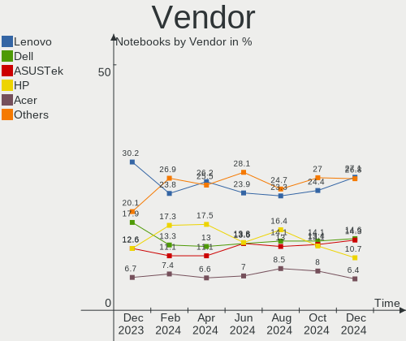
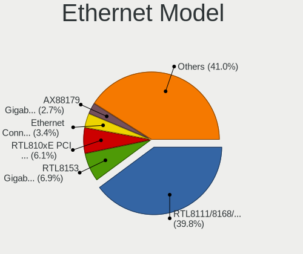

Fedora Hardware Trends (Notebook)
---------------------------------

A project to identify most popular hardware characteristics and track their change
over time based on data collected by Fedora users at https://Linux-Hardware.org.

Anyone can contribute to the study by uploading probes of their computers by
the [hw-probe](https://github.com/linuxhw/hw-probe) tool:

    sudo -E hw-probe -all -upload

Full-feature report is available here: https://linux-hardware.org/?view=trends&formfactor=notebook

Period: May, 2021.

Contents
--------

- [ OS                       ](#os)
- [ OS Family                ](#os-family)
- [ Kernel                   ](#kernel)
- [ Kernel Family            ](#kernel-family)
- [ Kernel Major Ver.        ](#kernel-major-ver)
- [ Arch                     ](#arch)
- [ DE                       ](#de)
- [ Display Server           ](#display-server)
- [ Display Manager          ](#display-manager)
- [ OS Lang                  ](#os-lang)
- [ Boot Mode                ](#boot-mode)
- [ Filesystem               ](#filesystem)
- [ Part. scheme             ](#part-scheme)
- [ Dual Boot with Linux/BSD ](#dual-boot-with-linux/bsd)
- [ Dual Boot (Win)          ](#dual-boot-win)
- [ Country                  ](#country)
- [ City                     ](#city)
- [ Vendor                   ](#vendor)
- [ Model                    ](#model)
- [ Model Family             ](#model-family)
- [ MFG Year                 ](#mfg-year)
- [ Form Factor              ](#form-factor)
- [ Secure Boot              ](#secure-boot)
- [ Coreboot                 ](#coreboot)
- [ RAM Size                 ](#ram-size)
- [ RAM Used                 ](#ram-used)
- [ Has CD-ROM               ](#has-cd-rom)
- [ Total Drives             ](#total-drives)
- [ Has Ethernet             ](#has-ethernet)
- [ Has WiFi                 ](#has-wifi)
- [ Has Bluetooth            ](#has-bluetooth)
- [ Drive Vendor             ](#drive-vendor)
- [ Drive Model              ](#drive-model)
- [ HDD Vendor               ](#hdd-vendor)
- [ SSD Vendor               ](#ssd-vendor)
- [ Drive Kind               ](#drive-kind)
- [ Drive Connector          ](#drive-connector)
- [ Drive Size               ](#drive-size)
- [ Space Total              ](#space-total)
- [ Space Used               ](#space-used)
- [ Malfunc. Drives          ](#malfunc-drives)
- [ Malfunc. Drive Vendor    ](#malfunc-drive-vendor)
- [ Malfunc. HDD Vendor      ](#malfunc-hdd-vendor)
- [ Malfunc. Drive Kind      ](#malfunc-drive-kind)
- [ Failed Drives            ](#failed-drives)
- [ Failed Drive Vendor      ](#failed-drive-vendor)
- [ Drive Status             ](#drive-status)
- [ Storage Vendor           ](#storage-vendor)
- [ Storage Model            ](#storage-model)
- [ Storage Kind             ](#storage-kind)
- [ CPU Vendor               ](#cpu-vendor)
- [ CPU Model                ](#cpu-model)
- [ CPU Model Family         ](#cpu-model-family)
- [ CPU Cores                ](#cpu-cores)
- [ CPU Sockets              ](#cpu-sockets)
- [ CPU Threads              ](#cpu-threads)
- [ CPU Op-Modes             ](#cpu-op-modes)
- [ CPU Microcode            ](#cpu-microcode)
- [ CPU Microarch            ](#cpu-microarch)
- [ GPU Vendor               ](#gpu-vendor)
- [ GPU Model                ](#gpu-model)
- [ GPU Combo                ](#gpu-combo)
- [ GPU Driver               ](#gpu-driver)
- [ GPU Memory               ](#gpu-memory)
- [ Monitor Vendor           ](#monitor-vendor)
- [ Monitor Model            ](#monitor-model)
- [ Monitor Resolution       ](#monitor-resolution)
- [ Monitor Diagonal         ](#monitor-diagonal)
- [ Monitor Width            ](#monitor-width)
- [ Aspect Ratio             ](#aspect-ratio)
- [ Monitor Area             ](#monitor-area)
- [ Pixel Density            ](#pixel-density)
- [ Multiple Monitors        ](#multiple-monitors)
- [ Net Controller Vendor    ](#net-controller-vendor)
- [ Net Controller Model     ](#net-controller-model)
- [ Wireless Vendor          ](#wireless-vendor)
- [ Wireless Model           ](#wireless-model)
- [ Ethernet Vendor          ](#ethernet-vendor)
- [ Ethernet Model           ](#ethernet-model)
- [ Net Controller Kind      ](#net-controller-kind)
- [ Used Controller          ](#used-controller)
- [ NICs                     ](#nics)
- [ IPv6                     ](#ipv6)
- [ Memory Vendor            ](#memory-vendor)
- [ Memory Model             ](#memory-model)
- [ Memory Kind              ](#memory-kind)
- [ Memory Form Factor       ](#memory-form-factor)
- [ Memory Size              ](#memory-size)
- [ Memory Speed             ](#memory-speed)
- [ Sound Vendor             ](#sound-vendor)
- [ Sound Model              ](#sound-model)
- [ Camera Vendor            ](#camera-vendor)
- [ Camera Model             ](#camera-model)
- [ Fingerprint Vendor       ](#fingerprint-vendor)
- [ Fingerprint Model        ](#fingerprint-model)
- [ Chipcard Vendor          ](#chipcard-vendor)
- [ Chipcard Model           ](#chipcard-model)
- [ Printer Vendor           ](#printer-vendor)
- [ Printer Model            ](#printer-model)
- [ Scanner Vendor           ](#scanner-vendor)
- [ Scanner Model            ](#scanner-model)
- [ Bluetooth Vendor         ](#bluetooth-vendor)
- [ Bluetooth Model          ](#bluetooth-model)
- [ Unsupported Devices      ](#unsupported-devices)
- [ Unsupported Device Types ](#unsupported-device-types)

OS
--

Installed operating systems

| Name      | Notebooks | Percent |
|-----------|-----------|---------|
| Fedora 34 | 169       | 81.64%  |
| Fedora 33 | 30        | 14.49%  |
| Fedora 32 | 5         | 2.42%   |
| Fedora 35 | 1         | 0.48%   |
| Fedora 31 | 1         | 0.48%   |
| Fedora 24 | 1         | 0.48%   |

OS Family
---------

OS without a version

| Name   | Notebooks | Percent |
|--------|-----------|---------|
| Fedora | 207       | 100%    |

Kernel
------

Version of the Linux kernel

| Version                                             | Notebooks | Percent |
|-----------------------------------------------------|-----------|---------|
| 5.11.17-300.fc34.x86_64                             | 32        | 15.46%  |
| 5.11.18-300.fc34.x86_64                             | 23        | 11.11%  |
| 5.11.20-300.fc34.x86_64                             | 22        | 10.63%  |
| 5.11.16-300.fc34.x86_64                             | 19        | 9.18%   |
| 5.12.6-300.fc34.x86_64                              | 18        | 8.7%    |
| 5.12.7-300.fc34.x86_64                              | 15        | 7.25%   |
| 5.11.21-300.fc34.x86_64                             | 12        | 5.8%    |
| 5.11.12-300.fc34.x86_64                             | 9         | 4.35%   |
| 5.11.19-300.fc34.x86_64                             | 8         | 3.86%   |
| 5.11.18-200.fc33.x86_64                             | 7         | 3.38%   |
| 5.12.5-300.fc34.x86_64                              | 6         | 2.9%    |
| 5.11.20-200.fc33.x86_64                             | 4         | 1.93%   |
| 5.12.7-200.fc33.x86_64                              | 3         | 1.45%   |
| 5.11.15-300.fc34.x86_64                             | 3         | 1.45%   |
| 5.12.5-200.fc33.x86_64                              | 2         | 0.97%   |
| 5.11.21-200.fc33.x86_64                             | 2         | 0.97%   |
| 5.11.19-200.fc33.x86_64                             | 2         | 0.97%   |
| 5.11.17-200.fc33.x86_64                             | 2         | 0.97%   |
| 5.11.16-200.fc33.x86_64                             | 2         | 0.97%   |
| 5.10.21-200.fc33.x86_64                             | 2         | 0.97%   |
| 5.9.16-100.fc32.x86_64                              | 1         | 0.48%   |
| 5.8.15-301.fc33.x86_64                              | 1         | 0.48%   |
| 5.3.16-300.fc31.x86_64                              | 1         | 0.48%   |
| 5.13.0-0.rc1.20210513gitc06a2ba62fc4.15.fc35.x86_64 | 1         | 0.48%   |
| 5.12.6-200.fc33.x86_64                              | 1         | 0.48%   |
| 5.11.3-300.fc34.x86_64                              | 1         | 0.48%   |
| 5.11.19-300.rog.fc34.x86_64                         | 1         | 0.48%   |
| 5.11.19-100.fc32.x86_64                             | 1         | 0.48%   |
| 5.11.18-100.fc32.x86_64                             | 1         | 0.48%   |
| 5.11.17-100.fc32.x86_64                             | 1         | 0.48%   |
| 5.11.16-100.fc32.x86_64                             | 1         | 0.48%   |
| 5.11.15-200.fc33.x86_64                             | 1         | 0.48%   |
| 5.11.10-200.fc33.x86_64                             | 1         | 0.48%   |
| 4.11.12-100.fc24.x86_64                             | 1         | 0.48%   |

Kernel Family
-------------

Linux kernel without a distro release

| Version | Notebooks | Percent |
|---------|-----------|---------|
| 5.11.17 | 35        | 16.91%  |
| 5.11.18 | 31        | 14.98%  |
| 5.11.20 | 26        | 12.56%  |
| 5.11.16 | 22        | 10.63%  |
| 5.12.6  | 19        | 9.18%   |
| 5.12.7  | 18        | 8.7%    |
| 5.11.21 | 14        | 6.76%   |
| 5.11.19 | 12        | 5.8%    |
| 5.11.12 | 9         | 4.35%   |
| 5.12.5  | 8         | 3.86%   |
| 5.11.15 | 4         | 1.93%   |
| 5.10.21 | 2         | 0.97%   |
| 5.9.16  | 1         | 0.48%   |
| 5.8.15  | 1         | 0.48%   |
| 5.3.16  | 1         | 0.48%   |
| 5.13.0  | 1         | 0.48%   |
| 5.11.3  | 1         | 0.48%   |
| 5.11.10 | 1         | 0.48%   |
| 4.11.12 | 1         | 0.48%   |

Kernel Major Ver.
-----------------

Linux kernel major version

| Version | Notebooks | Percent |
|---------|-----------|---------|
| 5.11    | 155       | 74.88%  |
| 5.12    | 45        | 21.74%  |
| 5.10    | 2         | 0.97%   |
| 5.9     | 1         | 0.48%   |
| 5.8     | 1         | 0.48%   |
| 5.3     | 1         | 0.48%   |
| 5.13    | 1         | 0.48%   |
| 4.11    | 1         | 0.48%   |

Arch
----

OS architecture (x86_64, i586, etc.)

| Name   | Notebooks | Percent |
|--------|-----------|---------|
| x86_64 | 207       | 100%    |

DE
--

Desktop Environment

| Name          | Notebooks | Percent |
|---------------|-----------|---------|
| GNOME         | 163       | 78.74%  |
| XFCE          | 9         | 4.35%   |
| KDE5          | 9         | 4.35%   |
| KDE           | 8         | 3.86%   |
| X-Cinnamon    | 6         | 2.9%    |
| Unknown       | 4         | 1.93%   |
| Cinnamon      | 3         | 1.45%   |
| GNOME Classic | 2         | 0.97%   |
| Pantheon      | 1         | 0.48%   |
| MATE          | 1         | 0.48%   |
| i3            | 1         | 0.48%   |

Display Server
--------------

X11 or Wayland

| Name    | Notebooks | Percent |
|---------|-----------|---------|
| Wayland | 124       | 59.9%   |
| X11     | 76        | 36.71%  |
| Tty     | 4         | 1.93%   |
| Unknown | 3         | 1.45%   |

Display Manager
---------------

SDDM, LightDM, etc.

| Name    | Notebooks | Percent |
|---------|-----------|---------|
| Unknown | 123       | 59.42%  |
| GDM     | 64        | 30.92%  |
| TDM     | 11        | 5.31%   |
| SDDM    | 7         | 3.38%   |
| XDM     | 1         | 0.48%   |
| LightDM | 1         | 0.48%   |

OS Lang
-------

Language

| Lang    | Notebooks | Percent |
|---------|-----------|---------|
| en_US   | 108       | 52.17%  |
| en_GB   | 14        | 6.76%   |
| pt_BR   | 13        | 6.28%   |
| fr_FR   | 8         | 3.86%   |
| de_DE   | 8         | 3.86%   |
| ru_RU   | 7         | 3.38%   |
| en_CA   | 5         | 2.42%   |
| it_IT   | 4         | 1.93%   |
| en_IN   | 4         | 1.93%   |
| en_AU   | 4         | 1.93%   |
| hu_HU   | 3         | 1.45%   |
| es_ES   | 3         | 1.45%   |
| pl_PL   | 2         | 0.97%   |
| es_CO   | 2         | 0.97%   |
| es_CL   | 2         | 0.97%   |
| cs_CZ   | 2         | 0.97%   |
| zh_HK   | 1         | 0.48%   |
| zh_CN   | 1         | 0.48%   |
| tr_TR   | 1         | 0.48%   |
| ru_UA   | 1         | 0.48%   |
| pt_PT   | 1         | 0.48%   |
| nl_BE   | 1         | 0.48%   |
| ko_KR   | 1         | 0.48%   |
| ja_JP   | 1         | 0.48%   |
| fr_CA   | 1         | 0.48%   |
| fr_BE   | 1         | 0.48%   |
| fi_FI   | 1         | 0.48%   |
| en_SG   | 1         | 0.48%   |
| en_NZ   | 1         | 0.48%   |
| en_DK   | 1         | 0.48%   |
| de_CH   | 1         | 0.48%   |
| de_AT   | 1         | 0.48%   |
| ca_ES   | 1         | 0.48%   |
| Unknown | 1         | 0.48%   |

Boot Mode
---------

EFI or BIOS

| Mode | Notebooks | Percent |
|------|-----------|---------|
| EFI  | 168       | 81.16%  |
| BIOS | 39        | 18.84%  |

Filesystem
----------

Type of filesystem

| Type  | Notebooks | Percent |
|-------|-----------|---------|
| Btrfs | 139       | 67.15%  |
| Ext4  | 61        | 29.47%  |
| Xfs   | 7         | 3.38%   |

Part. scheme
------------

Scheme of partitioning

| Type    | Notebooks | Percent |
|---------|-----------|---------|
| Unknown | 125       | 60.39%  |
| GPT     | 67        | 32.37%  |
| MBR     | 15        | 7.25%   |

Dual Boot with Linux/BSD
------------------------

Hosting more than one Linux/BSD

| Dual boot | Notebooks | Percent |
|-----------|-----------|---------|
| No        | 194       | 93.72%  |
| Yes       | 13        | 6.28%   |

Dual Boot (Win)
---------------

Hosting Linux and Windows

| Dual boot | Notebooks | Percent |
|-----------|-----------|---------|
| No        | 173       | 83.57%  |
| Yes       | 34        | 16.43%  |

Country
-------

Geographic location (country)

| Country      | Notebooks | Percent |
|--------------|-----------|---------|
| USA          | 25        | 12.08%  |
| Germany      | 19        | 9.18%   |
| Brazil       | 18        | 8.7%    |
| India        | 11        | 5.31%   |
| France       | 9         | 4.35%   |
| Netherlands  | 7         | 3.38%   |
| Italy        | 7         | 3.38%   |
| Canada       | 7         | 3.38%   |
| Spain        | 6         | 2.9%    |
| Turkey       | 5         | 2.42%   |
| Russia       | 5         | 2.42%   |
| Czechia      | 5         | 2.42%   |
| Switzerland  | 4         | 1.93%   |
| Poland       | 4         | 1.93%   |
| Colombia     | 4         | 1.93%   |
| Australia    | 4         | 1.93%   |
| Ukraine      | 3         | 1.45%   |
| Sweden       | 3         | 1.45%   |
| South Africa | 3         | 1.45%   |
| Hungary      | 3         | 1.45%   |
| Hong Kong    | 3         | 1.45%   |
| China        | 3         | 1.45%   |
| Belgium      | 3         | 1.45%   |
| Argentina    | 3         | 1.45%   |
| UK           | 2         | 0.97%   |
| South Korea  | 2         | 0.97%   |
| Romania      | 2         | 0.97%   |
| Portugal     | 2         | 0.97%   |
| Kyrgyzstan   | 2         | 0.97%   |
| Japan        | 2         | 0.97%   |
| Iran         | 2         | 0.97%   |
| Chile        | 2         | 0.97%   |
| Belarus      | 2         | 0.97%   |
| Uruguay      | 1         | 0.48%   |
| Slovakia     | 1         | 0.48%   |
| Singapore    | 1         | 0.48%   |
| Serbia       | 1         | 0.48%   |
| Saudi Arabia | 1         | 0.48%   |
| Philippines  | 1         | 0.48%   |
| Peru         | 1         | 0.48%   |
| Paraguay     | 1         | 0.48%   |
| Norway       | 1         | 0.48%   |
| New Zealand  | 1         | 0.48%   |
| Montenegro   | 1         | 0.48%   |
| Moldova      | 1         | 0.48%   |
| Mexico       | 1         | 0.48%   |
| Malta        | 1         | 0.48%   |
| Malaysia     | 1         | 0.48%   |
| Lithuania    | 1         | 0.48%   |
| Israel       | 1         | 0.48%   |
| Iceland      | 1         | 0.48%   |
| Greece       | 1         | 0.48%   |
| Finland      | 1         | 0.48%   |
| Estonia      | 1         | 0.48%   |
| Ecuador      | 1         | 0.48%   |
| Cuba         | 1         | 0.48%   |
| Costa Rica   | 1         | 0.48%   |
| Austria      | 1         | 0.48%   |

City
----

Geographic location (city)

| City                  | Notebooks | Percent |
|-----------------------|-----------|---------|
| Prague                | 4         | 1.93%   |
| Greifswald            | 4         | 1.93%   |
| Berlin                | 4         | 1.93%   |
| Moscow                | 3         | 1.45%   |
| Feeding Hills         | 3         | 1.45%   |
| Budapest              | 3         | 1.45%   |
| Zurich                | 2         | 0.97%   |
| Winnipeg              | 2         | 0.97%   |
| Vienna                | 2         | 0.97%   |
| Madrid                | 2         | 0.97%   |
| Kharkiv               | 2         | 0.97%   |
| Karnal                | 2         | 0.97%   |
| Istanbul              | 2         | 0.97%   |
| Curitiba              | 2         | 0.97%   |
| Chipping Norton       | 2         | 0.97%   |
| Bogotá               | 2         | 0.97%   |
| Bishkek               | 2         | 0.97%   |
| Bengaluru             | 2         | 0.97%   |
| Battle Creek          | 2         | 0.97%   |
| Amsterdam             | 2         | 0.97%   |
| Yazd                  | 1         | 0.48%   |
| Yakima                | 1         | 0.48%   |
| Wroclaw               | 1         | 0.48%   |
| Wooster               | 1         | 0.48%   |
| Wellington            | 1         | 0.48%   |
| Warsaw                | 1         | 0.48%   |
| Wanchai               | 1         | 0.48%   |
| Vilnius               | 1         | 0.48%   |
| Trujillo              | 1         | 0.48%   |
| Toronto               | 1         | 0.48%   |
| The Bronx             | 1         | 0.48%   |
| Terre Haute           | 1         | 0.48%   |
| Tehran                | 1         | 0.48%   |
| Tarnów               | 1         | 0.48%   |
| Tallinn               | 1         | 0.48%   |
| São Paulo            | 1         | 0.48%   |
| São João del Rei    | 1         | 0.48%   |
| São José dos Campos | 1         | 0.48%   |
| Szczecin              | 1         | 0.48%   |
| Strasbourg            | 1         | 0.48%   |
| St Louis              | 1         | 0.48%   |
| Somerset West         | 1         | 0.48%   |
| Singapore             | 1         | 0.48%   |
| Shinjuku              | 1         | 0.48%   |
| Shanghai              | 1         | 0.48%   |
| Sertolovo             | 1         | 0.48%   |
| Searcy                | 1         | 0.48%   |
| Schillingsfurst       | 1         | 0.48%   |
| Sao Goncalo           | 1         | 0.48%   |
| Sao Gabriel           | 1         | 0.48%   |
| Santiago de Cali      | 1         | 0.48%   |
| San Miguel            | 1         | 0.48%   |
| Salvador              | 1         | 0.48%   |
| Salisbury             | 1         | 0.48%   |
| Saint-Brieuc          | 1         | 0.48%   |
| Rosario               | 1         | 0.48%   |
| Riyadh                | 1         | 0.48%   |
| Riva del Garda        | 1         | 0.48%   |
| Ratingen              | 1         | 0.48%   |
| Quito                 | 1         | 0.48%   |

Vendor
------

Motherboard manufacturer

| Name                             | Notebooks | Percent |
|----------------------------------|-----------|---------|
| Lenovo                           | 57        | 27.54%  |
| Dell                             | 35        | 16.91%  |
| Hewlett-Packard                  | 29        | 14.01%  |
| ASUSTek Computer                 | 23        | 11.11%  |
| Acer                             | 13        | 6.28%   |
| Apple                            | 8         | 3.86%   |
| MSI                              | 5         | 2.42%   |
| Samsung Electronics              | 4         | 1.93%   |
| HUAWEI                           | 4         | 1.93%   |
| Positivo                         | 3         | 1.45%   |
| Unknown                          | 3         | 1.45%   |
| Toshiba                          | 2         | 0.97%   |
| Timi                             | 2         | 0.97%   |
| Notebook                         | 2         | 0.97%   |
| YIFANG                           | 1         | 0.48%   |
| Wortmann AG                      | 1         | 0.48%   |
| TUXEDO                           | 1         | 0.48%   |
| System76                         | 1         | 0.48%   |
| Sony                             | 1         | 0.48%   |
| SLIMBOOK                         | 1         | 0.48%   |
| Panasonic                        | 1         | 0.48%   |
| ordissimo                        | 1         | 0.48%   |
| NEC Computers                    | 1         | 0.48%   |
| MouseComputer                    | 1         | 0.48%   |
| Login Informatica                | 1         | 0.48%   |
| Hampoo                           | 1         | 0.48%   |
| Gateway                          | 1         | 0.48%   |
| FUJITSU CLIENT COMPUTING LIMITED | 1         | 0.48%   |
| Fujitsu                          | 1         | 0.48%   |
| AZW                              | 1         | 0.48%   |
| A-DATA Technology                | 1         | 0.48%   |

Model
-----

Motherboard model

| Name                                      | Notebooks | Percent |
|-------------------------------------------|-----------|---------|
| Dell Latitude 7490                        | 3         | 1.45%   |
| Unknown                                   | 3         | 1.45%   |
| HP Pavilion dv7                           | 2         | 0.97%   |
| HP Notebook                               | 2         | 0.97%   |
| HP Laptop 17-bs1xx                        | 2         | 0.97%   |
| Dell XPS 15 9550                          | 2         | 0.97%   |
| Dell XPS 15 9500                          | 2         | 0.97%   |
| Dell XPS 13 9310                          | 2         | 0.97%   |
| Dell Latitude 7400                        | 2         | 0.97%   |
| Dell Latitude 5480                        | 2         | 0.97%   |
| Dell Inspiron 3593                        | 2         | 0.97%   |
| ASUS ROG Zephyrus G14 GA401IV_GA401IV     | 2         | 0.97%   |
| Apple MacBookPro11,3                      | 2         | 0.97%   |
| Apple MacBookPro11,1                      | 2         | 0.97%   |
| YIFANG NX16W11264                         | 1         | 0.48%   |
| Wortmann AG 1220692_1470187               | 1         | 0.48%   |
| TUXEDO Pulse 15 Gen1                      | 1         | 0.48%   |
| Toshiba Satellite S55Dt-A                 | 1         | 0.48%   |
| Toshiba Satellite Click Mini L9W-B        | 1         | 0.48%   |
| Timi RedmiBook 16                         | 1         | 0.48%   |
| Timi RedmiBook 14 II                      | 1         | 0.48%   |
| System76 Oryx Pro                         | 1         | 0.48%   |
| Sony VPCS12C5E                            | 1         | 0.48%   |
| SLIMBOOK PROX15-AMD                       | 1         | 0.48%   |
| Samsung R580/R590                         | 1         | 0.48%   |
| Samsung R520/R522/R620                    | 1         | 0.48%   |
| Samsung 700T                              | 1         | 0.48%   |
| Samsung 300E4C/300E5C/300E7C              | 1         | 0.48%   |
| Positivo Q4128C-S                         | 1         | 0.48%   |
| Positivo CHT14B                           | 1         | 0.48%   |
| Positivo C41TB                            | 1         | 0.48%   |
| Panasonic CFSZ5-2L                        | 1         | 0.48%   |
| ordissimo E17201                          | 1         | 0.48%   |
| Notebook P377SM-A                         | 1         | 0.48%   |
| Notebook NH5x_7xDPx                       | 1         | 0.48%   |
| NEC Computers PC-VK25MXZCB                | 1         | 0.48%   |
| MSI PX60 6QE                              | 1         | 0.48%   |
| MSI GF63 Thin 9SC                         | 1         | 0.48%   |
| MSI GE70 2PE                              | 1         | 0.48%   |
| MSI CX61 2PC                              | 1         | 0.48%   |
| MSI Bravo 15 A4DDR                        | 1         | 0.48%   |
| MouseComputer W150ERQ                     | 1         | 0.48%   |
| Login Informatica LOG-QAL30               | 1         | 0.48%   |
| Lenovo Yoga Slim 7 Pro 14ITL5 82FX        | 1         | 0.48%   |
| Lenovo Yoga Slim 7 14ITL05 82A3           | 1         | 0.48%   |
| Lenovo Yoga Slim 7 14ARE05 82A2           | 1         | 0.48%   |
| Lenovo Yoga 2 Pro 20266                   | 1         | 0.48%   |
| Lenovo V130-15IKB 81HN                    | 1         | 0.48%   |
| Lenovo ThinkPad X250 20CLS1B803           | 1         | 0.48%   |
| Lenovo ThinkPad X230 2330A17              | 1         | 0.48%   |
| Lenovo ThinkPad X230 2325BP9              | 1         | 0.48%   |
| Lenovo ThinkPad X1 Nano Gen 1 20UNS02400  | 1         | 0.48%   |
| Lenovo ThinkPad X1 Extreme 2nd 20QVCTO1WW | 1         | 0.48%   |
| Lenovo ThinkPad X1 Carbon 7th 20QD001FZA  | 1         | 0.48%   |
| Lenovo ThinkPad W550s 20E1S0L500          | 1         | 0.48%   |
| Lenovo ThinkPad W530 2447MV3              | 1         | 0.48%   |
| Lenovo ThinkPad T580 20LAS3NJ0R           | 1         | 0.48%   |
| Lenovo ThinkPad T490s 20NYS04V00          | 1         | 0.48%   |
| Lenovo ThinkPad T460s 20FAS0W901          | 1         | 0.48%   |
| Lenovo ThinkPad T460p 20FXS0C400          | 1         | 0.48%   |

Model Family
------------

Motherboard model prefix

| Name                        | Notebooks | Percent |
|-----------------------------|-----------|---------|
| Lenovo ThinkPad             | 34        | 16.43%  |
| Dell Inspiron               | 12        | 5.8%    |
| Lenovo IdeaPad              | 11        | 5.31%   |
| Dell Latitude               | 11        | 5.31%   |
| Dell XPS                    | 9         | 4.35%   |
| Acer Aspire                 | 9         | 4.35%   |
| HP ProBook                  | 6         | 2.9%    |
| HP Laptop                   | 6         | 2.9%    |
| HP Pavilion                 | 5         | 2.42%   |
| HP EliteBook                | 5         | 2.42%   |
| Apple MacBookPro11          | 5         | 2.42%   |
| Lenovo Yoga                 | 4         | 1.93%   |
| ASUS TUF                    | 4         | 1.93%   |
| ASUS ROG                    | 4         | 1.93%   |
| Lenovo ThinkBook            | 3         | 1.45%   |
| ASUS VivoBook               | 3         | 1.45%   |
| Acer Nitro                  | 3         | 1.45%   |
| Unknown                     | 3         | 1.45%   |
| Toshiba Satellite           | 2         | 0.97%   |
| Timi RedmiBook              | 2         | 0.97%   |
| Lenovo Legion               | 2         | 0.97%   |
| HP Notebook                 | 2         | 0.97%   |
| HP ENVY                     | 2         | 0.97%   |
| Dell Precision              | 2         | 0.97%   |
| YIFANG NX16W11264           | 1         | 0.48%   |
| Wortmann AG 1220692         | 1         | 0.48%   |
| TUXEDO Pulse                | 1         | 0.48%   |
| System76 Oryx               | 1         | 0.48%   |
| Sony VPCS12C5E              | 1         | 0.48%   |
| SLIMBOOK PROX15-AMD         | 1         | 0.48%   |
| Samsung R580                | 1         | 0.48%   |
| Samsung R520                | 1         | 0.48%   |
| Samsung 700T                | 1         | 0.48%   |
| Samsung 300E4C              | 1         | 0.48%   |
| Positivo Q4128C-S           | 1         | 0.48%   |
| Positivo CHT14B             | 1         | 0.48%   |
| Positivo C41TB              | 1         | 0.48%   |
| Panasonic CFSZ5-2L          | 1         | 0.48%   |
| ordissimo E17201            | 1         | 0.48%   |
| Notebook P377SM-A           | 1         | 0.48%   |
| Notebook NH5x               | 1         | 0.48%   |
| NEC Computers PC-VK25MXZCB  | 1         | 0.48%   |
| MSI PX60                    | 1         | 0.48%   |
| MSI GF63                    | 1         | 0.48%   |
| MSI GE70                    | 1         | 0.48%   |
| MSI CX61                    | 1         | 0.48%   |
| MSI Bravo                   | 1         | 0.48%   |
| MouseComputer W150ERQ       | 1         | 0.48%   |
| Login Informatica LOG-QAL30 | 1         | 0.48%   |
| Lenovo V130-15IKB           | 1         | 0.48%   |
| Lenovo G510                 | 1         | 0.48%   |
| Lenovo G40-70               | 1         | 0.48%   |
| HUAWEI MACH-WX9             | 1         | 0.48%   |
| HUAWEI KPR-WX9              | 1         | 0.48%   |
| HUAWEI EUL-WX9              | 1         | 0.48%   |
| HUAWEI BOHK-WAX9X           | 1         | 0.48%   |
| HP ZBook                    | 1         | 0.48%   |
| HP G42                      | 1         | 0.48%   |
| HP 240                      | 1         | 0.48%   |
| Hampoo D2D3                 | 1         | 0.48%   |

MFG Year
--------

Motherboard manufacture year

| Year | Notebooks | Percent |
|------|-----------|---------|
| 2020 | 60        | 28.99%  |
| 2019 | 36        | 17.39%  |
| 2021 | 30        | 14.49%  |
| 2018 | 18        | 8.7%    |
| 2015 | 10        | 4.83%   |
| 2017 | 8         | 3.86%   |
| 2016 | 8         | 3.86%   |
| 2014 | 8         | 3.86%   |
| 2013 | 7         | 3.38%   |
| 2012 | 7         | 3.38%   |
| 2010 | 7         | 3.38%   |
| 2011 | 6         | 2.9%    |
| 2009 | 2         | 0.97%   |

Form Factor
-----------

Physical design of the computer

| Name     | Notebooks | Percent |
|----------|-----------|---------|
| Notebook | 207       | 100%    |

Secure Boot
-----------

Enabled or disabled

| State    | Notebooks | Percent |
|----------|-----------|---------|
| Disabled | 166       | 80.19%  |
| Enabled  | 41        | 19.81%  |

Coreboot
--------

Have coreboot on board

| Used | Notebooks | Percent |
|------|-----------|---------|
| No   | 207       | 100%    |

RAM Size
--------

Total RAM memory

| Size in GB  | Notebooks | Percent |
|-------------|-----------|---------|
| 4.01-8.0    | 64        | 30.92%  |
| 16.01-24.0  | 56        | 27.05%  |
| 8.01-16.0   | 30        | 14.49%  |
| 32.01-64.0  | 23        | 11.11%  |
| 3.01-4.0    | 21        | 10.14%  |
| 1.01-2.0    | 5         | 2.42%   |
| 24.01-32.0  | 4         | 1.93%   |
| 64.01-256.0 | 4         | 1.93%   |

RAM Used
--------

Used RAM memory

| Used GB    | Notebooks | Percent |
|------------|-----------|---------|
| 2.01-3.0   | 58        | 28.02%  |
| 3.01-4.0   | 52        | 25.12%  |
| 4.01-8.0   | 43        | 20.77%  |
| 1.01-2.0   | 37        | 17.87%  |
| 8.01-16.0  | 14        | 6.76%   |
| 0.51-1.0   | 2         | 0.97%   |
| 16.01-24.0 | 1         | 0.48%   |

Has CD-ROM
----------

Has CD-ROM on board

| Presented | Notebooks | Percent |
|-----------|-----------|---------|
| No        | 160       | 77.29%  |
| Yes       | 47        | 22.71%  |

Total Drives
------------

Number of drives on board

| Drives | Notebooks | Percent |
|--------|-----------|---------|
| 1      | 130       | 62.8%   |
| 2      | 68        | 32.85%  |
| 3      | 6         | 2.9%    |
| 5      | 1         | 0.48%   |
| 4      | 1         | 0.48%   |
| 0      | 1         | 0.48%   |

Has Ethernet
------------

Has Ethernet on board

| Presented | Notebooks | Percent |
|-----------|-----------|---------|
| Yes       | 157       | 75.85%  |
| No        | 50        | 24.15%  |

Has WiFi
--------

Has WiFi module

| Presented | Notebooks | Percent |
|-----------|-----------|---------|
| Yes       | 199       | 96.14%  |
| No        | 8         | 3.86%   |

Has Bluetooth
-------------

Has Bluetooth module

| Presented | Notebooks | Percent |
|-----------|-----------|---------|
| Yes       | 171       | 82.61%  |
| No        | 36        | 17.39%  |

Drive Vendor
------------

Hard drive vendors

| Vendor                    | Notebooks | Drives | Percent |
|---------------------------|-----------|--------|---------|
| Samsung Electronics       | 61        | 71     | 22.02%  |
| WDC                       | 29        | 31     | 10.47%  |
| Sandisk                   | 25        | 25     | 9.03%   |
| Seagate                   | 24        | 25     | 8.66%   |
| Unknown                   | 23        | 26     | 8.3%    |
| Toshiba                   | 19        | 19     | 6.86%   |
| Intel                     | 15        | 17     | 5.42%   |
| Kingston                  | 12        | 12     | 4.33%   |
| SK Hynix                  | 11        | 14     | 3.97%   |
| HGST                      | 6         | 6      | 2.17%   |
| Apple                     | 6         | 7      | 2.17%   |
| Silicon Motion            | 5         | 6      | 1.81%   |
| Micron Technology         | 5         | 5      | 1.81%   |
| Crucial                   | 5         | 6      | 1.81%   |
| A-DATA Technology         | 4         | 5      | 1.44%   |
| Realtek Semiconductor     | 3         | 3      | 1.08%   |
| KIOXIA                    | 2         | 2      | 0.72%   |
| KingFast                  | 2         | 2      | 0.72%   |
| XPG                       | 1         | 1      | 0.36%   |
| Union Memory              | 1         | 1      | 0.36%   |
| Transcend                 | 1         | 1      | 0.36%   |
| TCSUNBOW                  | 1         | 1      | 0.36%   |
| Tanbassh                  | 1         | 1      | 0.36%   |
| SPCC                      | 1         | 1      | 0.36%   |
| Solid State Storage       | 1         | 1      | 0.36%   |
| Phison                    | 1         | 1      | 0.36%   |
| Mushkin                   | 1         | 1      | 0.36%   |
| Micron/Crucial Technology | 1         | 1      | 0.36%   |
| Maxtor                    | 1         | 1      | 0.36%   |
| Lite-On                   | 1         | 1      | 0.36%   |
| KingSpec                  | 1         | 1      | 0.36%   |
| Intenso                   | 1         | 1      | 0.36%   |
| Hitachi                   | 1         | 1      | 0.36%   |
| Gigabyte Technology       | 1         | 1      | 0.36%   |
| Fujitsu                   | 1         | 1      | 0.36%   |
| Corsair                   | 1         | 1      | 0.36%   |
| China                     | 1         | 1      | 0.36%   |
| Biwin                     | 1         | 1      | 0.36%   |

Drive Model
-----------

Hard drive models

| Model                                | Notebooks | Percent |
|--------------------------------------|-----------|---------|
| Samsung NVMe SSD Drive 512GB         | 12        | 4.05%   |
| Sandisk NVMe SSD Drive 512GB         | 6         | 2.03%   |
| Samsung SSD 860 EVO 500GB            | 6         | 2.03%   |
| Seagate ST1000LM035-1RK172 1TB       | 5         | 1.69%   |
| Unknown SD/MMC/MS PRO 8GB            | 4         | 1.35%   |
| Toshiba MQ01ABD100 1TB               | 4         | 1.35%   |
| SK Hynix NVMe SSD Drive 512GB        | 4         | 1.35%   |
| Seagate ST1000LM024 HN-M101MBB 1TB   | 4         | 1.35%   |
| Intel NVMe SSD Drive 512GB           | 4         | 1.35%   |
| Unknown MMC Card  32GB               | 3         | 1.01%   |
| Unknown MMC Card  128GB              | 3         | 1.01%   |
| SanDisk SDSSDA240G 240GB             | 3         | 1.01%   |
| Sandisk NVMe SSD Drive 256GB         | 3         | 1.01%   |
| Sandisk NVMe SSD Drive 1024GB        | 3         | 1.01%   |
| Samsung SSD 970 EVO Plus 2TB         | 3         | 1.01%   |
| Samsung NVMe SSD Drive 1TB           | 3         | 1.01%   |
| Apple SSD SM0512F 500GB              | 3         | 1.01%   |
| WDC WDS240G2G0B-00EPW0 240GB SSD     | 2         | 0.68%   |
| WDC WD5000BPKT-08PK4T0 500GB         | 2         | 0.68%   |
| WDC WD20SPZX-22UA7T0 2TB             | 2         | 0.68%   |
| WDC WD10JPVX-22JC3T0 1TB             | 2         | 0.68%   |
| Toshiba MQ04ABF100 1TB               | 2         | 0.68%   |
| SK Hynix SC311 SATA 512GB SSD        | 2         | 0.68%   |
| SK Hynix PC601 NVMe 512GB            | 2         | 0.68%   |
| Silicon Motion NVMe SSD Drive 256GB  | 2         | 0.68%   |
| Seagate ST500LM021-1KJ152 500GB      | 2         | 0.68%   |
| Samsung SSD 970 EVO 1TB              | 2         | 0.68%   |
| Samsung SSD 860 EVO 2TB              | 2         | 0.68%   |
| Samsung SSD 860 EVO 250GB            | 2         | 0.68%   |
| Samsung SSD 850 PRO 1TB              | 2         | 0.68%   |
| Samsung NVMe SSD Drive 1024GB        | 2         | 0.68%   |
| Samsung MZVLB512HAJQ-00000 512GB     | 2         | 0.68%   |
| Samsung MZNLN128HAHQ-000H1 128GB SSD | 2         | 0.68%   |
| Samsung MZNLH512HALU-00000 512GB SSD | 2         | 0.68%   |
| Samsung MZALQ512HALU-000L2 512GB     | 2         | 0.68%   |
| Samsung MZ7LN256HCHP-000L7 256GB SSD | 2         | 0.68%   |
| Kingston SA400S37480G 480GB SSD      | 2         | 0.68%   |
| Kingston SA400S37240G 240GB SSD      | 2         | 0.68%   |
| HGST HTS725050A7E630 500GB           | 2         | 0.68%   |
| HGST HTS721010A9E630 1TB             | 2         | 0.68%   |
| HGST HTS541010A9E680 1TB             | 2         | 0.68%   |
| Crucial CT500MX500SSD1 500GB         | 2         | 0.68%   |
| A-DATA SX8200PNP 1TB                 | 2         | 0.68%   |
| XPG NVMe SSD Drive 1024GB            | 1         | 0.34%   |
| WDC WDS500G3X0C-00SJG0 500GB         | 1         | 0.34%   |
| WDC WDS500G2B0C-00PXH0 500GB         | 1         | 0.34%   |
| WDC WDS500G2B0B-00YS70 500GB SSD     | 1         | 0.34%   |
| WDC WDS500G2B0A-00SM50 500GB SSD     | 1         | 0.34%   |
| WDC WDS500G2B0A 500GB SSD            | 1         | 0.34%   |
| WDC WDS240G2G0A-00JH30 240GB SSD     | 1         | 0.34%   |
| WDC WD5000LPCX-35VHAT0 500GB         | 1         | 0.34%   |
| WDC WD3200BEKT-60PVMT0 320GB         | 1         | 0.34%   |
| WDC WD3200BEKT-60F3T1 320GB          | 1         | 0.34%   |
| WDC WD2500BEKT-75PVMT0 250GB         | 1         | 0.34%   |
| WDC WD10SPZX-24Z10T0 1TB             | 1         | 0.34%   |
| WDC WD10SPZX-24Z10 1TB               | 1         | 0.34%   |
| WDC WD10SPZX-22Z10T1 1TB             | 1         | 0.34%   |
| WDC WD10SPZX-21Z10T0 1TB             | 1         | 0.34%   |
| WDC WD10SPZX-00Z10T0 1TB             | 1         | 0.34%   |
| WDC WD10JPVT-00A1YT0 1TB             | 1         | 0.34%   |

HDD Vendor
----------

Hard disk drive vendors

| Vendor  | Notebooks | Drives | Percent |
|---------|-----------|--------|---------|
| Seagate | 24        | 25     | 39.34%  |
| WDC     | 17        | 18     | 27.87%  |
| Toshiba | 12        | 12     | 19.67%  |
| HGST    | 6         | 6      | 9.84%   |
| Hitachi | 1         | 1      | 1.64%   |
| Fujitsu | 1         | 1      | 1.64%   |

SSD Vendor
----------

Solid state drive vendors

| Vendor              | Notebooks | Drives | Percent |
|---------------------|-----------|--------|---------|
| Samsung Electronics | 30        | 34     | 31.58%  |
| SanDisk             | 13        | 13     | 13.68%  |
| Kingston            | 10        | 10     | 10.53%  |
| Intel               | 7         | 7      | 7.37%   |
| WDC                 | 6         | 6      | 6.32%   |
| Crucial             | 5         | 6      | 5.26%   |
| Apple               | 5         | 5      | 5.26%   |
| Toshiba             | 4         | 4      | 4.21%   |
| SK Hynix            | 3         | 3      | 3.16%   |
| Micron Technology   | 2         | 2      | 2.11%   |
| Unknown             | 1         | 1      | 1.05%   |
| Transcend           | 1         | 1      | 1.05%   |
| TCSUNBOW            | 1         | 1      | 1.05%   |
| SPCC                | 1         | 1      | 1.05%   |
| Mushkin             | 1         | 1      | 1.05%   |
| Maxtor              | 1         | 1      | 1.05%   |
| Intenso             | 1         | 1      | 1.05%   |
| Corsair             | 1         | 1      | 1.05%   |
| China               | 1         | 1      | 1.05%   |
| A-DATA Technology   | 1         | 1      | 1.05%   |

Drive Kind
----------

HDD or SSD

| Kind    | Notebooks | Drives | Percent |
|---------|-----------|--------|---------|
| NVMe    | 90        | 111    | 34.22%  |
| SSD     | 88        | 100    | 33.46%  |
| HDD     | 60        | 63     | 22.81%  |
| MMC     | 17        | 20     | 6.46%   |
| Unknown | 8         | 8      | 3.04%   |

Drive Connector
---------------

SATA, SAS, NVMe, etc.

| Type | Notebooks | Drives | Percent |
|------|-----------|--------|---------|
| SATA | 131       | 165    | 53.91%  |
| NVMe | 90        | 111    | 37.04%  |
| MMC  | 17        | 20     | 7%      |
| SAS  | 5         | 6      | 2.06%   |

Drive Size
----------

Size of hard drive

| Size in TB | Notebooks | Drives | Percent |
|------------|-----------|--------|---------|
| 0.01-0.5   | 85        | 98     | 58.62%  |
| 0.51-1.0   | 48        | 51     | 33.1%   |
| 1.01-2.0   | 12        | 14     | 8.28%   |

Space Total
-----------

Amount of disk space available on the file system

| Size in GB     | Notebooks | Percent |
|----------------|-----------|---------|
| 501-1000       | 50        | 24.15%  |
| 251-500        | 47        | 22.71%  |
| 101-250        | 33        | 15.94%  |
| 1001-2000      | 20        | 9.66%   |
| Unknown        | 19        | 9.18%   |
| 1-20           | 16        | 7.73%   |
| 51-100         | 12        | 5.8%    |
| 21-50          | 5         | 2.42%   |
| 2001-3000      | 3         | 1.45%   |
| More than 3000 | 2         | 0.97%   |

Space Used
----------

Amount of used disk space

| Used GB   | Notebooks | Percent |
|-----------|-----------|---------|
| 1-20      | 55        | 26.57%  |
| 101-250   | 40        | 19.32%  |
| 21-50     | 33        | 15.94%  |
| 251-500   | 26        | 12.56%  |
| 51-100    | 26        | 12.56%  |
| Unknown   | 19        | 9.18%   |
| 1001-2000 | 4         | 1.93%   |
| 501-1000  | 4         | 1.93%   |

Malfunc. Drives
---------------

Drive models with a malfunction

| Model                                          | Notebooks | Drives | Percent |
|------------------------------------------------|-----------|--------|---------|
| Seagate ST500LM021-1KJ152 500GB                | 1         | 1      | 14.29%  |
| Samsung Electronics SSD 860 EVO 250GB          | 1         | 1      | 14.29%  |
| Micron Technology 1100_MTFDDAV256TBN 256GB SSD | 1         | 1      | 14.29%  |
| Hitachi HTS547575A9E384 752GB                  | 1         | 1      | 14.29%  |
| Fujitsu MHY2120BH 120GB                        | 1         | 1      | 14.29%  |
| Crucial CT1050MX300SSD1 1TB                    | 1         | 1      | 14.29%  |
| A-DATA Technology SX6000NP 128GB               | 1         | 1      | 14.29%  |

Malfunc. Drive Vendor
---------------------

Vendors of faulty drives

| Vendor              | Notebooks | Drives | Percent |
|---------------------|-----------|--------|---------|
| Seagate             | 1         | 1      | 14.29%  |
| Samsung Electronics | 1         | 1      | 14.29%  |
| Micron Technology   | 1         | 1      | 14.29%  |
| Hitachi             | 1         | 1      | 14.29%  |
| Fujitsu             | 1         | 1      | 14.29%  |
| Crucial             | 1         | 1      | 14.29%  |
| A-DATA Technology   | 1         | 1      | 14.29%  |

Malfunc. HDD Vendor
-------------------

Vendors of faulty HDD drives

| Vendor  | Notebooks | Drives | Percent |
|---------|-----------|--------|---------|
| Seagate | 1         | 1      | 33.33%  |
| Hitachi | 1         | 1      | 33.33%  |
| Fujitsu | 1         | 1      | 33.33%  |

Malfunc. Drive Kind
-------------------

Kinds of faulty drives

| Kind | Notebooks | Drives | Percent |
|------|-----------|--------|---------|
| SSD  | 3         | 3      | 42.86%  |
| HDD  | 3         | 3      | 42.86%  |
| NVMe | 1         | 1      | 14.29%  |

Failed Drives
-------------

Failed drive models

Zero info for selected period =(

Failed Drive Vendor
-------------------

Failed drive vendors

Zero info for selected period =(

Drive Status
------------

Number of failed and malfunc. drives

| Status   | Notebooks | Drives | Percent |
|----------|-----------|--------|---------|
| Detected | 140       | 194    | 61.4%   |
| Works    | 81        | 101    | 35.53%  |
| Malfunc  | 7         | 7      | 3.07%   |

Storage Vendor
--------------

Storage controller vendors

| Vendor                         | Notebooks | Percent |
|--------------------------------|-----------|---------|
| Intel                          | 128       | 50.59%  |
| Samsung Electronics            | 39        | 15.42%  |
| AMD                            | 31        | 12.25%  |
| Sandisk                        | 19        | 7.51%   |
| SK Hynix                       | 8         | 3.16%   |
| Silicon Motion                 | 4         | 1.58%   |
| Toshiba America Info Systems   | 3         | 1.19%   |
| Realtek Semiconductor          | 3         | 1.19%   |
| Micron Technology              | 3         | 1.19%   |
| Phison Electronics             | 2         | 0.79%   |
| KIOXIA                         | 2         | 0.79%   |
| Kingston Technology Company    | 2         | 0.79%   |
| ADATA Technology               | 2         | 0.79%   |
| Union Memory (Shenzhen)        | 1         | 0.4%    |
| Solid State Storage Technology | 1         | 0.4%    |
| Shenzhen Longsys Electronics   | 1         | 0.4%    |
| Nvidia                         | 1         | 0.4%    |
| Micron/Crucial Technology      | 1         | 0.4%    |
| Lite-On Technology             | 1         | 0.4%    |
| Apple                          | 1         | 0.4%    |

Storage Model
-------------

Storage controller models

| Model                                                                            | Notebooks | Percent |
|----------------------------------------------------------------------------------|-----------|---------|
| AMD FCH SATA Controller [AHCI mode]                                              | 29        | 11.03%  |
| Samsung NVMe SSD Controller SM981/PM981/PM983                                    | 23        | 8.75%   |
| Intel Sunrise Point-LP SATA Controller [AHCI mode]                               | 22        | 8.37%   |
| Intel Wildcat Point-LP SATA Controller [AHCI Mode]                               | 12        | 4.56%   |
| Intel 82801 Mobile SATA Controller [RAID mode]                                   | 12        | 4.56%   |
| Intel 7 Series Chipset Family 6-port SATA Controller [AHCI mode]                 | 12        | 4.56%   |
| Intel 6 Series/C200 Series Chipset Family 6 port Mobile SATA AHCI Controller     | 10        | 3.8%    |
| Intel Cannon Lake Mobile PCH SATA AHCI Controller                                | 9         | 3.42%   |
| Samsung NVMe Controller                                                          | 8         | 3.04%   |
| Intel 8 Series/C220 Series Chipset Family 6-port SATA Controller 1 [AHCI mode]   | 7         | 2.66%   |
| Sandisk WD Blue SN550 NVMe SSD                                                   | 6         | 2.28%   |
| Sandisk WD Black SN750 / PC SN730 NVMe SSD                                       | 5         | 1.9%    |
| Intel HM170/QM170 Chipset SATA Controller [AHCI Mode]                            | 5         | 1.9%    |
| Samsung Apple PCIe SSD                                                           | 4         | 1.52%   |
| Intel Volume Management Device NVMe RAID Controller                              | 4         | 1.52%   |
| Intel SSD 660P Series                                                            | 4         | 1.52%   |
| Intel Ice Lake-LP SATA Controller [AHCI mode]                                    | 4         | 1.52%   |
| Intel Celeron/Pentium Silver Processor SATA Controller                           | 4         | 1.52%   |
| Intel Cannon Point-LP SATA Controller [AHCI Mode]                                | 4         | 1.52%   |
| SK Hynix Non-Volatile memory controller                                          | 3         | 1.14%   |
| Silicon Motion SM2263EN/SM2263XT SSD Controller                                  | 3         | 1.14%   |
| Sandisk Non-Volatile memory controller                                           | 3         | 1.14%   |
| Realtek Realtek Non-Volatile memory controller                                   | 3         | 1.14%   |
| Micron Non-Volatile memory controller                                            | 3         | 1.14%   |
| Intel 82801IBM/IEM (ICH9M/ICH9M-E) 4 port SATA Controller [AHCI mode]            | 3         | 1.14%   |
| Intel 8 Series SATA Controller 1 [AHCI mode]                                     | 3         | 1.14%   |
| Intel 5 Series/3400 Series Chipset 4 port SATA AHCI Controller                   | 3         | 1.14%   |
| SK Hynix BC511                                                                   | 2         | 0.76%   |
| SK Hynix BC501 NVMe Solid State Drive 512GB                                      | 2         | 0.76%   |
| Sandisk WD Blue SN500 / PC SN520 NVMe SSD                                        | 2         | 0.76%   |
| Sandisk WD Black 2018/SN750 / PC SN720 NVMe SSD                                  | 2         | 0.76%   |
| Samsung NVMe SSD Controller SM951/PM951                                          | 2         | 0.76%   |
| KIOXIA Non-Volatile memory controller                                            | 2         | 0.76%   |
| Intel Tiger Lake-LP SATA Controller [AHCI mode]                                  | 2         | 0.76%   |
| Intel SSD Pro 7600p/760p/E 6100p Series                                          | 2         | 0.76%   |
| Intel Comet Lake SATA AHCI Controller                                            | 2         | 0.76%   |
| Intel Atom/Celeron/Pentium Processor x5-E8000/J3xxx/N3xxx Series SATA Controller | 2         | 0.76%   |
| Intel 5 Series/3400 Series Chipset 6 port SATA AHCI Controller                   | 2         | 0.76%   |
| Intel 5 Series/3400 Series Chipset 4 port SATA IDE Controller                    | 2         | 0.76%   |
| Intel 400 Series Chipset Family SATA AHCI Controller                             | 2         | 0.76%   |
| AMD SB7x0/SB8x0/SB9x0 SATA Controller [AHCI mode]                                | 2         | 0.76%   |
| ADATA XPG SX8200 Pro PCIe Gen3x4 M.2 2280 Solid State Drive                      | 2         | 0.76%   |
| Union Memory (Shenzhen) Non-Volatile memory controller                           | 1         | 0.38%   |
| Toshiba America Info Systems XG6 NVMe SSD Controller                             | 1         | 0.38%   |
| Toshiba America Info Systems NVMe Controller                                     | 1         | 0.38%   |
| Toshiba America Info Systems BG3 NVMe SSD Controller                             | 1         | 0.38%   |
| Solid State Storage Non-Volatile memory controller                               | 1         | 0.38%   |
| SK Hynix NVMe SSD Controller                                                     | 1         | 0.38%   |
| Silicon Motion SM2262/SM2262EN SSD Controller                                    | 1         | 0.38%   |
| Shenzhen Longsys Non-Volatile memory controller                                  | 1         | 0.38%   |
| Sandisk PC SN520 NVMe SSD                                                        | 1         | 0.38%   |
| Samsung NVMe SSD Controller PM9A1/PM9A3/980PRO                                   | 1         | 0.38%   |
| Samsung Electronics SATA controller                                              | 1         | 0.38%   |
| Phison PS5013 E13 NVMe Controller                                                | 1         | 0.38%   |
| Phison E12 NVMe Controller                                                       | 1         | 0.38%   |
| Nvidia MCP89 SATA Controller (AHCI mode)                                         | 1         | 0.38%   |
| Micron/Crucial P1 NVMe PCIe SSD                                                  | 1         | 0.38%   |
| Lite-On NVMe Controller                                                          | 1         | 0.38%   |
| Kingston Company U-SNS8154P3 NVMe SSD                                            | 1         | 0.38%   |
| Kingston Company Company Non-Volatile memory controller                          | 1         | 0.38%   |

Storage Kind
------------

Kind of storage controller (IDE, SATA, NVMe, SAS, ...)

| Kind | Notebooks | Percent |
|------|-----------|---------|
| SATA | 146       | 57.48%  |
| NVMe | 89        | 35.04%  |
| RAID | 16        | 6.3%    |
| IDE  | 3         | 1.18%   |

CPU Vendor
----------

Processor vendors

| Vendor | Notebooks | Percent |
|--------|-----------|---------|
| Intel  | 166       | 80.19%  |
| AMD    | 41        | 19.81%  |

CPU Model
---------

Processor models

| Model                                         | Notebooks | Percent |
|-----------------------------------------------|-----------|---------|
| Intel Core i5-8250U CPU @ 1.60GHz             | 10        | 4.83%   |
| Intel Core i7-9750H CPU @ 2.60GHz             | 5         | 2.42%   |
| Intel Core i7-8565U CPU @ 1.80GHz             | 5         | 2.42%   |
| Intel Core i7-10510U CPU @ 1.80GHz            | 5         | 2.42%   |
| AMD Ryzen 7 4800H with Radeon Graphics        | 5         | 2.42%   |
| Intel Core i7-6700HQ CPU @ 2.60GHz            | 4         | 1.93%   |
| Intel Core i7-5500U CPU @ 2.40GHz             | 4         | 1.93%   |
| Intel Core i5-7200U CPU @ 2.50GHz             | 4         | 1.93%   |
| Intel Core i5-1035G1 CPU @ 1.00GHz            | 4         | 1.93%   |
| Intel 11th Gen Core i7-1165G7 @ 2.80GHz       | 4         | 1.93%   |
| AMD Ryzen 5 3500U with Radeon Vega Mobile Gfx | 4         | 1.93%   |
| Intel Core i7-8750H CPU @ 2.20GHz             | 3         | 1.45%   |
| Intel Core i7-6500U CPU @ 2.50GHz             | 3         | 1.45%   |
| Intel Core i7-10750H CPU @ 2.60GHz            | 3         | 1.45%   |
| Intel Core i5-8265U CPU @ 1.60GHz             | 3         | 1.45%   |
| Intel Core i5-5300U CPU @ 2.30GHz             | 3         | 1.45%   |
| Intel Core i5-5200U CPU @ 2.20GHz             | 3         | 1.45%   |
| Intel Core i5-4200U CPU @ 1.60GHz             | 3         | 1.45%   |
| Intel Core i5-3320M CPU @ 2.60GHz             | 3         | 1.45%   |
| Intel Core i5-2520M CPU @ 2.50GHz             | 3         | 1.45%   |
| Intel Core i5-10210U CPU @ 1.60GHz            | 3         | 1.45%   |
| Intel Atom x5-Z8350 CPU @ 1.44GHz             | 3         | 1.45%   |
| Intel 11th Gen Core i5-1135G7 @ 2.40GHz       | 3         | 1.45%   |
| AMD Ryzen 7 3700U with Radeon Vega Mobile Gfx | 3         | 1.45%   |
| AMD Ryzen 5 2500U with Radeon Vega Mobile Gfx | 3         | 1.45%   |
| Intel Core i9-9880H CPU @ 2.30GHz             | 2         | 0.97%   |
| Intel Core i7-8665U CPU @ 1.90GHz             | 2         | 0.97%   |
| Intel Core i7-8650U CPU @ 1.90GHz             | 2         | 0.97%   |
| Intel Core i7-8550U CPU @ 1.80GHz             | 2         | 0.97%   |
| Intel Core i7-7700HQ CPU @ 2.80GHz            | 2         | 0.97%   |
| Intel Core i7-4710HQ CPU @ 2.50GHz            | 2         | 0.97%   |
| Intel Core i7-2670QM CPU @ 2.20GHz            | 2         | 0.97%   |
| Intel Core i7-1065G7 CPU @ 1.30GHz            | 2         | 0.97%   |
| Intel Core i5-4300M CPU @ 2.60GHz             | 2         | 0.97%   |
| Intel Core i5-2410M CPU @ 2.30GHz             | 2         | 0.97%   |
| Intel Core i5 CPU M 460 @ 2.53GHz             | 2         | 0.97%   |
| Intel Celeron N4000 CPU @ 1.10GHz             | 2         | 0.97%   |
| Intel Atom x5-Z8300 CPU @ 1.44GHz             | 2         | 0.97%   |
| Intel 11th Gen Core i7-1185G7 @ 3.00GHz       | 2         | 0.97%   |
| AMD Ryzen 9 4900HS with Radeon Graphics       | 2         | 0.97%   |
| AMD Ryzen 7 3750H with Radeon Vega Mobile Gfx | 2         | 0.97%   |
| AMD Ryzen 5 4500U with Radeon Graphics        | 2         | 0.97%   |
| AMD Ryzen 5 3550H with Radeon Vega Mobile Gfx | 2         | 0.97%   |
| Intel Xeon E-2276M CPU @ 2.80GHz              | 1         | 0.48%   |
| Intel Pentium Silver N5000 CPU @ 1.10GHz      | 1         | 0.48%   |
| Intel Pentium Dual CPU T3400 @ 2.16GHz        | 1         | 0.48%   |
| Intel Pentium CPU N3710 @ 1.60GHz             | 1         | 0.48%   |
| Intel Pentium CPU N3700 @ 1.60GHz             | 1         | 0.48%   |
| Intel Pentium CPU B960 @ 2.20GHz              | 1         | 0.48%   |
| Intel Core m3-8100Y CPU @ 1.10GHz             | 1         | 0.48%   |
| Intel Core i7-7600U CPU @ 2.80GHz             | 1         | 0.48%   |
| Intel Core i7-6600U CPU @ 2.60GHz             | 1         | 0.48%   |
| Intel Core i7-5600U CPU @ 2.60GHz             | 1         | 0.48%   |
| Intel Core i7-4980HQ CPU @ 2.80GHz            | 1         | 0.48%   |
| Intel Core i7-4910MQ CPU @ 2.90GHz            | 1         | 0.48%   |
| Intel Core i7-4870HQ CPU @ 2.50GHz            | 1         | 0.48%   |
| Intel Core i7-4850HQ CPU @ 2.30GHz            | 1         | 0.48%   |
| Intel Core i7-4712MQ CPU @ 2.30GHz            | 1         | 0.48%   |
| Intel Core i7-4700MQ CPU @ 2.40GHz            | 1         | 0.48%   |
| Intel Core i7-4510U CPU @ 2.00GHz             | 1         | 0.48%   |

CPU Model Family
----------------

Processor model prefix

| Model                | Notebooks | Percent |
|----------------------|-----------|---------|
| Intel Core i7        | 64        | 30.92%  |
| Intel Core i5        | 60        | 28.99%  |
| AMD Ryzen 7          | 14        | 6.76%   |
| AMD Ryzen 5          | 13        | 6.28%   |
| Other                | 11        | 5.31%   |
| Intel Core i3        | 10        | 4.83%   |
| Intel Atom           | 6         | 2.9%    |
| Intel Pentium        | 3         | 1.45%   |
| Intel Core 2 Duo     | 3         | 1.45%   |
| Intel Celeron        | 3         | 1.45%   |
| Intel Core i9        | 2         | 0.97%   |
| AMD Ryzen 9          | 2         | 0.97%   |
| Intel Xeon           | 1         | 0.48%   |
| Intel Pentium Silver | 1         | 0.48%   |
| Intel Pentium Dual   | 1         | 0.48%   |
| Intel Core m3        | 1         | 0.48%   |
| AMD Turion II        | 1         | 0.48%   |
| AMD Ryzen 7 PRO      | 1         | 0.48%   |
| AMD Ryzen 5 PRO      | 1         | 0.48%   |
| AMD Ryzen 3          | 1         | 0.48%   |
| AMD PRO A10          | 1         | 0.48%   |
| AMD E2               | 1         | 0.48%   |
| AMD Athlon II        | 1         | 0.48%   |
| AMD A8               | 1         | 0.48%   |
| AMD A6               | 1         | 0.48%   |
| AMD A4               | 1         | 0.48%   |
| AMD A12              | 1         | 0.48%   |
| AMD A10              | 1         | 0.48%   |

CPU Cores
---------

Number of processor cores

| Number | Notebooks | Percent |
|--------|-----------|---------|
| 4      | 101       | 48.79%  |
| 2      | 74        | 35.75%  |
| 6      | 16        | 7.73%   |
| 8      | 15        | 7.25%   |
| 1      | 1         | 0.48%   |

CPU Sockets
-----------

Number of sockets

| Number | Notebooks | Percent |
|--------|-----------|---------|
| 1      | 207       | 100%    |

CPU Threads
-----------

Threads per core (Hyper-Threading)

| Number | Notebooks | Percent |
|--------|-----------|---------|
| 2      | 181       | 87.44%  |
| 1      | 26        | 12.56%  |

CPU Op-Modes
------------

CPU Operation Modes (32-bit, 64-bit)

| Op mode        | Notebooks | Percent |
|----------------|-----------|---------|
| 32-bit, 64-bit | 207       | 100%    |

CPU Microcode
-------------

Microcode number

| Number     | Notebooks | Percent |
|------------|-----------|---------|
| 0x806ea    | 16        | 7.73%   |
| 0x806ec    | 13        | 6.28%   |
| 0x206a7    | 13        | 6.28%   |
| 0x806c1    | 11        | 5.31%   |
| 0x306d4    | 11        | 5.31%   |
| 0x306a9    | 9         | 4.35%   |
| 0x906ea    | 8         | 3.86%   |
| 0x806e9    | 8         | 3.86%   |
| 0x406e3    | 8         | 3.86%   |
| 0x306c3    | 8         | 3.86%   |
| Unknown    | 7         | 3.38%   |
| 0x706e5    | 6         | 2.9%    |
| 0x40651    | 6         | 2.9%    |
| 0x08108102 | 6         | 2.9%    |
| 0x906ed    | 5         | 2.42%   |
| 0x20655    | 5         | 2.42%   |
| 0x08600104 | 5         | 2.42%   |
| 0x08600103 | 5         | 2.42%   |
| 0x08108109 | 5         | 2.42%   |
| 0xa0652    | 4         | 1.93%   |
| 0x806eb    | 4         | 1.93%   |
| 0x706a1    | 4         | 1.93%   |
| 0x506e3    | 4         | 1.93%   |
| 0x406c4    | 4         | 1.93%   |
| 0x08600106 | 4         | 1.93%   |
| 0x406c3    | 3         | 1.45%   |
| 0x40661    | 3         | 1.45%   |
| 0x1067a    | 3         | 1.45%   |
| 0x20652    | 2         | 0.97%   |
| 0x0a50000b | 2         | 0.97%   |
| 0x0810100b | 2         | 0.97%   |
| 0x010000c8 | 2         | 0.97%   |
| 0x906e9    | 1         | 0.48%   |
| 0x6fd      | 1         | 0.48%   |
| 0x30678    | 1         | 0.48%   |
| 0x08101007 | 1         | 0.48%   |
| 0x07030105 | 1         | 0.48%   |
| 0x07000106 | 1         | 0.48%   |
| 0x0600611a | 1         | 0.48%   |
| 0x06006118 | 1         | 0.48%   |
| 0x06006110 | 1         | 0.48%   |
| 0x06001119 | 1         | 0.48%   |
| 0x0600110f | 1         | 0.48%   |

CPU Microarch
-------------

Microarchitecture

| Name          | Notebooks | Percent |
|---------------|-----------|---------|
| KabyLake      | 57        | 27.54%  |
| Haswell       | 17        | 8.21%   |
| Zen 2         | 14        | 6.76%   |
| SandyBridge   | 14        | 6.76%   |
| Zen+          | 13        | 6.28%   |
| Skylake       | 13        | 6.28%   |
| Broadwell     | 12        | 5.8%    |
| TigerLake     | 11        | 5.31%   |
| IvyBridge     | 9         | 4.35%   |
| Silvermont    | 8         | 3.86%   |
| Westmere      | 7         | 3.38%   |
| IceLake       | 6         | 2.9%    |
| Goldmont plus | 4         | 1.93%   |
| CometLake     | 4         | 1.93%   |
| Zen           | 3         | 1.45%   |
| Penryn        | 3         | 1.45%   |
| Excavator     | 3         | 1.45%   |
| Zen 3         | 2         | 0.97%   |
| Piledriver    | 2         | 0.97%   |
| K10           | 2         | 0.97%   |
| Puma          | 1         | 0.48%   |
| Jaguar        | 1         | 0.48%   |
| Core          | 1         | 0.48%   |

GPU Vendor
----------

Vendors of graphics cards

| Vendor | Notebooks | Percent |
|--------|-----------|---------|
| Intel  | 153       | 57.09%  |
| Nvidia | 65        | 24.25%  |
| AMD    | 50        | 18.66%  |

GPU Model
---------

Graphics card models

| Model                                                                                    | Notebooks | Percent |
|------------------------------------------------------------------------------------------|-----------|---------|
| Intel UHD Graphics 620                                                                   | 16        | 5.86%   |
| AMD Renoir                                                                               | 14        | 5.13%   |
| Intel 2nd Generation Core Processor Family Integrated Graphics Controller                | 13        | 4.76%   |
| AMD Picasso                                                                              | 13        | 4.76%   |
| Intel HD Graphics 5500                                                                   | 12        | 4.4%    |
| Intel CoffeeLake-H GT2 [UHD Graphics 630]                                                | 12        | 4.4%    |
| Intel WhiskeyLake-U GT2 [UHD Graphics 620]                                               | 10        | 3.66%   |
| Intel TigerLake-LP GT2 [Iris Xe Graphics]                                                | 10        | 3.66%   |
| Intel CometLake-U GT2 [UHD Graphics]                                                     | 8         | 2.93%   |
| Intel 3rd Gen Core processor Graphics Controller                                         | 8         | 2.93%   |
| Nvidia TU117M [GeForce GTX 1650 Mobile / Max-Q]                                          | 7         | 2.56%   |
| Intel Skylake GT2 [HD Graphics 520]                                                      | 7         | 2.56%   |
| Intel Atom/Celeron/Pentium Processor x5-E8000/J3xxx/N3xxx Integrated Graphics Controller | 7         | 2.56%   |
| Intel 4th Gen Core Processor Integrated Graphics Controller                              | 7         | 2.56%   |
| Intel HD Graphics 620                                                                    | 6         | 2.2%    |
| Intel Haswell-ULT Integrated Graphics Controller                                         | 6         | 2.2%    |
| Intel HD Graphics 530                                                                    | 5         | 1.83%   |
| Intel Core Processor Integrated Graphics Controller                                      | 5         | 1.83%   |
| Intel Iris Plus Graphics G1 (Ice Lake)                                                   | 4         | 1.47%   |
| Intel CometLake-H GT2 [UHD Graphics]                                                     | 4         | 1.47%   |
| Nvidia TU117M [GeForce GTX 1650 Ti Mobile]                                               | 3         | 1.1%    |
| Nvidia GM107M [GeForce GTX 960M]                                                         | 3         | 1.1%    |
| Nvidia GA106M [GeForce RTX 3060 Mobile / Max-Q]                                          | 3         | 1.1%    |
| Intel GeminiLake [UHD Graphics 600]                                                      | 3         | 1.1%    |
| AMD Wani [Radeon R5/R6/R7 Graphics]                                                      | 3         | 1.1%    |
| AMD Topaz XT [Radeon R7 M260/M265 / M340/M360 / M440/M445 / 530/535 / 620/625 Mobile]    | 3         | 1.1%    |
| AMD Sun XT [Radeon HD 8670A/8670M/8690M / R5 M330 / M430 / Radeon 520 Mobile]            | 3         | 1.1%    |
| AMD Raven Ridge [Radeon Vega Series / Radeon Vega Mobile Series]                         | 3         | 1.1%    |
| Nvidia TU116M [GeForce GTX 1660 Ti Mobile]                                               | 2         | 0.73%   |
| Nvidia TU106M [GeForce RTX 2060 Mobile]                                                  | 2         | 0.73%   |
| Nvidia GT218M [GeForce 310M]                                                             | 2         | 0.73%   |
| Nvidia GP108M [GeForce MX230]                                                            | 2         | 0.73%   |
| Nvidia GP107M [GeForce GTX 1050 3 GB Max-Q]                                              | 2         | 0.73%   |
| Nvidia GP104M [GeForce GTX 1070 Mobile]                                                  | 2         | 0.73%   |
| Nvidia GM108M [GeForce 940M]                                                             | 2         | 0.73%   |
| Nvidia GM108M [GeForce 930MX]                                                            | 2         | 0.73%   |
| Nvidia GK107M [GeForce GT 750M Mac Edition]                                              | 2         | 0.73%   |
| Nvidia GK107M [GeForce GT 650M]                                                          | 2         | 0.73%   |
| Nvidia GF117M [GeForce 610M/710M/810M/820M / GT 620M/625M/630M/720M]                     | 2         | 0.73%   |
| Intel Iris Plus Graphics G7                                                              | 2         | 0.73%   |
| AMD Whistler [Radeon HD 6730M/6770M/7690M XT]                                            | 2         | 0.73%   |
| AMD RS880M [Mobility Radeon HD 4225/4250]                                                | 2         | 0.73%   |
| AMD Baffin [Radeon RX 460/560D / Pro 450/455/460/555/555X/560/560X]                      | 2         | 0.73%   |
| Nvidia TU117M                                                                            | 1         | 0.37%   |
| Nvidia TU117GLM [Quadro T2000 Mobile / Max-Q]                                            | 1         | 0.37%   |
| Nvidia TU117GLM [Quadro T1000 Mobile]                                                    | 1         | 0.37%   |
| Nvidia TU106M [GeForce RTX 2060 Max-Q]                                                   | 1         | 0.37%   |
| Nvidia MCP89 [GeForce 320M]                                                              | 1         | 0.37%   |
| Nvidia GP108M [GeForce MX150]                                                            | 1         | 0.37%   |
| Nvidia GP108GLM [Quadro P520]                                                            | 1         | 0.37%   |
| Nvidia GP107M [GeForce MX350]                                                            | 1         | 0.37%   |
| Nvidia GP107M [GeForce GTX 1050 Ti Mobile]                                               | 1         | 0.37%   |
| Nvidia GP107M [GeForce GTX 1050 Mobile]                                                  | 1         | 0.37%   |
| Nvidia GP107GLM [Quadro P2000 Mobile]                                                    | 1         | 0.37%   |
| Nvidia GP107GLM [Quadro P1000 Mobile]                                                    | 1         | 0.37%   |
| Nvidia GP106M [GeForce GTX 1060 Mobile]                                                  | 1         | 0.37%   |
| Nvidia GP106BM [GeForce GTX 1060 Mobile 6GB]                                             | 1         | 0.37%   |
| Nvidia GM108M [GeForce 940MX]                                                            | 1         | 0.37%   |
| Nvidia GM108M [GeForce 920MX]                                                            | 1         | 0.37%   |
| Nvidia GM108M [GeForce 840M]                                                             | 1         | 0.37%   |

GPU Combo
---------

Combinations of graphics cards

| Name           | Notebooks | Percent |
|----------------|-----------|---------|
| 1 x Intel      | 100       | 48.31%  |
| Intel + Nvidia | 46        | 22.22%  |
| 1 x AMD        | 30        | 14.49%  |
| 1 x Nvidia     | 11        | 5.31%   |
| AMD + Nvidia   | 8         | 3.86%   |
| Intel + AMD    | 7         | 3.38%   |
| 2 x AMD        | 5         | 2.42%   |

GPU Driver
----------

Free vs proprietary

| Driver      | Notebooks | Percent |
|-------------|-----------|---------|
| Free        | 180       | 86.96%  |
| Proprietary | 26        | 12.56%  |
| Unknown     | 1         | 0.48%   |

GPU Memory
----------

Total video memory

| Size in GB | Notebooks | Percent |
|------------|-----------|---------|
| Unknown    | 120       | 57.97%  |
| 1.01-2.0   | 32        | 15.46%  |
| 0.01-0.5   | 26        | 12.56%  |
| 3.01-4.0   | 16        | 7.73%   |
| 0.51-1.0   | 8         | 3.86%   |
| 7.01-8.0   | 2         | 0.97%   |
| 2.01-3.0   | 2         | 0.97%   |
| 5.01-6.0   | 1         | 0.48%   |

Monitor Vendor
--------------

Monitor vendors

| Vendor                  | Notebooks | Percent |
|-------------------------|-----------|---------|
| Chimei Innolux          | 40        | 15.87%  |
| AU Optronics            | 36        | 14.29%  |
| LG Display              | 34        | 13.49%  |
| Samsung Electronics     | 28        | 11.11%  |
| BOE                     | 28        | 11.11%  |
| Sharp                   | 13        | 5.16%   |
| Dell                    | 8         | 3.17%   |
| Apple                   | 8         | 3.17%   |
| PANDA                   | 6         | 2.38%   |
| Lenovo                  | 5         | 1.98%   |
| Hewlett-Packard         | 5         | 1.98%   |
| Goldstar                | 5         | 1.98%   |
| CSO                     | 4         | 1.59%   |
| Chi Mei Optoelectronics | 4         | 1.59%   |
| ViewSonic               | 3         | 1.19%   |
| Acer                    | 3         | 1.19%   |
| Sony                    | 2         | 0.79%   |
| Philips                 | 2         | 0.79%   |
| Panasonic               | 2         | 0.79%   |
| JDI                     | 2         | 0.79%   |
| Iiyama                  | 2         | 0.79%   |
| BenQ                    | 2         | 0.79%   |
| Ancor Communications    | 2         | 0.79%   |
| SKY                     | 1         | 0.4%    |
| Insignia                | 1         | 0.4%    |
| InfoVision              | 1         | 0.4%    |
| Eizo                    | 1         | 0.4%    |
| CPT                     | 1         | 0.4%    |
| Belinea                 | 1         | 0.4%    |
| ASUSTek Computer        | 1         | 0.4%    |
| AOC                     | 1         | 0.4%    |

Monitor Model
-------------

Monitor models

| Model                                                                 | Notebooks | Percent |
|-----------------------------------------------------------------------|-----------|---------|
| Samsung Electronics LCD Monitor SEC5441 1366x768 344x194mm 15.5-inch  | 4         | 1.57%   |
| Chimei Innolux LCD Monitor CMN15F5 1920x1080 344x193mm 15.5-inch      | 4         | 1.57%   |
| AU Optronics LCD Monitor AUO21ED 1920x1080 344x194mm 15.5-inch        | 4         | 1.57%   |
| Chimei Innolux LCD Monitor CMN15D5 1920x1080 340x190mm 15.3-inch      | 3         | 1.18%   |
| Sharp LQ156M1JW01 SHP14C3 1920x1080 344x194mm 15.5-inch               | 2         | 0.79%   |
| Sharp LCD Monitor SHP14D1 1920x1200 336x210mm 15.6-inch               | 2         | 0.79%   |
| PANDA LCD Monitor NCP002D 1920x1080 344x194mm 15.5-inch               | 2         | 0.79%   |
| LG Display LCD Monitor LGD056D 1920x1080 380x210mm 17.1-inch          | 2         | 0.79%   |
| LG Display LCD Monitor LGD02DC 1366x768 344x194mm 15.5-inch           | 2         | 0.79%   |
| Chimei Innolux LCD Monitor CMN14D6 1366x768 309x173mm 13.9-inch       | 2         | 0.79%   |
| Chimei Innolux LCD Monitor CMN14D4 1920x1080 309x173mm 13.9-inch      | 2         | 0.79%   |
| Chimei Innolux LCD Monitor CMN14D3 1920x1080 309x173mm 13.9-inch      | 2         | 0.79%   |
| BOE LCD Monitor BOE0697 1366x768 309x173mm 13.9-inch                  | 2         | 0.79%   |
| AU Optronics LCD Monitor AUO71EC 1366x768 340x190mm 15.3-inch         | 2         | 0.79%   |
| AU Optronics LCD Monitor AUO683D 1920x1080 309x174mm 14.0-inch        | 2         | 0.79%   |
| AU Optronics LCD Monitor AUO403D 1920x1080 309x173mm 13.9-inch        | 2         | 0.79%   |
| Apple Color LCD APPA022 2880x1800 331x207mm 15.4-inch                 | 2         | 0.79%   |
| Apple Color LCD APPA018 2560x1600 286x179mm 13.3-inch                 | 2         | 0.79%   |
| ViewSonic VX2457 VSCB931 1920x1080 520x290mm 23.4-inch                | 1         | 0.39%   |
| ViewSonic VX2453 Series VSC0C28 1920x1080 520x290mm 23.4-inch         | 1         | 0.39%   |
| ViewSonic V3D231 Series VSC4C29 1920x1080 510x290mm 23.1-inch         | 1         | 0.39%   |
| Sony Nvidia Defaul SNY05FA 1366x768 290x170mm 13.2-inch               | 1         | 0.39%   |
| Sony BW8 MS_9001 1600x2560 113x181mm 8.4-inch                         | 1         | 0.39%   |
| SKY TV-monitor SKY0104 1920x1080 885x498mm 40.0-inch                  | 1         | 0.39%   |
| Sharp LQ140M1JW46 SHP14F1 1920x1080 309x174mm 14.0-inch               | 1         | 0.39%   |
| Sharp LQ133M1JW35 SHP14B0 1920x1080 294x165mm 13.3-inch               | 1         | 0.39%   |
| Sharp LCD Monitor SHP14FA 3840x2400 288x180mm 13.4-inch               | 1         | 0.39%   |
| Sharp LCD Monitor SHP14F9 1920x1200 288x180mm 13.4-inch               | 1         | 0.39%   |
| Sharp LCD Monitor SHP14BA 1920x1080 344x194mm 15.5-inch               | 1         | 0.39%   |
| Sharp LCD Monitor SHP148D 3840x2160 344x194mm 15.5-inch               | 1         | 0.39%   |
| Sharp LCD Monitor SHP1453 1920x1080 346x194mm 15.6-inch               | 1         | 0.39%   |
| Sharp LCD Monitor SHP144A 3200x1800 294x165mm 13.3-inch               | 1         | 0.39%   |
| Sharp LCD Monitor SHP143E 3840x2160 346x194mm 15.6-inch               | 1         | 0.39%   |
| Samsung Electronics U32R59x SAM0F94 3840x2160 697x392mm 31.5-inch     | 1         | 0.39%   |
| Samsung Electronics U28E590 SAM0C4E 3840x2160 608x345mm 27.5-inch     | 1         | 0.39%   |
| Samsung Electronics SMS27A850 SAM083C 2560x1440 518x324mm 24.1-inch   | 1         | 0.39%   |
| Samsung Electronics SMBX2031 SAM076A 1600x900 443x249mm 20.0-inch     | 1         | 0.39%   |
| Samsung Electronics S34J55x SAM0F71 3440x1440 797x333mm 34.0-inch     | 1         | 0.39%   |
| Samsung Electronics S27R65 SAM1045 1920x1080 598x336mm 27.0-inch      | 1         | 0.39%   |
| Samsung Electronics S27F350 SAM0D22 1920x1080 598x336mm 27.0-inch     | 1         | 0.39%   |
| Samsung Electronics S22F350 SAM0D1A 1920x1080 480x270mm 21.7-inch     | 1         | 0.39%   |
| Samsung Electronics S19A10N SAM083E 1366x768 410x230mm 18.5-inch      | 1         | 0.39%   |
| Samsung Electronics LS27R75 SAM0F97 2560x1440 598x336mm 27.0-inch     | 1         | 0.39%   |
| Samsung Electronics LCD Monitor SEC5842 1366x768 309x174mm 14.0-inch  | 1         | 0.39%   |
| Samsung Electronics LCD Monitor SEC5541 1366x768 344x193mm 15.5-inch  | 1         | 0.39%   |
| Samsung Electronics LCD Monitor SEC324C 1366x768 353x198mm 15.9-inch  | 1         | 0.39%   |
| Samsung Electronics LCD Monitor SEC3154 1366x768 293x165mm 13.2-inch  | 1         | 0.39%   |
| Samsung Electronics LCD Monitor SEC314C 1920x1080 344x194mm 15.5-inch | 1         | 0.39%   |
| Samsung Electronics LCD Monitor SEC304C 1920x1080 353x198mm 15.9-inch | 1         | 0.39%   |
| Samsung Electronics LCD Monitor SDC5441 1366x768 340x190mm 15.3-inch  | 1         | 0.39%   |
| Samsung Electronics LCD Monitor SDC4951 1366x768 344x194mm 15.5-inch  | 1         | 0.39%   |
| Samsung Electronics LCD Monitor SDC4852 3840x2160 340x190mm 15.3-inch | 1         | 0.39%   |
| Samsung Electronics LCD Monitor SDC4752 1366x768 340x190mm 15.3-inch  | 1         | 0.39%   |
| Samsung Electronics LCD Monitor SDC424A 3200x1800 293x165mm 13.2-inch | 1         | 0.39%   |
| Samsung Electronics LCD Monitor SDC4141 1366x768 340x190mm 15.3-inch  | 1         | 0.39%   |
| Samsung Electronics LCD Monitor SDC324E 1600x900 309x174mm 14.0-inch  | 1         | 0.39%   |
| Samsung Electronics LCD Monitor SAM0B32 1920x1080 890x500mm 40.2-inch | 1         | 0.39%   |
| Samsung Electronics LC27RG50 SAM1009 1920x1080 530x300mm 24.0-inch    | 1         | 0.39%   |
| Philips PHL 276E8V PHLC18F 3840x2160 597x336mm 27.0-inch              | 1         | 0.39%   |
| Philips PHL 258B6QJEB PHL08E9 2560x1440 553x311mm 25.0-inch           | 1         | 0.39%   |

Monitor Resolution
------------------

Monitor screen resolution

| Resolution         | Notebooks | Percent |
|--------------------|-----------|---------|
| 1920x1080 (FHD)    | 120       | 50.42%  |
| 1366x768 (WXGA)    | 56        | 23.53%  |
| 3840x2160 (4K)     | 13        | 5.46%   |
| 1600x900 (HD+)     | 12        | 5.04%   |
| 2880x1800          | 5         | 2.1%    |
| 2560x1600          | 5         | 2.1%    |
| 1920x1200 (WUXGA)  | 5         | 2.1%    |
| 2560x1440 (QHD)    | 4         | 1.68%   |
| 3440x1440          | 2         | 0.84%   |
| 3200x1800 (QHD+)   | 2         | 0.84%   |
| 3000x2000          | 2         | 0.84%   |
| 1680x1050 (WSXGA+) | 2         | 0.84%   |
| 1440x900 (WXGA+)   | 2         | 0.84%   |
| 1360x768           | 2         | 0.84%   |
| 1280x800 (WXGA)    | 2         | 0.84%   |
| 3840x2400          | 1         | 0.42%   |
| 2560x1080          | 1         | 0.42%   |
| 2160x1350          | 1         | 0.42%   |
| 1920x540           | 1         | 0.42%   |

Monitor Diagonal
----------------

Diagonal size in inches

| Inches  | Notebooks | Percent |
|---------|-----------|---------|
| 15      | 107       | 42.29%  |
| 13      | 40        | 15.81%  |
| 14      | 28        | 11.07%  |
| 17      | 15        | 5.93%   |
| 23      | 11        | 4.35%   |
| 27      | 9         | 3.56%   |
| 24      | 9         | 3.56%   |
| 21      | 6         | 2.37%   |
| 34      | 4         | 1.58%   |
| 22      | 3         | 1.19%   |
| 18      | 3         | 1.19%   |
| 12      | 3         | 1.19%   |
| 11      | 3         | 1.19%   |
| 40      | 2         | 0.79%   |
| 31      | 2         | 0.79%   |
| 19      | 2         | 0.79%   |
| 16      | 2         | 0.79%   |
| 25      | 1         | 0.4%    |
| 20      | 1         | 0.4%    |
| 8       | 1         | 0.4%    |
| Unknown | 1         | 0.4%    |

Monitor Width
-------------

Physical width

| Width in mm | Notebooks | Percent |
|-------------|-----------|---------|
| 301-350     | 148       | 58.5%   |
| 501-600     | 27        | 10.67%  |
| 201-300     | 27        | 10.67%  |
| 351-400     | 23        | 9.09%   |
| 401-500     | 16        | 6.32%   |
| 701-800     | 4         | 1.58%   |
| 601-700     | 4         | 1.58%   |
| 801-900     | 2         | 0.79%   |
| 101-200     | 1         | 0.4%    |
| Unknown     | 1         | 0.4%    |

Aspect Ratio
------------

Proportional relationship between the width and the height

| Ratio | Notebooks | Percent |
|-------|-----------|---------|
| 16/9  | 189       | 86.7%   |
| 16/10 | 23        | 10.55%  |
| 21/9  | 3         | 1.38%   |
| 3/2   | 2         | 0.92%   |
| 0.62  | 1         | 0.46%   |

Monitor Area
------------

Area in inch²

| Area in inch² | Notebooks | Percent |
|----------------|-----------|---------|
| 101-110        | 107       | 42.46%  |
| 81-90          | 49        | 19.44%  |
| 201-250        | 25        | 9.92%   |
| 71-80          | 19        | 7.54%   |
| 121-130        | 15        | 5.95%   |
| 301-350        | 9         | 3.57%   |
| 351-500        | 5         | 1.98%   |
| 251-300        | 4         | 1.59%   |
| 61-70          | 3         | 1.19%   |
| 51-60          | 3         | 1.19%   |
| 151-200        | 3         | 1.19%   |
| 141-150        | 3         | 1.19%   |
| 501-1000       | 3         | 1.19%   |
| 1-40           | 1         | 0.4%    |
| 111-120        | 1         | 0.4%    |
| 91-100         | 1         | 0.4%    |
| Unknown        | 1         | 0.4%    |

Pixel Density
-------------

Pixels per inch

| Density       | Notebooks | Percent |
|---------------|-----------|---------|
| 121-160       | 108       | 43.72%  |
| 101-120       | 60        | 24.29%  |
| 51-100        | 43        | 17.41%  |
| 161-240       | 18        | 7.29%   |
| More than 240 | 15        | 6.07%   |
| 1-50          | 2         | 0.81%   |
| Unknown       | 1         | 0.4%    |

Multiple Monitors
-----------------

Total monitors connected

| Total | Notebooks | Percent |
|-------|-----------|---------|
| 1     | 155       | 74.88%  |
| 2     | 44        | 21.26%  |
| 3     | 5         | 2.42%   |
| 0     | 3         | 1.45%   |

Net Controller Vendor
---------------------

Controller vendors

| Vendor                            | Notebooks | Percent |
|-----------------------------------|-----------|---------|
| Intel                             | 124       | 39.12%  |
| Realtek Semiconductor             | 108       | 34.07%  |
| Qualcomm Atheros                  | 38        | 11.99%  |
| Broadcom                          | 15        | 4.73%   |
| Broadcom Limited                  | 7         | 2.21%   |
| TP-Link                           | 4         | 1.26%   |
| DisplayLink                       | 3         | 0.95%   |
| Ralink                            | 2         | 0.63%   |
| MediaTek                          | 2         | 0.63%   |
| Marvell Technology Group          | 2         | 0.63%   |
| Hewlett-Packard                   | 2         | 0.63%   |
| Ericsson Business Mobile Networks | 2         | 0.63%   |
| Sierra Wireless                   | 1         | 0.32%   |
| Samsung Electronics               | 1         | 0.32%   |
| Qualcomm                          | 1         | 0.32%   |
| Polar Electro Oy                  | 1         | 0.32%   |
| Linksys                           | 1         | 0.32%   |
| LG Electronics                    | 1         | 0.32%   |
| Lenovo                            | 1         | 0.32%   |
| Apple                             | 1         | 0.32%   |

Net Controller Model
--------------------

Controller models

| Model                                                             | Notebooks | Percent |
|-------------------------------------------------------------------|-----------|---------|
| Realtek RTL8111/8168/8411 PCI Express Gigabit Ethernet Controller | 74        | 19.68%  |
| Intel Wi-Fi 6 AX200                                               | 21        | 5.59%   |
| Realtek RTL810xE PCI Express Fast Ethernet controller             | 15        | 3.99%   |
| Qualcomm Atheros QCA9377 802.11ac Wireless Network Adapter        | 13        | 3.46%   |
| Intel Wireless 8265 / 8275                                        | 13        | 3.46%   |
| Intel Wi-Fi 6 AX201                                               | 9         | 2.39%   |
| Intel Wireless 8260                                               | 8         | 2.13%   |
| Intel Cannon Point-LP CNVi [Wireless-AC]                          | 8         | 2.13%   |
| Realtek RTL8821CE 802.11ac PCIe Wireless Network Adapter          | 7         | 1.86%   |
| Realtek RTL8153 Gigabit Ethernet Adapter                          | 7         | 1.86%   |
| Intel Wireless 7265                                               | 7         | 1.86%   |
| Intel 82579LM Gigabit Network Connection (Lewisville)             | 7         | 1.86%   |
| Realtek RTL8822CE 802.11ac PCIe Wireless Network Adapter          | 6         | 1.6%    |
| Intel Wireless 7260                                               | 6         | 1.6%    |
| Intel Ethernet Connection (4) I219-LM                             | 6         | 1.6%    |
| Intel Comet Lake PCH-LP CNVi WiFi                                 | 6         | 1.6%    |
| Intel Centrino Advanced-N 6205 [Taylor Peak]                      | 6         | 1.6%    |
| Qualcomm Atheros QCA6174 802.11ac Wireless Network Adapter        | 5         | 1.33%   |
| Qualcomm Atheros AR9485 Wireless Network Adapter                  | 5         | 1.33%   |
| Intel Wireless 3165                                               | 5         | 1.33%   |
| Realtek RTL8723BE PCIe Wireless Network Adapter                   | 4         | 1.06%   |
| Intel Ethernet Connection (3) I218-LM                             | 4         | 1.06%   |
| Intel Dual Band Wireless-AC 3165 Plus Bluetooth                   | 4         | 1.06%   |
| Intel Comet Lake PCH CNVi WiFi                                    | 4         | 1.06%   |
| Intel Cannon Lake PCH CNVi WiFi                                   | 4         | 1.06%   |
| Broadcom BCM4313 802.11bgn Wireless Network Adapter               | 4         | 1.06%   |
| TP-Link UE300 10/100/1000 LAN (ethernet mode) [Realtek RTL8153]   | 3         | 0.8%    |
| Qualcomm Atheros QCA9565 / AR9565 Wireless Network Adapter        | 3         | 0.8%    |
| Qualcomm Atheros AR9285 Wireless Network Adapter (PCI-Express)    | 3         | 0.8%    |
| Intel Ethernet Connection (6) I219-V                              | 3         | 0.8%    |
| Intel Centrino Advanced-N 6200                                    | 3         | 0.8%    |
| Realtek RTL8822BE 802.11a/b/g/n/ac WiFi adapter                   | 2         | 0.53%   |
| Realtek RTL8723DE Wireless Network Adapter                        | 2         | 0.53%   |
| Realtek Killer E2600 Gigabit Ethernet Controller                  | 2         | 0.53%   |
| Qualcomm Atheros QCA8172 Fast Ethernet                            | 2         | 0.53%   |
| Qualcomm Atheros AR8161 Gigabit Ethernet                          | 2         | 0.53%   |
| Intel Wireless-AC 9260                                            | 2         | 0.53%   |
| Intel Ice Lake-LP PCH CNVi WiFi                                   | 2         | 0.53%   |
| Intel Ethernet Connection I219-LM                                 | 2         | 0.53%   |
| Intel Ethernet Connection I217-LM                                 | 2         | 0.53%   |
| Intel Ethernet Connection (7) I219-LM                             | 2         | 0.53%   |
| Intel Ethernet Connection (10) I219-V                             | 2         | 0.53%   |
| Intel Dual Band Wireless-AC 3168NGW [Stone Peak]                  | 2         | 0.53%   |
| Intel Centrino Wireless-N 1030 [Rainbow Peak]                     | 2         | 0.53%   |
| Intel Centrino Advanced-N 6235                                    | 2         | 0.53%   |
| Intel 82577LM Gigabit Network Connection                          | 2         | 0.53%   |
| Broadcom Limited BCM4360 802.11ac Wireless Network Adapter        | 2         | 0.53%   |
| Broadcom BCM4360 802.11ac Wireless Network Adapter                | 2         | 0.53%   |
| Broadcom BCM4350 802.11ac Wireless Network Adapter                | 2         | 0.53%   |
| Broadcom BCM43142 802.11b/g/n                                     | 2         | 0.53%   |
| TP-Link AC600 wireless Realtek RTL8811AU [Archer T2U Nano]        | 1         | 0.27%   |
| Sierra Wireless EM7345 4G LTE                                     | 1         | 0.27%   |
| Samsung Galaxy series, misc. (tethering mode)                     | 1         | 0.27%   |
| Realtek USB 10/100 LAN                                            | 1         | 0.27%   |
| Realtek RTL8723AE PCIe Wireless Network Adapter                   | 1         | 0.27%   |
| Realtek RTL8192EU 802.11b/g/n WLAN Adapter                        | 1         | 0.27%   |
| Realtek RTL8188RU 802.11n WLAN Adapter                            | 1         | 0.27%   |
| Realtek RTL8188GU 802.11n WLAN Adapter (After Modeswitch)         | 1         | 0.27%   |
| Realtek RTL8188EUS 802.11n Wireless Network Adapter               | 1         | 0.27%   |
| Realtek RTL8188EE Wireless Network Adapter                        | 1         | 0.27%   |

Wireless Vendor
---------------

Wireless vendors

| Vendor                | Notebooks | Percent |
|-----------------------|-----------|---------|
| Intel                 | 121       | 59.9%   |
| Qualcomm Atheros      | 31        | 15.35%  |
| Realtek Semiconductor | 28        | 13.86%  |
| Broadcom              | 13        | 6.44%   |
| Broadcom Limited      | 4         | 1.98%   |
| Ralink                | 2         | 0.99%   |
| TP-Link               | 1         | 0.5%    |
| Sierra Wireless       | 1         | 0.5%    |
| Qualcomm              | 1         | 0.5%    |

Wireless Model
--------------

Wireless models

| Model                                                                   | Notebooks | Percent |
|-------------------------------------------------------------------------|-----------|---------|
| Intel Wi-Fi 6 AX200                                                     | 21        | 10.4%   |
| Qualcomm Atheros QCA9377 802.11ac Wireless Network Adapter              | 13        | 6.44%   |
| Intel Wireless 8265 / 8275                                              | 13        | 6.44%   |
| Intel Wi-Fi 6 AX201                                                     | 9         | 4.46%   |
| Intel Wireless 8260                                                     | 8         | 3.96%   |
| Intel Cannon Point-LP CNVi [Wireless-AC]                                | 8         | 3.96%   |
| Realtek RTL8821CE 802.11ac PCIe Wireless Network Adapter                | 7         | 3.47%   |
| Intel Wireless 7265                                                     | 7         | 3.47%   |
| Realtek RTL8822CE 802.11ac PCIe Wireless Network Adapter                | 6         | 2.97%   |
| Intel Wireless 7260                                                     | 6         | 2.97%   |
| Intel Comet Lake PCH-LP CNVi WiFi                                       | 6         | 2.97%   |
| Intel Centrino Advanced-N 6205 [Taylor Peak]                            | 6         | 2.97%   |
| Qualcomm Atheros QCA6174 802.11ac Wireless Network Adapter              | 5         | 2.48%   |
| Qualcomm Atheros AR9485 Wireless Network Adapter                        | 5         | 2.48%   |
| Intel Wireless 3165                                                     | 5         | 2.48%   |
| Realtek RTL8723BE PCIe Wireless Network Adapter                         | 4         | 1.98%   |
| Intel Dual Band Wireless-AC 3165 Plus Bluetooth                         | 4         | 1.98%   |
| Intel Comet Lake PCH CNVi WiFi                                          | 4         | 1.98%   |
| Intel Cannon Lake PCH CNVi WiFi                                         | 4         | 1.98%   |
| Broadcom BCM4313 802.11bgn Wireless Network Adapter                     | 4         | 1.98%   |
| Qualcomm Atheros QCA9565 / AR9565 Wireless Network Adapter              | 3         | 1.49%   |
| Qualcomm Atheros AR9285 Wireless Network Adapter (PCI-Express)          | 3         | 1.49%   |
| Intel Centrino Advanced-N 6200                                          | 3         | 1.49%   |
| Realtek RTL8822BE 802.11a/b/g/n/ac WiFi adapter                         | 2         | 0.99%   |
| Realtek RTL8723DE Wireless Network Adapter                              | 2         | 0.99%   |
| Intel Wireless-AC 9260                                                  | 2         | 0.99%   |
| Intel Ice Lake-LP PCH CNVi WiFi                                         | 2         | 0.99%   |
| Intel Dual Band Wireless-AC 3168NGW [Stone Peak]                        | 2         | 0.99%   |
| Intel Centrino Wireless-N 1030 [Rainbow Peak]                           | 2         | 0.99%   |
| Intel Centrino Advanced-N 6235                                          | 2         | 0.99%   |
| Broadcom Limited BCM4360 802.11ac Wireless Network Adapter              | 2         | 0.99%   |
| Broadcom BCM4360 802.11ac Wireless Network Adapter                      | 2         | 0.99%   |
| Broadcom BCM4350 802.11ac Wireless Network Adapter                      | 2         | 0.99%   |
| Broadcom BCM43142 802.11b/g/n                                           | 2         | 0.99%   |
| TP-Link AC600 wireless Realtek RTL8811AU [Archer T2U Nano]              | 1         | 0.5%    |
| Sierra Wireless EM7345 4G LTE                                           | 1         | 0.5%    |
| Realtek RTL8723AE PCIe Wireless Network Adapter                         | 1         | 0.5%    |
| Realtek RTL8192EU 802.11b/g/n WLAN Adapter                              | 1         | 0.5%    |
| Realtek RTL8188RU 802.11n WLAN Adapter                                  | 1         | 0.5%    |
| Realtek RTL8188GU 802.11n WLAN Adapter (After Modeswitch)               | 1         | 0.5%    |
| Realtek RTL8188EUS 802.11n Wireless Network Adapter                     | 1         | 0.5%    |
| Realtek RTL8188EE Wireless Network Adapter                              | 1         | 0.5%    |
| Realtek RTL8188CE 802.11b/g/n WiFi Adapter                              | 1         | 0.5%    |
| Ralink RT5390 [802.11 b/g/n 1T1R G-band PCI Express Single Chip]        | 1         | 0.5%    |
| Ralink RT5390 Wireless 802.11n 1T/1R PCIe                               | 1         | 0.5%    |
| Qualcomm QCA6390 Wireless Network Adapter [AX500-DBS (2x2)]             | 1         | 0.5%    |
| Qualcomm Atheros AR928X Wireless Network Adapter (PCI-Express)          | 1         | 0.5%    |
| Qualcomm Atheros AR242x / AR542x Wireless Network Adapter (PCI-Express) | 1         | 0.5%    |
| Intel Wireless 3160                                                     | 1         | 0.5%    |
| Intel WiFi Link 5100                                                    | 1         | 0.5%    |
| Intel Gemini Lake PCH CNVi WiFi                                         | 1         | 0.5%    |
| Intel Centrino Wireless-N 2230                                          | 1         | 0.5%    |
| Intel Centrino Wireless-N 1000 [Condor Peak]                            | 1         | 0.5%    |
| Intel Centrino Wireless-N 100                                           | 1         | 0.5%    |
| Intel Centrino Ultimate-N 6300                                          | 1         | 0.5%    |
| Broadcom Limited BCM43602 802.11ac Wireless LAN SoC                     | 1         | 0.5%    |
| Broadcom Limited BCM4352 802.11ac Wireless Network Adapter              | 1         | 0.5%    |
| Broadcom BCM43602 802.11ac Wireless LAN SoC                             | 1         | 0.5%    |
| Broadcom BCM43228 802.11a/b/g/n                                         | 1         | 0.5%    |
| Broadcom BCM4322 802.11a/b/g/n Wireless LAN Controller                  | 1         | 0.5%    |

Ethernet Vendor
---------------

Ethernet vendors

| Vendor                   | Notebooks | Percent |
|--------------------------|-----------|---------|
| Realtek Semiconductor    | 99        | 59.64%  |
| Intel                    | 39        | 23.49%  |
| Qualcomm Atheros         | 8         | 4.82%   |
| TP-Link                  | 3         | 1.81%   |
| DisplayLink              | 3         | 1.81%   |
| Broadcom Limited         | 3         | 1.81%   |
| Broadcom                 | 3         | 1.81%   |
| Marvell Technology Group | 2         | 1.2%    |
| Samsung Electronics      | 1         | 0.6%    |
| MediaTek                 | 1         | 0.6%    |
| Linksys                  | 1         | 0.6%    |
| LG Electronics           | 1         | 0.6%    |
| Lenovo                   | 1         | 0.6%    |
| Apple                    | 1         | 0.6%    |

Ethernet Model
--------------

Ethernet models

| Model                                                                          | Notebooks | Percent |
|--------------------------------------------------------------------------------|-----------|---------|
| Realtek RTL8111/8168/8411 PCI Express Gigabit Ethernet Controller              | 74        | 44.05%  |
| Realtek RTL810xE PCI Express Fast Ethernet controller                          | 15        | 8.93%   |
| Realtek RTL8153 Gigabit Ethernet Adapter                                       | 7         | 4.17%   |
| Intel 82579LM Gigabit Network Connection (Lewisville)                          | 7         | 4.17%   |
| Intel Ethernet Connection (4) I219-LM                                          | 6         | 3.57%   |
| Intel Ethernet Connection (3) I218-LM                                          | 4         | 2.38%   |
| TP-Link UE300 10/100/1000 LAN (ethernet mode) [Realtek RTL8153]                | 3         | 1.79%   |
| Intel Ethernet Connection (6) I219-V                                           | 3         | 1.79%   |
| Realtek Killer E2600 Gigabit Ethernet Controller                               | 2         | 1.19%   |
| Qualcomm Atheros QCA8172 Fast Ethernet                                         | 2         | 1.19%   |
| Qualcomm Atheros AR8161 Gigabit Ethernet                                       | 2         | 1.19%   |
| Intel Ethernet Connection I219-LM                                              | 2         | 1.19%   |
| Intel Ethernet Connection I217-LM                                              | 2         | 1.19%   |
| Intel Ethernet Connection (7) I219-LM                                          | 2         | 1.19%   |
| Intel Ethernet Connection (10) I219-V                                          | 2         | 1.19%   |
| Intel 82577LM Gigabit Network Connection                                       | 2         | 1.19%   |
| Samsung Galaxy series, misc. (tethering mode)                                  | 1         | 0.6%    |
| Realtek USB 10/100 LAN                                                         | 1         | 0.6%    |
| Realtek RTL8152 Fast Ethernet Adapter                                          | 1         | 0.6%    |
| Realtek Killer E2500 Gigabit Ethernet Controller                               | 1         | 0.6%    |
| Qualcomm Atheros QCA8171 Gigabit Ethernet                                      | 1         | 0.6%    |
| Qualcomm Atheros Killer E220x Gigabit Ethernet Controller                      | 1         | 0.6%    |
| Qualcomm Atheros AR8151 v2.0 Gigabit Ethernet                                  | 1         | 0.6%    |
| Qualcomm Atheros AR8131 Gigabit Ethernet                                       | 1         | 0.6%    |
| MediaTek A80Pro                                                                | 1         | 0.6%    |
| Marvell Group Yukon Optima 88E8059 [PCIe Gigabit Ethernet Controller with AVB] | 1         | 0.6%    |
| Marvell Group 88E8057 PCI-E Gigabit Ethernet Controller                        | 1         | 0.6%    |
| Linksys Gigabit Ethernet Adapter                                               | 1         | 0.6%    |
| LG G2 Android Phone [tethering mode]                                           | 1         | 0.6%    |
| Lenovo USB-C Dock Ethernet                                                     | 1         | 0.6%    |
| Intel I211 Gigabit Network Connection                                          | 1         | 0.6%    |
| Intel Ethernet Connection I219-V                                               | 1         | 0.6%    |
| Intel Ethernet Connection (7) I219-V                                           | 1         | 0.6%    |
| Intel Ethernet Connection (3) I218-V                                           | 1         | 0.6%    |
| Intel Ethernet Connection (2) I219-V                                           | 1         | 0.6%    |
| Intel Ethernet Connection (2) I219-LM                                          | 1         | 0.6%    |
| Intel Ethernet Connection (13) I219-V                                          | 1         | 0.6%    |
| Intel 82579V Gigabit Network Connection                                        | 1         | 0.6%    |
| Intel 82577LC Gigabit Network Connection                                       | 1         | 0.6%    |
| DisplayLink LAPDOCK                                                            | 1         | 0.6%    |
| DisplayLink Dell Universal Dock D6000                                          | 1         | 0.6%    |
| DisplayLink Dell D3100 Docking Station                                         | 1         | 0.6%    |
| Broadcom NetXtreme BCM57765 Gigabit Ethernet PCIe                              | 1         | 0.6%    |
| Broadcom NetXtreme BCM5764M Gigabit Ethernet PCIe                              | 1         | 0.6%    |
| Broadcom NetLink BCM57785 Gigabit Ethernet PCIe                                | 1         | 0.6%    |
| Broadcom Limited NetXtreme BCM5762 Gigabit Ethernet PCIe                       | 1         | 0.6%    |
| Broadcom Limited NetXtreme BCM5761e Gigabit Ethernet PCIe                      | 1         | 0.6%    |
| Broadcom Limited NetXtreme BCM5761 Gigabit Ethernet PCIe                       | 1         | 0.6%    |
| Apple Ethernet Adapter [A1277]                                                 | 1         | 0.6%    |

Net Controller Kind
-------------------

Ethernet, WiFi or modem

| Kind     | Notebooks | Percent |
|----------|-----------|---------|
| WiFi     | 198       | 54.85%  |
| Ethernet | 157       | 43.49%  |
| Modem    | 5         | 1.39%   |
| Unknown  | 1         | 0.28%   |

Used Controller
---------------

Currently used network controller

| Kind     | Notebooks | Percent |
|----------|-----------|---------|
| WiFi     | 182       | 61.07%  |
| Ethernet | 115       | 38.59%  |
| Modem    | 1         | 0.34%   |

NICs
----

Total network controllers on board

| Total | Notebooks | Percent |
|-------|-----------|---------|
| 2     | 144       | 69.57%  |
| 1     | 58        | 28.02%  |
| 0     | 5         | 2.42%   |

IPv6
----

IPv6 vs IPv4

| Used | Notebooks | Percent |
|------|-----------|---------|
| No   | 165       | 79.71%  |
| Yes  | 42        | 20.29%  |

Memory Vendor
-------------

Memory module vendors

| Vendor              | Notebooks | Percent |
|---------------------|-----------|---------|
| Samsung Electronics | 29        | 25.44%  |
| SK Hynix            | 24        | 21.05%  |
| Micron Technology   | 20        | 17.54%  |
| Kingston            | 14        | 12.28%  |
| Crucial             | 6         | 5.26%   |
| Unknown             | 5         | 4.39%   |
| Elpida              | 3         | 2.63%   |
| A-DATA Technology   | 3         | 2.63%   |
| Team                | 1         | 0.88%   |
| Smart               | 1         | 0.88%   |
| SanMax              | 1         | 0.88%   |
| Ramaxel Technology  | 1         | 0.88%   |
| GOODRAM             | 1         | 0.88%   |
| Goldkey             | 1         | 0.88%   |
| Gold Key            | 1         | 0.88%   |
| G.Skill             | 1         | 0.88%   |
| Corsair             | 1         | 0.88%   |
| Avant               | 1         | 0.88%   |

Memory Model
------------

Memory module models

| Model                                                            | Notebooks | Percent |
|------------------------------------------------------------------|-----------|---------|
| Samsung RAM M471B5273DH0-CH9 4GB SODIMM DDR3 1334MT/s            | 3         | 2.48%   |
| Samsung RAM M471A2K43DB1-CTD 16GB SODIMM DDR4 2667MT/s           | 3         | 2.48%   |
| SK Hynix RAM Module 4GB SODIMM DDR3 1066MT/s                     | 2         | 1.65%   |
| SK Hynix RAM HMT451S6BFR8A-PB 4GB SODIMM DDR3 1600MT/s           | 2         | 1.65%   |
| SK Hynix RAM HMA82GS6JJR8N-VK 16GB SODIMM DDR4 2667MT/s          | 2         | 1.65%   |
| Samsung RAM M471A5244CB0-CTD 4GB SODIMM DDR4 2667MT/s            | 2         | 1.65%   |
| Samsung RAM M471A2K43DB1-CWE 16384MB SODIMM DDR4 3200MT/s        | 2         | 1.65%   |
| Micron RAM 4ATF1G64HZ-3G2E1 8GB SODIMM DDR4 3200MT/s             | 2         | 1.65%   |
| Kingston RAM ACR24D4S7S8MB-8 8GB SODIMM DDR4 2400MT/s            | 2         | 1.65%   |
| Crucial RAM Module 8GB SODIMM DDR3 1600MT/s                      | 2         | 1.65%   |
| Unknown SODIMM 2GB SODIMM DDR2 667MT/s                           | 1         | 0.83%   |
| Unknown RAM Module 4GB SODIMM DDR3                               | 1         | 0.83%   |
| Unknown RAM Module 4GB SODIMM                                    | 1         | 0.83%   |
| Unknown RAM Module 2GB SODIMM DDR3 1600MT/s                      | 1         | 0.83%   |
| Unknown RAM Module 2GB SODIMM DDR3 1333MT/s                      | 1         | 0.83%   |
| Team RAM TEAMGROUP-SD4-2666 16GB SODIMM DDR4 2667MT/s            | 1         | 0.83%   |
| Smart RAM SH564128FJ8NZRNSDG 4GB SODIMM DDR3 1600MT/s            | 1         | 0.83%   |
| SK Hynix RAM Module 8GB SODIMM DDR4 3200MT/s                     | 1         | 0.83%   |
| SK Hynix RAM Module 8GB SODIMM DDR4 2400MT/s                     | 1         | 0.83%   |
| SK Hynix RAM Module 4GB SODIMM LPDDR3 2133MT/s                   | 1         | 0.83%   |
| SK Hynix RAM Module 4GB SODIMM DDR4 3200MT/s                     | 1         | 0.83%   |
| SK Hynix RAM Module 2GB SODIMM DDR3 800MT/s                      | 1         | 0.83%   |
| SK Hynix RAM Module 16GB SODIMM DDR4 3200MT/s                    | 1         | 0.83%   |
| SK Hynix RAM HYMP125S64CP8-S6 2GB SODIMM DDR2 975MT/s            | 1         | 0.83%   |
| SK Hynix RAM HMT451S6CFR6A-PB 4GB SODIMM DDR3 1600MT/s           | 1         | 0.83%   |
| SK Hynix RAM HMT351S6EFR8C-PB 4096MB SODIMM DDR3 1600MT/s        | 1         | 0.83%   |
| SK Hynix RAM HMT351S6EFR8A-PB 4GB SODIMM DDR3 1600MT/s           | 1         | 0.83%   |
| SK Hynix RAM HMAA1GS6CMR6N-XN 8GB SODIMM DDR4 3200MT/s           | 1         | 0.83%   |
| SK Hynix RAM HMA851S6JJR6N-VK 4GB SODIMM DDR4 2667MT/s           | 1         | 0.83%   |
| SK Hynix RAM HMA851S6CJR6N-VK 4GB Row Of Chips DDR4 2667MT/s     | 1         | 0.83%   |
| SK Hynix RAM HMA851S6CJR6N-VK 4096MB SODIMM DDR4 2667MT/s        | 1         | 0.83%   |
| SK Hynix RAM HMA851S6AFR6N-UH 4GB SODIMM DDR4 2667MT/s           | 1         | 0.83%   |
| SK Hynix RAM HMA82GS6DJR8N-VK 16384MB SODIMM DDR4 2667MT/s       | 1         | 0.83%   |
| SK Hynix RAM HMA81GS6JJR8N-VK 8192MB SODIMM DDR4 2667MT/s        | 1         | 0.83%   |
| SK Hynix RAM HMA81GS6AFR8N-UH 8GB SODIMM DDR4 2667MT/s           | 1         | 0.83%   |
| SK Hynix RAM H9CCNNNCLGALAR-NVD 8GB Row Of Chips LPDDR3 2133MT/s | 1         | 0.83%   |
| SanMax RAM SMD-N8G28H1P-16K 8GB SODIMM DDR3 1600MT/s             | 1         | 0.83%   |
| Samsung RAM Module 8GB SODIMM DDR4 2133MT/s                      | 1         | 0.83%   |
| Samsung RAM Module 16GB SODIMM DDR4 2667MT/s                     | 1         | 0.83%   |
| Samsung RAM M471B5673FH0-CH9 2GB SODIMM DDR3 1334MT/s            | 1         | 0.83%   |
| Samsung RAM M471B5273DH0-YK0 4GB SODIMM DDR3 1600MT/s            | 1         | 0.83%   |
| Samsung RAM M471B5273DH0-CK0 4GB SODIMM DDR3 1600MT/s            | 1         | 0.83%   |
| Samsung RAM M471B5273CH0-CH9 4GB SODIMM DDR3 1334MT/s            | 1         | 0.83%   |
| Samsung RAM M471B5173DB0-YK0 4096MB SODIMM DDR3 1600MT/s         | 1         | 0.83%   |
| Samsung RAM M471B2873EH1-CF8 1GB SODIMM DDR3 1067MT/s            | 1         | 0.83%   |
| Samsung RAM M471A5244CB0-CWE 4GB SODIMM DDR4 3200MT/s            | 1         | 0.83%   |
| Samsung RAM M471A5244CB0-CTD 4096MB Row Of Chips DDR4 2667MT/s   | 1         | 0.83%   |
| Samsung RAM M471A5244CB0-CRC 4GB SODIMM DDR4 2667MT/s            | 1         | 0.83%   |
| Samsung RAM M471A5143EB0-CPB 4GB SODIMM DDR4 2133MT/s            | 1         | 0.83%   |
| Samsung RAM M471A2K43CB1-CRC 16GB SODIMM DDR4 2667MT/s           | 1         | 0.83%   |
| Samsung RAM M471A2G43AB2-CWE 16384MB SODIMM DDR4 3200MT/s        | 1         | 0.83%   |
| Samsung RAM M471A1K43DB1-CWE 8192MB SODIMM DDR4 3200MT/s         | 1         | 0.83%   |
| Samsung RAM M471A1K43CB1-CRC 8192MB SODIMM DDR4 2667MT/s         | 1         | 0.83%   |
| Samsung RAM M471A1K43BB0-CPB 8GB SODIMM DDR4 2133MT/s            | 1         | 0.83%   |
| Samsung RAM M471A1G44AB0-CWE 8192MB SODIMM DDR4 3200MT/s         | 1         | 0.83%   |
| Samsung RAM M471A1G44AB0-CTD 8GB SODIMM DDR4 2667MT/s            | 1         | 0.83%   |
| Samsung RAM K4UBE3D4AA-MGCL 8192MB Row Of Chips LPDDR4 4267MT/s  | 1         | 0.83%   |
| Samsung RAM K4E6E3 4EC-EGCG 4GB Row Of Chips LPDDR3 2133MT/s     | 1         | 0.83%   |
| Ramaxel RAM RMSA3300ME78HBF-2666 16GB SODIMM DDR4 2667MT/s       | 1         | 0.83%   |
| Micron RAM MT52L512M32D2PF-10 4GB Row Of Chips LPDDR3 1867MT/s   | 1         | 0.83%   |

Memory Kind
-----------

Memory module kinds

| Kind    | Notebooks | Percent |
|---------|-----------|---------|
| DDR4    | 54        | 55.1%   |
| DDR3    | 32        | 32.65%  |
| LPDDR3  | 6         | 6.12%   |
| LPDDR4  | 3         | 3.06%   |
| DDR2    | 2         | 2.04%   |
| Unknown | 1         | 1.02%   |

Memory Form Factor
------------------

Physical design of the memory module

| Name         | Notebooks | Percent |
|--------------|-----------|---------|
| SODIMM       | 88        | 90.72%  |
| Row Of Chips | 8         | 8.25%   |
| Chip         | 1         | 1.03%   |

Memory Size
-----------

Memory module size

| Size  | Notebooks | Percent |
|-------|-----------|---------|
| 8192  | 35        | 34.31%  |
| 4096  | 35        | 34.31%  |
| 16384 | 20        | 19.61%  |
| 2048  | 8         | 7.84%   |
| 32768 | 3         | 2.94%   |
| 1024  | 1         | 0.98%   |

Memory Speed
------------

Memory module speed

| Speed   | Notebooks | Percent |
|---------|-----------|---------|
| 2667    | 30        | 29.13%  |
| 1600    | 21        | 20.39%  |
| 3200    | 14        | 13.59%  |
| 2133    | 8         | 7.77%   |
| 2400    | 7         | 6.8%    |
| 1334    | 6         | 5.83%   |
| 1867    | 3         | 2.91%   |
| 1333    | 3         | 2.91%   |
| 1066    | 3         | 2.91%   |
| 4267    | 2         | 1.94%   |
| Unknown | 2         | 1.94%   |
| 1067    | 1         | 0.97%   |
| 975     | 1         | 0.97%   |
| 800     | 1         | 0.97%   |
| 667     | 1         | 0.97%   |

Sound Vendor
------------

Sound card vendors

| Vendor                    | Notebooks | Percent |
|---------------------------|-----------|---------|
| Intel                     | 159       | 61.63%  |
| AMD                       | 44        | 17.05%  |
| Nvidia                    | 38        | 14.73%  |
| Microsoft                 | 3         | 1.16%   |
| Sennheiser Communications | 2         | 0.78%   |
| Realtek Semiconductor     | 2         | 0.78%   |
| Plantronics               | 2         | 0.78%   |
| C-Media Electronics       | 2         | 0.78%   |
| Native Instruments        | 1         | 0.39%   |
| Micronas                  | 1         | 0.39%   |
| Lenovo                    | 1         | 0.39%   |
| GN Netcom                 | 1         | 0.39%   |
| Conexant Systems          | 1         | 0.39%   |
| Blue Microphones          | 1         | 0.39%   |

Sound Model
-----------

Sound card models

| Model                                                                                             | Notebooks | Percent |
|---------------------------------------------------------------------------------------------------|-----------|---------|
| Intel Sunrise Point-LP HD Audio                                                                   | 32        | 10.06%  |
| AMD Family 17h (Models 10h-1fh) HD Audio Controller                                               | 32        | 10.06%  |
| Intel Cannon Lake PCH cAVS                                                                        | 13        | 4.09%   |
| AMD Raven/Raven2/Fenghuang HDMI/DP Audio Controller                                               | 13        | 4.09%   |
| Intel Wildcat Point-LP High Definition Audio Controller                                           | 12        | 3.77%   |
| Intel Broadwell-U Audio Controller                                                                | 12        | 3.77%   |
| Intel 7 Series/C216 Chipset Family High Definition Audio Controller                               | 12        | 3.77%   |
| AMD Renoir Radeon High Definition Audio Controller                                                | 12        | 3.77%   |
| Intel Tiger Lake-LP Smart Sound Technology Audio Controller                                       | 11        | 3.46%   |
| Intel 8 Series/C220 Series Chipset High Definition Audio Controller                               | 11        | 3.46%   |
| Intel 6 Series/C200 Series Chipset Family High Definition Audio Controller                        | 11        | 3.46%   |
| Intel Cannon Point-LP High Definition Audio Controller                                            | 10        | 3.14%   |
| Nvidia TU107 GeForce GTX 1650 High Definition Audio Controller                                    | 9         | 2.83%   |
| Intel Comet Lake PCH-LP cAVS                                                                      | 8         | 2.52%   |
| Intel Xeon E3-1200 v3/4th Gen Core Processor HD Audio Controller                                  | 7         | 2.2%    |
| Intel 5 Series/3400 Series Chipset High Definition Audio                                          | 7         | 2.2%    |
| Intel Ice Lake-LP Smart Sound Technology Audio Controller                                         | 6         | 1.89%   |
| Intel Haswell-ULT HD Audio Controller                                                             | 6         | 1.89%   |
| Intel 8 Series HD Audio Controller                                                                | 6         | 1.89%   |
| Nvidia GP107GL High Definition Audio Controller                                                   | 5         | 1.57%   |
| Intel 100 Series/C230 Series Chipset Family HD Audio Controller                                   | 5         | 1.57%   |
| AMD Kabini HDMI/DP Audio                                                                          | 5         | 1.57%   |
| Nvidia GK107 HDMI Audio Controller                                                                | 4         | 1.26%   |
| Intel Comet Lake PCH cAVS                                                                         | 4         | 1.26%   |
| Intel Celeron/Pentium Silver Processor High Definition Audio                                      | 4         | 1.26%   |
| AMD FCH Azalia Controller                                                                         | 4         | 1.26%   |
| Nvidia TU106 High Definition Audio Controller                                                     | 3         | 0.94%   |
| Nvidia Audio device                                                                               | 3         | 0.94%   |
| Microsoft LifeChat LX-3000 Headset                                                                | 3         | 0.94%   |
| Intel 82801I (ICH9 Family) HD Audio Controller                                                    | 3         | 0.94%   |
| AMD Family 15h (Models 60h-6fh) Audio Controller                                                  | 3         | 0.94%   |
| Sennheiser Communications Headset [PC 8]                                                          | 2         | 0.63%   |
| Realtek Semiconductor USB Audio                                                                   | 2         | 0.63%   |
| Nvidia TU116 High Definition Audio Controller                                                     | 2         | 0.63%   |
| Nvidia High Definition Audio Controller                                                           | 2         | 0.63%   |
| Nvidia GP106 High Definition Audio Controller                                                     | 2         | 0.63%   |
| Nvidia GP104 High Definition Audio Controller                                                     | 2         | 0.63%   |
| Nvidia GM107 High Definition Audio Controller [GeForce 940MX]                                     | 2         | 0.63%   |
| Intel CM238 HD Audio Controller                                                                   | 2         | 0.63%   |
| Intel Atom/Celeron/Pentium Processor x5-E8000/J3xxx/N3xxx Series High Definition Audio Controller | 2         | 0.63%   |
| C-Media Electronics Audio Adapter (Unitek Y-247A)                                                 | 2         | 0.63%   |
| AMD Trinity HDMI Audio Controller                                                                 | 2         | 0.63%   |
| AMD SBx00 Azalia (Intel HDA)                                                                      | 2         | 0.63%   |
| AMD RV710/730 HDMI Audio [Radeon HD 4000 series]                                                  | 2         | 0.63%   |
| AMD RS880 HDMI Audio [Radeon HD 4200 Series]                                                      | 2         | 0.63%   |
| Plantronics Blackwire 3225 Series                                                                 | 1         | 0.31%   |
| Plantronics Blackwire 3220 Series                                                                 | 1         | 0.31%   |
| Nvidia MCP89 High Definition Audio                                                                | 1         | 0.31%   |
| Nvidia GK208 HDMI/DP Audio Controller                                                             | 1         | 0.31%   |
| Nvidia GF108 High Definition Audio Controller                                                     | 1         | 0.31%   |
| Nvidia GF106 High Definition Audio Controller                                                     | 1         | 0.31%   |
| Native Instruments Komplete Audio 6                                                               | 1         | 0.31%   |
| Micronas BLUE USB Audio 2.0                                                                       | 1         | 0.31%   |
| Lenovo ThinkPad USB-C Dock Gen2 USB Audio                                                         | 1         | 0.31%   |
| GN Netcom Jabra Link 370                                                                          | 1         | 0.31%   |
| Conexant Systems USB Audio                                                                        | 1         | 0.31%   |
| Blue Microphones Yeti Stereo Microphone                                                           | 1         | 0.31%   |
| AMD Oland/Hainan/Cape Verde/Pitcairn HDMI Audio [Radeon HD 7000 Series]                           | 1         | 0.31%   |
| AMD Navi 10 HDMI Audio                                                                            | 1         | 0.31%   |

Camera Vendor
-------------

Camera device vendors

| Vendor                                 | Notebooks | Percent |
|----------------------------------------|-----------|---------|
| Chicony Electronics                    | 49        | 26.2%   |
| IMC Networks                           | 26        | 13.9%   |
| Microdia                               | 20        | 10.7%   |
| Acer                                   | 15        | 8.02%   |
| Realtek Semiconductor                  | 12        | 6.42%   |
| Sunplus Innovation Technology          | 10        | 5.35%   |
| Quanta                                 | 10        | 5.35%   |
| Cheng Uei Precision Industry (Foxlink) | 6         | 3.21%   |
| Syntek                                 | 5         | 2.67%   |
| Lite-On Technology                     | 5         | 2.67%   |
| Apple                                  | 5         | 2.67%   |
| Suyin                                  | 4         | 2.14%   |
| Logitech                               | 4         | 2.14%   |
| Silicon Motion                         | 3         | 1.6%    |
| Microsoft                              | 3         | 1.6%    |
| Z-Star Microelectronics                | 2         | 1.07%   |
| Samsung Electronics                    | 1         | 0.53%   |
| Ricoh                                  | 1         | 0.53%   |
| Pixart Imaging                         | 1         | 0.53%   |
| Luxvisions Innotech Limited            | 1         | 0.53%   |
| Lenovo                                 | 1         | 0.53%   |
| Jieli Technology                       | 1         | 0.53%   |
| Huawei Technologies                    | 1         | 0.53%   |
| DigiTech                               | 1         | 0.53%   |

Camera Model
------------

Camera device models

| Model                                                          | Notebooks | Percent |
|----------------------------------------------------------------|-----------|---------|
| Chicony Integrated Camera                                      | 20        | 10.58%  |
| Microdia Integrated_Webcam_HD                                  | 12        | 6.35%   |
| IMC Networks Integrated Camera                                 | 9         | 4.76%   |
| IMC Networks USB2.0 HD UVC WebCam                              | 8         | 4.23%   |
| Chicony HD Webcam                                              | 7         | 3.7%    |
| Realtek Integrated_Webcam_HD                                   | 5         | 2.65%   |
| Acer Integrated Camera                                         | 5         | 2.65%   |
| Chicony HP Truevision HD camera                                | 4         | 2.12%   |
| Syntek Integrated Camera                                       | 3         | 1.59%   |
| Lite-On Integrated Camera                                      | 3         | 1.59%   |
| Apple iPhone 5/5C/5S/6/SE                                      | 3         | 1.59%   |
| Syntek EasyCamera                                              | 2         | 1.06%   |
| Sunplus Integrated_Webcam_HD                                   | 2         | 1.06%   |
| Sunplus HD WebCam                                              | 2         | 1.06%   |
| Quanta HP TrueVision HD Camera                                 | 2         | 1.06%   |
| Quanta HP HD Camera                                            | 2         | 1.06%   |
| Quanta HD Webcam                                               | 2         | 1.06%   |
| Quanta HD User Facing                                          | 2         | 1.06%   |
| Microdia 1.3 MPixel Integrated Webcam                          | 2         | 1.06%   |
| Lite-On HP HD Camera                                           | 2         | 1.06%   |
| IMC Networks USB2.0 VGA UVC WebCam                             | 2         | 1.06%   |
| Chicony USB2.0 HD UVC WebCam                                   | 2         | 1.06%   |
| Chicony Integrated Camera (1280x720@30)                        | 2         | 1.06%   |
| Chicony FJ Camera                                              | 2         | 1.06%   |
| Cheng Uei Precision Industry (Foxlink) HP TrueVision HD Camera | 2         | 1.06%   |
| Acer EasyCamera                                                | 2         | 1.06%   |
| Acer BisonCam, NB Pro                                          | 2         | 1.06%   |
| Z-Star WebCam SCB-1900N                                        | 1         | 0.53%   |
| Z-Star Namuga 1.3M Webcam                                      | 1         | 0.53%   |
| Suyin UVC HD Webcam                                            | 1         | 0.53%   |
| Suyin USB 2.0 Webcam Device                                    | 1         | 0.53%   |
| Suyin HP Webcam-101                                            | 1         | 0.53%   |
| Suyin HP TrueVision HD Integrated Webcam                       | 1         | 0.53%   |
| Sunplus Lenovo EasyCamera                                      | 1         | 0.53%   |
| Sunplus Laptop_Integrated_Webcam_FHD                           | 1         | 0.53%   |
| Sunplus Laptop Integrated Webcam FHD                           | 1         | 0.53%   |
| Sunplus Integrated_Webcam_FHD                                  | 1         | 0.53%   |
| Sunplus HP Universal Camera                                    | 1         | 0.53%   |
| Sunplus HP TrueVision HD Camera                                | 1         | 0.53%   |
| Silicon Motion WebCam SC-20FHM11347N                           | 1         | 0.53%   |
| Silicon Motion WebCam SC-13HDL11939N                           | 1         | 0.53%   |
| Silicon Motion HD WebCam                                       | 1         | 0.53%   |
| Samsung Galaxy A5 (MTP)                                        | 1         | 0.53%   |
| Ricoh Integrated Camera                                        | 1         | 0.53%   |
| Realtek LG Webcam                                              | 1         | 0.53%   |
| Realtek Lenovo EasyCamera                                      | 1         | 0.53%   |
| Realtek Integrated Webcam_HD                                   | 1         | 0.53%   |
| Realtek Integrated Webcam HD                                   | 1         | 0.53%   |
| Realtek HP Truevision HD                                       | 1         | 0.53%   |
| Realtek HD Webcam - Realtek                                    | 1         | 0.53%   |
| Realtek HD WebCam                                              | 1         | 0.53%   |
| Quanta VGA WebCam                                              | 1         | 0.53%   |
| Quanta hm1091_techfront                                        | 1         | 0.53%   |
| Pixart Imaging VGA Webcam                                      | 1         | 0.53%   |
| Microsoft Microsoft LifeCam Studio                           | 1         | 0.53%   |
| Microsoft LifeCam HD-3000                                      | 1         | 0.53%   |
| Microsoft LifeCam Cinema                                       | 1         | 0.53%   |
| Microdia Webcam Vitade AF                                      | 1         | 0.53%   |
| Microdia Lenovo EasyCamera                                     | 1         | 0.53%   |
| Microdia Laptop_Integrated_Webcam_HD                           | 1         | 0.53%   |

Fingerprint Vendor
------------------

Fingerprint sensor vendors

| Vendor                     | Notebooks | Percent |
|----------------------------|-----------|---------|
| Validity Sensors           | 16        | 33.33%  |
| Synaptics                  | 14        | 29.17%  |
| Shenzhen Goodix Technology | 11        | 22.92%  |
| Upek                       | 3         | 6.25%   |
| Elan Microelectronics      | 3         | 6.25%   |
| LighTuning Technology      | 1         | 2.08%   |

Fingerprint Model
-----------------

Fingerprint sensor models

| Model                                                                      | Notebooks | Percent |
|----------------------------------------------------------------------------|-----------|---------|
| Synaptics Prometheus MIS Touch Fingerprint Reader                          | 6         | 12.5%   |
| Validity Sensors VFS 5011 fingerprint sensor                               | 5         | 10.42%  |
| Shenzhen Goodix  FingerPrint Device                                        | 5         | 10.42%  |
| Validity Sensors VFS495 Fingerprint Reader                                 | 4         | 8.33%   |
| Shenzhen Goodix FingerPrint                                                | 4         | 8.33%   |
| Elan ELAN:Fingerprint                                                      | 3         | 6.25%   |
| Validity Sensors VFS7500 Touch Fingerprint Sensor                          | 2         | 4.17%   |
| Validity Sensors Swipe Fingerprint Sensor                                  | 2         | 4.17%   |
| Validity Sensors Fingerprint scanner                                       | 2         | 4.17%   |
| Upek Biometric Touchchip/Touchstrip Fingerprint Sensor                     | 2         | 4.17%   |
| Shenzhen Goodix Fingerprint Reader                                         | 2         | 4.17%   |
| Unknown                                                                    | 2         | 4.17%   |
| Validity Sensors Synaptics VFS7552 Touch Fingerprint Sensor with PurePrint | 1         | 2.08%   |
| Upek TCS5B Fingerprint sensor                                              | 1         | 2.08%   |
| Synaptics WBDI Device                                                      | 1         | 2.08%   |
| Synaptics  WBDI                                                            | 1         | 2.08%   |
| Synaptics  VFS7552 Touch Fingerprint Sensor with PurePrint                 | 1         | 2.08%   |
| Synaptics  FS7604 Touch Fingerprint Sensor with PurePrint                  | 1         | 2.08%   |
| Synaptics Metallica MOH Touch Fingerprint Reader                           | 1         | 2.08%   |
| Synaptics Metallica MIS Touch Fingerprint Reader                           | 1         | 2.08%   |
| LighTuning ES603 Swipe Fingerprint Sensor                                  | 1         | 2.08%   |

Chipcard Vendor
---------------

Chipcard module vendors

| Vendor              | Notebooks | Percent |
|---------------------|-----------|---------|
| Broadcom            | 8         | 44.44%  |
| Alcor Micro         | 5         | 27.78%  |
| Lenovo              | 2         | 11.11%  |
| Upek                | 1         | 5.56%   |
| SCM Microsystems    | 1         | 5.56%   |
| Chicony Electronics | 1         | 5.56%   |

Chipcard Model
--------------

Chipcard module models

| Model                                                                        | Notebooks | Percent |
|------------------------------------------------------------------------------|-----------|---------|
| Alcor Micro AU9540 Smartcard Reader                                          | 5         | 27.78%  |
| Broadcom 5880                                                                | 3         | 16.67%  |
| Broadcom 58200                                                               | 3         | 16.67%  |
| Lenovo Integrated Smart Card Reader                                          | 2         | 11.11%  |
| Upek TouchChip Fingerprint Coprocessor (WBF advanced mode)                   | 1         | 5.56%   |
| SCM Microsystems CLOUD 2900 R Smart Card Reader                              | 1         | 5.56%   |
| Chicony Electronics HP Skylab USB Smartcard Keyboard                         | 1         | 5.56%   |
| Broadcom BCM5880 Secure Applications Processor with fingerprint swipe sensor | 1         | 5.56%   |
| Broadcom BCM5880 Secure Applications Processor                               | 1         | 5.56%   |

Printer Vendor
--------------

Printer device vendors

| Vendor | Notebooks | Percent |
|--------|-----------|---------|
| Ricoh  | 1         | 100%    |

Printer Model
-------------

Printer device models

| Model           | Notebooks | Percent |
|-----------------|-----------|---------|
| Ricoh SP 212SUw | 1         | 100%    |

Scanner Vendor
--------------

Scanner device vendors

Zero info for selected period =(

Scanner Model
-------------

Scanner device models

Zero info for selected period =(

Bluetooth Vendor
----------------

Controller vendors

| Vendor                          | Notebooks | Percent |
|---------------------------------|-----------|---------|
| Intel                           | 101       | 59.06%  |
| Qualcomm Atheros Communications | 18        | 10.53%  |
| Realtek Semiconductor           | 11        | 6.43%   |
| Broadcom                        | 10        | 5.85%   |
| IMC Networks                    | 8         | 4.68%   |
| Lite-On Technology              | 7         | 4.09%   |
| Apple                           | 7         | 4.09%   |
| Realtek                         | 2         | 1.17%   |
| Hewlett-Packard                 | 2         | 1.17%   |
| Ralink Technology               | 1         | 0.58%   |
| Foxconn / Hon Hai               | 1         | 0.58%   |
| Dell                            | 1         | 0.58%   |
| Cambridge Silicon Radio         | 1         | 0.58%   |
| Askey Computer                  | 1         | 0.58%   |

Bluetooth Model
---------------

Controller models

| Model                                                                               | Notebooks | Percent |
|-------------------------------------------------------------------------------------|-----------|---------|
| Intel Bluetooth Device                                                              | 32        | 18.71%  |
| Intel Bluetooth wireless interface                                                  | 27        | 15.79%  |
| Intel AX200 Bluetooth                                                               | 20        | 11.7%   |
| Intel Bluetooth 9460/9560 Jefferson Peak (JfP)                                      | 16        | 9.36%   |
| Qualcomm Atheros  Bluetooth Device                                                  | 13        | 7.6%    |
| Realtek Bluetooth Radio                                                             | 8         | 4.68%   |
| Apple Bluetooth Host Controller                                                     | 6         | 3.51%   |
| IMC Networks Bluetooth Radio                                                        | 5         | 2.92%   |
| Qualcomm Atheros AR3012 Bluetooth 4.0                                               | 3         | 1.75%   |
| Lite-On Qualcomm Atheros QCA9377 Bluetooth                                          | 3         | 1.75%   |
| Realtek  Bluetooth 4.2 Adapter                                                      | 2         | 1.17%   |
| Realtek Bluetooth Radio                                                             | 2         | 1.17%   |
| Lite-On Bluetooth Device                                                            | 2         | 1.17%   |
| Intel Wireless-AC 9260 Bluetooth Adapter                                            | 2         | 1.17%   |
| Intel Wireless-AC 3168 Bluetooth                                                    | 2         | 1.17%   |
| Intel Centrino Bluetooth Wireless Transceiver                                       | 2         | 1.17%   |
| Broadcom BCM20702A0                                                                 | 2         | 1.17%   |
| Broadcom BCM20702 Bluetooth 4.0 [ThinkPad]                                          | 2         | 1.17%   |
| Broadcom BCM2070 Bluetooth 2.1 + EDR                                                | 2         | 1.17%   |
| Realtek RTL8822BE Bluetooth 4.2 Adapter                                             | 1         | 0.58%   |
| Ralink CSR BS8510                                                                   | 1         | 0.58%   |
| Qualcomm Atheros Bluetooth USB Host Controller                                      | 1         | 0.58%   |
| Qualcomm Atheros AR3011 Bluetooth                                                   | 1         | 0.58%   |
| Lite-On Broadcom BCM43142A0 Bluetooth Device                                        | 1         | 0.58%   |
| Lite-On Bluetooth Radio                                                             | 1         | 0.58%   |
| IMC Networks Wireless_Device                                                        | 1         | 0.58%   |
| IMC Networks Bluetooth                                                              | 1         | 0.58%   |
| IMC Networks Atheros AR3012 Bluetooth 4.0 Adapter                                   | 1         | 0.58%   |
| HP Broadcom 2070 Bluetooth Combo                                                    | 1         | 0.58%   |
| HP Bluetooth 2.0 Interface [Broadcom BCM2045]                                       | 1         | 0.58%   |
| Foxconn / Hon Hai Foxconn T77H114 BCM2070 [Single-Chip Bluetooth 2.1 + EDR Adapter] | 1         | 0.58%   |
| Dell DW375 Bluetooth Module                                                         | 1         | 0.58%   |
| Cambridge Silicon Radio Bluetooth Dongle (HCI mode)                                 | 1         | 0.58%   |
| Broadcom BCM92046DG-CL1ROM Bluetooth 2.1 Adapter                                    | 1         | 0.58%   |
| Broadcom BCM43142A0 Bluetooth 4.0                                                   | 1         | 0.58%   |
| Broadcom BCM20703A1 Bluetooth 4.1 + LE                                              | 1         | 0.58%   |
| Broadcom BCM2045A0                                                                  | 1         | 0.58%   |
| Askey Bluetooth Device                                                              | 1         | 0.58%   |
| Apple Bluetooth USB Host Controller                                                 | 1         | 0.58%   |

Unsupported Devices
-------------------

Total unsupported devices on board

| Total | Notebooks | Percent |
|-------|-----------|---------|
| 0     | 130       | 62.8%   |
| 1     | 69        | 33.33%  |
| 2     | 7         | 3.38%   |
| 4     | 1         | 0.48%   |

Unsupported Device Types
------------------------

Types of unsupported devices

| Type                  | Notebooks | Percent |
|-----------------------|-----------|---------|
| Fingerprint reader    | 48        | 55.17%  |
| Multimedia controller | 13        | 14.94%  |
| Graphics card         | 9         | 10.34%  |
| Net/wireless          | 7         | 8.05%   |
| Chipcard              | 5         | 5.75%   |
| Storage               | 3         | 3.45%   |
| Network               | 1         | 1.15%   |
| Card reader           | 1         | 1.15%   |

