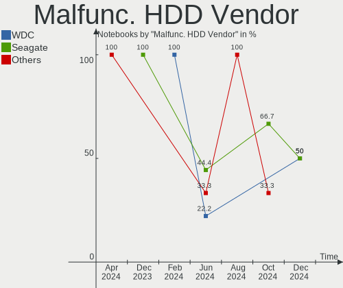
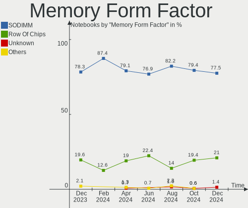
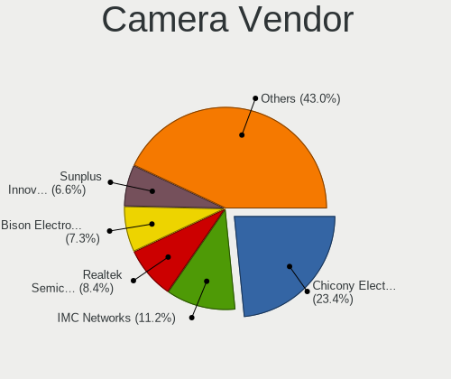

Fedora - Hardware Trends (Notebooks)
------------------------------------

A project to identify most popular hardware characteristics and track their change
over time based on data collected by Linux users at https://Linux-Hardware.org.

Anyone can contribute to this report by the [hw-probe](https://github.com/linuxhw/hw-probe) tool:

    sudo -E hw-probe -all -upload

This report is for one last month. Overall report since the beginning of time: [TestCoverage](https://github.com/linuxhw/TestCoverage)

Period: Aug, 2022.

Contents
--------

* [ System ](#system)
  - [ OS                       ](#os)
  - [ OS Family                ](#os-family)
  - [ Kernel                   ](#kernel)
  - [ Kernel Family            ](#kernel-family)
  - [ Kernel Major Ver.        ](#kernel-major-ver)
  - [ Arch                     ](#arch)
  - [ DE                       ](#de)
  - [ Display Server           ](#display-server)
  - [ Display Manager          ](#display-manager)
  - [ OS Lang                  ](#os-lang)
  - [ Boot Mode                ](#boot-mode)
  - [ Filesystem               ](#filesystem)
  - [ Part. scheme             ](#part-scheme)
  - [ Dual Boot with Linux/BSD ](#dual-boot-with-linuxbsd)
  - [ Dual Boot (Win)          ](#dual-boot-win)

* [ Board ](#board)
  - [ Vendor                   ](#vendor)
  - [ Model                    ](#model)
  - [ Model Family             ](#model-family)
  - [ MFG Year                 ](#mfg-year)
  - [ Form Factor              ](#form-factor)
  - [ Secure Boot              ](#secure-boot)
  - [ Coreboot                 ](#coreboot)
  - [ RAM Size                 ](#ram-size)
  - [ RAM Used                 ](#ram-used)
  - [ Total Drives             ](#total-drives)
  - [ Has CD-ROM               ](#has-cd-rom)
  - [ Has Ethernet             ](#has-ethernet)
  - [ Has WiFi                 ](#has-wifi)
  - [ Has Bluetooth            ](#has-bluetooth)

* [ Location ](#location)
  - [ Country                  ](#country)
  - [ City                     ](#city)

* [ Drives ](#drives)
  - [ Drive Vendor             ](#drive-vendor)
  - [ Drive Model              ](#drive-model)
  - [ HDD Vendor               ](#hdd-vendor)
  - [ SSD Vendor               ](#ssd-vendor)
  - [ Drive Kind               ](#drive-kind)
  - [ Drive Connector          ](#drive-connector)
  - [ Drive Size               ](#drive-size)
  - [ Space Total              ](#space-total)
  - [ Space Used               ](#space-used)
  - [ Malfunc. Drives          ](#malfunc-drives)
  - [ Malfunc. Drive Vendor    ](#malfunc-drive-vendor)
  - [ Malfunc. HDD Vendor      ](#malfunc-hdd-vendor)
  - [ Malfunc. Drive Kind      ](#malfunc-drive-kind)
  - [ Failed Drives            ](#failed-drives)
  - [ Failed Drive Vendor      ](#failed-drive-vendor)
  - [ Drive Status             ](#drive-status)

* [ Storage controller ](#storage-controller)
  - [ Storage Vendor           ](#storage-vendor)
  - [ Storage Model            ](#storage-model)
  - [ Storage Kind             ](#storage-kind)

* [ Processor ](#processor)
  - [ CPU Vendor               ](#cpu-vendor)
  - [ CPU Model                ](#cpu-model)
  - [ CPU Model Family         ](#cpu-model-family)
  - [ CPU Cores                ](#cpu-cores)
  - [ CPU Sockets              ](#cpu-sockets)
  - [ CPU Threads              ](#cpu-threads)
  - [ CPU Op-Modes             ](#cpu-op-modes)
  - [ CPU Microcode            ](#cpu-microcode)
  - [ CPU Microarch            ](#cpu-microarch)

* [ Graphics ](#graphics)
  - [ GPU Vendor               ](#gpu-vendor)
  - [ GPU Model                ](#gpu-model)
  - [ GPU Combo                ](#gpu-combo)
  - [ GPU Driver               ](#gpu-driver)
  - [ GPU Memory               ](#gpu-memory)

* [ Monitor ](#monitor)
  - [ Monitor Vendor           ](#monitor-vendor)
  - [ Monitor Model            ](#monitor-model)
  - [ Monitor Resolution       ](#monitor-resolution)
  - [ Monitor Diagonal         ](#monitor-diagonal)
  - [ Monitor Width            ](#monitor-width)
  - [ Aspect Ratio             ](#aspect-ratio)
  - [ Monitor Area             ](#monitor-area)
  - [ Pixel Density            ](#pixel-density)
  - [ Multiple Monitors        ](#multiple-monitors)

* [ Network ](#network)
  - [ Net Controller Vendor    ](#net-controller-vendor)
  - [ Net Controller Model     ](#net-controller-model)
  - [ Wireless Vendor          ](#wireless-vendor)
  - [ Wireless Model           ](#wireless-model)
  - [ Ethernet Vendor          ](#ethernet-vendor)
  - [ Ethernet Model           ](#ethernet-model)
  - [ Net Controller Kind      ](#net-controller-kind)
  - [ Used Controller          ](#used-controller)
  - [ NICs                     ](#nics)
  - [ IPv6                     ](#ipv6)

* [ Bluetooth ](#bluetooth)
  - [ Bluetooth Vendor         ](#bluetooth-vendor)
  - [ Bluetooth Model          ](#bluetooth-model)

* [ Sound ](#sound)
  - [ Sound Vendor             ](#sound-vendor)
  - [ Sound Model              ](#sound-model)

* [ Memory ](#memory)
  - [ Memory Vendor            ](#memory-vendor)
  - [ Memory Model             ](#memory-model)
  - [ Memory Kind              ](#memory-kind)
  - [ Memory Form Factor       ](#memory-form-factor)
  - [ Memory Size              ](#memory-size)
  - [ Memory Speed             ](#memory-speed)

* [ Printers & scanners ](#printers--scanners)
  - [ Printer Vendor           ](#printer-vendor)
  - [ Printer Model            ](#printer-model)
  - [ Scanner Vendor           ](#scanner-vendor)
  - [ Scanner Model            ](#scanner-model)

* [ Camera ](#camera)
  - [ Camera Vendor            ](#camera-vendor)
  - [ Camera Model             ](#camera-model)

* [ Security ](#security)
  - [ Fingerprint Vendor       ](#fingerprint-vendor)
  - [ Fingerprint Model        ](#fingerprint-model)
  - [ Chipcard Vendor          ](#chipcard-vendor)
  - [ Chipcard Model           ](#chipcard-model)

* [ Unsupported ](#unsupported)
  - [ Unsupported Devices      ](#unsupported-devices)
  - [ Unsupported Device Types ](#unsupported-device-types)

System
------

OS
--

Installed operating systems

| Name      | Notebooks | Percent |
|-----------|-----------|---------|
| Fedora 36 | 194       | 91.94%  |
| Fedora 35 | 12        | 5.69%   |
| Fedora 37 | 3         | 1.42%   |
| Fedora 34 | 1         | 0.47%   |
| Fedora 33 | 1         | 0.47%   |

OS Family
---------

OS without a version

| Name   | Notebooks | Percent |
|--------|-----------|---------|
| Fedora | 211       | 100%    |

Kernel
------

Version of the Linux kernel

| Version                           | Notebooks | Percent |
|-----------------------------------|-----------|---------|
| 5.18.16-200.fc36.x86_64           | 45        | 21.33%  |
| 5.18.17-200.fc36.x86_64           | 35        | 16.59%  |
| 5.18.13-200.fc36.x86_64           | 30        | 14.22%  |
| 5.18.18-200.fc36.x86_64           | 20        | 9.48%   |
| 5.18.19-200.fc36.x86_64           | 19        | 9%      |
| 5.17.5-300.fc36.x86_64            | 12        | 5.69%   |
| 5.19.4-200.fc36.x86_64            | 10        | 4.74%   |
| 5.18.15-200.fc36.x86_64           | 5         | 2.37%   |
| 5.18.11-200.fc36.x86_64           | 4         | 1.9%    |
| 5.18.16-100.fc35.x86_64           | 2         | 0.95%   |
| 5.18.13-100.fc35.x86_64           | 2         | 0.95%   |
| 5.18.11-100.fc35.x86_64           | 2         | 0.95%   |
| 5.19.4-300.fc37.x86_64            | 1         | 0.47%   |
| 5.19.4-250.vanilla.1.fc36.x86_64  | 1         | 0.47%   |
| 5.19.2-300.fc36.x86_64            | 1         | 0.47%   |
| 5.19.1-xm1.0e20220803.fc36.x86_64 | 1         | 0.47%   |
| 5.19.1-325.vanilla.1.fc36.x86_64  | 1         | 0.47%   |
| 5.19.1-300.fc36.x86_64            | 1         | 0.47%   |
| 5.19.0-xm2.0.fc37.x86_64          | 1         | 0.47%   |
| 5.19.0-xm2.0.fc36.x86_64          | 1         | 0.47%   |
| 5.19.0-xm1.0e20220803.fc36.x86_64 | 1         | 0.47%   |
| 5.19.0-65.fc37.x86_64             | 1         | 0.47%   |
| 5.18.19-100.fc35.x86_64           | 1         | 0.47%   |
| 5.18.18-201.fsync.fc36.x86_64     | 1         | 0.47%   |
| 5.18.18-200.rog.fc36.x86_64       | 1         | 0.47%   |
| 5.18.18-200.local.fc36.x86_64     | 1         | 0.47%   |
| 5.18.18-100.fc35.x86_64           | 1         | 0.47%   |
| 5.18.17-100.fc35.x86_64           | 1         | 0.47%   |
| 5.18.16-602.inttf.fc36.x86_64     | 1         | 0.47%   |
| 5.18.10-200.fc36.x86_64           | 1         | 0.47%   |
| 5.17.8-300.fc36.x86_64            | 1         | 0.47%   |
| 5.17.8-200.fc35.x86_64            | 1         | 0.47%   |
| 5.17.13-200.fc35.x86_64           | 1         | 0.47%   |
| 5.17.12-100.fc34.x86_64           | 1         | 0.47%   |
| 5.17.11-300.fc36.x86_64           | 1         | 0.47%   |
| 5.16.16-200.fc35.x86_64           | 1         | 0.47%   |
| 5.14.18-100.fc33.x86_64           | 1         | 0.47%   |

Kernel Family
-------------

Linux kernel without a distro release

| Version | Notebooks | Percent |
|---------|-----------|---------|
| 5.18.16 | 48        | 22.75%  |
| 5.18.17 | 36        | 17.06%  |
| 5.18.13 | 32        | 15.17%  |
| 5.18.18 | 24        | 11.37%  |
| 5.18.19 | 20        | 9.48%   |
| 5.19.4  | 12        | 5.69%   |
| 5.17.5  | 12        | 5.69%   |
| 5.18.11 | 6         | 2.84%   |
| 5.18.15 | 5         | 2.37%   |
| 5.19.0  | 4         | 1.9%    |
| 5.19.1  | 3         | 1.42%   |
| 5.17.8  | 2         | 0.95%   |
| 5.19.2  | 1         | 0.47%   |
| 5.18.10 | 1         | 0.47%   |
| 5.17.13 | 1         | 0.47%   |
| 5.17.12 | 1         | 0.47%   |
| 5.17.11 | 1         | 0.47%   |
| 5.16.16 | 1         | 0.47%   |
| 5.14.18 | 1         | 0.47%   |

Kernel Major Ver.
-----------------

Linux kernel major version

| Version | Notebooks | Percent |
|---------|-----------|---------|
| 5.18    | 172       | 81.52%  |
| 5.19    | 20        | 9.48%   |
| 5.17    | 17        | 8.06%   |
| 5.16    | 1         | 0.47%   |
| 5.14    | 1         | 0.47%   |

Arch
----

OS architecture (x86_64, i586, etc.)

| Name   | Notebooks | Percent |
|--------|-----------|---------|
| x86_64 | 211       | 100%    |

DE
--

Desktop Environment

| Name       | Notebooks | Percent |
|------------|-----------|---------|
| GNOME      | 165       | 78.2%   |
| KDE5       | 30        | 14.22%  |
| XFCE       | 4         | 1.9%    |
| Unknown    | 4         | 1.9%    |
| X-Cinnamon | 2         | 0.95%   |
| LXQt       | 2         | 0.95%   |
| sway       | 1         | 0.47%   |
| MATE       | 1         | 0.47%   |
| Cinnamon   | 1         | 0.47%   |
| bspwm      | 1         | 0.47%   |

Display Server
--------------

X11 or Wayland

| Name    | Notebooks | Percent |
|---------|-----------|---------|
| Wayland | 155       | 73.46%  |
| X11     | 52        | 24.64%  |
| Tty     | 2         | 0.95%   |
| Unknown | 2         | 0.95%   |

Display Manager
---------------

SDDM, LightDM, etc.

| Name    | Notebooks | Percent |
|---------|-----------|---------|
| Unknown | 103       | 48.82%  |
| GDM     | 80        | 37.91%  |
| SDDM    | 17        | 8.06%   |
| LightDM | 11        | 5.21%   |

OS Lang
-------

Language

| Lang    | Notebooks | Percent |
|---------|-----------|---------|
| en_US   | 122       | 57.82%  |
| ru_RU   | 11        | 5.21%   |
| en_GB   | 10        | 4.74%   |
| pt_BR   | 9         | 4.27%   |
| de_DE   | 8         | 3.79%   |
| fr_FR   | 6         | 2.84%   |
| pl_PL   | 4         | 1.9%    |
| it_IT   | 4         | 1.9%    |
| en_AU   | 4         | 1.9%    |
| es_MX   | 3         | 1.42%   |
| en_ZA   | 3         | 1.42%   |
| tr_TR   | 2         | 0.95%   |
| sv_SE   | 2         | 0.95%   |
| es_ES   | 2         | 0.95%   |
| es_CO   | 2         | 0.95%   |
| en_IN   | 2         | 0.95%   |
| en_CA   | 2         | 0.95%   |
| ru_UA   | 1         | 0.47%   |
| ro_RO   | 1         | 0.47%   |
| pt_PT   | 1         | 0.47%   |
| nl_NL   | 1         | 0.47%   |
| hu_HU   | 1         | 0.47%   |
| ga_IE   | 1         | 0.47%   |
| fr_BE   | 1         | 0.47%   |
| es_GT   | 1         | 0.47%   |
| es_BO   | 1         | 0.47%   |
| es_AR   | 1         | 0.47%   |
| en_PH   | 1         | 0.47%   |
| da_DK   | 1         | 0.47%   |
| cs_CZ   | 1         | 0.47%   |
| ca_ES   | 1         | 0.47%   |
| Unknown | 1         | 0.47%   |

Boot Mode
---------

EFI or BIOS

| Mode | Notebooks | Percent |
|------|-----------|---------|
| EFI  | 170       | 80.57%  |
| BIOS | 41        | 19.43%  |

Filesystem
----------

Type of filesystem

| Type  | Notebooks | Percent |
|-------|-----------|---------|
| Btrfs | 169       | 80.09%  |
| Ext4  | 42        | 19.91%  |

Part. scheme
------------

Scheme of partitioning

| Type    | Notebooks | Percent |
|---------|-----------|---------|
| Unknown | 105       | 49.76%  |
| GPT     | 97        | 45.97%  |
| MBR     | 9         | 4.27%   |

Dual Boot with Linux/BSD
------------------------

Hosting more than one Linux/BSD

| Dual boot | Notebooks | Percent |
|-----------|-----------|---------|
| No        | 194       | 91.94%  |
| Yes       | 17        | 8.06%   |

Dual Boot (Win)
---------------

Hosting Linux and Windows

| Dual boot | Notebooks | Percent |
|-----------|-----------|---------|
| No        | 159       | 75.36%  |
| Yes       | 52        | 24.64%  |

Board
-----

Vendor
------

Motherboard manufacturer

| Name                   | Notebooks | Percent |
|------------------------|-----------|---------|
| Lenovo                 | 52        | 24.64%  |
| Hewlett-Packard        | 43        | 20.38%  |
| Dell                   | 27        | 12.8%   |
| ASUSTek Computer       | 20        | 9.48%   |
| Acer                   | 15        | 7.11%   |
| MSI                    | 9         | 4.27%   |
| Apple                  | 8         | 3.79%   |
| HUAWEI                 | 5         | 2.37%   |
| Toshiba                | 3         | 1.42%   |
| Timi                   | 2         | 0.95%   |
| Sony                   | 2         | 0.95%   |
| Samsung Electronics    | 2         | 0.95%   |
| Notebook               | 2         | 0.95%   |
| HONOR                  | 2         | 0.95%   |
| Gateway                | 2         | 0.95%   |
| UNOWHY                 | 1         | 0.47%   |
| Panasonic              | 1         | 0.47%   |
| LG Electronics         | 1         | 0.47%   |
| Itautec                | 1         | 0.47%   |
| Infinix                | 1         | 0.47%   |
| GPU Company            | 1         | 0.47%   |
| Google                 | 1         | 0.47%   |
| Fujitsu                | 1         | 0.47%   |
| Exo                    | 1         | 0.47%   |
| Eluktronics            | 1         | 0.47%   |
| AZW                    | 1         | 0.47%   |
| AXDIA International    | 1         | 0.47%   |
| Avell High Performance | 1         | 0.47%   |
| Aquarius               | 1         | 0.47%   |
| Alienware              | 1         | 0.47%   |
| Acidanthera            | 1         | 0.47%   |
| Unknown                | 1         | 0.47%   |

Model
-----

Motherboard model

| Name                                                                                     | Notebooks | Percent |
|------------------------------------------------------------------------------------------|-----------|---------|
| MSI Modern 14 A10RAS                                                                     | 2         | 0.95%   |
| Lenovo IdeaPad S340-14API 81NB                                                           | 2         | 0.95%   |
| Lenovo IdeaPad 3 15ITL6 82H8                                                             | 2         | 0.95%   |
| HP EliteBook 8460p                                                                       | 2         | 0.95%   |
| Dell XPS 13 7390                                                                         | 2         | 0.95%   |
| Apple MacBookPro5,5                                                                      | 2         | 0.95%   |
| UNOWHY Y13G010S4EI                                                                       | 1         | 0.47%   |
| Toshiba TECRA R940                                                                       | 1         | 0.47%   |
| Toshiba Satellite Pro L300D                                                              | 1         | 0.47%   |
| Toshiba Satellite C55-C                                                                  | 1         | 0.47%   |
| Timi TM1701                                                                              | 1         | 0.47%   |
| Timi Redmi Book Pro 15 2022                                                              | 1         | 0.47%   |
| Sony VPCS131FM                                                                           | 1         | 0.47%   |
| Sony SVT15115CXS                                                                         | 1         | 0.47%   |
| Samsung 355V4C/356V4C/3445VC/3545VC                                                      | 1         | 0.47%   |
| Samsung 355V4C/355V4X/355V5C/355V5X/356V4C/356V4X/356V5C/356V5X/3445VC/3445VX/3545VC/354 | 1         | 0.47%   |
| Panasonic CFMX4-1                                                                        | 1         | 0.47%   |
| Notebook NS50_70MU                                                                       | 1         | 0.47%   |
| Notebook N15_17RD                                                                        | 1         | 0.47%   |
| MSI Prestige 15 A10SC                                                                    | 1         | 0.47%   |
| MSI Prestige 14Evo A11MO                                                                 | 1         | 0.47%   |
| MSI MS-16F1                                                                              | 1         | 0.47%   |
| MSI Modern 14 B11SBL                                                                     | 1         | 0.47%   |
| MSI Modern 14 A10M                                                                       | 1         | 0.47%   |
| MSI GT72S 6QE                                                                            | 1         | 0.47%   |
| MSI Delta 15 A5EFK                                                                       | 1         | 0.47%   |
| LG 14Z990-V.AR52A2                                                                       | 1         | 0.47%   |
| Lenovo Z40-70 20366                                                                      | 1         | 0.47%   |
| Lenovo Yoga Slim 7 ProX 14ARH7 82TL                                                      | 1         | 0.47%   |
| Lenovo Yoga Slim 7 Pro 14IHU5 82NC                                                       | 1         | 0.47%   |
| Lenovo V110-15ISK 80TL                                                                   | 1         | 0.47%   |
| Lenovo ThinkPad X270 20HMS2R900                                                          | 1         | 0.47%   |
| Lenovo ThinkPad X240 20ALA0AHRT                                                          | 1         | 0.47%   |
| Lenovo ThinkPad X230 2306CTO                                                             | 1         | 0.47%   |
| Lenovo ThinkPad X220 4290KJ6                                                             | 1         | 0.47%   |
| Lenovo ThinkPad X1 Carbon 6th 20KG0022US                                                 | 1         | 0.47%   |
| Lenovo ThinkPad X1 Carbon 34604MG                                                        | 1         | 0.47%   |
| Lenovo ThinkPad W510 4391F66                                                             | 1         | 0.47%   |
| Lenovo ThinkPad T490 20N2005VMX                                                          | 1         | 0.47%   |
| Lenovo ThinkPad T480s 20L70044AU                                                         | 1         | 0.47%   |
| Lenovo ThinkPad T470 20HDCTO1WW                                                          | 1         | 0.47%   |
| Lenovo ThinkPad T430 2349V4B                                                             | 1         | 0.47%   |
| Lenovo ThinkPad T430 2347AP9                                                             | 1         | 0.47%   |
| Lenovo ThinkPad T14 Gen 1 20UES00700                                                     | 1         | 0.47%   |
| Lenovo ThinkPad T14 Gen 1 20UD001AIX                                                     | 1         | 0.47%   |
| Lenovo ThinkPad T14 Gen 1 20S0000NBM                                                     | 1         | 0.47%   |
| Lenovo ThinkPad S1 Yoga 20CDCTO1WW                                                       | 1         | 0.47%   |
| Lenovo ThinkPad P14s Gen 1 20Y1000ESP                                                    | 1         | 0.47%   |
| Lenovo ThinkPad L15 Gen 1 20U70001MB                                                     | 1         | 0.47%   |
| Lenovo ThinkPad E595 20NF001PTX                                                          | 1         | 0.47%   |
| Lenovo ThinkPad E520 1143CWG                                                             | 1         | 0.47%   |
| Lenovo ThinkPad E14 Gen 3 20Y7006URT                                                     | 1         | 0.47%   |
| Lenovo ThinkBook Plus 20TG                                                               | 1         | 0.47%   |
| Lenovo ThinkBook 16p Gen 2 20YM                                                          | 1         | 0.47%   |
| Lenovo ThinkBook 15 G2 ITL 20VE                                                          | 1         | 0.47%   |
| Lenovo ThinkBook 14 G3 ACL 21A2                                                          | 1         | 0.47%   |
| Lenovo Legion 5 Pro 16ITH6H 82JD                                                         | 1         | 0.47%   |
| Lenovo Legion 5 Pro 16ARH7H 82RG                                                         | 1         | 0.47%   |
| Lenovo Legion 5 Pro 16ACH6H 82JQ                                                         | 1         | 0.47%   |
| Lenovo Legion 5 17ACH6H 82JY                                                             | 1         | 0.47%   |

Model Family
------------

Motherboard model prefix

| Name                  | Notebooks | Percent |
|-----------------------|-----------|---------|
| Lenovo ThinkPad       | 21        | 9.95%   |
| Lenovo IdeaPad        | 17        | 8.06%   |
| Dell Inspiron         | 10        | 4.74%   |
| Acer Aspire           | 10        | 4.74%   |
| HP ProBook            | 8         | 3.79%   |
| HP Laptop             | 8         | 3.79%   |
| HP Pavilion           | 7         | 3.32%   |
| Dell Latitude         | 7         | 3.32%   |
| HP ENVY               | 6         | 2.84%   |
| Lenovo Legion         | 5         | 2.37%   |
| Dell XPS              | 5         | 2.37%   |
| ASUS ROG              | 5         | 2.37%   |
| MSI Modern            | 4         | 1.9%    |
| Lenovo ThinkBook      | 4         | 1.9%    |
| HP EliteBook          | 4         | 1.9%    |
| Dell Precision        | 3         | 1.42%   |
| ASUS VivoBook         | 3         | 1.42%   |
| Toshiba Satellite     | 2         | 0.95%   |
| Samsung 355V4C        | 2         | 0.95%   |
| MSI Prestige          | 2         | 0.95%   |
| Lenovo Yoga           | 2         | 0.95%   |
| HP ZBook              | 2         | 0.95%   |
| Dell G3               | 2         | 0.95%   |
| ASUS Zephyrus         | 2         | 0.95%   |
| Apple MacBookPro5     | 2         | 0.95%   |
| UNOWHY Y13G010S4EI    | 1         | 0.47%   |
| Toshiba TECRA         | 1         | 0.47%   |
| Timi TM1701           | 1         | 0.47%   |
| Timi Redmi            | 1         | 0.47%   |
| Sony VPCS131FM        | 1         | 0.47%   |
| Sony SVT15115CXS      | 1         | 0.47%   |
| Panasonic CFMX4-1     | 1         | 0.47%   |
| Notebook NS50         | 1         | 0.47%   |
| Notebook N15          | 1         | 0.47%   |
| MSI MS-16F1           | 1         | 0.47%   |
| MSI GT72S             | 1         | 0.47%   |
| MSI Delta             | 1         | 0.47%   |
| LG 14Z990-V.AR52A2    | 1         | 0.47%   |
| Lenovo Z40-70         | 1         | 0.47%   |
| Lenovo V110-15ISK     | 1         | 0.47%   |
| Lenovo G50-45         | 1         | 0.47%   |
| Itautec Infoway       | 1         | 0.47%   |
| Infinix INBOOK        | 1         | 0.47%   |
| HUAWEI MACH-WX9       | 1         | 0.47%   |
| HUAWEI KLVL-WXXW      | 1         | 0.47%   |
| HUAWEI EMD-WXX        | 1         | 0.47%   |
| HUAWEI CREM-WXX9      | 1         | 0.47%   |
| HUAWEI BOD-WXX9       | 1         | 0.47%   |
| HONOR NBR-WAX9        | 1         | 0.47%   |
| HONOR NBD-WXX9        | 1         | 0.47%   |
| HP Victus             | 1         | 0.47%   |
| HP Stream             | 1         | 0.47%   |
| HP Snappy             | 1         | 0.47%   |
| HP OMEN               | 1         | 0.47%   |
| HP Compaq             | 1         | 0.47%   |
| HP 255                | 1         | 0.47%   |
| HP 250                | 1         | 0.47%   |
| HP 14                 | 1         | 0.47%   |
| GPU Company GWTC116-2 | 1         | 0.47%   |
| Google Eve            | 1         | 0.47%   |

MFG Year
--------

Motherboard manufacture year

| Year | Notebooks | Percent |
|------|-----------|---------|
| 2021 | 48        | 22.75%  |
| 2020 | 25        | 11.85%  |
| 2019 | 22        | 10.43%  |
| 2012 | 15        | 7.11%   |
| 2018 | 14        | 6.64%   |
| 2014 | 12        | 5.69%   |
| 2022 | 11        | 5.21%   |
| 2017 | 11        | 5.21%   |
| 2015 | 11        | 5.21%   |
| 2013 | 11        | 5.21%   |
| 2016 | 10        | 4.74%   |
| 2011 | 8         | 3.79%   |
| 2010 | 7         | 3.32%   |
| 2009 | 3         | 1.42%   |
| 2008 | 2         | 0.95%   |
| 2006 | 1         | 0.47%   |

Form Factor
-----------

Physical design of the computer

| Name     | Notebooks | Percent |
|----------|-----------|---------|
| Notebook | 211       | 100%    |

Secure Boot
-----------

Enabled or disabled

| State    | Notebooks | Percent |
|----------|-----------|---------|
| Disabled | 169       | 80.09%  |
| Enabled  | 42        | 19.91%  |

Coreboot
--------

Have coreboot on board

| Used | Notebooks | Percent |
|------|-----------|---------|
| No   | 208       | 98.58%  |
| Yes  | 3         | 1.42%   |

RAM Size
--------

Total RAM memory

| Size in GB  | Notebooks | Percent |
|-------------|-----------|---------|
| 4.01-8.0    | 73        | 34.6%   |
| 8.01-16.0   | 45        | 21.33%  |
| 16.01-24.0  | 41        | 19.43%  |
| 32.01-64.0  | 18        | 8.53%   |
| 3.01-4.0    | 18        | 8.53%   |
| 1.01-2.0    | 7         | 3.32%   |
| 64.01-256.0 | 5         | 2.37%   |
| 24.01-32.0  | 4         | 1.9%    |

RAM Used
--------

Used RAM memory

| Used GB    | Notebooks | Percent |
|------------|-----------|---------|
| 2.01-3.0   | 56        | 26.54%  |
| 4.01-8.0   | 55        | 26.07%  |
| 3.01-4.0   | 50        | 23.7%   |
| 1.01-2.0   | 29        | 13.74%  |
| 8.01-16.0  | 19        | 9%      |
| 24.01-32.0 | 1         | 0.47%   |
| 0.51-1.0   | 1         | 0.47%   |

Total Drives
------------

Number of drives on board

| Drives | Notebooks | Percent |
|--------|-----------|---------|
| 1      | 159       | 75.36%  |
| 2      | 43        | 20.38%  |
| 3      | 7         | 3.32%   |
| 5      | 1         | 0.47%   |
| 4      | 1         | 0.47%   |

Has CD-ROM
----------

Has CD-ROM on board

| Presented | Notebooks | Percent |
|-----------|-----------|---------|
| No        | 158       | 74.88%  |
| Yes       | 53        | 25.12%  |

Has Ethernet
------------

Has Ethernet on board

| Presented | Notebooks | Percent |
|-----------|-----------|---------|
| Yes       | 146       | 69.19%  |
| No        | 65        | 30.81%  |

Has WiFi
--------

Has WiFi module

| Presented | Notebooks | Percent |
|-----------|-----------|---------|
| Yes       | 206       | 97.63%  |
| No        | 5         | 2.37%   |

Has Bluetooth
-------------

Has Bluetooth module

| Presented | Notebooks | Percent |
|-----------|-----------|---------|
| Yes       | 174       | 82.46%  |
| No        | 37        | 17.54%  |

Location
--------

Country
-------

Geographic location (country)

| Country            | Notebooks | Percent |
|--------------------|-----------|---------|
| USA                | 42        | 19.91%  |
| Russia             | 17        | 8.06%   |
| Germany            | 12        | 5.69%   |
| Brazil             | 10        | 4.74%   |
| Italy              | 8         | 3.79%   |
| Turkey             | 7         | 3.32%   |
| India              | 7         | 3.32%   |
| Netherlands        | 6         | 2.84%   |
| Mexico             | 6         | 2.84%   |
| France             | 6         | 2.84%   |
| Argentina          | 6         | 2.84%   |
| Poland             | 5         | 2.37%   |
| Australia          | 5         | 2.37%   |
| Spain              | 4         | 1.9%    |
| Indonesia          | 4         | 1.9%    |
| UK                 | 3         | 1.42%   |
| Sweden             | 3         | 1.42%   |
| Portugal           | 3         | 1.42%   |
| Ireland            | 3         | 1.42%   |
| Guatemala          | 3         | 1.42%   |
| Denmark            | 3         | 1.42%   |
| Costa Rica         | 3         | 1.42%   |
| Canada             | 3         | 1.42%   |
| Belgium            | 3         | 1.42%   |
| Uruguay            | 2         | 0.95%   |
| South Africa       | 2         | 0.95%   |
| Romania            | 2         | 0.95%   |
| Lebanon            | 2         | 0.95%   |
| Kenya              | 2         | 0.95%   |
| Hungary            | 2         | 0.95%   |
| Egypt              | 2         | 0.95%   |
| Colombia           | 2         | 0.95%   |
| Belarus            | 2         | 0.95%   |
| Uzbekistan         | 1         | 0.47%   |
| Ukraine            | 1         | 0.47%   |
| Taiwan             | 1         | 0.47%   |
| Switzerland        | 1         | 0.47%   |
| South Korea        | 1         | 0.47%   |
| Slovakia           | 1         | 0.47%   |
| Philippines        | 1         | 0.47%   |
| Pakistan           | 1         | 0.47%   |
| Norway             | 1         | 0.47%   |
| Morocco            | 1         | 0.47%   |
| Moldova            | 1         | 0.47%   |
| Lithuania          | 1         | 0.47%   |
| Japan              | 1         | 0.47%   |
| Iran               | 1         | 0.47%   |
| Ghana              | 1         | 0.47%   |
| Finland            | 1         | 0.47%   |
| Dominican Republic | 1         | 0.47%   |
| Czechia            | 1         | 0.47%   |
| Bulgaria           | 1         | 0.47%   |
| Austria            | 1         | 0.47%   |
| Armenia            | 1         | 0.47%   |

City
----

Geographic location (city)

| City                    | Notebooks | Percent |
|-------------------------|-----------|---------|
| Moscow                  | 3         | 1.42%   |
| Istanbul                | 3         | 1.42%   |
| Guatemala City          | 3         | 1.42%   |
| Copenhagen              | 3         | 1.42%   |
| Buenos Aires            | 3         | 1.42%   |
| Surabaya                | 2         | 0.95%   |
| St Petersburg           | 2         | 0.95%   |
| New York                | 2         | 0.95%   |
| Nairobi                 | 2         | 0.95%   |
| Mundelein               | 2         | 0.95%   |
| Montevideo              | 2         | 0.95%   |
| Minsk                   | 2         | 0.95%   |
| Mexico City             | 2         | 0.95%   |
| Lages                   | 2         | 0.95%   |
| Dublin                  | 2         | 0.95%   |
| Dallas                  | 2         | 0.95%   |
| Bursa                   | 2         | 0.95%   |
| Brisbane                | 2         | 0.95%   |
| Bengaluru               | 2         | 0.95%   |
| Zurich                  | 1         | 0.47%   |
| Zary                    | 1         | 0.47%   |
| Yerevan                 | 1         | 0.47%   |
| Wuppertal               | 1         | 0.47%   |
| Worms                   | 1         | 0.47%   |
| Wörgl                  | 1         | 0.47%   |
| Wilhelmshaven           | 1         | 0.47%   |
| Whittier                | 1         | 0.47%   |
| Wexford                 | 1         | 0.47%   |
| Warsaw                  | 1         | 0.47%   |
| Vologda                 | 1         | 0.47%   |
| Volgograd               | 1         | 0.47%   |
| Vilnius                 | 1         | 0.47%   |
| Villemomble             | 1         | 0.47%   |
| Vigo                    | 1         | 0.47%   |
| Viggianello             | 1         | 0.47%   |
| Vellore                 | 1         | 0.47%   |
| Vasco da Gama           | 1         | 0.47%   |
| Varberg                 | 1         | 0.47%   |
| Ufa                     | 1         | 0.47%   |
| Uccle                   | 1         | 0.47%   |
| Tver                    | 1         | 0.47%   |
| Tripoli                 | 1         | 0.47%   |
| Torreón                | 1         | 0.47%   |
| Tilburg                 | 1         | 0.47%   |
| Tavaux                  | 1         | 0.47%   |
| Taunton                 | 1         | 0.47%   |
| Tashkent                | 1         | 0.47%   |
| Tanta                   | 1         | 0.47%   |
| Tampere                 | 1         | 0.47%   |
| Tampa                   | 1         | 0.47%   |
| Sydney                  | 1         | 0.47%   |
| Stockholm               | 1         | 0.47%   |
| Southampton             | 1         | 0.47%   |
| Sofia                   | 1         | 0.47%   |
| Snellville              | 1         | 0.47%   |
| Shelton                 | 1         | 0.47%   |
| Saratov                 | 1         | 0.47%   |
| Sao Paulo               | 1         | 0.47%   |
| Sao Goncalo do Amarante | 1         | 0.47%   |
| Santo Domingo Este      | 1         | 0.47%   |

Drives
------

Drive Vendor
------------

Hard drive vendors

| Vendor                    | Notebooks | Drives | Percent |
|---------------------------|-----------|--------|---------|
| Samsung Electronics       | 49        | 54     | 18.85%  |
| WDC                       | 30        | 31     | 11.54%  |
| Unknown                   | 19        | 21     | 7.31%   |
| Seagate                   | 19        | 19     | 7.31%   |
| SanDisk                   | 18        | 18     | 6.92%   |
| SK hynix                  | 12        | 12     | 4.62%   |
| Micron Technology         | 12        | 12     | 4.62%   |
| Toshiba                   | 10        | 10     | 3.85%   |
| Kingston                  | 9         | 9      | 3.46%   |
| Intel                     | 8         | 8      | 3.08%   |
| HGST                      | 7         | 7      | 2.69%   |
| Crucial                   | 7         | 8      | 2.69%   |
| Phison                    | 5         | 5      | 1.92%   |
| KIOXIA                    | 5         | 5      | 1.92%   |
| Silicon Motion            | 3         | 3      | 1.15%   |
| Hitachi                   | 3         | 3      | 1.15%   |
| Apple                     | 3         | 4      | 1.15%   |
| XPG                       | 2         | 3      | 0.77%   |
| Union Memory (Shenzhen)   | 2         | 2      | 0.77%   |
| UMIS                      | 2         | 2      | 0.77%   |
| SSSTC                     | 2         | 2      | 0.77%   |
| PNY                       | 2         | 2      | 0.77%   |
| Patriot                   | 2         | 2      | 0.77%   |
| Netac                     | 2         | 2      | 0.77%   |
| LITEON                    | 2         | 2      | 0.77%   |
| A-DATA Technology         | 2         | 2      | 0.77%   |
| Unknown                   | 2         | 2      | 0.77%   |
| Win Memory                | 1         | 1      | 0.38%   |
| Transcend                 | 1         | 1      | 0.38%   |
| Team                      | 1         | 1      | 0.38%   |
| StoreJet                  | 1         | 1      | 0.38%   |
| SPCC                      | 1         | 1      | 0.38%   |
| ROG                       | 1         | 1      | 0.38%   |
| Phison Electronics        | 1         | 1      | 0.38%   |
| Mushkin                   | 1         | 1      | 0.38%   |
| Micron/Crucial Technology | 1         | 1      | 0.38%   |
| Maxtor                    | 1         | 1      | 0.38%   |
| Lexar                     | 1         | 1      | 0.38%   |
| Lenovo                    | 1         | 1      | 0.38%   |
| KIOXIA-EXCERIA            | 1         | 1      | 0.38%   |
| INTEL SS                  | 1         | 1      | 0.38%   |
| HS-SSD-E100               | 1         | 1      | 0.38%   |
| GOODRAM                   | 1         | 1      | 0.38%   |
| Gigabyte Technology       | 1         | 1      | 0.38%   |
| G-TECH                    | 1         | 1      | 0.38%   |
| China                     | 1         | 1      | 0.38%   |
| AMD                       | 1         | 1      | 0.38%   |
| ADATA Technology          | 1         | 1      | 0.38%   |

Drive Model
-----------

Hard drive models

| Model                                   | Notebooks | Percent |
|-----------------------------------------|-----------|---------|
| SanDisk NVMe SSD Drive 512GB            | 6         | 2.23%   |
| Samsung NVMe SSD Drive 512GB            | 6         | 2.23%   |
| Seagate ST1000LM024 HN-M101MBB 1TB      | 4         | 1.49%   |
| Samsung SSD 850 EVO 500GB               | 4         | 1.49%   |
| Samsung NVMe SSD Drive 256GB            | 4         | 1.49%   |
| SK hynix NVMe SSD Drive 256GB           | 3         | 1.12%   |
| Seagate ST1000LM035-1RK172 1TB          | 3         | 1.12%   |
| Samsung SSD 860 EVO 500GB               | 3         | 1.12%   |
| Samsung SM963 2.5" NVMe PCIe SSD 1024GB | 3         | 1.12%   |
| Samsung NVMe SSD Drive 500GB            | 3         | 1.12%   |
| Samsung NVMe SSD Drive 250GB            | 3         | 1.12%   |
| Micron NVMe SSD Drive 512GB             | 3         | 1.12%   |
| HGST HTS725050A7E630 500GB              | 3         | 1.12%   |
| WDC WDBNCE0010PNC 1TB SSD               | 2         | 0.74%   |
| WDC WD10JPVX-22JC3T0 1TB                | 2         | 0.74%   |
| WDC PC SN730 SDBPNTY-1T00-1101 1TB      | 2         | 0.74%   |
| Unknown MMC Card  64GB                  | 2         | 0.74%   |
| Unknown MMC Card  32GB                  | 2         | 0.74%   |
| Toshiba MK5061GSYN 500GB                | 2         | 0.74%   |
| Toshiba KBG30ZMV256G 256GB              | 2         | 0.74%   |
| Silicon Motion NVMe SSD Drive 256GB     | 2         | 0.74%   |
| Seagate ST9500325AS 500GB               | 2         | 0.74%   |
| Seagate ST500LT012-1DG142 500GB         | 2         | 0.74%   |
| SanDisk NVMe SSD Drive 256GB            | 2         | 0.74%   |
| SanDisk NVMe SSD Drive 1024GB           | 2         | 0.74%   |
| Samsung Portable SSD T5 500GB           | 2         | 0.74%   |
| Samsung NVMe SSD Drive 1TB              | 2         | 0.74%   |
| Samsung MZALQ512HALU-000L2 512GB        | 2         | 0.74%   |
| PNY SSD2SC120G1SA754D117-820 120GB      | 2         | 0.74%   |
| Phison NVMe SSD Drive 1TB               | 2         | 0.74%   |
| Intel SSDPEKNW512G8 512GB               | 2         | 0.74%   |
| Intel NVMe SSD Drive 512GB              | 2         | 0.74%   |
| HGST HTS721010A9E630 1TB                | 2         | 0.74%   |
| Crucial CT1000MX500SSD1 1TB             | 2         | 0.74%   |
| Unknown                                 | 2         | 0.74%   |
| XPG NVMe SSD Drive 2TB                  | 1         | 0.37%   |
| XPG NVMe SSD Drive 256GB                | 1         | 0.37%   |
| Win Memory SWR256G-201II 256GB          | 1         | 0.37%   |
| WDC WDS500G2B0C-00PXH0 500GB            | 1         | 0.37%   |
| WDC WDS500G2B0A-00SM50 500GB SSD        | 1         | 0.37%   |
| WDC WDBNCE5000PNC 500GB SSD             | 1         | 0.37%   |
| WDC WD5000LPCX-80VHAT0 500GB            | 1         | 0.37%   |
| WDC WD5000BEKT-22KA9T0 500GB            | 1         | 0.37%   |
| WDC WD3200LPVT-08G33T1 320GB            | 1         | 0.37%   |
| WDC WD3200BPVT-22ZEST0 320GB            | 1         | 0.37%   |
| WDC WD3200BEKT-08PVMT1 320GB            | 1         | 0.37%   |
| WDC WD20SPZX-22UA7T0 2TB                | 1         | 0.37%   |
| WDC WD16 00BEVT-60ZCT 160GB             | 1         | 0.37%   |
| WDC WD10SPZX-75Z10T2 1TB                | 1         | 0.37%   |
| WDC WD10JPVX-60JC3T0 1TB                | 1         | 0.37%   |
| WDC WD Game Drive 2TB                   | 1         | 0.37%   |
| WDC PC SN730 SDBQNTY-512G-1001 512GB    | 1         | 0.37%   |
| WDC PC SN730 SDBPNTY-512G-1027 512GB    | 1         | 0.37%   |
| WDC PC SN730 SDBPNTY-512G               | 1         | 0.37%   |
| WDC PC SN730 SDBPNTY-256G-1101 256GB    | 1         | 0.37%   |
| WDC PC SN730 SDBPNTY-1T00-1032 1TB      | 1         | 0.37%   |
| WDC PC SN730 NVMe 512GB                 | 1         | 0.37%   |
| WDC PC SN530 SDBPNPZ-256G-1114 256GB    | 1         | 0.37%   |
| WDC PC SN530 SDBPNPZ-256G-1006 256GB    | 1         | 0.37%   |
| WDC PC SN530 SDBPNPZ-1T00-1006 1TB      | 1         | 0.37%   |

HDD Vendor
----------

Hard disk drive vendors

| Vendor  | Notebooks | Drives | Percent |
|---------|-----------|--------|---------|
| Seagate | 19        | 19     | 42.22%  |
| WDC     | 11        | 11     | 24.44%  |
| HGST    | 7         | 7      | 15.56%  |
| Toshiba | 5         | 5      | 11.11%  |
| Hitachi | 3         | 3      | 6.67%   |

SSD Vendor
----------

Solid state drive vendors

| Vendor              | Notebooks | Drives | Percent |
|---------------------|-----------|--------|---------|
| Samsung Electronics | 16        | 16     | 22.22%  |
| SanDisk             | 7         | 7      | 9.72%   |
| Crucial             | 7         | 8      | 9.72%   |
| Kingston            | 5         | 5      | 6.94%   |
| WDC                 | 4         | 4      | 5.56%   |
| Micron Technology   | 3         | 3      | 4.17%   |
| SK hynix            | 2         | 2      | 2.78%   |
| PNY                 | 2         | 2      | 2.78%   |
| Patriot             | 2         | 2      | 2.78%   |
| Netac               | 2         | 2      | 2.78%   |
| LITEON              | 2         | 2      | 2.78%   |
| Intel               | 2         | 2      | 2.78%   |
| Apple               | 2         | 2      | 2.78%   |
| A-DATA Technology   | 2         | 2      | 2.78%   |
| Win Memory          | 1         | 1      | 1.39%   |
| Transcend           | 1         | 1      | 1.39%   |
| Team                | 1         | 1      | 1.39%   |
| StoreJet            | 1         | 1      | 1.39%   |
| Mushkin             | 1         | 1      | 1.39%   |
| Maxtor              | 1         | 1      | 1.39%   |
| Lexar               | 1         | 1      | 1.39%   |
| KIOXIA-EXCERIA      | 1         | 1      | 1.39%   |
| INTEL SS            | 1         | 1      | 1.39%   |
| GOODRAM             | 1         | 1      | 1.39%   |
| Gigabyte Technology | 1         | 1      | 1.39%   |
| China               | 1         | 1      | 1.39%   |
| AMD                 | 1         | 1      | 1.39%   |
| Unknown             | 1         | 1      | 1.39%   |

Drive Kind
----------

HDD or SSD

| Kind    | Notebooks | Drives | Percent |
|---------|-----------|--------|---------|
| NVMe    | 114       | 128    | 46.53%  |
| SSD     | 65        | 73     | 26.53%  |
| HDD     | 44        | 45     | 17.96%  |
| MMC     | 18        | 21     | 7.35%   |
| Unknown | 4         | 4      | 1.63%   |

Drive Connector
---------------

SATA, SAS, NVMe, etc.

| Type | Notebooks | Drives | Percent |
|------|-----------|--------|---------|
| NVMe | 114       | 128    | 47.3%   |
| SATA | 99        | 111    | 41.08%  |
| MMC  | 18        | 21     | 7.47%   |
| SAS  | 10        | 11     | 4.15%   |

Drive Size
----------

Size of hard drive

| Size in TB | Notebooks | Drives | Percent |
|------------|-----------|--------|---------|
| 0.01-0.5   | 75        | 77     | 65.22%  |
| 0.51-1.0   | 32        | 32     | 27.83%  |
| 1.01-2.0   | 7         | 8      | 6.09%   |
| 4.01-10.0  | 1         | 1      | 0.87%   |

Space Total
-----------

Amount of disk space available on the file system

| Size in GB     | Notebooks | Percent |
|----------------|-----------|---------|
| 251-500        | 47        | 22.27%  |
| 501-1000       | 42        | 19.91%  |
| 101-250        | 34        | 16.11%  |
| 1-20           | 34        | 16.11%  |
| 1001-2000      | 19        | 9%      |
| Unknown        | 12        | 5.69%   |
| More than 3000 | 11        | 5.21%   |
| 51-100         | 8         | 3.79%   |
| 21-50          | 2         | 0.95%   |
| 2001-3000      | 2         | 0.95%   |

Space Used
----------

Amount of used disk space

| Used GB        | Notebooks | Percent |
|----------------|-----------|---------|
| 1-20           | 67        | 31.75%  |
| 21-50          | 42        | 19.91%  |
| 51-100         | 25        | 11.85%  |
| 251-500        | 24        | 11.37%  |
| 101-250        | 24        | 11.37%  |
| 501-1000       | 14        | 6.64%   |
| Unknown        | 12        | 5.69%   |
| More than 3000 | 1         | 0.47%   |
| 2001-3000      | 1         | 0.47%   |
| 1001-2000      | 1         | 0.47%   |

Malfunc. Drives
---------------

Drive models with a malfunction

| Model                                               | Notebooks | Drives | Percent |
|-----------------------------------------------------|-----------|--------|---------|
| Seagate ST9500325AS 500GB                           | 1         | 1      | 9.09%   |
| Seagate ST500LM012 HN-M500MBB 500GB                 | 1         | 1      | 9.09%   |
| Seagate ST1000LM035-1RK172 1TB                      | 1         | 1      | 9.09%   |
| SanDisk SD6SB1M128G1022 128GB SSD                   | 1         | 1      | 9.09%   |
| Samsung Electronics SSD 980 PRO 500GB               | 1         | 1      | 9.09%   |
| Samsung Electronics SSD 870 EVO 500GB               | 1         | 1      | 9.09%   |
| Micron Technology MTFDDAK256MAY-1AH12ABHA 256GB SSD | 1         | 1      | 9.09%   |
| Kingston SHFS37A120G 120GB SSD                      | 1         | 1      | 9.09%   |
| Hitachi HTS727550A9E364 500GB                       | 1         | 1      | 9.09%   |
| Hitachi HTS545025B9SA02 250GB                       | 1         | 1      | 9.09%   |
| Crucial CT1050MX300SSD1 1050GB                      | 1         | 1      | 9.09%   |

Malfunc. Drive Vendor
---------------------

Vendors of faulty drives

| Vendor              | Notebooks | Drives | Percent |
|---------------------|-----------|--------|---------|
| Seagate             | 3         | 3      | 27.27%  |
| Samsung Electronics | 2         | 2      | 18.18%  |
| Hitachi             | 2         | 2      | 18.18%  |
| SanDisk             | 1         | 1      | 9.09%   |
| Micron Technology   | 1         | 1      | 9.09%   |
| Kingston            | 1         | 1      | 9.09%   |
| Crucial             | 1         | 1      | 9.09%   |

Malfunc. HDD Vendor
-------------------

Vendors of faulty HDD drives

| Vendor  | Notebooks | Drives | Percent |
|---------|-----------|--------|---------|
| Seagate | 3         | 3      | 60%     |
| Hitachi | 2         | 2      | 40%     |

Malfunc. Drive Kind
-------------------

Kinds of faulty drives

| Kind | Notebooks | Drives | Percent |
|------|-----------|--------|---------|
| SSD  | 5         | 5      | 45.45%  |
| HDD  | 5         | 5      | 45.45%  |
| NVMe | 1         | 1      | 9.09%   |

Failed Drives
-------------

Failed drive models

Zero info for selected period =(

Failed Drive Vendor
-------------------

Failed drive vendors

Zero info for selected period =(

Drive Status
------------

Number of failed and malfunc. drives

| Status   | Notebooks | Drives | Percent |
|----------|-----------|--------|---------|
| Detected | 119       | 160    | 54.09%  |
| Works    | 90        | 100    | 40.91%  |
| Malfunc  | 11        | 11     | 5%      |

Storage controller
------------------

Storage Vendor
--------------

Storage controller vendors

| Vendor                         | Notebooks | Percent |
|--------------------------------|-----------|---------|
| Intel                          | 117       | 43.82%  |
| Samsung Electronics            | 36        | 13.48%  |
| AMD                            | 31        | 11.61%  |
| SanDisk                        | 25        | 9.36%   |
| SK hynix                       | 10        | 3.75%   |
| Micron Technology              | 8         | 3%      |
| Toshiba America Info Systems   | 6         | 2.25%   |
| Phison Electronics             | 6         | 2.25%   |
| Silicon Motion                 | 4         | 1.5%    |
| KIOXIA                         | 4         | 1.5%    |
| Kingston Technology Company    | 4         | 1.5%    |
| Union Memory (Shenzhen)        | 3         | 1.12%   |
| Nvidia                         | 3         | 1.12%   |
| ADATA Technology               | 3         | 1.12%   |
| Solid State Storage Technology | 2         | 0.75%   |
| Micron/Crucial Technology      | 1         | 0.37%   |
| Marvell Technology Group       | 1         | 0.37%   |
| Lenovo                         | 1         | 0.37%   |
| Apple                          | 1         | 0.37%   |
| Unknown                        | 1         | 0.37%   |

Storage Model
-------------

Storage controller models

| Model                                                                            | Notebooks | Percent |
|----------------------------------------------------------------------------------|-----------|---------|
| AMD FCH SATA Controller [AHCI mode]                                              | 28        | 10.14%  |
| Intel 7 Series Chipset Family 6-port SATA Controller [AHCI mode]                 | 17        | 6.16%   |
| SanDisk WD Black SN750 / PC SN730 NVMe SSD                                       | 15        | 5.43%   |
| Intel Volume Management Device NVMe RAID Controller                              | 15        | 5.43%   |
| Samsung NVMe SSD Controller 980                                                  | 14        | 5.07%   |
| Intel Sunrise Point-LP SATA Controller [AHCI mode]                               | 13        | 4.71%   |
| Samsung NVMe SSD Controller SM981/PM981/PM983                                    | 11        | 3.99%   |
| Intel 82801 Mobile SATA Controller [RAID mode]                                   | 11        | 3.99%   |
| Micron Non-Volatile memory controller                                            | 8         | 2.9%    |
| Samsung NVMe SSD Controller PM9A1/PM9A3/980PRO                                   | 7         | 2.54%   |
| Intel 8 Series SATA Controller 1 [AHCI mode]                                     | 7         | 2.54%   |
| Intel 6 Series/C200 Series Chipset Family 6 port Mobile SATA AHCI Controller     | 6         | 2.17%   |
| Intel Q170/Q150/B150/H170/H110/Z170/CM236 Chipset SATA Controller [AHCI Mode]    | 5         | 1.81%   |
| Intel Cannon Lake Mobile PCH SATA AHCI Controller                                | 5         | 1.81%   |
| SK hynix Gold P31 SSD                                                            | 4         | 1.45%   |
| SanDisk WD Blue SN550 NVMe SSD                                                   | 4         | 1.45%   |
| Intel Tiger Lake-LP SATA Controller                                              | 4         | 1.45%   |
| Intel SSD 660P Series                                                            | 4         | 1.45%   |
| Intel HM170/QM170 Chipset SATA Controller [AHCI Mode]                            | 4         | 1.45%   |
| Intel 5 Series/3400 Series Chipset 4 port SATA AHCI Controller                   | 4         | 1.45%   |
| Union Memory (Shenzhen) Non-Volatile memory controller                           | 3         | 1.09%   |
| SK hynix BC511                                                                   | 3         | 1.09%   |
| Silicon Motion SM2263EN/SM2263XT SSD Controller                                  | 3         | 1.09%   |
| SanDisk Non-Volatile memory controller                                           | 3         | 1.09%   |
| Samsung NVMe SSD Controller SM961/PM961/SM963                                    | 3         | 1.09%   |
| Phison PS5013 E13 NVMe Controller                                                | 3         | 1.09%   |
| Nvidia MCP79 AHCI Controller                                                     | 3         | 1.09%   |
| KIOXIA NVMe SSD Controller BG4                                                   | 3         | 1.09%   |
| Kingston Company Company Non-Volatile memory controller                          | 3         | 1.09%   |
| Intel Wildcat Point-LP SATA Controller [AHCI Mode]                               | 3         | 1.09%   |
| Intel Comet Lake SATA AHCI Controller                                            | 3         | 1.09%   |
| Intel Celeron/Pentium Silver Processor SATA Controller                           | 3         | 1.09%   |
| Intel 8 Series/C220 Series Chipset Family 6-port SATA Controller 1 [AHCI mode]   | 3         | 1.09%   |
| Toshiba America Info Systems XG6 NVMe SSD Controller                             | 2         | 0.72%   |
| Toshiba America Info Systems Toshiba America Info Non-Volatile memory controller | 2         | 0.72%   |
| Toshiba America Info Systems BG3 NVMe SSD Controller                             | 2         | 0.72%   |
| Solid State Storage Non-Volatile memory controller                               | 2         | 0.72%   |
| SanDisk PC SN520 NVMe SSD                                                        | 2         | 0.72%   |
| Intel Celeron N3350/Pentium N4200/Atom E3900 Series SATA AHCI Controller         | 2         | 0.72%   |
| Intel Cannon Point-LP SATA Controller [AHCI Mode]                                | 2         | 0.72%   |
| Intel 500 Series Chipset Family SATA AHCI Controller                             | 2         | 0.72%   |
| Intel 400 Series Chipset Family SATA AHCI Controller                             | 2         | 0.72%   |
| AMD SB7x0/SB8x0/SB9x0 SATA Controller [AHCI mode]                                | 2         | 0.72%   |
| ADATA XPG SX8200 Pro PCIe Gen3x4 M.2 2280 Solid State Drive                      | 2         | 0.72%   |
| SK hynix PC401 NVMe Solid State Drive 256GB                                      | 1         | 0.36%   |
| SK hynix Non-Volatile memory controller                                          | 1         | 0.36%   |
| SK hynix BC501 NVMe Solid State Drive                                            | 1         | 0.36%   |
| Silicon Motion SM2262/SM2262EN SSD Controller                                    | 1         | 0.36%   |
| SanDisk WD Blue SN500 / PC SN520 NVMe SSD                                        | 1         | 0.36%   |
| SanDisk WD Black 2018/SN750 / PC SN720 NVMe SSD                                  | 1         | 0.36%   |
| Samsung Electronics Non-Volatile memory controller                               | 1         | 0.36%   |
| Phison Electronics Non-Volatile memory controller                                | 1         | 0.36%   |
| Phison E16 PCIe4 NVMe Controller                                                 | 1         | 0.36%   |
| Phison E12 NVMe Controller                                                       | 1         | 0.36%   |
| Micron/Crucial Non-Volatile memory controller                                    | 1         | 0.36%   |
| Marvell Group 88SS9183 PCIe SSD Controller                                       | 1         | 0.36%   |
| Lenovo Non-Volatile memory controller                                            | 1         | 0.36%   |
| KIOXIA Non-Volatile memory controller                                            | 1         | 0.36%   |
| Kingston Company A2000 NVMe SSD                                                  | 1         | 0.36%   |
| Intel SSD Pro 7600p/760p/E 6100p Series                                          | 1         | 0.36%   |

Storage Kind
------------

Kind of storage controller (IDE, SATA, NVMe, SAS, ...)

| Kind | Notebooks | Percent |
|------|-----------|---------|
| SATA | 123       | 46.24%  |
| NVMe | 113       | 42.48%  |
| RAID | 26        | 9.77%   |
| IDE  | 4         | 1.5%    |

Processor
---------

CPU Vendor
----------

Processor vendors

| Vendor | Notebooks | Percent |
|--------|-----------|---------|
| Intel  | 155       | 73.46%  |
| AMD    | 56        | 26.54%  |

CPU Model
---------

Processor models

| Model                                         | Notebooks | Percent |
|-----------------------------------------------|-----------|---------|
| AMD Ryzen 5 5500U with Radeon Graphics        | 8         | 3.79%   |
| Intel Core i7-8550U CPU @ 1.80GHz             | 7         | 3.32%   |
| Intel Core i7-10510U CPU @ 1.80GHz            | 7         | 3.32%   |
| Intel Core i5-8250U CPU @ 1.60GHz             | 7         | 3.32%   |
| Intel 11th Gen Core i5-1135G7 @ 2.40GHz       | 6         | 2.84%   |
| Intel Core i7-6700HQ CPU @ 2.60GHz            | 5         | 2.37%   |
| Intel Core i7-7500U CPU @ 2.70GHz             | 4         | 1.9%    |
| Intel Core i5-3320M CPU @ 2.60GHz             | 4         | 1.9%    |
| Intel Core i5-10210U CPU @ 1.60GHz            | 4         | 1.9%    |
| AMD Ryzen 7 5800H with Radeon Graphics        | 4         | 1.9%    |
| AMD Ryzen 5 3500U with Radeon Vega Mobile Gfx | 4         | 1.9%    |
| Intel Core i7-9750H CPU @ 2.60GHz             | 3         | 1.42%   |
| Intel Core i7-10750H CPU @ 2.60GHz            | 3         | 1.42%   |
| Intel Core i5-8265U CPU @ 1.60GHz             | 3         | 1.42%   |
| Intel Core i5-7200U CPU @ 2.50GHz             | 3         | 1.42%   |
| Intel Atom CPU Z3735F @ 1.33GHz               | 3         | 1.42%   |
| Intel 11th Gen Core i7-1165G7 @ 2.80GHz       | 3         | 1.42%   |
| Intel 11th Gen Core i7-11370H @ 3.30GHz       | 3         | 1.42%   |
| Intel Core i7-8750H CPU @ 2.20GHz             | 2         | 0.95%   |
| Intel Core i7-4500U CPU @ 1.80GHz             | 2         | 0.95%   |
| Intel Core i7-3537U CPU @ 2.00GHz             | 2         | 0.95%   |
| Intel Core i5-3337U CPU @ 1.80GHz             | 2         | 0.95%   |
| Intel Core i5-3210M CPU @ 2.50GHz             | 2         | 0.95%   |
| Intel Core i5 CPU M 460 @ 2.53GHz             | 2         | 0.95%   |
| Intel Core 2 Duo CPU P7550 @ 2.26GHz          | 2         | 0.95%   |
| Intel Celeron N4020 CPU @ 1.10GHz             | 2         | 0.95%   |
| Intel Celeron CPU N3450 @ 1.10GHz             | 2         | 0.95%   |
| Intel 12th Gen Core i7-12700H                 | 2         | 0.95%   |
| Intel 11th Gen Core i7-11800H @ 2.30GHz       | 2         | 0.95%   |
| AMD Ryzen 9 5900HX with Radeon Graphics       | 2         | 0.95%   |
| AMD Ryzen 7 PRO 4750U with Radeon Graphics    | 2         | 0.95%   |
| AMD Ryzen 7 5700U with Radeon Graphics        | 2         | 0.95%   |
| AMD Ryzen 5 5600H with Radeon Graphics        | 2         | 0.95%   |
| AMD Ryzen 5 4500U with Radeon Graphics        | 2         | 0.95%   |
| AMD A10-4600M APU with Radeon HD Graphics     | 2         | 0.95%   |
| Intel Xeon E-2176M CPU @ 2.70GHz              | 1         | 0.47%   |
| Intel Pentium CPU P6200 @ 2.13GHz             | 1         | 0.47%   |
| Intel Pentium CPU B960 @ 2.20GHz              | 1         | 0.47%   |
| Intel Pentium CPU B950 @ 2.10GHz              | 1         | 0.47%   |
| Intel Core m5-6Y54 CPU @ 1.10GHz              | 1         | 0.47%   |
| Intel Core i7-8565U CPU @ 1.80GHz             | 1         | 0.47%   |
| Intel Core i7-7Y75 CPU @ 1.30GHz              | 1         | 0.47%   |
| Intel Core i7-6820HQ CPU @ 2.70GHz            | 1         | 0.47%   |
| Intel Core i7-6820HK CPU @ 2.70GHz            | 1         | 0.47%   |
| Intel Core i7-5600U CPU @ 2.60GHz             | 1         | 0.47%   |
| Intel Core i7-5500U CPU @ 2.40GHz             | 1         | 0.47%   |
| Intel Core i7-4770HQ CPU @ 2.20GHz            | 1         | 0.47%   |
| Intel Core i7-4712HQ CPU @ 2.30GHz            | 1         | 0.47%   |
| Intel Core i7-4710HQ CPU @ 2.50GHz            | 1         | 0.47%   |
| Intel Core i7-4650U CPU @ 1.70GHz             | 1         | 0.47%   |
| Intel Core i7-4600M CPU @ 2.90GHz             | 1         | 0.47%   |
| Intel Core i7-4510U CPU @ 2.00GHz             | 1         | 0.47%   |
| Intel Core i7-3615QM CPU @ 2.30GHz            | 1         | 0.47%   |
| Intel Core i7-3540M CPU @ 3.00GHz             | 1         | 0.47%   |
| Intel Core i7-3520M CPU @ 2.90GHz             | 1         | 0.47%   |
| Intel Core i7-2760QM CPU @ 2.40GHz            | 1         | 0.47%   |
| Intel Core i7-2640M CPU @ 2.80GHz             | 1         | 0.47%   |
| Intel Core i7-10850H CPU @ 2.70GHz            | 1         | 0.47%   |
| Intel Core i7-10710U CPU @ 1.10GHz            | 1         | 0.47%   |
| Intel Core i7 CPU Q 720 @ 1.60GHz             | 1         | 0.47%   |

CPU Model Family
----------------

Processor model prefix

| Model                          | Notebooks | Percent |
|--------------------------------|-----------|---------|
| Intel Core i7                  | 55        | 26.07%  |
| Intel Core i5                  | 43        | 20.38%  |
| Other                          | 27        | 12.8%   |
| AMD Ryzen 5                    | 21        | 9.95%   |
| AMD Ryzen 7                    | 13        | 6.16%   |
| Intel Celeron                  | 9         | 4.27%   |
| Intel Core i3                  | 8         | 3.79%   |
| Intel Atom                     | 4         | 1.9%    |
| AMD A10                        | 4         | 1.9%    |
| Intel Pentium                  | 3         | 1.42%   |
| Intel Core 2 Duo               | 3         | 1.42%   |
| AMD Ryzen 9                    | 3         | 1.42%   |
| AMD Ryzen 7 PRO                | 2         | 0.95%   |
| AMD A8                         | 2         | 0.95%   |
| AMD A6                         | 2         | 0.95%   |
| AMD A4                         | 2         | 0.95%   |
| Intel Xeon                     | 1         | 0.47%   |
| Intel Core m5                  | 1         | 0.47%   |
| Intel Core 2                   | 1         | 0.47%   |
| AMD Turion X2 Dual-Core Mobile | 1         | 0.47%   |
| AMD Turion 64 X2 Mobile        | 1         | 0.47%   |
| AMD Ryzen 5 PRO                | 1         | 0.47%   |
| AMD Ryzen 3                    | 1         | 0.47%   |
| AMD E1                         | 1         | 0.47%   |
| AMD Athlon II                  | 1         | 0.47%   |
| AMD Athlon                     | 1         | 0.47%   |

CPU Cores
---------

Number of processor cores

| Number | Notebooks | Percent |
|--------|-----------|---------|
| 4      | 83        | 39.34%  |
| 2      | 74        | 35.07%  |
| 6      | 29        | 13.74%  |
| 8      | 18        | 8.53%   |
| 14     | 4         | 1.9%    |
| 12     | 1         | 0.47%   |
| 10     | 1         | 0.47%   |
| 1      | 1         | 0.47%   |

CPU Sockets
-----------

Number of sockets

| Number | Notebooks | Percent |
|--------|-----------|---------|
| 1      | 211       | 100%    |

CPU Threads
-----------

Threads per core (Hyper-Threading)

| Number | Notebooks | Percent |
|--------|-----------|---------|
| 2      | 176       | 83.41%  |
| 1      | 35        | 16.59%  |

CPU Op-Modes
------------

CPU Operation Modes (32-bit, 64-bit)

| Op mode        | Notebooks | Percent |
|----------------|-----------|---------|
| 32-bit, 64-bit | 211       | 100%    |

CPU Microcode
-------------

Microcode number

| Number     | Notebooks | Percent |
|------------|-----------|---------|
| 0x806c1    | 15        | 7.11%   |
| 0x806ec    | 13        | 6.16%   |
| 0x806ea    | 13        | 6.16%   |
| 0x306a9    | 13        | 6.16%   |
| Unknown    | 13        | 6.16%   |
| 0x806e9    | 10        | 4.74%   |
| 0x506e3    | 9         | 4.27%   |
| 0x0a50000c | 9         | 4.27%   |
| 0x40651    | 8         | 3.79%   |
| 0x206a7    | 8         | 3.79%   |
| 0x08608103 | 7         | 3.32%   |
| 0x08600106 | 7         | 3.32%   |
| 0x906ea    | 5         | 2.37%   |
| 0x906a3    | 5         | 2.37%   |
| 0x20655    | 5         | 2.37%   |
| 0xa0652    | 4         | 1.9%    |
| 0x806d1    | 4         | 1.9%    |
| 0x306d4    | 4         | 1.9%    |
| 0x30678    | 4         | 1.9%    |
| 0x08608102 | 4         | 1.9%    |
| 0x08108109 | 4         | 1.9%    |
| 0x08108102 | 4         | 1.9%    |
| 0x506c9    | 3         | 1.42%   |
| 0x306c3    | 3         | 1.42%   |
| 0x1067a    | 3         | 1.42%   |
| 0x806c2    | 2         | 0.95%   |
| 0x706e5    | 2         | 0.95%   |
| 0x706a8    | 2         | 0.95%   |
| 0x406e3    | 2         | 0.95%   |
| 0x0a404101 | 2         | 0.95%   |
| 0x0700010b | 2         | 0.95%   |
| 0x06001119 | 2         | 0.95%   |
| 0xa0660    | 1         | 0.47%   |
| 0x906a4    | 1         | 0.47%   |
| 0x806eb    | 1         | 0.47%   |
| 0x706a1    | 1         | 0.47%   |
| 0x6f2      | 1         | 0.47%   |
| 0x406c4    | 1         | 0.47%   |
| 0x406c3    | 1         | 0.47%   |
| 0x40661    | 1         | 0.47%   |
| 0x0a50000b | 1         | 0.47%   |
| 0x0a404102 | 1         | 0.47%   |
| 0x08101016 | 1         | 0.47%   |
| 0x07030105 | 1         | 0.47%   |
| 0x07030104 | 1         | 0.47%   |
| 0x0700010f | 1         | 0.47%   |
| 0x0600611a | 1         | 0.47%   |
| 0x0600111f | 1         | 0.47%   |
| 0x06001116 | 1         | 0.47%   |
| 0x0600110f | 1         | 0.47%   |
| 0x02000057 | 1         | 0.47%   |
| 0x010000c8 | 1         | 0.47%   |

CPU Microarch
-------------

Microarchitecture

| Name             | Notebooks | Percent |
|------------------|-----------|---------|
| KabyLake         | 47        | 22.27%  |
| TigerLake        | 17        | 8.06%   |
| IvyBridge        | 16        | 7.58%   |
| Unknown          | 15        | 7.11%   |
| Haswell          | 12        | 5.69%   |
| Zen 3            | 11        | 5.21%   |
| Skylake          | 11        | 5.21%   |
| Zen+             | 8         | 3.79%   |
| SandyBridge      | 8         | 3.79%   |
| Zen 2            | 7         | 3.32%   |
| Silvermont       | 6         | 2.84%   |
| Icelake          | 6         | 2.84%   |
| CometLake        | 6         | 2.84%   |
| Alderlake Hybrid | 6         | 2.84%   |
| Westmere         | 5         | 2.37%   |
| Piledriver       | 5         | 2.37%   |
| Broadwell        | 4         | 1.9%    |
| Penryn           | 3         | 1.42%   |
| Jaguar           | 3         | 1.42%   |
| Goldmont plus    | 3         | 1.42%   |
| Goldmont         | 3         | 1.42%   |
| Puma             | 2         | 0.95%   |
| Zen              | 1         | 0.47%   |
| Nehalem          | 1         | 0.47%   |
| K8 Hammer        | 1         | 0.47%   |
| K8 & K10 hybrid  | 1         | 0.47%   |
| K10              | 1         | 0.47%   |
| Excavator        | 1         | 0.47%   |
| Core             | 1         | 0.47%   |

Graphics
--------

GPU Vendor
----------

Vendors of graphics cards

| Vendor | Notebooks | Percent |
|--------|-----------|---------|
| Intel  | 144       | 52.75%  |
| Nvidia | 66        | 24.18%  |
| AMD    | 63        | 23.08%  |

GPU Model
---------

Graphics card models

| Model                                                                                    | Notebooks | Percent |
|------------------------------------------------------------------------------------------|-----------|---------|
| Intel TigerLake-LP GT2 [Iris Xe Graphics]                                                | 15        | 5.36%   |
| Intel UHD Graphics 620                                                                   | 14        | 5%      |
| Intel 3rd Gen Core processor Graphics Controller                                         | 14        | 5%      |
| Intel CometLake-U GT2 [UHD Graphics]                                                     | 12        | 4.29%   |
| AMD Lucienne                                                                             | 11        | 3.93%   |
| AMD Cezanne                                                                              | 11        | 3.93%   |
| Intel HD Graphics 620                                                                    | 9         | 3.21%   |
| Intel Haswell-ULT Integrated Graphics Controller                                         | 8         | 2.86%   |
| AMD Picasso/Raven 2 [Radeon Vega Series / Radeon Vega Mobile Series]                     | 8         | 2.86%   |
| Nvidia GA106M [GeForce RTX 3060 Mobile / Max-Q]                                          | 7         | 2.5%    |
| Intel HD Graphics 530                                                                    | 7         | 2.5%    |
| Intel 2nd Generation Core Processor Family Integrated Graphics Controller                | 7         | 2.5%    |
| AMD Renoir                                                                               | 7         | 2.5%    |
| Intel CoffeeLake-H GT2 [UHD Graphics 630]                                                | 5         | 1.79%   |
| Intel Alder Lake-P Integrated Graphics Controller                                        | 5         | 1.79%   |
| Nvidia GP108M [GeForce MX150]                                                            | 4         | 1.43%   |
| Nvidia GM107M [GeForce GTX 960M]                                                         | 4         | 1.43%   |
| Intel WhiskeyLake-U GT2 [UHD Graphics 620]                                               | 4         | 1.43%   |
| Intel TigerLake-H GT1 [UHD Graphics]                                                     | 4         | 1.43%   |
| Intel HD Graphics 5500                                                                   | 4         | 1.43%   |
| Intel Core Processor Integrated Graphics Controller                                      | 4         | 1.43%   |
| Intel CometLake-H GT2 [UHD Graphics]                                                     | 4         | 1.43%   |
| Intel Atom Processor Z36xxx/Z37xxx Series Graphics & Display                             | 4         | 1.43%   |
| AMD Topaz XT [Radeon R7 M260/M265 / M340/M360 / M440/M445 / 530/535 / 620/625 Mobile]    | 4         | 1.43%   |
| AMD Rembrandt [Radeon 680M]                                                              | 4         | 1.43%   |
| Nvidia TU117M [GeForce GTX 1650 Ti Mobile]                                               | 3         | 1.07%   |
| Nvidia TU116M [GeForce GTX 1660 Ti Mobile]                                               | 3         | 1.07%   |
| Nvidia C79 [GeForce 9400M]                                                               | 3         | 1.07%   |
| Intel HD Graphics 500                                                                    | 3         | 1.07%   |
| Intel GeminiLake [UHD Graphics 600]                                                      | 3         | 1.07%   |
| Intel 4th Gen Core Processor Integrated Graphics Controller                              | 3         | 1.07%   |
| Nvidia TU117M [GeForce GTX 1650 Mobile / Max-Q]                                          | 2         | 0.71%   |
| Nvidia GP108M [GeForce MX330]                                                            | 2         | 0.71%   |
| Nvidia GP108M [GeForce MX230]                                                            | 2         | 0.71%   |
| Nvidia GM108M [GeForce 940MX]                                                            | 2         | 0.71%   |
| Nvidia GM108M [GeForce 840M]                                                             | 2         | 0.71%   |
| Nvidia GM107GLM [Quadro M1000M]                                                          | 2         | 0.71%   |
| Nvidia GF117M [GeForce 610M/710M/810M/820M / GT 620M/625M/630M/720M]                     | 2         | 0.71%   |
| Nvidia GA107M [GeForce RTX 3050 Ti Mobile]                                               | 2         | 0.71%   |
| Nvidia GA104M [GeForce RTX 3070 Mobile / Max-Q]                                          | 2         | 0.71%   |
| Intel Tiger Lake UHD Graphics                                                            | 2         | 0.71%   |
| Intel Iris Plus Graphics G1 (Ice Lake)                                                   | 2         | 0.71%   |
| Intel Atom/Celeron/Pentium Processor x5-E8000/J3xxx/N3xxx Integrated Graphics Controller | 2         | 0.71%   |
| AMD Trinity [Radeon HD 7660G]                                                            | 2         | 0.71%   |
| AMD Thames [Radeon HD 7500M/7600M Series]                                                | 2         | 0.71%   |
| Nvidia TU117M [GeForce MX450]                                                            | 1         | 0.36%   |
| Nvidia TU117GLM [Quadro T2000 Mobile / Max-Q]                                            | 1         | 0.36%   |
| Nvidia TU117GLM [Quadro T1000 Mobile]                                                    | 1         | 0.36%   |
| Nvidia TU106M [GeForce RTX 2070 Mobile]                                                  | 1         | 0.36%   |
| Nvidia TU104M [GeForce RTX 2080 Mobile]                                                  | 1         | 0.36%   |
| Nvidia GT216GLM [Quadro FX 880M]                                                         | 1         | 0.36%   |
| Nvidia GP108M [GeForce MX250]                                                            | 1         | 0.36%   |
| Nvidia GP107M [GeForce GTX 1050 Ti Mobile]                                               | 1         | 0.36%   |
| Nvidia GP107GLM [Quadro P2000 Mobile]                                                    | 1         | 0.36%   |
| Nvidia GM204M [GeForce GTX 980M]                                                         | 1         | 0.36%   |
| Nvidia GM108M [GeForce MX130]                                                            | 1         | 0.36%   |
| Nvidia GM108M [GeForce MX110]                                                            | 1         | 0.36%   |
| Nvidia GM107M [GeForce GTX 850M]                                                         | 1         | 0.36%   |
| Nvidia GK208M [GeForce GT 740M]                                                          | 1         | 0.36%   |
| Nvidia GK208BM [GeForce 920M]                                                            | 1         | 0.36%   |

GPU Combo
---------

Combinations of graphics cards

| Name           | Notebooks | Percent |
|----------------|-----------|---------|
| 1 x Intel      | 93        | 44.08%  |
| Intel + Nvidia | 45        | 21.33%  |
| 1 x AMD        | 42        | 19.91%  |
| 1 x Nvidia     | 10        | 4.74%   |
| AMD + Nvidia   | 10        | 4.74%   |
| 2 x AMD        | 6         | 2.84%   |
| Intel + AMD    | 5         | 2.37%   |

GPU Driver
----------

Free vs proprietary

| Driver      | Notebooks | Percent |
|-------------|-----------|---------|
| Free        | 179       | 84.83%  |
| Proprietary | 32        | 15.17%  |

GPU Memory
----------

Total video memory

| Size in GB | Notebooks | Percent |
|------------|-----------|---------|
| Unknown    | 121       | 57.35%  |
| 1.01-2.0   | 33        | 15.64%  |
| 0.01-0.5   | 29        | 13.74%  |
| 0.51-1.0   | 14        | 6.64%   |
| 3.01-4.0   | 10        | 4.74%   |
| 5.01-6.0   | 2         | 0.95%   |
| 7.01-8.0   | 1         | 0.47%   |
| 8.01-16.0  | 1         | 0.47%   |

Monitor
-------

Monitor Vendor
--------------

Monitor vendors

| Vendor                  | Notebooks | Percent |
|-------------------------|-----------|---------|
| AU Optronics            | 50        | 20.24%  |
| BOE                     | 43        | 17.41%  |
| LG Display              | 36        | 14.57%  |
| Chimei Innolux          | 26        | 10.53%  |
| Samsung Electronics     | 11        | 4.45%   |
| Sharp                   | 8         | 3.24%   |
| Goldstar                | 8         | 3.24%   |
| Apple                   | 8         | 3.24%   |
| CSO                     | 7         | 2.83%   |
| PANDA                   | 5         | 2.02%   |
| Dell                    | 5         | 2.02%   |
| InfoVision              | 4         | 1.62%   |
| Acer                    | 4         | 1.62%   |
| Chi Mei Optoelectronics | 3         | 1.21%   |
| TMX                     | 2         | 0.81%   |
| Philips                 | 2         | 0.81%   |
| KDC                     | 2         | 0.81%   |
| JDI                     | 2         | 0.81%   |
| Iiyama                  | 2         | 0.81%   |
| Hewlett-Packard         | 2         | 0.81%   |
| BenQ                    | 2         | 0.81%   |
| AOC                     | 2         | 0.81%   |
| YCT                     | 1         | 0.4%    |
| Vizio                   | 1         | 0.4%    |
| VIE                     | 1         | 0.4%    |
| Toshiba                 | 1         | 0.4%    |
| Pixio                   | 1         | 0.4%    |
| Pioneer                 | 1         | 0.4%    |
| MSI                     | 1         | 0.4%    |
| Lenovo                  | 1         | 0.4%    |
| HJC                     | 1         | 0.4%    |
| Fujitsu Siemens         | 1         | 0.4%    |
| Eizo                    | 1         | 0.4%    |
| ASUSTek Computer        | 1         | 0.4%    |
| Ancor Communications    | 1         | 0.4%    |

Monitor Model
-------------

Monitor models

| Model                                                                    | Notebooks | Percent |
|--------------------------------------------------------------------------|-----------|---------|
| AU Optronics LCD Monitor AUO21ED 1920x1080 344x193mm 15.5-inch           | 4         | 1.62%   |
| BOE LCD Monitor BOE06DF 1920x1080 309x173mm 13.9-inch                    | 3         | 1.21%   |
| Samsung Electronics LCD Monitor SAM7017 3840x2160 1872x1053mm 84.6-inch  | 2         | 0.81%   |
| LG Display LCD Monitor LGD046F 1920x1080 345x194mm 15.6-inch             | 2         | 0.81%   |
| LG Display LCD Monitor LGD02D8 1366x768 277x156mm 12.5-inch              | 2         | 0.81%   |
| Goldstar HDR WFHD GSM7714 2560x1080 798x334mm 34.1-inch                  | 2         | 0.81%   |
| Goldstar HDR 4K GSM7707 3840x2160 600x340mm 27.2-inch                    | 2         | 0.81%   |
| Chimei Innolux LCD Monitor CMN15C4 1920x1080 344x193mm 15.5-inch         | 2         | 0.81%   |
| Chimei Innolux LCD Monitor CMN15C3 1920x1080 344x193mm 15.5-inch         | 2         | 0.81%   |
| Chimei Innolux LCD Monitor CMN15BB 1920x1080 344x194mm 15.5-inch         | 2         | 0.81%   |
| Chi Mei Optoelectronics LCD Monitor CMO15A3 1366x768 344x193mm 15.5-inch | 2         | 0.81%   |
| BOE LCD Monitor BOE09D3 1920x1080 344x194mm 15.5-inch                    | 2         | 0.81%   |
| BOE LCD Monitor BOE08D7 1920x1080 309x174mm 14.0-inch                    | 2         | 0.81%   |
| BOE LCD Monitor BOE0877 1920x1080 309x173mm 13.9-inch                    | 2         | 0.81%   |
| BOE LCD Monitor BOE06BA 1920x1080 344x193mm 15.5-inch                    | 2         | 0.81%   |
| BOE LCD Monitor BOE06A4 1366x768 344x194mm 15.5-inch                     | 2         | 0.81%   |
| AU Optronics LCD Monitor AUO61ED 1920x1080 344x193mm 15.5-inch           | 2         | 0.81%   |
| AU Optronics LCD Monitor AUO5B2D 1920x1080 293x162mm 13.2-inch           | 2         | 0.81%   |
| AU Optronics LCD Monitor AUO408D 1920x1080 309x174mm 14.0-inch           | 2         | 0.81%   |
| AU Optronics LCD Monitor AUO22EC 1366x768 344x193mm 15.5-inch            | 2         | 0.81%   |
| AU Optronics LCD Monitor AUO229E 1600x900 382x214mm 17.2-inch            | 2         | 0.81%   |
| AU Optronics LCD Monitor AUO213E 1600x900 309x174mm 14.0-inch            | 2         | 0.81%   |
| AU Optronics LCD Monitor AUO203D 1920x1080 309x174mm 14.0-inch           | 2         | 0.81%   |
| AU Optronics LCD Monitor AUO103C 1366x768 309x173mm 13.9-inch            | 2         | 0.81%   |
| YCT Innoview YCTABC8 1920x1080 350x197mm 15.8-inch                       | 1         | 0.4%    |
| Vizio M43Q6-J04 VIZ1033 3840x2160 1096x616mm 49.5-inch                   | 1         | 0.4%    |
| VIE LED MONITOR VIE2302 1920x1080 473x296mm 22.0-inch                    | 1         | 0.4%    |
| Toshiba Internal LCD TOS5092 1600x900 309x174mm 14.0-inch                | 1         | 0.4%    |
| TMX TL156VDXP0101 TMX1561 1920x1080 344x194mm 15.5-inch                  | 1         | 0.4%    |
| TMX TL156MDMP11-0 TMX1560 3200x2000 336x210mm 15.6-inch                  | 1         | 0.4%    |
| Sharp LQ173M1JW04 SHP14E1 1920x1080 382x215mm 17.3-inch                  | 1         | 0.4%    |
| Sharp LQ156M1JW03 SHP155D 1920x1080 344x194mm 15.5-inch                  | 1         | 0.4%    |
| Sharp LQ123P1JX32 SHP148A 2400x1600 259x173mm 12.3-inch                  | 1         | 0.4%    |
| Sharp LCD Monitor SHP1515 1920x1200 336x210mm 15.6-inch                  | 1         | 0.4%    |
| Sharp LCD Monitor SHP14D6 3840x2400 366x229mm 17.0-inch                  | 1         | 0.4%    |
| Sharp LCD Monitor SHP14D1 1920x1200 336x210mm 15.6-inch                  | 1         | 0.4%    |
| Sharp LCD Monitor SHP148D 3840x2160 344x194mm 15.5-inch                  | 1         | 0.4%    |
| Sharp LCD Monitor SHP143E 3840x2160 346x194mm 15.6-inch                  | 1         | 0.4%    |
| Samsung Electronics U28D590 SAM0B81 3840x2160 608x345mm 27.5-inch        | 1         | 0.4%    |
| Samsung Electronics SMB1930NW SAM0633 1440x900 408x255mm 18.9-inch       | 1         | 0.4%    |
| Samsung Electronics S23B550 SAM0919 1920x1080 510x287mm 23.0-inch        | 1         | 0.4%    |
| Samsung Electronics LF27T35 SAM707F 1920x1080 598x337mm 27.0-inch        | 1         | 0.4%    |
| Samsung Electronics LCD Monitor SEC5441 1366x768 344x194mm 15.5-inch     | 1         | 0.4%    |
| Samsung Electronics LCD Monitor SEC3759 1366x768 309x174mm 14.0-inch     | 1         | 0.4%    |
| Samsung Electronics LCD Monitor SEC3741 1280x800 331x207mm 15.4-inch     | 1         | 0.4%    |
| Samsung Electronics LCD Monitor SDC4141 3840x2160 344x194mm 15.5-inch    | 1         | 0.4%    |
| Samsung Electronics LCD Monitor SDC3654 1600x900 382x215mm 17.3-inch     | 1         | 0.4%    |
| Pixio EULCD-2400DFE WAM2380 1920x1080 530x290mm 23.8-inch                | 1         | 0.4%    |
| Pioneer VSX-325 PIO1039 3840x2160 1872x1053mm 84.6-inch                  | 1         | 0.4%    |
| Philips PHL 273V7 PHLC156 1920x1080 598x336mm 27.0-inch                  | 1         | 0.4%    |
| Philips 170S PHL082B 1280x1024 338x270mm 17.0-inch                       | 1         | 0.4%    |
| PANDA LCD Monitor NCP0046 1920x1080 344x194mm 15.5-inch                  | 1         | 0.4%    |
| PANDA LCD Monitor NCP0040 1920x1080 344x194mm 15.5-inch                  | 1         | 0.4%    |
| PANDA LCD Monitor NCP0036 1920x1080 344x194mm 15.5-inch                  | 1         | 0.4%    |
| PANDA LCD Monitor NCP002D 1920x1080 344x194mm 15.5-inch                  | 1         | 0.4%    |
| PANDA LC133LF2L03 NCP0015 1920x1080 294x165mm 13.3-inch                  | 1         | 0.4%    |
| MSI MAG341CQ MSI1462 3440x1440 800x330mm 34.1-inch                       | 1         | 0.4%    |
| LG Display LCD Monitor LGDD801 1366x768 344x194mm 15.5-inch              | 1         | 0.4%    |
| LG Display LCD Monitor LGD06F0 1920x1080 309x174mm 14.0-inch             | 1         | 0.4%    |
| LG Display LCD Monitor LGD0676 1920x1080 309x174mm 14.0-inch             | 1         | 0.4%    |

Monitor Resolution
------------------

Monitor screen resolution

| Resolution         | Notebooks | Percent |
|--------------------|-----------|---------|
| 1920x1080 (FHD)    | 116       | 49.79%  |
| 1366x768 (WXGA)    | 47        | 20.17%  |
| 3840x2160 (4K)     | 15        | 6.44%   |
| 1600x900 (HD+)     | 13        | 5.58%   |
| 2560x1600          | 6         | 2.58%   |
| 2560x1440 (QHD)    | 5         | 2.15%   |
| 2880x1800          | 4         | 1.72%   |
| 1920x1200 (WUXGA)  | 4         | 1.72%   |
| 1280x800 (WXGA)    | 4         | 1.72%   |
| 1440x900 (WXGA+)   | 3         | 1.29%   |
| 2560x1080          | 2         | 0.86%   |
| 2520x1680          | 2         | 0.86%   |
| 1280x1024 (SXGA)   | 2         | 0.86%   |
| 3840x2400          | 1         | 0.43%   |
| 3440x1440          | 1         | 0.43%   |
| 3200x2000          | 1         | 0.43%   |
| 3072x1920          | 1         | 0.43%   |
| 3000x2000          | 1         | 0.43%   |
| 2400x1600          | 1         | 0.43%   |
| 2304x1440          | 1         | 0.43%   |
| 2240x1400          | 1         | 0.43%   |
| 2160x1440          | 1         | 0.43%   |
| 1680x1050 (WSXGA+) | 1         | 0.43%   |

Monitor Diagonal
----------------

Diagonal size in inches

| Inches | Notebooks | Percent |
|--------|-----------|---------|
| 15     | 100       | 40.49%  |
| 14     | 40        | 16.19%  |
| 13     | 32        | 12.96%  |
| 17     | 16        | 6.48%   |
| 27     | 15        | 6.07%   |
| 12     | 10        | 4.05%   |
| 16     | 7         | 2.83%   |
| 24     | 5         | 2.02%   |
| 23     | 4         | 1.62%   |
| 84     | 3         | 1.21%   |
| 34     | 3         | 1.21%   |
| 21     | 3         | 1.21%   |
| 19     | 3         | 1.21%   |
| 69     | 1         | 0.4%    |
| 32     | 1         | 0.4%    |
| 22     | 1         | 0.4%    |
| 20     | 1         | 0.4%    |
| 18     | 1         | 0.4%    |
| 11     | 1         | 0.4%    |

Monitor Width
-------------

Physical width

| Width in mm | Notebooks | Percent |
|-------------|-----------|---------|
| 301-350     | 157       | 64.61%  |
| 201-300     | 29        | 11.93%  |
| 501-600     | 22        | 9.05%   |
| 351-400     | 18        | 7.41%   |
| 401-500     | 8         | 3.29%   |
| 701-800     | 4         | 1.65%   |
| 1501-2000   | 4         | 1.65%   |
| 601-700     | 1         | 0.41%   |

Aspect Ratio
------------

Proportional relationship between the width and the height

| Ratio | Notebooks | Percent |
|-------|-----------|---------|
| 16/9  | 181       | 81.53%  |
| 16/10 | 31        | 13.96%  |
| 3/2   | 5         | 2.25%   |
| 21/9  | 3         | 1.35%   |
| 5/4   | 2         | 0.9%    |

Monitor Area
------------

Area in inch²

| Area in inch² | Notebooks | Percent |
|----------------|-----------|---------|
| 101-110        | 100       | 40.49%  |
| 81-90          | 57        | 23.08%  |
| 301-350        | 15        | 6.07%   |
| 71-80          | 14        | 5.67%   |
| 121-130        | 14        | 5.67%   |
| 61-70          | 10        | 4.05%   |
| 201-250        | 10        | 4.05%   |
| 111-120        | 7         | 2.83%   |
| More than 1000 | 4         | 1.62%   |
| 351-500        | 4         | 1.62%   |
| 151-200        | 4         | 1.62%   |
| 251-300        | 3         | 1.21%   |
| 141-150        | 2         | 0.81%   |
| 51-60          | 1         | 0.4%    |
| 131-140        | 1         | 0.4%    |
| 91-100         | 1         | 0.4%    |

Pixel Density
-------------

Pixels per inch

| Density       | Notebooks | Percent |
|---------------|-----------|---------|
| 121-160       | 117       | 48.15%  |
| 101-120       | 53        | 21.81%  |
| 51-100        | 33        | 13.58%  |
| 161-240       | 30        | 12.35%  |
| More than 240 | 10        | 4.12%   |

Multiple Monitors
-----------------

Total monitors connected

| Total | Notebooks | Percent |
|-------|-----------|---------|
| 1     | 167       | 79.15%  |
| 2     | 40        | 18.96%  |
| 0     | 3         | 1.42%   |
| 3     | 1         | 0.47%   |

Network
-------

Net Controller Vendor
---------------------

Controller vendors

| Vendor                            | Notebooks | Percent |
|-----------------------------------|-----------|---------|
| Intel                             | 116       | 35.69%  |
| Realtek Semiconductor             | 114       | 35.08%  |
| Qualcomm Atheros                  | 35        | 10.77%  |
| Broadcom                          | 20        | 6.15%   |
| MediaTek                          | 7         | 2.15%   |
| Sierra Wireless                   | 3         | 0.92%   |
| Nvidia                            | 3         | 0.92%   |
| Hewlett-Packard                   | 3         | 0.92%   |
| Broadcom Limited                  | 3         | 0.92%   |
| Ralink Technology                 | 2         | 0.62%   |
| Ericsson Business Mobile Networks | 2         | 0.62%   |
| Dell                              | 2         | 0.62%   |
| Xiaomi                            | 1         | 0.31%   |
| TP-Link                           | 1         | 0.31%   |
| T & A Mobile Phones               | 1         | 0.31%   |
| Realtek                           | 1         | 0.31%   |
| Ralink                            | 1         | 0.31%   |
| Qualcomm                          | 1         | 0.31%   |
| OnePlus Technology (Shenzhen)     | 1         | 0.31%   |
| Lenovo                            | 1         | 0.31%   |
| JMicron Technology                | 1         | 0.31%   |
| Huawei Technologies               | 1         | 0.31%   |
| Google                            | 1         | 0.31%   |
| DisplayLink                       | 1         | 0.31%   |
| D-Link System                     | 1         | 0.31%   |
| ASUSTek Computer                  | 1         | 0.31%   |
| ASIX Electronics                  | 1         | 0.31%   |

Net Controller Model
--------------------

Controller models

| Model                                                             | Notebooks | Percent |
|-------------------------------------------------------------------|-----------|---------|
| Realtek RTL8111/8168/8411 PCI Express Gigabit Ethernet Controller | 62        | 16.23%  |
| Realtek RTL810xE PCI Express Fast Ethernet controller             | 18        | 4.71%   |
| Realtek RTL8153 Gigabit Ethernet Adapter                          | 15        | 3.93%   |
| Intel Wi-Fi 6 AX200                                               | 15        | 3.93%   |
| Intel Wi-Fi 6 AX201                                               | 14        | 3.66%   |
| Intel Wireless 8265 / 8275                                        | 10        | 2.62%   |
| Intel Comet Lake PCH-LP CNVi WiFi                                 | 9         | 2.36%   |
| Intel 82579LM Gigabit Network Connection (Lewisville)             | 9         | 2.36%   |
| Realtek RTL8821CE 802.11ac PCIe Wireless Network Adapter          | 8         | 2.09%   |
| Qualcomm Atheros QCA9377 802.11ac Wireless Network Adapter        | 8         | 2.09%   |
| Intel Wireless 7265                                               | 8         | 2.09%   |
| Realtek RTL8822CE 802.11ac PCIe Wireless Network Adapter          | 7         | 1.83%   |
| Qualcomm Atheros AR9485 Wireless Network Adapter                  | 7         | 1.83%   |
| Qualcomm Atheros QCA6174 802.11ac Wireless Network Adapter        | 6         | 1.57%   |
| Intel Alder Lake-P PCH CNVi WiFi                                  | 6         | 1.57%   |
| Qualcomm Atheros QCA9565 / AR9565 Wireless Network Adapter        | 5         | 1.31%   |
| MediaTek MT7921 802.11ax PCI Express Wireless Network Adapter     | 5         | 1.31%   |
| Intel Wireless 7260                                               | 5         | 1.31%   |
| Intel Comet Lake PCH CNVi WiFi                                    | 5         | 1.31%   |
| Intel Centrino Ultimate-N 6300                                    | 5         | 1.31%   |
| Realtek RTL8852AE 802.11ax PCIe Wireless Network Adapter          | 4         | 1.05%   |
| Intel Wireless 8260                                               | 4         | 1.05%   |
| Intel Tiger Lake PCH CNVi WiFi                                    | 4         | 1.05%   |
| Intel Ethernet Connection (4) I219-V                              | 4         | 1.05%   |
| Intel Cannon Point-LP CNVi [Wireless-AC]                          | 4         | 1.05%   |
| Realtek RTL8188CE 802.11b/g/n WiFi Adapter                        | 3         | 0.79%   |
| Realtek RTL8125 2.5GbE Controller                                 | 3         | 0.79%   |
| Realtek 802.11n WLAN Adapter                                      | 3         | 0.79%   |
| Qualcomm Atheros AR9285 Wireless Network Adapter (PCI-Express)    | 3         | 0.79%   |
| Nvidia MCP79 Ethernet                                             | 3         | 0.79%   |
| Intel Wireless 3165                                               | 3         | 0.79%   |
| Intel Wi-Fi 6 AX210/AX211/AX411 160MHz                            | 3         | 0.79%   |
| Intel Centrino Advanced-N 6205 [Taylor Peak]                      | 3         | 0.79%   |
| Intel Cannon Lake PCH CNVi WiFi                                   | 3         | 0.79%   |
| Broadcom BCM43228 802.11a/b/g/n                                   | 3         | 0.79%   |
| Realtek RTL88x2bu [AC1200 Techkey]                                | 2         | 0.52%   |
| Realtek RTL8723BE PCIe Wireless Network Adapter                   | 2         | 0.52%   |
| Realtek Realtek Network controller                                | 2         | 0.52%   |
| Realtek 802.11ac NIC                                              | 2         | 0.52%   |
| Qualcomm Atheros AR9287 Wireless Network Adapter (PCI-Express)    | 2         | 0.52%   |
| Intel Ethernet Connection I218-LM                                 | 2         | 0.52%   |
| Intel Ethernet Connection (3) I218-LM                             | 2         | 0.52%   |
| Intel Ethernet Connection (2) I219-LM                             | 2         | 0.52%   |
| Intel Ethernet Connection (10) I219-V                             | 2         | 0.52%   |
| Intel Dual Band Wireless-AC 3168NGW [Stone Peak]                  | 2         | 0.52%   |
| Intel Dual Band Wireless-AC 3165 Plus Bluetooth                   | 2         | 0.52%   |
| Intel Centrino Wireless-N 1000 [Condor Peak]                      | 2         | 0.52%   |
| Broadcom NetLink BCM57780 Gigabit Ethernet PCIe                   | 2         | 0.52%   |
| Broadcom BCM43224 802.11a/b/g/n                                   | 2         | 0.52%   |
| Broadcom BCM4322 802.11a/b/g/n Wireless LAN Controller            | 2         | 0.52%   |
| Broadcom BCM43142 802.11b/g/n                                     | 2         | 0.52%   |
| Broadcom BCM4313 802.11bgn Wireless Network Adapter               | 2         | 0.52%   |
| Xiaomi Mi/Redmi series (RNDIS + ADB)                              | 1         | 0.26%   |
| TP-Link UE300 10/100/1000 LAN (ethernet mode) [Realtek RTL8153]   | 1         | 0.26%   |
| T & A Mobile Phones ALCATEL ONETOUCH PIXI 3 (4)                   | 1         | 0.26%   |
| Sierra Wireless MC8305                                            | 1         | 0.26%   |
| Sierra Wireless EM7455                                            | 1         | 0.26%   |
| Sierra Wireless EM7305 Modem                                      | 1         | 0.26%   |
| Realtek RTL8822BE 802.11a/b/g/n/ac WiFi adapter                   | 1         | 0.26%   |
| Realtek RTL8821AE 802.11ac PCIe Wireless Network Adapter          | 1         | 0.26%   |

Wireless Vendor
---------------

Wireless vendors

| Vendor                | Notebooks | Percent |
|-----------------------|-----------|---------|
| Intel                 | 112       | 51.14%  |
| Realtek Semiconductor | 38        | 17.35%  |
| Qualcomm Atheros      | 33        | 15.07%  |
| Broadcom              | 16        | 7.31%   |
| MediaTek              | 6         | 2.74%   |
| Sierra Wireless       | 3         | 1.37%   |
| Broadcom Limited      | 3         | 1.37%   |
| Ralink Technology     | 2         | 0.91%   |
| Realtek               | 1         | 0.46%   |
| Ralink                | 1         | 0.46%   |
| Hewlett-Packard       | 1         | 0.46%   |
| Dell                  | 1         | 0.46%   |
| D-Link System         | 1         | 0.46%   |
| ASUSTek Computer      | 1         | 0.46%   |

Wireless Model
--------------

Wireless models

| Model                                                                   | Notebooks | Percent |
|-------------------------------------------------------------------------|-----------|---------|
| Intel Wi-Fi 6 AX200                                                     | 15        | 6.85%   |
| Intel Wi-Fi 6 AX201                                                     | 14        | 6.39%   |
| Intel Wireless 8265 / 8275                                              | 10        | 4.57%   |
| Intel Comet Lake PCH-LP CNVi WiFi                                       | 9         | 4.11%   |
| Realtek RTL8821CE 802.11ac PCIe Wireless Network Adapter                | 8         | 3.65%   |
| Qualcomm Atheros QCA9377 802.11ac Wireless Network Adapter              | 8         | 3.65%   |
| Intel Wireless 7265                                                     | 8         | 3.65%   |
| Realtek RTL8822CE 802.11ac PCIe Wireless Network Adapter                | 7         | 3.2%    |
| Qualcomm Atheros AR9485 Wireless Network Adapter                        | 7         | 3.2%    |
| Qualcomm Atheros QCA6174 802.11ac Wireless Network Adapter              | 6         | 2.74%   |
| Intel Alder Lake-P PCH CNVi WiFi                                        | 6         | 2.74%   |
| Qualcomm Atheros QCA9565 / AR9565 Wireless Network Adapter              | 5         | 2.28%   |
| MediaTek MT7921 802.11ax PCI Express Wireless Network Adapter           | 5         | 2.28%   |
| Intel Wireless 7260                                                     | 5         | 2.28%   |
| Intel Comet Lake PCH CNVi WiFi                                          | 5         | 2.28%   |
| Intel Centrino Ultimate-N 6300                                          | 5         | 2.28%   |
| Realtek RTL8852AE 802.11ax PCIe Wireless Network Adapter                | 4         | 1.83%   |
| Intel Wireless 8260                                                     | 4         | 1.83%   |
| Intel Tiger Lake PCH CNVi WiFi                                          | 4         | 1.83%   |
| Intel Cannon Point-LP CNVi [Wireless-AC]                                | 4         | 1.83%   |
| Realtek RTL8188CE 802.11b/g/n WiFi Adapter                              | 3         | 1.37%   |
| Realtek 802.11n WLAN Adapter                                            | 3         | 1.37%   |
| Qualcomm Atheros AR9285 Wireless Network Adapter (PCI-Express)          | 3         | 1.37%   |
| Intel Wireless 3165                                                     | 3         | 1.37%   |
| Intel Wi-Fi 6 AX210/AX211/AX411 160MHz                                  | 3         | 1.37%   |
| Intel Centrino Advanced-N 6205 [Taylor Peak]                            | 3         | 1.37%   |
| Intel Cannon Lake PCH CNVi WiFi                                         | 3         | 1.37%   |
| Broadcom BCM43228 802.11a/b/g/n                                         | 3         | 1.37%   |
| Realtek RTL88x2bu [AC1200 Techkey]                                      | 2         | 0.91%   |
| Realtek RTL8723BE PCIe Wireless Network Adapter                         | 2         | 0.91%   |
| Realtek Realtek Network controller                                      | 2         | 0.91%   |
| Realtek 802.11ac NIC                                                    | 2         | 0.91%   |
| Qualcomm Atheros AR9287 Wireless Network Adapter (PCI-Express)          | 2         | 0.91%   |
| Intel Dual Band Wireless-AC 3168NGW [Stone Peak]                        | 2         | 0.91%   |
| Intel Dual Band Wireless-AC 3165 Plus Bluetooth                         | 2         | 0.91%   |
| Intel Centrino Wireless-N 1000 [Condor Peak]                            | 2         | 0.91%   |
| Broadcom BCM43224 802.11a/b/g/n                                         | 2         | 0.91%   |
| Broadcom BCM4322 802.11a/b/g/n Wireless LAN Controller                  | 2         | 0.91%   |
| Broadcom BCM43142 802.11b/g/n                                           | 2         | 0.91%   |
| Broadcom BCM4313 802.11bgn Wireless Network Adapter                     | 2         | 0.91%   |
| Sierra Wireless MC8305                                                  | 1         | 0.46%   |
| Sierra Wireless EM7455                                                  | 1         | 0.46%   |
| Sierra Wireless EM7305 Modem                                            | 1         | 0.46%   |
| Realtek RTL8822BE 802.11a/b/g/n/ac WiFi adapter                         | 1         | 0.46%   |
| Realtek RTL8821AE 802.11ac PCIe Wireless Network Adapter                | 1         | 0.46%   |
| Realtek RTL8723DE Wireless Network Adapter                              | 1         | 0.46%   |
| Realtek RTL8188FTV 802.11b/g/n 1T1R 2.4G WLAN Adapter                   | 1         | 0.46%   |
| Realtek RTL8188EE Wireless Network Adapter                              | 1         | 0.46%   |
| Realtek 802.11ac NIC                                                    | 1         | 0.46%   |
| Ralink RT5370 Wireless Adapter                                          | 1         | 0.46%   |
| Ralink MT7601U Wireless Adapter                                         | 1         | 0.46%   |
| Ralink RT3290 Wireless 802.11n 1T/1R PCIe                               | 1         | 0.46%   |
| Qualcomm Atheros AR9462 Wireless Network Adapter                        | 1         | 0.46%   |
| Qualcomm Atheros AR242x / AR542x Wireless Network Adapter (PCI-Express) | 1         | 0.46%   |
| MediaTek MT7922 802.11ax PCI Express Wireless Network Adapter           | 1         | 0.46%   |
| Intel Wireless-AC 9260                                                  | 1         | 0.46%   |
| Intel Ice Lake-LP PCH CNVi WiFi                                         | 1         | 0.46%   |
| Intel Centrino Wireless-N 2230                                          | 1         | 0.46%   |
| Intel Centrino Advanced-N 6235                                          | 1         | 0.46%   |
| Intel Centrino Advanced-N + WiMAX 6250 [Kilmer Peak]                    | 1         | 0.46%   |

Ethernet Vendor
---------------

Ethernet vendors

| Vendor                        | Notebooks | Percent |
|-------------------------------|-----------|---------|
| Realtek Semiconductor         | 98        | 64.05%  |
| Intel                         | 30        | 19.61%  |
| Broadcom                      | 6         | 3.92%   |
| Qualcomm Atheros              | 5         | 3.27%   |
| Nvidia                        | 3         | 1.96%   |
| Xiaomi                        | 1         | 0.65%   |
| TP-Link                       | 1         | 0.65%   |
| T & A Mobile Phones           | 1         | 0.65%   |
| Qualcomm                      | 1         | 0.65%   |
| OnePlus Technology (Shenzhen) | 1         | 0.65%   |
| MediaTek                      | 1         | 0.65%   |
| Lenovo                        | 1         | 0.65%   |
| JMicron Technology            | 1         | 0.65%   |
| Google                        | 1         | 0.65%   |
| DisplayLink                   | 1         | 0.65%   |
| ASIX Electronics              | 1         | 0.65%   |

Ethernet Model
--------------

Ethernet models

| Model                                                             | Notebooks | Percent |
|-------------------------------------------------------------------|-----------|---------|
| Realtek RTL8111/8168/8411 PCI Express Gigabit Ethernet Controller | 62        | 39.49%  |
| Realtek RTL810xE PCI Express Fast Ethernet controller             | 18        | 11.46%  |
| Realtek RTL8153 Gigabit Ethernet Adapter                          | 15        | 9.55%   |
| Intel 82579LM Gigabit Network Connection (Lewisville)             | 9         | 5.73%   |
| Intel Ethernet Connection (4) I219-V                              | 4         | 2.55%   |
| Realtek RTL8125 2.5GbE Controller                                 | 3         | 1.91%   |
| Nvidia MCP79 Ethernet                                             | 3         | 1.91%   |
| Intel Ethernet Connection I218-LM                                 | 2         | 1.27%   |
| Intel Ethernet Connection (3) I218-LM                             | 2         | 1.27%   |
| Intel Ethernet Connection (2) I219-LM                             | 2         | 1.27%   |
| Intel Ethernet Connection (10) I219-V                             | 2         | 1.27%   |
| Broadcom NetLink BCM57780 Gigabit Ethernet PCIe                   | 2         | 1.27%   |
| Xiaomi Mi/Redmi series (RNDIS + ADB)                              | 1         | 0.64%   |
| TP-Link UE300 10/100/1000 LAN (ethernet mode) [Realtek RTL8153]   | 1         | 0.64%   |
| T & A Mobile Phones ALCATEL ONETOUCH PIXI 3 (4)                   | 1         | 0.64%   |
| Realtek RTL8152 Fast Ethernet Adapter                             | 1         | 0.64%   |
| Realtek Realtek Ethernet controller                               | 1         | 0.64%   |
| Realtek Killer E3000 2.5GbE Controller                            | 1         | 0.64%   |
| Realtek Killer E2600 Gigabit Ethernet Controller                  | 1         | 0.64%   |
| Qualcomm Nokia X100                                               | 1         | 0.64%   |
| Qualcomm Atheros QCA8171 Gigabit Ethernet                         | 1         | 0.64%   |
| Qualcomm Atheros Killer E2500 Gigabit Ethernet Controller         | 1         | 0.64%   |
| Qualcomm Atheros Killer E2400 Gigabit Ethernet Controller         | 1         | 0.64%   |
| Qualcomm Atheros AR8151 v2.0 Gigabit Ethernet                     | 1         | 0.64%   |
| Qualcomm Atheros AR8131 Gigabit Ethernet                          | 1         | 0.64%   |
| OnePlus (Shenzhen) OnePlus                                        | 1         | 0.64%   |
| MediaTek Infinix HOT 9                                            | 1         | 0.64%   |
| Lenovo USB-C Dock Ethernet                                        | 1         | 0.64%   |
| JMicron JMC250 PCI Express Gigabit Ethernet Controller            | 1         | 0.64%   |
| Intel WiMAX Connection 2400m                                      | 1         | 0.64%   |
| Intel Ethernet Connection I217-V                                  | 1         | 0.64%   |
| Intel Ethernet Connection (6) I219-V                              | 1         | 0.64%   |
| Intel Ethernet Connection (4) I219-LM                             | 1         | 0.64%   |
| Intel Ethernet Connection (2) I219-V                              | 1         | 0.64%   |
| Intel Ethernet Connection (13) I219-V                             | 1         | 0.64%   |
| Intel Ethernet Connection (11) I219-LM                            | 1         | 0.64%   |
| Intel 82579V Gigabit Network Connection                           | 1         | 0.64%   |
| Intel 82577LM Gigabit Network Connection                          | 1         | 0.64%   |
| Google Nexus/Pixel Device (tether+ debug)                         | 1         | 0.64%   |
| DisplayLink Dell Universal Dock D6000                             | 1         | 0.64%   |
| Broadcom NetXtreme BCM57786 Gigabit Ethernet PCIe                 | 1         | 0.64%   |
| Broadcom NetXtreme BCM57765 Gigabit Ethernet PCIe                 | 1         | 0.64%   |
| Broadcom NetXtreme BCM5752 Gigabit Ethernet PCI Express           | 1         | 0.64%   |
| Broadcom NetLink BCM57785 Gigabit Ethernet PCIe                   | 1         | 0.64%   |
| ASIX AX88179 Gigabit Ethernet                                     | 1         | 0.64%   |

Net Controller Kind
-------------------

Ethernet, WiFi or modem

| Kind     | Notebooks | Percent |
|----------|-----------|---------|
| WiFi     | 206       | 57.54%  |
| Ethernet | 146       | 40.78%  |
| Modem    | 6         | 1.68%   |

Used Controller
---------------

Currently used network controller

| Kind     | Notebooks | Percent |
|----------|-----------|---------|
| WiFi     | 179       | 81.36%  |
| Ethernet | 41        | 18.64%  |

NICs
----

Total network controllers on board

| Total | Notebooks | Percent |
|-------|-----------|---------|
| 2     | 125       | 59.24%  |
| 1     | 77        | 36.49%  |
| 0     | 7         | 3.32%   |
| 3     | 2         | 0.95%   |

IPv6
----

IPv6 vs IPv4

| Used | Notebooks | Percent |
|------|-----------|---------|
| No   | 160       | 75.83%  |
| Yes  | 51        | 24.17%  |

Bluetooth
---------

Bluetooth Vendor
----------------

Controller vendors

| Vendor                          | Notebooks | Percent |
|---------------------------------|-----------|---------|
| Intel                           | 96        | 54.86%  |
| Realtek Semiconductor           | 21        | 12%     |
| Qualcomm Atheros Communications | 19        | 10.86%  |
| Broadcom                        | 8         | 4.57%   |
| Apple                           | 7         | 4%      |
| Lite-On Technology              | 5         | 2.86%   |
| IMC Networks                    | 5         | 2.86%   |
| Foxconn / Hon Hai               | 5         | 2.86%   |
| Toshiba                         | 2         | 1.14%   |
| Realtek                         | 2         | 1.14%   |
| Hewlett-Packard                 | 2         | 1.14%   |
| Ralink                          | 1         | 0.57%   |
| Opticis                         | 1         | 0.57%   |
| Cambridge Silicon Radio         | 1         | 0.57%   |

Bluetooth Model
---------------

Controller models

| Model                                                        | Notebooks | Percent |
|--------------------------------------------------------------|-----------|---------|
| Intel Bluetooth wireless interface                           | 30        | 17.14%  |
| Intel AX201 Bluetooth                                        | 28        | 16%     |
| Realtek Bluetooth Radio                                      | 14        | 8%      |
| Intel AX200 Bluetooth                                        | 14        | 8%      |
| Intel Bluetooth 9460/9560 Jefferson Peak (JfP)               | 11        | 6.29%   |
| Qualcomm Atheros  Bluetooth Device                           | 6         | 3.43%   |
| Apple Bluetooth Host Controller                              | 6         | 3.43%   |
| Qualcomm Atheros QCA61x4 Bluetooth 4.0                       | 5         | 2.86%   |
| Intel Bluetooth Device                                       | 5         | 2.86%   |
| Realtek  Bluetooth 4.2 Adapter                               | 4         | 2.29%   |
| Qualcomm Atheros AR3012 Bluetooth 4.0                        | 3         | 1.71%   |
| Intel AX210 Bluetooth                                        | 3         | 1.71%   |
| Foxconn / Hon Hai Wireless_Device                            | 3         | 1.71%   |
| Realtek Bluetooth Radio                                      | 2         | 1.14%   |
| Qualcomm Atheros AR3011 Bluetooth                            | 2         | 1.14%   |
| Lite-On Qualcomm Atheros QCA9377 Bluetooth                   | 2         | 1.14%   |
| Intel Wireless-AC 3168 Bluetooth                             | 2         | 1.14%   |
| Intel Centrino Bluetooth Wireless Transceiver                | 2         | 1.14%   |
| IMC Networks Wireless_Device                                 | 2         | 1.14%   |
| IMC Networks Bluetooth Radio                                 | 2         | 1.14%   |
| HP Broadcom 2070 Bluetooth Combo                             | 2         | 1.14%   |
| Broadcom HP Portable Bumble Bee                              | 2         | 1.14%   |
| Broadcom BCM20702 Bluetooth 4.0 [ThinkPad]                   | 2         | 1.14%   |
| Toshiba BCM43142A0                                           | 1         | 0.57%   |
| Toshiba Askey Bluetooth Module                               | 1         | 0.57%   |
| Realtek RTL8822BE Bluetooth 4.2 Adapter                      | 1         | 0.57%   |
| Realtek RTL8821A Bluetooth                                   | 1         | 0.57%   |
| Realtek RTL8723B Bluetooth                                   | 1         | 0.57%   |
| Ralink RT3290 Bluetooth                                      | 1         | 0.57%   |
| Qualcomm Atheros Bluetooth USB Host Controller               | 1         | 0.57%   |
| Qualcomm Atheros AR9462 Bluetooth                            | 1         | 0.57%   |
| Qualcomm Atheros AR3012 Bluetooth                            | 1         | 0.57%   |
| Opticis Bluetooth Radio                                      | 1         | 0.57%   |
| Lite-On Wireless_Device                                      | 1         | 0.57%   |
| Lite-On Bluetooth Device                                     | 1         | 0.57%   |
| Lite-On Atheros AR3012 Bluetooth                             | 1         | 0.57%   |
| Intel Wireless-AC 9260 Bluetooth Adapter                     | 1         | 0.57%   |
| IMC Networks Atheros AR3012 Bluetooth 4.0 Adapter            | 1         | 0.57%   |
| Foxconn / Hon Hai Bluetooth USB Host Controller              | 1         | 0.57%   |
| Foxconn / Hon Hai Bluetooth Device                           | 1         | 0.57%   |
| Cambridge Silicon Radio Bluetooth Dongle (HCI mode)          | 1         | 0.57%   |
| Broadcom BCM43142A0 Bluetooth Device                         | 1         | 0.57%   |
| Broadcom BCM20703A1 Bluetooth 4.1 + LE                       | 1         | 0.57%   |
| Broadcom BCM20702A0                                          | 1         | 0.57%   |
| Broadcom 2045 Bluetooth 2.0 USB-UHE Device with trace filter | 1         | 0.57%   |
| Apple Bluetooth USB Host Controller                          | 1         | 0.57%   |

Sound
-----

Sound Vendor
------------

Sound card vendors

| Vendor                     | Notebooks | Percent |
|----------------------------|-----------|---------|
| Intel                      | 148       | 56.27%  |
| AMD                        | 58        | 22.05%  |
| Nvidia                     | 36        | 13.69%  |
| Realtek Semiconductor      | 2         | 0.76%   |
| Hewlett-Packard            | 2         | 0.76%   |
| C-Media Electronics        | 2         | 0.76%   |
| XMOS                       | 1         | 0.38%   |
| Sony                       | 1         | 0.38%   |
| Samson Technologies        | 1         | 0.38%   |
| PreSonus Audio Electronics | 1         | 0.38%   |
| Plantronics                | 1         | 0.38%   |
| Logitech                   | 1         | 0.38%   |
| Lenovo                     | 1         | 0.38%   |
| Generalplus Technology     | 1         | 0.38%   |
| Creative Technology        | 1         | 0.38%   |
| Corsair                    | 1         | 0.38%   |
| Conexant Systems           | 1         | 0.38%   |
| BR25                       | 1         | 0.38%   |
| bestechnic                 | 1         | 0.38%   |
| BEHRINGER International    | 1         | 0.38%   |
| Apple                      | 1         | 0.38%   |

Sound Model
-----------

Sound card models

| Model                                                                                             | Notebooks | Percent |
|---------------------------------------------------------------------------------------------------|-----------|---------|
| AMD Family 17h/19h HD Audio Controller                                                            | 41        | 12.39%  |
| Intel Sunrise Point-LP HD Audio                                                                   | 26        | 7.85%   |
| AMD Renoir Radeon High Definition Audio Controller                                                | 25        | 7.55%   |
| Intel Tiger Lake-LP Smart Sound Technology Audio Controller                                       | 17        | 5.14%   |
| Intel 7 Series/C216 Chipset Family High Definition Audio Controller                               | 17        | 5.14%   |
| Intel Comet Lake PCH-LP cAVS                                                                      | 13        | 3.93%   |
| AMD FCH Azalia Controller                                                                         | 10        | 3.02%   |
| Intel 100 Series/C230 Series Chipset Family HD Audio Controller                                   | 9         | 2.72%   |
| AMD Raven/Raven2/Fenghuang HDMI/DP Audio Controller                                               | 9         | 2.72%   |
| Nvidia GA106 High Definition Audio Controller                                                     | 8         | 2.42%   |
| Intel Haswell-ULT HD Audio Controller                                                             | 8         | 2.42%   |
| Intel 8 Series HD Audio Controller                                                                | 8         | 2.42%   |
| Intel 6 Series/C200 Series Chipset Family High Definition Audio Controller                        | 7         | 2.11%   |
| Intel Cannon Lake PCH cAVS                                                                        | 6         | 1.81%   |
| Intel Alder Lake PCH-P High Definition Audio Controller                                           | 6         | 1.81%   |
| Intel 5 Series/3400 Series Chipset High Definition Audio                                          | 6         | 1.81%   |
| AMD Kabini HDMI/DP Audio                                                                          | 6         | 1.81%   |
| Intel Comet Lake PCH cAVS                                                                         | 5         | 1.51%   |
| Intel Cannon Point-LP High Definition Audio Controller                                            | 5         | 1.51%   |
| AMD Trinity HDMI Audio Controller                                                                 | 5         | 1.51%   |
| Nvidia GA104 High Definition Audio Controller                                                     | 4         | 1.21%   |
| Intel Wildcat Point-LP High Definition Audio Controller                                           | 4         | 1.21%   |
| Intel Tiger Lake-H HD Audio Controller                                                            | 4         | 1.21%   |
| Intel Broadwell-U Audio Controller                                                                | 4         | 1.21%   |
| Intel 8 Series/C220 Series Chipset High Definition Audio Controller                               | 4         | 1.21%   |
| Nvidia TU116 High Definition Audio Controller                                                     | 3         | 0.91%   |
| Nvidia TU107 GeForce GTX 1650 High Definition Audio Controller                                    | 3         | 0.91%   |
| Nvidia MCP79 High Definition Audio                                                                | 3         | 0.91%   |
| Intel Xeon E3-1200 v3/4th Gen Core Processor HD Audio Controller                                  | 3         | 0.91%   |
| Intel Celeron/Pentium Silver Processor High Definition Audio                                      | 3         | 0.91%   |
| Intel Celeron N3350/Pentium N4200/Atom E3900 Series Audio Cluster                                 | 3         | 0.91%   |
| AMD SBx00 Azalia (Intel HDA)                                                                      | 3         | 0.91%   |
| AMD Rembrandt Radeon High Definition Audio Controller                                             | 3         | 0.91%   |
| Realtek Semiconductor USB Audio                                                                   | 2         | 0.6%    |
| Nvidia GM107 High Definition Audio Controller [GeForce 940MX]                                     | 2         | 0.6%    |
| Nvidia GF108 High Definition Audio Controller                                                     | 2         | 0.6%    |
| Nvidia Audio device                                                                               | 2         | 0.6%    |
| Intel Ice Lake-LP Smart Sound Technology Audio Controller                                         | 2         | 0.6%    |
| Hewlett-Packard USB Audio                                                                         | 2         | 0.6%    |
| AMD Navi 21/23 HDMI/DP Audio Controller                                                           | 2         | 0.6%    |
| XMOS iFi (by AMR) HD USB Audio                                                                    | 1         | 0.3%    |
| Sony DualShock 4 [CUH-ZCT2x]                                                                      | 1         | 0.3%    |
| Samson Technologies GoMic compact condenser mic                                                   | 1         | 0.3%    |
| PreSonus Audio Electronics AudioBox USB 96                                                        | 1         | 0.3%    |
| Plantronics Audio 622 USB                                                                         | 1         | 0.3%    |
| Nvidia TU106 High Definition Audio Controller                                                     | 1         | 0.3%    |
| Nvidia TU104 HD Audio Controller                                                                  | 1         | 0.3%    |
| Nvidia GT216 HDMI Audio Controller                                                                | 1         | 0.3%    |
| Nvidia GP107GL High Definition Audio Controller                                                   | 1         | 0.3%    |
| Nvidia GM204 High Definition Audio Controller                                                     | 1         | 0.3%    |
| Nvidia GK208 HDMI/DP Audio Controller                                                             | 1         | 0.3%    |
| Nvidia GK107 HDMI Audio Controller                                                                | 1         | 0.3%    |
| Nvidia GF119 HDMI Audio Controller                                                                | 1         | 0.3%    |
| Nvidia GF106 High Definition Audio Controller                                                     | 1         | 0.3%    |
| Logitech G430 Surround Sound Gaming Headset                                                       | 1         | 0.3%    |
| Lenovo ThinkPad USB-C Dock Gen2 USB Audio                                                         | 1         | 0.3%    |
| Intel USB PnP Sound Device                                                                        | 1         | 0.3%    |
| Intel NM10/ICH7 Family High Definition Audio Controller                                           | 1         | 0.3%    |
| Intel Crystal Well HD Audio Controller                                                            | 1         | 0.3%    |
| Intel Atom/Celeron/Pentium Processor x5-E8000/J3xxx/N3xxx Series High Definition Audio Controller | 1         | 0.3%    |

Memory
------

Memory Vendor
-------------

Memory module vendors

| Vendor                                           | Notebooks | Percent |
|--------------------------------------------------|-----------|---------|
| Samsung Electronics                              | 31        | 24.41%  |
| SK hynix                                         | 27        | 21.26%  |
| Micron Technology                                | 21        | 16.54%  |
| Kingston                                         | 13        | 10.24%  |
| Unknown                                          | 7         | 5.51%   |
| Crucial                                          | 6         | 4.72%   |
| Unknown                                          | 4         | 3.15%   |
| Unknown (ABCD)                                   | 3         | 2.36%   |
| Elpida                                           | 3         | 2.36%   |
| A-DATA Technology                                | 3         | 2.36%   |
| Nanya Technology                                 | 2         | 1.57%   |
| Unknown (0x4E41324D3030314733374455202020202020) | 1         | 0.79%   |
| Unknown (0x4D342037305432393533455A332D43453620) | 1         | 0.79%   |
| Team                                             | 1         | 0.79%   |
| Smart Brazil                                     | 1         | 0.79%   |
| Qimonda                                          | 1         | 0.79%   |
| PNY                                              | 1         | 0.79%   |
| ChangXin Memory                                  | 1         | 0.79%   |

Memory Model
------------

Memory module models

| Model                                                                              | Notebooks | Percent |
|------------------------------------------------------------------------------------|-----------|---------|
| Unknown                                                                            | 4         | 3.08%   |
| Unknown (ABCD) RAM 123456789012345678 2048MB SODIMM LPDDR4 2400MT/s                | 3         | 2.31%   |
| SK hynix RAM HMA81GS6DJR8N-XN 8GB SODIMM DDR4 3200MT/s                             | 3         | 2.31%   |
| Samsung RAM M471A1K43EB1-CWE 8GB SODIMM DDR4 3200MT/s                              | 3         | 2.31%   |
| Unknown RAM Module 2GB SODIMM DDR3 1333MT/s                                        | 2         | 1.54%   |
| SK hynix RAM HMA851S6AFR6N-UH 4GB SODIMM DDR4 2667MT/s                             | 2         | 1.54%   |
| SK hynix RAM HMA81GS6JJR8N-VK 8GB SODIMM DDR4 2667MT/s                             | 2         | 1.54%   |
| SK hynix RAM H9CCNNNCLGALAR-NVD 8GB Row Of Chips LPDDR3 2133MT/s                   | 2         | 1.54%   |
| Samsung RAM M471B5173DB0-YK0 4096MB SODIMM DDR3 1600MT/s                           | 2         | 1.54%   |
| Samsung RAM M471B1G73QH0-YK0 8GB SODIMM DDR3 1600MT/s                              | 2         | 1.54%   |
| Samsung RAM M471A5244CB0-CWE 4GB SODIMM DDR4 3200MT/s                              | 2         | 1.54%   |
| Samsung RAM M471A5244CB0-CWE 4GB Row Of Chips DDR4 3200MT/s                        | 2         | 1.54%   |
| Samsung RAM M471A5244CB0-CTD 4096MB SODIMM DDR4 3266MT/s                           | 2         | 1.54%   |
| Samsung RAM M471A2K43DB1-CWE 16GB SODIMM DDR4 3200MT/s                             | 2         | 1.54%   |
| Samsung RAM M471A2K43CB1-CTD 16GB SODIMM DDR4 8400MT/s                             | 2         | 1.54%   |
| Samsung RAM M471A1G44AB0-CWE 8GB SODIMM DDR4 3200MT/s                              | 2         | 1.54%   |
| Micron RAM 4ATF51264HZ-3G2J1 4GB SODIMM DDR4 3200MT/s                              | 2         | 1.54%   |
| Unknown RAM Module 4GB SODIMM DDR3 1600MT/s                                        | 1         | 0.77%   |
| Unknown RAM Module 4GB SODIMM DDR3 1067MT/s                                        | 1         | 0.77%   |
| Unknown RAM Module 2GB SODIMM DDR3 1600MT/s                                        | 1         | 0.77%   |
| Unknown RAM Module 2GB DIMM DDR3 1333MT/s                                          | 1         | 0.77%   |
| Unknown RAM MEM-DOWN 8192MB SODIMM DDR4 2400MT/s                                   | 1         | 0.77%   |
| Unknown (0x4E41324D3030314733374455202020202020) RAM Module 1GB SODIMM DDR 533MT/s | 1         | 0.77%   |
| Unknown (0x4D342037305432393533455A332D43453620) RAM Module 1GB SODIMM DDR 533MT/s | 1         | 0.77%   |
| Team RAM TEAMGROUP-SD4-2666 8GB SODIMM DDR4 2667MT/s                               | 1         | 0.77%   |
| Smart Brazil RAM SMS4WEC3C0K0446SCG 4GB SODIMM DDR4 3200MT/s                       | 1         | 0.77%   |
| SK hynix RAM Module 8GB SODIMM DDR4 2400MT/s                                       | 1         | 0.77%   |
| SK hynix RAM Module 4GB SODIMM DDR3 1600MT/s                                       | 1         | 0.77%   |
| SK hynix RAM HYMP512S64BP8-Y5 1GB SODIMM DDR 667MT/s                               | 1         | 0.77%   |
| SK hynix RAM HMT41GS6BFR8A-PB 8GB SODIMM DDR3 1600MT/s                             | 1         | 0.77%   |
| SK hynix RAM HMT41GS6AFR8A-PB 8GB SODIMM DDR3 1600MT/s                             | 1         | 0.77%   |
| SK hynix RAM HMT351S6EFR8A-PB 4GB SODIMM DDR3 1600MT/s                             | 1         | 0.77%   |
| SK hynix RAM HMT125S6BFR8C-G7 2GB SODIMM DDR3 1067MT/s                             | 1         | 0.77%   |
| SK hynix RAM HMAB2GS6AMR6N-XN 16GB SODIMM DDR4 3200MT/s                            | 1         | 0.77%   |
| SK hynix RAM HMAA1GS6CJR6N-XN 8GB SODIMM DDR4 3200MT/s                             | 1         | 0.77%   |
| SK hynix RAM HMA851S6DJR6N-XN 4GB Row Of Chips DDR4 3200MT/s                       | 1         | 0.77%   |
| SK hynix RAM HMA851S6CJR6N-VK 4GB SODIMM DDR4 2667MT/s                             | 1         | 0.77%   |
| SK hynix RAM HMA82GS6JJR8N-VK 16GB SODIMM DDR4 2667MT/s                            | 1         | 0.77%   |
| SK hynix RAM HMA81GS6CJR8N-VK 8GB SODIMM DDR4 2667MT/s                             | 1         | 0.77%   |
| SK hynix RAM HMA81GS6AFR8N-UH 8GB SODIMM DDR4 2667MT/s                             | 1         | 0.77%   |
| SK hynix RAM HMA41GS6AFR8N-TF 8GB SODIMM DDR4 2667MT/s                             | 1         | 0.77%   |
| SK hynix RAM HCNNNFAMMLXR-NEE 4GB Row Of Chips LPDDR4 4267MT/s                     | 1         | 0.77%   |
| SK hynix RAM H9CCNNNCLTMLAR-NUD 8GB 1867MT/s                                       | 1         | 0.77%   |
| SK hynix RAM H9CCNNNBJTALAR-NUD 4GB Row Of Chips LPDDR3 1867MT/s                   | 1         | 0.77%   |
| Samsung RAM U6E3S4AA-MGCR 1GB Row Of Chips LPDDR4 4267MT/s                         | 1         | 0.77%   |
| Samsung RAM MT53E1G32D4NQ-046WTE 4GB Row Of Chips LPDDR4 3200MT/s                  | 1         | 0.77%   |
| Samsung RAM Module 2GB SODIMM DDR3 1067MT/s                                        | 1         | 0.77%   |
| Samsung RAM M471B5773DH0-CK0 2GB SODIMM DDR3 1600MT/s                              | 1         | 0.77%   |
| Samsung RAM M471B5273DH0-YK0 4096MB SODIMM DDR3 1600MT/s                           | 1         | 0.77%   |
| Samsung RAM M471B5273DH0-CK0 4GB SODIMM DDR3 1600MT/s                              | 1         | 0.77%   |
| Samsung RAM M471B5273CH0-CK0 4GB SODIMM DDR3 1600MT/s                              | 1         | 0.77%   |
| Samsung RAM M471B1G73DB0-YK0 8GB SODIMM DDR3 1600MT/s                              | 1         | 0.77%   |
| Samsung RAM M471A5244CB0-CRC 4GB SODIMM DDR4 2667MT/s                              | 1         | 0.77%   |
| Samsung RAM M471A4G43MB1-CTD 32GB SODIMM DDR4 2667MT/s                             | 1         | 0.77%   |
| Samsung RAM M471A2G44AM0-CWE 16GB Row Of Chips DDR4 3200MT/s                       | 1         | 0.77%   |
| Samsung RAM M471A1K44BM0-CRC 8GB SODIMM DDR4 2400MT/s                              | 1         | 0.77%   |
| Samsung RAM M471A1K43CB1-CTD 8GB SODIMM DDR4 2667MT/s                              | 1         | 0.77%   |
| Samsung RAM M471A1G44AB0-CWE 8GB Row Of Chips DDR4 3200MT/s                        | 1         | 0.77%   |
| Qimonda RAM 64T128021HDL3SB 1GB SODIMM DDR 667MT/s                                 | 1         | 0.77%   |
| PNY RAM 8GBU1X08JGGG39-12-K 8GB SODIMM DDR4 2400MT/s                               | 1         | 0.77%   |

Memory Kind
-----------

Memory module kinds

| Kind    | Notebooks | Percent |
|---------|-----------|---------|
| DDR4    | 52        | 48.6%   |
| DDR3    | 35        | 32.71%  |
| LPDDR4  | 10        | 9.35%   |
| LPDDR3  | 4         | 3.74%   |
| Unknown | 3         | 2.8%    |
| LPDDR5  | 1         | 0.93%   |
| DDR2    | 1         | 0.93%   |
| DDR     | 1         | 0.93%   |

Memory Form Factor
------------------

Physical design of the memory module

| Name         | Notebooks | Percent |
|--------------|-----------|---------|
| SODIMM       | 86        | 77.48%  |
| Row Of Chips | 21        | 18.92%  |
| Chip         | 2         | 1.8%    |
| DIMM         | 1         | 0.9%    |
| Unknown      | 1         | 0.9%    |

Memory Size
-----------

Memory module size

| Size  | Notebooks | Percent |
|-------|-----------|---------|
| 4096  | 45        | 38.46%  |
| 8192  | 42        | 35.9%   |
| 2048  | 12        | 10.26%  |
| 16384 | 11        | 9.4%    |
| 32768 | 5         | 4.27%   |
| 1024  | 2         | 1.71%   |

Memory Speed
------------

Memory module speed

| Speed | Notebooks | Percent |
|-------|-----------|---------|
| 3200  | 31        | 27.93%  |
| 1600  | 24        | 21.62%  |
| 2667  | 18        | 16.22%  |
| 2400  | 8         | 7.21%   |
| 1333  | 5         | 4.5%    |
| 2133  | 4         | 3.6%    |
| 1067  | 4         | 3.6%    |
| 6400  | 3         | 2.7%    |
| 4267  | 3         | 2.7%    |
| 8400  | 2         | 1.8%    |
| 3266  | 2         | 1.8%    |
| 1867  | 2         | 1.8%    |
| 1334  | 2         | 1.8%    |
| 3733  | 1         | 0.9%    |
| 667   | 1         | 0.9%    |
| 533   | 1         | 0.9%    |

Printers & scanners
-------------------

Printer Vendor
--------------

Printer device vendors

| Vendor | Notebooks | Percent |
|--------|-----------|---------|
| Canon  | 2         | 100%    |

Printer Model
-------------

Printer device models

| Model                     | Notebooks | Percent |
|---------------------------|-----------|---------|
| Canon TR150 series        | 1         | 50%     |
| Canon PIXMA MG3500 Series | 1         | 50%     |

Scanner Vendor
--------------

Scanner device vendors

Zero info for selected period =(

Scanner Model
-------------

Scanner device models

Zero info for selected period =(

Camera
------

Camera Vendor
-------------

Camera device vendors

| Vendor                                 | Notebooks | Percent |
|----------------------------------------|-----------|---------|
| Chicony Electronics                    | 53        | 27.32%  |
| IMC Networks                           | 21        | 10.82%  |
| Microdia                               | 16        | 8.25%   |
| Acer                                   | 16        | 8.25%   |
| Quanta                                 | 15        | 7.73%   |
| Realtek Semiconductor                  | 13        | 6.7%    |
| Cheng Uei Precision Industry (Foxlink) | 11        | 5.67%   |
| Sunplus Innovation Technology          | 8         | 4.12%   |
| Apple                                  | 8         | 4.12%   |
| Syntek                                 | 6         | 3.09%   |
| Luxvisions Innotech Limited            | 6         | 3.09%   |
| Ricoh                                  | 3         | 1.55%   |
| Primax Electronics                     | 3         | 1.55%   |
| Suyin                                  | 2         | 1.03%   |
| SunplusIT                              | 2         | 1.03%   |
| Logitech                               | 2         | 1.03%   |
| Alcor Micro                            | 2         | 1.03%   |
| Silicon Motion                         | 1         | 0.52%   |
| ShineTech                              | 1         | 0.52%   |
| Lite-On Technology                     | 1         | 0.52%   |
| Lenovo                                 | 1         | 0.52%   |
| Importek                               | 1         | 0.52%   |
| icSpring                               | 1         | 0.52%   |
| Google                                 | 1         | 0.52%   |

Camera Model
------------

Camera device models

| Model                                                       | Notebooks | Percent |
|-------------------------------------------------------------|-----------|---------|
| Chicony Integrated Camera                                   | 17        | 8.76%   |
| IMC Networks Integrated Camera                              | 9         | 4.64%   |
| Microdia Integrated_Webcam_HD                               | 8         | 4.12%   |
| Realtek Integrated_Webcam_HD                                | 7         | 3.61%   |
| IMC Networks USB2.0 HD UVC WebCam                           | 6         | 3.09%   |
| Syntek Integrated Camera                                    | 5         | 2.58%   |
| Acer HD Webcam                                              | 5         | 2.58%   |
| Quanta HP TrueVision HD Camera                              | 4         | 2.06%   |
| Chicony HP Wide Vision HD Camera                            | 4         | 2.06%   |
| Chicony HD Webcam                                           | 4         | 2.06%   |
| Acer Integrated Camera                                      | 4         | 2.06%   |
| Sunplus Integrated_Webcam_HD                                | 3         | 1.55%   |
| Quanta HP HD Camera                                         | 3         | 1.55%   |
| Quanta HD User Facing                                       | 3         | 1.55%   |
| Primax HP HD Webcam [Fixed]                                 | 3         | 1.55%   |
| IMC Networks USB2.0 VGA UVC WebCam                          | 3         | 1.55%   |
| Chicony HP Truevision HD camera                             | 3         | 1.55%   |
| Apple iPhone 5/5C/5S/6/SE                                   | 3         | 1.55%   |
| Apple Built-in iSight                                       | 3         | 1.55%   |
| Acer Lenovo EasyCamera                                      | 3         | 1.55%   |
| Sunplus HD WebCam                                           | 2         | 1.03%   |
| Quanta ov9734_techfront_camera                              | 2         | 1.03%   |
| Luxvisions Innotech Limited HP Wide Vision HD Camera        | 2         | 1.03%   |
| Chicony USB2.0 HD UVC WebCam                                | 2         | 1.03%   |
| Chicony Integrated Camera (1280x720@30)                     | 2         | 1.03%   |
| Chicony HP HD Webcam                                        | 2         | 1.03%   |
| Chicony HD User Facing                                      | 2         | 1.03%   |
| Cheng Uei Precision Industry (Foxlink) Webcam               | 2         | 1.03%   |
| Cheng Uei Precision Industry (Foxlink) HD Camera            | 2         | 1.03%   |
| Alcor Micro USB 2.0 Camera                                  | 2         | 1.03%   |
| Syntek EasyCamera                                           | 1         | 0.52%   |
| Suyin HD WebCam                                             | 1         | 0.52%   |
| Suyin 1.3M WebCam (notebook emachines E730, Acer sub-brand) | 1         | 0.52%   |
| SunplusIT XiaoMi USB 2.0 Webcam                             | 1         | 0.52%   |
| SunplusIT MTD camera                                        | 1         | 0.52%   |
| Sunplus Laptop Integrated WebCam HD                         | 1         | 0.52%   |
| Sunplus Integrated_Webcam_FHD                               | 1         | 0.52%   |
| Sunplus HP HD Webcam [Fixed]                                | 1         | 0.52%   |
| Silicon Motion WebCam SC-03FFL11939N                        | 1         | 0.52%   |
| ShineTech HD Camera                                         | 1         | 0.52%   |
| Ricoh USB2.0 Camera                                         | 1         | 0.52%   |
| Ricoh Sony Visual Communication Camera                      | 1         | 0.52%   |
| Ricoh Laptop_Integrated_Webcam_FHD                          | 1         | 0.52%   |
| Realtek WebCamera                                           | 1         | 0.52%   |
| Realtek USB2.0 VGA UVC WebCam                               | 1         | 0.52%   |
| Realtek Integrated Webcam HD                                | 1         | 0.52%   |
| Realtek HP Truevision HD integrated webcam                  | 1         | 0.52%   |
| Realtek HD Webcam - Realtek                                 | 1         | 0.52%   |
| Realtek HD WebCam                                           | 1         | 0.52%   |
| Quanta HP Wide Vision HD Camera                             | 1         | 0.52%   |
| Quanta HP Webcam                                            | 1         | 0.52%   |
| Quanta HD Webcam                                            | 1         | 0.52%   |
| Microdia Webcam Vitade AF                                   | 1         | 0.52%   |
| Microdia WebCam SC-13HDL12639P                              | 1         | 0.52%   |
| Microdia USB 2.0 Camera                                     | 1         | 0.52%   |
| Microdia Integrated_Webcam_FHD                              | 1         | 0.52%   |
| Microdia Dell Laptop Integrated Webcam HD                   | 1         | 0.52%   |
| Microdia Dell Integrated HD Webcam                          | 1         | 0.52%   |
| Microdia Defender G-Lens 2577 HD720p Camera                 | 1         | 0.52%   |
| Microdia 1.3 MPixel Integrated Webcam                       | 1         | 0.52%   |

Security
--------

Fingerprint Vendor
------------------

Fingerprint sensor vendors

| Vendor                     | Notebooks | Percent |
|----------------------------|-----------|---------|
| Synaptics                  | 12        | 30%     |
| Validity Sensors           | 11        | 27.5%   |
| Shenzhen Goodix Technology | 10        | 25%     |
| LighTuning Technology      | 2         | 5%      |
| Elan Microelectronics      | 2         | 5%      |
| Upek                       | 1         | 2.5%    |
| Dell                       | 1         | 2.5%    |
| AuthenTec                  | 1         | 2.5%    |

Fingerprint Model
-----------------

Fingerprint sensor models

| Model                                                                      | Notebooks | Percent |
|----------------------------------------------------------------------------|-----------|---------|
| Shenzhen Goodix  Fingerprint Device                                        | 7         | 17.5%   |
| Unknown                                                                    | 5         | 12.5%   |
| Validity Sensors VFS495 Fingerprint Reader                                 | 4         | 10%     |
| Synaptics Prometheus MIS Touch Fingerprint Reader                          | 4         | 10%     |
| Validity Sensors VFS471 Fingerprint Reader                                 | 3         | 7.5%    |
| Validity Sensors VFS491                                                    | 2         | 5%      |
| Synaptics Metallica MIS Touch Fingerprint Reader                           | 2         | 5%      |
| Shenzhen Goodix FingerPrint                                                | 2         | 5%      |
| LighTuning ES603 Swipe Fingerprint Sensor                                  | 2         | 5%      |
| Validity Sensors VFS 5011 fingerprint sensor                               | 1         | 2.5%    |
| Validity Sensors Synaptics VFS7552 Touch Fingerprint Sensor with PurePrint | 1         | 2.5%    |
| Upek Biometric Touchchip/Touchstrip Fingerprint Sensor                     | 1         | 2.5%    |
| Synaptics  WBDI                                                            | 1         | 2.5%    |
| Shenzhen Goodix Fingerprint Reader                                         | 1         | 2.5%    |
| Elan ELAN:Fingerprint                                                      | 1         | 2.5%    |
| Elan ELAN:ARM-M4                                                           | 1         | 2.5%    |
| Dell MS819 Wired Mouse With Fingerprint Reader                             | 1         | 2.5%    |
| AuthenTec Fingerprint Sensor                                               | 1         | 2.5%    |

Chipcard Vendor
---------------

Chipcard module vendors

| Vendor                     | Notebooks | Percent |
|----------------------------|-----------|---------|
| Alcor Micro                | 7         | 41.18%  |
| Broadcom                   | 3         | 17.65%  |
| Upek                       | 2         | 11.76%  |
| O2 Micro                   | 2         | 11.76%  |
| Lenovo                     | 2         | 11.76%  |
| Athena Smartcard Solutions | 1         | 5.88%   |

Chipcard Model
--------------

Chipcard module models

| Model                                                                        | Notebooks | Percent |
|------------------------------------------------------------------------------|-----------|---------|
| Alcor Micro AU9540 Smartcard Reader                                          | 7         | 41.18%  |
| Upek TouchChip Fingerprint Coprocessor (WBF advanced mode)                   | 2         | 11.76%  |
| Lenovo Integrated Smart Card Reader                                          | 2         | 11.76%  |
| Broadcom BCM5880 Secure Applications Processor with fingerprint swipe sensor | 2         | 11.76%  |
| O2 Micro Oz776 SmartCard Reader                                              | 1         | 5.88%   |
| O2 Micro OZ776 CCID Smartcard Reader                                         | 1         | 5.88%   |
| Broadcom 5880                                                                | 1         | 5.88%   |
| Athena Smartcard Solutions ASEDrive CCID                                     | 1         | 5.88%   |

Unsupported
-----------

Unsupported Devices
-------------------

Total unsupported devices on board

| Total | Notebooks | Percent |
|-------|-----------|---------|
| 0     | 127       | 60.19%  |
| 1     | 75        | 35.55%  |
| 2     | 9         | 4.27%   |

Unsupported Device Types
------------------------

Types of unsupported devices

| Type                     | Notebooks | Percent |
|--------------------------|-----------|---------|
| Fingerprint reader       | 38        | 40.86%  |
| Graphics card            | 21        | 22.58%  |
| Multimedia controller    | 11        | 11.83%  |
| Net/wireless             | 7         | 7.53%   |
| Camera                   | 6         | 6.45%   |
| Chipcard                 | 2         | 2.15%   |
| Card reader              | 2         | 2.15%   |
| Bluetooth                | 2         | 2.15%   |
| Storage                  | 1         | 1.08%   |
| Network                  | 1         | 1.08%   |
| Net/ethernet             | 1         | 1.08%   |
| Communication controller | 1         | 1.08%   |

