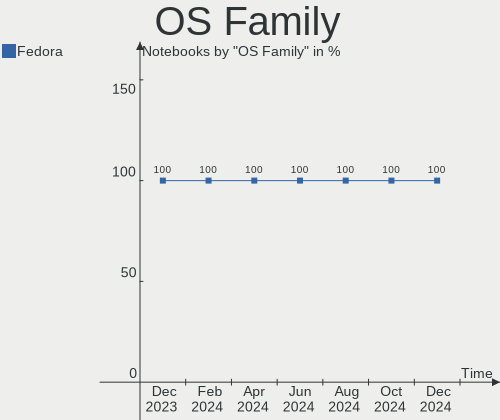
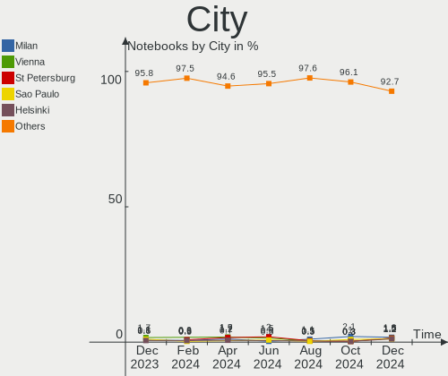
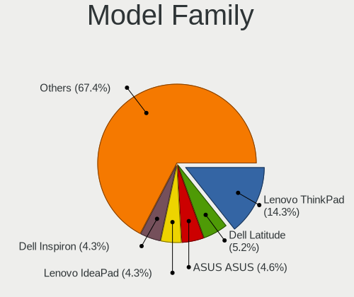
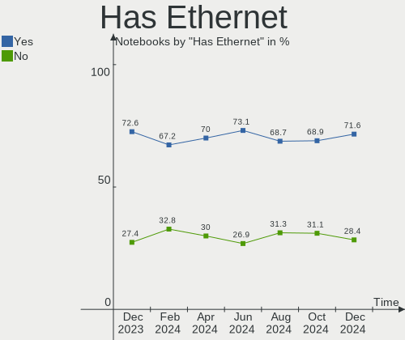
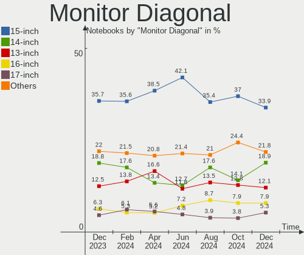
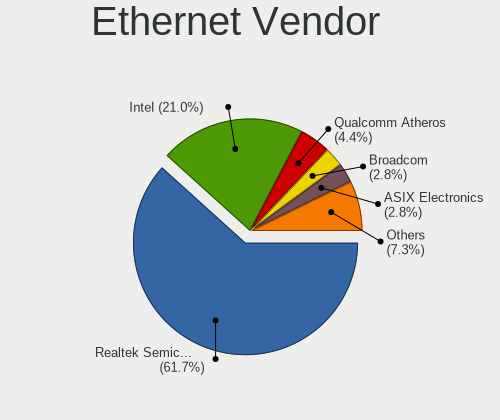

Fedora Hardware Trends (Notebook)
---------------------------------

A project to identify most popular hardware characteristics and track their change
over time based on data collected by Fedora users at https://Linux-Hardware.org.

Anyone can contribute to the study by uploading probes of their computers by
the [hw-probe](https://github.com/linuxhw/hw-probe) tool:

    sudo -E hw-probe -all -upload

Full-feature report is available here: https://linux-hardware.org/?view=trends&formfactor=notebook

Period: Feb, 2021.

Contents
--------

- [ OS                       ](#os)
- [ OS Family                ](#os-family)
- [ Kernel                   ](#kernel)
- [ Kernel Family            ](#kernel-family)
- [ Kernel Major Ver.        ](#kernel-major-ver)
- [ Arch                     ](#arch)
- [ DE                       ](#de)
- [ Display Server           ](#display-server)
- [ Display Manager          ](#display-manager)
- [ OS Lang                  ](#os-lang)
- [ Boot Mode                ](#boot-mode)
- [ Filesystem               ](#filesystem)
- [ Part. scheme             ](#part-scheme)
- [ Dual Boot with Linux/BSD ](#dual-boot-with-linux/bsd)
- [ Dual Boot (Win)          ](#dual-boot-win)
- [ Country                  ](#country)
- [ City                     ](#city)
- [ Vendor                   ](#vendor)
- [ Model                    ](#model)
- [ Model Family             ](#model-family)
- [ MFG Year                 ](#mfg-year)
- [ Form Factor              ](#form-factor)
- [ Secure Boot              ](#secure-boot)
- [ Coreboot                 ](#coreboot)
- [ RAM Size                 ](#ram-size)
- [ RAM Used                 ](#ram-used)
- [ Has CD-ROM               ](#has-cd-rom)
- [ Total Drives             ](#total-drives)
- [ Has Ethernet             ](#has-ethernet)
- [ Drive Vendor             ](#drive-vendor)
- [ Drive Model              ](#drive-model)
- [ HDD Vendor               ](#hdd-vendor)
- [ SSD Vendor               ](#ssd-vendor)
- [ Drive Kind               ](#drive-kind)
- [ Drive Connector          ](#drive-connector)
- [ Drive Size               ](#drive-size)
- [ Space Total              ](#space-total)
- [ Space Used               ](#space-used)
- [ Malfunc. Drives          ](#malfunc-drives)
- [ Malfunc. Drive Vendor    ](#malfunc-drive-vendor)
- [ Malfunc. HDD Vendor      ](#malfunc-hdd-vendor)
- [ Malfunc. Drive Kind      ](#malfunc-drive-kind)
- [ Failed Drives            ](#failed-drives)
- [ Failed Drive Vendor      ](#failed-drive-vendor)
- [ Drive Status             ](#drive-status)
- [ Storage Vendor           ](#storage-vendor)
- [ Storage Model            ](#storage-model)
- [ Storage Kind             ](#storage-kind)
- [ CPU Vendor               ](#cpu-vendor)
- [ CPU Model                ](#cpu-model)
- [ CPU Model Family         ](#cpu-model-family)
- [ CPU Cores                ](#cpu-cores)
- [ CPU Sockets              ](#cpu-sockets)
- [ CPU Threads              ](#cpu-threads)
- [ CPU Op-Modes             ](#cpu-op-modes)
- [ CPU Microcode            ](#cpu-microcode)
- [ CPU Microarch            ](#cpu-microarch)
- [ GPU Vendor               ](#gpu-vendor)
- [ GPU Model                ](#gpu-model)
- [ GPU Combo                ](#gpu-combo)
- [ GPU Driver               ](#gpu-driver)
- [ GPU Memory               ](#gpu-memory)
- [ Monitor Vendor           ](#monitor-vendor)
- [ Monitor Model            ](#monitor-model)
- [ Monitor Resolution       ](#monitor-resolution)
- [ Monitor Diagonal         ](#monitor-diagonal)
- [ Monitor Width            ](#monitor-width)
- [ Aspect Ratio             ](#aspect-ratio)
- [ Monitor Area             ](#monitor-area)
- [ Pixel Density            ](#pixel-density)
- [ Multiple Monitors        ](#multiple-monitors)
- [ Net Controller Vendor    ](#net-controller-vendor)
- [ Net Controller Model     ](#net-controller-model)
- [ Wireless Vendor          ](#wireless-vendor)
- [ Wireless Model           ](#wireless-model)
- [ Ethernet Vendor          ](#ethernet-vendor)
- [ Ethernet Model           ](#ethernet-model)
- [ Net Controller Kind      ](#net-controller-kind)
- [ Used Controller          ](#used-controller)
- [ NICs                     ](#nics)
- [ Memory Vendor            ](#memory-vendor)
- [ Memory Model             ](#memory-model)
- [ Memory Kind              ](#memory-kind)
- [ Memory Form Factor       ](#memory-form-factor)
- [ Memory Size              ](#memory-size)
- [ Memory Speed             ](#memory-speed)
- [ Sound Vendor             ](#sound-vendor)
- [ Sound Model              ](#sound-model)
- [ Camera Vendor            ](#camera-vendor)
- [ Camera Model             ](#camera-model)
- [ Fingerprint Vendor       ](#fingerprint-vendor)
- [ Fingerprint Model        ](#fingerprint-model)
- [ Chipcard Vendor          ](#chipcard-vendor)
- [ Chipcard Model           ](#chipcard-model)
- [ Printer Vendor           ](#printer-vendor)
- [ Printer Model            ](#printer-model)
- [ Scanner Vendor           ](#scanner-vendor)
- [ Scanner Model            ](#scanner-model)
- [ Bluetooth Vendor         ](#bluetooth-vendor)
- [ Bluetooth Model          ](#bluetooth-model)
- [ Unsupported Devices      ](#unsupported-devices)
- [ Unsupported Device Types ](#unsupported-device-types)

OS
--

Installed operating systems

| Name      | Notebooks | Percent |
|-----------|-----------|---------|
| Fedora 33 | 122       | 93.85%  |
| Fedora 32 | 7         | 5.38%   |
| Fedora 34 | 1         | 0.77%   |

OS Family
---------

OS without a version

| Name   | Notebooks | Percent |
|--------|-----------|---------|
| Fedora | 130       | 100%    |

Kernel
------

Version of the Linux kernel

| Version                          | Notebooks | Percent |
|----------------------------------|-----------|---------|
| 5.10.16-200.fc33.x86_64          | 19        | 14.62%  |
| 5.10.13-200.fc33.x86_64          | 19        | 14.62%  |
| 5.10.11-200.fc33.x86_64          | 14        | 10.77%  |
| 5.10.12-200.fc33.x86_64          | 12        | 9.23%   |
| 5.10.10-200.fc33.x86_64          | 12        | 9.23%   |
| 5.10.14-200.fc33.x86_64          | 11        | 8.46%   |
| 5.10.15-200.fc33.x86_64          | 8         | 6.15%   |
| 5.10.17-200.fc33.x86_64          | 7         | 5.38%   |
| 5.8.15-301.fc33.x86_64           | 6         | 4.62%   |
| 5.10.18-200.fc33.x86_64          | 4         | 3.08%   |
| 5.10.11-100.fc32.x86_64          | 3         | 2.31%   |
| 5.11.0+                          | 2         | 1.54%   |
| 5.9.16-200.fc33.x86_64           | 1         | 0.77%   |
| 5.9.11-200.fc33.x86_64           | 1         | 0.77%   |
| 5.6.16-300.fc32.x86_64           | 1         | 0.77%   |
| 5.11.1-155.vanilla.2.fc33.x86_64 | 1         | 0.77%   |
| 5.11.0.sn99                      | 1         | 0.77%   |
| 5.11.0-156.fc34.x86_64           | 1         | 0.77%   |
| 5.11.0-155.fc35.x86_64           | 1         | 0.77%   |
| 5.11.0-0.rc7.149.fc34.x86_64     | 1         | 0.77%   |
| 5.10.9-201.fc33.x86_64           | 1         | 0.77%   |
| 5.10.8-200.fc33.x86_64           | 1         | 0.77%   |
| 5.10.8-100.fc32.x86_64           | 1         | 0.77%   |
| 5.10.13-100.fc32.x86_64          | 1         | 0.77%   |
| 5.10.12-100.fc32.x86_64          | 1         | 0.77%   |

Kernel Family
-------------

Linux kernel without a distro release

| Version | Notebooks | Percent |
|---------|-----------|---------|
| 5.10.13 | 20        | 15.38%  |
| 5.10.16 | 19        | 14.62%  |
| 5.10.11 | 17        | 13.08%  |
| 5.10.12 | 13        | 10%     |
| 5.10.10 | 12        | 9.23%   |
| 5.10.14 | 11        | 8.46%   |
| 5.10.15 | 8         | 6.15%   |
| 5.10.17 | 7         | 5.38%   |
| 5.8.15  | 6         | 4.62%   |
| 5.11.0  | 6         | 4.62%   |
| 5.10.18 | 4         | 3.08%   |
| 5.10.8  | 2         | 1.54%   |
| 5.9.16  | 1         | 0.77%   |
| 5.9.11  | 1         | 0.77%   |
| 5.6.16  | 1         | 0.77%   |
| 5.11.1  | 1         | 0.77%   |
| 5.10.9  | 1         | 0.77%   |

Kernel Major Ver.
-----------------

Linux kernel major version

| Version | Notebooks | Percent |
|---------|-----------|---------|
| 5.10    | 114       | 87.69%  |
| 5.11    | 7         | 5.38%   |
| 5.8     | 6         | 4.62%   |
| 5.9     | 2         | 1.54%   |
| 5.6     | 1         | 0.77%   |

Arch
----

OS architecture (x86_64, i586, etc.)

| Name   | Notebooks | Percent |
|--------|-----------|---------|
| x86_64 | 130       | 100%    |

DE
--

Desktop Environment

| Name       | Notebooks | Percent |
|------------|-----------|---------|
| GNOME      | 101       | 77.69%  |
| KDE5       | 7         | 5.38%   |
| KDE        | 7         | 5.38%   |
| XFCE       | 4         | 3.08%   |
| Unknown    | 4         | 3.08%   |
| X-Cinnamon | 3         | 2.31%   |
| MATE       | 2         | 1.54%   |
| sway       | 1         | 0.77%   |
| Cinnamon   | 1         | 0.77%   |

Display Server
--------------

X11 or Wayland

| Name    | Notebooks | Percent |
|---------|-----------|---------|
| Wayland | 75        | 57.69%  |
| X11     | 50        | 38.46%  |
| Tty     | 4         | 3.08%   |
| Unknown | 1         | 0.77%   |

Display Manager
---------------

SDDM, LightDM, etc.

| Name    | Notebooks | Percent |
|---------|-----------|---------|
| Unknown | 83        | 63.85%  |
| GDM     | 36        | 27.69%  |
| SDDM    | 6         | 4.62%   |
| TDM     | 4         | 3.08%   |
| LightDM | 1         | 0.77%   |

OS Lang
-------

Language

| Lang  | Notebooks | Percent |
|-------|-----------|---------|
| en_US | 75        | 57.69%  |
| en_GB | 11        | 8.46%   |
| pt_BR | 8         | 6.15%   |
| pl_PL | 5         | 3.85%   |
| fr_FR | 4         | 3.08%   |
| de_DE | 4         | 3.08%   |
| cs_CZ | 3         | 2.31%   |
| ru_RU | 2         | 1.54%   |
| es_ES | 2         | 1.54%   |
| en_SG | 2         | 1.54%   |
| en_CA | 2         | 1.54%   |
| en_AU | 2         | 1.54%   |
| tr_TR | 1         | 0.77%   |
| sv_SE | 1         | 0.77%   |
| pt_PT | 1         | 0.77%   |
| nl_NL | 1         | 0.77%   |
| nl_BE | 1         | 0.77%   |
| it_IT | 1         | 0.77%   |
| es_CL | 1         | 0.77%   |
| es_AR | 1         | 0.77%   |
| en_NZ | 1         | 0.77%   |
| de_CH | 1         | 0.77%   |

Boot Mode
---------

EFI or BIOS

| Mode | Notebooks | Percent |
|------|-----------|---------|
| EFI  | 100       | 76.92%  |
| BIOS | 30        | 23.08%  |

Filesystem
----------

Type of filesystem

| Type  | Notebooks | Percent |
|-------|-----------|---------|
| Btrfs | 68        | 52.31%  |
| Ext4  | 60        | 46.15%  |
| Xfs   | 2         | 1.54%   |

Part. scheme
------------

Scheme of partitioning

| Type    | Notebooks | Percent |
|---------|-----------|---------|
| Unknown | 81        | 62.31%  |
| GPT     | 39        | 30%     |
| MBR     | 10        | 7.69%   |

Dual Boot with Linux/BSD
------------------------

Hosting more than one Linux/BSD

| Dual boot | Notebooks | Percent |
|-----------|-----------|---------|
| No        | 124       | 95.38%  |
| Yes       | 6         | 4.62%   |

Dual Boot (Win)
---------------

Hosting Linux and Windows

| Dual boot | Notebooks | Percent |
|-----------|-----------|---------|
| No        | 109       | 83.85%  |
| Yes       | 21        | 16.15%  |

Country
-------

Geographic location (country)

| Country        | Notebooks | Percent |
|----------------|-----------|---------|
| USA            | 27        | 20.77%  |
| Brazil         | 11        | 8.46%   |
| Poland         | 9         | 6.92%   |
| Germany        | 6         | 4.62%   |
| France         | 6         | 4.62%   |
| Netherlands    | 5         | 3.85%   |
| Russia         | 4         | 3.08%   |
| UK             | 3         | 2.31%   |
| Portugal       | 3         | 2.31%   |
| India          | 3         | 2.31%   |
| Czech Republic | 3         | 2.31%   |
| Canada         | 3         | 2.31%   |
| Ukraine        | 2         | 1.54%   |
| Turkey         | 2         | 1.54%   |
| Spain          | 2         | 1.54%   |
| Singapore      | 2         | 1.54%   |
| Romania        | 2         | 1.54%   |
| Mexico         | 2         | 1.54%   |
| Malaysia       | 2         | 1.54%   |
| Iran           | 2         | 1.54%   |
| Indonesia      | 2         | 1.54%   |
| Finland        | 2         | 1.54%   |
| Belgium        | 2         | 1.54%   |
| Australia      | 2         | 1.54%   |
| Argentina      | 2         | 1.54%   |
| Zambia         | 1         | 0.77%   |
| Vietnam        | 1         | 0.77%   |
| Venezuela      | 1         | 0.77%   |
| Switzerland    | 1         | 0.77%   |
| Sweden         | 1         | 0.77%   |
| South Africa   | 1         | 0.77%   |
| Slovakia       | 1         | 0.77%   |
| Serbia         | 1         | 0.77%   |
| Philippines    | 1         | 0.77%   |
| Peru           | 1         | 0.77%   |
| Norway         | 1         | 0.77%   |
| New Zealand    | 1         | 0.77%   |
| Italy          | 1         | 0.77%   |
| Hong Kong      | 1         | 0.77%   |
| Denmark        | 1         | 0.77%   |
| Costa Rica     | 1         | 0.77%   |
| China          | 1         | 0.77%   |
| Chile          | 1         | 0.77%   |
| Bulgaria       | 1         | 0.77%   |
| Bangladesh     | 1         | 0.77%   |
| Austria        | 1         | 0.77%   |

City
----

Geographic location (city)

| City                | Notebooks | Percent |
|---------------------|-----------|---------|
| Krakow              | 3         | 2.31%   |
| Warsaw              | 2         | 1.54%   |
| Toronto             | 2         | 1.54%   |
| Tehran              | 2         | 1.54%   |
| Singapore           | 2         | 1.54%   |
| Ludlow              | 2         | 1.54%   |
| Delft               | 2         | 1.54%   |
| Zielonka            | 1         | 0.77%   |
| Zafra               | 1         | 0.77%   |
| Yaroslavl           | 1         | 0.77%   |
| Wurzburg            | 1         | 0.77%   |
| Wrocław            | 1         | 0.77%   |
| Voluntari           | 1         | 0.77%   |
| Vigneux-sur-Seine   | 1         | 0.77%   |
| Vienna              | 1         | 0.77%   |
| Venray              | 1         | 0.77%   |
| Utrecht             | 1         | 0.77%   |
| The Bronx           | 1         | 0.77%   |
| Tefé               | 1         | 0.77%   |
| Tarawa Terrace II   | 1         | 0.77%   |
| Tampere             | 1         | 0.77%   |
| Talcahuano          | 1         | 0.77%   |
| São Paulo          | 1         | 0.77%   |
| Sydney              | 1         | 0.77%   |
| Surabaya            | 1         | 0.77%   |
| Stafford            | 1         | 0.77%   |
| Springfield         | 1         | 0.77%   |
| Sorocaba            | 1         | 0.77%   |
| Soignies            | 1         | 0.77%   |
| Sofia               | 1         | 0.77%   |
| Sobradinho          | 1         | 0.77%   |
| Secovce             | 1         | 0.77%   |
| San José           | 1         | 0.77%   |
| San Isidro          | 1         | 0.77%   |
| Salvador            | 1         | 0.77%   |
| Saint-Dié          | 1         | 0.77%   |
| Rueil-Malmaison     | 1         | 0.77%   |
| Roskilde            | 1         | 0.77%   |
| Queluz              | 1         | 0.77%   |
| Presidente Prudente | 1         | 0.77%   |
| Prague              | 1         | 0.77%   |
| Poznan              | 1         | 0.77%   |
| Portland            | 1         | 0.77%   |
| Piteşti            | 1         | 0.77%   |
| Petrolandia         | 1         | 0.77%   |
| Paderborn           | 1         | 0.77%   |
| Oslo                | 1         | 0.77%   |
| Oakland             | 1         | 0.77%   |
| Nuremberg           | 1         | 0.77%   |
| Norrtaelje          | 1         | 0.77%   |
| New Westminster     | 1         | 0.77%   |
| New Philadelphia    | 1         | 0.77%   |
| Nagpur              | 1         | 0.77%   |
| Moscow              | 1         | 0.77%   |
| Miranda do Corvo    | 1         | 0.77%   |
| Maracaibo           | 1         | 0.77%   |
| Maple Grove         | 1         | 0.77%   |
| Manaus              | 1         | 0.77%   |
| Mainz               | 1         | 0.77%   |
| Lyon                | 1         | 0.77%   |

Vendor
------

Motherboard manufacturer

| Name             | Notebooks | Percent |
|------------------|-----------|---------|
| Lenovo           | 38        | 29.23%  |
| Hewlett-Packard  | 23        | 17.69%  |
| Dell             | 21        | 16.15%  |
| ASUSTek Computer | 13        | 10%     |
| MSI              | 6         | 4.62%   |
| Sony             | 5         | 3.85%   |
| Acer             | 5         | 3.85%   |
| Notebook         | 4         | 3.08%   |
| Positivo         | 2         | 1.54%   |
| TUXEDO           | 1         | 0.77%   |
| System76         | 1         | 0.77%   |
| SLIMBOOK         | 1         | 0.77%   |
| LG Electronics   | 1         | 0.77%   |
| Insyde           | 1         | 0.77%   |
| HUAWEI           | 1         | 0.77%   |
| GPU Company      | 1         | 0.77%   |
| Gateway          | 1         | 0.77%   |
| Fujitsu          | 1         | 0.77%   |
| CRX              | 1         | 0.77%   |
| AVITA            | 1         | 0.77%   |
| Apple            | 1         | 0.77%   |
| Unknown          | 1         | 0.77%   |

Model
-----

Motherboard model

| Name                                      | Notebooks | Percent |
|-------------------------------------------|-----------|---------|
| HP Notebook                               | 2         | 1.54%   |
| HP Laptop 15-da0xxx                       | 2         | 1.54%   |
| HP EliteBook 850 G5                       | 2         | 1.54%   |
| Dell XPS 15 9500                          | 2         | 1.54%   |
| Dell XPS 13 9360                          | 2         | 1.54%   |
| Dell Precision 7530                       | 2         | 1.54%   |
| TUXEDO Pulse 15 Gen1                      | 1         | 0.77%   |
| System76 Oryx Pro                         | 1         | 0.77%   |
| Sony VPCEH24FX                            | 1         | 0.77%   |
| Sony VPCEB3PGX                            | 1         | 0.77%   |
| Sony VPCCB45FN                            | 1         | 0.77%   |
| Sony SVF15325CLB                          | 1         | 0.77%   |
| Sony SVE14A27CXH                          | 1         | 0.77%   |
| SLIMBOOK PROX15-AMD                       | 1         | 0.77%   |
| Positivo S14CT01                          | 1         | 0.77%   |
| Positivo H14BT58                          | 1         | 0.77%   |
| Notebook P95_96_97Ex,Rx                   | 1         | 0.77%   |
| Notebook P65_P67SE                        | 1         | 0.77%   |
| Notebook NH55RGQ                          | 1         | 0.77%   |
| Notebook N2x0WU                           | 1         | 0.77%   |
| MSI Prestige 14 A10SC                     | 1         | 0.77%   |
| MSI GS70 2OD                              | 1         | 0.77%   |
| MSI GS66 Stealth 10SE                     | 1         | 0.77%   |
| MSI GF75 Thin 10UEK                       | 1         | 0.77%   |
| MSI GF65 Thin 9SD                         | 1         | 0.77%   |
| MSI CR610                                 | 1         | 0.77%   |
| LG S425-L.BC22P1                          | 1         | 0.77%   |
| Lenovo Yoga Slim 7 15ITL05 82AC           | 1         | 0.77%   |
| Lenovo V510-15IKB 80WQ                    | 1         | 0.77%   |
| Lenovo V15-ADA 82C7                       | 1         | 0.77%   |
| Lenovo ThinkPad X395 20NL000TCD           | 1         | 0.77%   |
| Lenovo ThinkPad X390 20SC0009US           | 1         | 0.77%   |
| Lenovo ThinkPad X240 20AMS0PB11           | 1         | 0.77%   |
| Lenovo ThinkPad X240 20AMS0J00N           | 1         | 0.77%   |
| Lenovo ThinkPad X240 20AMA2AE00           | 1         | 0.77%   |
| Lenovo ThinkPad X230 2325F51              | 1         | 0.77%   |
| Lenovo ThinkPad X220 4286C11              | 1         | 0.77%   |
| Lenovo ThinkPad X1 Extreme 2nd 20QVCTO1WW | 1         | 0.77%   |
| Lenovo ThinkPad T590 20N4CTO1WW           | 1         | 0.77%   |
| Lenovo ThinkPad T480s 20L8S66600          | 1         | 0.77%   |
| Lenovo ThinkPad T460s 20FAS1TH00          | 1         | 0.77%   |
| Lenovo ThinkPad T440s 20ARA07500          | 1         | 0.77%   |
| Lenovo ThinkPad T430s 2355G2U             | 1         | 0.77%   |
| Lenovo ThinkPad T430 2349Y3D              | 1         | 0.77%   |
| Lenovo ThinkPad T430 2349DS5              | 1         | 0.77%   |
| Lenovo ThinkPad T420s 4176A11             | 1         | 0.77%   |
| Lenovo ThinkPad T410 2522PT3              | 1         | 0.77%   |
| Lenovo ThinkPad T14 Gen 1 20S00057RT      | 1         | 0.77%   |
| Lenovo ThinkPad P53 20QNS00N00            | 1         | 0.77%   |
| Lenovo ThinkPad L470 W10DG 20JVS0RE00     | 1         | 0.77%   |
| Lenovo ThinkPad E14 20RA0020AU            | 1         | 0.77%   |
| Lenovo Legion 5 15ARH05H 82B1             | 1         | 0.77%   |
| Lenovo Legion 5 15ARH05 82B5              | 1         | 0.77%   |
| Lenovo IdeaPad Y500 20193                 | 1         | 0.77%   |
| Lenovo IdeaPad L340-15API 81LW            | 1         | 0.77%   |
| Lenovo IdeaPad 530S-14IKB 81EU            | 1         | 0.77%   |
| Lenovo IdeaPad 5 15ARE05 81YQ             | 1         | 0.77%   |
| Lenovo IdeaPad 320-15IKB 81G3             | 1         | 0.77%   |
| Lenovo IdeaPad 300-15ISK 80Q7             | 1         | 0.77%   |
| Lenovo G710 20252                         | 1         | 0.77%   |

Model Family
------------

Motherboard model prefix

| Name                  | Notebooks | Percent |
|-----------------------|-----------|---------|
| Lenovo ThinkPad       | 21        | 16.15%  |
| Dell Latitude         | 7         | 5.38%   |
| Lenovo IdeaPad        | 6         | 4.62%   |
| HP Pavilion           | 6         | 4.62%   |
| Dell XPS              | 6         | 4.62%   |
| HP EliteBook          | 5         | 3.85%   |
| HP Laptop             | 4         | 3.08%   |
| HP ProBook            | 3         | 2.31%   |
| Dell Inspiron         | 3         | 2.31%   |
| Lenovo Legion         | 2         | 1.54%   |
| HP Notebook           | 2         | 1.54%   |
| Dell Precision        | 2         | 1.54%   |
| Dell G5               | 2         | 1.54%   |
| ASUS VivoBook         | 2         | 1.54%   |
| Acer Aspire           | 2         | 1.54%   |
| TUXEDO Pulse          | 1         | 0.77%   |
| System76 Oryx         | 1         | 0.77%   |
| Sony VPCEH24FX        | 1         | 0.77%   |
| Sony VPCEB3PGX        | 1         | 0.77%   |
| Sony VPCCB45FN        | 1         | 0.77%   |
| Sony SVF15325CLB      | 1         | 0.77%   |
| Sony SVE14A27CXH      | 1         | 0.77%   |
| SLIMBOOK PROX15-AMD   | 1         | 0.77%   |
| Positivo S14CT01      | 1         | 0.77%   |
| Positivo H14BT58      | 1         | 0.77%   |
| Notebook P95          | 1         | 0.77%   |
| Notebook P65          | 1         | 0.77%   |
| Notebook NH55RGQ      | 1         | 0.77%   |
| Notebook N2x0WU       | 1         | 0.77%   |
| MSI Prestige          | 1         | 0.77%   |
| MSI GS70              | 1         | 0.77%   |
| MSI GS66              | 1         | 0.77%   |
| MSI GF75              | 1         | 0.77%   |
| MSI GF65              | 1         | 0.77%   |
| MSI CR610             | 1         | 0.77%   |
| LG S425-L.BC22P1      | 1         | 0.77%   |
| Lenovo Yoga           | 1         | 0.77%   |
| Lenovo V510-15IKB     | 1         | 0.77%   |
| Lenovo V15-ADA        | 1         | 0.77%   |
| Lenovo G710           | 1         | 0.77%   |
| Lenovo G70-80         | 1         | 0.77%   |
| Lenovo G500           | 1         | 0.77%   |
| Lenovo G480           | 1         | 0.77%   |
| Lenovo G40-70         | 1         | 0.77%   |
| Lenovo Flex           | 1         | 0.77%   |
| Insyde BayTrail       | 1         | 0.77%   |
| HUAWEI BOHK-WAX9X     | 1         | 0.77%   |
| HP Spectre            | 1         | 0.77%   |
| HP 250                | 1         | 0.77%   |
| HP 15                 | 1         | 0.77%   |
| GPU Company GWTN141-4 | 1         | 0.77%   |
| Gateway NE56R         | 1         | 0.77%   |
| Fujitsu STYLISTIC     | 1         | 0.77%   |
| Dell G7               | 1         | 0.77%   |
| CRX CRX156            | 1         | 0.77%   |
| AVITA NS14A1US        | 1         | 0.77%   |
| ASUS Zephyrus         | 1         | 0.77%   |
| ASUS X705UAR          | 1         | 0.77%   |
| ASUS X540UP           | 1         | 0.77%   |
| ASUS X456UQK          | 1         | 0.77%   |

MFG Year
--------

Motherboard manufacture year

| Year | Notebooks | Percent |
|------|-----------|---------|
| 2020 | 41        | 31.54%  |
| 2019 | 21        | 16.15%  |
| 2018 | 14        | 10.77%  |
| 2015 | 10        | 7.69%   |
| 2012 | 8         | 6.15%   |
| 2011 | 8         | 6.15%   |
| 2014 | 7         | 5.38%   |
| 2013 | 6         | 4.62%   |
| 2017 | 4         | 3.08%   |
| 2016 | 4         | 3.08%   |
| 2021 | 3         | 2.31%   |
| 2010 | 3         | 2.31%   |
| 2009 | 1         | 0.77%   |

Form Factor
-----------

Physical design of the computer

| Name     | Notebooks | Percent |
|----------|-----------|---------|
| Notebook | 130       | 100%    |

Secure Boot
-----------

Enabled or disabled

| State    | Notebooks | Percent |
|----------|-----------|---------|
| Disabled | 110       | 84.62%  |
| Enabled  | 20        | 15.38%  |

Coreboot
--------

Have coreboot on board

| Used | Notebooks | Percent |
|------|-----------|---------|
| No   | 130       | 100%    |

RAM Size
--------

Total RAM memory

| Size in GB  | Notebooks | Percent |
|-------------|-----------|---------|
| 4.01-8.0    | 42        | 32.31%  |
| 16.01-24.0  | 34        | 26.15%  |
| 8.01-16.0   | 16        | 12.31%  |
| 32.01-64.0  | 15        | 11.54%  |
| 3.01-4.0    | 13        | 10%     |
| 1.01-2.0    | 4         | 3.08%   |
| 64.01-256.0 | 3         | 2.31%   |
| 24.01-32.0  | 1         | 0.77%   |
| 2.01-3.0    | 1         | 0.77%   |
| 0.51-1.0    | 1         | 0.77%   |

RAM Used
--------

Used RAM memory

| Used GB   | Notebooks | Percent |
|-----------|-----------|---------|
| 4.01-8.0  | 32        | 24.62%  |
| 2.01-3.0  | 32        | 24.62%  |
| 3.01-4.0  | 27        | 20.77%  |
| 1.01-2.0  | 27        | 20.77%  |
| 8.01-16.0 | 7         | 5.38%   |
| 0.51-1.0  | 5         | 3.85%   |

Has CD-ROM
----------

Has CD-ROM on board

| Presented | Notebooks | Percent |
|-----------|-----------|---------|
| No        | 95        | 73.08%  |
| Yes       | 35        | 26.92%  |

Total Drives
------------

Number of drives on board

| Drives | Notebooks | Percent |
|--------|-----------|---------|
| 1      | 87        | 66.92%  |
| 2      | 35        | 26.92%  |
| 3      | 7         | 5.38%   |
| 6      | 1         | 0.77%   |

Has Ethernet
------------

Has Ethernet on board

| Presented | Notebooks | Percent |
|-----------|-----------|---------|
| Yes       | 108       | 83.08%  |
| No        | 22        | 16.92%  |

Drive Vendor
------------

Hard drive vendors

| Vendor                | Notebooks | Drives | Percent |
|-----------------------|-----------|--------|---------|
| Samsung Electronics   | 33        | 40     | 19.88%  |
| Seagate               | 24        | 28     | 14.46%  |
| Unknown               | 11        | 12     | 6.63%   |
| Toshiba               | 11        | 14     | 6.63%   |
| Kingston              | 11        | 11     | 6.63%   |
| WDC                   | 8         | 8      | 4.82%   |
| Sandisk               | 7         | 8      | 4.22%   |
| HGST                  | 7         | 7      | 4.22%   |
| Intel                 | 6         | 9      | 3.61%   |
| SK Hynix              | 4         | 4      | 2.41%   |
| Micron Technology     | 4         | 5      | 2.41%   |
| Crucial               | 4         | 4      | 2.41%   |
| A-DATA Technology     | 4         | 4      | 2.41%   |
| Hitachi               | 3         | 3      | 1.81%   |
| Silicon Motion        | 2         | 2      | 1.2%    |
| Phison                | 2         | 2      | 1.2%    |
| LITEON                | 2         | 2      | 1.2%    |
| China                 | 2         | 2      | 1.2%    |
| Transcend             | 1         | 1      | 0.6%    |
| Team                  | 1         | 1      | 0.6%    |
| SPCC                  | 1         | 1      | 0.6%    |
| Realtek Semiconductor | 1         | 1      | 0.6%    |
| PLEXTOR               | 1         | 1      | 0.6%    |
| Patriot               | 1         | 1      | 0.6%    |
| OSC                   | 1         | 1      | 0.6%    |
| OCZ                   | 1         | 1      | 0.6%    |
| MyDigitalSSD          | 1         | 2      | 0.6%    |
| Maxtor                | 1         | 1      | 0.6%    |
| Mass                  | 1         | 1      | 0.6%    |
| LITEONIT              | 1         | 1      | 0.6%    |
| KingSpec              | 1         | 2      | 0.6%    |
| KingFast              | 1         | 1      | 0.6%    |
| JMicron               | 1         | 1      | 0.6%    |
| Gigabyte Technology   | 1         | 1      | 0.6%    |
| Fujitsu               | 1         | 1      | 0.6%    |
| FORESEE               | 1         | 1      | 0.6%    |
| BIWIN                 | 1         | 1      | 0.6%    |
| Apacer                | 1         | 1      | 0.6%    |
| AGI                   | 1         | 1      | 0.6%    |

Drive Model
-----------

Hard drive models

| Model                                     | Notebooks | Percent |
|-------------------------------------------|-----------|---------|
| Seagate ST1000LM024 HN-M101MBB 1TB        | 4         | 2.21%   |
| Samsung SSD 850 EVO 250GB                 | 4         | 2.21%   |
| Toshiba MQ04ABF100 1TB                    | 3         | 1.66%   |
| Seagate ST1000LM048-2E7172 1TB            | 3         | 1.66%   |
| Samsung NVMe SSD Drive 256GB              | 3         | 1.66%   |
| Kingston NVMe SSD Drive 512GB             | 3         | 1.66%   |
| Intel NVMe SSD Drive 512GB                | 3         | 1.66%   |
| Unknown MMC Card  32GB                    | 2         | 1.1%    |
| Toshiba NVMe SSD Drive 1024GB             | 2         | 1.1%    |
| Seagate ST9500325AS 500GB                 | 2         | 1.1%    |
| Seagate ST500LT012-1DG142 500GB           | 2         | 1.1%    |
| Seagate ST500LM021-1KJ152 500GB           | 2         | 1.1%    |
| Sandisk NVMe SSD Drive 256GB              | 2         | 1.1%    |
| Samsung SSD 970 EVO Plus 500GB            | 2         | 1.1%    |
| Samsung SSD 970 EVO Plus 2TB              | 2         | 1.1%    |
| Samsung SSD 860 EVO 500GB                 | 2         | 1.1%    |
| Samsung SSD 860 EVO 2TB                   | 2         | 1.1%    |
| Samsung NVMe SSD Drive 500GB              | 2         | 1.1%    |
| Samsung MZVLB1T0HBLR-000L7 1TB            | 2         | 1.1%    |
| HGST HTS721010A9E630 1TB                  | 2         | 1.1%    |
| HGST HTS545050A7E680 500GB                | 2         | 1.1%    |
| WDC WD5000LPVX-00V0TT0 500GB              | 1         | 0.55%   |
| WDC WD5000BEVT-60A0RT0 500GB              | 1         | 0.55%   |
| WDC WD10SPZX-24Z10 1TB                    | 1         | 0.55%   |
| WDC WD10SPZX-22Z10T0 1TB                  | 1         | 0.55%   |
| WDC WD10SPCX-24HWST0 1TB                  | 1         | 0.55%   |
| WDC WD10JPVX-55JC3T3 1TB                  | 1         | 0.55%   |
| WDC WD10JPVT-55A1YT0 1TB                  | 1         | 0.55%   |
| WDC PC SN730 SDBPNTY-512G-1032 512GB      | 1         | 0.55%   |
| Unknown SD8GB                             | 1         | 0.55%   |
| Unknown SD08G  8GB                        | 1         | 0.55%   |
| Unknown MMC Card  7GB                     | 1         | 0.55%   |
| Unknown MMC Card  4GB                     | 1         | 0.55%   |
| Unknown MMC Card  3GB                     | 1         | 0.55%   |
| Unknown MMC Card  1GB                     | 1         | 0.55%   |
| Unknown MMC Card  128GB                   | 1         | 0.55%   |
| Unknown BWBC3R  32GB                      | 1         | 0.55%   |
| Unknown BGND3R  32GB                      | 1         | 0.55%   |
| Unknown 032GE4  32GB                      | 1         | 0.55%   |
| Transcend TSB25128P71T1EES 128GB SSD      | 1         | 0.55%   |
| Toshiba THNSN5512GPUK 512GB               | 1         | 0.55%   |
| Toshiba NVMe SSD Drive 512GB              | 1         | 0.55%   |
| Toshiba MQ01ABD100 1TB                    | 1         | 0.55%   |
| Toshiba MQ01ABD050 500GB                  | 1         | 0.55%   |
| Toshiba MK1059GSM 1TB                     | 1         | 0.55%   |
| Toshiba KXG60ZNV1T02 NVMe KIOXIA 1024GB   | 1         | 0.55%   |
| Toshiba KBG40ZNS256G NVMe 256GB           | 1         | 0.55%   |
| Team T253X1960G 1TB SSD                   | 1         | 0.55%   |
| SPCC Solid State Disk 1024GB              | 1         | 0.55%   |
| SK Hynix SKHynix_HFS256GD9TNG-L5B0B 256GB | 1         | 0.55%   |
| SK Hynix SC311 SATA 256GB SSD             | 1         | 0.55%   |
| SK Hynix HFM001TD3JX013N 1TB              | 1         | 0.55%   |
| SK Hynix BC511 NVMe 512GB                 | 1         | 0.55%   |
| Silicon Motion NVMe SSD Drive 512GB       | 1         | 0.55%   |
| Silicon Motion NVMe SSD Drive 1TB         | 1         | 0.55%   |
| Seagate ST9500420AS 500GB                 | 1         | 0.55%   |
| Seagate ST9250410AS 250GB                 | 1         | 0.55%   |
| Seagate ST92503010AS 250GB                | 1         | 0.55%   |
| Seagate ST500LT012-9WS142 500GB           | 1         | 0.55%   |
| Seagate ST2000LX001-1RG174 2TB            | 1         | 0.55%   |

HDD Vendor
----------

Hard disk drive vendors

| Vendor  | Notebooks | Drives | Percent |
|---------|-----------|--------|---------|
| Seagate | 22        | 23     | 47.83%  |
| WDC     | 7         | 7      | 15.22%  |
| HGST    | 7         | 7      | 15.22%  |
| Toshiba | 6         | 7      | 13.04%  |
| Hitachi | 3         | 3      | 6.52%   |
| Fujitsu | 1         | 1      | 2.17%   |

SSD Vendor
----------

Solid state drive vendors

| Vendor              | Notebooks | Drives | Percent |
|---------------------|-----------|--------|---------|
| Samsung Electronics | 17        | 18     | 28.33%  |
| Kingston            | 6         | 6      | 10%     |
| SanDisk             | 5         | 6      | 8.33%   |
| Crucial             | 4         | 4      | 6.67%   |
| A-DATA Technology   | 4         | 4      | 6.67%   |
| Micron Technology   | 2         | 2      | 3.33%   |
| LITEON              | 2         | 2      | 3.33%   |
| Intel               | 2         | 2      | 3.33%   |
| China               | 2         | 2      | 3.33%   |
| Transcend           | 1         | 1      | 1.67%   |
| Team                | 1         | 1      | 1.67%   |
| SPCC                | 1         | 1      | 1.67%   |
| SK Hynix            | 1         | 1      | 1.67%   |
| Seagate             | 1         | 1      | 1.67%   |
| PLEXTOR             | 1         | 1      | 1.67%   |
| Patriot             | 1         | 1      | 1.67%   |
| OSC                 | 1         | 1      | 1.67%   |
| OCZ                 | 1         | 1      | 1.67%   |
| MyDigitalSSD        | 1         | 2      | 1.67%   |
| Maxtor              | 1         | 1      | 1.67%   |
| LITEONIT            | 1         | 1      | 1.67%   |
| KingSpec            | 1         | 1      | 1.67%   |
| FORESEE             | 1         | 1      | 1.67%   |
| BIWIN               | 1         | 1      | 1.67%   |
| Apacer              | 1         | 1      | 1.67%   |

Drive Kind
----------

HDD or SSD

| Kind    | Notebooks | Drives | Percent |
|---------|-----------|--------|---------|
| SSD     | 54        | 63     | 33.33%  |
| NVMe    | 47        | 57     | 29.01%  |
| HDD     | 45        | 48     | 27.78%  |
| MMC     | 11        | 12     | 6.79%   |
| Unknown | 5         | 8      | 3.09%   |

Drive Connector
---------------

SATA, SAS, NVMe, etc.

| Type | Notebooks | Drives | Percent |
|------|-----------|--------|---------|
| SATA | 87        | 110    | 58%     |
| NVMe | 47        | 57     | 31.33%  |
| MMC  | 11        | 12     | 7.33%   |
| SAS  | 5         | 9      | 3.33%   |

Drive Size
----------

Size of hard drive

| Size in TB | Notebooks | Drives | Percent |
|------------|-----------|--------|---------|
| 0.01-0.5   | 56        | 62     | 56%     |
| 0.51-1.0   | 37        | 42     | 37%     |
| 1.01-2.0   | 6         | 6      | 6%      |
| 4.01-10.0  | 1         | 1      | 1%      |

Space Total
-----------

Amount of disk space available on the file system

| Size in GB     | Notebooks | Percent |
|----------------|-----------|---------|
| 101-250        | 29        | 22.31%  |
| 251-500        | 28        | 21.54%  |
| 501-1000       | 21        | 16.15%  |
| 1001-2000      | 14        | 10.77%  |
| Unknown        | 13        | 10%     |
| 1-20           | 8         | 6.15%   |
| 21-50          | 6         | 4.62%   |
| More than 3000 | 5         | 3.85%   |
| 51-100         | 4         | 3.08%   |
| 2001-3000      | 2         | 1.54%   |

Space Used
----------

Amount of used disk space

| Used GB        | Notebooks | Percent |
|----------------|-----------|---------|
| 1-20           | 30        | 23.08%  |
| 51-100         | 23        | 17.69%  |
| 101-250        | 22        | 16.92%  |
| 21-50          | 17        | 13.08%  |
| Unknown        | 13        | 10%     |
| 251-500        | 11        | 8.46%   |
| 501-1000       | 9         | 6.92%   |
| More than 3000 | 3         | 2.31%   |
| 2001-3000      | 1         | 0.77%   |
| 1001-2000      | 1         | 0.77%   |

Malfunc. Drives
---------------

Drive models with a malfunction

| Model                                          | Notebooks | Drives | Percent |
|------------------------------------------------|-----------|--------|---------|
| WDC WD10JPVX-55JC3T3 1TB                       | 1         | 1      | 16.67%  |
| Seagate ST9500325AS 500GB                      | 1         | 1      | 16.67%  |
| Seagate ST500LT012-1DG142 500GB                | 1         | 1      | 16.67%  |
| Micron Technology 1100_MTFDDAV256TBN 256GB SSD | 1         | 1      | 16.67%  |
| Hitachi HTS547575A9E384 752GB                  | 1         | 1      | 16.67%  |
| HGST HTS545050A7E680 500GB                     | 1         | 1      | 16.67%  |

Malfunc. Drive Vendor
---------------------

Vendors of faulty drives

| Vendor            | Notebooks | Drives | Percent |
|-------------------|-----------|--------|---------|
| Seagate           | 2         | 2      | 33.33%  |
| WDC               | 1         | 1      | 16.67%  |
| Micron Technology | 1         | 1      | 16.67%  |
| Hitachi           | 1         | 1      | 16.67%  |
| HGST              | 1         | 1      | 16.67%  |

Malfunc. HDD Vendor
-------------------

Vendors of faulty HDD drives

| Vendor  | Notebooks | Drives | Percent |
|---------|-----------|--------|---------|
| Seagate | 2         | 2      | 40%     |
| WDC     | 1         | 1      | 20%     |
| Hitachi | 1         | 1      | 20%     |
| HGST    | 1         | 1      | 20%     |

Malfunc. Drive Kind
-------------------

Kinds of faulty drives

| Kind | Notebooks | Drives | Percent |
|------|-----------|--------|---------|
| HDD  | 5         | 5      | 83.33%  |
| SSD  | 1         | 1      | 16.67%  |

Failed Drives
-------------

Failed drive models

Zero info for selected period =(

Failed Drive Vendor
-------------------

Failed drive vendors

Zero info for selected period =(

Drive Status
------------

Number of failed and malfunc. drives

| Status   | Notebooks | Drives | Percent |
|----------|-----------|--------|---------|
| Detected | 87        | 123    | 62.59%  |
| Works    | 46        | 59     | 33.09%  |
| Malfunc  | 6         | 6      | 4.32%   |

Storage Vendor
--------------

Storage controller vendors

| Vendor                       | Notebooks | Percent |
|------------------------------|-----------|---------|
| Intel                        | 86        | 58.5%   |
| Samsung Electronics          | 19        | 12.93%  |
| AMD                          | 16        | 10.88%  |
| Kingston Technology Company  | 5         | 3.4%    |
| Toshiba America Info Systems | 4         | 2.72%   |
| SK Hynix                     | 3         | 2.04%   |
| Sandisk                      | 3         | 2.04%   |
| Phison Electronics           | 3         | 2.04%   |
| Silicon Motion               | 2         | 1.36%   |
| Micron Technology            | 2         | 1.36%   |
| Seagate Technology           | 1         | 0.68%   |
| Realtek Semiconductor        | 1         | 0.68%   |
| Lite-On IT Corp. / Plextor   | 1         | 0.68%   |
| KIOXIA                       | 1         | 0.68%   |

Storage Model
-------------

Storage controller models

| Model                                                                                  | Notebooks | Percent |
|----------------------------------------------------------------------------------------|-----------|---------|
| Intel Sunrise Point-LP SATA Controller [AHCI mode]                                     | 16        | 10.46%  |
| Intel 7 Series Chipset Family 6-port SATA Controller [AHCI mode]                       | 15        | 9.8%    |
| AMD FCH SATA Controller [AHCI mode]                                                    | 14        | 9.15%   |
| Samsung NVMe SSD Controller SM981/PM981/PM983                                          | 13        | 8.5%    |
| Intel 82801 Mobile SATA Controller [RAID mode]                                         | 10        | 6.54%   |
| Intel 6 Series/C200 Series Chipset Family 6 port Mobile SATA AHCI Controller           | 10        | 6.54%   |
| Intel 8 Series SATA Controller 1 [AHCI mode]                                           | 8         | 5.23%   |
| Intel Cannon Lake Mobile PCH SATA AHCI Controller                                      | 7         | 4.58%   |
| Samsung Electronics Non-Volatile memory controller                                     | 4         | 2.61%   |
| Intel 8 Series/C220 Series Chipset Family 6-port SATA Controller 1 [AHCI mode]         | 4         | 2.61%   |
| Phison PS5013 E13 NVMe Controller                                                      | 3         | 1.96%   |
| Kingston Company Company Non-Volatile memory controller                                | 3         | 1.96%   |
| Intel Wildcat Point-LP SATA Controller [AHCI Mode]                                     | 3         | 1.96%   |
| Toshiba America Info Systems XG6 NVMe SSD Controller                                   | 2         | 1.31%   |
| Toshiba America Info Systems XG4 NVMe SSD Controller                                   | 2         | 1.31%   |
| SK Hynix Non-Volatile memory controller                                                | 2         | 1.31%   |
| Silicon Motion SM2263EN/SM2263XT SSD Controller                                        | 2         | 1.31%   |
| Micron Non-Volatile memory controller                                                  | 2         | 1.31%   |
| Intel SSD 660P Series                                                                  | 2         | 1.31%   |
| Intel Non-Volatile memory controller                                                   | 2         | 1.31%   |
| Intel Atom Processor E3800 Series SATA AHCI Controller                                 | 2         | 1.31%   |
| Intel 5 Series/3400 Series Chipset 6 port SATA AHCI Controller                         | 2         | 1.31%   |
| Intel 5 Series/3400 Series Chipset 4 port SATA AHCI Controller                         | 2         | 1.31%   |
| AMD SB7x0/SB8x0/SB9x0 SATA Controller [AHCI mode]                                      | 2         | 1.31%   |
| Toshiba America Info Systems Toshiba America Info Non-Volatile memory controller       | 1         | 0.65%   |
| SK Hynix BC511                                                                         | 1         | 0.65%   |
| Seagate Non-Volatile memory controller                                                 | 1         | 0.65%   |
| Sandisk WD Blue SN500 / PC SN520 NVMe SSD                                              | 1         | 0.65%   |
| Sandisk WD Black SN750 / PC SN730 NVMe SSD                                             | 1         | 0.65%   |
| Sandisk WD Black 2018/SN750 / PC SN720 NVMe SSD                                        | 1         | 0.65%   |
| Samsung NVMe SSD Controller SM961/PM961/SM963                                          | 1         | 0.65%   |
| Samsung NVMe SSD Controller PM9A1/980PRO                                               | 1         | 0.65%   |
| Realtek RTS5763DL NVMe SSD Controller                                                  | 1         | 0.65%   |
| Lite-On IT Corp. / Plextor M6e PCI Express SSD [Marvell 88SS9183]                      | 1         | 0.65%   |
| KIOXIA Non-Volatile memory controller                                                  | 1         | 0.65%   |
| Kingston Company U-SNS8154P3 NVMe SSD                                                  | 1         | 0.65%   |
| Kingston Company A2000 NVMe SSD                                                        | 1         | 0.65%   |
| Intel SATA Controller [RAID mode]                                                      | 1         | 0.65%   |
| Intel Ice Lake-LP SATA Controller [AHCI mode]                                          | 1         | 0.65%   |
| Intel Comet Lake SATA AHCI Controller                                                  | 1         | 0.65%   |
| Intel Celeron/Pentium Silver Processor SATA Controller                                 | 1         | 0.65%   |
| Intel 6 Series/C200 Series Chipset Family Mobile SATA Controller (IDE mode, ports 4-5) | 1         | 0.65%   |
| Intel 6 Series/C200 Series Chipset Family Mobile SATA Controller (IDE mode, ports 0-3) | 1         | 0.65%   |
| Intel 400 Series Chipset Family SATA AHCI Controller                                   | 1         | 0.65%   |
| AMD SB7x0/SB8x0/SB9x0 IDE Controller                                                   | 1         | 0.65%   |

Storage Kind
------------

Kind of storage controller (IDE, SATA, NVMe, SAS, ...)

| Kind | Notebooks | Percent |
|------|-----------|---------|
| SATA | 89        | 59.73%  |
| NVMe | 47        | 31.54%  |
| RAID | 11        | 7.38%   |
| IDE  | 2         | 1.34%   |

CPU Vendor
----------

Processor vendors

| Vendor | Notebooks | Percent |
|--------|-----------|---------|
| Intel  | 108       | 83.08%  |
| AMD    | 22        | 16.92%  |

CPU Model
---------

Processor models

| Model                                         | Notebooks | Percent |
|-----------------------------------------------|-----------|---------|
| Intel Core i7-8550U CPU @ 1.80GHz             | 5         | 3.85%   |
| Intel Core i5-8250U CPU @ 1.60GHz             | 5         | 3.85%   |
| Intel Core i5-3320M CPU @ 2.60GHz             | 5         | 3.85%   |
| Intel Core i7-9750H CPU @ 2.60GHz             | 4         | 3.08%   |
| AMD Ryzen 7 4800H with Radeon Graphics        | 4         | 3.08%   |
| Intel Core i7-8750H CPU @ 2.20GHz             | 3         | 2.31%   |
| Intel Core i7-7500U CPU @ 2.70GHz             | 3         | 2.31%   |
| Intel Core i7-10750H CPU @ 2.60GHz            | 3         | 2.31%   |
| Intel Core i5-6300U CPU @ 2.40GHz             | 3         | 2.31%   |
| Intel Core i5-6200U CPU @ 2.30GHz             | 3         | 2.31%   |
| Intel Core i5-4200U CPU @ 1.60GHz             | 3         | 2.31%   |
| Intel Core i5-10210U CPU @ 1.60GHz            | 3         | 2.31%   |
| Intel Core i3-3110M CPU @ 2.40GHz             | 3         | 2.31%   |
| AMD Ryzen 5 4600H with Radeon Graphics        | 3         | 2.31%   |
| AMD Ryzen 5 3500U with Radeon Vega Mobile Gfx | 3         | 2.31%   |
| Intel Core i7-8565U CPU @ 1.80GHz             | 2         | 1.54%   |
| Intel Core i7-3520M CPU @ 2.90GHz             | 2         | 1.54%   |
| Intel Core i7-2630QM CPU @ 2.00GHz            | 2         | 1.54%   |
| Intel Core i7-10510U CPU @ 1.80GHz            | 2         | 1.54%   |
| Intel Core i5-8350U CPU @ 1.70GHz             | 2         | 1.54%   |
| Intel Core i5-7200U CPU @ 2.50GHz             | 2         | 1.54%   |
| Intel Core i5-4300U CPU @ 1.90GHz             | 2         | 1.54%   |
| Intel Core i5-2520M CPU @ 2.50GHz             | 2         | 1.54%   |
| Intel Core i5-1035G1 CPU @ 1.00GHz            | 2         | 1.54%   |
| Intel Core i5 CPU M 540 @ 2.53GHz             | 2         | 1.54%   |
| Intel Core i3-2310M CPU @ 2.10GHz             | 2         | 1.54%   |
| Intel Atom CPU Z3735F @ 1.33GHz               | 2         | 1.54%   |
| Intel Xeon E-2176M CPU @ 2.70GHz              | 1         | 0.77%   |
| Intel Pentium CPU N3540 @ 2.16GHz             | 1         | 0.77%   |
| Intel Pentium CPU B960 @ 2.20GHz              | 1         | 0.77%   |
| Intel Pentium CPU B950 @ 2.10GHz              | 1         | 0.77%   |
| Intel Core i9-9980HK CPU @ 2.40GHz            | 1         | 0.77%   |
| Intel Core i9-9880H CPU @ 2.30GHz             | 1         | 0.77%   |
| Intel Core i9-8950HK CPU @ 2.90GHz            | 1         | 0.77%   |
| Intel Core i7-7700HQ CPU @ 2.80GHz            | 1         | 0.77%   |
| Intel Core i7-6500U CPU @ 2.50GHz             | 1         | 0.77%   |
| Intel Core i7-5500U CPU @ 2.40GHz             | 1         | 0.77%   |
| Intel Core i7-4860HQ CPU @ 2.40GHz            | 1         | 0.77%   |
| Intel Core i7-4710HQ CPU @ 2.50GHz            | 1         | 0.77%   |
| Intel Core i7-4700HQ CPU @ 2.40GHz            | 1         | 0.77%   |
| Intel Core i7-4600U CPU @ 2.10GHz             | 1         | 0.77%   |
| Intel Core i7-4510U CPU @ 2.00GHz             | 1         | 0.77%   |
| Intel Core i7-4500U CPU @ 1.80GHz             | 1         | 0.77%   |
| Intel Core i7-3632QM CPU @ 2.20GHz            | 1         | 0.77%   |
| Intel Core i7-3630QM CPU @ 2.40GHz            | 1         | 0.77%   |
| Intel Core i7-2820QM CPU @ 2.30GHz            | 1         | 0.77%   |
| Intel Core i5-7Y54 CPU @ 1.20GHz              | 1         | 0.77%   |
| Intel Core i5-6440HQ CPU @ 2.60GHz            | 1         | 0.77%   |
| Intel Core i5-5300U CPU @ 2.30GHz             | 1         | 0.77%   |
| Intel Core i5-5200U CPU @ 2.20GHz             | 1         | 0.77%   |
| Intel Core i5-3337U CPU @ 1.80GHz             | 1         | 0.77%   |
| Intel Core i5-3317U CPU @ 1.70GHz             | 1         | 0.77%   |
| Intel Core i5-3230M CPU @ 2.60GHz             | 1         | 0.77%   |
| Intel Core i5-2450M CPU @ 2.50GHz             | 1         | 0.77%   |
| Intel Core i5-10300H CPU @ 2.50GHz            | 1         | 0.77%   |
| Intel Core i5 CPU M 430 @ 2.27GHz             | 1         | 0.77%   |
| Intel Core i3-8130U CPU @ 2.20GHz             | 1         | 0.77%   |
| Intel Core i3-7020U CPU @ 2.30GHz             | 1         | 0.77%   |
| Intel Core i3-5020U CPU @ 2.20GHz             | 1         | 0.77%   |
| Intel Core i3-4100M CPU @ 2.50GHz             | 1         | 0.77%   |

CPU Model Family
----------------

Processor model prefix

| Model           | Notebooks | Percent |
|-----------------|-----------|---------|
| Intel Core i5   | 44        | 33.85%  |
| Intel Core i7   | 38        | 29.23%  |
| Intel Core i3   | 11        | 8.46%   |
| AMD Ryzen 5     | 8         | 6.15%   |
| Intel Atom      | 5         | 3.85%   |
| AMD Ryzen 7     | 5         | 3.85%   |
| Intel Pentium   | 3         | 2.31%   |
| Intel Core i9   | 3         | 2.31%   |
| Other           | 2         | 1.54%   |
| Intel Celeron   | 2         | 1.54%   |
| Intel Xeon      | 1         | 0.77%   |
| AMD Sempron     | 1         | 0.77%   |
| AMD Ryzen 9     | 1         | 0.77%   |
| AMD Ryzen 5 PRO | 1         | 0.77%   |
| AMD Ryzen 3     | 1         | 0.77%   |
| AMD E           | 1         | 0.77%   |
| AMD Athlon      | 1         | 0.77%   |
| AMD A6          | 1         | 0.77%   |
| AMD A10         | 1         | 0.77%   |

CPU Cores
---------

Number of processor cores

| Number | Notebooks | Percent |
|--------|-----------|---------|
| 2      | 59        | 45.38%  |
| 4      | 47        | 36.15%  |
| 6      | 16        | 12.31%  |
| 8      | 7         | 5.38%   |
| 1      | 1         | 0.77%   |

CPU Sockets
-----------

Number of sockets

| Number | Notebooks | Percent |
|--------|-----------|---------|
| 1      | 130       | 100%    |

CPU Threads
-----------

Threads per core (Hyper-Threading)

| Number | Notebooks | Percent |
|--------|-----------|---------|
| 2      | 115       | 88.46%  |
| 1      | 15        | 11.54%  |

CPU Op-Modes
------------

CPU Operation Modes (32-bit, 64-bit)

| Op mode        | Notebooks | Percent |
|----------------|-----------|---------|
| 32-bit, 64-bit | 130       | 100%    |

CPU Microcode
-------------

Microcode number

| Number     | Notebooks | Percent |
|------------|-----------|---------|
| 0x306a9    | 14        | 10.77%  |
| 0x806ea    | 12        | 9.23%   |
| 0x206a7    | 11        | 8.46%   |
| Unknown    | 10        | 7.69%   |
| 0x40651    | 8         | 6.15%   |
| 0x906ea    | 7         | 5.38%   |
| 0x406e3    | 7         | 5.38%   |
| 0x30678    | 6         | 4.62%   |
| 0x806ec    | 5         | 3.85%   |
| 0x806e9    | 5         | 3.85%   |
| 0xa0652    | 4         | 3.08%   |
| 0x306d4    | 4         | 3.08%   |
| 0x08108102 | 4         | 3.08%   |
| 0x906ed    | 3         | 2.31%   |
| 0x306c3    | 3         | 2.31%   |
| 0x08600103 | 3         | 2.31%   |
| 0x20655    | 2         | 1.54%   |
| 0x20652    | 2         | 1.54%   |
| 0x08600106 | 2         | 1.54%   |
| 0x08600104 | 2         | 1.54%   |
| 0x08108109 | 2         | 1.54%   |
| 0x906e9    | 1         | 0.77%   |
| 0x806eb    | 1         | 0.77%   |
| 0x806c1    | 1         | 0.77%   |
| 0x706e5    | 1         | 0.77%   |
| 0x706a8    | 1         | 0.77%   |
| 0x506e3    | 1         | 0.77%   |
| 0x406c3    | 1         | 0.77%   |
| 0x40661    | 1         | 0.77%   |
| 0x08600102 | 1         | 0.77%   |
| 0x0810100b | 1         | 0.77%   |
| 0x07030106 | 1         | 0.77%   |
| 0x0600611a | 1         | 0.77%   |
| 0x06006110 | 1         | 0.77%   |
| 0x05000119 | 1         | 0.77%   |

CPU Microarch
-------------

Microarchitecture

| Name          | Notebooks | Percent |
|---------------|-----------|---------|
| KabyLake      | 39        | 30%     |
| IvyBridge     | 15        | 11.54%  |
| Haswell       | 12        | 9.23%   |
| SandyBridge   | 11        | 8.46%   |
| Zen 2         | 8         | 6.15%   |
| Skylake       | 8         | 6.15%   |
| Zen+          | 7         | 5.38%   |
| Silvermont    | 7         | 5.38%   |
| Westmere      | 4         | 3.08%   |
| CometLake     | 4         | 3.08%   |
| Broadwell     | 4         | 3.08%   |
| IceLake       | 2         | 1.54%   |
| Excavator     | 2         | 1.54%   |
| Zen           | 1         | 0.77%   |
| TigerLake     | 1         | 0.77%   |
| Puma          | 1         | 0.77%   |
| K10           | 1         | 0.77%   |
| Goldmont plus | 1         | 0.77%   |
| Bobcat        | 1         | 0.77%   |
| Unknown       | 1         | 0.77%   |

GPU Vendor
----------

Vendors of graphics cards

| Vendor | Notebooks | Percent |
|--------|-----------|---------|
| Intel  | 104       | 59.43%  |
| Nvidia | 38        | 21.71%  |
| AMD    | 33        | 18.86%  |

GPU Model
---------

Graphics card models

| Model                                                                                    | Notebooks | Percent |
|------------------------------------------------------------------------------------------|-----------|---------|
| Intel UHD Graphics 620                                                                   | 13        | 7.34%   |
| Intel 3rd Gen Core processor Graphics Controller                                         | 13        | 7.34%   |
| Intel CoffeeLake-H GT2 [UHD Graphics 630]                                                | 10        | 5.65%   |
| Intel 2nd Generation Core Processor Family Integrated Graphics Controller                | 10        | 5.65%   |
| Intel Haswell-ULT Integrated Graphics Controller                                         | 8         | 4.52%   |
| Intel Skylake GT2 [HD Graphics 520]                                                      | 7         | 3.95%   |
| AMD Renoir                                                                               | 7         | 3.95%   |
| AMD Picasso                                                                              | 7         | 3.95%   |
| Intel HD Graphics 620                                                                    | 6         | 3.39%   |
| Intel Atom Processor Z36xxx/Z37xxx Series Graphics & Display                             | 6         | 3.39%   |
| Intel CometLake-U GT2 [UHD Graphics]                                                     | 5         | 2.82%   |
| Intel HD Graphics 5500                                                                   | 4         | 2.26%   |
| Intel Core Processor Integrated Graphics Controller                                      | 4         | 2.26%   |
| Intel CometLake-H GT2 [UHD Graphics]                                                     | 4         | 2.26%   |
| Nvidia TU117M [GeForce GTX 1650 Ti Mobile]                                               | 3         | 1.69%   |
| Nvidia TU117M [GeForce GTX 1650 Mobile / Max-Q]                                          | 3         | 1.69%   |
| Intel 4th Gen Core Processor Integrated Graphics Controller                              | 3         | 1.69%   |
| Nvidia TU116M [GeForce GTX 1660 Ti Mobile]                                               | 2         | 1.13%   |
| Nvidia TU106M [GeForce RTX 2060 Mobile]                                                  | 2         | 1.13%   |
| Nvidia GP108M [GeForce MX150]                                                            | 2         | 1.13%   |
| Nvidia GP106M [GeForce GTX 1060 Mobile]                                                  | 2         | 1.13%   |
| Nvidia GM108M [GeForce 940M]                                                             | 2         | 1.13%   |
| Intel WhiskeyLake-U GT2 [UHD Graphics 620]                                               | 2         | 1.13%   |
| Intel Iris Plus Graphics G1 (Ice Lake)                                                   | 2         | 1.13%   |
| AMD Whistler [Radeon HD 6730M/6770M/7690M XT]                                            | 2         | 1.13%   |
| AMD Wani [Radeon R5/R6/R7 Graphics]                                                      | 2         | 1.13%   |
| AMD Topaz XT [Radeon R7 M260/M265 / M340/M360 / M440/M445 / 530/535 / 620/625 Mobile]    | 2         | 1.13%   |
| AMD Sun XT [Radeon HD 8670A/8670M/8690M / R5 M330 / M430 / Radeon 520 Mobile]            | 2         | 1.13%   |
| Nvidia TU117M                                                                            | 1         | 0.56%   |
| Nvidia TU117GLM [Quadro T2000 Mobile / Max-Q]                                            | 1         | 0.56%   |
| Nvidia TU106M [GeForce RTX 2070 Mobile]                                                  | 1         | 0.56%   |
| Nvidia GP108M [GeForce MX250]                                                            | 1         | 0.56%   |
| Nvidia GP108M [GeForce MX230]                                                            | 1         | 0.56%   |
| Nvidia GP107M [GeForce GTX 1050 Ti Mobile]                                               | 1         | 0.56%   |
| Nvidia GP107GLM [Quadro P1000 Mobile]                                                    | 1         | 0.56%   |
| Nvidia GP104M [GeForce GTX 1070 Mobile]                                                  | 1         | 0.56%   |
| Nvidia GM204M [GeForce GTX 980M]                                                         | 1         | 0.56%   |
| Nvidia GM204M [GeForce GTX 970M]                                                         | 1         | 0.56%   |
| Nvidia GM108M [GeForce MX110]                                                            | 1         | 0.56%   |
| Nvidia GM108M [GeForce 940MX]                                                            | 1         | 0.56%   |
| Nvidia GM108M [GeForce 930MX]                                                            | 1         | 0.56%   |
| Nvidia GM108M [GeForce 840M]                                                             | 1         | 0.56%   |
| Nvidia GK208M [GeForce GT 740M]                                                          | 1         | 0.56%   |
| Nvidia GK208BM [GeForce 920M]                                                            | 1         | 0.56%   |
| Nvidia GK107M [GeForce GT 650M]                                                          | 1         | 0.56%   |
| Nvidia GK106M [GeForce GTX 765M]                                                         | 1         | 0.56%   |
| Nvidia GF108GLM [NVS 5200M]                                                              | 1         | 0.56%   |
| Nvidia GF106GLM [Quadro 2000M]                                                           | 1         | 0.56%   |
| Nvidia GA106M [GeForce RTX 3060 Mobile / Max-Q]                                          | 1         | 0.56%   |
| Nvidia GA104M [GeForce RTX 3080 Mobile / Max-Q 8GB/16GB]                                 | 1         | 0.56%   |
| Intel TigerLake GT2 [Iris Xe Graphics]                                                   | 1         | 0.56%   |
| Intel HD Graphics 630                                                                    | 1         | 0.56%   |
| Intel HD Graphics 615                                                                    | 1         | 0.56%   |
| Intel HD Graphics 530                                                                    | 1         | 0.56%   |
| Intel GeminiLake [UHD Graphics 600]                                                      | 1         | 0.56%   |
| Intel Coffee Lake UHD Graphics P630                                                      | 1         | 0.56%   |
| Intel Atom/Celeron/Pentium Processor x5-E8000/J3xxx/N3xxx Integrated Graphics Controller | 1         | 0.56%   |
| AMD Wrestler [Radeon HD 6320]                                                            | 1         | 0.56%   |
| AMD Whistler [Radeon HD 6630M/6650M/6750M/7670M/7690M]                                   | 1         | 0.56%   |
| AMD Thames [Radeon HD 7550M/7570M/7650M]                                                 | 1         | 0.56%   |

GPU Combo
---------

Combinations of graphics cards

| Name           | Notebooks | Percent |
|----------------|-----------|---------|
| 1 x Intel      | 64        | 49.23%  |
| Intel + Nvidia | 28        | 21.54%  |
| 1 x AMD        | 14        | 10.77%  |
| Intel + AMD    | 12        | 9.23%   |
| 1 x Nvidia     | 5         | 3.85%   |
| AMD + Nvidia   | 5         | 3.85%   |
| 2 x AMD        | 2         | 1.54%   |

GPU Driver
----------

Free vs proprietary

| Driver      | Notebooks | Percent |
|-------------|-----------|---------|
| Free        | 113       | 86.92%  |
| Proprietary | 17        | 13.08%  |

GPU Memory
----------

Total video memory

| Size in GB | Notebooks | Percent |
|------------|-----------|---------|
| Unknown    | 79        | 60.77%  |
| 1.01-2.0   | 19        | 14.62%  |
| 3.01-4.0   | 10        | 7.69%   |
| 0.01-0.5   | 9         | 6.92%   |
| 0.51-1.0   | 6         | 4.62%   |
| 5.01-6.0   | 5         | 3.85%   |
| 7.01-8.0   | 2         | 1.54%   |

Monitor Vendor
--------------

Monitor vendors

| Vendor                  | Notebooks | Percent |
|-------------------------|-----------|---------|
| AU Optronics            | 35        | 21.88%  |
| LG Display              | 26        | 16.25%  |
| BOE                     | 20        | 12.5%   |
| Chimei Innolux          | 14        | 8.75%   |
| Samsung Electronics     | 13        | 8.13%   |
| Dell                    | 9         | 5.63%   |
| Sharp                   | 8         | 5%      |
| Hewlett-Packard         | 4         | 2.5%    |
| Chi Mei Optoelectronics | 4         | 2.5%    |
| PANDA                   | 3         | 1.88%   |
| Goldstar                | 3         | 1.88%   |
| Ancor Communications    | 3         | 1.88%   |
| Acer                    | 3         | 1.88%   |
| LGD                     | 2         | 1.25%   |
| Lenovo                  | 2         | 1.25%   |
| ViewSonic               | 1         | 0.63%   |
| Unknown (ACA)           | 1         | 0.63%   |
| Philips                 | 1         | 0.63%   |
| Panasonic               | 1         | 0.63%   |
| Lenovo Group Limited    | 1         | 0.63%   |
| JRY                     | 1         | 0.63%   |
| InfoVision              | 1         | 0.63%   |
| CPT                     | 1         | 0.63%   |
| BenQ                    | 1         | 0.63%   |
| ASUSTek Computer        | 1         | 0.63%   |
| Apple                   | 1         | 0.63%   |

Monitor Model
-------------

Monitor models

| Model                                                                 | Notebooks | Percent |
|-----------------------------------------------------------------------|-----------|---------|
| LG Display LCD Monitor LGD053F 1920x1080 344x194mm 15.5-inch          | 3         | 1.83%   |
| Sharp LQ156M1JW01 SHP14C3 1920x1080 344x194mm 15.5-inch               | 2         | 1.22%   |
| LG Display LCD Monitor LGD033A 1366x768 340x190mm 15.3-inch           | 2         | 1.22%   |
| Goldstar LG ULTRAWIDE GSM59F1 1920x1080 580x240mm 24.7-inch           | 2         | 1.22%   |
| Chimei Innolux LCD Monitor CMN14A7 1920x1080 308x173mm 13.9-inch      | 2         | 1.22%   |
| BOE LCD Monitor BOE0812 1920x1080 344x194mm 15.5-inch                 | 2         | 1.22%   |
| AU Optronics LCD Monitor AUO38ED 1920x1080 340x190mm 15.3-inch        | 2         | 1.22%   |
| AU Optronics LCD Monitor AUO21ED 1920x1080 344x194mm 15.5-inch        | 2         | 1.22%   |
| AU Optronics LCD Monitor AUO213E 1600x900 309x174mm 14.0-inch         | 2         | 1.22%   |
| AU Optronics LCD Monitor AUO123D 1920x1080 309x173mm 13.9-inch        | 2         | 1.22%   |
| ViewSonic V3D231 Series VSC4C29 1920x1080 510x290mm 23.1-inch         | 1         | 0.61%   |
| Unknown (ACA) FH-HD4K ACA0CCD 2560x1600 480x270mm 21.7-inch           | 1         | 0.61%   |
| Sharp LQ156M1JW25 SHP152C 1920x1080 344x194mm 15.5-inch               | 1         | 0.61%   |
| Sharp LQ156M1JW03 SHP14C5 1920x1080 344x194mm 15.5-inch               | 1         | 0.61%   |
| Sharp LCD Monitor SHP14D1 1920x1200 336x210mm 15.6-inch               | 1         | 0.61%   |
| Sharp LCD Monitor SHP14D0 3840x2400 336x210mm 15.6-inch               | 1         | 0.61%   |
| Sharp LCD Monitor SHP144A 3200x1800 294x165mm 13.3-inch               | 1         | 0.61%   |
| Sharp LCD Monitor SHP1449 1920x1080 294x165mm 13.3-inch               | 1         | 0.61%   |
| Samsung Electronics SyncMaster SAM011F 1280x1024 376x301mm 19.0-inch  | 1         | 0.61%   |
| Samsung Electronics SMS27A350H SAM07CE 1920x1080 598x336mm 27.0-inch  | 1         | 0.61%   |
| Samsung Electronics S19A10N SAM083E 1366x768 410x230mm 18.5-inch      | 1         | 0.61%   |
| Samsung Electronics LCD Monitor SEC454C 1366x768 309x174mm 14.0-inch  | 1         | 0.61%   |
| Samsung Electronics LCD Monitor SEC4256 1600x900 382x215mm 17.3-inch  | 1         | 0.61%   |
| Samsung Electronics LCD Monitor SEC3642 1366x768 344x194mm 15.5-inch  | 1         | 0.61%   |
| Samsung Electronics LCD Monitor SEC3641 1366x768 353x198mm 15.9-inch  | 1         | 0.61%   |
| Samsung Electronics LCD Monitor SEC3354 1600x900 382x215mm 17.3-inch  | 1         | 0.61%   |
| Samsung Electronics LCD Monitor SEC3047 1366x768 277x156mm 12.5-inch  | 1         | 0.61%   |
| Samsung Electronics LCD Monitor SDC4C48 1920x1080 409x230mm 18.5-inch | 1         | 0.61%   |
| Samsung Electronics LCD Monitor SDC4951 1366x768 344x194mm 15.5-inch  | 1         | 0.61%   |
| Samsung Electronics LCD Monitor SDC280F 1366x768 344x193mm 15.5-inch  | 1         | 0.61%   |
| Samsung Electronics LC32G7xT SAM705A 2560x1440 698x393mm 31.5-inch    | 1         | 0.61%   |
| Samsung Electronics Color LCD SDCA029 2160x1440 252x168mm 11.9-inch   | 1         | 0.61%   |
| Philips PHL 234E5 PHLC0C7 1920x1080 509x286mm 23.0-inch               | 1         | 0.61%   |
| PANDA LCD Monitor NCP004D 1920x1080 344x194mm 15.5-inch               | 1         | 0.61%   |
| PANDA LCD Monitor NCP004A 1920x1080 309x174mm 14.0-inch               | 1         | 0.61%   |
| PANDA LCD Monitor NCP0036 1920x1080 344x194mm 15.5-inch               | 1         | 0.61%   |
| Panasonic VVX13F009G00 MEI96A2 1920x1080 290x170mm 13.2-inch          | 1         | 0.61%   |
| LGD LCD Monitor 3926x1440                                             | 1         | 0.61%   |
| LGD LCD Monitor 1920x1080                                             | 1         | 0.61%   |
| LG Display LCD Monitor LGDD302 1366x768 277x156mm 12.5-inch           | 1         | 0.61%   |
| LG Display LCD Monitor LGD0685 1920x1080 309x174mm 14.0-inch          | 1         | 0.61%   |
| LG Display LCD Monitor LGD060A 1920x1080 294x165mm 13.3-inch          | 1         | 0.61%   |
| LG Display LCD Monitor LGD05E5 1920x1080 344x194mm 15.5-inch          | 1         | 0.61%   |
| LG Display LCD Monitor LGD05D8 1920x1080 344x194mm 15.5-inch          | 1         | 0.61%   |
| LG Display LCD Monitor LGD0540 1920x1080 344x194mm 15.5-inch          | 1         | 0.61%   |
| LG Display LCD Monitor LGD04FF 1920x1080 309x174mm 14.0-inch          | 1         | 0.61%   |
| LG Display LCD Monitor LGD0451 1920x1080 345x194mm 15.6-inch          | 1         | 0.61%   |
| LG Display LCD Monitor LGD044F 1920x1080 350x190mm 15.7-inch          | 1         | 0.61%   |
| LG Display LCD Monitor LGD0437 1920x1080 276x156mm 12.5-inch          | 1         | 0.61%   |
| LG Display LCD Monitor LGD040A 1920x1080 310x170mm 13.9-inch          | 1         | 0.61%   |
| LG Display LCD Monitor LGD03CD 1366x768 277x156mm 12.5-inch           | 1         | 0.61%   |
| LG Display LCD Monitor LGD03B3 1366x768 309x174mm 14.0-inch           | 1         | 0.61%   |
| LG Display LCD Monitor LGD036C 1366x768 277x156mm 12.5-inch           | 1         | 0.61%   |
| LG Display LCD Monitor LGD0362 1600x900 309x174mm 14.0-inch           | 1         | 0.61%   |
| LG Display LCD Monitor LGD0335 1366x768 310x174mm 14.0-inch           | 1         | 0.61%   |
| LG Display LCD Monitor LGD02E9 1366x768 309x174mm 14.0-inch           | 1         | 0.61%   |
| LG Display LCD Monitor LGD02DF 1600x900 310x174mm 14.0-inch           | 1         | 0.61%   |
| LG Display LCD Monitor LGD02DC 1366x768 344x194mm 15.5-inch           | 1         | 0.61%   |
| LG Display LCD Monitor LGD0214 1600x900 345x194mm 15.6-inch           | 1         | 0.61%   |
| LG Display LCD Monitor LGD01E9 1920x1080 345x194mm 15.6-inch          | 1         | 0.61%   |

Monitor Resolution
------------------

Monitor screen resolution

| Resolution         | Notebooks | Percent |
|--------------------|-----------|---------|
| 1920x1080 (FHD)    | 76        | 51.01%  |
| 1366x768 (WXGA)    | 35        | 23.49%  |
| 1600x900 (HD+)     | 13        | 8.72%   |
| 2560x1440 (QHD)    | 9         | 6.04%   |
| 3840x2160 (4K)     | 4         | 2.68%   |
| 2560x1080          | 2         | 1.34%   |
| 1680x1050 (WSXGA+) | 2         | 1.34%   |
| 3926x1440          | 1         | 0.67%   |
| 3840x2400          | 1         | 0.67%   |
| 3200x1800 (QHD+)   | 1         | 0.67%   |
| 1920x1200 (WUXGA)  | 1         | 0.67%   |
| 1440x900 (WXGA+)   | 1         | 0.67%   |
| 1280x800 (WXGA)    | 1         | 0.67%   |
| 1280x1024 (SXGA)   | 1         | 0.67%   |
| Unknown            | 1         | 0.67%   |

Monitor Diagonal
----------------

Diagonal size in inches

| Inches  | Notebooks | Percent |
|---------|-----------|---------|
| 15      | 62        | 38.75%  |
| 13      | 24        | 15%     |
| 14      | 19        | 11.88%  |
| 17      | 10        | 6.25%   |
| 27      | 9         | 5.63%   |
| 23      | 6         | 3.75%   |
| 12      | 6         | 3.75%   |
| 21      | 5         | 3.13%   |
| 24      | 4         | 2.5%    |
| 18      | 3         | 1.88%   |
| 34      | 2         | 1.25%   |
| 20      | 2         | 1.25%   |
| 11      | 2         | 1.25%   |
| Unknown | 2         | 1.25%   |
| 31      | 1         | 0.63%   |
| 25      | 1         | 0.63%   |
| 22      | 1         | 0.63%   |
| 19      | 1         | 0.63%   |

Monitor Width
-------------

Physical width

| Width in mm | Notebooks | Percent |
|-------------|-----------|---------|
| 301-350     | 94        | 59.87%  |
| 201-300     | 18        | 11.46%  |
| 501-600     | 17        | 10.83%  |
| 401-500     | 11        | 7.01%   |
| 351-400     | 11        | 7.01%   |
| 701-800     | 2         | 1.27%   |
| 601-700     | 2         | 1.27%   |
| Unknown     | 2         | 1.27%   |

Aspect Ratio
------------

Proportional relationship between the width and the height

| Ratio   | Notebooks | Percent |
|---------|-----------|---------|
| 16/9    | 122       | 91.73%  |
| 16/10   | 6         | 4.51%   |
| 21/9    | 2         | 1.5%    |
| Unknown | 2         | 1.5%    |
| 5/4     | 1         | 0.75%   |

Monitor Area
------------

Area in inch²

| Area in inch² | Notebooks | Percent |
|----------------|-----------|---------|
| 101-110        | 61        | 38.36%  |
| 81-90          | 33        | 20.75%  |
| 201-250        | 15        | 9.43%   |
| 71-80          | 10        | 6.29%   |
| 121-130        | 10        | 6.29%   |
| 301-350        | 9         | 5.66%   |
| 61-70          | 6         | 3.77%   |
| 351-500        | 3         | 1.89%   |
| 151-200        | 3         | 1.89%   |
| 51-60          | 2         | 1.26%   |
| 141-150        | 2         | 1.26%   |
| Unknown        | 2         | 1.26%   |
| 251-300        | 1         | 0.63%   |
| 131-140        | 1         | 0.63%   |
| 91-100         | 1         | 0.63%   |

Pixel Density
-------------

Pixels per inch

| Density       | Notebooks | Percent |
|---------------|-----------|---------|
| 121-160       | 75        | 49.34%  |
| 101-120       | 42        | 27.63%  |
| 51-100        | 20        | 13.16%  |
| 161-240       | 8         | 5.26%   |
| More than 240 | 5         | 3.29%   |
| Unknown       | 2         | 1.32%   |

Multiple Monitors
-----------------

Total monitors connected

| Total | Notebooks | Percent |
|-------|-----------|---------|
| 1     | 98        | 75.38%  |
| 2     | 23        | 17.69%  |
| 3     | 6         | 4.62%   |
| 0     | 3         | 2.31%   |

Net Controller Vendor
---------------------

Controller vendors

| Vendor                            | Notebooks | Percent |
|-----------------------------------|-----------|---------|
| Intel                             | 77        | 37.93%  |
| Realtek Semiconductor             | 69        | 33.99%  |
| Qualcomm Atheros                  | 23        | 11.33%  |
| Broadcom Inc. and subsidiaries    | 11        | 5.42%   |
| Ralink                            | 5         | 2.46%   |
| Sierra Wireless                   | 2         | 0.99%   |
| Ericsson Business Mobile Networks | 2         | 0.99%   |
| Edimax Technology                 | 2         | 0.99%   |
| TP-Link                           | 1         | 0.49%   |
| Samsung Electronics               | 1         | 0.49%   |
| Ralink Technology                 | 1         | 0.49%   |
| Qualcomm                          | 1         | 0.49%   |
| Marvell Technology Group          | 1         | 0.49%   |
| Linksys                           | 1         | 0.49%   |
| LG Electronics                    | 1         | 0.49%   |
| Lenovo                            | 1         | 0.49%   |
| DisplayLink                       | 1         | 0.49%   |
| Broadcom Limited                  | 1         | 0.49%   |
| Broadcom                          | 1         | 0.49%   |
| ASIX Electronics                  | 1         | 0.49%   |

Net Controller Model
--------------------

Controller models

| Model                                                                     | Notebooks | Percent |
|---------------------------------------------------------------------------|-----------|---------|
| Realtek RTL8111/8168/8411 PCI Express Gigabit Ethernet Controller         | 47        | 18.73%  |
| Intel Wi-Fi 6 AX200                                                       | 15        | 5.98%   |
| Intel Wireless 8265 / 8275                                                | 10        | 3.98%   |
| Intel 82579LM Gigabit Network Connection (Lewisville)                     | 10        | 3.98%   |
| Realtek RTL8153 Gigabit Ethernet Adapter                                  | 7         | 2.79%   |
| Realtek RTL810xE PCI Express Fast Ethernet controller                     | 7         | 2.79%   |
| Intel Wireless 7260                                                       | 7         | 2.79%   |
| Qualcomm Atheros QCA6174 802.11ac Wireless Network Adapter                | 6         | 2.39%   |
| Qualcomm Atheros QCA9565 / AR9565 Wireless Network Adapter                | 5         | 1.99%   |
| Realtek RTL8822CE 802.11ac PCIe Wireless Network Adapter                  | 4         | 1.59%   |
| Intel Ethernet Connection I218-LM                                         | 4         | 1.59%   |
| Intel Comet Lake PCH-LP CNVi WiFi                                         | 4         | 1.59%   |
| Intel Comet Lake PCH CNVi WiFi                                            | 4         | 1.59%   |
| Intel Centrino Advanced-N 6205 [Taylor Peak]                              | 4         | 1.59%   |
| Broadcom Inc. and subsidiaries BCM43142 802.11b/g/n                       | 4         | 1.59%   |
| Broadcom Inc. and subsidiaries BCM4313 802.11bgn Wireless Network Adapter | 4         | 1.59%   |
| Realtek RTL8822BE 802.11a/b/g/n/ac WiFi adapter                           | 3         | 1.2%    |
| Realtek RTL8821CE 802.11ac PCIe Wireless Network Adapter                  | 3         | 1.2%    |
| Qualcomm Atheros AR9485 Wireless Network Adapter                          | 3         | 1.2%    |
| Qualcomm Atheros AR8151 v2.0 Gigabit Ethernet                             | 3         | 1.2%    |
| Intel Wireless 8260                                                       | 3         | 1.2%    |
| Intel Wireless 7265                                                       | 3         | 1.2%    |
| Intel Ethernet Connection (4) I219-LM                                     | 3         | 1.2%    |
| Intel Centrino Wireless-N 1000 [Condor Peak]                              | 3         | 1.2%    |
| Intel Centrino Ultimate-N 6300                                            | 3         | 1.2%    |
| Realtek RTL8723DE Wireless Network Adapter                                | 2         | 0.8%    |
| Realtek RTL8723BE PCIe Wireless Network Adapter                           | 2         | 0.8%    |
| Realtek RTL8188EE Wireless Network Adapter                                | 2         | 0.8%    |
| Ralink RT3290 Wireless 802.11n 1T/1R PCIe                                 | 2         | 0.8%    |
| Qualcomm Atheros QCA9377 802.11ac Wireless Network Adapter                | 2         | 0.8%    |
| Qualcomm Atheros QCA8172 Fast Ethernet                                    | 2         | 0.8%    |
| Qualcomm Atheros Killer E2400 Gigabit Ethernet Controller                 | 2         | 0.8%    |
| Intel Wireless-AC 9560 [Jefferson Peak]                                   | 2         | 0.8%    |
| Intel Wireless-AC 9260                                                    | 2         | 0.8%    |
| Intel Wireless 3165                                                       | 2         | 0.8%    |
| Intel Ethernet Connection I219-LM                                         | 2         | 0.8%    |
| Intel Ethernet Connection (7) I219-LM                                     | 2         | 0.8%    |
| Intel Ethernet Connection (6) I219-V                                      | 2         | 0.8%    |
| Intel Ethernet Connection (4) I219-V                                      | 2         | 0.8%    |
| Intel Dual Band Wireless-AC 3165 Plus Bluetooth                           | 2         | 0.8%    |
| Intel Centrino Advanced-N 6200                                            | 2         | 0.8%    |
| Intel 82577LM Gigabit Network Connection                                  | 2         | 0.8%    |
| Ericsson Business Mobile Networks N5321 gw                                | 2         | 0.8%    |
| Edimax EW-7811Un 802.11n Wireless Adapter [Realtek RTL8188CUS]            | 2         | 0.8%    |
| Broadcom Inc. and subsidiaries NetLink BCM57785 Gigabit Ethernet PCIe     | 2         | 0.8%    |
| TP-Link AC600 wireless Realtek RTL8811AU [Archer T2U Nano]                | 1         | 0.4%    |
| Sierra Wireless EM7455                                                    | 1         | 0.4%    |
| Sierra Wireless EM7355 Qualcomm Gobi 4G LTE/HSPA+/EVDO                    | 1         | 0.4%    |
| Samsung Galaxy series, misc. (tethering mode)                             | 1         | 0.4%    |
| Realtek RTL8723BU 802.11b/g/n WLAN Adapter                                | 1         | 0.4%    |
| Realtek RTL8188EUS 802.11n Wireless Network Adapter                       | 1         | 0.4%    |
| Realtek RTL8188CE 802.11b/g/n WiFi Adapter                                | 1         | 0.4%    |
| Realtek RTL8152 Fast Ethernet Adapter                                     | 1         | 0.4%    |
| Realtek 802.11ac NIC                                                      | 1         | 0.4%    |
| Ralink RT3573 Wireless Adapter                                            | 1         | 0.4%    |
| Ralink RT5390 [802.11 b/g/n 1T1R G-band PCI Express Single Chip]          | 1         | 0.4%    |
| Ralink RT5390 Wireless 802.11n 1T/1R PCIe                                 | 1         | 0.4%    |
| Ralink RT3090 Wireless 802.11n 1T/1R PCIe                                 | 1         | 0.4%    |
| Qualcomm MDM9207-MTP _SN:587E3F45                                         | 1         | 0.4%    |
| Qualcomm Atheros Killer E220x Gigabit Ethernet Controller                 | 1         | 0.4%    |

Wireless Vendor
---------------

Wireless vendors

| Vendor                         | Notebooks | Percent |
|--------------------------------|-----------|---------|
| Intel                          | 72        | 54.55%  |
| Realtek Semiconductor          | 20        | 15.15%  |
| Qualcomm Atheros               | 17        | 12.88%  |
| Broadcom Inc. and subsidiaries | 10        | 7.58%   |
| Ralink                         | 5         | 3.79%   |
| Sierra Wireless                | 2         | 1.52%   |
| Edimax Technology              | 2         | 1.52%   |
| TP-Link                        | 1         | 0.76%   |
| Ralink Technology              | 1         | 0.76%   |
| Broadcom Limited               | 1         | 0.76%   |
| Broadcom                       | 1         | 0.76%   |

Wireless Model
--------------

Wireless models

| Model                                                                     | Notebooks | Percent |
|---------------------------------------------------------------------------|-----------|---------|
| Intel Wi-Fi 6 AX200                                                       | 15        | 11.36%  |
| Intel Wireless 8265 / 8275                                                | 10        | 7.58%   |
| Intel Wireless 7260                                                       | 7         | 5.3%    |
| Qualcomm Atheros QCA6174 802.11ac Wireless Network Adapter                | 6         | 4.55%   |
| Qualcomm Atheros QCA9565 / AR9565 Wireless Network Adapter                | 5         | 3.79%   |
| Realtek RTL8822CE 802.11ac PCIe Wireless Network Adapter                  | 4         | 3.03%   |
| Intel Comet Lake PCH-LP CNVi WiFi                                         | 4         | 3.03%   |
| Intel Comet Lake PCH CNVi WiFi                                            | 4         | 3.03%   |
| Intel Centrino Advanced-N 6205 [Taylor Peak]                              | 4         | 3.03%   |
| Broadcom Inc. and subsidiaries BCM43142 802.11b/g/n                       | 4         | 3.03%   |
| Broadcom Inc. and subsidiaries BCM4313 802.11bgn Wireless Network Adapter | 4         | 3.03%   |
| Realtek RTL8822BE 802.11a/b/g/n/ac WiFi adapter                           | 3         | 2.27%   |
| Realtek RTL8821CE 802.11ac PCIe Wireless Network Adapter                  | 3         | 2.27%   |
| Qualcomm Atheros AR9485 Wireless Network Adapter                          | 3         | 2.27%   |
| Intel Wireless 8260                                                       | 3         | 2.27%   |
| Intel Wireless 7265                                                       | 3         | 2.27%   |
| Intel Centrino Wireless-N 1000 [Condor Peak]                              | 3         | 2.27%   |
| Intel Centrino Ultimate-N 6300                                            | 3         | 2.27%   |
| Realtek RTL8723DE Wireless Network Adapter                                | 2         | 1.52%   |
| Realtek RTL8723BE PCIe Wireless Network Adapter                           | 2         | 1.52%   |
| Realtek RTL8188EE Wireless Network Adapter                                | 2         | 1.52%   |
| Ralink RT3290 Wireless 802.11n 1T/1R PCIe                                 | 2         | 1.52%   |
| Qualcomm Atheros QCA9377 802.11ac Wireless Network Adapter                | 2         | 1.52%   |
| Intel Wireless-AC 9560 [Jefferson Peak]                                   | 2         | 1.52%   |
| Intel Wireless-AC 9260                                                    | 2         | 1.52%   |
| Intel Wireless 3165                                                       | 2         | 1.52%   |
| Intel Dual Band Wireless-AC 3165 Plus Bluetooth                           | 2         | 1.52%   |
| Intel Centrino Advanced-N 6200                                            | 2         | 1.52%   |
| Edimax EW-7811Un 802.11n Wireless Adapter [Realtek RTL8188CUS]            | 2         | 1.52%   |
| TP-Link AC600 wireless Realtek RTL8811AU [Archer T2U Nano]                | 1         | 0.76%   |
| Sierra Wireless EM7455                                                    | 1         | 0.76%   |
| Sierra Wireless EM7355 Qualcomm Gobi 4G LTE/HSPA+/EVDO                    | 1         | 0.76%   |
| Realtek RTL8723BU 802.11b/g/n WLAN Adapter                                | 1         | 0.76%   |
| Realtek RTL8188EUS 802.11n Wireless Network Adapter                       | 1         | 0.76%   |
| Realtek RTL8188CE 802.11b/g/n WiFi Adapter                                | 1         | 0.76%   |
| Realtek 802.11ac NIC                                                      | 1         | 0.76%   |
| Ralink RT3573 Wireless Adapter                                            | 1         | 0.76%   |
| Ralink RT5390 [802.11 b/g/n 1T1R G-band PCI Express Single Chip]          | 1         | 0.76%   |
| Ralink RT5390 Wireless 802.11n 1T/1R PCIe                                 | 1         | 0.76%   |
| Ralink RT3090 Wireless 802.11n 1T/1R PCIe                                 | 1         | 0.76%   |
| Qualcomm Atheros AR9462 Wireless Network Adapter                          | 1         | 0.76%   |
| Intel Wireless 3160                                                       | 1         | 0.76%   |
| Intel Wi-Fi 6 AX201                                                       | 1         | 0.76%   |
| Intel Killer Wi-Fi 6 AX1650i 160MHz Wireless Network Adapter (201NGW)     | 1         | 0.76%   |
| Intel Centrino Wireless-N 2230                                            | 1         | 0.76%   |
| Intel Centrino Advanced-N 6235                                            | 1         | 0.76%   |
| Intel Cannon Point-LP CNVi [Wireless-AC]                                  | 1         | 0.76%   |
| Broadcom Limited BCM4313 802.11bgn Wireless Network Adapter               | 1         | 0.76%   |
| Broadcom Inc. and subsidiaries BCM4331 802.11a/b/g/n                      | 1         | 0.76%   |
| Broadcom Inc. and subsidiaries BCM43228 802.11a/b/g/n                     | 1         | 0.76%   |
| Broadcom BCM43228 802.11a/b/g/n                                           | 1         | 0.76%   |

Ethernet Vendor
---------------

Ethernet vendors

| Vendor                         | Notebooks | Percent |
|--------------------------------|-----------|---------|
| Realtek Semiconductor          | 62        | 53.45%  |
| Intel                          | 33        | 28.45%  |
| Qualcomm Atheros               | 10        | 8.62%   |
| Broadcom Inc. and subsidiaries | 4         | 3.45%   |
| Samsung Electronics            | 1         | 0.86%   |
| Qualcomm                       | 1         | 0.86%   |
| Marvell Technology Group       | 1         | 0.86%   |
| Linksys                        | 1         | 0.86%   |
| Lenovo                         | 1         | 0.86%   |
| DisplayLink                    | 1         | 0.86%   |
| ASIX Electronics               | 1         | 0.86%   |

Ethernet Model
--------------

Ethernet models

| Model                                                                          | Notebooks | Percent |
|--------------------------------------------------------------------------------|-----------|---------|
| Realtek RTL8111/8168/8411 PCI Express Gigabit Ethernet Controller              | 47        | 40.52%  |
| Intel 82579LM Gigabit Network Connection (Lewisville)                          | 10        | 8.62%   |
| Realtek RTL8153 Gigabit Ethernet Adapter                                       | 7         | 6.03%   |
| Realtek RTL810xE PCI Express Fast Ethernet controller                          | 7         | 6.03%   |
| Intel Ethernet Connection I218-LM                                              | 4         | 3.45%   |
| Qualcomm Atheros AR8151 v2.0 Gigabit Ethernet                                  | 3         | 2.59%   |
| Intel Ethernet Connection (4) I219-LM                                          | 3         | 2.59%   |
| Qualcomm Atheros QCA8172 Fast Ethernet                                         | 2         | 1.72%   |
| Qualcomm Atheros Killer E2400 Gigabit Ethernet Controller                      | 2         | 1.72%   |
| Intel Ethernet Connection I219-LM                                              | 2         | 1.72%   |
| Intel Ethernet Connection (7) I219-LM                                          | 2         | 1.72%   |
| Intel Ethernet Connection (6) I219-V                                           | 2         | 1.72%   |
| Intel Ethernet Connection (4) I219-V                                           | 2         | 1.72%   |
| Intel 82577LM Gigabit Network Connection                                       | 2         | 1.72%   |
| Broadcom Inc. and subsidiaries NetLink BCM57785 Gigabit Ethernet PCIe          | 2         | 1.72%   |
| Samsung Galaxy series, misc. (tethering mode)                                  | 1         | 0.86%   |
| Realtek RTL8152 Fast Ethernet Adapter                                          | 1         | 0.86%   |
| Qualcomm MDM9207-MTP _SN:587E3F45                                              | 1         | 0.86%   |
| Qualcomm Atheros Killer E220x Gigabit Ethernet Controller                      | 1         | 0.86%   |
| Qualcomm Atheros AR8162 Fast Ethernet                                          | 1         | 0.86%   |
| Qualcomm Atheros AR8161 Gigabit Ethernet                                       | 1         | 0.86%   |
| Marvell Group Yukon Optima 88E8059 [PCIe Gigabit Ethernet Controller with AVB] | 1         | 0.86%   |
| Linksys Gigabit Ethernet Adapter                                               | 1         | 0.86%   |
| Lenovo ThinkPad TBT 3 Dock                                                     | 1         | 0.86%   |
| Intel Ethernet controller                                                      | 1         | 0.86%   |
| Intel Ethernet Connection (7) I219-V                                           | 1         | 0.86%   |
| Intel Ethernet Connection (3) I218-LM                                          | 1         | 0.86%   |
| Intel Ethernet Connection (2) I219-LM                                          | 1         | 0.86%   |
| Intel Ethernet Connection (10) I219-V                                          | 1         | 0.86%   |
| Intel 82579V Gigabit Network Connection                                        | 1         | 0.86%   |
| DisplayLink USB3.0 Dual Video Dock                                             | 1         | 0.86%   |
| Broadcom Inc. and subsidiaries NetXtreme BCM57765 Gigabit Ethernet PCIe        | 1         | 0.86%   |
| Broadcom Inc. and subsidiaries NetXtreme BCM5762 Gigabit Ethernet PCIe         | 1         | 0.86%   |
| ASIX AX88179 Gigabit Ethernet                                                  | 1         | 0.86%   |

Net Controller Kind
-------------------

Ethernet, WiFi or modem

| Kind     | Notebooks | Percent |
|----------|-----------|---------|
| WiFi     | 125       | 52.97%  |
| Ethernet | 108       | 45.76%  |
| Modem    | 3         | 1.27%   |

Used Controller
---------------

Currently used network controller

| Kind     | Notebooks | Percent |
|----------|-----------|---------|
| WiFi     | 113       | 60.43%  |
| Ethernet | 74        | 39.57%  |

NICs
----

Total network controllers on board

| Total | Notebooks | Percent |
|-------|-----------|---------|
| 2     | 99        | 76.15%  |
| 1     | 25        | 19.23%  |
| 0     | 5         | 3.85%   |
| 3     | 1         | 0.77%   |

Memory Vendor
-------------

Memory module vendors

| Vendor              | Notebooks | Percent |
|---------------------|-----------|---------|
| Samsung Electronics | 19        | 30.65%  |
| SK Hynix            | 11        | 17.74%  |
| Micron Technology   | 9         | 14.52%  |
| Unknown             | 6         | 9.68%   |
| Kingston            | 4         | 6.45%   |
| Teikon              | 2         | 3.23%   |
| Patriot             | 2         | 3.23%   |
| G.Skill             | 2         | 3.23%   |
| Crucial             | 2         | 3.23%   |
| A-DATA Technology   | 2         | 3.23%   |
| Ramaxel Technology  | 1         | 1.61%   |
| Memox               | 1         | 1.61%   |
| 8A7600008A76        | 1         | 1.61%   |

Memory Model
------------

Memory module models

| Model                                                            | Notebooks | Percent |
|------------------------------------------------------------------|-----------|---------|
| Unknown RAM Module 2GB SODIMM DDR3 1333MT/s                      | 3         | 4.55%   |
| Samsung RAM M471A2K43DB1-CTD 16384MB SODIMM DDR4 2667MT/s        | 3         | 4.55%   |
| Samsung RAM M471A1K43DB1-CWE 8192MB SODIMM DDR4 3200MT/s         | 3         | 4.55%   |
| SK Hynix RAM HMA82GS6DJR8N-VK 16384MB SODIMM DDR4 2667MT/s       | 2         | 3.03%   |
| Samsung RAM M471A5244CB0-CTD 4GB SODIMM DDR4 2667MT/s            | 2         | 3.03%   |
| A-DATA RAM Module 8GB SODIMM DDR4 2667MT/s                       | 2         | 3.03%   |
| Unknown RAM Module 8GB SODIMM DDR3                               | 1         | 1.52%   |
| Unknown RAM Module 2GB SODIMM DDR2 333MT/s                       | 1         | 1.52%   |
| Unknown RAM Module 1GB SODIMM DDR3 1333MT/s                      | 1         | 1.52%   |
| Unknown RAM Module 1GB SODIMM DDR2 333MT/s                       | 1         | 1.52%   |
| Teikon RAM TMT451S6AFR8A-PBHC 4GB SODIMM DDR3 1600MT/s           | 1         | 1.52%   |
| Teikon RAM TMT325S6EFR8A-PBHJ 2GB SODIMM DDR3 1600MT/s           | 1         | 1.52%   |
| SK Hynix RAM Module 4GB SODIMM DDR3 1066MT/s                     | 1         | 1.52%   |
| SK Hynix RAM HMT451S6MFR8C-PB 4GB SODIMM DDR3 1600MT/s           | 1         | 1.52%   |
| SK Hynix RAM HMT325S6BFR8C-G7 2GB SODIMM DDR3 1067MT/s           | 1         | 1.52%   |
| SK Hynix RAM HMAA4GS6AJR8N-XN 32GB SODIMM DDR4 3200MT/s          | 1         | 1.52%   |
| SK Hynix RAM HMA851S6CJR6N-UH 4GB SODIMM DDR4 2400MT/s           | 1         | 1.52%   |
| SK Hynix RAM HMA81GS6DJR8N-XN 8GB SODIMM DDR4 3200MT/s           | 1         | 1.52%   |
| SK Hynix RAM HMA81GS6CJR8N-VK 8192MB SODIMM DDR4 2667MT/s        | 1         | 1.52%   |
| SK Hynix RAM HMA81GS6AFR8N-UH 8GB SODIMM DDR4 2667MT/s           | 1         | 1.52%   |
| SK Hynix RAM H9CCNNNCLGALAR-NVD 8GB Row Of Chips LPDDR3 2133MT/s | 1         | 1.52%   |
| SK Hynix RAM H9CCNNNBJTALAR-NVD 4GB Row Of Chips LPDDR3 2133MT/s | 1         | 1.52%   |
| Samsung RAM M471B5673FH0-CH9 2048MB SODIMM DDR3 1334MT/s         | 1         | 1.52%   |
| Samsung RAM M471B5273DH0-CH9 4096MB SODIMM DDR3 1334MT/s         | 1         | 1.52%   |
| Samsung RAM M471B5273CH0-CH9 4096MB SODIMM DDR3 1334MT/s         | 1         | 1.52%   |
| Samsung RAM M471B5173EB0-YK0 4096MB SODIMM DDR3 1600MT/s         | 1         | 1.52%   |
| Samsung RAM M471B1G73DM0-YK0 8GB SODIMM DDR3 1600MT/s            | 1         | 1.52%   |
| Samsung RAM M471A5143EB0-CPB 4GB SODIMM DDR4 2133MT/s            | 1         | 1.52%   |
| Samsung RAM M471A4G43MB1-CTD 32GB SODIMM DDR4 2667MT/s           | 1         | 1.52%   |
| Samsung RAM M471A2K43DB1-CWE 16GB SODIMM DDR4 3200MT/s           | 1         | 1.52%   |
| Samsung RAM M471A2K43CB1-CRC 16384MB SODIMM DDR4 2667MT/s        | 1         | 1.52%   |
| Samsung RAM M471A2G43AB2-CWE 16GB SODIMM DDR4 3200MT/s           | 1         | 1.52%   |
| Samsung RAM M471A1K43BB1-CRC 8192MB SODIMM DDR4 2667MT/s         | 1         | 1.52%   |
| Samsung RAM K4E6E304EB-EGCF 4GB Row Of Chips LPDDR3 1867MT/s     | 1         | 1.52%   |
| Ramaxel RAM RMT3170EF68F9W1600 4GB SODIMM DDR3 1600MT/s          | 1         | 1.52%   |
| Patriot RAM PSD34G1600L2S 4GB SODIMM DDR3 1600MT/s               | 1         | 1.52%   |
| Patriot RAM PSD34G16002S 4GB SODIMM DDR3 1600MT/s                | 1         | 1.52%   |
| Micron RAM MT52L1G32D4PG-093 8GB Row Of Chips LPDDR3 2133MT/s    | 1         | 1.52%   |
| Micron RAM Module 8GB Row Of Chips LPDDR4 3733MT/s               | 1         | 1.52%   |
| Micron RAM Module 4GB SODIMM DDR3 1600MT/s                       | 1         | 1.52%   |
| Micron RAM 8KTF51264HZ-1G6J1 4GB SODIMM DDR3 1600MT/s            | 1         | 1.52%   |
| Micron RAM 8KTF51264HZ-1G6E1 4096MB SODIMM DDR3 1600MT/s         | 1         | 1.52%   |
| Micron RAM 8ATF51264HZ-2G1B1 8GB SODIMM DDR4 2667MT/s            | 1         | 1.52%   |
| Micron RAM 4ATS2G64HZ-3G2B1 16GB SODIMM DDR4 3200MT/s            | 1         | 1.52%   |
| Micron RAM 4ATF1G64HZ-3G2E2 8GB SODIMM DDR4 3200MT/s             | 1         | 1.52%   |
| Micron RAM 4ATF1G64HZ-3G2E1 8192MB Row Of Chips DDR4 3200MT/s    | 1         | 1.52%   |
| Micron RAM 16JSF51264HZ-1G4D1 4096MB SODIMM DDR3 1334MT/s        | 1         | 1.52%   |
| Memox RAM LN-SD304160011SA7L 4GB SODIMM DDR3 1600MT/s            | 1         | 1.52%   |
| Kingston RAM LV32D4S2S8HD-8 8GB SODIMM DDR4 3200MT/s             | 1         | 1.52%   |
| Kingston RAM KFYHV1-HYC 4GB SODIMM DDR3 1600MT/s                 | 1         | 1.52%   |
| Kingston RAM K821PJ-MIB 16GB SODIMM DDR4 2400MT/s                | 1         | 1.52%   |
| Kingston RAM 9905428-095.D00LF 8GB SODIMM DDR3 1600MT/s          | 1         | 1.52%   |
| G.Skill RAM F4-2666C18-16GRS 16GB SODIMM DDR4 2667MT/s           | 1         | 1.52%   |
| G.Skill RAM F4-2400C16-16GRS 16GB SODIMM DDR4 2400MT/s           | 1         | 1.52%   |
| Crucial RAM Module 8GB SODIMM DDR3 1600MT/s                      | 1         | 1.52%   |
| Crucial RAM CT102464BF160B.C16 8GB SODIMM DDR3 1600MT/s          | 1         | 1.52%   |
| 8A7600008A76 RAM LD4AS016G-H2666G 16GB SODIMM DDR4 2667MT/s      | 1         | 1.52%   |

Memory Kind
-----------

Memory module kinds

| Kind   | Notebooks | Percent |
|--------|-----------|---------|
| DDR4   | 27        | 50%     |
| DDR3   | 21        | 38.89%  |
| LPDDR3 | 4         | 7.41%   |
| LPDDR4 | 1         | 1.85%   |
| DDR2   | 1         | 1.85%   |

Memory Form Factor
------------------

Physical design of the memory module

| Name         | Notebooks | Percent |
|--------------|-----------|---------|
| SODIMM       | 48        | 88.89%  |
| Row Of Chips | 6         | 11.11%  |

Memory Size
-----------

Memory module size

| Size  | Notebooks | Percent |
|-------|-----------|---------|
| 8192  | 21        | 34.43%  |
| 4096  | 18        | 29.51%  |
| 16384 | 11        | 18.03%  |
| 2048  | 7         | 11.48%  |
| 32768 | 2         | 3.28%   |
| 1024  | 2         | 3.28%   |

Memory Speed
------------

Memory module speed

| Speed   | Notebooks | Percent |
|---------|-----------|---------|
| 2667    | 13        | 22.81%  |
| 1600    | 13        | 22.81%  |
| 3200    | 11        | 19.3%   |
| 2133    | 4         | 7.02%   |
| 1333    | 4         | 7.02%   |
| 2400    | 3         | 5.26%   |
| 1334    | 3         | 5.26%   |
| 3733    | 1         | 1.75%   |
| 1867    | 1         | 1.75%   |
| 1067    | 1         | 1.75%   |
| 1066    | 1         | 1.75%   |
| 333     | 1         | 1.75%   |
| Unknown | 1         | 1.75%   |

Sound Vendor
------------

Sound card vendors

| Vendor                      | Notebooks | Percent |
|-----------------------------|-----------|---------|
| Intel                       | 103       | 62.8%   |
| Nvidia                      | 23        | 14.02%  |
| AMD                         | 22        | 13.41%  |
| Realtek Semiconductor       | 2         | 1.22%   |
| Lenovo                      | 2         | 1.22%   |
| C-Media Electronics         | 2         | 1.22%   |
| SAVITECH                    | 1         | 0.61%   |
| Logitech                    | 1         | 0.61%   |
| Hewlett-Packard             | 1         | 0.61%   |
| GYROCOM C&C                 | 1         | 0.61%   |
| FiiO Electronics Technology | 1         | 0.61%   |
| Dell                        | 1         | 0.61%   |
| Creative Technology         | 1         | 0.61%   |
| Corsair                     | 1         | 0.61%   |
| Blue Microphones            | 1         | 0.61%   |
| Afatech                     | 1         | 0.61%   |

Sound Model
-----------

Sound card models

| Model                                                                      | Notebooks | Percent |
|----------------------------------------------------------------------------|-----------|---------|
| Intel Sunrise Point-LP HD Audio                                            | 27        | 13.64%  |
| AMD Family 17h (Models 10h-1fh) HD Audio Controller                        | 17        | 8.59%   |
| Intel 7 Series/C216 Chipset Family High Definition Audio Controller        | 16        | 8.08%   |
| Intel Cannon Lake PCH cAVS                                                 | 11        | 5.56%   |
| Intel 6 Series/C200 Series Chipset Family High Definition Audio Controller | 10        | 5.05%   |
| Intel Haswell-ULT HD Audio Controller                                      | 8         | 4.04%   |
| Intel 8 Series HD Audio Controller                                         | 8         | 4.04%   |
| AMD Raven/Raven2/Fenghuang HDMI/DP Audio Controller                        | 8         | 4.04%   |
| AMD Renoir Radeon High Definition Audio Controller                         | 6         | 3.03%   |
| Nvidia TU107 GeForce GTX 1650 High Definition Audio Controller             | 5         | 2.53%   |
| Intel Comet Lake PCH-LP cAVS                                               | 5         | 2.53%   |
| Intel Wildcat Point-LP High Definition Audio Controller                    | 4         | 2.02%   |
| Intel Comet Lake PCH cAVS                                                  | 4         | 2.02%   |
| Intel Broadwell-U Audio Controller                                         | 4         | 2.02%   |
| Intel 8 Series/C220 Series Chipset High Definition Audio Controller        | 4         | 2.02%   |
| Intel 5 Series/3400 Series Chipset High Definition Audio                   | 4         | 2.02%   |
| Nvidia TU106 High Definition Audio Controller                              | 3         | 1.52%   |
| AMD Kabini HDMI/DP Audio                                                   | 3         | 1.52%   |
| Realtek Semiconductor USB Audio                                            | 2         | 1.01%   |
| Nvidia TU116 High Definition Audio Controller                              | 2         | 1.01%   |
| Nvidia GP107GL High Definition Audio Controller                            | 2         | 1.01%   |
| Nvidia GP106 High Definition Audio Controller                              | 2         | 1.01%   |
| Intel Xeon E3-1200 v3/4th Gen Core Processor HD Audio Controller           | 2         | 1.01%   |
| Intel Ice Lake-LP Smart Sound Technology Audio Controller                  | 2         | 1.01%   |
| Intel Cannon Point-LP High Definition Audio Controller                     | 2         | 1.01%   |
| Intel Atom Processor Z36xxx/Z37xxx Series High Definition Audio Controller | 2         | 1.01%   |
| AMD SBx00 Azalia (Intel HDA)                                               | 2         | 1.01%   |
| AMD Family 15h (Models 60h-6fh) Audio Controller                           | 2         | 1.01%   |
| SAVITECH USB DAC K1                                                        | 1         | 0.51%   |
| Nvidia GP104 High Definition Audio Controller                              | 1         | 0.51%   |
| Nvidia GM204 High Definition Audio Controller                              | 1         | 0.51%   |
| Nvidia GK208 HDMI/DP Audio Controller                                      | 1         | 0.51%   |
| Nvidia GK107 HDMI Audio Controller                                         | 1         | 0.51%   |
| Nvidia GK106 HDMI Audio Controller                                         | 1         | 0.51%   |
| Nvidia GF108 High Definition Audio Controller                              | 1         | 0.51%   |
| Nvidia GF106 High Definition Audio Controller                              | 1         | 0.51%   |
| Nvidia GA104 High Definition Audio Controller                              | 1         | 0.51%   |
| Nvidia Audio device                                                        | 1         | 0.51%   |
| Logitech USB Headset                                                       | 1         | 0.51%   |
| Lenovo ThinkPad USB-C Dock Gen2 USB Audio                                  | 1         | 0.51%   |
| Lenovo ThinkPad Thunderbolt 3 Dock USB Audio                               | 1         | 0.51%   |
| Intel Tiger Lake-LP Smart Sound Technology Audio Controller                | 1         | 0.51%   |
| Intel CM238 HD Audio Controller                                            | 1         | 0.51%   |
| Intel Celeron/Pentium Silver Processor High Definition Audio               | 1         | 0.51%   |
| Intel 100 Series/C230 Series Chipset Family HD Audio Controller            | 1         | 0.51%   |
| Hewlett-Packard USB Audio                                                  | 1         | 0.51%   |
| GYROCOM C&C Fiio E10                                                       | 1         | 0.51%   |
| FiiO Electronics Technology FiiO K5 Pro                                    | 1         | 0.51%   |
| Dell AC511 Sound Bar                                                       | 1         | 0.51%   |
| Creative Technology Sound Blaster E1                                       | 1         | 0.51%   |
| Corsair HS60 Surround Adapter                                              | 1         | 0.51%   |
| C-Media Electronics CM102-A+/102S+ Audio Controller                        | 1         | 0.51%   |
| C-Media Electronics Audio Adapter (Unitek Y-247A)                          | 1         | 0.51%   |
| Blue Microphones Yeti Stereo Microphone                                    | 1         | 0.51%   |
| AMD Wrestler HDMI Audio                                                    | 1         | 0.51%   |
| AMD RS880 HDMI Audio [Radeon HD 4200 Series]                               | 1         | 0.51%   |
| AMD Navi 10 HDMI Audio                                                     | 1         | 0.51%   |
| AMD FCH Azalia Controller                                                  | 1         | 0.51%   |
| Afatech GAMDIAS USB Audio Device                                           | 1         | 0.51%   |

Camera Vendor
-------------

Camera device vendors

| Vendor                                 | Notebooks | Percent |
|----------------------------------------|-----------|---------|
| Chicony Electronics                    | 33        | 28.7%   |
| Acer                                   | 16        | 13.91%  |
| Microdia                               | 12        | 10.43%  |
| Realtek Semiconductor                  | 11        | 9.57%   |
| IMC Networks                           | 11        | 9.57%   |
| Cheng Uei Precision Industry (Foxlink) | 7         | 6.09%   |
| Suyin                                  | 4         | 3.48%   |
| Quanta                                 | 4         | 3.48%   |
| Syntek                                 | 3         | 2.61%   |
| Samsung Electronics                    | 2         | 1.74%   |
| Logitech                               | 2         | 1.74%   |
| Lite-On Technology                     | 2         | 1.74%   |
| Sunplus Innovation Technology          | 1         | 0.87%   |
| Ricoh                                  | 1         | 0.87%   |
| Luxvisions Innotech Limited            | 1         | 0.87%   |
| Lenovo                                 | 1         | 0.87%   |
| Importek                               | 1         | 0.87%   |
| Genesys Logic                          | 1         | 0.87%   |
| Apple                                  | 1         | 0.87%   |
| Alcor Micro                            | 1         | 0.87%   |

Camera Model
------------

Camera device models

| Model                                                   | Notebooks | Percent |
|---------------------------------------------------------|-----------|---------|
| Chicony Integrated Camera                               | 8         | 6.9%    |
| Microdia Integrated_Webcam_HD                           | 6         | 5.17%   |
| Chicony HD WebCam                                       | 5         | 4.31%   |
| Acer Integrated Camera                                  | 4         | 3.45%   |
| Realtek Integrated_Webcam_HD                            | 3         | 2.59%   |
| Quanta HP TrueVision HD Camera                          | 3         | 2.59%   |
| IMC Networks USB2.0 HD UVC WebCam                       | 3         | 2.59%   |
| Cheng Uei Precision Industry (Foxlink) Webcam           | 3         | 2.59%   |
| Syntek Integrated Camera                                | 2         | 1.72%   |
| Suyin HP TrueVision HD Integrated Webcam                | 2         | 1.72%   |
| Samsung Galaxy A5 (MTP)                                 | 2         | 1.72%   |
| Realtek Lenovo EasyCamera                               | 2         | 1.72%   |
| Realtek Integrated Webcam_HD                            | 2         | 1.72%   |
| Microdia Integrated Webcam HD                           | 2         | 1.72%   |
| Microdia Integrated Webcam                              | 2         | 1.72%   |
| IMC Networks Integrated Camera                          | 2         | 1.72%   |
| Chicony USB2.0 HD UVC WebCam                            | 2         | 1.72%   |
| Chicony USB2.0 Camera                                   | 2         | 1.72%   |
| Chicony thinkpad t430s camera                           | 2         | 1.72%   |
| Chicony Integrated Camera (1280x720@30)                 | 2         | 1.72%   |
| Cheng Uei Precision Industry (Foxlink) HP TrueVision HD | 2         | 1.72%   |
| Acer Lenovo EasyCamera                                  | 2         | 1.72%   |
| Acer HD Camera                                          | 2         | 1.72%   |
| Syntek USB2.0 Camera                                    | 1         | 0.86%   |
| Suyin Integrated_Webcam_HD                              | 1         | 0.86%   |
| Suyin HP Truevision HD                                  | 1         | 0.86%   |
| Sunplus Integrated_Webcam_HD                            | 1         | 0.86%   |
| Ricoh USB2.0 Camera                                     | 1         | 0.86%   |
| Realtek USB2.0 VGA UVC WebCam                           | 1         | 0.86%   |
| Realtek USB2.0 HD UVC WebCam                            | 1         | 0.86%   |
| Realtek USB Camera                                      | 1         | 0.86%   |
| Realtek Integrated Camera 2M                            | 1         | 0.86%   |
| Quanta HD Webcam                                        | 1         | 0.86%   |
| Microdia Webcam                                         | 1         | 0.86%   |
| Microdia Lenovo EasyCamera                              | 1         | 0.86%   |
| Luxvisions Innotech Limited HP TrueVision HD Camera     | 1         | 0.86%   |
| Logitech HD Pro Webcam C920                             | 1         | 0.86%   |
| Logitech C670i FHD Webcam                               | 1         | 0.86%   |
| Lite-On Integrated Camera                               | 1         | 0.86%   |
| Lite-On HP HD Camera                                    | 1         | 0.86%   |
| Lenovo Integrated Webcam [R5U877]                       | 1         | 0.86%   |
| Importek HP Webcam                                      | 1         | 0.86%   |
| IMC Networks VGA UVC WebCam                             | 1         | 0.86%   |
| IMC Networks UVC VGA Webcam                             | 1         | 0.86%   |
| IMC Networks USB2.0 VGA UVC WebCam                      | 1         | 0.86%   |
| IMC Networks ov9734_azurewave_camera                    | 1         | 0.86%   |
| IMC Networks LG HD WebCam                               | 1         | 0.86%   |
| IMC Networks Lenovo EasyCamera                          | 1         | 0.86%   |
| Genesys Logic Webcam                                    | 1         | 0.86%   |
| Chicony USB2.0 VGA UVC WebCam                           | 1         | 0.86%   |
| Chicony USB 2.0 Camera                                  | 1         | 0.86%   |
| Chicony Lenovo Integrated Camera (0.3MP)                | 1         | 0.86%   |
| Chicony Lenovo EasyCamera                               | 1         | 0.86%   |
| Chicony Integrated Camera [ThinkPad]                    | 1         | 0.86%   |
| Chicony HP Wide Vision HD Camera                        | 1         | 0.86%   |
| Chicony HP Webcam [2 MP Macro]                          | 1         | 0.86%   |
| Chicony HP TrueVision HD Camera                         | 1         | 0.86%   |
| Chicony HP IR Camera                                    | 1         | 0.86%   |
| Chicony HP HD Webcam [Fixed]                            | 1         | 0.86%   |
| Chicony HP HD Camera                                    | 1         | 0.86%   |

Fingerprint Vendor
------------------

Fingerprint sensor vendors

| Vendor                     | Notebooks | Percent |
|----------------------------|-----------|---------|
| Validity Sensors           | 16        | 45.71%  |
| Synaptics                  | 11        | 31.43%  |
| Shenzhen Goodix Technology | 4         | 11.43%  |
| Upek                       | 2         | 5.71%   |
| LighTuning Technology      | 1         | 2.86%   |
| Elan Microelectronics      | 1         | 2.86%   |

Fingerprint Model
-----------------

Fingerprint sensor models

| Model                                                                      | Notebooks | Percent |
|----------------------------------------------------------------------------|-----------|---------|
| Synaptics Prometheus MIS Touch Fingerprint Reader                          | 6         | 17.14%  |
| Validity Sensors VFS495 Fingerprint Reader                                 | 3         | 8.57%   |
| Validity Sensors VFS5011 Fingerprint Reader                                | 2         | 5.71%   |
| Validity Sensors Synaptics VFS7552 Touch Fingerprint Sensor with PurePrint | 2         | 5.71%   |
| Validity Sensors Fingerprint scanner                                       | 2         | 5.71%   |
| Upek Biometric Touchchip/Touchstrip Fingerprint Sensor                     | 2         | 5.71%   |
| Shenzhen Goodix  Fingerprint Device                                        | 2         | 5.71%   |
| Unknown                                                                    | 2         | 5.71%   |
| Validity Sensors VFS7500 Touch Fingerprint Sensor                          | 1         | 2.86%   |
| Validity Sensors VFS491                                                    | 1         | 2.86%   |
| Validity Sensors VFS471 Fingerprint Reader                                 | 1         | 2.86%   |
| Validity Sensors VFS451 Fingerprint Reader                                 | 1         | 2.86%   |
| Validity Sensors VFS301 Fingerprint Reader                                 | 1         | 2.86%   |
| Validity Sensors VFS Fingerprint sensor                                    | 1         | 2.86%   |
| Validity Sensors VFS 5011 fingerprint sensor                               | 1         | 2.86%   |
| Synaptics WBDI Device                                                      | 1         | 2.86%   |
| Synaptics  WBDI                                                            | 1         | 2.86%   |
| Synaptics Metallica MIS Touch Fingerprint Reader                           | 1         | 2.86%   |
| Shenzhen Goodix Fingerprint Reader                                         | 1         | 2.86%   |
| Shenzhen Goodix FingerPrint                                                | 1         | 2.86%   |
| LighTuning ES603 Swipe Fingerprint Sensor                                  | 1         | 2.86%   |
| Elan ELAN:Fingerprint                                                      | 1         | 2.86%   |

Chipcard Vendor
---------------

Chipcard module vendors

| Vendor      | Notebooks | Percent |
|-------------|-----------|---------|
| Broadcom    | 5         | 41.67%  |
| Alcor Micro | 3         | 25%     |
| Upek        | 2         | 16.67%  |
| Lenovo      | 2         | 16.67%  |

Chipcard Model
--------------

Chipcard module models

| Model                                                                        | Notebooks | Percent |
|------------------------------------------------------------------------------|-----------|---------|
| Broadcom 5880                                                                | 3         | 25%     |
| Alcor Micro AU9540 Smartcard Reader                                          | 3         | 25%     |
| Upek TouchChip Fingerprint Coprocessor (WBF advanced mode)                   | 2         | 16.67%  |
| Lenovo Integrated Smart Card Reader                                          | 2         | 16.67%  |
| Broadcom BCM5880 Secure Applications Processor with fingerprint swipe sensor | 1         | 8.33%   |
| Broadcom BCM5880 Secure Applications Processor                               | 1         | 8.33%   |

Printer Vendor
--------------

Printer device vendors

| Vendor          | Notebooks | Percent |
|-----------------|-----------|---------|
| Hewlett-Packard | 2         | 100%    |

Printer Model
-------------

Printer device models

| Model                   | Notebooks | Percent |
|-------------------------|-----------|---------|
| HP ENVY Pro 6400 series | 1         | 50%     |
| HP DeskJet 2300 series  | 1         | 50%     |

Scanner Vendor
--------------

Scanner device vendors

Zero info for selected period =(

Scanner Model
-------------

Scanner device models

Zero info for selected period =(

Bluetooth Vendor
----------------

Controller vendors

| Vendor                          | Notebooks | Percent |
|---------------------------------|-----------|---------|
| Intel                           | 55        | 55%     |
| Realtek Semiconductor           | 10        | 10%     |
| Qualcomm Atheros Communications | 10        | 10%     |
| Broadcom                        | 6         | 6%      |
| IMC Networks                    | 5         | 5%      |
| Lite-On Technology              | 3         | 3%      |
| Foxconn / Hon Hai               | 3         | 3%      |
| Ralink                          | 2         | 2%      |
| Foxconn International           | 2         | 2%      |
| Realtek                         | 1         | 1%      |
| Ralink Technology               | 1         | 1%      |
| Hewlett-Packard                 | 1         | 1%      |
| Apple                           | 1         | 1%      |

Bluetooth Model
---------------

Controller models

| Model                                             | Notebooks | Percent |
|---------------------------------------------------|-----------|---------|
| Intel Bluetooth wireless interface                | 25        | 25%     |
| Intel AX200 Bluetooth                             | 14        | 14%     |
| Intel Bluetooth Device                            | 8         | 8%      |
| Qualcomm Atheros  Bluetooth Device                | 5         | 5%      |
| Intel Bluetooth 9460/9560 Jefferson Peak (JfP)    | 5         | 5%      |
| Realtek  Bluetooth 4.2 Adapter                    | 4         | 4%      |
| Realtek Bluetooth Radio                           | 4         | 4%      |
| Qualcomm Atheros AR3012 Bluetooth 4.0             | 4         | 4%      |
| Lite-On Bluetooth Device                          | 3         | 3%      |
| IMC Networks Bluetooth Radio                      | 3         | 3%      |
| Broadcom BCM20702 Bluetooth 4.0 [ThinkPad]        | 3         | 3%      |
| Ralink RT3290 Bluetooth                           | 2         | 2%      |
| Intel Centrino Bluetooth Wireless Transceiver     | 2         | 2%      |
| IMC Networks Bluetooth Device                     | 2         | 2%      |
| Foxconn International BCM43142A0 Bluetooth module | 2         | 2%      |
| Foxconn / Hon Hai Bluetooth USB Host Controller   | 2         | 2%      |
| Realtek RTL8822BE Bluetooth 4.2 Adapter           | 1         | 1%      |
| Realtek RTL8723B Bluetooth                        | 1         | 1%      |
| Realtek Bluetooth Radio                           | 1         | 1%      |
| Ralink CSR BS8510                                 | 1         | 1%      |
| Qualcomm Atheros QCA61x4 Bluetooth 4.0            | 1         | 1%      |
| Intel Wireless-AC 9260 Bluetooth Adapter          | 1         | 1%      |
| HP Broadcom 2070 Bluetooth Combo                  | 1         | 1%      |
| Foxconn / Hon Hai BCM20702A0                      | 1         | 1%      |
| Broadcom HP Portable Valentine                    | 1         | 1%      |
| Broadcom BCM2070 Bluetooth 2.1 + EDR              | 1         | 1%      |
| Broadcom BCM2045B (BDC-2.1)                       | 1         | 1%      |
| Apple Bluetooth USB Host Controller               | 1         | 1%      |

Unsupported Devices
-------------------

Total unsupported devices on board

| Total | Notebooks | Percent |
|-------|-----------|---------|
| 0     | 76        | 58.46%  |
| 1     | 46        | 35.38%  |
| 2     | 7         | 5.38%   |
| 3     | 1         | 0.77%   |

Unsupported Device Types
------------------------

Types of unsupported devices

| Type                  | Notebooks | Percent |
|-----------------------|-----------|---------|
| Fingerprint reader    | 35        | 55.56%  |
| Multimedia controller | 11        | 17.46%  |
| Chipcard              | 7         | 11.11%  |
| Net/wireless          | 5         | 7.94%   |
| Bluetooth             | 2         | 3.17%   |
| Storage               | 1         | 1.59%   |
| Graphics card         | 1         | 1.59%   |
| Camera                | 1         | 1.59%   |

