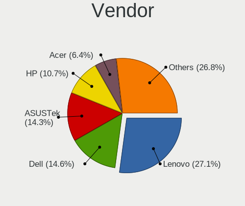
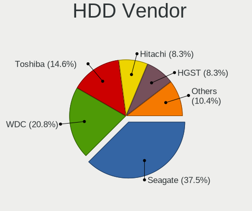
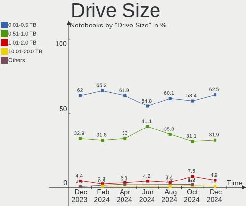
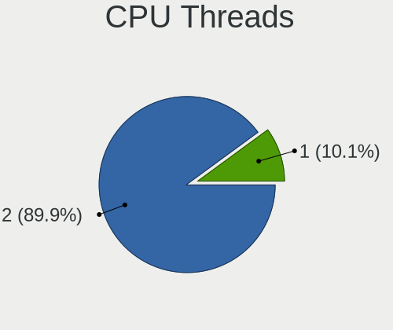
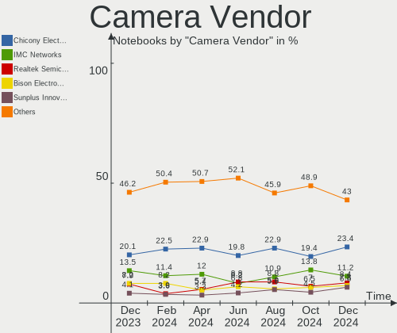

Fedora Hardware Trends (Notebook)
---------------------------------

A project to identify most popular hardware characteristics and track their change
over time based on data collected by Fedora users at https://Linux-Hardware.org.

Anyone can contribute to the study by uploading probes of their computers by
the [hw-probe](https://github.com/linuxhw/hw-probe) tool:

    sudo -E hw-probe -all -upload

Full-feature report is available here: https://linux-hardware.org/?view=trends&formfactor=notebook

Period: Dec, 2020.

Contents
--------

- [ OS                       ](#os)
- [ OS Family                ](#os-family)
- [ Kernel                   ](#kernel)
- [ Kernel Family            ](#kernel-family)
- [ Kernel Major Ver.        ](#kernel-major-ver)
- [ Arch                     ](#arch)
- [ DE                       ](#de)
- [ Display Server           ](#display-server)
- [ Display Manager          ](#display-manager)
- [ OS Lang                  ](#os-lang)
- [ Boot Mode                ](#boot-mode)
- [ Filesystem               ](#filesystem)
- [ Part. scheme             ](#part-scheme)
- [ Dual Boot with Linux/BSD ](#dual-boot-with-linux/bsd)
- [ Dual Boot (Win)          ](#dual-boot-win)
- [ Country                  ](#country)
- [ City                     ](#city)
- [ Vendor                   ](#vendor)
- [ Model                    ](#model)
- [ Model Family             ](#model-family)
- [ MFG Year                 ](#mfg-year)
- [ Form Factor              ](#form-factor)
- [ Secure Boot              ](#secure-boot)
- [ Coreboot                 ](#coreboot)
- [ RAM Size                 ](#ram-size)
- [ RAM Used                 ](#ram-used)
- [ Has CD-ROM               ](#has-cd-rom)
- [ Total Drives             ](#total-drives)
- [ Has Ethernet             ](#has-ethernet)
- [ Drive Vendor             ](#drive-vendor)
- [ Drive Model              ](#drive-model)
- [ HDD Vendor               ](#hdd-vendor)
- [ SSD Vendor               ](#ssd-vendor)
- [ Drive Kind               ](#drive-kind)
- [ Drive Connector          ](#drive-connector)
- [ Drive Size               ](#drive-size)
- [ Space Total              ](#space-total)
- [ Space Used               ](#space-used)
- [ Malfunc. Drives          ](#malfunc-drives)
- [ Malfunc. Drive Vendor    ](#malfunc-drive-vendor)
- [ Malfunc. HDD Vendor      ](#malfunc-hdd-vendor)
- [ Malfunc. Drive Kind      ](#malfunc-drive-kind)
- [ Failed Drives            ](#failed-drives)
- [ Failed Drive Vendor      ](#failed-drive-vendor)
- [ Drive Status             ](#drive-status)
- [ Storage Vendor           ](#storage-vendor)
- [ Storage Model            ](#storage-model)
- [ Storage Kind             ](#storage-kind)
- [ CPU Vendor               ](#cpu-vendor)
- [ CPU Model                ](#cpu-model)
- [ CPU Model Family         ](#cpu-model-family)
- [ CPU Cores                ](#cpu-cores)
- [ CPU Sockets              ](#cpu-sockets)
- [ CPU Threads              ](#cpu-threads)
- [ CPU Op-Modes             ](#cpu-op-modes)
- [ CPU Microcode            ](#cpu-microcode)
- [ CPU Microarch            ](#cpu-microarch)
- [ GPU Vendor               ](#gpu-vendor)
- [ GPU Model                ](#gpu-model)
- [ GPU Combo                ](#gpu-combo)
- [ GPU Driver               ](#gpu-driver)
- [ GPU Memory               ](#gpu-memory)
- [ Monitor Vendor           ](#monitor-vendor)
- [ Monitor Model            ](#monitor-model)
- [ Monitor Resolution       ](#monitor-resolution)
- [ Monitor Diagonal         ](#monitor-diagonal)
- [ Monitor Width            ](#monitor-width)
- [ Aspect Ratio             ](#aspect-ratio)
- [ Monitor Area             ](#monitor-area)
- [ Pixel Density            ](#pixel-density)
- [ Multiple Monitors        ](#multiple-monitors)
- [ Net Controller Vendor    ](#net-controller-vendor)
- [ Net Controller Model     ](#net-controller-model)
- [ Wireless Vendor          ](#wireless-vendor)
- [ Wireless Model           ](#wireless-model)
- [ Ethernet Vendor          ](#ethernet-vendor)
- [ Ethernet Model           ](#ethernet-model)
- [ Net Controller Kind      ](#net-controller-kind)
- [ Used Controller          ](#used-controller)
- [ NICs                     ](#nics)
- [ Memory Vendor            ](#memory-vendor)
- [ Memory Model             ](#memory-model)
- [ Memory Kind              ](#memory-kind)
- [ Memory Form Factor       ](#memory-form-factor)
- [ Memory Size              ](#memory-size)
- [ Memory Speed             ](#memory-speed)
- [ Sound Vendor             ](#sound-vendor)
- [ Sound Model              ](#sound-model)
- [ Camera Vendor            ](#camera-vendor)
- [ Camera Model             ](#camera-model)
- [ Fingerprint Vendor       ](#fingerprint-vendor)
- [ Fingerprint Model        ](#fingerprint-model)
- [ Chipcard Vendor          ](#chipcard-vendor)
- [ Chipcard Model           ](#chipcard-model)
- [ Printer Vendor           ](#printer-vendor)
- [ Printer Model            ](#printer-model)
- [ Scanner Vendor           ](#scanner-vendor)
- [ Scanner Model            ](#scanner-model)
- [ Bluetooth Vendor         ](#bluetooth-vendor)
- [ Bluetooth Model          ](#bluetooth-model)
- [ Unsupported Devices      ](#unsupported-devices)
- [ Unsupported Device Types ](#unsupported-device-types)

OS
--

Installed operating systems

| Name      | Notebooks | Percent |
|-----------|-----------|---------|
| Fedora 33 | 153       | 87.93%  |
| Fedora 32 | 16        | 9.2%    |
| Fedora 30 | 3         | 1.72%   |
| Fedora 34 | 1         | 0.57%   |
| Fedora 31 | 1         | 0.57%   |

OS Family
---------

OS without a version

| Name   | Notebooks | Percent |
|--------|-----------|---------|
| Fedora | 174       | 100%    |

Kernel
------

Version of the Linux kernel

| Version                                             | Notebooks | Percent |
|-----------------------------------------------------|-----------|---------|
| 5.9.11-200.fc33.x86_64                              | 41        | 23.56%  |
| 5.9.13-200.fc33.x86_64                              | 30        | 17.24%  |
| 5.9.16-200.fc33.x86_64                              | 20        | 11.49%  |
| 5.9.14-200.fc33.x86_64                              | 20        | 11.49%  |
| 5.9.15-200.fc33.x86_64                              | 13        | 7.47%   |
| 5.9.10-200.fc33.x86_64                              | 9         | 5.17%   |
| 5.8.15-301.fc33.x86_64                              | 7         | 4.02%   |
| 5.9.12-200.fc33.x86_64                              | 6         | 3.45%   |
| 5.9.8-100.fc32.x86_64                               | 3         | 1.72%   |
| 5.9.14-100.fc32.x86_64                              | 3         | 1.72%   |
| 5.6.13-100.fc30.x86_64                              | 3         | 1.72%   |
| 5.9.16-100.fc32.x86_64                              | 2         | 1.15%   |
| 5.9.12-100.fc32.x86_64                              | 2         | 1.15%   |
| 5.9.11-100.fc32.x86_64                              | 2         | 1.15%   |
| 5.8.18-100.fc31.x86_64                              | 2         | 1.15%   |
| 5.9.8-200.fc33.x86_64                               | 1         | 0.57%   |
| 5.9.15-100.fc32.x86_64                              | 1         | 0.57%   |
| 5.9.13-100.fc32.x86_64                              | 1         | 0.57%   |
| 5.9.10-100.fc32.x86_64                              | 1         | 0.57%   |
| 5.8.6-201.fc32.x86_64                               | 1         | 0.57%   |
| 5.8.4-200.fc32.x86_64                               | 1         | 0.57%   |
| 5.10.2-minzord                                      | 1         | 0.57%   |
| 5.10.0_rc6_tkg_MuQSS_llvm+                          | 1         | 0.57%   |
| 5.10.0-rc3+                                         | 1         | 0.57%   |
| 5.10.0-0.rc6.20201204git34816d20f173.92.fc34.x86_64 | 1         | 0.57%   |
| Unknown                                             | 1         | 0.57%   |

Kernel Family
-------------

Linux kernel without a distro release

| Version | Notebooks | Percent |
|---------|-----------|---------|
| 5.9.11  | 43        | 24.71%  |
| 5.9.13  | 31        | 17.82%  |
| 5.9.14  | 23        | 13.22%  |
| 5.9.16  | 22        | 12.64%  |
| 5.9.15  | 14        | 8.05%   |
| 5.9.10  | 10        | 5.75%   |
| 5.9.12  | 8         | 4.6%    |
| 5.8.15  | 7         | 4.02%   |
| 5.9.8   | 4         | 2.3%    |
| 5.6.13  | 3         | 1.72%   |
| 5.10.0  | 3         | 1.72%   |
| 5.8.18  | 2         | 1.15%   |
| 5.8.6   | 1         | 0.57%   |
| 5.8.4   | 1         | 0.57%   |
| 5.10.2  | 1         | 0.57%   |
| Unknown | 1         | 0.57%   |

Kernel Major Ver.
-----------------

Linux kernel major version

| Version | Notebooks | Percent |
|---------|-----------|---------|
| 5.9     | 155       | 89.08%  |
| 5.8     | 11        | 6.32%   |
| 5.10    | 4         | 2.3%    |
| 5.6     | 3         | 1.72%   |
| Unknown | 1         | 0.57%   |

Arch
----

OS architecture (x86_64, i586, etc.)

| Name    | Notebooks | Percent |
|---------|-----------|---------|
| x86_64  | 173       | 99.43%  |
| Unknown | 1         | 0.57%   |

DE
--

Desktop Environment

| Name          | Notebooks | Percent |
|---------------|-----------|---------|
| GNOME         | 137       | 78.74%  |
| KDE           | 12        | 6.9%    |
| KDE5          | 9         | 5.17%   |
| XFCE          | 5         | 2.87%   |
| X-Cinnamon    | 3         | 1.72%   |
| MATE          | 3         | 1.72%   |
| Unknown       | 3         | 1.72%   |
| GNOME Classic | 1         | 0.57%   |
| Deepin        | 1         | 0.57%   |

Display Server
--------------

X11 or Wayland

| Name    | Notebooks | Percent |
|---------|-----------|---------|
| Wayland | 100       | 57.47%  |
| X11     | 73        | 41.95%  |
| Unknown | 1         | 0.57%   |

Display Manager
---------------

SDDM, LightDM, etc.

| Name    | Notebooks | Percent |
|---------|-----------|---------|
| Unknown | 102       | 58.62%  |
| GDM     | 56        | 32.18%  |
| SDDM    | 9         | 5.17%   |
| TDM     | 6         | 3.45%   |
| KDM     | 1         | 0.57%   |

OS Lang
-------

Language

| Lang            | Notebooks | Percent |
|-----------------|-----------|---------|
| en_US           | 90        | 51.72%  |
| pt_BR           | 8         | 4.6%    |
| fr_FR           | 8         | 4.6%    |
| en_GB           | 8         | 4.6%    |
| pl_PL           | 7         | 4.02%   |
| de_DE           | 7         | 4.02%   |
| it_IT           | 4         | 2.3%    |
| en_US.utf8      | 4         | 2.3%    |
| en_IN           | 3         | 1.72%   |
| ru_RU           | 2         | 1.15%   |
| nl_NL           | 2         | 1.15%   |
| es_ES           | 2         | 1.15%   |
| es_AR           | 2         | 1.15%   |
| en_AU           | 2         | 1.15%   |
| el_GR           | 2         | 1.15%   |
| da_DK           | 2         | 1.15%   |
| C               | 2         | 1.15%   |
| zh_HK           | 1         | 0.57%   |
| zh_CN           | 1         | 0.57%   |
| ru_RU.utf8      | 1         | 0.57%   |
| pt_BR.utf8      | 1         | 0.57%   |
| hu_HU           | 1         | 0.57%   |
| he_IL           | 1         | 0.57%   |
| fr_FR.utf8      | 1         | 0.57%   |
| fr_CA           | 1         | 0.57%   |
| et_EE           | 1         | 0.57%   |
| es_MX           | 1         | 0.57%   |
| es_ES.utf8      | 1         | 0.57%   |
| es_CO           | 1         | 0.57%   |
| en_ZA           | 1         | 0.57%   |
| en_US.iso885915 | 1         | 0.57%   |
| en_PH           | 1         | 0.57%   |
| en_DK           | 1         | 0.57%   |
| de_CH           | 1         | 0.57%   |
| cs_CZ           | 1         | 0.57%   |
| Unknown         | 1         | 0.57%   |

Boot Mode
---------

EFI or BIOS

| Mode | Notebooks | Percent |
|------|-----------|---------|
| EFI  | 130       | 74.71%  |
| BIOS | 44        | 25.29%  |

Filesystem
----------

Type of filesystem

| Type                | Notebooks | Percent |
|---------------------|-----------|---------|
| Btrfs               | 92        | 52.87%  |
| Ext4                | 76        | 43.68%  |
| Xfs                 | 4         | 2.3%    |
| Fuse.fuse-overlayfs | 1         | 0.57%   |
| Unknown             | 1         | 0.57%   |

Part. scheme
------------

Scheme of partitioning

| Type    | Notebooks | Percent |
|---------|-----------|---------|
| Unknown | 101       | 58.05%  |
| GPT     | 63        | 36.21%  |
| MBR     | 10        | 5.75%   |

Dual Boot with Linux/BSD
------------------------

Hosting more than one Linux/BSD

| Dual boot | Notebooks | Percent |
|-----------|-----------|---------|
| No        | 160       | 91.95%  |
| Yes       | 14        | 8.05%   |

Dual Boot (Win)
---------------

Hosting Linux and Windows

| Dual boot | Notebooks | Percent |
|-----------|-----------|---------|
| No        | 147       | 84.48%  |
| Yes       | 27        | 15.52%  |

Country
-------

Geographic location (country)

| Country             | Notebooks | Percent |
|---------------------|-----------|---------|
| USA                 | 38        | 21.84%  |
| Germany             | 15        | 8.62%   |
| France              | 14        | 8.05%   |
| Brazil              | 13        | 7.47%   |
| India               | 9         | 5.17%   |
| Russia              | 5         | 2.87%   |
| Poland              | 5         | 2.87%   |
| Netherlands         | 5         | 2.87%   |
| Italy               | 5         | 2.87%   |
| Switzerland         | 4         | 2.3%    |
| Spain               | 4         | 2.3%    |
| Denmark             | 4         | 2.3%    |
| UK                  | 3         | 1.72%   |
| Czech Republic      | 3         | 1.72%   |
| Austria             | 3         | 1.72%   |
| Vietnam             | 2         | 1.15%   |
| Greece              | 2         | 1.15%   |
| Finland             | 2         | 1.15%   |
| Estonia             | 2         | 1.15%   |
| China               | 2         | 1.15%   |
| Canada              | 2         | 1.15%   |
| Belgium             | 2         | 1.15%   |
| Belarus             | 2         | 1.15%   |
| Bangladesh          | 2         | 1.15%   |
| Australia           | 2         | 1.15%   |
| Argentina           | 2         | 1.15%   |
| Uzbekistan          | 1         | 0.57%   |
| Ukraine             | 1         | 0.57%   |
| Turkey              | 1         | 0.57%   |
| Tunisia             | 1         | 0.57%   |
| Trinidad and Tobago | 1         | 0.57%   |
| Sri Lanka           | 1         | 0.57%   |
| South Africa        | 1         | 0.57%   |
| Slovenia            | 1         | 0.57%   |
| Singapore           | 1         | 0.57%   |
| Romania             | 1         | 0.57%   |
| Philippines         | 1         | 0.57%   |
| Pakistan            | 1         | 0.57%   |
| Norway              | 1         | 0.57%   |
| Mexico              | 1         | 0.57%   |
| Lithuania           | 1         | 0.57%   |
| Iran                | 1         | 0.57%   |
| Iceland             | 1         | 0.57%   |
| Hungary             | 1         | 0.57%   |
| Hong Kong           | 1         | 0.57%   |
| Guatemala           | 1         | 0.57%   |
| Colombia            | 1         | 0.57%   |
| Bulgaria            | 1         | 0.57%   |

City
----

Geographic location (city)

| City                  | Notebooks | Percent |
|-----------------------|-----------|---------|
| Paris                 | 5         | 2.87%   |
| Berlin                | 3         | 1.72%   |
| São Paulo            | 2         | 1.15%   |
| Seattle               | 2         | 1.15%   |
| Raleigh               | 2         | 1.15%   |
| Munich                | 2         | 1.15%   |
| Madrid                | 2         | 1.15%   |
| Krakow                | 2         | 1.15%   |
| Beijing               | 2         | 1.15%   |
| Šiauliai             | 1         | 0.57%   |
| Zwolle                | 1         | 0.57%   |
| Zurich                | 1         | 0.57%   |
| Yaroslavl             | 1         | 0.57%   |
| Wurzburg              | 1         | 0.57%   |
| Westminster           | 1         | 0.57%   |
| Weinheim              | 1         | 0.57%   |
| Virginia Beach        | 1         | 0.57%   |
| Vienna                | 1         | 0.57%   |
| Veverska Bityska      | 1         | 0.57%   |
| Veliki Gaber          | 1         | 0.57%   |
| Varel                 | 1         | 0.57%   |
| Vantaa                | 1         | 0.57%   |
| Utica                 | 1         | 0.57%   |
| Tunis                 | 1         | 0.57%   |
| Trivandrum            | 1         | 0.57%   |
| Traverse City         | 1         | 0.57%   |
| Torrance              | 1         | 0.57%   |
| The Bronx             | 1         | 0.57%   |
| Tashkent              | 1         | 0.57%   |
| Tartu                 | 1         | 0.57%   |
| Tallinn               | 1         | 0.57%   |
| São José dos Campos | 1         | 0.57%   |
| Sydney                | 1         | 0.57%   |
| Surgut                | 1         | 0.57%   |
| Stillwater            | 1         | 0.57%   |
| Stekene               | 1         | 0.57%   |
| St Petersburg         | 1         | 0.57%   |
| Sirajganj             | 1         | 0.57%   |
| Singapore             | 1         | 0.57%   |
| Sao Lourenco          | 1         | 0.57%   |
| San Mateo             | 1         | 0.57%   |
| San Francisco         | 1         | 0.57%   |
| Saint-Cyr-l'École    | 1         | 0.57%   |
| Safety Harbor         | 1         | 0.57%   |
| Round Rock            | 1         | 0.57%   |
| Roubaix               | 1         | 0.57%   |
| Rome                  | 1         | 0.57%   |
| Richardson            | 1         | 0.57%   |
| Rezé                 | 1         | 0.57%   |
| Reykjavik             | 1         | 0.57%   |
| Restinclieres         | 1         | 0.57%   |
| Rajkot                | 1         | 0.57%   |
| Prague                | 1         | 0.57%   |
| Portland              | 1         | 0.57%   |
| Ploieşti             | 1         | 0.57%   |
| Piracicaba            | 1         | 0.57%   |
| Pinckney              | 1         | 0.57%   |
| Peach Orchard         | 1         | 0.57%   |
| Parker                | 1         | 0.57%   |
| Palmas                | 1         | 0.57%   |

Vendor
------

Motherboard manufacturer

| Name                | Notebooks | Percent |
|---------------------|-----------|---------|
| Lenovo              | 58        | 33.33%  |
| Dell                | 30        | 17.24%  |
| Hewlett-Packard     | 25        | 14.37%  |
| ASUSTek Computer    | 13        | 7.47%   |
| Acer                | 11        | 6.32%   |
| MSI                 | 10        | 5.75%   |
| Toshiba             | 6         | 3.45%   |
| Samsung Electronics | 4         | 2.3%    |
| HUAWEI              | 3         | 1.72%   |
| Sony                | 2         | 1.15%   |
| TUXEDO              | 1         | 0.57%   |
| Timi                | 1         | 0.57%   |
| System76            | 1         | 0.57%   |
| Razer               | 1         | 0.57%   |
| Prestigio           | 1         | 0.57%   |
| Panasonic           | 1         | 0.57%   |
| Notebook            | 1         | 0.57%   |
| LG Electronics      | 1         | 0.57%   |
| Insyde              | 1         | 0.57%   |
| Fujitsu             | 1         | 0.57%   |
| Clevo               | 1         | 0.57%   |
| Unknown             | 1         | 0.57%   |

Model
-----

Motherboard model

| Name                                       | Notebooks | Percent |
|--------------------------------------------|-----------|---------|
| Dell XPS 13 9370                           | 3         | 1.72%   |
| Lenovo ThinkPad X1 Carbon Gen 8 20U9CTO1WW | 2         | 1.15%   |
| HUAWEI NBLK-WAX9X                          | 2         | 1.15%   |
| HP Laptop 15-db0xxx                        | 2         | 1.15%   |
| Dell XPS 13 7390                           | 2         | 1.15%   |
| ASUS K46CM                                 | 2         | 1.15%   |
| TUXEDO Polaris 15 AMD Gen1                 | 1         | 0.57%   |
| Toshiba Satellite S55t-B                   | 1         | 0.57%   |
| Toshiba Satellite L75-B                    | 1         | 0.57%   |
| Toshiba Satellite L50-C                    | 1         | 0.57%   |
| Toshiba Satellite L10W-B-102               | 1         | 0.57%   |
| Toshiba Satellite C850D-119                | 1         | 0.57%   |
| Toshiba dynabook R73/W                     | 1         | 0.57%   |
| Timi RedmiBook 16                          | 1         | 0.57%   |
| System76 Oryx Pro                          | 1         | 0.57%   |
| Sony VPCEH24FX                             | 1         | 0.57%   |
| Sony VPCCB45FN                             | 1         | 0.57%   |
| Samsung 730QCJ/730QCR                      | 1         | 0.57%   |
| Samsung 3570R/370R/470R/450R/510R/4450RV   | 1         | 0.57%   |
| Samsung 300E4C/300E5C/300E7C               | 1         | 0.57%   |
| Samsung 300E4A/300E5A/300E7A/3430EA/3530EA | 1         | 0.57%   |
| Razer Blade 15 Mid 2019-Base               | 1         | 0.57%   |
| Prestigio PSB141C03                        | 1         | 0.57%   |
| Panasonic CFSZ5-2L                         | 1         | 0.57%   |
| Notebook PB50_70DFx,DDx                    | 1         | 0.57%   |
| MSI GT72S 6QE                              | 1         | 0.57%   |
| MSI GS65 Stealth 9SE                       | 1         | 0.57%   |
| MSI GS63 7RD                               | 1         | 0.57%   |
| MSI GP62 6QF                               | 1         | 0.57%   |
| MSI GF63 Thin 10SCXR                       | 1         | 0.57%   |
| MSI GE60 2QE                               | 1         | 0.57%   |
| MSI Creator 17 A10SE                       | 1         | 0.57%   |
| MSI CR61 2M/CX61 2OC/CX61 2OD              | 1         | 0.57%   |
| MSI Bravo 17 A4DDR                         | 1         | 0.57%   |
| MSI Bravo 15 A4DDR                         | 1         | 0.57%   |
| LG 13Z990-A.AAS5U1                         | 1         | 0.57%   |
| Lenovo Yoga S740-14IIL 81RS                | 1         | 0.57%   |
| Lenovo XiaoXin-15ARE 2020 81YR             | 1         | 0.57%   |
| Lenovo ThinkPad X230 Tablet 34373KU        | 1         | 0.57%   |
| Lenovo ThinkPad X230 2325QT2               | 1         | 0.57%   |
| Lenovo ThinkPad X220 Tablet 42992PG        | 1         | 0.57%   |
| Lenovo ThinkPad X220 4286CTO               | 1         | 0.57%   |
| Lenovo ThinkPad X200 Tablet 7453WQM        | 1         | 0.57%   |
| Lenovo ThinkPad X1 Extreme 2nd 20QVCTO1WW  | 1         | 0.57%   |
| Lenovo ThinkPad X1 Carbon Gen 8 20U90002RT | 1         | 0.57%   |
| Lenovo ThinkPad X1 Carbon 6th 20KH002KUS   | 1         | 0.57%   |
| Lenovo ThinkPad X1 Carbon 6th 20KGS3Y900   | 1         | 0.57%   |
| Lenovo ThinkPad T61 64665DG                | 1         | 0.57%   |
| Lenovo ThinkPad T560 20FJS3CR00            | 1         | 0.57%   |
| Lenovo ThinkPad T550 20CKCTO1WW            | 1         | 0.57%   |
| Lenovo ThinkPad T520 4243W54               | 1         | 0.57%   |
| Lenovo ThinkPad T490 20N3S8NP00            | 1         | 0.57%   |
| Lenovo ThinkPad T480 20L5000BMX            | 1         | 0.57%   |
| Lenovo ThinkPad T470s W10DG 20JTS0550Q     | 1         | 0.57%   |
| Lenovo ThinkPad T470 20HES1HD01            | 1         | 0.57%   |
| Lenovo ThinkPad T470 20HES18R19            | 1         | 0.57%   |
| Lenovo ThinkPad T460s 20F9003GUS           | 1         | 0.57%   |
| Lenovo ThinkPad T460 20FMS1R01K            | 1         | 0.57%   |
| Lenovo ThinkPad T450 20BU000QLM            | 1         | 0.57%   |
| Lenovo ThinkPad T440s 20ARA1DJMN           | 1         | 0.57%   |

Model Family
------------

Motherboard model prefix

| Name                 | Notebooks | Percent |
|----------------------|-----------|---------|
| Lenovo ThinkPad      | 43        | 24.71%  |
| Dell Inspiron        | 13        | 7.47%   |
| HP EliteBook         | 11        | 6.32%   |
| Lenovo IdeaPad       | 10        | 5.75%   |
| Dell Latitude        | 8         | 4.6%    |
| Dell XPS             | 6         | 3.45%   |
| Acer Aspire          | 6         | 3.45%   |
| Toshiba Satellite    | 5         | 2.87%   |
| HP ProBook           | 4         | 2.3%    |
| HP Pavilion          | 4         | 2.3%    |
| HP Laptop            | 3         | 1.72%   |
| MSI Bravo            | 2         | 1.15%   |
| HUAWEI NBLK-WAX9X    | 2         | 1.15%   |
| ASUS K46CM           | 2         | 1.15%   |
| Acer Nitro           | 2         | 1.15%   |
| TUXEDO Polaris       | 1         | 0.57%   |
| Toshiba dynabook     | 1         | 0.57%   |
| Timi RedmiBook       | 1         | 0.57%   |
| System76 Oryx        | 1         | 0.57%   |
| Sony VPCEH24FX       | 1         | 0.57%   |
| Sony VPCCB45FN       | 1         | 0.57%   |
| Samsung 730QCJ       | 1         | 0.57%   |
| Samsung 3570R        | 1         | 0.57%   |
| Samsung 300E4C       | 1         | 0.57%   |
| Samsung 300E4A       | 1         | 0.57%   |
| Razer Blade          | 1         | 0.57%   |
| Prestigio PSB141C03  | 1         | 0.57%   |
| Panasonic CFSZ5-2L   | 1         | 0.57%   |
| Notebook PB50        | 1         | 0.57%   |
| MSI GT72S            | 1         | 0.57%   |
| MSI GS65             | 1         | 0.57%   |
| MSI GS63             | 1         | 0.57%   |
| MSI GP62             | 1         | 0.57%   |
| MSI GF63             | 1         | 0.57%   |
| MSI GE60             | 1         | 0.57%   |
| MSI Creator          | 1         | 0.57%   |
| MSI CR61             | 1         | 0.57%   |
| LG 13Z990-A.AAS5U1   | 1         | 0.57%   |
| Lenovo Yoga          | 1         | 0.57%   |
| Lenovo XiaoXin-15ARE | 1         | 0.57%   |
| Lenovo N22           | 1         | 0.57%   |
| Lenovo G70-70        | 1         | 0.57%   |
| Lenovo G580          | 1         | 0.57%   |
| Insyde CherryTrail   | 1         | 0.57%   |
| HUAWEI MACHC-WAX9    | 1         | 0.57%   |
| HP OMEN              | 1         | 0.57%   |
| HP 250               | 1         | 0.57%   |
| HP 2000              | 1         | 0.57%   |
| Fujitsu LIFEBOOK     | 1         | 0.57%   |
| Dell Vostro          | 1         | 0.57%   |
| Dell Precision       | 1         | 0.57%   |
| Dell G5              | 1         | 0.57%   |
| Clevo W150ER         | 1         | 0.57%   |
| ASUS ZenBook         | 1         | 0.57%   |
| ASUS Z450LA          | 1         | 0.57%   |
| ASUS X550LN          | 1         | 0.57%   |
| ASUS X550JX          | 1         | 0.57%   |
| ASUS X550CC          | 1         | 0.57%   |
| ASUS X541UV          | 1         | 0.57%   |
| ASUS X510UNR         | 1         | 0.57%   |

MFG Year
--------

Motherboard manufacture year

| Year | Notebooks | Percent |
|------|-----------|---------|
| 2020 | 66        | 37.93%  |
| 2019 | 33        | 18.97%  |
| 2018 | 17        | 9.77%   |
| 2015 | 10        | 5.75%   |
| 2014 | 9         | 5.17%   |
| 2013 | 9         | 5.17%   |
| 2016 | 8         | 4.6%    |
| 2012 | 7         | 4.02%   |
| 2017 | 6         | 3.45%   |
| 2011 | 5         | 2.87%   |
| 2010 | 3         | 1.72%   |
| 2007 | 1         | 0.57%   |

Form Factor
-----------

Physical design of the computer

| Name     | Notebooks | Percent |
|----------|-----------|---------|
| Notebook | 174       | 100%    |

Secure Boot
-----------

Enabled or disabled

| State    | Notebooks | Percent |
|----------|-----------|---------|
| Disabled | 137       | 78.74%  |
| Enabled  | 37        | 21.26%  |

Coreboot
--------

Have coreboot on board

| Used | Notebooks | Percent |
|------|-----------|---------|
| No   | 172       | 98.85%  |
| Yes  | 2         | 1.15%   |

RAM Size
--------

Total RAM memory

| Size in GB  | Notebooks | Percent |
|-------------|-----------|---------|
| 4.01-8.0    | 50        | 28.74%  |
| 16.01-24.0  | 44        | 25.29%  |
| 8.01-16.0   | 29        | 16.67%  |
| 3.01-4.0    | 23        | 13.22%  |
| 32.01-64.0  | 19        | 10.92%  |
| 64.01-256.0 | 4         | 2.3%    |
| 1.01-2.0    | 3         | 1.72%   |
| 24.01-32.0  | 1         | 0.57%   |
| Unknown     | 1         | 0.57%   |

RAM Used
--------

Used RAM memory

| Used GB    | Notebooks | Percent |
|------------|-----------|---------|
| 2.01-3.0   | 61        | 35.06%  |
| 4.01-8.0   | 37        | 21.26%  |
| 3.01-4.0   | 29        | 16.67%  |
| 1.01-2.0   | 28        | 16.09%  |
| 8.01-16.0  | 16        | 9.2%    |
| 16.01-24.0 | 1         | 0.57%   |
| 0.51-1.0   | 1         | 0.57%   |
| Unknown    | 1         | 0.57%   |

Has CD-ROM
----------

Has CD-ROM on board

| Presented | Notebooks | Percent |
|-----------|-----------|---------|
| No        | 131       | 75.29%  |
| Yes       | 43        | 24.71%  |

Total Drives
------------

Number of drives on board

| Drives | Notebooks | Percent |
|--------|-----------|---------|
| 1      | 119       | 68.39%  |
| 2      | 51        | 29.31%  |
| 3      | 2         | 1.15%   |
| 5      | 1         | 0.57%   |
| 4      | 1         | 0.57%   |

Has Ethernet
------------

Has Ethernet on board

| Presented | Notebooks | Percent |
|-----------|-----------|---------|
| Yes       | 141       | 81.03%  |
| No        | 33        | 18.97%  |

Drive Vendor
------------

Hard drive vendors

| Vendor                    | Notebooks | Drives | Percent |
|---------------------------|-----------|--------|---------|
| Samsung Electronics       | 64        | 68     | 28.57%  |
| WDC                       | 22        | 24     | 9.82%   |
| Toshiba                   | 20        | 21     | 8.93%   |
| Seagate                   | 17        | 18     | 7.59%   |
| SanDisk                   | 16        | 17     | 7.14%   |
| Kingston                  | 16        | 16     | 7.14%   |
| Unknown                   | 11        | 12     | 4.91%   |
| Intel                     | 10        | 11     | 4.46%   |
| HGST                      | 7         | 7      | 3.13%   |
| SK Hynix                  | 6         | 6      | 2.68%   |
| A-DATA Technology         | 6         | 6      | 2.68%   |
| Crucial                   | 5         | 5      | 2.23%   |
| Hitachi                   | 4         | 4      | 1.79%   |
| Micron Technology         | 3         | 3      | 1.34%   |
| Lite-On                   | 3         | 3      | 1.34%   |
| XPG                       | 1         | 2      | 0.45%   |
| Union Memory              | 1         | 1      | 0.45%   |
| Transcend                 | 1         | 1      | 0.45%   |
| Silicon Motion            | 1         | 1      | 0.45%   |
| OCZ                       | 1         | 1      | 0.45%   |
| Micron/Crucial Technology | 1         | 1      | 0.45%   |
| LITEONIT                  | 1         | 1      | 0.45%   |
| LITEON                    | 1         | 1      | 0.45%   |
| KingSpec                  | 1         | 1      | 0.45%   |
| Intenso                   | 1         | 1      | 0.45%   |
| Gigabyte Technology       | 1         | 1      | 0.45%   |
| China                     | 1         | 1      | 0.45%   |
| ASMT                      | 1         | 1      | 0.45%   |
| ADATA Technology          | 1         | 1      | 0.45%   |

Drive Model
-----------

Hard drive models

| Model                                | Notebooks | Percent |
|--------------------------------------|-----------|---------|
| Samsung NVMe SSD Drive 256GB         | 8         | 3.46%   |
| Samsung NVMe SSD Drive 512GB         | 6         | 2.6%    |
| Toshiba MQ04ABF100 1TB               | 4         | 1.73%   |
| Seagate ST1000LM024 HN-M101MBB 1TB   | 4         | 1.73%   |
| HGST HTS721010A9E630 1TB             | 4         | 1.73%   |
| WDC WD10SPZX-21Z10T0 1TB             | 3         | 1.3%    |
| Toshiba MQ01ABD100 1TB               | 3         | 1.3%    |
| Seagate ST500LT012-1DG142 500GB      | 3         | 1.3%    |
| Samsung SSD 970 EVO Plus 1TB         | 3         | 1.3%    |
| Samsung NVMe SSD Drive 1024GB        | 3         | 1.3%    |
| Kingston SA400S37480G 480GB SSD      | 3         | 1.3%    |
| Kingston SA400S37240G 240GB SSD      | 3         | 1.3%    |
| WDC WD10JPVX-22JC3T0 1TB             | 2         | 0.87%   |
| Unknown MMC Card  32GB               | 2         | 0.87%   |
| Toshiba NVMe SSD Drive 512GB         | 2         | 0.87%   |
| Toshiba MQ01ACF050 500GB             | 2         | 0.87%   |
| Toshiba MQ01ABD050 500GB             | 2         | 0.87%   |
| SK Hynix NVMe SSD Drive 256GB        | 2         | 0.87%   |
| Seagate ST9500420AS 500GB            | 2         | 0.87%   |
| Seagate ST1000LM035-1RK172 1TB       | 2         | 0.87%   |
| Seagate Expansion+ 4TB               | 2         | 0.87%   |
| SanDisk SSD U110 16GB                | 2         | 0.87%   |
| SanDisk SSD PLUS 240GB               | 2         | 0.87%   |
| Sandisk NVMe SSD Drive 512GB         | 2         | 0.87%   |
| Sandisk NVMe SSD Drive 256GB         | 2         | 0.87%   |
| Samsung SSD 860 EVO 1TB              | 2         | 0.87%   |
| Samsung SSD 850 EVO 500GB            | 2         | 0.87%   |
| Samsung SSD 850 EVO 250GB            | 2         | 0.87%   |
| Samsung MZVLB1T0HBLR-000H1 1TB       | 2         | 0.87%   |
| Samsung MZALQ512HALU-000L2 512GB     | 2         | 0.87%   |
| Micron MTFDHBA256TCK-1AS1AABHA 256GB | 2         | 0.87%   |
| Lite-On NVMe SSD Drive 512GB         | 2         | 0.87%   |
| Kingston OM8PCP3512F-AI1 512GB       | 2         | 0.87%   |
| XPG NVMe SSD Drive 2TB               | 1         | 0.43%   |
| WDC WDS500G2B0A-00SM50 500GB SSD     | 1         | 0.43%   |
| WDC WDS240G2G0B-00EPW0 240GB SSD     | 1         | 0.43%   |
| WDC WDS100T3X0C-00SJG0 1TB           | 1         | 0.43%   |
| WDC WD7500BPVX-22JC3T0 752GB         | 1         | 0.43%   |
| WDC WD7500BPVT-22HXZT1 752GB         | 1         | 0.43%   |
| WDC WD5000LPLX-08ZNTT0 500GB         | 1         | 0.43%   |
| WDC WD5000BPVX-00JC3T0 500GB         | 1         | 0.43%   |
| WDC WD3200BEVT-75ZCT2 320GB          | 1         | 0.43%   |
| WDC WD16 00BEVT-60ZCT 160GB          | 1         | 0.43%   |
| WDC WD1200BEVS-08RST2 120GB          | 1         | 0.43%   |
| WDC WD10SPZX-75Z10T2 1TB             | 1         | 0.43%   |
| WDC WD10SPZX-60Z10T0 1TB             | 1         | 0.43%   |
| WDC WD10SPZX-24Z10 1TB               | 1         | 0.43%   |
| WDC WD10SPZX-08Z10 1TB               | 1         | 0.43%   |
| WDC WD10JPVX-60JC3T0 1TB             | 1         | 0.43%   |
| WDC PC SN730 SDBPNTY-256G-1027 256GB | 1         | 0.43%   |
| WDC PC SN520 SDAPMUW-128G-1001 128GB | 1         | 0.43%   |
| WDC PC SA530 SDASN8Y256G1009 256GB   | 1         | 0.43%   |
| Unknown SDC  32GB                    | 1         | 0.43%   |
| Unknown PS3108S8 2MB                 | 1         | 0.43%   |
| Unknown NCard  32GB                  | 1         | 0.43%   |
| Unknown MMC Card  64GB               | 1         | 0.43%   |
| Unknown MMC Card  3GB                | 1         | 0.43%   |
| Unknown M0S001  32GB                 | 1         | 0.43%   |
| Unknown DB4032  32GB                 | 1         | 0.43%   |
| Unknown 032GE4  32GB                 | 1         | 0.43%   |

HDD Vendor
----------

Hard disk drive vendors

| Vendor  | Notebooks | Drives | Percent |
|---------|-----------|--------|---------|
| WDC     | 17        | 18     | 28.33%  |
| Seagate | 16        | 17     | 26.67%  |
| Toshiba | 15        | 15     | 25%     |
| HGST    | 7         | 7      | 11.67%  |
| Hitachi | 4         | 4      | 6.67%   |
| ASMT    | 1         | 1      | 1.67%   |

SSD Vendor
----------

Solid state drive vendors

| Vendor              | Notebooks | Drives | Percent |
|---------------------|-----------|--------|---------|
| Samsung Electronics | 26        | 26     | 35.14%  |
| SanDisk             | 12        | 13     | 16.22%  |
| Kingston            | 11        | 11     | 14.86%  |
| Crucial             | 5         | 5      | 6.76%   |
| A-DATA Technology   | 5         | 5      | 6.76%   |
| Intel               | 3         | 3      | 4.05%   |
| WDC                 | 2         | 2      | 2.7%    |
| Transcend           | 1         | 1      | 1.35%   |
| Toshiba             | 1         | 1      | 1.35%   |
| SK Hynix            | 1         | 1      | 1.35%   |
| OCZ                 | 1         | 1      | 1.35%   |
| LITEONIT            | 1         | 1      | 1.35%   |
| LITEON              | 1         | 1      | 1.35%   |
| KingSpec            | 1         | 1      | 1.35%   |
| Intenso             | 1         | 1      | 1.35%   |
| Gigabyte Technology | 1         | 1      | 1.35%   |
| China               | 1         | 1      | 1.35%   |

Drive Kind
----------

HDD or SSD

| Kind    | Notebooks | Drives | Percent |
|---------|-----------|--------|---------|
| NVMe    | 76        | 86     | 35.51%  |
| SSD     | 70        | 75     | 32.71%  |
| HDD     | 56        | 62     | 26.17%  |
| MMC     | 10        | 11     | 4.67%   |
| Unknown | 2         | 2      | 0.93%   |

Drive Connector
---------------

SATA, SAS, NVMe, etc.

| Type | Notebooks | Drives | Percent |
|------|-----------|--------|---------|
| SATA | 108       | 129    | 53.47%  |
| NVMe | 76        | 86     | 37.62%  |
| MMC  | 10        | 11     | 4.95%   |
| SAS  | 8         | 10     | 3.96%   |

Drive Size
----------

Size of hard drive

| Size in TB | Notebooks | Drives | Percent |
|------------|-----------|--------|---------|
| 0.01-0.5   | 70        | 79     | 55.56%  |
| 0.51-1.0   | 52        | 53     | 41.27%  |
| 3.01-4.0   | 2         | 3      | 1.59%   |
| 1.01-2.0   | 2         | 2      | 1.59%   |

Space Total
-----------

Amount of disk space available on the file system

| Size in GB     | Notebooks | Percent |
|----------------|-----------|---------|
| 251-500        | 40        | 22.99%  |
| 101-250        | 39        | 22.41%  |
| 501-1000       | 26        | 14.94%  |
| 1001-2000      | 21        | 12.07%  |
| Unknown        | 16        | 9.2%    |
| 1-20           | 15        | 8.62%   |
| 51-100         | 7         | 4.02%   |
| 21-50          | 4         | 2.3%    |
| More than 3000 | 3         | 1.72%   |
| 2001-3000      | 3         | 1.72%   |

Space Used
----------

Amount of used disk space

| Used GB        | Notebooks | Percent |
|----------------|-----------|---------|
| 1-20           | 38        | 21.84%  |
| 101-250        | 33        | 18.97%  |
| 21-50          | 28        | 16.09%  |
| 51-100         | 27        | 15.52%  |
| 251-500        | 18        | 10.34%  |
| Unknown        | 16        | 9.2%    |
| 501-1000       | 10        | 5.75%   |
| 1001-2000      | 3         | 1.72%   |
| More than 3000 | 1         | 0.57%   |

Malfunc. Drives
---------------

Drive models with a malfunction

| Model                                | Notebooks | Drives | Percent |
|--------------------------------------|-----------|--------|---------|
| Toshiba MQ01ABD100 1TB               | 1         | 1      | 10%     |
| Toshiba MQ01ABD050 500GB             | 1         | 1      | 10%     |
| Seagate ST500LT012-9WS142 500GB      | 1         | 1      | 10%     |
| Seagate ST500LT012-1DG142 500GB      | 1         | 1      | 10%     |
| Samsung Electronics PM981 NVMe 512GB | 1         | 1      | 10%     |
| Hitachi HTS725050A7E630 500GB        | 1         | 1      | 10%     |
| Hitachi HTS545032A7E380 320GB        | 1         | 1      | 10%     |
| HGST HTS721010A9E630 1TB             | 1         | 1      | 10%     |
| HGST HTS545050A7E680 500GB           | 1         | 1      | 10%     |
| HGST HTS545050A7E380 500GB           | 1         | 1      | 10%     |

Malfunc. Drive Vendor
---------------------

Vendors of faulty drives

| Vendor              | Notebooks | Drives | Percent |
|---------------------|-----------|--------|---------|
| HGST                | 3         | 3      | 30%     |
| Toshiba             | 2         | 2      | 20%     |
| Seagate             | 2         | 2      | 20%     |
| Hitachi             | 2         | 2      | 20%     |
| Samsung Electronics | 1         | 1      | 10%     |

Malfunc. HDD Vendor
-------------------

Vendors of faulty HDD drives

| Vendor  | Notebooks | Drives | Percent |
|---------|-----------|--------|---------|
| HGST    | 3         | 3      | 33.33%  |
| Toshiba | 2         | 2      | 22.22%  |
| Seagate | 2         | 2      | 22.22%  |
| Hitachi | 2         | 2      | 22.22%  |

Malfunc. Drive Kind
-------------------

Kinds of faulty drives

| Kind | Notebooks | Drives | Percent |
|------|-----------|--------|---------|
| HDD  | 9         | 9      | 90%     |
| NVMe | 1         | 1      | 10%     |

Failed Drives
-------------

Failed drive models

Zero info for selected period =(

Failed Drive Vendor
-------------------

Failed drive vendors

Zero info for selected period =(

Drive Status
------------

Number of failed and malfunc. drives

| Status   | Notebooks | Drives | Percent |
|----------|-----------|--------|---------|
| Detected | 110       | 146    | 59.78%  |
| Works    | 64        | 80     | 34.78%  |
| Malfunc  | 10        | 10     | 5.43%   |

Storage Vendor
--------------

Storage controller vendors

| Vendor                       | Notebooks | Percent |
|------------------------------|-----------|---------|
| Intel                        | 113       | 54.59%  |
| Samsung Electronics          | 38        | 18.36%  |
| AMD                          | 21        | 10.14%  |
| Sandisk                      | 7         | 3.38%   |
| SK Hynix                     | 5         | 2.42%   |
| Kingston Technology Company  | 5         | 2.42%   |
| Toshiba America Info Systems | 4         | 1.93%   |
| Micron Technology            | 3         | 1.45%   |
| Lite-On Technology           | 3         | 1.45%   |
| ADATA Technology             | 3         | 1.45%   |
| Union Memory (Shenzhen)      | 1         | 0.48%   |
| Silicon Motion               | 1         | 0.48%   |
| Seagate Technology           | 1         | 0.48%   |
| Micron/Crucial Technology    | 1         | 0.48%   |
| KIOXIA                       | 1         | 0.48%   |

Storage Model
-------------

Storage controller models

| Model                                                                                  | Notebooks | Percent |
|----------------------------------------------------------------------------------------|-----------|---------|
| Samsung NVMe SSD Controller SM981/PM981/PM983                                          | 30        | 13.82%  |
| Intel Sunrise Point-LP SATA Controller [AHCI mode]                                     | 23        | 10.6%   |
| AMD FCH SATA Controller [AHCI mode]                                                    | 21        | 9.68%   |
| Intel 7 Series Chipset Family 6-port SATA Controller [AHCI mode]                       | 13        | 5.99%   |
| Intel 6 Series/C200 Series Chipset Family 6 port Mobile SATA AHCI Controller           | 10        | 4.61%   |
| Intel Wildcat Point-LP SATA Controller [AHCI Mode]                                     | 9         | 4.15%   |
| Intel 8 Series SATA Controller 1 [AHCI mode]                                           | 8         | 3.69%   |
| Intel 82801 Mobile SATA Controller [RAID mode]                                         | 7         | 3.23%   |
| Intel Cannon Point-LP SATA Controller [AHCI Mode]                                      | 5         | 2.3%    |
| Intel 400 Series Chipset Family SATA AHCI Controller                                   | 5         | 2.3%    |
| Sandisk WD Black SN750 / PC SN730 NVMe SSD                                             | 4         | 1.84%   |
| Samsung NVMe SSD Controller SM961/PM961/SM963                                          | 4         | 1.84%   |
| Samsung Electronics Non-Volatile memory controller                                     | 4         | 1.84%   |
| Intel Comet Lake SATA AHCI Controller                                                  | 4         | 1.84%   |
| Intel 8 Series/C220 Series Chipset Family 6-port SATA Controller 1 [AHCI mode]         | 4         | 1.84%   |
| SK Hynix Non-Volatile memory controller                                                | 3         | 1.38%   |
| Micron Non-Volatile memory controller                                                  | 3         | 1.38%   |
| Intel SSD Pro 7600p/760p/E 6100p Series                                                | 3         | 1.38%   |
| Intel HM170/QM170 Chipset SATA Controller [AHCI Mode]                                  | 3         | 1.38%   |
| Intel Cannon Lake Mobile PCH SATA AHCI Controller                                      | 3         | 1.38%   |
| Intel 82801IBM/IEM (ICH9M/ICH9M-E) 4 port SATA Controller [AHCI mode]                  | 3         | 1.38%   |
| Toshiba America Info Systems BG3 NVMe SSD Controller                                   | 2         | 0.92%   |
| SK Hynix BC501 NVMe Solid State Drive 512GB                                            | 2         | 0.92%   |
| Kingston Company Company Non-Volatile memory controller                                | 2         | 0.92%   |
| Kingston Company A2000 NVMe SSD                                                        | 2         | 0.92%   |
| Intel SSD 600P Series                                                                  | 2         | 0.92%   |
| Intel Q170/Q150/B150/H170/H110/Z170/CM236 Chipset SATA Controller [AHCI Mode]          | 2         | 0.92%   |
| ADATA XPG SX8200 Pro PCIe Gen3x4 M.2 2280 Solid State Drive                            | 2         | 0.92%   |
| Union Memory (Shenzhen) Non-Volatile memory controller                                 | 1         | 0.46%   |
| Toshiba America Info Systems XG6 NVMe SSD Controller                                   | 1         | 0.46%   |
| Toshiba America Info Systems Toshiba America Info Non-Volatile memory controller       | 1         | 0.46%   |
| Silicon Motion SM2263EN/SM2263XT SSD Controller                                        | 1         | 0.46%   |
| Seagate Non-Volatile memory controller                                                 | 1         | 0.46%   |
| Sandisk WD Blue SN500 / PC SN520 NVMe SSD                                              | 1         | 0.46%   |
| Sandisk PC SN520 NVMe SSD                                                              | 1         | 0.46%   |
| Sandisk Non-Volatile memory controller                                                 | 1         | 0.46%   |
| Micron/Crucial Non-Volatile memory controller                                          | 1         | 0.46%   |
| Lite-On NVMe Controller                                                                | 1         | 0.46%   |
| Lite-On Non-Volatile memory controller                                                 | 1         | 0.46%   |
| Lite-On Lite-On Non-Volatile memory controller                                         | 1         | 0.46%   |
| KIOXIA Non-Volatile memory controller                                                  | 1         | 0.46%   |
| Kingston Company U-SNS8154P3 NVMe SSD                                                  | 1         | 0.46%   |
| Intel Volume Management Device NVMe RAID Controller                                    | 1         | 0.46%   |
| Intel SATA controller                                                                  | 1         | 0.46%   |
| Intel NVMe Optane Memory Series                                                        | 1         | 0.46%   |
| Intel Non-Volatile memory controller                                                   | 1         | 0.46%   |
| Intel Mobile PM965/GM965 PT IDER Controller                                            | 1         | 0.46%   |
| Intel Ice Lake-LP SATA Controller [AHCI mode]                                          | 1         | 0.46%   |
| Intel Cannon Lake PCH SATA AHCI Controller                                             | 1         | 0.46%   |
| Intel Atom/Celeron/Pentium Processor x5-E8000/J3xxx/N3xxx Series SATA Controller       | 1         | 0.46%   |
| Intel Atom Processor E3800 Series SATA AHCI Controller                                 | 1         | 0.46%   |
| Intel 82801HM/HEM (ICH8M/ICH8M-E) SATA Controller [AHCI mode]                          | 1         | 0.46%   |
| Intel 82801HM/HEM (ICH8M/ICH8M-E) IDE Controller                                       | 1         | 0.46%   |
| Intel 7 Series Chipset Family 4-port SATA Controller [IDE mode]                        | 1         | 0.46%   |
| Intel 7 Series Chipset Family 2-port SATA Controller [IDE mode]                        | 1         | 0.46%   |
| Intel 6 Series/C200 Series Chipset Family Mobile SATA Controller (IDE mode, ports 4-5) | 1         | 0.46%   |
| Intel 6 Series/C200 Series Chipset Family Mobile SATA Controller (IDE mode, ports 0-3) | 1         | 0.46%   |
| Intel 5 Series/3400 Series Chipset 6 port SATA AHCI Controller                         | 1         | 0.46%   |
| Intel 5 Series/3400 Series Chipset 4 port SATA AHCI Controller                         | 1         | 0.46%   |
| AMD FCH IDE Controller                                                                 | 1         | 0.46%   |

Storage Kind
------------

Kind of storage controller (IDE, SATA, NVMe, SAS, ...)

| Kind | Notebooks | Percent |
|------|-----------|---------|
| SATA | 121       | 57.89%  |
| NVMe | 76        | 36.36%  |
| RAID | 8         | 3.83%   |
| IDE  | 4         | 1.91%   |

CPU Vendor
----------

Processor vendors

| Vendor | Notebooks | Percent |
|--------|-----------|---------|
| Intel  | 139       | 79.89%  |
| AMD    | 35        | 20.11%  |

CPU Model
---------

Processor models

| Model                                         | Notebooks | Percent |
|-----------------------------------------------|-----------|---------|
| Intel Core i7-8550U CPU @ 1.80GHz             | 8         | 4.6%    |
| Intel Core i7-10510U CPU @ 1.80GHz            | 7         | 4.02%   |
| AMD Ryzen 7 PRO 4750U with Radeon Graphics    | 7         | 4.02%   |
| Intel Core i5-8250U CPU @ 1.60GHz             | 5         | 2.87%   |
| AMD Ryzen 5 3500U with Radeon Vega Mobile Gfx | 5         | 2.87%   |
| Intel Core i5-5200U CPU @ 2.20GHz             | 4         | 2.3%    |
| Intel Core i5-2520M CPU @ 2.50GHz             | 4         | 2.3%    |
| Intel Core i7-8650U CPU @ 1.90GHz             | 3         | 1.72%   |
| Intel Core i7-8565U CPU @ 1.80GHz             | 3         | 1.72%   |
| Intel Core i7-6600U CPU @ 2.60GHz             | 3         | 1.72%   |
| Intel Core i7-10875H CPU @ 2.30GHz            | 3         | 1.72%   |
| Intel Core i5-8265U CPU @ 1.60GHz             | 3         | 1.72%   |
| Intel Core i5-7300U CPU @ 2.60GHz             | 3         | 1.72%   |
| Intel Core i5-7200U CPU @ 2.50GHz             | 3         | 1.72%   |
| Intel Core i5-6300U CPU @ 2.40GHz             | 3         | 1.72%   |
| Intel Core i5-10210U CPU @ 1.60GHz            | 3         | 1.72%   |
| AMD Ryzen 7 4800H with Radeon Graphics        | 3         | 1.72%   |
| Intel Core i7-9750H CPU @ 2.60GHz             | 2         | 1.15%   |
| Intel Core i7-6500U CPU @ 2.50GHz             | 2         | 1.15%   |
| Intel Core i7-3520M CPU @ 2.90GHz             | 2         | 1.15%   |
| Intel Core i7-10750H CPU @ 2.60GHz            | 2         | 1.15%   |
| Intel Core i7-10710U CPU @ 1.10GHz            | 2         | 1.15%   |
| Intel Core i7-1065G7 CPU @ 1.30GHz            | 2         | 1.15%   |
| Intel Core i5-8365U CPU @ 1.60GHz             | 2         | 1.15%   |
| Intel Core i5-6200U CPU @ 2.30GHz             | 2         | 1.15%   |
| Intel Core i5-5300U CPU @ 2.30GHz             | 2         | 1.15%   |
| Intel Core i5-4300U CPU @ 1.90GHz             | 2         | 1.15%   |
| Intel Core i5-4210U CPU @ 1.70GHz             | 2         | 1.15%   |
| Intel Core i5-3230M CPU @ 2.60GHz             | 2         | 1.15%   |
| Intel Core i5-2450M CPU @ 2.50GHz             | 2         | 1.15%   |
| Intel Core i3-10110U CPU @ 2.10GHz            | 2         | 1.15%   |
| Intel Core i3-1005G1 CPU @ 1.20GHz            | 2         | 1.15%   |
| AMD Ryzen 5 4500U with Radeon Graphics        | 2         | 1.15%   |
| AMD E1-1200 APU with Radeon HD Graphics       | 2         | 1.15%   |
| AMD A9-9425 RADEON R5, 5 COMPUTE CORES 2C+3G  | 2         | 1.15%   |
| Intel Pentium CPU N3540 @ 2.16GHz             | 1         | 0.57%   |
| Intel Pentium CPU B960 @ 2.20GHz              | 1         | 0.57%   |
| Intel Pentium CPU 2117U @ 1.80GHz             | 1         | 0.57%   |
| Intel Core i9-9880H CPU @ 2.30GHz             | 1         | 0.57%   |
| Intel Core i7-9850H CPU @ 2.60GHz             | 1         | 0.57%   |
| Intel Core i7-8850H CPU @ 2.60GHz             | 1         | 0.57%   |
| Intel Core i7-8665U CPU @ 1.90GHz             | 1         | 0.57%   |
| Intel Core i7-7700HQ CPU @ 2.80GHz            | 1         | 0.57%   |
| Intel Core i7-7600U CPU @ 2.80GHz             | 1         | 0.57%   |
| Intel Core i7-7500U CPU @ 2.70GHz             | 1         | 0.57%   |
| Intel Core i7-6820HQ CPU @ 2.70GHz            | 1         | 0.57%   |
| Intel Core i7-6820HK CPU @ 2.70GHz            | 1         | 0.57%   |
| Intel Core i7-6700HQ CPU @ 2.60GHz            | 1         | 0.57%   |
| Intel Core i7-5600U CPU @ 2.60GHz             | 1         | 0.57%   |
| Intel Core i7-5557U CPU @ 3.10GHz             | 1         | 0.57%   |
| Intel Core i7-5500U CPU @ 2.40GHz             | 1         | 0.57%   |
| Intel Core i7-4720HQ CPU @ 2.60GHz            | 1         | 0.57%   |
| Intel Core i7-4710HQ CPU @ 2.50GHz            | 1         | 0.57%   |
| Intel Core i7-4702MQ CPU @ 2.20GHz            | 1         | 0.57%   |
| Intel Core i7-4600U CPU @ 2.10GHz             | 1         | 0.57%   |
| Intel Core i7-4510U CPU @ 2.00GHz             | 1         | 0.57%   |
| Intel Core i7-4500U CPU @ 1.80GHz             | 1         | 0.57%   |
| Intel Core i7-3632QM CPU @ 2.20GHz            | 1         | 0.57%   |
| Intel Core i7-3610QM CPU @ 2.30GHz            | 1         | 0.57%   |
| Intel Core i7-3537U CPU @ 2.00GHz             | 1         | 0.57%   |

CPU Model Family
----------------

Processor model prefix

| Model            | Notebooks | Percent |
|------------------|-----------|---------|
| Intel Core i7    | 64        | 36.78%  |
| Intel Core i5    | 52        | 29.89%  |
| AMD Ryzen 5      | 10        | 5.75%   |
| Intel Core i3    | 9         | 5.17%   |
| AMD Ryzen 7      | 8         | 4.6%    |
| AMD Ryzen 7 PRO  | 7         | 4.02%   |
| Intel Core 2 Duo | 4         | 2.3%    |
| Other            | 3         | 1.72%   |
| Intel Pentium    | 3         | 1.72%   |
| Intel Atom       | 3         | 1.72%   |
| Intel Celeron    | 2         | 1.15%   |
| AMD Ryzen 3      | 2         | 1.15%   |
| AMD E1           | 2         | 1.15%   |
| AMD A8           | 2         | 1.15%   |
| Intel Core i9    | 1         | 0.57%   |
| AMD Ryzen 9      | 1         | 0.57%   |
| AMD A4           | 1         | 0.57%   |

CPU Cores
---------

Number of processor cores

| Number  | Notebooks | Percent |
|---------|-----------|---------|
| 2       | 77        | 44.25%  |
| 4       | 67        | 38.51%  |
| 8       | 17        | 9.77%   |
| 6       | 11        | 6.32%   |
| 1       | 1         | 0.57%   |
| Unknown | 1         | 0.57%   |

CPU Sockets
-----------

Number of sockets

| Number  | Notebooks | Percent |
|---------|-----------|---------|
| 1       | 173       | 99.43%  |
| Unknown | 1         | 0.57%   |

CPU Threads
-----------

Threads per core (Hyper-Threading)

| Number  | Notebooks | Percent |
|---------|-----------|---------|
| 2       | 151       | 86.78%  |
| 1       | 22        | 12.64%  |
| Unknown | 1         | 0.57%   |

CPU Op-Modes
------------

CPU Operation Modes (32-bit, 64-bit)

| Op mode        | Notebooks | Percent |
|----------------|-----------|---------|
| 32-bit, 64-bit | 173       | 99.43%  |
| Unknown        | 1         | 0.57%   |

CPU Microcode
-------------

Microcode number

| Number     | Notebooks | Percent |
|------------|-----------|---------|
| 0x806ec    | 20        | 11.49%  |
| 0x806ea    | 13        | 7.47%   |
| 0x306a9    | 12        | 6.9%    |
| 0x206a7    | 12        | 6.9%    |
| 0x406e3    | 11        | 6.32%   |
| 0x306d4    | 9         | 5.17%   |
| 0x806e9    | 8         | 4.6%    |
| 0x40651    | 8         | 4.6%    |
| 0xa0652    | 6         | 3.45%   |
| 0x08600106 | 6         | 3.45%   |
| 0x08108102 | 6         | 3.45%   |
| Unknown    | 6         | 3.45%   |
| 0x906ed    | 4         | 2.3%    |
| 0x706e5    | 4         | 2.3%    |
| 0x306c3    | 4         | 2.3%    |
| 0x08600103 | 4         | 2.3%    |
| 0x906ea    | 3         | 1.72%   |
| 0x506e3    | 3         | 1.72%   |
| 0x1067a    | 3         | 1.72%   |
| 0x08600102 | 3         | 1.72%   |
| 0xa0660    | 2         | 1.15%   |
| 0x906e9    | 2         | 1.15%   |
| 0x406c3    | 2         | 1.15%   |
| 0x106e5    | 2         | 1.15%   |
| 0x08600104 | 2         | 1.15%   |
| 0x08108109 | 2         | 1.15%   |
| 0x0810100b | 2         | 1.15%   |
| 0x06006705 | 2         | 1.15%   |
| 0x05000119 | 2         | 1.15%   |
| 0x03000027 | 2         | 1.15%   |
| 0x806eb    | 1         | 0.57%   |
| 0x806c1    | 1         | 0.57%   |
| 0x6fd      | 1         | 0.57%   |
| 0x406c4    | 1         | 0.57%   |
| 0x30678    | 1         | 0.57%   |
| 0x30673    | 1         | 0.57%   |
| 0x08101007 | 1         | 0.57%   |
| 0x0800820d | 1         | 0.57%   |
| 0x06003109 | 1         | 0.57%   |

CPU Microarch
-------------

Microarchitecture

| Name        | Notebooks | Percent |
|-------------|-----------|---------|
| KabyLake    | 54        | 31.03%  |
| Zen 2       | 15        | 8.62%   |
| Skylake     | 15        | 8.62%   |
| IvyBridge   | 13        | 7.47%   |
| SandyBridge | 12        | 6.9%    |
| Haswell     | 12        | 6.9%    |
| Zen+        | 9         | 5.17%   |
| Broadwell   | 9         | 5.17%   |
| CometLake   | 8         | 4.6%    |
| Silvermont  | 5         | 2.87%   |
| IceLake     | 4         | 2.3%    |
| Zen         | 3         | 1.72%   |
| Penryn      | 3         | 1.72%   |
| Nehalem     | 2         | 1.15%   |
| K10 Llano   | 2         | 1.15%   |
| Excavator   | 2         | 1.15%   |
| Bobcat      | 2         | 1.15%   |
| TigerLake   | 1         | 0.57%   |
| Steamroller | 1         | 0.57%   |
| Core        | 1         | 0.57%   |
| Unknown     | 1         | 0.57%   |

GPU Vendor
----------

Vendors of graphics cards

| Vendor | Notebooks | Percent |
|--------|-----------|---------|
| Intel  | 131       | 59.28%  |
| AMD    | 46        | 20.81%  |
| Nvidia | 44        | 19.91%  |

GPU Model
---------

Graphics card models

| Model                                                                                    | Notebooks | Percent |
|------------------------------------------------------------------------------------------|-----------|---------|
| Intel UHD Graphics                                                                       | 19        | 8.33%   |
| Intel UHD Graphics 620                                                                   | 16        | 7.02%   |
| AMD Renoir                                                                               | 16        | 7.02%   |
| Intel 3rd Gen Core processor Graphics Controller                                         | 13        | 5.7%    |
| Intel Skylake GT2 [HD Graphics 520]                                                      | 11        | 4.82%   |
| Intel UHD Graphics 620 (Whiskey Lake)                                                    | 9         | 3.95%   |
| Intel 2nd Generation Core Processor Family Integrated Graphics Controller                | 9         | 3.95%   |
| Intel HD Graphics 620                                                                    | 8         | 3.51%   |
| Intel HD Graphics 5500                                                                   | 8         | 3.51%   |
| Intel Haswell-ULT Integrated Graphics Controller                                         | 8         | 3.51%   |
| AMD Picasso                                                                              | 8         | 3.51%   |
| Intel UHD Graphics 630 (Mobile)                                                          | 6         | 2.63%   |
| Intel 4th Gen Core Processor Integrated Graphics Controller                              | 4         | 1.75%   |
| Nvidia TU106M [GeForce RTX 2060 Mobile]                                                  | 3         | 1.32%   |
| Nvidia GP108M [GeForce MX150]                                                            | 3         | 1.32%   |
| Intel Mobile 4 Series Chipset Integrated Graphics Controller                             | 3         | 1.32%   |
| Intel Atom/Celeron/Pentium Processor x5-E8000/J3xxx/N3xxx Integrated Graphics Controller | 3         | 1.32%   |
| AMD Raven Ridge [Radeon Vega Series / Radeon Vega Mobile Series]                         | 3         | 1.32%   |
| Nvidia TU117M [GeForce GTX 1650 Mobile / Max-Q]                                          | 2         | 0.88%   |
| Nvidia TU117M                                                                            | 2         | 0.88%   |
| Nvidia GP108M [GeForce MX250]                                                            | 2         | 0.88%   |
| Nvidia GP108BM [GeForce MX250]                                                           | 2         | 0.88%   |
| Nvidia GP107M [GeForce GTX 1050 Mobile]                                                  | 2         | 0.88%   |
| Nvidia GM108M [GeForce 940MX]                                                            | 2         | 0.88%   |
| Nvidia GM107M [GeForce GTX 960M]                                                         | 2         | 0.88%   |
| Intel Iris Plus Graphics G7                                                              | 2         | 0.88%   |
| Intel Iris Plus Graphics G1 (Ice Lake)                                                   | 2         | 0.88%   |
| Intel HD Graphics 630                                                                    | 2         | 0.88%   |
| Intel HD Graphics 530                                                                    | 2         | 0.88%   |
| Intel Atom Processor Z36xxx/Z37xxx Series Graphics & Display                             | 2         | 0.88%   |
| AMD Wrestler [Radeon HD 7310]                                                            | 2         | 0.88%   |
| AMD Whistler [Radeon HD 6630M/6650M/6750M/7670M/7690M]                                   | 2         | 0.88%   |
| AMD Sun XT [Radeon HD 8670A/8670M/8690M / R5 M330 / M430 / Radeon 520 Mobile]            | 2         | 0.88%   |
| AMD Stoney [Radeon R2/R3/R4/R5 Graphics]                                                 | 2         | 0.88%   |
| AMD Seymour [Radeon HD 6400M/7400M Series]                                               | 2         | 0.88%   |
| AMD Navi 14 [Radeon RX 5500/5500M / Pro 5500M]                                           | 2         | 0.88%   |
| AMD Lexa [Radeon 540X/550X/630 / RX 640 / E9171 MCM]                                     | 2         | 0.88%   |
| AMD Baffin [Radeon RX 460/560D / Pro 450/455/460/555/555X/560/560X]                      | 2         | 0.88%   |
| Nvidia TU117M [GeForce GTX 1650 Ti Mobile]                                               | 1         | 0.44%   |
| Nvidia TU116M [GeForce GTX 1660 Ti Mobile]                                               | 1         | 0.44%   |
| Nvidia TU106M [GeForce RTX 2070 Mobile / Max-Q Refresh]                                  | 1         | 0.44%   |
| Nvidia TU104M [GeForce RTX 2080 SUPER Mobile / Max-Q]                                    | 1         | 0.44%   |
| Nvidia TU104M [GeForce RTX 2070 SUPER Mobile / Max-Q]                                    | 1         | 0.44%   |
| Nvidia GP108GLM [Quadro P520]                                                            | 1         | 0.44%   |
| Nvidia GP107M [GeForce GTX 1050 Ti Mobile]                                               | 1         | 0.44%   |
| Nvidia GP107GLM [Quadro P1000 Mobile]                                                    | 1         | 0.44%   |
| Nvidia GM204M [GeForce GTX 980M]                                                         | 1         | 0.44%   |
| Nvidia GM108M [GeForce MX130]                                                            | 1         | 0.44%   |
| Nvidia GM108M [GeForce 930M]                                                             | 1         | 0.44%   |
| Nvidia GM108M [GeForce 920MX]                                                            | 1         | 0.44%   |
| Nvidia GM108M [GeForce 840M]                                                             | 1         | 0.44%   |
| Nvidia GM107M [GeForce GTX 950M]                                                         | 1         | 0.44%   |
| Nvidia GM107GLM [Quadro M1000M]                                                          | 1         | 0.44%   |
| Nvidia GK208M [GeForce GT 740M]                                                          | 1         | 0.44%   |
| Nvidia GK208M [GeForce GT 720M]                                                          | 1         | 0.44%   |
| Nvidia GK107M [GeForce GT 750M]                                                          | 1         | 0.44%   |
| Nvidia GK107M [GeForce GT 740M]                                                          | 1         | 0.44%   |
| Nvidia GK107M [GeForce GT 650M]                                                          | 1         | 0.44%   |
| Nvidia GF117M [GeForce 610M/710M/810M/820M / GT 620M/625M/630M/720M]                     | 1         | 0.44%   |
| Nvidia GF108M [GeForce GT 635M]                                                          | 1         | 0.44%   |

GPU Combo
---------

Combinations of graphics cards

| Name           | Notebooks | Percent |
|----------------|-----------|---------|
| 1 x Intel      | 86        | 49.43%  |
| Intel + Nvidia | 38        | 21.84%  |
| 1 x AMD        | 31        | 17.82%  |
| Intel + AMD    | 7         | 4.02%   |
| 2 x AMD        | 6         | 3.45%   |
| 1 x Nvidia     | 4         | 2.3%    |
| AMD + Nvidia   | 2         | 1.15%   |

GPU Driver
----------

Free vs proprietary

| Driver      | Notebooks | Percent |
|-------------|-----------|---------|
| Free        | 149       | 85.63%  |
| Proprietary | 23        | 13.22%  |
| Unknown     | 2         | 1.15%   |

GPU Memory
----------

Total video memory

| Size in GB | Notebooks | Percent |
|------------|-----------|---------|
| Unknown    | 109       | 62.64%  |
| 1.01-2.0   | 25        | 14.37%  |
| 0.01-0.5   | 16        | 9.2%    |
| 0.51-1.0   | 11        | 6.32%   |
| 3.01-4.0   | 9         | 5.17%   |
| 7.01-8.0   | 2         | 1.15%   |
| 5.01-6.0   | 2         | 1.15%   |

Monitor Vendor
--------------

Monitor vendors

| Vendor                  | Notebooks | Percent |
|-------------------------|-----------|---------|
| Chimei Innolux          | 42        | 19.35%  |
| AU Optronics            | 42        | 19.35%  |
| LG Display              | 31        | 14.29%  |
| BOE                     | 19        | 8.76%   |
| Samsung Electronics     | 16        | 7.37%   |
| Dell                    | 14        | 6.45%   |
| Sharp                   | 6         | 2.76%   |
| Goldstar                | 5         | 2.3%    |
| Lenovo                  | 4         | 1.84%   |
| AOC                     | 4         | 1.84%   |
| Acer                    | 4         | 1.84%   |
| Hewlett-Packard         | 3         | 1.38%   |
| CPT                     | 3         | 1.38%   |
| Toshiba                 | 2         | 0.92%   |
| Sceptre Tech            | 2         | 0.92%   |
| PANDA                   | 2         | 0.92%   |
| InfoVision              | 2         | 0.92%   |
| Iiyama                  | 2         | 0.92%   |
| Chi Mei Optoelectronics | 2         | 0.92%   |
| Vestel Elektronik       | 1         | 0.46%   |
| TIANMA XM               | 1         | 0.46%   |
| RTK                     | 1         | 0.46%   |
| Pixio                   | 1         | 0.46%   |
| Philips                 | 1         | 0.46%   |
| Orion                   | 1         | 0.46%   |
| NEC Computers           | 1         | 0.46%   |
| KTC                     | 1         | 0.46%   |
| KEB                     | 1         | 0.46%   |
| HannStar                | 1         | 0.46%   |
| CSO                     | 1         | 0.46%   |
| Ancor Communications    | 1         | 0.46%   |

Monitor Model
-------------

Monitor models

| Model                                                                  | Notebooks | Percent |
|------------------------------------------------------------------------|-----------|---------|
| Chimei Innolux LCD Monitor CMN14D4 1920x1080 309x173mm 13.9-inch       | 6         | 2.75%   |
| LG Display LCD Monitor LGD02D8 1366x768 277x156mm 12.5-inch            | 4         | 1.83%   |
| LG Display LCD Monitor LGD0608 1920x1080 309x174mm 14.0-inch           | 3         | 1.38%   |
| Dell U2412M DELA07A 1920x1200 518x324mm 24.1-inch                      | 3         | 1.38%   |
| Chimei Innolux LCD Monitor CMN15D2 1920x1080 340x190mm 15.3-inch       | 3         | 1.38%   |
| Chimei Innolux LCD Monitor CMN14D6 1366x768 309x173mm 13.9-inch        | 3         | 1.38%   |
| AU Optronics LCD Monitor AUO38ED 1920x1080 340x190mm 15.3-inch         | 3         | 1.38%   |
| Samsung Electronics LCD Monitor SEC5441 1366x768 344x194mm 15.5-inch   | 2         | 0.92%   |
| LG Display LCD Monitor LGD05FA 1920x1080 309x174mm 14.0-inch           | 2         | 0.92%   |
| LG Display LCD Monitor LGD0590 1920x1080 344x194mm 15.5-inch           | 2         | 0.92%   |
| LG Display LCD Monitor LGD03AB 1366x768 344x194mm 15.5-inch            | 2         | 0.92%   |
| LG Display LCD Monitor LGD033A 1366x768 340x190mm 15.3-inch            | 2         | 0.92%   |
| InfoVision LCD Monitor IVO057D 1920x1080 309x174mm 14.0-inch           | 2         | 0.92%   |
| Goldstar 23MP55 GSM5A23 1920x1080 510x290mm 23.1-inch                  | 2         | 0.92%   |
| Chimei Innolux LCD Monitor CMN1728 1600x900 382x215mm 17.3-inch        | 2         | 0.92%   |
| Chimei Innolux LCD Monitor CMN15E7 1920x1080 344x193mm 15.5-inch       | 2         | 0.92%   |
| Chimei Innolux LCD Monitor CMN14B1 1920x1080 308x173mm 13.9-inch       | 2         | 0.92%   |
| Chimei Innolux LCD Monitor CMN1490 1366x768 309x173mm 13.9-inch        | 2         | 0.92%   |
| BOE LCD Monitor BOE06A7 1920x1080 294x165mm 13.3-inch                  | 2         | 0.92%   |
| AU Optronics LCD Monitor AUO573D 1920x1080 309x174mm 14.0-inch         | 2         | 0.92%   |
| AU Optronics LCD Monitor AUO453D 1920x1080 309x174mm 14.0-inch         | 2         | 0.92%   |
| AU Optronics LCD Monitor AUO2336 2560x1440 309x174mm 14.0-inch         | 2         | 0.92%   |
| AU Optronics LCD Monitor AUO21ED 1920x1080 344x194mm 15.5-inch         | 2         | 0.92%   |
| Vestel Elektronik 50UHD_LCD_TV VES3700 3840x2160 1872x1053mm 84.6-inch | 1         | 0.46%   |
| Toshiba TV TSB0206 1920x1080 886x498mm 40.0-inch                       | 1         | 0.46%   |
| Toshiba ScreenXpert TSB8888 1080x2160                                  | 1         | 0.46%   |
| TIANMA XM LCD Monitor TLX1388 3000x2000 293x196mm 13.9-inch            | 1         | 0.46%   |
| Sharp LQ156M1JW03 SHP14C5 1920x1080 344x194mm 15.5-inch                | 1         | 0.46%   |
| Sharp LCD Monitor SHP14CB 1920x1200 288x180mm 13.4-inch                | 1         | 0.46%   |
| Sharp LCD Monitor SHP14AD 3840x2160 294x165mm 13.3-inch                | 1         | 0.46%   |
| Sharp LCD Monitor SHP148B 3840x2160 294x165mm 13.3-inch                | 1         | 0.46%   |
| Sharp LCD Monitor SHP1484 1920x1080 294x165mm 13.3-inch                | 1         | 0.46%   |
| Sharp LCD Monitor SHP143E 3840x2160 346x194mm 15.6-inch                | 1         | 0.46%   |
| Sceptre Tech E248W-1920 SPT099D 1920x1080 443x249mm 20.0-inch          | 1         | 0.46%   |
| Sceptre Tech E205W-1600 SPT080D 1600x900 477x268mm 21.5-inch           | 1         | 0.46%   |
| Samsung Electronics SyncMaster SAM0B96 1920x1080 885x498mm 40.0-inch   | 1         | 0.46%   |
| Samsung Electronics S27E310 SAM0C31 1920x1080 598x336mm 27.0-inch      | 1         | 0.46%   |
| Samsung Electronics S22E390 SAM0C18 1920x1080 480x270mm 21.7-inch      | 1         | 0.46%   |
| Samsung Electronics LCD Monitor SEC544B 1600x900 382x214mm 17.2-inch   | 1         | 0.46%   |
| Samsung Electronics LCD Monitor SEC4351 1366x768 344x194mm 15.5-inch   | 1         | 0.46%   |
| Samsung Electronics LCD Monitor SEC4251 1366x768 344x194mm 15.5-inch   | 1         | 0.46%   |
| Samsung Electronics LCD Monitor SEC4249 1366x768 309x174mm 14.0-inch   | 1         | 0.46%   |
| Samsung Electronics LCD Monitor SEC384A 1366x768 344x194mm 15.5-inch   | 1         | 0.46%   |
| Samsung Electronics LCD Monitor SEC3848 1920x1200 367x230mm 17.1-inch  | 1         | 0.46%   |
| Samsung Electronics LCD Monitor SEC3651 1366x768 344x194mm 15.5-inch   | 1         | 0.46%   |
| Samsung Electronics LCD Monitor SEC3150 1366x768 344x193mm 15.5-inch   | 1         | 0.46%   |
| Samsung Electronics LCD Monitor SDC4146 1366x768 344x194mm 15.5-inch   | 1         | 0.46%   |
| Samsung Electronics LCD Monitor SAM0B54 1366x768 609x347mm 27.6-inch   | 1         | 0.46%   |
| Samsung Electronics Color LCD SDCA029 2160x1440 252x168mm 11.9-inch    | 1         | 0.46%   |
| RTK X EQUIP RTK01BF 1920x1080 470x280mm 21.5-inch                      | 1         | 0.46%   |
| Pixio PX329 PNS0329 2560x1440 697x392mm 31.5-inch                      | 1         | 0.46%   |
| Philips PHL 288P6L PHL08F2 3840x2160 621x341mm 27.9-inch               | 1         | 0.46%   |
| PANDA LCD Monitor NCP0040 1920x1080 344x194mm 15.5-inch                | 1         | 0.46%   |
| PANDA LCD Monitor NCP002D 1920x1080 344x194mm 15.5-inch                | 1         | 0.46%   |
| Orion ORION ORN120A 1920x540                                           | 1         | 0.46%   |
| NEC Computers EA244WMi NEC68D4 1920x1200 519x324mm 24.1-inch           | 1         | 0.46%   |
| LG Display LCD Monitor LGD40BA 1920x1080 344x194mm 15.5-inch           | 1         | 0.46%   |
| LG Display LCD Monitor LGD0620 1920x1080 382x215mm 17.3-inch           | 1         | 0.46%   |
| LG Display LCD Monitor LGD05D8 1920x1080 344x194mm 15.5-inch           | 1         | 0.46%   |
| LG Display LCD Monitor LGD05AD 1920x1080 294x165mm 13.3-inch           | 1         | 0.46%   |

Monitor Resolution
------------------

Monitor screen resolution

| Resolution         | Notebooks | Percent |
|--------------------|-----------|---------|
| 1920x1080 (FHD)    | 100       | 50%     |
| 1366x768 (WXGA)    | 48        | 24%     |
| 1600x900 (HD+)     | 11        | 5.5%    |
| 3840x2160 (4K)     | 10        | 5%      |
| 2560x1440 (QHD)    | 10        | 5%      |
| 1920x1200 (WUXGA)  | 10        | 5%      |
| 2560x1080          | 2         | 1%      |
| 1680x1050 (WSXGA+) | 2         | 1%      |
| 1280x800 (WXGA)    | 2         | 1%      |
| 3000x2000          | 1         | 0.5%    |
| 2560x1600          | 1         | 0.5%    |
| 1920x540           | 1         | 0.5%    |
| 1280x1024 (SXGA)   | 1         | 0.5%    |
| 1080x2160          | 1         | 0.5%    |

Monitor Diagonal
----------------

Diagonal size in inches

| Inches  | Notebooks | Percent |
|---------|-----------|---------|
| 15      | 70        | 32.41%  |
| 13      | 41        | 18.98%  |
| 14      | 33        | 15.28%  |
| 27      | 13        | 6.02%   |
| 17      | 12        | 5.56%   |
| 24      | 11        | 5.09%   |
| 12      | 6         | 2.78%   |
| 21      | 5         | 2.31%   |
| 23      | 4         | 1.85%   |
| 31      | 3         | 1.39%   |
| 34      | 2         | 0.93%   |
| 20      | 2         | 0.93%   |
| 11      | 2         | 0.93%   |
| Unknown | 2         | 0.93%   |
| 84      | 1         | 0.46%   |
| 74      | 1         | 0.46%   |
| 40      | 1         | 0.46%   |
| 32      | 1         | 0.46%   |
| 29      | 1         | 0.46%   |
| 25      | 1         | 0.46%   |
| 22      | 1         | 0.46%   |
| 18      | 1         | 0.46%   |
| 16      | 1         | 0.46%   |
| 5       | 1         | 0.46%   |

Monitor Width
-------------

Physical width

| Width in mm | Notebooks | Percent |
|-------------|-----------|---------|
| 301-350     | 127       | 59.62%  |
| 501-600     | 25        | 11.74%  |
| 201-300     | 24        | 11.27%  |
| 351-400     | 14        | 6.57%   |
| 401-500     | 8         | 3.76%   |
| 601-700     | 6         | 2.82%   |
| 701-800     | 3         | 1.41%   |
| 1501-2000   | 2         | 0.94%   |
| Unknown     | 2         | 0.94%   |
| 801-900     | 1         | 0.47%   |
| 1-100       | 1         | 0.47%   |

Aspect Ratio
------------

Proportional relationship between the width and the height

| Ratio | Notebooks | Percent |
|-------|-----------|---------|
| 16/9  | 163       | 87.63%  |
| 16/10 | 15        | 8.06%   |
| 3/2   | 2         | 1.08%   |
| 21/9  | 2         | 1.08%   |
| 6/5   | 1         | 0.54%   |
| 5/4   | 1         | 0.54%   |
| 32/9  | 1         | 0.54%   |
| 0.46  | 1         | 0.54%   |

Monitor Area
------------

Area in inch²

| Area in inch² | Notebooks | Percent |
|----------------|-----------|---------|
| 101-110        | 71        | 33.02%  |
| 81-90          | 60        | 27.91%  |
| 71-80          | 14        | 6.51%   |
| 301-350        | 13        | 6.05%   |
| 201-250        | 13        | 6.05%   |
| 121-130        | 9         | 4.19%   |
| 251-300        | 8         | 3.72%   |
| 61-70          | 6         | 2.79%   |
| 351-500        | 6         | 2.79%   |
| 131-140        | 3         | 1.4%    |
| More than 1000 | 2         | 0.93%   |
| 51-60          | 2         | 0.93%   |
| 151-200        | 2         | 0.93%   |
| 141-150        | 2         | 0.93%   |
| Unknown        | 2         | 0.93%   |
| 1-40           | 1         | 0.47%   |
| 501-1000       | 1         | 0.47%   |

Pixel Density
-------------

Pixels per inch

| Density       | Notebooks | Percent |
|---------------|-----------|---------|
| 121-160       | 96        | 45.07%  |
| 101-120       | 53        | 24.88%  |
| 51-100        | 37        | 17.37%  |
| 161-240       | 14        | 6.57%   |
| More than 240 | 9         | 4.23%   |
| 1-50          | 2         | 0.94%   |
| Unknown       | 2         | 0.94%   |

Multiple Monitors
-----------------

Total monitors connected

| Total | Notebooks | Percent |
|-------|-----------|---------|
| 1     | 126       | 72.41%  |
| 2     | 39        | 22.41%  |
| 3     | 5         | 2.87%   |
| 0     | 4         | 2.3%    |

Net Controller Vendor
---------------------

Controller vendors

| Vendor                            | Notebooks | Percent |
|-----------------------------------|-----------|---------|
| Intel                             | 112       | 42.11%  |
| Realtek Semiconductor             | 86        | 32.33%  |
| Qualcomm Atheros                  | 42        | 15.79%  |
| Sierra Wireless                   | 3         | 1.13%   |
| Ralink Technology                 | 3         | 1.13%   |
| Broadcom Inc. and subsidiaries    | 3         | 1.13%   |
| TP-Link                           | 2         | 0.75%   |
| Ralink                            | 2         | 0.75%   |
| ASIX Electronics                  | 2         | 0.75%   |
| TRENDnet                          | 1         | 0.38%   |
| Qualcomm                          | 1         | 0.38%   |
| NetGear                           | 1         | 0.38%   |
| Linksys                           | 1         | 0.38%   |
| Lenovo                            | 1         | 0.38%   |
| ICS Advent                        | 1         | 0.38%   |
| Fibocom                           | 1         | 0.38%   |
| Ericsson Business Mobile Networks | 1         | 0.38%   |
| DisplayLink                       | 1         | 0.38%   |
| Dell                              | 1         | 0.38%   |
| Broadcom Limited                  | 1         | 0.38%   |

Net Controller Model
--------------------

Controller models

| Model                                                                 | Notebooks | Percent |
|-----------------------------------------------------------------------|-----------|---------|
| Realtek RTL8111/8168/8411 PCI Express Gigabit Ethernet Controller     | 62        | 18.56%  |
| Intel Wi-Fi 6 AX200                                                   | 17        | 5.09%   |
| Realtek RTL810xE PCI Express Fast Ethernet controller                 | 13        | 3.89%   |
| Intel Wireless 8265 / 8275                                            | 12        | 3.59%   |
| Intel Comet Lake PCH-LP CNVi WiFi                                     | 12        | 3.59%   |
| Qualcomm Atheros AR9485 Wireless Network Adapter                      | 11        | 3.29%   |
| Qualcomm Atheros QCA6174 802.11ac Wireless Network Adapter            | 9         | 2.69%   |
| Realtek RTL8153 Gigabit Ethernet Adapter                              | 8         | 2.4%    |
| Qualcomm Atheros QCA9377 802.11ac Wireless Network Adapter            | 8         | 2.4%    |
| Intel Wireless 7265                                                   | 8         | 2.4%    |
| Intel Ethernet Connection I219-LM                                     | 8         | 2.4%    |
| Intel Ethernet Connection (4) I219-LM                                 | 8         | 2.4%    |
| Intel Wireless 8260                                                   | 7         | 2.1%    |
| Intel 82579LM Gigabit Network Connection (Lewisville)                 | 7         | 2.1%    |
| Intel Wireless-AC 9260                                                | 6         | 1.8%    |
| Intel Wireless 7260                                                   | 6         | 1.8%    |
| Intel Comet Lake PCH CNVi WiFi                                        | 6         | 1.8%    |
| Realtek RTL8822CE 802.11ac PCIe Wireless Network Adapter              | 5         | 1.5%    |
| Intel Wireless-AC 9560 [Jefferson Peak]                               | 5         | 1.5%    |
| Intel Ethernet Connection (10) I219-V                                 | 5         | 1.5%    |
| Intel Centrino Advanced-N 6205 [Taylor Peak]                          | 5         | 1.5%    |
| Intel Cannon Point-LP CNVi [Wireless-AC]                              | 5         | 1.5%    |
| Realtek RTL8821CE 802.11ac PCIe Wireless Network Adapter              | 4         | 1.2%    |
| Qualcomm Atheros AR9285 Wireless Network Adapter (PCI-Express)        | 4         | 1.2%    |
| Intel Wireless 3165                                                   | 4         | 1.2%    |
| Intel Wireless 3160                                                   | 4         | 1.2%    |
| Realtek RTL8723BE PCIe Wireless Network Adapter                       | 3         | 0.9%    |
| Ralink RT5372 Wireless Adapter                                        | 3         | 0.9%    |
| Qualcomm Atheros QCA9565 / AR9565 Wireless Network Adapter            | 3         | 0.9%    |
| Qualcomm Atheros Killer E2500 Gigabit Ethernet Controller             | 3         | 0.9%    |
| Intel Killer Wi-Fi 6 AX1650i 160MHz Wireless Network Adapter (201NGW) | 3         | 0.9%    |
| Intel Ethernet Connection I218-LM                                     | 3         | 0.9%    |
| Intel Ethernet Connection (7) I219-LM                                 | 3         | 0.9%    |
| Intel Ethernet Connection (6) I219-LM                                 | 3         | 0.9%    |
| Intel Ethernet Connection (4) I219-V                                  | 3         | 0.9%    |
| Intel Ethernet Connection (3) I218-V                                  | 3         | 0.9%    |
| Realtek RTL8822BE 802.11a/b/g/n/ac WiFi adapter                       | 2         | 0.6%    |
| Realtek RTL8723AE PCIe Wireless Network Adapter                       | 2         | 0.6%    |
| Qualcomm Atheros Killer E2400 Gigabit Ethernet Controller             | 2         | 0.6%    |
| Qualcomm Atheros AR8151 v2.0 Gigabit Ethernet                         | 2         | 0.6%    |
| Intel Centrino Ultimate-N 6300                                        | 2         | 0.6%    |
| Broadcom Inc. and subsidiaries BCM43142 802.11b/g/n                   | 2         | 0.6%    |
| TRENDnet 802.11ac NIC                                                 | 1         | 0.3%    |
| TP-Link USB 10/100/1000 LAN                                           | 1         | 0.3%    |
| TP-Link Archer T2U PLUS [RTL8821AU]                                   | 1         | 0.3%    |
| Sierra Wireless EM7455                                                | 1         | 0.3%    |
| Sierra Wireless EM7345 4G LTE                                         | 1         | 0.3%    |
| Sierra Wireless AirPrime MC7455 3G/4G LTE Modem                       | 1         | 0.3%    |
| Realtek RTL8821AE 802.11ac PCIe Wireless Network Adapter              | 1         | 0.3%    |
| Realtek RTL8723DE Wireless Network Adapter                            | 1         | 0.3%    |
| Ralink RT5370 Wireless Adapter                                        | 1         | 0.3%    |
| Ralink RT5390 [802.11 b/g/n 1T1R G-band PCI Express Single Chip]      | 1         | 0.3%    |
| Ralink RT5390 Wireless 802.11n 1T/1R PCIe                             | 1         | 0.3%    |
| Qualcomm Atheros Killer E220x Gigabit Ethernet Controller             | 1         | 0.3%    |
| Qualcomm Atheros AR9287 Wireless Network Adapter (PCI-Express)        | 1         | 0.3%    |
| Qualcomm Atheros AR8162 Fast Ethernet                                 | 1         | 0.3%    |
| Qualcomm Atheros AR8161 Gigabit Ethernet                              | 1         | 0.3%    |
| Qualcomm Atheros AR8151 v1.0 Gigabit Ethernet                         | 1         | 0.3%    |
| Qualcomm Active 1                                                     | 1         | 0.3%    |
| NetGear A6150                                                         | 1         | 0.3%    |

Wireless Vendor
---------------

Wireless vendors

| Vendor                         | Notebooks | Percent |
|--------------------------------|-----------|---------|
| Intel                          | 110       | 60.77%  |
| Qualcomm Atheros               | 36        | 19.89%  |
| Realtek Semiconductor          | 18        | 9.94%   |
| Sierra Wireless                | 3         | 1.66%   |
| Ralink Technology              | 3         | 1.66%   |
| Broadcom Inc. and subsidiaries | 3         | 1.66%   |
| Ralink                         | 2         | 1.1%    |
| TRENDnet                       | 1         | 0.55%   |
| TP-Link                        | 1         | 0.55%   |
| NetGear                        | 1         | 0.55%   |
| Fibocom                        | 1         | 0.55%   |
| Dell                           | 1         | 0.55%   |
| Broadcom Limited               | 1         | 0.55%   |

Wireless Model
--------------

Wireless models

| Model                                                                     | Notebooks | Percent |
|---------------------------------------------------------------------------|-----------|---------|
| Intel Wi-Fi 6 AX200                                                       | 17        | 9.34%   |
| Intel Wireless 8265 / 8275                                                | 12        | 6.59%   |
| Intel Comet Lake PCH-LP CNVi WiFi                                         | 12        | 6.59%   |
| Qualcomm Atheros AR9485 Wireless Network Adapter                          | 11        | 6.04%   |
| Qualcomm Atheros QCA6174 802.11ac Wireless Network Adapter                | 9         | 4.95%   |
| Qualcomm Atheros QCA9377 802.11ac Wireless Network Adapter                | 8         | 4.4%    |
| Intel Wireless 7265                                                       | 8         | 4.4%    |
| Intel Wireless 8260                                                       | 7         | 3.85%   |
| Intel Wireless-AC 9260                                                    | 6         | 3.3%    |
| Intel Wireless 7260                                                       | 6         | 3.3%    |
| Intel Comet Lake PCH CNVi WiFi                                            | 6         | 3.3%    |
| Realtek RTL8822CE 802.11ac PCIe Wireless Network Adapter                  | 5         | 2.75%   |
| Intel Wireless-AC 9560 [Jefferson Peak]                                   | 5         | 2.75%   |
| Intel Centrino Advanced-N 6205 [Taylor Peak]                              | 5         | 2.75%   |
| Intel Cannon Point-LP CNVi [Wireless-AC]                                  | 5         | 2.75%   |
| Realtek RTL8821CE 802.11ac PCIe Wireless Network Adapter                  | 4         | 2.2%    |
| Qualcomm Atheros AR9285 Wireless Network Adapter (PCI-Express)            | 4         | 2.2%    |
| Intel Wireless 3165                                                       | 4         | 2.2%    |
| Intel Wireless 3160                                                       | 4         | 2.2%    |
| Realtek RTL8723BE PCIe Wireless Network Adapter                           | 3         | 1.65%   |
| Ralink RT5372 Wireless Adapter                                            | 3         | 1.65%   |
| Qualcomm Atheros QCA9565 / AR9565 Wireless Network Adapter                | 3         | 1.65%   |
| Intel Killer Wi-Fi 6 AX1650i 160MHz Wireless Network Adapter (201NGW)     | 3         | 1.65%   |
| Realtek RTL8822BE 802.11a/b/g/n/ac WiFi adapter                           | 2         | 1.1%    |
| Realtek RTL8723AE PCIe Wireless Network Adapter                           | 2         | 1.1%    |
| Intel Centrino Ultimate-N 6300                                            | 2         | 1.1%    |
| Broadcom Inc. and subsidiaries BCM43142 802.11b/g/n                       | 2         | 1.1%    |
| TRENDnet 802.11ac NIC                                                     | 1         | 0.55%   |
| TP-Link Archer T2U PLUS [RTL8821AU]                                       | 1         | 0.55%   |
| Sierra Wireless EM7455                                                    | 1         | 0.55%   |
| Sierra Wireless EM7345 4G LTE                                             | 1         | 0.55%   |
| Sierra Wireless AirPrime MC7455 3G/4G LTE Modem                           | 1         | 0.55%   |
| Realtek RTL8821AE 802.11ac PCIe Wireless Network Adapter                  | 1         | 0.55%   |
| Realtek RTL8723DE Wireless Network Adapter                                | 1         | 0.55%   |
| Ralink RT5370 Wireless Adapter                                            | 1         | 0.55%   |
| Ralink RT5390 [802.11 b/g/n 1T1R G-band PCI Express Single Chip]          | 1         | 0.55%   |
| Ralink RT5390 Wireless 802.11n 1T/1R PCIe                                 | 1         | 0.55%   |
| Qualcomm Atheros AR9287 Wireless Network Adapter (PCI-Express)            | 1         | 0.55%   |
| NetGear A6150                                                             | 1         | 0.55%   |
| Intel WiFi Link 5100                                                      | 1         | 0.55%   |
| Intel Wi-Fi 6 AX201                                                       | 1         | 0.55%   |
| Intel PRO/Wireless 3945ABG [Golan] Network Connection                     | 1         | 0.55%   |
| Intel Dual Band Wireless-AC 3168NGW [Stone Peak]                          | 1         | 0.55%   |
| Intel Centrino Wireless-N 135                                             | 1         | 0.55%   |
| Intel Centrino Wireless-N 130                                             | 1         | 0.55%   |
| Intel Centrino Wireless-N 1000 [Condor Peak]                              | 1         | 0.55%   |
| Intel Centrino Advanced-N 6235                                            | 1         | 0.55%   |
| Fibocom L830-EB-00 LTE WWAN Modem                                         | 1         | 0.55%   |
| Dell Wireless 5809e Gobi™ 4G LTE Mobile Broadband Card               | 1         | 0.55%   |
| Broadcom Limited BCM4312 802.11b/g LP-PHY                                 | 1         | 0.55%   |
| Broadcom Inc. and subsidiaries BCM4313 802.11bgn Wireless Network Adapter | 1         | 0.55%   |

Ethernet Vendor
---------------

Ethernet vendors

| Vendor                | Notebooks | Percent |
|-----------------------|-----------|---------|
| Realtek Semiconductor | 79        | 53.74%  |
| Intel                 | 49        | 33.33%  |
| Qualcomm Atheros      | 11        | 7.48%   |
| ASIX Electronics      | 2         | 1.36%   |
| TP-Link               | 1         | 0.68%   |
| Qualcomm              | 1         | 0.68%   |
| Linksys               | 1         | 0.68%   |
| Lenovo                | 1         | 0.68%   |
| ICS Advent            | 1         | 0.68%   |
| DisplayLink           | 1         | 0.68%   |

Ethernet Model
--------------

Ethernet models

| Model                                                             | Notebooks | Percent |
|-------------------------------------------------------------------|-----------|---------|
| Realtek RTL8111/8168/8411 PCI Express Gigabit Ethernet Controller | 62        | 41.06%  |
| Realtek RTL810xE PCI Express Fast Ethernet controller             | 13        | 8.61%   |
| Realtek RTL8153 Gigabit Ethernet Adapter                          | 8         | 5.3%    |
| Intel Ethernet Connection I219-LM                                 | 8         | 5.3%    |
| Intel Ethernet Connection (4) I219-LM                             | 8         | 5.3%    |
| Intel 82579LM Gigabit Network Connection (Lewisville)             | 7         | 4.64%   |
| Intel Ethernet Connection (10) I219-V                             | 5         | 3.31%   |
| Qualcomm Atheros Killer E2500 Gigabit Ethernet Controller         | 3         | 1.99%   |
| Intel Ethernet Connection I218-LM                                 | 3         | 1.99%   |
| Intel Ethernet Connection (7) I219-LM                             | 3         | 1.99%   |
| Intel Ethernet Connection (6) I219-LM                             | 3         | 1.99%   |
| Intel Ethernet Connection (4) I219-V                              | 3         | 1.99%   |
| Intel Ethernet Connection (3) I218-V                              | 3         | 1.99%   |
| Qualcomm Atheros Killer E2400 Gigabit Ethernet Controller         | 2         | 1.32%   |
| Qualcomm Atheros AR8151 v2.0 Gigabit Ethernet                     | 2         | 1.32%   |
| TP-Link USB 10/100/1000 LAN                                       | 1         | 0.66%   |
| Qualcomm Atheros Killer E220x Gigabit Ethernet Controller         | 1         | 0.66%   |
| Qualcomm Atheros AR8162 Fast Ethernet                             | 1         | 0.66%   |
| Qualcomm Atheros AR8161 Gigabit Ethernet                          | 1         | 0.66%   |
| Qualcomm Atheros AR8151 v1.0 Gigabit Ethernet                     | 1         | 0.66%   |
| Qualcomm Active 1                                                 | 1         | 0.66%   |
| Linksys Gigabit Ethernet Adapter                                  | 1         | 0.66%   |
| Lenovo ThinkPad TBT 3 Dock                                        | 1         | 0.66%   |
| Intel Ethernet Controller I225-V                                  | 1         | 0.66%   |
| Intel Ethernet Connection (6) I219-V                              | 1         | 0.66%   |
| Intel Ethernet Connection (3) I218-LM                             | 1         | 0.66%   |
| Intel 82577LM Gigabit Network Connection                          | 1         | 0.66%   |
| Intel 82567LM Gigabit Network Connection                          | 1         | 0.66%   |
| Intel 82566MM Gigabit Network Connection                          | 1         | 0.66%   |
| ICS Advent USB 10/100 LAN                                         | 1         | 0.66%   |
| DisplayLink Dell Universal Dock D6000                             | 1         | 0.66%   |
| ASIX AX88772B Fast Ethernet Controller                            | 1         | 0.66%   |
| ASIX AX88179 Gigabit Ethernet                                     | 1         | 0.66%   |

Net Controller Kind
-------------------

Ethernet, WiFi or modem

| Kind     | Notebooks | Percent |
|----------|-----------|---------|
| WiFi     | 171       | 54.63%  |
| Ethernet | 141       | 45.05%  |
| Modem    | 1         | 0.32%   |

Used Controller
---------------

Currently used network controller

| Kind     | Notebooks | Percent |
|----------|-----------|---------|
| WiFi     | 158       | 61.24%  |
| Ethernet | 100       | 38.76%  |

NICs
----

Total network controllers on board

| Total | Notebooks | Percent |
|-------|-----------|---------|
| 2     | 132       | 75.86%  |
| 1     | 35        | 20.11%  |
| 0     | 4         | 2.3%    |
| 3     | 3         | 1.72%   |

Memory Vendor
-------------

Memory module vendors

| Vendor              | Notebooks | Percent |
|---------------------|-----------|---------|
| Samsung Electronics | 26        | 31.33%  |
| SK Hynix            | 19        | 22.89%  |
| Micron Technology   | 10        | 12.05%  |
| Kingston            | 10        | 12.05%  |
| Unknown             | 5         | 6.02%   |
| Crucial             | 3         | 3.61%   |
| Teikon              | 2         | 2.41%   |
| Corsair             | 2         | 2.41%   |
| A-DATA Technology   | 2         | 2.41%   |
| Unknown (07DC)      | 1         | 1.2%    |
| SHARETRONIC         | 1         | 1.2%    |
| Ramaxel Technology  | 1         | 1.2%    |
| Nanya Technology    | 1         | 1.2%    |

Memory Model
------------

Memory module models

| Model                                                            | Notebooks | Percent |
|------------------------------------------------------------------|-----------|---------|
| Samsung RAM M471A1K43DB1-CWE 8GB SODIMM DDR4 3200MT/s            | 4         | 4.76%   |
| SK Hynix RAM H9CCNNNCLGALAR-NVD 8GB Row Of Chips LPDDR3 2133MT/s | 2         | 2.38%   |
| Unknown RAM Module 4GB SODIMM DDR3                               | 1         | 1.19%   |
| Unknown RAM Module 2GB SODIMM DDR3 1600MT/s                      | 1         | 1.19%   |
| Unknown RAM Module 2GB DIMM DDR3 1333MT/s                        | 1         | 1.19%   |
| Unknown RAM CT32G4SFD832A.M16FB 32GB SODIMM DDR4 3200MT/s        | 1         | 1.19%   |
| Unknown RAM CM3X4GSD1066 4GB SODIMM DDR3 533MT/s                 | 1         | 1.19%   |
| Unknown (07DC) RAM WJD16G8M08N2666 16GB SODIMM DDR4 2667MT/s     | 1         | 1.19%   |
| Teikon RAM TMA851S6AFR6N-UHSC 4GB SODIMM DDR4 2133MT/s           | 1         | 1.19%   |
| Teikon RAM TMA81GS6AFR8N-UHSC 8192MB SODIMM DDR4 2400MT/s        | 1         | 1.19%   |
| SK Hynix RAM Module 4GB SODIMM DDR3 1600MT/s                     | 1         | 1.19%   |
| SK Hynix RAM Module 2GB SODIMM DDR3 1066MT/s                     | 1         | 1.19%   |
| SK Hynix RAM Module 16GB SODIMM DDR4 2667MT/s                    | 1         | 1.19%   |
| SK Hynix RAM HYMP125S64CP8-S6 2GB SODIMM DDR2 975MT/s            | 1         | 1.19%   |
| SK Hynix RAM HMT851S6AMR6R-PB 4GB SODIMM DDR3 1600MT/s           | 1         | 1.19%   |
| SK Hynix RAM HMT451S6BFR8A-PB 4096MB SODIMM DDR3 1600MT/s        | 1         | 1.19%   |
| SK Hynix RAM HMT451S6AFR8A-PB 4GB SODIMM DDR3 1600MT/s           | 1         | 1.19%   |
| SK Hynix RAM HMT425S6CFR6A-PB 2GB SODIMM DDR3 1600MT/s           | 1         | 1.19%   |
| SK Hynix RAM HMT351S6EFR8C-PB 4GB SODIMM DDR3 1600MT/s           | 1         | 1.19%   |
| SK Hynix RAM HMT351S6BFR8C-H9 4096MB SODIMM DDR3 1333MT/s        | 1         | 1.19%   |
| SK Hynix RAM HMAA1GS6CMR6N-XN 8GB SODIMM DDR4 3200MT/s           | 1         | 1.19%   |
| SK Hynix RAM HMA851S6CJR6N-VK 4GB SODIMM DDR4 2667MT/s           | 1         | 1.19%   |
| SK Hynix RAM HMA851S6CJR6N-VK 4096MB Row Of Chips DDR4 2667MT/s  | 1         | 1.19%   |
| SK Hynix RAM HMA851S6AFR6N-UH 4GB SODIMM DDR4 2667MT/s           | 1         | 1.19%   |
| SK Hynix RAM HMA81GS6CJR8N-VK 8GB SODIMM DDR4 2400MT/s           | 1         | 1.19%   |
| SK Hynix RAM HMA81GS6CJR8N-VK 8192MB SODIMM DDR4 2667MT/s        | 1         | 1.19%   |
| SK Hynix RAM HMA81GS6AFR8N-UH 8GB SODIMM DDR4 2667MT/s           | 1         | 1.19%   |
| SK Hynix RAM HMA41GS6AFR8N-TF 8GB SODIMM DDR4 2133MT/s           | 1         | 1.19%   |
| SHARETRONIC RAM Module 4GB SODIMM DDR3 800MT/s                   | 1         | 1.19%   |
| Samsung RAM Module 8GB SODIMM DDR4 3200MT/s                      | 1         | 1.19%   |
| Samsung RAM Module 8GB SODIMM DDR4 2133MT/s                      | 1         | 1.19%   |
| Samsung RAM Module 8192MB SODIMM DDR4 2667MT/s                   | 1         | 1.19%   |
| Samsung RAM Module 16GB SODIMM DDR4 2667MT/s                     | 1         | 1.19%   |
| Samsung RAM Module 16384MB SODIMM DDR4 2400MT/s                  | 1         | 1.19%   |
| Samsung RAM M471B5773CHS-CH9 2048MB SODIMM DDR3 4199MT/s         | 1         | 1.19%   |
| Samsung RAM M471B5273DH0-CK0 4096MB SODIMM DDR3 1600MT/s         | 1         | 1.19%   |
| Samsung RAM M471B5273DH0-CH9 4GB SODIMM DDR3 1334MT/s            | 1         | 1.19%   |
| Samsung RAM M471B5273CH0-CK0 4096MB SODIMM DDR3 1600MT/s         | 1         | 1.19%   |
| Samsung RAM M471B5173QH0-YK0 4096MB SODIMM DDR3 1600MT/s         | 1         | 1.19%   |
| Samsung RAM M471B5173EB0-YK0 4096MB SODIMM DDR3 1600MT/s         | 1         | 1.19%   |
| Samsung RAM M471B1G73EB0-YK0 8GB SODIMM DDR3 1600MT/s            | 1         | 1.19%   |
| Samsung RAM M471A5244CB0-CTD 4096MB Row Of Chips DDR4 2667MT/s   | 1         | 1.19%   |
| Samsung RAM M471A2K43DB1-CWE 16384MB SODIMM DDR4 3200MT/s        | 1         | 1.19%   |
| Samsung RAM M471A2K43DB1-CTD 16GB SODIMM DDR4 2667MT/s           | 1         | 1.19%   |
| Samsung RAM M471A2G44AM0-CWE 16GB SODIMM DDR4 3200MT/s           | 1         | 1.19%   |
| Samsung RAM M471A2G44AM0-CTD 16GB SODIMM DDR4 2667MT/s           | 1         | 1.19%   |
| Samsung RAM M471A1K43CB1-CTD 8GB SODIMM DDR4 2667MT/s            | 1         | 1.19%   |
| Samsung RAM M471A1G44AB0-CWE 8GB SODIMM DDR4 3200MT/s            | 1         | 1.19%   |
| Samsung RAM M471A1G44AB0-CWE 8GB Row Of Chips DDR4 3200MT/s      | 1         | 1.19%   |
| Samsung RAM K4EBE304ED-EGCG 8192MB Row Of Chips LPDDR3 2133MT/s  | 1         | 1.19%   |
| Samsung RAM K4EBE304EB-EGCG 8192MB Row Of Chips LPDDR3 2133MT/s  | 1         | 1.19%   |
| Ramaxel RAM RMT3160ED58E9W1600 4GB SODIMM DDR3 1600MT/s          | 1         | 1.19%   |
| Nanya RAM NT4GC64B8HG0NS-DI 4096MB SODIMM DDR3 1600MT/s          | 1         | 1.19%   |
| Micron RAM MT8KTF51264HZ-1G6 4GB SODIMM DDR3 1600MT/s            | 1         | 1.19%   |
| Micron RAM MT52L1G32D4PG-093 8GB Row Of Chips LPDDR3 2133MT/s    | 1         | 1.19%   |
| Micron RAM Module 2GB SODIMM DDR3 1600MT/s                       | 1         | 1.19%   |
| Micron RAM Module 16384MB SODIMM DDR4 2400MT/s                   | 1         | 1.19%   |
| Micron RAM 8ATF1G64HZ-2G6H1 8GB SODIMM DDR4 2667MT/s             | 1         | 1.19%   |
| Micron RAM 4ATS2G64HZ-3G2B1 16384MB SODIMM DDR4 3200MT/s         | 1         | 1.19%   |
| Micron RAM 4ATF51264HZ-2G3E1 4GB SODIMM DDR4 2667MT/s            | 1         | 1.19%   |

Memory Kind
-----------

Memory module kinds

| Kind   | Notebooks | Percent |
|--------|-----------|---------|
| DDR4   | 39        | 54.17%  |
| DDR3   | 25        | 34.72%  |
| LPDDR3 | 5         | 6.94%   |
| SDRAM  | 1         | 1.39%   |
| LPDDR4 | 1         | 1.39%   |
| DDR2   | 1         | 1.39%   |

Memory Form Factor
------------------

Physical design of the memory module

| Name         | Notebooks | Percent |
|--------------|-----------|---------|
| SODIMM       | 62        | 87.32%  |
| Row Of Chips | 8         | 11.27%  |
| DIMM         | 1         | 1.41%   |

Memory Size
-----------

Memory module size

| Size  | Notebooks | Percent |
|-------|-----------|---------|
| 8192  | 30        | 40.54%  |
| 4096  | 21        | 28.38%  |
| 16384 | 15        | 20.27%  |
| 2048  | 7         | 9.46%   |
| 32768 | 1         | 1.35%   |

Memory Speed
------------

Memory module speed

| Speed   | Notebooks | Percent |
|---------|-----------|---------|
| 2667    | 19        | 25%     |
| 1600    | 18        | 23.68%  |
| 3200    | 13        | 17.11%  |
| 2400    | 8         | 10.53%  |
| 2133    | 8         | 10.53%  |
| 1333    | 3         | 3.95%   |
| 4199    | 1         | 1.32%   |
| 1334    | 1         | 1.32%   |
| 1066    | 1         | 1.32%   |
| 975     | 1         | 1.32%   |
| 800     | 1         | 1.32%   |
| 533     | 1         | 1.32%   |
| Unknown | 1         | 1.32%   |

Sound Vendor
------------

Sound card vendors

| Vendor                      | Notebooks | Percent |
|-----------------------------|-----------|---------|
| Intel                       | 136       | 65.07%  |
| AMD                         | 39        | 18.66%  |
| Nvidia                      | 19        | 9.09%   |
| Realtek Semiconductor       | 2         | 0.96%   |
| Plantronics                 | 2         | 0.96%   |
| Lenovo                      | 2         | 0.96%   |
| GN Netcom                   | 2         | 0.96%   |
| C-Media Electronics         | 2         | 0.96%   |
| Blue Microphones            | 2         | 0.96%   |
| Logitech                    | 1         | 0.48%   |
| JMTek                       | 1         | 0.48%   |
| FiiO Electronics Technology | 1         | 0.48%   |

Sound Model
-----------

Sound card models

| Model                                                                                             | Notebooks | Percent |
|---------------------------------------------------------------------------------------------------|-----------|---------|
| Intel Sunrise Point-LP HD Audio                                                                   | 36        | 13.58%  |
| AMD Family 17h (Models 10h-1fh) HD Audio Controller                                               | 27        | 10.19%  |
| Intel Comet Lake PCH-LP cAVS                                                                      | 14        | 5.28%   |
| Intel 7 Series/C216 Chipset Family High Definition Audio Controller                               | 14        | 5.28%   |
| AMD Renoir Radeon High Definition Audio Controller                                                | 12        | 4.53%   |
| Intel 6 Series/C200 Series Chipset Family High Definition Audio Controller                        | 11        | 4.15%   |
| AMD Raven/Raven2/Fenghuang HDMI/DP Audio Controller                                               | 11        | 4.15%   |
| Intel Wildcat Point-LP High Definition Audio Controller                                           | 9         | 3.4%    |
| Intel Cannon Point-LP High Definition Audio Controller                                            | 9         | 3.4%    |
| Intel Broadwell-U Audio Controller                                                                | 9         | 3.4%    |
| Intel Haswell-ULT HD Audio Controller                                                             | 8         | 3.02%   |
| Intel 8 Series HD Audio Controller                                                                | 8         | 3.02%   |
| Intel Cannon Lake PCH cAVS                                                                        | 7         | 2.64%   |
| Intel Comet Lake PCH cAVS                                                                         | 6         | 2.26%   |
| AMD FCH Azalia Controller                                                                         | 5         | 1.89%   |
| Nvidia TU107 GeForce GTX 1650 High Definition Audio Controller                                    | 4         | 1.51%   |
| Nvidia TU106 High Definition Audio Controller                                                     | 4         | 1.51%   |
| Intel Xeon E3-1200 v3/4th Gen Core Processor HD Audio Controller                                  | 4         | 1.51%   |
| Intel Ice Lake-LP Smart Sound Technology Audio Controller                                         | 4         | 1.51%   |
| Intel 8 Series/C220 Series Chipset High Definition Audio Controller                               | 4         | 1.51%   |
| Nvidia GP107GL High Definition Audio Controller                                                   | 3         | 1.13%   |
| Intel 82801I (ICH9 Family) HD Audio Controller                                                    | 3         | 1.13%   |
| Intel 100 Series/C230 Series Chipset Family HD Audio Controller                                   | 3         | 1.13%   |
| AMD Navi 10 HDMI Audio                                                                            | 3         | 1.13%   |
| Realtek Semiconductor USB Audio                                                                   | 2         | 0.75%   |
| Nvidia TU104 HD Audio Controller                                                                  | 2         | 0.75%   |
| Nvidia GF108 High Definition Audio Controller                                                     | 2         | 0.75%   |
| Intel CM238 HD Audio Controller                                                                   | 2         | 0.75%   |
| Intel 5 Series/3400 Series Chipset High Definition Audio                                          | 2         | 0.75%   |
| Blue Microphones Yeti Stereo Microphone                                                           | 2         | 0.75%   |
| AMD Wrestler HDMI Audio                                                                           | 2         | 0.75%   |
| AMD High Definition Audio Controller                                                              | 2         | 0.75%   |
| AMD Family 15h (Models 60h-6fh) Audio Controller                                                  | 2         | 0.75%   |
| AMD Caicos HDMI Audio [Radeon HD 6450 / 7450/8450/8490 OEM / R5 230/235/235X OEM]                 | 2         | 0.75%   |
| AMD BeaverCreek HDMI Audio [Radeon HD 6500D and 6400G-6600G series]                               | 2         | 0.75%   |
| Plantronics BT600                                                                                 | 1         | 0.38%   |
| Plantronics Blackwire 3220 Series                                                                 | 1         | 0.38%   |
| Nvidia TU116 High Definition Audio Controller                                                     | 1         | 0.38%   |
| Nvidia GM204 High Definition Audio Controller                                                     | 1         | 0.38%   |
| Nvidia GK208 HDMI/DP Audio Controller                                                             | 1         | 0.38%   |
| Nvidia GK107 HDMI Audio Controller                                                                | 1         | 0.38%   |
| Logitech Stereo H650e                                                                             | 1         | 0.38%   |
| Lenovo ThinkPad Thunderbolt 3 Dock USB Audio                                                      | 1         | 0.38%   |
| Lenovo ThinkPad Dock USB Audio                                                                    | 1         | 0.38%   |
| JMTek USB PnP Audio Device                                                                        | 1         | 0.38%   |
| Intel Tiger Lake-LP Smart Sound Technology Audio Controller                                       | 1         | 0.38%   |
| Intel Atom/Celeron/Pentium Processor x5-E8000/J3xxx/N3xxx Series High Definition Audio Controller | 1         | 0.38%   |
| Intel Atom Processor Z36xxx/Z37xxx Series High Definition Audio Controller                        | 1         | 0.38%   |
| Intel 82801H (ICH8 Family) HD Audio Controller                                                    | 1         | 0.38%   |
| GN Netcom Jabra Link 380                                                                          | 1         | 0.38%   |
| GN Netcom Jabra Link 370                                                                          | 1         | 0.38%   |
| GN Netcom Jabra Evolve2 65                                                                        | 1         | 0.38%   |
| FiiO Electronics Technology FiiO K5 Pro                                                           | 1         | 0.38%   |
| C-Media Electronics Schiit Modi Uber                                                              | 1         | 0.38%   |
| C-Media Electronics Blue Snowball                                                                 | 1         | 0.38%   |
| AMD Vega 10 HDMI Audio [Radeon Vega 56/64]                                                        | 1         | 0.38%   |
| AMD Redwood HDMI Audio [Radeon HD 5000 Series]                                                    | 1         | 0.38%   |
| AMD Kaveri HDMI/DP Audio Controller                                                               | 1         | 0.38%   |
| AMD Juniper HDMI Audio [Radeon HD 5700 Series]                                                    | 1         | 0.38%   |
| AMD Family 17h (Models 00h-0fh) HD Audio Controller                                               | 1         | 0.38%   |

Camera Vendor
-------------

Camera device vendors

| Vendor                                 | Notebooks | Percent |
|----------------------------------------|-----------|---------|
| Chicony Electronics                    | 42        | 25.93%  |
| Acer                                   | 22        | 13.58%  |
| Realtek Semiconductor                  | 20        | 12.35%  |
| IMC Networks                           | 18        | 11.11%  |
| Quanta                                 | 11        | 6.79%   |
| Microdia                               | 11        | 6.79%   |
| Cheng Uei Precision Industry (Foxlink) | 8         | 4.94%   |
| Lite-On Technology                     | 6         | 3.7%    |
| Syntek                                 | 3         | 1.85%   |
| Suyin                                  | 3         | 1.85%   |
| Logitech                               | 3         | 1.85%   |
| Sunplus Innovation Technology          | 2         | 1.23%   |
| Silicon Motion                         | 2         | 1.23%   |
| Alcor Micro                            | 2         | 1.23%   |
| Z-Star Microelectronics                | 1         | 0.62%   |
| Unknown                                | 1         | 0.62%   |
| Samsung Electronics                    | 1         | 0.62%   |
| Ricoh                                  | 1         | 0.62%   |
| OnePlus Technology (Shenzhen)          | 1         | 0.62%   |
| Microsoft                              | 1         | 0.62%   |
| Luxvisions Innotech Limited            | 1         | 0.62%   |
| Importek                               | 1         | 0.62%   |
| ARC International                      | 1         | 0.62%   |

Camera Model
------------

Camera device models

| Model                                                                      | Notebooks | Percent |
|----------------------------------------------------------------------------|-----------|---------|
| Chicony Integrated Camera                                                  | 18        | 10.78%  |
| Realtek Integrated_Webcam_HD                                               | 12        | 7.19%   |
| IMC Networks Integrated Camera                                             | 8         | 4.79%   |
| Acer Integrated Camera                                                     | 8         | 4.79%   |
| Quanta HD Webcam                                                           | 6         | 3.59%   |
| Microdia Integrated_Webcam_HD                                              | 6         | 3.59%   |
| Realtek Integrated Webcam HD                                               | 4         | 2.4%    |
| Chicony HD WebCam                                                          | 4         | 2.4%    |
| Syntek Integrated Camera                                                   | 3         | 1.8%    |
| Lite-On HP HD Camera                                                       | 3         | 1.8%    |
| IMC Networks USB Camera                                                    | 3         | 1.8%    |
| Chicony Integrated IR Camera                                               | 3         | 1.8%    |
| Chicony Integrated Camera (1280x720@30)                                    | 3         | 1.8%    |
| Acer Lenovo EasyCamera                                                     | 3         | 1.8%    |
| Quanta HP HD Camera                                                        | 2         | 1.2%    |
| Logitech HD Pro Webcam C920                                                | 2         | 1.2%    |
| Lite-On Integrated Camera                                                  | 2         | 1.2%    |
| IMC Networks ov9734_azurewave_camera                                       | 2         | 1.2%    |
| Chicony USB2.0 VGA UVC WebCam                                              | 2         | 1.2%    |
| Chicony TOSHIBA Web Camera - HD                                            | 2         | 1.2%    |
| Chicony Lenovo Integrated Camera (0.3MP)                                   | 2         | 1.2%    |
| Cheng Uei Precision Industry (Foxlink) HP Wide Vision HD Integrated Webcam | 2         | 1.2%    |
| Acer ThinkPad P50 Integrated Camera                                        | 2         | 1.2%    |
| Acer Integrated IR Camera                                                  | 2         | 1.2%    |
| Acer HD Webcam                                                             | 2         | 1.2%    |
| Z-Star WebCam SC-03FFL11739P                                               | 1         | 0.6%    |
| Unknown 720p HD Camera                                                     | 1         | 0.6%    |
| Suyin Laptop_Integrated_Webcam_2HDM                                        | 1         | 0.6%    |
| Suyin HP TrueVision HD Integrated Webcam                                   | 1         | 0.6%    |
| Suyin 1.3M WebCam (notebook emachines E730, Acer sub-brand)                | 1         | 0.6%    |
| Sunplus HP HD Webcam [Fixed]                                               | 1         | 0.6%    |
| Sunplus Dell E5570 integrated webcam                                       | 1         | 0.6%    |
| Silicon Motion WebCam SC-10HDD12636N                                       | 1         | 0.6%    |
| Silicon Motion WebCam SC-0311139N                                          | 1         | 0.6%    |
| Samsung Galaxy A5 (MTP)                                                    | 1         | 0.6%    |
| Ricoh USB2.0 Camera                                                        | 1         | 0.6%    |
| Realtek USB2.0 VGA UVC WebCam                                              | 1         | 0.6%    |
| Realtek USB Camera                                                         | 1         | 0.6%    |
| Realtek Integrated Webcam                                                  | 1         | 0.6%    |
| Realtek 2SF022                                                             | 1         | 0.6%    |
| Quanta HP Wide Vision HD Camera                                            | 1         | 0.6%    |
| Quanta HP TrueVision HD Camera                                             | 1         | 0.6%    |
| Quanta HD User Facing                                                      | 1         | 0.6%    |
| OnePlus (Shenzhen) A3000 phone (PTP mode, with debug) [3T]                 | 1         | 0.6%    |
| Microsoft LifeCam Cinema                                                   | 1         | 0.6%    |
| Microdia Webcam Vitade AF                                                  | 1         | 0.6%    |
| Microdia Laptop_Integrated_Webcam_HD                                       | 1         | 0.6%    |
| Microdia Integrated Webcam HD                                              | 1         | 0.6%    |
| Microdia Integrated Webcam                                                 | 1         | 0.6%    |
| Microdia HP Webcam-50                                                      | 1         | 0.6%    |
| Luxvisions Innotech Limited HP HD Camera                                   | 1         | 0.6%    |
| Logitech C922 Pro Stream Webcam                                            | 1         | 0.6%    |
| Lite-On HP Wide Vision FHD Camera                                          | 1         | 0.6%    |
| Importek TOSHIBA Web Camera - HD                                           | 1         | 0.6%    |
| IMC Networks VGA UVC WebCam                                                | 1         | 0.6%    |
| IMC Networks USB2.0 VGA Webcam                                             | 1         | 0.6%    |
| IMC Networks USB2.0 HD UVC WebCam                                          | 1         | 0.6%    |
| IMC Networks USB2.0 HD IR UVC WebCam                                       | 1         | 0.6%    |
| IMC Networks TOSHIBA Web Camera - HD                                       | 1         | 0.6%    |
| Chicony USB2.0 HD UVC WebCam                                               | 1         | 0.6%    |

Fingerprint Vendor
------------------

Fingerprint sensor vendors

| Vendor                     | Notebooks | Percent |
|----------------------------|-----------|---------|
| Validity Sensors           | 22        | 39.29%  |
| Synaptics                  | 20        | 35.71%  |
| Shenzhen Goodix Technology | 7         | 12.5%   |
| LighTuning Technology      | 3         | 5.36%   |
| Upek                       | 2         | 3.57%   |
| STMicroelectronics         | 1         | 1.79%   |
| Samsung Electronics        | 1         | 1.79%   |

Fingerprint Model
-----------------

Fingerprint sensor models

| Model                                                                      | Notebooks | Percent |
|----------------------------------------------------------------------------|-----------|---------|
| Synaptics Prometheus MIS Touch Fingerprint Reader                          | 11        | 19.64%  |
| Validity Sensors VFS 5011 fingerprint sensor                               | 6         | 10.71%  |
| Validity Sensors VFS495 Fingerprint Reader                                 | 4         | 7.14%   |
| Shenzhen Goodix Fingerprint Reader                                         | 4         | 7.14%   |
| Validity Sensors Synaptics WBDI                                            | 3         | 5.36%   |
| Synaptics Metallica MIS Touch Fingerprint Reader                           | 3         | 5.36%   |
| Shenzhen Goodix  FingerPrint Device                                        | 3         | 5.36%   |
| Unknown                                                                    | 3         | 5.36%   |
| Validity Sensors VFS471 Fingerprint Reader                                 | 2         | 3.57%   |
| Upek Biometric Touchchip/Touchstrip Fingerprint Sensor                     | 2         | 3.57%   |
| Synaptics Metallica MOH Touch Fingerprint Reader                           | 2         | 3.57%   |
| LighTuning EgisTec Touch Fingerprint Sensor                                | 2         | 3.57%   |
| Validity Sensors VFS7500 Touch Fingerprint Sensor                          | 1         | 1.79%   |
| Validity Sensors VFS491                                                    | 1         | 1.79%   |
| Validity Sensors VFS451 Fingerprint Reader                                 | 1         | 1.79%   |
| Validity Sensors VFS301 Fingerprint Reader                                 | 1         | 1.79%   |
| Validity Sensors Synaptics VFS7552 Touch Fingerprint Sensor with PurePrint | 1         | 1.79%   |
| Validity Sensors Swipe Fingerprint Sensor                                  | 1         | 1.79%   |
| Validity Sensors Fingerprint scanner                                       | 1         | 1.79%   |
| Synaptics  VFS7552 Touch Fingerprint Sensor with PurePrint                 | 1         | 1.79%   |
| STMicroelectronics Fingerprint Reader                                      | 1         | 1.79%   |
| Samsung Fingerprint Sensor Device - 730B                                   | 1         | 1.79%   |
| LighTuning Fingerprint Reader                                              | 1         | 1.79%   |

Chipcard Vendor
---------------

Chipcard module vendors

| Vendor      | Notebooks | Percent |
|-------------|-----------|---------|
| Alcor Micro | 10        | 62.5%   |
| Broadcom    | 5         | 31.25%  |
| Upek        | 1         | 6.25%   |

Chipcard Model
--------------

Chipcard module models

| Model                                                                        | Notebooks | Percent |
|------------------------------------------------------------------------------|-----------|---------|
| Alcor Micro AU9540 Smartcard Reader                                          | 10        | 62.5%   |
| Broadcom 5880                                                                | 3         | 18.75%  |
| Upek TouchChip Fingerprint Coprocessor (WBF advanced mode)                   | 1         | 6.25%   |
| Broadcom BCM5880 Secure Applications Processor with fingerprint swipe sensor | 1         | 6.25%   |
| Broadcom 58200                                                               | 1         | 6.25%   |

Printer Vendor
--------------

Printer device vendors

Zero info for selected period =(

Printer Model
-------------

Printer device models

Zero info for selected period =(

Scanner Vendor
--------------

Scanner device vendors

Zero info for selected period =(

Scanner Model
-------------

Scanner device models

Zero info for selected period =(

Bluetooth Vendor
----------------

Controller vendors

| Vendor                          | Notebooks | Percent |
|---------------------------------|-----------|---------|
| Intel                           | 87        | 59.59%  |
| Qualcomm Atheros Communications | 19        | 13.01%  |
| Realtek Semiconductor           | 12        | 8.22%   |
| Lite-On Technology              | 6         | 4.11%   |
| IMC Networks                    | 5         | 3.42%   |
| Broadcom                        | 5         | 3.42%   |
| Foxconn / Hon Hai               | 4         | 2.74%   |
| Cambridge Silicon Radio         | 3         | 2.05%   |
| Toshiba                         | 2         | 1.37%   |
| Realtek                         | 2         | 1.37%   |
| Hewlett-Packard                 | 1         | 0.68%   |

Bluetooth Model
---------------

Controller models

| Model                                               | Notebooks | Percent |
|-----------------------------------------------------|-----------|---------|
| Intel Bluetooth Device                              | 49        | 33.56%  |
| Intel Bluetooth wireless interface                  | 18        | 12.33%  |
| Intel Bluetooth 9460/9560 Jefferson Peak (JfP)      | 13        | 8.9%    |
| Qualcomm Atheros  Bluetooth Device                  | 8         | 5.48%   |
| Realtek Bluetooth Radio                             | 6         | 4.11%   |
| Intel Wireless-AC 9260 Bluetooth Adapter            | 5         | 3.42%   |
| Realtek  Bluetooth 4.2 Adapter                      | 4         | 2.74%   |
| Qualcomm Atheros AR3011 Bluetooth                   | 4         | 2.74%   |
| Lite-On Qualcomm Atheros QCA9377 Bluetooth          | 3         | 2.05%   |
| IMC Networks Atheros AR3012 Bluetooth 4.0 Adapter   | 3         | 2.05%   |
| Foxconn / Hon Hai Bluetooth Device                  | 3         | 2.05%   |
| Cambridge Silicon Radio Bluetooth Dongle (HCI mode) | 3         | 2.05%   |
| Realtek RTL8822BE Bluetooth 4.2 Adapter             | 2         | 1.37%   |
| Realtek Bluetooth Radio                             | 2         | 1.37%   |
| Qualcomm Atheros QCA61x4 Bluetooth 4.0              | 2         | 1.37%   |
| Qualcomm Atheros AR3012 Bluetooth 4.0               | 2         | 1.37%   |
| Lite-On Atheros Bluetooth                           | 2         | 1.37%   |
| Broadcom BCM2045B (BDC-2.1)                         | 2         | 1.37%   |
| Toshiba Bluetooth Radio                             | 1         | 0.68%   |
| Toshiba BCM43142A0                                  | 1         | 0.68%   |
| Qualcomm Atheros Bluetooth USB Host Controller      | 1         | 0.68%   |
| Qualcomm Atheros Bluetooth                          | 1         | 0.68%   |
| Qualcomm Atheros AR9462 Bluetooth                   | 1         | 0.68%   |
| Lite-On Bluetooth Device                            | 1         | 0.68%   |
| Intel Wireless-AC 3168 Bluetooth                    | 1         | 0.68%   |
| Intel Centrino Bluetooth Wireless Transceiver       | 1         | 0.68%   |
| IMC Networks Bluetooth Radio                        | 1         | 0.68%   |
| IMC Networks Bluetooth                              | 1         | 0.68%   |
| HP Broadcom 2070 Bluetooth Combo                    | 1         | 0.68%   |
| Foxconn / Hon Hai Bluetooth USB Host Controller     | 1         | 0.68%   |
| Broadcom BCM43142 Bluetooth 4.0                     | 1         | 0.68%   |
| Broadcom BCM20702 Bluetooth 4.0 [ThinkPad]          | 1         | 0.68%   |
| Broadcom BCM2045B (BDC-2.1) [Bluetooth Controller]  | 1         | 0.68%   |

Unsupported Devices
-------------------

Total unsupported devices on board

| Total | Notebooks | Percent |
|-------|-----------|---------|
| 0     | 106       | 60.92%  |
| 1     | 54        | 31.03%  |
| 2     | 12        | 6.9%    |
| 4     | 1         | 0.57%   |
| 3     | 1         | 0.57%   |

Unsupported Device Types
------------------------

Types of unsupported devices

| Type                     | Notebooks | Percent |
|--------------------------|-----------|---------|
| Fingerprint reader       | 56        | 66.67%  |
| Multimedia controller    | 6         | 7.14%   |
| Graphics card            | 6         | 7.14%   |
| Net/wireless             | 5         | 5.95%   |
| Chipcard                 | 3         | 3.57%   |
| Communication controller | 2         | 2.38%   |
| Card reader              | 2         | 2.38%   |
| Camera                   | 2         | 2.38%   |
| Storage                  | 1         | 1.19%   |
| Bluetooth                | 1         | 1.19%   |

