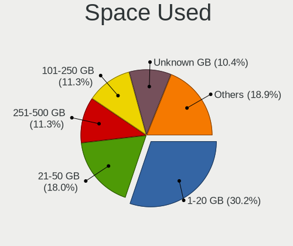
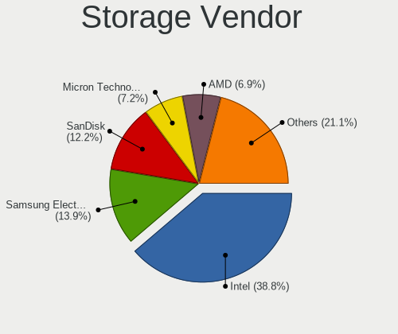
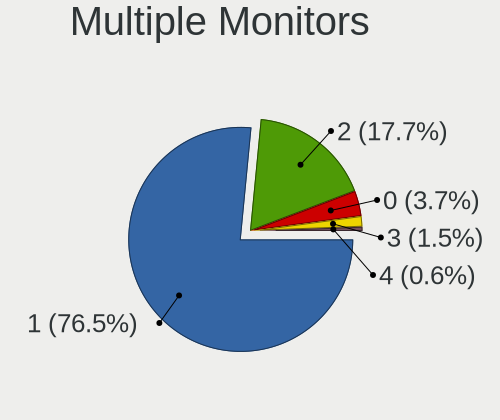
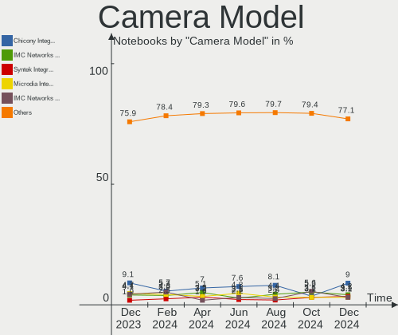

Fedora - Hardware Trends (Notebooks)
------------------------------------

A project to identify most popular hardware characteristics and track their change
over time based on data collected by Linux users at https://Linux-Hardware.org.

Anyone can contribute to this report by the [hw-probe](https://github.com/linuxhw/hw-probe) tool:

    sudo -E hw-probe -all -upload

This report is for one last month. Overall report since the beginning of time: [TestDays](https://github.com/linuxhw/TestDays)

Period: Jun, 2023.

Contents
--------

* [ System ](#system)
  - [ OS                       ](#os)
  - [ OS Family                ](#os-family)
  - [ Kernel                   ](#kernel)
  - [ Kernel Family            ](#kernel-family)
  - [ Kernel Major Ver.        ](#kernel-major-ver)
  - [ Arch                     ](#arch)
  - [ DE                       ](#de)
  - [ Display Server           ](#display-server)
  - [ Display Manager          ](#display-manager)
  - [ OS Lang                  ](#os-lang)
  - [ Boot Mode                ](#boot-mode)
  - [ Filesystem               ](#filesystem)
  - [ Part. scheme             ](#part-scheme)
  - [ Dual Boot with Linux/BSD ](#dual-boot-with-linuxbsd)
  - [ Dual Boot (Win)          ](#dual-boot-win)

* [ Board ](#board)
  - [ Vendor                   ](#vendor)
  - [ Model                    ](#model)
  - [ Model Family             ](#model-family)
  - [ MFG Year                 ](#mfg-year)
  - [ Form Factor              ](#form-factor)
  - [ Secure Boot              ](#secure-boot)
  - [ Coreboot                 ](#coreboot)
  - [ RAM Size                 ](#ram-size)
  - [ RAM Used                 ](#ram-used)
  - [ Total Drives             ](#total-drives)
  - [ Has CD-ROM               ](#has-cd-rom)
  - [ Has Ethernet             ](#has-ethernet)
  - [ Has WiFi                 ](#has-wifi)
  - [ Has Bluetooth            ](#has-bluetooth)

* [ Location ](#location)
  - [ Country                  ](#country)
  - [ City                     ](#city)

* [ Drives ](#drives)
  - [ Drive Vendor             ](#drive-vendor)
  - [ Drive Model              ](#drive-model)
  - [ HDD Vendor               ](#hdd-vendor)
  - [ SSD Vendor               ](#ssd-vendor)
  - [ Drive Kind               ](#drive-kind)
  - [ Drive Connector          ](#drive-connector)
  - [ Drive Size               ](#drive-size)
  - [ Space Total              ](#space-total)
  - [ Space Used               ](#space-used)
  - [ Malfunc. Drives          ](#malfunc-drives)
  - [ Malfunc. Drive Vendor    ](#malfunc-drive-vendor)
  - [ Malfunc. HDD Vendor      ](#malfunc-hdd-vendor)
  - [ Malfunc. Drive Kind      ](#malfunc-drive-kind)
  - [ Failed Drives            ](#failed-drives)
  - [ Failed Drive Vendor      ](#failed-drive-vendor)
  - [ Drive Status             ](#drive-status)

* [ Storage controller ](#storage-controller)
  - [ Storage Vendor           ](#storage-vendor)
  - [ Storage Model            ](#storage-model)
  - [ Storage Kind             ](#storage-kind)

* [ Processor ](#processor)
  - [ CPU Vendor               ](#cpu-vendor)
  - [ CPU Model                ](#cpu-model)
  - [ CPU Model Family         ](#cpu-model-family)
  - [ CPU Cores                ](#cpu-cores)
  - [ CPU Sockets              ](#cpu-sockets)
  - [ CPU Threads              ](#cpu-threads)
  - [ CPU Op-Modes             ](#cpu-op-modes)
  - [ CPU Microcode            ](#cpu-microcode)
  - [ CPU Microarch            ](#cpu-microarch)

* [ Graphics ](#graphics)
  - [ GPU Vendor               ](#gpu-vendor)
  - [ GPU Model                ](#gpu-model)
  - [ GPU Combo                ](#gpu-combo)
  - [ GPU Driver               ](#gpu-driver)
  - [ GPU Memory               ](#gpu-memory)

* [ Monitor ](#monitor)
  - [ Monitor Vendor           ](#monitor-vendor)
  - [ Monitor Model            ](#monitor-model)
  - [ Monitor Resolution       ](#monitor-resolution)
  - [ Monitor Diagonal         ](#monitor-diagonal)
  - [ Monitor Width            ](#monitor-width)
  - [ Aspect Ratio             ](#aspect-ratio)
  - [ Monitor Area             ](#monitor-area)
  - [ Pixel Density            ](#pixel-density)
  - [ Multiple Monitors        ](#multiple-monitors)

* [ Network ](#network)
  - [ Net Controller Vendor    ](#net-controller-vendor)
  - [ Net Controller Model     ](#net-controller-model)
  - [ Wireless Vendor          ](#wireless-vendor)
  - [ Wireless Model           ](#wireless-model)
  - [ Ethernet Vendor          ](#ethernet-vendor)
  - [ Ethernet Model           ](#ethernet-model)
  - [ Net Controller Kind      ](#net-controller-kind)
  - [ Used Controller          ](#used-controller)
  - [ NICs                     ](#nics)
  - [ IPv6                     ](#ipv6)

* [ Bluetooth ](#bluetooth)
  - [ Bluetooth Vendor         ](#bluetooth-vendor)
  - [ Bluetooth Model          ](#bluetooth-model)

* [ Sound ](#sound)
  - [ Sound Vendor             ](#sound-vendor)
  - [ Sound Model              ](#sound-model)

* [ Memory ](#memory)
  - [ Memory Vendor            ](#memory-vendor)
  - [ Memory Model             ](#memory-model)
  - [ Memory Kind              ](#memory-kind)
  - [ Memory Form Factor       ](#memory-form-factor)
  - [ Memory Size              ](#memory-size)
  - [ Memory Speed             ](#memory-speed)

* [ Printers & scanners ](#printers--scanners)
  - [ Printer Vendor           ](#printer-vendor)
  - [ Printer Model            ](#printer-model)
  - [ Scanner Vendor           ](#scanner-vendor)
  - [ Scanner Model            ](#scanner-model)

* [ Camera ](#camera)
  - [ Camera Vendor            ](#camera-vendor)
  - [ Camera Model             ](#camera-model)

* [ Security ](#security)
  - [ Fingerprint Vendor       ](#fingerprint-vendor)
  - [ Fingerprint Model        ](#fingerprint-model)
  - [ Chipcard Vendor          ](#chipcard-vendor)
  - [ Chipcard Model           ](#chipcard-model)

* [ Unsupported ](#unsupported)
  - [ Unsupported Devices      ](#unsupported-devices)
  - [ Unsupported Device Types ](#unsupported-device-types)

System
------

OS
--

Installed operating systems

| Name      | Notebooks | Percent |
|-----------|-----------|---------|
| Fedora 38 | 259       | 89.93%  |
| Fedora 37 | 18        | 6.25%   |
| Fedora 36 | 7         | 2.43%   |
| Fedora 39 | 2         | 0.69%   |
| Fedora 35 | 1         | 0.35%   |
| Fedora 34 | 1         | 0.35%   |

OS Family
---------

OS without a version

| Name   | Notebooks | Percent |
|--------|-----------|---------|
| Fedora | 288       | 100%    |

Kernel
------

Version of the Linux kernel

| Version                                            | Notebooks | Percent |
|----------------------------------------------------|-----------|---------|
| 6.3.8-200.fc38.x86_64                              | 68        | 23.61%  |
| 6.3.5-200.fc38.x86_64                              | 45        | 15.63%  |
| 6.3.6-200.fc38.x86_64                              | 42        | 14.58%  |
| 6.2.9-300.fc38.x86_64                              | 29        | 10.07%  |
| 6.3.4-201.fc38.x86_64                              | 23        | 7.99%   |
| 6.3.7-200.fc38.x86_64                              | 21        | 7.29%   |
| 6.2.15-300.fc38.x86_64                             | 18        | 6.25%   |
| 6.2.15-100.fc36.x86_64                             | 5         | 1.74%   |
| 6.3.8-100.fc37.x86_64                              | 3         | 1.04%   |
| 6.3.4-101.fc37.x86_64                              | 3         | 1.04%   |
| 6.2.14-300.fc38.x86_64                             | 3         | 1.04%   |
| 6.3.7-100.fc37.x86_64                              | 2         | 0.69%   |
| 6.3.5-100.fc37.x86_64                              | 2         | 0.69%   |
| 6.2.15-200.fc37.x86_64                             | 2         | 0.69%   |
| 6.4.0-0.rc6.20230614gitb6dad5178cea.49.fc39.x86_64 | 1         | 0.35%   |
| 6.4.0-0.rc4.334.vanilla.fc38.x86_64                | 1         | 0.35%   |
| 6.4.0-0.rc4.20230601git929ed21dfdb6.38.fc39.x86_64 | 1         | 0.35%   |
| 6.3.9-200.fc38.x86_64                              | 1         | 0.35%   |
| 6.3.8-206.rog.fc38.x86_64                          | 1         | 0.35%   |
| 6.3.6-cb1.0.fc38.x86_64                            | 1         | 0.35%   |
| 6.3.6-100.fc37.x86_64                              | 1         | 0.35%   |
| 6.3.1-eupnea                                       | 1         | 0.35%   |
| 6.2.7-200.fc37.x86_64                              | 1         | 0.35%   |
| 6.2.15-703.inttf.fc38.x86_64                       | 1         | 0.35%   |
| 6.2.14-200.fc37.x86_64                             | 1         | 0.35%   |
| 6.2.13-300.fc38.x86_64                             | 1         | 0.35%   |
| 6.2.12-300.fc38.x86_64                             | 1         | 0.35%   |
| 6.2.12-100.fc36.x86_64                             | 1         | 0.35%   |
| 6.0.9-300.fc37.x86_64                              | 1         | 0.35%   |
| 6.0.8-300.fc37.x86_64                              | 1         | 0.35%   |
| 6.0.7-301.fc37.x86_64                              | 1         | 0.35%   |
| 6.0.18-200.fc36.x86_64                             | 1         | 0.35%   |
| 6.0.12-100.fc35.x86_64                             | 1         | 0.35%   |
| 6.0.11-300.fc37.x86_64                             | 1         | 0.35%   |
| 5.17.12-100.fc34.x86_64                            | 1         | 0.35%   |
| 5.10.178-eupnea                                    | 1         | 0.35%   |

Kernel Family
-------------

Linux kernel without a distro release

| Version  | Notebooks | Percent |
|----------|-----------|---------|
| 6.3.8    | 72        | 25%     |
| 6.3.5    | 47        | 16.32%  |
| 6.3.6    | 44        | 15.28%  |
| 6.2.9    | 29        | 10.07%  |
| 6.3.4    | 26        | 9.03%   |
| 6.2.15   | 26        | 9.03%   |
| 6.3.7    | 23        | 7.99%   |
| 6.2.14   | 4         | 1.39%   |
| 6.4.0    | 3         | 1.04%   |
| 6.2.12   | 2         | 0.69%   |
| 6.3.9    | 1         | 0.35%   |
| 6.3.1    | 1         | 0.35%   |
| 6.2.7    | 1         | 0.35%   |
| 6.2.13   | 1         | 0.35%   |
| 6.0.9    | 1         | 0.35%   |
| 6.0.8    | 1         | 0.35%   |
| 6.0.7    | 1         | 0.35%   |
| 6.0.18   | 1         | 0.35%   |
| 6.0.12   | 1         | 0.35%   |
| 6.0.11   | 1         | 0.35%   |
| 5.17.12  | 1         | 0.35%   |
| 5.10.178 | 1         | 0.35%   |

Kernel Major Ver.
-----------------

Linux kernel major version

| Version | Notebooks | Percent |
|---------|-----------|---------|
| 6.3     | 214       | 74.31%  |
| 6.2     | 63        | 21.88%  |
| 6.0     | 6         | 2.08%   |
| 6.4     | 3         | 1.04%   |
| 5.17    | 1         | 0.35%   |
| 5.10    | 1         | 0.35%   |

Arch
----

OS architecture (x86_64, i586, etc.)

| Name   | Notebooks | Percent |
|--------|-----------|---------|
| x86_64 | 288       | 100%    |

DE
--

Desktop Environment

| Name          | Notebooks | Percent |
|---------------|-----------|---------|
| GNOME         | 226       | 78.47%  |
| KDE5          | 40        | 13.89%  |
| XFCE          | 5         | 1.74%   |
| MATE          | 3         | 1.04%   |
| Unknown       | 3         | 1.04%   |
| X-Cinnamon    | 2         | 0.69%   |
| LXDE          | 2         | 0.69%   |
| Cinnamon      | 2         | 0.69%   |
| Budgie        | 2         | 0.69%   |
| sway          | 1         | 0.35%   |
| i3            | 1         | 0.35%   |
| GNOME Classic | 1         | 0.35%   |

Display Server
--------------

X11 or Wayland

| Name    | Notebooks | Percent |
|---------|-----------|---------|
| Wayland | 242       | 84.03%  |
| X11     | 42        | 14.58%  |
| Unknown | 3         | 1.04%   |
| Tty     | 1         | 0.35%   |

Display Manager
---------------

SDDM, LightDM, etc.

| Name    | Notebooks | Percent |
|---------|-----------|---------|
| Unknown | 172       | 59.72%  |
| GDM     | 83        | 28.82%  |
| SDDM    | 21        | 7.29%   |
| LightDM | 10        | 3.47%   |
| LXDM    | 2         | 0.69%   |

OS Lang
-------

Language

| Lang    | Notebooks | Percent |
|---------|-----------|---------|
| en_US   | 155       | 53.82%  |
| en_GB   | 22        | 7.64%   |
| de_DE   | 14        | 4.86%   |
| ru_RU   | 11        | 3.82%   |
| fr_FR   | 10        | 3.47%   |
| pt_BR   | 9         | 3.13%   |
| es_MX   | 7         | 2.43%   |
| en_CA   | 6         | 2.08%   |
| pl_PL   | 5         | 1.74%   |
| it_IT   | 5         | 1.74%   |
| es_CL   | 5         | 1.74%   |
| en_IN   | 4         | 1.39%   |
| en_AU   | 4         | 1.39%   |
| zh_CN   | 3         | 1.04%   |
| es_PE   | 3         | 1.04%   |
| es_AR   | 3         | 1.04%   |
| sk_SK   | 2         | 0.69%   |
| pt_PT   | 2         | 0.69%   |
| hu_HU   | 2         | 0.69%   |
| es_ES   | 2         | 0.69%   |
| en_DK   | 2         | 0.69%   |
| cs_CZ   | 2         | 0.69%   |
| tr_TR   | 1         | 0.35%   |
| id_ID   | 1         | 0.35%   |
| ga_IE   | 1         | 0.35%   |
| fr_CA   | 1         | 0.35%   |
| es_UY   | 1         | 0.35%   |
| es_CR   | 1         | 0.35%   |
| en_NZ   | 1         | 0.35%   |
| en_IL   | 1         | 0.35%   |
| C       | 1         | 0.35%   |
| Unknown | 1         | 0.35%   |

Boot Mode
---------

EFI or BIOS

| Mode | Notebooks | Percent |
|------|-----------|---------|
| EFI  | 245       | 85.07%  |
| BIOS | 43        | 14.93%  |

Filesystem
----------

Type of filesystem

| Type    | Notebooks | Percent |
|---------|-----------|---------|
| Btrfs   | 239       | 82.99%  |
| Ext4    | 44        | 15.28%  |
| Xfs     | 4         | 1.39%   |
| Unknown | 1         | 0.35%   |

Part. scheme
------------

Scheme of partitioning

| Type    | Notebooks | Percent |
|---------|-----------|---------|
| Unknown | 169       | 58.68%  |
| GPT     | 112       | 38.89%  |
| MBR     | 7         | 2.43%   |

Dual Boot with Linux/BSD
------------------------

Hosting more than one Linux/BSD

| Dual boot | Notebooks | Percent |
|-----------|-----------|---------|
| No        | 265       | 92.01%  |
| Yes       | 23        | 7.99%   |

Dual Boot (Win)
---------------

Hosting Linux and Windows

| Dual boot | Notebooks | Percent |
|-----------|-----------|---------|
| No        | 247       | 85.76%  |
| Yes       | 41        | 14.24%  |

Board
-----

Vendor
------

Motherboard manufacturer

| Name                  | Notebooks | Percent |
|-----------------------|-----------|---------|
| Lenovo                | 88        | 30.56%  |
| Hewlett-Packard       | 48        | 16.67%  |
| Dell                  | 46        | 15.97%  |
| ASUSTek Computer      | 24        | 8.33%   |
| Acer                  | 17        | 5.9%    |
| Apple                 | 15        | 5.21%   |
| MSI                   | 8         | 2.78%   |
| Google                | 5         | 1.74%   |
| Toshiba               | 4         | 1.39%   |
| HUAWEI                | 4         | 1.39%   |
| Timi                  | 3         | 1.04%   |
| Sony                  | 3         | 1.04%   |
| TUXEDO                | 2         | 0.69%   |
| Samsung Electronics   | 2         | 0.69%   |
| Positivo Bahia - VAIO | 2         | 0.69%   |
| HONOR                 | 2         | 0.69%   |
| Framework             | 2         | 0.69%   |
| Xplore                | 1         | 0.35%   |
| UNOWHY                | 1         | 0.35%   |
| System76              | 1         | 0.35%   |
| realme                | 1         | 0.35%   |
| Razer                 | 1         | 0.35%   |
| Notebook              | 1         | 0.35%   |
| MECHREVO              | 1         | 0.35%   |
| Intel Client Systems  | 1         | 0.35%   |
| GPU Company           | 1         | 0.35%   |
| Gigabyte Technology   | 1         | 0.35%   |
| Fujitsu               | 1         | 0.35%   |
| AMI                   | 1         | 0.35%   |
| Unknown               | 1         | 0.35%   |

Model
-----

Motherboard model

| Name                                                  | Notebooks | Percent |
|-------------------------------------------------------|-----------|---------|
| Lenovo IdeaPad 3 15ITL6 82H8                          | 3         | 1.04%   |
| Apple MacBookPro9,2                                   | 3         | 1.04%   |
| Apple MacBookPro8,1                                   | 3         | 1.04%   |
| Positivo Bahia - VAIO VJFE43F11X-XXXXXX               | 2         | 0.69%   |
| Lenovo ThinkPad X220 42911H8                          | 2         | 0.69%   |
| Lenovo Legion 5 15ACH6A 82NW                          | 2         | 0.69%   |
| Lenovo IdeaPad L340-15API 81LW                        | 2         | 0.69%   |
| Lenovo IdeaPad 5 Pro 14ACN6 82L7                      | 2         | 0.69%   |
| HP ZBook 15 G2                                        | 2         | 0.69%   |
| HP Pavilion Laptop 14-ec1xxx                          | 2         | 0.69%   |
| HP Pavilion g6                                        | 2         | 0.69%   |
| HP OMEN by Laptop 16-c0xxx                            | 2         | 0.69%   |
| Framework Laptop                                      | 2         | 0.69%   |
| Dell XPS 15 9510                                      | 2         | 0.69%   |
| Dell Vostro 2520                                      | 2         | 0.69%   |
| Dell Latitude E7470                                   | 2         | 0.69%   |
| Dell Latitude 3420                                    | 2         | 0.69%   |
| Apple MacBookPro12,1                                  | 2         | 0.69%   |
| Apple MacBookAir5,2                                   | 2         | 0.69%   |
| Acer Nitro AN515-55                                   | 2         | 0.69%   |
| Unknown                                               | 2         | 0.69%   |
| Xplore iX104C6                                        | 1         | 0.35%   |
| UNOWHY Y13G002S4EI                                    | 1         | 0.35%   |
| TUXEDO Stellaris Intel Gen4                           | 1         | 0.35%   |
| TUXEDO Pulse 15 Gen2                                  | 1         | 0.35%   |
| Toshiba TECRA Z40t-C                                  | 1         | 0.35%   |
| Toshiba Satellite L40                                 | 1         | 0.35%   |
| Toshiba Satellite A300                                | 1         | 0.35%   |
| Toshiba PORTEGE Z10t-A                                | 1         | 0.35%   |
| Timi TM1801                                           | 1         | 0.35%   |
| Timi RedmiBook Pro 14                                 | 1         | 0.35%   |
| Timi A35S                                             | 1         | 0.35%   |
| System76 Oryx Pro                                     | 1         | 0.35%   |
| Sony VPCSC1AFM                                        | 1         | 0.35%   |
| Sony SVF1521A1EW                                      | 1         | 0.35%   |
| Sony SVF15213CBW                                      | 1         | 0.35%   |
| Samsung 950XEE                                        | 1         | 0.35%   |
| Samsung 730QCJ/730QCR                                 | 1         | 0.35%   |
| realme CloudProXXXX                                   | 1         | 0.35%   |
| Razer Blade 15 Advanced Model (Early 2020) - RZ09-033 | 1         | 0.35%   |

Model Family
------------

Motherboard model prefix

| Name                                    | Notebooks | Percent |
|-----------------------------------------|-----------|---------|
| Lenovo ThinkPad                         | 46        | 15.97%  |
| Lenovo IdeaPad                          | 20        | 6.94%   |
| HP Pavilion                             | 17        | 5.9%    |
| Dell Latitude                           | 17        | 5.9%    |
| Dell Inspiron                           | 15        | 5.21%   |
| Acer Aspire                             | 11        | 3.82%   |
| Lenovo Legion                           | 9         | 3.13%   |
| ASUS VivoBook                           | 9         | 3.13%   |
| HP EliteBook                            | 8         | 2.78%   |
| Dell XPS                                | 8         | 2.78%   |
| ASUS ROG                                | 7         | 2.43%   |
| HP Laptop                               | 6         | 2.08%   |
| Lenovo Yoga                             | 5         | 1.74%   |
| MSI Modern                              | 4         | 1.39%   |
| HP ENVY                                 | 4         | 1.39%   |
| Acer Nitro                              | 4         | 1.39%   |
| Lenovo ThinkBook                        | 3         | 1.04%   |
| HP ZBook                                | 3         | 1.04%   |
| HP OMEN                                 | 3         | 1.04%   |
| Dell Precision                          | 3         | 1.04%   |
| Apple MacBookPro9                       | 3         | 1.04%   |
| Apple MacBookPro8                       | 3         | 1.04%   |
| Toshiba Satellite                       | 2         | 0.69%   |
| Positivo Bahia - VAIO VJFE43F11X-XXXXXX | 2         | 0.69%   |
| MSI PS63                                | 2         | 0.69%   |
| HP ProBook                              | 2         | 0.69%   |
| Framework Laptop                        | 2         | 0.69%   |
| Dell Vostro                             | 2         | 0.69%   |
| ASUS ZenBook                            | 2         | 0.69%   |
| Apple MacBookPro12                      | 2         | 0.69%   |
| Apple MacBookAir5                       | 2         | 0.69%   |
| Unknown                                 | 2         | 0.69%   |
| Xplore iX104C6                          | 1         | 0.35%   |
| UNOWHY Y13G002S4EI                      | 1         | 0.35%   |
| TUXEDO Stellaris                        | 1         | 0.35%   |
| TUXEDO Pulse                            | 1         | 0.35%   |
| Toshiba TECRA                           | 1         | 0.35%   |
| Toshiba PORTEGE                         | 1         | 0.35%   |
| Timi TM1801                             | 1         | 0.35%   |
| Timi RedmiBook                          | 1         | 0.35%   |

MFG Year
--------

Motherboard manufacture year

| Year | Notebooks | Percent |
|------|-----------|---------|
| 2021 | 56        | 19.44%  |
| 2019 | 38        | 13.19%  |
| 2022 | 34        | 11.81%  |
| 2020 | 31        | 10.76%  |
| 2017 | 19        | 6.6%    |
| 2018 | 17        | 5.9%    |
| 2015 | 14        | 4.86%   |
| 2011 | 14        | 4.86%   |
| 2012 | 13        | 4.51%   |
| 2016 | 12        | 4.17%   |
| 2014 | 11        | 3.82%   |
| 2023 | 9         | 3.13%   |
| 2013 | 7         | 2.43%   |
| 2010 | 7         | 2.43%   |
| 2009 | 2         | 0.69%   |
| 2007 | 2         | 0.69%   |
| 2008 | 1         | 0.35%   |
| 2006 | 1         | 0.35%   |

Form Factor
-----------

Physical design of the computer

| Name     | Notebooks | Percent |
|----------|-----------|---------|
| Notebook | 288       | 100%    |

Secure Boot
-----------

Enabled or disabled

| State    | Notebooks | Percent |
|----------|-----------|---------|
| Disabled | 220       | 76.39%  |
| Enabled  | 68        | 23.61%  |

Coreboot
--------

Have coreboot on board

| Used | Notebooks | Percent |
|------|-----------|---------|
| No   | 282       | 97.92%  |
| Yes  | 6         | 2.08%   |

RAM Size
--------

Total RAM memory

| Size in GB  | Notebooks | Percent |
|-------------|-----------|---------|
| 4.01-8.0    | 99        | 34.38%  |
| 16.01-24.0  | 63        | 21.88%  |
| 8.01-16.0   | 58        | 20.14%  |
| 32.01-64.0  | 33        | 11.46%  |
| 3.01-4.0    | 21        | 7.29%   |
| 24.01-32.0  | 7         | 2.43%   |
| 64.01-256.0 | 5         | 1.74%   |
| 2.01-3.0    | 1         | 0.35%   |
| 1.01-2.0    | 1         | 0.35%   |

RAM Used
--------

Used RAM memory

| Used GB    | Notebooks | Percent |
|------------|-----------|---------|
| 4.01-8.0   | 91        | 31.6%   |
| 2.01-3.0   | 74        | 25.69%  |
| 3.01-4.0   | 71        | 24.65%  |
| 1.01-2.0   | 29        | 10.07%  |
| 8.01-16.0  | 22        | 7.64%   |
| 16.01-24.0 | 1         | 0.35%   |

Total Drives
------------

Number of drives on board

| Drives | Notebooks | Percent |
|--------|-----------|---------|
| 1      | 227       | 78.82%  |
| 2      | 54        | 18.75%  |
| 3      | 4         | 1.39%   |
| 8      | 1         | 0.35%   |
| 4      | 1         | 0.35%   |
| 0      | 1         | 0.35%   |

Has CD-ROM
----------

Has CD-ROM on board

| Presented | Notebooks | Percent |
|-----------|-----------|---------|
| No        | 238       | 82.64%  |
| Yes       | 50        | 17.36%  |

Has Ethernet
------------

Has Ethernet on board

| Presented | Notebooks | Percent |
|-----------|-----------|---------|
| Yes       | 203       | 70.49%  |
| No        | 85        | 29.51%  |

Has WiFi
--------

Has WiFi module

| Presented | Notebooks | Percent |
|-----------|-----------|---------|
| Yes       | 286       | 99.31%  |
| No        | 2         | 0.69%   |

Has Bluetooth
-------------

Has Bluetooth module

| Presented | Notebooks | Percent |
|-----------|-----------|---------|
| Yes       | 256       | 88.89%  |
| No        | 32        | 11.11%  |

Location
--------

Country
-------

Geographic location (country)

| Country      | Notebooks | Percent |
|--------------|-----------|---------|
| USA          | 40        | 13.89%  |
| Germany      | 19        | 6.6%    |
| Russia       | 14        | 4.86%   |
| India        | 14        | 4.86%   |
| Canada       | 13        | 4.51%   |
| Brazil       | 13        | 4.51%   |
| Netherlands  | 12        | 4.17%   |
| UK           | 9         | 3.13%   |
| Italy        | 9         | 3.13%   |
| France       | 9         | 3.13%   |
| Poland       | 8         | 2.78%   |
| Mexico       | 8         | 2.78%   |
| Chile        | 8         | 2.78%   |
| Switzerland  | 6         | 2.08%   |
| Turkey       | 5         | 1.74%   |
| Finland      | 5         | 1.74%   |
| Czechia      | 5         | 1.74%   |
| Singapore    | 4         | 1.39%   |
| Romania      | 4         | 1.39%   |
| Portugal     | 4         | 1.39%   |
| Israel       | 4         | 1.39%   |
| Ireland      | 4         | 1.39%   |
| Peru         | 3         | 1.04%   |
| Indonesia    | 3         | 1.04%   |
| Hungary      | 3         | 1.04%   |
| Costa Rica   | 3         | 1.04%   |
| Belarus      | 3         | 1.04%   |
| Austria      | 3         | 1.04%   |
| Australia    | 3         | 1.04%   |
| Argentina    | 3         | 1.04%   |
| Thailand     | 2         | 0.69%   |
| Spain        | 2         | 0.69%   |
| Slovakia     | 2         | 0.69%   |
| Saudi Arabia | 2         | 0.69%   |
| Puerto Rico  | 2         | 0.69%   |
| Philippines  | 2         | 0.69%   |
| Norway       | 2         | 0.69%   |
| Iran         | 2         | 0.69%   |
| Croatia      | 2         | 0.69%   |
| Bolivia      | 2         | 0.69%   |

City
----

Geographic location (city)

| City         | Notebooks | Percent |
|--------------|-----------|---------|
| Moscow       | 6         | 2.08%   |
| Helsinki     | 5         | 1.74%   |
| Singapore    | 4         | 1.39%   |
| Santiago     | 4         | 1.39%   |
| Delhi        | 4         | 1.39%   |
| Berlin       | 4         | 1.39%   |
| Zurich       | 3         | 1.04%   |
| Tel Aviv     | 3         | 1.04%   |
| San Jose     | 3         | 1.04%   |
| Plymouth     | 3         | 1.04%   |
| Montreal     | 3         | 1.04%   |
| Minsk        | 3         | 1.04%   |
| Bengaluru    | 3         | 1.04%   |
| Atlanta      | 3         | 1.04%   |
| Amsterdam    | 3         | 1.04%   |
| Zagreb       | 2         | 0.69%   |
| Warsaw       | 2         | 0.69%   |
| Vienna       | 2         | 0.69%   |
| Sao Paulo    | 2         | 0.69%   |
| San Antonio  | 2         | 0.69%   |
| Rome         | 2         | 0.69%   |
| Porto        | 2         | 0.69%   |
| Perm         | 2         | 0.69%   |
| Milan        | 2         | 0.69%   |
| Melbourne    | 2         | 0.69%   |
| Madrid       | 2         | 0.69%   |
| La Paz       | 2         | 0.69%   |
| Jakarta      | 2         | 0.69%   |
| Istanbul     | 2         | 0.69%   |
| Houston      | 2         | 0.69%   |
| Heerlen      | 2         | 0.69%   |
| Hamburg      | 2         | 0.69%   |
| Fortaleza    | 2         | 0.69%   |
| Dublin       | 2         | 0.69%   |
| Buenos Aires | 2         | 0.69%   |
| Budapest     | 2         | 0.69%   |
| Brasília    | 2         | 0.69%   |
| Bangkok      | 2         | 0.69%   |
| Yonkers      | 1         | 0.35%   |
| Yerevan      | 1         | 0.35%   |

Drives
------

Drive Vendor
------------

Hard drive vendors

| Vendor                         | Notebooks | Drives | Percent |
|--------------------------------|-----------|--------|---------|
| Samsung Electronics            | 72        | 78     | 20.81%  |
| Sandisk                        | 36        | 37     | 10.4%   |
| Kingston                       | 23        | 25     | 6.65%   |
| Intel                          | 23        | 24     | 6.65%   |
| WDC                            | 19        | 19     | 5.49%   |
| Unknown                        | 19        | 19     | 5.49%   |
| Toshiba                        | 18        | 22     | 5.2%    |
| SK hynix                       | 16        | 16     | 4.62%   |
| Crucial                        | 13        | 13     | 3.76%   |
| KIOXIA                         | 12        | 12     | 3.47%   |
| Micron Technology              | 11        | 11     | 3.18%   |
| Seagate                        | 10        | 10     | 2.89%   |
| Apple                          | 10        | 12     | 2.89%   |
| Kingston Technology Company    | 5         | 5      | 1.45%   |
| JMicron Technology             | 5         | 5      | 1.45%   |
| China                          | 5         | 5      | 1.45%   |
| Union Memory (Shenzhen)        | 4         | 4      | 1.16%   |
| Micron/Crucial Technology      | 4         | 4      | 1.16%   |
| Gigabyte Technology            | 4         | 4      | 1.16%   |
| Netac                          | 3         | 4      | 0.87%   |
| HGST                           | 3         | 3      | 0.87%   |
| Solid State Storage Technology | 2         | 2      | 0.58%   |
| Solid State Storage            | 2         | 2      | 0.58%   |
| Silicon Motion                 | 2         | 2      | 0.58%   |
| Phison Electronics             | 2         | 2      | 0.58%   |
| GOODRAM                        | 2         | 2      | 0.58%   |
| Apacer                         | 2         | 2      | 0.58%   |
| A-DATA Technology              | 2         | 2      | 0.58%   |
| Union Memory                   | 1         | 1      | 0.29%   |
| Super Talent                   | 1         | 1      | 0.29%   |
| SSSTC                          | 1         | 1      | 0.29%   |
| SPCC                           | 1         | 1      | 0.29%   |
| Smartbuy                       | 1         | 1      | 0.29%   |
| Realtek                        | 1         | 1      | 0.29%   |
| Ramsta                         | 1         | 1      | 0.29%   |
| Phison                         | 1         | 1      | 0.29%   |
| OEM                            | 1         | 1      | 0.29%   |
| NFORCE                         | 1         | 1      | 0.29%   |
| LITEON                         | 1         | 1      | 0.29%   |
| Lenovo                         | 1         | 1      | 0.29%   |

Drive Model
-----------

Hard drive models

| Model                                                 | Notebooks | Percent |
|-------------------------------------------------------|-----------|---------|
| Samsung NVMe SSD Controller SM981/PM981/PM983 250GB   | 19        | 5.31%   |
| Intel SSD 660P Series 512GB                           | 11        | 3.07%   |
| Unknown MMC Card  64GB                                | 9         | 2.51%   |
| Samsung NVMe SSD Controller PM9A1/PM9A3/980PRO 2TB    | 9         | 2.51%   |
| Sandisk WD Blue SN550 NVMe SSD 1TB                    | 8         | 2.23%   |
| Sandisk WD Black SN750 / PC SN730 NVMe SSD 500GB      | 5         | 1.4%    |
| Samsung SSD 980 1TB                                   | 5         | 1.4%    |
| Kingston SA400S37480G 480GB SSD                       | 5         | 1.4%    |
| Kingston SA400S37240G 240GB SSD                       | 5         | 1.4%    |
| JMicron Generic 240GB                                 | 5         | 1.4%    |
| Unknown MMC Card  128GB                               | 4         | 1.12%   |
| Samsung SSD 860 EVO 500GB                             | 4         | 1.12%   |
| Intel SSDPEKNU512GZ 512GB                             | 4         | 1.12%   |
| Union Memory (Shenzhen) UMIS RPJTJ512MGE1QDQ 512GB    | 3         | 0.84%   |
| Toshiba XG6 NVMe SSD Controller 2TB                   | 3         | 0.84%   |
| Seagate ST1000LM035-1RK172 1TB                        | 3         | 0.84%   |
| Sandisk WD Blue SN570 1TB                             | 3         | 0.84%   |
| Samsung SSD 870 EVO 1TB                               | 3         | 0.84%   |
| Micron/Crucial P2 NVMe PCIe SSD 4TB                   | 3         | 0.84%   |
| KIOXIA KBG40ZNV512G 512GB                             | 3         | 0.84%   |
| Kingston SNVS500G 500GB                               | 3         | 0.84%   |
| Intel SSDPEKNW512GZL 512GB                            | 3         | 0.84%   |
| Intel SSD 600P Series 256GB                           | 3         | 0.84%   |
| Crucial CT1000MX500SSD1 1TB                           | 3         | 0.84%   |
| WDC WD10SPZX-60Z10T0 1TB                              | 2         | 0.56%   |
| WDC WD10SPZX-24Z10 1TB                                | 2         | 0.56%   |
| WDC WD10JPVX-22JC3T0 1TB                              | 2         | 0.56%   |
| Unknown MMC Card  32GB                                | 2         | 0.56%   |
| Toshiba NVMe Controller 256GB                         | 2         | 0.56%   |
| Toshiba MQ04ABF100 1TB                                | 2         | 0.56%   |
| Toshiba MQ01ABD050V 500GB                             | 2         | 0.56%   |
| SK hynix SKHynix_HFS512GDE9X084N 512GB                | 2         | 0.56%   |
| SK hynix PC711 NVMe 1TB                               | 2         | 0.56%   |
| SK hynix PC401 NVMe Solid State Drive 256GB           | 2         | 0.56%   |
| SK hynix BC501 NVMe Solid State Drive 512GB           | 2         | 0.56%   |
| Silicon Motion SM2263EN/SM2263XT SSD Controller 256GB | 2         | 0.56%   |
| Sandisk WD Blue SN500 / PC SN520 NVMe SSD 500GB       | 2         | 0.56%   |
| Sandisk WD Black 2018/SN750 / PC SN720 NVMe SSD 500GB | 2         | 0.56%   |
| Samsung SSD 990 PRO 2TB                               | 2         | 0.56%   |
| Samsung SSD 870 EVO 500GB                             | 2         | 0.56%   |

HDD Vendor
----------

Hard disk drive vendors

| Vendor  | Notebooks | Drives | Percent |
|---------|-----------|--------|---------|
| WDC     | 14        | 14     | 38.89%  |
| Seagate | 9         | 9      | 25%     |
| Toshiba | 8         | 8      | 22.22%  |
| HGST    | 3         | 3      | 8.33%   |
| Hitachi | 1         | 1      | 2.78%   |
| Apple   | 1         | 1      | 2.78%   |

SSD Vendor
----------

Solid state drive vendors

| Vendor              | Notebooks | Drives | Percent |
|---------------------|-----------|--------|---------|
| Samsung Electronics | 22        | 22     | 21.78%  |
| Kingston            | 15        | 16     | 14.85%  |
| Crucial             | 13        | 13     | 12.87%  |
| SanDisk             | 7         | 7      | 6.93%   |
| Apple               | 7         | 7      | 6.93%   |
| Toshiba             | 5         | 5      | 4.95%   |
| China               | 5         | 5      | 4.95%   |
| WDC                 | 4         | 4      | 3.96%   |
| Gigabyte Technology | 3         | 3      | 2.97%   |
| Micron Technology   | 2         | 2      | 1.98%   |
| GOODRAM             | 2         | 2      | 1.98%   |
| Apacer              | 2         | 2      | 1.98%   |
| Super Talent        | 1         | 1      | 0.99%   |
| SSSTC               | 1         | 1      | 0.99%   |
| SPCC                | 1         | 1      | 0.99%   |
| Smartbuy            | 1         | 1      | 0.99%   |
| SK hynix            | 1         | 1      | 0.99%   |
| Ramsta              | 1         | 1      | 0.99%   |
| OEM                 | 1         | 1      | 0.99%   |
| Netac               | 1         | 1      | 0.99%   |
| LITEON              | 1         | 1      | 0.99%   |
| KingSpec            | 1         | 1      | 0.99%   |
| KingDian            | 1         | 1      | 0.99%   |
| Intel               | 1         | 1      | 0.99%   |
| Hewlett-Packard     | 1         | 1      | 0.99%   |
| A-DATA Technology   | 1         | 1      | 0.99%   |

Drive Kind
----------

HDD or SSD

| Kind    | Notebooks | Drives | Percent |
|---------|-----------|--------|---------|
| NVMe    | 172       | 204    | 52.92%  |
| SSD     | 97        | 102    | 29.85%  |
| HDD     | 35        | 36     | 10.77%  |
| MMC     | 18        | 18     | 5.54%   |
| Unknown | 3         | 3      | 0.92%   |

Drive Connector
---------------

SATA, SAS, NVMe, etc.

| Type | Notebooks | Drives | Percent |
|------|-----------|--------|---------|
| NVMe | 171       | 198    | 53.27%  |
| SATA | 124       | 136    | 38.63%  |
| MMC  | 18        | 18     | 5.61%   |
| SAS  | 8         | 11     | 2.49%   |

Drive Size
----------

Size of hard drive

| Size in TB | Notebooks | Drives | Percent |
|------------|-----------|--------|---------|
| 0.01-0.5   | 91        | 98     | 70%     |
| 0.51-1.0   | 37        | 38     | 28.46%  |
| 1.01-2.0   | 2         | 2      | 1.54%   |

Space Total
-----------

Amount of disk space available on the file system

| Size in GB     | Notebooks | Percent |
|----------------|-----------|---------|
| 501-1000       | 65        | 22.57%  |
| 251-500        | 62        | 21.53%  |
| 101-250        | 51        | 17.71%  |
| 1-20           | 32        | 11.11%  |
| 1001-2000      | 30        | 10.42%  |
| Unknown        | 25        | 8.68%   |
| More than 3000 | 8         | 2.78%   |
| 51-100         | 7         | 2.43%   |
| 2001-3000      | 5         | 1.74%   |
| 21-50          | 3         | 1.04%   |

Space Used
----------

Amount of used disk space

| Used GB        | Notebooks | Percent |
|----------------|-----------|---------|
| 1-20           | 108       | 37.5%   |
| 21-50          | 46        | 15.97%  |
| 51-100         | 36        | 12.5%   |
| 101-250        | 30        | 10.42%  |
| Unknown        | 25        | 8.68%   |
| 251-500        | 23        | 7.99%   |
| 501-1000       | 15        | 5.21%   |
| 1001-2000      | 4         | 1.39%   |
| More than 3000 | 1         | 0.35%   |

Malfunc. Drives
---------------

Drive models with a malfunction

| Model                                | Notebooks | Drives | Percent |
|--------------------------------------|-----------|--------|---------|
| WDC WD5000BPVT-75HXZT1 500GB         | 1         | 1      | 16.67%  |
| SSSTC CVB-8D128-HP 128GB SSD         | 1         | 1      | 16.67%  |
| SK hynix BC711 HFM256GD3JX013N 256GB | 1         | 1      | 16.67%  |
| Hitachi HTS545025B9SA02 250GB        | 1         | 1      | 16.67%  |
| HGST HTS541010A9E680 1TB             | 1         | 1      | 16.67%  |
| Crucial CT525MX300SSD1 528GB         | 1         | 1      | 16.67%  |

Malfunc. Drive Vendor
---------------------

Vendors of faulty drives

| Vendor   | Notebooks | Drives | Percent |
|----------|-----------|--------|---------|
| WDC      | 1         | 1      | 16.67%  |
| SSSTC    | 1         | 1      | 16.67%  |
| SK hynix | 1         | 1      | 16.67%  |
| Hitachi  | 1         | 1      | 16.67%  |
| HGST     | 1         | 1      | 16.67%  |
| Crucial  | 1         | 1      | 16.67%  |

Malfunc. HDD Vendor
-------------------

Vendors of faulty HDD drives

| Vendor  | Notebooks | Drives | Percent |
|---------|-----------|--------|---------|
| WDC     | 1         | 1      | 33.33%  |
| Hitachi | 1         | 1      | 33.33%  |
| HGST    | 1         | 1      | 33.33%  |

Malfunc. Drive Kind
-------------------

Kinds of faulty drives

| Kind | Notebooks | Drives | Percent |
|------|-----------|--------|---------|
| HDD  | 3         | 3      | 50%     |
| SSD  | 2         | 2      | 33.33%  |
| NVMe | 1         | 1      | 16.67%  |

Failed Drives
-------------

Failed drive models

Zero info for selected period =(

Failed Drive Vendor
-------------------

Failed drive vendors

Zero info for selected period =(

Drive Status
------------

Number of failed and malfunc. drives

| Status   | Notebooks | Drives | Percent |
|----------|-----------|--------|---------|
| Detected | 179       | 233    | 61.3%   |
| Works    | 107       | 124    | 36.64%  |
| Malfunc  | 6         | 6      | 2.05%   |

Storage controller
------------------

Storage Vendor
--------------

Storage controller vendors

| Vendor                                  | Notebooks | Percent |
|-----------------------------------------|-----------|---------|
| Intel                                   | 158       | 43.89%  |
| Samsung Electronics                     | 54        | 15%     |
| AMD                                     | 36        | 10%     |
| SanDisk                                 | 29        | 8.06%   |
| SK hynix                                | 15        | 4.17%   |
| Kingston Technology Company             | 14        | 3.89%   |
| KIOXIA                                  | 12        | 3.33%   |
| Micron Technology                       | 9         | 2.5%    |
| Toshiba America Info Systems            | 7         | 1.94%   |
| Union Memory (Shenzhen)                 | 4         | 1.11%   |
| Solid State Storage Technology          | 4         | 1.11%   |
| Micron/Crucial Technology               | 4         | 1.11%   |
| Silicon Motion                          | 2         | 0.56%   |
| Phison Electronics                      | 2         | 0.56%   |
| Netac Technology                        | 2         | 0.56%   |
| Apple                                   | 2         | 0.56%   |
| Solidigm                                | 1         | 0.28%   |
| Shenzhen Unionmemory Information System | 1         | 0.28%   |
| Seagate Technology                      | 1         | 0.28%   |
| Nvidia                                  | 1         | 0.28%   |
| Lenovo                                  | 1         | 0.28%   |
| ADATA Technology                        | 1         | 0.28%   |

Storage Model
-------------

Storage controller models

| Model                                                                          | Notebooks | Percent |
|--------------------------------------------------------------------------------|-----------|---------|
| AMD FCH SATA Controller [AHCI mode]                                            | 35        | 9.07%   |
| Intel Sunrise Point-LP SATA Controller [AHCI mode]                             | 27        | 6.99%   |
| Samsung NVMe SSD Controller 980                                                | 22        | 5.7%    |
| Samsung NVMe SSD Controller SM981/PM981/PM983                                  | 19        | 4.92%   |
| Intel 7 Series Chipset Family 6-port SATA Controller [AHCI mode]               | 15        | 3.89%   |
| Intel Volume Management Device NVMe RAID Controller                            | 14        | 3.63%   |
| Intel 82801 Mobile SATA Controller [RAID mode]                                 | 13        | 3.37%   |
| Intel SSD 660P Series                                                          | 11        | 2.85%   |
| Intel 6 Series/C200 Series Chipset Family 6 port Mobile SATA AHCI Controller   | 10        | 2.59%   |
| SK hynix Gold P31/BC711/PC711 NVMe Solid State Drive                           | 9         | 2.33%   |
| Samsung NVMe SSD Controller PM9A1/PM9A3/980PRO                                 | 9         | 2.33%   |
| SanDisk WD Blue SN550 NVMe SSD                                                 | 8         | 2.07%   |
| KIOXIA NVMe SSD Controller BG4                                                 | 8         | 2.07%   |
| Intel Non-Volatile memory controller                                           | 8         | 2.07%   |
| Intel Tiger Lake-LP SATA Controller                                            | 7         | 1.81%   |
| Intel Ice Lake-LP SATA Controller [AHCI mode]                                  | 7         | 1.81%   |
| Intel 8 Series SATA Controller 1 [AHCI mode]                                   | 7         | 1.81%   |
| SanDisk WD Black SN750 / PC SN730 NVMe SSD                                     | 6         | 1.55%   |
| Micron NVMe Storage Controller                                                 | 5         | 1.3%    |
| Intel Cannon Lake Mobile PCH SATA AHCI Controller                              | 5         | 1.3%    |
| Intel 8 Series/C220 Series Chipset Family 6-port SATA Controller 1 [AHCI mode] | 5         | 1.3%    |
| Solid State Storage CL1-3D256-Q11 NVMe SSD M.2                                 | 4         | 1.04%   |
| KIOXIA Non-Volatile memory controller                                          | 4         | 1.04%   |
| Kingston Company Company Non-Volatile memory controller                        | 4         | 1.04%   |
| Intel Wildcat Point-LP SATA Controller [AHCI Mode]                             | 4         | 1.04%   |
| Intel Q170/Q150/B150/H170/H110/Z170/CM236 Chipset SATA Controller [AHCI Mode]  | 4         | 1.04%   |
| Union Memory (Shenzhen) AM630 PCIe 4.0 x4 NVMe SSD Controller                  | 3         | 0.78%   |
| Toshiba America Info Systems XG6 NVMe SSD Controller                           | 3         | 0.78%   |
| SanDisk WD Blue SN570 NVMe SSD 1TB                                             | 3         | 0.78%   |
| SanDisk Non-Volatile memory controller                                         | 3         | 0.78%   |
| Samsung Electronics SATA controller                                            | 3         | 0.78%   |
| Micron/Crucial P2 NVMe PCIe SSD                                                | 3         | 0.78%   |
| Kingston Company NVMe Controller                                               | 3         | 0.78%   |
| Kingston Company FURY Renegade NVMe SSD                                        | 3         | 0.78%   |
| Intel SSD 600P Series                                                          | 3         | 0.78%   |
| Intel HM170/QM170 Chipset SATA Controller [AHCI Mode]                          | 3         | 0.78%   |
| Intel Comet Lake SATA AHCI Controller                                          | 3         | 0.78%   |
| Intel Celeron N3350/Pentium N4200/Atom E3900 Series SATA AHCI Controller       | 3         | 0.78%   |
| Intel Cannon Point-LP SATA Controller [AHCI Mode]                              | 3         | 0.78%   |
| Intel 5 Series/3400 Series Chipset 4 port SATA AHCI Controller                 | 3         | 0.78%   |

Storage Kind
------------

Kind of storage controller (IDE, SATA, NVMe, SAS, ...)

| Kind | Notebooks | Percent |
|------|-----------|---------|
| NVMe | 170       | 46.58%  |
| SATA | 162       | 44.38%  |
| RAID | 28        | 7.67%   |
| IDE  | 5         | 1.37%   |

Processor
---------

CPU Vendor
----------

Processor vendors

| Vendor | Notebooks | Percent |
|--------|-----------|---------|
| Intel  | 216       | 75%     |
| AMD    | 72        | 25%     |

CPU Model
---------

Processor models

| Model                                         | Notebooks | Percent |
|-----------------------------------------------|-----------|---------|
| Intel 11th Gen Core i5-1135G7 @ 2.40GHz       | 11        | 3.82%   |
| AMD Ryzen 7 5800H with Radeon Graphics        | 8         | 2.78%   |
| Intel Core i5-7200U CPU @ 2.50GHz             | 6         | 2.08%   |
| Intel Core i5-6300U CPU @ 2.40GHz             | 6         | 2.08%   |
| Intel Core i5-1035G1 CPU @ 1.00GHz            | 6         | 2.08%   |
| Intel Core i5-6200U CPU @ 2.30GHz             | 5         | 1.74%   |
| Intel Core i5-10210U CPU @ 1.60GHz            | 5         | 1.74%   |
| AMD Ryzen 5 3500U with Radeon Vega Mobile Gfx | 5         | 1.74%   |
| Intel Core i7-8565U CPU @ 1.80GHz             | 4         | 1.39%   |
| Intel Core i7-7700HQ CPU @ 2.80GHz            | 4         | 1.39%   |
| Intel Core i7-4810MQ CPU @ 2.80GHz            | 4         | 1.39%   |
| Intel Core i5-3210M CPU @ 2.50GHz             | 4         | 1.39%   |
| Intel 12th Gen Core i7-1255U                  | 4         | 1.39%   |
| Intel 11th Gen Core i7-1165G7 @ 2.80GHz       | 4         | 1.39%   |
| AMD Ryzen 7 4800H with Radeon Graphics        | 4         | 1.39%   |
| AMD Ryzen 5 5600H with Radeon Graphics        | 4         | 1.39%   |
| AMD Ryzen 5 4500U with Radeon Graphics        | 4         | 1.39%   |
| Intel Core i7-9750H CPU @ 2.60GHz             | 3         | 1.04%   |
| Intel Core i7-8750H CPU @ 2.20GHz             | 3         | 1.04%   |
| Intel Core i7-8550U CPU @ 1.80GHz             | 3         | 1.04%   |
| Intel Core i7-7500U CPU @ 2.70GHz             | 3         | 1.04%   |
| Intel Core i7-10750H CPU @ 2.60GHz            | 3         | 1.04%   |
| Intel Core i5-8350U CPU @ 1.70GHz             | 3         | 1.04%   |
| Intel Core i5-3320M CPU @ 2.60GHz             | 3         | 1.04%   |
| Intel Core i5-2520M CPU @ 2.50GHz             | 3         | 1.04%   |
| Intel 12th Gen Core i5-12500H                 | 3         | 1.04%   |
| AMD Ryzen 7 5825U with Radeon Graphics        | 3         | 1.04%   |
| AMD Ryzen 7 5800U with Radeon Graphics        | 3         | 1.04%   |
| AMD Ryzen 7 5700U with Radeon Graphics        | 3         | 1.04%   |
| AMD Ryzen 5 5500U with Radeon Graphics        | 3         | 1.04%   |
| Intel Core i7-6820HQ CPU @ 2.70GHz            | 2         | 0.69%   |
| Intel Core i7-6600U CPU @ 2.60GHz             | 2         | 0.69%   |
| Intel Core i5-9300H CPU @ 2.40GHz             | 2         | 0.69%   |
| Intel Core i5-8365U CPU @ 1.60GHz             | 2         | 0.69%   |
| Intel Core i5-8265U CPU @ 1.60GHz             | 2         | 0.69%   |
| Intel Core i5-8250U CPU @ 1.60GHz             | 2         | 0.69%   |
| Intel Core i5-4200U CPU @ 1.60GHz             | 2         | 0.69%   |
| Intel Core i5-3230M CPU @ 2.60GHz             | 2         | 0.69%   |
| Intel Core i5-2435M CPU @ 2.40GHz             | 2         | 0.69%   |
| Intel Core i5-10300H CPU @ 2.50GHz            | 2         | 0.69%   |

CPU Model Family
----------------

Processor model prefix

| Model                | Notebooks | Percent |
|----------------------|-----------|---------|
| Intel Core i5        | 76        | 26.39%  |
| Other                | 53        | 18.4%   |
| Intel Core i7        | 52        | 18.06%  |
| AMD Ryzen 7          | 27        | 9.38%   |
| AMD Ryzen 5          | 24        | 8.33%   |
| Intel Core i3        | 12        | 4.17%   |
| Intel Celeron        | 8         | 2.78%   |
| AMD Ryzen 3          | 5         | 1.74%   |
| Intel Pentium        | 4         | 1.39%   |
| Intel Core 2 Duo     | 4         | 1.39%   |
| AMD Ryzen 9          | 4         | 1.39%   |
| AMD Ryzen 7 PRO      | 3         | 1.04%   |
| AMD Ryzen 5 PRO      | 3         | 1.04%   |
| Intel Core m5        | 2         | 0.69%   |
| Intel Core i9        | 2         | 0.69%   |
| Intel Xeon           | 1         | 0.35%   |
| Intel Pentium Silver | 1         | 0.35%   |
| Intel Pentium Dual   | 1         | 0.35%   |
| Intel Core M         | 1         | 0.35%   |
| Intel Core 2         | 1         | 0.35%   |
| AMD Athlon II        | 1         | 0.35%   |
| AMD A8               | 1         | 0.35%   |
| AMD A6               | 1         | 0.35%   |
| AMD A10              | 1         | 0.35%   |

CPU Cores
---------

Number of processor cores

| Number | Notebooks | Percent |
|--------|-----------|---------|
| 2      | 103       | 35.76%  |
| 4      | 90        | 31.25%  |
| 8      | 39        | 13.54%  |
| 6      | 32        | 11.11%  |
| 14     | 9         | 3.13%   |
| 12     | 9         | 3.13%   |
| 10     | 5         | 1.74%   |
| 24     | 1         | 0.35%   |

CPU Sockets
-----------

Number of sockets

| Number | Notebooks | Percent |
|--------|-----------|---------|
| 1      | 288       | 100%    |

CPU Threads
-----------

Threads per core (Hyper-Threading)

| Number | Notebooks | Percent |
|--------|-----------|---------|
| 2      | 258       | 89.58%  |
| 1      | 30        | 10.42%  |

CPU Op-Modes
------------

CPU Operation Modes (32-bit, 64-bit)

| Op mode        | Notebooks | Percent |
|----------------|-----------|---------|
| 32-bit, 64-bit | 288       | 100%    |

CPU Microcode
-------------

Microcode number

| Number     | Notebooks | Percent |
|------------|-----------|---------|
| Unknown    | 211       | 73.26%  |
| 0x0a50000c | 16        | 5.56%   |
| 0x0a50000d | 8         | 2.78%   |
| 0x08108109 | 7         | 2.43%   |
| 0x08608103 | 6         | 2.08%   |
| 0x0a404102 | 5         | 1.74%   |
| 0x08600106 | 5         | 1.74%   |
| 0x08600104 | 5         | 1.74%   |
| 0x08108102 | 4         | 1.39%   |
| 0x406e3    | 3         | 1.04%   |
| 0x08600103 | 3         | 1.04%   |
| 0x0a404101 | 2         | 0.69%   |
| 0x806ec    | 1         | 0.35%   |
| 0x806c1    | 1         | 0.35%   |
| 0x306a9    | 1         | 0.35%   |
| 0x206a7    | 1         | 0.35%   |
| 0x0a601203 | 1         | 0.35%   |
| 0x08608104 | 1         | 0.35%   |
| 0x0810100b | 1         | 0.35%   |
| 0x07030105 | 1         | 0.35%   |
| 0x06006705 | 1         | 0.35%   |
| 0x06006704 | 1         | 0.35%   |
| 0x06001119 | 1         | 0.35%   |
| 0x06001116 | 1         | 0.35%   |
| 0x010000c8 | 1         | 0.35%   |

CPU Microarch
-------------

Microarchitecture

| Name             | Notebooks | Percent |
|------------------|-----------|---------|
| KabyLake         | 57        | 19.79%  |
| Zen 3            | 24        | 8.33%   |
| TigerLake        | 23        | 7.99%   |
| Skylake          | 21        | 7.29%   |
| Alderlake Hybrid | 21        | 7.29%   |
| Unknown          | 19        | 6.6%    |
| IvyBridge        | 16        | 5.56%   |
| Haswell          | 14        | 4.86%   |
| Zen 2            | 13        | 4.51%   |
| SandyBridge      | 12        | 4.17%   |
| Icelake          | 12        | 4.17%   |
| Zen+             | 11        | 3.82%   |
| CometLake        | 8         | 2.78%   |
| Broadwell        | 8         | 2.78%   |
| Westmere         | 5         | 1.74%   |
| Goldmont plus    | 4         | 1.39%   |
| Penryn           | 3         | 1.04%   |
| Goldmont         | 3         | 1.04%   |
| Core             | 3         | 1.04%   |
| Silvermont       | 2         | 0.69%   |
| Piledriver       | 2         | 0.69%   |
| Excavator        | 2         | 0.69%   |
| Zen              | 1         | 0.35%   |
| Tremont          | 1         | 0.35%   |
| Puma             | 1         | 0.35%   |
| Nehalem          | 1         | 0.35%   |
| K10              | 1         | 0.35%   |

Graphics
--------

GPU Vendor
----------

Vendors of graphics cards

| Vendor | Notebooks | Percent |
|--------|-----------|---------|
| Intel  | 204       | 56.2%   |
| Nvidia | 80        | 22.04%  |
| AMD    | 79        | 21.76%  |

GPU Model
---------

Graphics card models

| Model                                                                     | Notebooks | Percent |
|---------------------------------------------------------------------------|-----------|---------|
| Intel TigerLake-LP GT2 [Iris Xe Graphics]                                 | 22        | 5.95%   |
| Intel 3rd Gen Core processor Graphics Controller                          | 16        | 4.32%   |
| AMD Cezanne [Radeon Vega Series / Radeon Vega Mobile Series]              | 16        | 4.32%   |
| Intel Skylake GT2 [HD Graphics 520]                                       | 15        | 4.05%   |
| Intel HD Graphics 620                                                     | 13        | 3.51%   |
| Intel Alder Lake-P Integrated Graphics Controller                         | 13        | 3.51%   |
| AMD Renoir                                                                | 13        | 3.51%   |
| Intel 2nd Generation Core Processor Family Integrated Graphics Controller | 12        | 3.24%   |
| AMD Picasso/Raven 2 [Radeon Vega Series / Radeon Vega Mobile Series]      | 11        | 2.97%   |
| Intel WhiskeyLake-U GT2 [UHD Graphics 620]                                | 10        | 2.7%    |
| Intel UHD Graphics 620                                                    | 10        | 2.7%    |
| Intel CoffeeLake-H GT2 [UHD Graphics 630]                                 | 9         | 2.43%   |
| AMD Lucienne                                                              | 8         | 2.16%   |
| Intel Haswell-ULT Integrated Graphics Controller                          | 7         | 1.89%   |
| Intel CometLake-U GT2 [UHD Graphics]                                      | 7         | 1.89%   |
| Intel CometLake-H GT2 [UHD Graphics]                                      | 7         | 1.89%   |
| AMD Rembrandt [Radeon 680M]                                               | 7         | 1.89%   |
| Nvidia TU117M [GeForce GTX 1650 Mobile / Max-Q]                           | 6         | 1.62%   |
| Intel Iris Plus Graphics G1 (Ice Lake)                                    | 6         | 1.62%   |
| Nvidia TU117M [GeForce GTX 1650 Ti Mobile]                                | 5         | 1.35%   |
| Nvidia GA107M [GeForce RTX 3050 Mobile]                                   | 5         | 1.35%   |
| Nvidia GA106M [GeForce RTX 3060 Mobile / Max-Q]                           | 5         | 1.35%   |
| Intel TigerLake-H GT1 [UHD Graphics]                                      | 5         | 1.35%   |
| Intel Alder Lake-UP3 GT2 [Iris Xe Graphics]                               | 5         | 1.35%   |
| AMD Barcelo                                                               | 5         | 1.35%   |
| Nvidia GP107M [GeForce GTX 1050 Mobile]                                   | 4         | 1.08%   |
| Intel HD Graphics 5500                                                    | 4         | 1.08%   |
| Intel GeminiLake [UHD Graphics 600]                                       | 4         | 1.08%   |
| Intel Core Processor Integrated Graphics Controller                       | 4         | 1.08%   |
| Nvidia TU117M [GeForce MX550]                                             | 3         | 0.81%   |
| Nvidia TU116M [GeForce GTX 1660 Ti Mobile]                                | 3         | 0.81%   |
| Nvidia GF117M [GeForce 610M/710M/810M/820M / GT 620M/625M/630M/720M]      | 3         | 0.81%   |
| Intel Raptor Lake-P [Iris Xe Graphics]                                    | 3         | 0.81%   |
| Intel HD Graphics 630                                                     | 3         | 0.81%   |
| Intel 4th Gen Core Processor Integrated Graphics Controller               | 3         | 0.81%   |
| AMD Navi 23 [Radeon RX 6600/6600 XT/6600M]                                | 3         | 0.81%   |
| Nvidia GP108M [GeForce MX250]                                             | 2         | 0.54%   |
| Nvidia GM107GLM [Quadro M2000M]                                           | 2         | 0.54%   |
| Nvidia GK107GLM [Quadro K1100M]                                           | 2         | 0.54%   |
| Nvidia GK106GLM [Quadro K2100M]                                           | 2         | 0.54%   |

GPU Combo
---------

Combinations of graphics cards

| Name           | Notebooks | Percent |
|----------------|-----------|---------|
| 1 x Intel      | 145       | 50.35%  |
| 1 x AMD        | 52        | 18.06%  |
| Intel + Nvidia | 50        | 17.36%  |
| AMD + Nvidia   | 16        | 5.56%   |
| 1 x Nvidia     | 13        | 4.51%   |
| Intel + AMD    | 8         | 2.78%   |
| 2 x AMD        | 3         | 1.04%   |
| Other          | 1         | 0.35%   |

GPU Driver
----------

Free vs proprietary

| Driver      | Notebooks | Percent |
|-------------|-----------|---------|
| Free        | 241       | 83.68%  |
| Proprietary | 37        | 12.85%  |
| Unknown     | 10        | 3.47%   |

GPU Memory
----------

Total video memory

| Size in GB | Notebooks | Percent |
|------------|-----------|---------|
| Unknown    | 185       | 64.24%  |
| 0.01-0.5   | 35        | 12.15%  |
| 1.01-2.0   | 24        | 8.33%   |
| 3.01-4.0   | 20        | 6.94%   |
| 0.51-1.0   | 15        | 5.21%   |
| 7.01-8.0   | 5         | 1.74%   |
| 5.01-6.0   | 3         | 1.04%   |
| 2.01-3.0   | 1         | 0.35%   |

Monitor
-------

Monitor Vendor
--------------

Monitor vendors

| Vendor                  | Notebooks | Percent |
|-------------------------|-----------|---------|
| BOE                     | 58        | 16.48%  |
| AU Optronics            | 54        | 15.34%  |
| Chimei Innolux          | 44        | 12.5%   |
| LG Display              | 42        | 11.93%  |
| Samsung Electronics     | 29        | 8.24%   |
| Dell                    | 16        | 4.55%   |
| Apple                   | 15        | 4.26%   |
| Goldstar                | 13        | 3.69%   |
| Sharp                   | 10        | 2.84%   |
| PANDA                   | 10        | 2.84%   |
| Lenovo                  | 9         | 2.56%   |
| CSO                     | 7         | 1.99%   |
| ASUSTek Computer        | 5         | 1.42%   |
| LG Philips              | 4         | 1.14%   |
| InfoVision              | 4         | 1.14%   |
| Chi Mei Optoelectronics | 4         | 1.14%   |
| AOC                     | 4         | 1.14%   |
| Acer                    | 3         | 0.85%   |
| Pixio                   | 2         | 0.57%   |
| Philips                 | 2         | 0.57%   |
| Iiyama                  | 2         | 0.57%   |
| Hewlett-Packard         | 2         | 0.57%   |
| Gigabyte Technology     | 2         | 0.57%   |
| BenQ                    | 2         | 0.57%   |
| WST                     | 1         | 0.28%   |
| Vizio                   | 1         | 0.28%   |
| TMX                     | 1         | 0.28%   |
| RTK                     | 1         | 0.28%   |
| NEC Computers           | 1         | 0.28%   |
| MSI                     | 1         | 0.28%   |
| Mi                      | 1         | 0.28%   |
| KDC                     | 1         | 0.28%   |
| Fujitsu Siemens         | 1         | 0.28%   |

Monitor Model
-------------

Monitor models

| Model                                                                    | Notebooks | Percent |
|--------------------------------------------------------------------------|-----------|---------|
| PANDA LCD Monitor NCP004D 1920x1080 344x194mm 15.5-inch                  | 4         | 1.12%   |
| BOE LCD Monitor BOE08D7 1920x1080 309x174mm 14.0-inch                    | 4         | 1.12%   |
| LG Display LCD Monitor LGD06A5 1920x1080 344x194mm 15.5-inch             | 3         | 0.84%   |
| Goldstar LG IPS FULLHD GSM5AB8 1920x1080 480x270mm 21.7-inch             | 3         | 0.84%   |
| Chimei Innolux LCD Monitor CMN15E8 1920x1080 344x193mm 15.5-inch         | 3         | 0.84%   |
| Chimei Innolux LCD Monitor CMN151E 1920x1080 344x193mm 15.5-inch         | 3         | 0.84%   |
| BOE LCD Monitor BOE0872 1920x1080 344x194mm 15.5-inch                    | 3         | 0.84%   |
| BOE LCD Monitor BOE0757 1366x768 344x194mm 15.5-inch                     | 3         | 0.84%   |
| Sharp LCD Monitor SHP1453 1920x1080 346x194mm 15.6-inch                  | 2         | 0.56%   |
| Samsung Electronics LCD Monitor SDC4852 1920x1080 344x194mm 15.5-inch    | 2         | 0.56%   |
| Pixio U28I4K WAM2800 3840x2160 620x350mm 28.0-inch                       | 2         | 0.56%   |
| LG Display LCD Monitor LGD070B 1920x1080 309x174mm 14.0-inch             | 2         | 0.56%   |
| LG Display LCD Monitor LGD06B3 1920x1200 336x210mm 15.6-inch             | 2         | 0.56%   |
| LG Display LCD Monitor LGD05F2 1920x1080 344x194mm 15.5-inch             | 2         | 0.56%   |
| LG Display LCD Monitor LGD046D 1920x1080 309x174mm 14.0-inch             | 2         | 0.56%   |
| LG Display LCD Monitor LGD045E 1366x768 309x174mm 14.0-inch              | 2         | 0.56%   |
| Lenovo LCD Monitor LEN40BA 1920x1080 344x194mm 15.5-inch                 | 2         | 0.56%   |
| Goldstar ULTRAWIDE GSM76F9 2560x1080 531x298mm 24.0-inch                 | 2         | 0.56%   |
| Chimei Innolux LCD Monitor CMN15C2 1920x1080 344x194mm 15.5-inch         | 2         | 0.56%   |
| Chimei Innolux LCD Monitor CMN150C 1920x1080 344x193mm 15.5-inch         | 2         | 0.56%   |
| Chimei Innolux LCD Monitor CMN14D4 1920x1080 309x173mm 13.9-inch         | 2         | 0.56%   |
| Chimei Innolux LCD Monitor CMN14C9 1920x1080 309x173mm 13.9-inch         | 2         | 0.56%   |
| Chimei Innolux LCD Monitor CMN14B1 1920x1080 308x173mm 13.9-inch         | 2         | 0.56%   |
| Chi Mei Optoelectronics LCD Monitor CMO15AB 1366x768 340x190mm 15.3-inch | 2         | 0.56%   |
| BOE LCD Monitor BOE095F 2256x1504 285x190mm 13.5-inch                    | 2         | 0.56%   |
| BOE LCD Monitor BOE0928 1920x1080 344x194mm 15.5-inch                    | 2         | 0.56%   |
| BOE LCD Monitor BOE091D 1920x1080 309x174mm 14.0-inch                    | 2         | 0.56%   |
| BOE LCD Monitor BOE0877 1920x1080 309x173mm 13.9-inch                    | 2         | 0.56%   |
| BOE LCD Monitor BOE07F6 1920x1080 309x174mm 14.0-inch                    | 2         | 0.56%   |
| BOE LCD Monitor BOE06DF 1920x1080 309x173mm 13.9-inch                    | 2         | 0.56%   |
| BOE LCD Monitor BOE0672 1366x768 344x194mm 15.5-inch                     | 2         | 0.56%   |
| AU Optronics LCD Monitor AUOD1ED 1920x1080 344x193mm 15.5-inch           | 2         | 0.56%   |
| AU Optronics LCD Monitor AUOC19E 1920x1080 309x174mm 14.0-inch           | 2         | 0.56%   |
| AU Optronics LCD Monitor AUO70EC 1366x768 344x193mm 15.5-inch            | 2         | 0.56%   |
| AU Optronics LCD Monitor AUO61ED 1920x1080 344x194mm 15.5-inch           | 2         | 0.56%   |
| AU Optronics LCD Monitor AUO403D 1920x1080 309x174mm 14.0-inch           | 2         | 0.56%   |
| AU Optronics LCD Monitor AUO38ED 1920x1080 344x193mm 15.5-inch           | 2         | 0.56%   |
| AU Optronics LCD Monitor AUO22EC 1366x768 344x193mm 15.5-inch            | 2         | 0.56%   |
| AU Optronics LCD Monitor AUO203D 1920x1080 309x173mm 13.9-inch           | 2         | 0.56%   |
| AU Optronics LCD Monitor AUO106C 1366x768 277x156mm 12.5-inch            | 2         | 0.56%   |

Monitor Resolution
------------------

Monitor screen resolution

| Resolution         | Notebooks | Percent |
|--------------------|-----------|---------|
| 1920x1080 (FHD)    | 168       | 53%     |
| 1366x768 (WXGA)    | 51        | 16.09%  |
| 3840x2160 (4K)     | 18        | 5.68%   |
| 2560x1440 (QHD)    | 12        | 3.79%   |
| 2560x1600          | 11        | 3.47%   |
| 1280x800 (WXGA)    | 9         | 2.84%   |
| 2880x1800          | 6         | 1.89%   |
| 1920x1200 (WUXGA)  | 6         | 1.89%   |
| 1440x900 (WXGA+)   | 6         | 1.89%   |
| 1600x900 (HD+)     | 4         | 1.26%   |
| 3440x1440          | 3         | 0.95%   |
| 2560x1080          | 3         | 0.95%   |
| 2256x1504          | 3         | 0.95%   |
| 3840x2400          | 2         | 0.63%   |
| 3840x1600          | 2         | 0.63%   |
| 2240x1400          | 2         | 0.63%   |
| 2160x1350          | 2         | 0.63%   |
| 1680x1050 (WSXGA+) | 2         | 0.63%   |
| 3840x1080          | 1         | 0.32%   |
| 3456x2160          | 1         | 0.32%   |
| 3200x2000          | 1         | 0.32%   |
| 3200x1800 (QHD+)   | 1         | 0.32%   |
| 3072x1920          | 1         | 0.32%   |
| 2880x1620          | 1         | 0.32%   |
| 2160x1440          | 1         | 0.32%   |

Monitor Diagonal
----------------

Diagonal size in inches

| Inches | Notebooks | Percent |
|--------|-----------|---------|
| 15     | 134       | 38.18%  |
| 14     | 56        | 15.95%  |
| 13     | 53        | 15.1%   |
| 24     | 16        | 4.56%   |
| 27     | 14        | 3.99%   |
| 23     | 13        | 3.7%    |
| 12     | 10        | 2.85%   |
| 31     | 8         | 2.28%   |
| 21     | 8         | 2.28%   |
| 16     | 8         | 2.28%   |
| 17     | 7         | 1.99%   |
| 34     | 6         | 1.71%   |
| 11     | 4         | 1.14%   |
| 28     | 3         | 0.85%   |
| 18     | 3         | 0.85%   |
| 37     | 2         | 0.57%   |
| 20     | 2         | 0.57%   |
| 72     | 1         | 0.28%   |
| 48     | 1         | 0.28%   |
| 32     | 1         | 0.28%   |
| 19     | 1         | 0.28%   |

Monitor Width
-------------

Physical width

| Width in mm | Notebooks | Percent |
|-------------|-----------|---------|
| 301-350     | 216       | 62.07%  |
| 201-300     | 47        | 13.51%  |
| 501-600     | 39        | 11.21%  |
| 401-500     | 14        | 4.02%   |
| 601-700     | 12        | 3.45%   |
| 351-400     | 9         | 2.59%   |
| 701-800     | 7         | 2.01%   |
| 801-900     | 2         | 0.57%   |
| 1501-2000   | 1         | 0.29%   |
| 1001-1500   | 1         | 0.29%   |

Aspect Ratio
------------

Proportional relationship between the width and the height

| Ratio | Notebooks | Percent |
|-------|-----------|---------|
| 16/9  | 233       | 78.98%  |
| 16/10 | 50        | 16.95%  |
| 21/9  | 7         | 2.37%   |
| 3/2   | 4         | 1.36%   |
| 32/9  | 1         | 0.34%   |

Monitor Area
------------

Area in inch²

| Area in inch² | Notebooks | Percent |
|----------------|-----------|---------|
| 101-110        | 135       | 38.46%  |
| 81-90          | 91        | 25.93%  |
| 201-250        | 34        | 9.69%   |
| 71-80          | 16        | 4.56%   |
| 351-500        | 16        | 4.56%   |
| 301-350        | 16        | 4.56%   |
| 61-70          | 10        | 2.85%   |
| 121-130        | 7         | 1.99%   |
| 111-120        | 7         | 1.99%   |
| 151-200        | 5         | 1.42%   |
| 51-60          | 4         | 1.14%   |
| 141-150        | 3         | 0.85%   |
| 501-1000       | 3         | 0.85%   |
| 91-100         | 2         | 0.57%   |
| More than 1000 | 1         | 0.28%   |
| 251-300        | 1         | 0.28%   |

Pixel Density
-------------

Pixels per inch

| Density       | Notebooks | Percent |
|---------------|-----------|---------|
| 121-160       | 175       | 51.02%  |
| 101-120       | 62        | 18.08%  |
| 51-100        | 49        | 14.29%  |
| 161-240       | 41        | 11.95%  |
| More than 240 | 15        | 4.37%   |
| 1-50          | 1         | 0.29%   |

Multiple Monitors
-----------------

Total monitors connected

| Total | Notebooks | Percent |
|-------|-----------|---------|
| 1     | 208       | 72.22%  |
| 2     | 61        | 21.18%  |
| 0     | 10        | 3.47%   |
| 3     | 8         | 2.78%   |
| 4     | 1         | 0.35%   |

Network
-------

Net Controller Vendor
---------------------

Controller vendors

| Vendor                | Notebooks | Percent |
|-----------------------|-----------|---------|
| Intel                 | 170       | 40%     |
| Realtek Semiconductor | 143       | 33.65%  |
| Broadcom              | 32        | 7.53%   |
| Qualcomm Atheros      | 22        | 5.18%   |
| MediaTek              | 17        | 4%      |
| Lenovo                | 7         | 1.65%   |
| ASIX Electronics      | 5         | 1.18%   |
| Qualcomm              | 4         | 0.94%   |
| DisplayLink           | 4         | 0.94%   |
| Broadcom Limited      | 4         | 0.94%   |
| Sierra Wireless       | 3         | 0.71%   |
| Samsung Electronics   | 2         | 0.47%   |
| Ralink                | 2         | 0.47%   |
| OPPO Electronics      | 2         | 0.47%   |
| Xiaomi                | 1         | 0.24%   |
| Sitecom Europe        | 1         | 0.24%   |
| Nvidia                | 1         | 0.24%   |
| Huawei Technologies   | 1         | 0.24%   |
| Dell                  | 1         | 0.24%   |
| D-Link                | 1         | 0.24%   |
| Bose                  | 1         | 0.24%   |
| Apple                 | 1         | 0.24%   |

Net Controller Model
--------------------

Controller models

| Model                                                             | Notebooks | Percent |
|-------------------------------------------------------------------|-----------|---------|
| Realtek RTL8111/8168/8411 PCI Express Gigabit Ethernet Controller | 81        | 15.64%  |
| Intel Wi-Fi 6 AX201                                               | 19        | 3.67%   |
| Realtek RTL810xE PCI Express Fast Ethernet controller             | 18        | 3.47%   |
| Intel Wi-Fi 6 AX200                                               | 18        | 3.47%   |
| Realtek RTL8153 Gigabit Ethernet Adapter                          | 14        | 2.7%    |
| Intel Alder Lake-P PCH CNVi WiFi                                  | 14        | 2.7%    |
| Realtek RTL8822CE 802.11ac PCIe Wireless Network Adapter          | 13        | 2.51%   |
| Intel Wireless 8260                                               | 12        | 2.32%   |
| MediaTek MT7921 802.11ax PCI Express Wireless Network Adapter     | 10        | 1.93%   |
| Intel Wireless 8265 / 8275                                        | 10        | 1.93%   |
| Intel Wireless 7260                                               | 10        | 1.93%   |
| Realtek RTL8821CE 802.11ac PCIe Wireless Network Adapter          | 9         | 1.74%   |
| Intel 82579LM Gigabit Network Connection (Lewisville)             | 9         | 1.74%   |
| Realtek RTL8852BE PCIe 802.11ax Wireless Network Controller       | 8         | 1.54%   |
| Realtek RTL8852AE 802.11ax PCIe Wireless Network Adapter          | 8         | 1.54%   |
| Qualcomm Atheros QCA9377 802.11ac Wireless Network Adapter        | 8         | 1.54%   |
| Intel Ethernet Connection I219-LM                                 | 8         | 1.54%   |
| Intel Comet Lake PCH-LP CNVi WiFi                                 | 8         | 1.54%   |
| Broadcom BCM43142 802.11b/g/n                                     | 8         | 1.54%   |
| Intel Wireless 7265                                               | 7         | 1.35%   |
| Intel Comet Lake PCH CNVi WiFi                                    | 7         | 1.35%   |
| Qualcomm Atheros QCA6174 802.11ac Wireless Network Adapter        | 6         | 1.16%   |
| Intel Wi-Fi 6 AX210/AX211/AX411 160MHz                            | 6         | 1.16%   |
| Intel Centrino Advanced-N 6205 [Taylor Peak]                      | 6         | 1.16%   |
| Intel Cannon Point-LP CNVi [Wireless-AC]                          | 6         | 1.16%   |
| Intel Cannon Lake PCH CNVi WiFi                                   | 6         | 1.16%   |
| Broadcom NetXtreme BCM57765 Gigabit Ethernet PCIe                 | 6         | 1.16%   |
| Broadcom BCM4331 802.11a/b/g/n                                    | 6         | 1.16%   |
| MediaTek MT7922 802.11ax PCI Express Wireless Network Adapter     | 5         | 0.97%   |
| Intel Ice Lake-LP PCH CNVi WiFi                                   | 5         | 0.97%   |
| Intel Ethernet Connection I217-LM                                 | 5         | 0.97%   |
| Intel Dual Band Wireless-AC 3168NGW [Stone Peak]                  | 5         | 0.97%   |
| Intel Tiger Lake PCH CNVi WiFi                                    | 4         | 0.77%   |
| Intel Ethernet Connection (4) I219-LM                             | 4         | 0.77%   |
| Broadcom BCM43224 802.11a/b/g/n                                   | 4         | 0.77%   |
| ASIX AX88179 Gigabit Ethernet                                     | 4         | 0.77%   |
| Realtek RTL8125 2.5GbE Controller                                 | 3         | 0.58%   |
| Realtek Killer E2600 Gigabit Ethernet Controller                  | 3         | 0.58%   |
| Qualcomm Atheros AR9285 Wireless Network Adapter (PCI-Express)    | 3         | 0.58%   |
| Lenovo ThinkPad TBT 3 Dock                                        | 3         | 0.58%   |

Wireless Vendor
---------------

Wireless vendors

| Vendor                | Notebooks | Percent |
|-----------------------|-----------|---------|
| Intel                 | 167       | 56.61%  |
| Realtek Semiconductor | 49        | 16.61%  |
| Broadcom              | 29        | 9.83%   |
| Qualcomm Atheros      | 19        | 6.44%   |
| MediaTek              | 17        | 5.76%   |
| Sierra Wireless       | 3         | 1.02%   |
| Qualcomm              | 3         | 1.02%   |
| Broadcom Limited      | 3         | 1.02%   |
| Ralink                | 2         | 0.68%   |
| Sitecom Europe        | 1         | 0.34%   |
| Dell                  | 1         | 0.34%   |
| D-Link                | 1         | 0.34%   |

Wireless Model
--------------

Wireless models

| Model                                                          | Notebooks | Percent |
|----------------------------------------------------------------|-----------|---------|
| Intel Wi-Fi 6 AX201                                            | 19        | 6.42%   |
| Intel Wi-Fi 6 AX200                                            | 18        | 6.08%   |
| Intel Alder Lake-P PCH CNVi WiFi                               | 14        | 4.73%   |
| Realtek RTL8822CE 802.11ac PCIe Wireless Network Adapter       | 13        | 4.39%   |
| Intel Wireless 8260                                            | 12        | 4.05%   |
| MediaTek MT7921 802.11ax PCI Express Wireless Network Adapter  | 10        | 3.38%   |
| Intel Wireless 8265 / 8275                                     | 10        | 3.38%   |
| Intel Wireless 7260                                            | 10        | 3.38%   |
| Realtek RTL8821CE 802.11ac PCIe Wireless Network Adapter       | 9         | 3.04%   |
| Realtek RTL8852BE PCIe 802.11ax Wireless Network Controller    | 8         | 2.7%    |
| Realtek RTL8852AE 802.11ax PCIe Wireless Network Adapter       | 8         | 2.7%    |
| Qualcomm Atheros QCA9377 802.11ac Wireless Network Adapter     | 8         | 2.7%    |
| Intel Comet Lake PCH-LP CNVi WiFi                              | 8         | 2.7%    |
| Broadcom BCM43142 802.11b/g/n                                  | 8         | 2.7%    |
| Intel Wireless 7265                                            | 7         | 2.36%   |
| Intel Comet Lake PCH CNVi WiFi                                 | 7         | 2.36%   |
| Qualcomm Atheros QCA6174 802.11ac Wireless Network Adapter     | 6         | 2.03%   |
| Intel Wi-Fi 6 AX210/AX211/AX411 160MHz                         | 6         | 2.03%   |
| Intel Centrino Advanced-N 6205 [Taylor Peak]                   | 6         | 2.03%   |
| Intel Cannon Point-LP CNVi [Wireless-AC]                       | 6         | 2.03%   |
| Intel Cannon Lake PCH CNVi WiFi                                | 6         | 2.03%   |
| Broadcom BCM4331 802.11a/b/g/n                                 | 6         | 2.03%   |
| MediaTek MT7922 802.11ax PCI Express Wireless Network Adapter  | 5         | 1.69%   |
| Intel Ice Lake-LP PCH CNVi WiFi                                | 5         | 1.69%   |
| Intel Dual Band Wireless-AC 3168NGW [Stone Peak]               | 5         | 1.69%   |
| Intel Tiger Lake PCH CNVi WiFi                                 | 4         | 1.35%   |
| Broadcom BCM43224 802.11a/b/g/n                                | 4         | 1.35%   |
| Qualcomm Atheros AR9285 Wireless Network Adapter (PCI-Express) | 3         | 1.01%   |
| Intel Wireless 3165                                            | 3         | 1.01%   |
| Intel Alder Lake-U CNVi: Wireless-AC                           | 3         | 1.01%   |
| Broadcom BCM43602 802.11ac Wireless LAN SoC                    | 3         | 1.01%   |
| Sierra Wireless EM7455                                         | 2         | 0.68%   |
| Realtek RTL8188ETV Wireless LAN 802.11n Network Adapter        | 2         | 0.68%   |
| Qualcomm QCNFA765 Wireless Network Adapter                     | 2         | 0.68%   |
| Qualcomm Atheros QCA9565 / AR9565 Wireless Network Adapter     | 2         | 0.68%   |
| Intel Wireless 3160                                            | 2         | 0.68%   |
| Intel Dual Band Wireless-AC 3165 Plus Bluetooth                | 2         | 0.68%   |
| Intel Centrino Wireless-N 1000 [Condor Peak]                   | 2         | 0.68%   |
| Intel Centrino Ultimate-N 6300                                 | 2         | 0.68%   |
| Broadcom Limited BCM4360 802.11ac Wireless Network Adapter     | 2         | 0.68%   |

Ethernet Vendor
---------------

Ethernet vendors

| Vendor                | Notebooks | Percent |
|-----------------------|-----------|---------|
| Realtek Semiconductor | 119       | 55.09%  |
| Intel                 | 56        | 25.93%  |
| Broadcom              | 11        | 5.09%   |
| Lenovo                | 7         | 3.24%   |
| Qualcomm Atheros      | 5         | 2.31%   |
| ASIX Electronics      | 5         | 2.31%   |
| DisplayLink           | 4         | 1.85%   |
| OPPO Electronics      | 2         | 0.93%   |
| Xiaomi                | 1         | 0.46%   |
| Samsung Electronics   | 1         | 0.46%   |
| Qualcomm              | 1         | 0.46%   |
| Nvidia                | 1         | 0.46%   |
| Huawei Technologies   | 1         | 0.46%   |
| Broadcom Limited      | 1         | 0.46%   |
| Apple                 | 1         | 0.46%   |

Ethernet Model
--------------

Ethernet models

| Model                                                             | Notebooks | Percent |
|-------------------------------------------------------------------|-----------|---------|
| Realtek RTL8111/8168/8411 PCI Express Gigabit Ethernet Controller | 81        | 36.82%  |
| Realtek RTL810xE PCI Express Fast Ethernet controller             | 18        | 8.18%   |
| Realtek RTL8153 Gigabit Ethernet Adapter                          | 14        | 6.36%   |
| Intel 82579LM Gigabit Network Connection (Lewisville)             | 9         | 4.09%   |
| Intel Ethernet Connection I219-LM                                 | 8         | 3.64%   |
| Broadcom NetXtreme BCM57765 Gigabit Ethernet PCIe                 | 6         | 2.73%   |
| Intel Ethernet Connection I217-LM                                 | 5         | 2.27%   |
| Intel Ethernet Connection (4) I219-LM                             | 4         | 1.82%   |
| ASIX AX88179 Gigabit Ethernet                                     | 4         | 1.82%   |
| Realtek RTL8125 2.5GbE Controller                                 | 3         | 1.36%   |
| Realtek Killer E2600 Gigabit Ethernet Controller                  | 3         | 1.36%   |
| Lenovo ThinkPad TBT 3 Dock                                        | 3         | 1.36%   |
| Intel Ethernet Connection I218-LM                                 | 3         | 1.36%   |
| Intel Ethernet Connection (4) I219-V                              | 3         | 1.36%   |
| Broadcom NetXtreme BCM57762 Gigabit Ethernet PCIe                 | 3         | 1.36%   |
| OPPO CPH2411                                                      | 2         | 0.91%   |
| Intel Ethernet Connection I219-V                                  | 2         | 0.91%   |
| Intel Ethernet Connection I218-V                                  | 2         | 0.91%   |
| Intel Ethernet Connection (7) I219-LM                             | 2         | 0.91%   |
| Intel Ethernet Connection (6) I219-V                              | 2         | 0.91%   |
| Intel Ethernet Connection (6) I219-LM                             | 2         | 0.91%   |
| Intel Ethernet Connection (2) I219-LM                             | 2         | 0.91%   |
| Intel 82577LM Gigabit Network Connection                          | 2         | 0.91%   |
| DisplayLink USB3.0 5K Graphic Docking                             | 2         | 0.91%   |
| Xiaomi Mi/Redmi series (RNDIS + ADB)                              | 1         | 0.45%   |
| Samsung Galaxy series, misc. (tethering mode)                     | 1         | 0.45%   |
| Realtek RTL8152 Fast Ethernet Adapter                             | 1         | 0.45%   |
| Realtek RTL-8100/8101L/8139 PCI Fast Ethernet Adapter             | 1         | 0.45%   |
| Realtek PCIe GbE Family Controller                                | 1         | 0.45%   |
| Qualcomm Nokia G400 5G                                            | 1         | 0.45%   |
| Qualcomm Atheros QCA8172 Fast Ethernet                            | 1         | 0.45%   |
| Qualcomm Atheros Killer E2500 Gigabit Ethernet Controller         | 1         | 0.45%   |
| Qualcomm Atheros Killer E220x Gigabit Ethernet Controller         | 1         | 0.45%   |
| Qualcomm Atheros AR8162 Fast Ethernet                             | 1         | 0.45%   |
| Qualcomm Atheros AR8151 v1.0 Gigabit Ethernet                     | 1         | 0.45%   |
| Nvidia MCP79 Ethernet                                             | 1         | 0.45%   |
| Lenovo USB-C Hub                                                  | 1         | 0.45%   |
| Lenovo ThinkPad Lan                                               | 1         | 0.45%   |
| Lenovo ThinkPad Dock Ethernet [Realtek RTL8153B]                  | 1         | 0.45%   |
| Lenovo Mini Dock                                                  | 1         | 0.45%   |

Net Controller Kind
-------------------

Ethernet, WiFi or modem

| Kind     | Notebooks | Percent |
|----------|-----------|---------|
| WiFi     | 286       | 58.49%  |
| Ethernet | 201       | 41.1%   |
| Modem    | 2         | 0.41%   |

Used Controller
---------------

Currently used network controller

| Kind     | Notebooks | Percent |
|----------|-----------|---------|
| WiFi     | 231       | 77.26%  |
| Ethernet | 68        | 22.74%  |

NICs
----

Total network controllers on board

| Total | Notebooks | Percent |
|-------|-----------|---------|
| 2     | 174       | 60.42%  |
| 1     | 107       | 37.15%  |
| 0     | 4         | 1.39%   |
| 3     | 3         | 1.04%   |

IPv6
----

IPv6 vs IPv4

| Used | Notebooks | Percent |
|------|-----------|---------|
| No   | 215       | 74.65%  |
| Yes  | 73        | 25.35%  |

Bluetooth
---------

Bluetooth Vendor
----------------

Controller vendors

| Vendor                          | Notebooks | Percent |
|---------------------------------|-----------|---------|
| Intel                           | 144       | 55.81%  |
| Realtek Semiconductor           | 36        | 13.95%  |
| Foxconn / Hon Hai               | 18        | 6.98%   |
| Qualcomm Atheros Communications | 13        | 5.04%   |
| Apple                           | 13        | 5.04%   |
| Broadcom                        | 12        | 4.65%   |
| IMC Networks                    | 9         | 3.49%   |
| Lite-On Technology              | 3         | 1.16%   |
| USI                             | 2         | 0.78%   |
| Dell                            | 2         | 0.78%   |
| Toshiba                         | 1         | 0.39%   |
| Realtek                         | 1         | 0.39%   |
| Ralink                          | 1         | 0.39%   |
| MediaTek                        | 1         | 0.39%   |
| Hewlett-Packard                 | 1         | 0.39%   |
| Cambridge Silicon Radio         | 1         | 0.39%   |

Bluetooth Model
---------------

Controller models

| Model                                                                               | Notebooks | Percent |
|-------------------------------------------------------------------------------------|-----------|---------|
| Intel Bluetooth wireless interface                                                  | 39        | 15.12%  |
| Intel AX201 Bluetooth                                                               | 39        | 15.12%  |
| Realtek Bluetooth Radio                                                             | 32        | 12.4%   |
| Intel Bluetooth 9460/9560 Jefferson Peak (JfP)                                      | 21        | 8.14%   |
| Intel AX200 Bluetooth                                                               | 18        | 6.98%   |
| Intel Bluetooth Device                                                              | 13        | 5.04%   |
| Qualcomm Atheros  Bluetooth Device                                                  | 8         | 3.1%    |
| Intel AX210 Bluetooth                                                               | 6         | 2.33%   |
| Foxconn / Hon Hai MediaTek Bluetooth Adapter                                        | 6         | 2.33%   |
| Apple Bluetooth Host Controller                                                     | 6         | 2.33%   |
| IMC Networks Wireless_Device                                                        | 5         | 1.94%   |
| Apple Bluetooth USB Host Controller                                                 | 5         | 1.94%   |
| Intel Wireless-AC 3168 Bluetooth                                                    | 4         | 1.55%   |
| IMC Networks Bluetooth Radio                                                        | 4         | 1.55%   |
| Foxconn / Hon Hai Wireless_Device                                                   | 4         | 1.55%   |
| Realtek  Bluetooth 4.2 Adapter                                                      | 3         | 1.16%   |
| Qualcomm Atheros QCA61x4 Bluetooth 4.0                                              | 3         | 1.16%   |
| Intel Centrino Bluetooth Wireless Transceiver                                       | 3         | 1.16%   |
| Broadcom BCM2045B (BDC-2.1)                                                         | 3         | 1.16%   |
| USI Bluetooth Device                                                                | 2         | 0.78%   |
| Foxconn / Hon Hai BCM43142A0                                                        | 2         | 0.78%   |
| Dell DW375 Bluetooth Module                                                         | 2         | 0.78%   |
| Broadcom BCM43142A0 Bluetooth 4.0                                                   | 2         | 0.78%   |
| Broadcom BCM43142 Bluetooth 4.0                                                     | 2         | 0.78%   |
| Broadcom BCM20702 Bluetooth 4.0 [ThinkPad]                                          | 2         | 0.78%   |
| Apple Built-in Bluetooth 2.0+EDR HCI                                                | 2         | 0.78%   |
| Toshiba Integrated Bluetooth HCI                                                    | 1         | 0.39%   |
| Realtek RTL8822BE Bluetooth 4.2 Adapter                                             | 1         | 0.39%   |
| Realtek Bluetooth Radio                                                             | 1         | 0.39%   |
| Ralink RT3290 Bluetooth                                                             | 1         | 0.39%   |
| Qualcomm Atheros AR3012 Bluetooth 4.0                                               | 1         | 0.39%   |
| Qualcomm Atheros AR3011 Bluetooth                                                   | 1         | 0.39%   |
| MediaTek Wireless_Device                                                            | 1         | 0.39%   |
| Lite-On Wireless_Device                                                             | 1         | 0.39%   |
| Lite-On Qualcomm Atheros QCA9377 Bluetooth                                          | 1         | 0.39%   |
| Lite-On Qualcomm Atheros Bluetooth                                                  | 1         | 0.39%   |
| Intel Wireless-AC 9260 Bluetooth Adapter                                            | 1         | 0.39%   |
| HP Broadcom 2070 Bluetooth Combo                                                    | 1         | 0.39%   |
| Foxconn / Hon Hai Foxconn T77H114 BCM2070 [Single-Chip Bluetooth 2.1 + EDR Adapter] | 1         | 0.39%   |
| Foxconn / Hon Hai Broadcom Bluetooth 2.1 Device                                     | 1         | 0.39%   |

Sound
-----

Sound Vendor
------------

Sound card vendors

| Vendor                  | Notebooks | Percent |
|-------------------------|-----------|---------|
| Intel                   | 215       | 56.43%  |
| AMD                     | 74        | 19.42%  |
| Nvidia                  | 52        | 13.65%  |
| Lenovo                  | 8         | 2.1%    |
| C-Media Electronics     | 5         | 1.31%   |
| Logitech                | 4         | 1.05%   |
| Realtek Semiconductor   | 3         | 0.79%   |
| JMTek                   | 3         | 0.79%   |
| Texas Instruments       | 2         | 0.52%   |
| GN Netcom               | 2         | 0.52%   |
| Sony                    | 1         | 0.26%   |
| Scarlett                | 1         | 0.26%   |
| Samson Technologies     | 1         | 0.26%   |
| Razer USA               | 1         | 0.26%   |
| Plantronics             | 1         | 0.26%   |
| Microsoft               | 1         | 0.26%   |
| Hewlett-Packard         | 1         | 0.26%   |
| FIFINE Microphones      | 1         | 0.26%   |
| DSEA A/S                | 1         | 0.26%   |
| Dell                    | 1         | 0.26%   |
| Conexant Systems        | 1         | 0.26%   |
| BEHRINGER International | 1         | 0.26%   |
| Audio-Technica          | 1         | 0.26%   |

Sound Model
-----------

Sound card models

| Model                                                                      | Notebooks | Percent |
|----------------------------------------------------------------------------|-----------|---------|
| AMD Family 17h/19h HD Audio Controller                                     | 66        | 14.32%  |
| Intel Sunrise Point-LP HD Audio                                            | 42        | 9.11%   |
| AMD Renoir Radeon High Definition Audio Controller                         | 34        | 7.38%   |
| Intel Tiger Lake-LP Smart Sound Technology Audio Controller                | 23        | 4.99%   |
| Intel Alder Lake PCH-P High Definition Audio Controller                    | 18        | 3.9%    |
| Intel 7 Series/C216 Chipset Family High Definition Audio Controller        | 17        | 3.69%   |
| Intel Cannon Point-LP High Definition Audio Controller                     | 11        | 2.39%   |
| Intel Cannon Lake PCH cAVS                                                 | 11        | 2.39%   |
| Intel 6 Series/C200 Series Chipset Family High Definition Audio Controller | 11        | 2.39%   |
| Nvidia TU107 GeForce GTX 1650 High Definition Audio Controller             | 10        | 2.17%   |
| AMD Raven/Raven2/Fenghuang HDMI/DP Audio Controller                        | 10        | 2.17%   |
| Nvidia Audio device                                                        | 8         | 1.74%   |
| Intel Wildcat Point-LP High Definition Audio Controller                    | 8         | 1.74%   |
| Intel Haswell-ULT HD Audio Controller                                      | 8         | 1.74%   |
| Intel Comet Lake PCH-LP cAVS                                               | 8         | 1.74%   |
| Intel Broadwell-U Audio Controller                                         | 8         | 1.74%   |
| Intel 8 Series HD Audio Controller                                         | 8         | 1.74%   |
| AMD Rembrandt Radeon High Definition Audio Controller                      | 8         | 1.74%   |
| Intel Ice Lake-LP Smart Sound Technology Audio Controller                  | 7         | 1.52%   |
| Intel Comet Lake PCH cAVS                                                  | 7         | 1.52%   |
| Intel 8 Series/C220 Series Chipset High Definition Audio Controller        | 6         | 1.3%    |
| Intel 5 Series/3400 Series Chipset High Definition Audio                   | 6         | 1.3%    |
| Nvidia GA106 High Definition Audio Controller                              | 5         | 1.08%   |
| Intel Tiger Lake-H HD Audio Controller                                     | 5         | 1.08%   |
| Nvidia GP107GL High Definition Audio Controller                            | 4         | 0.87%   |
| Intel CM238 HD Audio Controller                                            | 4         | 0.87%   |
| Intel Celeron/Pentium Silver Processor High Definition Audio               | 4         | 0.87%   |
| Intel Alder Lake-U cAVS (Audio, Voice, Speech)                             | 4         | 0.87%   |
| Realtek Semiconductor USB Audio                                            | 3         | 0.65%   |
| Nvidia TU116 High Definition Audio Controller                              | 3         | 0.65%   |
| Nvidia GM107 High Definition Audio Controller [GeForce 940MX]              | 3         | 0.65%   |
| Nvidia GA104 High Definition Audio Controller                              | 3         | 0.65%   |
| Lenovo ThinkPad Thunderbolt 3 Dock USB Audio                               | 3         | 0.65%   |
| Intel Xeon E3-1200 v3/4th Gen Core Processor HD Audio Controller           | 3         | 0.65%   |
| Intel Celeron N3350/Pentium N4200/Atom E3900 Series Audio Cluster          | 3         | 0.65%   |
| Intel 100 Series/C230 Series Chipset Family HD Audio Controller            | 3         | 0.65%   |
| C-Media Electronics USB Audio Device                                       | 3         | 0.65%   |
| AMD Navi 21/23 HDMI/DP Audio Controller                                    | 3         | 0.65%   |
| AMD FCH Azalia Controller                                                  | 3         | 0.65%   |
| Nvidia TU106 High Definition Audio Controller                              | 2         | 0.43%   |

Memory
------

Memory Vendor
-------------

Memory module vendors

| Vendor              | Notebooks | Percent |
|---------------------|-----------|---------|
| Samsung Electronics | 49        | 32.45%  |
| SK hynix            | 34        | 22.52%  |
| Micron Technology   | 28        | 18.54%  |
| Crucial             | 8         | 5.3%    |
| Ramaxel Technology  | 6         | 3.97%   |
| Kingston            | 6         | 3.97%   |
| Unknown             | 4         | 2.65%   |
| A-DATA Technology   | 2         | 1.32%   |
| V-GeN               | 1         | 0.66%   |
| Unknown (ABCD)      | 1         | 0.66%   |
| Teikon              | 1         | 0.66%   |
| Team                | 1         | 0.66%   |
| Smart               | 1         | 0.66%   |
| Qumo                | 1         | 0.66%   |
| PUSKILL             | 1         | 0.66%   |
| ff                  | 1         | 0.66%   |
| Elpida              | 1         | 0.66%   |
| Corsair             | 1         | 0.66%   |
| Avant               | 1         | 0.66%   |
| AMD                 | 1         | 0.66%   |
| 4ea5                | 1         | 0.66%   |
| Unknown             | 1         | 0.66%   |

Memory Model
------------

Memory module models

| Model                                                            | Notebooks | Percent |
|------------------------------------------------------------------|-----------|---------|
| Samsung RAM M471A1K43EB1-CWE 8GB SODIMM DDR4 3200MT/s            | 4         | 2.56%   |
| SK hynix RAM HMAA1GS6CJR6N-XN 8GB SODIMM DDR4 3200MT/s           | 3         | 1.92%   |
| SK hynix RAM HMA81GS6JJR8N-VK 8GB SODIMM DDR4 2667MT/s           | 3         | 1.92%   |
| Samsung RAM M471A1K43CB1-CTD 8GB SODIMM DDR4 2667MT/s            | 3         | 1.92%   |
| Samsung RAM M471A1K43BB1-CRC 8GB SODIMM DDR4 2667MT/s            | 3         | 1.92%   |
| Samsung RAM M471A1G44AB0-CWE 8GB SODIMM DDR4 3200MT/s            | 3         | 1.92%   |
| SK hynix RAM HMT451S6BFR8A-PB 4GB SODIMM DDR3 1600MT/s           | 2         | 1.28%   |
| SK hynix RAM HMA851S6CJR6N-VK 4GB Row Of Chips DDR4 2667MT/s     | 2         | 1.28%   |
| SK hynix RAM HMA82GS6JJR8N-VK 16GB SODIMM DDR4 2667MT/s          | 2         | 1.28%   |
| Samsung RAM M471B5273DH0-CH9 4GB SODIMM DDR3 1334MT/s            | 2         | 1.28%   |
| Samsung RAM M471A5244CB0-CWE 4GB SODIMM DDR4 3200MT/s            | 2         | 1.28%   |
| Samsung RAM M471A1G44BB0-CWE 8GB Row Of Chips DDR4 3200MT/s      | 2         | 1.28%   |
| Samsung RAM K4A8G165WB-BCRC 4GB SODIMM DDR4 2400MT/s             | 2         | 1.28%   |
| Ramaxel RAM RMSA3310MF96HAF-3200 8GB SODIMM DDR4 3200MT/s        | 2         | 1.28%   |
| Micron RAM Module 2GB Row Of Chips LPDDR5 6400MT/s               | 2         | 1.28%   |
| Micron RAM 8ATF1G64HZ-3G2R1 8GB SODIMM DDR4 3200MT/s             | 2         | 1.28%   |
| Micron RAM 4ATF1G64HZ-3G2E1 8GB SODIMM DDR4 3200MT/s             | 2         | 1.28%   |
| Micron RAM 16ATF1G64HZ-2G1B1 8GB SODIMM DDR4 2133MT/s            | 2         | 1.28%   |
| V-GeN RAM D4S8GS24A8 8GB SODIMM DDR4 2400MT/s                    | 1         | 0.64%   |
| Unknown RAM Module 4GB SODIMM LPDDR3 1600MT/s                    | 1         | 0.64%   |
| Unknown RAM Module 4GB SODIMM DDR3 1600MT/s                      | 1         | 0.64%   |
| Unknown RAM Module 4GB Row Of Chips LPDDR4 4267MT/s              | 1         | 0.64%   |
| Unknown RAM Module 4GB Chip DDR4 2133MT/s                        | 1         | 0.64%   |
| Unknown (ABCD) RAM 123456789012345678 3GB SODIMM LPDDR4 2400MT/s | 1         | 0.64%   |
| Teikon RAM TMT41GS6BFR8A-PBHJ 8GB SODIMM DDR3 1600MT/s           | 1         | 0.64%   |
| Team RAM TEAMGROUP-SD4-2666 16GB SODIMM DDR4 2667MT/s            | 1         | 0.64%   |
| Smart RAM SH5641G8FJ8NWRNSQG 8GB SODIMM DDR3 1600MT/s            | 1         | 0.64%   |
| SK hynix RAM Module 4GB SODIMM DDR3 1867MT/s                     | 1         | 0.64%   |
| SK hynix RAM Module 4GB SODIMM DDR3 1600MT/s                     | 1         | 0.64%   |
| SK hynix RAM Module 2GB SODIMM DDR3 1600MT/s                     | 1         | 0.64%   |
| SK hynix RAM HMT41GS6MFR8C-PB 8GB SODIMM DDR3 1600MT/s           | 1         | 0.64%   |
| SK hynix RAM HMT41GS6BFR8A-PB 8GB SODIMM DDR3 1600MT/s           | 1         | 0.64%   |
| SK hynix RAM HMT351S6EFR8A-PB 4GB SODIMM DDR3 1600MT/s           | 1         | 0.64%   |
| SK hynix RAM HMT351S6CFR8C-PB 4GB SODIMM DDR3 1600MT/s           | 1         | 0.64%   |
| SK hynix RAM HMT351S6BFR8C-H9 4GB SODIMM DDR3 1333MT/s           | 1         | 0.64%   |
| SK hynix RAM HMT325S6BFR8C-H9 2GB SODIMM DDR3 1600MT/s           | 1         | 0.64%   |
| SK hynix RAM HMT125S6BFR8C-H9 2GB SODIMM DDR3 1333MT/s           | 1         | 0.64%   |
| SK hynix RAM HMCG78MEBSA095N 16GB SODIMM DDR5 4800MT/s           | 1         | 0.64%   |
| SK hynix RAM HMAA1GS6CJR6N-XN 8GB Row Of Chips DDR4 3200MT/s     | 1         | 0.64%   |
| SK hynix RAM HMA851S6AFR6N-UH 4GB SODIMM DDR4 2667MT/s           | 1         | 0.64%   |

Memory Kind
-----------

Memory module kinds

| Kind   | Notebooks | Percent |
|--------|-----------|---------|
| DDR4   | 74        | 59.68%  |
| DDR3   | 23        | 18.55%  |
| LPDDR4 | 9         | 7.26%   |
| LPDDR3 | 7         | 5.65%   |
| LPDDR5 | 5         | 4.03%   |
| DDR5   | 5         | 4.03%   |
| DDR2   | 1         | 0.81%   |

Memory Form Factor
------------------

Physical design of the memory module

| Name         | Notebooks | Percent |
|--------------|-----------|---------|
| SODIMM       | 99        | 77.34%  |
| Row Of Chips | 24        | 18.75%  |
| Chip         | 3         | 2.34%   |
| Unknown      | 2         | 1.56%   |

Memory Size
-----------

Memory module size

| Size  | Notebooks | Percent |
|-------|-----------|---------|
| 8192  | 54        | 41.22%  |
| 4096  | 37        | 28.24%  |
| 16384 | 28        | 21.37%  |
| 2048  | 7         | 5.34%   |
| 32768 | 4         | 3.05%   |
| 1024  | 1         | 0.76%   |

Memory Speed
------------

Memory module speed

| Speed | Notebooks | Percent |
|-------|-----------|---------|
| 3200  | 40        | 30.08%  |
| 2667  | 28        | 21.05%  |
| 1600  | 19        | 14.29%  |
| 2400  | 9         | 6.77%   |
| 2133  | 9         | 6.77%   |
| 6400  | 5         | 3.76%   |
| 4267  | 5         | 3.76%   |
| 4800  | 4         | 3.01%   |
| 1867  | 4         | 3.01%   |
| 1334  | 3         | 2.26%   |
| 1333  | 2         | 1.5%    |
| 8400  | 1         | 0.75%   |
| 5600  | 1         | 0.75%   |
| 4266  | 1         | 0.75%   |
| 1067  | 1         | 0.75%   |
| 800   | 1         | 0.75%   |

Printers & scanners
-------------------

Printer Vendor
--------------

Printer device vendors

| Vendor             | Notebooks | Percent |
|--------------------|-----------|---------|
| Brother Industries | 1         | 100%    |

Printer Model
-------------

Printer device models

| Model                    | Notebooks | Percent |
|--------------------------|-----------|---------|
| Brother DCP-7025 Printer | 1         | 100%    |

Scanner Vendor
--------------

Scanner device vendors

Zero info for selected period =(

Scanner Model
-------------

Scanner device models

Zero info for selected period =(

Camera
------

Camera Vendor
-------------

Camera device vendors

| Vendor                                 | Notebooks | Percent |
|----------------------------------------|-----------|---------|
| Chicony Electronics                    | 44        | 16.12%  |
| IMC Networks                           | 32        | 11.72%  |
| Quanta                                 | 23        | 8.42%   |
| Microdia                               | 22        | 8.06%   |
| Bison Electronics                      | 21        | 7.69%   |
| Realtek Semiconductor                  | 20        | 7.33%   |
| Acer                                   | 16        | 5.86%   |
| Apple                                  | 15        | 5.49%   |
| Sunplus Innovation Technology          | 13        | 4.76%   |
| Cheng Uei Precision Industry (Foxlink) | 10        | 3.66%   |
| Logitech                               | 8         | 2.93%   |
| Luxvisions Innotech Limited            | 7         | 2.56%   |
| Syntek                                 | 6         | 2.2%    |
| Lite-On Technology                     | 6         | 2.2%    |
| Suyin                                  | 5         | 1.83%   |
| SunplusIT                              | 4         | 1.47%   |
| Sonix Technology                       | 4         | 1.47%   |
| Samsung Electronics                    | 3         | 1.1%    |
| ZOOM                                   | 1         | 0.37%   |
| ValueHD                                | 1         | 0.37%   |
| USB Camera                             | 1         | 0.37%   |
| Silicon Motion                         | 1         | 0.37%   |
| Shenzhen Kingcome Optoelectronic       | 1         | 0.37%   |
| Primax Electronics                     | 1         | 0.37%   |
| Microsoft                              | 1         | 0.37%   |
| Intel                                  | 1         | 0.37%   |
| Importek                               | 1         | 0.37%   |
| Goertek Electronics                    | 1         | 0.37%   |
| Dell                                   | 1         | 0.37%   |
| ALi                                    | 1         | 0.37%   |
| Alcor Micro                            | 1         | 0.37%   |
| A4Tech                                 | 1         | 0.37%   |

Camera Model
------------

Camera device models

| Model                                                           | Notebooks | Percent |
|-----------------------------------------------------------------|-----------|---------|
| Chicony Integrated Camera                                       | 19        | 6.96%   |
| Microdia Integrated_Webcam_HD                                   | 12        | 4.4%    |
| IMC Networks USB2.0 HD UVC WebCam                               | 11        | 4.03%   |
| IMC Networks Integrated Camera                                  | 11        | 4.03%   |
| Realtek Integrated_Webcam_HD                                    | 9         | 3.3%    |
| Quanta HD User Facing                                           | 9         | 3.3%    |
| Bison Integrated Camera                                         | 9         | 3.3%    |
| Acer Integrated Camera                                          | 9         | 3.3%    |
| Apple FaceTime HD Camera                                        | 6         | 2.2%    |
| Syntek Integrated Camera                                        | 5         | 1.83%   |
| Apple iPhone 5/5C/5S/6/SE/7/8/X                                 | 5         | 1.83%   |
| Sunplus Integrated_Webcam_HD                                    | 4         | 1.47%   |
| Sonix USB2.0 FHD UVC WebCam                                     | 4         | 1.47%   |
| Quanta HP Wide Vision HD Camera                                 | 4         | 1.47%   |
| Luxvisions Innotech Limited Integrated Camera                   | 4         | 1.47%   |
| Lite-On Integrated Camera                                       | 4         | 1.47%   |
| Chicony HP Wide Vision HD Camera                                | 4         | 1.47%   |
| Bison Integrated RGB Camera                                     | 4         | 1.47%   |
| Acer HD Webcam                                                  | 4         | 1.47%   |
| Suyin HP Truevision HD                                          | 3         | 1.1%    |
| Samsung Galaxy A5 (MTP)                                         | 3         | 1.1%    |
| Quanta HP TrueVision HD Camera                                  | 3         | 1.1%    |
| Logitech Webcam C270                                            | 3         | 1.1%    |
| Chicony Lenovo Integrated Camera (0.3MP)                        | 3         | 1.1%    |
| Cheng Uei Precision Industry (Foxlink) HP Wide Vision HD Camera | 3         | 1.1%    |
| Sunplus HP TrueVision HD Camera                                 | 2         | 0.73%   |
| Realtek Integrated Webcam_HD                                    | 2         | 0.73%   |
| Realtek Integrated Webcam                                       | 2         | 0.73%   |
| Quanta HP HD Camera                                             | 2         | 0.73%   |
| Quanta HD Camera                                                | 2         | 0.73%   |
| Microdia USB 2.0 Camera                                         | 2         | 0.73%   |
| Microdia Laptop_Integrated_Webcam_HD                            | 2         | 0.73%   |
| Logitech HD Pro Webcam C920                                     | 2         | 0.73%   |
| IMC Networks USB2.0 VGA UVC WebCam                              | 2         | 0.73%   |
| IMC Networks ov9734_azurewave_camera                            | 2         | 0.73%   |
| IMC Networks HD Camera                                          | 2         | 0.73%   |
| Chicony ThinkPad T490 Webcam                                    | 2         | 0.73%   |
| Chicony HP HD Camera                                            | 2         | 0.73%   |
| Chicony HD User Facing                                          | 2         | 0.73%   |
| Bison SunplusIT Integrated Camera                               | 2         | 0.73%   |

Security
--------

Fingerprint Vendor
------------------

Fingerprint sensor vendors

| Vendor                             | Notebooks | Percent |
|------------------------------------|-----------|---------|
| Validity Sensors                   | 21        | 29.58%  |
| Synaptics                          | 17        | 23.94%  |
| Shenzhen Goodix Technology         | 17        | 23.94%  |
| Elan Microelectronics              | 6         | 8.45%   |
| Upek                               | 3         | 4.23%   |
| Realtek USB2.0 Finger Print Bridge | 3         | 4.23%   |
| LighTuning Technology              | 2         | 2.82%   |
| Samsung Electronics                | 1         | 1.41%   |
| AuthenTec                          | 1         | 1.41%   |

Fingerprint Model
-----------------

Fingerprint sensor models

| Model                                                                      | Notebooks | Percent |
|----------------------------------------------------------------------------|-----------|---------|
| Shenzhen Goodix  FingerPrint Device                                        | 14        | 19.72%  |
| Synaptics Prometheus MIS Touch Fingerprint Reader                          | 6         | 8.45%   |
| Elan ELAN:ARM-M4                                                           | 6         | 8.45%   |
| Validity Sensors VFS 5011 fingerprint sensor                               | 4         | 5.63%   |
| Validity Sensors Synaptics WBDI                                            | 4         | 5.63%   |
| Synaptics Metallica MIS Touch Fingerprint Reader                           | 4         | 5.63%   |
| Upek Biometric Touchchip/Touchstrip Fingerprint Sensor                     | 3         | 4.23%   |
| Synaptics WBDI Fingerprint Reader USB 086                                  | 3         | 4.23%   |
| Realtek USB2.0 Finger Print Bridge FocalTech Fingerprint Device            | 3         | 4.23%   |
| Validity Sensors VFS7500 Touch Fingerprint Sensor                          | 2         | 2.82%   |
| Validity Sensors VFS495 Fingerprint Reader                                 | 2         | 2.82%   |
| Synaptics  VFS7552 Touch Fingerprint Sensor with PurePrint                 | 2         | 2.82%   |
| Shenzhen Goodix Fingerprint Reader                                         | 2         | 2.82%   |
| LighTuning ES603 Swipe Fingerprint Sensor                                  | 2         | 2.82%   |
| Validity Sensors VFS7552 Touch Fingerprint Sensor                          | 1         | 1.41%   |
| Validity Sensors VFS5011 Fingerprint Reader                                | 1         | 1.41%   |
| Validity Sensors VFS491                                                    | 1         | 1.41%   |
| Validity Sensors VFS451 Fingerprint Reader                                 | 1         | 1.41%   |
| Validity Sensors VFS301 Fingerprint Reader                                 | 1         | 1.41%   |
| Validity Sensors VFS Fingerprint sensor                                    | 1         | 1.41%   |
| Validity Sensors Synaptics VFS7552 Touch Fingerprint Sensor with PurePrint | 1         | 1.41%   |
| Validity Sensors Swipe Fingerprint Sensor                                  | 1         | 1.41%   |
| Validity Sensors Fingerprint scanner                                       | 1         | 1.41%   |
| Synaptics UWP WBDI Device                                                  | 1         | 1.41%   |
| Synaptics FS7604 Touch Fingerprint Sensor with PurePrint                   | 1         | 1.41%   |
| Shenzhen Goodix FingerPrint                                                | 1         | 1.41%   |
| Samsung Fingerprint Sensor Device - 730B                                   | 1         | 1.41%   |
| AuthenTec AES2501 Fingerprint Sensor                                       | 1         | 1.41%   |

Chipcard Vendor
---------------

Chipcard module vendors

| Vendor                | Notebooks | Percent |
|-----------------------|-----------|---------|
| Broadcom              | 13        | 48.15%  |
| Alcor Micro           | 8         | 29.63%  |
| O2 Micro              | 2         | 7.41%   |
| Gemalto (was Gemplus) | 2         | 7.41%   |
| Yubico.com            | 1         | 3.7%    |
| Lenovo                | 1         | 3.7%    |

Chipcard Model
--------------

Chipcard module models

| Model                                                                        | Notebooks | Percent |
|------------------------------------------------------------------------------|-----------|---------|
| Alcor Micro AU9540 Smartcard Reader                                          | 8         | 29.63%  |
| Broadcom 58200                                                               | 7         | 25.93%  |
| Broadcom 5880                                                                | 3         | 11.11%  |
| Gemalto (was Gemplus) Compact Smart Card Reader Writer                       | 2         | 7.41%   |
| Broadcom BCM5880 Secure Applications Processor                               | 2         | 7.41%   |
| Yubico.com Yubikey 4/5 U2F+CCID                                              | 1         | 3.7%    |
| O2 Micro Oz776 SmartCard Reader                                              | 1         | 3.7%    |
| O2 Micro OZ776 CCID Smartcard Reader                                         | 1         | 3.7%    |
| Lenovo Integrated Smart Card Reader                                          | 1         | 3.7%    |
| Broadcom BCM5880 Secure Applications Processor with fingerprint swipe sensor | 1         | 3.7%    |

Unsupported
-----------

Unsupported Devices
-------------------

Total unsupported devices on board

| Total | Notebooks | Percent |
|-------|-----------|---------|
| 0     | 159       | 55.21%  |
| 1     | 107       | 37.15%  |
| 2     | 20        | 6.94%   |
| 6     | 1         | 0.35%   |
| 5     | 1         | 0.35%   |

Unsupported Device Types
------------------------

Types of unsupported devices

| Type                  | Notebooks | Percent |
|-----------------------|-----------|---------|
| Fingerprint reader    | 70        | 45.75%  |
| Graphics card         | 40        | 26.14%  |
| Multimedia controller | 17        | 11.11%  |
| Net/wireless          | 10        | 6.54%   |
| Camera                | 5         | 3.27%   |
| Bluetooth             | 4         | 2.61%   |
| Sound                 | 2         | 1.31%   |
| Chipcard              | 2         | 1.31%   |
| Card reader           | 2         | 1.31%   |
| Storage               | 1         | 0.65%   |

