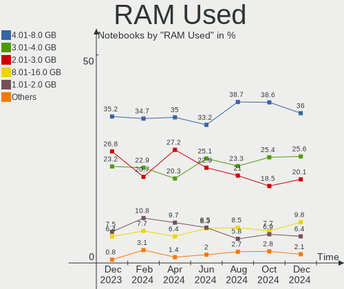
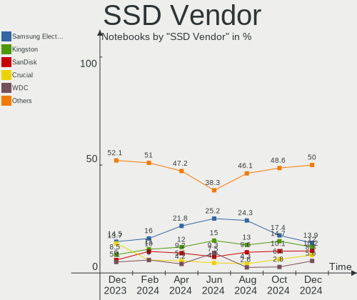
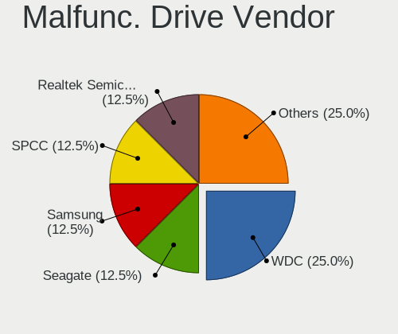
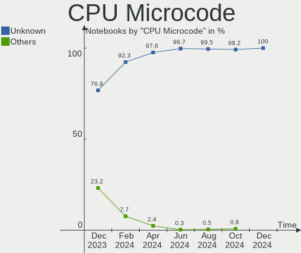
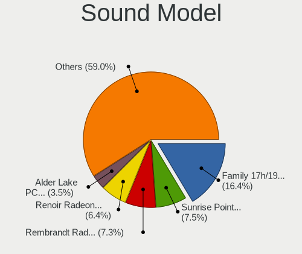
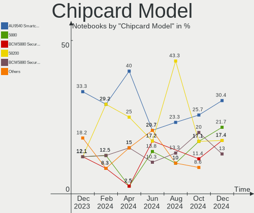

Fedora Hardware Trends (Notebooks)
----------------------------------

A project to identify most popular hardware characteristics and track their change
over time based on data collected by Fedora users at https://Linux-Hardware.org.

Anyone can contribute to this report by the [hw-probe](https://github.com/linuxhw/hw-probe) tool:

    sudo -E hw-probe -all -upload

Full-feature report is available here: https://linux-hardware.org/?view=trends&formfactor=notebook

Period: Aug, 2021.

Contents
--------

* [ System ](#system)
  - [ OS                       ](#os)
  - [ OS Family                ](#os-family)
  - [ Kernel                   ](#kernel)
  - [ Kernel Family            ](#kernel-family)
  - [ Kernel Major Ver.        ](#kernel-major-ver)
  - [ Arch                     ](#arch)
  - [ DE                       ](#de)
  - [ Display Server           ](#display-server)
  - [ Display Manager          ](#display-manager)
  - [ OS Lang                  ](#os-lang)
  - [ Boot Mode                ](#boot-mode)
  - [ Filesystem               ](#filesystem)
  - [ Part. scheme             ](#part-scheme)
  - [ Dual Boot with Linux/BSD ](#dual-boot-with-linuxbsd)
  - [ Dual Boot (Win)          ](#dual-boot-win)

* [ Board ](#board)
  - [ Vendor                   ](#vendor)
  - [ Model                    ](#model)
  - [ Model Family             ](#model-family)
  - [ MFG Year                 ](#mfg-year)
  - [ Form Factor              ](#form-factor)
  - [ Secure Boot              ](#secure-boot)
  - [ Coreboot                 ](#coreboot)
  - [ RAM Size                 ](#ram-size)
  - [ RAM Used                 ](#ram-used)
  - [ Total Drives             ](#total-drives)
  - [ Has CD-ROM               ](#has-cd-rom)
  - [ Has Ethernet             ](#has-ethernet)
  - [ Has WiFi                 ](#has-wifi)
  - [ Has Bluetooth            ](#has-bluetooth)

* [ Location ](#location)
  - [ Country                  ](#country)
  - [ City                     ](#city)

* [ Drives ](#drives)
  - [ Drive Vendor             ](#drive-vendor)
  - [ Drive Model              ](#drive-model)
  - [ HDD Vendor               ](#hdd-vendor)
  - [ SSD Vendor               ](#ssd-vendor)
  - [ Drive Kind               ](#drive-kind)
  - [ Drive Connector          ](#drive-connector)
  - [ Drive Size               ](#drive-size)
  - [ Space Total              ](#space-total)
  - [ Space Used               ](#space-used)
  - [ Malfunc. Drives          ](#malfunc-drives)
  - [ Malfunc. Drive Vendor    ](#malfunc-drive-vendor)
  - [ Malfunc. HDD Vendor      ](#malfunc-hdd-vendor)
  - [ Malfunc. Drive Kind      ](#malfunc-drive-kind)
  - [ Failed Drives            ](#failed-drives)
  - [ Failed Drive Vendor      ](#failed-drive-vendor)
  - [ Drive Status             ](#drive-status)

* [ Storage controller ](#storage-controller)
  - [ Storage Vendor           ](#storage-vendor)
  - [ Storage Model            ](#storage-model)
  - [ Storage Kind             ](#storage-kind)

* [ Processor ](#processor)
  - [ CPU Vendor               ](#cpu-vendor)
  - [ CPU Model                ](#cpu-model)
  - [ CPU Model Family         ](#cpu-model-family)
  - [ CPU Cores                ](#cpu-cores)
  - [ CPU Sockets              ](#cpu-sockets)
  - [ CPU Threads              ](#cpu-threads)
  - [ CPU Op-Modes             ](#cpu-op-modes)
  - [ CPU Microcode            ](#cpu-microcode)
  - [ CPU Microarch            ](#cpu-microarch)

* [ Graphics ](#graphics)
  - [ GPU Vendor               ](#gpu-vendor)
  - [ GPU Model                ](#gpu-model)
  - [ GPU Combo                ](#gpu-combo)
  - [ GPU Driver               ](#gpu-driver)
  - [ GPU Memory               ](#gpu-memory)

* [ Monitor ](#monitor)
  - [ Monitor Vendor           ](#monitor-vendor)
  - [ Monitor Model            ](#monitor-model)
  - [ Monitor Resolution       ](#monitor-resolution)
  - [ Monitor Diagonal         ](#monitor-diagonal)
  - [ Monitor Width            ](#monitor-width)
  - [ Aspect Ratio             ](#aspect-ratio)
  - [ Monitor Area             ](#monitor-area)
  - [ Pixel Density            ](#pixel-density)
  - [ Multiple Monitors        ](#multiple-monitors)

* [ Network ](#network)
  - [ Net Controller Vendor    ](#net-controller-vendor)
  - [ Net Controller Model     ](#net-controller-model)
  - [ Wireless Vendor          ](#wireless-vendor)
  - [ Wireless Model           ](#wireless-model)
  - [ Ethernet Vendor          ](#ethernet-vendor)
  - [ Ethernet Model           ](#ethernet-model)
  - [ Net Controller Kind      ](#net-controller-kind)
  - [ Used Controller          ](#used-controller)
  - [ NICs                     ](#nics)
  - [ IPv6                     ](#ipv6)

* [ Bluetooth ](#bluetooth)
  - [ Bluetooth Vendor         ](#bluetooth-vendor)
  - [ Bluetooth Model          ](#bluetooth-model)

* [ Sound ](#sound)
  - [ Sound Vendor             ](#sound-vendor)
  - [ Sound Model              ](#sound-model)

* [ Memory ](#memory)
  - [ Memory Vendor            ](#memory-vendor)
  - [ Memory Model             ](#memory-model)
  - [ Memory Kind              ](#memory-kind)
  - [ Memory Form Factor       ](#memory-form-factor)
  - [ Memory Size              ](#memory-size)
  - [ Memory Speed             ](#memory-speed)

* [ Printers & scanners ](#printers--scanners)
  - [ Printer Vendor           ](#printer-vendor)
  - [ Printer Model            ](#printer-model)
  - [ Scanner Vendor           ](#scanner-vendor)
  - [ Scanner Model            ](#scanner-model)

* [ Camera ](#camera)
  - [ Camera Vendor            ](#camera-vendor)
  - [ Camera Model             ](#camera-model)

* [ Security ](#security)
  - [ Fingerprint Vendor       ](#fingerprint-vendor)
  - [ Fingerprint Model        ](#fingerprint-model)
  - [ Chipcard Vendor          ](#chipcard-vendor)
  - [ Chipcard Model           ](#chipcard-model)

* [ Unsupported ](#unsupported)
  - [ Unsupported Devices      ](#unsupported-devices)
  - [ Unsupported Device Types ](#unsupported-device-types)

System
------

OS
--

Installed operating systems

| Name      | Notebooks | Percent |
|-----------|-----------|---------|
| Fedora 34 | 156       | 89.66%  |
| Fedora 35 | 10        | 5.75%   |
| Fedora 33 | 5         | 2.87%   |
| Fedora 32 | 3         | 1.72%   |

OS Family
---------

OS without a version

| Name   | Notebooks | Percent |
|--------|-----------|---------|
| Fedora | 174       | 100%    |

Kernel
------

Version of the Linux kernel

| Version                                             | Notebooks | Percent |
|-----------------------------------------------------|-----------|---------|
| 5.13.12-200.fc34.x86_64                             | 43        | 24.71%  |
| 5.13.8-200.fc34.x86_64                              | 25        | 14.37%  |
| 5.13.9-200.fc34.x86_64                              | 23        | 13.22%  |
| 5.13.6-200.fc34.x86_64                              | 21        | 12.07%  |
| 5.13.10-200.fc34.x86_64                             | 17        | 9.77%   |
| 5.13.5-200.fc34.x86_64                              | 6         | 3.45%   |
| 5.11.12-300.fc34.x86_64                             | 6         | 3.45%   |
| 5.14.0-0.rc5.42.fc35.x86_64                         | 5         | 2.87%   |
| 5.13.7-200.fc34.x86_64                              | 4         | 2.3%    |
| 5.11.22-100.fc32.x86_64                             | 3         | 1.72%   |
| 5.13.4-200.fc34.x86_64                              | 2         | 1.15%   |
| 5.12.15-300.fc34.x86_64                             | 2         | 1.15%   |
| 5.14.0-0.rc7.54.vanilla.1.fc34.x86_64               | 1         | 0.57%   |
| 5.14.0-0.rc7.54.rog.fc34.x86_64                     | 1         | 0.57%   |
| 5.14.0-0.rc6.46.fc35.x86_64                         | 1         | 0.57%   |
| 5.14.0-0.rc4.20210804gitd5ad8ec3cfb5.36.fc35.x86_64 | 1         | 0.57%   |
| 5.14.0-0.rc3.20210728git4010a528219e.32.fc35.x86_64 | 1         | 0.57%   |
| 5.13.9-200.rog.fc34.x86_64                          | 1         | 0.57%   |
| 5.13.6-250.vanilla.1.fc34.x86_64                    | 1         | 0.57%   |
| 5.13.6-100.fc33.x86_64                              | 1         | 0.57%   |
| 5.13.5-100.fc33.x86_64                              | 1         | 0.57%   |
| 5.13.4-100.fc33.x86_64                              | 1         | 0.57%   |
| 5.13.12-100.fc33.x86_64                             | 1         | 0.57%   |
| 5.13.11-xm1.0.fc34.x86_64                           | 1         | 0.57%   |
| 5.13.10-100.fc33.x86_64                             | 1         | 0.57%   |
| 5.12.8-300.fc34.x86_64                              | 1         | 0.57%   |
| 5.12.11-300.mbp.fc33.x86_64                         | 1         | 0.57%   |
| 5.11.18-300.fc34.x86_64                             | 1         | 0.57%   |
| 5.11.16-300.fc34.x86_64                             | 1         | 0.57%   |

Kernel Family
-------------

Linux kernel without a distro release

| Version | Notebooks | Percent |
|---------|-----------|---------|
| 5.13.12 | 44        | 25.29%  |
| 5.13.8  | 25        | 14.37%  |
| 5.13.9  | 24        | 13.79%  |
| 5.13.6  | 23        | 13.22%  |
| 5.13.10 | 18        | 10.34%  |
| 5.14.0  | 10        | 5.75%   |
| 5.13.5  | 7         | 4.02%   |
| 5.11.12 | 6         | 3.45%   |
| 5.13.7  | 4         | 2.3%    |
| 5.13.4  | 3         | 1.72%   |
| 5.11.22 | 3         | 1.72%   |
| 5.12.15 | 2         | 1.15%   |
| 5.13.11 | 1         | 0.57%   |
| 5.12.8  | 1         | 0.57%   |
| 5.12.11 | 1         | 0.57%   |
| 5.11.18 | 1         | 0.57%   |
| 5.11.16 | 1         | 0.57%   |

Kernel Major Ver.
-----------------

Linux kernel major version

| Version | Notebooks | Percent |
|---------|-----------|---------|
| 5.13    | 149       | 85.63%  |
| 5.11    | 11        | 6.32%   |
| 5.14    | 10        | 5.75%   |
| 5.12    | 4         | 2.3%    |

Arch
----

OS architecture (x86_64, i586, etc.)

| Name   | Notebooks | Percent |
|--------|-----------|---------|
| x86_64 | 174       | 100%    |

DE
--

Desktop Environment

| Name       | Notebooks | Percent |
|------------|-----------|---------|
| GNOME      | 132       | 75.86%  |
| KDE5       | 12        | 6.9%    |
| KDE        | 11        | 6.32%   |
| X-Cinnamon | 6         | 3.45%   |
| Unknown    | 4         | 2.3%    |
| Cinnamon   | 3         | 1.72%   |
| sway       | 2         | 1.15%   |
| XFCE       | 1         | 0.57%   |
| openbox    | 1         | 0.57%   |
| MATE       | 1         | 0.57%   |
| Deepin     | 1         | 0.57%   |

Display Server
--------------

X11 or Wayland

| Name    | Notebooks | Percent |
|---------|-----------|---------|
| Wayland | 116       | 66.67%  |
| X11     | 55        | 31.61%  |
| Unknown | 3         | 1.72%   |

Display Manager
---------------

SDDM, LightDM, etc.

| Name    | Notebooks | Percent |
|---------|-----------|---------|
| Unknown | 84        | 48.28%  |
| GDM     | 75        | 43.1%   |
| SDDM    | 9         | 5.17%   |
| LightDM | 3         | 1.72%   |
| TDM     | 2         | 1.15%   |
| KDM     | 1         | 0.57%   |

OS Lang
-------

Language

| Lang  | Notebooks | Percent |
|-------|-----------|---------|
| en_US | 83        | 47.7%   |
| en_GB | 22        | 12.64%  |
| ru_RU | 11        | 6.32%   |
| de_DE | 8         | 4.6%    |
| pt_BR | 6         | 3.45%   |
| it_IT | 4         | 2.3%    |
| es_MX | 4         | 2.3%    |
| en_IN | 4         | 2.3%    |
| fr_FR | 3         | 1.72%   |
| pl_PL | 2         | 1.15%   |
| es_EC | 2         | 1.15%   |
| es_CL | 2         | 1.15%   |
| en_NZ | 2         | 1.15%   |
| en_DK | 2         | 1.15%   |
| cs_CZ | 2         | 1.15%   |
| C     | 2         | 1.15%   |
| zh_TW | 1         | 0.57%   |
| ru_UA | 1         | 0.57%   |
| ro_RO | 1         | 0.57%   |
| nl_NL | 1         | 0.57%   |
| nl_BE | 1         | 0.57%   |
| nb_NO | 1         | 0.57%   |
| fr_CA | 1         | 0.57%   |
| fi_FI | 1         | 0.57%   |
| es_ES | 1         | 0.57%   |
| es_CO | 1         | 0.57%   |
| en_PH | 1         | 0.57%   |
| en_IE | 1         | 0.57%   |
| en_CA | 1         | 0.57%   |
| de_CH | 1         | 0.57%   |
| da_DK | 1         | 0.57%   |

Boot Mode
---------

EFI or BIOS

| Mode | Notebooks | Percent |
|------|-----------|---------|
| EFI  | 136       | 78.16%  |
| BIOS | 38        | 21.84%  |

Filesystem
----------

Type of filesystem

| Type                | Notebooks | Percent |
|---------------------|-----------|---------|
| Btrfs               | 122       | 70.11%  |
| Ext4                | 45        | 25.86%  |
| Xfs                 | 4         | 2.3%    |
| Overlay             | 1         | 0.57%   |
| Fuse.fuse-overlayfs | 1         | 0.57%   |
| F2fs                | 1         | 0.57%   |

Part. scheme
------------

Scheme of partitioning

| Type    | Notebooks | Percent |
|---------|-----------|---------|
| GPT     | 83        | 47.7%   |
| Unknown | 80        | 45.98%  |
| MBR     | 11        | 6.32%   |

Dual Boot with Linux/BSD
------------------------

Hosting more than one Linux/BSD

| Dual boot | Notebooks | Percent |
|-----------|-----------|---------|
| No        | 161       | 92.53%  |
| Yes       | 13        | 7.47%   |

Dual Boot (Win)
---------------

Hosting Linux and Windows

| Dual boot | Notebooks | Percent |
|-----------|-----------|---------|
| No        | 140       | 80.46%  |
| Yes       | 34        | 19.54%  |

Board
-----

Vendor
------

Motherboard manufacturer

| Name             | Notebooks | Percent |
|------------------|-----------|---------|
| Lenovo           | 49        | 28.16%  |
| Dell             | 30        | 17.24%  |
| Hewlett-Packard  | 28        | 16.09%  |
| ASUSTek Computer | 15        | 8.62%   |
| Acer             | 15        | 8.62%   |
| HUAWEI           | 5         | 2.87%   |
| Sony             | 4         | 2.3%    |
| Notebook         | 4         | 2.3%    |
| Apple            | 3         | 1.72%   |
| Unknown          | 3         | 1.72%   |
| Toshiba          | 2         | 1.15%   |
| MSI              | 2         | 1.15%   |
| Alienware        | 2         | 1.15%   |
| VINGA            | 1         | 0.57%   |
| Timi             | 1         | 0.57%   |
| System76         | 1         | 0.57%   |
| Razer            | 1         | 0.57%   |
| Positivo         | 1         | 0.57%   |
| PC Specialist    | 1         | 0.57%   |
| Maibenben        | 1         | 0.57%   |
| Fujitsu Siemens  | 1         | 0.57%   |
| Fujitsu          | 1         | 0.57%   |
| Framework        | 1         | 0.57%   |
| Chuwi            | 1         | 0.57%   |
| AMI              | 1         | 0.57%   |

Model
-----

Motherboard model

| Name                                      | Notebooks | Percent |
|-------------------------------------------|-----------|---------|
| Dell XPS 15 7590                          | 3         | 1.72%   |
| Unknown                                   | 3         | 1.72%   |
| Lenovo ThinkPad P14s Gen 1 20Y1CTO1WW     | 2         | 1.15%   |
| HP Pavilion dv7                           | 2         | 1.15%   |
| HP Laptop 15s-eq2xxx                      | 2         | 1.15%   |
| HP 14                                     | 2         | 1.15%   |
| Dell XPS 15 9550                          | 2         | 1.15%   |
| Dell XPS 13 7390                          | 2         | 1.15%   |
| Dell Latitude 7400                        | 2         | 1.15%   |
| ASUS ROG Zephyrus G14 GA401QM_GA401QM     | 2         | 1.15%   |
| Acer Aspire ES1-572                       | 2         | 1.15%   |
| VINGA Iron S140                           | 1         | 0.57%   |
| Toshiba TECRA Z50-A                       | 1         | 0.57%   |
| Toshiba Satellite C845D                   | 1         | 0.57%   |
| Timi A35S                                 | 1         | 0.57%   |
| System76 Oryx Pro                         | 1         | 0.57%   |
| Sony VPCSA25GX                            | 1         | 0.57%   |
| Sony VPCEH36EG                            | 1         | 0.57%   |
| Sony VPCEH16EN                            | 1         | 0.57%   |
| Sony SVS1511X9RB                          | 1         | 0.57%   |
| Razer Blade 15 Mid 2019-Base              | 1         | 0.57%   |
| Positivo C14CR21                          | 1         | 0.57%   |
| PC Specialist N85_N87,HJ,HJ1,HK1          | 1         | 0.57%   |
| Notebook Titanium B155 MAX                | 1         | 0.57%   |
| Notebook P377SM-A                         | 1         | 0.57%   |
| Notebook NH55RGQ                          | 1         | 0.57%   |
| Notebook N150CU                           | 1         | 0.57%   |
| MSI Modern 14 B4MW                        | 1         | 0.57%   |
| MSI GP62MVR 7RFX                          | 1         | 0.57%   |
| Maibenben S431                            | 1         | 0.57%   |
| Lenovo ThinkPad X250 20CMCTO1WW           | 1         | 0.57%   |
| Lenovo ThinkPad X230 2325AN3              | 1         | 0.57%   |
| Lenovo ThinkPad X201 3680CG7              | 1         | 0.57%   |
| Lenovo ThinkPad X1 Extreme 2nd 20QVCTO1WW | 1         | 0.57%   |
| Lenovo ThinkPad X1 Carbon 7th 20QDS28D00  | 1         | 0.57%   |
| Lenovo ThinkPad X1 Carbon 6th 20KGS23S08  | 1         | 0.57%   |
| Lenovo ThinkPad X1 Carbon 4th 20FCS0RV18  | 1         | 0.57%   |
| Lenovo ThinkPad X1 Carbon 4th 20FBCTO1WW  | 1         | 0.57%   |
| Lenovo ThinkPad X1 Carbon 3rd 20BTA0MJNZ  | 1         | 0.57%   |
| Lenovo ThinkPad W540 20BHS04T0P           | 1         | 0.57%   |
| Lenovo ThinkPad T580 20LAS5XS00           | 1         | 0.57%   |
| Lenovo ThinkPad T490 20N2S13B00           | 1         | 0.57%   |
| Lenovo ThinkPad T470s 20HF0047UK          | 1         | 0.57%   |
| Lenovo ThinkPad T460s 20FAS7XT01          | 1         | 0.57%   |
| Lenovo ThinkPad T450 20BU000QLM           | 1         | 0.57%   |
| Lenovo ThinkPad T14s Gen 1 20UJS00K00     | 1         | 0.57%   |
| Lenovo ThinkPad T14s Gen 1 20UHCTO1WW     | 1         | 0.57%   |
| Lenovo ThinkPad T14 Gen 1 20UDCTO1WW      | 1         | 0.57%   |
| Lenovo ThinkPad T14 Gen 1 20UD0011RT      | 1         | 0.57%   |
| Lenovo ThinkPad P51s 20HBCTO1WW           | 1         | 0.57%   |
| Lenovo ThinkPad P43s 20RJS1C200           | 1         | 0.57%   |
| Lenovo ThinkPad P14s Gen 2a 21A1S00D00    | 1         | 0.57%   |
| Lenovo ThinkPad P1 Gen 2 20QUS1R500       | 1         | 0.57%   |
| Lenovo ThinkPad Edge E440 20C5004YUS      | 1         | 0.57%   |
| Lenovo ThinkPad E15 Gen 2 20T8001STX      | 1         | 0.57%   |
| Lenovo ThinkPad E14 Gen 2 20TA005GIV      | 1         | 0.57%   |
| Lenovo ThinkPad E14 20RBCTO1WW            | 1         | 0.57%   |
| Lenovo ThinkPad E14 20RA001BUK            | 1         | 0.57%   |
| Lenovo ThinkBook 16p Gen 2 20YM           | 1         | 0.57%   |
| Lenovo ThinkBook 15 G2 ITL 20VE           | 1         | 0.57%   |

Model Family
------------

Motherboard model prefix

| Name                    | Notebooks | Percent |
|-------------------------|-----------|---------|
| Lenovo ThinkPad         | 30        | 17.24%  |
| Dell XPS                | 13        | 7.47%   |
| Acer Aspire             | 12        | 6.9%    |
| Lenovo IdeaPad          | 11        | 6.32%   |
| Dell Inspiron           | 8         | 4.6%    |
| HP ProBook              | 7         | 4.02%   |
| HP Pavilion             | 7         | 4.02%   |
| HP Laptop               | 6         | 3.45%   |
| Dell Latitude           | 5         | 2.87%   |
| HP EliteBook            | 4         | 2.3%    |
| ASUS VivoBook           | 4         | 2.3%    |
| Lenovo ThinkBook        | 3         | 1.72%   |
| ASUS ROG                | 3         | 1.72%   |
| Unknown                 | 3         | 1.72%   |
| Lenovo Legion           | 2         | 1.15%   |
| HP 14                   | 2         | 1.15%   |
| Dell Precision          | 2         | 1.15%   |
| ASUS ASUS               | 2         | 1.15%   |
| VINGA Iron              | 1         | 0.57%   |
| Toshiba TECRA           | 1         | 0.57%   |
| Toshiba Satellite       | 1         | 0.57%   |
| Timi A35S               | 1         | 0.57%   |
| System76 Oryx           | 1         | 0.57%   |
| Sony VPCSA25GX          | 1         | 0.57%   |
| Sony VPCEH36EG          | 1         | 0.57%   |
| Sony VPCEH16EN          | 1         | 0.57%   |
| Sony SVS1511X9RB        | 1         | 0.57%   |
| Razer Blade             | 1         | 0.57%   |
| Positivo C14CR21        | 1         | 0.57%   |
| PC Specialist N85       | 1         | 0.57%   |
| Notebook Titanium       | 1         | 0.57%   |
| Notebook P377SM-A       | 1         | 0.57%   |
| Notebook NH55RGQ        | 1         | 0.57%   |
| Notebook N150CU         | 1         | 0.57%   |
| MSI Modern              | 1         | 0.57%   |
| MSI GP62MVR             | 1         | 0.57%   |
| Maibenben S431          | 1         | 0.57%   |
| Lenovo G40-45           | 1         | 0.57%   |
| Lenovo B50-80           | 1         | 0.57%   |
| Lenovo B50-30           | 1         | 0.57%   |
| HUAWEI NBLK-WAX9X       | 1         | 0.57%   |
| HUAWEI NBLB-WAX9N       | 1         | 0.57%   |
| HUAWEI MACH-WX9         | 1         | 0.57%   |
| HUAWEI KLVL-WXX9        | 1         | 0.57%   |
| HUAWEI HVY-WXX9         | 1         | 0.57%   |
| HP ZBook                | 1         | 0.57%   |
| HP 15                   | 1         | 0.57%   |
| Fujitsu Siemens ESPRIMO | 1         | 0.57%   |
| Fujitsu LIFEBOOK        | 1         | 0.57%   |
| Framework Laptop        | 1         | 0.57%   |
| Dell Studio             | 1         | 0.57%   |
| Dell G5                 | 1         | 0.57%   |
| Chuwi GemiBook          | 1         | 0.57%   |
| ASUS ZenBook            | 1         | 0.57%   |
| ASUS X750JN             | 1         | 0.57%   |
| ASUS UX303UA            | 1         | 0.57%   |
| ASUS TUF                | 1         | 0.57%   |
| ASUS N56JN              | 1         | 0.57%   |
| ASUS K75DE              | 1         | 0.57%   |
| Apple MacBookPro16      | 1         | 0.57%   |

MFG Year
--------

Motherboard manufacture year

| Year | Notebooks | Percent |
|------|-----------|---------|
| 2021 | 57        | 32.76%  |
| 2020 | 37        | 21.26%  |
| 2019 | 26        | 14.94%  |
| 2016 | 9         | 5.17%   |
| 2018 | 8         | 4.6%    |
| 2012 | 8         | 4.6%    |
| 2014 | 7         | 4.02%   |
| 2015 | 6         | 3.45%   |
| 2017 | 5         | 2.87%   |
| 2011 | 5         | 2.87%   |
| 2013 | 3         | 1.72%   |
| 2009 | 2         | 1.15%   |
| 2008 | 1         | 0.57%   |

Form Factor
-----------

Physical design of the computer

| Name     | Notebooks | Percent |
|----------|-----------|---------|
| Notebook | 174       | 100%    |

Secure Boot
-----------

Enabled or disabled

| State    | Notebooks | Percent |
|----------|-----------|---------|
| Disabled | 144       | 82.76%  |
| Enabled  | 30        | 17.24%  |

Coreboot
--------

Have coreboot on board

| Used | Notebooks | Percent |
|------|-----------|---------|
| No   | 174       | 100%    |

RAM Size
--------

Total RAM memory

| Size in GB  | Notebooks | Percent |
|-------------|-----------|---------|
| 16.01-24.0  | 47        | 27.01%  |
| 4.01-8.0    | 45        | 25.86%  |
| 8.01-16.0   | 32        | 18.39%  |
| 32.01-64.0  | 24        | 13.79%  |
| 3.01-4.0    | 15        | 8.62%   |
| 24.01-32.0  | 4         | 2.3%    |
| 64.01-256.0 | 4         | 2.3%    |
| 1.01-2.0    | 3         | 1.72%   |

RAM Used
--------

Used RAM memory

| Used GB    | Notebooks | Percent |
|------------|-----------|---------|
| 2.01-3.0   | 47        | 27.01%  |
| 3.01-4.0   | 42        | 24.14%  |
| 4.01-8.0   | 41        | 23.56%  |
| 8.01-16.0  | 21        | 12.07%  |
| 1.01-2.0   | 20        | 11.49%  |
| 16.01-24.0 | 2         | 1.15%   |
| 0.51-1.0   | 1         | 0.57%   |

Total Drives
------------

Number of drives on board

| Drives | Notebooks | Percent |
|--------|-----------|---------|
| 1      | 129       | 74.14%  |
| 2      | 37        | 21.26%  |
| 3      | 5         | 2.87%   |
| 5      | 2         | 1.15%   |
| 4      | 1         | 0.57%   |

Has CD-ROM
----------

Has CD-ROM on board

| Presented | Notebooks | Percent |
|-----------|-----------|---------|
| No        | 153       | 87.93%  |
| Yes       | 21        | 12.07%  |

Has Ethernet
------------

Has Ethernet on board

| Presented | Notebooks | Percent |
|-----------|-----------|---------|
| Yes       | 125       | 71.84%  |
| No        | 49        | 28.16%  |

Has WiFi
--------

Has WiFi module

| Presented | Notebooks | Percent |
|-----------|-----------|---------|
| Yes       | 167       | 95.98%  |
| No        | 7         | 4.02%   |

Has Bluetooth
-------------

Has Bluetooth module

| Presented | Notebooks | Percent |
|-----------|-----------|---------|
| Yes       | 151       | 86.78%  |
| No        | 23        | 13.22%  |

Location
--------

Country
-------

Geographic location (country)

| Country     | Notebooks | Percent |
|-------------|-----------|---------|
| USA         | 22        | 12.64%  |
| Germany     | 15        | 8.62%   |
| Brazil      | 15        | 8.62%   |
| Russia      | 10        | 5.75%   |
| India       | 10        | 5.75%   |
| UK          | 9         | 5.17%   |
| France      | 7         | 4.02%   |
| Poland      | 6         | 3.45%   |
| Italy       | 6         | 3.45%   |
| Ukraine     | 4         | 2.3%    |
| Netherlands | 4         | 2.3%    |
| Mexico      | 4         | 2.3%    |
| Czechia     | 4         | 2.3%    |
| Canada      | 4         | 2.3%    |
| Argentina   | 4         | 2.3%    |
| Spain       | 3         | 1.72%   |
| Finland     | 3         | 1.72%   |
| Denmark     | 3         | 1.72%   |
| Turkey      | 2         | 1.15%   |
| Switzerland | 2         | 1.15%   |
| Norway      | 2         | 1.15%   |
| New Zealand | 2         | 1.15%   |
| Israel      | 2         | 1.15%   |
| Estonia     | 2         | 1.15%   |
| Colombia    | 2         | 1.15%   |
| Chile       | 2         | 1.15%   |
| Tonga       | 1         | 0.57%   |
| Thailand    | 1         | 0.57%   |
| Tajikistan  | 1         | 0.57%   |
| Taiwan      | 1         | 0.57%   |
| South Korea | 1         | 0.57%   |
| Slovenia    | 1         | 0.57%   |
| Singapore   | 1         | 0.57%   |
| Romania     | 1         | 0.57%   |
| Portugal    | 1         | 0.57%   |
| Philippines | 1         | 0.57%   |
| Myanmar     | 1         | 0.57%   |
| Moldova     | 1         | 0.57%   |
| Lithuania   | 1         | 0.57%   |
| Kenya       | 1         | 0.57%   |
| Japan       | 1         | 0.57%   |
| Ireland     | 1         | 0.57%   |
| Iran        | 1         | 0.57%   |
| Guadeloupe  | 1         | 0.57%   |
| Greece      | 1         | 0.57%   |
| Ecuador     | 1         | 0.57%   |
| Cyprus      | 1         | 0.57%   |
| Croatia     | 1         | 0.57%   |
| Bulgaria    | 1         | 0.57%   |
| Belgium     | 1         | 0.57%   |
| Austria     | 1         | 0.57%   |

City
----

Geographic location (city)

| City                 | Notebooks | Percent |
|----------------------|-----------|---------|
| Bengaluru            | 4         | 2.3%    |
| Kyiv                 | 3         | 1.72%   |
| D??sseldorf          | 3         | 1.72%   |
| Buenos Aires         | 3         | 1.72%   |
| Berlin               | 3         | 1.72%   |
| Tel Aviv             | 2         | 1.15%   |
| Tallinn              | 2         | 1.15%   |
| Seattle              | 2         | 1.15%   |
| Niter??i             | 2         | 1.15%   |
| Moscow               | 2         | 1.15%   |
| Milan                | 2         | 1.15%   |
| Istanbul             | 2         | 1.15%   |
| Helsinki             | 2         | 1.15%   |
| Fortaleza            | 2         | 1.15%   |
| Coventry             | 2         | 1.15%   |
| Chandigarh           | 2         | 1.15%   |
| Auckland             | 2         | 1.15%   |
| Zurich               | 1         | 0.57%   |
| Zagreb               | 1         | 0.57%   |
| Yekaterinburg        | 1         | 0.57%   |
| Yangon               | 1         | 0.57%   |
| Whittier             | 1         | 0.57%   |
| Welwyn Garden City   | 1         | 0.57%   |
| Washington           | 1         | 0.57%   |
| Warsaw               | 1         | 0.57%   |
| Wallkill             | 1         | 0.57%   |
| Vertheuil            | 1         | 0.57%   |
| Veguellina de Orbigo | 1         | 0.57%   |
| Valdivia             | 1         | 0.57%   |
| Ulyanovsk            | 1         | 0.57%   |
| Tyumen               | 1         | 0.57%   |
| Turin                | 1         | 0.57%   |
| Toronto              | 1         | 0.57%   |
| Temuco               | 1         | 0.57%   |
| Tehran               | 1         | 0.57%   |
| Taipei               | 1         | 0.57%   |
| St. Gallen           | 1         | 0.57%   |
| St Petersburg        | 1         | 0.57%   |
| Springfield          | 1         | 0.57%   |
| Soledade             | 1         | 0.57%   |
| Sofia                | 1         | 0.57%   |
| Singapore            | 1         | 0.57%   |
| Sincelejo            | 1         | 0.57%   |
| S??o Paulo           | 1         | 0.57%   |
| San Antonio la Isla  | 1         | 0.57%   |
| Salisbury            | 1         | 0.57%   |
| Saint-Denis          | 1         | 0.57%   |
| Rokycany             | 1         | 0.57%   |
| Reims                | 1         | 0.57%   |
| Raleigh              | 1         | 0.57%   |
| Raesfeld             | 1         | 0.57%   |
| Quito                | 1         | 0.57%   |
| Quezon               | 1         | 0.57%   |
| Quer?©taro City      | 1         | 0.57%   |
| Pune                 | 1         | 0.57%   |
| Prague               | 1         | 0.57%   |
| Porto Ferreira       | 1         | 0.57%   |
| Porto Alegre         | 1         | 0.57%   |
| Pokoj                | 1         | 0.57%   |
| Plympton             | 1         | 0.57%   |

Drives
------

Drive Vendor
------------

Hard drive vendors

| Vendor                  | Notebooks | Drives | Percent |
|-------------------------|-----------|--------|---------|
| Samsung Electronics     | 47        | 58     | 21.46%  |
| WDC                     | 29        | 30     | 13.24%  |
| Seagate                 | 17        | 17     | 7.76%   |
| Toshiba                 | 15        | 16     | 6.85%   |
| SK Hynix                | 14        | 14     | 6.39%   |
| Kingston                | 14        | 15     | 6.39%   |
| Intel                   | 10        | 11     | 4.57%   |
| SanDisk                 | 9         | 9      | 4.11%   |
| Unknown                 | 7         | 8      | 3.2%    |
| Micron Technology       | 7         | 7      | 3.2%    |
| Crucial                 | 7         | 9      | 3.2%    |
| A-DATA Technology       | 6         | 6      | 2.74%   |
| LITEON                  | 3         | 3      | 1.37%   |
| KIOXIA                  | 3         | 3      | 1.37%   |
| HGST                    | 3         | 3      | 1.37%   |
| Union Memory (Shenzhen) | 2         | 3      | 0.91%   |
| Transcend               | 2         | 2      | 0.91%   |
| SPCC                    | 2         | 2      | 0.91%   |
| Silicon Motion          | 2         | 2      | 0.91%   |
| Hitachi                 | 2         | 3      | 0.91%   |
| Apple                   | 2         | 2      | 0.91%   |
| XPG                     | 1         | 1      | 0.46%   |
| V Series                | 1         | 1      | 0.46%   |
| UNIC2                   | 1         | 1      | 0.46%   |
| Reeinno                 | 1         | 1      | 0.46%   |
| NGFF                    | 1         | 1      | 0.46%   |
| Mushkin                 | 1         | 1      | 0.46%   |
| LITEONIT                | 1         | 1      | 0.46%   |
| Lexar                   | 1         | 1      | 0.46%   |
| Leven                   | 1         | 1      | 0.46%   |
| KingSpec                | 1         | 1      | 0.46%   |
| Indilinx                | 1         | 1      | 0.46%   |
| HUAWEI                  | 1         | 1      | 0.46%   |
| Hewlett-Packard         | 1         | 1      | 0.46%   |
| Corsair                 | 1         | 1      | 0.46%   |
| BIWIN                   | 1         | 1      | 0.46%   |
| ASMT                    | 1         | 1      | 0.46%   |

Drive Model
-----------

Hard drive models

| Model                                | Notebooks | Percent |
|--------------------------------------|-----------|---------|
| Samsung MZVLB1T0HBLR-000L7 1TB       | 4         | 1.72%   |
| Kingston SA400S37480G 480GB SSD      | 4         | 1.72%   |
| SK Hynix NVMe SSD Drive 512GB        | 3         | 1.29%   |
| Seagate ST1000LM024 HN-M101MBB 1TB   | 3         | 1.29%   |
| Samsung NVMe SSD Drive 512GB         | 3         | 1.29%   |
| Samsung NVMe SSD Drive 256GB         | 3         | 1.29%   |
| Samsung NVMe SSD Drive 1TB           | 3         | 1.29%   |
| WDC PC SN730 SDBQNTY-512G-1001 512GB | 2         | 0.86%   |
| WDC PC SN730 SDBPNTY-512G-1027 512GB | 2         | 0.86%   |
| WDC PC SN730 SDBPNTY-1T00-1101 1TB   | 2         | 0.86%   |
| Toshiba NVMe SSD Drive 512GB         | 2         | 0.86%   |
| Toshiba KXG60ZNV512G 512GB           | 2         | 0.86%   |
| Seagate ST500LM021-1KJ152 500GB      | 2         | 0.86%   |
| Seagate ST1000LM049-2GH172 1TB       | 2         | 0.86%   |
| Seagate ST1000LM035-1RK172 1TB       | 2         | 0.86%   |
| Sandisk NVMe SSD Drive 256GB         | 2         | 0.86%   |
| Samsung SSD 970 EVO Plus 2TB         | 2         | 0.86%   |
| Samsung SSD 970 EVO Plus 1TB         | 2         | 0.86%   |
| Samsung SSD 970 EVO 500GB            | 2         | 0.86%   |
| Samsung SSD 860 EVO 1TB              | 2         | 0.86%   |
| Samsung SSD 840 EVO 500GB            | 2         | 0.86%   |
| Samsung NVMe SSD Drive 500GB         | 2         | 0.86%   |
| Samsung NVMe SSD Drive 2TB           | 2         | 0.86%   |
| Samsung NVMe SSD Drive 1024GB        | 2         | 0.86%   |
| KIOXIA KBG40ZNV512G 512GB            | 2         | 0.86%   |
| HGST HTS721010A9E630 1TB             | 2         | 0.86%   |
| Crucial CT1050MX300SSD1 1050GB       | 2         | 0.86%   |
| Crucial CT1000P1SSD8 1TB             | 2         | 0.86%   |
| XPG NVMe SSD Drive 256GB             | 1         | 0.43%   |
| WDC WDS500G1B0A-00H9H0 500GB SSD     | 1         | 0.43%   |
| WDC WDS250G2B0A-00SM50 250GB SSD     | 1         | 0.43%   |
| WDC WDS240G2G0B-00EPW0 240GB SSD     | 1         | 0.43%   |
| WDC WDS200T2B0B-00YS70 2TB SSD       | 1         | 0.43%   |
| WDC WDS100T2B0B-00YS70 1TB SSD       | 1         | 0.43%   |
| WDC WDS100T1X0E-00AFY0 1TB           | 1         | 0.43%   |
| WDC WD5000LPVX-22V0TT0 500GB         | 1         | 0.43%   |
| WDC WD5000LPLX-08ZNTT0 500GB         | 1         | 0.43%   |
| WDC WD5000LPCX-24C6HT0 500GB         | 1         | 0.43%   |
| WDC WD3200BPVT-24JJ5T0 320GB         | 1         | 0.43%   |
| WDC WD1600BEVT-22ZCT0 160GB          | 1         | 0.43%   |
| WDC WD10SPZX-75Z10T1 1TB             | 1         | 0.43%   |
| WDC WD10SPZX-60Z10T0 1TB             | 1         | 0.43%   |
| WDC WD10SPZX-21Z10T0 1TB             | 1         | 0.43%   |
| WDC WD10SPZX-08Z10 1TB               | 1         | 0.43%   |
| WDC WD10SPCX-60KHST0 1TB             | 1         | 0.43%   |
| WDC WD10JPVX-75JC3T0 1TB             | 1         | 0.43%   |
| WDC WD10JPVX-22JC3T0 1TB             | 1         | 0.43%   |
| WDC WD easystore 240GB               | 1         | 0.43%   |
| WDC PC SN730 SDBPNTY-256G-1027 256GB | 1         | 0.43%   |
| WDC PC SN730 NVMe 1024GB             | 1         | 0.43%   |
| WDC PC SN530 SDBPTPZ-512G-1002 512GB | 1         | 0.43%   |
| WDC PC SN530 SDBPNPZ-256G-1006 256GB | 1         | 0.43%   |
| WDC PC SN530 SDBPMPZ-512G-1101 512GB | 1         | 0.43%   |
| V Series SATA SSD 240GB              | 1         | 0.43%   |
| Unknown xD/SD/M.S.                   | 1         | 0.43%   |
| Unknown SF256  256GB                 | 1         | 0.43%   |
| Unknown SD8GB                        | 1         | 0.43%   |
| Unknown SD256  249GB                 | 1         | 0.43%   |
| Unknown SD128  128GB                 | 1         | 0.43%   |
| Unknown GE8QT  256GB                 | 1         | 0.43%   |

HDD Vendor
----------

Hard disk drive vendors

| Vendor  | Notebooks | Drives | Percent |
|---------|-----------|--------|---------|
| Seagate | 15        | 15     | 41.67%  |
| WDC     | 12        | 12     | 33.33%  |
| Toshiba | 3         | 3      | 8.33%   |
| HGST    | 3         | 3      | 8.33%   |
| Hitachi | 2         | 3      | 5.56%   |
| ASMT    | 1         | 1      | 2.78%   |

SSD Vendor
----------

Solid state drive vendors

| Vendor              | Notebooks | Drives | Percent |
|---------------------|-----------|--------|---------|
| Samsung Electronics | 15        | 19     | 19.48%  |
| Kingston            | 9         | 9      | 11.69%  |
| WDC                 | 6         | 6      | 7.79%   |
| A-DATA Technology   | 6         | 6      | 7.79%   |
| Toshiba             | 5         | 6      | 6.49%   |
| SanDisk             | 5         | 5      | 6.49%   |
| Crucial             | 5         | 6      | 6.49%   |
| Intel               | 4         | 4      | 5.19%   |
| Transcend           | 2         | 2      | 2.6%    |
| SPCC                | 2         | 2      | 2.6%    |
| Micron Technology   | 2         | 2      | 2.6%    |
| LITEON              | 2         | 2      | 2.6%    |
| V Series            | 1         | 1      | 1.3%    |
| Unknown             | 1         | 1      | 1.3%    |
| UNIC2               | 1         | 1      | 1.3%    |
| SK Hynix            | 1         | 1      | 1.3%    |
| NGFF                | 1         | 1      | 1.3%    |
| Mushkin             | 1         | 1      | 1.3%    |
| LITEONIT            | 1         | 1      | 1.3%    |
| Lexar               | 1         | 1      | 1.3%    |
| Leven               | 1         | 1      | 1.3%    |
| KingSpec            | 1         | 1      | 1.3%    |
| Indilinx            | 1         | 1      | 1.3%    |
| Corsair             | 1         | 1      | 1.3%    |
| BIWIN               | 1         | 1      | 1.3%    |
| Apple               | 1         | 1      | 1.3%    |

Drive Kind
----------

HDD or SSD

| Kind    | Notebooks | Drives | Percent |
|---------|-----------|--------|---------|
| NVMe    | 95        | 108    | 45.89%  |
| SSD     | 66        | 83     | 31.88%  |
| HDD     | 36        | 37     | 17.39%  |
| MMC     | 6         | 7      | 2.9%    |
| Unknown | 4         | 4      | 1.93%   |

Drive Connector
---------------

SATA, SAS, NVMe, etc.

| Type | Notebooks | Drives | Percent |
|------|-----------|--------|---------|
| NVMe | 95        | 108    | 48.47%  |
| SATA | 90        | 118    | 45.92%  |
| MMC  | 6         | 7      | 3.06%   |
| SAS  | 5         | 6      | 2.55%   |

Drive Size
----------

Size of hard drive

| Size in TB | Notebooks | Drives | Percent |
|------------|-----------|--------|---------|
| 0.01-0.5   | 67        | 77     | 64.42%  |
| 0.51-1.0   | 31        | 36     | 29.81%  |
| 1.01-2.0   | 6         | 7      | 5.77%   |

Space Total
-----------

Amount of disk space available on the file system

| Size in GB     | Notebooks | Percent |
|----------------|-----------|---------|
| 501-1000       | 43        | 24.71%  |
| 251-500        | 28        | 16.09%  |
| 1-20           | 25        | 14.37%  |
| 101-250        | 23        | 13.22%  |
| Unknown        | 20        | 11.49%  |
| 1001-2000      | 17        | 9.77%   |
| 51-100         | 9         | 5.17%   |
| 21-50          | 4         | 2.3%    |
| More than 3000 | 3         | 1.72%   |
| 2001-3000      | 2         | 1.15%   |

Space Used
----------

Amount of used disk space

| Used GB   | Notebooks | Percent |
|-----------|-----------|---------|
| 1-20      | 54        | 31.03%  |
| 21-50     | 25        | 14.37%  |
| 101-250   | 24        | 13.79%  |
| 251-500   | 20        | 11.49%  |
| Unknown   | 20        | 11.49%  |
| 51-100    | 19        | 10.92%  |
| 501-1000  | 9         | 5.17%   |
| 1001-2000 | 3         | 1.72%   |

Malfunc. Drives
---------------

Drive models with a malfunction

| Model                              | Notebooks | Drives | Percent |
|------------------------------------|-----------|--------|---------|
| Crucial CT1050MX300SSD1 1050GB     | 2         | 2      | 28.57%  |
| WDC WD3200BPVT-24JJ5T0 320GB       | 1         | 1      | 14.29%  |
| Seagate ST1000LM049-2GH172 1TB     | 1         | 1      | 14.29%  |
| Seagate ST1000LM024 HN-M101MBB 1TB | 1         | 1      | 14.29%  |
| Intel SSDSCKJF180A5L 180GB         | 1         | 1      | 14.29%  |
| HGST HTS725050A7E630 500GB         | 1         | 1      | 14.29%  |

Malfunc. Drive Vendor
---------------------

Vendors of faulty drives

| Vendor  | Notebooks | Drives | Percent |
|---------|-----------|--------|---------|
| Seagate | 2         | 2      | 28.57%  |
| Crucial | 2         | 2      | 28.57%  |
| WDC     | 1         | 1      | 14.29%  |
| Intel   | 1         | 1      | 14.29%  |
| HGST    | 1         | 1      | 14.29%  |

Malfunc. HDD Vendor
-------------------

Vendors of faulty HDD drives

| Vendor  | Notebooks | Drives | Percent |
|---------|-----------|--------|---------|
| Seagate | 2         | 2      | 50%     |
| WDC     | 1         | 1      | 25%     |
| HGST    | 1         | 1      | 25%     |

Malfunc. Drive Kind
-------------------

Kinds of faulty drives

| Kind | Notebooks | Drives | Percent |
|------|-----------|--------|---------|
| HDD  | 4         | 4      | 57.14%  |
| SSD  | 3         | 3      | 42.86%  |

Failed Drives
-------------

Failed drive models

Zero info for selected period =(

Failed Drive Vendor
-------------------

Failed drive vendors

Zero info for selected period =(

Drive Status
------------

Number of failed and malfunc. drives

| Status   | Notebooks | Drives | Percent |
|----------|-----------|--------|---------|
| Works    | 97        | 117    | 50.26%  |
| Detected | 89        | 115    | 46.11%  |
| Malfunc  | 7         | 7      | 3.63%   |

Storage controller
------------------

Storage Vendor
--------------

Storage controller vendors

| Vendor                       | Notebooks | Percent |
|------------------------------|-----------|---------|
| Intel                        | 110       | 48.67%  |
| Samsung Electronics          | 35        | 15.49%  |
| AMD                          | 22        | 9.73%   |
| Sandisk                      | 14        | 6.19%   |
| SK Hynix                     | 13        | 5.75%   |
| Toshiba America Info Systems | 7         | 3.1%    |
| Micron Technology            | 6         | 2.65%   |
| Kingston Technology Company  | 5         | 2.21%   |
| Silicon Motion               | 3         | 1.33%   |
| KIOXIA                       | 3         | 1.33%   |
| Union Memory (Shenzhen)      | 2         | 0.88%   |
| Micron/Crucial Technology    | 2         | 0.88%   |
| Seagate Technology           | 1         | 0.44%   |
| Lite-On Technology           | 1         | 0.44%   |
| Apple                        | 1         | 0.44%   |
| ADATA Technology             | 1         | 0.44%   |

Storage Model
-------------

Storage controller models

| Model                                                                            | Notebooks | Percent |
|----------------------------------------------------------------------------------|-----------|---------|
| Samsung NVMe SSD Controller SM981/PM981/PM983                                    | 22        | 9.32%   |
| Intel Sunrise Point-LP SATA Controller [AHCI mode]                               | 21        | 8.9%    |
| AMD FCH SATA Controller [AHCI mode]                                              | 20        | 8.47%   |
| Intel Cannon Lake Mobile PCH SATA AHCI Controller                                | 12        | 5.08%   |
| Sandisk WD Black SN750 / PC SN730 NVMe SSD                                       | 8         | 3.39%   |
| Intel Wildcat Point-LP SATA Controller [AHCI Mode]                               | 8         | 3.39%   |
| Intel Volume Management Device NVMe RAID Controller                              | 8         | 3.39%   |
| Intel 82801 Mobile SATA Controller [RAID mode]                                   | 8         | 3.39%   |
| Samsung NVMe Controller                                                          | 6         | 2.54%   |
| Micron Non-Volatile memory controller                                            | 6         | 2.54%   |
| Intel HM170/QM170 Chipset SATA Controller [AHCI Mode]                            | 6         | 2.54%   |
| Intel Comet Lake SATA AHCI Controller                                            | 6         | 2.54%   |
| Intel 8 Series/C220 Series Chipset Family 6-port SATA Controller 1 [AHCI mode]   | 6         | 2.54%   |
| Intel 7 Series Chipset Family 6-port SATA Controller [AHCI mode]                 | 6         | 2.54%   |
| SK Hynix Non-Volatile memory controller                                          | 5         | 2.12%   |
| Intel Tiger Lake-LP SATA Controller [AHCI mode]                                  | 5         | 2.12%   |
| Intel 6 Series/C200 Series Chipset Family 6 port Mobile SATA AHCI Controller     | 5         | 2.12%   |
| Toshiba America Info Systems XG6 NVMe SSD Controller                             | 4         | 1.69%   |
| Intel 8 Series SATA Controller 1 [AHCI mode]                                     | 4         | 1.69%   |
| Intel 5 Series/3400 Series Chipset 6 port SATA AHCI Controller                   | 4         | 1.69%   |
| SK Hynix BC511                                                                   | 3         | 1.27%   |
| SK Hynix BC501 NVMe Solid State Drive                                            | 3         | 1.27%   |
| Sandisk Non-Volatile memory controller                                           | 3         | 1.27%   |
| Samsung NVMe SSD Controller PM9A1/PM9A3/980PRO                                   | 3         | 1.27%   |
| KIOXIA Non-Volatile memory controller                                            | 3         | 1.27%   |
| Kingston Company A2000 NVMe SSD                                                  | 3         | 1.27%   |
| Intel Cannon Point-LP SATA Controller [AHCI Mode]                                | 3         | 1.27%   |
| Union Memory (Shenzhen) Non-Volatile memory controller                           | 2         | 0.85%   |
| Toshiba America Info Systems Toshiba America Info Non-Volatile memory controller | 2         | 0.85%   |
| SK Hynix NVMe SSD Controller                                                     | 2         | 0.85%   |
| Silicon Motion SM2263EN/SM2263XT SSD Controller                                  | 2         | 0.85%   |
| Samsung NVMe SSD Controller SM961/PM961/SM963                                    | 2         | 0.85%   |
| Samsung NVMe SSD Controller SM951/PM951                                          | 2         | 0.85%   |
| Micron/Crucial P1 NVMe PCIe SSD                                                  | 2         | 0.85%   |
| Intel SSD Pro 7600p/760p/E 6100p Series                                          | 2         | 0.85%   |
| Intel SSD 660P Series                                                            | 2         | 0.85%   |
| Intel SSD 600P Series                                                            | 2         | 0.85%   |
| Intel Celeron/Pentium Silver Processor SATA Controller                           | 2         | 0.85%   |
| Intel Atom Processor E3800 Series SATA AHCI Controller                           | 2         | 0.85%   |
| Toshiba America Info Systems XG4 NVMe SSD Controller                             | 1         | 0.42%   |
| Silicon Motion SM2262/SM2262EN SSD Controller                                    | 1         | 0.42%   |
| Seagate FireCuda 510 SSD                                                         | 1         | 0.42%   |
| Sandisk WD Blue SN550 NVMe SSD                                                   | 1         | 0.42%   |
| Sandisk WD Blue SN500 / PC SN520 NVMe SSD                                        | 1         | 0.42%   |
| Sandisk WD Black SN850                                                           | 1         | 0.42%   |
| Samsung Electronics SATA controller                                              | 1         | 0.42%   |
| Lite-On Lite-On Non-Volatile memory controller                                   | 1         | 0.42%   |
| Kingston Company U-SNS8154P3 NVMe SSD                                            | 1         | 0.42%   |
| Kingston Company Company Non-Volatile memory controller                          | 1         | 0.42%   |
| Intel Q170/Q150/B150/H170/H110/Z170/CM236 Chipset SATA Controller [AHCI Mode]    | 1         | 0.42%   |
| Intel Ice Lake-LP SATA Controller [AHCI mode]                                    | 1         | 0.42%   |
| Intel 82801HM/HEM (ICH8M/ICH8M-E) SATA Controller [AHCI mode]                    | 1         | 0.42%   |
| Intel 82801HM/HEM (ICH8M/ICH8M-E) IDE Controller                                 | 1         | 0.42%   |
| Intel 400 Series Chipset Family SATA AHCI Controller                             | 1         | 0.42%   |
| Apple ANS2 NVMe Controller                                                       | 1         | 0.42%   |
| AMD SB600 Non-Raid-5 SATA                                                        | 1         | 0.42%   |
| AMD SB600 IDE                                                                    | 1         | 0.42%   |
| AMD FCH SATA Controller [IDE mode]                                               | 1         | 0.42%   |
| AMD FCH IDE Controller                                                           | 1         | 0.42%   |
| ADATA XPG SX8200 Pro PCIe Gen3x4 M.2 2280 Solid State Drive                      | 1         | 0.42%   |

Storage Kind
------------

Kind of storage controller (IDE, SATA, NVMe, SAS, ...)

| Kind | Notebooks | Percent |
|------|-----------|---------|
| SATA | 117       | 50.65%  |
| NVMe | 95        | 41.13%  |
| RAID | 16        | 6.93%   |
| IDE  | 3         | 1.3%    |

Processor
---------

CPU Vendor
----------

Processor vendors

| Vendor | Notebooks | Percent |
|--------|-----------|---------|
| Intel  | 133       | 76.44%  |
| AMD    | 41        | 23.56%  |

CPU Model
---------

Processor models

| Model                                         | Notebooks | Percent |
|-----------------------------------------------|-----------|---------|
| Intel Core i7-8550U CPU @ 1.80GHz             | 6         | 3.45%   |
| Intel Core i7-8665U CPU @ 1.90GHz             | 5         | 2.87%   |
| Intel Core i7-8565U CPU @ 1.80GHz             | 5         | 2.87%   |
| Intel 11th Gen Core i7-1165G7 @ 2.80GHz       | 5         | 2.87%   |
| AMD Ryzen 7 PRO 4750U with Radeon Graphics    | 5         | 2.87%   |
| Intel Core i7-10510U CPU @ 1.80GHz            | 4         | 2.3%    |
| Intel Core i5-8250U CPU @ 1.60GHz             | 4         | 2.3%    |
| Intel Core i5-7200U CPU @ 2.50GHz             | 4         | 2.3%    |
| Intel Core i5-6200U CPU @ 2.30GHz             | 4         | 2.3%    |
| Intel Core i9-9980HK CPU @ 2.40GHz            | 3         | 1.72%   |
| Intel Core i7-9750H CPU @ 2.60GHz             | 3         | 1.72%   |
| Intel Core i7-8750H CPU @ 2.20GHz             | 3         | 1.72%   |
| Intel Core i7-7700HQ CPU @ 2.80GHz            | 3         | 1.72%   |
| Intel Core i7 CPU Q 720 @ 1.60GHz             | 3         | 1.72%   |
| Intel Core i5-5200U CPU @ 2.20GHz             | 3         | 1.72%   |
| Intel 11th Gen Core i5-1135G7 @ 2.40GHz       | 3         | 1.72%   |
| AMD Ryzen 7 4800H with Radeon Graphics        | 3         | 1.72%   |
| AMD Ryzen 5 4600H with Radeon Graphics        | 3         | 1.72%   |
| Intel Core i9-9880H CPU @ 2.30GHz             | 2         | 1.15%   |
| Intel Core i7-7500U CPU @ 2.70GHz             | 2         | 1.15%   |
| Intel Core i7-6700HQ CPU @ 2.60GHz            | 2         | 1.15%   |
| Intel Core i7-6500U CPU @ 2.50GHz             | 2         | 1.15%   |
| Intel Core i7-5500U CPU @ 2.40GHz             | 2         | 1.15%   |
| Intel Core i7-4710HQ CPU @ 2.50GHz            | 2         | 1.15%   |
| Intel Core i7-2670QM CPU @ 2.20GHz            | 2         | 1.15%   |
| Intel Core i5-7300HQ CPU @ 2.50GHz            | 2         | 1.15%   |
| Intel Core i5-5300U CPU @ 2.30GHz             | 2         | 1.15%   |
| Intel Core i5-10210U CPU @ 1.60GHz            | 2         | 1.15%   |
| Intel Core i3-6100U CPU @ 2.30GHz             | 2         | 1.15%   |
| Intel Core i3-3110M CPU @ 2.40GHz             | 2         | 1.15%   |
| Intel Core i3-2310M CPU @ 2.10GHz             | 2         | 1.15%   |
| Intel 11th Gen Core i7-11800H @ 2.30GHz       | 2         | 1.15%   |
| AMD Ryzen 9 5900HS with Radeon Graphics       | 2         | 1.15%   |
| AMD Ryzen 7 5800H with Radeon Graphics        | 2         | 1.15%   |
| AMD Ryzen 7 4700U with Radeon Graphics        | 2         | 1.15%   |
| AMD Ryzen 5 4500U with Radeon Graphics        | 2         | 1.15%   |
| AMD Ryzen 5 3500U with Radeon Vega Mobile Gfx | 2         | 1.15%   |
| AMD Ryzen 3 5300U with Radeon Graphics        | 2         | 1.15%   |
| AMD Ryzen 3 3200U with Radeon Vega Mobile Gfx | 2         | 1.15%   |
| Intel Pentium Silver N5000 CPU @ 1.10GHz      | 1         | 0.57%   |
| Intel Pentium Dual CPU T2390 @ 1.86GHz        | 1         | 0.57%   |
| Intel Pentium CPU N3540 @ 2.16GHz             | 1         | 0.57%   |
| Intel Pentium 3556U @ 1.70GHz                 | 1         | 0.57%   |
| Intel Core i9-10885H CPU @ 2.40GHz            | 1         | 0.57%   |
| Intel Core i7-9850H CPU @ 2.60GHz             | 1         | 0.57%   |
| Intel Core i7-8850H CPU @ 2.60GHz             | 1         | 0.57%   |
| Intel Core i7-8650U CPU @ 1.90GHz             | 1         | 0.57%   |
| Intel Core i7-6600U CPU @ 2.60GHz             | 1         | 0.57%   |
| Intel Core i7-6560U CPU @ 2.20GHz             | 1         | 0.57%   |
| Intel Core i7-4910MQ CPU @ 2.90GHz            | 1         | 0.57%   |
| Intel Core i7-4800MQ CPU @ 2.70GHz            | 1         | 0.57%   |
| Intel Core i7-4710MQ CPU @ 2.50GHz            | 1         | 0.57%   |
| Intel Core i7-4702MQ CPU @ 2.20GHz            | 1         | 0.57%   |
| Intel Core i7-4600U CPU @ 2.10GHz             | 1         | 0.57%   |
| Intel Core i7-4500U CPU @ 1.80GHz             | 1         | 0.57%   |
| Intel Core i7-3612QM CPU @ 2.10GHz            | 1         | 0.57%   |
| Intel Core i7-2630QM CPU @ 2.00GHz            | 1         | 0.57%   |
| Intel Core i7-10750H CPU @ 2.60GHz            | 1         | 0.57%   |
| Intel Core i7-10710U CPU @ 1.10GHz            | 1         | 0.57%   |
| Intel Core i7-10610U CPU @ 1.80GHz            | 1         | 0.57%   |

CPU Model Family
----------------

Processor model prefix

| Model                   | Notebooks | Percent |
|-------------------------|-----------|---------|
| Intel Core i7           | 60        | 34.48%  |
| Intel Core i5           | 37        | 21.26%  |
| Other                   | 11        | 6.32%   |
| Intel Core i3           | 11        | 6.32%   |
| AMD Ryzen 7             | 9         | 5.17%   |
| AMD Ryzen 5             | 7         | 4.02%   |
| AMD Ryzen 3             | 7         | 4.02%   |
| Intel Core i9           | 6         | 3.45%   |
| AMD Ryzen 7 PRO         | 6         | 3.45%   |
| AMD Ryzen 9             | 4         | 2.3%    |
| Intel Pentium           | 2         | 1.15%   |
| Intel Celeron           | 2         | 1.15%   |
| Intel Atom              | 2         | 1.15%   |
| AMD A4                  | 2         | 1.15%   |
| Intel Pentium Silver    | 1         | 0.57%   |
| Intel Pentium Dual      | 1         | 0.57%   |
| AMD Turion 64 X2 Mobile | 1         | 0.57%   |
| AMD Ryzen 5 PRO         | 1         | 0.57%   |
| AMD E1                  | 1         | 0.57%   |
| AMD E                   | 1         | 0.57%   |
| AMD Athlon              | 1         | 0.57%   |
| AMD A10                 | 1         | 0.57%   |

CPU Cores
---------

Number of processor cores

| Number | Notebooks | Percent |
|--------|-----------|---------|
| 4      | 75        | 43.1%   |
| 2      | 57        | 32.76%  |
| 8      | 26        | 14.94%  |
| 6      | 16        | 9.2%    |

CPU Sockets
-----------

Number of sockets

| Number | Notebooks | Percent |
|--------|-----------|---------|
| 1      | 174       | 100%    |

CPU Threads
-----------

Threads per core (Hyper-Threading)

| Number | Notebooks | Percent |
|--------|-----------|---------|
| 2      | 151       | 86.78%  |
| 1      | 23        | 13.22%  |

CPU Op-Modes
------------

CPU Operation Modes (32-bit, 64-bit)

| Op mode        | Notebooks | Percent |
|----------------|-----------|---------|
| 32-bit, 64-bit | 174       | 100%    |

CPU Microcode
-------------

Microcode number

| Number     | Notebooks | Percent |
|------------|-----------|---------|
| 0x806ec    | 18        | 10.34%  |
| 0x406e3    | 12        | 6.9%    |
| 0x08600106 | 11        | 6.32%   |
| 0x806ea    | 10        | 5.75%   |
| 0x806c1    | 9         | 5.17%   |
| 0x306d4    | 9         | 5.17%   |
| 0x906ed    | 8         | 4.6%    |
| 0x906ea    | 7         | 4.02%   |
| 0x306c3    | 7         | 4.02%   |
| 0x206a7    | 7         | 4.02%   |
| 0x0a50000c | 7         | 4.02%   |
| 0x806e9    | 6         | 3.45%   |
| 0x40651    | 6         | 3.45%   |
| 0x306a9    | 6         | 3.45%   |
| 0x08108109 | 6         | 3.45%   |
| 0x906e9    | 5         | 2.87%   |
| Unknown    | 5         | 2.87%   |
| 0x506e3    | 3         | 1.72%   |
| 0x30678    | 3         | 1.72%   |
| 0x106e5    | 3         | 1.72%   |
| 0x08600104 | 3         | 1.72%   |
| 0xa0652    | 2         | 1.15%   |
| 0x806d1    | 2         | 1.15%   |
| 0x706a1    | 2         | 1.15%   |
| 0x08608102 | 2         | 1.15%   |
| 0x08600103 | 2         | 1.15%   |
| 0xa0660    | 1         | 0.57%   |
| 0x806eb    | 1         | 0.57%   |
| 0x706e5    | 1         | 0.57%   |
| 0x6fd      | 1         | 0.57%   |
| 0x406c4    | 1         | 0.57%   |
| 0x20655    | 1         | 0.57%   |
| 0x08108102 | 1         | 0.57%   |
| 0x0810100b | 1         | 0.57%   |
| 0x07030105 | 1         | 0.57%   |
| 0x07000106 | 1         | 0.57%   |
| 0x06001116 | 1         | 0.57%   |
| 0x0500010d | 1         | 0.57%   |
| 0x03000014 | 1         | 0.57%   |

CPU Microarch
-------------

Microarchitecture

| Name          | Notebooks | Percent |
|---------------|-----------|---------|
| KabyLake      | 56        | 32.18%  |
| Zen 2         | 18        | 10.34%  |
| Skylake       | 15        | 8.62%   |
| Haswell       | 13        | 7.47%   |
| TigerLake     | 9         | 5.17%   |
| Broadwell     | 9         | 5.17%   |
| Zen+          | 7         | 4.02%   |
| Zen 3         | 7         | 4.02%   |
| SandyBridge   | 7         | 4.02%   |
| IvyBridge     | 6         | 3.45%   |
| Silvermont    | 4         | 2.3%    |
| Icelake       | 4         | 2.3%    |
| Nehalem       | 3         | 1.72%   |
| CometLake     | 3         | 1.72%   |
| Goldmont plus | 2         | 1.15%   |
| Unknown       | 2         | 1.15%   |
| Zen           | 1         | 0.57%   |
| Westmere      | 1         | 0.57%   |
| Puma          | 1         | 0.57%   |
| Piledriver    | 1         | 0.57%   |
| K8 Hammer     | 1         | 0.57%   |
| K10 Llano     | 1         | 0.57%   |
| Jaguar        | 1         | 0.57%   |
| Core          | 1         | 0.57%   |
| Bobcat        | 1         | 0.57%   |

Graphics
--------

GPU Vendor
----------

Vendors of graphics cards

| Vendor | Notebooks | Percent |
|--------|-----------|---------|
| Intel  | 125       | 53.19%  |
| Nvidia | 61        | 25.96%  |
| AMD    | 49        | 20.85%  |

GPU Model
---------

Graphics card models

| Model                                                                                 | Notebooks | Percent |
|---------------------------------------------------------------------------------------|-----------|---------|
| AMD Renoir                                                                            | 17        | 7.17%   |
| Intel CoffeeLake-H GT2 [UHD Graphics 630]                                             | 14        | 5.91%   |
| Intel WhiskeyLake-U GT2 [UHD Graphics 620]                                            | 11        | 4.64%   |
| Intel UHD Graphics 620                                                                | 11        | 4.64%   |
| Intel Skylake GT2 [HD Graphics 520]                                                   | 11        | 4.64%   |
| Intel TigerLake-LP GT2 [Iris Xe Graphics]                                             | 9         | 3.8%    |
| Intel CometLake-U GT2 [UHD Graphics]                                                  | 8         | 3.38%   |
| Intel HD Graphics 5500                                                                | 7         | 2.95%   |
| AMD Picasso                                                                           | 7         | 2.95%   |
| AMD Cezanne                                                                           | 7         | 2.95%   |
| Nvidia TU117M [GeForce GTX 1650 Mobile / Max-Q]                                       | 6         | 2.53%   |
| Intel HD Graphics 620                                                                 | 6         | 2.53%   |
| Intel Haswell-ULT Integrated Graphics Controller                                      | 6         | 2.53%   |
| Intel 4th Gen Core Processor Integrated Graphics Controller                           | 6         | 2.53%   |
| Intel 3rd Gen Core processor Graphics Controller                                      | 6         | 2.53%   |
| Intel HD Graphics 630                                                                 | 5         | 2.11%   |
| Nvidia GP107M [GeForce GTX 1050 Ti Mobile]                                            | 4         | 1.69%   |
| Nvidia GA106M [GeForce RTX 3060 Mobile / Max-Q]                                       | 4         | 1.69%   |
| Intel 2nd Generation Core Processor Family Integrated Graphics Controller             | 4         | 1.69%   |
| Nvidia TU116M [GeForce GTX 1660 Ti Mobile]                                            | 3         | 1.27%   |
| Intel HD Graphics 530                                                                 | 3         | 1.27%   |
| Intel Atom Processor Z36xxx/Z37xxx Series Graphics & Display                          | 3         | 1.27%   |
| Nvidia TU117M [GeForce MX450]                                                         | 2         | 0.84%   |
| Nvidia TU117M [GeForce GTX 1650 Ti Mobile]                                            | 2         | 0.84%   |
| Nvidia TU117GLM [Quadro T2000 Mobile / Max-Q]                                         | 2         | 0.84%   |
| Nvidia GP108M [GeForce MX250]                                                         | 2         | 0.84%   |
| Nvidia GP108M [GeForce MX150]                                                         | 2         | 0.84%   |
| Nvidia GP104M [GeForce GTX 1070 Mobile]                                               | 2         | 0.84%   |
| Nvidia GM108M [GeForce 940M]                                                          | 2         | 0.84%   |
| Nvidia GM108M [GeForce 840M]                                                          | 2         | 0.84%   |
| Nvidia GM107M [GeForce GTX 960M]                                                      | 2         | 0.84%   |
| Nvidia GF119M [GeForce 410M]                                                          | 2         | 0.84%   |
| Intel TigerLake-H GT1 [UHD Graphics]                                                  | 2         | 0.84%   |
| Intel CometLake-H GT2 [UHD Graphics]                                                  | 2         | 0.84%   |
| AMD Topaz XT [Radeon R7 M260/M265 / M340/M360 / M440/M445 / 530/535 / 620/625 Mobile] | 2         | 0.84%   |
| AMD Sun XT [Radeon HD 8670A/8670M/8690M / R5 M330 / M430 / Radeon 520 Mobile]         | 2         | 0.84%   |
| AMD Lucienne                                                                          | 2         | 0.84%   |
| Nvidia TU117M                                                                         | 1         | 0.42%   |
| Nvidia TU106M [GeForce RTX 2070 Mobile / Max-Q Refresh]                               | 1         | 0.42%   |
| Nvidia TU106M [GeForce RTX 2060 Mobile]                                               | 1         | 0.42%   |
| Nvidia TU106GLM [Quadro RTX 3000 Mobile / Max-Q]                                      | 1         | 0.42%   |
| Nvidia GT218M [NVS 3100M]                                                             | 1         | 0.42%   |
| Nvidia GT216M [GeForce GT 230M]                                                       | 1         | 0.42%   |
| Nvidia GP108M [GeForce MX330]                                                         | 1         | 0.42%   |
| Nvidia GP108GLM [Quadro P520]                                                         | 1         | 0.42%   |
| Nvidia GP107M [GeForce GTX 1050 Mobile]                                               | 1         | 0.42%   |
| Nvidia GP107M [GeForce GTX 1050 3 GB Max-Q]                                           | 1         | 0.42%   |
| Nvidia GP107GLM [Quadro P2000 Mobile]                                                 | 1         | 0.42%   |
| Nvidia GP106M [GeForce GTX 1060 Mobile]                                               | 1         | 0.42%   |
| Nvidia GP104BM [GeForce GTX 1070 Mobile]                                              | 1         | 0.42%   |
| Nvidia GM108M [GeForce MX130]                                                         | 1         | 0.42%   |
| Nvidia GM108M [GeForce MX110]                                                         | 1         | 0.42%   |
| Nvidia GM108M [GeForce 930MX]                                                         | 1         | 0.42%   |
| Nvidia GM108GLM [Quadro M520 Mobile]                                                  | 1         | 0.42%   |
| Nvidia GM107M [GeForce GTX 850M]                                                      | 1         | 0.42%   |
| Nvidia GK208BM [GeForce 920M]                                                         | 1         | 0.42%   |
| Nvidia GK107M [GeForce GT 640M LE]                                                    | 1         | 0.42%   |
| Nvidia GK107GLM [Quadro K1100M]                                                       | 1         | 0.42%   |
| Nvidia GK106M [GeForce GTX 760M]                                                      | 1         | 0.42%   |
| Nvidia GF116M [GeForce GT 555M/635M]                                                  | 1         | 0.42%   |

GPU Combo
---------

Combinations of graphics cards

| Name           | Notebooks | Percent |
|----------------|-----------|---------|
| 1 x Intel      | 72        | 41.38%  |
| Intel + Nvidia | 44        | 25.29%  |
| 1 x AMD        | 32        | 18.39%  |
| 1 x Nvidia     | 9         | 5.17%   |
| Intel + AMD    | 8         | 4.6%    |
| AMD + Nvidia   | 8         | 4.6%    |
| 2 x AMD        | 1         | 0.57%   |

GPU Driver
----------

Free vs proprietary

| Driver      | Notebooks | Percent |
|-------------|-----------|---------|
| Free        | 143       | 82.18%  |
| Proprietary | 30        | 17.24%  |
| Unknown     | 1         | 0.57%   |

GPU Memory
----------

Total video memory

| Size in GB | Notebooks | Percent |
|------------|-----------|---------|
| Unknown    | 97        | 55.75%  |
| 0.01-0.5   | 29        | 16.67%  |
| 1.01-2.0   | 27        | 15.52%  |
| 3.01-4.0   | 11        | 6.32%   |
| 0.51-1.0   | 6         | 3.45%   |
| 5.01-6.0   | 2         | 1.15%   |
| 7.01-8.0   | 1         | 0.57%   |
| 2.01-3.0   | 1         | 0.57%   |

Monitor
-------

Monitor Vendor
--------------

Monitor vendors

| Vendor                  | Notebooks | Percent |
|-------------------------|-----------|---------|
| AU Optronics            | 40        | 18.1%   |
| LG Display              | 37        | 16.74%  |
| Chimei Innolux          | 32        | 14.48%  |
| BOE                     | 20        | 9.05%   |
| Dell                    | 16        | 7.24%   |
| Sharp                   | 14        | 6.33%   |
| Goldstar                | 13        | 5.88%   |
| Samsung Electronics     | 8         | 3.62%   |
| PANDA                   | 6         | 2.71%   |
| BenQ                    | 4         | 1.81%   |
| Acer                    | 4         | 1.81%   |
| Philips                 | 3         | 1.36%   |
| Lenovo                  | 3         | 1.36%   |
| Chi Mei Optoelectronics | 3         | 1.36%   |
| Apple                   | 3         | 1.36%   |
| TMX                     | 2         | 0.9%    |
| Hewlett-Packard         | 2         | 0.9%    |
| Ancor Communications    | 2         | 0.9%    |
| ViewSonic               | 1         | 0.45%   |
| Toshiba                 | 1         | 0.45%   |
| Sony                    | 1         | 0.45%   |
| Sceptre Tech            | 1         | 0.45%   |
| JDI                     | 1         | 0.45%   |
| Insignia                | 1         | 0.45%   |
| Iiyama                  | 1         | 0.45%   |
| CSO                     | 1         | 0.45%   |
| AOC                     | 1         | 0.45%   |

Monitor Model
-------------

Monitor models

| Model                                                                  | Notebooks | Percent |
|------------------------------------------------------------------------|-----------|---------|
| AU Optronics LCD Monitor AUO573D 1920x1080 309x174mm 14.0-inch         | 6         | 2.69%   |
| Sharp LCD Monitor SHP1453 1920x1080 346x194mm 15.6-inch                | 3         | 1.35%   |
| Dell U2412M DELA07A 1920x1200 518x324mm 24.1-inch                      | 3         | 1.35%   |
| Chimei Innolux LCD Monitor CMN14D4 1920x1080 309x173mm 13.9-inch       | 3         | 1.35%   |
| AU Optronics LCD Monitor AUO38ED 1920x1080 340x190mm 15.3-inch         | 3         | 1.35%   |
| TMX TL140BDXP01-0 TMX1400 2560x1440 310x174mm 14.0-inch                | 2         | 0.9%    |
| PANDA LCD Monitor NCP0040 1920x1080 344x194mm 15.5-inch                | 2         | 0.9%    |
| LG Display LCD Monitor LGD05E5 1920x1080 344x194mm 15.5-inch           | 2         | 0.9%    |
| LG Display LCD Monitor LGD0533 1920x1080 344x194mm 15.5-inch           | 2         | 0.9%    |
| LG Display LCD Monitor LGD02C5 1920x1080 380x210mm 17.1-inch           | 2         | 0.9%    |
| Goldstar Ultra HD GSM5B08 3840x2160 600x340mm 27.2-inch                | 2         | 0.9%    |
| Goldstar HDR 4K GSM7707 3840x2160 600x340mm 27.2-inch                  | 2         | 0.9%    |
| Goldstar 27GL850 GSM5B80 2560x1440 697x392mm 31.5-inch                 | 2         | 0.9%    |
| Chimei Innolux LCD Monitor CMN1515 1920x1080 344x193mm 15.5-inch       | 2         | 0.9%    |
| BOE LCD Monitor BOE0877 1920x1080 309x173mm 13.9-inch                  | 2         | 0.9%    |
| BOE LCD Monitor BOE06F2 1920x1080 309x173mm 13.9-inch                  | 2         | 0.9%    |
| AU Optronics LCD Monitor AUO633D 1920x1080 309x174mm 14.0-inch         | 2         | 0.9%    |
| AU Optronics LCD Monitor AUO61ED 1920x1080 340x190mm 15.3-inch         | 2         | 0.9%    |
| AU Optronics LCD Monitor AUO5B2D 1920x1080 293x162mm 13.2-inch         | 2         | 0.9%    |
| AU Optronics LCD Monitor AUO40EC 1366x768 340x190mm 15.3-inch          | 2         | 0.9%    |
| AU Optronics LCD Monitor AUO403D 1920x1080 309x173mm 13.9-inch         | 2         | 0.9%    |
| AU Optronics LCD Monitor AUO21ED 1920x1080 344x194mm 15.5-inch         | 2         | 0.9%    |
| ViewSonic VP2030 SERIES VSC131C 1600x1200 408x306mm 20.1-inch          | 1         | 0.45%   |
| Toshiba LCD Monitor LCD58E1 1280x800 261x163mm 12.1-inch               | 1         | 0.45%   |
| Sony TV *00 SNYF903 3840x2160 1218x685mm 55.0-inch                     | 1         | 0.45%   |
| Sharp LQ134N1JW52 SHP151E 1920x1200 288x180mm 13.4-inch                | 1         | 0.45%   |
| Sharp LQ133T1JW02 SHP13FF 2560x1440 294x165mm 13.3-inch                | 1         | 0.45%   |
| Sharp LQ133M1JW14 SHP1442 1920x1080 294x165mm 13.3-inch                | 1         | 0.45%   |
| Sharp LCD Monitor SHP1518 1920x1200 366x229mm 17.0-inch                | 1         | 0.45%   |
| Sharp LCD Monitor SHP14D1 1920x1200 336x210mm 15.6-inch                | 1         | 0.45%   |
| Sharp LCD Monitor SHP14BA 1920x1080 344x194mm 15.5-inch                | 1         | 0.45%   |
| Sharp LCD Monitor SHP14B9 3840x2160 344x194mm 15.5-inch                | 1         | 0.45%   |
| Sharp LCD Monitor SHP14AD 3840x2160 294x165mm 13.3-inch                | 1         | 0.45%   |
| Sharp LCD Monitor SHP149A 1920x1080 344x194mm 15.5-inch                | 1         | 0.45%   |
| Sharp LCD Monitor SHP148D 3840x2160 344x194mm 15.5-inch                | 1         | 0.45%   |
| Sharp LCD Monitor SHP1484 1920x1080 294x165mm 13.3-inch                | 1         | 0.45%   |
| Sceptre Tech E248W-1920 SPT099D 1920x1080 443x249mm 20.0-inch          | 1         | 0.45%   |
| Samsung Electronics LCD Monitor SEC3253 1366x768 344x194mm 15.5-inch   | 1         | 0.45%   |
| Samsung Electronics LCD Monitor SEC3046 1366x768 340x190mm 15.3-inch   | 1         | 0.45%   |
| Samsung Electronics LCD Monitor SDC864D 1920x1080 293x165mm 13.2-inch  | 1         | 0.45%   |
| Samsung Electronics LCD Monitor SDC4150 3456x2160 336x210mm 15.6-inch  | 1         | 0.45%   |
| Samsung Electronics LCD Monitor SDC4141 1366x768 340x190mm 15.3-inch   | 1         | 0.45%   |
| Samsung Electronics LCD Monitor SDC324C 1920x1080 344x194mm 15.5-inch  | 1         | 0.45%   |
| Samsung Electronics LCD Monitor SAM0C39 1920x1080 1050x590mm 47.4-inch | 1         | 0.45%   |
| Samsung Electronics Color LCD SDCA029 2160x1440 252x168mm 11.9-inch    | 1         | 0.45%   |
| Philips PHL 278E1 PHLC217 3840x2160 597x336mm 27.0-inch                | 1         | 0.45%   |
| Philips PHL 243V7 PHLC155 1920x1080 530x300mm 24.0-inch                | 1         | 0.45%   |
| Philips 247ELH PHLC085 1920x1080 521x293mm 23.5-inch                   | 1         | 0.45%   |
| PANDA LM156LF9L01 NCP0028 1920x1080 344x194mm 15.5-inch                | 1         | 0.45%   |
| PANDA LCD Monitor NCP004D 1920x1080 344x194mm 15.5-inch                | 1         | 0.45%   |
| PANDA LCD Monitor NCP0046 1920x1080 344x194mm 15.5-inch                | 1         | 0.45%   |
| PANDA LCD Monitor NCP002D 1920x1080 344x194mm 15.5-inch                | 1         | 0.45%   |
| LG Display LP156WH2-TLQ1 LGD021B 1366x768 344x194mm 15.5-inch          | 1         | 0.45%   |
| LG Display LCD Monitor LGD062F 1920x1080 344x194mm 15.5-inch           | 1         | 0.45%   |
| LG Display LCD Monitor LGD062E 1920x1080 344x194mm 15.5-inch           | 1         | 0.45%   |
| LG Display LCD Monitor LGD0608 1920x1080 309x174mm 14.0-inch           | 1         | 0.45%   |
| LG Display LCD Monitor LGD05FA 1920x1080 309x174mm 14.0-inch           | 1         | 0.45%   |
| LG Display LCD Monitor LGD05E4 1920x1080 344x194mm 15.5-inch           | 1         | 0.45%   |
| LG Display LCD Monitor LGD05DA 1920x1080 309x174mm 14.0-inch           | 1         | 0.45%   |
| LG Display LCD Monitor LGD05CE 1920x1080 344x194mm 15.5-inch           | 1         | 0.45%   |

Monitor Resolution
------------------

Monitor screen resolution

| Resolution        | Notebooks | Percent |
|-------------------|-----------|---------|
| 1920x1080 (FHD)   | 107       | 53.5%   |
| 1366x768 (WXGA)   | 34        | 17%     |
| 3840x2160 (4K)    | 15        | 7.5%    |
| 2560x1440 (QHD)   | 14        | 7%      |
| 1920x1200 (WUXGA) | 6         | 3%      |
| 1600x900 (HD+)    | 6         | 3%      |
| 2560x1600         | 5         | 2.5%    |
| 2560x1080         | 2         | 1%      |
| 2160x1440         | 2         | 1%      |
| 1280x800 (WXGA)   | 2         | 1%      |
| 3456x2160         | 1         | 0.5%    |
| 3440x1440         | 1         | 0.5%    |
| 3000x2000         | 1         | 0.5%    |
| 2256x1504         | 1         | 0.5%    |
| 1600x1200         | 1         | 0.5%    |
| 1360x768          | 1         | 0.5%    |
| 1280x1024 (SXGA)  | 1         | 0.5%    |

Monitor Diagonal
----------------

Diagonal size in inches

| Inches | Notebooks | Percent |
|--------|-----------|---------|
| 15     | 80        | 36.36%  |
| 13     | 38        | 17.27%  |
| 14     | 30        | 13.64%  |
| 27     | 12        | 5.45%   |
| 24     | 12        | 5.45%   |
| 17     | 12        | 5.45%   |
| 23     | 8         | 3.64%   |
| 31     | 5         | 2.27%   |
| 21     | 5         | 2.27%   |
| 12     | 5         | 2.27%   |
| 16     | 3         | 1.36%   |
| 34     | 2         | 0.91%   |
| 65     | 1         | 0.45%   |
| 47     | 1         | 0.45%   |
| 33     | 1         | 0.45%   |
| 25     | 1         | 0.45%   |
| 20     | 1         | 0.45%   |
| 19     | 1         | 0.45%   |
| 18     | 1         | 0.45%   |
| 11     | 1         | 0.45%   |

Monitor Width
-------------

Physical width

| Width in mm | Notebooks | Percent |
|-------------|-----------|---------|
| 301-350     | 131       | 60.37%  |
| 501-600     | 29        | 13.36%  |
| 201-300     | 25        | 11.52%  |
| 351-400     | 14        | 6.45%   |
| 401-500     | 7         | 3.23%   |
| 601-700     | 6         | 2.76%   |
| 701-800     | 3         | 1.38%   |
| 1001-1500   | 2         | 0.92%   |

Aspect Ratio
------------

Proportional relationship between the width and the height

| Ratio | Notebooks | Percent |
|-------|-----------|---------|
| 16/9  | 159       | 87.36%  |
| 16/10 | 13        | 7.14%   |
| 3/2   | 5         | 2.75%   |
| 21/9  | 3         | 1.65%   |
| 5/4   | 1         | 0.55%   |
| 4/3   | 1         | 0.55%   |

Monitor Area
------------

Area in inch²

| Area in inch² | Notebooks | Percent |
|----------------|-----------|---------|
| 101-110        | 81        | 36.82%  |
| 81-90          | 53        | 24.09%  |
| 201-250        | 22        | 10%     |
| 71-80          | 15        | 6.82%   |
| 301-350        | 12        | 5.45%   |
| 121-130        | 11        | 5%      |
| 351-500        | 8         | 3.64%   |
| 61-70          | 5         | 2.27%   |
| 251-300        | 4         | 1.82%   |
| 151-200        | 2         | 0.91%   |
| 111-120        | 2         | 0.91%   |
| More than 1000 | 1         | 0.45%   |
| 51-60          | 1         | 0.45%   |
| 141-150        | 1         | 0.45%   |
| 131-140        | 1         | 0.45%   |
| 501-1000       | 1         | 0.45%   |

Pixel Density
-------------

Pixels per inch

| Density       | Notebooks | Percent |
|---------------|-----------|---------|
| 121-160       | 104       | 47.93%  |
| 101-120       | 46        | 21.2%   |
| 51-100        | 30        | 13.82%  |
| 161-240       | 27        | 12.44%  |
| More than 240 | 9         | 4.15%   |
| 1-50          | 1         | 0.46%   |

Multiple Monitors
-----------------

Total monitors connected

| Total | Notebooks | Percent |
|-------|-----------|---------|
| 1     | 129       | 74.14%  |
| 2     | 37        | 21.26%  |
| 3     | 7         | 4.02%   |
| 0     | 1         | 0.57%   |

Network
-------

Net Controller Vendor
---------------------

Controller vendors

| Vendor                   | Notebooks | Percent |
|--------------------------|-----------|---------|
| Intel                    | 113       | 42.32%  |
| Realtek Semiconductor    | 100       | 37.45%  |
| Qualcomm Atheros         | 28        | 10.49%  |
| Broadcom                 | 5         | 1.87%   |
| Broadcom Limited         | 4         | 1.5%    |
| Sierra Wireless          | 3         | 1.12%   |
| Lenovo                   | 3         | 1.12%   |
| Ralink                   | 2         | 0.75%   |
| TP-Link                  | 1         | 0.37%   |
| Ralink Technology        | 1         | 0.37%   |
| Marvell Technology Group | 1         | 0.37%   |
| Linksys                  | 1         | 0.37%   |
| JMicron Technology       | 1         | 0.37%   |
| Huawei Technologies      | 1         | 0.37%   |
| D-Link                   | 1         | 0.37%   |
| ASUSTek Computer         | 1         | 0.37%   |
| Apple                    | 1         | 0.37%   |

Net Controller Model
--------------------

Controller models

| Model                                                                   | Notebooks | Percent |
|-------------------------------------------------------------------------|-----------|---------|
| Realtek RTL8111/8168/8411 PCI Express Gigabit Ethernet Controller       | 70        | 22.73%  |
| Intel Wi-Fi 6 AX200                                                     | 31        | 10.06%  |
| Intel Wireless 8265 / 8275                                              | 14        | 4.55%   |
| Realtek RTL8153 Gigabit Ethernet Adapter                                | 11        | 3.57%   |
| Realtek RTL8822CE 802.11ac PCIe Wireless Network Adapter                | 10        | 3.25%   |
| Realtek RTL810xE PCI Express Fast Ethernet controller                   | 8         | 2.6%    |
| Intel Wireless 7265                                                     | 7         | 2.27%   |
| Intel Wi-Fi 6 AX201                                                     | 7         | 2.27%   |
| Qualcomm Atheros QCA9565 / AR9565 Wireless Network Adapter              | 6         | 1.95%   |
| Qualcomm Atheros QCA9377 802.11ac Wireless Network Adapter              | 6         | 1.95%   |
| Intel Wireless 7260                                                     | 6         | 1.95%   |
| Intel Wireless 3160                                                     | 6         | 1.95%   |
| Intel Cannon Point-LP CNVi [Wireless-AC]                                | 6         | 1.95%   |
| Intel Wireless 8260                                                     | 5         | 1.62%   |
| Intel Ethernet Connection (4) I219-V                                    | 5         | 1.62%   |
| Realtek RTL8822BE 802.11a/b/g/n/ac WiFi adapter                         | 4         | 1.3%    |
| Qualcomm Atheros QCA6174 802.11ac Wireless Network Adapter              | 4         | 1.3%    |
| Intel Wi-Fi 6 AX210/AX211/AX411 160MHz                                  | 4         | 1.3%    |
| Intel Comet Lake PCH-LP CNVi WiFi                                       | 4         | 1.3%    |
| Realtek RTL8821CE 802.11ac PCIe Wireless Network Adapter                | 3         | 0.97%   |
| Realtek RTL8723BE PCIe Wireless Network Adapter                         | 3         | 0.97%   |
| Qualcomm Atheros AR9485 Wireless Network Adapter                        | 3         | 0.97%   |
| Intel Ethernet Connection (7) I219-LM                                   | 3         | 0.97%   |
| Intel Ethernet Connection (6) I219-LM                                   | 3         | 0.97%   |
| Intel Centrino Advanced-N 6235                                          | 3         | 0.97%   |
| Broadcom BCM4313 802.11bgn Wireless Network Adapter                     | 3         | 0.97%   |
| Realtek RTL8188EE Wireless Network Adapter                              | 2         | 0.65%   |
| Realtek RTL8188CE 802.11b/g/n WiFi Adapter                              | 2         | 0.65%   |
| Ralink RT3290 Wireless 802.11n 1T/1R PCIe                               | 2         | 0.65%   |
| Qualcomm Atheros AR9285 Wireless Network Adapter (PCI-Express)          | 2         | 0.65%   |
| Lenovo ThinkPad TBT3 LAN                                                | 2         | 0.65%   |
| Intel Wireless-AC 9260                                                  | 2         | 0.65%   |
| Intel Wireless 3165                                                     | 2         | 0.65%   |
| Intel Ethernet Connection I219-LM                                       | 2         | 0.65%   |
| Intel Ethernet Connection I218-LM                                       | 2         | 0.65%   |
| Intel Ethernet Connection (3) I218-LM                                   | 2         | 0.65%   |
| Intel Dual Band Wireless-AC 3165 Plus Bluetooth                         | 2         | 0.65%   |
| Intel Comet Lake PCH CNVi WiFi                                          | 2         | 0.65%   |
| Intel Centrino Advanced-N 6205 [Taylor Peak]                            | 2         | 0.65%   |
| Intel Centrino Advanced-N 6200                                          | 2         | 0.65%   |
| Intel Cannon Lake PCH CNVi WiFi                                         | 2         | 0.65%   |
| Intel 82577LM Gigabit Network Connection                                | 2         | 0.65%   |
| TP-Link 802.11ac NIC                                                    | 1         | 0.32%   |
| Sierra Wireless EM7455                                                  | 1         | 0.32%   |
| Sierra Wireless EM7345 4G LTE                                           | 1         | 0.32%   |
| Sierra Wireless EM7305                                                  | 1         | 0.32%   |
| Realtek Killer E3000 2.5GbE Controller                                  | 1         | 0.32%   |
| Realtek Killer E2500 Gigabit Ethernet Controller                        | 1         | 0.32%   |
| Ralink RT2870/RT3070 Wireless Adapter                                   | 1         | 0.32%   |
| Qualcomm Atheros Killer E2500 Gigabit Ethernet Controller               | 1         | 0.32%   |
| Qualcomm Atheros Killer E2400 Gigabit Ethernet Controller               | 1         | 0.32%   |
| Qualcomm Atheros AR9462 Wireless Network Adapter                        | 1         | 0.32%   |
| Qualcomm Atheros AR8162 Fast Ethernet                                   | 1         | 0.32%   |
| Qualcomm Atheros AR8152 v2.0 Fast Ethernet                              | 1         | 0.32%   |
| Qualcomm Atheros AR8132 Fast Ethernet                                   | 1         | 0.32%   |
| Qualcomm Atheros AR242x / AR542x Wireless Network Adapter (PCI-Express) | 1         | 0.32%   |
| Marvell Group 88E8055 PCI-E Gigabit Ethernet Controller                 | 1         | 0.32%   |
| Linksys Gigabit Ethernet Adapter                                        | 1         | 0.32%   |
| Lenovo USB-C Dock Ethernet                                              | 1         | 0.32%   |
| JMicron JMC250 PCI Express Gigabit Ethernet Controller                  | 1         | 0.32%   |

Wireless Vendor
---------------

Wireless vendors

| Vendor                | Notebooks | Percent |
|-----------------------|-----------|---------|
| Intel                 | 113       | 66.47%  |
| Qualcomm Atheros      | 23        | 13.53%  |
| Realtek Semiconductor | 20        | 11.76%  |
| Broadcom              | 5         | 2.94%   |
| Broadcom Limited      | 3         | 1.76%   |
| Sierra Wireless       | 2         | 1.18%   |
| Ralink                | 2         | 1.18%   |
| TP-Link               | 1         | 0.59%   |
| Ralink Technology     | 1         | 0.59%   |

Wireless Model
--------------

Wireless models

| Model                                                                   | Notebooks | Percent |
|-------------------------------------------------------------------------|-----------|---------|
| Intel Wi-Fi 6 AX200                                                     | 31        | 18.24%  |
| Intel Wireless 8265 / 8275                                              | 14        | 8.24%   |
| Intel Wireless 7265                                                     | 7         | 4.12%   |
| Intel Wi-Fi 6 AX201                                                     | 7         | 4.12%   |
| Realtek RTL8822CE 802.11ac PCIe Wireless Network Adapter                | 6         | 3.53%   |
| Qualcomm Atheros QCA9565 / AR9565 Wireless Network Adapter              | 6         | 3.53%   |
| Qualcomm Atheros QCA9377 802.11ac Wireless Network Adapter              | 6         | 3.53%   |
| Intel Wireless 7260                                                     | 6         | 3.53%   |
| Intel Wireless 3160                                                     | 6         | 3.53%   |
| Intel Cannon Point-LP CNVi [Wireless-AC]                                | 6         | 3.53%   |
| Intel Wireless 8260                                                     | 5         | 2.94%   |
| Realtek RTL8822BE 802.11a/b/g/n/ac WiFi adapter                         | 4         | 2.35%   |
| Qualcomm Atheros QCA6174 802.11ac Wireless Network Adapter              | 4         | 2.35%   |
| Intel Wi-Fi 6 AX210/AX211/AX411 160MHz                                  | 4         | 2.35%   |
| Intel Comet Lake PCH-LP CNVi WiFi                                       | 4         | 2.35%   |
| Realtek RTL8821CE 802.11ac PCIe Wireless Network Adapter                | 3         | 1.76%   |
| Realtek RTL8723BE PCIe Wireless Network Adapter                         | 3         | 1.76%   |
| Qualcomm Atheros AR9485 Wireless Network Adapter                        | 3         | 1.76%   |
| Intel Centrino Advanced-N 6235                                          | 3         | 1.76%   |
| Broadcom BCM4313 802.11bgn Wireless Network Adapter                     | 3         | 1.76%   |
| Realtek RTL8188EE Wireless Network Adapter                              | 2         | 1.18%   |
| Realtek RTL8188CE 802.11b/g/n WiFi Adapter                              | 2         | 1.18%   |
| Ralink RT3290 Wireless 802.11n 1T/1R PCIe                               | 2         | 1.18%   |
| Qualcomm Atheros AR9285 Wireless Network Adapter (PCI-Express)          | 2         | 1.18%   |
| Intel Wireless-AC 9260                                                  | 2         | 1.18%   |
| Intel Wireless 3165                                                     | 2         | 1.18%   |
| Intel Dual Band Wireless-AC 3165 Plus Bluetooth                         | 2         | 1.18%   |
| Intel Comet Lake PCH CNVi WiFi                                          | 2         | 1.18%   |
| Intel Centrino Advanced-N 6205 [Taylor Peak]                            | 2         | 1.18%   |
| Intel Centrino Advanced-N 6200                                          | 2         | 1.18%   |
| Intel Cannon Lake PCH CNVi WiFi                                         | 2         | 1.18%   |
| TP-Link 802.11ac NIC                                                    | 1         | 0.59%   |
| Sierra Wireless EM7455                                                  | 1         | 0.59%   |
| Sierra Wireless EM7305                                                  | 1         | 0.59%   |
| Ralink RT2870/RT3070 Wireless Adapter                                   | 1         | 0.59%   |
| Qualcomm Atheros AR9462 Wireless Network Adapter                        | 1         | 0.59%   |
| Qualcomm Atheros AR242x / AR542x Wireless Network Adapter (PCI-Express) | 1         | 0.59%   |
| Intel Tiger Lake PCH CNVi WiFi                                          | 1         | 0.59%   |
| Intel PRO/Wireless 5100 AGN [Shiloh] Network Connection                 | 1         | 0.59%   |
| Intel Gemini Lake PCH CNVi WiFi                                         | 1         | 0.59%   |
| Intel Dual Band Wireless-AC 3168NGW [Stone Peak]                        | 1         | 0.59%   |
| Intel Centrino Wireless-N 2230                                          | 1         | 0.59%   |
| Intel Centrino Wireless-N 1000 [Condor Peak]                            | 1         | 0.59%   |
| Broadcom Limited BCM43602 802.11ac Wireless LAN SoC                     | 1         | 0.59%   |
| Broadcom Limited BCM4360 802.11ac Wireless Network Adapter              | 1         | 0.59%   |
| Broadcom Limited BCM4312 802.11b/g LP-PHY                               | 1         | 0.59%   |
| Broadcom BCM4364 802.11ac Wireless Network Adapter                      | 1         | 0.59%   |
| Broadcom BCM43602 802.11ac Wireless LAN SoC                             | 1         | 0.59%   |

Ethernet Vendor
---------------

Ethernet vendors

| Vendor                   | Notebooks | Percent |
|--------------------------|-----------|---------|
| Realtek Semiconductor    | 91        | 68.42%  |
| Intel                    | 26        | 19.55%  |
| Qualcomm Atheros         | 5         | 3.76%   |
| Lenovo                   | 3         | 2.26%   |
| Sierra Wireless          | 1         | 0.75%   |
| Marvell Technology Group | 1         | 0.75%   |
| Linksys                  | 1         | 0.75%   |
| JMicron Technology       | 1         | 0.75%   |
| D-Link                   | 1         | 0.75%   |
| Broadcom Limited         | 1         | 0.75%   |
| ASUSTek Computer         | 1         | 0.75%   |
| Apple                    | 1         | 0.75%   |

Ethernet Model
--------------

Ethernet models

| Model                                                             | Notebooks | Percent |
|-------------------------------------------------------------------|-----------|---------|
| Realtek RTL8111/8168/8411 PCI Express Gigabit Ethernet Controller | 70        | 51.09%  |
| Realtek RTL8153 Gigabit Ethernet Adapter                          | 11        | 8.03%   |
| Realtek RTL810xE PCI Express Fast Ethernet controller             | 8         | 5.84%   |
| Intel Ethernet Connection (4) I219-V                              | 5         | 3.65%   |
| Realtek RTL8822CE 802.11ac PCIe Wireless Network Adapter          | 4         | 2.92%   |
| Intel Ethernet Connection (7) I219-LM                             | 3         | 2.19%   |
| Intel Ethernet Connection (6) I219-LM                             | 3         | 2.19%   |
| Lenovo ThinkPad TBT3 LAN                                          | 2         | 1.46%   |
| Intel Ethernet Connection I219-LM                                 | 2         | 1.46%   |
| Intel Ethernet Connection I218-LM                                 | 2         | 1.46%   |
| Intel Ethernet Connection (3) I218-LM                             | 2         | 1.46%   |
| Intel 82577LM Gigabit Network Connection                          | 2         | 1.46%   |
| Sierra Wireless EM7345 4G LTE                                     | 1         | 0.73%   |
| Realtek Killer E3000 2.5GbE Controller                            | 1         | 0.73%   |
| Realtek Killer E2500 Gigabit Ethernet Controller                  | 1         | 0.73%   |
| Qualcomm Atheros Killer E2500 Gigabit Ethernet Controller         | 1         | 0.73%   |
| Qualcomm Atheros Killer E2400 Gigabit Ethernet Controller         | 1         | 0.73%   |
| Qualcomm Atheros AR8162 Fast Ethernet                             | 1         | 0.73%   |
| Qualcomm Atheros AR8152 v2.0 Fast Ethernet                        | 1         | 0.73%   |
| Qualcomm Atheros AR8132 Fast Ethernet                             | 1         | 0.73%   |
| Marvell Group 88E8055 PCI-E Gigabit Ethernet Controller           | 1         | 0.73%   |
| Linksys Gigabit Ethernet Adapter                                  | 1         | 0.73%   |
| Lenovo USB-C Dock Ethernet                                        | 1         | 0.73%   |
| JMicron JMC250 PCI Express Gigabit Ethernet Controller            | 1         | 0.73%   |
| Intel Ethernet Connection I219-V                                  | 1         | 0.73%   |
| Intel Ethernet Connection I217-LM                                 | 1         | 0.73%   |
| Intel Ethernet Connection (6) I219-V                              | 1         | 0.73%   |
| Intel Ethernet Connection (4) I219-LM                             | 1         | 0.73%   |
| Intel Ethernet Connection (3) I218-V                              | 1         | 0.73%   |
| Intel Ethernet Connection (2) I219-LM                             | 1         | 0.73%   |
| Intel 82579LM Gigabit Network Connection (Lewisville)             | 1         | 0.73%   |
| D-Link DUBE250 2.5GbE Adapter                                     | 1         | 0.73%   |
| Broadcom Limited NetLink BCM57780 Gigabit Ethernet PCIe           | 1         | 0.73%   |
| ASUS Android                                                      | 1         | 0.73%   |
| Apple iBridge                                                     | 1         | 0.73%   |

Net Controller Kind
-------------------

Ethernet, WiFi or modem

| Kind     | Notebooks | Percent |
|----------|-----------|---------|
| WiFi     | 167       | 57%     |
| Ethernet | 125       | 42.66%  |
| Modem    | 1         | 0.34%   |

Used Controller
---------------

Currently used network controller

| Kind     | Notebooks | Percent |
|----------|-----------|---------|
| WiFi     | 154       | 64.98%  |
| Ethernet | 83        | 35.02%  |

NICs
----

Total network controllers on board

| Total | Notebooks | Percent |
|-------|-----------|---------|
| 2     | 107       | 61.49%  |
| 1     | 60        | 34.48%  |
| 3     | 5         | 2.87%   |
| 0     | 2         | 1.15%   |

IPv6
----

IPv6 vs IPv4

| Used | Notebooks | Percent |
|------|-----------|---------|
| No   | 133       | 76.44%  |
| Yes  | 41        | 23.56%  |

Bluetooth
---------

Bluetooth Vendor
----------------

Controller vendors

| Vendor                          | Notebooks | Percent |
|---------------------------------|-----------|---------|
| Intel                           | 101       | 66.89%  |
| Realtek Semiconductor           | 14        | 9.27%   |
| Lite-On Technology              | 10        | 6.62%   |
| Qualcomm Atheros Communications | 5         | 3.31%   |
| IMC Networks                    | 4         | 2.65%   |
| Foxconn / Hon Hai               | 4         | 2.65%   |
| Broadcom                        | 4         | 2.65%   |
| Realtek                         | 2         | 1.32%   |
| Ralink                          | 2         | 1.32%   |
| Cambridge Silicon Radio         | 2         | 1.32%   |
| Apple                           | 2         | 1.32%   |
| Dell                            | 1         | 0.66%   |

Bluetooth Model
---------------

Controller models

| Model                                               | Notebooks | Percent |
|-----------------------------------------------------|-----------|---------|
| Intel Bluetooth wireless interface                  | 39        | 25.83%  |
| Intel AX200 Bluetooth                               | 30        | 19.87%  |
| Intel Bluetooth Device                              | 17        | 11.26%  |
| Realtek Bluetooth Radio                             | 10        | 6.62%   |
| Intel Bluetooth 9460/9560 Jefferson Peak (JfP)      | 10        | 6.62%   |
| Lite-On Qualcomm Atheros QCA9377 Bluetooth          | 4         | 2.65%   |
| Intel Centrino Bluetooth Wireless Transceiver       | 4         | 2.65%   |
| Foxconn / Hon Hai Bluetooth Device                  | 4         | 2.65%   |
| Realtek RTL8822BE Bluetooth 4.2 Adapter             | 2         | 1.32%   |
| Realtek RTL8723B Bluetooth                          | 2         | 1.32%   |
| Realtek Bluetooth Radio                             | 2         | 1.32%   |
| Ralink RT3290 Bluetooth                             | 2         | 1.32%   |
| Qualcomm Atheros  Bluetooth Device                  | 2         | 1.32%   |
| Qualcomm Atheros AR3011 Bluetooth                   | 2         | 1.32%   |
| Lite-On Qualcomm Atheros Bluetooth                  | 2         | 1.32%   |
| IMC Networks Bluetooth Radio                        | 2         | 1.32%   |
| Cambridge Silicon Radio Bluetooth Dongle (HCI mode) | 2         | 1.32%   |
| Broadcom BCM2070 Bluetooth 2.1 + EDR                | 2         | 1.32%   |
| Apple Bluetooth Host Controller                     | 2         | 1.32%   |
| Qualcomm Atheros QCA61x4 Bluetooth 4.0              | 1         | 0.66%   |
| Lite-On Bluetooth Radio                             | 1         | 0.66%   |
| Lite-On Bluetooth Device                            | 1         | 0.66%   |
| Lite-On Atheros Bluetooth                           | 1         | 0.66%   |
| Lite-On Atheros AR3012 Bluetooth                    | 1         | 0.66%   |
| Intel Wireless-AC 3168 Bluetooth                    | 1         | 0.66%   |
| IMC Networks Bluetooth Device                       | 1         | 0.66%   |
| IMC Networks Atheros AR3012 Bluetooth 4.0 Adapter   | 1         | 0.66%   |
| Dell DW375 Bluetooth Module                         | 1         | 0.66%   |
| Broadcom BCM20703A1 Bluetooth 4.1 + LE              | 1         | 0.66%   |
| Broadcom BCM20702 Bluetooth 4.0 [ThinkPad]          | 1         | 0.66%   |

Sound
-----

Sound Vendor
------------

Sound card vendors

| Vendor                 | Notebooks | Percent |
|------------------------|-----------|---------|
| Intel                  | 131       | 59.28%  |
| AMD                    | 42        | 19%     |
| Nvidia                 | 32        | 14.48%  |
| Realtek Semiconductor  | 3         | 1.36%   |
| Lenovo                 | 3         | 1.36%   |
| Logitech               | 2         | 0.9%    |
| C-Media Electronics    | 2         | 0.9%    |
| JMTek                  | 1         | 0.45%   |
| Hewlett-Packard        | 1         | 0.45%   |
| GN Netcom              | 1         | 0.45%   |
| Generalplus Technology | 1         | 0.45%   |
| CMX Systems            | 1         | 0.45%   |
| Apple                  | 1         | 0.45%   |

Sound Model
-----------

Sound card models

| Model                                                                      | Notebooks | Percent |
|----------------------------------------------------------------------------|-----------|---------|
| AMD Family 17h (Models 10h-1fh) HD Audio Controller                        | 35        | 12.64%  |
| Intel Sunrise Point-LP HD Audio                                            | 29        | 10.47%  |
| AMD Renoir Radeon High Definition Audio Controller                         | 22        | 7.94%   |
| Intel Cannon Lake PCH cAVS                                                 | 15        | 5.42%   |
| Intel Cannon Point-LP High Definition Audio Controller                     | 11        | 3.97%   |
| Intel Wildcat Point-LP High Definition Audio Controller                    | 9         | 3.25%   |
| Intel Tiger Lake-LP Smart Sound Technology Audio Controller                | 9         | 3.25%   |
| Intel Comet Lake PCH-LP cAVS                                               | 9         | 3.25%   |
| Intel Broadwell-U Audio Controller                                         | 9         | 3.25%   |
| Nvidia TU107 GeForce GTX 1650 High Definition Audio Controller             | 7         | 2.53%   |
| Intel 8 Series/C220 Series Chipset High Definition Audio Controller        | 7         | 2.53%   |
| Intel 7 Series/C216 Chipset Family High Definition Audio Controller        | 7         | 2.53%   |
| AMD Raven/Raven2/Fenghuang HDMI/DP Audio Controller                        | 7         | 2.53%   |
| Intel Xeon E3-1200 v3/4th Gen Core Processor HD Audio Controller           | 6         | 2.17%   |
| Intel Haswell-ULT HD Audio Controller                                      | 6         | 2.17%   |
| Intel 8 Series HD Audio Controller                                         | 6         | 2.17%   |
| Intel 6 Series/C200 Series Chipset Family High Definition Audio Controller | 6         | 2.17%   |
| Intel CM238 HD Audio Controller                                            | 5         | 1.81%   |
| AMD FCH Azalia Controller                                                  | 5         | 1.81%   |
| Nvidia Audio device                                                        | 4         | 1.44%   |
| Intel 5 Series/3400 Series Chipset High Definition Audio                   | 4         | 1.44%   |
| Realtek Semiconductor USB Audio                                            | 3         | 1.08%   |
| Nvidia TU116 High Definition Audio Controller                              | 3         | 1.08%   |
| Nvidia TU106 High Definition Audio Controller                              | 3         | 1.08%   |
| Nvidia GP107GL High Definition Audio Controller                            | 3         | 1.08%   |
| Nvidia GP104 High Definition Audio Controller                              | 3         | 1.08%   |
| Intel 100 Series/C230 Series Chipset Family HD Audio Controller            | 3         | 1.08%   |
| Nvidia GF119 HDMI Audio Controller                                         | 2         | 0.72%   |
| Lenovo ThinkPad Thunderbolt 3 Dock Audio                                   | 2         | 0.72%   |
| Intel Tiger Lake-H HD Audio Controller                                     | 2         | 0.72%   |
| Intel Comet Lake PCH cAVS                                                  | 2         | 0.72%   |
| Intel Celeron/Pentium Silver Processor High Definition Audio               | 2         | 0.72%   |
| Intel Atom Processor Z36xxx/Z37xxx Series High Definition Audio Controller | 2         | 0.72%   |
| AMD Kabini HDMI/DP Audio                                                   | 2         | 0.72%   |
| Nvidia stereo controller                                                   | 1         | 0.36%   |
| Nvidia High Definition Audio Controller                                    | 1         | 0.36%   |
| Nvidia GT216 HDMI Audio Controller                                         | 1         | 0.36%   |
| Nvidia GP106 High Definition Audio Controller                              | 1         | 0.36%   |
| Nvidia GK208 HDMI/DP Audio Controller                                      | 1         | 0.36%   |
| Nvidia GK107 HDMI Audio Controller                                         | 1         | 0.36%   |
| Nvidia GF116 High Definition Audio Controller                              | 1         | 0.36%   |
| Nvidia GA104 High Definition Audio Controller                              | 1         | 0.36%   |
| Logitech [G533 Wireless Headset Dongle]                                    | 1         | 0.36%   |
| Logitech ClearChat Pro USB                                                 | 1         | 0.36%   |
| Lenovo ThinkPad USB-C Dock Gen2 USB Audio                                  | 1         | 0.36%   |
| JMTek USB PnP Audio Device                                                 | 1         | 0.36%   |
| Intel USB PnP Sound Device                                                 | 1         | 0.36%   |
| Intel Ice Lake-LP Smart Sound Technology Audio Controller                  | 1         | 0.36%   |
| Intel Audio device                                                         | 1         | 0.36%   |
| Intel 82801H (ICH8 Family) HD Audio Controller                             | 1         | 0.36%   |
| Hewlett-Packard USB Audio                                                  | 1         | 0.36%   |
| GN Netcom Jabra Link 370                                                   | 1         | 0.36%   |
| Generalplus Technology USB Audio Device                                    | 1         | 0.36%   |
| CMX Systems USB PnP Audio Device                                           | 1         | 0.36%   |
| C-Media Electronics USB Audio Device                                       | 1         | 0.36%   |
| C-Media Electronics Audio Adapter                                          | 1         | 0.36%   |
| Apple Audio Device                                                         | 1         | 0.36%   |
| AMD Trinity HDMI Audio Controller                                          | 1         | 0.36%   |
| AMD SBx00 Azalia (Intel HDA)                                               | 1         | 0.36%   |
| AMD RV710/730 HDMI Audio [Radeon HD 4000 series]                           | 1         | 0.36%   |

Memory
------

Memory Vendor
-------------

Memory module vendors

| Vendor              | Notebooks | Percent |
|---------------------|-----------|---------|
| Samsung Electronics | 37        | 30.58%  |
| SK Hynix            | 30        | 24.79%  |
| Crucial             | 13        | 10.74%  |
| Micron Technology   | 11        | 9.09%   |
| Kingston            | 10        | 8.26%   |
| Unknown             | 5         | 4.13%   |
| Unknown (ABCD)      | 2         | 1.65%   |
| Teikon              | 2         | 1.65%   |
| Smart               | 2         | 1.65%   |
| Ramaxel Technology  | 2         | 1.65%   |
| A-DATA Technology   | 2         | 1.65%   |
| KomputerBay         | 1         | 0.83%   |
| Kllisre             | 1         | 0.83%   |
| Goldkey             | 1         | 0.83%   |
| Elpida              | 1         | 0.83%   |
| Corsair             | 1         | 0.83%   |

Memory Model
------------

Memory module models

| Model                                                            | Notebooks | Percent |
|------------------------------------------------------------------|-----------|---------|
| SK Hynix RAM HMAB2GS6AMR6N-XN 16GB SODIMM DDR4 3200MT/s          | 4         | 3.08%   |
| Samsung RAM M471A2K43DB1-CTD 16GB SODIMM DDR4 2667MT/s           | 4         | 3.08%   |
| Samsung RAM M471A1K43DB1-CWE 8GB SODIMM DDR4 3200MT/s            | 4         | 3.08%   |
| Samsung RAM M471B1G73QH0-YK0 8192MB SODIMM DDR3 2667MT/s         | 3         | 2.31%   |
| Samsung RAM M471A2G44AM0-CWE 16384MB SODIMM DDR4 3200MT/s        | 3         | 2.31%   |
| Unknown (ABCD) RAM 123456789012345678 2GB SODIMM LPDDR4 2400MT/s | 2         | 1.54%   |
| SK Hynix RAM HMAA1GS6CMR6N-XN 8GB Row Of Chips DDR4 3200MT/s     | 2         | 1.54%   |
| SK Hynix RAM HMA81GS6AFR8N-UH 8GB SODIMM DDR4 2667MT/s           | 2         | 1.54%   |
| SK Hynix RAM H9CCNNNCLGALAR-NVD 8GB Row Of Chips LPDDR3 2133MT/s | 2         | 1.54%   |
| Samsung RAM Module 16GB SODIMM DDR4 2667MT/s                     | 2         | 1.54%   |
| Samsung RAM M471A5244CB0-CWE 4GB SODIMM DDR4 3200MT/s            | 2         | 1.54%   |
| Samsung RAM M471A5244CB0-CTD 4096MB SODIMM DDR4 2667MT/s         | 2         | 1.54%   |
| Samsung RAM M471A2G44AM0-CTD 16GB SODIMM DDR4 2667MT/s           | 2         | 1.54%   |
| Samsung RAM M471A2G43AB2-CWE 16GB SODIMM DDR4 3200MT/s           | 2         | 1.54%   |
| Samsung RAM M471A1G44AB0-CWE 8GB Row Of Chips DDR4 3200MT/s      | 2         | 1.54%   |
| Samsung RAM K4E6E304EC-EGCG 4GB Row Of Chips LPDDR3 2133MT/s     | 2         | 1.54%   |
| Kingston RAM 99U5428-101.A00LF 8GB SODIMM DDR3 1600MT/s          | 2         | 1.54%   |
| Kingston RAM 99U5428-018.A00LF 8GB SODIMM DDR3 1600MT/s          | 2         | 1.54%   |
| Crucial RAM CT16G4SFD8266.C16FD1 16GB SODIMM DDR4 2667MT/s       | 2         | 1.54%   |
| Unknown RAM Module 8GB Chip DDR4 2133MT/s                        | 1         | 0.77%   |
| Unknown RAM Module 4GB SODIMM DDR4 2667MT/s                      | 1         | 0.77%   |
| Unknown RAM Module 4GB SODIMM DDR3                               | 1         | 0.77%   |
| Unknown RAM Module 2GB SODIMM DDR3 1333MT/s                      | 1         | 0.77%   |
| Unknown RAM Module 2GB SODIMM DDR2 533MT/s                       | 1         | 0.77%   |
| Teikon RAM TMT451S6BFR8A-PBHJ 4GB SODIMM DDR3 1600MT/s           | 1         | 0.77%   |
| Teikon RAM TMT451S6BFR8A-PBHC 4GB SODIMM DDR3 1600MT/s           | 1         | 0.77%   |
| Teikon RAM TMA81GS6AFR8N-UHSC 8GB SODIMM DDR4 2400MT/s           | 1         | 0.77%   |
| Smart RAM SH564128FJ8NWRNSQG 4096MB SODIMM DDR3 1600MT/s         | 1         | 0.77%   |
| Smart RAM SH564128FH8NZPHSCG 4GB SODIMM DDR3 1333MT/s            | 1         | 0.77%   |
| Smart RAM SF4641G8CK8IEHLSBG 8GB SODIMM DDR4 2667MT/s            | 1         | 0.77%   |
| SK Hynix RAM Module 8GB SODIMM DDR4 3200MT/s                     | 1         | 0.77%   |
| SK Hynix RAM Module 8GB SODIMM DDR4 2400MT/s                     | 1         | 0.77%   |
| SK Hynix RAM Module 4GB SODIMM DDR3 1600MT/s                     | 1         | 0.77%   |
| SK Hynix RAM Module 2GB DIMM DDR3 1600MT/s                       | 1         | 0.77%   |
| SK Hynix RAM HMT425S6AFR6A-PB 2GB SODIMM DDR3 1600MT/s           | 1         | 0.77%   |
| SK Hynix RAM HMT41GS6BFR8A-PB 8GB SODIMM DDR3 1600MT/s           | 1         | 0.77%   |
| SK Hynix RAM HMT41GS6AFR8A-PB 8GB SODIMM DDR3 1600MT/s           | 1         | 0.77%   |
| SK Hynix RAM HMT351S6CFR8C-PB 4GB SODIMM DDR3 1600MT/s           | 1         | 0.77%   |
| SK Hynix RAM HMAA2GS6AJR8N-XN 16384MB SODIMM DDR4 3200MT/s       | 1         | 0.77%   |
| SK Hynix RAM HMAA1GS6CMR6N-XN 8GB SODIMM DDR4 3200MT/s           | 1         | 0.77%   |
| SK Hynix RAM HMA851S6CJR6N-XN 4GB SODIMM DDR4 3200MT/s           | 1         | 0.77%   |
| SK Hynix RAM HMA851S6CJR6N-VK 4GB SODIMM DDR4 2667MT/s           | 1         | 0.77%   |
| SK Hynix RAM HMA851S6CJR6N-VK 4GB Row Of Chips DDR4 2667MT/s     | 1         | 0.77%   |
| SK Hynix RAM HMA851S6CJR6N-VK 4096MB SODIMM DDR4 2667MT/s        | 1         | 0.77%   |
| SK Hynix RAM HMA851S6AFR6N-UH 4096MB SODIMM DDR4 2667MT/s        | 1         | 0.77%   |
| SK Hynix RAM HMA82GS6JJR8N-VK 16384MB SODIMM DDR4 2667MT/s       | 1         | 0.77%   |
| SK Hynix RAM HMA82GS6DJR8N-VK 16384MB SODIMM DDR4 2667MT/s       | 1         | 0.77%   |
| SK Hynix RAM HMA81GS6JJR8N-VK 8GB SODIMM DDR4 2667MT/s           | 1         | 0.77%   |
| SK Hynix RAM HMA81GS6DJR8N-XN 8GB SODIMM DDR4 3200MT/s           | 1         | 0.77%   |
| SK Hynix RAM HMA81GS6DJR8N-VK 8GB SODIMM DDR4 2667MT/s           | 1         | 0.77%   |
| SK Hynix RAM HMA81GS6CJR8N-VK 8GB SODIMM DDR4 2667MT/s           | 1         | 0.77%   |
| SK Hynix RAM HMA451S6AFR8N-TF 4GB SODIMM DDR4 2133MT/s           | 1         | 0.77%   |
| Samsung RAM Module 4GB SODIMM DDR4 2133MT/s                      | 1         | 0.77%   |
| Samsung RAM M471B5673FH0-CF8 2GB SODIMM DDR3 1067MT/s            | 1         | 0.77%   |
| Samsung RAM M471B5273CH0-CH9 4096MB SODIMM DDR3 1334MT/s         | 1         | 0.77%   |
| Samsung RAM M471B5173DB0-YK0 4GB SODIMM DDR3 1600MT/s            | 1         | 0.77%   |
| Samsung RAM M471A2G44AM0-CWE 16GB Row Of Chips DDR4 3200MT/s     | 1         | 0.77%   |
| Samsung RAM M471A1K43CB1-CRC 8192MB SODIMM DDR4 2667MT/s         | 1         | 0.77%   |
| Samsung RAM M471A1K43BB1-CRC 8192MB SODIMM DDR4 2667MT/s         | 1         | 0.77%   |
| Samsung RAM M471A1K43BB0-CPB 8192MB SODIMM DDR4 2133MT/s         | 1         | 0.77%   |

Memory Kind
-----------

Memory module kinds

| Kind   | Notebooks | Percent |
|--------|-----------|---------|
| DDR4   | 67        | 65.69%  |
| DDR3   | 22        | 21.57%  |
| LPDDR3 | 7         | 6.86%   |
| LPDDR4 | 5         | 4.9%    |
| DDR2   | 1         | 0.98%   |

Memory Form Factor
------------------

Physical design of the memory module

| Name         | Notebooks | Percent |
|--------------|-----------|---------|
| SODIMM       | 86        | 81.13%  |
| Row Of Chips | 17        | 16.04%  |
| Chip         | 2         | 1.89%   |
| DIMM         | 1         | 0.94%   |

Memory Size
-----------

Memory module size

| Size  | Notebooks | Percent |
|-------|-----------|---------|
| 8192  | 48        | 43.64%  |
| 4096  | 28        | 25.45%  |
| 16384 | 27        | 24.55%  |
| 2048  | 5         | 4.55%   |
| 32768 | 2         | 1.82%   |

Memory Speed
------------

Memory module speed

| Speed   | Notebooks | Percent |
|---------|-----------|---------|
| 2667    | 32        | 30.48%  |
| 3200    | 30        | 28.57%  |
| 1600    | 16        | 15.24%  |
| 2400    | 9         | 8.57%   |
| 2133    | 9         | 8.57%   |
| 1333    | 2         | 1.9%    |
| 4267    | 1         | 0.95%   |
| 4266    | 1         | 0.95%   |
| 1867    | 1         | 0.95%   |
| 1334    | 1         | 0.95%   |
| 1067    | 1         | 0.95%   |
| 533     | 1         | 0.95%   |
| Unknown | 1         | 0.95%   |

Printers & scanners
-------------------

Printer Vendor
--------------

Printer device vendors

| Vendor              | Notebooks | Percent |
|---------------------|-----------|---------|
| Samsung Electronics | 1         | 100%    |

Printer Model
-------------

Printer device models

| Model                   | Notebooks | Percent |
|-------------------------|-----------|---------|
| Samsung SCX-3200 Series | 1         | 100%    |

Scanner Vendor
--------------

Scanner device vendors

Zero info for selected period =(

Scanner Model
-------------

Scanner device models

Zero info for selected period =(

Camera
------

Camera Vendor
-------------

Camera device vendors

| Vendor                                 | Notebooks | Percent |
|----------------------------------------|-----------|---------|
| Chicony Electronics                    | 39        | 23.78%  |
| IMC Networks                           | 32        | 19.51%  |
| Microdia                               | 18        | 10.98%  |
| Acer                                   | 12        | 7.32%   |
| Quanta                                 | 11        | 6.71%   |
| Realtek Semiconductor                  | 10        | 6.1%    |
| Cheng Uei Precision Industry (Foxlink) | 9         | 5.49%   |
| Lite-On Technology                     | 8         | 4.88%   |
| Sunplus Innovation Technology          | 6         | 3.66%   |
| Suyin                                  | 5         | 3.05%   |
| Syntek                                 | 2         | 1.22%   |
| Logitech                               | 2         | 1.22%   |
| KYE Systems (Mouse Systems)            | 2         | 1.22%   |
| Apple                                  | 2         | 1.22%   |
| Alcor Micro                            | 2         | 1.22%   |
| Samsung Electronics                    | 1         | 0.61%   |
| Ricoh                                  | 1         | 0.61%   |
| Lenovo                                 | 1         | 0.61%   |
| Foxconn / Hon Hai                      | 1         | 0.61%   |

Camera Model
------------

Camera device models

| Model                                            | Notebooks | Percent |
|--------------------------------------------------|-----------|---------|
| IMC Networks Integrated Camera                   | 16        | 9.7%    |
| Chicony Integrated Camera                        | 16        | 9.7%    |
| Microdia Integrated_Webcam_HD                    | 12        | 7.27%   |
| Realtek Integrated_Webcam_HD                     | 5         | 3.03%   |
| Lite-On Integrated Camera                        | 5         | 3.03%   |
| IMC Networks USB2.0 HD UVC WebCam                | 5         | 3.03%   |
| Chicony HD WebCam                                | 5         | 3.03%   |
| Sunplus Integrated_Webcam_HD                     | 3         | 1.82%   |
| Quanta HP TrueVision HD Camera                   | 3         | 1.82%   |
| Quanta HP HD Camera                              | 3         | 1.82%   |
| IMC Networks USB2.0 VGA UVC WebCam               | 3         | 1.82%   |
| Chicony USB2.0 Camera                            | 3         | 1.82%   |
| Acer Integrated Camera                           | 3         | 1.82%   |
| Syntek Integrated Camera                         | 2         | 1.21%   |
| Sunplus HD WebCam                                | 2         | 1.21%   |
| Quanta HD User Facing                            | 2         | 1.21%   |
| Microdia Webcam Vitade AF                        | 2         | 1.21%   |
| Lite-On HP HD Camera                             | 2         | 1.21%   |
| IMC Networks HP TrueVision HD Camera             | 2         | 1.21%   |
| Chicony VGA Webcam                               | 2         | 1.21%   |
| Chicony HP HD Camera                             | 2         | 1.21%   |
| Cheng Uei Precision Industry (Foxlink) HP Webcam | 2         | 1.21%   |
| Cheng Uei Precision Industry (Foxlink) HD Camera | 2         | 1.21%   |
| Apple iPhone 5/5C/5S/6/SE                        | 2         | 1.21%   |
| Acer Lenovo EasyCamera                           | 2         | 1.21%   |
| Acer HD Webcam                                   | 2         | 1.21%   |
| Suyin Sony Visual Communication Camera           | 1         | 0.61%   |
| Suyin Laptop_Integrated_Webcam_HD                | 1         | 0.61%   |
| Suyin Integrated_Webcam_HD                       | 1         | 0.61%   |
| Suyin HP TrueVision HD Integrated Webcam         | 1         | 0.61%   |
| Suyin HD WebCam                                  | 1         | 0.61%   |
| Sunplus Dell E5570 integrated webcam             | 1         | 0.61%   |
| Samsung Galaxy series, misc. (MTP mode)          | 1         | 0.61%   |
| Ricoh USB2.0 Camera                              | 1         | 0.61%   |
| Realtek USB2.0 HD UVC WebCam                     | 1         | 0.61%   |
| Realtek Lenovo EasyCamera                        | 1         | 0.61%   |
| Realtek Laptop Camera                            | 1         | 0.61%   |
| Realtek HP Wide Vision HD Camera                 | 1         | 0.61%   |
| Realtek HP Truevision HD                         | 1         | 0.61%   |
| Quanta VGA WebCam                                | 1         | 0.61%   |
| Quanta ov9734_techfront_camera                   | 1         | 0.61%   |
| Quanta Laptop_Integrated_Webcam_2HDM             | 1         | 0.61%   |
| Microdia Sony Visual Communication Camera        | 1         | 0.61%   |
| Microdia Laptop_Integrated_Webcam_2M             | 1         | 0.61%   |
| Microdia Integrated_Webcam_FHD                   | 1         | 0.61%   |
| Microdia Integrated Webcam HD                    | 1         | 0.61%   |
| Logitech Webcam C930e                            | 1         | 0.61%   |
| Logitech HD Pro Webcam C920                      | 1         | 0.61%   |
| Lite-On TOSHIBA Web Camera                       | 1         | 0.61%   |
| Lenovo 500 RGB Camera                            | 1         | 0.61%   |
| KYE Systems (Mouse Systems) PC-LM1E Camera       | 1         | 0.61%   |
| KYE Systems (Mouse Systems) FaceCam 1000X        | 1         | 0.61%   |
| IMC Networks XiaoMi Webcam                       | 1         | 0.61%   |
| IMC Networks USB Camera                          | 1         | 0.61%   |
| IMC Networks ov9734_azurewave_camera             | 1         | 0.61%   |
| IMC Networks Lenovo EasyCamera                   | 1         | 0.61%   |
| IMC Networks HD Camera                           | 1         | 0.61%   |
| IMC Networks EasyCamera                          | 1         | 0.61%   |
| Foxconn / Hon Hai USB2.0 Camera                  | 1         | 0.61%   |
| Chicony UVC 1.00 device HD UVC WebCam            | 1         | 0.61%   |

Security
--------

Fingerprint Vendor
------------------

Fingerprint sensor vendors

| Vendor                     | Notebooks | Percent |
|----------------------------|-----------|---------|
| Validity Sensors           | 19        | 37.25%  |
| Synaptics                  | 17        | 33.33%  |
| Shenzhen Goodix Technology | 9         | 17.65%  |
| LighTuning Technology      | 2         | 3.92%   |
| Upek                       | 1         | 1.96%   |
| Focal-systems.Corp         | 1         | 1.96%   |
| Elan Microelectronics      | 1         | 1.96%   |
| AuthenTec                  | 1         | 1.96%   |

Fingerprint Model
-----------------

Fingerprint sensor models

| Model                                                                      | Notebooks | Percent |
|----------------------------------------------------------------------------|-----------|---------|
| Synaptics Prometheus MIS Touch Fingerprint Reader                          | 8         | 15.69%  |
| Shenzhen Goodix  FingerPrint Device                                        | 7         | 13.73%  |
| Validity Sensors VFS495 Fingerprint Reader                                 | 6         | 11.76%  |
| Validity Sensors VFS 5011 fingerprint sensor                               | 3         | 5.88%   |
| Synaptics  VFS7552 Touch Fingerprint Sensor with PurePrint                 | 3         | 5.88%   |
| Validity Sensors VFS7500 Touch Fingerprint Sensor                          | 2         | 3.92%   |
| Validity Sensors VFS5011 Fingerprint Reader                                | 2         | 3.92%   |
| Validity Sensors Synaptics WBDI                                            | 2         | 3.92%   |
| Validity Sensors Fingerprint scanner                                       | 2         | 3.92%   |
| Synaptics Metallica MIS Touch Fingerprint Reader                           | 2         | 3.92%   |
| Validity Sensors VFS471 Fingerprint Reader                                 | 1         | 1.96%   |
| Validity Sensors Synaptics VFS7552 Touch Fingerprint Sensor with PurePrint | 1         | 1.96%   |
| Upek Biometric Touchchip/Touchstrip Fingerprint Sensor                     | 1         | 1.96%   |
| Synaptics WBDI Device                                                      | 1         | 1.96%   |
| Synaptics  WBDI                                                            | 1         | 1.96%   |
| Synaptics  FS7604 Touch Fingerprint Sensor with PurePrint                  | 1         | 1.96%   |
| Shenzhen Goodix Fingerprint Reader                                         | 1         | 1.96%   |
| Shenzhen Goodix FingerPrint                                                | 1         | 1.96%   |
| LighTuning ES603 Swipe Fingerprint Sensor                                  | 1         | 1.96%   |
| LighTuning EgisTec Touch Fingerprint Sensor                                | 1         | 1.96%   |
| Focal-systems.Corp FT9201Fingerprint.                                      | 1         | 1.96%   |
| Elan ELAN:Fingerprint                                                      | 1         | 1.96%   |
| AuthenTec AES1660 Fingerprint Sensor                                       | 1         | 1.96%   |
| Unknown                                                                    | 1         | 1.96%   |

Chipcard Vendor
---------------

Chipcard module vendors

| Vendor      | Notebooks | Percent |
|-------------|-----------|---------|
| Broadcom    | 5         | 41.67%  |
| Alcor Micro | 4         | 33.33%  |
| Upek        | 1         | 8.33%   |
| OmniKey     | 1         | 8.33%   |
| O2 Micro    | 1         | 8.33%   |

Chipcard Model
--------------

Chipcard module models

| Model                                                      | Notebooks | Percent |
|------------------------------------------------------------|-----------|---------|
| Alcor Micro AU9540 Smartcard Reader                        | 4         | 33.33%  |
| Broadcom 58200                                             | 3         | 25%     |
| Upek TouchChip Fingerprint Coprocessor (WBF advanced mode) | 1         | 8.33%   |
| OmniKey CardMan 4321                                       | 1         | 8.33%   |
| O2 Micro OZ776 CCID Smartcard Reader                       | 1         | 8.33%   |
| Broadcom BCM5880 Secure Applications Processor             | 1         | 8.33%   |
| Broadcom 5880                                              | 1         | 8.33%   |

Unsupported
-----------

Unsupported Devices
-------------------

Total unsupported devices on board

| Total | Notebooks | Percent |
|-------|-----------|---------|
| 0     | 102       | 58.62%  |
| 1     | 65        | 37.36%  |
| 2     | 6         | 3.45%   |
| 3     | 1         | 0.57%   |

Unsupported Device Types
------------------------

Types of unsupported devices

| Type                     | Notebooks | Percent |
|--------------------------|-----------|---------|
| Fingerprint reader       | 51        | 62.96%  |
| Graphics card            | 8         | 9.88%   |
| Multimedia controller    | 6         | 7.41%   |
| Chipcard                 | 3         | 3.7%    |
| Camera                   | 3         | 3.7%    |
| Bluetooth                | 3         | 3.7%    |
| Net/wireless             | 2         | 2.47%   |
| Modem                    | 2         | 2.47%   |
| Storage                  | 1         | 1.23%   |
| Communication controller | 1         | 1.23%   |
| Card reader              | 1         | 1.23%   |

