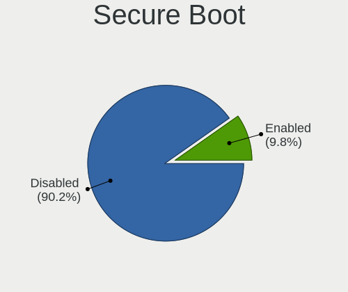
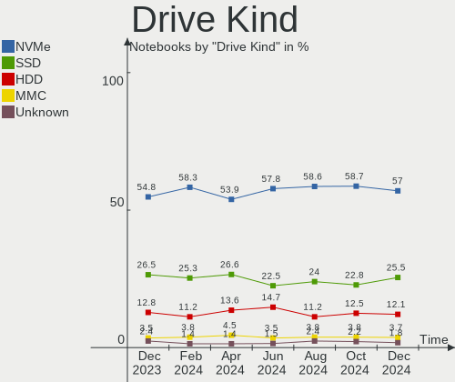
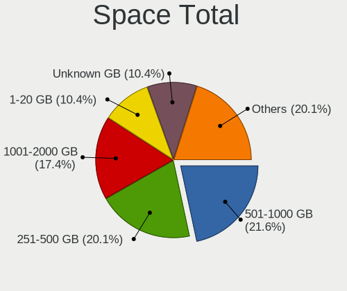
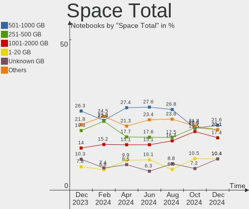
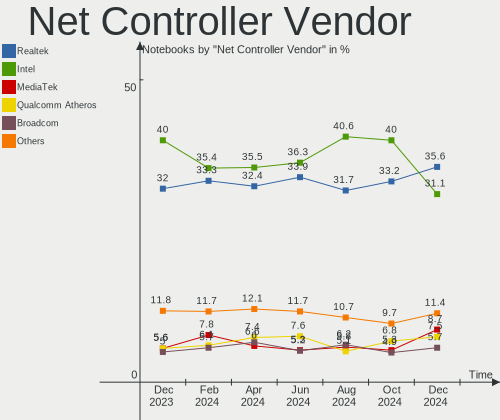
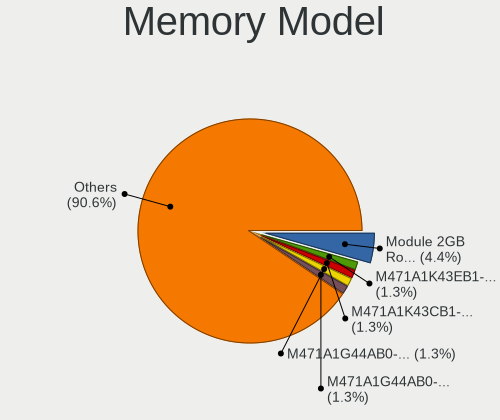
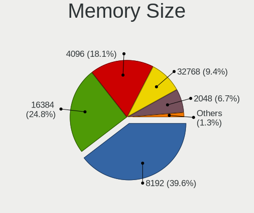
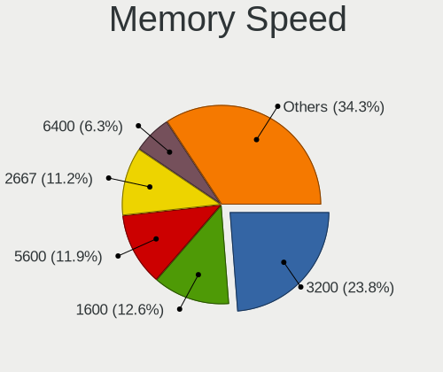

Fedora - Hardware Trends (Notebooks)
------------------------------------

A project to identify most popular hardware characteristics and track their change
over time based on data collected by Linux users at https://Linux-Hardware.org.

Anyone can contribute to this report by the [hw-probe](https://github.com/linuxhw/hw-probe) tool:

    sudo -E hw-probe -all -upload

This report is for one last month. Overall report since the beginning of time: [TestDays](https://github.com/linuxhw/TestDays)

Period: Apr, 2024.

Contents
--------

* [ System ](#system)
  - [ OS                       ](#os)
  - [ OS Family                ](#os-family)
  - [ Kernel                   ](#kernel)
  - [ Kernel Family            ](#kernel-family)
  - [ Kernel Major Ver.        ](#kernel-major-ver)
  - [ Arch                     ](#arch)
  - [ DE                       ](#de)
  - [ Display Server           ](#display-server)
  - [ Display Manager          ](#display-manager)
  - [ OS Lang                  ](#os-lang)
  - [ Boot Mode                ](#boot-mode)
  - [ Filesystem               ](#filesystem)
  - [ Part. scheme             ](#part-scheme)
  - [ Dual Boot with Linux/BSD ](#dual-boot-with-linuxbsd)
  - [ Dual Boot (Win)          ](#dual-boot-win)

* [ Board ](#board)
  - [ Vendor                   ](#vendor)
  - [ Model                    ](#model)
  - [ Model Family             ](#model-family)
  - [ MFG Year                 ](#mfg-year)
  - [ Form Factor              ](#form-factor)
  - [ Secure Boot              ](#secure-boot)
  - [ Coreboot                 ](#coreboot)
  - [ RAM Size                 ](#ram-size)
  - [ RAM Used                 ](#ram-used)
  - [ Total Drives             ](#total-drives)
  - [ Has CD-ROM               ](#has-cd-rom)
  - [ Has Ethernet             ](#has-ethernet)
  - [ Has WiFi                 ](#has-wifi)
  - [ Has Bluetooth            ](#has-bluetooth)

* [ Location ](#location)
  - [ Country                  ](#country)
  - [ City                     ](#city)

* [ Drives ](#drives)
  - [ Drive Vendor             ](#drive-vendor)
  - [ Drive Model              ](#drive-model)
  - [ HDD Vendor               ](#hdd-vendor)
  - [ SSD Vendor               ](#ssd-vendor)
  - [ Drive Kind               ](#drive-kind)
  - [ Drive Connector          ](#drive-connector)
  - [ Drive Size               ](#drive-size)
  - [ Space Total              ](#space-total)
  - [ Space Used               ](#space-used)
  - [ Malfunc. Drives          ](#malfunc-drives)
  - [ Malfunc. Drive Vendor    ](#malfunc-drive-vendor)
  - [ Malfunc. HDD Vendor      ](#malfunc-hdd-vendor)
  - [ Malfunc. Drive Kind      ](#malfunc-drive-kind)
  - [ Failed Drives            ](#failed-drives)
  - [ Failed Drive Vendor      ](#failed-drive-vendor)
  - [ Drive Status             ](#drive-status)

* [ Storage controller ](#storage-controller)
  - [ Storage Vendor           ](#storage-vendor)
  - [ Storage Model            ](#storage-model)
  - [ Storage Kind             ](#storage-kind)

* [ Processor ](#processor)
  - [ CPU Vendor               ](#cpu-vendor)
  - [ CPU Model                ](#cpu-model)
  - [ CPU Model Family         ](#cpu-model-family)
  - [ CPU Cores                ](#cpu-cores)
  - [ CPU Sockets              ](#cpu-sockets)
  - [ CPU Threads              ](#cpu-threads)
  - [ CPU Op-Modes             ](#cpu-op-modes)
  - [ CPU Microcode            ](#cpu-microcode)
  - [ CPU Microarch            ](#cpu-microarch)

* [ Graphics ](#graphics)
  - [ GPU Vendor               ](#gpu-vendor)
  - [ GPU Model                ](#gpu-model)
  - [ GPU Combo                ](#gpu-combo)
  - [ GPU Driver               ](#gpu-driver)
  - [ GPU Memory               ](#gpu-memory)

* [ Monitor ](#monitor)
  - [ Monitor Vendor           ](#monitor-vendor)
  - [ Monitor Model            ](#monitor-model)
  - [ Monitor Resolution       ](#monitor-resolution)
  - [ Monitor Diagonal         ](#monitor-diagonal)
  - [ Monitor Width            ](#monitor-width)
  - [ Aspect Ratio             ](#aspect-ratio)
  - [ Monitor Area             ](#monitor-area)
  - [ Pixel Density            ](#pixel-density)
  - [ Multiple Monitors        ](#multiple-monitors)

* [ Network ](#network)
  - [ Net Controller Vendor    ](#net-controller-vendor)
  - [ Net Controller Model     ](#net-controller-model)
  - [ Wireless Vendor          ](#wireless-vendor)
  - [ Wireless Model           ](#wireless-model)
  - [ Ethernet Vendor          ](#ethernet-vendor)
  - [ Ethernet Model           ](#ethernet-model)
  - [ Net Controller Kind      ](#net-controller-kind)
  - [ Used Controller          ](#used-controller)
  - [ NICs                     ](#nics)
  - [ IPv6                     ](#ipv6)

* [ Bluetooth ](#bluetooth)
  - [ Bluetooth Vendor         ](#bluetooth-vendor)
  - [ Bluetooth Model          ](#bluetooth-model)

* [ Sound ](#sound)
  - [ Sound Vendor             ](#sound-vendor)
  - [ Sound Model              ](#sound-model)

* [ Memory ](#memory)
  - [ Memory Vendor            ](#memory-vendor)
  - [ Memory Model             ](#memory-model)
  - [ Memory Kind              ](#memory-kind)
  - [ Memory Form Factor       ](#memory-form-factor)
  - [ Memory Size              ](#memory-size)
  - [ Memory Speed             ](#memory-speed)

* [ Printers & scanners ](#printers--scanners)
  - [ Printer Vendor           ](#printer-vendor)
  - [ Printer Model            ](#printer-model)
  - [ Scanner Vendor           ](#scanner-vendor)
  - [ Scanner Model            ](#scanner-model)

* [ Camera ](#camera)
  - [ Camera Vendor            ](#camera-vendor)
  - [ Camera Model             ](#camera-model)

* [ Security ](#security)
  - [ Fingerprint Vendor       ](#fingerprint-vendor)
  - [ Fingerprint Model        ](#fingerprint-model)
  - [ Chipcard Vendor          ](#chipcard-vendor)
  - [ Chipcard Model           ](#chipcard-model)

* [ Unsupported ](#unsupported)
  - [ Unsupported Devices      ](#unsupported-devices)
  - [ Unsupported Device Types ](#unsupported-device-types)

System
------

OS
--

Installed operating systems

| Name      | Notebooks | Percent |
|-----------|-----------|---------|
| Fedora 39 | 253       | 59.53%  |
| Fedora 40 | 154       | 36.24%  |
| Fedora 38 | 10        | 2.35%   |
| Fedora 41 | 5         | 1.18%   |
| Fedora 35 | 1         | 0.24%   |
| Fedora 34 | 1         | 0.24%   |
| Fedora 32 | 1         | 0.24%   |

OS Family
---------

OS without a version

| Name   | Notebooks | Percent |
|--------|-----------|---------|
| Fedora | 425       | 100%    |

Kernel
------

Version of the Linux kernel

| Version                                                | Notebooks | Percent |
|--------------------------------------------------------|-----------|---------|
| 6.8.7-300.fc40.x86_64                                  | 106       | 24.94%  |
| 6.8.4-200.fc39.x86_64                                  | 54        | 12.71%  |
| 6.8.6-200.fc39.x86_64                                  | 44        | 10.35%  |
| 6.7.11-200.fc39.x86_64                                 | 38        | 8.94%   |
| 6.8.5-201.fc39.x86_64                                  | 29        | 6.82%   |
| 6.5.6-300.fc39.x86_64                                  | 27        | 6.35%   |
| 6.7.10-200.fc39.x86_64                                 | 24        | 5.65%   |
| 6.8.7-200.fc39.x86_64                                  | 19        | 4.47%   |
| 6.8.5-301.fc40.x86_64                                  | 18        | 4.24%   |
| 6.8.4-300.fc40.x86_64                                  | 13        | 3.06%   |
| 6.7.9-200.fc39.x86_64                                  | 8         | 1.88%   |
| 6.8.2-300.fc40.x86_64                                  | 7         | 1.65%   |
| 6.8.7-100.fc38.x86_64                                  | 5         | 1.18%   |
| 6.9.0-0.rc5.20240426gitc942a0cd3603.48.fc41.x86_64     | 3         | 0.71%   |
| 6.8.0-0.rc6.49.fc40.x86_64                             | 3         | 0.71%   |
| 6.9.0-0.rc5.20240423git71b1543c83d6.45.fc41.x86_64     | 1         | 0.24%   |
| 6.9.0-0.rc4.20240416git96fca68c4fbf7.38.fc41.x86_64    | 1         | 0.24%   |
| 6.9.0-0.rc3.20240410gt2c71fdf0.231.vanilla.fc39.x86_64 | 1         | 0.24%   |
| 6.9.0-0.0.next.20240319.210.vanilla.fc39.x86_64        | 1         | 0.24%   |
| 6.8.7-cb1.0.fc39.x86_64                                | 1         | 0.24%   |
| 6.8.7-302.fsync.fc40.x86_64                            | 1         | 0.24%   |
| 6.8.6-300.fc40.x86_64                                  | 1         | 0.24%   |
| 6.8.5-101.fc38.x86_64                                  | 1         | 0.24%   |
| 6.8.4-350.vanilla.fc40.x86_64                          | 1         | 0.24%   |
| 6.8.4-300.es83xx.fc40.x86_64                           | 1         | 0.24%   |
| 6.8.4-100.fc38.x86_64                                  | 1         | 0.24%   |
| 6.8.2-cb1.0.fc40.x86_64                                | 1         | 0.24%   |
| 6.8.0-0.rc4.35.x13s.fc40.aarch64                       | 1         | 0.24%   |
| 6.7.9-207.fsync.fc39.x86_64                            | 1         | 0.24%   |
| 6.7.9-100.fc38.x86_64                                  | 1         | 0.24%   |
| 6.7.7-200.t2.fc40.x86_64                               | 1         | 0.24%   |
| 6.7.6-200.fc39.x86_64                                  | 1         | 0.24%   |
| 6.7.5-200.fc39.x86_64                                  | 1         | 0.24%   |
| 6.7.12-202.fsync.fc39.x86_64                           | 1         | 0.24%   |
| 6.7.11-100.fc38.x86_64                                 | 1         | 0.24%   |
| 6.7.10-100.fc38.x86_64                                 | 1         | 0.24%   |
| 6.6.8-100.fc38.x86_64                                  | 1         | 0.24%   |
| 6.6.6-100.fc38.x86_64                                  | 1         | 0.24%   |
| 6.0.12-100.fc35.x86_64                                 | 1         | 0.24%   |
| 5.6.13-100.fc30.x86_64                                 | 1         | 0.24%   |

Kernel Family
-------------

Linux kernel without a distro release

| Version | Notebooks | Percent |
|---------|-----------|---------|
| 6.8.7   | 132       | 31.06%  |
| 6.8.4   | 70        | 16.47%  |
| 6.8.5   | 48        | 11.29%  |
| 6.8.6   | 45        | 10.59%  |
| 6.7.11  | 39        | 9.18%   |
| 6.5.6   | 27        | 6.35%   |
| 6.7.10  | 25        | 5.88%   |
| 6.7.9   | 10        | 2.35%   |
| 6.8.2   | 8         | 1.88%   |
| 6.9.0   | 7         | 1.65%   |
| 6.8.0   | 4         | 0.94%   |
| 6.7.7   | 1         | 0.24%   |
| 6.7.6   | 1         | 0.24%   |
| 6.7.5   | 1         | 0.24%   |
| 6.7.12  | 1         | 0.24%   |
| 6.6.8   | 1         | 0.24%   |
| 6.6.6   | 1         | 0.24%   |
| 6.0.12  | 1         | 0.24%   |
| 5.6.13  | 1         | 0.24%   |
| 5.17.12 | 1         | 0.24%   |
| 5.0.16  | 1         | 0.24%   |

Kernel Major Ver.
-----------------

Linux kernel major version

| Version | Notebooks | Percent |
|---------|-----------|---------|
| 6.8     | 307       | 72.24%  |
| 6.7     | 78        | 18.35%  |
| 6.5     | 27        | 6.35%   |
| 6.9     | 7         | 1.65%   |
| 6.6     | 2         | 0.47%   |
| 6.0     | 1         | 0.24%   |
| 5.6     | 1         | 0.24%   |
| 5.17    | 1         | 0.24%   |
| 5.0     | 1         | 0.24%   |

Arch
----

OS architecture (x86_64, i586, etc.)

| Name    | Notebooks | Percent |
|---------|-----------|---------|
| x86_64  | 424       | 99.76%  |
| aarch64 | 1         | 0.24%   |

DE
--

Desktop Environment

| Name          | Notebooks | Percent |
|---------------|-----------|---------|
| GNOME         | 334       | 78.59%  |
| KDE5          | 30        | 7.06%   |
| KDE6          | 21        | 4.94%   |
| KDE4          | 9         | 2.12%   |
| Unknown       | 6         | 1.41%   |
| X-Cinnamon    | 5         | 1.18%   |
| MATE          | 5         | 1.18%   |
| GNOME Classic | 5         | 1.18%   |
| XFCE          | 3         | 0.71%   |
| Cinnamon      | 3         | 0.71%   |
| LXQt          | 1         | 0.24%   |
| LXDE          | 1         | 0.24%   |
| Deepin        | 1         | 0.24%   |
| Budgie        | 1         | 0.24%   |

Display Server
--------------

X11 or Wayland

| Name        | Notebooks | Percent |
|-------------|-----------|---------|
| Wayland     | 366       | 86.12%  |
| X11         | 48        | 11.29%  |
| Tty         | 6         | 1.41%   |
| Unknown     | 4         | 0.94%   |
| Unspecified | 1         | 0.24%   |

Display Manager
---------------

SDDM, LightDM, etc.

| Name    | Notebooks | Percent |
|---------|-----------|---------|
| Unknown | 281       | 66.12%  |
| GDM     | 94        | 22.12%  |
| SDDM    | 37        | 8.71%   |
| LightDM | 12        | 2.82%   |
| LXDM    | 1         | 0.24%   |

OS Lang
-------

Language

| Lang    | Notebooks | Percent |
|---------|-----------|---------|
| en_US   | 230       | 54.12%  |
| en_GB   | 29        | 6.82%   |
| ru_RU   | 20        | 4.71%   |
| de_DE   | 18        | 4.24%   |
| fr_FR   | 15        | 3.53%   |
| pt_BR   | 13        | 3.06%   |
| it_IT   | 12        | 2.82%   |
| en_AU   | 10        | 2.35%   |
| en_CA   | 8         | 1.88%   |
| es_MX   | 7         | 1.65%   |
| en_IN   | 7         | 1.65%   |
| de_AT   | 6         | 1.41%   |
| pl_PL   | 5         | 1.18%   |
| tr_TR   | 4         | 0.94%   |
| es_ES   | 4         | 0.94%   |
| uk_UA   | 3         | 0.71%   |
| es_CL   | 3         | 0.71%   |
| en_IL   | 3         | 0.71%   |
| en_DK   | 3         | 0.71%   |
| zh_CN   | 2         | 0.47%   |
| hu_HU   | 2         | 0.47%   |
| fr_CA   | 2         | 0.47%   |
| es_GT   | 2         | 0.47%   |
| es_AR   | 2         | 0.47%   |
| de_CH   | 2         | 0.47%   |
| sv_SE   | 1         | 0.24%   |
| ru_UA   | 1         | 0.24%   |
| ro_RO   | 1         | 0.24%   |
| nl_NL   | 1         | 0.24%   |
| ja_JP   | 1         | 0.24%   |
| fr_CH   | 1         | 0.24%   |
| es_US   | 1         | 0.24%   |
| es_PE   | 1         | 0.24%   |
| es_CO   | 1         | 0.24%   |
| el_GR   | 1         | 0.24%   |
| da_DK   | 1         | 0.24%   |
| ar_EG   | 1         | 0.24%   |
| Unknown | 1         | 0.24%   |

Boot Mode
---------

EFI or BIOS

| Mode | Notebooks | Percent |
|------|-----------|---------|
| BIOS | 281       | 66.12%  |
| EFI  | 144       | 33.88%  |

Filesystem
----------

Type of filesystem

| Type    | Notebooks | Percent |
|---------|-----------|---------|
| Btrfs   | 358       | 84.24%  |
| Ext4    | 53        | 12.47%  |
| Xfs     | 7         | 1.65%   |
| Tmpfs   | 5         | 1.18%   |
| Overlay | 1         | 0.24%   |
| F2fs    | 1         | 0.24%   |

Part. scheme
------------

Scheme of partitioning

| Type    | Notebooks | Percent |
|---------|-----------|---------|
| Unknown | 274       | 64.47%  |
| GPT     | 148       | 34.82%  |
| MBR     | 3         | 0.71%   |

Dual Boot with Linux/BSD
------------------------

Hosting more than one Linux/BSD

| Dual boot | Notebooks | Percent |
|-----------|-----------|---------|
| No        | 400       | 94.12%  |
| Yes       | 25        | 5.88%   |

Dual Boot (Win)
---------------

Hosting Linux and Windows

| Dual boot | Notebooks | Percent |
|-----------|-----------|---------|
| No        | 375       | 88.24%  |
| Yes       | 50        | 11.76%  |

Board
-----

Vendor
------

Motherboard manufacturer

| Name                   | Notebooks | Percent |
|------------------------|-----------|---------|
| Lenovo                 | 111       | 26.12%  |
| Hewlett-Packard        | 74        | 17.41%  |
| Dell                   | 55        | 12.94%  |
| ASUSTek Computer       | 48        | 11.29%  |
| Acer                   | 28        | 6.59%   |
| Apple                  | 25        | 5.88%   |
| HUAWEI                 | 11        | 2.59%   |
| Google                 | 8         | 1.88%   |
| MSI                    | 7         | 1.65%   |
| Toshiba                | 6         | 1.41%   |
| Framework              | 6         | 1.41%   |
| Timi                   | 4         | 0.94%   |
| Alienware              | 4         | 0.94%   |
| TUXEDO                 | 3         | 0.71%   |
| Sony                   | 3         | 0.71%   |
| Samsung Electronics    | 3         | 0.71%   |
| Positivo               | 2         | 0.47%   |
| Fujitsu                | 2         | 0.47%   |
| Chuwi                  | 2         | 0.47%   |
| Avell High Performance | 2         | 0.47%   |
| Unknown                | 2         | 0.47%   |
| ZET                    | 1         | 0.24%   |
| XIAOMI                 | 1         | 0.24%   |
| Valve                  | 1         | 0.24%   |
| Star Labs              | 1         | 0.24%   |
| SLIMBOOK               | 1         | 0.24%   |
| Semp Toshiba           | 1         | 0.24%   |
| SCHNEIDER              | 1         | 0.24%   |
| Notebook               | 1         | 0.24%   |
| Monster                | 1         | 0.24%   |
| Maibenben              | 1         | 0.24%   |
| LG Electronics         | 1         | 0.24%   |
| Juana Manso            | 1         | 0.24%   |
| Infinix                | 1         | 0.24%   |
| HONOR                  | 1         | 0.24%   |
| Haier                  | 1         | 0.24%   |
| GPD                    | 1         | 0.24%   |
| Gigabyte Technology    | 1         | 0.24%   |
| Dixonsxp               | 1         | 0.24%   |
| ASRock                 | 1         | 0.24%   |

Model
-----

Motherboard model

| Name                                       | Notebooks | Percent |
|--------------------------------------------|-----------|---------|
| HUAWEI BOM-WXX9                            | 4         | 0.94%   |
| Unknown                                    | 4         | 0.94%   |
| Lenovo Legion Pro 5 16IRX8 82WK            | 3         | 0.71%   |
| HP Notebook                                | 3         | 0.71%   |
| ASUS ASUS TUF Gaming F15 FX506HCB_FX506HCB | 3         | 0.71%   |
| Apple MacBookPro9,2                        | 3         | 0.71%   |
| Lenovo Yoga Pro 7 14APH8 82Y8              | 2         | 0.47%   |
| Lenovo LOQ 15APH8 82XT                     | 2         | 0.47%   |
| Lenovo Legion 5 Pro 16ACH6H 82JQ           | 2         | 0.47%   |
| Lenovo IdeaPad 5 Pro 14ACN6 82L7           | 2         | 0.47%   |
| HUAWEI RLEF-XX                             | 2         | 0.47%   |
| HP ZBook 15                                | 2         | 0.47%   |
| HP Pavilion Notebook                       | 2         | 0.47%   |
| HP Pavilion Gaming Laptop 15-ec0xxx        | 2         | 0.47%   |
| HP Laptop 15-dy2xxx                        | 2         | 0.47%   |
| HP EliteBook 840 G8 Notebook PC            | 2         | 0.47%   |
| HP EliteBook 840 G6                        | 2         | 0.47%   |
| HP EliteBook 840 G5                        | 2         | 0.47%   |
| HP 250 G8 Notebook PC                      | 2         | 0.47%   |
| HP 15                                      | 2         | 0.47%   |
| Framework Laptop (12th Gen Intel Core)     | 2         | 0.47%   |
| Dell XPS 15 9560                           | 2         | 0.47%   |
| Dell Precision M4800                       | 2         | 0.47%   |
| Dell Latitude E6400                        | 2         | 0.47%   |
| Dell Latitude 5440                         | 2         | 0.47%   |
| Dell Inspiron 5770                         | 2         | 0.47%   |
| Dell Inspiron 5566                         | 2         | 0.47%   |
| Dell Inspiron 15 3520                      | 2         | 0.47%   |
| ASUS ROG Zephyrus G14 GA401IV_GA401IV      | 2         | 0.47%   |
| ASUS ASUS Zenbook 14 UX3405MA_UX3405MA     | 2         | 0.47%   |
| Apple MacBookPro14,1                       | 2         | 0.47%   |
| Apple MacBookPro12,1                       | 2         | 0.47%   |
| Apple MacBookPro11,3                       | 2         | 0.47%   |
| Apple MacBookAir7,2                        | 2         | 0.47%   |
| ZET Ward M103                              | 1         | 0.24%   |
| XIAOMI Redmi Book Pro 14 2024              | 1         | 0.24%   |
| Valve Jupiter                              | 1         | 0.24%   |
| TUXEDO InfinityBook S 15/17 Gen7           | 1         | 0.24%   |
| TUXEDO InfinityBook Pro Gen7 (MK1)         | 1         | 0.24%   |
| TUXEDO Gemini Gen2                         | 1         | 0.24%   |

Model Family
------------

Motherboard model prefix

| Name                | Notebooks | Percent |
|---------------------|-----------|---------|
| Lenovo ThinkPad     | 59        | 13.88%  |
| Dell Latitude       | 20        | 4.71%   |
| Acer Aspire         | 19        | 4.47%   |
| Lenovo IdeaPad      | 18        | 4.24%   |
| HP EliteBook        | 17        | 4%      |
| ASUS VivoBook       | 15        | 3.53%   |
| Dell Inspiron       | 12        | 2.82%   |
| ASUS ROG            | 12        | 2.82%   |
| Lenovo Legion       | 10        | 2.35%   |
| HP Pavilion         | 10        | 2.35%   |
| HP Laptop           | 9         | 2.12%   |
| Dell Precision      | 9         | 2.12%   |
| Dell XPS            | 7         | 1.65%   |
| HP Victus           | 6         | 1.41%   |
| HP ProBook          | 6         | 1.41%   |
| Framework Laptop    | 6         | 1.41%   |
| ASUS ASUS           | 6         | 1.41%   |
| Lenovo ThinkBook    | 5         | 1.18%   |
| HP ZBook            | 5         | 1.18%   |
| Acer Nitro          | 5         | 1.18%   |
| Toshiba Satellite   | 4         | 0.94%   |
| Lenovo Yoga         | 4         | 0.94%   |
| HUAWEI BOM-WXX9     | 4         | 0.94%   |
| ASUS ZenBook        | 4         | 0.94%   |
| Apple MacBookPro9   | 4         | 0.94%   |
| Apple MacBookPro11  | 4         | 0.94%   |
| Unknown             | 4         | 0.94%   |
| HP OMEN             | 3         | 0.71%   |
| HP Notebook         | 3         | 0.71%   |
| HP ENVY             | 3         | 0.71%   |
| HP 250              | 3         | 0.71%   |
| Dell G15            | 3         | 0.71%   |
| TUXEDO InfinityBook | 2         | 0.47%   |
| Timi Mi             | 2         | 0.47%   |
| MSI GF63            | 2         | 0.47%   |
| Lenovo V15          | 2         | 0.47%   |
| Lenovo LOQ          | 2         | 0.47%   |
| HUAWEI RLEF-XX      | 2         | 0.47%   |
| HP 15               | 2         | 0.47%   |
| Fujitsu LIFEBOOK    | 2         | 0.47%   |

MFG Year
--------

Motherboard manufacture year

| Year | Notebooks | Percent |
|------|-----------|---------|
| 2023 | 63        | 14.82%  |
| 2021 | 59        | 13.88%  |
| 2022 | 47        | 11.06%  |
| 2020 | 41        | 9.65%   |
| 2018 | 29        | 6.82%   |
| 2013 | 27        | 6.35%   |
| 2019 | 25        | 5.88%   |
| 2012 | 24        | 5.65%   |
| 2017 | 23        | 5.41%   |
| 2015 | 16        | 3.76%   |
| 2011 | 16        | 3.76%   |
| 2014 | 15        | 3.53%   |
| 2016 | 13        | 3.06%   |
| 2024 | 11        | 2.59%   |
| 2010 | 6         | 1.41%   |
| 2008 | 5         | 1.18%   |
| 2007 | 3         | 0.71%   |
| 2009 | 2         | 0.47%   |

Form Factor
-----------

Physical design of the computer

| Name     | Notebooks | Percent |
|----------|-----------|---------|
| Notebook | 425       | 100%    |

Secure Boot
-----------

Enabled or disabled

| State    | Notebooks | Percent |
|----------|-----------|---------|
| Disabled | 385       | 90.59%  |
| Enabled  | 40        | 9.41%   |

Coreboot
--------

Have coreboot on board

| Used | Notebooks | Percent |
|------|-----------|---------|
| No   | 415       | 97.65%  |
| Yes  | 10        | 2.35%   |

RAM Size
--------

Total RAM memory

| Size in GB  | Notebooks | Percent |
|-------------|-----------|---------|
| 4.01-8.0    | 109       | 25.65%  |
| 16.01-24.0  | 98        | 23.06%  |
| 8.01-16.0   | 90        | 21.18%  |
| 32.01-64.0  | 66        | 15.53%  |
| 3.01-4.0    | 34        | 8%      |
| 24.01-32.0  | 15        | 3.53%   |
| 64.01-256.0 | 9         | 2.12%   |
| 1.01-2.0    | 4         | 0.94%   |

RAM Used
--------

Used RAM memory

| Used GB    | Notebooks | Percent |
|------------|-----------|---------|
| 4.01-8.0   | 149       | 35.06%  |
| 2.01-3.0   | 116       | 27.29%  |
| 3.01-4.0   | 86        | 20.24%  |
| 1.01-2.0   | 41        | 9.65%   |
| 8.01-16.0  | 27        | 6.35%   |
| 16.01-24.0 | 4         | 0.94%   |
| 32.01-64.0 | 1         | 0.24%   |
| 0.51-1.0   | 1         | 0.24%   |

Total Drives
------------

Number of drives on board

| Drives | Notebooks | Percent |
|--------|-----------|---------|
| 1      | 307       | 72.24%  |
| 2      | 105       | 24.71%  |
| 3      | 8         | 1.88%   |
| 4      | 3         | 0.71%   |
| 7      | 1         | 0.24%   |
| 5      | 1         | 0.24%   |

Has CD-ROM
----------

Has CD-ROM on board

| Presented | Notebooks | Percent |
|-----------|-----------|---------|
| No        | 347       | 81.65%  |
| Yes       | 78        | 18.35%  |

Has Ethernet
------------

Has Ethernet on board

| Presented | Notebooks | Percent |
|-----------|-----------|---------|
| Yes       | 293       | 68.94%  |
| No        | 132       | 31.06%  |

Has WiFi
--------

Has WiFi module

| Presented | Notebooks | Percent |
|-----------|-----------|---------|
| Yes       | 419       | 98.59%  |
| No        | 6         | 1.41%   |

Has Bluetooth
-------------

Has Bluetooth module

| Presented | Notebooks | Percent |
|-----------|-----------|---------|
| Yes       | 378       | 88.94%  |
| No        | 47        | 11.06%  |

Location
--------

Country
-------

Geographic location (country)

| Country         | Notebooks | Percent |
|-----------------|-----------|---------|
| USA             | 84        | 19.76%  |
| Germany         | 36        | 8.47%   |
| Russia          | 23        | 5.41%   |
| Italy           | 21        | 4.94%   |
| India           | 21        | 4.94%   |
| Brazil          | 19        | 4.47%   |
| UK              | 16        | 3.76%   |
| France          | 16        | 3.76%   |
| Canada          | 15        | 3.53%   |
| Austria         | 10        | 2.35%   |
| Australia       | 10        | 2.35%   |
| Poland          | 9         | 2.12%   |
| Mexico          | 9         | 2.12%   |
| Turkey          | 7         | 1.65%   |
| Spain           | 7         | 1.65%   |
| Hungary         | 7         | 1.65%   |
| Switzerland     | 6         | 1.41%   |
| Netherlands     | 5         | 1.18%   |
| Israel          | 5         | 1.18%   |
| Denmark         | 5         | 1.18%   |
| Portugal        | 4         | 0.94%   |
| Morocco         | 4         | 0.94%   |
| Finland         | 4         | 0.94%   |
| Egypt           | 4         | 0.94%   |
| Czechia         | 4         | 0.94%   |
| Chile           | 4         | 0.94%   |
| Belarus         | 4         | 0.94%   |
| Argentina       | 4         | 0.94%   |
| Sweden          | 3         | 0.71%   |
| Serbia          | 3         | 0.71%   |
| Romania         | 3         | 0.71%   |
| Puerto Rico     | 3         | 0.71%   |
| Japan           | 3         | 0.71%   |
| Colombia        | 3         | 0.71%   |
| Vietnam         | 2         | 0.47%   |
| Philippines     | 2         | 0.47%   |
| North Macedonia | 2         | 0.47%   |
| Lithuania       | 2         | 0.47%   |
| Indonesia       | 2         | 0.47%   |
| Guatemala       | 2         | 0.47%   |

City
----

Geographic location (city)

| City              | Notebooks | Percent |
|-------------------|-----------|---------|
| Vienna            | 8         | 1.88%   |
| St Petersburg     | 7         | 1.65%   |
| Berlin            | 6         | 1.41%   |
| Milan             | 5         | 1.18%   |
| Rome              | 4         | 0.94%   |
| Moscow            | 4         | 0.94%   |
| Delhi             | 4         | 0.94%   |
| Budapest          | 4         | 0.94%   |
| Bengaluru         | 4         | 0.94%   |
| Sydney            | 3         | 0.71%   |
| Paris             | 3         | 0.71%   |
| Munich            | 3         | 0.71%   |
| Montreal          | 3         | 0.71%   |
| Minsk             | 3         | 0.71%   |
| Lisbon            | 3         | 0.71%   |
| Istanbul          | 3         | 0.71%   |
| Helsinki          | 3         | 0.71%   |
| Copenhagen        | 3         | 0.71%   |
| Belo Horizonte    | 3         | 0.71%   |
| Warsaw            | 2         | 0.47%   |
| Toronto           | 2         | 0.47%   |
| Tomsk             | 2         | 0.47%   |
| Sofia             | 2         | 0.47%   |
| Skopje            | 2         | 0.47%   |
| Seattle           | 2         | 0.47%   |
| Savannah          | 2         | 0.47%   |
| Raleigh           | 2         | 0.47%   |
| Novosibirsk       | 2         | 0.47%   |
| Miami             | 2         | 0.47%   |
| Manchester        | 2         | 0.47%   |
| Los Angeles       | 2         | 0.47%   |
| London            | 2         | 0.47%   |
| Kolkata           | 2         | 0.47%   |
| Guatemala City    | 2         | 0.47%   |
| Frankfurt am Main | 2         | 0.47%   |
| Fortaleza         | 2         | 0.47%   |
| Ettiswil          | 2         | 0.47%   |
| Concepción       | 2         | 0.47%   |
| Chicago           | 2         | 0.47%   |
| Chennai           | 2         | 0.47%   |

Drives
------

Drive Vendor
------------

Hard drive vendors

| Vendor                       | Notebooks | Drives | Percent |
|------------------------------|-----------|--------|---------|
| Samsung Electronics          | 102       | 111    | 19.07%  |
| Sandisk                      | 69        | 71     | 12.9%   |
| SK hynix                     | 35        | 35     | 6.54%   |
| Unknown                      | 29        | 30     | 5.42%   |
| WDC                          | 24        | 25     | 4.49%   |
| Seagate                      | 24        | 29     | 4.49%   |
| Micron Technology            | 23        | 23     | 4.3%    |
| Kingston                     | 23        | 25     | 4.3%    |
| Toshiba                      | 18        | 18     | 3.36%   |
| Intel                        | 15        | 15     | 2.8%    |
| Phison Electronics           | 14        | 14     | 2.62%   |
| KIOXIA                       | 14        | 14     | 2.62%   |
| Apple                        | 14        | 18     | 2.62%   |
| Micron/Crucial Technology    | 9         | 9      | 1.68%   |
| A-DATA Technology            | 9         | 10     | 1.68%   |
| Silicon Motion               | 8         | 8      | 1.5%    |
| Crucial                      | 8         | 8      | 1.5%    |
| SPCC                         | 7         | 7      | 1.31%   |
| Kingston Technology Company  | 6         | 6      | 1.12%   |
| HGST                         | 6         | 6      | 1.12%   |
| Transcend                    | 4         | 4      | 0.75%   |
| Realtek Semiconductor        | 4         | 4      | 0.75%   |
| China                        | 4         | 4      | 0.75%   |
| Unknown                      | 4         | 4      | 0.75%   |
| Union Memory (Shenzhen)      | 3         | 3      | 0.56%   |
| Union Memory                 | 3         | 3      | 0.56%   |
| Patriot                      | 3         | 3      | 0.56%   |
| Hitachi                      | 3         | 3      | 0.56%   |
| Hewlett-Packard              | 3         | 3      | 0.56%   |
| Yangtze Memory Technologies  | 2         | 2      | 0.37%   |
| Team                         | 2         | 2      | 0.37%   |
| Solid State Storage          | 2         | 2      | 0.37%   |
| Shenzhen Longsys Electronics | 2         | 2      | 0.37%   |
| PNY                          | 2         | 2      | 0.37%   |
| MAXIO Technology (Hangzhou)  | 2         | 2      | 0.37%   |
| LITEON                       | 2         | 2      | 0.37%   |
| Lexar                        | 2         | 2      | 0.37%   |
| Lenovo                       | 2         | 2      | 0.37%   |
| KingSpec                     | 2         | 3      | 0.37%   |
| GOODRAM                      | 2         | 2      | 0.37%   |

Drive Model
-----------

Hard drive models

| Model                                                 | Notebooks | Percent |
|-------------------------------------------------------|-----------|---------|
| Samsung NVMe SSD Controller SM981/PM981/PM983 1TB     | 29        | 5.32%   |
| Samsung NVMe SSD Controller PM9A1/PM9A3/980PRO 1TB    | 20        | 3.67%   |
| Unknown MMC Card  128GB                               | 8         | 1.47%   |
| Sandisk WD Blue SN550 NVMe SSD 2TB                    | 8         | 1.47%   |
| Seagate ST1000LM035-1RK172 1TB                        | 7         | 1.28%   |
| Sandisk WD Black SN750 / PC SN730 NVMe SSD 512GB      | 7         | 1.28%   |
| Micron/Crucial P2 NVMe PCIe SSD 4TB                   | 7         | 1.28%   |
| Unknown MMC Card  32GB                                | 5         | 0.92%   |
| Toshiba MQ01ABF050 500GB                              | 5         | 0.92%   |
| Silicon Motion SM2263EN/SM2263XT SSD Controller 256GB | 5         | 0.92%   |
| Sandisk WD Black SN850 512GB                          | 5         | 0.92%   |
| Samsung SSD 980 1TB                                   | 5         | 0.92%   |
| Phison PS5013 E13 NVMe Controller 512GB               | 5         | 0.92%   |
| Intel SSDPEKNU512GZ 512GB                             | 5         | 0.92%   |
| Unknown MMC Card  64GB                                | 4         | 0.73%   |
| Toshiba MQ01ABD100 1TB                                | 4         | 0.73%   |
| SK hynix SKHynix_HFS001TEJ9X162N 1TB                  | 4         | 0.73%   |
| Samsung SSD 860 EVO 500GB                             | 4         | 0.73%   |
| Phison E12 NVMe Controller 2TB                        | 4         | 0.73%   |
| Kingston Company SNV2S1000G 1TB                       | 4         | 0.73%   |
| Kingston SA400S37960G 960GB SSD                       | 4         | 0.73%   |
| Kingston SA400S37240G 240GB SSD                       | 4         | 0.73%   |
| Intel SSD 660P Series 1024GB                          | 4         | 0.73%   |
| Apple S3X NVMe Controller 121GB                       | 4         | 0.73%   |
| Unknown                                               | 4         | 0.73%   |
| Unknown NVMe SSD Drive 512GB                          | 3         | 0.55%   |
| SPCC Solid State Disk 1TB                             | 3         | 0.55%   |
| SK hynix HFM512GD3JX013N 512GB                        | 3         | 0.55%   |
| SK hynix BC511 256GB                                  | 3         | 0.55%   |
| Silicon Motion PCIe-8 SSD 512GB                       | 3         | 0.55%   |
| Seagate ST500LT012-1DG142 500GB                       | 3         | 0.55%   |
| Sandisk WD PC SN560 SDDPNQE-1T00-1102 1024GB          | 3         | 0.55%   |
| Sandisk WD Blue SN500 / PC SN520 NVMe SSD 512GB       | 3         | 0.55%   |
| Kingston SA400S37480G 480GB SSD                       | 3         | 0.55%   |
| HGST HTS725050A7E630 500GB                            | 3         | 0.55%   |
| A-DATA SU630 240GB SSD                                | 3         | 0.55%   |
| WDC WD10SPZX-21Z10T0 1TB                              | 2         | 0.37%   |
| Unknown SD/MMC/MS PRO 128GB                           | 2         | 0.37%   |
| Unknown MMC Card  512GB                               | 2         | 0.37%   |
| Toshiba XG6 NVMe SSD Controller 1024GB                | 2         | 0.37%   |

HDD Vendor
----------

Hard disk drive vendors

| Vendor              | Notebooks | Drives | Percent |
|---------------------|-----------|--------|---------|
| Seagate             | 24        | 29     | 33.8%   |
| WDC                 | 18        | 18     | 25.35%  |
| Toshiba             | 15        | 15     | 21.13%  |
| HGST                | 6         | 6      | 8.45%   |
| Hitachi             | 3         | 3      | 4.23%   |
| Unknown             | 2         | 2      | 2.82%   |
| USB3.0              | 1         | 1      | 1.41%   |
| Samsung Electronics | 1         | 1      | 1.41%   |
| JMicron Technology  | 1         | 1      | 1.41%   |

SSD Vendor
----------

Solid state drive vendors

| Vendor              | Notebooks | Drives | Percent |
|---------------------|-----------|--------|---------|
| Samsung Electronics | 31        | 31     | 21.38%  |
| Kingston            | 17        | 18     | 11.72%  |
| SanDisk             | 14        | 15     | 9.66%   |
| Crucial             | 8         | 8      | 5.52%   |
| Apple               | 8         | 8      | 5.52%   |
| SPCC                | 7         | 7      | 4.83%   |
| WDC                 | 6         | 6      | 4.14%   |
| Micron Technology   | 5         | 5      | 3.45%   |
| A-DATA Technology   | 5         | 5      | 3.45%   |
| Transcend           | 4         | 4      | 2.76%   |
| China               | 4         | 4      | 2.76%   |
| SK hynix            | 3         | 3      | 2.07%   |
| Hewlett-Packard     | 3         | 3      | 2.07%   |
| Team                | 2         | 2      | 1.38%   |
| PNY                 | 2         | 2      | 1.38%   |
| Patriot             | 2         | 2      | 1.38%   |
| LITEON              | 2         | 2      | 1.38%   |
| Lexar               | 2         | 2      | 1.38%   |
| KingSpec            | 2         | 3      | 1.38%   |
| Intel               | 2         | 2      | 1.38%   |
| GOODRAM             | 2         | 2      | 1.38%   |
| Toshiba             | 1         | 1      | 0.69%   |
| SSK                 | 1         | 1      | 0.69%   |
| Plextor             | 1         | 1      | 0.69%   |
| Netac               | 1         | 1      | 0.69%   |
| Mushkin             | 1         | 1      | 0.69%   |
| Intenso             | 1         | 1      | 0.69%   |
| Integral            | 1         | 1      | 0.69%   |
| FORESEE             | 1         | 1      | 0.69%   |
| Fanxiang            | 1         | 1      | 0.69%   |
| Dahua               | 1         | 1      | 0.69%   |
| Corsair             | 1         | 1      | 0.69%   |
| BLUE                | 1         | 1      | 0.69%   |
| Azerty              | 1         | 1      | 0.69%   |
| Unknown             | 1         | 1      | 0.69%   |

Drive Kind
----------

HDD or SSD

| Kind    | Notebooks | Drives | Percent |
|---------|-----------|--------|---------|
| NVMe    | 265       | 305    | 53.54%  |
| SSD     | 133       | 148    | 26.87%  |
| HDD     | 68        | 76     | 13.74%  |
| MMC     | 22        | 24     | 4.44%   |
| Unknown | 7         | 8      | 1.41%   |

Drive Connector
---------------

SATA, SAS, NVMe, etc.

| Type | Notebooks | Drives | Percent |
|------|-----------|--------|---------|
| NVMe | 265       | 304    | 55.09%  |
| SATA | 174       | 210    | 36.17%  |
| MMC  | 22        | 24     | 4.57%   |
| SAS  | 20        | 23     | 4.16%   |

Drive Size
----------

Size of hard drive

| Size in TB | Notebooks | Drives | Percent |
|------------|-----------|--------|---------|
| 0.01-0.5   | 122       | 143    | 61.93%  |
| 0.51-1.0   | 65        | 68     | 32.99%  |
| 1.01-2.0   | 6         | 6      | 3.05%   |
| 3.01-4.0   | 3         | 3      | 1.52%   |
| 4.01-10.0  | 1         | 4      | 0.51%   |

Space Total
-----------

Amount of disk space available on the file system

| Size in GB     | Notebooks | Percent |
|----------------|-----------|---------|
| 501-1000       | 116       | 27.29%  |
| 251-500        | 75        | 17.65%  |
| 1001-2000      | 64        | 15.06%  |
| 101-250        | 58        | 13.65%  |
| 1-20           | 42        | 9.88%   |
| Unknown        | 36        | 8.47%   |
| More than 3000 | 12        | 2.82%   |
| 51-100         | 12        | 2.82%   |
| 2001-3000      | 8         | 1.88%   |
| 21-50          | 2         | 0.47%   |

Space Used
----------

Amount of used disk space

| Used GB        | Notebooks | Percent |
|----------------|-----------|---------|
| 1-20           | 145       | 34.12%  |
| 21-50          | 74        | 17.41%  |
| 101-250        | 57        | 13.41%  |
| 51-100         | 43        | 10.12%  |
| 251-500        | 39        | 9.18%   |
| Unknown        | 36        | 8.47%   |
| 501-1000       | 16        | 3.76%   |
| 1001-2000      | 11        | 2.59%   |
| 2001-3000      | 3         | 0.71%   |
| More than 3000 | 1         | 0.24%   |

Malfunc. Drives
---------------

Drive models with a malfunction

| Model                                 | Notebooks | Drives | Percent |
|---------------------------------------|-----------|--------|---------|
| WDC WDS240G2G0A-00JH30 240GB SSD      | 1         | 1      | 10%     |
| Toshiba MQ01ABD100 1TB                | 1         | 1      | 10%     |
| SK hynix BC711 HFM512GD3JX013N 512GB  | 1         | 1      | 10%     |
| Samsung Electronics SSD 870 QVO 1TB   | 1         | 1      | 10%     |
| Samsung Electronics SSD 840 EVO 250GB | 1         | 1      | 10%     |
| Mushkin MKNSSDCR240GB                 | 1         | 1      | 10%     |
| Hitachi HTS543232A7A384 320GB         | 1         | 1      | 10%     |
| Hitachi HTS541616J9SA00 160GB         | 1         | 1      | 10%     |
| HGST HTS541010A9E680 1TB              | 1         | 1      | 10%     |
| China G521N256GB SSD                  | 1         | 1      | 10%     |

Malfunc. Drive Vendor
---------------------

Vendors of faulty drives

| Vendor              | Notebooks | Drives | Percent |
|---------------------|-----------|--------|---------|
| Samsung Electronics | 2         | 2      | 20%     |
| Hitachi             | 2         | 2      | 20%     |
| WDC                 | 1         | 1      | 10%     |
| Toshiba             | 1         | 1      | 10%     |
| SK hynix            | 1         | 1      | 10%     |
| Mushkin             | 1         | 1      | 10%     |
| HGST                | 1         | 1      | 10%     |
| China               | 1         | 1      | 10%     |

Malfunc. HDD Vendor
-------------------

Vendors of faulty HDD drives

| Vendor  | Notebooks | Drives | Percent |
|---------|-----------|--------|---------|
| Hitachi | 2         | 2      | 50%     |
| Toshiba | 1         | 1      | 25%     |
| HGST    | 1         | 1      | 25%     |

Malfunc. Drive Kind
-------------------

Kinds of faulty drives

| Kind | Notebooks | Drives | Percent |
|------|-----------|--------|---------|
| SSD  | 5         | 5      | 50%     |
| HDD  | 4         | 4      | 40%     |
| NVMe | 1         | 1      | 10%     |

Failed Drives
-------------

Failed drive models

Zero info for selected period =(

Failed Drive Vendor
-------------------

Failed drive vendors

Zero info for selected period =(

Drive Status
------------

Number of failed and malfunc. drives

| Status   | Notebooks | Drives | Percent |
|----------|-----------|--------|---------|
| Detected | 300       | 402    | 68.49%  |
| Works    | 128       | 149    | 29.22%  |
| Malfunc  | 10        | 10     | 2.28%   |

Storage controller
------------------

Storage Vendor
--------------

Storage controller vendors

| Vendor                                  | Notebooks | Percent |
|-----------------------------------------|-----------|---------|
| Intel                                   | 215       | 39.89%  |
| Samsung Electronics                     | 77        | 14.29%  |
| SanDisk                                 | 55        | 10.2%   |
| AMD                                     | 37        | 6.86%   |
| SK hynix                                | 32        | 5.94%   |
| Micron Technology                       | 18        | 3.34%   |
| Phison Electronics                      | 15        | 2.78%   |
| KIOXIA                                  | 14        | 2.6%    |
| Kingston Technology Company             | 12        | 2.23%   |
| Micron/Crucial Technology               | 9         | 1.67%   |
| Silicon Motion                          | 8         | 1.48%   |
| Apple                                   | 6         | 1.11%   |
| ADATA Technology                        | 6         | 1.11%   |
| Union Memory (Shenzhen)                 | 4         | 0.74%   |
| Realtek Semiconductor                   | 4         | 0.74%   |
| Solid State Storage Technology          | 3         | 0.56%   |
| Yangtze Memory Technologies             | 2         | 0.37%   |
| Toshiba America Info Systems            | 2         | 0.37%   |
| Solidigm                                | 2         | 0.37%   |
| Shenzhen Unionmemory Information System | 2         | 0.37%   |
| Shenzhen Longsys Electronics            | 2         | 0.37%   |
| Nvidia                                  | 2         | 0.37%   |
| MAXIO Technology (Hangzhou)             | 2         | 0.37%   |
| Lenovo                                  | 2         | 0.37%   |
| INNOGRIT                                | 2         | 0.37%   |
| Transcend                               | 1         | 0.19%   |
| Seagate Technology                      | 1         | 0.19%   |
| Hosin Global Electronics                | 1         | 0.19%   |
| Beijing Starblaze Technology            | 1         | 0.19%   |
| ASMedia Technology                      | 1         | 0.19%   |
| Unknown                                 | 1         | 0.19%   |

Storage Model
-------------

Storage controller models

| Model                                                                          | Notebooks | Percent |
|--------------------------------------------------------------------------------|-----------|---------|
| AMD FCH SATA Controller [AHCI mode]                                            | 36        | 6.41%   |
| Intel Sunrise Point-LP SATA Controller [AHCI mode]                             | 31        | 5.52%   |
| Intel Volume Management Device NVMe RAID Controller                            | 30        | 5.34%   |
| Samsung NVMe SSD Controller SM981/PM981/PM983                                  | 29        | 5.16%   |
| Intel 7 Series Chipset Family 6-port SATA Controller [AHCI mode]               | 27        | 4.8%    |
| Samsung NVMe SSD Controller PM9A1/PM9A3/980PRO                                 | 20        | 3.56%   |
| SanDisk WD Black SN770 / PC SN740 256GB / PC SN560 (DRAM-less) NVMe SSD        | 15        | 2.67%   |
| Intel 6 Series/C200 Series Chipset Family 6 port Mobile SATA AHCI Controller   | 14        | 2.49%   |
| Intel 8 Series SATA Controller 1 [AHCI mode]                                   | 13        | 2.31%   |
| SK hynix Gold P31/BC711/PC711 NVMe Solid State Drive                           | 12        | 2.14%   |
| Intel Volume Management Device NVMe RAID Controller Intel Corporation          | 12        | 2.14%   |
| Intel 82801 Mobile SATA Controller [RAID mode]                                 | 11        | 1.96%   |
| SK hynix Platinum P41/PC801 NVMe Solid State Drive                             | 10        | 1.78%   |
| Samsung NVMe SSD Controller 980 (DRAM-less)                                    | 10        | 1.78%   |
| Intel Tiger Lake-LP SATA Controller                                            | 10        | 1.78%   |
| SanDisk Ultra 3D / WD Blue SN550 NVMe SSD                                      | 8         | 1.42%   |
| Intel Alder Lake-P SATA AHCI Controller                                        | 8         | 1.42%   |
| SanDisk Extreme Pro / WD Black SN750 / PC SN730 / Red SN700 NVMe SSD           | 7         | 1.25%   |
| Micron/Crucial P2 [Nick P2] / P3 / P3 Plus NVMe PCIe SSD (DRAM-less)           | 7         | 1.25%   |
| Intel Wildcat Point-LP SATA Controller [AHCI Mode]                             | 7         | 1.25%   |
| Intel Q170/Q150/B150/H170/H110/Z170/CM236 Chipset SATA Controller [AHCI Mode]  | 7         | 1.25%   |
| Intel SSD 670p Series [Keystone Harbor]                                        | 6         | 1.07%   |
| Silicon Motion SM2263EN/SM2263XT (DRAM-less) NVMe SSD Controllers              | 5         | 0.89%   |
| SanDisk WD PC SN810 / Black SN850 NVMe SSD                                     | 5         | 0.89%   |
| Samsung NVMe SSD Controller PM9B1 (DRAM-less)                                  | 5         | 0.89%   |
| Phison PS5013-E13 PCIe3 NVMe Controller (DRAM-less)                            | 5         | 0.89%   |
| Micron 3400 NVMe SSD [Hendrix]                                                 | 5         | 0.89%   |
| Micron 2450 NVMe SSD [HendrixV] (DRAM-less)                                    | 5         | 0.89%   |
| KIOXIA NVMe SSD Controller BG5 (DRAM-less)                                     | 5         | 0.89%   |
| KIOXIA NVMe SSD Controller BG4 (DRAM-less)                                     | 5         | 0.89%   |
| Intel HM170/QM170 Chipset SATA Controller [AHCI Mode]                          | 5         | 0.89%   |
| Intel Cannon Lake Mobile PCH SATA AHCI Controller                              | 5         | 0.89%   |
| Intel 8 Series/C220 Series Chipset Family 6-port SATA Controller 1 [AHCI mode] | 5         | 0.89%   |
| Intel 400 Series Chipset Family SATA AHCI Controller                           | 5         | 0.89%   |
| Samsung NVMe SSD Controller PM9C1a                                             | 4         | 0.71%   |
| Phison E12 NVMe Controller                                                     | 4         | 0.71%   |
| Micron 2400 NVMe SSD (DRAM-less)                                               | 4         | 0.71%   |
| Intel SSD 660P Series                                                          | 4         | 0.71%   |
| Intel 5 Series/3400 Series Chipset 4 port SATA AHCI Controller                 | 4         | 0.71%   |
| Apple S3X NVMe Controller                                                      | 4         | 0.71%   |

Storage Kind
------------

Kind of storage controller (IDE, SATA, NVMe, SAS, ...)

| Kind | Notebooks | Percent |
|------|-----------|---------|
| NVMe | 266       | 50.09%  |
| SATA | 207       | 38.98%  |
| RAID | 54        | 10.17%  |
| IDE  | 4         | 0.75%   |

Processor
---------

CPU Vendor
----------

Processor vendors

| Vendor | Notebooks | Percent |
|--------|-----------|---------|
| Intel  | 326       | 76.71%  |
| AMD    | 98        | 23.06%  |
| ARM    | 1         | 0.24%   |

CPU Model
---------

Processor models

| Model                                   | Notebooks | Percent |
|-----------------------------------------|-----------|---------|
| Intel 11th Gen Core i5-1135G7 @ 2.40GHz | 15        | 3.53%   |
| Intel 11th Gen Core i7-1165G7 @ 2.80GHz | 8         | 1.88%   |
| AMD Ryzen 5 5500U with Radeon Graphics  | 8         | 1.88%   |
| Intel 12th Gen Core i7-12700H           | 7         | 1.65%   |
| Intel Core i7-8550U CPU @ 1.80GHz       | 6         | 1.41%   |
| Intel Core i5-3210M CPU @ 2.50GHz       | 6         | 1.41%   |
| AMD Ryzen 7 5800H with Radeon Graphics  | 6         | 1.41%   |
| AMD Ryzen 7 5700U with Radeon Graphics  | 6         | 1.41%   |
| Intel Core Ultra 7 155H                 | 5         | 1.18%   |
| Intel Core i5-8365U CPU @ 1.60GHz       | 5         | 1.18%   |
| Intel Core i5-8250U CPU @ 1.60GHz       | 5         | 1.18%   |
| Intel Core i7-6820HQ CPU @ 2.70GHz      | 4         | 0.94%   |
| Intel Core i7-10750H CPU @ 2.60GHz      | 4         | 0.94%   |
| Intel Core i7-10510U CPU @ 1.80GHz      | 4         | 0.94%   |
| Intel Core i5-8350U CPU @ 1.70GHz       | 4         | 0.94%   |
| Intel Core i5-8300H CPU @ 2.30GHz       | 4         | 0.94%   |
| Intel Core i5-7200U CPU @ 2.50GHz       | 4         | 0.94%   |
| Intel Core i5-2520M CPU @ 2.50GHz       | 4         | 0.94%   |
| Intel 13th Gen Core i7-1355U            | 4         | 0.94%   |
| Intel 12th Gen Core i7-1260P            | 4         | 0.94%   |
| Intel 12th Gen Core i7-1255U            | 4         | 0.94%   |
| Intel 12th Gen Core i3-1215U            | 4         | 0.94%   |
| Intel 11th Gen Core i3-1115G4 @ 3.00GHz | 4         | 0.94%   |
| Intel Core i7-8650U CPU @ 1.90GHz       | 3         | 0.71%   |
| Intel Core i7-6700HQ CPU @ 2.60GHz      | 3         | 0.71%   |
| Intel Core i7-3630QM CPU @ 2.40GHz      | 3         | 0.71%   |
| Intel Core i7-3537U CPU @ 2.00GHz       | 3         | 0.71%   |
| Intel Core i5-6200U CPU @ 2.30GHz       | 3         | 0.71%   |
| Intel Core i5-4210U CPU @ 1.70GHz       | 3         | 0.71%   |
| Intel Core i5-3320M CPU @ 2.60GHz       | 3         | 0.71%   |
| Intel Core i5-10310U CPU @ 1.70GHz      | 3         | 0.71%   |
| Intel Core i3-5005U CPU @ 2.00GHz       | 3         | 0.71%   |
| Intel Celeron N4500 @ 1.10GHz           | 3         | 0.71%   |
| Intel Celeron N4020 CPU @ 1.10GHz       | 3         | 0.71%   |
| Intel 13th Gen Core i9-13900HX          | 3         | 0.71%   |
| Intel 13th Gen Core i9-13900H           | 3         | 0.71%   |
| Intel 13th Gen Core i7-13700H           | 3         | 0.71%   |
| Intel 13th Gen Core i5-1335U            | 3         | 0.71%   |
| Intel 12th Gen Core i5-12500H           | 3         | 0.71%   |
| Intel 11th Gen Core i7-1185G7 @ 3.00GHz | 3         | 0.71%   |

CPU Model Family
----------------

Processor model prefix

| Model                | Notebooks | Percent |
|----------------------|-----------|---------|
| Other                | 106       | 24.94%  |
| Intel Core i7        | 82        | 19.29%  |
| Intel Core i5        | 79        | 18.59%  |
| AMD Ryzen 7          | 35        | 8.24%   |
| AMD Ryzen 5          | 31        | 7.29%   |
| Intel Core i3        | 21        | 4.94%   |
| Intel Celeron        | 11        | 2.59%   |
| AMD Ryzen 9          | 10        | 2.35%   |
| Intel Core 2 Duo     | 7         | 1.65%   |
| Intel Core           | 6         | 1.41%   |
| AMD Ryzen 7 PRO      | 6         | 1.41%   |
| Intel Pentium        | 5         | 1.18%   |
| Intel Core m3        | 3         | 0.71%   |
| AMD Ryzen 5 PRO      | 3         | 0.71%   |
| Intel Pentium Silver | 2         | 0.47%   |
| Intel Core i9        | 2         | 0.47%   |
| Intel Atom           | 2         | 0.47%   |
| AMD Ryzen 3          | 2         | 0.47%   |
| AMD A8               | 2         | 0.47%   |
| AMD A6               | 2         | 0.47%   |
| Intel Xeon           | 1         | 0.24%   |
| Intel Core m7        | 1         | 0.24%   |
| Intel Core m5        | 1         | 0.24%   |
| AMD E2               | 1         | 0.24%   |
| AMD E1               | 1         | 0.24%   |
| AMD E                | 1         | 0.24%   |
| AMD Athlon           | 1         | 0.24%   |
| AMD A4               | 1         | 0.24%   |

CPU Cores
---------

Number of processor cores

| Number | Notebooks | Percent |
|--------|-----------|---------|
| 4      | 135       | 31.76%  |
| 2      | 122       | 28.71%  |
| 8      | 61        | 14.35%  |
| 6      | 46        | 10.82%  |
| 10     | 19        | 4.47%   |
| 12     | 17        | 4%      |
| 14     | 14        | 3.29%   |
| 16     | 8         | 1.88%   |
| 24     | 3         | 0.71%   |

CPU Sockets
-----------

Number of sockets

| Number | Notebooks | Percent |
|--------|-----------|---------|
| 1      | 425       | 100%    |

CPU Threads
-----------

Threads per core (Hyper-Threading)

| Number | Notebooks | Percent |
|--------|-----------|---------|
| 2      | 378       | 88.94%  |
| 1      | 47        | 11.06%  |

CPU Op-Modes
------------

CPU Operation Modes (32-bit, 64-bit)

| Op mode        | Notebooks | Percent |
|----------------|-----------|---------|
| 32-bit, 64-bit | 424       | 99.76%  |
| 64-bit         | 1         | 0.24%   |

CPU Microcode
-------------

Microcode number

| Number     | Notebooks | Percent |
|------------|-----------|---------|
| Unknown    | 415       | 97.65%  |
| 0x206a7    | 2         | 0.47%   |
| 0x0a50000c | 2         | 0.47%   |
| 0x0a704103 | 1         | 0.24%   |
| 0x0a601203 | 1         | 0.24%   |
| 0x0a50000f | 1         | 0.24%   |
| 0x0a50000d | 1         | 0.24%   |
| 0x0a404102 | 1         | 0.24%   |
| 0x08108109 | 1         | 0.24%   |

CPU Microarch
-------------

Microarchitecture

| Name              | Notebooks | Percent |
|-------------------|-----------|---------|
| Unknown           | 92        | 21.65%  |
| KabyLake          | 71        | 16.71%  |
| TigerLake         | 34        | 8%      |
| IvyBridge         | 29        | 6.82%   |
| Alderlake Hybrid  | 29        | 6.82%   |
| Haswell           | 26        | 6.12%   |
| Skylake           | 21        | 4.94%   |
| Zen 3             | 20        | 4.71%   |
| SandyBridge       | 16        | 3.76%   |
| Zen 2             | 12        | 2.82%   |
| Broadwell         | 11        | 2.59%   |
| CometLake         | 9         | 2.12%   |
| Zen+              | 7         | 1.65%   |
| Westmere          | 6         | 1.41%   |
| Penryn            | 6         | 1.41%   |
| Silvermont        | 5         | 1.18%   |
| IceLake           | 5         | 1.18%   |
| Goldmont plus     | 5         | 1.18%   |
| Puma              | 4         | 0.94%   |
| Meteorlake Hybrid | 4         | 0.94%   |
| Zen               | 2         | 0.47%   |
| Tremont           | 2         | 0.47%   |
| Jaguar            | 2         | 0.47%   |
| Bobcat            | 2         | 0.47%   |
| Nehalem           | 1         | 0.24%   |
| Gracemont         | 1         | 0.24%   |
| Goldmont          | 1         | 0.24%   |
| Excavator         | 1         | 0.24%   |
| Core              | 1         | 0.24%   |

Graphics
--------

GPU Vendor
----------

Vendors of graphics cards

| Vendor | Notebooks | Percent |
|--------|-----------|---------|
| Intel  | 300       | 54.15%  |
| Nvidia | 144       | 25.99%  |
| AMD    | 110       | 19.86%  |

GPU Model
---------

Graphics card models

| Model                                                                     | Notebooks | Percent |
|---------------------------------------------------------------------------|-----------|---------|
| Intel TigerLake-LP GT2 [Iris Xe Graphics]                                 | 29        | 5.13%   |
| Intel 3rd Gen Core processor Graphics Controller                          | 26        | 4.6%    |
| Intel UHD Graphics 620                                                    | 19        | 3.36%   |
| Intel Raptor Lake-P [Iris Xe Graphics]                                    | 17        | 3.01%   |
| Intel Alder Lake-P GT2 [Iris Xe Graphics]                                 | 15        | 2.65%   |
| AMD Lucienne                                                              | 15        | 2.65%   |
| AMD Cezanne [Radeon Vega Series / Radeon Vega Mobile Series]              | 15        | 2.65%   |
| Intel 2nd Generation Core Processor Family Integrated Graphics Controller | 14        | 2.48%   |
| AMD Phoenix1                                                              | 14        | 2.48%   |
| Intel Haswell-ULT Integrated Graphics Controller                          | 13        | 2.3%    |
| Intel HD Graphics 620                                                     | 11        | 1.95%   |
| AMD Rembrandt [Radeon 680M]                                               | 11        | 1.95%   |
| Nvidia AD107M [GeForce RTX 4060 Max-Q / Mobile]                           | 10        | 1.77%   |
| AMD Renoir [Radeon RX Vega 6 (Ryzen 4000/5000 Mobile Series)]             | 10        | 1.77%   |
| Nvidia TU117M [GeForce GTX 1650 Mobile / Max-Q]                           | 9         | 1.59%   |
| Nvidia GA107M [GeForce RTX 3050 Mobile]                                   | 9         | 1.59%   |
| Nvidia AD106M [GeForce RTX 4070 Max-Q / Mobile]                           | 9         | 1.59%   |
| Intel TigerLake-H GT1 [UHD Graphics]                                      | 9         | 1.59%   |
| Intel Skylake GT2 [HD Graphics 520]                                       | 9         | 1.59%   |
| Intel CoffeeLake-H GT2 [UHD Graphics 630]                                 | 9         | 1.59%   |
| Nvidia GP107M [GeForce GTX 1050 Mobile]                                   | 8         | 1.42%   |
| Intel WhiskeyLake-U GT2 [UHD Graphics 620]                                | 8         | 1.42%   |
| Intel CometLake-U GT2 [UHD Graphics]                                      | 8         | 1.42%   |
| Intel HD Graphics 5500                                                    | 7         | 1.24%   |
| Intel HD Graphics 530                                                     | 7         | 1.24%   |
| Intel 4th Gen Core Processor Integrated Graphics Controller               | 7         | 1.24%   |
| AMD Picasso/Raven 2 [Radeon Vega Series / Radeon Vega Mobile Series]      | 7         | 1.24%   |
| Nvidia AD107M [GeForce RTX 4050 Max-Q / Mobile]                           | 6         | 1.06%   |
| Intel Meteor Lake-P [Intel Arc Graphics]                                  | 6         | 1.06%   |
| Intel HD Graphics 630                                                     | 6         | 1.06%   |
| Intel CometLake-H GT2 [UHD Graphics]                                      | 6         | 1.06%   |
| Intel Alder Lake-UP3 GT2 [Iris Xe Graphics]                               | 6         | 1.06%   |
| Nvidia GM107GLM [Quadro M1000M]                                           | 5         | 0.88%   |
| Intel JasperLake [UHD Graphics]                                           | 5         | 0.88%   |
| Intel GeminiLake [UHD Graphics 600]                                       | 5         | 0.88%   |
| Nvidia GA104M [GeForce RTX 3070 Mobile / Max-Q]                           | 4         | 0.71%   |
| Intel Tiger Lake-LP GT2 [UHD Graphics G4]                                 | 4         | 0.71%   |
| Intel Raptor Lake-P [UHD Graphics]                                        | 4         | 0.71%   |
| Intel Atom Processor Z36xxx/Z37xxx Series Graphics & Display              | 4         | 0.71%   |
| Intel Alder Lake-UP3 GT1 [UHD Graphics]                                   | 4         | 0.71%   |

GPU Combo
---------

Combinations of graphics cards

| Name           | Notebooks | Percent |
|----------------|-----------|---------|
| 1 x Intel      | 193       | 45.41%  |
| Intel + Nvidia | 96        | 22.59%  |
| 1 x AMD        | 67        | 15.76%  |
| AMD + Nvidia   | 26        | 6.12%   |
| 1 x Nvidia     | 22        | 5.18%   |
| 2 x AMD        | 9         | 2.12%   |
| Intel + AMD    | 8         | 1.88%   |
| Other          | 3         | 0.71%   |
| 2 x Intel      | 1         | 0.24%   |

GPU Driver
----------

Free vs proprietary

| Driver      | Notebooks | Percent |
|-------------|-----------|---------|
| Free        | 349       | 82.12%  |
| Proprietary | 47        | 11.06%  |
| Unknown     | 29        | 6.82%   |

GPU Memory
----------

Total video memory

| Size in GB | Notebooks | Percent |
|------------|-----------|---------|
| Unknown    | 364       | 85.65%  |
| 0.01-0.5   | 22        | 5.18%   |
| 7.01-8.0   | 11        | 2.59%   |
| 3.01-4.0   | 9         | 2.12%   |
| 1.01-2.0   | 9         | 2.12%   |
| 0.51-1.0   | 6         | 1.41%   |
| 2.01-3.0   | 2         | 0.47%   |
| 5.01-6.0   | 1         | 0.24%   |
| 8.01-16.0  | 1         | 0.24%   |

Monitor
-------

Monitor Vendor
--------------

Monitor vendors

| Vendor                  | Notebooks | Percent |
|-------------------------|-----------|---------|
| BOE                     | 108       | 21.6%   |
| AU Optronics            | 86        | 17.2%   |
| Chimei Innolux          | 53        | 10.6%   |
| Samsung Electronics     | 52        | 10.4%   |
| LG Display              | 46        | 9.2%    |
| Apple                   | 25        | 5%      |
| Dell                    | 22        | 4.4%    |
| CSO                     | 13        | 2.6%    |
| Sharp                   | 12        | 2.4%    |
| InfoVision              | 11        | 2.2%    |
| Goldstar                | 11        | 2.2%    |
| PANDA                   | 6         | 1.2%    |
| Lenovo                  | 5         | 1%      |
| Hewlett-Packard         | 5         | 1%      |
| Acer                    | 5         | 1%      |
| TMX                     | 4         | 0.8%    |
| ASUSTek Computer        | 3         | 0.6%    |
| Philips                 | 2         | 0.4%    |
| MSI                     | 2         | 0.4%    |
| KDC                     | 2         | 0.4%    |
| KDB                     | 2         | 0.4%    |
| Gigabyte Technology     | 2         | 0.4%    |
| Chi Mei Optoelectronics | 2         | 0.4%    |
| AOC                     | 2         | 0.4%    |
| Vizio                   | 1         | 0.2%    |
| Vestel Elektronik       | 1         | 0.2%    |
| Valve                   | 1         | 0.2%    |
| Toshiba                 | 1         | 0.2%    |
| SLD                     | 1         | 0.2%    |
| SANSUI                  | 1         | 0.2%    |
| NEC Computers           | 1         | 0.2%    |
| MStar                   | 1         | 0.2%    |
| LG Philips              | 1         | 0.2%    |
| KTC                     | 1         | 0.2%    |
| JDI                     | 1         | 0.2%    |
| Iiyama                  | 1         | 0.2%    |
| HKC                     | 1         | 0.2%    |
| CTO                     | 1         | 0.2%    |
| CSW                     | 1         | 0.2%    |
| BenQ                    | 1         | 0.2%    |

Monitor Model
-------------

Monitor models

| Model                                                                 | Notebooks | Percent |
|-----------------------------------------------------------------------|-----------|---------|
| Chimei Innolux LCD Monitor CMN15E7 1920x1080 344x193mm 15.5-inch      | 4         | 0.79%   |
| Chimei Innolux LCD Monitor CMN1521 1920x1080 344x193mm 15.5-inch      | 4         | 0.79%   |
| BOE LCD Monitor BOE0872 1920x1080 344x194mm 15.5-inch                 | 4         | 0.79%   |
| AU Optronics LCD Monitor AUOED8F 1920x1080 344x193mm 15.5-inch        | 4         | 0.79%   |
| AU Optronics LCD Monitor AUO20EC 1366x768 344x193mm 15.5-inch         | 4         | 0.79%   |
| Apple Color LCD APPA034 2880x1800 286x179mm 13.3-inch                 | 4         | 0.79%   |
| Samsung Electronics LCD Monitor SDC4193 2880x1800 302x189mm 14.0-inch | 3         | 0.59%   |
| Samsung Electronics LCD Monitor SDC4161 1920x1080 344x194mm 15.5-inch | 3         | 0.59%   |
| Chimei Innolux LCD Monitor CMN15F5 1920x1080 344x193mm 15.5-inch      | 3         | 0.59%   |
| BOE LCD Monitor BOE095F 2256x1504 285x190mm 13.5-inch                 | 3         | 0.59%   |
| BOE LCD Monitor BOE0893 2160x1440 296x197mm 14.0-inch                 | 3         | 0.59%   |
| BOE LCD Monitor BOE0812 1920x1080 344x194mm 15.5-inch                 | 3         | 0.59%   |
| AU Optronics LCD Monitor AUOD1ED 1920x1080 344x193mm 15.5-inch        | 3         | 0.59%   |
| AU Optronics LCD Monitor AUO7AA7 2560x1600 312x195mm 14.5-inch        | 3         | 0.59%   |
| AU Optronics LCD Monitor AUO219D 1920x1080 381x214mm 17.2-inch        | 3         | 0.59%   |
| AU Optronics LCD Monitor AUO109D 1920x1080 381x214mm 17.2-inch        | 3         | 0.59%   |
| Sharp LCD Monitor SHP1476 3840x2160 346x194mm 15.6-inch               | 2         | 0.4%    |
| Sharp LCD Monitor SHP1453 1920x1080 346x194mm 15.6-inch               | 2         | 0.4%    |
| Samsung Electronics LCD Monitor SDC419D 2880x1800 302x189mm 14.0-inch | 2         | 0.4%    |
| PANDA LCD Monitor NCP004D 1920x1080 344x194mm 15.5-inch               | 2         | 0.4%    |
| LG Display LCD Monitor LGD04A7 1920x1080 344x194mm 15.5-inch          | 2         | 0.4%    |
| LG Display LCD Monitor LGD0493 1366x768 344x194mm 15.5-inch           | 2         | 0.4%    |
| LG Display LCD Monitor LGD02D8 1366x768 277x156mm 12.5-inch           | 2         | 0.4%    |
| Dell U2718Q DELA0E9 3840x2160 609x349mm 27.6-inch                     | 2         | 0.4%    |
| Dell P2414H DELA09B 1920x1080 527x297mm 23.8-inch                     | 2         | 0.4%    |
| CSO LCD Monitor CSO140C 2880x1800 302x188mm 14.0-inch                 | 2         | 0.4%    |
| CSO LCD Monitor CSO1402 2880x1800 302x188mm 14.0-inch                 | 2         | 0.4%    |
| Chimei Innolux LCD Monitor CMN15DB 1366x768 344x193mm 15.5-inch       | 2         | 0.4%    |
| Chimei Innolux LCD Monitor CMN15C6 1366x768 344x193mm 15.5-inch       | 2         | 0.4%    |
| Chimei Innolux LCD Monitor CMN15BF 1366x768 344x194mm 15.5-inch       | 2         | 0.4%    |
| Chimei Innolux LCD Monitor CMN15B1 1920x1080 344x194mm 15.5-inch      | 2         | 0.4%    |
| Chimei Innolux LCD Monitor CMN15AB 1366x768 344x193mm 15.5-inch       | 2         | 0.4%    |
| Chimei Innolux LCD Monitor CMN1550 1920x1080 344x193mm 15.5-inch      | 2         | 0.4%    |
| Chimei Innolux LCD Monitor CMN14D6 1366x768 309x173mm 13.9-inch       | 2         | 0.4%    |
| Chimei Innolux LCD Monitor CMN14D5 1920x1080 309x173mm 13.9-inch      | 2         | 0.4%    |
| BOE LCD Monitor BOE0BCA 2256x1504 285x190mm 13.5-inch                 | 2         | 0.4%    |
| BOE LCD Monitor BOE0B9F 1920x1080 355x200mm 16.0-inch                 | 2         | 0.4%    |
| BOE LCD Monitor BOE0B8B 2560x1600 345x215mm 16.0-inch                 | 2         | 0.4%    |
| BOE LCD Monitor BOE0A74 1920x1200 345x215mm 16.0-inch                 | 2         | 0.4%    |
| BOE LCD Monitor BOE08D5 1920x1080 344x194mm 15.5-inch                 | 2         | 0.4%    |

Monitor Resolution
------------------

Monitor screen resolution

| Resolution         | Notebooks | Percent |
|--------------------|-----------|---------|
| 1920x1080 (FHD)    | 205       | 42.98%  |
| 1366x768 (WXGA)    | 74        | 15.51%  |
| 3840x2160 (4K)     | 28        | 5.87%   |
| 2880x1800          | 24        | 5.03%   |
| 2560x1600          | 24        | 5.03%   |
| 2560x1440 (QHD)    | 20        | 4.19%   |
| 1920x1200 (WUXGA)  | 17        | 3.56%   |
| 1600x900 (HD+)     | 17        | 3.56%   |
| 1280x800 (WXGA)    | 10        | 2.1%    |
| 3440x1440          | 7         | 1.47%   |
| 1440x900 (WXGA+)   | 7         | 1.47%   |
| 1680x1050 (WSXGA+) | 6         | 1.26%   |
| 2560x1080          | 5         | 1.05%   |
| 2256x1504          | 5         | 1.05%   |
| 2160x1440          | 5         | 1.05%   |
| 3840x2400          | 4         | 0.84%   |
| 3840x1100          | 2         | 0.42%   |
| 3456x2160          | 2         | 0.42%   |
| 800x1280           | 1         | 0.21%   |
| 3840x1080          | 1         | 0.21%   |
| 3200x2000          | 1         | 0.21%   |
| 3120x2080          | 1         | 0.21%   |
| 2880x864           | 1         | 0.21%   |
| 2880x1920          | 1         | 0.21%   |
| 2520x1680          | 1         | 0.21%   |
| 2304x1440          | 1         | 0.21%   |
| 2240x1400          | 1         | 0.21%   |
| 2160x1350          | 1         | 0.21%   |
| 1920x515           | 1         | 0.21%   |
| 1920x1280          | 1         | 0.21%   |
| 1280x1024 (SXGA)   | 1         | 0.21%   |
| 1128x1504          | 1         | 0.21%   |
| Unknown            | 1         | 0.21%   |

Monitor Diagonal
----------------

Diagonal size in inches

| Inches  | Notebooks | Percent |
|---------|-----------|---------|
| 15      | 194       | 38.49%  |
| 13      | 83        | 16.47%  |
| 14      | 68        | 13.49%  |
| 17      | 28        | 5.56%   |
| 16      | 26        | 5.16%   |
| 27      | 20        | 3.97%   |
| 24      | 16        | 3.17%   |
| 12      | 10        | 1.98%   |
| 34      | 8         | 1.59%   |
| 21      | 7         | 1.39%   |
| 23      | 6         | 1.19%   |
| 22      | 4         | 0.79%   |
| Unknown | 4         | 0.79%   |
| 31      | 3         | 0.6%    |
| 18      | 3         | 0.6%    |
| 11      | 3         | 0.6%    |
| 84      | 2         | 0.4%    |
| 38      | 2         | 0.4%    |
| 26      | 2         | 0.4%    |
| 72      | 1         | 0.2%    |
| 52      | 1         | 0.2%    |
| 49      | 1         | 0.2%    |
| 44      | 1         | 0.2%    |
| 42      | 1         | 0.2%    |
| 40      | 1         | 0.2%    |
| 39      | 1         | 0.2%    |
| 35      | 1         | 0.2%    |
| 32      | 1         | 0.2%    |
| 29      | 1         | 0.2%    |
| 28      | 1         | 0.2%    |
| 20      | 1         | 0.2%    |
| 19      | 1         | 0.2%    |
| 10      | 1         | 0.2%    |
| 7       | 1         | 0.2%    |

Monitor Width
-------------

Physical width

| Width in mm | Notebooks | Percent |
|-------------|-----------|---------|
| 301-350     | 310       | 62.5%   |
| 201-300     | 67        | 13.51%  |
| 501-600     | 36        | 7.26%   |
| 351-400     | 33        | 6.65%   |
| 401-500     | 15        | 3.02%   |
| 701-800     | 9         | 1.81%   |
| 601-700     | 9         | 1.81%   |
| 801-900     | 4         | 0.81%   |
| Unknown     | 4         | 0.81%   |
| 1501-2000   | 3         | 0.6%    |
| 901-1000    | 3         | 0.6%    |
| 1001-1500   | 2         | 0.4%    |
| 1-100       | 1         | 0.2%    |

Aspect Ratio
------------

Proportional relationship between the width and the height

| Ratio   | Notebooks | Percent |
|---------|-----------|---------|
| 16/9    | 322       | 70.61%  |
| 16/10   | 98        | 21.49%  |
| 3/2     | 15        | 3.29%   |
| 21/9    | 12        | 2.63%   |
| 3.40    | 2         | 0.44%   |
| 5/4     | 1         | 0.22%   |
| 4/3     | 1         | 0.22%   |
| 32/9    | 1         | 0.22%   |
| 3.73    | 1         | 0.22%   |
| 3.33    | 1         | 0.22%   |
| 0.67    | 1         | 0.22%   |
| Unknown | 1         | 0.22%   |

Monitor Area
------------

Area in inch²

| Area in inch² | Notebooks | Percent |
|----------------|-----------|---------|
| 101-110        | 197       | 39.32%  |
| 81-90          | 117       | 23.35%  |
| 71-80          | 28        | 5.59%   |
| 201-250        | 24        | 4.79%   |
| 121-130        | 24        | 4.79%   |
| 111-120        | 23        | 4.59%   |
| 301-350        | 22        | 4.39%   |
| 351-500        | 13        | 2.59%   |
| 61-70          | 9         | 1.8%    |
| 501-1000       | 7         | 1.4%    |
| 251-300        | 6         | 1.2%    |
| 51-60          | 5         | 1%      |
| 91-100         | 5         | 1%      |
| More than 1000 | 4         | 0.8%    |
| 151-200        | 4         | 0.8%    |
| 141-150        | 4         | 0.8%    |
| Unknown        | 4         | 0.8%    |
| 131-140        | 3         | 0.6%    |
| 41-50          | 1         | 0.2%    |
| 1-40           | 1         | 0.2%    |

Pixel Density
-------------

Pixels per inch

| Density       | Notebooks | Percent |
|---------------|-----------|---------|
| 121-160       | 219       | 44.33%  |
| 101-120       | 101       | 20.45%  |
| 161-240       | 81        | 16.4%   |
| 51-100        | 50        | 10.12%  |
| More than 240 | 36        | 7.29%   |
| Unknown       | 4         | 0.81%   |
| 1-50          | 3         | 0.61%   |

Multiple Monitors
-----------------

Total monitors connected

| Total | Notebooks | Percent |
|-------|-----------|---------|
| 1     | 336       | 79.06%  |
| 2     | 72        | 16.94%  |
| 3     | 8         | 1.88%   |
| 0     | 7         | 1.65%   |
| 4     | 2         | 0.47%   |

Network
-------

Net Controller Vendor
---------------------

Controller vendors

| Vendor                            | Notebooks | Percent |
|-----------------------------------|-----------|---------|
| Intel                             | 227       | 35.47%  |
| Realtek Semiconductor             | 207       | 32.34%  |
| Qualcomm Atheros                  | 48        | 7.5%    |
| Broadcom                          | 42        | 6.56%   |
| MediaTek                          | 38        | 5.94%   |
| Broadcom Limited                  | 11        | 1.72%   |
| Qualcomm                          | 10        | 1.56%   |
| ASIX Electronics                  | 7         | 1.09%   |
| Ralink                            | 6         | 0.94%   |
| TP-Link                           | 5         | 0.78%   |
| Ralink Technology                 | 4         | 0.63%   |
| Lenovo                            | 4         | 0.63%   |
| Sierra Wireless                   | 3         | 0.47%   |
| Samsung Electronics               | 2         | 0.31%   |
| OPPO Electronics                  | 2         | 0.31%   |
| Motorola PCS                      | 2         | 0.31%   |
| Marvell Technology Group          | 2         | 0.31%   |
| JMicron Technology                | 2         | 0.31%   |
| DisplayLink                       | 2         | 0.31%   |
| D-Link                            | 2         | 0.31%   |
| Apple                             | 2         | 0.31%   |
| Spreadtrum Communications         | 1         | 0.16%   |
| Sigma Designs                     | 1         | 0.16%   |
| Qualcomm Technologies             | 1         | 0.16%   |
| Nvidia                            | 1         | 0.16%   |
| NetGear                           | 1         | 0.16%   |
| Hewlett-Packard                   | 1         | 0.16%   |
| Google                            | 1         | 0.16%   |
| FIBOCOM                           | 1         | 0.16%   |
| Ericsson Business Mobile Networks | 1         | 0.16%   |
| D-Link System                     | 1         | 0.16%   |
| Bose                              | 1         | 0.16%   |
| AboCom Systems                    | 1         | 0.16%   |

Net Controller Model
--------------------

Controller models

| Model                                                                  | Notebooks | Percent |
|------------------------------------------------------------------------|-----------|---------|
| Realtek RTL8111/8168/8211/8411 PCI Express Gigabit Ethernet Controller | 126       | 16.6%   |
| Intel Alder Lake-P PCH CNVi WiFi                                       | 23        | 3.03%   |
| Realtek RTL810xE PCI Express Fast Ethernet controller                  | 22        | 2.9%    |
| Intel Wi-Fi 6 AX201                                                    | 22        | 2.9%    |
| Intel Wi-Fi 6 AX200                                                    | 21        | 2.77%   |
| Realtek RTL8822CE 802.11ac PCIe Wireless Network Adapter               | 20        | 2.64%   |
| Realtek RTL8153 Gigabit Ethernet Adapter                               | 20        | 2.64%   |
| MediaTek MT7921 802.11ax PCI Express Wireless Network Adapter          | 19        | 2.5%    |
| Intel Wireless 8265 / 8275                                             | 18        | 2.37%   |
| Intel Raptor Lake PCH CNVi WiFi                                        | 17        | 2.24%   |
| Qualcomm Atheros QCA9377 802.11ac Wireless Network Adapter             | 15        | 1.98%   |
| MediaTek MT7922 802.11ax PCI Express Wireless Network Adapter          | 14        | 1.84%   |
| Intel Wi-Fi 6E(802.11ax) AX210/AX1675* 2x2 [Typhoon Peak]              | 14        | 1.84%   |
| Intel 82579LM Gigabit Network Connection (Lewisville)                  | 11        | 1.45%   |
| Intel Wireless 8260                                                    | 10        | 1.32%   |
| Realtek RTL8821CE 802.11ac PCIe Wireless Network Adapter               | 9         | 1.19%   |
| Qualcomm QCNFA765 Wireless Network Adapter                             | 9         | 1.19%   |
| Intel Wireless 7265                                                    | 9         | 1.19%   |
| Intel Ethernet Connection (4) I219-LM                                  | 9         | 1.19%   |
| Intel Centrino Advanced-N 6205 [Taylor Peak]                           | 9         | 1.19%   |
| Broadcom BCM43142 802.11b/g/n                                          | 9         | 1.19%   |
| Intel Comet Lake PCH CNVi WiFi                                         | 8         | 1.05%   |
| Qualcomm Atheros AR9485 Wireless Network Adapter                       | 7         | 0.92%   |
| Intel Cannon Lake PCH CNVi WiFi                                        | 7         | 0.92%   |
| Broadcom BCM4331 802.11a/b/g/n                                         | 7         | 0.92%   |
| Realtek RTL8125 2.5GbE Controller                                      | 6         | 0.79%   |
| Qualcomm Atheros QCA9565 / AR9565 Wireless Network Adapter             | 6         | 0.79%   |
| Qualcomm Atheros QCA6174 802.11ac Wireless Network Adapter             | 6         | 0.79%   |
| Intel Raptor Lake-S PCH CNVi WiFi                                      | 6         | 0.79%   |
| Intel Ethernet Connection I217-LM                                      | 6         | 0.79%   |
| Intel Comet Lake PCH-LP CNVi WiFi                                      | 6         | 0.79%   |
| Broadcom NetXtreme BCM57765 Gigabit Ethernet PCIe                      | 6         | 0.79%   |
| Realtek RTL8852AE 802.11ax PCIe Wireless Network Adapter               | 5         | 0.66%   |
| Realtek RTL8723BE PCIe Wireless Network Adapter                        | 5         | 0.66%   |
| Intel Wireless-AC                                                      | 5         | 0.66%   |
| Intel Ethernet Connection (6) I219-LM                                  | 5         | 0.66%   |
| Intel Ethernet Connection (2) I219-LM                                  | 5         | 0.66%   |
| ASIX AX88179 Gigabit Ethernet                                          | 5         | 0.66%   |
| Realtek RTL8852BE PCIe 802.11ax Wireless Network Controller            | 4         | 0.53%   |
| Realtek RTL8822BE 802.11a/b/g/n/ac WiFi adapter                        | 4         | 0.53%   |

Wireless Vendor
---------------

Wireless vendors

| Vendor                | Notebooks | Percent |
|-----------------------|-----------|---------|
| Intel                 | 217       | 49.43%  |
| Realtek Semiconductor | 62        | 14.12%  |
| Qualcomm Atheros      | 41        | 9.34%   |
| MediaTek              | 38        | 8.66%   |
| Broadcom              | 38        | 8.66%   |
| Qualcomm              | 10        | 2.28%   |
| Broadcom Limited      | 10        | 2.28%   |
| Ralink                | 6         | 1.37%   |
| TP-Link               | 4         | 0.91%   |
| Ralink Technology     | 4         | 0.91%   |
| Sierra Wireless       | 3         | 0.68%   |
| D-Link                | 2         | 0.46%   |
| Qualcomm Technologies | 1         | 0.23%   |
| NetGear               | 1         | 0.23%   |
| FIBOCOM               | 1         | 0.23%   |
| D-Link System         | 1         | 0.23%   |

Wireless Model
--------------

Wireless models

| Model                                                                | Notebooks | Percent |
|----------------------------------------------------------------------|-----------|---------|
| Intel Alder Lake-P PCH CNVi WiFi                                     | 23        | 5.23%   |
| Intel Wi-Fi 6 AX201                                                  | 22        | 5%      |
| Intel Wi-Fi 6 AX200                                                  | 21        | 4.77%   |
| Realtek RTL8822CE 802.11ac PCIe Wireless Network Adapter             | 20        | 4.55%   |
| MediaTek MT7921 802.11ax PCI Express Wireless Network Adapter        | 19        | 4.32%   |
| Intel Wireless 8265 / 8275                                           | 18        | 4.09%   |
| Intel Raptor Lake PCH CNVi WiFi                                      | 17        | 3.86%   |
| Qualcomm Atheros QCA9377 802.11ac Wireless Network Adapter           | 15        | 3.41%   |
| MediaTek MT7922 802.11ax PCI Express Wireless Network Adapter        | 14        | 3.18%   |
| Intel Wi-Fi 6E(802.11ax) AX210/AX1675* 2x2 [Typhoon Peak]            | 14        | 3.18%   |
| Intel Wireless 8260                                                  | 10        | 2.27%   |
| Realtek RTL8821CE 802.11ac PCIe Wireless Network Adapter             | 9         | 2.05%   |
| Qualcomm QCNFA765 Wireless Network Adapter                           | 9         | 2.05%   |
| Intel Wireless 7265                                                  | 9         | 2.05%   |
| Intel Centrino Advanced-N 6205 [Taylor Peak]                         | 9         | 2.05%   |
| Broadcom BCM43142 802.11b/g/n                                        | 9         | 2.05%   |
| Intel Comet Lake PCH CNVi WiFi                                       | 8         | 1.82%   |
| Qualcomm Atheros AR9485 Wireless Network Adapter                     | 7         | 1.59%   |
| Intel Cannon Lake PCH CNVi WiFi                                      | 7         | 1.59%   |
| Broadcom BCM4331 802.11a/b/g/n                                       | 7         | 1.59%   |
| Qualcomm Atheros QCA9565 / AR9565 Wireless Network Adapter           | 6         | 1.36%   |
| Qualcomm Atheros QCA6174 802.11ac Wireless Network Adapter           | 6         | 1.36%   |
| Intel Raptor Lake-S PCH CNVi WiFi                                    | 6         | 1.36%   |
| Intel Comet Lake PCH-LP CNVi WiFi                                    | 6         | 1.36%   |
| Realtek RTL8852AE 802.11ax PCIe Wireless Network Adapter             | 5         | 1.14%   |
| Realtek RTL8723BE PCIe Wireless Network Adapter                      | 5         | 1.14%   |
| Intel Wireless-AC                                                    | 5         | 1.14%   |
| Realtek RTL8852BE PCIe 802.11ax Wireless Network Controller          | 4         | 0.91%   |
| Realtek RTL8822BE 802.11a/b/g/n/ac WiFi adapter                      | 4         | 0.91%   |
| Intel Wireless 7260                                                  | 4         | 0.91%   |
| Intel Wireless 3165                                                  | 4         | 0.91%   |
| Intel Dual Band Wireless-AC 3165 Plus Bluetooth                      | 4         | 0.91%   |
| Intel Cannon Point-LP CNVi [Wireless-AC]                             | 4         | 0.91%   |
| Broadcom Limited BCM4360 802.11ac Dual Band Wireless Network Adapter | 4         | 0.91%   |
| Broadcom BCM43602 802.11ac Wireless LAN SoC                          | 4         | 0.91%   |
| Broadcom BCM4313 802.11bgn Wireless Network Adapter                  | 4         | 0.91%   |
| Realtek RTL8723DE Wireless Network Adapter                           | 3         | 0.68%   |
| Ralink RT3090 Wireless 802.11n 1T/1R PCIe                            | 3         | 0.68%   |
| Qualcomm Atheros AR9285 Wireless Network Adapter (PCI-Express)       | 3         | 0.68%   |
| MediaTek Wi-Fi 6E MT7902 Wireless Network Adapter                    | 3         | 0.68%   |

Ethernet Vendor
---------------

Ethernet vendors

| Vendor                    | Notebooks | Percent |
|---------------------------|-----------|---------|
| Realtek Semiconductor     | 181       | 58.39%  |
| Intel                     | 78        | 25.16%  |
| Qualcomm Atheros          | 10        | 3.23%   |
| Broadcom                  | 10        | 3.23%   |
| ASIX Electronics          | 7         | 2.26%   |
| Lenovo                    | 4         | 1.29%   |
| Samsung Electronics       | 2         | 0.65%   |
| OPPO Electronics          | 2         | 0.65%   |
| Marvell Technology Group  | 2         | 0.65%   |
| JMicron Technology        | 2         | 0.65%   |
| DisplayLink               | 2         | 0.65%   |
| Apple                     | 2         | 0.65%   |
| TP-Link                   | 1         | 0.32%   |
| Spreadtrum Communications | 1         | 0.32%   |
| Nvidia                    | 1         | 0.32%   |
| Motorola PCS              | 1         | 0.32%   |
| Hewlett-Packard           | 1         | 0.32%   |
| Google                    | 1         | 0.32%   |
| Broadcom Limited          | 1         | 0.32%   |
| AboCom Systems            | 1         | 0.32%   |

Ethernet Model
--------------

Ethernet models

| Model                                                                  | Notebooks | Percent |
|------------------------------------------------------------------------|-----------|---------|
| Realtek RTL8111/8168/8211/8411 PCI Express Gigabit Ethernet Controller | 126       | 40%     |
| Realtek RTL810xE PCI Express Fast Ethernet controller                  | 22        | 6.98%   |
| Realtek RTL8153 Gigabit Ethernet Adapter                               | 20        | 6.35%   |
| Intel 82579LM Gigabit Network Connection (Lewisville)                  | 11        | 3.49%   |
| Intel Ethernet Connection (4) I219-LM                                  | 9         | 2.86%   |
| Realtek RTL8125 2.5GbE Controller                                      | 6         | 1.9%    |
| Intel Ethernet Connection I217-LM                                      | 6         | 1.9%    |
| Broadcom NetXtreme BCM57765 Gigabit Ethernet PCIe                      | 6         | 1.9%    |
| Intel Ethernet Connection (6) I219-LM                                  | 5         | 1.59%   |
| Intel Ethernet Connection (2) I219-LM                                  | 5         | 1.59%   |
| ASIX AX88179 Gigabit Ethernet                                          | 5         | 1.59%   |
| Realtek Killer E2600 GbE Controller                                    | 4         | 1.27%   |
| Intel Ethernet Connection (4) I219-V                                   | 4         | 1.27%   |
| Realtek PCIe GbE Family Controller                                     | 3         | 0.95%   |
| Qualcomm Atheros QCA8171 Gigabit Ethernet                              | 3         | 0.95%   |
| Intel Ethernet Connection I219-V                                       | 3         | 0.95%   |
| Intel Ethernet Connection I219-LM                                      | 3         | 0.95%   |
| Intel Ethernet Connection I218-LM                                      | 3         | 0.95%   |
| Intel Ethernet Connection (7) I219-LM                                  | 3         | 0.95%   |
| Intel Ethernet Connection (23) I219-LM                                 | 3         | 0.95%   |
| Intel Ethernet Connection (13) I219-V                                  | 3         | 0.95%   |
| Samsung Galaxy series, misc. (tethering mode)                          | 2         | 0.63%   |
| Realtek USB 10/100/1G/2.5G LAN                                         | 2         | 0.63%   |
| Qualcomm Atheros AR8162 Fast Ethernet                                  | 2         | 0.63%   |
| Qualcomm Atheros AR8151 v2.0 Gigabit Ethernet                          | 2         | 0.63%   |
| JMicron JMC250 PCI Express Gigabit Ethernet Controller                 | 2         | 0.63%   |
| Intel Ethernet Controller I219-V                                       | 2         | 0.63%   |
| Intel Ethernet Connection (3) I218-LM                                  | 2         | 0.63%   |
| Intel Ethernet Connection (16) I219-LM                                 | 2         | 0.63%   |
| Intel Ethernet Connection (10) I219-LM                                 | 2         | 0.63%   |
| Intel 82579V Gigabit Network Connection                                | 2         | 0.63%   |
| Intel 82577LM Gigabit Network Connection                               | 2         | 0.63%   |
| Intel 82567LM Gigabit Network Connection                               | 2         | 0.63%   |
| Broadcom NetLink BCM57785 Gigabit Ethernet PCIe                        | 2         | 0.63%   |
| TP-Link UE300 10/100/1000 LAN (ethernet mode) [Realtek RTL8153]        | 1         | 0.32%   |
| Spreadtrum Unisoc Phone                                                | 1         | 0.32%   |
| Realtek RTL8152 Fast Ethernet Adapter                                  | 1         | 0.32%   |
| Realtek Killer E3000 2.5GbE Controller                                 | 1         | 0.32%   |
| Qualcomm Atheros QCA8172 Fast Ethernet                                 | 1         | 0.32%   |
| Qualcomm Atheros AR8152 v2.0 Fast Ethernet                             | 1         | 0.32%   |

Net Controller Kind
-------------------

Ethernet, WiFi or modem

| Kind     | Notebooks | Percent |
|----------|-----------|---------|
| WiFi     | 420       | 58.66%  |
| Ethernet | 292       | 40.78%  |
| Modem    | 3         | 0.42%   |
| Unknown  | 1         | 0.14%   |

Used Controller
---------------

Currently used network controller

| Kind     | Notebooks | Percent |
|----------|-----------|---------|
| WiFi     | 364       | 80.89%  |
| Ethernet | 86        | 19.11%  |

NICs
----

Total network controllers on board

| Total | Notebooks | Percent |
|-------|-----------|---------|
| 2     | 257       | 60.47%  |
| 1     | 160       | 37.65%  |
| 0     | 4         | 0.94%   |
| 3     | 3         | 0.71%   |
| 5     | 1         | 0.24%   |

IPv6
----

IPv6 vs IPv4

| Used | Notebooks | Percent |
|------|-----------|---------|
| No   | 282       | 66.35%  |
| Yes  | 143       | 33.65%  |

Bluetooth
---------

Bluetooth Vendor
----------------

Controller vendors

| Vendor                          | Notebooks | Percent |
|---------------------------------|-----------|---------|
| Intel                           | 196       | 51.17%  |
| Realtek Semiconductor           | 42        | 10.97%  |
| Foxconn / Hon Hai               | 24        | 6.27%   |
| IMC Networks                    | 23        | 6.01%   |
| Apple                           | 19        | 4.96%   |
| Lite-On Technology              | 17        | 4.44%   |
| Qualcomm Atheros Communications | 14        | 3.66%   |
| Broadcom                        | 10        | 2.61%   |
| Realtek                         | 7         | 1.83%   |
| USI                             | 5         | 1.31%   |
| MediaTek                        | 5         | 1.31%   |
| Dell                            | 5         | 1.31%   |
| Ralink Technology               | 4         | 1.04%   |
| TP-Link                         | 2         | 0.52%   |
| Toshiba                         | 2         | 0.52%   |
| Ralink                          | 2         | 0.52%   |
| Cambridge Silicon Radio         | 2         | 0.52%   |
| Hewlett-Packard                 | 1         | 0.26%   |
| Foxconn International           | 1         | 0.26%   |
| Actions                         | 1         | 0.26%   |
| Unknown                         | 1         | 0.26%   |

Bluetooth Model
---------------

Controller models

| Model                                               | Notebooks | Percent |
|-----------------------------------------------------|-----------|---------|
| Intel AX201 Bluetooth                               | 49        | 12.79%  |
| Intel AX211 Bluetooth                               | 36        | 9.4%    |
| Intel Bluetooth Device                              | 29        | 7.57%   |
| Realtek Bluetooth Radio                             | 26        | 6.79%   |
| Intel Bluetooth wireless interface                  | 23        | 6.01%   |
| Intel AX200 Bluetooth                               | 21        | 5.48%   |
| Intel Bluetooth 9460/9560 Jefferson Peak (JfP)      | 19        | 4.96%   |
| IMC Networks Wireless_Device                        | 16        | 4.18%   |
| Intel AX210 Bluetooth                               | 13        | 3.39%   |
| Qualcomm Atheros  Bluetooth Device                  | 10        | 2.61%   |
| Foxconn / Hon Hai Wireless_Device                   | 10        | 2.61%   |
| Apple Bluetooth Host Controller                     | 10        | 2.61%   |
| Realtek 802.11ac WLAN Adapter                       | 8         | 2.09%   |
| Apple Bluetooth USB Host Controller                 | 8         | 2.09%   |
| Realtek Bluetooth Radio                             | 7         | 1.83%   |
| Lite-On Qualcomm Atheros QCA9377 Bluetooth          | 6         | 1.57%   |
| USI Bluetooth Device                                | 5         | 1.31%   |
| Realtek  Bluetooth 4.2 Adapter                      | 5         | 1.31%   |
| Lite-On Bluetooth Device                            | 5         | 1.31%   |
| MediaTek Wireless_Device                            | 4         | 1.04%   |
| Intel Centrino Bluetooth Wireless Transceiver       | 4         | 1.04%   |
| Foxconn / Hon Hai MediaTek Bluetooth Adapter        | 4         | 1.04%   |
| Ralink Motorola BC4 Bluetooth 3.0+HS Adapter        | 3         | 0.78%   |
| Lite-On Wireless_Device                             | 3         | 0.78%   |
| IMC Networks Bluetooth Radio                        | 3         | 0.78%   |
| IMC Networks Bluetooth Device                       | 3         | 0.78%   |
| Foxconn / Hon Hai Bluetooth Device                  | 3         | 0.78%   |
| Broadcom BCM2045B (BDC-2.1)                         | 3         | 0.78%   |
| TP-Link UB500 Adapter                               | 2         | 0.52%   |
| Realtek RTL8822BE Bluetooth 4.2 Adapter             | 2         | 0.52%   |
| Ralink RT3290 Bluetooth                             | 2         | 0.52%   |
| Qualcomm Atheros QCA61x4 Bluetooth 4.0              | 2         | 0.52%   |
| Qualcomm Atheros AR3011 Bluetooth                   | 2         | 0.52%   |
| Lite-On Broadcom BCM43142A0 Bluetooth Device        | 2         | 0.52%   |
| Foxconn / Hon Hai MediaTek MT7921 Bluetooth         | 2         | 0.52%   |
| Foxconn / Hon Hai BCM20702A0                        | 2         | 0.52%   |
| Dell Broadcom BCM20702A0 Bluetooth                  | 2         | 0.52%   |
| Dell BCM20702A0 Bluetooth Module                    | 2         | 0.52%   |
| Cambridge Silicon Radio Bluetooth Dongle (HCI mode) | 2         | 0.52%   |
| Broadcom HP Portable SoftSailing                    | 2         | 0.52%   |

Sound
-----

Sound Vendor
------------

Sound card vendors

| Vendor                 | Notebooks | Percent |
|------------------------|-----------|---------|
| Intel                  | 321       | 56.91%  |
| AMD                    | 107       | 18.97%  |
| Nvidia                 | 102       | 18.09%  |
| Plantronics            | 5         | 0.89%   |
| Realtek Semiconductor  | 4         | 0.71%   |
| GN Netcom              | 4         | 0.71%   |
| Generalplus Technology | 4         | 0.71%   |
| Logitech               | 3         | 0.53%   |
| Lenovo                 | 3         | 0.53%   |
| Hewlett-Packard        | 2         | 0.35%   |
| C-Media Electronics    | 2         | 0.35%   |
| Apple                  | 2         | 0.35%   |
| Sony                   | 1         | 0.18%   |
| NAD Electronics        | 1         | 0.18%   |
| M-Audio                | 1         | 0.18%   |
| Creative Technology    | 1         | 0.18%   |
| BR25                   | 1         | 0.18%   |

Sound Model
-----------

Sound card models

| Model                                                                      | Notebooks | Percent |
|----------------------------------------------------------------------------|-----------|---------|
| AMD Family 17h/19h HD Audio Controller                                     | 81        | 12.02%  |
| Intel Sunrise Point-LP HD Audio                                            | 49        | 7.27%   |
| AMD Renoir Radeon High Definition Audio Controller                         | 39        | 5.79%   |
| Nvidia Audio device                                                        | 34        | 5.04%   |
| Intel Tiger Lake-LP Smart Sound Technology Audio Controller                | 34        | 5.04%   |
| Intel Alder Lake PCH-P High Definition Audio Controller                    | 31        | 4.6%    |
| Intel 7 Series/C216 Chipset Family High Definition Audio Controller        | 30        | 4.45%   |
| AMD Rembrandt Radeon High Definition Audio Controller                      | 26        | 3.86%   |
| Intel Raptor Lake-P/U/H cAVS                                               | 21        | 3.12%   |
| Intel 6 Series/C200 Series Chipset Family High Definition Audio Controller | 15        | 2.23%   |
| Intel Haswell-ULT HD Audio Controller                                      | 14        | 2.08%   |
| Intel 8 Series/C220 Series Chipset High Definition Audio Controller        | 12        | 1.78%   |
| Intel 8 Series HD Audio Controller                                         | 12        | 1.78%   |
| Nvidia TU107 GeForce GTX 1650 High Definition Audio Controller             | 11        | 1.63%   |
| Intel Wildcat Point-LP High Definition Audio Controller                    | 11        | 1.63%   |
| Intel Cannon Lake PCH cAVS                                                 | 11        | 1.63%   |
| Intel Broadwell-U Audio Controller                                         | 11        | 1.63%   |
| Nvidia GA104 High Definition Audio Controller                              | 10        | 1.48%   |
| Intel Tiger Lake-H HD Audio Controller                                     | 9         | 1.34%   |
| Intel Comet Lake PCH-LP cAVS                                               | 9         | 1.34%   |
| Intel Cannon Point-LP High Definition Audio Controller                     | 9         | 1.34%   |
| Intel Comet Lake PCH cAVS                                                  | 8         | 1.19%   |
| Intel 100 Series/C230 Series Chipset Family HD Audio Controller            | 8         | 1.19%   |
| AMD FCH Azalia Controller                                                  | 8         | 1.19%   |
| Nvidia GK107 HDMI Audio Controller                                         | 7         | 1.04%   |
| Intel 5 Series/3400 Series Chipset High Definition Audio                   | 7         | 1.04%   |
| AMD Raven/Raven2/Fenghuang HDMI/DP Audio Controller                        | 7         | 1.04%   |
| AMD Kabini HDMI/DP Audio                                                   | 7         | 1.04%   |
| Nvidia GP107GL High Definition Audio Controller                            | 6         | 0.89%   |
| Nvidia GM107 High Definition Audio Controller [GeForce 940MX]              | 6         | 0.89%   |
| Intel Raptor Lake High Definition Audio Controller                         | 6         | 0.89%   |
| Intel Meteor Lake-P HD Audio Controller                                    | 6         | 0.89%   |
| Intel CM238 HD Audio Controller                                            | 6         | 0.89%   |
| Intel Xeon E3-1200 v3/4th Gen Core Processor HD Audio Controller           | 5         | 0.74%   |
| Intel Jasper Lake HD Audio                                                 | 5         | 0.74%   |
| Intel Celeron/Pentium Silver Processor High Definition Audio               | 5         | 0.74%   |
| Nvidia TU106 High Definition Audio Controller                              | 4         | 0.59%   |
| Generalplus Technology USB Audio Device                                    | 4         | 0.59%   |
| AMD Navi 21/23 HDMI/DP Audio Controller                                    | 4         | 0.59%   |
| Realtek Semiconductor USB Audio                                            | 3         | 0.45%   |

Memory
------

Memory Vendor
-------------

Memory module vendors

| Vendor              | Notebooks | Percent |
|---------------------|-----------|---------|
| Samsung Electronics | 54        | 31.21%  |
| SK hynix            | 38        | 21.97%  |
| Micron Technology   | 24        | 13.87%  |
| Kingston            | 13        | 7.51%   |
| Crucial             | 12        | 6.94%   |
| Unknown             | 5         | 2.89%   |
| A-DATA Technology   | 5         | 2.89%   |
| Transcend           | 3         | 1.73%   |
| Ramaxel Technology  | 3         | 1.73%   |
| Nanya Technology    | 3         | 1.73%   |
| Elpida              | 2         | 1.16%   |
| Unknown             | 2         | 1.16%   |
| Unknown (ABCD)      | 1         | 0.58%   |
| Team                | 1         | 0.58%   |
| Spectek             | 1         | 0.58%   |
| Multilaser          | 1         | 0.58%   |
| Miron               | 1         | 0.58%   |
| Lexar               | 1         | 0.58%   |
| Kllisre             | 1         | 0.58%   |
| G.Skill             | 1         | 0.58%   |
| Corsair             | 1         | 0.58%   |

Memory Model
------------

Memory module models

| Model                                                            | Notebooks | Percent |
|------------------------------------------------------------------|-----------|---------|
| SK hynix RAM HMA81GS6AFR8N-UH 8GB SODIMM DDR4 2667MT/s           | 4         | 2.22%   |
| Samsung RAM M471A1G44AB0-CWE 8192MB SODIMM DDR4 3200MT/s         | 4         | 2.22%   |
| SK hynix RAM HMT451S6BFR8A-PB 4GB SODIMM DDR3 1600MT/s           | 3         | 1.67%   |
| Samsung RAM M471A1K43EB1-CWE 8GB SODIMM DDR4 3200MT/s            | 3         | 1.67%   |
| Samsung RAM M425R1GB4BB0-CWMOD 8GB SODIMM DDR5 5600MT/s          | 3         | 1.67%   |
| Unknown RAM Module 2GB Row Of Chips LPDDR4 4267MT/s              | 2         | 1.11%   |
| Transcend RAM JM5600ASE-16G 16GB SODIMM DDR5 5600MT/s            | 2         | 1.11%   |
| SK hynix RAM HMAA1GS6CJR6N-XN 8GB Row Of Chips DDR4 3200MT/s     | 2         | 1.11%   |
| Samsung RAM Module 8GB SODIMM DDR4 3200MT/s                      | 2         | 1.11%   |
| Samsung RAM M471B5173QH0-YK0 4GB SODIMM DDR3 1600MT/s            | 2         | 1.11%   |
| Samsung RAM M471B1G73EB0-YK0 8GB SODIMM DDR3 1600MT/s            | 2         | 1.11%   |
| Samsung RAM M471A5244CB0-CWE 4GB Row Of Chips DDR4 3200MT/s      | 2         | 1.11%   |
| Samsung RAM M471A2K43EB1-CWE 16GB SODIMM DDR4 3200MT/s           | 2         | 1.11%   |
| Samsung RAM M471A2K43DB1-CWE 16GB SODIMM DDR4 3200MT/s           | 2         | 1.11%   |
| Samsung RAM M471A2G43AB2-CWE 16GB SODIMM DDR4 3200MT/s           | 2         | 1.11%   |
| Samsung RAM M471A1G44BB0-CWE 8GB SODIMM DDR4 3200MT/s            | 2         | 1.11%   |
| Samsung RAM K4A8G165WC-BCTD 4GB Row Of Chips DDR4 2667MT/s       | 2         | 1.11%   |
| Samsung RAM K3KL9L90CM-MGCT 4GB Row Of Chips LPDDR5 7467MT/s     | 2         | 1.11%   |
| Nanya RAM NT8GA64D88CX3S-JR 8GB SODIMM DDR4 3200MT/s             | 2         | 1.11%   |
| Micron RAM 8ATF2G64HZ-3G2F1 16GB SODIMM DDR4 3200MT/s            | 2         | 1.11%   |
| Micron RAM 4ATF51264HZ-3G2J1 4GB SODIMM DDR4 3200MT/s            | 2         | 1.11%   |
| Micron RAM 4ATF1G64HZ-3G2F1 8GB SODIMM DDR4 3200MT/s             | 2         | 1.11%   |
| Micron RAM 4ATF1G64HZ-3G2E1 8GB Row Of Chips DDR4 3200MT/s       | 2         | 1.11%   |
| Crucial RAM CT16G4SFRA32A.M16FR 16GB SODIMM DDR4 3200MT/s        | 2         | 1.11%   |
| Unknown                                                          | 2         | 1.11%   |
| Unknown RAM Module 8GB SODIMM DDR3                               | 1         | 0.56%   |
| Unknown RAM Module 2GB SODIMM DDR2 667MT/s                       | 1         | 0.56%   |
| Unknown RAM Module 1GB SODIMM DDR2 667MT/s                       | 1         | 0.56%   |
| Unknown (ABCD) RAM 123456789012345678 2GB SODIMM LPDDR4 2400MT/s | 1         | 0.56%   |
| Transcend RAM JM3200HSB-16G 16GB SODIMM DDR4 3200MT/s            | 1         | 0.56%   |
| Team RAM TEAMGROUP-SD4-3200 16GB SODIMM DDR4 3200MT/s            | 1         | 0.56%   |
| Spectek RAM Module 8GB Row Of Chips LPDDR3 1600MT/s              | 1         | 0.56%   |
| SK hynix RAM Module 4GB SODIMM LPDDR3 1867MT/s                   | 1         | 0.56%   |
| SK hynix RAM Module 4GB SODIMM DDR3 1600MT/s                     | 1         | 0.56%   |
| SK hynix RAM Module 4GB SODIMM DDR3 1066MT/s                     | 1         | 0.56%   |
| SK hynix RAM Module 4GB Row Of Chips LPDDR5 8533MT/s             | 1         | 0.56%   |
| SK hynix RAM Module 4GB Row Of Chips LPDDR5 6400MT/s             | 1         | 0.56%   |
| SK hynix RAM Module 4GB Row Of Chips LPDDR3 1867MT/s             | 1         | 0.56%   |
| SK hynix RAM HMT41GS6AFR8A-PB 8GB SODIMM DDR3 1600MT/s           | 1         | 0.56%   |
| SK hynix RAM HMT351S6BFR8C-PB 4GB SODIMM DDR3 1600MT/s           | 1         | 0.56%   |

Memory Kind
-----------

Memory module kinds

| Kind   | Notebooks | Percent |
|--------|-----------|---------|
| DDR4   | 72        | 48.65%  |
| DDR3   | 28        | 18.92%  |
| DDR5   | 18        | 12.16%  |
| LPDDR5 | 16        | 10.81%  |
| LPDDR3 | 8         | 5.41%   |
| LPDDR4 | 4         | 2.7%    |
| DDR2   | 2         | 1.35%   |

Memory Form Factor
------------------

Physical design of the memory module

| Name         | Notebooks | Percent |
|--------------|-----------|---------|
| SODIMM       | 122       | 79.22%  |
| Row Of Chips | 29        | 18.83%  |
| Chip         | 2         | 1.3%    |
| Unknown      | 1         | 0.65%   |

Memory Size
-----------

Memory module size

| Size  | Notebooks | Percent |
|-------|-----------|---------|
| 8192  | 63        | 39.38%  |
| 4096  | 40        | 25%     |
| 16384 | 37        | 23.13%  |
| 32768 | 12        | 7.5%    |
| 2048  | 6         | 3.75%   |
| 3072  | 1         | 0.63%   |
| 1024  | 1         | 0.63%   |

Memory Speed
------------

Memory module speed

| Speed   | Notebooks | Percent |
|---------|-----------|---------|
| 3200    | 55        | 35.48%  |
| 1600    | 22        | 14.19%  |
| 2667    | 17        | 10.97%  |
| 5600    | 11        | 7.1%    |
| 6400    | 10        | 6.45%   |
| 4800    | 7         | 4.52%   |
| 1867    | 5         | 3.23%   |
| 1334    | 4         | 2.58%   |
| 2133    | 3         | 1.94%   |
| 1333    | 3         | 1.94%   |
| 8533    | 2         | 1.29%   |
| 7500    | 2         | 1.29%   |
| 7467    | 2         | 1.29%   |
| 4267    | 2         | 1.29%   |
| 2400    | 2         | 1.29%   |
| 667     | 2         | 1.29%   |
| 8400    | 1         | 0.65%   |
| 4266    | 1         | 0.65%   |
| 3266    | 1         | 0.65%   |
| 1067    | 1         | 0.65%   |
| 1066    | 1         | 0.65%   |
| Unknown | 1         | 0.65%   |

Printers & scanners
-------------------

Printer Vendor
--------------

Printer device vendors

| Vendor | Notebooks | Percent |
|--------|-----------|---------|
| Pantum | 1         | 100%    |

Printer Model
-------------

Printer device models

| Model                | Notebooks | Percent |
|----------------------|-----------|---------|
| Pantum P2500W series | 1         | 100%    |

Scanner Vendor
--------------

Scanner device vendors

Zero info for selected period =(

Scanner Model
-------------

Scanner device models

Zero info for selected period =(

Camera
------

Camera Vendor
-------------

Camera device vendors

| Vendor                                 | Notebooks | Percent |
|----------------------------------------|-----------|---------|
| Chicony Electronics                    | 84        | 22.95%  |
| IMC Networks                           | 44        | 12.02%  |
| Quanta                                 | 28        | 7.65%   |
| Microdia                               | 28        | 7.65%   |
| Realtek Semiconductor                  | 21        | 5.74%   |
| Luxvisions Innotech Limited            | 19        | 5.19%   |
| Cheng Uei Precision Industry (Foxlink) | 18        | 4.92%   |
| Bison Electronics                      | 16        | 4.37%   |
| Apple                                  | 14        | 3.83%   |
| Lite-On Technology                     | 13        | 3.55%   |
| Syntek                                 | 12        | 3.28%   |
| Sunplus Innovation Technology          | 12        | 3.28%   |
| Acer                                   | 12        | 3.28%   |
| Suyin                                  | 10        | 2.73%   |
| Sonix Technology                       | 9         | 2.46%   |
| Logitech                               | 4         | 1.09%   |
| SunplusIT                              | 3         | 0.82%   |
| Shinetech                              | 3         | 0.82%   |
| kingcome                               | 2         | 0.55%   |
| Importek                               | 2         | 0.55%   |
| Alcor Micro                            | 2         | 0.55%   |
| Tripath Technology                     | 1         | 0.27%   |
| Shenzhen Kingcome Optoelectronic       | 1         | 0.27%   |
| Samsung Electronics                    | 1         | 0.27%   |
| Ricoh                                  | 1         | 0.27%   |
| Microsoft                              | 1         | 0.27%   |
| MacroSilicon                           | 1         | 0.27%   |
| Lenovo                                 | 1         | 0.27%   |
| Intel                                  | 1         | 0.27%   |
| icSpring                               | 1         | 0.27%   |
| HYGD-220831-A                          | 1         | 0.27%   |

Camera Model
------------

Camera device models

| Model                                         | Notebooks | Percent |
|-----------------------------------------------|-----------|---------|
| Chicony Integrated Camera                     | 26        | 6.99%   |
| IMC Networks USB2.0 HD UVC WebCam             | 19        | 5.11%   |
| Microdia Integrated_Webcam_HD                 | 13        | 3.49%   |
| Syntek Integrated Camera                      | 12        | 3.23%   |
| Realtek Integrated_Webcam_HD                  | 11        | 2.96%   |
| Bison Integrated Camera                       | 8         | 2.15%   |
| Luxvisions Innotech Limited Integrated Camera | 7         | 1.88%   |
| IMC Networks Integrated Camera                | 7         | 1.88%   |
| Acer Integrated Camera                        | 7         | 1.88%   |
| Quanta ACER HD User Facing                    | 6         | 1.61%   |
| Lite-On Integrated Camera                     | 6         | 1.61%   |
| Chicony Integrated Camera (1280x720@30)       | 6         | 1.61%   |
| Apple FaceTime HD Camera                      | 6         | 1.61%   |
| Sunplus Integrated_Webcam_HD                  | 5         | 1.34%   |
| Quanta HP Wide Vision HD Camera               | 5         | 1.34%   |
| Lite-On HP HD Camera                          | 5         | 1.34%   |
| Chicony HP TrueVision HD Camera               | 5         | 1.34%   |
| Chicony HP HD Camera                          | 5         | 1.34%   |
| Sonix USB2.0 HD UVC WebCam                    | 4         | 1.08%   |
| Quanta HP TrueVision HD Camera                | 4         | 1.08%   |
| Microdia Integrated Webcam                    | 4         | 1.08%   |
| Chicony HD WebCam                             | 4         | 1.08%   |
| Sonix USB2.0 FHD UVC WebCam                   | 3         | 0.81%   |
| Shinetech USB2.0 FHD UVC WebCam               | 3         | 0.81%   |
| Quanta HD Webcam                              | 3         | 0.81%   |
| Quanta HD User Facing                         | 3         | 0.81%   |
| Microdia Integrated_Webcam_FHD                | 3         | 0.81%   |
| IMC Networks USB2.0 VGA UVC WebCam            | 3         | 0.81%   |
| IMC Networks USB2.0 UVC HD Webcam             | 3         | 0.81%   |
| IMC Networks Integrated RGB Camera            | 3         | 0.81%   |
| IMC Networks HD Camera                        | 3         | 0.81%   |
| Chicony VGA WebCam                            | 3         | 0.81%   |
| Chicony USB2.0 Camera                         | 3         | 0.81%   |
| Chicony Lenovo Integrated Camera (0.3MP)      | 3         | 0.81%   |
| Apple FaceTime HD Camera (Built-in)           | 3         | 0.81%   |
| Suyin HP Truevision HD                        | 2         | 0.54%   |
| Suyin HD WebCam                               | 2         | 0.54%   |
| Sunplus Integrated_Webcam_FHD                 | 2         | 0.54%   |
| Sonix Integrated Webcam_FHD                   | 2         | 0.54%   |
| Realtek USB Camera                            | 2         | 0.54%   |

Security
--------

Fingerprint Vendor
------------------

Fingerprint sensor vendors

| Vendor                             | Notebooks | Percent |
|------------------------------------|-----------|---------|
| Synaptics                          | 31        | 39.24%  |
| Validity Sensors                   | 25        | 31.65%  |
| Shenzhen Goodix Technology         | 11        | 13.92%  |
| Upek                               | 6         | 7.59%   |
| Elan Microelectronics              | 3         | 3.8%    |
| Samsung Electronics                | 1         | 1.27%   |
| Realtek USB2.0 Finger Print Bridge | 1         | 1.27%   |
| FocalTech                          | 1         | 1.27%   |

Fingerprint Model
-----------------

Fingerprint sensor models

| Model                                                           | Notebooks | Percent |
|-----------------------------------------------------------------|-----------|---------|
| Shenzhen Goodix  Fingerprint Device                             | 9         | 11.39%  |
| Validity Sensors VFS495 Fingerprint Reader                      | 8         | 10.13%  |
| Synaptics Prometheus MIS Touch Fingerprint Reader               | 8         | 10.13%  |
| Synaptics Metallica MIS Touch Fingerprint Reader                | 8         | 10.13%  |
| Upek Biometric Touchchip/Touchstrip Fingerprint Sensor          | 6         | 7.59%   |
| Validity Sensors VFS7500 Touch Fingerprint Sensor               | 4         | 5.06%   |
| Synaptics UWP WBDI Device                                       | 4         | 5.06%   |
| Validity Sensors VFS 5011 fingerprint sensor                    | 3         | 3.8%    |
| Synaptics FS7604 Touch Fingerprint Sensor with PurePrint        | 3         | 3.8%    |
| Synaptics Fingerprint reader [HP G6]                            | 3         | 3.8%    |
| Validity Sensors VFS491                                         | 2         | 2.53%   |
| Validity Sensors VFS451 Fingerprint Reader                      | 2         | 2.53%   |
| Validity Sensors Synaptics WBDI                                 | 2         | 2.53%   |
| Shenzhen Goodix FingerPrint                                     | 2         | 2.53%   |
| Elan ELAN:ARM-M4                                                | 2         | 2.53%   |
| Validity Sensors VFS7552 Touch Fingerprint Sensor               | 1         | 1.27%   |
| Validity Sensors VFS5011 Fingerprint Reader                     | 1         | 1.27%   |
| Validity Sensors VFS Fingerprint sensor                         | 1         | 1.27%   |
| Validity Sensors Swipe Fingerprint Sensor                       | 1         | 1.27%   |
| Synaptics WBDI                                                  | 1         | 1.27%   |
| Synaptics UWP WBDI                                              | 1         | 1.27%   |
| Synaptics  WBDI                                                 | 1         | 1.27%   |
| Synaptics  FS7604 Touch Fingerprint Sensor with PurePrint       | 1         | 1.27%   |
| Synaptics Metallica MOH Touch Fingerprint Reader                | 1         | 1.27%   |
| Samsung Fingerprint Sensor Device - 730B                        | 1         | 1.27%   |
| Realtek USB2.0 Finger Print Bridge FocalTech Fingerprint Device | 1         | 1.27%   |
| FocalTech Fingerprint Device                                    | 1         | 1.27%   |
| Elan ELAN:Fingerprint                                           | 1         | 1.27%   |

Chipcard Vendor
---------------

Chipcard module vendors

| Vendor                | Notebooks | Percent |
|-----------------------|-----------|---------|
| Broadcom              | 18        | 45%     |
| Alcor Micro           | 16        | 40%     |
| O2 Micro              | 2         | 5%      |
| Yubico.com            | 1         | 2.5%    |
| Upek                  | 1         | 2.5%    |
| Lenovo                | 1         | 2.5%    |
| Gemalto (was Gemplus) | 1         | 2.5%    |

Chipcard Model
--------------

Chipcard module models

| Model                                                                        | Notebooks | Percent |
|------------------------------------------------------------------------------|-----------|---------|
| Alcor Micro AU9540 Smartcard Reader                                          | 16        | 40%     |
| Broadcom 58200                                                               | 10        | 25%     |
| Broadcom BCM5880 Secure Applications Processor                               | 6         | 15%     |
| O2 Micro OZ776 CCID Smartcard Reader                                         | 2         | 5%      |
| Yubico.com Yubikey 4/5 U2F+CCID                                              | 1         | 2.5%    |
| Upek TouchChip Fingerprint Coprocessor (WBF advanced mode)                   | 1         | 2.5%    |
| Lenovo Integrated Smart Card Reader                                          | 1         | 2.5%    |
| Gemalto (was Gemplus) Compact Smart Card Reader Writer                       | 1         | 2.5%    |
| Broadcom BCM5880 Secure Applications Processor with fingerprint swipe sensor | 1         | 2.5%    |
| Broadcom 5880                                                                | 1         | 2.5%    |

Unsupported
-----------

Unsupported Devices
-------------------

Total unsupported devices on board

| Total | Notebooks | Percent |
|-------|-----------|---------|
| 0     | 242       | 56.94%  |
| 1     | 152       | 35.76%  |
| 2     | 29        | 6.82%   |
| 3     | 2         | 0.47%   |

Unsupported Device Types
------------------------

Types of unsupported devices

| Type                  | Notebooks | Percent |
|-----------------------|-----------|---------|
| Fingerprint reader    | 78        | 36.28%  |
| Graphics card         | 67        | 31.16%  |
| Multimedia controller | 28        | 13.02%  |
| Net/wireless          | 20        | 9.3%    |
| Chipcard              | 9         | 4.19%   |
| Storage               | 3         | 1.4%    |
| Sound                 | 2         | 0.93%   |
| Net/ethernet          | 2         | 0.93%   |
| Card reader           | 2         | 0.93%   |
| Camera                | 2         | 0.93%   |
| Bluetooth             | 2         | 0.93%   |

