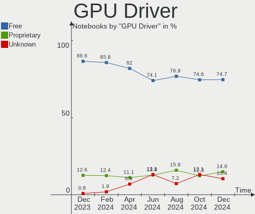
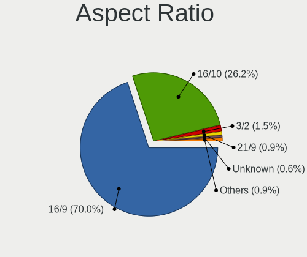
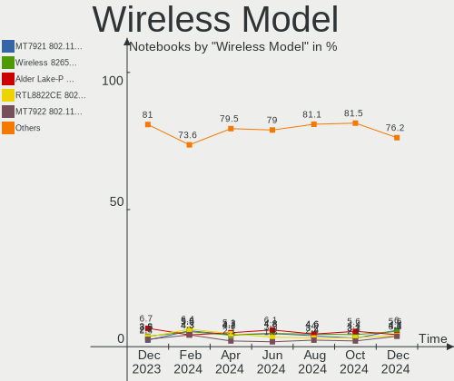
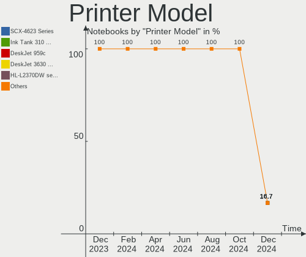
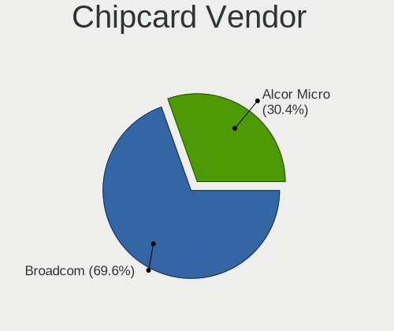

Fedora - Hardware Trends (Notebooks)
------------------------------------

A project to identify most popular hardware characteristics and track their change
over time based on data collected by Linux users at https://Linux-Hardware.org.

Anyone can contribute to this report by the [hw-probe](https://github.com/linuxhw/hw-probe) tool:

    sudo -E hw-probe -all -upload

This report is for one last month. Overall report since the beginning of time: [TestDays](https://github.com/linuxhw/TestDays)

Period: Nov, 2023.

Contents
--------

* [ System ](#system)
  - [ OS                       ](#os)
  - [ OS Family                ](#os-family)
  - [ Kernel                   ](#kernel)
  - [ Kernel Family            ](#kernel-family)
  - [ Kernel Major Ver.        ](#kernel-major-ver)
  - [ Arch                     ](#arch)
  - [ DE                       ](#de)
  - [ Display Server           ](#display-server)
  - [ Display Manager          ](#display-manager)
  - [ OS Lang                  ](#os-lang)
  - [ Boot Mode                ](#boot-mode)
  - [ Filesystem               ](#filesystem)
  - [ Part. scheme             ](#part-scheme)
  - [ Dual Boot with Linux/BSD ](#dual-boot-with-linuxbsd)
  - [ Dual Boot (Win)          ](#dual-boot-win)

* [ Board ](#board)
  - [ Vendor                   ](#vendor)
  - [ Model                    ](#model)
  - [ Model Family             ](#model-family)
  - [ MFG Year                 ](#mfg-year)
  - [ Form Factor              ](#form-factor)
  - [ Secure Boot              ](#secure-boot)
  - [ Coreboot                 ](#coreboot)
  - [ RAM Size                 ](#ram-size)
  - [ RAM Used                 ](#ram-used)
  - [ Total Drives             ](#total-drives)
  - [ Has CD-ROM               ](#has-cd-rom)
  - [ Has Ethernet             ](#has-ethernet)
  - [ Has WiFi                 ](#has-wifi)
  - [ Has Bluetooth            ](#has-bluetooth)

* [ Location ](#location)
  - [ Country                  ](#country)
  - [ City                     ](#city)

* [ Drives ](#drives)
  - [ Drive Vendor             ](#drive-vendor)
  - [ Drive Model              ](#drive-model)
  - [ HDD Vendor               ](#hdd-vendor)
  - [ SSD Vendor               ](#ssd-vendor)
  - [ Drive Kind               ](#drive-kind)
  - [ Drive Connector          ](#drive-connector)
  - [ Drive Size               ](#drive-size)
  - [ Space Total              ](#space-total)
  - [ Space Used               ](#space-used)
  - [ Malfunc. Drives          ](#malfunc-drives)
  - [ Malfunc. Drive Vendor    ](#malfunc-drive-vendor)
  - [ Malfunc. HDD Vendor      ](#malfunc-hdd-vendor)
  - [ Malfunc. Drive Kind      ](#malfunc-drive-kind)
  - [ Failed Drives            ](#failed-drives)
  - [ Failed Drive Vendor      ](#failed-drive-vendor)
  - [ Drive Status             ](#drive-status)

* [ Storage controller ](#storage-controller)
  - [ Storage Vendor           ](#storage-vendor)
  - [ Storage Model            ](#storage-model)
  - [ Storage Kind             ](#storage-kind)

* [ Processor ](#processor)
  - [ CPU Vendor               ](#cpu-vendor)
  - [ CPU Model                ](#cpu-model)
  - [ CPU Model Family         ](#cpu-model-family)
  - [ CPU Cores                ](#cpu-cores)
  - [ CPU Sockets              ](#cpu-sockets)
  - [ CPU Threads              ](#cpu-threads)
  - [ CPU Op-Modes             ](#cpu-op-modes)
  - [ CPU Microcode            ](#cpu-microcode)
  - [ CPU Microarch            ](#cpu-microarch)

* [ Graphics ](#graphics)
  - [ GPU Vendor               ](#gpu-vendor)
  - [ GPU Model                ](#gpu-model)
  - [ GPU Combo                ](#gpu-combo)
  - [ GPU Driver               ](#gpu-driver)
  - [ GPU Memory               ](#gpu-memory)

* [ Monitor ](#monitor)
  - [ Monitor Vendor           ](#monitor-vendor)
  - [ Monitor Model            ](#monitor-model)
  - [ Monitor Resolution       ](#monitor-resolution)
  - [ Monitor Diagonal         ](#monitor-diagonal)
  - [ Monitor Width            ](#monitor-width)
  - [ Aspect Ratio             ](#aspect-ratio)
  - [ Monitor Area             ](#monitor-area)
  - [ Pixel Density            ](#pixel-density)
  - [ Multiple Monitors        ](#multiple-monitors)

* [ Network ](#network)
  - [ Net Controller Vendor    ](#net-controller-vendor)
  - [ Net Controller Model     ](#net-controller-model)
  - [ Wireless Vendor          ](#wireless-vendor)
  - [ Wireless Model           ](#wireless-model)
  - [ Ethernet Vendor          ](#ethernet-vendor)
  - [ Ethernet Model           ](#ethernet-model)
  - [ Net Controller Kind      ](#net-controller-kind)
  - [ Used Controller          ](#used-controller)
  - [ NICs                     ](#nics)
  - [ IPv6                     ](#ipv6)

* [ Bluetooth ](#bluetooth)
  - [ Bluetooth Vendor         ](#bluetooth-vendor)
  - [ Bluetooth Model          ](#bluetooth-model)

* [ Sound ](#sound)
  - [ Sound Vendor             ](#sound-vendor)
  - [ Sound Model              ](#sound-model)

* [ Memory ](#memory)
  - [ Memory Vendor            ](#memory-vendor)
  - [ Memory Model             ](#memory-model)
  - [ Memory Kind              ](#memory-kind)
  - [ Memory Form Factor       ](#memory-form-factor)
  - [ Memory Size              ](#memory-size)
  - [ Memory Speed             ](#memory-speed)

* [ Printers & scanners ](#printers--scanners)
  - [ Printer Vendor           ](#printer-vendor)
  - [ Printer Model            ](#printer-model)
  - [ Scanner Vendor           ](#scanner-vendor)
  - [ Scanner Model            ](#scanner-model)

* [ Camera ](#camera)
  - [ Camera Vendor            ](#camera-vendor)
  - [ Camera Model             ](#camera-model)

* [ Security ](#security)
  - [ Fingerprint Vendor       ](#fingerprint-vendor)
  - [ Fingerprint Model        ](#fingerprint-model)
  - [ Chipcard Vendor          ](#chipcard-vendor)
  - [ Chipcard Model           ](#chipcard-model)

* [ Unsupported ](#unsupported)
  - [ Unsupported Devices      ](#unsupported-devices)
  - [ Unsupported Device Types ](#unsupported-device-types)

System
------

OS
--

Installed operating systems

| Name      | Notebooks | Percent |
|-----------|-----------|---------|
| Fedora 39 | 273       | 69.82%  |
| Fedora 38 | 103       | 26.34%  |
| Fedora 37 | 6         | 1.53%   |
| Fedora 35 | 3         | 0.77%   |
| Fedora 34 | 2         | 0.51%   |
| Fedora 33 | 2         | 0.51%   |
| Fedora 40 | 1         | 0.26%   |
| Fedora 36 | 1         | 0.26%   |

OS Family
---------

OS without a version

| Name   | Notebooks | Percent |
|--------|-----------|---------|
| Fedora | 391       | 100%    |

Kernel
------

Version of the Linux kernel

| Version                                                | Notebooks | Percent |
|--------------------------------------------------------|-----------|---------|
| 6.5.11-300.fc39.x86_64                                 | 133       | 34.02%  |
| 6.5.12-300.fc39.x86_64                                 | 53        | 13.55%  |
| 6.5.6-300.fc39.x86_64                                  | 36        | 9.21%   |
| 6.5.8-200.fc38.x86_64                                  | 33        | 8.44%   |
| 6.5.9-200.fc38.x86_64                                  | 30        | 7.67%   |
| 6.5.10-200.fc38.x86_64                                 | 19        | 4.86%   |
| 6.5.10-300.fc39.x86_64                                 | 18        | 4.6%    |
| 6.2.9-300.fc38.x86_64                                  | 11        | 2.81%   |
| 6.5.9-300.fc39.x86_64                                  | 10        | 2.56%   |
| 6.6.2-201.fc39.x86_64                                  | 9         | 2.3%    |
| 6.5.7-200.fc38.x86_64                                  | 3         | 0.77%   |
| 6.6.2-101.fc38.x86_64                                  | 2         | 0.51%   |
| 6.6.1-300.fc39.x86_64                                  | 2         | 0.51%   |
| 6.5.6-200.fc38.x86_64                                  | 2         | 0.51%   |
| 6.5.2-301.fc39.x86_64                                  | 2         | 0.51%   |
| 6.5.12-200.fc38.x86_64                                 | 2         | 0.51%   |
| 6.5.10-100.fc37.x86_64                                 | 2         | 0.51%   |
| 6.0.12-100.fc35.x86_64                                 | 2         | 0.51%   |
| 5.17.12-100.fc34.x86_64                                | 2         | 0.51%   |
| 6.7.0-0.rc2.321.vanilla.fc39.x86_64                    | 1         | 0.26%   |
| 6.7.0-0.rc1.20231117git7475e51b8796.19.fc39.x86_64     | 1         | 0.26%   |
| 6.7.0-0.rc1.20231114gt9bacdd89.316.vanilla.fc39.x86_64 | 1         | 0.26%   |
| 6.6.1-350.vanilla.fc39.x86_64                          | 1         | 0.26%   |
| 6.6.0-cb2.0.fc39.x86_64                                | 1         | 0.26%   |
| 6.6.0-61.fc40.x86_64                                   | 1         | 0.26%   |
| 6.5.7-300.fc39.x86_64                                  | 1         | 0.26%   |
| 6.5.7-100.fc37.x86_64                                  | 1         | 0.26%   |
| 6.5.6-100.fc37.x86_64                                  | 1         | 0.26%   |
| 6.5.5-200.fc38.x86_64                                  | 1         | 0.26%   |
| 6.5.12-100.fc37.x86_64                                 | 1         | 0.26%   |
| 6.5.11-200.fc38.x86_64                                 | 1         | 0.26%   |
| 6.5.10-350.vanilla.fc39.x86_64                         | 1         | 0.26%   |
| 6.5.0-rc7-12-4fc8df50fd41c2762d893211487be0ecb24c6a05+ | 1         | 0.26%   |
| 6.2.15-300.fc38.x86_64                                 | 1         | 0.26%   |
| 6.2.15-200.fc37.x86_64                                 | 1         | 0.26%   |
| 6.2.15-100.fc36.x86_64                                 | 1         | 0.26%   |
| 5.8.15-301.fc33.x86_64                                 | 1         | 0.26%   |
| 5.14.18-100.fc33.x86_64                                | 1         | 0.26%   |
| 5.14.10-300.fc35.x86_64                                | 1         | 0.26%   |

Kernel Family
-------------

Linux kernel without a distro release

| Version | Notebooks | Percent |
|---------|-----------|---------|
| 6.5.11  | 134       | 34.27%  |
| 6.5.12  | 56        | 14.32%  |
| 6.5.9   | 40        | 10.23%  |
| 6.5.10  | 40        | 10.23%  |
| 6.5.6   | 39        | 9.97%   |
| 6.5.8   | 33        | 8.44%   |
| 6.6.2   | 11        | 2.81%   |
| 6.2.9   | 11        | 2.81%   |
| 6.5.7   | 5         | 1.28%   |
| 6.7.0   | 3         | 0.77%   |
| 6.6.1   | 3         | 0.77%   |
| 6.2.15  | 3         | 0.77%   |
| 6.6.0   | 2         | 0.51%   |
| 6.5.2   | 2         | 0.51%   |
| 6.0.12  | 2         | 0.51%   |
| 5.17.12 | 2         | 0.51%   |
| 6.5.5   | 1         | 0.26%   |
| 6.5.0   | 1         | 0.26%   |
| 5.8.15  | 1         | 0.26%   |
| 5.14.18 | 1         | 0.26%   |
| 5.14.10 | 1         | 0.26%   |

Kernel Major Ver.
-----------------

Linux kernel major version

| Version | Notebooks | Percent |
|---------|-----------|---------|
| 6.5     | 351       | 89.77%  |
| 6.6     | 16        | 4.09%   |
| 6.2     | 14        | 3.58%   |
| 6.7     | 3         | 0.77%   |
| 6.0     | 2         | 0.51%   |
| 5.17    | 2         | 0.51%   |
| 5.14    | 2         | 0.51%   |
| 5.8     | 1         | 0.26%   |

Arch
----

OS architecture (x86_64, i586, etc.)

| Name   | Notebooks | Percent |
|--------|-----------|---------|
| x86_64 | 391       | 100%    |

DE
--

Desktop Environment

| Name          | Notebooks | Percent |
|---------------|-----------|---------|
| GNOME         | 316       | 80.82%  |
| KDE5          | 49        | 12.53%  |
| MATE          | 7         | 1.79%   |
| XFCE          | 3         | 0.77%   |
| Cinnamon      | 3         | 0.77%   |
| Budgie        | 3         | 0.77%   |
| LXQt          | 2         | 0.51%   |
| GNOME Classic | 2         | 0.51%   |
| Unknown       | 2         | 0.51%   |
| X-Cinnamon    | 1         | 0.26%   |
| sway          | 1         | 0.26%   |
| KDE           | 1         | 0.26%   |
| i3            | 1         | 0.26%   |

Display Server
--------------

X11 or Wayland

| Name    | Notebooks | Percent |
|---------|-----------|---------|
| Wayland | 318       | 81.33%  |
| X11     | 66        | 16.88%  |
| Tty     | 4         | 1.02%   |
| Unknown | 3         | 0.77%   |

Display Manager
---------------

SDDM, LightDM, etc.

| Name    | Notebooks | Percent |
|---------|-----------|---------|
| Unknown | 253       | 64.71%  |
| GDM     | 93        | 23.79%  |
| SDDM    | 28        | 7.16%   |
| LightDM | 16        | 4.09%   |
| KDM     | 1         | 0.26%   |

OS Lang
-------

Language

| Lang  | Notebooks | Percent |
|-------|-----------|---------|
| en_US | 183       | 46.8%   |
| en_GB | 34        | 8.7%    |
| ru_RU | 26        | 6.65%   |
| it_IT | 16        | 4.09%   |
| de_DE | 16        | 4.09%   |
| pt_BR | 15        | 3.84%   |
| fr_FR | 12        | 3.07%   |
| es_ES | 10        | 2.56%   |
| en_AU | 10        | 2.56%   |
| en_CA | 8         | 2.05%   |
| pl_PL | 7         | 1.79%   |
| en_IN | 6         | 1.53%   |
| tr_TR | 5         | 1.28%   |
| es_CL | 4         | 1.02%   |
| zh_CN | 3         | 0.77%   |
| pt_PT | 3         | 0.77%   |
| fr_CH | 2         | 0.51%   |
| es_UY | 2         | 0.51%   |
| es_PE | 2         | 0.51%   |
| es_MX | 2         | 0.51%   |
| es_CR | 2         | 0.51%   |
| en_IE | 2         | 0.51%   |
| en_DK | 2         | 0.51%   |
| zh_HK | 1         | 0.26%   |
| sk_SK | 1         | 0.26%   |
| nl_BE | 1         | 0.26%   |
| nb_NO | 1         | 0.26%   |
| hu_HU | 1         | 0.26%   |
| fr_BE | 1         | 0.26%   |
| fi_FI | 1         | 0.26%   |
| es_EC | 1         | 0.26%   |
| es_CU | 1         | 0.26%   |
| es_AR | 1         | 0.26%   |
| en_ZA | 1         | 0.26%   |
| en_SG | 1         | 0.26%   |
| en_PH | 1         | 0.26%   |
| en_NZ | 1         | 0.26%   |
| en_BW | 1         | 0.26%   |
| de_AT | 1         | 0.26%   |
| da_DK | 1         | 0.26%   |

Boot Mode
---------

EFI or BIOS

| Mode | Notebooks | Percent |
|------|-----------|---------|
| EFI  | 341       | 87.21%  |
| BIOS | 50        | 12.79%  |

Filesystem
----------

Type of filesystem

| Type  | Notebooks | Percent |
|-------|-----------|---------|
| Btrfs | 326       | 83.38%  |
| Ext4  | 57        | 14.58%  |
| Xfs   | 7         | 1.79%   |
| Ext3  | 1         | 0.26%   |

Part. scheme
------------

Scheme of partitioning

| Type    | Notebooks | Percent |
|---------|-----------|---------|
| Unknown | 251       | 64.19%  |
| GPT     | 134       | 34.27%  |
| MBR     | 6         | 1.53%   |

Dual Boot with Linux/BSD
------------------------

Hosting more than one Linux/BSD

| Dual boot | Notebooks | Percent |
|-----------|-----------|---------|
| No        | 365       | 93.35%  |
| Yes       | 26        | 6.65%   |

Dual Boot (Win)
---------------

Hosting Linux and Windows

| Dual boot | Notebooks | Percent |
|-----------|-----------|---------|
| No        | 337       | 86.19%  |
| Yes       | 54        | 13.81%  |

Board
-----

Vendor
------

Motherboard manufacturer

| Name                           | Notebooks | Percent |
|--------------------------------|-----------|---------|
| Lenovo                         | 102       | 26.09%  |
| Hewlett-Packard                | 63        | 16.11%  |
| ASUSTek Computer               | 51        | 13.04%  |
| Dell                           | 50        | 12.79%  |
| Acer                           | 26        | 6.65%   |
| Apple                          | 22        | 5.63%   |
| HUAWEI                         | 11        | 2.81%   |
| MSI                            | 10        | 2.56%   |
| Samsung Electronics            | 7         | 1.79%   |
| Timi                           | 5         | 1.28%   |
| Toshiba                        | 4         | 1.02%   |
| Sony                           | 3         | 0.77%   |
| Notebook                       | 3         | 0.77%   |
| Google                         | 3         | 0.77%   |
| Gigabyte Technology            | 3         | 0.77%   |
| Alienware                      | 3         | 0.77%   |
| Unknown                        | 3         | 0.77%   |
| XIAOMI                         | 2         | 0.51%   |
| Irbis                          | 2         | 0.51%   |
| Framework                      | 2         | 0.51%   |
| Valve                          | 1         | 0.26%   |
| Teclast                        | 1         | 0.26%   |
| SLIMBOOK                       | 1         | 0.26%   |
| Semp Toshiba                   | 1         | 0.26%   |
| Schenker                       | 1         | 0.26%   |
| POV                            | 1         | 0.26%   |
| Medion                         | 1         | 0.26%   |
| Matsushita Electric Industrial | 1         | 0.26%   |
| Linx                           | 1         | 0.26%   |
| Jumper                         | 1         | 0.26%   |
| Intel Client Systems           | 1         | 0.26%   |
| HONOR                          | 1         | 0.26%   |
| Fujitsu                        | 1         | 0.26%   |
| eMachines                      | 1         | 0.26%   |
| BTO                            | 1         | 0.26%   |
| Avell High Performance         | 1         | 0.26%   |

Model
-----

Motherboard model

| Name                                        | Notebooks | Percent |
|---------------------------------------------|-----------|---------|
| Unknown                                     | 4         | 1.02%   |
| Timi A35S                                   | 3         | 0.77%   |
| Lenovo ThinkPad X1 Carbon Gen 10 21CBCTO1WW | 3         | 0.77%   |
| Acer Aspire A515-57                         | 3         | 0.77%   |
| XIAOMI Redmi Book Pro 15 2023               | 2         | 0.51%   |
| Samsung 550P5C/550P7C                       | 2         | 0.51%   |
| Lenovo LOQ 15IRH8 82XV                      | 2         | 0.51%   |
| Lenovo G510 20238                           | 2         | 0.51%   |
| Irbis NB211                                 | 2         | 0.51%   |
| HUAWEI HVY-WXX9                             | 2         | 0.51%   |
| HUAWEI BOD-WXX9                             | 2         | 0.51%   |
| HP Pavilion Notebook                        | 2         | 0.51%   |
| HP Laptop 15-dy2xxx                         | 2         | 0.51%   |
| HP EliteBook 850 G8 Notebook PC             | 2         | 0.51%   |
| HP EliteBook 840 G4                         | 2         | 0.51%   |
| HP EliteBook 840 G2                         | 2         | 0.51%   |
| Framework Laptop 13 (AMD Ryzen 7040Series)  | 2         | 0.51%   |
| Dell Precision M3800                        | 2         | 0.51%   |
| ASUS Zenbook UM3402YA_UM3402YA              | 2         | 0.51%   |
| Apple MacBookPro15,2                        | 2         | 0.51%   |
| Apple MacBookPro11,3                        | 2         | 0.51%   |
| Apple MacBookPro11,1                        | 2         | 0.51%   |
| Valve Jupiter                               | 1         | 0.26%   |
| Toshiba Satellite S55-B                     | 1         | 0.26%   |
| Toshiba Satellite L845                      | 1         | 0.26%   |
| Toshiba Satellite L515                      | 1         | 0.26%   |
| Toshiba Satellite C70-B                     | 1         | 0.26%   |
| Timi TM1701                                 | 1         | 0.26%   |
| Timi RedmiBook 15                           | 1         | 0.26%   |
| Teclast F6S                                 | 1         | 0.26%   |
| Sony VPCEH3J1E                              | 1         | 0.26%   |
| Sony VGN-FZ140E                             | 1         | 0.26%   |
| Sony SVF15N17CXB                            | 1         | 0.26%   |
| SLIMBOOK PROX14-AMD                         | 1         | 0.26%   |
| Semp Toshiba IS 1412                        | 1         | 0.26%   |
| Schenker VIA 15 Pro                         | 1         | 0.26%   |
| Samsung RF511/RF411/RF711                   | 1         | 0.26%   |
| Samsung QX311/QX411/QX412/QX511             | 1         | 0.26%   |
| Samsung 700Z3A/700Z4A/700Z5A/700Z5B         | 1         | 0.26%   |
| Samsung 305V4A/305V5A/3415VA                | 1         | 0.26%   |

Model Family
------------

Motherboard model prefix

| Name               | Notebooks | Percent |
|--------------------|-----------|---------|
| Lenovo ThinkPad    | 58        | 14.83%  |
| Lenovo IdeaPad     | 21        | 5.37%   |
| Dell Inspiron      | 16        | 4.09%   |
| ASUS VivoBook      | 15        | 3.84%   |
| Acer Aspire        | 15        | 3.84%   |
| Dell Latitude      | 14        | 3.58%   |
| HP Laptop          | 13        | 3.32%   |
| HP EliteBook       | 12        | 3.07%   |
| ASUS ASUS          | 10        | 2.56%   |
| HP ProBook         | 9         | 2.3%    |
| Lenovo Legion      | 7         | 1.79%   |
| HP Pavilion        | 7         | 1.79%   |
| Dell XPS           | 7         | 1.79%   |
| ASUS ROG           | 7         | 1.79%   |
| ASUS Zenbook       | 6         | 1.53%   |
| Dell Precision     | 5         | 1.28%   |
| Apple MacBookPro11 | 5         | 1.28%   |
| Toshiba Satellite  | 4         | 1.02%   |
| Lenovo Yoga        | 4         | 1.02%   |
| Dell Vostro        | 4         | 1.02%   |
| Acer Nitro         | 4         | 1.02%   |
| Unknown            | 4         | 1.02%   |
| Timi A35S          | 3         | 0.77%   |
| HP ZBook           | 3         | 0.77%   |
| HP OMEN            | 3         | 0.77%   |
| HP ENVY            | 3         | 0.77%   |
| HP 250             | 3         | 0.77%   |
| Acer Predator      | 3         | 0.77%   |
| XIAOMI Redmi       | 2         | 0.51%   |
| Samsung 550P5C     | 2         | 0.51%   |
| MSI Prestige       | 2         | 0.51%   |
| Lenovo LOQ         | 2         | 0.51%   |
| Lenovo G510        | 2         | 0.51%   |
| Irbis NB211        | 2         | 0.51%   |
| HUAWEI HVY-WXX9    | 2         | 0.51%   |
| HUAWEI BOD-WXX9    | 2         | 0.51%   |
| HP Compaq          | 2         | 0.51%   |
| HP 255             | 2         | 0.51%   |
| Gigabyte B550M     | 2         | 0.51%   |
| Framework Laptop   | 2         | 0.51%   |

MFG Year
--------

Motherboard manufacture year

| Year | Notebooks | Percent |
|------|-----------|---------|
| 2021 | 58        | 14.83%  |
| 2020 | 45        | 11.51%  |
| 2022 | 42        | 10.74%  |
| 2023 | 40        | 10.23%  |
| 2018 | 31        | 7.93%   |
| 2019 | 27        | 6.91%   |
| 2017 | 27        | 6.91%   |
| 2015 | 20        | 5.12%   |
| 2013 | 19        | 4.86%   |
| 2012 | 18        | 4.6%    |
| 2016 | 15        | 3.84%   |
| 2014 | 14        | 3.58%   |
| 2011 | 11        | 2.81%   |
| 2009 | 8         | 2.05%   |
| 2008 | 6         | 1.53%   |
| 2010 | 5         | 1.28%   |
| 2007 | 5         | 1.28%   |

Form Factor
-----------

Physical design of the computer

| Name     | Notebooks | Percent |
|----------|-----------|---------|
| Notebook | 391       | 100%    |

Secure Boot
-----------

Enabled or disabled

| State    | Notebooks | Percent |
|----------|-----------|---------|
| Disabled | 289       | 73.91%  |
| Enabled  | 102       | 26.09%  |

Coreboot
--------

Have coreboot on board

| Used | Notebooks | Percent |
|------|-----------|---------|
| No   | 387       | 98.98%  |
| Yes  | 4         | 1.02%   |

RAM Size
--------

Total RAM memory

| Size in GB  | Notebooks | Percent |
|-------------|-----------|---------|
| 4.01-8.0    | 114       | 29.16%  |
| 16.01-24.0  | 87        | 22.25%  |
| 8.01-16.0   | 81        | 20.72%  |
| 32.01-64.0  | 50        | 12.79%  |
| 3.01-4.0    | 25        | 6.39%   |
| 24.01-32.0  | 17        | 4.35%   |
| 64.01-256.0 | 8         | 2.05%   |
| 2.01-3.0    | 6         | 1.53%   |
| 1.01-2.0    | 3         | 0.77%   |

RAM Used
--------

Used RAM memory

| Used GB    | Notebooks | Percent |
|------------|-----------|---------|
| 2.01-3.0   | 114       | 29.16%  |
| 4.01-8.0   | 111       | 28.39%  |
| 3.01-4.0   | 95        | 24.3%   |
| 1.01-2.0   | 38        | 9.72%   |
| 8.01-16.0  | 27        | 6.91%   |
| 16.01-24.0 | 4         | 1.02%   |
| 32.01-64.0 | 1         | 0.26%   |
| 0.51-1.0   | 1         | 0.26%   |

Total Drives
------------

Number of drives on board

| Drives | Notebooks | Percent |
|--------|-----------|---------|
| 1      | 299       | 76.47%  |
| 2      | 85        | 21.74%  |
| 3      | 5         | 1.28%   |
| 4      | 2         | 0.51%   |

Has CD-ROM
----------

Has CD-ROM on board

| Presented | Notebooks | Percent |
|-----------|-----------|---------|
| No        | 317       | 81.07%  |
| Yes       | 74        | 18.93%  |

Has Ethernet
------------

Has Ethernet on board

| Presented | Notebooks | Percent |
|-----------|-----------|---------|
| Yes       | 275       | 70.33%  |
| No        | 116       | 29.67%  |

Has WiFi
--------

Has WiFi module

| Presented | Notebooks | Percent |
|-----------|-----------|---------|
| Yes       | 380       | 97.19%  |
| No        | 11        | 2.81%   |

Has Bluetooth
-------------

Has Bluetooth module

| Presented | Notebooks | Percent |
|-----------|-----------|---------|
| Yes       | 330       | 84.4%   |
| No        | 61        | 15.6%   |

Location
--------

Country
-------

Geographic location (country)

| Country     | Notebooks | Percent |
|-------------|-----------|---------|
| USA         | 51        | 13.04%  |
| Russia      | 29        | 7.42%   |
| Germany     | 27        | 6.91%   |
| Italy       | 23        | 5.88%   |
| Brazil      | 21        | 5.37%   |
| UK          | 16        | 4.09%   |
| Poland      | 15        | 3.84%   |
| Canada      | 14        | 3.58%   |
| France      | 13        | 3.32%   |
| India       | 11        | 2.81%   |
| Spain       | 10        | 2.56%   |
| Netherlands | 10        | 2.56%   |
| Australia   | 10        | 2.56%   |
| Romania     | 9         | 2.3%    |
| Mexico      | 8         | 2.05%   |
| Turkey      | 6         | 1.53%   |
| Switzerland | 6         | 1.53%   |
| Belgium     | 6         | 1.53%   |
| Slovakia    | 5         | 1.28%   |
| Portugal    | 5         | 1.28%   |
| Hungary     | 5         | 1.28%   |
| Denmark     | 5         | 1.28%   |
| Chile       | 5         | 1.28%   |
| Finland     | 4         | 1.02%   |
| Croatia     | 4         | 1.02%   |
| Uruguay     | 3         | 0.77%   |
| Philippines | 3         | 0.77%   |
| Peru        | 3         | 0.77%   |
| Georgia     | 3         | 0.77%   |
| China       | 3         | 0.77%   |
| Belarus     | 3         | 0.77%   |
| Austria     | 3         | 0.77%   |
| Taiwan      | 2         | 0.51%   |
| Sweden      | 2         | 0.51%   |
| Singapore   | 2         | 0.51%   |
| Norway      | 2         | 0.51%   |
| Ireland     | 2         | 0.51%   |
| Greece      | 2         | 0.51%   |
| Czechia     | 2         | 0.51%   |
| Costa Rica  | 2         | 0.51%   |

City
----

Geographic location (city)

| City          | Notebooks | Percent |
|---------------|-----------|---------|
| Moscow        | 8         | 2.05%   |
| Warsaw        | 5         | 1.28%   |
| Paris         | 5         | 1.28%   |
| Berlin        | 5         | 1.28%   |
| Yekaterinburg | 4         | 1.02%   |
| Helsinki      | 4         | 1.02%   |
| Zagreb        | 3         | 0.77%   |
| Toronto       | 3         | 0.77%   |
| Sydney        | 3         | 0.77%   |
| St Petersburg | 3         | 0.77%   |
| Sao Paulo     | 3         | 0.77%   |
| Santiago      | 3         | 0.77%   |
| Perm          | 3         | 0.77%   |
| Naaldwijk     | 3         | 0.77%   |
| Munich        | 3         | 0.77%   |
| Montevideo    | 3         | 0.77%   |
| Lewisham      | 3         | 0.77%   |
| Brisbane      | 3         | 0.77%   |
| Amsterdam     | 3         | 0.77%   |
| Zurich        | 2         | 0.51%   |
| Singapore     | 2         | 0.51%   |
| Santander     | 2         | 0.51%   |
| Porto Alegre  | 2         | 0.51%   |
| New York      | 2         | 0.51%   |
| Mumbai        | 2         | 0.51%   |
| Minsk         | 2         | 0.51%   |
| Milano        | 2         | 0.51%   |
| Milan         | 2         | 0.51%   |
| Mexico City   | 2         | 0.51%   |
| Madrid        | 2         | 0.51%   |
| Linz          | 2         | 0.51%   |
| Lima          | 2         | 0.51%   |
| Leipzig       | 2         | 0.51%   |
| Istanbul      | 2         | 0.51%   |
| Hamburg       | 2         | 0.51%   |
| Ghent         | 2         | 0.51%   |
| Geneva        | 2         | 0.51%   |
| Edison        | 2         | 0.51%   |
| Dublin        | 2         | 0.51%   |
| Concepción   | 2         | 0.51%   |

Drives
------

Drive Vendor
------------

Hard drive vendors

| Vendor                      | Notebooks | Drives | Percent |
|-----------------------------|-----------|--------|---------|
| Samsung Electronics         | 96        | 104    | 20.65%  |
| Sandisk                     | 40        | 41     | 8.6%    |
| WDC                         | 33        | 34     | 7.1%    |
| Micron Technology           | 33        | 33     | 7.1%    |
| SK hynix                    | 31        | 32     | 6.67%   |
| Intel                       | 26        | 28     | 5.59%   |
| Seagate                     | 25        | 29     | 5.38%   |
| Toshiba                     | 22        | 22     | 4.73%   |
| Unknown                     | 19        | 23     | 4.09%   |
| Kingston                    | 16        | 17     | 3.44%   |
| Apple                       | 14        | 16     | 3.01%   |
| Crucial                     | 12        | 12     | 2.58%   |
| KIOXIA                      | 10        | 10     | 2.15%   |
| Phison Electronics          | 7         | 7      | 1.51%   |
| Kingston Technology Company | 7         | 7      | 1.51%   |
| Silicon Motion              | 6         | 6      | 1.29%   |
| Micron/Crucial Technology   | 6         | 6      | 1.29%   |
| Hitachi                     | 6         | 6      | 1.29%   |
| HGST                        | 5         | 5      | 1.08%   |
| PNY                         | 4         | 4      | 0.86%   |
| China                       | 4         | 4      | 0.86%   |
| ADATA Technology            | 4         | 5      | 0.86%   |
| A-DATA Technology           | 4         | 4      | 0.86%   |
| SPCC                        | 3         | 3      | 0.65%   |
| Union Memory                | 2         | 2      | 0.43%   |
| Solid State Storage         | 2         | 2      | 0.43%   |
| Lexar                       | 2         | 2      | 0.43%   |
| Lenovo                      | 2         | 2      | 0.43%   |
| Yangtze Memory Technologies | 1         | 1      | 0.22%   |
| Transcend                   | 1         | 1      | 0.22%   |
| Timetec                     | 1         | 1      | 0.22%   |
| Teclast                     | 1         | 1      | 0.22%   |
| Team                        | 1         | 1      | 0.22%   |
| Realtek Semiconductor       | 1         | 1      | 0.22%   |
| POWER                       | 1         | 1      | 0.22%   |
| Plextor                     | 1         | 1      | 0.22%   |
| Phison                      | 1         | 1      | 0.22%   |
| Patriot                     | 1         | 1      | 0.22%   |
| MAXIO Technology (Hangzhou) | 1         | 1      | 0.22%   |
| LDLC                        | 1         | 1      | 0.22%   |

Drive Model
-----------

Hard drive models

| Model                                                 | Notebooks | Percent |
|-------------------------------------------------------|-----------|---------|
| Samsung NVMe SSD Controller SM981/PM981/PM983 250GB   | 23        | 4.77%   |
| Samsung NVMe SSD Controller PM9A1/PM9A3/980PRO 2TB    | 22        | 4.56%   |
| Intel SSDPEKNU512GZ 512GB                             | 11        | 2.28%   |
| Sandisk WD Blue SN550 NVMe SSD 512GB                  | 10        | 2.07%   |
| Unknown MMC Card  32GB                                | 6         | 1.24%   |
| Unknown MMC Card  128GB                               | 6         | 1.24%   |
| Micron/Crucial P2 NVMe PCIe SSD 1TB                   | 6         | 1.24%   |
| Intel SSD 660P Series 512GB                           | 6         | 1.24%   |
| SK hynix BC501 NVMe Solid State Drive 512GB           | 5         | 1.04%   |
| Toshiba XG6 NVMe SSD Controller 512GB                 | 4         | 0.83%   |
| Sandisk WD_BLACK SN770 1TB                            | 4         | 0.83%   |
| Samsung NVMe SSD Controller SM961/PM961/SM963 256GB   | 4         | 0.83%   |
| Phison PS5013 E13 NVMe Controller 512GB               | 4         | 0.83%   |
| Micron 2400_MTFDKBA1T0QFM 1TB                         | 4         | 0.83%   |
| Micron 2210_MTFDHBA512QFD 512GB                       | 4         | 0.83%   |
| Kingston SA400S37480G 480GB SSD                       | 4         | 0.83%   |
| WDC WD10SPZX-21Z10T0 1TB                              | 3         | 0.62%   |
| Toshiba MQ04ABF100 1TB                                | 3         | 0.62%   |
| SK hynix HFM512GD3JX013N 512GB                        | 3         | 0.62%   |
| Silicon Motion SM2263EN/SM2263XT SSD Controller 256GB | 3         | 0.62%   |
| Sandisk WD Blue SN570 1TB                             | 3         | 0.62%   |
| Samsung SSD 870 EVO 500GB                             | 3         | 0.62%   |
| Samsung MZVLQ512HBLU-00B00 512GB                      | 3         | 0.62%   |
| Micron 3400_MTFDKBA1T0TFH 1TB                         | 3         | 0.62%   |
| Micron 2450_MTFDKBA512TFK 512GB                       | 3         | 0.62%   |
| Micron 2400_MTFDKBA512QFM 512GB                       | 3         | 0.62%   |
| Kingston Company OM3PDP3 NVMe SSD 256GB               | 3         | 0.62%   |
| HGST HTS721010A9E630 1TB                              | 3         | 0.62%   |
| Crucial CT500MX500SSD1 500GB                          | 3         | 0.62%   |
| Apple SSD SM0512F 500GB                               | 3         | 0.62%   |
| Apple ANS2 NVMe Controller 256GB                      | 3         | 0.62%   |
| WDC WDS100T2B0A-00SM50 1TB SSD                        | 2         | 0.41%   |
| WDC WD5000LPCX-60VHAT1 500GB                          | 2         | 0.41%   |
| WDC WD10SPZX-24Z10 1TB                                | 2         | 0.41%   |
| Unknown NVMe SSD Drive 1TB                            | 2         | 0.41%   |
| Unknown MMC Card  64GB                                | 2         | 0.41%   |
| Toshiba MQ01ABF050 500GB                              | 2         | 0.41%   |
| Toshiba BG3 NVMe SSD Controller 128GB                 | 2         | 0.41%   |
| SPCC Solid State Disk 512GB                           | 2         | 0.41%   |
| SK hynix SKHynix_HFS001TEJ9X162N 1TB                  | 2         | 0.41%   |

HDD Vendor
----------

Hard disk drive vendors

| Vendor   | Notebooks | Drives | Percent |
|----------|-----------|--------|---------|
| WDC      | 23        | 23     | 33.82%  |
| Seagate  | 23        | 24     | 33.82%  |
| Toshiba  | 10        | 10     | 14.71%  |
| Hitachi  | 6         | 6      | 8.82%   |
| HGST     | 5         | 5      | 7.35%   |
| HGST HTS | 1         | 1      | 1.47%   |

SSD Vendor
----------

Solid state drive vendors

| Vendor              | Notebooks | Drives | Percent |
|---------------------|-----------|--------|---------|
| Samsung Electronics | 28        | 28     | 22.76%  |
| Crucial             | 12        | 12     | 9.76%   |
| WDC                 | 11        | 11     | 8.94%   |
| SanDisk             | 11        | 11     | 8.94%   |
| Kingston            | 11        | 12     | 8.94%   |
| Apple               | 9         | 9      | 7.32%   |
| PNY                 | 4         | 4      | 3.25%   |
| China               | 4         | 4      | 3.25%   |
| SPCC                | 3         | 3      | 2.44%   |
| SK hynix            | 3         | 3      | 2.44%   |
| A-DATA Technology   | 3         | 3      | 2.44%   |
| Toshiba             | 2         | 2      | 1.63%   |
| Micron Technology   | 2         | 2      | 1.63%   |
| Lexar               | 2         | 2      | 1.63%   |
| Lenovo              | 2         | 2      | 1.63%   |
| Intel               | 2         | 2      | 1.63%   |
| Transcend           | 1         | 1      | 0.81%   |
| Timetec             | 1         | 1      | 0.81%   |
| Teclast             | 1         | 1      | 0.81%   |
| Team                | 1         | 1      | 0.81%   |
| Seagate             | 1         | 2      | 0.81%   |
| POWER               | 1         | 1      | 0.81%   |
| Plextor             | 1         | 1      | 0.81%   |
| Patriot             | 1         | 1      | 0.81%   |
| LDLC                | 1         | 1      | 0.81%   |
| KingSpec            | 1         | 1      | 0.81%   |
| KingDian            | 1         | 1      | 0.81%   |
| Hewlett-Packard     | 1         | 1      | 0.81%   |
| GOODRAM             | 1         | 1      | 0.81%   |
| FORESEE             | 1         | 1      | 0.81%   |

Drive Kind
----------

HDD or SSD

| Kind    | Notebooks | Drives | Percent |
|---------|-----------|--------|---------|
| NVMe    | 241       | 271    | 54.4%   |
| SSD     | 114       | 125    | 25.73%  |
| HDD     | 67        | 69     | 15.12%  |
| MMC     | 15        | 19     | 3.39%   |
| Unknown | 6         | 6      | 1.35%   |

Drive Connector
---------------

SATA, SAS, NVMe, etc.

| Type | Notebooks | Drives | Percent |
|------|-----------|--------|---------|
| NVMe | 241       | 271    | 56.05%  |
| SATA | 160       | 183    | 37.21%  |
| MMC  | 15        | 19     | 3.49%   |
| SAS  | 14        | 17     | 3.26%   |

Drive Size
----------

Size of hard drive

| Size in TB | Notebooks | Drives | Percent |
|------------|-----------|--------|---------|
| 0.01-0.5   | 120       | 133    | 66.67%  |
| 0.51-1.0   | 52        | 53     | 28.89%  |
| 1.01-2.0   | 7         | 7      | 3.89%   |
| 3.01-4.0   | 1         | 1      | 0.56%   |

Space Total
-----------

Amount of disk space available on the file system

| Size in GB     | Notebooks | Percent |
|----------------|-----------|---------|
| 501-1000       | 93        | 23.79%  |
| 251-500        | 80        | 20.46%  |
| 1001-2000      | 51        | 13.04%  |
| Unknown        | 48        | 12.28%  |
| 101-250        | 40        | 10.23%  |
| 1-20           | 38        | 9.72%   |
| 51-100         | 17        | 4.35%   |
| More than 3000 | 10        | 2.56%   |
| 2001-3000      | 8         | 2.05%   |
| 21-50          | 6         | 1.53%   |

Space Used
----------

Amount of used disk space

| Used GB        | Notebooks | Percent |
|----------------|-----------|---------|
| 1-20           | 134       | 34.27%  |
| 21-50          | 59        | 15.09%  |
| 101-250        | 48        | 12.28%  |
| Unknown        | 48        | 12.28%  |
| 51-100         | 37        | 9.46%   |
| 251-500        | 35        | 8.95%   |
| 501-1000       | 17        | 4.35%   |
| 1001-2000      | 12        | 3.07%   |
| More than 3000 | 1         | 0.26%   |

Malfunc. Drives
---------------

Drive models with a malfunction

| Model                                 | Notebooks | Drives | Percent |
|---------------------------------------|-----------|--------|---------|
| WDC WD Green 2.5 480GB                | 1         | 1      | 10%     |
| WDC WD Blue SA510 2.5 500GB           | 1         | 1      | 10%     |
| Toshiba MQ01ABF050 500GB              | 1         | 1      | 10%     |
| SK hynix HFS256G39MND-2300A 256GB SSD | 1         | 1      | 10%     |
| SK hynix HFS128G39TND-N210A 128GB SSD | 1         | 1      | 10%     |
| SanDisk SSD PLUS 1000GB               | 1         | 1      | 10%     |
| Hitachi HTS547575A9E384 752GB         | 1         | 1      | 10%     |
| Hitachi HTS545050B9A300 500GB         | 1         | 1      | 10%     |
| HGST HTS721010A9E630 1TB              | 1         | 1      | 10%     |
| Crucial CT128MX100SSD1 128GB          | 1         | 1      | 10%     |

Malfunc. Drive Vendor
---------------------

Vendors of faulty drives

| Vendor   | Notebooks | Drives | Percent |
|----------|-----------|--------|---------|
| WDC      | 2         | 2      | 20%     |
| SK hynix | 2         | 2      | 20%     |
| Hitachi  | 2         | 2      | 20%     |
| Toshiba  | 1         | 1      | 10%     |
| SanDisk  | 1         | 1      | 10%     |
| HGST     | 1         | 1      | 10%     |
| Crucial  | 1         | 1      | 10%     |

Malfunc. HDD Vendor
-------------------

Vendors of faulty HDD drives

| Vendor  | Notebooks | Drives | Percent |
|---------|-----------|--------|---------|
| Hitachi | 2         | 2      | 50%     |
| Toshiba | 1         | 1      | 25%     |
| HGST    | 1         | 1      | 25%     |

Malfunc. Drive Kind
-------------------

Kinds of faulty drives

| Kind | Notebooks | Drives | Percent |
|------|-----------|--------|---------|
| SSD  | 6         | 6      | 60%     |
| HDD  | 4         | 4      | 40%     |

Failed Drives
-------------

Failed drive models

Zero info for selected period =(

Failed Drive Vendor
-------------------

Failed drive vendors

Zero info for selected period =(

Drive Status
------------

Number of failed and malfunc. drives

| Status   | Notebooks | Drives | Percent |
|----------|-----------|--------|---------|
| Detected | 268       | 332    | 66.67%  |
| Works    | 124       | 148    | 30.85%  |
| Malfunc  | 10        | 10     | 2.49%   |

Storage controller
------------------

Storage Vendor
--------------

Storage controller vendors

| Vendor                         | Notebooks | Percent |
|--------------------------------|-----------|---------|
| Intel                          | 203       | 41.09%  |
| Samsung Electronics            | 78        | 15.79%  |
| AMD                            | 46        | 9.31%   |
| Micron Technology              | 31        | 6.28%   |
| SanDisk                        | 29        | 5.87%   |
| SK hynix                       | 28        | 5.67%   |
| Kingston Technology Company    | 12        | 2.43%   |
| Toshiba America Info Systems   | 11        | 2.23%   |
| KIOXIA                         | 11        | 2.23%   |
| Phison Electronics             | 8         | 1.62%   |
| Silicon Motion                 | 6         | 1.21%   |
| Micron/Crucial Technology      | 6         | 1.21%   |
| Apple                          | 5         | 1.01%   |
| ADATA Technology               | 5         | 1.01%   |
| Solidigm                       | 4         | 0.81%   |
| Union Memory (Shenzhen)        | 2         | 0.4%    |
| Solid State Storage Technology | 2         | 0.4%    |
| Nvidia                         | 2         | 0.4%    |
| Seagate Technology             | 1         | 0.2%    |
| Realtek Semiconductor          | 1         | 0.2%    |
| MAXIO Technology (Hangzhou)    | 1         | 0.2%    |
| Marvell Technology Group       | 1         | 0.2%    |
| INNOGRIT                       | 1         | 0.2%    |

Storage Model
-------------

Storage controller models

| Model                                                                          | Notebooks | Percent |
|--------------------------------------------------------------------------------|-----------|---------|
| AMD FCH SATA Controller [AHCI mode]                                            | 41        | 7.71%   |
| Intel Volume Management Device NVMe RAID Controller                            | 33        | 6.2%    |
| Intel Sunrise Point-LP SATA Controller [AHCI mode]                             | 24        | 4.51%   |
| Samsung NVMe SSD Controller SM981/PM981/PM983                                  | 23        | 4.32%   |
| Samsung NVMe SSD Controller PM9A1/PM9A3/980PRO                                 | 22        | 4.14%   |
| Samsung NVMe SSD Controller 980 (DRAM-less)                                    | 16        | 3.01%   |
| Intel SSD 670p Series [Keystone Harbor]                                        | 16        | 3.01%   |
| Intel Wildcat Point-LP SATA Controller [AHCI Mode]                             | 13        | 2.44%   |
| SK hynix Gold P31/BC711/PC711 NVMe Solid State Drive                           | 12        | 2.26%   |
| Intel Tiger Lake-LP SATA Controller                                            | 12        | 2.26%   |
| Intel 8 Series/C220 Series Chipset Family 6-port SATA Controller 1 [AHCI mode] | 12        | 2.26%   |
| Intel 7 Series Chipset Family 6-port SATA Controller [AHCI mode]               | 12        | 2.26%   |
| Intel 6 Series/C200 Series Chipset Family 6 port Mobile SATA AHCI Controller   | 12        | 2.26%   |
| SanDisk Ultra 3D / WD Blue SN550 NVMe SSD                                      | 10        | 1.88%   |
| Intel 82801 Mobile SATA Controller [RAID mode]                                 | 10        | 1.88%   |
| Micron 2400 NVMe SSD (DRAM-less)                                               | 9         | 1.69%   |
| Intel Alder Lake-P SATA AHCI Controller                                        | 9         | 1.69%   |
| Intel 82801HM/HEM (ICH8M/ICH8M-E) SATA Controller [AHCI mode]                  | 8         | 1.5%    |
| Intel 82801HM/HEM (ICH8M/ICH8M-E) IDE Controller                               | 8         | 1.5%    |
| SanDisk WD Black SN770 / PC SN740 256GB / PC SN560 (DRAM-less) NVMe SSD        | 7         | 1.32%   |
| KIOXIA NVMe SSD Controller BG4 (DRAM-less)                                     | 7         | 1.32%   |
| Intel Comet Lake SATA AHCI Controller                                          | 7         | 1.32%   |
| Intel Cannon Lake Mobile PCH SATA AHCI Controller                              | 7         | 1.32%   |
| Samsung NVMe SSD Controller PM9B1 (DRAM-less)                                  | 6         | 1.13%   |
| Micron/Crucial P2 [Nick P2] / P3 / P3 Plus NVMe PCIe SSD (DRAM-less)           | 6         | 1.13%   |
| Micron 3400 NVMe SSD [Hendrix]                                                 | 6         | 1.13%   |
| Micron 2450 NVMe SSD [HendrixV] (DRAM-less)                                    | 6         | 1.13%   |
| Micron 2210 NVMe SSD [Cobain]                                                  | 6         | 1.13%   |
| Intel SSD 660P Series                                                          | 6         | 1.13%   |
| SK hynix Platinum P41/PC801 NVMe Solid State Drive                             | 5         | 0.94%   |
| SK hynix BC501 NVMe Solid State Drive                                          | 5         | 0.94%   |
| Samsung S4LN053X01 AHCI SSD Controller(Apple slot)                             | 5         | 0.94%   |
| Toshiba America Info Systems XG6 NVMe SSD Controller                           | 4         | 0.75%   |
| Solidigm P41 Plus NVMe SSD (DRAM-less) [Echo Harbor]                           | 4         | 0.75%   |
| SanDisk Ultra 3D / WD Blue SN570 NVMe SSD (DRAM-less)                          | 4         | 0.75%   |
| Samsung NVMe SSD Controller SM961/PM961/SM963                                  | 4         | 0.75%   |
| Phison PS5013-E13 PCIe3 NVMe Controller (DRAM-less)                            | 4         | 0.75%   |
| Intel HM170/QM170 Chipset SATA Controller [AHCI Mode]                          | 4         | 0.75%   |
| Intel Celeron N3350/Pentium N4200/Atom E3900 Series SATA AHCI Controller       | 4         | 0.75%   |
| Intel 5 Series/3400 Series Chipset 6 port SATA AHCI Controller                 | 4         | 0.75%   |

Storage Kind
------------

Kind of storage controller (IDE, SATA, NVMe, SAS, ...)

| Kind | Notebooks | Percent |
|------|-----------|---------|
| NVMe | 240       | 47.34%  |
| SATA | 209       | 41.22%  |
| RAID | 45        | 8.88%   |
| IDE  | 13        | 2.56%   |

Processor
---------

CPU Vendor
----------

Processor vendors

| Vendor | Notebooks | Percent |
|--------|-----------|---------|
| Intel  | 285       | 72.89%  |
| AMD    | 106       | 27.11%  |

CPU Model
---------

Processor models

| Model                                         | Notebooks | Percent |
|-----------------------------------------------|-----------|---------|
| Intel 11th Gen Core i5-1135G7 @ 2.40GHz       | 10        | 2.56%   |
| Intel Core i7-7500U CPU @ 2.70GHz             | 8         | 2.05%   |
| AMD Ryzen 5 5500U with Radeon Graphics        | 8         | 2.05%   |
| Intel Core i5-10210U CPU @ 1.60GHz            | 7         | 1.79%   |
| Intel 11th Gen Core i7-1165G7 @ 2.80GHz       | 7         | 1.79%   |
| AMD Ryzen 7 5800H with Radeon Graphics        | 6         | 1.53%   |
| AMD Ryzen 7 5700U with Radeon Graphics        | 6         | 1.53%   |
| Intel Core i7-6500U CPU @ 2.50GHz             | 5         | 1.28%   |
| Intel Core i5-7200U CPU @ 2.50GHz             | 5         | 1.28%   |
| Intel Core i5-5200U CPU @ 2.20GHz             | 5         | 1.28%   |
| Intel 11th Gen Core i3-1115G4 @ 3.00GHz       | 5         | 1.28%   |
| AMD Ryzen 7 4800H with Radeon Graphics        | 5         | 1.28%   |
| Intel Core i7-8650U CPU @ 1.90GHz             | 4         | 1.02%   |
| Intel Core i5-8250U CPU @ 1.60GHz             | 4         | 1.02%   |
| Intel Core i3-8130U CPU @ 2.20GHz             | 4         | 1.02%   |
| Intel Celeron CPU N3350 @ 1.10GHz             | 4         | 1.02%   |
| Intel 12th Gen Core i7-12700H                 | 4         | 1.02%   |
| Intel 12th Gen Core i5-12450H                 | 4         | 1.02%   |
| Intel 11th Gen Core i7-1185G7 @ 3.00GHz       | 4         | 1.02%   |
| AMD Ryzen 5 4600H with Radeon Graphics        | 4         | 1.02%   |
| AMD Ryzen 5 3500U with Radeon Vega Mobile Gfx | 4         | 1.02%   |
| Intel Core i7-9750H CPU @ 2.60GHz             | 3         | 0.77%   |
| Intel Core i7-8565U CPU @ 1.80GHz             | 3         | 0.77%   |
| Intel Core i7-7820HQ CPU @ 2.90GHz            | 3         | 0.77%   |
| Intel Core i7-6700HQ CPU @ 2.60GHz            | 3         | 0.77%   |
| Intel Core i7-5500U CPU @ 2.40GHz             | 3         | 0.77%   |
| Intel Core i7-4500U CPU @ 1.80GHz             | 3         | 0.77%   |
| Intel Core i7-10850H CPU @ 2.70GHz            | 3         | 0.77%   |
| Intel Core i5-8300H CPU @ 2.30GHz             | 3         | 0.77%   |
| Intel Core i5-6200U CPU @ 2.30GHz             | 3         | 0.77%   |
| Intel Core i5-5300U CPU @ 2.30GHz             | 3         | 0.77%   |
| Intel Core i5-4200M CPU @ 2.50GHz             | 3         | 0.77%   |
| Intel Core i5-3230M CPU @ 2.60GHz             | 3         | 0.77%   |
| Intel 13th Gen Core i9-13980HX                | 3         | 0.77%   |
| Intel 12th Gen Core i7-12650H                 | 3         | 0.77%   |
| Intel 12th Gen Core i7-1255U                  | 3         | 0.77%   |
| Intel 12th Gen Core i5-12500H                 | 3         | 0.77%   |
| Intel 12th Gen Core i5-1235U                  | 3         | 0.77%   |
| Intel 11th Gen Core i7-11800H @ 2.30GHz       | 3         | 0.77%   |
| Intel 11th Gen Core i5-1155G7 @ 2.50GHz       | 3         | 0.77%   |

CPU Model Family
----------------

Processor model prefix

| Model                   | Notebooks | Percent |
|-------------------------|-----------|---------|
| Other                   | 88        | 22.51%  |
| Intel Core i7           | 79        | 20.2%   |
| Intel Core i5           | 70        | 17.9%   |
| AMD Ryzen 7             | 36        | 9.21%   |
| AMD Ryzen 5             | 34        | 8.7%    |
| Intel Core i3           | 15        | 3.84%   |
| Intel Core 2 Duo        | 10        | 2.56%   |
| AMD Ryzen 7 PRO         | 9         | 2.3%    |
| Intel Celeron           | 8         | 2.05%   |
| AMD Ryzen 9             | 7         | 1.79%   |
| Intel Atom              | 4         | 1.02%   |
| Intel Pentium           | 3         | 0.77%   |
| Intel Core i9           | 3         | 0.77%   |
| AMD Ryzen 5 PRO         | 3         | 0.77%   |
| AMD Ryzen 3             | 3         | 0.77%   |
| Intel Pentium Dual-Core | 2         | 0.51%   |
| Intel Pentium Dual      | 2         | 0.51%   |
| AMD E2                  | 2         | 0.51%   |
| AMD Athlon II           | 2         | 0.51%   |
| AMD A8                  | 2         | 0.51%   |
| AMD A6                  | 2         | 0.51%   |
| Intel Xeon              | 1         | 0.26%   |
| Intel Core m5           | 1         | 0.26%   |
| Intel Core m3           | 1         | 0.26%   |
| AMD Athlon II Dual-Core | 1         | 0.26%   |
| AMD Athlon              | 1         | 0.26%   |
| AMD A4                  | 1         | 0.26%   |
| AMD A10                 | 1         | 0.26%   |

CPU Cores
---------

Number of processor cores

| Number | Notebooks | Percent |
|--------|-----------|---------|
| 2      | 127       | 32.48%  |
| 4      | 121       | 30.95%  |
| 8      | 63        | 16.11%  |
| 6      | 38        | 9.72%   |
| 10     | 17        | 4.35%   |
| 12     | 11        | 2.81%   |
| 14     | 10        | 2.56%   |
| 24     | 4         | 1.02%   |

CPU Sockets
-----------

Number of sockets

| Number | Notebooks | Percent |
|--------|-----------|---------|
| 1      | 391       | 100%    |

CPU Threads
-----------

Threads per core (Hyper-Threading)

| Number | Notebooks | Percent |
|--------|-----------|---------|
| 2      | 341       | 87.21%  |
| 1      | 50        | 12.79%  |

CPU Op-Modes
------------

CPU Operation Modes (32-bit, 64-bit)

| Op mode        | Notebooks | Percent |
|----------------|-----------|---------|
| 32-bit, 64-bit | 391       | 100%    |

CPU Microcode
-------------

Microcode number

| Number     | Notebooks | Percent |
|------------|-----------|---------|
| Unknown    | 284       | 72.63%  |
| 0x0a50000c | 12        | 3.07%   |
| 0x0a404102 | 12        | 3.07%   |
| 0x08608103 | 10        | 2.56%   |
| 0x08600106 | 9         | 2.3%    |
| 0x0a704103 | 8         | 2.05%   |
| 0x0a50000d | 7         | 1.79%   |
| 0x08108109 | 6         | 1.53%   |
| 0x08608104 | 3         | 0.77%   |
| 0x08600109 | 3         | 0.77%   |
| 0x08600103 | 3         | 0.77%   |
| 0x08108102 | 3         | 0.77%   |
| 0x06006705 | 3         | 0.77%   |
| 0x0a404101 | 2         | 0.51%   |
| 0x0a20120a | 2         | 0.51%   |
| 0x08a00006 | 2         | 0.51%   |
| 0x08608102 | 2         | 0.51%   |
| 0x010000c8 | 2         | 0.51%   |
| 0xb0671    | 1         | 0.26%   |
| 0x6fd      | 1         | 0.26%   |
| 0x506e3    | 1         | 0.26%   |
| 0x406c3    | 1         | 0.26%   |
| 0x40651    | 1         | 0.26%   |
| 0x206a7    | 1         | 0.26%   |
| 0x0a704104 | 1         | 0.26%   |
| 0x08a00008 | 1         | 0.26%   |
| 0x08900201 | 1         | 0.26%   |
| 0x08600104 | 1         | 0.26%   |
| 0x08101016 | 1         | 0.26%   |
| 0x0810100b | 1         | 0.26%   |
| 0x08101007 | 1         | 0.26%   |
| 0x0800111c | 1         | 0.26%   |
| 0x07030105 | 1         | 0.26%   |
| 0x06006704 | 1         | 0.26%   |
| 0x0600110f | 1         | 0.26%   |
| 0x03000027 | 1         | 0.26%   |

CPU Microarch
-------------

Microarchitecture

| Name             | Notebooks | Percent |
|------------------|-----------|---------|
| KabyLake         | 67        | 17.14%  |
| Alderlake Hybrid | 46        | 11.76%  |
| Unknown          | 44        | 11.25%  |
| TigerLake        | 33        | 8.44%   |
| Haswell          | 24        | 6.14%   |
| Zen 3            | 22        | 5.63%   |
| Skylake          | 19        | 4.86%   |
| Zen 2            | 16        | 4.09%   |
| Broadwell        | 16        | 4.09%   |
| SandyBridge      | 15        | 3.84%   |
| IvyBridge        | 11        | 2.81%   |
| CometLake        | 10        | 2.56%   |
| Zen+             | 9         | 2.3%    |
| Icelake          | 9         | 2.3%    |
| Penryn           | 8         | 2.05%   |
| Silvermont       | 7         | 1.79%   |
| Excavator        | 6         | 1.53%   |
| Core             | 6         | 1.53%   |
| Westmere         | 5         | 1.28%   |
| Zen              | 4         | 1.02%   |
| Goldmont         | 4         | 1.02%   |
| K10              | 3         | 0.77%   |
| Goldmont plus    | 2         | 0.51%   |
| Puma             | 1         | 0.26%   |
| Piledriver       | 1         | 0.26%   |
| Nehalem          | 1         | 0.26%   |
| K10 Llano        | 1         | 0.26%   |
| Gracemont        | 1         | 0.26%   |

Graphics
--------

GPU Vendor
----------

Vendors of graphics cards

| Vendor | Notebooks | Percent |
|--------|-----------|---------|
| Intel  | 271       | 53.45%  |
| AMD    | 121       | 23.87%  |
| Nvidia | 115       | 22.68%  |

GPU Model
---------

Graphics card models

| Model                                                                                 | Notebooks | Percent |
|---------------------------------------------------------------------------------------|-----------|---------|
| Intel TigerLake-LP GT2 [Iris Xe Graphics]                                             | 28        | 5.37%   |
| Intel Alder Lake-P GT2 [Iris Xe Graphics]                                             | 17        | 3.26%   |
| Intel HD Graphics 620                                                                 | 16        | 3.07%   |
| AMD Renoir [Radeon RX Vega 6 (Ryzen 4000/5000 Mobile Series)]                         | 16        | 3.07%   |
| Intel UHD Graphics 620                                                                | 15        | 2.88%   |
| AMD Rembrandt [Radeon 680M]                                                           | 15        | 2.88%   |
| AMD Lucienne                                                                          | 15        | 2.88%   |
| AMD Cezanne [Radeon Vega Series / Radeon Vega Mobile Series]                          | 15        | 2.88%   |
| Intel HD Graphics 5500                                                                | 14        | 2.69%   |
| Intel 2nd Generation Core Processor Family Integrated Graphics Controller             | 14        | 2.69%   |
| Intel 4th Gen Core Processor Integrated Graphics Controller                           | 12        | 2.3%    |
| Intel Skylake GT2 [HD Graphics 520]                                                   | 11        | 2.11%   |
| Nvidia GA106M [GeForce RTX 3060 Mobile / Max-Q]                                       | 10        | 1.92%   |
| Intel CoffeeLake-H GT2 [UHD Graphics 630]                                             | 10        | 1.92%   |
| Intel 3rd Gen Core processor Graphics Controller                                      | 10        | 1.92%   |
| Intel Haswell-ULT Integrated Graphics Controller                                      | 9         | 1.73%   |
| AMD Picasso/Raven 2 [Radeon Vega Series / Radeon Vega Mobile Series]                  | 9         | 1.73%   |
| AMD Phoenix1                                                                          | 9         | 1.73%   |
| Intel WhiskeyLake-U GT2 [UHD Graphics 620]                                            | 8         | 1.54%   |
| Intel Raptor Lake-P [Iris Xe Graphics]                                                | 8         | 1.54%   |
| Intel CometLake-U GT2 [UHD Graphics]                                                  | 8         | 1.54%   |
| Intel CometLake-H GT2 [UHD Graphics]                                                  | 8         | 1.54%   |
| Nvidia TU117M [GeForce GTX 1650 Mobile / Max-Q]                                       | 7         | 1.34%   |
| Nvidia GA107M [GeForce RTX 3050 Mobile]                                               | 7         | 1.34%   |
| Intel Alder Lake-P GT1 [UHD Graphics]                                                 | 7         | 1.34%   |
| Intel Mobile GM965/GL960 Integrated Graphics Controller (secondary)                   | 6         | 1.15%   |
| Intel Mobile GM965/GL960 Integrated Graphics Controller (primary)                     | 6         | 1.15%   |
| Intel Alder Lake-UP3 GT2 [Iris Xe Graphics]                                           | 6         | 1.15%   |
| Nvidia TU117M [GeForce GTX 1650 Ti Mobile]                                            | 5         | 0.96%   |
| Nvidia GM107M [GeForce GTX 960M]                                                      | 5         | 0.96%   |
| Intel TigerLake-H GT1 [UHD Graphics]                                                  | 5         | 0.96%   |
| Intel Tiger Lake-LP GT2 [UHD Graphics G4]                                             | 5         | 0.96%   |
| Intel HD Graphics 530                                                                 | 5         | 0.96%   |
| Intel Core Processor Integrated Graphics Controller                                   | 5         | 0.96%   |
| AMD Topaz XT [Radeon R7 M260/M265 / M340/M360 / M440/M445 / 530/535 / 620/625 Mobile] | 5         | 0.96%   |
| AMD Stoney [Radeon R2/R3/R4/R5 Graphics]                                              | 5         | 0.96%   |
| AMD Barcelo                                                                           | 5         | 0.96%   |
| Nvidia GP107M [GeForce GTX 1050 Ti Mobile]                                            | 4         | 0.77%   |
| Nvidia GM108M [GeForce 940MX]                                                         | 4         | 0.77%   |
| Nvidia AD107M [GeForce RTX 4050 Max-Q / Mobile]                                       | 4         | 0.77%   |

GPU Combo
---------

Combinations of graphics cards

| Name           | Notebooks | Percent |
|----------------|-----------|---------|
| 1 x Intel      | 171       | 43.73%  |
| Intel + Nvidia | 83        | 21.23%  |
| 1 x AMD        | 82        | 20.97%  |
| AMD + Nvidia   | 19        | 4.86%   |
| 1 x Nvidia     | 13        | 3.32%   |
| Intel + AMD    | 13        | 3.32%   |
| 2 x AMD        | 7         | 1.79%   |
| 2 x Intel      | 3         | 0.77%   |

GPU Driver
----------

Free vs proprietary

| Driver      | Notebooks | Percent |
|-------------|-----------|---------|
| Free        | 335       | 85.68%  |
| Proprietary | 50        | 12.79%  |
| Unknown     | 6         | 1.53%   |

GPU Memory
----------

Total video memory

| Size in GB | Notebooks | Percent |
|------------|-----------|---------|
| Unknown    | 218       | 55.75%  |
| 0.01-0.5   | 63        | 16.11%  |
| 1.01-2.0   | 43        | 11%     |
| 0.51-1.0   | 26        | 6.65%   |
| 3.01-4.0   | 25        | 6.39%   |
| 7.01-8.0   | 8         | 2.05%   |
| 5.01-6.0   | 5         | 1.28%   |
| 8.01-16.0  | 3         | 0.77%   |

Monitor
-------

Monitor Vendor
--------------

Monitor vendors

| Vendor                  | Notebooks | Percent |
|-------------------------|-----------|---------|
| AU Optronics            | 84        | 18.54%  |
| BOE                     | 82        | 18.1%   |
| Chimei Innolux          | 53        | 11.7%   |
| Samsung Electronics     | 49        | 10.82%  |
| LG Display              | 37        | 8.17%   |
| Apple                   | 23        | 5.08%   |
| Goldstar                | 14        | 3.09%   |
| Sharp                   | 13        | 2.87%   |
| Dell                    | 13        | 2.87%   |
| PANDA                   | 10        | 2.21%   |
| Hewlett-Packard         | 9         | 1.99%   |
| Chi Mei Optoelectronics | 8         | 1.77%   |
| Lenovo                  | 7         | 1.55%   |
| CSO                     | 6         | 1.32%   |
| AOC                     | 6         | 1.32%   |
| Gigabyte Technology     | 4         | 0.88%   |
| Philips                 | 3         | 0.66%   |
| InfoVision              | 3         | 0.66%   |
| Iiyama                  | 3         | 0.66%   |
| BenQ                    | 3         | 0.66%   |
| ASUSTek Computer        | 3         | 0.66%   |
| Acer                    | 3         | 0.66%   |
| TMX                     | 2         | 0.44%   |
| Panasonic               | 2         | 0.44%   |
| ViewSonic               | 1         | 0.22%   |
| Valve                   | 1         | 0.22%   |
| Sony                    | 1         | 0.22%   |
| Sceptre Tech            | 1         | 0.22%   |
| MTD                     | 1         | 0.22%   |
| Mi                      | 1         | 0.22%   |
| LG Philips              | 1         | 0.22%   |
| HKC                     | 1         | 0.22%   |
| Hitachi                 | 1         | 0.22%   |
| Gateway                 | 1         | 0.22%   |
| CTO                     | 1         | 0.22%   |
| Arzopa                  | 1         | 0.22%   |
| Ancor Communications    | 1         | 0.22%   |

Monitor Model
-------------

Monitor models

| Model                                                                    | Notebooks | Percent |
|--------------------------------------------------------------------------|-----------|---------|
| Samsung Electronics LCD Monitor SDC4171 2880x1800 302x189mm 14.0-inch    | 4         | 0.87%   |
| PANDA LCD Monitor NCP004D 1920x1080 344x194mm 15.5-inch                  | 4         | 0.87%   |
| Chimei Innolux LCD Monitor CMN15E7 1920x1080 344x193mm 15.5-inch         | 4         | 0.87%   |
| Chimei Innolux LCD Monitor CMN15C4 1920x1080 344x193mm 15.5-inch         | 4         | 0.87%   |
| Chimei Innolux LCD Monitor CMN1521 1920x1080 344x193mm 15.5-inch         | 4         | 0.87%   |
| AU Optronics LCD Monitor AUO2D3C 1366x768 309x173mm 13.9-inch            | 4         | 0.87%   |
| AU Optronics LCD Monitor AUO21ED 1920x1080 344x194mm 15.5-inch           | 4         | 0.87%   |
| Samsung Electronics LCD Monitor SEC324A 1366x768 344x194mm 15.5-inch     | 3         | 0.65%   |
| Samsung Electronics LCD Monitor SDC4150 3456x2160 336x210mm 15.6-inch    | 3         | 0.65%   |
| Lenovo LCD Monitor LEN4036 1440x900 303x189mm 14.1-inch                  | 3         | 0.65%   |
| Chi Mei Optoelectronics LCD Monitor CMO15A7 1366x768 344x193mm 15.5-inch | 3         | 0.65%   |
| BOE LCD Monitor BOE0872 1920x1080 344x194mm 15.5-inch                    | 3         | 0.65%   |
| AU Optronics LCD Monitor AUO573D 1920x1080 309x174mm 14.0-inch           | 3         | 0.65%   |
| AU Optronics LCD Monitor AUO21EC 1366x768 344x193mm 15.5-inch            | 3         | 0.65%   |
| AU Optronics LCD Monitor AUO133D 1920x1080 309x173mm 13.9-inch           | 3         | 0.65%   |
| TMX TL156MDMP31-0 TMX2005 3200x2000 336x210mm 15.6-inch                  | 2         | 0.44%   |
| Samsung Electronics LCD Monitor SDC416E 2880x1620 344x194mm 15.5-inch    | 2         | 0.44%   |
| Samsung Electronics LCD Monitor SDC4161 1920x1080 344x194mm 15.5-inch    | 2         | 0.44%   |
| Samsung Electronics LCD Monitor SDC4158 1920x1080 294x165mm 13.3-inch    | 2         | 0.44%   |
| Panasonic LCD Monitor MEI96A2 2880x1620 344x193mm 15.5-inch              | 2         | 0.44%   |
| LG Display LCD Monitor LGD065A 1920x1080 344x194mm 15.5-inch             | 2         | 0.44%   |
| LG Display LCD Monitor LGD0521 1920x1080 309x174mm 14.0-inch             | 2         | 0.44%   |
| Goldstar HDR WFHD GSM7714 2560x1080 798x334mm 34.1-inch                  | 2         | 0.44%   |
| Chimei Innolux LCD Monitor CMN1604 1920x1080 355x199mm 16.0-inch         | 2         | 0.44%   |
| Chimei Innolux LCD Monitor CMN15F5 1920x1080 344x193mm 15.5-inch         | 2         | 0.44%   |
| Chimei Innolux LCD Monitor CMN15E8 1920x1080 344x193mm 15.5-inch         | 2         | 0.44%   |
| Chimei Innolux LCD Monitor CMN15D5 1920x1080 344x193mm 15.5-inch         | 2         | 0.44%   |
| Chimei Innolux LCD Monitor CMN15C6 1366x768 344x193mm 15.5-inch          | 2         | 0.44%   |
| Chimei Innolux LCD Monitor CMN1538 1920x1080 344x193mm 15.5-inch         | 2         | 0.44%   |
| Chimei Innolux LCD Monitor CMN14D4 1920x1080 309x173mm 13.9-inch         | 2         | 0.44%   |
| Chimei Innolux LCD Monitor CMN1417 1920x1200 301x188mm 14.0-inch         | 2         | 0.44%   |
| BOE LCD Monitor BOE0BCA 2256x1504 285x190mm 13.5-inch                    | 2         | 0.44%   |
| BOE LCD Monitor BOE0AE3 1920x1080 344x194mm 15.5-inch                    | 2         | 0.44%   |
| BOE LCD Monitor BOE0A55 2560x1440 344x194mm 15.5-inch                    | 2         | 0.44%   |
| BOE LCD Monitor BOE09CA 1920x1080 344x194mm 15.5-inch                    | 2         | 0.44%   |
| BOE LCD Monitor BOE08D5 1920x1080 344x194mm 15.5-inch                    | 2         | 0.44%   |
| BOE LCD Monitor BOE0877 1920x1080 309x173mm 13.9-inch                    | 2         | 0.44%   |
| BOE LCD Monitor BOE0700 1920x1080 344x194mm 15.5-inch                    | 2         | 0.44%   |
| BOE LCD Monitor BOE0672 1366x768 344x194mm 15.5-inch                     | 2         | 0.44%   |
| AU Optronics LCD Monitor AUOD1ED 1920x1080 344x193mm 15.5-inch           | 2         | 0.44%   |

Monitor Resolution
------------------

Monitor screen resolution

| Resolution         | Notebooks | Percent |
|--------------------|-----------|---------|
| 1920x1080 (FHD)    | 208       | 48.15%  |
| 1366x768 (WXGA)    | 63        | 14.58%  |
| 2560x1440 (QHD)    | 26        | 6.02%   |
| 3840x2160 (4K)     | 22        | 5.09%   |
| 1920x1200 (WUXGA)  | 20        | 4.63%   |
| 2880x1800          | 14        | 3.24%   |
| 2560x1600          | 12        | 2.78%   |
| 1440x900 (WXGA+)   | 9         | 2.08%   |
| 1280x800 (WXGA)    | 8         | 1.85%   |
| 3840x2400          | 7         | 1.62%   |
| 1600x900 (HD+)     | 7         | 1.62%   |
| 2560x1080          | 6         | 1.39%   |
| 3200x2000          | 5         | 1.16%   |
| 3456x2160          | 3         | 0.69%   |
| 3440x1440          | 3         | 0.69%   |
| 2880x1620          | 3         | 0.69%   |
| 1680x1050 (WSXGA+) | 3         | 0.69%   |
| 3840x1600          | 2         | 0.46%   |
| 2256x1504          | 2         | 0.46%   |
| 800x1280           | 1         | 0.23%   |
| 3840x1100          | 1         | 0.23%   |
| 3200x1800 (QHD+)   | 1         | 0.23%   |
| 3072x1920          | 1         | 0.23%   |
| 2304x1440          | 1         | 0.23%   |
| 2160x1440          | 1         | 0.23%   |
| 1920x1280          | 1         | 0.23%   |
| 1280x1024 (SXGA)   | 1         | 0.23%   |
| Unknown            | 1         | 0.23%   |

Monitor Diagonal
----------------

Diagonal size in inches

| Inches  | Notebooks | Percent |
|---------|-----------|---------|
| 15      | 189       | 41.45%  |
| 13      | 70        | 15.35%  |
| 14      | 62        | 13.6%   |
| 16      | 21        | 4.61%   |
| 17      | 20        | 4.39%   |
| 27      | 19        | 4.17%   |
| 24      | 12        | 2.63%   |
| 23      | 11        | 2.41%   |
| 21      | 9         | 1.97%   |
| 34      | 8         | 1.75%   |
| 12      | 6         | 1.32%   |
| 31      | 4         | 0.88%   |
| 26      | 3         | 0.66%   |
| 22      | 3         | 0.66%   |
| 84      | 2         | 0.44%   |
| 32      | 2         | 0.44%   |
| 11      | 2         | 0.44%   |
| 72      | 1         | 0.22%   |
| 57      | 1         | 0.22%   |
| 54      | 1         | 0.22%   |
| 40      | 1         | 0.22%   |
| 39      | 1         | 0.22%   |
| 37      | 1         | 0.22%   |
| 36      | 1         | 0.22%   |
| 20      | 1         | 0.22%   |
| 19      | 1         | 0.22%   |
| 18      | 1         | 0.22%   |
| 10      | 1         | 0.22%   |
| 7       | 1         | 0.22%   |
| Unknown | 1         | 0.22%   |

Monitor Width
-------------

Physical width

| Width in mm | Notebooks | Percent |
|-------------|-----------|---------|
| 301-350     | 296       | 65.78%  |
| 201-300     | 48        | 10.67%  |
| 501-600     | 36        | 8%      |
| 351-400     | 25        | 5.56%   |
| 401-500     | 16        | 3.56%   |
| 701-800     | 11        | 2.44%   |
| 601-700     | 8         | 1.78%   |
| 1501-2000   | 3         | 0.67%   |
| 801-900     | 2         | 0.44%   |
| 1001-1500   | 2         | 0.44%   |
| 901-1000    | 1         | 0.22%   |
| 1-100       | 1         | 0.22%   |
| Unknown     | 1         | 0.22%   |

Aspect Ratio
------------

Proportional relationship between the width and the height

| Ratio   | Notebooks | Percent |
|---------|-----------|---------|
| 16/9    | 298       | 74.31%  |
| 16/10   | 82        | 20.45%  |
| 21/9    | 10        | 2.49%   |
| 3/2     | 5         | 1.25%   |
| 5/4     | 1         | 0.25%   |
| 4/3     | 1         | 0.25%   |
| 32/9    | 1         | 0.25%   |
| 3.40    | 1         | 0.25%   |
| 0.67    | 1         | 0.25%   |
| Unknown | 1         | 0.25%   |

Monitor Area
------------

Area in inch²

| Area in inch² | Notebooks | Percent |
|----------------|-----------|---------|
| 101-110        | 193       | 42.42%  |
| 81-90          | 107       | 23.52%  |
| 201-250        | 30        | 6.59%   |
| 71-80          | 24        | 5.27%   |
| 301-350        | 22        | 4.84%   |
| 121-130        | 17        | 3.74%   |
| 111-120        | 17        | 3.74%   |
| 351-500        | 14        | 3.08%   |
| 61-70          | 5         | 1.1%    |
| 501-1000       | 5         | 1.1%    |
| More than 1000 | 4         | 0.88%   |
| 51-60          | 3         | 0.66%   |
| 251-300        | 3         | 0.66%   |
| 151-200        | 2         | 0.44%   |
| 141-150        | 2         | 0.44%   |
| 131-140        | 2         | 0.44%   |
| 91-100         | 2         | 0.44%   |
| 41-50          | 1         | 0.22%   |
| 1-40           | 1         | 0.22%   |
| Unknown        | 1         | 0.22%   |

Pixel Density
-------------

Pixels per inch

| Density       | Notebooks | Percent |
|---------------|-----------|---------|
| 121-160       | 196       | 43.95%  |
| 101-120       | 84        | 18.83%  |
| 161-240       | 74        | 16.59%  |
| 51-100        | 55        | 12.33%  |
| More than 240 | 33        | 7.4%    |
| 1-50          | 3         | 0.67%   |
| Unknown       | 1         | 0.22%   |

Multiple Monitors
-----------------

Total monitors connected

| Total | Notebooks | Percent |
|-------|-----------|---------|
| 1     | 309       | 79.03%  |
| 2     | 68        | 17.39%  |
| 0     | 8         | 2.05%   |
| 3     | 5         | 1.28%   |
| 4     | 1         | 0.26%   |

Network
-------

Net Controller Vendor
---------------------

Controller vendors

| Vendor                                 | Notebooks | Percent |
|----------------------------------------|-----------|---------|
| Realtek Semiconductor                  | 215       | 35.54%  |
| Intel                                  | 205       | 33.88%  |
| Broadcom                               | 40        | 6.61%   |
| Qualcomm Atheros                       | 39        | 6.45%   |
| MediaTek                               | 34        | 5.62%   |
| Qualcomm                               | 11        | 1.82%   |
| Broadcom Limited                       | 8         | 1.32%   |
| Marvell Technology Group               | 5         | 0.83%   |
| ASIX Electronics                       | 5         | 0.83%   |
| TP-Link                                | 4         | 0.66%   |
| Samsung Electronics                    | 4         | 0.66%   |
| Xiaomi                                 | 2         | 0.33%   |
| Ralink Technology                      | 2         | 0.33%   |
| Ralink                                 | 2         | 0.33%   |
| Nvidia                                 | 2         | 0.33%   |
| Lenovo                                 | 2         | 0.33%   |
| Huawei Technologies                    | 2         | 0.33%   |
| Google                                 | 2         | 0.33%   |
| DisplayLink                            | 2         | 0.33%   |
| Dell                                   | 2         | 0.33%   |
| D-Link                                 | 2         | 0.33%   |
| Belkin Components                      | 2         | 0.33%   |
| Spreadtrum Communications              | 1         | 0.17%   |
| Sony Ericsson Mobile Communications AB | 1         | 0.17%   |
| Shenzhen Goodix Technology             | 1         | 0.17%   |
| Qualcomm Technologies                  | 1         | 0.17%   |
| OPPO Electronics                       | 1         | 0.17%   |
| NetGear                                | 1         | 0.17%   |
| Motorola PCS                           | 1         | 0.17%   |
| Hewlett-Packard                        | 1         | 0.17%   |
| Fibocom                                | 1         | 0.17%   |
| Ericsson Business Mobile Networks      | 1         | 0.17%   |
| Edimax Technology                      | 1         | 0.17%   |
| ASUSTek Computer                       | 1         | 0.17%   |
| Unknown                                | 1         | 0.17%   |

Net Controller Model
--------------------

Controller models

| Model                                                                | Notebooks | Percent |
|----------------------------------------------------------------------|-----------|---------|
| Realtek RTL8111/8168/8411 PCI Express Gigabit Ethernet Controller    | 125       | 17.96%  |
| Intel Alder Lake-P PCH CNVi WiFi                                     | 26        | 3.74%   |
| Realtek RTL8153 Gigabit Ethernet Adapter                             | 25        | 3.59%   |
| Intel Wireless 8265 / 8275                                           | 21        | 3.02%   |
| Intel Wi-Fi 6 AX201                                                  | 20        | 2.87%   |
| Intel Wi-Fi 6 AX200                                                  | 20        | 2.87%   |
| MediaTek MT7921 802.11ax PCI Express Wireless Network Adapter        | 18        | 2.59%   |
| Realtek RTL810xE PCI Express Fast Ethernet controller                | 17        | 2.44%   |
| Realtek RTL8822CE 802.11ac PCIe Wireless Network Adapter             | 15        | 2.16%   |
| Realtek RTL8821CE 802.11ac PCIe Wireless Network Adapter             | 14        | 2.01%   |
| Intel Wireless 7265                                                  | 12        | 1.72%   |
| Qualcomm Atheros QCA9377 802.11ac Wireless Network Adapter           | 10        | 1.44%   |
| MediaTek MT7922 802.11ax PCI Express Wireless Network Adapter        | 10        | 1.44%   |
| Intel Wireless 7260                                                  | 10        | 1.44%   |
| Intel Comet Lake PCH-LP CNVi WiFi                                    | 9         | 1.29%   |
| Broadcom BCM43142 802.11b/g/n                                        | 9         | 1.29%   |
| Qualcomm QCNFA765 Wireless Network Adapter                           | 8         | 1.15%   |
| Qualcomm Atheros QCA6174 802.11ac Wireless Network Adapter           | 8         | 1.15%   |
| Intel Ethernet Connection (4) I219-V                                 | 8         | 1.15%   |
| Intel Comet Lake PCH CNVi WiFi                                       | 8         | 1.15%   |
| Intel Wireless 8260                                                  | 7         | 1.01%   |
| Intel Wireless 3165                                                  | 7         | 1.01%   |
| Intel Ethernet Connection (3) I218-LM                                | 7         | 1.01%   |
| Intel Cannon Lake PCH CNVi WiFi                                      | 7         | 1.01%   |
| Realtek RTL8852BE PCIe 802.11ax Wireless Network Controller          | 6         | 0.86%   |
| Intel Raptor Lake PCH CNVi WiFi                                      | 6         | 0.86%   |
| Intel Ethernet Connection (4) I219-LM                                | 6         | 0.86%   |
| Intel Cannon Point-LP CNVi [Wireless-AC]                             | 6         | 0.86%   |
| Realtek Killer E3000 2.5GbE Controller                               | 5         | 0.72%   |
| Intel Wireless 3160                                                  | 5         | 0.72%   |
| Intel Wi-Fi 6 AX210/AX211/AX411 160MHz                               | 5         | 0.72%   |
| Broadcom Limited BCM4360 802.11ac Dual Band Wireless Network Adapter | 5         | 0.72%   |
| ASIX AX88179 Gigabit Ethernet                                        | 5         | 0.72%   |
| Samsung Galaxy series, misc. (tethering mode)                        | 4         | 0.57%   |
| Realtek RTL8852AE 802.11ax PCIe Wireless Network Adapter             | 4         | 0.57%   |
| Realtek RTL8125 2.5GbE Controller                                    | 4         | 0.57%   |
| Realtek Killer E2600 Gigabit Ethernet Controller                     | 4         | 0.57%   |
| Qualcomm Atheros AR9285 Wireless Network Adapter (PCI-Express)       | 4         | 0.57%   |
| Intel Tiger Lake PCH CNVi WiFi                                       | 4         | 0.57%   |
| Realtek RTL8821AE 802.11ac PCIe Wireless Network Adapter             | 3         | 0.43%   |

Wireless Vendor
---------------

Wireless vendors

| Vendor                | Notebooks | Percent |
|-----------------------|-----------|---------|
| Intel                 | 198       | 50%     |
| Realtek Semiconductor | 60        | 15.15%  |
| Broadcom              | 37        | 9.34%   |
| MediaTek              | 33        | 8.33%   |
| Qualcomm Atheros      | 31        | 7.83%   |
| Qualcomm              | 10        | 2.53%   |
| Broadcom Limited      | 8         | 2.02%   |
| TP-Link               | 3         | 0.76%   |
| Ralink Technology     | 2         | 0.51%   |
| Ralink                | 2         | 0.51%   |
| Dell                  | 2         | 0.51%   |
| D-Link                | 2         | 0.51%   |
| Belkin Components     | 2         | 0.51%   |
| Qualcomm Technologies | 1         | 0.25%   |
| NetGear               | 1         | 0.25%   |
| Fibocom               | 1         | 0.25%   |
| Edimax Technology     | 1         | 0.25%   |
| ASUSTek Computer      | 1         | 0.25%   |
| Unknown               | 1         | 0.25%   |

Wireless Model
--------------

Wireless models

| Model                                                                | Notebooks | Percent |
|----------------------------------------------------------------------|-----------|---------|
| Intel Alder Lake-P PCH CNVi WiFi                                     | 26        | 6.52%   |
| Intel Wireless 8265 / 8275                                           | 21        | 5.26%   |
| Intel Wi-Fi 6 AX201                                                  | 20        | 5.01%   |
| Intel Wi-Fi 6 AX200                                                  | 20        | 5.01%   |
| MediaTek MT7921 802.11ax PCI Express Wireless Network Adapter        | 18        | 4.51%   |
| Realtek RTL8822CE 802.11ac PCIe Wireless Network Adapter             | 15        | 3.76%   |
| Realtek RTL8821CE 802.11ac PCIe Wireless Network Adapter             | 14        | 3.51%   |
| Intel Wireless 7265                                                  | 12        | 3.01%   |
| Qualcomm Atheros QCA9377 802.11ac Wireless Network Adapter           | 10        | 2.51%   |
| MediaTek MT7922 802.11ax PCI Express Wireless Network Adapter        | 10        | 2.51%   |
| Intel Wireless 7260                                                  | 10        | 2.51%   |
| Intel Comet Lake PCH-LP CNVi WiFi                                    | 9         | 2.26%   |
| Broadcom BCM43142 802.11b/g/n                                        | 9         | 2.26%   |
| Qualcomm QCNFA765 Wireless Network Adapter                           | 8         | 2.01%   |
| Qualcomm Atheros QCA6174 802.11ac Wireless Network Adapter           | 8         | 2.01%   |
| Intel Comet Lake PCH CNVi WiFi                                       | 8         | 2.01%   |
| Intel Wireless 8260                                                  | 7         | 1.75%   |
| Intel Wireless 3165                                                  | 7         | 1.75%   |
| Intel Cannon Lake PCH CNVi WiFi                                      | 7         | 1.75%   |
| Realtek RTL8852BE PCIe 802.11ax Wireless Network Controller          | 6         | 1.5%    |
| Intel Raptor Lake PCH CNVi WiFi                                      | 6         | 1.5%    |
| Intel Cannon Point-LP CNVi [Wireless-AC]                             | 6         | 1.5%    |
| Intel Wireless 3160                                                  | 5         | 1.25%   |
| Intel Wi-Fi 6 AX210/AX211/AX411 160MHz                               | 5         | 1.25%   |
| Broadcom Limited BCM4360 802.11ac Dual Band Wireless Network Adapter | 5         | 1.25%   |
| Realtek RTL8852AE 802.11ax PCIe Wireless Network Adapter             | 4         | 1%      |
| Qualcomm Atheros AR9285 Wireless Network Adapter (PCI-Express)       | 4         | 1%      |
| Intel Tiger Lake PCH CNVi WiFi                                       | 4         | 1%      |
| Realtek RTL8821AE 802.11ac PCIe Wireless Network Adapter             | 3         | 0.75%   |
| Realtek RTL8723DE Wireless Network Adapter                           | 3         | 0.75%   |
| Realtek RTL8723BU 802.11b/g/n WLAN Adapter                           | 3         | 0.75%   |
| MediaTek Wi-Fi 6E MT7902 Wireless Network Adapter                    | 3         | 0.75%   |
| Intel Centrino Ultimate-N 6300                                       | 3         | 0.75%   |
| Intel Centrino Advanced-N 6205 [Taylor Peak]                         | 3         | 0.75%   |
| Intel Centrino Advanced-N 6200                                       | 3         | 0.75%   |
| Broadcom BCM4364 802.11ac Wireless Network Adapter                   | 3         | 0.75%   |
| Broadcom BCM43602 802.11ac Wireless LAN SoC                          | 3         | 0.75%   |
| Broadcom BCM4350 802.11ac Wireless Network Adapter                   | 3         | 0.75%   |
| Broadcom BCM43228 802.11a/b/g/n                                      | 3         | 0.75%   |
| Broadcom BCM4313 802.11bgn Wireless Network Adapter                  | 3         | 0.75%   |

Ethernet Vendor
---------------

Ethernet vendors

| Vendor                                 | Notebooks | Percent |
|----------------------------------------|-----------|---------|
| Realtek Semiconductor                  | 183       | 62.67%  |
| Intel                                  | 58        | 19.86%  |
| Qualcomm Atheros                       | 10        | 3.42%   |
| Broadcom                               | 7         | 2.4%    |
| Marvell Technology Group               | 5         | 1.71%   |
| ASIX Electronics                       | 5         | 1.71%   |
| Samsung Electronics                    | 4         | 1.37%   |
| Xiaomi                                 | 2         | 0.68%   |
| Nvidia                                 | 2         | 0.68%   |
| Lenovo                                 | 2         | 0.68%   |
| Huawei Technologies                    | 2         | 0.68%   |
| Google                                 | 2         | 0.68%   |
| DisplayLink                            | 2         | 0.68%   |
| TP-Link                                | 1         | 0.34%   |
| Spreadtrum Communications              | 1         | 0.34%   |
| Sony Ericsson Mobile Communications AB | 1         | 0.34%   |
| Qualcomm                               | 1         | 0.34%   |
| OPPO Electronics                       | 1         | 0.34%   |
| Motorola PCS                           | 1         | 0.34%   |
| MediaTek                               | 1         | 0.34%   |
| Hewlett-Packard                        | 1         | 0.34%   |

Ethernet Model
--------------

Ethernet models

| Model                                                             | Notebooks | Percent |
|-------------------------------------------------------------------|-----------|---------|
| Realtek RTL8111/8168/8411 PCI Express Gigabit Ethernet Controller | 125       | 42.37%  |
| Realtek RTL8153 Gigabit Ethernet Adapter                          | 25        | 8.47%   |
| Realtek RTL810xE PCI Express Fast Ethernet controller             | 17        | 5.76%   |
| Intel Ethernet Connection (4) I219-V                              | 8         | 2.71%   |
| Intel Ethernet Connection (3) I218-LM                             | 7         | 2.37%   |
| Intel Ethernet Connection (4) I219-LM                             | 6         | 2.03%   |
| Realtek Killer E3000 2.5GbE Controller                            | 5         | 1.69%   |
| ASIX AX88179 Gigabit Ethernet                                     | 5         | 1.69%   |
| Samsung Galaxy series, misc. (tethering mode)                     | 4         | 1.36%   |
| Realtek RTL8125 2.5GbE Controller                                 | 4         | 1.36%   |
| Realtek Killer E2600 Gigabit Ethernet Controller                  | 4         | 1.36%   |
| Realtek PCIe GbE Family Controller                                | 3         | 1.02%   |
| Intel Ethernet Connection I219-LM                                 | 3         | 1.02%   |
| Intel Ethernet Connection I217-LM                                 | 3         | 1.02%   |
| Intel Ethernet Connection (6) I219-LM                             | 3         | 1.02%   |
| Intel Ethernet Connection (16) I219-LM                            | 3         | 1.02%   |
| Intel Ethernet Connection (13) I219-V                             | 3         | 1.02%   |
| Intel 82579LM Gigabit Network Connection (Lewisville)             | 3         | 1.02%   |
| Xiaomi Mi/Redmi series (RNDIS)                                    | 2         | 0.68%   |
| Realtek USB 10/100/1G/2.5G LAN                                    | 2         | 0.68%   |
| Qualcomm Atheros QCA8172 Fast Ethernet                            | 2         | 0.68%   |
| Nvidia MCP79 Ethernet                                             | 2         | 0.68%   |
| Marvell Group 88E8058 PCI-E Gigabit Ethernet Controller           | 2         | 0.68%   |
| Intel Ethernet Connection I219-V                                  | 2         | 0.68%   |
| Intel Ethernet Connection I217-V                                  | 2         | 0.68%   |
| Intel Ethernet Connection (6) I219-V                              | 2         | 0.68%   |
| Intel Ethernet Connection (5) I219-LM                             | 2         | 0.68%   |
| Intel 82577LM Gigabit Network Connection                          | 2         | 0.68%   |
| Intel 700 Series Chipset Family Wi-Fi                             | 2         | 0.68%   |
| Huawei MAR-LX1M                                                   | 2         | 0.68%   |
| Google Pixel 7 Pro                                                | 2         | 0.68%   |
| Broadcom NetXtreme BCM57765 Gigabit Ethernet PCIe                 | 2         | 0.68%   |
| TP-Link UE300 10/100/1000 LAN (ethernet mode) [Realtek RTL8153]   | 1         | 0.34%   |
| Spreadtrum Unisoc Phone                                           | 1         | 0.34%   |
| Sony Ericsson Mobile AB XQ-DQ54                                   | 1         | 0.34%   |
| Realtek RTL-8100/8101L/8139 PCI Fast Ethernet Adapter             | 1         | 0.34%   |
| Qualcomm Redmi 9T                                                 | 1         | 0.34%   |
| Qualcomm Atheros Killer E2400 Gigabit Ethernet Controller         | 1         | 0.34%   |
| Qualcomm Atheros Killer E220x Gigabit Ethernet Controller         | 1         | 0.34%   |
| Qualcomm Atheros Attansic L1 Gigabit Ethernet                     | 1         | 0.34%   |

Net Controller Kind
-------------------

Ethernet, WiFi or modem

| Kind     | Notebooks | Percent |
|----------|-----------|---------|
| WiFi     | 380       | 58.1%   |
| Ethernet | 272       | 41.59%  |
| Modem    | 1         | 0.15%   |
| Unknown  | 1         | 0.15%   |

Used Controller
---------------

Currently used network controller

| Kind     | Notebooks | Percent |
|----------|-----------|---------|
| WiFi     | 316       | 78.61%  |
| Ethernet | 86        | 21.39%  |

NICs
----

Total network controllers on board

| Total | Notebooks | Percent |
|-------|-----------|---------|
| 2     | 226       | 57.8%   |
| 1     | 155       | 39.64%  |
| 0     | 8         | 2.05%   |
| 3     | 2         | 0.51%   |

IPv6
----

IPv6 vs IPv4

| Used | Notebooks | Percent |
|------|-----------|---------|
| No   | 274       | 70.08%  |
| Yes  | 117       | 29.92%  |

Bluetooth
---------

Bluetooth Vendor
----------------

Controller vendors

| Vendor                          | Notebooks | Percent |
|---------------------------------|-----------|---------|
| Intel                           | 174       | 52.1%   |
| Realtek Semiconductor           | 39        | 11.68%  |
| IMC Networks                    | 20        | 5.99%   |
| Qualcomm Atheros Communications | 18        | 5.39%   |
| Lite-On Technology              | 17        | 5.09%   |
| Broadcom                        | 15        | 4.49%   |
| Apple                           | 15        | 4.49%   |
| Foxconn / Hon Hai               | 11        | 3.29%   |
| USI                             | 9         | 2.69%   |
| MediaTek                        | 5         | 1.5%    |
| Realtek                         | 4         | 1.2%    |
| ASUSTek Computer                | 2         | 0.6%    |
| Ralink Technology               | 1         | 0.3%    |
| Ralink                          | 1         | 0.3%    |
| Foxconn International           | 1         | 0.3%    |
| Cambridge Silicon Radio         | 1         | 0.3%    |
| Alps Electric                   | 1         | 0.3%    |

Bluetooth Model
---------------

Controller models

| Model                                               | Notebooks | Percent |
|-----------------------------------------------------|-----------|---------|
| Intel Bluetooth wireless interface                  | 55        | 16.47%  |
| Intel AX201 Bluetooth                               | 42        | 12.57%  |
| Intel Bluetooth Device                              | 27        | 8.08%   |
| Realtek Bluetooth Radio                             | 22        | 6.59%   |
| Intel Bluetooth 9460/9560 Jefferson Peak (JfP)      | 20        | 5.99%   |
| Intel AX200 Bluetooth                               | 20        | 5.99%   |
| IMC Networks Wireless_Device                        | 14        | 4.19%   |
| USI Bluetooth Device                                | 9         | 2.69%   |
| Realtek  Bluetooth 4.2 Adapter                      | 9         | 2.69%   |
| Qualcomm Atheros  Bluetooth Device                  | 8         | 2.4%    |
| Apple Bluetooth Host Controller                     | 8         | 2.4%    |
| Realtek 802.11ac WLAN Adapter                       | 7         | 2.1%    |
| Qualcomm Atheros QCA61x4 Bluetooth 4.0              | 5         | 1.5%    |
| MediaTek Wireless_Device                            | 5         | 1.5%    |
| Lite-On Wireless_Device                             | 5         | 1.5%    |
| Intel AX210 Bluetooth                               | 5         | 1.5%    |
| IMC Networks Bluetooth Radio                        | 5         | 1.5%    |
| Foxconn / Hon Hai MediaTek Bluetooth Adapter        | 5         | 1.5%    |
| Realtek 802.11ac WLAN Adapter                       | 4         | 1.2%    |
| Apple Bluetooth USB Host Controller                 | 4         | 1.2%    |
| Qualcomm Atheros AR3011 Bluetooth                   | 3         | 0.9%    |
| Lite-On Qualcomm Atheros QCA9377 Bluetooth          | 3         | 0.9%    |
| Lite-On Broadcom BCM43142A0 Bluetooth Device        | 3         | 0.9%    |
| Lite-On Bluetooth Radio                             | 3         | 0.9%    |
| Intel Centrino Bluetooth Wireless Transceiver       | 3         | 0.9%    |
| Foxconn / Hon Hai Wireless_Device                   | 3         | 0.9%    |
| Broadcom BCM2045B (BDC-2.1)                         | 3         | 0.9%    |
| Qualcomm Atheros AR3012 Bluetooth 4.0               | 2         | 0.6%    |
| Lite-On Bluetooth Device                            | 2         | 0.6%    |
| Intel Wireless-AC 3168 Bluetooth                    | 2         | 0.6%    |
| Foxconn / Hon Hai Bluetooth Adapter                 | 2         | 0.6%    |
| Broadcom HP Portable Bumble Bee                     | 2         | 0.6%    |
| Realtek Bluetooth 5.1 Radio                         | 1         | 0.3%    |
| Ralink Motorola BC4 Bluetooth 3.0+HS Adapter        | 1         | 0.3%    |
| Ralink RT3290 Bluetooth                             | 1         | 0.3%    |
| Lite-On Atheros AR3012 Bluetooth                    | 1         | 0.3%    |
| IMC Networks Atheros AR3012 Bluetooth               | 1         | 0.3%    |
| Foxconn International BCM43142A0 Bluetooth module   | 1         | 0.3%    |
| Foxconn / Hon Hai Bluetooth Device                  | 1         | 0.3%    |
| Cambridge Silicon Radio Bluetooth Dongle (HCI mode) | 1         | 0.3%    |

Sound
-----

Sound Vendor
------------

Sound card vendors

| Vendor                               | Notebooks | Percent |
|--------------------------------------|-----------|---------|
| Intel                                | 279       | 56.14%  |
| AMD                                  | 108       | 21.73%  |
| Nvidia                               | 66        | 13.28%  |
| GN Netcom                            | 6         | 1.21%   |
| Realtek Semiconductor                | 4         | 0.8%    |
| Hewlett-Packard                      | 4         | 0.8%    |
| C-Media Electronics                  | 4         | 0.8%    |
| Texas Instruments                    | 3         | 0.6%    |
| Sony                                 | 3         | 0.6%    |
| Lenovo                               | 3         | 0.6%    |
| Apple                                | 3         | 0.6%    |
| JMTek                                | 2         | 0.4%    |
| XMOS                                 | 1         | 0.2%    |
| Thesycon Systemsoftware & Consulting | 1         | 0.2%    |
| SteelSeries ApS                      | 1         | 0.2%    |
| Silicon Motion                       | 1         | 0.2%    |
| RME                                  | 1         | 0.2%    |
| Lotoo                                | 1         | 0.2%    |
| Kingston Technology                  | 1         | 0.2%    |
| Focusrite-Novation                   | 1         | 0.2%    |
| FiiO Electronics Technology          | 1         | 0.2%    |
| DSEA A/S                             | 1         | 0.2%    |
| Audeze                               | 1         | 0.2%    |
| ASUSTek Computer                     | 1         | 0.2%    |

Sound Model
-----------

Sound card models

| Model                                                                      | Notebooks | Percent |
|----------------------------------------------------------------------------|-----------|---------|
| AMD Family 17h/19h HD Audio Controller                                     | 86        | 13.65%  |
| Intel Sunrise Point-LP HD Audio                                            | 46        | 7.3%    |
| AMD Renoir Radeon High Definition Audio Controller                         | 45        | 7.14%   |
| Intel Tiger Lake-LP Smart Sound Technology Audio Controller                | 33        | 5.24%   |
| Intel Alder Lake PCH-P High Definition Audio Controller                    | 32        | 5.08%   |
| AMD Rembrandt Radeon High Definition Audio Controller                      | 27        | 4.29%   |
| Nvidia Audio device                                                        | 17        | 2.7%    |
| Intel Wildcat Point-LP High Definition Audio Controller                    | 16        | 2.54%   |
| Intel Broadwell-U Audio Controller                                         | 16        | 2.54%   |
| Intel 8 Series/C220 Series Chipset High Definition Audio Controller        | 15        | 2.38%   |
| Intel 7 Series/C216 Chipset Family High Definition Audio Controller        | 14        | 2.22%   |
| Intel Xeon E3-1200 v3/4th Gen Core Processor HD Audio Controller           | 12        | 1.9%    |
| Intel 6 Series/C200 Series Chipset Family High Definition Audio Controller | 12        | 1.9%    |
| Intel Cannon Lake PCH cAVS                                                 | 11        | 1.75%   |
| AMD Raven/Raven2/Fenghuang HDMI/DP Audio Controller                        | 11        | 1.75%   |
| Nvidia GA106 High Definition Audio Controller                              | 10        | 1.59%   |
| Intel Cannon Point-LP High Definition Audio Controller                     | 10        | 1.59%   |
| Intel Raptor Lake-P/U/H cAVS                                               | 9         | 1.43%   |
| Intel Haswell-ULT HD Audio Controller                                      | 9         | 1.43%   |
| Intel Comet Lake PCH-LP cAVS                                               | 9         | 1.43%   |
| Intel Comet Lake PCH cAVS                                                  | 9         | 1.43%   |
| Intel 8 Series HD Audio Controller                                         | 9         | 1.43%   |
| Nvidia TU107 GeForce GTX 1650 High Definition Audio Controller             | 8         | 1.27%   |
| Intel 82801H (ICH8 Family) HD Audio Controller                             | 8         | 1.27%   |
| Nvidia GF108 High Definition Audio Controller                              | 7         | 1.11%   |
| Intel 100 Series/C230 Series Chipset Family HD Audio Controller            | 7         | 1.11%   |
| Intel Tiger Lake-H HD Audio Controller                                     | 6         | 0.95%   |
| Intel 5 Series/3400 Series Chipset High Definition Audio                   | 6         | 0.95%   |
| AMD Family 15h (Models 60h-6fh) Audio Controller                           | 6         | 0.95%   |
| Nvidia GA104 High Definition Audio Controller                              | 5         | 0.79%   |
| AMD High Definition Audio Controller                                       | 5         | 0.79%   |
| Realtek Semiconductor USB Audio                                            | 4         | 0.63%   |
| Nvidia GP107GL High Definition Audio Controller                            | 4         | 0.63%   |
| Intel CM238 HD Audio Controller                                            | 4         | 0.63%   |
| Intel Celeron N3350/Pentium N4200/Atom E3900 Series Audio Cluster          | 4         | 0.63%   |
| Intel 82801I (ICH9 Family) HD Audio Controller                             | 4         | 0.63%   |
| Intel 700 Series Chipset Family Precise Touch and Stylus Port #1           | 4         | 0.63%   |
| Nvidia TU106 High Definition Audio Controller                              | 3         | 0.48%   |
| Nvidia GK107 HDMI Audio Controller                                         | 3         | 0.48%   |
| Intel Ice Lake-LP Smart Sound Technology Audio Controller                  | 3         | 0.48%   |

Memory
------

Memory Vendor
-------------

Memory module vendors

| Vendor              | Notebooks | Percent |
|---------------------|-----------|---------|
| Samsung Electronics | 55        | 31.61%  |
| SK hynix            | 36        | 20.69%  |
| Micron Technology   | 31        | 17.82%  |
| Crucial             | 14        | 8.05%   |
| Kingston            | 12        | 6.9%    |
| Unknown             | 8         | 4.6%    |
| A-DATA Technology   | 3         | 1.72%   |
| Nanya Technology    | 2         | 1.15%   |
| Kllisre             | 2         | 1.15%   |
| G.Skill             | 2         | 1.15%   |
| Elpida              | 2         | 1.15%   |
| Unknown (ABCD)      | 1         | 0.57%   |
| Transcend           | 1         | 0.57%   |
| Teikon              | 1         | 0.57%   |
| Ramaxel Technology  | 1         | 0.57%   |
| King Tiger          | 1         | 0.57%   |
| ChangXin Memory     | 1         | 0.57%   |
| Unknown             | 1         | 0.57%   |

Memory Model
------------

Memory module models

| Model                                                            | Notebooks | Percent |
|------------------------------------------------------------------|-----------|---------|
| Samsung RAM M471A1G44AB0-CWE 8GB Row Of Chips DDR4 3200MT/s      | 6         | 3.3%    |
| Samsung RAM M471A1K43EB1-CWE 8GB SODIMM DDR4 3200MT/s            | 4         | 2.2%    |
| Samsung RAM M471A1G44BB0-CWE 8GB SODIMM DDR4 3200MT/s            | 4         | 2.2%    |
| SK hynix RAM Module 4GB SODIMM DDR3 1600MT/s                     | 3         | 1.65%   |
| Samsung RAM M471A5244CB0-CWE 4GB SODIMM DDR4 3200MT/s            | 3         | 1.65%   |
| Samsung RAM M471A1K43CB1-CRC 8GB SODIMM DDR4 2667MT/s            | 3         | 1.65%   |
| Samsung RAM M471A1G44AB0-CWE 8GB SODIMM DDR4 3200MT/s            | 3         | 1.65%   |
| SK hynix RAM HMCG66MEBSA095N 8GB SODIMM DDR5 4800MT/s            | 2         | 1.1%    |
| SK hynix RAM HMAA2GS6CJR8N-XN 16GB SODIMM DDR4 3200MT/s          | 2         | 1.1%    |
| SK hynix RAM HMAA1GS6CJR6N-XN 8GB SODIMM DDR4 3200MT/s           | 2         | 1.1%    |
| SK hynix RAM H9JCNNNCP3MLYR-N6E 2GB Row Of Chips LPDDR5 6400MT/s | 2         | 1.1%    |
| Samsung RAM M471B1G73EB0-YK0 8GB SODIMM DDR3 1600MT/s            | 2         | 1.1%    |
| Samsung RAM M471A2K43EB1-CWE 16GB SODIMM DDR4 3200MT/s           | 2         | 1.1%    |
| Samsung RAM M471A1K43BB1-CRC 8192MB SODIMM DDR4 2667MT/s         | 2         | 1.1%    |
| Samsung RAM K3LKCKC0BM-MGCP 8GB SODIMM 6400MT/s                  | 2         | 1.1%    |
| Samsung RAM K3LKCKC0BM-MGCP 4GB Row Of Chips LPDDR5 6400MT/s     | 2         | 1.1%    |
| Micron RAM MT62F4G32D8DV-026 WT 16GB SODIMM LPDDR5 6400MT/s      | 2         | 1.1%    |
| Micron RAM 4ATS2G64HZ-3G2B1 16GB SODIMM DDR4 3200MT/s            | 2         | 1.1%    |
| Micron RAM 16KTF1G64HZ-1G6E1 8GB SODIMM DDR3 1600MT/s            | 2         | 1.1%    |
| Crucial RAM CT102464BF160B.C16 8GB SODIMM DDR3 1600MT/s          | 2         | 1.1%    |
| Unknown RAM Module 8GB Row Of Chips LPDDR3 2133MT/s              | 1         | 0.55%   |
| Unknown RAM Module 4GB SODIMM DDR3                               | 1         | 0.55%   |
| Unknown RAM Module 4GB Chip DDR4 2133MT/s                        | 1         | 0.55%   |
| Unknown RAM Module 2GB SODIMM DDR3 1600MT/s                      | 1         | 0.55%   |
| Unknown RAM Module 2GB SODIMM DDR2 533MT/s                       | 1         | 0.55%   |
| Unknown RAM Module 2GB SODIMM DDR2                               | 1         | 0.55%   |
| Unknown RAM Module 2GB Row Of Chips LPDDR4 4267MT/s              | 1         | 0.55%   |
| Unknown RAM Module 2GB DIMM DDR3 1333MT/s                        | 1         | 0.55%   |
| Unknown (ABCD) RAM 123456789012345678 2GB SODIMM LPDDR4 2400MT/s | 1         | 0.55%   |
| Transcend RAM JM3200HSG-8G 8GB SODIMM DDR4 3200MT/s              | 1         | 0.55%   |
| Teikon RAM TMT41GS6BFR8A-PBSC 8GB SODIMM DDR3 1600MT/s           | 1         | 0.55%   |
| SK hynix RAM Module 8GB SODIMM DDR4 2133MT/s                     | 1         | 0.55%   |
| SK hynix RAM Module 8GB SODIMM DDR3 1600MT/s                     | 1         | 0.55%   |
| SK hynix RAM Module 8GB SODIMM DDR3 1066MT/s                     | 1         | 0.55%   |
| SK hynix RAM Module 4GB SODIMM DDR3 1066MT/s                     | 1         | 0.55%   |
| SK hynix RAM Module 32GB SODIMM DDR4 3200MT/s                    | 1         | 0.55%   |
| SK hynix RAM HMT425S6CFR6A-PB 2GB SODIMM DDR3 1600MT/s           | 1         | 0.55%   |
| SK hynix RAM HMT425S6AFR6A-PB 2GB SODIMM DDR3 1600MT/s           | 1         | 0.55%   |
| SK hynix RAM HMT351S6CFR8C-PB 4GB SODIMM DDR3 1600MT/s           | 1         | 0.55%   |
| SK hynix RAM HMT351S6BFR8C-H9 4GB SODIMM DDR3 1333MT/s           | 1         | 0.55%   |

Memory Kind
-----------

Memory module kinds

| Kind   | Notebooks | Percent |
|--------|-----------|---------|
| DDR4   | 69        | 46.31%  |
| DDR3   | 36        | 24.16%  |
| LPDDR5 | 18        | 12.08%  |
| DDR5   | 10        | 6.71%   |
| LPDDR4 | 7         | 4.7%    |
| LPDDR3 | 6         | 4.03%   |
| DDR2   | 3         | 2.01%   |

Memory Form Factor
------------------

Physical design of the memory module

| Name         | Notebooks | Percent |
|--------------|-----------|---------|
| SODIMM       | 122       | 80.26%  |
| Row Of Chips | 25        | 16.45%  |
| Chip         | 3         | 1.97%   |
| DIMM         | 1         | 0.66%   |
| Unknown      | 1         | 0.66%   |

Memory Size
-----------

Memory module size

| Size  | Notebooks | Percent |
|-------|-----------|---------|
| 8192  | 68        | 41.72%  |
| 4096  | 39        | 23.93%  |
| 16384 | 33        | 20.25%  |
| 2048  | 16        | 9.82%   |
| 32768 | 6         | 3.68%   |
| 1024  | 1         | 0.61%   |

Memory Speed
------------

Memory module speed

| Speed   | Notebooks | Percent |
|---------|-----------|---------|
| 3200    | 43        | 27.39%  |
| 1600    | 28        | 17.83%  |
| 2667    | 19        | 12.1%   |
| 6400    | 15        | 9.55%   |
| 2400    | 9         | 5.73%   |
| 2133    | 9         | 5.73%   |
| 4800    | 7         | 4.46%   |
| 1334    | 4         | 2.55%   |
| 5600    | 3         | 1.91%   |
| 1333    | 3         | 1.91%   |
| 4267    | 2         | 1.27%   |
| 4266    | 2         | 1.27%   |
| 1867    | 2         | 1.27%   |
| 1066    | 2         | 1.27%   |
| Unknown | 2         | 1.27%   |
| 8400    | 1         | 0.64%   |
| 7500    | 1         | 0.64%   |
| 7467    | 1         | 0.64%   |
| 5500    | 1         | 0.64%   |
| 3733    | 1         | 0.64%   |
| 667     | 1         | 0.64%   |
| 533     | 1         | 0.64%   |

Printers & scanners
-------------------

Printer Vendor
--------------

Printer device vendors

| Vendor                        | Notebooks | Percent |
|-------------------------------|-----------|---------|
| Samsung Info. Systems America | 1         | 50%     |
| Hewlett-Packard               | 1         | 50%     |

Printer Model
-------------

Printer device models

| Model                                         | Notebooks | Percent |
|-----------------------------------------------|-----------|---------|
| Samsung Info. Systems America SAMSUNG SRP-270 | 1         | 50%     |
| HP Smart Tank 510 series                      | 1         | 50%     |

Scanner Vendor
--------------

Scanner device vendors

Zero info for selected period =(

Scanner Model
-------------

Scanner device models

Zero info for selected period =(

Camera
------

Camera Vendor
-------------

Camera device vendors

| Vendor                                 | Notebooks | Percent |
|----------------------------------------|-----------|---------|
| Chicony Electronics                    | 76        | 22.55%  |
| IMC Networks                           | 45        | 13.35%  |
| Bison Electronics                      | 30        | 8.9%    |
| Realtek Semiconductor                  | 25        | 7.42%   |
| Quanta                                 | 24        | 7.12%   |
| Microdia                               | 24        | 7.12%   |
| Sunplus Innovation Technology          | 20        | 5.93%   |
| Cheng Uei Precision Industry (Foxlink) | 12        | 3.56%   |
| Sonix Technology                       | 11        | 3.26%   |
| Luxvisions Innotech Limited            | 11        | 3.26%   |
| Syntek                                 | 10        | 2.97%   |
| Silicon Motion                         | 7         | 2.08%   |
| Lite-On Technology                     | 7         | 2.08%   |
| Apple                                  | 7         | 2.08%   |
| Suyin                                  | 6         | 1.78%   |
| Logitech                               | 3         | 0.89%   |
| Acer                                   | 3         | 0.89%   |
| SunplusIT                              | 2         | 0.59%   |
| ShineTech                              | 2         | 0.59%   |
| Samsung Electronics                    | 2         | 0.59%   |
| Alcor Micro                            | 2         | 0.59%   |
| Tobii Technology AB                    | 1         | 0.3%    |
| Ricoh                                  | 1         | 0.3%    |
| Microsoft                              | 1         | 0.3%    |
| Lenovo                                 | 1         | 0.3%    |
| Importek                               | 1         | 0.3%    |
| icSpring                               | 1         | 0.3%    |
| Hewlett-Packard                        | 1         | 0.3%    |
| Alpha Imaging Technology               | 1         | 0.3%    |

Camera Model
------------

Camera device models

| Model                                               | Notebooks | Percent |
|-----------------------------------------------------|-----------|---------|
| Chicony Integrated Camera                           | 31        | 9.09%   |
| IMC Networks USB2.0 HD UVC WebCam                   | 18        | 5.28%   |
| IMC Networks Integrated Camera                      | 15        | 4.4%    |
| Microdia Integrated_Webcam_HD                       | 11        | 3.23%   |
| Sonix USB2.0 HD UVC WebCam                          | 9         | 2.64%   |
| Realtek Integrated_Webcam_HD                        | 9         | 2.64%   |
| Bison Integrated Camera                             | 9         | 2.64%   |
| Syntek Integrated Camera                            | 7         | 2.05%   |
| Sunplus Integrated_Webcam_HD                        | 7         | 2.05%   |
| Chicony HP HD Camera                                | 5         | 1.47%   |
| Silicon Motion WebCam SCB-1100N                     | 4         | 1.17%   |
| Lite-On Integrated Camera                           | 4         | 1.17%   |
| IMC Networks XiaoMi Webcam                          | 4         | 1.17%   |
| Chicony HD User Facing                              | 4         | 1.17%   |
| Apple iPhone 5/5C/5S/6/SE/7/8/X/XR                  | 4         | 1.17%   |
| Realtek Integrated Webcam                           | 3         | 0.88%   |
| Quanta HP TrueVision HD Camera                      | 3         | 0.88%   |
| Quanta HD User Facing                               | 3         | 0.88%   |
| Quanta ACER HD User Facing                          | 3         | 0.88%   |
| Luxvisions Innotech Limited Integrated Camera       | 3         | 0.88%   |
| Luxvisions Innotech Limited HP TrueVision HD Camera | 3         | 0.88%   |
| IMC Networks ov9734_azurewave_camera                | 3         | 0.88%   |
| Chicony HD Webcam                                   | 3         | 0.88%   |
| Bison SunplusIT Integrated Camera                   | 3         | 0.88%   |
| Bison Integrated RGB Camera                         | 3         | 0.88%   |
| Bison HD Webcam                                     | 3         | 0.88%   |
| Bison HD Camera                                     | 3         | 0.88%   |
| Syntek Lenovo EasyCamera                            | 2         | 0.59%   |
| SunplusIT XiaoMi USB 2.0 Webcam                     | 2         | 0.59%   |
| Sunplus HP Wide Vision HD                           | 2         | 0.59%   |
| Sunplus FHD Camera Microphone                       | 2         | 0.59%   |
| Sonix USB2.0 FHD UVC WebCam                         | 2         | 0.59%   |
| Silicon Motion WebCam SC-13HDL11939N                | 2         | 0.59%   |
| Samsung Galaxy series, misc. (MTP mode)             | 2         | 0.59%   |
| Realtek USB Camera                                  | 2         | 0.59%   |
| Realtek Integrated_Webcam_FHD                       | 2         | 0.59%   |
| Realtek Integrated Webcam_HD                        | 2         | 0.59%   |
| Quanta ov9734_techfront_camera                      | 2         | 0.59%   |
| Quanta HP Wide Vision HD Camera                     | 2         | 0.59%   |
| Quanta HP HD Camera                                 | 2         | 0.59%   |

Security
--------

Fingerprint Vendor
------------------

Fingerprint sensor vendors

| Vendor                             | Notebooks | Percent |
|------------------------------------|-----------|---------|
| Synaptics                          | 25        | 33.33%  |
| Validity Sensors                   | 23        | 30.67%  |
| Shenzhen Goodix Technology         | 11        | 14.67%  |
| Elan Microelectronics              | 5         | 6.67%   |
| Upek                               | 4         | 5.33%   |
| Realtek USB2.0 Finger Print Bridge | 4         | 5.33%   |
| AuthenTec                          | 2         | 2.67%   |
| HOLTEK                             | 1         | 1.33%   |

Fingerprint Model
-----------------

Fingerprint sensor models

| Model                                                                      | Notebooks | Percent |
|----------------------------------------------------------------------------|-----------|---------|
| Validity Sensors VFS495 Fingerprint Reader                                 | 9         | 12%     |
| Synaptics Prometheus MIS Touch Fingerprint Reader                          | 9         | 12%     |
| Shenzhen Goodix  Fingerprint Device                                        | 8         | 10.67%  |
| Validity Sensors Synaptics WBDI                                            | 5         | 6.67%   |
| Validity Sensors VFS 5011 fingerprint sensor                               | 4         | 5.33%   |
| Upek Biometric Touchchip/Touchstrip Fingerprint Sensor                     | 4         | 5.33%   |
| Synaptics WBDI Fingerprint Reader USB 086                                  | 4         | 5.33%   |
| Synaptics Metallica MIS Touch Fingerprint Reader                           | 4         | 5.33%   |
| Realtek USB2.0 Finger Print Bridge FocalTech Fingerprint Device            | 4         | 5.33%   |
| Elan ELAN:Fingerprint                                                      | 4         | 5.33%   |
| Synaptics  FS7604 Touch Fingerprint Sensor with PurePrint                  | 2         | 2.67%   |
| Synaptics FS7604 Touch Fingerprint Sensor with PurePrint                   | 2         | 2.67%   |
| Shenzhen Goodix FingerPrint                                                | 2         | 2.67%   |
| Validity Sensors VFS7552 Touch Fingerprint Sensor                          | 1         | 1.33%   |
| Validity Sensors VFS491                                                    | 1         | 1.33%   |
| Validity Sensors VFS471 Fingerprint Reader                                 | 1         | 1.33%   |
| Validity Sensors VFS300 Fingerprint Reader                                 | 1         | 1.33%   |
| Validity Sensors Synaptics VFS7552 Touch Fingerprint Sensor with PurePrint | 1         | 1.33%   |
| Synaptics WBDI                                                             | 1         | 1.33%   |
| Synaptics UWP WBDI Device                                                  | 1         | 1.33%   |
| Synaptics UWP WBDI                                                         | 1         | 1.33%   |
| Synaptics Fingerprint reader [HP G6]                                       | 1         | 1.33%   |
| Shenzhen Goodix Fingerprint Reader                                         | 1         | 1.33%   |
| HOLTEK FocalTech Fingerprint Device                                        | 1         | 1.33%   |
| Elan ELAN:ARM-M4                                                           | 1         | 1.33%   |
| AuthenTec AES2810                                                          | 1         | 1.33%   |
| AuthenTec AES1600                                                          | 1         | 1.33%   |

Chipcard Vendor
---------------

Chipcard module vendors

| Vendor                   | Notebooks | Percent |
|--------------------------|-----------|---------|
| Alcor Micro              | 12        | 48%     |
| Broadcom                 | 7         | 28%     |
| Lenovo                   | 2         | 8%      |
| Yubico.com               | 1         | 4%      |
| Upek                     | 1         | 4%      |
| Reiner SCT Kartensysteme | 1         | 4%      |
| Aktiv                    | 1         | 4%      |

Chipcard Model
--------------

Chipcard module models

| Model                                                                        | Notebooks | Percent |
|------------------------------------------------------------------------------|-----------|---------|
| Alcor Micro AU9540 Smartcard Reader                                          | 12        | 48%     |
| Broadcom 5880                                                                | 3         | 12%     |
| Lenovo Integrated Smart Card Reader                                          | 2         | 8%      |
| Broadcom BCM5880 Secure Applications Processor                               | 2         | 8%      |
| Yubico.com Yubikey 4/5 U2F+CCID                                              | 1         | 4%      |
| Upek TouchChip Fingerprint Coprocessor (WBF advanced mode)                   | 1         | 4%      |
| Reiner SCT Kartensysteme cyberJack RFID basis contactless smartcard reader   | 1         | 4%      |
| Broadcom BCM5880 Secure Applications Processor with fingerprint swipe sensor | 1         | 4%      |
| Broadcom 58200                                                               | 1         | 4%      |
| Aktiv Rutoken lite                                                           | 1         | 4%      |

Unsupported
-----------

Unsupported Devices
-------------------

Total unsupported devices on board

| Total | Notebooks | Percent |
|-------|-----------|---------|
| 0     | 232       | 59.34%  |
| 1     | 131       | 33.5%   |
| 2     | 26        | 6.65%   |
| 3     | 2         | 0.51%   |

Unsupported Device Types
------------------------

Types of unsupported devices

| Type                     | Notebooks | Percent |
|--------------------------|-----------|---------|
| Fingerprint reader       | 74        | 39.57%  |
| Graphics card            | 47        | 25.13%  |
| Multimedia controller    | 36        | 19.25%  |
| Net/wireless             | 13        | 6.95%   |
| Camera                   | 7         | 3.74%   |
| Sound                    | 3         | 1.6%    |
| Chipcard                 | 2         | 1.07%   |
| Storage                  | 1         | 0.53%   |
| Network                  | 1         | 0.53%   |
| Communication controller | 1         | 0.53%   |
| Card reader              | 1         | 0.53%   |
| Bluetooth                | 1         | 0.53%   |

