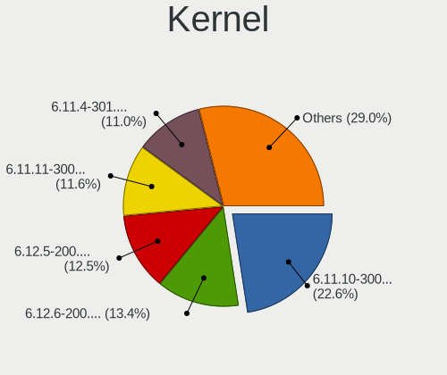

Fedora - Hardware Trends (Notebooks)
------------------------------------

A project to identify most popular hardware characteristics and track their change
over time based on data collected by Linux users at https://Linux-Hardware.org.

Anyone can contribute to this report by the [hw-probe](https://github.com/linuxhw/hw-probe) tool:

    sudo -E hw-probe -all -upload

This report is for one last month. Overall report since the beginning of time: [TestDays](https://github.com/linuxhw/TestDays)

Period: Sep, 2023.

Contents
--------

* [ System ](#system)
  - [ OS                       ](#os)
  - [ OS Family                ](#os-family)
  - [ Kernel                   ](#kernel)
  - [ Kernel Family            ](#kernel-family)
  - [ Kernel Major Ver.        ](#kernel-major-ver)
  - [ Arch                     ](#arch)
  - [ DE                       ](#de)
  - [ Display Server           ](#display-server)
  - [ Display Manager          ](#display-manager)
  - [ OS Lang                  ](#os-lang)
  - [ Boot Mode                ](#boot-mode)
  - [ Filesystem               ](#filesystem)
  - [ Part. scheme             ](#part-scheme)
  - [ Dual Boot with Linux/BSD ](#dual-boot-with-linuxbsd)
  - [ Dual Boot (Win)          ](#dual-boot-win)

* [ Board ](#board)
  - [ Vendor                   ](#vendor)
  - [ Model                    ](#model)
  - [ Model Family             ](#model-family)
  - [ MFG Year                 ](#mfg-year)
  - [ Form Factor              ](#form-factor)
  - [ Secure Boot              ](#secure-boot)
  - [ Coreboot                 ](#coreboot)
  - [ RAM Size                 ](#ram-size)
  - [ RAM Used                 ](#ram-used)
  - [ Total Drives             ](#total-drives)
  - [ Has CD-ROM               ](#has-cd-rom)
  - [ Has Ethernet             ](#has-ethernet)
  - [ Has WiFi                 ](#has-wifi)
  - [ Has Bluetooth            ](#has-bluetooth)

* [ Location ](#location)
  - [ Country                  ](#country)
  - [ City                     ](#city)

* [ Drives ](#drives)
  - [ Drive Vendor             ](#drive-vendor)
  - [ Drive Model              ](#drive-model)
  - [ HDD Vendor               ](#hdd-vendor)
  - [ SSD Vendor               ](#ssd-vendor)
  - [ Drive Kind               ](#drive-kind)
  - [ Drive Connector          ](#drive-connector)
  - [ Drive Size               ](#drive-size)
  - [ Space Total              ](#space-total)
  - [ Space Used               ](#space-used)
  - [ Malfunc. Drives          ](#malfunc-drives)
  - [ Malfunc. Drive Vendor    ](#malfunc-drive-vendor)
  - [ Malfunc. HDD Vendor      ](#malfunc-hdd-vendor)
  - [ Malfunc. Drive Kind      ](#malfunc-drive-kind)
  - [ Failed Drives            ](#failed-drives)
  - [ Failed Drive Vendor      ](#failed-drive-vendor)
  - [ Drive Status             ](#drive-status)

* [ Storage controller ](#storage-controller)
  - [ Storage Vendor           ](#storage-vendor)
  - [ Storage Model            ](#storage-model)
  - [ Storage Kind             ](#storage-kind)

* [ Processor ](#processor)
  - [ CPU Vendor               ](#cpu-vendor)
  - [ CPU Model                ](#cpu-model)
  - [ CPU Model Family         ](#cpu-model-family)
  - [ CPU Cores                ](#cpu-cores)
  - [ CPU Sockets              ](#cpu-sockets)
  - [ CPU Threads              ](#cpu-threads)
  - [ CPU Op-Modes             ](#cpu-op-modes)
  - [ CPU Microcode            ](#cpu-microcode)
  - [ CPU Microarch            ](#cpu-microarch)

* [ Graphics ](#graphics)
  - [ GPU Vendor               ](#gpu-vendor)
  - [ GPU Model                ](#gpu-model)
  - [ GPU Combo                ](#gpu-combo)
  - [ GPU Driver               ](#gpu-driver)
  - [ GPU Memory               ](#gpu-memory)

* [ Monitor ](#monitor)
  - [ Monitor Vendor           ](#monitor-vendor)
  - [ Monitor Model            ](#monitor-model)
  - [ Monitor Resolution       ](#monitor-resolution)
  - [ Monitor Diagonal         ](#monitor-diagonal)
  - [ Monitor Width            ](#monitor-width)
  - [ Aspect Ratio             ](#aspect-ratio)
  - [ Monitor Area             ](#monitor-area)
  - [ Pixel Density            ](#pixel-density)
  - [ Multiple Monitors        ](#multiple-monitors)

* [ Network ](#network)
  - [ Net Controller Vendor    ](#net-controller-vendor)
  - [ Net Controller Model     ](#net-controller-model)
  - [ Wireless Vendor          ](#wireless-vendor)
  - [ Wireless Model           ](#wireless-model)
  - [ Ethernet Vendor          ](#ethernet-vendor)
  - [ Ethernet Model           ](#ethernet-model)
  - [ Net Controller Kind      ](#net-controller-kind)
  - [ Used Controller          ](#used-controller)
  - [ NICs                     ](#nics)
  - [ IPv6                     ](#ipv6)

* [ Bluetooth ](#bluetooth)
  - [ Bluetooth Vendor         ](#bluetooth-vendor)
  - [ Bluetooth Model          ](#bluetooth-model)

* [ Sound ](#sound)
  - [ Sound Vendor             ](#sound-vendor)
  - [ Sound Model              ](#sound-model)

* [ Memory ](#memory)
  - [ Memory Vendor            ](#memory-vendor)
  - [ Memory Model             ](#memory-model)
  - [ Memory Kind              ](#memory-kind)
  - [ Memory Form Factor       ](#memory-form-factor)
  - [ Memory Size              ](#memory-size)
  - [ Memory Speed             ](#memory-speed)

* [ Printers & scanners ](#printers--scanners)
  - [ Printer Vendor           ](#printer-vendor)
  - [ Printer Model            ](#printer-model)
  - [ Scanner Vendor           ](#scanner-vendor)
  - [ Scanner Model            ](#scanner-model)

* [ Camera ](#camera)
  - [ Camera Vendor            ](#camera-vendor)
  - [ Camera Model             ](#camera-model)

* [ Security ](#security)
  - [ Fingerprint Vendor       ](#fingerprint-vendor)
  - [ Fingerprint Model        ](#fingerprint-model)
  - [ Chipcard Vendor          ](#chipcard-vendor)
  - [ Chipcard Model           ](#chipcard-model)

* [ Unsupported ](#unsupported)
  - [ Unsupported Devices      ](#unsupported-devices)
  - [ Unsupported Device Types ](#unsupported-device-types)

System
------

OS
--

Installed operating systems

| Name      | Notebooks | Percent |
|-----------|-----------|---------|
| Fedora 38 | 288       | 92.01%  |
| Fedora 39 | 13        | 4.15%   |
| Fedora 37 | 8         | 2.56%   |
| Fedora 36 | 2         | 0.64%   |
| Fedora 40 | 1         | 0.32%   |
| Fedora 35 | 1         | 0.32%   |

OS Family
---------

OS without a version

| Name   | Notebooks | Percent |
|--------|-----------|---------|
| Fedora | 313       | 100%    |

Kernel
------

Version of the Linux kernel

| Version                                                | Notebooks | Percent |
|--------------------------------------------------------|-----------|---------|
| 6.4.15-200.fc38.x86_64                                 | 95        | 30.35%  |
| 6.4.14-200.fc38.x86_64                                 | 50        | 15.97%  |
| 6.4.13-200.fc38.x86_64                                 | 44        | 14.06%  |
| 6.2.9-300.fc38.x86_64                                  | 44        | 14.06%  |
| 6.5.5-200.fc38.x86_64                                  | 18        | 5.75%   |
| 6.4.12-200.fc38.x86_64                                 | 15        | 4.79%   |
| 6.5.5-300.fc39.x86_64                                  | 5         | 1.6%    |
| 6.4.11-200.fc38.x86_64                                 | 5         | 1.6%    |
| 6.5.4-300.fc39.x86_64                                  | 4         | 1.28%   |
| 6.5.3-300.fc39.x86_64                                  | 3         | 0.96%   |
| 6.5.5-100.fc37.x86_64                                  | 2         | 0.64%   |
| 6.4.15-100.fc37.x86_64                                 | 2         | 0.64%   |
| 6.2.15-100.fc36.x86_64                                 | 2         | 0.64%   |
| 6.6.0-0.rc2.219.vanilla.fc38.x86_64                    | 1         | 0.32%   |
| 6.6.0-0.rc1.20230913gt3669558b.214.vanilla.fc38.x86_64 | 1         | 0.32%   |
| 6.6.0-0.rc1.13.fc40.x86_64+debug                       | 1         | 0.32%   |
| 6.5.4-200.fc38.x86_64                                  | 1         | 0.32%   |
| 6.5.3-cbe5.0.fc38.x86_64                               | 1         | 0.32%   |
| 6.5.2-cbe1.0.fc38.x86_64                               | 1         | 0.32%   |
| 6.5.2-301.rog.fc38.x86_64                              | 1         | 0.32%   |
| 6.5.0-61.rog.fc38.x86_64                               | 1         | 0.32%   |
| 6.5.0-0.rc7.20230821gitf7757129e3de.50.fc39.x86_64     | 1         | 0.32%   |
| 6.4.8-200.fc38.x86_64                                  | 1         | 0.32%   |
| 6.4.6-200.fc38.x86_64                                  | 1         | 0.32%   |
| 6.4.16-200.fc38.x86_64                                 | 1         | 0.32%   |
| 6.4.13-xm1.0.fc38.x86_64                               | 1         | 0.32%   |
| 6.4.13-100.fc37.x86_64                                 | 1         | 0.32%   |
| 6.4.10-200.fc38.x86_64                                 | 1         | 0.32%   |
| 6.3.5-200.fc38.x86_64                                  | 1         | 0.32%   |
| 6.3.12-200.fc38.x86_64                                 | 1         | 0.32%   |
| 6.3.12-100.fc37.x86_64                                 | 1         | 0.32%   |
| 6.2.15-300.fc38.x86_64                                 | 1         | 0.32%   |
| 6.2.14-200.fc37.x86_64                                 | 1         | 0.32%   |
| 6.0.8-xm1.0.fc38.x86_64                                | 1         | 0.32%   |
| 6.0.7-301.fc37.x86_64                                  | 1         | 0.32%   |
| 6.0.12-100.fc35.x86_64                                 | 1         | 0.32%   |
| 5.17.5-300.fc36.x86_64                                 | 1         | 0.32%   |

Kernel Family
-------------

Linux kernel without a distro release

| Version | Notebooks | Percent |
|---------|-----------|---------|
| 6.4.15  | 97        | 30.99%  |
| 6.4.14  | 50        | 15.97%  |
| 6.4.13  | 46        | 14.7%   |
| 6.2.9   | 44        | 14.06%  |
| 6.5.5   | 25        | 7.99%   |
| 6.4.12  | 15        | 4.79%   |
| 6.5.4   | 5         | 1.6%    |
| 6.4.11  | 5         | 1.6%    |
| 6.5.3   | 4         | 1.28%   |
| 6.6.0   | 3         | 0.96%   |
| 6.2.15  | 3         | 0.96%   |
| 6.5.2   | 2         | 0.64%   |
| 6.5.0   | 2         | 0.64%   |
| 6.3.12  | 2         | 0.64%   |
| 6.4.8   | 1         | 0.32%   |
| 6.4.6   | 1         | 0.32%   |
| 6.4.16  | 1         | 0.32%   |
| 6.4.10  | 1         | 0.32%   |
| 6.3.5   | 1         | 0.32%   |
| 6.2.14  | 1         | 0.32%   |
| 6.0.8   | 1         | 0.32%   |
| 6.0.7   | 1         | 0.32%   |
| 6.0.12  | 1         | 0.32%   |
| 5.17.5  | 1         | 0.32%   |

Kernel Major Ver.
-----------------

Linux kernel major version

| Version | Notebooks | Percent |
|---------|-----------|---------|
| 6.4     | 217       | 69.33%  |
| 6.2     | 48        | 15.34%  |
| 6.5     | 38        | 12.14%  |
| 6.6     | 3         | 0.96%   |
| 6.3     | 3         | 0.96%   |
| 6.0     | 3         | 0.96%   |
| 5.17    | 1         | 0.32%   |

Arch
----

OS architecture (x86_64, i586, etc.)

| Name   | Notebooks | Percent |
|--------|-----------|---------|
| x86_64 | 313       | 100%    |

DE
--

Desktop Environment

| Name          | Notebooks | Percent |
|---------------|-----------|---------|
| GNOME         | 240       | 76.68%  |
| KDE5          | 45        | 14.38%  |
| XFCE          | 7         | 2.24%   |
| X-Cinnamon    | 6         | 1.92%   |
| Unknown       | 6         | 1.92%   |
| GNOME Classic | 3         | 0.96%   |
| Cinnamon      | 3         | 0.96%   |
| MATE          | 2         | 0.64%   |
| Unity         | 1         | 0.32%   |

Display Server
--------------

X11 or Wayland

| Name    | Notebooks | Percent |
|---------|-----------|---------|
| Wayland | 259       | 82.75%  |
| X11     | 50        | 15.97%  |
| Tty     | 3         | 0.96%   |
| Unknown | 1         | 0.32%   |

Display Manager
---------------

SDDM, LightDM, etc.

| Name    | Notebooks | Percent |
|---------|-----------|---------|
| Unknown | 198       | 63.26%  |
| GDM     | 78        | 24.92%  |
| SDDM    | 20        | 6.39%   |
| LightDM | 17        | 5.43%   |

OS Lang
-------

Language

| Lang    | Notebooks | Percent |
|---------|-----------|---------|
| en_US   | 156       | 49.84%  |
| ru_RU   | 27        | 8.63%   |
| en_GB   | 24        | 7.67%   |
| de_DE   | 13        | 4.15%   |
| fr_FR   | 11        | 3.51%   |
| it_IT   | 10        | 3.19%   |
| pt_BR   | 9         | 2.88%   |
| es_ES   | 8         | 2.56%   |
| en_AU   | 7         | 2.24%   |
| es_MX   | 5         | 1.6%    |
| es_CO   | 5         | 1.6%    |
| en_IN   | 5         | 1.6%    |
| pl_PL   | 3         | 0.96%   |
| es_CL   | 3         | 0.96%   |
| en_CA   | 3         | 0.96%   |
| pt_PT   | 2         | 0.64%   |
| hu_HU   | 2         | 0.64%   |
| en_DK   | 2         | 0.64%   |
| zh_CN   | 1         | 0.32%   |
| uk_UA   | 1         | 0.32%   |
| sv_SE   | 1         | 0.32%   |
| sk_SK   | 1         | 0.32%   |
| ru_UA   | 1         | 0.32%   |
| nl_BE   | 1         | 0.32%   |
| id_ID   | 1         | 0.32%   |
| fr_CA   | 1         | 0.32%   |
| es_US   | 1         | 0.32%   |
| es_PE   | 1         | 0.32%   |
| es_PA   | 1         | 0.32%   |
| es_NI   | 1         | 0.32%   |
| es_AR   | 1         | 0.32%   |
| en_IE   | 1         | 0.32%   |
| en_BW   | 1         | 0.32%   |
| de_AT   | 1         | 0.32%   |
| cs_CZ   | 1         | 0.32%   |
| Unknown | 1         | 0.32%   |

Boot Mode
---------

EFI or BIOS

| Mode | Notebooks | Percent |
|------|-----------|---------|
| EFI  | 263       | 84.03%  |
| BIOS | 50        | 15.97%  |

Filesystem
----------

Type of filesystem

| Type    | Notebooks | Percent |
|---------|-----------|---------|
| Btrfs   | 271       | 86.58%  |
| Ext4    | 35        | 11.18%  |
| Xfs     | 6         | 1.92%   |
| Unknown | 1         | 0.32%   |

Part. scheme
------------

Scheme of partitioning

| Type    | Notebooks | Percent |
|---------|-----------|---------|
| Unknown | 195       | 62.3%   |
| GPT     | 113       | 36.1%   |
| MBR     | 5         | 1.6%    |

Dual Boot with Linux/BSD
------------------------

Hosting more than one Linux/BSD

| Dual boot | Notebooks | Percent |
|-----------|-----------|---------|
| No        | 293       | 93.61%  |
| Yes       | 20        | 6.39%   |

Dual Boot (Win)
---------------

Hosting Linux and Windows

| Dual boot | Notebooks | Percent |
|-----------|-----------|---------|
| No        | 262       | 83.71%  |
| Yes       | 51        | 16.29%  |

Board
-----

Vendor
------

Motherboard manufacturer

| Name                | Notebooks | Percent |
|---------------------|-----------|---------|
| Lenovo              | 78        | 24.92%  |
| Hewlett-Packard     | 48        | 15.34%  |
| Dell                | 47        | 15.02%  |
| ASUSTek Computer    | 42        | 13.42%  |
| Acer                | 21        | 6.71%   |
| Apple               | 17        | 5.43%   |
| HUAWEI              | 10        | 3.19%   |
| Samsung Electronics | 8         | 2.56%   |
| MSI                 | 8         | 2.56%   |
| Timi                | 6         | 1.92%   |
| Toshiba             | 3         | 0.96%   |
| Fujitsu             | 3         | 0.96%   |
| Framework           | 3         | 0.96%   |
| System76            | 2         | 0.64%   |
| Maibenben           | 2         | 0.64%   |
| Chuwi               | 2         | 0.64%   |
| Unknown             | 2         | 0.64%   |
| Zebra Technologies  | 1         | 0.32%   |
| TUXEDO              | 1         | 0.32%   |
| Sony                | 1         | 0.32%   |
| Razer               | 1         | 0.32%   |
| Prestigio           | 1         | 0.32%   |
| Positivo            | 1         | 0.32%   |
| Packard Bell        | 1         | 0.32%   |
| Notebook            | 1         | 0.32%   |
| Juana Manso         | 1         | 0.32%   |
| GPU Company         | 1         | 0.32%   |
| Casper              | 1         | 0.32%   |

Model
-----

Motherboard model

| Name                                       | Notebooks | Percent |
|--------------------------------------------|-----------|---------|
| Apple MacBookPro9,2                        | 4         | 1.28%   |
| Dell XPS 13 9310                           | 3         | 0.96%   |
| Dell Latitude 7490                         | 3         | 0.96%   |
| HP ProBook 450 15.6 inch G9 Notebook PC    | 2         | 0.64%   |
| HP EliteBook 840 G8 Notebook PC            | 2         | 0.64%   |
| HP EliteBook 840 G6                        | 2         | 0.64%   |
| Framework Laptop                           | 2         | 0.64%   |
| Dell XPS 15 9520                           | 2         | 0.64%   |
| Dell XPS 13 9380                           | 2         | 0.64%   |
| Dell Latitude 5420                         | 2         | 0.64%   |
| Dell Inspiron 5566                         | 2         | 0.64%   |
| ASUS Zenbook 15 UM3504DA_UM3504DA          | 2         | 0.64%   |
| Apple MacBookPro8,1                        | 2         | 0.64%   |
| Apple MacBookPro11,1                       | 2         | 0.64%   |
| Acer Aspire A715-51G                       | 2         | 0.64%   |
| Unknown                                    | 2         | 0.64%   |
| Zebra 10-WLAN-1                            | 1         | 0.32%   |
| TUXEDO P65_P67RGRERA                       | 1         | 0.32%   |
| Toshiba Satellite C70-B                    | 1         | 0.32%   |
| Toshiba PORTEGE R30-D                      | 1         | 0.32%   |
| Toshiba PORTEGE M750                       | 1         | 0.32%   |
| Timi Xiaomi Book Pro 16 2022               | 1         | 0.32%   |
| Timi RedmiBook 15                          | 1         | 0.32%   |
| Timi Redmi Book Pro 14S                    | 1         | 0.32%   |
| Timi Mi NoteBook Ultra                     | 1         | 0.32%   |
| Timi Mi NoteBook Pro                       | 1         | 0.32%   |
| Timi A35S                                  | 1         | 0.32%   |
| System76 Pangolin                          | 1         | 0.32%   |
| System76 Darter Pro                        | 1         | 0.32%   |
| Sony SVE14A25CLW                           | 1         | 0.32%   |
| Samsung R530/R730/R540                     | 1         | 0.32%   |
| Samsung NC210/NC110                        | 1         | 0.32%   |
| Samsung 960XFH                             | 1         | 0.32%   |
| Samsung 550XDA                             | 1         | 0.32%   |
| Samsung 550XBE/350XBE                      | 1         | 0.32%   |
| Samsung 550P5C/550P7C                      | 1         | 0.32%   |
| Samsung 530XBB                             | 1         | 0.32%   |
| Samsung 300E4A/300E5A/300E7A/3430EA/3530EA | 1         | 0.32%   |
| Razer Blade 15 Base Model (Late 2020)      | 1         | 0.32%   |
| Prestigio Multipad Visconte V              | 1         | 0.32%   |

Model Family
------------

Motherboard model prefix

| Name               | Notebooks | Percent |
|--------------------|-----------|---------|
| Lenovo ThinkPad    | 39        | 12.46%  |
| HP EliteBook       | 17        | 5.43%   |
| Dell Latitude      | 17        | 5.43%   |
| Lenovo IdeaPad     | 16        | 5.11%   |
| Dell Inspiron      | 14        | 4.47%   |
| Acer Aspire        | 14        | 4.47%   |
| Dell XPS           | 12        | 3.83%   |
| ASUS VivoBook      | 11        | 3.51%   |
| ASUS ROG           | 10        | 3.19%   |
| HP ProBook         | 8         | 2.56%   |
| ASUS ASUS          | 8         | 2.56%   |
| HP Pavilion        | 7         | 2.24%   |
| HP Laptop          | 7         | 2.24%   |
| ASUS ZenBook       | 6         | 1.92%   |
| Lenovo Legion      | 5         | 1.6%    |
| Apple MacBookPro9  | 4         | 1.28%   |
| Lenovo ThinkBook   | 3         | 0.96%   |
| Fujitsu LIFEBOOK   | 3         | 0.96%   |
| Framework Laptop   | 3         | 0.96%   |
| Apple MacBookPro8  | 3         | 0.96%   |
| Acer Predator      | 3         | 0.96%   |
| Toshiba PORTEGE    | 2         | 0.64%   |
| Timi Mi            | 2         | 0.64%   |
| MSI Prestige       | 2         | 0.64%   |
| MSI Modern         | 2         | 0.64%   |
| Maibenben MaiBook  | 2         | 0.64%   |
| Lenovo V15         | 2         | 0.64%   |
| HP OMEN            | 2         | 0.64%   |
| HP 250             | 2         | 0.64%   |
| Dell G15           | 2         | 0.64%   |
| ASUS TUF           | 2         | 0.64%   |
| Apple MacBookPro11 | 2         | 0.64%   |
| Acer TravelMate    | 2         | 0.64%   |
| Acer Swift         | 2         | 0.64%   |
| Unknown            | 2         | 0.64%   |
| Zebra 10-WLAN-1    | 1         | 0.32%   |
| TUXEDO P65         | 1         | 0.32%   |
| Toshiba Satellite  | 1         | 0.32%   |
| Timi Xiaomi        | 1         | 0.32%   |
| Timi RedmiBook     | 1         | 0.32%   |

MFG Year
--------

Motherboard manufacture year

| Year | Notebooks | Percent |
|------|-----------|---------|
| 2021 | 48        | 15.34%  |
| 2020 | 37        | 11.82%  |
| 2022 | 35        | 11.18%  |
| 2023 | 29        | 9.27%   |
| 2019 | 27        | 8.63%   |
| 2018 | 24        | 7.67%   |
| 2012 | 19        | 6.07%   |
| 2014 | 18        | 5.75%   |
| 2017 | 14        | 4.47%   |
| 2015 | 14        | 4.47%   |
| 2011 | 12        | 3.83%   |
| 2010 | 10        | 3.19%   |
| 2016 | 9         | 2.88%   |
| 2013 | 8         | 2.56%   |
| 2008 | 6         | 1.92%   |
| 2009 | 3         | 0.96%   |

Form Factor
-----------

Physical design of the computer

| Name     | Notebooks | Percent |
|----------|-----------|---------|
| Notebook | 313       | 100%    |

Secure Boot
-----------

Enabled or disabled

| State    | Notebooks | Percent |
|----------|-----------|---------|
| Disabled | 223       | 71.25%  |
| Enabled  | 90        | 28.75%  |

Coreboot
--------

Have coreboot on board

| Used | Notebooks | Percent |
|------|-----------|---------|
| No   | 312       | 99.68%  |
| Yes  | 1         | 0.32%   |

RAM Size
--------

Total RAM memory

| Size in GB  | Notebooks | Percent |
|-------------|-----------|---------|
| 4.01-8.0    | 85        | 27.16%  |
| 8.01-16.0   | 65        | 20.77%  |
| 16.01-24.0  | 61        | 19.49%  |
| 32.01-64.0  | 40        | 12.78%  |
| 3.01-4.0    | 39        | 12.46%  |
| 24.01-32.0  | 8         | 2.56%   |
| 64.01-256.0 | 8         | 2.56%   |
| 1.01-2.0    | 6         | 1.92%   |
| 2.01-3.0    | 1         | 0.32%   |

RAM Used
--------

Used RAM memory

| Used GB    | Notebooks | Percent |
|------------|-----------|---------|
| 4.01-8.0   | 98        | 31.31%  |
| 2.01-3.0   | 88        | 28.12%  |
| 3.01-4.0   | 67        | 21.41%  |
| 8.01-16.0  | 29        | 9.27%   |
| 1.01-2.0   | 28        | 8.95%   |
| 16.01-24.0 | 1         | 0.32%   |
| 0.51-1.0   | 1         | 0.32%   |
| 0.01-0.5   | 1         | 0.32%   |

Total Drives
------------

Number of drives on board

| Drives | Notebooks | Percent |
|--------|-----------|---------|
| 1      | 241       | 77%     |
| 2      | 63        | 20.13%  |
| 3      | 9         | 2.88%   |

Has CD-ROM
----------

Has CD-ROM on board

| Presented | Notebooks | Percent |
|-----------|-----------|---------|
| No        | 258       | 82.43%  |
| Yes       | 55        | 17.57%  |

Has Ethernet
------------

Has Ethernet on board

| Presented | Notebooks | Percent |
|-----------|-----------|---------|
| Yes       | 218       | 69.65%  |
| No        | 95        | 30.35%  |

Has WiFi
--------

Has WiFi module

| Presented | Notebooks | Percent |
|-----------|-----------|---------|
| Yes       | 307       | 98.08%  |
| No        | 6         | 1.92%   |

Has Bluetooth
-------------

Has Bluetooth module

| Presented | Notebooks | Percent |
|-----------|-----------|---------|
| Yes       | 271       | 86.58%  |
| No        | 42        | 13.42%  |

Location
--------

Country
-------

Geographic location (country)

| Country         | Notebooks | Percent |
|-----------------|-----------|---------|
| USA             | 40        | 12.78%  |
| Russia          | 30        | 9.58%   |
| India           | 16        | 5.11%   |
| Spain           | 14        | 4.47%   |
| Italy           | 14        | 4.47%   |
| Brazil          | 14        | 4.47%   |
| UK              | 12        | 3.83%   |
| Germany         | 12        | 3.83%   |
| France          | 12        | 3.83%   |
| Canada          | 11        | 3.51%   |
| Mexico          | 10        | 3.19%   |
| Turkey          | 9         | 2.88%   |
| Colombia        | 8         | 2.56%   |
| Australia       | 6         | 1.92%   |
| Poland          | 5         | 1.6%    |
| Hungary         | 5         | 1.6%    |
| Greece          | 5         | 1.6%    |
| Switzerland     | 4         | 1.28%   |
| Sweden          | 4         | 1.28%   |
| Portugal        | 4         | 1.28%   |
| Iran            | 4         | 1.28%   |
| Czechia         | 4         | 1.28%   |
| Belarus         | 4         | 1.28%   |
| Ukraine         | 3         | 0.96%   |
| Philippines     | 3         | 0.96%   |
| Indonesia       | 3         | 0.96%   |
| Egypt           | 3         | 0.96%   |
| Chile           | 3         | 0.96%   |
| Thailand        | 2         | 0.64%   |
| Slovakia        | 2         | 0.64%   |
| Serbia          | 2         | 0.64%   |
| Panama          | 2         | 0.64%   |
| Norway          | 2         | 0.64%   |
| North Macedonia | 2         | 0.64%   |
| Netherlands     | 2         | 0.64%   |
| Malaysia        | 2         | 0.64%   |
| Lithuania       | 2         | 0.64%   |
| Georgia         | 2         | 0.64%   |
| Finland         | 2         | 0.64%   |
| Belgium         | 2         | 0.64%   |

City
----

Geographic location (city)

| City          | Notebooks | Percent |
|---------------|-----------|---------|
| Mexico City   | 6         | 1.92%   |
| St Petersburg | 5         | 1.6%    |
| Moscow        | 5         | 1.6%    |
| Sydney        | 4         | 1.28%   |
| Delhi         | 4         | 1.28%   |
| Budapest      | 4         | 1.28%   |
| Bogotá       | 4         | 1.28%   |
| Tehran        | 3         | 0.96%   |
| Minsk         | 3         | 0.96%   |
| Madrid        | 3         | 0.96%   |
| Lisbon        | 3         | 0.96%   |
| Istanbul      | 3         | 0.96%   |
| Athens        | 3         | 0.96%   |
| Zurich        | 2         | 0.64%   |
| Yekaterinburg | 2         | 0.64%   |
| Vilnius       | 2         | 0.64%   |
| Vienna        | 2         | 0.64%   |
| Tbilisi       | 2         | 0.64%   |
| Surabaya      | 2         | 0.64%   |
| Skopje        | 2         | 0.64%   |
| Santiago      | 2         | 0.64%   |
| Rennes        | 2         | 0.64%   |
| Munich        | 2         | 0.64%   |
| Milan         | 2         | 0.64%   |
| Manchester    | 2         | 0.64%   |
| Katowice      | 2         | 0.64%   |
| Hyderabad     | 2         | 0.64%   |
| Hamburg       | 2         | 0.64%   |
| Brasília     | 2         | 0.64%   |
| Berlin        | 2         | 0.64%   |
| Bengaluru     | 2         | 0.64%   |
| Belgrade      | 2         | 0.64%   |
| Barnaul       | 2         | 0.64%   |
| Barcelona     | 2         | 0.64%   |
| Bangkok       | 2         | 0.64%   |
| Zevenbergen   | 1         | 0.32%   |
| Zagreb        | 1         | 0.32%   |
| Yazd          | 1         | 0.32%   |
| Woodbridge    | 1         | 0.32%   |
| Wells         | 1         | 0.32%   |

Drives
------

Drive Vendor
------------

Hard drive vendors

| Vendor                      | Notebooks | Drives | Percent |
|-----------------------------|-----------|--------|---------|
| Samsung Electronics         | 81        | 87     | 21.66%  |
| Sandisk                     | 33        | 34     | 8.82%   |
| Seagate                     | 26        | 27     | 6.95%   |
| WDC                         | 20        | 20     | 5.35%   |
| Micron Technology           | 20        | 21     | 5.35%   |
| Toshiba                     | 18        | 18     | 4.81%   |
| SK hynix                    | 18        | 18     | 4.81%   |
| Intel                       | 18        | 18     | 4.81%   |
| Kingston                    | 17        | 17     | 4.55%   |
| Unknown                     | 15        | 16     | 4.01%   |
| KIOXIA                      | 8         | 8      | 2.14%   |
| Kingston Technology Company | 7         | 7      | 1.87%   |
| Apple                       | 7         | 8      | 1.87%   |
| Crucial                     | 6         | 7      | 1.6%    |
| Silicon Motion              | 5         | 5      | 1.34%   |
| Phison Electronics          | 5         | 5      | 1.34%   |
| Micron/Crucial Technology   | 5         | 5      | 1.34%   |
| Hitachi                     | 5         | 5      | 1.34%   |
| Netac                       | 4         | 4      | 1.07%   |
| HGST                        | 4         | 4      | 1.07%   |
| ADATA Technology            | 4         | 4      | 1.07%   |
| Union Memory (Shenzhen)     | 3         | 3      | 0.8%    |
| China                       | 3         | 3      | 0.8%    |
| A-DATA Technology           | 3         | 3      | 0.8%    |
| Yangtze Memory Technologies | 2         | 2      | 0.53%   |
| Union Memory                | 2         | 2      | 0.53%   |
| LITEONIT                    | 2         | 2      | 0.53%   |
| LITEON                      | 2         | 2      | 0.53%   |
| HS-SSD-C100                 | 2         | 2      | 0.53%   |
| Aura                        | 2         | 2      | 0.53%   |
| Apacer                      | 2         | 2      | 0.53%   |
| Wibtek                      | 1         | 1      | 0.27%   |
| Verbatim                    | 1         | 1      | 0.27%   |
| SPCC                        | 1         | 1      | 0.27%   |
| Solid State Storage         | 1         | 1      | 0.27%   |
| S3+                         | 1         | 1      | 0.27%   |
| Realtek Semiconductor       | 1         | 1      | 0.27%   |
| PNY                         | 1         | 1      | 0.27%   |
| Plextor                     | 1         | 1      | 0.27%   |
| Phison                      | 1         | 1      | 0.27%   |

Drive Model
-----------

Hard drive models

| Model                                                 | Notebooks | Percent |
|-------------------------------------------------------|-----------|---------|
| Samsung NVMe SSD Controller SM981/PM981/PM983 256GB   | 18        | 4.74%   |
| Samsung NVMe SSD Controller PM9A1/PM9A3/980PRO 1TB    | 18        | 4.74%   |
| Intel SSDPEKNU512GZ 512GB                             | 8         | 2.11%   |
| Toshiba XG6 NVMe SSD Controller 512GB                 | 5         | 1.32%   |
| Sandisk WD Blue SN550 NVMe SSD 512GB                  | 5         | 1.32%   |
| Sandisk WD Black SN750 / PC SN730 NVMe SSD 512GB      | 5         | 1.32%   |
| Seagate ST500LT012-1DG142 500GB                       | 4         | 1.05%   |
| Seagate ST1000LM035-1RK172 1TB                        | 4         | 1.05%   |
| Seagate ST1000LM024 HN-M101MBB 1TB                    | 4         | 1.05%   |
| Sandisk WD Blue SN500 / PC SN520 NVMe SSD 256GB       | 4         | 1.05%   |
| Micron/Crucial P2 NVMe PCIe SSD 1TB                   | 4         | 1.05%   |
| Kingston SA400S37480G 480GB SSD                       | 4         | 1.05%   |
| WDC WDS120G2G0A-00JH30 120GB SSD                      | 3         | 0.79%   |
| Unknown MMC Card  32GB                                | 3         | 0.79%   |
| Silicon Motion SM2263EN/SM2263XT SSD Controller 512GB | 3         | 0.79%   |
| Samsung MZVLQ512HBLU-00B00 512GB                      | 3         | 0.79%   |
| Phison E12 NVMe Controller 2TB                        | 3         | 0.79%   |
| Micron 2450_MTFDKBA1T0TFK 1024GB                      | 3         | 0.79%   |
| Kingston Company SNV2S1000G 1TB                       | 3         | 0.79%   |
| Apple SSD SD0128F 121GB                               | 3         | 0.79%   |
| Yangtze Memory YMTC PC005 512GB                       | 2         | 0.53%   |
| WDC WDS500G2B0A-00SM50 500GB SSD                      | 2         | 0.53%   |
| Unknown MMC Card  16GB                                | 2         | 0.53%   |
| Unknown MMC Card  128GB                               | 2         | 0.53%   |
| Union Memory (Shenzhen) UMIS RPJTJ512MGE1QDQ 512GB    | 2         | 0.53%   |
| Toshiba MQ01ABD100 1TB                                | 2         | 0.53%   |
| SK hynix PC801 NVMe 1TB                               | 2         | 0.53%   |
| SK hynix BC711 HFM512GD3JX013N 512GB                  | 2         | 0.53%   |
| SK hynix BC501 NVMe Solid State Drive 512GB           | 2         | 0.53%   |
| Seagate ST500LT012-9WS142 500GB                       | 2         | 0.53%   |
| Sandisk WD Blue SN570 1TB                             | 2         | 0.53%   |
| Sandisk WD Black SN850 1TB                            | 2         | 0.53%   |
| SanDisk SSD PLUS 480GB                                | 2         | 0.53%   |
| Samsung SSD 980 1TB                                   | 2         | 0.53%   |
| Samsung SSD 870 QVO 1TB                               | 2         | 0.53%   |
| Samsung SSD 850 EVO 1TB                               | 2         | 0.53%   |
| Samsung NVMe SSD Controller SM961/PM961/SM963 500GB   | 2         | 0.53%   |
| Samsung MZVLQ512HALU-00000 512GB                      | 2         | 0.53%   |
| Samsung MZVLQ256HAJD-000H1 256GB                      | 2         | 0.53%   |
| Samsung MZALQ512HALU-000L2 512GB                      | 2         | 0.53%   |

HDD Vendor
----------

Hard disk drive vendors

| Vendor              | Notebooks | Drives | Percent |
|---------------------|-----------|--------|---------|
| Seagate             | 23        | 23     | 42.59%  |
| Toshiba             | 10        | 10     | 18.52%  |
| WDC                 | 9         | 9      | 16.67%  |
| Hitachi             | 5         | 5      | 9.26%   |
| HGST                | 4         | 4      | 7.41%   |
| Unknown             | 1         | 1      | 1.85%   |
| Samsung Electronics | 1         | 1      | 1.85%   |
| Apple               | 1         | 1      | 1.85%   |

SSD Vendor
----------

Solid state drive vendors

| Vendor              | Notebooks | Drives | Percent |
|---------------------|-----------|--------|---------|
| Samsung Electronics | 21        | 23     | 21.65%  |
| Kingston            | 11        | 11     | 11.34%  |
| WDC                 | 10        | 10     | 10.31%  |
| SanDisk             | 6         | 6      | 6.19%   |
| Crucial             | 6         | 7      | 6.19%   |
| Intel               | 5         | 5      | 5.15%   |
| Apple               | 5         | 5      | 5.15%   |
| Micron Technology   | 3         | 4      | 3.09%   |
| China               | 3         | 3      | 3.09%   |
| Toshiba             | 2         | 2      | 2.06%   |
| Netac               | 2         | 2      | 2.06%   |
| LITEONIT            | 2         | 2      | 2.06%   |
| LITEON              | 2         | 2      | 2.06%   |
| Apacer              | 2         | 2      | 2.06%   |
| Wibtek              | 1         | 1      | 1.03%   |
| Verbatim            | 1         | 1      | 1.03%   |
| SPCC                | 1         | 1      | 1.03%   |
| SK hynix            | 1         | 1      | 1.03%   |
| S3+                 | 1         | 1      | 1.03%   |
| PNY                 | 1         | 1      | 1.03%   |
| Plextor             | 1         | 1      | 1.03%   |
| MidasForce          | 1         | 1      | 1.03%   |
| MicroFrom           | 1         | 1      | 1.03%   |
| Lexar               | 1         | 1      | 1.03%   |
| Intenso             | 1         | 1      | 1.03%   |
| HS-SSD-C100         | 1         | 1      | 1.03%   |
| Gigabyte Technology | 1         | 1      | 1.03%   |
| FORESEE             | 1         | 1      | 1.03%   |
| Dahua               | 1         | 1      | 1.03%   |
| ASMT                | 1         | 1      | 1.03%   |
| A-DATA Technology   | 1         | 1      | 1.03%   |

Drive Kind
----------

HDD or SSD

| Kind    | Notebooks | Drives | Percent |
|---------|-----------|--------|---------|
| NVMe    | 188       | 205    | 52.51%  |
| SSD     | 92        | 101    | 25.7%   |
| HDD     | 53        | 54     | 14.8%   |
| MMC     | 13        | 14     | 3.63%   |
| Unknown | 12        | 12     | 3.35%   |

Drive Connector
---------------

SATA, SAS, NVMe, etc.

| Type | Notebooks | Drives | Percent |
|------|-----------|--------|---------|
| NVMe | 188       | 205    | 53.56%  |
| SATA | 138       | 155    | 39.32%  |
| MMC  | 13        | 14     | 3.7%    |
| SAS  | 12        | 12     | 3.42%   |

Drive Size
----------

Size of hard drive

| Size in TB | Notebooks | Drives | Percent |
|------------|-----------|--------|---------|
| 0.01-0.5   | 99        | 105    | 66.44%  |
| 0.51-1.0   | 48        | 48     | 32.21%  |
| 3.01-4.0   | 1         | 1      | 0.67%   |
| 1.01-2.0   | 1         | 1      | 0.67%   |

Space Total
-----------

Amount of disk space available on the file system

| Size in GB     | Notebooks | Percent |
|----------------|-----------|---------|
| 501-1000       | 95        | 30.35%  |
| 251-500        | 61        | 19.49%  |
| 1001-2000      | 43        | 13.74%  |
| Unknown        | 30        | 9.58%   |
| 1-20           | 28        | 8.95%   |
| 101-250        | 25        | 7.99%   |
| 21-50          | 10        | 3.19%   |
| 51-100         | 10        | 3.19%   |
| More than 3000 | 6         | 1.92%   |
| 2001-3000      | 5         | 1.6%    |

Space Used
----------

Amount of used disk space

| Used GB        | Notebooks | Percent |
|----------------|-----------|---------|
| 1-20           | 114       | 36.42%  |
| 21-50          | 47        | 15.02%  |
| 101-250        | 40        | 12.78%  |
| 51-100         | 33        | 10.54%  |
| Unknown        | 30        | 9.58%   |
| 251-500        | 29        | 9.27%   |
| 501-1000       | 11        | 3.51%   |
| 1001-2000      | 5         | 1.6%    |
| More than 3000 | 3         | 0.96%   |
| 2001-3000      | 1         | 0.32%   |

Malfunc. Drives
---------------

Drive models with a malfunction

| Model                                   | Notebooks | Drives | Percent |
|-----------------------------------------|-----------|--------|---------|
| Wibtek W800S 512GB SSD                  | 1         | 1      | 11.11%  |
| Seagate ST9750420AS 752GB               | 1         | 1      | 11.11%  |
| Seagate ST500LT012-9WS142 500GB         | 1         | 1      | 11.11%  |
| Seagate ST500LT012-1DG142 500GB         | 1         | 1      | 11.11%  |
| Seagate ST1000LM049-2GH172 1TB          | 1         | 1      | 11.11%  |
| Netac NVMe SSD 2TB                      | 1         | 1      | 11.11%  |
| Kingston SA400S37480G 480GB SSD         | 1         | 1      | 11.11%  |
| Kingston RBU-SNS8350DES3128GP 128GB SSD | 1         | 1      | 11.11%  |
| Apple HDD HTS545050A7E362 500GB         | 1         | 1      | 11.11%  |

Malfunc. Drive Vendor
---------------------

Vendors of faulty drives

| Vendor   | Notebooks | Drives | Percent |
|----------|-----------|--------|---------|
| Seagate  | 4         | 4      | 44.44%  |
| Kingston | 2         | 2      | 22.22%  |
| Wibtek   | 1         | 1      | 11.11%  |
| Netac    | 1         | 1      | 11.11%  |
| Apple    | 1         | 1      | 11.11%  |

Malfunc. HDD Vendor
-------------------

Vendors of faulty HDD drives

| Vendor  | Notebooks | Drives | Percent |
|---------|-----------|--------|---------|
| Seagate | 4         | 4      | 80%     |
| Apple   | 1         | 1      | 20%     |

Malfunc. Drive Kind
-------------------

Kinds of faulty drives

| Kind | Notebooks | Drives | Percent |
|------|-----------|--------|---------|
| HDD  | 5         | 5      | 55.56%  |
| SSD  | 3         | 3      | 33.33%  |
| NVMe | 1         | 1      | 11.11%  |

Failed Drives
-------------

Failed drive models

Zero info for selected period =(

Failed Drive Vendor
-------------------

Failed drive vendors

Zero info for selected period =(

Drive Status
------------

Number of failed and malfunc. drives

| Status   | Notebooks | Drives | Percent |
|----------|-----------|--------|---------|
| Detected | 212       | 258    | 64.83%  |
| Works    | 106       | 119    | 32.42%  |
| Malfunc  | 9         | 9      | 2.75%   |

Storage controller
------------------

Storage Vendor
--------------

Storage controller vendors

| Vendor                                  | Notebooks | Percent |
|-----------------------------------------|-----------|---------|
| Intel                                   | 164       | 42.05%  |
| Samsung Electronics                     | 62        | 15.9%   |
| AMD                                     | 34        | 8.72%   |
| SanDisk                                 | 27        | 6.92%   |
| SK hynix                                | 17        | 4.36%   |
| Micron Technology                       | 17        | 4.36%   |
| Kingston Technology Company             | 13        | 3.33%   |
| KIOXIA                                  | 8         | 2.05%   |
| Toshiba America Info Systems            | 6         | 1.54%   |
| Phison Electronics                      | 6         | 1.54%   |
| ADATA Technology                        | 6         | 1.54%   |
| Union Memory (Shenzhen)                 | 5         | 1.28%   |
| Silicon Motion                          | 5         | 1.28%   |
| Micron/Crucial Technology               | 5         | 1.28%   |
| Netac Technology                        | 3         | 0.77%   |
| Marvell Technology Group                | 3         | 0.77%   |
| Yangtze Memory Technologies             | 2         | 0.51%   |
| Solid State Storage Technology          | 1         | 0.26%   |
| Shenzhen Unionmemory Information System | 1         | 0.26%   |
| Seagate Technology                      | 1         | 0.26%   |
| Realtek Semiconductor                   | 1         | 0.26%   |
| MAXIO Technology (Hangzhou)             | 1         | 0.26%   |
| Lenovo                                  | 1         | 0.26%   |
| Apple                                   | 1         | 0.26%   |

Storage Model
-------------

Storage controller models

| Model                                                                        | Notebooks | Percent |
|------------------------------------------------------------------------------|-----------|---------|
| AMD FCH SATA Controller [AHCI mode]                                          | 32        | 7.82%   |
| Intel Volume Management Device NVMe RAID Controller                          | 26        | 6.36%   |
| Samsung NVMe SSD Controller 980                                              | 19        | 4.65%   |
| Intel 7 Series Chipset Family 6-port SATA Controller [AHCI mode]             | 19        | 4.65%   |
| Samsung NVMe SSD Controller SM981/PM981/PM983                                | 18        | 4.4%    |
| Samsung NVMe SSD Controller PM9A1/PM9A3/980PRO                               | 18        | 4.4%    |
| Intel Sunrise Point-LP SATA Controller [AHCI mode]                           | 18        | 4.4%    |
| Intel 6 Series/C200 Series Chipset Family 6 port Mobile SATA AHCI Controller | 11        | 2.69%   |
| Intel SSD 670p Series [Keystone Harbor]                                      | 10        | 2.44%   |
| Intel 82801 Mobile SATA Controller [RAID mode]                               | 10        | 2.44%   |
| SK hynix Gold P31/BC711/PC711 NVMe Solid State Drive                         | 8         | 1.96%   |
| Intel Wildcat Point-LP SATA Controller [AHCI Mode]                           | 8         | 1.96%   |
| Intel Tiger Lake-LP SATA Controller                                          | 7         | 1.71%   |
| Intel Celeron/Pentium Silver Processor SATA Controller                       | 6         | 1.47%   |
| Intel 8 Series SATA Controller 1 [AHCI mode]                                 | 6         | 1.47%   |
| Intel 400 Series Chipset Family SATA AHCI Controller                         | 6         | 1.47%   |
| Toshiba America Info Systems XG6 NVMe SSD Controller                         | 5         | 1.22%   |
| SanDisk WD Blue SN550 NVMe SSD                                               | 5         | 1.22%   |
| SanDisk WD Black SN750 / PC SN730 NVMe SSD                                   | 5         | 1.22%   |
| Micron 2450 NVMe SSD [HendrixV] (DRAM-less)                                  | 5         | 1.22%   |
| Intel 5 Series/3400 Series Chipset 4 port SATA AHCI Controller               | 5         | 1.22%   |
| SanDisk WD Blue SN500 / PC SN520 NVMe SSD                                    | 4         | 0.98%   |
| Micron/Crucial P2 [Nick P2] / P3 / P3 Plus NVMe PCIe SSD (DRAM-less)         | 4         | 0.98%   |
| Micron 2400 NVMe SSD (DRAM-less)                                             | 4         | 0.98%   |
| Micron 2210 NVMe SSD [Cobain]                                                | 4         | 0.98%   |
| KIOXIA NVMe SSD Controller BG4 (DRAM-less)                                   | 4         | 0.98%   |
| Kingston Company KC3000/Renegade NVMe SSD                                    | 4         | 0.98%   |
| Intel HM170/QM170 Chipset SATA Controller [AHCI Mode]                        | 4         | 0.98%   |
| Intel 82801IBM/IEM (ICH9M/ICH9M-E) 4 port SATA Controller [AHCI mode]        | 4         | 0.98%   |
| SK hynix Platinum P41/PC801 NVMe Solid State Drive                           | 3         | 0.73%   |
| Silicon Motion SM2263EN/SM2263XT (DRAM-less) NVMe SSD Controllers            | 3         | 0.73%   |
| SanDisk WD Black SN770 / PC SN740 256GB / PC SN560 (DRAM-less) NVMe SSD      | 3         | 0.73%   |
| Samsung NVMe SSD Controller PM9B1                                            | 3         | 0.73%   |
| Phison E12 NVMe Controller                                                   | 3         | 0.73%   |
| Marvell Group 88SS9183 PCIe SSD Controller                                   | 3         | 0.73%   |
| KIOXIA NVMe SSD Controller BG5 (DRAM-less)                                   | 3         | 0.73%   |
| Kingston Company Company Non-Volatile memory controller                      | 3         | 0.73%   |
| Intel Volume Management Device NVMe RAID Controller Intel Corporation        | 3         | 0.73%   |
| Intel Comet Lake SATA AHCI Controller                                        | 3         | 0.73%   |
| Intel Cannon Point-LP SATA Controller [AHCI Mode]                            | 3         | 0.73%   |

Storage Kind
------------

Kind of storage controller (IDE, SATA, NVMe, SAS, ...)

| Kind | Notebooks | Percent |
|------|-----------|---------|
| NVMe | 188       | 48.08%  |
| SATA | 158       | 40.41%  |
| RAID | 39        | 9.97%   |
| IDE  | 6         | 1.53%   |

Processor
---------

CPU Vendor
----------

Processor vendors

| Vendor | Notebooks | Percent |
|--------|-----------|---------|
| Intel  | 241       | 77%     |
| AMD    | 72        | 23%     |

CPU Model
---------

Processor models

| Model                                   | Notebooks | Percent |
|-----------------------------------------|-----------|---------|
| Intel 11th Gen Core i5-1135G7 @ 2.40GHz | 12        | 3.83%   |
| Intel 11th Gen Core i7-1165G7 @ 2.80GHz | 7         | 2.24%   |
| Intel Core i5-6300U CPU @ 2.40GHz       | 6         | 1.92%   |
| Intel Core i5-3210M CPU @ 2.50GHz       | 6         | 1.92%   |
| Intel Core i7-8650U CPU @ 1.90GHz       | 5         | 1.6%    |
| Intel Core i7-8565U CPU @ 1.80GHz       | 5         | 1.6%    |
| Intel Core i5-8250U CPU @ 1.60GHz       | 5         | 1.6%    |
| AMD Ryzen 7 4800H with Radeon Graphics  | 5         | 1.6%    |
| Intel Core i7-10750H CPU @ 2.60GHz      | 4         | 1.28%   |
| Intel Core i5-8350U CPU @ 1.70GHz       | 4         | 1.28%   |
| Intel 13th Gen Core i7-13700H           | 4         | 1.28%   |
| Intel 12th Gen Core i7-1255U            | 4         | 1.28%   |
| Intel 12th Gen Core i5-12500H           | 4         | 1.28%   |
| Intel 12th Gen Core i5-1235U            | 4         | 1.28%   |
| Intel 11th Gen Core i7-1185G7 @ 3.00GHz | 4         | 1.28%   |
| AMD Ryzen 5 5500U with Radeon Graphics  | 4         | 1.28%   |
| Intel Core i7-7700HQ CPU @ 2.80GHz      | 3         | 0.96%   |
| Intel Core i7-7500U CPU @ 2.70GHz       | 3         | 0.96%   |
| Intel Core i5-8365U CPU @ 1.60GHz       | 3         | 0.96%   |
| Intel Core i5-7200U CPU @ 2.50GHz       | 3         | 0.96%   |
| Intel Core i5-5200U CPU @ 2.20GHz       | 3         | 0.96%   |
| Intel Core i5-4210U CPU @ 1.70GHz       | 3         | 0.96%   |
| Intel Core i5-10300H CPU @ 2.50GHz      | 3         | 0.96%   |
| Intel Celeron N4020 CPU @ 1.10GHz       | 3         | 0.96%   |
| Intel 13th Gen Core i5-1340P            | 3         | 0.96%   |
| Intel 12th Gen Core i7-12700H           | 3         | 0.96%   |
| Intel 12th Gen Core i5-1240P            | 3         | 0.96%   |
| Intel 11th Gen Core i5-11300H @ 3.10GHz | 3         | 0.96%   |
| Intel 11th Gen Core i3-1115G4 @ 3.00GHz | 3         | 0.96%   |
| AMD Ryzen 7 5800H with Radeon Graphics  | 3         | 0.96%   |
| AMD Ryzen 5 4500U with Radeon Graphics  | 3         | 0.96%   |
| AMD Ryzen 3 5300U with Radeon Graphics  | 3         | 0.96%   |
| Intel Pentium CPU P6100 @ 2.00GHz       | 2         | 0.64%   |
| Intel Core i7-8750H CPU @ 2.20GHz       | 2         | 0.64%   |
| Intel Core i7-7600U CPU @ 2.80GHz       | 2         | 0.64%   |
| Intel Core i7-6820HQ CPU @ 2.70GHz      | 2         | 0.64%   |
| Intel Core i7-5500U CPU @ 2.40GHz       | 2         | 0.64%   |
| Intel Core i7-10850H CPU @ 2.70GHz      | 2         | 0.64%   |
| Intel Core i7-10710U CPU @ 1.10GHz      | 2         | 0.64%   |
| Intel Core i7-10510U CPU @ 1.80GHz      | 2         | 0.64%   |

CPU Model Family
----------------

Processor model prefix

| Model                   | Notebooks | Percent |
|-------------------------|-----------|---------|
| Other                   | 80        | 25.56%  |
| Intel Core i5           | 68        | 21.73%  |
| Intel Core i7           | 55        | 17.57%  |
| AMD Ryzen 7             | 25        | 7.99%   |
| AMD Ryzen 5             | 15        | 4.79%   |
| Intel Celeron           | 13        | 4.15%   |
| Intel Core i3           | 12        | 3.83%   |
| Intel Core 2 Duo        | 6         | 1.92%   |
| AMD Ryzen 3             | 6         | 1.92%   |
| AMD Ryzen 9             | 5         | 1.6%    |
| AMD Ryzen 7 PRO         | 5         | 1.6%    |
| Intel Atom              | 4         | 1.28%   |
| AMD A6                  | 3         | 0.96%   |
| Intel Pentium           | 2         | 0.64%   |
| Intel Celeron Dual-Core | 2         | 0.64%   |
| AMD Ryzen 5 PRO         | 2         | 0.64%   |
| AMD E1                  | 2         | 0.64%   |
| AMD A8                  | 2         | 0.64%   |
| AMD A10                 | 2         | 0.64%   |
| AMD Ryzen 3 PRO         | 1         | 0.32%   |
| AMD PRO A8              | 1         | 0.32%   |
| AMD E2                  | 1         | 0.32%   |
| AMD Athlon II           | 1         | 0.32%   |

CPU Cores
---------

Number of processor cores

| Number | Notebooks | Percent |
|--------|-----------|---------|
| 2      | 106       | 33.87%  |
| 4      | 103       | 32.91%  |
| 8      | 37        | 11.82%  |
| 6      | 26        | 8.31%   |
| 10     | 14        | 4.47%   |
| 12     | 13        | 4.15%   |
| 14     | 10        | 3.19%   |
| 24     | 2         | 0.64%   |
| 1      | 2         | 0.64%   |

CPU Sockets
-----------

Number of sockets

| Number | Notebooks | Percent |
|--------|-----------|---------|
| 1      | 313       | 100%    |

CPU Threads
-----------

Threads per core (Hyper-Threading)

| Number | Notebooks | Percent |
|--------|-----------|---------|
| 2      | 272       | 86.9%   |
| 1      | 41        | 13.1%   |

CPU Op-Modes
------------

CPU Operation Modes (32-bit, 64-bit)

| Op mode        | Notebooks | Percent |
|----------------|-----------|---------|
| 32-bit, 64-bit | 313       | 100%    |

CPU Microcode
-------------

Microcode number

| Number     | Notebooks | Percent |
|------------|-----------|---------|
| Unknown    | 246       | 78.59%  |
| 0x0a50000c | 10        | 3.19%   |
| 0x0a404102 | 6         | 1.92%   |
| 0x08608103 | 5         | 1.6%    |
| 0x08600104 | 5         | 1.6%    |
| 0x08108109 | 5         | 1.6%    |
| 0x08600106 | 4         | 1.28%   |
| 0x0a50000d | 3         | 0.96%   |
| 0x08a00008 | 3         | 0.96%   |
| 0x0a704103 | 2         | 0.64%   |
| 0x08608104 | 2         | 0.64%   |
| 0x08608102 | 2         | 0.64%   |
| 0x08108102 | 2         | 0.64%   |
| 0x06006705 | 2         | 0.64%   |
| 0x206a7    | 1         | 0.32%   |
| 0x0a601203 | 1         | 0.32%   |
| 0x0a50000b | 1         | 0.32%   |
| 0x0a201016 | 1         | 0.32%   |
| 0x08600102 | 1         | 0.32%   |
| 0x08200103 | 1         | 0.32%   |
| 0x08101016 | 1         | 0.32%   |
| 0x0700010f | 1         | 0.32%   |
| 0x0700010b | 1         | 0.32%   |
| 0x0600611a | 1         | 0.32%   |
| 0x06006110 | 1         | 0.32%   |
| 0x06003109 | 1         | 0.32%   |
| 0x06003106 | 1         | 0.32%   |
| 0x0600111f | 1         | 0.32%   |
| 0x06001119 | 1         | 0.32%   |
| 0x010000c8 | 1         | 0.32%   |

CPU Microarch
-------------

Microarchitecture

| Name             | Notebooks | Percent |
|------------------|-----------|---------|
| KabyLake         | 51        | 16.29%  |
| Alderlake Hybrid | 38        | 12.14%  |
| TigerLake        | 33        | 10.54%  |
| Unknown          | 26        | 8.31%   |
| IvyBridge        | 17        | 5.43%   |
| Zen 3            | 15        | 4.79%   |
| SandyBridge      | 14        | 4.47%   |
| Zen 2            | 13        | 4.15%   |
| Haswell          | 12        | 3.83%   |
| CometLake        | 12        | 3.83%   |
| Westmere         | 11        | 3.51%   |
| Skylake          | 10        | 3.19%   |
| Broadwell        | 10        | 3.19%   |
| Zen+             | 7         | 2.24%   |
| Penryn           | 7         | 2.24%   |
| IceLake          | 7         | 2.24%   |
| Silvermont       | 6         | 1.92%   |
| Goldmont plus    | 6         | 1.92%   |
| Excavator        | 4         | 1.28%   |
| Zen              | 2         | 0.64%   |
| Steamroller      | 2         | 0.64%   |
| Piledriver       | 2         | 0.64%   |
| Jaguar           | 2         | 0.64%   |
| Tremont          | 1         | 0.32%   |
| Puma             | 1         | 0.32%   |
| K10              | 1         | 0.32%   |
| Goldmont         | 1         | 0.32%   |
| Core             | 1         | 0.32%   |
| Bonnell          | 1         | 0.32%   |

Graphics
--------

GPU Vendor
----------

Vendors of graphics cards

| Vendor | Notebooks | Percent |
|--------|-----------|---------|
| Intel  | 234       | 58.94%  |
| AMD    | 82        | 20.65%  |
| Nvidia | 81        | 20.4%   |

GPU Model
---------

Graphics card models

| Model                                                                                    | Notebooks | Percent |
|------------------------------------------------------------------------------------------|-----------|---------|
| Intel TigerLake-LP GT2 [Iris Xe Graphics]                                                | 30        | 7.41%   |
| Intel 3rd Gen Core processor Graphics Controller                                         | 16        | 3.95%   |
| Intel UHD Graphics 620                                                                   | 15        | 3.7%    |
| Intel 2nd Generation Core Processor Family Integrated Graphics Controller                | 14        | 3.46%   |
| Intel Alder Lake-P Integrated Graphics Controller                                        | 13        | 3.21%   |
| AMD Renoir                                                                               | 13        | 3.21%   |
| Intel Raptor Lake-P [Iris Xe Graphics]                                                   | 12        | 2.96%   |
| Intel WhiskeyLake-U GT2 [UHD Graphics 620]                                               | 11        | 2.72%   |
| Intel Core Processor Integrated Graphics Controller                                      | 10        | 2.47%   |
| Intel CometLake-H GT2 [UHD Graphics]                                                     | 10        | 2.47%   |
| Intel HD Graphics 620                                                                    | 9         | 2.22%   |
| Intel HD Graphics 5500                                                                   | 9         | 2.22%   |
| Intel Haswell-ULT Integrated Graphics Controller                                         | 9         | 2.22%   |
| AMD Lucienne                                                                             | 9         | 2.22%   |
| AMD Rembrandt [Radeon 680M]                                                              | 8         | 1.98%   |
| AMD Picasso/Raven 2 [Radeon Vega Series / Radeon Vega Mobile Series]                     | 8         | 1.98%   |
| AMD Cezanne [Radeon Vega Series / Radeon Vega Mobile Series]                             | 8         | 1.98%   |
| Intel Skylake GT2 [HD Graphics 520]                                                      | 7         | 1.73%   |
| Intel Alder Lake-UP3 GT2 [Iris Xe Graphics]                                              | 7         | 1.73%   |
| Intel TigerLake-H GT1 [UHD Graphics]                                                     | 6         | 1.48%   |
| Intel GeminiLake [UHD Graphics 600]                                                      | 6         | 1.48%   |
| Intel CoffeeLake-H GT2 [UHD Graphics 630]                                                | 6         | 1.48%   |
| Nvidia TU117M [GeForce GTX 1650 Mobile / Max-Q]                                          | 5         | 1.23%   |
| Nvidia GA107M [GeForce RTX 3050 Ti Mobile]                                               | 5         | 1.23%   |
| Nvidia GA106M [GeForce RTX 3060 Mobile / Max-Q]                                          | 5         | 1.23%   |
| Intel Mobile 4 Series Chipset Integrated Graphics Controller                             | 5         | 1.23%   |
| Intel CometLake-U GT2 [UHD Graphics]                                                     | 5         | 1.23%   |
| AMD Barcelo                                                                              | 5         | 1.23%   |
| Intel HD Graphics 630                                                                    | 4         | 0.99%   |
| Nvidia TU117M [GeForce GTX 1650 Ti Mobile]                                               | 3         | 0.74%   |
| Nvidia TU106M [GeForce RTX 2060 Mobile]                                                  | 3         | 0.74%   |
| Nvidia GP107M [GeForce GTX 1050 Mobile]                                                  | 3         | 0.74%   |
| Nvidia GP106M [GeForce GTX 1060 Mobile]                                                  | 3         | 0.74%   |
| Nvidia GA107M [GeForce RTX 3050 Mobile]                                                  | 3         | 0.74%   |
| Nvidia AD107M [GeForce RTX 4050 Max-Q / Mobile]                                          | 3         | 0.74%   |
| Nvidia AD106M [GeForce RTX 4070 Max-Q / Mobile]                                          | 3         | 0.74%   |
| Intel Tiger Lake-LP GT2 [UHD Graphics G4]                                                | 3         | 0.74%   |
| Intel Atom/Celeron/Pentium Processor x5-E8000/J3xxx/N3xxx Integrated Graphics Controller | 3         | 0.74%   |
| Intel Atom Processor Z36xxx/Z37xxx Series Graphics & Display                             | 3         | 0.74%   |
| AMD Mendocino                                                                            | 3         | 0.74%   |

GPU Combo
---------

Combinations of graphics cards

| Name           | Notebooks | Percent |
|----------------|-----------|---------|
| 1 x Intel      | 156       | 49.84%  |
| Intel + Nvidia | 65        | 20.77%  |
| 1 x AMD        | 57        | 18.21%  |
| AMD + Nvidia   | 10        | 3.19%   |
| Intel + AMD    | 9         | 2.88%   |
| 2 x AMD        | 6         | 1.92%   |
| 1 x Nvidia     | 6         | 1.92%   |
| 2 x Intel      | 4         | 1.28%   |

GPU Driver
----------

Free vs proprietary

| Driver      | Notebooks | Percent |
|-------------|-----------|---------|
| Free        | 266       | 84.98%  |
| Proprietary | 43        | 13.74%  |
| Unknown     | 4         | 1.28%   |

GPU Memory
----------

Total video memory

| Size in GB | Notebooks | Percent |
|------------|-----------|---------|
| Unknown    | 202       | 64.54%  |
| 0.01-0.5   | 32        | 10.22%  |
| 1.01-2.0   | 29        | 9.27%   |
| 0.51-1.0   | 22        | 7.03%   |
| 3.01-4.0   | 17        | 5.43%   |
| 5.01-6.0   | 6         | 1.92%   |
| 7.01-8.0   | 4         | 1.28%   |
| 8.01-16.0  | 1         | 0.32%   |

Monitor
-------

Monitor Vendor
--------------

Monitor vendors

| Vendor                  | Notebooks | Percent |
|-------------------------|-----------|---------|
| BOE                     | 66        | 17.19%  |
| AU Optronics            | 60        | 15.63%  |
| Chimei Innolux          | 54        | 14.06%  |
| Samsung Electronics     | 42        | 10.94%  |
| LG Display              | 37        | 9.64%   |
| Apple                   | 17        | 4.43%   |
| Dell                    | 15        | 3.91%   |
| Goldstar                | 14        | 3.65%   |
| Sharp                   | 11        | 2.86%   |
| PANDA                   | 7         | 1.82%   |
| Hewlett-Packard         | 7         | 1.82%   |
| Lenovo                  | 4         | 1.04%   |
| TMX                     | 3         | 0.78%   |
| Philips                 | 3         | 0.78%   |
| InfoVision              | 3         | 0.78%   |
| CSO                     | 3         | 0.78%   |
| Chi Mei Optoelectronics | 3         | 0.78%   |
| BenQ                    | 3         | 0.78%   |
| AOC                     | 3         | 0.78%   |
| Acer                    | 3         | 0.78%   |
| Unknown                 | 2         | 0.52%   |
| Toshiba                 | 2         | 0.52%   |
| Iiyama                  | 2         | 0.52%   |
| HKC                     | 2         | 0.52%   |
| ___                     | 1         | 0.26%   |
| Vizio                   | 1         | 0.26%   |
| ViewSonic               | 1         | 0.26%   |
| TMK                     | 1         | 0.26%   |
| Tianma XM               | 1         | 0.26%   |
| STA                     | 1         | 0.26%   |
| Sony                    | 1         | 0.26%   |
| SLD                     | 1         | 0.26%   |
| SKY                     | 1         | 0.26%   |
| Sceptre Tech            | 1         | 0.26%   |
| MSI                     | 1         | 0.26%   |
| LG Philips              | 1         | 0.26%   |
| HannStar                | 1         | 0.26%   |
| Gigabyte Technology     | 1         | 0.26%   |
| Eizo                    | 1         | 0.26%   |
| Denver                  | 1         | 0.26%   |

Monitor Model
-------------

Monitor models

| Model                                                                 | Notebooks | Percent |
|-----------------------------------------------------------------------|-----------|---------|
| Chimei Innolux LCD Monitor CMN15E7 1920x1080 344x193mm 15.5-inch      | 6         | 1.55%   |
| Apple Color LCD APP9CC7 1280x800 286x179mm 13.3-inch                  | 5         | 1.29%   |
| Chimei Innolux LCD Monitor CMN15F5 1920x1080 344x193mm 15.5-inch      | 4         | 1.03%   |
| Chimei Innolux LCD Monitor CMN1521 1920x1080 344x193mm 15.5-inch      | 4         | 1.03%   |
| PANDA LCD Monitor NCP004D 1920x1080 344x194mm 15.5-inch               | 3         | 0.77%   |
| Chimei Innolux LCD Monitor CMN15DB 1366x768 344x193mm 15.5-inch       | 3         | 0.77%   |
| Chimei Innolux LCD Monitor CMN1512 1920x1080 344x193mm 15.5-inch      | 3         | 0.77%   |
| Chimei Innolux LCD Monitor CMN14D4 1920x1080 309x173mm 13.9-inch      | 3         | 0.77%   |
| BOE LCD Monitor BOE095F 2256x1504 285x190mm 13.5-inch                 | 3         | 0.77%   |
| BOE LCD Monitor BOE0893 2160x1440 296x197mm 14.0-inch                 | 3         | 0.77%   |
| BOE LCD Monitor BOE06DF 1920x1080 309x173mm 13.9-inch                 | 3         | 0.77%   |
| AU Optronics LCD Monitor AUO403D 1920x1080 309x173mm 13.9-inch        | 3         | 0.77%   |
| AU Optronics LCD Monitor AUO369F 1920x1080 344x194mm 15.5-inch        | 3         | 0.77%   |
| Sharp LCD Monitor SHP14F9 1920x1200 288x180mm 13.4-inch               | 2         | 0.52%   |
| Sharp LCD Monitor SHP14AD 3840x2160 294x165mm 13.3-inch               | 2         | 0.52%   |
| Samsung Electronics LCD Monitor SEC5441 1366x768 344x194mm 15.5-inch  | 2         | 0.52%   |
| Samsung Electronics LCD Monitor SDC4180 2880x1620 344x194mm 15.5-inch | 2         | 0.52%   |
| Samsung Electronics LCD Monitor SDC4171 2880x1800 302x189mm 14.0-inch | 2         | 0.52%   |
| Samsung Electronics LCD Monitor SDC4161 1920x1080 344x194mm 15.5-inch | 2         | 0.52%   |
| LG Display LCD Monitor LGD068D 1920x1080 309x174mm 14.0-inch          | 2         | 0.52%   |
| LG Display LCD Monitor LGD0354 1366x768 293x165mm 13.2-inch           | 2         | 0.52%   |
| LG Display LCD Monitor LGD02DC 1366x768 344x194mm 15.5-inch           | 2         | 0.52%   |
| LG Display LCD Monitor LGD0266 1366x768 344x194mm 15.5-inch           | 2         | 0.52%   |
| LG Display LCD Monitor LGD0250 1366x768 345x194mm 15.6-inch           | 2         | 0.52%   |
| Chimei Innolux LCD Monitor CMN1540 2560x1440 344x193mm 15.5-inch      | 2         | 0.52%   |
| Chimei Innolux LCD Monitor CMN14D6 1366x768 309x173mm 13.9-inch       | 2         | 0.52%   |
| Chimei Innolux LCD Monitor CMN1493 1366x768 309x173mm 13.9-inch       | 2         | 0.52%   |
| BOE LCD Monitor BOE08E2 1920x1080 344x194mm 15.5-inch                 | 2         | 0.52%   |
| BOE LCD Monitor BOE08D5 1920x1080 344x194mm 15.5-inch                 | 2         | 0.52%   |
| BOE LCD Monitor BOE0812 1920x1080 344x194mm 15.5-inch                 | 2         | 0.52%   |
| BOE LCD Monitor BOE0700 1920x1080 344x194mm 15.5-inch                 | 2         | 0.52%   |
| BOE LCD Monitor BOE06EE 1920x1080 309x173mm 13.9-inch                 | 2         | 0.52%   |
| AU Optronics LCD Monitor AUO978F 1920x1080 382x215mm 17.3-inch        | 2         | 0.52%   |
| AU Optronics LCD Monitor AUO22EC 1366x768 344x193mm 15.5-inch         | 2         | 0.52%   |
| AU Optronics LCD Monitor AUO226D 1920x1080 276x155mm 12.5-inch        | 2         | 0.52%   |
| AU Optronics LCD Monitor AUO21EC 1366x768 344x193mm 15.5-inch         | 2         | 0.52%   |
| AU Optronics LCD Monitor AUO103D 1920x1080 310x170mm 13.9-inch        | 2         | 0.52%   |
| Apple Color LCD APPA020 2560x1600 286x179mm 13.3-inch                 | 2         | 0.52%   |
| Apple Color LCD APP9CDF 1440x900 286x179mm 13.3-inch                  | 2         | 0.52%   |
| ___ LCDTV16 ___9000 1360x768                                          | 1         | 0.26%   |

Monitor Resolution
------------------

Monitor screen resolution

| Resolution         | Notebooks | Percent |
|--------------------|-----------|---------|
| 1920x1080 (FHD)    | 170       | 47.09%  |
| 1366x768 (WXGA)    | 73        | 20.22%  |
| 1920x1200 (WUXGA)  | 17        | 4.71%   |
| 2560x1440 (QHD)    | 14        | 3.88%   |
| 3840x2160 (4K)     | 13        | 3.6%    |
| 2560x1600          | 10        | 2.77%   |
| 2880x1800          | 8         | 2.22%   |
| 1440x900 (WXGA+)   | 7         | 1.94%   |
| 1280x800 (WXGA)    | 7         | 1.94%   |
| 3840x2400          | 5         | 1.39%   |
| 2560x1080          | 5         | 1.39%   |
| 1600x900 (HD+)     | 5         | 1.39%   |
| 2160x1440          | 4         | 1.11%   |
| 3440x1440          | 3         | 0.83%   |
| 2880x1620          | 3         | 0.83%   |
| 2256x1504          | 3         | 0.83%   |
| 3200x2000          | 2         | 0.55%   |
| 1280x1024 (SXGA)   | 2         | 0.55%   |
| 3840x1600          | 1         | 0.28%   |
| 3456x2160          | 1         | 0.28%   |
| 3000x2000          | 1         | 0.28%   |
| 2288x1287          | 1         | 0.28%   |
| 2240x1400          | 1         | 0.28%   |
| 2160x1350          | 1         | 0.28%   |
| 1920x1280          | 1         | 0.28%   |
| 1680x1050 (WSXGA+) | 1         | 0.28%   |
| 1360x768           | 1         | 0.28%   |
| 1024x768 (XGA)     | 1         | 0.28%   |

Monitor Diagonal
----------------

Diagonal size in inches

| Inches  | Notebooks | Percent |
|---------|-----------|---------|
| 15      | 142       | 36.98%  |
| 13      | 69        | 17.97%  |
| 14      | 57        | 14.84%  |
| 27      | 17        | 4.43%   |
| 16      | 15        | 3.91%   |
| 24      | 14        | 3.65%   |
| 17      | 11        | 2.86%   |
| 21      | 10        | 2.6%    |
| 23      | 9         | 2.34%   |
| 12      | 8         | 2.08%   |
| 34      | 6         | 1.56%   |
| 18      | 4         | 1.04%   |
| 31      | 3         | 0.78%   |
| 40      | 2         | 0.52%   |
| 32      | 2         | 0.52%   |
| 25      | 2         | 0.52%   |
| 11      | 2         | 0.52%   |
| Unknown | 2         | 0.52%   |
| 142     | 1         | 0.26%   |
| 86      | 1         | 0.26%   |
| 72      | 1         | 0.26%   |
| 38      | 1         | 0.26%   |
| 37      | 1         | 0.26%   |
| 35      | 1         | 0.26%   |
| 28      | 1         | 0.26%   |
| 20      | 1         | 0.26%   |
| 19      | 1         | 0.26%   |

Monitor Width
-------------

Physical width

| Width in mm    | Notebooks | Percent |
|----------------|-----------|---------|
| 301-350        | 239       | 62.89%  |
| 201-300        | 50        | 13.16%  |
| 501-600        | 36        | 9.47%   |
| 401-500        | 15        | 3.95%   |
| 351-400        | 15        | 3.95%   |
| 701-800        | 8         | 2.11%   |
| 601-700        | 7         | 1.84%   |
| 801-900        | 5         | 1.32%   |
| Unknown        | 2         | 0.53%   |
| More than 2000 | 1         | 0.26%   |
| 1501-2000      | 1         | 0.26%   |
| 1001-1500      | 1         | 0.26%   |

Aspect Ratio
------------

Proportional relationship between the width and the height

| Ratio | Notebooks | Percent |
|-------|-----------|---------|
| 16/9  | 249       | 75%     |
| 16/10 | 60        | 18.07%  |
| 3/2   | 9         | 2.71%   |
| 21/9  | 9         | 2.71%   |
| 5/4   | 2         | 0.6%    |
| 4/3   | 1         | 0.3%    |
| 1.00  | 1         | 0.3%    |
| 0.56  | 1         | 0.3%    |

Monitor Area
------------

Area in inch²

| Area in inch² | Notebooks | Percent |
|----------------|-----------|---------|
| 101-110        | 143       | 37.24%  |
| 81-90          | 101       | 26.3%   |
| 71-80          | 25        | 6.51%   |
| 201-250        | 25        | 6.51%   |
| 301-350        | 17        | 4.43%   |
| 111-120        | 14        | 3.65%   |
| 351-500        | 12        | 3.13%   |
| 121-130        | 10        | 2.6%    |
| 251-300        | 9         | 2.34%   |
| 61-70          | 8         | 2.08%   |
| 141-150        | 5         | 1.3%    |
| 151-200        | 4         | 1.04%   |
| 501-1000       | 4         | 1.04%   |
| More than 1000 | 3         | 0.78%   |
| 51-60          | 2         | 0.52%   |
| Unknown        | 2         | 0.52%   |

Pixel Density
-------------

Pixels per inch

| Density       | Notebooks | Percent |
|---------------|-----------|---------|
| 121-160       | 159       | 42.4%   |
| 101-120       | 87        | 23.2%   |
| 51-100        | 53        | 14.13%  |
| 161-240       | 51        | 13.6%   |
| More than 240 | 19        | 5.07%   |
| 1-50          | 4         | 1.07%   |
| Unknown       | 2         | 0.53%   |

Multiple Monitors
-----------------

Total monitors connected

| Total | Notebooks | Percent |
|-------|-----------|---------|
| 1     | 231       | 73.8%   |
| 2     | 66        | 21.09%  |
| 3     | 10        | 3.19%   |
| 0     | 6         | 1.92%   |

Network
-------

Net Controller Vendor
---------------------

Controller vendors

| Vendor                   | Notebooks | Percent |
|--------------------------|-----------|---------|
| Intel                    | 183       | 38.94%  |
| Realtek Semiconductor    | 152       | 32.34%  |
| Broadcom                 | 36        | 7.66%   |
| Qualcomm Atheros         | 34        | 7.23%   |
| MediaTek                 | 18        | 3.83%   |
| Broadcom Limited         | 11        | 2.34%   |
| ASIX Electronics         | 6         | 1.28%   |
| Xiaomi                   | 4         | 0.85%   |
| Qualcomm                 | 4         | 0.85%   |
| Ralink Technology        | 3         | 0.64%   |
| Marvell Technology Group | 3         | 0.64%   |
| TP-Link                  | 2         | 0.43%   |
| Sierra Wireless          | 2         | 0.43%   |
| Samsung Electronics      | 2         | 0.43%   |
| Huawei Technologies      | 2         | 0.43%   |
| Google                   | 2         | 0.43%   |
| Ralink                   | 1         | 0.21%   |
| NetGear                  | 1         | 0.21%   |
| Lenovo                   | 1         | 0.21%   |
| INGENICO                 | 1         | 0.21%   |
| Foxconn / Hon Hai        | 1         | 0.21%   |
| DisplayLink              | 1         | 0.21%   |

Net Controller Model
--------------------

Controller models

| Model                                                             | Notebooks | Percent |
|-------------------------------------------------------------------|-----------|---------|
| Realtek RTL8111/8168/8411 PCI Express Gigabit Ethernet Controller | 92        | 16.52%  |
| Intel Wi-Fi 6 AX201                                               | 26        | 4.67%   |
| Intel Wireless 8265 / 8275                                        | 20        | 3.59%   |
| Realtek RTL8153 Gigabit Ethernet Adapter                          | 19        | 3.41%   |
| Intel Alder Lake-P PCH CNVi WiFi                                  | 17        | 3.05%   |
| Realtek RTL810xE PCI Express Fast Ethernet controller             | 16        | 2.87%   |
| Intel Wi-Fi 6 AX200                                               | 13        | 2.33%   |
| Realtek RTL8852BE PCIe 802.11ax Wireless Network Controller       | 11        | 1.97%   |
| Realtek RTL8822CE 802.11ac PCIe Wireless Network Adapter          | 11        | 1.97%   |
| Intel Raptor Lake PCH CNVi WiFi                                   | 11        | 1.97%   |
| Intel Ethernet Connection (4) I219-LM                             | 11        | 1.97%   |
| MediaTek MT7921 802.11ax PCI Express Wireless Network Adapter     | 10        | 1.8%    |
| Intel Wi-Fi 6 AX210/AX211/AX411 160MHz                            | 9         | 1.62%   |
| Intel Comet Lake PCH CNVi WiFi                                    | 9         | 1.62%   |
| Qualcomm Atheros QCA9565 / AR9565 Wireless Network Adapter        | 8         | 1.44%   |
| Intel Wireless 7265                                               | 8         | 1.44%   |
| Intel Wireless 8260                                               | 7         | 1.26%   |
| Broadcom NetXtreme BCM57765 Gigabit Ethernet PCIe                 | 7         | 1.26%   |
| Broadcom BCM4331 802.11a/b/g/n                                    | 7         | 1.26%   |
| Realtek RTL8821CE 802.11ac PCIe Wireless Network Adapter          | 6         | 1.08%   |
| Qualcomm Atheros QCA6174 802.11ac Wireless Network Adapter        | 6         | 1.08%   |
| MediaTek MT7922 802.11ax PCI Express Wireless Network Adapter     | 6         | 1.08%   |
| Intel Wireless 3165                                               | 6         | 1.08%   |
| Intel Comet Lake PCH-LP CNVi WiFi                                 | 6         | 1.08%   |
| Intel Cannon Point-LP CNVi [Wireless-AC]                          | 6         | 1.08%   |
| Intel Cannon Lake PCH CNVi WiFi                                   | 6         | 1.08%   |
| Broadcom BCM43142 802.11b/g/n                                     | 6         | 1.08%   |
| Qualcomm Atheros QCA9377 802.11ac Wireless Network Adapter        | 5         | 0.9%    |
| Intel Ethernet Connection I219-LM                                 | 5         | 0.9%    |
| ASIX AX88179 Gigabit Ethernet                                     | 5         | 0.9%    |
| Xiaomi Mi/Redmi series (RNDIS)                                    | 4         | 0.72%   |
| Qualcomm Atheros AR9287 Wireless Network Adapter (PCI-Express)    | 4         | 0.72%   |
| Intel Wireless-AC 9260                                            | 4         | 0.72%   |
| Intel Wireless 7260                                               | 4         | 0.72%   |
| Intel Ethernet Connection (16) I219-V                             | 4         | 0.72%   |
| Intel 82579LM Gigabit Network Connection (Lewisville)             | 4         | 0.72%   |
| Broadcom Limited BCM4360 802.11ac Wireless Network Adapter        | 4         | 0.72%   |
| Broadcom BCM43228 802.11a/b/g/n                                   | 4         | 0.72%   |
| Realtek RTL8125 2.5GbE Controller                                 | 3         | 0.54%   |
| Realtek 802.11ac NIC                                              | 3         | 0.54%   |

Wireless Vendor
---------------

Wireless vendors

| Vendor                | Notebooks | Percent |
|-----------------------|-----------|---------|
| Intel                 | 177       | 55.31%  |
| Realtek Semiconductor | 43        | 13.44%  |
| Broadcom              | 30        | 9.38%   |
| Qualcomm Atheros      | 29        | 9.06%   |
| MediaTek              | 18        | 5.63%   |
| Broadcom Limited      | 10        | 3.13%   |
| Qualcomm              | 4         | 1.25%   |
| Ralink Technology     | 3         | 0.94%   |
| TP-Link               | 2         | 0.63%   |
| Sierra Wireless       | 2         | 0.63%   |
| Ralink                | 1         | 0.31%   |
| NetGear               | 1         | 0.31%   |

Wireless Model
--------------

Wireless models

| Model                                                          | Notebooks | Percent |
|----------------------------------------------------------------|-----------|---------|
| Intel Wi-Fi 6 AX201                                            | 26        | 8.1%    |
| Intel Wireless 8265 / 8275                                     | 20        | 6.23%   |
| Intel Alder Lake-P PCH CNVi WiFi                               | 17        | 5.3%    |
| Intel Wi-Fi 6 AX200                                            | 13        | 4.05%   |
| Realtek RTL8852BE PCIe 802.11ax Wireless Network Controller    | 11        | 3.43%   |
| Realtek RTL8822CE 802.11ac PCIe Wireless Network Adapter       | 11        | 3.43%   |
| Intel Raptor Lake PCH CNVi WiFi                                | 11        | 3.43%   |
| MediaTek MT7921 802.11ax PCI Express Wireless Network Adapter  | 10        | 3.12%   |
| Intel Wi-Fi 6 AX210/AX211/AX411 160MHz                         | 9         | 2.8%    |
| Intel Comet Lake PCH CNVi WiFi                                 | 9         | 2.8%    |
| Qualcomm Atheros QCA9565 / AR9565 Wireless Network Adapter     | 8         | 2.49%   |
| Intel Wireless 7265                                            | 8         | 2.49%   |
| Intel Wireless 8260                                            | 7         | 2.18%   |
| Broadcom BCM4331 802.11a/b/g/n                                 | 7         | 2.18%   |
| Realtek RTL8821CE 802.11ac PCIe Wireless Network Adapter       | 6         | 1.87%   |
| Qualcomm Atheros QCA6174 802.11ac Wireless Network Adapter     | 6         | 1.87%   |
| MediaTek MT7922 802.11ax PCI Express Wireless Network Adapter  | 6         | 1.87%   |
| Intel Wireless 3165                                            | 6         | 1.87%   |
| Intel Comet Lake PCH-LP CNVi WiFi                              | 6         | 1.87%   |
| Intel Cannon Point-LP CNVi [Wireless-AC]                       | 6         | 1.87%   |
| Intel Cannon Lake PCH CNVi WiFi                                | 6         | 1.87%   |
| Broadcom BCM43142 802.11b/g/n                                  | 6         | 1.87%   |
| Qualcomm Atheros QCA9377 802.11ac Wireless Network Adapter     | 5         | 1.56%   |
| Qualcomm Atheros AR9287 Wireless Network Adapter (PCI-Express) | 4         | 1.25%   |
| Intel Wireless-AC 9260                                         | 4         | 1.25%   |
| Intel Wireless 7260                                            | 4         | 1.25%   |
| Broadcom Limited BCM4360 802.11ac Wireless Network Adapter     | 4         | 1.25%   |
| Broadcom BCM43228 802.11a/b/g/n                                | 4         | 1.25%   |
| Realtek 802.11ac NIC                                           | 3         | 0.93%   |
| Qualcomm QCNFA765 Wireless Network Adapter                     | 3         | 0.93%   |
| Qualcomm Atheros AR9285 Wireless Network Adapter (PCI-Express) | 3         | 0.93%   |
| Intel Tiger Lake PCH CNVi WiFi                                 | 3         | 0.93%   |
| Intel Centrino Advanced-N 6235                                 | 3         | 0.93%   |
| Intel 700 Series Chipset Family Wi-Fi                          | 3         | 0.93%   |
| Broadcom BCM4313 802.11bgn Wireless Network Adapter            | 3         | 0.93%   |
| Realtek RTL8852AE 802.11ax PCIe Wireless Network Adapter       | 2         | 0.62%   |
| Realtek RTL8723DE Wireless Network Adapter                     | 2         | 0.62%   |
| Realtek RTL8192EU 802.11b/g/n WLAN Adapter                     | 2         | 0.62%   |
| Qualcomm Atheros AR9485 Wireless Network Adapter               | 2         | 0.62%   |
| Intel Wireless 3160                                            | 2         | 0.62%   |

Ethernet Vendor
---------------

Ethernet vendors

| Vendor                   | Notebooks | Percent |
|--------------------------|-----------|---------|
| Realtek Semiconductor    | 129       | 56.33%  |
| Intel                    | 56        | 24.45%  |
| Broadcom                 | 17        | 7.42%   |
| ASIX Electronics         | 6         | 2.62%   |
| Qualcomm Atheros         | 5         | 2.18%   |
| Xiaomi                   | 4         | 1.75%   |
| Marvell Technology Group | 3         | 1.31%   |
| Samsung Electronics      | 2         | 0.87%   |
| Google                   | 2         | 0.87%   |
| Lenovo                   | 1         | 0.44%   |
| Huawei Technologies      | 1         | 0.44%   |
| Foxconn / Hon Hai        | 1         | 0.44%   |
| DisplayLink              | 1         | 0.44%   |
| Broadcom Limited         | 1         | 0.44%   |

Ethernet Model
--------------

Ethernet models

| Model                                                             | Notebooks | Percent |
|-------------------------------------------------------------------|-----------|---------|
| Realtek RTL8111/8168/8411 PCI Express Gigabit Ethernet Controller | 92        | 39.32%  |
| Realtek RTL8153 Gigabit Ethernet Adapter                          | 19        | 8.12%   |
| Realtek RTL810xE PCI Express Fast Ethernet controller             | 16        | 6.84%   |
| Intel Ethernet Connection (4) I219-LM                             | 11        | 4.7%    |
| Broadcom NetXtreme BCM57765 Gigabit Ethernet PCIe                 | 7         | 2.99%   |
| Intel Ethernet Connection I219-LM                                 | 5         | 2.14%   |
| ASIX AX88179 Gigabit Ethernet                                     | 5         | 2.14%   |
| Xiaomi Mi/Redmi series (RNDIS)                                    | 4         | 1.71%   |
| Intel Ethernet Connection (16) I219-V                             | 4         | 1.71%   |
| Intel 82579LM Gigabit Network Connection (Lewisville)             | 4         | 1.71%   |
| Realtek RTL8125 2.5GbE Controller                                 | 3         | 1.28%   |
| Intel Ethernet Connection (6) I219-LM                             | 3         | 1.28%   |
| Intel Ethernet Connection (3) I218-LM                             | 3         | 1.28%   |
| Intel 82567LM Gigabit Network Connection                          | 3         | 1.28%   |
| Broadcom NetLink BCM57785 Gigabit Ethernet PCIe                   | 3         | 1.28%   |
| Broadcom NetLink BCM57780 Gigabit Ethernet PCIe                   | 3         | 1.28%   |
| Realtek RTL8152 Fast Ethernet Adapter                             | 2         | 0.85%   |
| Qualcomm Atheros QCA8172 Fast Ethernet                            | 2         | 0.85%   |
| Marvell Group 88E8040 PCI-E Fast Ethernet Controller              | 2         | 0.85%   |
| Intel Ethernet Controller I225-LM                                 | 2         | 0.85%   |
| Intel Ethernet Connection (6) I219-V                              | 2         | 0.85%   |
| Intel Ethernet Connection (4) I219-V                              | 2         | 0.85%   |
| Intel 82577LM Gigabit Network Connection                          | 2         | 0.85%   |
| Samsung GT-I9070 (network tethering, USB debugging enabled)       | 1         | 0.43%   |
| Samsung Galaxy series, misc. (tethering mode)                     | 1         | 0.43%   |
| Realtek PCIe GbE Family Controller                                | 1         | 0.43%   |
| Realtek Killer E2600 Gigabit Ethernet Controller                  | 1         | 0.43%   |
| Qualcomm Atheros QCA8171 Gigabit Ethernet                         | 1         | 0.43%   |
| Qualcomm Atheros AR8152 v2.0 Fast Ethernet                        | 1         | 0.43%   |
| Qualcomm Atheros AR8151 v1.0 Gigabit Ethernet                     | 1         | 0.43%   |
| Marvell Group 88E8058 PCI-E Gigabit Ethernet Controller           | 1         | 0.43%   |
| Lenovo ThinkPad TBT 3 Dock                                        | 1         | 0.43%   |
| Intel I210 Gigabit Network Connection                             | 1         | 0.43%   |
| Intel Ethernet Controller I219-V                                  | 1         | 0.43%   |
| Intel Ethernet Controller I219-LM                                 | 1         | 0.43%   |
| Intel Ethernet Connection I219-V                                  | 1         | 0.43%   |
| Intel Ethernet Connection I218-LM                                 | 1         | 0.43%   |
| Intel Ethernet Connection I217-LM                                 | 1         | 0.43%   |
| Intel Ethernet Connection (5) I219-LM                             | 1         | 0.43%   |
| Intel Ethernet Connection (3) I218-V                              | 1         | 0.43%   |

Net Controller Kind
-------------------

Ethernet, WiFi or modem

| Kind     | Notebooks | Percent |
|----------|-----------|---------|
| WiFi     | 307       | 58.37%  |
| Ethernet | 217       | 41.25%  |
| Modem    | 2         | 0.38%   |

Used Controller
---------------

Currently used network controller

| Kind     | Notebooks | Percent |
|----------|-----------|---------|
| WiFi     | 253       | 80.06%  |
| Ethernet | 63        | 19.94%  |

NICs
----

Total network controllers on board

| Total | Notebooks | Percent |
|-------|-----------|---------|
| 2     | 192       | 61.34%  |
| 1     | 113       | 36.1%   |
| 0     | 7         | 2.24%   |
| 3     | 1         | 0.32%   |

IPv6
----

IPv6 vs IPv4

| Used | Notebooks | Percent |
|------|-----------|---------|
| No   | 209       | 66.77%  |
| Yes  | 104       | 33.23%  |

Bluetooth
---------

Bluetooth Vendor
----------------

Controller vendors

| Vendor                          | Notebooks | Percent |
|---------------------------------|-----------|---------|
| Intel                           | 157       | 57.72%  |
| Realtek Semiconductor           | 31        | 11.4%   |
| Qualcomm Atheros Communications | 17        | 6.25%   |
| Apple                           | 15        | 5.51%   |
| Foxconn / Hon Hai               | 13        | 4.78%   |
| IMC Networks                    | 10        | 3.68%   |
| Broadcom                        | 9         | 3.31%   |
| Lite-On Technology              | 7         | 2.57%   |
| USI                             | 2         | 0.74%   |
| Toshiba                         | 2         | 0.74%   |
| Realtek                         | 2         | 0.74%   |
| Foxconn International           | 2         | 0.74%   |
| Ralink                          | 1         | 0.37%   |
| Opticis                         | 1         | 0.37%   |
| MediaTek                        | 1         | 0.37%   |
| ASUSTek Computer                | 1         | 0.37%   |
| Askey Computer                  | 1         | 0.37%   |

Bluetooth Model
---------------

Controller models

| Model                                             | Notebooks | Percent |
|---------------------------------------------------|-----------|---------|
| Intel AX201 Bluetooth                             | 45        | 16.54%  |
| Intel Bluetooth wireless interface                | 39        | 14.34%  |
| Realtek Bluetooth Radio                           | 27        | 9.93%   |
| Intel Bluetooth 9460/9560 Jefferson Peak (JfP)    | 21        | 7.72%   |
| Intel Bluetooth Device                            | 20        | 7.35%   |
| Intel AX200 Bluetooth                             | 12        | 4.41%   |
| Qualcomm Atheros  Bluetooth Device                | 8         | 2.94%   |
| IMC Networks Wireless_Device                      | 8         | 2.94%   |
| Intel AX210 Bluetooth                             | 7         | 2.57%   |
| Apple Bluetooth USB Host Controller               | 6         | 2.21%   |
| Apple Bluetooth Host Controller                   | 6         | 2.21%   |
| Intel Centrino Bluetooth Wireless Transceiver     | 5         | 1.84%   |
| Foxconn / Hon Hai Wireless_Device                 | 5         | 1.84%   |
| Realtek  Bluetooth 4.2 Adapter                    | 4         | 1.47%   |
| Intel Wireless-AC 9260 Bluetooth Adapter          | 4         | 1.47%   |
| Qualcomm Atheros AR3012 Bluetooth 4.0             | 3         | 1.1%    |
| Qualcomm Atheros AR3011 Bluetooth                 | 3         | 1.1%    |
| Intel Centrino Advanced-N 6230 Bluetooth adapter  | 3         | 1.1%    |
| Foxconn / Hon Hai Bluetooth Device                | 3         | 1.1%    |
| USI Bluetooth Device                              | 2         | 0.74%   |
| Realtek Bluetooth Radio                           | 2         | 0.74%   |
| Qualcomm Atheros QCA61x4 Bluetooth 4.0            | 2         | 0.74%   |
| Lite-On Wireless_Device                           | 2         | 0.74%   |
| Lite-On Bluetooth Device                          | 2         | 0.74%   |
| Foxconn International BCM43142A0 Bluetooth module | 2         | 0.74%   |
| Foxconn / Hon Hai MediaTek Bluetooth Adapter      | 2         | 0.74%   |
| Broadcom HP Portable SoftSailing                  | 2         | 0.74%   |
| Broadcom BCM20702A0                               | 2         | 0.74%   |
| Apple Built-in Bluetooth 2.0+EDR HCI              | 2         | 0.74%   |
| Toshiba Integrated Bluetooth HCI                  | 1         | 0.37%   |
| Toshiba BCM43142A0                                | 1         | 0.37%   |
| Ralink RT3290 Bluetooth                           | 1         | 0.37%   |
| Qualcomm Atheros AR9462 Bluetooth                 | 1         | 0.37%   |
| Opticis Bluetooth Radio                           | 1         | 0.37%   |
| MediaTek Wireless_Device                          | 1         | 0.37%   |
| Lite-On Broadcom BCM43142A0 Bluetooth Device      | 1         | 0.37%   |
| Lite-On BCM43142A0                                | 1         | 0.37%   |
| Lite-On Atheros AR3012 Bluetooth                  | 1         | 0.37%   |
| Intel Wireless-AC 3168 Bluetooth                  | 1         | 0.37%   |
| IMC Networks Bluetooth Radio                      | 1         | 0.37%   |

Sound
-----

Sound Vendor
------------

Sound card vendors

| Vendor                | Notebooks | Percent |
|-----------------------|-----------|---------|
| Intel                 | 239       | 59.16%  |
| AMD                   | 75        | 18.56%  |
| Nvidia                | 53        | 13.12%  |
| Lenovo                | 8         | 1.98%   |
| C-Media Electronics   | 4         | 0.99%   |
| Logitech              | 3         | 0.74%   |
| JMTek                 | 3         | 0.74%   |
| Dell                  | 3         | 0.74%   |
| Yamaha                | 1         | 0.25%   |
| Trust                 | 1         | 0.25%   |
| Sony                  | 1         | 0.25%   |
| Samsung Electronics   | 1         | 0.25%   |
| Realtek Semiconductor | 1         | 0.25%   |
| Plugable              | 1         | 0.25%   |
| Plantronics           | 1         | 0.25%   |
| Microsoft             | 1         | 0.25%   |
| Kingston Technology   | 1         | 0.25%   |
| GYROCOM C&C           | 1         | 0.25%   |
| GN Netcom             | 1         | 0.25%   |
| Elgato Systems        | 1         | 0.25%   |
| Blue Microphones      | 1         | 0.25%   |
| Audio-Technica        | 1         | 0.25%   |
| ASUSTek Computer      | 1         | 0.25%   |
| Unknown               | 1         | 0.25%   |

Sound Model
-----------

Sound card models

| Model                                                                      | Notebooks | Percent |
|----------------------------------------------------------------------------|-----------|---------|
| AMD Family 17h/19h HD Audio Controller                                     | 57        | 11.63%  |
| Intel Tiger Lake-LP Smart Sound Technology Audio Controller                | 33        | 6.73%   |
| Intel Sunrise Point-LP HD Audio                                            | 32        | 6.53%   |
| AMD Renoir Radeon High Definition Audio Controller                         | 32        | 6.53%   |
| Intel Alder Lake PCH-P High Definition Audio Controller                    | 24        | 4.9%    |
| Intel 7 Series/C216 Chipset Family High Definition Audio Controller        | 19        | 3.88%   |
| Nvidia Audio device                                                        | 15        | 3.06%   |
| Intel Raptor Lake-P/U/H cAVS                                               | 13        | 2.65%   |
| Intel 6 Series/C200 Series Chipset Family High Definition Audio Controller | 12        | 2.45%   |
| Intel Cannon Point-LP High Definition Audio Controller                     | 11        | 2.24%   |
| Intel 5 Series/3400 Series Chipset High Definition Audio                   | 11        | 2.24%   |
| AMD Rembrandt Radeon High Definition Audio Controller                      | 11        | 2.24%   |
| Intel Wildcat Point-LP High Definition Audio Controller                    | 10        | 2.04%   |
| Intel Comet Lake PCH cAVS                                                  | 10        | 2.04%   |
| Intel Broadwell-U Audio Controller                                         | 10        | 2.04%   |
| Intel Haswell-ULT HD Audio Controller                                      | 9         | 1.84%   |
| Intel 8 Series HD Audio Controller                                         | 9         | 1.84%   |
| AMD Raven/Raven2/Fenghuang HDMI/DP Audio Controller                        | 9         | 1.84%   |
| Intel Comet Lake PCH-LP cAVS                                               | 7         | 1.43%   |
| AMD FCH Azalia Controller                                                  | 7         | 1.43%   |
| Intel Tiger Lake-H HD Audio Controller                                     | 6         | 1.22%   |
| Intel Celeron/Pentium Silver Processor High Definition Audio               | 6         | 1.22%   |
| Intel Cannon Lake PCH cAVS                                                 | 6         | 1.22%   |
| Intel 82801I (ICH9 Family) HD Audio Controller                             | 6         | 1.22%   |
| Nvidia TU107 GeForce GTX 1650 High Definition Audio Controller             | 5         | 1.02%   |
| Nvidia GA106 High Definition Audio Controller                              | 5         | 1.02%   |
| AMD Kabini HDMI/DP Audio                                                   | 5         | 1.02%   |
| Nvidia GK107 HDMI Audio Controller                                         | 4         | 0.82%   |
| Nvidia GF108 High Definition Audio Controller                              | 4         | 0.82%   |
| Intel CM238 HD Audio Controller                                            | 4         | 0.82%   |
| AMD Family 15h (Models 60h-6fh) Audio Controller                           | 4         | 0.82%   |
| Nvidia TU116 High Definition Audio Controller                              | 3         | 0.61%   |
| Nvidia TU106 High Definition Audio Controller                              | 3         | 0.61%   |
| Nvidia GP107GL High Definition Audio Controller                            | 3         | 0.61%   |
| Nvidia GP106 High Definition Audio Controller                              | 3         | 0.61%   |
| JMTek USB PnP Audio Device                                                 | 3         | 0.61%   |
| Intel 8 Series/C220 Series Chipset High Definition Audio Controller        | 3         | 0.61%   |
| Intel 700 Series Chipset Family Precise Touch and Stylus Port #1           | 3         | 0.61%   |
| Intel 100 Series/C230 Series Chipset Family HD Audio Controller            | 3         | 0.61%   |
| Nvidia GM107 High Definition Audio Controller [GeForce 940MX]              | 2         | 0.41%   |

Memory
------

Memory Vendor
-------------

Memory module vendors

| Vendor              | Notebooks | Percent |
|---------------------|-----------|---------|
| Samsung Electronics | 42        | 30.43%  |
| SK hynix            | 30        | 21.74%  |
| Micron Technology   | 25        | 18.12%  |
| Kingston            | 13        | 9.42%   |
| Crucial             | 8         | 5.8%    |
| Ramaxel Technology  | 3         | 2.17%   |
| Elpida              | 3         | 2.17%   |
| Unknown             | 3         | 2.17%   |
| Unknown             | 2         | 1.45%   |
| Lexar               | 2         | 1.45%   |
| Unknown (0x0CDC)    | 1         | 0.72%   |
| Transcend           | 1         | 0.72%   |
| Team                | 1         | 0.72%   |
| Smart Brazil        | 1         | 0.72%   |
| HANA                | 1         | 0.72%   |
| G.Skill             | 1         | 0.72%   |
| 48spaces            | 1         | 0.72%   |

Memory Model
------------

Memory module models

| Model                                                            | Notebooks | Percent |
|------------------------------------------------------------------|-----------|---------|
| SK hynix RAM HMAA1GS6CJR6N-XN 8GB SODIMM DDR4 3200MT/s           | 3         | 2.08%   |
| Micron RAM MT53E1G32D2NP-046 8GB SODIMM LPDDR4 4266MT/s          | 3         | 2.08%   |
| Unknown                                                          | 3         | 2.08%   |
| SK hynix RAM H9CCNNNCLGALAR-NVD 8GB Row Of Chips LPDDR3 2133MT/s | 2         | 1.39%   |
| Samsung RAM M471A4G43AB1-CWE 32GB SODIMM DDR4 3200MT/s           | 2         | 1.39%   |
| Samsung RAM M471A2K43EB1-CWE 16GB SODIMM DDR4 3200MT/s           | 2         | 1.39%   |
| Samsung RAM M471A1K43EB1-CWE 8GB SODIMM DDR4 3200MT/s            | 2         | 1.39%   |
| Samsung RAM M471A1K43DB1-CWE 8GB SODIMM DDR4 3200MT/s            | 2         | 1.39%   |
| Samsung RAM M471A1K43CB1-CTD 8GB SODIMM DDR4 2667MT/s            | 2         | 1.39%   |
| Samsung RAM M471A1K43BB1-CRC 8GB SODIMM DDR4 2667MT/s            | 2         | 1.39%   |
| Samsung RAM M471A1G44BB0-CWE 8GB SODIMM DDR4 3200MT/s            | 2         | 1.39%   |
| Samsung RAM M471A1G44AB0-CWE 8GB Row Of Chips DDR4 3200MT/s      | 2         | 1.39%   |
| Samsung RAM M425R1GB4BB0-CQKOL 8GB SODIMM DDR5 4800MT/s          | 2         | 1.39%   |
| Micron RAM MT62F1G32D4DR-031 8GB Row Of Chips LPDDR5 6400MT/s    | 2         | 1.39%   |
| Micron RAM 8ATF1G64HZ-3G2R1 8GB SODIMM DDR4 3200MT/s             | 2         | 1.39%   |
| Kingston RAM LV32D4S2S8HD-8 8GB SODIMM DDR4 3200MT/s             | 2         | 1.39%   |
| Unknown RAM Module 2GB SODIMM DDR3 1333MT/s                      | 1         | 0.69%   |
| Unknown RAM Module 16GB SODIMM DDR4 2667MT/s                     | 1         | 0.69%   |
| Unknown (0x0CDC) RAM ZH4G6S8DXN 8GB SODIMM DDR4 3200MT/s         | 1         | 0.69%   |
| Transcend RAM Module 8GB SODIMM DDR3 1333MT/s                    | 1         | 0.69%   |
| Team RAM TEAMGROUP-SD3-1600 8GB SODIMM DDR3 1600MT/s             | 1         | 0.69%   |
| Smart Brazil RAM Module 4GB Row Of Chips DDR4 3200MT/s           | 1         | 0.69%   |
| SK hynix RAM Module 8GB SODIMM DDR4 2133MT/s                     | 1         | 0.69%   |
| SK hynix RAM Module 4GB SODIMM DDR3 1600MT/s                     | 1         | 0.69%   |
| SK hynix RAM Module 4GB SODIMM DDR3 1066MT/s                     | 1         | 0.69%   |
| SK hynix RAM HT5SMRAP 4GB SODIMM DDR3 1600MT/s                   | 1         | 0.69%   |
| SK hynix RAM HMT451S6BFR8A-PB 4GB SODIMM DDR3 1600MT/s           | 1         | 0.69%   |
| SK hynix RAM HMT451S6BFR8A-PB 4096MB SODIMM DDR3 1600MT/s        | 1         | 0.69%   |
| SK hynix RAM HMT451S6AFR8A-PB 4GB SODIMM DDR3 1600MT/s           | 1         | 0.69%   |
| SK hynix RAM HMT41GS6MFR8C-PB 8GB SODIMM DDR3 1600MT/s           | 1         | 0.69%   |
| SK hynix RAM HMT351S6CFR8C-H9 4GB SODIMM DDR3 1334MT/s           | 1         | 0.69%   |
| SK hynix RAM HMT351S6CFR8C-H9 4GB SODIMM DDR3 1333MT/s           | 1         | 0.69%   |
| SK hynix RAM HMT351S6BFR8C-H9 4GB SODIMM DDR3 1333MT/s           | 1         | 0.69%   |
| SK hynix RAM HMT325S6CFR8C-H9 2GB SODIMM DDR3 1334MT/s           | 1         | 0.69%   |
| SK hynix RAM HMP351S6AFR8C-S6 4GB SODIMM DDR2 800MT/s            | 1         | 0.69%   |
| SK hynix RAM HMCG78MEBSA095N 16GB SODIMM DDR5 4800MT/s           | 1         | 0.69%   |
| SK hynix RAM HMCG78AGBSA095N 16GB SODIMM DDR5 5600MT/s           | 1         | 0.69%   |
| SK hynix RAM HMCG78AEBSA095N 16384MB SODIMM 4800MT/s             | 1         | 0.69%   |
| SK hynix RAM HMCG66MEBSA092N 8GB SODIMM DDR5 4800MT/s            | 1         | 0.69%   |
| SK hynix RAM HMCG66AGBSA092N 8GB SODIMM DDR5 5600MT/s            | 1         | 0.69%   |

Memory Kind
-----------

Memory module kinds

| Kind   | Notebooks | Percent |
|--------|-----------|---------|
| DDR4   | 58        | 49.15%  |
| DDR3   | 23        | 19.49%  |
| DDR5   | 13        | 11.02%  |
| LPDDR5 | 9         | 7.63%   |
| LPDDR3 | 8         | 6.78%   |
| LPDDR4 | 5         | 4.24%   |
| SDRAM  | 1         | 0.85%   |
| DDR2   | 1         | 0.85%   |

Memory Form Factor
------------------

Physical design of the memory module

| Name         | Notebooks | Percent |
|--------------|-----------|---------|
| SODIMM       | 96        | 79.34%  |
| Row Of Chips | 25        | 20.66%  |

Memory Size
-----------

Memory module size

| Size  | Notebooks | Percent |
|-------|-----------|---------|
| 8192  | 55        | 42.97%  |
| 4096  | 30        | 23.44%  |
| 16384 | 24        | 18.75%  |
| 32768 | 10        | 7.81%   |
| 2048  | 9         | 7.03%   |

Memory Speed
------------

Memory module speed

| Speed | Notebooks | Percent |
|-------|-----------|---------|
| 3200  | 35        | 28%     |
| 2667  | 19        | 15.2%   |
| 1600  | 14        | 11.2%   |
| 4800  | 10        | 8%      |
| 6400  | 9         | 7.2%    |
| 2133  | 7         | 5.6%    |
| 2400  | 5         | 4%      |
| 5600  | 4         | 3.2%    |
| 1334  | 4         | 3.2%    |
| 4266  | 3         | 2.4%    |
| 1867  | 3         | 2.4%    |
| 1333  | 3         | 2.4%    |
| 1067  | 2         | 1.6%    |
| 4267  | 1         | 0.8%    |
| 3733  | 1         | 0.8%    |
| 2048  | 1         | 0.8%    |
| 1866  | 1         | 0.8%    |
| 1066  | 1         | 0.8%    |
| 800   | 1         | 0.8%    |
| 667   | 1         | 0.8%    |

Printers & scanners
-------------------

Printer Vendor
--------------

Printer device vendors

| Vendor             | Notebooks | Percent |
|--------------------|-----------|---------|
| Hewlett-Packard    | 3         | 75%     |
| Brother Industries | 1         | 25%     |

Printer Model
-------------

Printer device models

| Model                  | Notebooks | Percent |
|------------------------|-----------|---------|
| HP LaserJet P1102      | 1         | 25%     |
| HP LaserJet 1010       | 1         | 25%     |
| HP DeskJet 2600 series | 1         | 25%     |
| Brother DCP-1600       | 1         | 25%     |

Scanner Vendor
--------------

Scanner device vendors

Zero info for selected period =(

Scanner Model
-------------

Scanner device models

Zero info for selected period =(

Camera
------

Camera Vendor
-------------

Camera device vendors

| Vendor                                 | Notebooks | Percent |
|----------------------------------------|-----------|---------|
| Chicony Electronics                    | 45        | 15.9%   |
| IMC Networks                           | 39        | 13.78%  |
| Quanta                                 | 22        | 7.77%   |
| Microdia                               | 22        | 7.77%   |
| Bison Electronics                      | 19        | 6.71%   |
| Cheng Uei Precision Industry (Foxlink) | 17        | 6.01%   |
| Sunplus Innovation Technology          | 16        | 5.65%   |
| Realtek Semiconductor                  | 16        | 5.65%   |
| Apple                                  | 15        | 5.3%    |
| Syntek                                 | 12        | 4.24%   |
| Luxvisions Innotech Limited            | 8         | 2.83%   |
| Silicon Motion                         | 6         | 2.12%   |
| Lite-On Technology                     | 6         | 2.12%   |
| Suyin                                  | 5         | 1.77%   |
| Sonix Technology                       | 5         | 1.77%   |
| Acer                                   | 5         | 1.77%   |
| Logitech                               | 4         | 1.41%   |
| ShineTech                              | 3         | 1.06%   |
| Alcor Micro                            | 3         | 1.06%   |
| Creative Technology                    | 2         | 0.71%   |
| ALi                                    | 2         | 0.71%   |
| SunplusIT                              | 1         | 0.35%   |
| Ricoh                                  | 1         | 0.35%   |
| Primax Electronics                     | 1         | 0.35%   |
| Lenovo                                 | 1         | 0.35%   |
| Importek                               | 1         | 0.35%   |
| HRY                                    | 1         | 0.35%   |
| Foxconn / Hon Hai                      | 1         | 0.35%   |
| eMeet                                  | 1         | 0.35%   |
| Elgato Systems                         | 1         | 0.35%   |
| DigiTech                               | 1         | 0.35%   |
| ARC International                      | 1         | 0.35%   |

Camera Model
------------

Camera device models

| Model                                                                    | Notebooks | Percent |
|--------------------------------------------------------------------------|-----------|---------|
| Chicony Integrated Camera                                                | 17        | 6.01%   |
| IMC Networks USB2.0 HD UVC WebCam                                        | 15        | 5.3%    |
| Microdia Integrated_Webcam_HD                                            | 11        | 3.89%   |
| IMC Networks Integrated Camera                                           | 11        | 3.89%   |
| Syntek Integrated Camera                                                 | 10        | 3.53%   |
| Bison Integrated Camera                                                  | 10        | 3.53%   |
| Sunplus Integrated_Webcam_HD                                             | 9         | 3.18%   |
| Realtek Integrated_Webcam_HD                                             | 9         | 3.18%   |
| Apple FaceTime HD Camera                                                 | 7         | 2.47%   |
| Chicony HD Webcam                                                        | 5         | 1.77%   |
| Quanta HP HD Camera                                                      | 4         | 1.41%   |
| Luxvisions Innotech Limited HP TrueVision HD Camera                      | 4         | 1.41%   |
| Chicony HP HD Camera                                                     | 4         | 1.41%   |
| Bison HD Webcam                                                          | 4         | 1.41%   |
| Apple iPhone 5/5C/5S/6/SE/7/8/X/XR                                       | 4         | 1.41%   |
| Sonix USB2.0 HD UVC WebCam                                               | 3         | 1.06%   |
| Quanta HP TrueVision HD Camera                                           | 3         | 1.06%   |
| Quanta HD User Facing                                                    | 3         | 1.06%   |
| Quanta ACER HD User Facing                                               | 3         | 1.06%   |
| Lite-On Integrated Camera                                                | 3         | 1.06%   |
| IMC Networks USB2.0 VGA UVC WebCam                                       | 3         | 1.06%   |
| Chicony FJ Camera                                                        | 3         | 1.06%   |
| Cheng Uei Precision Industry (Foxlink) Webcam                            | 3         | 1.06%   |
| Syntek Lenovo EasyCamera                                                 | 2         | 0.71%   |
| Suyin 1.3M WebCam (notebook emachines E730, Acer sub-brand)              | 2         | 0.71%   |
| Sunplus XiaoMi USB 2.0 Webcam                                            | 2         | 0.71%   |
| Sunplus Laptop_Integrated_Webcam_1.3M                                    | 2         | 0.71%   |
| Sonix USB2.0 FHD UVC WebCam                                              | 2         | 0.71%   |
| Silicon Motion WebCam SC-0311139N                                        | 2         | 0.71%   |
| Silicon Motion Web Camera                                                | 2         | 0.71%   |
| Shinetech USB2.0 FHD UVC WebCam                                          | 2         | 0.71%   |
| Quanta HD Webcam                                                         | 2         | 0.71%   |
| Luxvisions Innotech Limited Integrated Camera                            | 2         | 0.71%   |
| Lite-On HP HD Camera                                                     | 2         | 0.71%   |
| IMC Networks XiaoMi Webcam                                               | 2         | 0.71%   |
| IMC Networks ov9734_azurewave_camera                                     | 2         | 0.71%   |
| IMC Networks HD Camera                                                   | 2         | 0.71%   |
| Chicony HP TrueVision HD Camera                                          | 2         | 0.71%   |
| Cheng Uei Precision Industry (Foxlink) HP HD Camera                      | 2         | 0.71%   |
| Cheng Uei Precision Industry (Foxlink) HP EliteBook integrated HD Webcam | 2         | 0.71%   |

Security
--------

Fingerprint Vendor
------------------

Fingerprint sensor vendors

| Vendor                             | Notebooks | Percent |
|------------------------------------|-----------|---------|
| Synaptics                          | 20        | 32.79%  |
| Shenzhen Goodix Technology         | 17        | 27.87%  |
| Validity Sensors                   | 12        | 19.67%  |
| Upek                               | 3         | 4.92%   |
| Realtek USB2.0 Finger Print Bridge | 2         | 3.28%   |
| Elan Microelectronics              | 2         | 3.28%   |
| AuthenTec                          | 2         | 3.28%   |
| Samsung Electronics                | 1         | 1.64%   |
| LighTuning Technology              | 1         | 1.64%   |
| Focal-systems.Corp                 | 1         | 1.64%   |

Fingerprint Model
-----------------

Fingerprint sensor models

| Model                                                           | Notebooks | Percent |
|-----------------------------------------------------------------|-----------|---------|
| Shenzhen Goodix  Fingerprint Device                             | 13        | 21.31%  |
| Synaptics Prometheus MIS Touch Fingerprint Reader               | 10        | 16.39%  |
| Validity Sensors VFS 5011 fingerprint sensor                    | 4         | 6.56%   |
| Validity Sensors VFS495 Fingerprint Reader                      | 3         | 4.92%   |
| Upek Biometric Touchchip/Touchstrip Fingerprint Sensor          | 3         | 4.92%   |
| Shenzhen Goodix FingerPrint                                     | 3         | 4.92%   |
| Validity Sensors VFS491                                         | 2         | 3.28%   |
| Validity Sensors Synaptics WBDI                                 | 2         | 3.28%   |
| Synaptics UWP WBDI Device                                       | 2         | 3.28%   |
| Synaptics FS7604 Touch Fingerprint Sensor with PurePrint        | 2         | 3.28%   |
| Synaptics Fingerprint reader [HP G6]                            | 2         | 3.28%   |
| Realtek USB2.0 Finger Print Bridge FocalTech Fingerprint Device | 2         | 3.28%   |
| Elan ELAN:ARM-M4                                                | 2         | 3.28%   |
| Validity Sensors VFS7500 Touch Fingerprint Sensor               | 1         | 1.64%   |
| Synaptics WBDI Fingerprint Reader USB 086                       | 1         | 1.64%   |
| Synaptics WBDI                                                  | 1         | 1.64%   |
| Synaptics UWP WBDI                                              | 1         | 1.64%   |
| Synaptics Metallica MIS Touch Fingerprint Reader                | 1         | 1.64%   |
| Shenzhen Goodix Fingerprint Reader                              | 1         | 1.64%   |
| Samsung Fingerprint Device                                      | 1         | 1.64%   |
| LighTuning ES603 Swipe Fingerprint Sensor                       | 1         | 1.64%   |
| Focal-systems.Corp FT9201Fingerprint.                           | 1         | 1.64%   |
| AuthenTec AES2550 Fingerprint Sensor                            | 1         | 1.64%   |
| AuthenTec AES1600                                               | 1         | 1.64%   |

Chipcard Vendor
---------------

Chipcard module vendors

| Vendor      | Notebooks | Percent |
|-------------|-----------|---------|
| Broadcom    | 10        | 50%     |
| Alcor Micro | 8         | 40%     |
| O2 Micro    | 1         | 5%      |
| Lenovo      | 1         | 5%      |

Chipcard Model
--------------

Chipcard module models

| Model                                          | Notebooks | Percent |
|------------------------------------------------|-----------|---------|
| Alcor Micro AU9540 Smartcard Reader            | 8         | 40%     |
| Broadcom 58200                                 | 5         | 25%     |
| Broadcom 5880                                  | 3         | 15%     |
| Broadcom BCM5880 Secure Applications Processor | 2         | 10%     |
| O2 Micro OZ776 CCID Smartcard Reader           | 1         | 5%      |
| Lenovo Integrated Smart Card Reader            | 1         | 5%      |

Unsupported
-----------

Unsupported Devices
-------------------

Total unsupported devices on board

| Total | Notebooks | Percent |
|-------|-----------|---------|
| 0     | 180       | 57.51%  |
| 1     | 111       | 35.46%  |
| 2     | 20        | 6.39%   |
| 3     | 2         | 0.64%   |

Unsupported Device Types
------------------------

Types of unsupported devices

| Type                     | Notebooks | Percent |
|--------------------------|-----------|---------|
| Fingerprint reader       | 59        | 38.31%  |
| Graphics card            | 41        | 26.62%  |
| Multimedia controller    | 21        | 13.64%  |
| Net/wireless             | 16        | 10.39%  |
| Camera                   | 5         | 3.25%   |
| Chipcard                 | 4         | 2.6%    |
| Net/ethernet             | 2         | 1.3%    |
| Card reader              | 2         | 1.3%    |
| Bluetooth                | 2         | 1.3%    |
| Storage                  | 1         | 0.65%   |
| Communication controller | 1         | 0.65%   |

