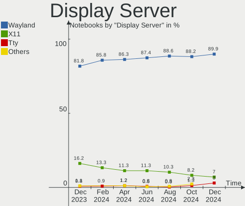
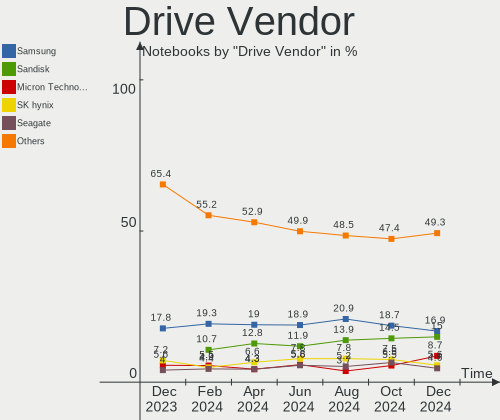
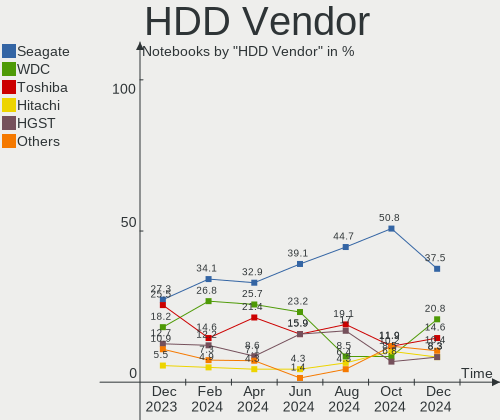
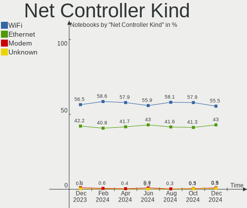
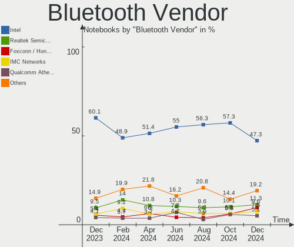
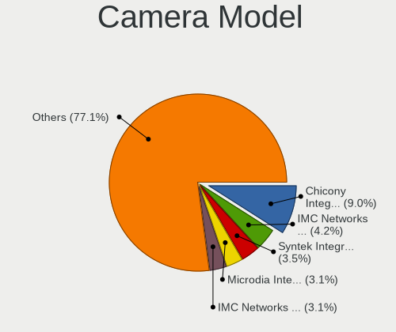

Fedora - Hardware Trends (Notebooks)
------------------------------------

A project to identify most popular hardware characteristics and track their change
over time based on data collected by Linux users at https://Linux-Hardware.org.

Anyone can contribute to this report by the [hw-probe](https://github.com/linuxhw/hw-probe) tool:

    sudo -E hw-probe -all -upload

This report is for one last month. Overall report since the beginning of time: [TestCoverage](https://github.com/linuxhw/TestCoverage)

Period: Oct, 2022.

Contents
--------

* [ System ](#system)
  - [ OS                       ](#os)
  - [ OS Family                ](#os-family)
  - [ Kernel                   ](#kernel)
  - [ Kernel Family            ](#kernel-family)
  - [ Kernel Major Ver.        ](#kernel-major-ver)
  - [ Arch                     ](#arch)
  - [ DE                       ](#de)
  - [ Display Server           ](#display-server)
  - [ Display Manager          ](#display-manager)
  - [ OS Lang                  ](#os-lang)
  - [ Boot Mode                ](#boot-mode)
  - [ Filesystem               ](#filesystem)
  - [ Part. scheme             ](#part-scheme)
  - [ Dual Boot with Linux/BSD ](#dual-boot-with-linuxbsd)
  - [ Dual Boot (Win)          ](#dual-boot-win)

* [ Board ](#board)
  - [ Vendor                   ](#vendor)
  - [ Model                    ](#model)
  - [ Model Family             ](#model-family)
  - [ MFG Year                 ](#mfg-year)
  - [ Form Factor              ](#form-factor)
  - [ Secure Boot              ](#secure-boot)
  - [ Coreboot                 ](#coreboot)
  - [ RAM Size                 ](#ram-size)
  - [ RAM Used                 ](#ram-used)
  - [ Total Drives             ](#total-drives)
  - [ Has CD-ROM               ](#has-cd-rom)
  - [ Has Ethernet             ](#has-ethernet)
  - [ Has WiFi                 ](#has-wifi)
  - [ Has Bluetooth            ](#has-bluetooth)

* [ Location ](#location)
  - [ Country                  ](#country)
  - [ City                     ](#city)

* [ Drives ](#drives)
  - [ Drive Vendor             ](#drive-vendor)
  - [ Drive Model              ](#drive-model)
  - [ HDD Vendor               ](#hdd-vendor)
  - [ SSD Vendor               ](#ssd-vendor)
  - [ Drive Kind               ](#drive-kind)
  - [ Drive Connector          ](#drive-connector)
  - [ Drive Size               ](#drive-size)
  - [ Space Total              ](#space-total)
  - [ Space Used               ](#space-used)
  - [ Malfunc. Drives          ](#malfunc-drives)
  - [ Malfunc. Drive Vendor    ](#malfunc-drive-vendor)
  - [ Malfunc. HDD Vendor      ](#malfunc-hdd-vendor)
  - [ Malfunc. Drive Kind      ](#malfunc-drive-kind)
  - [ Failed Drives            ](#failed-drives)
  - [ Failed Drive Vendor      ](#failed-drive-vendor)
  - [ Drive Status             ](#drive-status)

* [ Storage controller ](#storage-controller)
  - [ Storage Vendor           ](#storage-vendor)
  - [ Storage Model            ](#storage-model)
  - [ Storage Kind             ](#storage-kind)

* [ Processor ](#processor)
  - [ CPU Vendor               ](#cpu-vendor)
  - [ CPU Model                ](#cpu-model)
  - [ CPU Model Family         ](#cpu-model-family)
  - [ CPU Cores                ](#cpu-cores)
  - [ CPU Sockets              ](#cpu-sockets)
  - [ CPU Threads              ](#cpu-threads)
  - [ CPU Op-Modes             ](#cpu-op-modes)
  - [ CPU Microcode            ](#cpu-microcode)
  - [ CPU Microarch            ](#cpu-microarch)

* [ Graphics ](#graphics)
  - [ GPU Vendor               ](#gpu-vendor)
  - [ GPU Model                ](#gpu-model)
  - [ GPU Combo                ](#gpu-combo)
  - [ GPU Driver               ](#gpu-driver)
  - [ GPU Memory               ](#gpu-memory)

* [ Monitor ](#monitor)
  - [ Monitor Vendor           ](#monitor-vendor)
  - [ Monitor Model            ](#monitor-model)
  - [ Monitor Resolution       ](#monitor-resolution)
  - [ Monitor Diagonal         ](#monitor-diagonal)
  - [ Monitor Width            ](#monitor-width)
  - [ Aspect Ratio             ](#aspect-ratio)
  - [ Monitor Area             ](#monitor-area)
  - [ Pixel Density            ](#pixel-density)
  - [ Multiple Monitors        ](#multiple-monitors)

* [ Network ](#network)
  - [ Net Controller Vendor    ](#net-controller-vendor)
  - [ Net Controller Model     ](#net-controller-model)
  - [ Wireless Vendor          ](#wireless-vendor)
  - [ Wireless Model           ](#wireless-model)
  - [ Ethernet Vendor          ](#ethernet-vendor)
  - [ Ethernet Model           ](#ethernet-model)
  - [ Net Controller Kind      ](#net-controller-kind)
  - [ Used Controller          ](#used-controller)
  - [ NICs                     ](#nics)
  - [ IPv6                     ](#ipv6)

* [ Bluetooth ](#bluetooth)
  - [ Bluetooth Vendor         ](#bluetooth-vendor)
  - [ Bluetooth Model          ](#bluetooth-model)

* [ Sound ](#sound)
  - [ Sound Vendor             ](#sound-vendor)
  - [ Sound Model              ](#sound-model)

* [ Memory ](#memory)
  - [ Memory Vendor            ](#memory-vendor)
  - [ Memory Model             ](#memory-model)
  - [ Memory Kind              ](#memory-kind)
  - [ Memory Form Factor       ](#memory-form-factor)
  - [ Memory Size              ](#memory-size)
  - [ Memory Speed             ](#memory-speed)

* [ Printers & scanners ](#printers--scanners)
  - [ Printer Vendor           ](#printer-vendor)
  - [ Printer Model            ](#printer-model)
  - [ Scanner Vendor           ](#scanner-vendor)
  - [ Scanner Model            ](#scanner-model)

* [ Camera ](#camera)
  - [ Camera Vendor            ](#camera-vendor)
  - [ Camera Model             ](#camera-model)

* [ Security ](#security)
  - [ Fingerprint Vendor       ](#fingerprint-vendor)
  - [ Fingerprint Model        ](#fingerprint-model)
  - [ Chipcard Vendor          ](#chipcard-vendor)
  - [ Chipcard Model           ](#chipcard-model)

* [ Unsupported ](#unsupported)
  - [ Unsupported Devices      ](#unsupported-devices)
  - [ Unsupported Device Types ](#unsupported-device-types)

System
------

OS
--

Installed operating systems

| Name      | Notebooks | Percent |
|-----------|-----------|---------|
| Fedora 36 | 179       | 78.51%  |
| Fedora 37 | 45        | 19.74%  |
| Fedora 35 | 1         | 0.44%   |
| Fedora 34 | 1         | 0.44%   |
| Fedora 32 | 1         | 0.44%   |
| Fedora 29 | 1         | 0.44%   |

OS Family
---------

OS without a version

| Name   | Notebooks | Percent |
|--------|-----------|---------|
| Fedora | 228       | 100%    |

Kernel
------

Version of the Linux kernel

| Version                                                      | Notebooks | Percent |
|--------------------------------------------------------------|-----------|---------|
| 5.19.16-200.fc36.x86_64                                      | 44        | 19.3%   |
| 5.19.15-201.fc36.x86_64                                      | 32        | 14.04%  |
| 5.19.13-200.fc36.x86_64                                      | 25        | 10.96%  |
| 5.19.14-200.fc36.x86_64                                      | 24        | 10.53%  |
| 5.19.12-200.fc36.x86_64                                      | 18        | 7.89%   |
| 5.17.5-300.fc36.x86_64                                       | 12        | 5.26%   |
| 6.0.5-200.fc36.x86_64                                        | 9         | 3.95%   |
| 5.19.13-300.fc37.x86_64                                      | 9         | 3.95%   |
| 5.19.16-301.fc37.x86_64                                      | 7         | 3.07%   |
| 5.19.14-300.fc37.x86_64                                      | 7         | 3.07%   |
| 5.19.11-200.fc36.x86_64                                      | 6         | 2.63%   |
| 5.19.15-301.fc37.x86_64                                      | 5         | 2.19%   |
| 5.19.7-300.fc37.x86_64                                       | 3         | 1.32%   |
| 5.19.16-300.fc37.x86_64                                      | 3         | 1.32%   |
| 5.19.12-300.fc37.x86_64                                      | 3         | 1.32%   |
| 6.0.5-300.fc37.x86_64                                        | 2         | 0.88%   |
| 5.19.15-300.fc37.x86_64                                      | 2         | 0.88%   |
| 6.1.0-0.rc0.20221012git49da07006239.10.vanilla.1.fc37.x86_64 | 1         | 0.44%   |
| 6.0.2-xm1.0.fc37.x86_64                                      | 1         | 0.44%   |
| 6.0.2-xm1.0.fc36.x86_64                                      | 1         | 0.44%   |
| 6.0.2-301.fc36.x86_64                                        | 1         | 0.44%   |
| 6.0.2-300.rog.fc36.x86_64                                    | 1         | 0.44%   |
| 6.0.0-0.rc2.20220826git4c612826bec1.22.vanilla.1.fc36.x86_64 | 1         | 0.44%   |
| 5.9.10-100.fc32.x86_64                                       | 1         | 0.44%   |
| 5.3.11-100.fc29.x86_64                                       | 1         | 0.44%   |
| 5.19.8-200.fc36.x86_64                                       | 1         | 0.44%   |
| 5.19.4-200.fc36.x86_64                                       | 1         | 0.44%   |
| 5.19.4-100.fc35.x86_64                                       | 1         | 0.44%   |
| 5.19.15-602.inttf.fc36.x86_64                                | 1         | 0.44%   |
| 5.19.12-xm1.0.fc37.x86_64                                    | 1         | 0.44%   |
| 5.19.12-302.rog.fc37.x86_64                                  | 1         | 0.44%   |
| 5.19.10-200.fc36.x86_64                                      | 1         | 0.44%   |
| 5.18.6-200.mbp.fc34.x86_64                                   | 1         | 0.44%   |
| 5.17.12-100.fc34.x86_64                                      | 1         | 0.44%   |

Kernel Family
-------------

Linux kernel without a distro release

| Version | Notebooks | Percent |
|---------|-----------|---------|
| 5.19.16 | 54        | 23.68%  |
| 5.19.15 | 40        | 17.54%  |
| 5.19.13 | 34        | 14.91%  |
| 5.19.14 | 31        | 13.6%   |
| 5.19.12 | 23        | 10.09%  |
| 5.17.5  | 12        | 5.26%   |
| 6.0.5   | 11        | 4.82%   |
| 5.19.11 | 6         | 2.63%   |
| 6.0.2   | 4         | 1.75%   |
| 5.19.7  | 3         | 1.32%   |
| 5.19.4  | 2         | 0.88%   |
| 6.1.0   | 1         | 0.44%   |
| 6.0.0   | 1         | 0.44%   |
| 5.9.10  | 1         | 0.44%   |
| 5.3.11  | 1         | 0.44%   |
| 5.19.8  | 1         | 0.44%   |
| 5.19.10 | 1         | 0.44%   |
| 5.18.6  | 1         | 0.44%   |
| 5.17.12 | 1         | 0.44%   |

Kernel Major Ver.
-----------------

Linux kernel major version

| Version | Notebooks | Percent |
|---------|-----------|---------|
| 5.19    | 195       | 85.53%  |
| 6.0     | 16        | 7.02%   |
| 5.17    | 13        | 5.7%    |
| 6.1     | 1         | 0.44%   |
| 5.9     | 1         | 0.44%   |
| 5.3     | 1         | 0.44%   |
| 5.18    | 1         | 0.44%   |

Arch
----

OS architecture (x86_64, i586, etc.)

| Name   | Notebooks | Percent |
|--------|-----------|---------|
| x86_64 | 228       | 100%    |

DE
--

Desktop Environment

| Name       | Notebooks | Percent |
|------------|-----------|---------|
| GNOME      | 183       | 80.26%  |
| KDE5       | 29        | 12.72%  |
| XFCE       | 3         | 1.32%   |
| X-Cinnamon | 3         | 1.32%   |
| Cinnamon   | 3         | 1.32%   |
| MATE       | 2         | 0.88%   |
| LXDE       | 2         | 0.88%   |
| LXQt       | 1         | 0.44%   |
| fluxbox    | 1         | 0.44%   |
| Unknown    | 1         | 0.44%   |

Display Server
--------------

X11 or Wayland

| Name    | Notebooks | Percent |
|---------|-----------|---------|
| Wayland | 177       | 77.63%  |
| X11     | 48        | 21.05%  |
| Tty     | 2         | 0.88%   |
| Unknown | 1         | 0.44%   |

Display Manager
---------------

SDDM, LightDM, etc.

| Name    | Notebooks | Percent |
|---------|-----------|---------|
| Unknown | 104       | 45.61%  |
| GDM     | 91        | 39.91%  |
| LightDM | 17        | 7.46%   |
| SDDM    | 15        | 6.58%   |
| LXDM    | 1         | 0.44%   |

OS Lang
-------

Language

| Lang  | Notebooks | Percent |
|-------|-----------|---------|
| en_US | 130       | 57.02%  |
| it_IT | 18        | 7.89%   |
| ru_RU | 14        | 6.14%   |
| en_GB | 9         | 3.95%   |
| fr_FR | 7         | 3.07%   |
| pt_BR | 6         | 2.63%   |
| es_ES | 6         | 2.63%   |
| pl_PL | 5         | 2.19%   |
| en_AU | 5         | 2.19%   |
| de_DE | 5         | 2.19%   |
| en_IN | 3         | 1.32%   |
| ru_UA | 2         | 0.88%   |
| hu_HU | 2         | 0.88%   |
| en_CA | 2         | 0.88%   |
| da_DK | 2         | 0.88%   |
| uk_UA | 1         | 0.44%   |
| tr_TR | 1         | 0.44%   |
| nl_BE | 1         | 0.44%   |
| nb_NO | 1         | 0.44%   |
| fr_BE | 1         | 0.44%   |
| es_GT | 1         | 0.44%   |
| en_PH | 1         | 0.44%   |
| en_NZ | 1         | 0.44%   |
| en_IL | 1         | 0.44%   |
| en_IE | 1         | 0.44%   |
| en_AT | 1         | 0.44%   |
| C     | 1         | 0.44%   |

Boot Mode
---------

EFI or BIOS

| Mode | Notebooks | Percent |
|------|-----------|---------|
| EFI  | 190       | 83.33%  |
| BIOS | 38        | 16.67%  |

Filesystem
----------

Type of filesystem

| Type    | Notebooks | Percent |
|---------|-----------|---------|
| Btrfs   | 182       | 79.82%  |
| Ext4    | 39        | 17.11%  |
| Xfs     | 6         | 2.63%   |
| Overlay | 1         | 0.44%   |

Part. scheme
------------

Scheme of partitioning

| Type    | Notebooks | Percent |
|---------|-----------|---------|
| GPT     | 112       | 49.12%  |
| Unknown | 102       | 44.74%  |
| MBR     | 14        | 6.14%   |

Dual Boot with Linux/BSD
------------------------

Hosting more than one Linux/BSD

| Dual boot | Notebooks | Percent |
|-----------|-----------|---------|
| No        | 207       | 90.79%  |
| Yes       | 21        | 9.21%   |

Dual Boot (Win)
---------------

Hosting Linux and Windows

| Dual boot | Notebooks | Percent |
|-----------|-----------|---------|
| No        | 177       | 77.63%  |
| Yes       | 51        | 22.37%  |

Board
-----

Vendor
------

Motherboard manufacturer

| Name                | Notebooks | Percent |
|---------------------|-----------|---------|
| Lenovo              | 65        | 28.51%  |
| Hewlett-Packard     | 39        | 17.11%  |
| Dell                | 39        | 17.11%  |
| ASUSTek Computer    | 27        | 11.84%  |
| Acer                | 13        | 5.7%    |
| Apple               | 7         | 3.07%   |
| HUAWEI              | 6         | 2.63%   |
| Timi                | 5         | 2.19%   |
| MSI                 | 5         | 2.19%   |
| Framework           | 4         | 1.75%   |
| System76            | 2         | 0.88%   |
| Samsung Electronics | 2         | 0.88%   |
| Notebook            | 2         | 0.88%   |
| LG Electronics      | 2         | 0.88%   |
| UNOWHY              | 1         | 0.44%   |
| Toshiba             | 1         | 0.44%   |
| Sony                | 1         | 0.44%   |
| Schenker            | 1         | 0.44%   |
| Purism              | 1         | 0.44%   |
| MICROMAX            | 1         | 0.44%   |
| LincPlus            | 1         | 0.44%   |
| Itautec             | 1         | 0.44%   |
| Gigabyte Technology | 1         | 0.44%   |
| Aquarius            | 1         | 0.44%   |

Model
-----

Motherboard model

| Name                                   | Notebooks | Percent |
|----------------------------------------|-----------|---------|
| Timi TM1701                            | 2         | 0.88%   |
| Lenovo IdeaPad 5 15ARE05 81YQ          | 2         | 0.88%   |
| Lenovo IdeaPad 3 15ITL6 82H8           | 2         | 0.88%   |
| HUAWEI NBLB-WAX9N                      | 2         | 0.88%   |
| HP Pavilion Aero Laptop 13-be0xxx      | 2         | 0.88%   |
| HP Laptop 15s-eq2xxx                   | 2         | 0.88%   |
| HP 15                                  | 2         | 0.88%   |
| Framework Laptop (12th Gen Intel Core) | 2         | 0.88%   |
| Framework Laptop                       | 2         | 0.88%   |
| Dell XPS 15 9510                       | 2         | 0.88%   |
| Dell XPS 13 9300                       | 2         | 0.88%   |
| Dell Precision 5510                    | 2         | 0.88%   |
| ASUS VivoBook_ASUSLaptop X509JA_X509JA | 2         | 0.88%   |
| Apple MacBookPro9,2                    | 2         | 0.88%   |
| Acer Predator PH315-53                 | 2         | 0.88%   |
| UNOWHY Y13G011S4EI                     | 1         | 0.44%   |
| Toshiba Satellite C660                 | 1         | 0.44%   |
| Timi Xiaomi Book Pro 16 2022           | 1         | 0.44%   |
| Timi Mi Laptop Pro 15                  | 1         | 0.44%   |
| Timi A35S                              | 1         | 0.44%   |
| System76 Kudu                          | 1         | 0.44%   |
| System76 Galago UltraPro               | 1         | 0.44%   |
| Sony VPCCB3S1R                         | 1         | 0.44%   |
| Schenker XMG FUSION 15 (XFU15L19)      | 1         | 0.44%   |
| Samsung RV410/RV510/S3510/E3510        | 1         | 0.44%   |
| Samsung 800G5M/800G5W                  | 1         | 0.44%   |
| Purism Librem 13 v2                    | 1         | 0.44%   |
| Notebook W230SS                        | 1         | 0.44%   |
| Notebook N2x0WU                        | 1         | 0.44%   |
| MSI Summit E16Flip A11UCT              | 1         | 0.44%   |
| MSI PS63 Modern 8RC                    | 1         | 0.44%   |
| MSI Prestige 14 A10SC                  | 1         | 0.44%   |
| MSI Modern 15 A11M                     | 1         | 0.44%   |
| MSI Modern 14 C12M                     | 1         | 0.44%   |
| MICROMAX Canvas Lapbook L1161          | 1         | 0.44%   |
| LincPlus P1                            | 1         | 0.44%   |
| LG 16Z90P-G.AP75D                      | 1         | 0.44%   |
| LG 14Z990-V.AR52A2                     | 1         | 0.44%   |
| Lenovo Yoga Slim 7 Pro 14ACH5 OD 82NK  | 1         | 0.44%   |
| Lenovo Yoga Slim 7 Pro 14ACH5 82MS     | 1         | 0.44%   |

Model Family
------------

Motherboard model prefix

| Name               | Notebooks | Percent |
|--------------------|-----------|---------|
| Lenovo ThinkPad    | 40        | 17.54%  |
| Lenovo IdeaPad     | 13        | 5.7%    |
| Dell Inspiron      | 13        | 5.7%    |
| ASUS VivoBook      | 10        | 4.39%   |
| Dell XPS           | 9         | 3.95%   |
| Dell Latitude      | 9         | 3.95%   |
| Acer Aspire        | 8         | 3.51%   |
| HP Laptop          | 7         | 3.07%   |
| HP EliteBook       | 7         | 3.07%   |
| HP Pavilion        | 6         | 2.63%   |
| HP ProBook         | 5         | 2.19%   |
| Lenovo Yoga        | 4         | 1.75%   |
| Lenovo Legion      | 4         | 1.75%   |
| Framework Laptop   | 4         | 1.75%   |
| Dell Vostro        | 4         | 1.75%   |
| Dell Precision     | 4         | 1.75%   |
| ASUS ASUS          | 4         | 1.75%   |
| HP ZBook           | 3         | 1.32%   |
| HP ENVY            | 3         | 1.32%   |
| ASUS ROG           | 3         | 1.32%   |
| Timi TM1701        | 2         | 0.88%   |
| MSI Modern         | 2         | 0.88%   |
| Lenovo ThinkBook   | 2         | 0.88%   |
| HUAWEI NBLB-WAX9N  | 2         | 0.88%   |
| HP 15              | 2         | 0.88%   |
| Apple MacBookPro9  | 2         | 0.88%   |
| Apple MacBookPro11 | 2         | 0.88%   |
| Acer Predator      | 2         | 0.88%   |
| Acer Nitro         | 2         | 0.88%   |
| UNOWHY Y13G011S4EI | 1         | 0.44%   |
| Toshiba Satellite  | 1         | 0.44%   |
| Timi Xiaomi        | 1         | 0.44%   |
| Timi Mi            | 1         | 0.44%   |
| Timi A35S          | 1         | 0.44%   |
| System76 Kudu      | 1         | 0.44%   |
| System76 Galago    | 1         | 0.44%   |
| Sony VPCCB3S1R     | 1         | 0.44%   |
| Schenker XMG       | 1         | 0.44%   |
| Samsung RV410      | 1         | 0.44%   |
| Samsung 800G5M     | 1         | 0.44%   |

MFG Year
--------

Motherboard manufacture year

| Year | Notebooks | Percent |
|------|-----------|---------|
| 2021 | 41        | 17.98%  |
| 2020 | 39        | 17.11%  |
| 2017 | 26        | 11.4%   |
| 2019 | 25        | 10.96%  |
| 2022 | 22        | 9.65%   |
| 2018 | 19        | 8.33%   |
| 2016 | 12        | 5.26%   |
| 2012 | 9         | 3.95%   |
| 2013 | 8         | 3.51%   |
| 2015 | 7         | 3.07%   |
| 2014 | 7         | 3.07%   |
| 2010 | 6         | 2.63%   |
| 2011 | 5         | 2.19%   |
| 2009 | 2         | 0.88%   |

Form Factor
-----------

Physical design of the computer

| Name     | Notebooks | Percent |
|----------|-----------|---------|
| Notebook | 228       | 100%    |

Secure Boot
-----------

Enabled or disabled

| State    | Notebooks | Percent |
|----------|-----------|---------|
| Disabled | 180       | 78.95%  |
| Enabled  | 48        | 21.05%  |

Coreboot
--------

Have coreboot on board

| Used | Notebooks | Percent |
|------|-----------|---------|
| No   | 227       | 99.56%  |
| Yes  | 1         | 0.44%   |

RAM Size
--------

Total RAM memory

| Size in GB  | Notebooks | Percent |
|-------------|-----------|---------|
| 4.01-8.0    | 73        | 32.02%  |
| 16.01-24.0  | 63        | 27.63%  |
| 8.01-16.0   | 39        | 17.11%  |
| 32.01-64.0  | 28        | 12.28%  |
| 3.01-4.0    | 12        | 5.26%   |
| 64.01-256.0 | 4         | 1.75%   |
| 1.01-2.0    | 4         | 1.75%   |
| 24.01-32.0  | 3         | 1.32%   |
| 2.01-3.0    | 2         | 0.88%   |

RAM Used
--------

Used RAM memory

| Used GB    | Notebooks | Percent |
|------------|-----------|---------|
| 4.01-8.0   | 70        | 30.7%   |
| 2.01-3.0   | 64        | 28.07%  |
| 3.01-4.0   | 48        | 21.05%  |
| 1.01-2.0   | 22        | 9.65%   |
| 8.01-16.0  | 21        | 9.21%   |
| 16.01-24.0 | 2         | 0.88%   |
| 0.51-1.0   | 1         | 0.44%   |

Total Drives
------------

Number of drives on board

| Drives | Notebooks | Percent |
|--------|-----------|---------|
| 1      | 163       | 71.49%  |
| 2      | 59        | 25.88%  |
| 3      | 4         | 1.75%   |
| 4      | 1         | 0.44%   |
| 0      | 1         | 0.44%   |

Has CD-ROM
----------

Has CD-ROM on board

| Presented | Notebooks | Percent |
|-----------|-----------|---------|
| No        | 197       | 86.4%   |
| Yes       | 31        | 13.6%   |

Has Ethernet
------------

Has Ethernet on board

| Presented | Notebooks | Percent |
|-----------|-----------|---------|
| Yes       | 153       | 67.11%  |
| No        | 75        | 32.89%  |

Has WiFi
--------

Has WiFi module

| Presented | Notebooks | Percent |
|-----------|-----------|---------|
| Yes       | 227       | 99.56%  |
| No        | 1         | 0.44%   |

Has Bluetooth
-------------

Has Bluetooth module

| Presented | Notebooks | Percent |
|-----------|-----------|---------|
| Yes       | 193       | 84.65%  |
| No        | 35        | 15.35%  |

Location
--------

Country
-------

Geographic location (country)

| Country            | Notebooks | Percent |
|--------------------|-----------|---------|
| USA                | 32        | 14.04%  |
| Italy              | 29        | 12.72%  |
| Russia             | 17        | 7.46%   |
| Germany            | 15        | 6.58%   |
| India              | 13        | 5.7%    |
| France             | 11        | 4.82%   |
| Brazil             | 8         | 3.51%   |
| Australia          | 7         | 3.07%   |
| Spain              | 6         | 2.63%   |
| Poland             | 6         | 2.63%   |
| Indonesia          | 5         | 2.19%   |
| Hungary            | 5         | 2.19%   |
| Belgium            | 5         | 2.19%   |
| Turkey             | 4         | 1.75%   |
| Netherlands        | 4         | 1.75%   |
| Austria            | 4         | 1.75%   |
| Thailand           | 3         | 1.32%   |
| South Korea        | 3         | 1.32%   |
| Mexico             | 3         | 1.32%   |
| Finland            | 3         | 1.32%   |
| Vietnam            | 2         | 0.88%   |
| Ukraine            | 2         | 0.88%   |
| Sweden             | 2         | 0.88%   |
| Kenya              | 2         | 0.88%   |
| Ireland            | 2         | 0.88%   |
| Dominican Republic | 2         | 0.88%   |
| Denmark            | 2         | 0.88%   |
| Czechia            | 2         | 0.88%   |
| Belarus            | 2         | 0.88%   |
| UK                 | 1         | 0.44%   |
| UAE                | 1         | 0.44%   |
| Tunisia            | 1         | 0.44%   |
| Taiwan             | 1         | 0.44%   |
| Switzerland        | 1         | 0.44%   |
| Sudan              | 1         | 0.44%   |
| Slovakia           | 1         | 0.44%   |
| Singapore          | 1         | 0.44%   |
| Puerto Rico        | 1         | 0.44%   |
| Philippines        | 1         | 0.44%   |
| Norway             | 1         | 0.44%   |

City
----

Geographic location (city)

| City               | Notebooks | Percent |
|--------------------|-----------|---------|
| Moscow             | 6         | 2.63%   |
| Milan              | 4         | 1.75%   |
| Istanbul           | 4         | 1.75%   |
| Budapest           | 4         | 1.75%   |
| Vienna             | 3         | 1.32%   |
| Munich             | 3         | 1.32%   |
| Brisbane           | 3         | 1.32%   |
| Warsaw             | 2         | 0.88%   |
| Sao Paulo          | 2         | 0.88%   |
| Santo Domingo Este | 2         | 0.88%   |
| Sandy Bay          | 2         | 0.88%   |
| Pune               | 2         | 0.88%   |
| Padova             | 2         | 0.88%   |
| Odessa             | 2         | 0.88%   |
| Navi Mumbai        | 2         | 0.88%   |
| Nairobi            | 2         | 0.88%   |
| Madrid             | 2         | 0.88%   |
| Helsinki           | 2         | 0.88%   |
| Hanoi              | 2         | 0.88%   |
| Galway             | 2         | 0.88%   |
| Chicago            | 2         | 0.88%   |
| Chennai            | 2         | 0.88%   |
| Berlin             | 2         | 0.88%   |
| Bangkok            | 2         | 0.88%   |
| Zurich             | 1         | 0.44%   |
| Zellik             | 1         | 0.44%   |
| Zandvoort          | 1         | 0.44%   |
| Yekaterinburg      | 1         | 0.44%   |
| Yangon             | 1         | 0.44%   |
| Wonju              | 1         | 0.44%   |
| Westminster        | 1         | 0.44%   |
| Wellington         | 1         | 0.44%   |
| Vilnius            | 1         | 0.44%   |
| Villetaneuse       | 1         | 0.44%   |
| Vignola            | 1         | 0.44%   |
| Venice             | 1         | 0.44%   |
| Vanlose            | 1         | 0.44%   |
| Valcanneto         | 1         | 0.44%   |
| Uberlândia        | 1         | 0.44%   |
| Tver               | 1         | 0.44%   |

Drives
------

Drive Vendor
------------

Hard drive vendors

| Vendor                      | Notebooks | Drives | Percent |
|-----------------------------|-----------|--------|---------|
| Samsung Electronics         | 60        | 69     | 20.91%  |
| WDC                         | 26        | 26     | 9.06%   |
| Seagate                     | 25        | 25     | 8.71%   |
| Sandisk                     | 22        | 23     | 7.67%   |
| SK hynix                    | 21        | 21     | 7.32%   |
| Intel                       | 19        | 19     | 6.62%   |
| Micron Technology           | 15        | 15     | 5.23%   |
| Toshiba                     | 14        | 14     | 4.88%   |
| Unknown                     | 12        | 14     | 4.18%   |
| KIOXIA                      | 10        | 10     | 3.48%   |
| Kingston                    | 9         | 9      | 3.14%   |
| Crucial                     | 9         | 9      | 3.14%   |
| HGST                        | 5         | 5      | 1.74%   |
| Apple                       | 4         | 4      | 1.39%   |
| A-DATA Technology           | 4         | 4      | 1.39%   |
| Team                        | 2         | 2      | 0.7%    |
| SPCC                        | 2         | 2      | 0.7%    |
| Realtek Semiconductor       | 2         | 2      | 0.7%    |
| Phison Electronics          | 2         | 2      | 0.7%    |
| Kingston Technology Company | 2         | 2      | 0.7%    |
| KingDian                    | 2         | 2      | 0.7%    |
| Hitachi                     | 2         | 2      | 0.7%    |
| ADATA Technology            | 2         | 2      | 0.7%    |
| YMTC                        | 1         | 1      | 0.35%   |
| walram                      | 1         | 1      | 0.35%   |
| UMIS                        | 1         | 1      | 0.35%   |
| Transcend                   | 1         | 1      | 0.35%   |
| Solid State Storage         | 1         | 1      | 0.35%   |
| Silicon Motion              | 1         | 1      | 0.35%   |
| PNY                         | 1         | 1      | 0.35%   |
| OCZ                         | 1         | 1      | 0.35%   |
| Micron/Crucial Technology   | 1         | 1      | 0.35%   |
| LITEON                      | 1         | 1      | 0.35%   |
| Lexar                       | 1         | 1      | 0.35%   |
| Kingmax                     | 1         | 1      | 0.35%   |
| JMicron Technology          | 1         | 1      | 0.35%   |
| Intenso                     | 1         | 1      | 0.35%   |
| GOODRAM                     | 1         | 1      | 0.35%   |
| China                       | 1         | 1      | 0.35%   |

Drive Model
-----------

Hard drive models

| Model                                                           | Notebooks | Percent |
|-----------------------------------------------------------------|-----------|---------|
| Samsung NVMe SSD Controller SM981/PM981/PM983 500GB             | 13        | 4.38%   |
| Seagate ST1000LM035-1RK172 1TB                                  | 7         | 2.36%   |
| SK hynix BC501 NVMe Solid State Drive 512GB                     | 4         | 1.35%   |
| Sandisk WD Blue SN550 NVMe SSD 1TB                              | 4         | 1.35%   |
| Samsung NVMe SSD Controller PM9A1/PM9A3/980PRO 250GB            | 4         | 1.35%   |
| Samsung MZALQ512HBLU-00BL2 512GB                                | 4         | 1.35%   |
| Seagate ST9500325AS 500GB                                       | 3         | 1.01%   |
| Seagate ST1000LM024 HN-M101MBB 1TB                              | 3         | 1.01%   |
| Samsung MZVLQ512HBLU-00BH1 512GB                                | 3         | 1.01%   |
| KIOXIA KBG40ZNV512G 512GB                                       | 3         | 1.01%   |
| WDC WD10SPZX-24Z10 1TB                                          | 2         | 0.67%   |
| WDC WD10SPZX-21Z10T0 1TB                                        | 2         | 0.67%   |
| Unknown SD64G  64GB                                             | 2         | 0.67%   |
| Unknown MMC Card  128GB                                         | 2         | 0.67%   |
| Toshiba MQ04ABF100 1TB                                          | 2         | 0.67%   |
| SK hynix SKHynix_HFS512GDE9X081N 512GB                          | 2         | 0.67%   |
| SK hynix SC311 SATA 256GB SSD                                   | 2         | 0.67%   |
| Seagate ST9250315AS 250GB                                       | 2         | 0.67%   |
| Seagate ST500LT012-1DG142 500GB                                 | 2         | 0.67%   |
| Seagate ST1000LM048-2E7172 1TB                                  | 2         | 0.67%   |
| Sandisk WD_BLACK SN770 2TB                                      | 2         | 0.67%   |
| Sandisk WD Black SN750 / PC SN730 NVMe SSD 1TB                  | 2         | 0.67%   |
| Samsung SSD 860 EVO 2TB                                         | 2         | 0.67%   |
| Samsung SSD 850 EVO 250GB                                       | 2         | 0.67%   |
| Samsung NVMe SSD Controller SM961/PM961/SM963 250GB             | 2         | 0.67%   |
| Samsung MZVL21T0HCLR-00BL7 1TB                                  | 2         | 0.67%   |
| Samsung MZALQ512HALU-000L1 512GB                                | 2         | 0.67%   |
| Micron MTFDKBA512TFH 512GB                                      | 2         | 0.67%   |
| Micron 3400_MTFDKBA512TFH 512GB                                 | 2         | 0.67%   |
| KIOXIA KBG40ZNS512G NVMe 512GB                                  | 2         | 0.67%   |
| KingDian S280 240GB SSD                                         | 2         | 0.67%   |
| Intel SSD 660P Series 1024GB                                    | 2         | 0.67%   |
| Intel SSD 600P Series 256GB                                     | 2         | 0.67%   |
| HGST HTS721010A9E630 1TB                                        | 2         | 0.67%   |
| Crucial CT500MX500SSD1 500GB                                    | 2         | 0.67%   |
| Apple SSD SM0256G 256GB                                         | 2         | 0.67%   |
| ADATA XPG SX8200 Pro PCIe Gen3x4 M.2 2280 Solid State Drive 1TB | 2         | 0.67%   |
| A-DATA IM2P33F3A NVMe 256GB                                     | 2         | 0.67%   |
| YMTC PC005 256GB                                                | 1         | 0.34%   |
| WDC WDS500G2B0B-00YS70 500GB SSD                                | 1         | 0.34%   |

HDD Vendor
----------

Hard disk drive vendors

| Vendor  | Notebooks | Drives | Percent |
|---------|-----------|--------|---------|
| Seagate | 25        | 25     | 54.35%  |
| WDC     | 10        | 10     | 21.74%  |
| HGST    | 5         | 5      | 10.87%  |
| Toshiba | 3         | 3      | 6.52%   |
| Hitachi | 2         | 2      | 4.35%   |
| Unknown | 1         | 1      | 2.17%   |

SSD Vendor
----------

Solid state drive vendors

| Vendor              | Notebooks | Drives | Percent |
|---------------------|-----------|--------|---------|
| Samsung Electronics | 13        | 16     | 19.12%  |
| Crucial             | 8         | 8      | 11.76%  |
| WDC                 | 6         | 6      | 8.82%   |
| SanDisk             | 6         | 6      | 8.82%   |
| Kingston            | 6         | 6      | 8.82%   |
| Intel               | 4         | 4      | 5.88%   |
| Toshiba             | 3         | 3      | 4.41%   |
| SK hynix            | 3         | 3      | 4.41%   |
| Apple               | 3         | 3      | 4.41%   |
| KingDian            | 2         | 2      | 2.94%   |
| A-DATA Technology   | 2         | 2      | 2.94%   |
| walram              | 1         | 1      | 1.47%   |
| Transcend           | 1         | 1      | 1.47%   |
| Team                | 1         | 1      | 1.47%   |
| SPCC                | 1         | 1      | 1.47%   |
| PNY                 | 1         | 1      | 1.47%   |
| OCZ                 | 1         | 1      | 1.47%   |
| Micron Technology   | 1         | 1      | 1.47%   |
| LITEON              | 1         | 1      | 1.47%   |
| Lexar               | 1         | 1      | 1.47%   |
| Kingmax             | 1         | 1      | 1.47%   |
| GOODRAM             | 1         | 1      | 1.47%   |
| China               | 1         | 1      | 1.47%   |

Drive Kind
----------

HDD or SSD

| Kind    | Notebooks | Drives | Percent |
|---------|-----------|--------|---------|
| NVMe    | 152       | 168    | 55.47%  |
| SSD     | 65        | 71     | 23.72%  |
| HDD     | 45        | 46     | 16.42%  |
| MMC     | 11        | 13     | 4.01%   |
| Unknown | 1         | 1      | 0.36%   |

Drive Connector
---------------

SATA, SAS, NVMe, etc.

| Type | Notebooks | Drives | Percent |
|------|-----------|--------|---------|
| NVMe | 152       | 167    | 57.58%  |
| SATA | 96        | 114    | 36.36%  |
| MMC  | 11        | 13     | 4.17%   |
| SAS  | 5         | 5      | 1.89%   |

Drive Size
----------

Size of hard drive

| Size in TB | Notebooks | Drives | Percent |
|------------|-----------|--------|---------|
| 0.01-0.5   | 67        | 72     | 62.62%  |
| 0.51-1.0   | 34        | 38     | 31.78%  |
| 1.01-2.0   | 6         | 7      | 5.61%   |

Space Total
-----------

Amount of disk space available on the file system

| Size in GB     | Notebooks | Percent |
|----------------|-----------|---------|
| 501-1000       | 52        | 22.81%  |
| 251-500        | 43        | 18.86%  |
| 101-250        | 34        | 14.91%  |
| 1-20           | 33        | 14.47%  |
| 1001-2000      | 25        | 10.96%  |
| Unknown        | 16        | 7.02%   |
| 51-100         | 10        | 4.39%   |
| 2001-3000      | 6         | 2.63%   |
| More than 3000 | 5         | 2.19%   |
| 21-50          | 4         | 1.75%   |

Space Used
----------

Amount of used disk space

| Used GB        | Notebooks | Percent |
|----------------|-----------|---------|
| 1-20           | 67        | 29.39%  |
| 51-100         | 41        | 17.98%  |
| 101-250        | 38        | 16.67%  |
| 21-50          | 36        | 15.79%  |
| 251-500        | 18        | 7.89%   |
| Unknown        | 16        | 7.02%   |
| 501-1000       | 8         | 3.51%   |
| 1001-2000      | 2         | 0.88%   |
| More than 3000 | 1         | 0.44%   |
| 2001-3000      | 1         | 0.44%   |

Malfunc. Drives
---------------

Drive models with a malfunction

| Model                                  | Notebooks | Drives | Percent |
|----------------------------------------|-----------|--------|---------|
| WDC WDS240G2G0B-00EPW0 240GB SSD       | 1         | 1      | 9.09%   |
| WDC WD10JPVX-60JC3T0 1TB               | 1         | 1      | 9.09%   |
| walram SSD 120G                        | 1         | 1      | 9.09%   |
| Toshiba MK3265GSX 320GB                | 1         | 1      | 9.09%   |
| Seagate ST9500325AS 500GB              | 1         | 1      | 9.09%   |
| Seagate ST1000LM048-2E7172 1TB         | 1         | 1      | 9.09%   |
| Seagate ST1000LM024 HN-M101MBB 1TB     | 1         | 1      | 9.09%   |
| Kingston SV300S37A480G 480GB SSD       | 1         | 1      | 9.09%   |
| Hitachi HTS545032B9A300 320GB          | 1         | 1      | 9.09%   |
| HGST HTS721010A9E630 1TB               | 1         | 1      | 9.09%   |
| A-DATA Technology IM2P33F3A NVMe 256GB | 1         | 1      | 9.09%   |

Malfunc. Drive Vendor
---------------------

Vendors of faulty drives

| Vendor            | Notebooks | Drives | Percent |
|-------------------|-----------|--------|---------|
| Seagate           | 3         | 3      | 27.27%  |
| WDC               | 2         | 2      | 18.18%  |
| walram            | 1         | 1      | 9.09%   |
| Toshiba           | 1         | 1      | 9.09%   |
| Kingston          | 1         | 1      | 9.09%   |
| Hitachi           | 1         | 1      | 9.09%   |
| HGST              | 1         | 1      | 9.09%   |
| A-DATA Technology | 1         | 1      | 9.09%   |

Malfunc. HDD Vendor
-------------------

Vendors of faulty HDD drives

| Vendor  | Notebooks | Drives | Percent |
|---------|-----------|--------|---------|
| Seagate | 3         | 3      | 42.86%  |
| WDC     | 1         | 1      | 14.29%  |
| Toshiba | 1         | 1      | 14.29%  |
| Hitachi | 1         | 1      | 14.29%  |
| HGST    | 1         | 1      | 14.29%  |

Malfunc. Drive Kind
-------------------

Kinds of faulty drives

| Kind | Notebooks | Drives | Percent |
|------|-----------|--------|---------|
| HDD  | 7         | 7      | 63.64%  |
| SSD  | 3         | 3      | 27.27%  |
| NVMe | 1         | 1      | 9.09%   |

Failed Drives
-------------

Failed drive models

Zero info for selected period =(

Failed Drive Vendor
-------------------

Failed drive vendors

Zero info for selected period =(

Drive Status
------------

Number of failed and malfunc. drives

| Status   | Notebooks | Drives | Percent |
|----------|-----------|--------|---------|
| Detected | 121       | 164    | 50.42%  |
| Works    | 108       | 124    | 45%     |
| Malfunc  | 11        | 11     | 4.58%   |

Storage controller
------------------

Storage Vendor
--------------

Storage controller vendors

| Vendor                         | Notebooks | Percent |
|--------------------------------|-----------|---------|
| Intel                          | 130       | 42.76%  |
| Samsung Electronics            | 52        | 17.11%  |
| SanDisk                        | 27        | 8.88%   |
| AMD                            | 23        | 7.57%   |
| SK hynix                       | 18        | 5.92%   |
| Micron Technology              | 14        | 4.61%   |
| KIOXIA                         | 10        | 3.29%   |
| Toshiba America Info Systems   | 8         | 2.63%   |
| Kingston Technology Company    | 4         | 1.32%   |
| ADATA Technology               | 4         | 1.32%   |
| Silicon Motion                 | 3         | 0.99%   |
| Realtek Semiconductor          | 2         | 0.66%   |
| Phison Electronics             | 2         | 0.66%   |
| Micron/Crucial Technology      | 2         | 0.66%   |
| Yangtze Memory Technologies    | 1         | 0.33%   |
| Union Memory (Shenzhen)        | 1         | 0.33%   |
| Solid State Storage Technology | 1         | 0.33%   |
| Marvell Technology Group       | 1         | 0.33%   |
| Apple                          | 1         | 0.33%   |

Storage Model
-------------

Storage controller models

| Model                                                                          | Notebooks | Percent |
|--------------------------------------------------------------------------------|-----------|---------|
| Intel Sunrise Point-LP SATA Controller [AHCI mode]                             | 26        | 8.1%    |
| Samsung NVMe SSD Controller SM981/PM981/PM983                                  | 22        | 6.85%   |
| AMD FCH SATA Controller [AHCI mode]                                            | 22        | 6.85%   |
| Intel Volume Management Device NVMe RAID Controller                            | 16        | 4.98%   |
| Micron Non-Volatile memory controller                                          | 14        | 4.36%   |
| Samsung NVMe SSD Controller 980                                                | 13        | 4.05%   |
| Intel 82801 Mobile SATA Controller [RAID mode]                                 | 12        | 3.74%   |
| Intel 7 Series Chipset Family 6-port SATA Controller [AHCI mode]               | 10        | 3.12%   |
| SK hynix Gold P31 SSD                                                          | 9         | 2.8%    |
| KIOXIA NVMe SSD Controller BG4                                                 | 9         | 2.8%    |
| Intel Tiger Lake-LP SATA Controller                                            | 9         | 2.8%    |
| Samsung NVMe SSD Controller PM9A1/PM9A3/980PRO                                 | 8         | 2.49%   |
| SanDisk Non-Volatile memory controller                                         | 7         | 2.18%   |
| Intel Cannon Lake Mobile PCH SATA AHCI Controller                              | 7         | 2.18%   |
| SK hynix BC501 NVMe Solid State Drive                                          | 6         | 1.87%   |
| SanDisk WD Blue SN550 NVMe SSD                                                 | 6         | 1.87%   |
| SanDisk WD Black SN750 / PC SN730 NVMe SSD                                     | 6         | 1.87%   |
| Samsung NVMe SSD Controller SM961/PM961/SM963                                  | 6         | 1.87%   |
| Intel SSD 660P Series                                                          | 6         | 1.87%   |
| Intel 8 Series SATA Controller 1 [AHCI mode]                                   | 6         | 1.87%   |
| Toshiba America Info Systems XG6 NVMe SSD Controller                           | 5         | 1.56%   |
| Intel Q170/Q150/B150/H170/H110/Z170/CM236 Chipset SATA Controller [AHCI Mode]  | 5         | 1.56%   |
| Intel Comet Lake SATA AHCI Controller                                          | 5         | 1.56%   |
| Intel Cannon Point-LP SATA Controller [AHCI Mode]                              | 5         | 1.56%   |
| Intel 6 Series/C200 Series Chipset Family 6 port Mobile SATA AHCI Controller   | 5         | 1.56%   |
| Intel SSD 600P Series                                                          | 4         | 1.25%   |
| Intel HM170/QM170 Chipset SATA Controller [AHCI Mode]                          | 4         | 1.25%   |
| Intel Celeron/Pentium Silver Processor SATA Controller                         | 4         | 1.25%   |
| Silicon Motion SM2263EN/SM2263XT SSD Controller                                | 3         | 0.93%   |
| SanDisk WD PC SN810 / Black SN850 NVMe SSD                                     | 3         | 0.93%   |
| Intel Non-Volatile memory controller                                           | 3         | 0.93%   |
| Intel 8 Series/C220 Series Chipset Family 6-port SATA Controller 1 [AHCI mode] | 3         | 0.93%   |
| Intel 400 Series Chipset Family SATA AHCI Controller                           | 3         | 0.93%   |
| SK hynix Non-Volatile memory controller                                        | 2         | 0.62%   |
| SanDisk WD Blue SN570 NVMe SSD                                                 | 2         | 0.62%   |
| SanDisk WD Black 2018/SN750 / PC SN720 NVMe SSD                                | 2         | 0.62%   |
| Samsung Electronics SATA controller                                            | 2         | 0.62%   |
| Micron/Crucial Non-Volatile memory controller                                  | 2         | 0.62%   |
| Kingston Company Company Non-Volatile memory controller                        | 2         | 0.62%   |
| Intel Wildcat Point-LP SATA Controller [AHCI Mode]                             | 2         | 0.62%   |

Storage Kind
------------

Kind of storage controller (IDE, SATA, NVMe, SAS, ...)

| Kind | Notebooks | Percent |
|------|-----------|---------|
| NVMe | 151       | 48.87%  |
| SATA | 130       | 42.07%  |
| RAID | 28        | 9.06%   |

Processor
---------

CPU Vendor
----------

Processor vendors

| Vendor | Notebooks | Percent |
|--------|-----------|---------|
| Intel  | 182       | 79.82%  |
| AMD    | 46        | 20.18%  |

CPU Model
---------

Processor models

| Model                                         | Notebooks | Percent |
|-----------------------------------------------|-----------|---------|
| Intel 11th Gen Core i7-1165G7 @ 2.80GHz       | 11        | 4.82%   |
| Intel 11th Gen Core i5-1135G7 @ 2.40GHz       | 9         | 3.95%   |
| Intel Core i7-8550U CPU @ 1.80GHz             | 6         | 2.63%   |
| Intel Core i7-7500U CPU @ 2.70GHz             | 6         | 2.63%   |
| Intel Core i5-8250U CPU @ 1.60GHz             | 6         | 2.63%   |
| AMD Ryzen 5 5500U with Radeon Graphics        | 6         | 2.63%   |
| Intel Core i7-8565U CPU @ 1.80GHz             | 5         | 2.19%   |
| Intel Core i7-10510U CPU @ 1.80GHz            | 5         | 2.19%   |
| Intel Core i5-7200U CPU @ 2.50GHz             | 5         | 2.19%   |
| Intel Core i5-1035G1 CPU @ 1.00GHz            | 5         | 2.19%   |
| Intel Core i5-6300U CPU @ 2.40GHz             | 4         | 1.75%   |
| Intel 11th Gen Core i7-1185G7 @ 3.00GHz       | 4         | 1.75%   |
| Intel 11th Gen Core i7-11850H @ 2.50GHz       | 4         | 1.75%   |
| Intel Core i7-7700HQ CPU @ 2.80GHz            | 3         | 1.32%   |
| Intel Core i7-6820HQ CPU @ 2.70GHz            | 3         | 1.32%   |
| Intel Core i5-8265U CPU @ 1.60GHz             | 3         | 1.32%   |
| Intel Core i5-5200U CPU @ 2.20GHz             | 3         | 1.32%   |
| Intel Core i5-3210M CPU @ 2.50GHz             | 3         | 1.32%   |
| Intel Core i5-10210U CPU @ 1.60GHz            | 3         | 1.32%   |
| Intel 12th Gen Core i5-1240P                  | 3         | 1.32%   |
| AMD Ryzen 7 5800H with Radeon Graphics        | 3         | 1.32%   |
| AMD Ryzen 7 4800H with Radeon Graphics        | 3         | 1.32%   |
| AMD Ryzen 5 4500U with Radeon Graphics        | 3         | 1.32%   |
| AMD Ryzen 5 3500U with Radeon Vega Mobile Gfx | 3         | 1.32%   |
| Intel Core i7-9750H CPU @ 2.60GHz             | 2         | 0.88%   |
| Intel Core i7-7820HQ CPU @ 2.90GHz            | 2         | 0.88%   |
| Intel Core i7-6500U CPU @ 2.50GHz             | 2         | 0.88%   |
| Intel Core i7-4770HQ CPU @ 2.20GHz            | 2         | 0.88%   |
| Intel Core i7-4600U CPU @ 2.10GHz             | 2         | 0.88%   |
| Intel Core i7-10750H CPU @ 2.60GHz            | 2         | 0.88%   |
| Intel Core i5-3320M CPU @ 2.60GHz             | 2         | 0.88%   |
| Intel Core i5-2430M CPU @ 2.40GHz             | 2         | 0.88%   |
| Intel Core i3-4005U CPU @ 1.70GHz             | 2         | 0.88%   |
| Intel Celeron N4000 CPU @ 1.10GHz             | 2         | 0.88%   |
| Intel 12th Gen Core i7-12700H                 | 2         | 0.88%   |
| Intel 12th Gen Core i7-1260P                  | 2         | 0.88%   |
| Intel 12th Gen Core i7-1255U                  | 2         | 0.88%   |
| Intel 11th Gen Core i7-1195G7 @ 2.90GHz       | 2         | 0.88%   |
| Intel 11th Gen Core i7-11800H @ 2.30GHz       | 2         | 0.88%   |
| AMD Ryzen 9 5900HX with Radeon Graphics       | 2         | 0.88%   |

CPU Model Family
----------------

Processor model prefix

| Model                   | Notebooks | Percent |
|-------------------------|-----------|---------|
| Intel Core i7           | 58        | 25.44%  |
| Intel Core i5           | 54        | 23.68%  |
| Other                   | 45        | 19.74%  |
| AMD Ryzen 5             | 21        | 9.21%   |
| AMD Ryzen 7             | 14        | 6.14%   |
| Intel Core i3           | 11        | 4.82%   |
| Intel Celeron           | 6         | 2.63%   |
| AMD Ryzen 9             | 3         | 1.32%   |
| Intel Xeon              | 2         | 0.88%   |
| Intel Pentium           | 2         | 0.88%   |
| Intel Core i9           | 2         | 0.88%   |
| AMD Ryzen 5 PRO         | 2         | 0.88%   |
| AMD Ryzen 3             | 2         | 0.88%   |
| Intel Pentium Dual-Core | 1         | 0.44%   |
| Intel Atom              | 1         | 0.44%   |
| AMD Ryzen 7 PRO         | 1         | 0.44%   |
| AMD E1                  | 1         | 0.44%   |
| AMD Athlon II           | 1         | 0.44%   |
| AMD A4                  | 1         | 0.44%   |

CPU Cores
---------

Number of processor cores

| Number | Notebooks | Percent |
|--------|-----------|---------|
| 4      | 100       | 43.86%  |
| 2      | 65        | 28.51%  |
| 6      | 27        | 11.84%  |
| 8      | 26        | 11.4%   |
| 12     | 5         | 2.19%   |
| 14     | 3         | 1.32%   |
| 10     | 2         | 0.88%   |

CPU Sockets
-----------

Number of sockets

| Number | Notebooks | Percent |
|--------|-----------|---------|
| 1      | 228       | 100%    |

CPU Threads
-----------

Threads per core (Hyper-Threading)

| Number | Notebooks | Percent |
|--------|-----------|---------|
| 2      | 209       | 91.67%  |
| 1      | 19        | 8.33%   |

CPU Op-Modes
------------

CPU Operation Modes (32-bit, 64-bit)

| Op mode        | Notebooks | Percent |
|----------------|-----------|---------|
| 32-bit, 64-bit | 228       | 100%    |

CPU Microcode
-------------

Microcode number

| Number     | Notebooks | Percent |
|------------|-----------|---------|
| 0x806c1    | 25        | 10.96%  |
| 0x806ec    | 16        | 7.02%   |
| 0x806ea    | 14        | 6.14%   |
| 0x806e9    | 14        | 6.14%   |
| Unknown    | 12        | 5.26%   |
| 0x306a9    | 10        | 4.39%   |
| 0x806d1    | 8         | 3.51%   |
| 0x406e3    | 8         | 3.51%   |
| 0x0a50000c | 8         | 3.51%   |
| 0x906ea    | 7         | 3.07%   |
| 0x906a3    | 7         | 3.07%   |
| 0x40651    | 7         | 3.07%   |
| 0x206a7    | 7         | 3.07%   |
| 0x08608103 | 7         | 3.07%   |
| 0x906e9    | 6         | 2.63%   |
| 0x08600106 | 6         | 2.63%   |
| 0x08108109 | 6         | 2.63%   |
| 0x706e5    | 5         | 2.19%   |
| 0x306d4    | 5         | 2.19%   |
| 0xa0652    | 4         | 1.75%   |
| 0x506e3    | 4         | 1.75%   |
| 0x806eb    | 3         | 1.32%   |
| 0x806c2    | 3         | 1.32%   |
| 0x30678    | 3         | 1.32%   |
| 0x0a404101 | 3         | 1.32%   |
| 0x906ed    | 2         | 0.88%   |
| 0x906a4    | 2         | 0.88%   |
| 0x706a8    | 2         | 0.88%   |
| 0x706a1    | 2         | 0.88%   |
| 0x40661    | 2         | 0.88%   |
| 0x306c3    | 2         | 0.88%   |
| 0x20652    | 2         | 0.88%   |
| 0x0a404102 | 2         | 0.88%   |
| 0x08608102 | 2         | 0.88%   |
| 0x08600104 | 2         | 0.88%   |
| 0xa0660    | 1         | 0.44%   |
| 0x406c3    | 1         | 0.44%   |
| 0x20655    | 1         | 0.44%   |
| 0x1067a    | 1         | 0.44%   |
| 0x0a50000d | 1         | 0.44%   |

CPU Microarch
-------------

Microarchitecture

| Name             | Notebooks | Percent |
|------------------|-----------|---------|
| KabyLake         | 65        | 28.51%  |
| TigerLake        | 28        | 12.28%  |
| Icelake          | 15        | 6.58%   |
| Unknown          | 15        | 6.58%   |
| Skylake          | 14        | 6.14%   |
| Zen 3            | 12        | 5.26%   |
| Haswell          | 11        | 4.82%   |
| Zen 2            | 10        | 4.39%   |
| IvyBridge        | 10        | 4.39%   |
| Alderlake Hybrid | 9         | 3.95%   |
| SandyBridge      | 7         | 3.07%   |
| Zen+             | 6         | 2.63%   |
| CometLake        | 5         | 2.19%   |
| Broadwell        | 5         | 2.19%   |
| Silvermont       | 4         | 1.75%   |
| Goldmont plus    | 4         | 1.75%   |
| Westmere         | 3         | 1.32%   |
| Zen              | 1         | 0.44%   |
| Penryn           | 1         | 0.44%   |
| K10              | 1         | 0.44%   |
| Jaguar           | 1         | 0.44%   |
| Excavator        | 1         | 0.44%   |

Graphics
--------

GPU Vendor
----------

Vendors of graphics cards

| Vendor | Notebooks | Percent |
|--------|-----------|---------|
| Intel  | 176       | 57.14%  |
| Nvidia | 80        | 25.97%  |
| AMD    | 52        | 16.88%  |

GPU Model
---------

Graphics card models

| Model                                                                     | Notebooks | Percent |
|---------------------------------------------------------------------------|-----------|---------|
| Intel TigerLake-LP GT2 [Iris Xe Graphics]                                 | 27        | 8.71%   |
| Intel UHD Graphics 620                                                    | 14        | 4.52%   |
| Intel HD Graphics 620                                                     | 13        | 4.19%   |
| Intel WhiskeyLake-U GT2 [UHD Graphics 620]                                | 10        | 3.23%   |
| Intel CometLake-U GT2 [UHD Graphics]                                      | 10        | 3.23%   |
| AMD Renoir                                                                | 10        | 3.23%   |
| AMD Cezanne                                                               | 10        | 3.23%   |
| Intel 3rd Gen Core processor Graphics Controller                          | 9         | 2.9%    |
| AMD Lucienne                                                              | 9         | 2.9%    |
| Nvidia GM108M [GeForce 940MX]                                             | 8         | 2.58%   |
| Intel Skylake GT2 [HD Graphics 520]                                       | 8         | 2.58%   |
| Intel Alder Lake-P Integrated Graphics Controller                         | 8         | 2.58%   |
| Intel TigerLake-H GT1 [UHD Graphics]                                      | 7         | 2.26%   |
| Intel Haswell-ULT Integrated Graphics Controller                          | 7         | 2.26%   |
| Nvidia GA106M [GeForce RTX 3060 Mobile / Max-Q]                           | 6         | 1.94%   |
| Intel Iris Plus Graphics G1 (Ice Lake)                                    | 6         | 1.94%   |
| Intel HD Graphics 630                                                     | 6         | 1.94%   |
| Intel CoffeeLake-H GT2 [UHD Graphics 630]                                 | 6         | 1.94%   |
| Intel 2nd Generation Core Processor Family Integrated Graphics Controller | 6         | 1.94%   |
| AMD Picasso/Raven 2 [Radeon Vega Series / Radeon Vega Mobile Series]      | 6         | 1.94%   |
| Nvidia GA107M [GeForce RTX 3050 Ti Mobile]                                | 5         | 1.61%   |
| AMD Rembrandt [Radeon 680M]                                               | 5         | 1.61%   |
| Nvidia TU116M [GeForce GTX 1660 Ti Mobile]                                | 4         | 1.29%   |
| Nvidia GP108M [GeForce MX150]                                             | 4         | 1.29%   |
| Nvidia GM107GLM [Quadro M1000M]                                           | 4         | 1.29%   |
| Intel HD Graphics 5500                                                    | 4         | 1.29%   |
| Intel HD Graphics 530                                                     | 4         | 1.29%   |
| Intel GeminiLake [UHD Graphics 600]                                       | 4         | 1.29%   |
| Intel CometLake-H GT2 [UHD Graphics]                                      | 4         | 1.29%   |
| Nvidia TU117M [GeForce MX450]                                             | 3         | 0.97%   |
| Nvidia TU117M [GeForce GTX 1650 Mobile / Max-Q]                           | 3         | 0.97%   |
| Nvidia GP108M [GeForce MX250]                                             | 3         | 0.97%   |
| Nvidia GP107M [GeForce GTX 1050 Mobile]                                   | 3         | 0.97%   |
| Nvidia GA107M [GeForce RTX 3050 Mobile]                                   | 3         | 0.97%   |
| Intel VGA compatible controller                                           | 3         | 0.97%   |
| Intel Core Processor Integrated Graphics Controller                       | 3         | 0.97%   |
| Intel Atom Processor Z36xxx/Z37xxx Series Graphics & Display              | 3         | 0.97%   |
| Nvidia TU117M                                                             | 2         | 0.65%   |
| Nvidia GP108M [GeForce MX330]                                             | 2         | 0.65%   |
| Nvidia GP107M [GeForce GTX 1050 Ti Mobile]                                | 2         | 0.65%   |

GPU Combo
---------

Combinations of graphics cards

| Name           | Notebooks | Percent |
|----------------|-----------|---------|
| 1 x Intel      | 110       | 48.25%  |
| Intel + Nvidia | 60        | 26.32%  |
| 1 x AMD        | 31        | 13.6%   |
| AMD + Nvidia   | 14        | 6.14%   |
| 1 x Nvidia     | 6         | 2.63%   |
| Intel + AMD    | 5         | 2.19%   |
| 2 x AMD        | 2         | 0.88%   |

GPU Driver
----------

Free vs proprietary

| Driver      | Notebooks | Percent |
|-------------|-----------|---------|
| Free        | 187       | 82.02%  |
| Proprietary | 38        | 16.67%  |
| Unknown     | 3         | 1.32%   |

GPU Memory
----------

Total video memory

| Size in GB | Notebooks | Percent |
|------------|-----------|---------|
| Unknown    | 141       | 61.84%  |
| 1.01-2.0   | 25        | 10.96%  |
| 0.01-0.5   | 25        | 10.96%  |
| 3.01-4.0   | 18        | 7.89%   |
| 0.51-1.0   | 9         | 3.95%   |
| 5.01-6.0   | 6         | 2.63%   |
| 7.01-8.0   | 3         | 1.32%   |
| 8.01-16.0  | 1         | 0.44%   |

Monitor
-------

Monitor Vendor
--------------

Monitor vendors

| Vendor                  | Notebooks | Percent |
|-------------------------|-----------|---------|
| AU Optronics            | 57        | 19.52%  |
| BOE                     | 47        | 16.1%   |
| Chimei Innolux          | 45        | 15.41%  |
| LG Display              | 30        | 10.27%  |
| Samsung Electronics     | 23        | 7.88%   |
| Goldstar                | 13        | 4.45%   |
| Dell                    | 12        | 4.11%   |
| Sharp                   | 11        | 3.77%   |
| PANDA                   | 7         | 2.4%    |
| Apple                   | 7         | 2.4%    |
| Philips                 | 5         | 1.71%   |
| Lenovo                  | 4         | 1.37%   |
| Hewlett-Packard         | 4         | 1.37%   |
| CSO                     | 4         | 1.37%   |
| ViewSonic               | 3         | 1.03%   |
| InfoVision              | 2         | 0.68%   |
| Gigabyte Technology     | 2         | 0.68%   |
| BenQ                    | 2         | 0.68%   |
| AOC                     | 2         | 0.68%   |
| VIE                     | 1         | 0.34%   |
| Unknown (XXX)           | 1         | 0.34%   |
| TMX                     | 1         | 0.34%   |
| Panasonic               | 1         | 0.34%   |
| Mi                      | 1         | 0.34%   |
| JDZ                     | 1         | 0.34%   |
| Iiyama                  | 1         | 0.34%   |
| eMachines               | 1         | 0.34%   |
| Deco Gear               | 1         | 0.34%   |
| Chi Mei Optoelectronics | 1         | 0.34%   |
| Arnos Instruments       | 1         | 0.34%   |
| Acer                    | 1         | 0.34%   |

Monitor Model
-------------

Monitor models

| Model                                                                 | Notebooks | Percent |
|-----------------------------------------------------------------------|-----------|---------|
| PANDA LCD Monitor NCP004D 1920x1080 344x194mm 15.5-inch               | 4         | 1.35%   |
| Chimei Innolux LCD Monitor CMN151E 1920x1080 344x193mm 15.5-inch      | 4         | 1.35%   |
| Chimei Innolux LCD Monitor CMN14FF 1920x1080 309x173mm 13.9-inch      | 4         | 1.35%   |
| BOE LCD Monitor BOE095F 2256x1504 285x190mm 13.5-inch                 | 4         | 1.35%   |
| AU Optronics LCD Monitor AUO21ED 1920x1080 344x193mm 15.5-inch        | 4         | 1.35%   |
| Chimei Innolux LCD Monitor CMN15DB 1366x768 344x193mm 15.5-inch       | 3         | 1.01%   |
| Chimei Innolux LCD Monitor CMN1521 1920x1080 344x193mm 15.5-inch      | 3         | 1.01%   |
| AU Optronics LCD Monitor AUO403D 1920x1080 309x173mm 13.9-inch        | 3         | 1.01%   |
| AU Optronics LCD Monitor AUO106C 1366x768 276x155mm 12.5-inch         | 3         | 1.01%   |
| Sharp LCD Monitor SHP14CB 1920x1200 288x180mm 13.4-inch               | 2         | 0.68%   |
| Sharp LCD Monitor SHP1453 1920x1080 346x194mm 15.6-inch               | 2         | 0.68%   |
| Samsung Electronics LCD Monitor SEC5441 1366x768 344x194mm 15.5-inch  | 2         | 0.68%   |
| Samsung Electronics LCD Monitor SDC4161 1920x1080 344x194mm 15.5-inch | 2         | 0.68%   |
| LG Display LCD Monitor LGD062E 1920x1080 344x194mm 15.5-inch          | 2         | 0.68%   |
| LG Display LCD Monitor LGD0608 1920x1080 309x174mm 14.0-inch          | 2         | 0.68%   |
| LG Display LCD Monitor LGD053C 1920x1080 309x174mm 14.0-inch          | 2         | 0.68%   |
| LG Display LCD Monitor LGD0521 1920x1080 309x174mm 14.0-inch          | 2         | 0.68%   |
| LG Display LCD Monitor LGD02D8 1366x768 277x156mm 12.5-inch           | 2         | 0.68%   |
| Goldstar LG HDR 4K GSM7707 3840x2160 600x340mm 27.2-inch              | 2         | 0.68%   |
| Dell U2414H DELA0A4 1920x1080 527x296mm 23.8-inch                     | 2         | 0.68%   |
| Chimei Innolux LCD Monitor CMN1738 1920x1080 381x214mm 17.2-inch      | 2         | 0.68%   |
| Chimei Innolux LCD Monitor CMN15E8 1920x1080 344x193mm 15.5-inch      | 2         | 0.68%   |
| Chimei Innolux LCD Monitor CMN15E7 1920x1080 344x193mm 15.5-inch      | 2         | 0.68%   |
| Chimei Innolux LCD Monitor CMN15C4 1920x1080 344x193mm 15.5-inch      | 2         | 0.68%   |
| Chimei Innolux LCD Monitor CMN1540 2560x1440 344x193mm 15.5-inch      | 2         | 0.68%   |
| Chimei Innolux LCD Monitor CMN14D4 1920x1080 309x173mm 13.9-inch      | 2         | 0.68%   |
| Chimei Innolux LCD Monitor CMN13B0 2560x1600 286x178mm 13.3-inch      | 2         | 0.68%   |
| BOE LCD Monitor BOE0877 1920x1080 309x173mm 13.9-inch                 | 2         | 0.68%   |
| BOE LCD Monitor BOE084D 1920x1080 344x193mm 15.5-inch                 | 2         | 0.68%   |
| BOE LCD Monitor BOE0792 1920x1080 344x194mm 15.5-inch                 | 2         | 0.68%   |
| BOE LCD Monitor BOE0747 1920x1080 344x194mm 15.5-inch                 | 2         | 0.68%   |
| AU Optronics LCD Monitor AUO6496 1920x1200 286x178mm 13.3-inch        | 2         | 0.68%   |
| AU Optronics LCD Monitor AUO61ED 1920x1080 344x194mm 15.5-inch        | 2         | 0.68%   |
| AU Optronics LCD Monitor AUO499F 1920x1080 344x194mm 15.5-inch        | 2         | 0.68%   |
| AU Optronics LCD Monitor AUO38ED 1920x1080 344x193mm 15.5-inch        | 2         | 0.68%   |
| AU Optronics LCD Monitor AUO28ED 1920x1080 344x193mm 15.5-inch        | 2         | 0.68%   |
| AU Optronics LCD Monitor AUO103D 1920x1080 309x173mm 13.9-inch        | 2         | 0.68%   |
| Apple LCD Monitor APP9CCB 1280x800 286x179mm 13.3-inch                | 2         | 0.68%   |
| AOC 24V2W1G5 AOC2402 1920x1080 527x296mm 23.8-inch                    | 2         | 0.68%   |
| ViewSonic VX2410 SERIES VSCEF2D 1920x1080 521x293mm 23.5-inch         | 1         | 0.34%   |

Monitor Resolution
------------------

Monitor screen resolution

| Resolution        | Notebooks | Percent |
|-------------------|-----------|---------|
| 1920x1080 (FHD)   | 143       | 54.79%  |
| 1366x768 (WXGA)   | 43        | 16.48%  |
| 2560x1440 (QHD)   | 13        | 4.98%   |
| 3840x2160 (4K)    | 10        | 3.83%   |
| 1920x1200 (WUXGA) | 10        | 3.83%   |
| 2560x1600         | 9         | 3.45%   |
| 3840x2400         | 4         | 1.53%   |
| 3440x1440         | 4         | 1.53%   |
| 2880x1800         | 4         | 1.53%   |
| 2256x1504         | 4         | 1.53%   |
| 1600x900 (HD+)    | 4         | 1.53%   |
| 2560x1080         | 3         | 1.15%   |
| 1440x900 (WXGA+)  | 2         | 0.77%   |
| 1280x800 (WXGA)   | 2         | 0.77%   |
| 1280x1024 (SXGA)  | 2         | 0.77%   |
| 3456x2160         | 1         | 0.38%   |
| 3200x1800 (QHD+)  | 1         | 0.38%   |
| 1920x540          | 1         | 0.38%   |
| 1600x1200         | 1         | 0.38%   |

Monitor Diagonal
----------------

Diagonal size in inches

| Inches  | Notebooks | Percent |
|---------|-----------|---------|
| 15      | 113       | 38.83%  |
| 13      | 51        | 17.53%  |
| 14      | 35        | 12.03%  |
| 27      | 16        | 5.5%    |
| 24      | 11        | 3.78%   |
| 23      | 9         | 3.09%   |
| 17      | 9         | 3.09%   |
| 21      | 8         | 2.75%   |
| 16      | 8         | 2.75%   |
| 12      | 8         | 2.75%   |
| 34      | 4         | 1.37%   |
| 31      | 4         | 1.37%   |
| 35      | 2         | 0.69%   |
| 32      | 2         | 0.69%   |
| 20      | 2         | 0.69%   |
| 19      | 2         | 0.69%   |
| 18      | 2         | 0.69%   |
| Unknown | 2         | 0.69%   |
| 29      | 1         | 0.34%   |
| 22      | 1         | 0.34%   |
| 11      | 1         | 0.34%   |

Monitor Width
-------------

Physical width

| Width in mm | Notebooks | Percent |
|-------------|-----------|---------|
| 301-350     | 177       | 61.25%  |
| 201-300     | 36        | 12.46%  |
| 501-600     | 32        | 11.07%  |
| 351-400     | 14        | 4.84%   |
| 401-500     | 13        | 4.5%    |
| 601-700     | 7         | 2.42%   |
| 701-800     | 6         | 2.08%   |
| 801-900     | 2         | 0.69%   |
| Unknown     | 2         | 0.69%   |

Aspect Ratio
------------

Proportional relationship between the width and the height

| Ratio | Notebooks | Percent |
|-------|-----------|---------|
| 16/9  | 195       | 79.92%  |
| 16/10 | 34        | 13.93%  |
| 21/9  | 7         | 2.87%   |
| 3/2   | 4         | 1.64%   |
| 5/4   | 2         | 0.82%   |
| 4/3   | 1         | 0.41%   |
| 32/9  | 1         | 0.41%   |

Monitor Area
------------

Area in inch²

| Area in inch² | Notebooks | Percent |
|----------------|-----------|---------|
| 101-110        | 113       | 39.1%   |
| 81-90          | 65        | 22.49%  |
| 201-250        | 23        | 7.96%   |
| 71-80          | 21        | 7.27%   |
| 301-350        | 17        | 5.88%   |
| 351-500        | 12        | 4.15%   |
| 121-130        | 9         | 3.11%   |
| 61-70          | 8         | 2.77%   |
| 111-120        | 8         | 2.77%   |
| 151-200        | 7         | 2.42%   |
| 251-300        | 2         | 0.69%   |
| Unknown        | 2         | 0.69%   |
| 51-60          | 1         | 0.35%   |
| 141-150        | 1         | 0.35%   |

Pixel Density
-------------

Pixels per inch

| Density       | Notebooks | Percent |
|---------------|-----------|---------|
| 121-160       | 142       | 50.18%  |
| 101-120       | 50        | 17.67%  |
| 51-100        | 40        | 14.13%  |
| 161-240       | 35        | 12.37%  |
| More than 240 | 14        | 4.95%   |
| Unknown       | 2         | 0.71%   |

Multiple Monitors
-----------------

Total monitors connected

| Total | Notebooks | Percent |
|-------|-----------|---------|
| 1     | 164       | 71.93%  |
| 2     | 56        | 24.56%  |
| 3     | 7         | 3.07%   |
| 0     | 1         | 0.44%   |

Network
-------

Net Controller Vendor
---------------------

Controller vendors

| Vendor                   | Notebooks | Percent |
|--------------------------|-----------|---------|
| Intel                    | 144       | 44.17%  |
| Realtek Semiconductor    | 105       | 32.21%  |
| Qualcomm Atheros         | 29        | 8.9%    |
| MediaTek                 | 12        | 3.68%   |
| Broadcom                 | 11        | 3.37%   |
| DisplayLink              | 4         | 1.23%   |
| Broadcom Limited         | 3         | 0.92%   |
| ASIX Electronics         | 3         | 0.92%   |
| Sierra Wireless          | 2         | 0.61%   |
| Lenovo                   | 2         | 0.61%   |
| Google                   | 2         | 0.61%   |
| Samsung Electronics      | 1         | 0.31%   |
| Ralink                   | 1         | 0.31%   |
| Qualcomm                 | 1         | 0.31%   |
| Microsoft                | 1         | 0.31%   |
| Marvell Technology Group | 1         | 0.31%   |
| IMC Networks             | 1         | 0.31%   |
| ICS Advent               | 1         | 0.31%   |
| Dell                     | 1         | 0.31%   |
| Apple                    | 1         | 0.31%   |

Net Controller Model
--------------------

Controller models

| Model                                                             | Notebooks | Percent |
|-------------------------------------------------------------------|-----------|---------|
| Realtek RTL8111/8168/8411 PCI Express Gigabit Ethernet Controller | 60        | 15.19%  |
| Intel Wi-Fi 6 AX201                                               | 22        | 5.57%   |
| Intel Wireless 8265 / 8275                                        | 16        | 4.05%   |
| Realtek RTL810xE PCI Express Fast Ethernet controller             | 15        | 3.8%    |
| Realtek RTL8822CE 802.11ac PCIe Wireless Network Adapter          | 14        | 3.54%   |
| Realtek RTL8153 Gigabit Ethernet Adapter                          | 12        | 3.04%   |
| Intel Wi-Fi 6 AX210/AX211/AX411 160MHz                            | 11        | 2.78%   |
| Qualcomm Atheros QCA9377 802.11ac Wireless Network Adapter        | 10        | 2.53%   |
| Intel Wi-Fi 6 AX200                                               | 10        | 2.53%   |
| Intel Comet Lake PCH-LP CNVi WiFi                                 | 10        | 2.53%   |
| MediaTek MT7921 802.11ax PCI Express Wireless Network Adapter     | 9         | 2.28%   |
| Intel Wireless 8260                                               | 9         | 2.28%   |
| Realtek RTL8821CE 802.11ac PCIe Wireless Network Adapter          | 8         | 2.03%   |
| Intel Alder Lake-P PCH CNVi WiFi                                  | 8         | 2.03%   |
| Intel Wireless 7265                                               | 7         | 1.77%   |
| Intel 82579LM Gigabit Network Connection (Lewisville)             | 7         | 1.77%   |
| Intel Ice Lake-LP PCH CNVi WiFi                                   | 6         | 1.52%   |
| Intel Cannon Point-LP CNVi [Wireless-AC]                          | 6         | 1.52%   |
| Intel Cannon Lake PCH CNVi WiFi                                   | 6         | 1.52%   |
| Qualcomm Atheros QCA6174 802.11ac Wireless Network Adapter        | 5         | 1.27%   |
| Intel Wireless 7260                                               | 5         | 1.27%   |
| Realtek Killer E2600 Gigabit Ethernet Controller                  | 4         | 1.01%   |
| Qualcomm Atheros AR9285 Wireless Network Adapter (PCI-Express)    | 4         | 1.01%   |
| Intel Tiger Lake PCH CNVi WiFi                                    | 4         | 1.01%   |
| Intel Ethernet Connection (4) I219-LM                             | 4         | 1.01%   |
| Intel Centrino Advanced-N 6205 [Taylor Peak]                      | 4         | 1.01%   |
| Realtek RTL8852AE 802.11ax PCIe Wireless Network Adapter          | 3         | 0.76%   |
| Realtek RTL8723BE PCIe Wireless Network Adapter                   | 3         | 0.76%   |
| Realtek RTL8125 2.5GbE Controller                                 | 3         | 0.76%   |
| Qualcomm Atheros AR9485 Wireless Network Adapter                  | 3         | 0.76%   |
| Intel Wireless 3165                                               | 3         | 0.76%   |
| Intel Ethernet Connection I219-LM                                 | 3         | 0.76%   |
| Intel Ethernet Connection (4) I219-V                              | 3         | 0.76%   |
| Intel Dual Band Wireless-AC 3168NGW [Stone Peak]                  | 3         | 0.76%   |
| Intel Comet Lake PCH CNVi WiFi                                    | 3         | 0.76%   |
| Intel Centrino Ultimate-N 6300                                    | 3         | 0.76%   |
| DisplayLink LAPDOCK                                               | 3         | 0.76%   |
| ASIX AX88179 Gigabit Ethernet                                     | 3         | 0.76%   |
| Sierra Wireless EM7455 Qualcomm Snapdragon X7 LTE-A               | 2         | 0.51%   |
| Realtek RTL8188CE 802.11b/g/n WiFi Adapter                        | 2         | 0.51%   |

Wireless Vendor
---------------

Wireless vendors

| Vendor                | Notebooks | Percent |
|-----------------------|-----------|---------|
| Intel                 | 140       | 60.34%  |
| Realtek Semiconductor | 34        | 14.66%  |
| Qualcomm Atheros      | 26        | 11.21%  |
| MediaTek              | 12        | 5.17%   |
| Broadcom              | 10        | 4.31%   |
| Broadcom Limited      | 3         | 1.29%   |
| Sierra Wireless       | 2         | 0.86%   |
| Ralink                | 1         | 0.43%   |
| Qualcomm              | 1         | 0.43%   |
| Microsoft             | 1         | 0.43%   |
| IMC Networks          | 1         | 0.43%   |
| Dell                  | 1         | 0.43%   |

Wireless Model
--------------

Wireless models

| Model                                                          | Notebooks | Percent |
|----------------------------------------------------------------|-----------|---------|
| Intel Wi-Fi 6 AX201                                            | 22        | 9.48%   |
| Intel Wireless 8265 / 8275                                     | 16        | 6.9%    |
| Realtek RTL8822CE 802.11ac PCIe Wireless Network Adapter       | 14        | 6.03%   |
| Intel Wi-Fi 6 AX210/AX211/AX411 160MHz                         | 11        | 4.74%   |
| Qualcomm Atheros QCA9377 802.11ac Wireless Network Adapter     | 10        | 4.31%   |
| Intel Wi-Fi 6 AX200                                            | 10        | 4.31%   |
| Intel Comet Lake PCH-LP CNVi WiFi                              | 10        | 4.31%   |
| MediaTek MT7921 802.11ax PCI Express Wireless Network Adapter  | 9         | 3.88%   |
| Intel Wireless 8260                                            | 9         | 3.88%   |
| Realtek RTL8821CE 802.11ac PCIe Wireless Network Adapter       | 8         | 3.45%   |
| Intel Alder Lake-P PCH CNVi WiFi                               | 8         | 3.45%   |
| Intel Wireless 7265                                            | 7         | 3.02%   |
| Intel Ice Lake-LP PCH CNVi WiFi                                | 6         | 2.59%   |
| Intel Cannon Point-LP CNVi [Wireless-AC]                       | 6         | 2.59%   |
| Intel Cannon Lake PCH CNVi WiFi                                | 6         | 2.59%   |
| Qualcomm Atheros QCA6174 802.11ac Wireless Network Adapter     | 5         | 2.16%   |
| Intel Wireless 7260                                            | 5         | 2.16%   |
| Qualcomm Atheros AR9285 Wireless Network Adapter (PCI-Express) | 4         | 1.72%   |
| Intel Tiger Lake PCH CNVi WiFi                                 | 4         | 1.72%   |
| Intel Centrino Advanced-N 6205 [Taylor Peak]                   | 4         | 1.72%   |
| Realtek RTL8852AE 802.11ax PCIe Wireless Network Adapter       | 3         | 1.29%   |
| Realtek RTL8723BE PCIe Wireless Network Adapter                | 3         | 1.29%   |
| Qualcomm Atheros AR9485 Wireless Network Adapter               | 3         | 1.29%   |
| Intel Wireless 3165                                            | 3         | 1.29%   |
| Intel Dual Band Wireless-AC 3168NGW [Stone Peak]               | 3         | 1.29%   |
| Intel Comet Lake PCH CNVi WiFi                                 | 3         | 1.29%   |
| Intel Centrino Ultimate-N 6300                                 | 3         | 1.29%   |
| Sierra Wireless EM7455 Qualcomm Snapdragon X7 LTE-A            | 2         | 0.86%   |
| Realtek RTL8188CE 802.11b/g/n WiFi Adapter                     | 2         | 0.86%   |
| Qualcomm Atheros AR9462 Wireless Network Adapter               | 2         | 0.86%   |
| MediaTek MT7922 802.11ax PCI Express Wireless Network Adapter  | 2         | 0.86%   |
| Broadcom BCM43602 802.11ac Wireless LAN SoC                    | 2         | 0.86%   |
| Broadcom BCM4331 802.11a/b/g/n                                 | 2         | 0.86%   |
| Broadcom BCM43142 802.11b/g/n                                  | 2         | 0.86%   |
| Broadcom BCM4313 802.11bgn Wireless Network Adapter            | 2         | 0.86%   |
| Realtek RTL8822BE 802.11a/b/g/n/ac WiFi adapter                | 1         | 0.43%   |
| Realtek RTL8821AE 802.11ac PCIe Wireless Network Adapter       | 1         | 0.43%   |
| Realtek RTL8188EE Wireless Network Adapter                     | 1         | 0.43%   |
| Realtek Realtek Network controller                             | 1         | 0.43%   |
| Ralink RT3290 Wireless 802.11n 1T/1R PCIe                      | 1         | 0.43%   |

Ethernet Vendor
---------------

Ethernet vendors

| Vendor                   | Notebooks | Percent |
|--------------------------|-----------|---------|
| Realtek Semiconductor    | 95        | 58.64%  |
| Intel                    | 46        | 28.4%   |
| DisplayLink              | 4         | 2.47%   |
| Qualcomm Atheros         | 3         | 1.85%   |
| Broadcom                 | 3         | 1.85%   |
| ASIX Electronics         | 3         | 1.85%   |
| Lenovo                   | 2         | 1.23%   |
| Google                   | 2         | 1.23%   |
| Samsung Electronics      | 1         | 0.62%   |
| Marvell Technology Group | 1         | 0.62%   |
| ICS Advent               | 1         | 0.62%   |
| Apple                    | 1         | 0.62%   |

Ethernet Model
--------------

Ethernet models

| Model                                                             | Notebooks | Percent |
|-------------------------------------------------------------------|-----------|---------|
| Realtek RTL8111/8168/8411 PCI Express Gigabit Ethernet Controller | 60        | 36.81%  |
| Realtek RTL810xE PCI Express Fast Ethernet controller             | 15        | 9.2%    |
| Realtek RTL8153 Gigabit Ethernet Adapter                          | 12        | 7.36%   |
| Intel 82579LM Gigabit Network Connection (Lewisville)             | 7         | 4.29%   |
| Realtek Killer E2600 Gigabit Ethernet Controller                  | 4         | 2.45%   |
| Intel Ethernet Connection (4) I219-LM                             | 4         | 2.45%   |
| Realtek RTL8125 2.5GbE Controller                                 | 3         | 1.84%   |
| Intel Ethernet Connection I219-LM                                 | 3         | 1.84%   |
| Intel Ethernet Connection (4) I219-V                              | 3         | 1.84%   |
| DisplayLink LAPDOCK                                               | 3         | 1.84%   |
| ASIX AX88179 Gigabit Ethernet                                     | 3         | 1.84%   |
| Realtek RTL8152 Fast Ethernet Adapter                             | 2         | 1.23%   |
| Qualcomm Atheros AR8151 v2.0 Gigabit Ethernet                     | 2         | 1.23%   |
| Intel Ethernet Controller I225-LM                                 | 2         | 1.23%   |
| Intel Ethernet Connection I218-LM                                 | 2         | 1.23%   |
| Intel Ethernet Connection I217-V                                  | 2         | 1.23%   |
| Intel Ethernet Connection (7) I219-LM                             | 2         | 1.23%   |
| Intel Ethernet Connection (6) I219-V                              | 2         | 1.23%   |
| Intel Ethernet Connection (6) I219-LM                             | 2         | 1.23%   |
| Intel Ethernet Connection (5) I219-LM                             | 2         | 1.23%   |
| Intel Ethernet Connection (3) I218-LM                             | 2         | 1.23%   |
| Intel Ethernet Connection (2) I219-V                              | 2         | 1.23%   |
| Intel Ethernet Connection (13) I219-V                             | 2         | 1.23%   |
| Intel Ethernet Connection (10) I219-V                             | 2         | 1.23%   |
| Broadcom NetXtreme BCM57765 Gigabit Ethernet PCIe                 | 2         | 1.23%   |
| Samsung Galaxy series, misc. (tethering mode)                     | 1         | 0.61%   |
| Qualcomm Atheros AR8131 Gigabit Ethernet                          | 1         | 0.61%   |
| Marvell Group 88E8040 PCI-E Fast Ethernet Controller              | 1         | 0.61%   |
| Lenovo USB-C Dock Ethernet                                        | 1         | 0.61%   |
| Lenovo ThinkPad TBT3 LAN                                          | 1         | 0.61%   |
| Intel Ethernet controller                                         | 1         | 0.61%   |
| Intel Ethernet Connection I219-V                                  | 1         | 0.61%   |
| Intel Ethernet Connection (3) I218-V                              | 1         | 0.61%   |
| Intel Ethernet Connection (2) I219-LM                             | 1         | 0.61%   |
| Intel Ethernet Connection (14) I219-LM                            | 1         | 0.61%   |
| Intel Ethernet Connection (10) I219-LM                            | 1         | 0.61%   |
| Intel 82577LM Gigabit Network Connection                          | 1         | 0.61%   |
| ICS Advent DM9601 Fast Ethernet Adapter                           | 1         | 0.61%   |
| Google Pixel 6a                                                   | 1         | 0.61%   |
| Google Pixel 6 Pro                                                | 1         | 0.61%   |

Net Controller Kind
-------------------

Ethernet, WiFi or modem

| Kind     | Notebooks | Percent |
|----------|-----------|---------|
| WiFi     | 227       | 59.89%  |
| Ethernet | 152       | 40.11%  |

Used Controller
---------------

Currently used network controller

| Kind     | Notebooks | Percent |
|----------|-----------|---------|
| WiFi     | 201       | 84.45%  |
| Ethernet | 37        | 15.55%  |

NICs
----

Total network controllers on board

| Total | Notebooks | Percent |
|-------|-----------|---------|
| 2     | 133       | 58.33%  |
| 1     | 92        | 40.35%  |
| 3     | 2         | 0.88%   |
| 0     | 1         | 0.44%   |

IPv6
----

IPv6 vs IPv4

| Used | Notebooks | Percent |
|------|-----------|---------|
| No   | 172       | 75.44%  |
| Yes  | 56        | 24.56%  |

Bluetooth
---------

Bluetooth Vendor
----------------

Controller vendors

| Vendor                          | Notebooks | Percent |
|---------------------------------|-----------|---------|
| Intel                           | 117       | 60.94%  |
| Realtek Semiconductor           | 26        | 13.54%  |
| Qualcomm Atheros Communications | 11        | 5.73%   |
| Foxconn / Hon Hai               | 9         | 4.69%   |
| IMC Networks                    | 8         | 4.17%   |
| Lite-On Technology              | 7         | 3.65%   |
| Broadcom                        | 6         | 3.13%   |
| Apple                           | 5         | 2.6%    |
| Realtek                         | 1         | 0.52%   |
| Ralink                          | 1         | 0.52%   |
| Cambridge Silicon Radio         | 1         | 0.52%   |

Bluetooth Model
---------------

Controller models

| Model                                               | Notebooks | Percent |
|-----------------------------------------------------|-----------|---------|
| Intel Bluetooth wireless interface                  | 34        | 17.71%  |
| Intel AX201 Bluetooth                               | 30        | 15.63%  |
| Intel Bluetooth 9460/9560 Jefferson Peak (JfP)      | 24        | 12.5%   |
| Realtek Bluetooth Radio                             | 22        | 11.46%  |
| Intel AX210 Bluetooth                               | 11        | 5.73%   |
| Intel AX200 Bluetooth                               | 9         | 4.69%   |
| Qualcomm Atheros  Bluetooth Device                  | 8         | 4.17%   |
| Intel Bluetooth Device                              | 6         | 3.13%   |
| Foxconn / Hon Hai Wireless_Device                   | 6         | 3.13%   |
| IMC Networks Wireless_Device                        | 4         | 2.08%   |
| Apple Bluetooth Host Controller                     | 3         | 1.56%   |
| Qualcomm Atheros AR3011 Bluetooth                   | 2         | 1.04%   |
| Lite-On Qualcomm Atheros QCA9377 Bluetooth          | 2         | 1.04%   |
| Lite-On Bluetooth Device                            | 2         | 1.04%   |
| Intel Wireless-AC 3168 Bluetooth                    | 2         | 1.04%   |
| IMC Networks Bluetooth Radio                        | 2         | 1.04%   |
| IMC Networks Bluetooth Device                       | 2         | 1.04%   |
| Foxconn / Hon Hai Bluetooth Device                  | 2         | 1.04%   |
| Apple Bluetooth USB Host Controller                 | 2         | 1.04%   |
| Realtek RTL8822BE Bluetooth 4.2 Adapter             | 1         | 0.52%   |
| Realtek RTL8821A Bluetooth                          | 1         | 0.52%   |
| Realtek RTL8723B Bluetooth                          | 1         | 0.52%   |
| Realtek  Bluetooth 4.2 Adapter                      | 1         | 0.52%   |
| Realtek Bluetooth Radio                             | 1         | 0.52%   |
| Ralink RT3290 Bluetooth                             | 1         | 0.52%   |
| Qualcomm Atheros AR3012 Bluetooth 4.0               | 1         | 0.52%   |
| Lite-On Wireless_Device                             | 1         | 0.52%   |
| Lite-On Bluetooth Radio                             | 1         | 0.52%   |
| Lite-On Atheros AR3012 Bluetooth                    | 1         | 0.52%   |
| Intel Wireless-AC 9260 Bluetooth Adapter            | 1         | 0.52%   |
| Foxconn / Hon Hai Broadcom Bluetooth 2.1 Device     | 1         | 0.52%   |
| Cambridge Silicon Radio Bluetooth Dongle (HCI mode) | 1         | 0.52%   |
| Broadcom HP Portable SoftSailing                    | 1         | 0.52%   |
| Broadcom BCM43142A0 Bluetooth 4.0                   | 1         | 0.52%   |
| Broadcom BCM43142 Bluetooth 4.0                     | 1         | 0.52%   |
| Broadcom BCM20702A0 Bluetooth 4.0                   | 1         | 0.52%   |
| Broadcom BCM20702A0 Bluetooth                       | 1         | 0.52%   |
| Broadcom BCM20702 Bluetooth 4.0 [ThinkPad]          | 1         | 0.52%   |

Sound
-----

Sound Vendor
------------

Sound card vendors

| Vendor                    | Notebooks | Percent |
|---------------------------|-----------|---------|
| Intel                     | 181       | 62.41%  |
| AMD                       | 45        | 15.52%  |
| Nvidia                    | 39        | 13.45%  |
| Lenovo                    | 3         | 1.03%   |
| GN Netcom                 | 2         | 0.69%   |
| C-Media Electronics       | 2         | 0.69%   |
| ASUSTek Computer          | 2         | 0.69%   |
| Yamaha                    | 1         | 0.34%   |
| Texas Instruments         | 1         | 0.34%   |
| Sennheiser Communications | 1         | 0.34%   |
| Samsung Electronics       | 1         | 0.34%   |
| Samson Technologies       | 1         | 0.34%   |
| Razer USA                 | 1         | 0.34%   |
| Microchip Technology      | 1         | 0.34%   |
| Logitech                  | 1         | 0.34%   |
| Kingston Technology       | 1         | 0.34%   |
| Generalplus Technology    | 1         | 0.34%   |
| Creative Technology       | 1         | 0.34%   |
| Corsair                   | 1         | 0.34%   |
| Cooler Master             | 1         | 0.34%   |
| CMX Systems               | 1         | 0.34%   |
| Apple                     | 1         | 0.34%   |
| Alesis                    | 1         | 0.34%   |

Sound Model
-----------

Sound card models

| Model                                                                      | Notebooks | Percent |
|----------------------------------------------------------------------------|-----------|---------|
| AMD Family 17h/19h HD Audio Controller                                     | 42        | 11.97%  |
| Intel Sunrise Point-LP HD Audio                                            | 38        | 10.83%  |
| AMD Renoir Radeon High Definition Audio Controller                         | 29        | 8.26%   |
| Intel Tiger Lake-LP Smart Sound Technology Audio Controller                | 28        | 7.98%   |
| Intel Comet Lake PCH-LP cAVS                                               | 11        | 3.13%   |
| Intel Cannon Point-LP High Definition Audio Controller                     | 11        | 3.13%   |
| Intel 7 Series/C216 Chipset Family High Definition Audio Controller        | 11        | 3.13%   |
| Intel Alder Lake PCH-P High Definition Audio Controller                    | 10        | 2.85%   |
| Intel Cannon Lake PCH cAVS                                                 | 9         | 2.56%   |
| Intel Tiger Lake-H HD Audio Controller                                     | 8         | 2.28%   |
| Intel Ice Lake-LP Smart Sound Technology Audio Controller                  | 7         | 1.99%   |
| Intel Haswell-ULT HD Audio Controller                                      | 7         | 1.99%   |
| Intel 8 Series HD Audio Controller                                         | 7         | 1.99%   |
| Nvidia GA106 High Definition Audio Controller                              | 6         | 1.71%   |
| Intel CM238 HD Audio Controller                                            | 6         | 1.71%   |
| Intel 6 Series/C200 Series Chipset Family High Definition Audio Controller | 6         | 1.71%   |
| AMD Raven/Raven2/Fenghuang HDMI/DP Audio Controller                        | 6         | 1.71%   |
| Nvidia GP107GL High Definition Audio Controller                            | 5         | 1.42%   |
| Nvidia Audio device                                                        | 5         | 1.42%   |
| Intel Wildcat Point-LP High Definition Audio Controller                    | 5         | 1.42%   |
| Intel Broadwell-U Audio Controller                                         | 5         | 1.42%   |
| Intel 100 Series/C230 Series Chipset Family HD Audio Controller            | 5         | 1.42%   |
| Nvidia TU116 High Definition Audio Controller                              | 4         | 1.14%   |
| Nvidia TU107 GeForce GTX 1650 High Definition Audio Controller             | 4         | 1.14%   |
| Intel Comet Lake PCH cAVS                                                  | 4         | 1.14%   |
| Intel Celeron/Pentium Silver Processor High Definition Audio               | 4         | 1.14%   |
| Intel 8 Series/C220 Series Chipset High Definition Audio Controller        | 4         | 1.14%   |
| AMD Rembrandt Radeon High Definition Audio Controller                      | 4         | 1.14%   |
| Nvidia TU106 High Definition Audio Controller                              | 3         | 0.85%   |
| Intel 5 Series/3400 Series Chipset High Definition Audio                   | 3         | 0.85%   |
| Nvidia GP104 High Definition Audio Controller                              | 2         | 0.57%   |
| Nvidia GM107 High Definition Audio Controller [GeForce 940MX]              | 2         | 0.57%   |
| Nvidia GA104 High Definition Audio Controller                              | 2         | 0.57%   |
| Intel Xeon E3-1200 v3/4th Gen Core Processor HD Audio Controller           | 2         | 0.57%   |
| Intel Crystal Well HD Audio Controller                                     | 2         | 0.57%   |
| Intel Atom Processor Z36xxx/Z37xxx Series High Definition Audio Controller | 2         | 0.57%   |
| AMD Navi 21/23 HDMI/DP Audio Controller                                    | 2         | 0.57%   |
| Yamaha TF                                                                  | 1         | 0.28%   |
| Texas Instruments PCM2902 Audio Codec                                      | 1         | 0.28%   |
| Sennheiser Communications Headset [PC 8]                                   | 1         | 0.28%   |

Memory
------

Memory Vendor
-------------

Memory module vendors

| Vendor              | Notebooks | Percent |
|---------------------|-----------|---------|
| Samsung Electronics | 45        | 30.41%  |
| SK hynix            | 42        | 28.38%  |
| Micron Technology   | 25        | 16.89%  |
| Kingston            | 7         | 4.73%   |
| Unknown             | 6         | 4.05%   |
| Crucial             | 5         | 3.38%   |
| A-DATA Technology   | 4         | 2.7%    |
| Ramaxel Technology  | 3         | 2.03%   |
| Smart               | 2         | 1.35%   |
| Patriot             | 2         | 1.35%   |
| V-GEN               | 1         | 0.68%   |
| Unknown (ABCD)      | 1         | 0.68%   |
| Smart Brazil        | 1         | 0.68%   |
| Silicon Power       | 1         | 0.68%   |
| G.Skill             | 1         | 0.68%   |
| ChangXin Memory     | 1         | 0.68%   |
| Unknown             | 1         | 0.68%   |

Memory Model
------------

Memory module models

| Model                                                               | Notebooks | Percent |
|---------------------------------------------------------------------|-----------|---------|
| Micron RAM 4ATF1G64HZ-3G2E1 8GB SODIMM DDR4 3200MT/s                | 5         | 3.25%   |
| SK hynix RAM HMA81GS6AFR8N-UH 8GB SODIMM DDR4 2667MT/s              | 4         | 2.6%    |
| SK hynix RAM H9CCNNNCLGALAR-NVD 8192MB Row Of Chips LPDDR3 2133MT/s | 3         | 1.95%   |
| Samsung RAM M471A2K43DB1-CWE 16GB SODIMM DDR4 3200MT/s              | 3         | 1.95%   |
| Unknown RAM Module 8GB Row Of Chips LPDDR4 4267MT/s                 | 2         | 1.3%    |
| SK hynix RAM HMAA1GS6CMR6N-XN 8GB Row Of Chips DDR4 3200MT/s        | 2         | 1.3%    |
| SK hynix RAM HMAA1GS6CJR6N-XN 8GB SODIMM DDR4 3200MT/s              | 2         | 1.3%    |
| SK hynix RAM HMAA1GS6CJR6N-XN 8192MB SODIMM DDR4 3200MT/s           | 2         | 1.3%    |
| SK hynix RAM HMA82GS6AFR8N-UH 16GB SODIMM DDR4 2667MT/s             | 2         | 1.3%    |
| SK hynix RAM HCNNNFAMMLXR-NEE 4GB Row Of Chips LPDDR4 4267MT/s      | 2         | 1.3%    |
| Samsung RAM M471A5244CB0-CWE 4GB SODIMM DDR4 3200MT/s               | 2         | 1.3%    |
| Samsung RAM M471A5244CB0-CTD 4GB SODIMM DDR4 3266MT/s               | 2         | 1.3%    |
| Samsung RAM M471A5244CB0-CRC 4GB SODIMM DDR4 2667MT/s               | 2         | 1.3%    |
| Samsung RAM M471A2K43BB1-CRC 16GB SODIMM DDR4 2400MT/s              | 2         | 1.3%    |
| Samsung RAM M471A1K43DB1-CTD 8GB SODIMM DDR4 2667MT/s               | 2         | 1.3%    |
| Samsung RAM M471A1K43CB1-CTD 8GB SODIMM DDR4 2667MT/s               | 2         | 1.3%    |
| Samsung RAM M471A1K43BB0-CPB 8GB SODIMM DDR4 2133MT/s               | 2         | 1.3%    |
| Samsung RAM M471A1G44AB0-CWE 8GB SODIMM DDR4 3200MT/s               | 2         | 1.3%    |
| Samsung RAM M471A1G44AB0-CWE 8GB Row Of Chips DDR4 3200MT/s         | 2         | 1.3%    |
| Micron RAM 8ATF1G64HZ-3G2J1 8GB SODIMM DDR4 3200MT/s                | 2         | 1.3%    |
| Micron RAM 4ATF1G64HZ-3G2E1 8GB Row Of Chips DDR4 3200MT/s          | 2         | 1.3%    |
| Micron RAM 16ATF2G64HZ-2G6E1 16GB SODIMM DDR4 2667MT/s              | 2         | 1.3%    |
| V-GEN RAM D4S32GS32A8 32GB SODIMM DDR4 3200MT/s                     | 1         | 0.65%   |
| Unknown RAM Module 4GB SODIMM DDR4 2400MT/s                         | 1         | 0.65%   |
| Unknown RAM Module 4GB Row Of Chips LPDDR4 4267MT/s                 | 1         | 0.65%   |
| Unknown RAM Module 2GB SODIMM DDR3 1333MT/s                         | 1         | 0.65%   |
| Unknown RAM Module 2GB SODIMM DDR2 800MT/s                          | 1         | 0.65%   |
| Unknown RAM Module 1GB SODIMM DDR2 800MT/s                          | 1         | 0.65%   |
| Unknown (ABCD) RAM 123456789012345678 2GB SODIMM LPDDR4 2400MT/s    | 1         | 0.65%   |
| Smart RAM SMS4WEC8C1K0446FCG 8GB SODIMM DDR4 3200MT/s               | 1         | 0.65%   |
| Smart RAM SH564568FH8NZPHSCR 2GB SODIMM DDR3 1333MT/s               | 1         | 0.65%   |
| Smart Brazil RAM SMS4TDC3C0K0446SCG 4GB SODIMM DDR4 2667MT/s        | 1         | 0.65%   |
| SK hynix RAM Module 8GB SODIMM DDR4 2400MT/s                        | 1         | 0.65%   |
| SK hynix RAM Module 8GB Row Of Chips LPDDR3 2133MT/s                | 1         | 0.65%   |
| SK hynix RAM Module 4GB SODIMM DDR3 1867MT/s                        | 1         | 0.65%   |
| SK hynix RAM Module 4GB SODIMM DDR3 1066MT/s                        | 1         | 0.65%   |
| SK hynix RAM Module 16GB SODIMM DDR4 2133MT/s                       | 1         | 0.65%   |
| SK hynix RAM HMT451S6CFR6A-PB 4GB SODIMM DDR3 1600MT/s              | 1         | 0.65%   |
| SK hynix RAM HMT41GS6MFR8C-PB 8GB SODIMM DDR3 1600MT/s              | 1         | 0.65%   |
| SK hynix RAM HMT351S6EFR8A-PB 4GB SODIMM DDR3 1600MT/s              | 1         | 0.65%   |

Memory Kind
-----------

Memory module kinds

| Kind    | Notebooks | Percent |
|---------|-----------|---------|
| DDR4    | 83        | 66.4%   |
| DDR3    | 19        | 15.2%   |
| LPDDR4  | 8         | 6.4%    |
| LPDDR3  | 8         | 6.4%    |
| Unknown | 3         | 2.4%    |
| LPDDR5  | 2         | 1.6%    |
| DDR5    | 1         | 0.8%    |
| DDR2    | 1         | 0.8%    |

Memory Form Factor
------------------

Physical design of the memory module

| Name         | Notebooks | Percent |
|--------------|-----------|---------|
| SODIMM       | 102       | 80.31%  |
| Row Of Chips | 25        | 19.69%  |

Memory Size
-----------

Memory module size

| Size  | Notebooks | Percent |
|-------|-----------|---------|
| 8192  | 65        | 48.87%  |
| 4096  | 34        | 25.56%  |
| 16384 | 21        | 15.79%  |
| 2048  | 7         | 5.26%   |
| 32768 | 4         | 3.01%   |
| 1024  | 2         | 1.5%    |

Memory Speed
------------

Memory module speed

| Speed | Notebooks | Percent |
|-------|-----------|---------|
| 3200  | 40        | 29.85%  |
| 2667  | 33        | 24.63%  |
| 1600  | 13        | 9.7%    |
| 2400  | 12        | 8.96%   |
| 2133  | 10        | 7.46%   |
| 4267  | 5         | 3.73%   |
| 1867  | 4         | 2.99%   |
| 1334  | 4         | 2.99%   |
| 6400  | 3         | 2.24%   |
| 4800  | 3         | 2.24%   |
| 3266  | 2         | 1.49%   |
| 8400  | 1         | 0.75%   |
| 3733  | 1         | 0.75%   |
| 1333  | 1         | 0.75%   |
| 1066  | 1         | 0.75%   |
| 800   | 1         | 0.75%   |

Printers & scanners
-------------------

Printer Vendor
--------------

Printer device vendors

Zero info for selected period =(

Printer Model
-------------

Printer device models

Zero info for selected period =(

Scanner Vendor
--------------

Scanner device vendors

Zero info for selected period =(

Scanner Model
-------------

Scanner device models

Zero info for selected period =(

Camera
------

Camera Vendor
-------------

Camera device vendors

| Vendor                                 | Notebooks | Percent |
|----------------------------------------|-----------|---------|
| Chicony Electronics                    | 55        | 26.44%  |
| IMC Networks                           | 31        | 14.9%   |
| Quanta                                 | 20        | 9.62%   |
| Microdia                               | 18        | 8.65%   |
| Realtek Semiconductor                  | 16        | 7.69%   |
| Acer                                   | 16        | 7.69%   |
| Sunplus Innovation Technology          | 10        | 4.81%   |
| Lite-On Technology                     | 9         | 4.33%   |
| Luxvisions Innotech Limited            | 8         | 3.85%   |
| Cheng Uei Precision Industry (Foxlink) | 5         | 2.4%    |
| Apple                                  | 4         | 1.92%   |
| Syntek                                 | 3         | 1.44%   |
| Silicon Motion                         | 2         | 0.96%   |
| Logitech                               | 2         | 0.96%   |
| Alcor Micro                            | 2         | 0.96%   |
| Ricoh                                  | 1         | 0.48%   |
| Razer USA                              | 1         | 0.48%   |
| Primax Electronics                     | 1         | 0.48%   |
| Lenovo                                 | 1         | 0.48%   |
| Importek                               | 1         | 0.48%   |
| HTC (High Tech Computer)               | 1         | 0.48%   |
| Hewlett-Packard                        | 1         | 0.48%   |

Camera Model
------------

Camera device models

| Model                                                                      | Notebooks | Percent |
|----------------------------------------------------------------------------|-----------|---------|
| Chicony Integrated Camera                                                  | 22        | 10.53%  |
| Microdia Integrated_Webcam_HD                                              | 13        | 6.22%   |
| IMC Networks Integrated Camera                                             | 10        | 4.78%   |
| IMC Networks USB2.0 HD UVC WebCam                                          | 8         | 3.83%   |
| Sunplus Integrated_Webcam_HD                                               | 7         | 3.35%   |
| Chicony HP Wide Vision HD Camera                                           | 6         | 2.87%   |
| Realtek Integrated_Webcam_HD                                               | 5         | 2.39%   |
| Luxvisions Innotech Limited HP TrueVision HD Camera                        | 5         | 2.39%   |
| Acer Integrated Camera                                                     | 5         | 2.39%   |
| Lite-On Integrated Camera                                                  | 4         | 1.91%   |
| Quanta HP TrueVision HD Camera                                             | 3         | 1.44%   |
| Quanta HD Webcam                                                           | 3         | 1.44%   |
| Quanta HD User Facing                                                      | 3         | 1.44%   |
| IMC Networks USB2.0 VGA UVC WebCam                                         | 3         | 1.44%   |
| Chicony XiaoMi USB 2.0 Webcam                                              | 3         | 1.44%   |
| Chicony HD WebCam                                                          | 3         | 1.44%   |
| Acer SunplusIT Integrated Camera                                           | 3         | 1.44%   |
| Quanta USB2.0 VGA UVC WebCam                                               | 2         | 0.96%   |
| Quanta HP HD Camera                                                        | 2         | 0.96%   |
| Microdia 1.3 MPixel Integrated Webcam                                      | 2         | 0.96%   |
| Lite-On HP Wide Vision HD Camera                                           | 2         | 0.96%   |
| Lite-On HP HD Camera                                                       | 2         | 0.96%   |
| IMC Networks VGA UVC WebCam                                                | 2         | 0.96%   |
| IMC Networks ov9734_azurewave_camera                                       | 2         | 0.96%   |
| Chicony USB2.0 VGA UVC WebCam                                              | 2         | 0.96%   |
| Chicony USB2.0 Camera                                                      | 2         | 0.96%   |
| Chicony USB 2.0 Camera                                                     | 2         | 0.96%   |
| Chicony LG Camera                                                          | 2         | 0.96%   |
| Chicony Integrated Camera (1280x720@30)                                    | 2         | 0.96%   |
| Chicony HP HD Camera                                                       | 2         | 0.96%   |
| Chicony EasyCamera                                                         | 2         | 0.96%   |
| Cheng Uei Precision Industry (Foxlink) HP Wide Vision HD Integrated Webcam | 2         | 0.96%   |
| Apple FaceTime HD Camera                                                   | 2         | 0.96%   |
| Acer ThinkPad P50 Integrated Camera                                        | 2         | 0.96%   |
| Acer HD Camera                                                             | 2         | 0.96%   |
| Acer BisonCam, NB Pro                                                      | 2         | 0.96%   |
| Syntek USB Video Device                                                    | 1         | 0.48%   |
| Syntek Integrated Camera                                                   | 1         | 0.48%   |
| Syntek EasyCamera                                                          | 1         | 0.48%   |
| Sunplus XiaoMi WebCam                                                      | 1         | 0.48%   |

Security
--------

Fingerprint Vendor
------------------

Fingerprint sensor vendors

| Vendor                     | Notebooks | Percent |
|----------------------------|-----------|---------|
| Synaptics                  | 21        | 34.43%  |
| Validity Sensors           | 15        | 24.59%  |
| Elan Microelectronics      | 12        | 19.67%  |
| Shenzhen Goodix Technology | 7         | 11.48%  |
| LighTuning Technology      | 3         | 4.92%   |
| Upek                       | 2         | 3.28%   |
| AuthenTec                  | 1         | 1.64%   |

Fingerprint Model
-----------------

Fingerprint sensor models

| Model                                                      | Notebooks | Percent |
|------------------------------------------------------------|-----------|---------|
| Synaptics Prometheus MIS Touch Fingerprint Reader          | 9         | 14.75%  |
| Elan ELAN:Fingerprint                                      | 6         | 9.84%   |
| Elan ELAN:ARM-M4                                           | 6         | 9.84%   |
| Validity Sensors Synaptics WBDI                            | 5         | 8.2%    |
| Unknown                                                    | 5         | 8.2%    |
| Shenzhen Goodix  Fingerprint Device                        | 4         | 6.56%   |
| Validity Sensors VFS5011 Fingerprint Reader                | 3         | 4.92%   |
| Validity Sensors VFS495 Fingerprint Reader                 | 3         | 4.92%   |
| Synaptics Metallica MIS Touch Fingerprint Reader           | 3         | 4.92%   |
| Shenzhen Goodix FingerPrint                                | 3         | 4.92%   |
| Validity Sensors VFS 5011 fingerprint sensor               | 2         | 3.28%   |
| Upek Biometric Touchchip/Touchstrip Fingerprint Sensor     | 2         | 3.28%   |
| Synaptics  FS7604 Touch Fingerprint Sensor with PurePrint  | 2         | 3.28%   |
| Validity Sensors VFS7500 Touch Fingerprint Sensor          | 1         | 1.64%   |
| Validity Sensors VFS491                                    | 1         | 1.64%   |
| Synaptics  VFS7552 Touch Fingerprint Sensor with PurePrint | 1         | 1.64%   |
| Synaptics Metallica MOH Touch Fingerprint Reader           | 1         | 1.64%   |
| LighTuning Fingerprint Reader                              | 1         | 1.64%   |
| LighTuning EgisTec_ES603                                   | 1         | 1.64%   |
| LighTuning EgisTec Touch Fingerprint Sensor                | 1         | 1.64%   |
| AuthenTec AES1660 Fingerprint Sensor                       | 1         | 1.64%   |

Chipcard Vendor
---------------

Chipcard module vendors

| Vendor                | Notebooks | Percent |
|-----------------------|-----------|---------|
| Alcor Micro           | 11        | 52.38%  |
| Broadcom              | 7         | 33.33%  |
| Upek                  | 1         | 4.76%   |
| Lenovo                | 1         | 4.76%   |
| Gemalto (was Gemplus) | 1         | 4.76%   |

Chipcard Model
--------------

Chipcard module models

| Model                                                                        | Notebooks | Percent |
|------------------------------------------------------------------------------|-----------|---------|
| Alcor Micro AU9540 Smartcard Reader                                          | 11        | 52.38%  |
| Broadcom 58200                                                               | 3         | 14.29%  |
| Broadcom 5880                                                                | 2         | 9.52%   |
| Upek TouchChip Fingerprint Coprocessor (WBF advanced mode)                   | 1         | 4.76%   |
| Lenovo Integrated Smart Card Reader                                          | 1         | 4.76%   |
| Gemalto (was Gemplus) Compact Smart Card Reader Writer                       | 1         | 4.76%   |
| Broadcom BCM5880 Secure Applications Processor with fingerprint swipe sensor | 1         | 4.76%   |
| Broadcom BCM5880 Secure Applications Processor                               | 1         | 4.76%   |

Unsupported
-----------

Unsupported Devices
-------------------

Total unsupported devices on board

| Total | Notebooks | Percent |
|-------|-----------|---------|
| 0     | 123       | 53.95%  |
| 1     | 85        | 37.28%  |
| 2     | 16        | 7.02%   |
| 3     | 2         | 0.88%   |
| 5     | 1         | 0.44%   |
| 4     | 1         | 0.44%   |

Unsupported Device Types
------------------------

Types of unsupported devices

| Type                  | Notebooks | Percent |
|-----------------------|-----------|---------|
| Fingerprint reader    | 59        | 45.04%  |
| Graphics card         | 31        | 23.66%  |
| Camera                | 13        | 9.92%   |
| Multimedia controller | 11        | 8.4%    |
| Chipcard              | 6         | 4.58%   |
| Bluetooth             | 4         | 3.05%   |
| Net/wireless          | 3         | 2.29%   |
| Storage               | 1         | 0.76%   |
| Sound                 | 1         | 0.76%   |
| Net/ethernet          | 1         | 0.76%   |
| Card reader           | 1         | 0.76%   |

