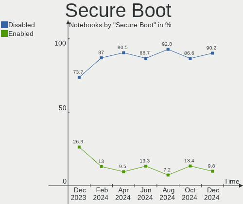
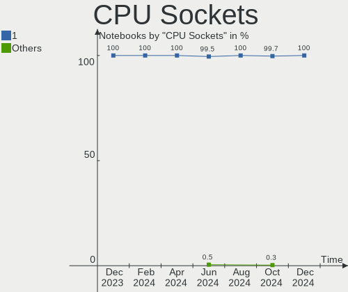
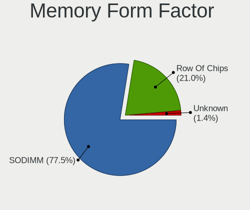

Fedora Hardware Trends (Notebook)
---------------------------------

A project to identify most popular hardware characteristics and track their change
over time based on data collected by Fedora users at https://Linux-Hardware.org.

Anyone can contribute to the study by uploading probes of their computers by
the [hw-probe](https://github.com/linuxhw/hw-probe) tool:

    sudo -E hw-probe -all -upload

Full-feature report is available here: https://linux-hardware.org/?view=trends&formfactor=notebook

Period: Jan, 2021.

Contents
--------

- [ OS                       ](#os)
- [ OS Family                ](#os-family)
- [ Kernel                   ](#kernel)
- [ Kernel Family            ](#kernel-family)
- [ Kernel Major Ver.        ](#kernel-major-ver)
- [ Arch                     ](#arch)
- [ DE                       ](#de)
- [ Display Server           ](#display-server)
- [ Display Manager          ](#display-manager)
- [ OS Lang                  ](#os-lang)
- [ Boot Mode                ](#boot-mode)
- [ Filesystem               ](#filesystem)
- [ Part. scheme             ](#part-scheme)
- [ Dual Boot with Linux/BSD ](#dual-boot-with-linux/bsd)
- [ Dual Boot (Win)          ](#dual-boot-win)
- [ Country                  ](#country)
- [ City                     ](#city)
- [ Vendor                   ](#vendor)
- [ Model                    ](#model)
- [ Model Family             ](#model-family)
- [ MFG Year                 ](#mfg-year)
- [ Form Factor              ](#form-factor)
- [ Secure Boot              ](#secure-boot)
- [ Coreboot                 ](#coreboot)
- [ RAM Size                 ](#ram-size)
- [ RAM Used                 ](#ram-used)
- [ Has CD-ROM               ](#has-cd-rom)
- [ Total Drives             ](#total-drives)
- [ Has Ethernet             ](#has-ethernet)
- [ Drive Vendor             ](#drive-vendor)
- [ Drive Model              ](#drive-model)
- [ HDD Vendor               ](#hdd-vendor)
- [ SSD Vendor               ](#ssd-vendor)
- [ Drive Kind               ](#drive-kind)
- [ Drive Connector          ](#drive-connector)
- [ Drive Size               ](#drive-size)
- [ Space Total              ](#space-total)
- [ Space Used               ](#space-used)
- [ Malfunc. Drives          ](#malfunc-drives)
- [ Malfunc. Drive Vendor    ](#malfunc-drive-vendor)
- [ Malfunc. HDD Vendor      ](#malfunc-hdd-vendor)
- [ Malfunc. Drive Kind      ](#malfunc-drive-kind)
- [ Failed Drives            ](#failed-drives)
- [ Failed Drive Vendor      ](#failed-drive-vendor)
- [ Drive Status             ](#drive-status)
- [ Storage Vendor           ](#storage-vendor)
- [ Storage Model            ](#storage-model)
- [ Storage Kind             ](#storage-kind)
- [ CPU Vendor               ](#cpu-vendor)
- [ CPU Model                ](#cpu-model)
- [ CPU Model Family         ](#cpu-model-family)
- [ CPU Cores                ](#cpu-cores)
- [ CPU Sockets              ](#cpu-sockets)
- [ CPU Threads              ](#cpu-threads)
- [ CPU Op-Modes             ](#cpu-op-modes)
- [ CPU Microcode            ](#cpu-microcode)
- [ CPU Microarch            ](#cpu-microarch)
- [ GPU Vendor               ](#gpu-vendor)
- [ GPU Model                ](#gpu-model)
- [ GPU Combo                ](#gpu-combo)
- [ GPU Driver               ](#gpu-driver)
- [ GPU Memory               ](#gpu-memory)
- [ Monitor Vendor           ](#monitor-vendor)
- [ Monitor Model            ](#monitor-model)
- [ Monitor Resolution       ](#monitor-resolution)
- [ Monitor Diagonal         ](#monitor-diagonal)
- [ Monitor Width            ](#monitor-width)
- [ Aspect Ratio             ](#aspect-ratio)
- [ Monitor Area             ](#monitor-area)
- [ Pixel Density            ](#pixel-density)
- [ Multiple Monitors        ](#multiple-monitors)
- [ Net Controller Vendor    ](#net-controller-vendor)
- [ Net Controller Model     ](#net-controller-model)
- [ Wireless Vendor          ](#wireless-vendor)
- [ Wireless Model           ](#wireless-model)
- [ Ethernet Vendor          ](#ethernet-vendor)
- [ Ethernet Model           ](#ethernet-model)
- [ Net Controller Kind      ](#net-controller-kind)
- [ Used Controller          ](#used-controller)
- [ NICs                     ](#nics)
- [ Memory Vendor            ](#memory-vendor)
- [ Memory Model             ](#memory-model)
- [ Memory Kind              ](#memory-kind)
- [ Memory Form Factor       ](#memory-form-factor)
- [ Memory Size              ](#memory-size)
- [ Memory Speed             ](#memory-speed)
- [ Sound Vendor             ](#sound-vendor)
- [ Sound Model              ](#sound-model)
- [ Camera Vendor            ](#camera-vendor)
- [ Camera Model             ](#camera-model)
- [ Fingerprint Vendor       ](#fingerprint-vendor)
- [ Fingerprint Model        ](#fingerprint-model)
- [ Chipcard Vendor          ](#chipcard-vendor)
- [ Chipcard Model           ](#chipcard-model)
- [ Printer Vendor           ](#printer-vendor)
- [ Printer Model            ](#printer-model)
- [ Scanner Vendor           ](#scanner-vendor)
- [ Scanner Model            ](#scanner-model)
- [ Bluetooth Vendor         ](#bluetooth-vendor)
- [ Bluetooth Model          ](#bluetooth-model)
- [ Unsupported Devices      ](#unsupported-devices)
- [ Unsupported Device Types ](#unsupported-device-types)

OS
--

Installed operating systems

| Name      | Notebooks | Percent |
|-----------|-----------|---------|
| Fedora 33 | 155       | 88.07%  |
| Fedora 32 | 14        | 7.95%   |
| Fedora 31 | 3         | 1.7%    |
| Fedora 30 | 2         | 1.14%   |
| Fedora 34 | 1         | 0.57%   |
| Fedora 21 | 1         | 0.57%   |

OS Family
---------

OS without a version

| Name   | Notebooks | Percent |
|--------|-----------|---------|
| Fedora | 176       | 100%    |

Kernel
------

Version of the Linux kernel

| Version                                | Notebooks | Percent |
|----------------------------------------|-----------|---------|
| 5.9.16-200.fc33.x86_64                 | 76        | 43.18%  |
| 5.10.7-200.fc33.x86_64                 | 18        | 10.23%  |
| 5.10.9-201.fc33.x86_64                 | 17        | 9.66%   |
| 5.10.10-200.fc33.x86_64                | 12        | 6.82%   |
| 5.10.8-200.fc33.x86_64                 | 10        | 5.68%   |
| 5.8.15-301.fc33.x86_64                 | 7         | 3.98%   |
| 5.10.6-200.fc33.x86_64                 | 6         | 3.41%   |
| 5.9.16-100.fc32.x86_64                 | 5         | 2.84%   |
| 5.8.18-100.fc31.x86_64                 | 3         | 1.7%    |
| 5.10.8-100.fc32.x86_64                 | 3         | 1.7%    |
| 5.9.15-200.fc33.x86_64                 | 2         | 1.14%   |
| 5.9.13-200.fc33.x86_64                 | 2         | 1.14%   |
| 5.10.7-100.fc32.x86_64                 | 2         | 1.14%   |
| 5.9.14-200.fc33.x86_64                 | 1         | 0.57%   |
| 5.9.10-100.fc32.x86_64                 | 1         | 0.57%   |
| 5.8.4-200.fc32.x86_64                  | 1         | 0.57%   |
| 5.8.18-300.fc33.x86_64                 | 1         | 0.57%   |
| 5.8.11-200.fc32.x86_64                 | 1         | 0.57%   |
| 5.6.6-300.fc32.x86_64                  | 1         | 0.57%   |
| 5.6.13-100.fc30.x86_64                 | 1         | 0.57%   |
| 5.5.10-100.fc30.x86_64                 | 1         | 0.57%   |
| 5.11.0-rc5+                            | 1         | 0.57%   |
| 5.11.0-0.rc4.129.fc34.x86_64           | 1         | 0.57%   |
| 5.10.4-200.fc33.x86_64                 | 1         | 0.57%   |
| 5.10.2-200.rt20.1.fc33.ccrma.x86_64+rt | 1         | 0.57%   |
| 4.1.13-100.fc21.x86_64                 | 1         | 0.57%   |

Kernel Family
-------------

Linux kernel without a distro release

| Version | Notebooks | Percent |
|---------|-----------|---------|
| 5.9.16  | 81        | 46.02%  |
| 5.10.7  | 20        | 11.36%  |
| 5.10.9  | 17        | 9.66%   |
| 5.10.8  | 13        | 7.39%   |
| 5.10.10 | 12        | 6.82%   |
| 5.8.15  | 7         | 3.98%   |
| 5.10.6  | 6         | 3.41%   |
| 5.8.18  | 4         | 2.27%   |
| 5.9.15  | 2         | 1.14%   |
| 5.9.13  | 2         | 1.14%   |
| 5.11.0  | 2         | 1.14%   |
| 5.9.14  | 1         | 0.57%   |
| 5.9.10  | 1         | 0.57%   |
| 5.8.4   | 1         | 0.57%   |
| 5.8.11  | 1         | 0.57%   |
| 5.6.6   | 1         | 0.57%   |
| 5.6.13  | 1         | 0.57%   |
| 5.5.10  | 1         | 0.57%   |
| 5.10.4  | 1         | 0.57%   |
| 5.10.2  | 1         | 0.57%   |
| 4.1.13  | 1         | 0.57%   |

Kernel Major Ver.
-----------------

Linux kernel major version

| Version | Notebooks | Percent |
|---------|-----------|---------|
| 5.9     | 87        | 49.43%  |
| 5.10    | 70        | 39.77%  |
| 5.8     | 13        | 7.39%   |
| 5.6     | 2         | 1.14%   |
| 5.11    | 2         | 1.14%   |
| 5.5     | 1         | 0.57%   |
| 4.1     | 1         | 0.57%   |

Arch
----

OS architecture (x86_64, i586, etc.)

| Name   | Notebooks | Percent |
|--------|-----------|---------|
| x86_64 | 176       | 100%    |

DE
--

Desktop Environment

| Name       | Notebooks | Percent |
|------------|-----------|---------|
| GNOME      | 136       | 77.27%  |
| KDE        | 12        | 6.82%   |
| KDE5       | 11        | 6.25%   |
| XFCE       | 5         | 2.84%   |
| Unknown    | 4         | 2.27%   |
| X-Cinnamon | 3         | 1.7%    |
| MATE       | 3         | 1.7%    |
| KDE4       | 1         | 0.57%   |
| Cinnamon   | 1         | 0.57%   |

Display Server
--------------

X11 or Wayland

| Name    | Notebooks | Percent |
|---------|-----------|---------|
| Wayland | 97        | 55.11%  |
| X11     | 74        | 42.05%  |
| Unknown | 3         | 1.7%    |
| Tty     | 2         | 1.14%   |

Display Manager
---------------

SDDM, LightDM, etc.

| Name    | Notebooks | Percent |
|---------|-----------|---------|
| Unknown | 100       | 56.82%  |
| GDM     | 57        | 32.39%  |
| SDDM    | 12        | 6.82%   |
| TDM     | 5         | 2.84%   |
| LightDM | 2         | 1.14%   |

OS Lang
-------

Language

| Lang    | Notebooks | Percent |
|---------|-----------|---------|
| en_US   | 95        | 53.98%  |
| en_GB   | 11        | 6.25%   |
| pt_BR   | 10        | 5.68%   |
| fr_FR   | 8         | 4.55%   |
| de_DE   | 7         | 3.98%   |
| it_IT   | 6         | 3.41%   |
| cs_CZ   | 5         | 2.84%   |
| tr_TR   | 3         | 1.7%    |
| ru_RU   | 3         | 1.7%    |
| es_ES   | 3         | 1.7%    |
| pl_PL   | 2         | 1.14%   |
| fr_CA   | 2         | 1.14%   |
| es_CL   | 2         | 1.14%   |
| en_SG   | 2         | 1.14%   |
| en_CA   | 2         | 1.14%   |
| Unknown | 2         | 1.14%   |
| sk_SK   | 1         | 0.57%   |
| pt_PT   | 1         | 0.57%   |
| nl_NL   | 1         | 0.57%   |
| ja_JP   | 1         | 0.57%   |
| fr_CH   | 1         | 0.57%   |
| es_MX   | 1         | 0.57%   |
| es_CO   | 1         | 0.57%   |
| en_PH   | 1         | 0.57%   |
| en_IE   | 1         | 0.57%   |
| en_AU   | 1         | 0.57%   |
| el_GR   | 1         | 0.57%   |
| de_CH   | 1         | 0.57%   |
| C       | 1         | 0.57%   |

Boot Mode
---------

EFI or BIOS

| Mode | Notebooks | Percent |
|------|-----------|---------|
| EFI  | 126       | 71.59%  |
| BIOS | 50        | 28.41%  |

Filesystem
----------

Type of filesystem

| Type  | Notebooks | Percent |
|-------|-----------|---------|
| Btrfs | 99        | 56.25%  |
| Ext4  | 68        | 38.64%  |
| Xfs   | 9         | 5.11%   |

Part. scheme
------------

Scheme of partitioning

| Type    | Notebooks | Percent |
|---------|-----------|---------|
| Unknown | 98        | 55.68%  |
| GPT     | 63        | 35.8%   |
| MBR     | 15        | 8.52%   |

Dual Boot with Linux/BSD
------------------------

Hosting more than one Linux/BSD

| Dual boot | Notebooks | Percent |
|-----------|-----------|---------|
| No        | 166       | 94.32%  |
| Yes       | 10        | 5.68%   |

Dual Boot (Win)
---------------

Hosting Linux and Windows

| Dual boot | Notebooks | Percent |
|-----------|-----------|---------|
| No        | 143       | 81.25%  |
| Yes       | 33        | 18.75%  |

Country
-------

Geographic location (country)

| Country                   | Notebooks | Percent |
|---------------------------|-----------|---------|
| USA                       | 36        | 20.45%  |
| Germany                   | 13        | 7.39%   |
| France                    | 11        | 6.25%   |
| Brazil                    | 11        | 6.25%   |
| UK                        | 6         | 3.41%   |
| Russia                    | 6         | 3.41%   |
| Italy                     | 6         | 3.41%   |
| Czech Republic            | 6         | 3.41%   |
| Turkey                    | 5         | 2.84%   |
| Poland                    | 5         | 2.84%   |
| Netherlands               | 5         | 2.84%   |
| India                     | 5         | 2.84%   |
| Finland                   | 4         | 2.27%   |
| Spain                     | 3         | 1.7%    |
| Iran                      | 3         | 1.7%    |
| Hungary                   | 3         | 1.7%    |
| Colombia                  | 3         | 1.7%    |
| Canada                    | 3         | 1.7%    |
| Ukraine                   | 2         | 1.14%   |
| Switzerland               | 2         | 1.14%   |
| Slovakia                  | 2         | 1.14%   |
| Singapore                 | 2         | 1.14%   |
| Romania                   | 2         | 1.14%   |
| Mexico                    | 2         | 1.14%   |
| Israel                    | 2         | 1.14%   |
| Chile                     | 2         | 1.14%   |
| Bulgaria                  | 2         | 1.14%   |
| Belarus                   | 2         | 1.14%   |
| Australia                 | 2         | 1.14%   |
| Taiwan                    | 1         | 0.57%   |
| Puerto Rico               | 1         | 0.57%   |
| Portugal                  | 1         | 0.57%   |
| Philippines               | 1         | 0.57%   |
| Moldova, Republic of      | 1         | 0.57%   |
| Kyrgyzstan                | 1         | 0.57%   |
| Kenya                     | 1         | 0.57%   |
| Jordan                    | 1         | 0.57%   |
| Japan                     | 1         | 0.57%   |
| Ireland                   | 1         | 0.57%   |
| Iran, Islamic Republic of | 1         | 0.57%   |
| Indonesia                 | 1         | 0.57%   |
| Iceland                   | 1         | 0.57%   |
| Greece                    | 1         | 0.57%   |
| Ecuador                   | 1         | 0.57%   |
| Denmark                   | 1         | 0.57%   |
| Croatia                   | 1         | 0.57%   |
| China                     | 1         | 0.57%   |
| Austria                   | 1         | 0.57%   |
| Argentina                 | 1         | 0.57%   |

City
----

Geographic location (city)

| City                     | Notebooks | Percent |
|--------------------------|-----------|---------|
| Istanbul                 | 4         | 2.27%   |
| São Paulo               | 3         | 1.7%    |
| Prague                   | 3         | 1.7%    |
| Warsaw                   | 2         | 1.14%   |
| Tehran                   | 2         | 1.14%   |
| Sofia                    | 2         | 1.14%   |
| Rome                     | 2         | 1.14%   |
| Rio de Janeiro           | 2         | 1.14%   |
| Paris                    | 2         | 1.14%   |
| New York                 | 2         | 1.14%   |
| Ludlow                   | 2         | 1.14%   |
| Helsinki                 | 2         | 1.14%   |
| Hamburg                  | 2         | 1.14%   |
| Greifswald               | 2         | 1.14%   |
| Chennai                  | 2         | 1.14%   |
| Anchorage                | 2         | 1.14%   |
| Yuxi                     | 1         | 0.57%   |
| Yazd                     | 1         | 0.57%   |
| Yachiyo                  | 1         | 0.57%   |
| Westminster              | 1         | 0.57%   |
| Wenatchee                | 1         | 0.57%   |
| Wauconda                 | 1         | 0.57%   |
| Wallern an der Trattnach | 1         | 0.57%   |
| Vienna                   | 1         | 0.57%   |
| Venancio Aires           | 1         | 0.57%   |
| Vantaa                   | 1         | 0.57%   |
| Vancouver                | 1         | 0.57%   |
| Tyler                    | 1         | 0.57%   |
| Trenčín                | 1         | 0.57%   |
| Torrance                 | 1         | 0.57%   |
| Toekoel                  | 1         | 0.57%   |
| The Bronx                | 1         | 0.57%   |
| Tel Aviv                 | 1         | 0.57%   |
| Tamworth                 | 1         | 0.57%   |
| Tampa                    | 1         | 0.57%   |
| Taipei                   | 1         | 0.57%   |
| São Mateus              | 1         | 0.57%   |
| São Carlos              | 1         | 0.57%   |
| Szekszárd               | 1         | 0.57%   |
| Sydney                   | 1         | 0.57%   |
| Surgut                   | 1         | 0.57%   |
| Stamford                 | 1         | 0.57%   |
| St Petersburg            | 1         | 0.57%   |
| Springfield              | 1         | 0.57%   |
| Slatina                  | 1         | 0.57%   |
| Singapore                | 1         | 0.57%   |
| Simandres                | 1         | 0.57%   |
| Seregno                  | 1         | 0.57%   |
| Secovce                  | 1         | 0.57%   |
| Sechelt                  | 1         | 0.57%   |
| Santiago de Cali         | 1         | 0.57%   |
| Santiago                 | 1         | 0.57%   |
| Santeny                  | 1         | 0.57%   |
| Santarém                | 1         | 0.57%   |
| Santa Fe                 | 1         | 0.57%   |
| San Miguel               | 1         | 0.57%   |
| San Francisco            | 1         | 0.57%   |
| Samara                   | 1         | 0.57%   |
| Salerno                  | 1         | 0.57%   |
| Riverside                | 1         | 0.57%   |

Vendor
------

Motherboard manufacturer

| Name                | Notebooks | Percent |
|---------------------|-----------|---------|
| Lenovo              | 45        | 25.57%  |
| Dell                | 37        | 21.02%  |
| Hewlett-Packard     | 28        | 15.91%  |
| ASUSTek Computer    | 19        | 10.8%   |
| Acer                | 11        | 6.25%   |
| MSI                 | 5         | 2.84%   |
| HUAWEI              | 4         | 2.27%   |
| Sony                | 3         | 1.7%    |
| Samsung Electronics | 3         | 1.7%    |
| Apple               | 3         | 1.7%    |
| Toshiba             | 2         | 1.14%   |
| Wortmann AG         | 1         | 0.57%   |
| UNITCOM             | 1         | 0.57%   |
| Timi                | 1         | 0.57%   |
| SLIMBOOK            | 1         | 0.57%   |
| Razer               | 1         | 0.57%   |
| Prestigio           | 1         | 0.57%   |
| Positivo            | 1         | 0.57%   |
| Packard Bell        | 1         | 0.57%   |
| NS4SL01             | 1         | 0.57%   |
| Notebook            | 1         | 0.57%   |
| Gateway             | 1         | 0.57%   |
| Estar               | 1         | 0.57%   |
| CRX                 | 1         | 0.57%   |
| Clevo               | 1         | 0.57%   |
| Alienware           | 1         | 0.57%   |
| Unknown             | 1         | 0.57%   |

Model
-----

Motherboard model

| Name                                       | Notebooks | Percent |
|--------------------------------------------|-----------|---------|
| Lenovo ThinkPad X1 Extreme 2nd 20QVCTO1WW  | 2         | 1.14%   |
| HP ProBook 650 G2                          | 2         | 1.14%   |
| HP Pavilion dv6                            | 2         | 1.14%   |
| Dell Latitude 7400                         | 2         | 1.14%   |
| Dell Inspiron 15 7000 Gaming               | 2         | 1.14%   |
| ASUS UX430UNR                              | 2         | 1.14%   |
| Acer Aspire A515-51G                       | 2         | 1.14%   |
| Wortmann AG TERRA Mobile 1748              | 1         | 0.57%   |
| UNITCOM W55xEU                             | 1         | 0.57%   |
| Toshiba Satellite L50-B                    | 1         | 0.57%   |
| Toshiba dynabook R73/W                     | 1         | 0.57%   |
| Timi TM1701                                | 1         | 0.57%   |
| Sony VPCCB45FN                             | 1         | 0.57%   |
| Sony SVF15N12SGB                           | 1         | 0.57%   |
| Sony SVE14113ELW                           | 1         | 0.57%   |
| SLIMBOOK PROX14-10                         | 1         | 0.57%   |
| Samsung RF510/RF410/RF710                  | 1         | 0.57%   |
| Samsung 300E4C/300E5C/300E7C               | 1         | 0.57%   |
| Samsung 300E4A/300E5A/300E7A/3430EA/3530EA | 1         | 0.57%   |
| Razer Blade 15 Mid 2019-Base               | 1         | 0.57%   |
| Prestigio PSB141C03                        | 1         | 0.57%   |
| Positivo J14KR11                           | 1         | 0.57%   |
| Packard Bell EasyNote TM86                 | 1         | 0.57%   |
| NS4SL01 NS4SL0-15                          | 1         | 0.57%   |
| Notebook P65_P67SE                         | 1         | 0.57%   |
| MSI Modern 14 A10M                         | 1         | 0.57%   |
| MSI GP70 2PE                               | 1         | 0.57%   |
| MSI GF75 Thin 10SCSXR                      | 1         | 0.57%   |
| MSI GF75 Thin 10SCSR                       | 1         | 0.57%   |
| MSI GF65 Thin 10SDR                        | 1         | 0.57%   |
| Lenovo Yoga Slim 7 14ARE05 82A2            | 1         | 0.57%   |
| Lenovo V310-15ISK 80SY                     | 1         | 0.57%   |
| Lenovo ThinkPad X280 20KES7YB00            | 1         | 0.57%   |
| Lenovo ThinkPad X230 2325AT6               | 1         | 0.57%   |
| Lenovo ThinkPad X220 4290A48               | 1         | 0.57%   |
| Lenovo ThinkPad X1 Carbon Gen 8 20U9S1N700 | 1         | 0.57%   |
| Lenovo ThinkPad X1 Carbon 6th 20KGS23S00   | 1         | 0.57%   |
| Lenovo ThinkPad W540 20BGCTO1WW            | 1         | 0.57%   |
| Lenovo ThinkPad W520 4284A44               | 1         | 0.57%   |
| Lenovo ThinkPad T540p 20BE00B8GE           | 1         | 0.57%   |
| Lenovo ThinkPad T460s 20FAS2BN0K           | 1         | 0.57%   |
| Lenovo ThinkPad T460 20FN004CMC            | 1         | 0.57%   |
| Lenovo ThinkPad T410 2522PT3               | 1         | 0.57%   |
| Lenovo ThinkPad T400 6475Y4M               | 1         | 0.57%   |
| Lenovo ThinkPad T15 Gen 1 20S60021GE       | 1         | 0.57%   |
| Lenovo ThinkPad T14s Gen 1 20T0001DRT      | 1         | 0.57%   |
| Lenovo ThinkPad P73 20QRCTO1WW             | 1         | 0.57%   |
| Lenovo ThinkPad L15 Gen 1 20U7001WMX       | 1         | 0.57%   |
| Lenovo ThinkPad E585 20KVCTO1WW            | 1         | 0.57%   |
| Lenovo ThinkPad E14 Gen 2 20T6002LUS       | 1         | 0.57%   |
| Lenovo ThinkPad E14 20RA001LMC             | 1         | 0.57%   |
| Lenovo ThinkPad 13 2nd Gen 20J1CTO1WW      | 1         | 0.57%   |
| Lenovo Legion Y7000 81FW                   | 1         | 0.57%   |
| Lenovo Legion Y7000 2019 81NS              | 1         | 0.57%   |
| Lenovo Legion Y540-15IRH-PG0 81SY          | 1         | 0.57%   |
| Lenovo Legion Y530-15ICH 81FV              | 1         | 0.57%   |
| Lenovo Legion 5 15ARH05H 82B1              | 1         | 0.57%   |
| Lenovo IdeaPad Z580                        | 1         | 0.57%   |
| Lenovo IdeaPad Y910-17ISK 80V1             | 1         | 0.57%   |
| Lenovo IdeaPad Slim 1-14AST-05 81VS        | 1         | 0.57%   |

Model Family
------------

Motherboard model prefix

| Name                  | Notebooks | Percent |
|-----------------------|-----------|---------|
| Lenovo ThinkPad       | 22        | 12.5%   |
| Dell Latitude         | 15        | 8.52%   |
| Lenovo IdeaPad        | 13        | 7.39%   |
| Dell Inspiron         | 12        | 6.82%   |
| HP Pavilion           | 8         | 4.55%   |
| Acer Aspire           | 7         | 3.98%   |
| HP EliteBook          | 6         | 3.41%   |
| Dell XPS              | 6         | 3.41%   |
| Lenovo Legion         | 5         | 2.84%   |
| HP ProBook            | 5         | 2.84%   |
| HP Laptop             | 3         | 1.7%    |
| HP ENVY               | 3         | 1.7%    |
| ASUS ROG              | 3         | 1.7%    |
| MSI GF75              | 2         | 1.14%   |
| Dell Precision        | 2         | 1.14%   |
| ASUS UX430UNR         | 2         | 1.14%   |
| Acer Nitro            | 2         | 1.14%   |
| Wortmann AG TERRA     | 1         | 0.57%   |
| UNITCOM W55xEU        | 1         | 0.57%   |
| Toshiba Satellite     | 1         | 0.57%   |
| Toshiba dynabook      | 1         | 0.57%   |
| Timi TM1701           | 1         | 0.57%   |
| Sony VPCCB45FN        | 1         | 0.57%   |
| Sony SVF15N12SGB      | 1         | 0.57%   |
| Sony SVE14113ELW      | 1         | 0.57%   |
| SLIMBOOK PROX14-10    | 1         | 0.57%   |
| Samsung RF510         | 1         | 0.57%   |
| Samsung 300E4C        | 1         | 0.57%   |
| Samsung 300E4A        | 1         | 0.57%   |
| Razer Blade           | 1         | 0.57%   |
| Prestigio PSB141C03   | 1         | 0.57%   |
| Positivo J14KR11      | 1         | 0.57%   |
| Packard Bell EasyNote | 1         | 0.57%   |
| NS4SL01 NS4SL0-15     | 1         | 0.57%   |
| Notebook P65          | 1         | 0.57%   |
| MSI Modern            | 1         | 0.57%   |
| MSI GP70              | 1         | 0.57%   |
| MSI GF65              | 1         | 0.57%   |
| Lenovo Yoga           | 1         | 0.57%   |
| Lenovo V310-15ISK     | 1         | 0.57%   |
| Lenovo G580           | 1         | 0.57%   |
| Lenovo G510           | 1         | 0.57%   |
| Lenovo B570e          | 1         | 0.57%   |
| HUAWEI NBLK-WAX9X     | 1         | 0.57%   |
| HUAWEI KPL-W0X        | 1         | 0.57%   |
| HUAWEI HN-WX9X        | 1         | 0.57%   |
| HUAWEI BOHK-WAX9X     | 1         | 0.57%   |
| HP ZBook              | 1         | 0.57%   |
| HP 255                | 1         | 0.57%   |
| HP 15                 | 1         | 0.57%   |
| Gateway NE56R         | 1         | 0.57%   |
| Estar BEAUTY          | 1         | 0.57%   |
| Dell Vostro           | 1         | 0.57%   |
| Dell G7               | 1         | 0.57%   |
| CRX CRX156            | 1         | 0.57%   |
| Clevo P65             | 1         | 0.57%   |
| ASUS X750JN           | 1         | 0.57%   |
| ASUS X556UQK          | 1         | 0.57%   |
| ASUS X555UB           | 1         | 0.57%   |
| ASUS X541UV           | 1         | 0.57%   |

MFG Year
--------

Motherboard manufacture year

| Year | Notebooks | Percent |
|------|-----------|---------|
| 2020 | 61        | 34.66%  |
| 2019 | 35        | 19.89%  |
| 2018 | 14        | 7.95%   |
| 2016 | 11        | 6.25%   |
| 2011 | 11        | 6.25%   |
| 2012 | 9         | 5.11%   |
| 2015 | 8         | 4.55%   |
| 2014 | 8         | 4.55%   |
| 2017 | 7         | 3.98%   |
| 2013 | 6         | 3.41%   |
| 2010 | 4         | 2.27%   |
| 2009 | 1         | 0.57%   |
| 2008 | 1         | 0.57%   |

Form Factor
-----------

Physical design of the computer

| Name     | Notebooks | Percent |
|----------|-----------|---------|
| Notebook | 176       | 100%    |

Secure Boot
-----------

Enabled or disabled

| State    | Notebooks | Percent |
|----------|-----------|---------|
| Disabled | 155       | 88.07%  |
| Enabled  | 21        | 11.93%  |

Coreboot
--------

Have coreboot on board

| Used | Notebooks | Percent |
|------|-----------|---------|
| No   | 176       | 100%    |

RAM Size
--------

Total RAM memory

| Size in GB  | Notebooks | Percent |
|-------------|-----------|---------|
| 4.01-8.0    | 63        | 35.8%   |
| 16.01-24.0  | 47        | 26.7%   |
| 8.01-16.0   | 24        | 13.64%  |
| 3.01-4.0    | 22        | 12.5%   |
| 32.01-64.0  | 13        | 7.39%   |
| 64.01-256.0 | 3         | 1.7%    |
| 1.01-2.0    | 2         | 1.14%   |
| 2.01-3.0    | 1         | 0.57%   |
| 0.51-1.0    | 1         | 0.57%   |

RAM Used
--------

Used RAM memory

| Used GB    | Notebooks | Percent |
|------------|-----------|---------|
| 2.01-3.0   | 51        | 28.98%  |
| 4.01-8.0   | 43        | 24.43%  |
| 3.01-4.0   | 34        | 19.32%  |
| 1.01-2.0   | 29        | 16.48%  |
| 8.01-16.0  | 14        | 7.95%   |
| 32.01-64.0 | 1         | 0.57%   |
| 24.01-32.0 | 1         | 0.57%   |
| 16.01-24.0 | 1         | 0.57%   |
| 0.51-1.0   | 1         | 0.57%   |
| 0.01-0.5   | 1         | 0.57%   |

Has CD-ROM
----------

Has CD-ROM on board

| Presented | Notebooks | Percent |
|-----------|-----------|---------|
| No        | 125       | 71.02%  |
| Yes       | 51        | 28.98%  |

Total Drives
------------

Number of drives on board

| Drives | Notebooks | Percent |
|--------|-----------|---------|
| 1      | 120       | 68.18%  |
| 2      | 42        | 23.86%  |
| 3      | 8         | 4.55%   |
| 4      | 4         | 2.27%   |
| 5      | 1         | 0.57%   |
| 0      | 1         | 0.57%   |

Has Ethernet
------------

Has Ethernet on board

| Presented | Notebooks | Percent |
|-----------|-----------|---------|
| Yes       | 140       | 79.55%  |
| No        | 36        | 20.45%  |

Drive Vendor
------------

Hard drive vendors

| Vendor              | Notebooks | Drives | Percent |
|---------------------|-----------|--------|---------|
| Samsung Electronics | 48        | 56     | 20.69%  |
| WDC                 | 32        | 33     | 13.79%  |
| Seagate             | 22        | 25     | 9.48%   |
| Unknown             | 16        | 17     | 6.9%    |
| Toshiba             | 16        | 16     | 6.9%    |
| SanDisk             | 16        | 16     | 6.9%    |
| SK Hynix            | 14        | 14     | 6.03%   |
| Kingston            | 9         | 10     | 3.88%   |
| HGST                | 8         | 9      | 3.45%   |
| Crucial             | 8         | 9      | 3.45%   |
| Intel               | 6         | 6      | 2.59%   |
| KIOXIA              | 4         | 4      | 1.72%   |
| A-DATA Technology   | 4         | 4      | 1.72%   |
| Union Memory        | 3         | 3      | 1.29%   |
| Micron Technology   | 3         | 3      | 1.29%   |
| XPG                 | 1         | 1      | 0.43%   |
| Verbatim            | 1         | 1      | 0.43%   |
| Vaseky              | 1         | 2      | 0.43%   |
| SPCC                | 1         | 1      | 0.43%   |
| PNY                 | 1         | 1      | 0.43%   |
| Phison              | 1         | 1      | 0.43%   |
| Patriot             | 1         | 1      | 0.43%   |
| NGFF                | 1         | 1      | 0.43%   |
| Mushkin             | 1         | 1      | 0.43%   |
| Maxtor              | 1         | 1      | 0.43%   |
| Mass                | 1         | 1      | 0.43%   |
| LITEONIT            | 1         | 1      | 0.43%   |
| LITEON              | 1         | 1      | 0.43%   |
| Leven               | 1         | 1      | 0.43%   |
| KIOXIA-EXCERIA      | 1         | 1      | 0.43%   |
| KingFast            | 1         | 1      | 0.43%   |
| JMicron             | 1         | 1      | 0.43%   |
| Intenso             | 1         | 1      | 0.43%   |
| GOODRAM             | 1         | 1      | 0.43%   |
| China               | 1         | 1      | 0.43%   |
| Apple               | 1         | 1      | 0.43%   |
| ADATA SX            | 1         | 1      | 0.43%   |
| ACASIS              | 1         | 1      | 0.43%   |

Drive Model
-----------

Hard drive models

| Model                                | Notebooks | Percent |
|--------------------------------------|-----------|---------|
| Samsung SSD 860 EVO 500GB            | 5         | 2.05%   |
| HGST HTS721010A9E630 1TB             | 5         | 2.05%   |
| Sandisk NVMe SSD Drive 512GB         | 4         | 1.64%   |
| Samsung SSD 850 EVO 250GB            | 4         | 1.64%   |
| Samsung NVMe SSD Drive 256GB         | 4         | 1.64%   |
| WDC WD10SPZX-24Z10 1TB               | 3         | 1.23%   |
| Toshiba NVMe SSD Drive 512GB         | 3         | 1.23%   |
| Toshiba NVMe SSD Drive 256GB         | 3         | 1.23%   |
| SK Hynix NVMe SSD Drive 512GB        | 3         | 1.23%   |
| Seagate ST9500325AS 500GB            | 3         | 1.23%   |
| Seagate ST1000LM024 HN-M101MBB 1TB   | 3         | 1.23%   |
| Seagate Expansion 1TB                | 3         | 1.23%   |
| Samsung SSD 860 EVO 1TB              | 3         | 1.23%   |
| Samsung NVMe SSD Drive 512GB         | 3         | 1.23%   |
| KIOXIA NVMe SSD Drive 512GB          | 3         | 1.23%   |
| Kingston SA400S37240G 240GB SSD      | 3         | 1.23%   |
| Crucial CT240BX500SSD1 240GB         | 3         | 1.23%   |
| WDC WD10SPZX-08Z10 1TB               | 2         | 0.82%   |
| WDC PC SN730 SDBPNTY-256G-1027 256GB | 2         | 0.82%   |
| Unknown SD/MMC/MS PRO 32GB           | 2         | 0.82%   |
| Union Memory RPFTJ128PDD2EWX 128GB   | 2         | 0.82%   |
| SK Hynix PC601 NVMe 512GB            | 2         | 0.82%   |
| Seagate ST1000LM049-2GH172 1TB       | 2         | 0.82%   |
| Seagate ST1000LM035-1RK172 1TB       | 2         | 0.82%   |
| SanDisk SD8SN8U-256G-1006 256GB SSD  | 2         | 0.82%   |
| Samsung SSD 970 EVO Plus 500GB       | 2         | 0.82%   |
| Samsung SSD 850 PRO 512GB            | 2         | 0.82%   |
| Samsung NVMe SSD Drive 500GB         | 2         | 0.82%   |
| Samsung NVMe SSD Drive 1024GB        | 2         | 0.82%   |
| Intel SSDPEKNW010T8 1TB              | 2         | 0.82%   |
| HGST HTS725050A7E630 500GB           | 2         | 0.82%   |
| XPG NVMe SSD Drive 256GB             | 1         | 0.41%   |
| WDC WDS500G2B0B 500GB SSD            | 1         | 0.41%   |
| WDC WDS250G2B0A-00SM50 250GB SSD     | 1         | 0.41%   |
| WDC WD7500BPVX-22JC3T0 752GB         | 1         | 0.41%   |
| WDC WD7500BPVT-35HXZT1 752GB         | 1         | 0.41%   |
| WDC WD5000LPCX-60VHAT1 500GB         | 1         | 0.41%   |
| WDC WD5000LPCX-24VHAT0 500GB         | 1         | 0.41%   |
| WDC WD3200BEVT-75ZCT2 320GB          | 1         | 0.41%   |
| WDC WD3200BEKT-75PVMT1 320GB         | 1         | 0.41%   |
| WDC WD20SPZX-75UA7T1 2TB             | 1         | 0.41%   |
| WDC WD16 00BEVT-60ZCT 160GB          | 1         | 0.41%   |
| WDC WD10SPZX-60Z10T0 1TB             | 1         | 0.41%   |
| WDC WD10SPZX-21Z10T0 1TB             | 1         | 0.41%   |
| WDC WD10SPZX-00Z10T0 1TB             | 1         | 0.41%   |
| WDC WD10S12X-55JTET0 1016GB          | 1         | 0.41%   |
| WDC WD10JPVX-75JC3T0 1TB             | 1         | 0.41%   |
| WDC WD10JPVX-60JC3T0 1TB             | 1         | 0.41%   |
| WDC WD10JPVX-08JC3T5 1TB             | 1         | 0.41%   |
| WDC WD10JPCX-24UE4T0 1TB             | 1         | 0.41%   |
| WDC WD My Passport 261B 500GB        | 1         | 0.41%   |
| WDC PC SN730 SDBQNTY-512G-1001 512GB | 1         | 0.41%   |
| WDC PC SN730 SDBPNTY-512G-1101 512GB | 1         | 0.41%   |
| WDC PC SN730 NVMe 512GB              | 1         | 0.41%   |
| WDC PC SN730 NVMe 1024GB             | 1         | 0.41%   |
| WDC PC SN720 SDAQNTW-512G-1001 512GB | 1         | 0.41%   |
| WDC PC SN530 SDBPNPZ-512G-1006 512GB | 1         | 0.41%   |
| WDC PC SN530 SDBPNPZ-1T00-1002 1TB   | 1         | 0.41%   |
| Verbatim Vi550 S3 SSD 128GB          | 1         | 0.41%   |
| Vaseky V800/32G 32GB SSD             | 1         | 0.41%   |

HDD Vendor
----------

Hard disk drive vendors

| Vendor              | Notebooks | Drives | Percent |
|---------------------|-----------|--------|---------|
| Seagate             | 22        | 24     | 37.93%  |
| WDC                 | 21        | 21     | 36.21%  |
| HGST                | 8         | 9      | 13.79%  |
| Toshiba             | 5         | 5      | 8.62%   |
| Samsung Electronics | 1         | 1      | 1.72%   |
| Apple               | 1         | 1      | 1.72%   |

SSD Vendor
----------

Solid state drive vendors

| Vendor              | Notebooks | Drives | Percent |
|---------------------|-----------|--------|---------|
| Samsung Electronics | 26        | 28     | 31.71%  |
| SanDisk             | 10        | 10     | 12.2%   |
| Kingston            | 9         | 9      | 10.98%  |
| Crucial             | 8         | 9      | 9.76%   |
| SK Hynix            | 3         | 3      | 3.66%   |
| A-DATA Technology   | 3         | 3      | 3.66%   |
| WDC                 | 2         | 2      | 2.44%   |
| Micron Technology   | 2         | 2      | 2.44%   |
| Intel               | 2         | 2      | 2.44%   |
| Verbatim            | 1         | 1      | 1.22%   |
| Vaseky              | 1         | 2      | 1.22%   |
| Toshiba             | 1         | 1      | 1.22%   |
| SPCC                | 1         | 1      | 1.22%   |
| Seagate             | 1         | 1      | 1.22%   |
| PNY                 | 1         | 1      | 1.22%   |
| Patriot             | 1         | 1      | 1.22%   |
| NGFF                | 1         | 1      | 1.22%   |
| Mushkin             | 1         | 1      | 1.22%   |
| Maxtor              | 1         | 1      | 1.22%   |
| LITEONIT            | 1         | 1      | 1.22%   |
| LITEON              | 1         | 1      | 1.22%   |
| KIOXIA-EXCERIA      | 1         | 1      | 1.22%   |
| Intenso             | 1         | 1      | 1.22%   |
| GOODRAM             | 1         | 1      | 1.22%   |
| China               | 1         | 1      | 1.22%   |
| ACASIS              | 1         | 1      | 1.22%   |

Drive Kind
----------

HDD or SSD

| Kind    | Notebooks | Drives | Percent |
|---------|-----------|--------|---------|
| SSD     | 76        | 86     | 34.08%  |
| NVMe    | 70        | 80     | 31.39%  |
| HDD     | 56        | 61     | 25.11%  |
| MMC     | 13        | 14     | 5.83%   |
| Unknown | 8         | 8      | 3.59%   |

Drive Connector
---------------

SATA, SAS, NVMe, etc.

| Type | Notebooks | Drives | Percent |
|------|-----------|--------|---------|
| SATA | 119       | 140    | 55.09%  |
| NVMe | 70        | 79     | 32.41%  |
| SAS  | 14        | 16     | 6.48%   |
| MMC  | 13        | 14     | 6.02%   |

Drive Size
----------

Size of hard drive

| Size in TB | Notebooks | Drives | Percent |
|------------|-----------|--------|---------|
| 0.01-0.5   | 76        | 85     | 56.72%  |
| 0.51-1.0   | 49        | 51     | 36.57%  |
| 1.01-2.0   | 8         | 10     | 5.97%   |
| 4.01-10.0  | 1         | 1      | 0.75%   |

Space Total
-----------

Amount of disk space available on the file system

| Size in GB     | Notebooks | Percent |
|----------------|-----------|---------|
| 251-500        | 41        | 23.3%   |
| 101-250        | 41        | 23.3%   |
| 501-1000       | 30        | 17.05%  |
| 1001-2000      | 21        | 11.93%  |
| 1-20           | 15        | 8.52%   |
| Unknown        | 15        | 8.52%   |
| 51-100         | 4         | 2.27%   |
| More than 3000 | 3         | 1.7%    |
| 21-50          | 3         | 1.7%    |
| 2001-3000      | 3         | 1.7%    |

Space Used
----------

Amount of used disk space

| Used GB        | Notebooks | Percent |
|----------------|-----------|---------|
| 21-50          | 40        | 22.73%  |
| 101-250        | 38        | 21.59%  |
| 1-20           | 30        | 17.05%  |
| 51-100         | 29        | 16.48%  |
| Unknown        | 15        | 8.52%   |
| 251-500        | 12        | 6.82%   |
| 501-1000       | 7         | 3.98%   |
| 1001-2000      | 3         | 1.7%    |
| More than 3000 | 2         | 1.14%   |

Malfunc. Drives
---------------

Drive models with a malfunction

| Model                                 | Notebooks | Drives | Percent |
|---------------------------------------|-----------|--------|---------|
| WDC WD10SPZX-24Z10 1TB                | 1         | 1      | 16.67%  |
| WDC WD10JPVX-08JC3T5 1TB              | 1         | 1      | 16.67%  |
| SK Hynix SC308 SATA 128GB SSD         | 1         | 1      | 16.67%  |
| Seagate ST320LM001 HN-M320MBB 320GB   | 1         | 1      | 16.67%  |
| Samsung Electronics SSD 970 EVO 500GB | 1         | 1      | 16.67%  |
| Crucial CT1050MX300SSD1 1050GB        | 1         | 1      | 16.67%  |

Malfunc. Drive Vendor
---------------------

Vendors of faulty drives

| Vendor              | Notebooks | Drives | Percent |
|---------------------|-----------|--------|---------|
| WDC                 | 2         | 2      | 33.33%  |
| SK Hynix            | 1         | 1      | 16.67%  |
| Seagate             | 1         | 1      | 16.67%  |
| Samsung Electronics | 1         | 1      | 16.67%  |
| Crucial             | 1         | 1      | 16.67%  |

Malfunc. HDD Vendor
-------------------

Vendors of faulty HDD drives

| Vendor  | Notebooks | Drives | Percent |
|---------|-----------|--------|---------|
| WDC     | 2         | 2      | 66.67%  |
| Seagate | 1         | 1      | 33.33%  |

Malfunc. Drive Kind
-------------------

Kinds of faulty drives

| Kind | Notebooks | Drives | Percent |
|------|-----------|--------|---------|
| HDD  | 3         | 3      | 50%     |
| SSD  | 2         | 2      | 33.33%  |
| NVMe | 1         | 1      | 16.67%  |

Failed Drives
-------------

Failed drive models

Zero info for selected period =(

Failed Drive Vendor
-------------------

Failed drive vendors

Zero info for selected period =(

Drive Status
------------

Number of failed and malfunc. drives

| Status   | Notebooks | Drives | Percent |
|----------|-----------|--------|---------|
| Detected | 109       | 150    | 57.98%  |
| Works    | 73        | 93     | 38.83%  |
| Malfunc  | 6         | 6      | 3.19%   |

Storage Vendor
--------------

Storage controller vendors

| Vendor                       | Notebooks | Percent |
|------------------------------|-----------|---------|
| Intel                        | 132       | 60.83%  |
| Samsung Electronics          | 23        | 10.6%   |
| Sandisk                      | 15        | 6.91%   |
| AMD                          | 13        | 5.99%   |
| SK Hynix                     | 11        | 5.07%   |
| Toshiba America Info Systems | 9         | 4.15%   |
| KIOXIA                       | 5         | 2.3%    |
| Union Memory (Shenzhen)      | 3         | 1.38%   |
| ADATA Technology             | 2         | 0.92%   |
| Phison Electronics           | 1         | 0.46%   |
| Nvidia                       | 1         | 0.46%   |
| Micron Technology            | 1         | 0.46%   |
| Kingston Technology Company  | 1         | 0.46%   |

Storage Model
-------------

Storage controller models

| Model                                                                                  | Notebooks | Percent |
|----------------------------------------------------------------------------------------|-----------|---------|
| Intel Sunrise Point-LP SATA Controller [AHCI mode]                                     | 28        | 12.61%  |
| Samsung NVMe SSD Controller SM981/PM981/PM983                                          | 16        | 7.21%   |
| Intel 7 Series Chipset Family 6-port SATA Controller [AHCI mode]                       | 14        | 6.31%   |
| Intel 82801 Mobile SATA Controller [RAID mode]                                         | 13        | 5.86%   |
| AMD FCH SATA Controller [AHCI mode]                                                    | 13        | 5.86%   |
| Intel 8 Series/C220 Series Chipset Family 6-port SATA Controller 1 [AHCI mode]         | 10        | 4.5%    |
| Intel 6 Series/C200 Series Chipset Family 6 port Mobile SATA AHCI Controller           | 10        | 4.5%    |
| Sandisk WD Black SN750 / PC SN730 NVMe SSD                                             | 9         | 4.05%   |
| SK Hynix Non-Volatile memory controller                                                | 7         | 3.15%   |
| Intel Cannon Lake Mobile PCH SATA AHCI Controller                                      | 7         | 3.15%   |
| Intel 8 Series SATA Controller 1 [AHCI mode]                                           | 6         | 2.7%    |
| Sandisk WD Blue SN550 NVMe SSD                                                         | 5         | 2.25%   |
| KIOXIA Non-Volatile memory controller                                                  | 5         | 2.25%   |
| Intel Wildcat Point-LP SATA Controller [AHCI Mode]                                     | 5         | 2.25%   |
| Toshiba America Info Systems BG3 NVMe SSD Controller                                   | 4         | 1.8%    |
| Intel Comet Lake SATA AHCI Controller                                                  | 4         | 1.8%    |
| Intel 82801IBM/IEM (ICH9M/ICH9M-E) 4 port SATA Controller [AHCI mode]                  | 4         | 1.8%    |
| Intel 5 Series/3400 Series Chipset 4 port SATA AHCI Controller                         | 4         | 1.8%    |
| Union Memory (Shenzhen) Non-Volatile memory controller                                 | 3         | 1.35%   |
| Toshiba America Info Systems Toshiba America Info Non-Volatile memory controller       | 3         | 1.35%   |
| Samsung Electronics Non-Volatile memory controller                                     | 3         | 1.35%   |
| Intel SSD 660P Series                                                                  | 3         | 1.35%   |
| Intel Q170/Q150/B150/H170/H110/Z170/CM236 Chipset SATA Controller [AHCI Mode]          | 3         | 1.35%   |
| Intel HM170/QM170 Chipset SATA Controller [AHCI Mode]                                  | 3         | 1.35%   |
| Intel Cannon Point-LP SATA Controller [AHCI Mode]                                      | 3         | 1.35%   |
| Intel 400 Series Chipset Family SATA AHCI Controller                                   | 3         | 1.35%   |
| Toshiba America Info Systems XG4 NVMe SSD Controller                                   | 2         | 0.9%    |
| SK Hynix BC501 NVMe Solid State Drive 512GB                                            | 2         | 0.9%    |
| Samsung NVMe SSD Controller SM951/PM951                                                | 2         | 0.9%    |
| Intel Volume Management Device NVMe RAID Controller                                    | 2         | 0.9%    |
| Intel Ice Lake-LP SATA Controller [AHCI mode]                                          | 2         | 0.9%    |
| Intel Celeron/Pentium Silver Processor SATA Controller                                 | 2         | 0.9%    |
| Intel 6 Series/C200 Series Chipset Family Mobile SATA Controller (IDE mode, ports 4-5) | 2         | 0.9%    |
| Intel 6 Series/C200 Series Chipset Family Mobile SATA Controller (IDE mode, ports 0-3) | 2         | 0.9%    |
| Intel 5 Series/3400 Series Chipset 6 port SATA AHCI Controller                         | 2         | 0.9%    |
| ADATA XPG SX8200 Pro PCIe Gen3x4 M.2 2280 Solid State Drive                            | 2         | 0.9%    |
| SK Hynix PC401 NVMe Solid State Drive 256GB                                            | 1         | 0.45%   |
| SK Hynix PC300 NVMe Solid State Drive 512GB                                            | 1         | 0.45%   |
| Sandisk WD Black 2018 / PC SN720 NVMe SSD                                              | 1         | 0.45%   |
| Samsung NVMe SSD Controller SM961/PM961/SM963                                          | 1         | 0.45%   |
| Samsung Electronics SATA controller                                                    | 1         | 0.45%   |
| Phison E12 NVMe Controller                                                             | 1         | 0.45%   |
| Nvidia MCP79 AHCI Controller                                                           | 1         | 0.45%   |
| Micron Non-Volatile memory controller                                                  | 1         | 0.45%   |
| Kingston Company A2000 NVMe SSD                                                        | 1         | 0.45%   |
| Intel SSD Pro 7600p/760p/E 6100p Series                                                | 1         | 0.45%   |
| Intel SATA Controller [RAID mode]                                                      | 1         | 0.45%   |
| Intel Mobile 4 Series Chipset PT IDER Controller                                       | 1         | 0.45%   |
| Intel Atom Processor E3800 Series SATA AHCI Controller                                 | 1         | 0.45%   |
| AMD FCH IDE Controller                                                                 | 1         | 0.45%   |

Storage Kind
------------

Kind of storage controller (IDE, SATA, NVMe, SAS, ...)

| Kind | Notebooks | Percent |
|------|-----------|---------|
| SATA | 126       | 58.33%  |
| NVMe | 70        | 32.41%  |
| RAID | 16        | 7.41%   |
| IDE  | 4         | 1.85%   |

CPU Vendor
----------

Processor vendors

| Vendor | Notebooks | Percent |
|--------|-----------|---------|
| Intel  | 155       | 88.07%  |
| AMD    | 21        | 11.93%  |

CPU Model
---------

Processor models

| Model                                         | Notebooks | Percent |
|-----------------------------------------------|-----------|---------|
| Intel Core i7-8550U CPU @ 1.80GHz             | 8         | 4.55%   |
| Intel Core i7-10510U CPU @ 1.80GHz            | 7         | 3.98%   |
| AMD Ryzen 5 3500U with Radeon Vega Mobile Gfx | 7         | 3.98%   |
| Intel Core i7-10750H CPU @ 2.60GHz            | 5         | 2.84%   |
| Intel Core i7-6500U CPU @ 2.50GHz             | 4         | 2.27%   |
| Intel Core i5-8265U CPU @ 1.60GHz             | 4         | 2.27%   |
| Intel Core i7-7700HQ CPU @ 2.80GHz            | 3         | 1.7%    |
| Intel Core i7-7500U CPU @ 2.70GHz             | 3         | 1.7%    |
| Intel Core i7-4710HQ CPU @ 2.50GHz            | 3         | 1.7%    |
| Intel Core i5-9300H CPU @ 2.40GHz             | 3         | 1.7%    |
| Intel Core i5-8250U CPU @ 1.60GHz             | 3         | 1.7%    |
| Intel Core i5-7300U CPU @ 2.60GHz             | 3         | 1.7%    |
| Intel Core i5-6200U CPU @ 2.30GHz             | 3         | 1.7%    |
| Intel Core i5-2520M CPU @ 2.50GHz             | 3         | 1.7%    |
| Intel Core i5-1035G1 CPU @ 1.00GHz            | 3         | 1.7%    |
| AMD Ryzen 5 2500U with Radeon Vega Mobile Gfx | 3         | 1.7%    |
| Intel Core i7-9750H CPU @ 2.60GHz             | 2         | 1.14%   |
| Intel Core i7-8750H CPU @ 2.20GHz             | 2         | 1.14%   |
| Intel Core i7-8665U CPU @ 1.90GHz             | 2         | 1.14%   |
| Intel Core i7-6700HQ CPU @ 2.60GHz            | 2         | 1.14%   |
| Intel Core i7-6600U CPU @ 2.60GHz             | 2         | 1.14%   |
| Intel Core i7-4710MQ CPU @ 2.50GHz            | 2         | 1.14%   |
| Intel Core i7-4700HQ CPU @ 2.40GHz            | 2         | 1.14%   |
| Intel Core i7-3520M CPU @ 2.90GHz             | 2         | 1.14%   |
| Intel Core i5-7200U CPU @ 2.50GHz             | 2         | 1.14%   |
| Intel Core i5-5300U CPU @ 2.30GHz             | 2         | 1.14%   |
| Intel Core i5-4200U CPU @ 1.60GHz             | 2         | 1.14%   |
| Intel Core i5-4200M CPU @ 2.50GHz             | 2         | 1.14%   |
| Intel Core i5-2430M CPU @ 2.40GHz             | 2         | 1.14%   |
| Intel Core i5-10300H CPU @ 2.50GHz            | 2         | 1.14%   |
| Intel Core i5-10210U CPU @ 1.60GHz            | 2         | 1.14%   |
| Intel Core i5 CPU M 540 @ 2.53GHz             | 2         | 1.14%   |
| Intel Core i3-8130U CPU @ 2.20GHz             | 2         | 1.14%   |
| Intel Core i3-4005U CPU @ 1.70GHz             | 2         | 1.14%   |
| Intel Core i3-2370M CPU @ 2.40GHz             | 2         | 1.14%   |
| Intel Pentium Silver N5000 CPU @ 1.10GHz      | 1         | 0.57%   |
| Intel Pentium CPU N3540 @ 2.16GHz             | 1         | 0.57%   |
| Intel Pentium CPU B960 @ 2.20GHz              | 1         | 0.57%   |
| Intel Pentium CPU B950 @ 2.10GHz              | 1         | 0.57%   |
| Intel Pentium CPU 2117U @ 1.80GHz             | 1         | 0.57%   |
| Intel Core i9-9880H CPU @ 2.30GHz             | 1         | 0.57%   |
| Intel Core i9-10980HK CPU @ 2.40GHz           | 1         | 0.57%   |
| Intel Core i7-9850H CPU @ 2.60GHz             | 1         | 0.57%   |
| Intel Core i7-8650U CPU @ 1.90GHz             | 1         | 0.57%   |
| Intel Core i7-8565U CPU @ 1.80GHz             | 1         | 0.57%   |
| Intel Core i7-7820HQ CPU @ 2.90GHz            | 1         | 0.57%   |
| Intel Core i7-6820HK CPU @ 2.70GHz            | 1         | 0.57%   |
| Intel Core i7-5600U CPU @ 2.60GHz             | 1         | 0.57%   |
| Intel Core i7-5500U CPU @ 2.40GHz             | 1         | 0.57%   |
| Intel Core i7-4720HQ CPU @ 2.60GHz            | 1         | 0.57%   |
| Intel Core i7-4700MQ CPU @ 2.40GHz            | 1         | 0.57%   |
| Intel Core i7-4600U CPU @ 2.10GHz             | 1         | 0.57%   |
| Intel Core i7-3632QM CPU @ 2.20GHz            | 1         | 0.57%   |
| Intel Core i7-3630QM CPU @ 2.40GHz            | 1         | 0.57%   |
| Intel Core i7-3612QM CPU @ 2.10GHz            | 1         | 0.57%   |
| Intel Core i7-3517U CPU @ 1.90GHz             | 1         | 0.57%   |
| Intel Core i7-2675QM CPU @ 2.20GHz            | 1         | 0.57%   |
| Intel Core i7-2640M CPU @ 2.80GHz             | 1         | 0.57%   |
| Intel Core i7-2630QM CPU @ 2.00GHz            | 1         | 0.57%   |
| Intel Core i7-1065G7 CPU @ 1.30GHz            | 1         | 0.57%   |

CPU Model Family
----------------

Processor model prefix

| Model                | Notebooks | Percent |
|----------------------|-----------|---------|
| Intel Core i7        | 67        | 38.07%  |
| Intel Core i5        | 55        | 31.25%  |
| Intel Core i3        | 14        | 7.95%   |
| AMD Ryzen 5          | 12        | 6.82%   |
| Intel Core 2 Duo     | 5         | 2.84%   |
| Intel Pentium        | 4         | 2.27%   |
| Other                | 3         | 1.7%    |
| Intel Atom           | 3         | 1.7%    |
| AMD Ryzen 7          | 3         | 1.7%    |
| Intel Core i9        | 2         | 1.14%   |
| Intel Celeron        | 2         | 1.14%   |
| AMD A10              | 2         | 1.14%   |
| Intel Pentium Silver | 1         | 0.57%   |
| AMD Ryzen 7 PRO      | 1         | 0.57%   |
| AMD A6               | 1         | 0.57%   |
| AMD A4               | 1         | 0.57%   |

CPU Cores
---------

Number of processor cores

| Number | Notebooks | Percent |
|--------|-----------|---------|
| 4      | 82        | 46.59%  |
| 2      | 77        | 43.75%  |
| 6      | 11        | 6.25%   |
| 8      | 6         | 3.41%   |

CPU Sockets
-----------

Number of sockets

| Number | Notebooks | Percent |
|--------|-----------|---------|
| 1      | 176       | 100%    |

CPU Threads
-----------

Threads per core (Hyper-Threading)

| Number | Notebooks | Percent |
|--------|-----------|---------|
| 2      | 152       | 86.36%  |
| 1      | 24        | 13.64%  |

CPU Op-Modes
------------

CPU Operation Modes (32-bit, 64-bit)

| Op mode        | Notebooks | Percent |
|----------------|-----------|---------|
| 32-bit, 64-bit | 176       | 100%    |

CPU Microcode
-------------

Microcode number

| Number     | Notebooks | Percent |
|------------|-----------|---------|
| 0x206a7    | 16        | 9.09%   |
| 0x806ec    | 14        | 7.95%   |
| Unknown    | 14        | 7.95%   |
| 0x806ea    | 13        | 7.39%   |
| 0x406e3    | 13        | 7.39%   |
| 0x306c3    | 11        | 6.25%   |
| 0x306a9    | 10        | 5.68%   |
| 0x806e9    | 9         | 5.11%   |
| 0xa0652    | 7         | 3.98%   |
| 0x906ea    | 7         | 3.98%   |
| 0x40651    | 6         | 3.41%   |
| 0x306d4    | 5         | 2.84%   |
| 0x906e9    | 4         | 2.27%   |
| 0x1067a    | 4         | 2.27%   |
| 0x08108109 | 4         | 2.27%   |
| 0x706e5    | 3         | 1.7%    |
| 0x506e3    | 3         | 1.7%    |
| 0x30678    | 3         | 1.7%    |
| 0x20652    | 3         | 1.7%    |
| 0x08108102 | 3         | 1.7%    |
| 0x906ed    | 2         | 1.14%   |
| 0x806eb    | 2         | 1.14%   |
| 0x806c1    | 2         | 1.14%   |
| 0x20655    | 2         | 1.14%   |
| 0x08600103 | 2         | 1.14%   |
| 0x0810100b | 2         | 1.14%   |
| 0x706a8    | 1         | 0.57%   |
| 0x706a1    | 1         | 0.57%   |
| 0x406c4    | 1         | 0.57%   |
| 0x10676    | 1         | 0.57%   |
| 0x08600106 | 1         | 0.57%   |
| 0x08600104 | 1         | 0.57%   |
| 0x08101007 | 1         | 0.57%   |
| 0x07030105 | 1         | 0.57%   |
| 0x06006705 | 1         | 0.57%   |
| 0x06006110 | 1         | 0.57%   |
| 0x06001119 | 1         | 0.57%   |
| 0x03000027 | 1         | 0.57%   |

CPU Microarch
-------------

Microarchitecture

| Name          | Notebooks | Percent |
|---------------|-----------|---------|
| KabyLake      | 57        | 32.39%  |
| Skylake       | 17        | 9.66%   |
| Haswell       | 17        | 9.66%   |
| SandyBridge   | 16        | 9.09%   |
| IvyBridge     | 11        | 6.25%   |
| CometLake     | 8         | 4.55%   |
| Zen+          | 7         | 3.98%   |
| Zen 2         | 6         | 3.41%   |
| Westmere      | 6         | 3.41%   |
| Penryn        | 5         | 2.84%   |
| IceLake       | 5         | 2.84%   |
| Broadwell     | 5         | 2.84%   |
| Silvermont    | 4         | 2.27%   |
| Zen           | 3         | 1.7%    |
| TigerLake     | 2         | 1.14%   |
| Goldmont plus | 2         | 1.14%   |
| Excavator     | 2         | 1.14%   |
| Puma          | 1         | 0.57%   |
| Piledriver    | 1         | 0.57%   |
| K10 Llano     | 1         | 0.57%   |

GPU Vendor
----------

Vendors of graphics cards

| Vendor | Notebooks | Percent |
|--------|-----------|---------|
| Intel  | 148       | 59.44%  |
| Nvidia | 69        | 27.71%  |
| AMD    | 32        | 12.85%  |

GPU Model
---------

Graphics card models

| Model                                                                     | Notebooks | Percent |
|---------------------------------------------------------------------------|-----------|---------|
| Intel 2nd Generation Core Processor Family Integrated Graphics Controller | 16        | 6.35%   |
| Intel UHD Graphics 620                                                    | 15        | 5.95%   |
| Intel Skylake GT2 [HD Graphics 520]                                       | 11        | 4.37%   |
| Intel 4th Gen Core Processor Integrated Graphics Controller               | 11        | 4.37%   |
| Intel 3rd Gen Core processor Graphics Controller                          | 11        | 4.37%   |
| Intel UHD Graphics 630 (Mobile)                                           | 10        | 3.97%   |
| Intel HD Graphics 620                                                     | 10        | 3.97%   |
| Intel CometLake-U GT2 [UHD Graphics]                                      | 9         | 3.57%   |
| Intel UHD Graphics 620 (Whiskey Lake)                                     | 8         | 3.17%   |
| Intel CometLake-H GT2 [UHD Graphics]                                      | 7         | 2.78%   |
| AMD Picasso                                                               | 7         | 2.78%   |
| Intel Haswell-ULT Integrated Graphics Controller                          | 6         | 2.38%   |
| AMD Renoir                                                                | 6         | 2.38%   |
| Nvidia TU117M [GeForce GTX 1650 Ti Mobile]                                | 5         | 1.98%   |
| Intel HD Graphics 630                                                     | 5         | 1.98%   |
| Intel HD Graphics 5500                                                    | 5         | 1.98%   |
| Nvidia TU116M [GeForce GTX 1660 Ti Mobile]                                | 4         | 1.59%   |
| Nvidia GP108M [GeForce MX250]                                             | 4         | 1.59%   |
| Nvidia GM108M [GeForce 840M]                                              | 4         | 1.59%   |
| Intel Mobile 4 Series Chipset Integrated Graphics Controller              | 4         | 1.59%   |
| Intel Iris Plus Graphics G1 (Ice Lake)                                    | 4         | 1.59%   |
| Nvidia TU117M [GeForce GTX 1650 Mobile / Max-Q]                           | 3         | 1.19%   |
| Nvidia GP108M [GeForce MX150]                                             | 3         | 1.19%   |
| Nvidia GP107M [GeForce GTX 1050 Ti Mobile]                                | 3         | 1.19%   |
| Nvidia GP106M [GeForce GTX 1060 Mobile]                                   | 3         | 1.19%   |
| Nvidia GM108M [GeForce 940MX]                                             | 3         | 1.19%   |
| Intel Core Processor Integrated Graphics Controller                       | 3         | 1.19%   |
| Intel Atom Processor Z36xxx/Z37xxx Series Graphics & Display              | 3         | 1.19%   |
| AMD Whistler [Radeon HD 6630M/6650M/6750M/7670M/7690M]                    | 3         | 1.19%   |
| AMD Raven Ridge [Radeon Vega Series / Radeon Vega Mobile Series]          | 3         | 1.19%   |
| Nvidia GM204M [GeForce GTX 970M]                                          | 2         | 0.79%   |
| Nvidia GM108M [GeForce MX130]                                             | 2         | 0.79%   |
| Nvidia GF108M [GeForce GT 635M]                                           | 2         | 0.79%   |
| Intel UHD Graphics 605                                                    | 2         | 0.79%   |
| Intel TigerLake GT2 [Iris Xe Graphics]                                    | 2         | 0.79%   |
| Intel HD Graphics 530                                                     | 2         | 0.79%   |
| AMD Lexa [Radeon 540X/550X/630 / RX 640 / E9171 MCM]                      | 2         | 0.79%   |
| Nvidia TU116M [GeForce GTX 1650 Ti Mobile]                                | 1         | 0.4%    |
| Nvidia TU106M [GeForce RTX 2060 Max-Q]                                    | 1         | 0.4%    |
| Nvidia TU104GLM [Quadro RTX 4000 Mobile / Max-Q]                          | 1         | 0.4%    |
| Nvidia TU104BM [GeForce RTX 2080 SUPER Mobile / Max-Q]                    | 1         | 0.4%    |
| Nvidia GP108M [GeForce MX330]                                             | 1         | 0.4%    |
| Nvidia GP108BM [GeForce MX250]                                            | 1         | 0.4%    |
| Nvidia GP107M [GeForce MX350]                                             | 1         | 0.4%    |
| Nvidia GP107M [GeForce GTX 1050 Mobile]                                   | 1         | 0.4%    |
| Nvidia GP107M [GeForce GTX 1050 3 GB Max-Q]                               | 1         | 0.4%    |
| Nvidia GP107GLM [Quadro P620]                                             | 1         | 0.4%    |
| Nvidia GP104BM [GeForce GTX 1070 Mobile]                                  | 1         | 0.4%    |
| Nvidia GM204M [GeForce GTX 980M]                                          | 1         | 0.4%    |
| Nvidia GM108M [GeForce 940M]                                              | 1         | 0.4%    |
| Nvidia GM108M [GeForce 920MX]                                             | 1         | 0.4%    |
| Nvidia GM107M [GeForce GTX 960M]                                          | 1         | 0.4%    |
| Nvidia GM107M [GeForce GTX 860M]                                          | 1         | 0.4%    |
| Nvidia GM107M [GeForce GTX 850M]                                          | 1         | 0.4%    |
| Nvidia GM107GLM [Quadro M1200 Mobile]                                     | 1         | 0.4%    |
| Nvidia GK208M [GeForce GT 740M]                                           | 1         | 0.4%    |
| Nvidia GK208M [GeForce GT 735M]                                           | 1         | 0.4%    |
| Nvidia GK208M [GeForce GT 730M]                                           | 1         | 0.4%    |
| Nvidia GK208GLM [Quadro K610M]                                            | 1         | 0.4%    |
| Nvidia GK208BM [GeForce 920M]                                             | 1         | 0.4%    |

GPU Combo
---------

Combinations of graphics cards

| Name           | Notebooks | Percent |
|----------------|-----------|---------|
| 1 x Intel      | 78        | 44.32%  |
| Intel + Nvidia | 61        | 34.66%  |
| 1 x AMD        | 17        | 9.66%   |
| Intel + AMD    | 9         | 5.11%   |
| 1 x Nvidia     | 5         | 2.84%   |
| 2 x AMD        | 3         | 1.7%    |
| AMD + Nvidia   | 3         | 1.7%    |

GPU Driver
----------

Free vs proprietary

| Driver      | Notebooks | Percent |
|-------------|-----------|---------|
| Free        | 152       | 86.36%  |
| Proprietary | 22        | 12.5%   |
| Unknown     | 2         | 1.14%   |

GPU Memory
----------

Total video memory

| Size in GB | Notebooks | Percent |
|------------|-----------|---------|
| Unknown    | 109       | 61.93%  |
| 1.01-2.0   | 27        | 15.34%  |
| 0.51-1.0   | 17        | 9.66%   |
| 0.01-0.5   | 9         | 5.11%   |
| 3.01-4.0   | 8         | 4.55%   |
| 5.01-6.0   | 3         | 1.7%    |
| 7.01-8.0   | 2         | 1.14%   |
| 2.01-3.0   | 1         | 0.57%   |

Monitor Vendor
--------------

Monitor vendors

| Vendor                  | Notebooks | Percent |
|-------------------------|-----------|---------|
| AU Optronics            | 44        | 20.18%  |
| LG Display              | 33        | 15.14%  |
| BOE                     | 32        | 14.68%  |
| Chimei Innolux          | 27        | 12.39%  |
| Samsung Electronics     | 16        | 7.34%   |
| Dell                    | 11        | 5.05%   |
| Sharp                   | 7         | 3.21%   |
| Hewlett-Packard         | 6         | 2.75%   |
| Goldstar                | 6         | 2.75%   |
| Chi Mei Optoelectronics | 5         | 2.29%   |
| Philips                 | 4         | 1.83%   |
| Lenovo                  | 4         | 1.83%   |
| Acer                    | 4         | 1.83%   |
| Ancor Communications    | 3         | 1.38%   |
| PANDA                   | 2         | 0.92%   |
| Panasonic               | 2         | 0.92%   |
| InfoVision              | 2         | 0.92%   |
| BenQ                    | 2         | 0.92%   |
| Apple                   | 2         | 0.92%   |
| ViewSonic               | 1         | 0.46%   |
| Sun                     | 1         | 0.46%   |
| ONN                     | 1         | 0.46%   |
| JRY                     | 1         | 0.46%   |
| Gateway                 | 1         | 0.46%   |
| AOC                     | 1         | 0.46%   |

Monitor Model
-------------

Monitor models

| Model                                                                 | Notebooks | Percent |
|-----------------------------------------------------------------------|-----------|---------|
| Samsung Electronics LCD Monitor SEC5441 1366x768 344x194mm 15.5-inch  | 3         | 1.36%   |
| AU Optronics LCD Monitor AUO106C 1366x768 277x156mm 12.5-inch         | 3         | 1.36%   |
| Samsung Electronics LCD Monitor SEC4251 1366x768 344x194mm 15.5-inch  | 2         | 0.91%   |
| Panasonic VVX13F009G00 MEI96A2 1920x1080 290x170mm 13.2-inch          | 2         | 0.91%   |
| LG Display LCD Monitor LGD05E5 1920x1080 344x194mm 15.5-inch          | 2         | 0.91%   |
| LG Display LCD Monitor LGD0573 1920x1080 344x194mm 15.5-inch          | 2         | 0.91%   |
| LG Display LCD Monitor LGD053F 1920x1080 344x194mm 15.5-inch          | 2         | 0.91%   |
| LG Display LCD Monitor LGD038E 1366x768 340x190mm 15.3-inch           | 2         | 0.91%   |
| LG Display LCD Monitor LGD033A 1366x768 340x190mm 15.3-inch           | 2         | 0.91%   |
| Chimei Innolux LCD Monitor CMN14D2 1920x1080 309x173mm 13.9-inch      | 2         | 0.91%   |
| Chimei Innolux LCD Monitor CMN1472 1366x768 309x174mm 14.0-inch       | 2         | 0.91%   |
| BOE LCD Monitor BOE0819 1920x1080 344x194mm 15.5-inch                 | 2         | 0.91%   |
| BOE LCD Monitor BOE0812 1920x1080 344x194mm 15.5-inch                 | 2         | 0.91%   |
| BOE LCD Monitor BOE07CE 1366x768 344x193mm 15.5-inch                  | 2         | 0.91%   |
| BOE LCD Monitor BOE06FB 1920x1080 344x194mm 15.5-inch                 | 2         | 0.91%   |
| BOE LCD Monitor BOE06DF 1920x1080 309x173mm 13.9-inch                 | 2         | 0.91%   |
| AU Optronics LCD Monitor AUOD0ED 1920x1080 344x193mm 15.5-inch        | 2         | 0.91%   |
| AU Optronics LCD Monitor AUO978F 1920x1080 382x215mm 17.3-inch        | 2         | 0.91%   |
| AU Optronics LCD Monitor AUO71EC 1366x768 340x190mm 15.3-inch         | 2         | 0.91%   |
| AU Optronics LCD Monitor AUO63ED 1920x1080 344x193mm 15.5-inch        | 2         | 0.91%   |
| AU Optronics LCD Monitor AUO573D 1920x1080 309x174mm 14.0-inch        | 2         | 0.91%   |
| AU Optronics LCD Monitor AUO403D 1920x1080 309x173mm 13.9-inch        | 2         | 0.91%   |
| AU Optronics LCD Monitor AUO243D 1920x1080 309x173mm 13.9-inch        | 2         | 0.91%   |
| AU Optronics LCD Monitor AUO219D 1920x1080 381x214mm 17.2-inch        | 2         | 0.91%   |
| ViewSonic VA2448 SERIES VSC3828 1920x1080 521x293mm 23.5-inch         | 1         | 0.45%   |
| Sun SCEI MONITOR SCE0301 1920x1080 522x294mm 23.6-inch                | 1         | 0.45%   |
| Sharp LCD Monitor SHP14F9 1920x1200 288x180mm 13.4-inch               | 1         | 0.45%   |
| Sharp LCD Monitor SHP14D0 3840x2400 336x210mm 15.6-inch               | 1         | 0.45%   |
| Sharp LCD Monitor SHP14CC 3840x2400 288x180mm 13.4-inch               | 1         | 0.45%   |
| Sharp LCD Monitor SHP148B 3840x2160 294x165mm 13.3-inch               | 1         | 0.45%   |
| Sharp LCD Monitor SHP1476 3840x2160 346x194mm 15.6-inch               | 1         | 0.45%   |
| Sharp LCD Monitor SHP1449 1920x1080 294x165mm 13.3-inch               | 1         | 0.45%   |
| Sharp LCD Monitor SHP143E 3840x2160 346x194mm 15.6-inch               | 1         | 0.45%   |
| Samsung Electronics U28E510 SAM0D63 3840x2160 607x345mm 27.5-inch     | 1         | 0.45%   |
| Samsung Electronics SyncMaster SAM036A 1920x1080                      | 1         | 0.45%   |
| Samsung Electronics S24C450 SAM09CB 1920x1080 531x299mm 24.0-inch     | 1         | 0.45%   |
| Samsung Electronics LCD Monitor SEC544B 1600x900 382x214mm 17.2-inch  | 1         | 0.45%   |
| Samsung Electronics LCD Monitor SEC324A 1366x768 344x194mm 15.5-inch  | 1         | 0.45%   |
| Samsung Electronics LCD Monitor SEC3245 1366x768 344x194mm 15.5-inch  | 1         | 0.45%   |
| Samsung Electronics LCD Monitor SDC5344 1920x1080 344x194mm 15.5-inch | 1         | 0.45%   |
| Samsung Electronics LCD Monitor SDC374A 3200x1800 293x165mm 13.2-inch | 1         | 0.45%   |
| Samsung Electronics LCD Monitor SDC3654 1600x900 382x215mm 17.3-inch  | 1         | 0.45%   |
| Samsung Electronics LCD Monitor SDC280F 1366x768 344x193mm 15.5-inch  | 1         | 0.45%   |
| Samsung Electronics Color LCD SDCA029 2160x1440 252x168mm 11.9-inch   | 1         | 0.45%   |
| Philips PHL 328P6V PHL090B 3840x2160 698x398mm 31.6-inch              | 1         | 0.45%   |
| Philips 237E4 PHLC0AD 1920x1080 509x286mm 23.0-inch                   | 1         | 0.45%   |
| Philips 227E4QH PHLC0AA 1920x1080 477x268mm 21.5-inch                 | 1         | 0.45%   |
| Philips 223E PHLC049 1920x1080 476x268mm 21.5-inch                    | 1         | 0.45%   |
| PANDA LM156LF1L03 NCP001C 1920x1080 344x194mm 15.5-inch               | 1         | 0.45%   |
| PANDA LCD Monitor NCP0050 1920x1080 309x174mm 14.0-inch               | 1         | 0.45%   |
| ONN ONA18HO015 ONN0101 1920x1080 698x393mm 31.5-inch                  | 1         | 0.45%   |
| LG Display LCD Monitor LGD062B 1920x1080 344x194mm 15.5-inch          | 1         | 0.45%   |
| LG Display LCD Monitor LGD05FE 1920x1080 344x194mm 15.5-inch          | 1         | 0.45%   |
| LG Display LCD Monitor LGD05F6 1920x1080 309x174mm 14.0-inch          | 1         | 0.45%   |
| LG Display LCD Monitor LGD05F2 1920x1080 344x194mm 15.5-inch          | 1         | 0.45%   |
| LG Display LCD Monitor LGD05D8 1920x1080 344x194mm 15.5-inch          | 1         | 0.45%   |
| LG Display LCD Monitor LGD056D 1920x1080 380x210mm 17.1-inch          | 1         | 0.45%   |
| LG Display LCD Monitor LGD0521 1920x1080 309x174mm 14.0-inch          | 1         | 0.45%   |
| LG Display LCD Monitor LGD04FD 1366x768 344x194mm 15.5-inch           | 1         | 0.45%   |
| LG Display LCD Monitor LGD04E8 1920x1080 382x215mm 17.3-inch          | 1         | 0.45%   |

Monitor Resolution
------------------

Monitor screen resolution

| Resolution         | Notebooks | Percent |
|--------------------|-----------|---------|
| 1920x1080 (FHD)    | 105       | 53.03%  |
| 1366x768 (WXGA)    | 48        | 24.24%  |
| 3840x2160 (4K)     | 9         | 4.55%   |
| 1600x900 (HD+)     | 8         | 4.04%   |
| 1280x800 (WXGA)    | 7         | 3.54%   |
| 2560x1440 (QHD)    | 5         | 2.53%   |
| 1920x1200 (WUXGA)  | 4         | 2.02%   |
| 3840x2400          | 2         | 1.01%   |
| 2560x1080          | 2         | 1.01%   |
| 1440x900 (WXGA+)   | 2         | 1.01%   |
| 1280x1024 (SXGA)   | 2         | 1.01%   |
| 3840x1100          | 1         | 0.51%   |
| 3200x1800 (QHD+)   | 1         | 0.51%   |
| 2160x1440          | 1         | 0.51%   |
| 1680x1050 (WSXGA+) | 1         | 0.51%   |

Monitor Diagonal
----------------

Diagonal size in inches

| Inches  | Notebooks | Percent |
|---------|-----------|---------|
| 15      | 89        | 41.4%   |
| 13      | 33        | 15.35%  |
| 14      | 25        | 11.63%  |
| 17      | 17        | 7.91%   |
| 27      | 10        | 4.65%   |
| 24      | 10        | 4.65%   |
| 23      | 9         | 4.19%   |
| 12      | 7         | 3.26%   |
| 21      | 5         | 2.33%   |
| 31      | 3         | 1.4%    |
| 34      | 2         | 0.93%   |
| 18      | 2         | 0.93%   |
| 57      | 1         | 0.47%   |
| 22      | 1         | 0.47%   |
| Unknown | 1         | 0.47%   |

Monitor Width
-------------

Physical width

| Width in mm | Notebooks | Percent |
|-------------|-----------|---------|
| 301-350     | 129       | 61.14%  |
| 501-600     | 27        | 12.8%   |
| 201-300     | 21        | 9.95%   |
| 351-400     | 18        | 8.53%   |
| 401-500     | 8         | 3.79%   |
| 601-700     | 4         | 1.9%    |
| 701-800     | 2         | 0.95%   |
| 1001-1500   | 1         | 0.47%   |
| Unknown     | 1         | 0.47%   |

Aspect Ratio
------------

Proportional relationship between the width and the height

| Ratio | Notebooks | Percent |
|-------|-----------|---------|
| 16/9  | 158       | 87.29%  |
| 16/10 | 17        | 9.39%   |
| 5/4   | 2         | 1.1%    |
| 21/9  | 2         | 1.1%    |
| 3/2   | 1         | 0.55%   |
| 3.40  | 1         | 0.55%   |

Monitor Area
------------

Area in inch²

| Area in inch² | Notebooks | Percent |
|----------------|-----------|---------|
| 101-110        | 89        | 41.59%  |
| 81-90          | 43        | 20.09%  |
| 201-250        | 18        | 8.41%   |
| 121-130        | 15        | 7.01%   |
| 71-80          | 14        | 6.54%   |
| 301-350        | 10        | 4.67%   |
| 61-70          | 7         | 3.27%   |
| 351-500        | 5         | 2.34%   |
| 251-300        | 5         | 2.34%   |
| 151-200        | 2         | 0.93%   |
| 141-150        | 2         | 0.93%   |
| More than 1000 | 1         | 0.47%   |
| 51-60          | 1         | 0.47%   |
| 131-140        | 1         | 0.47%   |
| Unknown        | 1         | 0.47%   |

Pixel Density
-------------

Pixels per inch

| Density       | Notebooks | Percent |
|---------------|-----------|---------|
| 121-160       | 97        | 46.19%  |
| 101-120       | 55        | 26.19%  |
| 51-100        | 36        | 17.14%  |
| More than 240 | 11        | 5.24%   |
| 161-240       | 9         | 4.29%   |
| 1-50          | 1         | 0.48%   |
| Unknown       | 1         | 0.48%   |

Multiple Monitors
-----------------

Total monitors connected

| Total | Notebooks | Percent |
|-------|-----------|---------|
| 1     | 123       | 69.89%  |
| 2     | 45        | 25.57%  |
| 0     | 5         | 2.84%   |
| 3     | 3         | 1.7%    |

Net Controller Vendor
---------------------

Controller vendors

| Vendor                         | Notebooks | Percent |
|--------------------------------|-----------|---------|
| Intel                          | 112       | 41.64%  |
| Realtek Semiconductor          | 85        | 31.6%   |
| Qualcomm Atheros               | 38        | 14.13%  |
| Broadcom Inc. and subsidiaries | 12        | 4.46%   |
| DisplayLink                    | 3         | 1.12%   |
| TP-Link                        | 2         | 0.74%   |
| Ralink                         | 2         | 0.74%   |
| Marvell Technology Group       | 2         | 0.74%   |
| JMicron Technology             | 2         | 0.74%   |
| Dell                           | 2         | 0.74%   |
| Broadcom Limited               | 2         | 0.74%   |
| Nvidia                         | 1         | 0.37%   |
| MediaTek                       | 1         | 0.37%   |
| Linksys                        | 1         | 0.37%   |
| Huawei Technologies            | 1         | 0.37%   |
| D-Link System                  | 1         | 0.37%   |
| ASUSTek Computer               | 1         | 0.37%   |
| ASIX Electronics               | 1         | 0.37%   |

Net Controller Model
--------------------

Controller models

| Model                                                                        | Notebooks | Percent |
|------------------------------------------------------------------------------|-----------|---------|
| Realtek RTL8111/8168/8411 PCI Express Gigabit Ethernet Controller            | 63        | 19.21%  |
| Intel Wireless 8265 / 8275                                                   | 17        | 5.18%   |
| Intel Wireless 7260                                                          | 12        | 3.66%   |
| Realtek RTL810xE PCI Express Fast Ethernet controller                        | 10        | 3.05%   |
| Qualcomm Atheros QCA6174 802.11ac Wireless Network Adapter                   | 10        | 3.05%   |
| Qualcomm Atheros AR9485 Wireless Network Adapter                             | 9         | 2.74%   |
| Intel Wi-Fi 6 AX200                                                          | 9         | 2.74%   |
| Qualcomm Atheros QCA9377 802.11ac Wireless Network Adapter                   | 8         | 2.44%   |
| Intel Comet Lake PCH-LP CNVi WiFi                                            | 8         | 2.44%   |
| Intel Wireless 7265                                                          | 7         | 2.13%   |
| Intel Comet Lake PCH CNVi WiFi                                               | 7         | 2.13%   |
| Intel Centrino Advanced-N 6205 [Taylor Peak]                                 | 7         | 2.13%   |
| Intel 82579LM Gigabit Network Connection (Lewisville)                        | 7         | 2.13%   |
| Realtek RTL8153 Gigabit Ethernet Adapter                                     | 6         | 1.83%   |
| Intel Wireless 8260                                                          | 6         | 1.83%   |
| Intel Wireless 3165                                                          | 6         | 1.83%   |
| Intel Ethernet Connection (4) I219-LM                                        | 6         | 1.83%   |
| Intel Wireless-AC 9560 [Jefferson Peak]                                      | 5         | 1.52%   |
| Realtek RTL8821CE 802.11ac PCIe Wireless Network Adapter                     | 4         | 1.22%   |
| Intel Cannon Point-LP CNVi [Wireless-AC]                                     | 4         | 1.22%   |
| Realtek RTL8822BE 802.11a/b/g/n/ac WiFi adapter                              | 3         | 0.91%   |
| Qualcomm Atheros AR9285 Wireless Network Adapter (PCI-Express)               | 3         | 0.91%   |
| Intel Wireless 3160                                                          | 3         | 0.91%   |
| Intel Killer Wi-Fi 6 AX1650i 160MHz Wireless Network Adapter (201NGW)        | 3         | 0.91%   |
| Intel Ethernet Connection I219-LM                                            | 3         | 0.91%   |
| Intel Ethernet Connection I217-LM                                            | 3         | 0.91%   |
| Intel Ethernet Connection (4) I219-V                                         | 3         | 0.91%   |
| Intel Ethernet Connection (10) I219-V                                        | 3         | 0.91%   |
| Intel Dual Band Wireless-AC 3165 Plus Bluetooth                              | 3         | 0.91%   |
| DisplayLink Dell Universal Dock D6000                                        | 3         | 0.91%   |
| Broadcom Inc. and subsidiaries BCM43142 802.11b/g/n                          | 3         | 0.91%   |
| Realtek RTL8822CE 802.11ac PCIe Wireless Network Adapter                     | 2         | 0.61%   |
| Realtek RTL8723BE PCIe Wireless Network Adapter                              | 2         | 0.61%   |
| Qualcomm Atheros QCA9565 / AR9565 Wireless Network Adapter                   | 2         | 0.61%   |
| Qualcomm Atheros Killer E2400 Gigabit Ethernet Controller                    | 2         | 0.61%   |
| JMicron JMC250 PCI Express Gigabit Ethernet Controller                       | 2         | 0.61%   |
| Intel Ethernet Connection I219-V                                             | 2         | 0.61%   |
| Intel Ethernet Connection I218-LM                                            | 2         | 0.61%   |
| Intel Ethernet Connection (7) I219-LM                                        | 2         | 0.61%   |
| Intel Ethernet Connection (3) I218-LM                                        | 2         | 0.61%   |
| Intel Centrino Advanced-N 6200                                               | 2         | 0.61%   |
| Intel 82577LM Gigabit Network Connection                                     | 2         | 0.61%   |
| Intel 82567LM Gigabit Network Connection                                     | 2         | 0.61%   |
| Broadcom Inc. and subsidiaries NetXtreme BCM57765 Gigabit Ethernet PCIe      | 2         | 0.61%   |
| Broadcom Inc. and subsidiaries BCM4331 802.11a/b/g/n                         | 2         | 0.61%   |
| Broadcom Inc. and subsidiaries BCM4322 802.11a/b/g/n Wireless LAN Controller | 2         | 0.61%   |
| Broadcom Inc. and subsidiaries BCM4313 802.11bgn Wireless Network Adapter    | 2         | 0.61%   |
| TP-Link TL-WN722N v2                                                         | 1         | 0.3%    |
| TP-Link Archer T2U PLUS [RTL8821AU]                                          | 1         | 0.3%    |
| Realtek RTL8723DE Wireless Network Adapter                                   | 1         | 0.3%    |
| Realtek RTL8723BU 802.11b/g/n WLAN Adapter                                   | 1         | 0.3%    |
| Realtek RTL8192SE Wireless LAN Controller                                    | 1         | 0.3%    |
| Realtek RTL8192CU 802.11n WLAN Adapter                                       | 1         | 0.3%    |
| Realtek RTL8188EUS 802.11n Wireless Network Adapter                          | 1         | 0.3%    |
| Realtek RTL8188EE Wireless Network Adapter                                   | 1         | 0.3%    |
| Realtek RTL8188CE 802.11b/g/n WiFi Adapter                                   | 1         | 0.3%    |
| Realtek RTL8152 Fast Ethernet Adapter                                        | 1         | 0.3%    |
| Realtek Killer E2600 Gigabit Ethernet Controller                             | 1         | 0.3%    |
| Ralink RT3290 Wireless 802.11n 1T/1R PCIe                                    | 1         | 0.3%    |
| Ralink RT3090 Wireless 802.11n 1T/1R PCIe                                    | 1         | 0.3%    |

Wireless Vendor
---------------

Wireless vendors

| Vendor                         | Notebooks | Percent |
|--------------------------------|-----------|---------|
| Intel                          | 109       | 61.58%  |
| Qualcomm Atheros               | 33        | 18.64%  |
| Realtek Semiconductor          | 16        | 9.04%   |
| Broadcom Inc. and subsidiaries | 10        | 5.65%   |
| TP-Link                        | 2         | 1.13%   |
| Ralink                         | 2         | 1.13%   |
| MediaTek                       | 1         | 0.56%   |
| Dell                           | 1         | 0.56%   |
| D-Link System                  | 1         | 0.56%   |
| Broadcom Limited               | 1         | 0.56%   |
| ASUSTek Computer               | 1         | 0.56%   |

Wireless Model
--------------

Wireless models

| Model                                                                        | Notebooks | Percent |
|------------------------------------------------------------------------------|-----------|---------|
| Intel Wireless 8265 / 8275                                                   | 17        | 9.5%    |
| Intel Wireless 7260                                                          | 12        | 6.7%    |
| Qualcomm Atheros QCA6174 802.11ac Wireless Network Adapter                   | 10        | 5.59%   |
| Qualcomm Atheros AR9485 Wireless Network Adapter                             | 9         | 5.03%   |
| Intel Wi-Fi 6 AX200                                                          | 9         | 5.03%   |
| Qualcomm Atheros QCA9377 802.11ac Wireless Network Adapter                   | 8         | 4.47%   |
| Intel Comet Lake PCH-LP CNVi WiFi                                            | 8         | 4.47%   |
| Intel Wireless 7265                                                          | 7         | 3.91%   |
| Intel Comet Lake PCH CNVi WiFi                                               | 7         | 3.91%   |
| Intel Centrino Advanced-N 6205 [Taylor Peak]                                 | 7         | 3.91%   |
| Intel Wireless 8260                                                          | 6         | 3.35%   |
| Intel Wireless 3165                                                          | 6         | 3.35%   |
| Intel Wireless-AC 9560 [Jefferson Peak]                                      | 5         | 2.79%   |
| Realtek RTL8821CE 802.11ac PCIe Wireless Network Adapter                     | 4         | 2.23%   |
| Intel Cannon Point-LP CNVi [Wireless-AC]                                     | 4         | 2.23%   |
| Realtek RTL8822BE 802.11a/b/g/n/ac WiFi adapter                              | 3         | 1.68%   |
| Qualcomm Atheros AR9285 Wireless Network Adapter (PCI-Express)               | 3         | 1.68%   |
| Intel Wireless 3160                                                          | 3         | 1.68%   |
| Intel Killer Wi-Fi 6 AX1650i 160MHz Wireless Network Adapter (201NGW)        | 3         | 1.68%   |
| Intel Dual Band Wireless-AC 3165 Plus Bluetooth                              | 3         | 1.68%   |
| Broadcom Inc. and subsidiaries BCM43142 802.11b/g/n                          | 3         | 1.68%   |
| Realtek RTL8822CE 802.11ac PCIe Wireless Network Adapter                     | 2         | 1.12%   |
| Realtek RTL8723BE PCIe Wireless Network Adapter                              | 2         | 1.12%   |
| Qualcomm Atheros QCA9565 / AR9565 Wireless Network Adapter                   | 2         | 1.12%   |
| Intel Centrino Advanced-N 6200                                               | 2         | 1.12%   |
| Broadcom Inc. and subsidiaries BCM4331 802.11a/b/g/n                         | 2         | 1.12%   |
| Broadcom Inc. and subsidiaries BCM4322 802.11a/b/g/n Wireless LAN Controller | 2         | 1.12%   |
| Broadcom Inc. and subsidiaries BCM4313 802.11bgn Wireless Network Adapter    | 2         | 1.12%   |
| TP-Link TL-WN722N v2                                                         | 1         | 0.56%   |
| TP-Link Archer T2U PLUS [RTL8821AU]                                          | 1         | 0.56%   |
| Realtek RTL8723DE Wireless Network Adapter                                   | 1         | 0.56%   |
| Realtek RTL8723BU 802.11b/g/n WLAN Adapter                                   | 1         | 0.56%   |
| Realtek RTL8192SE Wireless LAN Controller                                    | 1         | 0.56%   |
| Realtek RTL8192CU 802.11n WLAN Adapter                                       | 1         | 0.56%   |
| Realtek RTL8188EUS 802.11n Wireless Network Adapter                          | 1         | 0.56%   |
| Realtek RTL8188EE Wireless Network Adapter                                   | 1         | 0.56%   |
| Realtek RTL8188CE 802.11b/g/n WiFi Adapter                                   | 1         | 0.56%   |
| Ralink RT3290 Wireless 802.11n 1T/1R PCIe                                    | 1         | 0.56%   |
| Ralink RT3090 Wireless 802.11n 1T/1R PCIe                                    | 1         | 0.56%   |
| Qualcomm Atheros AR9287 Wireless Network Adapter (PCI-Express)               | 1         | 0.56%   |
| MediaTek MT7612U 802.11a/b/g/n/ac Wireless Adapter                           | 1         | 0.56%   |
| Intel Wireless-AC 9260                                                       | 1         | 0.56%   |
| Intel WiFi Link 5100                                                         | 1         | 0.56%   |
| Intel Wi-Fi 6 AX201                                                          | 1         | 0.56%   |
| Intel Ultimate N WiFi Link 5300                                              | 1         | 0.56%   |
| Intel PRO/Wireless 5100 AGN [Shiloh] Network Connection                      | 1         | 0.56%   |
| Intel Dual Band Wireless-AC 3168NGW [Stone Peak]                             | 1         | 0.56%   |
| Intel Centrino Wireless-N 130                                                | 1         | 0.56%   |
| Intel Centrino Wireless-N 1000 [Condor Peak]                                 | 1         | 0.56%   |
| Intel Centrino Ultimate-N 6300                                               | 1         | 0.56%   |
| Intel AC 1550i Wireless                                                      | 1         | 0.56%   |
| Dell Wireless 5809e Gobi™ 4G LTE Mobile Broadband Card                  | 1         | 0.56%   |
| D-Link System DWA-130 802.11n Wireless N Adapter(rev.E) [Realtek RTL8191SU]  | 1         | 0.56%   |
| Broadcom Limited BCM43225 802.11b/g/n                                        | 1         | 0.56%   |
| Broadcom Inc. and subsidiaries BCM4352 802.11ac Wireless Network Adapter     | 1         | 0.56%   |
| ASUS USB-AC56 802.11a/b/g/n/ac Wireless Adapter [Realtek RTL8812AU]          | 1         | 0.56%   |

Ethernet Vendor
---------------

Ethernet vendors

| Vendor                         | Notebooks | Percent |
|--------------------------------|-----------|---------|
| Realtek Semiconductor          | 79        | 54.11%  |
| Intel                          | 43        | 29.45%  |
| Qualcomm Atheros               | 8         | 5.48%   |
| Broadcom Inc. and subsidiaries | 4         | 2.74%   |
| DisplayLink                    | 3         | 2.05%   |
| Marvell Technology Group       | 2         | 1.37%   |
| JMicron Technology             | 2         | 1.37%   |
| Nvidia                         | 1         | 0.68%   |
| Linksys                        | 1         | 0.68%   |
| Huawei Technologies            | 1         | 0.68%   |
| Broadcom Limited               | 1         | 0.68%   |
| ASIX Electronics               | 1         | 0.68%   |

Ethernet Model
--------------

Ethernet models

| Model                                                                          | Notebooks | Percent |
|--------------------------------------------------------------------------------|-----------|---------|
| Realtek RTL8111/8168/8411 PCI Express Gigabit Ethernet Controller              | 63        | 42.57%  |
| Realtek RTL810xE PCI Express Fast Ethernet controller                          | 10        | 6.76%   |
| Intel 82579LM Gigabit Network Connection (Lewisville)                          | 7         | 4.73%   |
| Realtek RTL8153 Gigabit Ethernet Adapter                                       | 6         | 4.05%   |
| Intel Ethernet Connection (4) I219-LM                                          | 6         | 4.05%   |
| Intel Ethernet Connection I219-LM                                              | 3         | 2.03%   |
| Intel Ethernet Connection I217-LM                                              | 3         | 2.03%   |
| Intel Ethernet Connection (4) I219-V                                           | 3         | 2.03%   |
| Intel Ethernet Connection (10) I219-V                                          | 3         | 2.03%   |
| DisplayLink Dell Universal Dock D6000                                          | 3         | 2.03%   |
| Qualcomm Atheros Killer E2400 Gigabit Ethernet Controller                      | 2         | 1.35%   |
| JMicron JMC250 PCI Express Gigabit Ethernet Controller                         | 2         | 1.35%   |
| Intel Ethernet Connection I219-V                                               | 2         | 1.35%   |
| Intel Ethernet Connection I218-LM                                              | 2         | 1.35%   |
| Intel Ethernet Connection (7) I219-LM                                          | 2         | 1.35%   |
| Intel Ethernet Connection (3) I218-LM                                          | 2         | 1.35%   |
| Intel 82577LM Gigabit Network Connection                                       | 2         | 1.35%   |
| Intel 82567LM Gigabit Network Connection                                       | 2         | 1.35%   |
| Broadcom Inc. and subsidiaries NetXtreme BCM57765 Gigabit Ethernet PCIe        | 2         | 1.35%   |
| Realtek RTL8152 Fast Ethernet Adapter                                          | 1         | 0.68%   |
| Realtek Killer E2600 Gigabit Ethernet Controller                               | 1         | 0.68%   |
| Qualcomm Atheros QCA8172 Fast Ethernet                                         | 1         | 0.68%   |
| Qualcomm Atheros QCA8171 Gigabit Ethernet                                      | 1         | 0.68%   |
| Qualcomm Atheros Killer E2500 Gigabit Ethernet Controller                      | 1         | 0.68%   |
| Qualcomm Atheros Killer E220x Gigabit Ethernet Controller                      | 1         | 0.68%   |
| Qualcomm Atheros AR8162 Fast Ethernet                                          | 1         | 0.68%   |
| Qualcomm Atheros AR8151 v2.0 Gigabit Ethernet                                  | 1         | 0.68%   |
| Nvidia MCP79 Ethernet                                                          | 1         | 0.68%   |
| Marvell Group Yukon Optima 88E8059 [PCIe Gigabit Ethernet Controller with AVB] | 1         | 0.68%   |
| Marvell Group 88E8071 PCI-E Gigabit Ethernet Controller                        | 1         | 0.68%   |
| Linksys Gigabit Ethernet Adapter                                               | 1         | 0.68%   |
| Intel Ethernet Connection (7) I219-V                                           | 1         | 0.68%   |
| Intel Ethernet Connection (6) I219-V                                           | 1         | 0.68%   |
| Intel Ethernet Connection (5) I219-LM                                          | 1         | 0.68%   |
| Intel Ethernet Connection (3) I218-V                                           | 1         | 0.68%   |
| Intel Ethernet Connection (11) I219-V                                          | 1         | 0.68%   |
| Intel 82579V Gigabit Network Connection                                        | 1         | 0.68%   |
| Huawei SNE-LX1                                                                 | 1         | 0.68%   |
| Broadcom Limited NetXtreme BCM5761 Gigabit Ethernet PCIe                       | 1         | 0.68%   |
| Broadcom Inc. and subsidiaries NetLink BCM57785 Gigabit Ethernet PCIe          | 1         | 0.68%   |
| Broadcom Inc. and subsidiaries NetLink BCM57780 Gigabit Ethernet PCIe          | 1         | 0.68%   |
| ASIX AX88179 Gigabit Ethernet                                                  | 1         | 0.68%   |

Net Controller Kind
-------------------

Ethernet, WiFi or modem

| Kind     | Notebooks | Percent |
|----------|-----------|---------|
| WiFi     | 173       | 55.1%   |
| Ethernet | 140       | 44.59%  |
| Modem    | 1         | 0.32%   |

Used Controller
---------------

Currently used network controller

| Kind     | Notebooks | Percent |
|----------|-----------|---------|
| WiFi     | 166       | 66.14%  |
| Ethernet | 85        | 33.86%  |

NICs
----

Total network controllers on board

| Total | Notebooks | Percent |
|-------|-----------|---------|
| 2     | 133       | 75.57%  |
| 1     | 39        | 22.16%  |
| 0     | 4         | 2.27%   |

Memory Vendor
-------------

Memory module vendors

| Vendor              | Notebooks | Percent |
|---------------------|-----------|---------|
| Samsung Electronics | 31        | 31%     |
| SK Hynix            | 22        | 22%     |
| Micron Technology   | 15        | 15%     |
| Kingston            | 7         | 7%      |
| Unknown             | 6         | 6%      |
| Crucial             | 6         | 6%      |
| Elpida              | 3         | 3%      |
| Ramaxel Technology  | 2         | 2%      |
| Patriot             | 2         | 2%      |
| GOODRAM             | 2         | 2%      |
| Transcend           | 1         | 1%      |
| Team                | 1         | 1%      |
| Smart               | 1         | 1%      |
| Corsair             | 1         | 1%      |

Memory Model
------------

Memory module models

| Model                                                               | Notebooks | Percent |
|---------------------------------------------------------------------|-----------|---------|
| Samsung RAM M471A1K43DB1-CWE 8192MB SODIMM DDR4 3200MT/s            | 5         | 4.67%   |
| Samsung RAM M471B5273DH0-CK0 4096MB SODIMM DDR3 1600MT/s            | 2         | 1.87%   |
| Samsung RAM M471B1G73DB0-YK0 8GB SODIMM DDR3 1600MT/s               | 2         | 1.87%   |
| Samsung RAM M471A5244CB0-CRC 4096MB SODIMM DDR4 2667MT/s            | 2         | 1.87%   |
| Samsung RAM M471A1K43DB1-CTD 8GB SODIMM DDR4 2667MT/s               | 2         | 1.87%   |
| Samsung RAM M471A1K43CB1-CTD 8GB SODIMM DDR4 2667MT/s               | 2         | 1.87%   |
| Micron RAM 8KTF51264HZ-1G6E1 4GB SODIMM DDR3 1600MT/s               | 2         | 1.87%   |
| Micron RAM 4ATF51264HZ-2G3B1 4096MB SODIMM DDR4 2400MT/s            | 2         | 1.87%   |
| Elpida RAM EBJ41UF8BCS0-DJ-F 4GB SODIMM DDR3 1334MT/s               | 2         | 1.87%   |
| Unknown RAM Module 8GB Row Of Chips LPDDR4 4267MT/s                 | 1         | 0.93%   |
| Unknown RAM Module 8GB Row Of Chips LPDDR4 4266MT/s                 | 1         | 0.93%   |
| Unknown RAM Module 4GB SODIMM DDR4 2400MT/s                         | 1         | 0.93%   |
| Unknown RAM Module 2GB SODIMM DDR3 1333MT/s                         | 1         | 0.93%   |
| Unknown RAM Module 2048MB Row Of Chips LPDDR4 4267MT/s              | 1         | 0.93%   |
| Unknown RAM Module 1024MB SODIMM DDR3 1333MT/s                      | 1         | 0.93%   |
| Transcend RAM Module 8192MB SODIMM DDR4 2133MT/s                    | 1         | 0.93%   |
| Team RAM TEAMGROUP-SD4-3200 8GB SODIMM DDR4 3200MT/s                | 1         | 0.93%   |
| Smart RAM SH564128FJ8NWRNSQR 4GB SODIMM DDR3 1600MT/s               | 1         | 0.93%   |
| Smart RAM SH564128FJ8NWRNSQG 4GB SODIMM DDR3 1600MT/s               | 1         | 0.93%   |
| SK Hynix RAM Module 4GB SODIMM DDR3 1066MT/s                        | 1         | 0.93%   |
| SK Hynix RAM Module 2GB SODIMM DDR3 1333MT/s                        | 1         | 0.93%   |
| SK Hynix RAM Module 2GB SODIMM DDR3 1066MT/s                        | 1         | 0.93%   |
| SK Hynix RAM HMT451S6CFR6A-PB 4GB SODIMM DDR3 1600MT/s              | 1         | 0.93%   |
| SK Hynix RAM HMT451S6BFR8A-PB 4096MB SODIMM DDR3 1600MT/s           | 1         | 0.93%   |
| SK Hynix RAM HMT451S6AFR8A-PB 4GB SODIMM DDR3 1600MT/s              | 1         | 0.93%   |
| SK Hynix RAM HMT41GS6BFR8A-PB 8GB Chip DDR3 1600MT/s                | 1         | 0.93%   |
| SK Hynix RAM HMT41GS6AFR8A-PB 8192MB SODIMM DDR3 1600MT/s           | 1         | 0.93%   |
| SK Hynix RAM HMT351S6CFR8C-PB 4096MB SODIMM DDR3 1600MT/s           | 1         | 0.93%   |
| SK Hynix RAM HMT325S6BFR8C-H9 2GB SODIMM DDR3 1333MT/s              | 1         | 0.93%   |
| SK Hynix RAM HMT112S6TFR8C-H9 1GB SODIMM DDR3 1333MT/s              | 1         | 0.93%   |
| SK Hynix RAM HMAA1GS6CMR6N-XN 8GB SODIMM DDR4 3200MT/s              | 1         | 0.93%   |
| SK Hynix RAM HMA851S6DJR6N-XN 4GB SODIMM DDR4 3200MT/s              | 1         | 0.93%   |
| SK Hynix RAM HMA851S6CJR6N-VK 4GB Row Of Chips DDR4 2667MT/s        | 1         | 0.93%   |
| SK Hynix RAM HMA851S6CJR6N-VK 4GB Row Of Chips DDR4 1866MT/s        | 1         | 0.93%   |
| SK Hynix RAM HMA851S6CJR6N-VK 4096MB SODIMM DDR4 2667MT/s           | 1         | 0.93%   |
| SK Hynix RAM HMA82GS6JJR8N-VK 16GB SODIMM DDR4 2667MT/s             | 1         | 0.93%   |
| SK Hynix RAM HMA82GS6DJR8N-XN 16384MB SODIMM DDR4 3200MT/s          | 1         | 0.93%   |
| SK Hynix RAM HMA82GS6DJR8N-VK 16384MB SODIMM DDR4 2667MT/s          | 1         | 0.93%   |
| SK Hynix RAM HMA81GS6DJR8N-XN 8GB SODIMM DDR4 3200MT/s              | 1         | 0.93%   |
| SK Hynix RAM HMA81GS6AFR8N-UH 8GB SODIMM DDR4 2667MT/s              | 1         | 0.93%   |
| SK Hynix RAM HMA451S6AFR8N-TF 4GB SODIMM DDR4 2133MT/s              | 1         | 0.93%   |
| SK Hynix RAM H9CCNNNCLGALAR-NVD 8192MB Row Of Chips LPDDR3 2133MT/s | 1         | 0.93%   |
| Samsung RAM Module 4GB SODIMM LPDDR3 1600MT/s                       | 1         | 0.93%   |
| Samsung RAM Module 2GB SODIMM DDR3 1333MT/s                         | 1         | 0.93%   |
| Samsung RAM M471B5773DH0-CH9 2048MB SODIMM DDR3 1600MT/s            | 1         | 0.93%   |
| Samsung RAM M471B5273EB0-CK0 4096MB SODIMM DDR3 1600MT/s            | 1         | 0.93%   |
| Samsung RAM M471B5273DH0-CH9 4GB SODIMM DDR3 1334MT/s               | 1         | 0.93%   |
| Samsung RAM M471B5273CH0-CK0 4GB SODIMM DDR3 1600MT/s               | 1         | 0.93%   |
| Samsung RAM M471B5273CH0-CH9 4096MB SODIMM DDR3 1334MT/s            | 1         | 0.93%   |
| Samsung RAM M471B5173EB0-YK0 4096MB SODIMM DDR3 1600MT/s            | 1         | 0.93%   |
| Samsung RAM M471B5173DB0-YK0 4GB SODIMM DDR3 1600MT/s               | 1         | 0.93%   |
| Samsung RAM M471B1G73QH0-YK0 8GB SODIMM DDR3 1600MT/s               | 1         | 0.93%   |
| Samsung RAM M471B1G73EB0-YK0 8192MB SODIMM DDR3 1600MT/s            | 1         | 0.93%   |
| Samsung RAM M471B1G73BH0-CK0 8GB SODIMM DDR3 1600MT/s               | 1         | 0.93%   |
| Samsung RAM M471A5244CB0-CTD 4096MB SODIMM DDR4 2667MT/s            | 1         | 0.93%   |
| Samsung RAM M471A5244CB0-CTD 4096MB Row Of Chips DDR4 2667MT/s      | 1         | 0.93%   |
| Samsung RAM M471A4G43MB1-CTD 32GB SODIMM DDR4 2667MT/s              | 1         | 0.93%   |
| Samsung RAM M471A2K43DB1-CWE 16GB SODIMM DDR4 3200MT/s              | 1         | 0.93%   |
| Samsung RAM M471A2K43DB1-CTD 16384MB SODIMM DDR4 2667MT/s           | 1         | 0.93%   |
| Samsung RAM M471A2K43CB1-CRC 16384MB SODIMM DDR4 2667MT/s           | 1         | 0.93%   |

Memory Kind
-----------

Memory module kinds

| Kind   | Notebooks | Percent |
|--------|-----------|---------|
| DDR4   | 44        | 55%     |
| DDR3   | 29        | 36.25%  |
| LPDDR3 | 4         | 5%      |
| LPDDR4 | 3         | 3.75%   |

Memory Form Factor
------------------

Physical design of the memory module

| Name         | Notebooks | Percent |
|--------------|-----------|---------|
| SODIMM       | 71        | 87.65%  |
| Row Of Chips | 9         | 11.11%  |
| Chip         | 1         | 1.23%   |

Memory Size
-----------

Memory module size

| Size  | Notebooks | Percent |
|-------|-----------|---------|
| 8192  | 36        | 40.45%  |
| 4096  | 31        | 34.83%  |
| 16384 | 9         | 10.11%  |
| 2048  | 7         | 7.87%   |
| 32768 | 4         | 4.49%   |
| 1024  | 2         | 2.25%   |

Memory Speed
------------

Memory module speed

| Speed | Notebooks | Percent |
|-------|-----------|---------|
| 2667  | 24        | 27.27%  |
| 1600  | 20        | 22.73%  |
| 3200  | 12        | 13.64%  |
| 2400  | 7         | 7.95%   |
| 2133  | 6         | 6.82%   |
| 1333  | 6         | 6.82%   |
| 1334  | 4         | 4.55%   |
| 4267  | 2         | 2.27%   |
| 1067  | 2         | 2.27%   |
| 1066  | 2         | 2.27%   |
| 4266  | 1         | 1.14%   |
| 2933  | 1         | 1.14%   |
| 1866  | 1         | 1.14%   |

Sound Vendor
------------

Sound card vendors

| Vendor                    | Notebooks | Percent |
|---------------------------|-----------|---------|
| Intel                     | 151       | 67.11%  |
| Nvidia                    | 33        | 14.67%  |
| AMD                       | 25        | 11.11%  |
| Logitech                  | 4         | 1.78%   |
| Realtek Semiconductor     | 3         | 1.33%   |
| Generalplus Technology    | 2         | 0.89%   |
| Texas Instruments         | 1         | 0.44%   |
| Sennheiser Communications | 1         | 0.44%   |
| M-Audio                   | 1         | 0.44%   |
| JMTek                     | 1         | 0.44%   |
| Dell                      | 1         | 0.44%   |
| Creative Technology       | 1         | 0.44%   |
| CMX Systems               | 1         | 0.44%   |

Sound Model
-----------

Sound card models

| Model                                                                      | Notebooks | Percent |
|----------------------------------------------------------------------------|-----------|---------|
| Intel Sunrise Point-LP HD Audio                                            | 38        | 14.34%  |
| AMD Family 17h (Models 10h-1fh) HD Audio Controller                        | 16        | 6.04%   |
| Intel 7 Series/C216 Chipset Family High Definition Audio Controller        | 15        | 5.66%   |
| Intel 6 Series/C200 Series Chipset Family High Definition Audio Controller | 12        | 4.53%   |
| Intel 8 Series/C220 Series Chipset High Definition Audio Controller        | 11        | 4.15%   |
| Intel Xeon E3-1200 v3/4th Gen Core Processor HD Audio Controller           | 10        | 3.77%   |
| Intel Cannon Lake PCH cAVS                                                 | 10        | 3.77%   |
| AMD Raven/Raven2/Fenghuang HDMI/DP Audio Controller                        | 10        | 3.77%   |
| Intel Comet Lake PCH-LP cAVS                                               | 9         | 3.4%    |
| Intel Comet Lake PCH cAVS                                                  | 8         | 3.02%   |
| Intel Cannon Point-LP High Definition Audio Controller                     | 8         | 3.02%   |
| Nvidia TU107 GeForce GTX 1650 High Definition Audio Controller             | 6         | 2.26%   |
| Intel Haswell-ULT HD Audio Controller                                      | 6         | 2.26%   |
| Intel CM238 HD Audio Controller                                            | 6         | 2.26%   |
| Intel 8 Series HD Audio Controller                                         | 6         | 2.26%   |
| Intel 5 Series/3400 Series Chipset High Definition Audio                   | 6         | 2.26%   |
| Nvidia TU116 High Definition Audio Controller                              | 5         | 1.89%   |
| Nvidia GP107GL High Definition Audio Controller                            | 5         | 1.89%   |
| Intel Wildcat Point-LP High Definition Audio Controller                    | 5         | 1.89%   |
| Intel Ice Lake-LP Smart Sound Technology Audio Controller                  | 5         | 1.89%   |
| Intel Broadwell-U Audio Controller                                         | 5         | 1.89%   |
| Nvidia GF108 High Definition Audio Controller                              | 4         | 1.51%   |
| Intel 82801I (ICH9 Family) HD Audio Controller                             | 4         | 1.51%   |
| AMD Renoir Radeon High Definition Audio Controller                         | 4         | 1.51%   |
| Realtek Semiconductor USB Audio                                            | 3         | 1.13%   |
| Nvidia GP106 High Definition Audio Controller                              | 3         | 1.13%   |
| Intel 100 Series/C230 Series Chipset Family HD Audio Controller            | 3         | 1.13%   |
| AMD FCH Azalia Controller                                                  | 3         | 1.13%   |
| Nvidia TU104 HD Audio Controller                                           | 2         | 0.75%   |
| Nvidia GK208 HDMI/DP Audio Controller                                      | 2         | 0.75%   |
| Intel Tiger Lake-LP Smart Sound Technology Audio Controller                | 2         | 0.75%   |
| Intel Celeron/Pentium Silver Processor High Definition Audio               | 2         | 0.75%   |
| Generalplus Technology Usb Audio Device                                    | 2         | 0.75%   |
| AMD Kabini HDMI/DP Audio                                                   | 2         | 0.75%   |
| AMD Family 15h (Models 60h-6fh) Audio Controller                           | 2         | 0.75%   |
| AMD Cedar HDMI Audio [Radeon HD 5400/6300/7300 Series]                     | 2         | 0.75%   |
| Texas Instruments PCM2704 16-bit stereo audio DAC                          | 1         | 0.38%   |
| Sennheiser Communications Headset [PC 8]                                   | 1         | 0.38%   |
| Nvidia TU106 High Definition Audio Controller                              | 1         | 0.38%   |
| Nvidia MCP79 High Definition Audio                                         | 1         | 0.38%   |
| Nvidia GP104 High Definition Audio Controller                              | 1         | 0.38%   |
| Nvidia GM204 High Definition Audio Controller                              | 1         | 0.38%   |
| Nvidia GK107 HDMI Audio Controller                                         | 1         | 0.38%   |
| Nvidia GF106 High Definition Audio Controller                              | 1         | 0.38%   |
| M-Audio M-Track Plus                                                       | 1         | 0.38%   |
| Logitech Headset H390                                                      | 1         | 0.38%   |
| Logitech H600 [Wireless Headset]                                           | 1         | 0.38%   |
| Logitech G935 Gaming Headset                                               | 1         | 0.38%   |
| Logitech G430 Surround Sound Gaming Headset                                | 1         | 0.38%   |
| JMTek USB PnP Audio Device                                                 | 1         | 0.38%   |
| Intel Atom Processor Z36xxx/Z37xxx Series High Definition Audio Controller | 1         | 0.38%   |
| Dell AC511 Sound Bar                                                       | 1         | 0.38%   |
| Creative Technology SB X-Fi Surround 5.1 Pro                               | 1         | 0.38%   |
| CMX Systems HZD100                                                         | 1         | 0.38%   |
| AMD Turks HDMI Audio [Radeon HD 6500/6600 / 6700M Series]                  | 1         | 0.38%   |
| AMD Trinity HDMI Audio Controller                                          | 1         | 0.38%   |
| AMD Oland/Hainan/Cape Verde/Pitcairn HDMI Audio [Radeon HD 7000 Series]    | 1         | 0.38%   |
| AMD High Definition Audio Controller                                       | 1         | 0.38%   |
| AMD BeaverCreek HDMI Audio [Radeon HD 6500D and 6400G-6600G series]        | 1         | 0.38%   |

Camera Vendor
-------------

Camera device vendors

| Vendor                                 | Notebooks | Percent |
|----------------------------------------|-----------|---------|
| Chicony Electronics                    | 38        | 22.75%  |
| Realtek Semiconductor                  | 24        | 14.37%  |
| IMC Networks                           | 16        | 9.58%   |
| Microdia                               | 15        | 8.98%   |
| Acer                                   | 12        | 7.19%   |
| Quanta                                 | 8         | 4.79%   |
| Lite-On Technology                     | 8         | 4.79%   |
| Suyin                                  | 7         | 4.19%   |
| Sunplus Innovation Technology          | 6         | 3.59%   |
| Cheng Uei Precision Industry (Foxlink) | 6         | 3.59%   |
| Syntek                                 | 5         | 2.99%   |
| Logitech                               | 5         | 2.99%   |
| Silicon Motion                         | 3         | 1.8%    |
| Apple                                  | 3         | 1.8%    |
| Samsung Electronics                    | 2         | 1.2%    |
| Lenovo                                 | 2         | 1.2%    |
| Alcor Micro                            | 2         | 1.2%    |
| Ricoh                                  | 1         | 0.6%    |
| Microsoft                              | 1         | 0.6%    |
| Luxvisions Innotech Limited            | 1         | 0.6%    |
| Genesys Logic                          | 1         | 0.6%    |
| Generalplus Technology                 | 1         | 0.6%    |

Camera Model
------------

Camera device models

| Model                                                       | Notebooks | Percent |
|-------------------------------------------------------------|-----------|---------|
| Chicony Integrated Camera                                   | 13        | 7.78%   |
| Realtek Integrated_Webcam_HD                                | 11        | 6.59%   |
| Microdia Integrated_Webcam_HD                               | 9         | 5.39%   |
| IMC Networks Integrated Camera                              | 6         | 3.59%   |
| Lite-On Integrated Camera                                   | 5         | 2.99%   |
| Realtek Integrated Webcam HD                                | 4         | 2.4%    |
| Microdia Integrated Webcam                                  | 4         | 2.4%    |
| Chicony HD WebCam                                           | 4         | 2.4%    |
| Sunplus Integrated_Webcam_HD                                | 3         | 1.8%    |
| Chicony VGA WebCam                                          | 3         | 1.8%    |
| Chicony USB2.0 HD UVC WebCam                                | 3         | 1.8%    |
| Chicony HP Wide Vision HD Camera                            | 3         | 1.8%    |
| Cheng Uei Precision Industry (Foxlink) Webcam               | 3         | 1.8%    |
| Acer Lenovo EasyCamera                                      | 3         | 1.8%    |
| Acer Integrated Camera                                      | 3         | 1.8%    |
| Syntek Lenovo EasyCamera                                    | 2         | 1.2%    |
| Sunplus HD WebCam                                           | 2         | 1.2%    |
| Samsung Galaxy series, misc. (MTP mode)                     | 2         | 1.2%    |
| Realtek USB2.0 VGA UVC WebCam                               | 2         | 1.2%    |
| Realtek USB2.0 HD UVC WebCam                                | 2         | 1.2%    |
| Quanta HP TrueVision HD Camera                              | 2         | 1.2%    |
| Quanta HD Webcam                                            | 2         | 1.2%    |
| Logitech Webcam C270                                        | 2         | 1.2%    |
| Logitech C922 Pro Stream Webcam                             | 2         | 1.2%    |
| Lite-On HP HD Camera                                        | 2         | 1.2%    |
| IMC Networks USB2.0 HD UVC WebCam                           | 2         | 1.2%    |
| IMC Networks USB Camera                                     | 2         | 1.2%    |
| IMC Networks ov9734_azurewave_camera                        | 2         | 1.2%    |
| Chicony Lenovo Integrated Camera (0.3MP)                    | 2         | 1.2%    |
| Apple FaceTime HD Camera                                    | 2         | 1.2%    |
| Acer BisonCam, NB Pro                                       | 2         | 1.2%    |
| Syntek USB Camera Device                                    | 1         | 0.6%    |
| Syntek Integrated Camera                                    | 1         | 0.6%    |
| Syntek EasyCamera                                           | 1         | 0.6%    |
| Suyin Laptop_Integrated_Webcam_2HDM                         | 1         | 0.6%    |
| Suyin Integrated_Webcam_HD                                  | 1         | 0.6%    |
| Suyin HP TrueVision HD Integrated Webcam                    | 1         | 0.6%    |
| Suyin HP Truevision HD                                      | 1         | 0.6%    |
| Suyin Asus Integrated Webcam                                | 1         | 0.6%    |
| Suyin Acer HD Crystal Eye webcam                            | 1         | 0.6%    |
| Suyin 1.3M WebCam (notebook emachines E730, Acer sub-brand) | 1         | 0.6%    |
| Sunplus Laptop Integrated Webcam FHD                        | 1         | 0.6%    |
| Silicon Motion WebCam SCB-0370N                             | 1         | 0.6%    |
| Silicon Motion WebCam SC-13HDL11939N                        | 1         | 0.6%    |
| Silicon Motion WebCam SC-0311139N                           | 1         | 0.6%    |
| Ricoh USB2.0 Camera                                         | 1         | 0.6%    |
| Realtek Integrated Webcam_HD                                | 1         | 0.6%    |
| Realtek HP Truevision HD integrated webcam                  | 1         | 0.6%    |
| Realtek HD WebCam                                           | 1         | 0.6%    |
| Realtek Front Camera                                        | 1         | 0.6%    |
| Realtek EasyCamera                                          | 1         | 0.6%    |
| Quanta HP Wide Vision HD Camera                             | 1         | 0.6%    |
| Quanta HP Webcam                                            | 1         | 0.6%    |
| Quanta hm1091_techfront                                     | 1         | 0.6%    |
| Quanta HD User Facing                                       | 1         | 0.6%    |
| Microsoft LifeCam HD-3000                                   | 1         | 0.6%    |
| Microdia Laptop_Integrated_Webcam_HD                        | 1         | 0.6%    |
| Microdia Integrated Webcam HD                               | 1         | 0.6%    |
| Luxvisions Innotech Limited Integrated Camera               | 1         | 0.6%    |
| Logitech HD Pro Webcam C920                                 | 1         | 0.6%    |

Fingerprint Vendor
------------------

Fingerprint sensor vendors

| Vendor                     | Notebooks | Percent |
|----------------------------|-----------|---------|
| Validity Sensors           | 18        | 43.9%   |
| Synaptics                  | 9         | 21.95%  |
| Shenzhen Goodix Technology | 6         | 14.63%  |
| Elan Microelectronics      | 4         | 9.76%   |
| Upek                       | 2         | 4.88%   |
| LighTuning Technology      | 1         | 2.44%   |
| AuthenTec                  | 1         | 2.44%   |

Fingerprint Model
-----------------

Fingerprint sensor models

| Model                                                                      | Notebooks | Percent |
|----------------------------------------------------------------------------|-----------|---------|
| Validity Sensors VFS495 Fingerprint Reader                                 | 7         | 17.07%  |
| Synaptics Prometheus MIS Touch Fingerprint Reader                          | 5         | 12.2%   |
| Elan ELAN:Fingerprint                                                      | 4         | 9.76%   |
| Validity Sensors VFS 5011 fingerprint sensor                               | 3         | 7.32%   |
| Shenzhen Goodix FingerPrint                                                | 3         | 7.32%   |
| Validity Sensors Fingerprint scanner                                       | 2         | 4.88%   |
| Upek Biometric Touchchip/Touchstrip Fingerprint Sensor                     | 2         | 4.88%   |
| Synaptics Metallica MIS Touch Fingerprint Reader                           | 2         | 4.88%   |
| Shenzhen Goodix  Fingerprint Device                                        | 2         | 4.88%   |
| Validity Sensors VFS7552 Touch Fingerprint Sensor                          | 1         | 2.44%   |
| Validity Sensors VFS5011 Fingerprint Reader                                | 1         | 2.44%   |
| Validity Sensors VFS451 Fingerprint Reader                                 | 1         | 2.44%   |
| Validity Sensors VFS301 Fingerprint Reader                                 | 1         | 2.44%   |
| Validity Sensors Synaptics VFS7552 Touch Fingerprint Sensor with PurePrint | 1         | 2.44%   |
| Validity Sensors Swipe Fingerprint Sensor                                  | 1         | 2.44%   |
| Synaptics  WBDI                                                            | 1         | 2.44%   |
| Shenzhen Goodix Fingerprint Reader                                         | 1         | 2.44%   |
| LighTuning ES603 Swipe Fingerprint Sensor                                  | 1         | 2.44%   |
| AuthenTec AES2810                                                          | 1         | 2.44%   |
| Unknown                                                                    | 1         | 2.44%   |

Chipcard Vendor
---------------

Chipcard module vendors

| Vendor      | Notebooks | Percent |
|-------------|-----------|---------|
| Broadcom    | 7         | 58.33%  |
| Alcor Micro | 4         | 33.33%  |
| Lenovo      | 1         | 8.33%   |

Chipcard Model
--------------

Chipcard module models

| Model                                                                        | Notebooks | Percent |
|------------------------------------------------------------------------------|-----------|---------|
| Alcor Micro AU9540 Smartcard Reader                                          | 4         | 33.33%  |
| Broadcom 58200                                                               | 3         | 25%     |
| Broadcom BCM5880 Secure Applications Processor with fingerprint swipe sensor | 2         | 16.67%  |
| Lenovo Integrated Smart Card Reader                                          | 1         | 8.33%   |
| Broadcom BCM5880 Secure Applications Processor                               | 1         | 8.33%   |
| Broadcom 5880                                                                | 1         | 8.33%   |

Printer Vendor
--------------

Printer device vendors

Zero info for selected period =(

Printer Model
-------------

Printer device models

Zero info for selected period =(

Scanner Vendor
--------------

Scanner device vendors

Zero info for selected period =(

Scanner Model
-------------

Scanner device models

Zero info for selected period =(

Bluetooth Vendor
----------------

Controller vendors

| Vendor                          | Notebooks | Percent |
|---------------------------------|-----------|---------|
| Intel                           | 86        | 60.14%  |
| Qualcomm Atheros Communications | 14        | 9.79%   |
| Realtek Semiconductor           | 10        | 6.99%   |
| Lite-On Technology              | 7         | 4.9%    |
| Broadcom                        | 6         | 4.2%    |
| Cambridge Silicon Radio         | 4         | 2.8%    |
| IMC Networks                    | 3         | 2.1%    |
| Apple                           | 3         | 2.1%    |
| Realtek                         | 2         | 1.4%    |
| Foxconn / Hon Hai               | 2         | 1.4%    |
| Dell                            | 2         | 1.4%    |
| Ralink Technology               | 1         | 0.7%    |
| Ralink                          | 1         | 0.7%    |
| Hewlett-Packard                 | 1         | 0.7%    |
| Foxconn International           | 1         | 0.7%    |

Bluetooth Model
---------------

Controller models

| Model                                               | Notebooks | Percent |
|-----------------------------------------------------|-----------|---------|
| Intel Bluetooth wireless interface                  | 49        | 34.27%  |
| Intel Bluetooth Device                              | 14        | 9.79%   |
| Intel Bluetooth 9460/9560 Jefferson Peak (JfP)      | 12        | 8.39%   |
| Intel AX200 Bluetooth                               | 8         | 5.59%   |
| Qualcomm Atheros  Bluetooth Device                  | 7         | 4.9%    |
| Realtek Bluetooth Radio                             | 4         | 2.8%    |
| Qualcomm Atheros QCA61x4 Bluetooth 4.0              | 4         | 2.8%    |
| Lite-On Qualcomm Atheros QCA9377 Bluetooth          | 4         | 2.8%    |
| Cambridge Silicon Radio Bluetooth Dongle (HCI mode) | 4         | 2.8%    |
| Realtek  Bluetooth 4.2 Adapter                      | 3         | 2.1%    |
| Lite-On Bluetooth Device                            | 3         | 2.1%    |
| Realtek RTL8822BE Bluetooth 4.2 Adapter             | 2         | 1.4%    |
| Realtek Bluetooth Radio                             | 2         | 1.4%    |
| IMC Networks Atheros AR3012 Bluetooth 4.0 Adapter   | 2         | 1.4%    |
| Dell BCM20702A0 Bluetooth Module                    | 2         | 1.4%    |
| Broadcom BCM43142 Bluetooth 4.0                     | 2         | 1.4%    |
| Apple Bluetooth Host Controller                     | 2         | 1.4%    |
| Realtek 802.11n WLAN Adapter                        | 1         | 0.7%    |
| Ralink Motorola BC4 Bluetooth 3.0+HS Adapter        | 1         | 0.7%    |
| Ralink RT3290 Bluetooth                             | 1         | 0.7%    |
| Qualcomm Atheros AR9462 Bluetooth                   | 1         | 0.7%    |
| Qualcomm Atheros AR3012 Bluetooth 4.0               | 1         | 0.7%    |
| Qualcomm Atheros AR3011 Bluetooth                   | 1         | 0.7%    |
| Intel Wireless-AC 9260 Bluetooth Adapter            | 1         | 0.7%    |
| Intel Wireless-AC 3168 Bluetooth                    | 1         | 0.7%    |
| Intel Centrino Advanced-N 6230 Bluetooth adapter    | 1         | 0.7%    |
| IMC Networks BCM20702A0                             | 1         | 0.7%    |
| HP Broadcom 2070 Bluetooth Combo                    | 1         | 0.7%    |
| Foxconn International BCM43142A0 Bluetooth module   | 1         | 0.7%    |
| Foxconn / Hon Hai Bluetooth USB Host Controller     | 1         | 0.7%    |
| Foxconn / Hon Hai Bluetooth Device                  | 1         | 0.7%    |
| Broadcom Bluetooth Controller                       | 1         | 0.7%    |
| Broadcom BCM92046DG-CL1ROM Bluetooth 2.1 Adapter    | 1         | 0.7%    |
| Broadcom BCM2070 Bluetooth 2.1 + EDR                | 1         | 0.7%    |
| Broadcom BCM2045B (BDC-2.1)                         | 1         | 0.7%    |
| Apple Bluetooth USB Host Controller                 | 1         | 0.7%    |

Unsupported Devices
-------------------

Total unsupported devices on board

| Total | Notebooks | Percent |
|-------|-----------|---------|
| 0     | 113       | 64.2%   |
| 1     | 57        | 32.39%  |
| 2     | 5         | 2.84%   |
| 3     | 1         | 0.57%   |

Unsupported Device Types
------------------------

Types of unsupported devices

| Type                  | Notebooks | Percent |
|-----------------------|-----------|---------|
| Fingerprint reader    | 41        | 59.42%  |
| Graphics card         | 12        | 17.39%  |
| Multimedia controller | 4         | 5.8%    |
| Chipcard              | 4         | 5.8%    |
| Storage               | 2         | 2.9%    |
| Net/wireless          | 2         | 2.9%    |
| Bluetooth             | 2         | 2.9%    |
| Card reader           | 1         | 1.45%   |
| Camera                | 1         | 1.45%   |

