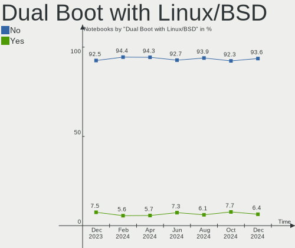

Fedora Hardware Trends (Notebooks)
----------------------------------

A project to identify most popular hardware characteristics and track their change
over time based on data collected by Fedora users at https://Linux-Hardware.org.

Anyone can contribute to this report by the [hw-probe](https://github.com/linuxhw/hw-probe) tool:

    sudo -E hw-probe -all -upload

Full-feature report is available here: https://linux-hardware.org/?view=trends&formfactor=notebook

Period: Sep, 2021.

Contents
--------

* [ System ](#system)
  - [ OS                       ](#os)
  - [ OS Family                ](#os-family)
  - [ Kernel                   ](#kernel)
  - [ Kernel Family            ](#kernel-family)
  - [ Kernel Major Ver.        ](#kernel-major-ver)
  - [ Arch                     ](#arch)
  - [ DE                       ](#de)
  - [ Display Server           ](#display-server)
  - [ Display Manager          ](#display-manager)
  - [ OS Lang                  ](#os-lang)
  - [ Boot Mode                ](#boot-mode)
  - [ Filesystem               ](#filesystem)
  - [ Part. scheme             ](#part-scheme)
  - [ Dual Boot with Linux/BSD ](#dual-boot-with-linuxbsd)
  - [ Dual Boot (Win)          ](#dual-boot-win)

* [ Board ](#board)
  - [ Vendor                   ](#vendor)
  - [ Model                    ](#model)
  - [ Model Family             ](#model-family)
  - [ MFG Year                 ](#mfg-year)
  - [ Form Factor              ](#form-factor)
  - [ Secure Boot              ](#secure-boot)
  - [ Coreboot                 ](#coreboot)
  - [ RAM Size                 ](#ram-size)
  - [ RAM Used                 ](#ram-used)
  - [ Total Drives             ](#total-drives)
  - [ Has CD-ROM               ](#has-cd-rom)
  - [ Has Ethernet             ](#has-ethernet)
  - [ Has WiFi                 ](#has-wifi)
  - [ Has Bluetooth            ](#has-bluetooth)

* [ Location ](#location)
  - [ Country                  ](#country)
  - [ City                     ](#city)

* [ Drives ](#drives)
  - [ Drive Vendor             ](#drive-vendor)
  - [ Drive Model              ](#drive-model)
  - [ HDD Vendor               ](#hdd-vendor)
  - [ SSD Vendor               ](#ssd-vendor)
  - [ Drive Kind               ](#drive-kind)
  - [ Drive Connector          ](#drive-connector)
  - [ Drive Size               ](#drive-size)
  - [ Space Total              ](#space-total)
  - [ Space Used               ](#space-used)
  - [ Malfunc. Drives          ](#malfunc-drives)
  - [ Malfunc. Drive Vendor    ](#malfunc-drive-vendor)
  - [ Malfunc. HDD Vendor      ](#malfunc-hdd-vendor)
  - [ Malfunc. Drive Kind      ](#malfunc-drive-kind)
  - [ Failed Drives            ](#failed-drives)
  - [ Failed Drive Vendor      ](#failed-drive-vendor)
  - [ Drive Status             ](#drive-status)

* [ Storage controller ](#storage-controller)
  - [ Storage Vendor           ](#storage-vendor)
  - [ Storage Model            ](#storage-model)
  - [ Storage Kind             ](#storage-kind)

* [ Processor ](#processor)
  - [ CPU Vendor               ](#cpu-vendor)
  - [ CPU Model                ](#cpu-model)
  - [ CPU Model Family         ](#cpu-model-family)
  - [ CPU Cores                ](#cpu-cores)
  - [ CPU Sockets              ](#cpu-sockets)
  - [ CPU Threads              ](#cpu-threads)
  - [ CPU Op-Modes             ](#cpu-op-modes)
  - [ CPU Microcode            ](#cpu-microcode)
  - [ CPU Microarch            ](#cpu-microarch)

* [ Graphics ](#graphics)
  - [ GPU Vendor               ](#gpu-vendor)
  - [ GPU Model                ](#gpu-model)
  - [ GPU Combo                ](#gpu-combo)
  - [ GPU Driver               ](#gpu-driver)
  - [ GPU Memory               ](#gpu-memory)

* [ Monitor ](#monitor)
  - [ Monitor Vendor           ](#monitor-vendor)
  - [ Monitor Model            ](#monitor-model)
  - [ Monitor Resolution       ](#monitor-resolution)
  - [ Monitor Diagonal         ](#monitor-diagonal)
  - [ Monitor Width            ](#monitor-width)
  - [ Aspect Ratio             ](#aspect-ratio)
  - [ Monitor Area             ](#monitor-area)
  - [ Pixel Density            ](#pixel-density)
  - [ Multiple Monitors        ](#multiple-monitors)

* [ Network ](#network)
  - [ Net Controller Vendor    ](#net-controller-vendor)
  - [ Net Controller Model     ](#net-controller-model)
  - [ Wireless Vendor          ](#wireless-vendor)
  - [ Wireless Model           ](#wireless-model)
  - [ Ethernet Vendor          ](#ethernet-vendor)
  - [ Ethernet Model           ](#ethernet-model)
  - [ Net Controller Kind      ](#net-controller-kind)
  - [ Used Controller          ](#used-controller)
  - [ NICs                     ](#nics)
  - [ IPv6                     ](#ipv6)

* [ Bluetooth ](#bluetooth)
  - [ Bluetooth Vendor         ](#bluetooth-vendor)
  - [ Bluetooth Model          ](#bluetooth-model)

* [ Sound ](#sound)
  - [ Sound Vendor             ](#sound-vendor)
  - [ Sound Model              ](#sound-model)

* [ Memory ](#memory)
  - [ Memory Vendor            ](#memory-vendor)
  - [ Memory Model             ](#memory-model)
  - [ Memory Kind              ](#memory-kind)
  - [ Memory Form Factor       ](#memory-form-factor)
  - [ Memory Size              ](#memory-size)
  - [ Memory Speed             ](#memory-speed)

* [ Printers & scanners ](#printers--scanners)
  - [ Printer Vendor           ](#printer-vendor)
  - [ Printer Model            ](#printer-model)
  - [ Scanner Vendor           ](#scanner-vendor)
  - [ Scanner Model            ](#scanner-model)

* [ Camera ](#camera)
  - [ Camera Vendor            ](#camera-vendor)
  - [ Camera Model             ](#camera-model)

* [ Security ](#security)
  - [ Fingerprint Vendor       ](#fingerprint-vendor)
  - [ Fingerprint Model        ](#fingerprint-model)
  - [ Chipcard Vendor          ](#chipcard-vendor)
  - [ Chipcard Model           ](#chipcard-model)

* [ Unsupported ](#unsupported)
  - [ Unsupported Devices      ](#unsupported-devices)
  - [ Unsupported Device Types ](#unsupported-device-types)

System
------

OS
--

Installed operating systems

| Name      | Notebooks | Percent |
|-----------|-----------|---------|
| Fedora 34 | 128       | 85.91%  |
| Fedora 35 | 10        | 6.71%   |
| Fedora 33 | 6         | 4.03%   |
| Fedora 36 | 2         | 1.34%   |
| Fedora 32 | 2         | 1.34%   |
| Fedora 21 | 1         | 0.67%   |

OS Family
---------

OS without a version

| Name   | Notebooks | Percent |
|--------|-----------|---------|
| Fedora | 149       | 100%    |

Kernel
------

Version of the Linux kernel

| Version                                                       | Notebooks | Percent |
|---------------------------------------------------------------|-----------|---------|
| 5.13.16-200.fc34.x86_64                                       | 26        | 17.45%  |
| 5.13.14-200.fc34.x86_64                                       | 26        | 17.45%  |
| 5.13.13-200.fc34.x86_64                                       | 19        | 12.75%  |
| 5.13.19-200.fc34.x86_64                                       | 16        | 10.74%  |
| 5.13.12-200.fc34.x86_64                                       | 14        | 9.4%    |
| 5.11.12-300.fc34.x86_64                                       | 11        | 7.38%   |
| 5.13.15-200.fc34.x86_64                                       | 9         | 6.04%   |
| 5.14.0-60.fc35.x86_64                                         | 3         | 2.01%   |
| 5.14.7-300.fc35.x86_64                                        | 2         | 1.34%   |
| 5.14.3-300.fc35.x86_64                                        | 2         | 1.34%   |
| 5.11.22-100.fc32.x86_64                                       | 2         | 1.34%   |
| 5.15.0-0.rc2.20210923git58e2cf5d7946.21.vanilla.1.fc36.x86_64 | 1         | 0.67%   |
| 5.15.0-0.rc2.18.fc36.x86_64                                   | 1         | 0.67%   |
| 5.15.0-0.rc0.20210902git4ac6d90867a4.4.vanilla.1.fc34.x86_64  | 1         | 0.67%   |
| 5.14.6-300.rog.fc34.x86_64                                    | 1         | 0.67%   |
| 5.14.6-300.fc35.x86_64                                        | 1         | 0.67%   |
| 5.14.5-300.fc35.x86_64                                        | 1         | 0.67%   |
| 5.14.5-300.fc34.x86_64                                        | 1         | 0.67%   |
| 5.14.3-300.fc34.x86_64                                        | 1         | 0.67%   |
| 5.14.2-300.fc33.x86_64                                        | 1         | 0.67%   |
| 5.14.1-300.fc35.x86_64                                        | 1         | 0.67%   |
| 5.13.9-200.fc34.x86_64                                        | 1         | 0.67%   |
| 5.13.8-200.fc34.x86_64                                        | 1         | 0.67%   |
| 5.13.16-100.fc33.x86_64                                       | 1         | 0.67%   |
| 5.13.15-100.fc33.x86_64                                       | 1         | 0.67%   |
| 5.13.14-100.fc33.x86_64                                       | 1         | 0.67%   |
| 5.13.12-200.mbp15.fc33.x86_64                                 | 1         | 0.67%   |
| 5.13.10-100.fc33.x86_64                                       | 1         | 0.67%   |
| 5.12.12-200.fc33.x86_64                                       | 1         | 0.67%   |
| 4.1.13-100.fc21.x86_64                                        | 1         | 0.67%   |

Kernel Family
-------------

Linux kernel without a distro release

| Version | Notebooks | Percent |
|---------|-----------|---------|
| 5.13.16 | 27        | 18.12%  |
| 5.13.14 | 27        | 18.12%  |
| 5.13.13 | 19        | 12.75%  |
| 5.13.19 | 16        | 10.74%  |
| 5.13.12 | 15        | 10.07%  |
| 5.11.12 | 11        | 7.38%   |
| 5.13.15 | 10        | 6.71%   |
| 5.15.0  | 3         | 2.01%   |
| 5.14.3  | 3         | 2.01%   |
| 5.14.0  | 3         | 2.01%   |
| 5.14.7  | 2         | 1.34%   |
| 5.14.6  | 2         | 1.34%   |
| 5.14.5  | 2         | 1.34%   |
| 5.11.22 | 2         | 1.34%   |
| 5.14.2  | 1         | 0.67%   |
| 5.14.1  | 1         | 0.67%   |
| 5.13.9  | 1         | 0.67%   |
| 5.13.8  | 1         | 0.67%   |
| 5.13.10 | 1         | 0.67%   |
| 5.12.12 | 1         | 0.67%   |
| 4.1.13  | 1         | 0.67%   |

Kernel Major Ver.
-----------------

Linux kernel major version

| Version | Notebooks | Percent |
|---------|-----------|---------|
| 5.13    | 117       | 78.52%  |
| 5.14    | 14        | 9.4%    |
| 5.11    | 13        | 8.72%   |
| 5.15    | 3         | 2.01%   |
| 5.12    | 1         | 0.67%   |
| 4.1     | 1         | 0.67%   |

Arch
----

OS architecture (x86_64, i586, etc.)

| Name   | Notebooks | Percent |
|--------|-----------|---------|
| x86_64 | 149       | 100%    |

DE
--

Desktop Environment

| Name       | Notebooks | Percent |
|------------|-----------|---------|
| GNOME      | 117       | 78.52%  |
| KDE5       | 8         | 5.37%   |
| KDE        | 7         | 4.7%    |
| X-Cinnamon | 4         | 2.68%   |
| Unknown    | 4         | 2.68%   |
| MATE       | 3         | 2.01%   |
| Cinnamon   | 3         | 2.01%   |
| XFCE       | 1         | 0.67%   |
| KDE4       | 1         | 0.67%   |
| Deepin     | 1         | 0.67%   |

Display Server
--------------

X11 or Wayland

| Name    | Notebooks | Percent |
|---------|-----------|---------|
| Wayland | 97        | 65.1%   |
| X11     | 48        | 32.21%  |
| Unknown | 3         | 2.01%   |
| Tty     | 1         | 0.67%   |

Display Manager
---------------

SDDM, LightDM, etc.

| Name    | Notebooks | Percent |
|---------|-----------|---------|
| Unknown | 71        | 47.65%  |
| GDM     | 59        | 39.6%   |
| LightDM | 10        | 6.71%   |
| SDDM    | 8         | 5.37%   |
| KDM     | 1         | 0.67%   |

OS Lang
-------

Language

| Lang  | Notebooks | Percent |
|-------|-----------|---------|
| en_US | 81        | 54.36%  |
| ru_RU | 11        | 7.38%   |
| pt_BR | 11        | 7.38%   |
| en_GB | 11        | 7.38%   |
| fr_FR | 3         | 2.01%   |
| es_ES | 3         | 2.01%   |
| en_IN | 3         | 2.01%   |
| en_AU | 3         | 2.01%   |
| de_DE | 3         | 2.01%   |
| hr_HR | 2         | 1.34%   |
| es_MX | 2         | 1.34%   |
| zh_CN | 1         | 0.67%   |
| ru_UA | 1         | 0.67%   |
| pl_PL | 1         | 0.67%   |
| nl_NL | 1         | 0.67%   |
| ms_MY | 1         | 0.67%   |
| ja_JP | 1         | 0.67%   |
| it_IT | 1         | 0.67%   |
| ga_IE | 1         | 0.67%   |
| fi_FI | 1         | 0.67%   |
| es_PE | 1         | 0.67%   |
| es_CL | 1         | 0.67%   |
| en_ZA | 1         | 0.67%   |
| en_IL | 1         | 0.67%   |
| en_CA | 1         | 0.67%   |
| de_CH | 1         | 0.67%   |
| da_DK | 1         | 0.67%   |

Boot Mode
---------

EFI or BIOS

| Mode | Notebooks | Percent |
|------|-----------|---------|
| EFI  | 120       | 80.54%  |
| BIOS | 29        | 19.46%  |

Filesystem
----------

Type of filesystem

| Type  | Notebooks | Percent |
|-------|-----------|---------|
| Btrfs | 102       | 68.46%  |
| Ext4  | 41        | 27.52%  |
| Xfs   | 5         | 3.36%   |
| Ext3  | 1         | 0.67%   |

Part. scheme
------------

Scheme of partitioning

| Type    | Notebooks | Percent |
|---------|-----------|---------|
| GPT     | 66        | 44.3%   |
| Unknown | 66        | 44.3%   |
| MBR     | 17        | 11.41%  |

Dual Boot with Linux/BSD
------------------------

Hosting more than one Linux/BSD

| Dual boot | Notebooks | Percent |
|-----------|-----------|---------|
| No        | 134       | 89.93%  |
| Yes       | 15        | 10.07%  |

Dual Boot (Win)
---------------

Hosting Linux and Windows

| Dual boot | Notebooks | Percent |
|-----------|-----------|---------|
| No        | 127       | 85.23%  |
| Yes       | 22        | 14.77%  |

Board
-----

Vendor
------

Motherboard manufacturer

| Name                | Notebooks | Percent |
|---------------------|-----------|---------|
| Lenovo              | 48        | 32.21%  |
| Dell                | 29        | 19.46%  |
| Hewlett-Packard     | 25        | 16.78%  |
| ASUSTek Computer    | 10        | 6.71%   |
| HUAWEI              | 5         | 3.36%   |
| Acer                | 5         | 3.36%   |
| Apple               | 4         | 2.68%   |
| Notebook            | 3         | 2.01%   |
| Timi                | 2         | 1.34%   |
| Samsung Electronics | 2         | 1.34%   |
| PC Specialist       | 2         | 1.34%   |
| MSI                 | 2         | 1.34%   |
| Framework           | 2         | 1.34%   |
| Unknown             | 2         | 1.34%   |
| Toshiba             | 1         | 0.67%   |
| Positivo            | 1         | 0.67%   |
| Panasonic           | 1         | 0.67%   |
| Metabox             | 1         | 0.67%   |
| Intel               | 1         | 0.67%   |
| Hampoo              | 1         | 0.67%   |
| Google              | 1         | 0.67%   |
| Fujitsu             | 1         | 0.67%   |

Model
-----

Motherboard model

| Name                                                                                     | Notebooks | Percent |
|------------------------------------------------------------------------------------------|-----------|---------|
| HP Pavilion Gaming Laptop 15-dk0xxx                                                      | 2         | 1.34%   |
| HP Pavilion 15                                                                           | 2         | 1.34%   |
| Framework Laptop                                                                         | 2         | 1.34%   |
| Dell XPS 13 7390                                                                         | 2         | 1.34%   |
| Unknown                                                                                  | 2         | 1.34%   |
| Toshiba Satellite U940                                                                   | 1         | 0.67%   |
| Timi RedmiBook 14                                                                        | 1         | 0.67%   |
| Timi Mi NoteBook Ultra                                                                   | 1         | 0.67%   |
| Samsung 700Z3C/700Z5C                                                                    | 1         | 0.67%   |
| Samsung 355V4C/355V4X/355V5C/355V5X/356V4C/356V4X/356V5C/356V5X/3445VC/3445VX/3545VC/354 | 1         | 0.67%   |
| Positivo C41TB                                                                           | 1         | 0.67%   |
| PC Specialist N85_N87,HJ,HJ1,HK1                                                         | 1         | 0.67%   |
| PC Specialist N150CU                                                                     | 1         | 0.67%   |
| Panasonic CFSV9-2                                                                        | 1         | 0.67%   |
| Notebook PB50_70DFx,DDx                                                                  | 1         | 0.67%   |
| Notebook NH55RGQ                                                                         | 1         | 0.67%   |
| Notebook N2x0WU                                                                          | 1         | 0.67%   |
| MSI GE75 Raider 10SFS                                                                    | 1         | 0.67%   |
| MSI Bravo 15 B5DD                                                                        | 1         | 0.67%   |
| Metabox Alpha-X NH77DC                                                                   | 1         | 0.67%   |
| Lenovo Yoga Slim 7 Pro 14IHU5 82NC                                                       | 1         | 0.67%   |
| Lenovo Y520-15IKBN 80WK                                                                  | 1         | 0.67%   |
| Lenovo V580c 20160                                                                       | 1         | 0.67%   |
| Lenovo ThinkPad X250 20CMCTO1WW                                                          | 1         | 0.67%   |
| Lenovo ThinkPad X230 23255E4                                                             | 1         | 0.67%   |
| Lenovo ThinkPad X1 Extreme 2nd 20QVCTO1WW                                                | 1         | 0.67%   |
| Lenovo ThinkPad X1 Carbon Gen 9 20XWCTO1WW                                               | 1         | 0.67%   |
| Lenovo ThinkPad X1 Carbon Gen 8 20U9CTO1WW                                               | 1         | 0.67%   |
| Lenovo ThinkPad X1 Carbon 7th 20QD001XUS                                                 | 1         | 0.67%   |
| Lenovo ThinkPad X1 Carbon 5th 20HRCTO1WW                                                 | 1         | 0.67%   |
| Lenovo ThinkPad W540 20BHS16L00                                                          | 1         | 0.67%   |
| Lenovo ThinkPad W520 42763JU                                                             | 1         | 0.67%   |
| Lenovo ThinkPad T550 20CKA00ECD                                                          | 1         | 0.67%   |
| Lenovo ThinkPad T530 2429GG3                                                             | 1         | 0.67%   |
| Lenovo ThinkPad T490s 20NX003NRT                                                         | 1         | 0.67%   |
| Lenovo ThinkPad T460s 20FAS2J700                                                         | 1         | 0.67%   |
| Lenovo ThinkPad T460p 20FWS0A600                                                         | 1         | 0.67%   |
| Lenovo ThinkPad T440s 20ARS2V900                                                         | 1         | 0.67%   |
| Lenovo ThinkPad T440s 20AQ006HUS                                                         | 1         | 0.67%   |
| Lenovo ThinkPad T440p 20AN006NUS                                                         | 1         | 0.67%   |
| Lenovo ThinkPad T410 2522PT3                                                             | 1         | 0.67%   |
| Lenovo ThinkPad T15 Gen 2i 20W4002MUS                                                    | 1         | 0.67%   |
| Lenovo ThinkPad P50 20EQS64N1N                                                           | 1         | 0.67%   |
| Lenovo ThinkPad P14s Gen 1 20Y1000ESP                                                    | 1         | 0.67%   |
| Lenovo ThinkPad P1 Gen 2 20QTA00PCD                                                      | 1         | 0.67%   |
| Lenovo ThinkPad E490 20N80029GE                                                          | 1         | 0.67%   |
| Lenovo ThinkPad E480 20KNS0MC00                                                          | 1         | 0.67%   |
| Lenovo ThinkPad E15 Gen 3 20YG006BIX                                                     | 1         | 0.67%   |
| Lenovo ThinkPad E15 20RES6DF07                                                           | 1         | 0.67%   |
| Lenovo ThinkPad E14 Gen 3 20Y7CTO1WW                                                     | 1         | 0.67%   |
| Lenovo ThinkPad E14 Gen 2 20TAA00HCD                                                     | 1         | 0.67%   |
| Lenovo Legion 5 15ARH05 82B5                                                             | 1         | 0.67%   |
| Lenovo Legion 5 15ACH6H 82JU                                                             | 1         | 0.67%   |
| Lenovo IdeaPad Z510 20287                                                                | 1         | 0.67%   |
| Lenovo IdeaPad S540-15IWL                                                                | 1         | 0.67%   |
| Lenovo IdeaPad S540-13IML 81XA                                                           | 1         | 0.67%   |
| Lenovo IdeaPad S145-15IWL 81S9                                                           | 1         | 0.67%   |
| Lenovo IdeaPad L340-15IRH Gaming 81LK                                                    | 1         | 0.67%   |
| Lenovo IdeaPad C340-14API 81N6                                                           | 1         | 0.67%   |
| Lenovo IdeaPad 5 Pro 16ACH6 82L5                                                         | 1         | 0.67%   |

Model Family
------------

Motherboard model prefix

| Name                 | Notebooks | Percent |
|----------------------|-----------|---------|
| Lenovo ThinkPad      | 28        | 18.79%  |
| Lenovo IdeaPad       | 12        | 8.05%   |
| Dell Latitude        | 10        | 6.71%   |
| Dell XPS             | 9         | 6.04%   |
| Dell Inspiron        | 9         | 6.04%   |
| HP Pavilion          | 5         | 3.36%   |
| HP ZBook             | 4         | 2.68%   |
| HP ProBook           | 4         | 2.68%   |
| Acer Aspire          | 4         | 2.68%   |
| HP Laptop            | 3         | 2.01%   |
| HP EliteBook         | 3         | 2.01%   |
| Lenovo Legion        | 2         | 1.34%   |
| Framework Laptop     | 2         | 1.34%   |
| ASUS VivoBook        | 2         | 1.34%   |
| Unknown              | 2         | 1.34%   |
| Toshiba Satellite    | 1         | 0.67%   |
| Timi RedmiBook       | 1         | 0.67%   |
| Timi Mi              | 1         | 0.67%   |
| Samsung 700Z3C       | 1         | 0.67%   |
| Samsung 355V4C       | 1         | 0.67%   |
| Positivo C41TB       | 1         | 0.67%   |
| PC Specialist N85    | 1         | 0.67%   |
| PC Specialist N150CU | 1         | 0.67%   |
| Panasonic CFSV9-2    | 1         | 0.67%   |
| Notebook PB50        | 1         | 0.67%   |
| Notebook NH55RGQ     | 1         | 0.67%   |
| Notebook N2x0WU      | 1         | 0.67%   |
| MSI GE75             | 1         | 0.67%   |
| MSI Bravo            | 1         | 0.67%   |
| Metabox Alpha-X      | 1         | 0.67%   |
| Lenovo Yoga          | 1         | 0.67%   |
| Lenovo Y520-15IKBN   | 1         | 0.67%   |
| Lenovo V580c         | 1         | 0.67%   |
| Lenovo G50-80        | 1         | 0.67%   |
| Lenovo G40-45        | 1         | 0.67%   |
| Lenovo B320-14IKB    | 1         | 0.67%   |
| Intel A133L          | 1         | 0.67%   |
| HUAWEI WRTB-WXX9     | 1         | 0.67%   |
| HUAWEI NBLL-WXX9     | 1         | 0.67%   |
| HUAWEI NBLK-WAX9X    | 1         | 0.67%   |
| HUAWEI MACH-WX9      | 1         | 0.67%   |
| HUAWEI EUL-WX9       | 1         | 0.67%   |
| HP Spectre           | 1         | 0.67%   |
| HP OMEN              | 1         | 0.67%   |
| HP Notebook          | 1         | 0.67%   |
| HP G42               | 1         | 0.67%   |
| HP Elite             | 1         | 0.67%   |
| HP 250               | 1         | 0.67%   |
| Hampoo Cherry        | 1         | 0.67%   |
| Google Delbin        | 1         | 0.67%   |
| Fujitsu LIFEBOOK     | 1         | 0.67%   |
| Dell Precision       | 1         | 0.67%   |
| ASUS X556UR          | 1         | 0.67%   |
| ASUS X555QA          | 1         | 0.67%   |
| ASUS X555LB          | 1         | 0.67%   |
| ASUS X456UQ          | 1         | 0.67%   |
| ASUS ROG             | 1         | 0.67%   |
| ASUS K53SV           | 1         | 0.67%   |
| ASUS G71V            | 1         | 0.67%   |
| ASUS ASUS            | 1         | 0.67%   |

MFG Year
--------

Motherboard manufacture year

| Year | Notebooks | Percent |
|------|-----------|---------|
| 2021 | 43        | 28.86%  |
| 2019 | 27        | 18.12%  |
| 2020 | 24        | 16.11%  |
| 2018 | 17        | 11.41%  |
| 2017 | 7         | 4.7%    |
| 2016 | 6         | 4.03%   |
| 2013 | 6         | 4.03%   |
| 2011 | 6         | 4.03%   |
| 2014 | 4         | 2.68%   |
| 2015 | 3         | 2.01%   |
| 2012 | 2         | 1.34%   |
| 2010 | 2         | 1.34%   |
| 2009 | 1         | 0.67%   |
| 2008 | 1         | 0.67%   |

Form Factor
-----------

Physical design of the computer

| Name     | Notebooks | Percent |
|----------|-----------|---------|
| Notebook | 149       | 100%    |

Secure Boot
-----------

Enabled or disabled

| State    | Notebooks | Percent |
|----------|-----------|---------|
| Disabled | 124       | 83.22%  |
| Enabled  | 25        | 16.78%  |

Coreboot
--------

Have coreboot on board

| Used | Notebooks | Percent |
|------|-----------|---------|
| No   | 148       | 99.33%  |
| Yes  | 1         | 0.67%   |

RAM Size
--------

Total RAM memory

| Size in GB  | Notebooks | Percent |
|-------------|-----------|---------|
| 4.01-8.0    | 48        | 32.21%  |
| 16.01-24.0  | 34        | 22.82%  |
| 8.01-16.0   | 29        | 19.46%  |
| 32.01-64.0  | 19        | 12.75%  |
| 3.01-4.0    | 14        | 9.4%    |
| 24.01-32.0  | 2         | 1.34%   |
| 64.01-256.0 | 2         | 1.34%   |
| 1.01-2.0    | 1         | 0.67%   |

RAM Used
--------

Used RAM memory

| Used GB    | Notebooks | Percent |
|------------|-----------|---------|
| 2.01-3.0   | 46        | 30.87%  |
| 4.01-8.0   | 39        | 26.17%  |
| 3.01-4.0   | 32        | 21.48%  |
| 1.01-2.0   | 19        | 12.75%  |
| 8.01-16.0  | 11        | 7.38%   |
| 16.01-24.0 | 1         | 0.67%   |
| 0.51-1.0   | 1         | 0.67%   |

Total Drives
------------

Number of drives on board

| Drives | Notebooks | Percent |
|--------|-----------|---------|
| 1      | 114       | 76.51%  |
| 2      | 23        | 15.44%  |
| 3      | 12        | 8.05%   |

Has CD-ROM
----------

Has CD-ROM on board

| Presented | Notebooks | Percent |
|-----------|-----------|---------|
| No        | 123       | 82.55%  |
| Yes       | 26        | 17.45%  |

Has Ethernet
------------

Has Ethernet on board

| Presented | Notebooks | Percent |
|-----------|-----------|---------|
| Yes       | 120       | 80.54%  |
| No        | 29        | 19.46%  |

Has WiFi
--------

Has WiFi module

| Presented | Notebooks | Percent |
|-----------|-----------|---------|
| Yes       | 147       | 98.66%  |
| No        | 2         | 1.34%   |

Has Bluetooth
-------------

Has Bluetooth module

| Presented | Notebooks | Percent |
|-----------|-----------|---------|
| Yes       | 128       | 85.91%  |
| No        | 21        | 14.09%  |

Location
--------

Country
-------

Geographic location (country)

| Country      | Notebooks | Percent |
|--------------|-----------|---------|
| USA          | 25        | 16.78%  |
| Brazil       | 12        | 8.05%   |
| Russia       | 10        | 6.71%   |
| India        | 8         | 5.37%   |
| Norway       | 7         | 4.7%    |
| Netherlands  | 7         | 4.7%    |
| Ukraine      | 6         | 4.03%   |
| UK           | 5         | 3.36%   |
| France       | 5         | 3.36%   |
| Spain        | 4         | 2.68%   |
| Portugal     | 4         | 2.68%   |
| Germany      | 4         | 2.68%   |
| Chile        | 4         | 2.68%   |
| Turkey       | 3         | 2.01%   |
| Mexico       | 3         | 2.01%   |
| Italy        | 3         | 2.01%   |
| Colombia     | 3         | 2.01%   |
| Australia    | 3         | 2.01%   |
| Vietnam      | 2         | 1.34%   |
| Israel       | 2         | 1.34%   |
| Denmark      | 2         | 1.34%   |
| Croatia      | 2         | 1.34%   |
| China        | 2         | 1.34%   |
| Bulgaria     | 2         | 1.34%   |
| Belarus      | 2         | 1.34%   |
| Switzerland  | 1         | 0.67%   |
| Sweden       | 1         | 0.67%   |
| South Africa | 1         | 0.67%   |
| Romania      | 1         | 0.67%   |
| Poland       | 1         | 0.67%   |
| Peru         | 1         | 0.67%   |
| Namibia      | 1         | 0.67%   |
| Malaysia     | 1         | 0.67%   |
| Latvia       | 1         | 0.67%   |
| Japan        | 1         | 0.67%   |
| Ireland      | 1         | 0.67%   |
| Iran         | 1         | 0.67%   |
| Greece       | 1         | 0.67%   |
| Ghana        | 1         | 0.67%   |
| Finland      | 1         | 0.67%   |
| Canada       | 1         | 0.67%   |
| Belgium      | 1         | 0.67%   |
| Bangladesh   | 1         | 0.67%   |
| Argentina    | 1         | 0.67%   |

City
----

Geographic location (city)

| City                    | Notebooks | Percent |
|-------------------------|-----------|---------|
| Moscow                  | 5         | 3.36%   |
| Amsterdam               | 5         | 3.36%   |
| Kyiv                    | 3         | 2.01%   |
| Istanbul                | 3         | 2.01%   |
| Fortaleza               | 3         | 2.01%   |
| Zagreb                  | 2         | 1.34%   |
| Yekaterinburg           | 2         | 1.34%   |
| Sydney                  | 2         | 1.34%   |
| S??o Paulo              | 2         | 1.34%   |
| Santiago                | 2         | 1.34%   |
| Royse                   | 2         | 1.34%   |
| Nuremberg               | 2         | 1.34%   |
| Minsk                   | 2         | 1.34%   |
| Madrid                  | 2         | 1.34%   |
| Atlanta                 | 2         | 1.34%   |
| Zurich                  | 1         | 0.67%   |
| Windhoek                | 1         | 0.67%   |
| Vilafranca del Pened??s | 1         | 0.67%   |
| Varna                   | 1         | 0.67%   |
| Toulouse                | 1         | 0.67%   |
| Temuco                  | 1         | 0.67%   |
| Temecula                | 1         | 0.67%   |
| Tel Aviv                | 1         | 0.67%   |
| Tehran                  | 1         | 0.67%   |
| Strommen                | 1         | 0.67%   |
| Strasbourg              | 1         | 0.67%   |
| Southampton             | 1         | 0.67%   |
| Sofia                   | 1         | 0.67%   |
| Skudai                  | 1         | 0.67%   |
| Shanghai                | 1         | 0.67%   |
| Sevierville             | 1         | 0.67%   |
| Secaucus                | 1         | 0.67%   |
| Seattle                 | 1         | 0.67%   |
| Santiago de Cali        | 1         | 0.67%   |
| San Francisco           | 1         | 0.67%   |
| Royal Oak               | 1         | 0.67%   |
| Rotherham               | 1         | 0.67%   |
| Riga                    | 1         | 0.67%   |
| Porto Viro              | 1         | 0.67%   |
| Portland                | 1         | 0.67%   |
| Pittsburgh              | 1         | 0.67%   |
| Phoenix                 | 1         | 0.67%   |
| Paris                   | 1         | 0.67%   |
| Oslo                    | 1         | 0.67%   |
| Oeiras                  | 1         | 0.67%   |
| Novosibirsk             | 1         | 0.67%   |
| North Shields           | 1         | 0.67%   |
| Mohali                  | 1         | 0.67%   |
| Mogi das Cruzes         | 1         | 0.67%   |
| Mirandela               | 1         | 0.67%   |
| Miami                   | 1         | 0.67%   |
| Mexico City             | 1         | 0.67%   |
| Melbourne               | 1         | 0.67%   |
| Marysville              | 1         | 0.67%   |
| Marling                 | 1         | 0.67%   |
| Mangalore               | 1         | 0.67%   |
| Manchester              | 1         | 0.67%   |
| Machezal                | 1         | 0.67%   |
| Ludhiana                | 1         | 0.67%   |
| Littleton               | 1         | 0.67%   |

Drives
------

Drive Vendor
------------

Hard drive vendors

| Vendor                    | Notebooks | Drives | Percent |
|---------------------------|-----------|--------|---------|
| Samsung Electronics       | 44        | 49     | 23.4%   |
| Toshiba                   | 19        | 21     | 10.11%  |
| Seagate                   | 16        | 17     | 8.51%   |
| SK Hynix                  | 14        | 15     | 7.45%   |
| WDC                       | 13        | 13     | 6.91%   |
| Kingston                  | 13        | 14     | 6.91%   |
| SanDisk                   | 11        | 11     | 5.85%   |
| Unknown                   | 10        | 11     | 5.32%   |
| Micron Technology         | 7         | 7      | 3.72%   |
| Intel                     | 6         | 6      | 3.19%   |
| Crucial                   | 5         | 6      | 2.66%   |
| PNY                       | 4         | 4      | 2.13%   |
| SPCC                      | 3         | 3      | 1.6%    |
| Hitachi                   | 3         | 3      | 1.6%    |
| Silicon Motion            | 2         | 2      | 1.06%   |
| HGST                      | 2         | 2      | 1.06%   |
| Apple                     | 2         | 2      | 1.06%   |
| Yangtze Memory            | 1         | 1      | 0.53%   |
| USB3.1                    | 1         | 1      | 0.53%   |
| Union Memory (Shenzhen)   | 1         | 2      | 0.53%   |
| Union Memory              | 1         | 1      | 0.53%   |
| NGFF                      | 1         | 1      | 0.53%   |
| Micron/Crucial Technology | 1         | 1      | 0.53%   |
| LITEONIT                  | 1         | 1      | 0.53%   |
| LITEON                    | 1         | 1      | 0.53%   |
| Lite-On                   | 1         | 1      | 0.53%   |
| Lexar                     | 1         | 1      | 0.53%   |
| KIOXIA                    | 1         | 1      | 0.53%   |
| KingSpec                  | 1         | 1      | 0.53%   |
| Corsair                   | 1         | 1      | 0.53%   |
| China                     | 1         | 1      | 0.53%   |

Drive Model
-----------

Hard drive models

| Model                                        | Notebooks | Percent |
|----------------------------------------------|-----------|---------|
| Toshiba NVMe SSD Drive 512GB                 | 4         | 2%      |
| Seagate ST1000LM024 HN-M101MBB 1TB           | 4         | 2%      |
| Kingston SA400S37480G 480GB SSD              | 4         | 2%      |
| Unknown MMC Card  64GB                       | 3         | 1.5%    |
| SK Hynix NVMe SSD Drive 512GB                | 3         | 1.5%    |
| Seagate Expansion 1TB                        | 3         | 1.5%    |
| Samsung SSD 850 EVO 500GB                    | 3         | 1.5%    |
| Samsung NVMe SSD Drive 512GB                 | 3         | 1.5%    |
| Samsung NVMe SSD Drive 256GB                 | 3         | 1.5%    |
| Kingston SA400S37240G 240GB SSD              | 3         | 1.5%    |
| Toshiba MQ01ABF050 500GB                     | 2         | 1%      |
| Seagate ST1000LM048-2E7172 1TB               | 2         | 1%      |
| Seagate ST1000LM035-1RK172 1TB               | 2         | 1%      |
| Sandisk NVMe SSD Drive 512GB                 | 2         | 1%      |
| Sandisk NVMe SSD Drive 1024GB                | 2         | 1%      |
| Samsung NVMe SSD Drive 2TB                   | 2         | 1%      |
| Samsung NVMe SSD Drive 250GB                 | 2         | 1%      |
| Samsung MZVLB1T0HBLR-000L7 1TB               | 2         | 1%      |
| PNY CS900 240GB SSD                          | 2         | 1%      |
| Micron 1100_MTFDDAK256TBN 256GB SSD          | 2         | 1%      |
| Kingston SA400S37120G 120GB SSD              | 2         | 1%      |
| Crucial CT480BX500SSD1 480GB                 | 2         | 1%      |
| Yangtze Memory YMTC PC005 512GB              | 1         | 0.5%    |
| WDC WDS500G2B0B-00YS70 500GB SSD             | 1         | 0.5%    |
| WDC WDS100T3X0C-00SJG0 1TB                   | 1         | 0.5%    |
| WDC WDS100T2B0B-00YS70 1TB SSD               | 1         | 0.5%    |
| WDC WD5000LPLX-08ZNTT0 500GB                 | 1         | 0.5%    |
| WDC WD5000LPCX-24C6HT0 500GB                 | 1         | 0.5%    |
| WDC WD10SPZX-75Z10T1 1TB                     | 1         | 0.5%    |
| WDC WD10SPZX-24Z10T0 1TB                     | 1         | 0.5%    |
| WDC WD10SPZX-22Z10T1 1TB                     | 1         | 0.5%    |
| WDC WD10JPVX-75JC3T0 1TB                     | 1         | 0.5%    |
| WDC WD10JPVX-60JC3T0 1TB                     | 1         | 0.5%    |
| WDC PC SN730 SDBPNTY-1T00-1101 1TB           | 1         | 0.5%    |
| WDC PC SN730 SDBPNTY-1T00-1032 1TB           | 1         | 0.5%    |
| WDC PC SN530 SDBPNPZ-1T00-1114 1TB           | 1         | 0.5%    |
| USB3.1 NVME&SATA 1TB                         | 1         | 0.5%    |
| Unknown USB DISK 3.2 1TB                     | 1         | 0.5%    |
| Unknown SU32G  32GB                          | 1         | 0.5%    |
| Unknown SP64G  64GB                          | 1         | 0.5%    |
| Unknown SF256  256GB                         | 1         | 0.5%    |
| Unknown SD64G  64GB                          | 1         | 0.5%    |
| Unknown SD/MMC/MS PRO 128GB                  | 1         | 0.5%    |
| Unknown NCard  16GB                          | 1         | 0.5%    |
| Unknown 064GEA  64GB                         | 1         | 0.5%    |
| Union Memory UMIS RPJTJ256MEE1OWX 256GB      | 1         | 0.5%    |
| Union Memory (Shenzhen) NVMe SSD Drive 512GB | 1         | 0.5%    |
| Toshiba TR200 480GB SSD                      | 1         | 0.5%    |
| Toshiba THNSNK256GVN8 M.2 2280 256GB SSD     | 1         | 0.5%    |
| Toshiba THNSN5512GPUK NVMe 512GB             | 1         | 0.5%    |
| Toshiba THNSN5256GPUK NVMe 256GB             | 1         | 0.5%    |
| Toshiba MQ01ABD100 1TB                       | 1         | 0.5%    |
| Toshiba MQ01ABD050V 500GB                    | 1         | 0.5%    |
| Toshiba MK3259GSXP 320GB                     | 1         | 0.5%    |
| Toshiba KXG60ZNV512G NVMe KIOXIA 512GB       | 1         | 0.5%    |
| Toshiba KXG60ZNV512G 512GB                   | 1         | 0.5%    |
| Toshiba KXG60ZNV1T02 KIOXIA 1TB              | 1         | 0.5%    |
| Toshiba KSG60ZMV256G M.2 2280 256GB SSD      | 1         | 0.5%    |
| Toshiba KBG40ZNT512G MEMORY 512GB            | 1         | 0.5%    |
| Toshiba KBG40ZNT256G MEMORY 256GB            | 1         | 0.5%    |

HDD Vendor
----------

Hard disk drive vendors

| Vendor  | Notebooks | Drives | Percent |
|---------|-----------|--------|---------|
| Seagate | 16        | 17     | 44.44%  |
| WDC     | 7         | 7      | 19.44%  |
| Toshiba | 6         | 6      | 16.67%  |
| Hitachi | 3         | 3      | 8.33%   |
| HGST    | 2         | 2      | 5.56%   |
| Unknown | 1         | 1      | 2.78%   |
| Apple   | 1         | 1      | 2.78%   |

SSD Vendor
----------

Solid state drive vendors

| Vendor              | Notebooks | Drives | Percent |
|---------------------|-----------|--------|---------|
| Samsung Electronics | 17        | 18     | 27.87%  |
| Kingston            | 10        | 10     | 16.39%  |
| SanDisk             | 6         | 6      | 9.84%   |
| Crucial             | 5         | 6      | 8.2%    |
| PNY                 | 4         | 4      | 6.56%   |
| Micron Technology   | 4         | 4      | 6.56%   |
| Toshiba             | 3         | 3      | 4.92%   |
| WDC                 | 2         | 2      | 3.28%   |
| SPCC                | 2         | 2      | 3.28%   |
| Intel               | 2         | 2      | 3.28%   |
| SK Hynix            | 1         | 1      | 1.64%   |
| NGFF                | 1         | 1      | 1.64%   |
| LITEONIT            | 1         | 1      | 1.64%   |
| Lexar               | 1         | 1      | 1.64%   |
| KingSpec            | 1         | 1      | 1.64%   |
| China               | 1         | 1      | 1.64%   |

Drive Kind
----------

HDD or SSD

| Kind    | Notebooks | Drives | Percent |
|---------|-----------|--------|---------|
| NVMe    | 76        | 89     | 43.68%  |
| SSD     | 54        | 63     | 31.03%  |
| HDD     | 35        | 37     | 20.11%  |
| MMC     | 8         | 10     | 4.6%    |
| Unknown | 1         | 2      | 0.57%   |

Drive Connector
---------------

SATA, SAS, NVMe, etc.

| Type | Notebooks | Drives | Percent |
|------|-----------|--------|---------|
| SATA | 79        | 94     | 46.47%  |
| NVMe | 76        | 89     | 44.71%  |
| MMC  | 8         | 10     | 4.71%   |
| SAS  | 7         | 8      | 4.12%   |

Drive Size
----------

Size of hard drive

| Size in TB | Notebooks | Drives | Percent |
|------------|-----------|--------|---------|
| 0.01-0.5   | 58        | 64     | 62.37%  |
| 0.51-1.0   | 35        | 36     | 37.63%  |

Space Total
-----------

Amount of disk space available on the file system

| Size in GB     | Notebooks | Percent |
|----------------|-----------|---------|
| 251-500        | 33        | 22.15%  |
| 501-1000       | 31        | 20.81%  |
| 1001-2000      | 23        | 15.44%  |
| 101-250        | 21        | 14.09%  |
| 1-20           | 15        | 10.07%  |
| Unknown        | 10        | 6.71%   |
| 51-100         | 5         | 3.36%   |
| More than 3000 | 4         | 2.68%   |
| 21-50          | 4         | 2.68%   |
| 2001-3000      | 3         | 2.01%   |

Space Used
----------

Amount of used disk space

| Used GB        | Notebooks | Percent |
|----------------|-----------|---------|
| 1-20           | 40        | 26.85%  |
| 251-500        | 26        | 17.45%  |
| 101-250        | 25        | 16.78%  |
| 21-50          | 23        | 15.44%  |
| 51-100         | 16        | 10.74%  |
| Unknown        | 10        | 6.71%   |
| 501-1000       | 7         | 4.7%    |
| More than 3000 | 1         | 0.67%   |
| 1001-2000      | 1         | 0.67%   |

Malfunc. Drives
---------------

Drive models with a malfunction

| Model                                               | Notebooks | Drives | Percent |
|-----------------------------------------------------|-----------|--------|---------|
| Toshiba MQ01ABD050V 500GB                           | 1         | 1      | 12.5%   |
| Seagate ST1000LM024 HN-M101MBB 1TB                  | 1         | 1      | 12.5%   |
| SanDisk SD9SN8W-128G-1006 128GB SSD                 | 1         | 1      | 12.5%   |
| Micron Technology MTFDDAK256MAY-1AH12ABHA 256GB SSD | 1         | 1      | 12.5%   |
| Micron Technology 1100_MTFDDAK256TBN 256GB SSD      | 1         | 1      | 12.5%   |
| LITEONIT LCS-128M6S-HP 128GB SSD                    | 1         | 1      | 12.5%   |
| Intel SSDPEKKF256G7L 256GB                          | 1         | 1      | 12.5%   |
| Hitachi HTS545025B9SA02 250GB                       | 1         | 1      | 12.5%   |

Malfunc. Drive Vendor
---------------------

Vendors of faulty drives

| Vendor            | Notebooks | Drives | Percent |
|-------------------|-----------|--------|---------|
| Micron Technology | 2         | 2      | 25%     |
| Toshiba           | 1         | 1      | 12.5%   |
| Seagate           | 1         | 1      | 12.5%   |
| SanDisk           | 1         | 1      | 12.5%   |
| LITEONIT          | 1         | 1      | 12.5%   |
| Intel             | 1         | 1      | 12.5%   |
| Hitachi           | 1         | 1      | 12.5%   |

Malfunc. HDD Vendor
-------------------

Vendors of faulty HDD drives

| Vendor  | Notebooks | Drives | Percent |
|---------|-----------|--------|---------|
| Toshiba | 1         | 1      | 33.33%  |
| Seagate | 1         | 1      | 33.33%  |
| Hitachi | 1         | 1      | 33.33%  |

Malfunc. Drive Kind
-------------------

Kinds of faulty drives

| Kind | Notebooks | Drives | Percent |
|------|-----------|--------|---------|
| SSD  | 4         | 4      | 50%     |
| HDD  | 3         | 3      | 37.5%   |
| NVMe | 1         | 1      | 12.5%   |

Failed Drives
-------------

Failed drive models

Zero info for selected period =(

Failed Drive Vendor
-------------------

Failed drive vendors

Zero info for selected period =(

Drive Status
------------

Number of failed and malfunc. drives

| Status   | Notebooks | Drives | Percent |
|----------|-----------|--------|---------|
| Works    | 78        | 89     | 47.85%  |
| Detected | 77        | 104    | 47.24%  |
| Malfunc  | 8         | 8      | 4.91%   |

Storage controller
------------------

Storage Vendor
--------------

Storage controller vendors

| Vendor                       | Notebooks | Percent |
|------------------------------|-----------|---------|
| Intel                        | 93        | 50%     |
| Samsung Electronics          | 28        | 15.05%  |
| AMD                          | 15        | 8.06%   |
| SK Hynix                     | 12        | 6.45%   |
| Toshiba America Info Systems | 8         | 4.3%    |
| Sandisk                      | 8         | 4.3%    |
| Micron Technology            | 3         | 1.61%   |
| KIOXIA                       | 3         | 1.61%   |
| Kingston Technology Company  | 3         | 1.61%   |
| Union Memory (Shenzhen)      | 2         | 1.08%   |
| Silicon Motion               | 2         | 1.08%   |
| Phison Electronics           | 2         | 1.08%   |
| Nvidia                       | 2         | 1.08%   |
| Lite-On Technology           | 2         | 1.08%   |
| Yangtze Memory Technologies  | 1         | 0.54%   |
| Micron/Crucial Technology    | 1         | 0.54%   |
| Apple                        | 1         | 0.54%   |

Storage Model
-------------

Storage controller models

| Model                                                                            | Notebooks | Percent |
|----------------------------------------------------------------------------------|-----------|---------|
| Intel Sunrise Point-LP SATA Controller [AHCI mode]                               | 18        | 9.52%   |
| Samsung NVMe SSD Controller SM981/PM981/PM983                                    | 16        | 8.47%   |
| AMD FCH SATA Controller [AHCI mode]                                              | 13        | 6.88%   |
| Intel 7 Series Chipset Family 6-port SATA Controller [AHCI mode]                 | 9         | 4.76%   |
| Intel Wildcat Point-LP SATA Controller [AHCI Mode]                               | 8         | 4.23%   |
| Intel 82801 Mobile SATA Controller [RAID mode]                                   | 8         | 4.23%   |
| SK Hynix Gold P31 SSD                                                            | 7         | 3.7%    |
| Intel HM170/QM170 Chipset SATA Controller [AHCI Mode]                            | 7         | 3.7%    |
| Sandisk WD Black SN750 / PC SN730 NVMe SSD                                       | 5         | 2.65%   |
| Intel Comet Lake SATA AHCI Controller                                            | 5         | 2.65%   |
| Intel 6 Series/C200 Series Chipset Family 6 port Mobile SATA AHCI Controller     | 5         | 2.65%   |
| Samsung NVMe SSD Controller PM9A1/PM9A3/980PRO                                   | 4         | 2.12%   |
| Intel Cannon Lake Mobile PCH SATA AHCI Controller                                | 4         | 2.12%   |
| Intel 8 Series/C220 Series Chipset Family 6-port SATA Controller 1 [AHCI mode]   | 4         | 2.12%   |
| Toshiba America Info Systems XG6 NVMe SSD Controller                             | 3         | 1.59%   |
| Samsung NVMe SSD Controller SM961/PM961/SM963                                    | 3         | 1.59%   |
| Samsung NVMe SSD Controller SM951/PM951                                          | 3         | 1.59%   |
| Micron Non-Volatile memory controller                                            | 3         | 1.59%   |
| KIOXIA Non-Volatile memory controller                                            | 3         | 1.59%   |
| Intel Volume Management Device NVMe RAID Controller                              | 3         | 1.59%   |
| Intel Tiger Lake-LP SATA Controller [AHCI mode]                                  | 3         | 1.59%   |
| Intel 8 Series SATA Controller 1 [AHCI mode]                                     | 3         | 1.59%   |
| Intel 400 Series Chipset Family SATA AHCI Controller                             | 3         | 1.59%   |
| Union Memory (Shenzhen) Non-Volatile memory controller                           | 2         | 1.06%   |
| Toshiba America Info Systems XG4 NVMe SSD Controller                             | 2         | 1.06%   |
| SK Hynix Non-Volatile memory controller                                          | 2         | 1.06%   |
| SK Hynix BC511                                                                   | 2         | 1.06%   |
| Silicon Motion SM2263EN/SM2263XT SSD Controller                                  | 2         | 1.06%   |
| Sandisk WD Blue SN550 NVMe SSD                                                   | 2         | 1.06%   |
| Samsung NVMe SSD Controller 980                                                  | 2         | 1.06%   |
| Lite-On Non-Volatile memory controller                                           | 2         | 1.06%   |
| Kingston Company Company Non-Volatile memory controller                          | 2         | 1.06%   |
| Intel SSD Pro 7600p/760p/E 6100p Series                                          | 2         | 1.06%   |
| Intel Q170/Q150/B150/H170/H110/Z170/CM236 Chipset SATA Controller [AHCI Mode]    | 2         | 1.06%   |
| Intel Celeron/Pentium Silver Processor SATA Controller                           | 2         | 1.06%   |
| Intel Celeron N3350/Pentium N4200/Atom E3900 Series SATA AHCI Controller         | 2         | 1.06%   |
| Intel Cannon Point-LP SATA Controller [AHCI Mode]                                | 2         | 1.06%   |
| Intel 82801IBM/IEM (ICH9M/ICH9M-E) 4 port SATA Controller [AHCI mode]            | 2         | 1.06%   |
| Yangtze Memory Non-Volatile memory controller                                    | 1         | 0.53%   |
| Toshiba America Info Systems Toshiba America Info Non-Volatile memory controller | 1         | 0.53%   |
| Toshiba America Info Systems NVMe Controller                                     | 1         | 0.53%   |
| Toshiba America Info Systems BG3 NVMe SSD Controller                             | 1         | 0.53%   |
| SK Hynix BC501 NVMe Solid State Drive                                            | 1         | 0.53%   |
| Sandisk Non-Volatile memory controller                                           | 1         | 0.53%   |
| Phison E16 PCIe4 NVMe Controller                                                 | 1         | 0.53%   |
| Phison E12 NVMe Controller                                                       | 1         | 0.53%   |
| Nvidia MCP89 SATA Controller (AHCI mode)                                         | 1         | 0.53%   |
| Nvidia MCP79 AHCI Controller                                                     | 1         | 0.53%   |
| Micron/Crucial Non-Volatile memory controller                                    | 1         | 0.53%   |
| Kingston Company A2000 NVMe SSD                                                  | 1         | 0.53%   |
| Intel SSD 660P Series                                                            | 1         | 0.53%   |
| Intel SSD 600P Series                                                            | 1         | 0.53%   |
| Intel 5 Series/3400 Series Chipset 6 port SATA AHCI Controller                   | 1         | 0.53%   |
| Intel 5 Series/3400 Series Chipset 4 port SATA AHCI Controller                   | 1         | 0.53%   |
| Apple ANS2 NVMe Controller                                                       | 1         | 0.53%   |
| AMD SB7x0/SB8x0/SB9x0 SATA Controller [AHCI mode]                                | 1         | 0.53%   |
| AMD FCH SATA Controller [IDE mode]                                               | 1         | 0.53%   |

Storage Kind
------------

Kind of storage controller (IDE, SATA, NVMe, SAS, ...)

| Kind | Notebooks | Percent |
|------|-----------|---------|
| SATA | 99        | 53.51%  |
| NVMe | 76        | 41.08%  |
| RAID | 10        | 5.41%   |

Processor
---------

CPU Vendor
----------

Processor vendors

| Vendor | Notebooks | Percent |
|--------|-----------|---------|
| Intel  | 122       | 81.88%  |
| AMD    | 27        | 18.12%  |

CPU Model
---------

Processor models

| Model                                         | Notebooks | Percent |
|-----------------------------------------------|-----------|---------|
| Intel Core i5-10210U CPU @ 1.60GHz            | 6         | 4.03%   |
| Intel Core i5-5200U CPU @ 2.20GHz             | 5         | 3.36%   |
| Intel Core i7-7700HQ CPU @ 2.80GHz            | 4         | 2.68%   |
| Intel Core i7-6600U CPU @ 2.60GHz             | 4         | 2.68%   |
| Intel 11th Gen Core i7-1165G7 @ 2.80GHz       | 4         | 2.68%   |
| Intel Core i7-8565U CPU @ 1.80GHz             | 3         | 2.01%   |
| Intel Core i7-8550U CPU @ 1.80GHz             | 3         | 2.01%   |
| Intel Core i7-6700HQ CPU @ 2.60GHz            | 3         | 2.01%   |
| Intel Core i7-10750H CPU @ 2.60GHz            | 3         | 2.01%   |
| Intel Core i7-10510U CPU @ 1.80GHz            | 3         | 2.01%   |
| Intel Core i5-9300H CPU @ 2.40GHz             | 3         | 2.01%   |
| Intel Core i5-7200U CPU @ 2.50GHz             | 3         | 2.01%   |
| Intel Core i5-6200U CPU @ 2.30GHz             | 3         | 2.01%   |
| AMD Ryzen 7 5800H with Radeon Graphics        | 3         | 2.01%   |
| Intel Core i7-9750H CPU @ 2.60GHz             | 2         | 1.34%   |
| Intel Core i7-8665U CPU @ 1.90GHz             | 2         | 1.34%   |
| Intel Core i7-8650U CPU @ 1.90GHz             | 2         | 1.34%   |
| Intel Core i7-6500U CPU @ 2.50GHz             | 2         | 1.34%   |
| Intel Core i7-4702MQ CPU @ 2.20GHz            | 2         | 1.34%   |
| Intel Core i7-4600U CPU @ 2.10GHz             | 2         | 1.34%   |
| Intel Core i7-3630QM CPU @ 2.40GHz            | 2         | 1.34%   |
| Intel Core i7-2630QM CPU @ 2.00GHz            | 2         | 1.34%   |
| Intel Core i7-10875H CPU @ 2.30GHz            | 2         | 1.34%   |
| Intel Core i5-8250U CPU @ 1.60GHz             | 2         | 1.34%   |
| Intel Core i5-5300U CPU @ 2.30GHz             | 2         | 1.34%   |
| Intel 11th Gen Core i7-1185G7 @ 3.00GHz       | 2         | 1.34%   |
| Intel 11th Gen Core i5-11300H @ 3.10GHz       | 2         | 1.34%   |
| Intel 11th Gen Core i3-1115G4 @ 3.00GHz       | 2         | 1.34%   |
| AMD Ryzen 7 5700U with Radeon Graphics        | 2         | 1.34%   |
| AMD Ryzen 7 4700U with Radeon Graphics        | 2         | 1.34%   |
| AMD Ryzen 5 5500U with Radeon Graphics        | 2         | 1.34%   |
| AMD Ryzen 5 4500U with Radeon Graphics        | 2         | 1.34%   |
| AMD Ryzen 5 3500U with Radeon Vega Mobile Gfx | 2         | 1.34%   |
| Intel Pentium Silver N5000 CPU @ 1.10GHz      | 1         | 0.67%   |
| Intel Core m3-6Y30 CPU @ 0.90GHz              | 1         | 0.67%   |
| Intel Core i9-9880H CPU @ 2.30GHz             | 1         | 0.67%   |
| Intel Core i9-8950HK CPU @ 2.90GHz            | 1         | 0.67%   |
| Intel Core i7-8850H CPU @ 2.60GHz             | 1         | 0.67%   |
| Intel Core i7-7600U CPU @ 2.80GHz             | 1         | 0.67%   |
| Intel Core i7-7500U CPU @ 2.70GHz             | 1         | 0.67%   |
| Intel Core i7-6820HQ CPU @ 2.70GHz            | 1         | 0.67%   |
| Intel Core i7-6560U CPU @ 2.20GHz             | 1         | 0.67%   |
| Intel Core i7-5500U CPU @ 2.40GHz             | 1         | 0.67%   |
| Intel Core i7-4800MQ CPU @ 2.70GHz            | 1         | 0.67%   |
| Intel Core i7-3720QM CPU @ 2.60GHz            | 1         | 0.67%   |
| Intel Core i7-3635QM CPU @ 2.40GHz            | 1         | 0.67%   |
| Intel Core i7-3632QM CPU @ 2.20GHz            | 1         | 0.67%   |
| Intel Core i7-2760QM CPU @ 2.40GHz            | 1         | 0.67%   |
| Intel Core i7-10850H CPU @ 2.70GHz            | 1         | 0.67%   |
| Intel Core i7-10710U CPU @ 1.10GHz            | 1         | 0.67%   |
| Intel Core i7-10610U CPU @ 1.80GHz            | 1         | 0.67%   |
| Intel Core i5-8265U CPU @ 1.60GHz             | 1         | 0.67%   |
| Intel Core i5-7300HQ CPU @ 2.50GHz            | 1         | 0.67%   |
| Intel Core i5-6300U CPU @ 2.40GHz             | 1         | 0.67%   |
| Intel Core i5-4310U CPU @ 2.00GHz             | 1         | 0.67%   |
| Intel Core i5-4310M CPU @ 2.70GHz             | 1         | 0.67%   |
| Intel Core i5-4300M CPU @ 2.60GHz             | 1         | 0.67%   |
| Intel Core i5-3320M CPU @ 2.60GHz             | 1         | 0.67%   |
| Intel Core i5-3317U CPU @ 1.70GHz             | 1         | 0.67%   |
| Intel Core i5-3230M CPU @ 2.60GHz             | 1         | 0.67%   |

CPU Model Family
----------------

Processor model prefix

| Model                | Notebooks | Percent |
|----------------------|-----------|---------|
| Intel Core i7        | 55        | 36.91%  |
| Intel Core i5        | 37        | 24.83%  |
| Other                | 12        | 8.05%   |
| AMD Ryzen 5          | 9         | 6.04%   |
| AMD Ryzen 7          | 8         | 5.37%   |
| Intel Celeron        | 5         | 3.36%   |
| Intel Core i3        | 4         | 2.68%   |
| Intel Core 2 Duo     | 4         | 2.68%   |
| Intel Core i9        | 2         | 1.34%   |
| AMD Ryzen 3          | 2         | 1.34%   |
| Intel Pentium Silver | 1         | 0.67%   |
| Intel Core m3        | 1         | 0.67%   |
| Intel Atom           | 1         | 0.67%   |
| AMD Ryzen 9          | 1         | 0.67%   |
| AMD Ryzen 7 PRO      | 1         | 0.67%   |
| AMD E1               | 1         | 0.67%   |
| AMD Athlon II        | 1         | 0.67%   |
| AMD A8               | 1         | 0.67%   |
| AMD A4               | 1         | 0.67%   |
| AMD A12              | 1         | 0.67%   |
| AMD A10              | 1         | 0.67%   |

CPU Cores
---------

Number of processor cores

| Number | Notebooks | Percent |
|--------|-----------|---------|
| 4      | 66        | 44.3%   |
| 2      | 55        | 36.91%  |
| 6      | 15        | 10.07%  |
| 8      | 13        | 8.72%   |

CPU Sockets
-----------

Number of sockets

| Number | Notebooks | Percent |
|--------|-----------|---------|
| 1      | 149       | 100%    |

CPU Threads
-----------

Threads per core (Hyper-Threading)

| Number | Notebooks | Percent |
|--------|-----------|---------|
| 2      | 127       | 85.23%  |
| 1      | 22        | 14.77%  |

CPU Op-Modes
------------

CPU Operation Modes (32-bit, 64-bit)

| Op mode        | Notebooks | Percent |
|----------------|-----------|---------|
| 32-bit, 64-bit | 149       | 100%    |

CPU Microcode
-------------

Microcode number

| Number     | Notebooks | Percent |
|------------|-----------|---------|
| 0x806ec    | 14        | 9.4%    |
| 0x406e3    | 12        | 8.05%   |
| 0x806c1    | 11        | 7.38%   |
| 0x306a9    | 10        | 6.71%   |
| 0x306d4    | 8         | 5.37%   |
| 0x906ea    | 7         | 4.7%    |
| 0x806ea    | 7         | 4.7%    |
| 0x806e9    | 7         | 4.7%    |
| 0xa0652    | 6         | 4.03%   |
| 0x906e9    | 5         | 3.36%   |
| 0x306c3    | 5         | 3.36%   |
| 0x0a50000c | 5         | 3.36%   |
| 0x506e3    | 4         | 2.68%   |
| 0x206a7    | 4         | 2.68%   |
| 0x08608103 | 4         | 2.68%   |
| Unknown    | 4         | 2.68%   |
| 0x40651    | 3         | 2.01%   |
| 0x1067a    | 3         | 2.01%   |
| 0x08600106 | 3         | 2.01%   |
| 0x806eb    | 2         | 1.34%   |
| 0x706a1    | 2         | 1.34%   |
| 0x506c9    | 2         | 1.34%   |
| 0x08600104 | 2         | 1.34%   |
| 0x08108109 | 2         | 1.34%   |
| 0x08108102 | 2         | 1.34%   |
| 0xa0660    | 1         | 0.67%   |
| 0x906ed    | 1         | 0.67%   |
| 0x806d1    | 1         | 0.67%   |
| 0x406c4    | 1         | 0.67%   |
| 0x406c3    | 1         | 0.67%   |
| 0x20652    | 1         | 0.67%   |
| 0x10676    | 1         | 0.67%   |
| 0x08608102 | 1         | 0.67%   |
| 0x08600103 | 1         | 0.67%   |
| 0x07030106 | 1         | 0.67%   |
| 0x07030105 | 1         | 0.67%   |
| 0x0600611a | 1         | 0.67%   |
| 0x0600110f | 1         | 0.67%   |
| 0x03000014 | 1         | 0.67%   |
| 0x010000c8 | 1         | 0.67%   |

CPU Microarch
-------------

Microarchitecture

| Name          | Notebooks | Percent |
|---------------|-----------|---------|
| KabyLake      | 43        | 28.86%  |
| Skylake       | 16        | 10.74%  |
| TigerLake     | 11        | 7.38%   |
| IvyBridge     | 10        | 6.71%   |
| Haswell       | 8         | 5.37%   |
| Broadwell     | 8         | 5.37%   |
| CometLake     | 7         | 4.7%    |
| Zen 2         | 6         | 4.03%   |
| Zen 3         | 5         | 3.36%   |
| SandyBridge   | 5         | 3.36%   |
| Unknown       | 5         | 3.36%   |
| Zen+          | 4         | 2.68%   |
| Penryn        | 4         | 2.68%   |
| Westmere      | 2         | 1.34%   |
| Silvermont    | 2         | 1.34%   |
| Puma          | 2         | 1.34%   |
| IceLake       | 2         | 1.34%   |
| Goldmont plus | 2         | 1.34%   |
| Goldmont      | 2         | 1.34%   |
| Zen           | 1         | 0.67%   |
| Piledriver    | 1         | 0.67%   |
| K10 Llano     | 1         | 0.67%   |
| K10           | 1         | 0.67%   |
| Excavator     | 1         | 0.67%   |

Graphics
--------

GPU Vendor
----------

Vendors of graphics cards

| Vendor | Notebooks | Percent |
|--------|-----------|---------|
| Intel  | 116       | 55.77%  |
| Nvidia | 57        | 27.4%   |
| AMD    | 35        | 16.83%  |

GPU Model
---------

Graphics card models

| Model                                                                                    | Notebooks | Percent |
|------------------------------------------------------------------------------------------|-----------|---------|
| Intel Skylake GT2 [HD Graphics 520]                                                      | 10        | 4.74%   |
| Intel CometLake-U GT2 [UHD Graphics]                                                     | 10        | 4.74%   |
| Intel 3rd Gen Core processor Graphics Controller                                         | 10        | 4.74%   |
| Intel TigerLake-LP GT2 [Iris Xe Graphics]                                                | 9         | 4.27%   |
| Intel HD Graphics 5500                                                                   | 8         | 3.79%   |
| Intel UHD Graphics 620                                                                   | 7         | 3.32%   |
| Intel HD Graphics 620                                                                    | 7         | 3.32%   |
| Intel CoffeeLake-H GT2 [UHD Graphics 630]                                                | 7         | 3.32%   |
| Intel WhiskeyLake-U GT2 [UHD Graphics 620]                                               | 6         | 2.84%   |
| AMD Renoir                                                                               | 6         | 2.84%   |
| Intel HD Graphics 630                                                                    | 5         | 2.37%   |
| Intel CometLake-H GT2 [UHD Graphics]                                                     | 5         | 2.37%   |
| Intel 4th Gen Core Processor Integrated Graphics Controller                              | 5         | 2.37%   |
| Intel 2nd Generation Core Processor Family Integrated Graphics Controller                | 5         | 2.37%   |
| AMD Lucienne                                                                             | 5         | 2.37%   |
| AMD Cezanne                                                                              | 5         | 2.37%   |
| Nvidia GP107M [GeForce GTX 1050 Mobile]                                                  | 4         | 1.9%    |
| Intel HD Graphics 530                                                                    | 4         | 1.9%    |
| AMD Picasso                                                                              | 4         | 1.9%    |
| Nvidia TU117M [GeForce GTX 1650 Mobile / Max-Q]                                          | 3         | 1.42%   |
| Nvidia TU117GLM [Quadro T1000 Mobile]                                                    | 3         | 1.42%   |
| Nvidia GP108M [GeForce MX250]                                                            | 3         | 1.42%   |
| Nvidia GM108M [GeForce MX110]                                                            | 3         | 1.42%   |
| Nvidia GA106M [GeForce RTX 3060 Mobile / Max-Q]                                          | 3         | 1.42%   |
| Intel Haswell-ULT Integrated Graphics Controller                                         | 3         | 1.42%   |
| AMD Sun XT [Radeon HD 8670A/8670M/8690M / R5 M330 / M430 / Radeon 520 Mobile]            | 3         | 1.42%   |
| Nvidia TU104M [GeForce RTX 2070 SUPER Mobile / Max-Q]                                    | 2         | 0.95%   |
| Nvidia GP107M [GeForce GTX 1050 Ti Mobile]                                               | 2         | 0.95%   |
| Nvidia GP107M [GeForce GTX 1050 3 GB Max-Q]                                              | 2         | 0.95%   |
| Nvidia GM108M [GeForce 940M]                                                             | 2         | 0.95%   |
| Nvidia GM108M [GeForce 940MX]                                                            | 2         | 0.95%   |
| Nvidia GM108M [GeForce 930MX]                                                            | 2         | 0.95%   |
| Nvidia GM107GLM [Quadro M1000M]                                                          | 2         | 0.95%   |
| Nvidia GK208M [GeForce GT 740M]                                                          | 2         | 0.95%   |
| Nvidia GK208BM [GeForce 920M]                                                            | 2         | 0.95%   |
| Intel Tiger Lake UHD Graphics                                                            | 2         | 0.95%   |
| Intel HD Graphics 500                                                                    | 2         | 0.95%   |
| Intel Core Processor Integrated Graphics Controller                                      | 2         | 0.95%   |
| Intel Atom/Celeron/Pentium Processor x5-E8000/J3xxx/N3xxx Integrated Graphics Controller | 2         | 0.95%   |
| AMD Lexa PRO [Radeon 540/540X/550/550X / RX 540X/550/550X]                               | 2         | 0.95%   |
| Nvidia TU117M [GeForce MX450]                                                            | 1         | 0.47%   |
| Nvidia TU117M [GeForce GTX 1650 Ti Mobile]                                               | 1         | 0.47%   |
| Nvidia TU117M                                                                            | 1         | 0.47%   |
| Nvidia TU116M [GeForce GTX 1660 Ti Mobile]                                               | 1         | 0.47%   |
| Nvidia MCP89 [GeForce 320M]                                                              | 1         | 0.47%   |
| Nvidia GT216M [GeForce GT 240M]                                                          | 1         | 0.47%   |
| Nvidia GP104GLM [Quadro P5200 Mobile]                                                    | 1         | 0.47%   |
| Nvidia GM108M [GeForce 840M]                                                             | 1         | 0.47%   |
| Nvidia GM107M [GeForce GTX 960M]                                                         | 1         | 0.47%   |
| Nvidia GK208M [GeForce GT 730M]                                                          | 1         | 0.47%   |
| Nvidia GK107M [GeForce GT 650M Mac Edition]                                              | 1         | 0.47%   |
| Nvidia GK107M [GeForce GT 640M]                                                          | 1         | 0.47%   |
| Nvidia GK107GLM [Quadro K1100M]                                                          | 1         | 0.47%   |
| Nvidia GF108M [NVS 5400M]                                                                | 1         | 0.47%   |
| Nvidia GF108M [GeForce GT 540M]                                                          | 1         | 0.47%   |
| Nvidia GF108GLM [Quadro 1000M]                                                           | 1         | 0.47%   |
| Nvidia GF108GLM [NVS 5200M]                                                              | 1         | 0.47%   |
| Nvidia GA107M [GeForce RTX 3050 Ti Mobile]                                               | 1         | 0.47%   |
| Nvidia G96M [GeForce 9700M GT]                                                           | 1         | 0.47%   |
| Nvidia C79 [GeForce 9400M]                                                               | 1         | 0.47%   |

GPU Combo
---------

Combinations of graphics cards

| Name           | Notebooks | Percent |
|----------------|-----------|---------|
| 1 x Intel      | 62        | 41.61%  |
| Intel + Nvidia | 46        | 30.87%  |
| 1 x AMD        | 19        | 12.75%  |
| Intel + AMD    | 8         | 5.37%   |
| 1 x Nvidia     | 7         | 4.7%    |
| AMD + Nvidia   | 4         | 2.68%   |
| 2 x AMD        | 3         | 2.01%   |

GPU Driver
----------

Free vs proprietary

| Driver      | Notebooks | Percent |
|-------------|-----------|---------|
| Free        | 123       | 82.55%  |
| Proprietary | 25        | 16.78%  |
| Unknown     | 1         | 0.67%   |

GPU Memory
----------

Total video memory

| Size in GB | Notebooks | Percent |
|------------|-----------|---------|
| Unknown    | 82        | 55.03%  |
| 1.01-2.0   | 23        | 15.44%  |
| 0.01-0.5   | 17        | 11.41%  |
| 0.51-1.0   | 13        | 8.72%   |
| 3.01-4.0   | 9         | 6.04%   |
| 7.01-8.0   | 2         | 1.34%   |
| 5.01-6.0   | 2         | 1.34%   |
| 2.01-3.0   | 1         | 0.67%   |

Monitor
-------

Monitor Vendor
--------------

Monitor vendors

| Vendor                  | Notebooks | Percent |
|-------------------------|-----------|---------|
| Chimei Innolux          | 29        | 14.57%  |
| AU Optronics            | 29        | 14.57%  |
| LG Display              | 27        | 13.57%  |
| BOE                     | 26        | 13.07%  |
| Samsung Electronics     | 11        | 5.53%   |
| Dell                    | 11        | 5.53%   |
| Sharp                   | 9         | 4.52%   |
| Goldstar                | 7         | 3.52%   |
| Philips                 | 6         | 3.02%   |
| PANDA                   | 5         | 2.51%   |
| Hewlett-Packard         | 5         | 2.51%   |
| Apple                   | 4         | 2.01%   |
| AOC                     | 4         | 2.01%   |
| Lenovo                  | 3         | 1.51%   |
| CSO                     | 3         | 1.51%   |
| Ancor Communications    | 3         | 1.51%   |
| JDI                     | 2         | 1.01%   |
| eMachines               | 2         | 1.01%   |
| Chi Mei Optoelectronics | 2         | 1.01%   |
| BenQ                    | 2         | 1.01%   |
| Acer                    | 2         | 1.01%   |
| TMX                     | 1         | 0.5%    |
| SKY                     | 1         | 0.5%    |
| SGT                     | 1         | 0.5%    |
| Panasonic               | 1         | 0.5%    |
| KTC                     | 1         | 0.5%    |
| InfoVision              | 1         | 0.5%    |
| ASUSTek Computer        | 1         | 0.5%    |

Monitor Model
-------------

Monitor models

| Model                                                                  | Notebooks | Percent |
|------------------------------------------------------------------------|-----------|---------|
| Chimei Innolux LCD Monitor CMN15F5 1920x1080 344x193mm 15.5-inch       | 3         | 1.47%   |
| AU Optronics LCD Monitor AUO61ED 1920x1080 340x190mm 15.3-inch         | 3         | 1.47%   |
| PANDA LCD Monitor NCP0046 1920x1080 344x194mm 15.5-inch                | 2         | 0.98%   |
| LG Display LCD Monitor LGD040A 1920x1080 310x170mm 13.9-inch           | 2         | 0.98%   |
| Goldstar HDR WFHD GSM7714 2560x1080 798x334mm 34.1-inch                | 2         | 0.98%   |
| eMachines E190HQV EMA0212 1280x1024 440x250mm 19.9-inch                | 2         | 0.98%   |
| Dell U2412M DELA07A 1920x1200 518x324mm 24.1-inch                      | 2         | 0.98%   |
| Chimei Innolux LCD Monitor CMN15E8 1920x1080 344x193mm 15.5-inch       | 2         | 0.98%   |
| Chimei Innolux LCD Monitor CMN15DB 1366x768 344x193mm 15.5-inch        | 2         | 0.98%   |
| Chimei Innolux LCD Monitor CMN1521 1920x1080 344x193mm 15.5-inch       | 2         | 0.98%   |
| Chimei Innolux LCD Monitor CMN14D4 1920x1080 309x173mm 13.9-inch       | 2         | 0.98%   |
| BOE LCD Monitor BOE095F 2256x1504 285x190mm 13.5-inch                  | 2         | 0.98%   |
| BOE LCD Monitor BOE0852 1920x1080 344x194mm 15.5-inch                  | 2         | 0.98%   |
| AU Optronics LCD Monitor AUODF87 1920x1080 344x193mm 15.5-inch         | 2         | 0.98%   |
| AU Optronics LCD Monitor AUO633D 1920x1080 309x174mm 14.0-inch         | 2         | 0.98%   |
| TMX TL156MDMP01-0 TMX1560 3200x2000 336x210mm 15.6-inch                | 1         | 0.49%   |
| SKY TV-monitor SKY0104 1920x1080 885x498mm 40.0-inch                   | 1         | 0.49%   |
| Sharp LQ173M1JW05 SHP14EC 1920x1080 382x215mm 17.3-inch                | 1         | 0.49%   |
| Sharp LCD Monitor SHP1515 1920x1200 336x210mm 15.6-inch                | 1         | 0.49%   |
| Sharp LCD Monitor SHP14D7 1920x1200 366x229mm 17.0-inch                | 1         | 0.49%   |
| Sharp LCD Monitor SHP14AD 3840x2160 294x165mm 13.3-inch                | 1         | 0.49%   |
| Sharp LCD Monitor SHP148D 3840x2160 344x194mm 15.5-inch                | 1         | 0.49%   |
| Sharp LCD Monitor SHP1476 3840x2160 346x194mm 15.6-inch                | 1         | 0.49%   |
| Sharp LCD Monitor SHP144A 3200x1800 294x165mm 13.3-inch                | 1         | 0.49%   |
| Sharp LCD Monitor SHP1449 1920x1080 294x165mm 13.3-inch                | 1         | 0.49%   |
| Sharp LCD Monitor SHP143E 3840x2160 346x194mm 15.6-inch                | 1         | 0.49%   |
| SGT Sculptor SGT015E 1920x1080 352x198mm 15.9-inch                     | 1         | 0.49%   |
| Samsung Electronics T24D390 SAM0B6E 1920x1080 520x290mm 23.4-inch      | 1         | 0.49%   |
| Samsung Electronics SyncMaster SAM01CE 1024x768 304x228mm 15.0-inch    | 1         | 0.49%   |
| Samsung Electronics SMS24A450 SAM083A 1920x1200 518x324mm 24.1-inch    | 1         | 0.49%   |
| Samsung Electronics SMB2230N SAM0635 1920x1080 477x268mm 21.5-inch     | 1         | 0.49%   |
| Samsung Electronics S24F350 SAM0D20 1920x1080 521x293mm 23.5-inch      | 1         | 0.49%   |
| Samsung Electronics LCD Monitor SEC5441 1366x768 344x194mm 15.5-inch   | 1         | 0.49%   |
| Samsung Electronics LCD Monitor SEC3554 1600x900 382x215mm 17.3-inch   | 1         | 0.49%   |
| Samsung Electronics LCD Monitor SEC3152 1366x768 344x194mm 15.5-inch   | 1         | 0.49%   |
| Samsung Electronics LCD Monitor SEC314B 1680x945 409x230mm 18.5-inch   | 1         | 0.49%   |
| Samsung Electronics LCD Monitor SDC5441 1366x768 340x190mm 15.3-inch   | 1         | 0.49%   |
| Samsung Electronics LCD Monitor SDC4E51 1366x768 340x190mm 15.3-inch   | 1         | 0.49%   |
| Samsung Electronics LCD Monitor SAM090B 1920x1080 1020x570mm 46.0-inch | 1         | 0.49%   |
| Samsung Electronics Color LCD SDCA029 2160x1440 252x168mm 11.9-inch    | 1         | 0.49%   |
| Philips PHL BDM4065 PHL08E1 1920x1080 880x490mm 39.7-inch              | 1         | 0.49%   |
| Philips PHL 345E2 PHLC237 3440x1440 800x335mm 34.1-inch                | 1         | 0.49%   |
| Philips PHL 273V7 PHLC156 1920x1080 598x336mm 27.0-inch                | 1         | 0.49%   |
| Philips PHL 200V4Q PHLC103 1920x1080 435x239mm 19.5-inch               | 1         | 0.49%   |
| Philips LCD Monitor PHL0001 1920x1080 710x400mm 32.1-inch              | 1         | 0.49%   |
| Philips 272P4 PHL08C5 2560x1440 597x336mm 27.0-inch                    | 1         | 0.49%   |
| PANDA LM156LF1L03 NCP001C 1920x1080 344x194mm 15.5-inch                | 1         | 0.49%   |
| PANDA LCD Monitor NCP0057 1920x1080 344x194mm 15.5-inch                | 1         | 0.49%   |
| PANDA LCD Monitor NCP004A 1920x1080 309x174mm 14.0-inch                | 1         | 0.49%   |
| Panasonic VVX13F009G00 MEI96A2 1920x1080 290x170mm 13.2-inch           | 1         | 0.49%   |
| LG Display LCD Monitor LGD062C 1920x1080 309x174mm 14.0-inch           | 1         | 0.49%   |
| LG Display LCD Monitor LGD0608 1920x1080 309x174mm 14.0-inch           | 1         | 0.49%   |
| LG Display LCD Monitor LGD05EE 2560x1440 309x174mm 14.0-inch           | 1         | 0.49%   |
| LG Display LCD Monitor LGD05E5 1920x1080 344x194mm 15.5-inch           | 1         | 0.49%   |
| LG Display LCD Monitor LGD058B 2560x1440 309x174mm 14.0-inch           | 1         | 0.49%   |
| LG Display LCD Monitor LGD056E 1920x1080 344x194mm 15.5-inch           | 1         | 0.49%   |
| LG Display LCD Monitor LGD0533 1920x1080 344x194mm 15.5-inch           | 1         | 0.49%   |
| LG Display LCD Monitor LGD0514 1920x1080 309x174mm 14.0-inch           | 1         | 0.49%   |
| LG Display LCD Monitor LGD04E1 1366x768 340x190mm 15.3-inch            | 1         | 0.49%   |
| LG Display LCD Monitor LGD04C0 1366x768 309x174mm 14.0-inch            | 1         | 0.49%   |

Monitor Resolution
------------------

Monitor screen resolution

| Resolution         | Notebooks | Percent |
|--------------------|-----------|---------|
| 1920x1080 (FHD)    | 87        | 48.88%  |
| 1366x768 (WXGA)    | 32        | 17.98%  |
| 2560x1440 (QHD)    | 10        | 5.62%   |
| 3840x2160 (4K)     | 9         | 5.06%   |
| 1920x1200 (WUXGA)  | 9         | 5.06%   |
| 1600x900 (HD+)     | 6         | 3.37%   |
| 2560x1600          | 3         | 1.69%   |
| 2560x1080          | 3         | 1.69%   |
| 3440x1440          | 2         | 1.12%   |
| 3000x2000          | 2         | 1.12%   |
| 2256x1504          | 2         | 1.12%   |
| 1680x1050 (WSXGA+) | 2         | 1.12%   |
| 1440x900 (WXGA+)   | 2         | 1.12%   |
| 1280x800 (WXGA)    | 2         | 1.12%   |
| 3200x2000          | 1         | 0.56%   |
| 3200x1800 (QHD+)   | 1         | 0.56%   |
| 2880x1800          | 1         | 0.56%   |
| 2160x1440          | 1         | 0.56%   |
| 1920x1280          | 1         | 0.56%   |
| 1680x945           | 1         | 0.56%   |
| 1024x768 (XGA)     | 1         | 0.56%   |

Monitor Diagonal
----------------

Diagonal size in inches

| Inches | Notebooks | Percent |
|--------|-----------|---------|
| 15     | 71        | 35.68%  |
| 14     | 29        | 14.57%  |
| 13     | 26        | 13.07%  |
| 27     | 14        | 7.04%   |
| 17     | 12        | 6.03%   |
| 24     | 11        | 5.53%   |
| 23     | 7         | 3.52%   |
| 12     | 7         | 3.52%   |
| 34     | 4         | 2.01%   |
| 21     | 4         | 2.01%   |
| 19     | 3         | 1.51%   |
| 40     | 2         | 1.01%   |
| 22     | 2         | 1.01%   |
| 54     | 1         | 0.5%    |
| 39     | 1         | 0.5%    |
| 33     | 1         | 0.5%    |
| 31     | 1         | 0.5%    |
| 28     | 1         | 0.5%    |
| 18     | 1         | 0.5%    |
| 16     | 1         | 0.5%    |

Monitor Width
-------------

Physical width

| Width in mm | Notebooks | Percent |
|-------------|-----------|---------|
| 301-350     | 112       | 57.14%  |
| 501-600     | 28        | 14.29%  |
| 201-300     | 21        | 10.71%  |
| 351-400     | 14        | 7.14%   |
| 401-500     | 10        | 5.1%    |
| 701-800     | 5         | 2.55%   |
| 801-900     | 3         | 1.53%   |
| 601-700     | 2         | 1.02%   |
| 1001-1500   | 1         | 0.51%   |

Aspect Ratio
------------

Proportional relationship between the width and the height

| Ratio | Notebooks | Percent |
|-------|-----------|---------|
| 16/9  | 131       | 79.88%  |
| 16/10 | 21        | 12.8%   |
| 3/2   | 6         | 3.66%   |
| 21/9  | 5         | 3.05%   |
| 4/3   | 1         | 0.61%   |

Monitor Area
------------

Area in inch

| Area in inch | Notebooks | Percent |
|----------------|-----------|---------|
| 101-110        | 71        | 35.86%  |
| 81-90          | 43        | 21.72%  |
| 201-250        | 16        | 8.08%   |
| 301-350        | 14        | 7.07%   |
| 71-80          | 11        | 5.56%   |
| 121-130        | 11        | 5.56%   |
| 251-300        | 8         | 4.04%   |
| 61-70          | 7         | 3.54%   |
| 351-500        | 6         | 3.03%   |
| 151-200        | 3         | 1.52%   |
| 501-1000       | 3         | 1.52%   |
| More than 1000 | 1         | 0.51%   |
| 141-150        | 1         | 0.51%   |
| 131-140        | 1         | 0.51%   |
| 111-120        | 1         | 0.51%   |
| 91-100         | 1         | 0.51%   |

Pixel Density
-------------

Pixels per inch

| Density       | Notebooks | Percent |
|---------------|-----------|---------|
| 121-160       | 80        | 41.45%  |
| 101-120       | 43        | 22.28%  |
| 51-100        | 38        | 19.69%  |
| 161-240       | 19        | 9.84%   |
| More than 240 | 12        | 6.22%   |
| 1-50          | 1         | 0.52%   |

Multiple Monitors
-----------------

Total monitors connected

| Total | Notebooks | Percent |
|-------|-----------|---------|
| 1     | 97        | 65.1%   |
| 2     | 42        | 28.19%  |
| 3     | 8         | 5.37%   |
| 0     | 2         | 1.34%   |

Network
-------

Net Controller Vendor
---------------------

Controller vendors

| Vendor                            | Notebooks | Percent |
|-----------------------------------|-----------|---------|
| Intel                             | 94        | 40.69%  |
| Realtek Semiconductor             | 85        | 36.8%   |
| Qualcomm Atheros                  | 18        | 7.79%   |
| Broadcom                          | 13        | 5.63%   |
| TP-Link                           | 2         | 0.87%   |
| Sierra Wireless                   | 2         | 0.87%   |
| MEDIATEK                          | 2         | 0.87%   |
| Hewlett-Packard                   | 2         | 0.87%   |
| Broadcom Limited                  | 2         | 0.87%   |
| T & A Mobile Phones               | 1         | 0.43%   |
| Ralink                            | 1         | 0.43%   |
| Quectel Wireless Solutions        | 1         | 0.43%   |
| Nvidia                            | 1         | 0.43%   |
| Motorola PCS                      | 1         | 0.43%   |
| Linksys                           | 1         | 0.43%   |
| Lenovo                            | 1         | 0.43%   |
| Ericsson Business Mobile Networks | 1         | 0.43%   |
| Dell                              | 1         | 0.43%   |
| ASIX Electronics                  | 1         | 0.43%   |
| Apple                             | 1         | 0.43%   |

Net Controller Model
--------------------

Controller models

| Model                                                             | Notebooks | Percent |
|-------------------------------------------------------------------|-----------|---------|
| Realtek RTL8111/8168/8411 PCI Express Gigabit Ethernet Controller | 50        | 17.18%  |
| Realtek RTL8153 Gigabit Ethernet Adapter                          | 14        | 4.81%   |
| Realtek RTL810xE PCI Express Fast Ethernet controller             | 14        | 4.81%   |
| Intel Wi-Fi 6 AX200                                               | 12        | 4.12%   |
| Intel Wireless 8265 / 8275                                        | 9         | 3.09%   |
| Intel Wireless 8260                                               | 9         | 3.09%   |
| Intel Wireless 7260                                               | 8         | 2.75%   |
| Intel Wi-Fi 6 AX201                                               | 8         | 2.75%   |
| Qualcomm Atheros QCA6174 802.11ac Wireless Network Adapter        | 7         | 2.41%   |
| Intel Comet Lake PCH-LP CNVi WiFi                                 | 7         | 2.41%   |
| Intel Comet Lake PCH CNVi WiFi                                    | 6         | 2.06%   |
| Realtek RTL8822BE 802.11a/b/g/n/ac WiFi adapter                   | 5         | 1.72%   |
| Qualcomm Atheros QCA9565 / AR9565 Wireless Network Adapter        | 5         | 1.72%   |
| Intel Wireless 7265                                               | 5         | 1.72%   |
| Intel Ethernet Connection (4) I219-LM                             | 5         | 1.72%   |
| Intel Cannon Point-LP CNVi [Wireless-AC]                          | 5         | 1.72%   |
| Realtek RTL8822CE 802.11ac PCIe Wireless Network Adapter          | 4         | 1.37%   |
| Realtek RTL8821CE 802.11ac PCIe Wireless Network Adapter          | 4         | 1.37%   |
| Intel Wireless 3160                                               | 4         | 1.37%   |
| Intel 82579LM Gigabit Network Connection (Lewisville)             | 4         | 1.37%   |
| Realtek RTL8852AE 802.11ax PCIe Wireless Network Adapter          | 3         | 1.03%   |
| Realtek RTL8723BE PCIe Wireless Network Adapter                   | 3         | 1.03%   |
| Qualcomm Atheros AR9485 Wireless Network Adapter                  | 3         | 1.03%   |
| Intel Wireless 3165                                               | 3         | 1.03%   |
| Intel Wi-Fi 6 AX210/AX211/AX411 160MHz                            | 3         | 1.03%   |
| Intel Ethernet Connection I219-LM                                 | 3         | 1.03%   |
| Intel Ethernet Connection I218-LM                                 | 3         | 1.03%   |
| Intel Ethernet Connection I217-LM                                 | 3         | 1.03%   |
| Intel Ethernet Connection (2) I219-LM                             | 3         | 1.03%   |
| Broadcom BCM4313 802.11bgn Wireless Network Adapter               | 3         | 1.03%   |
| Qualcomm Atheros QCA9377 802.11ac Wireless Network Adapter        | 2         | 0.69%   |
| MEDIATEK Network controller                                       | 2         | 0.69%   |
| Intel Wireless-AC 9260                                            | 2         | 0.69%   |
| Intel Ethernet Connection (7) I219-LM                             | 2         | 0.69%   |
| Intel Ethernet Connection (4) I219-V                              | 2         | 0.69%   |
| Intel Ethernet Connection (3) I218-LM                             | 2         | 0.69%   |
| Intel Ethernet Connection (10) I219-LM                            | 2         | 0.69%   |
| Intel Centrino Advanced-N 6205 [Taylor Peak]                      | 2         | 0.69%   |
| Broadcom BCM43228 802.11a/b/g/n                                   | 2         | 0.69%   |
| Broadcom BCM43142 802.11b/g/n                                     | 2         | 0.69%   |
| TP-Link TL-WN722N v2                                              | 1         | 0.34%   |
| TP-Link 802.11ac WLAN Adapter                                     | 1         | 0.34%   |
| T & A Mobile Phones Mobilebroadband                               | 1         | 0.34%   |
| Sierra Wireless EM7455 Qualcomm Snapdragon X7 LTE-A               | 1         | 0.34%   |
| Sierra Wireless EM7345 4G LTE                                     | 1         | 0.34%   |
| Realtek RTL8821AE 802.11ac PCIe Wireless Network Adapter          | 1         | 0.34%   |
| Realtek RTL8723DE Wireless Network Adapter                        | 1         | 0.34%   |
| Realtek RTL8723AE PCIe Wireless Network Adapter                   | 1         | 0.34%   |
| Realtek RTL8191SEvA Wireless LAN Controller                       | 1         | 0.34%   |
| Realtek RTL8188FTV 802.11b/g/n 1T1R 2.4G WLAN Adapter             | 1         | 0.34%   |
| Realtek RTL8152 Fast Ethernet Adapter                             | 1         | 0.34%   |
| Realtek 802.11ac NIC                                              | 1         | 0.34%   |
| Ralink RT3290 Wireless 802.11n 1T/1R PCIe                         | 1         | 0.34%   |
| Quectel Wireless Solutions EM06-E                                 | 1         | 0.34%   |
| Qualcomm Atheros Killer E2500 Gigabit Ethernet Controller         | 1         | 0.34%   |
| Nvidia MCP79 Ethernet                                             | 1         | 0.34%   |
| Motorola PCS Moto G (5)                                           | 1         | 0.34%   |
| Linksys Gigabit Ethernet Adapter                                  | 1         | 0.34%   |
| Lenovo USB-C Dock Ethernet                                        | 1         | 0.34%   |
| Intel Wireless Gigabit 17265                                      | 1         | 0.34%   |

Wireless Vendor
---------------

Wireless vendors

| Vendor                     | Notebooks | Percent |
|----------------------------|-----------|---------|
| Intel                      | 91        | 59.09%  |
| Realtek Semiconductor      | 24        | 15.58%  |
| Qualcomm Atheros           | 17        | 11.04%  |
| Broadcom                   | 11        | 7.14%   |
| TP-Link                    | 2         | 1.3%    |
| Sierra Wireless            | 2         | 1.3%    |
| MEDIATEK                   | 2         | 1.3%    |
| Ralink                     | 1         | 0.65%   |
| Quectel Wireless Solutions | 1         | 0.65%   |
| Hewlett-Packard            | 1         | 0.65%   |
| Dell                       | 1         | 0.65%   |
| Broadcom Limited           | 1         | 0.65%   |

Wireless Model
--------------

Wireless models

| Model                                                      | Notebooks | Percent |
|------------------------------------------------------------|-----------|---------|
| Intel Wi-Fi 6 AX200                                        | 12        | 7.59%   |
| Intel Wireless 8265 / 8275                                 | 9         | 5.7%    |
| Intel Wireless 8260                                        | 9         | 5.7%    |
| Intel Wireless 7260                                        | 8         | 5.06%   |
| Intel Wi-Fi 6 AX201                                        | 8         | 5.06%   |
| Qualcomm Atheros QCA6174 802.11ac Wireless Network Adapter | 7         | 4.43%   |
| Intel Comet Lake PCH-LP CNVi WiFi                          | 7         | 4.43%   |
| Realtek RTL8822BE 802.11a/b/g/n/ac WiFi adapter            | 5         | 3.16%   |
| Qualcomm Atheros QCA9565 / AR9565 Wireless Network Adapter | 5         | 3.16%   |
| Intel Wireless 7265                                        | 5         | 3.16%   |
| Intel Comet Lake PCH CNVi WiFi                             | 5         | 3.16%   |
| Intel Cannon Point-LP CNVi [Wireless-AC]                   | 5         | 3.16%   |
| Realtek RTL8822CE 802.11ac PCIe Wireless Network Adapter   | 4         | 2.53%   |
| Realtek RTL8821CE 802.11ac PCIe Wireless Network Adapter   | 4         | 2.53%   |
| Intel Wireless 3160                                        | 4         | 2.53%   |
| Realtek RTL8852AE 802.11ax PCIe Wireless Network Adapter   | 3         | 1.9%    |
| Realtek RTL8723BE PCIe Wireless Network Adapter            | 3         | 1.9%    |
| Qualcomm Atheros AR9485 Wireless Network Adapter           | 3         | 1.9%    |
| Intel Wireless 3165                                        | 3         | 1.9%    |
| Intel Wi-Fi 6 AX210/AX211/AX411 160MHz                     | 3         | 1.9%    |
| Broadcom BCM4313 802.11bgn Wireless Network Adapter        | 3         | 1.9%    |
| Qualcomm Atheros QCA9377 802.11ac Wireless Network Adapter | 2         | 1.27%   |
| MEDIATEK Network controller                                | 2         | 1.27%   |
| Intel Wireless-AC 9260                                     | 2         | 1.27%   |
| Intel Centrino Advanced-N 6205 [Taylor Peak]               | 2         | 1.27%   |
| Broadcom BCM43228 802.11a/b/g/n                            | 2         | 1.27%   |
| Broadcom BCM43142 802.11b/g/n                              | 2         | 1.27%   |
| TP-Link TL-WN722N v2                                       | 1         | 0.63%   |
| TP-Link 802.11ac WLAN Adapter                              | 1         | 0.63%   |
| Sierra Wireless EM7455 Qualcomm Snapdragon X7 LTE-A        | 1         | 0.63%   |
| Sierra Wireless EM7345 4G LTE                              | 1         | 0.63%   |
| Realtek RTL8821AE 802.11ac PCIe Wireless Network Adapter   | 1         | 0.63%   |
| Realtek RTL8723DE Wireless Network Adapter                 | 1         | 0.63%   |
| Realtek RTL8723AE PCIe Wireless Network Adapter            | 1         | 0.63%   |
| Realtek RTL8191SEvA Wireless LAN Controller                | 1         | 0.63%   |
| Realtek RTL8188FTV 802.11b/g/n 1T1R 2.4G WLAN Adapter      | 1         | 0.63%   |
| Realtek 802.11ac NIC                                       | 1         | 0.63%   |
| Ralink RT3290 Wireless 802.11n 1T/1R PCIe                  | 1         | 0.63%   |
| Quectel Wireless Solutions EM06-E                          | 1         | 0.63%   |
| Intel Wireless Gigabit 17265                               | 1         | 0.63%   |
| Intel WiFi Link 5100                                       | 1         | 0.63%   |
| Intel Tiger Lake PCH CNVi WiFi                             | 1         | 0.63%   |
| Intel Dual Band Wireless-AC 3168NGW [Stone Peak]           | 1         | 0.63%   |
| Intel Dual Band Wireless-AC 3165 Plus Bluetooth            | 1         | 0.63%   |
| Intel Centrino Wireless-N 6150                             | 1         | 0.63%   |
| Intel Centrino Wireless-N 1030 [Rainbow Peak]              | 1         | 0.63%   |
| Intel Centrino Wireless-N 100                              | 1         | 0.63%   |
| Intel Centrino Wireless-N + WiMAX 6150                     | 1         | 0.63%   |
| Intel Centrino Advanced-N 6235                             | 1         | 0.63%   |
| Intel Centrino Advanced-N 6200                             | 1         | 0.63%   |
| Intel Cannon Lake PCH CNVi WiFi                            | 1         | 0.63%   |
| HP lt4112 Gobi 4G Module Network Device                    | 1         | 0.63%   |
| Dell DW5811e Snapdragon????? X7 LTE                       | 1         | 0.63%   |
| Broadcom Limited BCM4352 802.11ac Wireless Network Adapter | 1         | 0.63%   |
| Broadcom BCM4364 802.11ac Wireless Network Adapter         | 1         | 0.63%   |
| Broadcom BCM4331 802.11a/b/g/n                             | 1         | 0.63%   |
| Broadcom BCM43224 802.11a/b/g/n                            | 1         | 0.63%   |
| Broadcom BCM4322 802.11a/b/g/n Wireless LAN Controller     | 1         | 0.63%   |

Ethernet Vendor
---------------

Ethernet vendors

| Vendor                | Notebooks | Percent |
|-----------------------|-----------|---------|
| Realtek Semiconductor | 76        | 60.32%  |
| Intel                 | 38        | 30.16%  |
| Broadcom              | 4         | 3.17%   |
| Qualcomm Atheros      | 1         | 0.79%   |
| Nvidia                | 1         | 0.79%   |
| Linksys               | 1         | 0.79%   |
| Lenovo                | 1         | 0.79%   |
| Hewlett-Packard       | 1         | 0.79%   |
| Broadcom Limited      | 1         | 0.79%   |
| ASIX Electronics      | 1         | 0.79%   |
| Apple                 | 1         | 0.79%   |

Ethernet Model
--------------

Ethernet models

| Model                                                             | Notebooks | Percent |
|-------------------------------------------------------------------|-----------|---------|
| Realtek RTL8111/8168/8411 PCI Express Gigabit Ethernet Controller | 50        | 38.46%  |
| Realtek RTL8153 Gigabit Ethernet Adapter                          | 14        | 10.77%  |
| Realtek RTL810xE PCI Express Fast Ethernet controller             | 14        | 10.77%  |
| Intel Ethernet Connection (4) I219-LM                             | 5         | 3.85%   |
| Intel 82579LM Gigabit Network Connection (Lewisville)             | 4         | 3.08%   |
| Intel Ethernet Connection I219-LM                                 | 3         | 2.31%   |
| Intel Ethernet Connection I218-LM                                 | 3         | 2.31%   |
| Intel Ethernet Connection I217-LM                                 | 3         | 2.31%   |
| Intel Ethernet Connection (2) I219-LM                             | 3         | 2.31%   |
| Intel Ethernet Connection (7) I219-LM                             | 2         | 1.54%   |
| Intel Ethernet Connection (4) I219-V                              | 2         | 1.54%   |
| Intel Ethernet Connection (3) I218-LM                             | 2         | 1.54%   |
| Intel Ethernet Connection (10) I219-LM                            | 2         | 1.54%   |
| Realtek RTL8152 Fast Ethernet Adapter                             | 1         | 0.77%   |
| Qualcomm Atheros Killer E2500 Gigabit Ethernet Controller         | 1         | 0.77%   |
| Nvidia MCP79 Ethernet                                             | 1         | 0.77%   |
| Linksys Gigabit Ethernet Adapter                                  | 1         | 0.77%   |
| Lenovo USB-C Dock Ethernet                                        | 1         | 0.77%   |
| Intel Ethernet Connection I217-V                                  | 1         | 0.77%   |
| Intel Ethernet Connection (7) I219-V                              | 1         | 0.77%   |
| Intel Ethernet Connection (6) I219-V                              | 1         | 0.77%   |
| Intel Ethernet Connection (6) I219-LM                             | 1         | 0.77%   |
| Intel Ethernet Connection (3) I218-V                              | 1         | 0.77%   |
| Intel Ethernet Connection (13) I219-LM                            | 1         | 0.77%   |
| Intel Ethernet Connection (11) I219-LM                            | 1         | 0.77%   |
| Intel Ethernet Connection (10) I219-V                             | 1         | 0.77%   |
| Intel Comet Lake PCH CNVi WiFi                                    | 1         | 0.77%   |
| Intel 82577LM Gigabit Network Connection                          | 1         | 0.77%   |
| HP lt4120 Snapdragon X5 LTE                                       | 1         | 0.77%   |
| Broadcom NetXtreme BCM57765 Gigabit Ethernet PCIe                 | 1         | 0.77%   |
| Broadcom NetXtreme BCM57762 Gigabit Ethernet PCIe                 | 1         | 0.77%   |
| Broadcom NetXtreme BCM5764M Gigabit Ethernet PCIe                 | 1         | 0.77%   |
| Broadcom NetLink BCM5784M Gigabit Ethernet PCIe                   | 1         | 0.77%   |
| Broadcom Limited NetXtreme BCM5761 Gigabit Ethernet PCIe          | 1         | 0.77%   |
| ASIX AX88179 Gigabit Ethernet                                     | 1         | 0.77%   |
| Apple iBridge                                                     | 1         | 0.77%   |

Net Controller Kind
-------------------

Ethernet, WiFi or modem

| Kind     | Notebooks | Percent |
|----------|-----------|---------|
| WiFi     | 147       | 54.44%  |
| Ethernet | 120       | 44.44%  |
| Modem    | 2         | 0.74%   |
| Unknown  | 1         | 0.37%   |

Used Controller
---------------

Currently used network controller

| Kind     | Notebooks | Percent |
|----------|-----------|---------|
| WiFi     | 133       | 63.94%  |
| Ethernet | 74        | 35.58%  |
| Modem    | 1         | 0.48%   |

NICs
----

Total network controllers on board

| Total | Notebooks | Percent |
|-------|-----------|---------|
| 2     | 106       | 71.14%  |
| 1     | 38        | 25.5%   |
| 3     | 3         | 2.01%   |
| 0     | 2         | 1.34%   |

IPv6
----

IPv6 vs IPv4

| Used | Notebooks | Percent |
|------|-----------|---------|
| No   | 106       | 71.14%  |
| Yes  | 43        | 28.86%  |

Bluetooth
---------

Bluetooth Vendor
----------------

Controller vendors

| Vendor                          | Notebooks | Percent |
|---------------------------------|-----------|---------|
| Intel                           | 78        | 60.94%  |
| Realtek Semiconductor           | 15        | 11.72%  |
| Qualcomm Atheros Communications | 9         | 7.03%   |
| IMC Networks                    | 7         | 5.47%   |
| Broadcom                        | 6         | 4.69%   |
| Lite-On Technology              | 3         | 2.34%   |
| Apple                           | 3         | 2.34%   |
| Realtek                         | 2         | 1.56%   |
| Unknown                         | 1         | 0.78%   |
| Toshiba                         | 1         | 0.78%   |
| Ralink                          | 1         | 0.78%   |
| Cambridge Silicon Radio         | 1         | 0.78%   |
| ASUSTek Computer                | 1         | 0.78%   |

Bluetooth Model
---------------

Controller models

| Model                                               | Notebooks | Percent |
|-----------------------------------------------------|-----------|---------|
| Intel Bluetooth wireless interface                  | 22        | 17.19%  |
| Intel AX201 Bluetooth                               | 19        | 14.84%  |
| Intel Bluetooth Device                              | 12        | 9.38%   |
| Intel AX200 Bluetooth                               | 12        | 9.38%   |
| Realtek Bluetooth Radio                             | 11        | 8.59%   |
| Intel Bluetooth 9460/9560 Jefferson Peak (JfP)      | 8         | 6.25%   |
| Qualcomm Atheros  Bluetooth Device                  | 4         | 3.13%   |
| Qualcomm Atheros QCA61x4 Bluetooth 4.0              | 4         | 3.13%   |
| Intel AX210 Bluetooth                               | 3         | 2.34%   |
| IMC Networks Bluetooth Radio                        | 3         | 2.34%   |
| Realtek RTL8822BE Bluetooth 4.2 Adapter             | 2         | 1.56%   |
| Realtek  Bluetooth 4.2 Adapter                      | 2         | 1.56%   |
| Realtek Bluetooth Radio                             | 2         | 1.56%   |
| Lite-On Bluetooth Device                            | 2         | 1.56%   |
| IMC Networks Wireless_Device                        | 2         | 1.56%   |
| IMC Networks Bluetooth Device                       | 2         | 1.56%   |
| Apple Bluetooth Host Controller                     | 2         | 1.56%   |
| Unknown Bluetooth Device                            | 1         | 0.78%   |
| Toshiba RT Bluetooth Radio                          | 1         | 0.78%   |
| Ralink RT3290 Bluetooth                             | 1         | 0.78%   |
| Qualcomm Atheros Bluetooth USB Host Controller      | 1         | 0.78%   |
| Lite-On Qualcomm Atheros QCA9377 Bluetooth          | 1         | 0.78%   |
| Intel Centrino Bluetooth Wireless Transceiver       | 1         | 0.78%   |
| Intel Centrino Advanced-N 6230 Bluetooth adapter    | 1         | 0.78%   |
| Cambridge Silicon Radio Bluetooth Dongle (HCI mode) | 1         | 0.78%   |
| Broadcom HP Portable Bumble Bee                     | 1         | 0.78%   |
| Broadcom BCM43142A0 Bluetooth 4.0                   | 1         | 0.78%   |
| Broadcom BCM20702A0 Bluetooth 4.0                   | 1         | 0.78%   |
| Broadcom BCM20702A0                                 | 1         | 0.78%   |
| Broadcom BCM20702 Bluetooth 4.0 [ThinkPad]          | 1         | 0.78%   |
| Broadcom BCM2070 Bluetooth 2.1 + EDR                | 1         | 0.78%   |
| ASUS BT-253 Bluetooth Adapter                       | 1         | 0.78%   |
| Apple Bluetooth USB Host Controller                 | 1         | 0.78%   |

Sound
-----

Sound Vendor
------------

Sound card vendors

| Vendor                | Notebooks | Percent |
|-----------------------|-----------|---------|
| Intel                 | 119       | 59.8%   |
| Nvidia                | 29        | 14.57%  |
| AMD                   | 28        | 14.07%  |
| C-Media Electronics   | 3         | 1.51%   |
| Realtek Semiconductor | 2         | 1.01%   |
| Kingston Technology   | 2         | 1.01%   |
| JMTek                 | 2         | 1.01%   |
| XMOS                  | 1         | 0.5%    |
| SteelSeries ApS       | 1         | 0.5%    |
| Samson Technologies   | 1         | 0.5%    |
| ROCCAT                | 1         | 0.5%    |
| Plantronics           | 1         | 0.5%    |
| Logitech              | 1         | 0.5%    |
| Lenovo                | 1         | 0.5%    |
| GN Netcom             | 1         | 0.5%    |
| Fujitsu               | 1         | 0.5%    |
| Corsair               | 1         | 0.5%    |
| Conexant Systems      | 1         | 0.5%    |
| CMX Systems           | 1         | 0.5%    |
| bestechnic            | 1         | 0.5%    |
| Apple                 | 1         | 0.5%    |

Sound Model
-----------

Sound card models

| Model                                                                                             | Notebooks | Percent |
|---------------------------------------------------------------------------------------------------|-----------|---------|
| Intel Sunrise Point-LP HD Audio                                                                   | 26        | 10.74%  |
| AMD Family 17h (Models 10h-1fh) HD Audio Controller                                               | 21        | 8.68%   |
| AMD Renoir Radeon High Definition Audio Controller                                                | 14        | 5.79%   |
| Intel Tiger Lake-LP Smart Sound Technology Audio Controller                                       | 11        | 4.55%   |
| Intel Comet Lake PCH-LP cAVS                                                                      | 11        | 4.55%   |
| Intel 7 Series/C216 Chipset Family High Definition Audio Controller                               | 10        | 4.13%   |
| Intel Wildcat Point-LP High Definition Audio Controller                                           | 8         | 3.31%   |
| Intel Cannon Lake PCH cAVS                                                                        | 8         | 3.31%   |
| Intel Broadwell-U Audio Controller                                                                | 8         | 3.31%   |
| Nvidia TU107 GeForce GTX 1650 High Definition Audio Controller                                    | 6         | 2.48%   |
| Intel Comet Lake PCH cAVS                                                                         | 6         | 2.48%   |
| Intel Cannon Point-LP High Definition Audio Controller                                            | 6         | 2.48%   |
| Intel Xeon E3-1200 v3/4th Gen Core Processor HD Audio Controller                                  | 5         | 2.07%   |
| Intel CM238 HD Audio Controller                                                                   | 5         | 2.07%   |
| Intel 8 Series/C220 Series Chipset High Definition Audio Controller                               | 5         | 2.07%   |
| Intel 6 Series/C200 Series Chipset Family High Definition Audio Controller                        | 5         | 2.07%   |
| AMD Raven/Raven2/Fenghuang HDMI/DP Audio Controller                                               | 5         | 2.07%   |
| Nvidia GP107GL High Definition Audio Controller                                                   | 4         | 1.65%   |
| Intel 100 Series/C230 Series Chipset Family HD Audio Controller                                   | 4         | 1.65%   |
| AMD FCH Azalia Controller                                                                         | 4         | 1.65%   |
| Nvidia GF108 High Definition Audio Controller                                                     | 3         | 1.24%   |
| Nvidia Audio device                                                                               | 3         | 1.24%   |
| Intel Haswell-ULT HD Audio Controller                                                             | 3         | 1.24%   |
| Intel 8 Series HD Audio Controller                                                                | 3         | 1.24%   |
| AMD Kabini HDMI/DP Audio                                                                          | 3         | 1.24%   |
| Realtek Semiconductor USB Audio                                                                   | 2         | 0.83%   |
| Nvidia TU104 HD Audio Controller                                                                  | 2         | 0.83%   |
| Nvidia GM107 High Definition Audio Controller [GeForce 940MX]                                     | 2         | 0.83%   |
| Nvidia GK208 HDMI/DP Audio Controller                                                             | 2         | 0.83%   |
| Nvidia GK107 HDMI Audio Controller                                                                | 2         | 0.83%   |
| JMTek USB PnP Audio Device(EEPROM)                                                                | 2         | 0.83%   |
| Intel Celeron/Pentium Silver Processor High Definition Audio                                      | 2         | 0.83%   |
| Intel Celeron N3350/Pentium N4200/Atom E3900 Series Audio Cluster                                 | 2         | 0.83%   |
| Intel 82801I (ICH9 Family) HD Audio Controller                                                    | 2         | 0.83%   |
| Intel 5 Series/3400 Series Chipset High Definition Audio                                          | 2         | 0.83%   |
| C-Media Electronics Audio Adapter (Unitek Y-247A)                                                 | 2         | 0.83%   |
| XMOS iFi (by AMR) HD USB Audio                                                                    | 1         | 0.41%   |
| SteelSeries ApS Arctis Pro Wireless                                                               | 1         | 0.41%   |
| Samson Technologies Q2U handheld mic with XLR                                                     | 1         | 0.41%   |
| ROCCAT Juke                                                                                       | 1         | 0.41%   |
| Plantronics Audio 622 USB                                                                         | 1         | 0.41%   |
| Nvidia TU116 High Definition Audio Controller                                                     | 1         | 0.41%   |
| Nvidia MCP89 High Definition Audio                                                                | 1         | 0.41%   |
| Nvidia MCP79 High Definition Audio                                                                | 1         | 0.41%   |
| Nvidia GT216 HDMI Audio Controller                                                                | 1         | 0.41%   |
| Nvidia GP104 High Definition Audio Controller                                                     | 1         | 0.41%   |
| Logitech PRO X                                                                                    | 1         | 0.41%   |
| Lenovo ThinkPad USB-C Dock Gen2 USB Audio                                                         | 1         | 0.41%   |
| Kingston Technology HyperX Virtual Surround Sound                                                 | 1         | 0.41%   |
| Kingston Technology HyperX QuadCast                                                               | 1         | 0.41%   |
| Intel USB PnP Sound Device                                                                        | 1         | 0.41%   |
| Intel Tiger Lake-H HD Audio Controller                                                            | 1         | 0.41%   |
| Intel Audio device                                                                                | 1         | 0.41%   |
| Intel Atom/Celeron/Pentium Processor x5-E8000/J3xxx/N3xxx Series High Definition Audio Controller | 1         | 0.41%   |
| GN Netcom Jabra BIZ 2400 USB                                                                      | 1         | 0.41%   |
| Fujitsu USB Audio                                                                                 | 1         | 0.41%   |
| Corsair VIRTUOSO XT Wireless Gaming Receiver                                                      | 1         | 0.41%   |
| Conexant Systems HP Dock Audio                                                                    | 1         | 0.41%   |
| CMX Systems USB PnP Audio Device                                                                  | 1         | 0.41%   |
| C-Media Electronics Redragon Gaming Headset                                                       | 1         | 0.41%   |

Memory
------

Memory Vendor
-------------

Memory module vendors

| Vendor              | Notebooks | Percent |
|---------------------|-----------|---------|
| Samsung Electronics | 30        | 28.3%   |
| SK Hynix            | 25        | 23.58%  |
| Micron Technology   | 17        | 16.04%  |
| Kingston            | 7         | 6.6%    |
| Unknown             | 6         | 5.66%   |
| Crucial             | 4         | 3.77%   |
| Ramaxel Technology  | 3         | 2.83%   |
| Unknown (ABCD)      | 2         | 1.89%   |
| Elpida              | 2         | 1.89%   |
| Corsair             | 2         | 1.89%   |
| Avant               | 2         | 1.89%   |
| Teikon              | 1         | 0.94%   |
| SMART Brazil        | 1         | 0.94%   |
| Kllisre             | 1         | 0.94%   |
| GOODRAM             | 1         | 0.94%   |
| Goldkey             | 1         | 0.94%   |
| A-DATA Technology   | 1         | 0.94%   |

Memory Model
------------

Memory module models

| Model                                                             | Notebooks | Percent |
|-------------------------------------------------------------------|-----------|---------|
| SK Hynix RAM H9CCNNNCLGALAR-NVD 8GB Row Of Chips LPDDR3 2133MT/s  | 3         | 2.78%   |
| Samsung RAM M471A1G44AB0-CWE 8GB SODIMM DDR4 3200MT/s             | 3         | 2.78%   |
| Micron RAM 4ATF1G64HZ-3G2E1 8GB SODIMM DDR4 3200MT/s              | 3         | 2.78%   |
| Unknown RAM Module 8GB SODIMM DDR3 1600MT/s                       | 2         | 1.85%   |
| Unknown (ABCD) RAM 123456789012345678 3GB SODIMM LPDDR4 2400MT/s  | 2         | 1.85%   |
| SK Hynix RAM HMT41GS6BFR8A-PB 8GB SODIMM DDR3 1600MT/s            | 2         | 1.85%   |
| SK Hynix RAM HMAA2GS6AJR8N-XN 16GB SODIMM DDR4 3200MT/s           | 2         | 1.85%   |
| SK Hynix RAM HMAA1GS6CJR6N-XN 8GB SODIMM DDR4 3200MT/s            | 2         | 1.85%   |
| SK Hynix RAM HMA81GS6JJR8N-VK 8192MB SODIMM DDR4 2667MT/s         | 2         | 1.85%   |
| Samsung RAM M471B5173QH0-YK0 4GB SODIMM DDR3 1600MT/s             | 2         | 1.85%   |
| Samsung RAM M471B5173EB0-YK0 4GB SODIMM DDR3 1600MT/s             | 2         | 1.85%   |
| Samsung RAM M471A1K43EB1-CWE 8GB SODIMM DDR4 3200MT/s             | 2         | 1.85%   |
| Samsung RAM M471A1K43DB1-CWE 8192MB SODIMM DDR4 3200MT/s          | 2         | 1.85%   |
| Ramaxel RAM RMSA3260ME78HAF-2666 8GB SODIMM DDR4 2667MT/s         | 2         | 1.85%   |
| Micron RAM 4ATF51264HZ-3G2J1 4GB Row Of Chips DDR4 3200MT/s       | 2         | 1.85%   |
| Unknown RAM Module 4GB SODIMM 1066MT/s                            | 1         | 0.93%   |
| Unknown RAM Module 16GB SODIMM DDR4 2667MT/s                      | 1         | 0.93%   |
| Unknown RAM Module 16GB SODIMM DDR4 2400MT/s                      | 1         | 0.93%   |
| Unknown RAM Module 16GB SODIMM DDR4 2133MT/s                      | 1         | 0.93%   |
| Teikon RAM TMA81GS6AFR8N-UHSC 8GB SODIMM DDR4 2400MT/s            | 1         | 0.93%   |
| SMART Brazil RAM SMS4TDC3C0K0446SCG 4GB SODIMM DDR4 2667MT/s      | 1         | 0.93%   |
| SK Hynix RAM Module 4GB SODIMM DDR3 1066MT/s                      | 1         | 0.93%   |
| SK Hynix RAM Module 4GB DIMM DDR3 1066MT/s                        | 1         | 0.93%   |
| SK Hynix RAM Module 32GB SODIMM DDR4 2667MT/s                     | 1         | 0.93%   |
| SK Hynix RAM HMT351S6CFR8C-PB 4096MB SODIMM DDR3 1600MT/s         | 1         | 0.93%   |
| SK Hynix RAM HMAA2GS6CJR8N-XN 16GB SODIMM DDR4 3200MT/s           | 1         | 0.93%   |
| SK Hynix RAM HMAA1GS6CMR6N-VK 8GB SODIMM DDR4 2667MT/s            | 1         | 0.93%   |
| SK Hynix RAM HMA851S6CJR6N-XN 4GB SODIMM DDR4 3200MT/s            | 1         | 0.93%   |
| SK Hynix RAM HMA82GS6DJR8N-VK 16384MB SODIMM DDR4 2667MT/s        | 1         | 0.93%   |
| SK Hynix RAM HMA82GS6AFR8N-UH 16384MB SODIMM DDR4 2667MT/s        | 1         | 0.93%   |
| SK Hynix RAM HMA81GS6DJR8N-VK 8GB SODIMM DDR4 2667MT/s            | 1         | 0.93%   |
| SK Hynix RAM HMA81GS6AFR8N-UH 8192MB SODIMM DDR4 2667MT/s         | 1         | 0.93%   |
| SK Hynix RAM HMA41GS6AFR8N-TF 8GB SODIMM DDR4 2667MT/s            | 1         | 0.93%   |
| SK Hynix RAM H9HCNNNCPMALHR-NEE 8GB Row Of Chips LPDDR4 4267MT/s  | 1         | 0.93%   |
| SK Hynix RAM H9HCNNNBKMMLXR-NEE 1GB LPDDR4 3733MT/s               | 1         | 0.93%   |
| Samsung RAM Module 4GB SODIMM DDR4 2133MT/s                       | 1         | 0.93%   |
| Samsung RAM M471B5273DH0-YK0 4GB SODIMM DDR3 1600MT/s             | 1         | 0.93%   |
| Samsung RAM M471B5173DB0-YK0 4GB SODIMM DDR3 1600MT/s             | 1         | 0.93%   |
| Samsung RAM M471B1G73QH0-YK0 8GB SODIMM DDR3 2667MT/s             | 1         | 0.93%   |
| Samsung RAM M471A5244CB0-CWE 4096MB SODIMM DDR4 3200MT/s          | 1         | 0.93%   |
| Samsung RAM M471A5244CB0-CTD 4096MB SODIMM DDR4 3266MT/s          | 1         | 0.93%   |
| Samsung RAM M471A5244CB0-CRC 4096MB SODIMM DDR4 2667MT/s          | 1         | 0.93%   |
| Samsung RAM M471A5143EB0-CPB 4096MB SODIMM DDR4 2133MT/s          | 1         | 0.93%   |
| Samsung RAM M471A4G43AB1-CWE 32GB SODIMM DDR4 3200MT/s            | 1         | 0.93%   |
| Samsung RAM M471A2K43DB1-CTD 16384MB SODIMM DDR4 2667MT/s         | 1         | 0.93%   |
| Samsung RAM M471A2K43CB1-CRC 16GB SODIMM DDR4 2667MT/s            | 1         | 0.93%   |
| Samsung RAM M471A2K43BB1-CPB 16GB Chip DDR4 2133MT/s              | 1         | 0.93%   |
| Samsung RAM M471A2G44AM0-CWE 16GB SODIMM DDR4 3200MT/s            | 1         | 0.93%   |
| Samsung RAM M471A1K43DB1-CTD 8192MB SODIMM DDR4 2667MT/s          | 1         | 0.93%   |
| Samsung RAM M471A1K43CB1-CTD 8192MB SODIMM DDR4 2667MT/s          | 1         | 0.93%   |
| Samsung RAM M471A1G44AB0-CWE 8GB Row Of Chips DDR4 3200MT/s       | 1         | 0.93%   |
| Samsung RAM M471A1G44AB0-CTD 8GB SODIMM DDR4 2667MT/s             | 1         | 0.93%   |
| Samsung RAM M471A1G43EB1-CPB 8GB SODIMM DDR4 2133MT/s             | 1         | 0.93%   |
| Samsung RAM K4EBE304EB-EGCF 8192MB Row Of Chips LPDDR3 1867MT/s   | 1         | 0.93%   |
| Samsung RAM K4E6E304EC-EGCG 4GB Row Of Chips LPDDR3 2133MT/s      | 1         | 0.93%   |
| Ramaxel RAM RMSA3300ME78HBF-2666 16384MB SODIMM DDR4 2667MT/s     | 1         | 0.93%   |
| Micron RAM MT52L512M32D2PF-10 4096MB Row Of Chips LPDDR3 1867MT/s | 1         | 0.93%   |
| Micron RAM Module 4GB SODIMM DDR3 1067MT/s                        | 1         | 0.93%   |
| Micron RAM Module 16GB SODIMM DDR4 2400MT/s                       | 1         | 0.93%   |
| Micron RAM 8KTF51264HZ-1G6P1 4GB SODIMM DDR3 1600MT/s             | 1         | 0.93%   |

Memory Kind
-----------

Memory module kinds

| Kind    | Notebooks | Percent |
|---------|-----------|---------|
| DDR4    | 50        | 58.14%  |
| DDR3    | 24        | 27.91%  |
| LPDDR3  | 6         | 6.98%   |
| LPDDR4  | 5         | 5.81%   |
| Unknown | 1         | 1.16%   |

Memory Form Factor
------------------

Physical design of the memory module

| Name         | Notebooks | Percent |
|--------------|-----------|---------|
| SODIMM       | 74        | 83.15%  |
| Row Of Chips | 11        | 12.36%  |
| Chip         | 2         | 2.25%   |
| DIMM         | 1         | 1.12%   |
| Unknown      | 1         | 1.12%   |

Memory Size
-----------

Memory module size

| Size  | Notebooks | Percent |
|-------|-----------|---------|
| 8192  | 42        | 45.65%  |
| 4096  | 27        | 29.35%  |
| 16384 | 18        | 19.57%  |
| 32768 | 2         | 2.17%   |
| 2048  | 2         | 2.17%   |
| 1024  | 1         | 1.09%   |

Memory Speed
------------

Memory module speed

| Speed | Notebooks | Percent |
|-------|-----------|---------|
| 3200  | 23        | 23.96%  |
| 2667  | 23        | 23.96%  |
| 1600  | 19        | 19.79%  |
| 2133  | 12        | 12.5%   |
| 2400  | 7         | 7.29%   |
| 1066  | 3         | 3.13%   |
| 4267  | 2         | 2.08%   |
| 1867  | 2         | 2.08%   |
| 3733  | 1         | 1.04%   |
| 3266  | 1         | 1.04%   |
| 1334  | 1         | 1.04%   |
| 1333  | 1         | 1.04%   |
| 1067  | 1         | 1.04%   |

Printers & scanners
-------------------

Printer Vendor
--------------

Printer device vendors

Zero info for selected period =(

Printer Model
-------------

Printer device models

Zero info for selected period =(

Scanner Vendor
--------------

Scanner device vendors

Zero info for selected period =(

Scanner Model
-------------

Scanner device models

Zero info for selected period =(

Camera
------

Camera Vendor
-------------

Camera device vendors

| Vendor                                 | Notebooks | Percent |
|----------------------------------------|-----------|---------|
| Chicony Electronics                    | 33        | 22.45%  |
| IMC Networks                           | 17        | 11.56%  |
| Microdia                               | 16        | 10.88%  |
| Realtek Semiconductor                  | 11        | 7.48%   |
| Lite-On Technology                     | 11        | 7.48%   |
| Acer                                   | 11        | 7.48%   |
| Cheng Uei Precision Industry (Foxlink) | 9         | 6.12%   |
| Sunplus Innovation Technology          | 7         | 4.76%   |
| Quanta                                 | 7         | 4.76%   |
| Suyin                                  | 5         | 3.4%    |
| Apple                                  | 5         | 3.4%    |
| Syntek                                 | 3         | 2.04%   |
| Silicon Motion                         | 2         | 1.36%   |
| Logitech                               | 2         | 1.36%   |
| Z-Star Microelectronics                | 1         | 0.68%   |
| Xiaomi                                 | 1         | 0.68%   |
| Sonix Technology                       | 1         | 0.68%   |
| Primax Electronics                     | 1         | 0.68%   |
| Luxvisions Innotech Limited            | 1         | 0.68%   |
| Lenovo                                 | 1         | 0.68%   |
| Denron                                 | 1         | 0.68%   |
| Alcor Micro                            | 1         | 0.68%   |

Camera Model
------------

Camera device models

| Model                                         | Notebooks | Percent |
|-----------------------------------------------|-----------|---------|
| Chicony Integrated Camera                     | 17        | 11.56%  |
| Microdia Integrated_Webcam_HD                 | 9         | 6.12%   |
| Lite-On Integrated Camera                     | 7         | 4.76%   |
| IMC Networks Integrated Camera                | 7         | 4.76%   |
| Sunplus Integrated_Webcam_HD                  | 5         | 3.4%    |
| Realtek Integrated_Webcam_HD                  | 4         | 2.72%   |
| Quanta HD User Facing                         | 4         | 2.72%   |
| Chicony USB2.0 Camera                         | 4         | 2.72%   |
| Acer Integrated Camera                        | 4         | 2.72%   |
| Syntek Integrated Camera                      | 3         | 2.04%   |
| Lite-On HP HD Camera                          | 3         | 2.04%   |
| Suyin Integrated_Webcam_HD                    | 2         | 1.36%   |
| Realtek Laptop Camera                         | 2         | 1.36%   |
| Quanta HP TrueVision HD Camera                | 2         | 1.36%   |
| Microdia Integrated Webcam                    | 2         | 1.36%   |
| IMC Networks USB2.0 VGA UVC WebCam            | 2         | 1.36%   |
| IMC Networks ov9734_azurewave_camera          | 2         | 1.36%   |
| Chicony USB2.0 VGA UVC WebCam                 | 2         | 1.36%   |
| Cheng Uei Precision Industry (Foxlink) Webcam | 2         | 1.36%   |
| Apple Built-in iSight                         | 2         | 1.36%   |
| Z-Star A4 TECH USB2.0 PC Camera J             | 1         | 0.68%   |
| Xiaomi MI 9                                   | 1         | 0.68%   |
| Suyin HP Webcam-101                           | 1         | 0.68%   |
| Suyin HP TrueVision HD Integrated Webcam      | 1         | 0.68%   |
| Suyin HP Truevision HD                        | 1         | 0.68%   |
| Sunplus Laptop_Integrated_Webcam_FHD          | 1         | 0.68%   |
| Sunplus Dell HD Webcam                        | 1         | 0.68%   |
| Sonix USB2.0 HD UVC WebCam                    | 1         | 0.68%   |
| Silicon Motion WebCam SC-13HDL12131N          | 1         | 0.68%   |
| Silicon Motion WebCam SC-03FFL11939N          | 1         | 0.68%   |
| Realtek USB2.0 VGA UVC WebCam                 | 1         | 0.68%   |
| Realtek Lenovo EasyCamera                     | 1         | 0.68%   |
| Realtek Integrated Webcam_HD                  | 1         | 0.68%   |
| Realtek Integrated Webcam                     | 1         | 0.68%   |
| Realtek EasyCamera                            | 1         | 0.68%   |
| Quanta USB2.0 HD UVC WebCam                   | 1         | 0.68%   |
| Primax HP HD Webcam [Fixed]                   | 1         | 0.68%   |
| Microdia USB 2.0 Camera                       | 1         | 0.68%   |
| Microdia Lenovo EasyCamera                    | 1         | 0.68%   |
| Microdia Laptop_Integrated_Webcam_HD          | 1         | 0.68%   |
| Microdia Integrated Webcam HD                 | 1         | 0.68%   |
| Microdia 1.3 MPixel Integrated Webcam         | 1         | 0.68%   |
| Luxvisions Innotech Limited HP HD Camera      | 1         | 0.68%   |
| Logitech C922 Pro Stream Webcam               | 1         | 0.68%   |
| Logitech BRIO                                 | 1         | 0.68%   |
| Lite-On HP Wide Vision HD Camera              | 1         | 0.68%   |
| Lenovo Integrated Webcam [R5U877]             | 1         | 0.68%   |
| IMC Networks USB2.0 HD UVC WebCam             | 1         | 0.68%   |
| IMC Networks USB camera                       | 1         | 0.68%   |
| IMC Networks HP TrueVision HD Camera          | 1         | 0.68%   |
| IMC Networks HP TrueVision HD                 | 1         | 0.68%   |
| IMC Networks HD Camera                        | 1         | 0.68%   |
| IMC Networks EasyCamera                       | 1         | 0.68%   |
| Denron USB 2.0 Camera                         | 1         | 0.68%   |
| Chicony TOSHIBA Web Camera - HD               | 1         | 0.68%   |
| Chicony Lenovo Integrated Camera (0.3MP)      | 1         | 0.68%   |
| Chicony Integrated HP HD Webcam               | 1         | 0.68%   |
| Chicony HP Wide Vision HD Camera              | 1         | 0.68%   |
| Chicony HP Wide Vision FHD Camera             | 1         | 0.68%   |
| Chicony HP TrueVision HD Camera               | 1         | 0.68%   |

Security
--------

Fingerprint Vendor
------------------

Fingerprint sensor vendors

| Vendor                     | Notebooks | Percent |
|----------------------------|-----------|---------|
| Validity Sensors           | 19        | 46.34%  |
| Synaptics                  | 13        | 31.71%  |
| Shenzhen Goodix Technology | 4         | 9.76%   |
| Upek                       | 3         | 7.32%   |
| LighTuning Technology      | 1         | 2.44%   |
| Elan Microelectronics      | 1         | 2.44%   |

Fingerprint Model
-----------------

Fingerprint sensor models

| Model                                                                      | Notebooks | Percent |
|----------------------------------------------------------------------------|-----------|---------|
| Synaptics Prometheus MIS Touch Fingerprint Reader                          | 7         | 17.07%  |
| Validity Sensors VFS495 Fingerprint Reader                                 | 5         | 12.2%   |
| Validity Sensors VFS 5011 fingerprint sensor                               | 4         | 9.76%   |
| Validity Sensors VFS7500 Touch Fingerprint Sensor                          | 3         | 7.32%   |
| Upek Biometric Touchchip/Touchstrip Fingerprint Sensor                     | 3         | 7.32%   |
| Shenzhen Goodix  Fingerprint Device                                        | 3         | 7.32%   |
| Unknown                                                                    | 3         | 7.32%   |
| Validity Sensors Synaptics VFS7552 Touch Fingerprint Sensor with PurePrint | 2         | 4.88%   |
| Synaptics Metallica MOH Touch Fingerprint Reader                           | 2         | 4.88%   |
| Validity Sensors VFS7552 Touch Fingerprint Sensor                          | 1         | 2.44%   |
| Validity Sensors VFS471 Fingerprint Reader                                 | 1         | 2.44%   |
| Validity Sensors Synaptics WBDI                                            | 1         | 2.44%   |
| Validity Sensors Swipe Fingerprint Sensor                                  | 1         | 2.44%   |
| Validity Sensors Fingerprint scanner                                       | 1         | 2.44%   |
| Synaptics  FS7604 Touch Fingerprint Sensor with PurePrint                  | 1         | 2.44%   |
| Shenzhen Goodix Fingerprint Reader                                         | 1         | 2.44%   |
| LighTuning Fingerprint Reader                                              | 1         | 2.44%   |
| Elan ELAN:Fingerprint                                                      | 1         | 2.44%   |

Chipcard Vendor
---------------

Chipcard module vendors

| Vendor      | Notebooks | Percent |
|-------------|-----------|---------|
| Broadcom    | 5         | 35.71%  |
| Alcor Micro | 5         | 35.71%  |
| Upek        | 2         | 14.29%  |
| Lenovo      | 2         | 14.29%  |

Chipcard Model
--------------

Chipcard module models

| Model                                                                        | Notebooks | Percent |
|------------------------------------------------------------------------------|-----------|---------|
| Alcor Micro AU9540 Smartcard Reader                                          | 5         | 35.71%  |
| Upek TouchChip Fingerprint Coprocessor (WBF advanced mode)                   | 2         | 14.29%  |
| Lenovo Integrated Smart Card Reader                                          | 2         | 14.29%  |
| Broadcom 5880                                                                | 2         | 14.29%  |
| Broadcom 58200                                                               | 2         | 14.29%  |
| Broadcom BCM5880 Secure Applications Processor with fingerprint swipe sensor | 1         | 7.14%   |

Unsupported
-----------

Unsupported Devices
-------------------

Total unsupported devices on board

| Total | Notebooks | Percent |
|-------|-----------|---------|
| 0     | 88        | 59.06%  |
| 1     | 52        | 34.9%   |
| 2     | 8         | 5.37%   |
| 3     | 1         | 0.67%   |

Unsupported Device Types
------------------------

Types of unsupported devices

| Type                     | Notebooks | Percent |
|--------------------------|-----------|---------|
| Fingerprint reader       | 41        | 58.57%  |
| Multimedia controller    | 8         | 11.43%  |
| Net/wireless             | 6         | 8.57%   |
| Graphics card            | 5         | 7.14%   |
| Chipcard                 | 4         | 5.71%   |
| Storage                  | 1         | 1.43%   |
| Network                  | 1         | 1.43%   |
| Communication controller | 1         | 1.43%   |
| Card reader              | 1         | 1.43%   |
| Camera                   | 1         | 1.43%   |
| Bluetooth                | 1         | 1.43%   |

