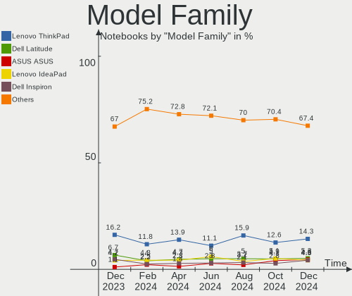
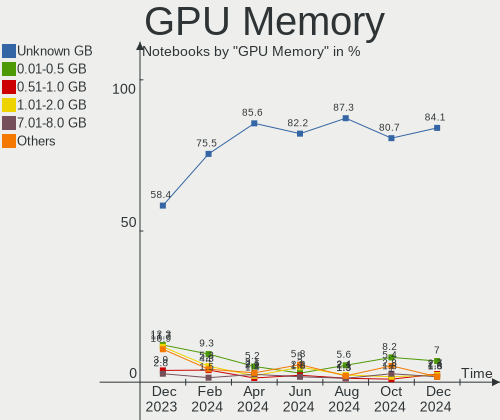
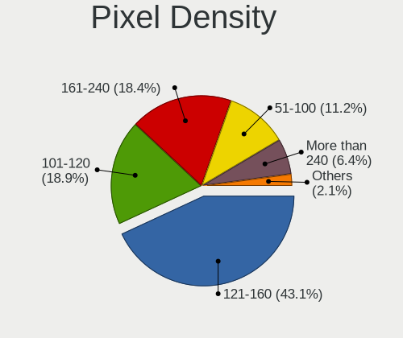
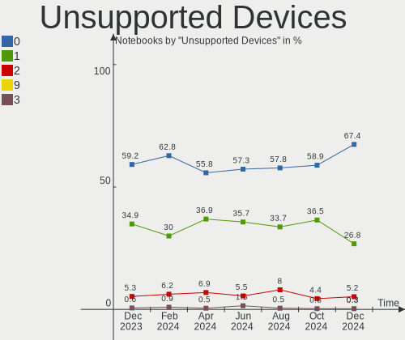

Fedora Hardware Trends (Notebook)
---------------------------------

A project to identify most popular hardware characteristics and track their change
over time based on data collected by Fedora users at https://Linux-Hardware.org.

Anyone can contribute to the study by uploading probes of their computers by
the [hw-probe](https://github.com/linuxhw/hw-probe) tool:

    sudo hw-probe -all -upload

Full-feature report is available here: https://linux-hardware.org/?view=trends&formfactor=notebook

Period: Jan, 2020.

Contents
--------

- [ OS                       ](#os)
- [ OS Family                ](#os-family)
- [ Kernel                   ](#kernel)
- [ Kernel Family            ](#kernel-family)
- [ Kernel Major Ver.        ](#kernel-major-ver)
- [ Arch                     ](#arch)
- [ DE                       ](#de)
- [ Display Server           ](#display-server)
- [ OS Lang                  ](#os-lang)
- [ Boot Mode                ](#boot-mode)
- [ Filesystem               ](#filesystem)
- [ Dual Boot with Linux     ](#dual-boot-with-linux)
- [ Dual Boot (Win)          ](#dual-boot-win)
- [ Country                  ](#country)
- [ City                     ](#city)
- [ Vendor                   ](#vendor)
- [ Model                    ](#model)
- [ Model Family             ](#model-family)
- [ MFG Year                 ](#mfg-year)
- [ Form Factor              ](#form-factor)
- [ Secure Boot              ](#secure-boot)
- [ Coreboot                 ](#coreboot)
- [ RAM Size                 ](#ram-size)
- [ RAM Used                 ](#ram-used)
- [ Drive Vendor             ](#drive-vendor)
- [ Drive Model              ](#drive-model)
- [ Drive Kind               ](#drive-kind)
- [ Drive Connector          ](#drive-connector)
- [ Drive Size               ](#drive-size)
- [ Space Total              ](#space-total)
- [ Space Used               ](#space-used)
- [ Malfunc. Drives          ](#malfunc-drives)
- [ Malfunc. Drive Vendor    ](#malfunc-drive-vendor)
- [ Malfunc. Drive Kind      ](#malfunc-drive-kind)
- [ Failed Drives            ](#failed-drives)
- [ Failed Drive Vendor      ](#failed-drive-vendor)
- [ Drive Status             ](#drive-status)
- [ Storage Vendor           ](#storage-vendor)
- [ Storage Model            ](#storage-model)
- [ Storage Kind             ](#storage-kind)
- [ CPU Vendor               ](#cpu-vendor)
- [ CPU Model                ](#cpu-model)
- [ CPU Model Family         ](#cpu-model-family)
- [ CPU Cores                ](#cpu-cores)
- [ CPU Sockets              ](#cpu-sockets)
- [ CPU Threads              ](#cpu-threads)
- [ CPU Op-Modes             ](#cpu-op-modes)
- [ CPU Microarch            ](#cpu-microarch)
- [ CPU Microcode            ](#cpu-microcode)
- [ GPU Vendor               ](#gpu-vendor)
- [ GPU Model                ](#gpu-model)
- [ GPU Combo                ](#gpu-combo)
- [ GPU Driver               ](#gpu-driver)
- [ GPU Memory               ](#gpu-memory)
- [ Monitor Vendor           ](#monitor-vendor)
- [ Monitor Model            ](#monitor-model)
- [ Monitor Resolution       ](#monitor-resolution)
- [ Monitor Diagonal         ](#monitor-diagonal)
- [ Monitor Width            ](#monitor-width)
- [ Aspect Ratio             ](#aspect-ratio)
- [ Monitor Area             ](#monitor-area)
- [ Pixel Density            ](#pixel-density)
- [ Multiple Monitors        ](#multiple-monitors)
- [ Net Controller Vendor    ](#net-controller-vendor)
- [ Net Controller Model     ](#net-controller-model)
- [ Net Controller Kind      ](#net-controller-kind)
- [ Used Controller          ](#used-controller)
- [ NICs                     ](#nics)
- [ Unsupported Devices      ](#unsupported-devices)
- [ Unsupported Device Types ](#unsupported-device-types)

OS
--

Installed operating systems

| Name      | Computers | Percent |
|-----------|-----------|---------|
| Fedora 31 | 92        | 86.79%  |
| Fedora 30 | 6         | 5.66%   |
| Fedora 32 | 4         | 3.77%   |
| Fedora 29 | 2         | 1.89%   |
| Fedora 28 | 1         | 0.94%   |
| Fedora 24 | 1         | 0.94%   |

OS Family
---------

OS without a version

| Name   | Computers | Percent |
|--------|-----------|---------|
| Fedora | 106       | 100%    |

Kernel
------

Version of the Linux kernel

| Version                                        | Computers | Percent |
|------------------------------------------------|-----------|---------|
| 5.4.8-200.fc31.x86_64                          | 30        | 28.3%   |
| 5.3.16-300.fc31.x86_64                         | 15        | 14.15%  |
| 5.4.7-200.fc31.x86_64                          | 12        | 11.32%  |
| 5.4.10-200.fc31.x86_64                         | 9         | 8.49%   |
| 5.4.13-201.fc31.x86_64                         | 8         | 7.55%   |
| 5.4.12-200.fc31.x86_64                         | 8         | 7.55%   |
| 5.3.7-301.fc31.x86_64                          | 6         | 5.66%   |
| 5.4.12-100.fc30.x86_64                         | 5         | 4.72%   |
| 5.5.0-0.rc6.git3.1.fc32.x86_64                 | 2         | 1.89%   |
| 5.4.10-100.fc30.x86_64                         | 2         | 1.89%   |
| 5.5.0-0.rc7.git0.1.vanilla.knurd.1.fc31.x86_64 | 1         | 0.94%   |
| 5.5.0-0.rc2.git1.1.fc32.x86_64                 | 1         | 0.94%   |
| 5.4.13_palladium-1000.fc32.x86_64              | 1         | 0.94%   |
| 5.3.14-300.fc31.x86_64                         | 1         | 0.94%   |
| 5.3.13-300.fc31.x86_64                         | 1         | 0.94%   |
| 5.3.11-100.fc29.x86_64                         | 1         | 0.94%   |
| 5.2.7-100.fc29.x86_64                          | 1         | 0.94%   |
| 5.0.16-100.fc28.x86_64                         | 1         | 0.94%   |
| 4.11.12-100.fc24.x86_64                        | 1         | 0.94%   |

Kernel Family
-------------

Linux kernel without a distro release

| Version | Computers | Percent |
|---------|-----------|---------|
| 5.4.8   | 30        | 28.3%   |
| 5.3.16  | 15        | 14.15%  |
| 5.4.12  | 13        | 12.26%  |
| 5.4.7   | 12        | 11.32%  |
| 5.4.10  | 11        | 10.38%  |
| 5.4.13  | 9         | 8.49%   |
| 5.3.7   | 6         | 5.66%   |
| 5.5.0   | 4         | 3.77%   |
| 5.3.14  | 1         | 0.94%   |
| 5.3.13  | 1         | 0.94%   |
| 5.3.11  | 1         | 0.94%   |
| 5.2.7   | 1         | 0.94%   |
| 5.0.16  | 1         | 0.94%   |
| 4.11.12 | 1         | 0.94%   |

Kernel Major Ver.
-----------------

Linux kernel major version

| Version | Computers | Percent |
|---------|-----------|---------|
| 5.4     | 75        | 70.75%  |
| 5.3     | 24        | 22.64%  |
| 5.5     | 4         | 3.77%   |
| 5.2     | 1         | 0.94%   |
| 5.0     | 1         | 0.94%   |
| 4.11    | 1         | 0.94%   |

Arch
----

OS architecture (x86_64, i586, etc.)

| Name   | Computers | Percent |
|--------|-----------|---------|
| x86_64 | 106       | 100%    |

DE
--

Desktop Environment

| Name       | Computers | Percent |
|------------|-----------|---------|
| GNOME      | 86        | 81.13%  |
| Cinnamon   | 5         | 4.72%   |
| KDE5       | 4         | 3.77%   |
| KDE        | 3         | 2.83%   |
| Unknown    | 3         | 2.83%   |
| XFCE       | 2         | 1.89%   |
| X-Cinnamon | 1         | 0.94%   |
| LXDE       | 1         | 0.94%   |
| Deepin     | 1         | 0.94%   |

Display Server
--------------

X11 or Wayland

| Name    | Computers | Percent |
|---------|-----------|---------|
| Wayland | 69        | 65.09%  |
| X11     | 36        | 33.96%  |
| Unknown | 1         | 0.94%   |

OS Lang
-------

Language

| Lang       | Computers | Percent |
|------------|-----------|---------|
| en_US      | 35        | 33.02%  |
| Unknown    | 31        | 29.25%  |
| en_GB      | 8         | 7.55%   |
| pt_BR      | 4         | 3.77%   |
| fr_FR      | 3         | 2.83%   |
| es_MX      | 3         | 2.83%   |
| de_DE      | 3         | 2.83%   |
| nl_NL      | 2         | 1.89%   |
| en_IN      | 2         | 1.89%   |
| en_GB.utf8 | 2         | 1.89%   |
| sk_SK      | 1         | 0.94%   |
| ru_RU      | 1         | 0.94%   |
| pt_PT      | 1         | 0.94%   |
| pt_BR.utf8 | 1         | 0.94%   |
| pl_PL.utf8 | 1         | 0.94%   |
| pl_PL      | 1         | 0.94%   |
| it_IT      | 1         | 0.94%   |
| es_ES      | 1         | 0.94%   |
| en_NZ      | 1         | 0.94%   |
| en_CA      | 1         | 0.94%   |
| en_AU      | 1         | 0.94%   |
| da_DK      | 1         | 0.94%   |
| cs_CZ      | 1         | 0.94%   |

Boot Mode
---------

EFI or BIOS

| Mode | Computers | Percent |
|------|-----------|---------|
| EFI  | 80        | 75.47%  |
| BIOS | 26        | 24.53%  |

Filesystem
----------

Type of filesystem

| Type    | Computers | Percent |
|---------|-----------|---------|
| Ext4    | 93        | 87.74%  |
| Btrfs   | 7         | 6.6%    |
| Xfs     | 5         | 4.72%   |
| Unknown | 1         | 0.94%   |

Dual Boot with Linux
--------------------

Hosting more than one Linux

| Dual boot | Computers | Percent |
|-----------|-----------|---------|
| No        | 99        | 93.4%   |
| Yes       | 7         | 6.6%    |

Dual Boot (Win)
---------------

Hosting Linux and Windows

| Dual boot | Computers | Percent |
|-----------|-----------|---------|
| No        | 89        | 83.96%  |
| Yes       | 17        | 16.04%  |

Country
-------

Geographic location (country)

| Country        | Computers | Percent |
|----------------|-----------|---------|
| USA            | 16        | 15.09%  |
| Germany        | 12        | 11.32%  |
| Netherlands    | 11        | 10.38%  |
| Brazil         | 6         | 5.66%   |
| UK             | 5         | 4.72%   |
| Poland         | 5         | 4.72%   |
| Spain          | 4         | 3.77%   |
| Norway         | 3         | 2.83%   |
| Mexico         | 3         | 2.83%   |
| Italy          | 3         | 2.83%   |
| India          | 3         | 2.83%   |
| Canada         | 3         | 2.83%   |
| Switzerland    | 2         | 1.89%   |
| Serbia         | 2         | 1.89%   |
| France         | 2         | 1.89%   |
| Denmark        | 2         | 1.89%   |
| Belgium        | 2         | 1.89%   |
| Australia      | 2         | 1.89%   |
| Sweden         | 1         | 0.94%   |
| Slovakia       | 1         | 0.94%   |
| Singapore      | 1         | 0.94%   |
| Saudi Arabia   | 1         | 0.94%   |
| Russia         | 1         | 0.94%   |
| Romania        | 1         | 0.94%   |
| Portugal       | 1         | 0.94%   |
| New Zealand    | 1         | 0.94%   |
| Myanmar        | 1         | 0.94%   |
| Jordan         | 1         | 0.94%   |
| Japan          | 1         | 0.94%   |
| Jamaica        | 1         | 0.94%   |
| Israel         | 1         | 0.94%   |
| Isle of Man    | 1         | 0.94%   |
| Indonesia      | 1         | 0.94%   |
| Finland        | 1         | 0.94%   |
| Czech Republic | 1         | 0.94%   |
| Croatia        | 1         | 0.94%   |
| China          | 1         | 0.94%   |
| Argentina      | 1         | 0.94%   |

City
----

Geographic location (city)

| City                | Computers | Percent |
|---------------------|-----------|---------|
| Oslo                | 3         | 2.83%   |
| Mexico City         | 3         | 2.83%   |
| Hainburg            | 2         | 1.89%   |
| Berlin              | 2         | 1.89%   |
| Amsterdam           | 2         | 1.89%   |
| Évreux             | 1         | 0.94%   |
| Östersund          | 1         | 0.94%   |
| Yangon              | 1         | 0.94%   |
| Wrocław            | 1         | 0.94%   |
| Winnipeg            | 1         | 0.94%   |
| Warsaw              | 1         | 0.94%   |
| Volta Redonda       | 1         | 0.94%   |
| Viggiù             | 1         | 0.94%   |
| Varaždin           | 1         | 0.94%   |
| The Hague           | 1         | 0.94%   |
| The Bronx           | 1         | 0.94%   |
| Terneuzen           | 1         | 0.94%   |
| Tarnobrzeg          | 1         | 0.94%   |
| Tacoma              | 1         | 0.94%   |
| St Helens Park      | 1         | 0.94%   |
| Singapore           | 1         | 0.94%   |
| San Jose            | 1         | 0.94%   |
| Rozenburg           | 1         | 0.94%   |
| Rokietnica          | 1         | 0.94%   |
| Ripley              | 1         | 0.94%   |
| Rehovot             | 1         | 0.94%   |
| Pune                | 1         | 0.94%   |
| Prague              | 1         | 0.94%   |
| Pelotas             | 1         | 0.94%   |
| Pattensen           | 1         | 0.94%   |
| Ostermundigen       | 1         | 0.94%   |
| Niš                | 1         | 0.94%   |
| Nanjing             | 1         | 0.94%   |
| Munkebo             | 1         | 0.94%   |
| Munich              | 1         | 0.94%   |
| Moscow              | 1         | 0.94%   |
| Moscavide e Portela | 1         | 0.94%   |
| Montego Bay         | 1         | 0.94%   |
| Modesto             | 1         | 0.94%   |
| Middletown          | 1         | 0.94%   |
| Mannheim            | 1         | 0.94%   |
| Malacky             | 1         | 0.94%   |
| Madrid              | 1         | 0.94%   |
| Madison             | 1         | 0.94%   |
| Luino               | 1         | 0.94%   |
| Laval               | 1         | 0.94%   |
| Kyoto               | 1         | 0.94%   |
| Kansas City         | 1         | 0.94%   |
| Kanpur              | 1         | 0.94%   |
| Jakarta             | 1         | 0.94%   |
| Honolulu            | 1         | 0.94%   |
| Helsinki            | 1         | 0.94%   |
| Heerhugowaard       | 1         | 0.94%   |
| Hamburg             | 1         | 0.94%   |
| Greifswald          | 1         | 0.94%   |
| Grass Valley        | 1         | 0.94%   |
| Glen Oaks           | 1         | 0.94%   |
| Gijón              | 1         | 0.94%   |
| Ghent               | 1         | 0.94%   |
| Essex               | 1         | 0.94%   |

Vendor
------

Motherboard manufacturer

| Name                | Computers | Percent |
|---------------------|-----------|---------|
| Lenovo              | 29        | 27.36%  |
| Dell                | 24        | 22.64%  |
| Hewlett-Packard     | 23        | 21.7%   |
| Acer                | 7         | 6.6%    |
| ASUSTek Computer    | 6         | 5.66%   |
| Notebook            | 3         | 2.83%   |
| Toshiba             | 2         | 1.89%   |
| MSI                 | 2         | 1.89%   |
| LG Electronics      | 2         | 1.89%   |
| HUAWEI              | 2         | 1.89%   |
| Sony                | 1         | 0.94%   |
| Samsung Electronics | 1         | 0.94%   |
| Razer               | 1         | 0.94%   |
| Packard Bell        | 1         | 0.94%   |
| Gateway             | 1         | 0.94%   |
| Apple               | 1         | 0.94%   |

Model
-----

Motherboard model

| Name                                     | Computers | Percent |
|------------------------------------------|-----------|---------|
| Lenovo IdeaPad FLEX-14API 81SS           | 2         | 1.89%   |
| HUAWEI WRT-WX9                           | 2         | 1.89%   |
| HP Laptop 15-db0xxx                      | 2         | 1.89%   |
| HP EliteBook 840 G5                      | 2         | 1.89%   |
| Dell XPS 15 9550                         | 2         | 1.89%   |
| Dell XPS 13 9380                         | 2         | 1.89%   |
| Dell Inspiron 7591                       | 2         | 1.89%   |
| Acer Aspire VN7-791G                     | 2         | 1.89%   |
| Toshiba Satellite C55D-A                 | 1         | 0.94%   |
| Toshiba Satellite C50D-A                 | 1         | 0.94%   |
| Sony VPCSC41FM                           | 1         | 0.94%   |
| Samsung Electronics 760XBE               | 1         | 0.94%   |
| Razer Blade Stealth 13 Late 2019         | 1         | 0.94%   |
| Packard Bell EasyNote TS44HR             | 1         | 0.94%   |
| Notebook W740SU                          | 1         | 0.94%   |
| Notebook NH55RGQ                         | 1         | 0.94%   |
| Notebook N150ZU                          | 1         | 0.94%   |
| MSI GS65 Stealth Thin 8RE                | 1         | 0.94%   |
| MSI GS63 Stealth 8RE                     | 1         | 0.94%   |
| LG Electronics 17Z990-V.AA75B            | 1         | 0.94%   |
| LG Electronics 14Z980-G.BH51P1           | 1         | 0.94%   |
| Lenovo V330-15IKB 81AX                   | 1         | 0.94%   |
| Lenovo ThinkPad X270 20K5S0LS0E          | 1         | 0.94%   |
| Lenovo ThinkPad X250 20CM004UGE          | 1         | 0.94%   |
| Lenovo ThinkPad X220 4290A48             | 1         | 0.94%   |
| Lenovo ThinkPad X1 Carbon 7th 20QD00L2MH | 1         | 0.94%   |
| Lenovo ThinkPad T590 20N4001PUS          | 1         | 0.94%   |
| Lenovo ThinkPad T520 42406NU             | 1         | 0.94%   |
| Lenovo ThinkPad T490s 20NXS12C00         | 1         | 0.94%   |
| Lenovo ThinkPad T490 20N2006DPB          | 1         | 0.94%   |
| Lenovo ThinkPad T480s 20L8S2N809         | 1         | 0.94%   |
| Lenovo ThinkPad T480 20L6S29D1V          | 1         | 0.94%   |
| Lenovo ThinkPad T470 W10DG 20JNS29X02    | 1         | 0.94%   |
| Lenovo ThinkPad T470 20HDCTO1WW          | 1         | 0.94%   |
| Lenovo ThinkPad T460s 20FAS35H00         | 1         | 0.94%   |
| Lenovo ThinkPad T460 20FMS0BX0J          | 1         | 0.94%   |
| Lenovo ThinkPad T440s 20AQCTO1WW         | 1         | 0.94%   |
| Lenovo ThinkPad P50 20EQS1AC00           | 1         | 0.94%   |
| Lenovo ThinkPad P1 Gen 2 20QT002JMX      | 1         | 0.94%   |
| Lenovo ThinkPad E595 20NF0018US          | 1         | 0.94%   |
| Lenovo ThinkPad E520 11433FU             | 1         | 0.94%   |
| Lenovo ThinkPad E480 20KNS0E200          | 1         | 0.94%   |
| Lenovo ThinkPad E470 20H1A031CD          | 1         | 0.94%   |
| Lenovo ThinkPad 13 2nd Gen 20J1CTO1WW    | 1         | 0.94%   |
| Lenovo IdeaPad 330-15IKB 81DC            | 1         | 0.94%   |
| Lenovo IdeaPad 320-15IKB 80XL            | 1         | 0.94%   |
| Lenovo G510 20238                        | 1         | 0.94%   |
| Lenovo B570e HuronRiver Platform         | 1         | 0.94%   |
| HP ZBook 15 G5                           | 1         | 0.94%   |
| HP ProBook 650 G1                        | 1         | 0.94%   |
| HP ProBook 430 G4                        | 1         | 0.94%   |
| HP Pavilion Notebook                     | 1         | 0.94%   |
| HP Pavilion dv7                          | 1         | 0.94%   |
| HP Laptop 17-bs1xx                       | 1         | 0.94%   |
| HP Laptop 14-dq1xxx                      | 1         | 0.94%   |
| HP ENVY TS 15                            | 1         | 0.94%   |
| HP ENVY 14                               | 1         | 0.94%   |
| HP EliteBook Folio 1040 G3               | 1         | 0.94%   |
| HP EliteBook 850 G6                      | 1         | 0.94%   |
| HP EliteBook 850 G5                      | 1         | 0.94%   |

Model Family
------------

Motherboard model prefix

| Name                           | Computers | Percent |
|--------------------------------|-----------|---------|
| Lenovo ThinkPad                | 22        | 20.75%  |
| HP EliteBook                   | 11        | 10.38%  |
| Dell XPS                       | 10        | 9.43%   |
| Dell Latitude                  | 6         | 5.66%   |
| Dell Inspiron                  | 6         | 5.66%   |
| Acer Aspire                    | 6         | 5.66%   |
| Lenovo IdeaPad                 | 4         | 3.77%   |
| HP Laptop                      | 4         | 3.77%   |
| Toshiba Satellite              | 2         | 1.89%   |
| HUAWEI WRT-WX9                 | 2         | 1.89%   |
| HP ProBook                     | 2         | 1.89%   |
| HP Pavilion                    | 2         | 1.89%   |
| HP ENVY                        | 2         | 1.89%   |
| Sony VPCSC41FM                 | 1         | 0.94%   |
| Samsung Electronics 760XBE     | 1         | 0.94%   |
| Razer Blade                    | 1         | 0.94%   |
| Packard Bell EasyNote          | 1         | 0.94%   |
| Notebook W740SU                | 1         | 0.94%   |
| Notebook NH55RGQ               | 1         | 0.94%   |
| Notebook N150ZU                | 1         | 0.94%   |
| MSI GS65                       | 1         | 0.94%   |
| MSI GS63                       | 1         | 0.94%   |
| LG Electronics 17Z990-V.AA75B  | 1         | 0.94%   |
| LG Electronics 14Z980-G.BH51P1 | 1         | 0.94%   |
| Lenovo V330-15IKB              | 1         | 0.94%   |
| Lenovo G510                    | 1         | 0.94%   |
| Lenovo B570e                   | 1         | 0.94%   |
| HP ZBook                       | 1         | 0.94%   |
| HP 15                          | 1         | 0.94%   |
| Gateway NE570                  | 1         | 0.94%   |
| Dell Vostro                    | 1         | 0.94%   |
| Dell G3                        | 1         | 0.94%   |
| ASUS X555UB                    | 1         | 0.94%   |
| ASUS X541NA                    | 1         | 0.94%   |
| ASUS TUF                       | 1         | 0.94%   |
| ASUS GL702VSK                  | 1         | 0.94%   |
| ASUS G771JW                    | 1         | 0.94%   |
| ASUS FX503VM                   | 1         | 0.94%   |
| Apple MacBookPro11             | 1         | 0.94%   |
| Acer Predator                  | 1         | 0.94%   |

MFG Year
--------

Motherboard manufacture year

| Year    | Computers | Percent |
|---------|-----------|---------|
| 2019    | 60        | 56.6%   |
| 2018    | 13        | 12.26%  |
| 2017    | 8         | 7.55%   |
| 2014    | 7         | 6.6%    |
| 2011    | 7         | 6.6%    |
| 2015    | 3         | 2.83%   |
| 2016    | 2         | 1.89%   |
| 2013    | 2         | 1.89%   |
| 2012    | 2         | 1.89%   |
| 2010    | 1         | 0.94%   |
| Unknown | 1         | 0.94%   |

Form Factor
-----------

Physical design of the computer

| Name     | Computers | Percent |
|----------|-----------|---------|
| Notebook | 106       | 100%    |

Secure Boot
-----------

Enabled or disabled

| State    | Computers | Percent |
|----------|-----------|---------|
| Disabled | 76        | 71.7%   |
| Enabled  | 30        | 28.3%   |

Coreboot
--------

Have coreboot on board

| Used | Computers | Percent |
|------|-----------|---------|
| No   | 106       | 100%    |

RAM Size
--------

Total RAM memory

| Size in GB | Computers | Percent |
|------------|-----------|---------|
| 16.01-24.0 | 35        | 33.02%  |
| 4.01-8.0   | 30        | 28.3%   |
| 8.01-16.0  | 18        | 16.98%  |
| 32.01-64.0 | 12        | 11.32%  |
| 3.01-4.0   | 8         | 7.55%   |
| 24.01-32.0 | 2         | 1.89%   |
| 1.01-2.0   | 1         | 0.94%   |

RAM Used
--------

Used RAM memory

| Used GB   | Computers | Percent |
|-----------|-----------|---------|
| 3.01-4.0  | 28        | 26.42%  |
| 2.01-3.0  | 27        | 25.47%  |
| 4.01-8.0  | 22        | 20.75%  |
| 1.01-2.0  | 18        | 16.98%  |
| 8.01-16.0 | 11        | 10.38%  |

Drive Vendor
------------

Hard drive vendors

| Vendor              | Computers | Drives | Percent |
|---------------------|-----------|--------|---------|
| Samsung Electronics | 23        | 23     | 20.72%  |
| WDC                 | 17        | 17     | 15.32%  |
| Seagate             | 11        | 11     | 9.91%   |
| Toshiba             | 6         | 6      | 5.41%   |
| SK Hynix            | 6         | 6      | 5.41%   |
| SanDisk             | 6         | 6      | 5.41%   |
| Unknown             | 5         | 5      | 4.5%    |
| LITEON              | 5         | 5      | 4.5%    |
| HGST                | 5         | 5      | 4.5%    |
| Crucial             | 5         | 5      | 4.5%    |
| Kingston            | 4         | 4      | 3.6%    |
| A-DATA Technology   | 4         | 4      | 3.6%    |
| Transcend           | 3         | 3      | 2.7%    |
| Micron Technology   | 2         | 2      | 1.8%    |
| Intel               | 2         | 2      | 1.8%    |
| Hitachi             | 2         | 2      | 1.8%    |
| MATSHITA            | 1         | 1      | 0.9%    |
| LDLC                | 1         | 1      | 0.9%    |
| Intenso             | 1         | 1      | 0.9%    |
| Hewlett-Packard     | 1         | 1      | 0.9%    |
| Apple               | 1         | 1      | 0.9%    |

Drive Model
-----------

Hard drive models

| Model                            | Computers | Percent |
|----------------------------------|-----------|---------|
| TS1TSSD230S 1TB                  | 2         | 1.8%    |
| ST1000LM035-1RK172 1TB           | 2         | 1.8%    |
| SSD 860 EVO 500GB                | 2         | 1.8%    |
| SSD 860 EVO 1TB                  | 2         | 1.8%    |
| PC SN720 SDAPNTW-256G-1027 256GB | 2         | 1.8%    |
| MZVLB512HAJQ-000H1 512GB         | 2         | 1.8%    |
| MZNLN128HAHQ-000H1 128GB SSD     | 2         | 1.8%    |
| MQ01ABD100 1TB                   | 2         | 1.8%    |
| MMC Card  64GB                   | 2         | 1.8%    |
| HTS721010A9E630 1TB              | 2         | 1.8%    |
| HTS541010A9E680 1TB              | 2         | 1.8%    |
| CV8-8E256 256GB SSD              | 2         | 1.8%    |
| XPG EX500 512GB SSD              | 1         | 0.9%    |
| X400 M.2 2280 256GB SSD          | 1         | 0.9%    |
| WDS500G3X0C-00SJG0 500GB         | 1         | 0.9%    |
| WDS120G2G0A-00JH30 120GB SSD     | 1         | 0.9%    |
| WD7500BPVT-35HXZT3 752GB         | 1         | 0.9%    |
| WD5000LPVX-22V0TT0 500GB         | 1         | 0.9%    |
| WD5000LPLX-08ZNTT0 500GB         | 1         | 0.9%    |
| WD10SPZX-75Z10T2 1TB             | 1         | 0.9%    |
| WD10SPZX-60Z10T0 1TB             | 1         | 0.9%    |
| WD10SPZX-24Z10 1TB               | 1         | 0.9%    |
| WD10JPVX-60JC3T0 1TB             | 1         | 0.9%    |
| WD10JPVX-22JC3T0 1TB             | 1         | 0.9%    |
| WD10JPLX-00MBPT0 1TB             | 1         | 0.9%    |
| WD10JPCX-24UE4T0 1TB             | 1         | 0.9%    |
| USD  32GB                        | 1         | 0.9%    |
| TS256GMTS400S 256GB SSD          | 1         | 0.9%    |
| THNSN51T02DU7 NVMe 1024GB        | 1         | 0.9%    |
| SX8200PNP 1TB                    | 1         | 0.9%    |
| SX6000PNP 1TB                    | 1         | 0.9%    |
| SUV500M8120G 120GB SSD           | 1         | 0.9%    |
| SU16G  16GB                      | 1         | 0.9%    |
| ST9500423AS 500GB                | 1         | 0.9%    |
| ST500LT012-1DG142 500GB          | 1         | 0.9%    |
| ST500LM012 HN-M500MBB 500GB      | 1         | 0.9%    |
| ST2000LX001-1RG174 2TB           | 1         | 0.9%    |
| ST2000LM015-2E8174 2TB           | 1         | 0.9%    |
| ST1000LM048-2E7172 1TB           | 1         | 0.9%    |
| ST1000LM024 HN-M101MBB 1TB       | 1         | 0.9%    |
| SSDSC2CW240A3 240GB              | 1         | 0.9%    |
| SSDPEKNW512G8 512GB              | 1         | 0.9%    |
| SSD U110 16GB                    | 1         | 0.9%    |
| SSD SM0512F 500GB                | 1         | 0.9%    |
| SSD S700 500GB                   | 1         | 0.9%    |
| SSD PLUS 120 GB                  | 1         | 0.9%    |
| SSD 970 EVO Plus 500GB           | 1         | 0.9%    |
| SSD 970 EVO 1TB                  | 1         | 0.9%    |
| SSD 960 PRO 512GB                | 1         | 0.9%    |
| SSD 860 QVO 1TB                  | 1         | 0.9%    |
| SSD 850 EVO M.2 120GB            | 1         | 0.9%    |
| SSD 850 EVO 250GB                | 1         | 0.9%    |
| SSD 840 EVO 250GB                | 1         | 0.9%    |
| SSD 256GB                        | 1         | 0.9%    |
| SP600NS34 256GB SSD              | 1         | 0.9%    |
| SM2280S3G2480G 480GB SSD         | 1         | 0.9%    |
| SD9TB8W256G1001 256GB SSD        | 1         | 0.9%    |
| SD8SN8U128G1002 128GB SSD        | 1         | 0.9%    |
| SD8SN8U-256G-1006 256GB SSD      | 1         | 0.9%    |
| SC311 SATA 256GB SSD             | 1         | 0.9%    |

Drive Kind
----------

HDD or SSD

| Kind    | Computers | Drives | Percent |
|---------|-----------|--------|---------|
| SSD     | 41        | 48     | 41%     |
| HDD     | 30        | 32     | 30%     |
| NVMe    | 22        | 24     | 22%     |
| MMC     | 5         | 5      | 5%      |
| Unknown | 2         | 2      | 2%      |

Drive Connector
---------------

SATA, SAS, NVMe, etc.

| Type | Computers | Drives | Percent |
|------|-----------|--------|---------|
| SATA | 64        | 77     | 66.67%  |
| NVMe | 22        | 24     | 22.92%  |
| SAS  | 5         | 5      | 5.21%   |
| MMC  | 5         | 5      | 5.21%   |

Drive Size
----------

Size of hard drive

| Size in TB | Computers | Drives | Percent |
|------------|-----------|--------|---------|
| 0.01-0.5   | 52        | 62     | 51.49%  |
| 0.51-1.0   | 42        | 42     | 41.58%  |
| 1.01-2.0   | 7         | 7      | 6.93%   |

Space Total
-----------

Amount of disk space available on the file system

| Size in GB | Computers | Percent |
|------------|-----------|---------|
| 251-500    | 37        | 34.91%  |
| 101-250    | 25        | 23.58%  |
| 501-1000   | 18        | 16.98%  |
| 1001-2000  | 6         | 5.66%   |
| 1-20       | 6         | 5.66%   |
| Unknown    | 6         | 5.66%   |
| 2001-3000  | 4         | 3.77%   |
| 51-100     | 3         | 2.83%   |
| 21-50      | 1         | 0.94%   |

Space Used
----------

Amount of used disk space

| Used GB   | Computers | Percent |
|-----------|-----------|---------|
| 21-50     | 23        | 21.7%   |
| 101-250   | 22        | 20.75%  |
| 1-20      | 18        | 16.98%  |
| 251-500   | 14        | 13.21%  |
| 51-100    | 13        | 12.26%  |
| 501-1000  | 7         | 6.6%    |
| Unknown   | 6         | 5.66%   |
| 1001-2000 | 3         | 2.83%   |

Malfunc. Drives
---------------

Drive models with a malfunction

| Model                    | Computers | Drives | Percent |
|--------------------------|-----------|--------|---------|
| WD5000LPLX-08ZNTT0 500GB | 1         | 1      | 20%     |
| ST9500423AS 500GB        | 1         | 1      | 20%     |
| ST1000LM035-1RK172 1TB   | 1         | 1      | 20%     |
| HTS547575A9E384 752GB    | 1         | 1      | 20%     |
| HTS541010A9E680 1TB      | 1         | 1      | 20%     |

Malfunc. Drive Vendor
---------------------

Vendors of faulty drives

| Vendor  | Computers | Drives | Percent |
|---------|-----------|--------|---------|
| Seagate | 2         | 2      | 40%     |
| WDC     | 1         | 1      | 20%     |
| Hitachi | 1         | 1      | 20%     |
| HGST    | 1         | 1      | 20%     |

Malfunc. Drive Kind
-------------------

Kinds of faulty drives

| Kind | Computers | Drives | Percent |
|------|-----------|--------|---------|
| HDD  | 5         | 5      | 100%    |

Failed Drives
-------------

Failed drive models

Zero info for selected period =(

Failed Drive Vendor
-------------------

Failed drive vendors

Zero info for selected period =(

Drive Status
------------

Number of failed and malfunc. drives

| Status   | Computers | Drives | Percent |
|----------|-----------|--------|---------|
| Detected | 45        | 55     | 48.39%  |
| Works    | 43        | 51     | 46.24%  |
| Malfunc  | 5         | 5      | 5.38%   |

Storage Vendor
--------------

Storage controller vendors

| Vendor                       | Computers | Percent |
|------------------------------|-----------|---------|
| Intel                        | 67        | 55.37%  |
| Samsung Electronics          | 21        | 17.36%  |
| Sandisk                      | 10        | 8.26%   |
| AMD                          | 9         | 7.44%   |
| Toshiba America Info Systems | 5         | 4.13%   |
| SK Hynix                     | 4         | 3.31%   |
| Unknown                      | 2         | 1.65%   |
| Silicon Motion               | 1         | 0.83%   |
| Realtek Semiconductor        | 1         | 0.83%   |
| ADATA Technology             | 1         | 0.83%   |

Storage Model
-------------

Storage controller models

| Model                                                                    | Computers | Percent |
|--------------------------------------------------------------------------|-----------|---------|
| Sunrise Point-LP SATA Controller [AHCI mode]                             | 16        | 13.33%  |
| NVMe SSD Controller SM981/PM981/PM983                                    | 16        | 13.33%  |
| Non-Volatile memory controller                                           | 9         | 7.5%    |
| FCH SATA Controller [AHCI mode]                                          | 9         | 7.5%    |
| 6 Series/C200 Series Chipset Family 6 port Mobile SATA AHCI Controller   | 8         | 6.67%   |
| 82801 Mobile SATA Controller [RAID mode]                                 | 7         | 5.83%   |
| 8 Series/C220 Series Chipset Family 6-port SATA Controller 1 [AHCI mode] | 7         | 5.83%   |
| Cannon Lake Mobile PCH SATA AHCI Controller                              | 6         | 5%      |
| WD Black 2018/PC SN720 NVMe SSD                                          | 5         | 4.17%   |
| NVMe SSD Controller SM961/PM961                                          | 4         | 3.33%   |
| 8 Series SATA Controller 1 [AHCI mode]                                   | 4         | 3.33%   |
| HM170/QM170 Chipset SATA Controller [AHCI Mode]                          | 3         | 2.5%    |
| Cannon Point-LP SATA Controller [AHCI Mode]                              | 3         | 2.5%    |
| Wildcat Point-LP SATA Controller [AHCI Mode]                             | 2         | 1.67%   |
| WD Black 2018/PC SN520 NVMe SSD                                          | 2         | 1.67%   |
| Toshiba America Info Non-Volatile memory controller                      | 2         | 1.67%   |
| SSD Pro 7600p/760p/E 6100p Series                                        | 2         | 1.67%   |
| NVMe Controller                                                          | 2         | 1.67%   |
| 5 Series/3400 Series Chipset 6 port SATA AHCI Controller                 | 2         | 1.67%   |
| 5 Series/3400 Series Chipset 4 port SATA AHCI Controller                 | 2         | 1.67%   |
| XPG SX8200 Pro PCIe Gen3x4 M.2 2280 Solid State Drive                    | 1         | 0.83%   |
| XG4 NVMe SSD Controller                                                  | 1         | 0.83%   |
| SSD 660P Series                                                          | 1         | 0.83%   |
| Realtek Non-Volatile memory controller                                   | 1         | 0.83%   |
| Q170/Q150/B150/H170/H110/Z170/CM236 Chipset SATA Controller [AHCI Mode]  | 1         | 0.83%   |
| Celeron N3350/Pentium N4200/Atom E3900 Series SATA AHCI Controller       | 1         | 0.83%   |
| Atom Processor E3800 Series SATA AHCI Controller                         | 1         | 0.83%   |
| Apple PCIe SSD                                                           | 1         | 0.83%   |
| 7 Series Chipset Family 6-port SATA Controller [AHCI mode]               | 1         | 0.83%   |

Storage Kind
------------

Kind of storage controller (IDE, SATA, NVMe, SAS, ...)

| Kind | Computers | Percent |
|------|-----------|---------|
| SATA | 67        | 56.3%   |
| NVMe | 45        | 37.82%  |
| RAID | 7         | 5.88%   |

CPU Vendor
----------

Processor vendors

| Vendor | Computers | Percent |
|--------|-----------|---------|
| Intel  | 94        | 88.68%  |
| AMD    | 12        | 11.32%  |

CPU Model
---------

Processor models

| Model                                           | Computers | Percent |
|-------------------------------------------------|-----------|---------|
| Intel Core i7-8565U CPU @ 1.80GHz               | 5         | 4.72%   |
| Intel Core i5-8265U CPU @ 1.60GHz               | 5         | 4.72%   |
| Intel Core i5-7200U CPU @ 2.50GHz               | 5         | 4.72%   |
| Intel Core i5-6300U CPU @ 2.40GHz               | 5         | 4.72%   |
| Intel Core i7-8750H CPU @ 2.20GHz               | 4         | 3.77%   |
| Intel Core i7-8665U CPU @ 1.90GHz               | 4         | 3.77%   |
| Intel Core i7-8650U CPU @ 1.90GHz               | 4         | 3.77%   |
| Intel Core i7-8550U CPU @ 1.80GHz               | 4         | 3.77%   |
| Intel Core i7-7700HQ CPU @ 2.80GHz              | 3         | 2.83%   |
| Intel Core i7-7500U CPU @ 2.70GHz               | 3         | 2.83%   |
| Intel Core i7-4720HQ CPU @ 2.60GHz              | 3         | 2.83%   |
| Intel Core i5-8250U CPU @ 1.60GHz               | 3         | 2.83%   |
| Intel Core i5-4300U CPU @ 1.90GHz               | 3         | 2.83%   |
| Intel Core i9-9880H CPU @ 2.30GHz               | 2         | 1.89%   |
| Intel Core i7-9750H CPU @ 2.60GHz               | 2         | 1.89%   |
| Intel Core i7-6700HQ CPU @ 2.60GHz              | 2         | 1.89%   |
| Intel Core i7-6600U CPU @ 2.60GHz               | 2         | 1.89%   |
| Intel Core i5-2450M CPU @ 2.50GHz               | 2         | 1.89%   |
| AMD Ryzen 5 3500U with Radeon Vega Mobile Gfx   | 2         | 1.89%   |
| Intel Pentium CPU N4200 @ 1.10GHz               | 1         | 0.94%   |
| Intel Pentium CPU N3540 @ 2.16GHz               | 1         | 0.94%   |
| Intel Pentium CPU B960 @ 2.20GHz                | 1         | 0.94%   |
| Intel Core i7-9850H CPU @ 2.60GHz               | 1         | 0.94%   |
| Intel Core i7-8850H CPU @ 2.60GHz               | 1         | 0.94%   |
| Intel Core i7-7600U CPU @ 2.80GHz               | 1         | 0.94%   |
| Intel Core i7-6820HQ CPU @ 2.70GHz              | 1         | 0.94%   |
| Intel Core i7-5600U CPU @ 2.60GHz               | 1         | 0.94%   |
| Intel Core i7-4750HQ CPU @ 2.00GHz              | 1         | 0.94%   |
| Intel Core i7-4710HQ CPU @ 2.50GHz              | 1         | 0.94%   |
| Intel Core i7-4600M CPU @ 2.90GHz               | 1         | 0.94%   |
| Intel Core i7-2670QM CPU @ 2.20GHz              | 1         | 0.94%   |
| Intel Core i7-2640M CPU @ 2.80GHz               | 1         | 0.94%   |
| Intel Core i7-2630QM CPU @ 2.00GHz              | 1         | 0.94%   |
| Intel Core i7-10710U CPU @ 1.10GHz              | 1         | 0.94%   |
| Intel Core i7-1065G7 CPU @ 1.30GHz              | 1         | 0.94%   |
| Intel Core i5-8365U CPU @ 1.60GHz               | 1         | 0.94%   |
| Intel Core i5-8350U CPU @ 1.70GHz               | 1         | 0.94%   |
| Intel Core i5-6267U CPU @ 2.90GHz               | 1         | 0.94%   |
| Intel Core i5-6200U CPU @ 2.30GHz               | 1         | 0.94%   |
| Intel Core i5-5200U CPU @ 2.20GHz               | 1         | 0.94%   |
| Intel Core i5-4288U CPU @ 2.60GHz               | 1         | 0.94%   |
| Intel Core i5-4210M CPU @ 2.60GHz               | 1         | 0.94%   |
| Intel Core i5-2520M CPU @ 2.50GHz               | 1         | 0.94%   |
| Intel Core i5-2410M CPU @ 2.30GHz               | 1         | 0.94%   |
| Intel Core i5-1035G4 CPU @ 1.10GHz              | 1         | 0.94%   |
| Intel Core i5 CPU M 540 @ 2.53GHz               | 1         | 0.94%   |
| Intel Core i5 CPU M 480 @ 2.67GHz               | 1         | 0.94%   |
| Intel Core i3-6006U CPU @ 2.00GHz               | 1         | 0.94%   |
| Intel Core i3-4005U CPU @ 1.70GHz               | 1         | 0.94%   |
| Intel Core i3-3217U CPU @ 1.80GHz               | 1         | 0.94%   |
| Intel Core i3 CPU M 370 @ 2.40GHz               | 1         | 0.94%   |
| Intel Core i3 CPU M 350 @ 2.27GHz               | 1         | 0.94%   |
| AMD Ryzen 7 3700U with Radeon Vega Mobile Gfx   | 1         | 0.94%   |
| AMD Ryzen 7 2700U with Radeon Vega Mobile Gfx   | 1         | 0.94%   |
| AMD Ryzen 5 PRO 2500U w/ Radeon Vega Mobile Gfx | 1         | 0.94%   |
| AMD Ryzen 5 3550H with Radeon Vega Mobile Gfx   | 1         | 0.94%   |
| AMD Ryzen 5 2500U with Radeon Vega Mobile Gfx   | 1         | 0.94%   |
| AMD Ryzen 3 2200U with Radeon Vega Mobile Gfx   | 1         | 0.94%   |
| AMD A8-7410 APU with AMD Radeon R5 Graphics     | 1         | 0.94%   |
| AMD A6-5200 APU with Radeon HD Graphics         | 1         | 0.94%   |

CPU Model Family
----------------

Processor model prefix

| Model           | Computers | Percent |
|-----------------|-----------|---------|
| Intel Core i7   | 49        | 46.23%  |
| Intel Core i5   | 35        | 33.02%  |
| Intel Core i3   | 5         | 4.72%   |
| AMD Ryzen 5     | 4         | 3.77%   |
| Intel Pentium   | 3         | 2.83%   |
| Intel Core i9   | 2         | 1.89%   |
| AMD Ryzen 7     | 2         | 1.89%   |
| AMD Ryzen 5 PRO | 1         | 0.94%   |
| AMD Ryzen 3     | 1         | 0.94%   |
| AMD A8          | 1         | 0.94%   |
| AMD A6          | 1         | 0.94%   |
| AMD A4          | 1         | 0.94%   |
| AMD A10         | 1         | 0.94%   |

CPU Cores
---------

Number of processor cores

| Number | Computers | Percent |
|--------|-----------|---------|
| 4      | 54        | 50.94%  |
| 2      | 41        | 38.68%  |
| 6      | 9         | 8.49%   |
| 8      | 2         | 1.89%   |

CPU Sockets
-----------

Number of sockets

| Number | Computers | Percent |
|--------|-----------|---------|
| 1      | 106       | 100%    |

CPU Threads
-----------

Threads per core (Hyper-Threading)

| Number | Computers | Percent |
|--------|-----------|---------|
| 2      | 99        | 93.4%   |
| 1      | 7         | 6.6%    |

CPU Op-Modes
------------

CPU Operation Modes (32-bit, 64-bit)

| Op mode        | Computers | Percent |
|----------------|-----------|---------|
| 32-bit, 64-bit | 105       | 99.06%  |
| Unknown        | 1         | 0.94%   |

CPU Microarch
-------------

Microarchitecture

| Name        | Computers | Percent |
|-------------|-----------|---------|
| Skylake     | 57        | 53.77%  |
| Haswell     | 12        | 11.32%  |
| SandyBridge | 8         | 7.55%   |
| KabyLake    | 6         | 5.66%   |
| Zen+        | 4         | 3.77%   |
| Zen         | 4         | 3.77%   |
| Westmere    | 4         | 3.77%   |
| Jaguar      | 2         | 1.89%   |
| Icelake     | 2         | 1.89%   |
| Broadwell   | 2         | 1.89%   |
| Silvermont  | 1         | 0.94%   |
| Puma        | 1         | 0.94%   |
| Piledriver  | 1         | 0.94%   |
| IvyBridge   | 1         | 0.94%   |
| Goldmont    | 1         | 0.94%   |

CPU Microcode
-------------

Microcode number

| Number     | Computers | Percent |
|------------|-----------|---------|
| 0x806ea    | 12        | 11.32%  |
| Unknown    | 12        | 11.32%  |
| 0x806e9    | 9         | 8.49%   |
| 0x406e3    | 8         | 7.55%   |
| 0x806ec    | 7         | 6.6%    |
| 0x906ea    | 6         | 5.66%   |
| 0x306c3    | 6         | 5.66%   |
| 0x206a7    | 6         | 5.66%   |
| 0x806eb    | 4         | 3.77%   |
| 0x40651    | 4         | 3.77%   |
| 0x08108102 | 4         | 3.77%   |
| 0x906ed    | 3         | 2.83%   |
| 0x20655    | 3         | 2.83%   |
| 0x0810100b | 3         | 2.83%   |
| 0x906e9    | 2         | 1.89%   |
| 0x706e5    | 2         | 1.89%   |
| 0x506e3    | 2         | 1.89%   |
| 0x306d4    | 2         | 1.89%   |
| 0x0700010f | 2         | 1.89%   |
| 0xa0660    | 1         | 0.94%   |
| 0x506c9    | 1         | 0.94%   |
| 0x40661    | 1         | 0.94%   |
| 0x306a9    | 1         | 0.94%   |
| 0x30678    | 1         | 0.94%   |
| 0x20652    | 1         | 0.94%   |
| 0x08101007 | 1         | 0.94%   |
| 0x07030105 | 1         | 0.94%   |
| 0x06001119 | 1         | 0.94%   |

GPU Vendor
----------

Vendors of graphics cards

| Vendor | Computers | Percent |
|--------|-----------|---------|
| Intel  | 92        | 65.71%  |
| Nvidia | 31        | 22.14%  |
| AMD    | 17        | 12.14%  |

GPU Model
---------

Graphics card models

| Model                                                                             | Computers | Percent |
|-----------------------------------------------------------------------------------|-----------|---------|
| UHD Graphics 620 (Whiskey Lake)                                                   | 15        | 10.64%  |
| UHD Graphics 620                                                                  | 12        | 8.51%   |
| UHD Graphics 630 (Mobile)                                                         | 10        | 7.09%   |
| Skylake GT2 [HD Graphics 520]                                                     | 9         | 6.38%   |
| HD Graphics 620                                                                   | 9         | 6.38%   |
| 2nd Generation Core Processor Family Integrated Graphics Controller               | 8         | 5.67%   |
| 4th Gen Core Processor Integrated Graphics Controller                             | 6         | 4.26%   |
| Haswell-ULT Integrated Graphics Controller                                        | 5         | 3.55%   |
| GM107M [GeForce GTX 960M]                                                         | 5         | 3.55%   |
| Raven Ridge [Radeon Vega Series / Radeon Vega Mobile Series]                      | 4         | 2.84%   |
| Picasso                                                                           | 4         | 2.84%   |
| Core Processor Integrated Graphics Controller                                     | 4         | 2.84%   |
| TU117M [GeForce GTX 1650 Mobile / Max-Q]                                          | 3         | 2.13%   |
| Topaz XT [Radeon R7 M260/M265 / M340/M360 / M440/M445 / 530/535 / 620/625 Mobile] | 3         | 2.13%   |
| HD Graphics 530                                                                   | 3         | 2.13%   |
| GP106M [GeForce GTX 1060 Mobile]                                                  | 3         | 2.13%   |
| HD Graphics 5500                                                                  | 2         | 1.42%   |
| GP107M [GeForce GTX 1050 Ti Mobile]                                               | 2         | 1.42%   |
| UHD Graphics, Gen11 LP                                                            | 1         | 0.71%   |
| UHD Graphics                                                                      | 1         | 0.71%   |
| TU117GLM [Quadro T2000 Mobile / Max-Q]                                            | 1         | 0.71%   |
| TU104BM [GeForce RTX 2080 Mobile]                                                 | 1         | 0.71%   |
| Seymour [Radeon HD 6400M/7400M Series]                                            | 1         | 0.71%   |
| Richland [Radeon HD 8650G]                                                        | 1         | 0.71%   |
| Mullins [Radeon R4/R5 Graphics]                                                   | 1         | 0.71%   |
| Madison [Mobility Radeon HD 5650/5750 / 6530M/6550M]                              | 1         | 0.71%   |
| Kabini [Radeon HD 8400 / R3 Series]                                               | 1         | 0.71%   |
| Kabini [Radeon HD 8330]                                                           | 1         | 0.71%   |
| Jet PRO [Radeon R5 M230 / R7 M260DX / Radeon 520 Mobile]                          | 1         | 0.71%   |
| Iris Plus Graphics G7                                                             | 1         | 0.71%   |
| Iris Graphics 550                                                                 | 1         | 0.71%   |
| HD Graphics 630                                                                   | 1         | 0.71%   |
| GP108M [GeForce MX250]                                                            | 1         | 0.71%   |
| GP108M [GeForce MX150]                                                            | 1         | 0.71%   |
| GP107M [GeForce GTX 1050 Mobile]                                                  | 1         | 0.71%   |
| GP107M [GeForce GTX 1050 3 GB Max-Q]                                              | 1         | 0.71%   |
| GP107GLM [Quadro P1000 Mobile]                                                    | 1         | 0.71%   |
| GP104BM [GeForce GTX 1070 Mobile]                                                 | 1         | 0.71%   |
| GM108M [GeForce 940M]                                                             | 1         | 0.71%   |
| GM108M [GeForce 940MX]                                                            | 1         | 0.71%   |
| GM108M [GeForce 920MX]                                                            | 1         | 0.71%   |
| GM108M [GeForce 840M]                                                             | 1         | 0.71%   |
| GM107M [GeForce GTX 860M]                                                         | 1         | 0.71%   |
| GM107GLM [Quadro M2000M]                                                          | 1         | 0.71%   |
| GF119M [Quadro NVS 4200M]                                                         | 1         | 0.71%   |
| GF108M [GeForce GT 525M]                                                          | 1         | 0.71%   |
| GF108M [GeForce GT 420M]                                                          | 1         | 0.71%   |
| GF108M [GeForce 610M]                                                             | 1         | 0.71%   |
| Crystal Well Integrated Graphics Controller                                       | 1         | 0.71%   |
| Celeron N3350/Pentium N4200/Atom E3900 Series Integrated Graphics Controller      | 1         | 0.71%   |
| Atom Processor Z36xxx/Z37xxx Series Graphics & Display                            | 1         | 0.71%   |
| 3rd Gen Core processor Graphics Controller                                        | 1         | 0.71%   |

GPU Combo
---------

Combinations of graphics cards

| Name           | Computers | Percent |
|----------------|-----------|---------|
| 1 x Intel      | 59        | 55.66%  |
| Intel + Nvidia | 28        | 26.42%  |
| 1 x AMD        | 10        | 9.43%   |
| Intel + AMD    | 5         | 4.72%   |
| 1 x Nvidia     | 2         | 1.89%   |
| 2 x AMD        | 1         | 0.94%   |
| AMD + Nvidia   | 1         | 0.94%   |

GPU Driver
----------

Free vs proprietary

| Driver      | Computers | Percent |
|-------------|-----------|---------|
| Free        | 91        | 85.85%  |
| Proprietary | 13        | 12.26%  |
| Unknown     | 2         | 1.89%   |

GPU Memory
----------

Total video memory

| Size in GB | Computers | Percent |
|------------|-----------|---------|
| Unknown    | 81        | 76.42%  |
| 1.01-2.0   | 11        | 10.38%  |
| 0.51-1.0   | 7         | 6.6%    |
| 0.01-0.5   | 6         | 5.66%   |
| 7.01-8.0   | 1         | 0.94%   |

Monitor Vendor
--------------

Monitor vendors

| Vendor               | Computers | Percent |
|----------------------|-----------|---------|
| LG Display           | 25        | 20%     |
| AU Optronics         | 24        | 19.2%   |
| Chimei Innolux       | 17        | 13.6%   |
| BOE                  | 15        | 12%     |
| Sharp                | 10        | 8%      |
| Dell                 | 8         | 6.4%    |
| Samsung Electronics  | 4         | 3.2%    |
| Hewlett-Packard      | 4         | 3.2%    |
| Goldstar             | 3         | 2.4%    |
| PANDA                | 2         | 1.6%    |
| Lenovo               | 2         | 1.6%    |
| InfoVision           | 2         | 1.6%    |
| ViewSonic            | 1         | 0.8%    |
| STA                  | 1         | 0.8%    |
| Iiyama               | 1         | 0.8%    |
| HannStar             | 1         | 0.8%    |
| Eizo                 | 1         | 0.8%    |
| CPT                  | 1         | 0.8%    |
| Apple                | 1         | 0.8%    |
| AOC                  | 1         | 0.8%    |
| Ancor Communications | 1         | 0.8%    |

Monitor Model
-------------

Monitor models

| Model                                             | Computers | Percent |
|---------------------------------------------------|-----------|---------|
| LCD Monitor LGD0521 1920x1080 309x174mm 14.0-inch | 3         | 2.38%   |
| P130ZDZ-EF1 CMN8201 2160x1440 275x183mm 13.0-inch | 2         | 1.59%   |
| LCD Monitor SHP143E 3840x2160 346x194mm 15.6-inch | 2         | 1.59%   |
| LCD Monitor LGD046E 1920x1080 380x210mm 17.1-inch | 2         | 1.59%   |
| LCD Monitor LGD033A 1366x768 340x190mm 15.3-inch  | 2         | 1.59%   |
| LCD Monitor CMN14C9 1920x1080 309x173mm 13.9-inch | 2         | 1.59%   |
| LCD Monitor AUO21ED 1920x1080 344x194mm 15.5-inch | 2         | 1.59%   |
| ZR2440w HWP2954 1920x1080 518x324mm 24.1-inch     | 1         | 0.79%   |
| Z23n HWP3283 1920x1080 509x286mm 23.0-inch        | 1         | 0.79%   |
| W2452 GSM5694 1920x1200 518x324mm 24.1-inch       | 1         | 0.79%   |
| W1943 GSM4BAD 1024x768 410x230mm 18.5-inch        | 1         | 0.79%   |
| VX2858 VSCD02F 1920x1080 621x341mm 27.9-inch      | 1         | 0.79%   |
| U2718Q DELA0EC 3840x2160 609x349mm 27.6-inch      | 1         | 0.79%   |
| U2415 DELA0BA 1920x1080 518x324mm 24.1-inch       | 1         | 0.79%   |
| U2412M DELA07B 1920x1200 518x324mm 24.1-inch      | 1         | 0.79%   |
| U2412M DELA07A 1920x1200 518x324mm 24.1-inch      | 1         | 0.79%   |
| U2412M DELA079 1920x1200 518x324mm 24.1-inch      | 1         | 0.79%   |
| U2312HM DEL4073 1920x1080 510x287mm 23.0-inch     | 1         | 0.79%   |
| T20C310 SAM0AE8 1600x900 432x240mm 19.5-inch      | 1         | 0.79%   |
| SEMP LEDTV STA0030 1920x540 708x398mm 32.0-inch   | 1         | 0.79%   |
| PL2480H IVM610B 1920x1080 520x290mm 23.4-inch     | 1         | 0.79%   |
| P2715Q DEL40BD 3840x2160 597x336mm 27.0-inch      | 1         | 0.79%   |
| P2419H DELD0DA 1920x1080 527x296mm 23.8-inch      | 1         | 0.79%   |
| P2417H DELA0DB 1920x1080 527x296mm 23.8-inch      | 1         | 0.79%   |
| P1700 ENC1794 1280x1024 338x271mm 17.1-inch       | 1         | 0.79%   |
| LQ156D1JW04 SHP1436 3840x2160 346x194mm 15.6-inch | 1         | 0.79%   |
| LCD Monitor SHP14B8 1920x1080 294x165mm 13.3-inch | 1         | 0.79%   |
| LCD Monitor SHP14AD 3840x2160 294x165mm 13.3-inch | 1         | 0.79%   |
| LCD Monitor SHP148D 3840x2160 344x194mm 15.5-inch | 1         | 0.79%   |
| LCD Monitor SHP1484 1920x1080 294x165mm 13.3-inch | 1         | 0.79%   |
| LCD Monitor SHP1476 3840x2160 346x194mm 15.6-inch | 1         | 0.79%   |
| LCD Monitor SHP1449 1920x1080 294x165mm 13.3-inch | 1         | 0.79%   |
| LCD Monitor SHP143B 3840x2160 350x190mm 15.7-inch | 1         | 0.79%   |
| LCD Monitor SEC5442 1440x900 367x230mm 17.1-inch  | 1         | 0.79%   |
| LCD Monitor SEC4254 1366x768 322x181mm 14.5-inch  | 1         | 0.79%   |
| LCD Monitor SDC4752 1366x768 340x190mm 15.3-inch  | 1         | 0.79%   |
| LCD Monitor NCP0064 1920x1080 344x194mm 15.5-inch | 1         | 0.79%   |
| LCD Monitor NCP0036 1920x1080 344x194mm 15.5-inch | 1         | 0.79%   |
| LCD Monitor LGD061A 1920x1080 344x194mm 15.5-inch | 1         | 0.79%   |
| LCD Monitor LGD0613 1920x1080 309x174mm 14.0-inch | 1         | 0.79%   |
| LCD Monitor LGD05F8 2560x1600 366x229mm 17.0-inch | 1         | 0.79%   |
| LCD Monitor LGD05E5 1920x1080 344x194mm 15.5-inch | 1         | 0.79%   |
| LCD Monitor LGD05B1 1920x1080 309x174mm 14.0-inch | 1         | 0.79%   |
| LCD Monitor LGD059D 1920x1080 309x174mm 14.0-inch | 1         | 0.79%   |
| LCD Monitor LGD056D 1920x1080 380x210mm 17.1-inch | 1         | 0.79%   |
| LCD Monitor LGD053B 1920x1080 294x165mm 13.3-inch | 1         | 0.79%   |
| LCD Monitor LGD052D 1920x1080 294x165mm 13.3-inch | 1         | 0.79%   |
| LCD Monitor LGD04FF 1920x1080 309x174mm 14.0-inch | 1         | 0.79%   |
| LCD Monitor LGD04B3 1920x1080 350x190mm 15.7-inch | 1         | 0.79%   |
| LCD Monitor LGD0493 1366x768 344x194mm 15.5-inch  | 1         | 0.79%   |
| LCD Monitor LGD046C 1920x1080 380x210mm 17.1-inch | 1         | 0.79%   |
| LCD Monitor LGD0465 1366x768 344x194mm 15.5-inch  | 1         | 0.79%   |
| LCD Monitor LGD0456 1366x768 344x194mm 15.5-inch  | 1         | 0.79%   |
| LCD Monitor LGD0437 1920x1080 276x156mm 12.5-inch | 1         | 0.79%   |
| LCD Monitor LGD040A 1920x1080 310x170mm 13.9-inch | 1         | 0.79%   |
| LCD Monitor LGD02E3 1366x768 344x194mm 15.5-inch  | 1         | 0.79%   |
| LCD Monitor LEN40BA 1920x1080 344x194mm 15.5-inch | 1         | 0.79%   |
| LCD Monitor LEN40B1 1600x900 344x194mm 15.5-inch  | 1         | 0.79%   |
| LCD Monitor IVO057F 1920x1080 309x174mm 14.0-inch | 1         | 0.79%   |
| LCD Monitor IVO057D 1920x1080 309x174mm 14.0-inch | 1         | 0.79%   |

Monitor Resolution
------------------

Monitor screen resolution

| Resolution        | Computers | Percent |
|-------------------|-----------|---------|
| 1920x1080 (FHD)   | 66        | 57.89%  |
| 1366x768 (WXGA)   | 21        | 18.42%  |
| 3840x2160 (4K)    | 12        | 10.53%  |
| 1920x1200 (WUXGA) | 4         | 3.51%   |
| 1600x900 (HD+)    | 4         | 3.51%   |
| 2560x1600         | 2         | 1.75%   |
| 2160x1440         | 2         | 1.75%   |
| 1440x900 (WXGA+)  | 1         | 0.88%   |
| 1360x768          | 1         | 0.88%   |
| 1280x1024 (SXGA)  | 1         | 0.88%   |

Monitor Diagonal
----------------

Diagonal size in inches

| Inches | Computers | Percent |
|--------|-----------|---------|
| 15     | 47        | 37.6%   |
| 13     | 27        | 21.6%   |
| 14     | 16        | 12.8%   |
| 17     | 9         | 7.2%    |
| 23     | 7         | 5.6%    |
| 24     | 6         | 4.8%    |
| 12     | 5         | 4%      |
| 27     | 3         | 2.4%    |
| 18     | 2         | 1.6%    |
| 32     | 1         | 0.8%    |
| 21     | 1         | 0.8%    |
| 19     | 1         | 0.8%    |

Monitor Width
-------------

Physical width

| Width in mm | Computers | Percent |
|-------------|-----------|---------|
| 301-350     | 76        | 61.29%  |
| 201-300     | 19        | 15.32%  |
| 501-600     | 14        | 11.29%  |
| 351-400     | 8         | 6.45%   |
| 401-500     | 4         | 3.23%   |
| 601-700     | 2         | 1.61%   |
| 701-800     | 1         | 0.81%   |

Aspect Ratio
------------

Proportional relationship between the width and the height

| Ratio | Computers | Percent |
|-------|-----------|---------|
| 16/9  | 100       | 89.29%  |
| 16/10 | 9         | 8.04%   |
| 3/2   | 2         | 1.79%   |
| 5/4   | 1         | 0.89%   |

Monitor Area
------------

Area in inch²

| Area in inch² | Computers | Percent |
|----------------|-----------|---------|
| 101-110        | 47        | 37.6%   |
| 81-90          | 29        | 23.2%   |
| 71-80          | 14        | 11.2%   |
| 201-250        | 8         | 6.4%    |
| 121-130        | 8         | 6.4%    |
| 251-300        | 6         | 4.8%    |
| 61-70          | 5         | 4%      |
| 301-350        | 3         | 2.4%    |
| 141-150        | 3         | 2.4%    |
| 351-500        | 1         | 0.8%    |
| 151-200        | 1         | 0.8%    |

Pixel Density
-------------

Pixels per inch

| Density       | Computers | Percent |
|---------------|-----------|---------|
| 121-160       | 59        | 47.97%  |
| 101-120       | 20        | 16.26%  |
| 51-100        | 19        | 15.45%  |
| 161-240       | 15        | 12.2%   |
| More than 240 | 10        | 8.13%   |

Multiple Monitors
-----------------

Total monitors connected

| Total | Computers | Percent |
|-------|-----------|---------|
| 1     | 81        | 76.42%  |
| 2     | 22        | 20.75%  |
| 0     | 2         | 1.89%   |
| 3     | 1         | 0.94%   |

Net Controller Vendor
---------------------

Controller vendors

| Vendor                | Computers | Percent |
|-----------------------|-----------|---------|
| Intel                 | 14        | 45.16%  |
| Realtek Semiconductor | 7         | 22.58%  |
| Lenovo                | 3         | 9.68%   |
| Sierra Wireless       | 2         | 6.45%   |
| ASIX Electronics      | 2         | 6.45%   |
| Qualcomm              | 1         | 3.23%   |
| Hewlett-Packard       | 1         | 3.23%   |
| Dell                  | 1         | 3.23%   |

Net Controller Model
--------------------

Controller models

| Model                                                     | Computers | Percent |
|-----------------------------------------------------------|-----------|---------|
| Wi-Fi 6 AX200                                             | 6         | 17.65%  |
| RTL8153 Gigabit Ethernet Adapter                          | 5         | 14.71%  |
| Wireless 8265 / 8275                                      | 4         | 11.76%  |
| ThinkPad TBT3 LAN                                         | 2         | 5.88%   |
| Centrino Advanced-N 6205 [Taylor Peak]                    | 2         | 5.88%   |
| Centrino Advanced-N 6200                                  | 2         | 5.88%   |
| AX88179 Gigabit Ethernet                                  | 2         | 5.88%   |
| 82579LM Gigabit Network Connection (Lewisville)           | 2         | 5.88%   |
| ThinkPad TBT 3 Dock                                       | 1         | 2.94%   |
| RTL8152 Fast Ethernet Adapter                             | 1         | 2.94%   |
| RTL8111/8168/8411 PCI Express Gigabit Ethernet Controller | 1         | 2.94%   |
| lt4112 Gobi 4G Module Network Device                      | 1         | 2.94%   |
| EM7455 Qualcomm Snapdragon X7 LTE-A                       | 1         | 2.94%   |
| EM7345 4G LTE                                             | 1         | 2.94%   |
| DW5811e Snapdragon X7 LTE                                 | 1         | 2.94%   |
| DEXP Ixion X LTE 4.5"                                     | 1         | 2.94%   |
| 82577LM Gigabit Network Connection                        | 1         | 2.94%   |

Net Controller Kind
-------------------

Ethernet, WiFi or modem

| Kind     | Computers | Percent |
|----------|-----------|---------|
| WiFi     | 18        | 52.94%  |
| Ethernet | 16        | 47.06%  |

Used Controller
---------------

Currently used network controller

| Kind     | Computers | Percent |
|----------|-----------|---------|
| WiFi     | 13        | 68.42%  |
| Ethernet | 6         | 31.58%  |

NICs
----

Total network controllers on board

| Total | Computers | Percent |
|-------|-----------|---------|
| 2     | 80        | 75.47%  |
| 1     | 26        | 24.53%  |

Unsupported Devices
-------------------

Total unsupported devices on board

| Total | Computers | Percent |
|-------|-----------|---------|
| 0     | 58        | 54.72%  |
| 1     | 40        | 37.74%  |
| 2     | 6         | 5.66%   |
| 3     | 2         | 1.89%   |

Unsupported Device Types
------------------------

Types of unsupported devices

| Type                     | Computers | Percent |
|--------------------------|-----------|---------|
| Fingerprint reader       | 34        | 59.65%  |
| Graphics card            | 11        | 19.3%   |
| Chipcard                 | 6         | 10.53%  |
| Multimedia controller    | 4         | 7.02%   |
| Net/wireless             | 1         | 1.75%   |
| Communication controller | 1         | 1.75%   |

