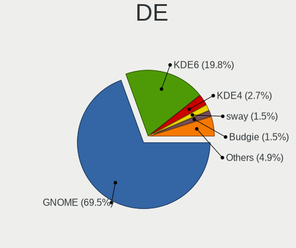
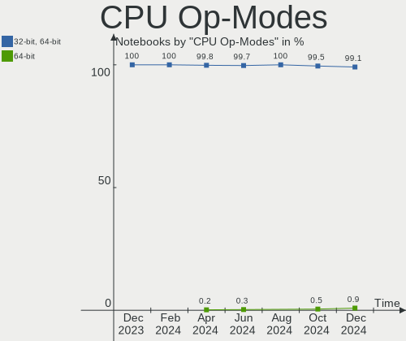
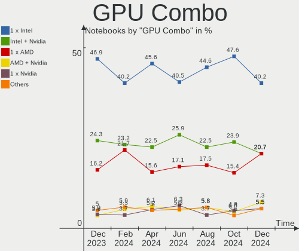
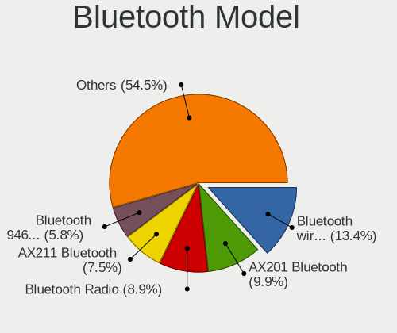
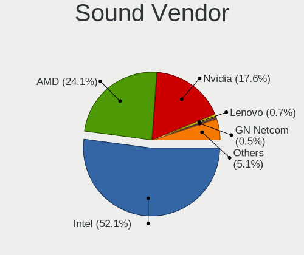
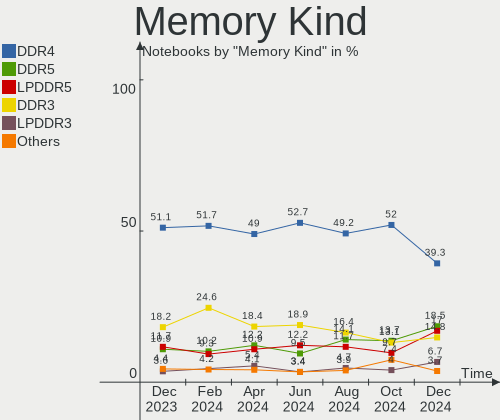

Fedora - Hardware Trends (Notebooks)
------------------------------------

A project to identify most popular hardware characteristics and track their change
over time based on data collected by Linux users at https://Linux-Hardware.org.

Anyone can contribute to this report by the [hw-probe](https://github.com/linuxhw/hw-probe) tool:

    sudo -E hw-probe -all -upload

This report is for one last month. Overall report since the beginning of time: [TestCoverage](https://github.com/linuxhw/TestCoverage)

Period: Jun, 2022.

Contents
--------

* [ System ](#system)
  - [ OS                       ](#os)
  - [ OS Family                ](#os-family)
  - [ Kernel                   ](#kernel)
  - [ Kernel Family            ](#kernel-family)
  - [ Kernel Major Ver.        ](#kernel-major-ver)
  - [ Arch                     ](#arch)
  - [ DE                       ](#de)
  - [ Display Server           ](#display-server)
  - [ Display Manager          ](#display-manager)
  - [ OS Lang                  ](#os-lang)
  - [ Boot Mode                ](#boot-mode)
  - [ Filesystem               ](#filesystem)
  - [ Part. scheme             ](#part-scheme)
  - [ Dual Boot with Linux/BSD ](#dual-boot-with-linuxbsd)
  - [ Dual Boot (Win)          ](#dual-boot-win)

* [ Board ](#board)
  - [ Vendor                   ](#vendor)
  - [ Model                    ](#model)
  - [ Model Family             ](#model-family)
  - [ MFG Year                 ](#mfg-year)
  - [ Form Factor              ](#form-factor)
  - [ Secure Boot              ](#secure-boot)
  - [ Coreboot                 ](#coreboot)
  - [ RAM Size                 ](#ram-size)
  - [ RAM Used                 ](#ram-used)
  - [ Total Drives             ](#total-drives)
  - [ Has CD-ROM               ](#has-cd-rom)
  - [ Has Ethernet             ](#has-ethernet)
  - [ Has WiFi                 ](#has-wifi)
  - [ Has Bluetooth            ](#has-bluetooth)

* [ Location ](#location)
  - [ Country                  ](#country)
  - [ City                     ](#city)

* [ Drives ](#drives)
  - [ Drive Vendor             ](#drive-vendor)
  - [ Drive Model              ](#drive-model)
  - [ HDD Vendor               ](#hdd-vendor)
  - [ SSD Vendor               ](#ssd-vendor)
  - [ Drive Kind               ](#drive-kind)
  - [ Drive Connector          ](#drive-connector)
  - [ Drive Size               ](#drive-size)
  - [ Space Total              ](#space-total)
  - [ Space Used               ](#space-used)
  - [ Malfunc. Drives          ](#malfunc-drives)
  - [ Malfunc. Drive Vendor    ](#malfunc-drive-vendor)
  - [ Malfunc. HDD Vendor      ](#malfunc-hdd-vendor)
  - [ Malfunc. Drive Kind      ](#malfunc-drive-kind)
  - [ Failed Drives            ](#failed-drives)
  - [ Failed Drive Vendor      ](#failed-drive-vendor)
  - [ Drive Status             ](#drive-status)

* [ Storage controller ](#storage-controller)
  - [ Storage Vendor           ](#storage-vendor)
  - [ Storage Model            ](#storage-model)
  - [ Storage Kind             ](#storage-kind)

* [ Processor ](#processor)
  - [ CPU Vendor               ](#cpu-vendor)
  - [ CPU Model                ](#cpu-model)
  - [ CPU Model Family         ](#cpu-model-family)
  - [ CPU Cores                ](#cpu-cores)
  - [ CPU Sockets              ](#cpu-sockets)
  - [ CPU Threads              ](#cpu-threads)
  - [ CPU Op-Modes             ](#cpu-op-modes)
  - [ CPU Microcode            ](#cpu-microcode)
  - [ CPU Microarch            ](#cpu-microarch)

* [ Graphics ](#graphics)
  - [ GPU Vendor               ](#gpu-vendor)
  - [ GPU Model                ](#gpu-model)
  - [ GPU Combo                ](#gpu-combo)
  - [ GPU Driver               ](#gpu-driver)
  - [ GPU Memory               ](#gpu-memory)

* [ Monitor ](#monitor)
  - [ Monitor Vendor           ](#monitor-vendor)
  - [ Monitor Model            ](#monitor-model)
  - [ Monitor Resolution       ](#monitor-resolution)
  - [ Monitor Diagonal         ](#monitor-diagonal)
  - [ Monitor Width            ](#monitor-width)
  - [ Aspect Ratio             ](#aspect-ratio)
  - [ Monitor Area             ](#monitor-area)
  - [ Pixel Density            ](#pixel-density)
  - [ Multiple Monitors        ](#multiple-monitors)

* [ Network ](#network)
  - [ Net Controller Vendor    ](#net-controller-vendor)
  - [ Net Controller Model     ](#net-controller-model)
  - [ Wireless Vendor          ](#wireless-vendor)
  - [ Wireless Model           ](#wireless-model)
  - [ Ethernet Vendor          ](#ethernet-vendor)
  - [ Ethernet Model           ](#ethernet-model)
  - [ Net Controller Kind      ](#net-controller-kind)
  - [ Used Controller          ](#used-controller)
  - [ NICs                     ](#nics)
  - [ IPv6                     ](#ipv6)

* [ Bluetooth ](#bluetooth)
  - [ Bluetooth Vendor         ](#bluetooth-vendor)
  - [ Bluetooth Model          ](#bluetooth-model)

* [ Sound ](#sound)
  - [ Sound Vendor             ](#sound-vendor)
  - [ Sound Model              ](#sound-model)

* [ Memory ](#memory)
  - [ Memory Vendor            ](#memory-vendor)
  - [ Memory Model             ](#memory-model)
  - [ Memory Kind              ](#memory-kind)
  - [ Memory Form Factor       ](#memory-form-factor)
  - [ Memory Size              ](#memory-size)
  - [ Memory Speed             ](#memory-speed)

* [ Printers & scanners ](#printers--scanners)
  - [ Printer Vendor           ](#printer-vendor)
  - [ Printer Model            ](#printer-model)
  - [ Scanner Vendor           ](#scanner-vendor)
  - [ Scanner Model            ](#scanner-model)

* [ Camera ](#camera)
  - [ Camera Vendor            ](#camera-vendor)
  - [ Camera Model             ](#camera-model)

* [ Security ](#security)
  - [ Fingerprint Vendor       ](#fingerprint-vendor)
  - [ Fingerprint Model        ](#fingerprint-model)
  - [ Chipcard Vendor          ](#chipcard-vendor)
  - [ Chipcard Model           ](#chipcard-model)

* [ Unsupported ](#unsupported)
  - [ Unsupported Devices      ](#unsupported-devices)
  - [ Unsupported Device Types ](#unsupported-device-types)

System
------

OS
--

Installed operating systems

| Name      | Notebooks | Percent |
|-----------|-----------|---------|
| Fedora 36 | 186       | 90.73%  |
| Fedora 35 | 17        | 8.29%   |
| Fedora 34 | 2         | 0.98%   |

OS Family
---------

OS without a version

| Name   | Notebooks | Percent |
|--------|-----------|---------|
| Fedora | 205       | 100%    |

Kernel
------

Version of the Linux kernel

| Version                          | Notebooks | Percent |
|----------------------------------|-----------|---------|
| 5.18.5-200.fc36.x86_64           | 38        | 18.54%  |
| 5.17.13-300.fc36.x86_64          | 35        | 17.07%  |
| 5.17.12-300.fc36.x86_64          | 27        | 13.17%  |
| 5.17.11-300.fc36.x86_64          | 26        | 12.68%  |
| 5.18.6-200.fc36.x86_64           | 25        | 12.2%   |
| 5.17.5-300.fc36.x86_64           | 15        | 7.32%   |
| 5.17.14-300.fc36.x86_64          | 4         | 1.95%   |
| 5.17.11-200.fc35.x86_64          | 4         | 1.95%   |
| 5.18.5-201.fsync.fc36.x86_64     | 3         | 1.46%   |
| 5.18.1-200.fc36.x86_64           | 3         | 1.46%   |
| 5.17.12-200.fc35.x86_64          | 3         | 1.46%   |
| 5.18.7-200.fc36.x86_64           | 2         | 0.98%   |
| 5.18.5-100.fc35.x86_64           | 2         | 0.98%   |
| 5.18.6-100.fc35.x86_64           | 1         | 0.49%   |
| 5.18.5-250.vanilla.1.fc36.x86_64 | 1         | 0.49%   |
| 5.18.4-xm1.0.fc36.x86_64         | 1         | 0.49%   |
| 5.18.4-xm1.0.fc35.x86_64         | 1         | 0.49%   |
| 5.18.4-125.vanilla.1.fc36.x86_64 | 1         | 0.49%   |
| 5.18.4-101.fc35.x86_64           | 1         | 0.49%   |
| 5.18.2-200.fc36.x86_64           | 1         | 0.49%   |
| 5.17.9-300.fc36.x86_64           | 1         | 0.49%   |
| 5.17.9-100.fc34.x86_64           | 1         | 0.49%   |
| 5.17.8-300.fc36.x86_64           | 1         | 0.49%   |
| 5.16.9-200.rog.fc35.x86_64       | 1         | 0.49%   |
| 5.16.9-200.fc35.x86_64           | 1         | 0.49%   |
| 5.16.20-200.fc35.x86_64          | 1         | 0.49%   |
| 5.16.14-200.fc35.x86_64          | 1         | 0.49%   |
| 5.15.0-60.fc36.x86_64            | 1         | 0.49%   |
| 5.14.16-301.fc35.x86_64          | 1         | 0.49%   |
| 5.14.10-300.fc35.x86_64          | 1         | 0.49%   |
| 5.12.10-300.fc34.x86_64          | 1         | 0.49%   |

Kernel Family
-------------

Linux kernel without a distro release

| Version | Notebooks | Percent |
|---------|-----------|---------|
| 5.18.5  | 44        | 21.46%  |
| 5.17.13 | 35        | 17.07%  |
| 5.17.12 | 30        | 14.63%  |
| 5.17.11 | 30        | 14.63%  |
| 5.18.6  | 26        | 12.68%  |
| 5.17.5  | 15        | 7.32%   |
| 5.18.4  | 4         | 1.95%   |
| 5.17.14 | 4         | 1.95%   |
| 5.18.1  | 3         | 1.46%   |
| 5.18.7  | 2         | 0.98%   |
| 5.17.9  | 2         | 0.98%   |
| 5.16.9  | 2         | 0.98%   |
| 5.18.2  | 1         | 0.49%   |
| 5.17.8  | 1         | 0.49%   |
| 5.16.20 | 1         | 0.49%   |
| 5.16.14 | 1         | 0.49%   |
| 5.15.0  | 1         | 0.49%   |
| 5.14.16 | 1         | 0.49%   |
| 5.14.10 | 1         | 0.49%   |
| 5.12.10 | 1         | 0.49%   |

Kernel Major Ver.
-----------------

Linux kernel major version

| Version | Notebooks | Percent |
|---------|-----------|---------|
| 5.17    | 117       | 57.07%  |
| 5.18    | 80        | 39.02%  |
| 5.16    | 4         | 1.95%   |
| 5.14    | 2         | 0.98%   |
| 5.15    | 1         | 0.49%   |
| 5.12    | 1         | 0.49%   |

Arch
----

OS architecture (x86_64, i586, etc.)

| Name   | Notebooks | Percent |
|--------|-----------|---------|
| x86_64 | 205       | 100%    |

DE
--

Desktop Environment

| Name          | Notebooks | Percent |
|---------------|-----------|---------|
| GNOME         | 154       | 75.12%  |
| KDE5          | 34        | 16.59%  |
| Unknown       | 5         | 2.44%   |
| X-Cinnamon    | 3         | 1.46%   |
| XFCE          | 2         | 0.98%   |
| i3            | 2         | 0.98%   |
| GNOME Classic | 2         | 0.98%   |
| MATE          | 1         | 0.49%   |
| Cinnamon      | 1         | 0.49%   |
| awesome       | 1         | 0.49%   |

Display Server
--------------

X11 or Wayland

| Name    | Notebooks | Percent |
|---------|-----------|---------|
| Wayland | 155       | 75.61%  |
| X11     | 44        | 21.46%  |
| Tty     | 3         | 1.46%   |
| Unknown | 3         | 1.46%   |

Display Manager
---------------

SDDM, LightDM, etc.

| Name    | Notebooks | Percent |
|---------|-----------|---------|
| Unknown | 118       | 57.56%  |
| GDM     | 66        | 32.2%   |
| SDDM    | 14        | 6.83%   |
| LightDM | 6         | 2.93%   |
| Ly      | 1         | 0.49%   |

OS Lang
-------

Language

| Lang    | Notebooks | Percent |
|---------|-----------|---------|
| en_US   | 109       | 53.17%  |
| ru_RU   | 16        | 7.8%    |
| pt_BR   | 10        | 4.88%   |
| en_GB   | 7         | 3.41%   |
| it_IT   | 6         | 2.93%   |
| en_IN   | 6         | 2.93%   |
| de_DE   | 5         | 2.44%   |
| es_MX   | 4         | 1.95%   |
| en_AU   | 4         | 1.95%   |
| pl_PL   | 3         | 1.46%   |
| fr_FR   | 3         | 1.46%   |
| es_AR   | 3         | 1.46%   |
| nl_NL   | 2         | 0.98%   |
| nl_BE   | 2         | 0.98%   |
| hu_HU   | 2         | 0.98%   |
| es_CL   | 2         | 0.98%   |
| en_IL   | 2         | 0.98%   |
| en_CA   | 2         | 0.98%   |
| de_CH   | 2         | 0.98%   |
| de_AT   | 2         | 0.98%   |
| Unknown | 2         | 0.98%   |
| tr_TR   | 1         | 0.49%   |
| pt_PT   | 1         | 0.49%   |
| fr_BE   | 1         | 0.49%   |
| es_VE   | 1         | 0.49%   |
| es_SV   | 1         | 0.49%   |
| es_EC   | 1         | 0.49%   |
| en_ZA   | 1         | 0.49%   |
| en_NZ   | 1         | 0.49%   |
| en_NL   | 1         | 0.49%   |
| en_DK   | 1         | 0.49%   |
| cs_CZ   | 1         | 0.49%   |

Boot Mode
---------

EFI or BIOS

| Mode | Notebooks | Percent |
|------|-----------|---------|
| EFI  | 171       | 83.41%  |
| BIOS | 34        | 16.59%  |

Filesystem
----------

Type of filesystem

| Type  | Notebooks | Percent |
|-------|-----------|---------|
| Btrfs | 170       | 82.93%  |
| Ext4  | 32        | 15.61%  |
| Xfs   | 3         | 1.46%   |

Part. scheme
------------

Scheme of partitioning

| Type    | Notebooks | Percent |
|---------|-----------|---------|
| Unknown | 119       | 58.05%  |
| GPT     | 73        | 35.61%  |
| MBR     | 13        | 6.34%   |

Dual Boot with Linux/BSD
------------------------

Hosting more than one Linux/BSD

| Dual boot | Notebooks | Percent |
|-----------|-----------|---------|
| No        | 189       | 92.2%   |
| Yes       | 16        | 7.8%    |

Dual Boot (Win)
---------------

Hosting Linux and Windows

| Dual boot | Notebooks | Percent |
|-----------|-----------|---------|
| No        | 166       | 80.98%  |
| Yes       | 39        | 19.02%  |

Board
-----

Vendor
------

Motherboard manufacturer

| Name                | Notebooks | Percent |
|---------------------|-----------|---------|
| Lenovo              | 59        | 28.78%  |
| Hewlett-Packard     | 45        | 21.95%  |
| Dell                | 27        | 13.17%  |
| ASUSTek Computer    | 20        | 9.76%   |
| Acer                | 15        | 7.32%   |
| Apple               | 9         | 4.39%   |
| HUAWEI              | 5         | 2.44%   |
| Toshiba             | 2         | 0.98%   |
| Timi                | 2         | 0.98%   |
| Gigabyte Technology | 2         | 0.98%   |
| Unknown             | 2         | 0.98%   |
| VIT                 | 1         | 0.49%   |
| TUXEDO              | 1         | 0.49%   |
| Sony                | 1         | 0.49%   |
| Samsung Electronics | 1         | 0.49%   |
| Positivo            | 1         | 0.49%   |
| Panasonic           | 1         | 0.49%   |
| Packard Bell        | 1         | 0.49%   |
| Notebook            | 1         | 0.49%   |
| MSI                 | 1         | 0.49%   |
| Micro Electronics   | 1         | 0.49%   |
| Itautec             | 1         | 0.49%   |
| Google              | 1         | 0.49%   |
| Getac               | 1         | 0.49%   |
| GEO                 | 1         | 0.49%   |
| Fujitsu             | 1         | 0.49%   |
| Framework           | 1         | 0.49%   |
| Alienware           | 1         | 0.49%   |

Model
-----

Motherboard model

| Name                                        | Notebooks | Percent |
|---------------------------------------------|-----------|---------|
| Lenovo IdeaPad Gaming 3 15ARH05 82EY        | 2         | 0.98%   |
| HUAWEI KLVL-WXX9                            | 2         | 0.98%   |
| HP Pavilion Laptop 15-cw1xxx                | 2         | 0.98%   |
| HP Pavilion g6                              | 2         | 0.98%   |
| HP Pavilion Aero Laptop 13-be0xxx           | 2         | 0.98%   |
| HP Notebook                                 | 2         | 0.98%   |
| HP EliteBook 8470p                          | 2         | 0.98%   |
| Apple MacBookPro12,1                        | 2         | 0.98%   |
| Acer Swift SF114-32                         | 2         | 0.98%   |
| Acer Aspire E5-573G                         | 2         | 0.98%   |
| Unknown                                     | 2         | 0.98%   |
| VIT M2420                                   | 1         | 0.49%   |
| TUXEDO Polaris Intel Gen3 (TGL)             | 1         | 0.49%   |
| Toshiba Satellite C855-12R                  | 1         | 0.49%   |
| Toshiba Satellite C50-A                     | 1         | 0.49%   |
| Timi Redmi Book Pro 15 2022                 | 1         | 0.49%   |
| Timi A35S                                   | 1         | 0.49%   |
| Sony SVE15128CNB                            | 1         | 0.49%   |
| Samsung 500R5M/500R5W/501R5M                | 1         | 0.49%   |
| Positivo VJF155F11UAR                       | 1         | 0.49%   |
| Panasonic CFSV9-1                           | 1         | 0.49%   |
| Packard Bell EasyNote TE69HW                | 1         | 0.49%   |
| Notebook NL40_50CU                          | 1         | 0.49%   |
| MSI GF63 Thin 9SCXR                         | 1         | 0.49%   |
| Micro MG-VCP17I-3070                        | 1         | 0.49%   |
| Lenovo Y50-70 20378                         | 1         | 0.49%   |
| Lenovo ThinkPad X220 4291WSH                | 1         | 0.49%   |
| Lenovo ThinkPad X220 4286CTO                | 1         | 0.49%   |
| Lenovo ThinkPad X13 Gen 1 20UF000NMH        | 1         | 0.49%   |
| Lenovo ThinkPad X13 Gen 1 20T3S0K400        | 1         | 0.49%   |
| Lenovo ThinkPad X1 Extreme 2nd 20QVCTO1WW   | 1         | 0.49%   |
| Lenovo ThinkPad X1 Carbon Gen 9 20XW005NMX  | 1         | 0.49%   |
| Lenovo ThinkPad X1 Carbon Gen 9 20XW0057IX  | 1         | 0.49%   |
| Lenovo ThinkPad X1 Carbon Gen 10 21CBCTO1WW | 1         | 0.49%   |
| Lenovo ThinkPad X1 Carbon 5th 20HQS24900    | 1         | 0.49%   |
| Lenovo ThinkPad T520 4243VE1                | 1         | 0.49%   |
| Lenovo ThinkPad T495s 20QJ0012GE            | 1         | 0.49%   |
| Lenovo ThinkPad T460s 20FA003JMC            | 1         | 0.49%   |
| Lenovo ThinkPad T460 20FMS2292S             | 1         | 0.49%   |
| Lenovo ThinkPad T450 20BUS0HA0G             | 1         | 0.49%   |
| Lenovo ThinkPad T420 4180BE1                | 1         | 0.49%   |
| Lenovo ThinkPad T420 4177CTO                | 1         | 0.49%   |
| Lenovo ThinkPad T410 2522PT3                | 1         | 0.49%   |
| Lenovo ThinkPad T410 2518A37                | 1         | 0.49%   |
| Lenovo ThinkPad T400 6475AJ1                | 1         | 0.49%   |
| Lenovo ThinkPad T14 Gen 2i 20W1S21R02       | 1         | 0.49%   |
| Lenovo ThinkPad T14 Gen 2i 20W0000GRT       | 1         | 0.49%   |
| Lenovo ThinkPad T14 Gen 2a 20XLS0FM00       | 1         | 0.49%   |
| Lenovo ThinkPad P53 20QN0011IV              | 1         | 0.49%   |
| Lenovo ThinkPad P51 20HHCTO1WW              | 1         | 0.49%   |
| Lenovo ThinkPad P50 20EQS3B30R              | 1         | 0.49%   |
| Lenovo ThinkPad P1 Gen 3 20TJS5S400         | 1         | 0.49%   |
| Lenovo ThinkPad P1 Gen 3 20TJS2F437         | 1         | 0.49%   |
| Lenovo ThinkPad L14 Gen 1 20U50001GE        | 1         | 0.49%   |
| Lenovo ThinkPad E490 20N8CTO1WW             | 1         | 0.49%   |
| Lenovo ThinkPad E480 20KNS0E200             | 1         | 0.49%   |
| Lenovo ThinkPad E15 Gen 2 20TDCTO1WW        | 1         | 0.49%   |
| Lenovo ThinkPad E15 Gen 2 20T8000TGE        | 1         | 0.49%   |
| Lenovo ThinkPad E14 Gen 3 20YDCTO1WW        | 1         | 0.49%   |
| Lenovo ThinkPad E14 Gen 2 20TB0029BO        | 1         | 0.49%   |

Model Family
------------

Motherboard model prefix

| Name                  | Notebooks | Percent |
|-----------------------|-----------|---------|
| Lenovo ThinkPad       | 35        | 17.07%  |
| Lenovo IdeaPad        | 15        | 7.32%   |
| HP Pavilion           | 12        | 5.85%   |
| Dell Inspiron         | 10        | 4.88%   |
| HP Laptop             | 9         | 4.39%   |
| Dell XPS              | 8         | 3.9%    |
| Acer Aspire           | 7         | 3.41%   |
| HP EliteBook          | 6         | 2.93%   |
| HP ProBook            | 5         | 2.44%   |
| Dell Precision        | 5         | 2.44%   |
| ASUS VivoBook         | 5         | 2.44%   |
| Dell Latitude         | 4         | 1.95%   |
| ASUS ROG              | 4         | 1.95%   |
| Acer Swift            | 4         | 1.95%   |
| HP ZBook              | 3         | 1.46%   |
| HP OMEN               | 3         | 1.46%   |
| ASUS ZenBook          | 3         | 1.46%   |
| ASUS ASUS             | 3         | 1.46%   |
| Toshiba Satellite     | 2         | 0.98%   |
| Lenovo ThinkBook      | 2         | 0.98%   |
| Lenovo G580           | 2         | 0.98%   |
| HUAWEI KLVL-WXX9      | 2         | 0.98%   |
| HP Notebook           | 2         | 0.98%   |
| HP ENVY               | 2         | 0.98%   |
| HP 250                | 2         | 0.98%   |
| Apple MacBookPro12    | 2         | 0.98%   |
| Unknown               | 2         | 0.98%   |
| VIT M2420             | 1         | 0.49%   |
| TUXEDO Polaris        | 1         | 0.49%   |
| Timi Redmi            | 1         | 0.49%   |
| Timi A35S             | 1         | 0.49%   |
| Sony SVE15128CNB      | 1         | 0.49%   |
| Samsung 500R5M        | 1         | 0.49%   |
| Positivo VJF155F11UAR | 1         | 0.49%   |
| Panasonic CFSV9-1     | 1         | 0.49%   |
| Packard Bell EasyNote | 1         | 0.49%   |
| Notebook NL40         | 1         | 0.49%   |
| MSI GF63              | 1         | 0.49%   |
| Micro MG-VCP17I-3070  | 1         | 0.49%   |
| Lenovo Y50-70         | 1         | 0.49%   |
| Lenovo Legion         | 1         | 0.49%   |
| Lenovo G510           | 1         | 0.49%   |
| Lenovo Edge           | 1         | 0.49%   |
| Lenovo 81WE           | 1         | 0.49%   |
| Itautec Infoway       | 1         | 0.49%   |
| HUAWEI WRT-WX9        | 1         | 0.49%   |
| HUAWEI MACH-WX9       | 1         | 0.49%   |
| HUAWEI BOD-WXX9       | 1         | 0.49%   |
| HP Compaq             | 1         | 0.49%   |
| Google Droid          | 1         | 0.49%   |
| Gigabyte RC14UD       | 1         | 0.49%   |
| Gigabyte G5           | 1         | 0.49%   |
| Getac B300-X          | 1         | 0.49%   |
| GEO GeoBook           | 1         | 0.49%   |
| Fujitsu LIFEBOOK      | 1         | 0.49%   |
| Framework Laptop      | 1         | 0.49%   |
| ASUS X541NA           | 1         | 0.49%   |
| ASUS UX302LA          | 1         | 0.49%   |
| ASUS TUF              | 1         | 0.49%   |
| ASUS N82JV            | 1         | 0.49%   |

MFG Year
--------

Motherboard manufacture year

| Year | Notebooks | Percent |
|------|-----------|---------|
| 2021 | 42        | 20.49%  |
| 2020 | 31        | 15.12%  |
| 2019 | 26        | 12.68%  |
| 2018 | 20        | 9.76%   |
| 2011 | 14        | 6.83%   |
| 2017 | 12        | 5.85%   |
| 2015 | 12        | 5.85%   |
| 2013 | 10        | 4.88%   |
| 2022 | 9         | 4.39%   |
| 2014 | 7         | 3.41%   |
| 2012 | 7         | 3.41%   |
| 2010 | 6         | 2.93%   |
| 2016 | 4         | 1.95%   |
| 2008 | 3         | 1.46%   |
| 2009 | 2         | 0.98%   |

Form Factor
-----------

Physical design of the computer

| Name     | Notebooks | Percent |
|----------|-----------|---------|
| Notebook | 205       | 100%    |

Secure Boot
-----------

Enabled or disabled

| State    | Notebooks | Percent |
|----------|-----------|---------|
| Disabled | 156       | 76.1%   |
| Enabled  | 49        | 23.9%   |

Coreboot
--------

Have coreboot on board

| Used | Notebooks | Percent |
|------|-----------|---------|
| No   | 204       | 99.51%  |
| Yes  | 1         | 0.49%   |

RAM Size
--------

Total RAM memory

| Size in GB  | Notebooks | Percent |
|-------------|-----------|---------|
| 4.01-8.0    | 72        | 35.12%  |
| 8.01-16.0   | 49        | 23.9%   |
| 32.01-64.0  | 31        | 15.12%  |
| 16.01-24.0  | 28        | 13.66%  |
| 3.01-4.0    | 21        | 10.24%  |
| 64.01-256.0 | 4         | 1.95%   |

RAM Used
--------

Used RAM memory

| Used GB    | Notebooks | Percent |
|------------|-----------|---------|
| 2.01-3.0   | 63        | 30.73%  |
| 4.01-8.0   | 59        | 28.78%  |
| 3.01-4.0   | 51        | 24.88%  |
| 1.01-2.0   | 19        | 9.27%   |
| 8.01-16.0  | 11        | 5.37%   |
| 16.01-24.0 | 1         | 0.49%   |
| 0.51-1.0   | 1         | 0.49%   |

Total Drives
------------

Number of drives on board

| Drives | Notebooks | Percent |
|--------|-----------|---------|
| 1      | 151       | 73.66%  |
| 2      | 47        | 22.93%  |
| 3      | 6         | 2.93%   |
| 0      | 1         | 0.49%   |

Has CD-ROM
----------

Has CD-ROM on board

| Presented | Notebooks | Percent |
|-----------|-----------|---------|
| No        | 160       | 78.05%  |
| Yes       | 45        | 21.95%  |

Has Ethernet
------------

Has Ethernet on board

| Presented | Notebooks | Percent |
|-----------|-----------|---------|
| Yes       | 135       | 65.85%  |
| No        | 70        | 34.15%  |

Has WiFi
--------

Has WiFi module

| Presented | Notebooks | Percent |
|-----------|-----------|---------|
| Yes       | 203       | 99.02%  |
| No        | 2         | 0.98%   |

Has Bluetooth
-------------

Has Bluetooth module

| Presented | Notebooks | Percent |
|-----------|-----------|---------|
| Yes       | 182       | 88.78%  |
| No        | 23        | 11.22%  |

Location
--------

Country
-------

Geographic location (country)

| Country      | Notebooks | Percent |
|--------------|-----------|---------|
| USA          | 35        | 17.07%  |
| Russia       | 18        | 8.78%   |
| India        | 15        | 7.32%   |
| Germany      | 10        | 4.88%   |
| Brazil       | 10        | 4.88%   |
| Italy        | 9         | 4.39%   |
| Netherlands  | 8         | 3.9%    |
| Mexico       | 8         | 3.9%    |
| Poland       | 7         | 3.41%   |
| Australia    | 6         | 2.93%   |
| Turkey       | 5         | 2.44%   |
| France       | 5         | 2.44%   |
| Switzerland  | 4         | 1.95%   |
| Hungary      | 4         | 1.95%   |
| Czechia      | 4         | 1.95%   |
| Canada       | 4         | 1.95%   |
| Belgium      | 4         | 1.95%   |
| Taiwan       | 3         | 1.46%   |
| Israel       | 3         | 1.46%   |
| Indonesia    | 3         | 1.46%   |
| Austria      | 3         | 1.46%   |
| Argentina    | 3         | 1.46%   |
| UK           | 2         | 0.98%   |
| Spain        | 2         | 0.98%   |
| Norway       | 2         | 0.98%   |
| Japan        | 2         | 0.98%   |
| Chile        | 2         | 0.98%   |
| Belarus      | 2         | 0.98%   |
| Venezuela    | 1         | 0.49%   |
| Ukraine      | 1         | 0.49%   |
| Sweden       | 1         | 0.49%   |
| South Africa | 1         | 0.49%   |
| Singapore    | 1         | 0.49%   |
| Puerto Rico  | 1         | 0.49%   |
| Portugal     | 1         | 0.49%   |
| Philippines  | 1         | 0.49%   |
| New Zealand  | 1         | 0.49%   |
| Myanmar      | 1         | 0.49%   |
| Moldova      | 1         | 0.49%   |
| Luxembourg   | 1         | 0.49%   |
| Lithuania    | 1         | 0.49%   |
| Iraq         | 1         | 0.49%   |
| Georgia      | 1         | 0.49%   |
| El Salvador  | 1         | 0.49%   |
| Ecuador      | 1         | 0.49%   |
| Denmark      | 1         | 0.49%   |
| Cyprus       | 1         | 0.49%   |
| Croatia      | 1         | 0.49%   |
| Colombia     | 1         | 0.49%   |
| Bulgaria     | 1         | 0.49%   |

City
----

Geographic location (city)

| City              | Notebooks | Percent |
|-------------------|-----------|---------|
| St Petersburg     | 4         | 1.95%   |
| Vienna            | 3         | 1.46%   |
| Moscow            | 3         | 1.46%   |
| Budapest          | 3         | 1.46%   |
| Berlin            | 3         | 1.46%   |
| Rostov-on-Don     | 2         | 0.98%   |
| Raleigh           | 2         | 0.98%   |
| Prague            | 2         | 0.98%   |
| Nantes            | 2         | 0.98%   |
| Minsk             | 2         | 0.98%   |
| Mexico City       | 2         | 0.98%   |
| Melbourne         | 2         | 0.98%   |
| Kolkata           | 2         | 0.98%   |
| Jakarta           | 2         | 0.98%   |
| Istanbul          | 2         | 0.98%   |
| Bengaluru         | 2         | 0.98%   |
| Zurich            | 1         | 0.49%   |
| Zollikofen        | 1         | 0.49%   |
| Zator             | 1         | 0.49%   |
| Zapopan           | 1         | 0.49%   |
| Zagreb            | 1         | 0.49%   |
| Yaroslavl         | 1         | 0.49%   |
| Yangon            | 1         | 0.49%   |
| Wylie             | 1         | 0.49%   |
| Wellington        | 1         | 0.49%   |
| Weilheim          | 1         | 0.49%   |
| Waynesboro        | 1         | 0.49%   |
| Warsaw            | 1         | 0.49%   |
| Warrnambool       | 1         | 0.49%   |
| Volta Redonda     | 1         | 0.49%   |
| Volgograd         | 1         | 0.49%   |
| Vilnius           | 1         | 0.49%   |
| Vijayawada        | 1         | 0.49%   |
| Vigliano Biellese | 1         | 0.49%   |
| Viana do Castelo  | 1         | 0.49%   |
| Verona            | 1         | 0.49%   |
| Veldhoven         | 1         | 0.49%   |
| Vegarshei         | 1         | 0.49%   |
| Varanasi          | 1         | 0.49%   |
| Vadodara          | 1         | 0.49%   |
| Tyumen            | 1         | 0.49%   |
| Toulouse          | 1         | 0.49%   |
| Toronto           | 1         | 0.49%   |
| Tokyo             | 1         | 0.49%   |
| Thun              | 1         | 0.49%   |
| The Hague         | 1         | 0.49%   |
| Temoac            | 1         | 0.49%   |
| Tel Aviv          | 1         | 0.49%   |
| Taipei            | 1         | 0.49%   |
| Tainan City       | 1         | 0.49%   |
| Sykesville        | 1         | 0.49%   |
| Sydney            | 1         | 0.49%   |
| Surabaya          | 1         | 0.49%   |
| Stockholm         | 1         | 0.49%   |
| Sterling          | 1         | 0.49%   |
| Stavropol         | 1         | 0.49%   |
| Starachowice      | 1         | 0.49%   |
| Stara Zagora      | 1         | 0.49%   |
| Springboro        | 1         | 0.49%   |
| Southampton       | 1         | 0.49%   |

Drives
------

Drive Vendor
------------

Hard drive vendors

| Vendor                         | Notebooks | Drives | Percent |
|--------------------------------|-----------|--------|---------|
| Samsung Electronics            | 45        | 50     | 17.86%  |
| WDC                            | 24        | 25     | 9.52%   |
| Seagate                        | 20        | 21     | 7.94%   |
| SanDisk                        | 20        | 22     | 7.94%   |
| Toshiba                        | 18        | 18     | 7.14%   |
| SK hynix                       | 17        | 18     | 6.75%   |
| Intel                          | 17        | 20     | 6.75%   |
| Kingston                       | 12        | 12     | 4.76%   |
| KIOXIA                         | 9         | 9      | 3.57%   |
| Micron Technology              | 8         | 8      | 3.17%   |
| Crucial                        | 7         | 7      | 2.78%   |
| Unknown                        | 6         | 6      | 2.38%   |
| Apple                          | 5         | 5      | 1.98%   |
| HGST                           | 4         | 4      | 1.59%   |
| A-DATA Technology              | 4         | 4      | 1.59%   |
| XPG                            | 2         | 2      | 0.79%   |
| UMIS                           | 2         | 2      | 0.79%   |
| SSSTC                          | 2         | 2      | 0.79%   |
| SABRENT                        | 2         | 2      | 0.79%   |
| Phison                         | 2         | 2      | 0.79%   |
| JMicron Technology             | 2         | 2      | 0.79%   |
| Hitachi                        | 2         | 2      | 0.79%   |
| China                          | 2         | 2      | 0.79%   |
| Vaseky                         | 1         | 1      | 0.4%    |
| USB3.0                         | 1         | 1      | 0.4%    |
| Transcend                      | 1         | 1      | 0.4%    |
| Solid State Storage Technology | 1         | 1      | 0.4%    |
| Silicon Motion                 | 1         | 1      | 0.4%    |
| Realtek Semiconductor          | 1         | 1      | 0.4%    |
| RCESSD                         | 1         | 1      | 0.4%    |
| Patriot                        | 1         | 1      | 0.4%    |
| OCZ                            | 1         | 1      | 0.4%    |
| Netac                          | 1         | 1      | 0.4%    |
| LITEONIT                       | 1         | 1      | 0.4%    |
| Lite-On                        | 1         | 1      | 0.4%    |
| KingFast                       | 1         | 1      | 0.4%    |
| Intenso                        | 1         | 1      | 0.4%    |
| HPE                            | 1         | 1      | 0.4%    |
| Hewlett-Packard                | 1         | 1      | 0.4%    |
| Goodram                        | 1         | 1      | 0.4%    |
| Gigabyte Technology            | 1         | 1      | 0.4%    |
| Fujitsu                        | 1         | 1      | 0.4%    |
| Dogfish                        | 1         | 1      | 0.4%    |

Drive Model
-----------

Hard drive models

| Model                                | Notebooks | Percent |
|--------------------------------------|-----------|---------|
| Intel NVMe SSD Drive 512GB           | 7         | 2.67%   |
| Samsung NVMe SSD Drive 512GB         | 6         | 2.29%   |
| Seagate ST1000LM024 HN-M101MBB 1TB   | 5         | 1.91%   |
| SanDisk NVMe SSD Drive 512GB         | 5         | 1.91%   |
| Samsung NVMe SSD Drive 256GB         | 5         | 1.91%   |
| Samsung NVMe SSD Drive 1024GB        | 5         | 1.91%   |
| Samsung NVMe SSD Drive 1TB           | 4         | 1.53%   |
| Kingston SA400S37240G 240GB SSD      | 4         | 1.53%   |
| Toshiba MQ01ABD100 1TB               | 3         | 1.15%   |
| Toshiba KBG30ZMS128G 128GB NVMe SSD  | 3         | 1.15%   |
| Seagate ST1000LM035-1RK172 1TB       | 3         | 1.15%   |
| SanDisk NVMe SSD Drive 1024GB        | 3         | 1.15%   |
| KIOXIA NVMe SSD Drive 512GB          | 3         | 1.15%   |
| WDC WD10SPZX-24Z10 1TB               | 2         | 0.76%   |
| WDC PC SN530 SDBPMPZ-256G-1001 256GB | 2         | 0.76%   |
| UMIS RPJTJ256MEE1OWX 256GB           | 2         | 0.76%   |
| Toshiba NVMe SSD Drive 512GB         | 2         | 0.76%   |
| Toshiba MQ04ABF100 1TB               | 2         | 0.76%   |
| Toshiba KXG6AZNV1T02 1TB             | 2         | 0.76%   |
| SK hynix NVMe SSD Drive 512GB        | 2         | 0.76%   |
| SK hynix NVMe SSD Drive 256GB        | 2         | 0.76%   |
| Seagate ST9500325AS 500GB            | 2         | 0.76%   |
| Seagate ST500LT012-1DG142 500GB      | 2         | 0.76%   |
| SanDisk SSD PLUS 480GB               | 2         | 0.76%   |
| Samsung SSD 860 EVO 500GB            | 2         | 0.76%   |
| Samsung SSD 860 EVO 1TB              | 2         | 0.76%   |
| Samsung MZVLB1T0HBLR-000L7 1TB       | 2         | 0.76%   |
| SABRENT Disk 1TB                     | 2         | 0.76%   |
| Micron NVMe SSD Drive 256GB          | 2         | 0.76%   |
| HGST HTS721010A9E630 1TB             | 2         | 0.76%   |
| Crucial CT1000MX500SSD1 1TB          | 2         | 0.76%   |
| XPG NVMe SSD Drive 256GB             | 1         | 0.38%   |
| XPG GAMMIX S11 Pro 1TB               | 1         | 0.38%   |
| WDC WDS500G3X0C-00SJG0 500GB         | 1         | 0.38%   |
| WDC WDS500G2B0A 500GB SSD            | 1         | 0.38%   |
| WDC WDS100T1X0E-00AFY0 1TB           | 1         | 0.38%   |
| WDC WDBNCE5000PNC 500GB SSD          | 1         | 0.38%   |
| WDC WDBNCE2500PNC 250GB SSD          | 1         | 0.38%   |
| WDC WDBNCE0010PNC 1TB SSD            | 1         | 0.38%   |
| WDC WD7500LPCX-00KHST0 752GB         | 1         | 0.38%   |
| WDC WD5000LPVX-22V0TT0 500GB         | 1         | 0.38%   |
| WDC WD5000LPCX-80VHAT0 500GB         | 1         | 0.38%   |
| WDC WD5000LPCX-24C6HT0 500GB         | 1         | 0.38%   |
| WDC WD3200BPVT-80JJ5T0 320GB         | 1         | 0.38%   |
| WDC WD1600BEVT-22ZCT0 160GB          | 1         | 0.38%   |
| WDC WD10SPZX-24Z10T0 1TB             | 1         | 0.38%   |
| WDC WD10SPZX-21Z10T0 1TB             | 1         | 0.38%   |
| WDC WD10SPZX-08Z10 1TB               | 1         | 0.38%   |
| WDC WD10SPCX-00KHST0 1TB             | 1         | 0.38%   |
| WDC PC SN730 NVMe 1024GB             | 1         | 0.38%   |
| WDC PC SN530 SDBPNPZ-512G-1032 512GB | 1         | 0.38%   |
| WDC PC SN530 SDBPNPZ-1T00-1114 1TB   | 1         | 0.38%   |
| WDC PC SN530 SDBPMPZ-512G-1101 512GB | 1         | 0.38%   |
| WDC PC SN520 SDAPNUW-512G-1014 512GB | 1         | 0.38%   |
| Vaseky V820/1TB 1024GB               | 1         | 0.38%   |
| USB3.0 Super Speed 320GB             | 1         | 0.38%   |
| Unknown Trust HDD 2.5" 1TB           | 1         | 0.38%   |
| Unknown SD/MMC/MS PRO 128GB          | 1         | 0.38%   |
| Unknown MMC Card  64GB               | 1         | 0.38%   |
| Unknown MMC Card  2GB                | 1         | 0.38%   |

HDD Vendor
----------

Hard disk drive vendors

| Vendor             | Notebooks | Drives | Percent |
|--------------------|-----------|--------|---------|
| Seagate            | 20        | 21     | 41.67%  |
| WDC                | 12        | 12     | 25%     |
| Toshiba            | 6         | 6      | 12.5%   |
| HGST               | 4         | 4      | 8.33%   |
| Unknown            | 2         | 2      | 4.17%   |
| Hitachi            | 2         | 2      | 4.17%   |
| JMicron Technology | 1         | 1      | 2.08%   |
| Fujitsu            | 1         | 1      | 2.08%   |

SSD Vendor
----------

Solid state drive vendors

| Vendor              | Notebooks | Drives | Percent |
|---------------------|-----------|--------|---------|
| Samsung Electronics | 16        | 16     | 21.62%  |
| SanDisk             | 12        | 13     | 16.22%  |
| Kingston            | 7         | 7      | 9.46%   |
| Crucial             | 6         | 6      | 8.11%   |
| Apple               | 5         | 5      | 6.76%   |
| WDC                 | 3         | 4      | 4.05%   |
| Intel               | 3         | 3      | 4.05%   |
| A-DATA Technology   | 3         | 3      | 4.05%   |
| SK hynix            | 2         | 2      | 2.7%    |
| China               | 2         | 2      | 2.7%    |
| Vaseky              | 1         | 1      | 1.35%   |
| USB3.0              | 1         | 1      | 1.35%   |
| Transcend           | 1         | 1      | 1.35%   |
| Toshiba             | 1         | 1      | 1.35%   |
| Patriot             | 1         | 1      | 1.35%   |
| OCZ                 | 1         | 1      | 1.35%   |
| Netac               | 1         | 1      | 1.35%   |
| Micron Technology   | 1         | 1      | 1.35%   |
| LITEONIT            | 1         | 1      | 1.35%   |
| KingFast            | 1         | 1      | 1.35%   |
| Intenso             | 1         | 1      | 1.35%   |
| HPE                 | 1         | 1      | 1.35%   |
| Goodram             | 1         | 1      | 1.35%   |
| Gigabyte Technology | 1         | 1      | 1.35%   |
| Dogfish             | 1         | 1      | 1.35%   |

Drive Kind
----------

HDD or SSD

| Kind    | Notebooks | Drives | Percent |
|---------|-----------|--------|---------|
| NVMe    | 118       | 133    | 49.58%  |
| SSD     | 66        | 76     | 27.73%  |
| HDD     | 47        | 49     | 19.75%  |
| MMC     | 4         | 4      | 1.68%   |
| Unknown | 3         | 3      | 1.26%   |

Drive Connector
---------------

SATA, SAS, NVMe, etc.

| Type | Notebooks | Drives | Percent |
|------|-----------|--------|---------|
| NVMe | 117       | 131    | 50%     |
| SATA | 102       | 118    | 43.59%  |
| SAS  | 11        | 12     | 4.7%    |
| MMC  | 4         | 4      | 1.71%   |

Drive Size
----------

Size of hard drive

| Size in TB | Notebooks | Drives | Percent |
|------------|-----------|--------|---------|
| 0.01-0.5   | 68        | 76     | 58.62%  |
| 0.51-1.0   | 43        | 44     | 37.07%  |
| 1.01-2.0   | 4         | 4      | 3.45%   |
| 3.01-4.0   | 1         | 1      | 0.86%   |

Space Total
-----------

Amount of disk space available on the file system

| Size in GB     | Notebooks | Percent |
|----------------|-----------|---------|
| 501-1000       | 54        | 26.34%  |
| 251-500        | 35        | 17.07%  |
| 1001-2000      | 30        | 14.63%  |
| 101-250        | 23        | 11.22%  |
| 1-20           | 23        | 11.22%  |
| Unknown        | 18        | 8.78%   |
| 51-100         | 10        | 4.88%   |
| 2001-3000      | 6         | 2.93%   |
| More than 3000 | 3         | 1.46%   |
| 21-50          | 3         | 1.46%   |

Space Used
----------

Amount of used disk space

| Used GB        | Notebooks | Percent |
|----------------|-----------|---------|
| 1-20           | 72        | 35.12%  |
| 21-50          | 30        | 14.63%  |
| 51-100         | 26        | 12.68%  |
| 251-500        | 23        | 11.22%  |
| 101-250        | 21        | 10.24%  |
| Unknown        | 18        | 8.78%   |
| 501-1000       | 11        | 5.37%   |
| 1001-2000      | 3         | 1.46%   |
| More than 3000 | 1         | 0.49%   |

Malfunc. Drives
---------------

Drive models with a malfunction

| Model                               | Notebooks | Drives | Percent |
|-------------------------------------|-----------|--------|---------|
| WDC WD5000LPCX-24C6HT0 500GB        | 1         | 1      | 11.11%  |
| Seagate ST9500325AS 500GB           | 1         | 1      | 11.11%  |
| Seagate ST9320325AS 320GB           | 1         | 1      | 11.11%  |
| Seagate ST1000LM024 HN-M101MBB 1TB  | 1         | 1      | 11.11%  |
| SanDisk SSD PLUS 240GB              | 1         | 1      | 11.11%  |
| SanDisk SD6PP4M-256G-1006 256GB SSD | 1         | 1      | 11.11%  |
| Intel SSDSCKKF256G8H 256GB          | 1         | 1      | 11.11%  |
| Hitachi HTS547575A9E384 752GB       | 1         | 1      | 11.11%  |
| HGST HTS721010A9E630 1TB            | 1         | 1      | 11.11%  |

Malfunc. Drive Vendor
---------------------

Vendors of faulty drives

| Vendor  | Notebooks | Drives | Percent |
|---------|-----------|--------|---------|
| Seagate | 3         | 3      | 33.33%  |
| SanDisk | 2         | 2      | 22.22%  |
| WDC     | 1         | 1      | 11.11%  |
| Intel   | 1         | 1      | 11.11%  |
| Hitachi | 1         | 1      | 11.11%  |
| HGST    | 1         | 1      | 11.11%  |

Malfunc. HDD Vendor
-------------------

Vendors of faulty HDD drives

| Vendor  | Notebooks | Drives | Percent |
|---------|-----------|--------|---------|
| Seagate | 3         | 3      | 50%     |
| WDC     | 1         | 1      | 16.67%  |
| Hitachi | 1         | 1      | 16.67%  |
| HGST    | 1         | 1      | 16.67%  |

Malfunc. Drive Kind
-------------------

Kinds of faulty drives

| Kind | Notebooks | Drives | Percent |
|------|-----------|--------|---------|
| HDD  | 6         | 6      | 66.67%  |
| SSD  | 3         | 3      | 33.33%  |

Failed Drives
-------------

Failed drive models

Zero info for selected period =(

Failed Drive Vendor
-------------------

Failed drive vendors

Zero info for selected period =(

Drive Status
------------

Number of failed and malfunc. drives

| Status   | Notebooks | Drives | Percent |
|----------|-----------|--------|---------|
| Detected | 128       | 165    | 60.09%  |
| Works    | 76        | 91     | 35.68%  |
| Malfunc  | 9         | 9      | 4.23%   |

Storage controller
------------------

Storage Vendor
--------------

Storage controller vendors

| Vendor                         | Notebooks | Percent |
|--------------------------------|-----------|---------|
| Intel                          | 126       | 48.65%  |
| Samsung Electronics            | 32        | 12.36%  |
| AMD                            | 20        | 7.72%   |
| SanDisk                        | 17        | 6.56%   |
| SK hynix                       | 14        | 5.41%   |
| Toshiba America Info Systems   | 13        | 5.02%   |
| Micron Technology              | 7         | 2.7%    |
| KIOXIA                         | 7         | 2.7%    |
| Kingston Technology Company    | 5         | 1.93%   |
| Solid State Storage Technology | 3         | 1.16%   |
| ADATA Technology               | 3         | 1.16%   |
| Union Memory (Shenzhen)        | 2         | 0.77%   |
| Phison Electronics             | 2         | 0.77%   |
| Marvell Technology Group       | 2         | 0.77%   |
| Unknown                        | 1         | 0.39%   |
| Silicon Motion                 | 1         | 0.39%   |
| Realtek Semiconductor          | 1         | 0.39%   |
| Nvidia                         | 1         | 0.39%   |
| Micron/Crucial Technology      | 1         | 0.39%   |
| Lite-On Technology             | 1         | 0.39%   |

Storage Model
-------------

Storage controller models

| Model                                                                            | Notebooks | Percent |
|----------------------------------------------------------------------------------|-----------|---------|
| AMD FCH SATA Controller [AHCI mode]                                              | 19        | 6.93%   |
| Samsung NVMe SSD Controller SM981/PM981/PM983                                    | 14        | 5.11%   |
| Intel Sunrise Point-LP SATA Controller [AHCI mode]                               | 14        | 5.11%   |
| Intel Volume Management Device NVMe RAID Controller                              | 12        | 4.38%   |
| Intel 7 Series Chipset Family 6-port SATA Controller [AHCI mode]                 | 12        | 4.38%   |
| Intel 82801 Mobile SATA Controller [RAID mode]                                   | 8         | 2.92%   |
| Intel 6 Series/C200 Series Chipset Family 6 port Mobile SATA AHCI Controller     | 8         | 2.92%   |
| Samsung NVMe SSD Controller PM9A1/PM9A3/980PRO                                   | 7         | 2.55%   |
| Samsung NVMe SSD Controller 980                                                  | 7         | 2.55%   |
| Micron Non-Volatile memory controller                                            | 7         | 2.55%   |
| KIOXIA Non-Volatile memory controller                                            | 7         | 2.55%   |
| Intel Wildcat Point-LP SATA Controller [AHCI Mode]                               | 7         | 2.55%   |
| Intel Cannon Lake Mobile PCH SATA AHCI Controller                                | 7         | 2.55%   |
| Intel 8 Series/C220 Series Chipset Family 6-port SATA Controller 1 [AHCI mode]   | 7         | 2.55%   |
| Toshiba America Info Systems XG6 NVMe SSD Controller                             | 6         | 2.19%   |
| Intel SSD 660P Series                                                            | 6         | 2.19%   |
| SanDisk WD Black SN750 / PC SN730 NVMe SSD                                       | 5         | 1.82%   |
| SanDisk Non-Volatile memory controller                                           | 5         | 1.82%   |
| Intel Non-Volatile memory controller                                             | 5         | 1.82%   |
| Intel 5 Series/3400 Series Chipset 6 port SATA AHCI Controller                   | 5         | 1.82%   |
| Toshiba America Info Systems BG3 NVMe SSD Controller                             | 4         | 1.46%   |
| SK hynix Gold P31 SSD                                                            | 4         | 1.46%   |
| Samsung NVMe SSD Controller SM961/PM961/SM963                                    | 4         | 1.46%   |
| Intel Tiger Lake-LP SATA Controller [AHCI mode]                                  | 4         | 1.46%   |
| Intel Cannon Point-LP SATA Controller [AHCI Mode]                                | 4         | 1.46%   |
| Intel 8 Series SATA Controller 1 [AHCI mode]                                     | 4         | 1.46%   |
| Intel 5 Series/3400 Series Chipset 4 port SATA AHCI Controller                   | 4         | 1.46%   |
| Intel 400 Series Chipset Family SATA AHCI Controller                             | 4         | 1.46%   |
| Toshiba America Info Systems Toshiba America Info Non-Volatile memory controller | 3         | 1.09%   |
| Solid State Storage Non-Volatile memory controller                               | 3         | 1.09%   |
| SK hynix Non-Volatile memory controller                                          | 3         | 1.09%   |
| SanDisk WD Blue SN550 NVMe SSD                                                   | 3         | 1.09%   |
| Intel SSD Pro 7600p/760p/E 6100p Series                                          | 3         | 1.09%   |
| Intel Q170/Q150/B150/H170/H110/Z170/CM236 Chipset SATA Controller [AHCI Mode]    | 3         | 1.09%   |
| Intel Comet Lake SATA AHCI Controller                                            | 3         | 1.09%   |
| Intel Celeron/Pentium Silver Processor SATA Controller                           | 3         | 1.09%   |
| ADATA XPG SX8200 Pro PCIe Gen3x4 M.2 2280 Solid State Drive                      | 3         | 1.09%   |
| Union Memory (Shenzhen) Non-Volatile memory controller                           | 2         | 0.73%   |
| SK hynix PC401 NVMe Solid State Drive 256GB                                      | 2         | 0.73%   |
| SK hynix BC511                                                                   | 2         | 0.73%   |
| SK hynix BC501 NVMe Solid State Drive                                            | 2         | 0.73%   |
| SanDisk WD Blue SN500 / PC SN520 NVMe SSD                                        | 2         | 0.73%   |
| Samsung Electronics SATA controller                                              | 2         | 0.73%   |
| Marvell Group 88SS9183 PCIe SSD Controller                                       | 2         | 0.73%   |
| Kingston Company OM3PDP3 NVMe SSD                                                | 2         | 0.73%   |
| Kingston Company A2000 NVMe SSD                                                  | 2         | 0.73%   |
| Intel Ice Lake-LP SATA Controller [AHCI mode]                                    | 2         | 0.73%   |
| Intel HM170/QM170 Chipset SATA Controller [AHCI Mode]                            | 2         | 0.73%   |
| Intel Celeron N3350/Pentium N4200/Atom E3900 Series SATA AHCI Controller         | 2         | 0.73%   |
| Intel 500 Series Chipset Family SATA AHCI Controller                             | 2         | 0.73%   |
| Unknown Non-Volatile memory controller                                           | 1         | 0.36%   |
| SK hynix PC300 NVMe Solid State Drive 1TB                                        | 1         | 0.36%   |
| Silicon Motion SM2263EN/SM2263XT SSD Controller                                  | 1         | 0.36%   |
| SanDisk WD PC SN810 / Black SN850 NVMe SSD                                       | 1         | 0.36%   |
| SanDisk WD Black 2018/SN750 / PC SN720 NVMe SSD                                  | 1         | 0.36%   |
| Realtek Realtek Non-Volatile memory controller                                   | 1         | 0.36%   |
| Phison E16 PCIe4 NVMe Controller                                                 | 1         | 0.36%   |
| Phison E12 NVMe Controller                                                       | 1         | 0.36%   |
| Nvidia MCP79 AHCI Controller                                                     | 1         | 0.36%   |
| Micron/Crucial P2 NVMe PCIe SSD                                                  | 1         | 0.36%   |

Storage Kind
------------

Kind of storage controller (IDE, SATA, NVMe, SAS, ...)

| Kind | Notebooks | Percent |
|------|-----------|---------|
| SATA | 126       | 47.55%  |
| NVMe | 117       | 44.15%  |
| RAID | 20        | 7.55%   |
| IDE  | 2         | 0.75%   |

Processor
---------

CPU Vendor
----------

Processor vendors

| Vendor  | Notebooks | Percent |
|---------|-----------|---------|
| Intel   | 155       | 75.61%  |
| AMD     | 49        | 23.9%   |
| Unknown | 1         | 0.49%   |

CPU Model
---------

Processor models

| Model                                           | Notebooks | Percent |
|-------------------------------------------------|-----------|---------|
| Intel 11th Gen Core i7-1165G7 @ 2.80GHz         | 8         | 3.9%    |
| Intel 11th Gen Core i5-1135G7 @ 2.40GHz         | 7         | 3.41%   |
| Intel Core i5-8250U CPU @ 1.60GHz               | 6         | 2.93%   |
| AMD Ryzen 5 5500U with Radeon Graphics          | 6         | 2.93%   |
| Intel Core i7-8550U CPU @ 1.80GHz               | 5         | 2.44%   |
| Intel Core i7-7700HQ CPU @ 2.80GHz              | 5         | 2.44%   |
| Intel Core i7-10850H CPU @ 2.70GHz              | 5         | 2.44%   |
| Intel Core i7-10510U CPU @ 1.80GHz              | 5         | 2.44%   |
| Intel Core i5-5200U CPU @ 2.20GHz               | 4         | 1.95%   |
| AMD Ryzen 5 4600H with Radeon Graphics          | 4         | 1.95%   |
| AMD Ryzen 5 3500U with Radeon Vega Mobile Gfx   | 4         | 1.95%   |
| Intel Core i5-8265U CPU @ 1.60GHz               | 3         | 1.46%   |
| Intel Core i5-4200U CPU @ 1.60GHz               | 3         | 1.46%   |
| Intel Core i5-2540M CPU @ 2.60GHz               | 3         | 1.46%   |
| Intel Core i5-2520M CPU @ 2.50GHz               | 3         | 1.46%   |
| Intel Core i3-7020U CPU @ 2.30GHz               | 3         | 1.46%   |
| Intel 11th Gen Core i7-11800H @ 2.30GHz         | 3         | 1.46%   |
| AMD Ryzen 5 5600U with Radeon Graphics          | 3         | 1.46%   |
| Intel Pentium Silver N5030 CPU @ 1.10GHz        | 2         | 0.98%   |
| Intel Core i9-9880H CPU @ 2.30GHz               | 2         | 0.98%   |
| Intel Core i7-9750H CPU @ 2.60GHz               | 2         | 0.98%   |
| Intel Core i7-8750H CPU @ 2.20GHz               | 2         | 0.98%   |
| Intel Core i7-8665U CPU @ 1.90GHz               | 2         | 0.98%   |
| Intel Core i7-8565U CPU @ 1.80GHz               | 2         | 0.98%   |
| Intel Core i7-7500U CPU @ 2.70GHz               | 2         | 0.98%   |
| Intel Core i7-4710HQ CPU @ 2.50GHz              | 2         | 0.98%   |
| Intel Core i7-10750H CPU @ 2.60GHz              | 2         | 0.98%   |
| Intel Core i5-9300H CPU @ 2.40GHz               | 2         | 0.98%   |
| Intel Core i5-5257U CPU @ 2.70GHz               | 2         | 0.98%   |
| Intel Core i5-3360M CPU @ 2.80GHz               | 2         | 0.98%   |
| Intel Core i5-3210M CPU @ 2.50GHz               | 2         | 0.98%   |
| Intel Core i5 CPU M 520 @ 2.40GHz               | 2         | 0.98%   |
| Intel Core i3-3110M CPU @ 2.40GHz               | 2         | 0.98%   |
| Intel Core i3 CPU M 350 @ 2.27GHz               | 2         | 0.98%   |
| Intel Celeron CPU N3450 @ 1.10GHz               | 2         | 0.98%   |
| Intel 11th Gen Core i7-1195G7 @ 2.90GHz         | 2         | 0.98%   |
| Intel 11th Gen Core i7-1185G7 @ 3.00GHz         | 2         | 0.98%   |
| AMD Ryzen 9 5900HX with Radeon Graphics         | 2         | 0.98%   |
| AMD Ryzen 9 5900HS with Radeon Graphics         | 2         | 0.98%   |
| AMD Ryzen 7 PRO 4750U with Radeon Graphics      | 2         | 0.98%   |
| AMD Ryzen 7 5800U with Radeon Graphics          | 2         | 0.98%   |
| AMD Ryzen 7 4800H with Radeon Graphics          | 2         | 0.98%   |
| AMD Ryzen 7 4700U with Radeon Graphics          | 2         | 0.98%   |
| AMD Ryzen 5 3550H with Radeon Vega Mobile Gfx   | 2         | 0.98%   |
| AMD Ryzen 3 3250U with Radeon Graphics          | 2         | 0.98%   |
| AMD A10-9600P RADEON R5, 10 COMPUTE CORES 4C+6G | 2         | 0.98%   |
| Intel Pentium Silver N5000 CPU @ 1.10GHz        | 1         | 0.49%   |
| Intel Pentium CPU B980 @ 2.40GHz                | 1         | 0.49%   |
| Intel Pentium CPU B960 @ 2.20GHz                | 1         | 0.49%   |
| Intel Core i7-7600U CPU @ 2.80GHz               | 1         | 0.49%   |
| Intel Core i7-6820HQ CPU @ 2.70GHz              | 1         | 0.49%   |
| Intel Core i7-6600U CPU @ 2.60GHz               | 1         | 0.49%   |
| Intel Core i7-4810MQ CPU @ 2.80GHz              | 1         | 0.49%   |
| Intel Core i7-4800MQ CPU @ 2.70GHz              | 1         | 0.49%   |
| Intel Core i7-4710MQ CPU @ 2.50GHz              | 1         | 0.49%   |
| Intel Core i7-4510U CPU @ 2.00GHz               | 1         | 0.49%   |
| Intel Core i7-3720QM CPU @ 2.60GHz              | 1         | 0.49%   |
| Intel Core i7-3630QM CPU @ 2.40GHz              | 1         | 0.49%   |
| Intel Core i7-3537U CPU @ 2.00GHz               | 1         | 0.49%   |
| Intel Core i7 CPU Q 820 @ 1.73GHz               | 1         | 0.49%   |

CPU Model Family
----------------

Processor model prefix

| Model                | Notebooks | Percent |
|----------------------|-----------|---------|
| Intel Core i5        | 53        | 25.85%  |
| Intel Core i7        | 47        | 22.93%  |
| Other                | 28        | 13.66%  |
| AMD Ryzen 5          | 21        | 10.24%  |
| Intel Core i3        | 12        | 5.85%   |
| AMD Ryzen 7          | 10        | 4.88%   |
| Intel Celeron        | 6         | 2.93%   |
| AMD Ryzen 9          | 6         | 2.93%   |
| AMD Ryzen 7 PRO      | 4         | 1.95%   |
| Intel Pentium Silver | 3         | 1.46%   |
| Intel Core 2 Duo     | 3         | 1.46%   |
| AMD Ryzen 3          | 3         | 1.46%   |
| AMD A10              | 3         | 1.46%   |
| Intel Pentium        | 2         | 0.98%   |
| Intel Core i9        | 2         | 0.98%   |
| AMD Phenom II        | 1         | 0.49%   |
| AMD A6               | 1         | 0.49%   |

CPU Cores
---------

Number of processor cores

| Number | Notebooks | Percent |
|--------|-----------|---------|
| 4      | 83        | 40.49%  |
| 2      | 67        | 32.68%  |
| 6      | 27        | 13.17%  |
| 8      | 23        | 11.22%  |
| 14     | 4         | 1.95%   |
| 12     | 1         | 0.49%   |

CPU Sockets
-----------

Number of sockets

| Number | Notebooks | Percent |
|--------|-----------|---------|
| 1      | 205       | 100%    |

CPU Threads
-----------

Threads per core (Hyper-Threading)

| Number | Notebooks | Percent |
|--------|-----------|---------|
| 2      | 186       | 90.73%  |
| 1      | 19        | 9.27%   |

CPU Op-Modes
------------

CPU Operation Modes (32-bit, 64-bit)

| Op mode        | Notebooks | Percent |
|----------------|-----------|---------|
| 32-bit, 64-bit | 205       | 100%    |

CPU Microcode
-------------

Microcode number

| Number     | Notebooks | Percent |
|------------|-----------|---------|
| 0x806c1    | 17        | 8.29%   |
| 0x206a7    | 12        | 5.85%   |
| 0x806ec    | 11        | 5.37%   |
| 0x306a9    | 11        | 5.37%   |
| 0x806ea    | 10        | 4.88%   |
| 0x306d4    | 10        | 4.88%   |
| 0x0a50000c | 10        | 4.88%   |
| 0xa0652    | 8         | 3.9%    |
| Unknown    | 8         | 3.9%    |
| 0x906ea    | 7         | 3.41%   |
| 0x806e9    | 7         | 3.41%   |
| 0x306c3    | 7         | 3.41%   |
| 0x08608103 | 6         | 2.93%   |
| 0x906e9    | 5         | 2.44%   |
| 0x40651    | 5         | 2.44%   |
| 0x08600106 | 5         | 2.44%   |
| 0x08108102 | 5         | 2.44%   |
| 0x906a3    | 4         | 1.95%   |
| 0x806eb    | 4         | 1.95%   |
| 0x08600104 | 4         | 1.95%   |
| 0x08108109 | 4         | 1.95%   |
| 0x806d1    | 3         | 1.46%   |
| 0x706a8    | 3         | 1.46%   |
| 0x20655    | 3         | 1.46%   |
| 0x20652    | 3         | 1.46%   |
| 0x906ed    | 2         | 0.98%   |
| 0x806c2    | 2         | 0.98%   |
| 0x706e5    | 2         | 0.98%   |
| 0x506c9    | 2         | 0.98%   |
| 0x406e3    | 2         | 0.98%   |
| 0x106e5    | 2         | 0.98%   |
| 0x0a404101 | 2         | 0.98%   |
| 0x08608102 | 2         | 0.98%   |
| 0x08600103 | 2         | 0.98%   |
| 0x906c0    | 1         | 0.49%   |
| 0x706a1    | 1         | 0.49%   |
| 0x506e3    | 1         | 0.49%   |
| 0x406c3    | 1         | 0.49%   |
| 0x30678    | 1         | 0.49%   |
| 0x1067a    | 1         | 0.49%   |
| 0x10676    | 1         | 0.49%   |
| 0x0a50000b | 1         | 0.49%   |
| 0x0a404102 | 1         | 0.49%   |
| 0x08101016 | 1         | 0.49%   |
| 0x07030106 | 1         | 0.49%   |
| 0x0600611a | 1         | 0.49%   |
| 0x06006115 | 1         | 0.49%   |
| 0x06001116 | 1         | 0.49%   |
| 0x010000b6 | 1         | 0.49%   |

CPU Microarch
-------------

Microarchitecture

| Name             | Notebooks | Percent |
|------------------|-----------|---------|
| KabyLake         | 49        | 23.9%   |
| TigerLake        | 19        | 9.27%   |
| Zen 2            | 12        | 5.85%   |
| SandyBridge      | 12        | 5.85%   |
| Haswell          | 12        | 5.85%   |
| Unknown          | 12        | 5.85%   |
| Zen 3            | 11        | 5.37%   |
| IvyBridge        | 11        | 5.37%   |
| Broadwell        | 10        | 4.88%   |
| Zen+             | 9         | 4.39%   |
| CometLake        | 8         | 3.9%    |
| Westmere         | 7         | 3.41%   |
| IceLake          | 5         | 2.44%   |
| Skylake          | 4         | 1.95%   |
| Goldmont plus    | 4         | 1.95%   |
| Alderlake Hybrid | 4         | 1.95%   |
| Penryn           | 3         | 1.46%   |
| Silvermont       | 2         | 0.98%   |
| Nehalem          | 2         | 0.98%   |
| Goldmont         | 2         | 0.98%   |
| Excavator        | 2         | 0.98%   |
| Zen              | 1         | 0.49%   |
| Tremont          | 1         | 0.49%   |
| Puma             | 1         | 0.49%   |
| Piledriver       | 1         | 0.49%   |
| K10              | 1         | 0.49%   |

Graphics
--------

GPU Vendor
----------

Vendors of graphics cards

| Vendor | Notebooks | Percent |
|--------|-----------|---------|
| Intel  | 144       | 51.25%  |
| Nvidia | 77        | 27.4%   |
| AMD    | 60        | 21.35%  |

GPU Model
---------

Graphics card models

| Model                                                                                 | Notebooks | Percent |
|---------------------------------------------------------------------------------------|-----------|---------|
| Intel TigerLake-LP GT2 [Iris Xe Graphics]                                             | 19        | 6.62%   |
| Intel UHD Graphics 620                                                                | 12        | 4.18%   |
| AMD Renoir                                                                            | 12        | 4.18%   |
| Intel 2nd Generation Core Processor Family Integrated Graphics Controller             | 11        | 3.83%   |
| AMD Cezanne                                                                           | 11        | 3.83%   |
| Intel WhiskeyLake-U GT2 [UHD Graphics 620]                                            | 9         | 3.14%   |
| Intel 3rd Gen Core processor Graphics Controller                                      | 9         | 3.14%   |
| AMD Picasso/Raven 2 [Radeon Vega Series / Radeon Vega Mobile Series]                  | 9         | 3.14%   |
| Intel HD Graphics 5500                                                                | 8         | 2.79%   |
| Intel CometLake-H GT2 [UHD Graphics]                                                  | 8         | 2.79%   |
| Intel CoffeeLake-H GT2 [UHD Graphics 630]                                             | 8         | 2.79%   |
| AMD Lucienne                                                                          | 8         | 2.79%   |
| Nvidia GP108M [GeForce MX150]                                                         | 6         | 2.09%   |
| Nvidia GA106M [GeForce RTX 3060 Mobile / Max-Q]                                       | 6         | 2.09%   |
| Intel HD Graphics 620                                                                 | 6         | 2.09%   |
| Intel CometLake-U GT2 [UHD Graphics]                                                  | 6         | 2.09%   |
| Intel 4th Gen Core Processor Integrated Graphics Controller                           | 6         | 2.09%   |
| Intel Haswell-ULT Integrated Graphics Controller                                      | 5         | 1.74%   |
| Intel Core Processor Integrated Graphics Controller                                   | 5         | 1.74%   |
| Intel Alder Lake-P Integrated Graphics Controller                                     | 5         | 1.74%   |
| Intel HD Graphics 630                                                                 | 4         | 1.39%   |
| Nvidia TU117M [GeForce GTX 1650 Ti Mobile]                                            | 3         | 1.05%   |
| Nvidia TU117M [GeForce GTX 1650 Mobile / Max-Q]                                       | 3         | 1.05%   |
| Nvidia TU117GLM [Quadro T1000 Mobile]                                                 | 3         | 1.05%   |
| Nvidia GP107M [GeForce GTX 1050 3 GB Max-Q]                                           | 3         | 1.05%   |
| Nvidia GA107M [GeForce RTX 3050 Ti Mobile]                                            | 3         | 1.05%   |
| Intel TigerLake-H GT1 [UHD Graphics]                                                  | 3         | 1.05%   |
| Intel Skylake GT2 [HD Graphics 520]                                                   | 3         | 1.05%   |
| Intel GeminiLake [UHD Graphics 605]                                                   | 3         | 1.05%   |
| AMD Topaz XT [Radeon R7 M260/M265 / M340/M360 / M440/M445 / 530/535 / 620/625 Mobile] | 3         | 1.05%   |
| AMD Rembrandt [Radeon 680M]                                                           | 3         | 1.05%   |
| Nvidia TU117M                                                                         | 2         | 0.7%    |
| Nvidia TU106M [GeForce RTX 2060 Mobile]                                               | 2         | 0.7%    |
| Nvidia GP108M [GeForce MX250]                                                         | 2         | 0.7%    |
| Nvidia GP108M [GeForce MX230]                                                         | 2         | 0.7%    |
| Nvidia GP107M [GeForce GTX 1050 Ti Mobile]                                            | 2         | 0.7%    |
| Nvidia GM108M [GeForce MX110]                                                         | 2         | 0.7%    |
| Nvidia GM107M [GeForce GTX 860M]                                                      | 2         | 0.7%    |
| Nvidia GK208BM [GeForce 920M]                                                         | 2         | 0.7%    |
| Nvidia GF119M [Quadro NVS 4200M]                                                      | 2         | 0.7%    |
| Intel Iris Graphics 6100                                                              | 2         | 0.7%    |
| Intel HD Graphics 500                                                                 | 2         | 0.7%    |
| AMD Wani [Radeon R5/R6/R7 Graphics]                                                   | 2         | 0.7%    |
| AMD Thames [Radeon HD 7500M/7600M Series]                                             | 2         | 0.7%    |
| AMD Baffin [Radeon RX 460/560D / Pro 450/455/460/555/555X/560/560X]                   | 2         | 0.7%    |
| Nvidia TU106M [GeForce RTX 2070 Mobile / Max-Q Refresh]                               | 1         | 0.35%   |
| Nvidia TU104GLM [Quadro RTX 4000 Mobile / Max-Q]                                      | 1         | 0.35%   |
| Nvidia GT218M [NVS 3100M]                                                             | 1         | 0.35%   |
| Nvidia GT216M [GeForce GT 330M]                                                       | 1         | 0.35%   |
| Nvidia GT215M [GeForce GT 335M]                                                       | 1         | 0.35%   |
| Nvidia GP107M [GeForce MX350]                                                         | 1         | 0.35%   |
| Nvidia GP107M [GeForce MX150]                                                         | 1         | 0.35%   |
| Nvidia GP107M [GeForce GTX 1050 Mobile]                                               | 1         | 0.35%   |
| Nvidia GP107GLM [Quadro P620]                                                         | 1         | 0.35%   |
| Nvidia GP106M [GeForce GTX 1060 Mobile]                                               | 1         | 0.35%   |
| Nvidia GP104GLM [Quadro P3000 Mobile]                                                 | 1         | 0.35%   |
| Nvidia GM108M [GeForce MX130]                                                         | 1         | 0.35%   |
| Nvidia GM108M [GeForce 940M]                                                          | 1         | 0.35%   |
| Nvidia GM108M [GeForce 940MX]                                                         | 1         | 0.35%   |
| Nvidia GM108M [GeForce 930MX]                                                         | 1         | 0.35%   |

GPU Combo
---------

Combinations of graphics cards

| Name           | Notebooks | Percent |
|----------------|-----------|---------|
| 1 x Intel      | 78        | 38.05%  |
| Intel + Nvidia | 59        | 28.78%  |
| 1 x AMD        | 39        | 19.02%  |
| AMD + Nvidia   | 11        | 5.37%   |
| 1 x Nvidia     | 6         | 2.93%   |
| Intel + AMD    | 6         | 2.93%   |
| 2 x AMD        | 4         | 1.95%   |
| Other          | 1         | 0.49%   |
| 2 x Nvidia     | 1         | 0.49%   |

GPU Driver
----------

Free vs proprietary

| Driver      | Notebooks | Percent |
|-------------|-----------|---------|
| Free        | 174       | 84.88%  |
| Proprietary | 31        | 15.12%  |

GPU Memory
----------

Total video memory

| Size in GB | Notebooks | Percent |
|------------|-----------|---------|
| Unknown    | 105       | 51.22%  |
| 1.01-2.0   | 38        | 18.54%  |
| 0.01-0.5   | 32        | 15.61%  |
| 0.51-1.0   | 12        | 5.85%   |
| 3.01-4.0   | 10        | 4.88%   |
| 7.01-8.0   | 3         | 1.46%   |
| 5.01-6.0   | 3         | 1.46%   |
| 2.01-3.0   | 2         | 0.98%   |

Monitor
-------

Monitor Vendor
--------------

Monitor vendors

| Vendor                  | Notebooks | Percent |
|-------------------------|-----------|---------|
| AU Optronics            | 57        | 24.68%  |
| BOE                     | 35        | 15.15%  |
| Chimei Innolux          | 33        | 14.29%  |
| LG Display              | 29        | 12.55%  |
| Samsung Electronics     | 17        | 7.36%   |
| Apple                   | 9         | 3.9%    |
| Sharp                   | 8         | 3.46%   |
| Dell                    | 7         | 3.03%   |
| Lenovo                  | 6         | 2.6%    |
| Philips                 | 5         | 2.16%   |
| Goldstar                | 4         | 1.73%   |
| TMX                     | 3         | 1.3%    |
| PANDA                   | 3         | 1.3%    |
| CSO                     | 3         | 1.3%    |
| Acer                    | 2         | 0.87%   |
| ViewSonic               | 1         | 0.43%   |
| Toshiba                 | 1         | 0.43%   |
| Panasonic               | 1         | 0.43%   |
| JDI                     | 1         | 0.43%   |
| InfoVision              | 1         | 0.43%   |
| Iiyama                  | 1         | 0.43%   |
| HKC                     | 1         | 0.43%   |
| Hewlett-Packard         | 1         | 0.43%   |
| HannStar                | 1         | 0.43%   |
| Chi Mei Optoelectronics | 1         | 0.43%   |

Monitor Model
-------------

Monitor models

| Model                                                                   | Notebooks | Percent |
|-------------------------------------------------------------------------|-----------|---------|
| AU Optronics LCD Monitor AUO21ED 1920x1080 344x193mm 15.5-inch          | 4         | 1.71%   |
| LG Display LCD Monitor LGD05E5 1920x1080 340x190mm 15.3-inch            | 3         | 1.28%   |
| Chimei Innolux LCD Monitor CMN15E7 1920x1080 344x193mm 15.5-inch        | 3         | 1.28%   |
| Chimei Innolux LCD Monitor CMN14D4 1920x1080 309x173mm 13.9-inch        | 3         | 1.28%   |
| BOE LCD Monitor BOE06A4 1366x768 344x194mm 15.5-inch                    | 3         | 1.28%   |
| AU Optronics LCD Monitor AUO61ED 1920x1080 344x194mm 15.5-inch          | 3         | 1.28%   |
| AU Optronics LCD Monitor AUO38ED 1920x1080 344x193mm 15.5-inch          | 3         | 1.28%   |
| TMX TL156MDMP01-1 TMX1560 3200x2000 336x210mm 15.6-inch                 | 2         | 0.85%   |
| Samsung Electronics LCD Monitor SDC414D 3456x2160 336x210mm 15.6-inch   | 2         | 0.85%   |
| Philips PHL 276E8V PHLC18F 3840x2160 597x336mm 27.0-inch                | 2         | 0.85%   |
| LG Display LCD Monitor LGD062E 1920x1080 344x194mm 15.5-inch            | 2         | 0.85%   |
| LG Display LCD Monitor LGD033A 1366x768 344x194mm 15.5-inch             | 2         | 0.85%   |
| LG Display LCD Monitor LGD02DA 1920x1080 382x215mm 17.3-inch            | 2         | 0.85%   |
| LG Display LCD Monitor LGD02D8 1366x768 277x156mm 12.5-inch             | 2         | 0.85%   |
| Lenovo LCD Monitor LEN4036 1440x900 304x190mm 14.1-inch                 | 2         | 0.85%   |
| Chimei Innolux LCD Monitor CMN15F5 1920x1080 344x193mm 15.5-inch        | 2         | 0.85%   |
| Chimei Innolux LCD Monitor CMN15C2 1920x1080 344x194mm 15.5-inch        | 2         | 0.85%   |
| Chimei Innolux LCD Monitor CMN150C 1920x1080 344x193mm 15.5-inch        | 2         | 0.85%   |
| Chimei Innolux LCD Monitor CMN14E5 1920x1080 309x173mm 13.9-inch        | 2         | 0.85%   |
| BOE LCD Monitor BOE0977 2560x1440 381x214mm 17.2-inch                   | 2         | 0.85%   |
| BOE LCD Monitor BOE08D7 1920x1080 309x174mm 14.0-inch                   | 2         | 0.85%   |
| AU Optronics LCD Monitor AUO683D 1920x1080 309x174mm 14.0-inch          | 2         | 0.85%   |
| AU Optronics LCD Monitor AUO6496 1920x1200 286x178mm 13.3-inch          | 2         | 0.85%   |
| AU Optronics LCD Monitor AUO5B2D 1920x1080 293x162mm 13.2-inch          | 2         | 0.85%   |
| AU Optronics LCD Monitor AUO5A2D 1920x1080 293x165mm 13.2-inch          | 2         | 0.85%   |
| AU Optronics LCD Monitor AUO403D 1920x1080 309x174mm 14.0-inch          | 2         | 0.85%   |
| AU Optronics LCD Monitor AUO2E8D 1920x1080 344x194mm 15.5-inch          | 2         | 0.85%   |
| AU Optronics LCD Monitor AUO23ED 1920x1080 344x193mm 15.5-inch          | 2         | 0.85%   |
| AU Optronics LCD Monitor AUO223E 1600x900 309x174mm 14.0-inch           | 2         | 0.85%   |
| ViewSonic VA2719-2K VSC6B34 2560x1440 597x336mm 27.0-inch               | 1         | 0.43%   |
| Toshiba ScreenXpert TSB8888 1080x2160                                   | 1         | 0.43%   |
| TMX TL140BDXP01-0 TMX1400 2560x1440 310x174mm 14.0-inch                 | 1         | 0.43%   |
| Sharp LQ134N1JW52 SHP151E 1920x1200 288x180mm 13.4-inch                 | 1         | 0.43%   |
| Sharp LQ133M1JW07 SHP1435 1920x1080 294x165mm 13.3-inch                 | 1         | 0.43%   |
| Sharp LCD Monitor SHP14F9 1920x1200 288x180mm 13.4-inch                 | 1         | 0.43%   |
| Sharp LCD Monitor SHP14D1 1920x1200 336x210mm 15.6-inch                 | 1         | 0.43%   |
| Sharp LCD Monitor SHP14BA 1920x1080 344x194mm 15.5-inch                 | 1         | 0.43%   |
| Sharp LCD Monitor SHP148D 3840x2160 344x194mm 15.5-inch                 | 1         | 0.43%   |
| Sharp LCD Monitor SHP1484 1920x1080 294x165mm 13.3-inch                 | 1         | 0.43%   |
| Sharp LCD Monitor SHP1476 3840x2160 346x194mm 15.6-inch                 | 1         | 0.43%   |
| Samsung Electronics U28D590 SAM0B81 3840x2160 608x345mm 27.5-inch       | 1         | 0.43%   |
| Samsung Electronics S22D300 SAM0B3F 1920x1080 477x268mm 21.5-inch       | 1         | 0.43%   |
| Samsung Electronics LCD Monitor SEC4252 1366x768 344x194mm 15.5-inch    | 1         | 0.43%   |
| Samsung Electronics LCD Monitor SEC3848 1920x1200 367x230mm 17.1-inch   | 1         | 0.43%   |
| Samsung Electronics LCD Monitor SEC3046 1366x768 340x190mm 15.3-inch    | 1         | 0.43%   |
| Samsung Electronics LCD Monitor SDC5441 1366x768 344x193mm 15.5-inch    | 1         | 0.43%   |
| Samsung Electronics LCD Monitor SDC5344 1920x1080 344x194mm 15.5-inch   | 1         | 0.43%   |
| Samsung Electronics LCD Monitor SDC4C48 1920x1080 344x194mm 15.5-inch   | 1         | 0.43%   |
| Samsung Electronics LCD Monitor SDC4752 1366x768 344x194mm 15.5-inch    | 1         | 0.43%   |
| Samsung Electronics LCD Monitor SDC4347 1366x768 344x193mm 15.5-inch    | 1         | 0.43%   |
| Samsung Electronics LCD Monitor SDC4158 1920x1080 294x165mm 13.3-inch   | 1         | 0.43%   |
| Samsung Electronics LCD Monitor SDC4154 2880x1800 302x189mm 14.0-inch   | 1         | 0.43%   |
| Samsung Electronics LCD Monitor SDC4150 3456x2160 336x210mm 15.6-inch   | 1         | 0.43%   |
| Samsung Electronics LCD Monitor SAM0FEE 3840x2160 1872x1053mm 84.6-inch | 1         | 0.43%   |
| Samsung Electronics LCD Monitor SAM0D4B 1366x768 609x347mm 27.6-inch    | 1         | 0.43%   |
| Samsung Electronics C24F390 SAM0D2C 1920x1080 521x293mm 23.5-inch       | 1         | 0.43%   |
| Philips PHL 273V7 PHLC156 1920x1080 598x336mm 27.0-inch                 | 1         | 0.43%   |
| Philips PHL 223G5 PHLC106 1920x1080 477x268mm 21.5-inch                 | 1         | 0.43%   |
| Philips 170C5 PHLC00B 1280x1024 338x270mm 17.0-inch                     | 1         | 0.43%   |
| PANDA LCD Monitor NCP0058 1920x1080 344x194mm 15.5-inch                 | 1         | 0.43%   |

Monitor Resolution
------------------

Monitor screen resolution

| Resolution         | Notebooks | Percent |
|--------------------|-----------|---------|
| 1920x1080 (FHD)    | 114       | 51.58%  |
| 1366x768 (WXGA)    | 43        | 19.46%  |
| 3840x2160 (4K)     | 10        | 4.52%   |
| 1920x1200 (WUXGA)  | 9         | 4.07%   |
| 1600x900 (HD+)     | 7         | 3.17%   |
| 2560x1440 (QHD)    | 6         | 2.71%   |
| 2560x1600          | 5         | 2.26%   |
| 1440x900 (WXGA+)   | 4         | 1.81%   |
| 3456x2160          | 3         | 1.36%   |
| 2880x1800          | 3         | 1.36%   |
| 2160x1440          | 3         | 1.36%   |
| 3840x2400          | 2         | 0.9%    |
| 3200x2000          | 2         | 0.9%    |
| 1280x800 (WXGA)    | 2         | 0.9%    |
| 1280x1024 (SXGA)   | 2         | 0.9%    |
| 3440x1440          | 1         | 0.45%   |
| 3000x2000          | 1         | 0.45%   |
| 2560x1080          | 1         | 0.45%   |
| 2256x1504          | 1         | 0.45%   |
| 2240x1400          | 1         | 0.45%   |
| 1680x1050 (WSXGA+) | 1         | 0.45%   |

Monitor Diagonal
----------------

Diagonal size in inches

| Inches | Notebooks | Percent |
|--------|-----------|---------|
| 15     | 100       | 43.1%   |
| 13     | 40        | 17.24%  |
| 14     | 36        | 15.52%  |
| 17     | 15        | 6.47%   |
| 27     | 10        | 4.31%   |
| 21     | 6         | 2.59%   |
| 24     | 4         | 1.72%   |
| 12     | 4         | 1.72%   |
| 11     | 4         | 1.72%   |
| 23     | 3         | 1.29%   |
| 16     | 3         | 1.29%   |
| 34     | 2         | 0.86%   |
| 84     | 1         | 0.43%   |
| 31     | 1         | 0.43%   |
| 26     | 1         | 0.43%   |
| 20     | 1         | 0.43%   |
| 18     | 1         | 0.43%   |

Monitor Width
-------------

Physical width

| Width in mm | Notebooks | Percent |
|-------------|-----------|---------|
| 301-350     | 155       | 67.1%   |
| 201-300     | 32        | 13.85%  |
| 501-600     | 17        | 7.36%   |
| 351-400     | 14        | 6.06%   |
| 401-500     | 8         | 3.46%   |
| 701-800     | 2         | 0.87%   |
| 601-700     | 2         | 0.87%   |
| 1501-2000   | 1         | 0.43%   |

Aspect Ratio
------------

Proportional relationship between the width and the height

| Ratio | Notebooks | Percent |
|-------|-----------|---------|
| 16/9  | 168       | 80%     |
| 16/10 | 33        | 15.71%  |
| 3/2   | 5         | 2.38%   |
| 21/9  | 2         | 0.95%   |
| 5/4   | 1         | 0.48%   |
| 4/3   | 1         | 0.48%   |

Monitor Area
------------

Area in inch

| Area in inch | Notebooks | Percent |
|----------------|-----------|---------|
| 101-110        | 100       | 42.92%  |
| 81-90          | 59        | 25.32%  |
| 71-80          | 17        | 7.3%    |
| 121-130        | 13        | 5.58%   |
| 301-350        | 11        | 4.72%   |
| 201-250        | 10        | 4.29%   |
| 61-70          | 4         | 1.72%   |
| 51-60          | 4         | 1.72%   |
| 151-200        | 4         | 1.72%   |
| 351-500        | 3         | 1.29%   |
| 111-120        | 3         | 1.29%   |
| 141-150        | 2         | 0.86%   |
| More than 1000 | 1         | 0.43%   |
| 251-300        | 1         | 0.43%   |
| 131-140        | 1         | 0.43%   |

Pixel Density
-------------

Pixels per inch

| Density       | Notebooks | Percent |
|---------------|-----------|---------|
| 121-160       | 113       | 49.34%  |
| 101-120       | 50        | 21.83%  |
| 161-240       | 36        | 15.72%  |
| 51-100        | 15        | 6.55%   |
| More than 240 | 14        | 6.11%   |
| 1-50          | 1         | 0.44%   |

Multiple Monitors
-----------------

Total monitors connected

| Total | Notebooks | Percent |
|-------|-----------|---------|
| 1     | 171       | 83.41%  |
| 2     | 29        | 14.15%  |
| 0     | 3         | 1.46%   |
| 3     | 2         | 0.98%   |

Network
-------

Net Controller Vendor
---------------------

Controller vendors

| Vendor                            | Notebooks | Percent |
|-----------------------------------|-----------|---------|
| Intel                             | 111       | 38.68%  |
| Realtek Semiconductor             | 98        | 34.15%  |
| Qualcomm Atheros                  | 29        | 10.1%   |
| Broadcom                          | 14        | 4.88%   |
| MediaTek                          | 7         | 2.44%   |
| Broadcom Limited                  | 7         | 2.44%   |
| Ralink                            | 3         | 1.05%   |
| Lenovo                            | 3         | 1.05%   |
| Qualcomm                          | 2         | 0.7%    |
| Xiaomi                            | 1         | 0.35%   |
| TP-Link                           | 1         | 0.35%   |
| Sierra Wireless                   | 1         | 0.35%   |
| Ralink Technology                 | 1         | 0.35%   |
| Nvidia                            | 1         | 0.35%   |
| MicroPython                       | 1         | 0.35%   |
| Marvell Technology Group          | 1         | 0.35%   |
| Linksys                           | 1         | 0.35%   |
| Ericsson Business Mobile Networks | 1         | 0.35%   |
| Edimax Technology                 | 1         | 0.35%   |
| D-Link                            | 1         | 0.35%   |
| Belkin Components                 | 1         | 0.35%   |
| ASIX Electronics                  | 1         | 0.35%   |

Net Controller Model
--------------------

Controller models

| Model                                                             | Notebooks | Percent |
|-------------------------------------------------------------------|-----------|---------|
| Realtek RTL8111/8168/8411 PCI Express Gigabit Ethernet Controller | 55        | 15.36%  |
| Intel Wi-Fi 6 AX201                                               | 15        | 4.19%   |
| Realtek RTL8822CE 802.11ac PCIe Wireless Network Adapter          | 14        | 3.91%   |
| Realtek RTL8821CE 802.11ac PCIe Wireless Network Adapter          | 12        | 3.35%   |
| Realtek RTL810xE PCI Express Fast Ethernet controller             | 12        | 3.35%   |
| Intel Wi-Fi 6 AX200                                               | 12        | 3.35%   |
| Intel 82579LM Gigabit Network Connection (Lewisville)             | 9         | 2.51%   |
| Qualcomm Atheros QCA9377 802.11ac Wireless Network Adapter        | 8         | 2.23%   |
| Realtek RTL8153 Gigabit Ethernet Adapter                          | 7         | 1.96%   |
| Intel Wireless 8265 / 8275                                        | 7         | 1.96%   |
| Intel Comet Lake PCH CNVi WiFi                                    | 7         | 1.96%   |
| Intel Centrino Ultimate-N 6300                                    | 7         | 1.96%   |
| Intel Cannon Point-LP CNVi [Wireless-AC]                          | 6         | 1.68%   |
| Realtek RTL8852AE 802.11ax PCIe Wireless Network Adapter          | 5         | 1.4%    |
| Qualcomm Atheros QCA9565 / AR9565 Wireless Network Adapter        | 5         | 1.4%    |
| Qualcomm Atheros QCA6174 802.11ac Wireless Network Adapter        | 5         | 1.4%    |
| MediaTek MT7921 802.11ax PCI Express Wireless Network Adapter     | 5         | 1.4%    |
| Intel Wireless 7265                                               | 5         | 1.4%    |
| Intel Wi-Fi 6 AX210/AX211/AX411 160MHz                            | 5         | 1.4%    |
| Intel Cannon Lake PCH CNVi WiFi                                   | 5         | 1.4%    |
| Intel Wireless-AC 9260                                            | 4         | 1.12%   |
| Intel Centrino Advanced-N 6205 [Taylor Peak]                      | 4         | 1.12%   |
| Intel Alder Lake-P PCH CNVi WiFi                                  | 4         | 1.12%   |
| Intel 82577LM Gigabit Network Connection                          | 4         | 1.12%   |
| Realtek RTL8723BE PCIe Wireless Network Adapter                   | 3         | 0.84%   |
| Ralink RT3290 Wireless 802.11n 1T/1R PCIe                         | 3         | 0.84%   |
| Qualcomm Atheros AR9485 Wireless Network Adapter                  | 3         | 0.84%   |
| Qualcomm Atheros AR9285 Wireless Network Adapter (PCI-Express)    | 3         | 0.84%   |
| Intel Wireless 8260                                               | 3         | 0.84%   |
| Intel Wireless 3165                                               | 3         | 0.84%   |
| Intel Tiger Lake PCH CNVi WiFi                                    | 3         | 0.84%   |
| Intel Gemini Lake PCH CNVi WiFi                                   | 3         | 0.84%   |
| Intel Ethernet Connection (13) I219-V                             | 3         | 0.84%   |
| Intel Dual Band Wireless-AC 3168NGW [Stone Peak]                  | 3         | 0.84%   |
| Intel Comet Lake PCH-LP CNVi WiFi                                 | 3         | 0.84%   |
| Broadcom BCM43602 802.11ac Wireless LAN SoC                       | 3         | 0.84%   |
| Realtek RTL8822BE 802.11a/b/g/n/ac WiFi adapter                   | 2         | 0.56%   |
| Realtek RTL8152 Fast Ethernet Adapter                             | 2         | 0.56%   |
| Realtek RTL8125 2.5GbE Controller                                 | 2         | 0.56%   |
| Qualcomm Atheros QCA8172 Fast Ethernet                            | 2         | 0.56%   |
| Qualcomm Atheros AR8162 Fast Ethernet                             | 2         | 0.56%   |
| Qualcomm Atheros AR8151 v2.0 Gigabit Ethernet                     | 2         | 0.56%   |
| Qualcomm Atheros AR8131 Gigabit Ethernet                          | 2         | 0.56%   |
| Intel Wireless 7260                                               | 2         | 0.56%   |
| Intel Ethernet Connection I219-LM                                 | 2         | 0.56%   |
| Intel Ethernet Connection I217-LM                                 | 2         | 0.56%   |
| Intel Ethernet Connection (7) I219-LM                             | 2         | 0.56%   |
| Intel Ethernet Connection (4) I219-LM                             | 2         | 0.56%   |
| Intel Ethernet Connection (3) I218-LM                             | 2         | 0.56%   |
| Intel Ethernet Connection (2) I219-LM                             | 2         | 0.56%   |
| Intel Ethernet Connection (10) I219-V                             | 2         | 0.56%   |
| Broadcom NetXtreme BCM57786 Gigabit Ethernet PCIe                 | 2         | 0.56%   |
| Broadcom Limited BCM4313 802.11bgn Wireless Network Adapter       | 2         | 0.56%   |
| Broadcom BCM43228 802.11a/b/g/n                                   | 2         | 0.56%   |
| Broadcom BCM43224 802.11a/b/g/n                                   | 2         | 0.56%   |
| Xiaomi Mi/Redmi series (RNDIS + ADB)                              | 1         | 0.28%   |
| TP-Link UE300 10/100/1000 LAN (ethernet mode) [Realtek RTL8153]   | 1         | 0.28%   |
| Sierra Wireless EM7305 Modem                                      | 1         | 0.28%   |
| Realtek RTL8814AU 802.11a/b/g/n/ac Wireless Adapter               | 1         | 0.28%   |
| Realtek RTL8723DE Wireless Network Adapter                        | 1         | 0.28%   |

Wireless Vendor
---------------

Wireless vendors

| Vendor                | Notebooks | Percent |
|-----------------------|-----------|---------|
| Intel                 | 108       | 51.43%  |
| Realtek Semiconductor | 42        | 20%     |
| Qualcomm Atheros      | 25        | 11.9%   |
| Broadcom              | 12        | 5.71%   |
| MediaTek              | 7         | 3.33%   |
| Broadcom Limited      | 6         | 2.86%   |
| Ralink                | 3         | 1.43%   |
| Qualcomm              | 2         | 0.95%   |
| Sierra Wireless       | 1         | 0.48%   |
| Ralink Technology     | 1         | 0.48%   |
| Linksys               | 1         | 0.48%   |
| Edimax Technology     | 1         | 0.48%   |
| Belkin Components     | 1         | 0.48%   |

Wireless Model
--------------

Wireless models

| Model                                                          | Notebooks | Percent |
|----------------------------------------------------------------|-----------|---------|
| Intel Wi-Fi 6 AX201                                            | 15        | 7.08%   |
| Realtek RTL8822CE 802.11ac PCIe Wireless Network Adapter       | 14        | 6.6%    |
| Realtek RTL8821CE 802.11ac PCIe Wireless Network Adapter       | 12        | 5.66%   |
| Intel Wi-Fi 6 AX200                                            | 12        | 5.66%   |
| Qualcomm Atheros QCA9377 802.11ac Wireless Network Adapter     | 8         | 3.77%   |
| Intel Wireless 8265 / 8275                                     | 7         | 3.3%    |
| Intel Comet Lake PCH CNVi WiFi                                 | 7         | 3.3%    |
| Intel Centrino Ultimate-N 6300                                 | 7         | 3.3%    |
| Intel Cannon Point-LP CNVi [Wireless-AC]                       | 6         | 2.83%   |
| Realtek RTL8852AE 802.11ax PCIe Wireless Network Adapter       | 5         | 2.36%   |
| Qualcomm Atheros QCA9565 / AR9565 Wireless Network Adapter     | 5         | 2.36%   |
| Qualcomm Atheros QCA6174 802.11ac Wireless Network Adapter     | 5         | 2.36%   |
| MediaTek MT7921 802.11ax PCI Express Wireless Network Adapter  | 5         | 2.36%   |
| Intel Wireless 7265                                            | 5         | 2.36%   |
| Intel Wi-Fi 6 AX210/AX211/AX411 160MHz                         | 5         | 2.36%   |
| Intel Cannon Lake PCH CNVi WiFi                                | 5         | 2.36%   |
| Intel Wireless-AC 9260                                         | 4         | 1.89%   |
| Intel Centrino Advanced-N 6205 [Taylor Peak]                   | 4         | 1.89%   |
| Intel Alder Lake-P PCH CNVi WiFi                               | 4         | 1.89%   |
| Realtek RTL8723BE PCIe Wireless Network Adapter                | 3         | 1.42%   |
| Ralink RT3290 Wireless 802.11n 1T/1R PCIe                      | 3         | 1.42%   |
| Qualcomm Atheros AR9485 Wireless Network Adapter               | 3         | 1.42%   |
| Qualcomm Atheros AR9285 Wireless Network Adapter (PCI-Express) | 3         | 1.42%   |
| Intel Wireless 8260                                            | 3         | 1.42%   |
| Intel Wireless 3165                                            | 3         | 1.42%   |
| Intel Tiger Lake PCH CNVi WiFi                                 | 3         | 1.42%   |
| Intel Gemini Lake PCH CNVi WiFi                                | 3         | 1.42%   |
| Intel Dual Band Wireless-AC 3168NGW [Stone Peak]               | 3         | 1.42%   |
| Intel Comet Lake PCH-LP CNVi WiFi                              | 3         | 1.42%   |
| Broadcom BCM43602 802.11ac Wireless LAN SoC                    | 3         | 1.42%   |
| Realtek RTL8822BE 802.11a/b/g/n/ac WiFi adapter                | 2         | 0.94%   |
| Intel Wireless 7260                                            | 2         | 0.94%   |
| Broadcom Limited BCM4313 802.11bgn Wireless Network Adapter    | 2         | 0.94%   |
| Broadcom BCM43228 802.11a/b/g/n                                | 2         | 0.94%   |
| Broadcom BCM43224 802.11a/b/g/n                                | 2         | 0.94%   |
| Sierra Wireless EM7305 Modem                                   | 1         | 0.47%   |
| Realtek RTL8814AU 802.11a/b/g/n/ac Wireless Adapter            | 1         | 0.47%   |
| Realtek RTL8723DE Wireless Network Adapter                     | 1         | 0.47%   |
| Realtek RTL8723AE PCIe Wireless Network Adapter                | 1         | 0.47%   |
| Realtek RTL8191SU 802.11n WLAN Adapter                         | 1         | 0.47%   |
| Realtek RTL8188EE Wireless Network Adapter                     | 1         | 0.47%   |
| Realtek RTL8188CUS 802.11n WLAN Adapter                        | 1         | 0.47%   |
| Realtek 802.11n WLAN Adapter                                   | 1         | 0.47%   |
| Ralink RT2870/RT3070 Wireless Adapter                          | 1         | 0.47%   |
| Qualcomm QCNFA765 Wireless Network Adapter                     | 1         | 0.47%   |
| Qualcomm QCA6390 Wireless Network Adapter                      | 1         | 0.47%   |
| Qualcomm Atheros AR9462 Wireless Network Adapter               | 1         | 0.47%   |
| MediaTek WLAN controller                                       | 1         | 0.47%   |
| MediaTek WiFi                                                  | 1         | 0.47%   |
| Linksys AE1200 802.11bgn Wireless Adapter [Broadcom BCM43235]  | 1         | 0.47%   |
| Intel PRO/Wireless 5100 AGN [Shiloh] Network Connection        | 1         | 0.47%   |
| Intel Ice Lake-LP PCH CNVi WiFi                                | 1         | 0.47%   |
| Intel Dual Band Wireless-AC 3165 Plus Bluetooth                | 1         | 0.47%   |
| Intel Centrino Wireless-N 2230                                 | 1         | 0.47%   |
| Intel Centrino Wireless-N 1030 [Rainbow Peak]                  | 1         | 0.47%   |
| Intel Centrino Wireless-N + WiMAX 6150                         | 1         | 0.47%   |
| Intel Centrino Advanced-N 6235                                 | 1         | 0.47%   |
| Intel Centrino Advanced-N 6200                                 | 1         | 0.47%   |
| Edimax 802.11ac WLAN Adapter                                   | 1         | 0.47%   |
| Broadcom Limited BCM4360 802.11ac Wireless Network Adapter     | 1         | 0.47%   |

Ethernet Vendor
---------------

Ethernet vendors

| Vendor                   | Notebooks | Percent |
|--------------------------|-----------|---------|
| Realtek Semiconductor    | 76        | 54.68%  |
| Intel                    | 41        | 29.5%   |
| Qualcomm Atheros         | 9         | 6.47%   |
| Lenovo                   | 3         | 2.16%   |
| Broadcom                 | 3         | 2.16%   |
| Xiaomi                   | 1         | 0.72%   |
| TP-Link                  | 1         | 0.72%   |
| Nvidia                   | 1         | 0.72%   |
| Marvell Technology Group | 1         | 0.72%   |
| D-Link                   | 1         | 0.72%   |
| Broadcom Limited         | 1         | 0.72%   |
| ASIX Electronics         | 1         | 0.72%   |

Ethernet Model
--------------

Ethernet models

| Model                                                             | Notebooks | Percent |
|-------------------------------------------------------------------|-----------|---------|
| Realtek RTL8111/8168/8411 PCI Express Gigabit Ethernet Controller | 55        | 38.46%  |
| Realtek RTL810xE PCI Express Fast Ethernet controller             | 12        | 8.39%   |
| Intel 82579LM Gigabit Network Connection (Lewisville)             | 9         | 6.29%   |
| Realtek RTL8153 Gigabit Ethernet Adapter                          | 7         | 4.9%    |
| Intel 82577LM Gigabit Network Connection                          | 4         | 2.8%    |
| Intel Ethernet Connection (13) I219-V                             | 3         | 2.1%    |
| Realtek RTL8152 Fast Ethernet Adapter                             | 2         | 1.4%    |
| Realtek RTL8125 2.5GbE Controller                                 | 2         | 1.4%    |
| Qualcomm Atheros QCA8172 Fast Ethernet                            | 2         | 1.4%    |
| Qualcomm Atheros AR8162 Fast Ethernet                             | 2         | 1.4%    |
| Qualcomm Atheros AR8151 v2.0 Gigabit Ethernet                     | 2         | 1.4%    |
| Qualcomm Atheros AR8131 Gigabit Ethernet                          | 2         | 1.4%    |
| Intel Ethernet Connection I219-LM                                 | 2         | 1.4%    |
| Intel Ethernet Connection I217-LM                                 | 2         | 1.4%    |
| Intel Ethernet Connection (7) I219-LM                             | 2         | 1.4%    |
| Intel Ethernet Connection (4) I219-LM                             | 2         | 1.4%    |
| Intel Ethernet Connection (3) I218-LM                             | 2         | 1.4%    |
| Intel Ethernet Connection (2) I219-LM                             | 2         | 1.4%    |
| Intel Ethernet Connection (10) I219-V                             | 2         | 1.4%    |
| Broadcom NetXtreme BCM57786 Gigabit Ethernet PCIe                 | 2         | 1.4%    |
| Xiaomi Mi/Redmi series (RNDIS + ADB)                              | 1         | 0.7%    |
| TP-Link UE300 10/100/1000 LAN (ethernet mode) [Realtek RTL8153]   | 1         | 0.7%    |
| Realtek Killer E2600 Gigabit Ethernet Controller                  | 1         | 0.7%    |
| Qualcomm Atheros Killer E220x Gigabit Ethernet Controller         | 1         | 0.7%    |
| Nvidia MCP79 Ethernet                                             | 1         | 0.7%    |
| Marvell Group 88E8058 PCI-E Gigabit Ethernet Controller           | 1         | 0.7%    |
| Lenovo USB-C Dock Ethernet                                        | 1         | 0.7%    |
| Lenovo ThinkPad TBT 3 Dock                                        | 1         | 0.7%    |
| Lenovo ThinkPad Lan                                               | 1         | 0.7%    |
| Intel I210 Gigabit Network Connection                             | 1         | 0.7%    |
| Intel Ethernet Connection I217-V                                  | 1         | 0.7%    |
| Intel Ethernet Connection (6) I219-LM                             | 1         | 0.7%    |
| Intel Ethernet Connection (5) I219-V                              | 1         | 0.7%    |
| Intel Ethernet Connection (16) I219-V                             | 1         | 0.7%    |
| Intel Ethernet Connection (16) I219-LM                            | 1         | 0.7%    |
| Intel Ethernet Connection (13) I219-LM                            | 1         | 0.7%    |
| Intel Ethernet Connection (11) I219-V                             | 1         | 0.7%    |
| Intel Ethernet Connection (11) I219-LM                            | 1         | 0.7%    |
| Intel Ethernet Connection (10) I219-LM                            | 1         | 0.7%    |
| Intel 82567LM Gigabit Network Connection                          | 1         | 0.7%    |
| D-Link DUBE250 2.5GbE Adapter                                     | 1         | 0.7%    |
| Broadcom NetXtreme BCM57762 Gigabit Ethernet PCIe                 | 1         | 0.7%    |
| Broadcom NetXtreme BCM5764M Gigabit Ethernet PCIe                 | 1         | 0.7%    |
| Broadcom Limited NetLink BCM57780 Gigabit Ethernet PCIe           | 1         | 0.7%    |
| ASIX AX88179 Gigabit Ethernet                                     | 1         | 0.7%    |

Net Controller Kind
-------------------

Ethernet, WiFi or modem

| Kind     | Notebooks | Percent |
|----------|-----------|---------|
| WiFi     | 203       | 59.53%  |
| Ethernet | 135       | 39.59%  |
| Modem    | 2         | 0.59%   |
| Unknown  | 1         | 0.29%   |

Used Controller
---------------

Currently used network controller

| Kind     | Notebooks | Percent |
|----------|-----------|---------|
| WiFi     | 180       | 84.51%  |
| Ethernet | 33        | 15.49%  |

NICs
----

Total network controllers on board

| Total | Notebooks | Percent |
|-------|-----------|---------|
| 2     | 122       | 59.51%  |
| 1     | 79        | 38.54%  |
| 3     | 2         | 0.98%   |
| 0     | 2         | 0.98%   |

IPv6
----

IPv6 vs IPv4

| Used | Notebooks | Percent |
|------|-----------|---------|
| No   | 151       | 73.66%  |
| Yes  | 54        | 26.34%  |

Bluetooth
---------

Bluetooth Vendor
----------------

Controller vendors

| Vendor                          | Notebooks | Percent |
|---------------------------------|-----------|---------|
| Intel                           | 87        | 47.54%  |
| Realtek Semiconductor           | 32        | 17.49%  |
| Qualcomm Atheros Communications | 11        | 6.01%   |
| Broadcom                        | 10        | 5.46%   |
| IMC Networks                    | 8         | 4.37%   |
| Apple                           | 8         | 4.37%   |
| Lite-On Technology              | 7         | 3.83%   |
| Foxconn / Hon Hai               | 7         | 3.83%   |
| Ralink                          | 3         | 1.64%   |
| Realtek                         | 2         | 1.09%   |
| Hewlett-Packard                 | 2         | 1.09%   |
| ASUSTek Computer                | 2         | 1.09%   |
| Qcom                            | 1         | 0.55%   |
| Opticis                         | 1         | 0.55%   |
| Dell                            | 1         | 0.55%   |
| Cambridge Silicon Radio         | 1         | 0.55%   |

Bluetooth Model
---------------

Controller models

| Model                                               | Notebooks | Percent |
|-----------------------------------------------------|-----------|---------|
| Intel Bluetooth Device                              | 26        | 14.21%  |
| Realtek Bluetooth Radio                             | 25        | 13.66%  |
| Intel Bluetooth wireless interface                  | 19        | 10.38%  |
| Intel Bluetooth 9460/9560 Jefferson Peak (JfP)      | 17        | 9.29%   |
| Intel AX200 Bluetooth                               | 12        | 6.56%   |
| Realtek  Bluetooth 4.2 Adapter                      | 6         | 3.28%   |
| Qualcomm Atheros  Bluetooth Device                  | 6         | 3.28%   |
| Broadcom BCM2045B (BDC-2.1)                         | 6         | 3.28%   |
| Intel AX210 Bluetooth                               | 5         | 2.73%   |
| Apple Bluetooth Host Controller                     | 5         | 2.73%   |
| Ralink RT3290 Bluetooth                             | 3         | 1.64%   |
| Lite-On Qualcomm Atheros QCA9377 Bluetooth          | 3         | 1.64%   |
| Intel Wireless-AC 9260 Bluetooth Adapter            | 3         | 1.64%   |
| IMC Networks Wireless_Device                        | 3         | 1.64%   |
| IMC Networks Bluetooth Radio                        | 3         | 1.64%   |
| Foxconn / Hon Hai Bluetooth Device                  | 3         | 1.64%   |
| Realtek Bluetooth Radio                             | 2         | 1.09%   |
| Qualcomm Atheros AR9462 Bluetooth                   | 2         | 1.09%   |
| Lite-On Wireless_Device                             | 2         | 1.09%   |
| Intel Wireless-AC 3168 Bluetooth                    | 2         | 1.09%   |
| Intel Centrino Bluetooth Wireless Transceiver       | 2         | 1.09%   |
| HP Broadcom 2070 Bluetooth Combo                    | 2         | 1.09%   |
| Broadcom HP Portable SoftSailing                    | 2         | 1.09%   |
| Realtek RTL8723B Bluetooth                          | 1         | 0.55%   |
| Qualcomm Atheros QCA61x4 Bluetooth 4.0              | 1         | 0.55%   |
| Qualcomm Atheros AR3012 Bluetooth 4.0               | 1         | 0.55%   |
| Qualcomm Atheros AR3011 Bluetooth                   | 1         | 0.55%   |
| Qcom Bluetooth USB                                  | 1         | 0.55%   |
| Opticis Bluetooth Radio                             | 1         | 0.55%   |
| Lite-On Atheros Bluetooth                           | 1         | 0.55%   |
| Lite-On Atheros AR3012 Bluetooth                    | 1         | 0.55%   |
| Intel Centrino Advanced-N 6230 Bluetooth adapter    | 1         | 0.55%   |
| IMC Networks Bluetooth Device                       | 1         | 0.55%   |
| IMC Networks BCM20702A0                             | 1         | 0.55%   |
| Foxconn / Hon Hai Wireless_Device                   | 1         | 0.55%   |
| Foxconn / Hon Hai Broadcom BCM20702 Bluetooth       | 1         | 0.55%   |
| Foxconn / Hon Hai Bluetooth USB Host Controller     | 1         | 0.55%   |
| Foxconn / Hon Hai BCM20702A0                        | 1         | 0.55%   |
| Dell DW375 Bluetooth Module                         | 1         | 0.55%   |
| Cambridge Silicon Radio Bluetooth Dongle (HCI mode) | 1         | 0.55%   |
| Broadcom HP Portable Bumble Bee                     | 1         | 0.55%   |
| Broadcom BCM43142 Bluetooth 4.0                     | 1         | 0.55%   |
| ASUS BT-270 Bluetooth Adapter                       | 1         | 0.55%   |
| ASUS Broadcom BCM20702A0 Bluetooth                  | 1         | 0.55%   |
| Apple Built-in Bluetooth 2.0+EDR HCI                | 1         | 0.55%   |
| Apple Bluetooth USB Host Controller                 | 1         | 0.55%   |
| Apple Bluetooth HCI MacBookPro (HID mode)           | 1         | 0.55%   |

Sound
-----

Sound Vendor
------------

Sound card vendors

| Vendor                | Notebooks | Percent |
|-----------------------|-----------|---------|
| Intel                 | 155       | 57.62%  |
| AMD                   | 53        | 19.7%   |
| Nvidia                | 41        | 15.24%  |
| Lenovo                | 4         | 1.49%   |
| Realtek Semiconductor | 2         | 0.74%   |
| XMOS                  | 1         | 0.37%   |
| Texas Instruments     | 1         | 0.37%   |
| Samsung Electronics   | 1         | 0.37%   |
| RODE Microphones      | 1         | 0.37%   |
| Plantronics           | 1         | 0.37%   |
| No brand              | 1         | 0.37%   |
| Logitech              | 1         | 0.37%   |
| GN Netcom             | 1         | 0.37%   |
| Focusrite-Novation    | 1         | 0.37%   |
| Corsair               | 1         | 0.37%   |
| Cooler Master         | 1         | 0.37%   |
| C-Media Electronics   | 1         | 0.37%   |
| BontempiSpa           | 1         | 0.37%   |
| AOKEO                 | 1         | 0.37%   |

Sound Model
-----------

Sound card models

| Model                                                                      | Notebooks | Percent |
|----------------------------------------------------------------------------|-----------|---------|
| AMD Family 17h/19h HD Audio Controller                                     | 42        | 12.73%  |
| AMD Renoir Radeon High Definition Audio Controller                         | 24        | 7.27%   |
| Intel Sunrise Point-LP HD Audio                                            | 22        | 6.67%   |
| Intel Tiger Lake-LP Smart Sound Technology Audio Controller                | 19        | 5.76%   |
| Intel 7 Series/C216 Chipset Family High Definition Audio Controller        | 14        | 4.24%   |
| Intel Wildcat Point-LP High Definition Audio Controller                    | 10        | 3.03%   |
| Intel Cannon Lake PCH cAVS                                                 | 10        | 3.03%   |
| Intel Broadwell-U Audio Controller                                         | 10        | 3.03%   |
| Intel Cannon Point-LP High Definition Audio Controller                     | 9         | 2.73%   |
| Intel 6 Series/C200 Series Chipset Family High Definition Audio Controller | 9         | 2.73%   |
| Intel 5 Series/3400 Series Chipset High Definition Audio                   | 9         | 2.73%   |
| AMD Raven/Raven2/Fenghuang HDMI/DP Audio Controller                        | 9         | 2.73%   |
| Intel Comet Lake PCH cAVS                                                  | 8         | 2.42%   |
| Nvidia TU107 GeForce GTX 1650 High Definition Audio Controller             | 7         | 2.12%   |
| Intel 8 Series/C220 Series Chipset High Definition Audio Controller        | 7         | 2.12%   |
| Nvidia Audio device                                                        | 6         | 1.82%   |
| Intel Xeon E3-1200 v3/4th Gen Core Processor HD Audio Controller           | 6         | 1.82%   |
| Intel Comet Lake PCH-LP cAVS                                               | 6         | 1.82%   |
| Intel Haswell-ULT HD Audio Controller                                      | 5         | 1.52%   |
| Intel Alder Lake PCH-P High Definition Audio Controller                    | 5         | 1.52%   |
| Intel 8 Series HD Audio Controller                                         | 5         | 1.52%   |
| Nvidia GP107GL High Definition Audio Controller                            | 4         | 1.21%   |
| Intel CM238 HD Audio Controller                                            | 4         | 1.21%   |
| Intel Celeron/Pentium Silver Processor High Definition Audio               | 4         | 1.21%   |
| Nvidia TU106 High Definition Audio Controller                              | 3         | 0.91%   |
| Intel Tiger Lake-H HD Audio Controller                                     | 3         | 0.91%   |
| AMD Rembrandt Radeon High Definition Audio Controller                      | 3         | 0.91%   |
| AMD Kabini HDMI/DP Audio                                                   | 3         | 0.91%   |
| Realtek Semiconductor USB Audio                                            | 2         | 0.61%   |
| Nvidia High Definition Audio Controller                                    | 2         | 0.61%   |
| Nvidia GM107 High Definition Audio Controller [GeForce 940MX]              | 2         | 0.61%   |
| Nvidia GK208 HDMI/DP Audio Controller                                      | 2         | 0.61%   |
| Nvidia GK107 HDMI Audio Controller                                         | 2         | 0.61%   |
| Nvidia GK104 HDMI Audio Controller                                         | 2         | 0.61%   |
| Nvidia GF119 HDMI Audio Controller                                         | 2         | 0.61%   |
| Nvidia GF108 High Definition Audio Controller                              | 2         | 0.61%   |
| Intel Ice Lake-LP Smart Sound Technology Audio Controller                  | 2         | 0.61%   |
| Intel Celeron N3350/Pentium N4200/Atom E3900 Series Audio Cluster          | 2         | 0.61%   |
| Intel 100 Series/C230 Series Chipset Family HD Audio Controller            | 2         | 0.61%   |
| AMD Turks HDMI Audio [Radeon HD 6500/6600 / 6700M Series]                  | 2         | 0.61%   |
| AMD FCH Azalia Controller                                                  | 2         | 0.61%   |
| AMD Family 15h (Models 60h-6fh) Audio Controller                           | 2         | 0.61%   |
| XMOS xDuoo USB Audio 2.0                                                   | 1         | 0.3%    |
| Texas Instruments PCM2902 Audio Codec                                      | 1         | 0.3%    |
| Samsung Electronics USBC Headset                                           | 1         | 0.3%    |
| RODE Microphones RODE NT-USB Mini                                          | 1         | 0.3%    |
| Plantronics Blackwire 325.1                                                | 1         | 0.3%    |
| Nvidia TU104 HD Audio Controller                                           | 1         | 0.3%    |
| Nvidia MCP79 High Definition Audio                                         | 1         | 0.3%    |
| Nvidia GT216 HDMI Audio Controller                                         | 1         | 0.3%    |
| Nvidia GP106 High Definition Audio Controller                              | 1         | 0.3%    |
| Nvidia GP104 High Definition Audio Controller                              | 1         | 0.3%    |
| Nvidia GK106 HDMI Audio Controller                                         | 1         | 0.3%    |
| Nvidia GA104 High Definition Audio Controller                              | 1         | 0.3%    |
| No brand CalDigit Thunderbolt 3 Audio                                      | 1         | 0.3%    |
| Logitech USB Headset                                                       | 1         | 0.3%    |
| Lenovo ThinkPad USB-C Dock Gen2 USB Audio                                  | 1         | 0.3%    |
| Lenovo ThinkPad Thunderbolt 4 Dock USB Audio                               | 1         | 0.3%    |
| Lenovo ThinkPad Thunderbolt 3 Dock USB Audio                               | 1         | 0.3%    |
| Lenovo ThinkPad Dock USB Audio                                             | 1         | 0.3%    |

Memory
------

Memory Vendor
-------------

Memory module vendors

| Vendor              | Notebooks | Percent |
|---------------------|-----------|---------|
| Samsung Electronics | 32        | 30.77%  |
| SK hynix            | 30        | 28.85%  |
| Micron Technology   | 16        | 15.38%  |
| Crucial             | 6         | 5.77%   |
| Unknown             | 4         | 3.85%   |
| A-DATA Technology   | 3         | 2.88%   |
| Unknown (ABCD)      | 2         | 1.92%   |
| Ramaxel Technology  | 2         | 1.92%   |
| G.Skill             | 2         | 1.92%   |
| Patriot             | 1         | 0.96%   |
| Neo Forza           | 1         | 0.96%   |
| Nanya Technology    | 1         | 0.96%   |
| Kingston            | 1         | 0.96%   |
| Elpida              | 1         | 0.96%   |
| Corsair             | 1         | 0.96%   |
| Unknown             | 1         | 0.96%   |

Memory Model
------------

Memory module models

| Model                                                               | Notebooks | Percent |
|---------------------------------------------------------------------|-----------|---------|
| Samsung RAM M471A1G44AB0-CWE 8192MB SODIMM DDR4 3200MT/s            | 6         | 5.45%   |
| Samsung RAM M471A5244CB0-CWE 4GB SODIMM DDR4 3200MT/s               | 4         | 3.64%   |
| Samsung RAM M471A5244CB0-CTD 4GB SODIMM DDR4 3266MT/s               | 3         | 2.73%   |
| Unknown (ABCD) RAM 123456789012345678 2048MB SODIMM LPDDR4 2400MT/s | 2         | 1.82%   |
| SK hynix RAM HMT451S6AFR8A-PB 4GB SODIMM DDR3 1600MT/s              | 2         | 1.82%   |
| SK hynix RAM HMAA1GS6CJR6N-XN 8192MB SODIMM DDR4 3200MT/s           | 2         | 1.82%   |
| SK hynix RAM HMA82GS6JJR8N-VK 16GB SODIMM DDR4 2667MT/s             | 2         | 1.82%   |
| Samsung RAM M471A2G44AM0-CWE 16384MB SODIMM DDR4 3200MT/s           | 2         | 1.82%   |
| Samsung RAM M471A1K43EB1-CWE 8GB SODIMM DDR4 3200MT/s               | 2         | 1.82%   |
| Samsung RAM M471A1K43CB1-CTD 8GB SODIMM DDR4 2667MT/s               | 2         | 1.82%   |
| Micron RAM 4ATF51264HZ-3G2J1 4GB Row Of Chips DDR4 3200MT/s         | 2         | 1.82%   |
| Micron RAM 4ATF1G64HZ-3G2E1 8GB SODIMM DDR4 3200MT/s                | 2         | 1.82%   |
| Unknown RAM Module 4GB SODIMM DDR4 2400MT/s                         | 1         | 0.91%   |
| Unknown RAM Module 4GB SODIMM DDR3 1600MT/s                         | 1         | 0.91%   |
| Unknown RAM Module 4GB Chip DDR4 2133MT/s                           | 1         | 0.91%   |
| Unknown RAM Module 16GB SODIMM DDR4 2667MT/s                        | 1         | 0.91%   |
| SK hynix RAM Module 8GB SODIMM DDR4 2400MT/s                        | 1         | 0.91%   |
| SK hynix RAM Module 4GB SODIMM LPDDR3 1600MT/s                      | 1         | 0.91%   |
| SK hynix RAM Module 4GB SODIMM DDR3 1867MT/s                        | 1         | 0.91%   |
| SK hynix RAM Module 4GB SODIMM DDR3 1600MT/s                        | 1         | 0.91%   |
| SK hynix RAM Module 4GB SODIMM DDR3 1066MT/s                        | 1         | 0.91%   |
| SK hynix RAM Module 32GB SODIMM DDR4 2667MT/s                       | 1         | 0.91%   |
| SK hynix RAM HMT41GS6MFR8A-PB 8GB SODIMM DDR3 1600MT/s              | 1         | 0.91%   |
| SK hynix RAM HMT351S6EFR8C-PB 4GB SODIMM DDR3 1600MT/s              | 1         | 0.91%   |
| SK hynix RAM HMT351S6CFR8C-PB 4GB SODIMM DDR3 1600MT/s              | 1         | 0.91%   |
| SK hynix RAM HMT351S6CFR8C-H9 4GB SODIMM DDR3 1333MT/s              | 1         | 0.91%   |
| SK hynix RAM HMT325S6EFR8C-PB 2GB SODIMM DDR3 1600MT/s              | 1         | 0.91%   |
| SK hynix RAM HMAA4GS6AJR8N-XN 32GB SODIMM DDR4 3200MT/s             | 1         | 0.91%   |
| SK hynix RAM HMAA2GS6AJR8N-XN 16GB SODIMM DDR4 3200MT/s             | 1         | 0.91%   |
| SK hynix RAM HMAA1GS6CMR6N-VK 8GB SODIMM DDR4 2667MT/s              | 1         | 0.91%   |
| SK hynix RAM HMAA1GS6CJR6N-XN 8GB SODIMM DDR4 3200MT/s              | 1         | 0.91%   |
| SK hynix RAM HMA851S6CJR6N-VK 4GB SODIMM DDR4 2667MT/s              | 1         | 0.91%   |
| SK hynix RAM HMA851S6CJR6N-VK 4GB Row Of Chips DDR4 2667MT/s        | 1         | 0.91%   |
| SK hynix RAM HMA81GS6JJR8N-VK 8GB SODIMM DDR4 2667MT/s              | 1         | 0.91%   |
| SK hynix RAM HMA81GS6CJR8N-VK 8GB SODIMM DDR4 2667MT/s              | 1         | 0.91%   |
| SK hynix RAM HMA81GS6AFR8N-UH 8GB SODIMM DDR4 2667MT/s              | 1         | 0.91%   |
| SK hynix RAM HCNNNFAMMLXR-NEE 4GB Row Of Chips LPDDR4 4267MT/s      | 1         | 0.91%   |
| SK hynix RAM H9JCNNNCP3MLYR-N6E 2GB Row Of Chips 6400MT/s           | 1         | 0.91%   |
| SK hynix RAM H9HCNNN8KUMLHR-NME 1GB LPDDR4 2400MT/s                 | 1         | 0.91%   |
| SK hynix RAM H9CCNNNCLGALAR-NVD 8GB Row Of Chips LPDDR3 2133MT/s    | 1         | 0.91%   |
| SK hynix RAM H9CCNNNBJTALAR-NVD 4GB Row Of Chips LPDDR3 2133MT/s    | 1         | 0.91%   |
| SK hynix RAM H9CCNNNBJTALAR-NUD 4GB Row Of Chips LPDDR3 1867MT/s    | 1         | 0.91%   |
| Samsung RAM Module 16GB SODIMM DDR4 2400MT/s                        | 1         | 0.91%   |
| Samsung RAM M471B5273CH0-CH9 4GB SODIMM DDR3 1334MT/s               | 1         | 0.91%   |
| Samsung RAM M471B5173EB0-YK0 4GB SODIMM DDR3 1600MT/s               | 1         | 0.91%   |
| Samsung RAM M471B5173DB0-YK0 4GB SODIMM DDR3 1600MT/s               | 1         | 0.91%   |
| Samsung RAM M471B1G73QH0-YK0 8GB SODIMM DDR3 1600MT/s               | 1         | 0.91%   |
| Samsung RAM M471A5244CB0-CWE 4GB Row Of Chips DDR4 3200MT/s         | 1         | 0.91%   |
| Samsung RAM M471A5244CB0-CRC 4GB SODIMM DDR4 2667MT/s               | 1         | 0.91%   |
| Samsung RAM M471A4G43MB1-CTD 32GB SODIMM DDR4 2667MT/s              | 1         | 0.91%   |
| Samsung RAM M471A4G43AB1-CWE 32GB SODIMM DDR4 3200MT/s              | 1         | 0.91%   |
| Samsung RAM M471A2K43DB1-CWE 16GB SODIMM DDR4 3200MT/s              | 1         | 0.91%   |
| Samsung RAM M471A2K43DB1-CTD 16384MB SODIMM DDR4 2667MT/s           | 1         | 0.91%   |
| Samsung RAM M471A2K43BB1-CPB 16GB SODIMM DDR4 2133MT/s              | 1         | 0.91%   |
| Samsung RAM M471A2G43AB2-CWE 16GB SODIMM DDR4 3200MT/s              | 1         | 0.91%   |
| Samsung RAM M471A1K43DB1-CWE 8GB SODIMM DDR4 3200MT/s               | 1         | 0.91%   |
| Samsung RAM M471A1K43DB1-CTD 8GB SODIMM DDR4 2667MT/s               | 1         | 0.91%   |
| Samsung RAM M471A1G44AB0-CTD 8GB Row Of Chips DDR4 2667MT/s         | 1         | 0.91%   |
| Samsung RAM K4EBE3 4ED-EGCG 8GB Row Of Chips LPDDR3 2133MT/s        | 1         | 0.91%   |
| Ramaxel RAM RMT3010EC58E8F1333 2GB SODIMM DDR3 1600MT/s             | 1         | 0.91%   |

Memory Kind
-----------

Memory module kinds

| Kind    | Notebooks | Percent |
|---------|-----------|---------|
| DDR4    | 54        | 59.34%  |
| DDR3    | 20        | 21.98%  |
| LPDDR4  | 6         | 6.59%   |
| LPDDR3  | 6         | 6.59%   |
| Unknown | 5         | 5.49%   |

Memory Form Factor
------------------

Physical design of the memory module

| Name         | Notebooks | Percent |
|--------------|-----------|---------|
| SODIMM       | 77        | 81.05%  |
| Row Of Chips | 16        | 16.84%  |
| Chip         | 1         | 1.05%   |
| Unknown      | 1         | 1.05%   |

Memory Size
-----------

Memory module size

| Size  | Notebooks | Percent |
|-------|-----------|---------|
| 4096  | 39        | 40.21%  |
| 8192  | 34        | 35.05%  |
| 16384 | 13        | 13.4%   |
| 32768 | 6         | 6.19%   |
| 2048  | 4         | 4.12%   |
| 1024  | 1         | 1.03%   |

Memory Speed
------------

Memory module speed

| Speed | Notebooks | Percent |
|-------|-----------|---------|
| 3200  | 28        | 29.79%  |
| 2667  | 19        | 20.21%  |
| 1600  | 14        | 14.89%  |
| 2400  | 9         | 9.57%   |
| 2133  | 5         | 5.32%   |
| 6400  | 3         | 3.19%   |
| 3266  | 3         | 3.19%   |
| 1334  | 3         | 3.19%   |
| 4800  | 2         | 2.13%   |
| 4267  | 2         | 2.13%   |
| 1867  | 2         | 2.13%   |
| 4266  | 1         | 1.06%   |
| 1333  | 1         | 1.06%   |
| 1067  | 1         | 1.06%   |
| 1066  | 1         | 1.06%   |

Printers & scanners
-------------------

Printer Vendor
--------------

Printer device vendors

Zero info for selected period =(

Printer Model
-------------

Printer device models

Zero info for selected period =(

Scanner Vendor
--------------

Scanner device vendors

Zero info for selected period =(

Scanner Model
-------------

Scanner device models

Zero info for selected period =(

Camera
------

Camera Vendor
-------------

Camera device vendors

| Vendor                                 | Notebooks | Percent |
|----------------------------------------|-----------|---------|
| Chicony Electronics                    | 45        | 23.44%  |
| IMC Networks                           | 33        | 17.19%  |
| Microdia                               | 17        | 8.85%   |
| Quanta                                 | 14        | 7.29%   |
| Cheng Uei Precision Industry (Foxlink) | 10        | 5.21%   |
| Syntek                                 | 9         | 4.69%   |
| Lite-On Technology                     | 9         | 4.69%   |
| Acer                                   | 9         | 4.69%   |
| Realtek Semiconductor                  | 8         | 4.17%   |
| Luxvisions Innotech Limited            | 8         | 4.17%   |
| Sunplus Innovation Technology          | 7         | 3.65%   |
| Apple                                  | 5         | 2.6%    |
| Suyin                                  | 3         | 1.56%   |
| SunplusIT                              | 2         | 1.04%   |
| Logitech                               | 2         | 1.04%   |
| Lenovo                                 | 2         | 1.04%   |
| Sonix Technology                       | 1         | 0.52%   |
| Silicon Motion                         | 1         | 0.52%   |
| Samsung Electronics                    | 1         | 0.52%   |
| Ricoh                                  | 1         | 0.52%   |
| Primax Electronics                     | 1         | 0.52%   |
| OPPO Electronics                       | 1         | 0.52%   |
| ARC International                      | 1         | 0.52%   |
| Alcor Micro                            | 1         | 0.52%   |
| 8SSC20F27145V1SR1BX02P8                | 1         | 0.52%   |

Camera Model
------------

Camera device models

| Model                                                   | Notebooks | Percent |
|---------------------------------------------------------|-----------|---------|
| Chicony Integrated Camera                               | 15        | 7.81%   |
| Microdia Integrated_Webcam_HD                           | 13        | 6.77%   |
| IMC Networks Integrated Camera                          | 13        | 6.77%   |
| IMC Networks USB2.0 HD UVC WebCam                       | 8         | 4.17%   |
| Chicony HD WebCam                                       | 8         | 4.17%   |
| Syntek Integrated Camera                                | 6         | 3.13%   |
| Realtek Integrated_Webcam_HD                            | 5         | 2.6%    |
| Quanta HP TrueVision HD Camera                          | 4         | 2.08%   |
| Lite-On HP HD Camera                                    | 4         | 2.08%   |
| IMC Networks USB2.0 VGA UVC WebCam                      | 4         | 2.08%   |
| Chicony HP Wide Vision HD Camera                        | 4         | 2.08%   |
| Syntek Lenovo EasyCamera                                | 3         | 1.56%   |
| Quanta HD User Facing                                   | 3         | 1.56%   |
| Luxvisions Innotech Limited HP TrueVision HD Camera     | 3         | 1.56%   |
| Chicony Integrated Camera (1280x720@30)                 | 3         | 1.56%   |
| Sunplus Integrated_Webcam_HD                            | 2         | 1.04%   |
| Sunplus HD WebCam                                       | 2         | 1.04%   |
| Quanta VGA WebCam                                       | 2         | 1.04%   |
| Quanta HP Webcam                                        | 2         | 1.04%   |
| Luxvisions Innotech Limited HP Wide Vision HD Camera    | 2         | 1.04%   |
| Lite-On Integrated Camera                               | 2         | 1.04%   |
| Lite-On HP Wide Vision HD Camera                        | 2         | 1.04%   |
| Lenovo Integrated Webcam [R5U877]                       | 2         | 1.04%   |
| IMC Networks USB2.0 HD IR UVC WebCam                    | 2         | 1.04%   |
| IMC Networks HD Camera                                  | 2         | 1.04%   |
| Chicony USB2.0 Camera                                   | 2         | 1.04%   |
| Chicony Lenovo Integrated Camera (0.3MP)                | 2         | 1.04%   |
| Chicony HP Truevision HD                                | 2         | 1.04%   |
| Cheng Uei Precision Industry (Foxlink) HP Truevision HD | 2         | 1.04%   |
| Cheng Uei Precision Industry (Foxlink) HP HD Webcam     | 2         | 1.04%   |
| Cheng Uei Precision Industry (Foxlink) HD Camera        | 2         | 1.04%   |
| Apple FaceTime HD Camera (Built-in)                     | 2         | 1.04%   |
| Apple Built-in iSight                                   | 2         | 1.04%   |
| Acer BisonCam,NB Pro                                    | 2         | 1.04%   |
| Suyin HP TrueVision HD Integrated Webcam                | 1         | 0.52%   |
| Suyin HP TrueVision Full HD                             | 1         | 0.52%   |
| Suyin HD WebCam                                         | 1         | 0.52%   |
| SunplusIT XiaoMi USB 2.0 Webcam                         | 1         | 0.52%   |
| SunplusIT MTD camera                                    | 1         | 0.52%   |
| Sunplus Laptop Integrated Webcam FHD                    | 1         | 0.52%   |
| Sunplus HP HD Webcam [Fixed]                            | 1         | 0.52%   |
| Sunplus HD User Facing                                  | 1         | 0.52%   |
| Sonix USB2.0 HD UVC WebCam                              | 1         | 0.52%   |
| Silicon Motion Web Camera                               | 1         | 0.52%   |
| Samsung Galaxy series, misc. (MTP mode)                 | 1         | 0.52%   |
| Ricoh Laptop_Integrated_Webcam_FHD                      | 1         | 0.52%   |
| Realtek Laptop Camera                                   | 1         | 0.52%   |
| Realtek Integrated Webcam                               | 1         | 0.52%   |
| Realtek FJ Camera                                       | 1         | 0.52%   |
| Quanta USB Webcam                                       | 1         | 0.52%   |
| Quanta ov9734_techfront_camera                          | 1         | 0.52%   |
| Quanta HD Webcam                                        | 1         | 0.52%   |
| Primax HP HD Webcam [Fixed]                             | 1         | 0.52%   |
| OPPO OnePlus Nord                                       | 1         | 0.52%   |
| Microdia USB 2.0 Camera                                 | 1         | 0.52%   |
| Microdia Laptop_Integrated_Webcam_HD                    | 1         | 0.52%   |
| Microdia Integrated Webcam                              | 1         | 0.52%   |
| Microdia Dell Laptop Integrated Webcam HD               | 1         | 0.52%   |
| Luxvisions Innotech Limited Integrated RGB Camera       | 1         | 0.52%   |
| Luxvisions Innotech Limited HP HD Camera                | 1         | 0.52%   |

Security
--------

Fingerprint Vendor
------------------

Fingerprint sensor vendors

| Vendor                     | Notebooks | Percent |
|----------------------------|-----------|---------|
| Synaptics                  | 15        | 27.78%  |
| Validity Sensors           | 13        | 24.07%  |
| Shenzhen Goodix Technology | 13        | 24.07%  |
| Upek                       | 5         | 9.26%   |
| Elan Microelectronics      | 3         | 5.56%   |
| LighTuning Technology      | 2         | 3.7%    |
| AuthenTec                  | 2         | 3.7%    |
| Focal-systems.Corp         | 1         | 1.85%   |

Fingerprint Model
-----------------

Fingerprint sensor models

| Model                                                      | Notebooks | Percent |
|------------------------------------------------------------|-----------|---------|
| Synaptics Prometheus MIS Touch Fingerprint Reader          | 10        | 18.52%  |
| Shenzhen Goodix  FingerPrint Device                        | 9         | 16.67%  |
| Upek Biometric Touchchip/Touchstrip Fingerprint Sensor     | 5         | 9.26%   |
| Validity Sensors VFS495 Fingerprint Reader                 | 3         | 5.56%   |
| Elan ELAN:ARM-M4                                           | 3         | 5.56%   |
| Validity Sensors VFS7500 Touch Fingerprint Sensor          | 2         | 3.7%    |
| Validity Sensors VFS491                                    | 2         | 3.7%    |
| Synaptics Metallica MOH Touch Fingerprint Reader           | 2         | 3.7%    |
| Shenzhen Goodix Fingerprint Reader                         | 2         | 3.7%    |
| Shenzhen Goodix FingerPrint                                | 2         | 3.7%    |
| LighTuning EgisTec Touch Fingerprint Sensor                | 2         | 3.7%    |
| Validity Sensors VFS7552 Touch Fingerprint Sensor          | 1         | 1.85%   |
| Validity Sensors VFS471 Fingerprint Reader                 | 1         | 1.85%   |
| Validity Sensors VFS451 Fingerprint Reader                 | 1         | 1.85%   |
| Validity Sensors VFS301 Fingerprint Reader                 | 1         | 1.85%   |
| Validity Sensors Synaptics WBDI                            | 1         | 1.85%   |
| Validity Sensors Fingerprint scanner                       | 1         | 1.85%   |
| Synaptics  VFS7552 Touch Fingerprint Sensor with PurePrint | 1         | 1.85%   |
| Synaptics  FS7604 Touch Fingerprint Sensor with PurePrint  | 1         | 1.85%   |
| Focal-systems.Corp FT9201Fingerprint.                      | 1         | 1.85%   |
| AuthenTec AES2810                                          | 1         | 1.85%   |
| AuthenTec AES2550 Fingerprint Sensor                       | 1         | 1.85%   |
| Unknown                                                    | 1         | 1.85%   |

Chipcard Vendor
---------------

Chipcard module vendors

| Vendor                | Notebooks | Percent |
|-----------------------|-----------|---------|
| Broadcom              | 6         | 46.15%  |
| Alcor Micro           | 5         | 38.46%  |
| Lenovo                | 1         | 7.69%   |
| Gemalto (was Gemplus) | 1         | 7.69%   |

Chipcard Model
--------------

Chipcard module models

| Model                                                  | Notebooks | Percent |
|--------------------------------------------------------|-----------|---------|
| Alcor Micro AU9540 Smartcard Reader                    | 4         | 30.77%  |
| Broadcom 58200                                         | 3         | 23.08%  |
| Broadcom BCM5880 Secure Applications Processor         | 2         | 15.38%  |
| Lenovo Integrated Smart Card Reader                    | 1         | 7.69%   |
| Gemalto (was Gemplus) Compact Smart Card Reader Writer | 1         | 7.69%   |
| Broadcom 5880                                          | 1         | 7.69%   |
| Alcor Micro EMV Smartcard Reader                       | 1         | 7.69%   |

Unsupported
-----------

Unsupported Devices
-------------------

Total unsupported devices on board

| Total | Notebooks | Percent |
|-------|-----------|---------|
| 0     | 109       | 53.17%  |
| 1     | 80        | 39.02%  |
| 2     | 13        | 6.34%   |
| 3     | 3         | 1.46%   |

Unsupported Device Types
------------------------

Types of unsupported devices

| Type                  | Notebooks | Percent |
|-----------------------|-----------|---------|
| Fingerprint reader    | 54        | 46.96%  |
| Graphics card         | 27        | 23.48%  |
| Multimedia controller | 10        | 8.7%    |
| Net/wireless          | 6         | 5.22%   |
| Camera                | 6         | 5.22%   |
| Card reader           | 3         | 2.61%   |
| Bluetooth             | 3         | 2.61%   |
| Network               | 2         | 1.74%   |
| Chipcard              | 2         | 1.74%   |
| Storage               | 1         | 0.87%   |
| Net/ethernet          | 1         | 0.87%   |

