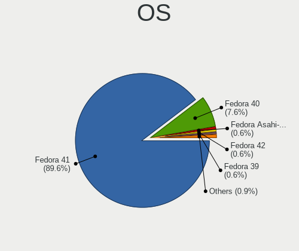
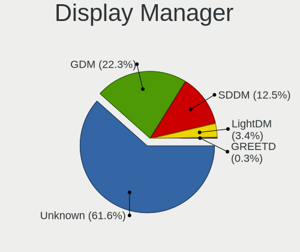
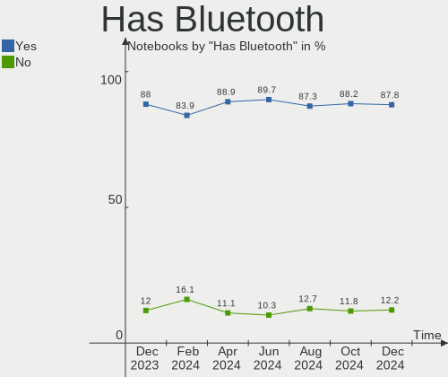
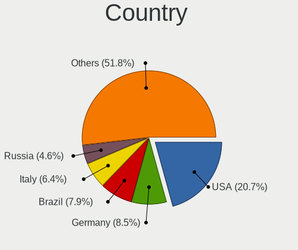

Fedora Hardware Trends (Notebooks)
----------------------------------

A project to identify most popular hardware characteristics and track their change
over time based on data collected by Fedora users at https://Linux-Hardware.org.

Anyone can contribute to this report by the [hw-probe](https://github.com/linuxhw/hw-probe) tool:

    sudo -E hw-probe -all -upload

Full-feature report is available here: https://linux-hardware.org/?view=trends&formfactor=notebook

Period: Jul, 2021.

Contents
--------

* [ System ](#system)
  - [ OS                       ](#os)
  - [ OS Family                ](#os-family)
  - [ Kernel                   ](#kernel)
  - [ Kernel Family            ](#kernel-family)
  - [ Kernel Major Ver.        ](#kernel-major-ver)
  - [ Arch                     ](#arch)
  - [ DE                       ](#de)
  - [ Display Server           ](#display-server)
  - [ Display Manager          ](#display-manager)
  - [ OS Lang                  ](#os-lang)
  - [ Boot Mode                ](#boot-mode)
  - [ Filesystem               ](#filesystem)
  - [ Part. scheme             ](#part-scheme)
  - [ Dual Boot with Linux/BSD ](#dual-boot-with-linuxbsd)
  - [ Dual Boot (Win)          ](#dual-boot-win)

* [ Board ](#board)
  - [ Vendor                   ](#vendor)
  - [ Model                    ](#model)
  - [ Model Family             ](#model-family)
  - [ MFG Year                 ](#mfg-year)
  - [ Form Factor              ](#form-factor)
  - [ Secure Boot              ](#secure-boot)
  - [ Coreboot                 ](#coreboot)
  - [ RAM Size                 ](#ram-size)
  - [ RAM Used                 ](#ram-used)
  - [ Total Drives             ](#total-drives)
  - [ Has CD-ROM               ](#has-cd-rom)
  - [ Has Ethernet             ](#has-ethernet)
  - [ Has WiFi                 ](#has-wifi)
  - [ Has Bluetooth            ](#has-bluetooth)

* [ Location ](#location)
  - [ Country                  ](#country)
  - [ City                     ](#city)

* [ Drives ](#drives)
  - [ Drive Vendor             ](#drive-vendor)
  - [ Drive Model              ](#drive-model)
  - [ HDD Vendor               ](#hdd-vendor)
  - [ SSD Vendor               ](#ssd-vendor)
  - [ Drive Kind               ](#drive-kind)
  - [ Drive Connector          ](#drive-connector)
  - [ Drive Size               ](#drive-size)
  - [ Space Total              ](#space-total)
  - [ Space Used               ](#space-used)
  - [ Malfunc. Drives          ](#malfunc-drives)
  - [ Malfunc. Drive Vendor    ](#malfunc-drive-vendor)
  - [ Malfunc. HDD Vendor      ](#malfunc-hdd-vendor)
  - [ Malfunc. Drive Kind      ](#malfunc-drive-kind)
  - [ Failed Drives            ](#failed-drives)
  - [ Failed Drive Vendor      ](#failed-drive-vendor)
  - [ Drive Status             ](#drive-status)

* [ Storage controller ](#storage-controller)
  - [ Storage Vendor           ](#storage-vendor)
  - [ Storage Model            ](#storage-model)
  - [ Storage Kind             ](#storage-kind)

* [ Processor ](#processor)
  - [ CPU Vendor               ](#cpu-vendor)
  - [ CPU Model                ](#cpu-model)
  - [ CPU Model Family         ](#cpu-model-family)
  - [ CPU Cores                ](#cpu-cores)
  - [ CPU Sockets              ](#cpu-sockets)
  - [ CPU Threads              ](#cpu-threads)
  - [ CPU Op-Modes             ](#cpu-op-modes)
  - [ CPU Microcode            ](#cpu-microcode)
  - [ CPU Microarch            ](#cpu-microarch)

* [ Graphics ](#graphics)
  - [ GPU Vendor               ](#gpu-vendor)
  - [ GPU Model                ](#gpu-model)
  - [ GPU Combo                ](#gpu-combo)
  - [ GPU Driver               ](#gpu-driver)
  - [ GPU Memory               ](#gpu-memory)

* [ Monitor ](#monitor)
  - [ Monitor Vendor           ](#monitor-vendor)
  - [ Monitor Model            ](#monitor-model)
  - [ Monitor Resolution       ](#monitor-resolution)
  - [ Monitor Diagonal         ](#monitor-diagonal)
  - [ Monitor Width            ](#monitor-width)
  - [ Aspect Ratio             ](#aspect-ratio)
  - [ Monitor Area             ](#monitor-area)
  - [ Pixel Density            ](#pixel-density)
  - [ Multiple Monitors        ](#multiple-monitors)

* [ Network ](#network)
  - [ Net Controller Vendor    ](#net-controller-vendor)
  - [ Net Controller Model     ](#net-controller-model)
  - [ Wireless Vendor          ](#wireless-vendor)
  - [ Wireless Model           ](#wireless-model)
  - [ Ethernet Vendor          ](#ethernet-vendor)
  - [ Ethernet Model           ](#ethernet-model)
  - [ Net Controller Kind      ](#net-controller-kind)
  - [ Used Controller          ](#used-controller)
  - [ NICs                     ](#nics)
  - [ IPv6                     ](#ipv6)

* [ Bluetooth ](#bluetooth)
  - [ Bluetooth Vendor         ](#bluetooth-vendor)
  - [ Bluetooth Model          ](#bluetooth-model)

* [ Sound ](#sound)
  - [ Sound Vendor             ](#sound-vendor)
  - [ Sound Model              ](#sound-model)

* [ Memory ](#memory)
  - [ Memory Vendor            ](#memory-vendor)
  - [ Memory Model             ](#memory-model)
  - [ Memory Kind              ](#memory-kind)
  - [ Memory Form Factor       ](#memory-form-factor)
  - [ Memory Size              ](#memory-size)
  - [ Memory Speed             ](#memory-speed)

* [ Printers & scanners ](#printers--scanners)
  - [ Printer Vendor           ](#printer-vendor)
  - [ Printer Model            ](#printer-model)
  - [ Scanner Vendor           ](#scanner-vendor)
  - [ Scanner Model            ](#scanner-model)

* [ Camera ](#camera)
  - [ Camera Vendor            ](#camera-vendor)
  - [ Camera Model             ](#camera-model)

* [ Security ](#security)
  - [ Fingerprint Vendor       ](#fingerprint-vendor)
  - [ Fingerprint Model        ](#fingerprint-model)
  - [ Chipcard Vendor          ](#chipcard-vendor)
  - [ Chipcard Model           ](#chipcard-model)

* [ Unsupported ](#unsupported)
  - [ Unsupported Devices      ](#unsupported-devices)
  - [ Unsupported Device Types ](#unsupported-device-types)

System
------

OS
--

Installed operating systems

| Name      | Notebooks | Percent |
|-----------|-----------|---------|
| Fedora 34 | 157       | 91.28%  |
| Fedora 33 | 12        | 6.98%   |
| Fedora 32 | 2         | 1.16%   |
| Fedora 35 | 1         | 0.58%   |

OS Family
---------

OS without a version

| Name   | Notebooks | Percent |
|--------|-----------|---------|
| Fedora | 172       | 100%    |

Kernel
------

Version of the Linux kernel

| Version                                             | Notebooks | Percent |
|-----------------------------------------------------|-----------|---------|
| 5.12.13-300.fc34.x86_64                             | 39        | 22.67%  |
| 5.12.14-300.fc34.x86_64                             | 35        | 20.35%  |
| 5.13.4-200.fc34.x86_64                              | 22        | 12.79%  |
| 5.12.15-300.fc34.x86_64                             | 16        | 9.3%    |
| 5.11.12-300.fc34.x86_64                             | 13        | 7.56%   |
| 5.13.5-200.fc34.x86_64                              | 7         | 4.07%   |
| 5.12.12-300.fc34.x86_64                             | 6         | 3.49%   |
| 5.12.17-300.fc34.x86_64                             | 5         | 2.91%   |
| 5.12.15-200.fc33.x86_64                             | 3         | 1.74%   |
| 5.13.4-100.fc33.x86_64                              | 2         | 1.16%   |
| 5.13.1-300.fc34.x86_64                              | 2         | 1.16%   |
| 5.12.13-200.fc33.x86_64                             | 2         | 1.16%   |
| 5.12.11-300.fc34.x86_64                             | 2         | 1.16%   |
| 5.12.10-300.fc34.x86_64                             | 2         | 1.16%   |
| 5.11.22-100.fc32.x86_64                             | 2         | 1.16%   |
| 5.9.9-200.fc33.x86_64                               | 1         | 0.58%   |
| 5.9.16-200.fc33.x86_64                              | 1         | 0.58%   |
| 5.8.15-301.fc33.x86_64                              | 1         | 0.58%   |
| 5.14.0-0.rc3.20210728git7d549995d4e0.31.fc35.x86_64 | 1         | 0.58%   |
| 5.14.0-0.rc0.20210701gitdbe69e433722.6.fc35.x86_64  | 1         | 0.58%   |
| 5.13.2-300.fc34.x86_64                              | 1         | 0.58%   |
| 5.13.1-xm1.0.fc34.x86_64                            | 1         | 0.58%   |
| 5.13.0-bersa1+                                      | 1         | 0.58%   |
| 5.12.17-200.fc33.x86_64                             | 1         | 0.58%   |
| 5.12.15-350.vanilla.1.fc34.x86_64                   | 1         | 0.58%   |
| 5.12.13                                             | 1         | 0.58%   |
| 5.12.12-200.fc33.x86_64                             | 1         | 0.58%   |
| 5.12.10-300.rog.fc34.x86_64                         | 1         | 0.58%   |
| 4.14.190+blu-spark-OOS                              | 1         | 0.58%   |

Kernel Family
-------------

Linux kernel without a distro release

| Version  | Notebooks | Percent |
|----------|-----------|---------|
| 5.12.13  | 42        | 24.42%  |
| 5.12.14  | 35        | 20.35%  |
| 5.13.4   | 24        | 13.95%  |
| 5.12.15  | 20        | 11.63%  |
| 5.11.12  | 13        | 7.56%   |
| 5.13.5   | 7         | 4.07%   |
| 5.12.12  | 7         | 4.07%   |
| 5.12.17  | 6         | 3.49%   |
| 5.13.1   | 3         | 1.74%   |
| 5.12.10  | 3         | 1.74%   |
| 5.14.0   | 2         | 1.16%   |
| 5.12.11  | 2         | 1.16%   |
| 5.11.22  | 2         | 1.16%   |
| 5.9.9    | 1         | 0.58%   |
| 5.9.16   | 1         | 0.58%   |
| 5.8.15   | 1         | 0.58%   |
| 5.13.2   | 1         | 0.58%   |
| 5.13.0   | 1         | 0.58%   |
| 4.14.190 | 1         | 0.58%   |

Kernel Major Ver.
-----------------

Linux kernel major version

| Version | Notebooks | Percent |
|---------|-----------|---------|
| 5.12    | 115       | 66.86%  |
| 5.13    | 36        | 20.93%  |
| 5.11    | 15        | 8.72%   |
| 5.9     | 2         | 1.16%   |
| 5.14    | 2         | 1.16%   |
| 5.8     | 1         | 0.58%   |
| 4.14    | 1         | 0.58%   |

Arch
----

OS architecture (x86_64, i586, etc.)

| Name    | Notebooks | Percent |
|---------|-----------|---------|
| x86_64  | 171       | 99.42%  |
| aarch64 | 1         | 0.58%   |

DE
--

Desktop Environment

| Name       | Notebooks | Percent |
|------------|-----------|---------|
| GNOME      | 140       | 81.4%   |
| KDE5       | 12        | 6.98%   |
| XFCE       | 4         | 2.33%   |
| Unknown    | 4         | 2.33%   |
| X-Cinnamon | 3         | 1.74%   |
| MATE       | 3         | 1.74%   |
| KDE        | 3         | 1.74%   |
| LXDE       | 1         | 0.58%   |
| dwm        | 1         | 0.58%   |
| Deepin     | 1         | 0.58%   |

Display Server
--------------

X11 or Wayland

| Name    | Notebooks | Percent |
|---------|-----------|---------|
| Wayland | 117       | 68.02%  |
| X11     | 51        | 29.65%  |
| Unknown | 3         | 1.74%   |
| Tty     | 1         | 0.58%   |

Display Manager
---------------

SDDM, LightDM, etc.

| Name    | Notebooks | Percent |
|---------|-----------|---------|
| Unknown | 85        | 49.42%  |
| GDM     | 71        | 41.28%  |
| SDDM    | 10        | 5.81%   |
| TDM     | 5         | 2.91%   |
| XDM     | 1         | 0.58%   |

OS Lang
-------

Language

| Lang  | Notebooks | Percent |
|-------|-----------|---------|
| en_US | 86        | 50%     |
| en_GB | 17        | 9.88%   |
| ru_RU | 14        | 8.14%   |
| pt_BR | 8         | 4.65%   |
| fr_FR | 7         | 4.07%   |
| de_DE | 6         | 3.49%   |
| es_ES | 5         | 2.91%   |
| en_IN | 4         | 2.33%   |
| it_IT | 3         | 1.74%   |
| de_AT | 3         | 1.74%   |
| en_CA | 2         | 1.16%   |
| cs_CZ | 2         | 1.16%   |
| uk_UA | 1         | 0.58%   |
| pt_PT | 1         | 0.58%   |
| pl_PL | 1         | 0.58%   |
| nl_NL | 1         | 0.58%   |
| nl_BE | 1         | 0.58%   |
| ms_MY | 1         | 0.58%   |
| fr_BE | 1         | 0.58%   |
| es_NI | 1         | 0.58%   |
| es_MX | 1         | 0.58%   |
| es_EC | 1         | 0.58%   |
| es_DO | 1         | 0.58%   |
| es_CO | 1         | 0.58%   |
| es_CL | 1         | 0.58%   |
| de_CH | 1         | 0.58%   |
| C     | 1         | 0.58%   |

Boot Mode
---------

EFI or BIOS

| Mode | Notebooks | Percent |
|------|-----------|---------|
| EFI  | 140       | 81.4%   |
| BIOS | 32        | 18.6%   |

Filesystem
----------

Type of filesystem

| Type    | Notebooks | Percent |
|---------|-----------|---------|
| Btrfs   | 122       | 70.93%  |
| Ext4    | 44        | 25.58%  |
| Xfs     | 5         | 2.91%   |
| Unknown | 1         | 0.58%   |

Part. scheme
------------

Scheme of partitioning

| Type    | Notebooks | Percent |
|---------|-----------|---------|
| Unknown | 87        | 50.58%  |
| GPT     | 74        | 43.02%  |
| MBR     | 11        | 6.4%    |

Dual Boot with Linux/BSD
------------------------

Hosting more than one Linux/BSD

| Dual boot | Notebooks | Percent |
|-----------|-----------|---------|
| No        | 155       | 90.12%  |
| Yes       | 17        | 9.88%   |

Dual Boot (Win)
---------------

Hosting Linux and Windows

| Dual boot | Notebooks | Percent |
|-----------|-----------|---------|
| No        | 138       | 80.23%  |
| Yes       | 34        | 19.77%  |

Board
-----

Vendor
------

Motherboard manufacturer

| Name                             | Notebooks | Percent |
|----------------------------------|-----------|---------|
| Lenovo                           | 52        | 30.23%  |
| Dell                             | 29        | 16.86%  |
| Hewlett-Packard                  | 23        | 13.37%  |
| Acer                             | 13        | 7.56%   |
| ASUSTek Computer                 | 12        | 6.98%   |
| Apple                            | 5         | 2.91%   |
| Timi                             | 4         | 2.33%   |
| Toshiba                          | 3         | 1.74%   |
| Fujitsu                          | 3         | 1.74%   |
| Unknown                          | 3         | 1.74%   |
| Samsung Electronics              | 2         | 1.16%   |
| Notebook                         | 2         | 1.16%   |
| MSI                              | 2         | 1.16%   |
| HUAWEI                           | 2         | 1.16%   |
| TUXEDO                           | 1         | 0.58%   |
| System76                         | 1         | 0.58%   |
| Sony                             | 1         | 0.58%   |
| Razer                            | 1         | 0.58%   |
| Purism                           | 1         | 0.58%   |
| Prestigio                        | 1         | 0.58%   |
| Positivo                         | 1         | 0.58%   |
| PC Specialist                    | 1         | 0.58%   |
| Medion                           | 1         | 0.58%   |
| Login Informatica                | 1         | 0.58%   |
| Linx                             | 1         | 0.58%   |
| Intel Client Systems             | 1         | 0.58%   |
| HONOR                            | 1         | 0.58%   |
| HASEE Computer                   | 1         | 0.58%   |
| FUJITSU CLIENT COMPUTING LIMITED | 1         | 0.58%   |
| eMachines                        | 1         | 0.58%   |
| Avell High Performance           | 1         | 0.58%   |

Model
-----

Motherboard model

| Name                                                                                     | Notebooks | Percent |
|------------------------------------------------------------------------------------------|-----------|---------|
| Unknown                                                                                  | 3         | 1.74%   |
| HP Laptop 15s-eq2xxx                                                                     | 2         | 1.16%   |
| Apple MacBookPro11,5                                                                     | 2         | 1.16%   |
| Acer Aspire E5-573G                                                                      | 2         | 1.16%   |
| TUXEDO InfinityBook S 15 Gen6                                                            | 1         | 0.58%   |
| Toshiba Satellite P50-C                                                                  | 1         | 0.58%   |
| Toshiba Satellite L750                                                                   | 1         | 0.58%   |
| Toshiba PORTEGE M800                                                                     | 1         | 0.58%   |
| Timi TM1707                                                                              | 1         | 0.58%   |
| Timi TM1701                                                                              | 1         | 0.58%   |
| Timi TM1604                                                                              | 1         | 0.58%   |
| Timi A35S                                                                                | 1         | 0.58%   |
| System76 Oryx Pro                                                                        | 1         | 0.58%   |
| Sony VPCEB3PGX                                                                           | 1         | 0.58%   |
| Samsung 355V4C/355V4X/355V5C/355V5X/356V4C/356V4X/356V5C/356V5X/3445VC/3445VX/3545VC/354 | 1         | 0.58%   |
| Samsung 305V4A/305V5A/3415VA                                                             | 1         | 0.58%   |
| Razer Blade 15 Mid 2019-Base                                                             | 1         | 0.58%   |
| Purism Librem 15 v4                                                                      | 1         | 0.58%   |
| Prestigio PSB141C03                                                                      | 1         | 0.58%   |
| Positivo C41TB                                                                           | 1         | 0.58%   |
| PC Specialist N85_N87,HJ,HJ1,HK1                                                         | 1         | 0.58%   |
| Notebook NH55RGQ                                                                         | 1         | 0.58%   |
| Notebook L14xMU                                                                          | 1         | 0.58%   |
| MSI Modern 14 A10M                                                                       | 1         | 0.58%   |
| MSI Bravo 17 A4DDR                                                                       | 1         | 0.58%   |
| Medion E15301                                                                            | 1         | 0.58%   |
| Login Informatica LOG-QAL30                                                              | 1         | 0.58%   |
| Linx VISION004                                                                           | 1         | 0.58%   |
| Lenovo Yoga Slim 7 Pro 14ACH5 82MS                                                       | 1         | 0.58%   |
| Lenovo Yoga Slim 7 15IIL05 82AA                                                          | 1         | 0.58%   |
| Lenovo Yoga 700-14ISK 80QD                                                               | 1         | 0.58%   |
| Lenovo Yoga 2 Pro 20266                                                                  | 1         | 0.58%   |
| Lenovo V330-15IKB 81AX                                                                   | 1         | 0.58%   |
| Lenovo ThinkPad X61 7676A12                                                              | 1         | 0.58%   |
| Lenovo ThinkPad X250 20CLS4NUSA                                                          | 1         | 0.58%   |
| Lenovo ThinkPad X220 42914CG                                                             | 1         | 0.58%   |
| Lenovo ThinkPad X220 4289A92                                                             | 1         | 0.58%   |
| Lenovo ThinkPad X220 4286CTO                                                             | 1         | 0.58%   |
| Lenovo ThinkPad X1 Extreme 2nd 20QVCTO1WW                                                | 1         | 0.58%   |
| Lenovo ThinkPad X1 Carbon Gen 9 20XWCTO1WW                                               | 1         | 0.58%   |
| Lenovo ThinkPad X1 Carbon 4th 20FB005WUS                                                 | 1         | 0.58%   |
| Lenovo ThinkPad X1 Carbon 3rd 20BT003SUS                                                 | 1         | 0.58%   |
| Lenovo ThinkPad W540 20BHS04B00                                                          | 1         | 0.58%   |
| Lenovo ThinkPad T590 20N5S72000                                                          | 1         | 0.58%   |
| Lenovo ThinkPad T590 20N5S2NC1V                                                          | 1         | 0.58%   |
| Lenovo ThinkPad T590 20N4CTO1WW                                                          | 1         | 0.58%   |
| Lenovo ThinkPad T490 20N3S94A00                                                          | 1         | 0.58%   |
| Lenovo ThinkPad T460s 20FAS2BN04                                                         | 1         | 0.58%   |
| Lenovo ThinkPad T460s 20FAS0W901                                                         | 1         | 0.58%   |
| Lenovo ThinkPad T431s 20ACS00K00                                                         | 1         | 0.58%   |
| Lenovo ThinkPad P70 20ER0035MH                                                           | 1         | 0.58%   |
| Lenovo ThinkPad P1 Gen 3 20TJS0WN01                                                      | 1         | 0.58%   |
| Lenovo ThinkPad L580 20LXS4K600                                                          | 1         | 0.58%   |
| Lenovo ThinkPad L580 20LWZ3SMUS                                                          | 1         | 0.58%   |
| Lenovo ThinkPad L560 20F10029MC                                                          | 1         | 0.58%   |
| Lenovo ThinkPad L15 Gen 1 20U7001WMX                                                     | 1         | 0.58%   |
| Lenovo ThinkPad L14 Gen 1 20U5001WTX                                                     | 1         | 0.58%   |
| Lenovo ThinkPad L14 Gen 1 20U5000UUS                                                     | 1         | 0.58%   |
| Lenovo ThinkPad E595 20NFCTO1WW                                                          | 1         | 0.58%   |
| Lenovo ThinkPad E480 20KNS0E200                                                          | 1         | 0.58%   |

Model Family
------------

Motherboard model prefix

| Name                                      | Notebooks | Percent |
|-------------------------------------------|-----------|---------|
| Lenovo ThinkPad                           | 30        | 17.44%  |
| Lenovo IdeaPad                            | 12        | 6.98%   |
| Acer Aspire                               | 10        | 5.81%   |
| Dell Inspiron                             | 9         | 5.23%   |
| HP Laptop                                 | 8         | 4.65%   |
| Dell Latitude                             | 7         | 4.07%   |
| Dell Vostro                               | 6         | 3.49%   |
| Lenovo Yoga                               | 4         | 2.33%   |
| HP ProBook                                | 4         | 2.33%   |
| HP Pavilion                               | 4         | 2.33%   |
| ASUS ROG                                  | 4         | 2.33%   |
| Apple MacBookPro11                        | 4         | 2.33%   |
| HP EliteBook                              | 3         | 1.74%   |
| Fujitsu LIFEBOOK                          | 3         | 1.74%   |
| Dell XPS                                  | 3         | 1.74%   |
| Unknown                                   | 3         | 1.74%   |
| Toshiba Satellite                         | 2         | 1.16%   |
| HP ENVY                                   | 2         | 1.16%   |
| Dell Precision                            | 2         | 1.16%   |
| ASUS ZenBook                              | 2         | 1.16%   |
| ASUS VivoBook                             | 2         | 1.16%   |
| Acer Swift                                | 2         | 1.16%   |
| TUXEDO InfinityBook                       | 1         | 0.58%   |
| Toshiba PORTEGE                           | 1         | 0.58%   |
| Timi TM1707                               | 1         | 0.58%   |
| Timi TM1701                               | 1         | 0.58%   |
| Timi TM1604                               | 1         | 0.58%   |
| Timi A35S                                 | 1         | 0.58%   |
| System76 Oryx                             | 1         | 0.58%   |
| Sony VPCEB3PGX                            | 1         | 0.58%   |
| Samsung 355V4C                            | 1         | 0.58%   |
| Samsung 305V4A                            | 1         | 0.58%   |
| Razer Blade                               | 1         | 0.58%   |
| Purism Librem                             | 1         | 0.58%   |
| Prestigio PSB141C03                       | 1         | 0.58%   |
| Positivo C41TB                            | 1         | 0.58%   |
| PC Specialist N85                         | 1         | 0.58%   |
| Notebook NH55RGQ                          | 1         | 0.58%   |
| Notebook L14xMU                           | 1         | 0.58%   |
| MSI Modern                                | 1         | 0.58%   |
| MSI Bravo                                 | 1         | 0.58%   |
| Medion E15301                             | 1         | 0.58%   |
| Login Informatica LOG-QAL30               | 1         | 0.58%   |
| Linx VISION004                            | 1         | 0.58%   |
| Lenovo V330-15IKB                         | 1         | 0.58%   |
| Lenovo ThinkBook                          | 1         | 0.58%   |
| Lenovo Legion                             | 1         | 0.58%   |
| Lenovo G500                               | 1         | 0.58%   |
| Lenovo G50-30                             | 1         | 0.58%   |
| Lenovo G40-45                             | 1         | 0.58%   |
| Intel Client Systems LAPBC710             | 1         | 0.58%   |
| HUAWEI KLVL-WXX9                          | 1         | 0.58%   |
| HUAWEI HLYL-WXX9                          | 1         | 0.58%   |
| HONOR NBD-WXX9                            | 1         | 0.58%   |
| HP ZBook                                  | 1         | 0.58%   |
| HP 250                                    | 1         | 0.58%   |
| HASEE Computer                            | 1         | 0.58%   |
| FUJITSU CLIENT COMPUTING LIMITED LIFEBOOK | 1         | 0.58%   |
| eMachines eME732                          | 1         | 0.58%   |
| Dell G7                                   | 1         | 0.58%   |

MFG Year
--------

Motherboard manufacture year

| Year    | Notebooks | Percent |
|---------|-----------|---------|
| 2021    | 40        | 23.26%  |
| 2020    | 38        | 22.09%  |
| 2019    | 24        | 13.95%  |
| 2018    | 20        | 11.63%  |
| 2017    | 7         | 4.07%   |
| 2013    | 7         | 4.07%   |
| 2012    | 7         | 4.07%   |
| 2011    | 7         | 4.07%   |
| 2014    | 6         | 3.49%   |
| 2015    | 5         | 2.91%   |
| 2010    | 4         | 2.33%   |
| 2016    | 3         | 1.74%   |
| 2009    | 2         | 1.16%   |
| 2008    | 1         | 0.58%   |
| Unknown | 1         | 0.58%   |

Form Factor
-----------

Physical design of the computer

| Name     | Notebooks | Percent |
|----------|-----------|---------|
| Notebook | 172       | 100%    |

Secure Boot
-----------

Enabled or disabled

| State    | Notebooks | Percent |
|----------|-----------|---------|
| Disabled | 144       | 83.72%  |
| Enabled  | 28        | 16.28%  |

Coreboot
--------

Have coreboot on board

| Used | Notebooks | Percent |
|------|-----------|---------|
| No   | 171       | 99.42%  |
| Yes  | 1         | 0.58%   |

RAM Size
--------

Total RAM memory

| Size in GB  | Notebooks | Percent |
|-------------|-----------|---------|
| 4.01-8.0    | 60        | 34.88%  |
| 16.01-24.0  | 44        | 25.58%  |
| 8.01-16.0   | 29        | 16.86%  |
| 3.01-4.0    | 16        | 9.3%    |
| 32.01-64.0  | 11        | 6.4%    |
| 1.01-2.0    | 6         | 3.49%   |
| 24.01-32.0  | 3         | 1.74%   |
| 64.01-256.0 | 3         | 1.74%   |

RAM Used
--------

Used RAM memory

| Used GB   | Notebooks | Percent |
|-----------|-----------|---------|
| 4.01-8.0  | 51        | 29.65%  |
| 2.01-3.0  | 48        | 27.91%  |
| 3.01-4.0  | 31        | 18.02%  |
| 1.01-2.0  | 29        | 16.86%  |
| 8.01-16.0 | 9         | 5.23%   |
| 0.51-1.0  | 4         | 2.33%   |

Total Drives
------------

Number of drives on board

| Drives | Notebooks | Percent |
|--------|-----------|---------|
| 1      | 125       | 72.67%  |
| 2      | 41        | 23.84%  |
| 3      | 3         | 1.74%   |
| 0      | 2         | 1.16%   |
| 5      | 1         | 0.58%   |

Has CD-ROM
----------

Has CD-ROM on board

| Presented | Notebooks | Percent |
|-----------|-----------|---------|
| No        | 135       | 78.49%  |
| Yes       | 37        | 21.51%  |

Has Ethernet
------------

Has Ethernet on board

| Presented | Notebooks | Percent |
|-----------|-----------|---------|
| Yes       | 117       | 68.02%  |
| No        | 55        | 31.98%  |

Has WiFi
--------

Has WiFi module

| Presented | Notebooks | Percent |
|-----------|-----------|---------|
| Yes       | 165       | 95.93%  |
| No        | 7         | 4.07%   |

Has Bluetooth
-------------

Has Bluetooth module

| Presented | Notebooks | Percent |
|-----------|-----------|---------|
| Yes       | 143       | 83.14%  |
| No        | 29        | 16.86%  |

Location
--------

Country
-------

Geographic location (country)

| Country            | Notebooks | Percent |
|--------------------|-----------|---------|
| USA                | 34        | 19.77%  |
| Russia             | 15        | 8.72%   |
| Germany            | 12        | 6.98%   |
| Brazil             | 11        | 6.4%    |
| India              | 9         | 5.23%   |
| UK                 | 6         | 3.49%   |
| Spain              | 5         | 2.91%   |
| Netherlands        | 5         | 2.91%   |
| Belgium            | 5         | 2.91%   |
| Ukraine            | 4         | 2.33%   |
| Sweden             | 4         | 2.33%   |
| Portugal           | 4         | 2.33%   |
| Poland             | 4         | 2.33%   |
| Italy              | 4         | 2.33%   |
| Indonesia          | 4         | 2.33%   |
| France             | 4         | 2.33%   |
| Greece             | 3         | 1.74%   |
| Czechia            | 3         | 1.74%   |
| Canada             | 3         | 1.74%   |
| Austria            | 3         | 1.74%   |
| Slovakia           | 2         | 1.16%   |
| Latvia             | 2         | 1.16%   |
| Finland            | 2         | 1.16%   |
| Colombia           | 2         | 1.16%   |
| Belarus            | 2         | 1.16%   |
| Vietnam            | 1         | 0.58%   |
| Uzbekistan         | 1         | 0.58%   |
| Turkey             | 1         | 0.58%   |
| Thailand           | 1         | 0.58%   |
| Switzerland        | 1         | 0.58%   |
| Sri Lanka          | 1         | 0.58%   |
| Serbia             | 1         | 0.58%   |
| Nicaragua          | 1         | 0.58%   |
| Myanmar            | 1         | 0.58%   |
| Mexico             | 1         | 0.58%   |
| Malaysia           | 1         | 0.58%   |
| Madagascar         | 1         | 0.58%   |
| Iran               | 1         | 0.58%   |
| El Salvador        | 1         | 0.58%   |
| Egypt              | 1         | 0.58%   |
| Dominican Republic | 1         | 0.58%   |
| China              | 1         | 0.58%   |
| Chile              | 1         | 0.58%   |
| Bulgaria           | 1         | 0.58%   |
| Argentina          | 1         | 0.58%   |

City
----

Geographic location (city)

| City                   | Notebooks | Percent |
|------------------------|-----------|---------|
| Moscow                 | 5         | 2.91%   |
| Kyiv                   | 3         | 1.74%   |
| Athens                 | 3         | 1.74%   |
| Wroclaw                | 2         | 1.16%   |
| Stuttgart              | 2         | 1.16%   |
| Spalding               | 2         | 1.16%   |
| Riga                   | 2         | 1.16%   |
| Prague                 | 2         | 1.16%   |
| Mumbai                 | 2         | 1.16%   |
| Minsk                  | 2         | 1.16%   |
| Madrid                 | 2         | 1.16%   |
| London                 | 2         | 1.16%   |
| Brussels               | 2         | 1.16%   |
| Biysk                  | 2         | 1.16%   |
| Amsterdam              | 2         | 1.16%   |
| Zurich                 | 1         | 0.58%   |
| Yekaterinburg          | 1         | 0.58%   |
| Yangon                 | 1         | 0.58%   |
| Worms                  | 1         | 0.58%   |
| Willingboro            | 1         | 0.58%   |
| Westminster            | 1         | 0.58%   |
| Weiterstadt            | 1         | 0.58%   |
| Wałbrzych             | 1         | 0.58%   |
| Vitrolles              | 1         | 0.58%   |
| Vila Nova de Famalicao | 1         | 0.58%   |
| Vaxjo                  | 1         | 0.58%   |
| Varna                  | 1         | 0.58%   |
| Valbom                 | 1         | 0.58%   |
| Urgench                | 1         | 0.58%   |
| Turin                  | 1         | 0.58%   |
| Thanjavur              | 1         | 0.58%   |
| Temuco                 | 1         | 0.58%   |
| Tehran                 | 1         | 0.58%   |
| Tampere                | 1         | 0.58%   |
| São Paulo             | 1         | 0.58%   |
| Sun City               | 1         | 0.58%   |
| Stowmarket             | 1         | 0.58%   |
| Statesboro             | 1         | 0.58%   |
| St Petersburg          | 1         | 0.58%   |
| Soprabolzano           | 1         | 0.58%   |
| Sharon                 | 1         | 0.58%   |
| Semarang               | 1         | 0.58%   |
| Satun                  | 1         | 0.58%   |
| Santarém              | 1         | 0.58%   |
| Santa Fe               | 1         | 0.58%   |
| San Salvador           | 1         | 0.58%   |
| Salzburg               | 1         | 0.58%   |
| Salvador               | 1         | 0.58%   |
| Salt Lake City         | 1         | 0.58%   |
| Safety Harbor          | 1         | 0.58%   |
| Rockville              | 1         | 0.58%   |
| Rochester              | 1         | 0.58%   |
| Reutov                 | 1         | 0.58%   |
| Reston                 | 1         | 0.58%   |
| Remilly                | 1         | 0.58%   |
| Queens                 | 1         | 0.58%   |
| Purfleet               | 1         | 0.58%   |
| Pune                   | 1         | 0.58%   |
| Pre??ov                | 1         | 0.58%   |
| Pokotylivka            | 1         | 0.58%   |

Drives
------

Drive Vendor
------------

Hard drive vendors

| Vendor                    | Notebooks | Drives | Percent |
|---------------------------|-----------|--------|---------|
| Samsung Electronics       | 52        | 63     | 25.12%  |
| WDC                       | 22        | 23     | 10.63%  |
| Seagate                   | 21        | 21     | 10.14%  |
| Toshiba                   | 16        | 17     | 7.73%   |
| SK Hynix                  | 12        | 12     | 5.8%    |
| Unknown                   | 11        | 12     | 5.31%   |
| Kingston                  | 10        | 10     | 4.83%   |
| Intel                     | 8         | 9      | 3.86%   |
| KIOXIA                    | 5         | 6      | 2.42%   |
| SPCC                      | 4         | 4      | 1.93%   |
| SanDisk                   | 4         | 4      | 1.93%   |
| Micron Technology         | 4         | 4      | 1.93%   |
| LITEON                    | 4         | 4      | 1.93%   |
| Apple                     | 4         | 4      | 1.93%   |
| Lexar                     | 2         | 2      | 0.97%   |
| JMicron                   | 2         | 2      | 0.97%   |
| Hitachi                   | 2         | 2      | 0.97%   |
| HGST                      | 2         | 2      | 0.97%   |
| Crucial                   | 2         | 2      | 0.97%   |
| XrayDisk                  | 1         | 1      | 0.48%   |
| Union Memory              | 1         | 1      | 0.48%   |
| Transcend                 | 1         | 1      | 0.48%   |
| Solid State Storage       | 1         | 1      | 0.48%   |
| Silicon Motion            | 1         | 1      | 0.48%   |
| Realtek Semiconductor     | 1         | 1      | 0.48%   |
| Phison                    | 1         | 1      | 0.48%   |
| Patriot                   | 1         | 1      | 0.48%   |
| OCZ-ARC1                  | 1         | 1      | 0.48%   |
| OCZ                       | 1         | 1      | 0.48%   |
| MTFDDAK1                  | 1         | 1      | 0.48%   |
| Micron/Crucial Technology | 1         | 1      | 0.48%   |
| LITEONIT                  | 1         | 1      | 0.48%   |
| Lenovo                    | 1         | 1      | 0.48%   |
| KIOXIA-EXCERIA            | 1         | 1      | 0.48%   |
| KingFast                  | 1         | 1      | 0.48%   |
| Intenso                   | 1         | 1      | 0.48%   |
| GALAX                     | 1         | 1      | 0.48%   |
| EMTEC                     | 1         | 1      | 0.48%   |
| A-DATA Technology         | 1         | 1      | 0.48%   |

Drive Model
-----------

Hard drive models

| Model                                   | Notebooks | Percent |
|-----------------------------------------|-----------|---------|
| Samsung NVMe SSD Drive 512GB            | 7         | 3.14%   |
| Samsung SSD 860 EVO 500GB               | 6         | 2.69%   |
| Samsung NVMe SSD Drive 256GB            | 6         | 2.69%   |
| Seagate ST1000LM035-1RK172 1TB          | 5         | 2.24%   |
| Toshiba MQ01ABD100 1TB                  | 4         | 1.79%   |
| Seagate ST1000LM024 HN-M101MBB 1TB      | 4         | 1.79%   |
| Toshiba NVMe SSD Drive 512GB            | 3         | 1.35%   |
| Samsung NVMe SSD Drive 500GB            | 3         | 1.35%   |
| Samsung MZVLB512HBJQ-000L7 512GB        | 3         | 1.35%   |
| KIOXIA KBG40ZNV512G 512GB               | 3         | 1.35%   |
| WDC WD10SPZX-21Z10T0 1TB                | 2         | 0.9%    |
| WDC WD10JPVX-75JC3T0 1TB                | 2         | 0.9%    |
| WDC PC SN730 SDBPNTY-512G-1027 512GB    | 2         | 0.9%    |
| Unknown MMC Card  32GB                  | 2         | 0.9%    |
| Toshiba KXG60ZNV1T02 NVMe KIOXIA 1024GB | 2         | 0.9%    |
| SK Hynix NVMe SSD Drive 512GB           | 2         | 0.9%    |
| SK Hynix NVMe SSD Drive 1024GB          | 2         | 0.9%    |
| Seagate ST2000LM007-1R8174 2TB          | 2         | 0.9%    |
| Seagate ST1000LM049-2GH172 1TB          | 2         | 0.9%    |
| Samsung SSD 970 PRO 512GB               | 2         | 0.9%    |
| Samsung SSD 970 EVO 1TB                 | 2         | 0.9%    |
| Samsung SSD 860 EVO 250GB               | 2         | 0.9%    |
| Samsung SSD 860 EVO 1TB                 | 2         | 0.9%    |
| Samsung NVMe SSD Drive 1TB              | 2         | 0.9%    |
| Samsung MZVLQ512HALU-000H1 512GB        | 2         | 0.9%    |
| Kingston SA400S37480G 480GB SSD         | 2         | 0.9%    |
| Kingston SA400S37120G 120GB SSD         | 2         | 0.9%    |
| Intel NVMe SSD Drive 512GB              | 2         | 0.9%    |
| HGST HTS541010A9E680 1TB                | 2         | 0.9%    |
| XrayDisk 256GB                          | 1         | 0.45%   |
| WDC WDS500G2B0A-00SM50 500GB SSD        | 1         | 0.45%   |
| WDC WDS100T2B0B-00YS70 1TB SSD          | 1         | 0.45%   |
| WDC WDBNCE0010PNC 1TB SSD               | 1         | 0.45%   |
| WDC WD5000LPVX-22V0TT0 500GB            | 1         | 0.45%   |
| WDC WD5000LPCX-24C6HT0 500GB            | 1         | 0.45%   |
| WDC WD5000BPVT-22A1YT0 500GB            | 1         | 0.45%   |
| WDC WD3200LPCX-24C6HT0 320GB            | 1         | 0.45%   |
| WDC WD3200BPVT-75ZEST0 320GB            | 1         | 0.45%   |
| WDC WD20SPZX-22UA7T0 2TB                | 1         | 0.45%   |
| WDC WD16 00BEVT-60ZCT 160GB             | 1         | 0.45%   |
| WDC WD10SPZX-24Z10 1TB                  | 1         | 0.45%   |
| WDC WD10SPZX-22Z10T1 1TB                | 1         | 0.45%   |
| WDC WD10SPZX-08Z10 1TB                  | 1         | 0.45%   |
| WDC WD10SPSX-22A6WT0 1TB                | 1         | 0.45%   |
| WDC WD10S21X-24R1BT0-SSHD-8GB           | 1         | 0.45%   |
| WDC PC SN530 SDBPNPZ-1T00-1002 1TB      | 1         | 0.45%   |
| WDC PC SN530 SDBPMPZ-512G-1101 512GB    | 1         | 0.45%   |
| Unknown SPCC  64GB                      | 1         | 0.45%   |
| Unknown SF256  256GB                    | 1         | 0.45%   |
| Unknown SEM64G  64GB                    | 1         | 0.45%   |
| Unknown SD32G  32GB                     | 1         | 0.45%   |
| Unknown SD/MMC/MS PRO 128GB             | 1         | 0.45%   |
| Unknown S11-512G-PHISON-SSD-B27 512GB   | 1         | 0.45%   |
| Unknown PS3108S8 2MB                    | 1         | 0.45%   |
| Unknown MMC Card  256GB                 | 1         | 0.45%   |
| Unknown M0S001  32GB                    | 1         | 0.45%   |
| Unknown 032G72  32GB                    | 1         | 0.45%   |
| Union Memory UMIS RPJTJ128MED1MWX 128GB | 1         | 0.45%   |
| Transcend TS512GSSD370S 512GB           | 1         | 0.45%   |
| Toshiba THNSN5512GPUK NVMe 512GB        | 1         | 0.45%   |

HDD Vendor
----------

Hard disk drive vendors

| Vendor  | Notebooks | Drives | Percent |
|---------|-----------|--------|---------|
| Seagate | 21        | 21     | 42.86%  |
| WDC     | 16        | 16     | 32.65%  |
| Toshiba | 7         | 7      | 14.29%  |
| Hitachi | 2         | 2      | 4.08%   |
| HGST    | 2         | 2      | 4.08%   |
| Unknown | 1         | 1      | 2.04%   |

SSD Vendor
----------

Solid state drive vendors

| Vendor              | Notebooks | Drives | Percent |
|---------------------|-----------|--------|---------|
| Samsung Electronics | 22        | 24     | 31.43%  |
| Kingston            | 8         | 8      | 11.43%  |
| SPCC                | 4         | 4      | 5.71%   |
| LITEON              | 4         | 4      | 5.71%   |
| Apple               | 4         | 4      | 5.71%   |
| WDC                 | 3         | 3      | 4.29%   |
| SanDisk             | 3         | 3      | 4.29%   |
| Intel               | 3         | 3      | 4.29%   |
| Micron Technology   | 2         | 2      | 2.86%   |
| Lexar               | 2         | 2      | 2.86%   |
| Crucial             | 2         | 2      | 2.86%   |
| Unknown             | 1         | 1      | 1.43%   |
| Transcend           | 1         | 1      | 1.43%   |
| SK Hynix            | 1         | 1      | 1.43%   |
| Patriot             | 1         | 1      | 1.43%   |
| OCZ-ARC1            | 1         | 1      | 1.43%   |
| OCZ                 | 1         | 1      | 1.43%   |
| LITEONIT            | 1         | 1      | 1.43%   |
| KIOXIA-EXCERIA      | 1         | 1      | 1.43%   |
| JMicron             | 1         | 1      | 1.43%   |
| Intenso             | 1         | 1      | 1.43%   |
| GALAX               | 1         | 1      | 1.43%   |
| EMTEC               | 1         | 1      | 1.43%   |
| A-DATA Technology   | 1         | 1      | 1.43%   |

Drive Kind
----------

HDD or SSD

| Kind    | Notebooks | Drives | Percent |
|---------|-----------|--------|---------|
| NVMe    | 78        | 88     | 38.24%  |
| SSD     | 67        | 72     | 32.84%  |
| HDD     | 46        | 49     | 22.55%  |
| MMC     | 9         | 10     | 4.41%   |
| Unknown | 4         | 4      | 1.96%   |

Drive Connector
---------------

SATA, SAS, NVMe, etc.

| Type | Notebooks | Drives | Percent |
|------|-----------|--------|---------|
| SATA | 99        | 115    | 51.03%  |
| NVMe | 78        | 88     | 40.21%  |
| MMC  | 9         | 10     | 4.64%   |
| SAS  | 8         | 10     | 4.12%   |

Drive Size
----------

Size of hard drive

| Size in TB | Notebooks | Drives | Percent |
|------------|-----------|--------|---------|
| 0.01-0.5   | 57        | 61     | 50%     |
| 0.51-1.0   | 46        | 48     | 40.35%  |
| 1.01-2.0   | 8         | 9      | 7.02%   |
| 3.01-4.0   | 2         | 2      | 1.75%   |
| 0          | 1         | 1      | 0.88%   |

Space Total
-----------

Amount of disk space available on the file system

| Size in GB     | Notebooks | Percent |
|----------------|-----------|---------|
| 501-1000       | 38        | 22.09%  |
| 251-500        | 30        | 17.44%  |
| 101-250        | 25        | 14.53%  |
| 1-20           | 23        | 13.37%  |
| 1001-2000      | 21        | 12.21%  |
| Unknown        | 20        | 11.63%  |
| 51-100         | 8         | 4.65%   |
| 21-50          | 4         | 2.33%   |
| More than 3000 | 3         | 1.74%   |

Space Used
----------

Amount of used disk space

| Used GB   | Notebooks | Percent |
|-----------|-----------|---------|
| 1-20      | 54        | 31.4%   |
| 101-250   | 27        | 15.7%   |
| 51-100    | 23        | 13.37%  |
| 21-50     | 20        | 11.63%  |
| Unknown   | 20        | 11.63%  |
| 251-500   | 14        | 8.14%   |
| 501-1000  | 12        | 6.98%   |
| 1001-2000 | 2         | 1.16%   |

Malfunc. Drives
---------------

Drive models with a malfunction

| Model                                   | Notebooks | Drives | Percent |
|-----------------------------------------|-----------|--------|---------|
| Seagate ST1000LM035-1RK172 1TB          | 3         | 3      | 20%     |
| WDC WD3200BPVT-75ZEST0 320GB            | 1         | 1      | 6.67%   |
| WDC WD10SPZX-24Z10 1TB                  | 1         | 1      | 6.67%   |
| WDC WD10JPVX-75JC3T0 1TB                | 1         | 1      | 6.67%   |
| Union Memory UMIS RPJTJ128MED1MWX 128GB | 1         | 1      | 6.67%   |
| Toshiba MQ01ABD100 1TB                  | 1         | 1      | 6.67%   |
| Toshiba MK5061GSY 500GB                 | 1         | 1      | 6.67%   |
| SPCC Solid State Disk 256GB             | 1         | 1      | 6.67%   |
| Seagate ST1000LM049-2GH172 1TB          | 1         | 1      | 6.67%   |
| Seagate ST1000LM024 HN-M101MBB 1TB      | 1         | 1      | 6.67%   |
| Samsung Electronics SSD 970 EVO 1TB     | 1         | 1      | 6.67%   |
| LITEON LGH-512V2G-11 M.2 2280 512GB SSD | 1         | 1      | 6.67%   |
| Intel SSDSC2KF480H6L 480GB              | 1         | 1      | 6.67%   |

Malfunc. Drive Vendor
---------------------

Vendors of faulty drives

| Vendor              | Notebooks | Drives | Percent |
|---------------------|-----------|--------|---------|
| Seagate             | 5         | 5      | 33.33%  |
| WDC                 | 3         | 3      | 20%     |
| Toshiba             | 2         | 2      | 13.33%  |
| Union Memory        | 1         | 1      | 6.67%   |
| SPCC                | 1         | 1      | 6.67%   |
| Samsung Electronics | 1         | 1      | 6.67%   |
| LITEON              | 1         | 1      | 6.67%   |
| Intel               | 1         | 1      | 6.67%   |

Malfunc. HDD Vendor
-------------------

Vendors of faulty HDD drives

| Vendor  | Notebooks | Drives | Percent |
|---------|-----------|--------|---------|
| Seagate | 5         | 5      | 50%     |
| WDC     | 3         | 3      | 30%     |
| Toshiba | 2         | 2      | 20%     |

Malfunc. Drive Kind
-------------------

Kinds of faulty drives

| Kind | Notebooks | Drives | Percent |
|------|-----------|--------|---------|
| HDD  | 10        | 10     | 66.67%  |
| SSD  | 3         | 3      | 20%     |
| NVMe | 2         | 2      | 13.33%  |

Failed Drives
-------------

Failed drive models

Zero info for selected period =(

Failed Drive Vendor
-------------------

Failed drive vendors

Zero info for selected period =(

Drive Status
------------

Number of failed and malfunc. drives

| Status   | Notebooks | Drives | Percent |
|----------|-----------|--------|---------|
| Detected | 95        | 120    | 51.91%  |
| Works    | 74        | 88     | 40.44%  |
| Malfunc  | 14        | 15     | 7.65%   |

Storage controller
------------------

Storage Vendor
--------------

Storage controller vendors

| Vendor                         | Notebooks | Percent |
|--------------------------------|-----------|---------|
| Intel                          | 106       | 52.22%  |
| Samsung Electronics            | 36        | 17.73%  |
| AMD                            | 20        | 9.85%   |
| SK Hynix                       | 10        | 4.93%   |
| Toshiba America Info Systems   | 9         | 4.43%   |
| Sandisk                        | 5         | 2.46%   |
| KIOXIA                         | 5         | 2.46%   |
| Silicon Motion                 | 2         | 0.99%   |
| Micron Technology              | 2         | 0.99%   |
| Kingston Technology Company    | 2         | 0.99%   |
| Union Memory (Shenzhen)        | 1         | 0.49%   |
| Solid State Storage Technology | 1         | 0.49%   |
| Realtek Semiconductor          | 1         | 0.49%   |
| Phison Electronics             | 1         | 0.49%   |
| Micron/Crucial Technology      | 1         | 0.49%   |
| Lenovo                         | 1         | 0.49%   |

Storage Model
-------------

Storage controller models

| Model                                                                            | Notebooks | Percent |
|----------------------------------------------------------------------------------|-----------|---------|
| Intel Sunrise Point-LP SATA Controller [AHCI mode]                               | 28        | 13.15%  |
| Samsung NVMe SSD Controller SM981/PM981/PM983                                    | 21        | 9.86%   |
| AMD FCH SATA Controller [AHCI mode]                                              | 18        | 8.45%   |
| Intel Cannon Lake Mobile PCH SATA AHCI Controller                                | 9         | 4.23%   |
| Intel 82801 Mobile SATA Controller [RAID mode]                                   | 9         | 4.23%   |
| Intel 7 Series Chipset Family 6-port SATA Controller [AHCI mode]                 | 9         | 4.23%   |
| Samsung NVMe Controller                                                          | 8         | 3.76%   |
| Intel Wildcat Point-LP SATA Controller [AHCI Mode]                               | 7         | 3.29%   |
| Intel 6 Series/C200 Series Chipset Family 6 port Mobile SATA AHCI Controller     | 7         | 3.29%   |
| KIOXIA Non-Volatile memory controller                                            | 5         | 2.35%   |
| Toshiba America Info Systems XG6 NVMe SSD Controller                             | 4         | 1.88%   |
| Samsung NVMe SSD Controller SM961/PM961/SM963                                    | 4         | 1.88%   |
| Intel Volume Management Device NVMe RAID Controller                              | 4         | 1.88%   |
| SK Hynix NVMe SSD Controller                                                     | 3         | 1.41%   |
| SK Hynix BC501 NVMe Solid State Drive                                            | 3         | 1.41%   |
| Sandisk WD Black SN750 / PC SN730 NVMe SSD                                       | 3         | 1.41%   |
| Intel Tiger Lake-LP SATA Controller [AHCI mode]                                  | 3         | 1.41%   |
| Intel Celeron/Pentium Silver Processor SATA Controller                           | 3         | 1.41%   |
| Intel Cannon Point-LP SATA Controller [AHCI Mode]                                | 3         | 1.41%   |
| Intel 8 Series SATA Controller 1 [AHCI mode]                                     | 3         | 1.41%   |
| Toshiba America Info Systems BG3 NVMe SSD Controller                             | 2         | 0.94%   |
| SK Hynix Non-Volatile memory controller                                          | 2         | 0.94%   |
| SK Hynix BC511                                                                   | 2         | 0.94%   |
| Silicon Motion SM2263EN/SM2263XT SSD Controller                                  | 2         | 0.94%   |
| Samsung Electronics SATA controller                                              | 2         | 0.94%   |
| Samsung Apple PCIe SSD                                                           | 2         | 0.94%   |
| Micron Non-Volatile memory controller                                            | 2         | 0.94%   |
| Intel SSD 660P Series                                                            | 2         | 0.94%   |
| Intel Comet Lake SATA AHCI Controller                                            | 2         | 0.94%   |
| Intel Atom Processor E3800 Series SATA AHCI Controller                           | 2         | 0.94%   |
| Intel 82801IBM/IEM (ICH9M/ICH9M-E) 4 port SATA Controller [AHCI mode]            | 2         | 0.94%   |
| Intel 82801HM/HEM (ICH8M/ICH8M-E) IDE Controller                                 | 2         | 0.94%   |
| Intel 8 Series/C220 Series Chipset Family 6-port SATA Controller 1 [AHCI mode]   | 2         | 0.94%   |
| Intel 5 Series/3400 Series Chipset 6 port SATA AHCI Controller                   | 2         | 0.94%   |
| Intel 5 Series/3400 Series Chipset 4 port SATA AHCI Controller                   | 2         | 0.94%   |
| Union Memory (Shenzhen) Non-Volatile memory controller                           | 1         | 0.47%   |
| Toshiba America Info Systems XG4 NVMe SSD Controller                             | 1         | 0.47%   |
| Toshiba America Info Systems Toshiba America Info Non-Volatile memory controller | 1         | 0.47%   |
| Toshiba America Info Systems NVMe Controller                                     | 1         | 0.47%   |
| Solid State Storage Non-Volatile memory controller                               | 1         | 0.47%   |
| Sandisk WD Blue SN550 NVMe SSD                                                   | 1         | 0.47%   |
| Sandisk Non-Volatile memory controller                                           | 1         | 0.47%   |
| Samsung NVMe SSD Controller SM951/PM951                                          | 1         | 0.47%   |
| Samsung NVMe SSD Controller PM9A1/PM9A3/980PRO                                   | 1         | 0.47%   |
| Realtek RTS5763DL NVMe SSD Controller                                            | 1         | 0.47%   |
| Phison PS5013 E13 NVMe Controller                                                | 1         | 0.47%   |
| Micron/Crucial P2 NVMe PCIe SSD                                                  | 1         | 0.47%   |
| Lenovo Non-Volatile memory controller                                            | 1         | 0.47%   |
| Kingston Company Company Non-Volatile memory controller                          | 1         | 0.47%   |
| Kingston Company A2000 NVMe SSD                                                  | 1         | 0.47%   |
| Intel SSD Pro 7600p/760p/E 6100p Series                                          | 1         | 0.47%   |
| Intel SSD 600P Series                                                            | 1         | 0.47%   |
| Intel SATA Controller [RAID mode]                                                | 1         | 0.47%   |
| Intel Q170/Q150/B150/H170/H110/Z170/CM236 Chipset SATA Controller [AHCI Mode]    | 1         | 0.47%   |
| Intel NVMe Optane Memory Series                                                  | 1         | 0.47%   |
| Intel Ice Lake-LP SATA Controller [AHCI mode]                                    | 1         | 0.47%   |
| Intel HM170/QM170 Chipset SATA Controller [AHCI Mode]                            | 1         | 0.47%   |
| Intel 82801HM/HEM (ICH8M/ICH8M-E) SATA Controller [IDE mode]                     | 1         | 0.47%   |
| Intel 82801HM/HEM (ICH8M/ICH8M-E) SATA Controller [AHCI mode]                    | 1         | 0.47%   |
| Intel 5 Series/3400 Series Chipset 4 port SATA IDE Controller                    | 1         | 0.47%   |

Storage Kind
------------

Kind of storage controller (IDE, SATA, NVMe, SAS, ...)

| Kind | Notebooks | Percent |
|------|-----------|---------|
| SATA | 113       | 54.33%  |
| NVMe | 78        | 37.5%   |
| RAID | 14        | 6.73%   |
| IDE  | 3         | 1.44%   |

Processor
---------

CPU Vendor
----------

Processor vendors

| Vendor   | Notebooks | Percent |
|----------|-----------|---------|
| Intel    | 136       | 79.07%  |
| AMD      | 35        | 20.35%  |
| QUALCOMM | 1         | 0.58%   |

CPU Model
---------

Processor models

| Model                                         | Notebooks | Percent |
|-----------------------------------------------|-----------|---------|
| Intel Core i7-8550U CPU @ 1.80GHz             | 8         | 4.65%   |
| Intel Core i5-8250U CPU @ 1.60GHz             | 8         | 4.65%   |
| Intel 11th Gen Core i7-1165G7 @ 2.80GHz       | 6         | 3.49%   |
| Intel Core i5-6200U CPU @ 2.30GHz             | 5         | 2.91%   |
| Intel Core i7-8665U CPU @ 1.90GHz             | 4         | 2.33%   |
| Intel Core i5-8265U CPU @ 1.60GHz             | 4         | 2.33%   |
| AMD Ryzen 5 3500U with Radeon Vega Mobile Gfx | 4         | 2.33%   |
| Intel Core i7-9750H CPU @ 2.60GHz             | 3         | 1.74%   |
| Intel Core i7-7500U CPU @ 2.70GHz             | 3         | 1.74%   |
| Intel Core i7-6600U CPU @ 2.60GHz             | 3         | 1.74%   |
| Intel Core i7-2640M CPU @ 2.80GHz             | 3         | 1.74%   |
| Intel Core i5-7200U CPU @ 2.50GHz             | 3         | 1.74%   |
| Intel 11th Gen Core i5-1135G7 @ 2.40GHz       | 3         | 1.74%   |
| AMD Ryzen 7 PRO 4750U with Radeon Graphics    | 3         | 1.74%   |
| Intel Core i7-8750H CPU @ 2.20GHz             | 2         | 1.16%   |
| Intel Core i7-6700HQ CPU @ 2.60GHz            | 2         | 1.16%   |
| Intel Core i7-5500U CPU @ 2.40GHz             | 2         | 1.16%   |
| Intel Core i7-4980HQ CPU @ 2.80GHz            | 2         | 1.16%   |
| Intel Core i7-10750H CPU @ 2.60GHz            | 2         | 1.16%   |
| Intel Core i5-5300U CPU @ 2.30GHz             | 2         | 1.16%   |
| Intel Core i5-5200U CPU @ 2.20GHz             | 2         | 1.16%   |
| Intel Core i5-1035G1 CPU @ 1.00GHz            | 2         | 1.16%   |
| Intel Core i5-10210U CPU @ 1.60GHz            | 2         | 1.16%   |
| Intel Core i3-7100U CPU @ 2.40GHz             | 2         | 1.16%   |
| Intel Core i3-2350M CPU @ 2.30GHz             | 2         | 1.16%   |
| Intel Core i3-2310M CPU @ 2.10GHz             | 2         | 1.16%   |
| Intel Core i3 CPU M 370 @ 2.40GHz             | 2         | 1.16%   |
| Intel Atom CPU Z3736F @ 1.33GHz               | 2         | 1.16%   |
| AMD Ryzen 9 5900HX with Radeon Graphics       | 2         | 1.16%   |
| AMD Ryzen 7 4800H with Radeon Graphics        | 2         | 1.16%   |
| AMD Ryzen 7 3700U with Radeon Vega Mobile Gfx | 2         | 1.16%   |
| AMD Ryzen 5 4600H with Radeon Graphics        | 2         | 1.16%   |
| AMD Ryzen 5 4500U with Radeon Graphics        | 2         | 1.16%   |
| QUALCOMM AArch64 Processor rev 14 (aarch64)   | 1         | 0.58%   |
| Intel Pentium Silver N5030 CPU @ 1.10GHz      | 1         | 0.58%   |
| Intel Pentium Silver N5000 CPU @ 1.10GHz      | 1         | 0.58%   |
| Intel Pentium CPU N3540 @ 2.16GHz             | 1         | 0.58%   |
| Intel Pentium CPU N3530 @ 2.16GHz             | 1         | 0.58%   |
| Intel Core i9-9880H CPU @ 2.30GHz             | 1         | 0.58%   |
| Intel Core i9-8950HK CPU @ 2.90GHz            | 1         | 0.58%   |
| Intel Core i9-10885H CPU @ 2.40GHz            | 1         | 0.58%   |
| Intel Core i7-8850H CPU @ 2.60GHz             | 1         | 0.58%   |
| Intel Core i7-8565U CPU @ 1.80GHz             | 1         | 0.58%   |
| Intel Core i7-7600U CPU @ 2.80GHz             | 1         | 0.58%   |
| Intel Core i7-6560U CPU @ 2.20GHz             | 1         | 0.58%   |
| Intel Core i7-6500U CPU @ 2.50GHz             | 1         | 0.58%   |
| Intel Core i7-4870HQ CPU @ 2.50GHz            | 1         | 0.58%   |
| Intel Core i7-4810MQ CPU @ 2.80GHz            | 1         | 0.58%   |
| Intel Core i7-4800MQ CPU @ 2.70GHz            | 1         | 0.58%   |
| Intel Core i7-4750HQ CPU @ 2.00GHz            | 1         | 0.58%   |
| Intel Core i7-4700MQ CPU @ 2.40GHz            | 1         | 0.58%   |
| Intel Core i7-4500U CPU @ 1.80GHz             | 1         | 0.58%   |
| Intel Core i7-3632QM CPU @ 2.20GHz            | 1         | 0.58%   |
| Intel Core i7-3520M CPU @ 2.90GHz             | 1         | 0.58%   |
| Intel Core i7-3517U CPU @ 1.90GHz             | 1         | 0.58%   |
| Intel Core i7-2620M CPU @ 2.70GHz             | 1         | 0.58%   |
| Intel Core i7-10875H CPU @ 2.30GHz            | 1         | 0.58%   |
| Intel Core i7-1065G7 CPU @ 1.30GHz            | 1         | 0.58%   |
| Intel Core i7-10510U CPU @ 1.80GHz            | 1         | 0.58%   |
| Intel Core i7 CPU L 640 @ 2.13GHz             | 1         | 0.58%   |

CPU Model Family
----------------

Processor model prefix

| Model                | Notebooks | Percent |
|----------------------|-----------|---------|
| Intel Core i7        | 53        | 30.81%  |
| Intel Core i5        | 39        | 22.67%  |
| Intel Core i3        | 16        | 9.3%    |
| Other                | 11        | 6.4%    |
| AMD Ryzen 5          | 10        | 5.81%   |
| AMD Ryzen 7          | 8         | 4.65%   |
| Intel Core 2 Duo     | 4         | 2.33%   |
| Intel Atom           | 4         | 2.33%   |
| AMD Ryzen 9          | 4         | 2.33%   |
| Intel Core i9        | 3         | 1.74%   |
| AMD Ryzen 7 PRO      | 3         | 1.74%   |
| Intel Pentium Silver | 2         | 1.16%   |
| Intel Pentium        | 2         | 1.16%   |
| Intel Celeron        | 2         | 1.16%   |
| AMD Ryzen 3          | 2         | 1.16%   |
| AMD A6               | 2         | 1.16%   |
| AMD A4               | 2         | 1.16%   |
| QUALCOMM AArch64     | 1         | 0.58%   |
| AMD E1               | 1         | 0.58%   |
| AMD E                | 1         | 0.58%   |
| AMD A8               | 1         | 0.58%   |
| AMD A10              | 1         | 0.58%   |

CPU Cores
---------

Number of processor cores

| Number | Notebooks | Percent |
|--------|-----------|---------|
| 4      | 73        | 42.44%  |
| 2      | 66        | 38.37%  |
| 8      | 16        | 9.3%    |
| 6      | 16        | 9.3%    |
| 1      | 1         | 0.58%   |

CPU Sockets
-----------

Number of sockets

| Number | Notebooks | Percent |
|--------|-----------|---------|
| 1      | 171       | 99.42%  |
| 3      | 1         | 0.58%   |

CPU Threads
-----------

Threads per core (Hyper-Threading)

| Number | Notebooks | Percent |
|--------|-----------|---------|
| 2      | 146       | 84.88%  |
| 1      | 26        | 15.12%  |

CPU Op-Modes
------------

CPU Operation Modes (32-bit, 64-bit)

| Op mode        | Notebooks | Percent |
|----------------|-----------|---------|
| 32-bit, 64-bit | 172       | 100%    |

CPU Microcode
-------------

Microcode number

| Number     | Notebooks | Percent |
|------------|-----------|---------|
| 0x806ea    | 17        | 9.88%   |
| 0x806c1    | 11        | 6.4%    |
| 0x406e3    | 10        | 5.81%   |
| 0x806ec    | 9         | 5.23%   |
| 0x806e9    | 9         | 5.23%   |
| 0x206a7    | 9         | 5.23%   |
| 0x906ea    | 8         | 4.65%   |
| 0x306a9    | 8         | 4.65%   |
| 0x306d4    | 7         | 4.07%   |
| 0x08600106 | 7         | 4.07%   |
| Unknown    | 6         | 3.49%   |
| 0xa0652    | 5         | 2.91%   |
| 0x20655    | 5         | 2.91%   |
| 0x40661    | 4         | 2.33%   |
| 0x30678    | 4         | 2.33%   |
| 0x0a50000c | 4         | 2.33%   |
| 0x08600104 | 4         | 2.33%   |
| 0x08108102 | 4         | 2.33%   |
| 0x806eb    | 3         | 1.74%   |
| 0x706e5    | 3         | 1.74%   |
| 0x40651    | 3         | 1.74%   |
| 0x306c3    | 3         | 1.74%   |
| 0x08608102 | 3         | 1.74%   |
| 0x08108109 | 3         | 1.74%   |
| 0x906ed    | 2         | 1.16%   |
| 0x706a1    | 2         | 1.16%   |
| 0x506e3    | 2         | 1.16%   |
| 0x906e9    | 1         | 0.58%   |
| 0x706a8    | 1         | 0.58%   |
| 0x6fd      | 1         | 0.58%   |
| 0x6fb      | 1         | 0.58%   |
| 0x406c4    | 1         | 0.58%   |
| 0x406c3    | 1         | 0.58%   |
| 0x1067a    | 1         | 0.58%   |
| 0x10676    | 1         | 0.58%   |
| 0x0a50000b | 1         | 0.58%   |
| 0x08600102 | 1         | 0.58%   |
| 0x07030105 | 1         | 0.58%   |
| 0x07000106 | 1         | 0.58%   |
| 0x0600110f | 1         | 0.58%   |
| 0x05000101 | 1         | 0.58%   |
| 0x03000027 | 1         | 0.58%   |
| 0x03000025 | 1         | 0.58%   |
| 0x03000014 | 1         | 0.58%   |

CPU Microarch
-------------

Microarchitecture

| Name          | Notebooks | Percent |
|---------------|-----------|---------|
| KabyLake      | 51        | 29.65%  |
| Zen 2         | 12        | 6.98%   |
| Skylake       | 12        | 6.98%   |
| TigerLake     | 11        | 6.4%    |
| SandyBridge   | 10        | 5.81%   |
| Haswell       | 10        | 5.81%   |
| IvyBridge     | 9         | 5.23%   |
| Zen+          | 7         | 4.07%   |
| Broadwell     | 7         | 4.07%   |
| Silvermont    | 6         | 3.49%   |
| Zen 3         | 5         | 2.91%   |
| Westmere      | 5         | 2.91%   |
| CometLake     | 5         | 2.91%   |
| Unknown       | 4         | 2.33%   |
| K10 Llano     | 3         | 1.74%   |
| IceLake       | 3         | 1.74%   |
| Goldmont plus | 3         | 1.74%   |
| Penryn        | 2         | 1.16%   |
| Core          | 2         | 1.16%   |
| Puma          | 1         | 0.58%   |
| Piledriver    | 1         | 0.58%   |
| Jaguar        | 1         | 0.58%   |
| Excavator     | 1         | 0.58%   |
| Bobcat        | 1         | 0.58%   |

Graphics
--------

GPU Vendor
----------

Vendors of graphics cards

| Vendor | Notebooks | Percent |
|--------|-----------|---------|
| Intel  | 130       | 57.78%  |
| AMD    | 49        | 21.78%  |
| Nvidia | 46        | 20.44%  |

GPU Model
---------

Graphics card models

| Model                                                                                    | Notebooks | Percent |
|------------------------------------------------------------------------------------------|-----------|---------|
| Intel UHD Graphics 620                                                                   | 17        | 7.36%   |
| AMD Renoir                                                                               | 12        | 5.19%   |
| Intel TigerLake-LP GT2 [Iris Xe Graphics]                                                | 11        | 4.76%   |
| Intel WhiskeyLake-U GT2 [UHD Graphics 620]                                               | 10        | 4.33%   |
| Intel HD Graphics 620                                                                    | 10        | 4.33%   |
| Intel Skylake GT2 [HD Graphics 520]                                                      | 9         | 3.9%    |
| Intel CoffeeLake-H GT2 [UHD Graphics 630]                                                | 9         | 3.9%    |
| Intel 2nd Generation Core Processor Family Integrated Graphics Controller                | 9         | 3.9%    |
| Intel 3rd Gen Core processor Graphics Controller                                         | 8         | 3.46%   |
| Intel HD Graphics 5500                                                                   | 7         | 3.03%   |
| AMD Picasso                                                                              | 7         | 3.03%   |
| AMD Topaz XT [Radeon R7 M260/M265 / M340/M360 / M440/M445 / 530/535 / 620/625 Mobile]    | 6         | 2.6%    |
| Nvidia GP108M [GeForce MX150]                                                            | 5         | 2.16%   |
| Intel CometLake-H GT2 [UHD Graphics]                                                     | 5         | 2.16%   |
| AMD Cezanne                                                                              | 5         | 2.16%   |
| Intel Core Processor Integrated Graphics Controller                                      | 4         | 1.73%   |
| Intel Atom Processor Z36xxx/Z37xxx Series Graphics & Display                             | 4         | 1.73%   |
| Nvidia TU117M [GeForce GTX 1650 Ti Mobile]                                               | 3         | 1.3%    |
| Nvidia GP108M [GeForce MX250]                                                            | 3         | 1.3%    |
| Nvidia GP107M [GeForce GTX 1050 Ti Mobile]                                               | 3         | 1.3%    |
| Intel Haswell-ULT Integrated Graphics Controller                                         | 3         | 1.3%    |
| Intel CometLake-U GT2 [UHD Graphics]                                                     | 3         | 1.3%    |
| Intel 4th Gen Core Processor Integrated Graphics Controller                              | 3         | 1.3%    |
| AMD Lucienne                                                                             | 3         | 1.3%    |
| Nvidia TU117M [GeForce GTX 1650 Mobile / Max-Q]                                          | 2         | 0.87%   |
| Nvidia TU106M [GeForce RTX 2060 Max-Q]                                                   | 2         | 0.87%   |
| Nvidia GP107M [GeForce MX350]                                                            | 2         | 0.87%   |
| Nvidia GM108M [GeForce MX110]                                                            | 2         | 0.87%   |
| Nvidia GM108M [GeForce 940M]                                                             | 2         | 0.87%   |
| Nvidia GM108M [GeForce 930MX]                                                            | 2         | 0.87%   |
| Intel Mobile GM965/GL960 Integrated Graphics Controller (secondary)                      | 2         | 0.87%   |
| Intel Mobile GM965/GL960 Integrated Graphics Controller (primary)                        | 2         | 0.87%   |
| Intel Mobile 4 Series Chipset Integrated Graphics Controller                             | 2         | 0.87%   |
| Intel Iris Plus Graphics G1 (Ice Lake)                                                   | 2         | 0.87%   |
| Intel HD Graphics 530                                                                    | 2         | 0.87%   |
| Intel GeminiLake [UHD Graphics 605]                                                      | 2         | 0.87%   |
| Intel Crystal Well Integrated Graphics Controller                                        | 2         | 0.87%   |
| Intel Atom/Celeron/Pentium Processor x5-E8000/J3xxx/N3xxx Integrated Graphics Controller | 2         | 0.87%   |
| AMD Venus XT [Radeon HD 8870M / R9 M270X/M370X]                                          | 2         | 0.87%   |
| AMD Lexa [Radeon 540X/550X/630 / RX 640 / E9171 MCM]                                     | 2         | 0.87%   |
| Nvidia TU116M [GeForce GTX 1660 Ti Mobile]                                               | 1         | 0.43%   |
| Nvidia TU106M [GeForce RTX 2070 Mobile]                                                  | 1         | 0.43%   |
| Nvidia GP108M [GeForce MX330]                                                            | 1         | 0.43%   |
| Nvidia GP107M [GeForce GTX 1050 Mobile]                                                  | 1         | 0.43%   |
| Nvidia GP106M [GeForce GTX 1060 Mobile]                                                  | 1         | 0.43%   |
| Nvidia GP104M [GeForce GTX 1070 Mobile]                                                  | 1         | 0.43%   |
| Nvidia GP104GLM [Quadro P3200 Mobile]                                                    | 1         | 0.43%   |
| Nvidia GM108M [GeForce 940MX]                                                            | 1         | 0.43%   |
| Nvidia GM107M [GeForce GTX 950M]                                                         | 1         | 0.43%   |
| Nvidia GM107GLM [Quadro M600M]                                                           | 1         | 0.43%   |
| Nvidia GM107GLM [Quadro M1000M]                                                          | 1         | 0.43%   |
| Nvidia GK208BM [GeForce 920M]                                                            | 1         | 0.43%   |
| Nvidia GK107M [GeForce GT 750M Mac Edition]                                              | 1         | 0.43%   |
| Nvidia GK106GLM [Quadro K2100M]                                                          | 1         | 0.43%   |
| Nvidia GF119M [GeForce 610M]                                                             | 1         | 0.43%   |
| Nvidia GF108M [GeForce GT 635M]                                                          | 1         | 0.43%   |
| Nvidia GF108M [GeForce GT 620M/630M/635M/640M LE]                                        | 1         | 0.43%   |
| Nvidia GF108GLM [NVS 5200M]                                                              | 1         | 0.43%   |
| Nvidia GA106M [GeForce RTX 3060 Mobile / Max-Q]                                          | 1         | 0.43%   |
| Nvidia GA104M [GeForce RTX 3080 Mobile / Max-Q 8GB/16GB]                                 | 1         | 0.43%   |

GPU Combo
---------

Combinations of graphics cards

| Name           | Notebooks | Percent |
|----------------|-----------|---------|
| 1 x Intel      | 80        | 46.51%  |
| Intel + Nvidia | 39        | 22.67%  |
| 1 x AMD        | 30        | 17.44%  |
| Intel + AMD    | 11        | 6.4%    |
| 2 x AMD        | 4         | 2.33%   |
| AMD + Nvidia   | 4         | 2.33%   |
| 1 x Nvidia     | 3         | 1.74%   |
| Other          | 1         | 0.58%   |

GPU Driver
----------

Free vs proprietary

| Driver      | Notebooks | Percent |
|-------------|-----------|---------|
| Free        | 167       | 97.09%  |
| Unknown     | 4         | 2.33%   |
| Proprietary | 1         | 0.58%   |

GPU Memory
----------

Total video memory

| Size in GB | Notebooks | Percent |
|------------|-----------|---------|
| Unknown    | 102       | 59.3%   |
| 1.01-2.0   | 33        | 19.19%  |
| 0.01-0.5   | 20        | 11.63%  |
| 3.01-4.0   | 10        | 5.81%   |
| 0.51-1.0   | 3         | 1.74%   |
| 7.01-8.0   | 2         | 1.16%   |
| 5.01-6.0   | 1         | 0.58%   |
| 8.01-16.0  | 1         | 0.58%   |

Monitor
-------

Monitor Vendor
--------------

Monitor vendors

| Vendor                  | Notebooks | Percent |
|-------------------------|-----------|---------|
| LG Display              | 36        | 17.31%  |
| AU Optronics            | 35        | 16.83%  |
| BOE                     | 31        | 14.9%   |
| Chimei Innolux          | 28        | 13.46%  |
| Samsung Electronics     | 16        | 7.69%   |
| Dell                    | 14        | 6.73%   |
| Sharp                   | 6         | 2.88%   |
| Lenovo                  | 6         | 2.88%   |
| Goldstar                | 6         | 2.88%   |
| Hewlett-Packard         | 5         | 2.4%    |
| Apple                   | 5         | 2.4%    |
| Sceptre Tech            | 3         | 1.44%   |
| PANDA                   | 3         | 1.44%   |
| Ancor Communications    | 3         | 1.44%   |
| Iiyama                  | 2         | 0.96%   |
| BenQ                    | 2         | 0.96%   |
| SKY                     | 1         | 0.48%   |
| QCM                     | 1         | 0.48%   |
| Insignia                | 1         | 0.48%   |
| InfoVision              | 1         | 0.48%   |
| CSO                     | 1         | 0.48%   |
| Chi Mei Optoelectronics | 1         | 0.48%   |
| AOC                     | 1         | 0.48%   |

Monitor Model
-------------

Monitor models

| Model                                                                  | Notebooks | Percent |
|------------------------------------------------------------------------|-----------|---------|
| Lenovo LCD Monitor LEN40BA 1920x1080 344x194mm 15.5-inch               | 4         | 1.9%    |
| AU Optronics LCD Monitor AUO21ED 1920x1080 344x194mm 15.5-inch         | 4         | 1.9%    |
| LG Display LCD Monitor LGD05E5 1920x1080 344x194mm 15.5-inch           | 3         | 1.42%   |
| Chimei Innolux LCD Monitor CMN15F5 1920x1080 344x193mm 15.5-inch       | 3         | 1.42%   |
| AU Optronics LCD Monitor AUO38ED 1920x1080 340x190mm 15.3-inch         | 3         | 1.42%   |
| LG Display LCD Monitor LGD062E 1920x1080 344x194mm 15.5-inch           | 2         | 0.95%   |
| LG Display LCD Monitor LGD062C 1920x1080 309x174mm 14.0-inch           | 2         | 0.95%   |
| LG Display LCD Monitor LGD05C0 1920x1080 344x194mm 15.5-inch           | 2         | 0.95%   |
| LG Display LCD Monitor LGD02EB 1366x768 309x174mm 14.0-inch            | 2         | 0.95%   |
| LG Display LCD Monitor LGD02D8 1366x768 277x156mm 12.5-inch            | 2         | 0.95%   |
| Goldstar LG ULTRAWIDE GSM59F1 1920x1080 580x240mm 24.7-inch            | 2         | 0.95%   |
| Dell U2412M DELA07A 1920x1200 518x324mm 24.1-inch                      | 2         | 0.95%   |
| Dell P2419H DELD0DA 1920x1080 527x296mm 23.8-inch                      | 2         | 0.95%   |
| Chimei Innolux LCD Monitor CMN1738 1920x1080 381x214mm 17.2-inch       | 2         | 0.95%   |
| Chimei Innolux LCD Monitor CMN15E6 1366x768 344x193mm 15.5-inch        | 2         | 0.95%   |
| Chimei Innolux LCD Monitor CMN14D6 1366x768 309x173mm 13.9-inch        | 2         | 0.95%   |
| BOE LCD Monitor BOE0747 1920x1080 344x194mm 15.5-inch                  | 2         | 0.95%   |
| BOE LCD Monitor BOE06FB 1920x1080 344x194mm 15.5-inch                  | 2         | 0.95%   |
| BOE LCD Monitor BOE0690 1920x1080 344x193mm 15.5-inch                  | 2         | 0.95%   |
| AU Optronics LCD Monitor AUO26EC 1366x768 344x193mm 15.5-inch          | 2         | 0.95%   |
| AU Optronics LCD Monitor AUO229E 1600x900 382x214mm 17.2-inch          | 2         | 0.95%   |
| AU Optronics LCD Monitor AUO21EC 1366x768 340x190mm 15.3-inch          | 2         | 0.95%   |
| Apple Color LCD APPA02E 2880x1800 331x207mm 15.4-inch                  | 2         | 0.95%   |
| SKY TV-monitor SKY0104 1920x1080 885x498mm 40.0-inch                   | 1         | 0.47%   |
| Sharp LQ156M1JW16 SHP14F4 1920x1080 344x194mm 15.5-inch                | 1         | 0.47%   |
| Sharp LQ140M1JW49 SHP1523 1920x1080 309x174mm 14.0-inch                | 1         | 0.47%   |
| Sharp LCD Monitor SHP14D7 1920x1200 366x229mm 17.0-inch                | 1         | 0.47%   |
| Sharp LCD Monitor SHP14D1 1920x1200 336x210mm 15.6-inch                | 1         | 0.47%   |
| Sharp LCD Monitor SHP1453 1920x1080 346x194mm 15.6-inch                | 1         | 0.47%   |
| Sharp LCD Monitor SHP144A 3200x1800 294x165mm 13.3-inch                | 1         | 0.47%   |
| Sceptre Tech Sceptre L24 SPT098C 1920x1080 530x300mm 24.0-inch         | 1         | 0.47%   |
| Sceptre Tech E275W-1920 SPT0ABF 1920x1080 443x249mm 20.0-inch          | 1         | 0.47%   |
| Sceptre Tech E248W-1920 SPT099D 1920x1080 443x249mm 20.0-inch          | 1         | 0.47%   |
| Samsung Electronics T27B350 SAM0945 1920x1080 598x336mm 27.0-inch      | 1         | 0.47%   |
| Samsung Electronics SyncMaster SAM0593 1920x1080 477x268mm 21.5-inch   | 1         | 0.47%   |
| Samsung Electronics S27D390 SAM0B67 1920x1080 600x340mm 27.2-inch      | 1         | 0.47%   |
| Samsung Electronics LCD Monitor SEC5541 1366x768 344x193mm 15.5-inch   | 1         | 0.47%   |
| Samsung Electronics LCD Monitor SEC4B41 1280x800 261x163mm 12.1-inch   | 1         | 0.47%   |
| Samsung Electronics LCD Monitor SEC3849 1366x768 309x174mm 14.0-inch   | 1         | 0.47%   |
| Samsung Electronics LCD Monitor SEC3741 1280x800 331x207mm 15.4-inch   | 1         | 0.47%   |
| Samsung Electronics LCD Monitor SEC324A 1366x768 344x194mm 15.5-inch   | 1         | 0.47%   |
| Samsung Electronics LCD Monitor SDC4C48 1920x1080 409x230mm 18.5-inch  | 1         | 0.47%   |
| Samsung Electronics LCD Monitor SDC434B 3840x2160 340x190mm 15.3-inch  | 1         | 0.47%   |
| Samsung Electronics LCD Monitor SDC424A 3200x1800 293x165mm 13.2-inch  | 1         | 0.47%   |
| Samsung Electronics LCD Monitor SDC4150 3456x2160 336x210mm 15.6-inch  | 1         | 0.47%   |
| Samsung Electronics LCD Monitor SDC4141 1366x768 340x190mm 15.3-inch   | 1         | 0.47%   |
| Samsung Electronics LCD Monitor SDC3256 1920x1080 382x215mm 17.3-inch  | 1         | 0.47%   |
| Samsung Electronics LCD Monitor SAM0A7C 1920x1080 700x390mm 31.5-inch  | 1         | 0.47%   |
| Samsung Electronics LCD Monitor SAM07C5 1920x1080 1020x570mm 46.0-inch | 1         | 0.47%   |
| Samsung Electronics LC32G7xT SAM7058 2560x1440 698x393mm 31.5-inch     | 1         | 0.47%   |
| QCM LCD Monitor QCM0001 1440x2560 800x450mm 36.1-inch                  | 1         | 0.47%   |
| PANDA LCD Monitor NCP0040 1920x1080 344x194mm 15.5-inch                | 1         | 0.47%   |
| PANDA LCD Monitor NCP0035 1920x1080 309x174mm 14.0-inch                | 1         | 0.47%   |
| PANDA LCD Monitor NCP002B 1920x1080 309x174mm 14.0-inch                | 1         | 0.47%   |
| LG Display LCD Monitor LGD060F 1920x1080 309x174mm 14.0-inch           | 1         | 0.47%   |
| LG Display LCD Monitor LGD05F7 1920x1080 344x194mm 15.5-inch           | 1         | 0.47%   |
| LG Display LCD Monitor LGD059E 1920x1080 382x215mm 17.3-inch           | 1         | 0.47%   |
| LG Display LCD Monitor LGD0590 1920x1080 344x194mm 15.5-inch           | 1         | 0.47%   |
| LG Display LCD Monitor LGD054F 1920x1080 344x194mm 15.5-inch           | 1         | 0.47%   |
| LG Display LCD Monitor LGD053F 1920x1080 344x194mm 15.5-inch           | 1         | 0.47%   |

Monitor Resolution
------------------

Monitor screen resolution

| Resolution        | Notebooks | Percent |
|-------------------|-----------|---------|
| 1920x1080 (FHD)   | 101       | 54.01%  |
| 1366x768 (WXGA)   | 44        | 23.53%  |
| 1920x1200 (WUXGA) | 7         | 3.74%   |
| 2560x1440 (QHD)   | 6         | 3.21%   |
| 3840x2160 (4K)    | 5         | 2.67%   |
| 2880x1800         | 5         | 2.67%   |
| 1600x900 (HD+)    | 4         | 2.14%   |
| 1280x800 (WXGA)   | 3         | 1.6%    |
| 3200x1800 (QHD+)  | 2         | 1.07%   |
| 2560x1080         | 2         | 1.07%   |
| 3840x1600         | 1         | 0.53%   |
| 3456x2160         | 1         | 0.53%   |
| 3440x1440         | 1         | 0.53%   |
| 2560x1600         | 1         | 0.53%   |
| 2160x1440         | 1         | 0.53%   |
| 1440x2560         | 1         | 0.53%   |
| 1360x768          | 1         | 0.53%   |
| 1024x768 (XGA)    | 1         | 0.53%   |

Monitor Diagonal
----------------

Diagonal size in inches

| Inches | Notebooks | Percent |
|--------|-----------|---------|
| 15     | 89        | 42.58%  |
| 14     | 28        | 13.4%   |
| 13     | 28        | 13.4%   |
| 24     | 16        | 7.66%   |
| 17     | 9         | 4.31%   |
| 27     | 6         | 2.87%   |
| 21     | 6         | 2.87%   |
| 23     | 5         | 2.39%   |
| 12     | 5         | 2.39%   |
| 34     | 3         | 1.44%   |
| 31     | 2         | 0.96%   |
| 29     | 2         | 0.96%   |
| 18     | 2         | 0.96%   |
| 11     | 2         | 0.96%   |
| 54     | 1         | 0.48%   |
| 40     | 1         | 0.48%   |
| 37     | 1         | 0.48%   |
| 36     | 1         | 0.48%   |
| 32     | 1         | 0.48%   |
| 16     | 1         | 0.48%   |

Monitor Width
-------------

Physical width

| Width in mm | Notebooks | Percent |
|-------------|-----------|---------|
| 301-350     | 132       | 64.08%  |
| 501-600     | 25        | 12.14%  |
| 201-300     | 19        | 9.22%   |
| 351-400     | 10        | 4.85%   |
| 401-500     | 8         | 3.88%   |
| 701-800     | 5         | 2.43%   |
| 601-700     | 4         | 1.94%   |
| 801-900     | 2         | 0.97%   |
| 1001-1500   | 1         | 0.49%   |

Aspect Ratio
------------

Proportional relationship between the width and the height

| Ratio | Notebooks | Percent |
|-------|-----------|---------|
| 16/9  | 148       | 85.06%  |
| 16/10 | 20        | 11.49%  |
| 21/9  | 4         | 2.3%    |
| 4/3   | 1         | 0.57%   |
| 3/2   | 1         | 0.57%   |

Monitor Area
------------

Area in inch²

| Area in inch² | Notebooks | Percent |
|----------------|-----------|---------|
| 101-110        | 90        | 43.27%  |
| 81-90          | 45        | 21.63%  |
| 201-250        | 19        | 9.13%   |
| 71-80          | 11        | 5.29%   |
| 121-130        | 9         | 4.33%   |
| 351-500        | 8         | 3.85%   |
| 301-350        | 6         | 2.88%   |
| 251-300        | 6         | 2.88%   |
| 61-70          | 5         | 2.4%    |
| 501-1000       | 3         | 1.44%   |
| 51-60          | 2         | 0.96%   |
| 141-150        | 2         | 0.96%   |
| More than 1000 | 1         | 0.48%   |
| 151-200        | 1         | 0.48%   |

Pixel Density
-------------

Pixels per inch

| Density       | Notebooks | Percent |
|---------------|-----------|---------|
| 121-160       | 97        | 48.5%   |
| 101-120       | 48        | 24%     |
| 51-100        | 32        | 16%     |
| 161-240       | 15        | 7.5%    |
| More than 240 | 6         | 3%      |
| 1-50          | 2         | 1%      |

Multiple Monitors
-----------------

Total monitors connected

| Total | Notebooks | Percent |
|-------|-----------|---------|
| 1     | 122       | 70.93%  |
| 2     | 40        | 23.26%  |
| 0     | 6         | 3.49%   |
| 3     | 4         | 2.33%   |

Network
-------

Net Controller Vendor
---------------------

Controller vendors

| Vendor                            | Notebooks | Percent |
|-----------------------------------|-----------|---------|
| Intel                             | 103       | 39.77%  |
| Realtek Semiconductor             | 81        | 31.27%  |
| Qualcomm Atheros                  | 39        | 15.06%  |
| Broadcom                          | 10        | 3.86%   |
| Broadcom Limited                  | 4         | 1.54%   |
| TP-Link                           | 2         | 0.77%   |
| Samsung Electronics               | 2         | 0.77%   |
| MEDIATEK                          | 2         | 0.77%   |
| Marvell Technology Group          | 2         | 0.77%   |
| Lenovo                            | 2         | 0.77%   |
| Ericsson Business Mobile Networks | 2         | 0.77%   |
| DisplayLink                       | 2         | 0.77%   |
| Ralink Technology                 | 1         | 0.39%   |
| Ralink                            | 1         | 0.39%   |
| NetGear                           | 1         | 0.39%   |
| MicroPython                       | 1         | 0.39%   |
| Linksys                           | 1         | 0.39%   |
| Huawei Technologies               | 1         | 0.39%   |
| Fibocom                           | 1         | 0.39%   |
| D-Link System                     | 1         | 0.39%   |

Net Controller Model
--------------------

Controller models

| Model                                                             | Notebooks | Percent |
|-------------------------------------------------------------------|-----------|---------|
| Realtek RTL8111/8168/8411 PCI Express Gigabit Ethernet Controller | 57        | 18.69%  |
| Intel Wi-Fi 6 AX200                                               | 18        | 5.9%    |
| Qualcomm Atheros QCA9377 802.11ac Wireless Network Adapter        | 16        | 5.25%   |
| Intel Wireless 8265 / 8275                                        | 12        | 3.93%   |
| Realtek RTL8153 Gigabit Ethernet Adapter                          | 8         | 2.62%   |
| Qualcomm Atheros AR9485 Wireless Network Adapter                  | 8         | 2.62%   |
| Intel Wireless 8260                                               | 8         | 2.62%   |
| Intel Wi-Fi 6 AX201                                               | 8         | 2.62%   |
| Intel Cannon Point-LP CNVi [Wireless-AC]                          | 8         | 2.62%   |
| Intel 82579LM Gigabit Network Connection (Lewisville)             | 8         | 2.62%   |
| Realtek RTL8822CE 802.11ac PCIe Wireless Network Adapter          | 7         | 2.3%    |
| Realtek RTL810xE PCI Express Fast Ethernet controller             | 6         | 1.97%   |
| Intel Wireless 3165                                               | 6         | 1.97%   |
| Intel Cannon Lake PCH CNVi WiFi                                   | 6         | 1.97%   |
| Intel Comet Lake PCH CNVi WiFi                                    | 5         | 1.64%   |
| Realtek RTL8723DE Wireless Network Adapter                        | 4         | 1.31%   |
| Qualcomm Atheros QCA9565 / AR9565 Wireless Network Adapter        | 4         | 1.31%   |
| Qualcomm Atheros AR8152 v2.0 Fast Ethernet                        | 4         | 1.31%   |
| Intel Ethernet Connection (6) I219-LM                             | 4         | 1.31%   |
| Intel Centrino Advanced-N 6205 [Taylor Peak]                      | 4         | 1.31%   |
| Broadcom BCM4313 802.11bgn Wireless Network Adapter               | 4         | 1.31%   |
| Intel Wireless 7265                                               | 3         | 0.98%   |
| Intel Wireless 7260                                               | 3         | 0.98%   |
| Intel Ethernet Connection I219-LM                                 | 3         | 0.98%   |
| Intel Ethernet Connection (4) I219-V                              | 3         | 0.98%   |
| Intel Comet Lake PCH-LP CNVi WiFi                                 | 3         | 0.98%   |
| Realtek RTL8821CE 802.11ac PCIe Wireless Network Adapter          | 2         | 0.66%   |
| Realtek Realtek Network controller                                | 2         | 0.66%   |
| Qualcomm Atheros AR9462 Wireless Network Adapter                  | 2         | 0.66%   |
| Qualcomm Atheros AR9285 Wireless Network Adapter (PCI-Express)    | 2         | 0.66%   |
| MEDIATEK Network controller                                       | 2         | 0.66%   |
| Intel Wireless 3160                                               | 2         | 0.66%   |
| Intel Ice Lake-LP PCH CNVi WiFi                                   | 2         | 0.66%   |
| Intel Ethernet Connection I217-LM                                 | 2         | 0.66%   |
| Intel Ethernet Connection (7) I219-LM                             | 2         | 0.66%   |
| Intel Ethernet Connection (6) I219-V                              | 2         | 0.66%   |
| Intel Ethernet Connection (3) I218-LM                             | 2         | 0.66%   |
| Intel Dual Band Wireless-AC 3165 Plus Bluetooth                   | 2         | 0.66%   |
| Intel Centrino Wireless-N 2230                                    | 2         | 0.66%   |
| Broadcom BCM43602 802.11ac Wireless LAN SoC                       | 2         | 0.66%   |
| Broadcom BCM4360 802.11ac Wireless Network Adapter                | 2         | 0.66%   |
| TP-Link USB 10/100 LAN                                            | 1         | 0.33%   |
| TP-Link UE300 10/100/1000 LAN (ethernet mode) [Realtek RTL8153]   | 1         | 0.33%   |
| Samsung GT-I9070 (network tethering, USB debugging enabled)       | 1         | 0.33%   |
| Samsung Galaxy series, misc. (tethering mode)                     | 1         | 0.33%   |
| Realtek RTL8822BE 802.11a/b/g/n/ac WiFi adapter                   | 1         | 0.33%   |
| Realtek RTL8811AU 802.11a/b/g/n/ac WLAN Adapter                   | 1         | 0.33%   |
| Realtek RTL8723BE PCIe Wireless Network Adapter                   | 1         | 0.33%   |
| Realtek RTL8188CE 802.11b/g/n WiFi Adapter                        | 1         | 0.33%   |
| Realtek RTL8152 Fast Ethernet Adapter                             | 1         | 0.33%   |
| Ralink RT5372 Wireless Adapter                                    | 1         | 0.33%   |
| Ralink RT3290 Wireless 802.11n 1T/1R PCIe                         | 1         | 0.33%   |
| Qualcomm Atheros QCA8172 Fast Ethernet                            | 1         | 0.33%   |
| Qualcomm Atheros QCA6174 802.11ac Wireless Network Adapter        | 1         | 0.33%   |
| Qualcomm Atheros Killer E2400 Gigabit Ethernet Controller         | 1         | 0.33%   |
| Qualcomm Atheros AR93xx Wireless Network Adapter                  | 1         | 0.33%   |
| Qualcomm Atheros AR928X Wireless Network Adapter (PCI-Express)    | 1         | 0.33%   |
| Qualcomm Atheros AR8162 Fast Ethernet                             | 1         | 0.33%   |
| Qualcomm Atheros AR8161 Gigabit Ethernet                          | 1         | 0.33%   |
| Qualcomm Atheros AR8151 v2.0 Gigabit Ethernet                     | 1         | 0.33%   |

Wireless Vendor
---------------

Wireless vendors

| Vendor                | Notebooks | Percent |
|-----------------------|-----------|---------|
| Intel                 | 99        | 57.89%  |
| Qualcomm Atheros      | 35        | 20.47%  |
| Realtek Semiconductor | 19        | 11.11%  |
| Broadcom              | 10        | 5.85%   |
| MEDIATEK              | 2         | 1.17%   |
| Ralink Technology     | 1         | 0.58%   |
| Ralink                | 1         | 0.58%   |
| NetGear               | 1         | 0.58%   |
| Fibocom               | 1         | 0.58%   |
| D-Link System         | 1         | 0.58%   |
| Broadcom Limited      | 1         | 0.58%   |

Wireless Model
--------------

Wireless models

| Model                                                                      | Notebooks | Percent |
|----------------------------------------------------------------------------|-----------|---------|
| Intel Wi-Fi 6 AX200                                                        | 18        | 10.53%  |
| Qualcomm Atheros QCA9377 802.11ac Wireless Network Adapter                 | 16        | 9.36%   |
| Intel Wireless 8265 / 8275                                                 | 12        | 7.02%   |
| Qualcomm Atheros AR9485 Wireless Network Adapter                           | 8         | 4.68%   |
| Intel Wireless 8260                                                        | 8         | 4.68%   |
| Intel Wi-Fi 6 AX201                                                        | 8         | 4.68%   |
| Intel Cannon Point-LP CNVi [Wireless-AC]                                   | 8         | 4.68%   |
| Realtek RTL8822CE 802.11ac PCIe Wireless Network Adapter                   | 7         | 4.09%   |
| Intel Wireless 3165                                                        | 6         | 3.51%   |
| Intel Cannon Lake PCH CNVi WiFi                                            | 6         | 3.51%   |
| Intel Comet Lake PCH CNVi WiFi                                             | 5         | 2.92%   |
| Realtek RTL8723DE Wireless Network Adapter                                 | 4         | 2.34%   |
| Qualcomm Atheros QCA9565 / AR9565 Wireless Network Adapter                 | 4         | 2.34%   |
| Intel Centrino Advanced-N 6205 [Taylor Peak]                               | 4         | 2.34%   |
| Broadcom BCM4313 802.11bgn Wireless Network Adapter                        | 4         | 2.34%   |
| Intel Wireless 7265                                                        | 3         | 1.75%   |
| Intel Wireless 7260                                                        | 3         | 1.75%   |
| Intel Comet Lake PCH-LP CNVi WiFi                                          | 3         | 1.75%   |
| Realtek RTL8821CE 802.11ac PCIe Wireless Network Adapter                   | 2         | 1.17%   |
| Realtek Realtek Network controller                                         | 2         | 1.17%   |
| Qualcomm Atheros AR9462 Wireless Network Adapter                           | 2         | 1.17%   |
| Qualcomm Atheros AR9285 Wireless Network Adapter (PCI-Express)             | 2         | 1.17%   |
| MEDIATEK Network controller                                                | 2         | 1.17%   |
| Intel Wireless 3160                                                        | 2         | 1.17%   |
| Intel Ice Lake-LP PCH CNVi WiFi                                            | 2         | 1.17%   |
| Intel Dual Band Wireless-AC 3165 Plus Bluetooth                            | 2         | 1.17%   |
| Intel Centrino Wireless-N 2230                                             | 2         | 1.17%   |
| Broadcom BCM43602 802.11ac Wireless LAN SoC                                | 2         | 1.17%   |
| Broadcom BCM4360 802.11ac Wireless Network Adapter                         | 2         | 1.17%   |
| Realtek RTL8822BE 802.11a/b/g/n/ac WiFi adapter                            | 1         | 0.58%   |
| Realtek RTL8811AU 802.11a/b/g/n/ac WLAN Adapter                            | 1         | 0.58%   |
| Realtek RTL8723BE PCIe Wireless Network Adapter                            | 1         | 0.58%   |
| Realtek RTL8188CE 802.11b/g/n WiFi Adapter                                 | 1         | 0.58%   |
| Ralink RT5372 Wireless Adapter                                             | 1         | 0.58%   |
| Ralink RT3290 Wireless 802.11n 1T/1R PCIe                                  | 1         | 0.58%   |
| Qualcomm Atheros QCA6174 802.11ac Wireless Network Adapter                 | 1         | 0.58%   |
| Qualcomm Atheros AR93xx Wireless Network Adapter                           | 1         | 0.58%   |
| Qualcomm Atheros AR928X Wireless Network Adapter (PCI-Express)             | 1         | 0.58%   |
| NetGear WNA1000Mv2 802.11bgn [Realtek RTL8188CUS?]                         | 1         | 0.58%   |
| Intel WiFi Link 5100                                                       | 1         | 0.58%   |
| Intel PRO/Wireless 3945ABG [Golan] Network Connection                      | 1         | 0.58%   |
| Intel Dual Band Wireless-AC 3168NGW [Stone Peak]                           | 1         | 0.58%   |
| Intel Centrino Wireless-N 1000 [Condor Peak]                               | 1         | 0.58%   |
| Intel Centrino Ultimate-N 6300                                             | 1         | 0.58%   |
| Intel Centrino Advanced-N 6235                                             | 1         | 0.58%   |
| Intel Centrino Advanced-N 6200                                             | 1         | 0.58%   |
| Fibocom L830-EB-00 LTE WWAN Modem                                          | 1         | 0.58%   |
| D-Link System AirPlus G DWL-G122 Wireless Adapter(rev.C1) [Ralink RT2571W] | 1         | 0.58%   |
| Broadcom Limited BCM4312 802.11b/g LP-PHY                                  | 1         | 0.58%   |
| Broadcom BCM4331 802.11a/b/g/n                                             | 1         | 0.58%   |
| Broadcom BCM43142 802.11b/g/n                                              | 1         | 0.58%   |

Ethernet Vendor
---------------

Ethernet vendors

| Vendor                   | Notebooks | Percent |
|--------------------------|-----------|---------|
| Realtek Semiconductor    | 70        | 54.26%  |
| Intel                    | 34        | 26.36%  |
| Qualcomm Atheros         | 9         | 6.98%   |
| Broadcom Limited         | 3         | 2.33%   |
| TP-Link                  | 2         | 1.55%   |
| Samsung Electronics      | 2         | 1.55%   |
| Marvell Technology Group | 2         | 1.55%   |
| Lenovo                   | 2         | 1.55%   |
| DisplayLink              | 2         | 1.55%   |
| Linksys                  | 1         | 0.78%   |
| Huawei Technologies      | 1         | 0.78%   |
| Broadcom                 | 1         | 0.78%   |

Ethernet Model
--------------

Ethernet models

| Model                                                                          | Notebooks | Percent |
|--------------------------------------------------------------------------------|-----------|---------|
| Realtek RTL8111/8168/8411 PCI Express Gigabit Ethernet Controller              | 57        | 43.51%  |
| Realtek RTL8153 Gigabit Ethernet Adapter                                       | 8         | 6.11%   |
| Intel 82579LM Gigabit Network Connection (Lewisville)                          | 8         | 6.11%   |
| Realtek RTL810xE PCI Express Fast Ethernet controller                          | 6         | 4.58%   |
| Qualcomm Atheros AR8152 v2.0 Fast Ethernet                                     | 4         | 3.05%   |
| Intel Ethernet Connection (6) I219-LM                                          | 4         | 3.05%   |
| Intel Ethernet Connection I219-LM                                              | 3         | 2.29%   |
| Intel Ethernet Connection (4) I219-V                                           | 3         | 2.29%   |
| Intel Ethernet Connection I217-LM                                              | 2         | 1.53%   |
| Intel Ethernet Connection (7) I219-LM                                          | 2         | 1.53%   |
| Intel Ethernet Connection (6) I219-V                                           | 2         | 1.53%   |
| Intel Ethernet Connection (3) I218-LM                                          | 2         | 1.53%   |
| TP-Link USB 10/100 LAN                                                         | 1         | 0.76%   |
| TP-Link UE300 10/100/1000 LAN (ethernet mode) [Realtek RTL8153]                | 1         | 0.76%   |
| Samsung GT-I9070 (network tethering, USB debugging enabled)                    | 1         | 0.76%   |
| Samsung Galaxy series, misc. (tethering mode)                                  | 1         | 0.76%   |
| Realtek RTL8152 Fast Ethernet Adapter                                          | 1         | 0.76%   |
| Qualcomm Atheros QCA8172 Fast Ethernet                                         | 1         | 0.76%   |
| Qualcomm Atheros Killer E2400 Gigabit Ethernet Controller                      | 1         | 0.76%   |
| Qualcomm Atheros AR8162 Fast Ethernet                                          | 1         | 0.76%   |
| Qualcomm Atheros AR8161 Gigabit Ethernet                                       | 1         | 0.76%   |
| Qualcomm Atheros AR8151 v2.0 Gigabit Ethernet                                  | 1         | 0.76%   |
| Marvell Group Yukon Optima 88E8059 [PCIe Gigabit Ethernet Controller with AVB] | 1         | 0.76%   |
| Marvell Group 88E8040T PCI-E Fast Ethernet Controller                          | 1         | 0.76%   |
| Linksys Gigabit Ethernet Adapter                                               | 1         | 0.76%   |
| Lenovo USB-C Hub                                                               | 1         | 0.76%   |
| Lenovo ThinkPad TBT 3 Dock                                                     | 1         | 0.76%   |
| Intel Ethernet Connection I219-V                                               | 1         | 0.76%   |
| Intel Ethernet Connection (4) I219-LM                                          | 1         | 0.76%   |
| Intel Ethernet Connection (2) I219-V                                           | 1         | 0.76%   |
| Intel Ethernet Connection (13) I219-LM                                         | 1         | 0.76%   |
| Intel Ethernet Connection (10) I219-V                                          | 1         | 0.76%   |
| Intel 82577LM Gigabit Network Connection                                       | 1         | 0.76%   |
| Intel 82567LM Gigabit Network Connection                                       | 1         | 0.76%   |
| Intel 82566MM Gigabit Network Connection                                       | 1         | 0.76%   |
| Huawei E353/E3131                                                              | 1         | 0.76%   |
| DisplayLink USB-C Triple-4K Dock                                               | 1         | 0.76%   |
| DisplayLink Dell Universal Dock D6000                                          | 1         | 0.76%   |
| Broadcom NetXtreme BCM57765 Gigabit Ethernet PCIe                              | 1         | 0.76%   |
| Broadcom Limited NetXtreme BCM5755M Gigabit Ethernet PCI Express               | 1         | 0.76%   |
| Broadcom Limited NetLink BCM57785 Gigabit Ethernet PCIe                        | 1         | 0.76%   |
| Broadcom Limited NetLink BCM57780 Gigabit Ethernet PCIe                        | 1         | 0.76%   |

Net Controller Kind
-------------------

Ethernet, WiFi or modem

| Kind     | Notebooks | Percent |
|----------|-----------|---------|
| WiFi     | 166       | 57.84%  |
| Ethernet | 118       | 41.11%  |
| Modem    | 3         | 1.05%   |

Used Controller
---------------

Currently used network controller

| Kind     | Notebooks | Percent |
|----------|-----------|---------|
| WiFi     | 156       | 68.72%  |
| Ethernet | 71        | 31.28%  |

NICs
----

Total network controllers on board

| Total | Notebooks | Percent |
|-------|-----------|---------|
| 2     | 109       | 63.37%  |
| 1     | 59        | 34.3%   |
| 0     | 4         | 2.33%   |

IPv6
----

IPv6 vs IPv4

| Used | Notebooks | Percent |
|------|-----------|---------|
| No   | 139       | 80.81%  |
| Yes  | 33        | 19.19%  |

Bluetooth
---------

Bluetooth Vendor
----------------

Controller vendors

| Vendor                          | Notebooks | Percent |
|---------------------------------|-----------|---------|
| Intel                           | 85        | 59.03%  |
| Qualcomm Atheros Communications | 15        | 10.42%  |
| Realtek Semiconductor           | 13        | 9.03%   |
| Lite-On Technology              | 8         | 5.56%   |
| IMC Networks                    | 5         | 3.47%   |
| Apple                           | 5         | 3.47%   |
| Realtek                         | 2         | 1.39%   |
| Foxconn / Hon Hai               | 2         | 1.39%   |
| Dell                            | 2         | 1.39%   |
| Broadcom                        | 2         | 1.39%   |
| Unknown                         | 1         | 0.69%   |
| Toshiba                         | 1         | 0.69%   |
| Ralink                          | 1         | 0.69%   |
| Cambridge Silicon Radio         | 1         | 0.69%   |
| ASUSTek Computer                | 1         | 0.69%   |

Bluetooth Model
---------------

Controller models

| Model                                                | Notebooks | Percent |
|------------------------------------------------------|-----------|---------|
| Intel Bluetooth wireless interface                   | 33        | 22.92%  |
| Intel AX200 Bluetooth                                | 18        | 12.5%   |
| Intel Bluetooth 9460/9560 Jefferson Peak (JfP)       | 17        | 11.81%  |
| Intel AX201 Bluetooth                                | 13        | 9.03%   |
| Qualcomm Atheros  Bluetooth Device                   | 10        | 6.94%   |
| Realtek Bluetooth Radio                              | 7         | 4.86%   |
| Realtek  Bluetooth 4.2 Adapter                       | 5         | 3.47%   |
| Lite-On Qualcomm Atheros QCA9377 Bluetooth           | 5         | 3.47%   |
| Apple Bluetooth Host Controller                      | 4         | 2.78%   |
| Qualcomm Atheros AR3012 Bluetooth 4.0                | 3         | 2.08%   |
| Intel Centrino Bluetooth Wireless Transceiver        | 3         | 2.08%   |
| Realtek Bluetooth Radio                              | 2         | 1.39%   |
| Lite-On Atheros AR3012 Bluetooth                     | 2         | 1.39%   |
| IMC Networks Wireless_Device                         | 2         | 1.39%   |
| IMC Networks Atheros AR3012 Bluetooth 4.0 Adapter    | 2         | 1.39%   |
| Unknown Bluetooth Device                             | 1         | 0.69%   |
| Toshiba Integrated Bluetooth (Taiyo Yuden)           | 1         | 0.69%   |
| Realtek RTL8723B Bluetooth                           | 1         | 0.69%   |
| Ralink RT3290 Bluetooth                              | 1         | 0.69%   |
| Qualcomm Atheros Dell Wireless 1802 Bluetooth 4.0 LE | 1         | 0.69%   |
| Qualcomm Atheros Bluetooth USB Host Controller       | 1         | 0.69%   |
| Lite-On Bluetooth Device                             | 1         | 0.69%   |
| Intel Wireless-AC 3168 Bluetooth                     | 1         | 0.69%   |
| IMC Networks Bluetooth Device                        | 1         | 0.69%   |
| Foxconn / Hon Hai Bluetooth Device                   | 1         | 0.69%   |
| Foxconn / Hon Hai BCM20702A0                         | 1         | 0.69%   |
| Dell Wireless 360 Bluetooth                          | 1         | 0.69%   |
| Dell BCM20702A0 Bluetooth Module                     | 1         | 0.69%   |
| Cambridge Silicon Radio Bluetooth Dongle (HCI mode)  | 1         | 0.69%   |
| Broadcom BCM43142 Bluetooth 4.0                      | 1         | 0.69%   |
| Broadcom BCM2045B (BDC-2.1)                          | 1         | 0.69%   |
| ASUS Broadcom BCM20702A0 Bluetooth                   | 1         | 0.69%   |
| Apple Bluetooth USB Host Controller                  | 1         | 0.69%   |

Sound
-----

Sound Vendor
------------

Sound card vendors

| Vendor                   | Notebooks | Percent |
|--------------------------|-----------|---------|
| Intel                    | 132       | 63.77%  |
| AMD                      | 38        | 18.36%  |
| Nvidia                   | 23        | 11.11%  |
| Logitech                 | 2         | 0.97%   |
| JMTek                    | 2         | 0.97%   |
| GN Netcom                | 2         | 0.97%   |
| Trust                    | 1         | 0.48%   |
| Signalpath International | 1         | 0.48%   |
| Quanta                   | 1         | 0.48%   |
| Plantronics              | 1         | 0.48%   |
| Lenovo                   | 1         | 0.48%   |
| Fujitsu                  | 1         | 0.48%   |
| CMX Systems              | 1         | 0.48%   |
| C-Media Electronics      | 1         | 0.48%   |

Sound Model
-----------

Sound card models

| Model                                                                      | Notebooks | Percent |
|----------------------------------------------------------------------------|-----------|---------|
| Intel Sunrise Point-LP HD Audio                                            | 37        | 14.4%   |
| AMD Family 17h (Models 10h-1fh) HD Audio Controller                        | 27        | 10.51%  |
| AMD Renoir Radeon High Definition Audio Controller                         | 18        | 7%      |
| Intel Tiger Lake-LP Smart Sound Technology Audio Controller                | 11        | 4.28%   |
| Intel Cannon Point-LP High Definition Audio Controller                     | 10        | 3.89%   |
| Intel Cannon Lake PCH cAVS                                                 | 10        | 3.89%   |
| Intel 7 Series/C216 Chipset Family High Definition Audio Controller        | 10        | 3.89%   |
| Intel 6 Series/C200 Series Chipset Family High Definition Audio Controller | 9         | 3.5%    |
| Intel Wildcat Point-LP High Definition Audio Controller                    | 7         | 2.72%   |
| Intel Broadwell-U Audio Controller                                         | 7         | 2.72%   |
| Intel 8 Series/C220 Series Chipset High Definition Audio Controller        | 7         | 2.72%   |
| AMD Raven/Raven2/Fenghuang HDMI/DP Audio Controller                        | 7         | 2.72%   |
| AMD FCH Azalia Controller                                                  | 6         | 2.33%   |
| Nvidia TU107 GeForce GTX 1650 High Definition Audio Controller             | 5         | 1.95%   |
| Intel Comet Lake PCH cAVS                                                  | 5         | 1.95%   |
| Intel 5 Series/3400 Series Chipset High Definition Audio                   | 5         | 1.95%   |
| Nvidia TU106 High Definition Audio Controller                              | 3         | 1.17%   |
| Nvidia GP107GL High Definition Audio Controller                            | 3         | 1.17%   |
| Nvidia GF108 High Definition Audio Controller                              | 3         | 1.17%   |
| Intel Xeon E3-1200 v3/4th Gen Core Processor HD Audio Controller           | 3         | 1.17%   |
| Intel Ice Lake-LP Smart Sound Technology Audio Controller                  | 3         | 1.17%   |
| Intel Haswell-ULT HD Audio Controller                                      | 3         | 1.17%   |
| Intel Comet Lake PCH-LP cAVS                                               | 3         | 1.17%   |
| Intel Celeron/Pentium Silver Processor High Definition Audio               | 3         | 1.17%   |
| Intel 8 Series HD Audio Controller                                         | 3         | 1.17%   |
| AMD BeaverCreek HDMI Audio [Radeon HD 6500D and 6400G-6600G series]        | 3         | 1.17%   |
| JMTek USB PnP Audio Device                                                 | 2         | 0.78%   |
| Intel Crystal Well HD Audio Controller                                     | 2         | 0.78%   |
| Intel Atom Processor Z36xxx/Z37xxx Series High Definition Audio Controller | 2         | 0.78%   |
| Intel 82801I (ICH9 Family) HD Audio Controller                             | 2         | 0.78%   |
| Intel 82801H (ICH8 Family) HD Audio Controller                             | 2         | 0.78%   |
| Intel 100 Series/C230 Series Chipset Family HD Audio Controller            | 2         | 0.78%   |
| AMD Oland/Hainan/Cape Verde/Pitcairn HDMI Audio [Radeon HD 7000 Series]    | 2         | 0.78%   |
| AMD Kabini HDMI/DP Audio                                                   | 2         | 0.78%   |
| Trust GXT 256 Microphone                                                   | 1         | 0.39%   |
| Signalpath International Peachtree USB DAC                                 | 1         | 0.39%   |
| Quanta FV TouchCam N1 (Audio)                                              | 1         | 0.39%   |
| Plantronics Audio 622 USB                                                  | 1         | 0.39%   |
| Nvidia TU116 High Definition Audio Controller                              | 1         | 0.39%   |
| Nvidia GP106 High Definition Audio Controller                              | 1         | 0.39%   |
| Nvidia GP104 High Definition Audio Controller                              | 1         | 0.39%   |
| Nvidia GM107 High Definition Audio Controller [GeForce 940MX]              | 1         | 0.39%   |
| Nvidia GK208 HDMI/DP Audio Controller                                      | 1         | 0.39%   |
| Nvidia GK107 HDMI Audio Controller                                         | 1         | 0.39%   |
| Nvidia GK106 HDMI Audio Controller                                         | 1         | 0.39%   |
| Nvidia GA104 High Definition Audio Controller                              | 1         | 0.39%   |
| Nvidia Audio device                                                        | 1         | 0.39%   |
| Logitech Headset H340                                                      | 1         | 0.39%   |
| Logitech H600 [Wireless Headset]                                           | 1         | 0.39%   |
| Lenovo ThinkPad Thunderbolt 3 Dock USB Audio                               | 1         | 0.39%   |
| Intel USB PnP Sound Device                                                 | 1         | 0.39%   |
| Intel CM238 HD Audio Controller                                            | 1         | 0.39%   |
| GN Netcom Jabra SPEAK 410 USB                                              | 1         | 0.39%   |
| GN Netcom Jabra Link 380                                                   | 1         | 0.39%   |
| Fujitsu USB Audio                                                          | 1         | 0.39%   |
| CMX Systems USB Audio Device                                               | 1         | 0.39%   |
| C-Media Electronics Audio Adapter (Unitek Y-247A)                          | 1         | 0.39%   |
| AMD Turks HDMI Audio [Radeon HD 6500/6600 / 6700M Series]                  | 1         | 0.39%   |
| AMD Trinity HDMI Audio Controller                                          | 1         | 0.39%   |
| AMD SBx00 Azalia (Intel HDA)                                               | 1         | 0.39%   |

Memory
------

Memory Vendor
-------------

Memory module vendors

| Vendor              | Notebooks | Percent |
|---------------------|-----------|---------|
| Samsung Electronics | 35        | 31.53%  |
| SK Hynix            | 25        | 22.52%  |
| Micron Technology   | 14        | 12.61%  |
| Kingston            | 7         | 6.31%   |
| Unknown             | 5         | 4.5%    |
| Nanya Technology    | 4         | 3.6%    |
| A-DATA Technology   | 4         | 3.6%    |
| Crucial             | 3         | 2.7%    |
| Teikon              | 2         | 1.8%    |
| Team                | 2         | 1.8%    |
| Corsair             | 2         | 1.8%    |
| Silicon Power       | 1         | 0.9%    |
| Ramaxel Technology  | 1         | 0.9%    |
| OnBoard             | 1         | 0.9%    |
| Kllisre             | 1         | 0.9%    |
| Goldkey             | 1         | 0.9%    |
| Golden Empire       | 1         | 0.9%    |
| Avant               | 1         | 0.9%    |
| 0898000080AD        | 1         | 0.9%    |

Memory Model
------------

Memory module models

| Model                                                            | Notebooks | Percent |
|------------------------------------------------------------------|-----------|---------|
| Samsung RAM M471A1K43DB1-CWE 8GB SODIMM DDR4 3200MT/s            | 4         | 3.45%   |
| Samsung RAM M471A2K43DB1-CTD 16GB SODIMM DDR4 2667MT/s           | 3         | 2.59%   |
| Nanya RAM NT2GC64B88B0NS-CG 2048MB SODIMM DDR3 1334MT/s          | 3         | 2.59%   |
| SK Hynix RAM HMA81GS6AFR8N-UH 8GB SODIMM DDR4 2667MT/s           | 2         | 1.72%   |
| Samsung RAM Module 8GB SODIMM DDR4 2667MT/s                      | 2         | 1.72%   |
| Samsung RAM M471B5173QH0-YK0 4GB SODIMM DDR3 1600MT/s            | 2         | 1.72%   |
| Samsung RAM M471A5244CB0-CWE 4GB SODIMM DDR4 3200MT/s            | 2         | 1.72%   |
| Samsung RAM M471A5244CB0-CTD 4GB SODIMM DDR4 2667MT/s            | 2         | 1.72%   |
| Samsung RAM M471A2G44AM0-CTD 16384MB SODIMM DDR4 2667MT/s        | 2         | 1.72%   |
| Samsung RAM M471A1G44AB0-CWE 8192MB Row Of Chips DDR4 3200MT/s   | 2         | 1.72%   |
| Micron RAM 8ATF2G64HZ-3G2E1 16384MB SODIMM DDR4 3200MT/s         | 2         | 1.72%   |
| Micron RAM 4ATF51264HZ-2G6E1 4GB SODIMM DDR4 2667MT/s            | 2         | 1.72%   |
| Unknown RAM Module 4096MB SODIMM DDR2 667MT/s                    | 1         | 0.86%   |
| Unknown RAM Module 4096MB SODIMM                                 | 1         | 0.86%   |
| Unknown RAM Module 2GB SODIMM DDR3 1600MT/s                      | 1         | 0.86%   |
| Unknown RAM Module 2GB SODIMM 667MT/s                            | 1         | 0.86%   |
| Unknown RAM Module 2GB DIMM DDR3 1333MT/s                        | 1         | 0.86%   |
| Unknown RAM Module 2048MB SODIMM DDR2 667MT/s                    | 1         | 0.86%   |
| Teikon RAM TMT251S6CFR8C-PBHC 4GB SODIMM DDR3 1600MT/s           | 1         | 0.86%   |
| Teikon RAM TMA451S6AFR8N-TFSC 4GB SODIMM DDR4 2133MT/s           | 1         | 0.86%   |
| Team RAM TEAMGROUP-SD4-2666 32GB SODIMM DDR4 2667MT/s            | 1         | 0.86%   |
| Team RAM TEAMGROUP-SD4-2133 4GB SODIMM DDR4 2133MT/s             | 1         | 0.86%   |
| SK Hynix RAM Module 8GB SODIMM DDR4 2400MT/s                     | 1         | 0.86%   |
| SK Hynix RAM Module 8GB SODIMM DDR3 1600MT/s                     | 1         | 0.86%   |
| SK Hynix RAM Module 2GB SODIMM DDR3 1066MT/s                     | 1         | 0.86%   |
| SK Hynix RAM HMT851S6AMR6R-PB 4GB Chip DDR3 1600MT/s             | 1         | 0.86%   |
| SK Hynix RAM HMT451S6BFR8A-PB 4096MB SODIMM DDR3 1600MT/s        | 1         | 0.86%   |
| SK Hynix RAM HMT41GS6MFR8C-PB 8GB SODIMM DDR3 1600MT/s           | 1         | 0.86%   |
| SK Hynix RAM HMT41GS6BFR8A-PB 8GB SODIMM DDR3 1600MT/s           | 1         | 0.86%   |
| SK Hynix RAM HMT41GS6AFR8A-PB 8GB SODIMM DDR3 1600MT/s           | 1         | 0.86%   |
| SK Hynix RAM HMT351S6EFR8C-PB 4GB SODIMM DDR3 1600MT/s           | 1         | 0.86%   |
| SK Hynix RAM HMT351S6EFR8A-PB 4GB SODIMM DDR3 1600MT/s           | 1         | 0.86%   |
| SK Hynix RAM HMT351S6CFR8C-PB 4GB SODIMM DDR3 1600MT/s           | 1         | 0.86%   |
| SK Hynix RAM HMT325S6BFR8C-H9 2GB SODIMM DDR3 1600MT/s           | 1         | 0.86%   |
| SK Hynix RAM HMA851S6CJR6N-XN 4096MB SODIMM DDR4 3200MT/s        | 1         | 0.86%   |
| SK Hynix RAM HMA851S6CJR6N-VK 4096MB SODIMM DDR4 2667MT/s        | 1         | 0.86%   |
| SK Hynix RAM HMA851S6AFR6N-UH 4GB SODIMM DDR4 2400MT/s           | 1         | 0.86%   |
| SK Hynix RAM HMA851S6AFR6N-UH 4096MB SODIMM DDR4 2667MT/s        | 1         | 0.86%   |
| SK Hynix RAM HMA82GS6DJR8N-XN 16GB SODIMM DDR4 3200MT/s          | 1         | 0.86%   |
| SK Hynix RAM HMA82GS6AFR8N-UH 16GB SODIMM DDR4 2667MT/s          | 1         | 0.86%   |
| SK Hynix RAM HMA81GS6JJR8N-VK 8GB SODIMM DDR4 2667MT/s           | 1         | 0.86%   |
| SK Hynix RAM HMA81GS6DJR8N-XN 8GB SODIMM DDR4 3200MT/s           | 1         | 0.86%   |
| SK Hynix RAM HMA81GS6CJR8N-VK 8192MB SODIMM DDR4 2667MT/s        | 1         | 0.86%   |
| SK Hynix RAM HCNNNCPMBLHR-NEE 2GB Row Of Chips LPDDR4 4267MT/s   | 1         | 0.86%   |
| SK Hynix RAM H9HCNNNCPMALHR-NEE 8GB Row Of Chips LPDDR4 4267MT/s | 1         | 0.86%   |
| Silicon Power RAM SP004GBSFU213N02 4GB SODIMM DDR4 2133MT/s      | 1         | 0.86%   |
| Samsung RAM Module 4GB SODIMM DDR4 2667MT/s                      | 1         | 0.86%   |
| Samsung RAM Module 16GB SODIMM DDR4 2667MT/s                     | 1         | 0.86%   |
| Samsung RAM M471B5273CH0-CK0 4096MB SODIMM DDR3 1600MT/s         | 1         | 0.86%   |
| Samsung RAM M471B5173DB0-YK0 4096MB SODIMM DDR3 1600MT/s         | 1         | 0.86%   |
| Samsung RAM M471B5173BH0-YK0 4GB Chip DDR3 1600MT/s              | 1         | 0.86%   |
| Samsung RAM M471B1G73EB0-YK0 8192MB SODIMM DDR3 1600MT/s         | 1         | 0.86%   |
| Samsung RAM M471B1G73BH0-CK0 8GB SODIMM DDR3 1600MT/s            | 1         | 0.86%   |
| Samsung RAM M471A5244CB0-CRC 4GB SODIMM DDR4 2667MT/s            | 1         | 0.86%   |
| Samsung RAM M471A5143EB0-CPB 4GB SODIMM DDR4 2133MT/s            | 1         | 0.86%   |
| Samsung RAM M471A2K43DB1-CWE 16GB SODIMM DDR4 3200MT/s           | 1         | 0.86%   |
| Samsung RAM M471A2K43CB1-CTD 16384MB SODIMM DDR4 2667MT/s        | 1         | 0.86%   |
| Samsung RAM M471A2K43CB1-CRC 16GB SODIMM DDR4 2667MT/s           | 1         | 0.86%   |
| Samsung RAM M471A1K43DB1-CTD 8GB SODIMM DDR4 2667MT/s            | 1         | 0.86%   |
| Samsung RAM M471A1K43BB1-CTD 8192MB SODIMM DDR4 2667MT/s         | 1         | 0.86%   |

Memory Kind
-----------

Memory module kinds

| Kind    | Notebooks | Percent |
|---------|-----------|---------|
| DDR4    | 53        | 57.61%  |
| DDR3    | 29        | 31.52%  |
| LPDDR4  | 5         | 5.43%   |
| DDR2    | 2         | 2.17%   |
| Unknown | 2         | 2.17%   |
| LPDDR3  | 1         | 1.09%   |

Memory Form Factor
------------------

Physical design of the memory module

| Name         | Notebooks | Percent |
|--------------|-----------|---------|
| SODIMM       | 82        | 87.23%  |
| Row Of Chips | 8         | 8.51%   |
| Chip         | 3         | 3.19%   |
| DIMM         | 1         | 1.06%   |

Memory Size
-----------

Memory module size

| Size  | Notebooks | Percent |
|-------|-----------|---------|
| 8192  | 35        | 34.31%  |
| 4096  | 35        | 34.31%  |
| 16384 | 16        | 15.69%  |
| 2048  | 13        | 12.75%  |
| 32768 | 3         | 2.94%   |

Memory Speed
------------

Memory module speed

| Speed   | Notebooks | Percent |
|---------|-----------|---------|
| 2667    | 27        | 27.84%  |
| 1600    | 21        | 21.65%  |
| 3200    | 20        | 20.62%  |
| 2400    | 7         | 7.22%   |
| 1334    | 5         | 5.15%   |
| 4267    | 4         | 4.12%   |
| 2133    | 4         | 4.12%   |
| 667     | 3         | 3.09%   |
| 1867    | 2         | 2.06%   |
| 1333    | 2         | 2.06%   |
| 1066    | 1         | 1.03%   |
| Unknown | 1         | 1.03%   |

Printers & scanners
-------------------

Printer Vendor
--------------

Printer device vendors

| Vendor | Notebooks | Percent |
|--------|-----------|---------|
| Canon  | 1         | 100%    |

Printer Model
-------------

Printer device models

| Model               | Notebooks | Percent |
|---------------------|-----------|---------|
| Canon TR8500 series | 1         | 100%    |

Scanner Vendor
--------------

Scanner device vendors

Zero info for selected period =(

Scanner Model
-------------

Scanner device models

Zero info for selected period =(

Camera
------

Camera Vendor
-------------

Camera device vendors

| Vendor                                 | Notebooks | Percent |
|----------------------------------------|-----------|---------|
| Chicony Electronics                    | 50        | 32.89%  |
| IMC Networks                           | 20        | 13.16%  |
| Sunplus Innovation Technology          | 12        | 7.89%   |
| Acer                                   | 12        | 7.89%   |
| Microdia                               | 11        | 7.24%   |
| Realtek Semiconductor                  | 7         | 4.61%   |
| Syntek                                 | 6         | 3.95%   |
| Quanta                                 | 6         | 3.95%   |
| Cheng Uei Precision Industry (Foxlink) | 6         | 3.95%   |
| Suyin                                  | 4         | 2.63%   |
| Lite-On Technology                     | 4         | 2.63%   |
| Silicon Motion                         | 3         | 1.97%   |
| Apple                                  | 3         | 1.97%   |
| Logitech                               | 2         | 1.32%   |
| ALi                                    | 2         | 1.32%   |
| Alcor Micro                            | 2         | 1.32%   |
| Y Media                                | 1         | 0.66%   |
| DJKANA1RSEXXVE                         | 1         | 0.66%   |

Camera Model
------------

Camera device models

| Model                                                        | Notebooks | Percent |
|--------------------------------------------------------------|-----------|---------|
| Chicony Integrated Camera                                    | 19        | 12.42%  |
| IMC Networks Integrated Camera                               | 8         | 5.23%   |
| Sunplus Integrated_Webcam_HD                                 | 5         | 3.27%   |
| IMC Networks USB2.0 HD UVC WebCam                            | 5         | 3.27%   |
| Chicony HP TrueVision HD Camera                              | 5         | 3.27%   |
| Syntek Integrated Camera                                     | 4         | 2.61%   |
| Chicony USB2.0 Camera                                        | 4         | 2.61%   |
| Chicony HD WebCam                                            | 4         | 2.61%   |
| Realtek Integrated_Webcam_HD                                 | 3         | 1.96%   |
| Realtek Integrated Webcam                                    | 3         | 1.96%   |
| Microdia Integrated_Webcam_HD                                | 3         | 1.96%   |
| Microdia Integrated Webcam                                   | 3         | 1.96%   |
| Chicony FJ Camera                                            | 3         | 1.96%   |
| Suyin Integrated_Webcam_HD                                   | 2         | 1.31%   |
| Sunplus Laptop_Integrated_Webcam_FHD                         | 2         | 1.31%   |
| Sunplus HD WebCam                                            | 2         | 1.31%   |
| Quanta HP TrueVision HD Camera                               | 2         | 1.31%   |
| Lite-On Integrated Camera                                    | 2         | 1.31%   |
| Lite-On HP HD Camera                                         | 2         | 1.31%   |
| IMC Networks USB Camera                                      | 2         | 1.31%   |
| IMC Networks HD Camera                                       | 2         | 1.31%   |
| Chicony USB2.0 VGA UVC WebCam                                | 2         | 1.31%   |
| Chicony HP HD Camera                                         | 2         | 1.31%   |
| Cheng Uei Precision Industry (Foxlink) XiaoMi USB 2.0 Webcam | 2         | 1.31%   |
| Apple iPhone 5/5C/5S/6/SE                                    | 2         | 1.31%   |
| ALi Gateway Webcam                                           | 2         | 1.31%   |
| Acer ThinkPad P50 Integrated Camera                          | 2         | 1.31%   |
| Acer SunplusIT Integrated Camera                             | 2         | 1.31%   |
| Acer Lenovo EasyCamera                                       | 2         | 1.31%   |
| Acer Integrated Camera                                       | 2         | 1.31%   |
| Acer HD Webcam                                               | 2         | 1.31%   |
| Y Media USB Camera                                           | 1         | 0.65%   |
| Syntek Lenovo EasyCamera                                     | 1         | 0.65%   |
| Syntek EasyCamera                                            | 1         | 0.65%   |
| Suyin Laptop_Integrated_Webcam_HD                            | 1         | 0.65%   |
| Suyin HP TrueVision HD Integrated Webcam                     | 1         | 0.65%   |
| Sunplus Lenovo EasyCamera                                    | 1         | 0.65%   |
| Sunplus Integrated_Webcam_FHD                                | 1         | 0.65%   |
| Sunplus Dell Integrated Webcam                               | 1         | 0.65%   |
| Silicon Motion WebCam SCB-1100N                              | 1         | 0.65%   |
| Silicon Motion WebCam SC-03FFL11939N                         | 1         | 0.65%   |
| Silicon Motion HD WebCam                                     | 1         | 0.65%   |
| Realtek Lenovo EasyCamera                                    | 1         | 0.65%   |
| Quanta ov9734_techfront_camera                               | 1         | 0.65%   |
| Quanta HD Webcam                                             | 1         | 0.65%   |
| Quanta HD User Facing                                        | 1         | 0.65%   |
| Quanta FV TouchCam N1 (Video)                                | 1         | 0.65%   |
| Microdia Webcam                                              | 1         | 0.65%   |
| Microdia USB Live camera                                     | 1         | 0.65%   |
| Microdia Laptop_Integrated_Webcam_2M                         | 1         | 0.65%   |
| Microdia Laptop_Integrated_Webcam_0.3M                       | 1         | 0.65%   |
| Microdia Integrated Webcam HD                                | 1         | 0.65%   |
| Logitech Webcam C270                                         | 1         | 0.65%   |
| Logitech HD Pro Webcam C920                                  | 1         | 0.65%   |
| IMC Networks XiaoMi Webcam                                   | 1         | 0.65%   |
| IMC Networks HP TrueVision HD Camera                         | 1         | 0.65%   |
| IMC Networks EasyCamera                                      | 1         | 0.65%   |
| DJKANA1RSEXXVE HP Wide Vision HD Camera                      | 1         | 0.65%   |
| Chicony XiaoMi USB 2.0 Webcam                                | 1         | 0.65%   |
| Chicony WebCam                                               | 1         | 0.65%   |

Security
--------

Fingerprint Vendor
------------------

Fingerprint sensor vendors

| Vendor                     | Notebooks | Percent |
|----------------------------|-----------|---------|
| Validity Sensors           | 15        | 32.61%  |
| Synaptics                  | 12        | 26.09%  |
| Shenzhen Goodix Technology | 9         | 19.57%  |
| Elan Microelectronics      | 4         | 8.7%    |
| AuthenTec                  | 3         | 6.52%   |
| LighTuning Technology      | 2         | 4.35%   |
| STMicroelectronics         | 1         | 2.17%   |

Fingerprint Model
-----------------

Fingerprint sensor models

| Model                                                                      | Notebooks | Percent |
|----------------------------------------------------------------------------|-----------|---------|
| Shenzhen Goodix Fingerprint Reader                                         | 6         | 13.04%  |
| Synaptics Prometheus MIS Touch Fingerprint Reader                          | 5         | 10.87%  |
| Elan ELAN:Fingerprint                                                      | 4         | 8.7%    |
| Validity Sensors VFS 5011 fingerprint sensor                               | 3         | 6.52%   |
| Validity Sensors VFS7500 Touch Fingerprint Sensor                          | 2         | 4.35%   |
| Validity Sensors VFS Fingerprint sensor                                    | 2         | 4.35%   |
| Validity Sensors Swipe Fingerprint Sensor                                  | 2         | 4.35%   |
| Synaptics  VFS7552 Touch Fingerprint Sensor with PurePrint                 | 2         | 4.35%   |
| Shenzhen Goodix FingerPrint                                                | 2         | 4.35%   |
| LighTuning EgisTec Touch Fingerprint Sensor                                | 2         | 4.35%   |
| Validity Sensors VFS5011 Fingerprint Reader                                | 1         | 2.17%   |
| Validity Sensors VFS495 Fingerprint Reader                                 | 1         | 2.17%   |
| Validity Sensors VFS471 Fingerprint Reader                                 | 1         | 2.17%   |
| Validity Sensors VFS451 Fingerprint Reader                                 | 1         | 2.17%   |
| Validity Sensors Synaptics WBDI                                            | 1         | 2.17%   |
| Validity Sensors Synaptics VFS7552 Touch Fingerprint Sensor with PurePrint | 1         | 2.17%   |
| Synaptics WBDI Device                                                      | 1         | 2.17%   |
| Synaptics  WBDI                                                            | 1         | 2.17%   |
| Synaptics Metallica MOH Touch Fingerprint Reader                           | 1         | 2.17%   |
| Synaptics Metallica MIS Touch Fingerprint Reader                           | 1         | 2.17%   |
| STMicroelectronics Fingerprint Reader                                      | 1         | 2.17%   |
| Shenzhen Goodix  Fingerprint Device                                        | 1         | 2.17%   |
| AuthenTec Fingerprint Sensor                                               | 1         | 2.17%   |
| AuthenTec AES2550 Fingerprint Sensor                                       | 1         | 2.17%   |
| AuthenTec AES1600                                                          | 1         | 2.17%   |
| Unknown                                                                    | 1         | 2.17%   |

Chipcard Vendor
---------------

Chipcard module vendors

| Vendor          | Notebooks | Percent |
|-----------------|-----------|---------|
| Alcor Micro     | 8         | 47.06%  |
| Broadcom        | 5         | 29.41%  |
| Upek            | 1         | 5.88%   |
| O2 Micro        | 1         | 5.88%   |
| Lenovo          | 1         | 5.88%   |
| Hewlett-Packard | 1         | 5.88%   |

Chipcard Model
--------------

Chipcard module models

| Model                                                                        | Notebooks | Percent |
|------------------------------------------------------------------------------|-----------|---------|
| Alcor Micro AU9540 Smartcard Reader                                          | 8         | 47.06%  |
| Broadcom BCM5880 Secure Applications Processor with fingerprint swipe sensor | 2         | 11.76%  |
| Broadcom 58200                                                               | 2         | 11.76%  |
| Upek TouchChip Fingerprint Coprocessor (WBF advanced mode)                   | 1         | 5.88%   |
| O2 Micro OZ776 CCID Smartcard Reader                                         | 1         | 5.88%   |
| Lenovo Integrated Smart Card Reader                                          | 1         | 5.88%   |
| Hewlett-Packard SC Keyboard - Apollo (Liteon)                                | 1         | 5.88%   |
| Broadcom BCM5880 Secure Applications Processor                               | 1         | 5.88%   |

Unsupported
-----------

Unsupported Devices
-------------------

Total unsupported devices on board

| Total | Notebooks | Percent |
|-------|-----------|---------|
| 0     | 102       | 59.3%   |
| 1     | 65        | 37.79%  |
| 2     | 4         | 2.33%   |
| 3     | 1         | 0.58%   |

Unsupported Device Types
------------------------

Types of unsupported devices

| Type                     | Notebooks | Percent |
|--------------------------|-----------|---------|
| Fingerprint reader       | 45        | 60%     |
| Multimedia controller    | 10        | 13.33%  |
| Graphics card            | 6         | 8%      |
| Storage                  | 5         | 6.67%   |
| Net/wireless             | 3         | 4%      |
| Chipcard                 | 2         | 2.67%   |
| Video                    | 1         | 1.33%   |
| Net/ethernet             | 1         | 1.33%   |
| Communication controller | 1         | 1.33%   |
| Bluetooth                | 1         | 1.33%   |

