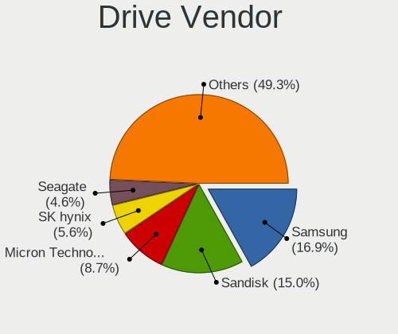
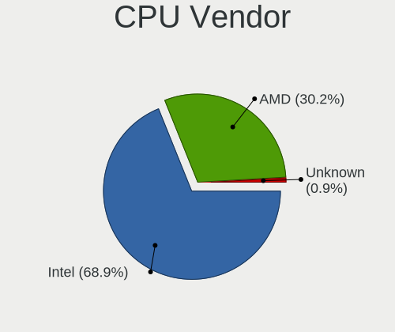
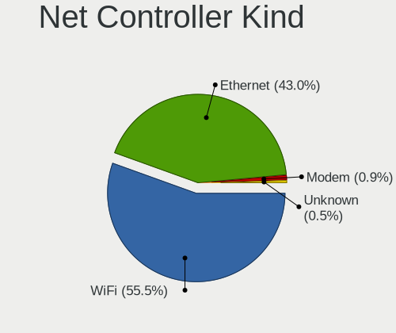
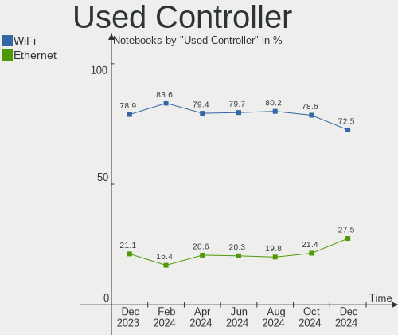
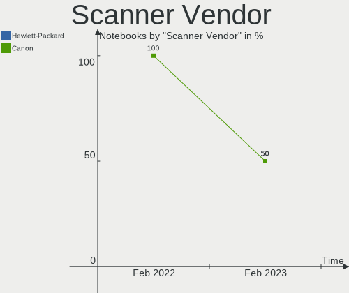

Fedora Hardware Trends (Notebooks)
----------------------------------

A project to identify most popular hardware characteristics and track their change
over time based on data collected by Fedora users at https://Linux-Hardware.org.

Anyone can contribute to this report by the [hw-probe](https://github.com/linuxhw/hw-probe) tool:

    sudo -E hw-probe -all -upload

Full-feature report is available here: https://linux-hardware.org/?view=trends

Period: Feb, 2022.

Contents
--------

* [ System ](#system)
  - [ OS                       ](#os)
  - [ OS Family                ](#os-family)
  - [ Kernel                   ](#kernel)
  - [ Kernel Family            ](#kernel-family)
  - [ Kernel Major Ver.        ](#kernel-major-ver)
  - [ Arch                     ](#arch)
  - [ DE                       ](#de)
  - [ Display Server           ](#display-server)
  - [ Display Manager          ](#display-manager)
  - [ OS Lang                  ](#os-lang)
  - [ Boot Mode                ](#boot-mode)
  - [ Filesystem               ](#filesystem)
  - [ Part. scheme             ](#part-scheme)
  - [ Dual Boot with Linux/BSD ](#dual-boot-with-linuxbsd)
  - [ Dual Boot (Win)          ](#dual-boot-win)

* [ Board ](#board)
  - [ Vendor                   ](#vendor)
  - [ Model                    ](#model)
  - [ Model Family             ](#model-family)
  - [ MFG Year                 ](#mfg-year)
  - [ Form Factor              ](#form-factor)
  - [ Secure Boot              ](#secure-boot)
  - [ Coreboot                 ](#coreboot)
  - [ RAM Size                 ](#ram-size)
  - [ RAM Used                 ](#ram-used)
  - [ Total Drives             ](#total-drives)
  - [ Has CD-ROM               ](#has-cd-rom)
  - [ Has Ethernet             ](#has-ethernet)
  - [ Has WiFi                 ](#has-wifi)
  - [ Has Bluetooth            ](#has-bluetooth)

* [ Location ](#location)
  - [ Country                  ](#country)
  - [ City                     ](#city)

* [ Drives ](#drives)
  - [ Drive Vendor             ](#drive-vendor)
  - [ Drive Model              ](#drive-model)
  - [ HDD Vendor               ](#hdd-vendor)
  - [ SSD Vendor               ](#ssd-vendor)
  - [ Drive Kind               ](#drive-kind)
  - [ Drive Connector          ](#drive-connector)
  - [ Drive Size               ](#drive-size)
  - [ Space Total              ](#space-total)
  - [ Space Used               ](#space-used)
  - [ Malfunc. Drives          ](#malfunc-drives)
  - [ Malfunc. Drive Vendor    ](#malfunc-drive-vendor)
  - [ Malfunc. HDD Vendor      ](#malfunc-hdd-vendor)
  - [ Malfunc. Drive Kind      ](#malfunc-drive-kind)
  - [ Failed Drives            ](#failed-drives)
  - [ Failed Drive Vendor      ](#failed-drive-vendor)
  - [ Drive Status             ](#drive-status)

* [ Storage controller ](#storage-controller)
  - [ Storage Vendor           ](#storage-vendor)
  - [ Storage Model            ](#storage-model)
  - [ Storage Kind             ](#storage-kind)

* [ Processor ](#processor)
  - [ CPU Vendor               ](#cpu-vendor)
  - [ CPU Model                ](#cpu-model)
  - [ CPU Model Family         ](#cpu-model-family)
  - [ CPU Cores                ](#cpu-cores)
  - [ CPU Sockets              ](#cpu-sockets)
  - [ CPU Threads              ](#cpu-threads)
  - [ CPU Op-Modes             ](#cpu-op-modes)
  - [ CPU Microcode            ](#cpu-microcode)
  - [ CPU Microarch            ](#cpu-microarch)

* [ Graphics ](#graphics)
  - [ GPU Vendor               ](#gpu-vendor)
  - [ GPU Model                ](#gpu-model)
  - [ GPU Combo                ](#gpu-combo)
  - [ GPU Driver               ](#gpu-driver)
  - [ GPU Memory               ](#gpu-memory)

* [ Monitor ](#monitor)
  - [ Monitor Vendor           ](#monitor-vendor)
  - [ Monitor Model            ](#monitor-model)
  - [ Monitor Resolution       ](#monitor-resolution)
  - [ Monitor Diagonal         ](#monitor-diagonal)
  - [ Monitor Width            ](#monitor-width)
  - [ Aspect Ratio             ](#aspect-ratio)
  - [ Monitor Area             ](#monitor-area)
  - [ Pixel Density            ](#pixel-density)
  - [ Multiple Monitors        ](#multiple-monitors)

* [ Network ](#network)
  - [ Net Controller Vendor    ](#net-controller-vendor)
  - [ Net Controller Model     ](#net-controller-model)
  - [ Wireless Vendor          ](#wireless-vendor)
  - [ Wireless Model           ](#wireless-model)
  - [ Ethernet Vendor          ](#ethernet-vendor)
  - [ Ethernet Model           ](#ethernet-model)
  - [ Net Controller Kind      ](#net-controller-kind)
  - [ Used Controller          ](#used-controller)
  - [ NICs                     ](#nics)
  - [ IPv6                     ](#ipv6)

* [ Bluetooth ](#bluetooth)
  - [ Bluetooth Vendor         ](#bluetooth-vendor)
  - [ Bluetooth Model          ](#bluetooth-model)

* [ Sound ](#sound)
  - [ Sound Vendor             ](#sound-vendor)
  - [ Sound Model              ](#sound-model)

* [ Memory ](#memory)
  - [ Memory Vendor            ](#memory-vendor)
  - [ Memory Model             ](#memory-model)
  - [ Memory Kind              ](#memory-kind)
  - [ Memory Form Factor       ](#memory-form-factor)
  - [ Memory Size              ](#memory-size)
  - [ Memory Speed             ](#memory-speed)

* [ Printers & scanners ](#printers--scanners)
  - [ Printer Vendor           ](#printer-vendor)
  - [ Printer Model            ](#printer-model)
  - [ Scanner Vendor           ](#scanner-vendor)
  - [ Scanner Model            ](#scanner-model)

* [ Camera ](#camera)
  - [ Camera Vendor            ](#camera-vendor)
  - [ Camera Model             ](#camera-model)

* [ Security ](#security)
  - [ Fingerprint Vendor       ](#fingerprint-vendor)
  - [ Fingerprint Model        ](#fingerprint-model)
  - [ Chipcard Vendor          ](#chipcard-vendor)
  - [ Chipcard Model           ](#chipcard-model)

* [ Unsupported ](#unsupported)
  - [ Unsupported Devices      ](#unsupported-devices)
  - [ Unsupported Device Types ](#unsupported-device-types)

System
------

OS
--

Installed operating systems

| Name      | Notebooks | Percent |
|-----------|-----------|---------|
| Fedora 35 | 124       | 91.85%  |
| Fedora 34 | 9         | 6.67%   |
| Fedora 36 | 1         | 0.74%   |
| Fedora 33 | 1         | 0.74%   |

OS Family
---------

OS without a version

| Name   | Notebooks | Percent |
|--------|-----------|---------|
| Fedora | 135       | 100%    |

Kernel
------

Version of the Linux kernel

| Version                                | Notebooks | Percent |
|----------------------------------------|-----------|---------|
| 5.16.9-200.fc35.x86_64                 | 30        | 22.22%  |
| 5.16.5-200.fc35.x86_64                 | 19        | 14.07%  |
| 5.16.8-200.fc35.x86_64                 | 16        | 11.85%  |
| 5.15.18-200.fc35.x86_64                | 13        | 9.63%   |
| 5.16.7-200.fc35.x86_64                 | 10        | 7.41%   |
| 5.16.11-200.fc35.x86_64                | 9         | 6.67%   |
| 5.14.10-300.fc35.x86_64                | 8         | 5.93%   |
| 5.15.17-200.fc35.x86_64                | 6         | 4.44%   |
| 5.16.10-200.fc35.x86_64                | 5         | 3.7%    |
| 5.15.16-200.fc35.x86_64                | 3         | 2.22%   |
| 5.15.16-100.fc34.x86_64                | 2         | 1.48%   |
| 5.17.0-0.rc5.102.vanilla.1.fc35.x86_64 | 1         | 0.74%   |
| 5.17.0-0.rc5.102.fc36.x86_64           | 1         | 0.74%   |
| 5.16.9-100.fc34.x86_64                 | 1         | 0.74%   |
| 5.16.5-100.fc34.x86_64                 | 1         | 0.74%   |
| 5.15.6-200.fc35.x86_64                 | 1         | 0.74%   |
| 5.15.5-100.fc34.x86_64                 | 1         | 0.74%   |
| 5.15.19-xm1tt.0.fc35.x86_64            | 1         | 0.74%   |
| 5.15.18-100.fc34.x86_64                | 1         | 0.74%   |
| 5.15.15-200.fc35.x86_64                | 1         | 0.74%   |
| 5.15.12-200.fc35.x86_64                | 1         | 0.74%   |
| 5.15.10-100.fc34.x86_64                | 1         | 0.74%   |
| 5.14.18-100.fc33.x86_64                | 1         | 0.74%   |
| 5.11.22-100.fc32.x86_64                | 1         | 0.74%   |
| 5.10.92-200.fc34.x86_64                | 1         | 0.74%   |

Kernel Family
-------------

Linux kernel without a distro release

| Version | Notebooks | Percent |
|---------|-----------|---------|
| 5.16.9  | 31        | 22.96%  |
| 5.16.5  | 20        | 14.81%  |
| 5.16.8  | 16        | 11.85%  |
| 5.15.18 | 14        | 10.37%  |
| 5.16.7  | 10        | 7.41%   |
| 5.16.11 | 9         | 6.67%   |
| 5.14.10 | 8         | 5.93%   |
| 5.15.17 | 6         | 4.44%   |
| 5.16.10 | 5         | 3.7%    |
| 5.15.16 | 5         | 3.7%    |
| 5.17.0  | 2         | 1.48%   |
| 5.15.6  | 1         | 0.74%   |
| 5.15.5  | 1         | 0.74%   |
| 5.15.19 | 1         | 0.74%   |
| 5.15.15 | 1         | 0.74%   |
| 5.15.12 | 1         | 0.74%   |
| 5.15.10 | 1         | 0.74%   |
| 5.14.18 | 1         | 0.74%   |
| 5.11.22 | 1         | 0.74%   |
| 5.10.92 | 1         | 0.74%   |

Kernel Major Ver.
-----------------

Linux kernel major version

| Version | Notebooks | Percent |
|---------|-----------|---------|
| 5.16    | 91        | 67.41%  |
| 5.15    | 31        | 22.96%  |
| 5.14    | 9         | 6.67%   |
| 5.17    | 2         | 1.48%   |
| 5.11    | 1         | 0.74%   |
| 5.10    | 1         | 0.74%   |

Arch
----

OS architecture (x86_64, i586, etc.)

| Name   | Notebooks | Percent |
|--------|-----------|---------|
| x86_64 | 135       | 100%    |

DE
--

Desktop Environment

| Name       | Notebooks | Percent |
|------------|-----------|---------|
| GNOME      | 105       | 77.78%  |
| KDE5       | 12        | 8.89%   |
| Unknown    | 5         | 3.7%    |
| XFCE       | 4         | 2.96%   |
| Cinnamon   | 3         | 2.22%   |
| X-Cinnamon | 1         | 0.74%   |
| MATE       | 1         | 0.74%   |
| LXQt       | 1         | 0.74%   |
| LXDE       | 1         | 0.74%   |
| i3         | 1         | 0.74%   |
| fluxbox    | 1         | 0.74%   |

Display Server
--------------

X11 or Wayland

| Name    | Notebooks | Percent |
|---------|-----------|---------|
| Wayland | 90        | 66.67%  |
| X11     | 43        | 31.85%  |
| Tty     | 1         | 0.74%   |
| Unknown | 1         | 0.74%   |

Display Manager
---------------

SDDM, LightDM, etc.

| Name    | Notebooks | Percent |
|---------|-----------|---------|
| Unknown | 60        | 44.44%  |
| GDM     | 59        | 43.7%   |
| LightDM | 9         | 6.67%   |
| SDDM    | 6         | 4.44%   |
| LXDM    | 1         | 0.74%   |

OS Lang
-------

Language

| Lang    | Notebooks | Percent |
|---------|-----------|---------|
| en_US   | 72        | 53.33%  |
| en_GB   | 11        | 8.15%   |
| pt_BR   | 7         | 5.19%   |
| ru_RU   | 5         | 3.7%    |
| it_IT   | 4         | 2.96%   |
| de_DE   | 4         | 2.96%   |
| es_ES   | 3         | 2.22%   |
| pl_PL   | 2         | 1.48%   |
| fr_FR   | 2         | 1.48%   |
| es_CL   | 2         | 1.48%   |
| en_IN   | 2         | 1.48%   |
| en_CA   | 2         | 1.48%   |
| en_AU   | 2         | 1.48%   |
| zh_CN   | 1         | 0.74%   |
| tr_TR   | 1         | 0.74%   |
| szl_PL  | 1         | 0.74%   |
| sk_SK   | 1         | 0.74%   |
| ro_RO   | 1         | 0.74%   |
| nl_NL   | 1         | 0.74%   |
| fr_CH   | 1         | 0.74%   |
| fr_CA   | 1         | 0.74%   |
| fi_FI   | 1         | 0.74%   |
| es_MX   | 1         | 0.74%   |
| en_ZA   | 1         | 0.74%   |
| en_IL   | 1         | 0.74%   |
| en_DK   | 1         | 0.74%   |
| de_AT   | 1         | 0.74%   |
| ca_ES   | 1         | 0.74%   |
| C       | 1         | 0.74%   |
| Unknown | 1         | 0.74%   |

Boot Mode
---------

EFI or BIOS

| Mode | Notebooks | Percent |
|------|-----------|---------|
| EFI  | 107       | 79.26%  |
| BIOS | 28        | 20.74%  |

Filesystem
----------

Type of filesystem

| Type    | Notebooks | Percent |
|---------|-----------|---------|
| Btrfs   | 97        | 71.85%  |
| Ext4    | 35        | 25.93%  |
| Xfs     | 2         | 1.48%   |
| Overlay | 1         | 0.74%   |

Part. scheme
------------

Scheme of partitioning

| Type    | Notebooks | Percent |
|---------|-----------|---------|
| GPT     | 66        | 48.89%  |
| Unknown | 61        | 45.19%  |
| MBR     | 8         | 5.93%   |

Dual Boot with Linux/BSD
------------------------

Hosting more than one Linux/BSD

| Dual boot | Notebooks | Percent |
|-----------|-----------|---------|
| No        | 125       | 92.59%  |
| Yes       | 10        | 7.41%   |

Dual Boot (Win)
---------------

Hosting Linux and Windows

| Dual boot | Notebooks | Percent |
|-----------|-----------|---------|
| No        | 110       | 81.48%  |
| Yes       | 25        | 18.52%  |

Board
-----

Vendor
------

Motherboard manufacturer

| Name                     | Notebooks | Percent |
|--------------------------|-----------|---------|
| Lenovo                   | 31        | 22.96%  |
| Hewlett-Packard          | 28        | 20.74%  |
| Dell                     | 16        | 11.85%  |
| Acer                     | 15        | 11.11%  |
| ASUSTek Computer         | 12        | 8.89%   |
| HUAWEI                   | 5         | 3.7%    |
| Samsung Electronics      | 4         | 2.96%   |
| Apple                    | 4         | 2.96%   |
| Sony                     | 3         | 2.22%   |
| Google                   | 2         | 1.48%   |
| Avell High Performance   | 2         | 1.48%   |
| Vulcan Electronics       | 1         | 0.74%   |
| TUXEDO                   | 1         | 0.74%   |
| Toshiba                  | 1         | 0.74%   |
| System76                 | 1         | 0.74%   |
| Positivo                 | 1         | 0.74%   |
| PC Specialist            | 1         | 0.74%   |
| Panasonic                | 1         | 0.74%   |
| MSI                      | 1         | 0.74%   |
| Jumper                   | 1         | 0.74%   |
| Inspire Technology Group | 1         | 0.74%   |
| HONOR                    | 1         | 0.74%   |
| Framework                | 1         | 0.74%   |
| eMachines                | 1         | 0.74%   |

Model
-----

Motherboard model

| Name                                                                                     | Notebooks | Percent |
|------------------------------------------------------------------------------------------|-----------|---------|
| HUAWEI KLVL-WXX9                                                                         | 3         | 2.22%   |
| HP Notebook                                                                              | 3         | 2.22%   |
| Lenovo Legion 5 15ARH05 82B5                                                             | 2         | 1.48%   |
| HP ProBook 430 G5                                                                        | 2         | 1.48%   |
| Avell High Performance B.ON                                                              | 2         | 1.48%   |
| Apple MacBookAir7,2                                                                      | 2         | 1.48%   |
| Acer Aspire A515-54G                                                                     | 2         | 1.48%   |
| Unknown                                                                                  | 2         | 1.48%   |
| Vulcan Excursion XB                                                                      | 1         | 0.74%   |
| TUXEDO InfinityBook Pro 14 Gen6                                                          | 1         | 0.74%   |
| Toshiba Satellite C645                                                                   | 1         | 0.74%   |
| System76 Lemur Pro                                                                       | 1         | 0.74%   |
| Sony VPCEH3S6E                                                                           | 1         | 0.74%   |
| Sony VGN-FW21E                                                                           | 1         | 0.74%   |
| Sony SVD1121Q2EB                                                                         | 1         | 0.74%   |
| Samsung RV409/RV509/RV709                                                                | 1         | 0.74%   |
| Samsung 900X3C/900X3D/900X3E/900X4C/900X4D                                               | 1         | 0.74%   |
| Samsung 750XDA                                                                           | 1         | 0.74%   |
| Samsung 355V4C/355V4X/355V5C/355V5X/356V4C/356V4X/356V5C/356V5X/3445VC/3445VX/3545VC/354 | 1         | 0.74%   |
| Positivo CHT14B                                                                          | 1         | 0.74%   |
| PC Specialist NH5xAx                                                                     | 1         | 0.74%   |
| Panasonic CFSV9-1                                                                        | 1         | 0.74%   |
| MSI GE63VR 7RF                                                                           | 1         | 0.74%   |
| Lenovo Yoga Slim 7 14ARE05 82A2                                                          | 1         | 0.74%   |
| Lenovo V14-ADA 82C6                                                                      | 1         | 0.74%   |
| Lenovo ThinkPad X395 20NLCTO1WW                                                          | 1         | 0.74%   |
| Lenovo ThinkPad X230 23257R2                                                             | 1         | 0.74%   |
| Lenovo ThinkPad X200T 7449G6G                                                            | 1         | 0.74%   |
| Lenovo ThinkPad X1 Extreme 2nd 20QV00CMGE                                                | 1         | 0.74%   |
| Lenovo ThinkPad X1 Carbon 6th 20KH007BMX                                                 | 1         | 0.74%   |
| Lenovo ThinkPad T495 20NJ0004US                                                          | 1         | 0.74%   |
| Lenovo ThinkPad T450 20BUS0VH08                                                          | 1         | 0.74%   |
| Lenovo ThinkPad T410 2522Y15                                                             | 1         | 0.74%   |
| Lenovo ThinkPad P15 Gen 1 20SUS04P17                                                     | 1         | 0.74%   |
| Lenovo ThinkPad L13 Gen 2 20VJS0HB00                                                     | 1         | 0.74%   |
| Lenovo ThinkPad E595 20NF001PTX                                                          | 1         | 0.74%   |
| Lenovo ThinkPad E14 Gen 2 20TAS10Y00                                                     | 1         | 0.74%   |
| Lenovo ThinkPad E14 Gen 2 20T60064CK                                                     | 1         | 0.74%   |
| Lenovo Legion 5 15IMH05H 81Y6                                                            | 1         | 0.74%   |
| Lenovo IdeaPad Slim 1-14AST-05 81VS                                                      | 1         | 0.74%   |
| Lenovo IdeaPad S540-14IML Touch 81V0                                                     | 1         | 0.74%   |
| Lenovo IdeaPad S540-14API 81NH                                                           | 1         | 0.74%   |
| Lenovo IdeaPad S340-14IWL 81N7                                                           | 1         | 0.74%   |
| Lenovo IdeaPad S145-15API 81V7                                                           | 1         | 0.74%   |
| Lenovo IdeaPad 5 Pro 14ACN6 82L7                                                         | 1         | 0.74%   |
| Lenovo IdeaPad 3 15IML05 U 81WB                                                          | 1         | 0.74%   |
| Lenovo IdeaPad 3 14ITL6 82H7                                                             | 1         | 0.74%   |
| Lenovo IdeaPad 3 14IML05 81WA                                                            | 1         | 0.74%   |
| Lenovo IdeaPad 100-15IBD 80QQ                                                            | 1         | 0.74%   |
| Lenovo G70-70 80HW007LNX                                                                 | 1         | 0.74%   |
| Lenovo Ducati 5 82ES                                                                     | 1         | 0.74%   |
| Jumper EZbook                                                                            | 1         | 0.74%   |
| Inspire Group Trio Windows 10.1 OD                                                       | 1         | 0.74%   |
| HUAWEI NBM-WXX9                                                                          | 1         | 0.74%   |
| HUAWEI NBLK-WAX9X                                                                        | 1         | 0.74%   |
| HONOR NBD-WXX9                                                                           | 1         | 0.74%   |
| HP ZBook 17 G4                                                                           | 1         | 0.74%   |
| HP ProBook 650 G1                                                                        | 1         | 0.74%   |
| HP ProBook 6465b                                                                         | 1         | 0.74%   |
| HP ProBook 640 G2                                                                        | 1         | 0.74%   |

Model Family
------------

Motherboard model prefix

| Name                        | Notebooks | Percent |
|-----------------------------|-----------|---------|
| Lenovo ThinkPad             | 13        | 9.63%   |
| Lenovo IdeaPad              | 10        | 7.41%   |
| Acer Aspire                 | 10        | 7.41%   |
| HP ProBook                  | 9         | 6.67%   |
| HP Pavilion                 | 7         | 5.19%   |
| Dell Latitude               | 6         | 4.44%   |
| Dell XPS                    | 5         | 3.7%    |
| Dell Inspiron               | 4         | 2.96%   |
| Lenovo Legion               | 3         | 2.22%   |
| HUAWEI KLVL-WXX9            | 3         | 2.22%   |
| HP Notebook                 | 3         | 2.22%   |
| HP EliteBook                | 3         | 2.22%   |
| HP Laptop                   | 2         | 1.48%   |
| Avell High Performance B.ON | 2         | 1.48%   |
| ASUS VivoBook               | 2         | 1.48%   |
| Apple MacBookAir7           | 2         | 1.48%   |
| Acer Nitro                  | 2         | 1.48%   |
| Unknown                     | 2         | 1.48%   |
| Vulcan Excursion            | 1         | 0.74%   |
| TUXEDO InfinityBook         | 1         | 0.74%   |
| Toshiba Satellite           | 1         | 0.74%   |
| System76 Lemur              | 1         | 0.74%   |
| Sony VPCEH3S6E              | 1         | 0.74%   |
| Sony VGN-FW21E              | 1         | 0.74%   |
| Sony SVD1121Q2EB            | 1         | 0.74%   |
| Samsung RV409               | 1         | 0.74%   |
| Samsung 900X3C              | 1         | 0.74%   |
| Samsung 750XDA              | 1         | 0.74%   |
| Samsung 355V4C              | 1         | 0.74%   |
| Positivo CHT14B             | 1         | 0.74%   |
| PC Specialist NH5xAx        | 1         | 0.74%   |
| Panasonic CFSV9-1           | 1         | 0.74%   |
| MSI GE63VR                  | 1         | 0.74%   |
| Lenovo Yoga                 | 1         | 0.74%   |
| Lenovo V14-ADA              | 1         | 0.74%   |
| Lenovo G70-70               | 1         | 0.74%   |
| Lenovo Ducati               | 1         | 0.74%   |
| Jumper EZbook               | 1         | 0.74%   |
| Inspire Group Trio          | 1         | 0.74%   |
| HUAWEI NBM-WXX9             | 1         | 0.74%   |
| HUAWEI NBLK-WAX9X           | 1         | 0.74%   |
| HONOR NBD-WXX9              | 1         | 0.74%   |
| HP ZBook                    | 1         | 0.74%   |
| HP Dratini                  | 1         | 0.74%   |
| HP Compaq                   | 1         | 0.74%   |
| HP 255                      | 1         | 0.74%   |
| Google Snappy               | 1         | 0.74%   |
| Google Edgar                | 1         | 0.74%   |
| Framework Laptop            | 1         | 0.74%   |
| eMachines E725              | 1         | 0.74%   |
| Dell Vostro                 | 1         | 0.74%   |
| ASUS ZenBook                | 1         | 0.74%   |
| ASUS X75VC                  | 1         | 0.74%   |
| ASUS X553MA                 | 1         | 0.74%   |
| ASUS X550WE                 | 1         | 0.74%   |
| ASUS T200TAC                | 1         | 0.74%   |
| ASUS ROG                    | 1         | 0.74%   |
| ASUS GL702VSK               | 1         | 0.74%   |
| ASUS G551JK                 | 1         | 0.74%   |
| ASUS ASUS                   | 1         | 0.74%   |

MFG Year
--------

Motherboard manufacture year

| Year | Notebooks | Percent |
|------|-----------|---------|
| 2021 | 25        | 18.52%  |
| 2020 | 22        | 16.3%   |
| 2019 | 21        | 15.56%  |
| 2016 | 10        | 7.41%   |
| 2017 | 9         | 6.67%   |
| 2015 | 8         | 5.93%   |
| 2013 | 8         | 5.93%   |
| 2012 | 7         | 5.19%   |
| 2014 | 6         | 4.44%   |
| 2011 | 6         | 4.44%   |
| 2018 | 5         | 3.7%    |
| 2008 | 4         | 2.96%   |
| 2009 | 2         | 1.48%   |
| 2022 | 1         | 0.74%   |
| 2010 | 1         | 0.74%   |

Form Factor
-----------

Physical design of the computer

| Name     | Notebooks | Percent |
|----------|-----------|---------|
| Notebook | 135       | 100%    |

Secure Boot
-----------

Enabled or disabled

| State    | Notebooks | Percent |
|----------|-----------|---------|
| Disabled | 111       | 82.22%  |
| Enabled  | 24        | 17.78%  |

Coreboot
--------

Have coreboot on board

| Used | Notebooks | Percent |
|------|-----------|---------|
| No   | 131       | 97.04%  |
| Yes  | 4         | 2.96%   |

RAM Size
--------

Total RAM memory

| Size in GB  | Notebooks | Percent |
|-------------|-----------|---------|
| 4.01-8.0    | 44        | 32.59%  |
| 8.01-16.0   | 33        | 24.44%  |
| 16.01-24.0  | 24        | 17.78%  |
| 3.01-4.0    | 18        | 13.33%  |
| 32.01-64.0  | 9         | 6.67%   |
| 1.01-2.0    | 3         | 2.22%   |
| 2.01-3.0    | 2         | 1.48%   |
| 64.01-256.0 | 2         | 1.48%   |

RAM Used
--------

Used RAM memory

| Used GB   | Notebooks | Percent |
|-----------|-----------|---------|
| 2.01-3.0  | 44        | 32.59%  |
| 4.01-8.0  | 31        | 22.96%  |
| 3.01-4.0  | 28        | 20.74%  |
| 1.01-2.0  | 26        | 19.26%  |
| 8.01-16.0 | 5         | 3.7%    |
| 0.51-1.0  | 1         | 0.74%   |

Total Drives
------------

Number of drives on board

| Drives | Notebooks | Percent |
|--------|-----------|---------|
| 1      | 99        | 73.33%  |
| 2      | 31        | 22.96%  |
| 3      | 3         | 2.22%   |
| 4      | 1         | 0.74%   |
| 0      | 1         | 0.74%   |

Has CD-ROM
----------

Has CD-ROM on board

| Presented | Notebooks | Percent |
|-----------|-----------|---------|
| No        | 103       | 76.3%   |
| Yes       | 32        | 23.7%   |

Has Ethernet
------------

Has Ethernet on board

| Presented | Notebooks | Percent |
|-----------|-----------|---------|
| Yes       | 90        | 66.67%  |
| No        | 45        | 33.33%  |

Has WiFi
--------

Has WiFi module

| Presented | Notebooks | Percent |
|-----------|-----------|---------|
| Yes       | 130       | 96.3%   |
| No        | 5         | 3.7%    |

Has Bluetooth
-------------

Has Bluetooth module

| Presented | Notebooks | Percent |
|-----------|-----------|---------|
| Yes       | 116       | 85.93%  |
| No        | 19        | 14.07%  |

Location
--------

Country
-------

Geographic location (country)

| Country      | Notebooks | Percent |
|--------------|-----------|---------|
| USA          | 17        | 12.59%  |
| Russia       | 13        | 9.63%   |
| Brazil       | 11        | 8.15%   |
| India        | 8         | 5.93%   |
| Germany      | 6         | 4.44%   |
| Poland       | 5         | 3.7%    |
| UK           | 4         | 2.96%   |
| Turkey       | 4         | 2.96%   |
| Spain        | 4         | 2.96%   |
| Italy        | 4         | 2.96%   |
| Sweden       | 3         | 2.22%   |
| South Africa | 3         | 2.22%   |
| France       | 3         | 2.22%   |
| Czechia      | 3         | 2.22%   |
| Croatia      | 3         | 2.22%   |
| Chile        | 3         | 2.22%   |
| Canada       | 3         | 2.22%   |
| Ukraine      | 2         | 1.48%   |
| Switzerland  | 2         | 1.48%   |
| Panama       | 2         | 1.48%   |
| Japan        | 2         | 1.48%   |
| Indonesia    | 2         | 1.48%   |
| Hungary      | 2         | 1.48%   |
| Finland      | 2         | 1.48%   |
| Austria      | 2         | 1.48%   |
| Australia    | 2         | 1.48%   |
| Argentina    | 2         | 1.48%   |
| Vietnam      | 1         | 0.74%   |
| Tunisia      | 1         | 0.74%   |
| Sri Lanka    | 1         | 0.74%   |
| Slovakia     | 1         | 0.74%   |
| Saudi Arabia | 1         | 0.74%   |
| Romania      | 1         | 0.74%   |
| Philippines  | 1         | 0.74%   |
| Peru         | 1         | 0.74%   |
| New Zealand  | 1         | 0.74%   |
| Netherlands  | 1         | 0.74%   |
| Mexico       | 1         | 0.74%   |
| Israel       | 1         | 0.74%   |
| Greece       | 1         | 0.74%   |
| Egypt        | 1         | 0.74%   |
| China        | 1         | 0.74%   |
| Cambodia     | 1         | 0.74%   |
| Bulgaria     | 1         | 0.74%   |
| Belarus      | 1         | 0.74%   |

City
----

Geographic location (city)

| City                    | Notebooks | Percent |
|-------------------------|-----------|---------|
| Moscow                  | 8         | 5.93%   |
| Zagreb                  | 3         | 2.22%   |
| Istanbul                | 3         | 2.22%   |
| Vienna                  | 2         | 1.48%   |
| Sydney                  | 2         | 1.48%   |
| Rostov-on-Don           | 2         | 1.48%   |
| Panama City             | 2         | 1.48%   |
| Coimbatore              | 2         | 1.48%   |
| Belo Horizonte          | 2         | 1.48%   |
| Yekaterinburg           | 1         | 0.74%   |
| Wroclaw                 | 1         | 0.74%   |
| Wellington              | 1         | 0.74%   |
| Warsaw                  | 1         | 0.74%   |
| Vitória da Conquista | 1         | 0.74%   |
| Vinh                    | 1         | 0.74%   |
| Usatove                 | 1         | 0.74%   |
| Tunis                   | 1         | 0.74%   |
| Tokyo                   | 1         | 0.74%   |
| Thuwal                  | 1         | 0.74%   |
| The Hague               | 1         | 0.74%   |
| Tel Aviv                | 1         | 0.74%   |
| Târgu Mureş       | 1         | 0.74%   |
| Tarlac City             | 1         | 0.74%   |
| Surat                   | 1         | 0.74%   |
| Sun City Center         | 1         | 0.74%   |
| Stara Zagora            | 1         | 0.74%   |
| Santos                  | 1         | 0.74%   |
| Santo André          | 1         | 0.74%   |
| Santa Fe                | 1         | 0.74%   |
| Santa Barbara           | 1         | 0.74%   |
| Royal Tunbridge Wells   | 1         | 0.74%   |
| Rio de Janeiro          | 1         | 0.74%   |
| Raisio                  | 1         | 0.74%   |
| Pori                    | 1         | 0.74%   |
| Poços de Caldas      | 1         | 0.74%   |
| Pietermaritzburg        | 1         | 0.74%   |
| Phnom Penh              | 1         | 0.74%   |
| Palangkaraya            | 1         | 0.74%   |
| Opole                   | 1         | 0.74%   |
| Onojo                   | 1         | 0.74%   |
| Odessa                  | 1         | 0.74%   |
| Nunoa                   | 1         | 0.74%   |
| Novosibirsk             | 1         | 0.74%   |
| New Iberia              | 1         | 0.74%   |
| Munich                  | 1         | 0.74%   |
| Mumbai                  | 1         | 0.74%   |
| Montreal                | 1         | 0.74%   |
| Montigny-le-Bretonneux  | 1         | 0.74%   |
| Montgomery Center       | 1         | 0.74%   |
| Mohali                  | 1         | 0.74%   |
| Minsk                   | 1         | 0.74%   |
| Milan                   | 1         | 0.74%   |
| Mexico City             | 1         | 0.74%   |
| Maua                    | 1         | 0.74%   |
| Martin                  | 1         | 0.74%   |
| Malda                   | 1         | 0.74%   |
| Malambe                 | 1         | 0.74%   |
| Madison                 | 1         | 0.74%   |
| Lyon                    | 1         | 0.74%   |
| Los Angeles             | 1         | 0.74%   |

Drives
------

Drive Vendor
------------

Hard drive vendors

| Vendor                  | Notebooks | Drives  | Percent |
|-------------------------|-----------|---------|---------|
| Samsung Electronics     | 25        | 26      | 14.45%  |
| WDC                     | 19        | 20      | 10.98%  |
| Seagate                 | 17        | 17      | 9.83%   |
| SanDisk                 | 15        | 15      | 8.67%   |
| Unknown                 | 13        | 13      | 7.51%   |
| SK Hynix                | 13        | 13      | 7.51%   |
| Toshiba                 | 10        | 10      | 5.78%   |
| Kingston                | 7         | 7       | 4.05%   |
| Intel                   | 7         | 8       | 4.05%   |
| A-DATA Technology       | 7         | 7       | 4.05%   |
| Phison                  | 3         | 3       | 1.73%   |
| KIOXIA                  | 3         | 3       | 1.73%   |
| HGST                    | 3         | 3       | 1.73%   |
| Crucial                 | 3         | 3       | 1.73%   |
| Union Memory (Shenzhen) | 2         | 2       | 1.16%   |
| UMIS                    | 2         | 2       | 1.16%   |
| LITEON                  | 2         | 2       | 1.16%   |
| Hitachi                 | 2         | 2       | 1.16%   |
| Apple                   | 2         | 2       | 1.16%   |
| Transcend               | 1         | 1       | 0.58%   |
| Team                    | 1         | 1       | 0.58%   |
| SPCC                    | 1         | 1       | 0.58%   |
| Silicon Motion          | 1         | 1       | 0.58%   |
| Realtek Semiconductor   | 1         | 1       | 0.58%   |
| Ramsta                  | 1         | 1       | 0.58%   |
| PNY                     | 1         | 1       | 0.58%   |
| Micron Technology       | 1         | 2       | 0.58%   |
| Lite-On                 | 1         | 1       | 0.58%   |
| Lenovo                  | 1         | 1       | 0.58%   |
| HUAWEI                  | 1         | 1       | 0.58%   |
| HPE                     | 1         | 1       | 0.58%   |
| Hewlett-Packard         | 1         | Unknown | 0.58%   |
| Fujitsu                 | 1         | 1       | 0.58%   |
| AMD                     | 1         | 1       | 0.58%   |
| ADATA Technology        | 1         | 1       | 0.58%   |
| ADATA SU                | 1         | 1       | 0.58%   |
| 1TB                     | 1         | 1       | 0.58%   |

Drive Model
-----------

Hard drive models

| Model                                        | Notebooks | Percent |
|----------------------------------------------|-----------|---------|
| Sandisk NVMe SSD Drive 512GB                 | 6         | 3.41%   |
| SK Hynix NVMe SSD Drive 512GB                | 5         | 2.84%   |
| Seagate ST1000LM035-1RK172 1TB               | 4         | 2.27%   |
| WDC WD10JPVX-60JC3T0 1TB                     | 3         | 1.7%    |
| Sandisk NVMe SSD Drive 256GB                 | 3         | 1.7%    |
| Kingston SA400S37240G 240GB SSD              | 3         | 1.7%    |
| WDC PC SN530 SDBPNPZ-512G-1006 512GB         | 2         | 1.14%   |
| Unknown NCard  32GB                          | 2         | 1.14%   |
| Toshiba MQ01ABF050 500GB                     | 2         | 1.14%   |
| Seagate ST500LT012-1DG142 500GB              | 2         | 1.14%   |
| Seagate ST1000LM024 HN-M101MBB 1TB           | 2         | 1.14%   |
| Seagate Expansion+ 2TB                       | 2         | 1.14%   |
| Sandisk NVMe SSD Drive 1TB                   | 2         | 1.14%   |
| Samsung NVMe SSD Drive 512GB                 | 2         | 1.14%   |
| Samsung NVMe SSD Drive 500GB                 | 2         | 1.14%   |
| Samsung NVMe SSD Drive 1TB                   | 2         | 1.14%   |
| Samsung MZVLB256HBHQ-000L2 256GB             | 2         | 1.14%   |
| Phison 311CD0512GB                           | 2         | 1.14%   |
| HGST HTS721010A9E630 1TB                     | 2         | 1.14%   |
| A-DATA IM2P33F8A-512GD 512GB                 | 2         | 1.14%   |
| WDC WDS500G2B0C-00PXH0 500GB                 | 1         | 0.57%   |
| WDC WDS500G2B0C 500GB                        | 1         | 0.57%   |
| WDC WDS500G2B0A-00SM50 500GB SSD             | 1         | 0.57%   |
| WDC WDS240G1G0A-00SS50 240GB SSD             | 1         | 0.57%   |
| WDC WD5000BPVT-35HXZT1 500GB                 | 1         | 0.57%   |
| WDC WD5000BPVT-22HXZT3 500GB                 | 1         | 0.57%   |
| WDC WD3200BPVT-55JJ5T0 320GB                 | 1         | 0.57%   |
| WDC WD10SPZX-24Z10 1TB                       | 1         | 0.57%   |
| WDC WD10SPZX-22Z10T1 1TB                     | 1         | 0.57%   |
| WDC WD10SPSX-08A6W 1TB                       | 1         | 0.57%   |
| WDC WD10JPVX-22JC3T0 1TB                     | 1         | 0.57%   |
| WDC PC SN730 SDBPNTY-512G-1027 512GB         | 1         | 0.57%   |
| WDC PC SN530 SDBPNPZ-512G-1014 512GB         | 1         | 0.57%   |
| WDC PC SN520 SDAPNUW-512G-1014 512GB         | 1         | 0.57%   |
| WDC PC SN520 NVMe 512GB                      | 1         | 0.57%   |
| Unknown SD128  128GB                         | 1         | 0.57%   |
| Unknown SD08G  8GB                           | 1         | 0.57%   |
| Unknown SD/MMC/MS PRO 64GB                   | 1         | 0.57%   |
| Unknown SC16G  16GB                          | 1         | 0.57%   |
| Unknown MMC128  128GB                        | 1         | 0.57%   |
| Unknown MMC Card  8GB                        | 1         | 0.57%   |
| Unknown MMC Card  32GB                       | 1         | 0.57%   |
| Unknown MMC Card  134GB                      | 1         | 0.57%   |
| Unknown HBG4a2  32GB                         | 1         | 0.57%   |
| Unknown DA4128  128GB                        | 1         | 0.57%   |
| Unknown BB1QT  32GB                          | 1         | 0.57%   |
| Union Memory (Shenzhen) NVMe SSD Drive 256GB | 1         | 0.57%   |
| Union Memory (Shenzhen) NVMe SSD Drive 128GB | 1         | 0.57%   |
| UMIS RPJTJ256MED1OWX 256GB                   | 1         | 0.57%   |
| UMIS LENSE40256GMSP34MESTB3A 256GB           | 1         | 0.57%   |
| Transcend TS256GMTE220S 256GB                | 1         | 0.57%   |
| Toshiba THNSNS128GMCP 128GB SSD              | 1         | 0.57%   |
| Toshiba THNSN5512GPUK NVMe 512GB             | 1         | 0.57%   |
| Toshiba NVMe SSD Drive 512GB                 | 1         | 0.57%   |
| Toshiba MQ01ABF050M 500GB                    | 1         | 0.57%   |
| Toshiba MQ01ABD075 752GB                     | 1         | 0.57%   |
| Toshiba MK3265GSXN 320GB                     | 1         | 0.57%   |
| Toshiba KBG40ZNT512G MEMORY 512GB            | 1         | 0.57%   |
| Toshiba KBG30ZMV256G 256GB                   | 1         | 0.57%   |
| Team T253X2512G 512GB SSD                    | 1         | 0.57%   |

HDD Vendor
----------

Hard disk drive vendors

| Vendor  | Notebooks | Drives | Percent |
|---------|-----------|--------|---------|
| Seagate | 17        | 17     | 43.59%  |
| WDC     | 10        | 10     | 25.64%  |
| Toshiba | 5         | 5      | 12.82%  |
| HGST    | 3         | 3      | 7.69%   |
| Hitachi | 2         | 2      | 5.13%   |
| Unknown | 1         | 1      | 2.56%   |
| Fujitsu | 1         | 1      | 2.56%   |

SSD Vendor
----------

Solid state drive vendors

| Vendor              | Notebooks | Drives | Percent |
|---------------------|-----------|--------|---------|
| Kingston            | 7         | 7      | 15.56%  |
| Samsung Electronics | 5         | 5      | 11.11%  |
| SK Hynix            | 4         | 4      | 8.89%   |
| Intel               | 4         | 5      | 8.89%   |
| A-DATA Technology   | 4         | 4      | 8.89%   |
| Crucial             | 3         | 3      | 6.67%   |
| WDC                 | 2         | 2      | 4.44%   |
| SanDisk             | 2         | 2      | 4.44%   |
| LITEON              | 2         | 2      | 4.44%   |
| Apple               | 2         | 2      | 4.44%   |
| Toshiba             | 1         | 1      | 2.22%   |
| Team                | 1         | 1      | 2.22%   |
| SPCC                | 1         | 1      | 2.22%   |
| Ramsta              | 1         | 1      | 2.22%   |
| PNY                 | 1         | 1      | 2.22%   |
| Lite-On             | 1         | 1      | 2.22%   |
| HPE                 | 1         | 1      | 2.22%   |
| AMD                 | 1         | 1      | 2.22%   |
| ADATA SU            | 1         | 1      | 2.22%   |
| 1TB                 | 1         | 1      | 2.22%   |

Drive Kind
----------

HDD or SSD

| Kind    | Notebooks | Drives | Percent |
|---------|-----------|--------|---------|
| NVMe    | 70        | 76     | 41.92%  |
| SSD     | 44        | 46     | 26.35%  |
| HDD     | 39        | 39     | 23.35%  |
| MMC     | 12        | 14     | 7.19%   |
| Unknown | 2         | 1      | 1.2%    |

Drive Connector
---------------

SATA, SAS, NVMe, etc.

| Type | Notebooks | Drives | Percent |
|------|-----------|--------|---------|
| NVMe | 70        | 76     | 44.87%  |
| SATA | 68        | 80     | 43.59%  |
| MMC  | 12        | 14     | 7.69%   |
| SAS  | 6         | 6      | 3.85%   |

Drive Size
----------

Size of hard drive

| Size in TB | Notebooks | Drives | Percent |
|------------|-----------|--------|---------|
| 0.01-0.5   | 52        | 57     | 65%     |
| 0.51-1.0   | 23        | 23     | 28.75%  |
| 1.01-2.0   | 4         | 4      | 5%      |
| 3.01-4.0   | 1         | 1      | 1.25%   |

Space Total
-----------

Amount of disk space available on the file system

| Size in GB     | Notebooks | Percent |
|----------------|-----------|---------|
| 501-1000       | 35        | 25.93%  |
| 251-500        | 25        | 18.52%  |
| 101-250        | 18        | 13.33%  |
| 1-20           | 18        | 13.33%  |
| 1001-2000      | 13        | 9.63%   |
| 51-100         | 10        | 7.41%   |
| Unknown        | 10        | 7.41%   |
| More than 3000 | 3         | 2.22%   |
| 21-50          | 2         | 1.48%   |
| 2001-3000      | 1         | 0.74%   |

Space Used
----------

Amount of used disk space

| Used GB   | Notebooks | Percent |
|-----------|-----------|---------|
| 1-20      | 42        | 31.11%  |
| 21-50     | 28        | 20.74%  |
| 101-250   | 26        | 19.26%  |
| 51-100    | 10        | 7.41%   |
| Unknown   | 10        | 7.41%   |
| 501-1000  | 9         | 6.67%   |
| 251-500   | 8         | 5.93%   |
| 1001-2000 | 2         | 1.48%   |

Malfunc. Drives
---------------

Drive models with a malfunction

| Model                                         | Notebooks | Drives | Percent |
|-----------------------------------------------|-----------|--------|---------|
| SK Hynix SC401 SATA 512GB SSD                 | 1         | 1      | 12.5%   |
| Samsung Electronics SSD 870 EVO 500GB         | 1         | 1      | 12.5%   |
| Intel SSDSCKKF256G8H 256GB                    | 1         | 1      | 12.5%   |
| Intel SSDSC2BF180A5L 180GB                    | 1         | 1      | 12.5%   |
| Hitachi HTS547575A9E384 752GB                 | 1         | 1      | 12.5%   |
| Hitachi HTS543225L9A300 250GB                 | 1         | 1      | 12.5%   |
| Fujitsu MJA2500BH G1 500GB                    | 1         | 1      | 12.5%   |
| A-DATA Technology IM2S3138E-128GM-B 128GB SSD | 1         | 1      | 12.5%   |

Malfunc. Drive Vendor
---------------------

Vendors of faulty drives

| Vendor              | Notebooks | Drives | Percent |
|---------------------|-----------|--------|---------|
| Intel               | 2         | 2      | 25%     |
| Hitachi             | 2         | 2      | 25%     |
| SK Hynix            | 1         | 1      | 12.5%   |
| Samsung Electronics | 1         | 1      | 12.5%   |
| Fujitsu             | 1         | 1      | 12.5%   |
| A-DATA Technology   | 1         | 1      | 12.5%   |

Malfunc. HDD Vendor
-------------------

Vendors of faulty HDD drives

| Vendor  | Notebooks | Drives | Percent |
|---------|-----------|--------|---------|
| Hitachi | 2         | 2      | 66.67%  |
| Fujitsu | 1         | 1      | 33.33%  |

Malfunc. Drive Kind
-------------------

Kinds of faulty drives

| Kind | Notebooks | Drives | Percent |
|------|-----------|--------|---------|
| SSD  | 5         | 5      | 62.5%   |
| HDD  | 3         | 3      | 37.5%   |

Failed Drives
-------------

Failed drive models

Zero info for selected period =(

Failed Drive Vendor
-------------------

Failed drive vendors

Zero info for selected period =(

Drive Status
------------

Number of failed and malfunc. drives

| Status   | Notebooks | Drives | Percent |
|----------|-----------|--------|---------|
| Detected | 73        | 95     | 51.05%  |
| Works    | 62        | 73     | 43.36%  |
| Malfunc  | 8         | 8      | 5.59%   |

Storage controller
------------------

Storage Vendor
--------------

Storage controller vendors

| Vendor                       | Notebooks | Percent |
|------------------------------|-----------|---------|
| Intel                        | 68        | 41.46%  |
| AMD                          | 25        | 15.24%  |
| Samsung Electronics          | 22        | 13.41%  |
| Sandisk                      | 18        | 10.98%  |
| SK Hynix                     | 8         | 4.88%   |
| Union Memory (Shenzhen)      | 4         | 2.44%   |
| Toshiba America Info Systems | 4         | 2.44%   |
| ADATA Technology             | 4         | 2.44%   |
| Phison Electronics           | 3         | 1.83%   |
| KIOXIA                       | 3         | 1.83%   |
| Silicon Motion               | 2         | 1.22%   |
| Realtek Semiconductor        | 1         | 0.61%   |
| Micron Technology            | 1         | 0.61%   |
| Lenovo                       | 1         | 0.61%   |

Storage Model
-------------

Storage controller models

| Model                                                                          | Notebooks | Percent |
|--------------------------------------------------------------------------------|-----------|---------|
| AMD FCH SATA Controller [AHCI mode]                                            | 24        | 14.2%   |
| Intel Sunrise Point-LP SATA Controller [AHCI mode]                             | 12        | 7.1%    |
| Intel 7 Series Chipset Family 6-port SATA Controller [AHCI mode]               | 11        | 6.51%   |
| Samsung NVMe SSD Controller SM981/PM981/PM983                                  | 10        | 5.92%   |
| Sandisk WD Blue SN550 NVMe SSD                                                 | 6         | 3.55%   |
| Samsung NVMe SSD Controller 980                                                | 6         | 3.55%   |
| Intel HM170/QM170 Chipset SATA Controller [AHCI Mode]                          | 5         | 2.96%   |
| Intel Comet Lake SATA AHCI Controller                                          | 5         | 2.96%   |
| Sandisk WD Black SN750 / PC SN730 NVMe SSD                                     | 4         | 2.37%   |
| Intel Volume Management Device NVMe RAID Controller                            | 4         | 2.37%   |
| Intel 82801IBM/IEM (ICH9M/ICH9M-E) 4 port SATA Controller [AHCI mode]          | 4         | 2.37%   |
| Intel 8 Series SATA Controller 1 [AHCI mode]                                   | 4         | 2.37%   |
| Union Memory (Shenzhen) Non-Volatile memory controller                         | 3         | 1.78%   |
| SK Hynix Non-Volatile memory controller                                        | 3         | 1.78%   |
| SK Hynix Gold P31 SSD                                                          | 3         | 1.78%   |
| Sandisk WD Blue SN500 / PC SN520 NVMe SSD                                      | 3         | 1.78%   |
| Sandisk Non-Volatile memory controller                                         | 3         | 1.78%   |
| Samsung NVMe SSD Controller SM961/PM961/SM963                                  | 3         | 1.78%   |
| Phison PS5013 E13 NVMe Controller                                              | 3         | 1.78%   |
| KIOXIA Non-Volatile memory controller                                          | 3         | 1.78%   |
| Intel Wildcat Point-LP SATA Controller [AHCI Mode]                             | 3         | 1.78%   |
| Intel Tiger Lake-LP SATA Controller [AHCI mode]                                | 3         | 1.78%   |
| Intel 400 Series Chipset Family SATA AHCI Controller                           | 3         | 1.78%   |
| ADATA Non-Volatile memory controller                                           | 3         | 1.78%   |
| Toshiba America Info Systems XG6 NVMe SSD Controller                           | 2         | 1.18%   |
| Sandisk PC SN520 NVMe SSD                                                      | 2         | 1.18%   |
| Samsung NVMe SSD Controller PM9A1/PM9A3/980PRO                                 | 2         | 1.18%   |
| Intel SSD 660P Series                                                          | 2         | 1.18%   |
| Intel Cannon Point-LP SATA Controller [AHCI Mode]                              | 2         | 1.18%   |
| Intel 8 Series/C220 Series Chipset Family 6-port SATA Controller 1 [AHCI mode] | 2         | 1.18%   |
| Intel 6 Series/C200 Series Chipset Family 6 port Mobile SATA AHCI Controller   | 2         | 1.18%   |
| Intel 5 Series/3400 Series Chipset 4 port SATA AHCI Controller                 | 2         | 1.18%   |
| AMD 400 Series Chipset SATA Controller                                         | 2         | 1.18%   |
| Union Memory (Shenzhen) NVMe 256G SSD device                                   | 1         | 0.59%   |
| Toshiba America Info Systems XG4 NVMe SSD Controller                           | 1         | 0.59%   |
| Toshiba America Info Systems BG3 NVMe SSD Controller                           | 1         | 0.59%   |
| SK Hynix PC401 NVMe Solid State Drive 256GB                                    | 1         | 0.59%   |
| SK Hynix BC511                                                                 | 1         | 0.59%   |
| Silicon Motion SM2263EN/SM2263XT SSD Controller                                | 1         | 0.59%   |
| Silicon Motion SM2262/SM2262EN SSD Controller                                  | 1         | 0.59%   |
| Samsung Electronics SATA controller                                            | 1         | 0.59%   |
| Realtek RTS5763DL NVMe SSD Controller                                          | 1         | 0.59%   |
| Micron Non-Volatile memory controller                                          | 1         | 0.59%   |
| Lenovo Non-Volatile memory controller                                          | 1         | 0.59%   |
| Intel Q170/Q150/B150/H170/H110/Z170/CM236 Chipset SATA Controller [AHCI Mode]  | 1         | 0.59%   |
| Intel Non-Volatile memory controller                                           | 1         | 0.59%   |
| Intel Celeron N3350/Pentium N4200/Atom E3900 Series SATA AHCI Controller       | 1         | 0.59%   |
| Intel Atom Processor E3800 Series SATA AHCI Controller                         | 1         | 0.59%   |
| Intel 82801 Mobile SATA Controller [RAID mode]                                 | 1         | 0.59%   |
| Intel 5 Series/3400 Series Chipset 6 port SATA AHCI Controller                 | 1         | 0.59%   |
| AMD SB7x0/SB8x0/SB9x0 SATA Controller [AHCI mode]                              | 1         | 0.59%   |
| AMD FCH IDE Controller                                                         | 1         | 0.59%   |
| ADATA XPG SX8200 Pro PCIe Gen3x4 M.2 2280 Solid State Drive                    | 1         | 0.59%   |

Storage Kind
------------

Kind of storage controller (IDE, SATA, NVMe, SAS, ...)

| Kind | Notebooks | Percent |
|------|-----------|---------|
| SATA | 88        | 53.33%  |
| NVMe | 71        | 43.03%  |
| RAID | 5         | 3.03%   |
| IDE  | 1         | 0.61%   |

Processor
---------

CPU Vendor
----------

Processor vendors

| Vendor | Notebooks | Percent |
|--------|-----------|---------|
| Intel  | 92        | 68.15%  |
| AMD    | 43        | 31.85%  |

CPU Model
---------

Processor models

| Model                                           | Notebooks | Percent |
|-------------------------------------------------|-----------|---------|
| Intel 11th Gen Core i5-1135G7 @ 2.40GHz         | 6         | 4.44%   |
| Intel Core i7-7700HQ CPU @ 2.80GHz              | 5         | 3.7%    |
| Intel 11th Gen Core i7-1165G7 @ 2.80GHz         | 5         | 3.7%    |
| AMD Ryzen 7 4800H with Radeon Graphics          | 4         | 2.96%   |
| Intel Core i5-8250U CPU @ 1.60GHz               | 3         | 2.22%   |
| Intel Core i5-6200U CPU @ 2.30GHz               | 3         | 2.22%   |
| AMD Ryzen 7 4700U with Radeon Graphics          | 3         | 2.22%   |
| AMD Ryzen 5 5600U with Radeon Graphics          | 3         | 2.22%   |
| AMD Ryzen 5 3500U with Radeon Vega Mobile Gfx   | 3         | 2.22%   |
| Intel Core i7-7500U CPU @ 2.70GHz               | 2         | 1.48%   |
| Intel Core i7-6700HQ CPU @ 2.60GHz              | 2         | 1.48%   |
| Intel Core i7-10510U CPU @ 1.80GHz              | 2         | 1.48%   |
| Intel Core i5-8265U CPU @ 1.60GHz               | 2         | 1.48%   |
| Intel Core i5-3320M CPU @ 2.60GHz               | 2         | 1.48%   |
| Intel Core i5-10300H CPU @ 2.50GHz              | 2         | 1.48%   |
| Intel Core i5-10210U CPU @ 1.60GHz              | 2         | 1.48%   |
| Intel Core i3-6006U CPU @ 2.00GHz               | 2         | 1.48%   |
| Intel Core i3-10110U CPU @ 2.10GHz              | 2         | 1.48%   |
| Intel Core i3 CPU M 370 @ 2.40GHz               | 2         | 1.48%   |
| Intel Atom CPU Z3735F @ 1.33GHz                 | 2         | 1.48%   |
| Intel 11th Gen Core i3-1115G4 @ 3.00GHz         | 2         | 1.48%   |
| AMD Ryzen 7 3700U with Radeon Vega Mobile Gfx   | 2         | 1.48%   |
| AMD Ryzen 5 PRO 3500U w/ Radeon Vega Mobile Gfx | 2         | 1.48%   |
| AMD Ryzen 5 4600H with Radeon Graphics          | 2         | 1.48%   |
| AMD Athlon Silver 3050U with Radeon Graphics    | 2         | 1.48%   |
| AMD A6-7310 APU with AMD Radeon R4 Graphics     | 2         | 1.48%   |
| Intel Pentium Dual-Core CPU T4200 @ 2.00GHz     | 1         | 0.74%   |
| Intel Pentium CPU N3540 @ 2.16GHz               | 1         | 0.74%   |
| Intel Pentium CPU B960 @ 2.20GHz                | 1         | 0.74%   |
| Intel Pentium 3556U @ 1.70GHz                   | 1         | 0.74%   |
| Intel Genuine CPU T1600 @ 1.66GHz               | 1         | 0.74%   |
| Intel Core i7-9750H CPU @ 2.60GHz               | 1         | 0.74%   |
| Intel Core i7-8665U CPU @ 1.90GHz               | 1         | 0.74%   |
| Intel Core i7-8565U CPU @ 1.80GHz               | 1         | 0.74%   |
| Intel Core i7-8550U CPU @ 1.80GHz               | 1         | 0.74%   |
| Intel Core i7-5650U CPU @ 2.20GHz               | 1         | 0.74%   |
| Intel Core i7-4710HQ CPU @ 2.50GHz              | 1         | 0.74%   |
| Intel Core i7-3667U CPU @ 2.00GHz               | 1         | 0.74%   |
| Intel Core i7-3537U CPU @ 2.00GHz               | 1         | 0.74%   |
| Intel Core i7-3517U CPU @ 1.90GHz               | 1         | 0.74%   |
| Intel Core i7-10750H CPU @ 2.60GHz              | 1         | 0.74%   |
| Intel Core i7-10710U CPU @ 1.10GHz              | 1         | 0.74%   |
| Intel Core i5-8350U CPU @ 1.70GHz               | 1         | 0.74%   |
| Intel Core i5-7360U CPU @ 2.30GHz               | 1         | 0.74%   |
| Intel Core i5-5300U CPU @ 2.30GHz               | 1         | 0.74%   |
| Intel Core i5-5250U CPU @ 1.60GHz               | 1         | 0.74%   |
| Intel Core i5-4210M CPU @ 2.60GHz               | 1         | 0.74%   |
| Intel Core i5-4200U CPU @ 1.60GHz               | 1         | 0.74%   |
| Intel Core i5-3380M CPU @ 2.90GHz               | 1         | 0.74%   |
| Intel Core i5-3317U CPU @ 1.70GHz               | 1         | 0.74%   |
| Intel Core i5-3230M CPU @ 2.60GHz               | 1         | 0.74%   |
| Intel Core i5-3210M CPU @ 2.50GHz               | 1         | 0.74%   |
| Intel Core i5-2450M CPU @ 2.50GHz               | 1         | 0.74%   |
| Intel Core i5-10400H CPU @ 2.60GHz              | 1         | 0.74%   |
| Intel Core i5-1035G1 CPU @ 1.00GHz              | 1         | 0.74%   |
| Intel Core i5 CPU M 520 @ 2.40GHz               | 1         | 0.74%   |
| Intel Core i3-7100U CPU @ 2.40GHz               | 1         | 0.74%   |
| Intel Core i3-5015U CPU @ 2.10GHz               | 1         | 0.74%   |
| Intel Core i3-5005U CPU @ 2.00GHz               | 1         | 0.74%   |
| Intel Core i3-4030U CPU @ 1.90GHz               | 1         | 0.74%   |

CPU Model Family
----------------

Processor model prefix

| Model                   | Notebooks | Percent |
|-------------------------|-----------|---------|
| Intel Core i5           | 28        | 20.74%  |
| Intel Core i7           | 22        | 16.3%   |
| Other                   | 16        | 11.85%  |
| Intel Core i3           | 13        | 9.63%   |
| AMD Ryzen 7             | 13        | 9.63%   |
| AMD Ryzen 5             | 11        | 8.15%   |
| Intel Atom              | 4         | 2.96%   |
| Intel Pentium           | 3         | 2.22%   |
| Intel Celeron           | 3         | 2.22%   |
| Intel Core 2 Duo        | 2         | 1.48%   |
| AMD Ryzen 9             | 2         | 1.48%   |
| AMD Ryzen 5 PRO         | 2         | 1.48%   |
| AMD Ryzen 3             | 2         | 1.48%   |
| AMD Athlon              | 2         | 1.48%   |
| AMD A6                  | 2         | 1.48%   |
| AMD A4                  | 2         | 1.48%   |
| AMD A10                 | 2         | 1.48%   |
| Intel Pentium Dual-Core | 1         | 0.74%   |
| Intel Genuine           | 1         | 0.74%   |
| AMD E2                  | 1         | 0.74%   |
| AMD E1                  | 1         | 0.74%   |
| AMD E                   | 1         | 0.74%   |
| AMD A8                  | 1         | 0.74%   |

CPU Cores
---------

Number of processor cores

| Number | Notebooks | Percent |
|--------|-----------|---------|
| 4      | 59        | 43.7%   |
| 2      | 53        | 39.26%  |
| 8      | 12        | 8.89%   |
| 6      | 10        | 7.41%   |
| 12     | 1         | 0.74%   |

CPU Sockets
-----------

Number of sockets

| Number | Notebooks | Percent |
|--------|-----------|---------|
| 1      | 135       | 100%    |

CPU Threads
-----------

Threads per core (Hyper-Threading)

| Number | Notebooks | Percent |
|--------|-----------|---------|
| 2      | 106       | 78.52%  |
| 1      | 29        | 21.48%  |

CPU Op-Modes
------------

CPU Operation Modes (32-bit, 64-bit)

| Op mode        | Notebooks | Percent |
|----------------|-----------|---------|
| 32-bit, 64-bit | 135       | 100%    |

CPU Microcode
-------------

Microcode number

| Number     | Notebooks | Percent |
|------------|-----------|---------|
| 0x806c1    | 14        | 10.37%  |
| Unknown    | 11        | 8.15%   |
| 0x306a9    | 10        | 7.41%   |
| 0x806ec    | 9         | 6.67%   |
| 0x08108102 | 6         | 4.44%   |
| 0x906e9    | 5         | 3.7%    |
| 0x406e3    | 5         | 3.7%    |
| 0x306d4    | 5         | 3.7%    |
| 0x08600106 | 5         | 3.7%    |
| 0xa0652    | 4         | 2.96%   |
| 0x806ea    | 4         | 2.96%   |
| 0x806e9    | 4         | 2.96%   |
| 0x30678    | 4         | 2.96%   |
| 0x0a50000c | 4         | 2.96%   |
| 0x08108109 | 4         | 2.96%   |
| 0x40651    | 3         | 2.22%   |
| 0x08600103 | 3         | 2.22%   |
| 0x506e3    | 2         | 1.48%   |
| 0x506c9    | 2         | 1.48%   |
| 0x406c4    | 2         | 1.48%   |
| 0x206a7    | 2         | 1.48%   |
| 0x20655    | 2         | 1.48%   |
| 0x1067a    | 2         | 1.48%   |
| 0x08608103 | 2         | 1.48%   |
| 0x07030106 | 2         | 1.48%   |
| 0xa0660    | 1         | 0.74%   |
| 0x906ea    | 1         | 0.74%   |
| 0x706e5    | 1         | 0.74%   |
| 0x306c3    | 1         | 0.74%   |
| 0x20652    | 1         | 0.74%   |
| 0x10676    | 1         | 0.74%   |
| 0x08701013 | 1         | 0.74%   |
| 0x08608102 | 1         | 0.74%   |
| 0x0810100b | 1         | 0.74%   |
| 0x0800820d | 1         | 0.74%   |
| 0x07030105 | 1         | 0.74%   |
| 0x0700010f | 1         | 0.74%   |
| 0x0700010b | 1         | 0.74%   |
| 0x06006705 | 1         | 0.74%   |
| 0x06001119 | 1         | 0.74%   |
| 0x0600110f | 1         | 0.74%   |
| 0x05000101 | 1         | 0.74%   |
| 0x03000014 | 1         | 0.74%   |
| 0x0300000f | 1         | 0.74%   |

CPU Microarch
-------------

Microarchitecture

| Name        | Notebooks | Percent |
|-------------|-----------|---------|
| KabyLake    | 25        | 18.52%  |
| TigerLake   | 15        | 11.11%  |
| Zen 2       | 12        | 8.89%   |
| Zen+        | 11        | 8.15%   |
| IvyBridge   | 10        | 7.41%   |
| Skylake     | 7         | 5.19%   |
| Silvermont  | 6         | 4.44%   |
| Haswell     | 6         | 4.44%   |
| Zen 3       | 5         | 3.7%    |
| CometLake   | 5         | 3.7%    |
| Broadwell   | 5         | 3.7%    |
| Westmere    | 3         | 2.22%   |
| SandyBridge | 3         | 2.22%   |
| Puma        | 3         | 2.22%   |
| Penryn      | 3         | 2.22%   |
| Unknown     | 3         | 2.22%   |
| Piledriver  | 2         | 1.48%   |
| K10 Llano   | 2         | 1.48%   |
| Jaguar      | 2         | 1.48%   |
| Goldmont    | 2         | 1.48%   |
| Zen         | 1         | 0.74%   |
| IceLake     | 1         | 0.74%   |
| Excavator   | 1         | 0.74%   |
| Core        | 1         | 0.74%   |
| Bobcat      | 1         | 0.74%   |

Graphics
--------

GPU Vendor
----------

Vendors of graphics cards

| Vendor | Notebooks | Percent |
|--------|-----------|---------|
| Intel  | 85        | 54.49%  |
| AMD    | 45        | 28.85%  |
| Nvidia | 26        | 16.67%  |

GPU Model
---------

Graphics card models

| Model                                                                                    | Notebooks | Percent |
|------------------------------------------------------------------------------------------|-----------|---------|
| Intel TigerLake-LP GT2 [Iris Xe Graphics]                                                | 13        | 8.18%   |
| AMD Renoir                                                                               | 10        | 6.29%   |
| AMD Picasso/Raven 2 [Radeon Vega Series / Radeon Vega Mobile Series]                     | 10        | 6.29%   |
| Intel 3rd Gen Core processor Graphics Controller                                         | 9         | 5.66%   |
| Intel CometLake-U GT2 [UHD Graphics]                                                     | 6         | 3.77%   |
| Intel UHD Graphics 620                                                                   | 5         | 3.14%   |
| Intel Skylake GT2 [HD Graphics 520]                                                      | 5         | 3.14%   |
| AMD Cezanne                                                                              | 5         | 3.14%   |
| Intel WhiskeyLake-U GT2 [UHD Graphics 620]                                               | 4         | 2.52%   |
| Intel HD Graphics 630                                                                    | 4         | 2.52%   |
| Intel Haswell-ULT Integrated Graphics Controller                                         | 4         | 2.52%   |
| Intel Atom Processor Z36xxx/Z37xxx Series Graphics & Display                             | 4         | 2.52%   |
| Intel Mobile 4 Series Chipset Integrated Graphics Controller                             | 3         | 1.89%   |
| Intel HD Graphics 620                                                                    | 3         | 1.89%   |
| Intel HD Graphics 5500                                                                   | 3         | 1.89%   |
| Intel CometLake-H GT2 [UHD Graphics]                                                     | 3         | 1.89%   |
| AMD Sun XT [Radeon HD 8670A/8670M/8690M / R5 M330 / M430 / Radeon 520 Mobile]            | 3         | 1.89%   |
| AMD Lucienne                                                                             | 3         | 1.89%   |
| Nvidia TU117M [GeForce GTX 1650 Ti Mobile]                                               | 2         | 1.26%   |
| Nvidia TU117M                                                                            | 2         | 1.26%   |
| Intel Tiger Lake UHD Graphics                                                            | 2         | 1.26%   |
| Intel HD Graphics 6000                                                                   | 2         | 1.26%   |
| Intel HD Graphics 500                                                                    | 2         | 1.26%   |
| Intel Core Processor Integrated Graphics Controller                                      | 2         | 1.26%   |
| Intel Atom/Celeron/Pentium Processor x5-E8000/J3xxx/N3xxx Integrated Graphics Controller | 2         | 1.26%   |
| Intel 4th Gen Core Processor Integrated Graphics Controller                              | 2         | 1.26%   |
| Intel 2nd Generation Core Processor Family Integrated Graphics Controller                | 2         | 1.26%   |
| AMD Mullins [Radeon R4/R5 Graphics]                                                      | 2         | 1.26%   |
| Nvidia TU117M [GeForce GTX 1650 Mobile / Max-Q]                                          | 1         | 0.63%   |
| Nvidia TU117GLM [Quadro T1000 Mobile]                                                    | 1         | 0.63%   |
| Nvidia TU116M [GeForce GTX 1660 Ti Mobile]                                               | 1         | 0.63%   |
| Nvidia TU106M [GeForce RTX 2070 Mobile / Max-Q Refresh]                                  | 1         | 0.63%   |
| Nvidia TU104 [GeForce RTX 2080 SUPER]                                                    | 1         | 0.63%   |
| Nvidia GT218M [GeForce 315M]                                                             | 1         | 0.63%   |
| Nvidia GP108M [GeForce MX250]                                                            | 1         | 0.63%   |
| Nvidia GP107M [GeForce GTX 1050 Mobile]                                                  | 1         | 0.63%   |
| Nvidia GP106M [GeForce GTX 1060 Mobile]                                                  | 1         | 0.63%   |
| Nvidia GP106BM [GeForce GTX 1060 Mobile 6GB]                                             | 1         | 0.63%   |
| Nvidia GP104M [GeForce GTX 1070 Mobile]                                                  | 1         | 0.63%   |
| Nvidia GP104GLM [Quadro P3000 Mobile]                                                    | 1         | 0.63%   |
| Nvidia GP104BM [GeForce GTX 1070 Mobile]                                                 | 1         | 0.63%   |
| Nvidia GM108M [GeForce 940MX]                                                            | 1         | 0.63%   |
| Nvidia GM107M [GeForce GTX 960M]                                                         | 1         | 0.63%   |
| Nvidia GM107M [GeForce GTX 850M]                                                         | 1         | 0.63%   |
| Nvidia GM107 [GeForce 940MX]                                                             | 1         | 0.63%   |
| Nvidia GF119M [GeForce 410M]                                                             | 1         | 0.63%   |
| Nvidia GF117M [GeForce 610M/710M/810M/820M / GT 620M/625M/630M/720M]                     | 1         | 0.63%   |
| Nvidia GF108M [GeForce GT 620M/630M/635M/640M LE]                                        | 1         | 0.63%   |
| Nvidia GA107M [GeForce RTX 3050 Ti Mobile]                                               | 1         | 0.63%   |
| Nvidia GA106M [GeForce RTX 3060 Mobile / Max-Q]                                          | 1         | 0.63%   |
| Intel Iris Plus Graphics G1 (Ice Lake)                                                   | 1         | 0.63%   |
| Intel Iris Plus Graphics 640                                                             | 1         | 0.63%   |
| Intel HD Graphics 530                                                                    | 1         | 0.63%   |
| Intel Comet Lake UHD Graphics                                                            | 1         | 0.63%   |
| Intel CoffeeLake-H GT2 [UHD Graphics 630]                                                | 1         | 0.63%   |
| AMD Wrestler [Radeon HD 6310]                                                            | 1         | 0.63%   |
| AMD Trinity [Radeon HD 7660G]                                                            | 1         | 0.63%   |
| AMD Thames [Radeon HD 7500M/7600M Series]                                                | 1         | 0.63%   |
| AMD Sun LE [Radeon HD 8550M / R5 M230]                                                   | 1         | 0.63%   |
| AMD Sumo [Radeon HD 6620G]                                                               | 1         | 0.63%   |

GPU Combo
---------

Combinations of graphics cards

| Name           | Notebooks | Percent |
|----------------|-----------|---------|
| 1 x Intel      | 67        | 49.63%  |
| 1 x AMD        | 34        | 25.19%  |
| Intel + Nvidia | 13        | 9.63%   |
| 1 x Nvidia     | 9         | 6.67%   |
| Intel + AMD    | 4         | 2.96%   |
| AMD + Nvidia   | 4         | 2.96%   |
| 2 x AMD        | 3         | 2.22%   |
| Other          | 1         | 0.74%   |

GPU Driver
----------

Free vs proprietary

| Driver      | Notebooks | Percent |
|-------------|-----------|---------|
| Free        | 121       | 89.63%  |
| Proprietary | 13        | 9.63%   |
| Unknown     | 1         | 0.74%   |

GPU Memory
----------

Total video memory

| Size in GB | Notebooks | Percent |
|------------|-----------|---------|
| Unknown    | 80        | 59.26%  |
| 0.01-0.5   | 25        | 18.52%  |
| 1.01-2.0   | 15        | 11.11%  |
| 0.51-1.0   | 6         | 4.44%   |
| 3.01-4.0   | 4         | 2.96%   |
| 7.01-8.0   | 3         | 2.22%   |
| 5.01-6.0   | 2         | 1.48%   |

Monitor
-------

Monitor Vendor
--------------

Monitor vendors

| Vendor                  | Notebooks | Percent |
|-------------------------|-----------|---------|
| Chimei Innolux          | 27        | 17.88%  |
| AU Optronics            | 26        | 17.22%  |
| BOE                     | 25        | 16.56%  |
| LG Display              | 18        | 11.92%  |
| Samsung Electronics     | 17        | 11.26%  |
| Sharp                   | 5         | 3.31%   |
| Goldstar                | 5         | 3.31%   |
| Chi Mei Optoelectronics | 5         | 3.31%   |
| Apple                   | 4         | 2.65%   |
| Acer                    | 4         | 2.65%   |
| InfoVision              | 3         | 1.99%   |
| Lenovo                  | 2         | 1.32%   |
| Dell                    | 2         | 1.32%   |
| CSO                     | 2         | 1.32%   |
| TMX                     | 1         | 0.66%   |
| Philips                 | 1         | 0.66%   |
| PANDA                   | 1         | 0.66%   |
| Hewlett-Packard         | 1         | 0.66%   |
| AOC                     | 1         | 0.66%   |
| Ancor Communications    | 1         | 0.66%   |

Monitor Model
-------------

Monitor models

| Model                                                                    | Notebooks | Percent |
|--------------------------------------------------------------------------|-----------|---------|
| AU Optronics LCD Monitor AUO403D 1920x1080 309x174mm 14.0-inch           | 3         | 1.95%   |
| Chimei Innolux LCD Monitor CMN14D5 1920x1080 309x173mm 13.9-inch         | 2         | 1.3%    |
| Chimei Innolux LCD Monitor CMN14D4 1920x1080 309x173mm 13.9-inch         | 2         | 1.3%    |
| Chimei Innolux LCD Monitor CMN14C0 1920x1080 308x173mm 13.9-inch         | 2         | 1.3%    |
| Chi Mei Optoelectronics LCD Monitor CMO15A7 1366x768 344x193mm 15.5-inch | 2         | 1.3%    |
| BOE LCD Monitor BOE08F5 1920x1080 344x194mm 15.5-inch                    | 2         | 1.3%    |
| BOE LCD Monitor BOE0893 2160x1440 296x197mm 14.0-inch                    | 2         | 1.3%    |
| BOE LCD Monitor BOE0877 1920x1080 309x173mm 13.9-inch                    | 2         | 1.3%    |
| BOE LCD Monitor BOE06A4 1366x768 344x194mm 15.5-inch                     | 2         | 1.3%    |
| Apple Color LCD APP9CDF 1440x900 286x179mm 13.3-inch                     | 2         | 1.3%    |
| Acer V226HQL ACR032D 1920x1080 477x268mm 21.5-inch                       | 2         | 1.3%    |
| TMX TL140BDXP01-0 TMX1400 2560x1440 310x174mm 14.0-inch                  | 1         | 0.65%   |
| Sharp LCD Monitor SHP14FA 3840x2400 288x180mm 13.4-inch                  | 1         | 0.65%   |
| Sharp LCD Monitor SHP14AE 1920x1080 294x165mm 13.3-inch                  | 1         | 0.65%   |
| Sharp LCD Monitor SHP14AB 1920x1080 294x165mm 13.3-inch                  | 1         | 0.65%   |
| Sharp LCD Monitor SHP1476 3840x2160 346x194mm 15.6-inch                  | 1         | 0.65%   |
| Sharp LCD Monitor SHP143E 3840x2160 346x194mm 15.6-inch                  | 1         | 0.65%   |
| Samsung Electronics SyncMaster SAM0499 1600x900 443x249mm 20.0-inch      | 1         | 0.65%   |
| Samsung Electronics SyncMaster SAM021D 1680x1050 433x271mm 20.1-inch     | 1         | 0.65%   |
| Samsung Electronics S27F350 SAM0D22 1920x1080 598x336mm 27.0-inch        | 1         | 0.65%   |
| Samsung Electronics LU28R55 SAM1016 3840x2160 632x360mm 28.6-inch        | 1         | 0.65%   |
| Samsung Electronics LU28R55 SAM1015 3840x2160 632x360mm 28.6-inch        | 1         | 0.65%   |
| Samsung Electronics LF24T35 SAM707D 1920x1080 528x297mm 23.9-inch        | 1         | 0.65%   |
| Samsung Electronics LCD Monitor SEC4F45 1280x800 331x207mm 15.4-inch     | 1         | 0.65%   |
| Samsung Electronics LCD Monitor SEC4251 1366x768 344x194mm 15.5-inch     | 1         | 0.65%   |
| Samsung Electronics LCD Monitor SEC3741 1280x800 331x207mm 15.4-inch     | 1         | 0.65%   |
| Samsung Electronics LCD Monitor SEC3546 1600x900 293x165mm 13.2-inch     | 1         | 0.65%   |
| Samsung Electronics LCD Monitor SEC3245 1366x768 344x194mm 15.5-inch     | 1         | 0.65%   |
| Samsung Electronics LCD Monitor SDC4C51 1366x768 344x194mm 15.5-inch     | 1         | 0.65%   |
| Samsung Electronics LCD Monitor SDC4141 3840x2160 344x194mm 15.5-inch    | 1         | 0.65%   |
| Samsung Electronics LCD Monitor SDC3654 1600x900 382x215mm 17.3-inch     | 1         | 0.65%   |
| Samsung Electronics LCD Monitor SDC354A 1366x768 344x194mm 15.5-inch     | 1         | 0.65%   |
| Samsung Electronics LCD Monitor SDC324C 1920x1080 344x194mm 15.5-inch    | 1         | 0.65%   |
| Samsung Electronics LCD Monitor SAM0F13 3840x2160 1872x1053mm 84.6-inch  | 1         | 0.65%   |
| Samsung Electronics LCD Monitor SAM090B 1920x1080 700x390mm 31.5-inch    | 1         | 0.65%   |
| Philips 26PFL3404 AR PHLD064 1360x768 575x323mm 26.0-inch                | 1         | 0.65%   |
| PANDA LCD Monitor NCP004D 1920x1080 344x194mm 15.5-inch                  | 1         | 0.65%   |
| LG Display LCD Monitor LGD40BA 1920x1080 344x194mm 15.5-inch             | 1         | 0.65%   |
| LG Display LCD Monitor LGD0657 1920x1080 344x194mm 15.5-inch             | 1         | 0.65%   |
| LG Display LCD Monitor LGD064E 1920x1080 309x174mm 14.0-inch             | 1         | 0.65%   |
| LG Display LCD Monitor LGD05EC 1920x1080 309x174mm 14.0-inch             | 1         | 0.65%   |
| LG Display LCD Monitor LGD05D5 1920x1080 344x194mm 15.5-inch             | 1         | 0.65%   |
| LG Display LCD Monitor LGD0590 1920x1080 344x194mm 15.5-inch             | 1         | 0.65%   |
| LG Display LCD Monitor LGD0563 1920x1080 344x194mm 15.5-inch             | 1         | 0.65%   |
| LG Display LCD Monitor LGD053F 1920x1080 344x194mm 15.5-inch             | 1         | 0.65%   |
| LG Display LCD Monitor LGD052D 1920x1080 294x165mm 13.3-inch             | 1         | 0.65%   |
| LG Display LCD Monitor LGD0503 1366x768 344x194mm 15.5-inch              | 1         | 0.65%   |
| LG Display LCD Monitor LGD04D4 3840x2160 344x194mm 15.5-inch             | 1         | 0.65%   |
| LG Display LCD Monitor LGD0469 1920x1080 382x215mm 17.3-inch             | 1         | 0.65%   |
| LG Display LCD Monitor LGD03AB 1366x768 344x194mm 15.5-inch              | 1         | 0.65%   |
| LG Display LCD Monitor LGD03A3 1366x768 277x156mm 12.5-inch              | 1         | 0.65%   |
| LG Display LCD Monitor LGD038D 1920x1080 256x144mm 11.6-inch             | 1         | 0.65%   |
| LG Display LCD Monitor LGD036C 1366x768 277x156mm 12.5-inch              | 1         | 0.65%   |
| LG Display LCD Monitor LGD034C 1366x768 293x165mm 13.2-inch              | 1         | 0.65%   |
| LG Display LCD Monitor LGD02EB 1366x768 309x174mm 14.0-inch              | 1         | 0.65%   |
| Lenovo LCD Monitor LEN4036 1440x900 303x190mm 14.1-inch                  | 1         | 0.65%   |
| Lenovo LCD Monitor LEN4011 1280x800 261x163mm 12.1-inch                  | 1         | 0.65%   |
| InfoVision LCD Monitor IVO857A 1920x1080 294x165mm 13.3-inch             | 1         | 0.65%   |
| InfoVision LCD Monitor IVO057D 1920x1080 309x174mm 14.0-inch             | 1         | 0.65%   |
| InfoVision LCD Monitor IVO0536 1920x1080 294x165mm 13.3-inch             | 1         | 0.65%   |

Monitor Resolution
------------------

Monitor screen resolution

| Resolution         | Notebooks | Percent |
|--------------------|-----------|---------|
| 1920x1080 (FHD)    | 70        | 48.28%  |
| 1366x768 (WXGA)    | 34        | 23.45%  |
| 3840x2160 (4K)     | 10        | 6.9%    |
| 1600x900 (HD+)     | 7         | 4.83%   |
| 1440x900 (WXGA+)   | 4         | 2.76%   |
| 2560x1440 (QHD)    | 3         | 2.07%   |
| 2160x1440          | 3         | 2.07%   |
| 2880x1800          | 2         | 1.38%   |
| 2560x1080          | 2         | 1.38%   |
| 1920x1200 (WUXGA)  | 2         | 1.38%   |
| 1280x800 (WXGA)    | 2         | 1.38%   |
| 3840x2400          | 1         | 0.69%   |
| 2256x1504          | 1         | 0.69%   |
| 2240x1400          | 1         | 0.69%   |
| 1680x1050 (WSXGA+) | 1         | 0.69%   |
| 1360x768           | 1         | 0.69%   |
| Unknown            | 1         | 0.69%   |

Monitor Diagonal
----------------

Diagonal size in inches

| Inches  | Notebooks | Percent |
|---------|-----------|---------|
| 15      | 56        | 36.84%  |
| 13      | 37        | 24.34%  |
| 14      | 23        | 15.13%  |
| 17      | 6         | 3.95%   |
| 24      | 5         | 3.29%   |
| 21      | 4         | 2.63%   |
| 12      | 4         | 2.63%   |
| 27      | 3         | 1.97%   |
| 11      | 3         | 1.97%   |
| 34      | 2         | 1.32%   |
| 28      | 2         | 1.32%   |
| 20      | 2         | 1.32%   |
| 84      | 1         | 0.66%   |
| 54      | 1         | 0.66%   |
| 26      | 1         | 0.66%   |
| 23      | 1         | 0.66%   |
| Unknown | 1         | 0.66%   |

Monitor Width
-------------

Physical width

| Width in mm | Notebooks | Percent |
|-------------|-----------|---------|
| 301-350     | 93        | 60.78%  |
| 201-300     | 31        | 20.26%  |
| 501-600     | 10        | 6.54%   |
| 401-500     | 6         | 3.92%   |
| 351-400     | 6         | 3.92%   |
| 701-800     | 2         | 1.31%   |
| 601-700     | 2         | 1.31%   |
| 1501-2000   | 1         | 0.65%   |
| 1001-1500   | 1         | 0.65%   |
| Unknown     | 1         | 0.65%   |

Aspect Ratio
------------

Proportional relationship between the width and the height

| Ratio   | Notebooks | Percent |
|---------|-----------|---------|
| 16/9    | 114       | 83.82%  |
| 16/10   | 14        | 10.29%  |
| 3/2     | 5         | 3.68%   |
| 21/9    | 2         | 1.47%   |
| Unknown | 1         | 0.74%   |

Monitor Area
------------

Area in inch²

| Area in inch² | Notebooks | Percent |
|----------------|-----------|---------|
| 101-110        | 56        | 36.84%  |
| 81-90          | 42        | 27.63%  |
| 71-80          | 18        | 11.84%  |
| 201-250        | 9         | 5.92%   |
| 121-130        | 5         | 3.29%   |
| 61-70          | 4         | 2.63%   |
| 351-500        | 4         | 2.63%   |
| 51-60          | 3         | 1.97%   |
| 301-350        | 3         | 1.97%   |
| More than 1000 | 2         | 1.32%   |
| 251-300        | 2         | 1.32%   |
| 151-200        | 2         | 1.32%   |
| 131-140        | 1         | 0.66%   |
| Unknown        | 1         | 0.66%   |

Pixel Density
-------------

Pixels per inch

| Density       | Notebooks | Percent |
|---------------|-----------|---------|
| 121-160       | 69        | 45.39%  |
| 101-120       | 32        | 21.05%  |
| 51-100        | 21        | 13.82%  |
| 161-240       | 20        | 13.16%  |
| More than 240 | 8         | 5.26%   |
| 1-50          | 1         | 0.66%   |
| Unknown       | 1         | 0.66%   |

Multiple Monitors
-----------------

Total monitors connected

| Total | Notebooks | Percent |
|-------|-----------|---------|
| 1     | 111       | 82.22%  |
| 2     | 20        | 14.81%  |
| 0     | 3         | 2.22%   |
| 3     | 1         | 0.74%   |

Network
-------

Net Controller Vendor
---------------------

Controller vendors

| Vendor                   | Notebooks | Percent |
|--------------------------|-----------|---------|
| Realtek Semiconductor    | 69        | 34.5%   |
| Intel                    | 63        | 31.5%   |
| Qualcomm Atheros         | 33        | 16.5%   |
| Broadcom                 | 11        | 5.5%    |
| MEDIATEK                 | 4         | 2%      |
| Ralink                   | 3         | 1.5%    |
| Broadcom Limited         | 3         | 1.5%    |
| ASIX Electronics         | 3         | 1.5%    |
| Marvell Technology Group | 2         | 1%      |
| ASUSTek Computer         | 2         | 1%      |
| TP-Link                  | 1         | 0.5%    |
| Sierra Wireless          | 1         | 0.5%    |
| Qualcomm                 | 1         | 0.5%    |
| Lenovo                   | 1         | 0.5%    |
| Huawei Technologies      | 1         | 0.5%    |
| Dell                     | 1         | 0.5%    |
| Cypress Semiconductor    | 1         | 0.5%    |

Net Controller Model
--------------------

Controller models

| Model                                                             | Notebooks | Percent |
|-------------------------------------------------------------------|-----------|---------|
| Realtek RTL8111/8168/8411 PCI Express Gigabit Ethernet Controller | 37        | 16.02%  |
| Realtek RTL810xE PCI Express Fast Ethernet controller             | 13        | 5.63%   |
| Intel Wi-Fi 6 AX200                                               | 11        | 4.76%   |
| Qualcomm Atheros QCA6174 802.11ac Wireless Network Adapter        | 10        | 4.33%   |
| Intel Wi-Fi 6 AX201                                               | 10        | 4.33%   |
| Qualcomm Atheros QCA9377 802.11ac Wireless Network Adapter        | 8         | 3.46%   |
| Intel Wireless 8265 / 8275                                        | 8         | 3.46%   |
| Realtek RTL8822CE 802.11ac PCIe Wireless Network Adapter          | 7         | 3.03%   |
| Qualcomm Atheros QCA9565 / AR9565 Wireless Network Adapter        | 6         | 2.6%    |
| Realtek RTL8153 Gigabit Ethernet Adapter                          | 5         | 2.16%   |
| Intel Wireless 7265                                               | 5         | 2.16%   |
| Intel Comet Lake PCH-LP CNVi WiFi                                 | 5         | 2.16%   |
| Broadcom BCM4313 802.11bgn Wireless Network Adapter               | 5         | 2.16%   |
| MEDIATEK MT7921 802.11ax PCI Express Wireless Network Adapter     | 4         | 1.73%   |
| Realtek RTL8822BE 802.11a/b/g/n/ac WiFi adapter                   | 3         | 1.3%    |
| Realtek RTL8821CE 802.11ac PCIe Wireless Network Adapter          | 3         | 1.3%    |
| Realtek RTL8723BE PCIe Wireless Network Adapter                   | 3         | 1.3%    |
| Ralink RT3290 Wireless 802.11n 1T/1R PCIe                         | 3         | 1.3%    |
| Qualcomm Atheros AR9285 Wireless Network Adapter (PCI-Express)    | 3         | 1.3%    |
| Intel Wireless 8260                                               | 3         | 1.3%    |
| Intel Comet Lake PCH CNVi WiFi                                    | 3         | 1.3%    |
| Intel 82579LM Gigabit Network Connection (Lewisville)             | 3         | 1.3%    |
| ASIX AX88179 Gigabit Ethernet                                     | 3         | 1.3%    |
| Realtek RTL8188EE Wireless Network Adapter                        | 2         | 0.87%   |
| Qualcomm Atheros AR9462 Wireless Network Adapter                  | 2         | 0.87%   |
| Intel Wireless-AC 9260                                            | 2         | 0.87%   |
| Intel Wireless 3165                                               | 2         | 0.87%   |
| Intel Ethernet Connection I219-V                                  | 2         | 0.87%   |
| Intel Centrino Advanced-N 6235                                    | 2         | 0.87%   |
| Broadcom Limited BCM4360 802.11ac Wireless Network Adapter        | 2         | 0.87%   |
| TP-Link Archer T4U ver.3                                          | 1         | 0.43%   |
| Sierra Wireless EM7345 4G LTE                                     | 1         | 0.43%   |
| Realtek RTL8852AE 802.11ax PCIe Wireless Network Adapter          | 1         | 0.43%   |
| Realtek RTL8188EUS 802.11n Wireless Network Adapter               | 1         | 0.43%   |
| Realtek RTL8152 Fast Ethernet Adapter                             | 1         | 0.43%   |
| Realtek Killer E2600 Gigabit Ethernet Controller                  | 1         | 0.43%   |
| Realtek 802.11ac NIC                                              | 1         | 0.43%   |
| Qualcomm QCA6390 Wireless Network Adapter [AX500-DBS (2x2)]       | 1         | 0.43%   |
| Qualcomm Atheros QCA8171 Gigabit Ethernet                         | 1         | 0.43%   |
| Qualcomm Atheros Killer E2500 Gigabit Ethernet Controller         | 1         | 0.43%   |
| Qualcomm Atheros Killer E2400 Gigabit Ethernet Controller         | 1         | 0.43%   |
| Qualcomm Atheros AR9485 Wireless Network Adapter                  | 1         | 0.43%   |
| Qualcomm Atheros AR9287 Wireless Network Adapter (PCI-Express)    | 1         | 0.43%   |
| Qualcomm Atheros AR8161 Gigabit Ethernet                          | 1         | 0.43%   |
| Qualcomm Atheros AR8152 v2.0 Fast Ethernet                        | 1         | 0.43%   |
| Qualcomm Atheros AR8152 v1.1 Fast Ethernet                        | 1         | 0.43%   |
| Qualcomm Atheros AR8151 v2.0 Gigabit Ethernet                     | 1         | 0.43%   |
| Qualcomm Atheros AR8132 Fast Ethernet                             | 1         | 0.43%   |
| Marvell Group 88E8055 PCI-E Gigabit Ethernet Controller           | 1         | 0.43%   |
| Marvell Group 88E8042 PCI-E Fast Ethernet Controller              | 1         | 0.43%   |
| Lenovo ThinkPad TBT 3 Dock                                        | 1         | 0.43%   |
| Intel Wireless 7260                                               | 1         | 0.43%   |
| Intel WiFi Link 5100                                              | 1         | 0.43%   |
| Intel Wi-Fi 6 AX210/AX211/AX411 160MHz                            | 1         | 0.43%   |
| Intel PRO/Wireless 5100 AGN [Shiloh] Network Connection           | 1         | 0.43%   |
| Intel Ice Lake-LP PCH CNVi WiFi                                   | 1         | 0.43%   |
| Intel I211 Gigabit Network Connection                             | 1         | 0.43%   |
| Intel Ethernet Connection I217-V                                  | 1         | 0.43%   |
| Intel Ethernet Connection (7) I219-V                              | 1         | 0.43%   |
| Intel Ethernet Connection (6) I219-V                              | 1         | 0.43%   |

Wireless Vendor
---------------

Wireless vendors

| Vendor                | Notebooks | Percent |
|-----------------------|-----------|---------|
| Intel                 | 59        | 43.38%  |
| Qualcomm Atheros      | 31        | 22.79%  |
| Realtek Semiconductor | 21        | 15.44%  |
| Broadcom              | 10        | 7.35%   |
| MEDIATEK              | 4         | 2.94%   |
| Ralink                | 3         | 2.21%   |
| Broadcom Limited      | 3         | 2.21%   |
| ASUSTek Computer      | 2         | 1.47%   |
| TP-Link               | 1         | 0.74%   |
| Sierra Wireless       | 1         | 0.74%   |
| Qualcomm              | 1         | 0.74%   |

Wireless Model
--------------

Wireless models

| Model                                                          | Notebooks | Percent |
|----------------------------------------------------------------|-----------|---------|
| Intel Wi-Fi 6 AX200                                            | 11        | 8.09%   |
| Qualcomm Atheros QCA6174 802.11ac Wireless Network Adapter     | 10        | 7.35%   |
| Intel Wi-Fi 6 AX201                                            | 10        | 7.35%   |
| Qualcomm Atheros QCA9377 802.11ac Wireless Network Adapter     | 8         | 5.88%   |
| Intel Wireless 8265 / 8275                                     | 8         | 5.88%   |
| Realtek RTL8822CE 802.11ac PCIe Wireless Network Adapter       | 7         | 5.15%   |
| Qualcomm Atheros QCA9565 / AR9565 Wireless Network Adapter     | 6         | 4.41%   |
| Intel Wireless 7265                                            | 5         | 3.68%   |
| Intel Comet Lake PCH-LP CNVi WiFi                              | 5         | 3.68%   |
| Broadcom BCM4313 802.11bgn Wireless Network Adapter            | 5         | 3.68%   |
| MEDIATEK MT7921 802.11ax PCI Express Wireless Network Adapter  | 4         | 2.94%   |
| Realtek RTL8822BE 802.11a/b/g/n/ac WiFi adapter                | 3         | 2.21%   |
| Realtek RTL8821CE 802.11ac PCIe Wireless Network Adapter       | 3         | 2.21%   |
| Realtek RTL8723BE PCIe Wireless Network Adapter                | 3         | 2.21%   |
| Ralink RT3290 Wireless 802.11n 1T/1R PCIe                      | 3         | 2.21%   |
| Qualcomm Atheros AR9285 Wireless Network Adapter (PCI-Express) | 3         | 2.21%   |
| Intel Wireless 8260                                            | 3         | 2.21%   |
| Intel Comet Lake PCH CNVi WiFi                                 | 3         | 2.21%   |
| Realtek RTL8188EE Wireless Network Adapter                     | 2         | 1.47%   |
| Qualcomm Atheros AR9462 Wireless Network Adapter               | 2         | 1.47%   |
| Intel Wireless-AC 9260                                         | 2         | 1.47%   |
| Intel Wireless 3165                                            | 2         | 1.47%   |
| Intel Centrino Advanced-N 6235                                 | 2         | 1.47%   |
| Broadcom Limited BCM4360 802.11ac Wireless Network Adapter     | 2         | 1.47%   |
| TP-Link Archer T4U ver.3                                       | 1         | 0.74%   |
| Sierra Wireless EM7345 4G LTE                                  | 1         | 0.74%   |
| Realtek RTL8852AE 802.11ax PCIe Wireless Network Adapter       | 1         | 0.74%   |
| Realtek RTL8188EUS 802.11n Wireless Network Adapter            | 1         | 0.74%   |
| Realtek 802.11ac NIC                                           | 1         | 0.74%   |
| Qualcomm QCA6390 Wireless Network Adapter [AX500-DBS (2x2)]    | 1         | 0.74%   |
| Qualcomm Atheros AR9485 Wireless Network Adapter               | 1         | 0.74%   |
| Qualcomm Atheros AR9287 Wireless Network Adapter (PCI-Express) | 1         | 0.74%   |
| Intel Wireless 7260                                            | 1         | 0.74%   |
| Intel WiFi Link 5100                                           | 1         | 0.74%   |
| Intel Wi-Fi 6 AX210/AX211/AX411 160MHz                         | 1         | 0.74%   |
| Intel PRO/Wireless 5100 AGN [Shiloh] Network Connection        | 1         | 0.74%   |
| Intel Ice Lake-LP PCH CNVi WiFi                                | 1         | 0.74%   |
| Intel Centrino Wireless-N 2230                                 | 1         | 0.74%   |
| Intel Centrino Ultimate-N 6300                                 | 1         | 0.74%   |
| Intel Centrino Advanced-N 6205 [Taylor Peak]                   | 1         | 0.74%   |
| Broadcom Limited BCM4312 802.11b/g LP-PHY                      | 1         | 0.74%   |
| Broadcom BCM4350 802.11ac Wireless Network Adapter             | 1         | 0.74%   |
| Broadcom BCM43228 802.11a/b/g/n                                | 1         | 0.74%   |
| Broadcom BCM43224 802.11a/b/g/n                                | 1         | 0.74%   |
| Broadcom BCM43142 802.11b/g/n                                  | 1         | 0.74%   |
| Broadcom BCM4312 802.11b/g LP-PHY                              | 1         | 0.74%   |
| ASUS Realtek 8188EUS [USB-N10 Nano]                            | 1         | 0.74%   |
| ASUS 802.11ac NIC                                              | 1         | 0.74%   |

Ethernet Vendor
---------------

Ethernet vendors

| Vendor                   | Notebooks | Percent |
|--------------------------|-----------|---------|
| Realtek Semiconductor    | 56        | 60.87%  |
| Intel                    | 20        | 21.74%  |
| Qualcomm Atheros         | 8         | 8.7%    |
| ASIX Electronics         | 3         | 3.26%   |
| Marvell Technology Group | 2         | 2.17%   |
| Lenovo                   | 1         | 1.09%   |
| Cypress Semiconductor    | 1         | 1.09%   |
| Broadcom                 | 1         | 1.09%   |

Ethernet Model
--------------

Ethernet models

| Model                                                             | Notebooks | Percent |
|-------------------------------------------------------------------|-----------|---------|
| Realtek RTL8111/8168/8411 PCI Express Gigabit Ethernet Controller | 37        | 39.78%  |
| Realtek RTL810xE PCI Express Fast Ethernet controller             | 13        | 13.98%  |
| Realtek RTL8153 Gigabit Ethernet Adapter                          | 5         | 5.38%   |
| Intel 82579LM Gigabit Network Connection (Lewisville)             | 3         | 3.23%   |
| ASIX AX88179 Gigabit Ethernet                                     | 3         | 3.23%   |
| Intel Ethernet Connection I219-V                                  | 2         | 2.15%   |
| Realtek RTL8152 Fast Ethernet Adapter                             | 1         | 1.08%   |
| Realtek Killer E2600 Gigabit Ethernet Controller                  | 1         | 1.08%   |
| Qualcomm Atheros QCA8171 Gigabit Ethernet                         | 1         | 1.08%   |
| Qualcomm Atheros Killer E2500 Gigabit Ethernet Controller         | 1         | 1.08%   |
| Qualcomm Atheros Killer E2400 Gigabit Ethernet Controller         | 1         | 1.08%   |
| Qualcomm Atheros AR8161 Gigabit Ethernet                          | 1         | 1.08%   |
| Qualcomm Atheros AR8152 v2.0 Fast Ethernet                        | 1         | 1.08%   |
| Qualcomm Atheros AR8152 v1.1 Fast Ethernet                        | 1         | 1.08%   |
| Qualcomm Atheros AR8151 v2.0 Gigabit Ethernet                     | 1         | 1.08%   |
| Qualcomm Atheros AR8132 Fast Ethernet                             | 1         | 1.08%   |
| Marvell Group 88E8055 PCI-E Gigabit Ethernet Controller           | 1         | 1.08%   |
| Marvell Group 88E8042 PCI-E Fast Ethernet Controller              | 1         | 1.08%   |
| Lenovo ThinkPad TBT 3 Dock                                        | 1         | 1.08%   |
| Intel I211 Gigabit Network Connection                             | 1         | 1.08%   |
| Intel Ethernet Connection I217-V                                  | 1         | 1.08%   |
| Intel Ethernet Connection (7) I219-V                              | 1         | 1.08%   |
| Intel Ethernet Connection (6) I219-V                              | 1         | 1.08%   |
| Intel Ethernet Connection (6) I219-LM                             | 1         | 1.08%   |
| Intel Ethernet Connection (4) I219-V                              | 1         | 1.08%   |
| Intel Ethernet Connection (4) I219-LM                             | 1         | 1.08%   |
| Intel Ethernet Connection (3) I218-LM                             | 1         | 1.08%   |
| Intel Ethernet Connection (2) I219-LM                             | 1         | 1.08%   |
| Intel Ethernet Connection (13) I219-V                             | 1         | 1.08%   |
| Intel Ethernet Connection (11) I219-V                             | 1         | 1.08%   |
| Intel Ethernet Connection (11) I219-LM                            | 1         | 1.08%   |
| Intel Ethernet Connection (10) I219-V                             | 1         | 1.08%   |
| Intel 82577LM Gigabit Network Connection                          | 1         | 1.08%   |
| Intel 82567LM Gigabit Network Connection                          | 1         | 1.08%   |
| Cypress K38231_03                                                 | 1         | 1.08%   |
| Broadcom NetXtreme BCM57786 Gigabit Ethernet PCIe                 | 1         | 1.08%   |

Net Controller Kind
-------------------

Ethernet, WiFi or modem

| Kind     | Notebooks | Percent |
|----------|-----------|---------|
| WiFi     | 130       | 58.56%  |
| Ethernet | 90        | 40.54%  |
| Modem    | 2         | 0.9%    |

Used Controller
---------------

Currently used network controller

| Kind     | Notebooks | Percent |
|----------|-----------|---------|
| WiFi     | 120       | 65.57%  |
| Ethernet | 63        | 34.43%  |

NICs
----

Total network controllers on board

| Total | Notebooks | Percent |
|-------|-----------|---------|
| 2     | 81        | 60%     |
| 1     | 48        | 35.56%  |
| 0     | 5         | 3.7%    |
| 3     | 1         | 0.74%   |

IPv6
----

IPv6 vs IPv4

| Used | Notebooks | Percent |
|------|-----------|---------|
| No   | 105       | 77.78%  |
| Yes  | 30        | 22.22%  |

Bluetooth
---------

Bluetooth Vendor
----------------

Controller vendors

| Vendor                          | Notebooks | Percent |
|---------------------------------|-----------|---------|
| Intel                           | 54        | 46.55%  |
| Qualcomm Atheros Communications | 14        | 12.07%  |
| Realtek Semiconductor           | 12        | 10.34%  |
| Lite-On Technology              | 10        | 8.62%   |
| Realtek                         | 6         | 5.17%   |
| Broadcom                        | 4         | 3.45%   |
| Ralink                          | 3         | 2.59%   |
| IMC Networks                    | 3         | 2.59%   |
| Foxconn / Hon Hai               | 3         | 2.59%   |
| Apple                           | 3         | 2.59%   |
| Qualcomm Atheros                | 1         | 0.86%   |
| Hewlett-Packard                 | 1         | 0.86%   |
| Cambridge Silicon Radio         | 1         | 0.86%   |
| ASUSTek Computer                | 1         | 0.86%   |

Bluetooth Model
---------------

Controller models

| Model                                               | Notebooks | Percent |
|-----------------------------------------------------|-----------|---------|
| Intel AX201 Bluetooth                               | 16        | 13.79%  |
| Intel Bluetooth Device                              | 15        | 12.93%  |
| Qualcomm Atheros  Bluetooth Device                  | 11        | 9.48%   |
| Intel AX200 Bluetooth                               | 11        | 9.48%   |
| Realtek Bluetooth Radio                             | 10        | 8.62%   |
| Intel Bluetooth wireless interface                  | 8         | 6.9%    |
| Realtek Bluetooth Radio                             | 6         | 5.17%   |
| Lite-On Bluetooth Device                            | 6         | 5.17%   |
| Ralink RT3290 Bluetooth                             | 3         | 2.59%   |
| Intel Centrino Bluetooth Wireless Transceiver       | 3         | 2.59%   |
| Realtek  Bluetooth 4.2 Adapter                      | 2         | 1.72%   |
| Qualcomm Atheros AR3011 Bluetooth                   | 2         | 1.72%   |
| Lite-On Atheros AR3012 Bluetooth                    | 2         | 1.72%   |
| IMC Networks Wireless_Device                        | 2         | 1.72%   |
| Foxconn / Hon Hai Bluetooth Device                  | 2         | 1.72%   |
| Broadcom BCM2070 Bluetooth 2.1 + EDR                | 2         | 1.72%   |
| Apple Bluetooth USB Host Controller                 | 2         | 1.72%   |
| Qualcomm Atheros AR9462 Bluetooth                   | 1         | 0.86%   |
| Qualcomm Atheros AR3012 Bluetooth 4.0               | 1         | 0.86%   |
| Lite-On Wireless_Device                             | 1         | 0.86%   |
| Lite-On Broadcom BCM43142A0 Bluetooth Device        | 1         | 0.86%   |
| Intel Wireless-AC 9260 Bluetooth Adapter            | 1         | 0.86%   |
| IMC Networks Atheros AR3012 Bluetooth               | 1         | 0.86%   |
| HP Broadcom 2070 Bluetooth Combo                    | 1         | 0.86%   |
| Foxconn / Hon Hai Wireless_Device                   | 1         | 0.86%   |
| Cambridge Silicon Radio Bluetooth Dongle (HCI mode) | 1         | 0.86%   |
| Broadcom HP Portable Bumble Bee                     | 1         | 0.86%   |
| Broadcom BCM2070 Bluetooth Device                   | 1         | 0.86%   |
| ASUS Bluetooth Radio                                | 1         | 0.86%   |
| Apple Built-in Bluetooth 2.0+EDR HCI                | 1         | 0.86%   |

Sound
-----

Sound Vendor
------------

Sound card vendors

| Vendor                     | Notebooks | Percent |
|----------------------------|-----------|---------|
| Intel                      | 88        | 52.07%  |
| AMD                        | 44        | 26.04%  |
| Nvidia                     | 19        | 11.24%  |
| C-Media Electronics        | 4         | 2.37%   |
| Sennheiser Communications  | 2         | 1.18%   |
| Texas Instruments          | 1         | 0.59%   |
| ShareWave                  | 1         | 0.59%   |
| Realtek Semiconductor      | 1         | 0.59%   |
| PreSonus Audio Electronics | 1         | 0.59%   |
| Magic Control Technology   | 1         | 0.59%   |
| M-Audio                    | 1         | 0.59%   |
| Logitech                   | 1         | 0.59%   |
| Lenovo                     | 1         | 0.59%   |
| Kingston Technology        | 1         | 0.59%   |
| JMTek                      | 1         | 0.59%   |
| GN Netcom                  | 1         | 0.59%   |
| EDFIER                     | 1         | 0.59%   |

Sound Model
-----------

Sound card models

| Model                                                                                             | Notebooks | Percent |
|---------------------------------------------------------------------------------------------------|-----------|---------|
| AMD Family 17h/19h HD Audio Controller                                                            | 26        | 12.21%  |
| AMD Renoir Radeon High Definition Audio Controller                                                | 16        | 7.51%   |
| Intel Tiger Lake-LP Smart Sound Technology Audio Controller                                       | 15        | 7.04%   |
| Intel Sunrise Point-LP HD Audio                                                                   | 14        | 6.57%   |
| Intel 7 Series/C216 Chipset Family High Definition Audio Controller                               | 11        | 5.16%   |
| AMD Raven/Raven2/Fenghuang HDMI/DP Audio Controller                                               | 11        | 5.16%   |
| AMD FCH Azalia Controller                                                                         | 9         | 4.23%   |
| Intel Comet Lake PCH-LP cAVS                                                                      | 7         | 3.29%   |
| Nvidia TU107 GeForce GTX 1650 High Definition Audio Controller                                    | 6         | 2.82%   |
| Intel Wildcat Point-LP High Definition Audio Controller                                           | 5         | 2.35%   |
| Intel CM238 HD Audio Controller                                                                   | 5         | 2.35%   |
| Intel Broadwell-U Audio Controller                                                                | 5         | 2.35%   |
| AMD Kabini HDMI/DP Audio                                                                          | 5         | 2.35%   |
| Intel Haswell-ULT HD Audio Controller                                                             | 4         | 1.88%   |
| Intel Comet Lake PCH cAVS                                                                         | 4         | 1.88%   |
| Intel Cannon Point-LP High Definition Audio Controller                                            | 4         | 1.88%   |
| Intel 82801I (ICH9 Family) HD Audio Controller                                                    | 4         | 1.88%   |
| Intel 8 Series HD Audio Controller                                                                | 4         | 1.88%   |
| Nvidia GP104 High Definition Audio Controller                                                     | 3         | 1.41%   |
| Intel 5 Series/3400 Series Chipset High Definition Audio                                          | 3         | 1.41%   |
| Nvidia GP106 High Definition Audio Controller                                                     | 2         | 0.94%   |
| Intel Xeon E3-1200 v3/4th Gen Core Processor HD Audio Controller                                  | 2         | 0.94%   |
| Intel Celeron N3350/Pentium N4200/Atom E3900 Series Audio Cluster                                 | 2         | 0.94%   |
| Intel 8 Series/C220 Series Chipset High Definition Audio Controller                               | 2         | 0.94%   |
| Intel 6 Series/C200 Series Chipset Family High Definition Audio Controller                        | 2         | 0.94%   |
| Intel 100 Series/C230 Series Chipset Family HD Audio Controller                                   | 2         | 0.94%   |
| AMD Trinity HDMI Audio Controller                                                                 | 2         | 0.94%   |
| AMD BeaverCreek HDMI Audio [Radeon HD 6500D and 6400G-6600G series]                               | 2         | 0.94%   |
| Texas Instruments PCM2912A Audio Codec                                                            | 1         | 0.47%   |
| ShareWave Usb Audio Device                                                                        | 1         | 0.47%   |
| Sennheiser Communications Headset [PC 8]                                                          | 1         | 0.47%   |
| Sennheiser Communications GSP 370                                                                 | 1         | 0.47%   |
| Realtek Semiconductor USB Audio                                                                   | 1         | 0.47%   |
| PreSonus Audio Electronics PreSonus AudioBox iTwo                                                 | 1         | 0.47%   |
| Nvidia TU116 High Definition Audio Controller                                                     | 1         | 0.47%   |
| Nvidia TU106 High Definition Audio Controller                                                     | 1         | 0.47%   |
| Nvidia TU104 HD Audio Controller                                                                  | 1         | 0.47%   |
| Nvidia High Definition Audio Controller                                                           | 1         | 0.47%   |
| Nvidia GM107 High Definition Audio Controller [GeForce 940MX]                                     | 1         | 0.47%   |
| Nvidia GF119 HDMI Audio Controller                                                                | 1         | 0.47%   |
| Nvidia GF108 High Definition Audio Controller                                                     | 1         | 0.47%   |
| Nvidia Audio device                                                                               | 1         | 0.47%   |
| Magic Control Technology USB3.0 External Graphics Device                                          | 1         | 0.47%   |
| M-Audio M-Audio Fast Track Pro                                                                    | 1         | 0.47%   |
| Logitech H390 headset with microphone                                                             | 1         | 0.47%   |
| Lenovo ThinkPad Thunderbolt 3 Dock USB Audio                                                      | 1         | 0.47%   |
| Kingston Technology HyperX Cloud Flight S                                                         | 1         | 0.47%   |
| JMTek USB PnP Audio Device                                                                        | 1         | 0.47%   |
| Intel Ice Lake-LP Smart Sound Technology Audio Controller                                         | 1         | 0.47%   |
| Intel Cannon Lake PCH cAVS                                                                        | 1         | 0.47%   |
| Intel Atom/Celeron/Pentium Processor x5-E8000/J3xxx/N3xxx Series High Definition Audio Controller | 1         | 0.47%   |
| Intel Atom Processor Z36xxx/Z37xxx Series High Definition Audio Controller                        | 1         | 0.47%   |
| GN Netcom Jabra Link 380                                                                          | 1         | 0.47%   |
| EDFIER EDIFIER W820NB                                                                             | 1         | 0.47%   |
| C-Media Electronics CM106 Like Sound Device                                                       | 1         | 0.47%   |
| C-Media Electronics Blue Snowball                                                                 | 1         | 0.47%   |
| C-Media Electronics Audio Adapter (Unitek Y-247A)                                                 | 1         | 0.47%   |
| C-Media Electronics Audio Adapter                                                                 | 1         | 0.47%   |
| AMD Starship/Matisse HD Audio Controller                                                          | 1         | 0.47%   |
| AMD SBx00 Azalia (Intel HDA)                                                                      | 1         | 0.47%   |

Memory
------

Memory Vendor
-------------

Memory module vendors

| Vendor              | Notebooks | Percent |
|---------------------|-----------|---------|
| Samsung Electronics | 25        | 26.04%  |
| SK Hynix            | 21        | 21.88%  |
| Micron Technology   | 16        | 16.67%  |
| Unknown             | 8         | 8.33%   |
| Kingston            | 7         | 7.29%   |
| Ramaxel Technology  | 3         | 3.13%   |
| A-DATA Technology   | 3         | 3.13%   |
| Smart               | 2         | 2.08%   |
| Elpida              | 2         | 2.08%   |
| Crucial             | 2         | 2.08%   |
| Unknown (ABCD)      | 1         | 1.04%   |
| Team                | 1         | 1.04%   |
| SMART Brazil        | 1         | 1.04%   |
| G.Skill             | 1         | 1.04%   |
| fef5                | 1         | 1.04%   |
| Avant               | 1         | 1.04%   |
| ASint Technology    | 1         | 1.04%   |

Memory Model
------------

Memory module models

| Model                                                                    | Notebooks | Percent |
|--------------------------------------------------------------------------|-----------|---------|
| Samsung RAM M471B1G73DB0-YK0 8GB SODIMM DDR3 1600MT/s                    | 3         | 2.97%   |
| Samsung RAM M471A1G44AB0-CWE 8GB Row Of Chips DDR4 3200MT/s              | 3         | 2.97%   |
| Unknown RAM Module 2GB DIMM DDR3 1333MT/s                                | 2         | 1.98%   |
| SK Hynix RAM HMA851S6CJR6N-VK 4GB Row Of Chips DDR4 2667MT/s             | 2         | 1.98%   |
| SK Hynix RAM HMA81GS6AFR8N-UH 8192MB SODIMM DDR4 2667MT/s                | 2         | 1.98%   |
| Samsung RAM M471B5673FH0-CF8 2GB SODIMM DDR3 1067MT/s                    | 2         | 1.98%   |
| Samsung RAM M471A1K43DB1-CWE 8GB SODIMM DDR4 3200MT/s                    | 2         | 1.98%   |
| Samsung RAM M471A1G44AB0-CWE 8GB SODIMM DDR4 3200MT/s                    | 2         | 1.98%   |
| Micron RAM 53E1G32D4NQ-046 2GB Row Of Chips LPDDR4 4267MT/s              | 2         | 1.98%   |
| Micron RAM 4ATS1G64HZ-2G6E1 8GB SODIMM DDR4 2667MT/s                     | 2         | 1.98%   |
| Unknown RAM Module 4GB SODIMM DDR4 2667MT/s                              | 1         | 0.99%   |
| Unknown RAM Module 4GB SODIMM DDR3 1600MT/s                              | 1         | 0.99%   |
| Unknown RAM Module 4GB Row Of Chips LPDDR4 4267MT/s                      | 1         | 0.99%   |
| Unknown RAM Module 2GB SODIMM DDR3 1066MT/s                              | 1         | 0.99%   |
| Unknown RAM Module 2GB SODIMM DDR2                                       | 1         | 0.99%   |
| Unknown RAM Module 2GB Row Of Chips LPDDR4 4267MT/s                      | 1         | 0.99%   |
| Unknown (ABCD) RAM 123456789012345678 2GB SODIMM LPDDR4 2400MT/s         | 1         | 0.99%   |
| Team RAM TEAMGROUP-SD4-2666 8GB SODIMM DDR4 2667MT/s                     | 1         | 0.99%   |
| Smart RAM SMS4WEC8C1K0446FCG 8GB SODIMM DDR4 3200MT/s                    | 1         | 0.99%   |
| Smart RAM SH564568FH8NZPHSCR 2GB SODIMM DDR3 1333MT/s                    | 1         | 0.99%   |
| SMART Brazil RAM SMS4TDC3C0K0446SCG 4096MB SODIMM DDR4 2667MT/s          | 1         | 0.99%   |
| SK Hynix RAM Module 4GB SODIMM DDR3 1600MT/s                             | 1         | 0.99%   |
| SK Hynix RAM HYMP112S64CP6-S6 1GB SODIMM DDR2 800MT/s                    | 1         | 0.99%   |
| SK Hynix RAM HMT451S6DFR8A-PB 4GB SODIMM DDR3 1600MT/s                   | 1         | 0.99%   |
| SK Hynix RAM HMT41GS6BFR8A-PB 8192MB SODIMM DDR3 1600MT/s                | 1         | 0.99%   |
| SK Hynix RAM HMT351S6CFR8C-PB 4GB SODIMM DDR3 1600MT/s                   | 1         | 0.99%   |
| SK Hynix RAM HMT351S6CFR8C-H9 4096MB SODIMM DDR3 1334MT/s                | 1         | 0.99%   |
| SK Hynix RAM HMAB2GS6AMR6N-XN 16GB SODIMM DDR4 3200MT/s                  | 1         | 0.99%   |
| SK Hynix RAM HMA851S6CJR6N-VK 4GB SODIMM DDR4 2667MT/s                   | 1         | 0.99%   |
| SK Hynix RAM HMA851S6CJR6N-UH 4GB SODIMM DDR4 2400MT/s                   | 1         | 0.99%   |
| SK Hynix RAM HMA851S6AFR6N-UH 4GB SODIMM DDR4 2667MT/s                   | 1         | 0.99%   |
| SK Hynix RAM HMA82GS6JJR8N-VK 16GB SODIMM DDR4 2667MT/s                  | 1         | 0.99%   |
| SK Hynix RAM HMA82GS6DJR8N-XN 16GB SODIMM DDR4 3200MT/s                  | 1         | 0.99%   |
| SK Hynix RAM HMA81GS6DJR8N-XN 8192MB SODIMM DDR4 3200MT/s                | 1         | 0.99%   |
| SK Hynix RAM HMA81GS6CJR8N-VK 8192MB SODIMM DDR4 2667MT/s                | 1         | 0.99%   |
| SK Hynix RAM H9HCNNNCPMMLXR-NEE 8GB SODIMM LPDDR4 4266MT/s               | 1         | 0.99%   |
| SK Hynix RAM H9CCNNNCLGALAR-NVD 8192MB Row Of Chips LPDDR3 2133MT/s      | 1         | 0.99%   |
| SK Hynix RAM H9CCNNN8JTBLAR-NUD 2GB SODIMM LPDDR3 1600MT/s               | 1         | 0.99%   |
| Samsung RAM UBE3D4AA-MGCR 2GB Row Of Chips LPDDR4 4267MT/s               | 1         | 0.99%   |
| Samsung RAM Module 8GB SODIMM DDR4 3200MT/s                              | 1         | 0.99%   |
| Samsung RAM Module 8GB SODIMM DDR4 2667MT/s                              | 1         | 0.99%   |
| Samsung RAM Module 8GB SODIMM DDR4 2400MT/s                              | 1         | 0.99%   |
| Samsung RAM Module 8192MB SODIMM DDR4 2133MT/s                           | 1         | 0.99%   |
| Samsung RAM Module 4GB SODIMM DDR3 1600MT/s                              | 1         | 0.99%   |
| Samsung RAM Module 4096MB SODIMM DDR3 1600MT/s                           | 1         | 0.99%   |
| Samsung RAM Module 2GB SODIMM DDR3 1600MT/s                              | 1         | 0.99%   |
| Samsung RAM M471A5244CB0-CWE 4GB SODIMM DDR4 3200MT/s                    | 1         | 0.99%   |
| Samsung RAM M471A5244CB0-CWE 4GB Row Of Chips DDR4 3200MT/s              | 1         | 0.99%   |
| Samsung RAM M471A5244CB0-CTD 4096MB SODIMM DDR4 3266MT/s                 | 1         | 0.99%   |
| Samsung RAM M471A4G43MB1-CTD 32GB SODIMM DDR4 2667MT/s                   | 1         | 0.99%   |
| Samsung RAM M471A2G43AB2-CWE 16GB SODIMM DDR4 3200MT/s                   | 1         | 0.99%   |
| Samsung RAM M471A1K43DB1-CTD 8GB SODIMM DDR4 2667MT/s                    | 1         | 0.99%   |
| Samsung RAM K4F8E304HB-MGCJ 1024MB 2400MT/s                              | 1         | 0.99%   |
| Samsung RAM F5F5F5F5F5F5F5F5F5F5F5F5F5F5F5F5F5F5 2GB SODIMM DDR2 667MT/s | 1         | 0.99%   |
| Ramaxel RAM RMSA3310MJ86H9F-3200 4GB SODIMM DDR4 3200MT/s                | 1         | 0.99%   |
| Ramaxel RAM RMSA3300ME78HBF-2666 16GB SODIMM DDR4 2667MT/s               | 1         | 0.99%   |
| Ramaxel RAM Module 8192MB SODIMM DDR4 2667MT/s                           | 1         | 0.99%   |
| Micron RAM MT52L1G32D4PG-093 8GB Row Of Chips LPDDR3 2133MT/s            | 1         | 0.99%   |
| Micron RAM MT40A512M16TB-062E:R 4GB Row Of Chips DDR4 2667MT/s           | 1         | 0.99%   |
| Micron RAM Module 8192MB SODIMM DDR4 2667MT/s                            | 1         | 0.99%   |

Memory Kind
-----------

Memory module kinds

| Kind    | Notebooks | Percent |
|---------|-----------|---------|
| DDR4    | 40        | 50.63%  |
| DDR3    | 22        | 27.85%  |
| LPDDR4  | 9         | 11.39%  |
| LPDDR3  | 4         | 5.06%   |
| DDR2    | 3         | 3.8%    |
| Unknown | 1         | 1.27%   |

Memory Form Factor
------------------

Physical design of the memory module

| Name         | Notebooks | Percent |
|--------------|-----------|---------|
| SODIMM       | 61        | 75.31%  |
| Row Of Chips | 16        | 19.75%  |
| DIMM         | 3         | 3.7%    |
| Unknown      | 1         | 1.23%   |

Memory Size
-----------

Memory module size

| Size  | Notebooks | Percent |
|-------|-----------|---------|
| 8192  | 37        | 41.57%  |
| 4096  | 26        | 29.21%  |
| 2048  | 15        | 16.85%  |
| 16384 | 7         | 7.87%   |
| 32768 | 2         | 2.25%   |
| 1024  | 2         | 2.25%   |

Memory Speed
------------

Memory module speed

| Speed   | Notebooks | Percent |
|---------|-----------|---------|
| 3200    | 19        | 21.84%  |
| 2667    | 19        | 21.84%  |
| 1600    | 15        | 17.24%  |
| 2400    | 9         | 10.34%  |
| 4267    | 5         | 5.75%   |
| 2133    | 4         | 4.6%    |
| 1333    | 4         | 4.6%    |
| 1334    | 3         | 3.45%   |
| 1067    | 2         | 2.3%    |
| 4266    | 1         | 1.15%   |
| 3266    | 1         | 1.15%   |
| 1066    | 1         | 1.15%   |
| 975     | 1         | 1.15%   |
| 800     | 1         | 1.15%   |
| 667     | 1         | 1.15%   |
| Unknown | 1         | 1.15%   |

Printers & scanners
-------------------

Printer Vendor
--------------

Printer device vendors

Zero info for selected period =(

Printer Model
-------------

Printer device models

Zero info for selected period =(

Scanner Vendor
--------------

Scanner device vendors

| Vendor | Notebooks | Percent |
|--------|-----------|---------|
| Canon  | 1         | 100%    |

Scanner Model
-------------

Scanner device models

| Model                   | Notebooks | Percent |
|-------------------------|-----------|---------|
| Canon CanoScan LiDE 220 | 1         | 100%    |

Camera
------

Camera Vendor
-------------

Camera device vendors

| Vendor                                 | Notebooks | Percent |
|----------------------------------------|-----------|---------|
| Chicony Electronics                    | 27        | 20.45%  |
| IMC Networks                           | 14        | 10.61%  |
| Realtek Semiconductor                  | 12        | 9.09%   |
| Microdia                               | 11        | 8.33%   |
| Cheng Uei Precision Industry (Foxlink) | 10        | 7.58%   |
| Acer                                   | 9         | 6.82%   |
| Quanta                                 | 8         | 6.06%   |
| Sunplus Innovation Technology          | 7         | 5.3%    |
| Lite-On Technology                     | 5         | 3.79%   |
| Silicon Motion                         | 4         | 3.03%   |
| Syntek                                 | 3         | 2.27%   |
| Suyin                                  | 2         | 1.52%   |
| Logitech                               | 2         | 1.52%   |
| Lenovo                                 | 2         | 1.52%   |
| WaveRider Communications               | 1         | 0.76%   |
| Sonix Technology                       | 1         | 0.76%   |
| Samsung Electronics                    | 1         | 0.76%   |
| Ricoh                                  | 1         | 0.76%   |
| Omnivision                             | 1         | 0.76%   |
| Microsoft                              | 1         | 0.76%   |
| Luxvisions Innotech Limited            | 1         | 0.76%   |
| Importek                               | 1         | 0.76%   |
| HD 2MP WEBCAM                          | 1         | 0.76%   |
| Foxconn / Hon Hai                      | 1         | 0.76%   |
| DJKANA1BIF866I                         | 1         | 0.76%   |
| ARC International                      | 1         | 0.76%   |
| Apple                                  | 1         | 0.76%   |
| ALi                                    | 1         | 0.76%   |
| Alcor Micro                            | 1         | 0.76%   |
| 8SSC20F27114V1SR0C91796                | 1         | 0.76%   |

Camera Model
------------

Camera device models

| Model                                                           | Notebooks | Percent |
|-----------------------------------------------------------------|-----------|---------|
| IMC Networks Integrated Camera                                  | 7         | 5.26%   |
| Chicony Integrated Camera                                       | 7         | 5.26%   |
| Chicony HD WebCam                                               | 6         | 4.51%   |
| Microdia Integrated_Webcam_HD                                   | 5         | 3.76%   |
| Acer Integrated Camera                                          | 5         | 3.76%   |
| Quanta HD User Facing                                           | 4         | 3.01%   |
| Lite-On HP HD Camera                                            | 4         | 3.01%   |
| Syntek Integrated Camera                                        | 3         | 2.26%   |
| Sunplus Integrated_Webcam_HD                                    | 3         | 2.26%   |
| Cheng Uei Precision Industry (Foxlink) HD Camera                | 3         | 2.26%   |
| Realtek USB Camera                                              | 2         | 1.5%    |
| Realtek Integrated_Webcam_HD                                    | 2         | 1.5%    |
| Microdia Dell Laptop Integrated Webcam HD                       | 2         | 1.5%    |
| Microdia Dell Integrated HD Webcam                              | 2         | 1.5%    |
| IMC Networks HD Camera                                          | 2         | 1.5%    |
| Chicony USB2.0 Camera                                           | 2         | 1.5%    |
| Chicony Integrated Camera (1280x720@30)                         | 2         | 1.5%    |
| Chicony HD User Facing                                          | 2         | 1.5%    |
| Cheng Uei Precision Industry (Foxlink) HP Wide Vision HD Camera | 2         | 1.5%    |
| Cheng Uei Precision Industry (Foxlink) HP TrueVision HD         | 2         | 1.5%    |
| WaveRider USB 2.0 Camera                                        | 1         | 0.75%   |
| Suyin HP TrueVision HD Integrated Webcam                        | 1         | 0.75%   |
| Suyin HD WebCam                                                 | 1         | 0.75%   |
| Sunplus HP Wide Vision HD                                       | 1         | 0.75%   |
| Sunplus HP HD Webcam [Fixed]                                    | 1         | 0.75%   |
| Sunplus HD WebCam                                               | 1         | 0.75%   |
| Sunplus Asus Webcam                                             | 1         | 0.75%   |
| Sonix USB2.0 HD UVC WebCam                                      | 1         | 0.75%   |
| Silicon Motion Webcam SC-13HDL11624N [Namuga Co., Ltd.]         | 1         | 0.75%   |
| Silicon Motion WebCam SC-03FFL11939N                            | 1         | 0.75%   |
| Silicon Motion WebCam SC-0311139N                               | 1         | 0.75%   |
| Silicon Motion HP Webcam-50                                     | 1         | 0.75%   |
| Samsung Galaxy A5 (MTP)                                         | 1         | 0.75%   |
| Ricoh Sony Vaio Integrated Webcam                               | 1         | 0.75%   |
| Realtek USB2.0 HD UVC WebCam                                    | 1         | 0.75%   |
| Realtek USB2.0 camera                                           | 1         | 0.75%   |
| Realtek Laptop Camera                                           | 1         | 0.75%   |
| Realtek Integrated Webcam HD                                    | 1         | 0.75%   |
| Realtek Integrated Webcam                                       | 1         | 0.75%   |
| Realtek HP Truevision HD integrated webcam                      | 1         | 0.75%   |
| Realtek HD WebCam                                               | 1         | 0.75%   |
| Realtek EasyCamera                                              | 1         | 0.75%   |
| Quanta USB2.0 HD UVC WebCam                                     | 1         | 0.75%   |
| Quanta ov9734_techfront_camera                                  | 1         | 0.75%   |
| Quanta HP TrueVision HD Camera                                  | 1         | 0.75%   |
| Quanta HP HD Camera                                             | 1         | 0.75%   |
| Omnivision Scanner Mouse                                        | 1         | 0.75%   |
| Microsoft LifeCam HD-5000                                       | 1         | 0.75%   |
| Microdia Sony Visual Communication Camera                       | 1         | 0.75%   |
| Microdia HP Webcam                                              | 1         | 0.75%   |
| Luxvisions Innotech Limited HP HD Camera                        | 1         | 0.75%   |
| Logitech Webcam C270                                            | 1         | 0.75%   |
| Logitech C922 Pro Stream Webcam                                 | 1         | 0.75%   |
| Lite-On HP HD Webcam                                            | 1         | 0.75%   |
| Lenovo Integrated Webcam [R5U877]                               | 1         | 0.75%   |
| Lenovo Integrated Webcam                                        | 1         | 0.75%   |
| Importek TOSHIBA Web Camera                                     | 1         | 0.75%   |
| IMC Networks USB2.0 VGA UVC WebCam                              | 1         | 0.75%   |
| IMC Networks USB2.0 UVC HD Webcam                               | 1         | 0.75%   |
| IMC Networks USB2.0 HD UVC WebCam                               | 1         | 0.75%   |

Security
--------

Fingerprint Vendor
------------------

Fingerprint sensor vendors

| Vendor                     | Notebooks | Percent |
|----------------------------|-----------|---------|
| Synaptics                  | 9         | 32.14%  |
| Validity Sensors           | 8         | 28.57%  |
| Shenzhen Goodix Technology | 7         | 25%     |
| Elan Microelectronics      | 2         | 7.14%   |
| Upek                       | 1         | 3.57%   |
| AuthenTec                  | 1         | 3.57%   |

Fingerprint Model
-----------------

Fingerprint sensor models

| Model                                                      | Notebooks | Percent |
|------------------------------------------------------------|-----------|---------|
| Shenzhen Goodix  Fingerprint Device                        | 6         | 21.43%  |
| Validity Sensors VFS495 Fingerprint Reader                 | 4         | 14.29%  |
| Unknown                                                    | 4         | 14.29%  |
| Synaptics Prometheus MIS Touch Fingerprint Reader          | 3         | 10.71%  |
| Validity Sensors VFS471 Fingerprint Reader                 | 2         | 7.14%   |
| Elan ELAN:Fingerprint                                      | 2         | 7.14%   |
| Validity Sensors VFS7552 Touch Fingerprint Sensor          | 1         | 3.57%   |
| Validity Sensors Fingerprint scanner                       | 1         | 3.57%   |
| Upek Biometric Touchchip/Touchstrip Fingerprint Sensor     | 1         | 3.57%   |
| Synaptics  VFS7552 Touch Fingerprint Sensor with PurePrint | 1         | 3.57%   |
| Synaptics Metallica MIS Touch Fingerprint Reader           | 1         | 3.57%   |
| Shenzhen Goodix FingerPrint                                | 1         | 3.57%   |
| AuthenTec AES2810                                          | 1         | 3.57%   |

Chipcard Vendor
---------------

Chipcard module vendors

| Vendor      | Notebooks | Percent |
|-------------|-----------|---------|
| Broadcom    | 3         | 60%     |
| Alcor Micro | 2         | 40%     |

Chipcard Model
--------------

Chipcard module models

| Model                                                                        | Notebooks | Percent |
|------------------------------------------------------------------------------|-----------|---------|
| Broadcom BCM5880 Secure Applications Processor with fingerprint swipe sensor | 2         | 40%     |
| Alcor Micro AU9540 Smartcard Reader                                          | 2         | 40%     |
| Broadcom 5880                                                                | 1         | 20%     |

Unsupported
-----------

Unsupported Devices
-------------------

Total unsupported devices on board

| Total | Notebooks | Percent |
|-------|-----------|---------|
| 0     | 87        | 64.44%  |
| 1     | 42        | 31.11%  |
| 2     | 6         | 4.44%   |

Unsupported Device Types
------------------------

Types of unsupported devices

| Type                  | Notebooks | Percent |
|-----------------------|-----------|---------|
| Fingerprint reader    | 27        | 50%     |
| Graphics card         | 10        | 18.52%  |
| Multimedia controller | 8         | 14.81%  |
| Net/wireless          | 4         | 7.41%   |
| Bluetooth             | 3         | 5.56%   |
| Chipcard              | 1         | 1.85%   |
| Camera                | 1         | 1.85%   |

