Fedora - Hardware Trends
------------------------

A project to identify most popular hardware characteristics and track their change
over time based on data collected by Linux users at https://Linux-Hardware.org.

Anyone can contribute to this report by the [hw-probe](https://github.com/linuxhw/hw-probe) tool:

    sudo -E hw-probe -all -upload

This is a report for all computer types. See also reports for [desktops](/Dist/Fedora/Desktop/README.md) and [notebooks](/Dist/Fedora/Notebook/README.md).

This report is for one last month. Overall report since the beginning of time: [TestDays](https://github.com/linuxhw/TestDays)

Period: Dec, 2025.

Contents
--------

* [ System ](#system)
  - [ OS                       ](#os)
  - [ OS Family                ](#os-family)
  - [ Kernel                   ](#kernel)
  - [ Kernel Family            ](#kernel-family)
  - [ Kernel Major Ver.        ](#kernel-major-ver)
  - [ Arch                     ](#arch)
  - [ DE                       ](#de)
  - [ Display Server           ](#display-server)
  - [ Display Manager          ](#display-manager)
  - [ OS Lang                  ](#os-lang)
  - [ Boot Mode                ](#boot-mode)
  - [ Filesystem               ](#filesystem)
  - [ Part. scheme             ](#part-scheme)
  - [ Dual Boot with Linux/BSD ](#dual-boot-with-linuxbsd)
  - [ Dual Boot (Win)          ](#dual-boot-win)

* [ Board ](#board)
  - [ Vendor                   ](#vendor)
  - [ Model                    ](#model)
  - [ Model Family             ](#model-family)
  - [ MFG Year                 ](#mfg-year)
  - [ Form Factor              ](#form-factor)
  - [ Secure Boot              ](#secure-boot)
  - [ Coreboot                 ](#coreboot)
  - [ RAM Size                 ](#ram-size)
  - [ RAM Used                 ](#ram-used)
  - [ Total Drives             ](#total-drives)
  - [ Has CD-ROM               ](#has-cd-rom)
  - [ Has Ethernet             ](#has-ethernet)
  - [ Has WiFi                 ](#has-wifi)
  - [ Has Bluetooth            ](#has-bluetooth)

* [ Location ](#location)
  - [ Country                  ](#country)
  - [ City                     ](#city)

* [ Drives ](#drives)
  - [ Drive Vendor             ](#drive-vendor)
  - [ Drive Model              ](#drive-model)
  - [ HDD Vendor               ](#hdd-vendor)
  - [ SSD Vendor               ](#ssd-vendor)
  - [ Drive Kind               ](#drive-kind)
  - [ Drive Connector          ](#drive-connector)
  - [ Drive Size               ](#drive-size)
  - [ Space Total              ](#space-total)
  - [ Space Used               ](#space-used)
  - [ Malfunc. Drives          ](#malfunc-drives)
  - [ Malfunc. Drive Vendor    ](#malfunc-drive-vendor)
  - [ Malfunc. HDD Vendor      ](#malfunc-hdd-vendor)
  - [ Malfunc. Drive Kind      ](#malfunc-drive-kind)
  - [ Failed Drives            ](#failed-drives)
  - [ Failed Drive Vendor      ](#failed-drive-vendor)
  - [ Drive Status             ](#drive-status)

* [ Storage controller ](#storage-controller)
  - [ Storage Vendor           ](#storage-vendor)
  - [ Storage Model            ](#storage-model)
  - [ Storage Kind             ](#storage-kind)

* [ Processor ](#processor)
  - [ CPU Vendor               ](#cpu-vendor)
  - [ CPU Model                ](#cpu-model)
  - [ CPU Model Family         ](#cpu-model-family)
  - [ CPU Cores                ](#cpu-cores)
  - [ CPU Sockets              ](#cpu-sockets)
  - [ CPU Threads              ](#cpu-threads)
  - [ CPU Op-Modes             ](#cpu-op-modes)
  - [ CPU Microcode            ](#cpu-microcode)
  - [ CPU Microarch            ](#cpu-microarch)

* [ Graphics ](#graphics)
  - [ GPU Vendor               ](#gpu-vendor)
  - [ GPU Model                ](#gpu-model)
  - [ GPU Combo                ](#gpu-combo)
  - [ GPU Driver               ](#gpu-driver)
  - [ GPU Memory               ](#gpu-memory)

* [ Monitor ](#monitor)
  - [ Monitor Vendor           ](#monitor-vendor)
  - [ Monitor Model            ](#monitor-model)
  - [ Monitor Resolution       ](#monitor-resolution)
  - [ Monitor Diagonal         ](#monitor-diagonal)
  - [ Monitor Width            ](#monitor-width)
  - [ Aspect Ratio             ](#aspect-ratio)
  - [ Monitor Area             ](#monitor-area)
  - [ Pixel Density            ](#pixel-density)
  - [ Multiple Monitors        ](#multiple-monitors)

* [ Network ](#network)
  - [ Net Controller Vendor    ](#net-controller-vendor)
  - [ Net Controller Model     ](#net-controller-model)
  - [ Wireless Vendor          ](#wireless-vendor)
  - [ Wireless Model           ](#wireless-model)
  - [ Ethernet Vendor          ](#ethernet-vendor)
  - [ Ethernet Model           ](#ethernet-model)
  - [ Net Controller Kind      ](#net-controller-kind)
  - [ Used Controller          ](#used-controller)
  - [ NICs                     ](#nics)
  - [ IPv6                     ](#ipv6)

* [ Bluetooth ](#bluetooth)
  - [ Bluetooth Vendor         ](#bluetooth-vendor)
  - [ Bluetooth Model          ](#bluetooth-model)

* [ Sound ](#sound)
  - [ Sound Vendor             ](#sound-vendor)
  - [ Sound Model              ](#sound-model)

* [ Memory ](#memory)
  - [ Memory Vendor            ](#memory-vendor)
  - [ Memory Model             ](#memory-model)
  - [ Memory Kind              ](#memory-kind)
  - [ Memory Form Factor       ](#memory-form-factor)
  - [ Memory Size              ](#memory-size)
  - [ Memory Speed             ](#memory-speed)

* [ Printers & scanners ](#printers--scanners)
  - [ Printer Vendor           ](#printer-vendor)
  - [ Printer Model            ](#printer-model)
  - [ Scanner Vendor           ](#scanner-vendor)
  - [ Scanner Model            ](#scanner-model)

* [ Camera ](#camera)
  - [ Camera Vendor            ](#camera-vendor)
  - [ Camera Model             ](#camera-model)

* [ Security ](#security)
  - [ Fingerprint Vendor       ](#fingerprint-vendor)
  - [ Fingerprint Model        ](#fingerprint-model)
  - [ Chipcard Vendor          ](#chipcard-vendor)
  - [ Chipcard Model           ](#chipcard-model)

* [ Unsupported ](#unsupported)
  - [ Unsupported Devices      ](#unsupported-devices)
  - [ Unsupported Device Types ](#unsupported-device-types)

System
------

OS
--

Installed operating systems

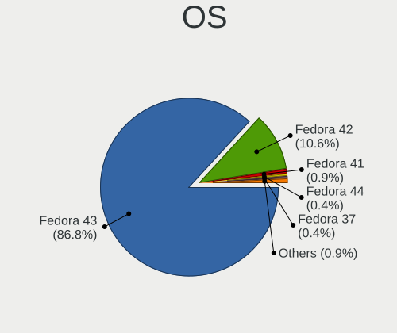

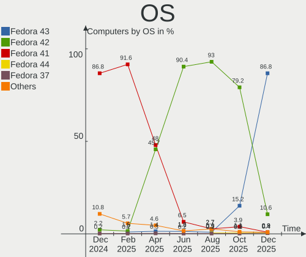

| Name      | Computers | Percent |
|-----------|-----------|---------|
| Fedora 43 | 600       | 86.83%  |
| Fedora 42 | 73        | 10.56%  |
| Fedora 41 | 6         | 0.87%   |
| Fedora 44 | 3         | 0.43%   |
| Fedora 37 | 3         | 0.43%   |
| Fedora 40 | 2         | 0.29%   |
| Fedora 36 | 2         | 0.29%   |
| Fedora 38 | 1         | 0.14%   |
| Fedora 33 | 1         | 0.14%   |

OS Family
---------

OS without a version

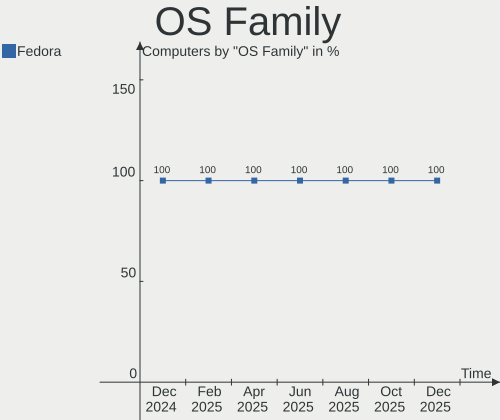

| Name   | Computers | Percent |
|--------|-----------|---------|
| Fedora | 691       | 100%    |

Kernel
------

Version of the Linux kernel

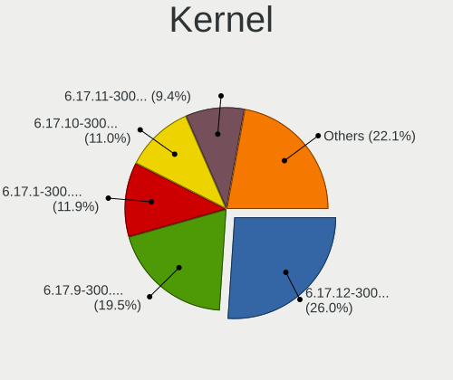

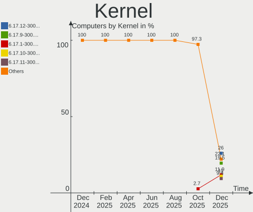

| Version                                              | Computers | Percent |
|------------------------------------------------------|-----------|---------|
| 6.17.12-300.fc43.x86_64                              | 180       | 26.05%  |
| 6.17.9-300.fc43.x86_64                               | 135       | 19.54%  |
| 6.17.1-300.fc43.x86_64                               | 82        | 11.87%  |
| 6.17.10-300.fc43.x86_64                              | 76        | 11%     |
| 6.17.11-300.fc43.x86_64                              | 65        | 9.41%   |
| 6.17.8-300.fc43.x86_64                               | 41        | 5.93%   |
| 6.17.13-200.fc42.x86_64                              | 10        | 1.45%   |
| 6.17.10-200.fc42.x86_64                              | 10        | 1.45%   |
| 6.17.9-200.fc42.x86_64                               | 9         | 1.3%    |
| 6.17.8-200.fc42.x86_64                               | 8         | 1.16%   |
| 6.17.11-200.fc42.x86_64                              | 8         | 1.16%   |
| 6.17.7-300.fc43.x86_64                               | 6         | 0.87%   |
| 6.17.12-200.fc42.x86_64                              | 6         | 0.87%   |
| 6.14.0-63.fc42.x86_64                                | 3         | 0.43%   |
| 6.18.2-cachyos1.fc43.x86_64                          | 2         | 0.29%   |
| 6.18.0-65.fc44.x86_64                                | 2         | 0.29%   |
| 6.17.7-200.fc42.x86_64                               | 2         | 0.29%   |
| 6.17.6-200.fc42.x86_64                               | 2         | 0.29%   |
| 6.17.4-200.fc42.x86_64                               | 2         | 0.29%   |
| 6.16.4-200.fc42.x86_64                               | 2         | 0.29%   |
| 6.16.12-200.fc42.x86_64                              | 2         | 0.29%   |
| 6.11.4-301.fc41.x86_64                               | 2         | 0.29%   |
| 6.8.11-300.fc40.x86_64                               | 1         | 0.14%   |
| 6.5.12-100.fc37.x86_64                               | 1         | 0.14%   |
| 6.4.15-200.fc38.x86_64                               | 1         | 0.14%   |
| 6.2.15-200.fc37.x86_64                               | 1         | 0.14%   |
| 6.2.15-100.fc36.x86_64                               | 1         | 0.14%   |
| 6.19.0-0.rc0.251204.559e608c.304.vanilla.fc43.x86_64 | 1         | 0.14%   |
| 6.18.2-300.vanilla.fc43.x86_64                       | 1         | 0.14%   |
| 6.18.2-00_cachyos_preempt.fc43.x86_64                | 1         | 0.14%   |
| 6.18.1-200.fc43.x86_64                               | 1         | 0.14%   |
| 6.18.0-559e608c4655-revert-f804a5895eba+             | 1         | 0.14%   |
| 6.18.0-364.vanilla.fc43.x86_64                       | 1         | 0.14%   |
| 6.17.9-cachyos1.fc43.x86_64                          | 1         | 0.14%   |
| 6.17.9-cachyos1.fc42.x86_64                          | 1         | 0.14%   |
| 6.17.9-400.asahi.fc43.aarch64+16k                    | 1         | 0.14%   |
| 6.17.9-400.asahi.fc42.aarch64+16k                    | 1         | 0.14%   |
| 6.17.9-200.fc42.aarch64                              | 1         | 0.14%   |
| 6.17.9-100.fc41.x86_64                               | 1         | 0.14%   |
| 6.17.8-300.fc43.aarch64                              | 1         | 0.14%   |

Kernel Family
-------------

Linux kernel without a distro release

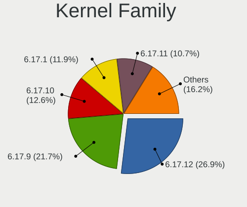

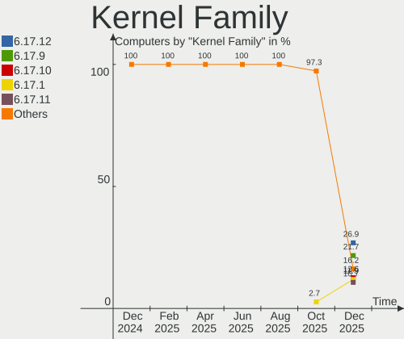

| Version | Computers | Percent |
|---------|-----------|---------|
| 6.17.12 | 186       | 26.92%  |
| 6.17.9  | 150       | 21.71%  |
| 6.17.10 | 87        | 12.59%  |
| 6.17.1  | 82        | 11.87%  |
| 6.17.11 | 74        | 10.71%  |
| 6.17.8  | 51        | 7.38%   |
| 6.17.13 | 10        | 1.45%   |
| 6.17.7  | 8         | 1.16%   |
| 6.18.2  | 4         | 0.58%   |
| 6.18.0  | 4         | 0.58%   |
| 6.14.0  | 3         | 0.43%   |
| 6.2.15  | 2         | 0.29%   |
| 6.17.6  | 2         | 0.29%   |
| 6.17.4  | 2         | 0.29%   |
| 6.16.4  | 2         | 0.29%   |
| 6.16.12 | 2         | 0.29%   |
| 6.13.11 | 2         | 0.29%   |
| 6.11.4  | 2         | 0.29%   |
| 6.8.11  | 1         | 0.14%   |
| 6.5.12  | 1         | 0.14%   |
| 6.4.15  | 1         | 0.14%   |
| 6.19.0  | 1         | 0.14%   |
| 6.18.1  | 1         | 0.14%   |
| 6.17.5  | 1         | 0.14%   |
| 6.16.9  | 1         | 0.14%   |
| 6.16.8  | 1         | 0.14%   |
| 6.16.7  | 1         | 0.14%   |
| 6.16.11 | 1         | 0.14%   |
| 6.15.9  | 1         | 0.14%   |
| 6.15.3  | 1         | 0.14%   |
| 6.15.10 | 1         | 0.14%   |
| 6.13.9  | 1         | 0.14%   |
| 6.12.1  | 1         | 0.14%   |
| 6.0.7   | 1         | 0.14%   |
| 5.19.14 | 1         | 0.14%   |
| 5.14.18 | 1         | 0.14%   |

Kernel Major Ver.
-----------------

Linux kernel major version

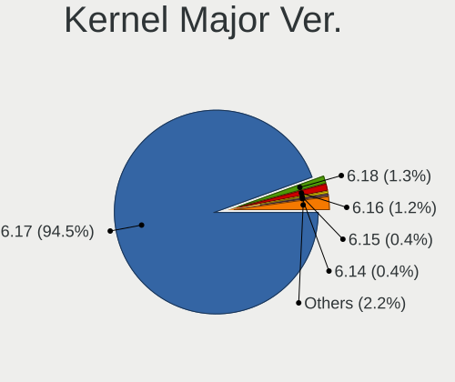

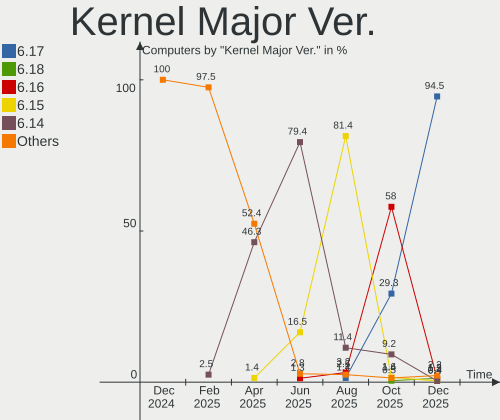

| Version | Computers | Percent |
|---------|-----------|---------|
| 6.17    | 653       | 94.5%   |
| 6.18    | 9         | 1.3%    |
| 6.16    | 8         | 1.16%   |
| 6.15    | 3         | 0.43%   |
| 6.14    | 3         | 0.43%   |
| 6.13    | 3         | 0.43%   |
| 6.2     | 2         | 0.29%   |
| 6.11    | 2         | 0.29%   |
| 6.8     | 1         | 0.14%   |
| 6.5     | 1         | 0.14%   |
| 6.4     | 1         | 0.14%   |
| 6.19    | 1         | 0.14%   |
| 6.12    | 1         | 0.14%   |
| 6.0     | 1         | 0.14%   |
| 5.19    | 1         | 0.14%   |
| 5.14    | 1         | 0.14%   |

Arch
----

OS architecture (x86_64, i586, etc.)

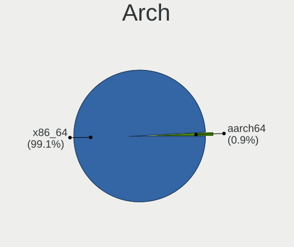

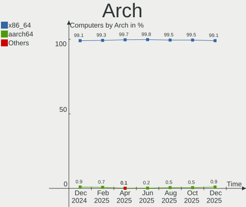

| Name    | Computers | Percent |
|---------|-----------|---------|
| x86_64  | 685       | 99.13%  |
| aarch64 | 6         | 0.87%   |

DE
--

Desktop Environment

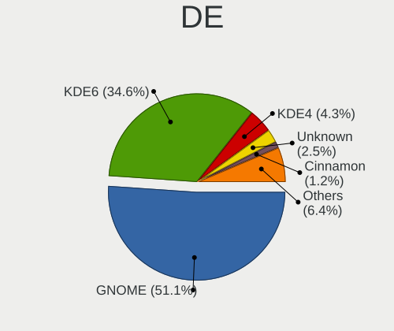

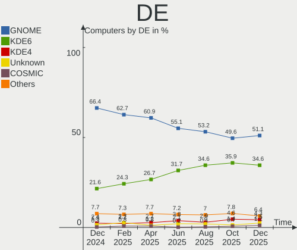

| Name          | Computers | Percent |
|---------------|-----------|---------|
| GNOME         | 353       | 51.09%  |
| KDE6          | 239       | 34.59%  |
| KDE4          | 30        | 4.34%   |
| Unknown       | 17        | 2.46%   |
| COSMIC        | 8         | 1.16%   |
| Cinnamon      | 8         | 1.16%   |
| XFCE          | 7         | 1.01%   |
| X-Cinnamon    | 5         | 0.72%   |
| niri          | 5         | 0.72%   |
| MATE          | 4         | 0.58%   |
| GNOME Classic | 4         | 0.58%   |
| Budgie        | 4         | 0.58%   |
| KDE5          | 3         | 0.43%   |
| Hyprland      | 2         | 0.29%   |
| sway:wlroots  | 1         | 0.14%   |
| i3            | 1         | 0.14%   |

Display Server
--------------

X11 or Wayland

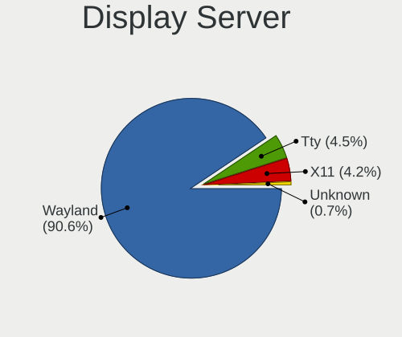

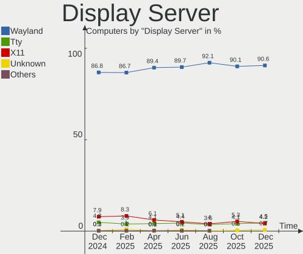

| Name    | Computers | Percent |
|---------|-----------|---------|
| Wayland | 626       | 90.59%  |
| Tty     | 31        | 4.49%   |
| X11     | 29        | 4.2%    |
| Unknown | 5         | 0.72%   |

Display Manager
---------------

SDDM, LightDM, etc.

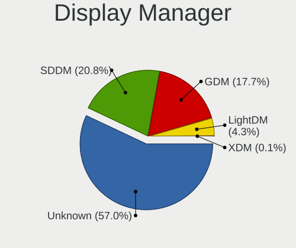

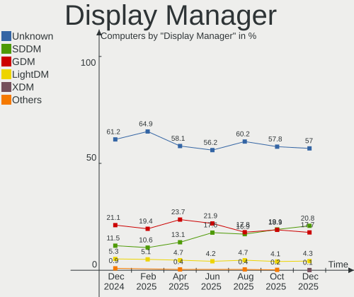

| Name    | Computers | Percent |
|---------|-----------|---------|
| Unknown | 394       | 57.02%  |
| SDDM    | 144       | 20.84%  |
| GDM     | 122       | 17.66%  |
| LightDM | 30        | 4.34%   |
| XDM     | 1         | 0.14%   |

OS Lang
-------

Language

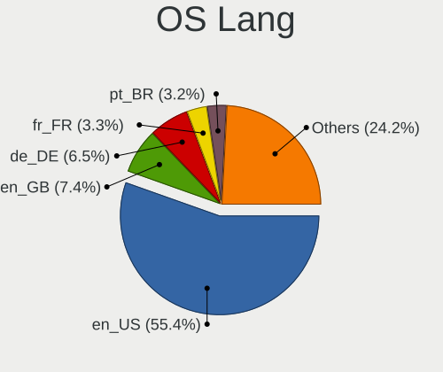

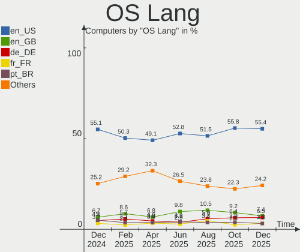

| Lang    | Computers | Percent |
|---------|-----------|---------|
| en_US   | 383       | 55.43%  |
| en_GB   | 51        | 7.38%   |
| de_DE   | 45        | 6.51%   |
| fr_FR   | 23        | 3.33%   |
| pt_BR   | 22        | 3.18%   |
| ru_RU   | 20        | 2.89%   |
| it_IT   | 17        | 2.46%   |
| en_AU   | 17        | 2.46%   |
| es_ES   | 16        | 2.32%   |
| en_CA   | 11        | 1.59%   |
| pl_PL   | 9         | 1.3%    |
| en_IN   | 8         | 1.16%   |
| nl_NL   | 7         | 1.01%   |
| fi_FI   | 4         | 0.58%   |
| en_NZ   | 4         | 0.58%   |
| en_IL   | 4         | 0.58%   |
| en_DK   | 4         | 0.58%   |
| zh_CN   | 3         | 0.43%   |
| tr_TR   | 3         | 0.43%   |
| en_ZA   | 3         | 0.43%   |
| en_PH   | 3         | 0.43%   |
| sv_SE   | 2         | 0.29%   |
| ru_UA   | 2         | 0.29%   |
| es_MX   | 2         | 0.29%   |
| es_CR   | 2         | 0.29%   |
| en_IE   | 2         | 0.29%   |
| C       | 2         | 0.29%   |
| Unknown | 2         | 0.29%   |
| zh_TW   | 1         | 0.14%   |
| uk_UA   | 1         | 0.14%   |
| pt_PT   | 1         | 0.14%   |
| nl_BE   | 1         | 0.14%   |
| lt_LT   | 1         | 0.14%   |
| ko_KR   | 1         | 0.14%   |
| ja_JP   | 1         | 0.14%   |
| hu_HU   | 1         | 0.14%   |
| fr_CH   | 1         | 0.14%   |
| fr_CA   | 1         | 0.14%   |
| es_UY   | 1         | 0.14%   |
| es_PA   | 1         | 0.14%   |

Boot Mode
---------

EFI or BIOS

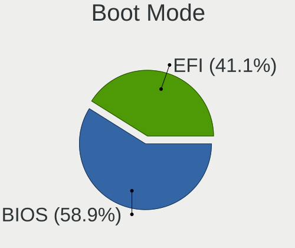

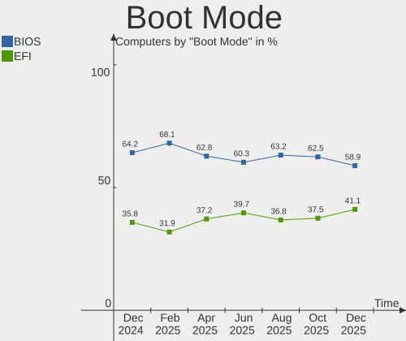

| Mode | Computers | Percent |
|------|-----------|---------|
| BIOS | 407       | 58.9%   |
| EFI  | 284       | 41.1%   |

Filesystem
----------

Type of filesystem

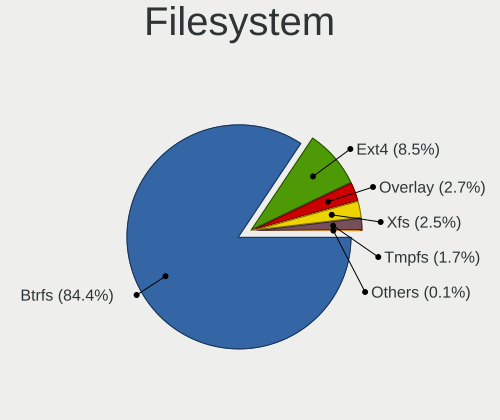

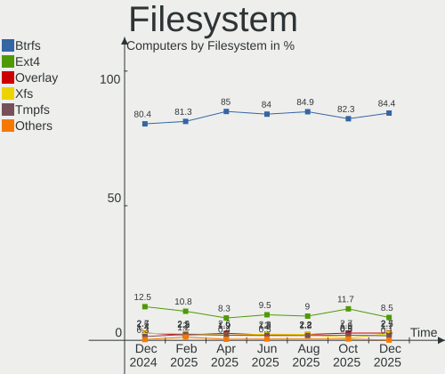

| Type    | Computers | Percent |
|---------|-----------|---------|
| Btrfs   | 583       | 84.37%  |
| Ext4    | 59        | 8.54%   |
| Overlay | 19        | 2.75%   |
| Xfs     | 17        | 2.46%   |
| Tmpfs   | 12        | 1.74%   |
| Zfs     | 1         | 0.14%   |

Part. scheme
------------

Scheme of partitioning

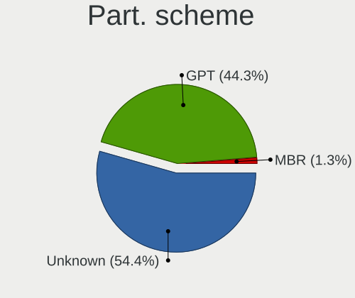

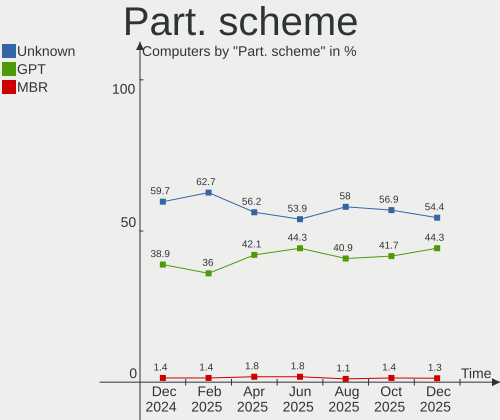

| Type    | Computers | Percent |
|---------|-----------|---------|
| Unknown | 376       | 54.41%  |
| GPT     | 306       | 44.28%  |
| MBR     | 9         | 1.3%    |

Dual Boot with Linux/BSD
------------------------

Hosting more than one Linux/BSD

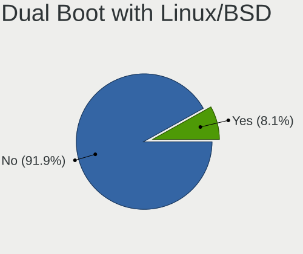

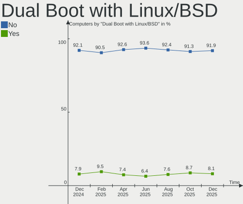

| Dual boot | Computers | Percent |
|-----------|-----------|---------|
| No        | 635       | 91.9%   |
| Yes       | 56        | 8.1%    |

Dual Boot (Win)
---------------

Hosting Linux and Windows

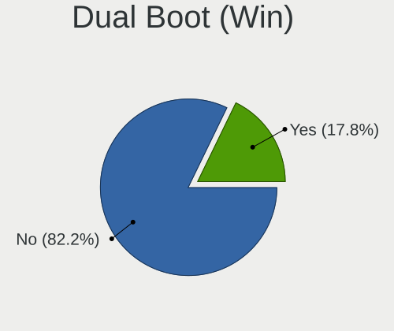

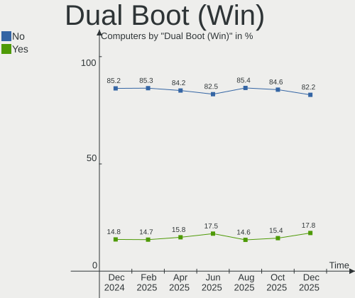

| Dual boot | Computers | Percent |
|-----------|-----------|---------|
| No        | 568       | 82.2%   |
| Yes       | 123       | 17.8%   |

Board
-----

Vendor
------

Motherboard manufacturer

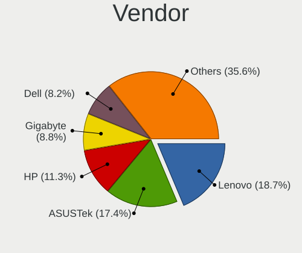

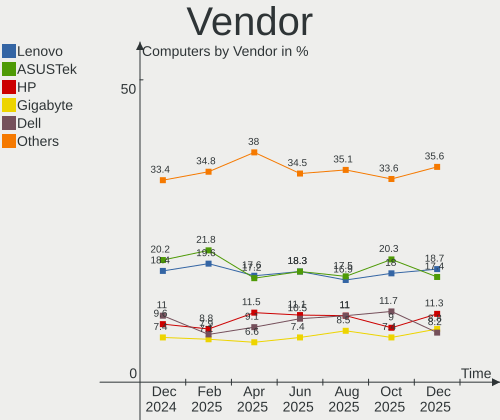

| Name                                 | Computers | Percent |
|--------------------------------------|-----------|---------|
| Lenovo                               | 129       | 18.67%  |
| ASUSTek Computer                     | 120       | 17.37%  |
| Hewlett-Packard                      | 78        | 11.29%  |
| Gigabyte Technology                  | 61        | 8.83%   |
| Dell                                 | 57        | 8.25%   |
| MSI                                  | 54        | 7.81%   |
| Apple                                | 32        | 4.63%   |
| ASRock                               | 24        | 3.47%   |
| Acer                                 | 20        | 2.89%   |
| Samsung Electronics                  | 10        | 1.45%   |
| Unknown                              | 9         | 1.3%    |
| HUAWEI                               | 8         | 1.16%   |
| Intel                                | 7         | 1.01%   |
| Microsoft                            | 6         | 0.87%   |
| GMKtec                               | 6         | 0.87%   |
| Fujitsu                              | 6         | 0.87%   |
| Framework                            | 6         | 0.87%   |
| Toshiba                              | 4         | 0.58%   |
| Shenzhen Meigao Electronic Equipment | 4         | 0.58%   |
| Google                               | 4         | 0.58%   |
| Alienware                            | 4         | 0.58%   |
| Standard                             | 2         | 0.29%   |
| Sony                                 | 2         | 0.29%   |
| LG Electronics                       | 2         | 0.29%   |
| GPD                                  | 2         | 0.29%   |
| Chuwi                                | 2         | 0.29%   |
| xunlong                              | 1         | 0.14%   |
| Win Element                          | 1         | 0.14%   |
| UGREEN                               | 1         | 0.14%   |
| TYAN Computer                        | 1         | 0.14%   |
| TOPC                                 | 1         | 0.14%   |
| TECNO Mobile Limited                 | 1         | 0.14%   |
| Teclast                              | 1         | 0.14%   |
| SZQFTX                               | 1         | 0.14%   |
| SLIMBOOK                             | 1         | 0.14%   |
| Schenker                             | 1         | 0.14%   |
| Raspberry Pi Foundation              | 1         | 0.14%   |
| Positivo                             | 1         | 0.14%   |
| PELADN                               | 1         | 0.14%   |
| Pegatron                             | 1         | 0.14%   |

Model
-----

Motherboard model

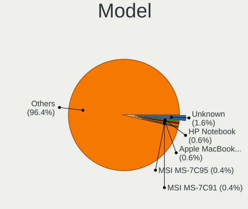

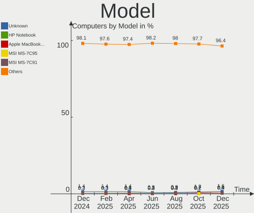

| Name                                           | Computers | Percent |
|------------------------------------------------|-----------|---------|
| Unknown                                        | 11        | 1.59%   |
| HP Notebook                                    | 4         | 0.58%   |
| Apple MacBookAir7,2                            | 4         | 0.58%   |
| MSI MS-7C95                                    | 3         | 0.43%   |
| MSI MS-7C91                                    | 3         | 0.43%   |
| HP OmniBook X Flip Laptop 16-as0xxx            | 3         | 0.43%   |
| ASUS PRIME Z270-P                              | 3         | 0.43%   |
| ASUS ASUS Zenbook S 16 UM5606WA_UM5606WA       | 3         | 0.43%   |
| Apple MacBookPro11,3                           | 3         | 0.43%   |
| Shenzhen Meigao Electronic Equipment AI Series | 2         | 0.29%   |
| Samsung 750XGK                                 | 2         | 0.29%   |
| MSI MS-7E61                                    | 2         | 0.29%   |
| MSI MS-7E12                                    | 2         | 0.29%   |
| MSI MS-7D54                                    | 2         | 0.29%   |
| MSI MS-7B89                                    | 2         | 0.29%   |
| MSI MS-7821                                    | 2         | 0.29%   |
| Lenovo ThinkPad P14s Gen 6 AMD 21QL0020US      | 2         | 0.29%   |
| Lenovo ThinkPad L13 Yoga Gen 2 20VK0018US      | 2         | 0.29%   |
| HP Pavilion dv6                                | 2         | 0.29%   |
| HP Laptop 15s-eq2xxx                           | 2         | 0.29%   |
| HP Laptop 15-fc0xxx                            | 2         | 0.29%   |
| HP Laptop 14-fq0xxx                            | 2         | 0.29%   |
| HP EliteBook 840 G5                            | 2         | 0.29%   |
| GMKtec NucBox M6 Ultra                         | 2         | 0.29%   |
| Gigabyte Z790 AORUS ELITE AX ICE               | 2         | 0.29%   |
| Gigabyte X570 AORUS ULTRA                      | 2         | 0.29%   |
| Gigabyte B550 AORUS ELITE                      | 2         | 0.29%   |
| Framework Laptop 16 (AMD Ryzen 7040 Series)    | 2         | 0.29%   |
| Framework Laptop 13 (AMD Ryzen AI 300 Series)  | 2         | 0.29%   |
| Dell Precision Tower 5810                      | 2         | 0.29%   |
| Dell OptiPlex 3050                             | 2         | 0.29%   |
| Dell G15 5515                                  | 2         | 0.29%   |
| ASUS VivoBook_ASUSLaptop X7400PC_N7400PC       | 2         | 0.29%   |
| ASUS TUF Gaming B550-PLUS                      | 2         | 0.29%   |
| ASUS ROG STRIX B450-F GAMING                   | 2         | 0.29%   |
| ASUS ROG CROSSHAIR X870E HERO                  | 2         | 0.29%   |
| ASUS PRIME Z790-P WIFI                         | 2         | 0.29%   |
| ASUS PRIME B550M-K                             | 2         | 0.29%   |
| ASUS PRIME A320M-K                             | 2         | 0.29%   |
| ASRock X870E Taichi                            | 2         | 0.29%   |

Model Family
------------

Motherboard model prefix

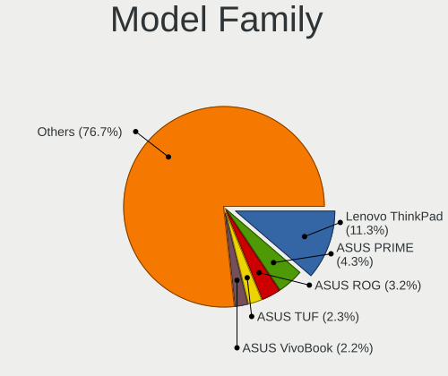

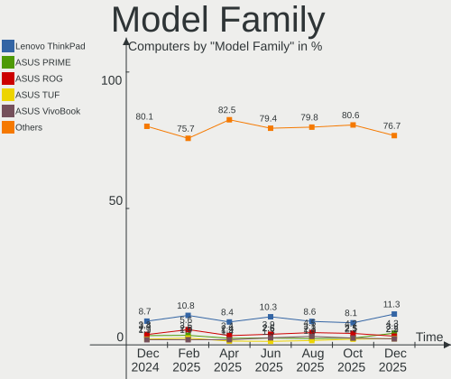

| Name               | Computers | Percent |
|--------------------|-----------|---------|
| Lenovo ThinkPad    | 78        | 11.29%  |
| ASUS PRIME         | 30        | 4.34%   |
| ASUS ROG           | 22        | 3.18%   |
| ASUS TUF           | 16        | 2.32%   |
| ASUS VivoBook      | 15        | 2.17%   |
| Lenovo IdeaPad     | 13        | 1.88%   |
| Dell Latitude      | 13        | 1.88%   |
| HP EliteBook       | 12        | 1.74%   |
| Acer Aspire        | 12        | 1.74%   |
| Lenovo Legion      | 11        | 1.59%   |
| Unknown            | 11        | 1.59%   |
| Lenovo Yoga        | 10        | 1.45%   |
| Dell Inspiron      | 10        | 1.45%   |
| HP Pavilion        | 9         | 1.3%    |
| Dell XPS           | 9         | 1.3%    |
| ASUS ASUS          | 9         | 1.3%    |
| HP Laptop          | 8         | 1.16%   |
| Dell Precision     | 8         | 1.16%   |
| Dell OptiPlex      | 7         | 1.01%   |
| Microsoft Surface  | 6         | 0.87%   |
| HP OmniBook        | 6         | 0.87%   |
| ASUS Zenbook       | 6         | 0.87%   |
| Apple MacBookPro11 | 6         | 0.87%   |
| Lenovo ThinkBook   | 5         | 0.72%   |
| GMKtec NucBox      | 5         | 0.72%   |
| Gigabyte B550      | 5         | 0.72%   |
| Framework Laptop   | 5         | 0.72%   |
| Apple MacBookAir7  | 5         | 0.72%   |
| Lenovo ThinkCentre | 4         | 0.58%   |
| HP ZBook           | 4         | 0.58%   |
| HP OMEN            | 4         | 0.58%   |
| HP Notebook        | 4         | 0.58%   |
| Gigabyte Z790      | 4         | 0.58%   |
| Gigabyte X570      | 4         | 0.58%   |
| Toshiba Satellite  | 3         | 0.43%   |
| MSI US             | 3         | 0.43%   |
| MSI MS-7C95        | 3         | 0.43%   |
| MSI MS-7C91        | 3         | 0.43%   |
| HP ProDesk         | 3         | 0.43%   |
| HP ProBook         | 3         | 0.43%   |

MFG Year
--------

Motherboard manufacture year

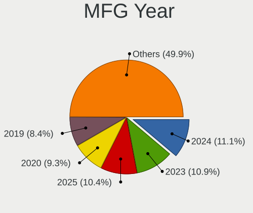

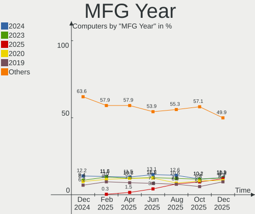

| Year    | Computers | Percent |
|---------|-----------|---------|
| 2024    | 77        | 11.14%  |
| 2023    | 75        | 10.85%  |
| 2025    | 72        | 10.42%  |
| 2020    | 64        | 9.26%   |
| 2019    | 58        | 8.39%   |
| 2022    | 57        | 8.25%   |
| 2021    | 56        | 8.1%    |
| 2018    | 49        | 7.09%   |
| 2017    | 35        | 5.07%   |
| 2013    | 26        | 3.76%   |
| 2016    | 23        | 3.33%   |
| 2015    | 23        | 3.33%   |
| 2012    | 22        | 3.18%   |
| 2014    | 16        | 2.32%   |
| 2011    | 12        | 1.74%   |
| 2009    | 6         | 0.87%   |
| 2008    | 6         | 0.87%   |
| 2010    | 5         | 0.72%   |
| 2006    | 4         | 0.58%   |
| Unknown | 3         | 0.43%   |
| 2007    | 2         | 0.29%   |

Form Factor
-----------

Physical design of the computer

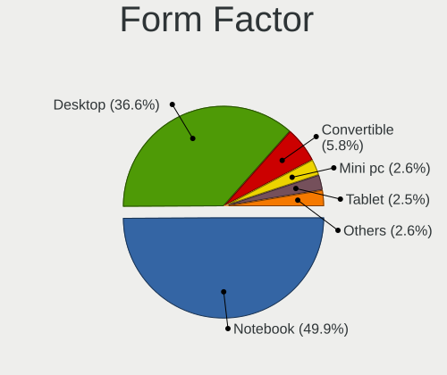

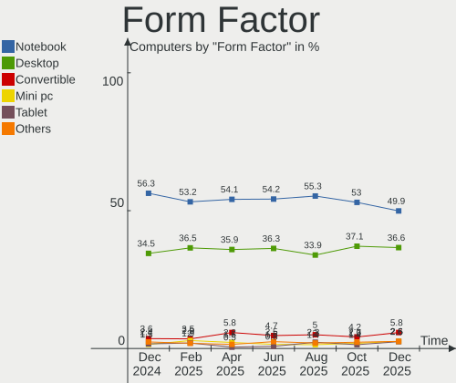

| Name           | Computers | Percent |
|----------------|-----------|---------|
| Notebook       | 345       | 49.93%  |
| Desktop        | 253       | 36.61%  |
| Convertible    | 40        | 5.79%   |
| Mini pc        | 18        | 2.6%    |
| Tablet         | 17        | 2.46%   |
| All in one     | 10        | 1.45%   |
| System on chip | 3         | 0.43%   |
| Server         | 3         | 0.43%   |
| Other          | 2         | 0.29%   |

Secure Boot
-----------

Enabled or disabled

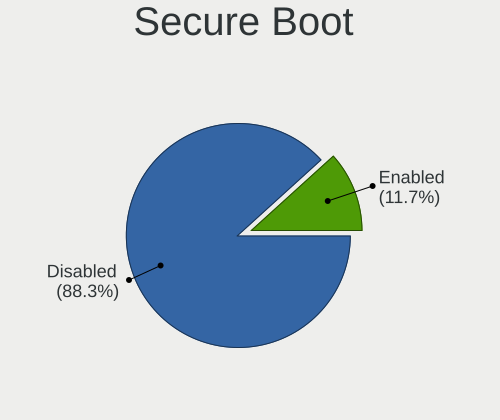

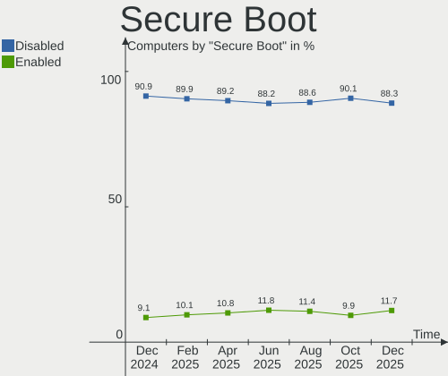

| State    | Computers | Percent |
|----------|-----------|---------|
| Disabled | 610       | 88.28%  |
| Enabled  | 81        | 11.72%  |

Coreboot
--------

Have coreboot on board

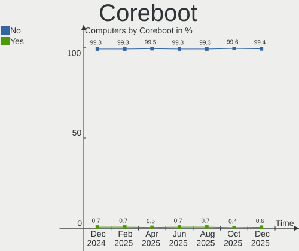

| Used | Computers | Percent |
|------|-----------|---------|
| No   | 687       | 99.42%  |
| Yes  | 4         | 0.58%   |

RAM Size
--------

Total RAM memory

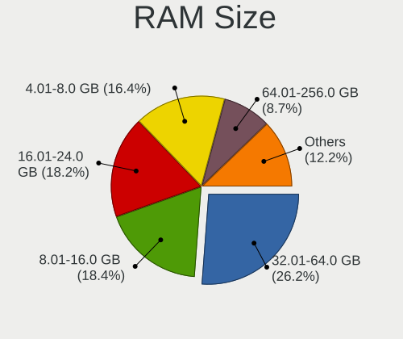

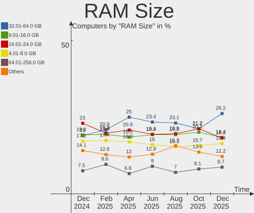

| Size in GB  | Computers | Percent |
|-------------|-----------|---------|
| 32.01-64.0  | 181       | 26.19%  |
| 8.01-16.0   | 127       | 18.38%  |
| 16.01-24.0  | 126       | 18.23%  |
| 4.01-8.0    | 113       | 16.35%  |
| 64.01-256.0 | 60        | 8.68%   |
| 24.01-32.0  | 54        | 7.81%   |
| 3.01-4.0    | 30        | 4.34%   |

RAM Used
--------

Used RAM memory

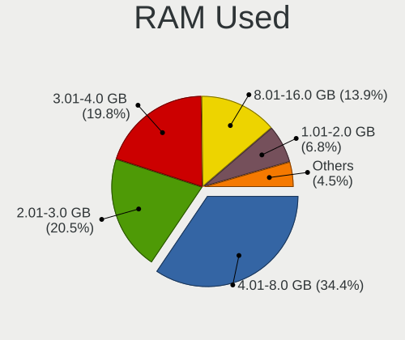

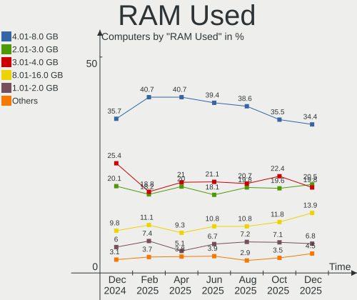

| Used GB    | Computers | Percent |
|------------|-----------|---------|
| 4.01-8.0   | 238       | 34.44%  |
| 2.01-3.0   | 142       | 20.55%  |
| 3.01-4.0   | 137       | 19.83%  |
| 8.01-16.0  | 96        | 13.89%  |
| 1.01-2.0   | 47        | 6.8%    |
| 16.01-24.0 | 16        | 2.32%   |
| 0.51-1.0   | 9         | 1.3%    |
| 24.01-32.0 | 6         | 0.87%   |

Total Drives
------------

Number of drives on board

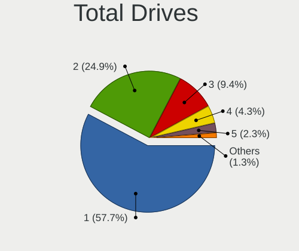

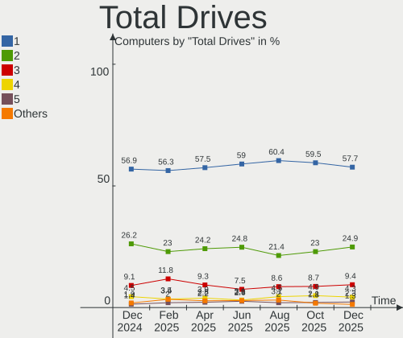

| Drives | Computers | Percent |
|--------|-----------|---------|
| 1      | 399       | 57.74%  |
| 2      | 172       | 24.89%  |
| 3      | 65        | 9.41%   |
| 4      | 30        | 4.34%   |
| 5      | 16        | 2.32%   |
| 6      | 4         | 0.58%   |
| 8      | 3         | 0.43%   |
| 0      | 2         | 0.29%   |

Has CD-ROM
----------

Has CD-ROM on board

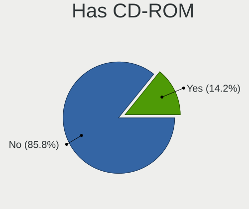

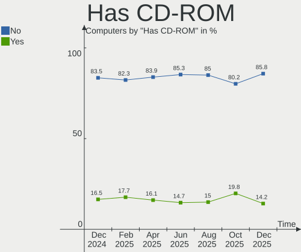

| Presented | Computers | Percent |
|-----------|-----------|---------|
| No        | 593       | 85.82%  |
| Yes       | 98        | 14.18%  |

Has Ethernet
------------

Has Ethernet on board

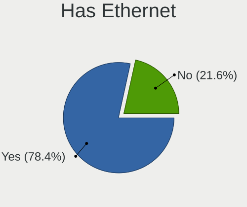

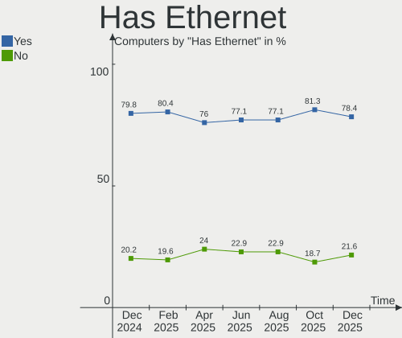

| Presented | Computers | Percent |
|-----------|-----------|---------|
| Yes       | 542       | 78.44%  |
| No        | 149       | 21.56%  |

Has WiFi
--------

Has WiFi module

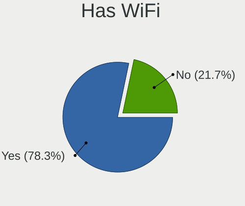

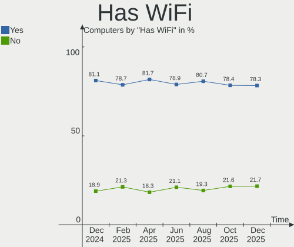

| Presented | Computers | Percent |
|-----------|-----------|---------|
| Yes       | 541       | 78.29%  |
| No        | 150       | 21.71%  |

Has Bluetooth
-------------

Has Bluetooth module

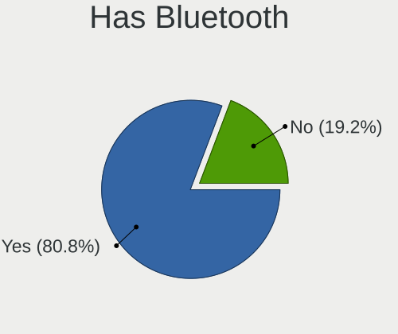

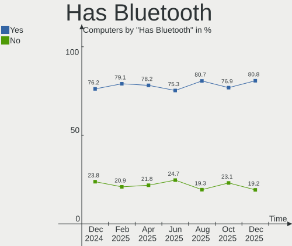

| Presented | Computers | Percent |
|-----------|-----------|---------|
| Yes       | 558       | 80.75%  |
| No        | 133       | 19.25%  |

Location
--------

Country
-------

Geographic location (country)

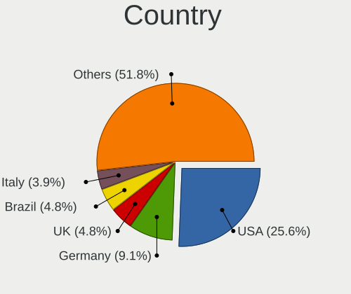

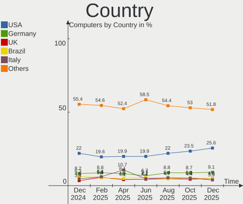

| Country         | Computers | Percent |
|-----------------|-----------|---------|
| USA             | 177       | 25.62%  |
| Germany         | 63        | 9.12%   |
| UK              | 33        | 4.78%   |
| Brazil          | 33        | 4.78%   |
| Italy           | 27        | 3.91%   |
| Australia       | 26        | 3.76%   |
| France          | 25        | 3.62%   |
| Canada          | 25        | 3.62%   |
| India           | 22        | 3.18%   |
| Spain           | 18        | 2.6%    |
| Poland          | 16        | 2.32%   |
| Russia          | 15        | 2.17%   |
| Netherlands     | 11        | 1.59%   |
| Finland         | 11        | 1.59%   |
| Switzerland     | 10        | 1.45%   |
| Portugal        | 9         | 1.3%    |
| Indonesia       | 8         | 1.16%   |
| Sweden          | 7         | 1.01%   |
| Israel          | 7         | 1.01%   |
| Denmark         | 7         | 1.01%   |
| Thailand        | 6         | 0.87%   |
| Philippines     | 6         | 0.87%   |
| Austria         | 6         | 0.87%   |
| Norway          | 5         | 0.72%   |
| Mexico          | 5         | 0.72%   |
| Malaysia        | 5         | 0.72%   |
| Belarus         | 5         | 0.72%   |
| Ukraine         | 4         | 0.58%   |
| The Netherlands | 4         | 0.58%   |
| South Africa    | 4         | 0.58%   |
| Romania         | 4         | 0.58%   |
| New Zealand     | 4         | 0.58%   |
| Colombia        | 4         | 0.58%   |
| Bulgaria        | 4         | 0.58%   |
| Vietnam         | 3         | 0.43%   |
| Turkey          | 3         | 0.43%   |
| South Korea     | 3         | 0.43%   |
| Pakistan        | 3         | 0.43%   |
| Morocco         | 3         | 0.43%   |
| Kenya           | 3         | 0.43%   |

City
----

Geographic location (city)

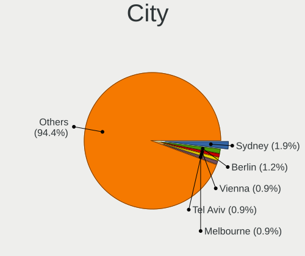

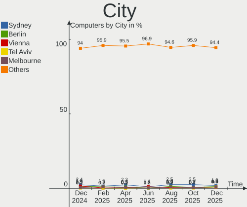

| City              | Computers | Percent |
|-------------------|-----------|---------|
| Sydney            | 13        | 1.88%   |
| Berlin            | 8         | 1.16%   |
| Vienna            | 6         | 0.87%   |
| Tel Aviv          | 6         | 0.87%   |
| Melbourne         | 6         | 0.87%   |
| Sao Paulo         | 5         | 0.72%   |
| Milan             | 5         | 0.72%   |
| Helsinki          | 5         | 0.72%   |
| Hanover           | 5         | 0.72%   |
| Frankfurt am Main | 5         | 0.72%   |
| Calgary           | 5         | 0.72%   |
| Amsterdam         | 5         | 0.72%   |
| Minsk             | 4         | 0.58%   |
| Jakarta           | 4         | 0.58%   |
| Chicago           | 4         | 0.58%   |
| Bengaluru         | 4         | 0.58%   |
| Zurich            | 3         | 0.43%   |
| Warsaw            | 3         | 0.43%   |
| Warminster        | 3         | 0.43%   |
| Toronto           | 3         | 0.43%   |
| Shah Alam         | 3         | 0.43%   |
| Paris             | 3         | 0.43%   |
| Nairobi           | 3         | 0.43%   |
| Moscow            | 3         | 0.43%   |
| Medway            | 3         | 0.43%   |
| Madrid            | 3         | 0.43%   |
| Los Angeles       | 3         | 0.43%   |
| Lisbon            | 3         | 0.43%   |
| Johannesburg      | 3         | 0.43%   |
| Haltom City       | 3         | 0.43%   |
| Dongjak-gu        | 3         | 0.43%   |
| Bangkok           | 3         | 0.43%   |
| Ahmedabad         | 3         | 0.43%   |
| Würzburg         | 2         | 0.29%   |
| Wroclaw           | 2         | 0.29%   |
| Wellington        | 2         | 0.29%   |
| Warner            | 2         | 0.29%   |
| Virginia Beach    | 2         | 0.29%   |
| Tunis             | 2         | 0.29%   |
| Ternopil          | 2         | 0.29%   |

Drives
------

Drive Vendor
------------

Hard drive vendors

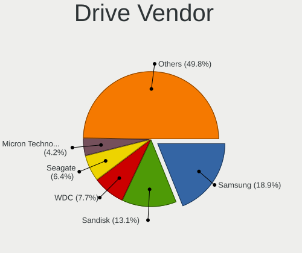

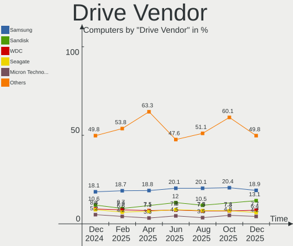

| Vendor                         | Computers | Drives | Percent |
|--------------------------------|-----------|--------|---------|
| Samsung Electronics            | 199       | 245    | 18.9%   |
| Sandisk                        | 138       | 145    | 13.11%  |
| WDC                            | 81        | 103    | 7.69%   |
| Seagate                        | 67        | 84     | 6.36%   |
| Micron Technology              | 44        | 44     | 4.18%   |
| Kingston                       | 44        | 48     | 4.18%   |
| Micron/Crucial Technology      | 40        | 45     | 3.8%    |
| SK hynix                       | 37        | 40     | 3.51%   |
| Crucial                        | 30        | 30     | 2.85%   |
| Toshiba                        | 28        | 30     | 2.66%   |
| Phison Electronics             | 26        | 30     | 2.47%   |
| MAXIO Technology (Hangzhou)    | 24        | 25     | 2.28%   |
| Intel                          | 24        | 28     | 2.28%   |
| Apple                          | 23        | 35     | 2.18%   |
| Unknown                        | 21        | 22     | 1.99%   |
| KIOXIA                         | 21        | 23     | 1.99%   |
| Kingston Technology Company    | 21        | 23     | 1.99%   |
| A-DATA Technology              | 14        | 14     | 1.33%   |
| Shenzhen Longsys Electronics   | 13        | 13     | 1.23%   |
| Realtek Semiconductor          | 12        | 12     | 1.14%   |
| ADATA Technology               | 11        | 11     | 1.04%   |
| HGST                           | 10        | 11     | 0.95%   |
| China                          | 8         | 8      | 0.76%   |
| PNY                            | 7         | 7      | 0.66%   |
| Team                           | 6         | 6      | 0.57%   |
| Silicon Motion                 | 6         | 6      | 0.57%   |
| JMicron Technology             | 5         | 5      | 0.47%   |
| Hitachi                        | 5         | 5      | 0.47%   |
| Union Memory                   | 4         | 4      | 0.38%   |
| OCZ                            | 4         | 5      | 0.38%   |
| Unknown                        | 4         | 4      | 0.38%   |
| SPCC                           | 3         | 3      | 0.28%   |
| Solid State Storage Technology | 3         | 3      | 0.28%   |
| Patriot                        | 3         | 3      | 0.28%   |
| KingSpec                       | 3         | 3      | 0.28%   |
| USB                            | 2         | 2      | 0.19%   |
| T-FORCE                        | 2         | 2      | 0.19%   |
| SOLIDIGM                       | 2         | 2      | 0.19%   |
| SABRENT                        | 2         | 3      | 0.19%   |
| Realtek                        | 2         | 2      | 0.19%   |

Drive Model
-----------

Hard drive models

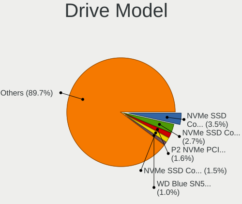

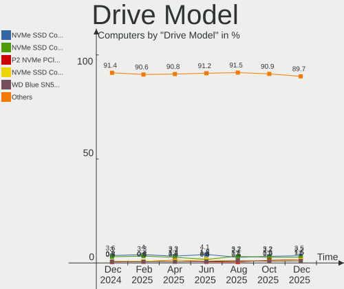

| Model                                                | Computers | Percent |
|------------------------------------------------------|-----------|---------|
| Samsung NVMe SSD Controller SM981/PM981/PM983 1TB    | 40        | 3.51%   |
| Samsung NVMe SSD Controller PM9A1/PM9A3/980PRO 1TB   | 31        | 2.72%   |
| Micron/Crucial P2 NVMe PCIe SSD 2TB                  | 18        | 1.58%   |
| MAXIO (Hangzhou) NVMe SSD Controller MAP1202 2TB     | 17        | 1.49%   |
| Sandisk WD Blue SN550 NVMe SSD 1024GB                | 11        | 0.96%   |
| Sandisk WD Black SN750 / PC SN730 NVMe SSD 500GB     | 10        | 0.88%   |
| Seagate ST2000DM008-2UB102 2TB                       | 7         | 0.61%   |
| Sandisk WD_BLACK SN850X 1000GB                       | 7         | 0.61%   |
| Sandisk WD_BLACK SN770 1TB                           | 7         | 0.61%   |
| Samsung SSD 990 EVO Plus 2TB                         | 7         | 0.61%   |
| Samsung NVMe SSD Controller SM961/PM961/SM963 1024GB | 7         | 0.61%   |
| Phison E16 PCIe4 NVMe Controller 1TB                 | 7         | 0.61%   |
| Kingston SA400S37240G 240GB SSD                      | 7         | 0.61%   |
| Crucial CT1000MX500SSD1 1TB                          | 7         | 0.61%   |
| Seagate ST1000DM010-2EP102 1TB                       | 6         | 0.53%   |
| Sandisk WD_BLACK SN850X 2000GB                       | 6         | 0.53%   |
| Sandisk WD Black SN850 1TB                           | 6         | 0.53%   |
| Samsung SSD 990 PRO 4TB                              | 6         | 0.53%   |
| Samsung SSD 990 PRO 2TB                              | 6         | 0.53%   |
| Samsung SSD 990 EVO Plus 1TB                         | 6         | 0.53%   |
| Samsung SSD 870 EVO 500GB                            | 6         | 0.53%   |
| Samsung SSD 860 EVO 1TB                              | 6         | 0.53%   |
| Phison E12 NVMe Controller 1TB                       | 6         | 0.53%   |
| Micron/Crucial CT2000P3PSSD8 2TB                     | 6         | 0.53%   |
| Kingston SA400S37480G 480GB SSD                      | 6         | 0.53%   |
| WDC WD10EZEX-08WN4A0 1TB                             | 5         | 0.44%   |
| Toshiba MQ04ABF100 1TB                               | 5         | 0.44%   |
| Seagate ST500DM002-1BD142 500GB                      | 5         | 0.44%   |
| Samsung SSD 990 PRO 1TB                              | 5         | 0.44%   |
| Samsung SSD 850 EVO 250GB                            | 5         | 0.44%   |
| Micron/Crucial P1 NVMe PCIe SSD 1TB                  | 5         | 0.44%   |
| Kingston Company SNV3S1000G 1TB                      | 5         | 0.44%   |
| Kingston SV300S37A120G 120GB SSD                     | 5         | 0.44%   |
| WDC WD10EZEX-00WN4A0 1TB                             | 4         | 0.35%   |
| Unknown MMC Card  64GB                               | 4         | 0.35%   |
| Unknown MMC Card  128GB                              | 4         | 0.35%   |
| Seagate ST1000LM035-1RK172 1TB                       | 4         | 0.35%   |
| Sandisk WD_BLACK SN770 2TB                           | 4         | 0.35%   |
| Sandisk WD_BLACK SN7100 2TB                          | 4         | 0.35%   |
| Sandisk WD Blue SN570 1TB                            | 4         | 0.35%   |

HDD Vendor
----------

Hard disk drive vendors

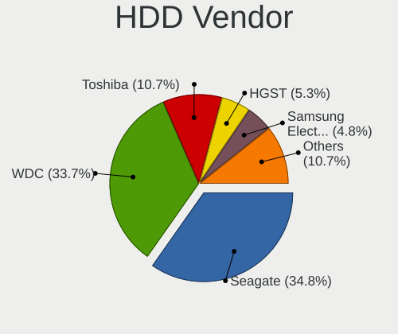

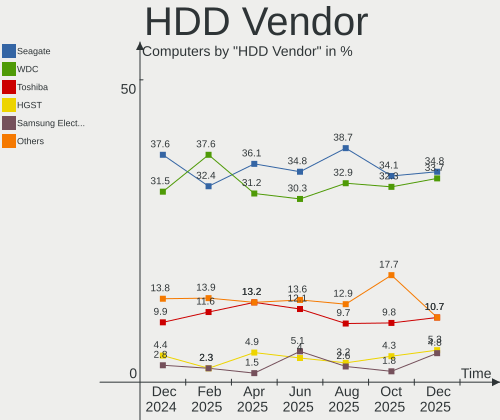

| Vendor              | Computers | Drives | Percent |
|---------------------|-----------|--------|---------|
| Seagate             | 65        | 82     | 34.76%  |
| WDC                 | 63        | 78     | 33.69%  |
| Toshiba             | 20        | 22     | 10.7%   |
| HGST                | 10        | 11     | 5.35%   |
| Samsung Electronics | 9         | 11     | 4.81%   |
| Hitachi             | 5         | 5      | 2.67%   |
| Unknown             | 3         | 3      | 1.6%    |
| JMicron Technology  | 3         | 3      | 1.6%    |
| Apple               | 2         | 2      | 1.07%   |
| USB3.0              | 1         | 1      | 0.53%   |
| Shenzhen            | 1         | 1      | 0.53%   |
| SABRENT             | 1         | 2      | 0.53%   |
| HGST HTS            | 1         | 1      | 0.53%   |
| Hewlett-Packard     | 1         | 1      | 0.53%   |
| External            | 1         | 1      | 0.53%   |
| ASMT                | 1         | 2      | 0.53%   |

SSD Vendor
----------

Solid state drive vendors

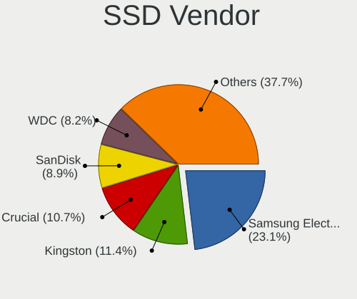

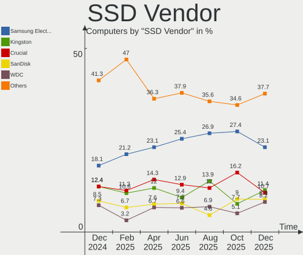

| Vendor              | Computers | Drives | Percent |
|---------------------|-----------|--------|---------|
| Samsung Electronics | 65        | 76     | 23.13%  |
| Kingston            | 32        | 35     | 11.39%  |
| Crucial             | 30        | 30     | 10.68%  |
| SanDisk             | 25        | 25     | 8.9%    |
| WDC                 | 23        | 24     | 8.19%   |
| Apple               | 14        | 14     | 4.98%   |
| A-DATA Technology   | 11        | 11     | 3.91%   |
| PNY                 | 7         | 7      | 2.49%   |
| Intel               | 7         | 7      | 2.49%   |
| China               | 7         | 7      | 2.49%   |
| Team                | 6         | 6      | 2.14%   |
| SK hynix            | 5         | 5      | 1.78%   |
| Micron Technology   | 5         | 5      | 1.78%   |
| OCZ                 | 4         | 5      | 1.42%   |
| Toshiba             | 3         | 3      | 1.07%   |
| SPCC                | 3         | 3      | 1.07%   |
| Patriot             | 3         | 3      | 1.07%   |
| KingSpec            | 3         | 3      | 1.07%   |
| Lexar               | 2         | 2      | 0.71%   |
| GOODRAM             | 2         | 2      | 0.71%   |
| Gigabyte Technology | 2         | 2      | 0.71%   |
| XUM                 | 1         | 1      | 0.36%   |
| X12                 | 1         | 1      | 0.36%   |
| TEXTORM             | 1         | 1      | 0.36%   |
| T-FORCE             | 1         | 1      | 0.36%   |
| Super Talent        | 1         | 1      | 0.36%   |
| SABRENT             | 1         | 1      | 0.36%   |
| Rayson              | 1         | 1      | 0.36%   |
| OV                  | 1         | 1      | 0.36%   |
| NVMe                | 1         | 2      | 0.36%   |
| MidasForce          | 1         | 1      | 0.36%   |
| LITEON              | 1         | 1      | 0.36%   |
| KODAK               | 1         | 1      | 0.36%   |
| INNOVATION IT       | 1         | 1      | 0.36%   |
| HUSKY               | 1         | 1      | 0.36%   |
| HS-SSD-E100         | 1         | 1      | 0.36%   |
| Fanxiang            | 1         | 1      | 0.36%   |
| Corsair             | 1         | 1      | 0.36%   |
| CONSISTENT          | 1         | 1      | 0.36%   |
| Colorful            | 1         | 1      | 0.36%   |

Drive Kind
----------

HDD or SSD

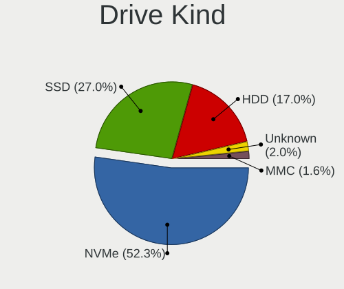

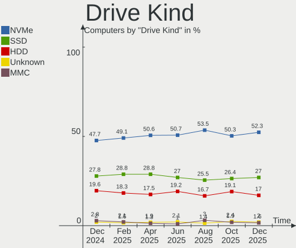

| Kind    | Computers | Drives | Percent |
|---------|-----------|--------|---------|
| NVMe    | 485       | 630    | 52.26%  |
| SSD     | 251       | 298    | 27.05%  |
| HDD     | 158       | 226    | 17.03%  |
| Unknown | 19        | 20     | 2.05%   |
| MMC     | 15        | 16     | 1.62%   |

Drive Connector
---------------

SATA, SAS, NVMe, etc.

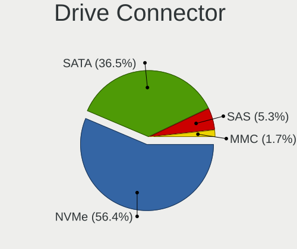

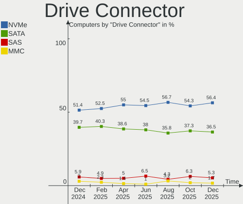

| Type | Computers | Drives | Percent |
|------|-----------|--------|---------|
| NVMe | 485       | 621    | 56.4%   |
| SATA | 314       | 500    | 36.51%  |
| SAS  | 46        | 53     | 5.35%   |
| MMC  | 15        | 16     | 1.74%   |

Drive Size
----------

Size of hard drive

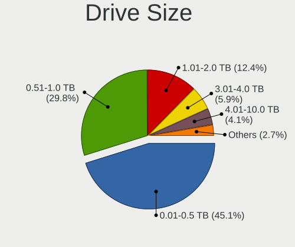

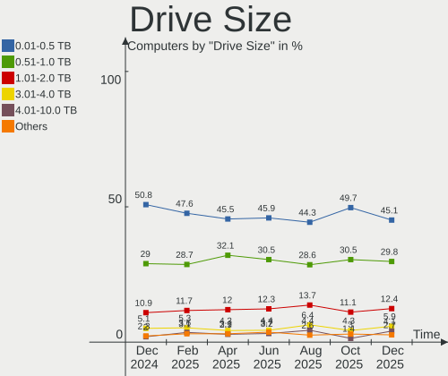

| Size in TB | Computers | Drives | Percent |
|------------|-----------|--------|---------|
| 0.01-0.5   | 200       | 238    | 45.15%  |
| 0.51-1.0   | 132       | 157    | 29.8%   |
| 1.01-2.0   | 55        | 62     | 12.42%  |
| 3.01-4.0   | 26        | 32     | 5.87%   |
| 4.01-10.0  | 18        | 23     | 4.06%   |
| 2.01-3.0   | 7         | 7      | 1.58%   |
| 10.01-20.0 | 5         | 5      | 1.13%   |

Space Total
-----------

Amount of disk space available on the file system

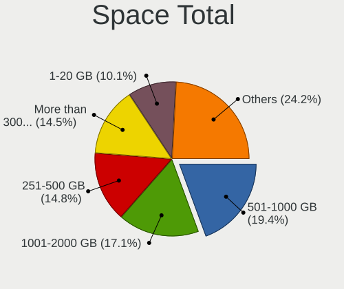

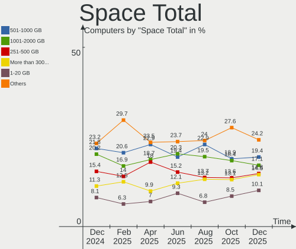

| Size in GB     | Computers | Percent |
|----------------|-----------|---------|
| 501-1000       | 134       | 19.39%  |
| 1001-2000      | 118       | 17.08%  |
| 251-500        | 102       | 14.76%  |
| More than 3000 | 100       | 14.47%  |
| 1-20           | 70        | 10.13%  |
| Unknown        | 62        | 8.97%   |
| 101-250        | 60        | 8.68%   |
| 2001-3000      | 29        | 4.2%    |
| 51-100         | 13        | 1.88%   |
| 21-50          | 3         | 0.43%   |

Space Used
----------

Amount of used disk space

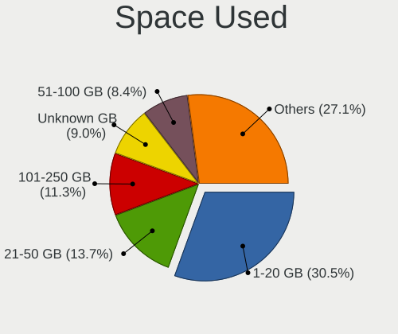

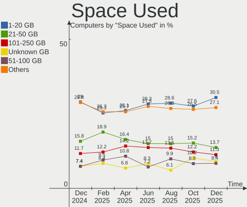

| Used GB        | Computers | Percent |
|----------------|-----------|---------|
| 1-20           | 211       | 30.54%  |
| 21-50          | 95        | 13.75%  |
| 101-250        | 78        | 11.29%  |
| Unknown        | 62        | 8.97%   |
| 51-100         | 58        | 8.39%   |
| 501-1000       | 53        | 7.67%   |
| 251-500        | 48        | 6.95%   |
| 1001-2000      | 47        | 6.8%    |
| More than 3000 | 26        | 3.76%   |
| 2001-3000      | 13        | 1.88%   |

Malfunc. Drives
---------------

Drive models with a malfunction

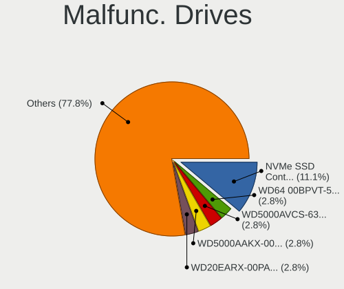

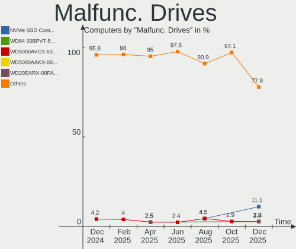

| Model                                                          | Computers | Drives | Percent |
|----------------------------------------------------------------|-----------|--------|---------|
| Samsung Electronics NVMe SSD Controller SM981/PM981/PM983 1TB  | 4         | 4      | 11.11%  |
| WDC WD64 00BPVT-55HXZT2 640GB                                  | 1         | 1      | 2.78%   |
| WDC WD5000AVCS-632DY1 500GB                                    | 1         | 1      | 2.78%   |
| WDC WD5000AAKX-00ERMA0 500GB                                   | 1         | 1      | 2.78%   |
| WDC WD20EARX-00PASB0 2TB                                       | 1         | 1      | 2.78%   |
| WDC WD10EZEX-60WN4A1 1TB                                       | 1         | 1      | 2.78%   |
| WDC WD10EZEX-22BN5A0 1TB                                       | 1         | 1      | 2.78%   |
| SK hynix HFS256G39TND-N210A 256GB SSD                          | 1         | 1      | 2.78%   |
| Seagate ST500DM002-1BD142 500GB                                | 1         | 1      | 2.78%   |
| Seagate ST3250620AS 250GB                                      | 1         | 1      | 2.78%   |
| Seagate ST31000333AS 1TB                                       | 1         | 2      | 2.78%   |
| Seagate ST3000VN000-1H4167 3TB                                 | 1         | 1      | 2.78%   |
| Seagate ST2000DM006-2DM164 2TB                                 | 1         | 1      | 2.78%   |
| Seagate ST1000LM024 HN-M101MBB 1TB                             | 1         | 1      | 2.78%   |
| Seagate ST1000DM003-1CH162 1TB                                 | 1         | 1      | 2.78%   |
| SanDisk SSD PLUS 480GB                                         | 1         | 1      | 2.78%   |
| Samsung Electronics SSD 870 EVO 1TB                            | 1         | 1      | 2.78%   |
| Samsung Electronics SSD 850 PRO 1TB                            | 1         | 1      | 2.78%   |
| Samsung Electronics NVMe SSD Controller PM9A1/PM9A3/980PRO 1TB | 1         | 1      | 2.78%   |
| Samsung Electronics HD502HI 500GB                              | 1         | 1      | 2.78%   |
| Samsung Electronics HD103UJ 1TB                                | 1         | 2      | 2.78%   |
| Micron Technology MTFDDAK256MAM-1K12 256GB SSD                 | 1         | 1      | 2.78%   |
| Micron Technology 1100 SATA 256GB SSD                          | 1         | 1      | 2.78%   |
| Kingston SUV500240G 240GB SSD                                  | 1         | 1      | 2.78%   |
| Kingston SUV400S37240G 240GB SSD                               | 1         | 1      | 2.78%   |
| Kingston SA400S37960G 960GB SSD                                | 1         | 2      | 2.78%   |
| Intel SSDSC2CT120A3 120GB                                      | 1         | 1      | 2.78%   |
| Intel NVMe Datacenter SSD [Optane] 400GB                       | 1         | 1      | 2.78%   |
| INNOVATION IT IT 240GB                                         | 1         | 1      | 2.78%   |
| HGST HTS545050A7E680 500GB                                     | 1         | 1      | 2.78%   |
| Crucial CT480M500SSD1 480GB                                    | 1         | 1      | 2.78%   |
| Apple HDD HTS545050A7E362 500GB                                | 1         | 1      | 2.78%   |
| A-DATA Technology SU800 128GB SSD                              | 1         | 1      | 2.78%   |

Malfunc. Drive Vendor
---------------------

Vendors of faulty drives

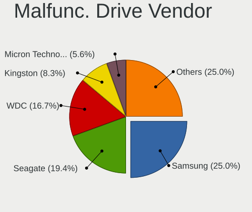

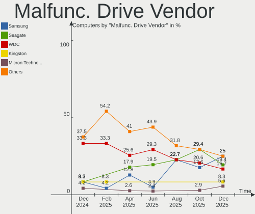

| Vendor              | Computers | Drives | Percent |
|---------------------|-----------|--------|---------|
| Samsung Electronics | 9         | 10     | 25%     |
| Seagate             | 7         | 8      | 19.44%  |
| WDC                 | 6         | 6      | 16.67%  |
| Kingston            | 3         | 4      | 8.33%   |
| Micron Technology   | 2         | 2      | 5.56%   |
| Intel               | 2         | 2      | 5.56%   |
| SK hynix            | 1         | 1      | 2.78%   |
| SanDisk             | 1         | 1      | 2.78%   |
| INNOVATION IT       | 1         | 1      | 2.78%   |
| HGST                | 1         | 1      | 2.78%   |
| Crucial             | 1         | 1      | 2.78%   |
| Apple               | 1         | 1      | 2.78%   |
| A-DATA Technology   | 1         | 1      | 2.78%   |

Malfunc. HDD Vendor
-------------------

Vendors of faulty HDD drives

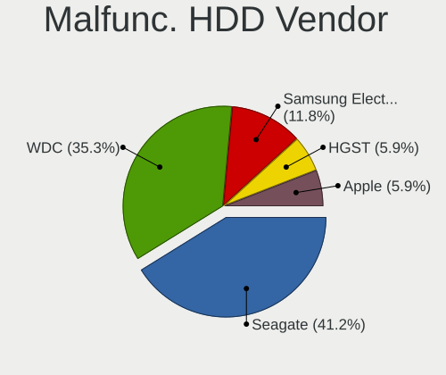

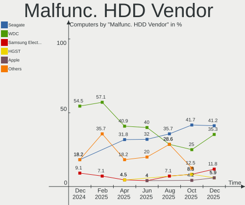

| Vendor              | Computers | Drives | Percent |
|---------------------|-----------|--------|---------|
| Seagate             | 7         | 8      | 41.18%  |
| WDC                 | 6         | 6      | 35.29%  |
| Samsung Electronics | 2         | 3      | 11.76%  |
| HGST                | 1         | 1      | 5.88%   |
| Apple               | 1         | 1      | 5.88%   |

Malfunc. Drive Kind
-------------------

Kinds of faulty drives

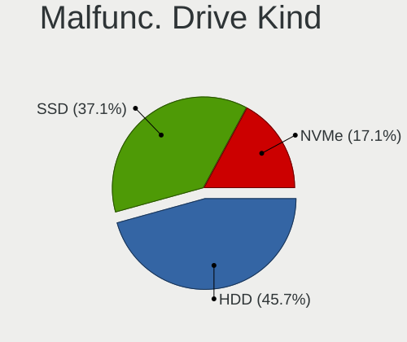

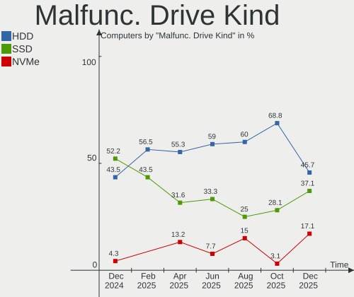

| Kind | Computers | Drives | Percent |
|------|-----------|--------|---------|
| HDD  | 16        | 19     | 45.71%  |
| SSD  | 13        | 14     | 37.14%  |
| NVMe | 6         | 6      | 17.14%  |

Failed Drives
-------------

Failed drive models

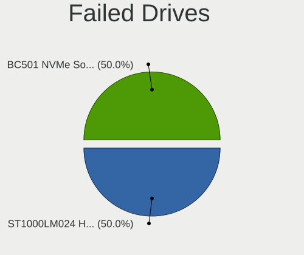

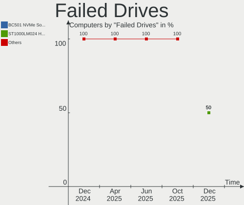

| Model                                       | Computers | Drives | Percent |
|---------------------------------------------|-----------|--------|---------|
| SK hynix BC501 NVMe Solid State Drive 512GB | 1         | 1      | 50%     |
| Seagate ST1000LM024 HN-M101MBB 1TB          | 1         | 1      | 50%     |

Failed Drive Vendor
-------------------

Failed drive vendors

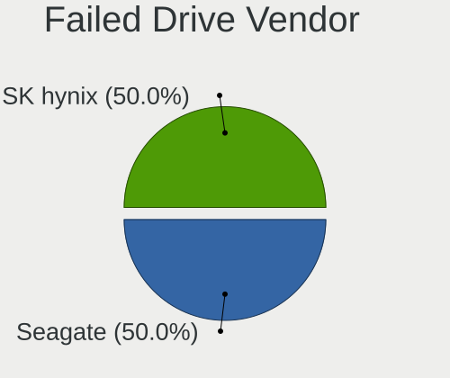

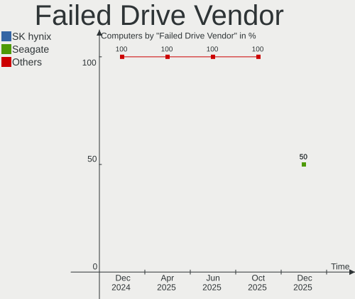

| Vendor   | Computers | Drives | Percent |
|----------|-----------|--------|---------|
| SK hynix | 1         | 1      | 50%     |
| Seagate  | 1         | 1      | 50%     |

Drive Status
------------

Number of failed and malfunc. drives

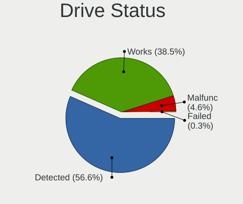

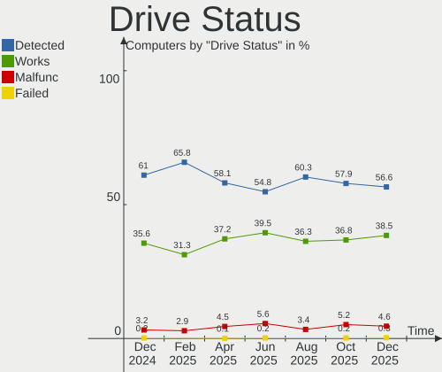

| Status   | Computers | Drives | Percent |
|----------|-----------|--------|---------|
| Detected | 416       | 684    | 56.6%   |
| Works    | 283       | 465    | 38.5%   |
| Malfunc  | 34        | 39     | 4.63%   |
| Failed   | 2         | 2      | 0.27%   |

Storage controller
------------------

Storage Vendor
--------------

Storage controller vendors

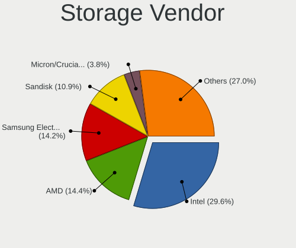

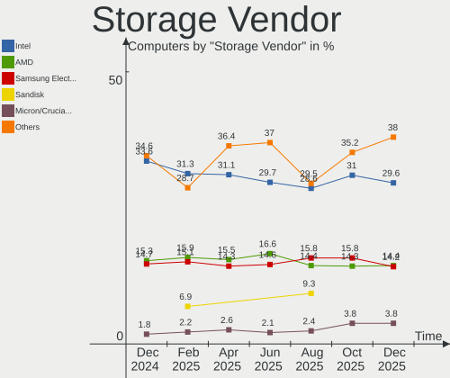

| Vendor                                  | Computers | Percent |
|-----------------------------------------|-----------|---------|
| Intel                                   | 309       | 29.63%  |
| AMD                                     | 150       | 14.38%  |
| Samsung Electronics                     | 148       | 14.19%  |
| Sandisk                                 | 114       | 10.93%  |
| Micron/Crucial Technology               | 40        | 3.84%   |
| Micron Technology                       | 39        | 3.74%   |
| Kingston Technology Company             | 32        | 3.07%   |
| SK hynix                                | 31        | 2.97%   |
| Phison Electronics                      | 26        | 2.49%   |
| MAXIO Technology (Hangzhou)             | 23        | 2.21%   |
| KIOXIA                                  | 22        | 2.11%   |
| ADATA Technology                        | 14        | 1.34%   |
| Shenzhen Longsys Electronics            | 13        | 1.25%   |
| ASMedia Technology                      | 13        | 1.25%   |
| Realtek Semiconductor                   | 12        | 1.15%   |
| Silicon Motion                          | 6         | 0.58%   |
| Toshiba America Info Systems            | 5         | 0.48%   |
| Broadcom / LSI                          | 5         | 0.48%   |
| Apple                                   | 5         | 0.48%   |
| Union Memory (Shenzhen)                 | 4         | 0.38%   |
| Solid State Storage Technology          | 4         | 0.38%   |
| Marvell Technology Group                | 4         | 0.38%   |
| JMicron Technology                      | 4         | 0.38%   |
| INNOGRIT                                | 3         | 0.29%   |
| Solidigm                                | 2         | 0.19%   |
| Shenzhen Shichuangyi Electronics        | 2         | 0.19%   |
| Seagate Technology                      | 2         | 0.19%   |
| Yangtze Memory Technologies             | 1         | 0.1%    |
| TenaFe                                  | 1         | 0.1%    |
| Shenzhen Unionmemory Information System | 1         | 0.1%    |
| Shenzhen Techwinsemi Technology         | 1         | 0.1%    |
| OCZ Technology Group                    | 1         | 0.1%    |
| Nvidia                                  | 1         | 0.1%    |
| LSI Logic / Symbios Logic               | 1         | 0.1%    |
| Hosin Global Electronics                | 1         | 0.1%    |
| Biwin Storage Technology                | 1         | 0.1%    |
| Adaptec                                 | 1         | 0.1%    |
| Unknown                                 | 1         | 0.1%    |

Storage Model
-------------

Storage controller models

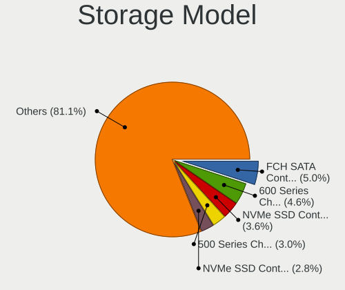

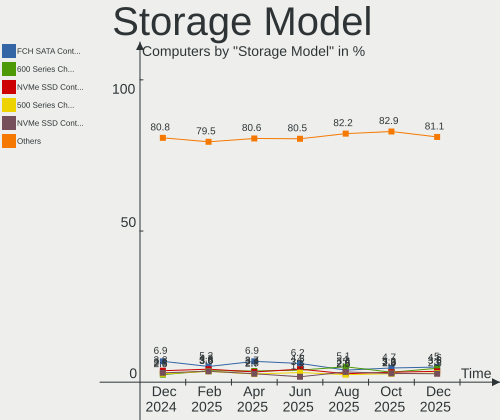

| Model                                                                          | Computers | Percent |
|--------------------------------------------------------------------------------|-----------|---------|
| AMD FCH SATA Controller [AHCI mode]                                            | 56        | 5.02%   |
| AMD 600 Series Chipset SATA Controller                                         | 51        | 4.57%   |
| Samsung NVMe SSD Controller SM981/PM981/PM983                                  | 40        | 3.58%   |
| AMD 500 Series Chipset SATA Controller                                         | 33        | 2.96%   |
| Samsung NVMe SSD Controller PM9A1/PM9A3/980PRO                                 | 31        | 2.78%   |
| Intel Sunrise Point-LP SATA Controller [AHCI mode]                             | 31        | 2.78%   |
| Intel Volume Management Device NVMe RAID Controller                            | 28        | 2.51%   |
| SanDisk WD SN560/SN740/SN770/SN5000 NVMe SSD                                   | 24        | 2.15%   |
| Samsung NVMe SSD Controller PM9C1a (DRAM-less)                                 | 23        | 2.06%   |
| Samsung NVMe SSD Controller S4LV008[Pascal]                                    | 18        | 1.61%   |
| Micron/Crucial P2 [Nick P2] / P3 / P3 Plus NVMe PCIe SSD (DRAM-less)           | 18        | 1.61%   |
| Intel Raptor Lake SATA AHCI Controller                                         | 17        | 1.52%   |
| AMD 400 Series Chipset SATA Controller                                         | 17        | 1.52%   |
| MAXIO (Hangzhou) NVMe SSD Controller MAP1202 (DRAM-less)                       | 16        | 1.43%   |
| Intel Q170/Q150/B150/H170/H110/Z170/CM236 Chipset SATA Controller [AHCI Mode]  | 15        | 1.34%   |
| Intel Cannon Lake PCH SATA AHCI Controller                                     | 15        | 1.34%   |
| Intel Alder Lake-S PCH SATA Controller [AHCI Mode]                             | 15        | 1.34%   |
| Sandisk WD Black SN850X NVMe SSD                                               | 14        | 1.25%   |
| Intel SATA Controller [RAID Mode]                                              | 14        | 1.25%   |
| Intel 7 Series Chipset Family 6-port SATA Controller [AHCI mode]               | 14        | 1.25%   |
| Intel 8 Series/C220 Series Chipset Family 6-port SATA Controller 1 [AHCI mode] | 13        | 1.16%   |
| SanDisk Ultra 3D / WD PC SN530, IX SN530, Blue SN550 NVMe SSD (DRAM-less)      | 11        | 0.99%   |
| Intel 82801 Mobile SATA Controller [RAID mode]                                 | 11        | 0.99%   |
| Intel 200 Series PCH SATA controller [AHCI mode]                               | 11        | 0.99%   |
| ASMedia ASM1061/ASM1062 Serial ATA Controller                                  | 11        | 0.99%   |
| SanDisk Extreme Pro / WD Black SN750 / PC SN730 / Red SN700 NVMe SSD           | 10        | 0.9%    |
| Samsung NVMe SSD Controller 980 (DRAM-less)                                    | 10        | 0.9%    |
| Micron 2550 NVMe SSD (DRAM-less)                                               | 10        | 0.9%    |
| KIOXIA NVMe SSD Controller BG4 (DRAM-less)                                     | 10        | 0.9%    |
| Intel Cannon Lake Mobile PCH SATA AHCI Controller                              | 10        | 0.9%    |
| Samsung S4LN058A01[SSUBX] AHCI SSD Controller (Apple slot)                     | 9         | 0.81%   |
| Micron 2400 NVMe SSD (DRAM-less)                                               | 9         | 0.81%   |
| Intel Tiger Lake-LP SATA Controller                                            | 9         | 0.81%   |
| Intel RST Volume Management Device Controller                                  | 9         | 0.81%   |
| Intel Alder Lake-P SATA AHCI Controller                                        | 9         | 0.81%   |
| Intel 6 Series/C200 Series Chipset Family 6 port Mobile SATA AHCI Controller   | 9         | 0.81%   |
| SK hynix Platinum P41/PC801 NVMe Solid State Drive                             | 8         | 0.72%   |
| Sandisk WD_BLACK SN7100/WD PC SN7100S M.2 2280 NVMe SSD (DRAM-less)            | 8         | 0.72%   |
| Realtek RTS5765DL NVMe SSD Controller (DRAM-less)                              | 8         | 0.72%   |
| Intel Wildcat Point-LP SATA Controller [AHCI Mode]                             | 8         | 0.72%   |

Storage Kind
------------

Kind of storage controller (IDE, SATA, NVMe, SAS, ...)

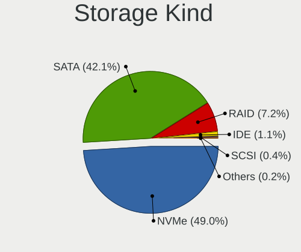

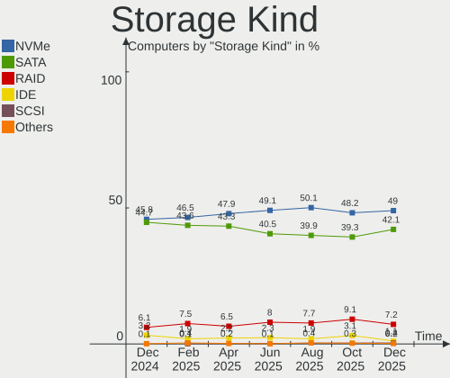

| Kind | Computers | Percent |
|------|-----------|---------|
| NVMe | 478       | 49.03%  |
| SATA | 410       | 42.05%  |
| RAID | 70        | 7.18%   |
| IDE  | 11        | 1.13%   |
| SCSI | 4         | 0.41%   |
| SAS  | 2         | 0.21%   |

Processor
---------

CPU Vendor
----------

Processor vendors

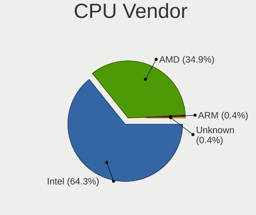

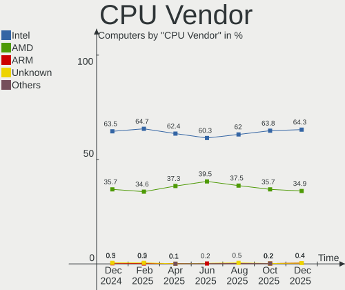

| Vendor  | Computers | Percent |
|---------|-----------|---------|
| Intel   | 444       | 64.25%  |
| AMD     | 241       | 34.88%  |
| ARM     | 3         | 0.43%   |
| Unknown | 3         | 0.43%   |

CPU Model
---------

Processor models

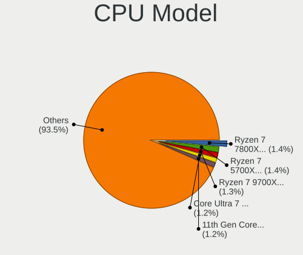

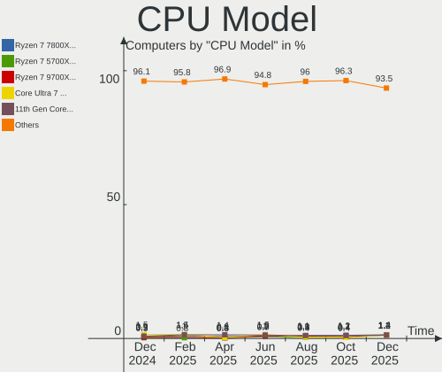

| Model                                      | Computers | Percent |
|--------------------------------------------|-----------|---------|
| AMD Ryzen 7 7800X3D 8-Core Processor       | 10        | 1.45%   |
| AMD Ryzen 7 5700X 8-Core Processor         | 10        | 1.45%   |
| AMD Ryzen 7 9700X 8-Core Processor         | 9         | 1.3%    |
| Intel Core Ultra 7 155H                    | 8         | 1.16%   |
| Intel 11th Gen Core i5-1135G7 @ 2.40GHz    | 8         | 1.16%   |
| AMD Ryzen AI 9 HX 370 w/ Radeon 890M       | 8         | 1.16%   |
| Intel Core Ultra 9 185H                    | 7         | 1.01%   |
| Intel Core Ultra 7 258V                    | 7         | 1.01%   |
| Intel 12th Gen Core i5-1235U               | 7         | 1.01%   |
| AMD Ryzen 7 9800X3D 8-Core Processor       | 7         | 1.01%   |
| AMD Ryzen 7 7730U with Radeon Graphics     | 7         | 1.01%   |
| Intel Core i5-6300U CPU @ 2.40GHz          | 6         | 0.87%   |
| Intel 11th Gen Core i7-1165G7 @ 2.80GHz    | 6         | 0.87%   |
| AMD Ryzen AI 7 PRO 350 w/ Radeon 860M      | 6         | 0.87%   |
| AMD Ryzen 9 5900X 12-Core Processor        | 6         | 0.87%   |
| AMD Ryzen 5 5600G with Radeon Graphics     | 6         | 0.87%   |
| Intel Core i7-8550U CPU @ 1.80GHz          | 5         | 0.72%   |
| Intel Core i7-7700K CPU @ 4.20GHz          | 5         | 0.72%   |
| Intel Core i5-8350U CPU @ 1.70GHz          | 5         | 0.72%   |
| Intel Core i5-8250U CPU @ 1.60GHz          | 5         | 0.72%   |
| Intel Core i5-7200U CPU @ 2.50GHz          | 5         | 0.72%   |
| Intel 11th Gen Core i5-1145G7 @ 2.60GHz    | 5         | 0.72%   |
| AMD Ryzen 7 5800X 8-Core Processor         | 5         | 0.72%   |
| AMD Ryzen 5 5600H with Radeon Graphics     | 5         | 0.72%   |
| Intel N150                                 | 4         | 0.58%   |
| Intel N100                                 | 4         | 0.58%   |
| Intel Core i7-7700HQ CPU @ 2.80GHz         | 4         | 0.58%   |
| Intel Core i7-10750H CPU @ 2.60GHz         | 4         | 0.58%   |
| Intel Core i5-8365U CPU @ 1.60GHz          | 4         | 0.58%   |
| Intel Core i5-7500T CPU @ 2.70GHz          | 4         | 0.58%   |
| Intel Core i5-2520M CPU @ 2.50GHz          | 4         | 0.58%   |
| Intel Core i3-3220 CPU @ 3.30GHz           | 4         | 0.58%   |
| Intel 13th Gen Core i7-13700K              | 4         | 0.58%   |
| Intel 13th Gen Core i5-13400F              | 4         | 0.58%   |
| Intel 12th Gen Core i5-12450H              | 4         | 0.58%   |
| Intel 12th Gen Core i5-12400F              | 4         | 0.58%   |
| Intel 12th Gen Core i3-1215U               | 4         | 0.58%   |
| Intel 11th Gen Core i3-1115G4 @ 3.00GHz    | 4         | 0.58%   |
| AMD Ryzen 7 7840HS w/ Radeon 780M Graphics | 4         | 0.58%   |
| AMD Ryzen 7 3700X 8-Core Processor         | 4         | 0.58%   |

CPU Model Family
----------------

Processor model prefix

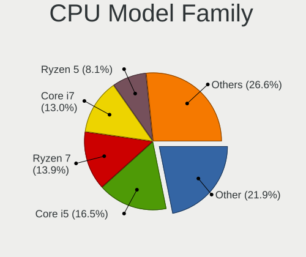

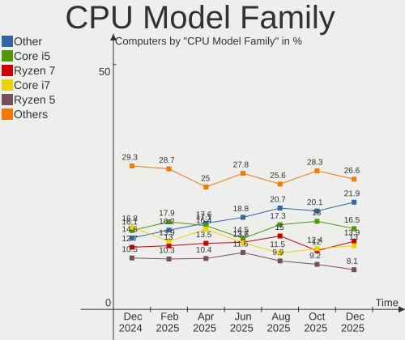

| Model                | Computers | Percent |
|----------------------|-----------|---------|
| Other                | 151       | 21.85%  |
| Intel Core i5        | 114       | 16.5%   |
| AMD Ryzen 7          | 96        | 13.89%  |
| Intel Core i7        | 90        | 13.02%  |
| AMD Ryzen 5          | 56        | 8.1%    |
| Intel Core           | 48        | 6.95%   |
| AMD Ryzen 9          | 34        | 4.92%   |
| Intel Core i3        | 23        | 3.33%   |
| Intel Xeon           | 13        | 1.88%   |
| Intel Core i9        | 9         | 1.3%    |
| AMD Ryzen 5 PRO      | 8         | 1.16%   |
| Intel Core 2 Duo     | 6         | 0.87%   |
| Intel Celeron        | 6         | 0.87%   |
| AMD Ryzen 7 PRO      | 6         | 0.87%   |
| Intel Pentium        | 5         | 0.72%   |
| AMD Ryzen 3          | 5         | 0.72%   |
| Intel Core 2 Quad    | 4         | 0.58%   |
| Intel Pentium Silver | 3         | 0.43%   |
| AMD A4               | 3         | 0.43%   |
| Intel Core m3        | 2         | 0.29%   |
| AMD Phenom II X4     | 2         | 0.29%   |
| AMD A6               | 2         | 0.29%   |
| Intel Core m5        | 1         | 0.14%   |
| Intel Atom           | 1         | 0.14%   |
| AMD FX               | 1         | 0.14%   |
| AMD E2               | 1         | 0.14%   |
| AMD A10              | 1         | 0.14%   |

CPU Cores
---------

Number of processor cores

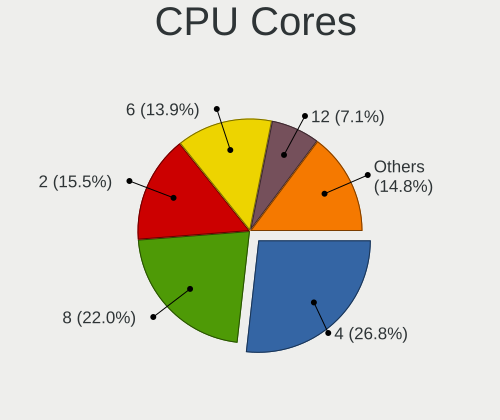

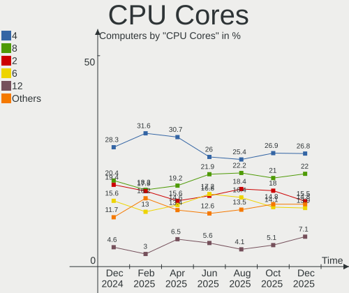

| Number  | Computers | Percent |
|---------|-----------|---------|
| 4       | 185       | 26.77%  |
| 8       | 152       | 22%     |
| 2       | 107       | 15.48%  |
| 6       | 96        | 13.89%  |
| 12      | 49        | 7.09%   |
| 16      | 39        | 5.64%   |
| 10      | 29        | 4.2%    |
| 14      | 15        | 2.17%   |
| 24      | 9         | 1.3%    |
| 20      | 7         | 1.01%   |
| Unknown | 2         | 0.29%   |
| 5       | 1         | 0.14%   |

CPU Sockets
-----------

Number of sockets

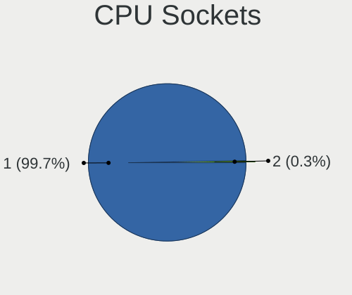

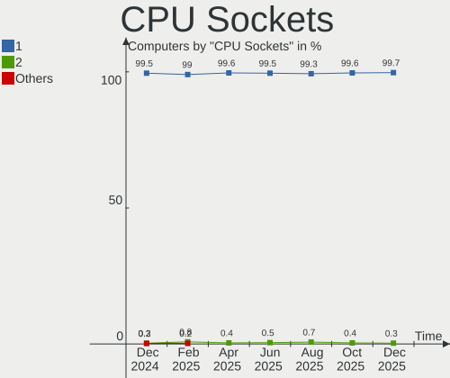

| Number | Computers | Percent |
|--------|-----------|---------|
| 1      | 689       | 99.71%  |
| 2      | 2         | 0.29%   |

CPU Threads
-----------

Threads per core (Hyper-Threading)

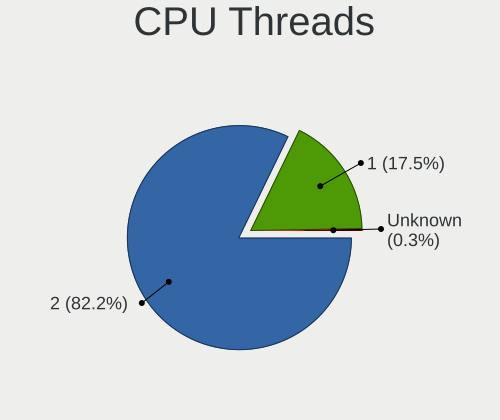

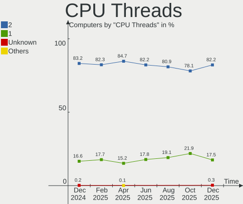

| Number  | Computers | Percent |
|---------|-----------|---------|
| 2       | 568       | 82.2%   |
| 1       | 121       | 17.51%  |
| Unknown | 2         | 0.29%   |

CPU Op-Modes
------------

CPU Operation Modes (32-bit, 64-bit)

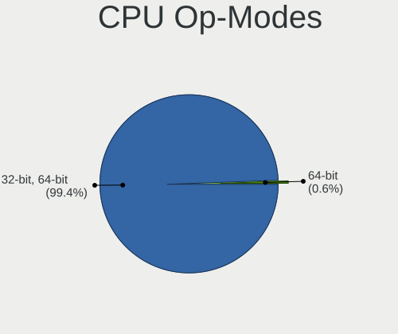

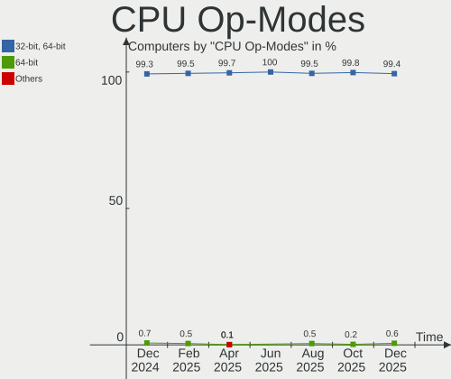

| Op mode        | Computers | Percent |
|----------------|-----------|---------|
| 32-bit, 64-bit | 687       | 99.42%  |
| 64-bit         | 4         | 0.58%   |

CPU Microcode
-------------

Microcode number

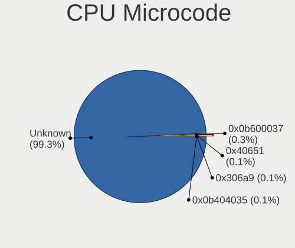

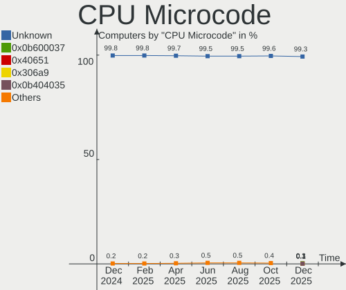

| Number     | Computers | Percent |
|------------|-----------|---------|
| Unknown    | 686       | 99.28%  |
| 0x0b600037 | 2         | 0.29%   |
| 0x40651    | 1         | 0.14%   |
| 0x306a9    | 1         | 0.14%   |
| 0x0b404035 | 1         | 0.14%   |

CPU Microarch
-------------

Microarchitecture

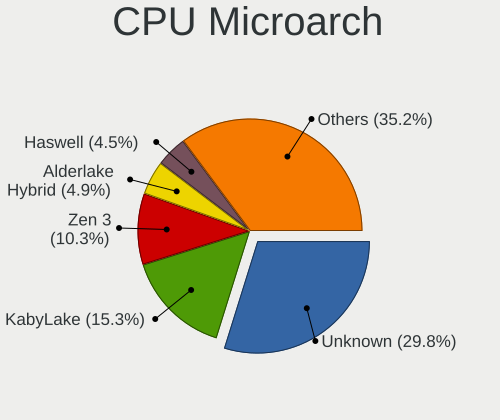

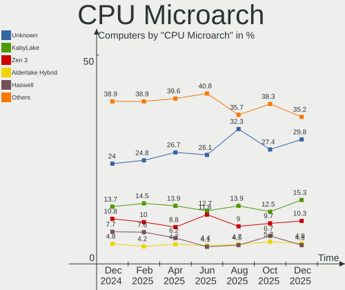

| Name               | Computers | Percent |
|--------------------|-----------|---------|
| Unknown            | 206       | 29.81%  |
| KabyLake           | 106       | 15.34%  |
| Zen 3              | 71        | 10.27%  |
| Alderlake Hybrid   | 34        | 4.92%   |
| Haswell            | 31        | 4.49%   |
| TigerLake          | 30        | 4.34%   |
| Skylake            | 25        | 3.62%   |
| Zen 2              | 23        | 3.33%   |
| IvyBridge          | 21        | 3.04%   |
| Broadwell          | 19        | 2.75%   |
| Zen+               | 17        | 2.46%   |
| SandyBridge        | 17        | 2.46%   |
| CometLake          | 14        | 2.03%   |
| Lunarlake Hybrid   | 10        | 1.45%   |
| Meteorlake Hybrid  | 9         | 1.3%    |
| Icelake            | 9         | 1.3%    |
| Zen                | 7         | 1.01%   |
| Penryn             | 7         | 1.01%   |
| Goldmont plus      | 6         | 0.87%   |
| Westmere           | 5         | 0.72%   |
| Gracemont          | 4         | 0.58%   |
| Core               | 4         | 0.58%   |
| Silvermont         | 3         | 0.43%   |
| Piledriver         | 3         | 0.43%   |
| K10                | 2         | 0.29%   |
| Jaguar             | 2         | 0.29%   |
| ArrowLake-H Hybrid | 2         | 0.29%   |
| K10 Llano          | 1         | 0.14%   |
| Goldmont           | 1         | 0.14%   |
| Excavator          | 1         | 0.14%   |
| Bobcat             | 1         | 0.14%   |

Graphics
--------

GPU Vendor
----------

Vendors of graphics cards

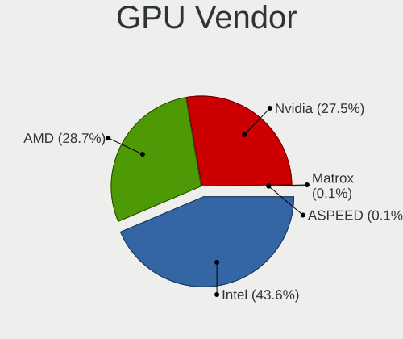

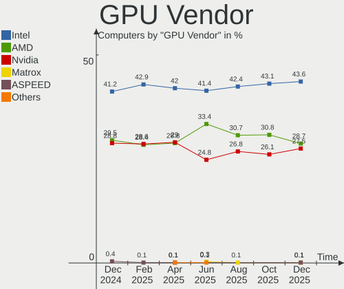

| Vendor                     | Computers | Percent |
|----------------------------|-----------|---------|
| Intel                      | 359       | 43.62%  |
| AMD                        | 236       | 28.68%  |
| Nvidia                     | 226       | 27.46%  |
| Matrox Electronics Systems | 1         | 0.12%   |
| ASPEED Technology          | 1         | 0.12%   |

GPU Model
---------

Graphics card models

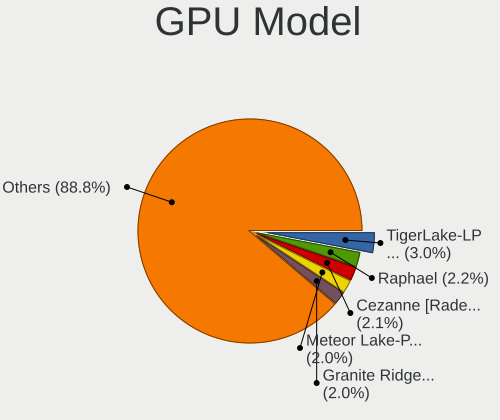

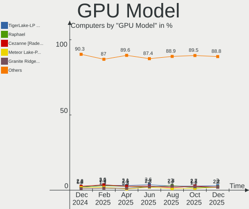

| Model                                                                     | Computers | Percent |
|---------------------------------------------------------------------------|-----------|---------|
| Intel TigerLake-LP GT2 [Iris Xe Graphics]                                 | 26        | 3.01%   |
| AMD Raphael                                                               | 19        | 2.2%    |
| AMD Cezanne [Radeon Vega Series / Radeon Vega Mobile Series]              | 18        | 2.08%   |
| Intel Meteor Lake-P [Intel Arc Graphics]                                  | 17        | 1.97%   |
| AMD Granite Ridge [Radeon Graphics]                                       | 17        | 1.97%   |
| Intel Kaby Lake-R GT2 [UHD Graphics 620]                                  | 16        | 1.85%   |
| Intel 2nd Generation Core Processor Family Integrated Graphics Controller | 14        | 1.62%   |
| Intel CoffeeLake-H GT2 [UHD Graphics 630]                                 | 13        | 1.5%    |
| Intel 3rd Gen Core processor Graphics Controller                          | 13        | 1.5%    |
| AMD Picasso/Raven 2 [Radeon Vega Series / Radeon Vega Mobile Series]      | 13        | 1.5%    |
| AMD Navi 48 [Radeon RX 9070/9070 XT/9070 GRE]                             | 13        | 1.5%    |
| AMD Barcelo                                                               | 13        | 1.5%    |
| Intel Kaby Lake-S GT2 [HD Graphics 630]                                   | 12        | 1.39%   |
| Intel Alder Lake-P GT2 [Iris Xe Graphics]                                 | 12        | 1.39%   |
| AMD Strix [Radeon 880M / 890M]                                            | 12        | 1.39%   |
| AMD Rembrandt [Radeon 680M]                                               | 12        | 1.39%   |
| AMD Navi 31 [Radeon RX 7900 XT/7900 XTX/7900 GRE/7900M]                   | 12        | 1.39%   |
| Intel Skylake-U GT2 [HD Graphics 520]                                     | 11        | 1.27%   |
| Intel Lunar Lake [Intel Arc Graphics 130V / 140V]                         | 11        | 1.27%   |
| AMD Phoenix1                                                              | 11        | 1.27%   |
| AMD Krackan [Radeon 840M / 860M Graphics]                                 | 11        | 1.27%   |
| Nvidia GA107M [GeForce RTX 3050 Mobile]                                   | 9         | 1.04%   |
| Intel WhiskeyLake-U GT2 [UHD Graphics 620]                                | 9         | 1.04%   |
| Intel Raptor Lake-P [Iris Xe Graphics]                                    | 9         | 1.04%   |
| Intel Kaby Lake-U GT2 [HD Graphics 620]                                   | 9         | 1.04%   |
| Intel Alder Lake-UP3 GT2 [Iris Xe Graphics]                               | 9         | 1.04%   |
| Nvidia GA106 [GeForce RTX 3060 Lite Hash Rate]                            | 8         | 0.93%   |
| Intel Haswell-ULT Integrated Graphics Controller                          | 8         | 0.93%   |
| Intel CometLake-U GT2 [UHD Graphics]                                      | 8         | 0.93%   |
| Intel Broadwell-U GT2 [HD Graphics 5500]                                  | 8         | 0.93%   |
| AMD Renoir [Radeon Vega Series / Radeon Vega Mobile Series]               | 8         | 0.93%   |
| AMD Navi 22 [Radeon RX 6700/6700 XT/6750 XT / 6800M/6850M XT]             | 8         | 0.93%   |
| Intel Raptor Lake-P [UHD Graphics]                                        | 7         | 0.81%   |
| AMD Lucienne                                                              | 7         | 0.81%   |
| Nvidia AD107M [GeForce RTX 4060 Max-Q / Mobile]                           | 6         | 0.69%   |
| Intel Raptor Lake-S GT1 [UHD Graphics 770]                                | 6         | 0.69%   |
| Intel CometLake-H GT2 [UHD Graphics]                                      | 6         | 0.69%   |
| AMD Navi 44 [Radeon RX 9060 XT]                                           | 6         | 0.69%   |
| AMD Navi 21 [Radeon RX 6800/6800 XT / 6900 XT]                            | 6         | 0.69%   |
| AMD Ellesmere [Radeon RX 470/480/570/570X/580/580X/590]                   | 6         | 0.69%   |

GPU Combo
---------

Combinations of graphics cards

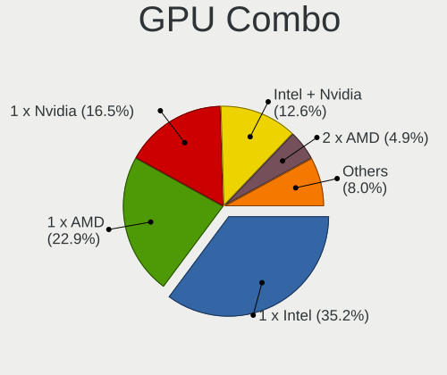

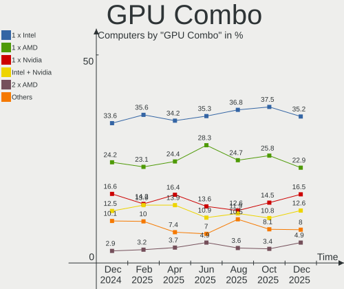

| Name               | Computers | Percent |
|--------------------|-----------|---------|
| 1 x Intel          | 243       | 35.17%  |
| 1 x AMD            | 158       | 22.87%  |
| 1 x Nvidia         | 114       | 16.5%   |
| Intel + Nvidia     | 87        | 12.59%  |
| 2 x AMD            | 34        | 4.92%   |
| AMD + Nvidia       | 22        | 3.18%   |
| Intel + AMD        | 19        | 2.75%   |
| Other              | 8         | 1.16%   |
| 3 x AMD            | 1         | 0.14%   |
| 2 x Nvidia         | 1         | 0.14%   |
| 2 x Intel          | 1         | 0.14%   |
| Nvidia + ASPEED    | 1         | 0.14%   |
| 1 x Matrox         | 1         | 0.14%   |
| Intel + 2 x Nvidia | 1         | 0.14%   |

GPU Driver
----------

Free vs proprietary

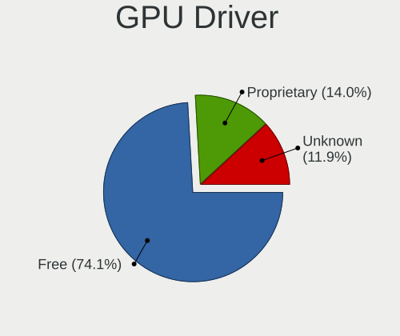

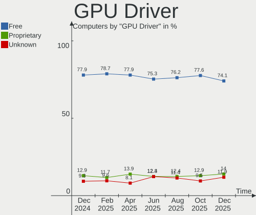

| Driver      | Computers | Percent |
|-------------|-----------|---------|
| Free        | 512       | 74.1%   |
| Proprietary | 97        | 14.04%  |
| Unknown     | 82        | 11.87%  |

GPU Memory
----------

Total video memory

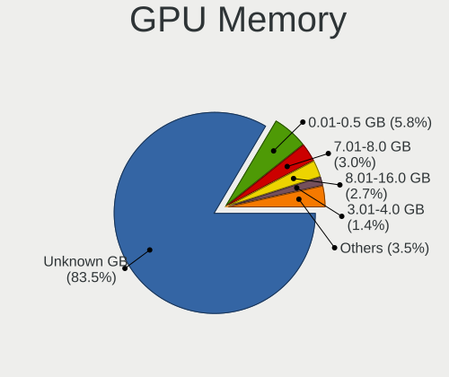

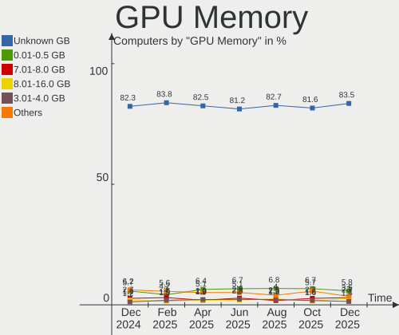

| Size in GB | Computers | Percent |
|------------|-----------|---------|
| Unknown    | 577       | 83.5%   |
| 0.01-0.5   | 40        | 5.79%   |
| 7.01-8.0   | 21        | 3.04%   |
| 8.01-16.0  | 19        | 2.75%   |
| 3.01-4.0   | 10        | 1.45%   |
| 1.01-2.0   | 10        | 1.45%   |
| 0.51-1.0   | 6         | 0.87%   |
| 16.01-24.0 | 5         | 0.72%   |
| 2.01-3.0   | 2         | 0.29%   |
| 5.01-6.0   | 1         | 0.14%   |

Monitor
-------

Monitor Vendor
--------------

Monitor vendors

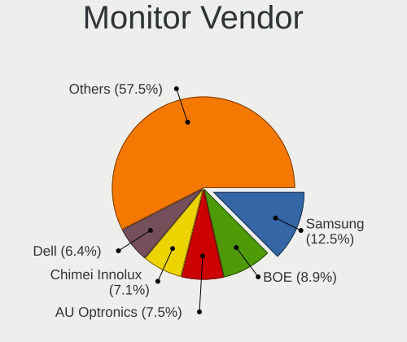

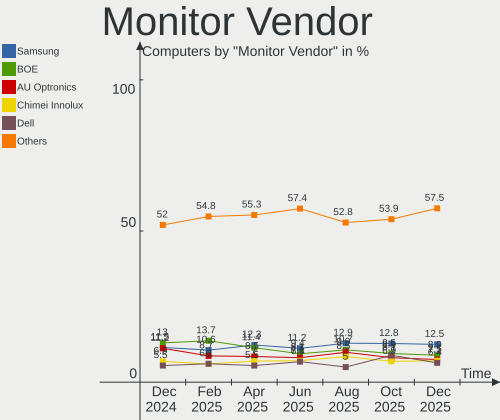

| Vendor                  | Computers | Percent |
|-------------------------|-----------|---------|
| Samsung Electronics     | 100       | 12.53%  |
| BOE                     | 71        | 8.9%    |
| AU Optronics            | 60        | 7.52%   |
| Chimei Innolux          | 57        | 7.14%   |
| Dell                    | 51        | 6.39%   |
| Goldstar                | 50        | 6.27%   |
| LG Display              | 41        | 5.14%   |
| Lenovo                  | 39        | 4.89%   |
| AOC                     | 33        | 4.14%   |
| Apple                   | 31        | 3.88%   |
| Acer                    | 29        | 3.63%   |
| Philips                 | 16        | 2.01%   |
| ASUSTek Computer        | 16        | 2.01%   |
| Sharp                   | 14        | 1.75%   |
| BenQ                    | 14        | 1.75%   |
| MSI                     | 12        | 1.5%    |
| Hewlett-Packard         | 12        | 1.5%    |
| Gigabyte Technology     | 12        | 1.5%    |
| Mi                      | 11        | 1.38%   |
| InfoVision              | 10        | 1.25%   |
| Ancor Communications    | 10        | 1.25%   |
| CSOT                    | 8         | 1%      |
| HKC                     | 5         | 0.63%   |
| Chi Mei Optoelectronics | 5         | 0.63%   |
| ViewSonic               | 4         | 0.5%    |
| Toshiba                 | 4         | 0.5%    |
| TMX                     | 4         | 0.5%    |
| Iiyama                  | 4         | 0.5%    |
| Sony                    | 3         | 0.38%   |
| SKG                     | 3         | 0.38%   |
| KDB                     | 3         | 0.38%   |
| EDO                     | 3         | 0.38%   |
| Denver                  | 3         | 0.38%   |
| CSW                     | 3         | 0.38%   |
| Valve                   | 2         | 0.25%   |
| Unknown                 | 2         | 0.25%   |
| Sceptre Tech            | 2         | 0.25%   |
| SAC                     | 2         | 0.25%   |
| PANDA                   | 2         | 0.25%   |
| Eizo                    | 2         | 0.25%   |

Monitor Model
-------------

Monitor models

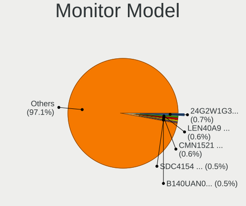

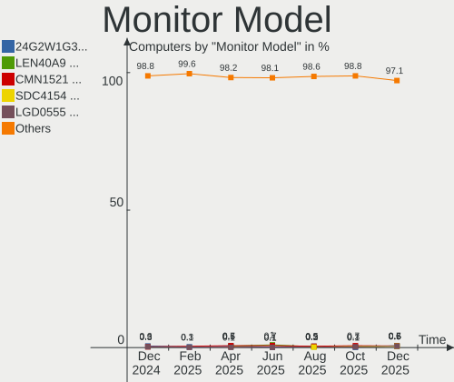

| Model                                                                  | Computers | Percent |
|------------------------------------------------------------------------|-----------|---------|
| AOC 24G2W1G3 AOC2402 1920x1080 527x296mm 23.8-inch                     | 6         | 0.72%   |
| Lenovo LCD Monitor LEN40A9 1920x1080 309x173mm 13.9-inch               | 5         | 0.6%    |
| Chimei Innolux LCD Monitor CMN1521 1920x1080 344x193mm 15.5-inch       | 5         | 0.6%    |
| Samsung Electronics LCD Monitor SDC4154 2880x1800 302x189mm 14.0-inch  | 4         | 0.48%   |
| LG Display LCD Monitor LGD0555 2736x1824 260x173mm 12.3-inch           | 4         | 0.48%   |
| Lenovo B140UAN02.7 LEN403A 1920x1200 302x188mm 14.0-inch               | 4         | 0.48%   |
| Goldstar HDR 4K GSM7707 3840x2160 600x340mm 27.2-inch                  | 4         | 0.48%   |
| Gigabyte Technology G27Q GBT2709 2560x1440 598x336mm 27.0-inch         | 4         | 0.48%   |
| BenQ GL2780 BNQ78EC 1920x1080 600x340mm 27.2-inch                      | 4         | 0.48%   |
| Toshiba ScreenXpert TSB8888 1080x2160                                  | 3         | 0.36%   |
| Samsung Electronics LCD Monitor SDC41AA 2880x1800 302x189mm 14.0-inch  | 3         | 0.36%   |
| Samsung Electronics LC34G55T SAM711A 3440x1440 798x334mm 34.1-inch     | 3         | 0.36%   |
| Samsung Electronics ATNA60CL10-0 SDC41AF 2880x1800 344x215mm 16.0-inch | 3         | 0.36%   |
| Goldstar FULL HD GSM5B55 1920x1080 480x270mm 21.7-inch                 | 3         | 0.36%   |
| BOE LCD Monitor BOE0B14 1920x1080 344x194mm 15.5-inch                  | 3         | 0.36%   |
| AU Optronics LCD Monitor AUO592D 1920x1080 293x165mm 13.2-inch         | 3         | 0.36%   |
| AOC Q3279WG5B AOC3279 2560x1440 725x428mm 33.1-inch                    | 3         | 0.36%   |
| AOC 27G2G4 AOC2702 1920x1080 598x336mm 27.0-inch                       | 3         | 0.36%   |
| Valve Index HMD VLV91A8                                                | 2         | 0.24%   |
| Unknown LCD Monitor FFFF 2288x1287 2550x2550mm 142.0-inch              | 2         | 0.24%   |
| Sony TV SNYEE01 1920x1080                                              | 2         | 0.24%   |
| Sharp LCD Monitor SHP14BA 1920x1080 344x194mm 15.5-inch                | 2         | 0.24%   |
| Samsung Electronics U32J59x SAM0F35 3840x2160 697x392mm 31.5-inch      | 2         | 0.24%   |
| Samsung Electronics U28D590 SAM0B81 3840x2160 608x345mm 27.5-inch      | 2         | 0.24%   |
| Samsung Electronics LS27AG55x SAM71E1 2560x1440 597x336mm 27.0-inch    | 2         | 0.24%   |
| Samsung Electronics LF24T35 SAM707D 1920x1080 528x297mm 23.9-inch      | 2         | 0.24%   |
| Samsung Electronics LCD Monitor SDC4187 1920x1200 302x189mm 14.0-inch  | 2         | 0.24%   |
| Samsung Electronics LCD Monitor SDC4161 1920x1080 344x194mm 15.5-inch  | 2         | 0.24%   |
| Samsung Electronics LCD Monitor SAM0DF6 3840x2160 890x500mm 40.2-inch  | 2         | 0.24%   |
| Samsung Electronics LCD Monitor SAM0A7A 1920x1080 1060x626mm 48.5-inch | 2         | 0.24%   |
| Samsung Electronics LC27G7xT SAM105C 2560x1440 597x336mm 27.0-inch     | 2         | 0.24%   |
| Samsung Electronics C24F390 SAM0D2C 1920x1080 521x293mm 23.5-inch      | 2         | 0.24%   |
| Philips PHL32M1N5800A PHLC277 3840x2160 697x392mm 31.5-inch            | 2         | 0.24%   |
| Philips PHL24E1N1100A PHLC324 1920x1080 527x296mm 23.8-inch            | 2         | 0.24%   |
| MSI G274QPF E2 MSI8CC2 2560x1440 597x336mm 27.0-inch                   | 2         | 0.24%   |
| MSI G273Q MSI3CA8 2560x1440 597x336mm 27.0-inch                        | 2         | 0.24%   |
| Mi Monitor XMI3444 3440x1440 797x334mm 34.0-inch                       | 2         | 0.24%   |
| Mi Monitor XMI23CB 1920x1080 527x296mm 23.8-inch                       | 2         | 0.24%   |
| Mi A22FAB-RAGL XMIF002 1920x1080 479x260mm 21.5-inch                   | 2         | 0.24%   |
| LG Display LCD Monitor LGD0582 3000x2000 275x183mm 13.0-inch           | 2         | 0.24%   |

Monitor Resolution
------------------

Monitor screen resolution

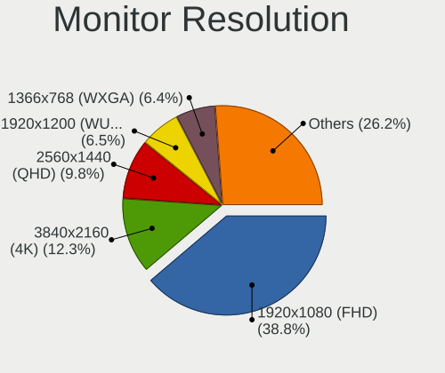

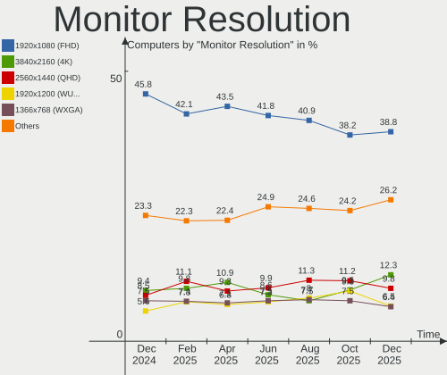

| Resolution         | Computers | Percent |
|--------------------|-----------|---------|
| 1920x1080 (FHD)    | 302       | 38.77%  |
| 3840x2160 (4K)     | 96        | 12.32%  |
| 2560x1440 (QHD)    | 76        | 9.76%   |
| 1920x1200 (WUXGA)  | 51        | 6.55%   |
| 1366x768 (WXGA)    | 50        | 6.42%   |
| 2880x1800          | 34        | 4.36%   |
| 2560x1600          | 30        | 3.85%   |
| 3440x1440          | 25        | 3.21%   |
| Unknown            | 16        | 2.05%   |
| 1600x900 (HD+)     | 13        | 1.67%   |
| 1440x900 (WXGA+)   | 12        | 1.54%   |
| 3840x1080          | 8         | 1.03%   |
| 1280x1024 (SXGA)   | 8         | 1.03%   |
| 2880x1920          | 6         | 0.77%   |
| 2560x1080          | 6         | 0.77%   |
| 3840x2400          | 4         | 0.51%   |
| 2160x1440          | 4         | 0.51%   |
| 1920x1280          | 4         | 0.51%   |
| 1680x1050 (WSXGA+) | 4         | 0.51%   |
| 2256x1504          | 3         | 0.39%   |
| 1920x540           | 3         | 0.39%   |
| 1280x800 (WXGA)    | 3         | 0.39%   |
| 3000x2000          | 2         | 0.26%   |
| 2288x1287          | 2         | 0.26%   |
| 2240x1400          | 2         | 0.26%   |
| 3840x1600          | 1         | 0.13%   |
| 3840x1200          | 1         | 0.13%   |
| 3600x1080          | 1         | 0.13%   |
| 3200x2000          | 1         | 0.13%   |
| 3200x1800 (QHD+)   | 1         | 0.13%   |
| 3072x1920          | 1         | 0.13%   |
| 2880x1620          | 1         | 0.13%   |
| 2520x1680          | 1         | 0.13%   |
| 2304x1440          | 1         | 0.13%   |
| 1920x720           | 1         | 0.13%   |
| 1600x2560          | 1         | 0.13%   |
| 1600x1200          | 1         | 0.13%   |
| 1280x768           | 1         | 0.13%   |
| 1080x1920          | 1         | 0.13%   |
| 1024x768 (XGA)     | 1         | 0.13%   |

Monitor Diagonal
----------------

Diagonal size in inches

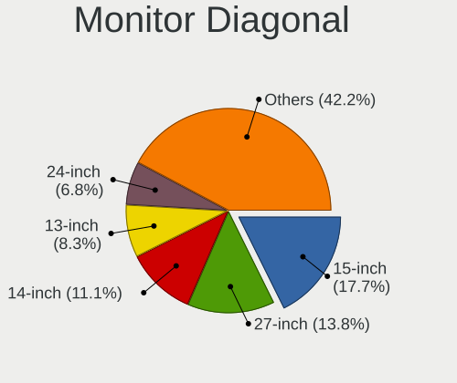

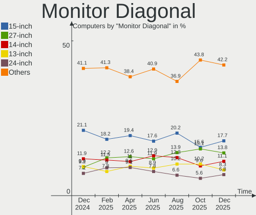

| Inches  | Computers | Percent |
|---------|-----------|---------|
| 15      | 142       | 17.68%  |
| 27      | 111       | 13.82%  |
| 14      | 89        | 11.08%  |
| 13      | 67        | 8.34%   |
| 24      | 55        | 6.85%   |
| 16      | 47        | 5.85%   |
| 31      | 45        | 5.6%    |
| 21      | 34        | 4.23%   |
| 23      | 31        | 3.86%   |
| 34      | 23        | 2.86%   |
| Unknown | 23        | 2.86%   |
| 17      | 17        | 2.12%   |
| 12      | 14        | 1.74%   |
| 48      | 9         | 1.12%   |
| 19      | 9         | 1.12%   |
| 11      | 8         | 1%      |
| 84      | 7         | 0.87%   |
| 72      | 7         | 0.87%   |
| 18      | 7         | 0.87%   |
| 26      | 5         | 0.62%   |
| 49      | 4         | 0.5%    |
| 40      | 4         | 0.5%    |
| 86      | 3         | 0.37%   |
| 54      | 3         | 0.37%   |
| 39      | 3         | 0.37%   |
| 33      | 3         | 0.37%   |
| 22      | 3         | 0.37%   |
| 20      | 3         | 0.37%   |
| 142     | 2         | 0.25%   |
| 65      | 2         | 0.25%   |
| 63      | 2         | 0.25%   |
| 44      | 2         | 0.25%   |
| 42      | 2         | 0.25%   |
| 36      | 2         | 0.25%   |
| 35      | 2         | 0.25%   |
| 32      | 2         | 0.25%   |
| 29      | 2         | 0.25%   |
| 28      | 2         | 0.25%   |
| 10      | 2         | 0.25%   |
| 74      | 1         | 0.12%   |

Monitor Width
-------------

Physical width

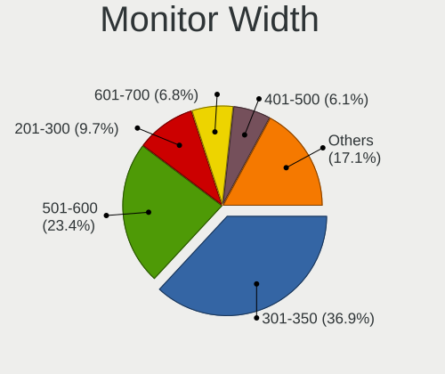

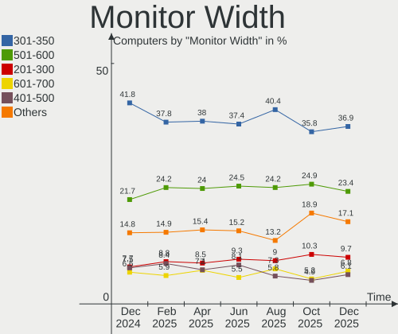

| Width in mm    | Computers | Percent |
|----------------|-----------|---------|
| 301-350        | 289       | 36.91%  |
| 501-600        | 183       | 23.37%  |
| 201-300        | 76        | 9.71%   |
| 601-700        | 53        | 6.77%   |
| 401-500        | 48        | 6.13%   |
| 701-800        | 29        | 3.7%    |
| 1001-1500      | 26        | 3.32%   |
| 351-400        | 25        | 3.19%   |
| Unknown        | 23        | 2.94%   |
| 1501-2000      | 15        | 1.92%   |
| 801-900        | 8         | 1.02%   |
| 901-1000       | 5         | 0.64%   |
| More than 2000 | 2         | 0.26%   |
| 101-200        | 1         | 0.13%   |

Aspect Ratio
------------

Proportional relationship between the width and the height

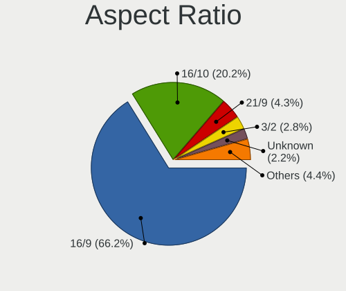

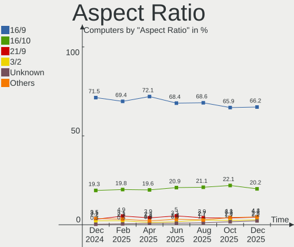

| Ratio   | Computers | Percent |
|---------|-----------|---------|
| 16/9    | 479       | 66.16%  |
| 16/10   | 146       | 20.17%  |
| 21/9    | 31        | 4.28%   |
| 3/2     | 20        | 2.76%   |
| Unknown | 16        | 2.21%   |
| 32/9    | 12        | 1.66%   |
| 5/4     | 7         | 0.97%   |
| 0.56    | 4         | 0.55%   |
| 4/3     | 3         | 0.41%   |
| 1.00    | 2         | 0.28%   |
| 6/5     | 1         | 0.14%   |
| 3.20    | 1         | 0.14%   |
| 2.69    | 1         | 0.14%   |
| 0.63    | 1         | 0.14%   |

Monitor Area
------------

Area in inch²

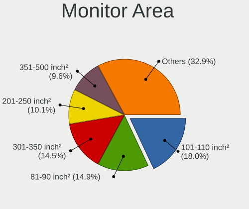

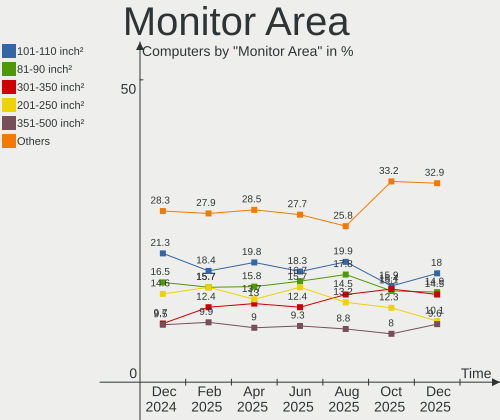

| Area in inch² | Computers | Percent |
|----------------|-----------|---------|
| 101-110        | 144       | 18%     |
| 81-90          | 119       | 14.88%  |
| 301-350        | 116       | 14.5%   |
| 201-250        | 81        | 10.13%  |
| 351-500        | 77        | 9.63%   |
| 111-120        | 45        | 5.63%   |
| 71-80          | 33        | 4.13%   |
| More than 1000 | 30        | 3.75%   |
| 151-200        | 29        | 3.63%   |
| 251-300        | 28        | 3.5%    |
| 501-1000       | 24        | 3%      |
| Unknown        | 23        | 2.88%   |
| 121-130        | 15        | 1.88%   |
| 61-70          | 13        | 1.63%   |
| 51-60          | 10        | 1.25%   |
| 141-150        | 6         | 0.75%   |
| 91-100         | 5         | 0.63%   |
| 41-50          | 1         | 0.13%   |
| 1-40           | 1         | 0.13%   |

Pixel Density
-------------

Pixels per inch

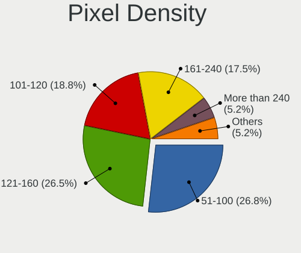

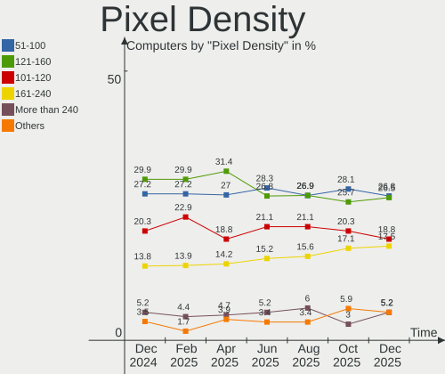

| Density       | Computers | Percent |
|---------------|-----------|---------|
| 51-100        | 205       | 26.76%  |
| 121-160       | 203       | 26.5%   |
| 101-120       | 144       | 18.8%   |
| 161-240       | 134       | 17.49%  |
| More than 240 | 40        | 5.22%   |
| Unknown       | 23        | 3%      |
| 1-50          | 17        | 2.22%   |

Multiple Monitors
-----------------

Total monitors connected

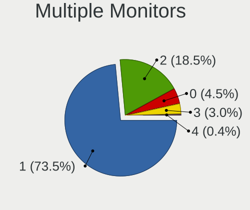

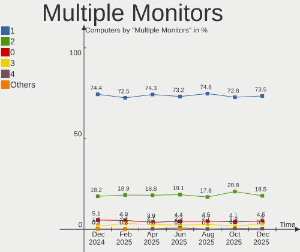

| Total | Computers | Percent |
|-------|-----------|---------|
| 1     | 508       | 73.52%  |
| 2     | 128       | 18.52%  |
| 0     | 31        | 4.49%   |
| 3     | 21        | 3.04%   |
| 4     | 3         | 0.43%   |

Network
-------

Net Controller Vendor
---------------------

Controller vendors

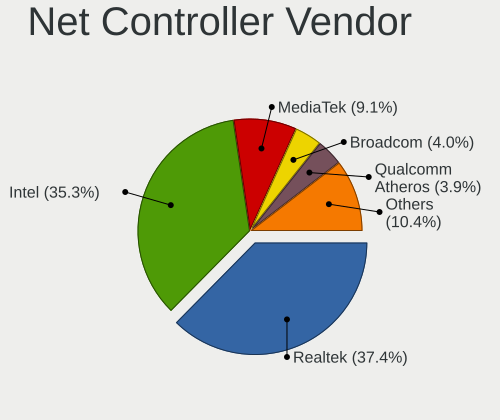

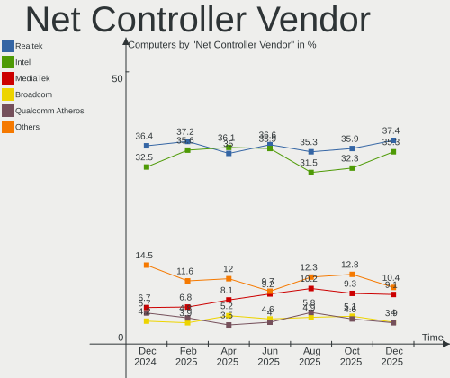

| Vendor                      | Computers | Percent |
|-----------------------------|-----------|---------|
| Realtek Semiconductor       | 387       | 37.39%  |
| Intel                       | 365       | 35.27%  |
| MediaTek                    | 94        | 9.08%   |
| Broadcom                    | 41        | 3.96%   |
| Qualcomm Atheros            | 40        | 3.86%   |
| Broadcom Limited            | 10        | 0.97%   |
| ASIX Electronics            | 9         | 0.87%   |
| Samsung Electronics         | 8         | 0.77%   |
| Qualcomm Technologies       | 8         | 0.77%   |
| Sierra Wireless             | 7         | 0.68%   |
| TP-Link                     | 6         | 0.58%   |
| Shenzhen Goodix Technology  | 6         | 0.58%   |
| Lenovo                      | 6         | 0.58%   |
| Ralink                      | 4         | 0.39%   |
| Xiaomi                      | 3         | 0.29%   |
| Ralink Technology           | 3         | 0.29%   |
| Motorcomm Microelectronics. | 3         | 0.29%   |
| Microsoft                   | 3         | 0.29%   |
| Google                      | 3         | 0.29%   |
| NetGear                     | 2         | 0.19%   |
| Huawei Technologies         | 2         | 0.19%   |
| D-Link                      | 2         | 0.19%   |
| ASUSTek Computer            | 2         | 0.19%   |
| Aquantia                    | 2         | 0.19%   |
| U-Blox                      | 1         | 0.1%    |
| ROCCAT                      | 1         | 0.1%    |
| Realtek                     | 1         | 0.1%    |
| Qualcomm                    | 1         | 0.1%    |
| Prolific Technology         | 1         | 0.1%    |
| OPPO Electronics            | 1         | 0.1%    |
| Nvidia                      | 1         | 0.1%    |
| Motorola PCS                | 1         | 0.1%    |
| Mercucys                    | 1         | 0.1%    |
| Mellanox Technologies       | 1         | 0.1%    |
| Marvell Technology Group    | 1         | 0.1%    |
| Hewlett-Packard             | 1         | 0.1%    |
| Fibocom                     | 1         | 0.1%    |
| DisplayLink                 | 1         | 0.1%    |
| Cypress Semiconductor       | 1         | 0.1%    |
| Cisco Systems               | 1         | 0.1%    |

Net Controller Model
--------------------

Controller models

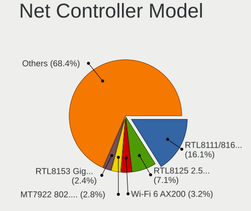

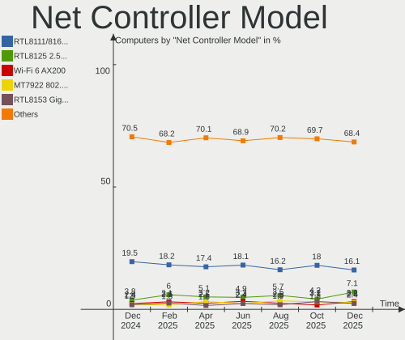

| Model                                                                           | Computers | Percent |
|---------------------------------------------------------------------------------|-----------|---------|
| Realtek RTL8111/8168/8211/8411 PCI Express Gigabit Ethernet Controller          | 197       | 16.07%  |
| Realtek RTL8125 2.5GbE Controller                                               | 87        | 7.1%    |
| Intel Wi-Fi 6 AX200                                                             | 39        | 3.18%   |
| MediaTek MT7922 802.11ax PCI Express Wireless Network Adapter                   | 34        | 2.77%   |
| Realtek RTL8153 Gigabit Ethernet Adapter                                        | 30        | 2.45%   |
| Intel Alder Lake-P PCH CNVi WiFi                                                | 26        | 2.12%   |
| Intel Wi-Fi 6E(802.11ax) AX210/AX1675* 2x2 [Typhoon Peak]                       | 25        | 2.04%   |
| Intel Wi-Fi 6 AX201                                                             | 24        | 1.96%   |
| Intel Wireless 8265 / 8275                                                      | 22        | 1.79%   |
| Realtek RTL8852BE PCIe 802.11ax Wireless Network Controller                     | 20        | 1.63%   |
| MediaTek MT7925 802.11be 160MHz 2x2 PCIe Wireless Network Adapter [Filogic 360] | 20        | 1.63%   |
| Realtek RTL8821CE 802.11ac PCIe Wireless Network Adapter                        | 17        | 1.39%   |
| Realtek RTL810xE PCI Express Fast Ethernet controller                           | 14        | 1.14%   |
| Intel Wireless 7265                                                             | 14        | 1.14%   |
| Intel Ethernet Controller I226-V                                                | 14        | 1.14%   |
| Intel Wireless 8260                                                             | 13        | 1.06%   |
| Intel Raptor Lake PCH CNVi WiFi                                                 | 13        | 1.06%   |
| Realtek RTL8126 5GbE Controller                                                 | 12        | 0.98%   |
| Intel Wi-Fi 7(802.11be) AX1775*/AX1790*/BE20*/BE401/BE1750* 2x2                 | 12        | 0.98%   |
| Intel Meteor Lake PCH CNVi WiFi                                                 | 11        | 0.9%    |
| Intel BE201 320MHz                                                              | 11        | 0.9%    |
| Intel 82579LM Gigabit Network Connection (Lewisville)                           | 11        | 0.9%    |
| Qualcomm Atheros QCA9377 802.11ac Wireless Network Adapter                      | 10        | 0.82%   |
| MediaTek MT7902 802.11ax PCIe Wireless Network Adapter [Filogic 310]            | 10        | 0.82%   |
| Intel I211 Gigabit Network Connection                                           | 10        | 0.82%   |
| Intel 700 Series Chipset CNVi WiFi                                              | 10        | 0.82%   |
| Realtek USB 10/100/1G/2.5 LAN                                                   | 9         | 0.73%   |
| MediaTek MT7925 (RZ717) Wi-Fi 7 160MHz                                          | 9         | 0.73%   |
| MediaTek MT7921 802.11ax PCIe Wireless Network Adapter [Filogic 330]            | 9         | 0.73%   |
| Intel Ethernet Connection I217-LM                                               | 9         | 0.73%   |
| Intel Cannon Point-LP CNVi [Wireless-AC]                                        | 9         | 0.73%   |
| ASIX AX88179 Gigabit Ethernet                                                   | 9         | 0.73%   |
| Samsung Galaxy series, misc. (tethering mode)                                   | 8         | 0.65%   |
| Realtek RTL8822CE 802.11ac PCIe Wireless Network Adapter                        | 8         | 0.65%   |
| Qualcomm WCN785x Wi-Fi 7(802.11be) 320MHz 2x2 [FastConnect 7800]                | 8         | 0.65%   |
| Qualcomm Atheros AR9485 Wireless Network Adapter                                | 8         | 0.65%   |
| Intel Ethernet Controller I225-V                                                | 8         | 0.65%   |
| Intel Comet Lake PCH-LP CNVi WiFi                                               | 8         | 0.65%   |
| Intel Comet Lake PCH CNVi WiFi                                                  | 8         | 0.65%   |
| Intel Cannon Lake PCH CNVi WiFi                                                 | 8         | 0.65%   |

Wireless Vendor
---------------

Wireless vendors

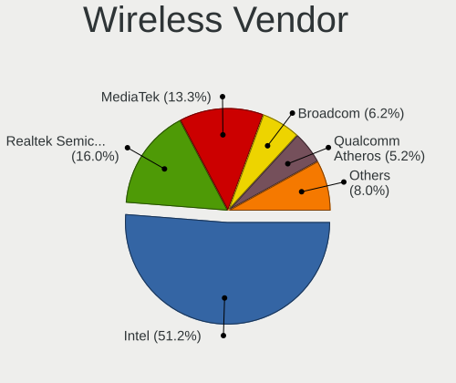

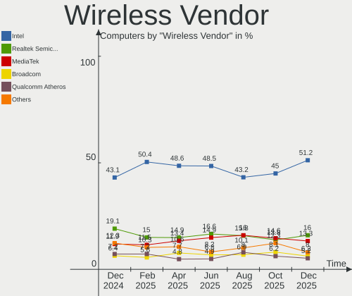

| Vendor                   | Computers | Percent |
|--------------------------|-----------|---------|
| Intel                    | 288       | 51.25%  |
| Realtek Semiconductor    | 90        | 16.01%  |
| MediaTek                 | 75        | 13.35%  |
| Broadcom                 | 35        | 6.23%   |
| Qualcomm Atheros         | 29        | 5.16%   |
| Broadcom Limited         | 10        | 1.78%   |
| Sierra Wireless          | 7         | 1.25%   |
| TP-Link                  | 6         | 1.07%   |
| Ralink                   | 4         | 0.71%   |
| Ralink Technology        | 3         | 0.53%   |
| Microsoft                | 3         | 0.53%   |
| Qualcomm Technologies    | 2         | 0.36%   |
| NetGear                  | 2         | 0.36%   |
| D-Link                   | 2         | 0.36%   |
| Realtek                  | 1         | 0.18%   |
| Qualcomm                 | 1         | 0.18%   |
| Mercucys                 | 1         | 0.18%   |
| Marvell Technology Group | 1         | 0.18%   |
| Fibocom                  | 1         | 0.18%   |
| ASUSTek Computer         | 1         | 0.18%   |

Wireless Model
--------------

Wireless models

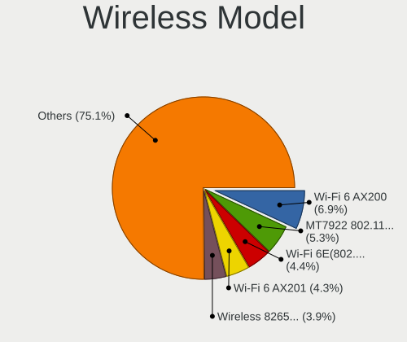

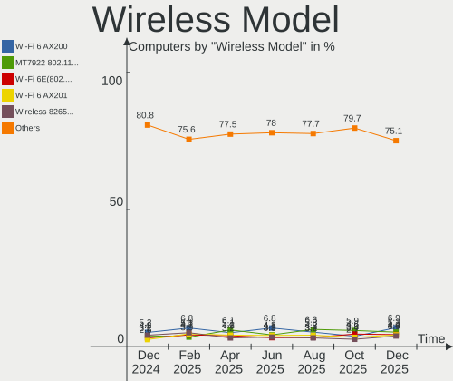

| Model                                                                           | Computers | Percent |
|---------------------------------------------------------------------------------|-----------|---------|
| Intel Wi-Fi 6 AX200                                                             | 39        | 6.93%   |
| MediaTek MT7922 802.11ax PCI Express Wireless Network Adapter                   | 30        | 5.33%   |
| Intel Wi-Fi 6E(802.11ax) AX210/AX1675* 2x2 [Typhoon Peak]                       | 25        | 4.44%   |
| Intel Wi-Fi 6 AX201                                                             | 24        | 4.26%   |
| Intel Wireless 8265 / 8275                                                      | 22        | 3.91%   |
| Realtek RTL8821CE 802.11ac PCIe Wireless Network Adapter                        | 17        | 3.02%   |
| Realtek RTL8852BE PCIe 802.11ax Wireless Network Controller                     | 14        | 2.49%   |
| Intel Wireless 7265                                                             | 14        | 2.49%   |
| Intel Alder Lake-P PCH CNVi WiFi                                                | 14        | 2.49%   |
| Intel Wireless 8260                                                             | 13        | 2.31%   |
| Intel Wi-Fi 7(802.11be) AX1775*/AX1790*/BE20*/BE401/BE1750* 2x2                 | 11        | 1.95%   |
| Intel Raptor Lake PCH CNVi WiFi                                                 | 11        | 1.95%   |
| Intel Meteor Lake PCH CNVi WiFi                                                 | 11        | 1.95%   |
| Qualcomm Atheros QCA9377 802.11ac Wireless Network Adapter                      | 10        | 1.78%   |
| MediaTek MT7902 802.11ax PCIe Wireless Network Adapter [Filogic 310]            | 10        | 1.78%   |
| Intel 700 Series Chipset CNVi WiFi                                              | 10        | 1.78%   |
| MediaTek MT7925 (RZ717) Wi-Fi 7 160MHz                                          | 9         | 1.6%    |
| MediaTek MT7921 802.11ax PCIe Wireless Network Adapter [Filogic 330]            | 9         | 1.6%    |
| Intel Cannon Point-LP CNVi [Wireless-AC]                                        | 9         | 1.6%    |
| Realtek RTL8822CE 802.11ac PCIe Wireless Network Adapter                        | 8         | 1.42%   |
| Qualcomm Atheros AR9485 Wireless Network Adapter                                | 8         | 1.42%   |
| Intel Comet Lake PCH-LP CNVi WiFi                                               | 8         | 1.42%   |
| Intel Comet Lake PCH CNVi WiFi                                                  | 8         | 1.42%   |
| Intel Cannon Lake PCH CNVi WiFi                                                 | 8         | 1.42%   |
| Broadcom Limited BCM4360 802.11ac Dual Band Wireless Network Adapter            | 8         | 1.42%   |
| Realtek 802.11ac NIC                                                            | 7         | 1.24%   |
| Qualcomm Atheros QCA6174 802.11ac Wireless Network Adapter                      | 7         | 1.24%   |
| MediaTek MT7925 802.11be 160MHz 2x2 PCIe Wireless Network Adapter [Filogic 360] | 7         | 1.24%   |
| Intel Wireless 7260                                                             | 7         | 1.24%   |
| Intel Wi-Fi 5(802.11ac) Wireless-AC 9x6x [Thunder Peak]                         | 7         | 1.24%   |
| Intel Ice Lake-LP PCH CNVi WiFi                                                 | 7         | 1.24%   |
| Intel Centrino Advanced-N 6205 [Taylor Peak]                                    | 7         | 1.24%   |
| Broadcom BCM4360 802.11ac Dual Band Wireless Network Adapter                    | 7         | 1.24%   |
| MediaTek MT7921K (RZ608) Wi-Fi 6E 80MHz                                         | 6         | 1.07%   |
| Broadcom BCM43602 802.11ac Wireless LAN SoC                                     | 6         | 1.07%   |
| Realtek RTL8922AE 802.11be PCIe Wireless Network Adapter                        | 5         | 0.89%   |
| Intel BE201 320MHz                                                              | 5         | 0.89%   |
| Sierra Wireless EM7455                                                          | 4         | 0.71%   |
| Realtek RTL88x2bu [AC1200 Techkey]                                              | 4         | 0.71%   |
| Realtek RTL8852CE PCIe 802.11ax Wireless Network Controller                     | 4         | 0.71%   |

Ethernet Vendor
---------------

Ethernet vendors

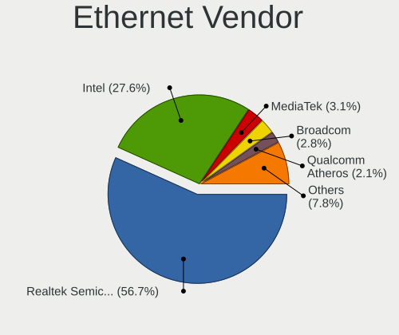

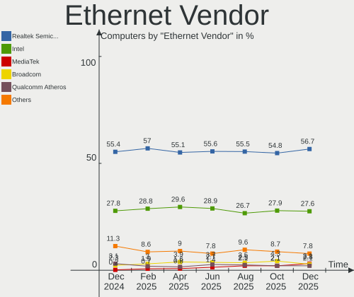

| Vendor                      | Computers | Percent |
|-----------------------------|-----------|---------|
| Realtek Semiconductor       | 350       | 56.73%  |
| Intel                       | 170       | 27.55%  |
| MediaTek                    | 19        | 3.08%   |
| Broadcom                    | 17        | 2.76%   |
| Qualcomm Atheros            | 13        | 2.11%   |
| ASIX Electronics            | 9         | 1.46%   |
| Samsung Electronics         | 8         | 1.3%    |
| Qualcomm Technologies       | 6         | 0.97%   |
| Lenovo                      | 4         | 0.65%   |
| Xiaomi                      | 3         | 0.49%   |
| Motorcomm Microelectronics. | 3         | 0.49%   |
| Google                      | 3         | 0.49%   |
| Aquantia                    | 2         | 0.32%   |
| OPPO Electronics            | 1         | 0.16%   |
| Nvidia                      | 1         | 0.16%   |
| Motorola PCS                | 1         | 0.16%   |
| Mellanox Technologies       | 1         | 0.16%   |
| Huawei Technologies         | 1         | 0.16%   |
| DisplayLink                 | 1         | 0.16%   |
| Cypress Semiconductor       | 1         | 0.16%   |
| ASUSTek Computer            | 1         | 0.16%   |
| Apple                       | 1         | 0.16%   |
| AMTelecom                   | 1         | 0.16%   |

Ethernet Model
--------------

Ethernet models

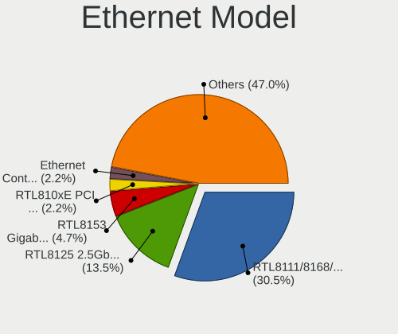

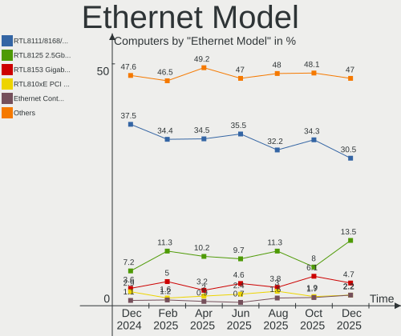

| Model                                                                           | Computers | Percent |
|---------------------------------------------------------------------------------|-----------|---------|
| Realtek RTL8111/8168/8211/8411 PCI Express Gigabit Ethernet Controller          | 197       | 30.54%  |
| Realtek RTL8125 2.5GbE Controller                                               | 87        | 13.49%  |
| Realtek RTL8153 Gigabit Ethernet Adapter                                        | 30        | 4.65%   |
| Realtek RTL810xE PCI Express Fast Ethernet controller                           | 14        | 2.17%   |
| Intel Ethernet Controller I226-V                                                | 14        | 2.17%   |
| MediaTek MT7925 802.11be 160MHz 2x2 PCIe Wireless Network Adapter [Filogic 360] | 13        | 2.02%   |
| Realtek RTL8126 5GbE Controller                                                 | 12        | 1.86%   |
| Intel Alder Lake-P PCH CNVi WiFi                                                | 12        | 1.86%   |
| Intel 82579LM Gigabit Network Connection (Lewisville)                           | 11        | 1.71%   |
| Intel I211 Gigabit Network Connection                                           | 10        | 1.55%   |
| Realtek USB 10/100/1G/2.5 LAN                                                   | 9         | 1.4%    |
| Intel Ethernet Connection I217-LM                                               | 9         | 1.4%    |
| ASIX AX88179 Gigabit Ethernet                                                   | 9         | 1.4%    |
| Samsung Galaxy series, misc. (tethering mode)                                   | 8         | 1.24%   |
| Intel Ethernet Controller I225-V                                                | 8         | 1.24%   |
| Intel Ethernet Connection I219-LM                                               | 7         | 1.09%   |
| Intel Ethernet Connection (2) I219-V                                            | 7         | 1.09%   |
| Realtek RTL8852BE PCIe 802.11ax Wireless Network Controller                     | 6         | 0.93%   |
| Qualcomm WCN785x Wi-Fi 7(802.11be) 320MHz 2x2 [FastConnect 7800]                | 6         | 0.93%   |
| Intel BE201 320MHz                                                              | 6         | 0.93%   |
| Broadcom NetXtreme BCM57766 Gigabit Ethernet PCIe                               | 6         | 0.93%   |
| Realtek Killer E2600 GbE Controller                                             | 5         | 0.78%   |
| Intel Ethernet Connection (7) I219-V                                            | 5         | 0.78%   |
| Intel Ethernet Connection (7) I219-LM                                           | 5         | 0.78%   |
| Intel Ethernet Connection (5) I219-LM                                           | 5         | 0.78%   |
| MediaTek MT7922 802.11ax PCI Express Wireless Network Adapter                   | 4         | 0.62%   |
| Intel Ethernet Connection (6) I219-LM                                           | 4         | 0.62%   |
| Intel Ethernet Connection (4) I219-LM                                           | 4         | 0.62%   |
| Intel Ethernet Connection (18) I219-LM                                          | 4         | 0.62%   |
| Intel Ethernet Connection (13) I219-V                                           | 4         | 0.62%   |
| Intel 82574L Gigabit Network Connection                                         | 4         | 0.62%   |
| Broadcom NetXtreme BCM57765 Gigabit Ethernet PCIe                               | 4         | 0.62%   |
| Xiaomi Mi/Redmi series (RNDIS)                                                  | 3         | 0.47%   |
| Realtek RTL8152 Fast Ethernet Adapter                                           | 3         | 0.47%   |
| Realtek Killer E3000 2.5GbE Controller                                          | 3         | 0.47%   |
| Qualcomm Atheros Killer E220x Gigabit Ethernet Controller                       | 3         | 0.47%   |
| Motorcomm Microelectronics. YT6801 Gigabit Ethernet Controller                  | 3         | 0.47%   |
| Lenovo USB-C Dock Ethernet                                                      | 3         | 0.47%   |
| Intel Ethernet Connection (6) I219-V                                            | 3         | 0.47%   |
| Intel Ethernet Connection (4) I219-V                                            | 3         | 0.47%   |

Net Controller Kind
-------------------

Ethernet, WiFi or modem

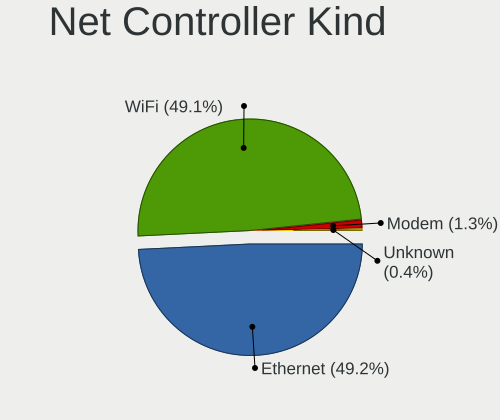

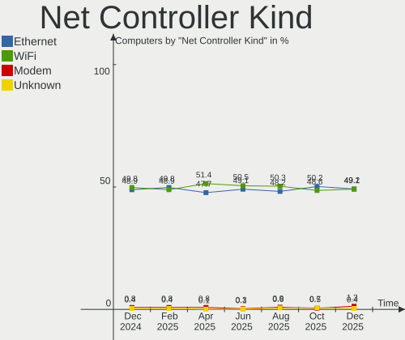

| Kind     | Computers | Percent |
|----------|-----------|---------|
| Ethernet | 540       | 49.23%  |
| WiFi     | 539       | 49.13%  |
| Modem    | 14        | 1.28%   |
| Unknown  | 4         | 0.36%   |

Used Controller
---------------

Currently used network controller

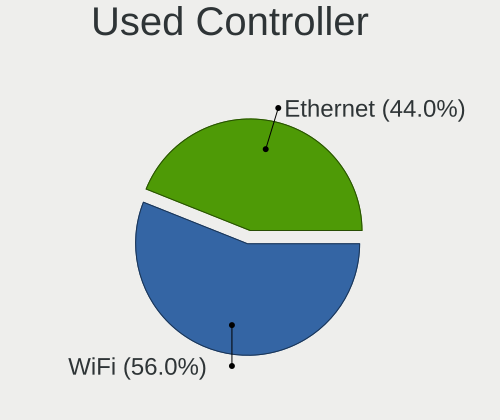

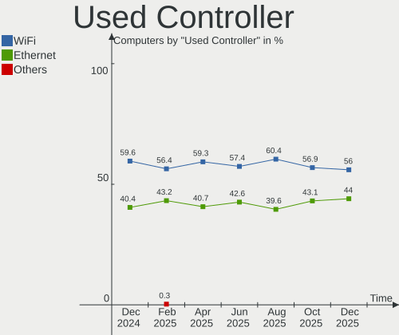

| Kind     | Computers | Percent |
|----------|-----------|---------|
| WiFi     | 399       | 56.04%  |
| Ethernet | 313       | 43.96%  |

NICs
----

Total network controllers on board

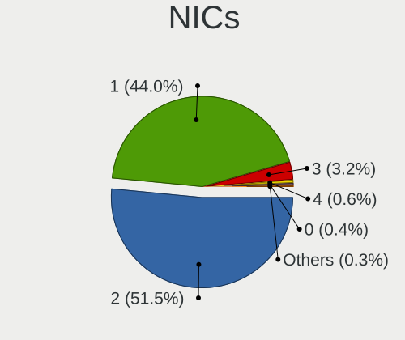

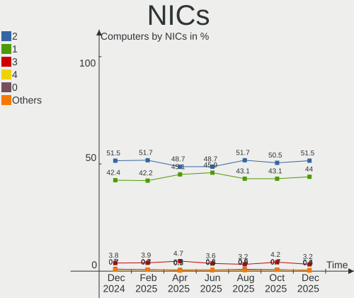

| Total | Computers | Percent |
|-------|-----------|---------|
| 2     | 356       | 51.52%  |
| 1     | 304       | 43.99%  |
| 3     | 22        | 3.18%   |
| 4     | 4         | 0.58%   |
| 0     | 3         | 0.43%   |
| 7     | 1         | 0.14%   |
| 5     | 1         | 0.14%   |

IPv6
----

IPv6 vs IPv4

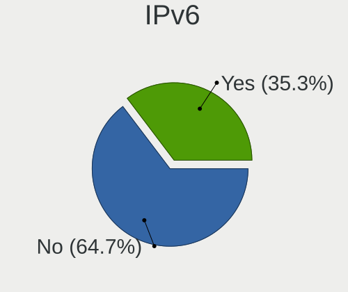

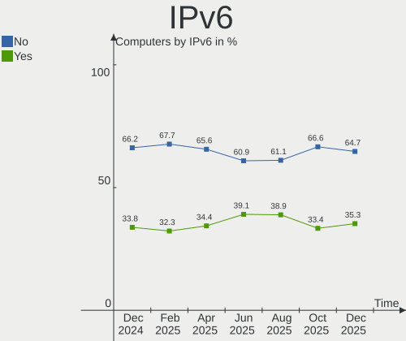

| Used | Computers | Percent |
|------|-----------|---------|
| No   | 447       | 64.69%  |
| Yes  | 244       | 35.31%  |

Bluetooth
---------

Bluetooth Vendor
----------------

Controller vendors

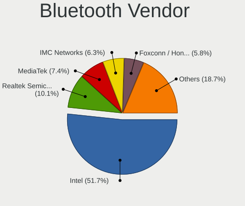

| Vendor                          | Computers | Percent |
|---------------------------------|-----------|---------|
| Intel                           | 293       | 51.68%  |
| Realtek Semiconductor           | 57        | 10.05%  |
| MediaTek                        | 42        | 7.41%   |
| IMC Networks                    | 36        | 6.35%   |
| Foxconn / Hon Hai               | 33        | 5.82%   |
| Apple                           | 26        | 4.59%   |
| Qualcomm Atheros Communications | 14        | 2.47%   |
| Cambridge Silicon Radio         | 13        | 2.29%   |
| TP-Link                         | 10        | 1.76%   |
| Broadcom                        | 10        | 1.76%   |
| ASUSTek Computer                | 6         | 1.06%   |
| Lite-On Technology              | 5         | 0.88%   |
| Realtek                         | 4         | 0.71%   |
| Unknown                         | 3         | 0.53%   |
| Quectel Wireless Solutions      | 2         | 0.35%   |
| Hewlett-Packard                 | 2         | 0.35%   |
| Actions                         | 2         | 0.35%   |
| USI                             | 1         | 0.18%   |
| Toshiba                         | 1         | 0.18%   |
| Smart Modular Technologies      | 1         | 0.18%   |
| Ralink                          | 1         | 0.18%   |
| Qcom                            | 1         | 0.18%   |
| Mercucys                        | 1         | 0.18%   |
| Marvell Semiconductor           | 1         | 0.18%   |
| Foxconn International           | 1         | 0.18%   |
| Dell                            | 1         | 0.18%   |

Bluetooth Model
---------------

Controller models

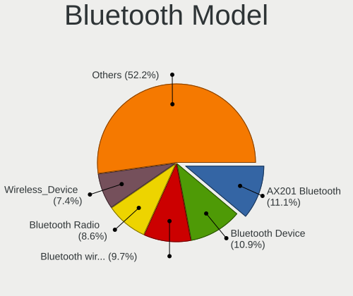

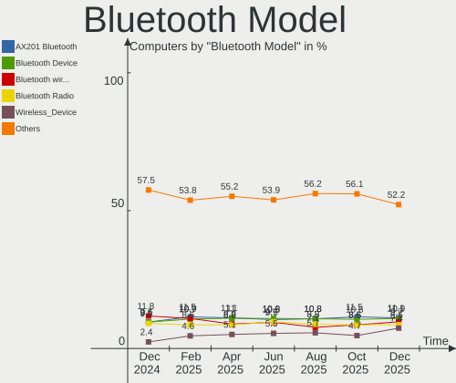

| Model                                               | Computers | Percent |
|-----------------------------------------------------|-----------|---------|
| Intel AX201 Bluetooth                               | 63        | 11.11%  |
| Intel Bluetooth Device                              | 62        | 10.93%  |
| Intel Bluetooth wireless interface                  | 55        | 9.7%    |
| Realtek Bluetooth Radio                             | 49        | 8.64%   |
| MediaTek Wireless_Device                            | 42        | 7.41%   |
| Intel AX200 Bluetooth                               | 37        | 6.53%   |
| Intel Bluetooth 9460/9560 Jefferson Peak (JfP)      | 31        | 5.47%   |
| Intel AX210 Bluetooth                               | 26        | 4.59%   |
| IMC Networks Wireless_Device                        | 18        | 3.17%   |
| Foxconn / Hon Hai Wireless_Device                   | 17        | 3%      |
| IMC Networks Bluetooth Radio                        | 15        | 2.65%   |
| Apple Bluetooth Host Controller                     | 15        | 2.65%   |
| Cambridge Silicon Radio Bluetooth Dongle (HCI mode) | 13        | 2.29%   |
| TP-Link TP-T@- UB500 Adapter                        | 10        | 1.76%   |
| Foxconn / Hon Hai Bluetooth Device                  | 10        | 1.76%   |
| Qualcomm Atheros  Bluetooth Device                  | 9         | 1.59%   |
| Apple Bluetooth USB Host Controller                 | 9         | 1.59%   |
| Intel Wireless-AC 9260 Bluetooth Adapter            | 7         | 1.23%   |
| Realtek  Bluetooth 4.2 Adapter                      | 5         | 0.88%   |
| Intel Bluetooth                                     | 5         | 0.88%   |
| Realtek Bluetooth Radio                             | 4         | 0.71%   |
| Intel Wireless-AC 3168 Bluetooth                    | 4         | 0.71%   |
| Lite-On Bluetooth Device                            | 3         | 0.53%   |
| Intel Centrino Bluetooth Wireless Transceiver       | 3         | 0.53%   |
| Foxconn / Hon Hai MediaTek Bluetooth Adapter        | 3         | 0.53%   |
| ASUS ASUS USB-BT500                                 | 3         | 0.53%   |
| Unknown                                             | 3         | 0.53%   |
| Realtek RTL8822BE Bluetooth 4.2 Adapter             | 2         | 0.35%   |
| Qualcomm Atheros QCA61x4 Bluetooth 4.0              | 2         | 0.35%   |
| Qualcomm Atheros AR3012 Bluetooth 4.0               | 2         | 0.35%   |
| IMC Networks Bluetooth Device                       | 2         | 0.35%   |
| HP Broadcom 2070 Bluetooth Combo                    | 2         | 0.35%   |
| Foxconn / Hon Hai Bluetooth Radio                   | 2         | 0.35%   |
| Broadcom BCM20702 Bluetooth 4.0 [ThinkPad]          | 2         | 0.35%   |
| Broadcom BCM2045B (BDC-2.1)                         | 2         | 0.35%   |
| ASUS Broadcom BCM20702A0 Bluetooth                  | 2         | 0.35%   |
| Apple Built-in Bluetooth 2.0+EDR HCI                | 2         | 0.35%   |
| Actions general adapter                             | 2         | 0.35%   |
| USI Bluetooth Device                                | 1         | 0.18%   |
| Toshiba Bluetooth USB Host Controller               | 1         | 0.18%   |

Sound
-----

Sound Vendor
------------

Sound card vendors

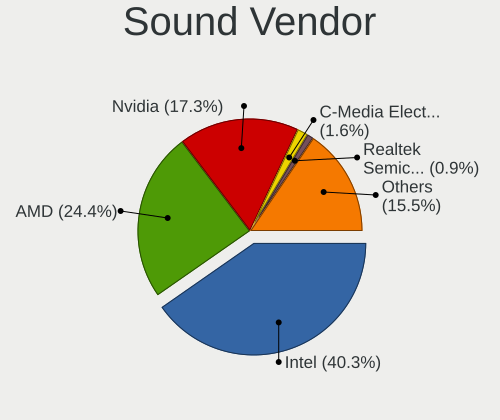

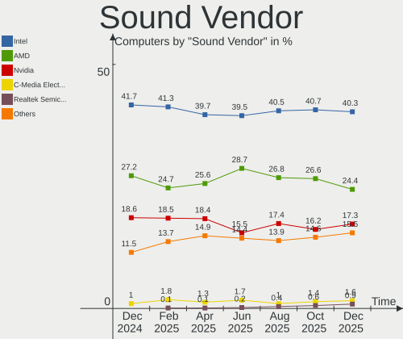

| Vendor                                       | Computers | Percent |
|----------------------------------------------|-----------|---------|
| Intel                                        | 437       | 40.31%  |
| AMD                                          | 264       | 24.35%  |
| Nvidia                                       | 188       | 17.34%  |
| C-Media Electronics                          | 17        | 1.57%   |
| Realtek Semiconductor                        | 10        | 0.92%   |
| Logitech                                     | 9         | 0.83%   |
| Lenovo                                       | 9         | 0.83%   |
| JMTek                                        | 9         | 0.83%   |
| ASUSTek Computer                             | 8         | 0.74%   |
| SteelSeries ApS                              | 7         | 0.65%   |
| Razer USA                                    | 7         | 0.65%   |
| Micro Star International                     | 7         | 0.65%   |
| Hewlett-Packard                              | 7         | 0.65%   |
| ASRock                                       | 6         | 0.55%   |
| Texas Instruments                            | 5         | 0.46%   |
| Kingston Technology                          | 5         | 0.46%   |
| Creative Labs                                | 5         | 0.46%   |
| Corsair                                      | 5         | 0.46%   |
| Zoran Co. Personal Media Division (Nogatech) | 4         | 0.37%   |
| Sony                                         | 4         | 0.37%   |
| Generalplus Technology                       | 4         | 0.37%   |
| Focusrite-Novation                           | 4         | 0.37%   |
| Yamaha                                       | 3         | 0.28%   |
| RODE Microphones                             | 3         | 0.28%   |
| Creative Technology                          | 3         | 0.28%   |
| XMOS                                         | 2         | 0.18%   |
| Turtle Beach                                 | 2         | 0.18%   |
| TTGK Technology                              | 2         | 0.18%   |
| Thesycon Systemsoftware & Consulting         | 2         | 0.18%   |
| MV-SILICON                                   | 2         | 0.18%   |
| Medeli Electronics                           | 2         | 0.18%   |
| Jieli Technology                             | 2         | 0.18%   |
| FiiO Electronics Technology                  | 2         | 0.18%   |
| bestechnic                                   | 2         | 0.18%   |
| BEHRINGER International                      | 2         | 0.18%   |
| Audio-Technica                               | 2         | 0.18%   |
| Apple                                        | 2         | 0.18%   |
| Unknown                                      | 2         | 0.18%   |
| Walmart                                      | 1         | 0.09%   |
| Valve Software                               | 1         | 0.09%   |

Sound Model
-----------

Sound card models

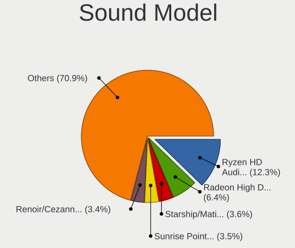

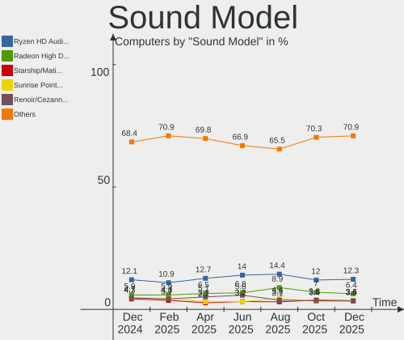

| Model                                                                      | Computers | Percent |
|----------------------------------------------------------------------------|-----------|---------|
| AMD Ryzen HD Audio Controller                                              | 164       | 12.27%  |
| AMD Radeon High Definition Audio Controller                                | 85        | 6.36%   |
| AMD Starship/Matisse HD Audio Controller                                   | 48        | 3.59%   |
| Intel Sunrise Point-LP HD Audio                                            | 47        | 3.52%   |
| AMD Renoir/Cezanne HDMI/DP Audio Controller                                | 45        | 3.37%   |
| Intel Alder Lake PCH-P High Definition Audio Controller                    | 31        | 2.32%   |
| Intel Tiger Lake-LP Smart Sound Technology Audio Controller                | 30        | 2.24%   |
| Intel Cannon Lake PCH cAVS                                                 | 27        | 2.02%   |
| AMD Navi 21/23 HDMI/DP Audio Controller                                    | 24        | 1.8%    |
| AMD Navi 31 HDMI/DP Audio                                                  | 22        | 1.65%   |
| Intel 7 Series/C216 Chipset Family High Definition Audio Controller        | 21        | 1.57%   |
| Intel Meteor Lake-P HD Audio Controller                                    | 20        | 1.5%    |
| Intel Raptor Lake-P/U/H cAVS                                               | 19        | 1.42%   |
| Intel 8 Series/C220 Series Chipset High Definition Audio Controller        | 19        | 1.42%   |
| AMD Navi 48 HDMI/DP Audio Controller                                       | 19        | 1.42%   |
| Intel Raptor Lake High Definition Audio Controller                         | 18        | 1.35%   |
| Intel Wildcat Point-LP High Definition Audio Controller                    | 16        | 1.2%    |
| Intel Broadwell-U Audio Controller                                         | 16        | 1.2%    |
| Intel Alder Lake-S HD Audio Controller                                     | 16        | 1.2%    |
| AMD Raven/Raven2/Fenghuang HDMI/DP Audio Controller                        | 16        | 1.2%    |
| Nvidia GA106 High Definition Audio Controller                              | 15        | 1.12%   |
| Intel 100 Series/C230 Series Chipset Family HD Audio Controller            | 15        | 1.12%   |
| Nvidia GA104 High Definition Audio Controller                              | 14        | 1.05%   |
| Intel 6 Series/C200 Series Chipset Family High Definition Audio Controller | 14        | 1.05%   |
| Intel 200 Series PCH HD Audio                                              | 14        | 1.05%   |
| Nvidia TU106 High Definition Audio Controller                              | 11        | 0.82%   |
| Nvidia GA107 High Definition Audio Controller                              | 11        | 0.82%   |
| Intel Lunar Lake-M HD Audio Controller                                     | 11        | 0.82%   |
| Intel Cannon Point-LP High Definition Audio Controller                     | 11        | 0.82%   |
| Nvidia AD104 High Definition Audio Controller                              | 10        | 0.75%   |
| Intel Alder Lake-N PCH High Definition Audio Controller                    | 10        | 0.75%   |
| Nvidia GP107GL High Definition Audio Controller                            | 9         | 0.67%   |
| Nvidia GM107 High Definition Audio Controller [GeForce 940MX]              | 9         | 0.67%   |
| Nvidia AD107 High Definition Audio Controller                              | 9         | 0.67%   |
| Intel Xeon E3-1200 v3/4th Gen Core Processor HD Audio Controller           | 9         | 0.67%   |
| Intel Comet Lake PCH-LP cAVS                                               | 9         | 0.67%   |
| Nvidia AD106M High Definition Audio Controller                             | 8         | 0.6%    |
| Intel Haswell-ULT HD Audio Controller                                      | 8         | 0.6%    |
| Intel Comet Lake PCH cAVS                                                  | 8         | 0.6%    |
| Intel 8 Series HD Audio Controller                                         | 8         | 0.6%    |

Memory
------

Memory Vendor
-------------

Memory module vendors

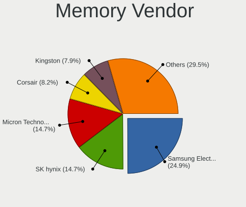

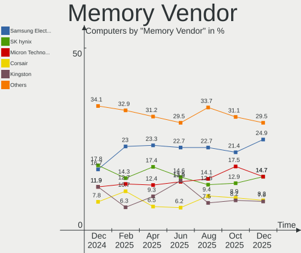

| Vendor                               | Computers | Percent |
|--------------------------------------|-----------|---------|
| Samsung Electronics                  | 88        | 24.93%  |
| SK hynix                             | 52        | 14.73%  |
| Micron Technology                    | 52        | 14.73%  |
| Corsair                              | 29        | 8.22%   |
| Kingston                             | 28        | 7.93%   |
| G.Skill                              | 24        | 6.8%    |
| Unknown                              | 16        | 4.53%   |
| Crucial                              | 14        | 3.97%   |
| Unknown                              | 9         | 2.55%   |
| Team                                 | 7         | 1.98%   |
| A-DATA Technology                    | 6         | 1.7%    |
| Transcend                            | 2         | 0.57%   |
| Timetec                              | 2         | 0.57%   |
| TeamGroup                            | 2         | 0.57%   |
| Visipro                              | 1         | 0.28%   |
| V-GeN                                | 1         | 0.28%   |
| Unknown (0x0BEC)                     | 1         | 0.28%   |
| Unknown (0x0B5E)                     | 1         | 0.28%   |
| T-FORCE                              | 1         | 0.28%   |
| Smart                                | 1         | 0.28%   |
| Shenzhen SCY                         | 1         | 0.28%   |
| Shenzhen Jinge Information           | 1         | 0.28%   |
| Ramaxel Technology                   | 1         | 0.28%   |
| PNY                                  | 1         | 0.28%   |
| Netac                                | 1         | 0.28%   |
| Nanya Technology                     | 1         | 0.28%   |
| Lexar Co Limited                     | 1         | 0.28%   |
| Lexar                                | 1         | 0.28%   |
| GeIL                                 | 1         | 0.28%   |
| Essencore Limited                    | 1         | 0.28%   |
| Elpida                               | 1         | 0.28%   |
| Chun Well Technology Holding Limited | 1         | 0.28%   |
| Chun Well                            | 1         | 0.28%   |
| Apacer                               | 1         | 0.28%   |
| AMD                                  | 1         | 0.28%   |
| 83130000802C                         | 1         | 0.28%   |

Memory Model
------------

Memory module models

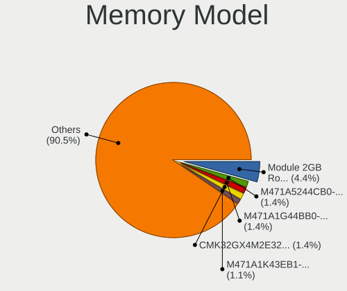

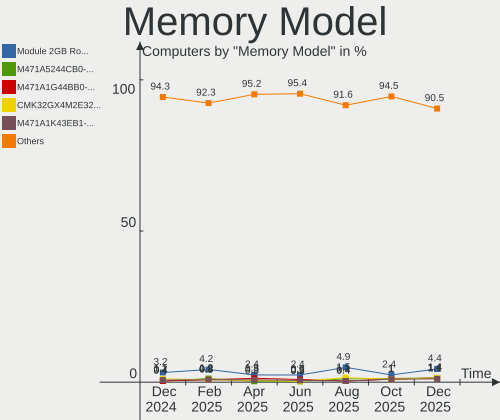

| Model                                                         | Computers | Percent |
|---------------------------------------------------------------|-----------|---------|
| Unknown                                                       | 16        | 4.36%   |
| Samsung RAM M471A5244CB0-CWE 4GB SODIMM DDR4 3200MT/s         | 5         | 1.36%   |
| Samsung RAM M471A1G44BB0-CWE 8GB SODIMM DDR4 3200MT/s         | 5         | 1.36%   |
| Corsair RAM CMK32GX4M2E3200C16 16GB DIMM DDR4 3600MT/s        | 5         | 1.36%   |
| Samsung RAM M471A1K43EB1-CWE 8GB SODIMM DDR4 3200MT/s         | 4         | 1.09%   |
| Samsung RAM M471A1G44AB0-CWE 8GiB SODIMM DDR4 3200MT/s        | 4         | 1.09%   |
| SK hynix RAM Module 4GB SODIMM DDR3 1600MT/s                  | 3         | 0.82%   |
| Samsung RAM M425R4GA3EB0-CWMOD 32GB SODIMM DDR5 5600MT/s      | 3         | 0.82%   |
| Samsung RAM K3KL8L80CM-MGCT 2GB Row Of Chips LPDDR5 7500MT/s  | 3         | 0.82%   |
| Micron RAM Module 8GB SODIMM DDR4 3200MT/s                    | 3         | 0.82%   |
| Kingston RAM KF560C36-16 16GB DIMM DDR5 6000MT/s              | 3         | 0.82%   |
| Corsair RAM CMK16GX4M2B3200C16 8GB DIMM DDR4 3600MT/s         | 3         | 0.82%   |
| Team RAM UD5-6000 16GB DIMM DDR5 6000MT/s                     | 2         | 0.54%   |
| SK hynix RAM HMCG78MEBSA092N 16GB SODIMM DDR5 4800MT/s        | 2         | 0.54%   |
| SK hynix RAM HMAA1GS6CJR6N-XN 8GB SODIMM DDR4 3200MT/s        | 2         | 0.54%   |
| SK hynix RAM HMA851S6AFR6N-UH 4GB SODIMM DDR4 2667MT/s        | 2         | 0.54%   |
| SK hynix RAM HMA82GS6JJR8N-VK 16GB SODIMM DDR4 2667MT/s       | 2         | 0.54%   |
| Samsung RAM Module 4GB Row Of Chips LPDDR5 8533MT/s           | 2         | 0.54%   |
| Samsung RAM M471B5273DH0-CK0 4GB SODIMM DDR3 2400MT/s         | 2         | 0.54%   |
| Samsung RAM M471B5173QH0-YK0 4GB SODIMM DDR3 1600MT/s         | 2         | 0.54%   |
| Samsung RAM M471B5173EB0-YK0 4GB SODIMM DDR3 1600MT/s         | 2         | 0.54%   |
| Samsung RAM M471A1K43DB1-CWE 8GB SODIMM DDR4 3200MT/s         | 2         | 0.54%   |
| Samsung RAM M471A1K43CB1-CRC 8GB SODIMM DDR4 8400MT/s         | 2         | 0.54%   |
| Samsung RAM M471A1K43BB1-CRC 8GB SODIMM DDR4 2667MT/s         | 2         | 0.54%   |
| Samsung RAM M425R2GA3EB0-CWMOL 16GB SODIMM DDR5 5600MT/s      | 2         | 0.54%   |
| Samsung RAM M425R2GA3EB0-CWMOD 16GB SODIMM DDR5 5600MT/s      | 2         | 0.54%   |
| Samsung RAM K3LKCKC0BM-MGCP 4GB Row Of Chips LPDDR5 6400MT/s  | 2         | 0.54%   |
| Samsung RAM K3KL8L80DM-MGCU 4GiB Row Of Chips LPDDR5 7500MT/s | 2         | 0.54%   |
| Micron RAM MTC4C10163S1SC56BD1 8GB SODIMM DDR5 5600MT/s       | 2         | 0.54%   |
| Micron RAM MT62F1G32D4DR-031 2GB Row Of Chips LPDDR5 6400MT/s | 2         | 0.54%   |
| Micron RAM Module 2GB SODIMM DDR3 1067MT/s                    | 2         | 0.54%   |
| Micron RAM CP16G64C38U5W.M8D3 16GB DIMM DDR5 6400MT/s         | 2         | 0.54%   |
| Micron RAM 8ATF1G64HZ-3G2R1 8GB SODIMM DDR4 3200MT/s          | 2         | 0.54%   |
| Micron RAM 4ATF1G64HZ-3G2F1 8GB SODIMM DDR4 3200MT/s          | 2         | 0.54%   |
| Micron RAM 4ATF1G64HZ-3G2E2 8GB SODIMM DDR4 3200MT/s          | 2         | 0.54%   |
| G.Skill RAM F5-6000J3636F16G 16GB DIMM DDR5 6400MT/s          | 2         | 0.54%   |
| G.Skill RAM F5-6000J3040G32G 32GB DIMM DDR5 6200MT/s          | 2         | 0.54%   |
| G.Skill RAM F5-6000J3038F16G 16GB DIMM DDR5 6000MT/s          | 2         | 0.54%   |
| G.Skill RAM F3-1600C9-8GRSL 8GB SODIMM DDR3 1600MT/s          | 2         | 0.54%   |
| Crucial RAM CT102464BF160B.M16 8GB SODIMM DDR3 1600MT/s       | 2         | 0.54%   |

Memory Kind
-----------

Memory module kinds

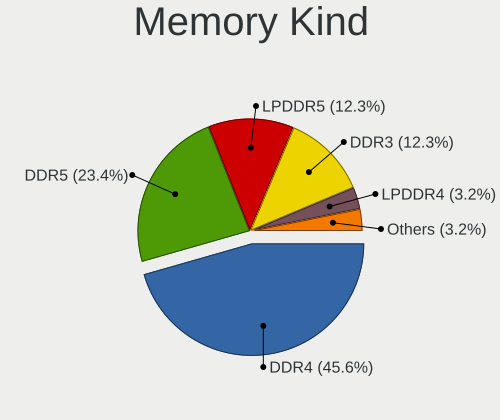

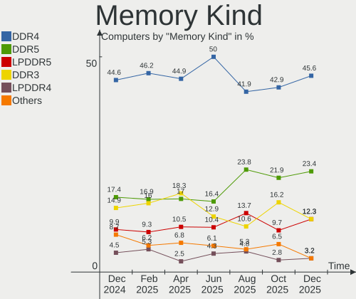

| Kind    | Computers | Percent |
|---------|-----------|---------|
| DDR4    | 144       | 45.57%  |
| DDR5    | 74        | 23.42%  |
| LPDDR5  | 39        | 12.34%  |
| DDR3    | 39        | 12.34%  |
| LPDDR4  | 10        | 3.16%   |
| LPDDR3  | 5         | 1.58%   |
| Unknown | 4         | 1.27%   |
| DDR2    | 1         | 0.32%   |

Memory Form Factor
------------------

Physical design of the memory module

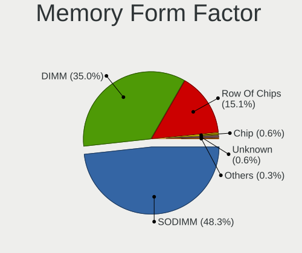

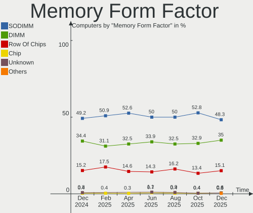

| Name         | Computers | Percent |
|--------------|-----------|---------|
| SODIMM       | 153       | 48.26%  |
| DIMM         | 111       | 35.02%  |
| Row Of Chips | 48        | 15.14%  |
| Chip         | 2         | 0.63%   |
| Unknown      | 2         | 0.63%   |
| RIMM         | 1         | 0.32%   |

Memory Size
-----------

Memory module size

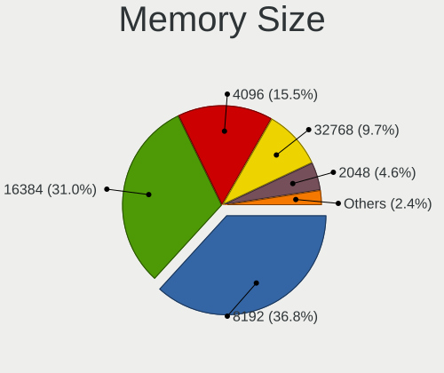

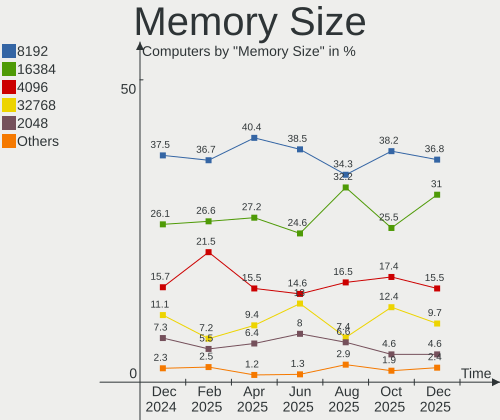

| Size  | Computers | Percent |
|-------|-----------|---------|
| 8192  | 121       | 36.78%  |
| 16384 | 102       | 31%     |
| 4096  | 51        | 15.5%   |
| 32768 | 32        | 9.73%   |
| 2048  | 15        | 4.56%   |
| 49152 | 5         | 1.52%   |
| 65536 | 3         | 0.91%   |

Memory Speed
------------

Memory module speed

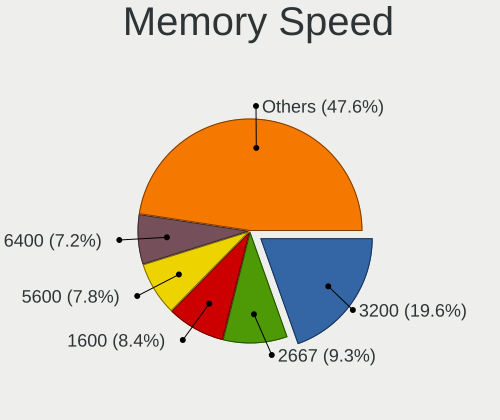

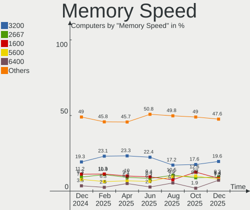

| Speed | Computers | Percent |
|-------|-----------|---------|
| 3200  | 65        | 19.58%  |
| 2667  | 31        | 9.34%   |
| 1600  | 28        | 8.43%   |
| 5600  | 26        | 7.83%   |
| 6400  | 24        | 7.23%   |
| 6000  | 21        | 6.33%   |
| 3600  | 20        | 6.02%   |
| 2400  | 13        | 3.92%   |
| 7500  | 11        | 3.31%   |
| 4800  | 11        | 3.31%   |
| 2133  | 10        | 3.01%   |
| 8533  | 9         | 2.71%   |
| 4267  | 6         | 1.81%   |
| 3733  | 4         | 1.2%    |
| 2666  | 4         | 1.2%    |
| 1333  | 4         | 1.2%    |
| 8400  | 3         | 0.9%    |
| 1067  | 3         | 0.9%    |
| 8000  | 2         | 0.6%    |
| 7467  | 2         | 0.6%    |
| 6200  | 2         | 0.6%    |
| 4266  | 2         | 0.6%    |
| 4000  | 2         | 0.6%    |
| 3800  | 2         | 0.6%    |
| 3000  | 2         | 0.6%    |
| 1867  | 2         | 0.6%    |
| 1866  | 2         | 0.6%    |
| 12800 | 1         | 0.3%    |
| 8600  | 1         | 0.3%    |
| 7400  | 1         | 0.3%    |
| 7000  | 1         | 0.3%    |
| 6800  | 1         | 0.3%    |
| 5800  | 1         | 0.3%    |
| 5200  | 1         | 0.3%    |
| 3866  | 1         | 0.3%    |
| 3400  | 1         | 0.3%    |
| 3266  | 1         | 0.3%    |
| 3100  | 1         | 0.3%    |
| 2933  | 1         | 0.3%    |
| 2870  | 1         | 0.3%    |

Printers & scanners
-------------------

Printer Vendor
--------------

Printer device vendors

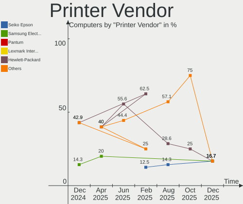

| Vendor                | Computers | Percent |
|-----------------------|-----------|---------|
| Seiko Epson           | 1         | 16.67%  |
| Samsung Electronics   | 1         | 16.67%  |
| Pantum                | 1         | 16.67%  |
| Lexmark International | 1         | 16.67%  |
| Hewlett-Packard       | 1         | 16.67%  |
| Canon                 | 1         | 16.67%  |

Printer Model
-------------

Printer device models

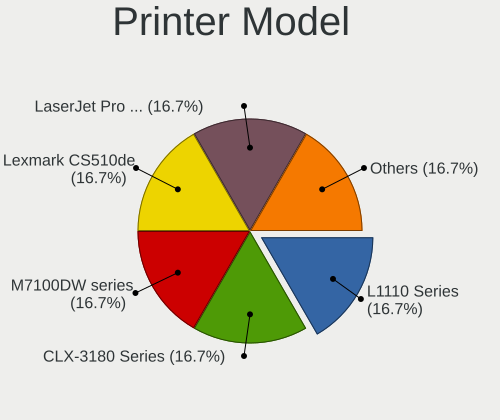

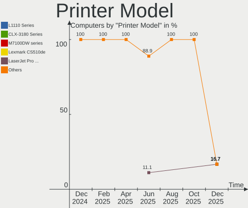

| Model                                 | Computers | Percent |
|---------------------------------------|-----------|---------|
| Seiko Epson L1110 Series              | 1         | 16.67%  |
| Samsung CLX-3180 Series               | 1         | 16.67%  |
| Pantum M7100DW series                 | 1         | 16.67%  |
| Lexmark International Lexmark CS510de | 1         | 16.67%  |
| HP LaserJet Pro M148-M149             | 1         | 16.67%  |
| Canon LiDE 400                        | 1         | 16.67%  |

Scanner Vendor
--------------

Scanner device vendors

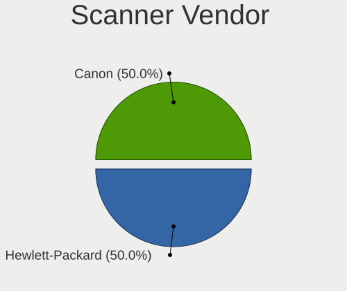

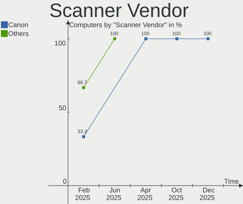

| Vendor | Computers | Percent |
|--------|-----------|---------|
| Canon  | 2         | 100%    |

Scanner Model
-------------

Scanner device models

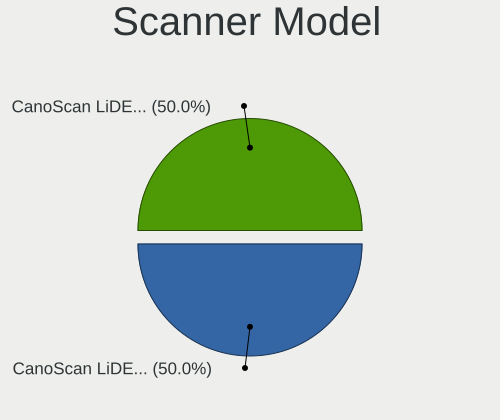

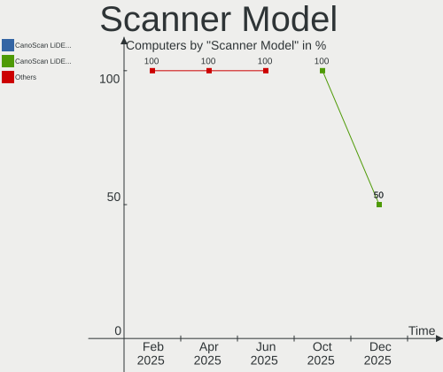

| Model                    | Computers | Percent |
|--------------------------|-----------|---------|
| Canon CanoScan LiDE 700F | 1         | 50%     |
| Canon CanoScan LiDE 120  | 1         | 50%     |

Camera
------

Camera Vendor
-------------

Camera device vendors

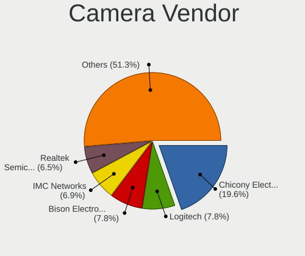

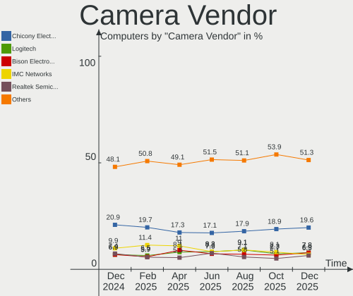

| Vendor                                 | Computers | Percent |
|----------------------------------------|-----------|---------|
| Chicony Electronics                    | 88        | 19.64%  |
| Logitech                               | 35        | 7.81%   |
| Bison Electronics                      | 35        | 7.81%   |
| IMC Networks                           | 31        | 6.92%   |
| Realtek Semiconductor                  | 29        | 6.47%   |
| Luxvisions Innotech Limited            | 28        | 6.25%   |
| Sunplus Innovation Technology          | 26        | 5.8%    |
| Microdia                               | 25        | 5.58%   |
| Quanta                                 | 24        | 5.36%   |
| Apple                                  | 19        | 4.24%   |
| Syntek                                 | 15        | 3.35%   |
| Shinetech                              | 13        | 2.9%    |
| Cheng Uei Precision Industry (Foxlink) | 7         | 1.56%   |
| Lite-On Technology                     | 6         | 1.34%   |
| SunplusIT                              | 5         | 1.12%   |
| Sonix Technology                       | 5         | 1.12%   |
| Razer USA                              | 4         | 0.89%   |
| Microsoft                              | 4         | 0.89%   |
| Remo Tech                              | 3         | 0.67%   |
| Silicon Motion                         | 2         | 0.45%   |
| Shine-optics                           | 2         | 0.45%   |
| MacroSilicon                           | 2         | 0.45%   |
| Lenovo                                 | 2         | 0.45%   |
| Jiangxi Shinetech Optical              | 2         | 0.45%   |
| Generalplus Technology                 | 2         | 0.45%   |
| Framework                              | 2         | 0.45%   |
| Anker PowerConf C200                   | 2         | 0.45%   |
| Alcor Micro                            | 2         | 0.45%   |
| Xiongmai                               | 1         | 0.22%   |
| Valve Software                         | 1         | 0.22%   |
| USB CAMERA                             | 1         | 0.22%   |
| Tobii Technology AB                    | 1         | 0.22%   |
| Suyin                                  | 1         | 0.22%   |
| Sunplus Technology                     | 1         | 0.22%   |
| SHENZHEN EMEET TECHNOLOGY              | 1         | 0.22%   |
| SenseTek                               | 1         | 0.22%   |
| Samsung Electronics                    | 1         | 0.22%   |
| Ruision                                | 1         | 0.22%   |
| Nexight                                | 1         | 0.22%   |
| KYE Systems (Mouse Systems)            | 1         | 0.22%   |

Camera Model
------------

Camera device models

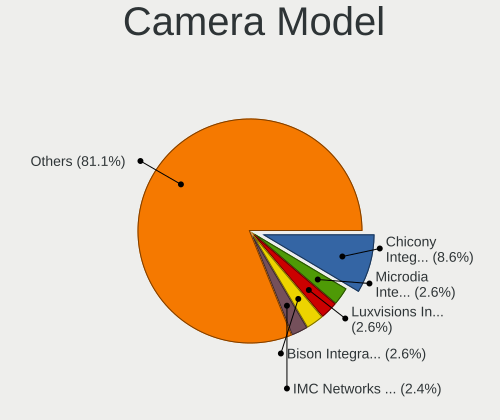

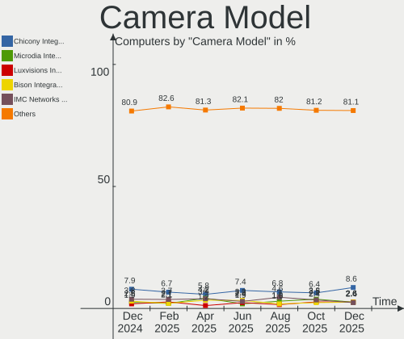

| Model                                             | Computers | Percent |
|---------------------------------------------------|-----------|---------|
| Chicony Integrated Camera                         | 39        | 8.57%   |
| Microdia Integrated_Webcam_HD                     | 12        | 2.64%   |
| Luxvisions Innotech Limited Integrated Camera     | 12        | 2.64%   |
| Bison Integrated Camera                           | 12        | 2.64%   |
| IMC Networks USB2.0 HD UVC WebCam                 | 11        | 2.42%   |
| IMC Networks Integrated Camera                    | 10        | 2.2%    |
| Syntek Integrated Camera                          | 9         | 1.98%   |
| Apple FaceTime HD Camera (Built-in)               | 8         | 1.76%   |
| Chicony HD WebCam                                 | 7         | 1.54%   |
| Realtek Integrated_Webcam_HD                      | 6         | 1.32%   |
| Luxvisions Innotech Limited Integrated RGB Camera | 6         | 1.32%   |
| Logitech HD Pro Webcam C920                       | 6         | 1.32%   |
| Logitech C922 Pro Stream Webcam                   | 6         | 1.32%   |
| Apple iPhone 5/5C/5S/6/SE/7/8/X                   | 6         | 1.32%   |
| Shinetech ASUS FHD webcam                         | 5         | 1.1%    |
| Logitech BRIO Ultra HD Webcam                     | 5         | 1.1%    |
| IMC Networks USB2.0 VGA UVC WebCam                | 5         | 1.1%    |
| Chicony HP HD Camera                              | 5         | 1.1%    |
| Bison Integrated RGB Camera                       | 5         | 1.1%    |
| Syntek Integrated RGB Camera                      | 4         | 0.88%   |
| Sunplus SPCA2281 Web Camera                       | 4         | 0.88%   |
| Sunplus Integrated Camera                         | 4         | 0.88%   |
| Realtek Integrated_Webcam_FHD                     | 4         | 0.88%   |
| Realtek Integrated Webcam                         | 4         | 0.88%   |
| Quanta HP Wide Vision 5MP                         | 4         | 0.88%   |
| Bison HD Webcam                                   | 4         | 0.88%   |
| Sunplus USB 2.0 Camera                            | 3         | 0.66%   |
| Sunplus Integrated_Webcam_FHD                     | 3         | 0.66%   |
| ShineTech USB2.0 HD UVC WebCam                    | 3         | 0.66%   |
| Shinetech USB2.0 FHD UVC WebCam                   | 3         | 0.66%   |
| Quanta HP True Vision HD Camera                   | 3         | 0.66%   |
| Microdia Webcam Vitade AF                         | 3         | 0.66%   |
| Microdia USB 2.0 Camera                           | 3         | 0.66%   |
| Luxvisions Innotech Limited HP 5MP Camera         | 3         | 0.66%   |
| Logitech Webcam C270                              | 3         | 0.66%   |
| Lite-On Integrated Camera                         | 3         | 0.66%   |
| Chicony Integrated Camera (1280x720@30)           | 3         | 0.66%   |
| Chicony HP Wide Vision HD Camera                  | 3         | 0.66%   |
| Chicony HP Truevision HD camera                   | 3         | 0.66%   |
| Chicony HP Truevision HD                          | 3         | 0.66%   |

Security
--------

Fingerprint Vendor
------------------

Fingerprint sensor vendors

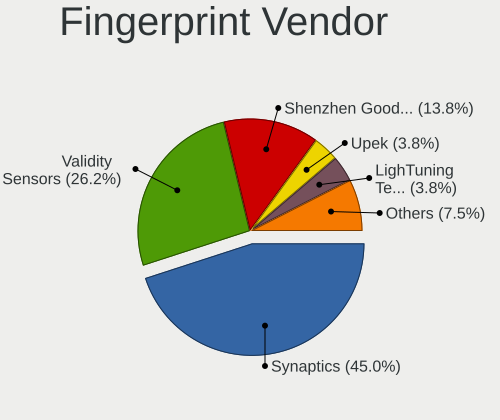

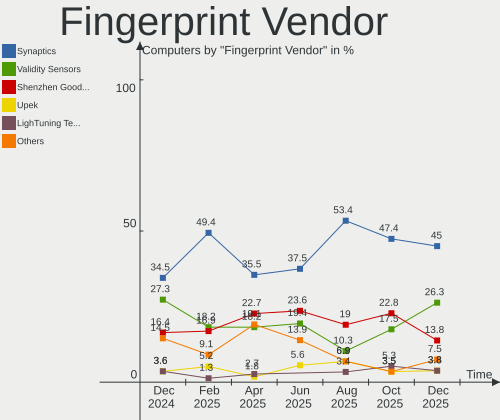

| Vendor                     | Computers | Percent |
|----------------------------|-----------|---------|
| Synaptics                  | 36        | 45%     |
| Validity Sensors           | 21        | 26.25%  |
| Shenzhen Goodix Technology | 11        | 13.75%  |
| Upek                       | 3         | 3.75%   |
| LighTuning Technology      | 3         | 3.75%   |
| HOLTEK                     | 3         | 3.75%   |
| Elan Microelectronics      | 2         | 2.5%    |
| DigitalPersona             | 1         | 1.25%   |

Fingerprint Model
-----------------

Fingerprint sensor models

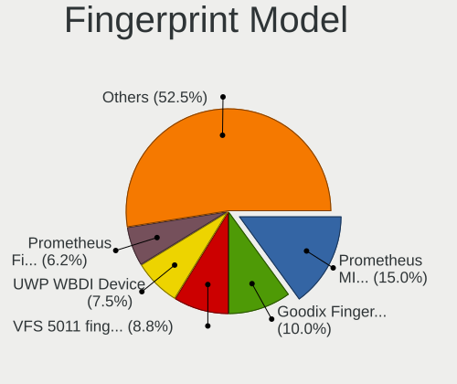

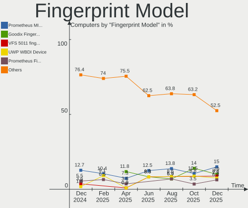

| Model                                                                      | Computers | Percent |
|----------------------------------------------------------------------------|-----------|---------|
| Synaptics Prometheus MIS Touch Fingerprint Reader                          | 12        | 15%     |
| Shenzhen Goodix  Fingerprint Device                                        | 8         | 10%     |
| Validity Sensors VFS 5011 fingerprint sensor                               | 7         | 8.75%   |
| Synaptics UWP WBDI Device                                                  | 6         | 7.5%    |
| Synaptics Prometheus Fingerprint Reader                                    | 5         | 6.25%   |
| Synaptics FS7604 Touch Fingerprint Sensor with PurePrint                   | 5         | 6.25%   |
| Validity Sensors Synaptics VFS7552 Touch Fingerprint Sensor with PurePrint | 4         | 5%      |
| Upek Biometric Touchchip/Touchstrip Fingerprint Sensor                     | 3         | 3.75%   |
| Synaptics Fingerprint reader [HP G6]                                       | 3         | 3.75%   |
| Shenzhen Goodix Fingerprint Reader                                         | 3         | 3.75%   |
| HOLTEK FocalTech Fingerprint Device                                        | 3         | 3.75%   |
| Validity Sensors VFS491                                                    | 2         | 2.5%    |
| Validity Sensors Synaptics WBDI                                            | 2         | 2.5%    |
| Validity Sensors Swipe Fingerprint Sensor                                  | 2         | 2.5%    |
| Synaptics Metallica MIS Touch Fingerprint Reader                           | 2         | 2.5%    |
| LighTuning EgisTec Touch Fingerprint Sensor                                | 2         | 2.5%    |
| Elan ELAN:ARM-M4                                                           | 2         | 2.5%    |
| Validity Sensors VFS7500 Touch Fingerprint Sensor                          | 1         | 1.25%   |
| Validity Sensors VFS5011 Fingerprint Reader                                | 1         | 1.25%   |
| Validity Sensors VFS471 Fingerprint Reader                                 | 1         | 1.25%   |
| Validity Sensors Synaptics VFS7552 Touch Fingerprint Sensor                | 1         | 1.25%   |
| Synaptics WBDI                                                             | 1         | 1.25%   |
| Synaptics UWP WBDI                                                         | 1         | 1.25%   |
| Synaptics Fingerprint scanner                                              | 1         | 1.25%   |
| LighTuning ES603 Swipe Fingerprint Sensor                                  | 1         | 1.25%   |
| DigitalPersona Fingerprint Reader                                          | 1         | 1.25%   |

Chipcard Vendor
---------------

Chipcard module vendors

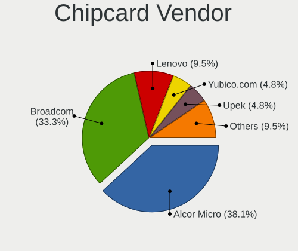

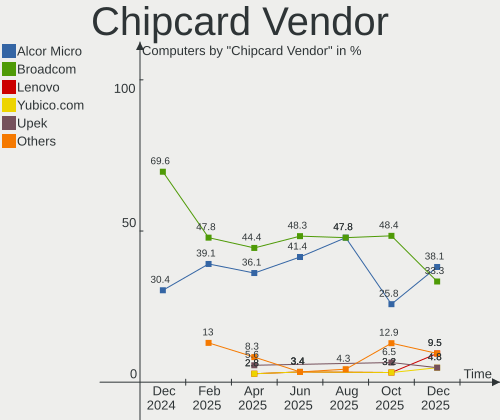

| Vendor                | Computers | Percent |
|-----------------------|-----------|---------|
| Alcor Micro           | 8         | 38.1%   |
| Broadcom              | 7         | 33.33%  |
| Lenovo                | 2         | 9.52%   |
| Yubico.com            | 1         | 4.76%   |
| Upek                  | 1         | 4.76%   |
| O2 Micro              | 1         | 4.76%   |
| Advanced Card Systems | 1         | 4.76%   |

Chipcard Model
--------------

Chipcard module models

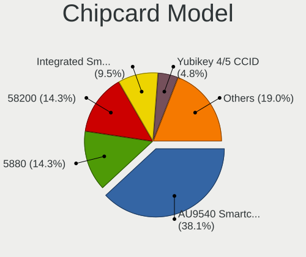

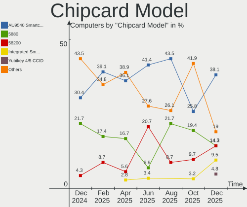

| Model                                                                        | Computers | Percent |
|------------------------------------------------------------------------------|-----------|---------|
| Alcor Micro AU9540 Smartcard Reader                                          | 8         | 38.1%   |
| Broadcom 5880                                                                | 3         | 14.29%  |
| Broadcom 58200                                                               | 3         | 14.29%  |
| Lenovo Integrated Smart Card Reader                                          | 2         | 9.52%   |
| Yubico.com Yubikey 4/5 CCID                                                  | 1         | 4.76%   |
| Upek TouchChip Fingerprint Coprocessor (WBF advanced mode)                   | 1         | 4.76%   |
| O2 Micro OZ776 CCID Smartcard Reader                                         | 1         | 4.76%   |
| Broadcom BCM5880 Secure Applications Processor with fingerprint swipe sensor | 1         | 4.76%   |
| Advanced Card Systems ACR39U                                                 | 1         | 4.76%   |

Unsupported
-----------

Unsupported Devices
-------------------

Total unsupported devices on board

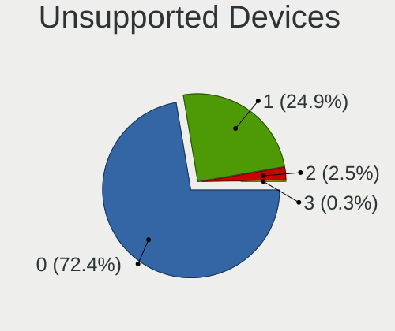

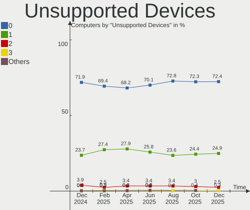

| Total | Computers | Percent |
|-------|-----------|---------|
| 0     | 500       | 72.36%  |
| 1     | 172       | 24.89%  |
| 2     | 17        | 2.46%   |
| 3     | 2         | 0.29%   |

Unsupported Device Types
------------------------

Types of unsupported devices

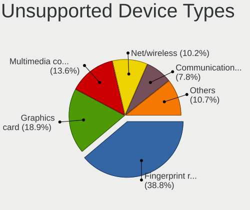

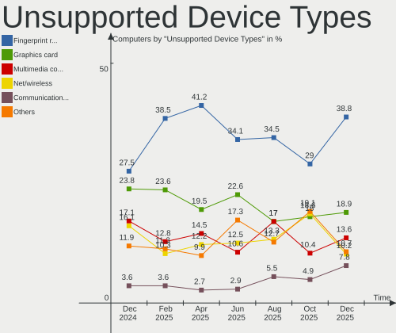

| Type                     | Computers | Percent |
|--------------------------|-----------|---------|
| Fingerprint reader       | 80        | 38.83%  |
| Graphics card            | 39        | 18.93%  |
| Multimedia controller    | 28        | 13.59%  |
| Net/wireless             | 21        | 10.19%  |
| Communication controller | 16        | 7.77%   |
| Chipcard                 | 5         | 2.43%   |
| Unassigned class         | 4         | 1.94%   |
| Net/ethernet             | 3         | 1.46%   |
| Sound                    | 2         | 0.97%   |
| Modem                    | 2         | 0.97%   |
| Card reader              | 2         | 0.97%   |
| Storage/raid             | 1         | 0.49%   |
| Dvb card                 | 1         | 0.49%   |
| Camera                   | 1         | 0.49%   |
| Bluetooth                | 1         | 0.49%   |

