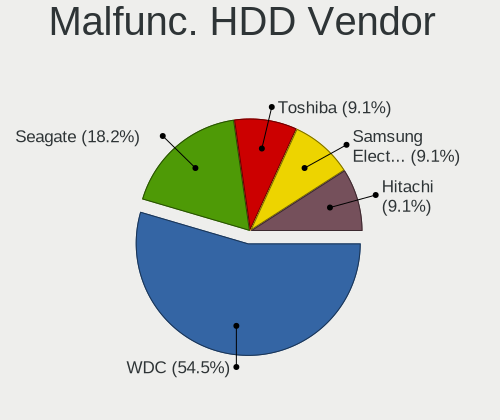

Fedora - Hardware Trends
------------------------

A project to identify most popular hardware characteristics and track their change
over time based on data collected by Linux users at https://Linux-Hardware.org.

Anyone can contribute to this report by the [hw-probe](https://github.com/linuxhw/hw-probe) tool:

    sudo -E hw-probe -all -upload

This is a report for all computer types. See also reports for [desktops](/Dist/Fedora/Desktop/README.md) and [notebooks](/Dist/Fedora/Notebook/README.md).

This report is for one last month. Overall report since the beginning of time: [TestDays](https://github.com/linuxhw/TestDays)

Period: Apr, 2024.

Contents
--------

* [ System ](#system)
  - [ OS                       ](#os)
  - [ OS Family                ](#os-family)
  - [ Kernel                   ](#kernel)
  - [ Kernel Family            ](#kernel-family)
  - [ Kernel Major Ver.        ](#kernel-major-ver)
  - [ Arch                     ](#arch)
  - [ DE                       ](#de)
  - [ Display Server           ](#display-server)
  - [ Display Manager          ](#display-manager)
  - [ OS Lang                  ](#os-lang)
  - [ Boot Mode                ](#boot-mode)
  - [ Filesystem               ](#filesystem)
  - [ Part. scheme             ](#part-scheme)
  - [ Dual Boot with Linux/BSD ](#dual-boot-with-linuxbsd)
  - [ Dual Boot (Win)          ](#dual-boot-win)

* [ Board ](#board)
  - [ Vendor                   ](#vendor)
  - [ Model                    ](#model)
  - [ Model Family             ](#model-family)
  - [ MFG Year                 ](#mfg-year)
  - [ Form Factor              ](#form-factor)
  - [ Secure Boot              ](#secure-boot)
  - [ Coreboot                 ](#coreboot)
  - [ RAM Size                 ](#ram-size)
  - [ RAM Used                 ](#ram-used)
  - [ Total Drives             ](#total-drives)
  - [ Has CD-ROM               ](#has-cd-rom)
  - [ Has Ethernet             ](#has-ethernet)
  - [ Has WiFi                 ](#has-wifi)
  - [ Has Bluetooth            ](#has-bluetooth)

* [ Location ](#location)
  - [ Country                  ](#country)
  - [ City                     ](#city)

* [ Drives ](#drives)
  - [ Drive Vendor             ](#drive-vendor)
  - [ Drive Model              ](#drive-model)
  - [ HDD Vendor               ](#hdd-vendor)
  - [ SSD Vendor               ](#ssd-vendor)
  - [ Drive Kind               ](#drive-kind)
  - [ Drive Connector          ](#drive-connector)
  - [ Drive Size               ](#drive-size)
  - [ Space Total              ](#space-total)
  - [ Space Used               ](#space-used)
  - [ Malfunc. Drives          ](#malfunc-drives)
  - [ Malfunc. Drive Vendor    ](#malfunc-drive-vendor)
  - [ Malfunc. HDD Vendor      ](#malfunc-hdd-vendor)
  - [ Malfunc. Drive Kind      ](#malfunc-drive-kind)
  - [ Failed Drives            ](#failed-drives)
  - [ Failed Drive Vendor      ](#failed-drive-vendor)
  - [ Drive Status             ](#drive-status)

* [ Storage controller ](#storage-controller)
  - [ Storage Vendor           ](#storage-vendor)
  - [ Storage Model            ](#storage-model)
  - [ Storage Kind             ](#storage-kind)

* [ Processor ](#processor)
  - [ CPU Vendor               ](#cpu-vendor)
  - [ CPU Model                ](#cpu-model)
  - [ CPU Model Family         ](#cpu-model-family)
  - [ CPU Cores                ](#cpu-cores)
  - [ CPU Sockets              ](#cpu-sockets)
  - [ CPU Threads              ](#cpu-threads)
  - [ CPU Op-Modes             ](#cpu-op-modes)
  - [ CPU Microcode            ](#cpu-microcode)
  - [ CPU Microarch            ](#cpu-microarch)

* [ Graphics ](#graphics)
  - [ GPU Vendor               ](#gpu-vendor)
  - [ GPU Model                ](#gpu-model)
  - [ GPU Combo                ](#gpu-combo)
  - [ GPU Driver               ](#gpu-driver)
  - [ GPU Memory               ](#gpu-memory)

* [ Monitor ](#monitor)
  - [ Monitor Vendor           ](#monitor-vendor)
  - [ Monitor Model            ](#monitor-model)
  - [ Monitor Resolution       ](#monitor-resolution)
  - [ Monitor Diagonal         ](#monitor-diagonal)
  - [ Monitor Width            ](#monitor-width)
  - [ Aspect Ratio             ](#aspect-ratio)
  - [ Monitor Area             ](#monitor-area)
  - [ Pixel Density            ](#pixel-density)
  - [ Multiple Monitors        ](#multiple-monitors)

* [ Network ](#network)
  - [ Net Controller Vendor    ](#net-controller-vendor)
  - [ Net Controller Model     ](#net-controller-model)
  - [ Wireless Vendor          ](#wireless-vendor)
  - [ Wireless Model           ](#wireless-model)
  - [ Ethernet Vendor          ](#ethernet-vendor)
  - [ Ethernet Model           ](#ethernet-model)
  - [ Net Controller Kind      ](#net-controller-kind)
  - [ Used Controller          ](#used-controller)
  - [ NICs                     ](#nics)
  - [ IPv6                     ](#ipv6)

* [ Bluetooth ](#bluetooth)
  - [ Bluetooth Vendor         ](#bluetooth-vendor)
  - [ Bluetooth Model          ](#bluetooth-model)

* [ Sound ](#sound)
  - [ Sound Vendor             ](#sound-vendor)
  - [ Sound Model              ](#sound-model)

* [ Memory ](#memory)
  - [ Memory Vendor            ](#memory-vendor)
  - [ Memory Model             ](#memory-model)
  - [ Memory Kind              ](#memory-kind)
  - [ Memory Form Factor       ](#memory-form-factor)
  - [ Memory Size              ](#memory-size)
  - [ Memory Speed             ](#memory-speed)

* [ Printers & scanners ](#printers--scanners)
  - [ Printer Vendor           ](#printer-vendor)
  - [ Printer Model            ](#printer-model)
  - [ Scanner Vendor           ](#scanner-vendor)
  - [ Scanner Model            ](#scanner-model)

* [ Camera ](#camera)
  - [ Camera Vendor            ](#camera-vendor)
  - [ Camera Model             ](#camera-model)

* [ Security ](#security)
  - [ Fingerprint Vendor       ](#fingerprint-vendor)
  - [ Fingerprint Model        ](#fingerprint-model)
  - [ Chipcard Vendor          ](#chipcard-vendor)
  - [ Chipcard Model           ](#chipcard-model)

* [ Unsupported ](#unsupported)
  - [ Unsupported Devices      ](#unsupported-devices)
  - [ Unsupported Device Types ](#unsupported-device-types)

System
------

OS
--

Installed operating systems

| Name      | Computers | Percent |
|-----------|-----------|---------|
| Fedora 39 | 466       | 60.92%  |
| Fedora 40 | 267       | 34.9%   |
| Fedora 38 | 17        | 2.22%   |
| Fedora 41 | 9         | 1.18%   |
| Fedora 35 | 2         | 0.26%   |
| Fedora 37 | 1         | 0.13%   |
| Fedora 36 | 1         | 0.13%   |
| Fedora 34 | 1         | 0.13%   |
| Fedora 32 | 1         | 0.13%   |

OS Family
---------

OS without a version

| Name   | Computers | Percent |
|--------|-----------|---------|
| Fedora | 765       | 100%    |

Kernel
------

Version of the Linux kernel

| Version                                                | Computers | Percent |
|--------------------------------------------------------|-----------|---------|
| 6.8.7-300.fc40.x86_64                                  | 178       | 23.27%  |
| 6.8.4-200.fc39.x86_64                                  | 89        | 11.63%  |
| 6.8.6-200.fc39.x86_64                                  | 79        | 10.33%  |
| 6.7.11-200.fc39.x86_64                                 | 73        | 9.54%   |
| 6.8.5-201.fc39.x86_64                                  | 60        | 7.84%   |
| 6.5.6-300.fc39.x86_64                                  | 49        | 6.41%   |
| 6.7.10-200.fc39.x86_64                                 | 37        | 4.84%   |
| 6.8.7-200.fc39.x86_64                                  | 35        | 4.58%   |
| 6.8.5-301.fc40.x86_64                                  | 29        | 3.79%   |
| 6.8.2-300.fc40.x86_64                                  | 21        | 2.75%   |
| 6.8.4-300.fc40.x86_64                                  | 17        | 2.22%   |
| 6.7.9-200.fc39.x86_64                                  | 14        | 1.83%   |
| 6.8.7-100.fc38.x86_64                                  | 7         | 0.92%   |
| 6.7.9-207.fsync.fc39.x86_64                            | 7         | 0.92%   |
| 6.8.6-300.fc40.x86_64                                  | 5         | 0.65%   |
| 6.7.7-200.fc39.x86_64                                  | 4         | 0.52%   |
| 6.9.0-0.rc5.20240426gitc942a0cd3603.48.fc41.x86_64     | 3         | 0.39%   |
| 6.8.7-302.fsync.fc40.x86_64                            | 3         | 0.39%   |
| 6.8.4-100.fc38.x86_64                                  | 3         | 0.39%   |
| 6.8.0-0.rc6.49.fc40.x86_64                             | 3         | 0.39%   |
| 6.9.0-0.rc4.20240416git96fca68c4fbf7.38.fc41.x86_64    | 2         | 0.26%   |
| 6.9.0-0.rc3.31.fc41.x86_64+debug                       | 2         | 0.26%   |
| 6.8.7-301.fsync.fc40.x86_64                            | 2         | 0.26%   |
| 6.7.6-200.fc39.x86_64                                  | 2         | 0.26%   |
| 6.7.12-202.fsync.fc39.x86_64                           | 2         | 0.26%   |
| 6.7.11-100.fc38.x86_64                                 | 2         | 0.26%   |
| 6.9.0-rc2+                                             | 1         | 0.13%   |
| 6.9.0-0.rc5.20240426gitc942a0cd3603.48.fc41.aarch64    | 1         | 0.13%   |
| 6.9.0-0.rc5.20240423git71b1543c83d6.45.fc41.x86_64     | 1         | 0.13%   |
| 6.9.0-0.rc3.20240411gte8c39d0f.232.vanilla.fc39.x86_64 | 1         | 0.13%   |
| 6.9.0-0.rc3.20240410gt2c71fdf0.231.vanilla.fc39.x86_64 | 1         | 0.13%   |
| 6.9.0-0.0.next.20240319.210.vanilla.fc39.x86_64        | 1         | 0.13%   |
| 6.8.8-300.fc40.x86_64                                  | 1         | 0.13%   |
| 6.8.7-cb1.0.fc39.x86_64                                | 1         | 0.13%   |
| 6.8.6-1.surface.fc40.x86_64                            | 1         | 0.13%   |
| 6.8.5-101.fc38.x86_64                                  | 1         | 0.13%   |
| 6.8.4-cb1.0.fc39.x86_64                                | 1         | 0.13%   |
| 6.8.4-350.vanilla.fc40.x86_64                          | 1         | 0.13%   |
| 6.8.4-300.es83xx.fc40.x86_64                           | 1         | 0.13%   |
| 6.8.4-200.fc39.aarch64                                 | 1         | 0.13%   |

Kernel Family
-------------

Linux kernel without a distro release

| Version | Computers | Percent |
|---------|-----------|---------|
| 6.8.7   | 226       | 29.54%  |
| 6.8.4   | 113       | 14.77%  |
| 6.8.5   | 90        | 11.76%  |
| 6.8.6   | 85        | 11.11%  |
| 6.7.11  | 76        | 9.93%   |
| 6.5.6   | 49        | 6.41%   |
| 6.7.10  | 38        | 4.97%   |
| 6.8.2   | 22        | 2.88%   |
| 6.7.9   | 22        | 2.88%   |
| 6.9.0   | 13        | 1.7%    |
| 6.7.7   | 5         | 0.65%   |
| 6.8.0   | 4         | 0.52%   |
| 6.7.6   | 3         | 0.39%   |
| 6.7.12  | 3         | 0.39%   |
| 6.2.15  | 2         | 0.26%   |
| 6.8.8   | 1         | 0.13%   |
| 6.8.1   | 1         | 0.13%   |
| 6.7.5   | 1         | 0.13%   |
| 6.7.4   | 1         | 0.13%   |
| 6.6.8   | 1         | 0.13%   |
| 6.6.6   | 1         | 0.13%   |
| 6.6.4   | 1         | 0.13%   |
| 6.6.11  | 1         | 0.13%   |
| 6.2.9   | 1         | 0.13%   |
| 6.0.12  | 1         | 0.13%   |
| 5.6.13  | 1         | 0.13%   |
| 5.17.5  | 1         | 0.13%   |
| 5.17.12 | 1         | 0.13%   |
| 5.0.16  | 1         | 0.13%   |

Kernel Major Ver.
-----------------

Linux kernel major version

| Version | Computers | Percent |
|---------|-----------|---------|
| 6.8     | 542       | 70.85%  |
| 6.7     | 149       | 19.48%  |
| 6.5     | 49        | 6.41%   |
| 6.9     | 13        | 1.7%    |
| 6.6     | 4         | 0.52%   |
| 6.2     | 3         | 0.39%   |
| 5.17    | 2         | 0.26%   |
| 6.0     | 1         | 0.13%   |
| 5.6     | 1         | 0.13%   |
| 5.0     | 1         | 0.13%   |

Arch
----

OS architecture (x86_64, i586, etc.)

| Name    | Computers | Percent |
|---------|-----------|---------|
| x86_64  | 762       | 99.61%  |
| aarch64 | 3         | 0.39%   |

DE
--

Desktop Environment

| Name          | Computers | Percent |
|---------------|-----------|---------|
| GNOME         | 572       | 74.77%  |
| KDE5          | 66        | 8.63%   |
| KDE6          | 45        | 5.88%   |
| Cinnamon      | 15        | 1.96%   |
| Unknown       | 14        | 1.83%   |
| KDE4          | 12        | 1.57%   |
| X-Cinnamon    | 11        | 1.44%   |
| XFCE          | 7         | 0.92%   |
| MATE          | 7         | 0.92%   |
| GNOME Classic | 6         | 0.78%   |
| Budgie        | 3         | 0.39%   |
| LXQt          | 2         | 0.26%   |
| KDE           | 2         | 0.26%   |
| Deepin        | 2         | 0.26%   |
| LXDE          | 1         | 0.13%   |

Display Server
--------------

X11 or Wayland

| Name        | Computers | Percent |
|-------------|-----------|---------|
| Wayland     | 638       | 83.4%   |
| X11         | 97        | 12.68%  |
| Tty         | 25        | 3.27%   |
| Unknown     | 4         | 0.52%   |
| Unspecified | 1         | 0.13%   |

Display Manager
---------------

SDDM, LightDM, etc.

| Name    | Computers | Percent |
|---------|-----------|---------|
| Unknown | 528       | 69.02%  |
| GDM     | 142       | 18.56%  |
| SDDM    | 64        | 8.37%   |
| LightDM | 30        | 3.92%   |
| LXDM    | 1         | 0.13%   |

OS Lang
-------

Language

| Lang    | Computers | Percent |
|---------|-----------|---------|
| en_US   | 397       | 51.9%   |
| en_GB   | 47        | 6.14%   |
| ru_RU   | 40        | 5.23%   |
| de_DE   | 36        | 4.71%   |
| pt_BR   | 33        | 4.31%   |
| en_AU   | 27        | 3.53%   |
| fr_FR   | 26        | 3.4%    |
| it_IT   | 23        | 3.01%   |
| en_CA   | 16        | 2.09%   |
| es_MX   | 10        | 1.31%   |
| es_ES   | 10        | 1.31%   |
| pl_PL   | 8         | 1.05%   |
| en_IN   | 7         | 0.92%   |
| es_AR   | 6         | 0.78%   |
| de_AT   | 6         | 0.78%   |
| tr_TR   | 5         | 0.65%   |
| cs_CZ   | 5         | 0.65%   |
| zh_CN   | 4         | 0.52%   |
| nl_NL   | 4         | 0.52%   |
| fr_CH   | 4         | 0.52%   |
| en_DK   | 4         | 0.52%   |
| de_CH   | 4         | 0.52%   |
| uk_UA   | 3         | 0.39%   |
| hu_HU   | 3         | 0.39%   |
| fr_CA   | 3         | 0.39%   |
| es_CL   | 3         | 0.39%   |
| en_IL   | 3         | 0.39%   |
| da_DK   | 3         | 0.39%   |
| sv_SE   | 2         | 0.26%   |
| ru_UA   | 2         | 0.26%   |
| fr_BE   | 2         | 0.26%   |
| es_GT   | 2         | 0.26%   |
| es_CO   | 2         | 0.26%   |
| Unknown | 2         | 0.26%   |
| ro_RO   | 1         | 0.13%   |
| lt_LT   | 1         | 0.13%   |
| ja_JP   | 1         | 0.13%   |
| hr_HR   | 1         | 0.13%   |
| fi_FI   | 1         | 0.13%   |
| es_UY   | 1         | 0.13%   |

Boot Mode
---------

EFI or BIOS

| Mode | Computers | Percent |
|------|-----------|---------|
| BIOS | 534       | 69.8%   |
| EFI  | 231       | 30.2%   |

Filesystem
----------

Type of filesystem

| Type    | Computers | Percent |
|---------|-----------|---------|
| Btrfs   | 619       | 80.92%  |
| Ext4    | 113       | 14.77%  |
| Xfs     | 20        | 2.61%   |
| Tmpfs   | 8         | 1.05%   |
| Overlay | 3         | 0.39%   |
| F2fs    | 1         | 0.13%   |
| Unknown | 1         | 0.13%   |

Part. scheme
------------

Scheme of partitioning

| Type    | Computers | Percent |
|---------|-----------|---------|
| Unknown | 513       | 67.06%  |
| GPT     | 242       | 31.63%  |
| MBR     | 10        | 1.31%   |

Dual Boot with Linux/BSD
------------------------

Hosting more than one Linux/BSD

| Dual boot | Computers | Percent |
|-----------|-----------|---------|
| No        | 714       | 93.33%  |
| Yes       | 51        | 6.67%   |

Dual Boot (Win)
---------------

Hosting Linux and Windows

| Dual boot | Computers | Percent |
|-----------|-----------|---------|
| No        | 669       | 87.45%  |
| Yes       | 96        | 12.55%  |

Board
-----

Vendor
------

Motherboard manufacturer

| Name                                 | Computers | Percent |
|--------------------------------------|-----------|---------|
| Lenovo                               | 142       | 18.56%  |
| ASUSTek Computer                     | 127       | 16.6%   |
| Hewlett-Packard                      | 112       | 14.64%  |
| Dell                                 | 81        | 10.59%  |
| Gigabyte Technology                  | 50        | 6.54%   |
| MSI                                  | 43        | 5.62%   |
| Apple                                | 36        | 4.71%   |
| Acer                                 | 31        | 4.05%   |
| ASRock                               | 20        | 2.61%   |
| HUAWEI                               | 12        | 1.57%   |
| Intel                                | 9         | 1.18%   |
| Google                               | 8         | 1.05%   |
| Toshiba                              | 6         | 0.78%   |
| Framework                            | 6         | 0.78%   |
| Alienware                            | 6         | 0.78%   |
| Unknown                              | 6         | 0.78%   |
| Samsung Electronics                  | 5         | 0.65%   |
| AZW                                  | 5         | 0.65%   |
| Timi                                 | 4         | 0.52%   |
| Fujitsu                              | 4         | 0.52%   |
| TUXEDO                               | 3         | 0.39%   |
| Sony                                 | 3         | 0.39%   |
| Pegatron                             | 3         | 0.39%   |
| Shenzhen Meigao Electronic Equipment | 2         | 0.26%   |
| Positivo                             | 2         | 0.26%   |
| Microsoft                            | 2         | 0.26%   |
| Itautec                              | 2         | 0.26%   |
| Chuwi                                | 2         | 0.26%   |
| Avell High Performance               | 2         | 0.26%   |
| ZET                                  | 1         | 0.13%   |
| XIAOMI                               | 1         | 0.13%   |
| Valve                                | 1         | 0.13%   |
| TrekStor                             | 1         | 0.13%   |
| SZQFTX                               | 1         | 0.13%   |
| Star Labs                            | 1         | 0.13%   |
| SLIMBOOK                             | 1         | 0.13%   |
| Semp Toshiba                         | 1         | 0.13%   |
| SCHNEIDER                            | 1         | 0.13%   |
| raspberrypi,4-model-b                | 1         | 0.13%   |
| Radxa                                | 1         | 0.13%   |

Model
-----

Motherboard model

| Name                                       | Computers | Percent |
|--------------------------------------------|-----------|---------|
| Unknown                                    | 8         | 1.05%   |
| HUAWEI BOM-WXX9                            | 4         | 0.52%   |
| AZW SER                                    | 4         | 0.52%   |
| MSI MS-7C02                                | 3         | 0.39%   |
| Lenovo Legion Pro 5 16IRX8 82WK            | 3         | 0.39%   |
| HP Notebook                                | 3         | 0.39%   |
| ASUS TUF Gaming B550M-PLUS WIFI II         | 3         | 0.39%   |
| ASUS PRIME A320M-K                         | 3         | 0.39%   |
| ASUS ASUS TUF Gaming F15 FX506HCB_FX506HCB | 3         | 0.39%   |
| Apple MacBookPro9,2                        | 3         | 0.39%   |
| MSI MS-7C95                                | 2         | 0.26%   |
| MSI MS-7B89                                | 2         | 0.26%   |
| MSI MS-7B07                                | 2         | 0.26%   |
| MSI MS-7885                                | 2         | 0.26%   |
| Lenovo Yoga Pro 7 14APH8 82Y8              | 2         | 0.26%   |
| Lenovo LOQ 15APH8 82XT                     | 2         | 0.26%   |
| Lenovo Legion 5 Pro 16ACH6H 82JQ           | 2         | 0.26%   |
| Lenovo IdeaPadFlex 5 14ABR8 82XX           | 2         | 0.26%   |
| Lenovo IdeaPad 5 Pro 14ACN6 82L7           | 2         | 0.26%   |
| Itautec ST 4265                            | 2         | 0.26%   |
| Intel X99                                  | 2         | 0.26%   |
| HUAWEI RLEF-XX                             | 2         | 0.26%   |
| HP ZBook 15                                | 2         | 0.26%   |
| HP Pavilion Notebook                       | 2         | 0.26%   |
| HP Pavilion Gaming Laptop 15-ec0xxx        | 2         | 0.26%   |
| HP Laptop 15-dy2xxx                        | 2         | 0.26%   |
| HP ENVY x360 Convertible 15-ee0xxx         | 2         | 0.26%   |
| HP EliteBook x360 1030 G3                  | 2         | 0.26%   |
| HP EliteBook 840 G8 Notebook PC            | 2         | 0.26%   |
| HP EliteBook 840 G6                        | 2         | 0.26%   |
| HP EliteBook 840 G5                        | 2         | 0.26%   |
| HP Elite x2 G8 Tablet                      | 2         | 0.26%   |
| HP 250 G8 Notebook PC                      | 2         | 0.26%   |
| HP 15                                      | 2         | 0.26%   |
| Gigabyte Z170XP-SLI                        | 2         | 0.26%   |
| Gigabyte X670E AORUS PRO X                 | 2         | 0.26%   |
| Framework Laptop (12th Gen Intel Core)     | 2         | 0.26%   |
| Dell XPS 15 9560                           | 2         | 0.26%   |
| Dell Precision Tower 5810                  | 2         | 0.26%   |
| Dell Precision M4800                       | 2         | 0.26%   |

Model Family
------------

Motherboard model prefix

| Name                | Computers | Percent |
|---------------------|-----------|---------|
| Lenovo ThinkPad     | 66        | 8.63%   |
| ASUS ROG            | 28        | 3.66%   |
| Dell Latitude       | 24        | 3.14%   |
| ASUS PRIME          | 22        | 2.88%   |
| HP EliteBook        | 21        | 2.75%   |
| Acer Aspire         | 20        | 2.61%   |
| Lenovo IdeaPad      | 19        | 2.48%   |
| ASUS VivoBook       | 15        | 1.96%   |
| Lenovo Legion       | 14        | 1.83%   |
| Dell Inspiron       | 14        | 1.83%   |
| HP Pavilion         | 13        | 1.7%    |
| Dell OptiPlex       | 13        | 1.7%    |
| Dell Precision      | 12        | 1.57%   |
| ASUS TUF            | 11        | 1.44%   |
| HP Laptop           | 9         | 1.18%   |
| HP ENVY             | 9         | 1.18%   |
| Dell XPS            | 9         | 1.18%   |
| Lenovo Yoga         | 8         | 1.05%   |
| Unknown             | 8         | 1.05%   |
| HP Victus           | 7         | 0.92%   |
| HP EliteDesk        | 7         | 0.92%   |
| ASUS ZenBook        | 7         | 0.92%   |
| Lenovo ThinkBook    | 6         | 0.78%   |
| HP ProBook          | 6         | 0.78%   |
| Gigabyte X570       | 6         | 0.78%   |
| Framework Laptop    | 6         | 0.78%   |
| ASUS ASUS           | 6         | 0.78%   |
| Lenovo IdeaPadFlex  | 5         | 0.65%   |
| HP ZBook            | 5         | 0.65%   |
| HP OMEN             | 5         | 0.65%   |
| ASRock B550         | 5         | 0.65%   |
| Acer Nitro          | 5         | 0.65%   |
| Toshiba Satellite   | 4         | 0.52%   |
| Lenovo ThinkStation | 4         | 0.52%   |
| Lenovo ThinkCentre  | 4         | 0.52%   |
| HUAWEI BOM-WXX9     | 4         | 0.52%   |
| AZW SER             | 4         | 0.52%   |
| Apple MacBookPro9   | 4         | 0.52%   |
| Apple MacBookPro11  | 4         | 0.52%   |
| MSI MS-7C02         | 3         | 0.39%   |

MFG Year
--------

Motherboard manufacture year

| Year | Computers | Percent |
|------|-----------|---------|
| 2023 | 105       | 13.73%  |
| 2021 | 94        | 12.29%  |
| 2022 | 91        | 11.9%   |
| 2020 | 75        | 9.8%    |
| 2018 | 55        | 7.19%   |
| 2019 | 49        | 6.41%   |
| 2017 | 44        | 5.75%   |
| 2013 | 44        | 5.75%   |
| 2012 | 41        | 5.36%   |
| 2015 | 33        | 4.31%   |
| 2016 | 27        | 3.53%   |
| 2014 | 27        | 3.53%   |
| 2011 | 25        | 3.27%   |
| 2024 | 17        | 2.22%   |
| 2010 | 16        | 2.09%   |
| 2008 | 12        | 1.57%   |
| 2009 | 5         | 0.65%   |
| 2007 | 3         | 0.39%   |
| 2006 | 2         | 0.26%   |

Form Factor
-----------

Physical design of the computer

| Name           | Computers | Percent |
|----------------|-----------|---------|
| Notebook       | 425       | 55.56%  |
| Desktop        | 260       | 33.99%  |
| Convertible    | 39        | 5.1%    |
| Mini pc        | 15        | 1.96%   |
| Tablet         | 14        | 1.83%   |
| All in one     | 9         | 1.18%   |
| System on chip | 2         | 0.26%   |
| Server         | 1         | 0.13%   |

Secure Boot
-----------

Enabled or disabled

| State    | Computers | Percent |
|----------|-----------|---------|
| Disabled | 711       | 92.94%  |
| Enabled  | 54        | 7.06%   |

Coreboot
--------

Have coreboot on board

| Used | Computers | Percent |
|------|-----------|---------|
| No   | 755       | 98.69%  |
| Yes  | 10        | 1.31%   |

RAM Size
--------

Total RAM memory

| Size in GB  | Computers | Percent |
|-------------|-----------|---------|
| 16.01-24.0  | 180       | 23.53%  |
| 4.01-8.0    | 168       | 21.96%  |
| 32.01-64.0  | 144       | 18.82%  |
| 8.01-16.0   | 138       | 18.04%  |
| 64.01-256.0 | 50        | 6.54%   |
| 3.01-4.0    | 48        | 6.27%   |
| 24.01-32.0  | 29        | 3.79%   |
| 1.01-2.0    | 8         | 1.05%   |

RAM Used
--------

Used RAM memory

| Used GB    | Computers | Percent |
|------------|-----------|---------|
| 4.01-8.0   | 252       | 32.94%  |
| 2.01-3.0   | 195       | 25.49%  |
| 3.01-4.0   | 165       | 21.57%  |
| 1.01-2.0   | 77        | 10.07%  |
| 8.01-16.0  | 54        | 7.06%   |
| 16.01-24.0 | 10        | 1.31%   |
| 0.51-1.0   | 10        | 1.31%   |
| 32.01-64.0 | 2         | 0.26%   |

Total Drives
------------

Number of drives on board

| Drives | Computers | Percent |
|--------|-----------|---------|
| 1      | 436       | 56.99%  |
| 2      | 195       | 25.49%  |
| 3      | 77        | 10.07%  |
| 4      | 27        | 3.53%   |
| 5      | 15        | 1.96%   |
| 6      | 6         | 0.78%   |
| 7      | 5         | 0.65%   |
| 8      | 2         | 0.26%   |
| 11     | 1         | 0.13%   |
| 9      | 1         | 0.13%   |

Has CD-ROM
----------

Has CD-ROM on board

| Presented | Computers | Percent |
|-----------|-----------|---------|
| No        | 605       | 79.08%  |
| Yes       | 160       | 20.92%  |

Has Ethernet
------------

Has Ethernet on board

| Presented | Computers | Percent |
|-----------|-----------|---------|
| Yes       | 590       | 77.12%  |
| No        | 175       | 22.88%  |

Has WiFi
--------

Has WiFi module

| Presented | Computers | Percent |
|-----------|-----------|---------|
| Yes       | 635       | 83.01%  |
| No        | 130       | 16.99%  |

Has Bluetooth
-------------

Has Bluetooth module

| Presented | Computers | Percent |
|-----------|-----------|---------|
| Yes       | 584       | 76.34%  |
| No        | 181       | 23.66%  |

Location
--------

Country
-------

Geographic location (country)

| Country         | Computers | Percent |
|-----------------|-----------|---------|
| USA             | 168       | 21.96%  |
| Germany         | 61        | 7.97%   |
| Brazil          | 44        | 5.75%   |
| Russia          | 42        | 5.49%   |
| Italy           | 37        | 4.84%   |
| France          | 30        | 3.92%   |
| Canada          | 30        | 3.92%   |
| Australia       | 29        | 3.79%   |
| UK              | 28        | 3.66%   |
| India           | 22        | 2.88%   |
| Poland          | 14        | 1.83%   |
| Switzerland     | 13        | 1.7%    |
| Spain           | 13        | 1.7%    |
| Mexico          | 13        | 1.7%    |
| Austria         | 13        | 1.7%    |
| Netherlands     | 11        | 1.44%   |
| Czechia         | 11        | 1.44%   |
| Turkey          | 9         | 1.18%   |
| Hungary         | 9         | 1.18%   |
| Denmark         | 9         | 1.18%   |
| Argentina       | 9         | 1.18%   |
| Sweden          | 7         | 0.92%   |
| Portugal        | 7         | 0.92%   |
| Belarus         | 7         | 0.92%   |
| Romania         | 6         | 0.78%   |
| Israel          | 6         | 0.78%   |
| Finland         | 6         | 0.78%   |
| Colombia        | 6         | 0.78%   |
| Serbia          | 5         | 0.65%   |
| Japan           | 5         | 0.65%   |
| Egypt           | 5         | 0.65%   |
| Norway          | 4         | 0.52%   |
| Morocco         | 4         | 0.52%   |
| China           | 4         | 0.52%   |
| Chile           | 4         | 0.52%   |
| Puerto Rico     | 3         | 0.39%   |
| Philippines     | 3         | 0.39%   |
| North Macedonia | 3         | 0.39%   |
| Indonesia       | 3         | 0.39%   |
| Greece          | 3         | 0.39%   |

City
----

Geographic location (city)

| City          | Computers | Percent |
|---------------|-----------|---------|
| Sydney        | 16        | 2.09%   |
| Moscow        | 10        | 1.31%   |
| Vienna        | 9         | 1.18%   |
| St Petersburg | 8         | 1.05%   |
| Rome          | 7         | 0.92%   |
| Berlin        | 7         | 0.92%   |
| Minsk         | 6         | 0.78%   |
| Milan         | 6         | 0.78%   |
| Seattle       | 5         | 0.65%   |
| Paris         | 5         | 0.65%   |
| Munich        | 5         | 0.65%   |
| Montreal      | 5         | 0.65%   |
| Delhi         | 5         | 0.65%   |
| Warsaw        | 4         | 0.52%   |
| Toronto       | 4         | 0.52%   |
| Palmas        | 4         | 0.52%   |
| Lisbon        | 4         | 0.52%   |
| Helsinki      | 4         | 0.52%   |
| Copenhagen    | 4         | 0.52%   |
| Budapest      | 4         | 0.52%   |
| Bogotá       | 4         | 0.52%   |
| Bengaluru     | 4         | 0.52%   |
| Belgrade      | 4         | 0.52%   |
| Washington    | 3         | 0.39%   |
| Tomsk         | 3         | 0.39%   |
| Sofia         | 3         | 0.39%   |
| Scarborough   | 3         | 0.39%   |
| Sao Paulo     | 3         | 0.39%   |
| Roswell       | 3         | 0.39%   |
| Raleigh       | 3         | 0.39%   |
| Philadelphia  | 3         | 0.39%   |
| Odense        | 3         | 0.39%   |
| New York      | 3         | 0.39%   |
| Miami         | 3         | 0.39%   |
| Melbourne     | 3         | 0.39%   |
| Los Angeles   | 3         | 0.39%   |
| London        | 3         | 0.39%   |
| Istanbul      | 3         | 0.39%   |
| Herndon       | 3         | 0.39%   |
| Denver        | 3         | 0.39%   |

Drives
------

Drive Vendor
------------

Hard drive vendors

| Vendor                       | Computers | Drives | Percent |
|------------------------------|-----------|--------|---------|
| Samsung Electronics          | 208       | 262    | 17.88%  |
| Sandisk                      | 118       | 131    | 10.15%  |
| WDC                          | 106       | 142    | 9.11%   |
| Seagate                      | 93        | 117    | 8%      |
| Kingston                     | 59        | 68     | 5.07%   |
| Toshiba                      | 53        | 55     | 4.56%   |
| SK hynix                     | 50        | 50     | 4.3%    |
| Unknown                      | 42        | 45     | 3.61%   |
| Micron Technology            | 36        | 36     | 3.1%    |
| Crucial                      | 36        | 41     | 3.1%    |
| Phison Electronics           | 32        | 36     | 2.75%   |
| Intel                        | 32        | 34     | 2.75%   |
| Micron/Crucial Technology    | 23        | 25     | 1.98%   |
| Apple                        | 19        | 24     | 1.63%   |
| Kingston Technology Company  | 18        | 18     | 1.55%   |
| KIOXIA                       | 17        | 17     | 1.46%   |
| A-DATA Technology            | 15        | 16     | 1.29%   |
| Silicon Motion               | 13        | 14     | 1.12%   |
| Hitachi                      | 13        | 15     | 1.12%   |
| HGST                         | 13        | 14     | 1.12%   |
| China                        | 12        | 15     | 1.03%   |
| Unknown                      | 11        | 11     | 0.95%   |
| SPCC                         | 9         | 9      | 0.77%   |
| Realtek Semiconductor        | 9         | 9      | 0.77%   |
| ADATA Technology             | 9         | 12     | 0.77%   |
| Shenzhen Longsys Electronics | 7         | 7      | 0.6%    |
| MAXIO Technology (Hangzhou)  | 7         | 7      | 0.6%    |
| Union Memory                 | 5         | 5      | 0.43%   |
| Transcend                    | 5         | 5      | 0.43%   |
| KingSpec                     | 5         | 6      | 0.43%   |
| Team                         | 4         | 4      | 0.34%   |
| PNY                          | 4         | 4      | 0.34%   |
| Patriot                      | 4         | 7      | 0.34%   |
| Intenso                      | 4         | 5      | 0.34%   |
| USB3.0                       | 3         | 3      | 0.26%   |
| Union Memory (Shenzhen)      | 3         | 3      | 0.26%   |
| Hewlett-Packard              | 3         | 3      | 0.26%   |
| Yangtze Memory Technologies  | 2         | 2      | 0.17%   |
| SSK                          | 2         | 2      | 0.17%   |
| Solid State Storage          | 2         | 2      | 0.17%   |

Drive Model
-----------

Hard drive models

| Model                                                 | Computers | Percent |
|-------------------------------------------------------|-----------|---------|
| Samsung NVMe SSD Controller SM981/PM981/PM983 1TB     | 53        | 4.2%    |
| Samsung NVMe SSD Controller PM9A1/PM9A3/980PRO 1TB    | 38        | 3.01%   |
| Sandisk WD Blue SN550 NVMe SSD 2TB                    | 15        | 1.19%   |
| Micron/Crucial P2 NVMe PCIe SSD 4TB                   | 15        | 1.19%   |
| Sandisk WD Black SN750 / PC SN730 NVMe SSD 512GB      | 14        | 1.11%   |
| Unknown MMC Card  128GB                               | 11        | 0.87%   |
| Kingston SA400S37480G 480GB SSD                       | 11        | 0.87%   |
| Unknown                                               | 11        | 0.87%   |
| Silicon Motion SM2263EN/SM2263XT SSD Controller 256GB | 10        | 0.79%   |
| Samsung SSD 850 EVO 250GB                             | 10        | 0.79%   |
| Samsung NVMe SSD Controller SM961/PM961/SM963 1TB     | 10        | 0.79%   |
| Phison E12 NVMe Controller 2TB                        | 10        | 0.79%   |
| Toshiba XG6 NVMe SSD Controller 1024GB                | 9         | 0.71%   |
| Samsung SSD 860 EVO 500GB                             | 9         | 0.71%   |
| Samsung SSD 850 EVO 500GB                             | 9         | 0.71%   |
| Unknown MMC Card  32GB                                | 8         | 0.63%   |
| Seagate ST500DM002-1BD142 500GB                       | 8         | 0.63%   |
| Phison PS5013 E13 NVMe Controller 512GB               | 8         | 0.63%   |
| Kingston Company SNV2S1000G 1TB                       | 8         | 0.63%   |
| Kingston SA400S37240G 240GB SSD                       | 8         | 0.63%   |
| Crucial CT480BX500SSD1 480GB                          | 8         | 0.63%   |
| SK hynix BC511 256GB                                  | 7         | 0.55%   |
| Seagate ST1000LM035-1RK172 1TB                        | 7         | 0.55%   |
| Samsung SSD 990 PRO 2TB                               | 7         | 0.55%   |
| Samsung SSD 980 1TB                                   | 7         | 0.55%   |
| Samsung SSD 860 QVO 1TB                               | 7         | 0.55%   |
| Kingston SA400S37960G 960GB SSD                       | 7         | 0.55%   |
| Intel SSD 660P Series 1024GB                          | 7         | 0.55%   |
| Unknown MMC Card  64GB                                | 6         | 0.48%   |
| Seagate ST1000DM010-2EP102 1TB                        | 6         | 0.48%   |
| Sandisk WD_BLACK SN850X 1000GB                        | 6         | 0.48%   |
| Sandisk WD_BLACK SN770 2TB                            | 6         | 0.48%   |
| Sandisk WD Black SN850 512GB                          | 6         | 0.48%   |
| Crucial CT500MX500SSD1 500GB                          | 6         | 0.48%   |
| Toshiba MQ01ABF050 500GB                              | 5         | 0.4%    |
| Toshiba MQ01ABD100 1TB                                | 5         | 0.4%    |
| Toshiba DT01ACA100 1TB                                | 5         | 0.4%    |
| MAXIO (Hangzhou) NVMe SSD Controller MAP1202 256GB    | 5         | 0.4%    |
| Kingston SA400S37120G 120GB SSD                       | 5         | 0.4%    |
| Intel SSDPEKNU512GZ 512GB                             | 5         | 0.4%    |

HDD Vendor
----------

Hard disk drive vendors

| Vendor              | Computers | Drives | Percent |
|---------------------|-----------|--------|---------|
| Seagate             | 93        | 117    | 36.05%  |
| WDC                 | 88        | 120    | 34.11%  |
| Toshiba             | 37        | 39     | 14.34%  |
| Hitachi             | 13        | 15     | 5.04%   |
| HGST                | 13        | 14     | 5.04%   |
| Samsung Electronics | 5         | 7      | 1.94%   |
| Apple               | 3         | 3      | 1.16%   |
| Unknown             | 2         | 2      | 0.78%   |
| USB3.0              | 1         | 1      | 0.39%   |
| SABRENT             | 1         | 1      | 0.39%   |
| JMicron Technology  | 1         | 1      | 0.39%   |
| ASMT                | 1         | 10     | 0.39%   |

SSD Vendor
----------

Solid state drive vendors

| Vendor              | Computers | Drives | Percent |
|---------------------|-----------|--------|---------|
| Samsung Electronics | 81        | 94     | 23.14%  |
| Kingston            | 50        | 56     | 14.29%  |
| Crucial             | 36        | 41     | 10.29%  |
| SanDisk             | 26        | 28     | 7.43%   |
| WDC                 | 20        | 21     | 5.71%   |
| Intel               | 12        | 12     | 3.43%   |
| China               | 12        | 15     | 3.43%   |
| Apple               | 11        | 11     | 3.14%   |
| A-DATA Technology   | 11        | 11     | 3.14%   |
| SPCC                | 9         | 9      | 2.57%   |
| Micron Technology   | 9         | 9      | 2.57%   |
| SK hynix            | 6         | 6      | 1.71%   |
| Transcend           | 5         | 5      | 1.43%   |
| KingSpec            | 5         | 6      | 1.43%   |
| Team                | 4         | 4      | 1.14%   |
| PNY                 | 4         | 4      | 1.14%   |
| Toshiba             | 3         | 3      | 0.86%   |
| Patriot             | 3         | 6      | 0.86%   |
| Intenso             | 3         | 4      | 0.86%   |
| Hewlett-Packard     | 3         | 3      | 0.86%   |
| Unknown             | 3         | 3      | 0.86%   |
| USB3.0              | 2         | 2      | 0.57%   |
| Mushkin             | 2         | 2      | 0.57%   |
| LITEON              | 2         | 2      | 0.57%   |
| Lexar               | 2         | 2      | 0.57%   |
| GOODRAM             | 2         | 2      | 0.57%   |
| Corsair             | 2         | 2      | 0.57%   |
| Verbatim            | 1         | 1      | 0.29%   |
| SSK                 | 1         | 1      | 0.29%   |
| Smartbuy            | 1         | 2      | 0.29%   |
| S3+                 | 1         | 1      | 0.29%   |
| Radeon              | 1         | 1      | 0.29%   |
| POWER               | 1         | 1      | 0.29%   |
| Plextor             | 1         | 1      | 0.29%   |
| Palit               | 1         | 1      | 0.29%   |
| OCZ                 | 1         | 1      | 0.29%   |
| Netac               | 1         | 1      | 0.29%   |
| Neo                 | 1         | 1      | 0.29%   |
| MyDigitalSSD        | 1         | 1      | 0.29%   |
| Maxtor              | 1         | 1      | 0.29%   |

Drive Kind
----------

HDD or SSD

| Kind    | Computers | Drives | Percent |
|---------|-----------|--------|---------|
| NVMe    | 465       | 576    | 45.23%  |
| SSD     | 297       | 386    | 28.89%  |
| HDD     | 215       | 330    | 20.91%  |
| MMC     | 34        | 38     | 3.31%   |
| Unknown | 17        | 18     | 1.65%   |

Drive Connector
---------------

SATA, SAS, NVMe, etc.

| Type | Computers | Drives | Percent |
|------|-----------|--------|---------|
| NVMe | 465       | 572    | 49.47%  |
| SATA | 401       | 686    | 42.66%  |
| SAS  | 40        | 52     | 4.26%   |
| MMC  | 34        | 38     | 3.62%   |

Drive Size
----------

Size of hard drive

| Size in TB | Computers | Drives | Percent |
|------------|-----------|--------|---------|
| 0.01-0.5   | 272       | 380    | 50.94%  |
| 0.51-1.0   | 170       | 204    | 31.84%  |
| 1.01-2.0   | 44        | 55     | 8.24%   |
| 3.01-4.0   | 18        | 27     | 3.37%   |
| 4.01-10.0  | 18        | 27     | 3.37%   |
| 10.01-20.0 | 7         | 16     | 1.31%   |
| 2.01-3.0   | 5         | 7      | 0.94%   |

Space Total
-----------

Amount of disk space available on the file system

| Size in GB     | Computers | Percent |
|----------------|-----------|---------|
| 501-1000       | 176       | 23.01%  |
| 1001-2000      | 130       | 16.99%  |
| 251-500        | 122       | 15.95%  |
| 101-250        | 96        | 12.55%  |
| More than 3000 | 72        | 9.41%   |
| 1-20           | 57        | 7.45%   |
| Unknown        | 56        | 7.32%   |
| 2001-3000      | 30        | 3.92%   |
| 51-100         | 19        | 2.48%   |
| 21-50          | 7         | 0.92%   |

Space Used
----------

Amount of used disk space

| Used GB        | Computers | Percent |
|----------------|-----------|---------|
| 1-20           | 218       | 28.5%   |
| 21-50          | 140       | 18.3%   |
| 101-250        | 95        | 12.42%  |
| 51-100         | 79        | 10.33%  |
| 251-500        | 78        | 10.2%   |
| Unknown        | 56        | 7.32%   |
| 501-1000       | 45        | 5.88%   |
| 1001-2000      | 27        | 3.53%   |
| More than 3000 | 18        | 2.35%   |
| 2001-3000      | 9         | 1.18%   |

Malfunc. Drives
---------------

Drive models with a malfunction

| Model                                                     | Computers | Drives | Percent |
|-----------------------------------------------------------|-----------|--------|---------|
| Intel SSDSC2CT120A3 120GB                                 | 2         | 2      | 5.26%   |
| WDC WDS240G2G0A-00JH30 240GB SSD                          | 1         | 1      | 2.63%   |
| WDC WD7500BPKX-00HPJT0 752GB                              | 1         | 1      | 2.63%   |
| WDC WD6004FZWX-00BKVA0 6TB                                | 1         | 1      | 2.63%   |
| WDC WD5000AVCS-632DY1 500GB                               | 1         | 1      | 2.63%   |
| WDC WD5000AAKX-603CA0 500GB                               | 1         | 1      | 2.63%   |
| WDC WD5000AAKX-08U6AA0 500GB                              | 1         | 1      | 2.63%   |
| WDC WD40EFRX-68N32N0 4TB                                  | 1         | 1      | 2.63%   |
| WDC WD3200AAJS-00L7A0 320GB                               | 1         | 1      | 2.63%   |
| WDC WD2003FZEX-00SRLA0 2TB                                | 1         | 1      | 2.63%   |
| WDC WD1003FBYX-01Y7B0 1TB                                 | 1         | 1      | 2.63%   |
| Transcend TS240GMTS820S 240GB SSD                         | 1         | 1      | 2.63%   |
| Toshiba MQ01ABD100 1TB                                    | 1         | 1      | 2.63%   |
| Toshiba MQ01ABD050 500GB                                  | 1         | 1      | 2.63%   |
| SK hynix BC711 HFM512GD3JX013N 512GB                      | 1         | 1      | 2.63%   |
| Seagate ST500LM034-2GH17A 500GB                           | 1         | 1      | 2.63%   |
| Seagate ST500DM002-1BD142 500GB                           | 1         | 1      | 2.63%   |
| Seagate ST3500418AS 500GB                                 | 1         | 1      | 2.63%   |
| Seagate ST31000524AS 1TB                                  | 1         | 1      | 2.63%   |
| Seagate ST31000333AS 1TB                                  | 1         | 2      | 2.63%   |
| SanDisk SSD PLUS 120GB                                    | 1         | 1      | 2.63%   |
| Samsung Electronics SSD 980 1TB                           | 1         | 1      | 2.63%   |
| Samsung Electronics SSD 870 QVO 1TB                       | 1         | 1      | 2.63%   |
| Samsung Electronics SSD 840 EVO 250GB                     | 1         | 1      | 2.63%   |
| Samsung Electronics HD103UJ 1TB                           | 1         | 2      | 2.63%   |
| Realtek Semiconductor RTS5763DL NVMe SSD Controller 256GB | 1         | 1      | 2.63%   |
| Neo Forza NFS121SA324-6007000 240GB SSD                   | 1         | 1      | 2.63%   |
| Mushkin MKNSSDTR1TB-3D                                    | 1         | 1      | 2.63%   |
| Mushkin MKNSSDCR240GB                                     | 1         | 1      | 2.63%   |
| Kingston SUV500240G 240GB SSD                             | 1         | 1      | 2.63%   |
| Hitachi HTS725025A9A364 250GB                             | 1         | 1      | 2.63%   |
| Hitachi HTS543232L9SA00 320GB                             | 1         | 1      | 2.63%   |
| Hitachi HTS543232A7A384 320GB                             | 1         | 1      | 2.63%   |
| Hitachi HTS541616J9SA00 160GB                             | 1         | 1      | 2.63%   |
| HGST HTS545050A7E380 500GB                                | 1         | 1      | 2.63%   |
| HGST HTS541010A9E680 1TB                                  | 1         | 1      | 2.63%   |
| China G521N256GB SSD                                      | 1         | 1      | 2.63%   |

Malfunc. Drive Vendor
---------------------

Vendors of faulty drives

| Vendor                | Computers | Drives | Percent |
|-----------------------|-----------|--------|---------|
| WDC                   | 9         | 10     | 24.32%  |
| Seagate               | 5         | 6      | 13.51%  |
| Samsung Electronics   | 4         | 5      | 10.81%  |
| Hitachi               | 4         | 4      | 10.81%  |
| Toshiba               | 2         | 2      | 5.41%   |
| Mushkin               | 2         | 2      | 5.41%   |
| Intel                 | 2         | 2      | 5.41%   |
| HGST                  | 2         | 2      | 5.41%   |
| Transcend             | 1         | 1      | 2.7%    |
| SK hynix              | 1         | 1      | 2.7%    |
| SanDisk               | 1         | 1      | 2.7%    |
| Realtek Semiconductor | 1         | 1      | 2.7%    |
| Neo                   | 1         | 1      | 2.7%    |
| Kingston              | 1         | 1      | 2.7%    |
| China                 | 1         | 1      | 2.7%    |

Malfunc. HDD Vendor
-------------------

Vendors of faulty HDD drives

| Vendor              | Computers | Drives | Percent |
|---------------------|-----------|--------|---------|
| WDC                 | 8         | 9      | 36.36%  |
| Seagate             | 5         | 6      | 22.73%  |
| Hitachi             | 4         | 4      | 18.18%  |
| Toshiba             | 2         | 2      | 9.09%   |
| HGST                | 2         | 2      | 9.09%   |
| Samsung Electronics | 1         | 2      | 4.55%   |

Malfunc. Drive Kind
-------------------

Kinds of faulty drives

| Kind | Computers | Drives | Percent |
|------|-----------|--------|---------|
| HDD  | 19        | 25     | 55.88%  |
| SSD  | 12        | 12     | 35.29%  |
| NVMe | 3         | 3      | 8.82%   |

Failed Drives
-------------

Failed drive models

| Model                       | Computers | Drives | Percent |
|-----------------------------|-----------|--------|---------|
| Hitachi HDS721010DLE630 1TB | 1         | 2      | 100%    |

Failed Drive Vendor
-------------------

Failed drive vendors

| Vendor  | Computers | Drives | Percent |
|---------|-----------|--------|---------|
| Hitachi | 1         | 2      | 100%    |

Drive Status
------------

Number of failed and malfunc. drives

| Status   | Computers | Drives | Percent |
|----------|-----------|--------|---------|
| Detected | 559       | 977    | 69.27%  |
| Works    | 216       | 329    | 26.77%  |
| Malfunc  | 31        | 40     | 3.84%   |
| Failed   | 1         | 2      | 0.12%   |

Storage controller
------------------

Storage Vendor
--------------

Storage controller vendors

| Vendor                                  | Computers | Percent |
|-----------------------------------------|-----------|---------|
| Intel                                   | 384       | 35.23%  |
| AMD                                     | 156       | 14.31%  |
| Samsung Electronics                     | 144       | 13.21%  |
| SanDisk                                 | 92        | 8.44%   |
| SK hynix                                | 44        | 4.04%   |
| Phison Electronics                      | 33        | 3.03%   |
| Kingston Technology Company             | 28        | 2.57%   |
| Micron Technology                       | 27        | 2.48%   |
| Micron/Crucial Technology               | 23        | 2.11%   |
| ASMedia Technology                      | 20        | 1.83%   |
| KIOXIA                                  | 17        | 1.56%   |
| Toshiba America Info Systems            | 13        | 1.19%   |
| Silicon Motion                          | 13        | 1.19%   |
| ADATA Technology                        | 13        | 1.19%   |
| Realtek Semiconductor                   | 9         | 0.83%   |
| Shenzhen Longsys Electronics            | 7         | 0.64%   |
| MAXIO Technology (Hangzhou)             | 7         | 0.64%   |
| Union Memory (Shenzhen)                 | 6         | 0.55%   |
| Marvell Technology Group                | 6         | 0.55%   |
| JMicron Technology                      | 6         | 0.55%   |
| Apple                                   | 6         | 0.55%   |
| Solidigm                                | 5         | 0.46%   |
| Nvidia                                  | 4         | 0.37%   |
| Solid State Storage Technology          | 3         | 0.28%   |
| Broadcom / LSI                          | 3         | 0.28%   |
| Yangtze Memory Technologies             | 2         | 0.18%   |
| Shenzhen Unionmemory Information System | 2         | 0.18%   |
| Lenovo                                  | 2         | 0.18%   |
| INNOGRIT                                | 2         | 0.18%   |
| VIA Technologies                        | 1         | 0.09%   |
| ULi Electronics                         | 1         | 0.09%   |
| Transcend                               | 1         | 0.09%   |
| Silicon Image                           | 1         | 0.09%   |
| Seagate Technology                      | 1         | 0.09%   |
| OCZ Technology Group                    | 1         | 0.09%   |
| Netac Technology                        | 1         | 0.09%   |
| Lite-On Technology                      | 1         | 0.09%   |
| Hosin Global Electronics                | 1         | 0.09%   |
| HighPoint Technologies                  | 1         | 0.09%   |
| Biwin Storage Technology                | 1         | 0.09%   |

Storage Model
-------------

Storage controller models

| Model                                                                          | Computers | Percent |
|--------------------------------------------------------------------------------|-----------|---------|
| AMD FCH SATA Controller [AHCI mode]                                            | 87        | 7.27%   |
| Samsung NVMe SSD Controller SM981/PM981/PM983                                  | 53        | 4.43%   |
| Intel Volume Management Device NVMe RAID Controller                            | 43        | 3.59%   |
| Samsung NVMe SSD Controller PM9A1/PM9A3/980PRO                                 | 38        | 3.17%   |
| Intel Sunrise Point-LP SATA Controller [AHCI mode]                             | 34        | 2.84%   |
| Intel 7 Series Chipset Family 6-port SATA Controller [AHCI mode]               | 29        | 2.42%   |
| AMD 500 Series Chipset SATA Controller                                         | 27        | 2.26%   |
| SanDisk WD Black SN770 / PC SN740 256GB / PC SN560 (DRAM-less) NVMe SSD        | 22        | 1.84%   |
| AMD 400 Series Chipset SATA Controller                                         | 22        | 1.84%   |
| AMD 600 Series Chipset SATA Controller                                         | 21        | 1.75%   |
| Samsung NVMe SSD Controller 980 (DRAM-less)                                    | 19        | 1.59%   |
| Intel Alder Lake-S PCH SATA Controller [AHCI Mode]                             | 19        | 1.59%   |
| Intel 8 Series/C220 Series Chipset Family 6-port SATA Controller 1 [AHCI mode] | 18        | 1.5%    |
| ASMedia ASM1061/ASM1062 Serial ATA Controller                                  | 18        | 1.5%    |
| Intel Q170/Q150/B150/H170/H110/Z170/CM236 Chipset SATA Controller [AHCI Mode]  | 17        | 1.42%   |
| Intel Volume Management Device NVMe RAID Controller Intel Corporation          | 16        | 1.34%   |
| SK hynix Gold P31/BC711/PC711 NVMe Solid State Drive                           | 15        | 1.25%   |
| SanDisk Ultra 3D / WD Blue SN550 NVMe SSD                                      | 15        | 1.25%   |
| Micron/Crucial P2 [Nick P2] / P3 / P3 Plus NVMe PCIe SSD (DRAM-less)           | 15        | 1.25%   |
| SanDisk Extreme Pro / WD Black SN750 / PC SN730 / Red SN700 NVMe SSD           | 14        | 1.17%   |
| Intel SATA Controller [RAID mode]                                              | 14        | 1.17%   |
| Intel 8 Series SATA Controller 1 [AHCI mode]                                   | 14        | 1.17%   |
| Intel 6 Series/C200 Series Chipset Family 6 port Mobile SATA AHCI Controller   | 14        | 1.17%   |
| Samsung NVMe SSD Controller S4LV008[Pascal]                                    | 13        | 1.09%   |
| SK hynix Platinum P41/PC801 NVMe Solid State Drive                             | 12        | 1%      |
| Intel 82801 Mobile SATA Controller [RAID mode]                                 | 12        | 1%      |
| Sandisk WD Black SN850X NVMe SSD                                               | 11        | 0.92%   |
| Intel 200 Series PCH SATA controller [AHCI mode]                               | 11        | 0.92%   |
| Silicon Motion SM2263EN/SM2263XT (DRAM-less) NVMe SSD Controllers              | 10        | 0.84%   |
| Samsung NVMe SSD Controller SM961/PM961/SM963                                  | 10        | 0.84%   |
| Phison E12 NVMe Controller                                                     | 10        | 0.84%   |
| Kingston Company NV2 NVMe SSD SM2267XT (DRAM-less)                             | 10        | 0.84%   |
| Intel Tiger Lake-LP SATA Controller                                            | 10        | 0.84%   |
| Intel 7 Series/C210 Series Chipset Family 6-port SATA Controller [AHCI mode]   | 10        | 0.84%   |
| Toshiba America Info Systems XG6 NVMe SSD Controller                           | 9         | 0.75%   |
| Intel Raptor Lake SATA AHCI Controller                                         | 9         | 0.75%   |
| Intel 6 Series/C200 Series Chipset Family 6 port Desktop SATA AHCI Controller  | 9         | 0.75%   |
| Phison PS5013-E13 PCIe3 NVMe Controller (DRAM-less)                            | 8         | 0.67%   |
| KIOXIA NVMe SSD Controller BG4 (DRAM-less)                                     | 8         | 0.67%   |
| Intel SSD 670p Series [Keystone Harbor]                                        | 8         | 0.67%   |

Storage Kind
------------

Kind of storage controller (IDE, SATA, NVMe, SAS, ...)

| Kind | Computers | Percent |
|------|-----------|---------|
| NVMe | 466       | 44.25%  |
| SATA | 465       | 44.16%  |
| RAID | 89        | 8.45%   |
| IDE  | 31        | 2.94%   |
| SAS  | 1         | 0.09%   |
| SCSI | 1         | 0.09%   |

Processor
---------

CPU Vendor
----------

Processor vendors

| Vendor | Computers | Percent |
|--------|-----------|---------|
| Intel  | 525       | 68.63%  |
| AMD    | 237       | 30.98%  |
| ARM    | 3         | 0.39%   |

CPU Model
---------

Processor models

| Model                                   | Computers | Percent |
|-----------------------------------------|-----------|---------|
| Intel 11th Gen Core i5-1135G7 @ 2.40GHz | 17        | 2.22%   |
| Intel 11th Gen Core i7-1165G7 @ 2.80GHz | 11        | 1.44%   |
| AMD Ryzen 5 5600X 6-Core Processor      | 11        | 1.44%   |
| AMD Ryzen 5 3600 6-Core Processor       | 9         | 1.18%   |
| Intel 12th Gen Core i7-12700H           | 8         | 1.05%   |
| AMD Ryzen 9 7950X 16-Core Processor     | 8         | 1.05%   |
| AMD Ryzen 5 5500U with Radeon Graphics  | 8         | 1.05%   |
| Intel Core i7-8550U CPU @ 1.80GHz       | 7         | 0.92%   |
| Intel Core i5-3210M CPU @ 2.50GHz       | 7         | 0.92%   |
| AMD Ryzen 9 5950X 16-Core Processor     | 7         | 0.92%   |
| AMD Ryzen 7 5800H with Radeon Graphics  | 7         | 0.92%   |
| AMD Ryzen 7 5700U with Radeon Graphics  | 7         | 0.92%   |
| Intel Core i7-8650U CPU @ 1.90GHz       | 6         | 0.78%   |
| Intel Core i5-8365U CPU @ 1.60GHz       | 6         | 0.78%   |
| Intel Core i5-8350U CPU @ 1.70GHz       | 6         | 0.78%   |
| Intel Core i5-8250U CPU @ 1.60GHz       | 6         | 0.78%   |
| Intel 13th Gen Core i7-1355U            | 6         | 0.78%   |
| AMD Ryzen 9 5900X 12-Core Processor     | 6         | 0.78%   |
| Intel Core Ultra 7 155H                 | 5         | 0.65%   |
| Intel Core i7-10510U CPU @ 1.80GHz      | 5         | 0.65%   |
| Intel Core i5-7200U CPU @ 2.50GHz       | 5         | 0.65%   |
| Intel 12th Gen Core i7-1260P            | 5         | 0.65%   |
| Intel 12th Gen Core i3-1215U            | 5         | 0.65%   |
| Intel N100                              | 4         | 0.52%   |
| Intel Core i7-6820HQ CPU @ 2.70GHz      | 4         | 0.52%   |
| Intel Core i7-10750H CPU @ 2.60GHz      | 4         | 0.52%   |
| Intel Core i5-8300H CPU @ 2.30GHz       | 4         | 0.52%   |
| Intel Core i5-8265U CPU @ 1.60GHz       | 4         | 0.52%   |
| Intel Core i5-6500 CPU @ 3.20GHz        | 4         | 0.52%   |
| Intel Core i5-6200U CPU @ 2.30GHz       | 4         | 0.52%   |
| Intel Core i5-3330 CPU @ 3.00GHz        | 4         | 0.52%   |
| Intel Core i5-2520M CPU @ 2.50GHz       | 4         | 0.52%   |
| Intel Core i5-10310U CPU @ 1.70GHz      | 4         | 0.52%   |
| Intel 13th Gen Core i9-13900K           | 4         | 0.52%   |
| Intel 13th Gen Core i7-1360P            | 4         | 0.52%   |
| Intel 13th Gen Core i5-1335U            | 4         | 0.52%   |
| Intel 12th Gen Core i7-12700KF          | 4         | 0.52%   |
| Intel 12th Gen Core i7-1255U            | 4         | 0.52%   |
| Intel 11th Gen Core i7-1185G7 @ 3.00GHz | 4         | 0.52%   |
| Intel 11th Gen Core i3-1115G4 @ 3.00GHz | 4         | 0.52%   |

CPU Model Family
----------------

Processor model prefix

| Model                  | Computers | Percent |
|------------------------|-----------|---------|
| Other                  | 164       | 21.44%  |
| Intel Core i5          | 129       | 16.86%  |
| Intel Core i7          | 121       | 15.82%  |
| AMD Ryzen 5            | 76        | 9.93%   |
| AMD Ryzen 7            | 62        | 8.1%    |
| AMD Ryzen 9            | 45        | 5.88%   |
| Intel Core i3          | 33        | 4.31%   |
| Intel Xeon             | 20        | 2.61%   |
| Intel Celeron          | 15        | 1.96%   |
| Intel Pentium          | 10        | 1.31%   |
| Intel Core 2 Duo       | 10        | 1.31%   |
| Intel Atom             | 8         | 1.05%   |
| AMD Ryzen 3            | 8         | 1.05%   |
| Intel Core             | 6         | 0.78%   |
| AMD Ryzen 7 PRO        | 6         | 0.78%   |
| Intel Core i9          | 5         | 0.65%   |
| AMD FX                 | 5         | 0.65%   |
| AMD Ryzen Threadripper | 4         | 0.52%   |
| AMD Ryzen 5 PRO        | 4         | 0.52%   |
| AMD A8                 | 4         | 0.52%   |
| Intel Core m3          | 3         | 0.39%   |
| AMD A6                 | 3         | 0.39%   |
| Intel Pentium Silver   | 2         | 0.26%   |
| Intel Core 2 Quad      | 2         | 0.26%   |
| AMD Phenom II X4       | 2         | 0.26%   |
| AMD Athlon 64 X2       | 2         | 0.26%   |
| AMD A10                | 2         | 0.26%   |
| Intel Xeon Silver      | 1         | 0.13%   |
| Intel Genuine          | 1         | 0.13%   |
| Intel Core m7          | 1         | 0.13%   |
| Intel Core m5          | 1         | 0.13%   |
| AMD PRO A10            | 1         | 0.13%   |
| AMD Phenom II X2       | 1         | 0.13%   |
| AMD GX                 | 1         | 0.13%   |
| AMD E2                 | 1         | 0.13%   |
| AMD E1                 | 1         | 0.13%   |
| AMD E                  | 1         | 0.13%   |
| AMD Athlon X4          | 1         | 0.13%   |
| AMD Athlon Dual Core   | 1         | 0.13%   |
| AMD Athlon             | 1         | 0.13%   |

CPU Cores
---------

Number of processor cores

| Number  | Computers | Percent |
|---------|-----------|---------|
| 4       | 246       | 32.16%  |
| 2       | 165       | 21.57%  |
| 6       | 114       | 14.9%   |
| 8       | 102       | 13.33%  |
| 12      | 47        | 6.14%   |
| 16      | 31        | 4.05%   |
| 10      | 27        | 3.53%   |
| 14      | 17        | 2.22%   |
| 24      | 10        | 1.31%   |
| 32      | 1         | 0.13%   |
| 28      | 1         | 0.13%   |
| 20      | 1         | 0.13%   |
| 18      | 1         | 0.13%   |
| 3       | 1         | 0.13%   |
| Unknown | 1         | 0.13%   |

CPU Sockets
-----------

Number of sockets

| Number  | Computers | Percent |
|---------|-----------|---------|
| 1       | 761       | 99.48%  |
| 2       | 3         | 0.39%   |
| Unknown | 1         | 0.13%   |

CPU Threads
-----------

Threads per core (Hyper-Threading)

| Number  | Computers | Percent |
|---------|-----------|---------|
| 2       | 641       | 83.79%  |
| 1       | 123       | 16.08%  |
| Unknown | 1         | 0.13%   |

CPU Op-Modes
------------

CPU Operation Modes (32-bit, 64-bit)

| Op mode        | Computers | Percent |
|----------------|-----------|---------|
| 32-bit, 64-bit | 763       | 99.74%  |
| 64-bit         | 2         | 0.26%   |

CPU Microcode
-------------

Microcode number

| Number     | Computers | Percent |
|------------|-----------|---------|
| Unknown    | 745       | 97.39%  |
| 0x206a7    | 2         | 0.26%   |
| 0x0a50000d | 2         | 0.26%   |
| 0x0a50000c | 2         | 0.26%   |
| 0x08701021 | 2         | 0.26%   |
| 0x0a704103 | 1         | 0.13%   |
| 0x0a601206 | 1         | 0.13%   |
| 0x0a601203 | 1         | 0.13%   |
| 0x0a50000f | 1         | 0.13%   |
| 0x0a404102 | 1         | 0.13%   |
| 0x0a201009 | 1         | 0.13%   |
| 0x08701013 | 1         | 0.13%   |
| 0x08600109 | 1         | 0.13%   |
| 0x08600106 | 1         | 0.13%   |
| 0x08600104 | 1         | 0.13%   |
| 0x08108109 | 1         | 0.13%   |
| 0x08001138 | 1         | 0.13%   |

CPU Microarch
-------------

Microarchitecture

| Name              | Computers | Percent |
|-------------------|-----------|---------|
| Unknown           | 164       | 21.44%  |
| KabyLake          | 111       | 14.51%  |
| Zen 3             | 66        | 8.63%   |
| Haswell           | 50        | 6.54%   |
| IvyBridge         | 44        | 5.75%   |
| TigerLake         | 43        | 5.62%   |
| Alderlake Hybrid  | 39        | 5.1%    |
| Zen 2             | 37        | 4.84%   |
| Skylake           | 35        | 4.58%   |
| SandyBridge       | 28        | 3.66%   |
| Broadwell         | 18        | 2.35%   |
| CometLake         | 16        | 2.09%   |
| Zen+              | 13        | 1.7%    |
| Penryn            | 12        | 1.57%   |
| Zen               | 11        | 1.44%   |
| Silvermont        | 11        | 1.44%   |
| Westmere          | 9         | 1.18%   |
| Piledriver        | 6         | 0.78%   |
| IceLake           | 5         | 0.65%   |
| Goldmont plus     | 5         | 0.65%   |
| Puma              | 4         | 0.52%   |
| Nehalem           | 4         | 0.52%   |
| Meteorlake Hybrid | 4         | 0.52%   |
| Excavator         | 4         | 0.52%   |
| Tremont           | 3         | 0.39%   |
| Steamroller       | 3         | 0.39%   |
| K8 Hammer         | 3         | 0.39%   |
| K10               | 3         | 0.39%   |
| Jaguar            | 3         | 0.39%   |
| Bonnell           | 3         | 0.39%   |
| Gracemont         | 2         | 0.26%   |
| Core              | 2         | 0.26%   |
| Bobcat            | 2         | 0.26%   |
| K10 Llano         | 1         | 0.13%   |
| Goldmont          | 1         | 0.13%   |

Graphics
--------

GPU Vendor
----------

Vendors of graphics cards

| Vendor                     | Computers | Percent |
|----------------------------|-----------|---------|
| Intel                      | 422       | 45.82%  |
| Nvidia                     | 264       | 28.66%  |
| AMD                        | 231       | 25.08%  |
| Matrox Electronics Systems | 2         | 0.22%   |
| ASPEED Technology          | 2         | 0.22%   |

GPU Model
---------

Graphics card models

| Model                                                                     | Computers | Percent |
|---------------------------------------------------------------------------|-----------|---------|
| Intel TigerLake-LP GT2 [Iris Xe Graphics]                                 | 37        | 3.9%    |
| Intel 3rd Gen Core processor Graphics Controller                          | 28        | 2.95%   |
| Intel UHD Graphics 620                                                    | 26        | 2.74%   |
| Intel Raptor Lake-P [Iris Xe Graphics]                                    | 24        | 2.53%   |
| AMD Cezanne [Radeon Vega Series / Radeon Vega Mobile Series]              | 21        | 2.21%   |
| AMD Phoenix1                                                              | 20        | 2.11%   |
| Intel Alder Lake-P GT2 [Iris Xe Graphics]                                 | 18        | 1.9%    |
| Intel 2nd Generation Core Processor Family Integrated Graphics Controller | 18        | 1.9%    |
| AMD Raphael                                                               | 17        | 1.79%   |
| AMD Lucienne                                                              | 17        | 1.79%   |
| AMD Rembrandt [Radeon 680M]                                               | 16        | 1.69%   |
| Intel Haswell-ULT Integrated Graphics Controller                          | 15        | 1.58%   |
| AMD Renoir [Radeon RX Vega 6 (Ryzen 4000/5000 Mobile Series)]             | 15        | 1.58%   |
| Intel HD Graphics 630                                                     | 13        | 1.37%   |
| Intel HD Graphics 620                                                     | 13        | 1.37%   |
| Intel WhiskeyLake-U GT2 [UHD Graphics 620]                                | 11        | 1.16%   |
| Intel Skylake GT2 [HD Graphics 520]                                       | 11        | 1.16%   |
| Nvidia AD107M [GeForce RTX 4060 Max-Q / Mobile]                           | 10        | 1.05%   |
| Intel CometLake-U GT2 [UHD Graphics]                                      | 10        | 1.05%   |
| AMD Navi 23 [Radeon RX 6600/6600 XT/6600M]                                | 10        | 1.05%   |
| Nvidia TU117M [GeForce GTX 1650 Mobile / Max-Q]                           | 9         | 0.95%   |
| Nvidia GA107M [GeForce RTX 3050 Mobile]                                   | 9         | 0.95%   |
| Nvidia AD106M [GeForce RTX 4070 Max-Q / Mobile]                           | 9         | 0.95%   |
| Intel TigerLake-H GT1 [UHD Graphics]                                      | 9         | 0.95%   |
| Intel CoffeeLake-H GT2 [UHD Graphics 630]                                 | 9         | 0.95%   |
| AMD Ellesmere [Radeon RX 470/480/570/570X/580/580X/590]                   | 9         | 0.95%   |
| Nvidia GP107M [GeForce GTX 1050 Mobile]                                   | 8         | 0.84%   |
| Intel HD Graphics 530                                                     | 8         | 0.84%   |
| AMD Picasso/Raven 2 [Radeon Vega Series / Radeon Vega Mobile Series]      | 8         | 0.84%   |
| AMD Navi 31 [Radeon RX 7900 XT/7900 XTX/7900M]                            | 8         | 0.84%   |
| AMD Navi 22 [Radeon RX 6700/6700 XT/6750 XT / 6800M/6850M XT]             | 8         | 0.84%   |
| AMD Barcelo                                                               | 8         | 0.84%   |
| Intel Xeon E3-1200 v2/3rd Gen Core processor Graphics Controller          | 7         | 0.74%   |
| Intel HD Graphics 5500                                                    | 7         | 0.74%   |
| Intel CoffeeLake-S GT2 [UHD Graphics 630]                                 | 7         | 0.74%   |
| Intel Atom Processor Z36xxx/Z37xxx Series Graphics & Display              | 7         | 0.74%   |
| Intel Alder Lake-UP3 GT2 [Iris Xe Graphics]                               | 7         | 0.74%   |
| Intel Alder Lake-N [UHD Graphics]                                         | 7         | 0.74%   |
| Intel 4th Gen Core Processor Integrated Graphics Controller               | 7         | 0.74%   |
| AMD Navi 32 [Radeon RX 7700 XT / 7800 XT]                                 | 7         | 0.74%   |

GPU Combo
---------

Combinations of graphics cards

| Name             | Computers | Percent |
|------------------|-----------|---------|
| 1 x Intel        | 299       | 39.08%  |
| 1 x AMD          | 161       | 21.05%  |
| 1 x Nvidia       | 121       | 15.82%  |
| Intel + Nvidia   | 104       | 13.59%  |
| AMD + Nvidia     | 36        | 4.71%   |
| 2 x AMD          | 23        | 3.01%   |
| Intel + AMD      | 10        | 1.31%   |
| Other            | 5         | 0.65%   |
| 1 x Matrox       | 2         | 0.26%   |
| 2 x Intel        | 1         | 0.13%   |
| Nvidia + ASPEED  | 1         | 0.13%   |
| 1 x ASPEED       | 1         | 0.13%   |
| AMD + 2 x Nvidia | 1         | 0.13%   |

GPU Driver
----------

Free vs proprietary

| Driver      | Computers | Percent |
|-------------|-----------|---------|
| Free        | 620       | 81.05%  |
| Proprietary | 88        | 11.5%   |
| Unknown     | 57        | 7.45%   |

GPU Memory
----------

Total video memory

| Size in GB | Computers | Percent |
|------------|-----------|---------|
| Unknown    | 623       | 81.44%  |
| 0.01-0.5   | 36        | 4.71%   |
| 7.01-8.0   | 26        | 3.4%    |
| 3.01-4.0   | 22        | 2.88%   |
| 8.01-16.0  | 17        | 2.22%   |
| 1.01-2.0   | 15        | 1.96%   |
| 0.51-1.0   | 12        | 1.57%   |
| 5.01-6.0   | 7         | 0.92%   |
| 16.01-24.0 | 5         | 0.65%   |
| 2.01-3.0   | 2         | 0.26%   |

Monitor
-------

Monitor Vendor
--------------

Monitor vendors

| Vendor                  | Computers | Percent |
|-------------------------|-----------|---------|
| BOE                     | 118       | 13.58%  |
| Samsung Electronics     | 107       | 12.31%  |
| AU Optronics            | 91        | 10.47%  |
| Dell                    | 71        | 8.17%   |
| Chimei Innolux          | 60        | 6.9%    |
| Goldstar                | 57        | 6.56%   |
| LG Display              | 49        | 5.64%   |
| Apple                   | 31        | 3.57%   |
| Acer                    | 23        | 2.65%   |
| Hewlett-Packard         | 22        | 2.53%   |
| AOC                     | 21        | 2.42%   |
| Lenovo                  | 19        | 2.19%   |
| Sharp                   | 17        | 1.96%   |
| InfoVision              | 15        | 1.73%   |
| Philips                 | 14        | 1.61%   |
| ASUSTek Computer        | 14        | 1.61%   |
| CSO                     | 13        | 1.5%    |
| BenQ                    | 13        | 1.5%    |
| MSI                     | 9         | 1.04%   |
| Ancor Communications    | 9         | 1.04%   |
| ViewSonic               | 6         | 0.69%   |
| PANDA                   | 6         | 0.69%   |
| Iiyama                  | 6         | 0.69%   |
| TMX                     | 4         | 0.46%   |
| Sony                    | 4         | 0.46%   |
| Unknown                 | 3         | 0.35%   |
| Mi                      | 3         | 0.35%   |
| Gigabyte Technology     | 3         | 0.35%   |
| Unknown (XXX)           | 2         | 0.23%   |
| NEC Computers           | 2         | 0.23%   |
| KDC                     | 2         | 0.23%   |
| KDB                     | 2         | 0.23%   |
| Insignia                | 2         | 0.23%   |
| HKC                     | 2         | 0.23%   |
| Grundig                 | 2         | 0.23%   |
| CTO                     | 2         | 0.23%   |
| Chi Mei Optoelectronics | 2         | 0.23%   |
| AGO                     | 2         | 0.23%   |
| ___                     | 1         | 0.12%   |
| ZZZ                     | 1         | 0.12%   |

Monitor Model
-------------

Monitor models

| Model                                                                 | Computers | Percent |
|-----------------------------------------------------------------------|-----------|---------|
| Samsung Electronics LCD Monitor SDC4193 2880x1800 302x189mm 14.0-inch | 4         | 0.45%   |
| Chimei Innolux LCD Monitor CMN15E7 1920x1080 344x193mm 15.5-inch      | 4         | 0.45%   |
| Chimei Innolux LCD Monitor CMN1521 1920x1080 344x193mm 15.5-inch      | 4         | 0.45%   |
| BOE LCD Monitor BOE095F 2256x1504 285x190mm 13.5-inch                 | 4         | 0.45%   |
| BOE LCD Monitor BOE0872 1920x1080 344x194mm 15.5-inch                 | 4         | 0.45%   |
| AU Optronics LCD Monitor AUOED8F 1920x1080 344x193mm 15.5-inch        | 4         | 0.45%   |
| AU Optronics LCD Monitor AUO20EC 1366x768 344x193mm 15.5-inch         | 4         | 0.45%   |
| Apple Color LCD APPA034 2880x1800 286x179mm 13.3-inch                 | 4         | 0.45%   |
| AOC 24B1W1G5 AOC2401 1920x1080 527x296mm 23.8-inch                    | 4         | 0.45%   |
| Unknown LCD Monitor FFFF 2288x1287 2550x2550mm 142.0-inch             | 3         | 0.34%   |
| Samsung Electronics LCD Monitor SDC4161 1920x1080 344x194mm 15.5-inch | 3         | 0.34%   |
| Samsung Electronics C24F390 SAM0D2C 1920x1080 521x293mm 23.5-inch     | 3         | 0.34%   |
| Lenovo LEN L1711pC LEN13B7 1280x1024 338x270mm 17.0-inch              | 3         | 0.34%   |
| Goldstar TV SSCR2 GSMC0C8 3840x2160                                   | 3         | 0.34%   |
| Goldstar HDR 4K GSM7707 3840x2160 600x340mm 27.2-inch                 | 3         | 0.34%   |
| Dell P2214H DELA097 1920x1080 477x268mm 21.5-inch                     | 3         | 0.34%   |
| Dell P1917S DELD093 1280x1024 375x300mm 18.9-inch                     | 3         | 0.34%   |
| Chimei Innolux LCD Monitor CMN15F5 1920x1080 344x193mm 15.5-inch      | 3         | 0.34%   |
| Chimei Innolux LCD Monitor CMN15C6 1366x768 344x193mm 15.5-inch       | 3         | 0.34%   |
| BOE LCD Monitor BOE0893 2160x1440 296x197mm 14.0-inch                 | 3         | 0.34%   |
| BOE LCD Monitor BOE0812 1920x1080 344x194mm 15.5-inch                 | 3         | 0.34%   |
| AU Optronics LCD Monitor AUOD1ED 1920x1080 344x193mm 15.5-inch        | 3         | 0.34%   |
| AU Optronics LCD Monitor AUO7AA7 2560x1600 312x195mm 14.5-inch        | 3         | 0.34%   |
| AU Optronics LCD Monitor AUO219D 1920x1080 381x214mm 17.2-inch        | 3         | 0.34%   |
| AU Optronics LCD Monitor AUO109D 1920x1080 381x214mm 17.2-inch        | 3         | 0.34%   |
| Sharp LCD Monitor SHP1479 1920x1280 259x173mm 12.3-inch               | 2         | 0.22%   |
| Sharp LCD Monitor SHP1476 3840x2160 346x194mm 15.6-inch               | 2         | 0.22%   |
| Sharp LCD Monitor SHP1453 1920x1080 346x194mm 15.6-inch               | 2         | 0.22%   |
| Samsung Electronics U32J59x SAM0F52 3840x2160 697x392mm 31.5-inch     | 2         | 0.22%   |
| Samsung Electronics U32J59x SAM0F33 3840x2160 697x392mm 31.5-inch     | 2         | 0.22%   |
| Samsung Electronics LCD Monitor SDC419D 2880x1800 302x189mm 14.0-inch | 2         | 0.22%   |
| Samsung Electronics LCD Monitor SAM0A7A 1920x1080 480x270mm 21.7-inch | 2         | 0.22%   |
| Samsung Electronics LC24RG50 SAM0F91 1920x1080 532x304mm 24.1-inch    | 2         | 0.22%   |
| Philips PHL 243V5 PHLC0D1 1920x1080 521x293mm 23.5-inch               | 2         | 0.22%   |
| PANDA LCD Monitor NCP004D 1920x1080 344x194mm 15.5-inch               | 2         | 0.22%   |
| MSI MAG274QRF-QD MSI3CA8 2560x1440 596x335mm 26.9-inch                | 2         | 0.22%   |
| LG Display LCD Monitor LGD04A7 1920x1080 344x194mm 15.5-inch          | 2         | 0.22%   |
| LG Display LCD Monitor LGD0493 1366x768 344x194mm 15.5-inch           | 2         | 0.22%   |
| LG Display LCD Monitor LGD02D8 1366x768 277x156mm 12.5-inch           | 2         | 0.22%   |
| Insignia TV BBY3223 1920x1080 697x392mm 31.5-inch                     | 2         | 0.22%   |

Monitor Resolution
------------------

Monitor screen resolution

| Resolution         | Computers | Percent |
|--------------------|-----------|---------|
| 1920x1080 (FHD)    | 364       | 43.38%  |
| 3840x2160 (4K)     | 82        | 9.77%   |
| 1366x768 (WXGA)    | 80        | 9.54%   |
| 2560x1440 (QHD)    | 60        | 7.15%   |
| 1920x1200 (WUXGA)  | 32        | 3.81%   |
| 2880x1800          | 26        | 3.1%    |
| 2560x1600          | 26        | 3.1%    |
| 1600x900 (HD+)     | 25        | 2.98%   |
| 3440x1440          | 24        | 2.86%   |
| 1440x900 (WXGA+)   | 16        | 1.91%   |
| 1680x1050 (WSXGA+) | 15        | 1.79%   |
| 2560x1080          | 12        | 1.43%   |
| 1280x1024 (SXGA)   | 12        | 1.43%   |
| 1280x800 (WXGA)    | 10        | 1.19%   |
| 3840x2400          | 6         | 0.72%   |
| 2256x1504          | 6         | 0.72%   |
| 1920x1280          | 6         | 0.72%   |
| 2160x1440          | 5         | 0.6%    |
| 2288x1287          | 3         | 0.36%   |
| 800x1280           | 2         | 0.24%   |
| 3840x1100          | 2         | 0.24%   |
| 3840x1080          | 2         | 0.24%   |
| 3456x2160          | 2         | 0.24%   |
| 1920x540           | 2         | 0.24%   |
| Unknown            | 2         | 0.24%   |
| 3840x1200          | 1         | 0.12%   |
| 3200x2000          | 1         | 0.12%   |
| 3120x2080          | 1         | 0.12%   |
| 2880x864           | 1         | 0.12%   |
| 2880x1920          | 1         | 0.12%   |
| 2880x1620          | 1         | 0.12%   |
| 2736x1824          | 1         | 0.12%   |
| 2560x2880          | 1         | 0.12%   |
| 2520x1680          | 1         | 0.12%   |
| 2304x1440          | 1         | 0.12%   |
| 2240x1400          | 1         | 0.12%   |
| 2160x1350          | 1         | 0.12%   |
| 1920x515           | 1         | 0.12%   |
| 1800x1200          | 1         | 0.12%   |
| 1360x768           | 1         | 0.12%   |

Monitor Diagonal
----------------

Diagonal size in inches

| Inches  | Computers | Percent |
|---------|-----------|---------|
| 15      | 203       | 23.41%  |
| 13      | 94        | 10.84%  |
| 27      | 90        | 10.38%  |
| 14      | 83        | 9.57%   |
| 24      | 59        | 6.81%   |
| 21      | 44        | 5.07%   |
| 23      | 37        | 4.27%   |
| 34      | 31        | 3.58%   |
| 31      | 28        | 3.23%   |
| 17      | 28        | 3.23%   |
| 16      | 27        | 3.11%   |
| 12      | 17        | 1.96%   |
| 19      | 16        | 1.85%   |
| 18      | 14        | 1.61%   |
| Unknown | 11        | 1.27%   |
| 22      | 10        | 1.15%   |
| 20      | 7         | 0.81%   |
| 72      | 6         | 0.69%   |
| 84      | 5         | 0.58%   |
| 54      | 5         | 0.58%   |
| 40      | 5         | 0.58%   |
| 32      | 4         | 0.46%   |
| 26      | 4         | 0.46%   |
| 11      | 4         | 0.46%   |
| 142     | 3         | 0.35%   |
| 48      | 3         | 0.35%   |
| 39      | 3         | 0.35%   |
| 29      | 3         | 0.35%   |
| 28      | 3         | 0.35%   |
| 42      | 2         | 0.23%   |
| 38      | 2         | 0.23%   |
| 10      | 2         | 0.23%   |
| 74      | 1         | 0.12%   |
| 65      | 1         | 0.12%   |
| 59      | 1         | 0.12%   |
| 52      | 1         | 0.12%   |
| 49      | 1         | 0.12%   |
| 44      | 1         | 0.12%   |
| 43      | 1         | 0.12%   |
| 41      | 1         | 0.12%   |

Monitor Width
-------------

Physical width

| Width in mm    | Computers | Percent |
|----------------|-----------|---------|
| 301-350        | 336       | 39.44%  |
| 501-600        | 167       | 19.6%   |
| 201-300        | 86        | 10.09%  |
| 401-500        | 78        | 9.15%   |
| 601-700        | 46        | 5.4%    |
| 351-400        | 45        | 5.28%   |
| 701-800        | 37        | 4.34%   |
| 1001-1500      | 13        | 1.53%   |
| 1501-2000      | 12        | 1.41%   |
| 801-900        | 11        | 1.29%   |
| Unknown        | 11        | 1.29%   |
| 901-1000       | 6         | 0.7%    |
| More than 2000 | 3         | 0.35%   |
| 1-100          | 1         | 0.12%   |

Aspect Ratio
------------

Proportional relationship between the width and the height

| Ratio   | Computers | Percent |
|---------|-----------|---------|
| 16/9    | 563       | 70.73%  |
| 16/10   | 139       | 17.46%  |
| 21/9    | 38        | 4.77%   |
| 3/2     | 23        | 2.89%   |
| 5/4     | 10        | 1.26%   |
| Unknown | 4         | 0.5%    |
| 6/5     | 3         | 0.38%   |
| 4/3     | 3         | 0.38%   |
| 1.00    | 3         | 0.38%   |
| 32/9    | 2         | 0.25%   |
| 3.40    | 2         | 0.25%   |
| 3.73    | 1         | 0.13%   |
| 3.33    | 1         | 0.13%   |
| 3.20    | 1         | 0.13%   |
| 0.89    | 1         | 0.13%   |
| 0.67    | 1         | 0.13%   |
| 0.62    | 1         | 0.13%   |

Monitor Area
------------

Area in inch²

| Area in inch² | Computers | Percent |
|----------------|-----------|---------|
| 101-110        | 206       | 23.84%  |
| 81-90          | 134       | 15.51%  |
| 201-250        | 114       | 13.19%  |
| 301-350        | 95        | 11%     |
| 351-500        | 67        | 7.75%   |
| 151-200        | 44        | 5.09%   |
| 71-80          | 40        | 4.63%   |
| More than 1000 | 25        | 2.89%   |
| 121-130        | 24        | 2.78%   |
| 111-120        | 24        | 2.78%   |
| 251-300        | 23        | 2.66%   |
| 501-1000       | 19        | 2.2%    |
| 61-70          | 13        | 1.5%    |
| Unknown        | 11        | 1.27%   |
| 141-150        | 8         | 0.93%   |
| 51-60          | 6         | 0.69%   |
| 91-100         | 5         | 0.58%   |
| 131-140        | 3         | 0.35%   |
| 41-50          | 2         | 0.23%   |
| 1-40           | 1         | 0.12%   |

Pixel Density
-------------

Pixels per inch

| Density       | Computers | Percent |
|---------------|-----------|---------|
| 121-160       | 253       | 30.15%  |
| 51-100        | 226       | 26.94%  |
| 101-120       | 178       | 21.22%  |
| 161-240       | 118       | 14.06%  |
| More than 240 | 41        | 4.89%   |
| 1-50          | 12        | 1.43%   |
| Unknown       | 11        | 1.31%   |

Multiple Monitors
-----------------

Total monitors connected

| Total | Computers | Percent |
|-------|-----------|---------|
| 1     | 587       | 76.73%  |
| 2     | 131       | 17.12%  |
| 0     | 29        | 3.79%   |
| 3     | 14        | 1.83%   |
| 4     | 4         | 0.52%   |

Network
-------

Net Controller Vendor
---------------------

Controller vendors

| Vendor                            | Computers | Percent |
|-----------------------------------|-----------|---------|
| Intel                             | 404       | 35.5%   |
| Realtek Semiconductor             | 400       | 35.15%  |
| Broadcom                          | 69        | 6.06%   |
| MediaTek                          | 65        | 5.71%   |
| Qualcomm Atheros                  | 61        | 5.36%   |
| Broadcom Limited                  | 14        | 1.23%   |
| Ralink                            | 13        | 1.14%   |
| TP-Link                           | 12        | 1.05%   |
| Qualcomm                          | 10        | 0.88%   |
| ASIX Electronics                  | 8         | 0.7%    |
| Ralink Technology                 | 7         | 0.62%   |
| Aquantia                          | 7         | 0.62%   |
| Microsoft                         | 6         | 0.53%   |
| Marvell Technology Group          | 6         | 0.53%   |
| Samsung Electronics               | 4         | 0.35%   |
| Qualcomm Atheros Communications   | 4         | 0.35%   |
| Lenovo                            | 4         | 0.35%   |
| D-Link                            | 4         | 0.35%   |
| Sierra Wireless                   | 3         | 0.26%   |
| Qualcomm Technologies             | 3         | 0.26%   |
| NetGear                           | 3         | 0.26%   |
| DisplayLink                       | 3         | 0.26%   |
| ASUSTek Computer                  | 3         | 0.26%   |
| OPPO Electronics                  | 2         | 0.18%   |
| Nvidia                            | 2         | 0.18%   |
| Motorola PCS                      | 2         | 0.18%   |
| JMicron Technology                | 2         | 0.18%   |
| Apple                             | 2         | 0.18%   |
| ZTE WCDMA Technologies MSM        | 1         | 0.09%   |
| Xiaomi                            | 1         | 0.09%   |
| Spreadtrum Communications         | 1         | 0.09%   |
| Sigma Designs                     | 1         | 0.09%   |
| ROCCAT                            | 1         | 0.09%   |
| Microdia                          | 1         | 0.09%   |
| Mellanox Technologies             | 1         | 0.09%   |
| Hewlett-Packard                   | 1         | 0.09%   |
| Google                            | 1         | 0.09%   |
| FIBOCOM                           | 1         | 0.09%   |
| Ericsson Business Mobile Networks | 1         | 0.09%   |
| Dell                              | 1         | 0.09%   |

Net Controller Model
--------------------

Controller models

| Model                                                                  | Computers | Percent |
|------------------------------------------------------------------------|-----------|---------|
| Realtek RTL8111/8168/8211/8411 PCI Express Gigabit Ethernet Controller | 249       | 18.49%  |
| Realtek RTL8125 2.5GbE Controller                                      | 50        | 3.71%   |
| Intel Wi-Fi 6 AX200                                                    | 42        | 3.12%   |
| Realtek RTL8153 Gigabit Ethernet Adapter                               | 31        | 2.3%    |
| Intel Wi-Fi 6 AX201                                                    | 31        | 2.3%    |
| Intel Wi-Fi 6E(802.11ax) AX210/AX1675* 2x2 [Typhoon Peak]              | 30        | 2.23%   |
| Intel Alder Lake-P PCH CNVi WiFi                                       | 28        | 2.08%   |
| MediaTek MT7922 802.11ax PCI Express Wireless Network Adapter          | 27        | 2%      |
| Intel Wireless 8265 / 8275                                             | 26        | 1.93%   |
| Realtek RTL8822CE 802.11ac PCIe Wireless Network Adapter               | 24        | 1.78%   |
| Realtek RTL810xE PCI Express Fast Ethernet controller                  | 24        | 1.78%   |
| MediaTek MT7921 802.11ax PCI Express Wireless Network Adapter          | 23        | 1.71%   |
| Intel Raptor Lake PCH CNVi WiFi                                        | 22        | 1.63%   |
| Intel Ethernet Controller I225-V                                       | 21        | 1.56%   |
| Qualcomm Atheros QCA9377 802.11ac Wireless Network Adapter             | 17        | 1.26%   |
| Intel I211 Gigabit Network Connection                                  | 17        | 1.26%   |
| Intel 82579LM Gigabit Network Connection (Lewisville)                  | 17        | 1.26%   |
| Realtek RTL8821CE 802.11ac PCIe Wireless Network Adapter               | 14        | 1.04%   |
| Intel Wireless 7265                                                    | 13        | 0.97%   |
| Intel Ethernet Connection I217-LM                                      | 13        | 0.97%   |
| Intel Wireless 8260                                                    | 12        | 0.89%   |
| Realtek RTL8852BE PCIe 802.11ax Wireless Network Controller            | 11        | 0.82%   |
| Intel Comet Lake PCH CNVi WiFi                                         | 10        | 0.74%   |
| Broadcom BCM43142 802.11b/g/n                                          | 10        | 0.74%   |
| Qualcomm QCNFA765 Wireless Network Adapter                             | 9         | 0.67%   |
| MediaTek MT7921K (RZ608) Wi-Fi 6E 80MHz                                | 9         | 0.67%   |
| Intel Raptor Lake-S PCH CNVi WiFi                                      | 9         | 0.67%   |
| Intel Ethernet Connection (4) I219-LM                                  | 9         | 0.67%   |
| Intel Ethernet Connection (2) I219-V                                   | 9         | 0.67%   |
| Intel Centrino Advanced-N 6205 [Taylor Peak]                           | 9         | 0.67%   |
| Intel Cannon Lake PCH CNVi WiFi                                        | 9         | 0.67%   |
| Intel Alder Lake-S PCH CNVi WiFi                                       | 9         | 0.67%   |
| Broadcom BCM4360 802.11ac Dual Band Wireless Network Adapter           | 9         | 0.67%   |
| Broadcom BCM4331 802.11a/b/g/n                                         | 9         | 0.67%   |
| Realtek RTL8852AE 802.11ax PCIe Wireless Network Adapter               | 8         | 0.59%   |
| Qualcomm Atheros QCA6174 802.11ac Wireless Network Adapter             | 8         | 0.59%   |
| Intel Wireless 7260                                                    | 8         | 0.59%   |
| Intel Comet Lake PCH-LP CNVi WiFi                                      | 8         | 0.59%   |
| Qualcomm Atheros AR9485 Wireless Network Adapter                       | 7         | 0.52%   |
| Intel Ethernet Connection (2) I219-LM                                  | 7         | 0.52%   |

Wireless Vendor
---------------

Wireless vendors

| Vendor                          | Computers | Percent |
|---------------------------------|-----------|---------|
| Intel                           | 324       | 48.36%  |
| Realtek Semiconductor           | 99        | 14.78%  |
| MediaTek                        | 62        | 9.25%   |
| Broadcom                        | 54        | 8.06%   |
| Qualcomm Atheros                | 49        | 7.31%   |
| Ralink                          | 13        | 1.94%   |
| Broadcom Limited                | 12        | 1.79%   |
| TP-Link                         | 11        | 1.64%   |
| Qualcomm                        | 10        | 1.49%   |
| Ralink Technology               | 7         | 1.04%   |
| Microsoft                       | 6         | 0.9%    |
| Qualcomm Atheros Communications | 4         | 0.6%    |
| Sierra Wireless                 | 3         | 0.45%   |
| Qualcomm Technologies           | 3         | 0.45%   |
| NetGear                         | 3         | 0.45%   |
| D-Link                          | 3         | 0.45%   |
| ASUSTek Computer                | 3         | 0.45%   |
| Marvell Technology Group        | 1         | 0.15%   |
| FIBOCOM                         | 1         | 0.15%   |
| Dell                            | 1         | 0.15%   |
| D-Link System                   | 1         | 0.15%   |

Wireless Model
--------------

Wireless models

| Model                                                                | Computers | Percent |
|----------------------------------------------------------------------|-----------|---------|
| Intel Wi-Fi 6 AX200                                                  | 42        | 6.25%   |
| Intel Wi-Fi 6 AX201                                                  | 31        | 4.61%   |
| Intel Wi-Fi 6E(802.11ax) AX210/AX1675* 2x2 [Typhoon Peak]            | 30        | 4.46%   |
| Intel Alder Lake-P PCH CNVi WiFi                                     | 28        | 4.17%   |
| MediaTek MT7922 802.11ax PCI Express Wireless Network Adapter        | 27        | 4.02%   |
| Intel Wireless 8265 / 8275                                           | 26        | 3.87%   |
| Realtek RTL8822CE 802.11ac PCIe Wireless Network Adapter             | 24        | 3.57%   |
| MediaTek MT7921 802.11ax PCI Express Wireless Network Adapter        | 23        | 3.42%   |
| Intel Raptor Lake PCH CNVi WiFi                                      | 22        | 3.27%   |
| Qualcomm Atheros QCA9377 802.11ac Wireless Network Adapter           | 17        | 2.53%   |
| Realtek RTL8821CE 802.11ac PCIe Wireless Network Adapter             | 14        | 2.08%   |
| Intel Wireless 7265                                                  | 13        | 1.93%   |
| Intel Wireless 8260                                                  | 12        | 1.79%   |
| Realtek RTL8852BE PCIe 802.11ax Wireless Network Controller          | 11        | 1.64%   |
| Intel Comet Lake PCH CNVi WiFi                                       | 10        | 1.49%   |
| Broadcom BCM43142 802.11b/g/n                                        | 10        | 1.49%   |
| Qualcomm QCNFA765 Wireless Network Adapter                           | 9         | 1.34%   |
| MediaTek MT7921K (RZ608) Wi-Fi 6E 80MHz                              | 9         | 1.34%   |
| Intel Raptor Lake-S PCH CNVi WiFi                                    | 9         | 1.34%   |
| Intel Centrino Advanced-N 6205 [Taylor Peak]                         | 9         | 1.34%   |
| Intel Cannon Lake PCH CNVi WiFi                                      | 9         | 1.34%   |
| Intel Alder Lake-S PCH CNVi WiFi                                     | 9         | 1.34%   |
| Broadcom BCM4360 802.11ac Dual Band Wireless Network Adapter         | 9         | 1.34%   |
| Broadcom BCM4331 802.11a/b/g/n                                       | 9         | 1.34%   |
| Realtek RTL8852AE 802.11ax PCIe Wireless Network Adapter             | 8         | 1.19%   |
| Qualcomm Atheros QCA6174 802.11ac Wireless Network Adapter           | 8         | 1.19%   |
| Intel Wireless 7260                                                  | 8         | 1.19%   |
| Intel Comet Lake PCH-LP CNVi WiFi                                    | 8         | 1.19%   |
| Qualcomm Atheros AR9485 Wireless Network Adapter                     | 7         | 1.04%   |
| Intel Dual Band Wireless-AC 3168NGW [Stone Peak]                     | 7         | 1.04%   |
| Realtek RTL8822BE 802.11a/b/g/n/ac WiFi adapter                      | 6         | 0.89%   |
| Qualcomm Atheros QCA9565 / AR9565 Wireless Network Adapter           | 6         | 0.89%   |
| Intel Wireless 3165                                                  | 6         | 0.89%   |
| Broadcom BCM43602 802.11ac Wireless LAN SoC                          | 6         | 0.89%   |
| Realtek RTL8723BE PCIe Wireless Network Adapter                      | 5         | 0.74%   |
| Microsoft XBOX ACC                                                   | 5         | 0.74%   |
| Intel Wireless-AC                                                    | 5         | 0.74%   |
| Intel Cannon Point-LP CNVi [Wireless-AC]                             | 5         | 0.74%   |
| Broadcom Limited BCM4360 802.11ac Dual Band Wireless Network Adapter | 5         | 0.74%   |
| Broadcom BCM4313 802.11bgn Wireless Network Adapter                  | 5         | 0.74%   |

Ethernet Vendor
---------------

Ethernet vendors

| Vendor                     | Computers | Percent |
|----------------------------|-----------|---------|
| Realtek Semiconductor      | 360       | 55.9%   |
| Intel                      | 189       | 29.35%  |
| Broadcom                   | 28        | 4.35%   |
| Qualcomm Atheros           | 15        | 2.33%   |
| ASIX Electronics           | 8         | 1.24%   |
| Aquantia                   | 7         | 1.09%   |
| Marvell Technology Group   | 5         | 0.78%   |
| Samsung Electronics        | 4         | 0.62%   |
| Lenovo                     | 4         | 0.62%   |
| DisplayLink                | 3         | 0.47%   |
| OPPO Electronics           | 2         | 0.31%   |
| Nvidia                     | 2         | 0.31%   |
| JMicron Technology         | 2         | 0.31%   |
| Broadcom Limited           | 2         | 0.31%   |
| Apple                      | 2         | 0.31%   |
| ZTE WCDMA Technologies MSM | 1         | 0.16%   |
| Xiaomi                     | 1         | 0.16%   |
| TP-Link                    | 1         | 0.16%   |
| Spreadtrum Communications  | 1         | 0.16%   |
| Motorola PCS               | 1         | 0.16%   |
| Mellanox Technologies      | 1         | 0.16%   |
| MediaTek                   | 1         | 0.16%   |
| Hewlett-Packard            | 1         | 0.16%   |
| Google                     | 1         | 0.16%   |
| D-Link                     | 1         | 0.16%   |
| AboCom Systems             | 1         | 0.16%   |

Ethernet Model
--------------

Ethernet models

| Model                                                                           | Computers | Percent |
|---------------------------------------------------------------------------------|-----------|---------|
| Realtek RTL8111/8168/8211/8411 PCI Express Gigabit Ethernet Controller          | 249       | 37.33%  |
| Realtek RTL8125 2.5GbE Controller                                               | 50        | 7.5%    |
| Realtek RTL8153 Gigabit Ethernet Adapter                                        | 31        | 4.65%   |
| Realtek RTL810xE PCI Express Fast Ethernet controller                           | 24        | 3.6%    |
| Intel Ethernet Controller I225-V                                                | 21        | 3.15%   |
| Intel I211 Gigabit Network Connection                                           | 17        | 2.55%   |
| Intel 82579LM Gigabit Network Connection (Lewisville)                           | 17        | 2.55%   |
| Intel Ethernet Connection I217-LM                                               | 13        | 1.95%   |
| Intel Ethernet Connection (4) I219-LM                                           | 9         | 1.35%   |
| Intel Ethernet Connection (2) I219-V                                            | 9         | 1.35%   |
| Intel Ethernet Connection (2) I219-LM                                           | 7         | 1.05%   |
| Intel Ethernet Controller I226-V                                                | 6         | 0.9%    |
| Intel Ethernet Connection (6) I219-LM                                           | 6         | 0.9%    |
| Intel Ethernet Connection (4) I219-V                                            | 6         | 0.9%    |
| Broadcom NetXtreme BCM57766 Gigabit Ethernet PCIe                               | 6         | 0.9%    |
| Broadcom NetXtreme BCM57765 Gigabit Ethernet PCIe                               | 6         | 0.9%    |
| ASIX AX88179 Gigabit Ethernet                                                   | 6         | 0.9%    |
| Intel Ethernet Connection (7) I219-LM                                           | 5         | 0.75%   |
| Realtek Killer E2600 GbE Controller                                             | 4         | 0.6%    |
| Qualcomm Atheros AR8151 v2.0 Gigabit Ethernet                                   | 4         | 0.6%    |
| Intel I210 Gigabit Network Connection                                           | 4         | 0.6%    |
| Intel Ethernet Connection (2) I218-V                                            | 4         | 0.6%    |
| Intel Ethernet Connection (13) I219-V                                           | 4         | 0.6%    |
| Intel 82579V Gigabit Network Connection                                         | 4         | 0.6%    |
| Intel 82574L Gigabit Network Connection                                         | 4         | 0.6%    |
| Samsung Galaxy series, misc. (tethering mode)                                   | 3         | 0.45%   |
| Realtek USB 10/100/1G/2.5G LAN                                                  | 3         | 0.45%   |
| Realtek RTL-8100/8101L/8139 PCI Fast Ethernet Adapter                           | 3         | 0.45%   |
| Realtek PCIe GbE Family Controller                                              | 3         | 0.45%   |
| Qualcomm Atheros QCA8171 Gigabit Ethernet                                       | 3         | 0.45%   |
| Intel Ethernet Connection I219-V                                                | 3         | 0.45%   |
| Intel Ethernet Connection I219-LM                                               | 3         | 0.45%   |
| Intel Ethernet Connection I218-LM                                               | 3         | 0.45%   |
| Intel Ethernet Connection (7) I219-V                                            | 3         | 0.45%   |
| Intel Ethernet Connection (23) I219-LM                                          | 3         | 0.45%   |
| Intel Ethernet Connection (11) I219-LM                                          | 3         | 0.45%   |
| Intel Ethernet Connection (10) I219-V                                           | 3         | 0.45%   |
| Broadcom NetXtreme BCM5762 Gigabit Ethernet PCIe                                | 3         | 0.45%   |
| Broadcom NetLink BCM57788 Gigabit Ethernet PCIe                                 | 3         | 0.45%   |
| Aquantia AQtion AQC113CS NBase-T/IEEE 802.3an Ethernet Controller [Antigua 10G] | 3         | 0.45%   |

Net Controller Kind
-------------------

Ethernet, WiFi or modem

| Kind     | Computers | Percent |
|----------|-----------|---------|
| WiFi     | 639       | 51.74%  |
| Ethernet | 588       | 47.61%  |
| Modem    | 4         | 0.32%   |
| Unknown  | 4         | 0.32%   |

Used Controller
---------------

Currently used network controller

| Kind     | Computers | Percent |
|----------|-----------|---------|
| WiFi     | 507       | 62.52%  |
| Ethernet | 304       | 37.48%  |

NICs
----

Total network controllers on board

| Total | Computers | Percent |
|-------|-----------|---------|
| 2     | 401       | 52.42%  |
| 1     | 321       | 41.96%  |
| 3     | 26        | 3.4%    |
| 0     | 7         | 0.92%   |
| 4     | 6         | 0.78%   |
| 5     | 3         | 0.39%   |
| 6     | 1         | 0.13%   |

IPv6
----

IPv6 vs IPv4

| Used | Computers | Percent |
|------|-----------|---------|
| No   | 513       | 67.06%  |
| Yes  | 252       | 32.94%  |

Bluetooth
---------

Bluetooth Vendor
----------------

Controller vendors

| Vendor                          | Computers | Percent |
|---------------------------------|-----------|---------|
| Intel                           | 299       | 50.34%  |
| Realtek Semiconductor           | 68        | 11.45%  |
| IMC Networks                    | 34        | 5.72%   |
| Foxconn / Hon Hai               | 33        | 5.56%   |
| Apple                           | 31        | 5.22%   |
| Cambridge Silicon Radio         | 20        | 3.37%   |
| MediaTek                        | 19        | 3.2%    |
| Lite-On Technology              | 18        | 3.03%   |
| Qualcomm Atheros Communications | 16        | 2.69%   |
| Broadcom                        | 13        | 2.19%   |
| Realtek                         | 7         | 1.18%   |
| USI                             | 5         | 0.84%   |
| TP-Link                         | 5         | 0.84%   |
| Dell                            | 5         | 0.84%   |
| Ralink Technology               | 4         | 0.67%   |
| ASUSTek Computer                | 4         | 0.67%   |
| Toshiba                         | 2         | 0.34%   |
| Ralink                          | 2         | 0.34%   |
| Actions                         | 2         | 0.34%   |
| Unknown                         | 2         | 0.34%   |
| Marvell Semiconductor           | 1         | 0.17%   |
| Integrated System Solution      | 1         | 0.17%   |
| Hewlett-Packard                 | 1         | 0.17%   |
| Foxconn International           | 1         | 0.17%   |
| Dynex                           | 1         | 0.17%   |

Bluetooth Model
---------------

Controller models

| Model                                               | Computers | Percent |
|-----------------------------------------------------|-----------|---------|
| Intel AX201 Bluetooth                               | 66        | 11.11%  |
| Intel AX211 Bluetooth                               | 52        | 8.75%   |
| Realtek Bluetooth Radio                             | 44        | 7.41%   |
| Intel AX200 Bluetooth                               | 41        | 6.9%    |
| Intel Bluetooth Device                              | 39        | 6.57%   |
| Intel Bluetooth wireless interface                  | 32        | 5.39%   |
| Intel AX210 Bluetooth                               | 29        | 4.88%   |
| Intel Bluetooth 9460/9560 Jefferson Peak (JfP)      | 24        | 4.04%   |
| IMC Networks Wireless_Device                        | 20        | 3.37%   |
| Cambridge Silicon Radio Bluetooth Dongle (HCI mode) | 20        | 3.37%   |
| MediaTek Wireless_Device                            | 18        | 3.03%   |
| Foxconn / Hon Hai Wireless_Device                   | 16        | 2.69%   |
| Apple Bluetooth Host Controller                     | 14        | 2.36%   |
| Apple Bluetooth USB Host Controller                 | 12        | 2.02%   |
| Qualcomm Atheros  Bluetooth Device                  | 11        | 1.85%   |
| Realtek 802.11ac WLAN Adapter                       | 10        | 1.68%   |
| IMC Networks Bluetooth Radio                        | 9         | 1.52%   |
| Realtek  Bluetooth 4.2 Adapter                      | 7         | 1.18%   |
| Realtek Bluetooth Radio                             | 7         | 1.18%   |
| Lite-On Qualcomm Atheros QCA9377 Bluetooth          | 7         | 1.18%   |
| Intel Wireless-AC 3168 Bluetooth                    | 7         | 1.18%   |
| USI Bluetooth Device                                | 5         | 0.84%   |
| TP-Link UB500 Adapter                               | 5         | 0.84%   |
| Lite-On Bluetooth Device                            | 5         | 0.84%   |
| Foxconn / Hon Hai MediaTek Bluetooth Adapter        | 5         | 0.84%   |
| Foxconn / Hon Hai Bluetooth Device                  | 5         | 0.84%   |
| Realtek Bluetooth 5.3 Radio                         | 4         | 0.67%   |
| Intel Wireless-AC 9260 Bluetooth Adapter            | 4         | 0.67%   |
| Intel Centrino Bluetooth Wireless Transceiver       | 4         | 0.67%   |
| IMC Networks Bluetooth Device                       | 4         | 0.67%   |
| Realtek RTL8822BE Bluetooth 4.2 Adapter             | 3         | 0.51%   |
| Ralink Motorola BC4 Bluetooth 3.0+HS Adapter        | 3         | 0.51%   |
| Qualcomm Atheros AR3011 Bluetooth                   | 3         | 0.51%   |
| Lite-On Wireless_Device                             | 3         | 0.51%   |
| Broadcom BCM43142A0 Bluetooth 4.0                   | 3         | 0.51%   |
| Broadcom BCM2045B (BDC-2.1)                         | 3         | 0.51%   |
| Apple Built-in Bluetooth 2.0+EDR HCI                | 3         | 0.51%   |
| Ralink RT3290 Bluetooth                             | 2         | 0.34%   |
| Qualcomm Atheros QCA61x4 Bluetooth 4.0              | 2         | 0.34%   |
| Lite-On Broadcom BCM43142A0 Bluetooth Device        | 2         | 0.34%   |

Sound
-----

Sound Vendor
------------

Sound card vendors

| Vendor                                          | Computers | Percent |
|-------------------------------------------------|-----------|---------|
| Intel                                           | 510       | 44.62%  |
| AMD                                             | 266       | 23.27%  |
| Nvidia                                          | 220       | 19.25%  |
| Logitech                                        | 15        | 1.31%   |
| C-Media Electronics                             | 12        | 1.05%   |
| ASUSTek Computer                                | 9         | 0.79%   |
| Razer USA                                       | 8         | 0.7%    |
| Micro Star International                        | 7         | 0.61%   |
| Creative Labs                                   | 7         | 0.61%   |
| Realtek Semiconductor                           | 6         | 0.52%   |
| Plantronics                                     | 6         | 0.52%   |
| Kingston Technology                             | 6         | 0.52%   |
| GN Netcom                                       | 6         | 0.52%   |
| Generalplus Technology                          | 6         | 0.52%   |
| Lenovo                                          | 4         | 0.35%   |
| Focusrite-Novation                              | 4         | 0.35%   |
| Trust                                           | 3         | 0.26%   |
| JMTek                                           | 3         | 0.26%   |
| Hewlett-Packard                                 | 3         | 0.26%   |
| Zoran Co. Personal Media Division (Nogatech)    | 2         | 0.17%   |
| Texas Instruments                               | 2         | 0.17%   |
| SteelSeries ApS                                 | 2         | 0.17%   |
| M-Audio                                         | 2         | 0.17%   |
| Creative Technology                             | 2         | 0.17%   |
| BEHRINGER International                         | 2         | 0.17%   |
| Apple                                           | 2         | 0.17%   |
| XMOS                                            | 1         | 0.09%   |
| USB-MIC                                         | 1         | 0.09%   |
| Universal Audio                                 | 1         | 0.09%   |
| Turtle Beach                                    | 1         | 0.09%   |
| Thesycon Systemsoftware & Consulting            | 1         | 0.09%   |
| Tenx Technology                                 | 1         | 0.09%   |
| Stadium USB microphone                          | 1         | 0.09%   |
| Sony                                            | 1         | 0.09%   |
| SM950T Microphone                               | 1         | 0.09%   |
| Schiit Audio                                    | 1         | 0.09%   |
| SAVITECH                                        | 1         | 0.09%   |
| ROCCAT                                          | 1         | 0.09%   |
| NAD Electronics                                 | 1         | 0.09%   |
| Licensed by Sony Computer Entertainment America | 1         | 0.09%   |

Sound Model
-----------

Sound card models

| Model                                                                      | Computers | Percent |
|----------------------------------------------------------------------------|-----------|---------|
| AMD Family 17h/19h HD Audio Controller                                     | 132       | 9.62%   |
| Intel Sunrise Point-LP HD Audio                                            | 62        | 4.52%   |
| AMD Renoir Radeon High Definition Audio Controller                         | 62        | 4.52%   |
| AMD Rembrandt Radeon High Definition Audio Controller                      | 51        | 3.72%   |
| AMD Starship/Matisse HD Audio Controller                                   | 50        | 3.64%   |
| Nvidia Audio device                                                        | 45        | 3.28%   |
| Intel Tiger Lake-LP Smart Sound Technology Audio Controller                | 43        | 3.13%   |
| Intel 7 Series/C216 Chipset Family High Definition Audio Controller        | 43        | 3.13%   |
| Intel Alder Lake PCH-P High Definition Audio Controller                    | 36        | 2.62%   |
| Intel Raptor Lake-P/U/H cAVS                                               | 28        | 2.04%   |
| Intel 8 Series/C220 Series Chipset High Definition Audio Controller        | 28        | 2.04%   |
| Intel 6 Series/C200 Series Chipset Family High Definition Audio Controller | 27        | 1.97%   |
| AMD Navi 21/23 HDMI/DP Audio Controller                                    | 25        | 1.82%   |
| Nvidia GA104 High Definition Audio Controller                              | 22        | 1.6%    |
| Intel Cannon Lake PCH cAVS                                                 | 21        | 1.53%   |
| Intel 100 Series/C230 Series Chipset Family HD Audio Controller            | 19        | 1.38%   |
| Intel Alder Lake-S HD Audio Controller                                     | 18        | 1.31%   |
| Intel Haswell-ULT HD Audio Controller                                      | 16        | 1.17%   |
| AMD Navi 31 HDMI/DP Audio                                                  | 16        | 1.17%   |
| Nvidia GM107 High Definition Audio Controller [GeForce 940MX]              | 15        | 1.09%   |
| Intel Raptor Lake High Definition Audio Controller                         | 15        | 1.09%   |
| Intel Xeon E3-1200 v3/4th Gen Core Processor HD Audio Controller           | 14        | 1.02%   |
| Intel 8 Series HD Audio Controller                                         | 14        | 1.02%   |
| AMD FCH Azalia Controller                                                  | 14        | 1.02%   |
| AMD Ellesmere HDMI Audio [Radeon RX 470/480 / 570/580/590]                 | 14        | 1.02%   |
| Nvidia TU107 GeForce GTX 1650 High Definition Audio Controller             | 13        | 0.95%   |
| Nvidia GP107GL High Definition Audio Controller                            | 13        | 0.95%   |
| Intel Broadwell-U Audio Controller                                         | 13        | 0.95%   |
| Intel Tiger Lake-H HD Audio Controller                                     | 12        | 0.87%   |
| Intel Cannon Point-LP High Definition Audio Controller                     | 12        | 0.87%   |
| Intel 200 Series PCH HD Audio                                              | 12        | 0.87%   |
| AMD Family 17h (Models 00h-0fh) HD Audio Controller                        | 12        | 0.87%   |
| Nvidia TU106 High Definition Audio Controller                              | 11        | 0.8%    |
| Nvidia GK107 HDMI Audio Controller                                         | 11        | 0.8%    |
| Intel Wildcat Point-LP High Definition Audio Controller                    | 11        | 0.8%    |
| Intel Comet Lake PCH-LP cAVS                                               | 11        | 0.8%    |
| Intel Comet Lake PCH cAVS                                                  | 11        | 0.8%    |
| Intel 5 Series/3400 Series Chipset High Definition Audio                   | 10        | 0.73%   |
| AMD Raven/Raven2/Fenghuang HDMI/DP Audio Controller                        | 10        | 0.73%   |
| AMD Kabini HDMI/DP Audio                                                   | 10        | 0.73%   |

Memory
------

Memory Vendor
-------------

Memory module vendors

| Vendor              | Computers | Percent |
|---------------------|-----------|---------|
| Samsung Electronics | 74        | 26.71%  |
| SK hynix            | 50        | 18.05%  |
| Micron Technology   | 29        | 10.47%  |
| Kingston            | 24        | 8.66%   |
| Crucial             | 18        | 6.5%    |
| Unknown             | 15        | 5.42%   |
| G.Skill             | 13        | 4.69%   |
| Corsair             | 10        | 3.61%   |
| A-DATA Technology   | 7         | 2.53%   |
| Unknown             | 5         | 1.81%   |
| Smart               | 4         | 1.44%   |
| Ramaxel Technology  | 4         | 1.44%   |
| Nanya Technology    | 4         | 1.44%   |
| Transcend           | 3         | 1.08%   |
| Team                | 3         | 1.08%   |
| Lexar               | 2         | 0.72%   |
| Elpida              | 2         | 0.72%   |
| Unknown (ABCD)      | 1         | 0.36%   |
| TBD                 | 1         | 0.36%   |
| Spectek             | 1         | 0.36%   |
| Shenzhen Longsys    | 1         | 0.36%   |
| Patriot Memory      | 1         | 0.36%   |
| Multilaser          | 1         | 0.36%   |
| Miron               | 1         | 0.36%   |
| Kllisre             | 1         | 0.36%   |
| Apacer              | 1         | 0.36%   |
| AMD                 | 1         | 0.36%   |

Memory Model
------------

Memory module models

| Model                                                            | Computers | Percent |
|------------------------------------------------------------------|-----------|---------|
| Unknown                                                          | 5         | 1.73%   |
| SK hynix RAM HMA81GS6AFR8N-UH 8GB SODIMM DDR4 2667MT/s           | 4         | 1.38%   |
| Samsung RAM M471A1G44AB0-CWE 8192MB SODIMM DDR4 3200MT/s         | 4         | 1.38%   |
| SK hynix RAM HMT451S6BFR8A-PB 4GB SODIMM DDR3 1600MT/s           | 3         | 1.04%   |
| Samsung RAM M471B5173QH0-YK0 4GB SODIMM DDR3 1600MT/s            | 3         | 1.04%   |
| Samsung RAM M471B1G73EB0-YK0 8GB SODIMM DDR3 1600MT/s            | 3         | 1.04%   |
| Samsung RAM M471A1K43EB1-CWE 8GB SODIMM DDR4 3200MT/s            | 3         | 1.04%   |
| Samsung RAM M425R1GB4BB0-CWMOD 8GB SODIMM DDR5 5600MT/s          | 3         | 1.04%   |
| Unknown RAM Module 4GB DIMM 1333MT/s                             | 2         | 0.69%   |
| Unknown RAM Module 2GB Row Of Chips LPDDR4 4267MT/s              | 2         | 0.69%   |
| Transcend RAM JM5600ASE-16G 16GB SODIMM DDR5 5600MT/s            | 2         | 0.69%   |
| Smart RAM SH564128FH8N0TNSDR 4GB DIMM DDR3 1600MT/s              | 2         | 0.69%   |
| SK hynix RAM HMAA1GS6CJR6N-XN 8GB Row Of Chips DDR4 3200MT/s     | 2         | 0.69%   |
| SK hynix RAM H9JCNNNCP3MLYR-N6E 2GB Row Of Chips LPDDR5 6400MT/s | 2         | 0.69%   |
| Samsung RAM Module 8GB SODIMM DDR4 3200MT/s                      | 2         | 0.69%   |
| Samsung RAM M471B1G73DB0-YK0 8GB SODIMM DDR3 1600MT/s            | 2         | 0.69%   |
| Samsung RAM M471A5244CB0-CWE 4GB Row Of Chips DDR4 3200MT/s      | 2         | 0.69%   |
| Samsung RAM M471A2K43EB1-CWE 16GB SODIMM DDR4 3200MT/s           | 2         | 0.69%   |
| Samsung RAM M471A2K43DB1-CWE 16GB SODIMM DDR4 3200MT/s           | 2         | 0.69%   |
| Samsung RAM M471A2G43AB2-CWE 16GB SODIMM DDR4 3200MT/s           | 2         | 0.69%   |
| Samsung RAM M471A1K43DB1-CWE 8GB SODIMM DDR4 3200MT/s            | 2         | 0.69%   |
| Samsung RAM M471A1G44BB0-CWE 8GB SODIMM DDR4 3200MT/s            | 2         | 0.69%   |
| Samsung RAM M471A1G44AB0-CWE 8GB Row Of Chips DDR4 3200MT/s      | 2         | 0.69%   |
| Samsung RAM M393A2G40DB0-CPB 16GB DIMM DDR4 2133MT/s             | 2         | 0.69%   |
| Samsung RAM K4A8G165WC-BCTD 4GB Row Of Chips DDR4 2667MT/s       | 2         | 0.69%   |
| Samsung RAM K3KL9L90CM-MGCT 4GB Row Of Chips LPDDR5 7467MT/s     | 2         | 0.69%   |
| Nanya RAM NT8GA64D88CX3S-JR 8GB SODIMM DDR4 3200MT/s             | 2         | 0.69%   |
| Micron RAM 8ATF2G64HZ-3G2F1 16GB SODIMM DDR4 3200MT/s            | 2         | 0.69%   |
| Micron RAM 8ATF1G64HZ-2G6D1 8GB SODIMM DDR4 2667MT/s             | 2         | 0.69%   |
| Micron RAM 4ATF51264HZ-3G2J1 4GB SODIMM DDR4 3200MT/s            | 2         | 0.69%   |
| Micron RAM 4ATF1G64HZ-3G2F1 8GB SODIMM DDR4 3200MT/s             | 2         | 0.69%   |
| Micron RAM 4ATF1G64HZ-3G2E1 8GB Row Of Chips DDR4 3200MT/s       | 2         | 0.69%   |
| G.Skill RAM F5-6000J3238G32G 32GB DIMM DDR5 4800MT/s             | 2         | 0.69%   |
| Crucial RAM CT16G56C46S5.M8G1 16GB SODIMM DDR5 5600MT/s          | 2         | 0.69%   |
| Crucial RAM CT16G4SFRA32A.M16FR 16GB SODIMM DDR4 3200MT/s        | 2         | 0.69%   |
| Corsair RAM CMK32GX4M2E3200C16 16GB DIMM DDR4 3534MT/s           | 2         | 0.69%   |
| Unknown RAM Module 8GB SODIMM DDR3                               | 1         | 0.35%   |
| Unknown RAM Module 8GB DIMM 1600MT/s                             | 1         | 0.35%   |
| Unknown RAM Module 4GB DIMM SDRAM                                | 1         | 0.35%   |
| Unknown RAM Module 4GB DIMM 400MT/s                              | 1         | 0.35%   |

Memory Kind
-----------

Memory module kinds

| Kind    | Computers | Percent |
|---------|-----------|---------|
| DDR4    | 111       | 45.12%  |
| DDR3    | 47        | 19.11%  |
| DDR5    | 35        | 14.23%  |
| LPDDR5  | 18        | 7.32%   |
| LPDDR4  | 11        | 4.47%   |
| LPDDR3  | 10        | 4.07%   |
| Unknown | 6         | 2.44%   |
| DDR2    | 4         | 1.63%   |
| DRAM    | 2         | 0.81%   |
| SDRAM   | 1         | 0.41%   |
| DDR     | 1         | 0.41%   |

Memory Form Factor
------------------

Physical design of the memory module

| Name         | Computers | Percent |
|--------------|-----------|---------|
| SODIMM       | 139       | 55.16%  |
| DIMM         | 67        | 26.59%  |
| Row Of Chips | 41        | 16.27%  |
| Chip         | 3         | 1.19%   |
| DIP          | 1         | 0.4%    |
| Unknown      | 1         | 0.4%    |

Memory Size
-----------

Memory module size

| Size  | Computers | Percent |
|-------|-----------|---------|
| 8192  | 92        | 35.11%  |
| 16384 | 62        | 23.66%  |
| 4096  | 59        | 22.52%  |
| 32768 | 27        | 10.31%  |
| 2048  | 16        | 6.11%   |
| 1024  | 5         | 1.91%   |
| 3072  | 1         | 0.38%   |

Memory Speed
------------

Memory module speed

| Speed   | Computers | Percent |
|---------|-----------|---------|
| 3200    | 65        | 25.29%  |
| 1600    | 38        | 14.79%  |
| 2667    | 23        | 8.95%   |
| 5600    | 15        | 5.84%   |
| 6400    | 14        | 5.45%   |
| 4800    | 14        | 5.45%   |
| 2133    | 9         | 3.5%    |
| 1333    | 8         | 3.11%   |
| 4267    | 7         | 2.72%   |
| 1867    | 7         | 2.72%   |
| 2400    | 6         | 2.33%   |
| 1334    | 5         | 1.95%   |
| 3600    | 4         | 1.56%   |
| 6000    | 3         | 1.17%   |
| 3400    | 3         | 1.17%   |
| 3266    | 3         | 1.17%   |
| 667     | 3         | 1.17%   |
| Unknown | 3         | 1.17%   |
| 8533    | 2         | 0.78%   |
| 7500    | 2         | 0.78%   |
| 7467    | 2         | 0.78%   |
| 4266    | 2         | 0.78%   |
| 3800    | 2         | 0.78%   |
| 3534    | 2         | 0.78%   |
| 1067    | 2         | 0.78%   |
| 1066    | 2         | 0.78%   |
| 400     | 2         | 0.78%   |
| 8400    | 1         | 0.39%   |
| 5200    | 1         | 0.39%   |
| 3866    | 1         | 0.39%   |
| 3733    | 1         | 0.39%   |
| 3333    | 1         | 0.39%   |
| 2866    | 1         | 0.39%   |
| 2666    | 1         | 0.39%   |
| 800     | 1         | 0.39%   |
| 333     | 1         | 0.39%   |

Printers & scanners
-------------------

Printer Vendor
--------------

Printer device vendors

| Vendor                   | Computers | Percent |
|--------------------------|-----------|---------|
| Hewlett-Packard          | 8         | 50%     |
| Brother Industries       | 3         | 18.75%  |
| Seiko Epson              | 2         | 12.5%   |
| Zhuhai Poskey Technology | 1         | 6.25%   |
| Pantum                   | 1         | 6.25%   |
| Dymo-CoStar              | 1         | 6.25%   |

Printer Model
-------------

Printer device models

| Model                       | Computers | Percent |
|-----------------------------|-----------|---------|
| Zhuhai Poskey DT426B        | 1         | 6.25%   |
| Seiko Epson ET-4800 Series  | 1         | 6.25%   |
| Seiko Epson ET-2710 Series  | 1         | 6.25%   |
| Pantum P2500W series        | 1         | 6.25%   |
| HP PSC-1315/PSC-1317        | 1         | 6.25%   |
| HP LaserJet P1006           | 1         | 6.25%   |
| HP LaserJet P1005           | 1         | 6.25%   |
| HP LaserJet 1020            | 1         | 6.25%   |
| HP LaserJet 1010            | 1         | 6.25%   |
| HP HP LaserJet M14-M17      | 1         | 6.25%   |
| HP ENVY 4500 series         | 1         | 6.25%   |
| HP DeskJet 2600 series      | 1         | 6.25%   |
| Dymo-CoStar LabelWriter 450 | 1         | 6.25%   |
| Brother MFC-L2710DW series  | 1         | 6.25%   |
| Brother HL-L2320D series    | 1         | 6.25%   |
| Brother DCP-L2510D series   | 1         | 6.25%   |

Scanner Vendor
--------------

Scanner device vendors

| Vendor      | Computers | Percent |
|-------------|-----------|---------|
| Seiko Epson | 1         | 50%     |
| Canon       | 1         | 50%     |

Scanner Model
-------------

Scanner device models

| Model                                 | Computers | Percent |
|---------------------------------------|-----------|---------|
| Seiko Epson GT-6600U [Perfection 610] | 1         | 50%     |
| Canon CanoScan LiDE 210               | 1         | 50%     |

Camera
------

Camera Vendor
-------------

Camera device vendors

| Vendor                                 | Computers | Percent |
|----------------------------------------|-----------|---------|
| Chicony Electronics                    | 95        | 19.67%  |
| IMC Networks                           | 48        | 9.94%   |
| Microdia                               | 38        | 7.87%   |
| Quanta                                 | 29        | 6%      |
| Realtek Semiconductor                  | 28        | 5.8%    |
| Logitech                               | 25        | 5.18%   |
| Bison Electronics                      | 23        | 4.76%   |
| Luxvisions Innotech Limited            | 22        | 4.55%   |
| Apple                                  | 20        | 4.14%   |
| Sunplus Innovation Technology          | 19        | 3.93%   |
| Cheng Uei Precision Industry (Foxlink) | 19        | 3.93%   |
| Lite-On Technology                     | 15        | 3.11%   |
| Syntek                                 | 14        | 2.9%    |
| Acer                                   | 13        | 2.69%   |
| Suyin                                  | 10        | 2.07%   |
| Sonix Technology                       | 9         | 1.86%   |
| SunplusIT                              | 5         | 1.04%   |
| Samsung Electronics                    | 5         | 1.04%   |
| Shinetech                              | 4         | 0.83%   |
| Microsoft                              | 3         | 0.62%   |
| Generalplus Technology                 | 3         | 0.62%   |
| ARC International                      | 3         | 0.62%   |
| Razer USA                              | 2         | 0.41%   |
| kingcome                               | 2         | 0.41%   |
| Importek                               | 2         | 0.41%   |
| Alcor Micro                            | 2         | 0.41%   |
| 2M UVC CAMERA                          | 2         | 0.41%   |
| webcamvendor                           | 1         | 0.21%   |
| Trust                                  | 1         | 0.21%   |
| Tripath Technology                     | 1         | 0.21%   |
| Shenzhen Kingcome Optoelectronic       | 1         | 0.21%   |
| Sculpfun CAM500                        | 1         | 0.21%   |
| Ricoh                                  | 1         | 0.21%   |
| Owon                                   | 1         | 0.21%   |
| MacroSilicon                           | 1         | 0.21%   |
| Lenovo                                 | 1         | 0.21%   |
| Leap Motion                            | 1         | 0.21%   |
| Jieli Technology                       | 1         | 0.21%   |
| Intel                                  | 1         | 0.21%   |
| icSpring                               | 1         | 0.21%   |

Camera Model
------------

Camera device models

| Model                                             | Computers | Percent |
|---------------------------------------------------|-----------|---------|
| Chicony Integrated Camera                         | 29        | 5.93%   |
| IMC Networks USB2.0 HD UVC WebCam                 | 21        | 4.29%   |
| Microdia Integrated_Webcam_HD                     | 15        | 3.07%   |
| Syntek Integrated Camera                          | 14        | 2.86%   |
| Bison Integrated Camera                           | 13        | 2.66%   |
| Realtek Integrated_Webcam_HD                      | 12        | 2.45%   |
| IMC Networks Integrated Camera                    | 9         | 1.84%   |
| Acer Integrated Camera                            | 8         | 1.64%   |
| Luxvisions Innotech Limited Integrated Camera     | 7         | 1.43%   |
| Quanta ACER HD User Facing                        | 6         | 1.23%   |
| Logitech C922 Pro Stream Webcam                   | 6         | 1.23%   |
| Lite-On Integrated Camera                         | 6         | 1.23%   |
| Chicony Integrated Camera (1280x720@30)           | 6         | 1.23%   |
| Apple FaceTime HD Camera (Built-in)               | 6         | 1.23%   |
| Apple FaceTime HD Camera                          | 6         | 1.23%   |
| Sunplus Integrated_Webcam_HD                      | 5         | 1.02%   |
| Samsung Galaxy series, misc. (MTP mode)           | 5         | 1.02%   |
| Quanta HP Wide Vision HD Camera                   | 5         | 1.02%   |
| Logitech HD Pro Webcam C920                       | 5         | 1.02%   |
| Lite-On HP HD Camera                              | 5         | 1.02%   |
| Chicony HP TrueVision HD Camera                   | 5         | 1.02%   |
| Chicony HP HD Camera                              | 5         | 1.02%   |
| Chicony HD WebCam                                 | 5         | 1.02%   |
| Apple Built-in iSight                             | 5         | 1.02%   |
| Sonix USB2.0 HD UVC WebCam                        | 4         | 0.82%   |
| Shinetech USB2.0 FHD UVC WebCam                   | 4         | 0.82%   |
| Quanta HP TrueVision HD Camera                    | 4         | 0.82%   |
| Microdia Integrated Webcam                        | 4         | 0.82%   |
| Sunplus Integrated_Webcam_FHD                     | 3         | 0.61%   |
| Sonix USB2.0 FHD UVC WebCam                       | 3         | 0.61%   |
| Realtek USB Camera                                | 3         | 0.61%   |
| Quanta HD Webcam                                  | 3         | 0.61%   |
| Quanta HD User Facing                             | 3         | 0.61%   |
| Microdia Webcam Vitade AF                         | 3         | 0.61%   |
| Microdia USB 2.0 Camera                           | 3         | 0.61%   |
| Microdia Integrated_Webcam_FHD                    | 3         | 0.61%   |
| Luxvisions Innotech Limited Integrated RGB Camera | 3         | 0.61%   |
| Logitech Webcam C270                              | 3         | 0.61%   |
| Logitech HD Webcam C615                           | 3         | 0.61%   |
| IMC Networks USB2.0 VGA UVC WebCam                | 3         | 0.61%   |

Security
--------

Fingerprint Vendor
------------------

Fingerprint sensor vendors

| Vendor                             | Computers | Percent |
|------------------------------------|-----------|---------|
| Synaptics                          | 36        | 37.5%   |
| Validity Sensors                   | 30        | 31.25%  |
| Shenzhen Goodix Technology         | 17        | 17.71%  |
| Upek                               | 6         | 6.25%   |
| Elan Microelectronics              | 3         | 3.13%   |
| Samsung Electronics                | 1         | 1.04%   |
| Realtek USB2.0 Finger Print Bridge | 1         | 1.04%   |
| LighTuning Technology              | 1         | 1.04%   |
| FocalTech                          | 1         | 1.04%   |

Fingerprint Model
-----------------

Fingerprint sensor models

| Model                                                                      | Computers | Percent |
|----------------------------------------------------------------------------|-----------|---------|
| Synaptics Prometheus MIS Touch Fingerprint Reader                          | 11        | 11.46%  |
| Shenzhen Goodix  Fingerprint Device                                        | 11        | 11.46%  |
| Validity Sensors VFS495 Fingerprint Reader                                 | 8         | 8.33%   |
| Synaptics Metallica MIS Touch Fingerprint Reader                           | 8         | 8.33%   |
| Upek Biometric Touchchip/Touchstrip Fingerprint Sensor                     | 6         | 6.25%   |
| Validity Sensors VFS7500 Touch Fingerprint Sensor                          | 4         | 4.17%   |
| Synaptics UWP WBDI Device                                                  | 4         | 4.17%   |
| Synaptics FS7604 Touch Fingerprint Sensor with PurePrint                   | 4         | 4.17%   |
| Synaptics Fingerprint reader [HP G6]                                       | 4         | 4.17%   |
| Shenzhen Goodix Fingerprint Reader                                         | 4         | 4.17%   |
| Validity Sensors VFS 5011 fingerprint sensor                               | 3         | 3.13%   |
| Validity Sensors Synaptics WBDI                                            | 3         | 3.13%   |
| Validity Sensors Synaptics VFS7552 Touch Fingerprint Sensor with PurePrint | 3         | 3.13%   |
| Validity Sensors VFS491                                                    | 2         | 2.08%   |
| Validity Sensors VFS451 Fingerprint Reader                                 | 2         | 2.08%   |
| Shenzhen Goodix FingerPrint                                                | 2         | 2.08%   |
| Elan ELAN:ARM-M4                                                           | 2         | 2.08%   |
| Validity Sensors VFS7552 Touch Fingerprint Sensor                          | 1         | 1.04%   |
| Validity Sensors VFS5011 Fingerprint Reader                                | 1         | 1.04%   |
| Validity Sensors VFS Fingerprint sensor                                    | 1         | 1.04%   |
| Validity Sensors Synaptics VFS7552 Touch Fingerprint Sensor                | 1         | 1.04%   |
| Validity Sensors Swipe Fingerprint Sensor                                  | 1         | 1.04%   |
| Synaptics WBDI                                                             | 1         | 1.04%   |
| Synaptics UWP WBDI                                                         | 1         | 1.04%   |
| Synaptics  WBDI                                                            | 1         | 1.04%   |
| Synaptics  FS7604 Touch Fingerprint Sensor with PurePrint                  | 1         | 1.04%   |
| Synaptics Metallica MOH Touch Fingerprint Reader                           | 1         | 1.04%   |
| Samsung Fingerprint Sensor Device - 730B                                   | 1         | 1.04%   |
| Realtek USB2.0 Finger Print Bridge FocalTech Fingerprint Device            | 1         | 1.04%   |
| LighTuning Fingerprint Sensor                                              | 1         | 1.04%   |
| FocalTech Fingerprint Device                                               | 1         | 1.04%   |
| Elan ELAN:Fingerprint                                                      | 1         | 1.04%   |

Chipcard Vendor
---------------

Chipcard module vendors

| Vendor                | Computers | Percent |
|-----------------------|-----------|---------|
| Broadcom              | 20        | 44.44%  |
| Alcor Micro           | 18        | 40%     |
| O2 Micro              | 2         | 4.44%   |
| Yubico.com            | 1         | 2.22%   |
| Upek                  | 1         | 2.22%   |
| Realtek Semiconductor | 1         | 2.22%   |
| Lenovo                | 1         | 2.22%   |
| Gemalto (was Gemplus) | 1         | 2.22%   |

Chipcard Model
--------------

Chipcard module models

| Model                                                                        | Computers | Percent |
|------------------------------------------------------------------------------|-----------|---------|
| Alcor Micro AU9540 Smartcard Reader                                          | 18        | 40%     |
| Broadcom 58200                                                               | 12        | 26.67%  |
| Broadcom BCM5880 Secure Applications Processor                               | 6         | 13.33%  |
| O2 Micro OZ776 CCID Smartcard Reader                                         | 2         | 4.44%   |
| Yubico.com Yubikey 4/5 U2F+CCID                                              | 1         | 2.22%   |
| Upek TouchChip Fingerprint Coprocessor (WBF advanced mode)                   | 1         | 2.22%   |
| Realtek Semiconductor Smart Card Reader Interface                            | 1         | 2.22%   |
| Lenovo Integrated Smart Card Reader                                          | 1         | 2.22%   |
| Gemalto (was Gemplus) Compact Smart Card Reader Writer                       | 1         | 2.22%   |
| Broadcom BCM5880 Secure Applications Processor with fingerprint swipe sensor | 1         | 2.22%   |
| Broadcom 5880                                                                | 1         | 2.22%   |

Unsupported
-----------

Unsupported Devices
-------------------

Total unsupported devices on board

| Total | Computers | Percent |
|-------|-----------|---------|
| 0     | 510       | 66.67%  |
| 1     | 207       | 27.06%  |
| 2     | 43        | 5.62%   |
| 3     | 3         | 0.39%   |
| 7     | 1         | 0.13%   |
| 4     | 1         | 0.13%   |

Unsupported Device Types
------------------------

Types of unsupported devices

| Type                     | Computers | Percent |
|--------------------------|-----------|---------|
| Graphics card            | 98        | 31.82%  |
| Fingerprint reader       | 95        | 30.84%  |
| Multimedia controller    | 38        | 12.34%  |
| Net/wireless             | 33        | 10.71%  |
| Chipcard                 | 11        | 3.57%   |
| Unassigned class         | 9         | 2.92%   |
| Sound                    | 5         | 1.62%   |
| Bluetooth                | 4         | 1.3%    |
| Storage                  | 3         | 0.97%   |
| Net/ethernet             | 3         | 0.97%   |
| Camera                   | 3         | 0.97%   |
| Network                  | 2         | 0.65%   |
| Card reader              | 2         | 0.65%   |
| Storage/raid             | 1         | 0.32%   |
| Communication controller | 1         | 0.32%   |

