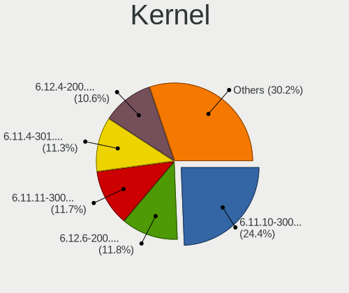
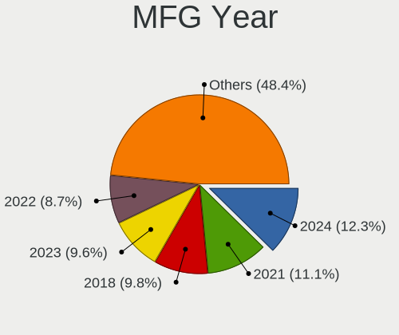

Fedora Hardware Trends
----------------------

A project to identify most popular hardware characteristics and track their change
over time based on data collected by Fedora users at https://Linux-Hardware.org.

Anyone can contribute to this report by the [hw-probe](https://github.com/linuxhw/hw-probe) tool:

    sudo -E hw-probe -all -upload

This is a report for all computer types. See also reports for [desktops](/Dist/Fedora/Desktop/README.md) and [notebooks](/Dist/Fedora/Notebook/README.md).

Full-feature report is available here: https://linux-hardware.org/?view=trends

Period: Sep, 2021.

Contents
--------

* [ System ](#system)
  - [ OS                       ](#os)
  - [ OS Family                ](#os-family)
  - [ Kernel                   ](#kernel)
  - [ Kernel Family            ](#kernel-family)
  - [ Kernel Major Ver.        ](#kernel-major-ver)
  - [ Arch                     ](#arch)
  - [ DE                       ](#de)
  - [ Display Server           ](#display-server)
  - [ Display Manager          ](#display-manager)
  - [ OS Lang                  ](#os-lang)
  - [ Boot Mode                ](#boot-mode)
  - [ Filesystem               ](#filesystem)
  - [ Part. scheme             ](#part-scheme)
  - [ Dual Boot with Linux/BSD ](#dual-boot-with-linuxbsd)
  - [ Dual Boot (Win)          ](#dual-boot-win)

* [ Board ](#board)
  - [ Vendor                   ](#vendor)
  - [ Model                    ](#model)
  - [ Model Family             ](#model-family)
  - [ MFG Year                 ](#mfg-year)
  - [ Form Factor              ](#form-factor)
  - [ Secure Boot              ](#secure-boot)
  - [ Coreboot                 ](#coreboot)
  - [ RAM Size                 ](#ram-size)
  - [ RAM Used                 ](#ram-used)
  - [ Total Drives             ](#total-drives)
  - [ Has CD-ROM               ](#has-cd-rom)
  - [ Has Ethernet             ](#has-ethernet)
  - [ Has WiFi                 ](#has-wifi)
  - [ Has Bluetooth            ](#has-bluetooth)

* [ Location ](#location)
  - [ Country                  ](#country)
  - [ City                     ](#city)

* [ Drives ](#drives)
  - [ Drive Vendor             ](#drive-vendor)
  - [ Drive Model              ](#drive-model)
  - [ HDD Vendor               ](#hdd-vendor)
  - [ SSD Vendor               ](#ssd-vendor)
  - [ Drive Kind               ](#drive-kind)
  - [ Drive Connector          ](#drive-connector)
  - [ Drive Size               ](#drive-size)
  - [ Space Total              ](#space-total)
  - [ Space Used               ](#space-used)
  - [ Malfunc. Drives          ](#malfunc-drives)
  - [ Malfunc. Drive Vendor    ](#malfunc-drive-vendor)
  - [ Malfunc. HDD Vendor      ](#malfunc-hdd-vendor)
  - [ Malfunc. Drive Kind      ](#malfunc-drive-kind)
  - [ Failed Drives            ](#failed-drives)
  - [ Failed Drive Vendor      ](#failed-drive-vendor)
  - [ Drive Status             ](#drive-status)

* [ Storage controller ](#storage-controller)
  - [ Storage Vendor           ](#storage-vendor)
  - [ Storage Model            ](#storage-model)
  - [ Storage Kind             ](#storage-kind)

* [ Processor ](#processor)
  - [ CPU Vendor               ](#cpu-vendor)
  - [ CPU Model                ](#cpu-model)
  - [ CPU Model Family         ](#cpu-model-family)
  - [ CPU Cores                ](#cpu-cores)
  - [ CPU Sockets              ](#cpu-sockets)
  - [ CPU Threads              ](#cpu-threads)
  - [ CPU Op-Modes             ](#cpu-op-modes)
  - [ CPU Microcode            ](#cpu-microcode)
  - [ CPU Microarch            ](#cpu-microarch)

* [ Graphics ](#graphics)
  - [ GPU Vendor               ](#gpu-vendor)
  - [ GPU Model                ](#gpu-model)
  - [ GPU Combo                ](#gpu-combo)
  - [ GPU Driver               ](#gpu-driver)
  - [ GPU Memory               ](#gpu-memory)

* [ Monitor ](#monitor)
  - [ Monitor Vendor           ](#monitor-vendor)
  - [ Monitor Model            ](#monitor-model)
  - [ Monitor Resolution       ](#monitor-resolution)
  - [ Monitor Diagonal         ](#monitor-diagonal)
  - [ Monitor Width            ](#monitor-width)
  - [ Aspect Ratio             ](#aspect-ratio)
  - [ Monitor Area             ](#monitor-area)
  - [ Pixel Density            ](#pixel-density)
  - [ Multiple Monitors        ](#multiple-monitors)

* [ Network ](#network)
  - [ Net Controller Vendor    ](#net-controller-vendor)
  - [ Net Controller Model     ](#net-controller-model)
  - [ Wireless Vendor          ](#wireless-vendor)
  - [ Wireless Model           ](#wireless-model)
  - [ Ethernet Vendor          ](#ethernet-vendor)
  - [ Ethernet Model           ](#ethernet-model)
  - [ Net Controller Kind      ](#net-controller-kind)
  - [ Used Controller          ](#used-controller)
  - [ NICs                     ](#nics)
  - [ IPv6                     ](#ipv6)

* [ Bluetooth ](#bluetooth)
  - [ Bluetooth Vendor         ](#bluetooth-vendor)
  - [ Bluetooth Model          ](#bluetooth-model)

* [ Sound ](#sound)
  - [ Sound Vendor             ](#sound-vendor)
  - [ Sound Model              ](#sound-model)

* [ Memory ](#memory)
  - [ Memory Vendor            ](#memory-vendor)
  - [ Memory Model             ](#memory-model)
  - [ Memory Kind              ](#memory-kind)
  - [ Memory Form Factor       ](#memory-form-factor)
  - [ Memory Size              ](#memory-size)
  - [ Memory Speed             ](#memory-speed)

* [ Printers & scanners ](#printers--scanners)
  - [ Printer Vendor           ](#printer-vendor)
  - [ Printer Model            ](#printer-model)
  - [ Scanner Vendor           ](#scanner-vendor)
  - [ Scanner Model            ](#scanner-model)

* [ Camera ](#camera)
  - [ Camera Vendor            ](#camera-vendor)
  - [ Camera Model             ](#camera-model)

* [ Security ](#security)
  - [ Fingerprint Vendor       ](#fingerprint-vendor)
  - [ Fingerprint Model        ](#fingerprint-model)
  - [ Chipcard Vendor          ](#chipcard-vendor)
  - [ Chipcard Model           ](#chipcard-model)

* [ Unsupported ](#unsupported)
  - [ Unsupported Devices      ](#unsupported-devices)
  - [ Unsupported Device Types ](#unsupported-device-types)

System
------

OS
--

Installed operating systems

| Name      | Computers | Percent |
|-----------|-----------|---------|
| Fedora 34 | 226       | 86.59%  |
| Fedora 35 | 17        | 6.51%   |
| Fedora 33 | 10        | 3.83%   |
| Fedora 36 | 3         | 1.15%   |
| Fedora 32 | 3         | 1.15%   |
| Fedora 31 | 1         | 0.38%   |
| Fedora 21 | 1         | 0.38%   |

OS Family
---------

OS without a version

| Name   | Computers | Percent |
|--------|-----------|---------|
| Fedora | 261       | 100%    |

Kernel
------

Version of the Linux kernel

| Version                                                       | Computers | Percent |
|---------------------------------------------------------------|-----------|---------|
| 5.13.16-200.fc34.x86_64                                       | 46        | 17.62%  |
| 5.13.14-200.fc34.x86_64                                       | 45        | 17.24%  |
| 5.13.19-200.fc34.x86_64                                       | 29        | 11.11%  |
| 5.13.13-200.fc34.x86_64                                       | 29        | 11.11%  |
| 5.13.12-200.fc34.x86_64                                       | 26        | 9.96%   |
| 5.13.15-200.fc34.x86_64                                       | 20        | 7.66%   |
| 5.11.12-300.fc34.x86_64                                       | 17        | 6.51%   |
| 5.14.0-60.fc35.x86_64                                         | 4         | 1.53%   |
| 5.14.7-300.fc35.x86_64                                        | 3         | 1.15%   |
| 5.14.6-300.fc35.x86_64                                        | 3         | 1.15%   |
| 5.11.22-100.fc32.x86_64                                       | 3         | 1.15%   |
| 5.14.3-300.fc35.x86_64                                        | 2         | 0.77%   |
| 5.14.3-300.fc34.x86_64                                        | 2         | 0.77%   |
| 5.14.1-300.fc35.x86_64                                        | 2         | 0.77%   |
| 5.13.4-200.fc34.x86_64                                        | 2         | 0.77%   |
| 5.13.15-100.fc33.x86_64                                       | 2         | 0.77%   |
| 5.13.10-100.fc33.x86_64                                       | 2         | 0.77%   |
| 5.8.18-100.fc31.x86_64                                        | 1         | 0.38%   |
| 5.15.0-0.rc2.20210923git58e2cf5d7946.21.vanilla.1.fc36.x86_64 | 1         | 0.38%   |
| 5.15.0-0.rc2.18.fc36.x86_64                                   | 1         | 0.38%   |
| 5.15.0-0.rc0.20210902git4ac6d90867a4.4.vanilla.1.fc34.x86_64  | 1         | 0.38%   |
| 5.15.0-0.rc0.20210831gitb91db6a0b52e.1.fc36.x86_64            | 1         | 0.38%   |
| 5.14.8-lqx1.0.fc35.x86_64                                     | 1         | 0.38%   |
| 5.14.6-300.rog.fc34.x86_64                                    | 1         | 0.38%   |
| 5.14.5-300.fc35.x86_64                                        | 1         | 0.38%   |
| 5.14.5-300.fc34.x86_64                                        | 1         | 0.38%   |
| 5.14.4-300.fc34.x86_64                                        | 1         | 0.38%   |
| 5.14.2-300.fc33.x86_64                                        | 1         | 0.38%   |
| 5.13.9-200.fc34.x86_64                                        | 1         | 0.38%   |
| 5.13.8-200.fc34.x86_64                                        | 1         | 0.38%   |
| 5.13.7-100.fc33.x86_64                                        | 1         | 0.38%   |
| 5.13.16-100.fc33.x86_64                                       | 1         | 0.38%   |
| 5.13.14-zen                                                   | 1         | 0.38%   |
| 5.13.14-100.fc33.x86_64                                       | 1         | 0.38%   |
| 5.13.12-200.mbp15.fc33.x86_64                                 | 1         | 0.38%   |
| 5.13.10-200.fc34.x86_64                                       | 1         | 0.38%   |
| 5.12.12-200.fc33.x86_64                                       | 1         | 0.38%   |
| 5.11.20-300.fc34.x86_64                                       | 1         | 0.38%   |
| 5.11.18-300.fc34.x86_64                                       | 1         | 0.38%   |
| 5.11.11-200.fc33.x86_64                                       | 1         | 0.38%   |
| 4.1.13-100.fc21.x86_64                                        | 1         | 0.38%   |

Kernel Family
-------------

Linux kernel without a distro release

| Version | Computers | Percent |
|---------|-----------|---------|
| 5.13.16 | 47        | 18.01%  |
| 5.13.14 | 47        | 18.01%  |
| 5.13.19 | 29        | 11.11%  |
| 5.13.13 | 29        | 11.11%  |
| 5.13.12 | 27        | 10.34%  |
| 5.13.15 | 22        | 8.43%   |
| 5.11.12 | 17        | 6.51%   |
| 5.15.0  | 4         | 1.53%   |
| 5.14.6  | 4         | 1.53%   |
| 5.14.3  | 4         | 1.53%   |
| 5.14.0  | 4         | 1.53%   |
| 5.14.7  | 3         | 1.15%   |
| 5.13.10 | 3         | 1.15%   |
| 5.11.22 | 3         | 1.15%   |
| 5.14.5  | 2         | 0.77%   |
| 5.14.1  | 2         | 0.77%   |
| 5.13.4  | 2         | 0.77%   |
| 5.8.18  | 1         | 0.38%   |
| 5.14.8  | 1         | 0.38%   |
| 5.14.4  | 1         | 0.38%   |
| 5.14.2  | 1         | 0.38%   |
| 5.13.9  | 1         | 0.38%   |
| 5.13.8  | 1         | 0.38%   |
| 5.13.7  | 1         | 0.38%   |
| 5.12.12 | 1         | 0.38%   |
| 5.11.20 | 1         | 0.38%   |
| 5.11.18 | 1         | 0.38%   |
| 5.11.11 | 1         | 0.38%   |
| 4.1.13  | 1         | 0.38%   |

Kernel Major Ver.
-----------------

Linux kernel major version

| Version | Computers | Percent |
|---------|-----------|---------|
| 5.13    | 209       | 80.08%  |
| 5.11    | 23        | 8.81%   |
| 5.14    | 22        | 8.43%   |
| 5.15    | 4         | 1.53%   |
| 5.8     | 1         | 0.38%   |
| 5.12    | 1         | 0.38%   |
| 4.1     | 1         | 0.38%   |

Arch
----

OS architecture (x86_64, i586, etc.)

| Name   | Computers | Percent |
|--------|-----------|---------|
| x86_64 | 261       | 100%    |

DE
--

Desktop Environment

| Name          | Computers | Percent |
|---------------|-----------|---------|
| GNOME         | 192       | 73.56%  |
| KDE5          | 15        | 5.75%   |
| Unknown       | 10        | 3.83%   |
| KDE           | 9         | 3.45%   |
| Cinnamon      | 9         | 3.45%   |
| X-Cinnamon    | 6         | 2.3%    |
| MATE          | 6         | 2.3%    |
| XFCE          | 5         | 1.92%   |
| GNOME Classic | 3         | 1.15%   |
| KDE4          | 2         | 0.77%   |
| qtile         | 1         | 0.38%   |
| NsCDE         | 1         | 0.38%   |
| Deepin        | 1         | 0.38%   |
| awesome       | 1         | 0.38%   |

Display Server
--------------

X11 or Wayland

| Name    | Computers | Percent |
|---------|-----------|---------|
| Wayland | 159       | 60.92%  |
| X11     | 87        | 33.33%  |
| Tty     | 10        | 3.83%   |
| Unknown | 5         | 1.92%   |

Display Manager
---------------

SDDM, LightDM, etc.

| Name    | Computers | Percent |
|---------|-----------|---------|
| Unknown | 124       | 47.51%  |
| GDM     | 99        | 37.93%  |
| LightDM | 23        | 8.81%   |
| SDDM    | 14        | 5.36%   |
| KDM     | 1         | 0.38%   |

OS Lang
-------

Language

| Lang    | Computers | Percent |
|---------|-----------|---------|
| en_US   | 128       | 49.04%  |
| en_GB   | 22        | 8.43%   |
| ru_RU   | 18        | 6.9%    |
| pt_BR   | 17        | 6.51%   |
| en_AU   | 13        | 4.98%   |
| fr_FR   | 10        | 3.83%   |
| en_CA   | 6         | 2.3%    |
| de_DE   | 5         | 1.92%   |
| es_MX   | 4         | 1.53%   |
| es_ES   | 4         | 1.53%   |
| en_IN   | 3         | 1.15%   |
| pl_PL   | 2         | 0.77%   |
| ja_JP   | 2         | 0.77%   |
| it_IT   | 2         | 0.77%   |
| hr_HR   | 2         | 0.77%   |
| es_CL   | 2         | 0.77%   |
| en_IL   | 2         | 0.77%   |
| zh_CN   | 1         | 0.38%   |
| ru_UA   | 1         | 0.38%   |
| nl_NL   | 1         | 0.38%   |
| nl_BE   | 1         | 0.38%   |
| ms_MY   | 1         | 0.38%   |
| hu_HU   | 1         | 0.38%   |
| ga_IE   | 1         | 0.38%   |
| fi_FI   | 1         | 0.38%   |
| es_PE   | 1         | 0.38%   |
| es_GT   | 1         | 0.38%   |
| es_AR   | 1         | 0.38%   |
| en_ZA   | 1         | 0.38%   |
| en_NZ   | 1         | 0.38%   |
| en_IE   | 1         | 0.38%   |
| en_DK   | 1         | 0.38%   |
| el_GR   | 1         | 0.38%   |
| de_CH   | 1         | 0.38%   |
| da_DK   | 1         | 0.38%   |
| Unknown | 1         | 0.38%   |

Boot Mode
---------

EFI or BIOS

| Mode | Computers | Percent |
|------|-----------|---------|
| EFI  | 192       | 73.56%  |
| BIOS | 69        | 26.44%  |

Filesystem
----------

Type of filesystem

| Type  | Computers | Percent |
|-------|-----------|---------|
| Btrfs | 166       | 63.6%   |
| Ext4  | 79        | 30.27%  |
| Xfs   | 15        | 5.75%   |
| Ext3  | 1         | 0.38%   |

Part. scheme
------------

Scheme of partitioning

| Type    | Computers | Percent |
|---------|-----------|---------|
| Unknown | 115       | 44.06%  |
| GPT     | 113       | 43.3%   |
| MBR     | 33        | 12.64%  |

Dual Boot with Linux/BSD
------------------------

Hosting more than one Linux/BSD

| Dual boot | Computers | Percent |
|-----------|-----------|---------|
| No        | 232       | 88.89%  |
| Yes       | 29        | 11.11%  |

Dual Boot (Win)
---------------

Hosting Linux and Windows

| Dual boot | Computers | Percent |
|-----------|-----------|---------|
| No        | 210       | 80.46%  |
| Yes       | 51        | 19.54%  |

Board
-----

Vendor
------

Motherboard manufacturer

| Name                | Computers | Percent |
|---------------------|-----------|---------|
| Lenovo              | 58        | 22.22%  |
| Hewlett-Packard     | 38        | 14.56%  |
| Dell                | 36        | 13.79%  |
| ASUSTek Computer    | 36        | 13.79%  |
| Gigabyte Technology | 18        | 6.9%    |
| ASRock              | 11        | 4.21%   |
| MSI                 | 10        | 3.83%   |
| Acer                | 7         | 2.68%   |
| Apple               | 6         | 2.3%    |
| HUAWEI              | 5         | 1.92%   |
| Intel               | 4         | 1.53%   |
| Samsung Electronics | 3         | 1.15%   |
| Notebook            | 3         | 1.15%   |
| Timi                | 2         | 0.77%   |
| PC Specialist       | 2         | 0.77%   |
| Microsoft           | 2         | 0.77%   |
| Fujitsu             | 2         | 0.77%   |
| Framework           | 2         | 0.77%   |
| ECS                 | 2         | 0.77%   |
| Unknown             | 2         | 0.77%   |
| Toshiba             | 1         | 0.38%   |
| System76            | 1         | 0.38%   |
| RCA                 | 1         | 0.38%   |
| Positivo            | 1         | 0.38%   |
| Panasonic           | 1         | 0.38%   |
| Metabox             | 1         | 0.38%   |
| Huanan              | 1         | 0.38%   |
| Hampoo              | 1         | 0.38%   |
| Google              | 1         | 0.38%   |
| Foxconn             | 1         | 0.38%   |
| EVGA                | 1         | 0.38%   |
| AYADEVICE           | 1         | 0.38%   |

Model
-----

Motherboard model

| Name                                                                                     | Computers | Percent |
|------------------------------------------------------------------------------------------|-----------|---------|
| ASUS All Series                                                                          | 5         | 1.92%   |
| MSI MS-7C37                                                                              | 2         | 0.77%   |
| Lenovo IdeaPad Flex 5 14ARE05 81X2                                                       | 2         | 0.77%   |
| HP Pavilion Gaming Laptop 15-dk0xxx                                                      | 2         | 0.77%   |
| HP Pavilion 15                                                                           | 2         | 0.77%   |
| Framework Laptop                                                                         | 2         | 0.77%   |
| Dell XPS 13 7390                                                                         | 2         | 0.77%   |
| ASUS ROG STRIX Z370-H GAMING                                                             | 2         | 0.77%   |
| Unknown                                                                                  | 2         | 0.77%   |
| Toshiba Satellite U940                                                                   | 1         | 0.38%   |
| Timi RedmiBook 14                                                                        | 1         | 0.38%   |
| Timi Mi NoteBook Ultra                                                                   | 1         | 0.38%   |
| System76 Thelio Mira                                                                     | 1         | 0.38%   |
| Samsung Galaxy TabPro S LTE                                                              | 1         | 0.38%   |
| Samsung 700Z3C/700Z5C                                                                    | 1         | 0.38%   |
| Samsung 355V4C/355V4X/355V5C/355V5X/356V4C/356V4X/356V5C/356V5X/3445VC/3445VX/3545VC/354 | 1         | 0.38%   |
| RCA W101AS23T2                                                                           | 1         | 0.38%   |
| Positivo C41TB                                                                           | 1         | 0.38%   |
| PC Specialist N85_N87,HJ,HJ1,HK1                                                         | 1         | 0.38%   |
| PC Specialist N150CU                                                                     | 1         | 0.38%   |
| Panasonic CFSV9-2                                                                        | 1         | 0.38%   |
| Notebook PB50_70DFx,DDx                                                                  | 1         | 0.38%   |
| Notebook NH55RGQ                                                                         | 1         | 0.38%   |
| Notebook N2x0WU                                                                          | 1         | 0.38%   |
| MSI MS-7C95                                                                              | 1         | 0.38%   |
| MSI MS-7C91                                                                              | 1         | 0.38%   |
| MSI MS-7C35                                                                              | 1         | 0.38%   |
| MSI MS-7B48                                                                              | 1         | 0.38%   |
| MSI MS-7A44                                                                              | 1         | 0.38%   |
| MSI MS-7816                                                                              | 1         | 0.38%   |
| MSI GE75 Raider 10SFS                                                                    | 1         | 0.38%   |
| MSI Bravo 15 B5DD                                                                        | 1         | 0.38%   |
| Microsoft Surface Pro 4                                                                  | 1         | 0.38%   |
| Microsoft Surface Pro                                                                    | 1         | 0.38%   |
| Metabox Alpha-X NH77DC                                                                   | 1         | 0.38%   |
| Lenovo Yoga Slim 7 Pro 14IHU5 82NC                                                       | 1         | 0.38%   |
| Lenovo Yoga 7 14ITL5 82BH                                                                | 1         | 0.38%   |
| Lenovo Yoga 6 13ALC6 82ND                                                                | 1         | 0.38%   |
| Lenovo Yoga 510-15ISK 80S8                                                               | 1         | 0.38%   |
| Lenovo Y520-15IKBN 80WK                                                                  | 1         | 0.38%   |
| Lenovo V580c 20160                                                                       | 1         | 0.38%   |
| Lenovo ThinkPad Yoga 260 20FD002DUS                                                      | 1         | 0.38%   |
| Lenovo ThinkPad Yoga 260 20FD000GAD                                                      | 1         | 0.38%   |
| Lenovo ThinkPad X250 20CMCTO1WW                                                          | 1         | 0.38%   |
| Lenovo ThinkPad X230 23255E4                                                             | 1         | 0.38%   |
| Lenovo ThinkPad X1 Yoga 1st 20FRS55D00                                                   | 1         | 0.38%   |
| Lenovo ThinkPad X1 Extreme 2nd 20QVCTO1WW                                                | 1         | 0.38%   |
| Lenovo ThinkPad X1 Carbon Gen 9 20XWCTO1WW                                               | 1         | 0.38%   |
| Lenovo ThinkPad X1 Carbon Gen 8 20U9CTO1WW                                               | 1         | 0.38%   |
| Lenovo ThinkPad X1 Carbon 7th 20QD001XUS                                                 | 1         | 0.38%   |
| Lenovo ThinkPad X1 Carbon 5th 20HRCTO1WW                                                 | 1         | 0.38%   |
| Lenovo ThinkPad W540 20BHS16L00                                                          | 1         | 0.38%   |
| Lenovo ThinkPad W520 42763JU                                                             | 1         | 0.38%   |
| Lenovo ThinkPad T550 20CKA00ECD                                                          | 1         | 0.38%   |
| Lenovo ThinkPad T530 2429GG3                                                             | 1         | 0.38%   |
| Lenovo ThinkPad T490s 20NX003NRT                                                         | 1         | 0.38%   |
| Lenovo ThinkPad T460s 20FAS2J700                                                         | 1         | 0.38%   |
| Lenovo ThinkPad T460p 20FWS0A600                                                         | 1         | 0.38%   |
| Lenovo ThinkPad T440s 20ARS2V900                                                         | 1         | 0.38%   |
| Lenovo ThinkPad T440s 20AQ006HUS                                                         | 1         | 0.38%   |

Model Family
------------

Motherboard model prefix

| Name                 | Computers | Percent |
|----------------------|-----------|---------|
| Lenovo ThinkPad      | 31        | 11.88%  |
| Lenovo IdeaPad       | 14        | 5.36%   |
| Dell XPS             | 10        | 3.83%   |
| Dell Latitude        | 10        | 3.83%   |
| Dell Inspiron        | 10        | 3.83%   |
| HP Pavilion          | 6         | 2.3%    |
| ASUS ROG             | 6         | 2.3%    |
| Acer Aspire          | 6         | 2.3%    |
| ASUS All             | 5         | 1.92%   |
| Lenovo Yoga          | 4         | 1.53%   |
| HP ZBook             | 4         | 1.53%   |
| HP ProBook           | 4         | 1.53%   |
| HP EliteDesk         | 4         | 1.53%   |
| Dell OptiPlex        | 4         | 1.53%   |
| HP Spectre           | 3         | 1.15%   |
| HP Laptop            | 3         | 1.15%   |
| HP EliteBook         | 3         | 1.15%   |
| ASUS PRIME           | 3         | 1.15%   |
| MSI MS-7C37          | 2         | 0.77%   |
| Microsoft Surface    | 2         | 0.77%   |
| Lenovo ThinkCentre   | 2         | 0.77%   |
| Lenovo Legion        | 2         | 0.77%   |
| HP ENVY              | 2         | 0.77%   |
| Framework Laptop     | 2         | 0.77%   |
| ASUS VivoBook        | 2         | 0.77%   |
| ASUS TUF             | 2         | 0.77%   |
| ASRock Z390          | 2         | 0.77%   |
| Unknown              | 2         | 0.77%   |
| Toshiba Satellite    | 1         | 0.38%   |
| Timi RedmiBook       | 1         | 0.38%   |
| Timi Mi              | 1         | 0.38%   |
| System76 Thelio      | 1         | 0.38%   |
| Samsung Galaxy       | 1         | 0.38%   |
| Samsung 700Z3C       | 1         | 0.38%   |
| Samsung 355V4C       | 1         | 0.38%   |
| RCA W101AS23T2       | 1         | 0.38%   |
| Positivo C41TB       | 1         | 0.38%   |
| PC Specialist N85    | 1         | 0.38%   |
| PC Specialist N150CU | 1         | 0.38%   |
| Panasonic CFSV9-2    | 1         | 0.38%   |
| Notebook PB50        | 1         | 0.38%   |
| Notebook NH55RGQ     | 1         | 0.38%   |
| Notebook N2x0WU      | 1         | 0.38%   |
| MSI MS-7C95          | 1         | 0.38%   |
| MSI MS-7C91          | 1         | 0.38%   |
| MSI MS-7C35          | 1         | 0.38%   |
| MSI MS-7B48          | 1         | 0.38%   |
| MSI MS-7A44          | 1         | 0.38%   |
| MSI MS-7816          | 1         | 0.38%   |
| MSI GE75             | 1         | 0.38%   |
| MSI Bravo            | 1         | 0.38%   |
| Metabox Alpha-X      | 1         | 0.38%   |
| Lenovo Y520-15IKBN   | 1         | 0.38%   |
| Lenovo V580c         | 1         | 0.38%   |
| Lenovo G50-80        | 1         | 0.38%   |
| Lenovo G40-45        | 1         | 0.38%   |
| Lenovo B320-14IKB    | 1         | 0.38%   |
| Intel WX307-SCMS     | 1         | 0.38%   |
| Intel NUC10i7FNK     | 1         | 0.38%   |
| Intel DG41RQ         | 1         | 0.38%   |

MFG Year
--------

Motherboard manufacture year

| Year | Computers | Percent |
|------|-----------|---------|
| 2021 | 61        | 23.37%  |
| 2020 | 40        | 15.33%  |
| 2019 | 38        | 14.56%  |
| 2018 | 32        | 12.26%  |
| 2017 | 14        | 5.36%   |
| 2016 | 12        | 4.6%    |
| 2011 | 12        | 4.6%    |
| 2013 | 10        | 3.83%   |
| 2014 | 9         | 3.45%   |
| 2010 | 9         | 3.45%   |
| 2015 | 7         | 2.68%   |
| 2012 | 6         | 2.3%    |
| 2008 | 5         | 1.92%   |
| 2009 | 3         | 1.15%   |
| 2006 | 2         | 0.77%   |
| 2007 | 1         | 0.38%   |

Form Factor
-----------

Physical design of the computer

| Name        | Computers | Percent |
|-------------|-----------|---------|
| Notebook    | 149       | 57.09%  |
| Desktop     | 88        | 33.72%  |
| Convertible | 16        | 6.13%   |
| Tablet      | 5         | 1.92%   |
| Mini pc     | 2         | 0.77%   |
| All in one  | 1         | 0.38%   |

Secure Boot
-----------

Enabled or disabled

| State    | Computers | Percent |
|----------|-----------|---------|
| Disabled | 225       | 86.21%  |
| Enabled  | 36        | 13.79%  |

Coreboot
--------

Have coreboot on board

| Used | Computers | Percent |
|------|-----------|---------|
| No   | 260       | 99.62%  |
| Yes  | 1         | 0.38%   |

RAM Size
--------

Total RAM memory

| Size in GB  | Computers | Percent |
|-------------|-----------|---------|
| 4.01-8.0    | 75        | 28.74%  |
| 16.01-24.0  | 63        | 24.14%  |
| 8.01-16.0   | 50        | 19.16%  |
| 32.01-64.0  | 35        | 13.41%  |
| 3.01-4.0    | 23        | 8.81%   |
| 24.01-32.0  | 6         | 2.3%    |
| 64.01-256.0 | 6         | 2.3%    |
| 1.01-2.0    | 2         | 0.77%   |
| 2.01-3.0    | 1         | 0.38%   |

RAM Used
--------

Used RAM memory

| Used GB    | Computers | Percent |
|------------|-----------|---------|
| 2.01-3.0   | 79        | 30.27%  |
| 4.01-8.0   | 68        | 26.05%  |
| 3.01-4.0   | 51        | 19.54%  |
| 1.01-2.0   | 34        | 13.03%  |
| 8.01-16.0  | 20        | 7.66%   |
| 0.51-1.0   | 6         | 2.3%    |
| 16.01-24.0 | 3         | 1.15%   |

Total Drives
------------

Number of drives on board

| Drives | Computers | Percent |
|--------|-----------|---------|
| 1      | 161       | 61.69%  |
| 2      | 50        | 19.16%  |
| 3      | 32        | 12.26%  |
| 4      | 9         | 3.45%   |
| 5      | 4         | 1.53%   |
| 6      | 3         | 1.15%   |
| 8      | 1         | 0.38%   |
| 0      | 1         | 0.38%   |

Has CD-ROM
----------

Has CD-ROM on board

| Presented | Computers | Percent |
|-----------|-----------|---------|
| No        | 198       | 75.86%  |
| Yes       | 63        | 24.14%  |

Has Ethernet
------------

Has Ethernet on board

| Presented | Computers | Percent |
|-----------|-----------|---------|
| Yes       | 214       | 81.99%  |
| No        | 47        | 18.01%  |

Has WiFi
--------

Has WiFi module

| Presented | Computers | Percent |
|-----------|-----------|---------|
| Yes       | 208       | 79.69%  |
| No        | 53        | 20.31%  |

Has Bluetooth
-------------

Has Bluetooth module

| Presented | Computers | Percent |
|-----------|-----------|---------|
| Yes       | 178       | 68.2%   |
| No        | 83        | 31.8%   |

Location
--------

Country
-------

Geographic location (country)

| Country      | Computers | Percent |
|--------------|-----------|---------|
| USA          | 43        | 16.48%  |
| Brazil       | 20        | 7.66%   |
| Australia    | 13        | 4.98%   |
| Russia       | 12        | 4.6%    |
| Germany      | 11        | 4.21%   |
| UK           | 9         | 3.45%   |
| Netherlands  | 9         | 3.45%   |
| India        | 9         | 3.45%   |
| France       | 9         | 3.45%   |
| Ukraine      | 8         | 3.07%   |
| Norway       | 7         | 2.68%   |
| Spain        | 6         | 2.3%    |
| Canada       | 6         | 2.3%    |
| Portugal     | 5         | 1.92%   |
| Mexico       | 5         | 1.92%   |
| Italy        | 5         | 1.92%   |
| Chile        | 5         | 1.92%   |
| Belgium      | 5         | 1.92%   |
| Belarus      | 5         | 1.92%   |
| Switzerland  | 4         | 1.53%   |
| Sweden       | 4         | 1.53%   |
| Israel       | 4         | 1.53%   |
| Colombia     | 4         | 1.53%   |
| Turkey       | 3         | 1.15%   |
| Poland       | 3         | 1.15%   |
| Japan        | 3         | 1.15%   |
| Denmark      | 3         | 1.15%   |
| Vietnam      | 2         | 0.77%   |
| New Zealand  | 2         | 0.77%   |
| Greece       | 2         | 0.77%   |
| Estonia      | 2         | 0.77%   |
| Croatia      | 2         | 0.77%   |
| China        | 2         | 0.77%   |
| Bulgaria     | 2         | 0.77%   |
| Argentina    | 2         | 0.77%   |
| Venezuela    | 1         | 0.38%   |
| UAE          | 1         | 0.38%   |
| South Africa | 1         | 0.38%   |
| Slovenia     | 1         | 0.38%   |
| Slovakia     | 1         | 0.38%   |
| Serbia       | 1         | 0.38%   |
| Romania      | 1         | 0.38%   |
| Philippines  | 1         | 0.38%   |
| Peru         | 1         | 0.38%   |
| Pakistan     | 1         | 0.38%   |
| Namibia      | 1         | 0.38%   |
| Malaysia     | 1         | 0.38%   |
| Macao        | 1         | 0.38%   |
| Lithuania    | 1         | 0.38%   |
| Latvia       | 1         | 0.38%   |
| Ivory Coast  | 1         | 0.38%   |
| Ireland      | 1         | 0.38%   |
| Iran         | 1         | 0.38%   |
| Hungary      | 1         | 0.38%   |
| Guatemala    | 1         | 0.38%   |
| Ghana        | 1         | 0.38%   |
| Finland      | 1         | 0.38%   |
| Bangladesh   | 1         | 0.38%   |
| Austria      | 1         | 0.38%   |
| Albania      | 1         | 0.38%   |

City
----

Geographic location (city)

| City                    | Computers | Percent |
|-------------------------|-----------|---------|
| Sydney                  | 10        | 3.83%   |
| Moscow                  | 6         | 2.3%    |
| Minsk                   | 5         | 1.92%   |
| Amsterdam               | 5         | 1.92%   |
| Zurich                  | 4         | 1.53%   |
| Paris                   | 3         | 1.15%   |
| Kyiv                    | 3         | 1.15%   |
| Istanbul                | 3         | 1.15%   |
| Fortaleza               | 3         | 1.15%   |
| Atlanta                 | 3         | 1.15%   |
| Zagreb                  | 2         | 0.77%   |
| Yekaterinburg           | 2         | 0.77%   |
| Tel Aviv                | 2         | 0.77%   |
| Tartu                   | 2         | 0.77%   |
| S??o Paulo              | 2         | 0.77%   |
| Santiago                | 2         | 0.77%   |
| Salt Lake City          | 2         | 0.77%   |
| Royse                   | 2         | 0.77%   |
| Portland                | 2         | 0.77%   |
| Overland Park           | 2         | 0.77%   |
| Nuremberg               | 2         | 0.77%   |
| Madrid                  | 2         | 0.77%   |
| La Florida              | 2         | 0.77%   |
| Krakow                  | 2         | 0.77%   |
| Haifa                   | 2         | 0.77%   |
| Goi??nia                | 2         | 0.77%   |
| Athens                  | 2         | 0.77%   |
| Witham                  | 1         | 0.38%   |
| Windhoek                | 1         | 0.38%   |
| Wateringen              | 1         | 0.38%   |
| Visaginas               | 1         | 0.38%   |
| Villa Mar?­a            | 1         | 0.38%   |
| Vilafranca del Pened??s | 1         | 0.38%   |
| Vila Nova de Gaia       | 1         | 0.38%   |
| Vienna                  | 1         | 0.38%   |
| Veresegyhaz             | 1         | 0.38%   |
| Vechta                  | 1         | 0.38%   |
| Varna                   | 1         | 0.38%   |
| Ulm                     | 1         | 0.38%   |
| Tuxtla Guti?©rrez       | 1         | 0.38%   |
| Toulouse                | 1         | 0.38%   |
| Torrington              | 1         | 0.38%   |
| Tirana                  | 1         | 0.38%   |
| Temuco                  | 1         | 0.38%   |
| Temecula                | 1         | 0.38%   |
| Tehran                  | 1         | 0.38%   |
| Taipa                   | 1         | 0.38%   |
| Syeverodonets'k         | 1         | 0.38%   |
| Swansea                 | 1         | 0.38%   |
| Suginami-ku             | 1         | 0.38%   |
| Strommen                | 1         | 0.38%   |
| Strasbourg              | 1         | 0.38%   |
| Southampton             | 1         | 0.38%   |
| Sofia                   | 1         | 0.38%   |
| Skudai                  | 1         | 0.38%   |
| Sherwood Park           | 1         | 0.38%   |
| Shanghai                | 1         | 0.38%   |
| Sevierville             | 1         | 0.38%   |
| Sesto San Giovanni      | 1         | 0.38%   |
| Secaucus                | 1         | 0.38%   |

Drives
------

Drive Vendor
------------

Hard drive vendors

| Vendor                    | Computers | Drives | Percent |
|---------------------------|-----------|--------|---------|
| Samsung Electronics       | 87        | 111    | 22.77%  |
| Seagate                   | 46        | 53     | 12.04%  |
| WDC                       | 43        | 62     | 11.26%  |
| Toshiba                   | 28        | 31     | 7.33%   |
| Kingston                  | 28        | 31     | 7.33%   |
| SanDisk                   | 18        | 18     | 4.71%   |
| Crucial                   | 17        | 20     | 4.45%   |
| Intel                     | 16        | 16     | 4.19%   |
| SK Hynix                  | 15        | 16     | 3.93%   |
| Unknown                   | 12        | 14     | 3.14%   |
| Micron Technology         | 10        | 10     | 2.62%   |
| Hitachi                   | 10        | 11     | 2.62%   |
| SPCC                      | 5         | 6      | 1.31%   |
| PNY                       | 4         | 4      | 1.05%   |
| KIOXIA                    | 3         | 3      | 0.79%   |
| HGST                      | 3         | 3      | 0.79%   |
| Apple                     | 3         | 3      | 0.79%   |
| Union Memory (Shenzhen)   | 2         | 3      | 0.52%   |
| Union Memory              | 2         | 2      | 0.52%   |
| Silicon Motion            | 2         | 2      | 0.52%   |
| LITEON                    | 2         | 2      | 0.52%   |
| KingSpec                  | 2         | 2      | 0.52%   |
| Hewlett-Packard           | 2         | 2      | 0.52%   |
| GOODRAM                   | 2         | 2      | 0.52%   |
| Gigabyte Technology       | 2         | 2      | 0.52%   |
| Corsair                   | 2         | 3      | 0.52%   |
| China                     | 2         | 2      | 0.52%   |
| Yangtze Memory            | 1         | 1      | 0.26%   |
| USB3.1                    | 1         | 1      | 0.26%   |
| Phison Electronics        | 1         | 1      | 0.26%   |
| OCZ                       | 1         | 1      | 0.26%   |
| NGFF                      | 1         | 1      | 0.26%   |
| Micron/Crucial Technology | 1         | 1      | 0.26%   |
| MAXTOR                    | 1         | 1      | 0.26%   |
| Magnetic Data             | 1         | 1      | 0.26%   |
| LITEONIT                  | 1         | 1      | 0.26%   |
| Lite-On                   | 1         | 1      | 0.26%   |
| Lexar                     | 1         | 1      | 0.26%   |
| BHT                       | 1         | 1      | 0.26%   |
| ASMT106x                  | 1         | 1      | 0.26%   |
| A-DATA Technology         | 1         | 1      | 0.26%   |

Drive Model
-----------

Hard drive models

| Model                                        | Computers | Percent |
|----------------------------------------------|-----------|---------|
| Kingston SA400S37480G 480GB SSD              | 9         | 2.07%   |
| Samsung NVMe SSD Drive 500GB                 | 8         | 1.84%   |
| Kingston SA400S37240G 240GB SSD              | 8         | 1.84%   |
| Samsung SSD 970 EVO Plus 500GB               | 5         | 1.15%   |
| Samsung SSD 860 EVO 500GB                    | 5         | 1.15%   |
| Samsung NVMe SSD Drive 256GB                 | 5         | 1.15%   |
| Toshiba NVMe SSD Drive 512GB                 | 4         | 0.92%   |
| Toshiba DT01ACA100 1TB                       | 4         | 0.92%   |
| Seagate ST1000LM024 HN-M101MBB 1TB           | 4         | 0.92%   |
| Samsung SSD 860 QVO 1TB                      | 4         | 0.92%   |
| Samsung SSD 860 EVO 250GB                    | 4         | 0.92%   |
| Samsung SSD 850 EVO 500GB                    | 4         | 0.92%   |
| Samsung NVMe SSD Drive 512GB                 | 4         | 0.92%   |
| Samsung NVMe SSD Drive 250GB                 | 4         | 0.92%   |
| WDC WD20EZRZ-00Z5HB0 2TB                     | 3         | 0.69%   |
| Unknown MMC Card  64GB                       | 3         | 0.69%   |
| SK Hynix NVMe SSD Drive 512GB                | 3         | 0.69%   |
| Seagate ST2000DM008-2FR102 2TB               | 3         | 0.69%   |
| Seagate ST1000LM035-1RK172 1TB               | 3         | 0.69%   |
| Seagate Expansion 1TB                        | 3         | 0.69%   |
| Samsung SSD 970 EVO 1TB                      | 3         | 0.69%   |
| Samsung NVMe SSD Drive 2TB                   | 3         | 0.69%   |
| Micron 1100_MTFDDAK256TBN 256GB SSD          | 3         | 0.69%   |
| Crucial CT500MX500SSD1 500GB                 | 3         | 0.69%   |
| Crucial CT240BX500SSD1 240GB                 | 3         | 0.69%   |
| WDC WDS100T2B0C-00PXH0 1TB                   | 2         | 0.46%   |
| WDC WD20EZRX-00D8PB0 2TB                     | 2         | 0.46%   |
| Union Memory (Shenzhen) NVMe SSD Drive 512GB | 2         | 0.46%   |
| Toshiba MQ01ABF050 500GB                     | 2         | 0.46%   |
| SPCC Solid State Disk 128GB                  | 2         | 0.46%   |
| Seagate ST8000DM004-2CX188 8TB               | 2         | 0.46%   |
| Seagate ST3500312CS 500GB                    | 2         | 0.46%   |
| Seagate ST31000528AS 1TB                     | 2         | 0.46%   |
| Seagate ST1000LM048-2E7172 1TB               | 2         | 0.46%   |
| Seagate ST1000LM014-1EJ164 1TB               | 2         | 0.46%   |
| SanDisk SSD PLUS 1000GB                      | 2         | 0.46%   |
| SanDisk SD9SN8W-128G-1006 128GB SSD          | 2         | 0.46%   |
| Sandisk NVMe SSD Drive 512GB                 | 2         | 0.46%   |
| Sandisk NVMe SSD Drive 1024GB                | 2         | 0.46%   |
| Samsung SSD 980 PRO 1TB                      | 2         | 0.46%   |
| Samsung SSD 970 EVO Plus 1TB                 | 2         | 0.46%   |
| Samsung SSD 870 EVO 1TB                      | 2         | 0.46%   |
| Samsung SSD 860 EVO 1TB                      | 2         | 0.46%   |
| Samsung SSD 850 EVO 250GB                    | 2         | 0.46%   |
| Samsung SSD 840 EVO 250GB                    | 2         | 0.46%   |
| Samsung NVMe SSD Drive 1024GB                | 2         | 0.46%   |
| Samsung MZVLB1T0HBLR-000L7 1TB               | 2         | 0.46%   |
| PNY CS900 240GB SSD                          | 2         | 0.46%   |
| Kingston SA400S37120G 120GB SSD              | 2         | 0.46%   |
| Intel SSDSC2KW256G8 256GB                    | 2         | 0.46%   |
| Intel SSDSC2CT120A3 120GB                    | 2         | 0.46%   |
| Crucial CT480BX500SSD1 480GB                 | 2         | 0.46%   |
| Crucial CT1000MX500SSD4 1TB                  | 2         | 0.46%   |
| Crucial CT1000MX500SSD1 1TB                  | 2         | 0.46%   |
| Yangtze Memory YMTC PC005 512GB              | 1         | 0.23%   |
| WDC WDS500G2X0C-00L350 500GB                 | 1         | 0.23%   |
| WDC WDS500G2B0B-00YS70 500GB SSD             | 1         | 0.23%   |
| WDC WDS500G2B0A-00SM50 500GB SSD             | 1         | 0.23%   |
| WDC WDS120G2G0A-00JH30 120GB SSD             | 1         | 0.23%   |
| WDC WDS100T3X0C-00SJG0 1TB                   | 1         | 0.23%   |

HDD Vendor
----------

Hard disk drive vendors

| Vendor              | Computers | Drives | Percent |
|---------------------|-----------|--------|---------|
| Seagate             | 45        | 51     | 39.82%  |
| WDC                 | 31        | 46     | 27.43%  |
| Toshiba             | 14        | 14     | 12.39%  |
| Hitachi             | 10        | 11     | 8.85%   |
| Samsung Electronics | 4         | 5      | 3.54%   |
| HGST                | 3         | 3      | 2.65%   |
| Unknown             | 1         | 1      | 0.88%   |
| MAXTOR              | 1         | 1      | 0.88%   |
| Magnetic Data       | 1         | 1      | 0.88%   |
| Hewlett-Packard     | 1         | 1      | 0.88%   |
| ASMT106x            | 1         | 1      | 0.88%   |
| Apple               | 1         | 1      | 0.88%   |

SSD Vendor
----------

Solid state drive vendors

| Vendor              | Computers | Drives | Percent |
|---------------------|-----------|--------|---------|
| Samsung Electronics | 40        | 43     | 27.78%  |
| Kingston            | 25        | 27     | 17.36%  |
| Crucial             | 17        | 20     | 11.81%  |
| SanDisk             | 13        | 13     | 9.03%   |
| Micron Technology   | 7         | 7      | 4.86%   |
| Intel               | 7         | 7      | 4.86%   |
| WDC                 | 5         | 5      | 3.47%   |
| Toshiba             | 4         | 4      | 2.78%   |
| SPCC                | 4         | 5      | 2.78%   |
| PNY                 | 4         | 4      | 2.78%   |
| SK Hynix            | 2         | 2      | 1.39%   |
| KingSpec            | 2         | 2      | 1.39%   |
| GOODRAM             | 2         | 2      | 1.39%   |
| China               | 2         | 2      | 1.39%   |
| OCZ                 | 1         | 1      | 0.69%   |
| NGFF                | 1         | 1      | 0.69%   |
| LITEONIT            | 1         | 1      | 0.69%   |
| LITEON              | 1         | 1      | 0.69%   |
| Lexar               | 1         | 1      | 0.69%   |
| Hewlett-Packard     | 1         | 1      | 0.69%   |
| Gigabyte Technology | 1         | 1      | 0.69%   |
| BHT                 | 1         | 1      | 0.69%   |
| Apple               | 1         | 1      | 0.69%   |
| A-DATA Technology   | 1         | 1      | 0.69%   |

Drive Kind
----------

HDD or SSD

| Kind    | Computers | Drives | Percent |
|---------|-----------|--------|---------|
| SSD     | 124       | 153    | 36.05%  |
| NVMe    | 113       | 142    | 32.85%  |
| HDD     | 94        | 136    | 27.33%  |
| MMC     | 10        | 13     | 2.91%   |
| Unknown | 3         | 4      | 0.87%   |

Drive Connector
---------------

SATA, SAS, NVMe, etc.

| Type | Computers | Drives | Percent |
|------|-----------|--------|---------|
| SATA | 173       | 281    | 56.35%  |
| NVMe | 113       | 142    | 36.81%  |
| SAS  | 11        | 12     | 3.58%   |
| MMC  | 10        | 13     | 3.26%   |

Drive Size
----------

Size of hard drive

| Size in TB | Computers | Drives | Percent |
|------------|-----------|--------|---------|
| 0.01-0.5   | 127       | 161    | 55.95%  |
| 0.51-1.0   | 76        | 93     | 33.48%  |
| 1.01-2.0   | 17        | 25     | 7.49%   |
| 2.01-3.0   | 3         | 5      | 1.32%   |
| 3.01-4.0   | 2         | 2      | 0.88%   |
| 4.01-10.0  | 2         | 3      | 0.88%   |

Space Total
-----------

Amount of disk space available on the file system

| Size in GB     | Computers | Percent |
|----------------|-----------|---------|
| 251-500        | 52        | 19.92%  |
| 501-1000       | 51        | 19.54%  |
| 1001-2000      | 41        | 15.71%  |
| 101-250        | 37        | 14.18%  |
| 1-20           | 24        | 9.2%    |
| Unknown        | 17        | 6.51%   |
| More than 3000 | 13        | 4.98%   |
| 2001-3000      | 12        | 4.6%    |
| 51-100         | 10        | 3.83%   |
| 21-50          | 4         | 1.53%   |

Space Used
----------

Amount of used disk space

| Used GB        | Computers | Percent |
|----------------|-----------|---------|
| 1-20           | 65        | 24.9%   |
| 251-500        | 40        | 15.33%  |
| 101-250        | 38        | 14.56%  |
| 21-50          | 35        | 13.41%  |
| 51-100         | 26        | 9.96%   |
| 501-1000       | 22        | 8.43%   |
| Unknown        | 17        | 6.51%   |
| 1001-2000      | 12        | 4.6%    |
| More than 3000 | 3         | 1.15%   |
| 2001-3000      | 3         | 1.15%   |

Malfunc. Drives
---------------

Drive models with a malfunction

| Model                                               | Computers | Drives | Percent |
|-----------------------------------------------------|-----------|--------|---------|
| Intel SSDSC2CT120A3 120GB                           | 2         | 2      | 9.09%   |
| WDC WD1003FBYX-01Y7B1 752GB                         | 1         | 1      | 4.55%   |
| WDC WD1002FAEX-00Y9A0 1TB                           | 1         | 1      | 4.55%   |
| Toshiba MQ01ABD050V 500GB                           | 1         | 1      | 4.55%   |
| Seagate ST500DM002-1BD142 500GB                     | 1         | 1      | 4.55%   |
| Seagate ST3500418AS 500GB                           | 1         | 1      | 4.55%   |
| Seagate ST31000524AS 1TB                            | 1         | 1      | 4.55%   |
| Seagate ST3000DM001-1CH166 3TB                      | 1         | 1      | 4.55%   |
| Seagate ST1000LM024 HN-M101MBB 1TB                  | 1         | 1      | 4.55%   |
| SanDisk SD9SN8W-128G-1006 128GB SSD                 | 1         | 1      | 4.55%   |
| Samsung Electronics HD501LJ 500GB                   | 1         | 2      | 4.55%   |
| Samsung Electronics HD322HJ 320GB                   | 1         | 1      | 4.55%   |
| Micron Technology MTFDDAK256MAY-1AH12ABHA 256GB SSD | 1         | 1      | 4.55%   |
| Micron Technology 1100_MTFDDAK256TBN 256GB SSD      | 1         | 1      | 4.55%   |
| LITEONIT LCS-128M6S-HP 128GB SSD                    | 1         | 1      | 4.55%   |
| Kingston SA400S37240G 240GB SSD                     | 1         | 1      | 4.55%   |
| Intel SSDPEKKF256G7L 256GB                          | 1         | 1      | 4.55%   |
| Hitachi HTS545025B9SA02 250GB                       | 1         | 1      | 4.55%   |
| Hitachi HTS542560K9SA00 64GB                        | 1         | 1      | 4.55%   |
| Hitachi HDS721010CLA330 1TB                         | 1         | 1      | 4.55%   |
| Hewlett-Packard MB1000CBZQE 1TB                     | 1         | 1      | 4.55%   |

Malfunc. Drive Vendor
---------------------

Vendors of faulty drives

| Vendor              | Computers | Drives | Percent |
|---------------------|-----------|--------|---------|
| Seagate             | 5         | 5      | 22.73%  |
| Intel               | 3         | 3      | 13.64%  |
| Hitachi             | 3         | 3      | 13.64%  |
| WDC                 | 2         | 2      | 9.09%   |
| Samsung Electronics | 2         | 3      | 9.09%   |
| Micron Technology   | 2         | 2      | 9.09%   |
| Toshiba             | 1         | 1      | 4.55%   |
| SanDisk             | 1         | 1      | 4.55%   |
| LITEONIT            | 1         | 1      | 4.55%   |
| Kingston            | 1         | 1      | 4.55%   |
| Hewlett-Packard     | 1         | 1      | 4.55%   |

Malfunc. HDD Vendor
-------------------

Vendors of faulty HDD drives

| Vendor              | Computers | Drives | Percent |
|---------------------|-----------|--------|---------|
| Seagate             | 5         | 5      | 35.71%  |
| Hitachi             | 3         | 3      | 21.43%  |
| WDC                 | 2         | 2      | 14.29%  |
| Samsung Electronics | 2         | 3      | 14.29%  |
| Toshiba             | 1         | 1      | 7.14%   |
| Hewlett-Packard     | 1         | 1      | 7.14%   |

Malfunc. Drive Kind
-------------------

Kinds of faulty drives

| Kind | Computers | Drives | Percent |
|------|-----------|--------|---------|
| HDD  | 13        | 15     | 61.9%   |
| SSD  | 7         | 7      | 33.33%  |
| NVMe | 1         | 1      | 4.76%   |

Failed Drives
-------------

Failed drive models

Zero info for selected period =(

Failed Drive Vendor
-------------------

Failed drive vendors

Zero info for selected period =(

Drive Status
------------

Number of failed and malfunc. drives

| Status   | Computers | Drives | Percent |
|----------|-----------|--------|---------|
| Works    | 139       | 217    | 48.26%  |
| Detected | 128       | 208    | 44.44%  |
| Malfunc  | 21        | 23     | 7.29%   |

Storage controller
------------------

Storage Vendor
--------------

Storage controller vendors

| Vendor                       | Computers | Percent |
|------------------------------|-----------|---------|
| Intel                        | 167       | 48.41%  |
| Samsung Electronics          | 51        | 14.78%  |
| AMD                          | 45        | 13.04%  |
| Sandisk                      | 14        | 4.06%   |
| SK Hynix                     | 12        | 3.48%   |
| Toshiba America Info Systems | 9         | 2.61%   |
| ASMedia Technology           | 7         | 2.03%   |
| Phison Electronics           | 5         | 1.45%   |
| KIOXIA                       | 5         | 1.45%   |
| Union Memory (Shenzhen)      | 4         | 1.16%   |
| Marvell Technology Group     | 4         | 1.16%   |
| Nvidia                       | 3         | 0.87%   |
| Micron Technology            | 3         | 0.87%   |
| Kingston Technology Company  | 3         | 0.87%   |
| Silicon Motion               | 2         | 0.58%   |
| Lite-On Technology           | 2         | 0.58%   |
| JMicron Technology           | 2         | 0.58%   |
| Yangtze Memory Technologies  | 1         | 0.29%   |
| VIA Technologies             | 1         | 0.29%   |
| ULi Electronics              | 1         | 0.29%   |
| Silicon Image                | 1         | 0.29%   |
| Micron/Crucial Technology    | 1         | 0.29%   |
| Apple                        | 1         | 0.29%   |
| Adaptec                      | 1         | 0.29%   |

Storage Model
-------------

Storage controller models

| Model                                                                          | Computers | Percent |
|--------------------------------------------------------------------------------|-----------|---------|
| AMD FCH SATA Controller [AHCI mode]                                            | 31        | 8.2%    |
| Samsung NVMe SSD Controller SM981/PM981/PM983                                  | 29        | 7.67%   |
| Intel Sunrise Point-LP SATA Controller [AHCI mode]                             | 24        | 6.35%   |
| Intel Q170/Q150/B150/H170/H110/Z170/CM236 Chipset SATA Controller [AHCI Mode]  | 14        | 3.7%    |
| Intel 8 Series/C220 Series Chipset Family 6-port SATA Controller 1 [AHCI mode] | 14        | 3.7%    |
| Intel Wildcat Point-LP SATA Controller [AHCI Mode]                             | 9         | 2.38%   |
| Intel 7 Series Chipset Family 6-port SATA Controller [AHCI mode]               | 9         | 2.38%   |
| Intel 82801 Mobile SATA Controller [RAID mode]                                 | 8         | 2.12%   |
| SK Hynix Gold P31 SSD                                                          | 7         | 1.85%   |
| Samsung NVMe SSD Controller PM9A1/PM9A3/980PRO                                 | 7         | 1.85%   |
| Intel Volume Management Device NVMe RAID Controller                            | 7         | 1.85%   |
| Intel HM170/QM170 Chipset SATA Controller [AHCI Mode]                          | 7         | 1.85%   |
| Intel Comet Lake SATA AHCI Controller                                          | 6         | 1.59%   |
| Intel 6 Series/C200 Series Chipset Family 6 port Mobile SATA AHCI Controller   | 6         | 1.59%   |
| ASMedia ASM1062 Serial ATA Controller                                          | 6         | 1.59%   |
| AMD Starship/Matisse Chipset SATA Controller [AHCI mode]                       | 6         | 1.59%   |
| Sandisk WD Blue SN550 NVMe SSD                                                 | 5         | 1.32%   |
| Sandisk WD Black SN750 / PC SN730 NVMe SSD                                     | 5         | 1.32%   |
| Samsung NVMe SSD Controller SM961/PM961/SM963                                  | 5         | 1.32%   |
| Samsung NVMe SSD Controller SM951/PM951                                        | 5         | 1.32%   |
| Samsung NVMe SSD Controller 980                                                | 5         | 1.32%   |
| KIOXIA Non-Volatile memory controller                                          | 5         | 1.32%   |
| Intel 200 Series PCH SATA controller [AHCI mode]                               | 5         | 1.32%   |
| Union Memory (Shenzhen) Non-Volatile memory controller                         | 4         | 1.06%   |
| Intel Tiger Lake-LP SATA Controller [AHCI mode]                                | 4         | 1.06%   |
| Intel SSD 660P Series                                                          | 4         | 1.06%   |
| Intel NM10/ICH7 Family SATA Controller [IDE mode]                              | 4         | 1.06%   |
| Intel Cannon Lake Mobile PCH SATA AHCI Controller                              | 4         | 1.06%   |
| Intel 6 Series/C200 Series Chipset Family 6 port Desktop SATA AHCI Controller  | 4         | 1.06%   |
| AMD SB7x0/SB8x0/SB9x0 SATA Controller [AHCI mode]                              | 4         | 1.06%   |
| AMD SB7x0/SB8x0/SB9x0 IDE Controller                                           | 4         | 1.06%   |
| Toshiba America Info Systems XG6 NVMe SSD Controller                           | 3         | 0.79%   |
| Phison E12 NVMe Controller                                                     | 3         | 0.79%   |
| Micron Non-Volatile memory controller                                          | 3         | 0.79%   |
| Intel SSD Pro 7600p/760p/E 6100p Series                                        | 3         | 0.79%   |
| Intel SATA Controller [RAID mode]                                              | 3         | 0.79%   |
| Intel Cannon Lake PCH SATA AHCI Controller                                     | 3         | 0.79%   |
| Intel 82801G (ICH7 Family) IDE Controller                                      | 3         | 0.79%   |
| Intel 8 Series SATA Controller 1 [AHCI mode]                                   | 3         | 0.79%   |
| Intel 400 Series Chipset Family SATA AHCI Controller                           | 3         | 0.79%   |
| AMD 400 Series Chipset SATA Controller                                         | 3         | 0.79%   |
| Toshiba America Info Systems XG4 NVMe SSD Controller                           | 2         | 0.53%   |
| Toshiba America Info Systems NVMe Controller                                   | 2         | 0.53%   |
| SK Hynix Non-Volatile memory controller                                        | 2         | 0.53%   |
| SK Hynix BC511                                                                 | 2         | 0.53%   |
| Silicon Motion SM2263EN/SM2263XT SSD Controller                                | 2         | 0.53%   |
| Lite-On Non-Volatile memory controller                                         | 2         | 0.53%   |
| Kingston Company Company Non-Volatile memory controller                        | 2         | 0.53%   |
| Intel Celeron/Pentium Silver Processor SATA Controller                         | 2         | 0.53%   |
| Intel Celeron N3350/Pentium N4200/Atom E3900 Series SATA AHCI Controller       | 2         | 0.53%   |
| Intel Cannon Point-LP SATA Controller [AHCI Mode]                              | 2         | 0.53%   |
| Intel C610/X99 series chipset sSATA Controller [AHCI mode]                     | 2         | 0.53%   |
| Intel 9 Series Chipset Family SATA Controller [AHCI Mode]                      | 2         | 0.53%   |
| Intel 82801IBM/IEM (ICH9M/ICH9M-E) 4 port SATA Controller [AHCI mode]          | 2         | 0.53%   |
| Intel 7 Series/C210 Series Chipset Family 6-port SATA Controller [AHCI mode]   | 2         | 0.53%   |
| Intel 5 Series/3400 Series Chipset 4 port SATA IDE Controller                  | 2         | 0.53%   |
| Intel 5 Series/3400 Series Chipset 2 port SATA IDE Controller                  | 2         | 0.53%   |
| Yangtze Memory Non-Volatile memory controller                                  | 1         | 0.26%   |
| VIA VT6415 PATA IDE Host Controller                                            | 1         | 0.26%   |
| ULi ULi M5288 SATA                                                             | 1         | 0.26%   |

Storage Kind
------------

Kind of storage controller (IDE, SATA, NVMe, SAS, ...)

| Kind | Computers | Percent |
|------|-----------|---------|
| SATA | 184       | 54.6%   |
| NVMe | 113       | 33.53%  |
| IDE  | 21        | 6.23%   |
| RAID | 19        | 5.64%   |

Processor
---------

CPU Vendor
----------

Processor vendors

| Vendor | Computers | Percent |
|--------|-----------|---------|
| Intel  | 197       | 75.48%  |
| AMD    | 64        | 24.52%  |

CPU Model
---------

Processor models

| Model                                         | Computers | Percent |
|-----------------------------------------------|-----------|---------|
| Intel Core i5-5200U CPU @ 2.20GHz             | 6         | 2.3%    |
| Intel Core i5-10210U CPU @ 1.60GHz            | 6         | 2.3%    |
| Intel Core i5-6200U CPU @ 2.30GHz             | 5         | 1.92%   |
| Intel 11th Gen Core i7-1165G7 @ 2.80GHz       | 5         | 1.92%   |
| AMD Ryzen 7 4700U with Radeon Graphics        | 5         | 1.92%   |
| Intel Core i7-7700HQ CPU @ 2.80GHz            | 4         | 1.53%   |
| Intel Core i7-6600U CPU @ 2.60GHz             | 4         | 1.53%   |
| Intel Core i5-6500 CPU @ 3.20GHz              | 4         | 1.53%   |
| AMD Ryzen 7 5700U with Radeon Graphics        | 4         | 1.53%   |
| AMD Ryzen 5 4500U with Radeon Graphics        | 4         | 1.53%   |
| Intel Core i7-8565U CPU @ 1.80GHz             | 3         | 1.15%   |
| Intel Core i7-8550U CPU @ 1.80GHz             | 3         | 1.15%   |
| Intel Core i7-6700HQ CPU @ 2.60GHz            | 3         | 1.15%   |
| Intel Core i7-6500U CPU @ 2.50GHz             | 3         | 1.15%   |
| Intel Core i7-10750H CPU @ 2.60GHz            | 3         | 1.15%   |
| Intel Core i7-10510U CPU @ 1.80GHz            | 3         | 1.15%   |
| Intel Core i5-9300H CPU @ 2.40GHz             | 3         | 1.15%   |
| Intel Core i5-8250U CPU @ 1.60GHz             | 3         | 1.15%   |
| Intel Core i5-7200U CPU @ 2.50GHz             | 3         | 1.15%   |
| Intel Core i5-6300U CPU @ 2.40GHz             | 3         | 1.15%   |
| Intel Core i5-4570 CPU @ 3.20GHz              | 3         | 1.15%   |
| Intel 11th Gen Core i5-1135G7 @ 2.40GHz       | 3         | 1.15%   |
| Intel 11th Gen Core i3-1115G4 @ 3.00GHz       | 3         | 1.15%   |
| AMD Ryzen 7 5800H with Radeon Graphics        | 3         | 1.15%   |
| AMD Ryzen 5 5600X 6-Core Processor            | 3         | 1.15%   |
| AMD Ryzen 5 3600 6-Core Processor             | 3         | 1.15%   |
| Intel Core m3-6Y30 CPU @ 0.90GHz              | 2         | 0.77%   |
| Intel Core i7-9750H CPU @ 2.60GHz             | 2         | 0.77%   |
| Intel Core i7-8665U CPU @ 1.90GHz             | 2         | 0.77%   |
| Intel Core i7-8650U CPU @ 1.90GHz             | 2         | 0.77%   |
| Intel Core i7-4790 CPU @ 3.60GHz              | 2         | 0.77%   |
| Intel Core i7-4702MQ CPU @ 2.20GHz            | 2         | 0.77%   |
| Intel Core i7-4600U CPU @ 2.10GHz             | 2         | 0.77%   |
| Intel Core i7-3630QM CPU @ 2.40GHz            | 2         | 0.77%   |
| Intel Core i7-2630QM CPU @ 2.00GHz            | 2         | 0.77%   |
| Intel Core i7-10875H CPU @ 2.30GHz            | 2         | 0.77%   |
| Intel Core i7-10710U CPU @ 1.10GHz            | 2         | 0.77%   |
| Intel Core i5-5300U CPU @ 2.30GHz             | 2         | 0.77%   |
| Intel Core i5-2520M CPU @ 2.50GHz             | 2         | 0.77%   |
| Intel Core 2 Duo CPU E8400 @ 3.00GHz          | 2         | 0.77%   |
| Intel 11th Gen Core i7-1185G7 @ 3.00GHz       | 2         | 0.77%   |
| Intel 11th Gen Core i5-11300H @ 3.10GHz       | 2         | 0.77%   |
| AMD Ryzen 7 3800X 8-Core Processor            | 2         | 0.77%   |
| AMD Ryzen 5 5600G with Radeon Graphics        | 2         | 0.77%   |
| AMD Ryzen 5 5500U with Radeon Graphics        | 2         | 0.77%   |
| AMD Ryzen 5 3500U with Radeon Vega Mobile Gfx | 2         | 0.77%   |
| AMD Phenom II X2 570 Processor                | 2         | 0.77%   |
| Intel Xeon CPU W3550 @ 3.07GHz                | 1         | 0.38%   |
| Intel Xeon CPU E5-2640 0 @ 2.50GHz            | 1         | 0.38%   |
| Intel Xeon CPU E3-1230 v5 @ 3.40GHz           | 1         | 0.38%   |
| Intel Xeon CPU 5150 @ 2.66GHz                 | 1         | 0.38%   |
| Intel Xeon CPU 3.00GHz                        | 1         | 0.38%   |
| Intel Pentium Silver N5000 CPU @ 1.10GHz      | 1         | 0.38%   |
| Intel Pentium Dual-Core CPU E5700 @ 3.00GHz   | 1         | 0.38%   |
| Intel Pentium Dual-Core CPU E5200 @ 2.50GHz   | 1         | 0.38%   |
| Intel Pentium CPU G620 @ 2.60GHz              | 1         | 0.38%   |
| Intel Pentium CPU G4560 @ 3.50GHz             | 1         | 0.38%   |
| Intel Core i9-9880H CPU @ 2.30GHz             | 1         | 0.38%   |
| Intel Core i9-8950HK CPU @ 2.90GHz            | 1         | 0.38%   |
| Intel Core i7-9700K CPU @ 3.60GHz             | 1         | 0.38%   |

CPU Model Family
----------------

Processor model prefix

| Model                   | Computers | Percent |
|-------------------------|-----------|---------|
| Intel Core i7           | 77        | 29.5%   |
| Intel Core i5           | 62        | 23.75%  |
| AMD Ryzen 5             | 23        | 8.81%   |
| Other                   | 16        | 6.13%   |
| AMD Ryzen 7             | 16        | 6.13%   |
| Intel Core i3           | 9         | 3.45%   |
| Intel Core 2 Duo        | 8         | 3.07%   |
| Intel Xeon              | 5         | 1.92%   |
| Intel Celeron           | 5         | 1.92%   |
| Intel Core 2 Quad       | 3         | 1.15%   |
| Intel Atom              | 3         | 1.15%   |
| AMD Ryzen 9             | 3         | 1.15%   |
| AMD Phenom II X2        | 3         | 1.15%   |
| Intel Pentium Dual-Core | 2         | 0.77%   |
| Intel Pentium           | 2         | 0.77%   |
| Intel Core m3           | 2         | 0.77%   |
| Intel Core i9           | 2         | 0.77%   |
| AMD Ryzen Threadripper  | 2         | 0.77%   |
| AMD Ryzen 7 PRO         | 2         | 0.77%   |
| AMD Ryzen 3             | 2         | 0.77%   |
| AMD Phenom II X6        | 2         | 0.77%   |
| AMD A6                  | 2         | 0.77%   |
| Intel Pentium Silver    | 1         | 0.38%   |
| AMD E1                  | 1         | 0.38%   |
| AMD Athlon II           | 1         | 0.38%   |
| AMD Athlon Dual Core    | 1         | 0.38%   |
| AMD Athlon 64 X2        | 1         | 0.38%   |
| AMD Athlon              | 1         | 0.38%   |
| AMD A8                  | 1         | 0.38%   |
| AMD A4                  | 1         | 0.38%   |
| AMD A12                 | 1         | 0.38%   |
| AMD A10                 | 1         | 0.38%   |

CPU Cores
---------

Number of processor cores

| Number | Computers | Percent |
|--------|-----------|---------|
| 4      | 107       | 41%     |
| 2      | 85        | 32.57%  |
| 6      | 39        | 14.94%  |
| 8      | 24        | 9.2%    |
| 16     | 2         | 0.77%   |
| 1      | 2         | 0.77%   |
| 32     | 1         | 0.38%   |
| 12     | 1         | 0.38%   |

CPU Sockets
-----------

Number of sockets

| Number | Computers | Percent |
|--------|-----------|---------|
| 1      | 259       | 99.23%  |
| 2      | 2         | 0.77%   |

CPU Threads
-----------

Threads per core (Hyper-Threading)

| Number | Computers | Percent |
|--------|-----------|---------|
| 2      | 194       | 74.33%  |
| 1      | 67        | 25.67%  |

CPU Op-Modes
------------

CPU Operation Modes (32-bit, 64-bit)

| Op mode        | Computers | Percent |
|----------------|-----------|---------|
| 32-bit, 64-bit | 261       | 100%    |

CPU Microcode
-------------

Microcode number

| Number     | Computers | Percent |
|------------|-----------|---------|
| 0x406e3    | 18        | 6.9%    |
| 0x306c3    | 16        | 6.13%   |
| 0x806c1    | 15        | 5.75%   |
| 0x806ec    | 14        | 5.36%   |
| 0x506e3    | 14        | 5.36%   |
| 0x906ea    | 13        | 4.98%   |
| 0x306a9    | 13        | 4.98%   |
| Unknown    | 11        | 4.21%   |
| 0x906e9    | 9         | 3.45%   |
| 0x306d4    | 9         | 3.45%   |
| 0x806e9    | 8         | 3.07%   |
| 0x206a7    | 8         | 3.07%   |
| 0x1067a    | 8         | 3.07%   |
| 0x806ea    | 7         | 2.68%   |
| 0x0a50000c | 7         | 2.68%   |
| 0x08701021 | 7         | 2.68%   |
| 0xa0652    | 6         | 2.3%    |
| 0x08608103 | 6         | 2.3%    |
| 0x08600106 | 6         | 2.3%    |
| 0x40651    | 3         | 1.15%   |
| 0x0a201016 | 3         | 1.15%   |
| 0x08600104 | 3         | 1.15%   |
| 0x08108109 | 3         | 1.15%   |
| 0xa0660    | 2         | 0.77%   |
| 0x806eb    | 2         | 0.77%   |
| 0x706a1    | 2         | 0.77%   |
| 0x6fb      | 2         | 0.77%   |
| 0x506c9    | 2         | 0.77%   |
| 0x306f2    | 2         | 0.77%   |
| 0x206d7    | 2         | 0.77%   |
| 0x106e5    | 2         | 0.77%   |
| 0x10676    | 2         | 0.77%   |
| 0x08600103 | 2         | 0.77%   |
| 0x08108102 | 2         | 0.77%   |
| 0x0600611a | 2         | 0.77%   |
| 0x03000014 | 2         | 0.77%   |
| 0xf43      | 1         | 0.38%   |
| 0x906ed    | 1         | 0.38%   |
| 0x906ec    | 1         | 0.38%   |
| 0x806d1    | 1         | 0.38%   |
| 0x6f6      | 1         | 0.38%   |
| 0x406c4    | 1         | 0.38%   |
| 0x406c3    | 1         | 0.38%   |
| 0x30661    | 1         | 0.38%   |
| 0x20652    | 1         | 0.38%   |
| 0x106a5    | 1         | 0.38%   |
| 0x10677    | 1         | 0.38%   |
| 0x0a201009 | 1         | 0.38%   |
| 0x08701013 | 1         | 0.38%   |
| 0x08608102 | 1         | 0.38%   |
| 0x08600102 | 1         | 0.38%   |
| 0x08301039 | 1         | 0.38%   |
| 0x08008206 | 1         | 0.38%   |
| 0x08001138 | 1         | 0.38%   |
| 0x08001129 | 1         | 0.38%   |
| 0x07030106 | 1         | 0.38%   |
| 0x07030105 | 1         | 0.38%   |
| 0x0700010b | 1         | 0.38%   |
| 0x0600110f | 1         | 0.38%   |
| 0x010000dc | 1         | 0.38%   |

CPU Microarch
-------------

Microarchitecture

| Name          | Computers | Percent |
|---------------|-----------|---------|
| KabyLake      | 56        | 21.46%  |
| Skylake       | 32        | 12.26%  |
| Haswell       | 22        | 8.43%   |
| Zen 2         | 21        | 8.05%   |
| TigerLake     | 15        | 5.75%   |
| IvyBridge     | 13        | 4.98%   |
| SandyBridge   | 12        | 4.6%    |
| Zen 3         | 11        | 4.21%   |
| Penryn        | 11        | 4.21%   |
| Broadwell     | 9         | 3.45%   |
| CometLake     | 8         | 3.07%   |
| Unknown       | 7         | 2.68%   |
| Zen+          | 6         | 2.3%    |
| K10           | 6         | 2.3%    |
| Zen           | 3         | 1.15%   |
| Silvermont    | 3         | 1.15%   |
| Nehalem       | 3         | 1.15%   |
| Core          | 3         | 1.15%   |
| Westmere      | 2         | 0.77%   |
| Puma          | 2         | 0.77%   |
| K8 Hammer     | 2         | 0.77%   |
| K10 Llano     | 2         | 0.77%   |
| IceLake       | 2         | 0.77%   |
| Goldmont plus | 2         | 0.77%   |
| Goldmont      | 2         | 0.77%   |
| Excavator     | 2         | 0.77%   |
| Piledriver    | 1         | 0.38%   |
| NetBurst      | 1         | 0.38%   |
| Jaguar        | 1         | 0.38%   |
| Bonnell       | 1         | 0.38%   |

Graphics
--------

GPU Vendor
----------

Vendors of graphics cards

| Vendor | Computers | Percent |
|--------|-----------|---------|
| Intel  | 156       | 47.71%  |
| Nvidia | 94        | 28.75%  |
| AMD    | 77        | 23.55%  |

GPU Model
---------

Graphics card models

| Model                                                                                    | Computers | Percent |
|------------------------------------------------------------------------------------------|-----------|---------|
| Intel Skylake GT2 [HD Graphics 520]                                                      | 15        | 4.52%   |
| Intel TigerLake-LP GT2 [Iris Xe Graphics]                                                | 12        | 3.61%   |
| AMD Renoir                                                                               | 12        | 3.61%   |
| Intel HD Graphics 530                                                                    | 11        | 3.31%   |
| Intel CometLake-U GT2 [UHD Graphics]                                                     | 10        | 3.01%   |
| Intel 3rd Gen Core processor Graphics Controller                                         | 10        | 3.01%   |
| Intel HD Graphics 5500                                                                   | 9         | 2.71%   |
| Intel 2nd Generation Core Processor Family Integrated Graphics Controller                | 9         | 2.71%   |
| Intel UHD Graphics 620                                                                   | 8         | 2.41%   |
| Intel HD Graphics 620                                                                    | 8         | 2.41%   |
| Intel CoffeeLake-H GT2 [UHD Graphics 630]                                                | 7         | 2.11%   |
| AMD Lucienne                                                                             | 7         | 2.11%   |
| AMD Cezanne                                                                              | 7         | 2.11%   |
| Intel WhiskeyLake-U GT2 [UHD Graphics 620]                                               | 6         | 1.81%   |
| Intel Xeon E3-1200 v3/4th Gen Core Processor Integrated Graphics Controller              | 5         | 1.51%   |
| Intel HD Graphics 630                                                                    | 5         | 1.51%   |
| Intel CometLake-H GT2 [UHD Graphics]                                                     | 5         | 1.51%   |
| Intel 4th Gen Core Processor Integrated Graphics Controller                              | 5         | 1.51%   |
| AMD Picasso                                                                              | 5         | 1.51%   |
| AMD Lexa PRO [Radeon 540/540X/550/550X / RX 540X/550/550X]                               | 5         | 1.51%   |
| AMD Ellesmere [Radeon RX 470/480/570/570X/580/580X/590]                                  | 5         | 1.51%   |
| Nvidia GP107M [GeForce GTX 1050 Mobile]                                                  | 4         | 1.2%    |
| Nvidia TU117M [GeForce GTX 1650 Mobile / Max-Q]                                          | 3         | 0.9%    |
| Nvidia TU117GLM [Quadro T1000 Mobile]                                                    | 3         | 0.9%    |
| Nvidia GP108M [GeForce MX250]                                                            | 3         | 0.9%    |
| Nvidia GP104 [GeForce GTX 1070]                                                          | 3         | 0.9%    |
| Nvidia GM108M [GeForce MX110]                                                            | 3         | 0.9%    |
| Nvidia GK208B [GeForce GT 710]                                                           | 3         | 0.9%    |
| Nvidia GA106M [GeForce RTX 3060 Mobile / Max-Q]                                          | 3         | 0.9%    |
| Intel Tiger Lake UHD Graphics                                                            | 3         | 0.9%    |
| Intel Haswell-ULT Integrated Graphics Controller                                         | 3         | 0.9%    |
| Intel Atom/Celeron/Pentium Processor x5-E8000/J3xxx/N3xxx Integrated Graphics Controller | 3         | 0.9%    |
| Intel 4 Series Chipset Integrated Graphics Controller                                    | 3         | 0.9%    |
| AMD Sun XT [Radeon HD 8670A/8670M/8690M / R5 M330 / M430 / Radeon 520 Mobile]            | 3         | 0.9%    |
| AMD Navi 10 [Radeon RX 5600 OEM/5600 XT / 5700/5700 XT]                                  | 3         | 0.9%    |
| Nvidia TU104M [GeForce RTX 2070 SUPER Mobile / Max-Q]                                    | 2         | 0.6%    |
| Nvidia GT218 [GeForce 210]                                                               | 2         | 0.6%    |
| Nvidia GP107M [GeForce GTX 1050 Ti Mobile]                                               | 2         | 0.6%    |
| Nvidia GP107M [GeForce GTX 1050 3 GB Max-Q]                                              | 2         | 0.6%    |
| Nvidia GP106 [GeForce GTX 1060 3GB]                                                      | 2         | 0.6%    |
| Nvidia GM108M [GeForce 940M]                                                             | 2         | 0.6%    |
| Nvidia GM108M [GeForce 940MX]                                                            | 2         | 0.6%    |
| Nvidia GM108M [GeForce 930MX]                                                            | 2         | 0.6%    |
| Nvidia GM107GLM [Quadro M1000M]                                                          | 2         | 0.6%    |
| Nvidia GK208M [GeForce GT 740M]                                                          | 2         | 0.6%    |
| Nvidia GK208BM [GeForce 920M]                                                            | 2         | 0.6%    |
| Nvidia GK208B [GeForce GT 730]                                                           | 2         | 0.6%    |
| Nvidia GA106 [GeForce RTX 3060]                                                          | 2         | 0.6%    |
| Intel HD Graphics 515                                                                    | 2         | 0.6%    |
| Intel HD Graphics 500                                                                    | 2         | 0.6%    |
| Intel Core Processor Integrated Graphics Controller                                      | 2         | 0.6%    |
| Intel Comet Lake UHD Graphics                                                            | 2         | 0.6%    |
| Intel 4th Generation Core Processor Family Integrated Graphics Controller                | 2         | 0.6%    |
| AMD Wani [Radeon R5/R6/R7 Graphics]                                                      | 2         | 0.6%    |
| Nvidia TU117M [GeForce MX450]                                                            | 1         | 0.3%    |
| Nvidia TU117M [GeForce GTX 1650 Ti Mobile]                                               | 1         | 0.3%    |
| Nvidia TU117M                                                                            | 1         | 0.3%    |
| Nvidia TU117 [GeForce GTX 1650]                                                          | 1         | 0.3%    |
| Nvidia TU116M [GeForce GTX 1660 Ti Mobile]                                               | 1         | 0.3%    |
| Nvidia TU116 [GeForce GTX 1660 Ti]                                                       | 1         | 0.3%    |

GPU Combo
---------

Combinations of graphics cards

| Name           | Computers | Percent |
|----------------|-----------|---------|
| 1 x Intel      | 95        | 36.4%   |
| 1 x AMD        | 57        | 21.84%  |
| Intel + Nvidia | 50        | 19.16%  |
| 1 x Nvidia     | 39        | 14.94%  |
| Intel + AMD    | 9         | 3.45%   |
| 2 x AMD        | 5         | 1.92%   |
| AMD + Nvidia   | 4         | 1.53%   |
| Other          | 1         | 0.38%   |
| 2 x Nvidia     | 1         | 0.38%   |

GPU Driver
----------

Free vs proprietary

| Driver      | Computers | Percent |
|-------------|-----------|---------|
| Free        | 215       | 82.38%  |
| Proprietary | 42        | 16.09%  |
| Unknown     | 4         | 1.53%   |

GPU Memory
----------

Total video memory

| Size in GB | Computers | Percent |
|------------|-----------|---------|
| Unknown    | 131       | 50.19%  |
| 1.01-2.0   | 38        | 14.56%  |
| 0.01-0.5   | 32        | 12.26%  |
| 0.51-1.0   | 23        | 8.81%   |
| 3.01-4.0   | 18        | 6.9%    |
| 7.01-8.0   | 8         | 3.07%   |
| 8.01-16.0  | 5         | 1.92%   |
| 5.01-6.0   | 4         | 1.53%   |
| 2.01-3.0   | 2         | 0.77%   |

Monitor
-------

Monitor Vendor
--------------

Monitor vendors

| Vendor                  | Computers | Percent |
|-------------------------|-----------|---------|
| Chimei Innolux          | 33        | 10.28%  |
| AU Optronics            | 33        | 10.28%  |
| LG Display              | 30        | 9.35%   |
| BOE                     | 30        | 9.35%   |
| Samsung Electronics     | 27        | 8.41%   |
| Dell                    | 25        | 7.79%   |
| Goldstar                | 18        | 5.61%   |
| Hewlett-Packard         | 15        | 4.67%   |
| Philips                 | 11        | 3.43%   |
| Sharp                   | 10        | 3.12%   |
| AOC                     | 9         | 2.8%    |
| Ancor Communications    | 8         | 2.49%   |
| Lenovo                  | 7         | 2.18%   |
| Acer                    | 7         | 2.18%   |
| BenQ                    | 6         | 1.87%   |
| ViewSonic               | 5         | 1.56%   |
| PANDA                   | 5         | 1.56%   |
| Iiyama                  | 4         | 1.25%   |
| Apple                   | 4         | 1.25%   |
| CSO                     | 3         | 0.93%   |
| Sony                    | 2         | 0.62%   |
| JDI                     | 2         | 0.62%   |
| eMachines               | 2         | 0.62%   |
| Eizo                    | 2         | 0.62%   |
| Chi Mei Optoelectronics | 2         | 0.62%   |
| ASUSTek Computer        | 2         | 0.62%   |
| ___                     | 1         | 0.31%   |
| Unknown                 | 1         | 0.31%   |
| UGD                     | 1         | 0.31%   |
| TMX                     | 1         | 0.31%   |
| SKY                     | 1         | 0.31%   |
| SGT                     | 1         | 0.31%   |
| RTK                     | 1         | 0.31%   |
| Positivo                | 1         | 0.31%   |
| Panasonic               | 1         | 0.31%   |
| ONN                     | 1         | 0.31%   |
| Novatek                 | 1         | 0.31%   |
| NEC Computers           | 1         | 0.31%   |
| Mitsubishi              | 1         | 0.31%   |
| KTC                     | 1         | 0.31%   |
| Insignia                | 1         | 0.31%   |
| InfoVision              | 1         | 0.31%   |
| GKK                     | 1         | 0.31%   |
| Envision                | 1         | 0.31%   |
| Element                 | 1         | 0.31%   |

Monitor Model
-------------

Monitor models

| Model                                                                   | Computers | Percent |
|-------------------------------------------------------------------------|-----------|---------|
| Chimei Innolux LCD Monitor CMN15F5 1920x1080 344x193mm 15.5-inch        | 3         | 0.89%   |
| AU Optronics LCD Monitor AUO61ED 1920x1080 340x190mm 15.3-inch          | 3         | 0.89%   |
| Samsung Electronics LCD Monitor SAM0A7A 1920x1080 1060x626mm 48.5-inch  | 2         | 0.6%    |
| Samsung Electronics Color LCD SDCA029 2160x1440 252x168mm 11.9-inch     | 2         | 0.6%    |
| Philips PHL 273V7 PHLC156 1920x1080 598x336mm 27.0-inch                 | 2         | 0.6%    |
| Philips PHL 223V5 PHLC0CF 1920x1080 480x270mm 21.7-inch                 | 2         | 0.6%    |
| PANDA LCD Monitor NCP0046 1920x1080 344x194mm 15.5-inch                 | 2         | 0.6%    |
| LG Display LCD Monitor LGD040A 1920x1080 310x170mm 13.9-inch            | 2         | 0.6%    |
| Hewlett-Packard 24f HPN3545 1920x1080 527x296mm 23.8-inch               | 2         | 0.6%    |
| Goldstar MP59G GSM5B35 1920x1080 480x270mm 21.7-inch                    | 2         | 0.6%    |
| Goldstar HDR WFHD GSM7714 2560x1080 798x334mm 34.1-inch                 | 2         | 0.6%    |
| eMachines E190HQV EMA0212 1280x1024 440x250mm 19.9-inch                 | 2         | 0.6%    |
| Dell U2412M DELA07A 1920x1200 518x324mm 24.1-inch                       | 2         | 0.6%    |
| Dell P2719H DEL4185 1920x1080 598x336mm 27.0-inch                       | 2         | 0.6%    |
| Chimei Innolux LCD Monitor CMN15E8 1920x1080 344x193mm 15.5-inch        | 2         | 0.6%    |
| Chimei Innolux LCD Monitor CMN15DB 1366x768 344x193mm 15.5-inch         | 2         | 0.6%    |
| Chimei Innolux LCD Monitor CMN1521 1920x1080 344x193mm 15.5-inch        | 2         | 0.6%    |
| Chimei Innolux LCD Monitor CMN14D4 1920x1080 309x173mm 13.9-inch        | 2         | 0.6%    |
| BOE LCD Monitor BOE095F 2256x1504 285x190mm 13.5-inch                   | 2         | 0.6%    |
| BOE LCD Monitor BOE0852 1920x1080 344x194mm 15.5-inch                   | 2         | 0.6%    |
| AU Optronics LCD Monitor AUODF87 1920x1080 344x193mm 15.5-inch          | 2         | 0.6%    |
| AU Optronics LCD Monitor AUO633D 1920x1080 309x174mm 14.0-inch          | 2         | 0.6%    |
| AOC 27G2G4 AOC2702 1920x1080 598x336mm 27.0-inch                        | 2         | 0.6%    |
| ___ LCDTV16 ___0101 1600x1200 1600x900mm 72.3-inch                      | 1         | 0.3%    |
| ViewSonic VX3211-4K VSCC336 3840x2160 698x393mm 31.5-inch               | 1         | 0.3%    |
| ViewSonic VX2336 SERIES VSC402A 1920x1080 510x290mm 23.1-inch           | 1         | 0.3%    |
| ViewSonic VA2226w-3 VSC2051 1680x1050 495x291mm 22.6-inch               | 1         | 0.3%    |
| ViewSonic VA1938 Series VSC0626 1366x768 410x230mm 18.5-inch            | 1         | 0.3%    |
| ViewSonic VA1903wSERIES VSC701F 1440x900 408x255mm 18.9-inch            | 1         | 0.3%    |
| Unknown LCD TV 0101 1920x1080 1600x900mm 72.3-inch                      | 1         | 0.3%    |
| UGD HDMI UGD1003 800x1280                                               | 1         | 0.3%    |
| TMX TL156MDMP01-0 TMX1560 3200x2000 336x210mm 15.6-inch                 | 1         | 0.3%    |
| Sony TV XV SNY5C01 1920x1080 1600x900mm 72.3-inch                       | 1         | 0.3%    |
| Sony TV SNY9C01 1920x1080 1600x900mm 72.3-inch                          | 1         | 0.3%    |
| SKY TV-monitor SKY0104 1920x1080 885x498mm 40.0-inch                    | 1         | 0.3%    |
| Sharp LQ173M1JW05 SHP14EC 1920x1080 382x215mm 17.3-inch                 | 1         | 0.3%    |
| Sharp LCD Monitor SHP1515 1920x1200 336x210mm 15.6-inch                 | 1         | 0.3%    |
| Sharp LCD Monitor SHP14F7 1920x1200 288x180mm 13.4-inch                 | 1         | 0.3%    |
| Sharp LCD Monitor SHP14D7 1920x1200 366x229mm 17.0-inch                 | 1         | 0.3%    |
| Sharp LCD Monitor SHP14AD 3840x2160 294x165mm 13.3-inch                 | 1         | 0.3%    |
| Sharp LCD Monitor SHP148D 3840x2160 344x194mm 15.5-inch                 | 1         | 0.3%    |
| Sharp LCD Monitor SHP1476 3840x2160 346x194mm 15.6-inch                 | 1         | 0.3%    |
| Sharp LCD Monitor SHP144A 3200x1800 294x165mm 13.3-inch                 | 1         | 0.3%    |
| Sharp LCD Monitor SHP1449 1920x1080 294x165mm 13.3-inch                 | 1         | 0.3%    |
| Sharp LCD Monitor SHP143E 3840x2160 346x194mm 15.6-inch                 | 1         | 0.3%    |
| SGT Sculptor SGT015E 1920x1080 352x198mm 15.9-inch                      | 1         | 0.3%    |
| Samsung Electronics T24D390 SAM0B6E 1920x1080 520x290mm 23.4-inch       | 1         | 0.3%    |
| Samsung Electronics SyncMaster SAM0587 1920x1200 518x324mm 24.1-inch    | 1         | 0.3%    |
| Samsung Electronics SyncMaster SAM043F 1920x1200 518x324mm 24.1-inch    | 1         | 0.3%    |
| Samsung Electronics SyncMaster SAM02AD 1440x900 410x257mm 19.1-inch     | 1         | 0.3%    |
| Samsung Electronics SyncMaster SAM01D3 1440x900 410x260mm 19.1-inch     | 1         | 0.3%    |
| Samsung Electronics SyncMaster SAM01CE 1024x768 304x228mm 15.0-inch     | 1         | 0.3%    |
| Samsung Electronics SMS24A450 SAM083A 1920x1200 518x324mm 24.1-inch     | 1         | 0.3%    |
| Samsung Electronics SMB2230N SAM0635 1920x1080 477x268mm 21.5-inch      | 1         | 0.3%    |
| Samsung Electronics SMB1930N SAM0632 1366x768 410x230mm 18.5-inch       | 1         | 0.3%    |
| Samsung Electronics SA300/350/360 SAM07D6 1920x1080 531x299mm 24.0-inch | 1         | 0.3%    |
| Samsung Electronics S27F350 SAM0D22 1920x1080 598x336mm 27.0-inch       | 1         | 0.3%    |
| Samsung Electronics S24F350 SAM0D20 1920x1080 521x293mm 23.5-inch       | 1         | 0.3%    |
| Samsung Electronics S22F350 SAM0D1A 1920x1080 480x270mm 21.7-inch       | 1         | 0.3%    |
| Samsung Electronics LCD Monitor SEC5441 1366x768 344x194mm 15.5-inch    | 1         | 0.3%    |

Monitor Resolution
------------------

Monitor screen resolution

| Resolution         | Computers | Percent |
|--------------------|-----------|---------|
| 1920x1080 (FHD)    | 150       | 50.68%  |
| 1366x768 (WXGA)    | 38        | 12.84%  |
| 3840x2160 (4K)     | 20        | 6.76%   |
| 2560x1440 (QHD)    | 18        | 6.08%   |
| 1920x1200 (WUXGA)  | 14        | 4.73%   |
| 1600x900 (HD+)     | 8         | 2.7%    |
| 2560x1080          | 5         | 1.69%   |
| 1440x900 (WXGA+)   | 5         | 1.69%   |
| 1280x1024 (SXGA)   | 5         | 1.69%   |
| 1680x1050 (WSXGA+) | 4         | 1.35%   |
| 3440x1440          | 3         | 1.01%   |
| 2560x1600          | 3         | 1.01%   |
| 1360x768           | 3         | 1.01%   |
| 3000x2000          | 2         | 0.68%   |
| 2736x1824          | 2         | 0.68%   |
| 2256x1504          | 2         | 0.68%   |
| 1280x800 (WXGA)    | 2         | 0.68%   |
| 1024x768 (XGA)     | 2         | 0.68%   |
| 800x1280           | 1         | 0.34%   |
| 3840x1080          | 1         | 0.34%   |
| 3200x2000          | 1         | 0.34%   |
| 3200x1800 (QHD+)   | 1         | 0.34%   |
| 2880x1800          | 1         | 0.34%   |
| 2160x1440          | 1         | 0.34%   |
| 1920x540           | 1         | 0.34%   |
| 1920x1280          | 1         | 0.34%   |
| 1680x945           | 1         | 0.34%   |
| 1600x1200          | 1         | 0.34%   |

Monitor Diagonal
----------------

Diagonal size in inches

| Inches  | Computers | Percent |
|---------|-----------|---------|
| 15      | 74        | 22.84%  |
| 27      | 35        | 10.8%   |
| 13      | 35        | 10.8%   |
| 14      | 34        | 10.49%  |
| 24      | 31        | 9.57%   |
| 21      | 18        | 5.56%   |
| 23      | 16        | 4.94%   |
| 19      | 12        | 3.7%    |
| 17      | 12        | 3.7%    |
| 12      | 11        | 3.4%    |
| 34      | 7         | 2.16%   |
| 18      | 7         | 2.16%   |
| 31      | 6         | 1.85%   |
| 22      | 5         | 1.54%   |
| 48      | 4         | 1.23%   |
| 72      | 3         | 0.93%   |
| 20      | 3         | 0.93%   |
| 40      | 2         | 0.62%   |
| Unknown | 2         | 0.62%   |
| 54      | 1         | 0.31%   |
| 39      | 1         | 0.31%   |
| 38      | 1         | 0.31%   |
| 33      | 1         | 0.31%   |
| 28      | 1         | 0.31%   |
| 25      | 1         | 0.31%   |
| 16      | 1         | 0.31%   |

Monitor Width
-------------

Physical width

| Width in mm | Computers | Percent |
|-------------|-----------|---------|
| 301-350     | 123       | 39.42%  |
| 501-600     | 71        | 22.76%  |
| 401-500     | 37        | 11.86%  |
| 201-300     | 31        | 9.94%   |
| 351-400     | 20        | 6.41%   |
| 701-800     | 8         | 2.56%   |
| 601-700     | 8         | 2.56%   |
| 1001-1500   | 5         | 1.6%    |
| 801-900     | 4         | 1.28%   |
| 1501-2000   | 3         | 0.96%   |
| Unknown     | 2         | 0.64%   |

Aspect Ratio
------------

Proportional relationship between the width and the height

| Ratio | Computers | Percent |
|-------|-----------|---------|
| 16/9  | 215       | 77.34%  |
| 16/10 | 34        | 12.23%  |
| 3/2   | 9         | 3.24%   |
| 21/9  | 8         | 2.88%   |
| 5/4   | 5         | 1.8%    |
| 4/3   | 3         | 1.08%   |
| 6/5   | 1         | 0.36%   |
| 32/9  | 1         | 0.36%   |
| 1.96  | 1         | 0.36%   |
| 0.62  | 1         | 0.36%   |

Monitor Area
------------

Area in inch²

| Area in inch² | Computers | Percent |
|----------------|-----------|---------|
| 101-110        | 74        | 22.98%  |
| 81-90          | 51        | 15.84%  |
| 201-250        | 48        | 14.91%  |
| 301-350        | 35        | 10.87%  |
| 251-300        | 19        | 5.9%    |
| 151-200        | 19        | 5.9%    |
| 71-80          | 17        | 5.28%   |
| 351-500        | 14        | 4.35%   |
| 121-130        | 11        | 3.42%   |
| 61-70          | 10        | 3.11%   |
| More than 1000 | 6         | 1.86%   |
| 141-150        | 6         | 1.86%   |
| 501-1000       | 6         | 1.86%   |
| 91-100         | 2         | 0.62%   |
| Unknown        | 2         | 0.62%   |
| 131-140        | 1         | 0.31%   |
| 111-120        | 1         | 0.31%   |

Pixel Density
-------------

Pixels per inch

| Density       | Computers | Percent |
|---------------|-----------|---------|
| 51-100        | 97        | 31.49%  |
| 121-160       | 94        | 30.52%  |
| 101-120       | 65        | 21.1%   |
| 161-240       | 27        | 8.77%   |
| More than 240 | 15        | 4.87%   |
| 1-50          | 8         | 2.6%    |
| Unknown       | 2         | 0.65%   |

Multiple Monitors
-----------------

Total monitors connected

| Total | Computers | Percent |
|-------|-----------|---------|
| 1     | 179       | 68.58%  |
| 2     | 63        | 24.14%  |
| 3     | 12        | 4.6%    |
| 0     | 7         | 2.68%   |

Network
-------

Net Controller Vendor
---------------------

Controller vendors

| Vendor                            | Computers | Percent |
|-----------------------------------|-----------|---------|
| Realtek Semiconductor             | 147       | 38.08%  |
| Intel                             | 146       | 37.82%  |
| Qualcomm Atheros                  | 28        | 7.25%   |
| Broadcom                          | 18        | 4.66%   |
| Ralink Technology                 | 6         | 1.55%   |
| TP-Link                           | 4         | 1.04%   |
| MEDIATEK                          | 3         | 0.78%   |
| Marvell Technology Group          | 3         | 0.78%   |
| Broadcom Limited                  | 3         | 0.78%   |
| Xiaomi                            | 2         | 0.52%   |
| Sierra Wireless                   | 2         | 0.52%   |
| Ralink                            | 2         | 0.52%   |
| Nvidia                            | 2         | 0.52%   |
| Motorola PCS                      | 2         | 0.52%   |
| Microsoft                         | 2         | 0.52%   |
| Linksys                           | 2         | 0.52%   |
| Hewlett-Packard                   | 2         | 0.52%   |
| T & A Mobile Phones               | 1         | 0.26%   |
| Quectel Wireless Solutions        | 1         | 0.26%   |
| Qualcomm Atheros Communications   | 1         | 0.26%   |
| Lenovo                            | 1         | 0.26%   |
| InterBiometrics                   | 1         | 0.26%   |
| Ericsson Business Mobile Networks | 1         | 0.26%   |
| Dell                              | 1         | 0.26%   |
| ASUSTek Computer                  | 1         | 0.26%   |
| ASIX Electronics                  | 1         | 0.26%   |
| Aquantia                          | 1         | 0.26%   |
| Apple                             | 1         | 0.26%   |
| Accton Technology                 | 1         | 0.26%   |

Net Controller Model
--------------------

Controller models

| Model                                                             | Computers | Percent |
|-------------------------------------------------------------------|-----------|---------|
| Realtek RTL8111/8168/8411 PCI Express Gigabit Ethernet Controller | 92        | 19.57%  |
| Intel Wi-Fi 6 AX200                                               | 24        | 5.11%   |
| Realtek RTL8153 Gigabit Ethernet Adapter                          | 17        | 3.62%   |
| Realtek RTL810xE PCI Express Fast Ethernet controller             | 15        | 3.19%   |
| Intel Wireless 8260                                               | 12        | 2.55%   |
| Intel Wi-Fi 6 AX201                                               | 12        | 2.55%   |
| Intel Wireless 8265 / 8275                                        | 11        | 2.34%   |
| Intel Wireless 7260                                               | 9         | 1.91%   |
| Realtek RTL8822CE 802.11ac PCIe Wireless Network Adapter          | 8         | 1.7%    |
| Qualcomm Atheros QCA6174 802.11ac Wireless Network Adapter        | 8         | 1.7%    |
| Intel I211 Gigabit Network Connection                             | 8         | 1.7%    |
| Intel Comet Lake PCH-LP CNVi WiFi                                 | 8         | 1.7%    |
| Intel Ethernet Connection (2) I219-V                              | 7         | 1.49%   |
| Realtek RTL8125 2.5GbE Controller                                 | 6         | 1.28%   |
| Intel Wireless 7265                                               | 6         | 1.28%   |
| Intel Ethernet Connection (2) I219-LM                             | 6         | 1.28%   |
| Intel Comet Lake PCH CNVi WiFi                                    | 6         | 1.28%   |
| Realtek RTL8822BE 802.11a/b/g/n/ac WiFi adapter                   | 5         | 1.06%   |
| Qualcomm Atheros QCA9565 / AR9565 Wireless Network Adapter        | 5         | 1.06%   |
| Qualcomm Atheros QCA9377 802.11ac Wireless Network Adapter        | 5         | 1.06%   |
| Intel Ethernet Connection I217-LM                                 | 5         | 1.06%   |
| Intel Ethernet Connection (4) I219-LM                             | 5         | 1.06%   |
| Intel Cannon Point-LP CNVi [Wireless-AC]                          | 5         | 1.06%   |
| Intel 82579LM Gigabit Network Connection (Lewisville)             | 5         | 1.06%   |
| Realtek RTL8852AE 802.11ax PCIe Wireless Network Adapter          | 4         | 0.85%   |
| Realtek RTL8821CE 802.11ac PCIe Wireless Network Adapter          | 4         | 0.85%   |
| Intel Wireless 3160                                               | 4         | 0.85%   |
| Intel Ethernet Connection (7) I219-V                              | 4         | 0.85%   |
| Realtek RTL8723BE PCIe Wireless Network Adapter                   | 3         | 0.64%   |
| Ralink RT2870/RT3070 Wireless Adapter                             | 3         | 0.64%   |
| Qualcomm Atheros AR9485 Wireless Network Adapter                  | 3         | 0.64%   |
| Intel Wireless-AC 9260                                            | 3         | 0.64%   |
| Intel Wireless 3165                                               | 3         | 0.64%   |
| Intel Wi-Fi 6 AX210/AX211/AX411 160MHz                            | 3         | 0.64%   |
| Intel Ethernet Connection I219-LM                                 | 3         | 0.64%   |
| Intel Ethernet Connection I218-LM                                 | 3         | 0.64%   |
| Intel Ethernet Connection (2) I218-V                              | 3         | 0.64%   |
| Intel 82574L Gigabit Network Connection                           | 3         | 0.64%   |
| Broadcom BCM43228 802.11a/b/g/n                                   | 3         | 0.64%   |
| Broadcom BCM4313 802.11bgn Wireless Network Adapter               | 3         | 0.64%   |
| Realtek RTL8192EU 802.11b/g/n WLAN Adapter                        | 2         | 0.43%   |
| Realtek 802.11ac NIC                                              | 2         | 0.43%   |
| Ralink MT7601U Wireless Adapter                                   | 2         | 0.43%   |
| Qualcomm Atheros Killer E220x Gigabit Ethernet Controller         | 2         | 0.43%   |
| MEDIATEK Network controller                                       | 2         | 0.43%   |
| Marvell Group 88W8897 [AVASTAR] 802.11ac Wireless                 | 2         | 0.43%   |
| Intel Ethernet Connection I219-V                                  | 2         | 0.43%   |
| Intel Ethernet Connection I217-V                                  | 2         | 0.43%   |
| Intel Ethernet Connection (7) I219-LM                             | 2         | 0.43%   |
| Intel Ethernet Connection (4) I219-V                              | 2         | 0.43%   |
| Intel Ethernet Connection (3) I218-LM                             | 2         | 0.43%   |
| Intel Ethernet Connection (10) I219-V                             | 2         | 0.43%   |
| Intel Ethernet Connection (10) I219-LM                            | 2         | 0.43%   |
| Intel Dual Band Wireless-AC 3168NGW [Stone Peak]                  | 2         | 0.43%   |
| Intel Centrino Advanced-N 6205 [Taylor Peak]                      | 2         | 0.43%   |
| Intel Cannon Lake PCH CNVi WiFi                                   | 2         | 0.43%   |
| Broadcom NetXtreme BCM57765 Gigabit Ethernet PCIe                 | 2         | 0.43%   |
| Broadcom NetXtreme BCM5764M Gigabit Ethernet PCIe                 | 2         | 0.43%   |
| Broadcom BCM4360 802.11ac Wireless Network Adapter                | 2         | 0.43%   |
| Broadcom BCM43142 802.11b/g/n                                     | 2         | 0.43%   |

Wireless Vendor
---------------

Wireless vendors

| Vendor                          | Computers | Percent |
|---------------------------------|-----------|---------|
| Intel                           | 118       | 53.15%  |
| Realtek Semiconductor           | 38        | 17.12%  |
| Qualcomm Atheros                | 23        | 10.36%  |
| Broadcom                        | 14        | 6.31%   |
| Ralink Technology               | 6         | 2.7%    |
| TP-Link                         | 4         | 1.8%    |
| MEDIATEK                        | 3         | 1.35%   |
| Sierra Wireless                 | 2         | 0.9%    |
| Ralink                          | 2         | 0.9%    |
| Marvell Technology Group        | 2         | 0.9%    |
| Broadcom Limited                | 2         | 0.9%    |
| Xiaomi                          | 1         | 0.45%   |
| Quectel Wireless Solutions      | 1         | 0.45%   |
| Qualcomm Atheros Communications | 1         | 0.45%   |
| Microsoft                       | 1         | 0.45%   |
| Linksys                         | 1         | 0.45%   |
| Hewlett-Packard                 | 1         | 0.45%   |
| Dell                            | 1         | 0.45%   |
| ASUSTek Computer                | 1         | 0.45%   |

Wireless Model
--------------

Wireless models

| Model                                                                         | Computers | Percent |
|-------------------------------------------------------------------------------|-----------|---------|
| Intel Wi-Fi 6 AX200                                                           | 24        | 10.62%  |
| Intel Wireless 8260                                                           | 12        | 5.31%   |
| Intel Wi-Fi 6 AX201                                                           | 12        | 5.31%   |
| Intel Wireless 8265 / 8275                                                    | 11        | 4.87%   |
| Intel Wireless 7260                                                           | 9         | 3.98%   |
| Realtek RTL8822CE 802.11ac PCIe Wireless Network Adapter                      | 8         | 3.54%   |
| Qualcomm Atheros QCA6174 802.11ac Wireless Network Adapter                    | 8         | 3.54%   |
| Intel Comet Lake PCH-LP CNVi WiFi                                             | 8         | 3.54%   |
| Intel Wireless 7265                                                           | 6         | 2.65%   |
| Realtek RTL8822BE 802.11a/b/g/n/ac WiFi adapter                               | 5         | 2.21%   |
| Qualcomm Atheros QCA9565 / AR9565 Wireless Network Adapter                    | 5         | 2.21%   |
| Qualcomm Atheros QCA9377 802.11ac Wireless Network Adapter                    | 5         | 2.21%   |
| Intel Comet Lake PCH CNVi WiFi                                                | 5         | 2.21%   |
| Intel Cannon Point-LP CNVi [Wireless-AC]                                      | 5         | 2.21%   |
| Realtek RTL8852AE 802.11ax PCIe Wireless Network Adapter                      | 4         | 1.77%   |
| Realtek RTL8821CE 802.11ac PCIe Wireless Network Adapter                      | 4         | 1.77%   |
| Intel Wireless 3160                                                           | 4         | 1.77%   |
| Realtek RTL8723BE PCIe Wireless Network Adapter                               | 3         | 1.33%   |
| Ralink RT2870/RT3070 Wireless Adapter                                         | 3         | 1.33%   |
| Qualcomm Atheros AR9485 Wireless Network Adapter                              | 3         | 1.33%   |
| Intel Wireless-AC 9260                                                        | 3         | 1.33%   |
| Intel Wireless 3165                                                           | 3         | 1.33%   |
| Intel Wi-Fi 6 AX210/AX211/AX411 160MHz                                        | 3         | 1.33%   |
| Broadcom BCM43228 802.11a/b/g/n                                               | 3         | 1.33%   |
| Broadcom BCM4313 802.11bgn Wireless Network Adapter                           | 3         | 1.33%   |
| Realtek RTL8192EU 802.11b/g/n WLAN Adapter                                    | 2         | 0.88%   |
| Realtek 802.11ac NIC                                                          | 2         | 0.88%   |
| Ralink MT7601U Wireless Adapter                                               | 2         | 0.88%   |
| MEDIATEK Network controller                                                   | 2         | 0.88%   |
| Marvell Group 88W8897 [AVASTAR] 802.11ac Wireless                             | 2         | 0.88%   |
| Intel Dual Band Wireless-AC 3168NGW [Stone Peak]                              | 2         | 0.88%   |
| Intel Centrino Advanced-N 6205 [Taylor Peak]                                  | 2         | 0.88%   |
| Intel Cannon Lake PCH CNVi WiFi                                               | 2         | 0.88%   |
| Broadcom BCM4360 802.11ac Wireless Network Adapter                            | 2         | 0.88%   |
| Broadcom BCM43142 802.11b/g/n                                                 | 2         | 0.88%   |
| Xiaomi MediaTek MT7601U [MI WiFi]                                             | 1         | 0.44%   |
| TP-Link TL-WN722N v2                                                          | 1         | 0.44%   |
| TP-Link Archer T4U ver.3                                                      | 1         | 0.44%   |
| TP-Link 802.11ac WLAN Adapter                                                 | 1         | 0.44%   |
| TP-Link 802.11ac NIC                                                          | 1         | 0.44%   |
| Sierra Wireless EM7455 Qualcomm Snapdragon X7 LTE-A                           | 1         | 0.44%   |
| Sierra Wireless EM7345 4G LTE                                                 | 1         | 0.44%   |
| Realtek RTL88x2bu [AC1200 Techkey]                                            | 1         | 0.44%   |
| Realtek RTL8821AE 802.11ac PCIe Wireless Network Adapter                      | 1         | 0.44%   |
| Realtek RTL8814AU 802.11a/b/g/n/ac Wireless Adapter                           | 1         | 0.44%   |
| Realtek RTL8811AU 802.11a/b/g/n/ac WLAN Adapter                               | 1         | 0.44%   |
| Realtek RTL8723DE Wireless Network Adapter                                    | 1         | 0.44%   |
| Realtek RTL8723AE PCIe Wireless Network Adapter                               | 1         | 0.44%   |
| Realtek RTL8192CE PCIe Wireless Network Adapter                               | 1         | 0.44%   |
| Realtek RTL8191SEvA Wireless LAN Controller                                   | 1         | 0.44%   |
| Realtek RTL8188FTV 802.11b/g/n 1T1R 2.4G WLAN Adapter                         | 1         | 0.44%   |
| Realtek RTL8188EUS 802.11n Wireless Network Adapter                           | 1         | 0.44%   |
| Realtek RTL8188EE Wireless Network Adapter                                    | 1         | 0.44%   |
| Ralink RT5370 Wireless Adapter                                                | 1         | 0.44%   |
| Ralink RT3290 Wireless 802.11n 1T/1R PCIe                                     | 1         | 0.44%   |
| Ralink RT2561/RT61 802.11g PCI                                                | 1         | 0.44%   |
| Quectel Wireless Solutions EM06-E                                             | 1         | 0.44%   |
| Qualcomm Atheros TP-Link TL-WN821N v2 / TL-WN822N v1 802.11n [Atheros AR9170] | 1         | 0.44%   |
| Qualcomm Atheros AR93xx Wireless Network Adapter                              | 1         | 0.44%   |
| Qualcomm Atheros AR9287 Wireless Network Adapter (PCI-Express)                | 1         | 0.44%   |

Ethernet Vendor
---------------

Ethernet vendors

| Vendor                   | Computers | Percent |
|--------------------------|-----------|---------|
| Realtek Semiconductor    | 130       | 56.52%  |
| Intel                    | 76        | 33.04%  |
| Broadcom                 | 6         | 2.61%   |
| Qualcomm Atheros         | 5         | 2.17%   |
| Nvidia                   | 2         | 0.87%   |
| Xiaomi                   | 1         | 0.43%   |
| Motorola PCS             | 1         | 0.43%   |
| Marvell Technology Group | 1         | 0.43%   |
| Linksys                  | 1         | 0.43%   |
| Lenovo                   | 1         | 0.43%   |
| Hewlett-Packard          | 1         | 0.43%   |
| Broadcom Limited         | 1         | 0.43%   |
| ASIX Electronics         | 1         | 0.43%   |
| Aquantia                 | 1         | 0.43%   |
| Apple                    | 1         | 0.43%   |
| Accton Technology        | 1         | 0.43%   |

Ethernet Model
--------------

Ethernet models

| Model                                                             | Computers | Percent |
|-------------------------------------------------------------------|-----------|---------|
| Realtek RTL8111/8168/8411 PCI Express Gigabit Ethernet Controller | 92        | 38.49%  |
| Realtek RTL8153 Gigabit Ethernet Adapter                          | 17        | 7.11%   |
| Realtek RTL810xE PCI Express Fast Ethernet controller             | 15        | 6.28%   |
| Intel I211 Gigabit Network Connection                             | 8         | 3.35%   |
| Intel Ethernet Connection (2) I219-V                              | 7         | 2.93%   |
| Realtek RTL8125 2.5GbE Controller                                 | 6         | 2.51%   |
| Intel Ethernet Connection (2) I219-LM                             | 6         | 2.51%   |
| Intel Ethernet Connection I217-LM                                 | 5         | 2.09%   |
| Intel Ethernet Connection (4) I219-LM                             | 5         | 2.09%   |
| Intel 82579LM Gigabit Network Connection (Lewisville)             | 5         | 2.09%   |
| Intel Ethernet Connection (7) I219-V                              | 4         | 1.67%   |
| Intel Ethernet Connection I219-LM                                 | 3         | 1.26%   |
| Intel Ethernet Connection I218-LM                                 | 3         | 1.26%   |
| Intel Ethernet Connection (2) I218-V                              | 3         | 1.26%   |
| Intel 82574L Gigabit Network Connection                           | 3         | 1.26%   |
| Qualcomm Atheros Killer E220x Gigabit Ethernet Controller         | 2         | 0.84%   |
| Intel Ethernet Connection I219-V                                  | 2         | 0.84%   |
| Intel Ethernet Connection I217-V                                  | 2         | 0.84%   |
| Intel Ethernet Connection (7) I219-LM                             | 2         | 0.84%   |
| Intel Ethernet Connection (4) I219-V                              | 2         | 0.84%   |
| Intel Ethernet Connection (3) I218-LM                             | 2         | 0.84%   |
| Intel Ethernet Connection (10) I219-V                             | 2         | 0.84%   |
| Intel Ethernet Connection (10) I219-LM                            | 2         | 0.84%   |
| Broadcom NetXtreme BCM57765 Gigabit Ethernet PCIe                 | 2         | 0.84%   |
| Broadcom NetXtreme BCM5764M Gigabit Ethernet PCIe                 | 2         | 0.84%   |
| Xiaomi Mi/Redmi series (RNDIS)                                    | 1         | 0.42%   |
| Realtek RTL8169 PCI Gigabit Ethernet Controller                   | 1         | 0.42%   |
| Realtek RTL8152 Fast Ethernet Adapter                             | 1         | 0.42%   |
| Realtek RTL-8110SC/8169SC Gigabit Ethernet                        | 1         | 0.42%   |
| Realtek RTL-8100/8101L/8139 PCI Fast Ethernet Adapter             | 1         | 0.42%   |
| Qualcomm Atheros Killer E2500 Gigabit Ethernet Controller         | 1         | 0.42%   |
| Qualcomm Atheros Attansic L1 Gigabit Ethernet                     | 1         | 0.42%   |
| Qualcomm Atheros AR8152 v2.0 Fast Ethernet                        | 1         | 0.42%   |
| Nvidia MCP79 Ethernet                                             | 1         | 0.42%   |
| Nvidia MCP61 Ethernet                                             | 1         | 0.42%   |
| Motorola PCS moto e5                                              | 1         | 0.42%   |
| Marvell Group 88E8053 PCI-E Gigabit Ethernet Controller           | 1         | 0.42%   |
| Marvell Group 88E8001 Gigabit Ethernet Controller                 | 1         | 0.42%   |
| Linksys Gigabit Ethernet Adapter                                  | 1         | 0.42%   |
| Lenovo USB-C Dock Ethernet                                        | 1         | 0.42%   |
| Intel Ethernet Connection (6) I219-V                              | 1         | 0.42%   |
| Intel Ethernet Connection (6) I219-LM                             | 1         | 0.42%   |
| Intel Ethernet Connection (3) I218-V                              | 1         | 0.42%   |
| Intel Ethernet Connection (13) I219-LM                            | 1         | 0.42%   |
| Intel Ethernet Connection (11) I219-LM                            | 1         | 0.42%   |
| Intel Comet Lake PCH CNVi WiFi                                    | 1         | 0.42%   |
| Intel 82579V Gigabit Network Connection                           | 1         | 0.42%   |
| Intel 82577LM Gigabit Network Connection                          | 1         | 0.42%   |
| Intel 82567V-2 Gigabit Network Connection                         | 1         | 0.42%   |
| Intel 82567LM-3 Gigabit Network Connection                        | 1         | 0.42%   |
| Intel 82566DC-2 Gigabit Network Connection                        | 1         | 0.42%   |
| Intel 82546EB Gigabit Ethernet Controller (Copper)                | 1         | 0.42%   |
| Intel 82545GM Gigabit Ethernet Controller                         | 1         | 0.42%   |
| Intel 80003ES2LAN Gigabit Ethernet Controller (Copper)            | 1         | 0.42%   |
| HP lt4120 Snapdragon X5 LTE                                       | 1         | 0.42%   |
| Broadcom NetXtreme BCM57762 Gigabit Ethernet PCIe                 | 1         | 0.42%   |
| Broadcom NetLink BCM5784M Gigabit Ethernet PCIe                   | 1         | 0.42%   |
| Broadcom Limited NetXtreme BCM5761 Gigabit Ethernet PCIe          | 1         | 0.42%   |
| ASIX AX88179 Gigabit Ethernet                                     | 1         | 0.42%   |
| Aquantia AQC111 NBase-T/IEEE 802.3bz Ethernet Controller [AQtion] | 1         | 0.42%   |

Net Controller Kind
-------------------

Ethernet, WiFi or modem

| Kind     | Computers | Percent |
|----------|-----------|---------|
| Ethernet | 214       | 50.12%  |
| WiFi     | 208       | 48.71%  |
| Modem    | 3         | 0.7%    |
| Unknown  | 2         | 0.47%   |

Used Controller
---------------

Currently used network controller

| Kind     | Computers | Percent |
|----------|-----------|---------|
| WiFi     | 175       | 52.24%  |
| Ethernet | 159       | 47.46%  |
| Modem    | 1         | 0.3%    |

NICs
----

Total network controllers on board

| Total | Computers | Percent |
|-------|-----------|---------|
| 2     | 135       | 51.72%  |
| 1     | 113       | 43.3%   |
| 3     | 9         | 3.45%   |
| 0     | 3         | 1.15%   |
| 4     | 1         | 0.38%   |

IPv6
----

IPv6 vs IPv4

| Used | Computers | Percent |
|------|-----------|---------|
| No   | 187       | 71.65%  |
| Yes  | 74        | 28.35%  |

Bluetooth
---------

Bluetooth Vendor
----------------

Controller vendors

| Vendor                          | Computers | Percent |
|---------------------------------|-----------|---------|
| Intel                           | 102       | 57.3%   |
| Realtek Semiconductor           | 21        | 11.8%   |
| Qualcomm Atheros Communications | 11        | 6.18%   |
| Cambridge Silicon Radio         | 10        | 5.62%   |
| IMC Networks                    | 9         | 5.06%   |
| Broadcom                        | 8         | 4.49%   |
| Apple                           | 4         | 2.25%   |
| Lite-On Technology              | 3         | 1.69%   |
| Realtek                         | 2         | 1.12%   |
| Marvell Semiconductor           | 2         | 1.12%   |
| ASUSTek Computer                | 2         | 1.12%   |
| Unknown                         | 1         | 0.56%   |
| Toshiba                         | 1         | 0.56%   |
| Ralink                          | 1         | 0.56%   |
| MediaTek                        | 1         | 0.56%   |

Bluetooth Model
---------------

Controller models

| Model                                               | Computers | Percent |
|-----------------------------------------------------|-----------|---------|
| Intel Bluetooth wireless interface                  | 25        | 14.04%  |
| Intel AX200 Bluetooth                               | 24        | 13.48%  |
| Intel AX201 Bluetooth                               | 23        | 12.92%  |
| Realtek Bluetooth Radio                             | 17        | 9.55%   |
| Intel Bluetooth Device                              | 15        | 8.43%   |
| Intel Bluetooth 9460/9560 Jefferson Peak (JfP)      | 10        | 5.62%   |
| Cambridge Silicon Radio Bluetooth Dongle (HCI mode) | 10        | 5.62%   |
| Qualcomm Atheros  Bluetooth Device                  | 5         | 2.81%   |
| Qualcomm Atheros QCA61x4 Bluetooth 4.0              | 5         | 2.81%   |
| IMC Networks Bluetooth Device                       | 4         | 2.25%   |
| Intel AX210 Bluetooth                               | 3         | 1.69%   |
| IMC Networks Bluetooth Radio                        | 3         | 1.69%   |
| Apple Bluetooth Host Controller                     | 3         | 1.69%   |
| Realtek RTL8822BE Bluetooth 4.2 Adapter             | 2         | 1.12%   |
| Realtek  Bluetooth 4.2 Adapter                      | 2         | 1.12%   |
| Realtek Bluetooth Radio                             | 2         | 1.12%   |
| Marvell Bluetooth and Wireless LAN Composite        | 2         | 1.12%   |
| Lite-On Bluetooth Device                            | 2         | 1.12%   |
| IMC Networks Wireless_Device                        | 2         | 1.12%   |
| Broadcom HP Portable Bumble Bee                     | 2         | 1.12%   |
| Broadcom BCM20702A0 Bluetooth 4.0                   | 2         | 1.12%   |
| Unknown Bluetooth Device                            | 1         | 0.56%   |
| Toshiba RT Bluetooth Radio                          | 1         | 0.56%   |
| Ralink RT3290 Bluetooth                             | 1         | 0.56%   |
| Qualcomm Atheros Bluetooth USB Host Controller      | 1         | 0.56%   |
| MediaTek Wireless_Device                            | 1         | 0.56%   |
| Lite-On Qualcomm Atheros QCA9377 Bluetooth          | 1         | 0.56%   |
| Intel Centrino Bluetooth Wireless Transceiver       | 1         | 0.56%   |
| Intel Centrino Advanced-N 6230 Bluetooth adapter    | 1         | 0.56%   |
| Broadcom BCM43142A0 Bluetooth 4.0                   | 1         | 0.56%   |
| Broadcom BCM20702A0                                 | 1         | 0.56%   |
| Broadcom BCM20702 Bluetooth 4.0 [ThinkPad]          | 1         | 0.56%   |
| Broadcom BCM2070 Bluetooth 2.1 + EDR                | 1         | 0.56%   |
| ASUS BT-253 Bluetooth Adapter                       | 1         | 0.56%   |
| ASUS Broadcom BCM20702A0 Bluetooth                  | 1         | 0.56%   |
| Apple Bluetooth USB Host Controller                 | 1         | 0.56%   |

Sound
-----

Sound Vendor
------------

Sound card vendors

| Vendor                  | Computers | Percent |
|-------------------------|-----------|---------|
| Intel                   | 187       | 48.57%  |
| AMD                     | 75        | 19.48%  |
| Nvidia                  | 65        | 16.88%  |
| C-Media Electronics     | 11        | 2.86%   |
| Plantronics             | 4         | 1.04%   |
| Logitech                | 4         | 1.04%   |
| Corsair                 | 4         | 1.04%   |
| Realtek Semiconductor   | 3         | 0.78%   |
| Creative Labs           | 3         | 0.78%   |
| SteelSeries ApS         | 2         | 0.52%   |
| Kingston Technology     | 2         | 0.52%   |
| JMTek                   | 2         | 0.52%   |
| GN Netcom               | 2         | 0.52%   |
| Generalplus Technology  | 2         | 0.52%   |
| Creative Technology     | 2         | 0.52%   |
| XMOS                    | 1         | 0.26%   |
| Xilinx                  | 1         | 0.26%   |
| ULi Electronics         | 1         | 0.26%   |
| Samson Technologies     | 1         | 0.26%   |
| RODE Microphones        | 1         | 0.26%   |
| ROCCAT                  | 1         | 0.26%   |
| Mark of the Unicorn     | 1         | 0.26%   |
| Lenovo                  | 1         | 0.26%   |
| Giga-Byte Technology    | 1         | 0.26%   |
| Fujitsu                 | 1         | 0.26%   |
| Conexant Systems        | 1         | 0.26%   |
| CMX Systems             | 1         | 0.26%   |
| Cambridge Silicon Radio | 1         | 0.26%   |
| bestechnic              | 1         | 0.26%   |
| BEHRINGER International | 1         | 0.26%   |
| Apple                   | 1         | 0.26%   |
| Alesis                  | 1         | 0.26%   |

Sound Model
-----------

Sound card models

| Model                                                                      | Computers | Percent |
|----------------------------------------------------------------------------|-----------|---------|
| Intel Sunrise Point-LP HD Audio                                            | 34        | 7.36%   |
| AMD Family 17h (Models 10h-1fh) HD Audio Controller                        | 32        | 6.93%   |
| AMD Renoir Radeon High Definition Audio Controller                         | 24        | 5.19%   |
| Intel 100 Series/C230 Series Chipset Family HD Audio Controller            | 16        | 3.46%   |
| Intel Tiger Lake-LP Smart Sound Technology Audio Controller                | 15        | 3.25%   |
| Intel 8 Series/C220 Series Chipset High Definition Audio Controller        | 13        | 2.81%   |
| AMD Starship/Matisse HD Audio Controller                                   | 13        | 2.81%   |
| Intel Comet Lake PCH-LP cAVS                                               | 12        | 2.6%    |
| Intel 7 Series/C216 Chipset Family High Definition Audio Controller        | 12        | 2.6%    |
| Intel 6 Series/C200 Series Chipset Family High Definition Audio Controller | 12        | 2.6%    |
| Intel Cannon Lake PCH cAVS                                                 | 11        | 2.38%   |
| Intel Xeon E3-1200 v3/4th Gen Core Processor HD Audio Controller           | 9         | 1.95%   |
| Intel Broadwell-U Audio Controller                                         | 9         | 1.95%   |
| Intel Wildcat Point-LP High Definition Audio Controller                    | 8         | 1.73%   |
| Nvidia TU107 GeForce GTX 1650 High Definition Audio Controller             | 7         | 1.52%   |
| Nvidia GP107GL High Definition Audio Controller                            | 7         | 1.52%   |
| Nvidia GK208 HDMI/DP Audio Controller                                      | 7         | 1.52%   |
| Intel Comet Lake PCH cAVS                                                  | 6         | 1.3%    |
| Intel Cannon Point-LP High Definition Audio Controller                     | 6         | 1.3%    |
| AMD SBx00 Azalia (Intel HDA)                                               | 6         | 1.3%    |
| AMD Raven/Raven2/Fenghuang HDMI/DP Audio Controller                        | 6         | 1.3%    |
| AMD FCH Azalia Controller                                                  | 6         | 1.3%    |
| AMD Ellesmere HDMI Audio [Radeon RX 470/480 / 570/580/590]                 | 6         | 1.3%    |
| Nvidia Audio device                                                        | 5         | 1.08%   |
| Intel CM238 HD Audio Controller                                            | 5         | 1.08%   |
| Intel 200 Series PCH HD Audio                                              | 5         | 1.08%   |
| AMD Kabini HDMI/DP Audio                                                   | 5         | 1.08%   |
| Nvidia GP104 High Definition Audio Controller                              | 4         | 0.87%   |
| Nvidia GF108 High Definition Audio Controller                              | 4         | 0.87%   |
| Intel NM10/ICH7 Family High Definition Audio Controller                    | 4         | 0.87%   |
| Intel 82801I (ICH9 Family) HD Audio Controller                             | 4         | 0.87%   |
| Intel 5 Series/3400 Series Chipset High Definition Audio                   | 4         | 0.87%   |
| C-Media Electronics Redragon Gaming Headset                                | 4         | 0.87%   |
| AMD Navi 10 HDMI Audio                                                     | 4         | 0.87%   |
| AMD Baffin HDMI/DP Audio [Radeon RX 550 640SP / RX 560/560X]               | 4         | 0.87%   |
| Realtek Semiconductor USB Audio                                            | 3         | 0.65%   |
| Nvidia TU116 High Definition Audio Controller                              | 3         | 0.65%   |
| Nvidia GP106 High Definition Audio Controller                              | 3         | 0.65%   |
| Nvidia GM107 High Definition Audio Controller [GeForce 940MX]              | 3         | 0.65%   |
| Nvidia GK107 HDMI Audio Controller                                         | 3         | 0.65%   |
| Intel Haswell-ULT HD Audio Controller                                      | 3         | 0.65%   |
| Intel 8 Series HD Audio Controller                                         | 3         | 0.65%   |
| C-Media Electronics Audio Adapter (Unitek Y-247A)                          | 3         | 0.65%   |
| AMD RS880 HDMI Audio [Radeon HD 4200 Series]                               | 3         | 0.65%   |
| AMD Navi 21 HDMI Audio [Radeon RX 6800/6800 XT / 6900 XT]                  | 3         | 0.65%   |
| AMD Family 17h (Models 00h-0fh) HD Audio Controller                        | 3         | 0.65%   |
| Nvidia TU104 HD Audio Controller                                           | 2         | 0.43%   |
| Nvidia High Definition Audio Controller                                    | 2         | 0.43%   |
| Nvidia GM204 High Definition Audio Controller                              | 2         | 0.43%   |
| Nvidia GF119 HDMI Audio Controller                                         | 2         | 0.43%   |
| Logitech PRO X                                                             | 2         | 0.43%   |
| JMTek USB PnP Audio Device(EEPROM)                                         | 2         | 0.43%   |
| Intel Celeron/Pentium Silver Processor High Definition Audio               | 2         | 0.43%   |
| Intel Celeron N3350/Pentium N4200/Atom E3900 Series Audio Cluster          | 2         | 0.43%   |
| Intel C610/X99 series chipset HD Audio Controller                          | 2         | 0.43%   |
| Intel 9 Series Chipset Family HD Audio Controller                          | 2         | 0.43%   |
| Intel 82801JI (ICH10 Family) HD Audio Controller                           | 2         | 0.43%   |
| Generalplus Technology Usb Audio Device                                    | 2         | 0.43%   |
| Creative Labs Sound Core3D [Sound Blaster Recon3D / Z-Series]              | 2         | 0.43%   |
| AMD Turks HDMI Audio [Radeon HD 6500/6600 / 6700M Series]                  | 2         | 0.43%   |

Memory
------

Memory Vendor
-------------

Memory module vendors

| Vendor              | Computers | Percent |
|---------------------|-----------|---------|
| Samsung Electronics | 38        | 20.32%  |
| SK Hynix            | 36        | 19.25%  |
| Micron Technology   | 23        | 12.3%   |
| Kingston            | 21        | 11.23%  |
| Unknown             | 18        | 9.63%   |
| G.Skill             | 11        | 5.88%   |
| Crucial             | 8         | 4.28%   |
| Corsair             | 8         | 4.28%   |
| Ramaxel Technology  | 3         | 1.6%    |
| Elpida              | 3         | 1.6%    |
| Unknown (ABCD)      | 2         | 1.07%   |
| Nanya Technology    | 2         | 1.07%   |
| GOODRAM             | 2         | 1.07%   |
| Avant               | 2         | 1.07%   |
| A-DATA Technology   | 2         | 1.07%   |
| Teikon              | 1         | 0.53%   |
| Team                | 1         | 0.53%   |
| SMART Brazil        | 1         | 0.53%   |
| Smart               | 1         | 0.53%   |
| pqi                 | 1         | 0.53%   |
| Kllisre             | 1         | 0.53%   |
| Goldkey             | 1         | 0.53%   |
| Unknown             | 1         | 0.53%   |

Memory Model
------------

Memory module models

| Model                                                            | Computers | Percent |
|------------------------------------------------------------------|-----------|---------|
| SK Hynix RAM H9CCNNNCLGALAR-NVD 8GB Row Of Chips LPDDR3 2133MT/s | 3         | 1.55%   |
| Samsung RAM M471B5173EB0-YK0 4GB SODIMM DDR3 1600MT/s            | 3         | 1.55%   |
| Samsung RAM M471A1K43EB1-CWE 8GB SODIMM DDR4 3200MT/s            | 3         | 1.55%   |
| Samsung RAM M471A1G44AB0-CWE 8GB SODIMM DDR4 3200MT/s            | 3         | 1.55%   |
| Micron RAM 4ATF51264HZ-3G2J1 4GB Row Of Chips DDR4 3200MT/s      | 3         | 1.55%   |
| Micron RAM 4ATF1G64HZ-3G2E1 8GB SODIMM DDR4 3200MT/s             | 3         | 1.55%   |
| Unknown RAM Module 8GB SODIMM DDR3 1600MT/s                      | 2         | 1.03%   |
| Unknown RAM Module 2GB DIMM DDR2 800MT/s                         | 2         | 1.03%   |
| Unknown RAM Module 2GB DIMM 667MT/s                              | 2         | 1.03%   |
| Unknown (ABCD) RAM 123456789012345678 3GB SODIMM LPDDR4 2400MT/s | 2         | 1.03%   |
| SK Hynix RAM HMT41GS6BFR8A-PB 8GB SODIMM DDR3 1600MT/s           | 2         | 1.03%   |
| SK Hynix RAM HMAA2GS6AJR8N-XN 16GB SODIMM DDR4 3200MT/s          | 2         | 1.03%   |
| SK Hynix RAM HMAA1GS6CJR6N-XN 8GB SODIMM DDR4 3200MT/s           | 2         | 1.03%   |
| SK Hynix RAM HMA81GS6JJR8N-VK 8192MB SODIMM DDR4 2667MT/s        | 2         | 1.03%   |
| Samsung RAM M471B5173QH0-YK0 4GB SODIMM DDR3 1600MT/s            | 2         | 1.03%   |
| Samsung RAM M471B5173DB0-YK0 4GB SODIMM DDR3 1600MT/s            | 2         | 1.03%   |
| Samsung RAM M471A5244CB0-CWE 4096MB SODIMM DDR4 3200MT/s         | 2         | 1.03%   |
| Samsung RAM M471A1K43DB1-CWE 8192MB SODIMM DDR4 3200MT/s         | 2         | 1.03%   |
| Samsung RAM M471A1G44AB0-CWE 8GB Row Of Chips DDR4 3200MT/s      | 2         | 1.03%   |
| Ramaxel RAM RMSA3260ME78HAF-2666 8GB SODIMM DDR4 2667MT/s        | 2         | 1.03%   |
| Kingston RAM Module 2GB DIMM DDR3 1333MT/s                       | 2         | 1.03%   |
| Kingston RAM KHX1600C9D3/4GX 4096MB DIMM DDR3 2400MT/s           | 2         | 1.03%   |
| Unknown RAM Module 8GB DIMM DDR 1333MT/s                         | 1         | 0.52%   |
| Unknown RAM Module 8GB DIMM 1600MT/s                             | 1         | 0.52%   |
| Unknown RAM Module 4GB SODIMM 1066MT/s                           | 1         | 0.52%   |
| Unknown RAM Module 4GB DIMM SDRAM                                | 1         | 0.52%   |
| Unknown RAM Module 4GB DIMM 800MT/s                              | 1         | 0.52%   |
| Unknown RAM Module 4GB DIMM 400MT/s                              | 1         | 0.52%   |
| Unknown RAM Module 2GB Row Of Chips LPDDR4 4267MT/s              | 1         | 0.52%   |
| Unknown RAM Module 2GB DIMM DDR2 1067MT/s                        | 1         | 0.52%   |
| Unknown RAM Module 2GB DIMM 800MT/s                              | 1         | 0.52%   |
| Unknown RAM Module 1GB DIMM DDR2 800MT/s                         | 1         | 0.52%   |
| Unknown RAM Module 1GB DIMM DDR 333MT/s                          | 1         | 0.52%   |
| Unknown RAM Module 16GB SODIMM DDR4 2667MT/s                     | 1         | 0.52%   |
| Unknown RAM Module 16GB SODIMM DDR4 2400MT/s                     | 1         | 0.52%   |
| Unknown RAM Module 16GB SODIMM DDR4 2133MT/s                     | 1         | 0.52%   |
| Teikon RAM TMA81GS6AFR8N-UHSC 8GB SODIMM DDR4 2400MT/s           | 1         | 0.52%   |
| Team RAM TEAMGROUP-UD4-3200 8192MB DIMM DDR4 3200MT/s            | 1         | 0.52%   |
| Smart RAM SH564128FH8N6TNSQG 4096MB DIMM DDR3 1600MT/s           | 1         | 0.52%   |
| SMART Brazil RAM SMS4TDC3C0K0446SCG 4GB SODIMM DDR4 2667MT/s     | 1         | 0.52%   |
| SK Hynix RAM Module 8GB SODIMM DDR4 2133MT/s                     | 1         | 0.52%   |
| SK Hynix RAM Module 4GB SODIMM DDR3 1066MT/s                     | 1         | 0.52%   |
| SK Hynix RAM Module 4GB DIMM DDR3 1066MT/s                       | 1         | 0.52%   |
| SK Hynix RAM Module 32GB SODIMM DDR4 2667MT/s                    | 1         | 0.52%   |
| SK Hynix RAM Module 2GB SODIMM DDR3 1600MT/s                     | 1         | 0.52%   |
| SK Hynix RAM Module 2GB DIMM DDR3 1333MT/s                       | 1         | 0.52%   |
| SK Hynix RAM HMT41GU6BFR8A-PB 8192MB DIMM DDR3 1600MT/s          | 1         | 0.52%   |
| SK Hynix RAM HMT351S6CFR8C-PB 4096MB SODIMM DDR3 1600MT/s        | 1         | 0.52%   |
| SK Hynix RAM HMAA2GS6CJR8N-XN 16GB SODIMM DDR4 3200MT/s          | 1         | 0.52%   |
| SK Hynix RAM HMAA1GS6CMR6N-XN 8GB Row Of Chips DDR4 3200MT/s     | 1         | 0.52%   |
| SK Hynix RAM HMAA1GS6CMR6N-VK 8GB SODIMM DDR4 2667MT/s           | 1         | 0.52%   |
| SK Hynix RAM HMA851S6CJR6N-XN 4GB SODIMM DDR4 3200MT/s           | 1         | 0.52%   |
| SK Hynix RAM HMA82GS6DJR8N-VK 16384MB SODIMM DDR4 2667MT/s       | 1         | 0.52%   |
| SK Hynix RAM HMA82GS6AFR8N-UH 16384MB SODIMM DDR4 2667MT/s       | 1         | 0.52%   |
| SK Hynix RAM HMA81GS6DJR8N-XN 8GB SODIMM DDR4 3200MT/s           | 1         | 0.52%   |
| SK Hynix RAM HMA81GS6DJR8N-VK 8GB SODIMM DDR4 2667MT/s           | 1         | 0.52%   |
| SK Hynix RAM HMA81GS6AFR8N-UH 8192MB SODIMM DDR4 2667MT/s        | 1         | 0.52%   |
| SK Hynix RAM HMA41GU6AFR8N-TF 8GB DIMM DDR4 2133MT/s             | 1         | 0.52%   |
| SK Hynix RAM HMA41GS6AFR8N-TF 8GB SODIMM DDR4 2667MT/s           | 1         | 0.52%   |
| SK Hynix RAM H9HCNNNCPMALHRNEEE.. 8GB SODIMM LPDDR4 4266MT/s     | 1         | 0.52%   |

Memory Kind
-----------

Memory module kinds

| Kind    | Computers | Percent |
|---------|-----------|---------|
| DDR4    | 86        | 55.13%  |
| DDR3    | 41        | 26.28%  |
| LPDDR3  | 9         | 5.77%   |
| LPDDR4  | 7         | 4.49%   |
| Unknown | 6         | 3.85%   |
| DDR2    | 4         | 2.56%   |
| DDR     | 2         | 1.28%   |
| SDRAM   | 1         | 0.64%   |

Memory Form Factor
------------------

Physical design of the memory module

| Name         | Computers | Percent |
|--------------|-----------|---------|
| SODIMM       | 85        | 53.46%  |
| DIMM         | 53        | 33.33%  |
| Row Of Chips | 18        | 11.32%  |
| Chip         | 2         | 1.26%   |
| Unknown      | 1         | 0.63%   |

Memory Size
-----------

Memory module size

| Size  | Computers | Percent |
|-------|-----------|---------|
| 8192  | 69        | 41.32%  |
| 4096  | 47        | 28.14%  |
| 16384 | 28        | 16.77%  |
| 2048  | 15        | 8.98%   |
| 32768 | 4         | 2.4%    |
| 1024  | 4         | 2.4%    |

Memory Speed
------------

Memory module speed

| Speed   | Computers | Percent |
|---------|-----------|---------|
| 3200    | 37        | 21.64%  |
| 1600    | 34        | 19.88%  |
| 2667    | 25        | 14.62%  |
| 2133    | 18        | 10.53%  |
| 2400    | 11        | 6.43%   |
| 1333    | 5         | 2.92%   |
| 1867    | 4         | 2.34%   |
| 800     | 4         | 2.34%   |
| 4267    | 3         | 1.75%   |
| 3600    | 3         | 1.75%   |
| 1066    | 3         | 1.75%   |
| 667     | 3         | 1.75%   |
| 3733    | 2         | 1.17%   |
| 3266    | 2         | 1.17%   |
| 3000    | 2         | 1.17%   |
| 2933    | 2         | 1.17%   |
| 1067    | 2         | 1.17%   |
| 4266    | 1         | 0.58%   |
| 3666    | 1         | 0.58%   |
| 3467    | 1         | 0.58%   |
| 2800    | 1         | 0.58%   |
| 2666    | 1         | 0.58%   |
| 2132    | 1         | 0.58%   |
| 1866    | 1         | 0.58%   |
| 1334    | 1         | 0.58%   |
| 400     | 1         | 0.58%   |
| 333     | 1         | 0.58%   |
| Unknown | 1         | 0.58%   |

Printers & scanners
-------------------

Printer Vendor
--------------

Printer device vendors

| Vendor             | Computers | Percent |
|--------------------|-----------|---------|
| Hewlett-Packard    | 2         | 33.33%  |
| Brother Industries | 2         | 33.33%  |
| Xerox              | 1         | 16.67%  |
| Seiko Epson        | 1         | 16.67%  |

Printer Model
-------------

Printer device models

| Model                            | Computers | Percent |
|----------------------------------|-----------|---------|
| Xerox Phaser 3010                | 1         | 16.67%  |
| Seiko Epson PX-045A Series       | 1         | 16.67%  |
| HP LaserJet Professional P 1102w | 1         | 16.67%  |
| HP DeskJet 2600 series           | 1         | 16.67%  |
| Brother Printer                  | 1         | 16.67%  |
| Brother HL-L2340D series         | 1         | 16.67%  |

Scanner Vendor
--------------

Scanner device vendors

| Vendor          | Computers | Percent |
|-----------------|-----------|---------|
| Seiko Epson     | 1         | 50%     |
| Hewlett-Packard | 1         | 50%     |

Scanner Model
-------------

Scanner device models

| Model                                       | Computers | Percent |
|---------------------------------------------|-----------|---------|
| Seiko Epson GT-F670 [Perfection V200 Photo] | 1         | 50%     |
| HP ScanJet G4050                            | 1         | 50%     |

Camera
------

Camera Vendor
-------------

Camera device vendors

| Vendor                                 | Computers | Percent |
|----------------------------------------|-----------|---------|
| Chicony Electronics                    | 37        | 19.79%  |
| Microdia                               | 20        | 10.7%   |
| IMC Networks                           | 18        | 9.63%   |
| Logitech                               | 14        | 7.49%   |
| Realtek Semiconductor                  | 13        | 6.95%   |
| Acer                                   | 13        | 6.95%   |
| Sunplus Innovation Technology          | 11        | 5.88%   |
| Lite-On Technology                     | 11        | 5.88%   |
| Cheng Uei Precision Industry (Foxlink) | 10        | 5.35%   |
| Quanta                                 | 8         | 4.28%   |
| Apple                                  | 6         | 3.21%   |
| Suyin                                  | 5         | 2.67%   |
| Syntek                                 | 4         | 2.14%   |
| Z-Star Microelectronics                | 2         | 1.07%   |
| Silicon Motion                         | 2         | 1.07%   |
| Microsoft                              | 2         | 1.07%   |
| Xiaomi                                 | 1         | 0.53%   |
| Unknown                                | 1         | 0.53%   |
| Trust                                  | 1         | 0.53%   |
| Sonix Technology                       | 1         | 0.53%   |
| Primax Electronics                     | 1         | 0.53%   |
| Luxvisions Innotech Limited            | 1         | 0.53%   |
| Lenovo                                 | 1         | 0.53%   |
| Jieli Technology                       | 1         | 0.53%   |
| Denron                                 | 1         | 0.53%   |
| Creative Technology                    | 1         | 0.53%   |
| Alcor Micro                            | 1         | 0.53%   |

Camera Model
------------

Camera device models

| Model                                         | Computers | Percent |
|-----------------------------------------------|-----------|---------|
| Chicony Integrated Camera                     | 20        | 10.7%   |
| Microdia Integrated_Webcam_HD                 | 10        | 5.35%   |
| IMC Networks Integrated Camera                | 8         | 4.28%   |
| Sunplus Integrated_Webcam_HD                  | 7         | 3.74%   |
| Lite-On Integrated Camera                     | 7         | 3.74%   |
| Acer Integrated Camera                        | 6         | 3.21%   |
| Syntek Integrated Camera                      | 4         | 2.14%   |
| Realtek Integrated_Webcam_HD                  | 4         | 2.14%   |
| Quanta HD User Facing                         | 4         | 2.14%   |
| Chicony USB2.0 Camera                         | 4         | 2.14%   |
| Microdia USB 2.0 Camera                       | 3         | 1.6%    |
| Logitech Webcam C270                          | 3         | 1.6%    |
| Lite-On HP HD Camera                          | 3         | 1.6%    |
| Suyin Integrated_Webcam_HD                    | 2         | 1.07%   |
| Realtek Laptop Camera                         | 2         | 1.07%   |
| Quanta HP TrueVision HD Camera                | 2         | 1.07%   |
| Microsoft LifeCam Cinema                      | 2         | 1.07%   |
| Microdia Integrated Webcam                    | 2         | 1.07%   |
| Logitech HD Webcam C615                       | 2         | 1.07%   |
| Logitech HD Pro Webcam C920                   | 2         | 1.07%   |
| Logitech C922 Pro Stream Webcam               | 2         | 1.07%   |
| Logitech BRIO                                 | 2         | 1.07%   |
| IMC Networks USB2.0 VGA UVC WebCam            | 2         | 1.07%   |
| IMC Networks ov9734_azurewave_camera          | 2         | 1.07%   |
| Chicony USB2.0 VGA UVC WebCam                 | 2         | 1.07%   |
| Chicony HP Wide Vision HD Camera              | 2         | 1.07%   |
| Cheng Uei Precision Industry (Foxlink) Webcam | 2         | 1.07%   |
| Apple iPhone5/5C/5S/6                         | 2         | 1.07%   |
| Apple Built-in iSight                         | 2         | 1.07%   |
| Z-Star Venus USB2.0 Camera                    | 1         | 0.53%   |
| Z-Star A4 TECH USB2.0 PC Camera J             | 1         | 0.53%   |
| Xiaomi MI 9                                   | 1         | 0.53%   |
| Unknown HD Camera                             | 1         | 0.53%   |
| Trust Widescreen 3MP Webcam                   | 1         | 0.53%   |
| Suyin HP Webcam-101                           | 1         | 0.53%   |
| Suyin HP TrueVision HD Integrated Webcam      | 1         | 0.53%   |
| Suyin HP Truevision HD                        | 1         | 0.53%   |
| Sunplus Laptop_Integrated_Webcam_FHD          | 1         | 0.53%   |
| Sunplus HP Truevision Full HD                 | 1         | 0.53%   |
| Sunplus ezcap U3 capture-04                   | 1         | 0.53%   |
| Sunplus Dell HD Webcam                        | 1         | 0.53%   |
| Sonix USB2.0 HD UVC WebCam                    | 1         | 0.53%   |
| Silicon Motion WebCam SC-13HDL12131N          | 1         | 0.53%   |
| Silicon Motion WebCam SC-03FFL11939N          | 1         | 0.53%   |
| Realtek USB2.0 VGA UVC WebCam                 | 1         | 0.53%   |
| Realtek USB Camera                            | 1         | 0.53%   |
| Realtek NexiGo N960E FHD Webcam               | 1         | 0.53%   |
| Realtek Lenovo EasyCamera                     | 1         | 0.53%   |
| Realtek Integrated Webcam_HD                  | 1         | 0.53%   |
| Realtek Integrated Webcam                     | 1         | 0.53%   |
| Realtek EasyCamera                            | 1         | 0.53%   |
| Quanta USB2.0 HD UVC WebCam                   | 1         | 0.53%   |
| Quanta HP True Vision HD Camera               | 1         | 0.53%   |
| Primax HP HD Webcam [Fixed]                   | 1         | 0.53%   |
| Microdia Webcam Vitade AF                     | 1         | 0.53%   |
| Microdia Lenovo EasyCamera                    | 1         | 0.53%   |
| Microdia Laptop_Integrated_Webcam_HD          | 1         | 0.53%   |
| Microdia Integrated Webcam HD                 | 1         | 0.53%   |
| Microdia 1.3 MPixel Integrated Webcam         | 1         | 0.53%   |
| Luxvisions Innotech Limited HP HD Camera      | 1         | 0.53%   |

Security
--------

Fingerprint Vendor
------------------

Fingerprint sensor vendors

| Vendor                     | Computers | Percent |
|----------------------------|-----------|---------|
| Validity Sensors           | 21        | 42.86%  |
| Synaptics                  | 18        | 36.73%  |
| Shenzhen Goodix Technology | 5         | 10.2%   |
| Upek                       | 3         | 6.12%   |
| LighTuning Technology      | 1         | 2.04%   |
| Elan Microelectronics      | 1         | 2.04%   |

Fingerprint Model
-----------------

Fingerprint sensor models

| Model                                                                      | Computers | Percent |
|----------------------------------------------------------------------------|-----------|---------|
| Unknown                                                                    | 8         | 16.33%  |
| Synaptics Prometheus MIS Touch Fingerprint Reader                          | 7         | 14.29%  |
| Validity Sensors VFS7500 Touch Fingerprint Sensor                          | 5         | 10.2%   |
| Validity Sensors VFS495 Fingerprint Reader                                 | 5         | 10.2%   |
| Validity Sensors VFS 5011 fingerprint sensor                               | 4         | 8.16%   |
| Upek Biometric Touchchip/Touchstrip Fingerprint Sensor                     | 3         | 6.12%   |
| Shenzhen Goodix  Fingerprint Device                                        | 3         | 6.12%   |
| Validity Sensors Synaptics VFS7552 Touch Fingerprint Sensor with PurePrint | 2         | 4.08%   |
| Synaptics Metallica MOH Touch Fingerprint Reader                           | 2         | 4.08%   |
| Shenzhen Goodix Fingerprint Reader                                         | 2         | 4.08%   |
| Validity Sensors VFS7552 Touch Fingerprint Sensor                          | 1         | 2.04%   |
| Validity Sensors VFS471 Fingerprint Reader                                 | 1         | 2.04%   |
| Validity Sensors Synaptics WBDI                                            | 1         | 2.04%   |
| Validity Sensors Swipe Fingerprint Sensor                                  | 1         | 2.04%   |
| Validity Sensors Fingerprint scanner                                       | 1         | 2.04%   |
| Synaptics  FS7604 Touch Fingerprint Sensor with PurePrint                  | 1         | 2.04%   |
| LighTuning Fingerprint Reader                                              | 1         | 2.04%   |
| Elan ELAN:Fingerprint                                                      | 1         | 2.04%   |

Chipcard Vendor
---------------

Chipcard module vendors

| Vendor      | Computers | Percent |
|-------------|-----------|---------|
| Broadcom    | 5         | 35.71%  |
| Alcor Micro | 5         | 35.71%  |
| Upek        | 2         | 14.29%  |
| Lenovo      | 2         | 14.29%  |

Chipcard Model
--------------

Chipcard module models

| Model                                                                        | Computers | Percent |
|------------------------------------------------------------------------------|-----------|---------|
| Alcor Micro AU9540 Smartcard Reader                                          | 5         | 35.71%  |
| Upek TouchChip Fingerprint Coprocessor (WBF advanced mode)                   | 2         | 14.29%  |
| Lenovo Integrated Smart Card Reader                                          | 2         | 14.29%  |
| Broadcom 5880                                                                | 2         | 14.29%  |
| Broadcom 58200                                                               | 2         | 14.29%  |
| Broadcom BCM5880 Secure Applications Processor with fingerprint swipe sensor | 1         | 7.14%   |

Unsupported
-----------

Unsupported Devices
-------------------

Total unsupported devices on board

| Total | Computers | Percent |
|-------|-----------|---------|
| 0     | 178       | 68.2%   |
| 1     | 72        | 27.59%  |
| 2     | 10        | 3.83%   |
| 3     | 1         | 0.38%   |

Unsupported Device Types
------------------------

Types of unsupported devices

| Type                     | Computers | Percent |
|--------------------------|-----------|---------|
| Fingerprint reader       | 49        | 52.13%  |
| Multimedia controller    | 12        | 12.77%  |
| Net/wireless             | 11        | 11.7%   |
| Graphics card            | 8         | 8.51%   |
| Chipcard                 | 4         | 4.26%   |
| Unassigned class         | 3         | 3.19%   |
| Storage                  | 1         | 1.06%   |
| Sound                    | 1         | 1.06%   |
| Network                  | 1         | 1.06%   |
| Communication controller | 1         | 1.06%   |
| Card reader              | 1         | 1.06%   |
| Camera                   | 1         | 1.06%   |
| Bluetooth                | 1         | 1.06%   |

