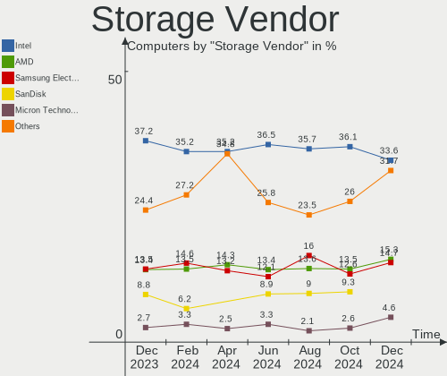
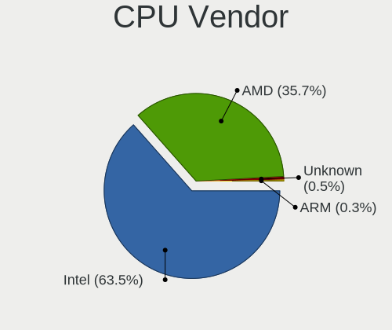
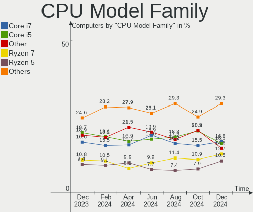
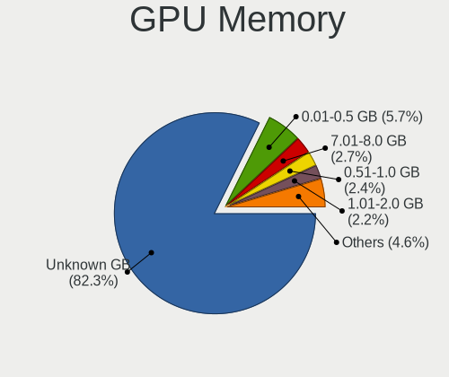
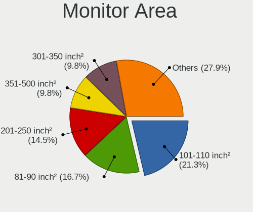

Fedora Hardware Trends
----------------------

A project to identify most popular hardware characteristics and track their change
over time based on data collected by Fedora users at https://Linux-Hardware.org.

Anyone can contribute to the study by uploading probes of their computers by
the [hw-probe](https://github.com/linuxhw/hw-probe) tool:

    sudo hw-probe -all -upload

This is a report for all computer types. See also reports for [desktops](/Dist/Fedora/Desktop/README.md) and [notebooks](/Dist/Fedora/Notebook/README.md).

Full-feature report is available here: https://linux-hardware.org/?view=trends

Period: Mar, 2020.

Contents
--------

- [ OS                       ](#os)
- [ OS Family                ](#os-family)
- [ Kernel                   ](#kernel)
- [ Kernel Family            ](#kernel-family)
- [ Kernel Major Ver.        ](#kernel-major-ver)
- [ Arch                     ](#arch)
- [ DE                       ](#de)
- [ Display Server           ](#display-server)
- [ OS Lang                  ](#os-lang)
- [ Boot Mode                ](#boot-mode)
- [ Filesystem               ](#filesystem)
- [ Dual Boot with Linux     ](#dual-boot-with-linux)
- [ Dual Boot (Win)          ](#dual-boot-win)
- [ Country                  ](#country)
- [ City                     ](#city)
- [ Vendor                   ](#vendor)
- [ Model                    ](#model)
- [ Model Family             ](#model-family)
- [ MFG Year                 ](#mfg-year)
- [ Form Factor              ](#form-factor)
- [ Secure Boot              ](#secure-boot)
- [ Coreboot                 ](#coreboot)
- [ RAM Size                 ](#ram-size)
- [ RAM Used                 ](#ram-used)
- [ Drive Vendor             ](#drive-vendor)
- [ Drive Model              ](#drive-model)
- [ Drive Kind               ](#drive-kind)
- [ Drive Connector          ](#drive-connector)
- [ Drive Size               ](#drive-size)
- [ Space Total              ](#space-total)
- [ Space Used               ](#space-used)
- [ Malfunc. Drives          ](#malfunc-drives)
- [ Malfunc. Drive Vendor    ](#malfunc-drive-vendor)
- [ Malfunc. Drive Kind      ](#malfunc-drive-kind)
- [ Failed Drives            ](#failed-drives)
- [ Failed Drive Vendor      ](#failed-drive-vendor)
- [ Drive Status             ](#drive-status)
- [ Storage Vendor           ](#storage-vendor)
- [ Storage Model            ](#storage-model)
- [ Storage Kind             ](#storage-kind)
- [ CPU Vendor               ](#cpu-vendor)
- [ CPU Model                ](#cpu-model)
- [ CPU Model Family         ](#cpu-model-family)
- [ CPU Cores                ](#cpu-cores)
- [ CPU Sockets              ](#cpu-sockets)
- [ CPU Threads              ](#cpu-threads)
- [ CPU Op-Modes             ](#cpu-op-modes)
- [ CPU Microarch            ](#cpu-microarch)
- [ CPU Microcode            ](#cpu-microcode)
- [ GPU Vendor               ](#gpu-vendor)
- [ GPU Model                ](#gpu-model)
- [ GPU Combo                ](#gpu-combo)
- [ GPU Driver               ](#gpu-driver)
- [ GPU Memory               ](#gpu-memory)
- [ Monitor Vendor           ](#monitor-vendor)
- [ Monitor Model            ](#monitor-model)
- [ Monitor Resolution       ](#monitor-resolution)
- [ Monitor Diagonal         ](#monitor-diagonal)
- [ Monitor Width            ](#monitor-width)
- [ Aspect Ratio             ](#aspect-ratio)
- [ Monitor Area             ](#monitor-area)
- [ Pixel Density            ](#pixel-density)
- [ Multiple Monitors        ](#multiple-monitors)
- [ Net Controller Vendor    ](#net-controller-vendor)
- [ Net Controller Model     ](#net-controller-model)
- [ Net Controller Kind      ](#net-controller-kind)
- [ Used Controller          ](#used-controller)
- [ NICs                     ](#nics)
- [ Unsupported Devices      ](#unsupported-devices)
- [ Unsupported Device Types ](#unsupported-device-types)

OS
--

Installed operating systems

| Name      | Computers | Percent |
|-----------|-----------|---------|
| Fedora 31 | 155       | 85.16%  |
| Fedora 30 | 12        | 6.59%   |
| Fedora 32 | 10        | 5.49%   |
| Fedora 33 | 3         | 1.65%   |
| Fedora 28 | 1         | 0.55%   |
| Fedora 21 | 1         | 0.55%   |

OS Family
---------

OS without a version

| Name   | Computers | Percent |
|--------|-----------|---------|
| Fedora | 182       | 100%    |

Kernel
------

Version of the Linux kernel

| Version                                        | Computers | Percent |
|------------------------------------------------|-----------|---------|
| 5.5.8-200.fc31.x86_64                          | 41        | 22.53%  |
| 5.5.7-200.fc31.x86_64                          | 27        | 14.84%  |
| 5.5.10-200.fc31.x86_64                         | 24        | 13.19%  |
| 5.5.6-201.fc31.x86_64                          | 16        | 8.79%   |
| 5.5.11-200.fc31.x86_64                         | 15        | 8.24%   |
| 5.5.5-200.fc31.x86_64                          | 7         | 3.85%   |
| 5.3.7-301.fc31.x86_64                          | 7         | 3.85%   |
| 5.5.9-200.fc31.x86_64                          | 6         | 3.3%    |
| 5.5.8-100.fc30.x86_64                          | 4         | 2.2%    |
| 5.6.0-0.rc5.git0.2.fc32.x86_64                 | 3         | 1.65%   |
| 5.5.6-100.fc30.x86_64                          | 3         | 1.65%   |
| 5.6.0-0.rc4.git0.1.fc32.x86_64                 | 2         | 1.1%    |
| 5.6.0-0.rc3.git0.1.fc32.x86_64                 | 2         | 1.1%    |
| 5.5.10-100.fc30.x86_64                         | 2         | 1.1%    |
| 5.4.8-200.fc31.x86_64                          | 2         | 1.1%    |
| 5.4.10-200.fc31.x86_64                         | 2         | 1.1%    |
| 5.6.0-300.fc32.x86_64                          | 1         | 0.55%   |
| 5.6.0-0.rc7.git0.2.fc32.x86_64                 | 1         | 0.55%   |
| 5.6.0-0.rc7.git0.1.vanilla.knurd.1.fc33.x86_64 | 1         | 0.55%   |
| 5.6.0-0.rc6.git2.1.fc33.x86_64                 | 1         | 0.55%   |
| 5.6.0-0.rc1.git2.1.fc32.x86_64                 | 1         | 0.55%   |
| 5.5.9-2.surface.fc31.x86_64                    | 1         | 0.55%   |
| 5.5.10-1.qubes.x86_64                          | 1         | 0.55%   |
| 5.4.20-200.fc31.x86_64                         | 1         | 0.55%   |
| 5.4.18-200.fc31.x86_64                         | 1         | 0.55%   |
| 5.4.17-200.fc31.x86_64                         | 1         | 0.55%   |
| 5.4.13-201.fc31.x86_64                         | 1         | 0.55%   |
| 5.3.16-300.fc31.x86_64                         | 1         | 0.55%   |
| 5.3.13-300.fc31.x86_64                         | 1         | 0.55%   |
| 5.3.11-200.fc30.x86_64                         | 1         | 0.55%   |
| 5.2.7-200.fc30.x86_64                          | 1         | 0.55%   |
| 5.0.9-301.fc30.x86_64                          | 1         | 0.55%   |
| 4.19.109-300.fc31.x86_64                       | 1         | 0.55%   |
| 4.16.3-301.fc28.x86_64                         | 1         | 0.55%   |
| 4.1.13-100.fc21.x86_64                         | 1         | 0.55%   |

Kernel Family
-------------

Linux kernel without a distro release

| Version  | Computers | Percent |
|----------|-----------|---------|
| 5.5.8    | 45        | 24.73%  |
| 5.5.7    | 27        | 14.84%  |
| 5.5.10   | 27        | 14.84%  |
| 5.5.6    | 19        | 10.44%  |
| 5.5.11   | 15        | 8.24%   |
| 5.6.0    | 12        | 6.59%   |
| 5.5.9    | 7         | 3.85%   |
| 5.5.5    | 7         | 3.85%   |
| 5.3.7    | 7         | 3.85%   |
| 5.4.8    | 2         | 1.1%    |
| 5.4.10   | 2         | 1.1%    |
| 5.4.20   | 1         | 0.55%   |
| 5.4.18   | 1         | 0.55%   |
| 5.4.17   | 1         | 0.55%   |
| 5.4.13   | 1         | 0.55%   |
| 5.3.16   | 1         | 0.55%   |
| 5.3.13   | 1         | 0.55%   |
| 5.3.11   | 1         | 0.55%   |
| 5.2.7    | 1         | 0.55%   |
| 5.0.9    | 1         | 0.55%   |
| 4.19.109 | 1         | 0.55%   |
| 4.16.3   | 1         | 0.55%   |
| 4.1.13   | 1         | 0.55%   |

Kernel Major Ver.
-----------------

Linux kernel major version

| Version | Computers | Percent |
|---------|-----------|---------|
| 5.5     | 147       | 80.77%  |
| 5.6     | 12        | 6.59%   |
| 5.3     | 10        | 5.49%   |
| 5.4     | 8         | 4.4%    |
| 5.2     | 1         | 0.55%   |
| 5.0     | 1         | 0.55%   |
| 4.19    | 1         | 0.55%   |
| 4.16    | 1         | 0.55%   |
| 4.1     | 1         | 0.55%   |

Arch
----

OS architecture (x86_64, i586, etc.)

| Name   | Computers | Percent |
|--------|-----------|---------|
| x86_64 | 182       | 100%    |

DE
--

Desktop Environment

| Name          | Computers | Percent |
|---------------|-----------|---------|
| GNOME         | 139       | 76.37%  |
| KDE5          | 14        | 7.69%   |
| Cinnamon      | 10        | 5.49%   |
| KDE           | 9         | 4.95%   |
| XFCE          | 2         | 1.1%    |
| X-Cinnamon    | 2         | 1.1%    |
| MATE          | 2         | 1.1%    |
| KDE4          | 2         | 1.1%    |
| GNOME Classic | 1         | 0.55%   |
| Unknown       | 1         | 0.55%   |

Display Server
--------------

X11 or Wayland

| Name    | Computers | Percent |
|---------|-----------|---------|
| Wayland | 103       | 56.59%  |
| X11     | 72        | 39.56%  |
| Tty     | 6         | 3.3%    |
| Web     | 1         | 0.55%   |

OS Lang
-------

Language

| Lang       | Computers | Percent |
|------------|-----------|---------|
| en_US      | 86        | 47.25%  |
| en_GB      | 15        | 8.24%   |
| de_DE      | 9         | 4.95%   |
| it_IT      | 8         | 4.4%    |
| fr_FR      | 8         | 4.4%    |
| en_CA      | 6         | 3.3%    |
| en_AU      | 6         | 3.3%    |
| pt_BR      | 5         | 2.75%   |
| sv_SE      | 4         | 2.2%    |
| ru_RU      | 3         | 1.65%   |
| pl_PL      | 3         | 1.65%   |
| nl_BE.utf8 | 2         | 1.1%    |
| es_CO      | 2         | 1.1%    |
| es_AR      | 2         | 1.1%    |
| en_US.utf8 | 2         | 1.1%    |
| de_CH      | 2         | 1.1%    |
| de_AT      | 2         | 1.1%    |
| cs_CZ      | 2         | 1.1%    |
| sk_SK      | 1         | 0.55%   |
| nl_NL      | 1         | 0.55%   |
| fr_CH.utf8 | 1         | 0.55%   |
| fi_FI      | 1         | 0.55%   |
| et_EE      | 1         | 0.55%   |
| es_MX      | 1         | 0.55%   |
| es_ES      | 1         | 0.55%   |
| en_US      | 1         | 0.55%   |
| en_SG      | 1         | 0.55%   |
| en_NZ      | 1         | 0.55%   |
| en_IN      | 1         | 0.55%   |
| en_IE      | 1         | 0.55%   |
| en_GB.utf8 | 1         | 0.55%   |
| C          | 1         | 0.55%   |
| Unknown    | 1         | 0.55%   |

Boot Mode
---------

EFI or BIOS

| Mode | Computers | Percent |
|------|-----------|---------|
| EFI  | 119       | 65.38%  |
| BIOS | 63        | 34.62%  |

Filesystem
----------

Type of filesystem

| Type  | Computers | Percent |
|-------|-----------|---------|
| Ext4  | 160       | 87.91%  |
| Xfs   | 13        | 7.14%   |
| Btrfs | 9         | 4.95%   |

Dual Boot with Linux
--------------------

Hosting more than one Linux

| Dual boot | Computers | Percent |
|-----------|-----------|---------|
| No        | 162       | 89.01%  |
| Yes       | 20        | 10.99%  |

Dual Boot (Win)
---------------

Hosting Linux and Windows

| Dual boot | Computers | Percent |
|-----------|-----------|---------|
| No        | 151       | 82.97%  |
| Yes       | 31        | 17.03%  |

Country
-------

Geographic location (country)

| Country        | Computers | Percent |
|----------------|-----------|---------|
| USA            | 41        | 22.53%  |
| UK             | 14        | 7.69%   |
| Italy          | 12        | 6.59%   |
| Germany        | 12        | 6.59%   |
| France         | 11        | 6.04%   |
| Netherlands    | 8         | 4.4%    |
| Brazil         | 8         | 4.4%    |
| Australia      | 7         | 3.85%   |
| Spain          | 6         | 3.3%    |
| Canada         | 6         | 3.3%    |
| Sweden         | 5         | 2.75%   |
| Russia         | 5         | 2.75%   |
| Poland         | 5         | 2.75%   |
| Switzerland    | 4         | 2.2%    |
| India          | 4         | 2.2%    |
| Norway         | 3         | 1.65%   |
| Belgium        | 3         | 1.65%   |
| Slovakia       | 2         | 1.1%    |
| Singapore      | 2         | 1.1%    |
| Mexico         | 2         | 1.1%    |
| Hungary        | 2         | 1.1%    |
| Czech Republic | 2         | 1.1%    |
| Colombia       | 2         | 1.1%    |
| Argentina      | 2         | 1.1%    |
| Ukraine        | 1         | 0.55%   |
| Thailand       | 1         | 0.55%   |
| South Africa   | 1         | 0.55%   |
| Portugal       | 1         | 0.55%   |
| Paraguay       | 1         | 0.55%   |
| New Zealand    | 1         | 0.55%   |
| Macedonia      | 1         | 0.55%   |
| Ireland        | 1         | 0.55%   |
| Iran           | 1         | 0.55%   |
| Indonesia      | 1         | 0.55%   |
| Greece         | 1         | 0.55%   |
| Finland        | 1         | 0.55%   |
| Estonia        | 1         | 0.55%   |
| Austria        | 1         | 0.55%   |

City
----

Geographic location (city)

| City                     | Computers | Percent |
|--------------------------|-----------|---------|
| Wahroonga                | 4         | 2.2%    |
| Berlin                   | 4         | 2.2%    |
| Zurich                   | 3         | 1.65%   |
| Arboga                   | 3         | 1.65%   |
| Warrenton                | 2         | 1.1%    |
| Oslo                     | 2         | 1.1%    |
| Moscow                   | 2         | 1.1%    |
| Mexico City              | 2         | 1.1%    |
| Mechelen                 | 2         | 1.1%    |
| Madrid                   | 2         | 1.1%    |
| Lynnwood                 | 2         | 1.1%    |
| Kwintsheul               | 2         | 1.1%    |
| Kingston upon Thames     | 2         | 1.1%    |
| Johnstone                | 2         | 1.1%    |
| Brasília                | 2         | 1.1%    |
| Łódź                  | 1         | 0.55%   |
| Český Krumlov          | 1         | 0.55%   |
| Āstāneh-ye Ashrafīyeh | 1         | 0.55%   |
| Évreux                  | 1         | 0.55%   |
| Zeist                    | 1         | 0.55%   |
| Wormer                   | 1         | 0.55%   |
| Watertown                | 1         | 0.55%   |
| Warsaw                   | 1         | 0.55%   |
| Vác                     | 1         | 0.55%   |
| Vitória da Conquista    | 1         | 0.55%   |
| Villafranca de Ebro      | 1         | 0.55%   |
| Vienna                   | 1         | 0.55%   |
| Victoria                 | 1         | 0.55%   |
| Verona                   | 1         | 0.55%   |
| Vancouver                | 1         | 0.55%   |
| Van Nuys                 | 1         | 0.55%   |
| Vaestra Froelunda        | 1         | 0.55%   |
| Utrecht                  | 1         | 0.55%   |
| Trondheim                | 1         | 0.55%   |
| Treviso                  | 1         | 0.55%   |
| Trento                   | 1         | 0.55%   |
| Toronto                  | 1         | 0.55%   |
| Tikhvin                  | 1         | 0.55%   |
| Theodore                 | 1         | 0.55%   |
| The Hague                | 1         | 0.55%   |
| Temecula                 | 1         | 0.55%   |
| Taylors                  | 1         | 0.55%   |
| Tampa                    | 1         | 0.55%   |
| Tallinn                  | 1         | 0.55%   |
| Tacoma                   | 1         | 0.55%   |
| São Paulo               | 1         | 0.55%   |
| São José dos Campos    | 1         | 0.55%   |
| Sunbury                  | 1         | 0.55%   |
| Stare Kozlowice          | 1         | 0.55%   |
| Spokane                  | 1         | 0.55%   |
| Sosnowiec                | 1         | 0.55%   |
| Skopje                   | 1         | 0.55%   |
| Singapore                | 1         | 0.55%   |
| Show Low                 | 1         | 0.55%   |
| Shickshinny              | 1         | 0.55%   |
| Sheffield                | 1         | 0.55%   |
| Sermaise                 | 1         | 0.55%   |
| Seattle                  | 1         | 0.55%   |
| Schonwalde am Bungsberg  | 1         | 0.55%   |
| Santiago de Cali         | 1         | 0.55%   |

Vendor
------

Motherboard manufacturer

| Name                | Computers | Percent |
|---------------------|-----------|---------|
| Dell                | 34        | 18.68%  |
| Lenovo              | 31        | 17.03%  |
| Hewlett-Packard     | 23        | 12.64%  |
| ASUSTek Computer    | 23        | 12.64%  |
| Gigabyte Technology | 20        | 10.99%  |
| Acer                | 9         | 4.95%   |
| MSI                 | 7         | 3.85%   |
| Notebook            | 6         | 3.3%    |
| ASRock              | 4         | 2.2%    |
| Microsoft           | 3         | 1.65%   |
| Apple               | 3         | 1.65%   |
| Positivo            | 2         | 1.1%    |
| Intel               | 2         | 1.1%    |
| Unknown             | 2         | 1.1%    |
| Toshiba             | 1         | 0.55%   |
| Sony                | 1         | 0.55%   |
| Samsung Electronics | 1         | 0.55%   |
| PC Specialist       | 1         | 0.55%   |
| Lamina              | 1         | 0.55%   |
| HUAWEI              | 1         | 0.55%   |
| HPE                 | 1         | 0.55%   |
| Fujitsu             | 1         | 0.55%   |
| Foxconn             | 1         | 0.55%   |
| DEXP                | 1         | 0.55%   |
| congatec            | 1         | 0.55%   |
| Alienware           | 1         | 0.55%   |
| ABIT                | 1         | 0.55%   |

Model
-----

Motherboard model

| Name                                     | Computers | Percent |
|------------------------------------------|-----------|---------|
| ASUS All Series                          | 5         | 2.75%   |
| Microsoft Surface Book                   | 2         | 1.1%    |
| HP EliteBook 850 G6                      | 2         | 1.1%    |
| Gigabyte 970A-DS3P                       | 2         | 1.1%    |
| ASUS PRIME X370-PRO                      | 2         | 1.1%    |
| Unknown                                  | 2         | 1.1%    |
| Toshiba Satellite P55W-C                 | 1         | 0.55%   |
| Sony VPCZ12Z9E                           | 1         | 0.55%   |
| Samsung Electronics RF510/RF410/RF710    | 1         | 0.55%   |
| Positivo Q432A                           | 1         | 0.55%   |
| Positivo MOBILE                          | 1         | 0.55%   |
| PC Specialist Recoil II                  | 1         | 0.55%   |
| Notebook W350SKQ/W370SK                  | 1         | 0.55%   |
| Notebook NH55RGQ                         | 1         | 0.55%   |
| Notebook N8xxEP6                         | 1         | 0.55%   |
| Notebook N24_25BU                        | 1         | 0.55%   |
| Notebook N150ZU                          | 1         | 0.55%   |
| Notebook L140CU                          | 1         | 0.55%   |
| MSI MS-7C37                              | 1         | 0.55%   |
| MSI MS-7C02                              | 1         | 0.55%   |
| MSI MS-7B89                              | 1         | 0.55%   |
| MSI MS-7B53                              | 1         | 0.55%   |
| MSI MS-7A40                              | 1         | 0.55%   |
| MSI MS-7693                              | 1         | 0.55%   |
| MSI Hyrican PC                           | 1         | 0.55%   |
| Microsoft Surface Pro 4                  | 1         | 0.55%   |
| Lenovo Yoga 530-14IKB 81EK               | 1         | 0.55%   |
| Lenovo Yoga 3 Pro-1370 80HE              | 1         | 0.55%   |
| Lenovo ThinkPad X240 20AMS2PN0N          | 1         | 0.55%   |
| Lenovo ThinkPad X230 2325SSF             | 1         | 0.55%   |
| Lenovo ThinkPad X201 36806D8             | 1         | 0.55%   |
| Lenovo ThinkPad X200 74542HU             | 1         | 0.55%   |
| Lenovo ThinkPad X1 Carbon 7th 20R1SITSIT | 1         | 0.55%   |
| Lenovo ThinkPad X1 Carbon 7th 20QES2831P | 1         | 0.55%   |
| Lenovo ThinkPad X1 Carbon 7th 20QD003CRT | 1         | 0.55%   |
| Lenovo ThinkPad X1 Carbon 2nd 20A7005KMS | 1         | 0.55%   |
| Lenovo ThinkPad T580 20LAS3NJ0R          | 1         | 0.55%   |
| Lenovo ThinkPad T580 20LAS3NJ00          | 1         | 0.55%   |
| Lenovo ThinkPad T560 20FH0036MN          | 1         | 0.55%   |
| Lenovo ThinkPad T530 2394D44             | 1         | 0.55%   |
| Lenovo ThinkPad T480 20L6S0VE00          | 1         | 0.55%   |
| Lenovo ThinkPad T470s 20HGS2MB0M         | 1         | 0.55%   |
| Lenovo ThinkPad T470 20HD000LUK          | 1         | 0.55%   |
| Lenovo ThinkPad T420 4177R3U             | 1         | 0.55%   |
| Lenovo ThinkPad T410 2522PT3             | 1         | 0.55%   |
| Lenovo ThinkPad P53 20QNCTO1WW           | 1         | 0.55%   |
| Lenovo ThinkPad P1 Gen 2 20QUS04M00      | 1         | 0.55%   |
| Lenovo ThinkPad P1 Gen 2 20QT002JMX      | 1         | 0.55%   |
| Lenovo ThinkCentre M93p 10AAS03502       | 1         | 0.55%   |
| Lenovo ThinkCentre M93p 10A9000SUS       | 1         | 0.55%   |
| Lenovo ThinkCentre M58p 7220A72          | 1         | 0.55%   |
| Lenovo Legion Y740-17IRHg 81UJ           | 1         | 0.55%   |
| Lenovo IdeaPad 720-15IKB 81C7            | 1         | 0.55%   |
| Lenovo IdeaPad 520-15IKB 80YL            | 1         | 0.55%   |
| Lenovo IdeaPad 330-15ICH 81FK            | 1         | 0.55%   |
| Lenovo H50-55 90BG003LUS                 | 1         | 0.55%   |
| Lenovo G580 20157                        | 1         | 0.55%   |
| Lamina LAMINALT1024                      | 1         | 0.55%   |
| Intel NUC8i7HVK                          | 1         | 0.55%   |
| Intel NUC8i7BEH                          | 1         | 0.55%   |

Model Family
------------

Motherboard model prefix

| Name                      | Computers | Percent |
|---------------------------|-----------|---------|
| Lenovo ThinkPad           | 20        | 10.99%  |
| Dell Latitude             | 10        | 5.49%   |
| Dell XPS                  | 7         | 3.85%   |
| HP EliteBook              | 6         | 3.3%    |
| Dell Precision            | 6         | 3.3%    |
| Dell Inspiron             | 6         | 3.3%    |
| Acer Aspire               | 6         | 3.3%    |
| ASUS PRIME                | 5         | 2.75%   |
| ASUS All                  | 5         | 2.75%   |
| HP ProBook                | 4         | 2.2%    |
| Microsoft Surface         | 3         | 1.65%   |
| Lenovo ThinkCentre        | 3         | 1.65%   |
| Lenovo IdeaPad            | 3         | 1.65%   |
| HP Pavilion               | 3         | 1.65%   |
| HP Laptop                 | 3         | 1.65%   |
| Gigabyte X570             | 3         | 1.65%   |
| Dell Vostro               | 3         | 1.65%   |
| Lenovo Yoga               | 2         | 1.1%    |
| HP ENVY                   | 2         | 1.1%    |
| Gigabyte 970A-DS3P        | 2         | 1.1%    |
| Unknown                   | 2         | 1.1%    |
| Toshiba Satellite         | 1         | 0.55%   |
| Sony VPCZ12Z9E            | 1         | 0.55%   |
| Samsung Electronics RF510 | 1         | 0.55%   |
| Positivo Q432A            | 1         | 0.55%   |
| Positivo MOBILE           | 1         | 0.55%   |
| PC Specialist Recoil      | 1         | 0.55%   |
| Notebook W350SKQ          | 1         | 0.55%   |
| Notebook NH55RGQ          | 1         | 0.55%   |
| Notebook N8xxEP6          | 1         | 0.55%   |
| Notebook N24              | 1         | 0.55%   |
| Notebook N150ZU           | 1         | 0.55%   |
| Notebook L140CU           | 1         | 0.55%   |
| MSI MS-7C37               | 1         | 0.55%   |
| MSI MS-7C02               | 1         | 0.55%   |
| MSI MS-7B89               | 1         | 0.55%   |
| MSI MS-7B53               | 1         | 0.55%   |
| MSI MS-7A40               | 1         | 0.55%   |
| MSI MS-7693               | 1         | 0.55%   |
| MSI Hyrican               | 1         | 0.55%   |
| Lenovo Legion             | 1         | 0.55%   |
| Lenovo H50-55             | 1         | 0.55%   |
| Lenovo G580               | 1         | 0.55%   |
| Lamina LAMINALT1024       | 1         | 0.55%   |
| Intel NUC8i7HVK           | 1         | 0.55%   |
| Intel NUC8i7BEH           | 1         | 0.55%   |
| HUAWEI MACH-WX9           | 1         | 0.55%   |
| HPE ProLiant              | 1         | 0.55%   |
| HP ZBook                  | 1         | 0.55%   |
| HP x2                     | 1         | 0.55%   |
| HP Spectre                | 1         | 0.55%   |
| HP Notebook               | 1         | 0.55%   |
| HP EliteDesk              | 1         | 0.55%   |
| Gigabyte Z77X-D3H         | 1         | 0.55%   |
| Gigabyte Z370M            | 1         | 0.55%   |
| Gigabyte X470             | 1         | 0.55%   |
| Gigabyte Q87M-D2H         | 1         | 0.55%   |
| Gigabyte M68M-S2P         | 1         | 0.55%   |
| Gigabyte M57SLI-S4        | 1         | 0.55%   |
| Gigabyte H77N-WIFI        | 1         | 0.55%   |

MFG Year
--------

Motherboard manufacture year

| Year    | Computers | Percent |
|---------|-----------|---------|
| 2019    | 66        | 36.26%  |
| 2018    | 36        | 19.78%  |
| 2017    | 11        | 6.04%   |
| 2015    | 11        | 6.04%   |
| 2016    | 10        | 5.49%   |
| 2012    | 10        | 5.49%   |
| 2020    | 7         | 3.85%   |
| 2013    | 7         | 3.85%   |
| 2014    | 6         | 3.3%    |
| 2010    | 6         | 3.3%    |
| 2009    | 5         | 2.75%   |
| 2011    | 4         | 2.2%    |
| 2008    | 1         | 0.55%   |
| 2007    | 1         | 0.55%   |
| Unknown | 1         | 0.55%   |

Form Factor
-----------

Physical design of the computer

| Name        | Computers | Percent |
|-------------|-----------|---------|
| Notebook    | 98        | 53.85%  |
| Desktop     | 69        | 37.91%  |
| Tablet      | 5         | 2.75%   |
| Convertible | 5         | 2.75%   |
| Mini pc     | 2         | 1.1%    |
| Other       | 1         | 0.55%   |
| All in one  | 1         | 0.55%   |
| Server      | 1         | 0.55%   |

Secure Boot
-----------

Enabled or disabled

| State    | Computers | Percent |
|----------|-----------|---------|
| Disabled | 153       | 84.07%  |
| Enabled  | 29        | 15.93%  |

Coreboot
--------

Have coreboot on board

| Used | Computers | Percent |
|------|-----------|---------|
| No   | 182       | 100%    |

RAM Size
--------

Total RAM memory

| Size in GB  | Computers | Percent |
|-------------|-----------|---------|
| 16.01-24.0  | 60        | 32.97%  |
| 4.01-8.0    | 49        | 26.92%  |
| 8.01-16.0   | 26        | 14.29%  |
| 32.01-64.0  | 25        | 13.74%  |
| 3.01-4.0    | 15        | 8.24%   |
| 24.01-32.0  | 3         | 1.65%   |
| 1.01-2.0    | 2         | 1.1%    |
| 2.01-3.0    | 1         | 0.55%   |
| 64.01-256.0 | 1         | 0.55%   |

RAM Used
--------

Used RAM memory

| Used GB   | Computers | Percent |
|-----------|-----------|---------|
| 2.01-3.0  | 64        | 35.16%  |
| 1.01-2.0  | 39        | 21.43%  |
| 3.01-4.0  | 37        | 20.33%  |
| 4.01-8.0  | 29        | 15.93%  |
| 8.01-16.0 | 11        | 6.04%   |
| 0.01-1.0  | 2         | 1.1%    |

Drive Vendor
------------

Hard drive vendors

| Vendor              | Computers | Drives  | Percent |
|---------------------|-----------|---------|---------|
| Samsung Electronics | 49        | 55      | 20.16%  |
| WDC                 | 44        | 59      | 18.11%  |
| Seagate             | 39        | 50      | 16.05%  |
| Toshiba             | 16        | 17      | 6.58%   |
| SanDisk             | 12        | 12      | 4.94%   |
| Crucial             | 12        | 13      | 4.94%   |
| Hitachi             | 10        | 10      | 4.12%   |
| Kingston            | 9         | 11      | 3.7%    |
| Unknown             | 8         | 10      | 3.29%   |
| Intel               | 8         | 9       | 3.29%   |
| SK Hynix            | 4         | 4       | 1.65%   |
| HGST                | 4         | 7       | 1.65%   |
| Micron Technology   | 3         | 3       | 1.23%   |
| A-DATA Technology   | 3         | 4       | 1.23%   |
| LITEON              | 2         | 2       | 0.82%   |
| HL-DT-ST            | 2         | Unknown | 0.82%   |
| Apple               | 2         | 2       | 0.82%   |
| Transcend           | 1         | 1       | 0.41%   |
| SPCC                | 1         | 1       | 0.41%   |
| Radeon              | 1         | 1       | 0.41%   |
| PNY                 | 1         | 1       | 0.41%   |
| OSC                 | 1         | 1       | 0.41%   |
| OCZ                 | 1         | 1       | 0.41%   |
| Mushkin             | 1         | 1       | 0.41%   |
| LITEONIT            | 1         | 1       | 0.41%   |
| LDLC                | 1         | 1       | 0.41%   |
| LaCie               | 1         | 1       | 0.41%   |
| KingFast            | 1         | 1       | 0.41%   |
| JMicron             | 1         | 1       | 0.41%   |
| INDMEM              | 1         | 1       | 0.41%   |
| Inateck             | 1         | 1       | 0.41%   |
| GOODRAM             | 1         | 1       | 0.41%   |
| Dogfish             | 1         | 1       | 0.41%   |

Drive Model
-----------

Hard drive models

| Model                        | Computers | Percent |
|------------------------------|-----------|---------|
| SSD 860 EVO 500GB            | 7         | 2.5%    |
| CT500MX500SSD1 500GB         | 5         | 1.79%   |
| MQ01ABD100 1TB               | 4         | 1.43%   |
| DT01ACA100 1TB               | 4         | 1.43%   |
| ST2000DM001-1ER164 2TB       | 3         | 1.07%   |
| ST1000LM035-1RK172 1TB       | 3         | 1.07%   |
| ST1000LM014-1EJ164 1TB       | 3         | 1.07%   |
| SSDSC2KW256G8 256GB          | 3         | 1.07%   |
| SSD 850 EVO 250GB            | 3         | 1.07%   |
| WD40EZRZ-00GXCB0 4TB         | 2         | 0.71%   |
| WD2500BEVT-22ZCT0 250GB      | 2         | 0.71%   |
| WD20EZRZ-00Z5HB0 2TB         | 2         | 0.71%   |
| WD10EZEX-60WN4A0 1TB         | 2         | 0.71%   |
| WD10EZEX-08M2NA0 1TB         | 2         | 0.71%   |
| WD10EZEX-00BN5A0 1TB         | 2         | 0.71%   |
| ST500LT012-1DG142 500GB      | 2         | 0.71%   |
| ST2000LM003 HN-M201RAD 2TB   | 2         | 0.71%   |
| ST1000DM003-1ER162 1TB       | 2         | 0.71%   |
| SSD 970 EVO Plus 500GB       | 2         | 0.71%   |
| SSD 860 EVO M.2 500GB        | 2         | 0.71%   |
| SSD 860 EVO 1TB              | 2         | 0.71%   |
| SSD 850 PRO 256GB            | 2         | 0.71%   |
| SSD 850 EVO 500GB            | 2         | 0.71%   |
| SA400S37120G 120GB SSD       | 2         | 0.71%   |
| MZVLB512HAJQ-000H1 512GB     | 2         | 0.71%   |
| MQ04ABF100 1TB               | 2         | 0.71%   |
| MMC Card  32GB               | 2         | 0.71%   |
| CT525MX300SSD1 528GB         | 2         | 0.71%   |
| BUP Slim BK 2TB              | 2         | 0.71%   |
| 1100 SATA 512GB SSD          | 2         | 0.71%   |
| WDS500G2B0B 500GB SSD        | 1         | 0.36%   |
| WDS500G2B0A-00SM50 500GB SSD | 1         | 0.36%   |
| WDS250G3X0C-00SJG0 250GB     | 1         | 0.36%   |
| WDS250G2B0B-00YS70 250GB SSD | 1         | 0.36%   |
| WDS250G2B0A-00SM50 250GB SSD | 1         | 0.36%   |
| WDS240G2G0B-00EPW0 240GB SSD | 1         | 0.36%   |
| WDS240G2G0A-00JH30 240GB SSD | 1         | 0.36%   |
| WDS120G2G0A-00JH30 120GB SSD | 1         | 0.36%   |
| WDS100T2G0A-00JH30 1TB SSD   | 1         | 0.36%   |
| WD5000LPVX-22V0TT0 500GB     | 1         | 0.36%   |
| WD5000BEVT-22A0RT0 500GB     | 1         | 0.36%   |
| WD5000AZRX-00A8LB0 500GB     | 1         | 0.36%   |
| WD5000AAKX-75U6AA0 500GB     | 1         | 0.36%   |
| WD5000AAKX-00ERMA0 500GB     | 1         | 0.36%   |
| WD5000AAKS-00E4A0 500GB      | 1         | 0.36%   |
| WD5000AAKS-00A7B2 500GB      | 1         | 0.36%   |
| WD400JB-00FMA0 40GB          | 1         | 0.36%   |
| WD3200AAKS-00L9A0 320GB      | 1         | 0.36%   |
| WD3200AAJS-56M0A0 320GB      | 1         | 0.36%   |
| WD2500AAJS-75M0A0 250GB      | 1         | 0.36%   |
| WD20PURZ-85GU6Y0 2TB         | 1         | 0.36%   |
| WD20EZRX-22D8PB0 2TB         | 1         | 0.36%   |
| WD20EZRX-00DC0B0 2TB         | 1         | 0.36%   |
| WD20EZRX-00D8PB0 2TB         | 1         | 0.36%   |
| WD20EZAZ-00GGJB0 2TB         | 1         | 0.36%   |
| WD20EFRX-68EUZN0 2TB         | 1         | 0.36%   |
| WD2003FZEX-00Z4SA0 2TB       | 1         | 0.36%   |
| WD2002FYPS-02W3B0 2TB        | 1         | 0.36%   |
| WD1600AABS-61PRA0 160GB      | 1         | 0.36%   |
| WD1500HLFS-01G6U3 150GB      | 1         | 0.36%   |

Drive Kind
----------

HDD or SSD

| Kind    | Computers | Drives | Percent |
|---------|-----------|--------|---------|
| SSD     | 90        | 109    | 41.1%   |
| HDD     | 89        | 132    | 40.64%  |
| NVMe    | 23        | 25     | 10.5%   |
| Unknown | 9         | 7      | 4.11%   |
| MMC     | 8         | 11     | 3.65%   |

Drive Connector
---------------

SATA, SAS, NVMe, etc.

| Type | Computers | Drives | Percent |
|------|-----------|--------|---------|
| SATA | 138       | 237    | 77.09%  |
| NVMe | 23        | 25     | 12.85%  |
| SAS  | 10        | 11     | 5.59%   |
| MMC  | 8         | 11     | 4.47%   |

Drive Size
----------

Size of hard drive

| Size in TB | Computers | Drives | Percent |
|------------|-----------|--------|---------|
| 0.01-0.5   | 118       | 155    | 52.68%  |
| 0.51-1.0   | 70        | 82     | 31.25%  |
| 1.01-2.0   | 24        | 30     | 10.71%  |
| 3.01-4.0   | 8         | 12     | 3.57%   |
| 2.01-3.0   | 2         | 3      | 0.89%   |
| 4.01-10.0  | 2         | 2      | 0.89%   |

Space Total
-----------

Amount of disk space available on the file system

| Size in GB     | Computers | Percent |
|----------------|-----------|---------|
| 101-250        | 55        | 30.22%  |
| 251-500        | 38        | 20.88%  |
| 501-1000       | 25        | 13.74%  |
| More than 3000 | 13        | 7.14%   |
| 1001-2000      | 13        | 7.14%   |
| 2001-3000      | 12        | 6.59%   |
| 51-100         | 12        | 6.59%   |
| 21-50          | 6         | 3.3%    |
| 1-20           | 4         | 2.2%    |
| Unknown        | 4         | 2.2%    |

Space Used
----------

Amount of used disk space

| Used GB        | Computers | Percent |
|----------------|-----------|---------|
| 1-20           | 53        | 29.12%  |
| 21-50          | 30        | 16.48%  |
| 101-250        | 26        | 14.29%  |
| 51-100         | 25        | 13.74%  |
| 251-500        | 21        | 11.54%  |
| 1001-2000      | 11        | 6.04%   |
| 501-1000       | 7         | 3.85%   |
| More than 3000 | 4         | 2.2%    |
| Unknown        | 4         | 2.2%    |
| 2001-3000      | 1         | 0.55%   |

Malfunc. Drives
---------------

Drive models with a malfunction

| Model                    | Computers | Drives | Percent |
|--------------------------|-----------|--------|---------|
| WD5000AAKX-00ERMA0 500GB | 1         | 1      | 7.14%   |
| WD5000AAKS-00E4A0 500GB  | 1         | 1      | 7.14%   |
| WD3200AAKS-00L9A0 320GB  | 1         | 1      | 7.14%   |
| WD20PURZ-85GU6Y0 2TB     | 1         | 1      | 7.14%   |
| WD1600AABS-61PRA0 160GB  | 1         | 1      | 7.14%   |
| WD10EZRX-00A8LB0 1TB     | 1         | 1      | 7.14%   |
| WD10EZEX-00RKKA0 1TB     | 1         | 1      | 7.14%   |
| WD10EZEX-00BN5A0 1TB     | 1         | 1      | 7.14%   |
| ST9500325AS 500GB        | 1         | 1      | 7.14%   |
| ST500LT012-1DG142 500GB  | 1         | 1      | 7.14%   |
| ST31500341AS 1TB         | 1         | 1      | 7.14%   |
| ST31000340NS 1TB         | 1         | 4      | 7.14%   |
| ST1500DM003-9YN16G 1TB   | 1         | 1      | 7.14%   |
| HD502IJ 500GB            | 1         | 1      | 7.14%   |

Malfunc. Drive Vendor
---------------------

Vendors of faulty drives

| Vendor              | Computers | Drives | Percent |
|---------------------|-----------|--------|---------|
| WDC                 | 5         | 8      | 50%     |
| Seagate             | 4         | 8      | 40%     |
| Samsung Electronics | 1         | 1      | 10%     |

Malfunc. Drive Kind
-------------------

Kinds of faulty drives

| Kind | Computers | Drives | Percent |
|------|-----------|--------|---------|
| HDD  | 9         | 17     | 100%    |

Failed Drives
-------------

Failed drive models

Zero info for selected period =(

Failed Drive Vendor
-------------------

Failed drive vendors

Zero info for selected period =(

Drive Status
------------

Number of failed and malfunc. drives

| Status   | Computers | Drives | Percent |
|----------|-----------|--------|---------|
| Detected | 86        | 151    | 50.29%  |
| Works    | 76        | 116    | 44.44%  |
| Malfunc  | 9         | 17     | 5.26%   |

Storage Vendor
--------------

Storage controller vendors

| Vendor                       | Computers | Percent |
|------------------------------|-----------|---------|
| Intel                        | 118       | 52.21%  |
| AMD                          | 34        | 15.04%  |
| Samsung Electronics          | 31        | 13.72%  |
| Sandisk                      | 13        | 5.75%   |
| Toshiba America Info Systems | 4         | 1.77%   |
| Marvell Technology Group     | 4         | 1.77%   |
| ASMedia Technology           | 4         | 1.77%   |
| Nvidia                       | 3         | 1.33%   |
| JMicron Technology           | 3         | 1.33%   |
| SK Hynix                     | 2         | 0.88%   |
| Silicon Image                | 2         | 0.88%   |
| Phison Electronics           | 2         | 0.88%   |
| LSI Logic / Symbios Logic    | 2         | 0.88%   |
| Silicon Motion               | 1         | 0.44%   |
| Lite-On Technology           | 1         | 0.44%   |
| Kingston Technology Company  | 1         | 0.44%   |
| Adaptec                      | 1         | 0.44%   |

Storage Model
-------------

Storage controller models

| Model                                                                    | Computers | Percent |
|--------------------------------------------------------------------------|-----------|---------|
| FCH SATA Controller [AHCI mode]                                          | 25        | 9.8%    |
| NVMe SSD Controller SM981/PM981/PM983                                    | 17        | 6.67%   |
| 82801 Mobile SATA Controller [RAID mode]                                 | 16        | 6.27%   |
| Sunrise Point-LP SATA Controller [AHCI mode]                             | 15        | 5.88%   |
| 8 Series/C220 Series Chipset Family 6-port SATA Controller 1 [AHCI mode] | 13        | 5.1%    |
| WD Black 2018/PC SN720 NVMe SSD                                          | 7         | 2.75%   |
| NVMe SSD Controller SM961/PM961                                          | 7         | 2.75%   |
| SB7x0/SB8x0/SB9x0 SATA Controller [AHCI mode]                            | 6         | 2.35%   |
| SB7x0/SB8x0/SB9x0 IDE Controller                                         | 6         | 2.35%   |
| Q170/Q150/B150/H170/H110/Z170/CM236 Chipset SATA Controller [AHCI Mode]  | 6         | 2.35%   |
| NVMe SSD Controller SM951/PM951                                          | 6         | 2.35%   |
| Non-Volatile memory controller                                           | 6         | 2.35%   |
| Cannon Lake Mobile PCH SATA AHCI Controller                              | 6         | 2.35%   |
| 400 Series Chipset SATA Controller                                       | 6         | 2.35%   |
| WD Black 2018/PC SN520 NVMe SSD                                          | 5         | 1.96%   |
| Cannon Point-LP SATA Controller [AHCI Mode]                              | 5         | 1.96%   |
| Cannon Lake PCH SATA AHCI Controller                                     | 5         | 1.96%   |
| 7 Series Chipset Family 6-port SATA Controller [AHCI mode]               | 5         | 1.96%   |
| Wildcat Point-LP SATA Controller [AHCI Mode]                             | 4         | 1.57%   |
| SSD 660P Series                                                          | 4         | 1.57%   |
| SATA Controller [RAID mode]                                              | 4         | 1.57%   |
| ASM1062 Serial ATA Controller                                            | 4         | 1.57%   |
| 8 Series SATA Controller 1 [AHCI mode]                                   | 4         | 1.57%   |
| 6 Series/C200 Series Chipset Family 6 port Mobile SATA AHCI Controller   | 4         | 1.57%   |
| X370 Series Chipset SATA Controller                                      | 3         | 1.18%   |
| SB7x0/SB8x0/SB9x0 SATA Controller [IDE mode]                             | 3         | 1.18%   |
| NM10/ICH7 Family SATA Controller [IDE mode]                              | 3         | 1.18%   |
| HM170/QM170 Chipset SATA Controller [AHCI Mode]                          | 3         | 1.18%   |
| 9 Series Chipset Family SATA Controller [AHCI Mode]                      | 3         | 1.18%   |
| 82801G (ICH7 Family) IDE Controller                                      | 3         | 1.18%   |
| 7 Series/C210 Series Chipset Family 6-port SATA Controller [AHCI mode]   | 3         | 1.18%   |
| XG4 NVMe SSD Controller                                                  | 2         | 0.78%   |
| SiI 3132 Serial ATA Raid II Controller                                   | 2         | 0.78%   |
| MCP55 SATA Controller                                                    | 2         | 0.78%   |
| MCP55 IDE                                                                | 2         | 0.78%   |
| JMB363 SATA/IDE Controller                                               | 2         | 0.78%   |
| E16 PCIe4 NVMe Controller                                                | 2         | 0.78%   |
| 88SE9172 SATA 6Gb/s Controller                                           | 2         | 0.78%   |
| 5 Series/3400 Series Chipset 6 port SATA AHCI Controller                 | 2         | 0.78%   |
| 5 Series/3400 Series Chipset 4 port SATA AHCI Controller                 | 2         | 0.78%   |
| 300 Series Chipset SATA Controller                                       | 2         | 0.78%   |
| 200 Series PCH SATA controller [AHCI mode]                               | 2         | 0.78%   |
| Toshiba America Info Non-Volatile memory controller                      | 1         | 0.39%   |
| SSD Pro 7600p/760p/E 6100p Series                                        | 1         | 0.39%   |
| SAS2008 PCI-Express Fusion-MPT SAS-2 [Falcon]                            | 1         | 0.39%   |
| SAS1068E PCI-Express Fusion-MPT SAS                                      | 1         | 0.39%   |
| PC300 NVMe Solid State Drive 256GB                                       | 1         | 0.39%   |
| MCP61 SATA Controller                                                    | 1         | 0.39%   |
| MCP61 IDE                                                                | 1         | 0.39%   |
| JMB360 AHCI Controller                                                   | 1         | 0.39%   |
| Comet Lake SATA AHCI Controller                                          | 1         | 0.39%   |
| Celeron N3350/Pentium N4200/Atom E3900 Series SATA AHCI Controller       | 1         | 0.39%   |
| C610/X99 series chipset sSATA Controller [AHCI mode]                     | 1         | 0.39%   |
| C610/X99 series chipset 6-Port SATA Controller [AHCI mode]               | 1         | 0.39%   |
| C600/X79 series chipset SATA RAID Controller                             | 1         | 0.39%   |
| BG3 NVMe SSD Controller                                                  | 1         | 0.39%   |
| Apple PCIe SSD                                                           | 1         | 0.39%   |
| AIC-7850T/7856T [AVA-2902/4/6 / AHA-2910]                                | 1         | 0.39%   |
| 92xx SATA 6G Controller                                                  | 1         | 0.39%   |
| 88SE9230 PCIe SATA 6Gb/s Controller                                      | 1         | 0.39%   |

Storage Kind
------------

Kind of storage controller (IDE, SATA, NVMe, SAS, ...)

| Kind | Computers | Percent |
|------|-----------|---------|
| SATA | 126       | 56.25%  |
| NVMe | 58        | 25.89%  |
| RAID | 21        | 9.38%   |
| IDE  | 16        | 7.14%   |
| SCSI | 2         | 0.89%   |
| SAS  | 1         | 0.45%   |

CPU Vendor
----------

Processor vendors

| Vendor | Computers | Percent |
|--------|-----------|---------|
| Intel  | 144       | 79.12%  |
| AMD    | 38        | 20.88%  |

CPU Model
---------

Processor models

| Model                                       | Computers | Percent |
|---------------------------------------------|-----------|---------|
| Intel Core i7-8550U CPU @ 1.80GHz           | 10        | 5.49%   |
| Intel Core i7-9750H CPU @ 2.60GHz           | 4         | 2.2%    |
| Intel Core i7-8565U CPU @ 1.80GHz           | 4         | 2.2%    |
| Intel Core i5-8265U CPU @ 1.60GHz           | 4         | 2.2%    |
| Intel Core i7-8750H CPU @ 2.20GHz           | 3         | 1.65%   |
| Intel Core i7-8700 CPU @ 3.20GHz            | 3         | 1.65%   |
| Intel Core i7-7500U CPU @ 2.70GHz           | 3         | 1.65%   |
| Intel Core i7-6600U CPU @ 2.60GHz           | 3         | 1.65%   |
| Intel Core i7-4790K CPU @ 4.00GHz           | 3         | 1.65%   |
| Intel Core i7-10510U CPU @ 1.80GHz          | 3         | 1.65%   |
| Intel Core i5-5200U CPU @ 2.20GHz           | 3         | 1.65%   |
| Intel Atom x5-Z8350 CPU @ 1.44GHz           | 3         | 1.65%   |
| AMD Ryzen 5 2600 Six-Core Processor         | 3         | 1.65%   |
| Intel Core i7-8850H CPU @ 2.60GHz           | 2         | 1.1%    |
| Intel Core i7-8650U CPU @ 1.90GHz           | 2         | 1.1%    |
| Intel Core i7-7600U CPU @ 2.80GHz           | 2         | 1.1%    |
| Intel Core i7-4770 CPU @ 3.40GHz            | 2         | 1.1%    |
| Intel Core i7-3630QM CPU @ 2.40GHz          | 2         | 1.1%    |
| Intel Core i5-7300U CPU @ 2.60GHz           | 2         | 1.1%    |
| Intel Core i5-7200U CPU @ 2.50GHz           | 2         | 1.1%    |
| Intel Core i5-6200U CPU @ 2.30GHz           | 2         | 1.1%    |
| Intel Core i5-4300U CPU @ 1.90GHz           | 2         | 1.1%    |
| Intel Core i5-3317U CPU @ 1.70GHz           | 2         | 1.1%    |
| Intel Core i5-2430M CPU @ 2.40GHz           | 2         | 1.1%    |
| Intel Core 2 Duo CPU E8400 @ 3.00GHz        | 2         | 1.1%    |
| AMD Ryzen 9 3900X 12-Core Processor         | 2         | 1.1%    |
| AMD Ryzen 7 2700X Eight-Core Processor      | 2         | 1.1%    |
| AMD Ryzen 7 1700 Eight-Core Processor       | 2         | 1.1%    |
| AMD FX-8350 Eight-Core Processor            | 2         | 1.1%    |
| Intel Xeon CPU X5680 @ 3.33GHz              | 1         | 0.55%   |
| Intel Xeon CPU E5-1650 v2 @ 3.50GHz         | 1         | 0.55%   |
| Intel Xeon CPU E5-1607 v4 @ 3.10GHz         | 1         | 0.55%   |
| Intel Pentium Dual-Core CPU E5800 @ 3.20GHz | 1         | 0.55%   |
| Intel Pentium CPU N4200 @ 1.10GHz           | 1         | 0.55%   |
| Intel Pentium CPU G4400 @ 3.30GHz           | 1         | 0.55%   |
| Intel Pentium CPU 4415U @ 2.30GHz           | 1         | 0.55%   |
| Intel Core m3-6Y30 CPU @ 0.90GHz            | 1         | 0.55%   |
| Intel Core M-5Y71 CPU @ 1.20GHz             | 1         | 0.55%   |
| Intel Core i9-9900K CPU @ 3.60GHz           | 1         | 0.55%   |
| Intel Core i7-9850H CPU @ 2.60GHz           | 1         | 0.55%   |
| Intel Core i7-9700 CPU @ 3.00GHz            | 1         | 0.55%   |
| Intel Core i7-8809G CPU @ 3.10GHz           | 1         | 0.55%   |
| Intel Core i7-8665U CPU @ 1.90GHz           | 1         | 0.55%   |
| Intel Core i7-8559U CPU @ 2.70GHz           | 1         | 0.55%   |
| Intel Core i7-7820HQ CPU @ 2.90GHz          | 1         | 0.55%   |
| Intel Core i7-7700HQ CPU @ 2.80GHz          | 1         | 0.55%   |
| Intel Core i7-6820HQ CPU @ 2.70GHz          | 1         | 0.55%   |
| Intel Core i7-6700K CPU @ 4.00GHz           | 1         | 0.55%   |
| Intel Core i7-6700HQ CPU @ 2.60GHz          | 1         | 0.55%   |
| Intel Core i7-6700 CPU @ 3.40GHz            | 1         | 0.55%   |
| Intel Core i7-6500U CPU @ 2.50GHz           | 1         | 0.55%   |
| Intel Core i7-5600U CPU @ 2.60GHz           | 1         | 0.55%   |
| Intel Core i7-4870HQ CPU @ 2.50GHz          | 1         | 0.55%   |
| Intel Core i7-4790 CPU @ 3.60GHz            | 1         | 0.55%   |
| Intel Core i7-4720HQ CPU @ 2.60GHz          | 1         | 0.55%   |
| Intel Core i7-4710MQ CPU @ 2.50GHz          | 1         | 0.55%   |
| Intel Core i7-4702MQ CPU @ 2.20GHz          | 1         | 0.55%   |
| Intel Core i7-4700MQ CPU @ 2.40GHz          | 1         | 0.55%   |
| Intel Core i7-4550U CPU @ 1.50GHz           | 1         | 0.55%   |
| Intel Core i7-10710U CPU @ 1.10GHz          | 1         | 0.55%   |

CPU Model Family
----------------

Processor model prefix

| Model                   | Computers | Percent |
|-------------------------|-----------|---------|
| Intel Core i7           | 70        | 38.46%  |
| Intel Core i5           | 49        | 26.92%  |
| AMD Ryzen 5             | 9         | 4.95%   |
| Intel Core i3           | 6         | 3.3%    |
| AMD Ryzen 7             | 6         | 3.3%    |
| AMD FX                  | 6         | 3.3%    |
| Intel Atom              | 4         | 2.2%    |
| Intel Xeon              | 3         | 1.65%   |
| Intel Pentium           | 3         | 1.65%   |
| Intel Core 2 Duo        | 3         | 1.65%   |
| AMD Ryzen 9             | 3         | 1.65%   |
| AMD Phenom II X4        | 3         | 1.65%   |
| AMD Ryzen 3             | 2         | 1.1%    |
| AMD Phenom              | 2         | 1.1%    |
| AMD A8                  | 2         | 1.1%    |
| Other                   | 1         | 0.55%   |
| Intel Pentium Dual-Core | 1         | 0.55%   |
| Intel Core m3           | 1         | 0.55%   |
| Intel Core M            | 1         | 0.55%   |
| Intel Core i9           | 1         | 0.55%   |
| Intel Core 2            | 1         | 0.55%   |
| Intel Celeron           | 1         | 0.55%   |
| AMD Opteron             | 1         | 0.55%   |
| AMD Athlon II X4        | 1         | 0.55%   |
| AMD Athlon 64 X2        | 1         | 0.55%   |
| AMD A6                  | 1         | 0.55%   |

CPU Cores
---------

Number of processor cores

| Number | Computers | Percent |
|--------|-----------|---------|
| 4      | 83        | 45.6%   |
| 2      | 62        | 34.07%  |
| 6      | 22        | 12.09%  |
| 8      | 7         | 3.85%   |
| 12     | 3         | 1.65%   |
| 3      | 2         | 1.1%    |
| 1      | 2         | 1.1%    |
| 16     | 1         | 0.55%   |

CPU Sockets
-----------

Number of sockets

| Number | Computers | Percent |
|--------|-----------|---------|
| 1      | 181       | 99.45%  |
| 2      | 1         | 0.55%   |

CPU Threads
-----------

Threads per core (Hyper-Threading)

| Number | Computers | Percent |
|--------|-----------|---------|
| 2      | 140       | 76.92%  |
| 1      | 42        | 23.08%  |

CPU Op-Modes
------------

CPU Operation Modes (32-bit, 64-bit)

| Op mode        | Computers | Percent |
|----------------|-----------|---------|
| 32-bit, 64-bit | 182       | 100%    |

CPU Microarch
-------------

Microarchitecture

| Name        | Computers | Percent |
|-------------|-----------|---------|
| Skylake     | 73        | 40.11%  |
| Haswell     | 23        | 12.64%  |
| IvyBridge   | 10        | 5.49%   |
| Zen+        | 8         | 4.4%    |
| Zen         | 7         | 3.85%   |
| SandyBridge | 7         | 3.85%   |
| Westmere    | 6         | 3.3%    |
| KabyLake    | 6         | 3.3%    |
| K10         | 6         | 3.3%    |
| Core        | 6         | 3.3%    |
| Broadwell   | 6         | 3.3%    |
| Zen 2       | 5         | 2.75%   |
| Piledriver  | 5         | 2.75%   |
| Silvermont  | 4         | 2.2%    |
| Excavator   | 3         | 1.65%   |
| Steamroller | 2         | 1.1%    |
| Nehalem     | 2         | 1.1%    |
| K8 Hammer   | 1         | 0.55%   |
| Goldmont    | 1         | 0.55%   |
| Bulldozer   | 1         | 0.55%   |

CPU Microcode
-------------

Microcode number

| Number     | Computers | Percent |
|------------|-----------|---------|
| 0x306c3    | 16        | 8.79%   |
| 0x906ea    | 14        | 7.69%   |
| 0x806ea    | 13        | 7.14%   |
| 0x806ec    | 12        | 6.59%   |
| 0x806e9    | 10        | 5.49%   |
| 0x306a9    | 9         | 4.95%   |
| 0x406e3    | 8         | 4.4%    |
| 0x506e3    | 7         | 3.85%   |
| 0x206a7    | 7         | 3.85%   |
| Unknown    | 7         | 3.85%   |
| 0x906e9    | 6         | 3.3%    |
| 0x40651    | 5         | 2.75%   |
| 0x306d4    | 5         | 2.75%   |
| 0x08701013 | 5         | 2.75%   |
| 0x0800820d | 5         | 2.75%   |
| 0x20655    | 4         | 2.2%    |
| 0x06000852 | 4         | 2.2%    |
| 0x406c4    | 3         | 1.65%   |
| 0x1067a    | 3         | 1.65%   |
| 0x08001138 | 3         | 1.65%   |
| 0x906ed    | 2         | 1.1%    |
| 0x08108102 | 2         | 1.1%    |
| 0x0810100b | 2         | 1.1%    |
| 0x06006705 | 2         | 1.1%    |
| 0x06003106 | 2         | 1.1%    |
| 0xa0660    | 1         | 0.55%   |
| 0x906eb    | 1         | 0.55%   |
| 0x806eb    | 1         | 0.55%   |
| 0x6f6      | 1         | 0.55%   |
| 0x506c9    | 1         | 0.55%   |
| 0x406f1    | 1         | 0.55%   |
| 0x406c3    | 1         | 0.55%   |
| 0x40661    | 1         | 0.55%   |
| 0x306e4    | 1         | 0.55%   |
| 0x206c2    | 1         | 0.55%   |
| 0x20652    | 1         | 0.55%   |
| 0x106e5    | 1         | 0.55%   |
| 0x106a5    | 1         | 0.55%   |
| 0x10676    | 1         | 0.55%   |
| 0x10661    | 1         | 0.55%   |
| 0x08108109 | 1         | 0.55%   |
| 0x08101007 | 1         | 0.55%   |
| 0x08001137 | 1         | 0.55%   |
| 0x0600611a | 1         | 0.55%   |
| 0x06001119 | 1         | 0.55%   |
| 0x0600063e | 1         | 0.55%   |
| 0x010000db | 1         | 0.55%   |
| 0x010000c9 | 1         | 0.55%   |
| 0x010000c8 | 1         | 0.55%   |
| 0x010000b6 | 1         | 0.55%   |
| 0x01000095 | 1         | 0.55%   |

GPU Vendor
----------

Vendors of graphics cards

| Vendor | Computers | Percent |
|--------|-----------|---------|
| Intel  | 118       | 52.68%  |
| Nvidia | 67        | 29.91%  |
| AMD    | 39        | 17.41%  |

GPU Model
---------

Graphics card models

| Model                                                                              | Computers | Percent |
|------------------------------------------------------------------------------------|-----------|---------|
| UHD Graphics 620                                                                   | 13        | 5.73%   |
| UHD Graphics 630 (Mobile)                                                          | 10        | 4.41%   |
| UHD Graphics 620 (Whiskey Lake)                                                    | 10        | 4.41%   |
| HD Graphics 620                                                                    | 10        | 4.41%   |
| Skylake GT2 [HD Graphics 520]                                                      | 7         | 3.08%   |
| Ellesmere [Radeon RX 470/480/570/570X/580/580X/590]                                | 6         | 2.64%   |
| 3rd Gen Core processor Graphics Controller                                         | 6         | 2.64%   |
| Xeon E3-1200 v3/4th Gen Core Processor Integrated Graphics Controller              | 5         | 2.2%    |
| HD Graphics 630                                                                    | 5         | 2.2%    |
| Haswell-ULT Integrated Graphics Controller                                         | 5         | 2.2%    |
| 2nd Generation Core Processor Family Integrated Graphics Controller                | 5         | 2.2%    |
| UHD Graphics 630 (Desktop)                                                         | 4         | 1.76%   |
| UHD Graphics                                                                       | 4         | 1.76%   |
| HD Graphics 5500                                                                   | 4         | 1.76%   |
| Core Processor Integrated Graphics Controller                                      | 4         | 1.76%   |
| Atom/Celeron/Pentium Processor x5-E8000/J3xxx/N3xxx Integrated Graphics Controller | 4         | 1.76%   |
| 4th Gen Core Processor Integrated Graphics Controller                              | 4         | 1.76%   |
| Raven Ridge [Radeon Vega Series / Radeon Vega Mobile Series]                       | 3         | 1.32%   |
| Picasso                                                                            | 3         | 1.32%   |
| HD Graphics 530                                                                    | 3         | 1.32%   |
| GP107 [GeForce GTX 1050 Ti]                                                        | 3         | 1.32%   |
| GP106M [GeForce GTX 1060 Mobile]                                                   | 3         | 1.32%   |
| GF117M [GeForce 610M/710M/810M/820M / GT 620M/625M/630M/720M]                      | 3         | 1.32%   |
| TU117GLM [Quadro T2000 Mobile / Max-Q]                                             | 2         | 0.88%   |
| Topaz XT [Radeon R7 M260/M265 / M340/M360 / M440/M445 / 530/535 / 620/625 Mobile]  | 2         | 0.88%   |
| Stoney [Radeon R2/R3/R4/R5 Graphics]                                               | 2         | 0.88%   |
| RV620 LE [Radeon HD 3450]                                                          | 2         | 0.88%   |
| Navi 10 [Radeon RX 5600 OEM/5600 XT / 5700/5700 XT]                                | 2         | 0.88%   |
| Lexa PRO [Radeon 540/540X/550/550X / RX 540X/550/550X]                             | 2         | 0.88%   |
| GT218 [GeForce 8400 GS Rev. 3]                                                     | 2         | 0.88%   |
| GP108M [GeForce MX150]                                                             | 2         | 0.88%   |
| GP107M [GeForce GTX 1050 Mobile]                                                   | 2         | 0.88%   |
| GP104 [GeForce GTX 1070]                                                           | 2         | 0.88%   |
| GM108M [GeForce 940MX]                                                             | 2         | 0.88%   |
| GM107M [GeForce GTX 950M]                                                          | 2         | 0.88%   |
| GK107M [GeForce GT 750M Mac Edition]                                               | 2         | 0.88%   |
| Baffin [Radeon RX 460/560D / Pro 450/455/460/555/555X/560/560X]                    | 2         | 0.88%   |
| 4th Generation Core Processor Family Integrated Graphics Controller                | 2         | 0.88%   |
| 4 Series Chipset Integrated Graphics Controller                                    | 2         | 0.88%   |
| Xeon E3-1200 v2/3rd Gen Core processor Graphics Controller                         | 1         | 0.44%   |
| Wani [Radeon R5/R6/R7 Graphics]                                                    | 1         | 0.44%   |
| UHD Graphics 630 (Desktop 9 Series)                                                | 1         | 0.44%   |
| Turks PRO [Radeon HD 7570]                                                         | 1         | 0.44%   |
| TU117GLM [Quadro T1000 Mobile]                                                     | 1         | 0.44%   |
| TU116 [GeForce GTX 1660 Ti]                                                        | 1         | 0.44%   |
| TU116 [GeForce GTX 1650 SUPER]                                                     | 1         | 0.44%   |
| TU106BM [GeForce RTX 2060 Mobile]                                                  | 1         | 0.44%   |
| TU102 [GeForce RTX 2080 Ti Rev. A]                                                 | 1         | 0.44%   |
| Thames [Radeon HD 7550M/7570M/7650M]                                               | 1         | 0.44%   |
| Saturn XT [FirePro M6100]                                                          | 1         | 0.44%   |
| RV370 [Radeon X300]                                                                | 1         | 0.44%   |
| RV370 [Radeon X300 SE]                                                             | 1         | 0.44%   |
| RS780 [Radeon HD 3200]                                                             | 1         | 0.44%   |
| Polaris 22 XT [Radeon RX Vega M GH]                                                | 1         | 0.44%   |
| Pitcairn PRO [Radeon HD 7850 / R7 265 / R9 270 1024SP]                             | 1         | 0.44%   |
| Navi 14 [Radeon RX 5500/5500M / Pro 5500M]                                         | 1         | 0.44%   |
| Mobile 4 Series Chipset Integrated Graphics Controller                             | 1         | 0.44%   |
| Kaveri [Radeon R7 Graphics]                                                        | 1         | 0.44%   |
| Kaveri [Radeon R6/R7 Graphics]                                                     | 1         | 0.44%   |
| Kaby Lake-U GT1 Integrated Graphics Controller                                     | 1         | 0.44%   |

GPU Combo
---------

Combinations of graphics cards

| Name           | Computers | Percent |
|----------------|-----------|---------|
| 1 x Intel      | 77        | 42.31%  |
| 1 x Nvidia     | 34        | 18.68%  |
| Intel + Nvidia | 32        | 17.58%  |
| 1 x AMD        | 30        | 16.48%  |
| Intel + AMD    | 5         | 2.75%   |
| 2 x AMD        | 2         | 1.1%    |
| Other          | 1         | 0.55%   |
| AMD + Nvidia   | 1         | 0.55%   |

GPU Driver
----------

Free vs proprietary

| Driver      | Computers | Percent |
|-------------|-----------|---------|
| Free        | 149       | 81.87%  |
| Proprietary | 30        | 16.48%  |
| Unknown     | 3         | 1.65%   |

GPU Memory
----------

Total video memory

| Size in GB | Computers | Percent |
|------------|-----------|---------|
| Unknown    | 105       | 57.69%  |
| 1.01-2.0   | 25        | 13.74%  |
| 0.01-0.5   | 14        | 7.69%   |
| 3.01-4.0   | 12        | 6.59%   |
| 0.51-1.0   | 12        | 6.59%   |
| 7.01-8.0   | 10        | 5.49%   |
| 5.01-6.0   | 2         | 1.1%    |
| 2.01-3.0   | 1         | 0.55%   |
| 8.01-16.0  | 1         | 0.55%   |

Monitor Vendor
--------------

Monitor vendors

| Vendor               | Computers | Percent |
|----------------------|-----------|---------|
| AU Optronics         | 27        | 12.68%  |
| Samsung Electronics  | 21        | 9.86%   |
| LG Display           | 21        | 9.86%   |
| Dell                 | 21        | 9.86%   |
| Chimei Innolux       | 17        | 7.98%   |
| BOE                  | 16        | 7.51%   |
| Goldstar             | 14        | 6.57%   |
| Lenovo               | 7         | 3.29%   |
| Sharp                | 6         | 2.82%   |
| Hewlett-Packard      | 6         | 2.82%   |
| Acer                 | 6         | 2.82%   |
| ViewSonic            | 5         | 2.35%   |
| AOC                  | 5         | 2.35%   |
| BenQ                 | 4         | 1.88%   |
| ASUSTek Computer     | 4         | 1.88%   |
| Ancor Communications | 4         | 1.88%   |
| Sony                 | 3         | 1.41%   |
| Philips              | 3         | 1.41%   |
| SNC                  | 2         | 0.94%   |
| Panasonic            | 2         | 0.94%   |
| Iiyama               | 2         | 0.94%   |
| Apple                | 2         | 0.94%   |
| VOXICON              | 1         | 0.47%   |
| Unknown (AAA)        | 1         | 0.47%   |
| PANDA                | 1         | 0.47%   |
| Nvidia               | 1         | 0.47%   |
| MSI                  | 1         | 0.47%   |
| JDI                  | 1         | 0.47%   |
| Insignia             | 1         | 0.47%   |
| InfoVision           | 1         | 0.47%   |
| HannStar Display     | 1         | 0.47%   |
| HannStar             | 1         | 0.47%   |
| GBT                  | 1         | 0.47%   |
| Fujitsu Siemens      | 1         | 0.47%   |
| Elo Touch            | 1         | 0.47%   |
| Eizo                 | 1         | 0.47%   |
| CCE                  | 1         | 0.47%   |

Monitor Model
-------------

Monitor models

| Model                                               | Computers | Percent |
|-----------------------------------------------------|-----------|---------|
| VVX13F009G00 MEI96A2 1920x1080 290x170mm 13.2-inch  | 2         | 0.9%    |
| VA2226w-3 VSC2051 1680x1050 495x291mm 22.6-inch     | 2         | 0.9%    |
| U2412M DELA07A 1920x1200 518x324mm 24.1-inch        | 2         | 0.9%    |
| PHOTO 190V SNC1850 1366x768 409x230mm 18.5-inch     | 2         | 0.9%    |
| LCD Monitor SHP143E 3840x2160 346x194mm 15.6-inch   | 2         | 0.9%    |
| LCD Monitor LGD046D 1920x1080 309x174mm 14.0-inch   | 2         | 0.9%    |
| LCD Monitor CMN15DB 1366x768 344x193mm 15.5-inch    | 2         | 0.9%    |
| LCD Monitor CMN14C9 1920x1080 309x173mm 13.9-inch   | 2         | 0.9%    |
| LCD Monitor AUO42EB 3840x2160 344x193mm 15.5-inch   | 2         | 0.9%    |
| LCD Monitor AUO233C 1366x768 309x173mm 13.9-inch    | 2         | 0.9%    |
| LCD Monitor AUO21ED 1920x1080 344x194mm 15.5-inch   | 2         | 0.9%    |
| LCD Monitor AUO18D4 1280x800 216x135mm 10.0-inch    | 2         | 0.9%    |
| LCD Monitor AUO133D 1920x1080 309x173mm 13.9-inch   | 2         | 0.9%    |
| Z23n HWP3283 1920x1080 509x286mm 23.0-inch          | 1         | 0.45%   |
| XG32V AUS32B1 2560x1440 697x393mm 31.5-inch         | 1         | 0.45%   |
| X203H ACR009D 1600x900 443x249mm 20.0-inch          | 1         | 0.45%   |
| W2343 GSM5701 1920x1080 510x290mm 23.1-inch         | 1         | 0.45%   |
| W2043 GSM4E9D 1600x900 443x249mm 20.0-inch          | 1         | 0.45%   |
| W1943 GSM4BAD 1024x768 410x230mm 18.5-inch          | 1         | 0.45%   |
| VZ279 AUS27C1 1920x1080 598x336mm 27.0-inch         | 1         | 0.45%   |
| VZ229 AUS22CC 1920x1080 476x268mm 21.5-inch         | 1         | 0.45%   |
| VX2776 Series VSC3E32 1920x1080 598x336mm 27.0-inch | 1         | 0.45%   |
| VX2433wm VSC3822 1920x1080 520x290mm 23.4-inch      | 1         | 0.45%   |
| VS248 ACI2498 1920x1080 531x299mm 24.0-inch         | 1         | 0.45%   |
| VP278 AUS27AE 1920x1080 598x336mm 27.0-inch         | 1         | 0.45%   |
| VG271U ACR06D7 2560x1440 597x336mm 27.0-inch        | 1         | 0.45%   |
| VG248 ACI24A4 1920x1080 530x300mm 24.0-inch         | 1         | 0.45%   |
| VA2349 Series VSC702E 1920x1080 509x286mm 23.0-inch | 1         | 0.45%   |
| ULTRAWIDE GSM76F6 3440x1440 800x335mm 34.1-inch     | 1         | 0.45%   |
| ULTRAWIDE GSM76E4 3440x1440 800x335mm 34.1-inch     | 1         | 0.45%   |
| Ultra HD GSM5B09 3840x2160 600x340mm 27.2-inch      | 1         | 0.45%   |
| U28E510 SAM0D63 3840x2160 607x345mm 27.5-inch       | 1         | 0.45%   |
| U2715H DELD067 2560x1440 597x336mm 27.0-inch        | 1         | 0.45%   |
| U2515H DELD070 2560x1440 553x311mm 25.0-inch        | 1         | 0.45%   |
| U2515H DELD06F 2560x1440 553x311mm 25.0-inch        | 1         | 0.45%   |
| U2515H DELD06E 1920x1080 550x310mm 24.9-inch        | 1         | 0.45%   |
| U2412M DELA07B 1920x1200 518x324mm 24.1-inch        | 1         | 0.45%   |
| U2410 DELF016 1920x1080 520x320mm 24.0-inch         | 1         | 0.45%   |
| TV SNY6604 1920x1080 1600x900mm 72.3-inch           | 1         | 0.45%   |
| TV CCE0030 1920x540 708x398mm 32.0-inch             | 1         | 0.45%   |
| TV *01 SNYD902 1920x1080 1040x585mm 47.0-inch       | 1         | 0.45%   |
| SyncMaster SAM0582 1680x1050 480x270mm 21.7-inch    | 1         | 0.45%   |
| SyncMaster SAM041F 2048x1152 510x287mm 23.0-inch    | 1         | 0.45%   |
| SyncMaster SAM03E4 1680x1050 474x296mm 22.0-inch    | 1         | 0.45%   |
| SyncMaster SAM0226 1440x900 410x257mm 19.1-inch     | 1         | 0.45%   |
| SyncMaster SAM01D3 1440x900 410x260mm 19.1-inch     | 1         | 0.45%   |
| SyncMaster SAM0027 1280x1024 320x240mm 15.7-inch    | 1         | 0.45%   |
| ST2310 DELF01C 1920x1080 510x287mm 23.0-inch        | 1         | 0.45%   |
| SE2719HR DELF115 1920x1080 598x336mm 27.0-inch      | 1         | 0.45%   |
| SA300/SA350 SAM078E 1680x1050 480x270mm 21.7-inch   | 1         | 0.45%   |
| S32D850 SAM0BCB 1920x1080 710x400mm 32.1-inch       | 1         | 0.45%   |
| S3219D DELD0ED 2560x1440 708x399mm 32.0-inch        | 1         | 0.45%   |
| S24D590 SAM0B47 1920x1080 520x290mm 23.4-inch       | 1         | 0.45%   |
| S24D330 SAM0D92 1920x1080 531x299mm 24.0-inch       | 1         | 0.45%   |
| S24C750 SAM0A5D 1920x1080 531x299mm 24.0-inch       | 1         | 0.45%   |
| S243HL ACRADCF 1920x1080 531x299mm 24.0-inch        | 1         | 0.45%   |
| S2419H DELD0D1 1920x1080 527x296mm 23.8-inch        | 1         | 0.45%   |
| S2231 HWP2905 1920x1080 477x268mm 21.5-inch         | 1         | 0.45%   |
| PLE431 IVM46AC 1280x1024 340x270mm 17.1-inch        | 1         | 0.45%   |
| PL2530H IVM6132 1920x1080 544x303mm 24.5-inch       | 1         | 0.45%   |

Monitor Resolution
------------------

Monitor screen resolution

| Resolution         | Computers | Percent |
|--------------------|-----------|---------|
| 1920x1080 (FHD)    | 94        | 46.31%  |
| 1366x768 (WXGA)    | 30        | 14.78%  |
| 2560x1440 (QHD)    | 14        | 6.9%    |
| 3840x2160 (4K)     | 11        | 5.42%   |
| 1600x900 (HD+)     | 8         | 3.94%   |
| 1920x1200 (WUXGA)  | 6         | 2.96%   |
| 1680x1050 (WSXGA+) | 6         | 2.96%   |
| 1280x1024 (SXGA)   | 5         | 2.46%   |
| 1440x900 (WXGA+)   | 4         | 1.97%   |
| 1280x800 (WXGA)    | 4         | 1.97%   |
| 3440x1440          | 3         | 1.48%   |
| 3000x2000          | 3         | 1.48%   |
| 1024x768 (XGA)     | 3         | 1.48%   |
| 3200x1800 (QHD+)   | 2         | 0.99%   |
| 1360x768           | 2         | 0.99%   |
| 3840x1080          | 1         | 0.49%   |
| 2880x1800          | 1         | 0.49%   |
| 2736x1824          | 1         | 0.49%   |
| 2560x1080          | 1         | 0.49%   |
| 2048x1152          | 1         | 0.49%   |
| 1920x540           | 1         | 0.49%   |
| 1280x720 (HD)      | 1         | 0.49%   |
| Unknown            | 1         | 0.49%   |

Monitor Diagonal
----------------

Diagonal size in inches

| Inches  | Computers | Percent |
|---------|-----------|---------|
| 15      | 44        | 20.28%  |
| 13      | 30        | 13.82%  |
| 23      | 25        | 11.52%  |
| 27      | 18        | 8.29%   |
| 14      | 15        | 6.91%   |
| 24      | 13        | 5.99%   |
| 21      | 11        | 5.07%   |
| 17      | 11        | 5.07%   |
| 12      | 7         | 3.23%   |
| 18      | 6         | 2.76%   |
| Unknown | 6         | 2.76%   |
| 19      | 5         | 2.3%    |
| 22      | 4         | 1.84%   |
| 40      | 3         | 1.38%   |
| 32      | 3         | 1.38%   |
| 20      | 3         | 1.38%   |
| 34      | 2         | 0.92%   |
| 31      | 2         | 0.92%   |
| 25      | 2         | 0.92%   |
| 10      | 2         | 0.92%   |
| 72      | 1         | 0.46%   |
| 47      | 1         | 0.46%   |
| 35      | 1         | 0.46%   |
| 28      | 1         | 0.46%   |
| 26      | 1         | 0.46%   |

Monitor Width
-------------

Physical width

| Width in mm | Computers | Percent |
|-------------|-----------|---------|
| 301-350     | 75        | 35.21%  |
| 501-600     | 55        | 25.82%  |
| 401-500     | 24        | 11.27%  |
| 201-300     | 24        | 11.27%  |
| 351-400     | 14        | 6.57%   |
| Unknown     | 6         | 2.82%   |
| 701-800     | 5         | 2.35%   |
| 801-900     | 4         | 1.88%   |
| 601-700     | 4         | 1.88%   |
| 1501-2000   | 1         | 0.47%   |
| 1001-1500   | 1         | 0.47%   |

Aspect Ratio
------------

Proportional relationship between the width and the height

| Ratio   | Computers | Percent |
|---------|-----------|---------|
| 16/9    | 154       | 80.21%  |
| 16/10   | 18        | 9.38%   |
| 5/4     | 5         | 2.6%    |
| 3/2     | 4         | 2.08%   |
| 21/9    | 4         | 2.08%   |
| Unknown | 4         | 2.08%   |
| 4/3     | 3         | 1.56%   |

Monitor Area
------------

Area in inch²

| Area in inch² | Computers | Percent |
|----------------|-----------|---------|
| 101-110        | 44        | 20.75%  |
| 201-250        | 37        | 17.45%  |
| 81-90          | 34        | 16.04%  |
| 301-350        | 19        | 8.96%   |
| 151-200        | 16        | 7.55%   |
| 71-80          | 10        | 4.72%   |
| 121-130        | 10        | 4.72%   |
| 351-500        | 8         | 3.77%   |
| 251-300        | 8         | 3.77%   |
| 61-70          | 7         | 3.3%    |
| Unknown        | 6         | 2.83%   |
| 141-150        | 5         | 2.36%   |
| 501-1000       | 4         | 1.89%   |
| 41-50          | 2         | 0.94%   |
| More than 1000 | 1         | 0.47%   |
| 111-120        | 1         | 0.47%   |

Pixel Density
-------------

Pixels per inch

| Density       | Computers | Percent |
|---------------|-----------|---------|
| 51-100        | 66        | 32.35%  |
| 121-160       | 55        | 26.96%  |
| 101-120       | 47        | 23.04%  |
| 161-240       | 14        | 6.86%   |
| More than 240 | 13        | 6.37%   |
| Unknown       | 6         | 2.94%   |
| 1-50          | 3         | 1.47%   |

Multiple Monitors
-----------------

Total monitors connected

| Total | Computers | Percent |
|-------|-----------|---------|
| 1     | 138       | 75.82%  |
| 2     | 36        | 19.78%  |
| 0     | 4         | 2.2%    |
| 3     | 3         | 1.65%   |
| 5     | 1         | 0.55%   |

Net Controller Vendor
---------------------

Controller vendors

| Vendor                | Computers | Percent |
|-----------------------|-----------|---------|
| Intel                 | 34        | 62.96%  |
| Realtek Semiconductor | 8         | 14.81%  |
| Nvidia                | 3         | 5.56%   |
| Huawei Technologies   | 2         | 3.7%    |
| Dell                  | 2         | 3.7%    |
| Arduino SA            | 2         | 3.7%    |
| Sierra Wireless       | 1         | 1.85%   |
| Novatel Wireless      | 1         | 1.85%   |
| ASIX Electronics      | 1         | 1.85%   |

Net Controller Model
--------------------

Controller models

| Model                                           | Computers | Percent |
|-------------------------------------------------|-----------|---------|
| Wi-Fi 6 AX200                                   | 12        | 18.75%  |
| I211 Gigabit Network Connection                 | 8         | 12.5%   |
| RTL8153 Gigabit Ethernet Adapter                | 7         | 10.94%  |
| 82579LM Gigabit Network Connection (Lewisville) | 6         | 9.38%   |
| Centrino Advanced-N 6205 [Taylor Peak]          | 4         | 6.25%   |
| Wireless 8265 / 8275                            | 3         | 4.69%   |
| Centrino Advanced-N 6200                        | 3         | 4.69%   |
| MCP55 Ethernet                                  | 2         | 3.13%   |
| DW5811e Snapdragon X7 LTE                       | 2         | 3.13%   |
| 82577LM Gigabit Network Connection              | 2         | 3.13%   |
| Wireless-AC 9462                                | 1         | 1.56%   |
| Uno R3 (CDC ACM)                                | 1         | 1.56%   |
| RTL8723DE Wireless Network Adapter              | 1         | 1.56%   |
| MiFi 8800L                                      | 1         | 1.56%   |
| Mega 2560 R3 (CDC ACM)                          | 1         | 1.56%   |
| MCP61 Ethernet                                  | 1         | 1.56%   |
| I210 Gigabit Network Connection                 | 1         | 1.56%   |
| EM770W miniPCI WCDMA Modem                      | 1         | 1.56%   |
| EM7345 4G LTE                                   | 1         | 1.56%   |
| E398 LTE/UMTS/GSM Modem/Networkcard             | 1         | 1.56%   |
| AX88772                                         | 1         | 1.56%   |
| 82577LC Gigabit Network Connection              | 1         | 1.56%   |
| 82574L Gigabit Network Connection               | 1         | 1.56%   |
| 82567LM-3 Gigabit Network Connection            | 1         | 1.56%   |
| 82567LM Gigabit Network Connection              | 1         | 1.56%   |

Net Controller Kind
-------------------

Ethernet, WiFi or modem

| Kind     | Computers | Percent |
|----------|-----------|---------|
| Ethernet | 33        | 51.56%  |
| WiFi     | 27        | 42.19%  |
| Modem    | 4         | 6.25%   |

Used Controller
---------------

Currently used network controller

| Kind     | Computers | Percent |
|----------|-----------|---------|
| WiFi     | 18        | 52.94%  |
| Ethernet | 16        | 47.06%  |

NICs
----

Total network controllers on board

| Total | Computers | Percent |
|-------|-----------|---------|
| 2     | 105       | 57.69%  |
| 1     | 66        | 36.26%  |
| 3     | 9         | 4.95%   |
| 0     | 2         | 1.1%    |

Unsupported Devices
-------------------

Total unsupported devices on board

| Total | Computers | Percent |
|-------|-----------|---------|
| 0     | 116       | 63.74%  |
| 1     | 52        | 28.57%  |
| 2     | 11        | 6.04%   |
| 3     | 3         | 1.65%   |

Unsupported Device Types
------------------------

Types of unsupported devices

| Type                     | Computers | Percent |
|--------------------------|-----------|---------|
| Fingerprint reader       | 31        | 38.27%  |
| Graphics card            | 13        | 16.05%  |
| Chipcard                 | 13        | 16.05%  |
| Net/wireless             | 6         | 7.41%   |
| Multimedia controller    | 5         | 6.17%   |
| Communication controller | 3         | 3.7%    |
| Network                  | 2         | 2.47%   |
| Card reader              | 2         | 2.47%   |
| Camera                   | 2         | 2.47%   |
| Bluetooth                | 2         | 2.47%   |
| Unassigned class         | 1         | 1.23%   |
| Sound                    | 1         | 1.23%   |

