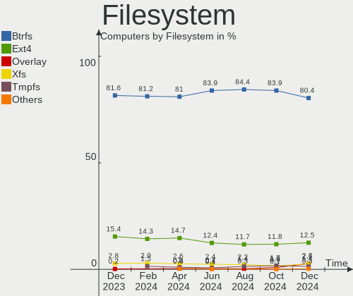
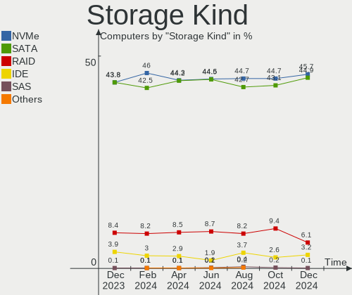
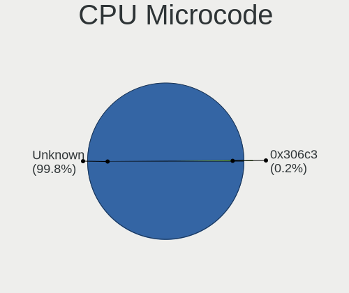
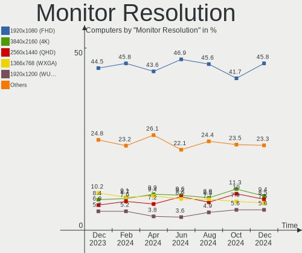
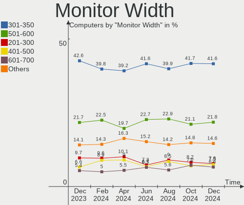
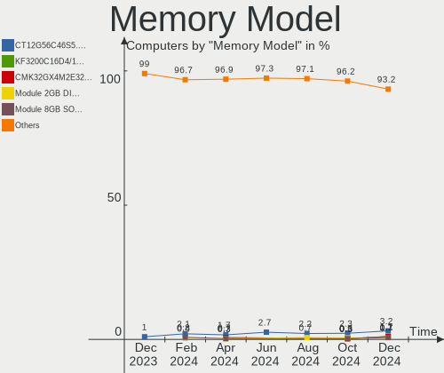
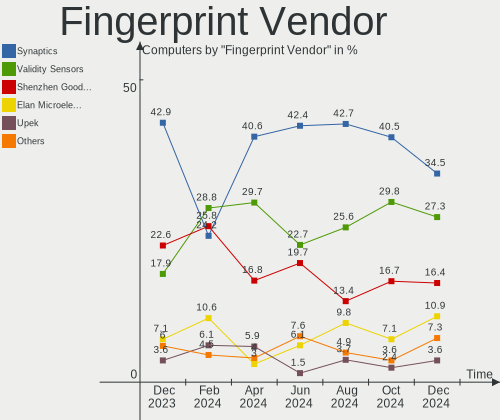

Fedora - Hardware Trends
------------------------

A project to identify most popular hardware characteristics and track their change
over time based on data collected by Linux users at https://Linux-Hardware.org.

Anyone can contribute to this report by the [hw-probe](https://github.com/linuxhw/hw-probe) tool:

    sudo -E hw-probe -all -upload

This is a report for all computer types. See also reports for [desktops](/Dist/Fedora/Desktop/README.md) and [notebooks](/Dist/Fedora/Notebook/README.md).

This report is for one last month. Overall report since the beginning of time: [TestDays](https://github.com/linuxhw/TestDays)

Period: Jun, 2023.

Contents
--------

* [ System ](#system)
  - [ OS                       ](#os)
  - [ OS Family                ](#os-family)
  - [ Kernel                   ](#kernel)
  - [ Kernel Family            ](#kernel-family)
  - [ Kernel Major Ver.        ](#kernel-major-ver)
  - [ Arch                     ](#arch)
  - [ DE                       ](#de)
  - [ Display Server           ](#display-server)
  - [ Display Manager          ](#display-manager)
  - [ OS Lang                  ](#os-lang)
  - [ Boot Mode                ](#boot-mode)
  - [ Filesystem               ](#filesystem)
  - [ Part. scheme             ](#part-scheme)
  - [ Dual Boot with Linux/BSD ](#dual-boot-with-linuxbsd)
  - [ Dual Boot (Win)          ](#dual-boot-win)

* [ Board ](#board)
  - [ Vendor                   ](#vendor)
  - [ Model                    ](#model)
  - [ Model Family             ](#model-family)
  - [ MFG Year                 ](#mfg-year)
  - [ Form Factor              ](#form-factor)
  - [ Secure Boot              ](#secure-boot)
  - [ Coreboot                 ](#coreboot)
  - [ RAM Size                 ](#ram-size)
  - [ RAM Used                 ](#ram-used)
  - [ Total Drives             ](#total-drives)
  - [ Has CD-ROM               ](#has-cd-rom)
  - [ Has Ethernet             ](#has-ethernet)
  - [ Has WiFi                 ](#has-wifi)
  - [ Has Bluetooth            ](#has-bluetooth)

* [ Location ](#location)
  - [ Country                  ](#country)
  - [ City                     ](#city)

* [ Drives ](#drives)
  - [ Drive Vendor             ](#drive-vendor)
  - [ Drive Model              ](#drive-model)
  - [ HDD Vendor               ](#hdd-vendor)
  - [ SSD Vendor               ](#ssd-vendor)
  - [ Drive Kind               ](#drive-kind)
  - [ Drive Connector          ](#drive-connector)
  - [ Drive Size               ](#drive-size)
  - [ Space Total              ](#space-total)
  - [ Space Used               ](#space-used)
  - [ Malfunc. Drives          ](#malfunc-drives)
  - [ Malfunc. Drive Vendor    ](#malfunc-drive-vendor)
  - [ Malfunc. HDD Vendor      ](#malfunc-hdd-vendor)
  - [ Malfunc. Drive Kind      ](#malfunc-drive-kind)
  - [ Failed Drives            ](#failed-drives)
  - [ Failed Drive Vendor      ](#failed-drive-vendor)
  - [ Drive Status             ](#drive-status)

* [ Storage controller ](#storage-controller)
  - [ Storage Vendor           ](#storage-vendor)
  - [ Storage Model            ](#storage-model)
  - [ Storage Kind             ](#storage-kind)

* [ Processor ](#processor)
  - [ CPU Vendor               ](#cpu-vendor)
  - [ CPU Model                ](#cpu-model)
  - [ CPU Model Family         ](#cpu-model-family)
  - [ CPU Cores                ](#cpu-cores)
  - [ CPU Sockets              ](#cpu-sockets)
  - [ CPU Threads              ](#cpu-threads)
  - [ CPU Op-Modes             ](#cpu-op-modes)
  - [ CPU Microcode            ](#cpu-microcode)
  - [ CPU Microarch            ](#cpu-microarch)

* [ Graphics ](#graphics)
  - [ GPU Vendor               ](#gpu-vendor)
  - [ GPU Model                ](#gpu-model)
  - [ GPU Combo                ](#gpu-combo)
  - [ GPU Driver               ](#gpu-driver)
  - [ GPU Memory               ](#gpu-memory)

* [ Monitor ](#monitor)
  - [ Monitor Vendor           ](#monitor-vendor)
  - [ Monitor Model            ](#monitor-model)
  - [ Monitor Resolution       ](#monitor-resolution)
  - [ Monitor Diagonal         ](#monitor-diagonal)
  - [ Monitor Width            ](#monitor-width)
  - [ Aspect Ratio             ](#aspect-ratio)
  - [ Monitor Area             ](#monitor-area)
  - [ Pixel Density            ](#pixel-density)
  - [ Multiple Monitors        ](#multiple-monitors)

* [ Network ](#network)
  - [ Net Controller Vendor    ](#net-controller-vendor)
  - [ Net Controller Model     ](#net-controller-model)
  - [ Wireless Vendor          ](#wireless-vendor)
  - [ Wireless Model           ](#wireless-model)
  - [ Ethernet Vendor          ](#ethernet-vendor)
  - [ Ethernet Model           ](#ethernet-model)
  - [ Net Controller Kind      ](#net-controller-kind)
  - [ Used Controller          ](#used-controller)
  - [ NICs                     ](#nics)
  - [ IPv6                     ](#ipv6)

* [ Bluetooth ](#bluetooth)
  - [ Bluetooth Vendor         ](#bluetooth-vendor)
  - [ Bluetooth Model          ](#bluetooth-model)

* [ Sound ](#sound)
  - [ Sound Vendor             ](#sound-vendor)
  - [ Sound Model              ](#sound-model)

* [ Memory ](#memory)
  - [ Memory Vendor            ](#memory-vendor)
  - [ Memory Model             ](#memory-model)
  - [ Memory Kind              ](#memory-kind)
  - [ Memory Form Factor       ](#memory-form-factor)
  - [ Memory Size              ](#memory-size)
  - [ Memory Speed             ](#memory-speed)

* [ Printers & scanners ](#printers--scanners)
  - [ Printer Vendor           ](#printer-vendor)
  - [ Printer Model            ](#printer-model)
  - [ Scanner Vendor           ](#scanner-vendor)
  - [ Scanner Model            ](#scanner-model)

* [ Camera ](#camera)
  - [ Camera Vendor            ](#camera-vendor)
  - [ Camera Model             ](#camera-model)

* [ Security ](#security)
  - [ Fingerprint Vendor       ](#fingerprint-vendor)
  - [ Fingerprint Model        ](#fingerprint-model)
  - [ Chipcard Vendor          ](#chipcard-vendor)
  - [ Chipcard Model           ](#chipcard-model)

* [ Unsupported ](#unsupported)
  - [ Unsupported Devices      ](#unsupported-devices)
  - [ Unsupported Device Types ](#unsupported-device-types)

System
------

OS
--

Installed operating systems

| Name      | Computers | Percent |
|-----------|-----------|---------|
| Fedora 38 | 443       | 91.34%  |
| Fedora 37 | 26        | 5.36%   |
| Fedora 36 | 11        | 2.27%   |
| Fedora 39 | 3         | 0.62%   |
| Fedora 35 | 1         | 0.21%   |
| Fedora 34 | 1         | 0.21%   |

OS Family
---------

OS without a version

| Name   | Computers | Percent |
|--------|-----------|---------|
| Fedora | 485       | 100%    |

Kernel
------

Version of the Linux kernel

| Version                                                | Computers | Percent |
|--------------------------------------------------------|-----------|---------|
| 6.3.8-200.fc38.x86_64                                  | 117       | 24.12%  |
| 6.3.5-200.fc38.x86_64                                  | 74        | 15.26%  |
| 6.3.6-200.fc38.x86_64                                  | 61        | 12.58%  |
| 6.3.7-200.fc38.x86_64                                  | 47        | 9.69%   |
| 6.3.4-201.fc38.x86_64                                  | 47        | 9.69%   |
| 6.2.9-300.fc38.x86_64                                  | 46        | 9.48%   |
| 6.2.15-300.fc38.x86_64                                 | 32        | 6.6%    |
| 6.2.15-100.fc36.x86_64                                 | 6         | 1.24%   |
| 6.3.8-100.fc37.x86_64                                  | 5         | 1.03%   |
| 6.2.15-200.fc37.x86_64                                 | 5         | 1.03%   |
| 6.3.7-100.fc37.x86_64                                  | 3         | 0.62%   |
| 6.3.5-100.fc37.x86_64                                  | 3         | 0.62%   |
| 6.3.4-101.fc37.x86_64                                  | 3         | 0.62%   |
| 6.2.14-300.fc38.x86_64                                 | 3         | 0.62%   |
| 6.4.0-0.rc6.20230614gitb6dad5178cea.49.fc39.x86_64     | 2         | 0.41%   |
| 6.2.12-300.fc38.x86_64                                 | 2         | 0.41%   |
| 6.0.7-301.fc37.x86_64                                  | 2         | 0.41%   |
| 6.0.11-300.fc37.x86_64                                 | 2         | 0.41%   |
| 6.4.0-0.rc5.20230607gta4d7d701.342.vanilla.fc38.x86_64 | 1         | 0.21%   |
| 6.4.0-0.rc4.334.vanilla.fc38.x86_64                    | 1         | 0.21%   |
| 6.4.0-0.rc4.20230601git929ed21dfdb6.38.fc39.x86_64     | 1         | 0.21%   |
| 6.3.9-200.fc38.x86_64                                  | 1         | 0.21%   |
| 6.3.8-206.rog.fc38.x86_64                              | 1         | 0.21%   |
| 6.3.6-cb1.0.fc38.x86_64                                | 1         | 0.21%   |
| 6.3.6-100.fc37.x86_64                                  | 1         | 0.21%   |
| 6.3.3-1.surface.fc38.x86_64                            | 1         | 0.21%   |
| 6.3.1-eupnea                                           | 1         | 0.21%   |
| 6.2.7-200.fc37.x86_64                                  | 1         | 0.21%   |
| 6.2.15-703.inttf.fc38.x86_64                           | 1         | 0.21%   |
| 6.2.14-200.fc37.x86_64                                 | 1         | 0.21%   |
| 6.2.14-100.fc36.x86_64                                 | 1         | 0.21%   |
| 6.2.13-300.fc38.x86_64                                 | 1         | 0.21%   |
| 6.2.12-100.fc36.x86_64                                 | 1         | 0.21%   |
| 6.1.8-100.fc36.x86_64                                  | 1         | 0.21%   |
| 6.1.31-200.fc38.x86_64                                 | 1         | 0.21%   |
| 6.0.9-300.fc37.x86_64                                  | 1         | 0.21%   |
| 6.0.8-300.fc37.x86_64                                  | 1         | 0.21%   |
| 6.0.7-200.fc36.x86_64                                  | 1         | 0.21%   |
| 6.0.18-200.fc36.x86_64                                 | 1         | 0.21%   |
| 6.0.12-100.fc35.x86_64                                 | 1         | 0.21%   |

Kernel Family
-------------

Linux kernel without a distro release

| Version  | Computers | Percent |
|----------|-----------|---------|
| 6.3.8    | 123       | 25.36%  |
| 6.3.5    | 77        | 15.88%  |
| 6.3.6    | 63        | 12.99%  |
| 6.3.7    | 50        | 10.31%  |
| 6.3.4    | 50        | 10.31%  |
| 6.2.9    | 46        | 9.48%   |
| 6.2.15   | 44        | 9.07%   |
| 6.4.0    | 5         | 1.03%   |
| 6.2.14   | 5         | 1.03%   |
| 6.2.12   | 3         | 0.62%   |
| 6.0.7    | 3         | 0.62%   |
| 6.0.11   | 2         | 0.41%   |
| 6.3.9    | 1         | 0.21%   |
| 6.3.3    | 1         | 0.21%   |
| 6.3.1    | 1         | 0.21%   |
| 6.2.7    | 1         | 0.21%   |
| 6.2.13   | 1         | 0.21%   |
| 6.1.8    | 1         | 0.21%   |
| 6.1.31   | 1         | 0.21%   |
| 6.0.9    | 1         | 0.21%   |
| 6.0.8    | 1         | 0.21%   |
| 6.0.18   | 1         | 0.21%   |
| 6.0.12   | 1         | 0.21%   |
| 5.17.12  | 1         | 0.21%   |
| 5.11.18  | 1         | 0.21%   |
| 5.10.178 | 1         | 0.21%   |

Kernel Major Ver.
-----------------

Linux kernel major version

| Version | Computers | Percent |
|---------|-----------|---------|
| 6.3     | 366       | 75.46%  |
| 6.2     | 100       | 20.62%  |
| 6.0     | 9         | 1.86%   |
| 6.4     | 5         | 1.03%   |
| 6.1     | 2         | 0.41%   |
| 5.17    | 1         | 0.21%   |
| 5.11    | 1         | 0.21%   |
| 5.10    | 1         | 0.21%   |

Arch
----

OS architecture (x86_64, i586, etc.)

| Name    | Computers | Percent |
|---------|-----------|---------|
| x86_64  | 484       | 99.79%  |
| aarch64 | 1         | 0.21%   |

DE
--

Desktop Environment

| Name          | Computers | Percent |
|---------------|-----------|---------|
| GNOME         | 357       | 73.61%  |
| KDE5          | 77        | 15.88%  |
| XFCE          | 10        | 2.06%   |
| Cinnamon      | 9         | 1.86%   |
| Unknown       | 9         | 1.86%   |
| X-Cinnamon    | 6         | 1.24%   |
| GNOME Classic | 6         | 1.24%   |
| MATE          | 3         | 0.62%   |
| sway          | 2         | 0.41%   |
| LXDE          | 2         | 0.41%   |
| Budgie        | 2         | 0.41%   |
| LXQt          | 1         | 0.21%   |
| i3            | 1         | 0.21%   |

Display Server
--------------

X11 or Wayland

| Name    | Computers | Percent |
|---------|-----------|---------|
| Wayland | 378       | 77.94%  |
| X11     | 88        | 18.14%  |
| Tty     | 14        | 2.89%   |
| Unknown | 5         | 1.03%   |

Display Manager
---------------

SDDM, LightDM, etc.

| Name    | Computers | Percent |
|---------|-----------|---------|
| Unknown | 292       | 60.21%  |
| GDM     | 133       | 27.42%  |
| SDDM    | 35        | 7.22%   |
| LightDM | 23        | 4.74%   |
| LXDM    | 2         | 0.41%   |

OS Lang
-------

Language

| Lang    | Computers | Percent |
|---------|-----------|---------|
| en_US   | 259       | 53.4%   |
| en_GB   | 32        | 6.6%    |
| de_DE   | 24        | 4.95%   |
| ru_RU   | 22        | 4.54%   |
| en_AU   | 17        | 3.51%   |
| pt_BR   | 15        | 3.09%   |
| en_CA   | 14        | 2.89%   |
| fr_FR   | 13        | 2.68%   |
| pl_PL   | 9         | 1.86%   |
| it_IT   | 8         | 1.65%   |
| es_ES   | 8         | 1.65%   |
| es_MX   | 7         | 1.44%   |
| es_CL   | 6         | 1.24%   |
| es_AR   | 6         | 1.24%   |
| en_IN   | 5         | 1.03%   |
| cs_CZ   | 4         | 0.82%   |
| zh_CN   | 3         | 0.62%   |
| es_PE   | 3         | 0.62%   |
| en_NZ   | 3         | 0.62%   |
| en_DK   | 3         | 0.62%   |
| tr_TR   | 2         | 0.41%   |
| sk_SK   | 2         | 0.41%   |
| pt_PT   | 2         | 0.41%   |
| hu_HU   | 2         | 0.41%   |
| es_CO   | 2         | 0.41%   |
| Unknown | 2         | 0.41%   |
| nl_NL   | 1         | 0.21%   |
| lt_LT   | 1         | 0.21%   |
| id_ID   | 1         | 0.21%   |
| ga_IE   | 1         | 0.21%   |
| fr_CA   | 1         | 0.21%   |
| es_UY   | 1         | 0.21%   |
| es_CR   | 1         | 0.21%   |
| en_IL   | 1         | 0.21%   |
| de_AT   | 1         | 0.21%   |
| da_DK   | 1         | 0.21%   |
| C       | 1         | 0.21%   |
| ar_SA   | 1         | 0.21%   |

Boot Mode
---------

EFI or BIOS

| Mode | Computers | Percent |
|------|-----------|---------|
| EFI  | 389       | 80.21%  |
| BIOS | 96        | 19.79%  |

Filesystem
----------

Type of filesystem

| Type    | Computers | Percent |
|---------|-----------|---------|
| Btrfs   | 394       | 81.24%  |
| Ext4    | 80        | 16.49%  |
| Xfs     | 9         | 1.86%   |
| Overlay | 1         | 0.21%   |
| Unknown | 1         | 0.21%   |

Part. scheme
------------

Scheme of partitioning

| Type    | Computers | Percent |
|---------|-----------|---------|
| Unknown | 282       | 58.14%  |
| GPT     | 185       | 38.14%  |
| MBR     | 18        | 3.71%   |

Dual Boot with Linux/BSD
------------------------

Hosting more than one Linux/BSD

| Dual boot | Computers | Percent |
|-----------|-----------|---------|
| No        | 435       | 89.69%  |
| Yes       | 50        | 10.31%  |

Dual Boot (Win)
---------------

Hosting Linux and Windows

| Dual boot | Computers | Percent |
|-----------|-----------|---------|
| No        | 411       | 84.74%  |
| Yes       | 74        | 15.26%  |

Board
-----

Vendor
------

Motherboard manufacturer

| Name                  | Computers | Percent |
|-----------------------|-----------|---------|
| Lenovo                | 103       | 21.24%  |
| Hewlett-Packard       | 67        | 13.81%  |
| ASUSTek Computer      | 66        | 13.61%  |
| Dell                  | 63        | 12.99%  |
| Gigabyte Technology   | 35        | 7.22%   |
| MSI                   | 34        | 7.01%   |
| Apple                 | 20        | 4.12%   |
| Acer                  | 18        | 3.71%   |
| ASRock                | 8         | 1.65%   |
| Samsung Electronics   | 5         | 1.03%   |
| Google                | 5         | 1.03%   |
| Toshiba               | 4         | 0.82%   |
| Intel                 | 4         | 0.82%   |
| HUAWEI                | 4         | 0.82%   |
| Unknown               | 4         | 0.82%   |
| Timi                  | 3         | 0.62%   |
| Sony                  | 3         | 0.62%   |
| Microsoft             | 3         | 0.62%   |
| Itautec               | 3         | 0.62%   |
| TUXEDO                | 2         | 0.41%   |
| Positivo Bahia - VAIO | 2         | 0.41%   |
| HONOR                 | 2         | 0.41%   |
| Framework             | 2         | 0.41%   |
| AZW                   | 2         | 0.41%   |
| AMI                   | 2         | 0.41%   |
| Xplore                | 1         | 0.21%   |
| UNOWHY                | 1         | 0.21%   |
| TYAN Computer         | 1         | 0.21%   |
| System76              | 1         | 0.21%   |
| realme                | 1         | 0.21%   |
| Razer                 | 1         | 0.21%   |
| Pegatron              | 1         | 0.21%   |
| Oracle                | 1         | 0.21%   |
| Notebook              | 1         | 0.21%   |
| MECHREVO              | 1         | 0.21%   |
| Kllisre               | 1         | 0.21%   |
| iRU                   | 1         | 0.21%   |
| Intel Client Systems  | 1         | 0.21%   |
| Huanan                | 1         | 0.21%   |
| HPE                   | 1         | 0.21%   |

Model
-----

Motherboard model

| Name                                    | Computers | Percent |
|-----------------------------------------|-----------|---------|
| Unknown                                 | 5         | 1.03%   |
| Lenovo IdeaPad 3 15ITL6 82H8            | 3         | 0.62%   |
| Itautec Infoway ST-4265                 | 3         | 0.62%   |
| ASUS All Series                         | 3         | 0.62%   |
| Apple MacBookPro9,2                     | 3         | 0.62%   |
| Apple MacBookPro8,1                     | 3         | 0.62%   |
| Samsung 750QFG                          | 2         | 0.41%   |
| Positivo Bahia - VAIO VJFE43F11X-XXXXXX | 2         | 0.41%   |
| MSI MS-7C94                             | 2         | 0.41%   |
| Lenovo ThinkPad X220 42911H8            | 2         | 0.41%   |
| Lenovo Legion 5 15ACH6A 82NW            | 2         | 0.41%   |
| Lenovo IdeaPadFlex 5 14ITL05 82HS       | 2         | 0.41%   |
| Lenovo IdeaPad L340-15API 81LW          | 2         | 0.41%   |
| Lenovo IdeaPad 5 Pro 14ACN6 82L7        | 2         | 0.41%   |
| HP ZBook 15 G2                          | 2         | 0.41%   |
| HP Pavilion Laptop 14-ec1xxx            | 2         | 0.41%   |
| HP Pavilion g6                          | 2         | 0.41%   |
| HP OMEN by Laptop 16-c0xxx              | 2         | 0.41%   |
| HP ENVY x360 Convertible 13-ay0xxx      | 2         | 0.41%   |
| Gigabyte X570 I AORUS PRO WIFI          | 2         | 0.41%   |
| Framework Laptop                        | 2         | 0.41%   |
| Dell XPS 15 9510                        | 2         | 0.41%   |
| Dell Vostro 2520                        | 2         | 0.41%   |
| Dell OptiPlex 9020                      | 2         | 0.41%   |
| Dell OptiPlex 7010                      | 2         | 0.41%   |
| Dell Latitude E7470                     | 2         | 0.41%   |
| Dell Latitude 3420                      | 2         | 0.41%   |
| ASUS ROG STRIX B650E-F GAMING WIFI      | 2         | 0.41%   |
| ASUS ROG STRIX B550-I GAMING            | 2         | 0.41%   |
| ASUS P8Z77-V LK                         | 2         | 0.41%   |
| Apple MacBookPro12,1                    | 2         | 0.41%   |
| Apple MacBookAir5,2                     | 2         | 0.41%   |
| Acer Nitro AN515-55                     | 2         | 0.41%   |
| Xplore iX104C6                          | 1         | 0.21%   |
| UNOWHY Y13G002S4EI                      | 1         | 0.21%   |
| TYAN S7020                              | 1         | 0.21%   |
| TUXEDO Stellaris Intel Gen4             | 1         | 0.21%   |
| TUXEDO Pulse 15 Gen2                    | 1         | 0.21%   |
| Toshiba TECRA Z40t-C                    | 1         | 0.21%   |
| Toshiba Satellite L40                   | 1         | 0.21%   |

Model Family
------------

Motherboard model prefix

| Name                                    | Computers | Percent |
|-----------------------------------------|-----------|---------|
| Lenovo ThinkPad                         | 48        | 9.9%    |
| Lenovo IdeaPad                          | 20        | 4.12%   |
| HP Pavilion                             | 19        | 3.92%   |
| Dell Inspiron                           | 19        | 3.92%   |
| ASUS ROG                                | 19        | 3.92%   |
| Dell Latitude                           | 18        | 3.71%   |
| Acer Aspire                             | 11        | 2.27%   |
| Dell XPS                                | 10        | 2.06%   |
| ASUS VivoBook                           | 10        | 2.06%   |
| Lenovo Legion                           | 9         | 1.86%   |
| HP ENVY                                 | 9         | 1.86%   |
| HP EliteBook                            | 9         | 1.86%   |
| Lenovo Yoga                             | 8         | 1.65%   |
| Dell OptiPlex                           | 8         | 1.65%   |
| ASUS PRIME                              | 8         | 1.65%   |
| ASUS TUF                                | 7         | 1.44%   |
| HP Laptop                               | 6         | 1.24%   |
| Unknown                                 | 5         | 1.03%   |
| MSI Modern                              | 4         | 0.82%   |
| Lenovo IdeaPadFlex                      | 4         | 0.82%   |
| HP OMEN                                 | 4         | 0.82%   |
| Dell Precision                          | 4         | 0.82%   |
| Acer Nitro                              | 4         | 0.82%   |
| Microsoft Surface                       | 3         | 0.62%   |
| Lenovo ThinkBook                        | 3         | 0.62%   |
| Itautec Infoway                         | 3         | 0.62%   |
| HP ZBook                                | 3         | 0.62%   |
| HP Spectre                              | 3         | 0.62%   |
| HP ProBook                              | 3         | 0.62%   |
| HP Compaq                               | 3         | 0.62%   |
| ASUS All                                | 3         | 0.62%   |
| Apple MacBookPro9                       | 3         | 0.62%   |
| Apple MacBookPro8                       | 3         | 0.62%   |
| Toshiba Satellite                       | 2         | 0.41%   |
| Samsung 750QFG                          | 2         | 0.41%   |
| Positivo Bahia - VAIO VJFE43F11X-XXXXXX | 2         | 0.41%   |
| MSI PS63                                | 2         | 0.41%   |
| MSI MS-7C94                             | 2         | 0.41%   |
| Lenovo ThinkCentre                      | 2         | 0.41%   |
| HP EliteDesk                            | 2         | 0.41%   |

MFG Year
--------

Motherboard manufacture year

| Year    | Computers | Percent |
|---------|-----------|---------|
| 2021    | 80        | 16.49%  |
| 2022    | 53        | 10.93%  |
| 2019    | 53        | 10.93%  |
| 2020    | 52        | 10.72%  |
| 2018    | 48        | 9.9%    |
| 2017    | 30        | 6.19%   |
| 2012    | 26        | 5.36%   |
| 2015    | 24        | 4.95%   |
| 2013    | 22        | 4.54%   |
| 2016    | 19        | 3.92%   |
| 2014    | 18        | 3.71%   |
| 2011    | 18        | 3.71%   |
| 2023    | 17        | 3.51%   |
| 2010    | 14        | 2.89%   |
| 2009    | 3         | 0.62%   |
| 2007    | 3         | 0.62%   |
| 2008    | 2         | 0.41%   |
| 2006    | 2         | 0.41%   |
| Unknown | 1         | 0.21%   |

Form Factor
-----------

Physical design of the computer

| Name           | Computers | Percent |
|----------------|-----------|---------|
| Notebook       | 288       | 59.38%  |
| Desktop        | 148       | 30.52%  |
| Convertible    | 26        | 5.36%   |
| Tablet         | 7         | 1.44%   |
| Mini pc        | 6         | 1.24%   |
| All in one     | 5         | 1.03%   |
| Server         | 4         | 0.82%   |
| System on chip | 1         | 0.21%   |

Secure Boot
-----------

Enabled or disabled

| State    | Computers | Percent |
|----------|-----------|---------|
| Disabled | 382       | 78.76%  |
| Enabled  | 103       | 21.24%  |

Coreboot
--------

Have coreboot on board

| Used | Computers | Percent |
|------|-----------|---------|
| No   | 479       | 98.76%  |
| Yes  | 6         | 1.24%   |

RAM Size
--------

Total RAM memory

| Size in GB      | Computers | Percent |
|-----------------|-----------|---------|
| 4.01-8.0        | 122       | 25.15%  |
| 16.01-24.0      | 119       | 24.54%  |
| 8.01-16.0       | 90        | 18.56%  |
| 32.01-64.0      | 72        | 14.85%  |
| 3.01-4.0        | 36        | 7.42%   |
| 64.01-256.0     | 23        | 4.74%   |
| 24.01-32.0      | 18        | 3.71%   |
| 1.01-2.0        | 3         | 0.62%   |
| More than 256.0 | 1         | 0.21%   |
| 2.01-3.0        | 1         | 0.21%   |

RAM Used
--------

Used RAM memory

| Used GB     | Computers | Percent |
|-------------|-----------|---------|
| 4.01-8.0    | 164       | 33.81%  |
| 2.01-3.0    | 118       | 24.33%  |
| 3.01-4.0    | 110       | 22.68%  |
| 1.01-2.0    | 46        | 9.48%   |
| 8.01-16.0   | 33        | 6.8%    |
| 16.01-24.0  | 5         | 1.03%   |
| 0.51-1.0    | 5         | 1.03%   |
| 32.01-64.0  | 3         | 0.62%   |
| 64.01-256.0 | 1         | 0.21%   |

Total Drives
------------

Number of drives on board

| Drives | Computers | Percent |
|--------|-----------|---------|
| 1      | 305       | 62.89%  |
| 2      | 114       | 23.51%  |
| 3      | 28        | 5.77%   |
| 4      | 18        | 3.71%   |
| 5      | 12        | 2.47%   |
| 0      | 4         | 0.82%   |
| 6      | 3         | 0.62%   |
| 8      | 1         | 0.21%   |

Has CD-ROM
----------

Has CD-ROM on board

| Presented | Computers | Percent |
|-----------|-----------|---------|
| No        | 384       | 79.18%  |
| Yes       | 101       | 20.82%  |

Has Ethernet
------------

Has Ethernet on board

| Presented | Computers | Percent |
|-----------|-----------|---------|
| Yes       | 374       | 77.11%  |
| No        | 111       | 22.89%  |

Has WiFi
--------

Has WiFi module

| Presented | Computers | Percent |
|-----------|-----------|---------|
| Yes       | 407       | 83.92%  |
| No        | 78        | 16.08%  |

Has Bluetooth
-------------

Has Bluetooth module

| Presented | Computers | Percent |
|-----------|-----------|---------|
| Yes       | 371       | 76.49%  |
| No        | 114       | 23.51%  |

Location
--------

Country
-------

Geographic location (country)

| Country      | Computers | Percent |
|--------------|-----------|---------|
| USA          | 89        | 18.35%  |
| Germany      | 31        | 6.39%   |
| Brazil       | 28        | 5.77%   |
| Russia       | 25        | 5.15%   |
| Canada       | 22        | 4.54%   |
| India        | 17        | 3.51%   |
| Netherlands  | 16        | 3.3%    |
| Australia    | 16        | 3.3%    |
| Poland       | 14        | 2.89%   |
| Italy        | 14        | 2.89%   |
| UK           | 13        | 2.68%   |
| France       | 13        | 2.68%   |
| Chile        | 11        | 2.27%   |
| Mexico       | 10        | 2.06%   |
| Switzerland  | 8         | 1.65%   |
| Finland      | 8         | 1.65%   |
| Czechia      | 8         | 1.65%   |
| Turkey       | 7         | 1.44%   |
| Spain        | 7         | 1.44%   |
| Argentina    | 7         | 1.44%   |
| Singapore    | 6         | 1.24%   |
| Romania      | 5         | 1.03%   |
| Portugal     | 5         | 1.03%   |
| Norway       | 5         | 1.03%   |
| Israel       | 4         | 0.82%   |
| Ireland      | 4         | 0.82%   |
| Indonesia    | 4         | 0.82%   |
| Colombia     | 4         | 0.82%   |
| Belarus      | 4         | 0.82%   |
| Austria      | 4         | 0.82%   |
| Thailand     | 3         | 0.62%   |
| Sweden       | 3         | 0.62%   |
| Saudi Arabia | 3         | 0.62%   |
| Peru         | 3         | 0.62%   |
| New Zealand  | 3         | 0.62%   |
| Hungary      | 3         | 0.62%   |
| Costa Rica   | 3         | 0.62%   |
| Belgium      | 3         | 0.62%   |
| Vietnam      | 2         | 0.41%   |
| Slovakia     | 2         | 0.41%   |

City
----

Geographic location (city)

| City            | Computers | Percent |
|-----------------|-----------|---------|
| Sydney          | 10        | 2.06%   |
| Moscow          | 10        | 2.06%   |
| Helsinki        | 8         | 1.65%   |
| Santiago        | 7         | 1.44%   |
| Berlin          | 7         | 1.44%   |
| Singapore       | 6         | 1.24%   |
| Sao Paulo       | 4         | 0.82%   |
| Palmas          | 4         | 0.82%   |
| Montreal        | 4         | 0.82%   |
| Minsk           | 4         | 0.82%   |
| Melbourne       | 4         | 0.82%   |
| Delhi           | 4         | 0.82%   |
| Amsterdam       | 4         | 0.82%   |
| Zurich          | 3         | 0.62%   |
| Warsaw          | 3         | 0.62%   |
| Tel Aviv        | 3         | 0.62%   |
| San Jose        | 3         | 0.62%   |
| Prague          | 3         | 0.62%   |
| Plymouth        | 3         | 0.62%   |
| Ottawa          | 3         | 0.62%   |
| Istanbul        | 3         | 0.62%   |
| Bengaluru       | 3         | 0.62%   |
| Bangkok         | 3         | 0.62%   |
| Atlanta         | 3         | 0.62%   |
| Zagreb          | 2         | 0.41%   |
| Yerevan         | 2         | 0.41%   |
| Wellington      | 2         | 0.41%   |
| Vienna          | 2         | 0.41%   |
| Toronto         | 2         | 0.41%   |
| Tacoma          | 2         | 0.41%   |
| St Petersburg   | 2         | 0.41%   |
| South Bend      | 2         | 0.41%   |
| Sofia           | 2         | 0.41%   |
| Seattle         | 2         | 0.41%   |
| San Antonio     | 2         | 0.41%   |
| Rome            | 2         | 0.41%   |
| Rochester       | 2         | 0.41%   |
| Riyadh          | 2         | 0.41%   |
| Querétaro City | 2         | 0.41%   |
| Poznan          | 2         | 0.41%   |

Drives
------

Drive Vendor
------------

Hard drive vendors

| Vendor                         | Computers | Drives | Percent |
|--------------------------------|-----------|--------|---------|
| Samsung Electronics            | 142       | 172    | 20.46%  |
| Sandisk                        | 67        | 72     | 9.65%   |
| Seagate                        | 60        | 76     | 8.65%   |
| WDC                            | 59        | 75     | 8.5%    |
| Kingston                       | 44        | 46     | 6.34%   |
| Intel                          | 34        | 37     | 4.9%    |
| Toshiba                        | 33        | 38     | 4.76%   |
| Unknown                        | 27        | 30     | 3.89%   |
| Crucial                        | 26        | 26     | 3.75%   |
| SK hynix                       | 21        | 21     | 3.03%   |
| KIOXIA                         | 15        | 15     | 2.16%   |
| Micron Technology              | 14        | 14     | 2.02%   |
| Apple                          | 13        | 15     | 1.87%   |
| Micron/Crucial Technology      | 9         | 10     | 1.3%    |
| China                          | 9         | 9      | 1.3%    |
| A-DATA Technology              | 9         | 9      | 1.3%    |
| Phison Electronics             | 8         | 9      | 1.15%   |
| Kingston Technology Company    | 8         | 8      | 1.15%   |
| Silicon Motion                 | 7         | 7      | 1.01%   |
| Hitachi                        | 7         | 8      | 1.01%   |
| JMicron Technology             | 6         | 6      | 0.86%   |
| Union Memory (Shenzhen)        | 5         | 5      | 0.72%   |
| GOODRAM                        | 4         | 4      | 0.58%   |
| Gigabyte Technology            | 4         | 4      | 0.58%   |
| SPCC                           | 3         | 3      | 0.43%   |
| Netac                          | 3         | 4      | 0.43%   |
| Intenso                        | 3         | 3      | 0.43%   |
| HGST                           | 3         | 3      | 0.43%   |
| Union Memory                   | 2         | 2      | 0.29%   |
| Solid State Storage Technology | 2         | 2      | 0.29%   |
| Solid State Storage            | 2         | 2      | 0.29%   |
| Realtek Semiconductor          | 2         | 2      | 0.29%   |
| QNAP                           | 2         | 2      | 0.29%   |
| PNY                            | 2         | 3      | 0.29%   |
| Patriot                        | 2         | 2      | 0.29%   |
| Maxtor                         | 2         | 2      | 0.29%   |
| MAXIO Technology (Hangzhou)    | 2         | 2      | 0.29%   |
| LITEON                         | 2         | 2      | 0.29%   |
| KingSpec                       | 2         | 2      | 0.29%   |
| ASMT                           | 2         | 2      | 0.29%   |

Drive Model
-----------

Hard drive models

| Model                                                 | Computers | Percent |
|-------------------------------------------------------|-----------|---------|
| Samsung NVMe SSD Controller SM981/PM981/PM983 250GB   | 31        | 4.1%    |
| Samsung NVMe SSD Controller PM9A1/PM9A3/980PRO 2TB    | 27        | 3.57%   |
| Unknown MMC Card  64GB                                | 13        | 1.72%   |
| Intel SSD 660P Series 512GB                           | 11        | 1.45%   |
| Sandisk WD Blue SN550 NVMe SSD 1TB                    | 9         | 1.19%   |
| Sandisk WD Black SN750 / PC SN730 NVMe SSD 500GB      | 8         | 1.06%   |
| Samsung SSD 860 EVO 500GB                             | 8         | 1.06%   |
| Kingston SA400S37240G 240GB SSD                       | 8         | 1.06%   |
| Unknown MMC Card  128GB                               | 7         | 0.92%   |
| Kingston SA400S37480G 480GB SSD                       | 7         | 0.92%   |
| Samsung SSD 870 EVO 1TB                               | 6         | 0.79%   |
| Samsung SSD 850 EVO 250GB                             | 6         | 0.79%   |
| Micron/Crucial P2 NVMe PCIe SSD 4TB                   | 6         | 0.79%   |
| Kingston SA400S37120G 120GB SSD                       | 6         | 0.79%   |
| Crucial CT1000MX500SSD1 1TB                           | 6         | 0.79%   |
| Silicon Motion SM2263EN/SM2263XT SSD Controller 256GB | 5         | 0.66%   |
| Samsung SSD 980 1TB                                   | 5         | 0.66%   |
| Samsung SSD 860 EVO 1TB                               | 5         | 0.66%   |
| JMicron Generic 240GB                                 | 5         | 0.66%   |
| Intel SSDPEKNU512GZ 512GB                             | 5         | 0.66%   |
| Toshiba XG6 NVMe SSD Controller 2TB                   | 4         | 0.53%   |
| Toshiba DT01ACA100 1TB                                | 4         | 0.53%   |
| Seagate ST500DM002-1BD142 500GB                       | 4         | 0.53%   |
| Seagate ST2000DM006-2DM164 2TB                        | 4         | 0.53%   |
| Seagate ST1000LM035-1RK172 1TB                        | 4         | 0.53%   |
| Seagate ST1000DM010-2EP102 1TB                        | 4         | 0.53%   |
| Phison E12 NVMe Controller 1TB                        | 4         | 0.53%   |
| Kingston SV300S37A120G 120GB SSD                      | 4         | 0.53%   |
| Kingston SNVS500G 500GB                               | 4         | 0.53%   |
| Crucial CT500MX500SSD1 500GB                          | 4         | 0.53%   |
| WDC WD10EZEX-60WN4A0 1TB                              | 3         | 0.4%    |
| Unknown MMC Card  32GB                                | 3         | 0.4%    |
| Union Memory (Shenzhen) UMIS RPJTJ512MGE1QDQ 512GB    | 3         | 0.4%    |
| Seagate ST3500413AS 500GB                             | 3         | 0.4%    |
| Seagate ST31000524AS 1TB                              | 3         | 0.4%    |
| Sandisk WD Blue SN570 1TB                             | 3         | 0.4%    |
| Sandisk WD Blue SN500 / PC SN520 NVMe SSD 500GB       | 3         | 0.4%    |
| Sandisk WD Black SN850 1TB                            | 3         | 0.4%    |
| Sandisk WD Black 2018/SN750 / PC SN720 NVMe SSD 500GB | 3         | 0.4%    |
| Samsung SSD 870 EVO 500GB                             | 3         | 0.4%    |

HDD Vendor
----------

Hard disk drive vendors

| Vendor              | Computers | Drives | Percent |
|---------------------|-----------|--------|---------|
| Seagate             | 57        | 72     | 38.51%  |
| WDC                 | 49        | 63     | 33.11%  |
| Toshiba             | 19        | 20     | 12.84%  |
| Hitachi             | 7         | 8      | 4.73%   |
| Samsung Electronics | 5         | 5      | 3.38%   |
| Apple               | 4         | 4      | 2.7%    |
| HGST                | 3         | 3      | 2.03%   |
| QNAP                | 2         | 2      | 1.35%   |
| Maxtor              | 2         | 2      | 1.35%   |

SSD Vendor
----------

Solid state drive vendors

| Vendor              | Computers | Drives | Percent |
|---------------------|-----------|--------|---------|
| Samsung Electronics | 60        | 69     | 26.09%  |
| Kingston            | 32        | 33     | 13.91%  |
| Crucial             | 26        | 26     | 11.3%   |
| SanDisk             | 19        | 21     | 8.26%   |
| WDC                 | 11        | 11     | 4.78%   |
| China               | 9         | 9      | 3.91%   |
| A-DATA Technology   | 8         | 8      | 3.48%   |
| Toshiba             | 7         | 7      | 3.04%   |
| Intel               | 7         | 8      | 3.04%   |
| Apple               | 7         | 7      | 3.04%   |
| Micron Technology   | 4         | 4      | 1.74%   |
| GOODRAM             | 4         | 4      | 1.74%   |
| SPCC                | 3         | 3      | 1.3%    |
| Gigabyte Technology | 3         | 3      | 1.3%    |
| PNY                 | 2         | 3      | 0.87%   |
| Patriot             | 2         | 2      | 0.87%   |
| LITEON              | 2         | 2      | 0.87%   |
| KingSpec            | 2         | 2      | 0.87%   |
| Apacer              | 2         | 2      | 0.87%   |
| Super Talent        | 1         | 1      | 0.43%   |
| SSSTC               | 1         | 1      | 0.43%   |
| Smartbuy            | 1         | 1      | 0.43%   |
| SK hynix            | 1         | 1      | 0.43%   |
| Seagate             | 1         | 1      | 0.43%   |
| Ramsta              | 1         | 1      | 0.43%   |
| Palit               | 1         | 1      | 0.43%   |
| OEM                 | 1         | 1      | 0.43%   |
| OCZ                 | 1         | 1      | 0.43%   |
| Netac               | 1         | 1      | 0.43%   |
| KUIJIA              | 1         | 1      | 0.43%   |
| KingDian            | 1         | 1      | 0.43%   |
| Kimtigo             | 1         | 1      | 0.43%   |
| Hewlett-Packard     | 1         | 1      | 0.43%   |
| FORESEE             | 1         | 1      | 0.43%   |
| Digma               | 1         | 1      | 0.43%   |
| ASMT                | 1         | 1      | 0.43%   |
| Advantech           | 1         | 1      | 0.43%   |
| Acer                | 1         | 1      | 0.43%   |
| Unknown             | 1         | 1      | 0.43%   |

Drive Kind
----------

HDD or SSD

| Kind    | Computers | Drives | Percent |
|---------|-----------|--------|---------|
| NVMe    | 271       | 320    | 42.34%  |
| SSD     | 206       | 244    | 32.19%  |
| HDD     | 127       | 179    | 19.84%  |
| MMC     | 25        | 27     | 3.91%   |
| Unknown | 11        | 12     | 1.72%   |

Drive Connector
---------------

SATA, SAS, NVMe, etc.

| Type | Computers | Drives | Percent |
|------|-----------|--------|---------|
| NVMe | 269       | 313    | 46.78%  |
| SATA | 258       | 413    | 44.87%  |
| MMC  | 25        | 27     | 4.35%   |
| SAS  | 23        | 29     | 4%      |

Drive Size
----------

Size of hard drive

| Size in TB | Computers | Drives | Percent |
|------------|-----------|--------|---------|
| 0.01-0.5   | 183       | 240    | 54.46%  |
| 0.51-1.0   | 105       | 125    | 31.25%  |
| 1.01-2.0   | 26        | 27     | 7.74%   |
| 3.01-4.0   | 10        | 14     | 2.98%   |
| 4.01-10.0  | 6         | 7      | 1.79%   |
| 2.01-3.0   | 5         | 6      | 1.49%   |
| 10.01-20.0 | 1         | 4      | 0.3%    |

Space Total
-----------

Amount of disk space available on the file system

| Size in GB     | Computers | Percent |
|----------------|-----------|---------|
| 501-1000       | 103       | 21.24%  |
| 251-500        | 93        | 19.18%  |
| 101-250        | 77        | 15.88%  |
| 1001-2000      | 68        | 14.02%  |
| 1-20           | 47        | 9.69%   |
| Unknown        | 31        | 6.39%   |
| More than 3000 | 28        | 5.77%   |
| 2001-3000      | 19        | 3.92%   |
| 51-100         | 12        | 2.47%   |
| 21-50          | 7         | 1.44%   |

Space Used
----------

Amount of used disk space

| Used GB        | Computers | Percent |
|----------------|-----------|---------|
| 1-20           | 163       | 33.61%  |
| 21-50          | 73        | 15.05%  |
| 51-100         | 60        | 12.37%  |
| 101-250        | 56        | 11.55%  |
| 251-500        | 42        | 8.66%   |
| 501-1000       | 35        | 7.22%   |
| Unknown        | 31        | 6.39%   |
| 1001-2000      | 17        | 3.51%   |
| More than 3000 | 5         | 1.03%   |
| 2001-3000      | 3         | 0.62%   |

Malfunc. Drives
---------------

Drive models with a malfunction

| Model                                | Computers | Drives | Percent |
|--------------------------------------|-----------|--------|---------|
| WDC WD5000BPVT-75HXZT1 500GB         | 1         | 1      | 4.35%   |
| WDC WD20EZRX-00D8PB0 2TB             | 1         | 1      | 4.35%   |
| WDC WD1002FAEX-00Y9A0 1TB            | 1         | 1      | 4.35%   |
| Toshiba MQ01ABD100 1TB               | 1         | 1      | 4.35%   |
| SSSTC CVB-8D128-HP 128GB SSD         | 1         | 1      | 4.35%   |
| SK hynix BC711 HFM256GD3JX013N 256GB | 1         | 1      | 4.35%   |
| Seagate ST9250827AS 250GB            | 1         | 1      | 4.35%   |
| Seagate ST500DM002-1BD142 500GB      | 1         | 1      | 4.35%   |
| Seagate ST3500418AS 500GB            | 1         | 1      | 4.35%   |
| Seagate ST31000524AS 1TB             | 1         | 1      | 4.35%   |
| Seagate ST3000DM001-1CH166 3TB       | 1         | 1      | 4.35%   |
| Seagate ST2000VX000-1CU164 2TB       | 1         | 1      | 4.35%   |
| Seagate ST1000LX015-1U7172 1TB       | 1         | 1      | 4.35%   |
| Seagate ST1000DX002-2DV162 1TB       | 1         | 1      | 4.35%   |
| SanDisk SSD PLUS 120 GB              | 1         | 1      | 4.35%   |
| SanDisk SD8SBAT256G1122 256GB SSD    | 1         | 1      | 4.35%   |
| Intel SSDSC2KG019T7R 2TB             | 1         | 1      | 4.35%   |
| Hitachi HTS545025B9SA02 250GB        | 1         | 1      | 4.35%   |
| HGST HTS541010A9E680 1TB             | 1         | 1      | 4.35%   |
| Crucial CT525MX300SSD1 528GB         | 1         | 1      | 4.35%   |
| Crucial CT120M500SSD1 120GB          | 1         | 1      | 4.35%   |
| A-DATA Technology SX900 256GB SSD    | 1         | 1      | 4.35%   |
| A-DATA Technology SU650 960GB SSD    | 1         | 1      | 4.35%   |

Malfunc. Drive Vendor
---------------------

Vendors of faulty drives

| Vendor            | Computers | Drives | Percent |
|-------------------|-----------|--------|---------|
| Seagate           | 7         | 8      | 33.33%  |
| WDC               | 2         | 3      | 9.52%   |
| SanDisk           | 2         | 2      | 9.52%   |
| Crucial           | 2         | 2      | 9.52%   |
| A-DATA Technology | 2         | 2      | 9.52%   |
| Toshiba           | 1         | 1      | 4.76%   |
| SSSTC             | 1         | 1      | 4.76%   |
| SK hynix          | 1         | 1      | 4.76%   |
| Intel             | 1         | 1      | 4.76%   |
| Hitachi           | 1         | 1      | 4.76%   |
| HGST              | 1         | 1      | 4.76%   |

Malfunc. HDD Vendor
-------------------

Vendors of faulty HDD drives

| Vendor  | Computers | Drives | Percent |
|---------|-----------|--------|---------|
| Seagate | 7         | 8      | 58.33%  |
| WDC     | 2         | 3      | 16.67%  |
| Toshiba | 1         | 1      | 8.33%   |
| Hitachi | 1         | 1      | 8.33%   |
| HGST    | 1         | 1      | 8.33%   |

Malfunc. Drive Kind
-------------------

Kinds of faulty drives

| Kind | Computers | Drives | Percent |
|------|-----------|--------|---------|
| HDD  | 12        | 14     | 57.14%  |
| SSD  | 8         | 8      | 38.1%   |
| NVMe | 1         | 1      | 4.76%   |

Failed Drives
-------------

Failed drive models

Zero info for selected period =(

Failed Drive Vendor
-------------------

Failed drive vendors

Zero info for selected period =(

Drive Status
------------

Number of failed and malfunc. drives

| Status   | Computers | Drives | Percent |
|----------|-----------|--------|---------|
| Detected | 304       | 496    | 60.56%  |
| Works    | 178       | 263    | 35.46%  |
| Malfunc  | 20        | 23     | 3.98%   |

Storage controller
------------------

Storage Vendor
--------------

Storage controller vendors

| Vendor                                  | Computers | Percent |
|-----------------------------------------|-----------|---------|
| Intel                                   | 270       | 41.28%  |
| AMD                                     | 95        | 14.53%  |
| Samsung Electronics                     | 91        | 13.91%  |
| SanDisk                                 | 48        | 7.34%   |
| Kingston Technology Company             | 21        | 3.21%   |
| SK hynix                                | 20        | 3.06%   |
| KIOXIA                                  | 15        | 2.29%   |
| Micron Technology                       | 10        | 1.53%   |
| Toshiba America Info Systems            | 9         | 1.38%   |
| Micron/Crucial Technology               | 9         | 1.38%   |
| Phison Electronics                      | 8         | 1.22%   |
| Marvell Technology Group                | 8         | 1.22%   |
| ASMedia Technology                      | 8         | 1.22%   |
| Silicon Motion                          | 7         | 1.07%   |
| Union Memory (Shenzhen)                 | 6         | 0.92%   |
| Solid State Storage Technology          | 4         | 0.61%   |
| ADATA Technology                        | 3         | 0.46%   |
| Silicon Image                           | 2         | 0.31%   |
| Seagate Technology                      | 2         | 0.31%   |
| Realtek Semiconductor                   | 2         | 0.31%   |
| Netac Technology                        | 2         | 0.31%   |
| MAXIO Technology (Hangzhou)             | 2         | 0.31%   |
| LSI Logic / Symbios Logic               | 2         | 0.31%   |
| Apple                                   | 2         | 0.31%   |
| ULi Electronics                         | 1         | 0.15%   |
| Solidigm                                | 1         | 0.15%   |
| Shenzhen Unionmemory Information System | 1         | 0.15%   |
| Promise Technology                      | 1         | 0.15%   |
| Nvidia                                  | 1         | 0.15%   |
| Lenovo                                  | 1         | 0.15%   |
| JMicron Technology                      | 1         | 0.15%   |
| Adaptec                                 | 1         | 0.15%   |

Storage Model
-------------

Storage controller models

| Model                                                                          | Computers | Percent |
|--------------------------------------------------------------------------------|-----------|---------|
| AMD FCH SATA Controller [AHCI mode]                                            | 67        | 9.29%   |
| Samsung NVMe SSD Controller SM981/PM981/PM983                                  | 31        | 4.3%    |
| Intel Sunrise Point-LP SATA Controller [AHCI mode]                             | 31        | 4.3%    |
| Samsung NVMe SSD Controller PM9A1/PM9A3/980PRO                                 | 27        | 3.74%   |
| Samsung NVMe SSD Controller 980                                                | 26        | 3.61%   |
| Intel Volume Management Device NVMe RAID Controller                            | 22        | 3.05%   |
| Intel 8 Series/C220 Series Chipset Family 6-port SATA Controller 1 [AHCI mode] | 20        | 2.77%   |
| Intel 7 Series Chipset Family 6-port SATA Controller [AHCI mode]               | 16        | 2.22%   |
| Intel 7 Series/C210 Series Chipset Family 6-port SATA Controller [AHCI mode]   | 15        | 2.08%   |
| AMD 500 Series Chipset SATA Controller                                         | 14        | 1.94%   |
| Intel 82801 Mobile SATA Controller [RAID mode]                                 | 13        | 1.8%    |
| SK hynix Gold P31/BC711/PC711 NVMe Solid State Drive                           | 11        | 1.53%   |
| KIOXIA NVMe SSD Controller BG4                                                 | 11        | 1.53%   |
| Intel SSD 660P Series                                                          | 11        | 1.53%   |
| Intel Cannon Lake PCH SATA AHCI Controller                                     | 11        | 1.53%   |
| Intel Q170/Q150/B150/H170/H110/Z170/CM236 Chipset SATA Controller [AHCI Mode]  | 10        | 1.39%   |
| Intel Non-Volatile memory controller                                           | 10        | 1.39%   |
| Intel 6 Series/C200 Series Chipset Family 6 port Mobile SATA AHCI Controller   | 10        | 1.39%   |
| AMD 400 Series Chipset SATA Controller                                         | 10        | 1.39%   |
| SanDisk WD Blue SN550 NVMe SSD                                                 | 9         | 1.25%   |
| SanDisk WD Black SN750 / PC SN730 NVMe SSD                                     | 9         | 1.25%   |
| Intel 200 Series PCH SATA controller [AHCI mode]                               | 9         | 1.25%   |
| Intel Alder Lake-S PCH SATA Controller [AHCI Mode]                             | 8         | 1.11%   |
| Intel Tiger Lake-LP SATA Controller                                            | 7         | 0.97%   |
| Intel Ice Lake-LP SATA Controller [AHCI mode]                                  | 7         | 0.97%   |
| Intel 8 Series SATA Controller 1 [AHCI mode]                                   | 7         | 0.97%   |
| ASMedia ASM1062 Serial ATA Controller                                          | 7         | 0.97%   |
| AMD SB7x0/SB8x0/SB9x0 IDE Controller                                           | 7         | 0.97%   |
| Micron/Crucial P2 NVMe PCIe SSD                                                | 6         | 0.83%   |
| Kingston Company Company Non-Volatile memory controller                        | 6         | 0.83%   |
| Kingston Company NVMe Controller                                               | 6         | 0.83%   |
| Silicon Motion SM2263EN/SM2263XT SSD Controller                                | 5         | 0.69%   |
| SanDisk WD Blue SN570 NVMe SSD 1TB                                             | 5         | 0.69%   |
| SanDisk WD Black SN770 NVMe SSD                                                | 5         | 0.69%   |
| SanDisk Non-Volatile memory controller                                         | 5         | 0.69%   |
| Micron NVMe Storage Controller                                                 | 5         | 0.69%   |
| Intel SATA Controller [RAID mode]                                              | 5         | 0.69%   |
| Intel Cannon Lake Mobile PCH SATA AHCI Controller                              | 5         | 0.69%   |
| Intel 500 Series Chipset Family SATA AHCI Controller                           | 5         | 0.69%   |
| Toshiba America Info Systems XG6 NVMe SSD Controller                           | 4         | 0.55%   |

Storage Kind
------------

Kind of storage controller (IDE, SATA, NVMe, SAS, ...)

| Kind | Computers | Percent |
|------|-----------|---------|
| SATA | 318       | 48.33%  |
| NVMe | 268       | 40.73%  |
| RAID | 52        | 7.9%    |
| IDE  | 19        | 2.89%   |
| SCSI | 1         | 0.15%   |

Processor
---------

CPU Vendor
----------

Processor vendors

| Vendor | Computers | Percent |
|--------|-----------|---------|
| Intel  | 346       | 71.34%  |
| AMD    | 138       | 28.45%  |
| ARM    | 1         | 0.21%   |

CPU Model
---------

Processor models

| Model                                         | Computers | Percent |
|-----------------------------------------------|-----------|---------|
| Intel 11th Gen Core i5-1135G7 @ 2.40GHz       | 13        | 2.68%   |
| AMD Ryzen 7 5800H with Radeon Graphics        | 8         | 1.65%   |
| Intel Core i5-7200U CPU @ 2.50GHz             | 7         | 1.44%   |
| Intel 11th Gen Core i7-1165G7 @ 2.80GHz       | 7         | 1.44%   |
| Intel Core i7-3770 CPU @ 3.40GHz              | 6         | 1.24%   |
| Intel Core i5-6300U CPU @ 2.40GHz             | 6         | 1.24%   |
| Intel Core i5-1035G1 CPU @ 1.00GHz            | 6         | 1.24%   |
| AMD Ryzen 7 5700U with Radeon Graphics        | 6         | 1.24%   |
| Intel Core i5-6200U CPU @ 2.30GHz             | 5         | 1.03%   |
| Intel Core i5-3210M CPU @ 2.50GHz             | 5         | 1.03%   |
| Intel Core i5-10210U CPU @ 1.60GHz            | 5         | 1.03%   |
| AMD Ryzen 5 5600X 6-Core Processor            | 5         | 1.03%   |
| AMD Ryzen 5 4500U with Radeon Graphics        | 5         | 1.03%   |
| AMD Ryzen 5 3500U with Radeon Vega Mobile Gfx | 5         | 1.03%   |
| Intel Core i7-8565U CPU @ 1.80GHz             | 4         | 0.82%   |
| Intel Core i7-8550U CPU @ 1.80GHz             | 4         | 0.82%   |
| Intel Core i7-7700HQ CPU @ 2.80GHz            | 4         | 0.82%   |
| Intel Core i7-4810MQ CPU @ 2.80GHz            | 4         | 0.82%   |
| Intel Core i7-10750H CPU @ 2.60GHz            | 4         | 0.82%   |
| Intel Core i5-8500 CPU @ 3.00GHz              | 4         | 0.82%   |
| Intel 12th Gen Core i7-1255U                  | 4         | 0.82%   |
| Intel 11th Gen Core i7-1185G7 @ 3.00GHz       | 4         | 0.82%   |
| AMD Ryzen 7 4800H with Radeon Graphics        | 4         | 0.82%   |
| AMD Ryzen 5 5600H with Radeon Graphics        | 4         | 0.82%   |
| AMD Ryzen 5 5500U with Radeon Graphics        | 4         | 0.82%   |
| Intel Core i9-9900K CPU @ 3.60GHz             | 3         | 0.62%   |
| Intel Core i7-9750H CPU @ 2.60GHz             | 3         | 0.62%   |
| Intel Core i7-8750H CPU @ 2.20GHz             | 3         | 0.62%   |
| Intel Core i7-7500U CPU @ 2.70GHz             | 3         | 0.62%   |
| Intel Core i5-8350U CPU @ 1.70GHz             | 3         | 0.62%   |
| Intel Core i5-3330 CPU @ 3.00GHz              | 3         | 0.62%   |
| Intel Core i5-3320M CPU @ 2.60GHz             | 3         | 0.62%   |
| Intel Core i5-2520M CPU @ 2.50GHz             | 3         | 0.62%   |
| Intel Core i3-7020U CPU @ 2.30GHz             | 3         | 0.62%   |
| Intel Celeron CPU J1900 @ 1.99GHz             | 3         | 0.62%   |
| Intel 12th Gen Core i7-12700H                 | 3         | 0.62%   |
| Intel 12th Gen Core i7-1260P                  | 3         | 0.62%   |
| Intel 12th Gen Core i5-12500H                 | 3         | 0.62%   |
| Intel 12th Gen Core i5-1240P                  | 3         | 0.62%   |
| AMD Ryzen 9 7950X 16-Core Processor           | 3         | 0.62%   |

CPU Model Family
----------------

Processor model prefix

| Model                  | Computers | Percent |
|------------------------|-----------|---------|
| Intel Core i5          | 115       | 23.71%  |
| Other                  | 80        | 16.49%  |
| Intel Core i7          | 78        | 16.08%  |
| AMD Ryzen 7            | 48        | 9.9%    |
| AMD Ryzen 5            | 42        | 8.66%   |
| Intel Core i3          | 20        | 4.12%   |
| Intel Celeron          | 14        | 2.89%   |
| AMD Ryzen 9            | 13        | 2.68%   |
| Intel Xeon             | 11        | 2.27%   |
| AMD Ryzen 3            | 10        | 2.06%   |
| Intel Pentium          | 7         | 1.44%   |
| Intel Core i9          | 7         | 1.44%   |
| Intel Core 2 Duo       | 4         | 0.82%   |
| Intel Atom             | 4         | 0.82%   |
| AMD Ryzen 7 PRO        | 3         | 0.62%   |
| AMD Ryzen 5 PRO        | 3         | 0.62%   |
| AMD FX                 | 3         | 0.62%   |
| Intel Core m5          | 2         | 0.41%   |
| Intel Core 2           | 2         | 0.41%   |
| AMD Ryzen Threadripper | 2         | 0.41%   |
| AMD Phenom II X4       | 2         | 0.41%   |
| AMD Phenom II X2       | 2         | 0.41%   |
| Intel Pentium Silver   | 1         | 0.21%   |
| Intel Pentium Dual     | 1         | 0.21%   |
| Intel Genuine          | 1         | 0.21%   |
| Intel Core M           | 1         | 0.21%   |
| Intel Core 2 Quad      | 1         | 0.21%   |
| AMD Phenom II X6       | 1         | 0.21%   |
| AMD Opteron            | 1         | 0.21%   |
| AMD Athlon II          | 1         | 0.21%   |
| AMD Athlon 64 X2       | 1         | 0.21%   |
| AMD A8                 | 1         | 0.21%   |
| AMD A6                 | 1         | 0.21%   |
| AMD A4                 | 1         | 0.21%   |
| AMD A10                | 1         | 0.21%   |

CPU Cores
---------

Number of processor cores

| Number | Computers | Percent |
|--------|-----------|---------|
| 4      | 166       | 34.23%  |
| 2      | 127       | 26.19%  |
| 6      | 71        | 14.64%  |
| 8      | 67        | 13.81%  |
| 12     | 24        | 4.95%   |
| 14     | 11        | 2.27%   |
| 10     | 9         | 1.86%   |
| 16     | 6         | 1.24%   |
| 36     | 1         | 0.21%   |
| 24     | 1         | 0.21%   |
| 3      | 1         | 0.21%   |
| 1      | 1         | 0.21%   |

CPU Sockets
-----------

Number of sockets

| Number | Computers | Percent |
|--------|-----------|---------|
| 1      | 482       | 99.38%  |
| 2      | 3         | 0.62%   |

CPU Threads
-----------

Threads per core (Hyper-Threading)

| Number | Computers | Percent |
|--------|-----------|---------|
| 2      | 388       | 80%     |
| 1      | 97        | 20%     |

CPU Op-Modes
------------

CPU Operation Modes (32-bit, 64-bit)

| Op mode        | Computers | Percent |
|----------------|-----------|---------|
| 32-bit, 64-bit | 484       | 99.79%  |
| 64-bit         | 1         | 0.21%   |

CPU Microcode
-------------

Microcode number

| Number     | Computers | Percent |
|------------|-----------|---------|
| Unknown    | 347       | 71.55%  |
| 0x0a50000c | 16        | 3.3%    |
| 0x0a50000d | 10        | 2.06%   |
| 0x0a20120a | 10        | 2.06%   |
| 0x08600106 | 10        | 2.06%   |
| 0x08608103 | 9         | 1.86%   |
| 0x08108109 | 9         | 1.86%   |
| 0x0a404102 | 6         | 1.24%   |
| 0x0800820d | 6         | 1.24%   |
| 0x0a601203 | 5         | 1.03%   |
| 0x08701030 | 5         | 1.03%   |
| 0x08600104 | 5         | 1.03%   |
| 0x08701021 | 4         | 0.82%   |
| 0x08108102 | 4         | 0.82%   |
| 0x010000c8 | 4         | 0.82%   |
| 0x406e3    | 3         | 0.62%   |
| 0x08600103 | 3         | 0.62%   |
| 0x0a404101 | 2         | 0.41%   |
| 0x08608104 | 2         | 0.41%   |
| 0x08001137 | 2         | 0.41%   |
| 0x806ec    | 1         | 0.21%   |
| 0x806c1    | 1         | 0.21%   |
| 0x306c3    | 1         | 0.21%   |
| 0x306a9    | 1         | 0.21%   |
| 0x206a7    | 1         | 0.21%   |
| 0x0a601201 | 1         | 0.21%   |
| 0x0a201025 | 1         | 0.21%   |
| 0x0a201016 | 1         | 0.21%   |
| 0x0a201009 | 1         | 0.21%   |
| 0x08101016 | 1         | 0.21%   |
| 0x0810100b | 1         | 0.21%   |
| 0x08001138 | 1         | 0.21%   |
| 0x07030105 | 1         | 0.21%   |
| 0x06006705 | 1         | 0.21%   |
| 0x06006704 | 1         | 0.21%   |
| 0x0600611a | 1         | 0.21%   |
| 0x06001119 | 1         | 0.21%   |
| 0x06001116 | 1         | 0.21%   |
| 0x06000822 | 1         | 0.21%   |
| 0x0600081c | 1         | 0.21%   |

CPU Microarch
-------------

Microarchitecture

| Name             | Computers | Percent |
|------------------|-----------|---------|
| KabyLake         | 93        | 19.18%  |
| Zen 3            | 41        | 8.45%   |
| Alderlake Hybrid | 35        | 7.22%   |
| Haswell          | 34        | 7.01%   |
| IvyBridge        | 33        | 6.8%    |
| Unknown          | 31        | 6.39%   |
| TigerLake        | 30        | 6.19%   |
| Zen 2            | 27        | 5.57%   |
| Skylake          | 26        | 5.36%   |
| Zen+             | 19        | 3.92%   |
| Icelake          | 15        | 3.09%   |
| CometLake        | 15        | 3.09%   |
| SandyBridge      | 14        | 2.89%   |
| Broadwell        | 10        | 2.06%   |
| Silvermont       | 8         | 1.65%   |
| Westmere         | 7         | 1.44%   |
| Zen              | 6         | 1.24%   |
| K10              | 6         | 1.24%   |
| Piledriver       | 5         | 1.03%   |
| Goldmont plus    | 5         | 1.03%   |
| Penryn           | 4         | 0.82%   |
| Core             | 4         | 0.82%   |
| Nehalem          | 3         | 0.62%   |
| Goldmont         | 3         | 0.62%   |
| Excavator        | 3         | 0.62%   |
| Gracemont        | 2         | 0.41%   |
| Bonnell          | 2         | 0.41%   |
| Tremont          | 1         | 0.21%   |
| Puma             | 1         | 0.21%   |
| K8 Hammer        | 1         | 0.21%   |
| Bulldozer        | 1         | 0.21%   |

Graphics
--------

GPU Vendor
----------

Vendors of graphics cards

| Vendor                     | Computers | Percent |
|----------------------------|-----------|---------|
| Intel                      | 276       | 47.92%  |
| AMD                        | 151       | 26.22%  |
| Nvidia                     | 145       | 25.17%  |
| Matrox Electronics Systems | 3         | 0.52%   |
| ASPEED Technology          | 1         | 0.17%   |

GPU Model
---------

Graphics card models

| Model                                                                       | Computers | Percent |
|-----------------------------------------------------------------------------|-----------|---------|
| Intel TigerLake-LP GT2 [Iris Xe Graphics]                                   | 29        | 4.92%   |
| AMD Cezanne [Radeon Vega Series / Radeon Vega Mobile Series]                | 18        | 3.05%   |
| Intel 3rd Gen Core processor Graphics Controller                            | 17        | 2.88%   |
| Intel HD Graphics 620                                                       | 16        | 2.71%   |
| Intel Alder Lake-P Integrated Graphics Controller                           | 16        | 2.71%   |
| AMD Renoir                                                                  | 16        | 2.71%   |
| Intel Skylake GT2 [HD Graphics 520]                                         | 15        | 2.54%   |
| Intel UHD Graphics 620                                                      | 12        | 2.03%   |
| Intel 2nd Generation Core Processor Family Integrated Graphics Controller   | 12        | 2.03%   |
| AMD Picasso/Raven 2 [Radeon Vega Series / Radeon Vega Mobile Series]        | 12        | 2.03%   |
| AMD Navi 23 [Radeon RX 6600/6600 XT/6600M]                                  | 12        | 2.03%   |
| AMD Lucienne                                                                | 12        | 2.03%   |
| AMD Ellesmere [Radeon RX 470/480/570/570X/580/580X/590]                     | 12        | 2.03%   |
| Intel WhiskeyLake-U GT2 [UHD Graphics 620]                                  | 11        | 1.86%   |
| Intel HD Graphics 630                                                       | 9         | 1.53%   |
| Intel CoffeeLake-H GT2 [UHD Graphics 630]                                   | 9         | 1.53%   |
| Intel CometLake-U GT2 [UHD Graphics]                                        | 8         | 1.36%   |
| Intel CometLake-H GT2 [UHD Graphics]                                        | 8         | 1.36%   |
| AMD Rembrandt [Radeon 680M]                                                 | 8         | 1.36%   |
| Intel Xeon E3-1200 v3/4th Gen Core Processor Integrated Graphics Controller | 7         | 1.19%   |
| Intel Haswell-ULT Integrated Graphics Controller                            | 7         | 1.19%   |
| Nvidia TU117M [GeForce GTX 1650 Ti Mobile]                                  | 6         | 1.02%   |
| Nvidia TU117M [GeForce GTX 1650 Mobile / Max-Q]                             | 6         | 1.02%   |
| Intel Iris Plus Graphics G1 (Ice Lake)                                      | 6         | 1.02%   |
| Intel Atom Processor Z36xxx/Z37xxx Series Graphics & Display                | 6         | 1.02%   |
| AMD Raphael                                                                 | 6         | 1.02%   |
| Nvidia GT218 [GeForce 210]                                                  | 5         | 0.85%   |
| Nvidia GP107M [GeForce GTX 1050 Mobile]                                     | 5         | 0.85%   |
| Nvidia GA107M [GeForce RTX 3050 Mobile]                                     | 5         | 0.85%   |
| Nvidia GA106M [GeForce RTX 3060 Mobile / Max-Q]                             | 5         | 0.85%   |
| Intel TigerLake-H GT1 [UHD Graphics]                                        | 5         | 0.85%   |
| Intel Raptor Lake-P [Iris Xe Graphics]                                      | 5         | 0.85%   |
| Intel GeminiLake [UHD Graphics 600]                                         | 5         | 0.85%   |
| Intel Alder Lake-UP3 GT2 [Iris Xe Graphics]                                 | 5         | 0.85%   |
| AMD Navi 22 [Radeon RX 6700/6700 XT/6750 XT / 6800M/6850M XT]               | 5         | 0.85%   |
| AMD Barcelo                                                                 | 5         | 0.85%   |
| Nvidia GP107 [GeForce GTX 1050 Ti]                                          | 4         | 0.68%   |
| Intel HD Graphics 5500                                                      | 4         | 0.68%   |
| Intel HD Graphics 530                                                       | 4         | 0.68%   |
| Intel Core Processor Integrated Graphics Controller                         | 4         | 0.68%   |

GPU Combo
---------

Combinations of graphics cards

| Name           | Computers | Percent |
|----------------|-----------|---------|
| 1 x Intel      | 200       | 41.24%  |
| 1 x AMD        | 116       | 23.92%  |
| 1 x Nvidia     | 68        | 14.02%  |
| Intel + Nvidia | 59        | 12.16%  |
| AMD + Nvidia   | 17        | 3.51%   |
| Intel + AMD    | 11        | 2.27%   |
| 2 x AMD        | 7         | 1.44%   |
| 1 x Matrox     | 3         | 0.62%   |
| Other          | 2         | 0.41%   |
| 2 x Intel      | 1         | 0.21%   |
| 1 x ASPEED     | 1         | 0.21%   |

GPU Driver
----------

Free vs proprietary

| Driver      | Computers | Percent |
|-------------|-----------|---------|
| Free        | 406       | 83.71%  |
| Proprietary | 63        | 12.99%  |
| Unknown     | 16        | 3.3%    |

GPU Memory
----------

Total video memory

| Size in GB | Computers | Percent |
|------------|-----------|---------|
| Unknown    | 271       | 55.88%  |
| 0.01-0.5   | 51        | 10.52%  |
| 1.01-2.0   | 41        | 8.45%   |
| 3.01-4.0   | 38        | 7.84%   |
| 7.01-8.0   | 31        | 6.39%   |
| 0.51-1.0   | 28        | 5.77%   |
| 8.01-16.0  | 13        | 2.68%   |
| 5.01-6.0   | 8         | 1.65%   |
| 2.01-3.0   | 2         | 0.41%   |
| 16.01-24.0 | 2         | 0.41%   |

Monitor
-------

Monitor Vendor
--------------

Monitor vendors

| Vendor                  | Computers | Percent |
|-------------------------|-----------|---------|
| Samsung Electronics     | 62        | 10.8%   |
| BOE                     | 62        | 10.8%   |
| AU Optronics            | 60        | 10.45%  |
| Goldstar                | 52        | 9.06%   |
| Chimei Innolux          | 48        | 8.36%   |
| LG Display              | 47        | 8.19%   |
| Dell                    | 42        | 7.32%   |
| Apple                   | 19        | 3.31%   |
| Hewlett-Packard         | 15        | 2.61%   |
| Sharp                   | 13        | 2.26%   |
| Lenovo                  | 12        | 2.09%   |
| PANDA                   | 11        | 1.92%   |
| AOC                     | 11        | 1.92%   |
| Acer                    | 11        | 1.92%   |
| Philips                 | 9         | 1.57%   |
| ASUSTek Computer        | 9         | 1.57%   |
| Gigabyte Technology     | 8         | 1.39%   |
| CSO                     | 7         | 1.22%   |
| BenQ                    | 7         | 1.22%   |
| InfoVision              | 6         | 1.05%   |
| Ancor Communications    | 5         | 0.87%   |
| LG Philips              | 4         | 0.7%    |
| Iiyama                  | 4         | 0.7%    |
| Chi Mei Optoelectronics | 4         | 0.7%    |
| ViewSonic               | 3         | 0.52%   |
| Sceptre Tech            | 3         | 0.52%   |
| NEC Computers           | 3         | 0.52%   |
| Mi                      | 3         | 0.52%   |
| Fujitsu Siemens         | 3         | 0.52%   |
| Unknown                 | 2         | 0.35%   |
| TCT                     | 2         | 0.35%   |
| Pixio                   | 2         | 0.35%   |
| MSI                     | 2         | 0.35%   |
| HUAWEI                  | 2         | 0.35%   |
| ___                     | 1         | 0.17%   |
| WST                     | 1         | 0.17%   |
| Vizio                   | 1         | 0.17%   |
| VDO                     | 1         | 0.17%   |
| Toshiba                 | 1         | 0.17%   |
| TMX                     | 1         | 0.17%   |

Monitor Model
-------------

Monitor models

| Model                                                                 | Computers | Percent |
|-----------------------------------------------------------------------|-----------|---------|
| Gigabyte Technology M27Q GBT270D 2560x1440 596x335mm 26.9-inch        | 5         | 0.85%   |
| PANDA LCD Monitor NCP004D 1920x1080 344x194mm 15.5-inch               | 4         | 0.68%   |
| Goldstar ULTRAWIDE GSM76F9 2560x1080 531x298mm 24.0-inch              | 4         | 0.68%   |
| Goldstar LG IPS FULLHD GSM5AB8 1920x1080 480x270mm 21.7-inch          | 4         | 0.68%   |
| Goldstar HDR 4K GSM7707 3840x2160 600x340mm 27.2-inch                 | 4         | 0.68%   |
| Goldstar FULL HD GSM5B55 1920x1080 480x270mm 21.7-inch                | 4         | 0.68%   |
| BOE LCD Monitor BOE08D7 1920x1080 309x174mm 14.0-inch                 | 4         | 0.68%   |
| Samsung Electronics LCD Monitor SDC4159 1920x1080 344x194mm 15.5-inch | 3         | 0.51%   |
| LG Display LCD Monitor LGD06A5 1920x1080 344x194mm 15.5-inch          | 3         | 0.51%   |
| Dell E2011H DEL406B 1600x900 443x249mm 20.0-inch                      | 3         | 0.51%   |
| Chimei Innolux LCD Monitor CMN15E8 1920x1080 344x193mm 15.5-inch      | 3         | 0.51%   |
| Chimei Innolux LCD Monitor CMN151E 1920x1080 344x193mm 15.5-inch      | 3         | 0.51%   |
| Chimei Innolux LCD Monitor CMN1406 1920x1080 309x173mm 13.9-inch      | 3         | 0.51%   |
| BOE LCD Monitor BOE0872 1920x1080 344x194mm 15.5-inch                 | 3         | 0.51%   |
| BOE LCD Monitor BOE0757 1366x768 344x194mm 15.5-inch                  | 3         | 0.51%   |
| AU Optronics LCD Monitor AUO403D 1920x1080 309x174mm 14.0-inch        | 3         | 0.51%   |
| TCT DP1080P60 TCT0270 2560x1600 480x270mm 21.7-inch                   | 2         | 0.34%   |
| Sharp LCD Monitor SHP1453 1920x1080 346x194mm 15.6-inch               | 2         | 0.34%   |
| Samsung Electronics U32J59x SAM0F35 3840x2160 697x392mm 31.5-inch     | 2         | 0.34%   |
| Samsung Electronics SMBX2050 SAM0718 1600x900 440x250mm 19.9-inch     | 2         | 0.34%   |
| Samsung Electronics LCD Monitor SDC4852 1920x1080 344x194mm 15.5-inch | 2         | 0.34%   |
| Samsung Electronics LCD Monitor SDC4143 3840x2160 344x194mm 15.5-inch | 2         | 0.34%   |
| Pixio U28I4K WAM2800 3840x2160 620x350mm 28.0-inch                    | 2         | 0.34%   |
| LG Display LCD Monitor LGD070B 1920x1080 309x174mm 14.0-inch          | 2         | 0.34%   |
| LG Display LCD Monitor LGD06B3 1920x1200 336x210mm 15.6-inch          | 2         | 0.34%   |
| LG Display LCD Monitor LGD05F2 1920x1080 344x194mm 15.5-inch          | 2         | 0.34%   |
| LG Display LCD Monitor LGD046D 1920x1080 309x174mm 14.0-inch          | 2         | 0.34%   |
| LG Display LCD Monitor LGD045E 1366x768 309x174mm 14.0-inch           | 2         | 0.34%   |
| Lenovo LEN L1711pC LEN13B7 1280x1024 360x300mm 18.4-inch              | 2         | 0.34%   |
| Lenovo LCD Monitor LEN40BA 1920x1080 344x194mm 15.5-inch              | 2         | 0.34%   |
| Goldstar ULTRAGEAR GSM5B7F 2560x1440 597x336mm 27.0-inch              | 2         | 0.34%   |
| Goldstar Ultra HD GSM5B09 3840x2160 600x340mm 27.2-inch               | 2         | 0.34%   |
| Goldstar IPS FULLHD GSM5AB7 1920x1080 480x270mm 21.7-inch             | 2         | 0.34%   |
| Goldstar HDR WQHD GSM7756 3440x1440 820x346mm 35.0-inch               | 2         | 0.34%   |
| Goldstar HDR 4K GSM7750 3840x2160 697x392mm 31.5-inch                 | 2         | 0.34%   |
| Goldstar HDR 4K GSM7706 3840x2160 600x340mm 27.2-inch                 | 2         | 0.34%   |
| Goldstar E2011 GSM4ED3 1600x900 443x249mm 20.0-inch                   | 2         | 0.34%   |
| Dell U2412M DELA07B 1920x1200 518x324mm 24.1-inch                     | 2         | 0.34%   |
| Dell P1917S DELD091 1280x1024 375x300mm 18.9-inch                     | 2         | 0.34%   |
| Chimei Innolux LCD Monitor CMN15C2 1920x1080 344x194mm 15.5-inch      | 2         | 0.34%   |

Monitor Resolution
------------------

Monitor screen resolution

| Resolution         | Computers | Percent |
|--------------------|-----------|---------|
| 1920x1080 (FHD)    | 249       | 47.25%  |
| 1366x768 (WXGA)    | 58        | 11.01%  |
| 3840x2160 (4K)     | 53        | 10.06%  |
| 2560x1440 (QHD)    | 41        | 7.78%   |
| 1600x900 (HD+)     | 13        | 2.47%   |
| 1440x900 (WXGA+)   | 12        | 2.28%   |
| 2560x1600          | 11        | 2.09%   |
| 3440x1440          | 10        | 1.9%    |
| 1920x1200 (WUXGA)  | 10        | 1.9%    |
| 1680x1050 (WSXGA+) | 9         | 1.71%   |
| 1280x800 (WXGA)    | 9         | 1.71%   |
| 1280x1024 (SXGA)   | 9         | 1.71%   |
| 2560x1080          | 8         | 1.52%   |
| 2880x1800          | 6         | 1.14%   |
| 2256x1504          | 4         | 0.76%   |
| 1360x768           | 3         | 0.57%   |
| 3840x2400          | 2         | 0.38%   |
| 3840x1600          | 2         | 0.38%   |
| 3840x1080          | 2         | 0.38%   |
| 2240x1400          | 2         | 0.38%   |
| 2160x1350          | 2         | 0.38%   |
| 3840x2560          | 1         | 0.19%   |
| 3456x2160          | 1         | 0.19%   |
| 3200x2000          | 1         | 0.19%   |
| 3200x1800 (QHD+)   | 1         | 0.19%   |
| 3072x1920          | 1         | 0.19%   |
| 2880x1620          | 1         | 0.19%   |
| 2736x1824          | 1         | 0.19%   |
| 2288x1287          | 1         | 0.19%   |
| 2160x1440          | 1         | 0.19%   |
| 2048x1152          | 1         | 0.19%   |
| 1920x1280          | 1         | 0.19%   |
| 1800x1200          | 1         | 0.19%   |

Monitor Diagonal
----------------

Diagonal size in inches

| Inches  | Computers | Percent |
|---------|-----------|---------|
| 15      | 145       | 25.26%  |
| 13      | 64        | 11.15%  |
| 14      | 61        | 10.63%  |
| 27      | 58        | 10.1%   |
| 24      | 37        | 6.45%   |
| 23      | 31        | 5.4%    |
| 21      | 30        | 5.23%   |
| 31      | 27        | 4.7%    |
| 34      | 15        | 2.61%   |
| 20      | 13        | 2.26%   |
| 12      | 12        | 2.09%   |
| 18      | 11        | 1.92%   |
| 19      | 9         | 1.57%   |
| 17      | 9         | 1.57%   |
| 16      | 9         | 1.57%   |
| 72      | 5         | 0.87%   |
| 28      | 5         | 0.87%   |
| 22      | 5         | 0.87%   |
| 11      | 5         | 0.87%   |
| 84      | 3         | 0.52%   |
| 48      | 3         | 0.52%   |
| 35      | 3         | 0.52%   |
| 32      | 3         | 0.52%   |
| 37      | 2         | 0.35%   |
| 26      | 2         | 0.35%   |
| 25      | 2         | 0.35%   |
| 142     | 1         | 0.17%   |
| 54      | 1         | 0.17%   |
| 40      | 1         | 0.17%   |
| 10      | 1         | 0.17%   |
| Unknown | 1         | 0.17%   |

Monitor Width
-------------

Physical width

| Width in mm    | Computers | Percent |
|----------------|-----------|---------|
| 301-350        | 237       | 42.25%  |
| 501-600        | 114       | 20.32%  |
| 401-500        | 60        | 10.7%   |
| 201-300        | 59        | 10.52%  |
| 601-700        | 37        | 6.6%    |
| 701-800        | 18        | 3.21%   |
| 351-400        | 16        | 2.85%   |
| 1501-2000      | 8         | 1.43%   |
| 801-900        | 6         | 1.07%   |
| 1001-1500      | 4         | 0.71%   |
| More than 2000 | 1         | 0.18%   |
| Unknown        | 1         | 0.18%   |

Aspect Ratio
------------

Proportional relationship between the width and the height

| Ratio | Computers | Percent |
|-------|-----------|---------|
| 16/9  | 383       | 78.32%  |
| 16/10 | 67        | 13.7%   |
| 21/9  | 19        | 3.89%   |
| 3/2   | 9         | 1.84%   |
| 5/4   | 6         | 1.23%   |
| 6/5   | 2         | 0.41%   |
| 32/9  | 2         | 0.41%   |
| 1.00  | 1         | 0.2%    |

Monitor Area
------------

Area in inch²

| Area in inch² | Computers | Percent |
|----------------|-----------|---------|
| 101-110        | 146       | 25.57%  |
| 81-90          | 100       | 17.51%  |
| 201-250        | 86        | 15.06%  |
| 301-350        | 61        | 10.68%  |
| 351-500        | 50        | 8.76%   |
| 151-200        | 33        | 5.78%   |
| 71-80          | 24        | 4.2%    |
| More than 1000 | 11        | 1.93%   |
| 61-70          | 11        | 1.93%   |
| 251-300        | 11        | 1.93%   |
| 141-150        | 9         | 1.58%   |
| 121-130        | 8         | 1.4%    |
| 111-120        | 7         | 1.23%   |
| 51-60          | 5         | 0.88%   |
| 501-1000       | 5         | 0.88%   |
| 91-100         | 2         | 0.35%   |
| 41-50          | 1         | 0.18%   |
| Unknown        | 1         | 0.18%   |

Pixel Density
-------------

Pixels per inch

| Density       | Computers | Percent |
|---------------|-----------|---------|
| 121-160       | 201       | 36.61%  |
| 51-100        | 145       | 26.41%  |
| 101-120       | 108       | 19.67%  |
| 161-240       | 65        | 11.84%  |
| More than 240 | 20        | 3.64%   |
| 1-50          | 9         | 1.64%   |
| Unknown       | 1         | 0.18%   |

Multiple Monitors
-----------------

Total monitors connected

| Total | Computers | Percent |
|-------|-----------|---------|
| 1     | 352       | 72.58%  |
| 2     | 102       | 21.03%  |
| 0     | 17        | 3.51%   |
| 3     | 13        | 2.68%   |
| 4     | 1         | 0.21%   |

Network
-------

Net Controller Vendor
---------------------

Controller vendors

| Vendor                          | Computers | Percent |
|---------------------------------|-----------|---------|
| Intel                           | 276       | 39.37%  |
| Realtek Semiconductor           | 242       | 34.52%  |
| Broadcom                        | 46        | 6.56%   |
| Qualcomm Atheros                | 39        | 5.56%   |
| MediaTek                        | 24        | 3.42%   |
| ASIX Electronics                | 10        | 1.43%   |
| Lenovo                          | 7         | 1%      |
| Ralink                          | 5         | 0.71%   |
| DisplayLink                     | 5         | 0.71%   |
| Ralink Technology               | 4         | 0.57%   |
| Qualcomm                        | 4         | 0.57%   |
| Broadcom Limited                | 4         | 0.57%   |
| Sierra Wireless                 | 3         | 0.43%   |
| D-Link                          | 3         | 0.43%   |
| Aquantia                        | 3         | 0.43%   |
| Xiaomi                          | 2         | 0.29%   |
| Samsung Electronics             | 2         | 0.29%   |
| OPPO Electronics                | 2         | 0.29%   |
| Motorola PCS                    | 2         | 0.29%   |
| Marvell Technology Group        | 2         | 0.29%   |
| ICS Advent                      | 2         | 0.29%   |
| Huawei Technologies             | 2         | 0.29%   |
| Wilocity                        | 1         | 0.14%   |
| TP-Link                         | 1         | 0.14%   |
| Sitecom Europe                  | 1         | 0.14%   |
| Qualcomm Atheros Communications | 1         | 0.14%   |
| Nvidia                          | 1         | 0.14%   |
| Microsoft                       | 1         | 0.14%   |
| Mellanox Technologies           | 1         | 0.14%   |
| IBM                             | 1         | 0.14%   |
| Dell                            | 1         | 0.14%   |
| Bose                            | 1         | 0.14%   |
| Apple                           | 1         | 0.14%   |
| 3Com                            | 1         | 0.14%   |

Net Controller Model
--------------------

Controller models

| Model                                                             | Computers | Percent |
|-------------------------------------------------------------------|-----------|---------|
| Realtek RTL8111/8168/8411 PCI Express Gigabit Ethernet Controller | 150       | 17.75%  |
| Intel Wi-Fi 6 AX200                                               | 35        | 4.14%   |
| Intel Wi-Fi 6 AX201                                               | 25        | 2.96%   |
| Realtek RTL8822CE 802.11ac PCIe Wireless Network Adapter          | 18        | 2.13%   |
| Realtek RTL810xE PCI Express Fast Ethernet controller             | 18        | 2.13%   |
| Intel Alder Lake-P PCH CNVi WiFi                                  | 17        | 2.01%   |
| Realtek RTL8153 Gigabit Ethernet Adapter                          | 16        | 1.89%   |
| Realtek RTL8125 2.5GbE Controller                                 | 16        | 1.89%   |
| Intel Wi-Fi 6 AX210/AX211/AX411 160MHz                            | 16        | 1.89%   |
| Intel Ethernet Controller I225-V                                  | 16        | 1.89%   |
| Intel Wireless 8265 / 8275                                        | 14        | 1.66%   |
| Intel 82579LM Gigabit Network Connection (Lewisville)             | 14        | 1.66%   |
| Intel Wireless 8260                                               | 13        | 1.54%   |
| MediaTek MT7921 802.11ax PCI Express Wireless Network Adapter     | 12        | 1.42%   |
| Realtek RTL8821CE 802.11ac PCIe Wireless Network Adapter          | 11        | 1.3%    |
| Intel Wireless 7260                                               | 11        | 1.3%    |
| Qualcomm Atheros QCA9377 802.11ac Wireless Network Adapter        | 10        | 1.18%   |
| Intel Wireless 7265                                               | 10        | 1.18%   |
| Realtek RTL8852AE 802.11ax PCIe Wireless Network Adapter          | 9         | 1.07%   |
| Qualcomm Atheros QCA6174 802.11ac Wireless Network Adapter        | 9         | 1.07%   |
| Intel Ethernet Connection I217-LM                                 | 9         | 1.07%   |
| Intel Comet Lake PCH-LP CNVi WiFi                                 | 9         | 1.07%   |
| Intel Comet Lake PCH CNVi WiFi                                    | 9         | 1.07%   |
| Broadcom BCM43142 802.11b/g/n                                     | 9         | 1.07%   |
| ASIX AX88179 Gigabit Ethernet                                     | 9         | 1.07%   |
| Realtek RTL8852BE PCIe 802.11ax Wireless Network Controller       | 8         | 0.95%   |
| Intel Ethernet Connection I219-LM                                 | 8         | 0.95%   |
| Intel Cannon Lake PCH CNVi WiFi                                   | 8         | 0.95%   |
| Intel I211 Gigabit Network Connection                             | 7         | 0.83%   |
| Intel Centrino Advanced-N 6205 [Taylor Peak]                      | 7         | 0.83%   |
| Broadcom BCM4331 802.11a/b/g/n                                    | 7         | 0.83%   |
| MediaTek MT7922 802.11ax PCI Express Wireless Network Adapter     | 6         | 0.71%   |
| Intel Wireless 3165                                               | 6         | 0.71%   |
| Intel Dual Band Wireless-AC 3168NGW [Stone Peak]                  | 6         | 0.71%   |
| Intel Cannon Point-LP CNVi [Wireless-AC]                          | 6         | 0.71%   |
| Broadcom NetXtreme BCM57765 Gigabit Ethernet PCIe                 | 6         | 0.71%   |
| MediaTek MT7921K (RZ608) Wi-Fi 6E 80MHz                           | 5         | 0.59%   |
| Intel Tiger Lake PCH CNVi WiFi                                    | 5         | 0.59%   |
| Intel Ice Lake-LP PCH CNVi WiFi                                   | 5         | 0.59%   |
| Intel Ethernet Connection (7) I219-V                              | 5         | 0.59%   |

Wireless Vendor
---------------

Wireless vendors

| Vendor                          | Computers | Percent |
|---------------------------------|-----------|---------|
| Intel                           | 235       | 55.69%  |
| Realtek Semiconductor           | 68        | 16.11%  |
| Broadcom                        | 38        | 9%      |
| Qualcomm Atheros                | 31        | 7.35%   |
| MediaTek                        | 24        | 5.69%   |
| Ralink                          | 5         | 1.18%   |
| Ralink Technology               | 4         | 0.95%   |
| Sierra Wireless                 | 3         | 0.71%   |
| Qualcomm                        | 3         | 0.71%   |
| Broadcom Limited                | 3         | 0.71%   |
| Wilocity                        | 1         | 0.24%   |
| TP-Link                         | 1         | 0.24%   |
| Sitecom Europe                  | 1         | 0.24%   |
| Qualcomm Atheros Communications | 1         | 0.24%   |
| Microsoft                       | 1         | 0.24%   |
| Marvell Technology Group        | 1         | 0.24%   |
| Dell                            | 1         | 0.24%   |
| D-Link                          | 1         | 0.24%   |

Wireless Model
--------------

Wireless models

| Model                                                          | Computers | Percent |
|----------------------------------------------------------------|-----------|---------|
| Intel Wi-Fi 6 AX200                                            | 35        | 8.25%   |
| Intel Wi-Fi 6 AX201                                            | 25        | 5.9%    |
| Realtek RTL8822CE 802.11ac PCIe Wireless Network Adapter       | 18        | 4.25%   |
| Intel Alder Lake-P PCH CNVi WiFi                               | 17        | 4.01%   |
| Intel Wi-Fi 6 AX210/AX211/AX411 160MHz                         | 16        | 3.77%   |
| Intel Wireless 8265 / 8275                                     | 14        | 3.3%    |
| Intel Wireless 8260                                            | 13        | 3.07%   |
| MediaTek MT7921 802.11ax PCI Express Wireless Network Adapter  | 12        | 2.83%   |
| Realtek RTL8821CE 802.11ac PCIe Wireless Network Adapter       | 11        | 2.59%   |
| Intel Wireless 7260                                            | 11        | 2.59%   |
| Qualcomm Atheros QCA9377 802.11ac Wireless Network Adapter     | 10        | 2.36%   |
| Intel Wireless 7265                                            | 10        | 2.36%   |
| Realtek RTL8852AE 802.11ax PCIe Wireless Network Adapter       | 9         | 2.12%   |
| Qualcomm Atheros QCA6174 802.11ac Wireless Network Adapter     | 9         | 2.12%   |
| Intel Comet Lake PCH-LP CNVi WiFi                              | 9         | 2.12%   |
| Intel Comet Lake PCH CNVi WiFi                                 | 9         | 2.12%   |
| Broadcom BCM43142 802.11b/g/n                                  | 9         | 2.12%   |
| Realtek RTL8852BE PCIe 802.11ax Wireless Network Controller    | 8         | 1.89%   |
| Intel Cannon Lake PCH CNVi WiFi                                | 8         | 1.89%   |
| Intel Centrino Advanced-N 6205 [Taylor Peak]                   | 7         | 1.65%   |
| Broadcom BCM4331 802.11a/b/g/n                                 | 7         | 1.65%   |
| MediaTek MT7922 802.11ax PCI Express Wireless Network Adapter  | 6         | 1.42%   |
| Intel Wireless 3165                                            | 6         | 1.42%   |
| Intel Dual Band Wireless-AC 3168NGW [Stone Peak]               | 6         | 1.42%   |
| Intel Cannon Point-LP CNVi [Wireless-AC]                       | 6         | 1.42%   |
| MediaTek MT7921K (RZ608) Wi-Fi 6E 80MHz                        | 5         | 1.18%   |
| Intel Tiger Lake PCH CNVi WiFi                                 | 5         | 1.18%   |
| Intel Ice Lake-LP PCH CNVi WiFi                                | 5         | 1.18%   |
| Intel Alder Lake-U CNVi: Wireless-AC                           | 5         | 1.18%   |
| Broadcom BCM4360 802.11ac Wireless Network Adapter             | 5         | 1.18%   |
| Qualcomm Atheros QCA9565 / AR9565 Wireless Network Adapter     | 4         | 0.94%   |
| Qualcomm Atheros AR9285 Wireless Network Adapter (PCI-Express) | 4         | 0.94%   |
| Intel Wireless-AC 9260                                         | 4         | 0.94%   |
| Intel Alder Lake-S PCH CNVi WiFi                               | 4         | 0.94%   |
| Broadcom BCM43602 802.11ac Wireless LAN SoC                    | 4         | 0.94%   |
| Broadcom BCM43224 802.11a/b/g/n                                | 4         | 0.94%   |
| Realtek 802.11ac NIC                                           | 3         | 0.71%   |
| Ralink RT2800 802.11n PCI                                      | 3         | 0.71%   |
| Sierra Wireless EM7455                                         | 2         | 0.47%   |
| Realtek RTL88x2bu [AC1200 Techkey]                             | 2         | 0.47%   |

Ethernet Vendor
---------------

Ethernet vendors

| Vendor                   | Computers | Percent |
|--------------------------|-----------|---------|
| Realtek Semiconductor    | 207       | 50.86%  |
| Intel                    | 124       | 30.47%  |
| Broadcom                 | 21        | 5.16%   |
| Qualcomm Atheros         | 11        | 2.7%    |
| ASIX Electronics         | 10        | 2.46%   |
| Lenovo                   | 7         | 1.72%   |
| DisplayLink              | 5         | 1.23%   |
| Aquantia                 | 3         | 0.74%   |
| Xiaomi                   | 2         | 0.49%   |
| OPPO Electronics         | 2         | 0.49%   |
| ICS Advent               | 2         | 0.49%   |
| D-Link                   | 2         | 0.49%   |
| Samsung Electronics      | 1         | 0.25%   |
| Qualcomm                 | 1         | 0.25%   |
| Nvidia                   | 1         | 0.25%   |
| Motorola PCS             | 1         | 0.25%   |
| Mellanox Technologies    | 1         | 0.25%   |
| Marvell Technology Group | 1         | 0.25%   |
| IBM                      | 1         | 0.25%   |
| Huawei Technologies      | 1         | 0.25%   |
| Broadcom Limited         | 1         | 0.25%   |
| Apple                    | 1         | 0.25%   |
| 3Com                     | 1         | 0.25%   |

Ethernet Model
--------------

Ethernet models

| Model                                                             | Computers | Percent |
|-------------------------------------------------------------------|-----------|---------|
| Realtek RTL8111/8168/8411 PCI Express Gigabit Ethernet Controller | 150       | 35.97%  |
| Realtek RTL810xE PCI Express Fast Ethernet controller             | 18        | 4.32%   |
| Realtek RTL8153 Gigabit Ethernet Adapter                          | 16        | 3.84%   |
| Realtek RTL8125 2.5GbE Controller                                 | 16        | 3.84%   |
| Intel Ethernet Controller I225-V                                  | 16        | 3.84%   |
| Intel 82579LM Gigabit Network Connection (Lewisville)             | 14        | 3.36%   |
| Intel Ethernet Connection I217-LM                                 | 9         | 2.16%   |
| ASIX AX88179 Gigabit Ethernet                                     | 9         | 2.16%   |
| Intel Ethernet Connection I219-LM                                 | 8         | 1.92%   |
| Intel I211 Gigabit Network Connection                             | 7         | 1.68%   |
| Broadcom NetXtreme BCM57765 Gigabit Ethernet PCIe                 | 6         | 1.44%   |
| Intel Ethernet Connection (7) I219-V                              | 5         | 1.2%    |
| Intel Ethernet Connection (4) I219-LM                             | 5         | 1.2%    |
| Intel Ethernet Connection (2) I219-LM                             | 5         | 1.2%    |
| Broadcom NetXtreme BCM57766 Gigabit Ethernet PCIe                 | 5         | 1.2%    |
| Realtek Killer E2600 Gigabit Ethernet Controller                  | 4         | 0.96%   |
| Intel Ethernet Connection (7) I219-LM                             | 4         | 0.96%   |
| Intel Ethernet Connection (2) I219-V                              | 4         | 0.96%   |
| Realtek Killer E3000 2.5GbE Controller                            | 3         | 0.72%   |
| Lenovo ThinkPad TBT 3 Dock                                        | 3         | 0.72%   |
| Intel Ethernet Connection I218-LM                                 | 3         | 0.72%   |
| Intel Ethernet Connection (6) I219-V                              | 3         | 0.72%   |
| Intel Ethernet Connection (4) I219-V                              | 3         | 0.72%   |
| Intel Ethernet Connection (2) I218-V                              | 3         | 0.72%   |
| Intel 82574L Gigabit Network Connection                           | 3         | 0.72%   |
| DisplayLink USB3.0 5K Graphic Docking                             | 3         | 0.72%   |
| Broadcom NetXtreme BCM57762 Gigabit Ethernet PCIe                 | 3         | 0.72%   |
| Realtek RTL8152 Fast Ethernet Adapter                             | 2         | 0.48%   |
| Realtek RTL-8100/8101L/8139 PCI Fast Ethernet Adapter             | 2         | 0.48%   |
| Qualcomm Atheros Killer E220x Gigabit Ethernet Controller         | 2         | 0.48%   |
| Qualcomm Atheros AR8151 v2.0 Gigabit Ethernet                     | 2         | 0.48%   |
| OPPO CPH2411                                                      | 2         | 0.48%   |
| Intel I210 Gigabit Network Connection                             | 2         | 0.48%   |
| Intel Ethernet Connection I219-V                                  | 2         | 0.48%   |
| Intel Ethernet Connection I218-V                                  | 2         | 0.48%   |
| Intel Ethernet Connection I217-V                                  | 2         | 0.48%   |
| Intel Ethernet Connection (6) I219-LM                             | 2         | 0.48%   |
| Intel Ethernet Connection (5) I219-V                              | 2         | 0.48%   |
| Intel Ethernet Connection (14) I219-V                             | 2         | 0.48%   |
| Intel Ethernet Connection (11) I219-LM                            | 2         | 0.48%   |

Net Controller Kind
-------------------

Ethernet, WiFi or modem

| Kind     | Computers | Percent |
|----------|-----------|---------|
| WiFi     | 407       | 52.05%  |
| Ethernet | 371       | 47.44%  |
| Modem    | 3         | 0.38%   |
| Unknown  | 1         | 0.13%   |

Used Controller
---------------

Currently used network controller

| Kind     | Computers | Percent |
|----------|-----------|---------|
| WiFi     | 313       | 61.37%  |
| Ethernet | 197       | 38.63%  |

NICs
----

Total network controllers on board

| Total | Computers | Percent |
|-------|-----------|---------|
| 2     | 253       | 52.16%  |
| 1     | 205       | 42.27%  |
| 3     | 14        | 2.89%   |
| 0     | 7         | 1.44%   |
| 4     | 4         | 0.82%   |
| 6     | 1         | 0.21%   |
| 5     | 1         | 0.21%   |

IPv6
----

IPv6 vs IPv4

| Used | Computers | Percent |
|------|-----------|---------|
| No   | 368       | 75.88%  |
| Yes  | 117       | 24.12%  |

Bluetooth
---------

Bluetooth Vendor
----------------

Controller vendors

| Vendor                          | Computers | Percent |
|---------------------------------|-----------|---------|
| Intel                           | 209       | 55.29%  |
| Realtek Semiconductor           | 50        | 13.23%  |
| Qualcomm Atheros Communications | 18        | 4.76%   |
| Foxconn / Hon Hai               | 18        | 4.76%   |
| Apple                           | 17        | 4.5%    |
| Broadcom                        | 15        | 3.97%   |
| IMC Networks                    | 13        | 3.44%   |
| Cambridge Silicon Radio         | 9         | 2.38%   |
| MediaTek                        | 6         | 1.59%   |
| ASUSTek Computer                | 4         | 1.06%   |
| TP-Link                         | 3         | 0.79%   |
| Lite-On Technology              | 3         | 0.79%   |
| USI                             | 2         | 0.53%   |
| Dell                            | 2         | 0.53%   |
| Unknown                         | 2         | 0.53%   |
| Toshiba                         | 1         | 0.26%   |
| Realtek                         | 1         | 0.26%   |
| Ralink                          | 1         | 0.26%   |
| Marvell Semiconductor           | 1         | 0.26%   |
| Hewlett-Packard                 | 1         | 0.26%   |
| Foxconn International           | 1         | 0.26%   |
| D-Link                          | 1         | 0.26%   |

Bluetooth Model
---------------

Controller models

| Model                                               | Computers | Percent |
|-----------------------------------------------------|-----------|---------|
| Intel AX201 Bluetooth                               | 51        | 13.49%  |
| Intel Bluetooth wireless interface                  | 49        | 12.96%  |
| Realtek Bluetooth Radio                             | 46        | 12.17%  |
| Intel AX200 Bluetooth                               | 35        | 9.26%   |
| Intel Bluetooth 9460/9560 Jefferson Peak (JfP)      | 25        | 6.61%   |
| Intel Bluetooth Device                              | 20        | 5.29%   |
| Intel AX210 Bluetooth                               | 16        | 4.23%   |
| Qualcomm Atheros  Bluetooth Device                  | 12        | 3.17%   |
| Cambridge Silicon Radio Bluetooth Dongle (HCI mode) | 9         | 2.38%   |
| Apple Bluetooth USB Host Controller                 | 9         | 2.38%   |
| IMC Networks Wireless_Device                        | 7         | 1.85%   |
| MediaTek Wireless_Device                            | 6         | 1.59%   |
| Foxconn / Hon Hai MediaTek Bluetooth Adapter        | 6         | 1.59%   |
| Apple Bluetooth Host Controller                     | 6         | 1.59%   |
| Intel Wireless-AC 3168 Bluetooth                    | 5         | 1.32%   |
| IMC Networks Bluetooth Radio                        | 5         | 1.32%   |
| Intel Wireless-AC 9260 Bluetooth Adapter            | 4         | 1.06%   |
| Intel Centrino Bluetooth Wireless Transceiver       | 4         | 1.06%   |
| Foxconn / Hon Hai Wireless_Device                   | 4         | 1.06%   |
| TP-Link UB500 Adapter                               | 3         | 0.79%   |
| Realtek  Bluetooth 4.2 Adapter                      | 3         | 0.79%   |
| Qualcomm Atheros QCA61x4 Bluetooth 4.0              | 3         | 0.79%   |
| Broadcom BCM2045B (BDC-2.1)                         | 3         | 0.79%   |
| USI Bluetooth Device                                | 2         | 0.53%   |
| Foxconn / Hon Hai BCM43142A0                        | 2         | 0.53%   |
| Dell DW375 Bluetooth Module                         | 2         | 0.53%   |
| Broadcom BCM43142A0 Bluetooth 4.0                   | 2         | 0.53%   |
| Broadcom BCM43142 Bluetooth 4.0                     | 2         | 0.53%   |
| Broadcom BCM20702A0 Bluetooth 4.0                   | 2         | 0.53%   |
| Broadcom BCM20702 Bluetooth 4.0 [ThinkPad]          | 2         | 0.53%   |
| Apple Built-in Bluetooth 2.0+EDR HCI                | 2         | 0.53%   |
| Unknown                                             | 2         | 0.53%   |
| Toshiba Integrated Bluetooth HCI                    | 1         | 0.26%   |
| Realtek RTL8822BE Bluetooth 4.2 Adapter             | 1         | 0.26%   |
| Realtek Bluetooth Radio                             | 1         | 0.26%   |
| Ralink RT3290 Bluetooth                             | 1         | 0.26%   |
| Qualcomm Atheros AR9462 Bluetooth                   | 1         | 0.26%   |
| Qualcomm Atheros AR3012 Bluetooth 4.0               | 1         | 0.26%   |
| Qualcomm Atheros AR3011 Bluetooth                   | 1         | 0.26%   |
| Marvell Bluetooth and Wireless LAN Composite        | 1         | 0.26%   |

Sound
-----

Sound Vendor
------------

Sound card vendors

| Vendor                                       | Computers | Percent |
|----------------------------------------------|-----------|---------|
| Intel                                        | 336       | 46.47%  |
| AMD                                          | 163       | 22.54%  |
| Nvidia                                       | 115       | 15.91%  |
| C-Media Electronics                          | 18        | 2.49%   |
| Logitech                                     | 11        | 1.52%   |
| Lenovo                                       | 8         | 1.11%   |
| Realtek Semiconductor                        | 5         | 0.69%   |
| ASUSTek Computer                             | 5         | 0.69%   |
| JMTek                                        | 4         | 0.55%   |
| Texas Instruments                            | 3         | 0.41%   |
| Micro Star International                     | 3         | 0.41%   |
| FIFINE Microphones                           | 3         | 0.41%   |
| Creative Labs                                | 3         | 0.41%   |
| Zoran Co. Personal Media Division (Nogatech) | 2         | 0.28%   |
| Yamaha                                       | 2         | 0.28%   |
| SteelSeries ApS                              | 2         | 0.28%   |
| Sony                                         | 2         | 0.28%   |
| Scarlett                                     | 2         | 0.28%   |
| Samson Technologies                          | 2         | 0.28%   |
| Razer USA                                    | 2         | 0.28%   |
| Hewlett-Packard                              | 2         | 0.28%   |
| GN Netcom                                    | 2         | 0.28%   |
| Generalplus Technology                       | 2         | 0.28%   |
| Dell                                         | 2         | 0.28%   |
| XMOS                                         | 1         | 0.14%   |
| Weltrend Semiconductor                       | 1         | 0.14%   |
| Vitana                                       | 1         | 0.14%   |
| VIA Technologies                             | 1         | 0.14%   |
| ULi Electronics                              | 1         | 0.14%   |
| Trust                                        | 1         | 0.14%   |
| Tenx Technology                              | 1         | 0.14%   |
| Plantronics                                  | 1         | 0.14%   |
| Microsoft                                    | 1         | 0.14%   |
| LG Electronics                               | 1         | 0.14%   |
| Kingston Technology                          | 1         | 0.14%   |
| JOUNIVO JV601P                               | 1         | 0.14%   |
| JBL                                          | 1         | 0.14%   |
| Huawei Technologies                          | 1         | 0.14%   |
| Focusrite-Novation                           | 1         | 0.14%   |
| FiiO Electronics Technology                  | 1         | 0.14%   |

Sound Model
-----------

Sound card models

| Model                                                                      | Computers | Percent |
|----------------------------------------------------------------------------|-----------|---------|
| AMD Family 17h/19h HD Audio Controller                                     | 83        | 9.66%   |
| Intel Sunrise Point-LP HD Audio                                            | 48        | 5.59%   |
| AMD Renoir Radeon High Definition Audio Controller                         | 44        | 5.12%   |
| Intel 7 Series/C216 Chipset Family High Definition Audio Controller        | 33        | 3.84%   |
| Intel Tiger Lake-LP Smart Sound Technology Audio Controller                | 30        | 3.49%   |
| AMD Navi 21/23 HDMI/DP Audio Controller                                    | 24        | 2.79%   |
| Intel Cannon Lake PCH cAVS                                                 | 22        | 2.56%   |
| AMD Starship/Matisse HD Audio Controller                                   | 22        | 2.56%   |
| Intel Alder Lake PCH-P High Definition Audio Controller                    | 21        | 2.44%   |
| Intel 8 Series/C220 Series Chipset High Definition Audio Controller        | 21        | 2.44%   |
| AMD Rembrandt Radeon High Definition Audio Controller                      | 14        | 1.63%   |
| Intel Cannon Point-LP High Definition Audio Controller                     | 13        | 1.51%   |
| Nvidia TU107 GeForce GTX 1650 High Definition Audio Controller             | 12        | 1.4%    |
| Intel 6 Series/C200 Series Chipset Family High Definition Audio Controller | 12        | 1.4%    |
| AMD Raven/Raven2/Fenghuang HDMI/DP Audio Controller                        | 12        | 1.4%    |
| AMD Ellesmere HDMI Audio [Radeon RX 470/480 / 570/580/590]                 | 12        | 1.4%    |
| Intel Xeon E3-1200 v3/4th Gen Core Processor HD Audio Controller           | 11        | 1.28%   |
| Intel Comet Lake PCH cAVS                                                  | 10        | 1.16%   |
| Intel 200 Series PCH HD Audio                                              | 10        | 1.16%   |
| Intel 100 Series/C230 Series Chipset Family HD Audio Controller            | 10        | 1.16%   |
| Nvidia TU116 High Definition Audio Controller                              | 9         | 1.05%   |
| Nvidia GP107GL High Definition Audio Controller                            | 9         | 1.05%   |
| Nvidia GA106 High Definition Audio Controller                              | 9         | 1.05%   |
| Intel Comet Lake PCH-LP cAVS                                               | 9         | 1.05%   |
| AMD SBx00 Azalia (Intel HDA)                                               | 9         | 1.05%   |
| AMD Family 17h (Models 00h-0fh) HD Audio Controller                        | 9         | 1.05%   |
| Nvidia Audio device                                                        | 8         | 0.93%   |
| Intel Wildcat Point-LP High Definition Audio Controller                    | 8         | 0.93%   |
| Intel Haswell-ULT HD Audio Controller                                      | 8         | 0.93%   |
| Intel Broadwell-U Audio Controller                                         | 8         | 0.93%   |
| Intel Alder Lake-S HD Audio Controller                                     | 8         | 0.93%   |
| Intel 8 Series HD Audio Controller                                         | 8         | 0.93%   |
| Intel 5 Series/3400 Series Chipset High Definition Audio                   | 8         | 0.93%   |
| Nvidia GA104 High Definition Audio Controller                              | 7         | 0.81%   |
| Intel Tiger Lake-H HD Audio Controller                                     | 7         | 0.81%   |
| Intel Ice Lake-LP Smart Sound Technology Audio Controller                  | 7         | 0.81%   |
| Nvidia High Definition Audio Controller                                    | 6         | 0.7%    |
| Nvidia GP104 High Definition Audio Controller                              | 6         | 0.7%    |
| Intel CM238 HD Audio Controller                                            | 6         | 0.7%    |
| Intel Alder Lake-U cAVS (Audio, Voice, Speech)                             | 6         | 0.7%    |

Memory
------

Memory Vendor
-------------

Memory module vendors

| Vendor              | Computers | Percent |
|---------------------|-----------|---------|
| Samsung Electronics | 60        | 23.72%  |
| SK hynix            | 42        | 16.6%   |
| Micron Technology   | 37        | 14.62%  |
| Kingston            | 24        | 9.49%   |
| Crucial             | 18        | 7.11%   |
| G.Skill             | 11        | 4.35%   |
| Unknown             | 10        | 3.95%   |
| Corsair             | 8         | 3.16%   |
| Ramaxel Technology  | 7         | 2.77%   |
| A-DATA Technology   | 5         | 1.98%   |
| Smart               | 4         | 1.58%   |
| Unknown             | 3         | 1.19%   |
| Team                | 2         | 0.79%   |
| Nanya Technology    | 2         | 0.79%   |
| V-GeN               | 1         | 0.4%    |
| Unknown (ABCD)      | 1         | 0.4%    |
| Unknown (0x0E9D)    | 1         | 0.4%    |
| Transcend           | 1         | 0.4%    |
| Timetec             | 1         | 0.4%    |
| Teikon              | 1         | 0.4%    |
| TakeMS              | 1         | 0.4%    |
| Qumo                | 1         | 0.4%    |
| PUSKILL             | 1         | 0.4%    |
| Lexar               | 1         | 0.4%    |
| GOODRAM             | 1         | 0.4%    |
| GIGA-BYTE           | 1         | 0.4%    |
| ff                  | 1         | 0.4%    |
| EVGA                | 1         | 0.4%    |
| Elpida              | 1         | 0.4%    |
| Avant               | 1         | 0.4%    |
| Apacer              | 1         | 0.4%    |
| AMD                 | 1         | 0.4%    |
| 89450000830B        | 1         | 0.4%    |
| 4ea5                | 1         | 0.4%    |

Memory Model
------------

Memory module models

| Model                                                            | Computers | Percent |
|------------------------------------------------------------------|-----------|---------|
| Samsung RAM M471A1K43EB1-CWE 8GB SODIMM DDR4 3200MT/s            | 4         | 1.53%   |
| Smart RAM SH564128FH8N0TNSDR 4GB DIMM DDR3 1600MT/s              | 3         | 1.15%   |
| SK hynix RAM HMAA1GS6CJR6N-XN 8GB SODIMM DDR4 3200MT/s           | 3         | 1.15%   |
| SK hynix RAM HMA81GS6JJR8N-VK 8GB SODIMM DDR4 2667MT/s           | 3         | 1.15%   |
| Samsung RAM M471A1K43CB1-CTD 8GB SODIMM DDR4 2667MT/s            | 3         | 1.15%   |
| Samsung RAM M471A1K43BB1-CRC 8GB SODIMM DDR4 2667MT/s            | 3         | 1.15%   |
| Samsung RAM M471A1G44AB0-CWE 8GB SODIMM DDR4 3200MT/s            | 3         | 1.15%   |
| Samsung RAM M393A2G40DB0-CPB 16GB DIMM DDR4 2133MT/s             | 3         | 1.15%   |
| Micron RAM 8ATF1G64HZ-3G2R1 8GB SODIMM DDR4 3200MT/s             | 3         | 1.15%   |
| Unknown                                                          | 3         | 1.15%   |
| SK hynix RAM HMT451S6BFR8A-PB 4GB SODIMM DDR3 1600MT/s           | 2         | 0.76%   |
| SK hynix RAM HMA851S6CJR6N-VK 4GB Row Of Chips DDR4 2667MT/s     | 2         | 0.76%   |
| SK hynix RAM HMA851S6AFR6N-UH 4GB SODIMM DDR4 2667MT/s           | 2         | 0.76%   |
| SK hynix RAM HMA82GS6JJR8N-VK 16GB SODIMM DDR4 2667MT/s          | 2         | 0.76%   |
| Samsung RAM M471B5273DH0-CH9 4GB SODIMM DDR3 1334MT/s            | 2         | 0.76%   |
| Samsung RAM M471A5244CB0-CWE 4GB SODIMM DDR4 3200MT/s            | 2         | 0.76%   |
| Samsung RAM M471A1G44BB0-CWE 8GB Row Of Chips DDR4 3200MT/s      | 2         | 0.76%   |
| Samsung RAM K4UBE3D4AB-MGCL 2GB Row Of Chips LPDDR4 4267MT/s     | 2         | 0.76%   |
| Samsung RAM K4A8G165WB-BCRC 4GB SODIMM DDR4 2400MT/s             | 2         | 0.76%   |
| Ramaxel RAM RMSA3310MF96HAF-3200 8GB SODIMM DDR4 3200MT/s        | 2         | 0.76%   |
| Micron RAM Module 2GB Row Of Chips LPDDR5 6400MT/s               | 2         | 0.76%   |
| Micron RAM 4ATF1G64HZ-3G2E1 8GB SODIMM DDR4 3200MT/s             | 2         | 0.76%   |
| Micron RAM 16ATF1G64HZ-2G1B1 8GB SODIMM DDR4 2133MT/s            | 2         | 0.76%   |
| Corsair RAM CMK32GX4M2E3200C16 16GB DIMM DDR4 3534MT/s           | 2         | 0.76%   |
| V-GeN RAM D4S8GS24A8 8GB SODIMM DDR4 2400MT/s                    | 1         | 0.38%   |
| Unknown RAM Module 8GB DIMM 1600MT/s                             | 1         | 0.38%   |
| Unknown RAM Module 4GB SODIMM LPDDR3 1600MT/s                    | 1         | 0.38%   |
| Unknown RAM Module 4GB SODIMM DDR3 1600MT/s                      | 1         | 0.38%   |
| Unknown RAM Module 4GB Row Of Chips LPDDR4 4267MT/s              | 1         | 0.38%   |
| Unknown RAM Module 4GB DIMM DDR3 1333MT/s                        | 1         | 0.38%   |
| Unknown RAM Module 4GB Chip DDR4 2133MT/s                        | 1         | 0.38%   |
| Unknown RAM Module 2GB DIMM DDR2 667MT/s                         | 1         | 0.38%   |
| Unknown RAM Module 2GB DIMM 667MT/s                              | 1         | 0.38%   |
| Unknown RAM Module 2GB DIMM 400MT/s                              | 1         | 0.38%   |
| Unknown RAM Module 1GB DIMM DDR 333MT/s                          | 1         | 0.38%   |
| Unknown (ABCD) RAM 123456789012345678 3GB SODIMM LPDDR4 2400MT/s | 1         | 0.38%   |
| Unknown (0x0E9D) RAM KINSOTIN8GB2666MHZ 8GB SODIMM DDR4 2667MT/s | 1         | 0.38%   |
| Transcend RAM SQR-SD3M-4G1600SNL 4GB DIMM DDR3 1600MT/s          | 1         | 0.38%   |
| Timetec RAM SD3-1600 8GB SODIMM DDR3 1600MT/s                    | 1         | 0.38%   |
| Teikon RAM TMT41GS6BFR8A-PBHJ 8GB SODIMM DDR3 1600MT/s           | 1         | 0.38%   |

Memory Kind
-----------

Memory module kinds

| Kind    | Computers | Percent |
|---------|-----------|---------|
| DDR4    | 119       | 57.21%  |
| DDR3    | 44        | 21.15%  |
| LPDDR4  | 13        | 6.25%   |
| LPDDR3  | 9         | 4.33%   |
| DDR5    | 9         | 4.33%   |
| LPDDR5  | 5         | 2.4%    |
| DDR2    | 4         | 1.92%   |
| Unknown | 3         | 1.44%   |
| SDRAM   | 1         | 0.48%   |
| DDR     | 1         | 0.48%   |

Memory Form Factor
------------------

Physical design of the memory module

| Name         | Computers | Percent |
|--------------|-----------|---------|
| SODIMM       | 112       | 53.33%  |
| DIMM         | 63        | 30%     |
| Row Of Chips | 30        | 14.29%  |
| Chip         | 3         | 1.43%   |
| Unknown      | 2         | 0.95%   |

Memory Size
-----------

Memory module size

| Size  | Computers | Percent |
|-------|-----------|---------|
| 8192  | 90        | 40.54%  |
| 4096  | 57        | 25.68%  |
| 16384 | 45        | 20.27%  |
| 2048  | 16        | 7.21%   |
| 32768 | 12        | 5.41%   |
| 1024  | 2         | 0.9%    |

Memory Speed
------------

Memory module speed

| Speed | Computers | Percent |
|-------|-----------|---------|
| 3200  | 61        | 26.52%  |
| 1600  | 38        | 16.52%  |
| 2667  | 35        | 15.22%  |
| 2133  | 19        | 8.26%   |
| 2400  | 17        | 7.39%   |
| 4267  | 8         | 3.48%   |
| 6400  | 6         | 2.61%   |
| 3600  | 6         | 2.61%   |
| 1333  | 6         | 2.61%   |
| 4800  | 5         | 2.17%   |
| 1867  | 4         | 1.74%   |
| 1334  | 3         | 1.3%    |
| 800   | 3         | 1.3%    |
| 3534  | 2         | 0.87%   |
| 1800  | 2         | 0.87%   |
| 667   | 2         | 0.87%   |
| 8400  | 1         | 0.43%   |
| 6000  | 1         | 0.43%   |
| 5600  | 1         | 0.43%   |
| 5200  | 1         | 0.43%   |
| 4266  | 1         | 0.43%   |
| 3933  | 1         | 0.43%   |
| 3733  | 1         | 0.43%   |
| 2800  | 1         | 0.43%   |
| 2666  | 1         | 0.43%   |
| 1400  | 1         | 0.43%   |
| 1067  | 1         | 0.43%   |
| 400   | 1         | 0.43%   |
| 333   | 1         | 0.43%   |

Printers & scanners
-------------------

Printer Vendor
--------------

Printer device vendors

| Vendor             | Computers | Percent |
|--------------------|-----------|---------|
| Hewlett-Packard    | 4         | 66.67%  |
| Brother Industries | 2         | 33.33%  |

Printer Model
-------------

Printer device models

| Model                         | Computers | Percent |
|-------------------------------|-----------|---------|
| HP LaserJet 1010              | 1         | 16.67%  |
| HP ENVY 5000 series           | 1         | 16.67%  |
| HP DeskJet F300 series        | 1         | 16.67%  |
| HP DeskJet 3700 series        | 1         | 16.67%  |
| Brother HL-1440 Laser Printer | 1         | 16.67%  |
| Brother DCP-7025 Printer      | 1         | 16.67%  |

Scanner Vendor
--------------

Scanner device vendors

| Vendor | Computers | Percent |
|--------|-----------|---------|
| Canon  | 2         | 100%    |

Scanner Model
-------------

Scanner device models

| Model                   | Computers | Percent |
|-------------------------|-----------|---------|
| Canon CanoScan LiDE 210 | 1         | 50%     |
| Canon CanoScan 4400F    | 1         | 50%     |

Camera
------

Camera Vendor
-------------

Camera device vendors

| Vendor                                 | Computers | Percent |
|----------------------------------------|-----------|---------|
| Chicony Electronics                    | 49        | 14.24%  |
| IMC Networks                           | 33        | 9.59%   |
| Logitech                               | 28        | 8.14%   |
| Bison Electronics                      | 26        | 7.56%   |
| Quanta                                 | 25        | 7.27%   |
| Microdia                               | 25        | 7.27%   |
| Realtek Semiconductor                  | 22        | 6.4%    |
| Apple                                  | 21        | 6.1%    |
| Acer                                   | 17        | 4.94%   |
| Sunplus Innovation Technology          | 16        | 4.65%   |
| Cheng Uei Precision Industry (Foxlink) | 13        | 3.78%   |
| Luxvisions Innotech Limited            | 8         | 2.33%   |
| Microsoft                              | 7         | 2.03%   |
| Syntek                                 | 6         | 1.74%   |
| SunplusIT                              | 6         | 1.74%   |
| Lite-On Technology                     | 6         | 1.74%   |
| Suyin                                  | 5         | 1.45%   |
| Sonix Technology                       | 4         | 1.16%   |
| Samsung Electronics                    | 4         | 1.16%   |
| Shenzhen Kingcome Optoelectronic       | 2         | 0.58%   |
| Alcor Micro                            | 2         | 0.58%   |
| 2M UVC CAMERA                          | 2         | 0.58%   |
| ZOOM                                   | 1         | 0.29%   |
| ValueHD                                | 1         | 0.29%   |
| USB Camera                             | 1         | 0.29%   |
| Silicon Motion                         | 1         | 0.29%   |
| Primax Electronics                     | 1         | 0.29%   |
| LG Electronics                         | 1         | 0.29%   |
| KYE Systems (Mouse Systems)            | 1         | 0.29%   |
| Intel                                  | 1         | 0.29%   |
| Insta360                               | 1         | 0.29%   |
| Importek                               | 1         | 0.29%   |
| Goertek Electronics                    | 1         | 0.29%   |
| Generalplus Technology                 | 1         | 0.29%   |
| Dell                                   | 1         | 0.29%   |
| ARC International                      | 1         | 0.29%   |
| Alpha Imaging Technology               | 1         | 0.29%   |
| ALi                                    | 1         | 0.29%   |
| A4Tech                                 | 1         | 0.29%   |

Camera Model
------------

Camera device models

| Model                                                           | Computers | Percent |
|-----------------------------------------------------------------|-----------|---------|
| Chicony Integrated Camera                                       | 20        | 5.76%   |
| Bison Integrated Camera                                         | 13        | 3.75%   |
| Microdia Integrated_Webcam_HD                                   | 12        | 3.46%   |
| IMC Networks Integrated Camera                                  | 12        | 3.46%   |
| IMC Networks USB2.0 HD UVC WebCam                               | 11        | 3.17%   |
| Realtek Integrated_Webcam_HD                                    | 10        | 2.88%   |
| Quanta HD User Facing                                           | 9         | 2.59%   |
| Acer Integrated Camera                                          | 9         | 2.59%   |
| Apple iPhone 5/5C/5S/6/SE/7/8/X                                 | 8         | 2.31%   |
| Apple FaceTime HD Camera (Built-in)                             | 6         | 1.73%   |
| Apple FaceTime HD Camera                                        | 6         | 1.73%   |
| Syntek Integrated Camera                                        | 5         | 1.44%   |
| Sunplus Integrated_Webcam_HD                                    | 5         | 1.44%   |
| Quanta HP Wide Vision HD Camera                                 | 5         | 1.44%   |
| Logitech Webcam C270                                            | 5         | 1.44%   |
| Sonix USB2.0 FHD UVC WebCam                                     | 4         | 1.15%   |
| Samsung Galaxy A5 (MTP)                                         | 4         | 1.15%   |
| Luxvisions Innotech Limited Integrated Camera                   | 4         | 1.15%   |
| Lite-On Integrated Camera                                       | 4         | 1.15%   |
| Chicony HP Wide Vision HD Camera                                | 4         | 1.15%   |
| Bison Integrated RGB Camera                                     | 4         | 1.15%   |
| Acer HD Webcam                                                  | 4         | 1.15%   |
| Suyin HP Truevision HD                                          | 3         | 0.86%   |
| SunplusIT 1080p FHD Camera                                      | 3         | 0.86%   |
| Quanta HP TrueVision HD Camera                                  | 3         | 0.86%   |
| Logitech Webcam C170                                            | 3         | 0.86%   |
| Logitech HD Pro Webcam C920                                     | 3         | 0.86%   |
| Chicony Lenovo Integrated Camera (0.3MP)                        | 3         | 0.86%   |
| Cheng Uei Precision Industry (Foxlink) HP Wide Vision HD Camera | 3         | 0.86%   |
| Sunplus HP TrueVision HD Camera                                 | 2         | 0.58%   |
| Shenzhen Kingcome Optoelectronic 720p HD Camera                 | 2         | 0.58%   |
| Realtek Integrated Webcam_HD                                    | 2         | 0.58%   |
| Realtek Integrated Webcam                                       | 2         | 0.58%   |
| Quanta HP HD Camera                                             | 2         | 0.58%   |
| Quanta HD Camera                                                | 2         | 0.58%   |
| Microsoft LifeCam HD-3000                                       | 2         | 0.58%   |
| Microdia USB 2.0 Camera                                         | 2         | 0.58%   |
| Microdia REDRAGON Live Camera Audio                             | 2         | 0.58%   |
| Microdia Laptop_Integrated_Webcam_HD                            | 2         | 0.58%   |
| Luxvisions Innotech Limited Integrated RGB Camera               | 2         | 0.58%   |

Security
--------

Fingerprint Vendor
------------------

Fingerprint sensor vendors

| Vendor                             | Computers | Percent |
|------------------------------------|-----------|---------|
| Synaptics                          | 27        | 31.4%   |
| Validity Sensors                   | 21        | 24.42%  |
| Shenzhen Goodix Technology         | 19        | 22.09%  |
| Elan Microelectronics              | 8         | 9.3%    |
| Upek                               | 3         | 3.49%   |
| Realtek USB2.0 Finger Print Bridge | 3         | 3.49%   |
| LighTuning Technology              | 2         | 2.33%   |
| Samsung Electronics                | 1         | 1.16%   |
| DigitalPersona                     | 1         | 1.16%   |
| AuthenTec                          | 1         | 1.16%   |

Fingerprint Model
-----------------

Fingerprint sensor models

| Model                                                                      | Computers | Percent |
|----------------------------------------------------------------------------|-----------|---------|
| Shenzhen Goodix  FingerPrint Device                                        | 14        | 16.28%  |
| Synaptics Prometheus MIS Touch Fingerprint Reader                          | 6         | 6.98%   |
| Elan ELAN:ARM-M4                                                           | 6         | 6.98%   |
| Synaptics Metallica MIS Touch Fingerprint Reader                           | 5         | 5.81%   |
| Validity Sensors VFS 5011 fingerprint sensor                               | 4         | 4.65%   |
| Validity Sensors Synaptics WBDI                                            | 4         | 4.65%   |
| Synaptics UWP WBDI                                                         | 4         | 4.65%   |
| Shenzhen Goodix Fingerprint Reader                                         | 4         | 4.65%   |
| Upek Biometric Touchchip/Touchstrip Fingerprint Sensor                     | 3         | 3.49%   |
| Synaptics WBDI Fingerprint Reader USB 086                                  | 3         | 3.49%   |
| Synaptics WBDI                                                             | 3         | 3.49%   |
| Synaptics  VFS7552 Touch Fingerprint Sensor with PurePrint                 | 3         | 3.49%   |
| Realtek USB2.0 Finger Print Bridge FocalTech Fingerprint Device            | 3         | 3.49%   |
| Validity Sensors VFS7500 Touch Fingerprint Sensor                          | 2         | 2.33%   |
| Validity Sensors VFS495 Fingerprint Reader                                 | 2         | 2.33%   |
| LighTuning ES603 Swipe Fingerprint Sensor                                  | 2         | 2.33%   |
| Validity Sensors VFS7552 Touch Fingerprint Sensor                          | 1         | 1.16%   |
| Validity Sensors VFS5011 Fingerprint Reader                                | 1         | 1.16%   |
| Validity Sensors VFS491                                                    | 1         | 1.16%   |
| Validity Sensors VFS451 Fingerprint Reader                                 | 1         | 1.16%   |
| Validity Sensors VFS301 Fingerprint Reader                                 | 1         | 1.16%   |
| Validity Sensors VFS Fingerprint sensor                                    | 1         | 1.16%   |
| Validity Sensors Synaptics VFS7552 Touch Fingerprint Sensor with PurePrint | 1         | 1.16%   |
| Validity Sensors Swipe Fingerprint Sensor                                  | 1         | 1.16%   |
| Validity Sensors Fingerprint scanner                                       | 1         | 1.16%   |
| Synaptics UWP WBDI Device                                                  | 1         | 1.16%   |
| Synaptics  WBDI                                                            | 1         | 1.16%   |
| Synaptics FS7604 Touch Fingerprint Sensor with PurePrint                   | 1         | 1.16%   |
| Shenzhen Goodix FingerPrint                                                | 1         | 1.16%   |
| Samsung Fingerprint Sensor Device - 730B                                   | 1         | 1.16%   |
| Elan fingerprint sensor [FeinTech FPS00200]                                | 1         | 1.16%   |
| Elan ELAN:Fingerprint                                                      | 1         | 1.16%   |
| DigitalPersona Fingerprint Reader                                          | 1         | 1.16%   |
| AuthenTec AES2501 Fingerprint Sensor                                       | 1         | 1.16%   |

Chipcard Vendor
---------------

Chipcard module vendors

| Vendor                | Computers | Percent |
|-----------------------|-----------|---------|
| Broadcom              | 14        | 50%     |
| Alcor Micro           | 8         | 28.57%  |
| O2 Micro              | 2         | 7.14%   |
| Gemalto (was Gemplus) | 2         | 7.14%   |
| Yubico.com            | 1         | 3.57%   |
| Lenovo                | 1         | 3.57%   |

Chipcard Model
--------------

Chipcard module models

| Model                                                                        | Computers | Percent |
|------------------------------------------------------------------------------|-----------|---------|
| Broadcom 58200                                                               | 8         | 28.57%  |
| Alcor Micro AU9540 Smartcard Reader                                          | 8         | 28.57%  |
| Broadcom 5880                                                                | 3         | 10.71%  |
| Gemalto (was Gemplus) Compact Smart Card Reader Writer                       | 2         | 7.14%   |
| Broadcom BCM5880 Secure Applications Processor                               | 2         | 7.14%   |
| Yubico.com Yubikey 4/5 U2F+CCID                                              | 1         | 3.57%   |
| O2 Micro Oz776 SmartCard Reader                                              | 1         | 3.57%   |
| O2 Micro OZ776 CCID Smartcard Reader                                         | 1         | 3.57%   |
| Lenovo Integrated Smart Card Reader                                          | 1         | 3.57%   |
| Broadcom BCM5880 Secure Applications Processor with fingerprint swipe sensor | 1         | 3.57%   |

Unsupported
-----------

Unsupported Devices
-------------------

Total unsupported devices on board

| Total | Computers | Percent |
|-------|-----------|---------|
| 0     | 312       | 64.33%  |
| 1     | 141       | 29.07%  |
| 2     | 28        | 5.77%   |
| 3     | 2         | 0.41%   |
| 6     | 1         | 0.21%   |
| 5     | 1         | 0.21%   |

Unsupported Device Types
------------------------

Types of unsupported devices

| Type                     | Computers | Percent |
|--------------------------|-----------|---------|
| Fingerprint reader       | 85        | 41.06%  |
| Graphics card            | 52        | 25.12%  |
| Multimedia controller    | 21        | 10.14%  |
| Net/wireless             | 18        | 8.7%    |
| Camera                   | 8         | 3.86%   |
| Unassigned class         | 5         | 2.42%   |
| Communication controller | 4         | 1.93%   |
| Bluetooth                | 4         | 1.93%   |
| Sound                    | 2         | 0.97%   |
| Chipcard                 | 2         | 0.97%   |
| Card reader              | 2         | 0.97%   |
| Storage/nvme             | 1         | 0.48%   |
| Storage                  | 1         | 0.48%   |
| Net/ethernet             | 1         | 0.48%   |
| Modem                    | 1         | 0.48%   |

