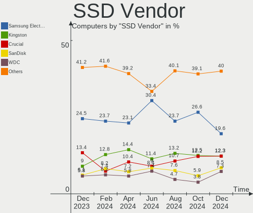
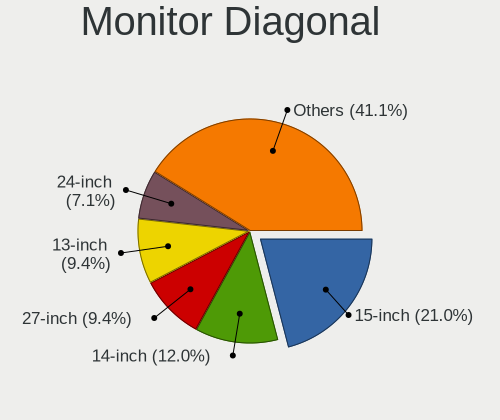

Fedora - Hardware Trends
------------------------

A project to identify most popular hardware characteristics and track their change
over time based on data collected by Linux users at https://Linux-Hardware.org.

Anyone can contribute to this report by the [hw-probe](https://github.com/linuxhw/hw-probe) tool:

    sudo -E hw-probe -all -upload

This is a report for all computer types. See also reports for [desktops](/Dist/Fedora/Desktop/README.md) and [notebooks](/Dist/Fedora/Notebook/README.md).

This report is for one last month. Overall report since the beginning of time: [TestCoverage](https://github.com/linuxhw/TestCoverage)

Period: Dec, 2022.

Contents
--------

* [ System ](#system)
  - [ OS                       ](#os)
  - [ OS Family                ](#os-family)
  - [ Kernel                   ](#kernel)
  - [ Kernel Family            ](#kernel-family)
  - [ Kernel Major Ver.        ](#kernel-major-ver)
  - [ Arch                     ](#arch)
  - [ DE                       ](#de)
  - [ Display Server           ](#display-server)
  - [ Display Manager          ](#display-manager)
  - [ OS Lang                  ](#os-lang)
  - [ Boot Mode                ](#boot-mode)
  - [ Filesystem               ](#filesystem)
  - [ Part. scheme             ](#part-scheme)
  - [ Dual Boot with Linux/BSD ](#dual-boot-with-linuxbsd)
  - [ Dual Boot (Win)          ](#dual-boot-win)

* [ Board ](#board)
  - [ Vendor                   ](#vendor)
  - [ Model                    ](#model)
  - [ Model Family             ](#model-family)
  - [ MFG Year                 ](#mfg-year)
  - [ Form Factor              ](#form-factor)
  - [ Secure Boot              ](#secure-boot)
  - [ Coreboot                 ](#coreboot)
  - [ RAM Size                 ](#ram-size)
  - [ RAM Used                 ](#ram-used)
  - [ Total Drives             ](#total-drives)
  - [ Has CD-ROM               ](#has-cd-rom)
  - [ Has Ethernet             ](#has-ethernet)
  - [ Has WiFi                 ](#has-wifi)
  - [ Has Bluetooth            ](#has-bluetooth)

* [ Location ](#location)
  - [ Country                  ](#country)
  - [ City                     ](#city)

* [ Drives ](#drives)
  - [ Drive Vendor             ](#drive-vendor)
  - [ Drive Model              ](#drive-model)
  - [ HDD Vendor               ](#hdd-vendor)
  - [ SSD Vendor               ](#ssd-vendor)
  - [ Drive Kind               ](#drive-kind)
  - [ Drive Connector          ](#drive-connector)
  - [ Drive Size               ](#drive-size)
  - [ Space Total              ](#space-total)
  - [ Space Used               ](#space-used)
  - [ Malfunc. Drives          ](#malfunc-drives)
  - [ Malfunc. Drive Vendor    ](#malfunc-drive-vendor)
  - [ Malfunc. HDD Vendor      ](#malfunc-hdd-vendor)
  - [ Malfunc. Drive Kind      ](#malfunc-drive-kind)
  - [ Failed Drives            ](#failed-drives)
  - [ Failed Drive Vendor      ](#failed-drive-vendor)
  - [ Drive Status             ](#drive-status)

* [ Storage controller ](#storage-controller)
  - [ Storage Vendor           ](#storage-vendor)
  - [ Storage Model            ](#storage-model)
  - [ Storage Kind             ](#storage-kind)

* [ Processor ](#processor)
  - [ CPU Vendor               ](#cpu-vendor)
  - [ CPU Model                ](#cpu-model)
  - [ CPU Model Family         ](#cpu-model-family)
  - [ CPU Cores                ](#cpu-cores)
  - [ CPU Sockets              ](#cpu-sockets)
  - [ CPU Threads              ](#cpu-threads)
  - [ CPU Op-Modes             ](#cpu-op-modes)
  - [ CPU Microcode            ](#cpu-microcode)
  - [ CPU Microarch            ](#cpu-microarch)

* [ Graphics ](#graphics)
  - [ GPU Vendor               ](#gpu-vendor)
  - [ GPU Model                ](#gpu-model)
  - [ GPU Combo                ](#gpu-combo)
  - [ GPU Driver               ](#gpu-driver)
  - [ GPU Memory               ](#gpu-memory)

* [ Monitor ](#monitor)
  - [ Monitor Vendor           ](#monitor-vendor)
  - [ Monitor Model            ](#monitor-model)
  - [ Monitor Resolution       ](#monitor-resolution)
  - [ Monitor Diagonal         ](#monitor-diagonal)
  - [ Monitor Width            ](#monitor-width)
  - [ Aspect Ratio             ](#aspect-ratio)
  - [ Monitor Area             ](#monitor-area)
  - [ Pixel Density            ](#pixel-density)
  - [ Multiple Monitors        ](#multiple-monitors)

* [ Network ](#network)
  - [ Net Controller Vendor    ](#net-controller-vendor)
  - [ Net Controller Model     ](#net-controller-model)
  - [ Wireless Vendor          ](#wireless-vendor)
  - [ Wireless Model           ](#wireless-model)
  - [ Ethernet Vendor          ](#ethernet-vendor)
  - [ Ethernet Model           ](#ethernet-model)
  - [ Net Controller Kind      ](#net-controller-kind)
  - [ Used Controller          ](#used-controller)
  - [ NICs                     ](#nics)
  - [ IPv6                     ](#ipv6)

* [ Bluetooth ](#bluetooth)
  - [ Bluetooth Vendor         ](#bluetooth-vendor)
  - [ Bluetooth Model          ](#bluetooth-model)

* [ Sound ](#sound)
  - [ Sound Vendor             ](#sound-vendor)
  - [ Sound Model              ](#sound-model)

* [ Memory ](#memory)
  - [ Memory Vendor            ](#memory-vendor)
  - [ Memory Model             ](#memory-model)
  - [ Memory Kind              ](#memory-kind)
  - [ Memory Form Factor       ](#memory-form-factor)
  - [ Memory Size              ](#memory-size)
  - [ Memory Speed             ](#memory-speed)

* [ Printers & scanners ](#printers--scanners)
  - [ Printer Vendor           ](#printer-vendor)
  - [ Printer Model            ](#printer-model)
  - [ Scanner Vendor           ](#scanner-vendor)
  - [ Scanner Model            ](#scanner-model)

* [ Camera ](#camera)
  - [ Camera Vendor            ](#camera-vendor)
  - [ Camera Model             ](#camera-model)

* [ Security ](#security)
  - [ Fingerprint Vendor       ](#fingerprint-vendor)
  - [ Fingerprint Model        ](#fingerprint-model)
  - [ Chipcard Vendor          ](#chipcard-vendor)
  - [ Chipcard Model           ](#chipcard-model)

* [ Unsupported ](#unsupported)
  - [ Unsupported Devices      ](#unsupported-devices)
  - [ Unsupported Device Types ](#unsupported-device-types)

System
------

OS
--

Installed operating systems

| Name      | Computers | Percent |
|-----------|-----------|---------|
| Fedora 37 | 393       | 86.95%  |
| Fedora 36 | 47        | 10.4%   |
| Fedora 38 | 5         | 1.11%   |
| Fedora 35 | 5         | 1.11%   |
| Fedora 33 | 2         | 0.44%   |

OS Family
---------

OS without a version

| Name   | Computers | Percent |
|--------|-----------|---------|
| Fedora | 452       | 100%    |

Kernel
------

Version of the Linux kernel

| Version                                                          | Computers | Percent |
|------------------------------------------------------------------|-----------|---------|
| 6.0.12-300.fc37.x86_64                                           | 104       | 23.01%  |
| 6.0.11-300.fc37.x86_64                                           | 68        | 15.04%  |
| 6.0.15-300.fc37.x86_64                                           | 64        | 14.16%  |
| 6.0.10-300.fc37.x86_64                                           | 58        | 12.83%  |
| 6.0.14-300.fc37.x86_64                                           | 25        | 5.53%   |
| 6.0.13-300.fc37.x86_64                                           | 19        | 4.2%    |
| 6.0.9-300.fc37.x86_64                                            | 17        | 3.76%   |
| 6.0.7-301.fc37.x86_64                                            | 17        | 3.76%   |
| 6.0.10-200.fc36.x86_64                                           | 13        | 2.88%   |
| 6.0.8-300.fc37.x86_64                                            | 6         | 1.33%   |
| 6.0.5-200.fc36.x86_64                                            | 6         | 1.33%   |
| 6.0.12-200.fc36.x86_64                                           | 6         | 1.33%   |
| 6.0.11-200.fc36.x86_64                                           | 4         | 0.88%   |
| 6.0.15-200.fc36.x86_64                                           | 3         | 0.66%   |
| 6.0.14-200.fc36.x86_64                                           | 3         | 0.66%   |
| 6.0.9-200.fc36.x86_64                                            | 2         | 0.44%   |
| 6.0.10-602.inttf.fc37.x86_64                                     | 2         | 0.44%   |
| 6.0.10-100.fc35.x86_64                                           | 2         | 0.44%   |
| 5.17.5-300.fc36.x86_64                                           | 2         | 0.44%   |
| 6.2.0-rc1-1b929c02afd37871d5afb9d498426f83432e71c2-btrfs-debug4+ | 1         | 0.22%   |
| 6.2.0-0.rc1.14.fc38.x86_64+debug                                 | 1         | 0.22%   |
| 6.2.0-0.rc0.20221221gitb6bb9676f216.10.fc38.x86_64               | 1         | 0.22%   |
| 6.1.1-xm1.0.fc37.x86_64                                          | 1         | 0.22%   |
| 6.1.1-225.vanilla.1.fc37.x86_64                                  | 1         | 0.22%   |
| 6.1.0-rc7+                                                       | 1         | 0.22%   |
| 6.1.0-65.vanilla.1.fc37.x86_64                                   | 1         | 0.22%   |
| 6.1.0-65.fc38.x86_64                                             | 1         | 0.22%   |
| 6.0.9-100.fc35.x86_64                                            | 1         | 0.22%   |
| 6.0.9                                                            | 1         | 0.22%   |
| 6.0.8-xm1.0.fc37.x86_64                                          | 1         | 0.22%   |
| 6.0.8-200.fc36.x86_64                                            | 1         | 0.22%   |
| 6.0.7-200.fc36.x86_64                                            | 1         | 0.22%   |
| 6.0.7-100.fc35.x86_64                                            | 1         | 0.22%   |
| 6.0.15-602.inttf.fc37.x86_64                                     | 1         | 0.22%   |
| 6.0.15-300.fc37.aarch64                                          | 1         | 0.22%   |
| 6.0.13-602.inttf.fc37.x86_64                                     | 1         | 0.22%   |
| 6.0.11-250.vanilla.1.fc36.x86_64                                 | 1         | 0.22%   |
| 6.0.11-100.fc35.x86_64                                           | 1         | 0.22%   |
| 6.0.10-301.fsync.fc37.x86_64                                     | 1         | 0.22%   |
| 5.19.8-200.fc36.x86_64                                           | 1         | 0.22%   |

Kernel Family
-------------

Linux kernel without a distro release

| Version | Computers | Percent |
|---------|-----------|---------|
| 6.0.12  | 110       | 24.34%  |
| 6.0.10  | 76        | 16.81%  |
| 6.0.11  | 74        | 16.37%  |
| 6.0.15  | 69        | 15.27%  |
| 6.0.14  | 28        | 6.19%   |
| 6.0.9   | 21        | 4.65%   |
| 6.0.13  | 20        | 4.42%   |
| 6.0.7   | 19        | 4.2%    |
| 6.0.8   | 8         | 1.77%   |
| 6.0.5   | 6         | 1.33%   |
| 6.2.0   | 3         | 0.66%   |
| 6.1.0   | 3         | 0.66%   |
| 6.1.1   | 2         | 0.44%   |
| 5.17.5  | 2         | 0.44%   |
| 5.19.8  | 1         | 0.22%   |
| 5.19.16 | 1         | 0.22%   |
| 5.19.14 | 1         | 0.22%   |
| 5.19.13 | 1         | 0.22%   |
| 5.18.7  | 1         | 0.22%   |
| 5.18.17 | 1         | 0.22%   |
| 5.16.20 | 1         | 0.22%   |
| 5.15.55 | 1         | 0.22%   |
| 5.14.18 | 1         | 0.22%   |
| 5.11.20 | 1         | 0.22%   |
| 5.0.9   | 1         | 0.22%   |

Kernel Major Ver.
-----------------

Linux kernel major version

| Version | Computers | Percent |
|---------|-----------|---------|
| 6.0     | 431       | 95.35%  |
| 6.1     | 5         | 1.11%   |
| 5.19    | 4         | 0.88%   |
| 6.2     | 3         | 0.66%   |
| 5.18    | 2         | 0.44%   |
| 5.17    | 2         | 0.44%   |
| 5.16    | 1         | 0.22%   |
| 5.15    | 1         | 0.22%   |
| 5.14    | 1         | 0.22%   |
| 5.11    | 1         | 0.22%   |
| 5.0     | 1         | 0.22%   |

Arch
----

OS architecture (x86_64, i586, etc.)

| Name    | Computers | Percent |
|---------|-----------|---------|
| x86_64  | 451       | 99.78%  |
| aarch64 | 1         | 0.22%   |

DE
--

Desktop Environment

| Name          | Computers | Percent |
|---------------|-----------|---------|
| GNOME         | 327       | 72.35%  |
| KDE5          | 88        | 19.47%  |
| XFCE          | 11        | 2.43%   |
| Unknown       | 8         | 1.77%   |
| X-Cinnamon    | 5         | 1.11%   |
| Cinnamon      | 5         | 1.11%   |
| LXDE          | 2         | 0.44%   |
| i3            | 2         | 0.44%   |
| xmonad        | 1         | 0.22%   |
| MATE          | 1         | 0.22%   |
| LXQt          | 1         | 0.22%   |
| GNOME Classic | 1         | 0.22%   |

Display Server
--------------

X11 or Wayland

| Name    | Computers | Percent |
|---------|-----------|---------|
| Wayland | 331       | 73.23%  |
| X11     | 109       | 24.12%  |
| Tty     | 6         | 1.33%   |
| Unknown | 6         | 1.33%   |

Display Manager
---------------

SDDM, LightDM, etc.

| Name    | Computers | Percent |
|---------|-----------|---------|
| Unknown | 243       | 53.76%  |
| GDM     | 137       | 30.31%  |
| SDDM    | 44        | 9.73%   |
| LightDM | 26        | 5.75%   |
| LXDM    | 2         | 0.44%   |

OS Lang
-------

Language

| Lang  | Computers | Percent |
|-------|-----------|---------|
| en_US | 228       | 50.44%  |
| en_GB | 31        | 6.86%   |
| pt_BR | 29        | 6.42%   |
| ru_RU | 26        | 5.75%   |
| de_DE | 15        | 3.32%   |
| en_AU | 14        | 3.1%    |
| fr_FR | 13        | 2.88%   |
| it_IT | 11        | 2.43%   |
| es_ES | 11        | 2.43%   |
| en_CA | 9         | 1.99%   |
| pl_PL | 7         | 1.55%   |
| es_MX | 5         | 1.11%   |
| en_IN | 5         | 1.11%   |
| C     | 4         | 0.88%   |
| hu_HU | 3         | 0.66%   |
| es_CL | 3         | 0.66%   |
| es_AR | 3         | 0.66%   |
| ca_ES | 3         | 0.66%   |
| zh_TW | 2         | 0.44%   |
| zh_CN | 2         | 0.44%   |
| tr_TR | 2         | 0.44%   |
| sv_SE | 2         | 0.44%   |
| en_ZA | 2         | 0.44%   |
| en_IE | 2         | 0.44%   |
| de_AT | 2         | 0.44%   |
| cs_CZ | 2         | 0.44%   |
| sr_RS | 1         | 0.22%   |
| sk_SK | 1         | 0.22%   |
| ru_UA | 1         | 0.22%   |
| pt_PT | 1         | 0.22%   |
| fr_CA | 1         | 0.22%   |
| fr_BE | 1         | 0.22%   |
| fi_FI | 1         | 0.22%   |
| es_US | 1         | 0.22%   |
| es_PE | 1         | 0.22%   |
| es_CU | 1         | 0.22%   |
| es_CO | 1         | 0.22%   |
| en_PH | 1         | 0.22%   |
| en_NZ | 1         | 0.22%   |
| de_CH | 1         | 0.22%   |

Boot Mode
---------

EFI or BIOS

| Mode | Computers | Percent |
|------|-----------|---------|
| EFI  | 364       | 80.53%  |
| BIOS | 88        | 19.47%  |

Filesystem
----------

Type of filesystem

| Type    | Computers | Percent |
|---------|-----------|---------|
| Btrfs   | 364       | 80.53%  |
| Ext4    | 77        | 17.04%  |
| Xfs     | 9         | 1.99%   |
| Overlay | 1         | 0.22%   |
| F2fs    | 1         | 0.22%   |

Part. scheme
------------

Scheme of partitioning

| Type    | Computers | Percent |
|---------|-----------|---------|
| Unknown | 235       | 51.99%  |
| GPT     | 200       | 44.25%  |
| MBR     | 17        | 3.76%   |

Dual Boot with Linux/BSD
------------------------

Hosting more than one Linux/BSD

| Dual boot | Computers | Percent |
|-----------|-----------|---------|
| No        | 407       | 90.04%  |
| Yes       | 45        | 9.96%   |

Dual Boot (Win)
---------------

Hosting Linux and Windows

| Dual boot | Computers | Percent |
|-----------|-----------|---------|
| No        | 369       | 81.64%  |
| Yes       | 83        | 18.36%  |

Board
-----

Vendor
------

Motherboard manufacturer

| Name                                 | Computers | Percent |
|--------------------------------------|-----------|---------|
| ASUSTek Computer                     | 81        | 17.92%  |
| Lenovo                               | 77        | 17.04%  |
| Dell                                 | 63        | 13.94%  |
| Hewlett-Packard                      | 49        | 10.84%  |
| MSI                                  | 39        | 8.63%   |
| Gigabyte Technology                  | 31        | 6.86%   |
| Acer                                 | 24        | 5.31%   |
| ASRock                               | 14        | 3.1%    |
| HUAWEI                               | 13        | 2.88%   |
| Intel                                | 9         | 1.99%   |
| Samsung Electronics                  | 6         | 1.33%   |
| Toshiba                              | 5         | 1.11%   |
| Apple                                | 4         | 0.88%   |
| Timi                                 | 3         | 0.66%   |
| Google                               | 3         | 0.66%   |
| Schenker                             | 2         | 0.44%   |
| Pegatron                             | 2         | 0.44%   |
| GPD                                  | 2         | 0.44%   |
| Valve                                | 1         | 0.22%   |
| TUXEDO                               | 1         | 0.22%   |
| Tactus                               | 1         | 0.22%   |
| System76                             | 1         | 0.22%   |
| Sony                                 | 1         | 0.22%   |
| Shuttle                              | 1         | 0.22%   |
| Shenzhen Meigao Electronic Equipment | 1         | 0.22%   |
| Positivo Bahia - VAIO                | 1         | 0.22%   |
| Positivo                             | 1         | 0.22%   |
| pine64,pinebook-pro                  | 1         | 0.22%   |
| Notebook                             | 1         | 0.22%   |
| Microsoft                            | 1         | 0.22%   |
| MAXSUN                               | 1         | 0.22%   |
| MACHINIST                            | 1         | 0.22%   |
| MACHENIKE                            | 1         | 0.22%   |
| LG Electronics                       | 1         | 0.22%   |
| Jooyon Tech                          | 1         | 0.22%   |
| Itautec                              | 1         | 0.22%   |
| Framework                            | 1         | 0.22%   |
| Fanless Mini PC                      | 1         | 0.22%   |
| BESSTAR Tech                         | 1         | 0.22%   |
| BANGHO                               | 1         | 0.22%   |

Model
-----

Motherboard model

| Name                                   | Computers | Percent |
|----------------------------------------|-----------|---------|
| MSI MS-7C56                            | 3         | 0.66%   |
| Dell XPS 15 9570                       | 3         | 0.66%   |
| Dell Inspiron 5566                     | 3         | 0.66%   |
| ASUS ROG STRIX B450-F GAMING           | 3         | 0.66%   |
| ASUS All Series                        | 3         | 0.66%   |
| MSI GL63 8RC                           | 2         | 0.44%   |
| Lenovo ThinkBook 15 G3 ACL 21A4        | 2         | 0.44%   |
| Lenovo Legion 5 15ACH6H 82JU           | 2         | 0.44%   |
| Lenovo IdeaPad 3 15ALC6 82KU           | 2         | 0.44%   |
| Intel NUC8i7BEH                        | 2         | 0.44%   |
| HUAWEI NBLK-WAX9X                      | 2         | 0.44%   |
| HUAWEI MACH-WX9                        | 2         | 0.44%   |
| HUAWEI KLVL-WXX9                       | 2         | 0.44%   |
| HP Spectre x360 2-in-1 Laptop 16-f1xxx | 2         | 0.44%   |
| HP ProBook 440 G7                      | 2         | 0.44%   |
| HP ProBook 440 14 inch G9 Notebook PC  | 2         | 0.44%   |
| HP OMEN by Laptop 16-c0xxx             | 2         | 0.44%   |
| Gigabyte GA-78LMT-USB3 6.0             | 2         | 0.44%   |
| Dell OptiPlex 7010                     | 2         | 0.44%   |
| Dell Latitude 7490                     | 2         | 0.44%   |
| Dell Latitude 5420                     | 2         | 0.44%   |
| Dell Inspiron 3583                     | 2         | 0.44%   |
| Dell Inspiron 16 5625                  | 2         | 0.44%   |
| ASUS TUF Gaming B550-PLUS              | 2         | 0.44%   |
| ASUS ROG STRIX X670E-F GAMING WIFI     | 2         | 0.44%   |
| ASUS ROG STRIX X570-E GAMING           | 2         | 0.44%   |
| ASUS ROG STRIX B550-F GAMING           | 2         | 0.44%   |
| ASUS ROG CROSSHAIR VIII IMPACT         | 2         | 0.44%   |
| ASUS PRIME X670E-PRO WIFI              | 2         | 0.44%   |
| ASRock X79 Extreme6                    | 2         | 0.44%   |
| ASRock X670E Steel Legend              | 2         | 0.44%   |
| Apple MacBookPro9,2                    | 2         | 0.44%   |
| Acer Aspire A515-45                    | 2         | 0.44%   |
| Valve Jupiter                          | 1         | 0.22%   |
| TUXEDO InfinityBook Pro 14 Gen6        | 1         | 0.22%   |
| Toshiba TECRA A10                      | 1         | 0.22%   |
| Toshiba Satellite C850-C5K             | 1         | 0.22%   |
| Toshiba Satellite C75D-B               | 1         | 0.22%   |
| Toshiba Satellite C50D-A-138           | 1         | 0.22%   |
| Toshiba Satellite A300                 | 1         | 0.22%   |

Model Family
------------

Motherboard model prefix

| Name                   | Computers | Percent |
|------------------------|-----------|---------|
| Lenovo ThinkPad        | 44        | 9.73%   |
| Dell Inspiron          | 27        | 5.97%   |
| ASUS ROG               | 20        | 4.42%   |
| Acer Aspire            | 17        | 3.76%   |
| Dell Latitude          | 14        | 3.1%    |
| ASUS PRIME             | 13        | 2.88%   |
| HP Pavilion            | 12        | 2.65%   |
| Dell XPS               | 11        | 2.43%   |
| ASUS TUF               | 10        | 2.21%   |
| Lenovo IdeaPad         | 9         | 1.99%   |
| HP ProBook             | 9         | 1.99%   |
| HP Laptop              | 8         | 1.77%   |
| Lenovo ThinkBook       | 7         | 1.55%   |
| ASUS ASUS              | 7         | 1.55%   |
| Dell OptiPlex          | 6         | 1.33%   |
| ASUS VivoBook          | 6         | 1.33%   |
| Toshiba Satellite      | 4         | 0.88%   |
| Lenovo Legion          | 4         | 0.88%   |
| ASUS Zenbook           | 4         | 0.88%   |
| MSI MS-7C56            | 3         | 0.66%   |
| MSI Modern             | 3         | 0.66%   |
| Lenovo Yoga            | 3         | 0.66%   |
| HP ENVY                | 3         | 0.66%   |
| ASUS All               | 3         | 0.66%   |
| Acer Predator          | 3         | 0.66%   |
| MSI GL63               | 2         | 0.44%   |
| Lenovo IdeaPadFlex     | 2         | 0.44%   |
| Intel NUC8i7BEH        | 2         | 0.44%   |
| HUAWEI NBLK-WAX9X      | 2         | 0.44%   |
| HUAWEI MACH-WX9        | 2         | 0.44%   |
| HUAWEI KLVL-WXX9       | 2         | 0.44%   |
| HP ZBook               | 2         | 0.44%   |
| HP Spectre             | 2         | 0.44%   |
| HP OMEN                | 2         | 0.44%   |
| HP EliteDesk           | 2         | 0.44%   |
| HP EliteBook           | 2         | 0.44%   |
| HP 245                 | 2         | 0.44%   |
| Gigabyte X570          | 2         | 0.44%   |
| Gigabyte GA-78LMT-USB3 | 2         | 0.44%   |
| Gigabyte B365M         | 2         | 0.44%   |

MFG Year
--------

Motherboard manufacture year

| Year | Computers | Percent |
|------|-----------|---------|
| 2021 | 88        | 19.47%  |
| 2020 | 61        | 13.5%   |
| 2022 | 58        | 12.83%  |
| 2018 | 51        | 11.28%  |
| 2019 | 45        | 9.96%   |
| 2012 | 29        | 6.42%   |
| 2017 | 26        | 5.75%   |
| 2013 | 26        | 5.75%   |
| 2014 | 15        | 3.32%   |
| 2011 | 12        | 2.65%   |
| 2016 | 11        | 2.43%   |
| 2015 | 10        | 2.21%   |
| 2010 | 6         | 1.33%   |
| 2008 | 6         | 1.33%   |
| 2009 | 4         | 0.88%   |
| 2007 | 2         | 0.44%   |
| 2006 | 2         | 0.44%   |

Form Factor
-----------

Physical design of the computer

| Name           | Computers | Percent |
|----------------|-----------|---------|
| Notebook       | 258       | 57.08%  |
| Desktop        | 158       | 34.96%  |
| Convertible    | 22        | 4.87%   |
| Mini pc        | 8         | 1.77%   |
| Tablet         | 3         | 0.66%   |
| All in one     | 2         | 0.44%   |
| System on chip | 1         | 0.22%   |

Secure Boot
-----------

Enabled or disabled

| State    | Computers | Percent |
|----------|-----------|---------|
| Disabled | 370       | 81.86%  |
| Enabled  | 82        | 18.14%  |

Coreboot
--------

Have coreboot on board

| Used | Computers | Percent |
|------|-----------|---------|
| No   | 449       | 99.34%  |
| Yes  | 3         | 0.66%   |

RAM Size
--------

Total RAM memory

| Size in GB  | Computers | Percent |
|-------------|-----------|---------|
| 16.01-24.0  | 115       | 25.44%  |
| 4.01-8.0    | 102       | 22.57%  |
| 8.01-16.0   | 94        | 20.8%   |
| 32.01-64.0  | 65        | 14.38%  |
| 3.01-4.0    | 30        | 6.64%   |
| 64.01-256.0 | 21        | 4.65%   |
| 24.01-32.0  | 19        | 4.2%    |
| 1.01-2.0    | 4         | 0.88%   |
| 2.01-3.0    | 2         | 0.44%   |

RAM Used
--------

Used RAM memory

| Used GB    | Computers | Percent |
|------------|-----------|---------|
| 4.01-8.0   | 141       | 31.19%  |
| 3.01-4.0   | 119       | 26.33%  |
| 2.01-3.0   | 99        | 21.9%   |
| 8.01-16.0  | 46        | 10.18%  |
| 1.01-2.0   | 30        | 6.64%   |
| 0.51-1.0   | 10        | 2.21%   |
| 16.01-24.0 | 6         | 1.33%   |
| 32.01-64.0 | 1         | 0.22%   |

Total Drives
------------

Number of drives on board

| Drives | Computers | Percent |
|--------|-----------|---------|
| 1      | 258       | 57.08%  |
| 2      | 130       | 28.76%  |
| 3      | 36        | 7.96%   |
| 4      | 17        | 3.76%   |
| 5      | 5         | 1.11%   |
| 7      | 2         | 0.44%   |
| 6      | 2         | 0.44%   |
| 12     | 1         | 0.22%   |
| 0      | 1         | 0.22%   |

Has CD-ROM
----------

Has CD-ROM on board

| Presented | Computers | Percent |
|-----------|-----------|---------|
| No        | 359       | 79.42%  |
| Yes       | 93        | 20.58%  |

Has Ethernet
------------

Has Ethernet on board

| Presented | Computers | Percent |
|-----------|-----------|---------|
| Yes       | 366       | 80.97%  |
| No        | 86        | 19.03%  |

Has WiFi
--------

Has WiFi module

| Presented | Computers | Percent |
|-----------|-----------|---------|
| Yes       | 375       | 82.96%  |
| No        | 77        | 17.04%  |

Has Bluetooth
-------------

Has Bluetooth module

| Presented | Computers | Percent |
|-----------|-----------|---------|
| Yes       | 343       | 75.88%  |
| No        | 109       | 24.12%  |

Location
--------

Country
-------

Geographic location (country)

| Country      | Computers | Percent |
|--------------|-----------|---------|
| USA          | 85        | 18.81%  |
| Brazil       | 38        | 8.41%   |
| Russia       | 30        | 6.64%   |
| Germany      | 30        | 6.64%   |
| Italy        | 20        | 4.42%   |
| France       | 20        | 4.42%   |
| Australia    | 18        | 3.98%   |
| Canada       | 15        | 3.32%   |
| Spain        | 14        | 3.1%    |
| UK           | 13        | 2.88%   |
| India        | 13        | 2.88%   |
| Poland       | 11        | 2.43%   |
| Mexico       | 8         | 1.77%   |
| Netherlands  | 7         | 1.55%   |
| Sweden       | 6         | 1.33%   |
| Romania      | 6         | 1.33%   |
| Czechia      | 6         | 1.33%   |
| Austria      | 6         | 1.33%   |
| Argentina    | 6         | 1.33%   |
| Taiwan       | 5         | 1.11%   |
| Switzerland  | 5         | 1.11%   |
| Hungary      | 5         | 1.11%   |
| Turkey       | 4         | 0.88%   |
| Indonesia    | 4         | 0.88%   |
| Belgium      | 4         | 0.88%   |
| Norway       | 3         | 0.66%   |
| Ireland      | 3         | 0.66%   |
| Finland      | 3         | 0.66%   |
| Colombia     | 3         | 0.66%   |
| Chile        | 3         | 0.66%   |
| Vietnam      | 2         | 0.44%   |
| Ukraine      | 2         | 0.44%   |
| Thailand     | 2         | 0.44%   |
| South Korea  | 2         | 0.44%   |
| South Africa | 2         | 0.44%   |
| Slovenia     | 2         | 0.44%   |
| Slovakia     | 2         | 0.44%   |
| Singapore    | 2         | 0.44%   |
| Serbia       | 2         | 0.44%   |
| Saudi Arabia | 2         | 0.44%   |

City
----

Geographic location (city)

| City             | Computers | Percent |
|------------------|-----------|---------|
| Sydney           | 8         | 1.77%   |
| Moscow           | 6         | 1.33%   |
| St Petersburg    | 5         | 1.11%   |
| London           | 5         | 1.11%   |
| Vienna           | 4         | 0.88%   |
| Madrid           | 4         | 0.88%   |
| Zapopan          | 3         | 0.66%   |
| Warsaw           | 3         | 0.66%   |
| Sao Paulo        | 3         | 0.66%   |
| Rochester        | 3         | 0.66%   |
| Porto Alegre     | 3         | 0.66%   |
| Palmas           | 3         | 0.66%   |
| New Taipei       | 3         | 0.66%   |
| Milan            | 3         | 0.66%   |
| Melbourne        | 3         | 0.66%   |
| Brisbane         | 3         | 0.66%   |
| Bogotá          | 3         | 0.66%   |
| Berlin           | 3         | 0.66%   |
| Yekaterinburg    | 2         | 0.44%   |
| Winnipeg         | 2         | 0.44%   |
| Verona           | 2         | 0.44%   |
| Ufa              | 2         | 0.44%   |
| Tokyo            | 2         | 0.44%   |
| Singapore        | 2         | 0.44%   |
| Santiago         | 2         | 0.44%   |
| Santa Clara      | 2         | 0.44%   |
| Pune             | 2         | 0.44%   |
| Perth            | 2         | 0.44%   |
| New York         | 2         | 0.44%   |
| Nairobi          | 2         | 0.44%   |
| Montreal         | 2         | 0.44%   |
| Miami            | 2         | 0.44%   |
| Lancaster        | 2         | 0.44%   |
| Kristiansand     | 2         | 0.44%   |
| Krasnodar        | 2         | 0.44%   |
| Jakarta          | 2         | 0.44%   |
| Istanbul         | 2         | 0.44%   |
| Idaho Falls      | 2         | 0.44%   |
| Ho Chi Minh City | 2         | 0.44%   |
| Helsinki         | 2         | 0.44%   |

Drives
------

Drive Vendor
------------

Hard drive vendors

| Vendor                         | Computers | Drives | Percent |
|--------------------------------|-----------|--------|---------|
| Samsung Electronics            | 149       | 173    | 22.01%  |
| WDC                            | 91        | 117    | 13.44%  |
| Seagate                        | 72        | 88     | 10.64%  |
| Sandisk                        | 54        | 57     | 7.98%   |
| Kingston                       | 44        | 47     | 6.5%    |
| SK hynix                       | 40        | 40     | 5.91%   |
| Toshiba                        | 33        | 36     | 4.87%   |
| Crucial                        | 24        | 24     | 3.55%   |
| Intel                          | 22        | 23     | 3.25%   |
| Micron Technology              | 19        | 19     | 2.81%   |
| Unknown                        | 16        | 16     | 2.36%   |
| Phison Electronics             | 7         | 8      | 1.03%   |
| China                          | 7         | 7      | 1.03%   |
| A-DATA Technology              | 7         | 7      | 1.03%   |
| Hitachi                        | 6         | 8      | 0.89%   |
| HGST                           | 5         | 5      | 0.74%   |
| Apacer                         | 5         | 5      | 0.74%   |
| SPCC                           | 4         | 5      | 0.59%   |
| SABRENT                        | 4         | 4      | 0.59%   |
| Micron/Crucial Technology      | 4         | 4      | 0.59%   |
| LITEON                         | 4         | 4      | 0.59%   |
| KIOXIA                         | 4         | 4      | 0.59%   |
| ADATA Technology               | 4         | 4      | 0.59%   |
| Netac                          | 3         | 3      | 0.44%   |
| UMIS                           | 2         | 2      | 0.3%    |
| Transcend                      | 2         | 2      | 0.3%    |
| Solid State Storage Technology | 2         | 2      | 0.3%    |
| Realtek Semiconductor          | 2         | 2      | 0.3%    |
| Phison                         | 2         | 2      | 0.3%    |
| Lite-On Technology             | 2         | 2      | 0.3%    |
| HS-SSD-E100                    | 2         | 2      | 0.3%    |
| Corsair                        | 2         | 4      | 0.3%    |
| Biwin Storage Technology       | 2         | 2      | 0.3%    |
| Unknown                        | 2         | 2      | 0.3%    |
| YMTC                           | 1         | 1      | 0.15%   |
| Verbatim                       | 1         | 1      | 0.15%   |
| USB3.0                         | 1         | 1      | 0.15%   |
| Team                           | 1         | 1      | 0.15%   |
| Super Talent                   | 1         | 1      | 0.15%   |
| Simmtronic                     | 1         | 1      | 0.15%   |

Drive Model
-----------

Hard drive models

| Model                                               | Computers | Percent |
|-----------------------------------------------------|-----------|---------|
| Samsung NVMe SSD Controller SM981/PM981/PM983 500GB | 29        | 3.95%   |
| Samsung NVMe SSD Controller PM9A1/PM9A3/980PRO 2TB  | 16        | 2.18%   |
| Kingston SA400S37240G 240GB SSD                     | 13        | 1.77%   |
| Seagate ST2000DM008-2FR102 2TB                      | 9         | 1.22%   |
| Seagate ST1000DM010-2EP102 1TB                      | 9         | 1.22%   |
| Samsung SSD 970 EVO Plus 2TB                        | 8         | 1.09%   |
| Sandisk WD Black SN750 / PC SN730 NVMe SSD 512GB    | 7         | 0.95%   |
| Toshiba MQ04ABF100 1TB                              | 6         | 0.82%   |
| Seagate ST1000LM035-1RK172 1TB                      | 5         | 0.68%   |
| Crucial CT1000MX500SSD1 1TB                         | 5         | 0.68%   |
| WDC WDS500G2B0A-00SM50 500GB SSD                    | 4         | 0.54%   |
| Unknown MMC Card  128GB                             | 4         | 0.54%   |
| Toshiba DT01ACA200 2TB                              | 4         | 0.54%   |
| Seagate ST500DM002-1BD142 500GB                     | 4         | 0.54%   |
| Seagate ST1000LM024 HN-M101MBB 1TB                  | 4         | 0.54%   |
| Seagate ST1000DM003-1ER162 1TB                      | 4         | 0.54%   |
| Sandisk WD Blue SN500 / PC SN520 NVMe SSD 256GB     | 4         | 0.54%   |
| Samsung SSD 980 PRO 1TB                             | 4         | 0.54%   |
| Samsung SSD 970 EVO Plus 500GB                      | 4         | 0.54%   |
| Samsung SSD 850 EVO 250GB                           | 4         | 0.54%   |
| Samsung MZALQ512HALU-000L2 512GB                    | 4         | 0.54%   |
| SABRENT Disk 1TB                                    | 4         | 0.54%   |
| Micron 1100_MTFDDAV256TBN 256GB SSD                 | 4         | 0.54%   |
| Kingston SA400S37480G 480GB SSD                     | 4         | 0.54%   |
| Kingston SA400S37120G 120GB SSD                     | 4         | 0.54%   |
| WDC WD5000LPVX-22V0TT0 500GB                        | 3         | 0.41%   |
| WDC WD1002FAEX-00Z3A0 1TB                           | 3         | 0.41%   |
| SK hynix SKHynix_HFS512GDE9X081N 512GB              | 3         | 0.41%   |
| SK hynix HFM512GD3JX013N 512GB                      | 3         | 0.41%   |
| SK hynix BC711 NVMe 512GB                           | 3         | 0.41%   |
| Seagate ST31000524AS 1TB                            | 3         | 0.41%   |
| Seagate ST2000DM006-2DM164 2TB                      | 3         | 0.41%   |
| Sandisk WD Blue SN550 NVMe SSD 500GB                | 3         | 0.41%   |
| SanDisk SDSSDA240G 240GB                            | 3         | 0.41%   |
| Samsung SSD 980 500GB                               | 3         | 0.41%   |
| Samsung SSD 870 QVO 2TB                             | 3         | 0.41%   |
| Samsung SSD 870 EVO 500GB                           | 3         | 0.41%   |
| Samsung SSD 860 EVO 500GB                           | 3         | 0.41%   |
| Samsung SSD 860 EVO 250GB                           | 3         | 0.41%   |
| Samsung NVMe SSD Controller SM961/PM961/SM963 256GB | 3         | 0.41%   |

HDD Vendor
----------

Hard disk drive vendors

| Vendor              | Computers | Drives | Percent |
|---------------------|-----------|--------|---------|
| Seagate             | 70        | 85     | 40.7%   |
| WDC                 | 61        | 78     | 35.47%  |
| Toshiba             | 23        | 26     | 13.37%  |
| Hitachi             | 6         | 8      | 3.49%   |
| HGST                | 5         | 5      | 2.91%   |
| Samsung Electronics | 3         | 3      | 1.74%   |
| USB3.0              | 1         | 1      | 0.58%   |
| Unknown             | 1         | 1      | 0.58%   |
| JMicron Technology  | 1         | 3      | 0.58%   |
| External            | 1         | 1      | 0.58%   |

SSD Vendor
----------

Solid state drive vendors

| Vendor              | Computers | Drives | Percent |
|---------------------|-----------|--------|---------|
| Samsung Electronics | 41        | 44     | 22.4%   |
| Kingston            | 28        | 31     | 15.3%   |
| Crucial             | 21        | 21     | 11.48%  |
| SanDisk             | 18        | 18     | 9.84%   |
| WDC                 | 17        | 17     | 9.29%   |
| China               | 7         | 7      | 3.83%   |
| SK hynix            | 5         | 5      | 2.73%   |
| Micron Technology   | 5         | 5      | 2.73%   |
| Intel               | 4         | 4      | 2.19%   |
| Apacer              | 4         | 4      | 2.19%   |
| Toshiba             | 3         | 3      | 1.64%   |
| SPCC                | 3         | 3      | 1.64%   |
| A-DATA Technology   | 3         | 3      | 1.64%   |
| Netac               | 2         | 2      | 1.09%   |
| LITEON              | 2         | 2      | 1.09%   |
| Verbatim            | 1         | 1      | 0.55%   |
| Unknown             | 1         | 1      | 0.55%   |
| Transcend           | 1         | 1      | 0.55%   |
| Super Talent        | 1         | 1      | 0.55%   |
| SCY                 | 1         | 1      | 0.55%   |
| PNY                 | 1         | 1      | 0.55%   |
| Plextor             | 1         | 1      | 0.55%   |
| Patriot             | 1         | 1      | 0.55%   |
| OWC                 | 1         | 1      | 0.55%   |
| Mercury             | 1         | 1      | 0.55%   |
| Lexar               | 1         | 1      | 0.55%   |
| KUIJIA              | 1         | 1      | 0.55%   |
| KingSpec            | 1         | 1      | 0.55%   |
| KingFast            | 1         | 1      | 0.55%   |
| KingDian            | 1         | 1      | 0.55%   |
| HS-SSD-C100         | 1         | 1      | 0.55%   |
| Gigabyte Technology | 1         | 1      | 0.55%   |
| FORESEE             | 1         | 1      | 0.55%   |
| Corsair             | 1         | 2      | 0.55%   |
| AMD                 | 1         | 1      | 0.55%   |

Drive Kind
----------

HDD or SSD

| Kind    | Computers | Drives | Percent |
|---------|-----------|--------|---------|
| NVMe    | 285       | 338    | 46.27%  |
| SSD     | 164       | 190    | 26.62%  |
| HDD     | 144       | 211    | 23.38%  |
| MMC     | 16        | 16     | 2.6%    |
| Unknown | 7         | 7      | 1.14%   |

Drive Connector
---------------

SATA, SAS, NVMe, etc.

| Type | Computers | Drives | Percent |
|------|-----------|--------|---------|
| NVMe | 284       | 334    | 50.71%  |
| SATA | 239       | 386    | 42.68%  |
| SAS  | 21        | 26     | 3.75%   |
| MMC  | 16        | 16     | 2.86%   |

Drive Size
----------

Size of hard drive

| Size in TB | Computers | Drives | Percent |
|------------|-----------|--------|---------|
| 0.01-0.5   | 159       | 191    | 48.33%  |
| 0.51-1.0   | 102       | 124    | 31%     |
| 1.01-2.0   | 37        | 48     | 11.25%  |
| 3.01-4.0   | 12        | 13     | 3.65%   |
| 4.01-10.0  | 10        | 10     | 3.04%   |
| 2.01-3.0   | 7         | 10     | 2.13%   |
| 10.01-20.0 | 2         | 5      | 0.61%   |

Space Total
-----------

Amount of disk space available on the file system

| Size in GB     | Computers | Percent |
|----------------|-----------|---------|
| 501-1000       | 101       | 22.35%  |
| 251-500        | 98        | 21.68%  |
| 1001-2000      | 62        | 13.72%  |
| 101-250        | 47        | 10.4%   |
| 1-20           | 38        | 8.41%   |
| More than 3000 | 33        | 7.3%    |
| Unknown        | 29        | 6.42%   |
| 2001-3000      | 25        | 5.53%   |
| 51-100         | 11        | 2.43%   |
| 21-50          | 8         | 1.77%   |

Space Used
----------

Amount of used disk space

| Used GB        | Computers | Percent |
|----------------|-----------|---------|
| 1-20           | 109       | 24.12%  |
| 101-250        | 72        | 15.93%  |
| 21-50          | 69        | 15.27%  |
| 251-500        | 49        | 10.84%  |
| 51-100         | 48        | 10.62%  |
| 501-1000       | 40        | 8.85%   |
| Unknown        | 29        | 6.42%   |
| 1001-2000      | 22        | 4.87%   |
| 2001-3000      | 8         | 1.77%   |
| More than 3000 | 6         | 1.33%   |

Malfunc. Drives
---------------

Drive models with a malfunction

| Model                                          | Computers | Drives | Percent |
|------------------------------------------------|-----------|--------|---------|
| WDC WD5000LPVX-22V0TT0 500GB                   | 1         | 1      | 2.86%   |
| WDC WD5000AVVS-63H0B1 500GB                    | 1         | 1      | 2.86%   |
| WDC WD5000AAKX-603CA0 500GB                    | 1         | 1      | 2.86%   |
| WDC WD40EZRZ-00WN9B0 4TB                       | 1         | 1      | 2.86%   |
| WDC WD3200AAKS-00UU3A0 320GB                   | 1         | 1      | 2.86%   |
| WDC WD3200AAJS-65M0A0 320GB                    | 1         | 1      | 2.86%   |
| WDC WD30EFRX-68AX9N0 3TB                       | 1         | 1      | 2.86%   |
| WDC WD140EDFZ-11A0VA0 14TB                     | 1         | 2      | 2.86%   |
| WDC WD10EZEX-60WN4A0 1TB                       | 1         | 2      | 2.86%   |
| Toshiba MQ01ABD075 752GB                       | 1         | 1      | 2.86%   |
| Toshiba MK3275GSX 320GB                        | 1         | 1      | 2.86%   |
| Toshiba MK1237GSX 120GB                        | 1         | 1      | 2.86%   |
| Toshiba KBG30ZMS512G NVMe 512GB                | 1         | 1      | 2.86%   |
| SK hynix HFS256G39TND-N210A 256GB SSD          | 1         | 1      | 2.86%   |
| Seagate ST6000DM003-2CY186 6TB                 | 1         | 1      | 2.86%   |
| Seagate ST4000LM024-2AN17V 4TB                 | 1         | 1      | 2.86%   |
| Seagate ST31000528AS 1TB                       | 1         | 1      | 2.86%   |
| Seagate ST31000524AS 1TB                       | 1         | 1      | 2.86%   |
| Seagate ST31000340NS 1TB                       | 1         | 1      | 2.86%   |
| Seagate ST3000DM001-1CH166 3TB                 | 1         | 1      | 2.86%   |
| Seagate ST2000DM001-1ER164 2TB                 | 1         | 1      | 2.86%   |
| Seagate ST1000VM002-1CT162 1TB                 | 1         | 1      | 2.86%   |
| Seagate ST1000LM024 HN-M101MBB 1TB             | 1         | 1      | 2.86%   |
| Seagate ST1000DM003-1ER162 1TB                 | 1         | 1      | 2.86%   |
| Samsung Electronics SSD 870 EVO 500GB          | 1         | 1      | 2.86%   |
| Samsung Electronics HD642JJ 640GB              | 1         | 1      | 2.86%   |
| Samsung Electronics HD103SI 1TB                | 1         | 1      | 2.86%   |
| Micron Technology 1100_MTFDDAV256TBN 256GB SSD | 1         | 1      | 2.86%   |
| Kingston SA400S37480G 480GB SSD                | 1         | 1      | 2.86%   |
| Intel SSDSC2CT120A3 120GB                      | 1         | 1      | 2.86%   |
| Intel SSDSC2BF180A4H 180GB                     | 1         | 1      | 2.86%   |
| Crucial CT240M500SSD1 240GB                    | 1         | 1      | 2.86%   |
| Crucial CT1050MX300SSD4 1050GB                 | 1         | 1      | 2.86%   |
| AMD R5SL960G 960GB SSD                         | 1         | 1      | 2.86%   |
| A-DATA Technology SU630 480GB SSD              | 1         | 1      | 2.86%   |

Malfunc. Drive Vendor
---------------------

Vendors of faulty drives

| Vendor              | Computers | Drives | Percent |
|---------------------|-----------|--------|---------|
| Seagate             | 9         | 10     | 27.27%  |
| WDC                 | 8         | 11     | 24.24%  |
| Toshiba             | 4         | 4      | 12.12%  |
| Samsung Electronics | 3         | 3      | 9.09%   |
| Intel               | 2         | 2      | 6.06%   |
| Crucial             | 2         | 2      | 6.06%   |
| SK hynix            | 1         | 1      | 3.03%   |
| Micron Technology   | 1         | 1      | 3.03%   |
| Kingston            | 1         | 1      | 3.03%   |
| AMD                 | 1         | 1      | 3.03%   |
| A-DATA Technology   | 1         | 1      | 3.03%   |

Malfunc. HDD Vendor
-------------------

Vendors of faulty HDD drives

| Vendor              | Computers | Drives | Percent |
|---------------------|-----------|--------|---------|
| Seagate             | 9         | 10     | 40.91%  |
| WDC                 | 8         | 11     | 36.36%  |
| Toshiba             | 3         | 3      | 13.64%  |
| Samsung Electronics | 2         | 2      | 9.09%   |

Malfunc. Drive Kind
-------------------

Kinds of faulty drives

| Kind | Computers | Drives | Percent |
|------|-----------|--------|---------|
| HDD  | 20        | 26     | 64.52%  |
| SSD  | 10        | 10     | 32.26%  |
| NVMe | 1         | 1      | 3.23%   |

Failed Drives
-------------

Failed drive models

| Model                 | Computers | Drives | Percent |
|-----------------------|-----------|--------|---------|
| SPCC M.2 PCIe SSD 2TB | 1         | 1      | 100%    |

Failed Drive Vendor
-------------------

Failed drive vendors

| Vendor | Computers | Drives | Percent |
|--------|-----------|--------|---------|
| SPCC   | 1         | 1      | 100%    |

Drive Status
------------

Number of failed and malfunc. drives

| Status   | Computers | Drives | Percent |
|----------|-----------|--------|---------|
| Detected | 275       | 428    | 56.01%  |
| Works    | 186       | 296    | 37.88%  |
| Malfunc  | 29        | 37     | 5.91%   |
| Failed   | 1         | 1      | 0.2%    |

Storage controller
------------------

Storage Vendor
--------------

Storage controller vendors

| Vendor                                  | Computers | Percent |
|-----------------------------------------|-----------|---------|
| Intel                                   | 245       | 36.57%  |
| AMD                                     | 112       | 16.72%  |
| Samsung Electronics                     | 110       | 16.42%  |
| SanDisk                                 | 54        | 8.06%   |
| SK hynix                                | 35        | 5.22%   |
| Kingston Technology Company             | 17        | 2.54%   |
| Micron Technology                       | 15        | 2.24%   |
| Phison Electronics                      | 12        | 1.79%   |
| ADATA Technology                        | 8         | 1.19%   |
| Toshiba America Info Systems            | 7         | 1.04%   |
| Micron/Crucial Technology               | 6         | 0.9%    |
| ASMedia Technology                      | 6         | 0.9%    |
| Silicon Motion                          | 4         | 0.6%    |
| Marvell Technology Group                | 4         | 0.6%    |
| Lite-On Technology                      | 4         | 0.6%    |
| KIOXIA                                  | 4         | 0.6%    |
| JMicron Technology                      | 3         | 0.45%   |
| VIA Technologies                        | 2         | 0.3%    |
| Solid State Storage Technology          | 2         | 0.3%    |
| Silicon Image                           | 2         | 0.3%    |
| Realtek Semiconductor                   | 2         | 0.3%    |
| MAXIO Technology (Hangzhou)             | 2         | 0.3%    |
| Broadcom / LSI                          | 2         | 0.3%    |
| Biwin Storage Technology                | 2         | 0.3%    |
| Yangtze Memory Technologies             | 1         | 0.15%   |
| Union Memory (Shenzhen)                 | 1         | 0.15%   |
| ULi Electronics                         | 1         | 0.15%   |
| Transcend                               | 1         | 0.15%   |
| Shenzhen Unionmemory Information System | 1         | 0.15%   |
| Seagate Technology                      | 1         | 0.15%   |
| Netac Technology                        | 1         | 0.15%   |
| LSI Logic / Symbios Logic               | 1         | 0.15%   |
| Integrated Technology Express           | 1         | 0.15%   |
| Adaptec                                 | 1         | 0.15%   |

Storage Model
-------------

Storage controller models

| Model                                                                          | Computers | Percent |
|--------------------------------------------------------------------------------|-----------|---------|
| AMD FCH SATA Controller [AHCI mode]                                            | 72        | 9.89%   |
| Samsung NVMe SSD Controller SM981/PM981/PM983                                  | 53        | 7.28%   |
| Samsung NVMe SSD Controller 980                                                | 32        | 4.4%    |
| Intel Volume Management Device NVMe RAID Controller                            | 28        | 3.85%   |
| Samsung NVMe SSD Controller PM9A1/PM9A3/980PRO                                 | 26        | 3.57%   |
| Intel Sunrise Point-LP SATA Controller [AHCI mode]                             | 23        | 3.16%   |
| SK hynix Gold P31/PC711 NVMe Solid State Drive                                 | 21        | 2.88%   |
| SanDisk Non-Volatile memory controller                                         | 21        | 2.88%   |
| Intel 7 Series Chipset Family 6-port SATA Controller [AHCI mode]               | 18        | 2.47%   |
| Micron Non-Volatile memory controller                                          | 15        | 2.06%   |
| AMD 500 Series Chipset SATA Controller                                         | 15        | 2.06%   |
| Intel Comet Lake SATA AHCI Controller                                          | 14        | 1.92%   |
| Intel 82801 Mobile SATA Controller [RAID mode]                                 | 14        | 1.92%   |
| AMD 400 Series Chipset SATA Controller                                         | 13        | 1.79%   |
| Intel 8 Series/C220 Series Chipset Family 6-port SATA Controller 1 [AHCI mode] | 12        | 1.65%   |
| SanDisk WD Black SN750 / PC SN730 NVMe SSD                                     | 11        | 1.51%   |
| Kingston Company Company Non-Volatile memory controller                        | 11        | 1.51%   |
| AMD SATA controller                                                            | 11        | 1.51%   |
| Intel Cannon Lake Mobile PCH SATA AHCI Controller                              | 9         | 1.24%   |
| Intel Alder Lake-S PCH SATA Controller [AHCI Mode]                             | 8         | 1.1%    |
| SanDisk WD Blue SN550 NVMe SSD                                                 | 7         | 0.96%   |
| Intel SSD 660P Series                                                          | 7         | 0.96%   |
| Intel SATA Controller [RAID mode]                                              | 7         | 0.96%   |
| Intel 7 Series/C210 Series Chipset Family 6-port SATA Controller [AHCI mode]   | 7         | 0.96%   |
| Intel 200 Series PCH SATA controller [AHCI mode]                               | 7         | 0.96%   |
| SanDisk WD PC SN810 / Black SN850 NVMe SSD                                     | 6         | 0.82%   |
| Intel Tiger Lake-LP SATA Controller                                            | 6         | 0.82%   |
| Intel Non-Volatile memory controller                                           | 6         | 0.82%   |
| Intel Cannon Point-LP SATA Controller [AHCI Mode]                              | 6         | 0.82%   |
| Intel 500 Series Chipset Family SATA AHCI Controller                           | 6         | 0.82%   |
| ASMedia ASM1062 Serial ATA Controller                                          | 6         | 0.82%   |
| Intel Wildcat Point-LP SATA Controller [AHCI Mode]                             | 5         | 0.69%   |
| Intel Celeron/Pentium Silver Processor SATA Controller                         | 5         | 0.69%   |
| Intel Cannon Lake PCH SATA AHCI Controller                                     | 5         | 0.69%   |
| Intel C600/X79 series chipset 6-Port SATA AHCI Controller                      | 5         | 0.69%   |
| Intel 8 Series SATA Controller 1 [AHCI mode]                                   | 5         | 0.69%   |
| Intel 400 Series Chipset Family SATA AHCI Controller                           | 5         | 0.69%   |
| AMD SB7x0/SB8x0/SB9x0 IDE Controller                                           | 5         | 0.69%   |
| SK hynix BC501 NVMe Solid State Drive                                          | 4         | 0.55%   |
| SanDisk WD Blue SN500 / PC SN520 NVMe SSD                                      | 4         | 0.55%   |

Storage Kind
------------

Kind of storage controller (IDE, SATA, NVMe, SAS, ...)

| Kind | Computers | Percent |
|------|-----------|---------|
| SATA | 294       | 44.34%  |
| NVMe | 282       | 42.53%  |
| RAID | 57        | 8.6%    |
| IDE  | 25        | 3.77%   |
| SAS  | 3         | 0.45%   |
| SCSI | 2         | 0.3%    |

Processor
---------

CPU Vendor
----------

Processor vendors

| Vendor | Computers | Percent |
|--------|-----------|---------|
| Intel  | 297       | 65.71%  |
| AMD    | 154       | 34.07%  |
| ARM    | 1         | 0.22%   |

CPU Model
---------

Processor models

| Model                                         | Computers | Percent |
|-----------------------------------------------|-----------|---------|
| Intel 11th Gen Core i5-1135G7 @ 2.40GHz       | 10        | 2.21%   |
| AMD Ryzen 7 5800H with Radeon Graphics        | 9         | 1.99%   |
| AMD Ryzen 5 3600 6-Core Processor             | 9         | 1.99%   |
| Intel Core i7-10510U CPU @ 1.80GHz            | 8         | 1.77%   |
| Intel Core i5-8250U CPU @ 1.60GHz             | 8         | 1.77%   |
| Intel 11th Gen Core i7-1165G7 @ 2.80GHz       | 8         | 1.77%   |
| Intel Core i5-8265U CPU @ 1.60GHz             | 7         | 1.55%   |
| Intel Core i5-10210U CPU @ 1.60GHz            | 7         | 1.55%   |
| AMD Ryzen 9 5900HX with Radeon Graphics       | 7         | 1.55%   |
| AMD Ryzen 7 5700U with Radeon Graphics        | 7         | 1.55%   |
| AMD Ryzen 5 5500U with Radeon Graphics        | 7         | 1.55%   |
| Intel 12th Gen Core i5-1235U                  | 6         | 1.33%   |
| Intel Core i7-8750H CPU @ 2.20GHz             | 5         | 1.11%   |
| Intel Core i7-3770 CPU @ 3.40GHz              | 5         | 1.11%   |
| Intel Core i5-7200U CPU @ 2.50GHz             | 5         | 1.11%   |
| Intel 12th Gen Core i7-12700H                 | 5         | 1.11%   |
| AMD Ryzen 5 7600X 6-Core Processor            | 5         | 1.11%   |
| AMD Ryzen 5 5600X 6-Core Processor            | 5         | 1.11%   |
| AMD Ryzen 5 5600G with Radeon Graphics        | 5         | 1.11%   |
| Intel Core i7-9750H CPU @ 2.60GHz             | 4         | 0.88%   |
| Intel Core i7-8550U CPU @ 1.80GHz             | 4         | 0.88%   |
| Intel 12th Gen Core i5-1240P                  | 4         | 0.88%   |
| Intel 11th Gen Core i3-1115G4 @ 3.00GHz       | 4         | 0.88%   |
| AMD Ryzen 9 7950X 16-Core Processor           | 4         | 0.88%   |
| AMD Ryzen 7 4700U with Radeon Graphics        | 4         | 0.88%   |
| AMD Ryzen 5 4600H with Radeon Graphics        | 4         | 0.88%   |
| AMD Ryzen 5 3500U with Radeon Vega Mobile Gfx | 4         | 0.88%   |
| Intel Pentium Silver N6000 @ 1.10GHz          | 3         | 0.66%   |
| Intel Core i7-8565U CPU @ 1.80GHz             | 3         | 0.66%   |
| Intel Core i7-10750H CPU @ 2.60GHz            | 3         | 0.66%   |
| Intel Core i5-6200U CPU @ 2.30GHz             | 3         | 0.66%   |
| Intel Core i5-5200U CPU @ 2.20GHz             | 3         | 0.66%   |
| Intel 12th Gen Core i7-1260P                  | 3         | 0.66%   |
| Intel 11th Gen Core i7-1185G7 @ 3.00GHz       | 3         | 0.66%   |
| Intel 11th Gen Core i5-11300H @ 3.10GHz       | 3         | 0.66%   |
| AMD Ryzen 9 5950X 16-Core Processor           | 3         | 0.66%   |
| AMD Ryzen 9 5900X 12-Core Processor           | 3         | 0.66%   |
| AMD Ryzen 7 PRO 4750U with Radeon Graphics    | 3         | 0.66%   |
| AMD Ryzen 7 5825U with Radeon Graphics        | 3         | 0.66%   |
| AMD Ryzen 7 5800X 8-Core Processor            | 3         | 0.66%   |

CPU Model Family
----------------

Processor model prefix

| Model                   | Computers | Percent |
|-------------------------|-----------|---------|
| Intel Core i7           | 85        | 18.81%  |
| Intel Core i5           | 75        | 16.59%  |
| Other                   | 74        | 16.37%  |
| AMD Ryzen 5             | 51        | 11.28%  |
| AMD Ryzen 7             | 45        | 9.96%   |
| Intel Core i3           | 26        | 5.75%   |
| AMD Ryzen 9             | 23        | 5.09%   |
| Intel Celeron           | 10        | 2.21%   |
| Intel Xeon              | 7         | 1.55%   |
| Intel Core 2 Duo        | 5         | 1.11%   |
| AMD Ryzen 7 PRO         | 5         | 1.11%   |
| AMD FX                  | 5         | 1.11%   |
| Intel Pentium Silver    | 4         | 0.88%   |
| Intel Core 2 Quad       | 4         | 0.88%   |
| AMD Ryzen 5 PRO         | 4         | 0.88%   |
| AMD Ryzen 3             | 4         | 0.88%   |
| Intel Core i9           | 3         | 0.66%   |
| AMD A4                  | 3         | 0.66%   |
| Intel Pentium Dual-Core | 2         | 0.44%   |
| Intel Pentium           | 2         | 0.44%   |
| Intel Atom              | 2         | 0.44%   |
| AMD A6                  | 2         | 0.44%   |
| AMD A10                 | 2         | 0.44%   |
| Intel Genuine           | 1         | 0.22%   |
| Intel Core m3           | 1         | 0.22%   |
| AMD PRO A10             | 1         | 0.22%   |
| AMD Phenom II X4        | 1         | 0.22%   |
| AMD E1                  | 1         | 0.22%   |
| AMD Athlon II X4        | 1         | 0.22%   |
| AMD Athlon 64 X2        | 1         | 0.22%   |
| AMD A8                  | 1         | 0.22%   |
| AMD A12                 | 1         | 0.22%   |

CPU Cores
---------

Number of processor cores

| Number | Computers | Percent |
|--------|-----------|---------|
| 4      | 146       | 32.3%   |
| 2      | 104       | 23.01%  |
| 6      | 74        | 16.37%  |
| 8      | 73        | 16.15%  |
| 12     | 21        | 4.65%   |
| 16     | 12        | 2.65%   |
| 10     | 11        | 2.43%   |
| 14     | 7         | 1.55%   |
| 3      | 2         | 0.44%   |
| 24     | 1         | 0.22%   |
| 1      | 1         | 0.22%   |

CPU Sockets
-----------

Number of sockets

| Number | Computers | Percent |
|--------|-----------|---------|
| 1      | 450       | 99.56%  |
| 2      | 2         | 0.44%   |

CPU Threads
-----------

Threads per core (Hyper-Threading)

| Number | Computers | Percent |
|--------|-----------|---------|
| 2      | 374       | 82.74%  |
| 1      | 78        | 17.26%  |

CPU Op-Modes
------------

CPU Operation Modes (32-bit, 64-bit)

| Op mode        | Computers | Percent |
|----------------|-----------|---------|
| 32-bit, 64-bit | 451       | 99.78%  |
| 64-bit         | 1         | 0.22%   |

CPU Microcode
-------------

Microcode number

| Number     | Computers | Percent |
|------------|-----------|---------|
| 0x306a9    | 24        | 5.31%   |
| 0x0a50000c | 24        | 5.31%   |
| Unknown    | 24        | 5.31%   |
| 0x806c1    | 23        | 5.09%   |
| 0x806ec    | 22        | 4.87%   |
| 0x806ea    | 20        | 4.42%   |
| 0x906a3    | 16        | 3.54%   |
| 0x306c3    | 15        | 3.32%   |
| 0x08701021 | 15        | 3.32%   |
| 0x906ea    | 14        | 3.1%    |
| 0x206a7    | 13        | 2.88%   |
| 0x08608103 | 12        | 2.65%   |
| 0x406e3    | 9         | 1.99%   |
| 0x08600106 | 9         | 1.99%   |
| 0x906a4    | 8         | 1.77%   |
| 0x1067a    | 8         | 1.77%   |
| 0x0a601203 | 8         | 1.77%   |
| 0x90672    | 7         | 1.55%   |
| 0x806e9    | 7         | 1.55%   |
| 0xa0652    | 6         | 1.33%   |
| 0x806eb    | 6         | 1.33%   |
| 0x506e3    | 6         | 1.33%   |
| 0x40651    | 6         | 1.33%   |
| 0x306d4    | 6         | 1.33%   |
| 0x0a50000d | 6         | 1.33%   |
| 0x0a201016 | 6         | 1.33%   |
| 0x08600104 | 6         | 1.33%   |
| 0x906ed    | 5         | 1.11%   |
| 0x206d7    | 5         | 1.11%   |
| 0x0a20120a | 5         | 1.11%   |
| 0x08108109 | 5         | 1.11%   |
| 0xa0655    | 4         | 0.88%   |
| 0x906e9    | 4         | 0.88%   |
| 0x806d1    | 4         | 0.88%   |
| 0x706a8    | 4         | 0.88%   |
| 0xa0671    | 3         | 0.66%   |
| 0x906c0    | 3         | 0.66%   |
| 0x806c2    | 3         | 0.66%   |
| 0x706e5    | 3         | 0.66%   |
| 0x20652    | 3         | 0.66%   |

CPU Microarch
-------------

Microarchitecture

| Name             | Computers | Percent |
|------------------|-----------|---------|
| KabyLake         | 89        | 19.69%  |
| Zen 3            | 50        | 11.06%  |
| Zen 2            | 38        | 8.41%   |
| Alderlake Hybrid | 34        | 7.52%   |
| Unknown          | 32        | 7.08%   |
| TigerLake        | 28        | 6.19%   |
| IvyBridge        | 25        | 5.53%   |
| Haswell          | 22        | 4.87%   |
| SandyBridge      | 18        | 3.98%   |
| Skylake          | 16        | 3.54%   |
| CometLake        | 13        | 2.88%   |
| Zen+             | 10        | 2.21%   |
| Penryn           | 10        | 2.21%   |
| IceLake          | 10        | 2.21%   |
| Piledriver       | 7         | 1.55%   |
| Broadwell        | 7         | 1.55%   |
| Zen              | 6         | 1.33%   |
| Goldmont plus    | 6         | 1.33%   |
| Excavator        | 5         | 1.11%   |
| Westmere         | 4         | 0.88%   |
| Tremont          | 3         | 0.66%   |
| Silvermont       | 3         | 0.66%   |
| Core             | 3         | 0.66%   |
| K10 Llano        | 2         | 0.44%   |
| Goldmont         | 2         | 0.44%   |
| Bonnell          | 2         | 0.44%   |
| Steamroller      | 1         | 0.22%   |
| Puma             | 1         | 0.22%   |
| Nehalem          | 1         | 0.22%   |
| K8 Hammer        | 1         | 0.22%   |
| K10              | 1         | 0.22%   |
| Jaguar           | 1         | 0.22%   |
| Bulldozer        | 1         | 0.22%   |

Graphics
--------

GPU Vendor
----------

Vendors of graphics cards

| Vendor | Computers | Percent |
|--------|-----------|---------|
| Intel  | 243       | 45%     |
| AMD    | 155       | 28.7%   |
| Nvidia | 142       | 26.3%   |

GPU Model
---------

Graphics card models

| Model                                                                                 | Computers | Percent |
|---------------------------------------------------------------------------------------|-----------|---------|
| AMD Cezanne [Radeon Vega Series / Radeon Vega Mobile Series]                          | 25        | 4.48%   |
| Intel TigerLake-LP GT2 [Iris Xe Graphics]                                             | 24        | 4.3%    |
| AMD Renoir                                                                            | 19        | 3.41%   |
| Intel CometLake-U GT2 [UHD Graphics]                                                  | 18        | 3.23%   |
| Intel UHD Graphics 620                                                                | 17        | 3.05%   |
| Intel Alder Lake-P Integrated Graphics Controller                                     | 16        | 2.87%   |
| AMD Lucienne                                                                          | 15        | 2.69%   |
| Intel 3rd Gen Core processor Graphics Controller                                      | 13        | 2.33%   |
| AMD Ellesmere [Radeon RX 470/480/570/570X/580/580X/590]                               | 13        | 2.33%   |
| Intel HD Graphics 620                                                                 | 12        | 2.15%   |
| Intel 2nd Generation Core Processor Family Integrated Graphics Controller             | 12        | 2.15%   |
| Intel WhiskeyLake-U GT2 [UHD Graphics 620]                                            | 11        | 1.97%   |
| Intel CoffeeLake-H GT2 [UHD Graphics 630]                                             | 11        | 1.97%   |
| AMD Raphael                                                                           | 10        | 1.79%   |
| Intel Skylake GT2 [HD Graphics 520]                                                   | 8         | 1.43%   |
| Intel Alder Lake-UP3 GT2 [Iris Xe Graphics]                                           | 8         | 1.43%   |
| AMD Navi 23 [Radeon RX 6600/6600 XT/6600M]                                            | 8         | 1.43%   |
| AMD Picasso/Raven 2 [Radeon Vega Series / Radeon Vega Mobile Series]                  | 7         | 1.25%   |
| Nvidia GP108M [GeForce MX150]                                                         | 6         | 1.08%   |
| Intel HD Graphics 5500                                                                | 6         | 1.08%   |
| Intel Haswell-ULT Integrated Graphics Controller                                      | 6         | 1.08%   |
| Intel CometLake-H GT2 [UHD Graphics]                                                  | 6         | 1.08%   |
| AMD Navi 22 [Radeon RX 6700/6700 XT/6750 XT / 6800M]                                  | 6         | 1.08%   |
| AMD Barcelo                                                                           | 6         | 1.08%   |
| Nvidia GP107 [GeForce GTX 1050 Ti]                                                    | 5         | 0.9%    |
| Nvidia GA106M [GeForce RTX 3060 Mobile / Max-Q]                                       | 5         | 0.9%    |
| Nvidia GA106 [GeForce RTX 3060 Lite Hash Rate]                                        | 5         | 0.9%    |
| Intel GeminiLake [UHD Graphics 600]                                                   | 5         | 0.9%    |
| AMD Topaz XT [Radeon R7 M260/M265 / M340/M360 / M440/M445 / 530/535 / 620/625 Mobile] | 5         | 0.9%    |
| Nvidia GP107M [GeForce GTX 1050 Ti Mobile]                                            | 4         | 0.72%   |
| Nvidia GP106 [GeForce GTX 1060 6GB]                                                   | 4         | 0.72%   |
| Nvidia GA107M [GeForce RTX 3050 Mobile]                                               | 4         | 0.72%   |
| Intel TigerLake-H GT1 [UHD Graphics]                                                  | 4         | 0.72%   |
| Intel Tiger Lake-LP GT2 [UHD Graphics G4]                                             | 4         | 0.72%   |
| Intel HD Graphics 630                                                                 | 4         | 0.72%   |
| Intel CoffeeLake-S GT2 [UHD Graphics 630]                                             | 4         | 0.72%   |
| Intel AlderLake-S GT1                                                                 | 4         | 0.72%   |
| Intel 4th Gen Core Processor Integrated Graphics Controller                           | 4         | 0.72%   |
| AMD Navi 21 [Radeon RX 6800/6800 XT / 6900 XT]                                        | 4         | 0.72%   |
| AMD Navi 10 [Radeon RX 5600 OEM/5600 XT / 5700/5700 XT]                               | 4         | 0.72%   |

GPU Combo
---------

Combinations of graphics cards

| Name               | Computers | Percent |
|--------------------|-----------|---------|
| 1 x Intel          | 169       | 37.39%  |
| 1 x AMD            | 117       | 25.88%  |
| 1 x Nvidia         | 65        | 14.38%  |
| Intel + Nvidia     | 59        | 13.05%  |
| AMD + Nvidia       | 16        | 3.54%   |
| 2 x AMD            | 13        | 2.88%   |
| Intel + AMD        | 9         | 1.99%   |
| 2 x Intel          | 2         | 0.44%   |
| Other              | 1         | 0.22%   |
| Intel + 2 x Nvidia | 1         | 0.22%   |

GPU Driver
----------

Free vs proprietary

| Driver      | Computers | Percent |
|-------------|-----------|---------|
| Free        | 373       | 82.52%  |
| Proprietary | 71        | 15.71%  |
| Unknown     | 8         | 1.77%   |

GPU Memory
----------

Total video memory

| Size in GB | Computers | Percent |
|------------|-----------|---------|
| Unknown    | 231       | 51.11%  |
| 0.01-0.5   | 61        | 13.5%   |
| 1.01-2.0   | 41        | 9.07%   |
| 7.01-8.0   | 35        | 7.74%   |
| 0.51-1.0   | 27        | 5.97%   |
| 3.01-4.0   | 26        | 5.75%   |
| 8.01-16.0  | 19        | 4.2%    |
| 5.01-6.0   | 10        | 2.21%   |
| 2.01-3.0   | 1         | 0.22%   |
| 16.01-24.0 | 1         | 0.22%   |

Monitor
-------

Monitor Vendor
--------------

Monitor vendors

| Vendor                  | Computers | Percent |
|-------------------------|-----------|---------|
| BOE                     | 64        | 11.92%  |
| AU Optronics            | 62        | 11.55%  |
| Samsung Electronics     | 60        | 11.17%  |
| Dell                    | 46        | 8.57%   |
| Chimei Innolux          | 45        | 8.38%   |
| LG Display              | 40        | 7.45%   |
| Goldstar                | 29        | 5.4%    |
| Hewlett-Packard         | 21        | 3.91%   |
| Acer                    | 18        | 3.35%   |
| Philips                 | 13        | 2.42%   |
| AOC                     | 13        | 2.42%   |
| Sharp                   | 10        | 1.86%   |
| BenQ                    | 9         | 1.68%   |
| Lenovo                  | 8         | 1.49%   |
| CSO                     | 8         | 1.49%   |
| ASUSTek Computer        | 8         | 1.49%   |
| PANDA                   | 7         | 1.3%    |
| Iiyama                  | 5         | 0.93%   |
| Ancor Communications    | 5         | 0.93%   |
| Sony                    | 4         | 0.74%   |
| MSI                     | 4         | 0.74%   |
| Vizio                   | 3         | 0.56%   |
| Sceptre Tech            | 3         | 0.56%   |
| Panasonic               | 3         | 0.56%   |
| InfoVision              | 3         | 0.56%   |
| Apple                   | 3         | 0.56%   |
| ViewSonic               | 2         | 0.37%   |
| Valve                   | 2         | 0.37%   |
| Pixio                   | 2         | 0.37%   |
| JDI                     | 2         | 0.37%   |
| HUAWEI                  | 2         | 0.37%   |
| Gigabyte Technology     | 2         | 0.37%   |
| Chi Mei Optoelectronics | 2         | 0.37%   |
| USR                     | 1         | 0.19%   |
| Unknown                 | 1         | 0.19%   |
| TRU                     | 1         | 0.19%   |
| Toshiba                 | 1         | 0.19%   |
| TMX                     | 1         | 0.19%   |
| Tianma XM               | 1         | 0.19%   |
| RTK                     | 1         | 0.19%   |

Monitor Model
-------------

Monitor models

| Model                                                                 | Computers | Percent |
|-----------------------------------------------------------------------|-----------|---------|
| Chimei Innolux LCD Monitor CMN14D4 1920x1080 309x173mm 13.9-inch      | 5         | 0.9%    |
| AU Optronics LCD Monitor AUO21ED 1920x1080 344x193mm 15.5-inch        | 5         | 0.9%    |
| Samsung Electronics C27F390 SAM0D32 1920x1080 598x336mm 27.0-inch     | 3         | 0.54%   |
| PANDA LCD Monitor NCP004D 1920x1080 344x194mm 15.5-inch               | 3         | 0.54%   |
| LG Display LCD Monitor LGD033A 1366x768 344x194mm 15.5-inch           | 3         | 0.54%   |
| Dell U2515H DELD06F 2560x1440 553x311mm 25.0-inch                     | 3         | 0.54%   |
| BOE LCD Monitor BOE08D7 1920x1080 309x174mm 14.0-inch                 | 3         | 0.54%   |
| BOE LCD Monitor BOE0893 2160x1440 296x197mm 14.0-inch                 | 3         | 0.54%   |
| BOE LCD Monitor BOE0791 1920x1080 309x173mm 13.9-inch                 | 3         | 0.54%   |
| AU Optronics LCD Monitor AUOE48D 1920x1080 344x194mm 15.5-inch        | 3         | 0.54%   |
| AU Optronics LCD Monitor AUO2E8D 1920x1080 344x194mm 15.5-inch        | 3         | 0.54%   |
| Sharp LCD Monitor SHP148D 3840x2160 344x194mm 15.5-inch               | 2         | 0.36%   |
| Samsung Electronics U28E590 SAM0C4D 3840x2160 607x345mm 27.5-inch     | 2         | 0.36%   |
| Samsung Electronics SMS27A650 SAM082E 1920x1080 598x336mm 27.0-inch   | 2         | 0.36%   |
| Samsung Electronics LCD Monitor SEC3649 1366x768 309x174mm 14.0-inch  | 2         | 0.36%   |
| Samsung Electronics LCD Monitor SDC4171 2880x1800 302x189mm 14.0-inch | 2         | 0.36%   |
| Samsung Electronics LCD Monitor SAM0902 1920x1080 410x230mm 18.5-inch | 2         | 0.36%   |
| PANDA LM156LF1L03 NCP001C 1920x1080 344x194mm 15.5-inch               | 2         | 0.36%   |
| LG Display LCD Monitor LGD06B3 1920x1200 336x210mm 15.6-inch          | 2         | 0.36%   |
| LG Display LCD Monitor LGD062E 1920x1080 344x194mm 15.5-inch          | 2         | 0.36%   |
| LG Display LCD Monitor LGD060F 1920x1080 309x174mm 14.0-inch          | 2         | 0.36%   |
| LG Display LCD Monitor LGD0608 1920x1080 309x174mm 14.0-inch          | 2         | 0.36%   |
| LG Display LCD Monitor LGD0521 1920x1080 309x174mm 14.0-inch          | 2         | 0.36%   |
| Lenovo LEN G34w-10 LEN66A1 3440x1440 797x334mm 34.0-inch              | 2         | 0.36%   |
| JDI LCD Monitor JDI422A 3000x2000 293x196mm 13.9-inch                 | 2         | 0.36%   |
| Hewlett-Packard 2511 HWP293E 1920x1080 550x310mm 24.9-inch            | 2         | 0.36%   |
| Hewlett-Packard 24f HPN3545 1920x1080 527x296mm 23.8-inch             | 2         | 0.36%   |
| Hewlett-Packard 2311 HWP293B 1920x1080 509x286mm 23.0-inch            | 2         | 0.36%   |
| Goldstar ULTRAWIDE GSM59F1 2560x1080 798x334mm 34.1-inch              | 2         | 0.36%   |
| Goldstar HDR WFHD GSM7714 2560x1080 798x334mm 34.1-inch               | 2         | 0.36%   |
| Goldstar HDR 4K GSM774F 3840x2160 697x392mm 31.5-inch                 | 2         | 0.36%   |
| Goldstar HDR 4K GSM7707 3840x2160 600x340mm 27.2-inch                 | 2         | 0.36%   |
| Goldstar 27EA63 GSM598B 1920x1080 600x340mm 27.2-inch                 | 2         | 0.36%   |
| Dell U3023E DEL425D 2560x1600 641x401mm 29.8-inch                     | 2         | 0.36%   |
| Dell U2719D DEL415A 2560x1440 597x336mm 27.0-inch                     | 2         | 0.36%   |
| Dell U2713HM DEL407F 1920x1080 597x336mm 27.0-inch                    | 2         | 0.36%   |
| Dell U2414H DELA0A4 1920x1080 527x296mm 23.8-inch                     | 2         | 0.36%   |
| Dell U2412M DELA07B 1920x1200 518x324mm 24.1-inch                     | 2         | 0.36%   |
| Dell P2314H DEL4098 1920x1080 509x286mm 23.0-inch                     | 2         | 0.36%   |
| Dell 2007FP DELA021 1600x1200 367x275mm 18.1-inch                     | 2         | 0.36%   |

Monitor Resolution
------------------

Monitor screen resolution

| Resolution         | Computers | Percent |
|--------------------|-----------|---------|
| 1920x1080 (FHD)    | 258       | 50.39%  |
| 1366x768 (WXGA)    | 56        | 10.94%  |
| 3840x2160 (4K)     | 44        | 8.59%   |
| 2560x1440 (QHD)    | 40        | 7.81%   |
| 1920x1200 (WUXGA)  | 17        | 3.32%   |
| 2560x1600          | 13        | 2.54%   |
| 1600x900 (HD+)     | 10        | 1.95%   |
| 3440x1440          | 9         | 1.76%   |
| 1680x1050 (WSXGA+) | 7         | 1.37%   |
| 1280x1024 (SXGA)   | 7         | 1.37%   |
| 1280x800 (WXGA)    | 6         | 1.17%   |
| 2880x1800          | 5         | 0.98%   |
| 2560x1080          | 5         | 0.98%   |
| 3000x2000          | 4         | 0.78%   |
| 2256x1504          | 3         | 0.59%   |
| 2160x1440          | 3         | 0.59%   |
| 1600x1200          | 3         | 0.59%   |
| 3840x2400          | 2         | 0.39%   |
| 1440x900 (WXGA+)   | 2         | 0.39%   |
| 1360x768           | 2         | 0.39%   |
| Unknown            | 2         | 0.39%   |
| 800x1280           | 1         | 0.2%    |
| 3456x2160          | 1         | 0.2%    |
| 3200x2000          | 1         | 0.2%    |
| 3200x1800 (QHD+)   | 1         | 0.2%    |
| 3120x1600          | 1         | 0.2%    |
| 3072x1920          | 1         | 0.2%    |
| 2880x1620          | 1         | 0.2%    |
| 2520x1680          | 1         | 0.2%    |
| 2288x1287          | 1         | 0.2%    |
| 2240x1400          | 1         | 0.2%    |
| 2160x1350          | 1         | 0.2%    |
| 2160x1200          | 1         | 0.2%    |
| 1920x540           | 1         | 0.2%    |
| 1280x720 (HD)      | 1         | 0.2%    |

Monitor Diagonal
----------------

Diagonal size in inches

| Inches  | Computers | Percent |
|---------|-----------|---------|
| 15      | 127       | 23.39%  |
| 27      | 65        | 11.97%  |
| 13      | 61        | 11.23%  |
| 14      | 50        | 9.21%   |
| 24      | 45        | 8.29%   |
| 23      | 32        | 5.89%   |
| 21      | 22        | 4.05%   |
| 31      | 18        | 3.31%   |
| 16      | 18        | 3.31%   |
| 17      | 14        | 2.58%   |
| 34      | 13        | 2.39%   |
| 20      | 10        | 1.84%   |
| Unknown | 9         | 1.66%   |
| 19      | 7         | 1.29%   |
| 25      | 6         | 1.1%    |
| 18      | 5         | 0.92%   |
| 11      | 5         | 0.92%   |
| 84      | 4         | 0.74%   |
| 54      | 4         | 0.74%   |
| 22      | 4         | 0.74%   |
| 42      | 3         | 0.55%   |
| 29      | 3         | 0.55%   |
| 28      | 3         | 0.55%   |
| 26      | 3         | 0.55%   |
| 12      | 3         | 0.55%   |
| 32      | 2         | 0.37%   |
| 142     | 1         | 0.18%   |
| 69      | 1         | 0.18%   |
| 52      | 1         | 0.18%   |
| 48      | 1         | 0.18%   |
| 47      | 1         | 0.18%   |
| 36      | 1         | 0.18%   |
| 7       | 1         | 0.18%   |

Monitor Width
-------------

Physical width

| Width in mm    | Computers | Percent |
|----------------|-----------|---------|
| 301-350        | 221       | 41.15%  |
| 501-600        | 138       | 25.7%   |
| 401-500        | 41        | 7.64%   |
| 201-300        | 39        | 7.26%   |
| 601-700        | 32        | 5.96%   |
| 351-400        | 24        | 4.47%   |
| 701-800        | 16        | 2.98%   |
| Unknown        | 9         | 1.68%   |
| 1001-1500      | 7         | 1.3%    |
| 1501-2000      | 5         | 0.93%   |
| 901-1000       | 3         | 0.56%   |
| More than 2000 | 1         | 0.19%   |
| 1-100          | 1         | 0.19%   |

Aspect Ratio
------------

Proportional relationship between the width and the height

| Ratio   | Computers | Percent |
|---------|-----------|---------|
| 16/9    | 369       | 78.68%  |
| 16/10   | 59        | 12.58%  |
| 21/9    | 14        | 2.99%   |
| 3/2     | 11        | 2.35%   |
| 4/3     | 6         | 1.28%   |
| 5/4     | 5         | 1.07%   |
| Unknown | 2         | 0.43%   |
| 6/5     | 1         | 0.21%   |
| 1.00    | 1         | 0.21%   |
| 0.67    | 1         | 0.21%   |

Monitor Area
------------

Area in inch²

| Area in inch² | Computers | Percent |
|----------------|-----------|---------|
| 101-110        | 129       | 23.76%  |
| 81-90          | 90        | 16.57%  |
| 201-250        | 83        | 15.29%  |
| 301-350        | 66        | 12.15%  |
| 351-500        | 37        | 6.81%   |
| 151-200        | 25        | 4.6%    |
| 251-300        | 23        | 4.24%   |
| 71-80          | 21        | 3.87%   |
| 111-120        | 15        | 2.76%   |
| 121-130        | 14        | 2.58%   |
| More than 1000 | 12        | 2.21%   |
| Unknown        | 9         | 1.66%   |
| 51-60          | 5         | 0.92%   |
| 501-1000       | 5         | 0.92%   |
| 141-150        | 4         | 0.74%   |
| 61-70          | 2         | 0.37%   |
| 91-100         | 2         | 0.37%   |
| 1-40           | 1         | 0.18%   |

Pixel Density
-------------

Pixels per inch

| Density       | Computers | Percent |
|---------------|-----------|---------|
| 121-160       | 169       | 32.25%  |
| 51-100        | 159       | 30.34%  |
| 101-120       | 101       | 19.27%  |
| 161-240       | 57        | 10.88%  |
| More than 240 | 20        | 3.82%   |
| 1-50          | 9         | 1.72%   |
| Unknown       | 9         | 1.72%   |

Multiple Monitors
-----------------

Total monitors connected

| Total | Computers | Percent |
|-------|-----------|---------|
| 1     | 327       | 72.35%  |
| 2     | 103       | 22.79%  |
| 3     | 13        | 2.88%   |
| 0     | 9         | 1.99%   |

Network
-------

Net Controller Vendor
---------------------

Controller vendors

| Vendor                          | Computers | Percent |
|---------------------------------|-----------|---------|
| Intel                           | 261       | 37.83%  |
| Realtek Semiconductor           | 252       | 36.52%  |
| Qualcomm Atheros                | 54        | 7.83%   |
| MediaTek                        | 36        | 5.22%   |
| Broadcom                        | 21        | 3.04%   |
| TP-Link                         | 12        | 1.74%   |
| Ralink                          | 7         | 1.01%   |
| Lenovo                          | 5         | 0.72%   |
| D-Link                          | 5         | 0.72%   |
| ASIX Electronics                | 5         | 0.72%   |
| Ralink Technology               | 3         | 0.43%   |
| Qualcomm                        | 3         | 0.43%   |
| Sierra Wireless                 | 2         | 0.29%   |
| Samsung Electronics             | 2         | 0.29%   |
| Microsoft                       | 2         | 0.29%   |
| Marvell Technology Group        | 2         | 0.29%   |
| Google                          | 2         | 0.29%   |
| DisplayLink                     | 2         | 0.29%   |
| Broadcom Limited                | 2         | 0.29%   |
| Aquantia                        | 2         | 0.29%   |
| Xiaomi                          | 1         | 0.14%   |
| Qualcomm Atheros Communications | 1         | 0.14%   |
| OnePlus Technology (Shenzhen)   | 1         | 0.14%   |
| Microchip Technology            | 1         | 0.14%   |
| Mellanox Technologies           | 1         | 0.14%   |
| Linksys                         | 1         | 0.14%   |
| InterBiometrics                 | 1         | 0.14%   |
| Hewlett-Packard                 | 1         | 0.14%   |
| Fibocom                         | 1         | 0.14%   |
| Bose                            | 1         | 0.14%   |

Net Controller Model
--------------------

Controller models

| Model                                                             | Computers | Percent |
|-------------------------------------------------------------------|-----------|---------|
| Realtek RTL8111/8168/8411 PCI Express Gigabit Ethernet Controller | 154       | 19.11%  |
| Intel Wi-Fi 6 AX200                                               | 34        | 4.22%   |
| Realtek RTL810xE PCI Express Fast Ethernet controller             | 25        | 3.1%    |
| Realtek RTL8125 2.5GbE Controller                                 | 24        | 2.98%   |
| Intel Wi-Fi 6 AX201                                               | 24        | 2.98%   |
| Realtek RTL8822CE 802.11ac PCIe Wireless Network Adapter          | 21        | 2.61%   |
| Realtek RTL8153 Gigabit Ethernet Adapter                          | 21        | 2.61%   |
| Intel Alder Lake-P PCH CNVi WiFi                                  | 19        | 2.36%   |
| MediaTek MT7921 802.11ax PCI Express Wireless Network Adapter     | 18        | 2.23%   |
| Intel Ethernet Controller I225-V                                  | 17        | 2.11%   |
| Intel Wireless 8265 / 8275                                        | 16        | 1.99%   |
| Intel Comet Lake PCH-LP CNVi WiFi                                 | 16        | 1.99%   |
| Intel I211 Gigabit Network Connection                             | 14        | 1.74%   |
| Intel Wi-Fi 6 AX210/AX211/AX411 160MHz                            | 12        | 1.49%   |
| MediaTek MT7922 802.11ax PCI Express Wireless Network Adapter     | 11        | 1.36%   |
| Intel 82579LM Gigabit Network Connection (Lewisville)             | 11        | 1.36%   |
| Qualcomm Atheros QCA9565 / AR9565 Wireless Network Adapter        | 10        | 1.24%   |
| Intel Dual Band Wireless-AC 3168NGW [Stone Peak]                  | 10        | 1.24%   |
| Intel Cannon Point-LP CNVi [Wireless-AC]                          | 10        | 1.24%   |
| Realtek RTL8852AE 802.11ax PCIe Wireless Network Adapter          | 9         | 1.12%   |
| Qualcomm Atheros QCA9377 802.11ac Wireless Network Adapter        | 9         | 1.12%   |
| Realtek RTL8821CE 802.11ac PCIe Wireless Network Adapter          | 8         | 0.99%   |
| Qualcomm Atheros QCA6174 802.11ac Wireless Network Adapter        | 7         | 0.87%   |
| Intel Ethernet Connection (4) I219-LM                             | 7         | 0.87%   |
| Qualcomm Atheros AR9485 Wireless Network Adapter                  | 6         | 0.74%   |
| MediaTek MT7921K (RZ608) Wi-Fi 6E 80MHz                           | 6         | 0.74%   |
| Intel Wireless-AC 9260                                            | 6         | 0.74%   |
| Intel Wireless 8260                                               | 6         | 0.74%   |
| Intel Alder Lake-S PCH CNVi WiFi                                  | 6         | 0.74%   |
| Intel Ethernet Connection (7) I219-V                              | 5         | 0.62%   |
| Intel Ethernet Connection (2) I219-V                              | 5         | 0.62%   |
| Intel Ethernet Connection (10) I219-V                             | 5         | 0.62%   |
| Intel Comet Lake PCH CNVi WiFi                                    | 5         | 0.62%   |
| Intel Cannon Lake PCH CNVi WiFi                                   | 5         | 0.62%   |
| Intel Wireless 7265                                               | 4         | 0.5%    |
| Intel Wireless 3165                                               | 4         | 0.5%    |
| Intel Wireless 3160                                               | 4         | 0.5%    |
| Intel Tiger Lake PCH CNVi WiFi                                    | 4         | 0.5%    |
| Intel Ethernet Connection (13) I219-V                             | 4         | 0.5%    |
| Broadcom BCM43142 802.11b/g/n                                     | 4         | 0.5%    |

Wireless Vendor
---------------

Wireless vendors

| Vendor                          | Computers | Percent |
|---------------------------------|-----------|---------|
| Intel                           | 208       | 52.93%  |
| Realtek Semiconductor           | 61        | 15.52%  |
| Qualcomm Atheros                | 40        | 10.18%  |
| MediaTek                        | 36        | 9.16%   |
| Broadcom                        | 14        | 3.56%   |
| TP-Link                         | 11        | 2.8%    |
| Ralink                          | 7         | 1.78%   |
| Ralink Technology               | 3         | 0.76%   |
| D-Link                          | 3         | 0.76%   |
| Sierra Wireless                 | 2         | 0.51%   |
| Broadcom Limited                | 2         | 0.51%   |
| Qualcomm Atheros Communications | 1         | 0.25%   |
| Qualcomm                        | 1         | 0.25%   |
| Microsoft                       | 1         | 0.25%   |
| Linksys                         | 1         | 0.25%   |
| Hewlett-Packard                 | 1         | 0.25%   |
| Fibocom                         | 1         | 0.25%   |

Wireless Model
--------------

Wireless models

| Model                                                          | Computers | Percent |
|----------------------------------------------------------------|-----------|---------|
| Intel Wi-Fi 6 AX200                                            | 34        | 8.63%   |
| Intel Wi-Fi 6 AX201                                            | 24        | 6.09%   |
| Realtek RTL8822CE 802.11ac PCIe Wireless Network Adapter       | 21        | 5.33%   |
| Intel Alder Lake-P PCH CNVi WiFi                               | 19        | 4.82%   |
| MediaTek MT7921 802.11ax PCI Express Wireless Network Adapter  | 18        | 4.57%   |
| Intel Wireless 8265 / 8275                                     | 16        | 4.06%   |
| Intel Comet Lake PCH-LP CNVi WiFi                              | 16        | 4.06%   |
| Intel Wi-Fi 6 AX210/AX211/AX411 160MHz                         | 12        | 3.05%   |
| MediaTek MT7922 802.11ax PCI Express Wireless Network Adapter  | 11        | 2.79%   |
| Qualcomm Atheros QCA9565 / AR9565 Wireless Network Adapter     | 10        | 2.54%   |
| Intel Dual Band Wireless-AC 3168NGW [Stone Peak]               | 10        | 2.54%   |
| Intel Cannon Point-LP CNVi [Wireless-AC]                       | 10        | 2.54%   |
| Realtek RTL8852AE 802.11ax PCIe Wireless Network Adapter       | 9         | 2.28%   |
| Qualcomm Atheros QCA9377 802.11ac Wireless Network Adapter     | 9         | 2.28%   |
| Realtek RTL8821CE 802.11ac PCIe Wireless Network Adapter       | 8         | 2.03%   |
| Qualcomm Atheros QCA6174 802.11ac Wireless Network Adapter     | 7         | 1.78%   |
| Qualcomm Atheros AR9485 Wireless Network Adapter               | 6         | 1.52%   |
| MediaTek MT7921K (RZ608) Wi-Fi 6E 80MHz                        | 6         | 1.52%   |
| Intel Wireless-AC 9260                                         | 6         | 1.52%   |
| Intel Wireless 8260                                            | 6         | 1.52%   |
| Intel Alder Lake-S PCH CNVi WiFi                               | 6         | 1.52%   |
| Intel Comet Lake PCH CNVi WiFi                                 | 5         | 1.27%   |
| Intel Cannon Lake PCH CNVi WiFi                                | 5         | 1.27%   |
| Intel Wireless 7265                                            | 4         | 1.02%   |
| Intel Wireless 3165                                            | 4         | 1.02%   |
| Intel Wireless 3160                                            | 4         | 1.02%   |
| Intel Tiger Lake PCH CNVi WiFi                                 | 4         | 1.02%   |
| Broadcom BCM43142 802.11b/g/n                                  | 4         | 1.02%   |
| TP-Link TL-WN823N v2/v3 [Realtek RTL8192EU]                    | 3         | 0.76%   |
| Realtek RTL8723BE PCIe Wireless Network Adapter                | 3         | 0.76%   |
| Realtek Realtek Network controller                             | 3         | 0.76%   |
| Qualcomm Atheros AR9285 Wireless Network Adapter (PCI-Express) | 3         | 0.76%   |
| Intel Wireless 7260                                            | 3         | 0.76%   |
| Intel Ice Lake-LP PCH CNVi WiFi                                | 3         | 0.76%   |
| Broadcom BCM4331 802.11a/b/g/n                                 | 3         | 0.76%   |
| TP-Link Archer T2U PLUS [RTL8821AU]                            | 2         | 0.51%   |
| TP-Link AC600 wireless Realtek RTL8811AU [Archer T2U Nano]     | 2         | 0.51%   |
| Realtek RTL88x2bu [AC1200 Techkey]                             | 2         | 0.51%   |
| Realtek RTL8822BE 802.11a/b/g/n/ac WiFi adapter                | 2         | 0.51%   |
| Realtek RTL8723DE Wireless Network Adapter                     | 2         | 0.51%   |

Ethernet Vendor
---------------

Ethernet vendors

| Vendor                        | Computers | Percent |
|-------------------------------|-----------|---------|
| Realtek Semiconductor         | 227       | 57.18%  |
| Intel                         | 115       | 28.97%  |
| Qualcomm Atheros              | 16        | 4.03%   |
| Broadcom                      | 10        | 2.52%   |
| Lenovo                        | 5         | 1.26%   |
| ASIX Electronics              | 5         | 1.26%   |
| Samsung Electronics           | 2         | 0.5%    |
| Qualcomm                      | 2         | 0.5%    |
| Marvell Technology Group      | 2         | 0.5%    |
| Google                        | 2         | 0.5%    |
| DisplayLink                   | 2         | 0.5%    |
| D-Link                        | 2         | 0.5%    |
| Aquantia                      | 2         | 0.5%    |
| Xiaomi                        | 1         | 0.25%   |
| TP-Link                       | 1         | 0.25%   |
| OnePlus Technology (Shenzhen) | 1         | 0.25%   |
| Microsoft                     | 1         | 0.25%   |
| Mellanox Technologies         | 1         | 0.25%   |

Ethernet Model
--------------

Ethernet models

| Model                                                             | Computers | Percent |
|-------------------------------------------------------------------|-----------|---------|
| Realtek RTL8111/8168/8411 PCI Express Gigabit Ethernet Controller | 154       | 37.65%  |
| Realtek RTL810xE PCI Express Fast Ethernet controller             | 25        | 6.11%   |
| Realtek RTL8125 2.5GbE Controller                                 | 24        | 5.87%   |
| Realtek RTL8153 Gigabit Ethernet Adapter                          | 21        | 5.13%   |
| Intel Ethernet Controller I225-V                                  | 17        | 4.16%   |
| Intel I211 Gigabit Network Connection                             | 14        | 3.42%   |
| Intel 82579LM Gigabit Network Connection (Lewisville)             | 11        | 2.69%   |
| Intel Ethernet Connection (4) I219-LM                             | 7         | 1.71%   |
| Intel Ethernet Connection (7) I219-V                              | 5         | 1.22%   |
| Intel Ethernet Connection (2) I219-V                              | 5         | 1.22%   |
| Intel Ethernet Connection (10) I219-V                             | 5         | 1.22%   |
| Intel Ethernet Connection (13) I219-V                             | 4         | 0.98%   |
| ASIX AX88179 Gigabit Ethernet                                     | 4         | 0.98%   |
| Realtek RTL8152 Fast Ethernet Adapter                             | 3         | 0.73%   |
| Qualcomm Atheros QCA8171 Gigabit Ethernet                         | 3         | 0.73%   |
| Qualcomm Atheros Killer E2400 Gigabit Ethernet Controller         | 3         | 0.73%   |
| Qualcomm Atheros Killer E220x Gigabit Ethernet Controller         | 3         | 0.73%   |
| Intel Ethernet Connection I219-LM                                 | 3         | 0.73%   |
| Intel Ethernet Connection I218-LM                                 | 3         | 0.73%   |
| Intel Ethernet Connection I217-LM                                 | 3         | 0.73%   |
| Intel Ethernet Connection (6) I219-V                              | 3         | 0.73%   |
| Intel Ethernet Connection (4) I219-V                              | 3         | 0.73%   |
| Intel Ethernet Connection (16) I219-V                             | 3         | 0.73%   |
| Intel 82579V Gigabit Network Connection                           | 3         | 0.73%   |
| Intel 82574L Gigabit Network Connection                           | 3         | 0.73%   |
| Broadcom NetXtreme BCM57765 Gigabit Ethernet PCIe                 | 3         | 0.73%   |
| Samsung Galaxy series, misc. (tethering mode)                     | 2         | 0.49%   |
| Realtek RTL-8110SC/8169SC Gigabit Ethernet                        | 2         | 0.49%   |
| Realtek Killer E2600 Gigabit Ethernet Controller                  | 2         | 0.49%   |
| Qualcomm MegaFon M150-4                                           | 2         | 0.49%   |
| Qualcomm Atheros QCA8172 Fast Ethernet                            | 2         | 0.49%   |
| Qualcomm Atheros Killer E2500 Gigabit Ethernet Controller         | 2         | 0.49%   |
| Qualcomm Atheros AR8151 v2.0 Gigabit Ethernet                     | 2         | 0.49%   |
| Lenovo USB-C Dock Ethernet                                        | 2         | 0.49%   |
| Lenovo ThinkPad TBT 3 Dock                                        | 2         | 0.49%   |
| Intel Ethernet Connection I217-V                                  | 2         | 0.49%   |
| Intel Ethernet Connection (2) I219-LM                             | 2         | 0.49%   |
| Intel Ethernet Connection (2) I218-V                              | 2         | 0.49%   |
| Intel Ethernet Connection (14) I219-LM                            | 2         | 0.49%   |
| Intel Ethernet Connection (13) I219-LM                            | 2         | 0.49%   |

Net Controller Kind
-------------------

Ethernet, WiFi or modem

| Kind     | Computers | Percent |
|----------|-----------|---------|
| WiFi     | 375       | 50.47%  |
| Ethernet | 365       | 49.13%  |
| Modem    | 3         | 0.4%    |

Used Controller
---------------

Currently used network controller

| Kind     | Computers | Percent |
|----------|-----------|---------|
| WiFi     | 307       | 63.17%  |
| Ethernet | 179       | 36.83%  |

NICs
----

Total network controllers on board

| Total | Computers | Percent |
|-------|-----------|---------|
| 2     | 246       | 54.42%  |
| 1     | 182       | 40.27%  |
| 3     | 20        | 4.42%   |
| 0     | 3         | 0.66%   |
| 5     | 1         | 0.22%   |

IPv6
----

IPv6 vs IPv4

| Used | Computers | Percent |
|------|-----------|---------|
| No   | 333       | 73.67%  |
| Yes  | 119       | 26.33%  |

Bluetooth
---------

Bluetooth Vendor
----------------

Controller vendors

| Vendor                          | Computers | Percent |
|---------------------------------|-----------|---------|
| Intel                           | 187       | 54.05%  |
| Realtek Semiconductor           | 40        | 11.56%  |
| Qualcomm Atheros Communications | 17        | 4.91%   |
| Cambridge Silicon Radio         | 17        | 4.91%   |
| Foxconn / Hon Hai               | 16        | 4.62%   |
| IMC Networks                    | 12        | 3.47%   |
| Broadcom                        | 11        | 3.18%   |
| MediaTek                        | 10        | 2.89%   |
| Realtek                         | 9         | 2.6%    |
| Lite-On Technology              | 8         | 2.31%   |
| TP-Link                         | 4         | 1.16%   |
| Toshiba                         | 4         | 1.16%   |
| Apple                           | 3         | 0.87%   |
| Hewlett-Packard                 | 2         | 0.58%   |
| Unknown                         | 1         | 0.29%   |
| HTC (High Tech Computer)        | 1         | 0.29%   |
| Dell                            | 1         | 0.29%   |
| Corsair                         | 1         | 0.29%   |
| Belkin Components               | 1         | 0.29%   |
| ASUSTek Computer                | 1         | 0.29%   |

Bluetooth Model
---------------

Controller models

| Model                                                                | Computers | Percent |
|----------------------------------------------------------------------|-----------|---------|
| Intel AX201 Bluetooth                                                | 52        | 14.99%  |
| Realtek Bluetooth Radio                                              | 33        | 9.51%   |
| Intel Bluetooth wireless interface                                   | 32        | 9.22%   |
| Intel AX200 Bluetooth                                                | 32        | 9.22%   |
| Intel Bluetooth 9460/9560 Jefferson Peak (JfP)                       | 28        | 8.07%   |
| Cambridge Silicon Radio Bluetooth Dongle (HCI mode)                  | 17        | 4.9%    |
| Foxconn / Hon Hai Wireless_Device                                    | 15        | 4.32%   |
| Intel Bluetooth Device                                               | 14        | 4.03%   |
| Qualcomm Atheros  Bluetooth Device                                   | 13        | 3.75%   |
| Intel AX210 Bluetooth                                                | 11        | 3.17%   |
| MediaTek Wireless_Device                                             | 10        | 2.88%   |
| Intel Wireless-AC 3168 Bluetooth                                     | 10        | 2.88%   |
| Realtek Bluetooth Radio                                              | 9         | 2.59%   |
| Realtek  Bluetooth 4.2 Adapter                                       | 7         | 2.02%   |
| Intel Wireless-AC 9260 Bluetooth Adapter                             | 6         | 1.73%   |
| IMC Networks Wireless_Device                                         | 6         | 1.73%   |
| TP-Link UB500 Adapter                                                | 4         | 1.15%   |
| IMC Networks Bluetooth Radio                                         | 4         | 1.15%   |
| Lite-On Qualcomm Atheros QCA9377 Bluetooth                           | 3         | 0.86%   |
| Intel Centrino Bluetooth Wireless Transceiver                        | 3         | 0.86%   |
| Lite-On Wireless_Device                                              | 2         | 0.58%   |
| Lite-On Atheros AR3012 Bluetooth                                     | 2         | 0.58%   |
| Broadcom BCM43142 Bluetooth 4.0                                      | 2         | 0.58%   |
| Broadcom BCM20702A0 Bluetooth                                        | 2         | 0.58%   |
| Apple Bluetooth USB Host Controller                                  | 2         | 0.58%   |
| Unknown Bluetooth Device                                             | 1         | 0.29%   |
| Toshiba RT Bluetooth Radio                                           | 1         | 0.29%   |
| Toshiba Integrated Bluetooth HCI                                     | 1         | 0.29%   |
| Toshiba Bluetooth Device                                             | 1         | 0.29%   |
| Toshiba BCM43142A0                                                   | 1         | 0.29%   |
| Qualcomm Atheros QCA61x4 Bluetooth 4.0                               | 1         | 0.29%   |
| Qualcomm Atheros Bluetooth (AR3011)                                  | 1         | 0.29%   |
| Qualcomm Atheros AR9462 Bluetooth                                    | 1         | 0.29%   |
| Qualcomm Atheros AR3011 Bluetooth                                    | 1         | 0.29%   |
| Lite-On Bluetooth Device                                             | 1         | 0.29%   |
| IMC Networks Bluetooth Device                                        | 1         | 0.29%   |
| IMC Networks Bluetooth                                               | 1         | 0.29%   |
| HTC (High Tech Computer) Vive Hub Bluetooth 4.1 (Broadcom BCM920703) | 1         | 0.29%   |
| HP Broadcom 2070 Bluetooth Combo                                     | 1         | 0.29%   |
| HP Bluetooth 2.0 Interface [Broadcom BCM2045]                        | 1         | 0.29%   |

Sound
-----

Sound Vendor
------------

Sound card vendors

| Vendor                     | Computers | Percent |
|----------------------------|-----------|---------|
| Intel                      | 292       | 43.2%   |
| AMD                        | 171       | 25.3%   |
| Nvidia                     | 102       | 15.09%  |
| C-Media Electronics        | 19        | 2.81%   |
| Logitech                   | 8         | 1.18%   |
| Razer USA                  | 5         | 0.74%   |
| Plantronics                | 5         | 0.74%   |
| Lenovo                     | 5         | 0.74%   |
| GN Netcom                  | 5         | 0.74%   |
| Realtek Semiconductor      | 4         | 0.59%   |
| Focusrite-Novation         | 4         | 0.59%   |
| Corsair                    | 4         | 0.59%   |
| RODE Microphones           | 3         | 0.44%   |
| Generalplus Technology     | 3         | 0.44%   |
| Creative Labs              | 3         | 0.44%   |
| VIA Technologies           | 2         | 0.3%    |
| Trust                      | 2         | 0.3%    |
| Texas Instruments          | 2         | 0.3%    |
| SteelSeries ApS            | 2         | 0.3%    |
| Sony                       | 2         | 0.3%    |
| Samsung Electronics        | 2         | 0.3%    |
| Samson Technologies        | 2         | 0.3%    |
| miniDSP                    | 2         | 0.3%    |
| Giga-Byte Technology       | 2         | 0.3%    |
| Creative Technology        | 2         | 0.3%    |
| ZOOM                       | 1         | 0.15%   |
| XMOS                       | 1         | 0.15%   |
| Studiologic                | 1         | 0.15%   |
| Solid State Logic          | 1         | 0.15%   |
| PreSonus Audio Electronics | 1         | 0.15%   |
| Power Delivery             | 1         | 0.15%   |
| Micro Star International   | 1         | 0.15%   |
| M-Audio                    | 1         | 0.15%   |
| LG Electronics             | 1         | 0.15%   |
| Kingston Technology        | 1         | 0.15%   |
| iConnectivity              | 1         | 0.15%   |
| Huawei Technologies        | 1         | 0.15%   |
| Hewlett-Packard            | 1         | 0.15%   |
| Goldvish                   | 1         | 0.15%   |
| Dell                       | 1         | 0.15%   |

Sound Model
-----------

Sound card models

| Model                                                                      | Computers | Percent |
|----------------------------------------------------------------------------|-----------|---------|
| AMD Family 17h/19h HD Audio Controller                                     | 87        | 10.55%  |
| AMD Renoir Radeon High Definition Audio Controller                         | 63        | 7.64%   |
| Intel Sunrise Point-LP HD Audio                                            | 40        | 4.85%   |
| AMD Starship/Matisse HD Audio Controller                                   | 35        | 4.24%   |
| Intel Tiger Lake-LP Smart Sound Technology Audio Controller                | 27        | 3.27%   |
| Intel 7 Series/C216 Chipset Family High Definition Audio Controller        | 27        | 3.27%   |
| Intel Alder Lake PCH-P High Definition Audio Controller                    | 24        | 2.91%   |
| AMD Navi 21/23 HDMI/DP Audio Controller                                    | 22        | 2.67%   |
| Intel Comet Lake PCH-LP cAVS                                               | 19        | 2.3%    |
| Intel Cannon Lake PCH cAVS                                                 | 17        | 2.06%   |
| Intel Cannon Point-LP High Definition Audio Controller                     | 14        | 1.7%    |
| AMD Rembrandt Radeon High Definition Audio Controller                      | 14        | 1.7%    |
| Intel 8 Series/C220 Series Chipset High Definition Audio Controller        | 13        | 1.58%   |
| AMD Ellesmere HDMI Audio [Radeon RX 470/480 / 570/580/590]                 | 13        | 1.58%   |
| Nvidia GA104 High Definition Audio Controller                              | 11        | 1.33%   |
| Intel 6 Series/C200 Series Chipset Family High Definition Audio Controller | 11        | 1.33%   |
| Nvidia GA106 High Definition Audio Controller                              | 10        | 1.21%   |
| AMD Raven/Raven2/Fenghuang HDMI/DP Audio Controller                        | 10        | 1.21%   |
| Intel Comet Lake PCH cAVS                                                  | 9         | 1.09%   |
| Intel Alder Lake-S HD Audio Controller                                     | 9         | 1.09%   |
| Nvidia TU116 High Definition Audio Controller                              | 8         | 0.97%   |
| Intel 200 Series PCH HD Audio                                              | 8         | 0.97%   |
| AMD FCH Azalia Controller                                                  | 8         | 0.97%   |
| Nvidia TU107 GeForce GTX 1650 High Definition Audio Controller             | 7         | 0.85%   |
| Nvidia TU106 High Definition Audio Controller                              | 7         | 0.85%   |
| Nvidia GP106 High Definition Audio Controller                              | 7         | 0.85%   |
| Intel Tiger Lake-H HD Audio Controller                                     | 7         | 0.85%   |
| Nvidia GP107GL High Definition Audio Controller                            | 6         | 0.73%   |
| Intel Xeon E3-1200 v3/4th Gen Core Processor HD Audio Controller           | 6         | 0.73%   |
| Intel Wildcat Point-LP High Definition Audio Controller                    | 6         | 0.73%   |
| Intel Haswell-ULT HD Audio Controller                                      | 6         | 0.73%   |
| Intel Celeron/Pentium Silver Processor High Definition Audio               | 6         | 0.73%   |
| Intel Broadwell-U Audio Controller                                         | 6         | 0.73%   |
| Intel 82801I (ICH9 Family) HD Audio Controller                             | 6         | 0.73%   |
| Intel 8 Series HD Audio Controller                                         | 6         | 0.73%   |
| C-Media Electronics Audio Adapter (Unitek Y-247A)                          | 6         | 0.73%   |
| AMD Family 17h (Models 00h-0fh) HD Audio Controller                        | 6         | 0.73%   |
| Nvidia GM206 High Definition Audio Controller                              | 5         | 0.61%   |
| Intel C600/X79 series chipset High Definition Audio Controller             | 5         | 0.61%   |
| Intel 100 Series/C230 Series Chipset Family HD Audio Controller            | 5         | 0.61%   |

Memory
------

Memory Vendor
-------------

Memory module vendors

| Vendor              | Computers | Percent |
|---------------------|-----------|---------|
| Samsung Electronics | 58        | 22.92%  |
| SK hynix            | 42        | 16.6%   |
| Micron Technology   | 37        | 14.62%  |
| Kingston            | 22        | 8.7%    |
| Crucial             | 17        | 6.72%   |
| G.Skill             | 15        | 5.93%   |
| Unknown             | 10        | 3.95%   |
| Corsair             | 10        | 3.95%   |
| A-DATA Technology   | 8         | 3.16%   |
| Unknown             | 6         | 2.37%   |
| Ramaxel Technology  | 4         | 1.58%   |
| Nanya Technology    | 4         | 1.58%   |
| Team                | 3         | 1.19%   |
| Elpida              | 3         | 1.19%   |
| Smart               | 2         | 0.79%   |
| Unknown (ABCD)      | 1         | 0.4%    |
| Timetec             | 1         | 0.4%    |
| Silicon Power       | 1         | 0.4%    |
| Qimonda             | 1         | 0.4%    |
| Patriot             | 1         | 0.4%    |
| Kllisre             | 1         | 0.4%    |
| High Bridge         | 1         | 0.4%    |
| GOODRAM             | 1         | 0.4%    |
| Goldkey             | 1         | 0.4%    |
| Apacer              | 1         | 0.4%    |
| AMD                 | 1         | 0.4%    |
| 4ea5                | 1         | 0.4%    |

Memory Model
------------

Memory module models

| Model                                                            | Computers | Percent |
|------------------------------------------------------------------|-----------|---------|
| Samsung RAM M471A1G44AB0-CWE 8GB SODIMM DDR4 3200MT/s            | 7         | 2.57%   |
| Unknown                                                          | 6         | 2.21%   |
| SK hynix RAM HMAA1GS6CJR6N-XN 8GB SODIMM DDR4 3200MT/s           | 5         | 1.84%   |
| SK hynix RAM HMA81GS6AFR8N-UH 8GB SODIMM DDR4 2667MT/s           | 3         | 1.1%    |
| Samsung RAM M471A1K43EB1-CWE 8GB SODIMM DDR4 3200MT/s            | 3         | 1.1%    |
| Samsung RAM M471A1K43DB1-CWE 8GB SODIMM DDR4 3200MT/s            | 3         | 1.1%    |
| Samsung RAM M471A1K43CB1-CTD 8GB SODIMM DDR4 2667MT/s            | 3         | 1.1%    |
| Samsung RAM M471A1K43BB1-CRC 8192MB SODIMM DDR4 2667MT/s         | 3         | 1.1%    |
| Samsung RAM M471A1G44BB0-CWE 8GB SODIMM DDR4 3200MT/s            | 3         | 1.1%    |
| Samsung RAM M471A1G44AB0-CWE 8GB Row Of Chips DDR4 3200MT/s      | 3         | 1.1%    |
| Micron RAM 8ATF1G64HZ-3G2J1 8GB SODIMM DDR4 3200MT/s             | 3         | 1.1%    |
| Micron RAM 4ATF1G64HZ-3G2E1 8GB Row Of Chips DDR4 3200MT/s       | 3         | 1.1%    |
| SK hynix RAM HMT41GS6BFR8A-PB 8GB SODIMM DDR3 1600MT/s           | 2         | 0.74%   |
| SK hynix RAM HMAA2GS6AJR8N-XN 16GB SODIMM DDR4 3200MT/s          | 2         | 0.74%   |
| SK hynix RAM HMA81GS6DJR8N-VK 8GB SODIMM DDR4 2667MT/s           | 2         | 0.74%   |
| Samsung RAM M471A5244CB0-CWE 4GB SODIMM DDR4 3200MT/s            | 2         | 0.74%   |
| Samsung RAM M471A2G43BB2-CWE 16GB SODIMM DDR4 3200MT/s           | 2         | 0.74%   |
| Samsung RAM M471A1K43CB1-CRC 8GB SODIMM DDR4 2667MT/s            | 2         | 0.74%   |
| Samsung RAM M378B5773DH0-CK0 2GB DIMM DDR3 1600MT/s              | 2         | 0.74%   |
| Ramaxel RAM RMSA3320ME88HBF-3200 16GB SODIMM DDR4 3200MT/s       | 2         | 0.74%   |
| Micron RAM 8ATF2G64HZ-3G2E2 16GB SODIMM DDR4 3200MT/s            | 2         | 0.74%   |
| Micron RAM 8ATF1G64HZ-3G2R1 8GB SODIMM DDR4 3200MT/s             | 2         | 0.74%   |
| Micron RAM 4ATS2G64HZ-3G2B1 16GB SODIMM DDR4 3200MT/s            | 2         | 0.74%   |
| Micron RAM 4ATF51264HZ-3G2J1 4GB SODIMM DDR4 3200MT/s            | 2         | 0.74%   |
| Micron RAM 4ATF1G64HZ-3G2E1 8GB SODIMM DDR4 3200MT/s             | 2         | 0.74%   |
| Corsair RAM CMK32GX4M2D3600C18 16GB DIMM DDR4 3600MT/s           | 2         | 0.74%   |
| Unknown RAM Module 8GB DIMM DDR3 1600MT/s                        | 1         | 0.37%   |
| Unknown RAM Module 8GB DIMM 1600MT/s                             | 1         | 0.37%   |
| Unknown RAM Module 4GB DIMM DDR3 1333MT/s                        | 1         | 0.37%   |
| Unknown RAM Module 4GB DIMM 400MT/s                              | 1         | 0.37%   |
| Unknown RAM Module 2GB SODIMM DDR3                               | 1         | 0.37%   |
| Unknown RAM Module 2GB DIMM DDR3 1333MT/s                        | 1         | 0.37%   |
| Unknown RAM Module 2GB DIMM DDR2 800MT/s                         | 1         | 0.37%   |
| Unknown RAM Module 1GB SODIMM DDR3 1066MT/s                      | 1         | 0.37%   |
| Unknown RAM Module 1GB DIMM DDR 333MT/s                          | 1         | 0.37%   |
| Unknown RAM 3200 C18 Series 16384MB DIMM DDR4 2400MT/s           | 1         | 0.37%   |
| Unknown (ABCD) RAM 123456789012345678 2GB SODIMM LPDDR4 2400MT/s | 1         | 0.37%   |
| Timetec RAM SD3-1600 8GB SODIMM DDR3 1600MT/s                    | 1         | 0.37%   |
| Team RAM TEAMGROUP-UD3-1600 8GB DIMM DDR3 1600MT/s               | 1         | 0.37%   |
| Team RAM TEAMGROUP-UD3-1333 4GB DIMM DDR3 1333MT/s               | 1         | 0.37%   |

Memory Kind
-----------

Memory module kinds

| Kind    | Computers | Percent |
|---------|-----------|---------|
| DDR4    | 131       | 61.79%  |
| DDR3    | 40        | 18.87%  |
| DDR5    | 14        | 6.6%    |
| LPDDR4  | 6         | 2.83%   |
| LPDDR3  | 6         | 2.83%   |
| DDR2    | 6         | 2.83%   |
| SDRAM   | 3         | 1.42%   |
| Unknown | 3         | 1.42%   |
| LPDDR5  | 2         | 0.94%   |
| DDR     | 1         | 0.47%   |

Memory Form Factor
------------------

Physical design of the memory module

| Name         | Computers | Percent |
|--------------|-----------|---------|
| SODIMM       | 115       | 53.74%  |
| DIMM         | 69        | 32.24%  |
| Row Of Chips | 24        | 11.21%  |
| FB-DIMM      | 2         | 0.93%   |
| Chip         | 2         | 0.93%   |
| Unknown      | 2         | 0.93%   |

Memory Size
-----------

Memory module size

| Size  | Computers | Percent |
|-------|-----------|---------|
| 8192  | 102       | 46.58%  |
| 16384 | 48        | 21.92%  |
| 4096  | 39        | 17.81%  |
| 2048  | 14        | 6.39%   |
| 32768 | 12        | 5.48%   |
| 1024  | 4         | 1.83%   |

Memory Speed
------------

Memory module speed

| Speed   | Computers | Percent |
|---------|-----------|---------|
| 3200    | 70        | 31.11%  |
| 2667    | 34        | 15.11%  |
| 1600    | 34        | 15.11%  |
| 2400    | 13        | 5.78%   |
| 4800    | 12        | 5.33%   |
| 3600    | 8         | 3.56%   |
| 2133    | 6         | 2.67%   |
| 1333    | 6         | 2.67%   |
| 4267    | 4         | 1.78%   |
| 1867    | 4         | 1.78%   |
| 2666    | 3         | 1.33%   |
| 800     | 3         | 1.33%   |
| 6400    | 2         | 0.89%   |
| 3466    | 2         | 0.89%   |
| 1066    | 2         | 0.89%   |
| 667     | 2         | 0.89%   |
| 49926   | 1         | 0.44%   |
| 8400    | 1         | 0.44%   |
| 5600    | 1         | 0.44%   |
| 5200    | 1         | 0.44%   |
| 4266    | 1         | 0.44%   |
| 4133    | 1         | 0.44%   |
| 3866    | 1         | 0.44%   |
| 3666    | 1         | 0.44%   |
| 3400    | 1         | 0.44%   |
| 3000    | 1         | 0.44%   |
| 2933    | 1         | 0.44%   |
| 2800    | 1         | 0.44%   |
| 2048    | 1         | 0.44%   |
| 1866    | 1         | 0.44%   |
| 1800    | 1         | 0.44%   |
| 1334    | 1         | 0.44%   |
| 933     | 1         | 0.44%   |
| 400     | 1         | 0.44%   |
| 333     | 1         | 0.44%   |
| Unknown | 1         | 0.44%   |

Printers & scanners
-------------------

Printer Vendor
--------------

Printer device vendors

| Vendor                | Computers | Percent |
|-----------------------|-----------|---------|
| Brother Industries    | 3         | 37.5%   |
| Samsung Electronics   | 1         | 12.5%   |
| Prolific Technology   | 1         | 12.5%   |
| Lexmark International | 1         | 12.5%   |
| Hewlett-Packard       | 1         | 12.5%   |
| Canon                 | 1         | 12.5%   |

Printer Model
-------------

Printer device models

| Model                         | Computers | Percent |
|-------------------------------|-----------|---------|
| Samsung ML-2855 Series        | 1         | 12.5%   |
| Prolific PL2305 Parallel Port | 1         | 12.5%   |
| Lexmark International B2236dw | 1         | 12.5%   |
| HP DeskJet F300 series        | 1         | 12.5%   |
| Canon LiDE 400                | 1         | 12.5%   |
| Brother MFC-7460DN            | 1         | 12.5%   |
| Brother HL-L2300D series      | 1         | 12.5%   |
| Brother DCP-1600              | 1         | 12.5%   |

Scanner Vendor
--------------

Scanner device vendors

| Vendor | Computers | Percent |
|--------|-----------|---------|
| Canon  | 1         | 100%    |

Scanner Model
-------------

Scanner device models

| Model                   | Computers | Percent |
|-------------------------|-----------|---------|
| Canon CanoScan LiDE 210 | 1         | 100%    |

Camera
------

Camera Vendor
-------------

Camera device vendors

| Vendor                                 | Computers | Percent |
|----------------------------------------|-----------|---------|
| Chicony Electronics                    | 63        | 20.66%  |
| IMC Networks                           | 33        | 10.82%  |
| Microdia                               | 31        | 10.16%  |
| Acer                                   | 24        | 7.87%   |
| Quanta                                 | 22        | 7.21%   |
| Logitech                               | 20        | 6.56%   |
| Realtek Semiconductor                  | 19        | 6.23%   |
| Sunplus Innovation Technology          | 11        | 3.61%   |
| Cheng Uei Precision Industry (Foxlink) | 11        | 3.61%   |
| Syntek                                 | 8         | 2.62%   |
| Luxvisions Innotech Limited            | 8         | 2.62%   |
| Lite-On Technology                     | 6         | 1.97%   |
| Apple                                  | 6         | 1.97%   |
| Suyin                                  | 5         | 1.64%   |
| Silicon Motion                         | 4         | 1.31%   |
| Microsoft                              | 4         | 1.31%   |
| SunplusIT                              | 2         | 0.66%   |
| Sonix Technology                       | 2         | 0.66%   |
| Samsung Electronics                    | 2         | 0.66%   |
| Primax Electronics                     | 2         | 0.66%   |
| Z-Star Microelectronics                | 1         | 0.33%   |
| USB Camera                             | 1         | 0.33%   |
| Unknown                                | 1         | 0.33%   |
| Trust                                  | 1         | 0.33%   |
| Tripath Technology                     | 1         | 0.33%   |
| SN0002                                 | 1         | 0.33%   |
| Smartronix                             | 1         | 0.33%   |
| SJ-180517-N                            | 1         | 0.33%   |
| Razer USA                              | 1         | 0.33%   |
| Novatek Microelectronics               | 1         | 0.33%   |
| MacroSilicon                           | 1         | 0.33%   |
| LG Electronics                         | 1         | 0.33%   |
| KYE Systems (Mouse Systems)            | 1         | 0.33%   |
| Huawei Technologies                    | 1         | 0.33%   |
| HD 2MP WEBCAM                          | 1         | 0.33%   |
| Generalplus Technology                 | 1         | 0.33%   |
| Cubeternet                             | 1         | 0.33%   |
| ASUSTek Computer                       | 1         | 0.33%   |
| ARC International                      | 1         | 0.33%   |
| Anker PowerConf C200                   | 1         | 0.33%   |

Camera Model
------------

Camera device models

| Model                                            | Computers | Percent |
|--------------------------------------------------|-----------|---------|
| Chicony Integrated Camera                        | 26        | 8.47%   |
| Microdia Integrated_Webcam_HD                    | 16        | 5.21%   |
| Acer Integrated Camera                           | 15        | 4.89%   |
| IMC Networks USB2.0 HD UVC WebCam                | 14        | 4.56%   |
| Realtek Integrated_Webcam_HD                     | 12        | 3.91%   |
| IMC Networks Integrated Camera                   | 9         | 2.93%   |
| Quanta HD User Facing                            | 6         | 1.95%   |
| Chicony HD WebCam                                | 6         | 1.95%   |
| Syntek Integrated Camera                         | 5         | 1.63%   |
| Chicony Integrated Camera (1280x720@30)          | 5         | 1.63%   |
| Microdia Webcam Vitade AF                        | 4         | 1.3%    |
| Microdia Integrated_Webcam_FHD                   | 4         | 1.3%    |
| IMC Networks HD Camera                           | 4         | 1.3%    |
| Cheng Uei Precision Industry (Foxlink) HD Camera | 4         | 1.3%    |
| Acer HD Webcam                                   | 4         | 1.3%    |
| Sunplus Integrated_Webcam_HD                     | 3         | 0.98%   |
| Quanta HP TrueVision HD Camera                   | 3         | 0.98%   |
| Microdia USB 2.0 Camera                          | 3         | 0.98%   |
| Logitech Webcam C930e                            | 3         | 0.98%   |
| Logitech Webcam C270                             | 3         | 0.98%   |
| Logitech C922 Pro Stream Webcam                  | 3         | 0.98%   |
| Chicony USB 2.0 Camera                           | 3         | 0.98%   |
| Chicony HP Wide Vision HD Camera                 | 3         | 0.98%   |
| Apple iPhone5/5C/5S/6                            | 3         | 0.98%   |
| Apple FaceTime HD Camera                         | 3         | 0.98%   |
| Syntek Lenovo EasyCamera                         | 2         | 0.65%   |
| Suyin Integrated_Webcam_HD                       | 2         | 0.65%   |
| SunplusIT 720p HD Camera                         | 2         | 0.65%   |
| Sunplus Integrated Webcam                        | 2         | 0.65%   |
| Sunplus Asus Webcam                              | 2         | 0.65%   |
| Samsung Galaxy A5 (MTP)                          | 2         | 0.65%   |
| Realtek Integrated Webcam HD                     | 2         | 0.65%   |
| Quanta VGA WebCam                                | 2         | 0.65%   |
| Quanta ov9734_techfront_camera                   | 2         | 0.65%   |
| Quanta HP HD Camera                              | 2         | 0.65%   |
| Quanta HD Webcam                                 | 2         | 0.65%   |
| Primax HP HD Webcam [Fixed]                      | 2         | 0.65%   |
| Microsoft Microsoft LifeCam Cinema             | 2         | 0.65%   |
| Microdia Integrated Webcam                       | 2         | 0.65%   |
| Luxvisions Innotech Limited Integrated Camera    | 2         | 0.65%   |

Security
--------

Fingerprint Vendor
------------------

Fingerprint sensor vendors

| Vendor                             | Computers | Percent |
|------------------------------------|-----------|---------|
| Synaptics                          | 24        | 39.34%  |
| Shenzhen Goodix Technology         | 22        | 36.07%  |
| Validity Sensors                   | 9         | 14.75%  |
| LighTuning Technology              | 2         | 3.28%   |
| Elan Microelectronics              | 2         | 3.28%   |
| Realtek USB2.0 Finger Print Bridge | 1         | 1.64%   |
| AuthenTec                          | 1         | 1.64%   |

Fingerprint Model
-----------------

Fingerprint sensor models

| Model                                                                      | Computers | Percent |
|----------------------------------------------------------------------------|-----------|---------|
| Shenzhen Goodix  Fingerprint Device                                        | 16        | 26.23%  |
| Synaptics Prometheus MIS Touch Fingerprint Reader                          | 14        | 22.95%  |
| Unknown                                                                    | 6         | 9.84%   |
| Shenzhen Goodix Fingerprint Reader                                         | 5         | 8.2%    |
| Synaptics Metallica MIS Touch Fingerprint Reader                           | 3         | 4.92%   |
| Validity Sensors VFS 5011 fingerprint sensor                               | 2         | 3.28%   |
| Validity Sensors Synaptics WBDI                                            | 2         | 3.28%   |
| Validity Sensors VFS7552 Touch Fingerprint Sensor                          | 1         | 1.64%   |
| Validity Sensors VFS495 Fingerprint Reader                                 | 1         | 1.64%   |
| Validity Sensors VFS491                                                    | 1         | 1.64%   |
| Validity Sensors VFS471 Fingerprint Reader                                 | 1         | 1.64%   |
| Validity Sensors Synaptics VFS7552 Touch Fingerprint Sensor with PurePrint | 1         | 1.64%   |
| Synaptics WBDI Device                                                      | 1         | 1.64%   |
| Shenzhen Goodix FingerPrint                                                | 1         | 1.64%   |
| Realtek USB2.0 Finger Print Bridge FocalTech Fingerprint Device            | 1         | 1.64%   |
| LighTuning Fingerprint Sensor                                              | 1         | 1.64%   |
| LighTuning EgisTec Touch Fingerprint Sensor                                | 1         | 1.64%   |
| Elan ELAN:Fingerprint                                                      | 1         | 1.64%   |
| Elan ELAN:ARM-M4                                                           | 1         | 1.64%   |
| AuthenTec AES1600                                                          | 1         | 1.64%   |

Chipcard Vendor
---------------

Chipcard module vendors

| Vendor           | Computers | Percent |
|------------------|-----------|---------|
| Alcor Micro      | 11        | 52.38%  |
| Broadcom         | 6         | 28.57%  |
| Lenovo           | 2         | 9.52%   |
| Upek             | 1         | 4.76%   |
| SCM Microsystems | 1         | 4.76%   |

Chipcard Model
--------------

Chipcard module models

| Model                                                                        | Computers | Percent |
|------------------------------------------------------------------------------|-----------|---------|
| Alcor Micro AU9540 Smartcard Reader                                          | 11        | 52.38%  |
| Broadcom 58200                                                               | 3         | 14.29%  |
| Lenovo Integrated Smart Card Reader                                          | 2         | 9.52%   |
| Upek TouchChip Fingerprint Coprocessor (WBF advanced mode)                   | 1         | 4.76%   |
| SCM Microsystems CLOUD 2900 R Smart Card Reader                              | 1         | 4.76%   |
| Broadcom BCM5880 Secure Applications Processor with fingerprint swipe sensor | 1         | 4.76%   |
| Broadcom BCM5880 Secure Applications Processor                               | 1         | 4.76%   |
| Broadcom 5880                                                                | 1         | 4.76%   |

Unsupported
-----------

Unsupported Devices
-------------------

Total unsupported devices on board

| Total | Computers | Percent |
|-------|-----------|---------|
| 0     | 306       | 67.7%   |
| 1     | 128       | 28.32%  |
| 2     | 14        | 3.1%    |
| 3     | 3         | 0.66%   |
| 5     | 1         | 0.22%   |

Unsupported Device Types
------------------------

Types of unsupported devices

| Type                     | Computers | Percent |
|--------------------------|-----------|---------|
| Fingerprint reader       | 61        | 36.75%  |
| Graphics card            | 35        | 21.08%  |
| Multimedia controller    | 24        | 14.46%  |
| Net/wireless             | 12        | 7.23%   |
| Camera                   | 12        | 7.23%   |
| Card reader              | 5         | 3.01%   |
| Sound                    | 4         | 2.41%   |
| Communication controller | 3         | 1.81%   |
| Storage/raid             | 2         | 1.2%    |
| Net/ethernet             | 2         | 1.2%    |
| Chipcard                 | 2         | 1.2%    |
| Unassigned class         | 1         | 0.6%    |
| Storage                  | 1         | 0.6%    |
| Modem                    | 1         | 0.6%    |
| Bluetooth                | 1         | 0.6%    |

