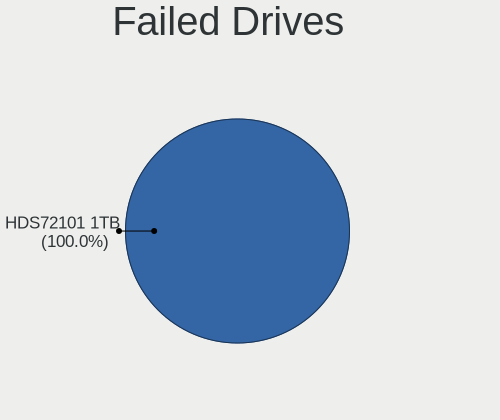
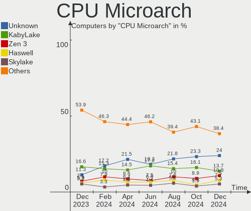
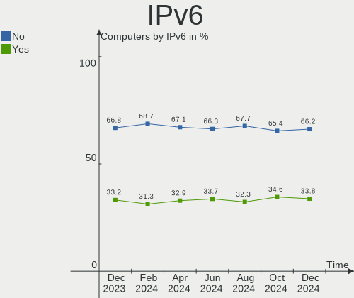
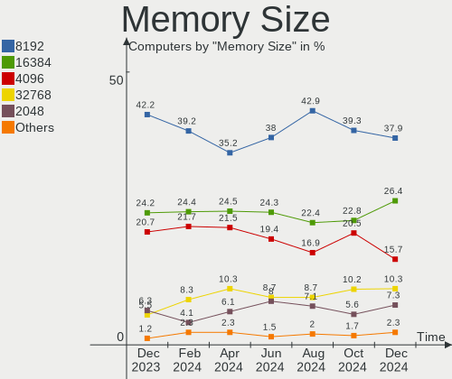
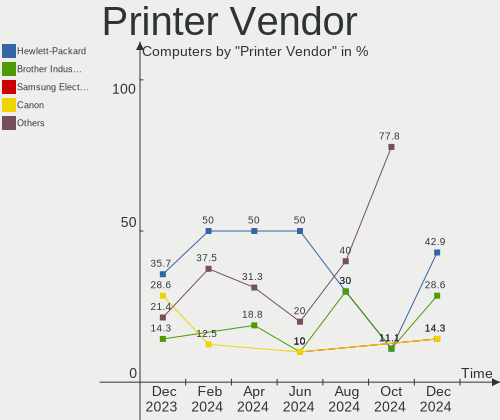

Fedora Hardware Trends
----------------------

A project to identify most popular hardware characteristics and track their change
over time based on data collected by Fedora users at https://Linux-Hardware.org.

Anyone can contribute to this report by the [hw-probe](https://github.com/linuxhw/hw-probe) tool:

    sudo -E hw-probe -all -upload

This is a report for all computer types. See also reports for [desktops](/Dist/Fedora/Desktop/README.md) and [notebooks](/Dist/Fedora/Notebook/README.md).

Full-feature report is available here: https://linux-hardware.org/?view=trends

Period: Aug, 2021.

Contents
--------

* [ System ](#system)
  - [ OS                       ](#os)
  - [ OS Family                ](#os-family)
  - [ Kernel                   ](#kernel)
  - [ Kernel Family            ](#kernel-family)
  - [ Kernel Major Ver.        ](#kernel-major-ver)
  - [ Arch                     ](#arch)
  - [ DE                       ](#de)
  - [ Display Server           ](#display-server)
  - [ Display Manager          ](#display-manager)
  - [ OS Lang                  ](#os-lang)
  - [ Boot Mode                ](#boot-mode)
  - [ Filesystem               ](#filesystem)
  - [ Part. scheme             ](#part-scheme)
  - [ Dual Boot with Linux/BSD ](#dual-boot-with-linuxbsd)
  - [ Dual Boot (Win)          ](#dual-boot-win)

* [ Board ](#board)
  - [ Vendor                   ](#vendor)
  - [ Model                    ](#model)
  - [ Model Family             ](#model-family)
  - [ MFG Year                 ](#mfg-year)
  - [ Form Factor              ](#form-factor)
  - [ Secure Boot              ](#secure-boot)
  - [ Coreboot                 ](#coreboot)
  - [ RAM Size                 ](#ram-size)
  - [ RAM Used                 ](#ram-used)
  - [ Total Drives             ](#total-drives)
  - [ Has CD-ROM               ](#has-cd-rom)
  - [ Has Ethernet             ](#has-ethernet)
  - [ Has WiFi                 ](#has-wifi)
  - [ Has Bluetooth            ](#has-bluetooth)

* [ Location ](#location)
  - [ Country                  ](#country)
  - [ City                     ](#city)

* [ Drives ](#drives)
  - [ Drive Vendor             ](#drive-vendor)
  - [ Drive Model              ](#drive-model)
  - [ HDD Vendor               ](#hdd-vendor)
  - [ SSD Vendor               ](#ssd-vendor)
  - [ Drive Kind               ](#drive-kind)
  - [ Drive Connector          ](#drive-connector)
  - [ Drive Size               ](#drive-size)
  - [ Space Total              ](#space-total)
  - [ Space Used               ](#space-used)
  - [ Malfunc. Drives          ](#malfunc-drives)
  - [ Malfunc. Drive Vendor    ](#malfunc-drive-vendor)
  - [ Malfunc. HDD Vendor      ](#malfunc-hdd-vendor)
  - [ Malfunc. Drive Kind      ](#malfunc-drive-kind)
  - [ Failed Drives            ](#failed-drives)
  - [ Failed Drive Vendor      ](#failed-drive-vendor)
  - [ Drive Status             ](#drive-status)

* [ Storage controller ](#storage-controller)
  - [ Storage Vendor           ](#storage-vendor)
  - [ Storage Model            ](#storage-model)
  - [ Storage Kind             ](#storage-kind)

* [ Processor ](#processor)
  - [ CPU Vendor               ](#cpu-vendor)
  - [ CPU Model                ](#cpu-model)
  - [ CPU Model Family         ](#cpu-model-family)
  - [ CPU Cores                ](#cpu-cores)
  - [ CPU Sockets              ](#cpu-sockets)
  - [ CPU Threads              ](#cpu-threads)
  - [ CPU Op-Modes             ](#cpu-op-modes)
  - [ CPU Microcode            ](#cpu-microcode)
  - [ CPU Microarch            ](#cpu-microarch)

* [ Graphics ](#graphics)
  - [ GPU Vendor               ](#gpu-vendor)
  - [ GPU Model                ](#gpu-model)
  - [ GPU Combo                ](#gpu-combo)
  - [ GPU Driver               ](#gpu-driver)
  - [ GPU Memory               ](#gpu-memory)

* [ Monitor ](#monitor)
  - [ Monitor Vendor           ](#monitor-vendor)
  - [ Monitor Model            ](#monitor-model)
  - [ Monitor Resolution       ](#monitor-resolution)
  - [ Monitor Diagonal         ](#monitor-diagonal)
  - [ Monitor Width            ](#monitor-width)
  - [ Aspect Ratio             ](#aspect-ratio)
  - [ Monitor Area             ](#monitor-area)
  - [ Pixel Density            ](#pixel-density)
  - [ Multiple Monitors        ](#multiple-monitors)

* [ Network ](#network)
  - [ Net Controller Vendor    ](#net-controller-vendor)
  - [ Net Controller Model     ](#net-controller-model)
  - [ Wireless Vendor          ](#wireless-vendor)
  - [ Wireless Model           ](#wireless-model)
  - [ Ethernet Vendor          ](#ethernet-vendor)
  - [ Ethernet Model           ](#ethernet-model)
  - [ Net Controller Kind      ](#net-controller-kind)
  - [ Used Controller          ](#used-controller)
  - [ NICs                     ](#nics)
  - [ IPv6                     ](#ipv6)

* [ Bluetooth ](#bluetooth)
  - [ Bluetooth Vendor         ](#bluetooth-vendor)
  - [ Bluetooth Model          ](#bluetooth-model)

* [ Sound ](#sound)
  - [ Sound Vendor             ](#sound-vendor)
  - [ Sound Model              ](#sound-model)

* [ Memory ](#memory)
  - [ Memory Vendor            ](#memory-vendor)
  - [ Memory Model             ](#memory-model)
  - [ Memory Kind              ](#memory-kind)
  - [ Memory Form Factor       ](#memory-form-factor)
  - [ Memory Size              ](#memory-size)
  - [ Memory Speed             ](#memory-speed)

* [ Printers & scanners ](#printers--scanners)
  - [ Printer Vendor           ](#printer-vendor)
  - [ Printer Model            ](#printer-model)
  - [ Scanner Vendor           ](#scanner-vendor)
  - [ Scanner Model            ](#scanner-model)

* [ Camera ](#camera)
  - [ Camera Vendor            ](#camera-vendor)
  - [ Camera Model             ](#camera-model)

* [ Security ](#security)
  - [ Fingerprint Vendor       ](#fingerprint-vendor)
  - [ Fingerprint Model        ](#fingerprint-model)
  - [ Chipcard Vendor          ](#chipcard-vendor)
  - [ Chipcard Model           ](#chipcard-model)

* [ Unsupported ](#unsupported)
  - [ Unsupported Devices      ](#unsupported-devices)
  - [ Unsupported Device Types ](#unsupported-device-types)

System
------

OS
--

Installed operating systems

| Name      | Computers | Percent |
|-----------|-----------|---------|
| Fedora 34 | 280       | 86.15%  |
| Fedora 33 | 21        | 6.46%   |
| Fedora 35 | 13        | 4%      |
| Fedora 32 | 8         | 2.46%   |
| Fedora 36 | 2         | 0.62%   |
| Fedora 30 | 1         | 0.31%   |

OS Family
---------

OS without a version

| Name   | Computers | Percent |
|--------|-----------|---------|
| Fedora | 325       | 100%    |

Kernel
------

Version of the Linux kernel

| Version                                             | Computers | Percent |
|-----------------------------------------------------|-----------|---------|
| 5.13.12-200.fc34.x86_64                             | 73        | 22.46%  |
| 5.13.9-200.fc34.x86_64                              | 43        | 13.23%  |
| 5.13.8-200.fc34.x86_64                              | 41        | 12.62%  |
| 5.13.6-200.fc34.x86_64                              | 39        | 12%     |
| 5.13.10-200.fc34.x86_64                             | 31        | 9.54%   |
| 5.13.7-200.fc34.x86_64                              | 13        | 4%      |
| 5.11.12-300.fc34.x86_64                             | 10        | 3.08%   |
| 5.13.5-200.fc34.x86_64                              | 8         | 2.46%   |
| 5.13.4-200.fc34.x86_64                              | 7         | 2.15%   |
| 5.11.22-100.fc32.x86_64                             | 6         | 1.85%   |
| 5.14.0-0.rc5.42.fc35.x86_64                         | 5         | 1.54%   |
| 5.13.12-100.fc33.x86_64                             | 4         | 1.23%   |
| 5.14.0-0.rc6.46.fc35.x86_64                         | 3         | 0.92%   |
| 5.13.9-100.fc33.x86_64                              | 3         | 0.92%   |
| 5.13.10-100.fc33.x86_64                             | 3         | 0.92%   |
| 5.14.0-0.rc5.20210813gitf8e6dfc64f61.46.fc36.x86_64 | 2         | 0.62%   |
| 5.13.6-100.fc33.x86_64                              | 2         | 0.62%   |
| 5.13.5-100.fc33.x86_64                              | 2         | 0.62%   |
| 5.12.18-200.fc33.x86_64                             | 2         | 0.62%   |
| 5.12.15-300.fc34.x86_64                             | 2         | 0.62%   |
| 5.9.14-100.fc32.x86_64                              | 1         | 0.31%   |
| 5.9.10-200.fc33.x86_64                              | 1         | 0.31%   |
| 5.8.15-301.fc33.x86_64                              | 1         | 0.31%   |
| 5.6.6-300.fc32.x86_64                               | 1         | 0.31%   |
| 5.6.13-100.fc30.x86_64                              | 1         | 0.31%   |
| 5.14.0-0.rc7.54.vanilla.1.fc34.x86_64               | 1         | 0.31%   |
| 5.14.0-0.rc7.54.rog.fc34.x86_64                     | 1         | 0.31%   |
| 5.14.0-0.rc4.20210804gitd5ad8ec3cfb5.36.fc35.x86_64 | 1         | 0.31%   |
| 5.14.0-0.rc3.20210728git4010a528219e.32.fc35.x86_64 | 1         | 0.31%   |
| 5.13.9-200.rog.fc34.x86_64                          | 1         | 0.31%   |
| 5.13.8-xm1cacule.0.fc34.x86_64                      | 1         | 0.31%   |
| 5.13.6-250.vanilla.1.fc34.x86_64                    | 1         | 0.31%   |
| 5.13.4-201.fsync.fc34.x86_64                        | 1         | 0.31%   |
| 5.13.4-100.fc33.x86_64                              | 1         | 0.31%   |
| 5.13.11-xm1.0.fc34.x86_64                           | 1         | 0.31%   |
| 5.13.11-202108181951                                | 1         | 0.31%   |
| 5.12.8-300.fc34.x86_64                              | 1         | 0.31%   |
| 5.12.15-200.fc33.x86_64                             | 1         | 0.31%   |
| 5.12.14-300.fc34.x86_64+debug                       | 1         | 0.31%   |
| 5.12.13-300.fc34.x86_64                             | 1         | 0.31%   |
| 5.12.12-300.fc34.x86_64                             | 1         | 0.31%   |
| 5.12.11-300.mbp.fc33.x86_64                         | 1         | 0.31%   |
| 5.12.11-300.fc34.x86_64                             | 1         | 0.31%   |
| 5.11.18-300.fc34.x86_64                             | 1         | 0.31%   |
| 5.11.16-300.fc34.x86_64                             | 1         | 0.31%   |
| 5.11.11-200.fc33.x86_64                             | 1         | 0.31%   |

Kernel Family
-------------

Linux kernel without a distro release

| Version | Computers | Percent |
|---------|-----------|---------|
| 5.13.12 | 77        | 23.69%  |
| 5.13.9  | 47        | 14.46%  |
| 5.13.8  | 42        | 12.92%  |
| 5.13.6  | 42        | 12.92%  |
| 5.13.10 | 34        | 10.46%  |
| 5.14.0  | 14        | 4.31%   |
| 5.13.7  | 13        | 4%      |
| 5.13.5  | 10        | 3.08%   |
| 5.11.12 | 10        | 3.08%   |
| 5.13.4  | 9         | 2.77%   |
| 5.11.22 | 6         | 1.85%   |
| 5.12.15 | 3         | 0.92%   |
| 5.13.11 | 2         | 0.62%   |
| 5.12.18 | 2         | 0.62%   |
| 5.12.11 | 2         | 0.62%   |
| 5.9.14  | 1         | 0.31%   |
| 5.9.10  | 1         | 0.31%   |
| 5.8.15  | 1         | 0.31%   |
| 5.6.6   | 1         | 0.31%   |
| 5.6.13  | 1         | 0.31%   |
| 5.12.8  | 1         | 0.31%   |
| 5.12.14 | 1         | 0.31%   |
| 5.12.13 | 1         | 0.31%   |
| 5.12.12 | 1         | 0.31%   |
| 5.11.18 | 1         | 0.31%   |
| 5.11.16 | 1         | 0.31%   |
| 5.11.11 | 1         | 0.31%   |

Kernel Major Ver.
-----------------

Linux kernel major version

| Version | Computers | Percent |
|---------|-----------|---------|
| 5.13    | 276       | 84.92%  |
| 5.11    | 19        | 5.85%   |
| 5.14    | 14        | 4.31%   |
| 5.12    | 11        | 3.38%   |
| 5.9     | 2         | 0.62%   |
| 5.6     | 2         | 0.62%   |
| 5.8     | 1         | 0.31%   |

Arch
----

OS architecture (x86_64, i586, etc.)

| Name   | Computers | Percent |
|--------|-----------|---------|
| x86_64 | 325       | 100%    |

DE
--

Desktop Environment

| Name       | Computers | Percent |
|------------|-----------|---------|
| GNOME      | 226       | 69.54%  |
| KDE5       | 23        | 7.08%   |
| KDE        | 20        | 6.15%   |
| Cinnamon   | 17        | 5.23%   |
| X-Cinnamon | 12        | 3.69%   |
| Unknown    | 12        | 3.69%   |
| MATE       | 6         | 1.85%   |
| XFCE       | 2         | 0.62%   |
| sway       | 2         | 0.62%   |
| openbox    | 1         | 0.31%   |
| NsCDE      | 1         | 0.31%   |
| LXDE       | 1         | 0.31%   |
| Deepin     | 1         | 0.31%   |
| Budgie     | 1         | 0.31%   |

Display Server
--------------

X11 or Wayland

| Name    | Computers | Percent |
|---------|-----------|---------|
| Wayland | 199       | 61.23%  |
| X11     | 106       | 32.62%  |
| Tty     | 16        | 4.92%   |
| Unknown | 4         | 1.23%   |

Display Manager
---------------

SDDM, LightDM, etc.

| Name    | Computers | Percent |
|---------|-----------|---------|
| Unknown | 154       | 47.38%  |
| GDM     | 124       | 38.15%  |
| SDDM    | 21        | 6.46%   |
| LightDM | 16        | 4.92%   |
| TDM     | 8         | 2.46%   |
| KDM     | 2         | 0.62%   |

OS Lang
-------

Language

| Lang  | Computers | Percent |
|-------|-----------|---------|
| en_US | 143       | 44%     |
| en_GB | 37        | 11.38%  |
| ru_RU | 19        | 5.85%   |
| de_DE | 16        | 4.92%   |
| pt_BR | 14        | 4.31%   |
| en_AU | 13        | 4%      |
| fr_FR | 9         | 2.77%   |
| en_IN | 6         | 1.85%   |
| pl_PL | 5         | 1.54%   |
| nl_BE | 5         | 1.54%   |
| it_IT | 5         | 1.54%   |
| en_CA | 5         | 1.54%   |
| es_MX | 4         | 1.23%   |
| es_ES | 4         | 1.23%   |
| fi_FI | 3         | 0.92%   |
| ru_UA | 2         | 0.62%   |
| nl_NL | 2         | 0.62%   |
| ja_JP | 2         | 0.62%   |
| es_EC | 2         | 0.62%   |
| es_CO | 2         | 0.62%   |
| es_CL | 2         | 0.62%   |
| en_ZA | 2         | 0.62%   |
| en_PH | 2         | 0.62%   |
| en_NZ | 2         | 0.62%   |
| en_DK | 2         | 0.62%   |
| da_DK | 2         | 0.62%   |
| cs_CZ | 2         | 0.62%   |
| C     | 2         | 0.62%   |
| zh_TW | 1         | 0.31%   |
| zh_CN | 1         | 0.31%   |
| sk_SK | 1         | 0.31%   |
| ro_RO | 1         | 0.31%   |
| nb_NO | 1         | 0.31%   |
| fr_CA | 1         | 0.31%   |
| es_UY | 1         | 0.31%   |
| en_IE | 1         | 0.31%   |
| de_CH | 1         | 0.31%   |
| ca_ES | 1         | 0.31%   |
| ca_AD | 1         | 0.31%   |

Boot Mode
---------

EFI or BIOS

| Mode | Computers | Percent |
|------|-----------|---------|
| EFI  | 239       | 73.54%  |
| BIOS | 86        | 26.46%  |

Filesystem
----------

Type of filesystem

| Type                | Computers | Percent |
|---------------------|-----------|---------|
| Btrfs               | 208       | 64%     |
| Ext4                | 92        | 28.31%  |
| Xfs                 | 22        | 6.77%   |
| Overlay             | 1         | 0.31%   |
| Fuse.fuse-overlayfs | 1         | 0.31%   |
| F2fs                | 1         | 0.31%   |

Part. scheme
------------

Scheme of partitioning

| Type    | Computers | Percent |
|---------|-----------|---------|
| GPT     | 148       | 45.54%  |
| Unknown | 146       | 44.92%  |
| MBR     | 31        | 9.54%   |

Dual Boot with Linux/BSD
------------------------

Hosting more than one Linux/BSD

| Dual boot | Computers | Percent |
|-----------|-----------|---------|
| No        | 292       | 89.85%  |
| Yes       | 33        | 10.15%  |

Dual Boot (Win)
---------------

Hosting Linux and Windows

| Dual boot | Computers | Percent |
|-----------|-----------|---------|
| No        | 249       | 76.62%  |
| Yes       | 76        | 23.38%  |

Board
-----

Vendor
------

Motherboard manufacturer

| Name                | Computers | Percent |
|---------------------|-----------|---------|
| Lenovo              | 58        | 17.85%  |
| ASUSTek Computer    | 48        | 14.77%  |
| Hewlett-Packard     | 43        | 13.23%  |
| Dell                | 42        | 12.92%  |
| Gigabyte Technology | 29        | 8.92%   |
| MSI                 | 19        | 5.85%   |
| Acer                | 16        | 4.92%   |
| ASRock              | 14        | 4.31%   |
| Apple               | 7         | 2.15%   |
| HUAWEI              | 5         | 1.54%   |
| Unknown             | 5         | 1.54%   |
| Sony                | 4         | 1.23%   |
| Notebook            | 4         | 1.23%   |
| Intel               | 3         | 0.92%   |
| Chuwi               | 3         | 0.92%   |
| Toshiba             | 2         | 0.62%   |
| Supermicro          | 2         | 0.62%   |
| Microsoft           | 2         | 0.62%   |
| Fujitsu             | 2         | 0.62%   |
| Biostar             | 2         | 0.62%   |
| Alienware           | 2         | 0.62%   |
| VINGA               | 1         | 0.31%   |
| Timi                | 1         | 0.31%   |
| System76            | 1         | 0.31%   |
| Razer               | 1         | 0.31%   |
| Positivo            | 1         | 0.31%   |
| PC Specialist       | 1         | 0.31%   |
| Maibenben           | 1         | 0.31%   |
| Fujitsu Siemens     | 1         | 0.31%   |
| Framework           | 1         | 0.31%   |
| BESSTAR Tech        | 1         | 0.31%   |
| AZW                 | 1         | 0.31%   |
| ASRockRack          | 1         | 0.31%   |
| AMI                 | 1         | 0.31%   |

Model
-----

Motherboard model

| Name                                     | Computers | Percent |
|------------------------------------------|-----------|---------|
| Unknown                                  | 5         | 1.54%   |
| MSI MS-7C37                              | 4         | 1.23%   |
| Dell XPS 15 7590                         | 3         | 0.92%   |
| Lenovo ThinkPad P14s Gen 1 20Y1CTO1WW    | 2         | 0.62%   |
| Lenovo IdeaPad Flex 5 14ARE05 81X2       | 2         | 0.62%   |
| HP Pavilion dv7                          | 2         | 0.62%   |
| HP Laptop 15s-eq2xxx                     | 2         | 0.62%   |
| HP ENVY x360 Convertible 13-ay0xxx       | 2         | 0.62%   |
| HP Compaq 8100 Elite SFF PC              | 2         | 0.62%   |
| HP 14                                    | 2         | 0.62%   |
| Gigabyte Z170-D3H                        | 2         | 0.62%   |
| Gigabyte B450 I AORUS PRO WIFI           | 2         | 0.62%   |
| Gigabyte B450 AORUS PRO WIFI             | 2         | 0.62%   |
| Dell XPS 15 9550                         | 2         | 0.62%   |
| Dell XPS 13 7390                         | 2         | 0.62%   |
| Dell Latitude 7400                       | 2         | 0.62%   |
| ASUS SABERTOOTH 990FX R2.0               | 2         | 0.62%   |
| ASUS ROG Zephyrus G14 GA401QM_GA401QM    | 2         | 0.62%   |
| ASUS ROG STRIX X570-E GAMING             | 2         | 0.62%   |
| ASUS ROG STRIX B550-I GAMING             | 2         | 0.62%   |
| ASUS All Series                          | 2         | 0.62%   |
| ASUS A8R32-MVP Deluxe                    | 2         | 0.62%   |
| Acer Aspire ES1-572                      | 2         | 0.62%   |
| VINGA Iron S140                          | 1         | 0.31%   |
| Toshiba TECRA Z50-A                      | 1         | 0.31%   |
| Toshiba Satellite C845D                  | 1         | 0.31%   |
| Timi A35S                                | 1         | 0.31%   |
| System76 Oryx Pro                        | 1         | 0.31%   |
| Supermicro X10DRi                        | 1         | 0.31%   |
| Supermicro H8DG6/H8DGi                   | 1         | 0.31%   |
| Sony VPCSA25GX                           | 1         | 0.31%   |
| Sony VPCEH36EG                           | 1         | 0.31%   |
| Sony VPCEH16EN                           | 1         | 0.31%   |
| Sony SVS1511X9RB                         | 1         | 0.31%   |
| Razer Blade 15 Mid 2019-Base             | 1         | 0.31%   |
| Positivo C14CR21                         | 1         | 0.31%   |
| PC Specialist N85_N87,HJ,HJ1,HK1         | 1         | 0.31%   |
| Notebook Titanium B155 MAX               | 1         | 0.31%   |
| Notebook P377SM-A                        | 1         | 0.31%   |
| Notebook NH55RGQ                         | 1         | 0.31%   |
| Notebook N150CU                          | 1         | 0.31%   |
| MSI Z390 Gaming Trident X Plus (MS-B926) | 1         | 0.31%   |
| MSI MS-7D15                              | 1         | 0.31%   |
| MSI MS-7C91                              | 1         | 0.31%   |
| MSI MS-7C90                              | 1         | 0.31%   |
| MSI MS-7C84                              | 1         | 0.31%   |
| MSI MS-7C82                              | 1         | 0.31%   |
| MSI MS-7C35                              | 1         | 0.31%   |
| MSI MS-7B86                              | 1         | 0.31%   |
| MSI MS-7B79                              | 1         | 0.31%   |
| MSI MS-7A44                              | 1         | 0.31%   |
| MSI MS-7A33                              | 1         | 0.31%   |
| MSI MS-7808                              | 1         | 0.31%   |
| MSI Modern 14 B4MW                       | 1         | 0.31%   |
| MSI MBB-3200G8                           | 1         | 0.31%   |
| MSI GP62MVR 7RFX                         | 1         | 0.31%   |
| Microsoft Surface Pro 3                  | 1         | 0.31%   |
| Microsoft Surface Pro                    | 1         | 0.31%   |
| Maibenben S431                           | 1         | 0.31%   |
| Lenovo Yoga C740-14IML 81TC              | 1         | 0.31%   |

Model Family
------------

Motherboard model prefix

| Name              | Computers | Percent |
|-------------------|-----------|---------|
| Lenovo ThinkPad   | 31        | 9.54%   |
| ASUS ROG          | 16        | 4.92%   |
| Dell XPS          | 15        | 4.62%   |
| Lenovo IdeaPad    | 13        | 4%      |
| Acer Aspire       | 13        | 4%      |
| Dell Inspiron     | 9         | 2.77%   |
| HP Pavilion       | 8         | 2.46%   |
| HP ProBook        | 7         | 2.15%   |
| HP Laptop         | 6         | 1.85%   |
| Dell OptiPlex     | 6         | 1.85%   |
| HP EliteBook      | 5         | 1.54%   |
| Dell Latitude     | 5         | 1.54%   |
| ASUS PRIME        | 5         | 1.54%   |
| Unknown           | 5         | 1.54%   |
| MSI MS-7C37       | 4         | 1.23%   |
| Lenovo Yoga       | 4         | 1.23%   |
| HP ENVY           | 4         | 1.23%   |
| HP EliteDesk      | 4         | 1.23%   |
| Gigabyte B450     | 4         | 1.23%   |
| ASUS VivoBook     | 4         | 1.23%   |
| ASUS TUF          | 4         | 1.23%   |
| Lenovo ThinkBook  | 3         | 0.92%   |
| Dell Precision    | 3         | 0.92%   |
| Microsoft Surface | 2         | 0.62%   |
| Lenovo Legion     | 2         | 0.62%   |
| HP Compaq         | 2         | 0.62%   |
| HP 14             | 2         | 0.62%   |
| Gigabyte Z170-D3H | 2         | 0.62%   |
| Gigabyte B450M    | 2         | 0.62%   |
| ASUS SABERTOOTH   | 2         | 0.62%   |
| ASUS ASUS         | 2         | 0.62%   |
| ASUS All          | 2         | 0.62%   |
| ASUS A8R32-MVP    | 2         | 0.62%   |
| ASRock B450       | 2         | 0.62%   |
| VINGA Iron        | 1         | 0.31%   |
| Toshiba TECRA     | 1         | 0.31%   |
| Toshiba Satellite | 1         | 0.31%   |
| Timi A35S         | 1         | 0.31%   |
| System76 Oryx     | 1         | 0.31%   |
| Supermicro X10DRi | 1         | 0.31%   |
| Supermicro H8DG6  | 1         | 0.31%   |
| Sony VPCSA25GX    | 1         | 0.31%   |
| Sony VPCEH36EG    | 1         | 0.31%   |
| Sony VPCEH16EN    | 1         | 0.31%   |
| Sony SVS1511X9RB  | 1         | 0.31%   |
| Razer Blade       | 1         | 0.31%   |
| Positivo C14CR21  | 1         | 0.31%   |
| PC Specialist N85 | 1         | 0.31%   |
| Notebook Titanium | 1         | 0.31%   |
| Notebook P377SM-A | 1         | 0.31%   |
| Notebook NH55RGQ  | 1         | 0.31%   |
| Notebook N150CU   | 1         | 0.31%   |
| MSI Z390          | 1         | 0.31%   |
| MSI MS-7D15       | 1         | 0.31%   |
| MSI MS-7C91       | 1         | 0.31%   |
| MSI MS-7C90       | 1         | 0.31%   |
| MSI MS-7C84       | 1         | 0.31%   |
| MSI MS-7C82       | 1         | 0.31%   |
| MSI MS-7C35       | 1         | 0.31%   |
| MSI MS-7B86       | 1         | 0.31%   |

MFG Year
--------

Motherboard manufacture year

| Year | Computers | Percent |
|------|-----------|---------|
| 2021 | 90        | 27.69%  |
| 2020 | 72        | 22.15%  |
| 2019 | 42        | 12.92%  |
| 2018 | 21        | 6.46%   |
| 2016 | 17        | 5.23%   |
| 2014 | 16        | 4.92%   |
| 2012 | 12        | 3.69%   |
| 2013 | 11        | 3.38%   |
| 2015 | 10        | 3.08%   |
| 2017 | 8         | 2.46%   |
| 2011 | 8         | 2.46%   |
| 2010 | 7         | 2.15%   |
| 2009 | 5         | 1.54%   |
| 2006 | 3         | 0.92%   |
| 2008 | 2         | 0.62%   |
| 2007 | 1         | 0.31%   |

Form Factor
-----------

Physical design of the computer

| Name        | Computers | Percent |
|-------------|-----------|---------|
| Notebook    | 174       | 53.54%  |
| Desktop     | 123       | 37.85%  |
| Convertible | 14        | 4.31%   |
| Tablet      | 4         | 1.23%   |
| Mini pc     | 4         | 1.23%   |
| All in one  | 3         | 0.92%   |
| Server      | 3         | 0.92%   |

Secure Boot
-----------

Enabled or disabled

| State    | Computers | Percent |
|----------|-----------|---------|
| Disabled | 285       | 87.69%  |
| Enabled  | 40        | 12.31%  |

Coreboot
--------

Have coreboot on board

| Used | Computers | Percent |
|------|-----------|---------|
| No   | 325       | 100%    |

RAM Size
--------

Total RAM memory

| Size in GB  | Computers | Percent |
|-------------|-----------|---------|
| 16.01-24.0  | 87        | 26.77%  |
| 4.01-8.0    | 74        | 22.77%  |
| 32.01-64.0  | 59        | 18.15%  |
| 8.01-16.0   | 55        | 16.92%  |
| 3.01-4.0    | 26        | 8%      |
| 24.01-32.0  | 10        | 3.08%   |
| 64.01-256.0 | 10        | 3.08%   |
| 1.01-2.0    | 3         | 0.92%   |
| 2.01-3.0    | 1         | 0.31%   |

RAM Used
--------

Used RAM memory

| Used GB    | Computers | Percent |
|------------|-----------|---------|
| 2.01-3.0   | 83        | 25.54%  |
| 4.01-8.0   | 81        | 24.92%  |
| 3.01-4.0   | 74        | 22.77%  |
| 1.01-2.0   | 42        | 12.92%  |
| 8.01-16.0  | 28        | 8.62%   |
| 0.51-1.0   | 10        | 3.08%   |
| 24.01-32.0 | 3         | 0.92%   |
| 16.01-24.0 | 3         | 0.92%   |
| 0.01-0.5   | 1         | 0.31%   |

Total Drives
------------

Number of drives on board

| Drives | Computers | Percent |
|--------|-----------|---------|
| 1      | 175       | 53.85%  |
| 2      | 84        | 25.85%  |
| 3      | 32        | 9.85%   |
| 4      | 16        | 4.92%   |
| 5      | 7         | 2.15%   |
| 6      | 5         | 1.54%   |
| 8      | 3         | 0.92%   |
| 7      | 2         | 0.62%   |
| 9      | 1         | 0.31%   |

Has CD-ROM
----------

Has CD-ROM on board

| Presented | Computers | Percent |
|-----------|-----------|---------|
| No        | 247       | 76%     |
| Yes       | 78        | 24%     |

Has Ethernet
------------

Has Ethernet on board

| Presented | Computers | Percent |
|-----------|-----------|---------|
| Yes       | 263       | 80.92%  |
| No        | 62        | 19.08%  |

Has WiFi
--------

Has WiFi module

| Presented | Computers | Percent |
|-----------|-----------|---------|
| Yes       | 243       | 74.77%  |
| No        | 82        | 25.23%  |

Has Bluetooth
-------------

Has Bluetooth module

| Presented | Computers | Percent |
|-----------|-----------|---------|
| Yes       | 232       | 71.38%  |
| No        | 93        | 28.62%  |

Location
--------

Country
-------

Geographic location (country)

| Country      | Computers | Percent |
|--------------|-----------|---------|
| USA          | 41        | 12.62%  |
| Brazil       | 26        | 8%      |
| Germany      | 25        | 7.69%   |
| UK           | 20        | 6.15%   |
| Russia       | 15        | 4.62%   |
| France       | 15        | 4.62%   |
| Australia    | 15        | 4.62%   |
| India        | 14        | 4.31%   |
| Netherlands  | 11        | 3.38%   |
| Canada       | 11        | 3.38%   |
| Spain        | 9         | 2.77%   |
| Poland       | 9         | 2.77%   |
| Italy        | 8         | 2.46%   |
| Czechia      | 6         | 1.85%   |
| Belgium      | 6         | 1.85%   |
| Ukraine      | 5         | 1.54%   |
| Switzerland  | 5         | 1.54%   |
| Finland      | 5         | 1.54%   |
| Chile        | 5         | 1.54%   |
| Argentina    | 5         | 1.54%   |
| Mexico       | 4         | 1.23%   |
| Denmark      | 4         | 1.23%   |
| Japan        | 3         | 0.92%   |
| Estonia      | 3         | 0.92%   |
| Colombia     | 3         | 0.92%   |
| Belarus      | 3         | 0.92%   |
| Austria      | 3         | 0.92%   |
| Turkey       | 2         | 0.62%   |
| South Africa | 2         | 0.62%   |
| Slovenia     | 2         | 0.62%   |
| Slovakia     | 2         | 0.62%   |
| Singapore    | 2         | 0.62%   |
| Philippines  | 2         | 0.62%   |
| Norway       | 2         | 0.62%   |
| New Zealand  | 2         | 0.62%   |
| Israel       | 2         | 0.62%   |
| Cyprus       | 2         | 0.62%   |
| Bulgaria     | 2         | 0.62%   |
| Uruguay      | 1         | 0.31%   |
| Tonga        | 1         | 0.31%   |
| Thailand     | 1         | 0.31%   |
| Tajikistan   | 1         | 0.31%   |
| Taiwan       | 1         | 0.31%   |
| South Korea  | 1         | 0.31%   |
| Serbia       | 1         | 0.31%   |
| Romania      | 1         | 0.31%   |
| Portugal     | 1         | 0.31%   |
| Myanmar      | 1         | 0.31%   |
| Morocco      | 1         | 0.31%   |
| Moldova      | 1         | 0.31%   |
| Lithuania    | 1         | 0.31%   |
| Kenya        | 1         | 0.31%   |
| Ireland      | 1         | 0.31%   |
| Iran         | 1         | 0.31%   |
| Indonesia    | 1         | 0.31%   |
| Guadeloupe   | 1         | 0.31%   |
| Greece       | 1         | 0.31%   |
| Egypt        | 1         | 0.31%   |
| Ecuador      | 1         | 0.31%   |
| Croatia      | 1         | 0.31%   |

City
----

Geographic location (city)

| City                | Computers | Percent |
|---------------------|-----------|---------|
| Sydney              | 9         | 2.77%   |
| Moscow              | 5         | 1.54%   |
| Buenos Aires        | 4         | 1.23%   |
| Bengaluru           | 4         | 1.23%   |
| Zurich              | 3         | 0.92%   |
| Toronto             | 3         | 0.92%   |
| Tallinn             | 3         | 0.92%   |
| S??o Paulo          | 3         | 0.92%   |
| Pymble              | 3         | 0.92%   |
| Niter??i            | 3         | 0.92%   |
| Minsk               | 3         | 0.92%   |
| Kyiv                | 3         | 0.92%   |
| Jambes              | 3         | 0.92%   |
| Helsinki            | 3         | 0.92%   |
| Fortaleza           | 3         | 0.92%   |
| D??sseldorf         | 3         | 0.92%   |
| Berlin              | 3         | 0.92%   |
| Yekaterinburg       | 2         | 0.62%   |
| Warsaw              | 2         | 0.62%   |
| Vienna              | 2         | 0.62%   |
| Tel Aviv            | 2         | 0.62%   |
| Sofia               | 2         | 0.62%   |
| Singapore           | 2         | 0.62%   |
| Seattle             | 2         | 0.62%   |
| Santiago            | 2         | 0.62%   |
| Quezon              | 2         | 0.62%   |
| Pune                | 2         | 0.62%   |
| Penza               | 2         | 0.62%   |
| Montreal            | 2         | 0.62%   |
| Milan               | 2         | 0.62%   |
| Melbourne           | 2         | 0.62%   |
| Limassol            | 2         | 0.62%   |
| Laurel              | 2         | 0.62%   |
| Kastrup             | 2         | 0.62%   |
| Istanbul            | 2         | 0.62%   |
| Hluboka nad Vltavou | 2         | 0.62%   |
| Feeding Hills       | 2         | 0.62%   |
| Coventry            | 2         | 0.62%   |
| Chandigarh          | 2         | 0.62%   |
| Bratislava          | 2         | 0.62%   |
| Belo Horizonte      | 2         | 0.62%   |
| Auckland            | 2         | 0.62%   |
| Antwerp             | 2         | 0.62%   |
| Amsterdam           | 2         | 0.62%   |
| Zgorzelec           | 1         | 0.31%   |
| Zagreb              | 1         | 0.31%   |
| York                | 1         | 0.31%   |
| Yokohama            | 1         | 0.31%   |
| Yogyakarta          | 1         | 0.31%   |
| Yangon              | 1         | 0.31%   |
| Worthing            | 1         | 0.31%   |
| Winona              | 1         | 0.31%   |
| Wilhelmshaven       | 1         | 0.31%   |
| Whittier            | 1         | 0.31%   |
| Welwyn Garden City  | 1         | 0.31%   |
| Wells               | 1         | 0.31%   |
| Welland             | 1         | 0.31%   |
| Waterville          | 1         | 0.31%   |
| Wateringen          | 1         | 0.31%   |
| Washington          | 1         | 0.31%   |

Drives
------

Drive Vendor
------------

Hard drive vendors

| Vendor                  | Computers | Drives | Percent |
|-------------------------|-----------|--------|---------|
| Samsung Electronics     | 101       | 137    | 19.31%  |
| WDC                     | 71        | 88     | 13.58%  |
| Seagate                 | 68        | 90     | 13%     |
| Kingston                | 37        | 43     | 7.07%   |
| Toshiba                 | 32        | 38     | 6.12%   |
| Crucial                 | 23        | 25     | 4.4%    |
| Intel                   | 22        | 24     | 4.21%   |
| Sandisk                 | 21        | 21     | 4.02%   |
| SK Hynix                | 17        | 18     | 3.25%   |
| Unknown                 | 16        | 18     | 3.06%   |
| Hitachi                 | 14        | 19     | 2.68%   |
| A-DATA Technology       | 11        | 11     | 2.1%    |
| Micron Technology       | 8         | 8      | 1.53%   |
| Corsair                 | 7         | 7      | 1.34%   |
| KIOXIA                  | 6         | 6      | 1.15%   |
| KingSpec                | 5         | 5      | 0.96%   |
| HGST                    | 5         | 7      | 0.96%   |
| Phison                  | 4         | 4      | 0.76%   |
| Transcend               | 3         | 3      | 0.57%   |
| Silicon Motion          | 3         | 3      | 0.57%   |
| LITEONIT                | 3         | 3      | 0.57%   |
| LITEON                  | 3         | 3      | 0.57%   |
| Gigabyte Technology     | 3         | 3      | 0.57%   |
| Apple                   | 3         | 3      | 0.57%   |
| V Series                | 2         | 2      | 0.38%   |
| Union Memory (Shenzhen) | 2         | 3      | 0.38%   |
| SPCC                    | 2         | 2      | 0.38%   |
| Patriot                 | 2         | 2      | 0.38%   |
| Mushkin                 | 2         | 2      | 0.38%   |
| ASMT                    | 2         | 2      | 0.38%   |
| XPG                     | 1         | 1      | 0.19%   |
| Union Memory            | 1         | 1      | 0.19%   |
| UNIC2                   | 1         | 1      | 0.19%   |
| SUNEAST                 | 1         | 1      | 0.19%   |
| SMART                   | 1         | 1      | 0.19%   |
| SABRENT                 | 1         | 1      | 0.19%   |
| Reeinno                 | 1         | 1      | 0.19%   |
| PNY                     | 1         | 1      | 0.19%   |
| PLEXTOR                 | 1         | 2      | 0.19%   |
| PHD 3.0                 | 1         | 1      | 0.19%   |
| OCZ                     | 1         | 3      | 0.19%   |
| NGFF                    | 1         | 1      | 0.19%   |
| Netac                   | 1         | 1      | 0.19%   |
| MaxDigital              | 1         | 1      | 0.19%   |
| Lite-On                 | 1         | 1      | 0.19%   |
| Lexar                   | 1         | 1      | 0.19%   |
| Leven                   | 1         | 1      | 0.19%   |
| Indilinx                | 1         | 1      | 0.19%   |
| HUAWEI                  | 1         | 1      | 0.19%   |
| HS-SSD-E100             | 1         | 1      | 0.19%   |
| Hewlett-Packard         | 1         | 1      | 0.19%   |
| GOODRAM                 | 1         | 1      | 0.19%   |
| CT1000P1                | 1         | 1      | 0.19%   |
| CT1000MX                | 1         | 1      | 0.19%   |
| BIWIN                   | 1         | 1      | 0.19%   |

Drive Model
-----------

Hard drive models

| Model                                     | Computers | Percent |
|-------------------------------------------|-----------|---------|
| Kingston SA400S37480G 480GB SSD           | 10        | 1.69%   |
| Samsung SSD 860 EVO 1TB                   | 9         | 1.52%   |
| Samsung SSD 850 EVO 250GB                 | 7         | 1.18%   |
| Samsung NVMe SSD Drive 512GB              | 6         | 1.01%   |
| Toshiba DT01ACA100 1TB                    | 5         | 0.84%   |
| Seagate ST3500418AS 500GB                 | 5         | 0.84%   |
| Seagate ST2000DM008-2FR102 2TB            | 5         | 0.84%   |
| Samsung SSD 860 EVO 500GB                 | 5         | 0.84%   |
| Samsung NVMe SSD Drive 500GB              | 5         | 0.84%   |
| Kingston SV300S37A120G 120GB SSD          | 5         | 0.84%   |
| Kingston SA400S37240G 240GB SSD           | 5         | 0.84%   |
| Kingston SA400S37120G 120GB SSD           | 5         | 0.84%   |
| WDC WDS240G2G0B-00EPW0 240GB SSD          | 4         | 0.68%   |
| Seagate ST500DM002-1BD142 500GB           | 4         | 0.68%   |
| Seagate ST1000LM035-1RK172 1TB            | 4         | 0.68%   |
| Seagate ST1000LM024 HN-M101MBB 1TB        | 4         | 0.68%   |
| Sandisk NVMe SSD Drive 500GB              | 4         | 0.68%   |
| Samsung NVMe SSD Drive 256GB              | 4         | 0.68%   |
| Samsung NVMe SSD Drive 1TB                | 4         | 0.68%   |
| Samsung MZVLB1T0HBLR-000L7 1TB            | 4         | 0.68%   |
| KingSpec MT-128 128GB SSD                 | 4         | 0.68%   |
| Hitachi HDS721010CLA332 1TB               | 4         | 0.68%   |
| Crucial CT1000MX500SSD1 1TB               | 4         | 0.68%   |
| WDC WDS100T1X0E-00AFY0 1TB                | 3         | 0.51%   |
| WDC WD10EZEX-00BN5A0 1TB                  | 3         | 0.51%   |
| WDC PC SN730 SDBPNTY-1T00-1101 1TB        | 3         | 0.51%   |
| Unknown SD/MMC/MS PRO 128GB               | 3         | 0.51%   |
| Toshiba NVMe SSD Drive 512GB              | 3         | 0.51%   |
| SK Hynix NVMe SSD Drive 512GB             | 3         | 0.51%   |
| SK Hynix NVMe SSD Drive 256GB             | 3         | 0.51%   |
| Seagate ST2000DM001-1ER164 2TB            | 3         | 0.51%   |
| Seagate ST1000DM010-2EP102 1TB            | 3         | 0.51%   |
| Sandisk NVMe SSD Drive 256GB              | 3         | 0.51%   |
| Samsung SSD 980 PRO 1TB                   | 3         | 0.51%   |
| Samsung SSD 970 PRO 512GB                 | 3         | 0.51%   |
| Samsung SSD 970 EVO Plus 500GB            | 3         | 0.51%   |
| Samsung SSD 970 EVO Plus 2TB              | 3         | 0.51%   |
| Samsung SSD 970 EVO Plus 1TB              | 3         | 0.51%   |
| Samsung SSD 850 PRO 256GB                 | 3         | 0.51%   |
| Samsung SSD 850 EVO 500GB                 | 3         | 0.51%   |
| Samsung NVMe SSD Drive 250GB              | 3         | 0.51%   |
| Samsung NVMe SSD Drive 1024GB             | 3         | 0.51%   |
| Intel SSDSC2CT120A3 120GB                 | 3         | 0.51%   |
| Crucial CT500MX500SSD1 500GB              | 3         | 0.51%   |
| WDC WDS100T2B0C-00PXH0 1TB                | 2         | 0.34%   |
| WDC WD40EFRX-68N32N0 4TB                  | 2         | 0.34%   |
| WDC WD30EFRX-68EUZN0 3TB                  | 2         | 0.34%   |
| WDC WD20EZRZ-00Z5HB0 2TB                  | 2         | 0.34%   |
| WDC WD easystore 240GB                    | 2         | 0.34%   |
| WDC PC SN730 SDBQNTY-512G-1001 512GB      | 2         | 0.34%   |
| WDC PC SN730 SDBPNTY-512G-1027 512GB      | 2         | 0.34%   |
| V Series SATA SSD 240GB                   | 2         | 0.34%   |
| Toshiba KXG60ZNV512G 512GB                | 2         | 0.34%   |
| Toshiba HDWD120 2TB                       | 2         | 0.34%   |
| Toshiba DT01ACA300 3TB                    | 2         | 0.34%   |
| SK Hynix SKHynix_HFS512GD9TNI-L2A0B 512GB | 2         | 0.34%   |
| Seagate ST500LM021-1KJ152 500GB           | 2         | 0.34%   |
| Seagate ST4000DX001-1CE168 4TB            | 2         | 0.34%   |
| Seagate ST4000DM004-2CV104 4TB            | 2         | 0.34%   |
| Seagate ST1000LM049-2GH172 1TB            | 2         | 0.34%   |

HDD Vendor
----------

Hard disk drive vendors

| Vendor              | Computers | Drives | Percent |
|---------------------|-----------|--------|---------|
| Seagate             | 64        | 84     | 43.24%  |
| WDC                 | 40        | 55     | 27.03%  |
| Toshiba             | 17        | 21     | 11.49%  |
| Hitachi             | 14        | 19     | 9.46%   |
| HGST                | 5         | 7      | 3.38%   |
| Samsung Electronics | 3         | 4      | 2.03%   |
| ASMT                | 2         | 2      | 1.35%   |
| PHD 3.0             | 1         | 1      | 0.68%   |
| MaxDigital          | 1         | 1      | 0.68%   |
| Apple               | 1         | 1      | 0.68%   |

SSD Vendor
----------

Solid state drive vendors

| Vendor              | Computers | Drives | Percent |
|---------------------|-----------|--------|---------|
| Samsung Electronics | 47        | 60     | 24.35%  |
| Kingston            | 30        | 35     | 15.54%  |
| Crucial             | 18        | 19     | 9.33%   |
| WDC                 | 14        | 14     | 7.25%   |
| SanDisk             | 12        | 12     | 6.22%   |
| A-DATA Technology   | 11        | 11     | 5.7%    |
| Intel               | 10        | 11     | 5.18%   |
| Toshiba             | 6         | 7      | 3.11%   |
| KingSpec            | 5         | 5      | 2.59%   |
| Transcend           | 3         | 3      | 1.55%   |
| LITEONIT            | 3         | 3      | 1.55%   |
| V Series            | 2         | 2      | 1.04%   |
| Unknown             | 2         | 2      | 1.04%   |
| SPCC                | 2         | 2      | 1.04%   |
| Mushkin             | 2         | 2      | 1.04%   |
| Micron Technology   | 2         | 2      | 1.04%   |
| LITEON              | 2         | 2      | 1.04%   |
| Corsair             | 2         | 2      | 1.04%   |
| UNIC2               | 1         | 1      | 0.52%   |
| SUNEAST             | 1         | 1      | 0.52%   |
| SMART               | 1         | 1      | 0.52%   |
| SK Hynix            | 1         | 1      | 0.52%   |
| Seagate             | 1         | 1      | 0.52%   |
| SABRENT             | 1         | 1      | 0.52%   |
| PNY                 | 1         | 1      | 0.52%   |
| Patriot             | 1         | 1      | 0.52%   |
| OCZ                 | 1         | 3      | 0.52%   |
| NGFF                | 1         | 1      | 0.52%   |
| Netac               | 1         | 1      | 0.52%   |
| Lexar               | 1         | 1      | 0.52%   |
| Leven               | 1         | 1      | 0.52%   |
| Indilinx            | 1         | 1      | 0.52%   |
| GOODRAM             | 1         | 1      | 0.52%   |
| Gigabyte Technology | 1         | 1      | 0.52%   |
| CT1000P1            | 1         | 1      | 0.52%   |
| CT1000MX            | 1         | 1      | 0.52%   |
| BIWIN               | 1         | 1      | 0.52%   |
| Apple               | 1         | 1      | 0.52%   |

Drive Kind
----------

HDD or SSD

| Kind    | Computers | Drives | Percent |
|---------|-----------|--------|---------|
| NVMe    | 163       | 193    | 35.75%  |
| SSD     | 155       | 216    | 33.99%  |
| HDD     | 117       | 195    | 25.66%  |
| Unknown | 12        | 14     | 2.63%   |
| MMC     | 9         | 10     | 1.97%   |

Drive Connector
---------------

SATA, SAS, NVMe, etc.

| Type | Computers | Drives | Percent |
|------|-----------|--------|---------|
| SATA | 210       | 400    | 52.24%  |
| NVMe | 163       | 193    | 40.55%  |
| SAS  | 20        | 25     | 4.98%   |
| MMC  | 9         | 10     | 2.24%   |

Drive Size
----------

Size of hard drive

| Size in TB | Computers | Drives | Percent |
|------------|-----------|--------|---------|
| 0.01-0.5   | 153       | 217    | 51.52%  |
| 0.51-1.0   | 89        | 117    | 29.97%  |
| 1.01-2.0   | 30        | 33     | 10.1%   |
| 3.01-4.0   | 11        | 18     | 3.7%    |
| 2.01-3.0   | 7         | 9      | 2.36%   |
| 4.01-10.0  | 6         | 15     | 2.02%   |
| 10.01-20.0 | 1         | 2      | 0.34%   |

Space Total
-----------

Amount of disk space available on the file system

| Size in GB     | Computers | Percent |
|----------------|-----------|---------|
| 501-1000       | 71        | 21.85%  |
| 251-500        | 52        | 16%     |
| 1001-2000      | 41        | 12.62%  |
| 101-250        | 40        | 12.31%  |
| 1-20           | 39        | 12%     |
| More than 3000 | 22        | 6.77%   |
| Unknown        | 22        | 6.77%   |
| 51-100         | 20        | 6.15%   |
| 2001-3000      | 14        | 4.31%   |
| 21-50          | 4         | 1.23%   |

Space Used
----------

Amount of used disk space

| Used GB        | Computers | Percent |
|----------------|-----------|---------|
| 1-20           | 89        | 27.38%  |
| 101-250        | 47        | 14.46%  |
| 21-50          | 46        | 14.15%  |
| 501-1000       | 30        | 9.23%   |
| 51-100         | 30        | 9.23%   |
| 251-500        | 29        | 8.92%   |
| 1001-2000      | 22        | 6.77%   |
| Unknown        | 22        | 6.77%   |
| More than 3000 | 7         | 2.15%   |
| 2001-3000      | 3         | 0.92%   |

Malfunc. Drives
---------------

Drive models with a malfunction

| Model                              | Computers | Drives | Percent |
|------------------------------------|-----------|--------|---------|
| Seagate ST500DM002-1BD142 500GB    | 3         | 4      | 12%     |
| Intel SSDSC2CT120A3 120GB          | 3         | 3      | 12%     |
| Samsung Electronics HD501LJ 500GB  | 2         | 3      | 8%      |
| Crucial CT1050MX300SSD1 1050GB     | 2         | 2      | 8%      |
| WDC WD5003ABYX-18WERA0 500GB       | 1         | 2      | 4%      |
| WDC WD3200BPVT-24JJ5T0 320GB       | 1         | 1      | 4%      |
| WDC WD30EZRX-00AZ6B0 3TB           | 1         | 1      | 4%      |
| Seagate ST4000DM000-1F2168 4TB     | 1         | 1      | 4%      |
| Seagate ST31000340NS 1TB           | 1         | 1      | 4%      |
| Seagate ST1000LM049-2GH172 1TB     | 1         | 1      | 4%      |
| Seagate ST1000LM024 HN-M101MBB 1TB | 1         | 1      | 4%      |
| Seagate ST1000DM010-2EP102 1TB     | 1         | 1      | 4%      |
| Seagate ST1000DM003-1CH162 1TB     | 1         | 1      | 4%      |
| Intel SSDSCKJF180A5L 180GB         | 1         | 1      | 4%      |
| Intel SSDSC2BW240A4 240GB          | 1         | 1      | 4%      |
| Hitachi HTS721010G9SA00 100GB      | 1         | 1      | 4%      |
| HGST HUH721008ALE600 8TB           | 1         | 3      | 4%      |
| HGST HTS725050A7E630 500GB         | 1         | 1      | 4%      |
| A-DATA Technology SP900 256GB SSD  | 1         | 1      | 4%      |

Malfunc. Drive Vendor
---------------------

Vendors of faulty drives

| Vendor              | Computers | Drives | Percent |
|---------------------|-----------|--------|---------|
| Seagate             | 9         | 10     | 36%     |
| Intel               | 5         | 5      | 20%     |
| WDC                 | 3         | 4      | 12%     |
| Samsung Electronics | 2         | 3      | 8%      |
| HGST                | 2         | 4      | 8%      |
| Crucial             | 2         | 2      | 8%      |
| Hitachi             | 1         | 1      | 4%      |
| A-DATA Technology   | 1         | 1      | 4%      |

Malfunc. HDD Vendor
-------------------

Vendors of faulty HDD drives

| Vendor              | Computers | Drives | Percent |
|---------------------|-----------|--------|---------|
| Seagate             | 9         | 10     | 52.94%  |
| WDC                 | 3         | 4      | 17.65%  |
| Samsung Electronics | 2         | 3      | 11.76%  |
| HGST                | 2         | 4      | 11.76%  |
| Hitachi             | 1         | 1      | 5.88%   |

Malfunc. Drive Kind
-------------------

Kinds of faulty drives

| Kind | Computers | Drives | Percent |
|------|-----------|--------|---------|
| HDD  | 16        | 22     | 66.67%  |
| SSD  | 8         | 8      | 33.33%  |

Failed Drives
-------------

Failed drive models

| Model                       | Computers | Drives | Percent |
|-----------------------------|-----------|--------|---------|
| Hitachi HDS721010DLE630 1TB | 1         | 2      | 100%    |

Failed Drive Vendor
-------------------

Failed drive vendors

| Vendor  | Computers | Drives | Percent |
|---------|-----------|--------|---------|
| Hitachi | 1         | 2      | 100%    |

Drive Status
------------

Number of failed and malfunc. drives

| Status   | Computers | Drives | Percent |
|----------|-----------|--------|---------|
| Works    | 178       | 293    | 49.04%  |
| Detected | 161       | 303    | 44.35%  |
| Malfunc  | 23        | 30     | 6.34%   |
| Failed   | 1         | 2      | 0.28%   |

Storage controller
------------------

Storage Vendor
--------------

Storage controller vendors

| Vendor                         | Computers | Percent |
|--------------------------------|-----------|---------|
| Intel                          | 184       | 39.66%  |
| AMD                            | 89        | 19.18%  |
| Samsung Electronics            | 66        | 14.22%  |
| Sandisk                        | 26        | 5.6%    |
| SK Hynix                       | 16        | 3.45%   |
| ASMedia Technology             | 11        | 2.37%   |
| Toshiba America Info Systems   | 9         | 1.94%   |
| Phison Electronics             | 9         | 1.94%   |
| Micron Technology              | 7         | 1.51%   |
| Kingston Technology Company    | 7         | 1.51%   |
| KIOXIA                         | 6         | 1.29%   |
| Silicon Motion                 | 5         | 1.08%   |
| Micron/Crucial Technology      | 5         | 1.08%   |
| JMicron Technology             | 4         | 0.86%   |
| Union Memory (Shenzhen)        | 3         | 0.65%   |
| ULi Electronics                | 2         | 0.43%   |
| Silicon Image                  | 2         | 0.43%   |
| Marvell Technology Group       | 2         | 0.43%   |
| Lite-On Technology             | 2         | 0.43%   |
| Broadcom / LSI                 | 2         | 0.43%   |
| VIA Technologies               | 1         | 0.22%   |
| Solid State Storage Technology | 1         | 0.22%   |
| Seagate Technology             | 1         | 0.22%   |
| Nvidia                         | 1         | 0.22%   |
| LSI Logic / Symbios Logic      | 1         | 0.22%   |
| Apple                          | 1         | 0.22%   |
| ADATA Technology               | 1         | 0.22%   |

Storage Model
-------------

Storage controller models

| Model                                                                          | Computers | Percent |
|--------------------------------------------------------------------------------|-----------|---------|
| AMD FCH SATA Controller [AHCI mode]                                            | 64        | 12.33%  |
| Samsung NVMe SSD Controller SM981/PM981/PM983                                  | 41        | 7.9%    |
| Intel Sunrise Point-LP SATA Controller [AHCI mode]                             | 23        | 4.43%   |
| AMD 400 Series Chipset SATA Controller                                         | 18        | 3.47%   |
| Intel 8 Series/C220 Series Chipset Family 6-port SATA Controller 1 [AHCI mode] | 16        | 3.08%   |
| Intel Cannon Lake Mobile PCH SATA AHCI Controller                              | 12        | 2.31%   |
| Sandisk WD Black SN750 / PC SN730 NVMe SSD                                     | 11        | 2.12%   |
| Intel Q170/Q150/B150/H170/H110/Z170/CM236 Chipset SATA Controller [AHCI Mode]  | 11        | 2.12%   |
| ASMedia ASM1062 Serial ATA Controller                                          | 11        | 2.12%   |
| Intel Volume Management Device NVMe RAID Controller                            | 10        | 1.93%   |
| AMD Starship/Matisse Chipset SATA Controller [AHCI mode]                       | 9         | 1.73%   |
| Samsung NVMe Controller                                                        | 8         | 1.54%   |
| Intel Wildcat Point-LP SATA Controller [AHCI Mode]                             | 8         | 1.54%   |
| Intel 82801 Mobile SATA Controller [RAID mode]                                 | 8         | 1.54%   |
| Samsung NVMe SSD Controller PM9A1/PM9A3/980PRO                                 | 7         | 1.35%   |
| Micron Non-Volatile memory controller                                          | 7         | 1.35%   |
| Intel Comet Lake SATA AHCI Controller                                          | 7         | 1.35%   |
| AMD SB7x0/SB8x0/SB9x0 SATA Controller [AHCI mode]                              | 7         | 1.35%   |
| SK Hynix Non-Volatile memory controller                                        | 6         | 1.16%   |
| KIOXIA Non-Volatile memory controller                                          | 6         | 1.16%   |
| Intel HM170/QM170 Chipset SATA Controller [AHCI Mode]                          | 6         | 1.16%   |
| Intel Celeron/Pentium Silver Processor SATA Controller                         | 6         | 1.16%   |
| Intel 7 Series Chipset Family 6-port SATA Controller [AHCI mode]               | 6         | 1.16%   |
| Intel 6 Series/C200 Series Chipset Family 6 port Mobile SATA AHCI Controller   | 6         | 1.16%   |
| Samsung NVMe SSD Controller SM961/PM961/SM963                                  | 5         | 0.96%   |
| Phison E16 PCIe4 NVMe Controller                                               | 5         | 0.96%   |
| Intel Tiger Lake-LP SATA Controller [AHCI mode]                                | 5         | 0.96%   |
| Intel SSD 660P Series                                                          | 5         | 0.96%   |
| Intel 8 Series SATA Controller 1 [AHCI mode]                                   | 5         | 0.96%   |
| Intel 7 Series/C210 Series Chipset Family 6-port SATA Controller [AHCI mode]   | 5         | 0.96%   |
| Intel 5 Series/3400 Series Chipset 6 port SATA AHCI Controller                 | 5         | 0.96%   |
| AMD SB7x0/SB8x0/SB9x0 IDE Controller                                           | 5         | 0.96%   |
| Toshiba America Info Systems XG6 NVMe SSD Controller                           | 4         | 0.77%   |
| SK Hynix BC501 NVMe Solid State Drive                                          | 4         | 0.77%   |
| Silicon Motion SM2263EN/SM2263XT SSD Controller                                | 4         | 0.77%   |
| Sandisk WD Blue SN550 NVMe SSD                                                 | 4         | 0.77%   |
| Samsung NVMe SSD Controller SM951/PM951                                        | 4         | 0.77%   |
| Micron/Crucial P1 NVMe PCIe SSD                                                | 4         | 0.77%   |
| Kingston Company A2000 NVMe SSD                                                | 4         | 0.77%   |
| AMD FCH IDE Controller                                                         | 4         | 0.77%   |
| Union Memory (Shenzhen) Non-Volatile memory controller                         | 3         | 0.58%   |
| SK Hynix BC511                                                                 | 3         | 0.58%   |
| Sandisk WD Black SN850                                                         | 3         | 0.58%   |
| Sandisk WD Black 2018/SN750 / PC SN720 NVMe SSD                                | 3         | 0.58%   |
| Sandisk Non-Volatile memory controller                                         | 3         | 0.58%   |
| Phison E12 NVMe Controller                                                     | 3         | 0.58%   |
| Intel SSD Pro 7600p/760p/E 6100p Series                                        | 3         | 0.58%   |
| Intel SSD 600P Series                                                          | 3         | 0.58%   |
| Intel SATA Controller [RAID mode]                                              | 3         | 0.58%   |
| Intel NM10/ICH7 Family SATA Controller [IDE mode]                              | 3         | 0.58%   |
| Intel Cannon Point-LP SATA Controller [AHCI Mode]                              | 3         | 0.58%   |
| Intel C610/X99 series chipset sSATA Controller [AHCI mode]                     | 3         | 0.58%   |
| Intel C610/X99 series chipset 6-Port SATA Controller [AHCI mode]               | 3         | 0.58%   |
| Intel 9 Series Chipset Family SATA Controller [AHCI Mode]                      | 3         | 0.58%   |
| Intel 6 Series/C200 Series Chipset Family 6 port Desktop SATA AHCI Controller  | 3         | 0.58%   |
| Intel 400 Series Chipset Family SATA AHCI Controller                           | 3         | 0.58%   |
| Intel 200 Series PCH SATA controller [AHCI mode]                               | 3         | 0.58%   |
| AMD X370 Series Chipset SATA Controller                                        | 3         | 0.58%   |
| AMD FCH SATA Controller D                                                      | 3         | 0.58%   |
| ULi ULi M5288 SATA                                                             | 2         | 0.39%   |

Storage Kind
------------

Kind of storage controller (IDE, SATA, NVMe, SAS, ...)

| Kind | Computers | Percent |
|------|-----------|---------|
| SATA | 245       | 53.49%  |
| NVMe | 163       | 35.59%  |
| RAID | 28        | 6.11%   |
| IDE  | 22        | 4.8%    |

Processor
---------

CPU Vendor
----------

Processor vendors

| Vendor | Computers | Percent |
|--------|-----------|---------|
| Intel  | 211       | 64.92%  |
| AMD    | 114       | 35.08%  |

CPU Model
---------

Processor models

| Model                                         | Computers | Percent |
|-----------------------------------------------|-----------|---------|
| Intel Core i7-8550U CPU @ 1.80GHz             | 6         | 1.85%   |
| Intel 11th Gen Core i5-1135G7 @ 2.40GHz       | 6         | 1.85%   |
| Intel Core i7-8665U CPU @ 1.90GHz             | 5         | 1.54%   |
| Intel Core i7-8565U CPU @ 1.80GHz             | 5         | 1.54%   |
| Intel Core i7-10510U CPU @ 1.80GHz            | 5         | 1.54%   |
| Intel Core i5-8250U CPU @ 1.60GHz             | 5         | 1.54%   |
| Intel 11th Gen Core i7-1165G7 @ 2.80GHz       | 5         | 1.54%   |
| AMD Ryzen 7 PRO 4750U with Radeon Graphics    | 5         | 1.54%   |
| AMD Ryzen 7 4700U with Radeon Graphics        | 5         | 1.54%   |
| AMD Ryzen 5 3600 6-Core Processor             | 5         | 1.54%   |
| Intel Core i5-7200U CPU @ 2.50GHz             | 4         | 1.23%   |
| Intel Core i5-6200U CPU @ 2.30GHz             | 4         | 1.23%   |
| AMD Ryzen 7 4800H with Radeon Graphics        | 4         | 1.23%   |
| AMD Ryzen 7 3700X 8-Core Processor            | 4         | 1.23%   |
| AMD Ryzen 5 3400G with Radeon Vega Graphics   | 4         | 1.23%   |
| AMD Ryzen 5 2600 Six-Core Processor           | 4         | 1.23%   |
| Intel Core i9-9980HK CPU @ 2.40GHz            | 3         | 0.92%   |
| Intel Core i7-9750H CPU @ 2.60GHz             | 3         | 0.92%   |
| Intel Core i7-8750H CPU @ 2.20GHz             | 3         | 0.92%   |
| Intel Core i7-7700HQ CPU @ 2.80GHz            | 3         | 0.92%   |
| Intel Core i7-4790 CPU @ 3.60GHz              | 3         | 0.92%   |
| Intel Core i7 CPU Q 720 @ 1.60GHz             | 3         | 0.92%   |
| Intel Core i5-6500 CPU @ 3.20GHz              | 3         | 0.92%   |
| Intel Core i5-5200U CPU @ 2.20GHz             | 3         | 0.92%   |
| Intel Core i5-10210U CPU @ 1.60GHz            | 3         | 0.92%   |
| AMD Ryzen 9 5950X 16-Core Processor           | 3         | 0.92%   |
| AMD Ryzen 9 5900X 12-Core Processor           | 3         | 0.92%   |
| AMD Ryzen 9 3950X 16-Core Processor           | 3         | 0.92%   |
| AMD Ryzen 9 3900X 12-Core Processor           | 3         | 0.92%   |
| AMD Ryzen 5 5600X 6-Core Processor            | 3         | 0.92%   |
| AMD Ryzen 5 4600H with Radeon Graphics        | 3         | 0.92%   |
| AMD Ryzen 5 4500U with Radeon Graphics        | 3         | 0.92%   |
| AMD FX-8350 Eight-Core Processor              | 3         | 0.92%   |
| Intel Core i9-9880H CPU @ 2.30GHz             | 2         | 0.62%   |
| Intel Core i7-7500U CPU @ 2.70GHz             | 2         | 0.62%   |
| Intel Core i7-6700K CPU @ 4.00GHz             | 2         | 0.62%   |
| Intel Core i7-6700HQ CPU @ 2.60GHz            | 2         | 0.62%   |
| Intel Core i7-6500U CPU @ 2.50GHz             | 2         | 0.62%   |
| Intel Core i7-5500U CPU @ 2.40GHz             | 2         | 0.62%   |
| Intel Core i7-4770 CPU @ 3.40GHz              | 2         | 0.62%   |
| Intel Core i7-4710HQ CPU @ 2.50GHz            | 2         | 0.62%   |
| Intel Core i7-2670QM CPU @ 2.20GHz            | 2         | 0.62%   |
| Intel Core i5-8265U CPU @ 1.60GHz             | 2         | 0.62%   |
| Intel Core i5-7300HQ CPU @ 2.50GHz            | 2         | 0.62%   |
| Intel Core i5-5300U CPU @ 2.30GHz             | 2         | 0.62%   |
| Intel Core i5-4300U CPU @ 1.90GHz             | 2         | 0.62%   |
| Intel Core i5-3570 CPU @ 3.40GHz              | 2         | 0.62%   |
| Intel Core i5 CPU 760 @ 2.80GHz               | 2         | 0.62%   |
| Intel Core i5 CPU 650 @ 3.20GHz               | 2         | 0.62%   |
| Intel Core i3-6100U CPU @ 2.30GHz             | 2         | 0.62%   |
| Intel Core i3-4160 CPU @ 3.60GHz              | 2         | 0.62%   |
| Intel Core i3-3110M CPU @ 2.40GHz             | 2         | 0.62%   |
| Intel Core i3-2310M CPU @ 2.10GHz             | 2         | 0.62%   |
| Intel Celeron N4120 CPU @ 1.10GHz             | 2         | 0.62%   |
| Intel 11th Gen Core i7-11800H @ 2.30GHz       | 2         | 0.62%   |
| AMD Ryzen 9 5900HS with Radeon Graphics       | 2         | 0.62%   |
| AMD Ryzen 7 5800H with Radeon Graphics        | 2         | 0.62%   |
| AMD Ryzen 7 3800X 8-Core Processor            | 2         | 0.62%   |
| AMD Ryzen 5 3500U with Radeon Vega Mobile Gfx | 2         | 0.62%   |
| AMD Ryzen 5 1600 Six-Core Processor           | 2         | 0.62%   |

CPU Model Family
----------------

Processor model prefix

| Model                   | Computers | Percent |
|-------------------------|-----------|---------|
| Intel Core i7           | 72        | 22.15%  |
| Intel Core i5           | 70        | 21.54%  |
| AMD Ryzen 5             | 31        | 9.54%   |
| AMD Ryzen 7             | 24        | 7.38%   |
| Other                   | 17        | 5.23%   |
| Intel Core i3           | 17        | 5.23%   |
| AMD Ryzen 9             | 16        | 4.92%   |
| AMD Ryzen 3             | 12        | 3.69%   |
| Intel Xeon              | 7         | 2.15%   |
| Intel Core i9           | 7         | 2.15%   |
| AMD Ryzen 7 PRO         | 6         | 1.85%   |
| Intel Core 2 Duo        | 5         | 1.54%   |
| Intel Celeron           | 5         | 1.54%   |
| Intel Atom              | 3         | 0.92%   |
| AMD Phenom II X2        | 3         | 0.92%   |
| AMD FX                  | 3         | 0.92%   |
| AMD A10                 | 3         | 0.92%   |
| Intel Pentium Silver    | 2         | 0.62%   |
| Intel Pentium           | 2         | 0.62%   |
| Intel Core 2 Quad       | 2         | 0.62%   |
| AMD Ryzen 5 PRO         | 2         | 0.62%   |
| AMD E                   | 2         | 0.62%   |
| AMD Athlon 64 X2        | 2         | 0.62%   |
| AMD Athlon              | 2         | 0.62%   |
| AMD A4                  | 2         | 0.62%   |
| Intel Pentium Dual      | 1         | 0.31%   |
| Intel Pentium D         | 1         | 0.31%   |
| AMD Turion 64 X2 Mobile | 1         | 0.31%   |
| AMD Ryzen Threadripper  | 1         | 0.31%   |
| AMD Opteron             | 1         | 0.31%   |
| AMD E1                  | 1         | 0.31%   |
| AMD Athlon II X2        | 1         | 0.31%   |
| AMD A6                  | 1         | 0.31%   |

CPU Cores
---------

Number of processor cores

| Number | Computers | Percent |
|--------|-----------|---------|
| 4      | 142       | 43.69%  |
| 2      | 84        | 25.85%  |
| 8      | 43        | 13.23%  |
| 6      | 39        | 12%     |
| 16     | 10        | 3.08%   |
| 12     | 6         | 1.85%   |
| 1      | 1         | 0.31%   |

CPU Sockets
-----------

Number of sockets

| Number | Computers | Percent |
|--------|-----------|---------|
| 1      | 321       | 98.77%  |
| 2      | 4         | 1.23%   |

CPU Threads
-----------

Threads per core (Hyper-Threading)

| Number | Computers | Percent |
|--------|-----------|---------|
| 2      | 248       | 76.31%  |
| 1      | 77        | 23.69%  |

CPU Op-Modes
------------

CPU Operation Modes (32-bit, 64-bit)

| Op mode        | Computers | Percent |
|----------------|-----------|---------|
| 32-bit, 64-bit | 325       | 100%    |

CPU Microcode
-------------

Microcode number

| Number     | Computers | Percent |
|------------|-----------|---------|
| 0x806ec    | 20        | 6.15%   |
| 0x306c3    | 19        | 5.85%   |
| 0x08600106 | 14        | 4.31%   |
| 0x806c1    | 13        | 4%      |
| 0x306a9    | 13        | 4%      |
| 0x08701021 | 13        | 4%      |
| Unknown    | 13        | 4%      |
| 0x806ea    | 12        | 3.69%   |
| 0x506e3    | 12        | 3.69%   |
| 0x406e3    | 12        | 3.69%   |
| 0x08108109 | 12        | 3.69%   |
| 0x906ea    | 9         | 2.77%   |
| 0x906e9    | 9         | 2.77%   |
| 0x306d4    | 9         | 2.77%   |
| 0x206a7    | 9         | 2.77%   |
| 0x906ed    | 8         | 2.46%   |
| 0x806e9    | 8         | 2.46%   |
| 0x0a50000c | 8         | 2.46%   |
| 0x40651    | 7         | 2.15%   |
| 0x0800820d | 7         | 2.15%   |
| 0x1067a    | 6         | 1.85%   |
| 0x0a201016 | 6         | 1.85%   |
| 0x106e5    | 5         | 1.54%   |
| 0x0a201009 | 4         | 1.23%   |
| 0x08701013 | 4         | 1.23%   |
| 0x08600104 | 4         | 1.23%   |
| 0x0810100b | 4         | 1.23%   |
| 0x706a8    | 3         | 0.92%   |
| 0x706a1    | 3         | 0.92%   |
| 0x30678    | 3         | 0.92%   |
| 0x20655    | 3         | 0.92%   |
| 0xa0671    | 2         | 0.62%   |
| 0xa0653    | 2         | 0.62%   |
| 0xa0652    | 2         | 0.62%   |
| 0x806eb    | 2         | 0.62%   |
| 0x806d1    | 2         | 0.62%   |
| 0x6fb      | 2         | 0.62%   |
| 0x306f2    | 2         | 0.62%   |
| 0x106a5    | 2         | 0.62%   |
| 0x08608102 | 2         | 0.62%   |
| 0x08600103 | 2         | 0.62%   |
| 0x08101016 | 2         | 0.62%   |
| 0x08001137 | 2         | 0.62%   |
| 0x06003106 | 2         | 0.62%   |
| 0x0500010d | 2         | 0.62%   |
| 0xf47      | 1         | 0.31%   |
| 0xa0660    | 1         | 0.31%   |
| 0x906ec    | 1         | 0.31%   |
| 0x706e5    | 1         | 0.31%   |
| 0x6fd      | 1         | 0.31%   |
| 0x406c4    | 1         | 0.31%   |
| 0x306e4    | 1         | 0.31%   |
| 0x30661    | 1         | 0.31%   |
| 0x08608103 | 1         | 0.31%   |
| 0x08600102 | 1         | 0.31%   |
| 0x08108102 | 1         | 0.31%   |
| 0x07030105 | 1         | 0.31%   |
| 0x0700010b | 1         | 0.31%   |
| 0x07000106 | 1         | 0.31%   |
| 0x06001119 | 1         | 0.31%   |

CPU Microarch
-------------

Microarchitecture

| Name          | Computers | Percent |
|---------------|-----------|---------|
| KabyLake      | 70        | 21.54%  |
| Zen 2         | 42        | 12.92%  |
| Haswell       | 30        | 9.23%   |
| Skylake       | 24        | 7.38%   |
| Zen+          | 22        | 6.77%   |
| Zen 3         | 18        | 5.54%   |
| IvyBridge     | 14        | 4.31%   |
| TigerLake     | 13        | 4%      |
| SandyBridge   | 9         | 2.77%   |
| Broadwell     | 9         | 2.77%   |
| Zen           | 8         | 2.46%   |
| Nehalem       | 7         | 2.15%   |
| Penryn        | 6         | 1.85%   |
| Icelake       | 6         | 1.85%   |
| Goldmont plus | 6         | 1.85%   |
| Piledriver    | 5         | 1.54%   |
| CometLake     | 5         | 1.54%   |
| Silvermont    | 4         | 1.23%   |
| K10           | 4         | 1.23%   |
| Westmere      | 3         | 0.92%   |
| K8 Hammer     | 3         | 0.92%   |
| Core          | 3         | 0.92%   |
| Unknown       | 3         | 0.92%   |
| Steamroller   | 2         | 0.62%   |
| Jaguar        | 2         | 0.62%   |
| Bobcat        | 2         | 0.62%   |
| Puma          | 1         | 0.31%   |
| NetBurst      | 1         | 0.31%   |
| K10 Llano     | 1         | 0.31%   |
| Bulldozer     | 1         | 0.31%   |
| Bonnell       | 1         | 0.31%   |

Graphics
--------

GPU Vendor
----------

Vendors of graphics cards

| Vendor                     | Computers | Percent |
|----------------------------|-----------|---------|
| Intel                      | 171       | 43.18%  |
| Nvidia                     | 116       | 29.29%  |
| AMD                        | 106       | 26.77%  |
| Matrox Electronics Systems | 2         | 0.51%   |
| ASPEED Technology          | 1         | 0.25%   |

GPU Model
---------

Graphics card models

| Model                                                                                 | Computers | Percent |
|---------------------------------------------------------------------------------------|-----------|---------|
| AMD Renoir                                                                            | 23        | 5.71%   |
| Intel CoffeeLake-H GT2 [UHD Graphics 630]                                             | 14        | 3.47%   |
| AMD Ellesmere [Radeon RX 470/480/570/570X/580/580X/590]                               | 14        | 3.47%   |
| Intel UHD Graphics 620                                                                | 13        | 3.23%   |
| Intel TigerLake-LP GT2 [Iris Xe Graphics]                                             | 13        | 3.23%   |
| Intel WhiskeyLake-U GT2 [UHD Graphics 620]                                            | 12        | 2.98%   |
| AMD Picasso                                                                           | 12        | 2.98%   |
| Intel Skylake GT2 [HD Graphics 520]                                                   | 11        | 2.73%   |
| Intel CometLake-U GT2 [UHD Graphics]                                                  | 10        | 2.48%   |
| Intel HD Graphics 530                                                                 | 8         | 1.99%   |
| AMD Cezanne                                                                           | 8         | 1.99%   |
| Intel HD Graphics 630                                                                 | 7         | 1.74%   |
| Intel HD Graphics 620                                                                 | 7         | 1.74%   |
| Intel HD Graphics 5500                                                                | 7         | 1.74%   |
| Intel Haswell-ULT Integrated Graphics Controller                                      | 7         | 1.74%   |
| Nvidia TU117M [GeForce GTX 1650 Mobile / Max-Q]                                       | 6         | 1.49%   |
| Nvidia GK208B [GeForce GT 710]                                                        | 6         | 1.49%   |
| Intel 4th Gen Core Processor Integrated Graphics Controller                           | 6         | 1.49%   |
| Intel 3rd Gen Core processor Graphics Controller                                      | 6         | 1.49%   |
| Intel 2nd Generation Core Processor Family Integrated Graphics Controller             | 6         | 1.49%   |
| Intel Xeon E3-1200 v2/3rd Gen Core processor Graphics Controller                      | 5         | 1.24%   |
| AMD Raven Ridge [Radeon Vega Series / Radeon Vega Mobile Series]                      | 5         | 1.24%   |
| Nvidia GP107M [GeForce GTX 1050 Ti Mobile]                                            | 4         | 0.99%   |
| Nvidia GM204 [GeForce GTX 970]                                                        | 4         | 0.99%   |
| Nvidia GA106M [GeForce RTX 3060 Mobile / Max-Q]                                       | 4         | 0.99%   |
| Intel Xeon E3-1200 v3/4th Gen Core Processor Integrated Graphics Controller           | 4         | 0.99%   |
| Intel GeminiLake [UHD Graphics 600]                                                   | 4         | 0.99%   |
| Intel 4th Generation Core Processor Family Integrated Graphics Controller             | 4         | 0.99%   |
| Nvidia TU116M [GeForce GTX 1660 Ti Mobile]                                            | 3         | 0.74%   |
| Nvidia GP108 [GeForce GT 1030]                                                        | 3         | 0.74%   |
| Nvidia GP107 [GeForce GTX 1050 Ti]                                                    | 3         | 0.74%   |
| Nvidia GP104 [GeForce GTX 1070]                                                       | 3         | 0.74%   |
| Intel Atom Processor Z36xxx/Z37xxx Series Graphics & Display                          | 3         | 0.74%   |
| Intel 4 Series Chipset Integrated Graphics Controller                                 | 3         | 0.74%   |
| AMD Navi 10 [Radeon RX 5600 OEM/5600 XT / 5700/5700 XT]                               | 3         | 0.74%   |
| AMD Lucienne                                                                          | 3         | 0.74%   |
| Nvidia TU117M [GeForce MX450]                                                         | 2         | 0.5%    |
| Nvidia TU117M [GeForce GTX 1650 Ti Mobile]                                            | 2         | 0.5%    |
| Nvidia TU117GLM [Quadro T2000 Mobile / Max-Q]                                         | 2         | 0.5%    |
| Nvidia TU116 [GeForce GTX 1660 SUPER]                                                 | 2         | 0.5%    |
| Nvidia TU106 [GeForce RTX 2060 SUPER]                                                 | 2         | 0.5%    |
| Nvidia TU104 [GeForce RTX 2080 SUPER]                                                 | 2         | 0.5%    |
| Nvidia GP108M [GeForce MX250]                                                         | 2         | 0.5%    |
| Nvidia GP108M [GeForce MX150]                                                         | 2         | 0.5%    |
| Nvidia GP107 [GeForce GTX 1050]                                                       | 2         | 0.5%    |
| Nvidia GP104M [GeForce GTX 1070 Mobile]                                               | 2         | 0.5%    |
| Nvidia GM108M [GeForce 940M]                                                          | 2         | 0.5%    |
| Nvidia GM108M [GeForce 840M]                                                          | 2         | 0.5%    |
| Nvidia GM107M [GeForce GTX 960M]                                                      | 2         | 0.5%    |
| Nvidia GK208B [GeForce GT 730]                                                        | 2         | 0.5%    |
| Nvidia GF119M [GeForce 410M]                                                          | 2         | 0.5%    |
| Nvidia GF108 [GeForce GT 730]                                                         | 2         | 0.5%    |
| Nvidia GA104 [GeForce RTX 3070]                                                       | 2         | 0.5%    |
| Intel TigerLake-H GT1 [UHD Graphics]                                                  | 2         | 0.5%    |
| Intel GeminiLake [UHD Graphics 605]                                                   | 2         | 0.5%    |
| Intel Core Processor Integrated Graphics Controller                                   | 2         | 0.5%    |
| Intel CometLake-H GT2 [UHD Graphics]                                                  | 2         | 0.5%    |
| AMD Whistler [Radeon HD 6630M/6650M/6750M/7670M/7690M]                                | 2         | 0.5%    |
| AMD Topaz XT [Radeon R7 M260/M265 / M340/M360 / M440/M445 / 530/535 / 620/625 Mobile] | 2         | 0.5%    |
| AMD Sun XT [Radeon HD 8670A/8670M/8690M / R5 M330 / M430 / Radeon 520 Mobile]         | 2         | 0.5%    |

GPU Combo
---------

Combinations of graphics cards

| Name           | Computers | Percent |
|----------------|-----------|---------|
| 1 x Intel      | 110       | 33.85%  |
| 1 x AMD        | 85        | 26.15%  |
| 1 x Nvidia     | 57        | 17.54%  |
| Intel + Nvidia | 48        | 14.77%  |
| Intel + AMD    | 8         | 2.46%   |
| AMD + Nvidia   | 8         | 2.46%   |
| 2 x AMD        | 4         | 1.23%   |
| 2 x Nvidia     | 2         | 0.62%   |
| 1 x Matrox     | 2         | 0.62%   |
| 1 x ASPEED     | 1         | 0.31%   |

GPU Driver
----------

Free vs proprietary

| Driver      | Computers | Percent |
|-------------|-----------|---------|
| Free        | 260       | 80%     |
| Proprietary | 61        | 18.77%  |
| Unknown     | 4         | 1.23%   |

GPU Memory
----------

Total video memory

| Size in GB | Computers | Percent |
|------------|-----------|---------|
| Unknown    | 159       | 48.92%  |
| 1.01-2.0   | 47        | 14.46%  |
| 0.01-0.5   | 42        | 12.92%  |
| 3.01-4.0   | 28        | 8.62%   |
| 0.51-1.0   | 22        | 6.77%   |
| 7.01-8.0   | 16        | 4.92%   |
| 5.01-6.0   | 6         | 1.85%   |
| 2.01-3.0   | 3         | 0.92%   |
| 8.01-16.0  | 2         | 0.62%   |

Monitor
-------

Monitor Vendor
--------------

Monitor vendors

| Vendor                  | Computers | Percent |
|-------------------------|-----------|---------|
| AU Optronics            | 43        | 11.05%  |
| LG Display              | 39        | 10.03%  |
| Dell                    | 38        | 9.77%   |
| Chimei Innolux          | 38        | 9.77%   |
| Goldstar                | 33        | 8.48%   |
| Samsung Electronics     | 32        | 8.23%   |
| BOE                     | 23        | 5.91%   |
| Sharp                   | 15        | 3.86%   |
| AOC                     | 13        | 3.34%   |
| Acer                    | 12        | 3.08%   |
| BenQ                    | 10        | 2.57%   |
| Hewlett-Packard         | 9         | 2.31%   |
| Philips                 | 8         | 2.06%   |
| PANDA                   | 6         | 1.54%   |
| Lenovo                  | 6         | 1.54%   |
| Iiyama                  | 6         | 1.54%   |
| Apple                   | 6         | 1.54%   |
| ViewSonic               | 5         | 1.29%   |
| Ancor Communications    | 5         | 1.29%   |
| ASUSTek Computer        | 4         | 1.03%   |
| ___                     | 3         | 0.77%   |
| Sceptre Tech            | 3         | 0.77%   |
| MSI                     | 3         | 0.77%   |
| Chi Mei Optoelectronics | 3         | 0.77%   |
| Unknown                 | 2         | 0.51%   |
| TMX                     | 2         | 0.51%   |
| Sony                    | 2         | 0.51%   |
| Insignia                | 2         | 0.51%   |
| eMachines               | 2         | 0.51%   |
| Zoran                   | 1         | 0.26%   |
| WST                     | 1         | 0.26%   |
| Vizio                   | 1         | 0.26%   |
| Unknown (XXX)           | 1         | 0.26%   |
| Toshiba                 | 1         | 0.26%   |
| RIS                     | 1         | 0.26%   |
| KTC                     | 1         | 0.26%   |
| JDI                     | 1         | 0.26%   |
| InfoVision              | 1         | 0.26%   |
| Huion                   | 1         | 0.26%   |
| HannStar                | 1         | 0.26%   |
| GKK                     | 1         | 0.26%   |
| Gigabyte Technology     | 1         | 0.26%   |
| Fujitsu Siemens         | 1         | 0.26%   |
| Eizo                    | 1         | 0.26%   |
| CSO                     | 1         | 0.26%   |

Monitor Model
-------------

Monitor models

| Model                                                                                 | Computers | Percent |
|---------------------------------------------------------------------------------------|-----------|---------|
| AU Optronics LCD Monitor AUO573D 1920x1080 309x174mm 14.0-inch                        | 6         | 1.5%    |
| Goldstar HDR 4K GSM7707 3840x2160 600x340mm 27.2-inch                                 | 4         | 1%      |
| Dell U2412M DELA07A 1920x1200 518x324mm 24.1-inch                                     | 4         | 1%      |
| Sharp LCD Monitor SHP1453 1920x1080 346x194mm 15.6-inch                               | 3         | 0.75%   |
| Goldstar IPS FULLHD GSM5AB8 1920x1080 480x270mm 21.7-inch                             | 3         | 0.75%   |
| Goldstar 27GL850 GSM5B80 2560x1440 697x392mm 31.5-inch                                | 3         | 0.75%   |
| Chimei Innolux LCD Monitor CMN14D4 1920x1080 309x173mm 13.9-inch                      | 3         | 0.75%   |
| AU Optronics LCD Monitor AUO38ED 1920x1080 340x190mm 15.3-inch                        | 3         | 0.75%   |
| ___ Monitor ranges (GTF): 48-62Hz V, 14-68kHz H, max dotclock 150MHz ___9000 1440x900 | 2         | 0.5%    |
| TMX TL140BDXP01-0 TMX1400 2560x1440 310x174mm 14.0-inch                               | 2         | 0.5%    |
| Sceptre Tech E248W-1920 SPT099D 1920x1080 443x249mm 20.0-inch                         | 2         | 0.5%    |
| Samsung Electronics SyncMaster SAM01D3 1440x900 410x260mm 19.1-inch                   | 2         | 0.5%    |
| Samsung Electronics LCD Monitor SAM0A7A 1920x1080 1060x626mm 48.5-inch                | 2         | 0.5%    |
| Samsung Electronics LCD Monitor SAM0902 1920x1080 1020x570mm 46.0-inch                | 2         | 0.5%    |
| PANDA LCD Monitor NCP0040 1920x1080 344x194mm 15.5-inch                               | 2         | 0.5%    |
| LG Display LCD Monitor LGD05E5 1920x1080 344x194mm 15.5-inch                          | 2         | 0.5%    |
| LG Display LCD Monitor LGD0533 1920x1080 344x194mm 15.5-inch                          | 2         | 0.5%    |
| LG Display LCD Monitor LGD02C5 1920x1080 380x210mm 17.1-inch                          | 2         | 0.5%    |
| Hewlett-Packard LA2206 HWP2948 1920x1080 476x268mm 21.5-inch                          | 2         | 0.5%    |
| Goldstar Ultra HD GSM5B08 3840x2160 600x340mm 27.2-inch                               | 2         | 0.5%    |
| Goldstar MP59G GSM5B35 1920x1080 480x270mm 21.7-inch                                  | 2         | 0.5%    |
| Goldstar LG FULL HD GSM5ABB 1920x1080 480x270mm 21.7-inch                             | 2         | 0.5%    |
| Goldstar HDR WFHD GSM5B9F 2560x1080 798x334mm 34.1-inch                               | 2         | 0.5%    |
| Goldstar HDR 4K GSM7706 3840x2160 600x340mm 27.2-inch                                 | 2         | 0.5%    |
| eMachines E190HQV EMA0212 1280x1024 440x250mm 19.9-inch                               | 2         | 0.5%    |
| Dell P2422HE DELA1C7 1920x1080 527x296mm 23.8-inch                                    | 2         | 0.5%    |
| Dell P2319H DELD0D7 1920x1080 509x286mm 23.0-inch                                     | 2         | 0.5%    |
| Dell P2219H DELA115 1920x1080 476x267mm 21.5-inch                                     | 2         | 0.5%    |
| Chimei Innolux LCD Monitor CMN15E8 1920x1080 344x193mm 15.5-inch                      | 2         | 0.5%    |
| Chimei Innolux LCD Monitor CMN1515 1920x1080 344x193mm 15.5-inch                      | 2         | 0.5%    |
| Chimei Innolux LCD Monitor CMN1402 1920x1080 309x173mm 13.9-inch                      | 2         | 0.5%    |
| BOE LCD Monitor BOE0877 1920x1080 309x173mm 13.9-inch                                 | 2         | 0.5%    |
| BOE LCD Monitor BOE06F2 1920x1080 309x173mm 13.9-inch                                 | 2         | 0.5%    |
| BenQ GL2460 BNQ78CE 1920x1080 531x299mm 24.0-inch                                     | 2         | 0.5%    |
| AU Optronics LCD Monitor AUO633D 1920x1080 309x174mm 14.0-inch                        | 2         | 0.5%    |
| AU Optronics LCD Monitor AUO61ED 1920x1080 340x190mm 15.3-inch                        | 2         | 0.5%    |
| AU Optronics LCD Monitor AUO5B2D 1920x1080 293x162mm 13.2-inch                        | 2         | 0.5%    |
| AU Optronics LCD Monitor AUO40EC 1366x768 340x190mm 15.3-inch                         | 2         | 0.5%    |
| AU Optronics LCD Monitor AUO403D 1920x1080 309x173mm 13.9-inch                        | 2         | 0.5%    |
| AU Optronics LCD Monitor AUO21ED 1920x1080 344x194mm 15.5-inch                        | 2         | 0.5%    |
| Acer X223HQ ACR0098 1920x1080 470x270mm 21.3-inch                                     | 2         | 0.5%    |
| Acer VG270U ACR0691 2560x1440 597x336mm 27.0-inch                                     | 2         | 0.5%    |
| ___ LCDTV16 ___0101 1600x1200 1600x900mm 72.3-inch                                    | 1         | 0.25%   |
| Zoran ZORAN ZRN02E9 1280x720 440x250mm 19.9-inch                                      | 1         | 0.25%   |
| WST LCD Monitor WST2216 2160x1440 254x169mm 12.0-inch                                 | 1         | 0.25%   |
| Vizio D43-C1 VIZ0098 1920x1080 940x529mm 42.5-inch                                    | 1         | 0.25%   |
| ViewSonic VX3211-4K VSCC336 3840x2160 698x393mm 31.5-inch                             | 1         | 0.25%   |
| ViewSonic VP2030 SERIES VSC131C 1600x1200 408x306mm 20.1-inch                         | 1         | 0.25%   |
| ViewSonic VG2748 VSC7936 1920x1080 600x340mm 27.2-inch                                | 1         | 0.25%   |
| ViewSonic VA2231 Series VSCBB25 1920x1080 477x268mm 21.5-inch                         | 1         | 0.25%   |
| ViewSonic VA2226w-3 VSC2051 1680x1050 495x291mm 22.6-inch                             | 1         | 0.25%   |
| Unknown LCDTV16 9000 1360x768 1600x900mm 72.3-inch                                    | 1         | 0.25%   |
| Unknown LCDTV16 0101 1920x1080 1600x900mm 72.3-inch                                   | 1         | 0.25%   |
| Unknown (XXX) KWIN 28 HDMI1 XXX2800 3840x2160 698x393mm 31.5-inch                     | 1         | 0.25%   |
| Toshiba LCD Monitor LCD58E1 1280x800 261x163mm 12.1-inch                              | 1         | 0.25%   |
| Sony TV SNY7001 1920x1080 1600x900mm 72.3-inch                                        | 1         | 0.25%   |
| Sony TV *00 SNYF903 3840x2160 1218x685mm 55.0-inch                                    | 1         | 0.25%   |
| Sharp LQ134N1JW52 SHP151E 1920x1200 288x180mm 13.4-inch                               | 1         | 0.25%   |
| Sharp LQ133T1JW02 SHP13FF 2560x1440 294x165mm 13.3-inch                               | 1         | 0.25%   |
| Sharp LQ133M1JW14 SHP1442 1920x1080 294x165mm 13.3-inch                               | 1         | 0.25%   |

Monitor Resolution
------------------

Monitor screen resolution

| Resolution         | Computers | Percent |
|--------------------|-----------|---------|
| 1920x1080 (FHD)    | 192       | 53.48%  |
| 1366x768 (WXGA)    | 40        | 11.14%  |
| 3840x2160 (4K)     | 33        | 9.19%   |
| 2560x1440 (QHD)    | 33        | 9.19%   |
| 1920x1200 (WUXGA)  | 12        | 3.34%   |
| 1600x900 (HD+)     | 8         | 2.23%   |
| 1280x1024 (SXGA)   | 7         | 1.95%   |
| 2560x1600          | 5         | 1.39%   |
| 1440x900 (WXGA+)   | 5         | 1.39%   |
| 2560x1080          | 4         | 1.11%   |
| 2160x1440          | 4         | 1.11%   |
| 1680x1050 (WSXGA+) | 3         | 0.84%   |
| 1360x768           | 3         | 0.84%   |
| 3440x1440          | 2         | 0.56%   |
| 1280x800 (WXGA)    | 2         | 0.56%   |
| 3456x2160          | 1         | 0.28%   |
| 3000x2000          | 1         | 0.28%   |
| 2736x1824          | 1         | 0.28%   |
| 2256x1504          | 1         | 0.28%   |
| 1600x1200          | 1         | 0.28%   |
| 1280x720 (HD)      | 1         | 0.28%   |

Monitor Diagonal
----------------

Diagonal size in inches

| Inches  | Computers | Percent |
|---------|-----------|---------|
| 15      | 84        | 21.71%  |
| 13      | 48        | 12.4%   |
| 27      | 46        | 11.89%  |
| 24      | 39        | 10.08%  |
| 14      | 33        | 8.53%   |
| 21      | 27        | 6.98%   |
| 23      | 23        | 5.94%   |
| 19      | 13        | 3.36%   |
| 17      | 13        | 3.36%   |
| 31      | 12        | 3.1%    |
| 12      | 7         | 1.81%   |
| 18      | 6         | 1.55%   |
| 34      | 5         | 1.29%   |
| 72      | 3         | 0.78%   |
| 25      | 3         | 0.78%   |
| 20      | 3         | 0.78%   |
| 16      | 3         | 0.78%   |
| Unknown | 3         | 0.78%   |
| 48      | 2         | 0.52%   |
| 46      | 2         | 0.52%   |
| 42      | 2         | 0.52%   |
| 33      | 2         | 0.52%   |
| 65      | 1         | 0.26%   |
| 54      | 1         | 0.26%   |
| 47      | 1         | 0.26%   |
| 43      | 1         | 0.26%   |
| 28      | 1         | 0.26%   |
| 26      | 1         | 0.26%   |
| 22      | 1         | 0.26%   |
| 11      | 1         | 0.26%   |

Monitor Width
-------------

Physical width

| Width in mm | Computers | Percent |
|-------------|-----------|---------|
| 301-350     | 144       | 38.4%   |
| 501-600     | 97        | 25.87%  |
| 401-500     | 43        | 11.47%  |
| 201-300     | 32        | 8.53%   |
| 351-400     | 20        | 5.33%   |
| 601-700     | 16        | 4.27%   |
| 701-800     | 7         | 1.87%   |
| 1001-1500   | 7         | 1.87%   |
| 1501-2000   | 3         | 0.8%    |
| 901-1000    | 3         | 0.8%    |
| Unknown     | 3         | 0.8%    |

Aspect Ratio
------------

Proportional relationship between the width and the height

| Ratio | Computers | Percent |
|-------|-----------|---------|
| 16/9  | 281       | 85.67%  |
| 16/10 | 25        | 7.62%   |
| 5/4   | 7         | 2.13%   |
| 3/2   | 7         | 2.13%   |
| 21/9  | 6         | 1.83%   |
| 6/5   | 1         | 0.3%    |
| 4/3   | 1         | 0.3%    |

Monitor Area
------------

Area in inch

| Area in inch | Computers | Percent |
|----------------|-----------|---------|
| 101-110        | 85        | 22.14%  |
| 201-250        | 72        | 18.75%  |
| 81-90          | 61        | 15.89%  |
| 301-350        | 47        | 12.24%  |
| 151-200        | 23        | 5.99%   |
| 71-80          | 21        | 5.47%   |
| 351-500        | 20        | 5.21%   |
| 251-300        | 12        | 3.13%   |
| 121-130        | 11        | 2.86%   |
| More than 1000 | 6         | 1.56%   |
| 61-70          | 6         | 1.56%   |
| 141-150        | 6         | 1.56%   |
| 501-1000       | 6         | 1.56%   |
| Unknown        | 3         | 0.78%   |
| 111-120        | 2         | 0.52%   |
| 51-60          | 1         | 0.26%   |
| 131-140        | 1         | 0.26%   |
| 91-100         | 1         | 0.26%   |

Pixel Density
-------------

Pixels per inch

| Density       | Computers | Percent |
|---------------|-----------|---------|
| 121-160       | 124       | 32.89%  |
| 51-100        | 108       | 28.65%  |
| 101-120       | 84        | 22.28%  |
| 161-240       | 40        | 10.61%  |
| More than 240 | 9         | 2.39%   |
| 1-50          | 9         | 2.39%   |
| Unknown       | 3         | 0.8%    |

Multiple Monitors
-----------------

Total monitors connected

| Total | Computers | Percent |
|-------|-----------|---------|
| 1     | 246       | 75.69%  |
| 2     | 59        | 18.15%  |
| 3     | 12        | 3.69%   |
| 0     | 7         | 2.15%   |
| 4     | 1         | 0.31%   |

Network
-------

Net Controller Vendor
---------------------

Controller vendors

| Vendor                        | Computers | Percent |
|-------------------------------|-----------|---------|
| Intel                         | 196       | 41.44%  |
| Realtek Semiconductor         | 180       | 38.05%  |
| Qualcomm Atheros              | 36        | 7.61%   |
| Broadcom                      | 13        | 2.75%   |
| Broadcom Limited              | 7         | 1.48%   |
| Marvell Technology Group      | 6         | 1.27%   |
| Ralink Technology             | 5         | 1.06%   |
| TP-Link                       | 3         | 0.63%   |
| Sierra Wireless               | 3         | 0.63%   |
| Lenovo                        | 3         | 0.63%   |
| Ralink                        | 2         | 0.42%   |
| Mellanox Technologies         | 2         | 0.42%   |
| DisplayLink                   | 2         | 0.42%   |
| ASUSTek Computer              | 2         | 0.42%   |
| Samsung Electronics           | 1         | 0.21%   |
| Qualcomm                      | 1         | 0.21%   |
| OnePlus Technology (Shenzhen) | 1         | 0.21%   |
| MosChip Semiconductor         | 1         | 0.21%   |
| Linksys                       | 1         | 0.21%   |
| JMicron Technology            | 1         | 0.21%   |
| Huawei Technologies           | 1         | 0.21%   |
| D-Link System                 | 1         | 0.21%   |
| D-Link                        | 1         | 0.21%   |
| ASIX Electronics              | 1         | 0.21%   |
| Arduino SA                    | 1         | 0.21%   |
| Aquantia                      | 1         | 0.21%   |
| Apple                         | 1         | 0.21%   |

Net Controller Model
--------------------

Controller models

| Model                                                                         | Computers | Percent |
|-------------------------------------------------------------------------------|-----------|---------|
| Realtek RTL8111/8168/8411 PCI Express Gigabit Ethernet Controller             | 131       | 23.35%  |
| Intel Wi-Fi 6 AX200                                                           | 52        | 9.27%   |
| Intel I211 Gigabit Network Connection                                         | 17        | 3.03%   |
| Realtek RTL8153 Gigabit Ethernet Adapter                                      | 16        | 2.85%   |
| Intel Wireless 8265 / 8275                                                    | 16        | 2.85%   |
| Realtek RTL8822CE 802.11ac PCIe Wireless Network Adapter                      | 14        | 2.5%    |
| Realtek RTL8125 2.5GbE Controller                                             | 11        | 1.96%   |
| Intel Wi-Fi 6 AX201                                                           | 11        | 1.96%   |
| Realtek RTL810xE PCI Express Fast Ethernet controller                         | 9         | 1.6%    |
| Intel Wireless 8260                                                           | 8         | 1.43%   |
| Intel Wireless 7260                                                           | 8         | 1.43%   |
| Qualcomm Atheros QCA9565 / AR9565 Wireless Network Adapter                    | 7         | 1.25%   |
| Intel Wireless 7265                                                           | 7         | 1.25%   |
| Intel Wireless 3160                                                           | 7         | 1.25%   |
| Intel Ethernet Connection (2) I219-V                                          | 7         | 1.25%   |
| Intel Dual Band Wireless-AC 3168NGW [Stone Peak]                              | 7         | 1.25%   |
| Realtek RTL8822BE 802.11a/b/g/n/ac WiFi adapter                               | 6         | 1.07%   |
| Qualcomm Atheros QCA9377 802.11ac Wireless Network Adapter                    | 6         | 1.07%   |
| Qualcomm Atheros QCA6174 802.11ac Wireless Network Adapter                    | 6         | 1.07%   |
| Intel Wireless-AC 9260                                                        | 6         | 1.07%   |
| Intel Ethernet Controller I225-V                                              | 6         | 1.07%   |
| Intel Ethernet Connection (4) I219-V                                          | 6         | 1.07%   |
| Intel Comet Lake PCH-LP CNVi WiFi                                             | 6         | 1.07%   |
| Intel Cannon Point-LP CNVi [Wireless-AC]                                      | 6         | 1.07%   |
| Realtek RTL8821CE 802.11ac PCIe Wireless Network Adapter                      | 5         | 0.89%   |
| Intel Wi-Fi 6 AX210/AX211/AX411 160MHz                                        | 5         | 0.89%   |
| Intel Ethernet Connection I217-LM                                             | 4         | 0.71%   |
| Realtek RTL8723BE PCIe Wireless Network Adapter                               | 3         | 0.53%   |
| Qualcomm Atheros AR9485 Wireless Network Adapter                              | 3         | 0.53%   |
| Marvell Group 88E8001 Gigabit Ethernet Controller                             | 3         | 0.53%   |
| Intel Wireless 3165                                                           | 3         | 0.53%   |
| Intel Ethernet Connection I217-V                                              | 3         | 0.53%   |
| Intel Ethernet Connection (7) I219-LM                                         | 3         | 0.53%   |
| Intel Ethernet Connection (6) I219-LM                                         | 3         | 0.53%   |
| Intel Ethernet Connection (2) I219-LM                                         | 3         | 0.53%   |
| Intel Centrino Advanced-N 6235                                                | 3         | 0.53%   |
| Intel Cannon Lake PCH CNVi WiFi                                               | 3         | 0.53%   |
| Intel 82579LM Gigabit Network Connection (Lewisville)                         | 3         | 0.53%   |
| Intel 82571EB/82571GB Gigabit Ethernet Controller D0/D1 (copper applications) | 3         | 0.53%   |
| Broadcom BCM4313 802.11bgn Wireless Network Adapter                           | 3         | 0.53%   |
| TP-Link 802.11ac NIC                                                          | 2         | 0.36%   |
| Realtek RTL8188EE Wireless Network Adapter                                    | 2         | 0.36%   |
| Realtek RTL8188CE 802.11b/g/n WiFi Adapter                                    | 2         | 0.36%   |
| Realtek RTL-8100/8101L/8139 PCI Fast Ethernet Adapter                         | 2         | 0.36%   |
| Ralink RT2870/RT3070 Wireless Adapter                                         | 2         | 0.36%   |
| Ralink RT3290 Wireless 802.11n 1T/1R PCIe                                     | 2         | 0.36%   |
| Qualcomm Atheros AR9462 Wireless Network Adapter                              | 2         | 0.36%   |
| Qualcomm Atheros AR9287 Wireless Network Adapter (PCI-Express)                | 2         | 0.36%   |
| Qualcomm Atheros AR9285 Wireless Network Adapter (PCI-Express)                | 2         | 0.36%   |
| Mellanox MT27500 Family [ConnectX-3]                                          | 2         | 0.36%   |
| Marvell Group 88W8897 [AVASTAR] 802.11ac Wireless                             | 2         | 0.36%   |
| Marvell Group 88E8053 PCI-E Gigabit Ethernet Controller                       | 2         | 0.36%   |
| Lenovo ThinkPad TBT3 LAN                                                      | 2         | 0.36%   |
| Intel Gemini Lake PCH CNVi WiFi                                               | 2         | 0.36%   |
| Intel Ethernet Connection I219-LM                                             | 2         | 0.36%   |
| Intel Ethernet Connection I218-LM                                             | 2         | 0.36%   |
| Intel Ethernet Connection (3) I218-LM                                         | 2         | 0.36%   |
| Intel Ethernet Connection (2) I218-V                                          | 2         | 0.36%   |
| Intel Ethernet Connection (10) I219-V                                         | 2         | 0.36%   |
| Intel Dual Band Wireless-AC 3165 Plus Bluetooth                               | 2         | 0.36%   |

Wireless Vendor
---------------

Wireless vendors

| Vendor                   | Computers | Percent |
|--------------------------|-----------|---------|
| Intel                    | 162       | 64.8%   |
| Realtek Semiconductor    | 30        | 12%     |
| Qualcomm Atheros         | 30        | 12%     |
| Broadcom                 | 7         | 2.8%    |
| Ralink Technology        | 5         | 2%      |
| Broadcom Limited         | 5         | 2%      |
| TP-Link                  | 3         | 1.2%    |
| Sierra Wireless          | 2         | 0.8%    |
| Ralink                   | 2         | 0.8%    |
| Marvell Technology Group | 2         | 0.8%    |
| Samsung Electronics      | 1         | 0.4%    |
| ASUSTek Computer         | 1         | 0.4%    |

Wireless Model
--------------

Wireless models

| Model                                                                   | Computers | Percent |
|-------------------------------------------------------------------------|-----------|---------|
| Intel Wi-Fi 6 AX200                                                     | 52        | 20.72%  |
| Intel Wireless 8265 / 8275                                              | 16        | 6.37%   |
| Intel Wi-Fi 6 AX201                                                     | 11        | 4.38%   |
| Realtek RTL8822CE 802.11ac PCIe Wireless Network Adapter                | 8         | 3.19%   |
| Intel Wireless 8260                                                     | 8         | 3.19%   |
| Intel Wireless 7260                                                     | 8         | 3.19%   |
| Qualcomm Atheros QCA9565 / AR9565 Wireless Network Adapter              | 7         | 2.79%   |
| Intel Wireless 7265                                                     | 7         | 2.79%   |
| Intel Wireless 3160                                                     | 7         | 2.79%   |
| Intel Dual Band Wireless-AC 3168NGW [Stone Peak]                        | 7         | 2.79%   |
| Realtek RTL8822BE 802.11a/b/g/n/ac WiFi adapter                         | 6         | 2.39%   |
| Qualcomm Atheros QCA9377 802.11ac Wireless Network Adapter              | 6         | 2.39%   |
| Qualcomm Atheros QCA6174 802.11ac Wireless Network Adapter              | 6         | 2.39%   |
| Intel Wireless-AC 9260                                                  | 6         | 2.39%   |
| Intel Comet Lake PCH-LP CNVi WiFi                                       | 6         | 2.39%   |
| Intel Cannon Point-LP CNVi [Wireless-AC]                                | 6         | 2.39%   |
| Realtek RTL8821CE 802.11ac PCIe Wireless Network Adapter                | 5         | 1.99%   |
| Intel Wi-Fi 6 AX210/AX211/AX411 160MHz                                  | 5         | 1.99%   |
| Realtek RTL8723BE PCIe Wireless Network Adapter                         | 3         | 1.2%    |
| Qualcomm Atheros AR9485 Wireless Network Adapter                        | 3         | 1.2%    |
| Intel Wireless 3165                                                     | 3         | 1.2%    |
| Intel Centrino Advanced-N 6235                                          | 3         | 1.2%    |
| Intel Cannon Lake PCH CNVi WiFi                                         | 3         | 1.2%    |
| Broadcom BCM4313 802.11bgn Wireless Network Adapter                     | 3         | 1.2%    |
| TP-Link 802.11ac NIC                                                    | 2         | 0.8%    |
| Realtek RTL8188EE Wireless Network Adapter                              | 2         | 0.8%    |
| Realtek RTL8188CE 802.11b/g/n WiFi Adapter                              | 2         | 0.8%    |
| Ralink RT2870/RT3070 Wireless Adapter                                   | 2         | 0.8%    |
| Ralink RT3290 Wireless 802.11n 1T/1R PCIe                               | 2         | 0.8%    |
| Qualcomm Atheros AR9462 Wireless Network Adapter                        | 2         | 0.8%    |
| Qualcomm Atheros AR9287 Wireless Network Adapter (PCI-Express)          | 2         | 0.8%    |
| Qualcomm Atheros AR9285 Wireless Network Adapter (PCI-Express)          | 2         | 0.8%    |
| Marvell Group 88W8897 [AVASTAR] 802.11ac Wireless                       | 2         | 0.8%    |
| Intel Gemini Lake PCH CNVi WiFi                                         | 2         | 0.8%    |
| Intel Dual Band Wireless-AC 3165 Plus Bluetooth                         | 2         | 0.8%    |
| Intel Comet Lake PCH CNVi WiFi                                          | 2         | 0.8%    |
| Intel Centrino Advanced-N 6205 [Taylor Peak]                            | 2         | 0.8%    |
| Intel Centrino Advanced-N 6200                                          | 2         | 0.8%    |
| Broadcom Limited BCM4331 802.11a/b/g/n                                  | 2         | 0.8%    |
| TP-Link Archer T3U [Realtek RTL8812BU]                                  | 1         | 0.4%    |
| Sierra Wireless EM7455                                                  | 1         | 0.4%    |
| Sierra Wireless EM7305                                                  | 1         | 0.4%    |
| Samsung WIS09ABGN LinkStick Wireless LAN Adapter                        | 1         | 0.4%    |
| Realtek RTL8821AE 802.11ac PCIe Wireless Network Adapter                | 1         | 0.4%    |
| Realtek RTL8192EU 802.11b/g/n WLAN Adapter                              | 1         | 0.4%    |
| Realtek RTL8192CU 802.11n WLAN Adapter                                  | 1         | 0.4%    |
| Realtek RTL8188EUS 802.11n Wireless Network Adapter                     | 1         | 0.4%    |
| Realtek 802.11ac NIC                                                    | 1         | 0.4%    |
| Ralink RT5370 Wireless Adapter                                          | 1         | 0.4%    |
| Ralink MT7610U ("Archer T2U" 2.4G+5G WLAN Adapter                       | 1         | 0.4%    |
| Ralink MT7601U Wireless Adapter                                         | 1         | 0.4%    |
| Qualcomm Atheros AR928X Wireless Network Adapter (PCI-Express)          | 1         | 0.4%    |
| Qualcomm Atheros AR242x / AR542x Wireless Network Adapter (PCI-Express) | 1         | 0.4%    |
| Intel Tiger Lake PCH CNVi WiFi                                          | 1         | 0.4%    |
| Intel PRO/Wireless 5100 AGN [Shiloh] Network Connection                 | 1         | 0.4%    |
| Intel Centrino Wireless-N 2230                                          | 1         | 0.4%    |
| Intel Centrino Wireless-N 1000 [Condor Peak]                            | 1         | 0.4%    |
| Broadcom Limited BCM43602 802.11ac Wireless LAN SoC                     | 1         | 0.4%    |
| Broadcom Limited BCM4360 802.11ac Wireless Network Adapter              | 1         | 0.4%    |
| Broadcom Limited BCM4312 802.11b/g LP-PHY                               | 1         | 0.4%    |

Ethernet Vendor
---------------

Ethernet vendors

| Vendor                        | Computers | Percent |
|-------------------------------|-----------|---------|
| Realtek Semiconductor         | 166       | 57.24%  |
| Intel                         | 85        | 29.31%  |
| Qualcomm Atheros              | 7         | 2.41%   |
| Broadcom                      | 7         | 2.41%   |
| Marvell Technology Group      | 4         | 1.38%   |
| Lenovo                        | 3         | 1.03%   |
| Mellanox Technologies         | 2         | 0.69%   |
| DisplayLink                   | 2         | 0.69%   |
| Broadcom Limited              | 2         | 0.69%   |
| Sierra Wireless               | 1         | 0.34%   |
| Qualcomm                      | 1         | 0.34%   |
| OnePlus Technology (Shenzhen) | 1         | 0.34%   |
| MosChip Semiconductor         | 1         | 0.34%   |
| Linksys                       | 1         | 0.34%   |
| JMicron Technology            | 1         | 0.34%   |
| D-Link System                 | 1         | 0.34%   |
| D-Link                        | 1         | 0.34%   |
| ASUSTek Computer              | 1         | 0.34%   |
| ASIX Electronics              | 1         | 0.34%   |
| Aquantia                      | 1         | 0.34%   |
| Apple                         | 1         | 0.34%   |

Ethernet Model
--------------

Ethernet models

| Model                                                                         | Computers | Percent |
|-------------------------------------------------------------------------------|-----------|---------|
| Realtek RTL8111/8168/8411 PCI Express Gigabit Ethernet Controller             | 131       | 42.53%  |
| Intel I211 Gigabit Network Connection                                         | 17        | 5.52%   |
| Realtek RTL8153 Gigabit Ethernet Adapter                                      | 16        | 5.19%   |
| Realtek RTL8125 2.5GbE Controller                                             | 11        | 3.57%   |
| Realtek RTL810xE PCI Express Fast Ethernet controller                         | 9         | 2.92%   |
| Intel Ethernet Connection (2) I219-V                                          | 7         | 2.27%   |
| Realtek RTL8822CE 802.11ac PCIe Wireless Network Adapter                      | 6         | 1.95%   |
| Intel Ethernet Controller I225-V                                              | 6         | 1.95%   |
| Intel Ethernet Connection (4) I219-V                                          | 6         | 1.95%   |
| Intel Ethernet Connection I217-LM                                             | 4         | 1.3%    |
| Marvell Group 88E8001 Gigabit Ethernet Controller                             | 3         | 0.97%   |
| Intel Ethernet Connection I217-V                                              | 3         | 0.97%   |
| Intel Ethernet Connection (7) I219-LM                                         | 3         | 0.97%   |
| Intel Ethernet Connection (6) I219-LM                                         | 3         | 0.97%   |
| Intel Ethernet Connection (2) I219-LM                                         | 3         | 0.97%   |
| Intel 82579LM Gigabit Network Connection (Lewisville)                         | 3         | 0.97%   |
| Intel 82571EB/82571GB Gigabit Ethernet Controller D0/D1 (copper applications) | 3         | 0.97%   |
| Realtek RTL-8100/8101L/8139 PCI Fast Ethernet Adapter                         | 2         | 0.65%   |
| Mellanox MT27500 Family [ConnectX-3]                                          | 2         | 0.65%   |
| Marvell Group 88E8053 PCI-E Gigabit Ethernet Controller                       | 2         | 0.65%   |
| Lenovo ThinkPad TBT3 LAN                                                      | 2         | 0.65%   |
| Intel Ethernet Connection I219-LM                                             | 2         | 0.65%   |
| Intel Ethernet Connection I218-LM                                             | 2         | 0.65%   |
| Intel Ethernet Connection (3) I218-LM                                         | 2         | 0.65%   |
| Intel Ethernet Connection (2) I218-V                                          | 2         | 0.65%   |
| Intel Ethernet Connection (10) I219-V                                         | 2         | 0.65%   |
| Intel 82578DM Gigabit Network Connection                                      | 2         | 0.65%   |
| Intel 82577LM Gigabit Network Connection                                      | 2         | 0.65%   |
| Intel 82576 Gigabit Network Connection                                        | 2         | 0.65%   |
| Intel 82567LM-3 Gigabit Network Connection                                    | 2         | 0.65%   |
| Broadcom NetXtreme BCM57765 Gigabit Ethernet PCIe                             | 2         | 0.65%   |
| Sierra Wireless EM7345 4G LTE                                                 | 1         | 0.32%   |
| Realtek RTL8152 Fast Ethernet Adapter                                         | 1         | 0.32%   |
| Realtek Killer E3000 2.5GbE Controller                                        | 1         | 0.32%   |
| Realtek Killer E2500 Gigabit Ethernet Controller                              | 1         | 0.32%   |
| Qualcomm Atheros QCA8171 Gigabit Ethernet                                     | 1         | 0.32%   |
| Qualcomm Atheros Killer E2500 Gigabit Ethernet Controller                     | 1         | 0.32%   |
| Qualcomm Atheros Killer E2400 Gigabit Ethernet Controller                     | 1         | 0.32%   |
| Qualcomm Atheros AR8162 Fast Ethernet                                         | 1         | 0.32%   |
| Qualcomm Atheros AR8152 v2.0 Fast Ethernet                                    | 1         | 0.32%   |
| Qualcomm Atheros AR8151 v2.0 Gigabit Ethernet                                 | 1         | 0.32%   |
| Qualcomm Atheros AR8132 Fast Ethernet                                         | 1         | 0.32%   |
| Qualcomm Android                                                              | 1         | 0.32%   |
| OnePlus (Shenzhen) IN2011                                                     | 1         | 0.32%   |
| MosChip MCS7830 10/100 Mbps Ethernet adapter                                  | 1         | 0.32%   |
| Marvell Group 88E8056 PCI-E Gigabit Ethernet Controller                       | 1         | 0.32%   |
| Marvell Group 88E8055 PCI-E Gigabit Ethernet Controller                       | 1         | 0.32%   |
| Linksys Gigabit Ethernet Adapter                                              | 1         | 0.32%   |
| Lenovo USB-C Dock Ethernet                                                    | 1         | 0.32%   |
| JMicron JMC250 PCI Express Gigabit Ethernet Controller                        | 1         | 0.32%   |
| Intel I350 Gigabit Network Connection                                         | 1         | 0.32%   |
| Intel I210 Gigabit Network Connection                                         | 1         | 0.32%   |
| Intel Ethernet Connection I219-V                                              | 1         | 0.32%   |
| Intel Ethernet Connection (7) I219-V                                          | 1         | 0.32%   |
| Intel Ethernet Connection (6) I219-V                                          | 1         | 0.32%   |
| Intel Ethernet Connection (4) I219-LM                                         | 1         | 0.32%   |
| Intel Ethernet Connection (3) I218-V                                          | 1         | 0.32%   |
| Intel Ethernet Connection (12) I219-V                                         | 1         | 0.32%   |
| Intel Ethernet 10G 2P X520 Adapter                                            | 1         | 0.32%   |
| Intel 82574L Gigabit Network Connection                                       | 1         | 0.32%   |

Net Controller Kind
-------------------

Ethernet, WiFi or modem

| Kind     | Computers | Percent |
|----------|-----------|---------|
| Ethernet | 263       | 51.87%  |
| WiFi     | 242       | 47.73%  |
| Modem    | 2         | 0.39%   |

Used Controller
---------------

Currently used network controller

| Kind     | Computers | Percent |
|----------|-----------|---------|
| WiFi     | 211       | 50.6%   |
| Ethernet | 206       | 49.4%   |

NICs
----

Total network controllers on board

| Total | Computers | Percent |
|-------|-----------|---------|
| 2     | 164       | 50.46%  |
| 1     | 139       | 42.77%  |
| 3     | 17        | 5.23%   |
| 4     | 2         | 0.62%   |
| 0     | 2         | 0.62%   |
| 8     | 1         | 0.31%   |

IPv6
----

IPv6 vs IPv4

| Used | Computers | Percent |
|------|-----------|---------|
| No   | 257       | 79.08%  |
| Yes  | 68        | 20.92%  |

Bluetooth
---------

Bluetooth Vendor
----------------

Controller vendors

| Vendor                          | Computers | Percent |
|---------------------------------|-----------|---------|
| Intel                           | 149       | 63.68%  |
| Realtek Semiconductor           | 23        | 9.83%   |
| Lite-On Technology              | 10        | 4.27%   |
| Cambridge Silicon Radio         | 10        | 4.27%   |
| Qualcomm Atheros Communications | 7         | 2.99%   |
| Broadcom                        | 7         | 2.99%   |
| IMC Networks                    | 6         | 2.56%   |
| Apple                           | 6         | 2.56%   |
| Foxconn / Hon Hai               | 4         | 1.71%   |
| ASUSTek Computer                | 4         | 1.71%   |
| Realtek                         | 2         | 0.85%   |
| Ralink                          | 2         | 0.85%   |
| Marvell Semiconductor           | 2         | 0.85%   |
| Edimax Technology               | 1         | 0.43%   |
| Dell                            | 1         | 0.43%   |

Bluetooth Model
---------------

Controller models

| Model                                                   | Computers | Percent |
|---------------------------------------------------------|-----------|---------|
| Intel AX200 Bluetooth                                   | 51        | 21.79%  |
| Intel Bluetooth wireless interface                      | 48        | 20.51%  |
| Intel Bluetooth Device                                  | 27        | 11.54%  |
| Realtek Bluetooth Radio                                 | 18        | 7.69%   |
| Intel Bluetooth 9460/9560 Jefferson Peak (JfP)          | 12        | 5.13%   |
| Cambridge Silicon Radio Bluetooth Dongle (HCI mode)     | 10        | 4.27%   |
| Intel Wireless-AC 3168 Bluetooth                        | 7         | 2.99%   |
| Lite-On Qualcomm Atheros QCA9377 Bluetooth              | 4         | 1.71%   |
| Intel Centrino Bluetooth Wireless Transceiver           | 4         | 1.71%   |
| Foxconn / Hon Hai Bluetooth Device                      | 4         | 1.71%   |
| Apple Bluetooth Host Controller                         | 4         | 1.71%   |
| Qualcomm Atheros  Bluetooth Device                      | 3         | 1.28%   |
| IMC Networks Bluetooth Radio                            | 3         | 1.28%   |
| Realtek RTL8822BE Bluetooth 4.2 Adapter                 | 2         | 0.85%   |
| Realtek RTL8723B Bluetooth                              | 2         | 0.85%   |
| Realtek Bluetooth Radio                                 | 2         | 0.85%   |
| Ralink RT3290 Bluetooth                                 | 2         | 0.85%   |
| Qualcomm Atheros QCA61x4 Bluetooth 4.0                  | 2         | 0.85%   |
| Qualcomm Atheros AR3011 Bluetooth                       | 2         | 0.85%   |
| Lite-On Qualcomm Atheros Bluetooth                      | 2         | 0.85%   |
| IMC Networks Bluetooth Device                           | 2         | 0.85%   |
| Broadcom BCM20702A0 Bluetooth 4.0                       | 2         | 0.85%   |
| Broadcom BCM2070 Bluetooth 2.1 + EDR                    | 2         | 0.85%   |
| ASUS Broadcom BCM20702A0 Bluetooth                      | 2         | 0.85%   |
| Realtek  Bluetooth 4.2 Adapter                          | 1         | 0.43%   |
| Marvell Bluetooth and Wireless LAN Composite Device     | 1         | 0.43%   |
| Marvell Bluetooth and Wireless LAN Composite            | 1         | 0.43%   |
| Lite-On Bluetooth Radio                                 | 1         | 0.43%   |
| Lite-On Bluetooth Device                                | 1         | 0.43%   |
| Lite-On Atheros Bluetooth                               | 1         | 0.43%   |
| Lite-On Atheros AR3012 Bluetooth                        | 1         | 0.43%   |
| IMC Networks Atheros AR3012 Bluetooth 4.0 Adapter       | 1         | 0.43%   |
| Edimax EW-7611ULB 802.11b/g/n and Bluetooth 4.0 Adapter | 1         | 0.43%   |
| Dell DW375 Bluetooth Module                             | 1         | 0.43%   |
| Broadcom HP Portable Bumble Bee                         | 1         | 0.43%   |
| Broadcom BCM20703A1 Bluetooth 4.1 + LE                  | 1         | 0.43%   |
| Broadcom BCM20702 Bluetooth 4.0 [ThinkPad]              | 1         | 0.43%   |
| ASUS Qualcomm Bluetooth 4.1                             | 1         | 0.43%   |
| ASUS Bluetooth Radio                                    | 1         | 0.43%   |
| Apple Built-in Bluetooth 2.0+EDR HCI                    | 1         | 0.43%   |
| Apple Bluetooth USB Host Controller                     | 1         | 0.43%   |

Sound
-----

Sound Vendor
------------

Sound card vendors

| Vendor                  | Computers | Percent |
|-------------------------|-----------|---------|
| Intel                   | 206       | 44.49%  |
| AMD                     | 122       | 26.35%  |
| Nvidia                  | 85        | 18.36%  |
| C-Media Electronics     | 11        | 2.38%   |
| Logitech                | 7         | 1.51%   |
| Realtek Semiconductor   | 3         | 0.65%   |
| Lenovo                  | 3         | 0.65%   |
| Creative Labs           | 3         | 0.65%   |
| ULi Electronics         | 2         | 0.43%   |
| JMTek                   | 2         | 0.43%   |
| GN Netcom               | 2         | 0.43%   |
| Creative Technology     | 2         | 0.43%   |
| Corsair                 | 2         | 0.43%   |
| VIA Technologies        | 1         | 0.22%   |
| Thermaltake             | 1         | 0.22%   |
| Samson Technologies     | 1         | 0.22%   |
| Medeli Electronics      | 1         | 0.22%   |
| iPassion Technology     | 1         | 0.22%   |
| Hewlett-Packard         | 1         | 0.22%   |
| Generalplus Technology  | 1         | 0.22%   |
| Dell                    | 1         | 0.22%   |
| CMX Systems             | 1         | 0.22%   |
| Cambridge Silicon Radio | 1         | 0.22%   |
| Blackstorm Scou         | 1         | 0.22%   |
| ASUSTek Computer        | 1         | 0.22%   |
| Apple                   | 1         | 0.22%   |

Sound Model
-----------

Sound card models

| Model                                                                      | Computers | Percent |
|----------------------------------------------------------------------------|-----------|---------|
| AMD Family 17h (Models 10h-1fh) HD Audio Controller                        | 55        | 9.62%   |
| Intel Sunrise Point-LP HD Audio                                            | 33        | 5.77%   |
| AMD Renoir Radeon High Definition Audio Controller                         | 30        | 5.24%   |
| AMD Starship/Matisse HD Audio Controller                                   | 28        | 4.9%    |
| Intel Cannon Lake PCH cAVS                                                 | 18        | 3.15%   |
| Intel 8 Series/C220 Series Chipset High Definition Audio Controller        | 17        | 2.97%   |
| AMD Raven/Raven2/Fenghuang HDMI/DP Audio Controller                        | 16        | 2.8%    |
| AMD Ellesmere HDMI Audio [Radeon RX 470/480 / 570/580/590]                 | 14        | 2.45%   |
| Intel Tiger Lake-LP Smart Sound Technology Audio Controller                | 13        | 2.27%   |
| Intel 100 Series/C230 Series Chipset Family HD Audio Controller            | 13        | 2.27%   |
| Intel Xeon E3-1200 v3/4th Gen Core Processor HD Audio Controller           | 12        | 2.1%    |
| Intel Cannon Point-LP High Definition Audio Controller                     | 12        | 2.1%    |
| Intel 7 Series/C216 Chipset Family High Definition Audio Controller        | 12        | 2.1%    |
| Intel Comet Lake PCH-LP cAVS                                               | 11        | 1.92%   |
| Intel 6 Series/C200 Series Chipset Family High Definition Audio Controller | 10        | 1.75%   |
| AMD FCH Azalia Controller                                                  | 10        | 1.75%   |
| Nvidia GP107GL High Definition Audio Controller                            | 9         | 1.57%   |
| Nvidia GK208 HDMI/DP Audio Controller                                      | 9         | 1.57%   |
| Intel Wildcat Point-LP High Definition Audio Controller                    | 9         | 1.57%   |
| Intel Broadwell-U Audio Controller                                         | 9         | 1.57%   |
| AMD Family 17h (Models 00h-0fh) HD Audio Controller                        | 9         | 1.57%   |
| Nvidia TU116 High Definition Audio Controller                              | 8         | 1.4%    |
| Nvidia TU107 GeForce GTX 1650 High Definition Audio Controller             | 8         | 1.4%    |
| Intel 5 Series/3400 Series Chipset High Definition Audio                   | 8         | 1.4%    |
| Nvidia GP104 High Definition Audio Controller                              | 7         | 1.22%   |
| Intel Haswell-ULT HD Audio Controller                                      | 7         | 1.22%   |
| Intel 8 Series HD Audio Controller                                         | 7         | 1.22%   |
| AMD SBx00 Azalia (Intel HDA)                                               | 7         | 1.22%   |
| Nvidia TU106 High Definition Audio Controller                              | 6         | 1.05%   |
| Intel Celeron/Pentium Silver Processor High Definition Audio               | 6         | 1.05%   |
| Nvidia Audio device                                                        | 5         | 0.87%   |
| Intel CM238 HD Audio Controller                                            | 5         | 0.87%   |
| Nvidia TU104 HD Audio Controller                                           | 4         | 0.7%    |
| Nvidia GM204 High Definition Audio Controller                              | 4         | 0.7%    |
| Nvidia GF119 HDMI Audio Controller                                         | 4         | 0.7%    |
| Intel Tiger Lake-H HD Audio Controller                                     | 4         | 0.7%    |
| Intel 82801JI (ICH10 Family) HD Audio Controller                           | 4         | 0.7%    |
| C-Media Electronics USB Audio Device                                       | 4         | 0.7%    |
| Realtek Semiconductor USB Audio                                            | 3         | 0.52%   |
| Nvidia High Definition Audio Controller                                    | 3         | 0.52%   |
| Nvidia GP108 High Definition Audio Controller                              | 3         | 0.52%   |
| Nvidia GK107 HDMI Audio Controller                                         | 3         | 0.52%   |
| Nvidia GA104 High Definition Audio Controller                              | 3         | 0.52%   |
| Intel 9 Series Chipset Family HD Audio Controller                          | 3         | 0.52%   |
| Intel 200 Series PCH HD Audio                                              | 3         | 0.52%   |
| AMD Navi 10 HDMI Audio                                                     | 3         | 0.52%   |
| AMD Kabini HDMI/DP Audio                                                   | 3         | 0.52%   |
| AMD Baffin HDMI/DP Audio [Radeon RX 550 640SP / RX 560/560X]               | 3         | 0.52%   |
| ULi Electronics HD Audio Controller                                        | 2         | 0.35%   |
| Nvidia GP106 High Definition Audio Controller                              | 2         | 0.35%   |
| Nvidia GM206 High Definition Audio Controller                              | 2         | 0.35%   |
| Nvidia GK104 HDMI Audio Controller                                         | 2         | 0.35%   |
| Lenovo ThinkPad Thunderbolt 3 Dock Audio                                   | 2         | 0.35%   |
| JMTek USB PnP Audio Device                                                 | 2         | 0.35%   |
| Intel USB PnP Sound Device                                                 | 2         | 0.35%   |
| Intel NM10/ICH7 Family High Definition Audio Controller                    | 2         | 0.35%   |
| Intel Comet Lake PCH-V Smart Sound Technology Audio Controller             | 2         | 0.35%   |
| Intel Comet Lake PCH cAVS                                                  | 2         | 0.35%   |
| Intel C610/X99 series chipset HD Audio Controller                          | 2         | 0.35%   |
| Intel Atom Processor Z36xxx/Z37xxx Series High Definition Audio Controller | 2         | 0.35%   |

Memory
------

Memory Vendor
-------------

Memory module vendors

| Vendor              | Computers | Percent |
|---------------------|-----------|---------|
| Samsung Electronics | 52        | 24.41%  |
| SK Hynix            | 43        | 20.19%  |
| Kingston            | 20        | 9.39%   |
| Crucial             | 20        | 9.39%   |
| Micron Technology   | 18        | 8.45%   |
| Corsair             | 18        | 8.45%   |
| Unknown             | 16        | 7.51%   |
| G.Skill             | 7         | 3.29%   |
| Unknown (ABCD)      | 3         | 1.41%   |
| GOODRAM             | 3         | 1.41%   |
| A-DATA Technology   | 3         | 1.41%   |
| Teikon              | 2         | 0.94%   |
| Smart               | 2         | 0.94%   |
| Ramaxel Technology  | 2         | 0.94%   |
| KomputerBay         | 1         | 0.47%   |
| Kllisre             | 1         | 0.47%   |
| Goldkey             | 1         | 0.47%   |
| Elpida              | 1         | 0.47%   |

Memory Model
------------

Memory module models

| Model                                                            | Computers | Percent |
|------------------------------------------------------------------|-----------|---------|
| SK Hynix RAM HMAB2GS6AMR6N-XN 16GB SODIMM DDR4 3200MT/s          | 4         | 1.73%   |
| Samsung RAM M471A2K43DB1-CTD 16GB SODIMM DDR4 2667MT/s           | 4         | 1.73%   |
| Samsung RAM M471A1K43DB1-CWE 8GB SODIMM DDR4 3200MT/s            | 4         | 1.73%   |
| Samsung RAM M471A1G44AB0-CWE 8GB Row Of Chips DDR4 3200MT/s      | 4         | 1.73%   |
| Unknown (ABCD) RAM 123456789012345678 2GB SODIMM LPDDR4 2400MT/s | 3         | 1.3%    |
| SK Hynix RAM HMAA1GS6CMR6N-XN 8GB Row Of Chips DDR4 3200MT/s     | 3         | 1.3%    |
| Samsung RAM M471B1G73QH0-YK0 8192MB SODIMM DDR3 2667MT/s         | 3         | 1.3%    |
| Samsung RAM M471A2G44AM0-CWE 16384MB SODIMM DDR4 3200MT/s        | 3         | 1.3%    |
| Crucial RAM CT16G4SFD8266.C16FD1 16GB SODIMM DDR4 2667MT/s       | 3         | 1.3%    |
| Corsair RAM CMW16GX4M2C3200C16 8GB DIMM DDR4 3266MT/s            | 3         | 1.3%    |
| Unknown RAM Module 2GB DIMM 667MT/s                              | 2         | 0.87%   |
| Unknown RAM Module 1GB DIMM DDR 333MT/s                          | 2         | 0.87%   |
| SK Hynix RAM HMT451U6AFR8C-PB 4GB DIMM DDR3 1600MT/s             | 2         | 0.87%   |
| SK Hynix RAM HMA851S6CJR6N-XN 4GB SODIMM DDR4 3200MT/s           | 2         | 0.87%   |
| SK Hynix RAM HMA81GS6AFR8N-UH 8GB SODIMM DDR4 2667MT/s           | 2         | 0.87%   |
| SK Hynix RAM H9CCNNNCLGALAR-NVD 8GB Row Of Chips LPDDR3 2133MT/s | 2         | 0.87%   |
| Samsung RAM Module 16GB SODIMM DDR4 2667MT/s                     | 2         | 0.87%   |
| Samsung RAM M471A5244CB0-CWE 4GB SODIMM DDR4 3200MT/s            | 2         | 0.87%   |
| Samsung RAM M471A5244CB0-CTD 4096MB SODIMM DDR4 2667MT/s         | 2         | 0.87%   |
| Samsung RAM M471A2G44AM0-CTD 16GB SODIMM DDR4 2667MT/s           | 2         | 0.87%   |
| Samsung RAM M471A2G43AB2-CWE 16GB SODIMM DDR4 3200MT/s           | 2         | 0.87%   |
| Samsung RAM M378B5173DB0-CK0 4GB DIMM DDR3 1600MT/s              | 2         | 0.87%   |
| Samsung RAM K4E6E304EC-EGCG 4GB Row Of Chips LPDDR3 2133MT/s     | 2         | 0.87%   |
| Kingston RAM 99U5428-101.A00LF 8GB SODIMM DDR3 1600MT/s          | 2         | 0.87%   |
| Kingston RAM 99U5428-018.A00LF 8GB SODIMM DDR3 1600MT/s          | 2         | 0.87%   |
| G.Skill RAM F4-3200C16-8GVKB 8GB DIMM DDR4 3200MT/s              | 2         | 0.87%   |
| Corsair RAM CMK16GX4M2B3000C15 8GB DIMM DDR4 3466MT/s            | 2         | 0.87%   |
| Unknown RAM Module 8GB DIMM DDR4 2133MT/s                        | 1         | 0.43%   |
| Unknown RAM Module 8GB DIMM 1600MT/s                             | 1         | 0.43%   |
| Unknown RAM Module 8GB Chip DDR4 2133MT/s                        | 1         | 0.43%   |
| Unknown RAM Module 4GB SODIMM DDR4 2667MT/s                      | 1         | 0.43%   |
| Unknown RAM Module 4GB SODIMM DDR3 1600MT/s                      | 1         | 0.43%   |
| Unknown RAM Module 4GB SODIMM DDR3                               | 1         | 0.43%   |
| Unknown RAM Module 4GB DIMM 800MT/s                              | 1         | 0.43%   |
| Unknown RAM Module 4GB DIMM 400MT/s                              | 1         | 0.43%   |
| Unknown RAM Module 4GB DIMM 1333MT/s                             | 1         | 0.43%   |
| Unknown RAM Module 2GB SODIMM DDR3 1333MT/s                      | 1         | 0.43%   |
| Unknown RAM Module 2GB SODIMM DDR2 533MT/s                       | 1         | 0.43%   |
| Unknown RAM Module 2GB DIMM DDR2 1067MT/s                        | 1         | 0.43%   |
| Unknown RAM Module 2GB DIMM 800MT/s                              | 1         | 0.43%   |
| Unknown RAM Module 2GB DIMM 1333MT/s                             | 1         | 0.43%   |
| Teikon RAM TMT451S6BFR8A-PBHJ 4GB SODIMM DDR3 1600MT/s           | 1         | 0.43%   |
| Teikon RAM TMT451S6BFR8A-PBHC 4GB SODIMM DDR3 1600MT/s           | 1         | 0.43%   |
| Teikon RAM TMA81GS6AFR8N-UHSC 8GB SODIMM DDR4 2400MT/s           | 1         | 0.43%   |
| Smart RAM SH564128FJ8NWRNSQG 4096MB SODIMM DDR3 1600MT/s         | 1         | 0.43%   |
| Smart RAM SH564128FH8NZPHSCG 4GB SODIMM DDR3 1333MT/s            | 1         | 0.43%   |
| Smart RAM SF4641G8CK8IEHLSBG 8GB SODIMM DDR4 2667MT/s            | 1         | 0.43%   |
| SK Hynix RAM Module 8GB SODIMM DDR4 3200MT/s                     | 1         | 0.43%   |
| SK Hynix RAM Module 8GB SODIMM DDR4 2400MT/s                     | 1         | 0.43%   |
| SK Hynix RAM Module 8GB SODIMM DDR4 2133MT/s                     | 1         | 0.43%   |
| SK Hynix RAM Module 4GB SODIMM DDR3 1600MT/s                     | 1         | 0.43%   |
| SK Hynix RAM Module 2GB SODIMM DDR3 1333MT/s                     | 1         | 0.43%   |
| SK Hynix RAM Module 2GB DIMM DDR3 1600MT/s                       | 1         | 0.43%   |
| SK Hynix RAM HMT425S6AFR6A-PB 2GB SODIMM DDR3 1600MT/s           | 1         | 0.43%   |
| SK Hynix RAM HMT41GS6BFR8A-PB 8GB SODIMM DDR3 1600MT/s           | 1         | 0.43%   |
| SK Hynix RAM HMT41GS6AFR8A-PB 8GB SODIMM DDR3 1600MT/s           | 1         | 0.43%   |
| SK Hynix RAM HMT351S6CFR8C-PB 4GB SODIMM DDR3 1600MT/s           | 1         | 0.43%   |
| SK Hynix RAM HMT125U7BFR8C-H9 2GB DIMM DDR3 1333MT/s             | 1         | 0.43%   |
| SK Hynix RAM HMT125U6TFR8C-H9 2GB DIMM DDR3 1333MT/s             | 1         | 0.43%   |
| SK Hynix RAM HMT112U7BFR8C-G7 1GB DIMM DDR3 1066MT/s             | 1         | 0.43%   |

Memory Kind
-----------

Memory module kinds

| Kind    | Computers | Percent |
|---------|-----------|---------|
| DDR4    | 118       | 62.43%  |
| DDR3    | 45        | 23.81%  |
| LPDDR3  | 9         | 4.76%   |
| LPDDR4  | 7         | 3.7%    |
| Unknown | 6         | 3.17%   |
| DDR2    | 2         | 1.06%   |
| DDR     | 2         | 1.06%   |

Memory Form Factor
------------------

Physical design of the memory module

| Name         | Computers | Percent |
|--------------|-----------|---------|
| SODIMM       | 97        | 50.26%  |
| DIMM         | 67        | 34.72%  |
| Row Of Chips | 26        | 13.47%  |
| Chip         | 2         | 1.04%   |
| RIMM         | 1         | 0.52%   |

Memory Size
-----------

Memory module size

| Size  | Computers | Percent |
|-------|-----------|---------|
| 8192  | 87        | 43.5%   |
| 16384 | 45        | 22.5%   |
| 4096  | 44        | 22%     |
| 2048  | 18        | 9%      |
| 32768 | 3         | 1.5%    |
| 1024  | 3         | 1.5%    |

Memory Speed
------------

Memory module speed

| Speed   | Computers | Percent |
|---------|-----------|---------|
| 3200    | 52        | 26.13%  |
| 2667    | 37        | 18.59%  |
| 1600    | 29        | 14.57%  |
| 2133    | 15        | 7.54%   |
| 2400    | 14        | 7.04%   |
| 1333    | 11        | 5.53%   |
| 3600    | 7         | 3.52%   |
| 1067    | 4         | 2.01%   |
| 3266    | 3         | 1.51%   |
| 800     | 3         | 1.51%   |
| 4267    | 2         | 1.01%   |
| 3466    | 2         | 1.01%   |
| 3000    | 2         | 1.01%   |
| 1867    | 2         | 1.01%   |
| 1066    | 2         | 1.01%   |
| 667     | 2         | 1.01%   |
| 333     | 2         | 1.01%   |
| 4266    | 1         | 0.5%    |
| 3866    | 1         | 0.5%    |
| 3533    | 1         | 0.5%    |
| 2800    | 1         | 0.5%    |
| 1866    | 1         | 0.5%    |
| 1334    | 1         | 0.5%    |
| 933     | 1         | 0.5%    |
| 533     | 1         | 0.5%    |
| 400     | 1         | 0.5%    |
| Unknown | 1         | 0.5%    |

Printers & scanners
-------------------

Printer Vendor
--------------

Printer device vendors

| Vendor              | Computers | Percent |
|---------------------|-----------|---------|
| Hewlett-Packard     | 5         | 62.5%   |
| Samsung Electronics | 1         | 12.5%   |
| Canon               | 1         | 12.5%   |
| Brother Industries  | 1         | 12.5%   |

Printer Model
-------------

Printer device models

| Model                     | Computers | Percent |
|---------------------------|-----------|---------|
| Samsung SCX-3200 Series   | 1         | 12.5%   |
| HP Officejet 4500 G510g-m | 1         | 12.5%   |
| HP LaserJet P1006         | 1         | 12.5%   |
| HP LaserJet P1005         | 1         | 12.5%   |
| HP ENVY 5000 series       | 1         | 12.5%   |
| HP Deskjet D2500 series   | 1         | 12.5%   |
| Canon LiDE 300            | 1         | 12.5%   |
| Brother Printer           | 1         | 12.5%   |

Scanner Vendor
--------------

Scanner device vendors

| Vendor      | Computers | Percent |
|-------------|-----------|---------|
| Canon       | 3         | 60%     |
| Seiko Epson | 2         | 40%     |

Scanner Model
-------------

Scanner device models

| Model                                                   | Computers | Percent |
|---------------------------------------------------------|-----------|---------|
| Seiko Epson GT-X770 [Perfection V500]                   | 1         | 20%     |
| Seiko Epson GT-F720 [GT-S620/Perfection V30/V300 Photo] | 1         | 20%     |
| Canon CanoScan N1240U/LiDE 30                           | 1         | 20%     |
| Canon CanoScan LiDE 70                                  | 1         | 20%     |
| Canon CanoScan LiDE 200                                 | 1         | 20%     |

Camera
------

Camera Vendor
-------------

Camera device vendors

| Vendor                                 | Computers | Percent |
|----------------------------------------|-----------|---------|
| Chicony Electronics                    | 45        | 20.55%  |
| IMC Networks                           | 33        | 15.07%  |
| Microdia                               | 22        | 10.05%  |
| Logitech                               | 15        | 6.85%   |
| Acer                                   | 14        | 6.39%   |
| Realtek Semiconductor                  | 13        | 5.94%   |
| Quanta                                 | 12        | 5.48%   |
| Cheng Uei Precision Industry (Foxlink) | 9         | 4.11%   |
| Sunplus Innovation Technology          | 8         | 3.65%   |
| Lite-On Technology                     | 8         | 3.65%   |
| Microsoft                              | 7         | 3.2%    |
| Suyin                                  | 5         | 2.28%   |
| Syntek                                 | 4         | 1.83%   |
| Samsung Electronics                    | 4         | 1.83%   |
| Apple                                  | 4         | 1.83%   |
| KYE Systems (Mouse Systems)            | 2         | 0.91%   |
| Alcor Micro                            | 2         | 0.91%   |
| Z-Star Microelectronics                | 1         | 0.46%   |
| Trust                                  | 1         | 0.46%   |
| Ricoh                                  | 1         | 0.46%   |
| Mimaki Engineering                     | 1         | 0.46%   |
| Lenovo                                 | 1         | 0.46%   |
| INOGENI                                | 1         | 0.46%   |
| Huawei Technologies                    | 1         | 0.46%   |
| HD WEBCAM                              | 1         | 0.46%   |
| Generalplus Technology                 | 1         | 0.46%   |
| Foxconn / Hon Hai                      | 1         | 0.46%   |
| BUFFALO                                | 1         | 0.46%   |
| AVerMedia Technologies                 | 1         | 0.46%   |

Camera Model
------------

Camera device models

| Model                                            | Computers | Percent |
|--------------------------------------------------|-----------|---------|
| Chicony Integrated Camera                        | 18        | 7.93%   |
| IMC Networks Integrated Camera                   | 17        | 7.49%   |
| Microdia Integrated_Webcam_HD                    | 13        | 5.73%   |
| Realtek Integrated_Webcam_HD                     | 6         | 2.64%   |
| Logitech HD Pro Webcam C920                      | 5         | 2.2%    |
| Lite-On Integrated Camera                        | 5         | 2.2%    |
| IMC Networks USB2.0 HD UVC WebCam                | 5         | 2.2%    |
| Chicony HD WebCam                                | 5         | 2.2%    |
| Acer Integrated Camera                           | 5         | 2.2%    |
| Syntek Integrated Camera                         | 4         | 1.76%   |
| Samsung Galaxy series, misc. (MTP mode)          | 4         | 1.76%   |
| Microdia Webcam Vitade AF                        | 4         | 1.76%   |
| Sunplus Integrated_Webcam_HD                     | 3         | 1.32%   |
| Quanta HP TrueVision HD Camera                   | 3         | 1.32%   |
| Quanta HP HD Camera                              | 3         | 1.32%   |
| Microsoft LifeCam Cinema                         | 3         | 1.32%   |
| IMC Networks USB2.0 VGA UVC WebCam               | 3         | 1.32%   |
| Chicony USB2.0 Camera                            | 3         | 1.32%   |
| Chicony HP HD Camera                             | 3         | 1.32%   |
| Sunplus HD WebCam                                | 2         | 0.88%   |
| Quanta HD User Facing                            | 2         | 0.88%   |
| Logitech Webcam C930e                            | 2         | 0.88%   |
| Logitech Webcam C925e                            | 2         | 0.88%   |
| Logitech Webcam C270                             | 2         | 0.88%   |
| Logitech HD Webcam C525                          | 2         | 0.88%   |
| Lite-On HP HD Camera                             | 2         | 0.88%   |
| IMC Networks HP TrueVision HD Camera             | 2         | 0.88%   |
| Chicony VGA Webcam                               | 2         | 0.88%   |
| Chicony HP Wide Vision HD Camera                 | 2         | 0.88%   |
| Cheng Uei Precision Industry (Foxlink) HP Webcam | 2         | 0.88%   |
| Cheng Uei Precision Industry (Foxlink) HD Camera | 2         | 0.88%   |
| Apple iPhone 5/5C/5S/6/SE                        | 2         | 0.88%   |
| Apple FaceTime HD Camera (Built-in)              | 2         | 0.88%   |
| Acer Lenovo EasyCamera                           | 2         | 0.88%   |
| Acer HD Webcam                                   | 2         | 0.88%   |
| Z-Star A4 TECH USB2.0 PC Camera J                | 1         | 0.44%   |
| Trust USB Camera                                 | 1         | 0.44%   |
| Suyin Sony Visual Communication Camera           | 1         | 0.44%   |
| Suyin Laptop_Integrated_Webcam_HD                | 1         | 0.44%   |
| Suyin Integrated_Webcam_HD                       | 1         | 0.44%   |
| Suyin HP TrueVision HD Integrated Webcam         | 1         | 0.44%   |
| Suyin HD WebCam                                  | 1         | 0.44%   |
| Sunplus ezcap U3 capture-04                      | 1         | 0.44%   |
| Sunplus EKACOM-K30                               | 1         | 0.44%   |
| Sunplus Dell E5570 integrated webcam             | 1         | 0.44%   |
| Ricoh USB2.0 Camera                              | 1         | 0.44%   |
| Realtek USB2.0 HD UVC WebCam                     | 1         | 0.44%   |
| Realtek Lenovo EasyCamera                        | 1         | 0.44%   |
| Realtek Laptop Camera                            | 1         | 0.44%   |
| Realtek HP Wide Vision HD Camera                 | 1         | 0.44%   |
| Realtek HP Truevision HD                         | 1         | 0.44%   |
| Realtek FULL HD 1080P Webcam                     | 1         | 0.44%   |
| Realtek Front Camera                             | 1         | 0.44%   |
| Realtek Back Camera                              | 1         | 0.44%   |
| Quanta VGA WebCam                                | 1         | 0.44%   |
| Quanta ov9734_techfront_camera                   | 1         | 0.44%   |
| Quanta Laptop_Integrated_Webcam_2HDM             | 1         | 0.44%   |
| Quanta HP Integrated Webcam                      | 1         | 0.44%   |
| Mimaki Engineering USB 2.0 Camera                | 1         | 0.44%   |
| Microsoft LifeCam VX-2000                        | 1         | 0.44%   |

Security
--------

Fingerprint Vendor
------------------

Fingerprint sensor vendors

| Vendor                     | Computers | Percent |
|----------------------------|-----------|---------|
| Synaptics                  | 24        | 40%     |
| Validity Sensors           | 19        | 31.67%  |
| Shenzhen Goodix Technology | 11        | 18.33%  |
| LighTuning Technology      | 2         | 3.33%   |
| Upek                       | 1         | 1.67%   |
| Focal-systems.Corp         | 1         | 1.67%   |
| Elan Microelectronics      | 1         | 1.67%   |
| AuthenTec                  | 1         | 1.67%   |

Fingerprint Model
-----------------

Fingerprint sensor models

| Model                                                                      | Computers | Percent |
|----------------------------------------------------------------------------|-----------|---------|
| Synaptics Prometheus MIS Touch Fingerprint Reader                          | 9         | 15%     |
| Shenzhen Goodix  FingerPrint Device                                        | 7         | 11.67%  |
| Validity Sensors VFS495 Fingerprint Reader                                 | 6         | 10%     |
| Unknown                                                                    | 5         | 8.33%   |
| Synaptics  VFS7552 Touch Fingerprint Sensor with PurePrint                 | 4         | 6.67%   |
| Validity Sensors VFS 5011 fingerprint sensor                               | 3         | 5%      |
| Shenzhen Goodix Fingerprint Reader                                         | 3         | 5%      |
| Validity Sensors VFS7500 Touch Fingerprint Sensor                          | 2         | 3.33%   |
| Validity Sensors VFS5011 Fingerprint Reader                                | 2         | 3.33%   |
| Validity Sensors Synaptics WBDI                                            | 2         | 3.33%   |
| Validity Sensors Fingerprint scanner                                       | 2         | 3.33%   |
| Synaptics  WBDI                                                            | 2         | 3.33%   |
| Synaptics Metallica MIS Touch Fingerprint Reader                           | 2         | 3.33%   |
| Validity Sensors VFS471 Fingerprint Reader                                 | 1         | 1.67%   |
| Validity Sensors Synaptics VFS7552 Touch Fingerprint Sensor with PurePrint | 1         | 1.67%   |
| Upek Biometric Touchchip/Touchstrip Fingerprint Sensor                     | 1         | 1.67%   |
| Synaptics WBDI Device                                                      | 1         | 1.67%   |
| Synaptics  FS7604 Touch Fingerprint Sensor with PurePrint                  | 1         | 1.67%   |
| Shenzhen Goodix FingerPrint                                                | 1         | 1.67%   |
| LighTuning ES603 Swipe Fingerprint Sensor                                  | 1         | 1.67%   |
| LighTuning EgisTec Touch Fingerprint Sensor                                | 1         | 1.67%   |
| Focal-systems.Corp FT9201Fingerprint.                                      | 1         | 1.67%   |
| Elan ELAN:Fingerprint                                                      | 1         | 1.67%   |
| AuthenTec AES1660 Fingerprint Sensor                                       | 1         | 1.67%   |

Chipcard Vendor
---------------

Chipcard module vendors

| Vendor      | Computers | Percent |
|-------------|-----------|---------|
| Broadcom    | 5         | 38.46%  |
| Alcor Micro | 4         | 30.77%  |
| OmniKey     | 2         | 15.38%  |
| Upek        | 1         | 7.69%   |
| O2 Micro    | 1         | 7.69%   |

Chipcard Model
--------------

Chipcard module models

| Model                                                      | Computers | Percent |
|------------------------------------------------------------|-----------|---------|
| Alcor Micro AU9540 Smartcard Reader                        | 4         | 30.77%  |
| Broadcom 58200                                             | 3         | 23.08%  |
| Upek TouchChip Fingerprint Coprocessor (WBF advanced mode) | 1         | 7.69%   |
| OmniKey CardMan 4321                                       | 1         | 7.69%   |
| OmniKey CardMan 3021 / 3121                                | 1         | 7.69%   |
| O2 Micro OZ776 CCID Smartcard Reader                       | 1         | 7.69%   |
| Broadcom BCM5880 Secure Applications Processor             | 1         | 7.69%   |
| Broadcom 5880                                              | 1         | 7.69%   |

Unsupported
-----------

Unsupported Devices
-------------------

Total unsupported devices on board

| Total | Computers | Percent |
|-------|-----------|---------|
| 0     | 230       | 70.77%  |
| 1     | 84        | 25.85%  |
| 2     | 9         | 2.77%   |
| 4     | 1         | 0.31%   |
| 3     | 1         | 0.31%   |

Unsupported Device Types
------------------------

Types of unsupported devices

| Type                     | Computers | Percent |
|--------------------------|-----------|---------|
| Fingerprint reader       | 60        | 54.05%  |
| Graphics card            | 13        | 11.71%  |
| Multimedia controller    | 9         | 8.11%   |
| Camera                   | 6         | 5.41%   |
| Net/wireless             | 5         | 4.5%    |
| Bluetooth                | 4         | 3.6%    |
| Unassigned class         | 3         | 2.7%    |
| Communication controller | 3         | 2.7%    |
| Chipcard                 | 3         | 2.7%    |
| Modem                    | 2         | 1.8%    |
| Storage/ata              | 1         | 0.9%    |
| Storage                  | 1         | 0.9%    |
| Card reader              | 1         | 0.9%    |

