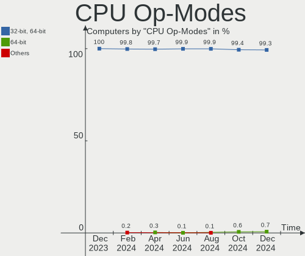
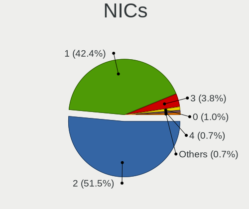
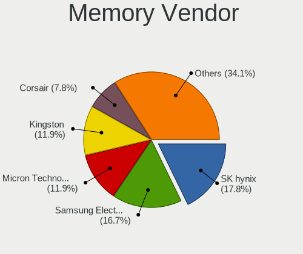
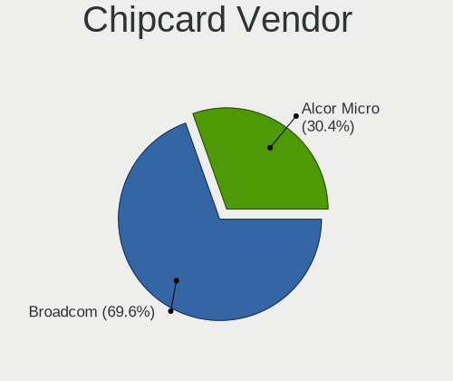
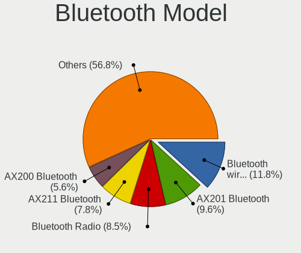

Fedora Hardware Trends
----------------------

A project to identify most popular hardware characteristics and track their change
over time based on data collected by Fedora users at https://Linux-Hardware.org.

Anyone can contribute to the study by uploading probes of their computers by
the [hw-probe](https://github.com/linuxhw/hw-probe) tool:

    sudo -E hw-probe -all -upload

This is a report for all computer types. See also reports for [desktops](/Dist/Fedora/Desktop/README.md) and [notebooks](/Dist/Fedora/Notebook/README.md).

Full-feature report is available here: https://linux-hardware.org/?view=trends

Period: May, 2021.

Contents
--------

- [ OS                       ](#os)
- [ OS Family                ](#os-family)
- [ Kernel                   ](#kernel)
- [ Kernel Family            ](#kernel-family)
- [ Kernel Major Ver.        ](#kernel-major-ver)
- [ Arch                     ](#arch)
- [ DE                       ](#de)
- [ Display Server           ](#display-server)
- [ Display Manager          ](#display-manager)
- [ OS Lang                  ](#os-lang)
- [ Boot Mode                ](#boot-mode)
- [ Filesystem               ](#filesystem)
- [ Part. scheme             ](#part-scheme)
- [ Dual Boot with Linux/BSD ](#dual-boot-with-linux/bsd)
- [ Dual Boot (Win)          ](#dual-boot-win)
- [ Country                  ](#country)
- [ City                     ](#city)
- [ Vendor                   ](#vendor)
- [ Model                    ](#model)
- [ Model Family             ](#model-family)
- [ MFG Year                 ](#mfg-year)
- [ Form Factor              ](#form-factor)
- [ Secure Boot              ](#secure-boot)
- [ Coreboot                 ](#coreboot)
- [ RAM Size                 ](#ram-size)
- [ RAM Used                 ](#ram-used)
- [ Has CD-ROM               ](#has-cd-rom)
- [ Total Drives             ](#total-drives)
- [ Has Ethernet             ](#has-ethernet)
- [ Has WiFi                 ](#has-wifi)
- [ Has Bluetooth            ](#has-bluetooth)
- [ Drive Vendor             ](#drive-vendor)
- [ Drive Model              ](#drive-model)
- [ HDD Vendor               ](#hdd-vendor)
- [ SSD Vendor               ](#ssd-vendor)
- [ Drive Kind               ](#drive-kind)
- [ Drive Connector          ](#drive-connector)
- [ Drive Size               ](#drive-size)
- [ Space Total              ](#space-total)
- [ Space Used               ](#space-used)
- [ Malfunc. Drives          ](#malfunc-drives)
- [ Malfunc. Drive Vendor    ](#malfunc-drive-vendor)
- [ Malfunc. HDD Vendor      ](#malfunc-hdd-vendor)
- [ Malfunc. Drive Kind      ](#malfunc-drive-kind)
- [ Failed Drives            ](#failed-drives)
- [ Failed Drive Vendor      ](#failed-drive-vendor)
- [ Drive Status             ](#drive-status)
- [ Storage Vendor           ](#storage-vendor)
- [ Storage Model            ](#storage-model)
- [ Storage Kind             ](#storage-kind)
- [ CPU Vendor               ](#cpu-vendor)
- [ CPU Model                ](#cpu-model)
- [ CPU Model Family         ](#cpu-model-family)
- [ CPU Cores                ](#cpu-cores)
- [ CPU Sockets              ](#cpu-sockets)
- [ CPU Threads              ](#cpu-threads)
- [ CPU Op-Modes             ](#cpu-op-modes)
- [ CPU Microcode            ](#cpu-microcode)
- [ CPU Microarch            ](#cpu-microarch)
- [ GPU Vendor               ](#gpu-vendor)
- [ GPU Model                ](#gpu-model)
- [ GPU Combo                ](#gpu-combo)
- [ GPU Driver               ](#gpu-driver)
- [ GPU Memory               ](#gpu-memory)
- [ Monitor Vendor           ](#monitor-vendor)
- [ Monitor Model            ](#monitor-model)
- [ Monitor Resolution       ](#monitor-resolution)
- [ Monitor Diagonal         ](#monitor-diagonal)
- [ Monitor Width            ](#monitor-width)
- [ Aspect Ratio             ](#aspect-ratio)
- [ Monitor Area             ](#monitor-area)
- [ Pixel Density            ](#pixel-density)
- [ Multiple Monitors        ](#multiple-monitors)
- [ Net Controller Vendor    ](#net-controller-vendor)
- [ Net Controller Model     ](#net-controller-model)
- [ Wireless Vendor          ](#wireless-vendor)
- [ Wireless Model           ](#wireless-model)
- [ Ethernet Vendor          ](#ethernet-vendor)
- [ Ethernet Model           ](#ethernet-model)
- [ Net Controller Kind      ](#net-controller-kind)
- [ Used Controller          ](#used-controller)
- [ NICs                     ](#nics)
- [ IPv6                     ](#ipv6)
- [ Memory Vendor            ](#memory-vendor)
- [ Memory Model             ](#memory-model)
- [ Memory Kind              ](#memory-kind)
- [ Memory Form Factor       ](#memory-form-factor)
- [ Memory Size              ](#memory-size)
- [ Memory Speed             ](#memory-speed)
- [ Sound Vendor             ](#sound-vendor)
- [ Sound Model              ](#sound-model)
- [ Camera Vendor            ](#camera-vendor)
- [ Camera Model             ](#camera-model)
- [ Fingerprint Vendor       ](#fingerprint-vendor)
- [ Fingerprint Model        ](#fingerprint-model)
- [ Chipcard Vendor          ](#chipcard-vendor)
- [ Chipcard Model           ](#chipcard-model)
- [ Printer Vendor           ](#printer-vendor)
- [ Printer Model            ](#printer-model)
- [ Scanner Vendor           ](#scanner-vendor)
- [ Scanner Model            ](#scanner-model)
- [ Bluetooth Vendor         ](#bluetooth-vendor)
- [ Bluetooth Model          ](#bluetooth-model)
- [ Unsupported Devices      ](#unsupported-devices)
- [ Unsupported Device Types ](#unsupported-device-types)

OS
--

Installed operating systems

| Name      | Computers | Percent |
|-----------|-----------|---------|
| Fedora 34 | 297       | 81.59%  |
| Fedora 33 | 54        | 14.84%  |
| Fedora 32 | 7         | 1.92%   |
| Fedora 35 | 4         | 1.1%    |
| Fedora 31 | 1         | 0.27%   |
| Fedora 24 | 1         | 0.27%   |

OS Family
---------

OS without a version

| Name   | Computers | Percent |
|--------|-----------|---------|
| Fedora | 364       | 100%    |

Kernel
------

Version of the Linux kernel

| Version                                                       | Computers | Percent |
|---------------------------------------------------------------|-----------|---------|
| 5.11.17-300.fc34.x86_64                                       | 52        | 14.29%  |
| 5.11.18-300.fc34.x86_64                                       | 40        | 10.99%  |
| 5.11.20-300.fc34.x86_64                                       | 36        | 9.89%   |
| 5.11.16-300.fc34.x86_64                                       | 33        | 9.07%   |
| 5.12.6-300.fc34.x86_64                                        | 27        | 7.42%   |
| 5.12.7-300.fc34.x86_64                                        | 26        | 7.14%   |
| 5.11.19-300.fc34.x86_64                                       | 21        | 5.77%   |
| 5.11.12-300.fc34.x86_64                                       | 19        | 5.22%   |
| 5.11.21-300.fc34.x86_64                                       | 15        | 4.12%   |
| 5.12.5-300.fc34.x86_64                                        | 11        | 3.02%   |
| 5.11.18-200.fc33.x86_64                                       | 9         | 2.47%   |
| 5.11.20-200.fc33.x86_64                                       | 8         | 2.2%    |
| 5.11.17-200.fc33.x86_64                                       | 8         | 2.2%    |
| 5.11.21-300.fc34.aarch64                                      | 5         | 1.37%   |
| 5.11.19-200.fc33.x86_64                                       | 5         | 1.37%   |
| 5.11.15-300.fc34.x86_64                                       | 5         | 1.37%   |
| 5.12.7-200.fc33.x86_64                                        | 4         | 1.1%    |
| 5.12.6-200.fc33.x86_64                                        | 3         | 0.82%   |
| 5.11.21-200.fc33.x86_64                                       | 3         | 0.82%   |
| 5.11.16-200.fc33.x86_64                                       | 3         | 0.82%   |
| 5.12.5-200.fc33.x86_64                                        | 2         | 0.55%   |
| 5.12.2-300.fc34.x86_64                                        | 2         | 0.55%   |
| 5.11.8-200.fc33.x86_64                                        | 2         | 0.55%   |
| 5.11.19-100.fc32.x86_64                                       | 2         | 0.55%   |
| 5.10.21-200.fc33.x86_64                                       | 2         | 0.55%   |
| 5.9.16-100.fc32.x86_64                                        | 1         | 0.27%   |
| 5.9.13-200.fc33.x86_64                                        | 1         | 0.27%   |
| 5.8.15-301.fc33.x86_64                                        | 1         | 0.27%   |
| 5.3.16-300.fc31.x86_64                                        | 1         | 0.27%   |
| 5.13.0-0.rc2.20210521git79a106fc6585.22.fc35.x86_64           | 1         | 0.27%   |
| 5.13.0-0.rc2.19.fc35.x86_64                                   | 1         | 0.27%   |
| 5.13.0-0.rc1.20210513gitc06a2ba62fc4.15.vanilla.1.fc34.x86_64 | 1         | 0.27%   |
| 5.13.0-0.rc1.20210513gitc06a2ba62fc4.15.fc35.x86_64           | 1         | 0.27%   |
| 5.12.6-300.fc34.aarch64                                       | 1         | 0.27%   |
| 5.12.3-300.fc34.aarch64                                       | 1         | 0.27%   |
| 5.12.0-0.rc8.191.fc35.x86_64                                  | 1         | 0.27%   |
| 5.11.3-300.fc34.x86_64                                        | 1         | 0.27%   |
| 5.11.19-300.rog.fc34.x86_64                                   | 1         | 0.27%   |
| 5.11.18-100.fc32.x86_64                                       | 1         | 0.27%   |
| 5.11.17-100.fc32.x86_64                                       | 1         | 0.27%   |
| 5.11.16-100.fc32.x86_64                                       | 1         | 0.27%   |
| 5.11.15-200.fc33.x86_64                                       | 1         | 0.27%   |
| 5.11.13-200.fc33.x86_64                                       | 1         | 0.27%   |
| 5.11.10-200.fc33.x86_64                                       | 1         | 0.27%   |
| 5.10.10-1.surface.fc32.x86_64                                 | 1         | 0.27%   |
| 4.11.12-100.fc24.x86_64                                       | 1         | 0.27%   |

Kernel Family
-------------

Linux kernel without a distro release

| Version | Computers | Percent |
|---------|-----------|---------|
| 5.11.17 | 61        | 16.76%  |
| 5.11.18 | 50        | 13.74%  |
| 5.11.20 | 44        | 12.09%  |
| 5.11.16 | 37        | 10.16%  |
| 5.12.6  | 31        | 8.52%   |
| 5.12.7  | 30        | 8.24%   |
| 5.11.19 | 29        | 7.97%   |
| 5.11.21 | 23        | 6.32%   |
| 5.11.12 | 19        | 5.22%   |
| 5.12.5  | 13        | 3.57%   |
| 5.11.15 | 6         | 1.65%   |
| 5.13.0  | 4         | 1.1%    |
| 5.12.2  | 2         | 0.55%   |
| 5.11.8  | 2         | 0.55%   |
| 5.10.21 | 2         | 0.55%   |
| 5.9.16  | 1         | 0.27%   |
| 5.9.13  | 1         | 0.27%   |
| 5.8.15  | 1         | 0.27%   |
| 5.3.16  | 1         | 0.27%   |
| 5.12.3  | 1         | 0.27%   |
| 5.12.0  | 1         | 0.27%   |
| 5.11.3  | 1         | 0.27%   |
| 5.11.13 | 1         | 0.27%   |
| 5.11.10 | 1         | 0.27%   |
| 5.10.10 | 1         | 0.27%   |
| 4.11.12 | 1         | 0.27%   |

Kernel Major Ver.
-----------------

Linux kernel major version

| Version | Computers | Percent |
|---------|-----------|---------|
| 5.11    | 274       | 75.27%  |
| 5.12    | 78        | 21.43%  |
| 5.13    | 4         | 1.1%    |
| 5.10    | 3         | 0.82%   |
| 5.9     | 2         | 0.55%   |
| 5.8     | 1         | 0.27%   |
| 5.3     | 1         | 0.27%   |
| 4.11    | 1         | 0.27%   |

Arch
----

OS architecture (x86_64, i586, etc.)

| Name    | Computers | Percent |
|---------|-----------|---------|
| x86_64  | 357       | 98.08%  |
| aarch64 | 7         | 1.92%   |

DE
--

Desktop Environment

| Name            | Computers | Percent |
|-----------------|-----------|---------|
| GNOME           | 281       | 77.2%   |
| KDE5            | 17        | 4.67%   |
| KDE             | 15        | 4.12%   |
| Unknown         | 13        | 3.57%   |
| XFCE            | 12        | 3.3%    |
| X-Cinnamon      | 8         | 2.2%    |
| Cinnamon        | 8         | 2.2%    |
| MATE            | 2         | 0.55%   |
| GNOME Classic   | 2         | 0.55%   |
| Deepin          | 2         | 0.55%   |
| Pantheon        | 1         | 0.27%   |
| LXDE            | 1         | 0.27%   |
| i3              | 1         | 0.27%   |
| GNOME Flashback | 1         | 0.27%   |

Display Server
--------------

X11 or Wayland

| Name    | Computers | Percent |
|---------|-----------|---------|
| Wayland | 217       | 59.62%  |
| X11     | 125       | 34.34%  |
| Tty     | 17        | 4.67%   |
| Unknown | 5         | 1.37%   |

Display Manager
---------------

SDDM, LightDM, etc.

| Name    | Computers | Percent |
|---------|-----------|---------|
| Unknown | 220       | 60.44%  |
| GDM     | 112       | 30.77%  |
| TDM     | 16        | 4.4%    |
| SDDM    | 11        | 3.02%   |
| LightDM | 4         | 1.1%    |
| XDM     | 1         | 0.27%   |

OS Lang
-------

Language

| Lang    | Computers | Percent |
|---------|-----------|---------|
| en_US   | 192       | 52.75%  |
| en_GB   | 26        | 7.14%   |
| pt_BR   | 18        | 4.95%   |
| en_CA   | 16        | 4.4%    |
| de_DE   | 14        | 3.85%   |
| ru_RU   | 13        | 3.57%   |
| en_AU   | 10        | 2.75%   |
| fr_FR   | 9         | 2.47%   |
| it_IT   | 7         | 1.92%   |
| en_IN   | 6         | 1.65%   |
| hu_HU   | 5         | 1.37%   |
| es_ES   | 5         | 1.37%   |
| pl_PL   | 4         | 1.1%    |
| nl_BE   | 4         | 1.1%    |
| cs_CZ   | 4         | 1.1%    |
| es_CL   | 3         | 0.82%   |
| tr_TR   | 2         | 0.55%   |
| ja_JP   | 2         | 0.55%   |
| fi_FI   | 2         | 0.55%   |
| es_CO   | 2         | 0.55%   |
| en_SG   | 2         | 0.55%   |
| ca_ES   | 2         | 0.55%   |
| zh_HK   | 1         | 0.27%   |
| zh_CN   | 1         | 0.27%   |
| ru_UA   | 1         | 0.27%   |
| pt_PT   | 1         | 0.27%   |
| nl_NL   | 1         | 0.27%   |
| ko_KR   | 1         | 0.27%   |
| fr_CA   | 1         | 0.27%   |
| fr_BE   | 1         | 0.27%   |
| es_UY   | 1         | 0.27%   |
| es_US   | 1         | 0.27%   |
| en_NZ   | 1         | 0.27%   |
| en_DK   | 1         | 0.27%   |
| de_CH   | 1         | 0.27%   |
| de_AT   | 1         | 0.27%   |
| C       | 1         | 0.27%   |
| Unknown | 1         | 0.27%   |

Boot Mode
---------

EFI or BIOS

| Mode | Computers | Percent |
|------|-----------|---------|
| EFI  | 283       | 77.75%  |
| BIOS | 81        | 22.25%  |

Filesystem
----------

Type of filesystem

| Type                | Computers | Percent |
|---------------------|-----------|---------|
| Btrfs               | 233       | 64.01%  |
| Ext4                | 107       | 29.4%   |
| Xfs                 | 21        | 5.77%   |
| Zfs                 | 2         | 0.55%   |
| Fuse.fuse-overlayfs | 1         | 0.27%   |

Part. scheme
------------

Scheme of partitioning

| Type    | Computers | Percent |
|---------|-----------|---------|
| Unknown | 218       | 59.89%  |
| GPT     | 117       | 32.14%  |
| MBR     | 29        | 7.97%   |

Dual Boot with Linux/BSD
------------------------

Hosting more than one Linux/BSD

| Dual boot | Computers | Percent |
|-----------|-----------|---------|
| No        | 330       | 90.66%  |
| Yes       | 34        | 9.34%   |

Dual Boot (Win)
---------------

Hosting Linux and Windows

| Dual boot | Computers | Percent |
|-----------|-----------|---------|
| No        | 297       | 81.59%  |
| Yes       | 67        | 18.41%  |

Country
-------

Geographic location (country)

| Country                | Computers | Percent |
|------------------------|-----------|---------|
| USA                    | 62        | 17.03%  |
| Germany                | 30        | 8.24%   |
| Brazil                 | 25        | 6.87%   |
| Canada                 | 18        | 4.95%   |
| India                  | 15        | 4.12%   |
| Russia                 | 13        | 3.57%   |
| France                 | 13        | 3.57%   |
| Spain                  | 12        | 3.3%    |
| Netherlands            | 12        | 3.3%    |
| Italy                  | 12        | 3.3%    |
| Australia              | 11        | 3.02%   |
| Switzerland            | 9         | 2.47%   |
| UK                     | 8         | 2.2%    |
| Turkey                 | 8         | 2.2%    |
| Sweden                 | 7         | 1.92%   |
| Poland                 | 7         | 1.92%   |
| Czechia                | 7         | 1.92%   |
| China                  | 6         | 1.65%   |
| Belgium                | 6         | 1.65%   |
| Hungary                | 5         | 1.37%   |
| Chile                  | 5         | 1.37%   |
| Portugal               | 4         | 1.1%    |
| Hong Kong              | 4         | 1.1%    |
| Colombia               | 4         | 1.1%    |
| Belarus                | 4         | 1.1%    |
| Argentina              | 4         | 1.1%    |
| Ukraine                | 3         | 0.82%   |
| South Africa           | 3         | 0.82%   |
| Romania                | 3         | 0.82%   |
| Japan                  | 3         | 0.82%   |
| Uruguay                | 2         | 0.55%   |
| South Korea            | 2         | 0.55%   |
| Peru                   | 2         | 0.55%   |
| Norway                 | 2         | 0.55%   |
| Malaysia               | 2         | 0.55%   |
| Kyrgyzstan             | 2         | 0.55%   |
| Israel                 | 2         | 0.55%   |
| Iran                   | 2         | 0.55%   |
| Greece                 | 2         | 0.55%   |
| Finland                | 2         | 0.55%   |
| Slovakia               | 1         | 0.27%   |
| Singapore              | 1         | 0.27%   |
| Serbia                 | 1         | 0.27%   |
| Saudi Arabia           | 1         | 0.27%   |
| Philippines            | 1         | 0.27%   |
| Paraguay               | 1         | 0.27%   |
| New Zealand            | 1         | 0.27%   |
| Montenegro             | 1         | 0.27%   |
| Moldova                | 1         | 0.27%   |
| Mexico                 | 1         | 0.27%   |
| Malta                  | 1         | 0.27%   |
| Lithuania              | 1         | 0.27%   |
| Jordan                 | 1         | 0.27%   |
| Iceland                | 1         | 0.27%   |
| Estonia                | 1         | 0.27%   |
| Ecuador                | 1         | 0.27%   |
| Cuba                   | 1         | 0.27%   |
| Croatia                | 1         | 0.27%   |
| Costa Rica             | 1         | 0.27%   |
| Bosnia and Herzegovina | 1         | 0.27%   |

City
----

Geographic location (city)

| City               | Computers | Percent |
|--------------------|-----------|---------|
| Denver             | 8         | 2.2%    |
| Istanbul           | 5         | 1.37%   |
| Prague             | 4         | 1.1%    |
| Madrid             | 4         | 1.1%    |
| Greifswald         | 4         | 1.1%    |
| Chipping Norton    | 4         | 1.1%    |
| Berlin             | 4         | 1.1%    |
| Zurich             | 3         | 0.82%   |
| Winnipeg           | 3         | 0.82%   |
| St Petersburg      | 3         | 0.82%   |
| Naples             | 3         | 0.82%   |
| Moscow             | 3         | 0.82%   |
| Feeding Hills      | 3         | 0.82%   |
| Curitiba           | 3         | 0.82%   |
| Budapest           | 3         | 0.82%   |
| Wroclaw            | 2         | 0.55%   |
| Vienna             | 2         | 0.55%   |
| Toronto            | 2         | 0.55%   |
| Sydney             | 2         | 0.55%   |
| Shanghai           | 2         | 0.55%   |
| San Jose           | 2         | 0.55%   |
| Rostov-on-Don      | 2         | 0.55%   |
| Minsk              | 2         | 0.55%   |
| Milan              | 2         | 0.55%   |
| Kharkiv            | 2         | 0.55%   |
| Karnal             | 2         | 0.55%   |
| Jambes             | 2         | 0.55%   |
| Helsinki           | 2         | 0.55%   |
| Hamburg            | 2         | 0.55%   |
| Chatel-Saint-Denis | 2         | 0.55%   |
| Caldas da Rainha   | 2         | 0.55%   |
| Buenos Aires       | 2         | 0.55%   |
| Brisbane           | 2         | 0.55%   |
| Brampton           | 2         | 0.55%   |
| Bogotá            | 2         | 0.55%   |
| Bishkek            | 2         | 0.55%   |
| Bengaluru          | 2         | 0.55%   |
| Battle Creek       | 2         | 0.55%   |
| Basel              | 2         | 0.55%   |
| Amsterdam          | 2         | 0.55%   |
| Örebro            | 1         | 0.27%   |
| Zuccoli            | 1         | 0.27%   |
| Zagreb             | 1         | 0.27%   |
| Yazd               | 1         | 0.27%   |
| Yakima             | 1         | 0.27%   |
| Wooster            | 1         | 0.27%   |
| Woodstock          | 1         | 0.27%   |
| Woodbridge         | 1         | 0.27%   |
| West Henrietta     | 1         | 0.27%   |
| Wellington         | 1         | 0.27%   |
| Watsonville        | 1         | 0.27%   |
| Wateringen         | 1         | 0.27%   |
| Warsaw             | 1         | 0.27%   |
| Wanchai            | 1         | 0.27%   |
| Vilnius            | 1         | 0.27%   |
| Vila Velha         | 1         | 0.27%   |
| Vijayawada         | 1         | 0.27%   |
| Veresegyhaz        | 1         | 0.27%   |
| Ven                | 1         | 0.27%   |
| Vancouver          | 1         | 0.27%   |

Vendor
------

Motherboard manufacturer

| Name                             | Computers | Percent |
|----------------------------------|-----------|---------|
| Lenovo                           | 70        | 19.23%  |
| ASUSTek Computer                 | 56        | 15.38%  |
| Hewlett-Packard                  | 48        | 13.19%  |
| Dell                             | 43        | 11.81%  |
| Gigabyte Technology              | 28        | 7.69%   |
| MSI                              | 18        | 4.95%   |
| Acer                             | 17        | 4.67%   |
| ASRock                           | 12        | 3.3%    |
| Apple                            | 10        | 2.75%   |
| Raspberry Pi Foundation          | 6         | 1.65%   |
| Unknown                          | 6         | 1.65%   |
| Intel                            | 5         | 1.37%   |
| Samsung Electronics              | 4         | 1.1%    |
| HUAWEI                           | 4         | 1.1%    |
| Positivo                         | 3         | 0.82%   |
| Fujitsu                          | 3         | 0.82%   |
| Toshiba                          | 2         | 0.55%   |
| Timi                             | 2         | 0.55%   |
| Notebook                         | 2         | 0.55%   |
| Microsoft                        | 2         | 0.55%   |
| Huanan                           | 2         | 0.55%   |
| Biostar                          | 2         | 0.55%   |
| YIFANG                           | 1         | 0.27%   |
| Wortmann AG                      | 1         | 0.27%   |
| TUXEDO                           | 1         | 0.27%   |
| System76                         | 1         | 0.27%   |
| Sony                             | 1         | 0.27%   |
| SLIMBOOK                         | 1         | 0.27%   |
| Pine Microsystems                | 1         | 0.27%   |
| Pegatron                         | 1         | 0.27%   |
| Panasonic                        | 1         | 0.27%   |
| ordissimo                        | 1         | 0.27%   |
| NEC Computers                    | 1         | 0.27%   |
| MouseComputer                    | 1         | 0.27%   |
| Login Informatica                | 1         | 0.27%   |
| Hampoo                           | 1         | 0.27%   |
| Gateway                          | 1         | 0.27%   |
| FUJITSU CLIENT COMPUTING LIMITED | 1         | 0.27%   |
| AZW                              | 1         | 0.27%   |
| Alienware                        | 1         | 0.27%   |
| A-DATA Technology                | 1         | 0.27%   |

Model
-----

Motherboard model

| Name                                    | Computers | Percent |
|-----------------------------------------|-----------|---------|
| RPi Raspberry Pi 4 Model B              | 6         | 1.65%   |
| Unknown                                 | 6         | 1.65%   |
| Gigabyte A320M-S2H                      | 3         | 0.82%   |
| Dell Latitude 7490                      | 3         | 0.82%   |
| ASUS All Series                         | 3         | 0.82%   |
| MSI MS-7C37                             | 2         | 0.55%   |
| Lenovo IdeaPad Flex 5 14ARE05 81X2      | 2         | 0.55%   |
| HP Pavilion dv7                         | 2         | 0.55%   |
| HP Notebook                             | 2         | 0.55%   |
| HP Laptop 17-bs1xx                      | 2         | 0.55%   |
| Gigabyte 970A-DS3P                      | 2         | 0.55%   |
| Dell XPS 15 9550                        | 2         | 0.55%   |
| Dell XPS 15 9500                        | 2         | 0.55%   |
| Dell XPS 13 9310                        | 2         | 0.55%   |
| Dell OptiPlex 7040                      | 2         | 0.55%   |
| Dell Latitude 7400                      | 2         | 0.55%   |
| Dell Latitude 5480                      | 2         | 0.55%   |
| Dell Inspiron 3593                      | 2         | 0.55%   |
| ASUS ROG Zephyrus G14 GA401IV_GA401IV   | 2         | 0.55%   |
| ASUS ROG Maximus XI FORMULA             | 2         | 0.55%   |
| Apple MacBookPro11,3                    | 2         | 0.55%   |
| Apple MacBookPro11,1                    | 2         | 0.55%   |
| YIFANG NX16W11264                       | 1         | 0.27%   |
| Wortmann AG 1220692_1470187             | 1         | 0.27%   |
| TUXEDO Pulse 15 Gen1                    | 1         | 0.27%   |
| Toshiba Satellite S55Dt-A               | 1         | 0.27%   |
| Toshiba Satellite Click Mini L9W-B      | 1         | 0.27%   |
| Timi RedmiBook 16                       | 1         | 0.27%   |
| Timi RedmiBook 14 II                    | 1         | 0.27%   |
| System76 Oryx Pro                       | 1         | 0.27%   |
| Sony VPCS12C5E                          | 1         | 0.27%   |
| SLIMBOOK PROX15-AMD                     | 1         | 0.27%   |
| Samsung R580/R590                       | 1         | 0.27%   |
| Samsung R520/R522/R620                  | 1         | 0.27%   |
| Samsung 700T                            | 1         | 0.27%   |
| Samsung 300E4C/300E5C/300E7C            | 1         | 0.27%   |
| Positivo Q4128C-S                       | 1         | 0.27%   |
| Positivo CHT14B                         | 1         | 0.27%   |
| Positivo C41TB                          | 1         | 0.27%   |
| Pine Microsystems Pine64 RockPro64 v2.1 | 1         | 0.27%   |
| Pegatron p7-1030                        | 1         | 0.27%   |
| Panasonic CFSZ5-2L                      | 1         | 0.27%   |
| ordissimo E17201                        | 1         | 0.27%   |
| Notebook P377SM-A                       | 1         | 0.27%   |
| Notebook NH5x_7xDPx                     | 1         | 0.27%   |
| NEC Computers PC-VK25MXZCB              | 1         | 0.27%   |
| MSI PX60 6QE                            | 1         | 0.27%   |
| MSI Pro 3130 Small Form Factor PC       | 1         | 0.27%   |
| MSI MS-7D18                             | 1         | 0.27%   |
| MSI MS-7C90                             | 1         | 0.27%   |
| MSI MS-7C35                             | 1         | 0.27%   |
| MSI MS-7C02                             | 1         | 0.27%   |
| MSI MS-7A40                             | 1         | 0.27%   |
| MSI MS-7A39                             | 1         | 0.27%   |
| MSI MS-7995                             | 1         | 0.27%   |
| MSI MS-7978                             | 1         | 0.27%   |
| MSI MS-7816                             | 1         | 0.27%   |
| MSI MS-7581                             | 1         | 0.27%   |
| MSI GF63 Thin 9SC                       | 1         | 0.27%   |
| MSI GE70 2PE                            | 1         | 0.27%   |

Model Family
------------

Motherboard model prefix

| Name                     | Computers | Percent |
|--------------------------|-----------|---------|
| Lenovo ThinkPad          | 37        | 10.16%  |
| Lenovo IdeaPad           | 14        | 3.85%   |
| Dell Latitude            | 12        | 3.3%    |
| Dell Inspiron            | 12        | 3.3%    |
| ASUS ROG                 | 12        | 3.3%    |
| Dell XPS                 | 11        | 3.02%   |
| Acer Aspire              | 10        | 2.75%   |
| Lenovo Yoga              | 9         | 2.47%   |
| HP ProBook               | 7         | 1.92%   |
| RPi Raspberry            | 6         | 1.65%   |
| HP Laptop                | 6         | 1.65%   |
| HP ENVY                  | 6         | 1.65%   |
| HP EliteBook             | 6         | 1.65%   |
| Unknown                  | 6         | 1.65%   |
| HP Pavilion              | 5         | 1.37%   |
| ASUS TUF                 | 5         | 1.37%   |
| ASUS PRIME               | 5         | 1.37%   |
| Apple MacBookPro11       | 5         | 1.37%   |
| Dell OptiPlex            | 4         | 1.1%    |
| Lenovo ThinkBook         | 3         | 0.82%   |
| HP Compaq                | 3         | 0.82%   |
| Gigabyte A320M-S2H       | 3         | 0.82%   |
| ASUS VivoBook            | 3         | 0.82%   |
| ASUS All                 | 3         | 0.82%   |
| Acer Nitro               | 3         | 0.82%   |
| Toshiba Satellite        | 2         | 0.55%   |
| Timi RedmiBook           | 2         | 0.55%   |
| MSI MS-7C37              | 2         | 0.55%   |
| Microsoft Surface        | 2         | 0.55%   |
| Lenovo ThinkCentre       | 2         | 0.55%   |
| Lenovo Legion            | 2         | 0.55%   |
| HP ProDesk               | 2         | 0.55%   |
| HP Notebook              | 2         | 0.55%   |
| HP EliteDesk             | 2         | 0.55%   |
| Gigabyte Z390            | 2         | 0.55%   |
| Gigabyte 970A-DS3P       | 2         | 0.55%   |
| Fujitsu ESPRIMO          | 2         | 0.55%   |
| Dell Precision           | 2         | 0.55%   |
| ASUS ZenBook             | 2         | 0.55%   |
| ASRock X570              | 2         | 0.55%   |
| ASRock B450M             | 2         | 0.55%   |
| YIFANG NX16W11264        | 1         | 0.27%   |
| Wortmann AG 1220692      | 1         | 0.27%   |
| TUXEDO Pulse             | 1         | 0.27%   |
| System76 Oryx            | 1         | 0.27%   |
| Sony VPCS12C5E           | 1         | 0.27%   |
| SLIMBOOK PROX15-AMD      | 1         | 0.27%   |
| Samsung R580             | 1         | 0.27%   |
| Samsung R520             | 1         | 0.27%   |
| Samsung 700T             | 1         | 0.27%   |
| Samsung 300E4C           | 1         | 0.27%   |
| Positivo Q4128C-S        | 1         | 0.27%   |
| Positivo CHT14B          | 1         | 0.27%   |
| Positivo C41TB           | 1         | 0.27%   |
| Pine Microsystems Pine64 | 1         | 0.27%   |
| Pegatron p7-1030         | 1         | 0.27%   |
| Panasonic CFSZ5-2L       | 1         | 0.27%   |
| ordissimo E17201         | 1         | 0.27%   |
| Notebook P377SM-A        | 1         | 0.27%   |
| Notebook NH5x            | 1         | 0.27%   |

MFG Year
--------

Motherboard manufacture year

| Year | Computers | Percent |
|------|-----------|---------|
| 2020 | 93        | 25.55%  |
| 2019 | 65        | 17.86%  |
| 2021 | 52        | 14.29%  |
| 2018 | 35        | 9.62%   |
| 2015 | 18        | 4.95%   |
| 2014 | 15        | 4.12%   |
| 2012 | 15        | 4.12%   |
| 2017 | 14        | 3.85%   |
| 2016 | 14        | 3.85%   |
| 2013 | 14        | 3.85%   |
| 2011 | 11        | 3.02%   |
| 2010 | 10        | 2.75%   |
| 2009 | 6         | 1.65%   |
| 2008 | 1         | 0.27%   |
| 2006 | 1         | 0.27%   |

Form Factor
-----------

Physical design of the computer

| Name           | Computers | Percent |
|----------------|-----------|---------|
| Notebook       | 207       | 56.87%  |
| Desktop        | 116       | 31.87%  |
| Convertible    | 22        | 6.04%   |
| System on chip | 7         | 1.92%   |
| Tablet         | 4         | 1.1%    |
| Mini pc        | 4         | 1.1%    |
| All in one     | 4         | 1.1%    |

Secure Boot
-----------

Enabled or disabled

| State    | Computers | Percent |
|----------|-----------|---------|
| Disabled | 305       | 83.79%  |
| Enabled  | 59        | 16.21%  |

Coreboot
--------

Have coreboot on board

| Used | Computers | Percent |
|------|-----------|---------|
| No   | 364       | 100%    |

RAM Size
--------

Total RAM memory

| Size in GB  | Computers | Percent |
|-------------|-----------|---------|
| 16.01-24.0  | 100       | 27.47%  |
| 4.01-8.0    | 89        | 24.45%  |
| 8.01-16.0   | 68        | 18.68%  |
| 32.01-64.0  | 43        | 11.81%  |
| 3.01-4.0    | 36        | 9.89%   |
| 64.01-256.0 | 15        | 4.12%   |
| 24.01-32.0  | 8         | 2.2%    |
| 1.01-2.0    | 5         | 1.37%   |

RAM Used
--------

Used RAM memory

| Used GB    | Computers | Percent |
|------------|-----------|---------|
| 2.01-3.0   | 96        | 26.37%  |
| 4.01-8.0   | 91        | 25%     |
| 3.01-4.0   | 80        | 21.98%  |
| 1.01-2.0   | 66        | 18.13%  |
| 8.01-16.0  | 22        | 6.04%   |
| 16.01-24.0 | 4         | 1.1%    |
| 0.51-1.0   | 4         | 1.1%    |
| 0.01-0.5   | 1         | 0.27%   |

Has CD-ROM
----------

Has CD-ROM on board

| Presented | Computers | Percent |
|-----------|-----------|---------|
| No        | 265       | 72.8%   |
| Yes       | 99        | 27.2%   |

Total Drives
------------

Number of drives on board

| Drives | Computers | Percent |
|--------|-----------|---------|
| 1      | 195       | 53.57%  |
| 2      | 98        | 26.92%  |
| 3      | 39        | 10.71%  |
| 4      | 16        | 4.4%    |
| 5      | 9         | 2.47%   |
| 12     | 2         | 0.55%   |
| 0      | 2         | 0.55%   |
| 9      | 1         | 0.27%   |
| 8      | 1         | 0.27%   |
| 6      | 1         | 0.27%   |

Has Ethernet
------------

Has Ethernet on board

| Presented | Computers | Percent |
|-----------|-----------|---------|
| Yes       | 288       | 79.12%  |
| No        | 76        | 20.88%  |

Has WiFi
--------

Has WiFi module

| Presented | Computers | Percent |
|-----------|-----------|---------|
| Yes       | 287       | 78.85%  |
| No        | 77        | 21.15%  |

Has Bluetooth
-------------

Has Bluetooth module

| Presented | Computers | Percent |
|-----------|-----------|---------|
| Yes       | 247       | 67.86%  |
| No        | 117       | 32.14%  |

Drive Vendor
------------

Hard drive vendors

| Vendor                    | Computers | Drives | Percent |
|---------------------------|-----------|--------|---------|
| Samsung Electronics       | 121       | 161    | 21.61%  |
| Seagate                   | 68        | 90     | 12.14%  |
| WDC                       | 66        | 87     | 11.79%  |
| Sandisk                   | 40        | 40     | 7.14%   |
| Toshiba                   | 38        | 39     | 6.79%   |
| Unknown                   | 33        | 37     | 5.89%   |
| Kingston                  | 26        | 26     | 4.64%   |
| Intel                     | 22        | 25     | 3.93%   |
| Crucial                   | 18        | 21     | 3.21%   |
| SK Hynix                  | 12        | 15     | 2.14%   |
| Hitachi                   | 10        | 14     | 1.79%   |
| Micron Technology         | 9         | 9      | 1.61%   |
| Apple                     | 9         | 10     | 1.61%   |
| HGST                      | 8         | 16     | 1.43%   |
| A-DATA Technology         | 8         | 9      | 1.43%   |
| Silicon Motion            | 6         | 7      | 1.07%   |
| KIOXIA                    | 6         | 7      | 1.07%   |
| Phison                    | 5         | 6      | 0.89%   |
| XPG                       | 4         | 5      | 0.71%   |
| OCZ                       | 4         | 6      | 0.71%   |
| Union Memory              | 3         | 3      | 0.54%   |
| Transcend                 | 3         | 3      | 0.54%   |
| SPCC                      | 3         | 3      | 0.54%   |
| Realtek Semiconductor     | 3         | 3      | 0.54%   |
| Micron/Crucial Technology | 3         | 3      | 0.54%   |
| KingFast                  | 3         | 3      | 0.54%   |
| Corsair                   | 3         | 3      | 0.54%   |
| Team                      | 2         | 2      | 0.36%   |
| Mushkin                   | 2         | 2      | 0.36%   |
| MAXTOR                    | 2         | 2      | 0.36%   |
| KingSpec                  | 2         | 2      | 0.36%   |
| Fujitsu                   | 2         | 2      | 0.36%   |
| Ugreen                    | 1         | 1      | 0.18%   |
| TCSUNBOW                  | 1         | 1      | 0.18%   |
| Tanbassh                  | 1         | 1      | 0.18%   |
| SSK                       | 1         | 1      | 0.18%   |
| Solid State Storage       | 1         | 1      | 0.18%   |
| Smartbuy                  | 1         | 1      | 0.18%   |
| SABRENT                   | 1         | 1      | 0.18%   |
| PNY                       | 1         | 1      | 0.18%   |
| maxone                    | 1         | 1      | 0.18%   |
| Lite-On                   | 1         | 1      | 0.18%   |
| Lexar                     | 1         | 1      | 0.18%   |
| Intenso                   | 1         | 1      | 0.18%   |
| Gigabyte Technology       | 1         | 1      | 0.18%   |
| External                  | 1         | 1      | 0.18%   |
| China                     | 1         | 1      | 0.18%   |
| Biwin                     | 1         | 1      | 0.18%   |

Drive Model
-----------

Hard drive models

| Model                                   | Computers | Percent |
|-----------------------------------------|-----------|---------|
| Samsung NVMe SSD Drive 512GB            | 14        | 2.2%    |
| Samsung NVMe SSD Drive 1TB              | 11        | 1.73%   |
| Samsung SSD 860 EVO 500GB               | 9         | 1.41%   |
| Samsung SSD 860 EVO 250GB               | 9         | 1.41%   |
| Samsung SSD 860 EVO 1TB                 | 7         | 1.1%    |
| Unknown MMC Card  128GB                 | 6         | 0.94%   |
| Seagate ST500DM002-1BD142 500GB         | 6         | 0.94%   |
| Seagate ST1000LM035-1RK172 1TB          | 6         | 0.94%   |
| Sandisk NVMe SSD Drive 512GB            | 6         | 0.94%   |
| Samsung NVMe SSD Drive 500GB            | 6         | 0.94%   |
| Intel NVMe SSD Drive 512GB              | 6         | 0.94%   |
| Crucial CT500MX500SSD1 500GB            | 6         | 0.94%   |
| Unknown SD/MMC/MS PRO 8GB               | 5         | 0.78%   |
| Toshiba MQ01ABD100 1TB                  | 5         | 0.78%   |
| Seagate ST1000LM024 HN-M101MBB 1TB      | 5         | 0.78%   |
| Sandisk NVMe SSD Drive 500GB            | 5         | 0.78%   |
| SK Hynix NVMe SSD Drive 512GB           | 4         | 0.63%   |
| Sandisk NVMe SSD Drive 256GB            | 4         | 0.63%   |
| Samsung SSD 850 EVO 500GB               | 4         | 0.63%   |
| Samsung SSD 850 EVO 250GB               | 4         | 0.63%   |
| Samsung SSD 840 EVO 250GB               | 4         | 0.63%   |
| Samsung NVMe SSD Drive 2TB              | 4         | 0.63%   |
| Samsung NVMe SSD Drive 250GB            | 4         | 0.63%   |
| Kingston SA400S37240G 240GB SSD         | 4         | 0.63%   |
| WDC WDS500G2B0B-00YS70 500GB SSD        | 3         | 0.47%   |
| WDC WDS240G2G0B-00EPW0 240GB SSD        | 3         | 0.47%   |
| WDC WD10EZEX-08WN4A0 1TB                | 3         | 0.47%   |
| Unknown MMC Card  32GB                  | 3         | 0.47%   |
| Toshiba DT01ACA100 1TB                  | 3         | 0.47%   |
| Seagate ST2000DM008-2FR102 2TB          | 3         | 0.47%   |
| Seagate ST1000DM003-1CH162 1TB          | 3         | 0.47%   |
| SanDisk SDSSDA240G 240GB                | 3         | 0.47%   |
| Sandisk NVMe SSD Drive 1024GB           | 3         | 0.47%   |
| Samsung SSD 970 EVO Plus 2TB            | 3         | 0.47%   |
| Samsung NVMe SSD Drive 1024GB           | 3         | 0.47%   |
| Micron/Crucial NVMe SSD Drive 1TB       | 3         | 0.47%   |
| Kingston SA400S37480G 480GB SSD         | 3         | 0.47%   |
| Apple SSD SM0512F 500GB                 | 3         | 0.47%   |
| XPG NVMe SSD Drive 1024GB               | 2         | 0.31%   |
| WDC WDS500G2B0A-00SM50 500GB SSD        | 2         | 0.31%   |
| WDC WDS240G2G0A-00JH30 240GB SSD        | 2         | 0.31%   |
| WDC WDS100T2B0C-00PXH0 1TB              | 2         | 0.31%   |
| WDC WD5000BPKT-08PK4T0 500GB            | 2         | 0.31%   |
| WDC WD40EZRZ-22GXCB0 4TB                | 2         | 0.31%   |
| WDC WD30EZRX-00MMMB0 3TB                | 2         | 0.31%   |
| WDC WD20SPZX-22UA7T0 2TB                | 2         | 0.31%   |
| WDC WD20EZRZ-00Z5HB0 2TB                | 2         | 0.31%   |
| WDC WD10JPVX-22JC3T0 1TB                | 2         | 0.31%   |
| WDC WD1001FALS-00J7B1 1TB               | 2         | 0.31%   |
| WDC PC SN730 SDBQNTY-512G-1001 512GB    | 2         | 0.31%   |
| Union Memory UMIS RPJTJ512MEE1OWX 512GB | 2         | 0.31%   |
| Transcend TS120GSSD220S 120GB           | 2         | 0.31%   |
| Toshiba TR200 240GB SSD                 | 2         | 0.31%   |
| Toshiba NVMe SSD Drive 256GB            | 2         | 0.31%   |
| Toshiba MQ04ABF100 1TB                  | 2         | 0.31%   |
| Toshiba DT01ACA200 2TB                  | 2         | 0.31%   |
| SPCC Solid State Disk 240GB             | 2         | 0.31%   |
| SK Hynix SC311 SATA 512GB SSD           | 2         | 0.31%   |
| SK Hynix PC601 NVMe 512GB               | 2         | 0.31%   |
| Silicon Motion NVMe SSD Drive 256GB     | 2         | 0.31%   |

HDD Vendor
----------

Hard disk drive vendors

| Vendor              | Computers | Drives | Percent |
|---------------------|-----------|--------|---------|
| Seagate             | 65        | 85     | 39.16%  |
| WDC                 | 47        | 60     | 28.31%  |
| Toshiba             | 24        | 24     | 14.46%  |
| Hitachi             | 10        | 14     | 6.02%   |
| HGST                | 8         | 16     | 4.82%   |
| Samsung Electronics | 7         | 7      | 4.22%   |
| Fujitsu             | 2         | 2      | 1.2%    |
| Apple               | 2         | 2      | 1.2%    |
| MAXTOR              | 1         | 1      | 0.6%    |

SSD Vendor
----------

Solid state drive vendors

| Vendor              | Computers | Drives | Percent |
|---------------------|-----------|--------|---------|
| Samsung Electronics | 68        | 83     | 32.85%  |
| SanDisk             | 20        | 20     | 9.66%   |
| Kingston            | 19        | 19     | 9.18%   |
| Crucial             | 17        | 20     | 8.21%   |
| WDC                 | 14        | 15     | 6.76%   |
| Toshiba             | 9         | 9      | 4.35%   |
| Intel               | 8         | 8      | 3.86%   |
| Apple               | 6         | 6      | 2.9%    |
| Micron Technology   | 5         | 5      | 2.42%   |
| A-DATA Technology   | 5         | 5      | 2.42%   |
| SK Hynix            | 4         | 4      | 1.93%   |
| OCZ                 | 4         | 6      | 1.93%   |
| Unknown             | 3         | 3      | 1.45%   |
| Transcend           | 3         | 3      | 1.45%   |
| SPCC                | 3         | 3      | 1.45%   |
| Corsair             | 3         | 3      | 1.45%   |
| Team                | 2         | 2      | 0.97%   |
| Mushkin             | 2         | 2      | 0.97%   |
| TCSUNBOW            | 1         | 1      | 0.48%   |
| Smartbuy            | 1         | 1      | 0.48%   |
| Seagate             | 1         | 1      | 0.48%   |
| SABRENT             | 1         | 1      | 0.48%   |
| PNY                 | 1         | 1      | 0.48%   |
| Maxtor              | 1         | 1      | 0.48%   |
| maxone              | 1         | 1      | 0.48%   |
| Lexar               | 1         | 1      | 0.48%   |
| KingSpec            | 1         | 1      | 0.48%   |
| KingFast            | 1         | 1      | 0.48%   |
| Intenso             | 1         | 1      | 0.48%   |
| China               | 1         | 1      | 0.48%   |

Drive Kind
----------

HDD or SSD

| Kind    | Computers | Drives | Percent |
|---------|-----------|--------|---------|
| SSD     | 179       | 228    | 34.96%  |
| NVMe    | 152       | 196    | 29.69%  |
| HDD     | 144       | 211    | 28.13%  |
| MMC     | 24        | 28     | 4.69%   |
| Unknown | 13        | 14     | 2.54%   |

Drive Connector
---------------

SATA, SAS, NVMe, etc.

| Type | Computers | Drives | Percent |
|------|-----------|--------|---------|
| SATA | 257       | 434    | 56.98%  |
| NVMe | 152       | 195    | 33.7%   |
| MMC  | 24        | 28     | 5.32%   |
| SAS  | 18        | 20     | 3.99%   |

Drive Size
----------

Size of hard drive

| Size in TB | Computers | Drives | Percent |
|------------|-----------|--------|---------|
| 0.01-0.5   | 178       | 243    | 54.1%   |
| 0.51-1.0   | 98        | 120    | 29.79%  |
| 1.01-2.0   | 35        | 41     | 10.64%  |
| 4.01-10.0  | 10        | 25     | 3.04%   |
| 3.01-4.0   | 4         | 5      | 1.22%   |
| 2.01-3.0   | 4         | 5      | 1.22%   |

Space Total
-----------

Amount of disk space available on the file system

| Size in GB     | Computers | Percent |
|----------------|-----------|---------|
| 251-500        | 73        | 20.05%  |
| 501-1000       | 71        | 19.51%  |
| 101-250        | 66        | 18.13%  |
| 1001-2000      | 41        | 11.26%  |
| 1-20           | 30        | 8.24%   |
| Unknown        | 26        | 7.14%   |
| More than 3000 | 17        | 4.67%   |
| 51-100         | 17        | 4.67%   |
| 2001-3000      | 15        | 4.12%   |
| 21-50          | 8         | 2.2%    |

Space Used
----------

Amount of used disk space

| Used GB        | Computers | Percent |
|----------------|-----------|---------|
| 1-20           | 90        | 24.73%  |
| 21-50          | 59        | 16.21%  |
| 101-250        | 56        | 15.38%  |
| 251-500        | 46        | 12.64%  |
| 51-100         | 45        | 12.36%  |
| Unknown        | 26        | 7.14%   |
| 501-1000       | 25        | 6.87%   |
| 1001-2000      | 12        | 3.3%    |
| More than 3000 | 3         | 0.82%   |
| 2001-3000      | 2         | 0.55%   |

Malfunc. Drives
---------------

Drive models with a malfunction

| Model                                          | Computers | Drives | Percent |
|------------------------------------------------|-----------|--------|---------|
| Seagate ST500DM002-1BD142 500GB                | 3         | 4      | 13.64%  |
| WDC WD5000AAKX-00ERMA0 500GB                   | 1         | 1      | 4.55%   |
| WDC WD15EARS-00Z5B1 1TB                        | 1         | 1      | 4.55%   |
| Toshiba DT01ACA200 2TB                         | 1         | 1      | 4.55%   |
| Seagate ST500LT012-9WS142 500GB                | 1         | 1      | 4.55%   |
| Seagate ST500LM021-1KJ152 500GB                | 1         | 1      | 4.55%   |
| Seagate ST1000DM003-1CH162 1TB                 | 1         | 1      | 4.55%   |
| SanDisk SD7SB3Q128G1001 128GB SSD              | 1         | 1      | 4.55%   |
| Samsung Electronics SSD 860 EVO 250GB          | 1         | 1      | 4.55%   |
| Samsung Electronics SP2514N 250GB              | 1         | 1      | 4.55%   |
| Samsung Electronics HM160HI 160GB              | 1         | 1      | 4.55%   |
| Samsung Electronics HD501LJ 500GB              | 1         | 1      | 4.55%   |
| Micron Technology 1100_MTFDDAV256TBN 256GB SSD | 1         | 1      | 4.55%   |
| Intel SSDPEKKW128G7 128GB                      | 1         | 1      | 4.55%   |
| Hitachi HTS547575A9E384 752GB                  | 1         | 1      | 4.55%   |
| Hitachi HTS543225L9A300 250GB                  | 1         | 1      | 4.55%   |
| Hitachi HDS721050CLA362 500GB                  | 1         | 1      | 4.55%   |
| Fujitsu MHY2120BH 120GB                        | 1         | 1      | 4.55%   |
| Crucial CT1050MX300SSD1 1TB                    | 1         | 1      | 4.55%   |
| A-DATA Technology SX6000NP 128GB               | 1         | 1      | 4.55%   |

Malfunc. Drive Vendor
---------------------

Vendors of faulty drives

| Vendor              | Computers | Drives | Percent |
|---------------------|-----------|--------|---------|
| Seagate             | 6         | 7      | 27.27%  |
| Samsung Electronics | 4         | 4      | 18.18%  |
| Hitachi             | 3         | 3      | 13.64%  |
| WDC                 | 2         | 2      | 9.09%   |
| Toshiba             | 1         | 1      | 4.55%   |
| SanDisk             | 1         | 1      | 4.55%   |
| Micron Technology   | 1         | 1      | 4.55%   |
| Intel               | 1         | 1      | 4.55%   |
| Fujitsu             | 1         | 1      | 4.55%   |
| Crucial             | 1         | 1      | 4.55%   |
| A-DATA Technology   | 1         | 1      | 4.55%   |

Malfunc. HDD Vendor
-------------------

Vendors of faulty HDD drives

| Vendor              | Computers | Drives | Percent |
|---------------------|-----------|--------|---------|
| Seagate             | 6         | 7      | 37.5%   |
| Samsung Electronics | 3         | 3      | 18.75%  |
| Hitachi             | 3         | 3      | 18.75%  |
| WDC                 | 2         | 2      | 12.5%   |
| Toshiba             | 1         | 1      | 6.25%   |
| Fujitsu             | 1         | 1      | 6.25%   |

Malfunc. Drive Kind
-------------------

Kinds of faulty drives

| Kind | Computers | Drives | Percent |
|------|-----------|--------|---------|
| HDD  | 14        | 17     | 70%     |
| SSD  | 4         | 4      | 20%     |
| NVMe | 2         | 2      | 10%     |

Failed Drives
-------------

Failed drive models

Zero info for selected period =(

Failed Drive Vendor
-------------------

Failed drive vendors

Zero info for selected period =(

Drive Status
------------

Number of failed and malfunc. drives

| Status   | Computers | Drives | Percent |
|----------|-----------|--------|---------|
| Detected | 240       | 444    | 60%     |
| Works    | 140       | 210    | 35%     |
| Malfunc  | 20        | 23     | 5%      |

Storage Vendor
--------------

Storage controller vendors

| Vendor                         | Computers | Percent |
|--------------------------------|-----------|---------|
| Intel                          | 221       | 47.22%  |
| AMD                            | 72        | 15.38%  |
| Samsung Electronics            | 64        | 13.68%  |
| Sandisk                        | 31        | 6.62%   |
| SK Hynix                       | 8         | 1.71%   |
| Kingston Technology Company    | 7         | 1.5%    |
| Toshiba America Info Systems   | 6         | 1.28%   |
| Phison Electronics             | 6         | 1.28%   |
| KIOXIA                         | 6         | 1.28%   |
| ASMedia Technology             | 6         | 1.28%   |
| Silicon Motion                 | 5         | 1.07%   |
| ADATA Technology               | 5         | 1.07%   |
| Micron/Crucial Technology      | 4         | 0.85%   |
| Micron Technology              | 4         | 0.85%   |
| Union Memory (Shenzhen)        | 3         | 0.64%   |
| Realtek Semiconductor          | 3         | 0.64%   |
| JMicron Technology             | 3         | 0.64%   |
| Nvidia                         | 2         | 0.43%   |
| Marvell Technology Group       | 2         | 0.43%   |
| ULi Electronics                | 1         | 0.21%   |
| Solid State Storage Technology | 1         | 0.21%   |
| Silicon Image                  | 1         | 0.21%   |
| Shenzhen Longsys Electronics   | 1         | 0.21%   |
| Seagate Technology             | 1         | 0.21%   |
| LSI Logic / Symbios Logic      | 1         | 0.21%   |
| Lite-On Technology             | 1         | 0.21%   |
| Broadcom / LSI                 | 1         | 0.21%   |
| Apple                          | 1         | 0.21%   |
| Adaptec                        | 1         | 0.21%   |

Storage Model
-------------

Storage controller models

| Model                                                                                   | Computers | Percent |
|-----------------------------------------------------------------------------------------|-----------|---------|
| AMD FCH SATA Controller [AHCI mode]                                                     | 61        | 11.78%  |
| Samsung NVMe SSD Controller SM981/PM981/PM983                                           | 39        | 7.53%   |
| Intel Sunrise Point-LP SATA Controller [AHCI mode]                                      | 30        | 5.79%   |
| Intel 8 Series/C220 Series Chipset Family 6-port SATA Controller 1 [AHCI mode]          | 19        | 3.67%   |
| Intel 7 Series Chipset Family 6-port SATA Controller [AHCI mode]                        | 13        | 2.51%   |
| Sandisk WD Blue SN550 NVMe SSD                                                          | 12        | 2.32%   |
| Intel Wildcat Point-LP SATA Controller [AHCI Mode]                                      | 12        | 2.32%   |
| Intel 82801 Mobile SATA Controller [RAID mode]                                          | 12        | 2.32%   |
| Intel 200 Series PCH SATA controller [AHCI mode]                                        | 11        | 2.12%   |
| Samsung NVMe Controller                                                                 | 10        | 1.93%   |
| Intel Q170/Q150/B150/H170/H110/Z170/CM236 Chipset SATA Controller [AHCI Mode]           | 10        | 1.93%   |
| Intel Cannon Lake Mobile PCH SATA AHCI Controller                                       | 10        | 1.93%   |
| Intel 6 Series/C200 Series Chipset Family 6 port Mobile SATA AHCI Controller            | 10        | 1.93%   |
| Intel Cannon Lake PCH SATA AHCI Controller                                              | 8         | 1.54%   |
| Sandisk WD Black SN750 / PC SN730 NVMe SSD                                              | 7         | 1.35%   |
| Intel SATA Controller [RAID mode]                                                       | 7         | 1.35%   |
| AMD 400 Series Chipset SATA Controller                                                  | 7         | 1.35%   |
| KIOXIA Non-Volatile memory controller                                                   | 6         | 1.16%   |
| Intel SSD 660P Series                                                                   | 6         | 1.16%   |
| Intel 6 Series/C200 Series Chipset Family 6 port Desktop SATA AHCI Controller           | 6         | 1.16%   |
| ASMedia ASM1062 Serial ATA Controller                                                   | 6         | 1.16%   |
| Sandisk WD Black 2018/SN750 / PC SN720 NVMe SSD                                         | 5         | 0.97%   |
| Intel Volume Management Device NVMe RAID Controller                                     | 5         | 0.97%   |
| Intel HM170/QM170 Chipset SATA Controller [AHCI Mode]                                   | 5         | 0.97%   |
| Intel 7 Series/C210 Series Chipset Family 6-port SATA Controller [AHCI mode]            | 5         | 0.97%   |
| AMD SB7x0/SB8x0/SB9x0 SATA Controller [AHCI mode]                                       | 5         | 0.97%   |
| ADATA XPG SX8200 Pro PCIe Gen3x4 M.2 2280 Solid State Drive                             | 5         | 0.97%   |
| Silicon Motion SM2263EN/SM2263XT SSD Controller                                         | 4         | 0.77%   |
| Sandisk Non-Volatile memory controller                                                  | 4         | 0.77%   |
| Samsung NVMe SSD Controller SM961/PM961/SM963                                           | 4         | 0.77%   |
| Samsung NVMe SSD Controller PM9A1/PM9A3/980PRO                                          | 4         | 0.77%   |
| Samsung Apple PCIe SSD                                                                  | 4         | 0.77%   |
| Micron Non-Volatile memory controller                                                   | 4         | 0.77%   |
| Intel Ice Lake-LP SATA Controller [AHCI mode]                                           | 4         | 0.77%   |
| Intel Celeron/Pentium Silver Processor SATA Controller                                  | 4         | 0.77%   |
| Intel Cannon Point-LP SATA Controller [AHCI Mode]                                       | 4         | 0.77%   |
| Intel 9 Series Chipset Family SATA Controller [AHCI Mode]                               | 4         | 0.77%   |
| Intel 6 Series/C200 Series Chipset Family Desktop SATA Controller (IDE mode, ports 4-5) | 4         | 0.77%   |
| Intel 6 Series/C200 Series Chipset Family Desktop SATA Controller (IDE mode, ports 0-3) | 4         | 0.77%   |
| Intel 5 Series/3400 Series Chipset 4 port SATA IDE Controller                           | 4         | 0.77%   |
| Intel 400 Series Chipset Family SATA AHCI Controller                                    | 4         | 0.77%   |
| AMD SB7x0/SB8x0/SB9x0 IDE Controller                                                    | 4         | 0.77%   |
| Union Memory (Shenzhen) Non-Volatile memory controller                                  | 3         | 0.58%   |
| Toshiba America Info Systems XG6 NVMe SSD Controller                                    | 3         | 0.58%   |
| SK Hynix Non-Volatile memory controller                                                 | 3         | 0.58%   |
| Samsung NVMe SSD Controller SM951/PM951                                                 | 3         | 0.58%   |
| Realtek Realtek Non-Volatile memory controller                                          | 3         | 0.58%   |
| Phison E12 NVMe Controller                                                              | 3         | 0.58%   |
| Kingston Company U-SNS8154P3 NVMe SSD                                                   | 3         | 0.58%   |
| Kingston Company A2000 NVMe SSD                                                         | 3         | 0.58%   |
| Intel SSD Pro 7600p/760p/E 6100p Series                                                 | 3         | 0.58%   |
| Intel 82801IBM/IEM (ICH9M/ICH9M-E) 4 port SATA Controller [AHCI mode]                   | 3         | 0.58%   |
| Intel 8 Series SATA Controller 1 [AHCI mode]                                            | 3         | 0.58%   |
| Intel 5 Series/3400 Series Chipset 6 port SATA AHCI Controller                          | 3         | 0.58%   |
| Intel 5 Series/3400 Series Chipset 4 port SATA AHCI Controller                          | 3         | 0.58%   |
| Intel 5 Series/3400 Series Chipset 2 port SATA IDE Controller                           | 3         | 0.58%   |
| AMD Starship/Matisse Chipset SATA Controller [AHCI mode]                                | 3         | 0.58%   |
| AMD SB7x0/SB8x0/SB9x0 SATA Controller [IDE mode]                                        | 3         | 0.58%   |
| AMD FCH SATA Controller D                                                               | 3         | 0.58%   |
| AMD 300 Series Chipset SATA Controller                                                  | 3         | 0.58%   |

Storage Kind
------------

Kind of storage controller (IDE, SATA, NVMe, SAS, ...)

| Kind | Computers | Percent |
|------|-----------|---------|
| SATA | 262       | 56.34%  |
| NVMe | 151       | 32.47%  |
| RAID | 26        | 5.59%   |
| IDE  | 23        | 4.95%   |
| SAS  | 2         | 0.43%   |
| SCSI | 1         | 0.22%   |

CPU Vendor
----------

Processor vendors

| Vendor | Computers | Percent |
|--------|-----------|---------|
| Intel  | 271       | 74.45%  |
| AMD    | 86        | 23.63%  |
| ARM    | 7         | 1.92%   |

CPU Model
---------

Processor models

| Model                                         | Computers | Percent |
|-----------------------------------------------|-----------|---------|
| Intel Core i5-8250U CPU @ 1.60GHz             | 12        | 3.3%    |
| ARM Processor                                 | 7         | 1.92%   |
| Intel Core i7-8565U CPU @ 1.80GHz             | 6         | 1.65%   |
| Intel Core i5-8400 CPU @ 2.80GHz              | 6         | 1.65%   |
| Intel Core i7-9750H CPU @ 2.60GHz             | 5         | 1.37%   |
| Intel Core i7-10510U CPU @ 1.80GHz            | 5         | 1.37%   |
| Intel 11th Gen Core i5-1135G7 @ 2.40GHz       | 5         | 1.37%   |
| AMD Ryzen 9 3900X 12-Core Processor           | 5         | 1.37%   |
| AMD Ryzen 7 4800H with Radeon Graphics        | 5         | 1.37%   |
| AMD Ryzen 5 3500U with Radeon Vega Mobile Gfx | 5         | 1.37%   |
| AMD Ryzen 5 2500U with Radeon Vega Mobile Gfx | 5         | 1.37%   |
| Intel Core i7-6700HQ CPU @ 2.60GHz            | 4         | 1.1%    |
| Intel Core i7-5500U CPU @ 2.40GHz             | 4         | 1.1%    |
| Intel Core i7-1065G7 CPU @ 1.30GHz            | 4         | 1.1%    |
| Intel Core i5-7200U CPU @ 2.50GHz             | 4         | 1.1%    |
| Intel Core i5-6500 CPU @ 3.20GHz              | 4         | 1.1%    |
| Intel Core i5-1035G1 CPU @ 1.00GHz            | 4         | 1.1%    |
| Intel 11th Gen Core i7-1165G7 @ 2.80GHz       | 4         | 1.1%    |
| AMD Ryzen 5 4500U with Radeon Graphics        | 4         | 1.1%    |
| AMD Ryzen 5 3600 6-Core Processor             | 4         | 1.1%    |
| Intel Core i7-8750H CPU @ 2.20GHz             | 3         | 0.82%   |
| Intel Core i7-6500U CPU @ 2.50GHz             | 3         | 0.82%   |
| Intel Core i7-10750H CPU @ 2.60GHz            | 3         | 0.82%   |
| Intel Core i5-8265U CPU @ 1.60GHz             | 3         | 0.82%   |
| Intel Core i5-7300U CPU @ 2.60GHz             | 3         | 0.82%   |
| Intel Core i5-5300U CPU @ 2.30GHz             | 3         | 0.82%   |
| Intel Core i5-5200U CPU @ 2.20GHz             | 3         | 0.82%   |
| Intel Core i5-4570 CPU @ 3.20GHz              | 3         | 0.82%   |
| Intel Core i5-4200U CPU @ 1.60GHz             | 3         | 0.82%   |
| Intel Core i5-3320M CPU @ 2.60GHz             | 3         | 0.82%   |
| Intel Core i5-2520M CPU @ 2.50GHz             | 3         | 0.82%   |
| Intel Core i5-2400 CPU @ 3.10GHz              | 3         | 0.82%   |
| Intel Core i5-10210U CPU @ 1.60GHz            | 3         | 0.82%   |
| Intel Atom x5-Z8350 CPU @ 1.44GHz             | 3         | 0.82%   |
| Intel 11th Gen Core i7-1185G7 @ 3.00GHz       | 3         | 0.82%   |
| AMD Ryzen 7 4700U with Radeon Graphics        | 3         | 0.82%   |
| AMD Ryzen 7 3700U with Radeon Vega Mobile Gfx | 3         | 0.82%   |
| Intel Core i9-9900K CPU @ 3.60GHz             | 2         | 0.55%   |
| Intel Core i9-9880H CPU @ 2.30GHz             | 2         | 0.55%   |
| Intel Core i7-9700K CPU @ 3.60GHz             | 2         | 0.55%   |
| Intel Core i7-9700 CPU @ 3.00GHz              | 2         | 0.55%   |
| Intel Core i7-8665U CPU @ 1.90GHz             | 2         | 0.55%   |
| Intel Core i7-8650U CPU @ 1.90GHz             | 2         | 0.55%   |
| Intel Core i7-8550U CPU @ 1.80GHz             | 2         | 0.55%   |
| Intel Core i7-7700K CPU @ 4.20GHz             | 2         | 0.55%   |
| Intel Core i7-7700HQ CPU @ 2.80GHz            | 2         | 0.55%   |
| Intel Core i7-6700 CPU @ 3.40GHz              | 2         | 0.55%   |
| Intel Core i7-4770K CPU @ 3.50GHz             | 2         | 0.55%   |
| Intel Core i7-4710HQ CPU @ 2.50GHz            | 2         | 0.55%   |
| Intel Core i7-2670QM CPU @ 2.20GHz            | 2         | 0.55%   |
| Intel Core i5-6300U CPU @ 2.40GHz             | 2         | 0.55%   |
| Intel Core i5-6200U CPU @ 2.30GHz             | 2         | 0.55%   |
| Intel Core i5-4690K CPU @ 3.50GHz             | 2         | 0.55%   |
| Intel Core i5-4590 CPU @ 3.30GHz              | 2         | 0.55%   |
| Intel Core i5-4300M CPU @ 2.60GHz             | 2         | 0.55%   |
| Intel Core i5-3330 CPU @ 3.00GHz              | 2         | 0.55%   |
| Intel Core i5-2410M CPU @ 2.30GHz             | 2         | 0.55%   |
| Intel Core i5 CPU M 460 @ 2.53GHz             | 2         | 0.55%   |
| Intel Core i3-7100U CPU @ 2.40GHz             | 2         | 0.55%   |
| Intel Celeron N4000 CPU @ 1.10GHz             | 2         | 0.55%   |

CPU Model Family
----------------

Processor model prefix

| Model                   | Computers | Percent |
|-------------------------|-----------|---------|
| Intel Core i5           | 100       | 27.47%  |
| Intel Core i7           | 91        | 25%     |
| AMD Ryzen 5             | 29        | 7.97%   |
| Other                   | 22        | 6.04%   |
| AMD Ryzen 7             | 22        | 6.04%   |
| Intel Core i3           | 21        | 5.77%   |
| Intel Xeon              | 11        | 3.02%   |
| AMD Ryzen 9             | 10        | 2.75%   |
| Intel Pentium           | 6         | 1.65%   |
| Intel Core i9           | 6         | 1.65%   |
| Intel Atom              | 6         | 1.65%   |
| Intel Core 2 Duo        | 5         | 1.37%   |
| Intel Celeron           | 4         | 1.1%    |
| AMD A10                 | 4         | 1.1%    |
| AMD FX                  | 3         | 0.82%   |
| Intel Pentium Silver    | 2         | 0.55%   |
| AMD Ryzen 3             | 2         | 0.55%   |
| AMD Athlon Dual Core    | 2         | 0.55%   |
| AMD A6                  | 2         | 0.55%   |
| Intel Pentium Dual-Core | 1         | 0.27%   |
| Intel Pentium Dual      | 1         | 0.27%   |
| Intel Core m3           | 1         | 0.27%   |
| Intel Core 2 Quad       | 1         | 0.27%   |
| AMD Turion II           | 1         | 0.27%   |
| AMD Ryzen 7 PRO         | 1         | 0.27%   |
| AMD Ryzen 5 PRO         | 1         | 0.27%   |
| AMD PRO A10             | 1         | 0.27%   |
| AMD Phenom II X6        | 1         | 0.27%   |
| AMD Phenom II X4        | 1         | 0.27%   |
| AMD E2                  | 1         | 0.27%   |
| AMD Athlon II           | 1         | 0.27%   |
| AMD Athlon 64 X2        | 1         | 0.27%   |
| AMD A8                  | 1         | 0.27%   |
| AMD A4                  | 1         | 0.27%   |
| AMD A12                 | 1         | 0.27%   |

CPU Cores
---------

Number of processor cores

| Number | Computers | Percent |
|--------|-----------|---------|
| 4      | 170       | 46.7%   |
| 2      | 106       | 29.12%  |
| 6      | 44        | 12.09%  |
| 8      | 32        | 8.79%   |
| 12     | 7         | 1.92%   |
| 1      | 2         | 0.55%   |
| 24     | 1         | 0.27%   |
| 16     | 1         | 0.27%   |
| 10     | 1         | 0.27%   |

CPU Sockets
-----------

Number of sockets

| Number | Computers | Percent |
|--------|-----------|---------|
| 1      | 361       | 99.18%  |
| 2      | 3         | 0.82%   |

CPU Threads
-----------

Threads per core (Hyper-Threading)

| Number | Computers | Percent |
|--------|-----------|---------|
| 2      | 274       | 75.27%  |
| 1      | 90        | 24.73%  |

CPU Op-Modes
------------

CPU Operation Modes (32-bit, 64-bit)

| Op mode        | Computers | Percent |
|----------------|-----------|---------|
| 32-bit, 64-bit | 364       | 100%    |

CPU Microcode
-------------

Microcode number

| Number     | Computers | Percent |
|------------|-----------|---------|
| Unknown    | 24        | 6.59%   |
| 0x306c3    | 23        | 6.32%   |
| 0x306a9    | 20        | 5.49%   |
| 0x206a7    | 19        | 5.22%   |
| 0x806ea    | 17        | 4.67%   |
| 0x906ea    | 16        | 4.4%    |
| 0x806ec    | 16        | 4.4%    |
| 0x806c1    | 15        | 4.12%   |
| 0x806e9    | 14        | 3.85%   |
| 0x506e3    | 13        | 3.57%   |
| 0x906ed    | 11        | 3.02%   |
| 0x306d4    | 11        | 3.02%   |
| 0x406e3    | 10        | 2.75%   |
| 0x706e5    | 8         | 2.2%    |
| 0x08600104 | 8         | 2.2%    |
| 0x08108102 | 8         | 2.2%    |
| 0x20655    | 7         | 1.92%   |
| 0x906e9    | 6         | 1.65%   |
| 0x40651    | 6         | 1.65%   |
| 0x1067a    | 6         | 1.65%   |
| 0x08701021 | 6         | 1.65%   |
| 0x08701013 | 6         | 1.65%   |
| 0x08108109 | 6         | 1.65%   |
| 0x08600106 | 5         | 1.37%   |
| 0x08600103 | 5         | 1.37%   |
| 0xa0652    | 4         | 1.1%    |
| 0x806eb    | 4         | 1.1%    |
| 0x706a1    | 4         | 1.1%    |
| 0x406c4    | 4         | 1.1%    |
| 0x0a201009 | 4         | 1.1%    |
| 0x0810100b | 4         | 1.1%    |
| 0xa0655    | 3         | 0.82%   |
| 0x406c3    | 3         | 0.82%   |
| 0x40661    | 3         | 0.82%   |
| 0x08001138 | 3         | 0.82%   |
| 0x010000c8 | 3         | 0.82%   |
| 0x20652    | 2         | 0.55%   |
| 0x10676    | 2         | 0.55%   |
| 0x0a50000b | 2         | 0.55%   |
| 0x08101007 | 2         | 0.55%   |
| 0x0800820d | 2         | 0.55%   |
| 0x0600611a | 2         | 0.55%   |
| 0x06003106 | 2         | 0.55%   |
| 0x06001119 | 2         | 0.55%   |
| 0x06000852 | 2         | 0.55%   |
| 0xa0660    | 1         | 0.27%   |
| 0xa0653    | 1         | 0.27%   |
| 0x906ec    | 1         | 0.27%   |
| 0x906eb    | 1         | 0.27%   |
| 0x706a8    | 1         | 0.27%   |
| 0x6fd      | 1         | 0.27%   |
| 0x6fb      | 1         | 0.27%   |
| 0x50657    | 1         | 0.27%   |
| 0x306f2    | 1         | 0.27%   |
| 0x30678    | 1         | 0.27%   |
| 0x206d7    | 1         | 0.27%   |
| 0x206c2    | 1         | 0.27%   |
| 0x106e5    | 1         | 0.27%   |
| 0x106a4    | 1         | 0.27%   |
| 0x07030105 | 1         | 0.27%   |

CPU Microarch
-------------

Microarchitecture

| Name          | Computers | Percent |
|---------------|-----------|---------|
| KabyLake      | 91        | 25%     |
| Haswell       | 34        | 9.34%   |
| Zen 2         | 30        | 8.24%   |
| Skylake       | 25        | 6.87%   |
| SandyBridge   | 21        | 5.77%   |
| IvyBridge     | 21        | 5.77%   |
| Zen+          | 20        | 5.49%   |
| TigerLake     | 15        | 4.12%   |
| Broadwell     | 12        | 3.3%    |
| Westmere      | 10        | 2.75%   |
| Zen           | 9         | 2.47%   |
| CometLake     | 9         | 2.47%   |
| Silvermont    | 8         | 2.2%    |
| Penryn        | 8         | 2.2%    |
| IceLake       | 8         | 2.2%    |
| Unknown       | 7         | 1.92%   |
| Zen 3         | 6         | 1.65%   |
| Piledriver    | 5         | 1.37%   |
| Goldmont plus | 5         | 1.37%   |
| K10           | 4         | 1.1%    |
| Excavator     | 4         | 1.1%    |
| K8 Hammer     | 3         | 0.82%   |
| Steamroller   | 2         | 0.55%   |
| Nehalem       | 2         | 0.55%   |
| Core          | 2         | 0.55%   |
| Puma          | 1         | 0.27%   |
| Jaguar        | 1         | 0.27%   |
| Bulldozer     | 1         | 0.27%   |

GPU Vendor
----------

Vendors of graphics cards

| Vendor            | Computers | Percent |
|-------------------|-----------|---------|
| Intel             | 208       | 48.48%  |
| Nvidia            | 124       | 28.9%   |
| AMD               | 96        | 22.38%  |
| ASPEED Technology | 1         | 0.23%   |

GPU Model
---------

Graphics card models

| Model                                                                                    | Computers | Percent |
|------------------------------------------------------------------------------------------|-----------|---------|
| Intel UHD Graphics 620                                                                   | 18        | 4.13%   |
| AMD Renoir                                                                               | 18        | 4.13%   |
| Intel 2nd Generation Core Processor Family Integrated Graphics Controller                | 17        | 3.9%    |
| AMD Picasso                                                                              | 16        | 3.67%   |
| Intel TigerLake-LP GT2 [Iris Xe Graphics]                                                | 13        | 2.98%   |
| Intel CoffeeLake-H GT2 [UHD Graphics 630]                                                | 13        | 2.98%   |
| Intel WhiskeyLake-U GT2 [UHD Graphics 620]                                               | 12        | 2.75%   |
| Intel HD Graphics 5500                                                                   | 12        | 2.75%   |
| Intel HD Graphics 620                                                                    | 11        | 2.52%   |
| Intel Skylake GT2 [HD Graphics 520]                                                      | 9         | 2.06%   |
| Intel HD Graphics 530                                                                    | 9         | 2.06%   |
| Intel 3rd Gen Core processor Graphics Controller                                         | 9         | 2.06%   |
| Intel CometLake-U GT2 [UHD Graphics]                                                     | 8         | 1.83%   |
| AMD Ellesmere [Radeon RX 470/480/570/570X/580/580X/590]                                  | 8         | 1.83%   |
| Nvidia TU117M [GeForce GTX 1650 Mobile / Max-Q]                                          | 7         | 1.61%   |
| Intel Atom/Celeron/Pentium Processor x5-E8000/J3xxx/N3xxx Integrated Graphics Controller | 7         | 1.61%   |
| Intel 4th Gen Core Processor Integrated Graphics Controller                              | 7         | 1.61%   |
| Intel Xeon E3-1200 v2/3rd Gen Core processor Graphics Controller                         | 6         | 1.38%   |
| Intel Haswell-ULT Integrated Graphics Controller                                         | 6         | 1.38%   |
| AMD Raven Ridge [Radeon Vega Series / Radeon Vega Mobile Series]                         | 6         | 1.38%   |
| Intel Xeon E3-1200 v3/4th Gen Core Processor Integrated Graphics Controller              | 5         | 1.15%   |
| Intel Core Processor Integrated Graphics Controller                                      | 5         | 1.15%   |
| Nvidia GM204 [GeForce GTX 970]                                                           | 4         | 0.92%   |
| Nvidia GK208B [GeForce GT 710]                                                           | 4         | 0.92%   |
| Intel Iris Plus Graphics G7                                                              | 4         | 0.92%   |
| Intel Iris Plus Graphics G1 (Ice Lake)                                                   | 4         | 0.92%   |
| Intel CometLake-S GT2 [UHD Graphics 630]                                                 | 4         | 0.92%   |
| Intel CometLake-H GT2 [UHD Graphics]                                                     | 4         | 0.92%   |
| AMD Wani [Radeon R5/R6/R7 Graphics]                                                      | 4         | 0.92%   |
| AMD Sun XT [Radeon HD 8670A/8670M/8690M / R5 M330 / M430 / Radeon 520 Mobile]            | 4         | 0.92%   |
| Nvidia TU117M [GeForce GTX 1650 Ti Mobile]                                               | 3         | 0.69%   |
| Nvidia GP106 [GeForce GTX 1060 6GB]                                                      | 3         | 0.69%   |
| Nvidia GP106 [GeForce GTX 1060 3GB]                                                      | 3         | 0.69%   |
| Nvidia GM107M [GeForce GTX 960M]                                                         | 3         | 0.69%   |
| Nvidia GA106M [GeForce RTX 3060 Mobile / Max-Q]                                          | 3         | 0.69%   |
| Intel HD Graphics 630                                                                    | 3         | 0.69%   |
| Intel GeminiLake [UHD Graphics 600]                                                      | 3         | 0.69%   |
| AMD Topaz XT [Radeon R7 M260/M265 / M340/M360 / M440/M445 / 530/535 / 620/625 Mobile]    | 3         | 0.69%   |
| AMD Navi 10 [Radeon RX 5600 OEM/5600 XT / 5700/5700 XT]                                  | 3         | 0.69%   |
| AMD Baffin [Radeon RX 550 640SP / RX 560/560X]                                           | 3         | 0.69%   |
| Nvidia TU117 [GeForce GTX 1650]                                                          | 2         | 0.46%   |
| Nvidia TU116M [GeForce GTX 1660 Ti Mobile]                                               | 2         | 0.46%   |
| Nvidia TU116 [GeForce GTX 1660]                                                          | 2         | 0.46%   |
| Nvidia TU106M [GeForce RTX 2060 Mobile]                                                  | 2         | 0.46%   |
| Nvidia TU106 [GeForce RTX 2060 Rev. A]                                                   | 2         | 0.46%   |
| Nvidia TU104 [GeForce RTX 2070 SUPER]                                                    | 2         | 0.46%   |
| Nvidia TU102 [GeForce RTX 2080 Ti Rev. A]                                                | 2         | 0.46%   |
| Nvidia GT218M [GeForce 310M]                                                             | 2         | 0.46%   |
| Nvidia GP108M [GeForce MX230]                                                            | 2         | 0.46%   |
| Nvidia GP107M [GeForce GTX 1050 3 GB Max-Q]                                              | 2         | 0.46%   |
| Nvidia GP107 [GeForce GTX 1050 Ti]                                                       | 2         | 0.46%   |
| Nvidia GP104M [GeForce GTX 1070 Mobile]                                                  | 2         | 0.46%   |
| Nvidia GP104 [GeForce GTX 1080]                                                          | 2         | 0.46%   |
| Nvidia GP104 [GeForce GTX 1070]                                                          | 2         | 0.46%   |
| Nvidia GP102 [GeForce GTX 1080 Ti]                                                       | 2         | 0.46%   |
| Nvidia GM108M [GeForce 940M]                                                             | 2         | 0.46%   |
| Nvidia GM108M [GeForce 930MX]                                                            | 2         | 0.46%   |
| Nvidia GM107 [GeForce GTX 750 Ti]                                                        | 2         | 0.46%   |
| Nvidia GK107M [GeForce GT 750M Mac Edition]                                              | 2         | 0.46%   |
| Nvidia GK107M [GeForce GT 650M]                                                          | 2         | 0.46%   |

GPU Combo
---------

Combinations of graphics cards

| Name           | Computers | Percent |
|----------------|-----------|---------|
| 1 x Intel      | 146       | 40.11%  |
| 1 x AMD        | 70        | 19.23%  |
| 1 x Nvidia     | 65        | 17.86%  |
| Intel + Nvidia | 50        | 13.74%  |
| Intel + AMD    | 9         | 2.47%   |
| AMD + Nvidia   | 9         | 2.47%   |
| Other          | 7         | 1.92%   |
| 2 x AMD        | 7         | 1.92%   |
| 1 x ASPEED     | 1         | 0.27%   |

GPU Driver
----------

Free vs proprietary

| Driver      | Computers | Percent |
|-------------|-----------|---------|
| Free        | 300       | 82.42%  |
| Proprietary | 54        | 14.84%  |
| Unknown     | 10        | 2.75%   |

GPU Memory
----------

Total video memory

| Size in GB | Computers | Percent |
|------------|-----------|---------|
| Unknown    | 188       | 51.65%  |
| 1.01-2.0   | 53        | 14.56%  |
| 0.01-0.5   | 39        | 10.71%  |
| 3.01-4.0   | 28        | 7.69%   |
| 0.51-1.0   | 18        | 4.95%   |
| 7.01-8.0   | 17        | 4.67%   |
| 5.01-6.0   | 8         | 2.2%    |
| 8.01-16.0  | 7         | 1.92%   |
| 2.01-3.0   | 6         | 1.65%   |

Monitor Vendor
--------------

Monitor vendors

| Vendor                  | Computers | Percent |
|-------------------------|-----------|---------|
| Samsung Electronics     | 49        | 11.86%  |
| Chimei Innolux          | 45        | 10.9%   |
| LG Display              | 42        | 10.17%  |
| AU Optronics            | 42        | 10.17%  |
| BOE                     | 30        | 7.26%   |
| Goldstar                | 27        | 6.54%   |
| Dell                    | 23        | 5.57%   |
| Acer                    | 18        | 4.36%   |
| Sharp                   | 15        | 3.63%   |
| Hewlett-Packard         | 13        | 3.15%   |
| BenQ                    | 12        | 2.91%   |
| Ancor Communications    | 11        | 2.66%   |
| Apple                   | 10        | 2.42%   |
| Lenovo                  | 8         | 1.94%   |
| Iiyama                  | 8         | 1.94%   |
| PANDA                   | 6         | 1.45%   |
| AOC                     | 6         | 1.45%   |
| Philips                 | 5         | 1.21%   |
| ViewSonic               | 4         | 0.97%   |
| CSO                     | 4         | 0.97%   |
| Chi Mei Optoelectronics | 4         | 0.97%   |
| Sony                    | 3         | 0.73%   |
| ASUSTek Computer        | 3         | 0.73%   |
| Vizio                   | 2         | 0.48%   |
| Panasonic               | 2         | 0.48%   |
| JDI                     | 2         | 0.48%   |
| InfoVision              | 2         | 0.48%   |
| Belinea                 | 2         | 0.48%   |
| Vestel Elektronik       | 1         | 0.24%   |
| Unknown                 | 1         | 0.24%   |
| UGD                     | 1         | 0.24%   |
| SKY                     | 1         | 0.24%   |
| Sceptre Tech            | 1         | 0.24%   |
| RIS                     | 1         | 0.24%   |
| NEC Computers           | 1         | 0.24%   |
| Mi                      | 1         | 0.24%   |
| Medion Akoya            | 1         | 0.24%   |
| IPS                     | 1         | 0.24%   |
| Insignia                | 1         | 0.24%   |
| IBM                     | 1         | 0.24%   |
| Envision Peripherals    | 1         | 0.24%   |
| Eizo                    | 1         | 0.24%   |
| CPT                     | 1         | 0.24%   |

Monitor Model
-------------

Monitor models

| Model                                                                  | Computers | Percent |
|------------------------------------------------------------------------|-----------|---------|
| Samsung Electronics LCD Monitor SEC5441 1366x768 344x194mm 15.5-inch   | 4         | 0.94%   |
| Chimei Innolux LCD Monitor CMN15F5 1920x1080 344x193mm 15.5-inch       | 4         | 0.94%   |
| AU Optronics LCD Monitor AUO21ED 1920x1080 344x194mm 15.5-inch         | 4         | 0.94%   |
| Samsung Electronics S22F350 SAM0D1A 1920x1080 480x270mm 21.7-inch      | 3         | 0.71%   |
| Goldstar LG ULTRAWIDE GSM59F1 1920x1080 580x240mm 24.7-inch            | 3         | 0.71%   |
| Chimei Innolux LCD Monitor CMN15D5 1920x1080 340x190mm 15.3-inch       | 3         | 0.71%   |
| Sharp LQ156M1JW01 SHP14C3 1920x1080 344x194mm 15.5-inch                | 2         | 0.47%   |
| Sharp LCD Monitor SHP14D1 1920x1200 336x210mm 15.6-inch                | 2         | 0.47%   |
| Samsung Electronics S24F350 SAM0D20 1920x1080 521x293mm 23.5-inch      | 2         | 0.47%   |
| Samsung Electronics C49HG9x SAM0E5D 3840x1080 1200x340mm 49.1-inch     | 2         | 0.47%   |
| PANDA LCD Monitor NCP002D 1920x1080 344x194mm 15.5-inch                | 2         | 0.47%   |
| LG Display LCD Monitor LGD056D 1920x1080 380x210mm 17.1-inch           | 2         | 0.47%   |
| LG Display LCD Monitor LGD0555 2736x1824 260x173mm 12.3-inch           | 2         | 0.47%   |
| LG Display LCD Monitor LGD02DC 1366x768 344x194mm 15.5-inch            | 2         | 0.47%   |
| Iiyama PL2283H IVM562E 1920x1080 496x292mm 22.7-inch                   | 2         | 0.47%   |
| Hewlett-Packard 22er HWP331B 1920x1080 476x268mm 21.5-inch             | 2         | 0.47%   |
| Goldstar HDR WFHD GSM7715 2560x1080 798x334mm 34.1-inch                | 2         | 0.47%   |
| Chimei Innolux LCD Monitor CMN14D6 1366x768 309x173mm 13.9-inch        | 2         | 0.47%   |
| Chimei Innolux LCD Monitor CMN14D4 1920x1080 309x173mm 13.9-inch       | 2         | 0.47%   |
| Chimei Innolux LCD Monitor CMN14D3 1920x1080 309x173mm 13.9-inch       | 2         | 0.47%   |
| Chimei Innolux LCD Monitor CMN14C3 1366x768 309x173mm 13.9-inch        | 2         | 0.47%   |
| Chimei Innolux LCD Monitor CMN1406 1920x1080 309x173mm 13.9-inch       | 2         | 0.47%   |
| BOE LCD Monitor BOE0697 1366x768 309x173mm 13.9-inch                   | 2         | 0.47%   |
| BenQ GW2480 BNQ78E7 1920x1080 527x296mm 23.8-inch                      | 2         | 0.47%   |
| AU Optronics LCD Monitor AUO71EC 1366x768 340x190mm 15.3-inch          | 2         | 0.47%   |
| AU Optronics LCD Monitor AUO683D 1920x1080 309x174mm 14.0-inch         | 2         | 0.47%   |
| AU Optronics LCD Monitor AUO403D 1920x1080 309x173mm 13.9-inch         | 2         | 0.47%   |
| AU Optronics LCD Monitor AUO22ED 1920x1080 344x193mm 15.5-inch         | 2         | 0.47%   |
| Apple Color LCD APPA022 2880x1800 331x207mm 15.4-inch                  | 2         | 0.47%   |
| Apple Color LCD APPA018 2560x1600 286x179mm 13.3-inch                  | 2         | 0.47%   |
| Acer G246HL ACR02FF 1920x1080 531x299mm 24.0-inch                      | 2         | 0.47%   |
| Vizio V405-H9 VIZ1039 3840x2160 870x480mm 39.1-inch                    | 1         | 0.24%   |
| Vizio E190VA VIZ0067 1360x768 410x230mm 18.5-inch                      | 1         | 0.24%   |
| ViewSonic VX2457 VSCB931 1920x1080 520x290mm 23.4-inch                 | 1         | 0.24%   |
| ViewSonic VX2453 Series VSC0C28 1920x1080 520x290mm 23.4-inch          | 1         | 0.24%   |
| ViewSonic VP2365 SERIES VSC7C28 1920x1080 509x286mm 23.0-inch          | 1         | 0.24%   |
| ViewSonic V3D231 Series VSC4C29 1920x1080 510x290mm 23.1-inch          | 1         | 0.24%   |
| Vestel Elektronik 50UHD_LCD_TV VES3700 3840x2160 1872x1053mm 84.6-inch | 1         | 0.24%   |
| Unknown LCD Monitor VTK FI24D 7680x1440                                | 1         | 0.24%   |
| Unknown LCD Monitor VTK FI24D                                          | 1         | 0.24%   |
| UGD Artist13.3pro UGD1302 1920x1080 293x165mm 13.2-inch                | 1         | 0.24%   |
| Sony TV SNYAB03 1920x1080 1600x900mm 72.3-inch                         | 1         | 0.24%   |
| Sony Nvidia Defaul SNY05FA 1366x768 290x170mm 13.2-inch                | 1         | 0.24%   |
| Sony BW8 MS_9001 1600x2560 113x181mm 8.4-inch                          | 1         | 0.24%   |
| SKY TV-monitor SKY0104 1920x1080 885x498mm 40.0-inch                   | 1         | 0.24%   |
| Sharp LQ140M1JW46 SHP14F1 1920x1080 309x174mm 14.0-inch                | 1         | 0.24%   |
| Sharp LQ133M1JW35 SHP14B0 1920x1080 294x165mm 13.3-inch                | 1         | 0.24%   |
| Sharp LCD Monitor SHP14FA 3840x2400 288x180mm 13.4-inch                | 1         | 0.24%   |
| Sharp LCD Monitor SHP14F9 1920x1200 288x180mm 13.4-inch                | 1         | 0.24%   |
| Sharp LCD Monitor SHP14F7 1920x1200 288x180mm 13.4-inch                | 1         | 0.24%   |
| Sharp LCD Monitor SHP14BA 1920x1080 344x194mm 15.5-inch                | 1         | 0.24%   |
| Sharp LCD Monitor SHP14A8 3840x2400 288x180mm 13.4-inch                | 1         | 0.24%   |
| Sharp LCD Monitor SHP148D 3840x2160 344x194mm 15.5-inch                | 1         | 0.24%   |
| Sharp LCD Monitor SHP1453 1920x1080 346x194mm 15.6-inch                | 1         | 0.24%   |
| Sharp LCD Monitor SHP144A 3200x1800 294x165mm 13.3-inch                | 1         | 0.24%   |
| Sharp LCD Monitor SHP143E 3840x2160 346x194mm 15.6-inch                | 1         | 0.24%   |
| Sceptre Tech E248W-1920 SPT099D 1920x1080 443x249mm 20.0-inch          | 1         | 0.24%   |
| Samsung Electronics U32R59x SAM0F96 3840x2160 697x392mm 31.5-inch      | 1         | 0.24%   |
| Samsung Electronics U32R59x SAM0F94 3840x2160 697x392mm 31.5-inch      | 1         | 0.24%   |
| Samsung Electronics U28E590 SAM0C4E 3840x2160 608x345mm 27.5-inch      | 1         | 0.24%   |

Monitor Resolution
------------------

Monitor screen resolution

| Resolution         | Computers | Percent |
|--------------------|-----------|---------|
| 1920x1080 (FHD)    | 201       | 51.02%  |
| 1366x768 (WXGA)    | 60        | 15.23%  |
| 3840x2160 (4K)     | 24        | 6.09%   |
| 2560x1440 (QHD)    | 18        | 4.57%   |
| 1600x900 (HD+)     | 13        | 3.3%    |
| 2560x1080          | 10        | 2.54%   |
| 1920x1200 (WUXGA)  | 9         | 2.28%   |
| 1680x1050 (WSXGA+) | 7         | 1.78%   |
| 3440x1440          | 6         | 1.52%   |
| 2560x1600          | 6         | 1.52%   |
| 1440x900 (WXGA+)   | 6         | 1.52%   |
| 2880x1800          | 5         | 1.27%   |
| 1280x1024 (SXGA)   | 5         | 1.27%   |
| 1360x768           | 4         | 1.02%   |
| 3840x2400          | 2         | 0.51%   |
| 3840x1080          | 2         | 0.51%   |
| 3200x1800 (QHD+)   | 2         | 0.51%   |
| 3000x2000          | 2         | 0.51%   |
| 2736x1824          | 2         | 0.51%   |
| 1280x800 (WXGA)    | 2         | 0.51%   |
| Unknown            | 2         | 0.51%   |
| 7680x1440          | 1         | 0.25%   |
| 2288x1287          | 1         | 0.25%   |
| 2160x1350          | 1         | 0.25%   |
| 1920x540           | 1         | 0.25%   |
| 1600x1200          | 1         | 0.25%   |
| 1280x960           | 1         | 0.25%   |

Monitor Diagonal
----------------

Diagonal size in inches

| Inches  | Computers | Percent |
|---------|-----------|---------|
| 15      | 111       | 26.75%  |
| 13      | 54        | 13.01%  |
| 24      | 36        | 8.67%   |
| 14      | 34        | 8.19%   |
| 27      | 33        | 7.95%   |
| 23      | 32        | 7.71%   |
| 21      | 18        | 4.34%   |
| 17      | 16        | 3.86%   |
| 34      | 15        | 3.61%   |
| 19      | 9         | 2.17%   |
| 18      | 8         | 1.93%   |
| 22      | 7         | 1.69%   |
| 31      | 5         | 1.2%    |
| 12      | 5         | 1.2%    |
| Unknown | 5         | 1.2%    |
| 20      | 4         | 0.96%   |
| 40      | 3         | 0.72%   |
| 16      | 3         | 0.72%   |
| 11      | 3         | 0.72%   |
| 84      | 2         | 0.48%   |
| 72      | 2         | 0.48%   |
| 49      | 2         | 0.48%   |
| 28      | 2         | 0.48%   |
| 42      | 1         | 0.24%   |
| 39      | 1         | 0.24%   |
| 32      | 1         | 0.24%   |
| 30      | 1         | 0.24%   |
| 25      | 1         | 0.24%   |
| 8       | 1         | 0.24%   |

Monitor Width
-------------

Physical width

| Width in mm | Computers | Percent |
|-------------|-----------|---------|
| 301-350     | 165       | 40.34%  |
| 501-600     | 90        | 22%     |
| 401-500     | 44        | 10.76%  |
| 201-300     | 38        | 9.29%   |
| 351-400     | 28        | 6.85%   |
| 701-800     | 15        | 3.67%   |
| 601-700     | 11        | 2.69%   |
| Unknown     | 5         | 1.22%   |
| 801-900     | 4         | 0.98%   |
| 1501-2000   | 4         | 0.98%   |
| 1001-1500   | 2         | 0.49%   |
| 901-1000    | 2         | 0.49%   |
| 101-200     | 1         | 0.24%   |

Aspect Ratio
------------

Proportional relationship between the width and the height

| Ratio   | Computers | Percent |
|---------|-----------|---------|
| 16/9    | 296       | 80.22%  |
| 16/10   | 37        | 10.03%  |
| 21/9    | 16        | 4.34%   |
| 5/4     | 6         | 1.63%   |
| 3/2     | 5         | 1.36%   |
| Unknown | 4         | 1.08%   |
| 4/3     | 2         | 0.54%   |
| 32/9    | 2         | 0.54%   |
| 0.62    | 1         | 0.27%   |

Monitor Area
------------

Area in inch²

| Area in inch² | Computers | Percent |
|----------------|-----------|---------|
| 101-110        | 111       | 27.07%  |
| 201-250        | 76        | 18.54%  |
| 81-90          | 60        | 14.63%  |
| 301-350        | 33        | 8.05%   |
| 71-80          | 30        | 7.32%   |
| 351-500        | 22        | 5.37%   |
| 151-200        | 18        | 4.39%   |
| 121-130        | 15        | 3.66%   |
| 251-300        | 10        | 2.44%   |
| 141-150        | 8         | 1.95%   |
| 501-1000       | 8         | 1.95%   |
| Unknown        | 5         | 1.22%   |
| More than 1000 | 4         | 0.98%   |
| 61-70          | 3         | 0.73%   |
| 51-60          | 3         | 0.73%   |
| 1-40           | 1         | 0.24%   |
| 131-140        | 1         | 0.24%   |
| 111-120        | 1         | 0.24%   |
| 91-100         | 1         | 0.24%   |

Pixel Density
-------------

Pixels per inch

| Density       | Computers | Percent |
|---------------|-----------|---------|
| 51-100        | 127       | 31.75%  |
| 121-160       | 123       | 30.75%  |
| 101-120       | 94        | 23.5%   |
| 161-240       | 29        | 7.25%   |
| More than 240 | 18        | 4.5%    |
| Unknown       | 5         | 1.25%   |
| 1-50          | 4         | 1%      |

Multiple Monitors
-----------------

Total monitors connected

| Total | Computers | Percent |
|-------|-----------|---------|
| 1     | 272       | 74.73%  |
| 2     | 70        | 19.23%  |
| 0     | 14        | 3.85%   |
| 3     | 8         | 2.2%    |

Net Controller Vendor
---------------------

Controller vendors

| Vendor                            | Computers | Percent |
|-----------------------------------|-----------|---------|
| Intel                             | 213       | 40.8%   |
| Realtek Semiconductor             | 184       | 35.25%  |
| Qualcomm Atheros                  | 47        | 9%      |
| Broadcom                          | 19        | 3.64%   |
| Broadcom Limited                  | 9         | 1.72%   |
| Ralink Technology                 | 7         | 1.34%   |
| TP-Link                           | 5         | 0.96%   |
| Aquantia                          | 5         | 0.96%   |
| Marvell Technology Group          | 4         | 0.77%   |
| Hewlett-Packard                   | 3         | 0.57%   |
| DisplayLink                       | 3         | 0.57%   |
| Ralink                            | 2         | 0.38%   |
| MediaTek                          | 2         | 0.38%   |
| Ericsson Business Mobile Networks | 2         | 0.38%   |
| D-Link                            | 2         | 0.38%   |
| Sierra Wireless                   | 1         | 0.19%   |
| Samsung Electronics               | 1         | 0.19%   |
| Qualcomm                          | 1         | 0.19%   |
| Polar Electro Oy                  | 1         | 0.19%   |
| Nvidia                            | 1         | 0.19%   |
| Microchip Technology              | 1         | 0.19%   |
| Linksys                           | 1         | 0.19%   |
| LG Electronics                    | 1         | 0.19%   |
| Lenovo                            | 1         | 0.19%   |
| ICS Advent                        | 1         | 0.19%   |
| Huawei Technologies               | 1         | 0.19%   |
| D-Link System                     | 1         | 0.19%   |
| ASIX Electronics                  | 1         | 0.19%   |
| Apple                             | 1         | 0.19%   |
| Adafruit                          | 1         | 0.19%   |

Net Controller Model
--------------------

Controller models

| Model                                                             | Computers | Percent |
|-------------------------------------------------------------------|-----------|---------|
| Realtek RTL8111/8168/8411 PCI Express Gigabit Ethernet Controller | 132       | 21.29%  |
| Intel Wi-Fi 6 AX200                                               | 39        | 6.29%   |
| Intel Wireless 8265 / 8275                                        | 21        | 3.39%   |
| Realtek RTL810xE PCI Express Fast Ethernet controller             | 17        | 2.74%   |
| Qualcomm Atheros QCA9377 802.11ac Wireless Network Adapter        | 15        | 2.42%   |
| Intel Wireless 8260                                               | 13        | 2.1%    |
| Intel Wi-Fi 6 AX201                                               | 13        | 2.1%    |
| Intel Ethernet Connection (2) I219-V                              | 13        | 2.1%    |
| Intel 82579LM Gigabit Network Connection (Lewisville)             | 12        | 1.94%   |
| Intel I211 Gigabit Network Connection                             | 10        | 1.61%   |
| Realtek RTL8822CE 802.11ac PCIe Wireless Network Adapter          | 9         | 1.45%   |
| Realtek RTL8153 Gigabit Ethernet Adapter                          | 9         | 1.45%   |
| Intel Wireless 7265                                               | 9         | 1.45%   |
| Intel Cannon Point-LP CNVi [Wireless-AC]                          | 9         | 1.45%   |
| Realtek RTL8821CE 802.11ac PCIe Wireless Network Adapter          | 8         | 1.29%   |
| Intel Ethernet Connection (7) I219-V                              | 8         | 1.29%   |
| Intel Dual Band Wireless-AC 3168NGW [Stone Peak]                  | 8         | 1.29%   |
| Intel Cannon Lake PCH CNVi WiFi                                   | 8         | 1.29%   |
| Intel Wireless 7260                                               | 7         | 1.13%   |
| Intel Ethernet Connection (4) I219-LM                             | 7         | 1.13%   |
| Intel Comet Lake PCH-LP CNVi WiFi                                 | 7         | 1.13%   |
| Intel Wireless 3165                                               | 6         | 0.97%   |
| Intel Centrino Advanced-N 6205 [Taylor Peak]                      | 6         | 0.97%   |
| Realtek RTL8822BE 802.11a/b/g/n/ac WiFi adapter                   | 5         | 0.81%   |
| Realtek RTL8125 2.5GbE Controller                                 | 5         | 0.81%   |
| Qualcomm Atheros QCA6174 802.11ac Wireless Network Adapter        | 5         | 0.81%   |
| Qualcomm Atheros AR9485 Wireless Network Adapter                  | 5         | 0.81%   |
| Intel Ethernet Connection I217-LM                                 | 5         | 0.81%   |
| Intel Ethernet Connection (2) I219-LM                             | 5         | 0.81%   |
| Intel Dual Band Wireless-AC 3165 Plus Bluetooth                   | 5         | 0.81%   |
| Realtek RTL8723BE PCIe Wireless Network Adapter                   | 4         | 0.65%   |
| Intel Wireless-AC 9260                                            | 4         | 0.65%   |
| Intel Ice Lake-LP PCH CNVi WiFi                                   | 4         | 0.65%   |
| Intel Ethernet Connection (3) I218-LM                             | 4         | 0.65%   |
| Intel Comet Lake PCH CNVi WiFi                                    | 4         | 0.65%   |
| Broadcom BCM4313 802.11bgn Wireless Network Adapter               | 4         | 0.65%   |
| TP-Link UE300 10/100/1000 LAN (ethernet mode) [Realtek RTL8153]   | 3         | 0.48%   |
| Ralink MT7601U Wireless Adapter                                   | 3         | 0.48%   |
| Qualcomm Atheros QCA9565 / AR9565 Wireless Network Adapter        | 3         | 0.48%   |
| Qualcomm Atheros Killer E220x Gigabit Ethernet Controller         | 3         | 0.48%   |
| Qualcomm Atheros AR9285 Wireless Network Adapter (PCI-Express)    | 3         | 0.48%   |
| Intel Ethernet Connection (7) I219-LM                             | 3         | 0.48%   |
| Intel Ethernet Connection (6) I219-V                              | 3         | 0.48%   |
| Intel Ethernet Connection (2) I218-V                              | 3         | 0.48%   |
| Intel Ethernet Connection (10) I219-V                             | 3         | 0.48%   |
| Intel Centrino Wireless-N 1030 [Rainbow Peak]                     | 3         | 0.48%   |
| Intel Centrino Advanced-N 6200                                    | 3         | 0.48%   |
| Broadcom BCM4360 802.11ac Wireless Network Adapter                | 3         | 0.48%   |
| Aquantia AQC107 NBase-T/IEEE 802.3bz Ethernet Controller [AQtion] | 3         | 0.48%   |
| Realtek RTL8812AE 802.11ac PCIe Wireless Network Adapter          | 2         | 0.32%   |
| Realtek RTL8723DE Wireless Network Adapter                        | 2         | 0.32%   |
| Realtek Killer E2600 Gigabit Ethernet Controller                  | 2         | 0.32%   |
| Ralink RT5372 Wireless Adapter                                    | 2         | 0.32%   |
| Qualcomm Atheros QCA8172 Fast Ethernet                            | 2         | 0.32%   |
| Qualcomm Atheros QCA8171 Gigabit Ethernet                         | 2         | 0.32%   |
| Qualcomm Atheros Killer E2400 Gigabit Ethernet Controller         | 2         | 0.32%   |
| Qualcomm Atheros AR8161 Gigabit Ethernet                          | 2         | 0.32%   |
| Intel I210 Gigabit Network Connection                             | 2         | 0.32%   |
| Intel Gemini Lake PCH CNVi WiFi                                   | 2         | 0.32%   |
| Intel Ethernet Controller I225-V                                  | 2         | 0.32%   |

Wireless Vendor
---------------

Wireless vendors

| Vendor                   | Computers | Percent |
|--------------------------|-----------|---------|
| Intel                    | 183       | 62.46%  |
| Realtek Semiconductor    | 39        | 13.31%  |
| Qualcomm Atheros         | 34        | 11.6%   |
| Broadcom                 | 16        | 5.46%   |
| Ralink Technology        | 7         | 2.39%   |
| Broadcom Limited         | 5         | 1.71%   |
| TP-Link                  | 2         | 0.68%   |
| Ralink                   | 2         | 0.68%   |
| Sierra Wireless          | 1         | 0.34%   |
| Qualcomm                 | 1         | 0.34%   |
| Marvell Technology Group | 1         | 0.34%   |
| D-Link System            | 1         | 0.34%   |
| D-Link                   | 1         | 0.34%   |

Wireless Model
--------------

Wireless models

| Model                                                                   | Computers | Percent |
|-------------------------------------------------------------------------|-----------|---------|
| Intel Wi-Fi 6 AX200                                                     | 39        | 13.31%  |
| Intel Wireless 8265 / 8275                                              | 21        | 7.17%   |
| Qualcomm Atheros QCA9377 802.11ac Wireless Network Adapter              | 15        | 5.12%   |
| Intel Wireless 8260                                                     | 13        | 4.44%   |
| Intel Wi-Fi 6 AX201                                                     | 13        | 4.44%   |
| Realtek RTL8822CE 802.11ac PCIe Wireless Network Adapter                | 9         | 3.07%   |
| Intel Wireless 7265                                                     | 9         | 3.07%   |
| Intel Cannon Point-LP CNVi [Wireless-AC]                                | 9         | 3.07%   |
| Realtek RTL8821CE 802.11ac PCIe Wireless Network Adapter                | 8         | 2.73%   |
| Intel Dual Band Wireless-AC 3168NGW [Stone Peak]                        | 8         | 2.73%   |
| Intel Cannon Lake PCH CNVi WiFi                                         | 8         | 2.73%   |
| Intel Wireless 7260                                                     | 7         | 2.39%   |
| Intel Comet Lake PCH-LP CNVi WiFi                                       | 7         | 2.39%   |
| Intel Wireless 3165                                                     | 6         | 2.05%   |
| Intel Centrino Advanced-N 6205 [Taylor Peak]                            | 6         | 2.05%   |
| Realtek RTL8822BE 802.11a/b/g/n/ac WiFi adapter                         | 5         | 1.71%   |
| Qualcomm Atheros QCA6174 802.11ac Wireless Network Adapter              | 5         | 1.71%   |
| Qualcomm Atheros AR9485 Wireless Network Adapter                        | 5         | 1.71%   |
| Intel Dual Band Wireless-AC 3165 Plus Bluetooth                         | 5         | 1.71%   |
| Realtek RTL8723BE PCIe Wireless Network Adapter                         | 4         | 1.37%   |
| Intel Wireless-AC 9260                                                  | 4         | 1.37%   |
| Intel Ice Lake-LP PCH CNVi WiFi                                         | 4         | 1.37%   |
| Intel Comet Lake PCH CNVi WiFi                                          | 4         | 1.37%   |
| Broadcom BCM4313 802.11bgn Wireless Network Adapter                     | 4         | 1.37%   |
| Ralink MT7601U Wireless Adapter                                         | 3         | 1.02%   |
| Qualcomm Atheros QCA9565 / AR9565 Wireless Network Adapter              | 3         | 1.02%   |
| Qualcomm Atheros AR9285 Wireless Network Adapter (PCI-Express)          | 3         | 1.02%   |
| Intel Centrino Wireless-N 1030 [Rainbow Peak]                           | 3         | 1.02%   |
| Intel Centrino Advanced-N 6200                                          | 3         | 1.02%   |
| Broadcom BCM4360 802.11ac Wireless Network Adapter                      | 3         | 1.02%   |
| Realtek RTL8812AE 802.11ac PCIe Wireless Network Adapter                | 2         | 0.68%   |
| Realtek RTL8723DE Wireless Network Adapter                              | 2         | 0.68%   |
| Ralink RT5372 Wireless Adapter                                          | 2         | 0.68%   |
| Intel Gemini Lake PCH CNVi WiFi                                         | 2         | 0.68%   |
| Intel Centrino Wireless-N 2230                                          | 2         | 0.68%   |
| Intel Centrino Advanced-N 6235                                          | 2         | 0.68%   |
| Broadcom Limited BCM4360 802.11ac Wireless Network Adapter              | 2         | 0.68%   |
| Broadcom BCM4350 802.11ac Wireless Network Adapter                      | 2         | 0.68%   |
| Broadcom BCM43228 802.11a/b/g/n                                         | 2         | 0.68%   |
| Broadcom BCM43142 802.11b/g/n                                           | 2         | 0.68%   |
| TP-Link TL-WN722N v2/v3 [Realtek RTL8188EUS]                            | 1         | 0.34%   |
| TP-Link AC600 wireless Realtek RTL8811AU [Archer T2U Nano]              | 1         | 0.34%   |
| Sierra Wireless EM7345 4G LTE                                           | 1         | 0.34%   |
| Realtek RTL88x2bu [AC1200 Techkey]                                      | 1         | 0.34%   |
| Realtek RTL8723AE PCIe Wireless Network Adapter                         | 1         | 0.34%   |
| Realtek RTL8192EU 802.11b/g/n WLAN Adapter                              | 1         | 0.34%   |
| Realtek RTL8192CE PCIe Wireless Network Adapter                         | 1         | 0.34%   |
| Realtek RTL8188RU 802.11n WLAN Adapter                                  | 1         | 0.34%   |
| Realtek RTL8188GU 802.11n WLAN Adapter (After Modeswitch)               | 1         | 0.34%   |
| Realtek RTL8188EUS 802.11n Wireless Network Adapter                     | 1         | 0.34%   |
| Realtek RTL8188EE Wireless Network Adapter                              | 1         | 0.34%   |
| Realtek RTL8188CE 802.11b/g/n WiFi Adapter                              | 1         | 0.34%   |
| Ralink RT2870/RT3070 Wireless Adapter                                   | 1         | 0.34%   |
| Ralink MT7610U ("Archer T2U" 2.4G+5G WLAN Adapter                       | 1         | 0.34%   |
| Ralink RT5390 [802.11 b/g/n 1T1R G-band PCI Express Single Chip]        | 1         | 0.34%   |
| Ralink RT5390 Wireless 802.11n 1T/1R PCIe                               | 1         | 0.34%   |
| Qualcomm QCA6390 Wireless Network Adapter [AX500-DBS (2x2)]             | 1         | 0.34%   |
| Qualcomm Atheros AR928X Wireless Network Adapter (PCI-Express)          | 1         | 0.34%   |
| Qualcomm Atheros AR922X Wireless Network Adapter                        | 1         | 0.34%   |
| Qualcomm Atheros AR242x / AR542x Wireless Network Adapter (PCI-Express) | 1         | 0.34%   |

Ethernet Vendor
---------------

Ethernet vendors

| Vendor                   | Computers | Percent |
|--------------------------|-----------|---------|
| Realtek Semiconductor    | 167       | 54.05%  |
| Intel                    | 93        | 30.1%   |
| Qualcomm Atheros         | 14        | 4.53%   |
| Broadcom                 | 6         | 1.94%   |
| Aquantia                 | 5         | 1.62%   |
| Broadcom Limited         | 4         | 1.29%   |
| TP-Link                  | 3         | 0.97%   |
| Marvell Technology Group | 3         | 0.97%   |
| DisplayLink              | 3         | 0.97%   |
| Samsung Electronics      | 1         | 0.32%   |
| Nvidia                   | 1         | 0.32%   |
| MediaTek                 | 1         | 0.32%   |
| Linksys                  | 1         | 0.32%   |
| LG Electronics           | 1         | 0.32%   |
| Lenovo                   | 1         | 0.32%   |
| ICS Advent               | 1         | 0.32%   |
| Huawei Technologies      | 1         | 0.32%   |
| D-Link                   | 1         | 0.32%   |
| ASIX Electronics         | 1         | 0.32%   |
| Apple                    | 1         | 0.32%   |

Ethernet Model
--------------

Ethernet models

| Model                                                                          | Computers | Percent |
|--------------------------------------------------------------------------------|-----------|---------|
| Realtek RTL8111/8168/8411 PCI Express Gigabit Ethernet Controller              | 132       | 41.51%  |
| Realtek RTL810xE PCI Express Fast Ethernet controller                          | 17        | 5.35%   |
| Intel Ethernet Connection (2) I219-V                                           | 13        | 4.09%   |
| Intel 82579LM Gigabit Network Connection (Lewisville)                          | 12        | 3.77%   |
| Intel I211 Gigabit Network Connection                                          | 10        | 3.14%   |
| Realtek RTL8153 Gigabit Ethernet Adapter                                       | 9         | 2.83%   |
| Intel Ethernet Connection (7) I219-V                                           | 8         | 2.52%   |
| Intel Ethernet Connection (4) I219-LM                                          | 7         | 2.2%    |
| Realtek RTL8125 2.5GbE Controller                                              | 5         | 1.57%   |
| Intel Ethernet Connection I217-LM                                              | 5         | 1.57%   |
| Intel Ethernet Connection (2) I219-LM                                          | 5         | 1.57%   |
| Intel Ethernet Connection (3) I218-LM                                          | 4         | 1.26%   |
| TP-Link UE300 10/100/1000 LAN (ethernet mode) [Realtek RTL8153]                | 3         | 0.94%   |
| Qualcomm Atheros Killer E220x Gigabit Ethernet Controller                      | 3         | 0.94%   |
| Intel Ethernet Connection (7) I219-LM                                          | 3         | 0.94%   |
| Intel Ethernet Connection (6) I219-V                                           | 3         | 0.94%   |
| Intel Ethernet Connection (2) I218-V                                           | 3         | 0.94%   |
| Intel Ethernet Connection (10) I219-V                                          | 3         | 0.94%   |
| Aquantia AQC107 NBase-T/IEEE 802.3bz Ethernet Controller [AQtion]              | 3         | 0.94%   |
| Realtek Killer E2600 Gigabit Ethernet Controller                               | 2         | 0.63%   |
| Qualcomm Atheros QCA8172 Fast Ethernet                                         | 2         | 0.63%   |
| Qualcomm Atheros QCA8171 Gigabit Ethernet                                      | 2         | 0.63%   |
| Qualcomm Atheros Killer E2400 Gigabit Ethernet Controller                      | 2         | 0.63%   |
| Qualcomm Atheros AR8161 Gigabit Ethernet                                       | 2         | 0.63%   |
| Intel I210 Gigabit Network Connection                                          | 2         | 0.63%   |
| Intel Ethernet Controller I225-V                                               | 2         | 0.63%   |
| Intel Ethernet Connection I219-LM                                              | 2         | 0.63%   |
| Intel Ethernet Connection (4) I219-V                                           | 2         | 0.63%   |
| Intel 82579V Gigabit Network Connection                                        | 2         | 0.63%   |
| Intel 82577LM Gigabit Network Connection                                       | 2         | 0.63%   |
| Broadcom NetXtreme BCM57766 Gigabit Ethernet PCIe                              | 2         | 0.63%   |
| Aquantia AQC111 NBase-T/IEEE 802.3bz Ethernet Controller [AQtion]              | 2         | 0.63%   |
| Samsung Galaxy series, misc. (tethering mode)                                  | 1         | 0.31%   |
| Realtek USB 10/100 LAN                                                         | 1         | 0.31%   |
| Realtek RTL8169 PCI Gigabit Ethernet Controller                                | 1         | 0.31%   |
| Realtek RTL8152 Fast Ethernet Adapter                                          | 1         | 0.31%   |
| Realtek RTL-8100/8101L/8139 PCI Fast Ethernet Adapter                          | 1         | 0.31%   |
| Realtek Killer E2500 Gigabit Ethernet Controller                               | 1         | 0.31%   |
| Qualcomm Atheros AR8151 v2.0 Gigabit Ethernet                                  | 1         | 0.31%   |
| Qualcomm Atheros AR8131 Gigabit Ethernet                                       | 1         | 0.31%   |
| Qualcomm Atheros AR8121/AR8113/AR8114 Gigabit or Fast Ethernet                 | 1         | 0.31%   |
| Nvidia MCP77 Ethernet                                                          | 1         | 0.31%   |
| MediaTek A80Pro                                                                | 1         | 0.31%   |
| Marvell Group Yukon Optima 88E8059 [PCIe Gigabit Ethernet Controller with AVB] | 1         | 0.31%   |
| Marvell Group 88E8057 PCI-E Gigabit Ethernet Controller                        | 1         | 0.31%   |
| Marvell Group 88E8053 PCI-E Gigabit Ethernet Controller                        | 1         | 0.31%   |
| Marvell Group 88E8001 Gigabit Ethernet Controller                              | 1         | 0.31%   |
| Linksys Gigabit Ethernet Adapter                                               | 1         | 0.31%   |
| LG G2 Android Phone [tethering mode]                                           | 1         | 0.31%   |
| Lenovo USB-C Dock Ethernet                                                     | 1         | 0.31%   |
| Intel Ethernet Connection I219-V                                               | 1         | 0.31%   |
| Intel Ethernet Connection I217-V                                               | 1         | 0.31%   |
| Intel Ethernet Connection (3) I218-V                                           | 1         | 0.31%   |
| Intel Ethernet Connection (13) I219-V                                          | 1         | 0.31%   |
| Intel Ethernet Connection (12) I219-V                                          | 1         | 0.31%   |
| Intel 82577LC Gigabit Network Connection                                       | 1         | 0.31%   |
| Intel 82574L Gigabit Network Connection                                        | 1         | 0.31%   |
| Intel 82571EB/82571GB Gigabit Ethernet Controller (Copper)                     | 1         | 0.31%   |
| Intel 82567LM-3 Gigabit Network Connection                                     | 1         | 0.31%   |
| Intel 82567LF-2 Gigabit Network Connection                                     | 1         | 0.31%   |

Net Controller Kind
-------------------

Ethernet, WiFi or modem

| Kind     | Computers | Percent |
|----------|-----------|---------|
| Ethernet | 288       | 49.4%   |
| WiFi     | 286       | 49.06%  |
| Modem    | 7         | 1.2%    |
| Unknown  | 2         | 0.34%   |

Used Controller
---------------

Currently used network controller

| Kind     | Computers | Percent |
|----------|-----------|---------|
| WiFi     | 259       | 52.54%  |
| Ethernet | 233       | 47.26%  |
| Modem    | 1         | 0.2%    |

NICs
----

Total network controllers on board

| Total | Computers | Percent |
|-------|-----------|---------|
| 2     | 199       | 54.67%  |
| 1     | 139       | 38.19%  |
| 0     | 13        | 3.57%   |
| 3     | 11        | 3.02%   |
| 5     | 1         | 0.27%   |
| 4     | 1         | 0.27%   |

IPv6
----

IPv6 vs IPv4

| Used | Computers | Percent |
|------|-----------|---------|
| No   | 286       | 78.57%  |
| Yes  | 78        | 21.43%  |

Memory Vendor
-------------

Memory module vendors

| Vendor              | Computers | Percent |
|---------------------|-----------|---------|
| SK Hynix            | 35        | 18.23%  |
| Samsung Electronics | 35        | 18.23%  |
| Micron Technology   | 34        | 17.71%  |
| Kingston            | 26        | 13.54%  |
| Unknown             | 16        | 8.33%   |
| Crucial             | 11        | 5.73%   |
| Corsair             | 9         | 4.69%   |
| G.Skill             | 5         | 2.6%    |
| Elpida              | 5         | 2.6%    |
| Ramaxel Technology  | 3         | 1.56%   |
| A-DATA Technology   | 3         | 1.56%   |
| GOODRAM             | 2         | 1.04%   |
| Team                | 1         | 0.52%   |
| Smart               | 1         | 0.52%   |
| Sesame              | 1         | 0.52%   |
| SanMax              | 1         | 0.52%   |
| Patriot             | 1         | 0.52%   |
| Goldkey             | 1         | 0.52%   |
| Gold Key            | 1         | 0.52%   |
| Avant               | 1         | 0.52%   |

Memory Model
------------

Memory module models

| Model                                                            | Computers | Percent |
|------------------------------------------------------------------|-----------|---------|
| Micron RAM Module 8GB Chip LPDDR4                                | 4         | 1.95%   |
| SK Hynix RAM HMA82GS6JJR8N-VK 16GB SODIMM DDR4 2667MT/s          | 3         | 1.46%   |
| Samsung RAM M471B5273DH0-CH9 4GB SODIMM DDR3 1334MT/s            | 3         | 1.46%   |
| Samsung RAM M471A2K43DB1-CTD 16GB SODIMM DDR4 2667MT/s           | 3         | 1.46%   |
| SK Hynix RAM Module 4GB SODIMM DDR3 1066MT/s                     | 2         | 0.98%   |
| SK Hynix RAM HMT451S6BFR8A-PB 4GB SODIMM DDR3 1600MT/s           | 2         | 0.98%   |
| SK Hynix RAM HMA851S6AFR6N-UH 4GB SODIMM DDR4 2667MT/s           | 2         | 0.98%   |
| Samsung RAM M471A5244CB0-CTD 4GB SODIMM DDR4 2667MT/s            | 2         | 0.98%   |
| Samsung RAM M471A2K43DB1-CWE 16384MB SODIMM DDR4 3200MT/s        | 2         | 0.98%   |
| Samsung RAM K4UBE3D4AA-MGCL 8192MB Row Of Chips LPDDR4 4267MT/s  | 2         | 0.98%   |
| Micron RAM Module 4GB Chip LPDDR4                                | 2         | 0.98%   |
| Micron RAM 4ATF51264HZ-2G6E1 4096MB SODIMM DDR4 2667MT/s         | 2         | 0.98%   |
| Micron RAM 4ATF1G64HZ-3G2E1 8GB SODIMM DDR4 3200MT/s             | 2         | 0.98%   |
| Kingston RAM ACR24D4S7S8MB-8 8GB SODIMM DDR4 2400MT/s            | 2         | 0.98%   |
| Crucial RAM Module 8GB SODIMM DDR3 1600MT/s                      | 2         | 0.98%   |
| Corsair RAM CMK16GX4M2Z3200C16 8GB DIMM DDR4 3200MT/s            | 2         | 0.98%   |
| Unknown SODIMM 2GB SODIMM DDR2 667MT/s                           | 1         | 0.49%   |
| Unknown RAM Module 8GB DIMM DDR3 1333MT/s                        | 1         | 0.49%   |
| Unknown RAM Module 4GB SODIMM DDR3                               | 1         | 0.49%   |
| Unknown RAM Module 4GB SODIMM                                    | 1         | 0.49%   |
| Unknown RAM Module 4GB DIMM DDR3 1333MT/s                        | 1         | 0.49%   |
| Unknown RAM Module 4GB DIMM                                      | 1         | 0.49%   |
| Unknown RAM Module 2GB SODIMM DDR3 1600MT/s                      | 1         | 0.49%   |
| Unknown RAM Module 2GB SODIMM DDR3 1333MT/s                      | 1         | 0.49%   |
| Unknown RAM Module 2GB DIMM DDR3 1067MT/s                        | 1         | 0.49%   |
| Unknown RAM Module 2GB DIMM DDR2 667MT/s                         | 1         | 0.49%   |
| Unknown RAM Module 2GB DIMM DDR2 1067MT/s                        | 1         | 0.49%   |
| Unknown RAM Module 2GB DIMM DDR 1333MT/s                         | 1         | 0.49%   |
| Unknown RAM Module 2GB DIMM 400MT/s                              | 1         | 0.49%   |
| Unknown RAM Module 1GB Row Of Chips LPDDR4 4267MT/s              | 1         | 0.49%   |
| Unknown RAM Module 1GB DIMM DDR2 1066MT/s                        | 1         | 0.49%   |
| Unknown RAM Module 1GB DIMM DDR 333MT/s                          | 1         | 0.49%   |
| Team RAM TEAMGROUP-SD4-2666 16GB SODIMM DDR4 2667MT/s            | 1         | 0.49%   |
| Smart RAM SH564128FJ8NZRNSDG 4GB SODIMM DDR3 1600MT/s            | 1         | 0.49%   |
| SK Hynix RAM Module 8GB SODIMM DDR4 3200MT/s                     | 1         | 0.49%   |
| SK Hynix RAM Module 8GB SODIMM DDR4 2400MT/s                     | 1         | 0.49%   |
| SK Hynix RAM Module 8GB SODIMM DDR4 2133MT/s                     | 1         | 0.49%   |
| SK Hynix RAM Module 8GB Row Of Chips LPDDR3 2133MT/s             | 1         | 0.49%   |
| SK Hynix RAM Module 4GB SODIMM LPDDR3 2133MT/s                   | 1         | 0.49%   |
| SK Hynix RAM Module 4GB SODIMM DDR4 3200MT/s                     | 1         | 0.49%   |
| SK Hynix RAM Module 4GB SODIMM DDR3 1600MT/s                     | 1         | 0.49%   |
| SK Hynix RAM Module 4GB Row Of Chips LPDDR3 1867MT/s             | 1         | 0.49%   |
| SK Hynix RAM Module 2GB SODIMM DDR3 800MT/s                      | 1         | 0.49%   |
| SK Hynix RAM Module 16GB SODIMM DDR4 3200MT/s                    | 1         | 0.49%   |
| SK Hynix RAM HYMP125S64CP8-S6 2GB SODIMM DDR2 975MT/s            | 1         | 0.49%   |
| SK Hynix RAM HMT451U6AFR8C-PB 4GB DIMM DDR3 1600MT/s             | 1         | 0.49%   |
| SK Hynix RAM HMT451S6CFR6A-PB 4GB SODIMM DDR3 1600MT/s           | 1         | 0.49%   |
| SK Hynix RAM HMT351S6EFR8C-PB 4096MB SODIMM DDR3 1600MT/s        | 1         | 0.49%   |
| SK Hynix RAM HMT351S6EFR8A-PB 4GB SODIMM DDR3 1600MT/s           | 1         | 0.49%   |
| SK Hynix RAM HMT125U6TFR8C-H9 2GB DIMM DDR3 1333MT/s             | 1         | 0.49%   |
| SK Hynix RAM HMAA1GS6CMR6N-XN 8GB SODIMM DDR4 3200MT/s           | 1         | 0.49%   |
| SK Hynix RAM HMAA1GS6CMR6N-XN 8192MB Row Of Chips DDR4 3200MT/s  | 1         | 0.49%   |
| SK Hynix RAM HMA851S6JJR6N-VK 4GB SODIMM DDR4 2667MT/s           | 1         | 0.49%   |
| SK Hynix RAM HMA851S6CJR6N-VK 4GB Row Of Chips DDR4 2667MT/s     | 1         | 0.49%   |
| SK Hynix RAM HMA851S6CJR6N-VK 4096MB SODIMM DDR4 2667MT/s        | 1         | 0.49%   |
| SK Hynix RAM HMA82GS6DJR8N-VK 16384MB SODIMM DDR4 2667MT/s       | 1         | 0.49%   |
| SK Hynix RAM HMA81GS6JJR8N-VK 8192MB SODIMM DDR4 2667MT/s        | 1         | 0.49%   |
| SK Hynix RAM HMA81GS6AFR8N-UH 8GB SODIMM DDR4 2667MT/s           | 1         | 0.49%   |
| SK Hynix RAM HMA425S6AFR6N-UH 2GB SODIMM DDR4 2400MT/s           | 1         | 0.49%   |
| SK Hynix RAM H9CCNNNCLGALAR-NVD 8GB Row Of Chips LPDDR3 2133MT/s | 1         | 0.49%   |

Memory Kind
-----------

Memory module kinds

| Kind    | Computers | Percent |
|---------|-----------|---------|
| DDR4    | 84        | 50.3%   |
| DDR3    | 51        | 30.54%  |
| LPDDR4  | 13        | 7.78%   |
| LPDDR3  | 9         | 5.39%   |
| DDR2    | 5         | 2.99%   |
| Unknown | 3         | 1.8%    |
| DDR     | 2         | 1.2%    |

Memory Form Factor
------------------

Physical design of the memory module

| Name         | Computers | Percent |
|--------------|-----------|---------|
| SODIMM       | 99        | 60%     |
| DIMM         | 42        | 25.45%  |
| Row Of Chips | 17        | 10.3%   |
| Chip         | 7         | 4.24%   |

Memory Size
-----------

Memory module size

| Size  | Computers | Percent |
|-------|-----------|---------|
| 8192  | 66        | 37.29%  |
| 4096  | 56        | 31.64%  |
| 16384 | 30        | 16.95%  |
| 2048  | 17        | 9.6%    |
| 1024  | 5         | 2.82%   |
| 32768 | 3         | 1.69%   |

Memory Speed
------------

Memory module speed

| Speed   | Computers | Percent |
|---------|-----------|---------|
| 2667    | 35        | 19.23%  |
| 1600    | 34        | 18.68%  |
| 3200    | 23        | 12.64%  |
| 2133    | 16        | 8.79%   |
| 2400    | 13        | 7.14%   |
| Unknown | 9         | 4.95%   |
| 1333    | 8         | 4.4%    |
| 1867    | 7         | 3.85%   |
| 1334    | 6         | 3.3%    |
| 4267    | 5         | 2.75%   |
| 1066    | 4         | 2.2%    |
| 3600    | 3         | 1.65%   |
| 2800    | 3         | 1.65%   |
| 1067    | 3         | 1.65%   |
| 667     | 3         | 1.65%   |
| 3800    | 1         | 0.55%   |
| 3533    | 1         | 0.55%   |
| 3400    | 1         | 0.55%   |
| 3100    | 1         | 0.55%   |
| 3000    | 1         | 0.55%   |
| 1866    | 1         | 0.55%   |
| 975     | 1         | 0.55%   |
| 800     | 1         | 0.55%   |
| 400     | 1         | 0.55%   |
| 333     | 1         | 0.55%   |

Sound Vendor
------------

Sound card vendors

| Vendor                     | Computers | Percent |
|----------------------------|-----------|---------|
| Intel                      | 263       | 51.87%  |
| AMD                        | 100       | 19.72%  |
| Nvidia                     | 95        | 18.74%  |
| C-Media Electronics        | 8         | 1.58%   |
| Razer USA                  | 3         | 0.59%   |
| Microsoft                  | 3         | 0.59%   |
| Yamaha                     | 2         | 0.39%   |
| Sennheiser Communications  | 2         | 0.39%   |
| Samson Technologies        | 2         | 0.39%   |
| Realtek Semiconductor      | 2         | 0.39%   |
| Plantronics                | 2         | 0.39%   |
| Logitech                   | 2         | 0.39%   |
| Kingston Technology        | 2         | 0.39%   |
| Creative Technology        | 2         | 0.39%   |
| Creative Labs              | 2         | 0.39%   |
| Blue Microphones           | 2         | 0.39%   |
| ULi Electronics            | 1         | 0.2%    |
| Tenx Technology            | 1         | 0.2%    |
| SteelSeries ApS            | 1         | 0.2%    |
| RODE Microphones           | 1         | 0.2%    |
| PreSonus Audio Electronics | 1         | 0.2%    |
| Native Instruments         | 1         | 0.2%    |
| Micronas                   | 1         | 0.2%    |
| Lenovo                     | 1         | 0.2%    |
| iCreate Technologies       | 1         | 0.2%    |
| GYROCOM C&C                | 1         | 0.2%    |
| GN Netcom                  | 1         | 0.2%    |
| Focusrite-Novation         | 1         | 0.2%    |
| Corsair                    | 1         | 0.2%    |
| Conexant Systems           | 1         | 0.2%    |
| AKAI                       | 1         | 0.2%    |

Sound Model
-----------

Sound card models

| Model                                                                      | Computers | Percent |
|----------------------------------------------------------------------------|-----------|---------|
| Intel Sunrise Point-LP HD Audio                                            | 44        | 7.35%   |
| AMD Family 17h (Models 10h-1fh) HD Audio Controller                        | 42        | 7.01%   |
| Intel Cannon Lake PCH cAVS                                                 | 24        | 4.01%   |
| Intel 6 Series/C200 Series Chipset Family High Definition Audio Controller | 22        | 3.67%   |
| Intel 8 Series/C220 Series Chipset High Definition Audio Controller        | 21        | 3.51%   |
| Intel 7 Series/C216 Chipset Family High Definition Audio Controller        | 19        | 3.17%   |
| AMD Raven/Raven2/Fenghuang HDMI/DP Audio Controller                        | 19        | 3.17%   |
| AMD Renoir Radeon High Definition Audio Controller                         | 16        | 2.67%   |
| Intel Tiger Lake-LP Smart Sound Technology Audio Controller                | 15        | 2.5%    |
| Intel 100 Series/C230 Series Chipset Family HD Audio Controller            | 15        | 2.5%    |
| AMD Starship/Matisse HD Audio Controller                                   | 15        | 2.5%    |
| Intel Xeon E3-1200 v3/4th Gen Core Processor HD Audio Controller           | 12        | 2%      |
| Intel Wildcat Point-LP High Definition Audio Controller                    | 12        | 2%      |
| Intel Cannon Point-LP High Definition Audio Controller                     | 12        | 2%      |
| Intel Broadwell-U Audio Controller                                         | 12        | 2%      |
| Nvidia TU107 GeForce GTX 1650 High Definition Audio Controller             | 11        | 1.84%   |
| Intel 200 Series PCH HD Audio                                              | 11        | 1.84%   |
| Intel 5 Series/3400 Series Chipset High Definition Audio                   | 10        | 1.67%   |
| Intel Comet Lake PCH-LP cAVS                                               | 9         | 1.5%    |
| Nvidia TU106 High Definition Audio Controller                              | 8         | 1.34%   |
| Nvidia GP107GL High Definition Audio Controller                            | 8         | 1.34%   |
| Nvidia GP106 High Definition Audio Controller                              | 8         | 1.34%   |
| Intel Ice Lake-LP Smart Sound Technology Audio Controller                  | 8         | 1.34%   |
| AMD SBx00 Azalia (Intel HDA)                                               | 8         | 1.34%   |
| AMD Ellesmere HDMI Audio [Radeon RX 470/480 / 570/580/590]                 | 8         | 1.34%   |
| Nvidia GP104 High Definition Audio Controller                              | 7         | 1.17%   |
| AMD FCH Azalia Controller                                                  | 7         | 1.17%   |
| AMD Family 17h (Models 00h-0fh) HD Audio Controller                        | 7         | 1.17%   |
| Nvidia TU116 High Definition Audio Controller                              | 6         | 1%      |
| Intel Haswell-ULT HD Audio Controller                                      | 6         | 1%      |
| Intel 8 Series HD Audio Controller                                         | 6         | 1%      |
| AMD Kabini HDMI/DP Audio                                                   | 6         | 1%      |
| AMD Baffin HDMI/DP Audio [Radeon RX 550 640SP / RX 560/560X]               | 6         | 1%      |
| Nvidia GK208 HDMI/DP Audio Controller                                      | 5         | 0.83%   |
| Nvidia GK107 HDMI Audio Controller                                         | 5         | 0.83%   |
| Intel Celeron/Pentium Silver Processor High Definition Audio               | 5         | 0.83%   |
| Nvidia GM204 High Definition Audio Controller                              | 4         | 0.67%   |
| Nvidia GM107 High Definition Audio Controller [GeForce 940MX]              | 4         | 0.67%   |
| Intel Comet Lake PCH cAVS                                                  | 4         | 0.67%   |
| Intel 9 Series Chipset Family HD Audio Controller                          | 4         | 0.67%   |
| Intel 82801I (ICH9 Family) HD Audio Controller                             | 4         | 0.67%   |
| AMD Navi 10 HDMI Audio                                                     | 4         | 0.67%   |
| AMD Family 15h (Models 60h-6fh) Audio Controller                           | 4         | 0.67%   |
| Nvidia TU104 HD Audio Controller                                           | 3         | 0.5%    |
| Nvidia High Definition Audio Controller                                    | 3         | 0.5%    |
| Nvidia GF116 High Definition Audio Controller                              | 3         | 0.5%    |
| Nvidia Audio device                                                        | 3         | 0.5%    |
| Microsoft LifeChat LX-3000 Headset                                         | 3         | 0.5%    |
| Intel Comet Lake PCH-V Smart Sound Technology Audio Controller             | 3         | 0.5%    |
| Intel 82801JI (ICH10 Family) HD Audio Controller                           | 3         | 0.5%    |
| AMD RV710/730 HDMI Audio [Radeon HD 4000 series]                           | 3         | 0.5%    |
| AMD Oland/Hainan/Cape Verde/Pitcairn HDMI Audio [Radeon HD 7000 Series]    | 3         | 0.5%    |
| Sennheiser Communications Headset [PC 8]                                   | 2         | 0.33%   |
| Realtek Semiconductor USB Audio                                            | 2         | 0.33%   |
| Razer USA Kraken 7.1 V2                                                    | 2         | 0.33%   |
| Nvidia TU102 High Definition Audio Controller                              | 2         | 0.33%   |
| Nvidia GP102 HDMI Audio Controller                                         | 2         | 0.33%   |
| Nvidia GM206 High Definition Audio Controller                              | 2         | 0.33%   |
| Nvidia GK104 HDMI Audio Controller                                         | 2         | 0.33%   |
| Nvidia GF108 High Definition Audio Controller                              | 2         | 0.33%   |

Camera Vendor
-------------

Camera device vendors

| Vendor                                 | Computers | Percent |
|----------------------------------------|-----------|---------|
| Chicony Electronics                    | 56        | 22.86%  |
| IMC Networks                           | 29        | 11.84%  |
| Microdia                               | 23        | 9.39%   |
| Logitech                               | 19        | 7.76%   |
| Acer                                   | 17        | 6.94%   |
| Realtek Semiconductor                  | 14        | 5.71%   |
| Quanta                                 | 12        | 4.9%    |
| Sunplus Innovation Technology          | 10        | 4.08%   |
| Cheng Uei Precision Industry (Foxlink) | 8         | 3.27%   |
| Syntek                                 | 7         | 2.86%   |
| Apple                                  | 7         | 2.86%   |
| Lite-On Technology                     | 5         | 2.04%   |
| Suyin                                  | 4         | 1.63%   |
| PC-LM1E                                | 4         | 1.63%   |
| Microsoft                              | 4         | 1.63%   |
| Z-Star Microelectronics                | 3         | 1.22%   |
| Silicon Motion                         | 3         | 1.22%   |
| Samsung Electronics                    | 3         | 1.22%   |
| Razer USA                              | 2         | 0.82%   |
| Lenovo                                 | 2         | 0.82%   |
| Jieli Technology                       | 2         | 0.82%   |
| ARC International                      | 2         | 0.82%   |
| Unknown                                | 1         | 0.41%   |
| Ricoh                                  | 1         | 0.41%   |
| Pixart Imaging                         | 1         | 0.41%   |
| Luxvisions Innotech Limited            | 1         | 0.41%   |
| Huawei Technologies                    | 1         | 0.41%   |
| eMPIA Technology                       | 1         | 0.41%   |
| DigiTech                               | 1         | 0.41%   |
| Creative Technology                    | 1         | 0.41%   |
| Alcor Micro                            | 1         | 0.41%   |

Camera Model
------------

Camera device models

| Model                                                          | Computers | Percent |
|----------------------------------------------------------------|-----------|---------|
| Chicony Integrated Camera                                      | 22        | 8.84%   |
| Microdia Integrated_Webcam_HD                                  | 13        | 5.22%   |
| IMC Networks Integrated Camera                                 | 11        | 4.42%   |
| IMC Networks USB2.0 HD UVC WebCam                              | 8         | 3.21%   |
| Chicony HD Webcam                                              | 8         | 3.21%   |
| Acer Integrated Camera                                         | 6         | 2.41%   |
| Syntek Integrated Camera                                       | 5         | 2.01%   |
| Realtek Integrated_Webcam_HD                                   | 5         | 2.01%   |
| Logitech Webcam C270                                           | 5         | 2.01%   |
| Logitech HD Pro Webcam C920                                    | 5         | 2.01%   |
| PC-LM1E PC-LM1E                                                | 4         | 1.61%   |
| Logitech Webcam C310                                           | 4         | 1.61%   |
| Chicony HP Truevision HD camera                                | 4         | 1.61%   |
| Apple iPhone 5/5C/5S/6/SE                                      | 4         | 1.61%   |
| Quanta HP HD Camera                                            | 3         | 1.2%    |
| Lite-On Integrated Camera                                      | 3         | 1.2%    |
| Acer EasyCamera                                                | 3         | 1.2%    |
| Syntek EasyCamera                                              | 2         | 0.8%    |
| Sunplus Integrated_Webcam_HD                                   | 2         | 0.8%    |
| Sunplus HD WebCam                                              | 2         | 0.8%    |
| Samsung Galaxy A5 (MTP)                                        | 2         | 0.8%    |
| Razer USA Gaming Webcam [Kiyo]                                 | 2         | 0.8%    |
| Quanta HP TrueVision HD Camera                                 | 2         | 0.8%    |
| Quanta HD Webcam                                               | 2         | 0.8%    |
| Quanta HD User Facing                                          | 2         | 0.8%    |
| Microsoft LifeCam HD-3000                                      | 2         | 0.8%    |
| Microdia Webcam Vitade AF                                      | 2         | 0.8%    |
| Microdia 1.3 MPixel Integrated Webcam                          | 2         | 0.8%    |
| Logitech StreamCam                                             | 2         | 0.8%    |
| Lite-On HP HD Camera                                           | 2         | 0.8%    |
| Jieli USB PHY 2.0                                              | 2         | 0.8%    |
| IMC Networks USB2.0 VGA UVC WebCam                             | 2         | 0.8%    |
| Chicony USB2.0 HD UVC WebCam                                   | 2         | 0.8%    |
| Chicony Integrated Camera (1280x720@30)                        | 2         | 0.8%    |
| Chicony HP HD Camera                                           | 2         | 0.8%    |
| Chicony FJ Camera                                              | 2         | 0.8%    |
| Cheng Uei Precision Industry (Foxlink) HP TrueVision HD Camera | 2         | 0.8%    |
| Cheng Uei Precision Industry (Foxlink) HD Camera               | 2         | 0.8%    |
| ARC International Camera                                       | 2         | 0.8%    |
| Acer BisonCam, NB Pro                                          | 2         | 0.8%    |
| Z-Star WebCam SCB-1900N                                        | 1         | 0.4%    |
| Z-Star Venus USB2.0 Camera                                     | 1         | 0.4%    |
| Z-Star Namuga 1.3M Webcam                                      | 1         | 0.4%    |
| Unknown HD 720P                                                | 1         | 0.4%    |
| Suyin UVC HD Webcam                                            | 1         | 0.4%    |
| Suyin USB 2.0 Webcam Device                                    | 1         | 0.4%    |
| Suyin HP Webcam-101                                            | 1         | 0.4%    |
| Suyin HP TrueVision HD Integrated Webcam                       | 1         | 0.4%    |
| Sunplus Lenovo EasyCamera                                      | 1         | 0.4%    |
| Sunplus Laptop_Integrated_Webcam_FHD                           | 1         | 0.4%    |
| Sunplus Laptop Integrated Webcam FHD                           | 1         | 0.4%    |
| Sunplus Integrated_Webcam_FHD                                  | 1         | 0.4%    |
| Sunplus HP Universal Camera                                    | 1         | 0.4%    |
| Sunplus HP TrueVision HD Camera                                | 1         | 0.4%    |
| Silicon Motion WebCam SC-20FHM11347N                           | 1         | 0.4%    |
| Silicon Motion WebCam SC-13HDL11939N                           | 1         | 0.4%    |
| Silicon Motion HD WebCam                                       | 1         | 0.4%    |
| Samsung Galaxy (debugging mode)                                | 1         | 0.4%    |
| Ricoh Integrated Camera                                        | 1         | 0.4%    |
| Realtek LG Webcam                                              | 1         | 0.4%    |

Fingerprint Vendor
------------------

Fingerprint sensor vendors

| Vendor                     | Computers | Percent |
|----------------------------|-----------|---------|
| Synaptics                  | 21        | 36.21%  |
| Validity Sensors           | 18        | 31.03%  |
| Shenzhen Goodix Technology | 12        | 20.69%  |
| Upek                       | 3         | 5.17%   |
| Elan Microelectronics      | 3         | 5.17%   |
| LighTuning Technology      | 1         | 1.72%   |

Fingerprint Model
-----------------

Fingerprint sensor models

| Model                                                                      | Computers | Percent |
|----------------------------------------------------------------------------|-----------|---------|
| Synaptics Prometheus MIS Touch Fingerprint Reader                          | 7         | 12.07%  |
| Unknown                                                                    | 6         | 10.34%  |
| Validity Sensors VFS 5011 fingerprint sensor                               | 5         | 8.62%   |
| Shenzhen Goodix  FingerPrint Device                                        | 5         | 8.62%   |
| Validity Sensors VFS495 Fingerprint Reader                                 | 4         | 6.9%    |
| Shenzhen Goodix FingerPrint                                                | 4         | 6.9%    |
| Shenzhen Goodix Fingerprint Reader                                         | 3         | 5.17%   |
| Elan ELAN:Fingerprint                                                      | 3         | 5.17%   |
| Validity Sensors VFS7500 Touch Fingerprint Sensor                          | 2         | 3.45%   |
| Validity Sensors Swipe Fingerprint Sensor                                  | 2         | 3.45%   |
| Validity Sensors Fingerprint scanner                                       | 2         | 3.45%   |
| Upek Biometric Touchchip/Touchstrip Fingerprint Sensor                     | 2         | 3.45%   |
| Synaptics  VFS7552 Touch Fingerprint Sensor with PurePrint                 | 2         | 3.45%   |
| Synaptics  FS7604 Touch Fingerprint Sensor with PurePrint                  | 2         | 3.45%   |
| Validity Sensors Synaptics WBDI                                            | 1         | 1.72%   |
| Validity Sensors Synaptics VFS7552 Touch Fingerprint Sensor with PurePrint | 1         | 1.72%   |
| Validity Sensors Synaptics VFS7552 Touch Fingerprint Sensor                | 1         | 1.72%   |
| Upek TCS5B Fingerprint sensor                                              | 1         | 1.72%   |
| Synaptics WBDI Device                                                      | 1         | 1.72%   |
| Synaptics  WBDI                                                            | 1         | 1.72%   |
| Synaptics Metallica MOH Touch Fingerprint Reader                           | 1         | 1.72%   |
| Synaptics Metallica MIS Touch Fingerprint Reader                           | 1         | 1.72%   |
| LighTuning ES603 Swipe Fingerprint Sensor                                  | 1         | 1.72%   |

Chipcard Vendor
---------------

Chipcard module vendors

| Vendor              | Computers | Percent |
|---------------------|-----------|---------|
| Broadcom            | 9         | 42.86%  |
| Alcor Micro         | 6         | 28.57%  |
| Lenovo              | 2         | 9.52%   |
| Upek                | 1         | 4.76%   |
| SCM Microsystems    | 1         | 4.76%   |
| Chicony Electronics | 1         | 4.76%   |
| Cherry              | 1         | 4.76%   |

Chipcard Model
--------------

Chipcard module models

| Model                                                                        | Computers | Percent |
|------------------------------------------------------------------------------|-----------|---------|
| Alcor Micro AU9540 Smartcard Reader                                          | 6         | 28.57%  |
| Broadcom 58200                                                               | 4         | 19.05%  |
| Broadcom 5880                                                                | 3         | 14.29%  |
| Lenovo Integrated Smart Card Reader                                          | 2         | 9.52%   |
| Upek TouchChip Fingerprint Coprocessor (WBF advanced mode)                   | 1         | 4.76%   |
| SCM Microsystems CLOUD 2900 R Smart Card Reader                              | 1         | 4.76%   |
| Chicony Electronics HP Skylab USB Smartcard Keyboard                         | 1         | 4.76%   |
| Cherry SmartCard Reader Keyboard KC 1000 SC                                  | 1         | 4.76%   |
| Broadcom BCM5880 Secure Applications Processor with fingerprint swipe sensor | 1         | 4.76%   |
| Broadcom BCM5880 Secure Applications Processor                               | 1         | 4.76%   |

Printer Vendor
--------------

Printer device vendors

| Vendor              | Computers | Percent |
|---------------------|-----------|---------|
| Hewlett-Packard     | 4         | 50%     |
| Brother Industries  | 2         | 25%     |
| Samsung Electronics | 1         | 12.5%   |
| Ricoh               | 1         | 12.5%   |

Printer Model
-------------

Printer device models

| Model                      | Computers | Percent |
|----------------------------|-----------|---------|
| HP OfficeJet 6950          | 2         | 25%     |
| Samsung M2070 Series       | 1         | 12.5%   |
| Ricoh SP 212SUw            | 1         | 12.5%   |
| HP OfficeJet 3830 series   | 1         | 12.5%   |
| HP ColorLaserJet M253-M254 | 1         | 12.5%   |
| Brother HL-5370DW series   | 1         | 12.5%   |
| Brother DCP-7040           | 1         | 12.5%   |

Scanner Vendor
--------------

Scanner device vendors

| Vendor      | Computers | Percent |
|-------------|-----------|---------|
| Seiko Epson | 2         | 50%     |
| Canon       | 2         | 50%     |

Scanner Model
-------------

Scanner device models

| Model                                                   | Computers | Percent |
|---------------------------------------------------------|-----------|---------|
| Seiko Epson GT-F720 [GT-S620/Perfection V30/V300 Photo] | 1         | 25%     |
| Seiko Epson GT-9300UF [Perfection 2400 PHOTO]           | 1         | 25%     |
| Canon CanoScan LiDE 220                                 | 1         | 25%     |
| Canon CanoScan 4400F                                    | 1         | 25%     |

Bluetooth Vendor
----------------

Controller vendors

| Vendor                          | Computers | Percent |
|---------------------------------|-----------|---------|
| Intel                           | 155       | 62.75%  |
| Realtek Semiconductor           | 19        | 7.69%   |
| Qualcomm Atheros Communications | 19        | 7.69%   |
| Broadcom                        | 11        | 4.45%   |
| Apple                           | 9         | 3.64%   |
| Lite-On Technology              | 8         | 3.24%   |
| IMC Networks                    | 8         | 3.24%   |
| Cambridge Silicon Radio         | 5         | 2.02%   |
| ASUSTek Computer                | 3         | 1.21%   |
| Realtek                         | 2         | 0.81%   |
| Hewlett-Packard                 | 2         | 0.81%   |
| Ralink Technology               | 1         | 0.4%    |
| Marvell Semiconductor           | 1         | 0.4%    |
| Integrated System Solution      | 1         | 0.4%    |
| Foxconn / Hon Hai               | 1         | 0.4%    |
| Dell                            | 1         | 0.4%    |
| Askey Computer                  | 1         | 0.4%    |

Bluetooth Model
---------------

Controller models

| Model                                                                               | Computers | Percent |
|-------------------------------------------------------------------------------------|-----------|---------|
| Intel Bluetooth Device                                                              | 44        | 17.81%  |
| Intel Bluetooth wireless interface                                                  | 37        | 14.98%  |
| Intel AX200 Bluetooth                                                               | 36        | 14.57%  |
| Intel Bluetooth 9460/9560 Jefferson Peak (JfP)                                      | 22        | 8.91%   |
| Realtek Bluetooth Radio                                                             | 16        | 6.48%   |
| Qualcomm Atheros  Bluetooth Device                                                  | 14        | 5.67%   |
| Intel Wireless-AC 3168 Bluetooth                                                    | 8         | 3.24%   |
| Apple Bluetooth Host Controller                                                     | 6         | 2.43%   |
| Intel Wireless-AC 9260 Bluetooth Adapter                                            | 5         | 2.02%   |
| IMC Networks Bluetooth Radio                                                        | 5         | 2.02%   |
| Cambridge Silicon Radio Bluetooth Dongle (HCI mode)                                 | 5         | 2.02%   |
| Lite-On Qualcomm Atheros QCA9377 Bluetooth                                          | 4         | 1.62%   |
| Qualcomm Atheros AR3012 Bluetooth 4.0                                               | 3         | 1.21%   |
| Intel Centrino Bluetooth Wireless Transceiver                                       | 3         | 1.21%   |
| Apple Bluetooth USB Host Controller                                                 | 3         | 1.21%   |
| Realtek  Bluetooth 4.2 Adapter                                                      | 2         | 0.81%   |
| Realtek Bluetooth Radio                                                             | 2         | 0.81%   |
| Lite-On Bluetooth Device                                                            | 2         | 0.81%   |
| Broadcom BCM20702A0                                                                 | 2         | 0.81%   |
| Broadcom BCM20702 Bluetooth 4.0 [ThinkPad]                                          | 2         | 0.81%   |
| Broadcom BCM2070 Bluetooth 2.1 + EDR                                                | 2         | 0.81%   |
| ASUS Broadcom BCM20702A0 Bluetooth                                                  | 2         | 0.81%   |
| Realtek RTL8822BE Bluetooth 4.2 Adapter                                             | 1         | 0.4%    |
| Ralink CSR BS8510                                                                   | 1         | 0.4%    |
| Qualcomm Atheros Bluetooth USB Host Controller                                      | 1         | 0.4%    |
| Qualcomm Atheros AR3011 Bluetooth                                                   | 1         | 0.4%    |
| Marvell Bluetooth and Wireless LAN Composite                                        | 1         | 0.4%    |
| Lite-On Broadcom BCM43142A0 Bluetooth Device                                        | 1         | 0.4%    |
| Lite-On Bluetooth Radio                                                             | 1         | 0.4%    |
| Integrated System Solution Bluetooth Device                                         | 1         | 0.4%    |
| IMC Networks Wireless_Device                                                        | 1         | 0.4%    |
| IMC Networks Bluetooth                                                              | 1         | 0.4%    |
| IMC Networks Atheros AR3012 Bluetooth 4.0 Adapter                                   | 1         | 0.4%    |
| HP Broadcom 2070 Bluetooth Combo                                                    | 1         | 0.4%    |
| HP Bluetooth 2.0 Interface [Broadcom BCM2045]                                       | 1         | 0.4%    |
| Foxconn / Hon Hai Foxconn T77H114 BCM2070 [Single-Chip Bluetooth 2.1 + EDR Adapter] | 1         | 0.4%    |
| Dell DW375 Bluetooth Module                                                         | 1         | 0.4%    |
| Broadcom BCM92046DG-CL1ROM Bluetooth 2.1 Adapter                                    | 1         | 0.4%    |
| Broadcom BCM43142A0 Bluetooth 4.0                                                   | 1         | 0.4%    |
| Broadcom BCM20703A1 Bluetooth 4.1 + LE                                              | 1         | 0.4%    |
| Broadcom BCM20702A0 Bluetooth 4.0                                                   | 1         | 0.4%    |
| Broadcom BCM2045A0                                                                  | 1         | 0.4%    |
| ASUS BCM20702A0                                                                     | 1         | 0.4%    |
| Askey Bluetooth Device                                                              | 1         | 0.4%    |

Unsupported Devices
-------------------

Total unsupported devices on board

| Total | Computers | Percent |
|-------|-----------|---------|
| 0     | 265       | 72.8%   |
| 1     | 89        | 24.45%  |
| 2     | 8         | 2.2%    |
| 4     | 1         | 0.27%   |
| 3     | 1         | 0.27%   |

Unsupported Device Types
------------------------

Types of unsupported devices

| Type                     | Computers | Percent |
|--------------------------|-----------|---------|
| Fingerprint reader       | 58        | 51.79%  |
| Multimedia controller    | 17        | 15.18%  |
| Graphics card            | 13        | 11.61%  |
| Net/wireless             | 10        | 8.93%   |
| Chipcard                 | 6         | 5.36%   |
| Storage                  | 3         | 2.68%   |
| Unassigned class         | 1         | 0.89%   |
| Network                  | 1         | 0.89%   |
| Communication controller | 1         | 0.89%   |
| Card reader              | 1         | 0.89%   |
| Camera                   | 1         | 0.89%   |

