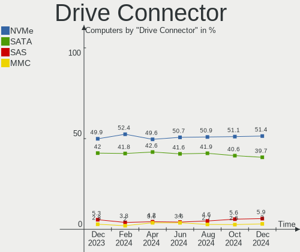
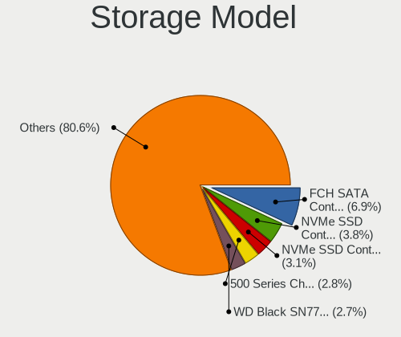
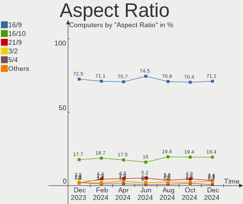

Fedora - Hardware Trends
------------------------

A project to identify most popular hardware characteristics and track their change
over time based on data collected by Linux users at https://Linux-Hardware.org.

Anyone can contribute to this report by the [hw-probe](https://github.com/linuxhw/hw-probe) tool:

    sudo -E hw-probe -all -upload

This is a report for all computer types. See also reports for [desktops](/Dist/Fedora/Desktop/README.md) and [notebooks](/Dist/Fedora/Notebook/README.md).

This report is for one last month. Overall report since the beginning of time: [TestDays](https://github.com/linuxhw/TestDays)

Period: Oct, 2023.

Contents
--------

* [ System ](#system)
  - [ OS                       ](#os)
  - [ OS Family                ](#os-family)
  - [ Kernel                   ](#kernel)
  - [ Kernel Family            ](#kernel-family)
  - [ Kernel Major Ver.        ](#kernel-major-ver)
  - [ Arch                     ](#arch)
  - [ DE                       ](#de)
  - [ Display Server           ](#display-server)
  - [ Display Manager          ](#display-manager)
  - [ OS Lang                  ](#os-lang)
  - [ Boot Mode                ](#boot-mode)
  - [ Filesystem               ](#filesystem)
  - [ Part. scheme             ](#part-scheme)
  - [ Dual Boot with Linux/BSD ](#dual-boot-with-linuxbsd)
  - [ Dual Boot (Win)          ](#dual-boot-win)

* [ Board ](#board)
  - [ Vendor                   ](#vendor)
  - [ Model                    ](#model)
  - [ Model Family             ](#model-family)
  - [ MFG Year                 ](#mfg-year)
  - [ Form Factor              ](#form-factor)
  - [ Secure Boot              ](#secure-boot)
  - [ Coreboot                 ](#coreboot)
  - [ RAM Size                 ](#ram-size)
  - [ RAM Used                 ](#ram-used)
  - [ Total Drives             ](#total-drives)
  - [ Has CD-ROM               ](#has-cd-rom)
  - [ Has Ethernet             ](#has-ethernet)
  - [ Has WiFi                 ](#has-wifi)
  - [ Has Bluetooth            ](#has-bluetooth)

* [ Location ](#location)
  - [ Country                  ](#country)
  - [ City                     ](#city)

* [ Drives ](#drives)
  - [ Drive Vendor             ](#drive-vendor)
  - [ Drive Model              ](#drive-model)
  - [ HDD Vendor               ](#hdd-vendor)
  - [ SSD Vendor               ](#ssd-vendor)
  - [ Drive Kind               ](#drive-kind)
  - [ Drive Connector          ](#drive-connector)
  - [ Drive Size               ](#drive-size)
  - [ Space Total              ](#space-total)
  - [ Space Used               ](#space-used)
  - [ Malfunc. Drives          ](#malfunc-drives)
  - [ Malfunc. Drive Vendor    ](#malfunc-drive-vendor)
  - [ Malfunc. HDD Vendor      ](#malfunc-hdd-vendor)
  - [ Malfunc. Drive Kind      ](#malfunc-drive-kind)
  - [ Failed Drives            ](#failed-drives)
  - [ Failed Drive Vendor      ](#failed-drive-vendor)
  - [ Drive Status             ](#drive-status)

* [ Storage controller ](#storage-controller)
  - [ Storage Vendor           ](#storage-vendor)
  - [ Storage Model            ](#storage-model)
  - [ Storage Kind             ](#storage-kind)

* [ Processor ](#processor)
  - [ CPU Vendor               ](#cpu-vendor)
  - [ CPU Model                ](#cpu-model)
  - [ CPU Model Family         ](#cpu-model-family)
  - [ CPU Cores                ](#cpu-cores)
  - [ CPU Sockets              ](#cpu-sockets)
  - [ CPU Threads              ](#cpu-threads)
  - [ CPU Op-Modes             ](#cpu-op-modes)
  - [ CPU Microcode            ](#cpu-microcode)
  - [ CPU Microarch            ](#cpu-microarch)

* [ Graphics ](#graphics)
  - [ GPU Vendor               ](#gpu-vendor)
  - [ GPU Model                ](#gpu-model)
  - [ GPU Combo                ](#gpu-combo)
  - [ GPU Driver               ](#gpu-driver)
  - [ GPU Memory               ](#gpu-memory)

* [ Monitor ](#monitor)
  - [ Monitor Vendor           ](#monitor-vendor)
  - [ Monitor Model            ](#monitor-model)
  - [ Monitor Resolution       ](#monitor-resolution)
  - [ Monitor Diagonal         ](#monitor-diagonal)
  - [ Monitor Width            ](#monitor-width)
  - [ Aspect Ratio             ](#aspect-ratio)
  - [ Monitor Area             ](#monitor-area)
  - [ Pixel Density            ](#pixel-density)
  - [ Multiple Monitors        ](#multiple-monitors)

* [ Network ](#network)
  - [ Net Controller Vendor    ](#net-controller-vendor)
  - [ Net Controller Model     ](#net-controller-model)
  - [ Wireless Vendor          ](#wireless-vendor)
  - [ Wireless Model           ](#wireless-model)
  - [ Ethernet Vendor          ](#ethernet-vendor)
  - [ Ethernet Model           ](#ethernet-model)
  - [ Net Controller Kind      ](#net-controller-kind)
  - [ Used Controller          ](#used-controller)
  - [ NICs                     ](#nics)
  - [ IPv6                     ](#ipv6)

* [ Bluetooth ](#bluetooth)
  - [ Bluetooth Vendor         ](#bluetooth-vendor)
  - [ Bluetooth Model          ](#bluetooth-model)

* [ Sound ](#sound)
  - [ Sound Vendor             ](#sound-vendor)
  - [ Sound Model              ](#sound-model)

* [ Memory ](#memory)
  - [ Memory Vendor            ](#memory-vendor)
  - [ Memory Model             ](#memory-model)
  - [ Memory Kind              ](#memory-kind)
  - [ Memory Form Factor       ](#memory-form-factor)
  - [ Memory Size              ](#memory-size)
  - [ Memory Speed             ](#memory-speed)

* [ Printers & scanners ](#printers--scanners)
  - [ Printer Vendor           ](#printer-vendor)
  - [ Printer Model            ](#printer-model)
  - [ Scanner Vendor           ](#scanner-vendor)
  - [ Scanner Model            ](#scanner-model)

* [ Camera ](#camera)
  - [ Camera Vendor            ](#camera-vendor)
  - [ Camera Model             ](#camera-model)

* [ Security ](#security)
  - [ Fingerprint Vendor       ](#fingerprint-vendor)
  - [ Fingerprint Model        ](#fingerprint-model)
  - [ Chipcard Vendor          ](#chipcard-vendor)
  - [ Chipcard Model           ](#chipcard-model)

* [ Unsupported ](#unsupported)
  - [ Unsupported Devices      ](#unsupported-devices)
  - [ Unsupported Device Types ](#unsupported-device-types)

System
------

OS
--

Installed operating systems

| Name      | Computers | Percent |
|-----------|-----------|---------|
| Fedora 38 | 457       | 87.38%  |
| Fedora 39 | 47        | 8.99%   |
| Fedora 37 | 10        | 1.91%   |
| Fedora 36 | 4         | 0.76%   |
| Fedora 35 | 2         | 0.38%   |
| Fedora 40 | 1         | 0.19%   |
| Fedora 34 | 1         | 0.19%   |
| Fedora 33 | 1         | 0.19%   |

OS Family
---------

OS without a version

| Name   | Computers | Percent |
|--------|-----------|---------|
| Fedora | 523       | 100%    |

Kernel
------

Version of the Linux kernel

| Version                                                | Computers | Percent |
|--------------------------------------------------------|-----------|---------|
| 6.5.5-200.fc38.x86_64                                  | 131       | 25.05%  |
| 6.5.6-200.fc38.x86_64                                  | 98        | 18.74%  |
| 6.5.7-200.fc38.x86_64                                  | 84        | 16.06%  |
| 6.5.8-200.fc38.x86_64                                  | 53        | 10.13%  |
| 6.2.9-300.fc38.x86_64                                  | 51        | 9.75%   |
| 6.5.6-300.fc39.x86_64                                  | 25        | 4.78%   |
| 6.4.15-200.fc38.x86_64                                 | 14        | 2.68%   |
| 6.5.5-300.fc39.x86_64                                  | 7         | 1.34%   |
| 6.5.8-300.fc39.x86_64                                  | 6         | 1.15%   |
| 6.5.5-100.fc37.x86_64                                  | 5         | 0.96%   |
| 6.5.2-301.fc39.x86_64                                  | 5         | 0.96%   |
| 6.5.7-300.fc39.x86_64                                  | 4         | 0.76%   |
| 6.2.15-100.fc36.x86_64                                 | 4         | 0.76%   |
| 6.5.6-1.surface.fc38.x86_64                            | 2         | 0.38%   |
| 6.2.15-300.fc38.x86_64                                 | 2         | 0.38%   |
| 6.0.12-100.fc35.x86_64                                 | 2         | 0.38%   |
| 6.6.0-0.rc4.20231005git3006adf3be79.36.fc40.x86_64     | 1         | 0.19%   |
| 6.6.0-0.rc0.20230902gt0468be89.203.vanilla.fc38.x86_64 | 1         | 0.19%   |
| 6.5.8-200.fc38.aarch64                                 | 1         | 0.19%   |
| 6.5.8-1.surface.fc38.x86_64                            | 1         | 0.19%   |
| 6.5.6-100.fc37.x86_64                                  | 1         | 0.19%   |
| 6.5.5-xm1.0.fc38.x86_64                                | 1         | 0.19%   |
| 6.5.5-cbe1.0.fc38.x86_64                               | 1         | 0.19%   |
| 6.5.3-301.rog.fc38.x86_64                              | 1         | 0.19%   |
| 6.4.8-200.fc38.x86_64                                  | 1         | 0.19%   |
| 6.4.7-200.fc38.x86_64                                  | 1         | 0.19%   |
| 6.4.7-100.fc37.x86_64                                  | 1         | 0.19%   |
| 6.4.6-200.fc38.x86_64                                  | 1         | 0.19%   |
| 6.4.4-200.fc38.x86_64                                  | 1         | 0.19%   |
| 6.4.4-100.fc37.x86_64                                  | 1         | 0.19%   |
| 6.4.13-200.fc38.x86_64                                 | 1         | 0.19%   |
| 6.4.12-200.fc38.x86_64                                 | 1         | 0.19%   |
| 6.4.11-200.fc38.x86_64                                 | 1         | 0.19%   |
| 6.3.8-200.fc38.x86_64                                  | 1         | 0.19%   |
| 6.3.5-200.fc38.x86_64                                  | 1         | 0.19%   |
| 6.3.11-200.fc38.x86_64                                 | 1         | 0.19%   |
| 6.2.2-301.fc38.x86_64                                  | 1         | 0.19%   |
| 6.2.15-703.inttf.fc38.x86_64                           | 1         | 0.19%   |
| 6.2.14-300.fc38.x86_64                                 | 1         | 0.19%   |
| 6.1.14-200.fc37.x86_64                                 | 1         | 0.19%   |

Kernel Family
-------------

Linux kernel without a distro release

| Version | Computers | Percent |
|---------|-----------|---------|
| 6.5.5   | 145       | 27.72%  |
| 6.5.6   | 126       | 24.09%  |
| 6.5.7   | 88        | 16.83%  |
| 6.5.8   | 61        | 11.66%  |
| 6.2.9   | 51        | 9.75%   |
| 6.4.15  | 14        | 2.68%   |
| 6.2.15  | 7         | 1.34%   |
| 6.5.2   | 5         | 0.96%   |
| 6.6.0   | 2         | 0.38%   |
| 6.4.7   | 2         | 0.38%   |
| 6.4.4   | 2         | 0.38%   |
| 6.0.8   | 2         | 0.38%   |
| 6.0.12  | 2         | 0.38%   |
| 6.5.3   | 1         | 0.19%   |
| 6.4.8   | 1         | 0.19%   |
| 6.4.6   | 1         | 0.19%   |
| 6.4.13  | 1         | 0.19%   |
| 6.4.12  | 1         | 0.19%   |
| 6.4.11  | 1         | 0.19%   |
| 6.3.8   | 1         | 0.19%   |
| 6.3.5   | 1         | 0.19%   |
| 6.3.11  | 1         | 0.19%   |
| 6.2.2   | 1         | 0.19%   |
| 6.2.14  | 1         | 0.19%   |
| 6.1.14  | 1         | 0.19%   |
| 6.0.7   | 1         | 0.19%   |
| 5.4.19  | 1         | 0.19%   |
| 5.17.12 | 1         | 0.19%   |
| 5.14.17 | 1         | 0.19%   |

Kernel Major Ver.
-----------------

Linux kernel major version

| Version | Computers | Percent |
|---------|-----------|---------|
| 6.5     | 426       | 81.45%  |
| 6.2     | 60        | 11.47%  |
| 6.4     | 23        | 4.4%    |
| 6.0     | 5         | 0.96%   |
| 6.3     | 3         | 0.57%   |
| 6.6     | 2         | 0.38%   |
| 6.1     | 1         | 0.19%   |
| 5.4     | 1         | 0.19%   |
| 5.17    | 1         | 0.19%   |
| 5.14    | 1         | 0.19%   |

Arch
----

OS architecture (x86_64, i586, etc.)

| Name    | Computers | Percent |
|---------|-----------|---------|
| x86_64  | 522       | 99.81%  |
| aarch64 | 1         | 0.19%   |

DE
--

Desktop Environment

| Name          | Computers | Percent |
|---------------|-----------|---------|
| GNOME         | 387       | 74%     |
| KDE5          | 87        | 16.63%  |
| Unknown       | 12        | 2.29%   |
| Cinnamon      | 11        | 2.1%    |
| X-Cinnamon    | 9         | 1.72%   |
| GNOME Classic | 5         | 0.96%   |
| XFCE          | 3         | 0.57%   |
| sway          | 2         | 0.38%   |
| MATE          | 2         | 0.38%   |
| Budgie        | 2         | 0.38%   |
| LXQt          | 1         | 0.19%   |
| LXDE          | 1         | 0.19%   |
| i3            | 1         | 0.19%   |

Display Server
--------------

X11 or Wayland

| Name    | Computers | Percent |
|---------|-----------|---------|
| Wayland | 399       | 76.29%  |
| X11     | 101       | 19.31%  |
| Tty     | 17        | 3.25%   |
| Unknown | 6         | 1.15%   |

Display Manager
---------------

SDDM, LightDM, etc.

| Name    | Computers | Percent |
|---------|-----------|---------|
| Unknown | 313       | 59.85%  |
| GDM     | 141       | 26.96%  |
| SDDM    | 44        | 8.41%   |
| LightDM | 25        | 4.78%   |

OS Lang
-------

Language

| Lang    | Computers | Percent |
|---------|-----------|---------|
| en_US   | 275       | 52.58%  |
| en_GB   | 42        | 8.03%   |
| ru_RU   | 24        | 4.59%   |
| de_DE   | 23        | 4.4%    |
| it_IT   | 19        | 3.63%   |
| en_CA   | 18        | 3.44%   |
| pt_BR   | 16        | 3.06%   |
| es_ES   | 16        | 3.06%   |
| en_AU   | 14        | 2.68%   |
| fr_FR   | 7         | 1.34%   |
| es_MX   | 7         | 1.34%   |
| cs_CZ   | 5         | 0.96%   |
| pt_PT   | 4         | 0.76%   |
| pl_PL   | 4         | 0.76%   |
| en_IN   | 4         | 0.76%   |
| de_AT   | 4         | 0.76%   |
| es_CL   | 3         | 0.57%   |
| en_DK   | 3         | 0.57%   |
| tr_TR   | 2         | 0.38%   |
| nl_NL   | 2         | 0.38%   |
| nl_BE   | 2         | 0.38%   |
| lv_LV   | 2         | 0.38%   |
| ja_JP   | 2         | 0.38%   |
| fr_CA   | 2         | 0.38%   |
| es_GT   | 2         | 0.38%   |
| es_CO   | 2         | 0.38%   |
| es_AR   | 2         | 0.38%   |
| en_SG   | 2         | 0.38%   |
| en_NZ   | 2         | 0.38%   |
| Unknown | 2         | 0.38%   |
| zh_TW   | 1         | 0.19%   |
| lt_LT   | 1         | 0.19%   |
| id_ID   | 1         | 0.19%   |
| fi_FI   | 1         | 0.19%   |
| es_US   | 1         | 0.19%   |
| es_DO   | 1         | 0.19%   |
| en_PH   | 1         | 0.19%   |
| en_IL   | 1         | 0.19%   |
| de_CH   | 1         | 0.19%   |
| az_AZ   | 1         | 0.19%   |

Boot Mode
---------

EFI or BIOS

| Mode | Computers | Percent |
|------|-----------|---------|
| EFI  | 430       | 82.22%  |
| BIOS | 93        | 17.78%  |

Filesystem
----------

Type of filesystem

| Type  | Computers | Percent |
|-------|-----------|---------|
| Btrfs | 416       | 79.54%  |
| Ext4  | 88        | 16.83%  |
| Xfs   | 18        | 3.44%   |
| Zfs   | 1         | 0.19%   |

Part. scheme
------------

Scheme of partitioning

| Type    | Computers | Percent |
|---------|-----------|---------|
| Unknown | 297       | 56.79%  |
| GPT     | 209       | 39.96%  |
| MBR     | 17        | 3.25%   |

Dual Boot with Linux/BSD
------------------------

Hosting more than one Linux/BSD

| Dual boot | Computers | Percent |
|-----------|-----------|---------|
| No        | 472       | 90.25%  |
| Yes       | 51        | 9.75%   |

Dual Boot (Win)
---------------

Hosting Linux and Windows

| Dual boot | Computers | Percent |
|-----------|-----------|---------|
| No        | 437       | 83.56%  |
| Yes       | 86        | 16.44%  |

Board
-----

Vendor
------

Motherboard manufacturer

| Name                                 | Computers | Percent |
|--------------------------------------|-----------|---------|
| Lenovo                               | 103       | 19.69%  |
| ASUSTek Computer                     | 83        | 15.87%  |
| Hewlett-Packard                      | 65        | 12.43%  |
| Dell                                 | 61        | 11.66%  |
| MSI                                  | 41        | 7.84%   |
| Gigabyte Technology                  | 35        | 6.69%   |
| ASRock                               | 21        | 4.02%   |
| Acer                                 | 19        | 3.63%   |
| Apple                                | 17        | 3.25%   |
| Samsung Electronics                  | 6         | 1.15%   |
| HUAWEI                               | 6         | 1.15%   |
| Toshiba                              | 4         | 0.76%   |
| Microsoft                            | 4         | 0.76%   |
| Intel                                | 4         | 0.76%   |
| Google                               | 4         | 0.76%   |
| Framework                            | 4         | 0.76%   |
| Timi                                 | 3         | 0.57%   |
| Shenzhen Meigao Electronic Equipment | 3         | 0.57%   |
| Supermicro                           | 2         | 0.38%   |
| Schenker                             | 2         | 0.38%   |
| Packard Bell                         | 2         | 0.38%   |
| Fujitsu                              | 2         | 0.38%   |
| AZW                                  | 2         | 0.38%   |
| AMI                                  | 2         | 0.38%   |
| Unknown                              | 2         | 0.38%   |
| XIAOMI                               | 1         | 0.19%   |
| VANT                                 | 1         | 0.19%   |
| TUXEDO                               | 1         | 0.19%   |
| TrekStor                             | 1         | 0.19%   |
| Thomson                              | 1         | 0.19%   |
| Teclast                              | 1         | 0.19%   |
| Techvision                           | 1         | 0.19%   |
| Razer                                | 1         | 0.19%   |
| raspberrypi,4-model-b                | 1         | 0.19%   |
| Positivo Bahia - VAIO                | 1         | 0.19%   |
| Pegatron                             | 1         | 0.19%   |
| Notebook                             | 1         | 0.19%   |
| Medion                               | 1         | 0.19%   |
| Maibenben                            | 1         | 0.19%   |
| MACHINIST                            | 1         | 0.19%   |

Model
-----

Motherboard model

| Name                                  | Computers | Percent |
|---------------------------------------|-----------|---------|
| MSI MS-7C56                           | 3         | 0.57%   |
| Lenovo G500 20236                     | 3         | 0.57%   |
| HP Notebook                           | 3         | 0.57%   |
| ASUS Vivobook Go E1504FA_E1504FA      | 3         | 0.57%   |
| ASUS ROG STRIX X670E-I GAMING WIFI    | 3         | 0.57%   |
| Unknown                               | 3         | 0.57%   |
| MSI Prestige 14H B12UCX               | 2         | 0.38%   |
| MSI MS-7C95                           | 2         | 0.38%   |
| MSI MS-7C91                           | 2         | 0.38%   |
| MSI MS-7C37                           | 2         | 0.38%   |
| Lenovo Yoga 9 14ITL5 82BG             | 2         | 0.38%   |
| Lenovo IdeaPad 5 14ARE05 81YM         | 2         | 0.38%   |
| HP Z420 Workstation                   | 2         | 0.38%   |
| HP ProBook 640 G1                     | 2         | 0.38%   |
| HP Pavilion Desktop 590-p0xxx         | 2         | 0.38%   |
| HP EliteBook 845 G8 Notebook PC       | 2         | 0.38%   |
| Gigabyte X570 I AORUS PRO WIFI        | 2         | 0.38%   |
| Gigabyte GA-MA780G-UD3H               | 2         | 0.38%   |
| Gigabyte F2A55M-DS2                   | 2         | 0.38%   |
| Framework Laptop                      | 2         | 0.38%   |
| Dell Precision 5480                   | 2         | 0.38%   |
| Dell OptiPlex 9020                    | 2         | 0.38%   |
| Dell Latitude 5440                    | 2         | 0.38%   |
| ASUS Zenbook UM3402YAR_UM3402YA       | 2         | 0.38%   |
| ASUS T101HA                           | 2         | 0.38%   |
| ASUS ROG Zephyrus G14 GA402RJ_GA402RJ | 2         | 0.38%   |
| ASUS ROG STRIX X670E-E GAMING WIFI    | 2         | 0.38%   |
| Apple MacBookPro8,1                   | 2         | 0.38%   |
| Apple MacBookPro12,1                  | 2         | 0.38%   |
| AMI Intel                             | 2         | 0.38%   |
| Acer Nitro AN515-58                   | 2         | 0.38%   |
| Acer Aspire A515-45                   | 2         | 0.38%   |
| XIAOMI Redmi Book Pro 15 2023         | 1         | 0.19%   |
| VANT MOOVE14_2023                     | 1         | 0.19%   |
| TrekStor Primebook C11B               | 1         | 0.19%   |
| Toshiba Satellite L75D-A              | 1         | 0.19%   |
| Toshiba Satellite L735                | 1         | 0.19%   |
| Toshiba Satellite CL10-C-102          | 1         | 0.19%   |
| Toshiba Satellite A500                | 1         | 0.19%   |
| Timi TM1701                           | 1         | 0.19%   |

Model Family
------------

Motherboard model prefix

| Name               | Computers | Percent |
|--------------------|-----------|---------|
| Lenovo ThinkPad    | 47        | 8.99%   |
| Dell Latitude      | 19        | 3.63%   |
| Lenovo IdeaPad     | 18        | 3.44%   |
| ASUS ROG           | 17        | 3.25%   |
| HP Pavilion        | 14        | 2.68%   |
| HP EliteBook       | 12        | 2.29%   |
| Dell Precision     | 12        | 2.29%   |
| ASUS Vivobook      | 12        | 2.29%   |
| Acer Aspire        | 10        | 1.91%   |
| Dell Inspiron      | 9         | 1.72%   |
| ASUS TUF           | 9         | 1.72%   |
| ASUS PRIME         | 9         | 1.72%   |
| ASUS Zenbook       | 8         | 1.53%   |
| Lenovo Yoga        | 7         | 1.34%   |
| HP ProBook         | 7         | 1.34%   |
| Dell XPS           | 7         | 1.34%   |
| Lenovo ThinkBook   | 5         | 0.96%   |
| Dell Vostro        | 5         | 0.96%   |
| Dell OptiPlex      | 5         | 0.96%   |
| ASUS ASUS          | 5         | 0.96%   |
| Toshiba Satellite  | 4         | 0.76%   |
| Microsoft Surface  | 4         | 0.76%   |
| Lenovo ThinkCentre | 4         | 0.76%   |
| Lenovo Legion      | 4         | 0.76%   |
| HP Laptop          | 4         | 0.76%   |
| HP ENVY            | 4         | 0.76%   |
| Framework Laptop   | 4         | 0.76%   |
| Acer Nitro         | 4         | 0.76%   |
| MSI Prestige       | 3         | 0.57%   |
| MSI MS-7C56        | 3         | 0.57%   |
| Lenovo IdeaPadFlex | 3         | 0.57%   |
| Lenovo G500        | 3         | 0.57%   |
| HP Spectre         | 3         | 0.57%   |
| HP Notebook        | 3         | 0.57%   |
| Gigabyte X570      | 3         | 0.57%   |
| ASRock B550        | 3         | 0.57%   |
| Unknown            | 3         | 0.57%   |
| MSI MS-7C95        | 2         | 0.38%   |
| MSI MS-7C91        | 2         | 0.38%   |
| MSI MS-7C37        | 2         | 0.38%   |

MFG Year
--------

Motherboard manufacture year

| Year | Computers | Percent |
|------|-----------|---------|
| 2022 | 76        | 14.53%  |
| 2020 | 70        | 13.38%  |
| 2021 | 59        | 11.28%  |
| 2023 | 55        | 10.52%  |
| 2018 | 49        | 9.37%   |
| 2019 | 41        | 7.84%   |
| 2017 | 28        | 5.35%   |
| 2013 | 25        | 4.78%   |
| 2012 | 22        | 4.21%   |
| 2015 | 20        | 3.82%   |
| 2014 | 17        | 3.25%   |
| 2016 | 16        | 3.06%   |
| 2011 | 15        | 2.87%   |
| 2009 | 11        | 2.1%    |
| 2010 | 9         | 1.72%   |
| 2008 | 6         | 1.15%   |
| 2007 | 3         | 0.57%   |
| 2006 | 1         | 0.19%   |

Form Factor
-----------

Physical design of the computer

| Name           | Computers | Percent |
|----------------|-----------|---------|
| Notebook       | 301       | 57.55%  |
| Desktop        | 173       | 33.08%  |
| Convertible    | 26        | 4.97%   |
| Tablet         | 8         | 1.53%   |
| Mini pc        | 6         | 1.15%   |
| All in one     | 4         | 0.76%   |
| Server         | 4         | 0.76%   |
| System on chip | 1         | 0.19%   |

Secure Boot
-----------

Enabled or disabled

| State    | Computers | Percent |
|----------|-----------|---------|
| Disabled | 412       | 78.78%  |
| Enabled  | 111       | 21.22%  |

Coreboot
--------

Have coreboot on board

| Used | Computers | Percent |
|------|-----------|---------|
| No   | 519       | 99.24%  |
| Yes  | 4         | 0.76%   |

RAM Size
--------

Total RAM memory

| Size in GB  | Computers | Percent |
|-------------|-----------|---------|
| 8.01-16.0   | 121       | 23.14%  |
| 16.01-24.0  | 105       | 20.08%  |
| 4.01-8.0    | 104       | 19.89%  |
| 32.01-64.0  | 95        | 18.16%  |
| 3.01-4.0    | 46        | 8.8%    |
| 64.01-256.0 | 33        | 6.31%   |
| 24.01-32.0  | 13        | 2.49%   |
| 2.01-3.0    | 4         | 0.76%   |
| 1.01-2.0    | 2         | 0.38%   |

RAM Used
--------

Used RAM memory

| Used GB     | Computers | Percent |
|-------------|-----------|---------|
| 4.01-8.0    | 188       | 35.95%  |
| 2.01-3.0    | 115       | 21.99%  |
| 3.01-4.0    | 108       | 20.65%  |
| 1.01-2.0    | 54        | 10.33%  |
| 8.01-16.0   | 49        | 9.37%   |
| 0.51-1.0    | 4         | 0.76%   |
| 64.01-256.0 | 2         | 0.38%   |
| 32.01-64.0  | 1         | 0.19%   |
| 24.01-32.0  | 1         | 0.19%   |
| 16.01-24.0  | 1         | 0.19%   |

Total Drives
------------

Number of drives on board

| Drives | Computers | Percent |
|--------|-----------|---------|
| 1      | 339       | 64.82%  |
| 2      | 114       | 21.8%   |
| 3      | 38        | 7.27%   |
| 4      | 14        | 2.68%   |
| 6      | 6         | 1.15%   |
| 5      | 6         | 1.15%   |
| 7      | 2         | 0.38%   |
| 410    | 1         | 0.19%   |
| 13     | 1         | 0.19%   |
| 11     | 1         | 0.19%   |
| 9      | 1         | 0.19%   |

Has CD-ROM
----------

Has CD-ROM on board

| Presented | Computers | Percent |
|-----------|-----------|---------|
| No        | 417       | 79.73%  |
| Yes       | 106       | 20.27%  |

Has Ethernet
------------

Has Ethernet on board

| Presented | Computers | Percent |
|-----------|-----------|---------|
| Yes       | 392       | 74.95%  |
| No        | 131       | 25.05%  |

Has WiFi
--------

Has WiFi module

| Presented | Computers | Percent |
|-----------|-----------|---------|
| Yes       | 449       | 85.85%  |
| No        | 74        | 14.15%  |

Has Bluetooth
-------------

Has Bluetooth module

| Presented | Computers | Percent |
|-----------|-----------|---------|
| Yes       | 389       | 74.38%  |
| No        | 134       | 25.62%  |

Location
--------

Country
-------

Geographic location (country)

| Country     | Computers | Percent |
|-------------|-----------|---------|
| USA         | 93        | 17.78%  |
| Germany     | 37        | 7.07%   |
| Italy       | 36        | 6.88%   |
| Spain       | 29        | 5.54%   |
| Brazil      | 27        | 5.16%   |
| UK          | 25        | 4.78%   |
| Russia      | 21        | 4.02%   |
| Canada      | 21        | 4.02%   |
| Australia   | 18        | 3.44%   |
| France      | 16        | 3.06%   |
| India       | 14        | 2.68%   |
| Poland      | 12        | 2.29%   |
| Mexico      | 11        | 2.1%    |
| Netherlands | 10        | 1.91%   |
| Sweden      | 7         | 1.34%   |
| Czechia     | 7         | 1.34%   |
| Argentina   | 7         | 1.34%   |
| Turkey      | 6         | 1.15%   |
| Colombia    | 6         | 1.15%   |
| Austria     | 6         | 1.15%   |
| Indonesia   | 5         | 0.96%   |
| Bulgaria    | 5         | 0.96%   |
| Belgium     | 5         | 0.96%   |
| Belarus     | 5         | 0.96%   |
| Thailand    | 4         | 0.76%   |
| Romania     | 4         | 0.76%   |
| Portugal    | 4         | 0.76%   |
| Norway      | 4         | 0.76%   |
| Japan       | 4         | 0.76%   |
| Vietnam     | 3         | 0.57%   |
| Tunisia     | 3         | 0.57%   |
| Latvia      | 3         | 0.57%   |
| Israel      | 3         | 0.57%   |
| Finland     | 3         | 0.57%   |
| Denmark     | 3         | 0.57%   |
| Chile       | 3         | 0.57%   |
| Switzerland | 2         | 0.38%   |
| Slovenia    | 2         | 0.38%   |
| Philippines | 2         | 0.38%   |
| New Zealand | 2         | 0.38%   |

City
----

Geographic location (city)

| City               | Computers | Percent |
|--------------------|-----------|---------|
| Sydney             | 11        | 2.1%    |
| Barcelona          | 5         | 0.96%   |
| Moscow             | 4         | 0.76%   |
| Montreal           | 4         | 0.76%   |
| Minsk              | 4         | 0.76%   |
| Madrid             | 4         | 0.76%   |
| London             | 4         | 0.76%   |
| Wroclaw            | 3         | 0.57%   |
| Vienna             | 3         | 0.57%   |
| St Petersburg      | 3         | 0.57%   |
| Sofia              | 3         | 0.57%   |
| Seattle            | 3         | 0.57%   |
| Sao Paulo          | 3         | 0.57%   |
| Rome               | 3         | 0.57%   |
| Riga               | 3         | 0.57%   |
| Prague             | 3         | 0.57%   |
| Milan              | 3         | 0.57%   |
| Mexico City        | 3         | 0.57%   |
| Maringá           | 3         | 0.57%   |
| Lisbon             | 3         | 0.57%   |
| Hanoi              | 3         | 0.57%   |
| Genoa              | 3         | 0.57%   |
| Buenos Aires       | 3         | 0.57%   |
| Berlin             | 3         | 0.57%   |
| Belo Horizonte     | 3         | 0.57%   |
| Bari               | 3         | 0.57%   |
| Wilhelmshaven      | 2         | 0.38%   |
| Warsaw             | 2         | 0.38%   |
| Van Nuys           | 2         | 0.38%   |
| Turin              | 2         | 0.38%   |
| Toronto            | 2         | 0.38%   |
| Tokyo              | 2         | 0.38%   |
| Stuttgart          | 2         | 0.38%   |
| Santo Domingo Este | 2         | 0.38%   |
| Santiago           | 2         | 0.38%   |
| San Jose           | 2         | 0.38%   |
| Rostov-on-Don      | 2         | 0.38%   |
| Raleigh            | 2         | 0.38%   |
| Parma              | 2         | 0.38%   |
| Oviedo             | 2         | 0.38%   |

Drives
------

Drive Vendor
------------

Hard drive vendors

| Vendor                       | Computers | Drives | Percent |
|------------------------------|-----------|--------|---------|
| Samsung Electronics          | 160       | 194    | 21.22%  |
| WDC                          | 70        | 88     | 9.28%   |
| Seagate                      | 62        | 69     | 8.22%   |
| SanDisk                      | 56        | 60     | 7.43%   |
| Micron Technology            | 29        | 29     | 3.85%   |
| Kingston                     | 29        | 34     | 3.85%   |
| Toshiba                      | 28        | 36     | 3.71%   |
| Intel                        | 28        | 33     | 3.71%   |
| Crucial                      | 28        | 28     | 3.71%   |
| Unknown                      | 26        | 29     | 3.45%   |
| SK hynix                     | 26        | 26     | 3.45%   |
| Phison Electronics           | 18        | 20     | 2.39%   |
| Apple                        | 13        | 14     | 1.72%   |
| Micron/Crucial Technology    | 12        | 19     | 1.59%   |
| Kingston Technology Company  | 12        | 13     | 1.59%   |
| HGST                         | 11        | 11     | 1.46%   |
| A-DATA Technology            | 10        | 10     | 1.33%   |
| KIOXIA                       | 9         | 10     | 1.19%   |
| Hitachi                      | 9         | 9      | 1.19%   |
| Realtek Semiconductor        | 7         | 7      | 0.93%   |
| Silicon Motion               | 6         | 6      | 0.8%    |
| ADATA Technology             | 6         | 6      | 0.8%    |
| MAXIO Technology (Hangzhou)  | 5         | 5      | 0.66%   |
| Hewlett-Packard              | 5         | 5      | 0.66%   |
| Solid State Storage          | 4         | 4      | 0.53%   |
| PNY                          | 4         | 5      | 0.53%   |
| China                        | 4         | 4      | 0.53%   |
| Union Memory (Shenzhen)      | 3         | 3      | 0.4%    |
| SPCC                         | 3         | 3      | 0.4%    |
| Shenzhen Longsys Electronics | 3         | 4      | 0.4%    |
| Patriot                      | 3         | 3      | 0.4%    |
| Mushkin                      | 3         | 3      | 0.4%    |
| Intenso                      | 3         | 3      | 0.4%    |
| XrayDisk                     | 2         | 2      | 0.27%   |
| Transcend                    | 2         | 2      | 0.27%   |
| T-FORCE                      | 2         | 2      | 0.27%   |
| SABRENT                      | 2         | 2      | 0.27%   |
| Realtek                      | 2         | 2      | 0.27%   |
| LITEON                       | 2         | 2      | 0.27%   |
| KingSpec                     | 2         | 2      | 0.27%   |

Drive Model
-----------

Hard drive models

| Model                                                 | Computers | Percent |
|-------------------------------------------------------|-----------|---------|
| Samsung NVMe SSD Controller SM981/PM981/PM983 1TB     | 38        | 4.73%   |
| Samsung NVMe SSD Controller PM9A1/PM9A3/980PRO 1TB    | 24        | 2.99%   |
| Unknown MMC Card  128GB                               | 10        | 1.25%   |
| Sandisk WD Blue SN550 NVMe SSD 1TB                    | 10        | 1.25%   |
| Sandisk WD Black SN750 / PC SN730 NVMe SSD 1024GB     | 9         | 1.12%   |
| Micron/Crucial P2 NVMe PCIe SSD 500GB                 | 9         | 1.12%   |
| Crucial CT500MX500SSD1 500GB                          | 8         | 1%      |
| Samsung SSD 870 EVO 1TB                               | 7         | 0.87%   |
| Samsung SSD 850 EVO 250GB                             | 7         | 0.87%   |
| Kingston SA400S37480G 480GB SSD                       | 7         | 0.87%   |
| Kingston SA400S37240G 240GB SSD                       | 7         | 0.87%   |
| Unknown MMC Card  64GB                                | 6         | 0.75%   |
| Seagate ST2000DM008-2FR102 2TB                        | 6         | 0.75%   |
| Samsung SSD 860 EVO 1TB                               | 6         | 0.75%   |
| Samsung NVMe SSD Controller SM961/PM961/SM963 121GB   | 6         | 0.75%   |
| Phison E12 NVMe Controller 1TB                        | 6         | 0.75%   |
| Intel SSDPEKNU512GZ 512GB                             | 6         | 0.75%   |
| Toshiba XG6 NVMe SSD Controller 256GB                 | 5         | 0.62%   |
| Silicon Motion SM2263EN/SM2263XT SSD Controller 256GB | 5         | 0.62%   |
| Seagate ST1000LM035-1RK172 1TB                        | 5         | 0.62%   |
| Sandisk WD Black SN850 1TB                            | 5         | 0.62%   |
| Phison E16 PCIe4 NVMe Controller 500GB                | 5         | 0.62%   |
| Kingston Company SNV2S2000G 2TB                       | 5         | 0.62%   |
| Intel SSD 660P Series 1024GB                          | 5         | 0.62%   |
| Crucial CT1000MX500SSD1 1TB                           | 5         | 0.62%   |
| Toshiba MQ04ABF100 1TB                                | 4         | 0.5%    |
| Seagate ST2000DM006-2DM164 2TB                        | 4         | 0.5%    |
| Samsung SSD 990 PRO 1TB                               | 4         | 0.5%    |
| Samsung SSD 980 500GB                                 | 4         | 0.5%    |
| Samsung SSD 980 1TB                                   | 4         | 0.5%    |
| Samsung MZALQ512HALU-000L2 512GB                      | 4         | 0.5%    |
| Micron/Crucial P1 NVMe PCIe SSD 1TB                   | 4         | 0.5%    |
| MAXIO (Hangzhou) NVMe SSD Controller MAP1202 250GB    | 4         | 0.5%    |
| KIOXIA KBG50ZNS512G NVMe 512GB                        | 4         | 0.5%    |
| Kingston Company SNV2S1000G 1TB                       | 4         | 0.5%    |
| HGST HTS721010A9E630 1TB                              | 4         | 0.5%    |
| Apple ANS2 NVMe Controller 1TB                        | 4         | 0.5%    |
| WDC WDS500G2B0A-00SM50 500GB SSD                      | 3         | 0.37%   |
| WDC WDS240G2G0A-00JH30 240GB SSD                      | 3         | 0.37%   |
| WDC WD40EFRX-68N32N0 4TB                              | 3         | 0.37%   |

HDD Vendor
----------

Hard disk drive vendors

| Vendor              | Computers | Drives | Percent |
|---------------------|-----------|--------|---------|
| WDC                 | 59        | 75     | 35.76%  |
| Seagate             | 59        | 65     | 35.76%  |
| Toshiba             | 13        | 21     | 7.88%   |
| HGST                | 11        | 11     | 6.67%   |
| Hitachi             | 9         | 9      | 5.45%   |
| Samsung Electronics | 5         | 6      | 3.03%   |
| Unknown             | 3         | 3      | 1.82%   |
| Apple               | 3         | 3      | 1.82%   |
| Maxtor              | 1         | 1      | 0.61%   |
| Maxone              | 1         | 1      | 0.61%   |
| Fujitsu             | 1         | 1      | 0.61%   |

SSD Vendor
----------

Solid state drive vendors

| Vendor              | Computers | Drives | Percent |
|---------------------|-----------|--------|---------|
| Samsung Electronics | 53        | 60     | 23.98%  |
| Crucial             | 28        | 28     | 12.67%  |
| Kingston            | 21        | 23     | 9.5%    |
| SanDisk             | 15        | 16     | 6.79%   |
| WDC                 | 10        | 11     | 4.52%   |
| A-DATA Technology   | 9         | 9      | 4.07%   |
| Intel               | 7         | 8      | 3.17%   |
| Toshiba             | 6         | 6      | 2.71%   |
| Hewlett-Packard     | 5         | 5      | 2.26%   |
| Apple               | 5         | 5      | 2.26%   |
| SK hynix            | 4         | 4      | 1.81%   |
| PNY                 | 4         | 5      | 1.81%   |
| China               | 4         | 4      | 1.81%   |
| SPCC                | 3         | 3      | 1.36%   |
| Patriot             | 3         | 3      | 1.36%   |
| Mushkin             | 3         | 3      | 1.36%   |
| Micron Technology   | 3         | 3      | 1.36%   |
| Transcend           | 2         | 2      | 0.9%    |
| LITEON              | 2         | 2      | 0.9%    |
| KingSpec            | 2         | 2      | 0.9%    |
| Intenso             | 2         | 2      | 0.9%    |
| Apacer              | 2         | 3      | 0.9%    |
| ZTC                 | 1         | 1      | 0.45%   |
| XrayDisk            | 1         | 1      | 0.45%   |
| V-GeN               | 1         | 1      | 0.45%   |
| Teclast             | 1         | 1      | 0.45%   |
| Team                | 1         | 2      | 0.45%   |
| T-FORCE             | 1         | 1      | 0.45%   |
| Smartbuy            | 1         | 1      | 0.45%   |
| SABRENT             | 1         | 1      | 0.45%   |
| OCZ                 | 1         | 1      | 0.45%   |
| Netac               | 1         | 1      | 0.45%   |
| LITEONIT            | 1         | 1      | 0.45%   |
| Lexar               | 1         | 1      | 0.45%   |
| Lenovo              | 1         | 1      | 0.45%   |
| KUIJIA              | 1         | 1      | 0.45%   |
| GSemi               | 1         | 1      | 0.45%   |
| GOODRAM             | 1         | 1      | 0.45%   |
| Gigabyte Technology | 1         | 1      | 0.45%   |
| FreeNAS             | 1         | 36     | 0.45%   |

Drive Kind
----------

HDD or SSD

| Kind    | Computers | Drives | Percent |
|---------|-----------|--------|---------|
| NVMe    | 324       | 388    | 46.62%  |
| SSD     | 188       | 646    | 27.05%  |
| HDD     | 149       | 196    | 21.44%  |
| MMC     | 22        | 24     | 3.17%   |
| Unknown | 12        | 12     | 1.73%   |

Drive Connector
---------------

SATA, SAS, NVMe, etc.

| Type | Computers | Drives | Percent |
|------|-----------|--------|---------|
| NVMe | 323       | 383    | 51.43%  |
| SATA | 259       | 831    | 41.24%  |
| SAS  | 24        | 28     | 3.82%   |
| MMC  | 22        | 24     | 3.5%    |

Drive Size
----------

Size of hard drive

| Size in TB | Computers | Drives | Percent |
|------------|-----------|--------|---------|
| 0.01-0.5   | 176       | 637    | 51.92%  |
| 0.51-1.0   | 102       | 120    | 30.09%  |
| 1.01-2.0   | 33        | 49     | 9.73%   |
| 3.01-4.0   | 15        | 18     | 4.42%   |
| 2.01-3.0   | 6         | 7      | 1.77%   |
| 4.01-10.0  | 6         | 7      | 1.77%   |
| 10.01-20.0 | 1         | 4      | 0.29%   |

Space Total
-----------

Amount of disk space available on the file system

| Size in GB     | Computers | Percent |
|----------------|-----------|---------|
| 501-1000       | 121       | 23.14%  |
| 251-500        | 85        | 16.25%  |
| 101-250        | 69        | 13.19%  |
| 1001-2000      | 69        | 13.19%  |
| More than 3000 | 50        | 9.56%   |
| 1-20           | 49        | 9.37%   |
| Unknown        | 41        | 7.84%   |
| 2001-3000      | 22        | 4.21%   |
| 51-100         | 16        | 3.06%   |
| 21-50          | 1         | 0.19%   |

Space Used
----------

Amount of used disk space

| Used GB        | Computers | Percent |
|----------------|-----------|---------|
| 1-20           | 151       | 28.87%  |
| 21-50          | 72        | 13.77%  |
| 101-250        | 65        | 12.43%  |
| 51-100         | 59        | 11.28%  |
| 251-500        | 51        | 9.75%   |
| Unknown        | 41        | 7.84%   |
| 501-1000       | 39        | 7.46%   |
| 1001-2000      | 26        | 4.97%   |
| More than 3000 | 13        | 2.49%   |
| 2001-3000      | 6         | 1.15%   |

Malfunc. Drives
---------------

Drive models with a malfunction

| Model                             | Computers | Drives | Percent |
|-----------------------------------|-----------|--------|---------|
| WDC WD5000LPCX-60VHAT0 500GB      | 1         | 1      | 4.17%   |
| WDC WD5000AVCS-632DY1 500GB       | 1         | 1      | 4.17%   |
| WDC WD5000AAKX-00ERMA0 500GB      | 1         | 1      | 4.17%   |
| WDC WD5000AAKS-00UU3A0 500GB      | 1         | 1      | 4.17%   |
| WDC WD30EZRX-00SPEB0 3TB          | 1         | 1      | 4.17%   |
| WDC WD30EFRX-68AX9N0 3TB          | 1         | 1      | 4.17%   |
| WDC WD20EZRX-00D8PB0 2TB          | 1         | 1      | 4.17%   |
| WDC WD20EARS-00J2GB0 2TB          | 1         | 1      | 4.17%   |
| Seagate ST9500420AS 500GB         | 1         | 1      | 4.17%   |
| Seagate ST500LT012-1DG142 500GB   | 1         | 1      | 4.17%   |
| Seagate ST500DM002-1BD142 500GB   | 1         | 1      | 4.17%   |
| Seagate ST2000LX001-1RG174 2TB    | 1         | 1      | 4.17%   |
| Seagate ST1000LM014-1EJ164 1TB    | 1         | 1      | 4.17%   |
| SanDisk SSD PLUS 480GB            | 1         | 1      | 4.17%   |
| Samsung Electronics HD501LJ 500GB | 1         | 2      | 4.17%   |
| Maxtor STM3320820AS 320GB         | 1         | 1      | 4.17%   |
| Intel SSDSC2CT120A3 120GB         | 1         | 1      | 4.17%   |
| Intel HBRPEKNX0202AHO 32GB        | 1         | 1      | 4.17%   |
| Hitachi HTS545025B9SA00 250GB     | 1         | 1      | 4.17%   |
| Hitachi HTS543232A7A384 320GB     | 1         | 1      | 4.17%   |
| Hitachi HDP725025GLA380 250GB     | 1         | 1      | 4.17%   |
| HGST HTS545050A7E680 500GB        | 1         | 1      | 4.17%   |
| Crucial CT120M500SSD1 120GB       | 1         | 1      | 4.17%   |
| China SSD 512GB                   | 1         | 1      | 4.17%   |

Malfunc. Drive Vendor
---------------------

Vendors of faulty drives

| Vendor              | Computers | Drives | Percent |
|---------------------|-----------|--------|---------|
| WDC                 | 7         | 8      | 30.43%  |
| Seagate             | 5         | 5      | 21.74%  |
| Hitachi             | 3         | 3      | 13.04%  |
| Intel               | 2         | 2      | 8.7%    |
| SanDisk             | 1         | 1      | 4.35%   |
| Samsung Electronics | 1         | 2      | 4.35%   |
| Maxtor              | 1         | 1      | 4.35%   |
| HGST                | 1         | 1      | 4.35%   |
| Crucial             | 1         | 1      | 4.35%   |
| China               | 1         | 1      | 4.35%   |

Malfunc. HDD Vendor
-------------------

Vendors of faulty HDD drives

| Vendor              | Computers | Drives | Percent |
|---------------------|-----------|--------|---------|
| WDC                 | 7         | 8      | 38.89%  |
| Seagate             | 5         | 5      | 27.78%  |
| Hitachi             | 3         | 3      | 16.67%  |
| Samsung Electronics | 1         | 2      | 5.56%   |
| Maxtor              | 1         | 1      | 5.56%   |
| HGST                | 1         | 1      | 5.56%   |

Malfunc. Drive Kind
-------------------

Kinds of faulty drives

| Kind | Computers | Drives | Percent |
|------|-----------|--------|---------|
| HDD  | 16        | 20     | 76.19%  |
| SSD  | 4         | 4      | 19.05%  |
| NVMe | 1         | 1      | 4.76%   |

Failed Drives
-------------

Failed drive models

Zero info for selected period =(

Failed Drive Vendor
-------------------

Failed drive vendors

Zero info for selected period =(

Drive Status
------------

Number of failed and malfunc. drives

| Status   | Computers | Drives | Percent |
|----------|-----------|--------|---------|
| Detected | 316       | 529    | 57.98%  |
| Works    | 208       | 712    | 38.17%  |
| Malfunc  | 21        | 25     | 3.85%   |

Storage controller
------------------

Storage Vendor
--------------

Storage controller vendors

| Vendor                                  | Computers | Percent |
|-----------------------------------------|-----------|---------|
| Intel                                   | 256       | 35.02%  |
| AMD                                     | 124       | 16.96%  |
| Samsung Electronics                     | 117       | 16.01%  |
| SanDisk                                 | 43        | 5.88%   |
| Micron Technology                       | 26        | 3.56%   |
| SK hynix                                | 22        | 3.01%   |
| Kingston Technology Company             | 22        | 3.01%   |
| Phison Electronics                      | 18        | 2.46%   |
| ASMedia Technology                      | 13        | 1.78%   |
| Micron/Crucial Technology               | 12        | 1.64%   |
| Toshiba America Info Systems            | 9         | 1.23%   |
| KIOXIA                                  | 9         | 1.23%   |
| Realtek Semiconductor                   | 7         | 0.96%   |
| ADATA Technology                        | 7         | 0.96%   |
| Silicon Motion                          | 6         | 0.82%   |
| MAXIO Technology (Hangzhou)             | 5         | 0.68%   |
| Apple                                   | 5         | 0.68%   |
| Union Memory (Shenzhen)                 | 4         | 0.55%   |
| Solid State Storage Technology          | 4         | 0.55%   |
| Shenzhen Longsys Electronics            | 3         | 0.41%   |
| Nvidia                                  | 3         | 0.41%   |
| Seagate Technology                      | 2         | 0.27%   |
| Marvell Technology Group                | 2         | 0.27%   |
| JMicron Technology                      | 2         | 0.27%   |
| Broadcom / LSI                          | 2         | 0.27%   |
| VIA Technologies                        | 1         | 0.14%   |
| ULi Electronics                         | 1         | 0.14%   |
| Solidigm                                | 1         | 0.14%   |
| Silicon Image                           | 1         | 0.14%   |
| Shenzhen Unionmemory Information System | 1         | 0.14%   |
| Lite-On Technology                      | 1         | 0.14%   |
| Hosin Global Electronics                | 1         | 0.14%   |
| Biwin Storage Technology                | 1         | 0.14%   |

Storage Model
-------------

Storage controller models

| Model                                                                          | Computers | Percent |
|--------------------------------------------------------------------------------|-----------|---------|
| AMD FCH SATA Controller [AHCI mode]                                            | 90        | 11.08%  |
| Samsung NVMe SSD Controller SM981/PM981/PM983                                  | 39        | 4.8%    |
| Samsung NVMe SSD Controller 980 (DRAM-less)                                    | 31        | 3.82%   |
| Intel Volume Management Device NVMe RAID Controller                            | 29        | 3.57%   |
| Intel Sunrise Point-LP SATA Controller [AHCI mode]                             | 26        | 3.2%    |
| Samsung NVMe SSD Controller PM9A1/PM9A3/980PRO                                 | 24        | 2.96%   |
| AMD 500 Series Chipset SATA Controller                                         | 19        | 2.34%   |
| Intel 82801 Mobile SATA Controller [RAID mode]                                 | 17        | 2.09%   |
| AMD 400 Series Chipset SATA Controller                                         | 16        | 1.97%   |
| Intel Volume Management Device NVMe RAID Controller Intel Corporation          | 13        | 1.6%    |
| Intel 8 Series/C220 Series Chipset Family 6-port SATA Controller 1 [AHCI mode] | 12        | 1.48%   |
| Intel 7 Series Chipset Family 6-port SATA Controller [AHCI mode]               | 12        | 1.48%   |
| ASMedia ASM1062 Serial ATA Controller                                          | 12        | 1.48%   |
| SK hynix Gold P31/BC711/PC711 NVMe Solid State Drive                           | 11        | 1.35%   |
| SanDisk Ultra 3D / WD Blue SN550 NVMe SSD                                      | 11        | 1.35%   |
| Intel SSD 670p Series [Keystone Harbor]                                        | 11        | 1.35%   |
| Intel 200 Series PCH SATA controller [AHCI mode]                               | 11        | 1.35%   |
| SanDisk Extreme Pro / WD Black SN750 / PC SN730 / Red SN700 NVMe SSD           | 10        | 1.23%   |
| Intel Alder Lake-S PCH SATA Controller [AHCI Mode]                             | 10        | 1.23%   |
| Micron/Crucial P2 [Nick P2] / P3 / P3 Plus NVMe PCIe SSD (DRAM-less)           | 9         | 1.11%   |
| Micron 2450 NVMe SSD [HendrixV] (DRAM-less)                                    | 9         | 1.11%   |
| Intel 6 Series/C200 Series Chipset Family 6 port Mobile SATA AHCI Controller   | 9         | 1.11%   |
| Intel 400 Series Chipset Family SATA AHCI Controller                           | 9         | 1.11%   |
| Samsung NVMe SSD Controller PM9B1 (DRAM-less)                                  | 8         | 0.99%   |
| Kingston Company NV2 NVMe SSD SM2267XT                                         | 8         | 0.99%   |
| Intel Q170/Q150/B150/H170/H110/Z170/CM236 Chipset SATA Controller [AHCI Mode]  | 8         | 0.99%   |
| Samsung NVMe SSD Controller S4LV008[Pascal]                                    | 7         | 0.86%   |
| Intel 7 Series/C210 Series Chipset Family 6-port SATA Controller [AHCI mode]   | 7         | 0.86%   |
| Samsung NVMe SSD Controller SM961/PM961/SM963                                  | 6         | 0.74%   |
| Phison E12 NVMe Controller                                                     | 6         | 0.74%   |
| KIOXIA NVMe SSD Controller BG5 (DRAM-less)                                     | 6         | 0.74%   |
| Intel Alder Lake-P SATA AHCI Controller                                        | 6         | 0.74%   |
| Toshiba America Info Systems XG6 NVMe SSD Controller                           | 5         | 0.62%   |
| SK hynix Platinum P41/PC801 NVMe Solid State Drive                             | 5         | 0.62%   |
| Silicon Motion SM2263EN/SM2263XT (DRAM-less) NVMe SSD Controllers              | 5         | 0.62%   |
| SanDisk WD PC SN810 / Black SN850 NVMe SSD                                     | 5         | 0.62%   |
| Realtek RTS5765DL NVMe SSD Controller (DRAM-less)                              | 5         | 0.62%   |
| Phison E16 PCIe4 NVMe Controller                                               | 5         | 0.62%   |
| Micron 2400 NVMe SSD (DRAM-less)                                               | 5         | 0.62%   |
| Kingston Company KC3000/FURY Renegade NVMe SSD E18                             | 5         | 0.62%   |

Storage Kind
------------

Kind of storage controller (IDE, SATA, NVMe, SAS, ...)

| Kind | Computers | Percent |
|------|-----------|---------|
| NVMe | 322       | 44.05%  |
| SATA | 307       | 42%     |
| RAID | 70        | 9.58%   |
| IDE  | 28        | 3.83%   |
| SAS  | 3         | 0.41%   |
| SCSI | 1         | 0.14%   |

Processor
---------

CPU Vendor
----------

Processor vendors

| Vendor | Computers | Percent |
|--------|-----------|---------|
| Intel  | 341       | 65.2%   |
| AMD    | 181       | 34.61%  |
| ARM    | 1         | 0.19%   |

CPU Model
---------

Processor models

| Model                                   | Computers | Percent |
|-----------------------------------------|-----------|---------|
| Intel Core i5-7200U CPU @ 2.50GHz       | 10        | 1.91%   |
| Intel 11th Gen Core i7-1165G7 @ 2.80GHz | 7         | 1.34%   |
| Intel 11th Gen Core i5-1135G7 @ 2.40GHz | 7         | 1.34%   |
| Intel Core i5-8250U CPU @ 1.60GHz       | 6         | 1.15%   |
| Intel Core i5-6200U CPU @ 2.30GHz       | 6         | 1.15%   |
| Intel Core i5-10210U CPU @ 1.60GHz      | 6         | 1.15%   |
| AMD Ryzen 7 5800H with Radeon Graphics  | 6         | 1.15%   |
| AMD Ryzen 7 5700G with Radeon Graphics  | 6         | 1.15%   |
| Intel Core i7-8565U CPU @ 1.80GHz       | 5         | 0.96%   |
| Intel Core i7-10750H CPU @ 2.60GHz      | 5         | 0.96%   |
| Intel Core i7-1065G7 CPU @ 1.30GHz      | 5         | 0.96%   |
| Intel Core i5-8350U CPU @ 1.70GHz       | 5         | 0.96%   |
| Intel 12th Gen Core i7-1260P            | 5         | 0.96%   |
| Intel 12th Gen Core i5-1235U            | 5         | 0.96%   |
| AMD Ryzen 7 5700U with Radeon Graphics  | 5         | 0.96%   |
| AMD Ryzen 7 2700X Eight-Core Processor  | 5         | 0.96%   |
| AMD Ryzen 5 7520U with Radeon Graphics  | 5         | 0.96%   |
| Intel Core i7-8550U CPU @ 1.80GHz       | 4         | 0.76%   |
| Intel Celeron CPU N3350 @ 1.10GHz       | 4         | 0.76%   |
| Intel 13th Gen Core i9-13900H           | 4         | 0.76%   |
| Intel 11th Gen Core i7-1185G7 @ 3.00GHz | 4         | 0.76%   |
| AMD Ryzen 9 7950X3D 16-Core Processor   | 4         | 0.76%   |
| AMD Ryzen 9 7950X 16-Core Processor     | 4         | 0.76%   |
| AMD Ryzen 9 5950X 16-Core Processor     | 4         | 0.76%   |
| AMD Ryzen 7 5825U with Radeon Graphics  | 4         | 0.76%   |
| AMD Ryzen 7 4800H with Radeon Graphics  | 4         | 0.76%   |
| AMD Ryzen 7 3700X 8-Core Processor      | 4         | 0.76%   |
| AMD Ryzen 5 5600X 6-Core Processor      | 4         | 0.76%   |
| AMD Ryzen 5 4500U with Radeon Graphics  | 4         | 0.76%   |
| AMD Ryzen 5 3600 6-Core Processor       | 4         | 0.76%   |
| Intel Core i7-10510U CPU @ 1.80GHz      | 3         | 0.57%   |
| Intel Core i5-9400F CPU @ 2.90GHz       | 3         | 0.57%   |
| Intel Core i5-8400 CPU @ 2.80GHz        | 3         | 0.57%   |
| Intel Core i5-4300U CPU @ 1.90GHz       | 3         | 0.57%   |
| Intel Core i5-3230M CPU @ 2.60GHz       | 3         | 0.57%   |
| Intel Atom x5-Z8350 CPU @ 1.44GHz       | 3         | 0.57%   |
| Intel 13th Gen Core i5-1335U            | 3         | 0.57%   |
| Intel 12th Gen Core i7-12650H           | 3         | 0.57%   |
| Intel 12th Gen Core i7-1255U            | 3         | 0.57%   |
| Intel 11th Gen Core i3-1115G4 @ 3.00GHz | 3         | 0.57%   |

CPU Model Family
----------------

Processor model prefix

| Model                   | Computers | Percent |
|-------------------------|-----------|---------|
| Other                   | 101       | 19.31%  |
| Intel Core i5           | 97        | 18.55%  |
| Intel Core i7           | 69        | 13.19%  |
| AMD Ryzen 7             | 67        | 12.81%  |
| AMD Ryzen 5             | 43        | 8.22%   |
| AMD Ryzen 9             | 22        | 4.21%   |
| Intel Core i3           | 20        | 3.82%   |
| Intel Celeron           | 18        | 3.44%   |
| Intel Xeon              | 12        | 2.29%   |
| AMD Ryzen 7 PRO         | 8         | 1.53%   |
| AMD Ryzen 3             | 8         | 1.53%   |
| Intel Core 2 Duo        | 7         | 1.34%   |
| Intel Atom              | 6         | 1.15%   |
| AMD A10                 | 6         | 1.15%   |
| AMD Ryzen 5 PRO         | 4         | 0.76%   |
| AMD Athlon              | 3         | 0.57%   |
| AMD A4                  | 3         | 0.57%   |
| Intel Pentium Gold      | 2         | 0.38%   |
| Intel Pentium Dual-Core | 2         | 0.38%   |
| Intel Core 2 Quad       | 2         | 0.38%   |
| AMD Phenom II X6        | 2         | 0.38%   |
| AMD A8                  | 2         | 0.38%   |
| Intel Xeon Gold         | 1         | 0.19%   |
| Intel Pentium           | 1         | 0.19%   |
| Intel Genuine           | 1         | 0.19%   |
| Intel Core M            | 1         | 0.19%   |
| Intel Core i9           | 1         | 0.19%   |
| Intel Core 2            | 1         | 0.19%   |
| AMD Six-Core Opteron    | 1         | 0.19%   |
| AMD Ryzen Threadripper  | 1         | 0.19%   |
| AMD Ryzen 3 PRO         | 1         | 0.19%   |
| AMD Phenom II X4        | 1         | 0.19%   |
| AMD Phenom II X2        | 1         | 0.19%   |
| AMD Opteron             | 1         | 0.19%   |
| AMD FX                  | 1         | 0.19%   |
| AMD E1                  | 1         | 0.19%   |
| AMD Athlon X2           | 1         | 0.19%   |
| AMD Athlon II Dual-Core | 1         | 0.19%   |
| AMD Athlon 64 X2        | 1         | 0.19%   |
| AMD A6                  | 1         | 0.19%   |

CPU Cores
---------

Number of processor cores

| Number  | Computers | Percent |
|---------|-----------|---------|
| 4       | 159       | 30.4%   |
| 2       | 118       | 22.56%  |
| 8       | 85        | 16.25%  |
| 6       | 65        | 12.43%  |
| 10      | 26        | 4.97%   |
| 12      | 24        | 4.59%   |
| 16      | 16        | 3.06%   |
| 14      | 15        | 2.87%   |
| 1       | 6         | 1.15%   |
| 24      | 3         | 0.57%   |
| 40      | 1         | 0.19%   |
| 36      | 1         | 0.19%   |
| 32      | 1         | 0.19%   |
| 20      | 1         | 0.19%   |
| 3       | 1         | 0.19%   |
| Unknown | 1         | 0.19%   |

CPU Sockets
-----------

Number of sockets

| Number  | Computers | Percent |
|---------|-----------|---------|
| 1       | 517       | 98.85%  |
| 2       | 5         | 0.96%   |
| Unknown | 1         | 0.19%   |

CPU Threads
-----------

Threads per core (Hyper-Threading)

| Number  | Computers | Percent |
|---------|-----------|---------|
| 2       | 437       | 83.56%  |
| 1       | 85        | 16.25%  |
| Unknown | 1         | 0.19%   |

CPU Op-Modes
------------

CPU Operation Modes (32-bit, 64-bit)

| Op mode        | Computers | Percent |
|----------------|-----------|---------|
| 32-bit, 64-bit | 522       | 99.81%  |
| 64-bit         | 1         | 0.19%   |

CPU Microcode
-------------

Microcode number

| Number     | Computers | Percent |
|------------|-----------|---------|
| Unknown    | 355       | 67.88%  |
| 0x0a50000d | 17        | 3.25%   |
| 0x0a50000c | 14        | 2.68%   |
| 0x0a601203 | 12        | 2.29%   |
| 0x0a20120a | 9         | 1.72%   |
| 0x08600106 | 9         | 1.72%   |
| 0x0a404102 | 8         | 1.53%   |
| 0x08108109 | 7         | 1.34%   |
| 0x0800820d | 6         | 1.15%   |
| 0x08a00008 | 5         | 0.96%   |
| 0x08701021 | 4         | 0.76%   |
| 0x08608103 | 4         | 0.76%   |
| 0x08608102 | 4         | 0.76%   |
| 0x08600109 | 4         | 0.76%   |
| 0x08108102 | 4         | 0.76%   |
| 0x06006118 | 4         | 0.76%   |
| 0x0a704103 | 3         | 0.57%   |
| 0x08701030 | 3         | 0.57%   |
| 0x08600104 | 3         | 0.57%   |
| 0x06001119 | 3         | 0.57%   |
| 0x0a704101 | 2         | 0.38%   |
| 0x0a20120e | 2         | 0.38%   |
| 0x0a201205 | 2         | 0.38%   |
| 0x0a201016 | 2         | 0.38%   |
| 0x0a201009 | 2         | 0.38%   |
| 0x08701013 | 2         | 0.38%   |
| 0x08101016 | 2         | 0.38%   |
| 0x0810100b | 2         | 0.38%   |
| 0x08001137 | 2         | 0.38%   |
| 0x06003106 | 2         | 0.38%   |
| 0x010000c8 | 2         | 0.38%   |
| 0xa0652    | 1         | 0.19%   |
| 0x906ea    | 1         | 0.19%   |
| 0x806ea    | 1         | 0.19%   |
| 0x506e3    | 1         | 0.19%   |
| 0x20652    | 1         | 0.19%   |
| 0x106e5    | 1         | 0.19%   |
| 0x0a601206 | 1         | 0.19%   |
| 0x0a50000b | 1         | 0.19%   |
| 0x0a404101 | 1         | 0.19%   |

CPU Microarch
-------------

Microarchitecture

| Name              | Computers | Percent |
|-------------------|-----------|---------|
| KabyLake          | 85        | 16.25%  |
| Alderlake Hybrid  | 65        | 12.43%  |
| Zen 3             | 55        | 10.52%  |
| Unknown           | 50        | 9.56%   |
| Zen 2             | 29        | 5.54%   |
| TigerLake         | 27        | 5.16%   |
| Haswell           | 27        | 5.16%   |
| IvyBridge         | 24        | 4.59%   |
| Skylake           | 22        | 4.21%   |
| Zen+              | 18        | 3.44%   |
| SandyBridge       | 16        | 3.06%   |
| CometLake         | 12        | 2.29%   |
| Icelake           | 11        | 2.1%    |
| Zen               | 9         | 1.72%   |
| Penryn            | 9         | 1.72%   |
| Westmere          | 7         | 1.34%   |
| Silvermont        | 7         | 1.34%   |
| K10               | 6         | 1.15%   |
| Broadwell         | 6         | 1.15%   |
| Piledriver        | 5         | 0.96%   |
| Goldmont          | 5         | 0.96%   |
| Excavator         | 4         | 0.76%   |
| Core              | 4         | 0.76%   |
| Tremont           | 3         | 0.57%   |
| Steamroller       | 3         | 0.57%   |
| Goldmont plus     | 3         | 0.57%   |
| Puma              | 2         | 0.38%   |
| K8 Hammer         | 2         | 0.38%   |
| Jaguar            | 2         | 0.38%   |
| Bonnell           | 2         | 0.38%   |
| Nehalem           | 1         | 0.19%   |
| Meteorlake Hybrid | 1         | 0.19%   |
| K8 & K10 hybrid   | 1         | 0.19%   |

Graphics
--------

GPU Vendor
----------

Vendors of graphics cards

| Vendor                     | Computers | Percent |
|----------------------------|-----------|---------|
| Intel                      | 277       | 44.97%  |
| AMD                        | 188       | 30.52%  |
| Nvidia                     | 149       | 24.19%  |
| Matrox Electronics Systems | 2         | 0.32%   |

GPU Model
---------

Graphics card models

| Model                                                                       | Computers | Percent |
|-----------------------------------------------------------------------------|-----------|---------|
| Intel TigerLake-LP GT2 [Iris Xe Graphics]                                   | 24        | 3.79%   |
| AMD Cezanne [Radeon Vega Series / Radeon Vega Mobile Series]                | 22        | 3.48%   |
| Intel UHD Graphics 620                                                      | 19        | 3%      |
| Intel Raptor Lake-P [Iris Xe Graphics]                                      | 19        | 3%      |
| AMD Renoir [Radeon RX Vega 6 (Ryzen 4000/5000 Mobile Series)]               | 17        | 2.69%   |
| Intel Alder Lake-P GT2 [Iris Xe Graphics]                                   | 14        | 2.21%   |
| Intel 3rd Gen Core processor Graphics Controller                            | 13        | 2.05%   |
| Intel 2nd Generation Core Processor Family Integrated Graphics Controller   | 12        | 1.9%    |
| AMD Picasso/Raven 2 [Radeon Vega Series / Radeon Vega Mobile Series]        | 12        | 1.9%    |
| Intel HD Graphics 620                                                       | 11        | 1.74%   |
| Intel CometLake-U GT2 [UHD Graphics]                                        | 11        | 1.74%   |
| AMD Rembrandt [Radeon 680M]                                                 | 11        | 1.74%   |
| AMD Barcelo                                                                 | 11        | 1.74%   |
| Intel CometLake-H GT2 [UHD Graphics]                                        | 10        | 1.58%   |
| Intel WhiskeyLake-U GT2 [UHD Graphics 620]                                  | 9         | 1.42%   |
| Intel Skylake GT2 [HD Graphics 520]                                         | 9         | 1.42%   |
| Intel Alder Lake-UP3 GT2 [Iris Xe Graphics]                                 | 9         | 1.42%   |
| AMD Raphael                                                                 | 9         | 1.42%   |
| AMD Navi 21 [Radeon RX 6800/6800 XT / 6900 XT]                              | 9         | 1.42%   |
| Nvidia GA107M [GeForce RTX 3050 Mobile]                                     | 8         | 1.26%   |
| AMD Navi 23 [Radeon RX 6600/6600 XT/6600M]                                  | 8         | 1.26%   |
| AMD Lucienne                                                                | 8         | 1.26%   |
| Intel CoffeeLake-H GT2 [UHD Graphics 630]                                   | 7         | 1.11%   |
| Intel 4th Gen Core Processor Integrated Graphics Controller                 | 7         | 1.11%   |
| AMD Phoenix1                                                                | 6         | 0.95%   |
| AMD Ellesmere [Radeon RX 470/480/570/570X/580/580X/590]                     | 6         | 0.95%   |
| Nvidia TU117M [GeForce GTX 1650 Ti Mobile]                                  | 5         | 0.79%   |
| Intel Xeon E3-1200 v3/4th Gen Core Processor Integrated Graphics Controller | 5         | 0.79%   |
| Intel Raptor Lake-P [UHD Graphics]                                          | 5         | 0.79%   |
| Intel Iris Plus Graphics G7                                                 | 5         | 0.79%   |
| Intel HD Graphics 530                                                       | 5         | 0.79%   |
| Intel HD Graphics 500                                                       | 5         | 0.79%   |
| Intel Haswell-ULT Integrated Graphics Controller                            | 5         | 0.79%   |
| AMD Raven Ridge [Radeon Vega Series / Radeon Vega Mobile Series]            | 5         | 0.79%   |
| AMD Navi 22 [Radeon RX 6700/6700 XT/6750 XT / 6800M/6850M XT]               | 5         | 0.79%   |
| AMD Navi 10 [Radeon RX 5600 OEM/5600 XT / 5700/5700 XT]                     | 5         | 0.79%   |
| AMD Mendocino                                                               | 5         | 0.79%   |
| Nvidia TU117M [GeForce GTX 1650 Mobile / Max-Q]                             | 4         | 0.63%   |
| Nvidia TU116M [GeForce GTX 1660 Ti Mobile]                                  | 4         | 0.63%   |
| Nvidia GP108M [GeForce MX150]                                               | 4         | 0.63%   |

GPU Combo
---------

Combinations of graphics cards

| Name             | Computers | Percent |
|------------------|-----------|---------|
| 1 x Intel        | 201       | 38.43%  |
| 1 x AMD          | 145       | 27.72%  |
| 1 x Nvidia       | 68        | 13%     |
| Intel + Nvidia   | 64        | 12.24%  |
| AMD + Nvidia     | 16        | 3.06%   |
| 2 x AMD          | 14        | 2.68%   |
| Intel + AMD      | 10        | 1.91%   |
| 1 x Matrox       | 2         | 0.38%   |
| Other            | 1         | 0.19%   |
| Intel + 2 x AMD  | 1         | 0.19%   |
| AMD + 2 x Nvidia | 1         | 0.19%   |

GPU Driver
----------

Free vs proprietary

| Driver      | Computers | Percent |
|-------------|-----------|---------|
| Free        | 447       | 85.47%  |
| Proprietary | 66        | 12.62%  |
| Unknown     | 10        | 1.91%   |

GPU Memory
----------

Total video memory

| Size in GB | Computers | Percent |
|------------|-----------|---------|
| Unknown    | 263       | 50.29%  |
| 0.01-0.5   | 73        | 13.96%  |
| 1.01-2.0   | 53        | 10.13%  |
| 0.51-1.0   | 38        | 7.27%   |
| 3.01-4.0   | 33        | 6.31%   |
| 7.01-8.0   | 32        | 6.12%   |
| 8.01-16.0  | 15        | 2.87%   |
| 5.01-6.0   | 9         | 1.72%   |
| 16.01-24.0 | 5         | 0.96%   |
| 2.01-3.0   | 2         | 0.38%   |

Monitor
-------

Monitor Vendor
--------------

Monitor vendors

| Vendor                  | Computers | Percent |
|-------------------------|-----------|---------|
| Samsung Electronics     | 80        | 13.25%  |
| BOE                     | 76        | 12.58%  |
| Chimei Innolux          | 67        | 11.09%  |
| AU Optronics            | 57        | 9.44%   |
| Goldstar                | 52        | 8.61%   |
| LG Display              | 34        | 5.63%   |
| Dell                    | 33        | 5.46%   |
| Lenovo                  | 17        | 2.81%   |
| AOC                     | 15        | 2.48%   |
| Acer                    | 15        | 2.48%   |
| Hewlett-Packard         | 14        | 2.32%   |
| Apple                   | 14        | 2.32%   |
| Sharp                   | 11        | 1.82%   |
| Philips                 | 8         | 1.32%   |
| ASUSTek Computer        | 8         | 1.32%   |
| PANDA                   | 7         | 1.16%   |
| MSI                     | 6         | 0.99%   |
| CSO                     | 6         | 0.99%   |
| BenQ                    | 6         | 0.99%   |
| Ancor Communications    | 6         | 0.99%   |
| ViewSonic               | 5         | 0.83%   |
| Iiyama                  | 5         | 0.83%   |
| Gigabyte Technology     | 5         | 0.83%   |
| InfoVision              | 4         | 0.66%   |
| Chi Mei Optoelectronics | 4         | 0.66%   |
| Sony                    | 3         | 0.5%    |
| Sceptre Tech            | 3         | 0.5%    |
| Panasonic               | 3         | 0.5%    |
| Unknown                 | 2         | 0.33%   |
| TMX                     | 2         | 0.33%   |
| RTK                     | 2         | 0.33%   |
| ___                     | 1         | 0.17%   |
| Vizio                   | 1         | 0.17%   |
| VIE                     | 1         | 0.17%   |
| Unknown (XXX)           | 1         | 0.17%   |
| Toshiba                 | 1         | 0.17%   |
| TK@                     | 1         | 0.17%   |
| Tianma XM               | 1         | 0.17%   |
| tianma                  | 1         | 0.17%   |
| SKY                     | 1         | 0.17%   |

Monitor Model
-------------

Monitor models

| Model                                                                 | Computers | Percent |
|-----------------------------------------------------------------------|-----------|---------|
| Chimei Innolux LCD Monitor CMN15F5 1920x1080 344x193mm 15.5-inch      | 5         | 0.81%   |
| Chimei Innolux LCD Monitor CMN143F 1920x1200 301x188mm 14.0-inch      | 5         | 0.81%   |
| Goldstar FULL HD GSM5B55 1920x1080 480x270mm 21.7-inch                | 4         | 0.65%   |
| BOE LCD Monitor BOE08E2 1920x1080 344x194mm 15.5-inch                 | 4         | 0.65%   |
| Samsung Electronics S24F350 SAM0D20 1920x1080 521x293mm 23.5-inch     | 3         | 0.49%   |
| Samsung Electronics LCD Monitor SDC3654 1600x900 382x215mm 17.3-inch  | 3         | 0.49%   |
| PANDA LCD Monitor NCP004D 1920x1080 344x194mm 15.5-inch               | 3         | 0.49%   |
| LG Display LCD Monitor LGD033A 1366x768 344x194mm 15.5-inch           | 3         | 0.49%   |
| Lenovo LCD Monitor LEN4036 1440x900 304x190mm 14.1-inch               | 3         | 0.49%   |
| Goldstar Ultra HD GSM5B09 3840x2160 600x340mm 27.2-inch               | 3         | 0.49%   |
| Goldstar LG TV SSCR2 GSMC0C8 3840x2160                                | 3         | 0.49%   |
| Gigabyte Technology M27Q GBT270D 2560x1440 596x335mm 26.9-inch        | 3         | 0.49%   |
| Dell P2422H DELA1C5 1920x1080 527x296mm 23.8-inch                     | 3         | 0.49%   |
| Chimei Innolux LCD Monitor CMN15E8 1920x1080 344x193mm 15.5-inch      | 3         | 0.49%   |
| Chimei Innolux LCD Monitor CMN15DB 1366x768 344x193mm 15.5-inch       | 3         | 0.49%   |
| Chimei Innolux LCD Monitor CMN14D5 1920x1080 309x173mm 13.9-inch      | 3         | 0.49%   |
| BOE LCD Monitor BOE095F 2256x1504 285x190mm 13.5-inch                 | 3         | 0.49%   |
| AU Optronics LCD Monitor AUO408D 1920x1080 309x174mm 14.0-inch        | 3         | 0.49%   |
| AU Optronics LCD Monitor AUO403D 1920x1080 309x173mm 13.9-inch        | 3         | 0.49%   |
| AOC Q27P2W AOC2702 2560x1440 597x336mm 27.0-inch                      | 3         | 0.49%   |
| Unknown LCD Monitor FFFF 2288x1287 2550x2550mm 142.0-inch             | 2         | 0.32%   |
| Samsung Electronics S22F350 SAM0D1A 1920x1080 477x268mm 21.5-inch     | 2         | 0.32%   |
| Samsung Electronics LF24T450F SAM7096 1920x1080 527x296mm 23.8-inch   | 2         | 0.32%   |
| Samsung Electronics LCD Monitor SDC4171 2880x1800 302x189mm 14.0-inch | 2         | 0.32%   |
| Samsung Electronics LCD Monitor SDC4143 3840x2160 344x194mm 15.5-inch | 2         | 0.32%   |
| Samsung Electronics LCD Monitor SAM7016 3840x2160 950x540mm 43.0-inch | 2         | 0.32%   |
| Samsung Electronics LC49G95T SAM7053 3840x1080 1193x336mm 48.8-inch   | 2         | 0.32%   |
| Samsung Electronics C24F390 SAM0D2C 1920x1080 521x293mm 23.5-inch     | 2         | 0.32%   |
| PANDA LCD Monitor NCP0061 2560x1600 302x189mm 14.0-inch               | 2         | 0.32%   |
| LG Display LCD Monitor LGD0563 1920x1080 344x194mm 15.5-inch          | 2         | 0.32%   |
| LG Display LCD Monitor LGD0555 1536x1024 263x175mm 12.4-inch          | 2         | 0.32%   |
| Hewlett-Packard 20fi HWP306F 1600x900 443x249mm 20.0-inch             | 2         | 0.32%   |
| Goldstar W2442 GSM56D9 1920x1080 531x299mm 24.0-inch                  | 2         | 0.32%   |
| Goldstar ULTRAWIDE GSM76E4 3440x1440 800x335mm 34.1-inch              | 2         | 0.32%   |
| Goldstar LG IPS FULLHD GSM5AB8 1920x1080 480x270mm 21.7-inch          | 2         | 0.32%   |
| Goldstar HDR WFHD GSM7714 2560x1080 798x334mm 34.1-inch               | 2         | 0.32%   |
| Dell U2719D DEL415F 2560x1440 597x336mm 27.0-inch                     | 2         | 0.32%   |
| Dell U2412M DELA07B 1920x1200 518x324mm 24.1-inch                     | 2         | 0.32%   |
| Dell S2421HN DEL41F1 1920x1080 527x296mm 23.8-inch                    | 2         | 0.32%   |
| Chimei Innolux LCD Monitor CMN1618 1920x1200 344x215mm 16.0-inch      | 2         | 0.32%   |

Monitor Resolution
------------------

Monitor screen resolution

| Resolution         | Computers | Percent |
|--------------------|-----------|---------|
| 1920x1080 (FHD)    | 279       | 48.69%  |
| 1366x768 (WXGA)    | 50        | 8.73%   |
| 3840x2160 (4K)     | 47        | 8.2%    |
| 2560x1440 (QHD)    | 35        | 6.11%   |
| 1920x1200 (WUXGA)  | 28        | 4.89%   |
| 2560x1600          | 22        | 3.84%   |
| 1600x900 (HD+)     | 21        | 3.66%   |
| 3440x1440          | 9         | 1.57%   |
| 2560x1080          | 9         | 1.57%   |
| 1440x900 (WXGA+)   | 9         | 1.57%   |
| 2880x1800          | 8         | 1.4%    |
| 1280x1024 (SXGA)   | 7         | 1.22%   |
| 3840x1080          | 5         | 0.87%   |
| 1680x1050 (WSXGA+) | 5         | 0.87%   |
| 1280x800 (WXGA)    | 5         | 0.87%   |
| 3840x2400          | 4         | 0.7%    |
| 2256x1504          | 4         | 0.7%    |
| 2160x1440          | 4         | 0.7%    |
| 3000x2000          | 2         | 0.35%   |
| 2880x1620          | 2         | 0.35%   |
| 2736x1824          | 2         | 0.35%   |
| 2288x1287          | 2         | 0.35%   |
| 1920x1280          | 2         | 0.35%   |
| 1360x768           | 2         | 0.35%   |
| 3456x2160          | 1         | 0.17%   |
| 3200x2000          | 1         | 0.17%   |
| 3200x1800 (QHD+)   | 1         | 0.17%   |
| 3072x1920          | 1         | 0.17%   |
| 2944x1840          | 1         | 0.17%   |
| 2520x1680          | 1         | 0.17%   |
| 2240x1400          | 1         | 0.17%   |
| 2048x1152          | 1         | 0.17%   |
| 1800x1200          | 1         | 0.17%   |
| 1280x768           | 1         | 0.17%   |

Monitor Diagonal
----------------

Diagonal size in inches

| Inches  | Computers | Percent |
|---------|-----------|---------|
| 15      | 127       | 20.99%  |
| 14      | 79        | 13.06%  |
| 13      | 73        | 12.07%  |
| 27      | 67        | 11.07%  |
| 23      | 43        | 7.11%   |
| 24      | 39        | 6.45%   |
| 21      | 35        | 5.79%   |
| 31      | 19        | 3.14%   |
| 34      | 17        | 2.81%   |
| 17      | 17        | 2.81%   |
| 16      | 17        | 2.81%   |
| 20      | 8         | 1.32%   |
| 19      | 7         | 1.16%   |
| 12      | 6         | 0.99%   |
| 84      | 5         | 0.83%   |
| 48      | 5         | 0.83%   |
| 72      | 4         | 0.66%   |
| 22      | 4         | 0.66%   |
| 54      | 3         | 0.5%    |
| 28      | 3         | 0.5%    |
| 18      | 3         | 0.5%    |
| 142     | 2         | 0.33%   |
| 40      | 2         | 0.33%   |
| 32      | 2         | 0.33%   |
| 26      | 2         | 0.33%   |
| 11      | 2         | 0.33%   |
| 10      | 2         | 0.33%   |
| Unknown | 2         | 0.33%   |
| 86      | 1         | 0.17%   |
| 69      | 1         | 0.17%   |
| 65      | 1         | 0.17%   |
| 64      | 1         | 0.17%   |
| 55      | 1         | 0.17%   |
| 47      | 1         | 0.17%   |
| 36      | 1         | 0.17%   |
| 33      | 1         | 0.17%   |
| 30      | 1         | 0.17%   |
| 29      | 1         | 0.17%   |

Monitor Width
-------------

Physical width

| Width in mm    | Computers | Percent |
|----------------|-----------|---------|
| 301-350        | 249       | 42.2%   |
| 501-600        | 132       | 22.37%  |
| 201-300        | 53        | 8.98%   |
| 401-500        | 51        | 8.64%   |
| 601-700        | 30        | 5.08%   |
| 351-400        | 25        | 4.24%   |
| 701-800        | 21        | 3.56%   |
| 1001-1500      | 13        | 2.2%    |
| 1501-2000      | 10        | 1.69%   |
| More than 2000 | 2         | 0.34%   |
| 801-900        | 2         | 0.34%   |
| Unknown        | 2         | 0.34%   |

Aspect Ratio
------------

Proportional relationship between the width and the height

| Ratio | Computers | Percent |
|-------|-----------|---------|
| 16/9  | 394       | 73.64%  |
| 16/10 | 90        | 16.82%  |
| 21/9  | 19        | 3.55%   |
| 3/2   | 15        | 2.8%    |
| 32/9  | 5         | 0.93%   |
| 5/4   | 4         | 0.75%   |
| 6/5   | 3         | 0.56%   |
| 4/3   | 2         | 0.37%   |
| 1.00  | 2         | 0.37%   |
| 0.56  | 1         | 0.19%   |

Monitor Area
------------

Area in inch²

| Area in inch² | Computers | Percent |
|----------------|-----------|---------|
| 101-110        | 127       | 21.1%   |
| 81-90          | 123       | 20.43%  |
| 201-250        | 95        | 15.78%  |
| 301-350        | 70        | 11.63%  |
| 351-500        | 42        | 6.98%   |
| 71-80          | 32        | 5.32%   |
| 151-200        | 25        | 4.15%   |
| More than 1000 | 19        | 3.16%   |
| 121-130        | 16        | 2.66%   |
| 111-120        | 15        | 2.49%   |
| 251-300        | 14        | 2.33%   |
| 501-1000       | 9         | 1.5%    |
| 141-150        | 4         | 0.66%   |
| 91-100         | 3         | 0.5%    |
| 61-70          | 2         | 0.33%   |
| 51-60          | 2         | 0.33%   |
| 41-50          | 2         | 0.33%   |
| Unknown        | 2         | 0.33%   |

Pixel Density
-------------

Pixels per inch

| Density       | Computers | Percent |
|---------------|-----------|---------|
| 51-100        | 178       | 30.96%  |
| 121-160       | 170       | 29.57%  |
| 101-120       | 114       | 19.83%  |
| 161-240       | 80        | 13.91%  |
| More than 240 | 21        | 3.65%   |
| 1-50          | 10        | 1.74%   |
| Unknown       | 2         | 0.35%   |

Multiple Monitors
-----------------

Total monitors connected

| Total | Computers | Percent |
|-------|-----------|---------|
| 1     | 392       | 74.95%  |
| 2     | 102       | 19.5%   |
| 0     | 20        | 3.82%   |
| 3     | 7         | 1.34%   |
| 5     | 1         | 0.19%   |
| 4     | 1         | 0.19%   |

Network
-------

Net Controller Vendor
---------------------

Controller vendors

| Vendor                   | Computers | Percent |
|--------------------------|-----------|---------|
| Intel                    | 290       | 37.81%  |
| Realtek Semiconductor    | 265       | 34.55%  |
| Qualcomm Atheros         | 46        | 6%      |
| MediaTek                 | 40        | 5.22%   |
| Broadcom                 | 35        | 4.56%   |
| TP-Link                  | 11        | 1.43%   |
| Samsung Electronics      | 7         | 0.91%   |
| Ralink Technology        | 7         | 0.91%   |
| ASIX Electronics         | 6         | 0.78%   |
| Xiaomi                   | 5         | 0.65%   |
| Qualcomm                 | 5         | 0.65%   |
| Broadcom Limited         | 5         | 0.65%   |
| Aquantia                 | 4         | 0.52%   |
| Microsoft                | 3         | 0.39%   |
| Marvell Technology Group | 3         | 0.39%   |
| Lenovo                   | 3         | 0.39%   |
| DisplayLink              | 3         | 0.39%   |
| Ralink                   | 2         | 0.26%   |
| JMicron Technology       | 2         | 0.26%   |
| Hewlett-Packard          | 2         | 0.26%   |
| Google                   | 2         | 0.26%   |
| Dell                     | 2         | 0.26%   |
| D-Link System            | 2         | 0.26%   |
| D-Link                   | 2         | 0.26%   |
| ASUSTek Computer         | 2         | 0.26%   |
| Unknown                  | 2         | 0.26%   |
| Wacom                    | 1         | 0.13%   |
| VIA Technologies         | 1         | 0.13%   |
| U-Blox                   | 1         | 0.13%   |
| Sierra Wireless          | 1         | 0.13%   |
| Nvidia                   | 1         | 0.13%   |
| Motorola PCS             | 1         | 0.13%   |
| Mellanox Technologies    | 1         | 0.13%   |
| Linksys                  | 1         | 0.13%   |
| IMC Networks             | 1         | 0.13%   |
| Apple                    | 1         | 0.13%   |
| 3Com                     | 1         | 0.13%   |

Net Controller Model
--------------------

Controller models

| Model                                                             | Computers | Percent |
|-------------------------------------------------------------------|-----------|---------|
| Realtek RTL8111/8168/8411 PCI Express Gigabit Ethernet Controller | 165       | 17.92%  |
| Intel Wi-Fi 6 AX200                                               | 32        | 3.47%   |
| Realtek RTL8125 2.5GbE Controller                                 | 27        | 2.93%   |
| Intel Alder Lake-P PCH CNVi WiFi                                  | 24        | 2.61%   |
| Realtek RTL8153 Gigabit Ethernet Adapter                          | 22        | 2.39%   |
| Intel Raptor Lake PCH CNVi WiFi                                   | 22        | 2.39%   |
| Intel Wi-Fi 6 AX210/AX211/AX411 160MHz                            | 20        | 2.17%   |
| MediaTek MT7922 802.11ax PCI Express Wireless Network Adapter     | 18        | 1.95%   |
| Intel Wi-Fi 6 AX201                                               | 18        | 1.95%   |
| Realtek RTL8821CE 802.11ac PCIe Wireless Network Adapter          | 17        | 1.85%   |
| Intel Wireless 8265 / 8275                                        | 17        | 1.85%   |
| Realtek RTL8822CE 802.11ac PCIe Wireless Network Adapter          | 16        | 1.74%   |
| Intel I211 Gigabit Network Connection                             | 16        | 1.74%   |
| Intel Ethernet Controller I225-V                                  | 15        | 1.63%   |
| Intel Dual Band Wireless-AC 3168NGW [Stone Peak]                  | 13        | 1.41%   |
| Qualcomm Atheros QCA6174 802.11ac Wireless Network Adapter        | 12        | 1.3%    |
| Intel 82579LM Gigabit Network Connection (Lewisville)             | 12        | 1.3%    |
| Realtek RTL8852BE PCIe 802.11ax Wireless Network Controller       | 10        | 1.09%   |
| MediaTek MT7921 802.11ax PCI Express Wireless Network Adapter     | 10        | 1.09%   |
| Intel Comet Lake PCH-LP CNVi WiFi                                 | 10        | 1.09%   |
| Realtek RTL810xE PCI Express Fast Ethernet controller             | 9         | 0.98%   |
| Intel Ethernet Connection (16) I219-V                             | 9         | 0.98%   |
| Intel Ethernet Connection (4) I219-LM                             | 8         | 0.87%   |
| Intel Ethernet Connection (2) I219-V                              | 8         | 0.87%   |
| Intel Comet Lake PCH CNVi WiFi                                    | 8         | 0.87%   |
| Qualcomm Atheros AR9285 Wireless Network Adapter (PCI-Express)    | 7         | 0.76%   |
| Intel Wireless 7260                                               | 7         | 0.76%   |
| Intel Ethernet Connection I217-LM                                 | 7         | 0.76%   |
| Samsung Galaxy series, misc. (tethering mode)                     | 6         | 0.65%   |
| Realtek RTL8188EUS 802.11n Wireless Network Adapter               | 6         | 0.65%   |
| Qualcomm Atheros QCA9377 802.11ac Wireless Network Adapter        | 6         | 0.65%   |
| MediaTek MT7921K (RZ608) Wi-Fi 6E 80MHz                           | 6         | 0.65%   |
| Intel Wireless 7265                                               | 6         | 0.65%   |
| Intel Ice Lake-LP PCH CNVi WiFi                                   | 6         | 0.65%   |
| Realtek RTL8852AE 802.11ax PCIe Wireless Network Adapter          | 5         | 0.54%   |
| Realtek Killer E2600 Gigabit Ethernet Controller                  | 5         | 0.54%   |
| MediaTek Wi-Fi 6E MT7902 Wireless Network Adapter                 | 5         | 0.54%   |
| Intel Wireless-AC 9260                                            | 5         | 0.54%   |
| Intel Cannon Point-LP CNVi [Wireless-AC]                          | 5         | 0.54%   |
| Intel Alder Lake-S PCH CNVi WiFi                                  | 5         | 0.54%   |

Wireless Vendor
---------------

Wireless vendors

| Vendor                   | Computers | Percent |
|--------------------------|-----------|---------|
| Intel                    | 238       | 51.18%  |
| Realtek Semiconductor    | 78        | 16.77%  |
| MediaTek                 | 40        | 8.6%    |
| Qualcomm Atheros         | 35        | 7.53%   |
| Broadcom                 | 32        | 6.88%   |
| TP-Link                  | 11        | 2.37%   |
| Ralink Technology        | 7         | 1.51%   |
| Qualcomm                 | 3         | 0.65%   |
| Microsoft                | 3         | 0.65%   |
| Broadcom Limited         | 3         | 0.65%   |
| Ralink                   | 2         | 0.43%   |
| Marvell Technology Group | 2         | 0.43%   |
| D-Link System            | 2         | 0.43%   |
| ASUSTek Computer         | 2         | 0.43%   |
| Wacom                    | 1         | 0.22%   |
| Sierra Wireless          | 1         | 0.22%   |
| Linksys                  | 1         | 0.22%   |
| IMC Networks             | 1         | 0.22%   |
| Dell                     | 1         | 0.22%   |
| D-Link                   | 1         | 0.22%   |
| Unknown                  | 1         | 0.22%   |

Wireless Model
--------------

Wireless models

| Model                                                          | Computers | Percent |
|----------------------------------------------------------------|-----------|---------|
| Intel Wi-Fi 6 AX200                                            | 32        | 6.84%   |
| Intel Alder Lake-P PCH CNVi WiFi                               | 24        | 5.13%   |
| Intel Raptor Lake PCH CNVi WiFi                                | 22        | 4.7%    |
| Intel Wi-Fi 6 AX210/AX211/AX411 160MHz                         | 20        | 4.27%   |
| MediaTek MT7922 802.11ax PCI Express Wireless Network Adapter  | 18        | 3.85%   |
| Intel Wi-Fi 6 AX201                                            | 18        | 3.85%   |
| Realtek RTL8821CE 802.11ac PCIe Wireless Network Adapter       | 17        | 3.63%   |
| Intel Wireless 8265 / 8275                                     | 17        | 3.63%   |
| Realtek RTL8822CE 802.11ac PCIe Wireless Network Adapter       | 16        | 3.42%   |
| Intel Dual Band Wireless-AC 3168NGW [Stone Peak]               | 13        | 2.78%   |
| Qualcomm Atheros QCA6174 802.11ac Wireless Network Adapter     | 12        | 2.56%   |
| Realtek RTL8852BE PCIe 802.11ax Wireless Network Controller    | 10        | 2.14%   |
| MediaTek MT7921 802.11ax PCI Express Wireless Network Adapter  | 10        | 2.14%   |
| Intel Comet Lake PCH-LP CNVi WiFi                              | 10        | 2.14%   |
| Intel Comet Lake PCH CNVi WiFi                                 | 8         | 1.71%   |
| Qualcomm Atheros AR9285 Wireless Network Adapter (PCI-Express) | 7         | 1.5%    |
| Intel Wireless 7260                                            | 7         | 1.5%    |
| Realtek RTL8188EUS 802.11n Wireless Network Adapter            | 6         | 1.28%   |
| Qualcomm Atheros QCA9377 802.11ac Wireless Network Adapter     | 6         | 1.28%   |
| MediaTek MT7921K (RZ608) Wi-Fi 6E 80MHz                        | 6         | 1.28%   |
| Intel Wireless 7265                                            | 6         | 1.28%   |
| Intel Ice Lake-LP PCH CNVi WiFi                                | 6         | 1.28%   |
| Realtek RTL8852AE 802.11ax PCIe Wireless Network Adapter       | 5         | 1.07%   |
| MediaTek Wi-Fi 6E MT7902 Wireless Network Adapter              | 5         | 1.07%   |
| Intel Wireless-AC 9260                                         | 5         | 1.07%   |
| Intel Cannon Point-LP CNVi [Wireless-AC]                       | 5         | 1.07%   |
| Intel Alder Lake-S PCH CNVi WiFi                               | 5         | 1.07%   |
| Broadcom BCM4360 802.11ac Dual Band Wireless Network Adapter   | 5         | 1.07%   |
| Realtek RTL8188EE Wireless Network Adapter                     | 4         | 0.85%   |
| Ralink MT7601U Wireless Adapter                                | 4         | 0.85%   |
| Intel Wireless 8260                                            | 4         | 0.85%   |
| Intel Wireless 3165                                            | 4         | 0.85%   |
| Intel Cannon Lake PCH CNVi WiFi                                | 4         | 0.85%   |
| Broadcom BCM4331 802.11a/b/g/n                                 | 4         | 0.85%   |
| Broadcom BCM43228 802.11a/b/g/n                                | 4         | 0.85%   |
| Realtek RTL8822BE 802.11a/b/g/n/ac WiFi adapter                | 3         | 0.64%   |
| Realtek RTL8723BE PCIe Wireless Network Adapter                | 3         | 0.64%   |
| Realtek RTL8192CU 802.11n WLAN Adapter                         | 3         | 0.64%   |
| Realtek 802.11ac NIC                                           | 3         | 0.64%   |
| Qualcomm Atheros AR9462 Wireless Network Adapter               | 3         | 0.64%   |

Ethernet Vendor
---------------

Ethernet vendors

| Vendor                   | Computers | Percent |
|--------------------------|-----------|---------|
| Realtek Semiconductor    | 228       | 53.15%  |
| Intel                    | 130       | 30.3%   |
| Qualcomm Atheros         | 15        | 3.5%    |
| Broadcom                 | 11        | 2.56%   |
| Samsung Electronics      | 7         | 1.63%   |
| ASIX Electronics         | 6         | 1.4%    |
| Xiaomi                   | 5         | 1.17%   |
| Aquantia                 | 4         | 0.93%   |
| Lenovo                   | 3         | 0.7%    |
| DisplayLink              | 3         | 0.7%    |
| Qualcomm                 | 2         | 0.47%   |
| JMicron Technology       | 2         | 0.47%   |
| Google                   | 2         | 0.47%   |
| Broadcom Limited         | 2         | 0.47%   |
| VIA Technologies         | 1         | 0.23%   |
| Nvidia                   | 1         | 0.23%   |
| Mellanox Technologies    | 1         | 0.23%   |
| Marvell Technology Group | 1         | 0.23%   |
| Hewlett-Packard          | 1         | 0.23%   |
| Dell                     | 1         | 0.23%   |
| D-Link                   | 1         | 0.23%   |
| Apple                    | 1         | 0.23%   |
| 3Com                     | 1         | 0.23%   |

Ethernet Model
--------------

Ethernet models

| Model                                                             | Computers | Percent |
|-------------------------------------------------------------------|-----------|---------|
| Realtek RTL8111/8168/8411 PCI Express Gigabit Ethernet Controller | 165       | 36.91%  |
| Realtek RTL8125 2.5GbE Controller                                 | 27        | 6.04%   |
| Realtek RTL8153 Gigabit Ethernet Adapter                          | 22        | 4.92%   |
| Intel I211 Gigabit Network Connection                             | 16        | 3.58%   |
| Intel Ethernet Controller I225-V                                  | 15        | 3.36%   |
| Intel 82579LM Gigabit Network Connection (Lewisville)             | 12        | 2.68%   |
| Realtek RTL810xE PCI Express Fast Ethernet controller             | 9         | 2.01%   |
| Intel Ethernet Connection (16) I219-V                             | 9         | 2.01%   |
| Intel Ethernet Connection (4) I219-LM                             | 8         | 1.79%   |
| Intel Ethernet Connection (2) I219-V                              | 8         | 1.79%   |
| Intel Ethernet Connection I217-LM                                 | 7         | 1.57%   |
| Samsung Galaxy series, misc. (tethering mode)                     | 6         | 1.34%   |
| Realtek Killer E2600 Gigabit Ethernet Controller                  | 5         | 1.12%   |
| ASIX AX88179 Gigabit Ethernet                                     | 5         | 1.12%   |
| Xiaomi Mi/Redmi series (RNDIS)                                    | 4         | 0.89%   |
| Qualcomm Atheros QCA8172 Fast Ethernet                            | 4         | 0.89%   |
| Qualcomm Atheros AR8151 v2.0 Gigabit Ethernet                     | 4         | 0.89%   |
| Intel Ethernet Connection (6) I219-V                              | 4         | 0.89%   |
| Intel 82574L Gigabit Network Connection                           | 4         | 0.89%   |
| Broadcom NetXtreme BCM57766 Gigabit Ethernet PCIe                 | 4         | 0.89%   |
| Intel I210 Gigabit Network Connection                             | 3         | 0.67%   |
| Intel Ethernet Connection I217-V                                  | 3         | 0.67%   |
| Intel Ethernet Connection (7) I219-V                              | 3         | 0.67%   |
| Intel Ethernet Connection (4) I219-V                              | 3         | 0.67%   |
| Intel Ethernet Connection (23) I219-LM                            | 3         | 0.67%   |
| Intel Ethernet Connection (2) I219-LM                             | 3         | 0.67%   |
| Intel Ethernet Connection (10) I219-V                             | 3         | 0.67%   |
| Broadcom NetXtreme BCM57765 Gigabit Ethernet PCIe                 | 3         | 0.67%   |
| Realtek RTL8169 PCI Gigabit Ethernet Controller                   | 2         | 0.45%   |
| Realtek RTL8152 Fast Ethernet Adapter                             | 2         | 0.45%   |
| Qualcomm SDM630-MTP _SN:0B9EB96E                                  | 2         | 0.45%   |
| Qualcomm Atheros Killer E220x Gigabit Ethernet Controller         | 2         | 0.45%   |
| Intel Ethernet Controller I226-V                                  | 2         | 0.45%   |
| Intel Ethernet Connection I219-V                                  | 2         | 0.45%   |
| Intel Ethernet Connection I219-LM                                 | 2         | 0.45%   |
| Intel Ethernet Connection I218-LM                                 | 2         | 0.45%   |
| Intel Ethernet Connection (7) I219-LM                             | 2         | 0.45%   |
| Intel Ethernet Connection (2) I218-V                              | 2         | 0.45%   |
| Intel Ethernet Connection (16) I219-LM                            | 2         | 0.45%   |
| Intel 82579V Gigabit Network Connection                           | 2         | 0.45%   |

Net Controller Kind
-------------------

Ethernet, WiFi or modem

| Kind     | Computers | Percent |
|----------|-----------|---------|
| WiFi     | 446       | 52.97%  |
| Ethernet | 390       | 46.32%  |
| Unknown  | 4         | 0.48%   |
| Modem    | 2         | 0.24%   |

Used Controller
---------------

Currently used network controller

| Kind     | Computers | Percent |
|----------|-----------|---------|
| WiFi     | 347       | 63.44%  |
| Ethernet | 200       | 36.56%  |

NICs
----

Total network controllers on board

| Total | Computers | Percent |
|-------|-----------|---------|
| 2     | 266       | 50.86%  |
| 1     | 231       | 44.17%  |
| 3     | 14        | 2.68%   |
| 4     | 5         | 0.96%   |
| 0     | 5         | 0.96%   |
| 6     | 1         | 0.19%   |
| 5     | 1         | 0.19%   |

IPv6
----

IPv6 vs IPv4

| Used | Computers | Percent |
|------|-----------|---------|
| No   | 363       | 69.41%  |
| Yes  | 160       | 30.59%  |

Bluetooth
---------

Bluetooth Vendor
----------------

Controller vendors

| Vendor                          | Computers | Percent |
|---------------------------------|-----------|---------|
| Intel                           | 214       | 53.9%   |
| Realtek Semiconductor           | 48        | 12.09%  |
| IMC Networks                    | 20        | 5.04%   |
| Qualcomm Atheros Communications | 16        | 4.03%   |
| MediaTek                        | 15        | 3.78%   |
| Foxconn / Hon Hai               | 15        | 3.78%   |
| Broadcom                        | 12        | 3.02%   |
| Apple                           | 12        | 3.02%   |
| Cambridge Silicon Radio         | 9         | 2.27%   |
| Lite-On Technology              | 7         | 1.76%   |
| TP-Link                         | 5         | 1.26%   |
| Realtek                         | 5         | 1.26%   |
| Toshiba                         | 3         | 0.76%   |
| ASUSTek Computer                | 3         | 0.76%   |
| USI                             | 2         | 0.5%    |
| Marvell Semiconductor           | 2         | 0.5%    |
| Foxconn International           | 2         | 0.5%    |
| Dell                            | 2         | 0.5%    |
| Ralink                          | 1         | 0.25%   |
| Mobile Action Technology        | 1         | 0.25%   |
| Hewlett-Packard                 | 1         | 0.25%   |
| Dynex                           | 1         | 0.25%   |
| Actions                         | 1         | 0.25%   |

Bluetooth Model
---------------

Controller models

| Model                                               | Computers | Percent |
|-----------------------------------------------------|-----------|---------|
| Intel AX201 Bluetooth                               | 50        | 12.59%  |
| Realtek Bluetooth Radio                             | 39        | 9.82%   |
| Intel Bluetooth wireless interface                  | 38        | 9.57%   |
| Intel Bluetooth Device                              | 38        | 9.57%   |
| Intel AX200 Bluetooth                               | 31        | 7.81%   |
| Intel AX210 Bluetooth                               | 18        | 4.53%   |
| Intel Bluetooth 9460/9560 Jefferson Peak (JfP)      | 17        | 4.28%   |
| MediaTek Wireless_Device                            | 15        | 3.78%   |
| Intel Wireless-AC 3168 Bluetooth                    | 13        | 3.27%   |
| Foxconn / Hon Hai Wireless_Device                   | 12        | 3.02%   |
| IMC Networks Wireless_Device                        | 11        | 2.77%   |
| Qualcomm Atheros  Bluetooth Device                  | 9         | 2.27%   |
| Cambridge Silicon Radio Bluetooth Dongle (HCI mode) | 9         | 2.27%   |
| Realtek  Bluetooth 4.2 Adapter                      | 7         | 1.76%   |
| Apple Bluetooth Host Controller                     | 7         | 1.76%   |
| IMC Networks Bluetooth Radio                        | 6         | 1.51%   |
| TP-Link UB500 Adapter                               | 5         | 1.26%   |
| Realtek Bluetooth Radio                             | 5         | 1.26%   |
| Intel Centrino Bluetooth Wireless Transceiver       | 5         | 1.26%   |
| Qualcomm Atheros QCA61x4 Bluetooth 4.0              | 4         | 1.01%   |
| Intel Wireless-AC 9260 Bluetooth Adapter            | 4         | 1.01%   |
| Lite-On Bluetooth Device                            | 3         | 0.76%   |
| IMC Networks Bluetooth Device                       | 3         | 0.76%   |
| Broadcom HP Portable Bumble Bee                     | 3         | 0.76%   |
| Apple Bluetooth USB Host Controller                 | 3         | 0.76%   |
| USI Bluetooth Device                                | 2         | 0.5%    |
| Lite-On Wireless_Device                             | 2         | 0.5%    |
| Foxconn International BCM43142A0 Bluetooth module   | 2         | 0.5%    |
| Broadcom BCM43142A0 Bluetooth 4.0                   | 2         | 0.5%    |
| Broadcom BCM20702 Bluetooth 4.0 [ThinkPad]          | 2         | 0.5%    |
| Broadcom BCM2070 Bluetooth 2.1 + EDR                | 2         | 0.5%    |
| Apple Built-in Bluetooth 2.0+EDR HCI                | 2         | 0.5%    |
| Toshiba Bluetooth Device                            | 1         | 0.25%   |
| Toshiba Atheros AR3012 Bluetooth                    | 1         | 0.25%   |
| Toshiba Askey for                                   | 1         | 0.25%   |
| Realtek RTL8822BE Bluetooth 4.2 Adapter             | 1         | 0.25%   |
| Realtek RTL8821A Bluetooth                          | 1         | 0.25%   |
| Ralink RT3290 Bluetooth                             | 1         | 0.25%   |
| Qualcomm Atheros Bluetooth USB Host Controller      | 1         | 0.25%   |
| Qualcomm Atheros AR3012 Bluetooth 4.0               | 1         | 0.25%   |

Sound
-----

Sound Vendor
------------

Sound card vendors

| Vendor                      | Computers | Percent |
|-----------------------------|-----------|---------|
| Intel                       | 330       | 43.82%  |
| AMD                         | 198       | 26.29%  |
| Nvidia                      | 114       | 15.14%  |
| C-Media Electronics         | 16        | 2.12%   |
| Logitech                    | 15        | 1.99%   |
| ASUSTek Computer            | 8         | 1.06%   |
| Kingston Technology         | 6         | 0.8%    |
| Micro Star International    | 5         | 0.66%   |
| SteelSeries ApS             | 4         | 0.53%   |
| Lenovo                      | 4         | 0.53%   |
| Hewlett-Packard             | 4         | 0.53%   |
| Apple                       | 4         | 0.53%   |
| RODE Microphones            | 3         | 0.4%    |
| Realtek Semiconductor       | 3         | 0.4%    |
| JMTek                       | 3         | 0.4%    |
| Generalplus Technology      | 3         | 0.4%    |
| Focusrite-Novation          | 3         | 0.4%    |
| Creative Labs               | 3         | 0.4%    |
| SAVITECH                    | 2         | 0.27%   |
| Plantronics                 | 2         | 0.27%   |
| JBL                         | 2         | 0.27%   |
| XMOS                        | 1         | 0.13%   |
| ULi Electronics             | 1         | 0.13%   |
| TerraTec Electronic         | 1         | 0.13%   |
| Tenx Technology             | 1         | 0.13%   |
| Sony                        | 1         | 0.13%   |
| Razer USA                   | 1         | 0.13%   |
| Quanta                      | 1         | 0.13%   |
| Native Instruments          | 1         | 0.13%   |
| M-Audio                     | 1         | 0.13%   |
| Jieli Technology            | 1         | 0.13%   |
| GN Netcom                   | 1         | 0.13%   |
| FiiO Electronics Technology | 1         | 0.13%   |
| EVGA                        | 1         | 0.13%   |
| DCMT Technology             | 1         | 0.13%   |
| Creative Technology         | 1         | 0.13%   |
| Barco Display Systems       | 1         | 0.13%   |
| AudioQuest                  | 1         | 0.13%   |
| Audio-Technica              | 1         | 0.13%   |
| Astro Gaming                | 1         | 0.13%   |

Sound Model
-----------

Sound card models

| Model                                                                      | Computers | Percent |
|----------------------------------------------------------------------------|-----------|---------|
| AMD Family 17h/19h HD Audio Controller                                     | 105       | 11.29%  |
| AMD Renoir Radeon High Definition Audio Controller                         | 57        | 6.13%   |
| Intel Sunrise Point-LP HD Audio                                            | 45        | 4.84%   |
| AMD Rembrandt Radeon High Definition Audio Controller                      | 31        | 3.33%   |
| Intel Alder Lake PCH-P High Definition Audio Controller                    | 29        | 3.12%   |
| AMD Starship/Matisse HD Audio Controller                                   | 29        | 3.12%   |
| Intel Tiger Lake-LP Smart Sound Technology Audio Controller                | 27        | 2.9%    |
| AMD Navi 21/23 HDMI/DP Audio Controller                                    | 27        | 2.9%    |
| Intel Raptor Lake-P/U/H cAVS                                               | 24        | 2.58%   |
| Intel 7 Series/C216 Chipset Family High Definition Audio Controller        | 21        | 2.26%   |
| Nvidia Audio device                                                        | 19        | 2.04%   |
| Intel 8 Series/C220 Series Chipset High Definition Audio Controller        | 19        | 2.04%   |
| AMD Raven/Raven2/Fenghuang HDMI/DP Audio Controller                        | 16        | 1.72%   |
| Intel 6 Series/C200 Series Chipset Family High Definition Audio Controller | 15        | 1.61%   |
| Intel Cannon Lake PCH cAVS                                                 | 14        | 1.51%   |
| Intel Xeon E3-1200 v3/4th Gen Core Processor HD Audio Controller           | 13        | 1.4%    |
| Nvidia GA104 High Definition Audio Controller                              | 12        | 1.29%   |
| Intel Cannon Point-LP High Definition Audio Controller                     | 12        | 1.29%   |
| Intel Comet Lake PCH-LP cAVS                                               | 11        | 1.18%   |
| Intel Alder Lake-S HD Audio Controller                                     | 11        | 1.18%   |
| Intel 200 Series PCH HD Audio                                              | 11        | 1.18%   |
| AMD FCH Azalia Controller                                                  | 11        | 1.18%   |
| Intel Comet Lake PCH cAVS                                                  | 10        | 1.08%   |
| Nvidia TU107 GeForce GTX 1650 High Definition Audio Controller             | 9         | 0.97%   |
| Intel 100 Series/C230 Series Chipset Family HD Audio Controller            | 9         | 0.97%   |
| AMD Family 17h (Models 00h-0fh) HD Audio Controller                        | 9         | 0.97%   |
| Nvidia TU116 High Definition Audio Controller                              | 8         | 0.86%   |
| AMD SBx00 Azalia (Intel HDA)                                               | 8         | 0.86%   |
| Nvidia GP107GL High Definition Audio Controller                            | 7         | 0.75%   |
| Intel 5 Series/3400 Series Chipset High Definition Audio                   | 7         | 0.75%   |
| AMD Navi 10 HDMI Audio                                                     | 7         | 0.75%   |
| AMD Kabini HDMI/DP Audio                                                   | 7         | 0.75%   |
| AMD Ellesmere HDMI Audio [Radeon RX 470/480 / 570/580/590]                 | 7         | 0.75%   |
| Nvidia TU106 High Definition Audio Controller                              | 6         | 0.65%   |
| Nvidia GK208 HDMI/DP Audio Controller                                      | 6         | 0.65%   |
| Intel Ice Lake-LP Smart Sound Technology Audio Controller                  | 6         | 0.65%   |
| ASUSTek Computer USB Audio                                                 | 6         | 0.65%   |
| AMD Navi 31 HDMI/DP Audio                                                  | 6         | 0.65%   |
| Nvidia GP106 High Definition Audio Controller                              | 5         | 0.54%   |
| Nvidia GF119 HDMI Audio Controller                                         | 5         | 0.54%   |

Memory
------

Memory Vendor
-------------

Memory module vendors

| Vendor              | Computers | Percent |
|---------------------|-----------|---------|
| Samsung Electronics | 72        | 28.35%  |
| SK hynix            | 45        | 17.72%  |
| Micron Technology   | 28        | 11.02%  |
| Kingston            | 21        | 8.27%   |
| Crucial             | 16        | 6.3%    |
| Unknown             | 14        | 5.51%   |
| Corsair             | 14        | 5.51%   |
| G.Skill             | 13        | 5.12%   |
| Unknown             | 8         | 3.15%   |
| Ramaxel Technology  | 3         | 1.18%   |
| A-DATA Technology   | 3         | 1.18%   |
| Unknown (ABCD)      | 2         | 0.79%   |
| Patriot             | 2         | 0.79%   |
| Apacer              | 2         | 0.79%   |
| Unknown (09D5)      | 1         | 0.39%   |
| Timetec             | 1         | 0.39%   |
| Team                | 1         | 0.39%   |
| Smart               | 1         | 0.39%   |
| Silicon Power       | 1         | 0.39%   |
| Nanya Technology    | 1         | 0.39%   |
| Lexar               | 1         | 0.39%   |
| Kllisre             | 1         | 0.39%   |
| Hikvision           | 1         | 0.39%   |
| Elpida              | 1         | 0.39%   |
| 2B0B00000000        | 1         | 0.39%   |

Memory Model
------------

Memory module models

| Model                                                            | Computers | Percent |
|------------------------------------------------------------------|-----------|---------|
| Unknown                                                          | 8         | 3.02%   |
| SK hynix RAM HMAA1GS6CJR6N-XN 8GB SODIMM DDR4 3200MT/s           | 5         | 1.89%   |
| Samsung RAM M471A1G44BB0-CWE 8GB SODIMM DDR4 3200MT/s            | 4         | 1.51%   |
| Samsung RAM K3LKCKC0BM-MGCP 4GB Row Of Chips LPDDR5 6400MT/s     | 4         | 1.51%   |
| SK hynix RAM HMAA2GS6CJR8N-XN 16GB SODIMM DDR4 3200MT/s          | 3         | 1.13%   |
| SK hynix RAM HMA81GS6AFR8N-UH 8GB SODIMM DDR4 2667MT/s           | 3         | 1.13%   |
| Samsung RAM M471A1K43EB1-CWE 8GB SODIMM DDR4 3200MT/s            | 3         | 1.13%   |
| Samsung RAM M471A1K43CB1-CRC 8GB SODIMM DDR4 2667MT/s            | 3         | 1.13%   |
| Unknown RAM Module 2GB DIMM 667MT/s                              | 2         | 0.75%   |
| SK hynix RAM Module 4GB SODIMM DDR3 1600MT/s                     | 2         | 0.75%   |
| SK hynix RAM Module 16GB SODIMM DDR4 3200MT/s                    | 2         | 0.75%   |
| SK hynix RAM HMCG78AEBSA095N 16GB SODIMM DDR5 4800MT/s           | 2         | 0.75%   |
| SK hynix RAM H9JCNNNCP3MLYR-N6E 4GB Row Of Chips LPDDR5 6400MT/s | 2         | 0.75%   |
| SK hynix RAM H9CCNNNBJTALAR-NUD 4GB Row Of Chips LPDDR3 1867MT/s | 2         | 0.75%   |
| Samsung RAM Module 16GB SODIMM DDR4 3200MT/s                     | 2         | 0.75%   |
| Samsung RAM M471B1G73DB0-YK0 8GB SODIMM DDR3 1600MT/s            | 2         | 0.75%   |
| Samsung RAM M471B1G73BH0-YK0 8GB SODIMM DDR3 1600MT/s            | 2         | 0.75%   |
| Samsung RAM M471A5244CB0-CWE 4GB SODIMM DDR4 3200MT/s            | 2         | 0.75%   |
| Samsung RAM M471A2G44AM0-CWE 16384MB SODIMM DDR4 3200MT/s        | 2         | 0.75%   |
| Samsung RAM M471A1K43BB1-CRC 8GB SODIMM DDR4 2667MT/s            | 2         | 0.75%   |
| Samsung RAM M471A1G44AB0-CWE 8GB SODIMM DDR4 3200MT/s            | 2         | 0.75%   |
| Samsung RAM M425R2GA3BB0-CQKOL 16GB SODIMM DDR5 4800MT/s         | 2         | 0.75%   |
| Samsung RAM M425R1GB4BB0-CQKOL 8GB SODIMM DDR5 4800MT/s          | 2         | 0.75%   |
| Samsung RAM K4UBE3D4AA-MGCR 8GB SODIMM LPDDR4 4266MT/s           | 2         | 0.75%   |
| Samsung RAM K3LKCKC0BM-MGCP 8GB SODIMM LPDDR5 6400MT/s           | 2         | 0.75%   |
| Samsung RAM K3KL9L90CM-MGCT 4GB Row Of Chips LPDDR5 7467MT/s     | 2         | 0.75%   |
| Micron RAM 4ATF1G64HZ-3G2F1 8GB SODIMM DDR4 3200MT/s             | 2         | 0.75%   |
| Kingston RAM Module 8GB SODIMM DDR4 2667MT/s                     | 2         | 0.75%   |
| G.Skill RAM F5-6000J3636F16G 16GB DIMM DDR5 6400MT/s             | 2         | 0.75%   |
| Unknown RAM Module 8GB SODIMM DDR3 1600MT/s                      | 1         | 0.38%   |
| Unknown RAM Module 8GB Row Of Chips LPDDR4 4267MT/s              | 1         | 0.38%   |
| Unknown RAM Module 4GB DIMM DDR3 1333MT/s                        | 1         | 0.38%   |
| Unknown RAM Module 4GB DIMM DDR2 266MT/s                         | 1         | 0.38%   |
| Unknown RAM Module 4GB DIMM 800MT/s                              | 1         | 0.38%   |
| Unknown RAM Module 4GB DIMM 667MT/s                              | 1         | 0.38%   |
| Unknown RAM Module 2GB SODIMM DDR3                               | 1         | 0.38%   |
| Unknown RAM Module 2GB DIMM DDR2 266MT/s                         | 1         | 0.38%   |
| Unknown RAM Module 2GB DIMM DDR2                                 | 1         | 0.38%   |
| Unknown RAM Module 2GB DIMM DDR 1333MT/s                         | 1         | 0.38%   |
| Unknown RAM Module 2GB DIMM 800MT/s                              | 1         | 0.38%   |

Memory Kind
-----------

Memory module kinds

| Kind    | Computers | Percent |
|---------|-----------|---------|
| DDR4    | 112       | 49.78%  |
| DDR3    | 37        | 16.44%  |
| LPDDR5  | 24        | 10.67%  |
| DDR5    | 20        | 8.89%   |
| LPDDR4  | 10        | 4.44%   |
| LPDDR3  | 10        | 4.44%   |
| Unknown | 5         | 2.22%   |
| SDRAM   | 2         | 0.89%   |
| DDR2    | 2         | 0.89%   |
| DDR     | 2         | 0.89%   |
| DRAM    | 1         | 0.44%   |

Memory Form Factor
------------------

Physical design of the memory module

| Name         | Computers | Percent |
|--------------|-----------|---------|
| SODIMM       | 119       | 53.13%  |
| DIMM         | 64        | 28.57%  |
| Row Of Chips | 40        | 17.86%  |
| Unknown      | 1         | 0.45%   |

Memory Size
-----------

Memory module size

| Size  | Computers | Percent |
|-------|-----------|---------|
| 8192  | 90        | 37.97%  |
| 16384 | 63        | 26.58%  |
| 4096  | 50        | 21.1%   |
| 2048  | 17        | 7.17%   |
| 32768 | 13        | 5.49%   |
| 1024  | 3         | 1.27%   |
| 49152 | 1         | 0.42%   |

Memory Speed
------------

Memory module speed

| Speed   | Computers | Percent |
|---------|-----------|---------|
| 3200    | 59        | 24.69%  |
| 2667    | 27        | 11.3%   |
| 1600    | 27        | 11.3%   |
| 6400    | 24        | 10.04%  |
| 4800    | 13        | 5.44%   |
| 2400    | 12        | 5.02%   |
| 2133    | 12        | 5.02%   |
| 1867    | 8         | 3.35%   |
| 1333    | 8         | 3.35%   |
| 5600    | 5         | 2.09%   |
| 3600    | 5         | 2.09%   |
| 4267    | 4         | 1.67%   |
| 3000    | 3         | 1.26%   |
| 7467    | 2         | 0.84%   |
| 4266    | 2         | 0.84%   |
| 3733    | 2         | 0.84%   |
| 3666    | 2         | 0.84%   |
| 3266    | 2         | 0.84%   |
| 2733    | 2         | 0.84%   |
| 1066    | 2         | 0.84%   |
| 800     | 2         | 0.84%   |
| 667     | 2         | 0.84%   |
| Unknown | 2         | 0.84%   |
| 8400    | 1         | 0.42%   |
| 4199    | 1         | 0.42%   |
| 4000    | 1         | 0.42%   |
| 3534    | 1         | 0.42%   |
| 3066    | 1         | 0.42%   |
| 2933    | 1         | 0.42%   |
| 2666    | 1         | 0.42%   |
| 2472    | 1         | 0.42%   |
| 1067    | 1         | 0.42%   |
| 400     | 1         | 0.42%   |
| 333     | 1         | 0.42%   |
| 266     | 1         | 0.42%   |

Printers & scanners
-------------------

Printer Vendor
--------------

Printer device vendors

| Vendor             | Computers | Percent |
|--------------------|-----------|---------|
| Hewlett-Packard    | 2         | 40%     |
| Seiko Epson        | 1         | 20%     |
| Canon              | 1         | 20%     |
| Brother Industries | 1         | 20%     |

Printer Model
-------------

Printer device models

| Model                 | Computers | Percent |
|-----------------------|-----------|---------|
| Seiko Epson AL-M310DN | 1         | 20%     |
| HP LaserJet P1102     | 1         | 20%     |
| HP DeskJet 35xx       | 1         | 20%     |
| Canon MF3010          | 1         | 20%     |
| Brother DCP-L3550CDW  | 1         | 20%     |

Scanner Vendor
--------------

Scanner device vendors

| Vendor      | Computers | Percent |
|-------------|-----------|---------|
| Canon       | 4         | 66.67%  |
| Seiko Epson | 2         | 33.33%  |

Scanner Model
-------------

Scanner device models

| Model                                         | Computers | Percent |
|-----------------------------------------------|-----------|---------|
| Seiko Epson GT-X770 [Perfection V500]         | 1         | 16.67%  |
| Seiko Epson GT-8300UF [Perfection 1660 PHOTO] | 1         | 16.67%  |
| Canon CanoScan LiDE 700F                      | 1         | 16.67%  |
| Canon CanoScan LiDE 220                       | 1         | 16.67%  |
| Canon CanoScan LiDE 210                       | 1         | 16.67%  |
| Canon CanoScan LiDE 110                       | 1         | 16.67%  |

Camera
------

Camera Vendor
-------------

Camera device vendors

| Vendor                                 | Computers | Percent |
|----------------------------------------|-----------|---------|
| Chicony Electronics                    | 62        | 18.34%  |
| IMC Networks                           | 37        | 10.95%  |
| Realtek Semiconductor                  | 30        | 8.88%   |
| Microdia                               | 23        | 6.8%    |
| Bison Electronics                      | 23        | 6.8%    |
| Quanta                                 | 21        | 6.21%   |
| Logitech                               | 20        | 5.92%   |
| Apple                                  | 14        | 4.14%   |
| Syntek                                 | 13        | 3.85%   |
| Sunplus Innovation Technology          | 13        | 3.85%   |
| Sonix Technology                       | 10        | 2.96%   |
| Luxvisions Innotech Limited            | 9         | 2.66%   |
| Cheng Uei Precision Industry (Foxlink) | 9         | 2.66%   |
| Microsoft                              | 7         | 2.07%   |
| ShineTech                              | 5         | 1.48%   |
| Samsung Electronics                    | 5         | 1.48%   |
| Lite-On Technology                     | 4         | 1.18%   |
| Alcor Micro                            | 4         | 1.18%   |
| Acer                                   | 4         | 1.18%   |
| Suyin                                  | 3         | 0.89%   |
| Silicon Motion                         | 3         | 0.89%   |
| Z-Star Microelectronics                | 2         | 0.59%   |
| SunplusIT                              | 2         | 0.59%   |
| Shenzhen Kingcome Optoelectronic       | 2         | 0.59%   |
| MacroSilicon                           | 2         | 0.59%   |
| Lenovo                                 | 2         | 0.59%   |
| 8SSC21D67422V1SR28902JL                | 2         | 0.59%   |
| Trust                                  | 1         | 0.3%    |
| Razer USA                              | 1         | 0.3%    |
| Nebraska Furniture Mart                | 1         | 0.3%    |
| HD 2MP WEBCAM                          | 1         | 0.3%    |
| Generalplus Technology                 | 1         | 0.3%    |
| GEMBIRD                                | 1         | 0.3%    |
| Creative Technology                    | 1         | 0.3%    |

Camera Model
------------

Camera device models

| Model                                             | Computers | Percent |
|---------------------------------------------------|-----------|---------|
| Chicony Integrated Camera                         | 19        | 5.57%   |
| IMC Networks Integrated Camera                    | 12        | 3.52%   |
| Bison Integrated Camera                           | 12        | 3.52%   |
| Syntek Integrated Camera                          | 10        | 2.93%   |
| IMC Networks USB2.0 HD UVC WebCam                 | 10        | 2.93%   |
| Realtek Integrated_Webcam_HD                      | 9         | 2.64%   |
| Microdia Integrated_Webcam_HD                     | 9         | 2.64%   |
| Logitech Webcam C270                              | 7         | 2.05%   |
| Microdia Integrated_Webcam_FHD                    | 6         | 1.76%   |
| Sonix USB2.0 HD UVC WebCam                        | 5         | 1.47%   |
| Sonix USB2.0 FHD UVC WebCam                       | 5         | 1.47%   |
| Samsung Galaxy series, misc. (MTP mode)           | 5         | 1.47%   |
| Quanta HP HD Camera                               | 5         | 1.47%   |
| Realtek Lenovo EasyCamera                         | 4         | 1.17%   |
| Quanta HD User Facing                             | 4         | 1.17%   |
| IMC Networks USB2.0 VGA UVC WebCam                | 4         | 1.17%   |
| Chicony Integrated Camera (1280x720@30)           | 4         | 1.17%   |
| Apple iPhone 5/5C/5S/6/SE/7/8/X                   | 4         | 1.17%   |
| Apple FaceTime HD Camera (Built-in)               | 4         | 1.17%   |
| ShineTech USB2.0 HD UVC WebCam                    | 3         | 0.88%   |
| Realtek Laptop Camera                             | 3         | 0.88%   |
| Quanta HP Wide Vision HD Camera                   | 3         | 0.88%   |
| Quanta ACER HD User Facing                        | 3         | 0.88%   |
| Microsoft LifeCam HD-3000                         | 3         | 0.88%   |
| Luxvisions Innotech Limited Integrated RGB Camera | 3         | 0.88%   |
| Logitech C922 Pro Stream Webcam                   | 3         | 0.88%   |
| Lite-On Integrated Camera                         | 3         | 0.88%   |
| Chicony HP Wide Vision HD Camera                  | 3         | 0.88%   |
| Chicony HP TrueVision HD                          | 3         | 0.88%   |
| Chicony HP HD Camera                              | 3         | 0.88%   |
| Chicony HD User Facing                            | 3         | 0.88%   |
| Apple FaceTime HD Camera                          | 3         | 0.88%   |
| Alcor Micro USB 2.0 Camera                        | 3         | 0.88%   |
| Acer Integrated Camera                            | 3         | 0.88%   |
| Syntek Lenovo EasyCamera                          | 2         | 0.59%   |
| Sunplus Integrated_Webcam_HD                      | 2         | 0.59%   |
| Sunplus HP HD Webcam [Fixed]                      | 2         | 0.59%   |
| Sunplus HD WebCam                                 | 2         | 0.59%   |
| Shenzhen Kingcome Optoelectronic 720p HD Camera   | 2         | 0.59%   |
| Realtek USB2.0 VGA UVC WebCam                     | 2         | 0.59%   |

Security
--------

Fingerprint Vendor
------------------

Fingerprint sensor vendors

| Vendor                             | Computers | Percent |
|------------------------------------|-----------|---------|
| Synaptics                          | 25        | 37.88%  |
| Validity Sensors                   | 13        | 19.7%   |
| Shenzhen Goodix Technology         | 13        | 19.7%   |
| Elan Microelectronics              | 5         | 7.58%   |
| Upek                               | 2         | 3.03%   |
| Samsung Electronics                | 2         | 3.03%   |
| Realtek USB2.0 Finger Print Bridge | 2         | 3.03%   |
| LighTuning Technology              | 2         | 3.03%   |
| AuthenTec                          | 2         | 3.03%   |

Fingerprint Model
-----------------

Fingerprint sensor models

| Model                                                                      | Computers | Percent |
|----------------------------------------------------------------------------|-----------|---------|
| Shenzhen Goodix  Fingerprint Device                                        | 8         | 12.12%  |
| Synaptics Metallica MIS Touch Fingerprint Reader                           | 6         | 9.09%   |
| Synaptics WBDI                                                             | 4         | 6.06%   |
| Synaptics Prometheus MIS Touch Fingerprint Reader                          | 4         | 6.06%   |
| Elan ELAN:ARM-M4                                                           | 4         | 6.06%   |
| Validity Sensors VFS495 Fingerprint Reader                                 | 3         | 4.55%   |
| Synaptics UWP WBDI                                                         | 3         | 4.55%   |
| Shenzhen Goodix Fingerprint Reader                                         | 3         | 4.55%   |
| Validity Sensors VFS471 Fingerprint Reader                                 | 2         | 3.03%   |
| Validity Sensors VFS 5011 fingerprint sensor                               | 2         | 3.03%   |
| Upek Biometric Touchchip/Touchstrip Fingerprint Sensor                     | 2         | 3.03%   |
| Synaptics WBDI Fingerprint Reader USB 086                                  | 2         | 3.03%   |
| Synaptics FS7604 Touch Fingerprint Sensor with PurePrint                   | 2         | 3.03%   |
| Synaptics Fingerprint reader [HP G6]                                       | 2         | 3.03%   |
| Shenzhen Goodix FingerPrint                                                | 2         | 3.03%   |
| Samsung Fingerprint Sensor Device - 730B                                   | 2         | 3.03%   |
| Realtek USB2.0 Finger Print Bridge FocalTech Fingerprint Device            | 2         | 3.03%   |
| Validity Sensors VFS7552 Touch Fingerprint Sensor                          | 1         | 1.52%   |
| Validity Sensors VFS5011 Fingerprint Reader                                | 1         | 1.52%   |
| Validity Sensors VFS301 Fingerprint Reader                                 | 1         | 1.52%   |
| Validity Sensors VFS300 Fingerprint Reader                                 | 1         | 1.52%   |
| Validity Sensors Synaptics WBDI                                            | 1         | 1.52%   |
| Validity Sensors Synaptics VFS7552 Touch Fingerprint Sensor with PurePrint | 1         | 1.52%   |
| Synaptics TouchPad                                                         | 1         | 1.52%   |
| Synaptics  WBDI                                                            | 1         | 1.52%   |
| LighTuning Fingerprint Sensor                                              | 1         | 1.52%   |
| LighTuning EgisTec Touch Fingerprint Sensor                                | 1         | 1.52%   |
| Elan ELAN:Fingerprint                                                      | 1         | 1.52%   |
| AuthenTec AES2810                                                          | 1         | 1.52%   |
| AuthenTec AES1600                                                          | 1         | 1.52%   |

Chipcard Vendor
---------------

Chipcard module vendors

| Vendor                            | Computers | Percent |
|-----------------------------------|-----------|---------|
| Broadcom                          | 18        | 52.94%  |
| Alcor Micro                       | 8         | 23.53%  |
| Lenovo                            | 2         | 5.88%   |
| Aladdin Knowledge Systems         | 2         | 5.88%   |
| VASCO Data Security International | 1         | 2.94%   |
| Upek                              | 1         | 2.94%   |
| Bit4id                            | 1         | 2.94%   |
| Advanced Card Systems             | 1         | 2.94%   |

Chipcard Model
--------------

Chipcard module models

| Model                                                                        | Computers | Percent |
|------------------------------------------------------------------------------|-----------|---------|
| Broadcom 58200                                                               | 10        | 29.41%  |
| Alcor Micro AU9540 Smartcard Reader                                          | 8         | 23.53%  |
| Broadcom 5880                                                                | 5         | 14.71%  |
| Lenovo Integrated Smart Card Reader                                          | 2         | 5.88%   |
| Broadcom BCM5880 Secure Applications Processor                               | 2         | 5.88%   |
| Aladdin Knowledge Systems Token JC                                           | 2         | 5.88%   |
| VASCO Data Security International Digipass 905 SmartCard Reader              | 1         | 2.94%   |
| Upek TouchChip Fingerprint Coprocessor (WBF advanced mode)                   | 1         | 2.94%   |
| Broadcom BCM5880 Secure Applications Processor with fingerprint swipe sensor | 1         | 2.94%   |
| Bit4id miniLector EVO                                                        | 1         | 2.94%   |
| Advanced Card Systems ACR39U                                                 | 1         | 2.94%   |

Unsupported
-----------

Unsupported Devices
-------------------

Total unsupported devices on board

| Total | Computers | Percent |
|-------|-----------|---------|
| 0     | 347       | 66.35%  |
| 1     | 144       | 27.53%  |
| 2     | 25        | 4.78%   |
| 3     | 5         | 0.96%   |
| 6     | 1         | 0.19%   |
| 4     | 1         | 0.19%   |

Unsupported Device Types
------------------------

Types of unsupported devices

| Type                     | Computers | Percent |
|--------------------------|-----------|---------|
| Fingerprint reader       | 64        | 30.33%  |
| Graphics card            | 49        | 23.22%  |
| Multimedia controller    | 33        | 15.64%  |
| Net/wireless             | 24        | 11.37%  |
| Chipcard                 | 11        | 5.21%   |
| Sound                    | 7         | 3.32%   |
| Camera                   | 6         | 2.84%   |
| Unassigned class         | 5         | 2.37%   |
| Communication controller | 3         | 1.42%   |
| Storage                  | 2         | 0.95%   |
| Bluetooth                | 2         | 0.95%   |
| Storage/ide              | 1         | 0.47%   |
| Network                  | 1         | 0.47%   |
| Net/ethernet             | 1         | 0.47%   |
| Modem                    | 1         | 0.47%   |
| Card reader              | 1         | 0.47%   |

