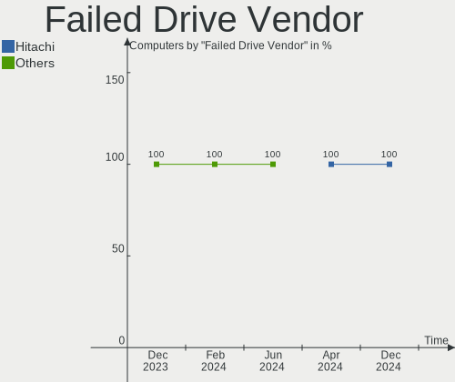
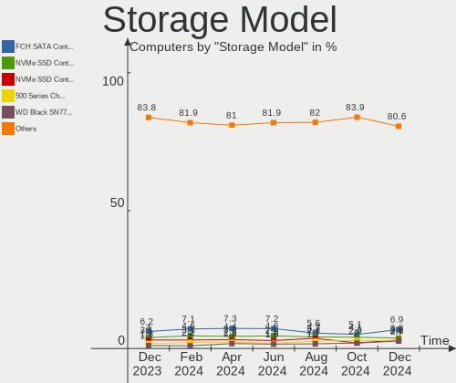

Fedora Hardware Trends
----------------------

A project to identify most popular hardware characteristics and track their change
over time based on data collected by Fedora users at https://Linux-Hardware.org.

Anyone can contribute to the study by uploading probes of their computers by
the [hw-probe](https://github.com/linuxhw/hw-probe) tool:

    sudo -E hw-probe -all -upload

This is a report for all computer types. See also reports for [desktops](/Dist/Fedora/Desktop/README.md) and [notebooks](/Dist/Fedora/Notebook/README.md).

Full-feature report is available here: https://linux-hardware.org/?view=trends

Period: Feb, 2021.

Contents
--------

- [ OS                       ](#os)
- [ OS Family                ](#os-family)
- [ Kernel                   ](#kernel)
- [ Kernel Family            ](#kernel-family)
- [ Kernel Major Ver.        ](#kernel-major-ver)
- [ Arch                     ](#arch)
- [ DE                       ](#de)
- [ Display Server           ](#display-server)
- [ Display Manager          ](#display-manager)
- [ OS Lang                  ](#os-lang)
- [ Boot Mode                ](#boot-mode)
- [ Filesystem               ](#filesystem)
- [ Part. scheme             ](#part-scheme)
- [ Dual Boot with Linux/BSD ](#dual-boot-with-linux/bsd)
- [ Dual Boot (Win)          ](#dual-boot-win)
- [ Country                  ](#country)
- [ City                     ](#city)
- [ Vendor                   ](#vendor)
- [ Model                    ](#model)
- [ Model Family             ](#model-family)
- [ MFG Year                 ](#mfg-year)
- [ Form Factor              ](#form-factor)
- [ Secure Boot              ](#secure-boot)
- [ Coreboot                 ](#coreboot)
- [ RAM Size                 ](#ram-size)
- [ RAM Used                 ](#ram-used)
- [ Has CD-ROM               ](#has-cd-rom)
- [ Total Drives             ](#total-drives)
- [ Has Ethernet             ](#has-ethernet)
- [ Drive Vendor             ](#drive-vendor)
- [ Drive Model              ](#drive-model)
- [ HDD Vendor               ](#hdd-vendor)
- [ SSD Vendor               ](#ssd-vendor)
- [ Drive Kind               ](#drive-kind)
- [ Drive Connector          ](#drive-connector)
- [ Drive Size               ](#drive-size)
- [ Space Total              ](#space-total)
- [ Space Used               ](#space-used)
- [ Malfunc. Drives          ](#malfunc-drives)
- [ Malfunc. Drive Vendor    ](#malfunc-drive-vendor)
- [ Malfunc. HDD Vendor      ](#malfunc-hdd-vendor)
- [ Malfunc. Drive Kind      ](#malfunc-drive-kind)
- [ Failed Drives            ](#failed-drives)
- [ Failed Drive Vendor      ](#failed-drive-vendor)
- [ Drive Status             ](#drive-status)
- [ Storage Vendor           ](#storage-vendor)
- [ Storage Model            ](#storage-model)
- [ Storage Kind             ](#storage-kind)
- [ CPU Vendor               ](#cpu-vendor)
- [ CPU Model                ](#cpu-model)
- [ CPU Model Family         ](#cpu-model-family)
- [ CPU Cores                ](#cpu-cores)
- [ CPU Sockets              ](#cpu-sockets)
- [ CPU Threads              ](#cpu-threads)
- [ CPU Op-Modes             ](#cpu-op-modes)
- [ CPU Microcode            ](#cpu-microcode)
- [ CPU Microarch            ](#cpu-microarch)
- [ GPU Vendor               ](#gpu-vendor)
- [ GPU Model                ](#gpu-model)
- [ GPU Combo                ](#gpu-combo)
- [ GPU Driver               ](#gpu-driver)
- [ GPU Memory               ](#gpu-memory)
- [ Monitor Vendor           ](#monitor-vendor)
- [ Monitor Model            ](#monitor-model)
- [ Monitor Resolution       ](#monitor-resolution)
- [ Monitor Diagonal         ](#monitor-diagonal)
- [ Monitor Width            ](#monitor-width)
- [ Aspect Ratio             ](#aspect-ratio)
- [ Monitor Area             ](#monitor-area)
- [ Pixel Density            ](#pixel-density)
- [ Multiple Monitors        ](#multiple-monitors)
- [ Net Controller Vendor    ](#net-controller-vendor)
- [ Net Controller Model     ](#net-controller-model)
- [ Wireless Vendor          ](#wireless-vendor)
- [ Wireless Model           ](#wireless-model)
- [ Ethernet Vendor          ](#ethernet-vendor)
- [ Ethernet Model           ](#ethernet-model)
- [ Net Controller Kind      ](#net-controller-kind)
- [ Used Controller          ](#used-controller)
- [ NICs                     ](#nics)
- [ Memory Vendor            ](#memory-vendor)
- [ Memory Model             ](#memory-model)
- [ Memory Kind              ](#memory-kind)
- [ Memory Form Factor       ](#memory-form-factor)
- [ Memory Size              ](#memory-size)
- [ Memory Speed             ](#memory-speed)
- [ Sound Vendor             ](#sound-vendor)
- [ Sound Model              ](#sound-model)
- [ Camera Vendor            ](#camera-vendor)
- [ Camera Model             ](#camera-model)
- [ Fingerprint Vendor       ](#fingerprint-vendor)
- [ Fingerprint Model        ](#fingerprint-model)
- [ Chipcard Vendor          ](#chipcard-vendor)
- [ Chipcard Model           ](#chipcard-model)
- [ Printer Vendor           ](#printer-vendor)
- [ Printer Model            ](#printer-model)
- [ Scanner Vendor           ](#scanner-vendor)
- [ Scanner Model            ](#scanner-model)
- [ Bluetooth Vendor         ](#bluetooth-vendor)
- [ Bluetooth Model          ](#bluetooth-model)
- [ Unsupported Devices      ](#unsupported-devices)
- [ Unsupported Device Types ](#unsupported-device-types)

OS
--

Installed operating systems

| Name      | Computers | Percent |
|-----------|-----------|---------|
| Fedora 33 | 226       | 88.63%  |
| Fedora 32 | 21        | 8.24%   |
| Fedora 34 | 4         | 1.57%   |
| Fedora 31 | 2         | 0.78%   |
| Fedora 30 | 1         | 0.39%   |
| Fedora 27 | 1         | 0.39%   |

OS Family
---------

OS without a version

| Name   | Computers | Percent |
|--------|-----------|---------|
| Fedora | 255       | 100%    |

Kernel
------

Version of the Linux kernel

| Version                                              | Computers | Percent |
|------------------------------------------------------|-----------|---------|
| 5.10.16-200.fc33.x86_64                              | 35        | 13.73%  |
| 5.10.13-200.fc33.x86_64                              | 32        | 12.55%  |
| 5.10.11-200.fc33.x86_64                              | 29        | 11.37%  |
| 5.10.15-200.fc33.x86_64                              | 26        | 10.2%   |
| 5.10.12-200.fc33.x86_64                              | 25        | 9.8%    |
| 5.10.14-200.fc33.x86_64                              | 22        | 8.63%   |
| 5.10.10-200.fc33.x86_64                              | 14        | 5.49%   |
| 5.10.17-200.fc33.x86_64                              | 10        | 3.92%   |
| 5.8.15-301.fc33.x86_64                               | 9         | 3.53%   |
| 5.10.18-200.fc33.x86_64                              | 7         | 2.75%   |
| 5.10.16-100.fc32.x86_64                              | 5         | 1.96%   |
| 5.10.13-100.fc32.x86_64                              | 4         | 1.57%   |
| 5.9.16-200.fc33.x86_64                               | 3         | 1.18%   |
| 5.11.0-156.fc34.x86_64                               | 3         | 1.18%   |
| 5.10.15-100.fc32.x86_64                              | 3         | 1.18%   |
| 5.10.11-100.fc32.x86_64                              | 3         | 1.18%   |
| 5.11.0+                                              | 2         | 0.78%   |
| 5.9.16-100.fc32.x86_64                               | 1         | 0.39%   |
| 5.9.11-200.fc33.x86_64                               | 1         | 0.39%   |
| 5.8.18-100.fc31.x86_64                               | 1         | 0.39%   |
| 5.8.15-301.fc33.aarch64                              | 1         | 0.39%   |
| 5.6.16-300.fc32.x86_64                               | 1         | 0.39%   |
| 5.6.13-100.fc30.i686                                 | 1         | 0.39%   |
| 5.6.11-300.fc32.x86_64                               | 1         | 0.39%   |
| 5.11.2-300.fc34.x86_64                               | 1         | 0.39%   |
| 5.11.1-155.vanilla.2.fc33.x86_64                     | 1         | 0.39%   |
| 5.11.0.sn99                                          | 1         | 0.39%   |
| 5.11.0-rc6+                                          | 1         | 0.39%   |
| 5.11.0-155.fc35.x86_64                               | 1         | 0.39%   |
| 5.11.0-0.rc7.20210212git291009f656e8.151.fc33.x86_64 | 1         | 0.39%   |
| 5.11.0-0.rc7.149.fc34.x86_64                         | 1         | 0.39%   |
| 5.10.9-201.fc33.x86_64                               | 1         | 0.39%   |
| 5.10.8-200.fc33.x86_64                               | 1         | 0.39%   |
| 5.10.8-100.fc32.x86_64                               | 1         | 0.39%   |
| 5.10.2-200.rt20.1.fc33.ccrma.x86_64+rt               | 1         | 0.39%   |
| 5.10.17-100.fc32.x86_64                              | 1         | 0.39%   |
| 5.10.16-xanmod1                                      | 1         | 0.39%   |
| 5.10.13-1.surface.fc33.x86_64                        | 1         | 0.39%   |
| 5.10.12-100.fc32.x86_64                              | 1         | 0.39%   |
| 4.18.19-100.fc27.x86_64                              | 1         | 0.39%   |

Kernel Family
-------------

Linux kernel without a distro release

| Version | Computers | Percent |
|---------|-----------|---------|
| 5.10.16 | 41        | 16.08%  |
| 5.10.13 | 37        | 14.51%  |
| 5.10.11 | 32        | 12.55%  |
| 5.10.15 | 29        | 11.37%  |
| 5.10.12 | 26        | 10.2%   |
| 5.10.14 | 22        | 8.63%   |
| 5.10.10 | 14        | 5.49%   |
| 5.10.17 | 11        | 4.31%   |
| 5.8.15  | 10        | 3.92%   |
| 5.11.0  | 10        | 3.92%   |
| 5.10.18 | 7         | 2.75%   |
| 5.9.16  | 4         | 1.57%   |
| 5.10.8  | 2         | 0.78%   |
| 5.9.11  | 1         | 0.39%   |
| 5.8.18  | 1         | 0.39%   |
| 5.6.16  | 1         | 0.39%   |
| 5.6.13  | 1         | 0.39%   |
| 5.6.11  | 1         | 0.39%   |
| 5.11.2  | 1         | 0.39%   |
| 5.11.1  | 1         | 0.39%   |
| 5.10.9  | 1         | 0.39%   |
| 5.10.2  | 1         | 0.39%   |
| 4.18.19 | 1         | 0.39%   |

Kernel Major Ver.
-----------------

Linux kernel major version

| Version | Computers | Percent |
|---------|-----------|---------|
| 5.10    | 223       | 87.45%  |
| 5.11    | 12        | 4.71%   |
| 5.8     | 11        | 4.31%   |
| 5.9     | 5         | 1.96%   |
| 5.6     | 3         | 1.18%   |
| 4.18    | 1         | 0.39%   |

Arch
----

OS architecture (x86_64, i586, etc.)

| Name    | Computers | Percent |
|---------|-----------|---------|
| x86_64  | 253       | 99.22%  |
| i686    | 1         | 0.39%   |
| aarch64 | 1         | 0.39%   |

DE
--

Desktop Environment

| Name          | Computers | Percent |
|---------------|-----------|---------|
| GNOME         | 191       | 74.9%   |
| KDE5          | 13        | 5.1%    |
| KDE           | 13        | 5.1%    |
| Unknown       | 11        | 4.31%   |
| X-Cinnamon    | 7         | 2.75%   |
| Cinnamon      | 7         | 2.75%   |
| XFCE          | 5         | 1.96%   |
| MATE          | 4         | 1.57%   |
| sway          | 1         | 0.39%   |
| LXQt          | 1         | 0.39%   |
| LXDE          | 1         | 0.39%   |
| GNOME Classic | 1         | 0.39%   |

Display Server
--------------

X11 or Wayland

| Name    | Computers | Percent |
|---------|-----------|---------|
| Wayland | 133       | 52.16%  |
| X11     | 108       | 42.35%  |
| Tty     | 11        | 4.31%   |
| Unknown | 3         | 1.18%   |

Display Manager
---------------

SDDM, LightDM, etc.

| Name    | Computers | Percent |
|---------|-----------|---------|
| Unknown | 164       | 64.31%  |
| GDM     | 62        | 24.31%  |
| SDDM    | 12        | 4.71%   |
| TDM     | 11        | 4.31%   |
| LightDM | 6         | 2.35%   |

OS Lang
-------

Language

| Lang  | Computers | Percent |
|-------|-----------|---------|
| en_US | 132       | 51.76%  |
| en_GB | 21        | 8.24%   |
| pt_BR | 15        | 5.88%   |
| de_DE | 13        | 5.1%    |
| en_AU | 8         | 3.14%   |
| pl_PL | 7         | 2.75%   |
| fr_FR | 7         | 2.75%   |
| en_CA | 6         | 2.35%   |
| ru_RU | 4         | 1.57%   |
| nl_BE | 4         | 1.57%   |
| es_ES | 4         | 1.57%   |
| en_NZ | 4         | 1.57%   |
| tr_TR | 3         | 1.18%   |
| it_IT | 3         | 1.18%   |
| cs_CZ | 3         | 1.18%   |
| sv_SE | 2         | 0.78%   |
| es_CO | 2         | 0.78%   |
| es_AR | 2         | 0.78%   |
| en_SG | 2         | 0.78%   |
| pt_PT | 1         | 0.39%   |
| nl_NL | 1         | 0.39%   |
| mn_MN | 1         | 0.39%   |
| ja_JP | 1         | 0.39%   |
| it_CH | 1         | 0.39%   |
| hu_HU | 1         | 0.39%   |
| fr_CA | 1         | 0.39%   |
| fi_FI | 1         | 0.39%   |
| es_MX | 1         | 0.39%   |
| es_CL | 1         | 0.39%   |
| en_IN | 1         | 0.39%   |
| el_GR | 1         | 0.39%   |
| de_CH | 1         | 0.39%   |

Boot Mode
---------

EFI or BIOS

| Mode | Computers | Percent |
|------|-----------|---------|
| EFI  | 177       | 69.41%  |
| BIOS | 78        | 30.59%  |

Filesystem
----------

Type of filesystem

| Type  | Computers | Percent |
|-------|-----------|---------|
| Btrfs | 131       | 51.37%  |
| Ext4  | 113       | 44.31%  |
| Xfs   | 11        | 4.31%   |

Part. scheme
------------

Scheme of partitioning

| Type    | Computers | Percent |
|---------|-----------|---------|
| Unknown | 159       | 62.35%  |
| GPT     | 70        | 27.45%  |
| MBR     | 26        | 10.2%   |

Dual Boot with Linux/BSD
------------------------

Hosting more than one Linux/BSD

| Dual boot | Computers | Percent |
|-----------|-----------|---------|
| No        | 242       | 94.9%   |
| Yes       | 13        | 5.1%    |

Dual Boot (Win)
---------------

Hosting Linux and Windows

| Dual boot | Computers | Percent |
|-----------|-----------|---------|
| No        | 208       | 81.57%  |
| Yes       | 47        | 18.43%  |

Country
-------

Geographic location (country)

| Country        | Computers | Percent |
|----------------|-----------|---------|
| USA            | 54        | 21.18%  |
| Brazil         | 22        | 8.63%   |
| Germany        | 17        | 6.67%   |
| Poland         | 12        | 4.71%   |
| Netherlands    | 11        | 4.31%   |
| France         | 9         | 3.53%   |
| Canada         | 9         | 3.53%   |
| Australia      | 8         | 3.14%   |
| Russia         | 6         | 2.35%   |
| Belgium        | 6         | 2.35%   |
| Turkey         | 5         | 1.96%   |
| Switzerland    | 5         | 1.96%   |
| Portugal       | 5         | 1.96%   |
| UK             | 4         | 1.57%   |
| Mexico         | 4         | 1.57%   |
| Italy          | 4         | 1.57%   |
| India          | 4         | 1.57%   |
| Finland        | 4         | 1.57%   |
| Czech Republic | 4         | 1.57%   |
| Ukraine        | 3         | 1.18%   |
| Spain          | 3         | 1.18%   |
| New Zealand    | 3         | 1.18%   |
| Colombia       | 3         | 1.18%   |
| Argentina      | 3         | 1.18%   |
| Sweden         | 2         | 0.78%   |
| Singapore      | 2         | 0.78%   |
| Romania        | 2         | 0.78%   |
| Norway         | 2         | 0.78%   |
| Morocco        | 2         | 0.78%   |
| Malaysia       | 2         | 0.78%   |
| Lithuania      | 2         | 0.78%   |
| Iran           | 2         | 0.78%   |
| Indonesia      | 2         | 0.78%   |
| China          | 2         | 0.78%   |
| Chile          | 2         | 0.78%   |
| Bulgaria       | 2         | 0.78%   |
| Zambia         | 1         | 0.39%   |
| Vietnam        | 1         | 0.39%   |
| Venezuela      | 1         | 0.39%   |
| Thailand       | 1         | 0.39%   |
| Taiwan         | 1         | 0.39%   |
| South Africa   | 1         | 0.39%   |
| Slovenia       | 1         | 0.39%   |
| Slovakia       | 1         | 0.39%   |
| Serbia         | 1         | 0.39%   |
| Philippines    | 1         | 0.39%   |
| Peru           | 1         | 0.39%   |
| Mongolia       | 1         | 0.39%   |
| Kazakhstan     | 1         | 0.39%   |
| Japan          | 1         | 0.39%   |
| Hungary        | 1         | 0.39%   |
| Hong Kong      | 1         | 0.39%   |
| Greece         | 1         | 0.39%   |
| Ecuador        | 1         | 0.39%   |
| Denmark        | 1         | 0.39%   |
| Costa Rica     | 1         | 0.39%   |
| Bangladesh     | 1         | 0.39%   |
| Austria        | 1         | 0.39%   |
| Unknown        | 1         | 0.39%   |

City
----

Geographic location (city)

| City              | Computers | Percent |
|-------------------|-----------|---------|
| Sydney            | 6         | 2.35%   |
| Soignies          | 3         | 1.18%   |
| Krakow            | 3         | 1.18%   |
| Istanbul          | 3         | 1.18%   |
| Delft             | 3         | 1.18%   |
| Zimella           | 2         | 0.78%   |
| Wrocław          | 2         | 0.78%   |
| Warsaw            | 2         | 0.78%   |
| Vaughan           | 2         | 0.78%   |
| Toronto           | 2         | 0.78%   |
| Tehran            | 2         | 0.78%   |
| São Paulo        | 2         | 0.78%   |
| Singapore         | 2         | 0.78%   |
| Prague            | 2         | 0.78%   |
| Medellín         | 2         | 0.78%   |
| Ludlow            | 2         | 0.78%   |
| Longview          | 2         | 0.78%   |
| Kharkiv           | 2         | 0.78%   |
| Espoo             | 2         | 0.78%   |
| Berlin            | 2         | 0.78%   |
| Auckland          | 2         | 0.78%   |
| Amsterdam         | 2         | 0.78%   |
| Šiauliai         | 1         | 0.39%   |
| Zurich            | 1         | 0.39%   |
| Zofingen          | 1         | 0.39%   |
| Zielonka          | 1         | 0.39%   |
| Zafra             | 1         | 0.39%   |
| Yaroslavl         | 1         | 0.39%   |
| Wurzburg          | 1         | 0.39%   |
| Wuppertal         | 1         | 0.39%   |
| West Union        | 1         | 0.39%   |
| West Chester      | 1         | 0.39%   |
| Voluntari         | 1         | 0.39%   |
| Vitória          | 1         | 0.39%   |
| Visby             | 1         | 0.39%   |
| Vigneux-sur-Seine | 1         | 0.39%   |
| Vienna            | 1         | 0.39%   |
| Victoria          | 1         | 0.39%   |
| Venray            | 1         | 0.39%   |
| Varna             | 1         | 0.39%   |
| Uxbridge          | 1         | 0.39%   |
| Utrecht           | 1         | 0.39%   |
| Ulan Bator        | 1         | 0.39%   |
| Trieste           | 1         | 0.39%   |
| The Bronx         | 1         | 0.39%   |
| Tefé             | 1         | 0.39%   |
| Tarawa Terrace II | 1         | 0.39%   |
| Tangier           | 1         | 0.39%   |
| Tampere           | 1         | 0.39%   |
| Talcahuano        | 1         | 0.39%   |
| Taipei            | 1         | 0.39%   |
| Surabaya          | 1         | 0.39%   |
| Sterling          | 1         | 0.39%   |
| Stafford          | 1         | 0.39%   |
| Springfield       | 1         | 0.39%   |
| South Milwaukee   | 1         | 0.39%   |
| Sorocaba          | 1         | 0.39%   |
| Sopron            | 1         | 0.39%   |
| Sofia             | 1         | 0.39%   |
| Sobradinho        | 1         | 0.39%   |

Vendor
------

Motherboard manufacturer

| Name                    | Computers | Percent |
|-------------------------|-----------|---------|
| Lenovo                  | 48        | 18.82%  |
| ASUSTek Computer        | 39        | 15.29%  |
| Dell                    | 34        | 13.33%  |
| Hewlett-Packard         | 29        | 11.37%  |
| Gigabyte Technology     | 24        | 9.41%   |
| MSI                     | 15        | 5.88%   |
| ASRock                  | 15        | 5.88%   |
| Acer                    | 8         | 3.14%   |
| Sony                    | 5         | 1.96%   |
| Apple                   | 5         | 1.96%   |
| Notebook                | 4         | 1.57%   |
| Intel                   | 3         | 1.18%   |
| Positivo                | 2         | 0.78%   |
| Pegatron                | 2         | 0.78%   |
| Unknown                 | 2         | 0.78%   |
| ZOTAC                   | 1         | 0.39%   |
| Wortmann AG             | 1         | 0.39%   |
| TUXEDO                  | 1         | 0.39%   |
| System76                | 1         | 0.39%   |
| Supermicro              | 1         | 0.39%   |
| SLIMBOOK                | 1         | 0.39%   |
| Raspberry Pi Foundation | 1         | 0.39%   |
| Packard Bell            | 1         | 0.39%   |
| Microsoft               | 1         | 0.39%   |
| LG Electronics          | 1         | 0.39%   |
| Insyde                  | 1         | 0.39%   |
| HUAWEI                  | 1         | 0.39%   |
| GPU Company             | 1         | 0.39%   |
| Gateway                 | 1         | 0.39%   |
| Fujitsu                 | 1         | 0.39%   |
| EVGA                    | 1         | 0.39%   |
| eMachines               | 1         | 0.39%   |
| CRX                     | 1         | 0.39%   |
| AVITA                   | 1         | 0.39%   |
| AMD                     | 1         | 0.39%   |

Model
-----

Motherboard model

| Name                            | Computers | Percent |
|---------------------------------|-----------|---------|
| Dell OptiPlex 390               | 3         | 1.18%   |
| MSI MS-7A38                     | 2         | 0.78%   |
| HP Notebook                     | 2         | 0.78%   |
| HP Laptop 15-da0xxx             | 2         | 0.78%   |
| HP EliteBook 850 G5             | 2         | 0.78%   |
| Gigabyte B450M DS3H             | 2         | 0.78%   |
| Dell XPS 15 9500                | 2         | 0.78%   |
| Dell XPS 13 9360                | 2         | 0.78%   |
| Dell Precision 7530             | 2         | 0.78%   |
| ASUS TP410UAR                   | 2         | 0.78%   |
| ASUS All Series                 | 2         | 0.78%   |
| ASRock H97M Pro4                | 2         | 0.78%   |
| ASRock G41M-VS3                 | 2         | 0.78%   |
| Unknown                         | 2         | 0.78%   |
| ZOTAC ZBOX-EN1070               | 1         | 0.39%   |
| Wortmann AG TERRA_PAD_1060      | 1         | 0.39%   |
| TUXEDO Pulse 15 Gen1            | 1         | 0.39%   |
| System76 Oryx Pro               | 1         | 0.39%   |
| Supermicro X8SIL                | 1         | 0.39%   |
| Sony VPCEH24FX                  | 1         | 0.39%   |
| Sony VPCEB3PGX                  | 1         | 0.39%   |
| Sony VPCCB45FN                  | 1         | 0.39%   |
| Sony SVF15325CLB                | 1         | 0.39%   |
| Sony SVE14A27CXH                | 1         | 0.39%   |
| SLIMBOOK PROX15-AMD             | 1         | 0.39%   |
| RPi Raspberry Pi 4 Model B      | 1         | 0.39%   |
| Positivo S14CT01                | 1         | 0.39%   |
| Positivo H14BT58                | 1         | 0.39%   |
| Pegatron h8-1024ch              | 1         | 0.39%   |
| Pegatron 100-5155               | 1         | 0.39%   |
| Packard Bell ixtreme M3720      | 1         | 0.39%   |
| Notebook P95_96_97Ex,Rx         | 1         | 0.39%   |
| Notebook P65_P67SE              | 1         | 0.39%   |
| Notebook NH55RGQ                | 1         | 0.39%   |
| Notebook N2x0WU                 | 1         | 0.39%   |
| MSI Prestige 14 A10SC           | 1         | 0.39%   |
| MSI MS-7B85                     | 1         | 0.39%   |
| MSI MS-7A93                     | 1         | 0.39%   |
| MSI MS-7A59                     | 1         | 0.39%   |
| MSI MS-7A40                     | 1         | 0.39%   |
| MSI MS-7A34                     | 1         | 0.39%   |
| MSI MS-7640                     | 1         | 0.39%   |
| MSI MS-7636                     | 1         | 0.39%   |
| MSI GS70 2OD                    | 1         | 0.39%   |
| MSI GS66 Stealth 10SE           | 1         | 0.39%   |
| MSI GF75 Thin 10UEK             | 1         | 0.39%   |
| MSI GF65 Thin 9SD               | 1         | 0.39%   |
| MSI CR610                       | 1         | 0.39%   |
| Microsoft Surface Book 2        | 1         | 0.39%   |
| LG S425-L.BC22P1                | 1         | 0.39%   |
| Lenovo Yoga Slim 7 15ITL05 82AC | 1         | 0.39%   |
| Lenovo Yoga 9 14ITL5 82BG       | 1         | 0.39%   |
| Lenovo Yoga 7 14ITL5 82BH       | 1         | 0.39%   |
| Lenovo V510-15IKB 80WQ          | 1         | 0.39%   |
| Lenovo V15-ADA 82C7             | 1         | 0.39%   |
| Lenovo ThinkPad X395 20NL000TCD | 1         | 0.39%   |
| Lenovo ThinkPad X390 20SC0009US | 1         | 0.39%   |
| Lenovo ThinkPad X240 20AMS0PB11 | 1         | 0.39%   |
| Lenovo ThinkPad X240 20AMS0J00N | 1         | 0.39%   |
| Lenovo ThinkPad X240 20AMA2AE00 | 1         | 0.39%   |

Model Family
------------

Motherboard model prefix

| Name                 | Computers | Percent |
|----------------------|-----------|---------|
| Lenovo ThinkPad      | 23        | 9.02%   |
| Dell Latitude        | 9         | 3.53%   |
| Lenovo IdeaPad       | 8         | 3.14%   |
| Dell XPS             | 8         | 3.14%   |
| HP Pavilion          | 7         | 2.75%   |
| HP EliteBook         | 5         | 1.96%   |
| Dell OptiPlex        | 5         | 1.96%   |
| ASUS ROG             | 5         | 1.96%   |
| HP Laptop            | 4         | 1.57%   |
| Dell Inspiron        | 4         | 1.57%   |
| ASUS PRIME           | 4         | 1.57%   |
| Lenovo Yoga          | 3         | 1.18%   |
| Lenovo Legion        | 3         | 1.18%   |
| HP ProBook           | 3         | 1.18%   |
| HP ENVY              | 3         | 1.18%   |
| Acer Aspire          | 3         | 1.18%   |
| MSI MS-7A38          | 2         | 0.78%   |
| Lenovo ThinkCentre   | 2         | 0.78%   |
| HP Spectre           | 2         | 0.78%   |
| HP Notebook          | 2         | 0.78%   |
| Gigabyte X570        | 2         | 0.78%   |
| Gigabyte B450M       | 2         | 0.78%   |
| Dell Studio          | 2         | 0.78%   |
| Dell Precision       | 2         | 0.78%   |
| Dell G5              | 2         | 0.78%   |
| ASUS VivoBook        | 2         | 0.78%   |
| ASUS TUF             | 2         | 0.78%   |
| ASUS TP410UAR        | 2         | 0.78%   |
| ASUS P8H61-M         | 2         | 0.78%   |
| ASUS All             | 2         | 0.78%   |
| ASRock H97M          | 2         | 0.78%   |
| ASRock G41M-VS3      | 2         | 0.78%   |
| Unknown              | 2         | 0.78%   |
| ZOTAC ZBOX-EN1070    | 1         | 0.39%   |
| Wortmann AG TERRA    | 1         | 0.39%   |
| TUXEDO Pulse         | 1         | 0.39%   |
| System76 Oryx        | 1         | 0.39%   |
| Supermicro X8SIL     | 1         | 0.39%   |
| Sony VPCEH24FX       | 1         | 0.39%   |
| Sony VPCEB3PGX       | 1         | 0.39%   |
| Sony VPCCB45FN       | 1         | 0.39%   |
| Sony SVF15325CLB     | 1         | 0.39%   |
| Sony SVE14A27CXH     | 1         | 0.39%   |
| SLIMBOOK PROX15-AMD  | 1         | 0.39%   |
| RPi Raspberry        | 1         | 0.39%   |
| Positivo S14CT01     | 1         | 0.39%   |
| Positivo H14BT58     | 1         | 0.39%   |
| Pegatron h8-1024ch   | 1         | 0.39%   |
| Pegatron 100-5155    | 1         | 0.39%   |
| Packard Bell ixtreme | 1         | 0.39%   |
| Notebook P95         | 1         | 0.39%   |
| Notebook P65         | 1         | 0.39%   |
| Notebook NH55RGQ     | 1         | 0.39%   |
| Notebook N2x0WU      | 1         | 0.39%   |
| MSI Prestige         | 1         | 0.39%   |
| MSI MS-7B85          | 1         | 0.39%   |
| MSI MS-7A93          | 1         | 0.39%   |
| MSI MS-7A59          | 1         | 0.39%   |
| MSI MS-7A40          | 1         | 0.39%   |
| MSI MS-7A34          | 1         | 0.39%   |

MFG Year
--------

Motherboard manufacture year

| Year | Computers | Percent |
|------|-----------|---------|
| 2020 | 65        | 25.49%  |
| 2019 | 38        | 14.9%   |
| 2018 | 26        | 10.2%   |
| 2011 | 20        | 7.84%   |
| 2015 | 16        | 6.27%   |
| 2013 | 16        | 6.27%   |
| 2012 | 16        | 6.27%   |
| 2021 | 13        | 5.1%    |
| 2014 | 11        | 4.31%   |
| 2017 | 9         | 3.53%   |
| 2016 | 9         | 3.53%   |
| 2010 | 6         | 2.35%   |
| 2009 | 6         | 2.35%   |
| 2008 | 3         | 1.18%   |
| 2007 | 1         | 0.39%   |

Form Factor
-----------

Physical design of the computer

| Name           | Computers | Percent |
|----------------|-----------|---------|
| Notebook       | 130       | 50.98%  |
| Desktop        | 98        | 38.43%  |
| Convertible    | 15        | 5.88%   |
| Tablet         | 4         | 1.57%   |
| All in one     | 4         | 1.57%   |
| Mini pc        | 3         | 1.18%   |
| System on chip | 1         | 0.39%   |

Secure Boot
-----------

Enabled or disabled

| State    | Computers | Percent |
|----------|-----------|---------|
| Disabled | 223       | 87.45%  |
| Enabled  | 32        | 12.55%  |

Coreboot
--------

Have coreboot on board

| Used | Computers | Percent |
|------|-----------|---------|
| No   | 255       | 100%    |

RAM Size
--------

Total RAM memory

| Size in GB  | Computers | Percent |
|-------------|-----------|---------|
| 16.01-24.0  | 68        | 26.67%  |
| 4.01-8.0    | 66        | 25.88%  |
| 8.01-16.0   | 42        | 16.47%  |
| 32.01-64.0  | 31        | 12.16%  |
| 3.01-4.0    | 30        | 11.76%  |
| 64.01-256.0 | 7         | 2.75%   |
| 1.01-2.0    | 6         | 2.35%   |
| 24.01-32.0  | 3         | 1.18%   |
| 2.01-3.0    | 1         | 0.39%   |
| 0.51-1.0    | 1         | 0.39%   |

RAM Used
--------

Used RAM memory

| Used GB   | Computers | Percent |
|-----------|-----------|---------|
| 2.01-3.0  | 74        | 29.02%  |
| 4.01-8.0  | 63        | 24.71%  |
| 1.01-2.0  | 53        | 20.78%  |
| 3.01-4.0  | 46        | 18.04%  |
| 8.01-16.0 | 12        | 4.71%   |
| 0.51-1.0  | 7         | 2.75%   |

Has CD-ROM
----------

Has CD-ROM on board

| Presented | Computers | Percent |
|-----------|-----------|---------|
| No        | 179       | 70.2%   |
| Yes       | 76        | 29.8%   |

Total Drives
------------

Number of drives on board

| Drives | Computers | Percent |
|--------|-----------|---------|
| 1      | 140       | 54.9%   |
| 2      | 73        | 28.63%  |
| 3      | 28        | 10.98%  |
| 4      | 7         | 2.75%   |
| 5      | 3         | 1.18%   |
| 14     | 1         | 0.39%   |
| 8      | 1         | 0.39%   |
| 7      | 1         | 0.39%   |
| 6      | 1         | 0.39%   |

Has Ethernet
------------

Has Ethernet on board

| Presented | Computers | Percent |
|-----------|-----------|---------|
| Yes       | 215       | 84.31%  |
| No        | 40        | 15.69%  |

Drive Vendor
------------

Hard drive vendors

| Vendor                  | Computers | Drives | Percent |
|-------------------------|-----------|--------|---------|
| Seagate                 | 65        | 88     | 16.88%  |
| Samsung Electronics     | 65        | 87     | 16.88%  |
| WDC                     | 49        | 59     | 12.73%  |
| Kingston                | 27        | 27     | 7.01%   |
| Toshiba                 | 22        | 25     | 5.71%   |
| SanDisk                 | 18        | 20     | 4.68%   |
| Unknown                 | 17        | 18     | 4.42%   |
| Crucial                 | 16        | 16     | 4.16%   |
| Intel                   | 11        | 14     | 2.86%   |
| HGST                    | 8         | 8      | 2.08%   |
| SK Hynix                | 7         | 7      | 1.82%   |
| A-DATA Technology       | 7         | 7      | 1.82%   |
| Micron Technology       | 6         | 7      | 1.56%   |
| Patriot                 | 5         | 6      | 1.3%    |
| Hitachi                 | 5         | 5      | 1.3%    |
| Silicon Motion          | 4         | 4      | 1.04%   |
| Phison                  | 4         | 4      | 1.04%   |
| China                   | 4         | 4      | 1.04%   |
| LITEON                  | 3         | 3      | 0.78%   |
| KingSpec                | 3         | 4      | 0.78%   |
| Union Memory (Shenzhen) | 2         | 2      | 0.52%   |
| Team                    | 2         | 2      | 0.52%   |
| SPCC                    | 2         | 2      | 0.52%   |
| PLEXTOR                 | 2         | 2      | 0.52%   |
| OCZ                     | 2         | 2      | 0.52%   |
| KIOXIA                  | 2         | 2      | 0.52%   |
| JMicron                 | 2         | 2      | 0.52%   |
| Intenso                 | 2         | 2      | 0.52%   |
| Corsair                 | 2         | 2      | 0.52%   |
| Apacer                  | 2         | 2      | 0.52%   |
| Transcend               | 1         | 1      | 0.26%   |
| Realtek Semiconductor   | 1         | 1      | 0.26%   |
| OSC                     | 1         | 1      | 0.26%   |
| MyDigitalSSD            | 1         | 2      | 0.26%   |
| Maxtor                  | 1         | 1      | 0.26%   |
| Mass                    | 1         | 1      | 0.26%   |
| LITEONIT                | 1         | 1      | 0.26%   |
| Leven                   | 1         | 1      | 0.26%   |
| KingFast                | 1         | 1      | 0.26%   |
| KingDian                | 1         | 1      | 0.26%   |
| JAMESDONKEY             | 1         | 1      | 0.26%   |
| Gigabyte Technology     | 1         | 1      | 0.26%   |
| Fujitsu                 | 1         | 1      | 0.26%   |
| FORESEE                 | 1         | 1      | 0.26%   |
| BIWIN                   | 1         | 1      | 0.26%   |
| ASMT                    | 1         | 1      | 0.26%   |
| Apple                   | 1         | 1      | 0.26%   |
| AGI                     | 1         | 1      | 0.26%   |
| ACASIS                  | 1         | 1      | 0.26%   |

Drive Model
-----------

Hard drive models

| Model                                        | Computers | Percent |
|----------------------------------------------|-----------|---------|
| Seagate ST1000LM024 HN-M101MBB 1TB           | 7         | 1.63%   |
| Samsung SSD 850 EVO 250GB                    | 5         | 1.17%   |
| Intel NVMe SSD Drive 512GB                   | 5         | 1.17%   |
| Samsung SSD 860 EVO 1TB                      | 4         | 0.93%   |
| Samsung NVMe SSD Drive 512GB                 | 4         | 0.93%   |
| Samsung NVMe SSD Drive 500GB                 | 4         | 0.93%   |
| Samsung NVMe SSD Drive 256GB                 | 4         | 0.93%   |
| Kingston SA400S37240G 240GB SSD              | 4         | 0.93%   |
| WDC WD10EZEX-08WN4A0 1TB                     | 3         | 0.7%    |
| WDC WD10EADX-22TDHB0 1TB                     | 3         | 0.7%    |
| Toshiba NVMe SSD Drive 512GB                 | 3         | 0.7%    |
| Toshiba MQ04ABF100 1TB                       | 3         | 0.7%    |
| Seagate ST500LT012-1DG142 500GB              | 3         | 0.7%    |
| Seagate ST31000528AS 1TB                     | 3         | 0.7%    |
| Seagate ST3000DM008-2DM166 3TB               | 3         | 0.7%    |
| Seagate ST1000LM048-2E7172 1TB               | 3         | 0.7%    |
| Seagate Backup+ Hub BK 6TB                   | 3         | 0.7%    |
| Sandisk NVMe SSD Drive 512GB                 | 3         | 0.7%    |
| Samsung SSD 860 EVO 500GB                    | 3         | 0.7%    |
| Samsung HD103SJ 1TB                          | 3         | 0.7%    |
| Kingston SA400S37480G 480GB SSD              | 3         | 0.7%    |
| Kingston SA400S37120G 120GB SSD              | 3         | 0.7%    |
| Kingston SA2000M81000G 1TB                   | 3         | 0.7%    |
| Kingston NVMe SSD Drive 512GB                | 3         | 0.7%    |
| HGST HTS545050A7E680 500GB                   | 3         | 0.7%    |
| WDC WDS100T2B0A-00SM50 1TB SSD               | 2         | 0.47%   |
| WDC WD20EZRZ-00Z5HB0 2TB                     | 2         | 0.47%   |
| WDC WD20EFRX-68EUZN0 2TB                     | 2         | 0.47%   |
| WDC WD10EZEX-60WN4A0 1TB                     | 2         | 0.47%   |
| Unknown MMC Card  32GB                       | 2         | 0.47%   |
| Unknown MMC Card  128GB                      | 2         | 0.47%   |
| Toshiba NVMe SSD Drive 1024GB                | 2         | 0.47%   |
| Toshiba MQ01ABD100 1TB                       | 2         | 0.47%   |
| Toshiba HDWD110 1TB                          | 2         | 0.47%   |
| Toshiba DT01ACA100 1TB                       | 2         | 0.47%   |
| Silicon Motion NVMe SSD Drive 1024GB         | 2         | 0.47%   |
| Seagate ST9500325AS 500GB                    | 2         | 0.47%   |
| Seagate ST500LT012-9WS142 500GB              | 2         | 0.47%   |
| Seagate ST500LM021-1KJ152 500GB              | 2         | 0.47%   |
| Seagate ST3500312CS 500GB                    | 2         | 0.47%   |
| Seagate ST1000LX015-1U7172 1TB               | 2         | 0.47%   |
| Seagate Expansion 500GB                      | 2         | 0.47%   |
| Seagate BUP Portable 5TB                     | 2         | 0.47%   |
| Seagate BarraCuda 120 SSD ZA500CM10003 500GB | 2         | 0.47%   |
| SanDisk SSD PLUS 1000GB                      | 2         | 0.47%   |
| Sandisk NVMe SSD Drive 256GB                 | 2         | 0.47%   |
| Sandisk NVMe SSD Drive 1TB                   | 2         | 0.47%   |
| Samsung SSD 970 EVO Plus 500GB               | 2         | 0.47%   |
| Samsung SSD 970 EVO Plus 2TB                 | 2         | 0.47%   |
| Samsung SSD 970 EVO 1TB                      | 2         | 0.47%   |
| Samsung SSD 960 EVO 250GB                    | 2         | 0.47%   |
| Samsung SSD 860 EVO 2TB                      | 2         | 0.47%   |
| Samsung SSD 850 PRO 1TB                      | 2         | 0.47%   |
| Samsung SSD 850 EVO 500GB                    | 2         | 0.47%   |
| Samsung NVMe SSD Drive 1TB                   | 2         | 0.47%   |
| Samsung MZVLB1T0HBLR-000L7 1TB               | 2         | 0.47%   |
| Samsung MZVLB1T0HBLR-000L2 1TB               | 2         | 0.47%   |
| Patriot Burst 480GB SSD                      | 2         | 0.47%   |
| Patriot Burst 120GB SSD                      | 2         | 0.47%   |
| Micron NVMe SSD Drive 256GB                  | 2         | 0.47%   |

HDD Vendor
----------

Hard disk drive vendors

| Vendor              | Computers | Drives | Percent |
|---------------------|-----------|--------|---------|
| Seagate             | 61        | 75     | 44.53%  |
| WDC                 | 44        | 51     | 32.12%  |
| Toshiba             | 13        | 14     | 9.49%   |
| HGST                | 8         | 8      | 5.84%   |
| Samsung Electronics | 5         | 8      | 3.65%   |
| Hitachi             | 5         | 5      | 3.65%   |
| Fujitsu             | 1         | 1      | 0.73%   |

SSD Vendor
----------

Solid state drive vendors

| Vendor              | Computers | Drives | Percent |
|---------------------|-----------|--------|---------|
| Samsung Electronics | 33        | 40     | 23.4%   |
| Kingston            | 19        | 19     | 13.48%  |
| Crucial             | 14        | 14     | 9.93%   |
| SanDisk             | 10        | 11     | 7.09%   |
| A-DATA Technology   | 7         | 7      | 4.96%   |
| Patriot             | 5         | 6      | 3.55%   |
| WDC                 | 4         | 4      | 2.84%   |
| Intel               | 4         | 4      | 2.84%   |
| China               | 4         | 4      | 2.84%   |
| SK Hynix            | 3         | 3      | 2.13%   |
| Seagate             | 3         | 3      | 2.13%   |
| Micron Technology   | 3         | 3      | 2.13%   |
| LITEON              | 3         | 3      | 2.13%   |
| KingSpec            | 3         | 3      | 2.13%   |
| Team                | 2         | 2      | 1.42%   |
| SPCC                | 2         | 2      | 1.42%   |
| OCZ                 | 2         | 2      | 1.42%   |
| Corsair             | 2         | 2      | 1.42%   |
| Apacer              | 2         | 2      | 1.42%   |
| Unknown             | 1         | 1      | 0.71%   |
| Transcend           | 1         | 1      | 0.71%   |
| Toshiba             | 1         | 1      | 0.71%   |
| PLEXTOR             | 1         | 1      | 0.71%   |
| OSC                 | 1         | 1      | 0.71%   |
| MyDigitalSSD        | 1         | 2      | 0.71%   |
| Maxtor              | 1         | 1      | 0.71%   |
| LITEONIT            | 1         | 1      | 0.71%   |
| Leven               | 1         | 1      | 0.71%   |
| KingDian            | 1         | 1      | 0.71%   |
| JMicron             | 1         | 1      | 0.71%   |
| Intenso             | 1         | 1      | 0.71%   |
| FORESEE             | 1         | 1      | 0.71%   |
| BIWIN               | 1         | 1      | 0.71%   |
| ASMT                | 1         | 1      | 0.71%   |
| ACASIS              | 1         | 1      | 0.71%   |

Drive Kind
----------

HDD or SSD

| Kind    | Computers | Drives | Percent |
|---------|-----------|--------|---------|
| SSD     | 120       | 151    | 34.09%  |
| HDD     | 117       | 162    | 33.24%  |
| NVMe    | 89        | 107    | 25.28%  |
| MMC     | 15        | 16     | 4.26%   |
| Unknown | 11        | 17     | 3.13%   |

Drive Connector
---------------

SATA, SAS, NVMe, etc.

| Type | Computers | Drives | Percent |
|------|-----------|--------|---------|
| SATA | 190       | 299    | 61.49%  |
| NVMe | 89        | 107    | 28.8%   |
| SAS  | 15        | 31     | 4.85%   |
| MMC  | 15        | 16     | 4.85%   |

Drive Size
----------

Size of hard drive

| Size in TB | Computers | Drives | Percent |
|------------|-----------|--------|---------|
| 0.01-0.5   | 129       | 160    | 51.6%   |
| 0.51-1.0   | 85        | 106    | 34%     |
| 1.01-2.0   | 18        | 21     | 7.2%    |
| 4.01-10.0  | 7         | 9      | 2.8%    |
| 2.01-3.0   | 6         | 6      | 2.4%    |
| 3.01-4.0   | 5         | 11     | 2%      |

Space Total
-----------

Amount of disk space available on the file system

| Size in GB     | Computers | Percent |
|----------------|-----------|---------|
| 251-500        | 51        | 20%     |
| 101-250        | 46        | 18.04%  |
| 501-1000       | 44        | 17.25%  |
| 1001-2000      | 36        | 14.12%  |
| More than 3000 | 21        | 8.24%   |
| Unknown        | 21        | 8.24%   |
| 1-20           | 12        | 4.71%   |
| 21-50          | 8         | 3.14%   |
| 2001-3000      | 8         | 3.14%   |
| 51-100         | 8         | 3.14%   |

Space Used
----------

Amount of used disk space

| Used GB        | Computers | Percent |
|----------------|-----------|---------|
| 1-20           | 44        | 17.25%  |
| 101-250        | 40        | 15.69%  |
| 21-50          | 39        | 15.29%  |
| 51-100         | 37        | 14.51%  |
| 251-500        | 28        | 10.98%  |
| 501-1000       | 21        | 8.24%   |
| Unknown        | 21        | 8.24%   |
| 1001-2000      | 10        | 3.92%   |
| More than 3000 | 9         | 3.53%   |
| 2001-3000      | 6         | 2.35%   |

Malfunc. Drives
---------------

Drive models with a malfunction

| Model                                          | Computers | Drives | Percent |
|------------------------------------------------|-----------|--------|---------|
| WDC WD20EZRX-00D8PB0 2TB                       | 1         | 2      | 6.67%   |
| WDC WD10JPVX-55JC3T3 1TB                       | 1         | 1      | 6.67%   |
| WDC WD1001FAES-75W7A0 1TB                      | 1         | 1      | 6.67%   |
| Unknown FM-25S2S-60GBP2 64GB SSD               | 1         | 1      | 6.67%   |
| Toshiba MQ01ABD100 1TB                         | 1         | 1      | 6.67%   |
| Seagate ST9500325AS 500GB                      | 1         | 1      | 6.67%   |
| Seagate ST500LT012-1DG142 500GB                | 1         | 1      | 6.67%   |
| Seagate ST3320620AS 320GB                      | 1         | 1      | 6.67%   |
| Samsung Electronics HD080HJ 80GB               | 1         | 1      | 6.67%   |
| OCZ VERTEX4 128GB SSD                          | 1         | 1      | 6.67%   |
| Micron Technology 1100_MTFDDAV256TBN 256GB SSD | 1         | 1      | 6.67%   |
| Kingston SHFS37A120G 120GB SSD                 | 1         | 1      | 6.67%   |
| Hitachi HTS547575A9E384 752GB                  | 1         | 1      | 6.67%   |
| Hitachi HTS543225L9A300 250GB                  | 1         | 1      | 6.67%   |
| HGST HTS545050A7E680 500GB                     | 1         | 1      | 6.67%   |

Malfunc. Drive Vendor
---------------------

Vendors of faulty drives

| Vendor              | Computers | Drives | Percent |
|---------------------|-----------|--------|---------|
| WDC                 | 3         | 4      | 20%     |
| Seagate             | 3         | 3      | 20%     |
| Hitachi             | 2         | 2      | 13.33%  |
| Unknown             | 1         | 1      | 6.67%   |
| Toshiba             | 1         | 1      | 6.67%   |
| Samsung Electronics | 1         | 1      | 6.67%   |
| OCZ                 | 1         | 1      | 6.67%   |
| Micron Technology   | 1         | 1      | 6.67%   |
| Kingston            | 1         | 1      | 6.67%   |
| HGST                | 1         | 1      | 6.67%   |

Malfunc. HDD Vendor
-------------------

Vendors of faulty HDD drives

| Vendor              | Computers | Drives | Percent |
|---------------------|-----------|--------|---------|
| WDC                 | 3         | 4      | 27.27%  |
| Seagate             | 3         | 3      | 27.27%  |
| Hitachi             | 2         | 2      | 18.18%  |
| Toshiba             | 1         | 1      | 9.09%   |
| Samsung Electronics | 1         | 1      | 9.09%   |
| HGST                | 1         | 1      | 9.09%   |

Malfunc. Drive Kind
-------------------

Kinds of faulty drives

| Kind | Computers | Drives | Percent |
|------|-----------|--------|---------|
| HDD  | 10        | 12     | 71.43%  |
| SSD  | 4         | 4      | 28.57%  |

Failed Drives
-------------

Failed drive models

| Model                     | Computers | Drives | Percent |
|---------------------------|-----------|--------|---------|
| Seagate ST3320613AS 320GB | 1         | 1      | 100%    |

Failed Drive Vendor
-------------------

Failed drive vendors

| Vendor  | Computers | Drives | Percent |
|---------|-----------|--------|---------|
| Seagate | 1         | 1      | 100%    |

Drive Status
------------

Number of failed and malfunc. drives

| Status   | Computers | Drives | Percent |
|----------|-----------|--------|---------|
| Detected | 170       | 292    | 61.15%  |
| Works    | 93        | 144    | 33.45%  |
| Malfunc  | 14        | 16     | 5.04%   |
| Failed   | 1         | 1      | 0.36%   |

Storage Vendor
--------------

Storage controller vendors

| Vendor                       | Computers | Percent |
|------------------------------|-----------|---------|
| Intel                        | 162       | 51.59%  |
| AMD                          | 56        | 17.83%  |
| Samsung Electronics          | 33        | 10.51%  |
| Sandisk                      | 11        | 3.5%    |
| Kingston Technology Company  | 8         | 2.55%   |
| Toshiba America Info Systems | 6         | 1.91%   |
| Phison Electronics           | 5         | 1.59%   |
| SK Hynix                     | 4         | 1.27%   |
| Silicon Motion               | 4         | 1.27%   |
| KIOXIA                       | 4         | 1.27%   |
| Micron Technology            | 3         | 0.96%   |
| JMicron Technology           | 3         | 0.96%   |
| ASMedia Technology           | 3         | 0.96%   |
| Union Memory (Shenzhen)      | 2         | 0.64%   |
| Nvidia                       | 2         | 0.64%   |
| Micron/Crucial Technology    | 2         | 0.64%   |
| Silicon Image                | 1         | 0.32%   |
| Seagate Technology           | 1         | 0.32%   |
| Realtek Semiconductor        | 1         | 0.32%   |
| Marvell Technology Group     | 1         | 0.32%   |
| Lite-On Technology           | 1         | 0.32%   |
| Lite-On IT Corp. / Plextor   | 1         | 0.32%   |

Storage Model
-------------

Storage controller models

| Model                                                                                   | Computers | Percent |
|-----------------------------------------------------------------------------------------|-----------|---------|
| AMD FCH SATA Controller [AHCI mode]                                                     | 44        | 11.92%  |
| Samsung NVMe SSD Controller SM981/PM981/PM983                                           | 23        | 6.23%   |
| Intel Sunrise Point-LP SATA Controller [AHCI mode]                                      | 22        | 5.96%   |
| Intel 7 Series Chipset Family 6-port SATA Controller [AHCI mode]                        | 16        | 4.34%   |
| Intel 82801 Mobile SATA Controller [RAID mode]                                          | 10        | 2.71%   |
| Intel 6 Series/C200 Series Chipset Family 6 port Mobile SATA AHCI Controller            | 10        | 2.71%   |
| Intel 200 Series PCH SATA controller [AHCI mode]                                        | 9         | 2.44%   |
| Intel 8 Series SATA Controller 1 [AHCI mode]                                            | 8         | 2.17%   |
| AMD 400 Series Chipset SATA Controller                                                  | 8         | 2.17%   |
| Intel Cannon Lake Mobile PCH SATA AHCI Controller                                       | 7         | 1.9%    |
| Intel 8 Series/C220 Series Chipset Family 6-port SATA Controller 1 [AHCI mode]          | 7         | 1.9%    |
| Intel 6 Series/C200 Series Chipset Family Desktop SATA Controller (IDE mode, ports 4-5) | 7         | 1.9%    |
| Intel 6 Series/C200 Series Chipset Family Desktop SATA Controller (IDE mode, ports 0-3) | 7         | 1.9%    |
| AMD SB7x0/SB8x0/SB9x0 IDE Controller                                                    | 7         | 1.9%    |
| Intel NM10/ICH7 Family SATA Controller [IDE mode]                                       | 6         | 1.63%   |
| Intel SATA Controller [RAID mode]                                                       | 5         | 1.36%   |
| Intel 7 Series/C210 Series Chipset Family 6-port SATA Controller [AHCI mode]            | 5         | 1.36%   |
| Intel 400 Series Chipset Family SATA AHCI Controller                                    | 5         | 1.36%   |
| AMD SB7x0/SB8x0/SB9x0 SATA Controller [IDE mode]                                        | 5         | 1.36%   |
| AMD SB7x0/SB8x0/SB9x0 SATA Controller [AHCI mode]                                       | 5         | 1.36%   |
| AMD 300 Series Chipset SATA Controller                                                  | 5         | 1.36%   |
| Sandisk WD Blue SN550 NVMe SSD                                                          | 4         | 1.08%   |
| Sandisk WD Black SN750 / PC SN730 NVMe SSD                                              | 4         | 1.08%   |
| Samsung NVMe SSD Controller SM961/PM961/SM963                                           | 4         | 1.08%   |
| Samsung Electronics Non-Volatile memory controller                                      | 4         | 1.08%   |
| Kingston Company A2000 NVMe SSD                                                         | 4         | 1.08%   |
| Intel SSD 660P Series                                                                   | 4         | 1.08%   |
| Intel Cannon Lake PCH SATA AHCI Controller                                              | 4         | 1.08%   |
| Intel 9 Series Chipset Family SATA Controller [AHCI Mode]                               | 4         | 1.08%   |
| Intel 82801G (ICH7 Family) IDE Controller                                               | 4         | 1.08%   |
| Intel 5 Series/3400 Series Chipset 6 port SATA AHCI Controller                          | 4         | 1.08%   |
| Toshiba America Info Systems XG6 NVMe SSD Controller                                    | 3         | 0.81%   |
| Phison PS5013 E13 NVMe Controller                                                       | 3         | 0.81%   |
| Micron Non-Volatile memory controller                                                   | 3         | 0.81%   |
| KIOXIA Non-Volatile memory controller                                                   | 3         | 0.81%   |
| Kingston Company Company Non-Volatile memory controller                                 | 3         | 0.81%   |
| Intel Wildcat Point-LP SATA Controller [AHCI Mode]                                      | 3         | 0.81%   |
| Intel Atom Processor E3800 Series SATA AHCI Controller                                  | 3         | 0.81%   |
| Intel 82801JI (ICH10 Family) 4 port SATA IDE Controller #1                              | 3         | 0.81%   |
| Intel 82801JI (ICH10 Family) 2 port SATA IDE Controller #2                              | 3         | 0.81%   |
| ASMedia ASM1062 Serial ATA Controller                                                   | 3         | 0.81%   |
| AMD FCH SATA Controller D                                                               | 3         | 0.81%   |
| Union Memory (Shenzhen) Non-Volatile memory controller                                  | 2         | 0.54%   |
| Toshiba America Info Systems XG4 NVMe SSD Controller                                    | 2         | 0.54%   |
| SK Hynix Non-Volatile memory controller                                                 | 2         | 0.54%   |
| Silicon Motion SM2263EN/SM2263XT SSD Controller                                         | 2         | 0.54%   |
| Silicon Motion SM2262/SM2262EN SSD Controller                                           | 2         | 0.54%   |
| Sandisk WD Black 2018/SN750 / PC SN720 NVMe SSD                                         | 2         | 0.54%   |
| Samsung NVMe SSD Controller PM9A1/980PRO                                                | 2         | 0.54%   |
| JMicron JMB363 SATA/IDE Controller                                                      | 2         | 0.54%   |
| Intel Q170/Q150/B150/H170/H110/Z170/CM236 Chipset SATA Controller [AHCI Mode]           | 2         | 0.54%   |
| Intel Non-Volatile memory controller                                                    | 2         | 0.54%   |
| Intel 6 Series/C200 Series Chipset Family 6 port Desktop SATA AHCI Controller           | 2         | 0.54%   |
| Intel 5 Series/3400 Series Chipset 4 port SATA IDE Controller                           | 2         | 0.54%   |
| Intel 5 Series/3400 Series Chipset 4 port SATA AHCI Controller                          | 2         | 0.54%   |
| Intel 5 Series/3400 Series Chipset 2 port SATA IDE Controller                           | 2         | 0.54%   |
| Intel 4 Series Chipset PT IDER Controller                                               | 2         | 0.54%   |
| AMD SATA controller                                                                     | 2         | 0.54%   |
| Toshiba America Info Systems Toshiba America Info Non-Volatile memory controller        | 1         | 0.27%   |
| Toshiba America Info Systems BG3 NVMe SSD Controller                                    | 1         | 0.27%   |

Storage Kind
------------

Kind of storage controller (IDE, SATA, NVMe, SAS, ...)

| Kind | Computers | Percent |
|------|-----------|---------|
| SATA | 179       | 55.94%  |
| NVMe | 89        | 27.81%  |
| IDE  | 36        | 11.25%  |
| RAID | 16        | 5%      |

CPU Vendor
----------

Processor vendors

| Vendor | Computers | Percent |
|--------|-----------|---------|
| Intel  | 190       | 74.51%  |
| AMD    | 64        | 25.1%   |
| ARM    | 1         | 0.39%   |

CPU Model
---------

Processor models

| Model                                         | Computers | Percent |
|-----------------------------------------------|-----------|---------|
| Intel Core i5-8250U CPU @ 1.60GHz             | 9         | 3.53%   |
| Intel Core i7-8550U CPU @ 1.80GHz             | 5         | 1.96%   |
| Intel Core i5-3320M CPU @ 2.60GHz             | 5         | 1.96%   |
| Intel Core i7-9750H CPU @ 2.60GHz             | 4         | 1.57%   |
| AMD Ryzen 7 4800H with Radeon Graphics        | 4         | 1.57%   |
| Intel Core i7-8750H CPU @ 2.20GHz             | 3         | 1.18%   |
| Intel Core i7-8565U CPU @ 1.80GHz             | 3         | 1.18%   |
| Intel Core i7-7700 CPU @ 3.60GHz              | 3         | 1.18%   |
| Intel Core i7-7500U CPU @ 2.70GHz             | 3         | 1.18%   |
| Intel Core i7-10750H CPU @ 2.60GHz            | 3         | 1.18%   |
| Intel Core i5-8350U CPU @ 1.70GHz             | 3         | 1.18%   |
| Intel Core i5-7200U CPU @ 2.50GHz             | 3         | 1.18%   |
| Intel Core i5-6300U CPU @ 2.40GHz             | 3         | 1.18%   |
| Intel Core i5-6200U CPU @ 2.30GHz             | 3         | 1.18%   |
| Intel Core i5-4200U CPU @ 1.60GHz             | 3         | 1.18%   |
| Intel Core i5-10210U CPU @ 1.60GHz            | 3         | 1.18%   |
| Intel Core i3-3110M CPU @ 2.40GHz             | 3         | 1.18%   |
| Intel Core 2 Duo CPU E8400 @ 3.00GHz          | 3         | 1.18%   |
| Intel 11th Gen Core i5-1135G7 @ 2.40GHz       | 3         | 1.18%   |
| AMD Ryzen 5 4600H with Radeon Graphics        | 3         | 1.18%   |
| AMD Ryzen 5 3500U with Radeon Vega Mobile Gfx | 3         | 1.18%   |
| AMD Ryzen 5 2500U with Radeon Vega Mobile Gfx | 3         | 1.18%   |
| AMD FX-6300 Six-Core Processor                | 3         | 1.18%   |
| Intel Pentium Dual-Core CPU E5200 @ 2.50GHz   | 2         | 0.78%   |
| Intel Core i7-4790K CPU @ 4.00GHz             | 2         | 0.78%   |
| Intel Core i7-3770K CPU @ 3.50GHz             | 2         | 0.78%   |
| Intel Core i7-3520M CPU @ 2.90GHz             | 2         | 0.78%   |
| Intel Core i7-2630QM CPU @ 2.00GHz            | 2         | 0.78%   |
| Intel Core i7-10510U CPU @ 1.80GHz            | 2         | 0.78%   |
| Intel Core i5-7400 CPU @ 3.00GHz              | 2         | 0.78%   |
| Intel Core i5-4300U CPU @ 1.90GHz             | 2         | 0.78%   |
| Intel Core i5-3570K CPU @ 3.40GHz             | 2         | 0.78%   |
| Intel Core i5-2520M CPU @ 2.50GHz             | 2         | 0.78%   |
| Intel Core i5-10400 CPU @ 2.90GHz             | 2         | 0.78%   |
| Intel Core i5-1035G1 CPU @ 1.00GHz            | 2         | 0.78%   |
| Intel Core i5 CPU M 540 @ 2.53GHz             | 2         | 0.78%   |
| Intel Core i5 CPU 650 @ 3.20GHz               | 2         | 0.78%   |
| Intel Core i3-2310M CPU @ 2.10GHz             | 2         | 0.78%   |
| Intel Core i3-2100 CPU @ 3.10GHz              | 2         | 0.78%   |
| Intel Atom CPU Z3735F @ 1.33GHz               | 2         | 0.78%   |
| AMD Ryzen 9 5900X 12-Core Processor           | 2         | 0.78%   |
| AMD Ryzen 7 5800X 8-Core Processor            | 2         | 0.78%   |
| AMD Ryzen 7 3700X 8-Core Processor            | 2         | 0.78%   |
| AMD Ryzen 5 4500U with Radeon Graphics        | 2         | 0.78%   |
| AMD Ryzen 5 3600X 6-Core Processor            | 2         | 0.78%   |
| AMD Ryzen 5 3600 6-Core Processor             | 2         | 0.78%   |
| Intel Xeon E-2176M CPU @ 2.70GHz              | 1         | 0.39%   |
| Intel Xeon CPU X3440 @ 2.53GHz                | 1         | 0.39%   |
| Intel Xeon CPU X3363 @ 2.83GHz                | 1         | 0.39%   |
| Intel Xeon CPU L3110 @ 3.00GHz                | 1         | 0.39%   |
| Intel Xeon CPU E5-2678 v3 @ 2.50GHz           | 1         | 0.39%   |
| Intel Xeon CPU E3-1230 V2 @ 3.30GHz           | 1         | 0.39%   |
| Intel Pentium CPU N3540 @ 2.16GHz             | 1         | 0.39%   |
| Intel Pentium CPU G645 @ 2.90GHz              | 1         | 0.39%   |
| Intel Pentium CPU B960 @ 2.20GHz              | 1         | 0.39%   |
| Intel Pentium CPU B950 @ 2.10GHz              | 1         | 0.39%   |
| Intel Core m5-6Y57 CPU @ 1.10GHz              | 1         | 0.39%   |
| Intel Core i9-9980HK CPU @ 2.40GHz            | 1         | 0.39%   |
| Intel Core i9-9880H CPU @ 2.30GHz             | 1         | 0.39%   |
| Intel Core i9-8950HK CPU @ 2.90GHz            | 1         | 0.39%   |

CPU Model Family
----------------

Processor model prefix

| Model                   | Computers | Percent |
|-------------------------|-----------|---------|
| Intel Core i5           | 69        | 27.06%  |
| Intel Core i7           | 57        | 22.35%  |
| Intel Core i3           | 22        | 8.63%   |
| AMD Ryzen 5             | 19        | 7.45%   |
| AMD Ryzen 7             | 15        | 5.88%   |
| Other                   | 6         | 2.35%   |
| Intel Xeon              | 6         | 2.35%   |
| Intel Atom              | 6         | 2.35%   |
| Intel Core i9           | 5         | 1.96%   |
| Intel Core 2 Duo        | 5         | 1.96%   |
| AMD Ryzen 9             | 5         | 1.96%   |
| AMD FX                  | 5         | 1.96%   |
| Intel Pentium           | 4         | 1.57%   |
| Intel Celeron           | 4         | 1.57%   |
| Intel Core 2 Quad       | 3         | 1.18%   |
| AMD Ryzen 3             | 3         | 1.18%   |
| Intel Pentium Dual-Core | 2         | 0.78%   |
| AMD Athlon II X2        | 2         | 0.78%   |
| AMD Athlon              | 2         | 0.78%   |
| AMD A8                  | 2         | 0.78%   |
| AMD A6                  | 2         | 0.78%   |
| AMD A10                 | 2         | 0.78%   |
| Intel Core m5           | 1         | 0.39%   |
| Intel Core 2 Extreme    | 1         | 0.39%   |
| Intel Core 2            | 1         | 0.39%   |
| AMD Sempron             | 1         | 0.39%   |
| AMD Ryzen 5 PRO         | 1         | 0.39%   |
| AMD PRO A10             | 1         | 0.39%   |
| AMD Phenom II X6        | 1         | 0.39%   |
| AMD Phenom II X4        | 1         | 0.39%   |
| AMD E                   | 1         | 0.39%   |

CPU Cores
---------

Number of processor cores

| Number | Computers | Percent |
|--------|-----------|---------|
| 4      | 100       | 39.22%  |
| 2      | 94        | 36.86%  |
| 6      | 30        | 11.76%  |
| 8      | 19        | 7.45%   |
| 12     | 4         | 1.57%   |
| 3      | 3         | 1.18%   |
| 10     | 2         | 0.78%   |
| 1      | 2         | 0.78%   |
| 16     | 1         | 0.39%   |

CPU Sockets
-----------

Number of sockets

| Number | Computers | Percent |
|--------|-----------|---------|
| 1      | 255       | 100%    |

CPU Threads
-----------

Threads per core (Hyper-Threading)

| Number | Computers | Percent |
|--------|-----------|---------|
| 2      | 200       | 78.43%  |
| 1      | 55        | 21.57%  |

CPU Op-Modes
------------

CPU Operation Modes (32-bit, 64-bit)

| Op mode        | Computers | Percent |
|----------------|-----------|---------|
| 32-bit, 64-bit | 254       | 99.61%  |
| Unknown        | 1         | 0.39%   |

CPU Microcode
-------------

Microcode number

| Number     | Computers | Percent |
|------------|-----------|---------|
| 0x306a9    | 24        | 9.41%   |
| Unknown    | 18        | 7.06%   |
| 0x206a7    | 16        | 6.27%   |
| 0x806ea    | 15        | 5.88%   |
| 0x306c3    | 11        | 4.31%   |
| 0x406e3    | 9         | 3.53%   |
| 0x906ea    | 8         | 3.14%   |
| 0x40651    | 8         | 3.14%   |
| 0x1067a    | 8         | 3.14%   |
| 0x906e9    | 7         | 2.75%   |
| 0x806ec    | 7         | 2.75%   |
| 0x08701021 | 7         | 2.75%   |
| 0x806e9    | 6         | 2.35%   |
| 0x30678    | 6         | 2.35%   |
| 0x06000852 | 5         | 1.96%   |
| 0xa0652    | 4         | 1.57%   |
| 0x906ed    | 4         | 1.57%   |
| 0x806c1    | 4         | 1.57%   |
| 0x306d4    | 4         | 1.57%   |
| 0x20655    | 4         | 1.57%   |
| 0x0a201009 | 4         | 1.57%   |
| 0x08600104 | 4         | 1.57%   |
| 0x08108102 | 4         | 1.57%   |
| 0x0800820d | 4         | 1.57%   |
| 0x506e3    | 3         | 1.18%   |
| 0x20652    | 3         | 1.18%   |
| 0x08701013 | 3         | 1.18%   |
| 0x08600103 | 3         | 1.18%   |
| 0x010000c8 | 3         | 1.18%   |
| 0xa0655    | 2         | 0.78%   |
| 0xa0653    | 2         | 0.78%   |
| 0x706e5    | 2         | 0.78%   |
| 0x6fb      | 2         | 0.78%   |
| 0x106e5    | 2         | 0.78%   |
| 0x08600106 | 2         | 0.78%   |
| 0x08108109 | 2         | 0.78%   |
| 0x08101016 | 2         | 0.78%   |
| 0x0810100b | 2         | 0.78%   |
| 0x08001138 | 2         | 0.78%   |
| 0x08001137 | 2         | 0.78%   |
| 0x0600611a | 2         | 0.78%   |
| 0x06003106 | 2         | 0.78%   |
| 0x06001119 | 2         | 0.78%   |
| 0x906ec    | 1         | 0.39%   |
| 0x906eb    | 1         | 0.39%   |
| 0x806eb    | 1         | 0.39%   |
| 0x706a8    | 1         | 0.39%   |
| 0x6fd      | 1         | 0.39%   |
| 0x6f6      | 1         | 0.39%   |
| 0x50657    | 1         | 0.39%   |
| 0x50654    | 1         | 0.39%   |
| 0x406c3    | 1         | 0.39%   |
| 0x40661    | 1         | 0.39%   |
| 0x306f2    | 1         | 0.39%   |
| 0x30673    | 1         | 0.39%   |
| 0x106ca    | 1         | 0.39%   |
| 0x10677    | 1         | 0.39%   |
| 0x10676    | 1         | 0.39%   |
| 0x08600102 | 1         | 0.39%   |
| 0x08101007 | 1         | 0.39%   |

CPU Microarch
-------------

Microarchitecture

| Name          | Computers | Percent |
|---------------|-----------|---------|
| KabyLake      | 59        | 23.14%  |
| IvyBridge     | 26        | 10.2%   |
| Haswell       | 21        | 8.24%   |
| Zen 2         | 20        | 7.84%   |
| SandyBridge   | 17        | 6.67%   |
| Skylake       | 14        | 5.49%   |
| Zen+          | 11        | 4.31%   |
| Penryn        | 10        | 3.92%   |
| Zen           | 9         | 3.53%   |
| Silvermont    | 9         | 3.53%   |
| CometLake     | 8         | 3.14%   |
| Westmere      | 7         | 2.75%   |
| Piledriver    | 7         | 2.75%   |
| Unknown       | 6         | 2.35%   |
| K10           | 5         | 1.96%   |
| TigerLake     | 4         | 1.57%   |
| Core          | 4         | 1.57%   |
| Broadwell     | 4         | 1.57%   |
| IceLake       | 3         | 1.18%   |
| Excavator     | 3         | 1.18%   |
| Steamroller   | 2         | 0.78%   |
| Nehalem       | 2         | 0.78%   |
| Puma          | 1         | 0.39%   |
| Goldmont plus | 1         | 0.39%   |
| Bonnell       | 1         | 0.39%   |
| Bobcat        | 1         | 0.39%   |

GPU Vendor
----------

Vendors of graphics cards

| Vendor                     | Computers | Percent |
|----------------------------|-----------|---------|
| Intel                      | 153       | 49.68%  |
| Nvidia                     | 77        | 25%     |
| AMD                        | 77        | 25%     |
| Matrox Electronics Systems | 1         | 0.32%   |

GPU Model
---------

Graphics card models

| Model                                                                                 | Computers | Percent |
|---------------------------------------------------------------------------------------|-----------|---------|
| Intel UHD Graphics 620                                                                | 18        | 5.81%   |
| Intel 2nd Generation Core Processor Family Integrated Graphics Controller             | 16        | 5.16%   |
| Intel 3rd Gen Core processor Graphics Controller                                      | 14        | 4.52%   |
| Intel CoffeeLake-H GT2 [UHD Graphics 630]                                             | 10        | 3.23%   |
| AMD Renoir                                                                            | 9         | 2.9%    |
| AMD Ellesmere [Radeon RX 470/480/570/570X/580/580X/590]                               | 9         | 2.9%    |
| Intel Skylake GT2 [HD Graphics 520]                                                   | 8         | 2.58%   |
| Intel Haswell-ULT Integrated Graphics Controller                                      | 8         | 2.58%   |
| Intel Atom Processor Z36xxx/Z37xxx Series Graphics & Display                          | 8         | 2.58%   |
| Intel HD Graphics 620                                                                 | 7         | 2.26%   |
| AMD Picasso                                                                           | 7         | 2.26%   |
| AMD Baffin [Radeon RX 460/560D / Pro 450/455/460/555/555X/560/560X]                   | 6         | 1.94%   |
| Intel Xeon E3-1200 v2/3rd Gen Core processor Graphics Controller                      | 5         | 1.61%   |
| Intel Core Processor Integrated Graphics Controller                                   | 5         | 1.61%   |
| Intel CometLake-U GT2 [UHD Graphics]                                                  | 5         | 1.61%   |
| AMD Navi 10 [Radeon RX 5600 OEM/5600 XT / 5700/5700 XT]                               | 5         | 1.61%   |
| Nvidia GP107 [GeForce GTX 1050 Ti]                                                    | 4         | 1.29%   |
| Intel Xeon E3-1200 v3/4th Gen Core Processor Integrated Graphics Controller           | 4         | 1.29%   |
| Intel WhiskeyLake-U GT2 [UHD Graphics 620]                                            | 4         | 1.29%   |
| Intel TigerLake GT2 [Iris Xe Graphics]                                                | 4         | 1.29%   |
| Intel HD Graphics 630                                                                 | 4         | 1.29%   |
| Intel HD Graphics 5500                                                                | 4         | 1.29%   |
| Intel CometLake-H GT2 [UHD Graphics]                                                  | 4         | 1.29%   |
| Intel 4th Gen Core Processor Integrated Graphics Controller                           | 4         | 1.29%   |
| Intel 4 Series Chipset Integrated Graphics Controller                                 | 4         | 1.29%   |
| AMD Raven Ridge [Radeon Vega Series / Radeon Vega Mobile Series]                      | 4         | 1.29%   |
| Nvidia TU117M [GeForce GTX 1650 Ti Mobile]                                            | 3         | 0.97%   |
| Nvidia TU117M [GeForce GTX 1650 Mobile / Max-Q]                                       | 3         | 0.97%   |
| Nvidia GP106 [GeForce GTX 1060 3GB]                                                   | 3         | 0.97%   |
| Intel CometLake-S GT2 [UHD Graphics 630]                                              | 3         | 0.97%   |
| AMD Wani [Radeon R5/R6/R7 Graphics]                                                   | 3         | 0.97%   |
| AMD Sun XT [Radeon HD 8670A/8670M/8690M / R5 M330 / M430 / Radeon 520 Mobile]         | 3         | 0.97%   |
| AMD Baffin [Radeon RX 550 640SP / RX 560/560X]                                        | 3         | 0.97%   |
| Nvidia TU116M [GeForce GTX 1660 Ti Mobile]                                            | 2         | 0.65%   |
| Nvidia TU106M [GeForce RTX 2060 Mobile]                                               | 2         | 0.65%   |
| Nvidia GP108M [GeForce MX150]                                                         | 2         | 0.65%   |
| Nvidia GP106M [GeForce GTX 1060 Mobile]                                               | 2         | 0.65%   |
| Nvidia GP106 [GeForce GTX 1060 6GB]                                                   | 2         | 0.65%   |
| Nvidia GP104M [GeForce GTX 1070 Mobile]                                               | 2         | 0.65%   |
| Nvidia GP104 [GeForce GTX 1070]                                                       | 2         | 0.65%   |
| Nvidia GM204 [GeForce GTX 970]                                                        | 2         | 0.65%   |
| Nvidia GM108M [GeForce 940M]                                                          | 2         | 0.65%   |
| Nvidia GK208B [GeForce GT 710]                                                        | 2         | 0.65%   |
| Intel Iris Plus Graphics G1 (Ice Lake)                                                | 2         | 0.65%   |
| Intel HD Graphics 530                                                                 | 2         | 0.65%   |
| AMD Whistler [Radeon HD 6730M/6770M/7690M XT]                                         | 2         | 0.65%   |
| AMD Topaz XT [Radeon R7 M260/M265 / M340/M360 / M440/M445 / 530/535 / 620/625 Mobile] | 2         | 0.65%   |
| AMD RS880M [Mobility Radeon HD 4225/4250]                                             | 2         | 0.65%   |
| AMD Navi 21 [Radeon RX 6800/6800 XT / 6900 XT]                                        | 2         | 0.65%   |
| Nvidia TU117M                                                                         | 1         | 0.32%   |
| Nvidia TU117GLM [Quadro T2000 Mobile / Max-Q]                                         | 1         | 0.32%   |
| Nvidia TU116 [GeForce GTX 1660]                                                       | 1         | 0.32%   |
| Nvidia TU116 [GeForce GTX 1660 Ti]                                                    | 1         | 0.32%   |
| Nvidia TU116 [GeForce GTX 1660 SUPER]                                                 | 1         | 0.32%   |
| Nvidia TU116 [GeForce GTX 1650]                                                       | 1         | 0.32%   |
| Nvidia TU116 [GeForce GTX 1650 SUPER]                                                 | 1         | 0.32%   |
| Nvidia TU106M [GeForce RTX 2070 Mobile]                                               | 1         | 0.32%   |
| Nvidia GT218 [GeForce 210]                                                            | 1         | 0.32%   |
| Nvidia GP108M [GeForce MX330]                                                         | 1         | 0.32%   |
| Nvidia GP108M [GeForce MX250]                                                         | 1         | 0.32%   |

GPU Combo
---------

Combinations of graphics cards

| Name           | Computers | Percent |
|----------------|-----------|---------|
| 1 x Intel      | 105       | 41.18%  |
| 1 x AMD        | 55        | 21.57%  |
| 1 x Nvidia     | 40        | 15.69%  |
| Intel + Nvidia | 31        | 12.16%  |
| Intel + AMD    | 15        | 5.88%   |
| AMD + Nvidia   | 5         | 1.96%   |
| 2 x AMD        | 2         | 0.78%   |
| Other          | 1         | 0.39%   |
| 1 x Matrox     | 1         | 0.39%   |

GPU Driver
----------

Free vs proprietary

| Driver      | Computers | Percent |
|-------------|-----------|---------|
| Free        | 213       | 83.53%  |
| Proprietary | 38        | 14.9%   |
| Unknown     | 4         | 1.57%   |

GPU Memory
----------

Total video memory

| Size in GB | Computers | Percent |
|------------|-----------|---------|
| Unknown    | 135       | 52.94%  |
| 1.01-2.0   | 34        | 13.33%  |
| 3.01-4.0   | 23        | 9.02%   |
| 0.01-0.5   | 19        | 7.45%   |
| 0.51-1.0   | 15        | 5.88%   |
| 7.01-8.0   | 14        | 5.49%   |
| 5.01-6.0   | 10        | 3.92%   |
| 8.01-16.0  | 4         | 1.57%   |
| 2.01-3.0   | 1         | 0.39%   |

Monitor Vendor
--------------

Monitor vendors

| Vendor                  | Computers | Percent |
|-------------------------|-----------|---------|
| AU Optronics            | 37        | 12.21%  |
| Samsung Electronics     | 35        | 11.55%  |
| LG Display              | 30        | 9.9%    |
| Dell                    | 27        | 8.91%   |
| Goldstar                | 24        | 7.92%   |
| BOE                     | 23        | 7.59%   |
| Chimei Innolux          | 19        | 6.27%   |
| Acer                    | 11        | 3.63%   |
| Sharp                   | 10        | 3.3%    |
| Ancor Communications    | 9         | 2.97%   |
| Hewlett-Packard         | 8         | 2.64%   |
| ViewSonic               | 7         | 2.31%   |
| Lenovo                  | 5         | 1.65%   |
| BenQ                    | 5         | 1.65%   |
| PANDA                   | 4         | 1.32%   |
| Iiyama                  | 4         | 1.32%   |
| Chi Mei Optoelectronics | 4         | 1.32%   |
| Apple                   | 4         | 1.32%   |
| AOC                     | 4         | 1.32%   |
| Panasonic               | 3         | 0.99%   |
| Gateway                 | 3         | 0.99%   |
| Philips                 | 2         | 0.66%   |
| LGD                     | 2         | 0.66%   |
| InfoVision              | 2         | 0.66%   |
| ASUSTek Computer        | 2         | 0.66%   |
| ___                     | 1         | 0.33%   |
| Vizio                   | 1         | 0.33%   |
| Vestel Elektronik       | 1         | 0.33%   |
| Valve                   | 1         | 0.33%   |
| Unknown (ACA)           | 1         | 0.33%   |
| Toshiba                 | 1         | 0.33%   |
| SNC                     | 1         | 0.33%   |
| Sceptre Tech            | 1         | 0.33%   |
| RTK                     | 1         | 0.33%   |
| NEC Computers           | 1         | 0.33%   |
| Matrox                  | 1         | 0.33%   |
| LG Electronics          | 1         | 0.33%   |
| Lenovo Group Limited    | 1         | 0.33%   |
| JRY                     | 1         | 0.33%   |
| HPN                     | 1         | 0.33%   |
| Eizo                    | 1         | 0.33%   |
| CPT                     | 1         | 0.33%   |
| Compaq Computer         | 1         | 0.33%   |
| Belinea                 | 1         | 0.33%   |

Monitor Model
-------------

Monitor models

| Model                                                                                 | Computers | Percent |
|---------------------------------------------------------------------------------------|-----------|---------|
| LG Display LCD Monitor LGD053F 1920x1080 344x194mm 15.5-inch                          | 3         | 0.94%   |
| AU Optronics LCD Monitor AUO423D 1920x1080 309x173mm 13.9-inch                        | 3         | 0.94%   |
| Sharp LQ156M1JW01 SHP14C3 1920x1080 344x194mm 15.5-inch                               | 2         | 0.63%   |
| Samsung Electronics SyncMaster SAM01D3 1440x900 410x260mm 19.1-inch                   | 2         | 0.63%   |
| Samsung Electronics SMB1930N SAM0632 1366x768 410x230mm 18.5-inch                     | 2         | 0.63%   |
| Samsung Electronics LCD Monitor SAM0F13 3840x2160 1872x1053mm 84.6-inch               | 2         | 0.63%   |
| Panasonic VVX13F009G00 MEI96A2 1920x1080 290x170mm 13.2-inch                          | 2         | 0.63%   |
| LG Display LCD Monitor LGD033A 1366x768 340x190mm 15.3-inch                           | 2         | 0.63%   |
| Goldstar Ultra HD GSM5B09 3840x2160 600x340mm 27.2-inch                               | 2         | 0.63%   |
| Goldstar LG ULTRAWIDE GSM59F1 1920x1080 580x240mm 24.7-inch                           | 2         | 0.63%   |
| Goldstar HDR WFHD GSM7714 2560x1080 798x334mm 34.1-inch                               | 2         | 0.63%   |
| Goldstar HD GSM5ACB 1366x768 410x230mm 18.5-inch                                      | 2         | 0.63%   |
| Gateway FPD2275W GWY08ED 1680x1050 473x296mm 22.0-inch                                | 2         | 0.63%   |
| Dell U2412M DELA07A 1920x1200 518x324mm 24.1-inch                                     | 2         | 0.63%   |
| Dell SE2216H DELF071 1920x1080 476x268mm 21.5-inch                                    | 2         | 0.63%   |
| Chimei Innolux LCD Monitor CMN14A7 1920x1080 308x173mm 13.9-inch                      | 2         | 0.63%   |
| BOE LCD Monitor BOE0812 1920x1080 344x194mm 15.5-inch                                 | 2         | 0.63%   |
| BenQ EL2870U BNQ7949 3840x2160 621x341mm 27.9-inch                                    | 2         | 0.63%   |
| AU Optronics LCD Monitor AUO38ED 1920x1080 340x190mm 15.3-inch                        | 2         | 0.63%   |
| AU Optronics LCD Monitor AUO21ED 1920x1080 344x194mm 15.5-inch                        | 2         | 0.63%   |
| AU Optronics LCD Monitor AUO213E 1600x900 309x174mm 14.0-inch                         | 2         | 0.63%   |
| AU Optronics LCD Monitor AUO123D 1920x1080 309x173mm 13.9-inch                        | 2         | 0.63%   |
| Ancor Communications ASUS PB278 ACI27A3 2560x1440 597x336mm 27.0-inch                 | 2         | 0.63%   |
| Acer V246HL ACR032E 1920x1080 531x299mm 24.0-inch                                     | 2         | 0.63%   |
| ___ Monitor ranges (GTF): 48-62Hz V, 14-68kHz H, max dotclock 150MHz ___9000 1440x900 | 1         | 0.31%   |
| Vizio VO37LFHDTV10A VIZ0043 1920x1080 820x460mm 37.0-inch                             | 1         | 0.31%   |
| ViewSonic VX2263 Series VSC692F 1920x1080 476x268mm 21.5-inch                         | 1         | 0.31%   |
| ViewSonic VX2257 VSCB731 1920x1080 477x268mm 21.5-inch                                | 1         | 0.31%   |
| ViewSonic VX2250 SERIES VSCCB25 1920x1080 477x268mm 21.5-inch                         | 1         | 0.31%   |
| ViewSonic VA2349 Series VSC702E 1920x1080 509x286mm 23.0-inch                         | 1         | 0.31%   |
| ViewSonic VA2226w-3 VSC2051 1680x1050 495x291mm 22.6-inch                             | 1         | 0.31%   |
| ViewSonic VA2055 Series VSC3C31 1920x1080 435x239mm 19.5-inch                         | 1         | 0.31%   |
| ViewSonic V3D231 Series VSC4C29 1920x1080 510x290mm 23.1-inch                         | 1         | 0.31%   |
| Vestel Elektronik 50UHD_LCD_TV VES3700 3840x2160 1872x1053mm 84.6-inch                | 1         | 0.31%   |
| Valve Index HMD VLV91A8                                                               | 1         | 0.31%   |
| Unknown (ACA) FH-HD4K ACA0CCD 2560x1600 480x270mm 21.7-inch                           | 1         | 0.31%   |
| Toshiba TV TSB0214 1920x1080 1433x809mm 64.8-inch                                     | 1         | 0.31%   |
| SNC PHOTO 190V SNC1850 1366x768 409x230mm 18.5-inch                                   | 1         | 0.31%   |
| Sharp LQ156M1JW25 SHP152C 1920x1080 344x194mm 15.5-inch                               | 1         | 0.31%   |
| Sharp LQ156M1JW03 SHP14C5 1920x1080 344x194mm 15.5-inch                               | 1         | 0.31%   |
| Sharp LCD Monitor SHP14F7 1920x1200 288x180mm 13.4-inch                               | 1         | 0.31%   |
| Sharp LCD Monitor SHP14D1 1920x1200 336x210mm 15.6-inch                               | 1         | 0.31%   |
| Sharp LCD Monitor SHP14D0 3840x2400 336x210mm 15.6-inch                               | 1         | 0.31%   |
| Sharp LCD Monitor SHP144F 1920x1080 276x156mm 12.5-inch                               | 1         | 0.31%   |
| Sharp LCD Monitor SHP144A 3200x1800 294x165mm 13.3-inch                               | 1         | 0.31%   |
| Sharp LCD Monitor SHP1449 1920x1080 294x165mm 13.3-inch                               | 1         | 0.31%   |
| Sceptre Tech Sceptre L24 SPT098C 1920x1080 530x300mm 24.0-inch                        | 1         | 0.31%   |
| Samsung Electronics U28H75x SAM0DFE 3840x2160 608x345mm 27.5-inch                     | 1         | 0.31%   |
| Samsung Electronics U28E590 SAM0C4C 3840x2160 608x345mm 27.5-inch                     | 1         | 0.31%   |
| Samsung Electronics SyncMaster SAM0472 1440x900 367x229mm 17.0-inch                   | 1         | 0.31%   |
| Samsung Electronics SyncMaster SAM0248 1280x1024 376x301mm 19.0-inch                  | 1         | 0.31%   |
| Samsung Electronics SyncMaster SAM011F 1280x1024 376x301mm 19.0-inch                  | 1         | 0.31%   |
| Samsung Electronics SMT27A550 SAM07B6 1920x1080 598x336mm 27.0-inch                   | 1         | 0.31%   |
| Samsung Electronics SMS27A350H SAM07CE 1920x1080 598x336mm 27.0-inch                  | 1         | 0.31%   |
| Samsung Electronics SMS22A450 SAM0835 1680x1050 470x300mm 22.0-inch                   | 1         | 0.31%   |
| Samsung Electronics SMB2430L SAM0645 1920x1080 521x293mm 23.5-inch                    | 1         | 0.31%   |
| Samsung Electronics S24R65x SAM1022 1920x1080 527x296mm 23.8-inch                     | 1         | 0.31%   |
| Samsung Electronics S24F350 SAM0D20 1920x1080 521x293mm 23.5-inch                     | 1         | 0.31%   |
| Samsung Electronics S24E450 SAM0C82 1920x1080 530x300mm 24.0-inch                     | 1         | 0.31%   |
| Samsung Electronics S22E390 SAM0C17 1920x1080 477x268mm 21.5-inch                     | 1         | 0.31%   |

Monitor Resolution
------------------

Monitor screen resolution

| Resolution         | Computers | Percent |
|--------------------|-----------|---------|
| 1920x1080 (FHD)    | 132       | 46.15%  |
| 1366x768 (WXGA)    | 40        | 13.99%  |
| 3840x2160 (4K)     | 24        | 8.39%   |
| 2560x1440 (QHD)    | 20        | 6.99%   |
| 1600x900 (HD+)     | 17        | 5.94%   |
| 1680x1050 (WSXGA+) | 10        | 3.5%    |
| 1280x1024 (SXGA)   | 8         | 2.8%    |
| 1920x1200 (WUXGA)  | 7         | 2.45%   |
| 2560x1080          | 6         | 2.1%    |
| 1440x900 (WXGA+)   | 6         | 2.1%    |
| Unknown            | 3         | 1.05%   |
| 1280x800 (WXGA)    | 2         | 0.7%    |
| 4480x1080          | 1         | 0.35%   |
| 3926x1440          | 1         | 0.35%   |
| 3840x2400          | 1         | 0.35%   |
| 3840x1200          | 1         | 0.35%   |
| 3440x1440          | 1         | 0.35%   |
| 3200x1800 (QHD+)   | 1         | 0.35%   |
| 3000x2000          | 1         | 0.35%   |
| 1920x540           | 1         | 0.35%   |
| 1280x960           | 1         | 0.35%   |
| 1280x768           | 1         | 0.35%   |
| 1024x768 (XGA)     | 1         | 0.35%   |

Monitor Diagonal
----------------

Diagonal size in inches

| Inches  | Computers | Percent |
|---------|-----------|---------|
| 15      | 67        | 21.97%  |
| 13      | 35        | 11.48%  |
| 27      | 30        | 9.84%   |
| 21      | 24        | 7.87%   |
| 24      | 22        | 7.21%   |
| 14      | 21        | 6.89%   |
| 23      | 19        | 6.23%   |
| 17      | 13        | 4.26%   |
| 19      | 11        | 3.61%   |
| 22      | 8         | 2.62%   |
| 18      | 8         | 2.62%   |
| 12      | 7         | 2.3%    |
| Unknown | 7         | 2.3%    |
| 34      | 6         | 1.97%   |
| 20      | 5         | 1.64%   |
| 84      | 4         | 1.31%   |
| 31      | 3         | 0.98%   |
| 48      | 2         | 0.66%   |
| 25      | 2         | 0.66%   |
| 11      | 2         | 0.66%   |
| 64      | 1         | 0.33%   |
| 46      | 1         | 0.33%   |
| 41      | 1         | 0.33%   |
| 40      | 1         | 0.33%   |
| 32      | 1         | 0.33%   |
| 29      | 1         | 0.33%   |
| 28      | 1         | 0.33%   |
| 16      | 1         | 0.33%   |
| 10      | 1         | 0.33%   |

Monitor Width
-------------

Physical width

| Width in mm | Computers | Percent |
|-------------|-----------|---------|
| 301-350     | 106       | 35.45%  |
| 501-600     | 62        | 20.74%  |
| 401-500     | 50        | 16.72%  |
| 201-300     | 28        | 9.36%   |
| 351-400     | 18        | 6.02%   |
| 601-700     | 11        | 3.68%   |
| 701-800     | 7         | 2.34%   |
| Unknown     | 7         | 2.34%   |
| 1501-2000   | 4         | 1.34%   |
| 1001-1500   | 4         | 1.34%   |
| 801-900     | 1         | 0.33%   |
| 901-1000    | 1         | 0.33%   |

Aspect Ratio
------------

Proportional relationship between the width and the height

| Ratio   | Computers | Percent |
|---------|-----------|---------|
| 16/9    | 217       | 81.89%  |
| 16/10   | 24        | 9.06%   |
| 5/4     | 7         | 2.64%   |
| 21/9    | 7         | 2.64%   |
| Unknown | 5         | 1.89%   |
| 4/3     | 3         | 1.13%   |
| 3/2     | 1         | 0.38%   |
| 3.20    | 1         | 0.38%   |

Monitor Area
------------

Area in inch²

| Area in inch² | Computers | Percent |
|----------------|-----------|---------|
| 101-110        | 65        | 21.67%  |
| 201-250        | 52        | 17.33%  |
| 81-90          | 38        | 12.67%  |
| 301-350        | 31        | 10.33%  |
| 151-200        | 23        | 7.67%   |
| 71-80          | 17        | 5.67%   |
| 121-130        | 12        | 4%      |
| 351-500        | 11        | 3.67%   |
| 251-300        | 11        | 3.67%   |
| 141-150        | 8         | 2.67%   |
| More than 1000 | 7         | 2.33%   |
| 61-70          | 7         | 2.33%   |
| Unknown        | 7         | 2.33%   |
| 501-1000       | 3         | 1%      |
| 51-60          | 2         | 0.67%   |
| 131-140        | 2         | 0.67%   |
| 91-100         | 2         | 0.67%   |
| 41-50          | 1         | 0.33%   |
| 111-120        | 1         | 0.33%   |

Pixel Density
-------------

Pixels per inch

| Density       | Computers | Percent |
|---------------|-----------|---------|
| 121-160       | 89        | 31.01%  |
| 51-100        | 85        | 29.62%  |
| 101-120       | 72        | 25.09%  |
| 161-240       | 21        | 7.32%   |
| More than 240 | 9         | 3.14%   |
| Unknown       | 7         | 2.44%   |
| 1-50          | 4         | 1.39%   |

Multiple Monitors
-----------------

Total monitors connected

| Total | Computers | Percent |
|-------|-----------|---------|
| 1     | 187       | 73.33%  |
| 2     | 52        | 20.39%  |
| 3     | 8         | 3.14%   |
| 0     | 8         | 3.14%   |

Net Controller Vendor
---------------------

Controller vendors

| Vendor                            | Computers | Percent |
|-----------------------------------|-----------|---------|
| Realtek Semiconductor             | 139       | 36.87%  |
| Intel                             | 128       | 33.95%  |
| Qualcomm Atheros                  | 38        | 10.08%  |
| Broadcom Inc. and subsidiaries    | 19        | 5.04%   |
| Ralink                            | 9         | 2.39%   |
| Ralink Technology                 | 8         | 2.12%   |
| Marvell Technology Group          | 4         | 1.06%   |
| TP-Link                           | 2         | 0.53%   |
| Sierra Wireless                   | 2         | 0.53%   |
| Samsung Electronics               | 2         | 0.53%   |
| Lenovo                            | 2         | 0.53%   |
| Ericsson Business Mobile Networks | 2         | 0.53%   |
| Edimax Technology                 | 2         | 0.53%   |
| Broadcom Limited                  | 2         | 0.53%   |
| ASIX Electronics                  | 2         | 0.53%   |
| ZTE WCDMA Technologies MSM        | 1         | 0.27%   |
| vivo                              | 1         | 0.27%   |
| Toshiba                           | 1         | 0.27%   |
| Qualcomm Atheros Communications   | 1         | 0.27%   |
| Qualcomm                          | 1         | 0.27%   |
| Nvidia                            | 1         | 0.27%   |
| Microsoft                         | 1         | 0.27%   |
| Linksys                           | 1         | 0.27%   |
| LG Electronics                    | 1         | 0.27%   |
| ICS Advent                        | 1         | 0.27%   |
| DisplayLink                       | 1         | 0.27%   |
| Dell                              | 1         | 0.27%   |
| Broadcom                          | 1         | 0.27%   |
| ASUSTek Computer                  | 1         | 0.27%   |
| Aquantia                          | 1         | 0.27%   |
| Accton Technology                 | 1         | 0.27%   |

Net Controller Model
--------------------

Controller models

| Model                                                                     | Computers | Percent |
|---------------------------------------------------------------------------|-----------|---------|
| Realtek RTL8111/8168/8411 PCI Express Gigabit Ethernet Controller         | 99        | 22.15%  |
| Intel Wi-Fi 6 AX200                                                       | 26        | 5.82%   |
| Intel Wireless 8265 / 8275                                                | 14        | 3.13%   |
| Realtek RTL810xE PCI Express Fast Ethernet controller                     | 13        | 2.91%   |
| Intel 82579LM Gigabit Network Connection (Lewisville)                     | 10        | 2.24%   |
| Realtek RTL8153 Gigabit Ethernet Adapter                                  | 9         | 2.01%   |
| Intel Wireless 7260                                                       | 8         | 1.79%   |
| Qualcomm Atheros QCA9565 / AR9565 Wireless Network Adapter                | 7         | 1.57%   |
| Qualcomm Atheros QCA6174 802.11ac Wireless Network Adapter                | 7         | 1.57%   |
| Intel I211 Gigabit Network Connection                                     | 7         | 1.57%   |
| Intel Ethernet Connection (2) I219-V                                      | 7         | 1.57%   |
| Realtek RTL8822CE 802.11ac PCIe Wireless Network Adapter                  | 6         | 1.34%   |
| Realtek RTL8822BE 802.11a/b/g/n/ac WiFi adapter                           | 5         | 1.12%   |
| Intel Wireless 8260                                                       | 5         | 1.12%   |
| Intel Comet Lake PCH CNVi WiFi                                            | 5         | 1.12%   |
| Qualcomm Atheros AR9485 Wireless Network Adapter                          | 4         | 0.89%   |
| Intel Wireless-AC 9260                                                    | 4         | 0.89%   |
| Intel Wi-Fi 6 AX201                                                       | 4         | 0.89%   |
| Intel Ethernet Controller I225-V                                          | 4         | 0.89%   |
| Intel Ethernet Connection I218-LM                                         | 4         | 0.89%   |
| Intel Comet Lake PCH-LP CNVi WiFi                                         | 4         | 0.89%   |
| Intel Centrino Advanced-N 6205 [Taylor Peak]                              | 4         | 0.89%   |
| Broadcom Inc. and subsidiaries BCM43142 802.11b/g/n                       | 4         | 0.89%   |
| Broadcom Inc. and subsidiaries BCM4313 802.11bgn Wireless Network Adapter | 4         | 0.89%   |
| Realtek RTL8821CE 802.11ac PCIe Wireless Network Adapter                  | 3         | 0.67%   |
| Realtek 802.11ac NIC                                                      | 3         | 0.67%   |
| Ralink MT7601U Wireless Adapter                                           | 3         | 0.67%   |
| Qualcomm Atheros AR8151 v2.0 Gigabit Ethernet                             | 3         | 0.67%   |
| Intel Wireless 7265                                                       | 3         | 0.67%   |
| Intel Wireless 3165                                                       | 3         | 0.67%   |
| Intel Ethernet Connection (6) I219-V                                      | 3         | 0.67%   |
| Intel Ethernet Connection (4) I219-LM                                     | 3         | 0.67%   |
| Intel Dual Band Wireless-AC 3168NGW [Stone Peak]                          | 3         | 0.67%   |
| Intel Dual Band Wireless-AC 3165 Plus Bluetooth                           | 3         | 0.67%   |
| Intel Centrino Wireless-N 1000 [Condor Peak]                              | 3         | 0.67%   |
| Intel Centrino Ultimate-N 6300                                            | 3         | 0.67%   |
| Intel Cannon Point-LP CNVi [Wireless-AC]                                  | 3         | 0.67%   |
| Intel 82579V Gigabit Network Connection                                   | 3         | 0.67%   |
| Samsung Galaxy series, misc. (tethering mode)                             | 2         | 0.45%   |
| Realtek RTL88x2bu [AC1200 Techkey]                                        | 2         | 0.45%   |
| Realtek RTL8723DE Wireless Network Adapter                                | 2         | 0.45%   |
| Realtek RTL8723BE PCIe Wireless Network Adapter                           | 2         | 0.45%   |
| Realtek RTL8188EUS 802.11n Wireless Network Adapter                       | 2         | 0.45%   |
| Realtek RTL8188EE Wireless Network Adapter                                | 2         | 0.45%   |
| Realtek RTL8188CE 802.11b/g/n WiFi Adapter                                | 2         | 0.45%   |
| Realtek RTL-8185 IEEE 802.11a/b/g Wireless LAN Controller                 | 2         | 0.45%   |
| Ralink RT2870/RT3070 Wireless Adapter                                     | 2         | 0.45%   |
| Ralink RT3290 Wireless 802.11n 1T/1R PCIe                                 | 2         | 0.45%   |
| Ralink RT3090 Wireless 802.11n 1T/1R PCIe                                 | 2         | 0.45%   |
| Qualcomm Atheros QCA9377 802.11ac Wireless Network Adapter                | 2         | 0.45%   |
| Qualcomm Atheros QCA8172 Fast Ethernet                                    | 2         | 0.45%   |
| Qualcomm Atheros Killer E2400 Gigabit Ethernet Controller                 | 2         | 0.45%   |
| Qualcomm Atheros Killer E220x Gigabit Ethernet Controller                 | 2         | 0.45%   |
| Qualcomm Atheros AR9462 Wireless Network Adapter                          | 2         | 0.45%   |
| Qualcomm Atheros AR928X Wireless Network Adapter (PCI-Express)            | 2         | 0.45%   |
| Qualcomm Atheros AR9287 Wireless Network Adapter (PCI-Express)            | 2         | 0.45%   |
| Qualcomm Atheros AR8152 v2.0 Fast Ethernet                                | 2         | 0.45%   |
| Qualcomm Atheros AR8121/AR8113/AR8114 Gigabit or Fast Ethernet            | 2         | 0.45%   |
| Intel Wireless-AC 9560 [Jefferson Peak]                                   | 2         | 0.45%   |
| Intel Killer Wi-Fi 6 AX1650i 160MHz Wireless Network Adapter (201NGW)     | 2         | 0.45%   |

Wireless Vendor
---------------

Wireless vendors

| Vendor                          | Computers | Percent |
|---------------------------------|-----------|---------|
| Intel                           | 105       | 50%     |
| Realtek Semiconductor           | 32        | 15.24%  |
| Qualcomm Atheros                | 26        | 12.38%  |
| Broadcom Inc. and subsidiaries  | 15        | 7.14%   |
| Ralink                          | 9         | 4.29%   |
| Ralink Technology               | 8         | 3.81%   |
| TP-Link                         | 2         | 0.95%   |
| Sierra Wireless                 | 2         | 0.95%   |
| Edimax Technology               | 2         | 0.95%   |
| ZTE WCDMA Technologies MSM      | 1         | 0.48%   |
| Toshiba                         | 1         | 0.48%   |
| Qualcomm Atheros Communications | 1         | 0.48%   |
| Microsoft                       | 1         | 0.48%   |
| Marvell Technology Group        | 1         | 0.48%   |
| Dell                            | 1         | 0.48%   |
| Broadcom Limited                | 1         | 0.48%   |
| Broadcom                        | 1         | 0.48%   |
| ASUSTek Computer                | 1         | 0.48%   |

Wireless Model
--------------

Wireless models

| Model                                                                        | Computers | Percent |
|------------------------------------------------------------------------------|-----------|---------|
| Intel Wi-Fi 6 AX200                                                          | 26        | 12.32%  |
| Intel Wireless 8265 / 8275                                                   | 14        | 6.64%   |
| Intel Wireless 7260                                                          | 8         | 3.79%   |
| Qualcomm Atheros QCA9565 / AR9565 Wireless Network Adapter                   | 7         | 3.32%   |
| Qualcomm Atheros QCA6174 802.11ac Wireless Network Adapter                   | 7         | 3.32%   |
| Realtek RTL8822CE 802.11ac PCIe Wireless Network Adapter                     | 6         | 2.84%   |
| Realtek RTL8822BE 802.11a/b/g/n/ac WiFi adapter                              | 5         | 2.37%   |
| Intel Wireless 8260                                                          | 5         | 2.37%   |
| Intel Comet Lake PCH CNVi WiFi                                               | 5         | 2.37%   |
| Qualcomm Atheros AR9485 Wireless Network Adapter                             | 4         | 1.9%    |
| Intel Wireless-AC 9260                                                       | 4         | 1.9%    |
| Intel Wi-Fi 6 AX201                                                          | 4         | 1.9%    |
| Intel Comet Lake PCH-LP CNVi WiFi                                            | 4         | 1.9%    |
| Intel Centrino Advanced-N 6205 [Taylor Peak]                                 | 4         | 1.9%    |
| Broadcom Inc. and subsidiaries BCM43142 802.11b/g/n                          | 4         | 1.9%    |
| Broadcom Inc. and subsidiaries BCM4313 802.11bgn Wireless Network Adapter    | 4         | 1.9%    |
| Realtek RTL8821CE 802.11ac PCIe Wireless Network Adapter                     | 3         | 1.42%   |
| Realtek 802.11ac NIC                                                         | 3         | 1.42%   |
| Ralink MT7601U Wireless Adapter                                              | 3         | 1.42%   |
| Intel Wireless 7265                                                          | 3         | 1.42%   |
| Intel Wireless 3165                                                          | 3         | 1.42%   |
| Intel Dual Band Wireless-AC 3168NGW [Stone Peak]                             | 3         | 1.42%   |
| Intel Dual Band Wireless-AC 3165 Plus Bluetooth                              | 3         | 1.42%   |
| Intel Centrino Wireless-N 1000 [Condor Peak]                                 | 3         | 1.42%   |
| Intel Centrino Ultimate-N 6300                                               | 3         | 1.42%   |
| Intel Cannon Point-LP CNVi [Wireless-AC]                                     | 3         | 1.42%   |
| Realtek RTL88x2bu [AC1200 Techkey]                                           | 2         | 0.95%   |
| Realtek RTL8723DE Wireless Network Adapter                                   | 2         | 0.95%   |
| Realtek RTL8723BE PCIe Wireless Network Adapter                              | 2         | 0.95%   |
| Realtek RTL8188EUS 802.11n Wireless Network Adapter                          | 2         | 0.95%   |
| Realtek RTL8188EE Wireless Network Adapter                                   | 2         | 0.95%   |
| Realtek RTL8188CE 802.11b/g/n WiFi Adapter                                   | 2         | 0.95%   |
| Realtek RTL-8185 IEEE 802.11a/b/g Wireless LAN Controller                    | 2         | 0.95%   |
| Ralink RT2870/RT3070 Wireless Adapter                                        | 2         | 0.95%   |
| Ralink RT3290 Wireless 802.11n 1T/1R PCIe                                    | 2         | 0.95%   |
| Ralink RT3090 Wireless 802.11n 1T/1R PCIe                                    | 2         | 0.95%   |
| Qualcomm Atheros QCA9377 802.11ac Wireless Network Adapter                   | 2         | 0.95%   |
| Qualcomm Atheros AR9462 Wireless Network Adapter                             | 2         | 0.95%   |
| Qualcomm Atheros AR928X Wireless Network Adapter (PCI-Express)               | 2         | 0.95%   |
| Qualcomm Atheros AR9287 Wireless Network Adapter (PCI-Express)               | 2         | 0.95%   |
| Intel Wireless-AC 9560 [Jefferson Peak]                                      | 2         | 0.95%   |
| Intel Killer Wi-Fi 6 AX1650i 160MHz Wireless Network Adapter (201NGW)        | 2         | 0.95%   |
| Intel Centrino Wireless-N 2230                                               | 2         | 0.95%   |
| Intel Centrino Advanced-N 6200                                               | 2         | 0.95%   |
| Edimax EW-7811Un 802.11n Wireless Adapter [Realtek RTL8188CUS]               | 2         | 0.95%   |
| Broadcom Inc. and subsidiaries BCM4331 802.11a/b/g/n                         | 2         | 0.95%   |
| ZTE WCDMA MSM K3772-Z                                                        | 1         | 0.47%   |
| TP-Link Archer T9UH v1 [Realtek RTL8814AU]                                   | 1         | 0.47%   |
| TP-Link AC600 wireless Realtek RTL8811AU [Archer T2U Nano]                   | 1         | 0.47%   |
| Toshiba WLM-20U2/GN-1080 802.11abgn Wireless Adapter [Atheros AR7010+AR9280] | 1         | 0.47%   |
| Sierra Wireless EM7455                                                       | 1         | 0.47%   |
| Sierra Wireless EM7355 Qualcomm Gobi 4G LTE/HSPA+/EVDO                       | 1         | 0.47%   |
| Realtek RTL8723BU 802.11b/g/n WLAN Adapter                                   | 1         | 0.47%   |
| Realtek RTL8192CE PCIe Wireless Network Adapter                              | 1         | 0.47%   |
| Ralink RT5372 Wireless Adapter                                               | 1         | 0.47%   |
| Ralink RT5370 Wireless Adapter                                               | 1         | 0.47%   |
| Ralink RT3573 Wireless Adapter                                               | 1         | 0.47%   |
| Ralink RT5392 PCIe Wireless Network Adapter                                  | 1         | 0.47%   |
| Ralink RT5390 [802.11 b/g/n 1T1R G-band PCI Express Single Chip]             | 1         | 0.47%   |
| Ralink RT5390 Wireless 802.11n 1T/1R PCIe                                    | 1         | 0.47%   |

Ethernet Vendor
---------------

Ethernet vendors

| Vendor                         | Computers | Percent |
|--------------------------------|-----------|---------|
| Realtek Semiconductor          | 124       | 53.91%  |
| Intel                          | 63        | 27.39%  |
| Qualcomm Atheros               | 16        | 6.96%   |
| Broadcom Inc. and subsidiaries | 9         | 3.91%   |
| Marvell Technology Group       | 3         | 1.3%    |
| Samsung Electronics            | 2         | 0.87%   |
| Lenovo                         | 2         | 0.87%   |
| ASIX Electronics               | 2         | 0.87%   |
| vivo                           | 1         | 0.43%   |
| Qualcomm                       | 1         | 0.43%   |
| Nvidia                         | 1         | 0.43%   |
| Linksys                        | 1         | 0.43%   |
| ICS Advent                     | 1         | 0.43%   |
| DisplayLink                    | 1         | 0.43%   |
| Broadcom Limited               | 1         | 0.43%   |
| Aquantia                       | 1         | 0.43%   |
| Accton Technology              | 1         | 0.43%   |

Ethernet Model
--------------

Ethernet models

| Model                                                                          | Computers | Percent |
|--------------------------------------------------------------------------------|-----------|---------|
| Realtek RTL8111/8168/8411 PCI Express Gigabit Ethernet Controller              | 99        | 42.49%  |
| Realtek RTL810xE PCI Express Fast Ethernet controller                          | 13        | 5.58%   |
| Intel 82579LM Gigabit Network Connection (Lewisville)                          | 10        | 4.29%   |
| Realtek RTL8153 Gigabit Ethernet Adapter                                       | 9         | 3.86%   |
| Intel I211 Gigabit Network Connection                                          | 7         | 3%      |
| Intel Ethernet Connection (2) I219-V                                           | 7         | 3%      |
| Intel Ethernet Controller I225-V                                               | 4         | 1.72%   |
| Intel Ethernet Connection I218-LM                                              | 4         | 1.72%   |
| Qualcomm Atheros AR8151 v2.0 Gigabit Ethernet                                  | 3         | 1.29%   |
| Intel Ethernet Connection (6) I219-V                                           | 3         | 1.29%   |
| Intel Ethernet Connection (4) I219-LM                                          | 3         | 1.29%   |
| Intel 82579V Gigabit Network Connection                                        | 3         | 1.29%   |
| Samsung Galaxy series, misc. (tethering mode)                                  | 2         | 0.86%   |
| Qualcomm Atheros QCA8172 Fast Ethernet                                         | 2         | 0.86%   |
| Qualcomm Atheros Killer E2400 Gigabit Ethernet Controller                      | 2         | 0.86%   |
| Qualcomm Atheros Killer E220x Gigabit Ethernet Controller                      | 2         | 0.86%   |
| Qualcomm Atheros AR8152 v2.0 Fast Ethernet                                     | 2         | 0.86%   |
| Qualcomm Atheros AR8121/AR8113/AR8114 Gigabit or Fast Ethernet                 | 2         | 0.86%   |
| Intel Ethernet Connection I219-LM                                              | 2         | 0.86%   |
| Intel Ethernet Connection I217-V                                               | 2         | 0.86%   |
| Intel Ethernet Connection (7) I219-V                                           | 2         | 0.86%   |
| Intel Ethernet Connection (7) I219-LM                                          | 2         | 0.86%   |
| Intel Ethernet Connection (4) I219-V                                           | 2         | 0.86%   |
| Intel Ethernet Connection (2) I219-LM                                          | 2         | 0.86%   |
| Intel Ethernet Connection (2) I218-V                                           | 2         | 0.86%   |
| Intel 82577LM Gigabit Network Connection                                       | 2         | 0.86%   |
| Broadcom Inc. and subsidiaries NetXtreme BCM57766 Gigabit Ethernet PCIe        | 2         | 0.86%   |
| Broadcom Inc. and subsidiaries NetXtreme BCM5762 Gigabit Ethernet PCIe         | 2         | 0.86%   |
| Broadcom Inc. and subsidiaries NetLink BCM57785 Gigabit Ethernet PCIe          | 2         | 0.86%   |
| ASIX AX88179 Gigabit Ethernet                                                  | 2         | 0.86%   |
| vivo 1904                                                                      | 1         | 0.43%   |
| Realtek RTL8169 PCI Gigabit Ethernet Controller                                | 1         | 0.43%   |
| Realtek RTL8152 Fast Ethernet Adapter                                          | 1         | 0.43%   |
| Realtek RTL8125 2.5GbE Controller                                              | 1         | 0.43%   |
| Realtek Killer E3000 2.5GbE Controller                                         | 1         | 0.43%   |
| Qualcomm MDM9207-MTP _SN:587E3F45                                              | 1         | 0.43%   |
| Qualcomm Atheros QCA8171 Gigabit Ethernet                                      | 1         | 0.43%   |
| Qualcomm Atheros AR8162 Fast Ethernet                                          | 1         | 0.43%   |
| Qualcomm Atheros AR8161 Gigabit Ethernet                                       | 1         | 0.43%   |
| Nvidia MCP61 Ethernet                                                          | 1         | 0.43%   |
| Marvell Group Yukon Optima 88E8059 [PCIe Gigabit Ethernet Controller with AVB] | 1         | 0.43%   |
| Marvell Group 88E8058 PCI-E Gigabit Ethernet Controller                        | 1         | 0.43%   |
| Marvell Group 88E8056 PCI-E Gigabit Ethernet Controller                        | 1         | 0.43%   |
| Linksys Gigabit Ethernet Adapter                                               | 1         | 0.43%   |
| Lenovo USB-C Dock Ethernet                                                     | 1         | 0.43%   |
| Lenovo ThinkPad TBT 3 Dock                                                     | 1         | 0.43%   |
| Intel Ethernet controller                                                      | 1         | 0.43%   |
| Intel Ethernet Connection I219-V                                               | 1         | 0.43%   |
| Intel Ethernet Connection (3) I218-LM                                          | 1         | 0.43%   |
| Intel Ethernet Connection (11) I219-V                                          | 1         | 0.43%   |
| Intel Ethernet Connection (10) I219-V                                          | 1         | 0.43%   |
| Intel 82578DC Gigabit Network Connection                                       | 1         | 0.43%   |
| Intel 82574L Gigabit Network Connection                                        | 1         | 0.43%   |
| Intel 82567LM-3 Gigabit Network Connection                                     | 1         | 0.43%   |
| ICS Advent DM9601 Fast Ethernet Adapter                                        | 1         | 0.43%   |
| DisplayLink USB3.0 Dual Video Dock                                             | 1         | 0.43%   |
| Broadcom Limited NetXtreme BCM5761 Gigabit Ethernet PCIe                       | 1         | 0.43%   |
| Broadcom Inc. and subsidiaries NetXtreme BCM57765 Gigabit Ethernet PCIe        | 1         | 0.43%   |
| Broadcom Inc. and subsidiaries NetXtreme BCM5764M Gigabit Ethernet PCIe        | 1         | 0.43%   |
| Broadcom Inc. and subsidiaries NetLink BCM57780 Gigabit Ethernet PCIe          | 1         | 0.43%   |

Net Controller Kind
-------------------

Ethernet, WiFi or modem

| Kind     | Computers | Percent |
|----------|-----------|---------|
| Ethernet | 215       | 51.31%  |
| WiFi     | 201       | 47.97%  |
| Modem    | 3         | 0.72%   |

Used Controller
---------------

Currently used network controller

| Kind     | Computers | Percent |
|----------|-----------|---------|
| Ethernet | 175       | 50.72%  |
| WiFi     | 170       | 49.28%  |

NICs
----

Total network controllers on board

| Total | Computers | Percent |
|-------|-----------|---------|
| 2     | 137       | 53.73%  |
| 1     | 100       | 39.22%  |
| 0     | 9         | 3.53%   |
| 3     | 8         | 3.14%   |
| 4     | 1         | 0.39%   |

Memory Vendor
-------------

Memory module vendors

| Vendor              | Computers | Percent |
|---------------------|-----------|---------|
| Samsung Electronics | 25        | 21.55%  |
| Unknown             | 15        | 12.93%  |
| SK Hynix            | 15        | 12.93%  |
| Micron Technology   | 13        | 11.21%  |
| Kingston            | 13        | 11.21%  |
| Corsair             | 8         | 6.9%    |
| G.Skill             | 6         | 5.17%   |
| Patriot             | 4         | 3.45%   |
| Crucial             | 3         | 2.59%   |
| A-DATA Technology   | 3         | 2.59%   |
| Transcend           | 2         | 1.72%   |
| Teikon              | 2         | 1.72%   |
| zApacer             | 1         | 0.86%   |
| Ramaxel Technology  | 1         | 0.86%   |
| Neo Forza           | 1         | 0.86%   |
| Memox               | 1         | 0.86%   |
| Golden Empire       | 1         | 0.86%   |
| CSX                 | 1         | 0.86%   |
| 8A7600008A76        | 1         | 0.86%   |

Memory Model
------------

Memory module models

| Model                                                            | Computers | Percent |
|------------------------------------------------------------------|-----------|---------|
| Samsung RAM M471A2K43DB1-CTD 16384MB SODIMM DDR4 2667MT/s        | 4         | 3.2%    |
| Unknown RAM Module 2GB SODIMM DDR3 1333MT/s                      | 3         | 2.4%    |
| Samsung RAM M471A1K43DB1-CWE 8192MB SODIMM DDR4 3200MT/s         | 3         | 2.4%    |
| Unknown RAM Module 2GB DIMM 400MT/s                              | 2         | 1.6%    |
| SK Hynix RAM HMA82GS6DJR8N-VK 16384MB SODIMM DDR4 2667MT/s       | 2         | 1.6%    |
| Samsung RAM M471A5244CB0-CTD 4GB SODIMM DDR4 2667MT/s            | 2         | 1.6%    |
| Kingston RAM Module 4GB DIMM DDR3 1600MT/s                       | 2         | 1.6%    |
| Kingston RAM KHX1866C10D3/ 4GB DIMM DDR3 1866MT/s                | 2         | 1.6%    |
| G.Skill RAM F4-3200C16-8GIS 8192MB DIMM DDR4 3200MT/s            | 2         | 1.6%    |
| A-DATA RAM Module 8GB SODIMM DDR4 2667MT/s                       | 2         | 1.6%    |
| zApacer RAM Module 4GB DIMM DDR2 800MT/s                         | 1         | 0.8%    |
| Unknown RAM Module 8GB SODIMM DDR3                               | 1         | 0.8%    |
| Unknown RAM Module 8GB DIMM DDR4 2133MT/s                        | 1         | 0.8%    |
| Unknown RAM Module 2GB SODIMM DDR2 333MT/s                       | 1         | 0.8%    |
| Unknown RAM Module 2GB DIMM DDR2 1067MT/s                        | 1         | 0.8%    |
| Unknown RAM Module 2GB DIMM 800MT/s                              | 1         | 0.8%    |
| Unknown RAM Module 2GB DIMM 667MT/s                              | 1         | 0.8%    |
| Unknown RAM Module 1GB SODIMM DDR3 1333MT/s                      | 1         | 0.8%    |
| Unknown RAM Module 1GB SODIMM DDR2 333MT/s                       | 1         | 0.8%    |
| Unknown RAM Module 1GB Row Of Chips LPDDR4 4267MT/s              | 1         | 0.8%    |
| Unknown RAM Module 1GB DIMM DDR2 667MT/s                         | 1         | 0.8%    |
| Unknown RAM DMT325U6BFR8C-H9 2GB DIMM DDR3 1066MT/s              | 1         | 0.8%    |
| Unknown RAM 1866 CL9 Seri 4GB DIMM DDR3 800MT/s                  | 1         | 0.8%    |
| Transcend RAM TS512MSK64W6H 4GB DIMM DDR3 1600MT/s               | 1         | 0.8%    |
| Transcend RAM JM1600KLH-8G 8GB DIMM DDR3 1600MT/s                | 1         | 0.8%    |
| Teikon RAM TMT451S6AFR8A-PBHC 4GB SODIMM DDR3 1600MT/s           | 1         | 0.8%    |
| Teikon RAM TMT325S6EFR8A-PBHJ 2GB SODIMM DDR3 1600MT/s           | 1         | 0.8%    |
| SK Hynix RAM Module 4GB SODIMM DDR3 1066MT/s                     | 1         | 0.8%    |
| SK Hynix RAM HMT451S6MFR8C-PB 4GB SODIMM DDR3 1600MT/s           | 1         | 0.8%    |
| SK Hynix RAM HMT325S6BFR8C-G7 2GB SODIMM DDR3 1067MT/s           | 1         | 0.8%    |
| SK Hynix RAM HMAA4GS6AJR8N-XN 32GB SODIMM DDR4 3200MT/s          | 1         | 0.8%    |
| SK Hynix RAM HMA851S6CJR6N-UH 4GB SODIMM DDR4 2400MT/s           | 1         | 0.8%    |
| SK Hynix RAM HMA81GU6DJR8N-VK 8GB DIMM DDR4 2666MT/s             | 1         | 0.8%    |
| SK Hynix RAM HMA81GS6DJR8N-XN 8GB SODIMM DDR4 3200MT/s           | 1         | 0.8%    |
| SK Hynix RAM HMA81GS6CJR8N-VK 8192MB SODIMM DDR4 2667MT/s        | 1         | 0.8%    |
| SK Hynix RAM HMA81GS6AFR8N-UH 8GB SODIMM DDR4 2667MT/s           | 1         | 0.8%    |
| SK Hynix RAM HMA42GR7AFR4N-TF 16GB DIMM DDR4 2133MT/s            | 1         | 0.8%    |
| SK Hynix RAM H9CCNNNCLGALAR-NVD 8GB Row Of Chips LPDDR3 2133MT/s | 1         | 0.8%    |
| SK Hynix RAM H9CCNNNBJTALAR-NVD 4GB Row Of Chips LPDDR3 2133MT/s | 1         | 0.8%    |
| SK Hynix RAM H5ANAG6NCMR-XNC 8GB Row Of Chips DDR4 3200MT/s      | 1         | 0.8%    |
| SK Hynix RAM DMT351E6CFR8C-H9 4096MB DIMM DDR3 1333MT/s          | 1         | 0.8%    |
| Samsung RAM M471B5673FH0-CH9 2048MB SODIMM DDR3 1334MT/s         | 1         | 0.8%    |
| Samsung RAM M471B5273DH0-CH9 4096MB SODIMM DDR3 1334MT/s         | 1         | 0.8%    |
| Samsung RAM M471B5273CH0-CH9 4096MB SODIMM DDR3 1334MT/s         | 1         | 0.8%    |
| Samsung RAM M471B5173EB0-YK0 4096MB SODIMM DDR3 1600MT/s         | 1         | 0.8%    |
| Samsung RAM M471B5173DB0-YK0 4GB SODIMM DDR3 1600MT/s            | 1         | 0.8%    |
| Samsung RAM M471B1G73DM0-YK0 8GB SODIMM DDR3 1600MT/s            | 1         | 0.8%    |
| Samsung RAM M471B1G73DB0-YK0 8GB SODIMM DDR3 1600MT/s            | 1         | 0.8%    |
| Samsung RAM M471A5244BB0-CRC 4GB SODIMM DDR4 2400MT/s            | 1         | 0.8%    |
| Samsung RAM M471A5143EB0-CPB 4GB SODIMM DDR4 2133MT/s            | 1         | 0.8%    |
| Samsung RAM M471A4G43MB1-CTD 32GB SODIMM DDR4 2667MT/s           | 1         | 0.8%    |
| Samsung RAM M471A2K43DB1-CWE 16GB SODIMM DDR4 3200MT/s           | 1         | 0.8%    |
| Samsung RAM M471A2K43CB1-CRC 16384MB SODIMM DDR4 2667MT/s        | 1         | 0.8%    |
| Samsung RAM M471A2G43AB2-CWE 16GB SODIMM DDR4 3200MT/s           | 1         | 0.8%    |
| Samsung RAM M471A1K43BB1-CRC 8192MB SODIMM DDR4 2667MT/s         | 1         | 0.8%    |
| Samsung RAM M471A1G44AB0-CWE 8GB Row Of Chips DDR4 3200MT/s      | 1         | 0.8%    |
| Samsung RAM M393A2G40DB0-CPB 16GB DIMM DDR4 2133MT/s             | 1         | 0.8%    |
| Samsung RAM M378B5673FH0-CF8 2GB DIMM DDR3 1067MT/s              | 1         | 0.8%    |
| Samsung RAM M378B5673EH1-CH9 2GB DIMM DDR3 1333MT/s              | 1         | 0.8%    |
| Samsung RAM M378B5273CH0-CK0 4096MB DIMM DDR3 2000MT/s           | 1         | 0.8%    |

Memory Kind
-----------

Memory module kinds

| Kind    | Computers | Percent |
|---------|-----------|---------|
| DDR4    | 49        | 46.67%  |
| DDR3    | 41        | 39.05%  |
| LPDDR3  | 4         | 3.81%   |
| DDR2    | 4         | 3.81%   |
| Unknown | 4         | 3.81%   |
| LPDDR4  | 3         | 2.86%   |

Memory Form Factor
------------------

Physical design of the memory module

| Name         | Computers | Percent |
|--------------|-----------|---------|
| SODIMM       | 53        | 50.96%  |
| DIMM         | 41        | 39.42%  |
| Row Of Chips | 10        | 9.62%   |

Memory Size
-----------

Memory module size

| Size  | Computers | Percent |
|-------|-----------|---------|
| 8192  | 42        | 36.84%  |
| 4096  | 32        | 28.07%  |
| 16384 | 17        | 14.91%  |
| 2048  | 15        | 13.16%  |
| 32768 | 4         | 3.51%   |
| 1024  | 4         | 3.51%   |

Memory Speed
------------

Memory module speed

| Speed   | Computers | Percent |
|---------|-----------|---------|
| 1600    | 23        | 20.18%  |
| 3200    | 17        | 14.91%  |
| 2667    | 15        | 13.16%  |
| 1333    | 9         | 7.89%   |
| 2133    | 8         | 7.02%   |
| 2400    | 6         | 5.26%   |
| 3600    | 4         | 3.51%   |
| 1334    | 3         | 2.63%   |
| 1067    | 3         | 2.63%   |
| 1066    | 3         | 2.63%   |
| 800     | 3         | 2.63%   |
| 667     | 3         | 2.63%   |
| 4267    | 2         | 1.75%   |
| 2666    | 2         | 1.75%   |
| 1867    | 2         | 1.75%   |
| 1866    | 2         | 1.75%   |
| 400     | 2         | 1.75%   |
| 4266    | 1         | 0.88%   |
| 3733    | 1         | 0.88%   |
| 3266    | 1         | 0.88%   |
| 3000    | 1         | 0.88%   |
| 2000    | 1         | 0.88%   |
| 333     | 1         | 0.88%   |
| Unknown | 1         | 0.88%   |

Sound Vendor
------------

Sound card vendors

| Vendor                      | Computers | Percent |
|-----------------------------|-----------|---------|
| Intel                       | 183       | 50.83%  |
| AMD                         | 72        | 20%     |
| Nvidia                      | 60        | 16.67%  |
| C-Media Electronics         | 9         | 2.5%    |
| Realtek Semiconductor       | 4         | 1.11%   |
| GYROCOM C&C                 | 4         | 1.11%   |
| Lenovo                      | 3         | 0.83%   |
| Logitech                    | 2         | 0.56%   |
| GN Netcom                   | 2         | 0.56%   |
| Generalplus Technology      | 2         | 0.56%   |
| XMOS                        | 1         | 0.28%   |
| Valve Software              | 1         | 0.28%   |
| SAVITECH                    | 1         | 0.28%   |
| Razer USA                   | 1         | 0.28%   |
| Plantronics                 | 1         | 0.28%   |
| NAD Electronics             | 1         | 0.28%   |
| Kingston Technology         | 1         | 0.28%   |
| JMTek                       | 1         | 0.28%   |
| Hewlett-Packard             | 1         | 0.28%   |
| FiiO Electronics Technology | 1         | 0.28%   |
| Dell                        | 1         | 0.28%   |
| Creative Technology         | 1         | 0.28%   |
| Creative Labs               | 1         | 0.28%   |
| Corsair                     | 1         | 0.28%   |
| Cooler Master               | 1         | 0.28%   |
| Blue Microphones            | 1         | 0.28%   |
| ASUSTek Computer            | 1         | 0.28%   |
| Allen&Heath                 | 1         | 0.28%   |
| Afatech                     | 1         | 0.28%   |

Sound Model
-----------

Sound card models

| Model                                                                      | Computers | Percent |
|----------------------------------------------------------------------------|-----------|---------|
| Intel Sunrise Point-LP HD Audio                                            | 35        | 8.14%   |
| Intel 7 Series/C216 Chipset Family High Definition Audio Controller        | 23        | 5.35%   |
| AMD Family 17h (Models 10h-1fh) HD Audio Controller                        | 23        | 5.35%   |
| Intel 6 Series/C200 Series Chipset Family High Definition Audio Controller | 20        | 4.65%   |
| Intel Cannon Lake PCH cAVS                                                 | 15        | 3.49%   |
| AMD Starship/Matisse HD Audio Controller                                   | 14        | 3.26%   |
| AMD Raven/Raven2/Fenghuang HDMI/DP Audio Controller                        | 11        | 2.56%   |
| Intel 200 Series PCH HD Audio                                              | 9         | 2.09%   |
| AMD SBx00 Azalia (Intel HDA)                                               | 9         | 2.09%   |
| AMD Ellesmere HDMI Audio [Radeon RX 470/480 / 570/580/590]                 | 9         | 2.09%   |
| Intel Haswell-ULT HD Audio Controller                                      | 8         | 1.86%   |
| Intel 8 Series HD Audio Controller                                         | 8         | 1.86%   |
| Intel 5 Series/3400 Series Chipset High Definition Audio                   | 8         | 1.86%   |
| AMD Renoir Radeon High Definition Audio Controller                         | 8         | 1.86%   |
| AMD Family 17h (Models 00h-0fh) HD Audio Controller                        | 8         | 1.86%   |
| AMD Baffin HDMI/DP Audio [Radeon RX 550 640SP / RX 560/560X]               | 8         | 1.86%   |
| Nvidia TU116 High Definition Audio Controller                              | 7         | 1.63%   |
| Nvidia GP107GL High Definition Audio Controller                            | 7         | 1.63%   |
| Nvidia GP106 High Definition Audio Controller                              | 7         | 1.63%   |
| Intel Xeon E3-1200 v3/4th Gen Core Processor HD Audio Controller           | 7         | 1.63%   |
| Intel NM10/ICH7 Family High Definition Audio Controller                    | 7         | 1.63%   |
| Intel 8 Series/C220 Series Chipset High Definition Audio Controller        | 7         | 1.63%   |
| Intel Comet Lake PCH cAVS                                                  | 6         | 1.4%    |
| AMD Navi 10 HDMI Audio                                                     | 6         | 1.4%    |
| Nvidia TU107 GeForce GTX 1650 High Definition Audio Controller             | 5         | 1.16%   |
| Nvidia GP104 High Definition Audio Controller                              | 5         | 1.16%   |
| Intel Comet Lake PCH-LP cAVS                                               | 5         | 1.16%   |
| Intel 9 Series Chipset Family HD Audio Controller                          | 5         | 1.16%   |
| AMD FCH Azalia Controller                                                  | 5         | 1.16%   |
| Nvidia TU106 High Definition Audio Controller                              | 4         | 0.93%   |
| Nvidia GK208 HDMI/DP Audio Controller                                      | 4         | 0.93%   |
| Intel Wildcat Point-LP High Definition Audio Controller                    | 4         | 0.93%   |
| Intel Tiger Lake-LP Smart Sound Technology Audio Controller                | 4         | 0.93%   |
| Intel Cannon Point-LP High Definition Audio Controller                     | 4         | 0.93%   |
| Intel Broadwell-U Audio Controller                                         | 4         | 0.93%   |
| Intel Atom Processor Z36xxx/Z37xxx Series High Definition Audio Controller | 4         | 0.93%   |
| AMD Kabini HDMI/DP Audio                                                   | 4         | 0.93%   |
| Realtek Semiconductor USB Audio                                            | 3         | 0.7%    |
| Nvidia GM204 High Definition Audio Controller                              | 3         | 0.7%    |
| Nvidia GK107 HDMI Audio Controller                                         | 3         | 0.7%    |
| Intel Ice Lake-LP Smart Sound Technology Audio Controller                  | 3         | 0.7%    |
| Intel 82801JI (ICH10 Family) HD Audio Controller                           | 3         | 0.7%    |
| Intel 100 Series/C230 Series Chipset Family HD Audio Controller            | 3         | 0.7%    |
| GYROCOM C&C Fiio E10                                                       | 3         | 0.7%    |
| AMD Family 15h (Models 60h-6fh) Audio Controller                           | 3         | 0.7%    |
| Nvidia GP102 HDMI Audio Controller                                         | 2         | 0.47%   |
| Nvidia GF108 High Definition Audio Controller                              | 2         | 0.47%   |
| Nvidia GA104 High Definition Audio Controller                              | 2         | 0.47%   |
| Lenovo ThinkPad USB-C Dock Gen2 USB Audio                                  | 2         | 0.47%   |
| Intel CM238 HD Audio Controller                                            | 2         | 0.47%   |
| Intel Audio device                                                         | 2         | 0.47%   |
| Intel 82801JD/DO (ICH10 Family) HD Audio Controller                        | 2         | 0.47%   |
| Generalplus Technology USB Audio Device                                    | 2         | 0.47%   |
| C-Media Electronics Audio Adapter (Unitek Y-247A)                          | 2         | 0.47%   |
| AMD Cedar HDMI Audio [Radeon HD 5400/6300/7300 Series]                     | 2         | 0.47%   |
| AMD Audio device                                                           | 2         | 0.47%   |
| XMOS USB HiRes Audio F-20                                                  | 1         | 0.23%   |
| Valve Software Valve VR Radio & HMD Mic                                    | 1         | 0.23%   |
| SAVITECH USB DAC K1                                                        | 1         | 0.23%   |
| Realtek Semiconductor TX-Hifi Type_C Audio                                 | 1         | 0.23%   |

Camera Vendor
-------------

Camera device vendors

| Vendor                                 | Computers | Percent |
|----------------------------------------|-----------|---------|
| Chicony Electronics                    | 40        | 24.84%  |
| Acer                                   | 17        | 10.56%  |
| Logitech                               | 15        | 9.32%   |
| Microdia                               | 14        | 8.7%    |
| Realtek Semiconductor                  | 12        | 7.45%   |
| IMC Networks                           | 11        | 6.83%   |
| Cheng Uei Precision Industry (Foxlink) | 8         | 4.97%   |
| Syntek                                 | 5         | 3.11%   |
| Quanta                                 | 5         | 3.11%   |
| Suyin                                  | 4         | 2.48%   |
| Apple                                  | 4         | 2.48%   |
| Sunplus Innovation Technology          | 3         | 1.86%   |
| Samsung Electronics                    | 3         | 1.86%   |
| Lite-On Technology                     | 3         | 1.86%   |
| Trust                                  | 2         | 1.24%   |
| Microsoft                              | 2         | 1.24%   |
| GEMBIRD                                | 2         | 1.24%   |
| Valve Software                         | 1         | 0.62%   |
| Silicon Motion                         | 1         | 0.62%   |
| Ricoh                                  | 1         | 0.62%   |
| Luxvisions Innotech Limited            | 1         | 0.62%   |
| Lenovo                                 | 1         | 0.62%   |
| Importek                               | 1         | 0.62%   |
| Genesys Logic                          | 1         | 0.62%   |
| Aveo Technology                        | 1         | 0.62%   |
| Arkmicro Technologies                  | 1         | 0.62%   |
| ARC International                      | 1         | 0.62%   |
| Alcor Micro                            | 1         | 0.62%   |

Camera Model
------------

Camera device models

| Model                                                   | Computers | Percent |
|---------------------------------------------------------|-----------|---------|
| Chicony Integrated Camera                               | 10        | 6.13%   |
| Microdia Integrated_Webcam_HD                           | 7         | 4.29%   |
| Chicony HD WebCam                                       | 6         | 3.68%   |
| Acer Integrated Camera                                  | 5         | 3.07%   |
| Syntek Integrated Camera                                | 4         | 2.45%   |
| Logitech HD Pro Webcam C920                             | 4         | 2.45%   |
| Realtek Integrated_Webcam_HD                            | 3         | 1.84%   |
| Quanta HP TrueVision HD Camera                          | 3         | 1.84%   |
| IMC Networks USB2.0 HD UVC WebCam                       | 3         | 1.84%   |
| Cheng Uei Precision Industry (Foxlink) Webcam           | 3         | 1.84%   |
| Cheng Uei Precision Industry (Foxlink) HP TrueVision HD | 3         | 1.84%   |
| Trust USB Camera                                        | 2         | 1.23%   |
| Suyin HP TrueVision HD Integrated Webcam                | 2         | 1.23%   |
| Samsung Galaxy A5 (MTP)                                 | 2         | 1.23%   |
| Realtek Lenovo EasyCamera                               | 2         | 1.23%   |
| Realtek Integrated Webcam_HD                            | 2         | 1.23%   |
| Microdia Integrated Webcam HD                           | 2         | 1.23%   |
| Microdia Integrated Webcam                              | 2         | 1.23%   |
| Logitech Webcam C270                                    | 2         | 1.23%   |
| Logitech C922 Pro Stream Webcam                         | 2         | 1.23%   |
| Lite-On Integrated Camera                               | 2         | 1.23%   |
| IMC Networks Integrated Camera                          | 2         | 1.23%   |
| GEMBIRD USB2.0 PC CAMERA                                | 2         | 1.23%   |
| Chicony USB2.0 HD UVC WebCam                            | 2         | 1.23%   |
| Chicony USB2.0 Camera                                   | 2         | 1.23%   |
| Chicony thinkpad t430s camera                           | 2         | 1.23%   |
| Chicony Integrated Camera (1280x720@30)                 | 2         | 1.23%   |
| Chicony HP Wide Vision HD Camera                        | 2         | 1.23%   |
| Chicony HP IR Camera                                    | 2         | 1.23%   |
| Apple Built-in iSight                                   | 2         | 1.23%   |
| Acer Lenovo EasyCamera                                  | 2         | 1.23%   |
| Acer HD Camera                                          | 2         | 1.23%   |
| Valve Software 3D Camera                                | 1         | 0.61%   |
| Syntek USB2.0 Camera                                    | 1         | 0.61%   |
| Suyin Integrated_Webcam_HD                              | 1         | 0.61%   |
| Suyin HP Truevision HD                                  | 1         | 0.61%   |
| Sunplus SPCA2281 Web Camera                             | 1         | 0.61%   |
| Sunplus Sandberg USB Webcam Pro                         | 1         | 0.61%   |
| Sunplus Integrated_Webcam_HD                            | 1         | 0.61%   |
| Silicon Motion Silicon Motion Camera                    | 1         | 0.61%   |
| Samsung Galaxy (PTP mode)                               | 1         | 0.61%   |
| Ricoh USB2.0 Camera                                     | 1         | 0.61%   |
| Realtek USB2.0 VGA UVC WebCam                           | 1         | 0.61%   |
| Realtek USB2.0 HD UVC WebCam                            | 1         | 0.61%   |
| Realtek USB Camera                                      | 1         | 0.61%   |
| Realtek Integrated Camera 2M                            | 1         | 0.61%   |
| Realtek Full HD webcam                                  | 1         | 0.61%   |
| Quanta HP Wide Vision FHD Camera                        | 1         | 0.61%   |
| Quanta HD Webcam                                        | 1         | 0.61%   |
| Microsoft LifeCam HD-5000                               | 1         | 0.61%   |
| Microsoft LifeCam HD-3000                               | 1         | 0.61%   |
| Microdia Webcam                                         | 1         | 0.61%   |
| Microdia Lenovo EasyCamera                              | 1         | 0.61%   |
| Microdia Integrated_Webcam_FHD                          | 1         | 0.61%   |
| Luxvisions Innotech Limited HP TrueVision HD Camera     | 1         | 0.61%   |
| Logitech Webcam C925e                                   | 1         | 0.61%   |
| Logitech Webcam C210                                    | 1         | 0.61%   |
| Logitech Webcam C170                                    | 1         | 0.61%   |
| Logitech QuickCam E 3500                                | 1         | 0.61%   |
| Logitech Logi 4K Stream Edition                         | 1         | 0.61%   |

Fingerprint Vendor
------------------

Fingerprint sensor vendors

| Vendor                     | Computers | Percent |
|----------------------------|-----------|---------|
| Validity Sensors           | 16        | 39.02%  |
| Synaptics                  | 14        | 34.15%  |
| Shenzhen Goodix Technology | 6         | 14.63%  |
| Upek                       | 2         | 4.88%   |
| Elan Microelectronics      | 2         | 4.88%   |
| LighTuning Technology      | 1         | 2.44%   |

Fingerprint Model
-----------------

Fingerprint sensor models

| Model                                                                      | Computers | Percent |
|----------------------------------------------------------------------------|-----------|---------|
| Synaptics Prometheus MIS Touch Fingerprint Reader                          | 6         | 14.63%  |
| Unknown                                                                    | 5         | 12.2%   |
| Validity Sensors VFS495 Fingerprint Reader                                 | 3         | 7.32%   |
| Shenzhen Goodix Fingerprint Reader                                         | 3         | 7.32%   |
| Validity Sensors VFS5011 Fingerprint Reader                                | 2         | 4.88%   |
| Validity Sensors Synaptics VFS7552 Touch Fingerprint Sensor with PurePrint | 2         | 4.88%   |
| Validity Sensors Fingerprint scanner                                       | 2         | 4.88%   |
| Upek Biometric Touchchip/Touchstrip Fingerprint Sensor                     | 2         | 4.88%   |
| Shenzhen Goodix  Fingerprint Device                                        | 2         | 4.88%   |
| Elan ELAN:Fingerprint                                                      | 2         | 4.88%   |
| Validity Sensors VFS7500 Touch Fingerprint Sensor                          | 1         | 2.44%   |
| Validity Sensors VFS491                                                    | 1         | 2.44%   |
| Validity Sensors VFS471 Fingerprint Reader                                 | 1         | 2.44%   |
| Validity Sensors VFS451 Fingerprint Reader                                 | 1         | 2.44%   |
| Validity Sensors VFS301 Fingerprint Reader                                 | 1         | 2.44%   |
| Validity Sensors VFS Fingerprint sensor                                    | 1         | 2.44%   |
| Validity Sensors VFS 5011 fingerprint sensor                               | 1         | 2.44%   |
| Synaptics WBDI Device                                                      | 1         | 2.44%   |
| Synaptics  WBDI                                                            | 1         | 2.44%   |
| Synaptics Metallica MIS Touch Fingerprint Reader                           | 1         | 2.44%   |
| Shenzhen Goodix FingerPrint                                                | 1         | 2.44%   |
| LighTuning ES603 Swipe Fingerprint Sensor                                  | 1         | 2.44%   |

Chipcard Vendor
---------------

Chipcard module vendors

| Vendor                            | Computers | Percent |
|-----------------------------------|-----------|---------|
| Broadcom                          | 6         | 40%     |
| Alcor Micro                       | 3         | 20%     |
| Upek                              | 2         | 13.33%  |
| Lenovo                            | 2         | 13.33%  |
| VASCO Data Security International | 1         | 6.67%   |
| Gemalto (was Gemplus)             | 1         | 6.67%   |

Chipcard Model
--------------

Chipcard module models

| Model                                                                        | Computers | Percent |
|------------------------------------------------------------------------------|-----------|---------|
| Broadcom 5880                                                                | 3         | 20%     |
| Alcor Micro AU9540 Smartcard Reader                                          | 3         | 20%     |
| Upek TouchChip Fingerprint Coprocessor (WBF advanced mode)                   | 2         | 13.33%  |
| Lenovo Integrated Smart Card Reader                                          | 2         | 13.33%  |
| VASCO Data Security International Digipass 905 SmartCard Reader              | 1         | 6.67%   |
| Gemalto (was Gemplus) GemPC Twin SmartCard Reader                            | 1         | 6.67%   |
| Broadcom BCM5880 Secure Applications Processor with fingerprint swipe sensor | 1         | 6.67%   |
| Broadcom BCM5880 Secure Applications Processor                               | 1         | 6.67%   |
| Broadcom 58200                                                               | 1         | 6.67%   |

Printer Vendor
--------------

Printer device vendors

| Vendor             | Computers | Percent |
|--------------------|-----------|---------|
| Hewlett-Packard    | 3         | 42.86%  |
| Canon              | 2         | 28.57%  |
| Brother Industries | 2         | 28.57%  |

Printer Model
-------------

Printer device models

| Model                   | Computers | Percent |
|-------------------------|-----------|---------|
| Canon TS3300 series     | 2         | 28.57%  |
| HP ENVY Pro 6400 series | 1         | 14.29%  |
| HP DeskJet 895c         | 1         | 14.29%  |
| HP DeskJet 2300 series  | 1         | 14.29%  |
| Brother HL-5150D series | 1         | 14.29%  |
| Brother HL-2240D series | 1         | 14.29%  |

Scanner Vendor
--------------

Scanner device vendors

| Vendor         | Computers | Percent |
|----------------|-----------|---------|
| Seiko Epson    | 1         | 50%     |
| Mustek Systems | 1         | 50%     |

Scanner Model
-------------

Scanner device models

| Model                                 | Computers | Percent |
|---------------------------------------|-----------|---------|
| Seiko Epson GT-X770 [Perfection V500] | 1         | 50%     |
| Mustek Systems BearPaw 2448 TA Plus   | 1         | 50%     |

Bluetooth Vendor
----------------

Controller vendors

| Vendor                          | Computers | Percent |
|---------------------------------|-----------|---------|
| Intel                           | 85        | 53.13%  |
| Realtek Semiconductor           | 15        | 9.38%   |
| Qualcomm Atheros Communications | 14        | 8.75%   |
| Cambridge Silicon Radio         | 10        | 6.25%   |
| Broadcom                        | 8         | 5%      |
| IMC Networks                    | 5         | 3.13%   |
| Apple                           | 5         | 3.13%   |
| Lite-On Technology              | 4         | 2.5%    |
| Foxconn / Hon Hai               | 3         | 1.88%   |
| Ralink                          | 2         | 1.25%   |
| Foxconn International           | 2         | 1.25%   |
| ASUSTek Computer                | 2         | 1.25%   |
| Realtek                         | 1         | 0.63%   |
| Ralink Technology               | 1         | 0.63%   |
| Marvell Semiconductor           | 1         | 0.63%   |
| HTC (High Tech Computer)        | 1         | 0.63%   |
| Hewlett-Packard                 | 1         | 0.63%   |

Bluetooth Model
---------------

Controller models

| Model                                                                | Computers | Percent |
|----------------------------------------------------------------------|-----------|---------|
| Intel Bluetooth wireless interface                                   | 33        | 20.63%  |
| Intel AX200 Bluetooth                                                | 24        | 15%     |
| Intel Bluetooth Device                                               | 13        | 8.13%   |
| Cambridge Silicon Radio Bluetooth Dongle (HCI mode)                  | 10        | 6.25%   |
| Realtek Bluetooth Radio                                              | 7         | 4.38%   |
| Realtek  Bluetooth 4.2 Adapter                                       | 6         | 3.75%   |
| Qualcomm Atheros  Bluetooth Device                                   | 6         | 3.75%   |
| Intel Bluetooth 9460/9560 Jefferson Peak (JfP)                       | 6         | 3.75%   |
| Qualcomm Atheros AR3012 Bluetooth 4.0                                | 4         | 2.5%    |
| Lite-On Bluetooth Device                                             | 4         | 2.5%    |
| Intel Wireless-AC 9260 Bluetooth Adapter                             | 3         | 1.88%   |
| Intel Wireless-AC 3168 Bluetooth                                     | 3         | 1.88%   |
| Intel Centrino Bluetooth Wireless Transceiver                        | 3         | 1.88%   |
| IMC Networks Bluetooth Radio                                         | 3         | 1.88%   |
| Broadcom BCM20702 Bluetooth 4.0 [ThinkPad]                           | 3         | 1.88%   |
| Apple Bluetooth USB Host Controller                                  | 3         | 1.88%   |
| Ralink RT3290 Bluetooth                                              | 2         | 1.25%   |
| IMC Networks Bluetooth Device                                        | 2         | 1.25%   |
| Foxconn International BCM43142A0 Bluetooth module                    | 2         | 1.25%   |
| Foxconn / Hon Hai Bluetooth USB Host Controller                      | 2         | 1.25%   |
| Broadcom BCM20702A0 Bluetooth 4.0                                    | 2         | 1.25%   |
| ASUS Broadcom BCM20702A0 Bluetooth                                   | 2         | 1.25%   |
| Realtek RTL8822BE Bluetooth 4.2 Adapter                              | 1         | 0.63%   |
| Realtek RTL8723B Bluetooth                                           | 1         | 0.63%   |
| Realtek Bluetooth Radio                                              | 1         | 0.63%   |
| Ralink CSR BS8510                                                    | 1         | 0.63%   |
| Qualcomm Atheros QCA61x4 Bluetooth 4.0                               | 1         | 0.63%   |
| Qualcomm Atheros Bluetooth USB Host Controller                       | 1         | 0.63%   |
| Qualcomm Atheros AR9462 Bluetooth                                    | 1         | 0.63%   |
| Qualcomm Atheros AR3011 Bluetooth                                    | 1         | 0.63%   |
| Marvell Bluetooth and Wireless LAN Composite                         | 1         | 0.63%   |
| HTC (High Tech Computer) Vive Hub Bluetooth 4.1 (Broadcom BCM920703) | 1         | 0.63%   |
| HP Broadcom 2070 Bluetooth Combo                                     | 1         | 0.63%   |
| Foxconn / Hon Hai BCM20702A0                                         | 1         | 0.63%   |
| Broadcom HP Portable Valentine                                       | 1         | 0.63%   |
| Broadcom BCM2070 Bluetooth 2.1 + EDR                                 | 1         | 0.63%   |
| Broadcom BCM2045B (BDC-2.1)                                          | 1         | 0.63%   |
| Apple Built-in Bluetooth 2.0+EDR HCI                                 | 1         | 0.63%   |
| Apple Bluetooth HCI MacBookPro (HID mode)                            | 1         | 0.63%   |

Unsupported Devices
-------------------

Total unsupported devices on board

| Total | Computers | Percent |
|-------|-----------|---------|
| 0     | 178       | 69.8%   |
| 1     | 65        | 25.49%  |
| 2     | 11        | 4.31%   |
| 3     | 1         | 0.39%   |

Unsupported Device Types
------------------------

Types of unsupported devices

| Type                  | Computers | Percent |
|-----------------------|-----------|---------|
| Fingerprint reader    | 41        | 45.56%  |
| Multimedia controller | 15        | 16.67%  |
| Net/wireless          | 11        | 12.22%  |
| Chipcard              | 8         | 8.89%   |
| Graphics card         | 6         | 6.67%   |
| Bluetooth             | 3         | 3.33%   |
| Camera                | 2         | 2.22%   |
| Unassigned class      | 1         | 1.11%   |
| Storage               | 1         | 1.11%   |
| Sound                 | 1         | 1.11%   |
| Network               | 1         | 1.11%   |

