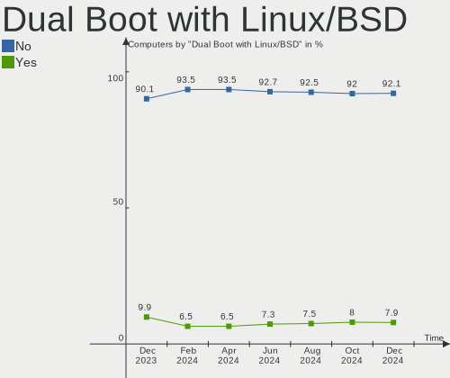
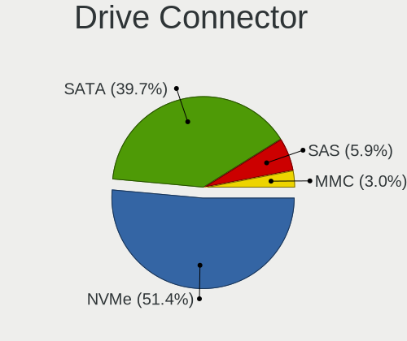
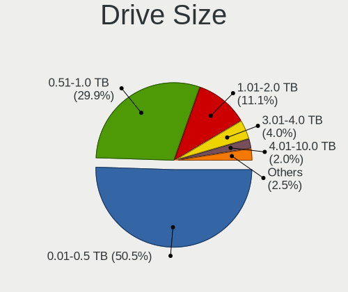
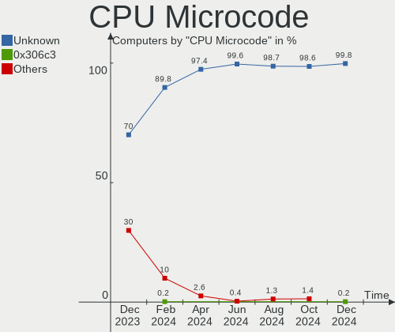
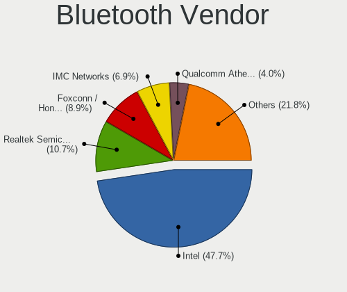
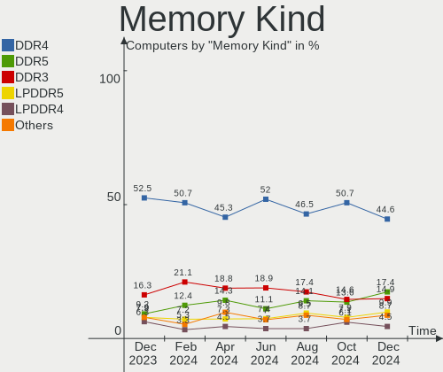
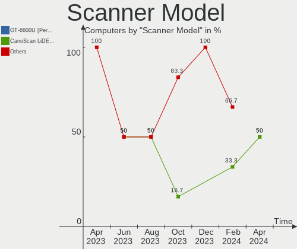

Fedora - Hardware Trends
------------------------

A project to identify most popular hardware characteristics and track their change
over time based on data collected by Linux users at https://Linux-Hardware.org.

Anyone can contribute to this report by the [hw-probe](https://github.com/linuxhw/hw-probe) tool:

    sudo -E hw-probe -all -upload

This is a report for all computer types. See also reports for [desktops](/Dist/Fedora/Desktop/README.md) and [notebooks](/Dist/Fedora/Notebook/README.md).

This report is for one last month. Overall report since the beginning of time: [TestDays](https://github.com/linuxhw/TestDays)

Period: Dec, 2023.

Contents
--------

* [ System ](#system)
  - [ OS                       ](#os)
  - [ OS Family                ](#os-family)
  - [ Kernel                   ](#kernel)
  - [ Kernel Family            ](#kernel-family)
  - [ Kernel Major Ver.        ](#kernel-major-ver)
  - [ Arch                     ](#arch)
  - [ DE                       ](#de)
  - [ Display Server           ](#display-server)
  - [ Display Manager          ](#display-manager)
  - [ OS Lang                  ](#os-lang)
  - [ Boot Mode                ](#boot-mode)
  - [ Filesystem               ](#filesystem)
  - [ Part. scheme             ](#part-scheme)
  - [ Dual Boot with Linux/BSD ](#dual-boot-with-linuxbsd)
  - [ Dual Boot (Win)          ](#dual-boot-win)

* [ Board ](#board)
  - [ Vendor                   ](#vendor)
  - [ Model                    ](#model)
  - [ Model Family             ](#model-family)
  - [ MFG Year                 ](#mfg-year)
  - [ Form Factor              ](#form-factor)
  - [ Secure Boot              ](#secure-boot)
  - [ Coreboot                 ](#coreboot)
  - [ RAM Size                 ](#ram-size)
  - [ RAM Used                 ](#ram-used)
  - [ Total Drives             ](#total-drives)
  - [ Has CD-ROM               ](#has-cd-rom)
  - [ Has Ethernet             ](#has-ethernet)
  - [ Has WiFi                 ](#has-wifi)
  - [ Has Bluetooth            ](#has-bluetooth)

* [ Location ](#location)
  - [ Country                  ](#country)
  - [ City                     ](#city)

* [ Drives ](#drives)
  - [ Drive Vendor             ](#drive-vendor)
  - [ Drive Model              ](#drive-model)
  - [ HDD Vendor               ](#hdd-vendor)
  - [ SSD Vendor               ](#ssd-vendor)
  - [ Drive Kind               ](#drive-kind)
  - [ Drive Connector          ](#drive-connector)
  - [ Drive Size               ](#drive-size)
  - [ Space Total              ](#space-total)
  - [ Space Used               ](#space-used)
  - [ Malfunc. Drives          ](#malfunc-drives)
  - [ Malfunc. Drive Vendor    ](#malfunc-drive-vendor)
  - [ Malfunc. HDD Vendor      ](#malfunc-hdd-vendor)
  - [ Malfunc. Drive Kind      ](#malfunc-drive-kind)
  - [ Failed Drives            ](#failed-drives)
  - [ Failed Drive Vendor      ](#failed-drive-vendor)
  - [ Drive Status             ](#drive-status)

* [ Storage controller ](#storage-controller)
  - [ Storage Vendor           ](#storage-vendor)
  - [ Storage Model            ](#storage-model)
  - [ Storage Kind             ](#storage-kind)

* [ Processor ](#processor)
  - [ CPU Vendor               ](#cpu-vendor)
  - [ CPU Model                ](#cpu-model)
  - [ CPU Model Family         ](#cpu-model-family)
  - [ CPU Cores                ](#cpu-cores)
  - [ CPU Sockets              ](#cpu-sockets)
  - [ CPU Threads              ](#cpu-threads)
  - [ CPU Op-Modes             ](#cpu-op-modes)
  - [ CPU Microcode            ](#cpu-microcode)
  - [ CPU Microarch            ](#cpu-microarch)

* [ Graphics ](#graphics)
  - [ GPU Vendor               ](#gpu-vendor)
  - [ GPU Model                ](#gpu-model)
  - [ GPU Combo                ](#gpu-combo)
  - [ GPU Driver               ](#gpu-driver)
  - [ GPU Memory               ](#gpu-memory)

* [ Monitor ](#monitor)
  - [ Monitor Vendor           ](#monitor-vendor)
  - [ Monitor Model            ](#monitor-model)
  - [ Monitor Resolution       ](#monitor-resolution)
  - [ Monitor Diagonal         ](#monitor-diagonal)
  - [ Monitor Width            ](#monitor-width)
  - [ Aspect Ratio             ](#aspect-ratio)
  - [ Monitor Area             ](#monitor-area)
  - [ Pixel Density            ](#pixel-density)
  - [ Multiple Monitors        ](#multiple-monitors)

* [ Network ](#network)
  - [ Net Controller Vendor    ](#net-controller-vendor)
  - [ Net Controller Model     ](#net-controller-model)
  - [ Wireless Vendor          ](#wireless-vendor)
  - [ Wireless Model           ](#wireless-model)
  - [ Ethernet Vendor          ](#ethernet-vendor)
  - [ Ethernet Model           ](#ethernet-model)
  - [ Net Controller Kind      ](#net-controller-kind)
  - [ Used Controller          ](#used-controller)
  - [ NICs                     ](#nics)
  - [ IPv6                     ](#ipv6)

* [ Bluetooth ](#bluetooth)
  - [ Bluetooth Vendor         ](#bluetooth-vendor)
  - [ Bluetooth Model          ](#bluetooth-model)

* [ Sound ](#sound)
  - [ Sound Vendor             ](#sound-vendor)
  - [ Sound Model              ](#sound-model)

* [ Memory ](#memory)
  - [ Memory Vendor            ](#memory-vendor)
  - [ Memory Model             ](#memory-model)
  - [ Memory Kind              ](#memory-kind)
  - [ Memory Form Factor       ](#memory-form-factor)
  - [ Memory Size              ](#memory-size)
  - [ Memory Speed             ](#memory-speed)

* [ Printers & scanners ](#printers--scanners)
  - [ Printer Vendor           ](#printer-vendor)
  - [ Printer Model            ](#printer-model)
  - [ Scanner Vendor           ](#scanner-vendor)
  - [ Scanner Model            ](#scanner-model)

* [ Camera ](#camera)
  - [ Camera Vendor            ](#camera-vendor)
  - [ Camera Model             ](#camera-model)

* [ Security ](#security)
  - [ Fingerprint Vendor       ](#fingerprint-vendor)
  - [ Fingerprint Model        ](#fingerprint-model)
  - [ Chipcard Vendor          ](#chipcard-vendor)
  - [ Chipcard Model           ](#chipcard-model)

* [ Unsupported ](#unsupported)
  - [ Unsupported Devices      ](#unsupported-devices)
  - [ Unsupported Device Types ](#unsupported-device-types)

System
------

OS
--

Installed operating systems

| Name      | Computers | Percent |
|-----------|-----------|---------|
| Fedora 39 | 535       | 87.85%  |
| Fedora 38 | 50        | 8.21%   |
| Fedora 37 | 9         | 1.48%   |
| Fedora 36 | 6         | 0.99%   |
| Fedora 40 | 4         | 0.66%   |
| Fedora 35 | 2         | 0.33%   |
| Fedora 34 | 1         | 0.16%   |
| Fedora 33 | 1         | 0.16%   |
| Fedora 30 | 1         | 0.16%   |

OS Family
---------

OS without a version

| Name   | Computers | Percent |
|--------|-----------|---------|
| Fedora | 609       | 100%    |

Kernel
------

Version of the Linux kernel

| Version                                                | Computers | Percent |
|--------------------------------------------------------|-----------|---------|
| 6.6.4-200.fc39.x86_64                                  | 93        | 15.27%  |
| 6.6.6-200.fc39.x86_64                                  | 91        | 14.94%  |
| 6.6.8-200.fc39.x86_64                                  | 89        | 14.61%  |
| 6.6.7-200.fc39.x86_64                                  | 81        | 13.3%   |
| 6.6.2-201.fc39.x86_64                                  | 65        | 10.67%  |
| 6.5.6-300.fc39.x86_64                                  | 48        | 7.88%   |
| 6.6.3-200.fc39.x86_64                                  | 37        | 6.08%   |
| 6.6.6-100.fc38.x86_64                                  | 12        | 1.97%   |
| 6.5.12-300.fc39.x86_64                                 | 9         | 1.48%   |
| 6.2.9-300.fc38.x86_64                                  | 7         | 1.15%   |
| 6.5.11-300.fc39.x86_64                                 | 6         | 0.99%   |
| 6.6.7-100.fc38.x86_64                                  | 5         | 0.82%   |
| 6.6.4-100.fc38.x86_64                                  | 5         | 0.82%   |
| 6.5.12-100.fc37.x86_64                                 | 4         | 0.66%   |
| 6.6.8-100.fc38.x86_64                                  | 3         | 0.49%   |
| 6.6.3-100.fc38.x86_64                                  | 3         | 0.49%   |
| 6.5.12-200.fc38.x86_64                                 | 3         | 0.49%   |
| 5.17.5-300.fc36.x86_64                                 | 3         | 0.49%   |
| 6.7.0-0.rc5.20231212git26aff849438c.42.fc40.x86_64     | 2         | 0.33%   |
| 6.6.4-cb1.0.fc39.x86_64                                | 2         | 0.33%   |
| 6.5.9-300.fc39.x86_64                                  | 2         | 0.33%   |
| 6.5.5-200.fc38.x86_64                                  | 2         | 0.33%   |
| 6.5.10-200.fc38.x86_64                                 | 2         | 0.33%   |
| 6.2.15-100.fc36.x86_64                                 | 2         | 0.33%   |
| 6.0.12-100.fc35.x86_64                                 | 2         | 0.33%   |
| 6.7.0-0.rc5.20231216gtc8e97fc6.345.vanilla.fc39.x86_64 | 1         | 0.16%   |
| 6.7.0-0.rc3.20231202gt815fb87b.332.vanilla.fc39.x86_64 | 1         | 0.16%   |
| 6.6.7_tkg_bore_llvm                                    | 1         | 0.16%   |
| 6.6.7-666.rog.fc39.x86_64                              | 1         | 0.16%   |
| 6.6.7-203.fsync.fc39.x86_64                            | 1         | 0.16%   |
| 6.6.7-200.fc39.aarch64                                 | 1         | 0.16%   |
| 6.6.3-666.rog.fc39.x86_64                              | 1         | 0.16%   |
| 6.6.2-101.fc38.x86_64                                  | 1         | 0.16%   |
| 6.5.9-200.fc38.x86_64                                  | 1         | 0.16%   |
| 6.5.8-200.fc38.x86_64                                  | 1         | 0.16%   |
| 6.5.7-200.fc38.x86_64                                  | 1         | 0.16%   |
| 6.5.7-100.fc37.x86_64                                  | 1         | 0.16%   |
| 6.5.11-200.fc38.x86_64                                 | 1         | 0.16%   |
| 6.5.10-300.fc39.x86_64                                 | 1         | 0.16%   |
| 6.5.0-57.fc40.x86_64                                   | 1         | 0.16%   |

Kernel Family
-------------

Linux kernel without a distro release

| Version | Computers | Percent |
|---------|-----------|---------|
| 6.6.6   | 103       | 16.91%  |
| 6.6.4   | 100       | 16.42%  |
| 6.6.8   | 92        | 15.11%  |
| 6.6.7   | 90        | 14.78%  |
| 6.6.2   | 66        | 10.84%  |
| 6.5.6   | 48        | 7.88%   |
| 6.6.3   | 41        | 6.73%   |
| 6.5.12  | 16        | 2.63%   |
| 6.5.11  | 7         | 1.15%   |
| 6.2.9   | 7         | 1.15%   |
| 6.2.15  | 5         | 0.82%   |
| 6.7.0   | 4         | 0.66%   |
| 6.5.9   | 3         | 0.49%   |
| 6.5.10  | 3         | 0.49%   |
| 5.17.5  | 3         | 0.49%   |
| 6.5.7   | 2         | 0.33%   |
| 6.5.5   | 2         | 0.33%   |
| 6.4.15  | 2         | 0.33%   |
| 6.0.12  | 2         | 0.33%   |
| 6.5.8   | 1         | 0.16%   |
| 6.5.0   | 1         | 0.16%   |
| 6.4.16  | 1         | 0.16%   |
| 6.4.14  | 1         | 0.16%   |
| 6.4.13  | 1         | 0.16%   |
| 6.4.12  | 1         | 0.16%   |
| 6.3.8   | 1         | 0.16%   |
| 6.2.12  | 1         | 0.16%   |
| 6.0.18  | 1         | 0.16%   |
| 5.8.15  | 1         | 0.16%   |
| 5.6.13  | 1         | 0.16%   |
| 5.19.11 | 1         | 0.16%   |
| 5.17.12 | 1         | 0.16%   |

Kernel Major Ver.
-----------------

Linux kernel major version

| Version | Computers | Percent |
|---------|-----------|---------|
| 6.6     | 492       | 80.79%  |
| 6.5     | 83        | 13.63%  |
| 6.2     | 13        | 2.13%   |
| 6.4     | 6         | 0.99%   |
| 6.7     | 4         | 0.66%   |
| 5.17    | 4         | 0.66%   |
| 6.0     | 3         | 0.49%   |
| 6.3     | 1         | 0.16%   |
| 5.8     | 1         | 0.16%   |
| 5.6     | 1         | 0.16%   |
| 5.19    | 1         | 0.16%   |

Arch
----

OS architecture (x86_64, i586, etc.)

| Name    | Computers | Percent |
|---------|-----------|---------|
| x86_64  | 607       | 99.67%  |
| i686    | 1         | 0.16%   |
| aarch64 | 1         | 0.16%   |

DE
--

Desktop Environment

| Name          | Computers | Percent |
|---------------|-----------|---------|
| GNOME         | 445       | 73.07%  |
| KDE5          | 95        | 15.6%   |
| Unknown       | 16        | 2.63%   |
| Cinnamon      | 13        | 2.13%   |
| XFCE          | 9         | 1.48%   |
| MATE          | 6         | 0.99%   |
| X-Cinnamon    | 5         | 0.82%   |
| GNOME Classic | 5         | 0.82%   |
| sway          | 3         | 0.49%   |
| Hyprland      | 3         | 0.49%   |
| Budgie        | 3         | 0.49%   |
| Pantheon      | 1         | 0.16%   |
| KDE           | 1         | 0.16%   |
| i3            | 1         | 0.16%   |
| GNOME-Classic | 1         | 0.16%   |
| Deepin        | 1         | 0.16%   |
| bspwm         | 1         | 0.16%   |

Display Server
--------------

X11 or Wayland

| Name    | Computers | Percent |
|---------|-----------|---------|
| Wayland | 468       | 76.85%  |
| X11     | 107       | 17.57%  |
| Tty     | 22        | 3.61%   |
| Unknown | 12        | 1.97%   |

Display Manager
---------------

SDDM, LightDM, etc.

| Name    | Computers | Percent |
|---------|-----------|---------|
| Unknown | 384       | 63.05%  |
| GDM     | 136       | 22.33%  |
| SDDM    | 46        | 7.55%   |
| LightDM | 42        | 6.9%    |
| GREETD  | 1         | 0.16%   |

OS Lang
-------

Language

| Lang    | Computers | Percent |
|---------|-----------|---------|
| en_US   | 299       | 49.1%   |
| en_GB   | 45        | 7.39%   |
| pt_BR   | 33        | 5.42%   |
| de_DE   | 32        | 5.25%   |
| ru_RU   | 21        | 3.45%   |
| en_AU   | 21        | 3.45%   |
| it_IT   | 19        | 3.12%   |
| fr_FR   | 18        | 2.96%   |
| pl_PL   | 12        | 1.97%   |
| en_IN   | 11        | 1.81%   |
| en_CA   | 10        | 1.64%   |
| es_ES   | 8         | 1.31%   |
| de_CH   | 5         | 0.82%   |
| de_AT   | 5         | 0.82%   |
| hu_HU   | 4         | 0.66%   |
| es_CO   | 4         | 0.66%   |
| es_CL   | 4         | 0.66%   |
| en_DK   | 4         | 0.66%   |
| cs_CZ   | 4         | 0.66%   |
| ru_UA   | 3         | 0.49%   |
| pt_PT   | 3         | 0.49%   |
| ja_JP   | 3         | 0.49%   |
| fr_CA   | 3         | 0.49%   |
| es_MX   | 3         | 0.49%   |
| tr_TR   | 2         | 0.33%   |
| es_DO   | 2         | 0.33%   |
| es_AR   | 2         | 0.33%   |
| en_ZA   | 2         | 0.33%   |
| en_SG   | 2         | 0.33%   |
| en_NZ   | 2         | 0.33%   |
| da_DK   | 2         | 0.33%   |
| Unknown | 2         | 0.33%   |
| zh_TW   | 1         | 0.16%   |
| zh_SG   | 1         | 0.16%   |
| zh_CN   | 1         | 0.16%   |
| uk_UA   | 1         | 0.16%   |
| sv_SE   | 1         | 0.16%   |
| ro_RO   | 1         | 0.16%   |
| nl_NL   | 1         | 0.16%   |
| nl_BE   | 1         | 0.16%   |

Boot Mode
---------

EFI or BIOS

| Mode | Computers | Percent |
|------|-----------|---------|
| EFI  | 480       | 78.82%  |
| BIOS | 129       | 21.18%  |

Filesystem
----------

Type of filesystem

| Type    | Computers | Percent |
|---------|-----------|---------|
| Btrfs   | 497       | 81.61%  |
| Ext4    | 94        | 15.44%  |
| Xfs     | 17        | 2.79%   |
| Overlay | 1         | 0.16%   |

Part. scheme
------------

Scheme of partitioning

| Type    | Computers | Percent |
|---------|-----------|---------|
| Unknown | 367       | 60.26%  |
| GPT     | 220       | 36.12%  |
| MBR     | 22        | 3.61%   |

Dual Boot with Linux/BSD
------------------------

Hosting more than one Linux/BSD

| Dual boot | Computers | Percent |
|-----------|-----------|---------|
| No        | 549       | 90.15%  |
| Yes       | 60        | 9.85%   |

Dual Boot (Win)
---------------

Hosting Linux and Windows

| Dual boot | Computers | Percent |
|-----------|-----------|---------|
| No        | 501       | 82.27%  |
| Yes       | 108       | 17.73%  |

Board
-----

Vendor
------

Motherboard manufacturer

| Name                                 | Computers | Percent |
|--------------------------------------|-----------|---------|
| Lenovo                               | 130       | 21.35%  |
| ASUSTek Computer                     | 98        | 16.09%  |
| Dell                                 | 77        | 12.64%  |
| Hewlett-Packard                      | 71        | 11.66%  |
| Gigabyte Technology                  | 42        | 6.9%    |
| MSI                                  | 37        | 6.08%   |
| Acer                                 | 25        | 4.11%   |
| Apple                                | 22        | 3.61%   |
| ASRock                               | 20        | 3.28%   |
| HUAWEI                               | 10        | 1.64%   |
| Intel                                | 7         | 1.15%   |
| Fujitsu                              | 6         | 0.99%   |
| Framework                            | 5         | 0.82%   |
| Samsung Electronics                  | 4         | 0.66%   |
| Chuwi                                | 3         | 0.49%   |
| AZW                                  | 3         | 0.49%   |
| Unknown                              | 3         | 0.49%   |
| TUXEDO                               | 2         | 0.33%   |
| Toshiba                              | 2         | 0.33%   |
| Sony                                 | 2         | 0.33%   |
| Pegatron                             | 2         | 0.33%   |
| Panasonic                            | 2         | 0.33%   |
| Packard Bell                         | 2         | 0.33%   |
| Microsoft                            | 2         | 0.33%   |
| HONOR                                | 2         | 0.33%   |
| VIT                                  | 1         | 0.16%   |
| Valve                                | 1         | 0.16%   |
| Trigkey                              | 1         | 0.16%   |
| Timi                                 | 1         | 0.16%   |
| Thirdwave                            | 1         | 0.16%   |
| Star Labs                            | 1         | 0.16%   |
| Shenzhen Meigao Electronic Equipment | 1         | 0.16%   |
| Razer                                | 1         | 0.16%   |
| Positivo                             | 1         | 0.16%   |
| pine64,pinebook-pro                  | 1         | 0.16%   |
| PCWare                               | 1         | 0.16%   |
| OEM                                  | 1         | 0.16%   |
| MAXSUN                               | 1         | 0.16%   |
| LG Electronics                       | 1         | 0.16%   |
| GPD                                  | 1         | 0.16%   |

Model
-----

Motherboard model

| Name                                       | Computers | Percent |
|--------------------------------------------|-----------|---------|
| Framework Laptop 13 (AMD Ryzen 7040Series) | 4         | 0.66%   |
| ASUS All Series                            | 4         | 0.66%   |
| MSI MS-7C02                                | 3         | 0.49%   |
| HP ENVY x360 2-in-1 Laptop 13-bf0xxx       | 3         | 0.49%   |
| Acer Aspire A515-45                        | 3         | 0.49%   |
| Unknown                                    | 3         | 0.49%   |
| Panasonic CF-33-1                          | 2         | 0.33%   |
| MSI MS-7721                                | 2         | 0.33%   |
| Lenovo V15 G3 IAP 82TT                     | 2         | 0.33%   |
| Lenovo ThinkPad T480 20L50011US            | 2         | 0.33%   |
| Lenovo IdeaPad Gaming 3 15IHU6 82K1        | 2         | 0.33%   |
| HP Z240 SFF Workstation                    | 2         | 0.33%   |
| HP Stream Laptop 14-ax0XX                  | 2         | 0.33%   |
| HP Laptop 15-da0xxx                        | 2         | 0.33%   |
| Gigabyte J1900M-D2P                        | 2         | 0.33%   |
| Gigabyte B650 AORUS ELITE AX               | 2         | 0.33%   |
| Dell XPS 15 9530                           | 2         | 0.33%   |
| Dell XPS 13 9310                           | 2         | 0.33%   |
| Dell OptiPlex 3020                         | 2         | 0.33%   |
| Dell Latitude E7440                        | 2         | 0.33%   |
| Dell Latitude E5550                        | 2         | 0.33%   |
| Dell Latitude E5470                        | 2         | 0.33%   |
| Dell Latitude 5420                         | 2         | 0.33%   |
| Dell Inspiron N5110                        | 2         | 0.33%   |
| Dell Inspiron 3542                         | 2         | 0.33%   |
| AZW GTR                                    | 2         | 0.33%   |
| ASUS TUF Gaming Z690-PLUS D4               | 2         | 0.33%   |
| ASUS ROG Zephyrus G14 GA402RJ_GA402RJ      | 2         | 0.33%   |
| ASUS ROG STRIX B650E-I GAMING WIFI         | 2         | 0.33%   |
| ASUS PRIME X570-PRO                        | 2         | 0.33%   |
| ASRock B450M Pro4 R2.0                     | 2         | 0.33%   |
| VIT P3400                                  | 1         | 0.16%   |
| Valve Jupiter                              | 1         | 0.16%   |
| TUXEDO InfinityBook S 15/17 Gen7           | 1         | 0.16%   |
| TUXEDO InfinityBook Pro 14 Gen6            | 1         | 0.16%   |
| Trigkey S5                                 | 1         | 0.16%   |
| Toshiba Satellite P850                     | 1         | 0.16%   |
| Toshiba Satellite C70-B                    | 1         | 0.16%   |
| Timi A35R                                  | 1         | 0.16%   |
| Thirdwave Prime Series                     | 1         | 0.16%   |

Model Family
------------

Motherboard model prefix

| Name                | Computers | Percent |
|---------------------|-----------|---------|
| Lenovo ThinkPad     | 66        | 10.84%  |
| Dell Latitude       | 24        | 3.94%   |
| ASUS ROG            | 22        | 3.61%   |
| Dell Inspiron       | 20        | 3.28%   |
| ASUS VivoBook       | 18        | 2.96%   |
| Lenovo IdeaPad      | 16        | 2.63%   |
| ASUS PRIME          | 13        | 2.13%   |
| Lenovo Legion       | 12        | 1.97%   |
| HP ENVY             | 11        | 1.81%   |
| Dell XPS            | 11        | 1.81%   |
| Acer Aspire         | 11        | 1.81%   |
| Lenovo ThinkBook    | 10        | 1.64%   |
| HP Laptop           | 8         | 1.31%   |
| Dell OptiPlex       | 8         | 1.31%   |
| Lenovo Yoga         | 7         | 1.15%   |
| HP Pavilion         | 7         | 1.15%   |
| HP EliteBook        | 7         | 1.15%   |
| Dell Precision      | 7         | 1.15%   |
| Acer Nitro          | 6         | 0.99%   |
| Lenovo ThinkCentre  | 5         | 0.82%   |
| Framework Laptop    | 5         | 0.82%   |
| ASUS TUF            | 5         | 0.82%   |
| HP ZBook            | 4         | 0.66%   |
| HP OMEN             | 4         | 0.66%   |
| Fujitsu LIFEBOOK    | 4         | 0.66%   |
| ASUS ASUS           | 4         | 0.66%   |
| ASUS All            | 4         | 0.66%   |
| MSI MS-7C02         | 3         | 0.49%   |
| HP Stream           | 3         | 0.49%   |
| HP ProDesk          | 3         | 0.49%   |
| HP ProBook          | 3         | 0.49%   |
| HP EliteDesk        | 3         | 0.49%   |
| HP Compaq           | 3         | 0.49%   |
| Gigabyte X570       | 3         | 0.49%   |
| Gigabyte B550       | 3         | 0.49%   |
| ASUS Zenbook        | 3         | 0.49%   |
| Apple MacBookPro11  | 3         | 0.49%   |
| Acer Swift          | 3         | 0.49%   |
| Unknown             | 3         | 0.49%   |
| TUXEDO InfinityBook | 2         | 0.33%   |

MFG Year
--------

Motherboard manufacture year

| Year | Computers | Percent |
|------|-----------|---------|
| 2022 | 81        | 13.3%   |
| 2020 | 70        | 11.49%  |
| 2023 | 67        | 11%     |
| 2021 | 61        | 10.02%  |
| 2018 | 48        | 7.88%   |
| 2019 | 47        | 7.72%   |
| 2016 | 35        | 5.75%   |
| 2012 | 32        | 5.25%   |
| 2017 | 31        | 5.09%   |
| 2013 | 30        | 4.93%   |
| 2014 | 29        | 4.76%   |
| 2011 | 23        | 3.78%   |
| 2015 | 19        | 3.12%   |
| 2010 | 15        | 2.46%   |
| 2009 | 8         | 1.31%   |
| 2008 | 7         | 1.15%   |
| 2007 | 4         | 0.66%   |
| 2006 | 2         | 0.33%   |

Form Factor
-----------

Physical design of the computer

| Name           | Computers | Percent |
|----------------|-----------|---------|
| Notebook       | 357       | 58.62%  |
| Desktop        | 191       | 31.36%  |
| Convertible    | 29        | 4.76%   |
| Mini pc        | 14        | 2.3%    |
| Tablet         | 12        | 1.97%   |
| All in one     | 4         | 0.66%   |
| Other          | 1         | 0.16%   |
| System on chip | 1         | 0.16%   |

Secure Boot
-----------

Enabled or disabled

| State    | Computers | Percent |
|----------|-----------|---------|
| Disabled | 468       | 76.85%  |
| Enabled  | 141       | 23.15%  |

Coreboot
--------

Have coreboot on board

| Used | Computers | Percent |
|------|-----------|---------|
| No   | 609       | 100%    |

RAM Size
--------

Total RAM memory

| Size in GB      | Computers | Percent |
|-----------------|-----------|---------|
| 16.01-24.0      | 157       | 25.78%  |
| 4.01-8.0        | 137       | 22.5%   |
| 32.01-64.0      | 106       | 17.41%  |
| 8.01-16.0       | 102       | 16.75%  |
| 3.01-4.0        | 43        | 7.06%   |
| 24.01-32.0      | 33        | 5.42%   |
| 64.01-256.0     | 29        | 4.76%   |
| More than 256.0 | 1         | 0.16%   |
| 1.01-2.0        | 1         | 0.16%   |

RAM Used
--------

Used RAM memory

| Used GB    | Computers | Percent |
|------------|-----------|---------|
| 4.01-8.0   | 212       | 34.81%  |
| 2.01-3.0   | 155       | 25.45%  |
| 3.01-4.0   | 143       | 23.48%  |
| 1.01-2.0   | 45        | 7.39%   |
| 8.01-16.0  | 36        | 5.91%   |
| 0.51-1.0   | 9         | 1.48%   |
| 16.01-24.0 | 8         | 1.31%   |
| 24.01-32.0 | 1         | 0.16%   |

Total Drives
------------

Number of drives on board

| Drives | Computers | Percent |
|--------|-----------|---------|
| 1      | 376       | 61.74%  |
| 2      | 142       | 23.32%  |
| 3      | 46        | 7.55%   |
| 4      | 16        | 2.63%   |
| 5      | 14        | 2.3%    |
| 6      | 7         | 1.15%   |
| 10     | 2         | 0.33%   |
| 8      | 2         | 0.33%   |
| 12     | 1         | 0.16%   |
| 9      | 1         | 0.16%   |
| 7      | 1         | 0.16%   |
| 0      | 1         | 0.16%   |

Has CD-ROM
----------

Has CD-ROM on board

| Presented | Computers | Percent |
|-----------|-----------|---------|
| No        | 486       | 79.8%   |
| Yes       | 123       | 20.2%   |

Has Ethernet
------------

Has Ethernet on board

| Presented | Computers | Percent |
|-----------|-----------|---------|
| Yes       | 468       | 76.85%  |
| No        | 141       | 23.15%  |

Has WiFi
--------

Has WiFi module

| Presented | Computers | Percent |
|-----------|-----------|---------|
| Yes       | 516       | 84.73%  |
| No        | 93        | 15.27%  |

Has Bluetooth
-------------

Has Bluetooth module

| Presented | Computers | Percent |
|-----------|-----------|---------|
| Yes       | 462       | 75.86%  |
| No        | 147       | 24.14%  |

Location
--------

Country
-------

Geographic location (country)

| Country             | Computers | Percent |
|---------------------|-----------|---------|
| USA                 | 117       | 19.21%  |
| Germany             | 47        | 7.72%   |
| Brazil              | 42        | 6.9%    |
| Italy               | 33        | 5.42%   |
| UK                  | 28        | 4.6%    |
| Poland              | 24        | 3.94%   |
| France              | 22        | 3.61%   |
| Australia           | 22        | 3.61%   |
| Russia              | 21        | 3.45%   |
| Canada              | 21        | 3.45%   |
| Netherlands         | 17        | 2.79%   |
| India               | 17        | 2.79%   |
| Austria             | 15        | 2.46%   |
| Spain               | 14        | 2.3%    |
| Switzerland         | 9         | 1.48%   |
| Belgium             | 9         | 1.48%   |
| Czechia             | 8         | 1.31%   |
| Romania             | 7         | 1.15%   |
| Portugal            | 7         | 1.15%   |
| Hungary             | 7         | 1.15%   |
| Colombia            | 7         | 1.15%   |
| Sweden              | 6         | 0.99%   |
| Mexico              | 6         | 0.99%   |
| Turkey              | 5         | 0.82%   |
| Finland             | 5         | 0.82%   |
| Egypt               | 5         | 0.82%   |
| Denmark             | 5         | 0.82%   |
| Japan               | 4         | 0.66%   |
| Greece              | 4         | 0.66%   |
| Chile               | 4         | 0.66%   |
| Bulgaria            | 4         | 0.66%   |
| Serbia              | 3         | 0.49%   |
| Philippines         | 3         | 0.49%   |
| Norway              | 3         | 0.49%   |
| Belarus             | 3         | 0.49%   |
| Argentina           | 3         | 0.49%   |
| Algeria             | 3         | 0.49%   |
| Venezuela           | 2         | 0.33%   |
| Uzbekistan          | 2         | 0.33%   |
| Trinidad and Tobago | 2         | 0.33%   |

City
----

Geographic location (city)

| City                 | Computers | Percent |
|----------------------|-----------|---------|
| Sydney               | 14        | 2.3%    |
| Vienna               | 10        | 1.64%   |
| Moscow               | 6         | 0.99%   |
| Warsaw               | 5         | 0.82%   |
| Sao Paulo            | 5         | 0.82%   |
| Milano               | 5         | 0.82%   |
| Berlin               | 5         | 0.82%   |
| Toronto              | 4         | 0.66%   |
| Brussels             | 4         | 0.66%   |
| Zurich               | 3         | 0.49%   |
| Wroclaw              | 3         | 0.49%   |
| The Hague            | 3         | 0.49%   |
| Seattle              | 3         | 0.49%   |
| Riverside            | 3         | 0.49%   |
| Reading              | 3         | 0.49%   |
| Poznan               | 3         | 0.49%   |
| Porto Alegre         | 3         | 0.49%   |
| Munich               | 3         | 0.49%   |
| Minsk                | 3         | 0.49%   |
| Milan                | 3         | 0.49%   |
| Istanbul             | 3         | 0.49%   |
| Helsinki             | 3         | 0.49%   |
| Bucharest            | 3         | 0.49%   |
| Athens               | 3         | 0.49%   |
| Adelaide             | 3         | 0.49%   |
| Yekaterinburg        | 2         | 0.33%   |
| Vancouver            | 2         | 0.33%   |
| Tel Aviv             | 2         | 0.33%   |
| Tashkent             | 2         | 0.33%   |
| Târgu Mureş        | 2         | 0.33%   |
| Sao José dos Campos | 2         | 0.33%   |
| Santiago             | 2         | 0.33%   |
| San Salvador         | 2         | 0.33%   |
| San Antonio          | 2         | 0.33%   |
| Salvador             | 2         | 0.33%   |
| Salem                | 2         | 0.33%   |
| Richmond             | 2         | 0.33%   |
| Ravensburg           | 2         | 0.33%   |
| Quezon City          | 2         | 0.33%   |
| Pune                 | 2         | 0.33%   |

Drives
------

Drive Vendor
------------

Hard drive vendors

| Vendor                       | Computers | Drives | Percent |
|------------------------------|-----------|--------|---------|
| Samsung Electronics          | 172       | 212    | 18.94%  |
| Sandisk                      | 92        | 110    | 10.13%  |
| WDC                          | 71        | 97     | 7.82%   |
| Seagate                      | 65        | 90     | 7.16%   |
| Toshiba                      | 49        | 52     | 5.4%    |
| SK hynix                     | 45        | 46     | 4.96%   |
| Crucial                      | 37        | 39     | 4.07%   |
| Micron Technology            | 30        | 30     | 3.3%    |
| Kingston                     | 30        | 31     | 3.3%    |
| Micron/Crucial Technology    | 29        | 30     | 3.19%   |
| Unknown                      | 28        | 31     | 3.08%   |
| Intel                        | 26        | 28     | 2.86%   |
| Phison Electronics           | 23        | 24     | 2.53%   |
| Apple                        | 17        | 20     | 1.87%   |
| HGST                         | 12        | 13     | 1.32%   |
| ADATA Technology             | 12        | 13     | 1.32%   |
| MAXIO Technology (Hangzhou)  | 11        | 11     | 1.21%   |
| KIOXIA                       | 11        | 11     | 1.21%   |
| Hitachi                      | 11        | 13     | 1.21%   |
| China                        | 10        | 10     | 1.1%    |
| Silicon Motion               | 9         | 9      | 0.99%   |
| A-DATA Technology            | 9         | 9      | 0.99%   |
| Kingston Technology Company  | 8         | 9      | 0.88%   |
| SPCC                         | 6         | 6      | 0.66%   |
| LITEONIT                     | 6         | 6      | 0.66%   |
| Shenzhen Longsys Electronics | 4         | 4      | 0.44%   |
| LITEON                       | 4         | 4      | 0.44%   |
| Realtek Semiconductor        | 3         | 3      | 0.33%   |
| PNY                          | 3         | 3      | 0.33%   |
| Netac                        | 3         | 4      | 0.33%   |
| JMicron Technology           | 3         | 7      | 0.33%   |
| USB                          | 2         | 2      | 0.22%   |
| Union Memory (Shenzhen)      | 2         | 2      | 0.22%   |
| Union Memory                 | 2         | 2      | 0.22%   |
| Realtek                      | 2         | 2      | 0.22%   |
| Plextor                      | 2         | 2      | 0.22%   |
| OCZ                          | 2         | 2      | 0.22%   |
| Lexar                        | 2         | 2      | 0.22%   |
| Intenso                      | 2         | 2      | 0.22%   |
| Hewlett-Packard              | 2         | 2      | 0.22%   |

Drive Model
-----------

Hard drive models

| Model                                                 | Computers | Percent |
|-------------------------------------------------------|-----------|---------|
| Samsung NVMe SSD Controller SM981/PM981/PM983 512GB   | 36        | 3.59%   |
| Samsung NVMe SSD Controller PM9A1/PM9A3/980PRO 2TB    | 29        | 2.89%   |
| Micron/Crucial P2 NVMe PCIe SSD 4TB                   | 20        | 1.99%   |
| Sandisk WD Blue SN550 NVMe SSD 1TB                    | 16        | 1.6%    |
| Sandisk WD Black SN750 / PC SN730 NVMe SSD 2TB        | 10        | 1%      |
| Kingston SA400S37240G 240GB SSD                       | 10        | 1%      |
| Sandisk WD_BLACK SN850X 2000GB                        | 9         | 0.9%    |
| Samsung SSD 860 EVO 1TB                               | 9         | 0.9%    |
| Samsung NVMe SSD Controller SM961/PM961/SM963 250GB   | 9         | 0.9%    |
| Unknown MMC Card  128GB                               | 8         | 0.8%    |
| Phison E12 NVMe Controller 1TB                        | 8         | 0.8%    |
| Intel SSD 660P Series 1TB                             | 8         | 0.8%    |
| Crucial CT1000MX500SSD1 1TB                           | 8         | 0.8%    |
| Sandisk WD Black SN850 1024GB                         | 7         | 0.7%    |
| Toshiba XG6 NVMe SSD Controller 512GB                 | 6         | 0.6%    |
| SK hynix BC501 NVMe Solid State Drive 512GB           | 6         | 0.6%    |
| Silicon Motion SM2263EN/SM2263XT SSD Controller 500GB | 6         | 0.6%    |
| Seagate ST1000LM035-1RK172 1TB                        | 6         | 0.6%    |
| Samsung SSD 980 1TB                                   | 6         | 0.6%    |
| Samsung SSD 860 EVO 500GB                             | 6         | 0.6%    |
| Samsung SSD 850 EVO 250GB                             | 6         | 0.6%    |
| Phison PS5013 E13 NVMe Controller 512GB               | 6         | 0.6%    |
| MAXIO (Hangzhou) NVMe SSD Controller MAP1202 256GB    | 6         | 0.6%    |
| Kingston SA400S37480G 480GB SSD                       | 6         | 0.6%    |
| HGST HTS721010A9E630 1TB                              | 6         | 0.6%    |
| Crucial CT500MX500SSD1 500GB                          | 6         | 0.6%    |
| Unknown SD/MMC/MS PRO 512GB                           | 5         | 0.5%    |
| Unknown MMC Card  32GB                                | 5         | 0.5%    |
| Toshiba DT01ACA100 1TB                                | 5         | 0.5%    |
| SK hynix BC511 512GB                                  | 5         | 0.5%    |
| Samsung SSD 870 QVO 1TB                               | 5         | 0.5%    |
| Samsung MZALQ512HBLU-00BL2 512GB                      | 5         | 0.5%    |
| Toshiba MQ04ABF100 1TB                                | 4         | 0.4%    |
| SPCC Solid State Disk 512GB                           | 4         | 0.4%    |
| Seagate ST2000DM008-2UB102 2TB                        | 4         | 0.4%    |
| Sandisk WD_BLACK SN850X 1000GB                        | 4         | 0.4%    |
| Sandisk WD Black 2018/SN750 / PC SN720 NVMe SSD 1TB   | 4         | 0.4%    |
| Samsung MZAL4512HBLU-00BL2 512GB                      | 4         | 0.4%    |
| Phison E16 PCIe4 NVMe Controller 2TB                  | 4         | 0.4%    |
| Kingston Company SNV2S1000G 1TB                       | 4         | 0.4%    |

HDD Vendor
----------

Hard disk drive vendors

| Vendor              | Computers | Drives | Percent |
|---------------------|-----------|--------|---------|
| Seagate             | 62        | 86     | 30.54%  |
| WDC                 | 58        | 81     | 28.57%  |
| Toshiba             | 32        | 35     | 15.76%  |
| HGST                | 12        | 13     | 5.91%   |
| Hitachi             | 11        | 13     | 5.42%   |
| Samsung Electronics | 7         | 9      | 3.45%   |
| Unknown             | 5         | 5      | 2.46%   |
| Apple               | 4         | 4      | 1.97%   |
| USB3.0              | 1         | 1      | 0.49%   |
| USB                 | 1         | 1      | 0.49%   |
| SAGE                | 1         | 1      | 0.49%   |
| SABRENT             | 1         | 1      | 0.49%   |
| Maxtor              | 1         | 1      | 0.49%   |
| LIO-ORG             | 1         | 4      | 0.49%   |
| KINGWIN             | 1         | 1      | 0.49%   |
| JMicron Technology  | 1         | 4      | 0.49%   |
| Intenso             | 1         | 1      | 0.49%   |
| Inateck             | 1         | 2      | 0.49%   |
| External            | 1         | 1      | 0.49%   |
| ASMT                | 1         | 5      | 0.49%   |

SSD Vendor
----------

Solid state drive vendors

| Vendor              | Computers | Drives | Percent |
|---------------------|-----------|--------|---------|
| Samsung Electronics | 68        | 85     | 24.55%  |
| Crucial             | 37        | 39     | 13.36%  |
| Kingston            | 25        | 25     | 9.03%   |
| SanDisk             | 17        | 18     | 6.14%   |
| WDC                 | 16        | 16     | 5.78%   |
| SK hynix            | 10        | 10     | 3.61%   |
| Intel               | 10        | 10     | 3.61%   |
| China               | 10        | 10     | 3.61%   |
| Toshiba             | 7         | 7      | 2.53%   |
| Micron Technology   | 7         | 7      | 2.53%   |
| SPCC                | 6         | 6      | 2.17%   |
| LITEONIT            | 6         | 6      | 2.17%   |
| Apple               | 6         | 6      | 2.17%   |
| A-DATA Technology   | 6         | 6      | 2.17%   |
| LITEON              | 4         | 4      | 1.44%   |
| PNY                 | 3         | 3      | 1.08%   |
| Plextor             | 2         | 2      | 0.72%   |
| OCZ                 | 2         | 2      | 0.72%   |
| Netac               | 2         | 3      | 0.72%   |
| JMicron Technology  | 2         | 3      | 0.72%   |
| Apacer              | 2         | 2      | 0.72%   |
| Acer                | 2         | 2      | 0.72%   |
| Wdxsky              | 1         | 1      | 0.36%   |
| TECH                | 1         | 1      | 0.36%   |
| Team                | 1         | 1      | 0.36%   |
| Star                | 1         | 1      | 0.36%   |
| SD                  | 1         | 1      | 0.36%   |
| Reeinno             | 1         | 1      | 0.36%   |
| Patriot             | 1         | 1      | 0.36%   |
| MaxDigital          | 1         | 1      | 0.36%   |
| Lexar               | 1         | 1      | 0.36%   |
| Lenovo              | 1         | 1      | 0.36%   |
| KingSpec            | 1         | 1      | 0.36%   |
| Intenso             | 1         | 1      | 0.36%   |
| INTEL SS            | 1         | 1      | 0.36%   |
| HS-SSD-E100         | 1         | 1      | 0.36%   |
| Hewlett-Packard     | 1         | 1      | 0.36%   |
| GOODRAM             | 1         | 1      | 0.36%   |
| Gigabyte Technology | 1         | 1      | 0.36%   |
| Dogfish             | 1         | 1      | 0.36%   |

Drive Kind
----------

HDD or SSD

| Kind    | Computers | Drives | Percent |
|---------|-----------|--------|---------|
| NVMe    | 370       | 445    | 45.62%  |
| SSD     | 239       | 299    | 29.47%  |
| HDD     | 167       | 269    | 20.59%  |
| MMC     | 21        | 24     | 2.59%   |
| Unknown | 14        | 16     | 1.73%   |

Drive Connector
---------------

SATA, SAS, NVMe, etc.

| Type | Computers | Drives | Percent |
|------|-----------|--------|---------|
| NVMe | 370       | 442    | 49.93%  |
| SATA | 311       | 514    | 41.97%  |
| SAS  | 39        | 73     | 5.26%   |
| MMC  | 21        | 24     | 2.83%   |

Drive Size
----------

Size of hard drive

| Size in TB | Computers | Drives | Percent |
|------------|-----------|--------|---------|
| 0.01-0.5   | 209       | 272    | 47.39%  |
| 0.51-1.0   | 142       | 172    | 32.2%   |
| 1.01-2.0   | 47        | 56     | 10.66%  |
| 3.01-4.0   | 17        | 21     | 3.85%   |
| 4.01-10.0  | 14        | 24     | 3.17%   |
| 2.01-3.0   | 7         | 14     | 1.59%   |
| 10.01-20.0 | 5         | 9      | 1.13%   |

Space Total
-----------

Amount of disk space available on the file system

| Size in GB     | Computers | Percent |
|----------------|-----------|---------|
| 501-1000       | 132       | 21.67%  |
| 251-500        | 105       | 17.24%  |
| 1001-2000      | 93        | 15.27%  |
| 101-250        | 79        | 12.97%  |
| More than 3000 | 56        | 9.2%    |
| Unknown        | 54        | 8.87%   |
| 1-20           | 44        | 7.22%   |
| 2001-3000      | 22        | 3.61%   |
| 51-100         | 21        | 3.45%   |
| 21-50          | 3         | 0.49%   |

Space Used
----------

Amount of used disk space

| Used GB        | Computers | Percent |
|----------------|-----------|---------|
| 1-20           | 149       | 24.47%  |
| 21-50          | 114       | 18.72%  |
| 101-250        | 87        | 14.29%  |
| 51-100         | 68        | 11.17%  |
| 251-500        | 54        | 8.87%   |
| Unknown        | 54        | 8.87%   |
| 501-1000       | 32        | 5.25%   |
| 1001-2000      | 24        | 3.94%   |
| More than 3000 | 17        | 2.79%   |
| 2001-3000      | 10        | 1.64%   |

Malfunc. Drives
---------------

Drive models with a malfunction

| Model                                               | Computers | Drives | Percent |
|-----------------------------------------------------|-----------|--------|---------|
| WDC WD40EFRX-68N32N0 4TB                            | 2         | 2      | 8%      |
| Intel SSDSC2CT120A3 120GB                           | 2         | 2      | 8%      |
| WDC WD5000AAKX-00ERMA0 500GB                        | 1         | 1      | 4%      |
| WDC WD5000AAKS-00UU3A0 500GB                        | 1         | 1      | 4%      |
| WDC WD40EFRX-68WT0N0 4TB                            | 1         | 1      | 4%      |
| WDC WD30 EZRX-00SPEB0 3TB                           | 1         | 1      | 4%      |
| WDC WD20 EZRX-00D8PB0 2TB                           | 1         | 1      | 4%      |
| WDC WD10EZEX-08WN4A0 1TB                            | 1         | 1      | 4%      |
| WDC WD10EARS-22Y5B1 1TB                             | 1         | 1      | 4%      |
| WDC WD10EADS-11M2B2 1TB                             | 1         | 1      | 4%      |
| Toshiba THNSNK256GVN8 M.2 2280 256GB SSD            | 1         | 1      | 4%      |
| Toshiba MQ01ABD050 500GB                            | 1         | 1      | 4%      |
| Seagate ST2000LM003 HN-M201RAD 2TB                  | 1         | 1      | 4%      |
| Seagate ST2000DX002-2DV164 2TB                      | 1         | 1      | 4%      |
| Seagate ST1000DX001-1NS162 1TB                      | 1         | 1      | 4%      |
| SanDisk SSD PLUS 240GB                              | 1         | 1      | 4%      |
| Samsung Electronics HD103UJ 1TB                     | 1         | 2      | 4%      |
| Micron Technology MTFDDAK128MAY-1AH1ZABHA 128GB SSD | 1         | 1      | 4%      |
| Micron Technology 1100_MTFDDAV512TBN 512GB SSD      | 1         | 1      | 4%      |
| Maxtor 6L250S0 256GB                                | 1         | 1      | 4%      |
| Crucial CT275MX300SSD1 275GB                        | 1         | 1      | 4%      |
| Crucial CT128MX100SSD1 128GB                        | 1         | 1      | 4%      |
| Crucial CT120M500SSD1 120GB                         | 1         | 1      | 4%      |

Malfunc. Drive Vendor
---------------------

Vendors of faulty drives

| Vendor              | Computers | Drives | Percent |
|---------------------|-----------|--------|---------|
| WDC                 | 8         | 10     | 34.78%  |
| Seagate             | 3         | 3      | 13.04%  |
| Crucial             | 3         | 3      | 13.04%  |
| Toshiba             | 2         | 2      | 8.7%    |
| Micron Technology   | 2         | 2      | 8.7%    |
| Intel               | 2         | 2      | 8.7%    |
| SanDisk             | 1         | 1      | 4.35%   |
| Samsung Electronics | 1         | 2      | 4.35%   |
| Maxtor              | 1         | 1      | 4.35%   |

Malfunc. HDD Vendor
-------------------

Vendors of faulty HDD drives

| Vendor              | Computers | Drives | Percent |
|---------------------|-----------|--------|---------|
| WDC                 | 8         | 10     | 57.14%  |
| Seagate             | 3         | 3      | 21.43%  |
| Toshiba             | 1         | 1      | 7.14%   |
| Samsung Electronics | 1         | 2      | 7.14%   |
| Maxtor              | 1         | 1      | 7.14%   |

Malfunc. Drive Kind
-------------------

Kinds of faulty drives

| Kind | Computers | Drives | Percent |
|------|-----------|--------|---------|
| HDD  | 13        | 17     | 59.09%  |
| SSD  | 9         | 9      | 40.91%  |

Failed Drives
-------------

Failed drive models

| Model                     | Computers | Drives | Percent |
|---------------------------|-----------|--------|---------|
| WDC WD30 EZRS-00J99B0 3TB | 1         | 1      | 100%    |

Failed Drive Vendor
-------------------

Failed drive vendors

| Vendor | Computers | Drives | Percent |
|--------|-----------|--------|---------|
| WDC    | 1         | 1      | 100%    |

Drive Status
------------

Number of failed and malfunc. drives

| Status   | Computers | Drives | Percent |
|----------|-----------|--------|---------|
| Detected | 414       | 700    | 64.49%  |
| Works    | 206       | 326    | 32.09%  |
| Malfunc  | 21        | 26     | 3.27%   |
| Failed   | 1         | 1      | 0.16%   |

Storage controller
------------------

Storage Vendor
--------------

Storage controller vendors

| Vendor                                  | Computers | Percent |
|-----------------------------------------|-----------|---------|
| Intel                                   | 320       | 37.21%  |
| Samsung Electronics                     | 116       | 13.49%  |
| AMD                                     | 115       | 13.37%  |
| SanDisk                                 | 76        | 8.84%   |
| SK hynix                                | 35        | 4.07%   |
| Micron/Crucial Technology               | 29        | 3.37%   |
| Phison Electronics                      | 24        | 2.79%   |
| Micron Technology                       | 23        | 2.67%   |
| ADATA Technology                        | 15        | 1.74%   |
| Kingston Technology Company             | 14        | 1.63%   |
| ASMedia Technology                      | 12        | 1.4%    |
| MAXIO Technology (Hangzhou)             | 11        | 1.28%   |
| KIOXIA                                  | 11        | 1.28%   |
| Toshiba America Info Systems            | 10        | 1.16%   |
| Silicon Motion                          | 9         | 1.05%   |
| JMicron Technology                      | 6         | 0.7%    |
| Apple                                   | 6         | 0.7%    |
| Shenzhen Longsys Electronics            | 4         | 0.47%   |
| Nvidia                                  | 4         | 0.47%   |
| Union Memory (Shenzhen)                 | 3         | 0.35%   |
| Realtek Semiconductor                   | 3         | 0.35%   |
| Marvell Technology Group                | 3         | 0.35%   |
| Solidigm                                | 2         | 0.23%   |
| INNOGRIT                                | 2         | 0.23%   |
| ULi Electronics                         | 1         | 0.12%   |
| Transcend                               | 1         | 0.12%   |
| Solid State Storage Technology          | 1         | 0.12%   |
| Silicon Image                           | 1         | 0.12%   |
| Shenzhen Unionmemory Information System | 1         | 0.12%   |
| Broadcom / LSI                          | 1         | 0.12%   |
| Biwin Storage Technology                | 1         | 0.12%   |

Storage Model
-------------

Storage controller models

| Model                                                                          | Computers | Percent |
|--------------------------------------------------------------------------------|-----------|---------|
| AMD FCH SATA Controller [AHCI mode]                                            | 74        | 7.86%   |
| Samsung NVMe SSD Controller SM981/PM981/PM983                                  | 38        | 4.04%   |
| Intel Sunrise Point-LP SATA Controller [AHCI mode]                             | 31        | 3.29%   |
| Samsung NVMe SSD Controller PM9A1/PM9A3/980PRO                                 | 29        | 3.08%   |
| Intel Volume Management Device NVMe RAID Controller                            | 28        | 2.98%   |
| Samsung NVMe SSD Controller 980 (DRAM-less)                                    | 27        | 2.87%   |
| Intel 82801 Mobile SATA Controller [RAID mode]                                 | 25        | 2.66%   |
| Micron/Crucial P2 [Nick P2] / P3 / P3 Plus NVMe PCIe SSD (DRAM-less)           | 20        | 2.13%   |
| AMD 400 Series Chipset SATA Controller                                         | 18        | 1.91%   |
| Intel 7 Series Chipset Family 6-port SATA Controller [AHCI mode]               | 17        | 1.81%   |
| AMD 500 Series Chipset SATA Controller                                         | 17        | 1.81%   |
| SanDisk Ultra 3D / WD Blue SN550 NVMe SSD                                      | 16        | 1.7%    |
| Intel 8 Series/C220 Series Chipset Family 6-port SATA Controller 1 [AHCI mode] | 16        | 1.7%    |
| Sandisk WD Black SN850X NVMe SSD                                               | 15        | 1.59%   |
| Intel 8 Series SATA Controller 1 [AHCI mode]                                   | 14        | 1.49%   |
| SK hynix Gold P31/BC711/PC711 NVMe Solid State Drive                           | 12        | 1.28%   |
| Intel Q170/Q150/B150/H170/H110/Z170/CM236 Chipset SATA Controller [AHCI Mode]  | 12        | 1.28%   |
| Intel Comet Lake SATA AHCI Controller                                          | 12        | 1.28%   |
| Intel Cannon Lake PCH SATA AHCI Controller                                     | 12        | 1.28%   |
| Intel Volume Management Device NVMe RAID Controller Intel Corporation          | 11        | 1.17%   |
| Intel 6 Series/C200 Series Chipset Family 6 port Mobile SATA AHCI Controller   | 11        | 1.17%   |
| SanDisk WD Black SN770 / PC SN740 256GB / PC SN560 (DRAM-less) NVMe SSD        | 10        | 1.06%   |
| SanDisk Extreme Pro / WD Black SN750 / PC SN730 / Red SN700 NVMe SSD           | 10        | 1.06%   |
| Intel Wildcat Point-LP SATA Controller [AHCI Mode]                             | 10        | 1.06%   |
| SK hynix Platinum P41/PC801 NVMe Solid State Drive                             | 8         | 0.85%   |
| Samsung NVMe SSD Controller SM961/PM961/SM963                                  | 8         | 0.85%   |
| Phison E12 NVMe Controller                                                     | 8         | 0.85%   |
| Intel SSD 660P Series                                                          | 8         | 0.85%   |
| Intel Alder Lake-P SATA AHCI Controller                                        | 8         | 0.85%   |
| Intel 200 Series PCH SATA controller [AHCI mode]                               | 8         | 0.85%   |
| ASMedia ASM1062 Serial ATA Controller                                          | 8         | 0.85%   |
| AMD SB7x0/SB8x0/SB9x0 SATA Controller [AHCI mode]                              | 8         | 0.85%   |
| SanDisk WD PC SN810 / Black SN850 NVMe SSD                                     | 7         | 0.74%   |
| Samsung NVMe SSD Controller PM9B1 (DRAM-less)                                  | 7         | 0.74%   |
| Intel Tiger Lake-LP SATA Controller                                            | 7         | 0.74%   |
| Intel Cannon Lake Mobile PCH SATA AHCI Controller                              | 7         | 0.74%   |
| Intel 6 Series/C200 Series Chipset Family 6 port Desktop SATA AHCI Controller  | 7         | 0.74%   |
| AMD SB7x0/SB8x0/SB9x0 IDE Controller                                           | 7         | 0.74%   |
| Toshiba America Info Systems XG6 NVMe SSD Controller                           | 6         | 0.64%   |
| SK hynix BC511 NVMe SSD                                                        | 6         | 0.64%   |

Storage Kind
------------

Kind of storage controller (IDE, SATA, NVMe, SAS, ...)

| Kind | Computers | Percent |
|------|-----------|---------|
| NVMe | 368       | 43.76%  |
| SATA | 368       | 43.76%  |
| RAID | 71        | 8.44%   |
| IDE  | 33        | 3.92%   |
| SAS  | 1         | 0.12%   |

Processor
---------

CPU Vendor
----------

Processor vendors

| Vendor | Computers | Percent |
|--------|-----------|---------|
| Intel  | 426       | 69.95%  |
| AMD    | 182       | 29.89%  |
| ARM    | 1         | 0.16%   |

CPU Model
---------

Processor models

| Model                                         | Computers | Percent |
|-----------------------------------------------|-----------|---------|
| Intel 11th Gen Core i5-1135G7 @ 2.40GHz       | 12        | 1.97%   |
| Intel 12th Gen Core i7-1255U                  | 8         | 1.31%   |
| Intel 12th Gen Core i5-1235U                  | 7         | 1.15%   |
| AMD Ryzen 7 5700U with Radeon Graphics        | 7         | 1.15%   |
| AMD Ryzen 5 3600 6-Core Processor             | 7         | 1.15%   |
| Intel Core i5-8250U CPU @ 1.60GHz             | 6         | 0.99%   |
| Intel 13th Gen Core i7-1355U                  | 6         | 0.99%   |
| AMD Ryzen 7 3700X 8-Core Processor            | 6         | 0.99%   |
| AMD Ryzen 5 5500U with Radeon Graphics        | 6         | 0.99%   |
| Intel Core i7-8750H CPU @ 2.20GHz             | 5         | 0.82%   |
| Intel Core i7-7700HQ CPU @ 2.80GHz            | 5         | 0.82%   |
| Intel Core i7-6500U CPU @ 2.50GHz             | 5         | 0.82%   |
| Intel Core i7-10510U CPU @ 1.80GHz            | 5         | 0.82%   |
| Intel Core i5-7300U CPU @ 2.60GHz             | 5         | 0.82%   |
| Intel Core i5-1035G1 CPU @ 1.00GHz            | 5         | 0.82%   |
| Intel 12th Gen Core i7-12700H                 | 5         | 0.82%   |
| Intel 12th Gen Core i7-1260P                  | 5         | 0.82%   |
| Intel 11th Gen Core i7-1165G7 @ 2.80GHz       | 5         | 0.82%   |
| AMD Ryzen 7 7840HS w/ Radeon 780M Graphics    | 5         | 0.82%   |
| AMD Ryzen 7 7800X3D 8-Core Processor          | 5         | 0.82%   |
| AMD Ryzen 7 5800X 8-Core Processor            | 5         | 0.82%   |
| AMD Ryzen 7 5800H with Radeon Graphics        | 5         | 0.82%   |
| AMD Ryzen 5 4500U with Radeon Graphics        | 5         | 0.82%   |
| Intel Core i7-8550U CPU @ 1.80GHz             | 4         | 0.66%   |
| Intel Core i7-5600U CPU @ 2.60GHz             | 4         | 0.66%   |
| Intel Core i7-10750H CPU @ 2.60GHz            | 4         | 0.66%   |
| Intel Core i5-9300H CPU @ 2.40GHz             | 4         | 0.66%   |
| Intel Core i5-7200U CPU @ 2.50GHz             | 4         | 0.66%   |
| Intel Core i5-5200U CPU @ 2.20GHz             | 4         | 0.66%   |
| Intel Core i5-10210U CPU @ 1.60GHz            | 4         | 0.66%   |
| Intel Core i5 CPU M 520 @ 2.40GHz             | 4         | 0.66%   |
| Intel Core i3-4030U CPU @ 1.90GHz             | 4         | 0.66%   |
| Intel 13th Gen Core i7-13700H                 | 4         | 0.66%   |
| Intel 12th Gen Core i5-12500H                 | 4         | 0.66%   |
| Intel 11th Gen Core i7-1185G7 @ 3.00GHz       | 4         | 0.66%   |
| Intel 11th Gen Core i7-11370H @ 3.30GHz       | 4         | 0.66%   |
| AMD Ryzen 7 PRO 4750U with Radeon Graphics    | 4         | 0.66%   |
| AMD Ryzen 5 7530U with Radeon Graphics        | 4         | 0.66%   |
| AMD Ryzen 5 5600G with Radeon Graphics        | 4         | 0.66%   |
| AMD Ryzen 5 3500U with Radeon Vega Mobile Gfx | 4         | 0.66%   |

CPU Model Family
----------------

Processor model prefix

| Model                   | Computers | Percent |
|-------------------------|-----------|---------|
| Intel Core i5           | 120       | 19.7%   |
| Other                   | 115       | 18.88%  |
| Intel Core i7           | 101       | 16.58%  |
| AMD Ryzen 7             | 66        | 10.84%  |
| AMD Ryzen 5             | 57        | 9.36%   |
| Intel Core i3           | 34        | 5.58%   |
| Intel Celeron           | 15        | 2.46%   |
| AMD Ryzen 9             | 15        | 2.46%   |
| AMD Ryzen 7 PRO         | 10        | 1.64%   |
| Intel Core 2 Duo        | 9         | 1.48%   |
| Intel Xeon              | 8         | 1.31%   |
| Intel Pentium           | 8         | 1.31%   |
| AMD Ryzen 3             | 7         | 1.15%   |
| Intel Core i9           | 6         | 0.99%   |
| AMD FX                  | 5         | 0.82%   |
| Intel Atom              | 4         | 0.66%   |
| AMD A8                  | 4         | 0.66%   |
| Intel Core m5           | 3         | 0.49%   |
| AMD Phenom II X6        | 3         | 0.49%   |
| Intel Core 2 Quad       | 2         | 0.33%   |
| AMD Ryzen Threadripper  | 2         | 0.33%   |
| AMD Phenom II X4        | 2         | 0.33%   |
| AMD A6                  | 2         | 0.33%   |
| Intel Pentium Dual-Core | 1         | 0.16%   |
| Intel Pentium Dual      | 1         | 0.16%   |
| Intel Genuine           | 1         | 0.16%   |
| Intel Core 2 Extreme    | 1         | 0.16%   |
| AMD PRO A10             | 1         | 0.16%   |
| AMD E                   | 1         | 0.16%   |
| AMD Athlon II X4        | 1         | 0.16%   |
| AMD Athlon II X3        | 1         | 0.16%   |
| AMD Athlon 64 X2        | 1         | 0.16%   |
| AMD A4                  | 1         | 0.16%   |
| AMD A10                 | 1         | 0.16%   |

CPU Cores
---------

Number of processor cores

| Number | Computers | Percent |
|--------|-----------|---------|
| 4      | 184       | 30.21%  |
| 2      | 150       | 24.63%  |
| 8      | 100       | 16.42%  |
| 6      | 92        | 15.11%  |
| 10     | 27        | 4.43%   |
| 14     | 21        | 3.45%   |
| 12     | 19        | 3.12%   |
| 16     | 6         | 0.99%   |
| 24     | 5         | 0.82%   |
| 3      | 2         | 0.33%   |
| 28     | 1         | 0.16%   |
| 20     | 1         | 0.16%   |
| 1      | 1         | 0.16%   |

CPU Sockets
-----------

Number of sockets

| Number | Computers | Percent |
|--------|-----------|---------|
| 1      | 607       | 99.67%  |
| 2      | 2         | 0.33%   |

CPU Threads
-----------

Threads per core (Hyper-Threading)

| Number | Computers | Percent |
|--------|-----------|---------|
| 2      | 506       | 83.09%  |
| 1      | 103       | 16.91%  |

CPU Op-Modes
------------

CPU Operation Modes (32-bit, 64-bit)

| Op mode        | Computers | Percent |
|----------------|-----------|---------|
| 32-bit, 64-bit | 609       | 100%    |

CPU Microcode
-------------

Microcode number

| Number     | Computers | Percent |
|------------|-----------|---------|
| Unknown    | 426       | 69.95%  |
| 0x0a50000d | 17        | 2.79%   |
| 0x0a704103 | 13        | 2.13%   |
| 0x0a404102 | 12        | 1.97%   |
| 0x08108109 | 11        | 1.81%   |
| 0x08701030 | 9         | 1.48%   |
| 0x08600106 | 9         | 1.48%   |
| 0x0a601206 | 8         | 1.31%   |
| 0x0a601203 | 8         | 1.31%   |
| 0x0a50000c | 8         | 1.31%   |
| 0x08608103 | 7         | 1.15%   |
| 0x0a20120a | 5         | 0.82%   |
| 0x08701021 | 5         | 0.82%   |
| 0x0a201016 | 4         | 0.66%   |
| 0x08608102 | 4         | 0.66%   |
| 0x08600109 | 4         | 0.66%   |
| 0x0800820d | 4         | 0.66%   |
| 0x06000852 | 4         | 0.66%   |
| 0x0a704101 | 3         | 0.49%   |
| 0x0a50000f | 3         | 0.49%   |
| 0x010000c8 | 3         | 0.49%   |
| 0x306a9    | 2         | 0.33%   |
| 0x206a7    | 2         | 0.33%   |
| 0x0a704104 | 2         | 0.33%   |
| 0x08701013 | 2         | 0.33%   |
| 0x08101016 | 2         | 0.33%   |
| 0x08001138 | 2         | 0.33%   |
| 0x06001119 | 2         | 0.33%   |
| 0x010000bf | 2         | 0.33%   |
| 0xa0652    | 1         | 0.16%   |
| 0x906e9    | 1         | 0.16%   |
| 0x806c1    | 1         | 0.16%   |
| 0x306d4    | 1         | 0.16%   |
| 0x0a50000b | 1         | 0.16%   |
| 0x0a404101 | 1         | 0.16%   |
| 0x0a20120e | 1         | 0.16%   |
| 0x0a201009 | 1         | 0.16%   |
| 0x0a008205 | 1         | 0.16%   |
| 0x08900201 | 1         | 0.16%   |
| 0x08608104 | 1         | 0.16%   |

CPU Microarch
-------------

Microarchitecture

| Name             | Computers | Percent |
|------------------|-----------|---------|
| KabyLake         | 101       | 16.58%  |
| Alderlake Hybrid | 70        | 11.49%  |
| Unknown          | 69        | 11.33%  |
| Zen 3            | 43        | 7.06%   |
| Haswell          | 36        | 5.91%   |
| Zen 2            | 32        | 5.25%   |
| Skylake          | 32        | 5.25%   |
| TigerLake        | 31        | 5.09%   |
| IvyBridge        | 29        | 4.76%   |
| SandyBridge      | 22        | 3.61%   |
| IceLake          | 16        | 2.63%   |
| Broadwell        | 16        | 2.63%   |
| Zen+             | 15        | 2.46%   |
| CometLake        | 15        | 2.46%   |
| Westmere         | 12        | 1.97%   |
| Penryn           | 11        | 1.81%   |
| Silvermont       | 9         | 1.48%   |
| K10              | 8         | 1.31%   |
| Piledriver       | 7         | 1.15%   |
| Goldmont plus    | 7         | 1.15%   |
| Zen              | 6         | 0.99%   |
| Core             | 4         | 0.66%   |
| Bonnell          | 3         | 0.49%   |
| Tremont          | 2         | 0.33%   |
| Steamroller      | 2         | 0.33%   |
| Nehalem          | 2         | 0.33%   |
| Gracemont        | 2         | 0.33%   |
| Excavator        | 2         | 0.33%   |
| Puma             | 1         | 0.16%   |
| K8 Hammer        | 1         | 0.16%   |
| K10 Llano        | 1         | 0.16%   |
| Jaguar           | 1         | 0.16%   |
| Bobcat           | 1         | 0.16%   |

Graphics
--------

GPU Vendor
----------

Vendors of graphics cards

| Vendor | Computers | Percent |
|--------|-----------|---------|
| Intel  | 363       | 49.52%  |
| AMD    | 187       | 25.51%  |
| Nvidia | 183       | 24.97%  |

GPU Model
---------

Graphics card models

| Model                                                                                    | Computers | Percent |
|------------------------------------------------------------------------------------------|-----------|---------|
| Intel TigerLake-LP GT2 [Iris Xe Graphics]                                                | 30        | 3.97%   |
| Intel 3rd Gen Core processor Graphics Controller                                         | 20        | 2.65%   |
| AMD Phoenix1                                                                             | 18        | 2.38%   |
| Intel UHD Graphics 620                                                                   | 17        | 2.25%   |
| Intel Alder Lake-P GT2 [Iris Xe Graphics]                                                | 17        | 2.25%   |
| Intel 2nd Generation Core Processor Family Integrated Graphics Controller                | 17        | 2.25%   |
| Intel Haswell-ULT Integrated Graphics Controller                                         | 16        | 2.12%   |
| Intel CoffeeLake-H GT2 [UHD Graphics 630]                                                | 15        | 1.99%   |
| AMD Cezanne [Radeon Vega Series / Radeon Vega Mobile Series]                             | 15        | 1.99%   |
| Intel Raptor Lake-P [Iris Xe Graphics]                                                   | 14        | 1.85%   |
| Intel HD Graphics 620                                                                    | 14        | 1.85%   |
| Intel Alder Lake-UP3 GT2 [Iris Xe Graphics]                                              | 13        | 1.72%   |
| AMD Renoir [Radeon RX Vega 6 (Ryzen 4000/5000 Mobile Series)]                            | 13        | 1.72%   |
| AMD Rembrandt [Radeon 680M]                                                              | 13        | 1.72%   |
| AMD Raphael                                                                              | 13        | 1.72%   |
| AMD Lucienne                                                                             | 13        | 1.72%   |
| Intel Skylake GT2 [HD Graphics 520]                                                      | 11        | 1.46%   |
| Intel HD Graphics 5500                                                                   | 11        | 1.46%   |
| Intel HD Graphics 530                                                                    | 10        | 1.32%   |
| Intel CometLake-U GT2 [UHD Graphics]                                                     | 10        | 1.32%   |
| AMD Picasso/Raven 2 [Radeon Vega Series / Radeon Vega Mobile Series]                     | 10        | 1.32%   |
| Intel HD Graphics 630                                                                    | 9         | 1.19%   |
| Intel Core Processor Integrated Graphics Controller                                      | 9         | 1.19%   |
| Intel CoffeeLake-S GT2 [UHD Graphics 630]                                                | 9         | 1.19%   |
| AMD Barcelo                                                                              | 9         | 1.19%   |
| Nvidia TU117M [GeForce GTX 1650 Mobile / Max-Q]                                          | 8         | 1.06%   |
| Intel WhiskeyLake-U GT2 [UHD Graphics 620]                                               | 8         | 1.06%   |
| AMD Ellesmere [Radeon RX 470/480/570/570X/580/580X/590]                                  | 8         | 1.06%   |
| Intel GeminiLake [UHD Graphics 600]                                                      | 7         | 0.93%   |
| Intel CometLake-H GT2 [UHD Graphics]                                                     | 7         | 0.93%   |
| AMD Navi 22 [Radeon RX 6700/6700 XT/6750 XT / 6800M/6850M XT]                            | 7         | 0.93%   |
| Nvidia GP108 [GeForce GT 1030]                                                           | 6         | 0.79%   |
| Nvidia GA106M [GeForce RTX 3060 Mobile / Max-Q]                                          | 6         | 0.79%   |
| Nvidia AD107M [GeForce RTX 4060 Max-Q / Mobile]                                          | 6         | 0.79%   |
| Intel Xeon E3-1200 v3/4th Gen Core Processor Integrated Graphics Controller              | 6         | 0.79%   |
| Intel Iris Plus Graphics G1 (Ice Lake)                                                   | 6         | 0.79%   |
| AMD Navi 23 [Radeon RX 6600/6600 XT/6600M]                                               | 6         | 0.79%   |
| Nvidia GK208B [GeForce GT 710]                                                           | 5         | 0.66%   |
| Intel TigerLake-H GT1 [UHD Graphics]                                                     | 5         | 0.66%   |
| Intel Atom/Celeron/Pentium Processor x5-E8000/J3xxx/N3xxx Integrated Graphics Controller | 5         | 0.66%   |

GPU Combo
---------

Combinations of graphics cards

| Name           | Computers | Percent |
|----------------|-----------|---------|
| 1 x Intel      | 254       | 41.71%  |
| 1 x AMD        | 137       | 22.5%   |
| Intel + Nvidia | 89        | 14.61%  |
| 1 x Nvidia     | 74        | 12.15%  |
| 2 x AMD        | 19        | 3.12%   |
| AMD + Nvidia   | 18        | 2.96%   |
| Intel + AMD    | 12        | 1.97%   |
| Other          | 2         | 0.33%   |
| 2 x Nvidia     | 2         | 0.33%   |
| 2 x Intel      | 2         | 0.33%   |

GPU Driver
----------

Free vs proprietary

| Driver      | Computers | Percent |
|-------------|-----------|---------|
| Free        | 513       | 84.24%  |
| Proprietary | 81        | 13.3%   |
| Unknown     | 15        | 2.46%   |

GPU Memory
----------

Total video memory

| Size in GB | Computers | Percent |
|------------|-----------|---------|
| Unknown    | 325       | 53.37%  |
| 0.01-0.5   | 70        | 11.49%  |
| 1.01-2.0   | 68        | 11.17%  |
| 3.01-4.0   | 43        | 7.06%   |
| 7.01-8.0   | 40        | 6.57%   |
| 0.51-1.0   | 25        | 4.11%   |
| 8.01-16.0  | 17        | 2.79%   |
| 5.01-6.0   | 12        | 1.97%   |
| 2.01-3.0   | 5         | 0.82%   |
| 16.01-24.0 | 4         | 0.66%   |

Monitor
-------

Monitor Vendor
--------------

Monitor vendors

| Vendor                  | Computers | Percent |
|-------------------------|-----------|---------|
| Samsung Electronics     | 85        | 12.28%  |
| AU Optronics            | 79        | 11.42%  |
| Chimei Innolux          | 70        | 10.12%  |
| BOE                     | 68        | 9.83%   |
| LG Display              | 56        | 8.09%   |
| Goldstar                | 46        | 6.65%   |
| Dell                    | 39        | 5.64%   |
| Lenovo                  | 22        | 3.18%   |
| Acer                    | 19        | 2.75%   |
| Sharp                   | 15        | 2.17%   |
| Hewlett-Packard         | 15        | 2.17%   |
| Philips                 | 14        | 2.02%   |
| CSO                     | 13        | 1.88%   |
| Apple                   | 13        | 1.88%   |
| AOC                     | 13        | 1.88%   |
| Ancor Communications    | 13        | 1.88%   |
| Chi Mei Optoelectronics | 8         | 1.16%   |
| BenQ                    | 8         | 1.16%   |
| Iiyama                  | 7         | 1.01%   |
| ASUSTek Computer        | 7         | 1.01%   |
| TMX                     | 6         | 0.87%   |
| InfoVision              | 6         | 0.87%   |
| Sony                    | 5         | 0.72%   |
| PANDA                   | 5         | 0.72%   |
| ViewSonic               | 4         | 0.58%   |
| Gigabyte Technology     | 4         | 0.58%   |
| Eizo                    | 4         | 0.58%   |
| Panasonic               | 3         | 0.43%   |
| HUAWEI                  | 3         | 0.43%   |
| Vizio                   | 2         | 0.29%   |
| TMA                     | 2         | 0.29%   |
| NEC Computers           | 2         | 0.29%   |
| MSI                     | 2         | 0.29%   |
| Xiaomi                  | 1         | 0.14%   |
| Valve                   | 1         | 0.14%   |
| Unknown                 | 1         | 0.14%   |
| TXD                     | 1         | 0.14%   |
| STD                     | 1         | 0.14%   |
| Sceptre Tech            | 1         | 0.14%   |
| RTK                     | 1         | 0.14%   |

Monitor Model
-------------

Monitor models

| Model                                                                 | Computers | Percent |
|-----------------------------------------------------------------------|-----------|---------|
| Chimei Innolux LCD Monitor CMN15F5 1920x1080 344x193mm 15.5-inch      | 7         | 0.98%   |
| Chimei Innolux LCD Monitor CMN14D4 1920x1080 309x173mm 13.9-inch      | 4         | 0.56%   |
| BOE LCD Monitor BOE0BCA 2256x1504 285x190mm 13.5-inch                 | 4         | 0.56%   |
| AU Optronics LCD Monitor AUO2E8D 1920x1080 344x194mm 15.5-inch        | 4         | 0.56%   |
| Samsung Electronics LCD Monitor SEC5441 1366x768 344x194mm 15.5-inch  | 3         | 0.42%   |
| Samsung Electronics LCD Monitor SDC4193 2880x1800 302x189mm 14.0-inch | 3         | 0.42%   |
| LG Display LCD Monitor LGD046F 1920x1080 344x194mm 15.5-inch          | 3         | 0.42%   |
| Goldstar HDR 4K GSM774F 3840x2160 697x392mm 31.5-inch                 | 3         | 0.42%   |
| Chimei Innolux P140ZKA-BZ1 CMN8C02 2160x1440 296x197mm 14.0-inch      | 3         | 0.42%   |
| Chimei Innolux LCD Monitor CMN15E7 1920x1080 344x193mm 15.5-inch      | 3         | 0.42%   |
| Chimei Innolux LCD Monitor CMN143F 1920x1200 301x188mm 14.0-inch      | 3         | 0.42%   |
| TMX TL160ADMP03-0 TMX1603 2560x1600 345x215mm 16.0-inch               | 2         | 0.28%   |
| TMA LCD Monitor TMA1200 2160x1440 254x169mm 12.0-inch                 | 2         | 0.28%   |
| Samsung Electronics U28E590 SAM0C4C 3840x2160 608x345mm 27.5-inch     | 2         | 0.28%   |
| Samsung Electronics S27F350 SAM0D22 1920x1080 598x336mm 27.0-inch     | 2         | 0.28%   |
| Samsung Electronics LCD Monitor SDC4166 2880x1800 289x186mm 13.5-inch | 2         | 0.28%   |
| Samsung Electronics LCD Monitor SDC4156 1920x1080 294x165mm 13.3-inch | 2         | 0.28%   |
| Samsung Electronics LCD Monitor SAM0659 1920x1080                     | 2         | 0.28%   |
| Samsung Electronics C27F390 SAM0D32 1920x1080 598x336mm 27.0-inch     | 2         | 0.28%   |
| Philips PHL 328P6A PHL0913 2560x1440 698x393mm 31.5-inch              | 2         | 0.28%   |
| Philips PHL 241V8 PHLC212 1920x1080 527x296mm 23.8-inch               | 2         | 0.28%   |
| PANDA LCD Monitor NCP0036 1920x1080 344x194mm 15.5-inch               | 2         | 0.28%   |
| Panasonic TV MEIA296 1920x1080 698x392mm 31.5-inch                    | 2         | 0.28%   |
| LG Display LCD Monitor LGD0521 1920x1080 309x174mm 14.0-inch          | 2         | 0.28%   |
| LG Display LCD Monitor LGD0493 1366x768 344x194mm 15.5-inch           | 2         | 0.28%   |
| LG Display LCD Monitor LGD046D 1920x1080 309x174mm 14.0-inch          | 2         | 0.28%   |
| LG Display LCD Monitor LGD0456 1366x768 344x194mm 15.5-inch           | 2         | 0.28%   |
| LG Display LCD Monitor LGD032C 1920x1080 344x194mm 15.5-inch          | 2         | 0.28%   |
| Lenovo LEN L1711pC LEN13B7 1280x1024 338x270mm 17.0-inch              | 2         | 0.28%   |
| Lenovo LCD Monitor LEN4036 1440x900 303x190mm 14.1-inch               | 2         | 0.28%   |
| Iiyama PL2730H IVM663A 1920x1080 598x336mm 27.0-inch                  | 2         | 0.28%   |
| HUAWEI ZQE-CBA HWV6A25 3440x1440 797x334mm 34.0-inch                  | 2         | 0.28%   |
| Goldstar ULTRAGEAR GSM7765 2560x1440 697x392mm 31.5-inch              | 2         | 0.28%   |
| Goldstar HDR 4K GSM7750 3840x2160 697x392mm 31.5-inch                 | 2         | 0.28%   |
| Goldstar HDR 4K GSM7707 3840x2160 600x340mm 27.2-inch                 | 2         | 0.28%   |
| Dell S2721DGF DEL41D9 2560x1440 597x336mm 27.0-inch                   | 2         | 0.28%   |
| CSO LCD Monitor CSO1415 3120x2080 300x200mm 14.2-inch                 | 2         | 0.28%   |
| Chimei Innolux LCD Monitor CMN15E8 1920x1080 344x193mm 15.5-inch      | 2         | 0.28%   |
| Chimei Innolux LCD Monitor CMN15C9 1366x768 344x193mm 15.5-inch       | 2         | 0.28%   |
| Chimei Innolux LCD Monitor CMN14C9 1920x1080 309x173mm 13.9-inch      | 2         | 0.28%   |

Monitor Resolution
------------------

Monitor screen resolution

| Resolution         | Computers | Percent |
|--------------------|-----------|---------|
| 1920x1080 (FHD)    | 292       | 44.51%  |
| 1366x768 (WXGA)    | 67        | 10.21%  |
| 3840x2160 (4K)     | 52        | 7.93%   |
| 2560x1440 (QHD)    | 46        | 7.01%   |
| 1920x1200 (WUXGA)  | 35        | 5.34%   |
| 2560x1600          | 25        | 3.81%   |
| 1600x900 (HD+)     | 18        | 2.74%   |
| 1280x1024 (SXGA)   | 17        | 2.59%   |
| 2880x1800          | 16        | 2.44%   |
| 2160x1440          | 10        | 1.52%   |
| 1680x1050 (WSXGA+) | 9         | 1.37%   |
| 1440x900 (WXGA+)   | 7         | 1.07%   |
| 3840x2400          | 6         | 0.91%   |
| 3440x1440          | 6         | 0.91%   |
| 2560x1080          | 6         | 0.91%   |
| 2256x1504          | 5         | 0.76%   |
| 3200x1800 (QHD+)   | 4         | 0.61%   |
| 3840x1080          | 3         | 0.46%   |
| 1920x540           | 3         | 0.46%   |
| 1360x768           | 3         | 0.46%   |
| 1280x800 (WXGA)    | 3         | 0.46%   |
| 3456x2160          | 2         | 0.3%    |
| 3120x2080          | 2         | 0.3%    |
| 3072x1920          | 2         | 0.3%    |
| 3000x2000          | 2         | 0.3%    |
| 2520x1680          | 2         | 0.3%    |
| 2240x1400          | 2         | 0.3%    |
| 800x1280           | 1         | 0.15%   |
| 3200x2000          | 1         | 0.15%   |
| 2880x1620          | 1         | 0.15%   |
| 2736x1824          | 1         | 0.15%   |
| 2288x1287          | 1         | 0.15%   |
| 2160x1200          | 1         | 0.15%   |
| 2048x1152          | 1         | 0.15%   |
| 1920x1280          | 1         | 0.15%   |
| 1800x1200          | 1         | 0.15%   |
| 1400x1050          | 1         | 0.15%   |
| 1280x720 (HD)      | 1         | 0.15%   |

Monitor Diagonal
----------------

Diagonal size in inches

| Inches  | Computers | Percent |
|---------|-----------|---------|
| 15      | 165       | 23.78%  |
| 14      | 90        | 12.97%  |
| 13      | 71        | 10.23%  |
| 27      | 65        | 9.37%   |
| 24      | 44        | 6.34%   |
| 23      | 43        | 6.2%    |
| 31      | 27        | 3.89%   |
| 21      | 27        | 3.89%   |
| 16      | 26        | 3.75%   |
| 17      | 23        | 3.31%   |
| 19      | 15        | 2.16%   |
| 12      | 11        | 1.59%   |
| 34      | 9         | 1.3%    |
| 20      | 8         | 1.15%   |
| Unknown | 7         | 1.01%   |
| 84      | 5         | 0.72%   |
| 26      | 5         | 0.72%   |
| 22      | 5         | 0.72%   |
| 54      | 4         | 0.58%   |
| 25      | 4         | 0.58%   |
| 18      | 4         | 0.58%   |
| 72      | 3         | 0.43%   |
| 40      | 3         | 0.43%   |
| 11      | 3         | 0.43%   |
| 48      | 2         | 0.29%   |
| 32      | 2         | 0.29%   |
| 29      | 2         | 0.29%   |
| 28      | 2         | 0.29%   |
| 142     | 1         | 0.14%   |
| 85      | 1         | 0.14%   |
| 64      | 1         | 0.14%   |
| 58      | 1         | 0.14%   |
| 57      | 1         | 0.14%   |
| 50      | 1         | 0.14%   |
| 49      | 1         | 0.14%   |
| 47      | 1         | 0.14%   |
| 46      | 1         | 0.14%   |
| 44      | 1         | 0.14%   |
| 42      | 1         | 0.14%   |
| 41      | 1         | 0.14%   |

Monitor Width
-------------

Physical width

| Width in mm    | Computers | Percent |
|----------------|-----------|---------|
| 301-350        | 293       | 42.84%  |
| 501-600        | 147       | 21.49%  |
| 201-300        | 66        | 9.65%   |
| 401-500        | 47        | 6.87%   |
| 351-400        | 42        | 6.14%   |
| 601-700        | 36        | 5.26%   |
| 701-800        | 13        | 1.9%    |
| 1001-1500      | 12        | 1.75%   |
| 1501-2000      | 9         | 1.32%   |
| Unknown        | 7         | 1.02%   |
| 801-900        | 5         | 0.73%   |
| 901-1000       | 4         | 0.58%   |
| More than 2000 | 1         | 0.15%   |
| 101-200        | 1         | 0.15%   |
| 1-100          | 1         | 0.15%   |

Aspect Ratio
------------

Proportional relationship between the width and the height

| Ratio   | Computers | Percent |
|---------|-----------|---------|
| 16/9    | 443       | 72.5%   |
| 16/10   | 108       | 17.68%  |
| 3/2     | 24        | 3.93%   |
| 5/4     | 12        | 1.96%   |
| 21/9    | 11        | 1.8%    |
| 32/9    | 4         | 0.65%   |
| 6/5     | 3         | 0.49%   |
| Unknown | 2         | 0.33%   |
| 4/3     | 1         | 0.16%   |
| 1.00    | 1         | 0.16%   |
| 0.67    | 1         | 0.16%   |
| 0.56    | 1         | 0.16%   |

Monitor Area
------------

Area in inch²

| Area in inch² | Computers | Percent |
|----------------|-----------|---------|
| 101-110        | 168       | 24.28%  |
| 81-90          | 119       | 17.2%   |
| 201-250        | 99        | 14.31%  |
| 301-350        | 69        | 9.97%   |
| 351-500        | 44        | 6.36%   |
| 71-80          | 32        | 4.62%   |
| 151-200        | 31        | 4.48%   |
| 111-120        | 21        | 3.03%   |
| 121-130        | 19        | 2.75%   |
| More than 1000 | 18        | 2.6%    |
| 251-300        | 17        | 2.46%   |
| 501-1000       | 13        | 1.88%   |
| 61-70          | 11        | 1.59%   |
| 91-100         | 11        | 1.59%   |
| Unknown        | 7         | 1.01%   |
| 141-150        | 4         | 0.58%   |
| 51-60          | 3         | 0.43%   |
| 131-140        | 3         | 0.43%   |
| 1-40           | 2         | 0.29%   |
| 41-50          | 1         | 0.14%   |

Pixel Density
-------------

Pixels per inch

| Density       | Computers | Percent |
|---------------|-----------|---------|
| 121-160       | 208       | 31.04%  |
| 51-100        | 182       | 27.16%  |
| 101-120       | 119       | 17.76%  |
| 161-240       | 101       | 15.07%  |
| More than 240 | 38        | 5.67%   |
| 1-50          | 15        | 2.24%   |
| Unknown       | 7         | 1.04%   |

Multiple Monitors
-----------------

Total monitors connected

| Total | Computers | Percent |
|-------|-----------|---------|
| 1     | 462       | 75.86%  |
| 2     | 107       | 17.57%  |
| 0     | 24        | 3.94%   |
| 3     | 14        | 2.3%    |
| 6     | 1         | 0.16%   |
| 4     | 1         | 0.16%   |

Network
-------

Net Controller Vendor
---------------------

Controller vendors

| Vendor                            | Computers | Percent |
|-----------------------------------|-----------|---------|
| Intel                             | 360       | 38.63%  |
| Realtek Semiconductor             | 320       | 34.33%  |
| Qualcomm Atheros                  | 46        | 4.94%   |
| MediaTek                          | 45        | 4.83%   |
| Broadcom                          | 40        | 4.29%   |
| TP-Link                           | 14        | 1.5%    |
| ASIX Electronics                  | 10        | 1.07%   |
| Broadcom Limited                  | 9         | 0.97%   |
| Qualcomm                          | 7         | 0.75%   |
| Sierra Wireless                   | 6         | 0.64%   |
| Dell                              | 6         | 0.64%   |
| Ralink Technology                 | 5         | 0.54%   |
| Marvell Technology Group          | 5         | 0.54%   |
| Lenovo                            | 5         | 0.54%   |
| DisplayLink                       | 5         | 0.54%   |
| Ralink                            | 4         | 0.43%   |
| Nvidia                            | 4         | 0.43%   |
| NetGear                           | 4         | 0.43%   |
| Xiaomi                            | 3         | 0.32%   |
| Qualcomm Atheros Communications   | 3         | 0.32%   |
| Microsoft                         | 3         | 0.32%   |
| Google                            | 3         | 0.32%   |
| U-Blox                            | 2         | 0.21%   |
| Motorola PCS                      | 2         | 0.21%   |
| D-Link                            | 2         | 0.21%   |
| Aquantia                          | 2         | 0.21%   |
| Sharp                             | 1         | 0.11%   |
| Samsung Electronics               | 1         | 0.11%   |
| OPPO Electronics                  | 1         | 0.11%   |
| NEC Computers                     | 1         | 0.11%   |
| Linksys                           | 1         | 0.11%   |
| JMicron Technology                | 1         | 0.11%   |
| Hewlett-Packard                   | 1         | 0.11%   |
| Fibocom                           | 1         | 0.11%   |
| Ericsson Business Mobile Networks | 1         | 0.11%   |
| Dresden Elektronik                | 1         | 0.11%   |
| D-Link System                     | 1         | 0.11%   |
| Cisco Systems                     | 1         | 0.11%   |
| Bose                              | 1         | 0.11%   |
| AVM                               | 1         | 0.11%   |

Net Controller Model
--------------------

Controller models

| Model                                                             | Computers | Percent |
|-------------------------------------------------------------------|-----------|---------|
| Realtek RTL8111/8168/8411 PCI Express Gigabit Ethernet Controller | 180       | 16.48%  |
| Realtek RTL8153 Gigabit Ethernet Adapter                          | 39        | 3.57%   |
| Intel Wi-Fi 6 AX200                                               | 37        | 3.39%   |
| Intel Alder Lake-P PCH CNVi WiFi                                  | 34        | 3.11%   |
| Realtek RTL8125 2.5GbE Controller                                 | 31        | 2.84%   |
| Intel Wi-Fi 6 AX201                                               | 28        | 2.56%   |
| Realtek RTL810xE PCI Express Fast Ethernet controller             | 26        | 2.38%   |
| MediaTek MT7922 802.11ax PCI Express Wireless Network Adapter     | 25        | 2.29%   |
| Intel Wi-Fi 6 AX210/AX211/AX411 160MHz                            | 24        | 2.2%    |
| Intel Wireless 8265 / 8275                                        | 22        | 2.01%   |
| Realtek RTL8822CE 802.11ac PCIe Wireless Network Adapter          | 16        | 1.47%   |
| Intel Wireless 8260                                               | 16        | 1.47%   |
| Intel Wireless 7265                                               | 16        | 1.47%   |
| Intel Ethernet Controller I225-V                                  | 15        | 1.37%   |
| Intel Wireless 7260                                               | 14        | 1.28%   |
| Intel I211 Gigabit Network Connection                             | 14        | 1.28%   |
| Intel Raptor Lake PCH CNVi WiFi                                   | 13        | 1.19%   |
| Realtek RTL8821CE 802.11ac PCIe Wireless Network Adapter          | 12        | 1.1%    |
| Intel Cannon Lake PCH CNVi WiFi                                   | 12        | 1.1%    |
| Intel Ethernet Connection (4) I219-LM                             | 11        | 1.01%   |
| Intel Comet Lake PCH-LP CNVi WiFi                                 | 10        | 0.92%   |
| Intel Comet Lake PCH CNVi WiFi                                    | 10        | 0.92%   |
| Intel 82579LM Gigabit Network Connection (Lewisville)             | 10        | 0.92%   |
| MediaTek MT7921 802.11ax PCI Express Wireless Network Adapter     | 9         | 0.82%   |
| Intel 700 Series Chipset Family Wi-Fi                             | 9         | 0.82%   |
| Realtek RTL8852BE PCIe 802.11ax Wireless Network Controller       | 8         | 0.73%   |
| Qualcomm Atheros QCA9565 / AR9565 Wireless Network Adapter        | 8         | 0.73%   |
| Intel Ethernet Connection (7) I219-V                              | 8         | 0.73%   |
| Intel Ethernet Connection (2) I219-V                              | 8         | 0.73%   |
| Intel Ethernet Connection (2) I219-LM                             | 8         | 0.73%   |
| ASIX AX88179 Gigabit Ethernet                                     | 8         | 0.73%   |
| Realtek Killer E2600 Gigabit Ethernet Controller                  | 7         | 0.64%   |
| Qualcomm Atheros QCA9377 802.11ac Wireless Network Adapter        | 7         | 0.64%   |
| Intel Cannon Point-LP CNVi [Wireless-AC]                          | 7         | 0.64%   |
| Qualcomm QCNFA765 Wireless Network Adapter                        | 6         | 0.55%   |
| Qualcomm Atheros QCA6174 802.11ac Wireless Network Adapter        | 6         | 0.55%   |
| MediaTek MT7921K (RZ608) Wi-Fi 6E 80MHz                           | 6         | 0.55%   |
| Intel Wireless 3165                                               | 6         | 0.55%   |
| Intel Ethernet Connection (3) I218-LM                             | 6         | 0.55%   |
| Intel Dual Band Wireless-AC 3168NGW [Stone Peak]                  | 6         | 0.55%   |

Wireless Vendor
---------------

Wireless vendors

| Vendor                          | Computers | Percent |
|---------------------------------|-----------|---------|
| Intel                           | 308       | 55.9%   |
| Realtek Semiconductor           | 69        | 12.52%  |
| MediaTek                        | 45        | 8.17%   |
| Qualcomm Atheros                | 33        | 5.99%   |
| Broadcom                        | 33        | 5.99%   |
| TP-Link                         | 14        | 2.54%   |
| Qualcomm                        | 7         | 1.27%   |
| Sierra Wireless                 | 6         | 1.09%   |
| Broadcom Limited                | 6         | 1.09%   |
| Ralink Technology               | 5         | 0.91%   |
| Dell                            | 5         | 0.91%   |
| Ralink                          | 4         | 0.73%   |
| NetGear                         | 4         | 0.73%   |
| Qualcomm Atheros Communications | 3         | 0.54%   |
| Microsoft                       | 2         | 0.36%   |
| NEC Computers                   | 1         | 0.18%   |
| Marvell Technology Group        | 1         | 0.18%   |
| Linksys                         | 1         | 0.18%   |
| Fibocom                         | 1         | 0.18%   |
| D-Link System                   | 1         | 0.18%   |
| AVM                             | 1         | 0.18%   |
| ASUSTek Computer                | 1         | 0.18%   |

Wireless Model
--------------

Wireless models

| Model                                                          | Computers | Percent |
|----------------------------------------------------------------|-----------|---------|
| Intel Wi-Fi 6 AX200                                            | 37        | 6.69%   |
| Intel Alder Lake-P PCH CNVi WiFi                               | 34        | 6.15%   |
| Intel Wi-Fi 6 AX201                                            | 28        | 5.06%   |
| MediaTek MT7922 802.11ax PCI Express Wireless Network Adapter  | 25        | 4.52%   |
| Intel Wi-Fi 6 AX210/AX211/AX411 160MHz                         | 24        | 4.34%   |
| Intel Wireless 8265 / 8275                                     | 22        | 3.98%   |
| Realtek RTL8822CE 802.11ac PCIe Wireless Network Adapter       | 16        | 2.89%   |
| Intel Wireless 8260                                            | 16        | 2.89%   |
| Intel Wireless 7265                                            | 16        | 2.89%   |
| Intel Wireless 7260                                            | 14        | 2.53%   |
| Intel Raptor Lake PCH CNVi WiFi                                | 13        | 2.35%   |
| Realtek RTL8821CE 802.11ac PCIe Wireless Network Adapter       | 12        | 2.17%   |
| Intel Cannon Lake PCH CNVi WiFi                                | 12        | 2.17%   |
| Intel Comet Lake PCH-LP CNVi WiFi                              | 10        | 1.81%   |
| Intel Comet Lake PCH CNVi WiFi                                 | 10        | 1.81%   |
| MediaTek MT7921 802.11ax PCI Express Wireless Network Adapter  | 9         | 1.63%   |
| Intel 700 Series Chipset Family Wi-Fi                          | 9         | 1.63%   |
| Realtek RTL8852BE PCIe 802.11ax Wireless Network Controller    | 8         | 1.45%   |
| Qualcomm Atheros QCA9565 / AR9565 Wireless Network Adapter     | 8         | 1.45%   |
| Qualcomm Atheros QCA9377 802.11ac Wireless Network Adapter     | 7         | 1.27%   |
| Intel Cannon Point-LP CNVi [Wireless-AC]                       | 7         | 1.27%   |
| Qualcomm QCNFA765 Wireless Network Adapter                     | 6         | 1.08%   |
| Qualcomm Atheros QCA6174 802.11ac Wireless Network Adapter     | 6         | 1.08%   |
| MediaTek MT7921K (RZ608) Wi-Fi 6E 80MHz                        | 6         | 1.08%   |
| Intel Wireless 3165                                            | 6         | 1.08%   |
| Intel Dual Band Wireless-AC 3168NGW [Stone Peak]               | 6         | 1.08%   |
| Intel Centrino Advanced-N 6205 [Taylor Peak]                   | 6         | 1.08%   |
| Broadcom BCM43142 802.11b/g/n                                  | 6         | 1.08%   |
| Realtek RTL88x2bu [AC1200 Techkey]                             | 5         | 0.9%    |
| Realtek RTL8188EUS 802.11n Wireless Network Adapter            | 5         | 0.9%    |
| Realtek Realtek WLAN controller                                | 5         | 0.9%    |
| Qualcomm Atheros AR9285 Wireless Network Adapter (PCI-Express) | 5         | 0.9%    |
| Intel Tiger Lake PCH CNVi WiFi                                 | 5         | 0.9%    |
| Broadcom BCM4360 802.11ac Dual Band Wireless Network Adapter   | 5         | 0.9%    |
| Realtek RTL8852AE 802.11ax PCIe Wireless Network Adapter       | 4         | 0.72%   |
| Realtek RTL8723BE PCIe Wireless Network Adapter                | 4         | 0.72%   |
| MediaTek Wi-Fi 6E MT7902 Wireless Network Adapter              | 4         | 0.72%   |
| Intel Ice Lake-LP PCH CNVi WiFi                                | 4         | 0.72%   |
| Intel Dual Band Wireless-AC 3165 Plus Bluetooth                | 4         | 0.72%   |
| Intel Centrino Advanced-N 6200                                 | 4         | 0.72%   |

Ethernet Vendor
---------------

Ethernet vendors

| Vendor                   | Computers | Percent |
|--------------------------|-----------|---------|
| Realtek Semiconductor    | 280       | 55.12%  |
| Intel                    | 150       | 29.53%  |
| Qualcomm Atheros         | 16        | 3.15%   |
| Broadcom                 | 13        | 2.56%   |
| ASIX Electronics         | 10        | 1.97%   |
| DisplayLink              | 5         | 0.98%   |
| Nvidia                   | 4         | 0.79%   |
| Marvell Technology Group | 4         | 0.79%   |
| Lenovo                   | 4         | 0.79%   |
| Xiaomi                   | 3         | 0.59%   |
| Google                   | 3         | 0.59%   |
| Broadcom Limited         | 3         | 0.59%   |
| Motorola PCS             | 2         | 0.39%   |
| D-Link                   | 2         | 0.39%   |
| Aquantia                 | 2         | 0.39%   |
| Sharp                    | 1         | 0.2%    |
| Samsung Electronics      | 1         | 0.2%    |
| OPPO Electronics         | 1         | 0.2%    |
| JMicron Technology       | 1         | 0.2%    |
| Hewlett-Packard          | 1         | 0.2%    |
| Apple                    | 1         | 0.2%    |
| American Megatrends      | 1         | 0.2%    |

Ethernet Model
--------------

Ethernet models

| Model                                                             | Computers | Percent |
|-------------------------------------------------------------------|-----------|---------|
| Realtek RTL8111/8168/8411 PCI Express Gigabit Ethernet Controller | 180       | 34.09%  |
| Realtek RTL8153 Gigabit Ethernet Adapter                          | 39        | 7.39%   |
| Realtek RTL8125 2.5GbE Controller                                 | 31        | 5.87%   |
| Realtek RTL810xE PCI Express Fast Ethernet controller             | 26        | 4.92%   |
| Intel Ethernet Controller I225-V                                  | 15        | 2.84%   |
| Intel I211 Gigabit Network Connection                             | 14        | 2.65%   |
| Intel Ethernet Connection (4) I219-LM                             | 11        | 2.08%   |
| Intel 82579LM Gigabit Network Connection (Lewisville)             | 10        | 1.89%   |
| Intel Ethernet Connection (7) I219-V                              | 8         | 1.52%   |
| Intel Ethernet Connection (2) I219-V                              | 8         | 1.52%   |
| Intel Ethernet Connection (2) I219-LM                             | 8         | 1.52%   |
| ASIX AX88179 Gigabit Ethernet                                     | 8         | 1.52%   |
| Realtek Killer E2600 Gigabit Ethernet Controller                  | 7         | 1.33%   |
| Intel Ethernet Connection (3) I218-LM                             | 6         | 1.14%   |
| Intel Ethernet Connection I219-V                                  | 5         | 0.95%   |
| Intel Ethernet Connection (16) I219-V                             | 5         | 0.95%   |
| Intel 82574L Gigabit Network Connection                           | 5         | 0.95%   |
| Qualcomm Atheros Killer E220x Gigabit Ethernet Controller         | 4         | 0.76%   |
| Qualcomm Atheros AR8151 v2.0 Gigabit Ethernet                     | 4         | 0.76%   |
| Intel Ethernet Connection I218-LM                                 | 4         | 0.76%   |
| Intel Ethernet Connection I217-LM                                 | 4         | 0.76%   |
| Intel Ethernet Connection (7) I219-LM                             | 4         | 0.76%   |
| Intel Ethernet Connection (5) I219-LM                             | 4         | 0.76%   |
| Intel 82577LM Gigabit Network Connection                          | 4         | 0.76%   |
| Realtek RTL8152 Fast Ethernet Adapter                             | 3         | 0.57%   |
| Realtek Killer E3000 2.5GbE Controller                            | 3         | 0.57%   |
| Qualcomm Atheros Killer E2400 Gigabit Ethernet Controller         | 3         | 0.57%   |
| Intel Ethernet Connection (6) I219-V                              | 3         | 0.57%   |
| Intel Ethernet Connection (10) I219-V                             | 3         | 0.57%   |
| Xiaomi Mi/Redmi series (RNDIS)                                    | 2         | 0.38%   |
| Realtek RTL-8100/8101L/8139 PCI Fast Ethernet Adapter             | 2         | 0.38%   |
| Qualcomm Atheros AR8131 Gigabit Ethernet                          | 2         | 0.38%   |
| Nvidia MCP79 Ethernet                                             | 2         | 0.38%   |
| Motorola PCS motorola edge 40                                     | 2         | 0.38%   |
| Lenovo ThinkPad TBT 3 Dock                                        | 2         | 0.38%   |
| Intel Ethernet Connection I219-LM                                 | 2         | 0.38%   |
| Intel Ethernet Connection (6) I219-LM                             | 2         | 0.38%   |
| Intel Ethernet Connection (4) I219-V                              | 2         | 0.38%   |
| Intel Ethernet Connection (2) I218-V                              | 2         | 0.38%   |
| Intel Ethernet Connection (13) I219-V                             | 2         | 0.38%   |

Net Controller Kind
-------------------

Ethernet, WiFi or modem

| Kind     | Computers | Percent |
|----------|-----------|---------|
| WiFi     | 518       | 52.06%  |
| Ethernet | 466       | 46.83%  |
| Modem    | 8         | 0.8%    |
| Unknown  | 3         | 0.3%    |

Used Controller
---------------

Currently used network controller

| Kind     | Computers | Percent |
|----------|-----------|---------|
| WiFi     | 417       | 64.55%  |
| Ethernet | 229       | 35.45%  |

NICs
----

Total network controllers on board

| Total | Computers | Percent |
|-------|-----------|---------|
| 2     | 315       | 51.72%  |
| 1     | 263       | 43.19%  |
| 3     | 20        | 3.28%   |
| 0     | 6         | 0.99%   |
| 4     | 3         | 0.49%   |
| 5     | 2         | 0.33%   |

IPv6
----

IPv6 vs IPv4

| Used | Computers | Percent |
|------|-----------|---------|
| No   | 407       | 66.83%  |
| Yes  | 202       | 33.17%  |

Bluetooth
---------

Bluetooth Vendor
----------------

Controller vendors

| Vendor                          | Computers | Percent |
|---------------------------------|-----------|---------|
| Intel                           | 278       | 59.91%  |
| Realtek Semiconductor           | 42        | 9.05%   |
| IMC Networks                    | 22        | 4.74%   |
| Foxconn / Hon Hai               | 21        | 4.53%   |
| Qualcomm Atheros Communications | 16        | 3.45%   |
| Apple                           | 15        | 3.23%   |
| MediaTek                        | 14        | 3.02%   |
| Cambridge Silicon Radio         | 11        | 2.37%   |
| Broadcom                        | 11        | 2.37%   |
| Lite-On Technology              | 10        | 2.16%   |
| Realtek                         | 5         | 1.08%   |
| TP-Link                         | 4         | 0.86%   |
| USI                             | 3         | 0.65%   |
| Dell                            | 3         | 0.65%   |
| ASUSTek Computer                | 3         | 0.65%   |
| Ralink                          | 1         | 0.22%   |
| Marvell Semiconductor           | 1         | 0.22%   |
| Integrated System Solution      | 1         | 0.22%   |
| Foxconn International           | 1         | 0.22%   |
| Belkin Components               | 1         | 0.22%   |
| Askey Computer                  | 1         | 0.22%   |

Bluetooth Model
---------------

Controller models

| Model                                               | Computers | Percent |
|-----------------------------------------------------|-----------|---------|
| Intel Bluetooth Device                              | 104       | 22.41%  |
| Intel Bluetooth wireless interface                  | 72        | 15.52%  |
| Realtek Bluetooth Radio                             | 36        | 7.76%   |
| Intel AX200 Bluetooth                               | 35        | 7.54%   |
| Intel Bluetooth 9460/9560 Jefferson Peak (JfP)      | 30        | 6.47%   |
| Intel AX210 Bluetooth                               | 23        | 4.96%   |
| MediaTek Wireless_Device                            | 14        | 3.02%   |
| Cambridge Silicon Radio Bluetooth Dongle (HCI mode) | 11        | 2.37%   |
| IMC Networks Wireless_Device                        | 9         | 1.94%   |
| Foxconn / Hon Hai Bluetooth Adapter                 | 8         | 1.72%   |
| Apple Bluetooth Host Controller                     | 8         | 1.72%   |
| Foxconn / Hon Hai Wireless_Device                   | 7         | 1.51%   |
| Qualcomm Atheros  Bluetooth Device                  | 6         | 1.29%   |
| Intel Wireless-AC 3168 Bluetooth                    | 6         | 1.29%   |
| IMC Networks Bluetooth Device                       | 6         | 1.29%   |
| Realtek Bluetooth Radio                             | 5         | 1.08%   |
| IMC Networks Bluetooth Radio                        | 5         | 1.08%   |
| TP-Link UB500 Adapter                               | 4         | 0.86%   |
| Realtek  Bluetooth 4.2 Adapter                      | 4         | 0.86%   |
| Lite-On Wireless_Device                             | 4         | 0.86%   |
| Intel Centrino Bluetooth Wireless Transceiver       | 4         | 0.86%   |
| Apple Bluetooth USB Host Controller                 | 4         | 0.86%   |
| USI Bluetooth Device                                | 3         | 0.65%   |
| Qualcomm Atheros AR9462 Bluetooth                   | 3         | 0.65%   |
| Qualcomm Atheros AR3011 Bluetooth                   | 3         | 0.65%   |
| Lite-On Bluetooth Device                            | 3         | 0.65%   |
| Dell BCM20702A0 Bluetooth Module                    | 3         | 0.65%   |
| Qualcomm Atheros QCA61x4 Bluetooth 4.0              | 2         | 0.43%   |
| Qualcomm Atheros AR3012 Bluetooth 4.0               | 2         | 0.43%   |
| Lite-On Bluetooth Radio                             | 2         | 0.43%   |
| Intel Wireless-AC 9260 Bluetooth Adapter            | 2         | 0.43%   |
| Intel Centrino Advanced-N 6230 Bluetooth adapter    | 2         | 0.43%   |
| Foxconn / Hon Hai MediaTek Bluetooth Adapter        | 2         | 0.43%   |
| Foxconn / Hon Hai Bluetooth Device                  | 2         | 0.43%   |
| Broadcom BCM43142 Bluetooth 4.0                     | 2         | 0.43%   |
| Broadcom BCM20702A0 Bluetooth 4.0                   | 2         | 0.43%   |
| Broadcom BCM2045B (BDC-2.1)                         | 2         | 0.43%   |
| ASUS Bluetooth Device                               | 2         | 0.43%   |
| Apple Built-in Bluetooth 2.0+EDR HCI                | 2         | 0.43%   |
| Realtek RTL8822BE Bluetooth 4.2 Adapter             | 1         | 0.22%   |

Sound
-----

Sound Vendor
------------

Sound card vendors

| Vendor                               | Computers | Percent |
|--------------------------------------|-----------|---------|
| Intel                                | 420       | 47.46%  |
| AMD                                  | 201       | 22.71%  |
| Nvidia                               | 136       | 15.37%  |
| C-Media Electronics                  | 18        | 2.03%   |
| ASUSTek Computer                     | 8         | 0.9%    |
| Lenovo                               | 7         | 0.79%   |
| JMTek                                | 7         | 0.79%   |
| GN Netcom                            | 6         | 0.68%   |
| Logitech                             | 5         | 0.56%   |
| Generalplus Technology               | 5         | 0.56%   |
| Creative Labs                        | 5         | 0.56%   |
| Thesycon Systemsoftware & Consulting | 4         | 0.45%   |
| SteelSeries ApS                      | 4         | 0.45%   |
| Plantronics                          | 4         | 0.45%   |
| Hewlett-Packard                      | 4         | 0.45%   |
| Sony                                 | 3         | 0.34%   |
| Realtek Semiconductor                | 3         | 0.34%   |
| Apple                                | 3         | 0.34%   |
| Razer USA                            | 2         | 0.23%   |
| Panasonic (Matsushita)               | 2         | 0.23%   |
| Nordic Semiconductor ASA             | 2         | 0.23%   |
| Kingston Technology                  | 2         | 0.23%   |
| JBL                                  | 2         | 0.23%   |
| FIFINE Microphones                   | 2         | 0.23%   |
| Corsair                              | 2         | 0.23%   |
| Yealink Network Technology           | 1         | 0.11%   |
| Weltrend Semiconductor               | 1         | 0.11%   |
| Texas Instruments                    | 1         | 0.11%   |
| Tenx Technology                      | 1         | 0.11%   |
| Roland                               | 1         | 0.11%   |
| RODE Microphones                     | 1         | 0.11%   |
| PreSonus Audio Electronics           | 1         | 0.11%   |
| MosArt Semiconductor                 | 1         | 0.11%   |
| Minami Acoustics Limited             | 1         | 0.11%   |
| Microchip Technology                 | 1         | 0.11%   |
| Micro Star International             | 1         | 0.11%   |
| M-Audio                              | 1         | 0.11%   |
| KTMicro                              | 1         | 0.11%   |
| Huawei Technologies                  | 1         | 0.11%   |
| Google                               | 1         | 0.11%   |

Sound Model
-----------

Sound card models

| Model                                                                      | Computers | Percent |
|----------------------------------------------------------------------------|-----------|---------|
| AMD Family 17h/19h HD Audio Controller                                     | 110       | 10.16%  |
| AMD Renoir Radeon High Definition Audio Controller                         | 54        | 4.99%   |
| Intel Sunrise Point-LP HD Audio                                            | 51        | 4.71%   |
| AMD Rembrandt Radeon High Definition Audio Controller                      | 44        | 4.06%   |
| Intel Alder Lake PCH-P High Definition Audio Controller                    | 41        | 3.79%   |
| Intel Tiger Lake-LP Smart Sound Technology Audio Controller                | 31        | 2.86%   |
| Intel Cannon Lake PCH cAVS                                                 | 29        | 2.68%   |
| AMD Starship/Matisse HD Audio Controller                                   | 29        | 2.68%   |
| Intel 7 Series/C216 Chipset Family High Definition Audio Controller        | 27        | 2.49%   |
| AMD Navi 21/23 HDMI/DP Audio Controller                                    | 24        | 2.22%   |
| Intel 6 Series/C200 Series Chipset Family High Definition Audio Controller | 23        | 2.12%   |
| Nvidia Audio device                                                        | 19        | 1.75%   |
| Intel 8 Series/C220 Series Chipset High Definition Audio Controller        | 19        | 1.75%   |
| Intel 100 Series/C230 Series Chipset Family HD Audio Controller            | 17        | 1.57%   |
| Intel Haswell-ULT HD Audio Controller                                      | 16        | 1.48%   |
| Intel Raptor Lake-P/U/H cAVS                                               | 15        | 1.39%   |
| Intel 8 Series HD Audio Controller                                         | 15        | 1.39%   |
| Nvidia GA106 High Definition Audio Controller                              | 14        | 1.29%   |
| Intel Wildcat Point-LP High Definition Audio Controller                    | 13        | 1.2%    |
| Intel Broadwell-U Audio Controller                                         | 13        | 1.2%    |
| Intel 5 Series/3400 Series Chipset High Definition Audio                   | 13        | 1.2%    |
| Intel Comet Lake PCH cAVS                                                  | 12        | 1.11%   |
| AMD Raven/Raven2/Fenghuang HDMI/DP Audio Controller                        | 12        | 1.11%   |
| AMD Ellesmere HDMI Audio [Radeon RX 470/480 / 570/580/590]                 | 12        | 1.11%   |
| Nvidia TU107 GeForce GTX 1650 High Definition Audio Controller             | 11        | 1.02%   |
| Intel Xeon E3-1200 v3/4th Gen Core Processor HD Audio Controller           | 11        | 1.02%   |
| Intel Comet Lake PCH-LP cAVS                                               | 11        | 1.02%   |
| AMD SBx00 Azalia (Intel HDA)                                               | 11        | 1.02%   |
| Nvidia GP107GL High Definition Audio Controller                            | 10        | 0.92%   |
| Intel Cannon Point-LP High Definition Audio Controller                     | 10        | 0.92%   |
| AMD Navi 31 HDMI/DP Audio                                                  | 10        | 0.92%   |
| Nvidia GK107 HDMI Audio Controller                                         | 9         | 0.83%   |
| Intel 700 Series Chipset Family Precise Touch and Stylus Port #1           | 9         | 0.83%   |
| Intel 200 Series PCH HD Audio                                              | 9         | 0.83%   |
| Intel Ice Lake-LP Smart Sound Technology Audio Controller                  | 8         | 0.74%   |
| Nvidia GF108 High Definition Audio Controller                              | 7         | 0.65%   |
| Nvidia GA104 High Definition Audio Controller                              | 7         | 0.65%   |
| JMTek USB PnP Audio Device                                                 | 7         | 0.65%   |
| Intel CM238 HD Audio Controller                                            | 7         | 0.65%   |
| Intel Celeron/Pentium Silver Processor High Definition Audio               | 7         | 0.65%   |

Memory
------

Memory Vendor
-------------

Memory module vendors

| Vendor              | Computers | Percent |
|---------------------|-----------|---------|
| Samsung Electronics | 61        | 22.26%  |
| SK hynix            | 54        | 19.71%  |
| Micron Technology   | 41        | 14.96%  |
| Kingston            | 27        | 9.85%   |
| Crucial             | 23        | 8.39%   |
| Corsair             | 17        | 6.2%    |
| Unknown             | 14        | 5.11%   |
| G.Skill             | 10        | 3.65%   |
| A-DATA Technology   | 4         | 1.46%   |
| Ramaxel Technology  | 3         | 1.09%   |
| Nanya Technology    | 3         | 1.09%   |
| Unknown             | 3         | 1.09%   |
| Team                | 2         | 0.73%   |
| Apacer              | 2         | 0.73%   |
| Unknown (ABCD)      | 1         | 0.36%   |
| Smart               | 1         | 0.36%   |
| Silicon Power       | 1         | 0.36%   |
| Patriot             | 1         | 0.36%   |
| Lexar               | 1         | 0.36%   |
| Kllisre             | 1         | 0.36%   |
| CUSO                | 1         | 0.36%   |
| Chun Well           | 1         | 0.36%   |
| Avant               | 1         | 0.36%   |
| ASint Technology    | 1         | 0.36%   |

Memory Model
------------

Memory module models

| Model                                                       | Computers | Percent |
|-------------------------------------------------------------|-----------|---------|
| Samsung RAM M471A1K43EB1-CWE 8GB SODIMM DDR4 3200MT/s       | 5         | 1.7%    |
| Samsung RAM M471A5244CB0-CWE 4GB Row Of Chips DDR4 3200MT/s | 4         | 1.36%   |
| Samsung RAM M471A1G44BB0-CWE 8GB SODIMM DDR4 3200MT/s       | 4         | 1.36%   |
| Unknown RAM Module 4GB DIMM 1333MT/s                        | 3         | 1.02%   |
| SK hynix RAM HMT41GS6BFR8A-PB 8GB SODIMM DDR3 1600MT/s      | 3         | 1.02%   |
| SK hynix RAM HMCG66AGBSA092N 8GB SODIMM DDR5 5600MT/s       | 3         | 1.02%   |
| Samsung RAM M471A5244CB0-CWE 4GB SODIMM DDR4 3200MT/s       | 3         | 1.02%   |
| Samsung RAM M471A1G44BB0-CWE 8GB Row Of Chips DDR4 3200MT/s | 3         | 1.02%   |
| Micron RAM 8KTF51264HZ-1G6E1 4096MB SODIMM DDR3 1600MT/s    | 3         | 1.02%   |
| Unknown                                                     | 3         | 1.02%   |
| Unknown RAM Module 4GB DIMM DDR3 1333MT/s                   | 2         | 0.68%   |
| SK hynix RAM Module 8GB DIMM DDR4 2133MT/s                  | 2         | 0.68%   |
| SK hynix RAM HMCG78AGBSA095N 16GB SODIMM DDR5 5600MT/s      | 2         | 0.68%   |
| SK hynix RAM HMAA1GS6CJR6N-XN 8GB SODIMM DDR4 3200MT/s      | 2         | 0.68%   |
| SK hynix RAM HMA82GS6CJR8N-VK 16GB SODIMM DDR4 2667MT/s     | 2         | 0.68%   |
| SK hynix RAM HMA81GS6DJR8N-XN 8GB SODIMM DDR4 3200MT/s      | 2         | 0.68%   |
| SK hynix RAM HMA81GS6AFR8N-UH 8GB SODIMM DDR4 2667MT/s      | 2         | 0.68%   |
| Samsung RAM M471A5244CB0-CTD 4GB SODIMM DDR4 3266MT/s       | 2         | 0.68%   |
| Samsung RAM M471A2K43EB1-CWE 16GB SODIMM DDR4 3200MT/s      | 2         | 0.68%   |
| Samsung RAM M471A2K43CB1-CRC 16GB SODIMM DDR4 2667MT/s      | 2         | 0.68%   |
| Samsung RAM M471A1K43DB1-CWE 8GB SODIMM DDR4 3200MT/s       | 2         | 0.68%   |
| Samsung RAM M471A1G44AB0-CWE 8GB SODIMM DDR4 3200MT/s       | 2         | 0.68%   |
| Samsung RAM M471A1G44AB0-CWE 8GB Row Of Chips DDR4 3200MT/s | 2         | 0.68%   |
| Micron RAM MTC4C10163S1SC48BA1 8GB SODIMM DDR5 4800MT/s     | 2         | 0.68%   |
| Micron RAM 4ATF1G64HZ-3G2F1 8GB SODIMM DDR4 3200MT/s        | 2         | 0.68%   |
| Kingston RAM KF3200C20S4/16G 16GB SODIMM DDR4 3200MT/s      | 2         | 0.68%   |
| G.Skill RAM F4-3200C16-8GTZR 8GB DIMM DDR4 3200MT/s         | 2         | 0.68%   |
| Corsair RAM CMK16GX4M2A2666C16 8GB DIMM DDR4 3400MT/s       | 2         | 0.68%   |
| Corsair RAM CMK16GX4M2A2133C13 8GB DIMM DDR4 3000MT/s       | 2         | 0.68%   |
| Unknown RAM Module 4GB SODIMM DDR3                          | 1         | 0.34%   |
| Unknown RAM Module 4GB DIMM DDR3 1600MT/s                   | 1         | 0.34%   |
| Unknown RAM Module 4GB DIMM 400MT/s                         | 1         | 0.34%   |
| Unknown RAM Module 32GB DIMM DDR4 3200MT/s                  | 1         | 0.34%   |
| Unknown RAM Module 2GB SODIMM DDR3                          | 1         | 0.34%   |
| Unknown RAM Module 2GB DIMM SDRAM 533MT/s                   | 1         | 0.34%   |
| Unknown RAM Module 2GB DIMM DDR2 800MT/s                    | 1         | 0.34%   |
| Unknown RAM Module 2GB DIMM DDR2 667MT/s                    | 1         | 0.34%   |
| Unknown RAM Module 2GB DIMM 400MT/s                         | 1         | 0.34%   |
| Unknown RAM Module 2GB DIMM 1333MT/s                        | 1         | 0.34%   |
| Unknown RAM Module 1GB DIMM DDR 333MT/s                     | 1         | 0.34%   |

Memory Kind
-----------

Memory module kinds

| Kind    | Computers | Percent |
|---------|-----------|---------|
| DDR4    | 126       | 52.5%   |
| DDR3    | 39        | 16.25%  |
| DDR5    | 22        | 9.17%   |
| LPDDR5  | 19        | 7.92%   |
| LPDDR4  | 15        | 6.25%   |
| LPDDR3  | 6         | 2.5%    |
| Unknown | 5         | 2.08%   |
| SDRAM   | 3         | 1.25%   |
| DDR2    | 3         | 1.25%   |
| DRAM    | 1         | 0.42%   |
| DDR     | 1         | 0.42%   |

Memory Form Factor
------------------

Physical design of the memory module

| Name         | Computers | Percent |
|--------------|-----------|---------|
| SODIMM       | 131       | 53.04%  |
| DIMM         | 71        | 28.74%  |
| Row Of Chips | 42        | 17%     |
| Chip         | 2         | 0.81%   |
| Unknown      | 1         | 0.4%    |

Memory Size
-----------

Memory module size

| Size  | Computers | Percent |
|-------|-----------|---------|
| 8192  | 108       | 42.19%  |
| 16384 | 61        | 23.83%  |
| 4096  | 53        | 20.7%   |
| 2048  | 17        | 6.64%   |
| 32768 | 14        | 5.47%   |
| 49152 | 1         | 0.39%   |
| 3072  | 1         | 0.39%   |
| 1024  | 1         | 0.39%   |

Memory Speed
------------

Memory module speed

| Speed   | Computers | Percent |
|---------|-----------|---------|
| 3200    | 57        | 22.44%  |
| 2667    | 33        | 12.99%  |
| 1600    | 30        | 11.81%  |
| 6400    | 18        | 7.09%   |
| 2133    | 15        | 5.91%   |
| 5600    | 10        | 3.94%   |
| 4800    | 10        | 3.94%   |
| 4267    | 10        | 3.94%   |
| 2400    | 10        | 3.94%   |
| 1333    | 10        | 3.94%   |
| 3600    | 6         | 2.36%   |
| 4266    | 3         | 1.18%   |
| 3400    | 3         | 1.18%   |
| 1867    | 3         | 1.18%   |
| 800     | 3         | 1.18%   |
| Unknown | 3         | 1.18%   |
| 3266    | 2         | 0.79%   |
| 3000    | 2         | 0.79%   |
| 2800    | 2         | 0.79%   |
| 2666    | 2         | 0.79%   |
| 1334    | 2         | 0.79%   |
| 400     | 2         | 0.79%   |
| 7500    | 1         | 0.39%   |
| 6000    | 1         | 0.39%   |
| 5200    | 1         | 0.39%   |
| 4199    | 1         | 0.39%   |
| 4000    | 1         | 0.39%   |
| 3933    | 1         | 0.39%   |
| 3800    | 1         | 0.39%   |
| 3733    | 1         | 0.39%   |
| 3533    | 1         | 0.39%   |
| 3467    | 1         | 0.39%   |
| 3100    | 1         | 0.39%   |
| 2933    | 1         | 0.39%   |
| 2733    | 1         | 0.39%   |
| 1866    | 1         | 0.39%   |
| 1066    | 1         | 0.39%   |
| 667     | 1         | 0.39%   |
| 533     | 1         | 0.39%   |
| 333     | 1         | 0.39%   |

Printers & scanners
-------------------

Printer Vendor
--------------

Printer device vendors

| Vendor             | Computers | Percent |
|--------------------|-----------|---------|
| Hewlett-Packard    | 5         | 35.71%  |
| Canon              | 4         | 28.57%  |
| Dymo-CoStar        | 2         | 14.29%  |
| Brother Industries | 2         | 14.29%  |
| Minolta            | 1         | 7.14%   |

Printer Model
-------------

Printer device models

| Model                       | Computers | Percent |
|-----------------------------|-----------|---------|
| Dymo-CoStar LabelWriter 450 | 2         | 14.29%  |
| Minolta PagePro 1300W       | 1         | 7.14%   |
| HP Smart Tank 7300 series   | 1         | 7.14%   |
| HP LaserJet 2200            | 1         | 7.14%   |
| HP ENVY Photo 6200 series   | 1         | 7.14%   |
| HP ENVY 5000 series         | 1         | 7.14%   |
| HP DeskJet 3940             | 1         | 7.14%   |
| Canon TS3100 series         | 1         | 7.14%   |
| Canon TR4700 series         | 1         | 7.14%   |
| Canon PIXMA MX470 Series    | 1         | 7.14%   |
| Canon PIXMA MG3500 Series   | 1         | 7.14%   |
| Brother MFC-L2710DW series  | 1         | 7.14%   |
| Brother HL-2240D series     | 1         | 7.14%   |

Scanner Vendor
--------------

Scanner device vendors

| Vendor             | Computers | Percent |
|--------------------|-----------|---------|
| Canon              | 2         | 66.67%  |
| Ultima Electronics | 1         | 33.33%  |

Scanner Model
-------------

Scanner device models

| Model                              | Computers | Percent |
|------------------------------------|-----------|---------|
| Canon CanoScan N670U/N676U/LiDE 20 | 2         | 66.67%  |
| Ultima Artec E+ Pro                | 1         | 33.33%  |

Camera
------

Camera Vendor
-------------

Camera device vendors

| Vendor                                 | Computers | Percent |
|----------------------------------------|-----------|---------|
| Chicony Electronics                    | 71        | 17.57%  |
| IMC Networks                           | 47        | 11.63%  |
| Microdia                               | 44        | 10.89%  |
| Bison Electronics                      | 32        | 7.92%   |
| Realtek Semiconductor                  | 27        | 6.68%   |
| Quanta                                 | 24        | 5.94%   |
| Logitech                               | 22        | 5.45%   |
| Luxvisions Innotech Limited            | 20        | 4.95%   |
| Sunplus Innovation Technology          | 17        | 4.21%   |
| Sonix Technology                       | 12        | 2.97%   |
| Cheng Uei Precision Industry (Foxlink) | 11        | 2.72%   |
| Apple                                  | 11        | 2.72%   |
| Syntek                                 | 9         | 2.23%   |
| Microsoft                              | 6         | 1.49%   |
| Lite-On Technology                     | 6         | 1.49%   |
| Acer                                   | 6         | 1.49%   |
| Suyin                                  | 4         | 0.99%   |
| Silicon Motion                         | 2         | 0.5%    |
| ShineTech                              | 2         | 0.5%    |
| Lenovo                                 | 2         | 0.5%    |
| Generalplus Technology                 | 2         | 0.5%    |
| Alcor Micro                            | 2         | 0.5%    |
| Z-Star Microelectronics                | 1         | 0.25%   |
| WaveRider Communications               | 1         | 0.25%   |
| Unknown (3730304233333731323245)       | 1         | 0.25%   |
| Tripath Technology                     | 1         | 0.25%   |
| SunplusIT                              | 1         | 0.25%   |
| Sunplus Technology                     | 1         | 0.25%   |
| Shenzhen Kingcome Optoelectronic       | 1         | 0.25%   |
| Ricoh                                  | 1         | 0.25%   |
| Owon                                   | 1         | 0.25%   |
| OmniVision Technologies                | 1         | 0.25%   |
| Netchip Technology                     | 1         | 0.25%   |
| KYE Systems (Mouse Systems)            | 1         | 0.25%   |
| Intel                                  | 1         | 0.25%   |
| Insta360                               | 1         | 0.25%   |
| Importek                               | 1         | 0.25%   |
| HYGD-220831-A                          | 1         | 0.25%   |
| Hopewin Electronic Material            | 1         | 0.25%   |
| Goodong                                | 1         | 0.25%   |

Camera Model
------------

Camera device models

| Model                                                | Computers | Percent |
|------------------------------------------------------|-----------|---------|
| Chicony Integrated Camera                            | 32        | 7.86%   |
| IMC Networks Integrated Camera                       | 17        | 4.18%   |
| Microdia Integrated_Webcam_HD                        | 16        | 3.93%   |
| IMC Networks USB2.0 HD UVC WebCam                    | 16        | 3.93%   |
| Bison Integrated Camera                              | 16        | 3.93%   |
| Realtek Integrated_Webcam_HD                         | 15        | 3.69%   |
| Sonix USB2.0 HD UVC WebCam                           | 10        | 2.46%   |
| Syntek Integrated Camera                             | 8         | 1.97%   |
| Sunplus Integrated_Webcam_HD                         | 8         | 1.97%   |
| Quanta HD User Facing                                | 6         | 1.47%   |
| IMC Networks USB2.0 VGA UVC WebCam                   | 5         | 1.23%   |
| IMC Networks HD Camera                               | 5         | 1.23%   |
| Quanta ACER HD User Facing                           | 4         | 0.98%   |
| Microdia Webcam Vitade AF                            | 4         | 0.98%   |
| Microdia USB Camera                                  | 4         | 0.98%   |
| Microdia Integrated Webcam                           | 4         | 0.98%   |
| Luxvisions Innotech Limited Integrated RGB Camera    | 4         | 0.98%   |
| Luxvisions Innotech Limited HP TrueVision HD Camera  | 4         | 0.98%   |
| Acer Integrated RGB Camera                           | 4         | 0.98%   |
| Quanta HP Wide Vision HD Camera                      | 3         | 0.74%   |
| Microdia Laptop_Integrated_Webcam_HD                 | 3         | 0.74%   |
| Microdia HP Integrated Webcam                        | 3         | 0.74%   |
| Luxvisions Innotech Limited HP Wide Vision HD Camera | 3         | 0.74%   |
| Lite-On Integrated Camera                            | 3         | 0.74%   |
| Chicony Integrated IR Camera                         | 3         | 0.74%   |
| Chicony HP TrueVision HD Camera                      | 3         | 0.74%   |
| Chicony HP TrueVision HD                             | 3         | 0.74%   |
| Chicony HD WebCam                                    | 3         | 0.74%   |
| Chicony FJ Camera                                    | 3         | 0.74%   |
| Bison USB HD Webcam                                  | 3         | 0.74%   |
| Bison Integrated RGB Camera                          | 3         | 0.74%   |
| Apple iPhone 5/5C/5S/6/SE                            | 3         | 0.74%   |
| Apple Built-in iSight                                | 3         | 0.74%   |
| Sunplus HD WebCam                                    | 2         | 0.49%   |
| Sonix USB2.0 FHD UVC WebCam                          | 2         | 0.49%   |
| ShineTech USB2.0 HD UVC WebCam                       | 2         | 0.49%   |
| Realtek Integrated Camera                            | 2         | 0.49%   |
| Microdia Laptop_Integrated_Webcam_E4HD               | 2         | 0.49%   |
| Microdia Integrated_Webcam_FHD                       | 2         | 0.49%   |
| Microdia Integrated Camera                           | 2         | 0.49%   |

Security
--------

Fingerprint Vendor
------------------

Fingerprint sensor vendors

| Vendor                     | Computers | Percent |
|----------------------------|-----------|---------|
| Synaptics                  | 28        | 36.84%  |
| Shenzhen Goodix Technology | 19        | 25%     |
| Validity Sensors           | 15        | 19.74%  |
| Elan Microelectronics      | 6         | 7.89%   |
| LighTuning Technology      | 5         | 6.58%   |
| Upek                       | 3         | 3.95%   |

Fingerprint Model
-----------------

Fingerprint sensor models

| Model                                                       | Computers | Percent |
|-------------------------------------------------------------|-----------|---------|
| Shenzhen Goodix  Fingerprint Device                         | 14        | 18.42%  |
| Synaptics Prometheus MIS Touch Fingerprint Reader           | 7         | 9.21%   |
| Elan ELAN:Fingerprint                                       | 5         | 6.58%   |
| Validity Sensors VFS5011 Fingerprint Reader                 | 4         | 5.26%   |
| Validity Sensors VFS 5011 fingerprint sensor                | 4         | 5.26%   |
| Synaptics Metallica MIS Touch Fingerprint Reader            | 4         | 5.26%   |
| Validity Sensors VFS7500 Touch Fingerprint Sensor           | 3         | 3.95%   |
| Upek Biometric Touchchip/Touchstrip Fingerprint Sensor      | 3         | 3.95%   |
| Synaptics WBDI                                              | 3         | 3.95%   |
| Synaptics UWP WBDI Device                                   | 3         | 3.95%   |
| Synaptics UWP WBDI                                          | 3         | 3.95%   |
| Synaptics  FS7604 Touch Fingerprint Sensor with PurePrint   | 3         | 3.95%   |
| Shenzhen Goodix Fingerprint Reader                          | 3         | 3.95%   |
| Validity Sensors VFS495 Fingerprint Reader                  | 2         | 2.63%   |
| Synaptics WBDI Fingerprint Reader USB 086                   | 2         | 2.63%   |
| Synaptics FS7604 Touch Fingerprint Sensor with PurePrint    | 2         | 2.63%   |
| Shenzhen Goodix FingerPrint                                 | 2         | 2.63%   |
| LighTuning Fingerprint Sensor                               | 2         | 2.63%   |
| LighTuning EgisTec Touch Fingerprint Sensor                 | 2         | 2.63%   |
| Validity Sensors Synaptics WBDI                             | 1         | 1.32%   |
| Validity Sensors Synaptics VFS7552 Touch Fingerprint Sensor | 1         | 1.32%   |
| Synaptics Fingerprint reader [HP G6]                        | 1         | 1.32%   |
| LighTuning ES603 Swipe Fingerprint Sensor                   | 1         | 1.32%   |
| Elan ELAN:ARM-M4                                            | 1         | 1.32%   |

Chipcard Vendor
---------------

Chipcard module vendors

| Vendor                    | Computers | Percent |
|---------------------------|-----------|---------|
| Broadcom                  | 16        | 43.24%  |
| Alcor Micro               | 12        | 32.43%  |
| Lenovo                    | 2         | 5.41%   |
| Upek                      | 1         | 2.7%    |
| Reiner SCT Kartensysteme  | 1         | 2.7%    |
| OmniKey                   | 1         | 2.7%    |
| NXP Semiconductors        | 1         | 2.7%    |
| Gemalto (was Gemplus)     | 1         | 2.7%    |
| Aladdin Knowledge Systems | 1         | 2.7%    |
| Advanced Card Systems     | 1         | 2.7%    |

Chipcard Model
--------------

Chipcard module models

| Model                                                                        | Computers | Percent |
|------------------------------------------------------------------------------|-----------|---------|
| Alcor Micro AU9540 Smartcard Reader                                          | 12        | 32.43%  |
| Broadcom BCM5880 Secure Applications Processor with fingerprint swipe sensor | 4         | 10.81%  |
| Broadcom BCM5880 Secure Applications Processor                               | 4         | 10.81%  |
| Broadcom 5880                                                                | 4         | 10.81%  |
| Broadcom 58200                                                               | 4         | 10.81%  |
| Lenovo Integrated Smart Card Reader                                          | 2         | 5.41%   |
| Upek TouchChip Fingerprint Coprocessor (WBF advanced mode)                   | 1         | 2.7%    |
| Reiner SCT Kartensysteme cyberJack RFID basis contactless smartcard reader   | 1         | 2.7%    |
| OmniKey CardMan 3021 / 3121                                                  | 1         | 2.7%    |
| NXP Semiconductors PR533                                                     | 1         | 2.7%    |
| Gemalto (was Gemplus) GemPC Twin SmartCard Reader                            | 1         | 2.7%    |
| Aladdin Knowledge Systems Token JC                                           | 1         | 2.7%    |
| Advanced Card Systems ACR1281 1S Dual Reader                                 | 1         | 2.7%    |

Unsupported
-----------

Unsupported Devices
-------------------

Total unsupported devices on board

| Total | Computers | Percent |
|-------|-----------|---------|
| 0     | 417       | 68.47%  |
| 1     | 163       | 26.77%  |
| 2     | 25        | 4.11%   |
| 3     | 3         | 0.49%   |
| 4     | 1         | 0.16%   |

Unsupported Device Types
------------------------

Types of unsupported devices

| Type                  | Computers | Percent |
|-----------------------|-----------|---------|
| Fingerprint reader    | 75        | 34.72%  |
| Graphics card         | 61        | 28.24%  |
| Multimedia controller | 27        | 12.5%   |
| Net/wireless          | 24        | 11.11%  |
| Chipcard              | 8         | 3.7%    |
| Sound                 | 5         | 2.31%   |
| Unassigned class      | 3         | 1.39%   |
| Network               | 3         | 1.39%   |
| Camera                | 3         | 1.39%   |
| Net/ethernet          | 2         | 0.93%   |
| Card reader           | 2         | 0.93%   |
| Bluetooth             | 2         | 0.93%   |
| Storage               | 1         | 0.46%   |

