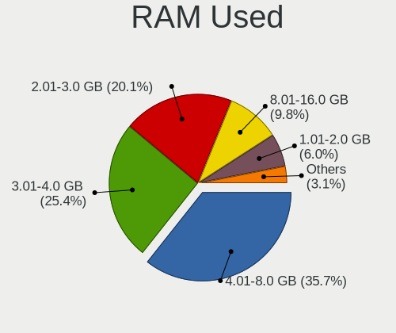
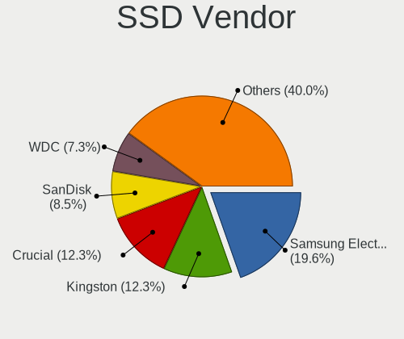
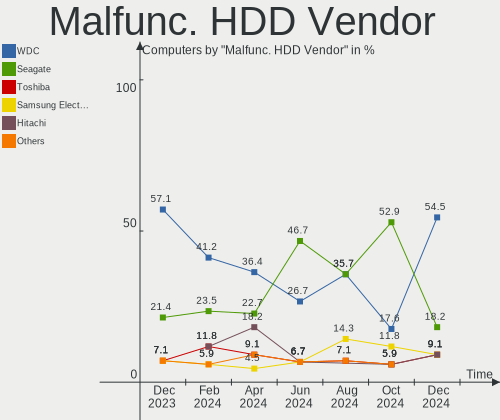
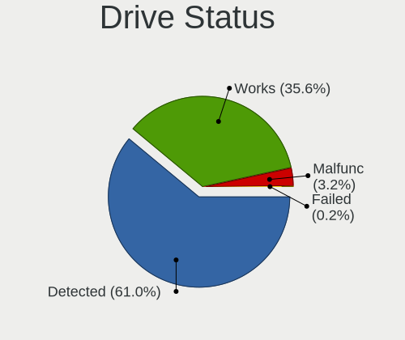
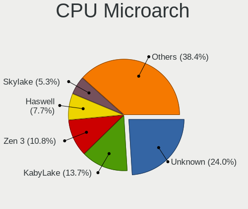

Fedora - Hardware Trends
------------------------

A project to identify most popular hardware characteristics and track their change
over time based on data collected by Linux users at https://Linux-Hardware.org.

Anyone can contribute to this report by the [hw-probe](https://github.com/linuxhw/hw-probe) tool:

    sudo -E hw-probe -all -upload

This is a report for all computer types. See also reports for [desktops](/Dist/Fedora/Desktop/README.md) and [notebooks](/Dist/Fedora/Notebook/README.md).

This report is for one last month. Overall report since the beginning of time: [TestDays](https://github.com/linuxhw/TestDays)

Period: Jul, 2023.

Contents
--------

* [ System ](#system)
  - [ OS                       ](#os)
  - [ OS Family                ](#os-family)
  - [ Kernel                   ](#kernel)
  - [ Kernel Family            ](#kernel-family)
  - [ Kernel Major Ver.        ](#kernel-major-ver)
  - [ Arch                     ](#arch)
  - [ DE                       ](#de)
  - [ Display Server           ](#display-server)
  - [ Display Manager          ](#display-manager)
  - [ OS Lang                  ](#os-lang)
  - [ Boot Mode                ](#boot-mode)
  - [ Filesystem               ](#filesystem)
  - [ Part. scheme             ](#part-scheme)
  - [ Dual Boot with Linux/BSD ](#dual-boot-with-linuxbsd)
  - [ Dual Boot (Win)          ](#dual-boot-win)

* [ Board ](#board)
  - [ Vendor                   ](#vendor)
  - [ Model                    ](#model)
  - [ Model Family             ](#model-family)
  - [ MFG Year                 ](#mfg-year)
  - [ Form Factor              ](#form-factor)
  - [ Secure Boot              ](#secure-boot)
  - [ Coreboot                 ](#coreboot)
  - [ RAM Size                 ](#ram-size)
  - [ RAM Used                 ](#ram-used)
  - [ Total Drives             ](#total-drives)
  - [ Has CD-ROM               ](#has-cd-rom)
  - [ Has Ethernet             ](#has-ethernet)
  - [ Has WiFi                 ](#has-wifi)
  - [ Has Bluetooth            ](#has-bluetooth)

* [ Location ](#location)
  - [ Country                  ](#country)
  - [ City                     ](#city)

* [ Drives ](#drives)
  - [ Drive Vendor             ](#drive-vendor)
  - [ Drive Model              ](#drive-model)
  - [ HDD Vendor               ](#hdd-vendor)
  - [ SSD Vendor               ](#ssd-vendor)
  - [ Drive Kind               ](#drive-kind)
  - [ Drive Connector          ](#drive-connector)
  - [ Drive Size               ](#drive-size)
  - [ Space Total              ](#space-total)
  - [ Space Used               ](#space-used)
  - [ Malfunc. Drives          ](#malfunc-drives)
  - [ Malfunc. Drive Vendor    ](#malfunc-drive-vendor)
  - [ Malfunc. HDD Vendor      ](#malfunc-hdd-vendor)
  - [ Malfunc. Drive Kind      ](#malfunc-drive-kind)
  - [ Failed Drives            ](#failed-drives)
  - [ Failed Drive Vendor      ](#failed-drive-vendor)
  - [ Drive Status             ](#drive-status)

* [ Storage controller ](#storage-controller)
  - [ Storage Vendor           ](#storage-vendor)
  - [ Storage Model            ](#storage-model)
  - [ Storage Kind             ](#storage-kind)

* [ Processor ](#processor)
  - [ CPU Vendor               ](#cpu-vendor)
  - [ CPU Model                ](#cpu-model)
  - [ CPU Model Family         ](#cpu-model-family)
  - [ CPU Cores                ](#cpu-cores)
  - [ CPU Sockets              ](#cpu-sockets)
  - [ CPU Threads              ](#cpu-threads)
  - [ CPU Op-Modes             ](#cpu-op-modes)
  - [ CPU Microcode            ](#cpu-microcode)
  - [ CPU Microarch            ](#cpu-microarch)

* [ Graphics ](#graphics)
  - [ GPU Vendor               ](#gpu-vendor)
  - [ GPU Model                ](#gpu-model)
  - [ GPU Combo                ](#gpu-combo)
  - [ GPU Driver               ](#gpu-driver)
  - [ GPU Memory               ](#gpu-memory)

* [ Monitor ](#monitor)
  - [ Monitor Vendor           ](#monitor-vendor)
  - [ Monitor Model            ](#monitor-model)
  - [ Monitor Resolution       ](#monitor-resolution)
  - [ Monitor Diagonal         ](#monitor-diagonal)
  - [ Monitor Width            ](#monitor-width)
  - [ Aspect Ratio             ](#aspect-ratio)
  - [ Monitor Area             ](#monitor-area)
  - [ Pixel Density            ](#pixel-density)
  - [ Multiple Monitors        ](#multiple-monitors)

* [ Network ](#network)
  - [ Net Controller Vendor    ](#net-controller-vendor)
  - [ Net Controller Model     ](#net-controller-model)
  - [ Wireless Vendor          ](#wireless-vendor)
  - [ Wireless Model           ](#wireless-model)
  - [ Ethernet Vendor          ](#ethernet-vendor)
  - [ Ethernet Model           ](#ethernet-model)
  - [ Net Controller Kind      ](#net-controller-kind)
  - [ Used Controller          ](#used-controller)
  - [ NICs                     ](#nics)
  - [ IPv6                     ](#ipv6)

* [ Bluetooth ](#bluetooth)
  - [ Bluetooth Vendor         ](#bluetooth-vendor)
  - [ Bluetooth Model          ](#bluetooth-model)

* [ Sound ](#sound)
  - [ Sound Vendor             ](#sound-vendor)
  - [ Sound Model              ](#sound-model)

* [ Memory ](#memory)
  - [ Memory Vendor            ](#memory-vendor)
  - [ Memory Model             ](#memory-model)
  - [ Memory Kind              ](#memory-kind)
  - [ Memory Form Factor       ](#memory-form-factor)
  - [ Memory Size              ](#memory-size)
  - [ Memory Speed             ](#memory-speed)

* [ Printers & scanners ](#printers--scanners)
  - [ Printer Vendor           ](#printer-vendor)
  - [ Printer Model            ](#printer-model)
  - [ Scanner Vendor           ](#scanner-vendor)
  - [ Scanner Model            ](#scanner-model)

* [ Camera ](#camera)
  - [ Camera Vendor            ](#camera-vendor)
  - [ Camera Model             ](#camera-model)

* [ Security ](#security)
  - [ Fingerprint Vendor       ](#fingerprint-vendor)
  - [ Fingerprint Model        ](#fingerprint-model)
  - [ Chipcard Vendor          ](#chipcard-vendor)
  - [ Chipcard Model           ](#chipcard-model)

* [ Unsupported ](#unsupported)
  - [ Unsupported Devices      ](#unsupported-devices)
  - [ Unsupported Device Types ](#unsupported-device-types)

System
------

OS
--

Installed operating systems

| Name      | Computers | Percent |
|-----------|-----------|---------|
| Fedora 38 | 450       | 92.78%  |
| Fedora 37 | 26        | 5.36%   |
| Fedora 36 | 3         | 0.62%   |
| Fedora 35 | 2         | 0.41%   |
| Fedora 34 | 2         | 0.41%   |
| Fedora 39 | 1         | 0.21%   |
| Fedora 29 | 1         | 0.21%   |

OS Family
---------

OS without a version

| Name   | Computers | Percent |
|--------|-----------|---------|
| Fedora | 485       | 100%    |

Kernel
------

Version of the Linux kernel

| Version                                            | Computers | Percent |
|----------------------------------------------------|-----------|---------|
| 6.3.12-200.fc38.x86_64                             | 112       | 23.09%  |
| 6.3.8-200.fc38.x86_64                              | 96        | 19.79%  |
| 6.3.11-200.fc38.x86_64                             | 85        | 17.53%  |
| 6.4.4-200.fc38.x86_64                              | 46        | 9.48%   |
| 6.4.6-200.fc38.x86_64                              | 38        | 7.84%   |
| 6.2.9-300.fc38.x86_64                              | 38        | 7.84%   |
| 6.3.8-100.fc37.x86_64                              | 11        | 2.27%   |
| 6.2.15-300.fc38.x86_64                             | 5         | 1.03%   |
| 6.0.7-301.fc37.x86_64                              | 4         | 0.82%   |
| 6.3.10-200.fc38.x86_64                             | 3         | 0.62%   |
| 6.4.6-100.fc37.x86_64                              | 2         | 0.41%   |
| 6.3.7-200.fc38.x86_64                              | 2         | 0.41%   |
| 6.3.12-100.fc37.x86_64                             | 2         | 0.41%   |
| 6.2.9-300.fc38.aarch64                             | 2         | 0.41%   |
| 6.2.15-703.inttf.fc38.x86_64                       | 2         | 0.41%   |
| 6.2.15-200.fc37.x86_64                             | 2         | 0.41%   |
| 6.2.15-100.fc36.x86_64                             | 2         | 0.41%   |
| 6.0.12-100.fc35.x86_64                             | 2         | 0.41%   |
| 5.17.12-100.fc34.x86_64                            | 2         | 0.41%   |
| 6.5.0-0.rc2.20230721gitf7e3a1bafdea.20.fc39.x86_64 | 1         | 0.21%   |
| 6.5.0-0.rc2.17.fc39.x86_64                         | 1         | 0.21%   |
| 6.5.0-0.rc1.200.x13s.fc38.aarch64                  | 1         | 0.21%   |
| 6.5.0-0.rc0.20230703gita901a3568fd2.8.fc39.x86_64  | 1         | 0.21%   |
| 6.4.7-200.fc38.x86_64                              | 1         | 0.21%   |
| 6.4.6-1.surface.fc38.x86_64                        | 1         | 0.21%   |
| 6.4.4-202.fsync.fc38.x86_64                        | 1         | 0.21%   |
| 6.4.4-100.fc37.x86_64                              | 1         | 0.21%   |
| 6.4.2-201.fc38.x86_64                              | 1         | 0.21%   |
| 6.4.0-cb2.0.fc38.x86_64                            | 1         | 0.21%   |
| 6.4.0-66.rog.fc38.x86_64                           | 1         | 0.21%   |
| 6.3.9-1.surface.fc38.x86_64                        | 1         | 0.21%   |
| 6.3.8-400.unixcart.fc38.x86_64                     | 1         | 0.21%   |
| 6.3.6-200.fc38.x86_64                              | 1         | 0.21%   |
| 6.3.3-200.fc38.x86_64                              | 1         | 0.21%   |
| 6.3.13-2.surface.fc38.x86_64                       | 1         | 0.21%   |
| 6.3.11-200.fc38.aarch64                            | 1         | 0.21%   |
| 6.3.1-eupnea                                       | 1         | 0.21%   |
| 6.3.1-200.fc38.x86_64                              | 1         | 0.21%   |
| 6.2.2-301.fc38.x86_64                              | 1         | 0.21%   |
| 6.2.12-200.fc37.x86_64                             | 1         | 0.21%   |

Kernel Family
-------------

Linux kernel without a distro release

| Version | Computers | Percent |
|---------|-----------|---------|
| 6.3.12  | 114       | 23.51%  |
| 6.3.8   | 108       | 22.27%  |
| 6.3.11  | 86        | 17.73%  |
| 6.4.4   | 48        | 9.9%    |
| 6.4.6   | 41        | 8.45%   |
| 6.2.9   | 40        | 8.25%   |
| 6.2.15  | 11        | 2.27%   |
| 6.5.0   | 4         | 0.82%   |
| 6.0.7   | 4         | 0.82%   |
| 6.3.10  | 3         | 0.62%   |
| 6.4.0   | 2         | 0.41%   |
| 6.3.7   | 2         | 0.41%   |
| 6.3.1   | 2         | 0.41%   |
| 6.0.12  | 2         | 0.41%   |
| 5.17.12 | 2         | 0.41%   |
| 6.4.7   | 1         | 0.21%   |
| 6.4.2   | 1         | 0.21%   |
| 6.3.9   | 1         | 0.21%   |
| 6.3.6   | 1         | 0.21%   |
| 6.3.3   | 1         | 0.21%   |
| 6.3.13  | 1         | 0.21%   |
| 6.2.2   | 1         | 0.21%   |
| 6.2.12  | 1         | 0.21%   |
| 6.2.11  | 1         | 0.21%   |
| 6.2.10  | 1         | 0.21%   |
| 6.1.9   | 1         | 0.21%   |
| 6.1.38  | 1         | 0.21%   |
| 6.0.8   | 1         | 0.21%   |
| 6.0.11  | 1         | 0.21%   |
| 5.19.8  | 1         | 0.21%   |
| 5.17.5  | 1         | 0.21%   |

Kernel Major Ver.
-----------------

Linux kernel major version

| Version | Computers | Percent |
|---------|-----------|---------|
| 6.3     | 319       | 65.77%  |
| 6.4     | 93        | 19.18%  |
| 6.2     | 55        | 11.34%  |
| 6.0     | 8         | 1.65%   |
| 6.5     | 4         | 0.82%   |
| 5.17    | 3         | 0.62%   |
| 6.1     | 2         | 0.41%   |
| 5.19    | 1         | 0.21%   |

Arch
----

OS architecture (x86_64, i586, etc.)

| Name    | Computers | Percent |
|---------|-----------|---------|
| x86_64  | 481       | 99.18%  |
| aarch64 | 4         | 0.82%   |

DE
--

Desktop Environment

| Name          | Computers | Percent |
|---------------|-----------|---------|
| GNOME         | 362       | 74.64%  |
| KDE5          | 65        | 13.4%   |
| Unknown       | 14        | 2.89%   |
| XFCE          | 8         | 1.65%   |
| Cinnamon      | 8         | 1.65%   |
| GNOME Classic | 7         | 1.44%   |
| X-Cinnamon    | 6         | 1.24%   |
| sway          | 4         | 0.82%   |
| LXQt          | 2         | 0.41%   |
| Hyprland      | 2         | 0.41%   |
| Budgie        | 2         | 0.41%   |
| Pantheon      | 1         | 0.21%   |
| MATE          | 1         | 0.21%   |
| LXDE          | 1         | 0.21%   |
| KDE4          | 1         | 0.21%   |
| i3            | 1         | 0.21%   |

Display Server
--------------

X11 or Wayland

| Name    | Computers | Percent |
|---------|-----------|---------|
| Wayland | 368       | 75.88%  |
| X11     | 95        | 19.59%  |
| Tty     | 17        | 3.51%   |
| Unknown | 5         | 1.03%   |

Display Manager
---------------

SDDM, LightDM, etc.

| Name    | Computers | Percent |
|---------|-----------|---------|
| Unknown | 302       | 62.27%  |
| GDM     | 119       | 24.54%  |
| SDDM    | 36        | 7.42%   |
| LightDM | 27        | 5.57%   |
| LXDM    | 1         | 0.21%   |

OS Lang
-------

Language

| Lang    | Computers | Percent |
|---------|-----------|---------|
| en_US   | 247       | 50.93%  |
| en_GB   | 39        | 8.04%   |
| pt_BR   | 22        | 4.54%   |
| en_AU   | 22        | 4.54%   |
| de_DE   | 22        | 4.54%   |
| ru_RU   | 19        | 3.92%   |
| it_IT   | 11        | 2.27%   |
| fr_FR   | 9         | 1.86%   |
| es_ES   | 9         | 1.86%   |
| en_CA   | 9         | 1.86%   |
| en_IN   | 8         | 1.65%   |
| pl_PL   | 6         | 1.24%   |
| es_MX   | 4         | 0.82%   |
| zh_CN   | 3         | 0.62%   |
| es_CO   | 3         | 0.62%   |
| es_CL   | 3         | 0.62%   |
| en_IE   | 3         | 0.62%   |
| en_DK   | 3         | 0.62%   |
| cs_CZ   | 3         | 0.62%   |
| Unknown | 3         | 0.62%   |
| sv_SE   | 2         | 0.41%   |
| pt_PT   | 2         | 0.41%   |
| ja_JP   | 2         | 0.41%   |
| es_PE   | 2         | 0.41%   |
| en_PH   | 2         | 0.41%   |
| en_NZ   | 2         | 0.41%   |
| da_DK   | 2         | 0.41%   |
| ca_ES   | 2         | 0.41%   |
| zh_TW   | 1         | 0.21%   |
| tr_TR   | 1         | 0.21%   |
| sk_SK   | 1         | 0.21%   |
| ru_UA   | 1         | 0.21%   |
| nl_NL   | 1         | 0.21%   |
| id_ID   | 1         | 0.21%   |
| ia_FR   | 1         | 0.21%   |
| hu_HU   | 1         | 0.21%   |
| fr_CA   | 1         | 0.21%   |
| fr_BE   | 1         | 0.21%   |
| fi_FI   | 1         | 0.21%   |
| es_UY   | 1         | 0.21%   |

Boot Mode
---------

EFI or BIOS

| Mode | Computers | Percent |
|------|-----------|---------|
| EFI  | 392       | 80.82%  |
| BIOS | 93        | 19.18%  |

Filesystem
----------

Type of filesystem

| Type    | Computers | Percent |
|---------|-----------|---------|
| Btrfs   | 376       | 77.53%  |
| Ext4    | 87        | 17.94%  |
| Xfs     | 21        | 4.33%   |
| Unknown | 1         | 0.21%   |

Part. scheme
------------

Scheme of partitioning

| Type    | Computers | Percent |
|---------|-----------|---------|
| Unknown | 292       | 60.21%  |
| GPT     | 174       | 35.88%  |
| MBR     | 19        | 3.92%   |

Dual Boot with Linux/BSD
------------------------

Hosting more than one Linux/BSD

| Dual boot | Computers | Percent |
|-----------|-----------|---------|
| No        | 451       | 92.99%  |
| Yes       | 34        | 7.01%   |

Dual Boot (Win)
---------------

Hosting Linux and Windows

| Dual boot | Computers | Percent |
|-----------|-----------|---------|
| No        | 410       | 84.54%  |
| Yes       | 75        | 15.46%  |

Board
-----

Vendor
------

Motherboard manufacturer

| Name                                 | Computers | Percent |
|--------------------------------------|-----------|---------|
| Lenovo                               | 96        | 19.79%  |
| ASUSTek Computer                     | 72        | 14.85%  |
| Hewlett-Packard                      | 64        | 13.2%   |
| MSI                                  | 55        | 11.34%  |
| Dell                                 | 52        | 10.72%  |
| Gigabyte Technology                  | 33        | 6.8%    |
| Apple                                | 20        | 4.12%   |
| ASRock                               | 14        | 2.89%   |
| Acer                                 | 10        | 2.06%   |
| HUAWEI                               | 9         | 1.86%   |
| Samsung Electronics                  | 7         | 1.44%   |
| Microsoft                            | 5         | 1.03%   |
| Intel                                | 4         | 0.82%   |
| Fujitsu                              | 4         | 0.82%   |
| AZW                                  | 4         | 0.82%   |
| Toshiba                              | 2         | 0.41%   |
| Timi                                 | 2         | 0.41%   |
| Shenzhen Meigao Electronic Equipment | 2         | 0.41%   |
| raspberrypi,4-model-b                | 2         | 0.41%   |
| Pegatron                             | 2         | 0.41%   |
| Notebook                             | 2         | 0.41%   |
| Google                               | 2         | 0.41%   |
| ECS                                  | 2         | 0.41%   |
| Unknown                              | 2         | 0.41%   |
| ZOTAC                                | 1         | 0.21%   |
| Sony                                 | 1         | 0.21%   |
| Schenker                             | 1         | 0.21%   |
| Raspberry Pi Foundation              | 1         | 0.21%   |
| MACHINIST                            | 1         | 0.21%   |
| LattePanda                           | 1         | 0.21%   |
| Kupi deshego edition                 | 1         | 0.21%   |
| Kllisre                              | 1         | 0.21%   |
| Huanan                               | 1         | 0.21%   |
| GPD                                  | 1         | 0.21%   |
| Gateway                              | 1         | 0.21%   |
| GALAX                                | 1         | 0.21%   |
| Fujitsu Siemens                      | 1         | 0.21%   |
| Compaq                               | 1         | 0.21%   |
| AYANEO                               | 1         | 0.21%   |
| Avell High Performance               | 1         | 0.21%   |

Model
-----

Motherboard model

| Name                                        | Computers | Percent |
|---------------------------------------------|-----------|---------|
| HUAWEI NBLB-WAX9N                           | 3         | 0.62%   |
| Dell OptiPlex 7010                          | 3         | 0.62%   |
| Apple MacBookPro9,2                         | 3         | 0.62%   |
| Unknown                                     | 3         | 0.62%   |
| Timi Mi NoteBook Ultra                      | 2         | 0.41%   |
| MSI MS-7D25                                 | 2         | 0.41%   |
| MSI MS-7C96                                 | 2         | 0.41%   |
| MSI MS-7C52                                 | 2         | 0.41%   |
| MSI MS-7C37                                 | 2         | 0.41%   |
| MSI MS-7C02                                 | 2         | 0.41%   |
| MSI MS-7B85                                 | 2         | 0.41%   |
| MSI MS-7B17                                 | 2         | 0.41%   |
| Microsoft Surface Pro 7                     | 2         | 0.41%   |
| Lenovo ThinkBook 16 G4+ IAP 21CY            | 2         | 0.41%   |
| Lenovo G50-70 20351                         | 2         | 0.41%   |
| HP Z800 Workstation                         | 2         | 0.41%   |
| HP ProBook 445 G8 Notebook PC               | 2         | 0.41%   |
| HP Notebook                                 | 2         | 0.41%   |
| HP Laptop 15-dw0xxx                         | 2         | 0.41%   |
| HP EliteBook 840 G6                         | 2         | 0.41%   |
| Gigabyte J1900M-D2P                         | 2         | 0.41%   |
| Gigabyte B550 GAMING X V2                   | 2         | 0.41%   |
| Dell XPS 13 9370                            | 2         | 0.41%   |
| Dell Inspiron 5577                          | 2         | 0.41%   |
| AZW SER                                     | 2         | 0.41%   |
| ASUS TUF Gaming X670E-PLUS WIFI             | 2         | 0.41%   |
| ASUS PRIME X570-P                           | 2         | 0.41%   |
| ASUS All Series                             | 2         | 0.41%   |
| Acer Aspire V3-571                          | 2         | 0.41%   |
| ZOTAC ZBOX-ID88/ID89/ID90                   | 1         | 0.21%   |
| Toshiba TECRA A50-A                         | 1         | 0.21%   |
| Toshiba Satellite C70-B                     | 1         | 0.21%   |
| Sony SVE14A2V2RS                            | 1         | 0.21%   |
| Shenzhen Meigao Electronic Equipment UM690  | 1         | 0.21%   |
| Shenzhen Meigao Electronic Equipment HX90G  | 1         | 0.21%   |
| Schenker VIA 15 Pro                         | 1         | 0.21%   |
| Samsung RV411/RV511/E3511/S3511/RV711/E3411 | 1         | 0.21%   |
| Samsung R580                                | 1         | 0.21%   |
| Samsung 950XDB/951XDB/950XDY                | 1         | 0.21%   |
| Samsung 950XCJ/951XCJ/950XCR                | 1         | 0.21%   |

Model Family
------------

Motherboard model prefix

| Name                            | Computers | Percent |
|---------------------------------|-----------|---------|
| Lenovo ThinkPad                 | 47        | 9.69%   |
| Dell Inspiron                   | 19        | 3.92%   |
| Lenovo IdeaPad                  | 16        | 3.3%    |
| ASUS ROG                        | 16        | 3.3%    |
| ASUS VivoBook                   | 13        | 2.68%   |
| ASUS PRIME                      | 13        | 2.68%   |
| Dell Latitude                   | 12        | 2.47%   |
| HP Pavilion                     | 10        | 2.06%   |
| Acer Aspire                     | 9         | 1.86%   |
| Lenovo Yoga                     | 8         | 1.65%   |
| HP EliteBook                    | 7         | 1.44%   |
| Dell XPS                        | 7         | 1.44%   |
| ASUS TUF                        | 7         | 1.44%   |
| HP ProBook                      | 6         | 1.24%   |
| HP Laptop                       | 6         | 1.24%   |
| HP ENVY                         | 6         | 1.24%   |
| Dell OptiPlex                   | 6         | 1.24%   |
| Microsoft Surface               | 5         | 1.03%   |
| Lenovo ThinkCentre              | 5         | 1.03%   |
| Lenovo ThinkBook                | 5         | 1.03%   |
| Lenovo Legion                   | 4         | 0.82%   |
| HP EliteDesk                    | 4         | 0.82%   |
| HP Compaq                       | 4         | 0.82%   |
| Dell Precision                  | 4         | 0.82%   |
| HUAWEI NBLB-WAX9N               | 3         | 0.62%   |
| Apple MacBookPro9               | 3         | 0.62%   |
| Unknown                         | 3         | 0.62%   |
| Timi Mi                         | 2         | 0.41%   |
| raspberrypi,4-model-b Raspberry | 2         | 0.41%   |
| MSI Summit                      | 2         | 0.41%   |
| MSI MS-7D25                     | 2         | 0.41%   |
| MSI MS-7C96                     | 2         | 0.41%   |
| MSI MS-7C52                     | 2         | 0.41%   |
| MSI MS-7C37                     | 2         | 0.41%   |
| MSI MS-7C02                     | 2         | 0.41%   |
| MSI MS-7B85                     | 2         | 0.41%   |
| MSI MS-7B17                     | 2         | 0.41%   |
| MSI Katana                      | 2         | 0.41%   |
| Lenovo V15                      | 2         | 0.41%   |
| Lenovo G50-70                   | 2         | 0.41%   |

MFG Year
--------

Motherboard manufacture year

| Year | Computers | Percent |
|------|-----------|---------|
| 2021 | 77        | 15.88%  |
| 2022 | 64        | 13.2%   |
| 2020 | 60        | 12.37%  |
| 2019 | 50        | 10.31%  |
| 2018 | 40        | 8.25%   |
| 2013 | 30        | 6.19%   |
| 2015 | 29        | 5.98%   |
| 2017 | 23        | 4.74%   |
| 2012 | 23        | 4.74%   |
| 2014 | 16        | 3.3%    |
| 2010 | 15        | 3.09%   |
| 2023 | 14        | 2.89%   |
| 2016 | 14        | 2.89%   |
| 2011 | 13        | 2.68%   |
| 2009 | 7         | 1.44%   |
| 2008 | 5         | 1.03%   |
| 2007 | 3         | 0.62%   |
| 2006 | 1         | 0.21%   |
| 2005 | 1         | 0.21%   |

Form Factor
-----------

Physical design of the computer

| Name           | Computers | Percent |
|----------------|-----------|---------|
| Notebook       | 271       | 55.88%  |
| Desktop        | 168       | 34.64%  |
| Convertible    | 13        | 2.68%   |
| Mini pc        | 12        | 2.47%   |
| Tablet         | 8         | 1.65%   |
| All in one     | 7         | 1.44%   |
| System on chip | 3         | 0.62%   |
| Server         | 3         | 0.62%   |

Secure Boot
-----------

Enabled or disabled

| State    | Computers | Percent |
|----------|-----------|---------|
| Disabled | 370       | 76.29%  |
| Enabled  | 115       | 23.71%  |

Coreboot
--------

Have coreboot on board

| Used | Computers | Percent |
|------|-----------|---------|
| No   | 483       | 99.59%  |
| Yes  | 2         | 0.41%   |

RAM Size
--------

Total RAM memory

| Size in GB  | Computers | Percent |
|-------------|-----------|---------|
| 16.01-24.0  | 124       | 25.57%  |
| 4.01-8.0    | 108       | 22.27%  |
| 32.01-64.0  | 85        | 17.53%  |
| 8.01-16.0   | 79        | 16.29%  |
| 3.01-4.0    | 36        | 7.42%   |
| 64.01-256.0 | 27        | 5.57%   |
| 24.01-32.0  | 18        | 3.71%   |
| 1.01-2.0    | 7         | 1.44%   |
| 2.01-3.0    | 1         | 0.21%   |

RAM Used
--------

Used RAM memory

| Used GB    | Computers | Percent |
|------------|-----------|---------|
| 4.01-8.0   | 132       | 27.22%  |
| 3.01-4.0   | 123       | 25.36%  |
| 2.01-3.0   | 123       | 25.36%  |
| 8.01-16.0  | 48        | 9.9%    |
| 1.01-2.0   | 46        | 9.48%   |
| 0.51-1.0   | 8         | 1.65%   |
| 16.01-24.0 | 4         | 0.82%   |
| 24.01-32.0 | 1         | 0.21%   |

Total Drives
------------

Number of drives on board

| Drives | Computers | Percent |
|--------|-----------|---------|
| 1      | 276       | 56.91%  |
| 2      | 128       | 26.39%  |
| 3      | 44        | 9.07%   |
| 4      | 20        | 4.12%   |
| 5      | 6         | 1.24%   |
| 7      | 4         | 0.82%   |
| 6      | 4         | 0.82%   |
| 10     | 1         | 0.21%   |
| 8      | 1         | 0.21%   |
| 0      | 1         | 0.21%   |

Has CD-ROM
----------

Has CD-ROM on board

| Presented | Computers | Percent |
|-----------|-----------|---------|
| No        | 377       | 77.73%  |
| Yes       | 108       | 22.27%  |

Has Ethernet
------------

Has Ethernet on board

| Presented | Computers | Percent |
|-----------|-----------|---------|
| Yes       | 391       | 80.62%  |
| No        | 94        | 19.38%  |

Has WiFi
--------

Has WiFi module

| Presented | Computers | Percent |
|-----------|-----------|---------|
| Yes       | 390       | 80.41%  |
| No        | 95        | 19.59%  |

Has Bluetooth
-------------

Has Bluetooth module

| Presented | Computers | Percent |
|-----------|-----------|---------|
| Yes       | 348       | 71.75%  |
| No        | 137       | 28.25%  |

Location
--------

Country
-------

Geographic location (country)

| Country      | Computers | Percent |
|--------------|-----------|---------|
| USA          | 93        | 19.18%  |
| Germany      | 39        | 8.04%   |
| Brazil       | 31        | 6.39%   |
| Russia       | 28        | 5.77%   |
| UK           | 25        | 5.15%   |
| Australia    | 25        | 5.15%   |
| Italy        | 24        | 4.95%   |
| India        | 17        | 3.51%   |
| Netherlands  | 15        | 3.09%   |
| Spain        | 14        | 2.89%   |
| Canada       | 14        | 2.89%   |
| Mexico       | 10        | 2.06%   |
| France       | 9         | 1.86%   |
| Belgium      | 8         | 1.65%   |
| Poland       | 7         | 1.44%   |
| Norway       | 7         | 1.44%   |
| Czechia      | 7         | 1.44%   |
| Turkey       | 6         | 1.24%   |
| Sweden       | 6         | 1.24%   |
| Colombia     | 6         | 1.24%   |
| Bulgaria     | 6         | 1.24%   |
| Thailand     | 5         | 1.03%   |
| Indonesia    | 5         | 1.03%   |
| Denmark      | 5         | 1.03%   |
| Austria      | 5         | 1.03%   |
| Portugal     | 4         | 0.82%   |
| Chile        | 4         | 0.82%   |
| Switzerland  | 3         | 0.62%   |
| Singapore    | 3         | 0.62%   |
| Ireland      | 3         | 0.62%   |
| China        | 3         | 0.62%   |
| Argentina    | 3         | 0.62%   |
| Uzbekistan   | 2         | 0.41%   |
| Uruguay      | 2         | 0.41%   |
| Taiwan       | 2         | 0.41%   |
| Sri Lanka    | 2         | 0.41%   |
| South Africa | 2         | 0.41%   |
| Slovakia     | 2         | 0.41%   |
| Serbia       | 2         | 0.41%   |
| Saudi Arabia | 2         | 0.41%   |

City
----

Geographic location (city)

| City          | Computers | Percent |
|---------------|-----------|---------|
| Sydney        | 13        | 2.68%   |
| Moscow        | 7         | 1.44%   |
| Vienna        | 5         | 1.03%   |
| Brussels      | 5         | 1.03%   |
| Sofia         | 4         | 0.82%   |
| Delhi         | 4         | 0.82%   |
| Bangkok       | 4         | 0.82%   |
| Amsterdam     | 4         | 0.82%   |
| Victoria      | 3         | 0.62%   |
| St Petersburg | 3         | 0.62%   |
| Singapore     | 3         | 0.62%   |
| Seattle       | 3         | 0.62%   |
| Sao Paulo     | 3         | 0.62%   |
| Prague        | 3         | 0.62%   |
| Paris         | 3         | 0.62%   |
| Montreal      | 3         | 0.62%   |
| Milan         | 3         | 0.62%   |
| Madrid        | 3         | 0.62%   |
| Los Angeles   | 3         | 0.62%   |
| Lisbon        | 3         | 0.62%   |
| Düsseldorf   | 3         | 0.62%   |
| Brisbane      | 3         | 0.62%   |
| Atlanta       | 3         | 0.62%   |
| Wiesbaden     | 2         | 0.41%   |
| Warsaw        | 2         | 0.41%   |
| Tunja         | 2         | 0.41%   |
| Tokyo         | 2         | 0.41%   |
| The Hague     | 2         | 0.41%   |
| Tashkent      | 2         | 0.41%   |
| Stockholm     | 2         | 0.41%   |
| St Louis      | 2         | 0.41%   |
| Sheffield     | 2         | 0.41%   |
| Seregno       | 2         | 0.41%   |
| Saratov       | 2         | 0.41%   |
| Santiago      | 2         | 0.41%   |
| Rostov-on-Don | 2         | 0.41%   |
| Riyadh        | 2         | 0.41%   |
| Rio Grande    | 2         | 0.41%   |
| Ponferrada    | 2         | 0.41%   |
| New York      | 2         | 0.41%   |

Drives
------

Drive Vendor
------------

Hard drive vendors

| Vendor                       | Computers | Drives | Percent |
|------------------------------|-----------|--------|---------|
| Samsung Electronics          | 167       | 212    | 22.85%  |
| Seagate                      | 66        | 76     | 9.03%   |
| SanDisk                      | 66        | 70     | 9.03%   |
| WDC                          | 61        | 81     | 8.34%   |
| Toshiba                      | 38        | 47     | 5.2%    |
| Kingston                     | 35        | 39     | 4.79%   |
| Intel                        | 28        | 34     | 3.83%   |
| Crucial                      | 28        | 36     | 3.83%   |
| SK hynix                     | 22        | 22     | 3.01%   |
| Micron Technology            | 22        | 22     | 3.01%   |
| Unknown                      | 16        | 17     | 2.19%   |
| Phison Electronics           | 13        | 14     | 1.78%   |
| Silicon Motion               | 11        | 12     | 1.5%    |
| Micron/Crucial Technology    | 11        | 11     | 1.5%    |
| A-DATA Technology            | 11        | 12     | 1.5%    |
| Hitachi                      | 10        | 11     | 1.37%   |
| KIOXIA                       | 8         | 8      | 1.09%   |
| Apple                        | 8         | 10     | 1.09%   |
| Kingston Technology Company  | 7         | 7      | 0.96%   |
| JMicron Technology           | 6         | 7      | 0.82%   |
| HGST                         | 6         | 6      | 0.82%   |
| China                        | 6         | 6      | 0.82%   |
| PNY                          | 5         | 5      | 0.68%   |
| SPCC                         | 4         | 4      | 0.55%   |
| OCZ                          | 4         | 4      | 0.55%   |
| Transcend                    | 3         | 3      | 0.41%   |
| Realtek Semiconductor        | 3         | 3      | 0.41%   |
| Patriot                      | 3         | 4      | 0.41%   |
| MAXIO Technology (Hangzhou)  | 3         | 4      | 0.41%   |
| LITEONIT                     | 3         | 3      | 0.41%   |
| Lenovo                       | 3         | 3      | 0.41%   |
| Unknown                      | 3         | 3      | 0.41%   |
| Shenzhen Longsys Electronics | 2         | 2      | 0.27%   |
| SABRENT                      | 2         | 2      | 0.27%   |
| NGFF                         | 2         | 2      | 0.27%   |
| Maxtor                       | 2         | 2      | 0.27%   |
| KingSpec                     | 2         | 2      | 0.27%   |
| KingFast                     | 2         | 2      | 0.27%   |
| Intenso                      | 2         | 2      | 0.27%   |
| HS-SSD-C100                  | 2         | 2      | 0.27%   |

Drive Model
-----------

Hard drive models

| Model                                                 | Computers | Percent |
|-------------------------------------------------------|-----------|---------|
| Samsung NVMe SSD Controller SM981/PM981/PM983 500GB   | 38        | 4.75%   |
| Samsung NVMe SSD Controller PM9A1/PM9A3/980PRO 1TB    | 26        | 3.25%   |
| Samsung NVMe SSD Controller SM961/PM961/SM963 256GB   | 12        | 1.5%    |
| Silicon Motion SM2263EN/SM2263XT SSD Controller 500GB | 9         | 1.13%   |
| Sandisk WD Blue SN550 NVMe SSD 250GB                  | 8         | 1%      |
| Samsung SSD 850 EVO 500GB                             | 8         | 1%      |
| Samsung SSD 980 1TB                                   | 7         | 0.88%   |
| Micron/Crucial P2 NVMe PCIe SSD 1TB                   | 7         | 0.88%   |
| Crucial CT1000MX500SSD1 1TB                           | 7         | 0.88%   |
| Toshiba XG6 NVMe SSD Controller 512GB                 | 6         | 0.75%   |
| Toshiba MQ01ABD100 1TB                                | 6         | 0.75%   |
| Sandisk WD Black SN750 / PC SN730 NVMe SSD 1024GB     | 6         | 0.75%   |
| Kingston SA400S37480G 480GB SSD                       | 6         | 0.75%   |
| Intel SSD 660P Series 1024GB                          | 6         | 0.75%   |
| Unknown MMC Card  64GB                                | 5         | 0.63%   |
| Seagate ST1000LM035-1RK172 1TB                        | 5         | 0.63%   |
| Samsung SSD 860 EVO 500GB                             | 5         | 0.63%   |
| Samsung SSD 860 EVO 1TB                               | 5         | 0.63%   |
| Samsung SSD 850 EVO 250GB                             | 5         | 0.63%   |
| Phison PS5013 E13 NVMe Controller 256GB               | 5         | 0.63%   |
| Phison E12 NVMe Controller 2TB                        | 5         | 0.63%   |
| Kingston SV300S37A240G 240GB SSD                      | 5         | 0.63%   |
| Unknown MMC Card  128GB                               | 4         | 0.5%    |
| Seagate ST2000DM001-1ER164 2TB                        | 4         | 0.5%    |
| Seagate ST1000DM010-2EP102 1TB                        | 4         | 0.5%    |
| Sandisk WD Black SN850 1TB                            | 4         | 0.5%    |
| Samsung SSD 870 EVO 1TB                               | 4         | 0.5%    |
| Kingston SA400S37240G 240GB SSD                       | 4         | 0.5%    |
| JMicron Generic 512GB                                 | 4         | 0.5%    |
| Intel SSDPEKNU512GZ 512GB                             | 4         | 0.5%    |
| Crucial CT500MX500SSD1 500GB                          | 4         | 0.5%    |
| WDC WDS240G2G0A-00JH30 240GB SSD                      | 3         | 0.38%   |
| WDC WD10JPVX-60JC3T0 1TB                              | 3         | 0.38%   |
| Unknown SD/MMC/MS PRO 128GB                           | 3         | 0.38%   |
| Toshiba DT01ACA100 1TB                                | 3         | 0.38%   |
| SK hynix BC501 NVMe Solid State Drive 512GB           | 3         | 0.38%   |
| Seagate ST500DM002-1BD142 500GB                       | 3         | 0.38%   |
| Seagate ST2000DM008-2FR102 2TB                        | 3         | 0.38%   |
| Sandisk WD_BLACK SN770 1TB                            | 3         | 0.38%   |
| Sandisk WD Blue SN500 / PC SN520 NVMe SSD 512GB       | 3         | 0.38%   |

HDD Vendor
----------

Hard disk drive vendors

| Vendor              | Computers | Drives | Percent |
|---------------------|-----------|--------|---------|
| Seagate             | 64        | 74     | 35.96%  |
| WDC                 | 51        | 67     | 28.65%  |
| Toshiba             | 25        | 34     | 14.04%  |
| Hitachi             | 10        | 11     | 5.62%   |
| Samsung Electronics | 6         | 6      | 3.37%   |
| HGST                | 6         | 6      | 3.37%   |
| JMicron Technology  | 5         | 5      | 2.81%   |
| Unknown             | 4         | 5      | 2.25%   |
| Apple               | 3         | 3      | 1.69%   |
| Maxtor              | 2         | 2      | 1.12%   |
| QNAP                | 1         | 4      | 0.56%   |
| IB                  | 1         | 2      | 0.56%   |

SSD Vendor
----------

Solid state drive vendors

| Vendor              | Computers | Drives | Percent |
|---------------------|-----------|--------|---------|
| Samsung Electronics | 63        | 80     | 27.75%  |
| Crucial             | 28        | 35     | 12.33%  |
| Kingston            | 23        | 25     | 10.13%  |
| SanDisk             | 16        | 17     | 7.05%   |
| WDC                 | 13        | 13     | 5.73%   |
| Intel               | 8         | 12     | 3.52%   |
| A-DATA Technology   | 8         | 9      | 3.52%   |
| Apple               | 7         | 7      | 3.08%   |
| China               | 6         | 6      | 2.64%   |
| PNY                 | 5         | 5      | 2.2%    |
| SPCC                | 4         | 4      | 1.76%   |
| OCZ                 | 4         | 4      | 1.76%   |
| Transcend           | 3         | 3      | 1.32%   |
| Toshiba             | 3         | 3      | 1.32%   |
| Patriot             | 3         | 4      | 1.32%   |
| Micron Technology   | 3         | 3      | 1.32%   |
| LITEONIT            | 3         | 3      | 1.32%   |
| Unknown             | 3         | 3      | 1.32%   |
| NGFF                | 2         | 2      | 0.88%   |
| Intenso             | 2         | 2      | 0.88%   |
| Hewlett-Packard     | 2         | 2      | 0.88%   |
| ZOTAC               | 1         | 1      | 0.44%   |
| YS                  | 1         | 1      | 0.44%   |
| Supersonic          | 1         | 1      | 0.44%   |
| Smartbuy            | 1         | 1      | 0.44%   |
| SK hynix            | 1         | 1      | 0.44%   |
| Ramaxel Technology  | 1         | 1      | 0.44%   |
| Plextor             | 1         | 1      | 0.44%   |
| Netac               | 1         | 1      | 0.44%   |
| MSI                 | 1         | 1      | 0.44%   |
| MaxDigital          | 1         | 1      | 0.44%   |
| LITEON              | 1         | 1      | 0.44%   |
| Lexar               | 1         | 1      | 0.44%   |
| Lenovo              | 1         | 1      | 0.44%   |
| KUIJIA              | 1         | 1      | 0.44%   |
| KingSpec            | 1         | 1      | 0.44%   |
| GOODRAM             | 1         | 1      | 0.44%   |
| EYOTA               | 1         | 1      | 0.44%   |
| Acer                | 1         | 1      | 0.44%   |

Drive Kind
----------

HDD or SSD

| Kind    | Computers | Drives | Percent |
|---------|-----------|--------|---------|
| NVMe    | 286       | 342    | 43.27%  |
| SSD     | 196       | 260    | 29.65%  |
| HDD     | 149       | 219    | 22.54%  |
| Unknown | 18        | 18     | 2.72%   |
| MMC     | 12        | 12     | 1.82%   |

Drive Connector
---------------

SATA, SAS, NVMe, etc.

| Type | Computers | Drives | Percent |
|------|-----------|--------|---------|
| NVMe | 284       | 340    | 47.41%  |
| SATA | 273       | 463    | 45.58%  |
| SAS  | 30        | 36     | 5.01%   |
| MMC  | 12        | 12     | 2%      |

Drive Size
----------

Size of hard drive

| Size in TB | Computers | Drives | Percent |
|------------|-----------|--------|---------|
| 0.01-0.5   | 192       | 257    | 52.46%  |
| 0.51-1.0   | 114       | 135    | 31.15%  |
| 1.01-2.0   | 35        | 47     | 9.56%   |
| 4.01-10.0  | 10        | 20     | 2.73%   |
| 3.01-4.0   | 8         | 11     | 2.19%   |
| 2.01-3.0   | 7         | 9      | 1.91%   |

Space Total
-----------

Amount of disk space available on the file system

| Size in GB     | Computers | Percent |
|----------------|-----------|---------|
| 501-1000       | 102       | 21.03%  |
| 1001-2000      | 91        | 18.76%  |
| 251-500        | 89        | 18.35%  |
| 101-250        | 60        | 12.37%  |
| More than 3000 | 35        | 7.22%   |
| 1-20           | 35        | 7.22%   |
| Unknown        | 29        | 5.98%   |
| 2001-3000      | 19        | 3.92%   |
| 51-100         | 17        | 3.51%   |
| 21-50          | 7         | 1.44%   |
| 0              | 1         | 0.21%   |

Space Used
----------

Amount of used disk space

| Used GB        | Computers | Percent |
|----------------|-----------|---------|
| 1-20           | 120       | 24.74%  |
| 21-50          | 87        | 17.94%  |
| 101-250        | 76        | 15.67%  |
| 51-100         | 54        | 11.13%  |
| 251-500        | 48        | 9.9%    |
| 501-1000       | 32        | 6.6%    |
| Unknown        | 29        | 5.98%   |
| 1001-2000      | 19        | 3.92%   |
| More than 3000 | 10        | 2.06%   |
| 2001-3000      | 9         | 1.86%   |
| 0              | 1         | 0.21%   |

Malfunc. Drives
---------------

Drive models with a malfunction

| Model                                                          | Computers | Drives | Percent |
|----------------------------------------------------------------|-----------|--------|---------|
| YS SSD 240GB                                                   | 1         | 1      | 4%      |
| WDC WD10EZRZ-00HTKB0 1TB                                       | 1         | 1      | 4%      |
| WDC WD10EADS-65M2B0 1TB                                        | 1         | 1      | 4%      |
| WDC WD1002FAEX-00Z3A0 1TB                                      | 1         | 1      | 4%      |
| Toshiba MQ01ABD100 1TB                                         | 1         | 1      | 4%      |
| Seagate ST3320613AS 320GB                                      | 1         | 1      | 4%      |
| Seagate ST31000524AS 1TB                                       | 1         | 1      | 4%      |
| Seagate ST3000DM001-1CH166 3TB                                 | 1         | 1      | 4%      |
| SanDisk iSSD P4 8GB                                            | 1         | 1      | 4%      |
| Samsung Electronics SSD 870 EVO 250GB                          | 1         | 1      | 4%      |
| Samsung Electronics SSD 850 EVO 250GB                          | 1         | 2      | 4%      |
| Samsung Electronics NVMe SSD Controller PM9A1/PM9A3/980PRO 1TB | 1         | 1      | 4%      |
| Samsung Electronics HD322GJ 320GB                              | 1         | 1      | 4%      |
| Samsung Electronics HD154UI 1TB                                | 1         | 1      | 4%      |
| Micron Technology 1100 SATA 256GB SSD                          | 1         | 1      | 4%      |
| Maxtor 6Y080L0 82GB                                            | 1         | 1      | 4%      |
| LITEONIT LMT-256M3M 256GB SSD                                  | 1         | 1      | 4%      |
| LITEON CV8-8E128-HP 128GB SSD                                  | 1         | 1      | 4%      |
| Kingston SA400S37480G 480GB SSD                                | 1         | 1      | 4%      |
| Kingston RBU-SNS8350DES3128GP 128GB SSD                        | 1         | 1      | 4%      |
| Intel SSDSC2CT120A3 120GB                                      | 1         | 1      | 4%      |
| Intel SSDSC2BF180A5H SED 180GB                                 | 1         | 1      | 4%      |
| HGST HTS725050A7E630 500GB                                     | 1         | 1      | 4%      |
| HGST HTS721010A9E630 1TB                                       | 1         | 1      | 4%      |
| Crucial CT240M500SSD 240GB                                     | 1         | 1      | 4%      |

Malfunc. Drive Vendor
---------------------

Vendors of faulty drives

| Vendor              | Computers | Drives | Percent |
|---------------------|-----------|--------|---------|
| Samsung Electronics | 5         | 6      | 20%     |
| WDC                 | 3         | 3      | 12%     |
| Seagate             | 3         | 3      | 12%     |
| Kingston            | 2         | 2      | 8%      |
| Intel               | 2         | 2      | 8%      |
| HGST                | 2         | 2      | 8%      |
| YS                  | 1         | 1      | 4%      |
| Toshiba             | 1         | 1      | 4%      |
| SanDisk             | 1         | 1      | 4%      |
| Micron Technology   | 1         | 1      | 4%      |
| Maxtor              | 1         | 1      | 4%      |
| LITEONIT            | 1         | 1      | 4%      |
| LITEON              | 1         | 1      | 4%      |
| Crucial             | 1         | 1      | 4%      |

Malfunc. HDD Vendor
-------------------

Vendors of faulty HDD drives

| Vendor              | Computers | Drives | Percent |
|---------------------|-----------|--------|---------|
| WDC                 | 3         | 3      | 25%     |
| Seagate             | 3         | 3      | 25%     |
| Samsung Electronics | 2         | 2      | 16.67%  |
| HGST                | 2         | 2      | 16.67%  |
| Toshiba             | 1         | 1      | 8.33%   |
| Maxtor              | 1         | 1      | 8.33%   |

Malfunc. Drive Kind
-------------------

Kinds of faulty drives

| Kind | Computers | Drives | Percent |
|------|-----------|--------|---------|
| SSD  | 12        | 13     | 48%     |
| HDD  | 12        | 12     | 48%     |
| NVMe | 1         | 1      | 4%      |

Failed Drives
-------------

Failed drive models

Zero info for selected period =(

Failed Drive Vendor
-------------------

Failed drive vendors

Zero info for selected period =(

Drive Status
------------

Number of failed and malfunc. drives

| Status   | Computers | Drives | Percent |
|----------|-----------|--------|---------|
| Detected | 308       | 532    | 59.92%  |
| Works    | 183       | 293    | 35.6%   |
| Malfunc  | 23        | 26     | 4.47%   |

Storage controller
------------------

Storage Vendor
--------------

Storage controller vendors

| Vendor                                  | Computers | Percent |
|-----------------------------------------|-----------|---------|
| Intel                                   | 265       | 38.29%  |
| Samsung Electronics                     | 112       | 16.18%  |
| AMD                                     | 104       | 15.03%  |
| SanDisk                                 | 51        | 7.37%   |
| SK hynix                                | 21        | 3.03%   |
| Kingston Technology Company             | 20        | 2.89%   |
| Micron Technology                       | 19        | 2.75%   |
| Phison Electronics                      | 13        | 1.88%   |
| Micron/Crucial Technology               | 12        | 1.73%   |
| Silicon Motion                          | 11        | 1.59%   |
| Toshiba America Info Systems            | 10        | 1.45%   |
| ASMedia Technology                      | 9         | 1.3%    |
| KIOXIA                                  | 8         | 1.16%   |
| Nvidia                                  | 5         | 0.72%   |
| Marvell Technology Group                | 4         | 0.58%   |
| ADATA Technology                        | 4         | 0.58%   |
| Realtek Semiconductor                   | 3         | 0.43%   |
| MAXIO Technology (Hangzhou)             | 3         | 0.43%   |
| JMicron Technology                      | 3         | 0.43%   |
| Shenzhen Longsys Electronics            | 2         | 0.29%   |
| LSI Logic / Symbios Logic               | 2         | 0.29%   |
| Lenovo                                  | 2         | 0.29%   |
| Yangtze Memory Technologies             | 1         | 0.14%   |
| VIA Technologies                        | 1         | 0.14%   |
| ULi Electronics                         | 1         | 0.14%   |
| Solid State Storage Technology          | 1         | 0.14%   |
| Silicon Image                           | 1         | 0.14%   |
| Shenzhen Unionmemory Information System | 1         | 0.14%   |
| Seagate Technology                      | 1         | 0.14%   |
| Broadcom / LSI                          | 1         | 0.14%   |
| Biwin Storage Technology                | 1         | 0.14%   |

Storage Model
-------------

Storage controller models

| Model                                                                          | Computers | Percent |
|--------------------------------------------------------------------------------|-----------|---------|
| AMD FCH SATA Controller [AHCI mode]                                            | 73        | 9.63%   |
| Samsung NVMe SSD Controller SM981/PM981/PM983                                  | 39        | 5.15%   |
| Samsung NVMe SSD Controller 980                                                | 27        | 3.56%   |
| Samsung NVMe SSD Controller PM9A1/PM9A3/980PRO                                 | 26        | 3.43%   |
| Intel Volume Management Device NVMe RAID Controller                            | 24        | 3.17%   |
| Intel 7 Series Chipset Family 6-port SATA Controller [AHCI mode]               | 19        | 2.51%   |
| Intel Q170/Q150/B150/H170/H110/Z170/CM236 Chipset SATA Controller [AHCI Mode]  | 15        | 1.98%   |
| AMD 400 Series Chipset SATA Controller                                         | 15        | 1.98%   |
| Intel Sunrise Point-LP SATA Controller [AHCI mode]                             | 14        | 1.85%   |
| Intel 8 Series/C220 Series Chipset Family 6-port SATA Controller 1 [AHCI mode] | 14        | 1.85%   |
| Intel 200 Series PCH SATA controller [AHCI mode]                               | 13        | 1.72%   |
| AMD 500 Series Chipset SATA Controller                                         | 13        | 1.72%   |
| Samsung NVMe SSD Controller SM961/PM961/SM963                                  | 12        | 1.58%   |
| SK hynix Gold P31/BC711/PC711 NVMe Solid State Drive                           | 11        | 1.45%   |
| Intel Cannon Lake PCH SATA AHCI Controller                                     | 11        | 1.45%   |
| Intel Tiger Lake-LP SATA Controller                                            | 10        | 1.32%   |
| Silicon Motion SM2263EN/SM2263XT (DRAM-less) NVMe SSD Controllers              | 9         | 1.19%   |
| Micron 2450 NVMe SSD [HendrixV] (DRAM-less)                                    | 9         | 1.19%   |
| Intel 82801 Mobile SATA Controller [RAID mode]                                 | 9         | 1.19%   |
| Intel 7 Series/C210 Series Chipset Family 6-port SATA Controller [AHCI mode]   | 9         | 1.19%   |
| SanDisk WD Blue SN550 NVMe SSD                                                 | 8         | 1.06%   |
| Intel SATA Controller [RAID mode]                                              | 8         | 1.06%   |
| Intel Alder Lake-P SATA AHCI Controller                                        | 8         | 1.06%   |
| ASMedia ASM1062 Serial ATA Controller                                          | 8         | 1.06%   |
| SanDisk WD Black SN750 / PC SN730 NVMe SSD                                     | 7         | 0.92%   |
| Samsung NVMe SSD Controller PM9B1                                              | 7         | 0.92%   |
| Micron/Crucial P2 [Nick P2] / P3 / P3 Plus NVMe PCIe SSD (DRAM-less)           | 7         | 0.92%   |
| Intel Wildcat Point-LP SATA Controller [AHCI Mode]                             | 7         | 0.92%   |
| Intel SSD 670p Series [Keystone Harbor]                                        | 7         | 0.92%   |
| Intel Comet Lake SATA AHCI Controller                                          | 7         | 0.92%   |
| Intel 5 Series/3400 Series Chipset 6 port SATA AHCI Controller                 | 7         | 0.92%   |
| Toshiba America Info Systems XG6 NVMe SSD Controller                           | 6         | 0.79%   |
| SanDisk WD Black SN770 / PC SN740 256GB / PC SN560 (DRAM-less) NVMe SSD        | 6         | 0.79%   |
| Intel SSD 660P Series                                                          | 6         | 0.79%   |
| Intel Cannon Lake Mobile PCH SATA AHCI Controller                              | 6         | 0.79%   |
| Intel Alder Lake-S PCH SATA Controller [AHCI Mode]                             | 6         | 0.79%   |
| Intel 8 Series SATA Controller 1 [AHCI mode]                                   | 6         | 0.79%   |
| Intel 6 Series/C200 Series Chipset Family 6 port Mobile SATA AHCI Controller   | 6         | 0.79%   |
| AMD SB7x0/SB8x0/SB9x0 IDE Controller                                           | 6         | 0.79%   |
| Phison PS5013 E13 NVMe Controller                                              | 5         | 0.66%   |

Storage Kind
------------

Kind of storage controller (IDE, SATA, NVMe, SAS, ...)

| Kind | Computers | Percent |
|------|-----------|---------|
| SATA | 322       | 47.56%  |
| NVMe | 282       | 41.65%  |
| RAID | 49        | 7.24%   |
| IDE  | 22        | 3.25%   |
| SCSI | 2         | 0.3%    |

Processor
---------

CPU Vendor
----------

Processor vendors

| Vendor | Computers | Percent |
|--------|-----------|---------|
| Intel  | 329       | 67.84%  |
| AMD    | 152       | 31.34%  |
| ARM    | 4         | 0.82%   |

CPU Model
---------

Processor models

| Model                                      | Computers | Percent |
|--------------------------------------------|-----------|---------|
| Intel 11th Gen Core i5-1135G7 @ 2.40GHz    | 11        | 2.27%   |
| AMD Ryzen 5 5500U with Radeon Graphics     | 11        | 2.27%   |
| Intel 11th Gen Core i7-1165G7 @ 2.80GHz    | 10        | 2.06%   |
| Intel Core i7-8550U CPU @ 1.80GHz          | 8         | 1.65%   |
| Intel Core i5-10210U CPU @ 1.60GHz         | 6         | 1.24%   |
| Intel Core i7-8565U CPU @ 1.80GHz          | 5         | 1.03%   |
| Intel Core i5-6300U CPU @ 2.40GHz          | 5         | 1.03%   |
| Intel 12th Gen Core i7-1255U               | 5         | 1.03%   |
| AMD Ryzen 9 7950X 16-Core Processor        | 5         | 1.03%   |
| AMD Ryzen 9 5950X 16-Core Processor        | 5         | 1.03%   |
| AMD Ryzen 7 4800H with Radeon Graphics     | 5         | 1.03%   |
| AMD Ryzen 5 5600X 6-Core Processor         | 5         | 1.03%   |
| AMD Ryzen 5 5600G with Radeon Graphics     | 5         | 1.03%   |
| Intel Core i5-9400F CPU @ 2.90GHz          | 4         | 0.82%   |
| Intel Core i5-8265U CPU @ 1.60GHz          | 4         | 0.82%   |
| Intel Core i5-3570 CPU @ 3.40GHz           | 4         | 0.82%   |
| Intel Core i5-3210M CPU @ 2.50GHz          | 4         | 0.82%   |
| Intel 12th Gen Core i7-1260P               | 4         | 0.82%   |
| Intel 12th Gen Core i5-12500H              | 4         | 0.82%   |
| ARM Processor                              | 4         | 0.82%   |
| AMD Ryzen 7 5825U with Radeon Graphics     | 4         | 0.82%   |
| AMD Ryzen 7 5800H with Radeon Graphics     | 4         | 0.82%   |
| AMD Ryzen 7 5700U with Radeon Graphics     | 4         | 0.82%   |
| AMD Ryzen 7 3700X 8-Core Processor         | 4         | 0.82%   |
| AMD Ryzen 5 5600H with Radeon Graphics     | 4         | 0.82%   |
| Intel Core i7-8650U CPU @ 1.90GHz          | 3         | 0.62%   |
| Intel Core i7-7700HQ CPU @ 2.80GHz         | 3         | 0.62%   |
| Intel Core i7-6700 CPU @ 3.40GHz           | 3         | 0.62%   |
| Intel Core i7-10750H CPU @ 2.60GHz         | 3         | 0.62%   |
| Intel Core i5-5200U CPU @ 2.20GHz          | 3         | 0.62%   |
| Intel Core i5-4300U CPU @ 1.90GHz          | 3         | 0.62%   |
| Intel 13th Gen Core i9-13900H              | 3         | 0.62%   |
| Intel 12th Gen Core i7-12700H              | 3         | 0.62%   |
| Intel 12th Gen Core i5-12600K              | 3         | 0.62%   |
| Intel 11th Gen Core i7-1185G7 @ 3.00GHz    | 3         | 0.62%   |
| Intel 11th Gen Core i7-11800H @ 2.30GHz    | 3         | 0.62%   |
| Intel 11th Gen Core i7-11390H @ 3.40GHz    | 3         | 0.62%   |
| AMD Ryzen 9 5900HX with Radeon Graphics    | 3         | 0.62%   |
| AMD Ryzen 7 PRO 6850U with Radeon Graphics | 3         | 0.62%   |
| AMD Ryzen 7 5800X 8-Core Processor         | 3         | 0.62%   |

CPU Model Family
----------------

Processor model prefix

| Model                   | Computers | Percent |
|-------------------------|-----------|---------|
| Intel Core i5           | 88        | 18.14%  |
| Other                   | 83        | 17.11%  |
| Intel Core i7           | 80        | 16.49%  |
| AMD Ryzen 5             | 49        | 10.1%   |
| AMD Ryzen 7             | 46        | 9.48%   |
| AMD Ryzen 9             | 25        | 5.15%   |
| Intel Core i3           | 24        | 4.95%   |
| Intel Xeon              | 18        | 3.71%   |
| Intel Core 2 Duo        | 10        | 2.06%   |
| Intel Celeron           | 10        | 2.06%   |
| Intel Pentium           | 5         | 1.03%   |
| Intel Core i9           | 5         | 1.03%   |
| AMD FX                  | 5         | 1.03%   |
| AMD Ryzen 7 PRO         | 4         | 0.82%   |
| Intel Core 2 Quad       | 3         | 0.62%   |
| AMD Ryzen 3             | 3         | 0.62%   |
| AMD A8                  | 3         | 0.62%   |
| Intel Pentium Silver    | 2         | 0.41%   |
| Intel Atom              | 2         | 0.41%   |
| AMD Phenom II X4        | 2         | 0.41%   |
| AMD Athlon              | 2         | 0.41%   |
| AMD A6                  | 2         | 0.41%   |
| AMD A4                  | 2         | 0.41%   |
| AMD A10                 | 2         | 0.41%   |
| Intel Pentium Gold      | 1         | 0.21%   |
| Intel Pentium Dual      | 1         | 0.21%   |
| Intel Genuine           | 1         | 0.21%   |
| AMD Turion 64 X2 Mobile | 1         | 0.21%   |
| AMD Sempron             | 1         | 0.21%   |
| AMD Ryzen Threadripper  | 1         | 0.21%   |
| AMD Ryzen 5 PRO         | 1         | 0.21%   |
| AMD Athlon II           | 1         | 0.21%   |
| AMD Athlon 64 X2        | 1         | 0.21%   |
| AMD A12                 | 1         | 0.21%   |

CPU Cores
---------

Number of processor cores

| Number  | Computers | Percent |
|---------|-----------|---------|
| 4       | 174       | 35.88%  |
| 2       | 103       | 21.24%  |
| 8       | 73        | 15.05%  |
| 6       | 71        | 14.64%  |
| 12      | 21        | 4.33%   |
| 16      | 14        | 2.89%   |
| 10      | 12        | 2.47%   |
| 14      | 9         | 1.86%   |
| 1       | 3         | 0.62%   |
| 32      | 2         | 0.41%   |
| Unknown | 2         | 0.41%   |
| 3       | 1         | 0.21%   |

CPU Sockets
-----------

Number of sockets

| Number  | Computers | Percent |
|---------|-----------|---------|
| 1       | 478       | 98.56%  |
| 2       | 5         | 1.03%   |
| Unknown | 2         | 0.41%   |

CPU Threads
-----------

Threads per core (Hyper-Threading)

| Number  | Computers | Percent |
|---------|-----------|---------|
| 2       | 394       | 81.24%  |
| 1       | 89        | 18.35%  |
| Unknown | 2         | 0.41%   |

CPU Op-Modes
------------

CPU Operation Modes (32-bit, 64-bit)

| Op mode        | Computers | Percent |
|----------------|-----------|---------|
| 32-bit, 64-bit | 483       | 99.59%  |
| 64-bit         | 2         | 0.41%   |

CPU Microcode
-------------

Microcode number

| Number     | Computers | Percent |
|------------|-----------|---------|
| Unknown    | 338       | 69.69%  |
| 0x0a50000c | 14        | 2.89%   |
| 0x0a50000d | 12        | 2.47%   |
| 0x08608103 | 11        | 2.27%   |
| 0x0a601203 | 10        | 2.06%   |
| 0x0a404102 | 9         | 1.86%   |
| 0x08600106 | 8         | 1.65%   |
| 0x08108109 | 8         | 1.65%   |
| 0x0a20120a | 7         | 1.44%   |
| 0x08701021 | 6         | 1.24%   |
| 0x08600104 | 5         | 1.03%   |
| 0x0a201016 | 4         | 0.82%   |
| 0x0a404101 | 3         | 0.62%   |
| 0x0a201025 | 3         | 0.62%   |
| 0x08701030 | 3         | 0.62%   |
| 0x0810100b | 3         | 0.62%   |
| 0x06001119 | 3         | 0.62%   |
| 0x010000c8 | 3         | 0.62%   |
| 0x806c1    | 2         | 0.41%   |
| 0x206a7    | 2         | 0.41%   |
| 0x0a201009 | 2         | 0.41%   |
| 0x08701013 | 2         | 0.41%   |
| 0x0800820d | 2         | 0.41%   |
| 0x0600611a | 2         | 0.41%   |
| 0x06000822 | 2         | 0.41%   |
| 0x806ec    | 1         | 0.21%   |
| 0x806ea    | 1         | 0.21%   |
| 0x306d4    | 1         | 0.21%   |
| 0x20655    | 1         | 0.21%   |
| 0x10676    | 1         | 0.21%   |
| 0x0a704103 | 1         | 0.21%   |
| 0x0a601201 | 1         | 0.21%   |
| 0x0a201205 | 1         | 0.21%   |
| 0x08a00006 | 1         | 0.21%   |
| 0x08608104 | 1         | 0.21%   |
| 0x08608102 | 1         | 0.21%   |
| 0x08600103 | 1         | 0.21%   |
| 0x08108102 | 1         | 0.21%   |
| 0x08101016 | 1         | 0.21%   |
| 0x08001137 | 1         | 0.21%   |

CPU Microarch
-------------

Microarchitecture

| Name             | Computers | Percent |
|------------------|-----------|---------|
| KabyLake         | 81        | 16.7%   |
| Unknown          | 47        | 9.69%   |
| Zen 3            | 46        | 9.48%   |
| Alderlake Hybrid | 37        | 7.63%   |
| TigerLake        | 35        | 7.22%   |
| IvyBridge        | 29        | 5.98%   |
| Haswell          | 29        | 5.98%   |
| Zen 2            | 25        | 5.15%   |
| Skylake          | 22        | 4.54%   |
| SandyBridge      | 15        | 3.09%   |
| Westmere         | 14        | 2.89%   |
| Broadwell        | 14        | 2.89%   |
| Zen+             | 13        | 2.68%   |
| IceLake          | 13        | 2.68%   |
| CometLake        | 12        | 2.47%   |
| Penryn           | 10        | 2.06%   |
| Silvermont       | 8         | 1.65%   |
| Piledriver       | 8         | 1.65%   |
| Zen              | 5         | 1.03%   |
| Excavator        | 4         | 0.82%   |
| Core             | 4         | 0.82%   |
| Tremont          | 3         | 0.62%   |
| K8 Hammer        | 3         | 0.62%   |
| K10              | 3         | 0.62%   |
| Steamroller      | 1         | 0.21%   |
| Nehalem          | 1         | 0.21%   |
| K10 Llano        | 1         | 0.21%   |
| Jaguar           | 1         | 0.21%   |
| Goldmont plus    | 1         | 0.21%   |

Graphics
--------

GPU Vendor
----------

Vendors of graphics cards

| Vendor                     | Computers | Percent |
|----------------------------|-----------|---------|
| Intel                      | 257       | 44.16%  |
| AMD                        | 167       | 28.69%  |
| Nvidia                     | 153       | 26.29%  |
| Matrox Electronics Systems | 3         | 0.52%   |
| VIA Technologies           | 1         | 0.17%   |
| ASPEED Technology          | 1         | 0.17%   |

GPU Model
---------

Graphics card models

| Model                                                                     | Computers | Percent |
|---------------------------------------------------------------------------|-----------|---------|
| Intel TigerLake-LP GT2 [Iris Xe Graphics]                                 | 33        | 5.46%   |
| AMD Cezanne [Radeon Vega Series / Radeon Vega Mobile Series]              | 22        | 3.64%   |
| Intel 3rd Gen Core processor Graphics Controller                          | 17        | 2.81%   |
| Intel Alder Lake-P Integrated Graphics Controller                         | 15        | 2.48%   |
| AMD Lucienne                                                              | 15        | 2.48%   |
| Intel UHD Graphics 620                                                    | 14        | 2.32%   |
| AMD Renoir                                                                | 14        | 2.32%   |
| AMD Rembrandt [Radeon 680M]                                               | 14        | 2.32%   |
| Intel WhiskeyLake-U GT2 [UHD Graphics 620]                                | 11        | 1.82%   |
| Intel Haswell-ULT Integrated Graphics Controller                          | 10        | 1.66%   |
| Intel 2nd Generation Core Processor Family Integrated Graphics Controller | 10        | 1.66%   |
| AMD Ellesmere [Radeon RX 470/480/570/570X/580/580X/590]                   | 10        | 1.66%   |
| Intel CoffeeLake-H GT2 [UHD Graphics 630]                                 | 9         | 1.49%   |
| AMD Raphael                                                               | 9         | 1.49%   |
| AMD Picasso/Raven 2 [Radeon Vega Series / Radeon Vega Mobile Series]      | 9         | 1.49%   |
| AMD Navi 23 [Radeon RX 6600/6600 XT/6600M]                                | 9         | 1.49%   |
| Nvidia GA107M [GeForce RTX 3050 Mobile]                                   | 8         | 1.32%   |
| Intel HD Graphics 620                                                     | 8         | 1.32%   |
| Nvidia GP107 [GeForce GTX 1050 Ti]                                        | 7         | 1.16%   |
| Intel Skylake GT2 [HD Graphics 520]                                       | 7         | 1.16%   |
| Intel HD Graphics 630                                                     | 7         | 1.16%   |
| Intel HD Graphics 530                                                     | 7         | 1.16%   |
| Intel CometLake-U GT2 [UHD Graphics]                                      | 7         | 1.16%   |
| AMD Navi 10 [Radeon RX 5600 OEM/5600 XT / 5700/5700 XT]                   | 7         | 1.16%   |
| Nvidia TU117M [GeForce GTX 1650 Mobile / Max-Q]                           | 6         | 0.99%   |
| Intel Raptor Lake-P [Iris Xe Graphics]                                    | 6         | 0.99%   |
| Intel HD Graphics 5500                                                    | 6         | 0.99%   |
| Intel Core Processor Integrated Graphics Controller                       | 6         | 0.99%   |
| Intel CoffeeLake-S GT2 [UHD Graphics 630]                                 | 6         | 0.99%   |
| Intel Atom Processor Z36xxx/Z37xxx Series Graphics & Display              | 6         | 0.99%   |
| AMD Navi 22 [Radeon RX 6700/6700 XT/6750 XT / 6800M/6850M XT]             | 6         | 0.99%   |
| Nvidia TU117M [GeForce MX450]                                             | 5         | 0.83%   |
| Nvidia GK208B [GeForce GT 710]                                            | 5         | 0.83%   |
| Nvidia GF117M [GeForce 610M/710M/810M/820M / GT 620M/625M/630M/720M]      | 5         | 0.83%   |
| Nvidia GA106M [GeForce RTX 3060 Mobile / Max-Q]                           | 5         | 0.83%   |
| Intel TigerLake-H GT1 [UHD Graphics]                                      | 5         | 0.83%   |
| Intel CometLake-H GT2 [UHD Graphics]                                      | 5         | 0.83%   |
| Nvidia GP107M [GeForce GTX 1050 Mobile]                                   | 4         | 0.66%   |
| Nvidia GP104 [GeForce GTX 1080]                                           | 4         | 0.66%   |
| Nvidia GA107M [GeForce RTX 3050 Ti Mobile]                                | 4         | 0.66%   |

GPU Combo
---------

Combinations of graphics cards

| Name            | Computers | Percent |
|-----------------|-----------|---------|
| 1 x Intel       | 176       | 36.29%  |
| 1 x AMD         | 118       | 24.33%  |
| 1 x Nvidia      | 68        | 14.02%  |
| Intel + Nvidia  | 61        | 12.58%  |
| AMD + Nvidia    | 21        | 4.33%   |
| 2 x AMD         | 16        | 3.3%    |
| Intel + AMD     | 11        | 2.27%   |
| Other           | 5         | 1.03%   |
| 2 x Nvidia      | 2         | 0.41%   |
| 2 x Intel       | 2         | 0.41%   |
| 1 x Matrox      | 2         | 0.41%   |
| 1 x VIA         | 1         | 0.21%   |
| Nvidia + Matrox | 1         | 0.21%   |
| AMD + ASPEED    | 1         | 0.21%   |

GPU Driver
----------

Free vs proprietary

| Driver      | Computers | Percent |
|-------------|-----------|---------|
| Free        | 390       | 80.41%  |
| Proprietary | 73        | 15.05%  |
| Unknown     | 22        | 4.54%   |

GPU Memory
----------

Total video memory

| Size in GB | Computers | Percent |
|------------|-----------|---------|
| Unknown    | 253       | 52.16%  |
| 0.01-0.5   | 52        | 10.72%  |
| 1.01-2.0   | 42        | 8.66%   |
| 3.01-4.0   | 39        | 8.04%   |
| 7.01-8.0   | 38        | 7.84%   |
| 0.51-1.0   | 35        | 7.22%   |
| 8.01-16.0  | 14        | 2.89%   |
| 5.01-6.0   | 7         | 1.44%   |
| 16.01-24.0 | 3         | 0.62%   |
| 2.01-3.0   | 2         | 0.41%   |

Monitor
-------

Monitor Vendor
--------------

Monitor vendors

| Vendor                  | Computers | Percent |
|-------------------------|-----------|---------|
| Samsung Electronics     | 77        | 13.63%  |
| AU Optronics            | 57        | 10.09%  |
| BOE                     | 56        | 9.91%   |
| Dell                    | 51        | 9.03%   |
| Chimei Innolux          | 44        | 7.79%   |
| LG Display              | 36        | 6.37%   |
| Goldstar                | 29        | 5.13%   |
| Hewlett-Packard         | 22        | 3.89%   |
| Apple                   | 16        | 2.83%   |
| Lenovo                  | 15        | 2.65%   |
| Acer                    | 14        | 2.48%   |
| AOC                     | 12        | 2.12%   |
| Philips                 | 11        | 1.95%   |
| BenQ                    | 11        | 1.95%   |
| ASUSTek Computer        | 9         | 1.59%   |
| Sharp                   | 8         | 1.42%   |
| TMX                     | 7         | 1.24%   |
| InfoVision              | 7         | 1.24%   |
| Ancor Communications    | 6         | 1.06%   |
| ViewSonic               | 5         | 0.88%   |
| Iiyama                  | 5         | 0.88%   |
| Gigabyte Technology     | 5         | 0.88%   |
| Unknown                 | 4         | 0.71%   |
| PANDA                   | 4         | 0.71%   |
| Chi Mei Optoelectronics | 4         | 0.71%   |
| MSI                     | 3         | 0.53%   |
| CSO                     | 3         | 0.53%   |
| STD                     | 2         | 0.35%   |
| Sceptre Tech            | 2         | 0.35%   |
| Mi                      | 2         | 0.35%   |
| LG Electronics          | 2         | 0.35%   |
| Fujitsu Siemens         | 2         | 0.35%   |
| Denver                  | 2         | 0.35%   |
| Yamaha                  | 1         | 0.18%   |
| Valve                   | 1         | 0.18%   |
| Unknown (XXX)           | 1         | 0.18%   |
| UGD                     | 1         | 0.18%   |
| Toshiba                 | 1         | 0.18%   |
| Sony                    | 1         | 0.18%   |
| SGT                     | 1         | 0.18%   |

Monitor Model
-------------

Monitor models

| Model                                                                 | Computers | Percent |
|-----------------------------------------------------------------------|-----------|---------|
| Chimei Innolux LCD Monitor CMN15E7 1920x1080 344x193mm 15.5-inch      | 5         | 0.85%   |
| Goldstar LG IPS FULLHD GSM5AB8 1920x1080 480x270mm 21.7-inch          | 4         | 0.68%   |
| Dell S3220DGF DELD0F4 2560x1440 697x392mm 31.5-inch                   | 4         | 0.68%   |
| Chimei Innolux LCD Monitor CMN14D4 1920x1080 309x173mm 13.9-inch      | 4         | 0.68%   |
| AU Optronics LCD Monitor AUOAF90 1920x1080 344x193mm 15.5-inch        | 4         | 0.68%   |
| AU Optronics LCD Monitor AUO61ED 1920x1080 344x193mm 15.5-inch        | 4         | 0.68%   |
| Unknown LCD Monitor FFFF 2288x1287 2550x2550mm 142.0-inch             | 3         | 0.51%   |
| Samsung Electronics LCD Monitor SEC5441 1366x768 344x194mm 15.5-inch  | 3         | 0.51%   |
| LG Display LCD Monitor LGD0555 2736x1824 260x173mm 12.3-inch          | 3         | 0.51%   |
| Lenovo LEN L28u-30 LEN65FA 3840x2160 621x341mm 27.9-inch              | 3         | 0.51%   |
| Dell U2412M DELA07B 1920x1200 518x324mm 24.1-inch                     | 3         | 0.51%   |
| BOE LCD Monitor BOE0877 1920x1080 309x173mm 13.9-inch                 | 3         | 0.51%   |
| Apple LCD Monitor APP9CC3 1280x800 286x179mm 13.3-inch                | 3         | 0.51%   |
| TMX TL156MDMP01-0 TMX1560 3200x2000 336x210mm 15.6-inch               | 2         | 0.34%   |
| STD LCD STD2022 1440x900 420x240mm 19.0-inch                          | 2         | 0.34%   |
| Samsung Electronics S24F350 SAM0D20 1920x1080 521x293mm 23.5-inch     | 2         | 0.34%   |
| Samsung Electronics LCD Monitor SDC5441 1366x768 309x174mm 14.0-inch  | 2         | 0.34%   |
| Samsung Electronics LCD Monitor SDC417A 2880x1800 302x189mm 14.0-inch | 2         | 0.34%   |
| Samsung Electronics LCD Monitor SDC4159 1920x1080 344x194mm 15.5-inch | 2         | 0.34%   |
| Samsung Electronics LC32G7xT SAM7058 2560x1440 698x393mm 31.5-inch    | 2         | 0.34%   |
| Samsung Electronics C34H89x SAM0E25 3440x1440 797x333mm 34.0-inch     | 2         | 0.34%   |
| Philips PHL 276E8V PHLC18F 3840x2160 597x336mm 27.0-inch              | 2         | 0.34%   |
| Philips PHL 234E5 PHLC0C7 1920x1080 509x286mm 23.0-inch               | 2         | 0.34%   |
| Lenovo LEN T22i-10 LEN61A9 1920x1080 476x268mm 21.5-inch              | 2         | 0.34%   |
| Goldstar ULTRAGEAR GSM5BD3 2560x1440 697x392mm 31.5-inch              | 2         | 0.34%   |
| Goldstar LG HDR WFHD GSM7714 2560x1080 800x340mm 34.2-inch            | 2         | 0.34%   |
| Goldstar FULL HD GSM5B55 1920x1080 480x270mm 21.7-inch                | 2         | 0.34%   |
| Gigabyte Technology M27Q GBT270D 2560x1440 596x335mm 26.9-inch        | 2         | 0.34%   |
| Denver CE34ATILIUS LHCFFFF 3440x1440 797x334mm 34.0-inch              | 2         | 0.34%   |
| Dell U2415 DELA0BA 1920x1200 518x324mm 24.1-inch                      | 2         | 0.34%   |
| Dell U2413 DELF046 1920x1200 518x324mm 24.1-inch                      | 2         | 0.34%   |
| Dell SE2719HR DELF115 1920x1080 598x336mm 27.0-inch                   | 2         | 0.34%   |
| Chimei Innolux LCD Monitor CMN1604 1920x1080 355x199mm 16.0-inch      | 2         | 0.34%   |
| Chimei Innolux LCD Monitor CMN14D6 1366x768 309x173mm 13.9-inch       | 2         | 0.34%   |
| Chimei Innolux LCD Monitor CMN1301 2160x1350 280x175mm 13.0-inch      | 2         | 0.34%   |
| BOE LCD Monitor BOE09F0 1920x1080 309x174mm 14.0-inch                 | 2         | 0.34%   |
| BOE LCD Monitor BOE08D7 1920x1080 309x174mm 14.0-inch                 | 2         | 0.34%   |
| BOE LCD Monitor BOE0872 1920x1080 344x194mm 15.5-inch                 | 2         | 0.34%   |
| BOE LCD Monitor BOE0812 1920x1080 344x194mm 15.5-inch                 | 2         | 0.34%   |
| BOE LCD Monitor BOE07DB 1920x1080 309x174mm 14.0-inch                 | 2         | 0.34%   |

Monitor Resolution
------------------

Monitor screen resolution

| Resolution         | Computers | Percent |
|--------------------|-----------|---------|
| 1920x1080 (FHD)    | 238       | 44.49%  |
| 1366x768 (WXGA)    | 60        | 11.21%  |
| 2560x1440 (QHD)    | 50        | 9.35%   |
| 3840x2160 (4K)     | 43        | 8.04%   |
| 1920x1200 (WUXGA)  | 22        | 4.11%   |
| 3440x1440          | 16        | 2.99%   |
| 2560x1600          | 14        | 2.62%   |
| 1600x900 (HD+)     | 10        | 1.87%   |
| 1280x1024 (SXGA)   | 9         | 1.68%   |
| 1680x1050 (WSXGA+) | 8         | 1.5%    |
| 1280x800 (WXGA)    | 8         | 1.5%    |
| 2880x1800          | 7         | 1.31%   |
| 2560x1080          | 6         | 1.12%   |
| 1440x900 (WXGA+)   | 5         | 0.93%   |
| 1360x768           | 4         | 0.75%   |
| 2736x1824          | 3         | 0.56%   |
| 2288x1287          | 3         | 0.56%   |
| 1920x540           | 3         | 0.56%   |
| 3840x2400          | 2         | 0.37%   |
| 3840x1080          | 2         | 0.37%   |
| 3200x2000          | 2         | 0.37%   |
| 2880x1920          | 2         | 0.37%   |
| 2160x1350          | 2         | 0.37%   |
| 1280x720 (HD)      | 2         | 0.37%   |
| Unknown            | 2         | 0.37%   |
| 3840x1600          | 1         | 0.19%   |
| 3456x2160          | 1         | 0.19%   |
| 3200x1800 (QHD+)   | 1         | 0.19%   |
| 3072x1920          | 1         | 0.19%   |
| 2880x1620          | 1         | 0.19%   |
| 2520x1680          | 1         | 0.19%   |
| 2240x1400          | 1         | 0.19%   |
| 2160x1440          | 1         | 0.19%   |
| 1680x945           | 1         | 0.19%   |
| 1600x1200          | 1         | 0.19%   |
| 1200x1920          | 1         | 0.19%   |
| 1024x768 (XGA)     | 1         | 0.19%   |

Monitor Diagonal
----------------

Diagonal size in inches

| Inches  | Computers | Percent |
|---------|-----------|---------|
| 15      | 132       | 23.04%  |
| 27      | 59        | 10.3%   |
| 14      | 54        | 9.42%   |
| 24      | 51        | 8.9%    |
| 13      | 50        | 8.73%   |
| 23      | 35        | 6.11%   |
| 21      | 28        | 4.89%   |
| 31      | 21        | 3.66%   |
| 17      | 20        | 3.49%   |
| 34      | 18        | 3.14%   |
| 16      | 16        | 2.79%   |
| 19      | 10        | 1.75%   |
| Unknown | 10        | 1.75%   |
| 12      | 8         | 1.4%    |
| 20      | 7         | 1.22%   |
| 22      | 6         | 1.05%   |
| 54      | 5         | 0.87%   |
| 28      | 5         | 0.87%   |
| 18      | 5         | 0.87%   |
| 11      | 5         | 0.87%   |
| 142     | 3         | 0.52%   |
| 40      | 3         | 0.52%   |
| 35      | 3         | 0.52%   |
| 32      | 3         | 0.52%   |
| 72      | 2         | 0.35%   |
| 52      | 2         | 0.35%   |
| 26      | 2         | 0.35%   |
| 84      | 1         | 0.17%   |
| 74      | 1         | 0.17%   |
| 49      | 1         | 0.17%   |
| 48      | 1         | 0.17%   |
| 45      | 1         | 0.17%   |
| 42      | 1         | 0.17%   |
| 39      | 1         | 0.17%   |
| 37      | 1         | 0.17%   |
| 33      | 1         | 0.17%   |
| 29      | 1         | 0.17%   |

Monitor Width
-------------

Physical width

| Width in mm    | Computers | Percent |
|----------------|-----------|---------|
| 301-350        | 221       | 39.68%  |
| 501-600        | 125       | 22.44%  |
| 401-500        | 49        | 8.8%    |
| 201-300        | 42        | 7.54%   |
| 601-700        | 36        | 6.46%   |
| 351-400        | 26        | 4.67%   |
| 701-800        | 20        | 3.59%   |
| 801-900        | 10        | 1.8%    |
| Unknown        | 10        | 1.8%    |
| 1001-1500      | 9         | 1.62%   |
| 1501-2000      | 4         | 0.72%   |
| More than 2000 | 3         | 0.54%   |
| 901-1000       | 2         | 0.36%   |

Aspect Ratio
------------

Proportional relationship between the width and the height

| Ratio   | Computers | Percent |
|---------|-----------|---------|
| 16/9    | 368       | 73.31%  |
| 16/10   | 76        | 15.14%  |
| 21/9    | 24        | 4.78%   |
| 5/4     | 10        | 1.99%   |
| 3/2     | 8         | 1.59%   |
| Unknown | 5         | 1%      |
| 1.00    | 4         | 0.8%    |
| 4/3     | 3         | 0.6%    |
| 32/9    | 2         | 0.4%    |
| 2.12    | 1         | 0.2%    |
| 0.62    | 1         | 0.2%    |

Monitor Area
------------

Area in inch²

| Area in inch² | Computers | Percent |
|----------------|-----------|---------|
| 101-110        | 134       | 23.59%  |
| 201-250        | 86        | 15.14%  |
| 81-90          | 81        | 14.26%  |
| 301-350        | 60        | 10.56%  |
| 351-500        | 50        | 8.8%    |
| 251-300        | 25        | 4.4%    |
| 151-200        | 24        | 4.23%   |
| 71-80          | 22        | 3.87%   |
| More than 1000 | 16        | 2.82%   |
| 121-130        | 15        | 2.64%   |
| 111-120        | 14        | 2.46%   |
| 141-150        | 10        | 1.76%   |
| Unknown        | 10        | 1.76%   |
| 501-1000       | 7         | 1.23%   |
| 61-70          | 5         | 0.88%   |
| 51-60          | 5         | 0.88%   |
| 91-100         | 4         | 0.7%    |

Pixel Density
-------------

Pixels per inch

| Density       | Computers | Percent |
|---------------|-----------|---------|
| 121-160       | 165       | 30.22%  |
| 51-100        | 157       | 28.75%  |
| 101-120       | 118       | 21.61%  |
| 161-240       | 58        | 10.62%  |
| More than 240 | 21        | 3.85%   |
| 1-50          | 17        | 3.11%   |
| Unknown       | 10        | 1.83%   |

Multiple Monitors
-----------------

Total monitors connected

| Total | Computers | Percent |
|-------|-----------|---------|
| 1     | 347       | 71.55%  |
| 2     | 106       | 21.86%  |
| 0     | 21        | 4.33%   |
| 3     | 8         | 1.65%   |
| 4     | 3         | 0.62%   |

Network
-------

Net Controller Vendor
---------------------

Controller vendors

| Vendor                     | Computers | Percent |
|----------------------------|-----------|---------|
| Intel                      | 260       | 36.11%  |
| Realtek Semiconductor      | 241       | 33.47%  |
| Qualcomm Atheros           | 49        | 6.81%   |
| Broadcom                   | 43        | 5.97%   |
| MediaTek                   | 34        | 4.72%   |
| Broadcom Limited           | 10        | 1.39%   |
| TP-Link                    | 7         | 0.97%   |
| Ralink Technology          | 7         | 0.97%   |
| Qualcomm                   | 7         | 0.97%   |
| Lenovo                     | 6         | 0.83%   |
| ASIX Electronics           | 6         | 0.83%   |
| Xiaomi                     | 4         | 0.56%   |
| Ralink                     | 4         | 0.56%   |
| Nvidia                     | 4         | 0.56%   |
| Microsoft                  | 4         | 0.56%   |
| Marvell Technology Group   | 4         | 0.56%   |
| Aquantia                   | 4         | 0.56%   |
| DisplayLink                | 3         | 0.42%   |
| STMicroelectronics         | 2         | 0.28%   |
| Mellanox Technologies      | 2         | 0.28%   |
| ICS Advent                 | 2         | 0.28%   |
| Huawei Technologies        | 2         | 0.28%   |
| Google                     | 2         | 0.28%   |
| ZyDAS                      | 1         | 0.14%   |
| VIA Technologies           | 1         | 0.14%   |
| Sierra Wireless            | 1         | 0.14%   |
| Shenzhen Goodix Technology | 1         | 0.14%   |
| Samsung Electronics        | 1         | 0.14%   |
| OPPO Electronics           | 1         | 0.14%   |
| NetGear                    | 1         | 0.14%   |
| Magic Control Technology   | 1         | 0.14%   |
| Dell                       | 1         | 0.14%   |
| D-Link                     | 1         | 0.14%   |
| ASUSTek Computer           | 1         | 0.14%   |
| Adafruit                   | 1         | 0.14%   |
| Unknown                    | 1         | 0.14%   |

Net Controller Model
--------------------

Controller models

| Model                                                             | Computers | Percent |
|-------------------------------------------------------------------|-----------|---------|
| Realtek RTL8111/8168/8411 PCI Express Gigabit Ethernet Controller | 164       | 19.2%   |
| Intel Wi-Fi 6 AX200                                               | 34        | 3.98%   |
| Intel Wi-Fi 6 AX201                                               | 30        | 3.51%   |
| Realtek RTL8153 Gigabit Ethernet Adapter                          | 22        | 2.58%   |
| Realtek RTL8125 2.5GbE Controller                                 | 17        | 1.99%   |
| Intel Alder Lake-P PCH CNVi WiFi                                  | 17        | 1.99%   |
| Realtek RTL810xE PCI Express Fast Ethernet controller             | 16        | 1.87%   |
| Intel I211 Gigabit Network Connection                             | 16        | 1.87%   |
| Intel Wi-Fi 6 AX210/AX211/AX411 160MHz                            | 15        | 1.76%   |
| Realtek RTL8822CE 802.11ac PCIe Wireless Network Adapter          | 13        | 1.52%   |
| MediaTek MT7922 802.11ax PCI Express Wireless Network Adapter     | 13        | 1.52%   |
| MediaTek MT7921 802.11ax PCI Express Wireless Network Adapter     | 13        | 1.52%   |
| Realtek RTL8821CE 802.11ac PCIe Wireless Network Adapter          | 12        | 1.41%   |
| Intel Ethernet Controller I225-V                                  | 11        | 1.29%   |
| Intel 82579LM Gigabit Network Connection (Lewisville)             | 11        | 1.29%   |
| Qualcomm Atheros QCA9377 802.11ac Wireless Network Adapter        | 9         | 1.05%   |
| Intel Wireless 8265 / 8275                                        | 9         | 1.05%   |
| Qualcomm Atheros QCA6174 802.11ac Wireless Network Adapter        | 8         | 0.94%   |
| Intel Wireless 7260                                               | 8         | 0.94%   |
| Intel Ethernet Connection (2) I219-V                              | 8         | 0.94%   |
| Intel Dual Band Wireless-AC 3168NGW [Stone Peak]                  | 8         | 0.94%   |
| Realtek RTL8852AE 802.11ax PCIe Wireless Network Adapter          | 7         | 0.82%   |
| MediaTek MT7921K (RZ608) Wi-Fi 6E 80MHz                           | 7         | 0.82%   |
| Intel Ethernet Connection (7) I219-LM                             | 7         | 0.82%   |
| Intel Cannon Point-LP CNVi [Wireless-AC]                          | 7         | 0.82%   |
| Intel Cannon Lake PCH CNVi WiFi                                   | 7         | 0.82%   |
| Broadcom BCM4331 802.11a/b/g/n                                    | 7         | 0.82%   |
| Realtek RTL8852BE PCIe 802.11ax Wireless Network Controller       | 6         | 0.7%    |
| Qualcomm Atheros QCA9565 / AR9565 Wireless Network Adapter        | 6         | 0.7%    |
| Intel Wireless-AC 9260                                            | 6         | 0.7%    |
| Intel Wireless 8260                                               | 6         | 0.7%    |
| Intel Ethernet Connection (6) I219-V                              | 6         | 0.7%    |
| Intel Ethernet Connection (2) I219-LM                             | 6         | 0.7%    |
| Intel Comet Lake PCH-LP CNVi WiFi                                 | 6         | 0.7%    |
| Broadcom BCM4360 802.11ac Wireless Network Adapter                | 6         | 0.7%    |
| ASIX AX88179 Gigabit Ethernet                                     | 6         | 0.7%    |
| Qualcomm QCNFA765 Wireless Network Adapter                        | 5         | 0.59%   |
| Intel Wireless 3165                                               | 5         | 0.59%   |
| Intel Raptor Lake PCH CNVi WiFi                                   | 5         | 0.59%   |
| Intel Ethernet Connection I217-LM                                 | 5         | 0.59%   |

Wireless Vendor
---------------

Wireless vendors

| Vendor                   | Computers | Percent |
|--------------------------|-----------|---------|
| Intel                    | 203       | 50.25%  |
| Realtek Semiconductor    | 58        | 14.36%  |
| Qualcomm Atheros         | 37        | 9.16%   |
| MediaTek                 | 34        | 8.42%   |
| Broadcom                 | 32        | 7.92%   |
| Broadcom Limited         | 9         | 2.23%   |
| TP-Link                  | 7         | 1.73%   |
| Ralink Technology        | 7         | 1.73%   |
| Qualcomm                 | 5         | 1.24%   |
| Ralink                   | 4         | 0.99%   |
| Microsoft                | 3         | 0.74%   |
| ZyDAS                    | 1         | 0.25%   |
| Sierra Wireless          | 1         | 0.25%   |
| NetGear                  | 1         | 0.25%   |
| Marvell Technology Group | 1         | 0.25%   |
| ASUSTek Computer         | 1         | 0.25%   |

Wireless Model
--------------

Wireless models

| Model                                                          | Computers | Percent |
|----------------------------------------------------------------|-----------|---------|
| Intel Wi-Fi 6 AX200                                            | 34        | 8.37%   |
| Intel Wi-Fi 6 AX201                                            | 30        | 7.39%   |
| Intel Alder Lake-P PCH CNVi WiFi                               | 17        | 4.19%   |
| Intel Wi-Fi 6 AX210/AX211/AX411 160MHz                         | 15        | 3.69%   |
| Realtek RTL8822CE 802.11ac PCIe Wireless Network Adapter       | 13        | 3.2%    |
| MediaTek MT7922 802.11ax PCI Express Wireless Network Adapter  | 13        | 3.2%    |
| MediaTek MT7921 802.11ax PCI Express Wireless Network Adapter  | 13        | 3.2%    |
| Realtek RTL8821CE 802.11ac PCIe Wireless Network Adapter       | 12        | 2.96%   |
| Qualcomm Atheros QCA9377 802.11ac Wireless Network Adapter     | 9         | 2.22%   |
| Intel Wireless 8265 / 8275                                     | 9         | 2.22%   |
| Qualcomm Atheros QCA6174 802.11ac Wireless Network Adapter     | 8         | 1.97%   |
| Intel Wireless 7260                                            | 8         | 1.97%   |
| Intel Dual Band Wireless-AC 3168NGW [Stone Peak]               | 8         | 1.97%   |
| Realtek RTL8852AE 802.11ax PCIe Wireless Network Adapter       | 7         | 1.72%   |
| MediaTek MT7921K (RZ608) Wi-Fi 6E 80MHz                        | 7         | 1.72%   |
| Intel Cannon Point-LP CNVi [Wireless-AC]                       | 7         | 1.72%   |
| Intel Cannon Lake PCH CNVi WiFi                                | 7         | 1.72%   |
| Broadcom BCM4331 802.11a/b/g/n                                 | 7         | 1.72%   |
| Realtek RTL8852BE PCIe 802.11ax Wireless Network Controller    | 6         | 1.48%   |
| Qualcomm Atheros QCA9565 / AR9565 Wireless Network Adapter     | 6         | 1.48%   |
| Intel Wireless-AC 9260                                         | 6         | 1.48%   |
| Intel Wireless 8260                                            | 6         | 1.48%   |
| Intel Comet Lake PCH-LP CNVi WiFi                              | 6         | 1.48%   |
| Broadcom BCM4360 802.11ac Wireless Network Adapter             | 6         | 1.48%   |
| Qualcomm QCNFA765 Wireless Network Adapter                     | 5         | 1.23%   |
| Intel Wireless 3165                                            | 5         | 1.23%   |
| Intel Raptor Lake PCH CNVi WiFi                                | 5         | 1.23%   |
| Intel Comet Lake PCH CNVi WiFi                                 | 5         | 1.23%   |
| Ralink MT7601U Wireless Adapter                                | 4         | 0.99%   |
| Qualcomm Atheros AR928X Wireless Network Adapter (PCI-Express) | 4         | 0.99%   |
| Intel Wireless 7265                                            | 4         | 0.99%   |
| Intel Ice Lake-LP PCH CNVi WiFi                                | 4         | 0.99%   |
| Broadcom BCM43142 802.11b/g/n                                  | 4         | 0.99%   |
| Broadcom BCM4313 802.11bgn Wireless Network Adapter            | 4         | 0.99%   |
| TP-Link TL-WN823N v2/v3 [Realtek RTL8192EU]                    | 3         | 0.74%   |
| Qualcomm Atheros AR9462 Wireless Network Adapter               | 3         | 0.74%   |
| Microsoft Xbox Wireless Adapter for Windows                    | 3         | 0.74%   |
| Intel Tiger Lake PCH CNVi WiFi                                 | 3         | 0.74%   |
| Intel Centrino Wireless-N 1000 [Condor Peak]                   | 3         | 0.74%   |
| Intel Centrino Ultimate-N 6300                                 | 3         | 0.74%   |

Ethernet Vendor
---------------

Ethernet vendors

| Vendor                   | Computers | Percent |
|--------------------------|-----------|---------|
| Realtek Semiconductor    | 218       | 51.29%  |
| Intel                    | 128       | 30.12%  |
| Broadcom                 | 20        | 4.71%   |
| Qualcomm Atheros         | 13        | 3.06%   |
| Lenovo                   | 6         | 1.41%   |
| ASIX Electronics         | 6         | 1.41%   |
| Xiaomi                   | 4         | 0.94%   |
| Nvidia                   | 4         | 0.94%   |
| Aquantia                 | 4         | 0.94%   |
| Marvell Technology Group | 3         | 0.71%   |
| DisplayLink              | 3         | 0.71%   |
| Qualcomm                 | 2         | 0.47%   |
| ICS Advent               | 2         | 0.47%   |
| Huawei Technologies      | 2         | 0.47%   |
| Google                   | 2         | 0.47%   |
| VIA Technologies         | 1         | 0.24%   |
| OPPO Electronics         | 1         | 0.24%   |
| Microsoft                | 1         | 0.24%   |
| Mellanox Technologies    | 1         | 0.24%   |
| Magic Control Technology | 1         | 0.24%   |
| Dell                     | 1         | 0.24%   |
| D-Link                   | 1         | 0.24%   |
| Broadcom Limited         | 1         | 0.24%   |

Ethernet Model
--------------

Ethernet models

| Model                                                             | Computers | Percent |
|-------------------------------------------------------------------|-----------|---------|
| Realtek RTL8111/8168/8411 PCI Express Gigabit Ethernet Controller | 164       | 37.19%  |
| Realtek RTL8153 Gigabit Ethernet Adapter                          | 22        | 4.99%   |
| Realtek RTL8125 2.5GbE Controller                                 | 17        | 3.85%   |
| Realtek RTL810xE PCI Express Fast Ethernet controller             | 16        | 3.63%   |
| Intel I211 Gigabit Network Connection                             | 16        | 3.63%   |
| Intel Ethernet Controller I225-V                                  | 11        | 2.49%   |
| Intel 82579LM Gigabit Network Connection (Lewisville)             | 11        | 2.49%   |
| Intel Ethernet Connection (2) I219-V                              | 8         | 1.81%   |
| Intel Ethernet Connection (7) I219-LM                             | 7         | 1.59%   |
| Intel Ethernet Connection (6) I219-V                              | 6         | 1.36%   |
| Intel Ethernet Connection (2) I219-LM                             | 6         | 1.36%   |
| ASIX AX88179 Gigabit Ethernet                                     | 6         | 1.36%   |
| Intel Ethernet Connection I217-LM                                 | 5         | 1.13%   |
| Broadcom NetXtreme BCM57765 Gigabit Ethernet PCIe                 | 5         | 1.13%   |
| Intel I210 Gigabit Network Connection                             | 4         | 0.91%   |
| Intel Ethernet Connection I218-LM                                 | 4         | 0.91%   |
| Intel Ethernet Connection (7) I219-V                              | 4         | 0.91%   |
| Intel Ethernet Connection (4) I219-V                              | 4         | 0.91%   |
| Intel Ethernet Connection (4) I219-LM                             | 4         | 0.91%   |
| Intel 82577LM Gigabit Network Connection                          | 4         | 0.91%   |
| Broadcom NetXtreme BCM57766 Gigabit Ethernet PCIe                 | 4         | 0.91%   |
| Realtek RTL-8100/8101L/8139 PCI Fast Ethernet Adapter             | 3         | 0.68%   |
| Qualcomm Atheros Killer E2500 Gigabit Ethernet Controller         | 3         | 0.68%   |
| Nvidia MCP79 Ethernet                                             | 3         | 0.68%   |
| Lenovo ThinkPad TBT 3 Dock                                        | 3         | 0.68%   |
| Intel Ethernet Connection I219-LM                                 | 3         | 0.68%   |
| Intel Ethernet Connection I217-V                                  | 3         | 0.68%   |
| Intel Ethernet Connection (16) I219-V                             | 3         | 0.68%   |
| Broadcom NetXtreme BCM5764M Gigabit Ethernet PCIe                 | 3         | 0.68%   |
| Broadcom NetLink BCM57785 Gigabit Ethernet PCIe                   | 3         | 0.68%   |
| Aquantia AQC107 NBase-T/IEEE 802.3bz Ethernet Controller [AQtion] | 3         | 0.68%   |
| Xiaomi Mi/Redmi series (RNDIS)                                    | 2         | 0.45%   |
| Xiaomi Mi/Redmi series (RNDIS + ADB)                              | 2         | 0.45%   |
| Realtek RTL8152 Fast Ethernet Adapter                             | 2         | 0.45%   |
| Qualcomm Redmi Note 8                                             | 2         | 0.45%   |
| Qualcomm Atheros AR8161 Gigabit Ethernet                          | 2         | 0.45%   |
| Qualcomm Atheros AR8151 v2.0 Gigabit Ethernet                     | 2         | 0.45%   |
| Intel Ethernet Connection (6) I219-LM                             | 2         | 0.45%   |
| Intel Ethernet Connection (3) I218-LM                             | 2         | 0.45%   |
| Intel Ethernet Connection (2) I218-V                              | 2         | 0.45%   |

Net Controller Kind
-------------------

Ethernet, WiFi or modem

| Kind     | Computers | Percent |
|----------|-----------|---------|
| WiFi     | 391       | 49.62%  |
| Ethernet | 390       | 49.49%  |
| Modem    | 5         | 0.63%   |
| Unknown  | 2         | 0.25%   |

Used Controller
---------------

Currently used network controller

| Kind     | Computers | Percent |
|----------|-----------|---------|
| WiFi     | 295       | 59%     |
| Ethernet | 205       | 41%     |

NICs
----

Total network controllers on board

| Total | Computers | Percent |
|-------|-----------|---------|
| 2     | 254       | 52.37%  |
| 1     | 202       | 41.65%  |
| 3     | 15        | 3.09%   |
| 0     | 9         | 1.86%   |
| 4     | 3         | 0.62%   |
| 6     | 1         | 0.21%   |
| 5     | 1         | 0.21%   |

IPv6
----

IPv6 vs IPv4

| Used | Computers | Percent |
|------|-----------|---------|
| No   | 324       | 66.8%   |
| Yes  | 161       | 33.2%   |

Bluetooth
---------

Bluetooth Vendor
----------------

Controller vendors

| Vendor                          | Computers | Percent |
|---------------------------------|-----------|---------|
| Intel                           | 174       | 49.43%  |
| Realtek Semiconductor           | 40        | 11.36%  |
| Apple                           | 19        | 5.4%    |
| Qualcomm Atheros Communications | 18        | 5.11%   |
| Foxconn / Hon Hai               | 17        | 4.83%   |
| Cambridge Silicon Radio         | 15        | 4.26%   |
| IMC Networks                    | 13        | 3.69%   |
| Broadcom                        | 13        | 3.69%   |
| MediaTek                        | 11        | 3.13%   |
| Lite-On Technology              | 7         | 1.99%   |
| ASUSTek Computer                | 5         | 1.42%   |
| Realtek                         | 4         | 1.14%   |
| USI                             | 3         | 0.85%   |
| Ralink                          | 2         | 0.57%   |
| Hewlett-Packard                 | 2         | 0.57%   |
| Dell                            | 2         | 0.57%   |
| TP-Link                         | 1         | 0.28%   |
| Toshiba                         | 1         | 0.28%   |
| Taiyo Yuden                     | 1         | 0.28%   |
| Marvell Semiconductor           | 1         | 0.28%   |
| Foxconn International           | 1         | 0.28%   |
| Edimax Technology               | 1         | 0.28%   |
| Askey Computer                  | 1         | 0.28%   |

Bluetooth Model
---------------

Controller models

| Model                                                 | Computers | Percent |
|-------------------------------------------------------|-----------|---------|
| Intel AX201 Bluetooth                                 | 47        | 13.31%  |
| Realtek Bluetooth Radio                               | 33        | 9.35%   |
| Intel AX200 Bluetooth                                 | 31        | 8.78%   |
| Intel Bluetooth wireless interface                    | 27        | 7.65%   |
| Intel Bluetooth Device                                | 19        | 5.38%   |
| Intel Bluetooth 9460/9560 Jefferson Peak (JfP)        | 19        | 5.38%   |
| Intel AX210 Bluetooth                                 | 15        | 4.25%   |
| Cambridge Silicon Radio Bluetooth Dongle (HCI mode)   | 15        | 4.25%   |
| Qualcomm Atheros  Bluetooth Device                    | 11        | 3.12%   |
| MediaTek Wireless_Device                              | 11        | 3.12%   |
| Apple Bluetooth USB Host Controller                   | 11        | 3.12%   |
| Intel Wireless-AC 3168 Bluetooth                      | 8         | 2.27%   |
| IMC Networks Wireless_Device                          | 8         | 2.27%   |
| Realtek  Bluetooth 4.2 Adapter                        | 6         | 1.7%    |
| Foxconn / Hon Hai Wireless_Device                     | 6         | 1.7%    |
| Intel Wireless-AC 9260 Bluetooth Adapter              | 5         | 1.42%   |
| Foxconn / Hon Hai MediaTek Bluetooth Adapter          | 5         | 1.42%   |
| Foxconn / Hon Hai Bluetooth Device                    | 5         | 1.42%   |
| Apple Bluetooth Host Controller                       | 5         | 1.42%   |
| IMC Networks Bluetooth Radio                          | 4         | 1.13%   |
| USI Bluetooth Device                                  | 3         | 0.85%   |
| Realtek 802.11ac WLAN Adapter                         | 3         | 0.85%   |
| Qualcomm Atheros AR3012 Bluetooth 4.0                 | 3         | 0.85%   |
| Intel Centrino Bluetooth Wireless Transceiver         | 3         | 0.85%   |
| Broadcom BCM20702A0 Bluetooth 4.0                     | 3         | 0.85%   |
| Apple Built-in Bluetooth 2.0+EDR HCI                  | 3         | 0.85%   |
| Ralink RT3290 Bluetooth                               | 2         | 0.57%   |
| Qualcomm Atheros QCA61x4 Bluetooth 4.0                | 2         | 0.57%   |
| Lite-On Wireless_Device                               | 2         | 0.57%   |
| HP Bluetooth 2.0 Interface [Broadcom BCM2045]         | 2         | 0.57%   |
| Broadcom BCM20702A0                                   | 2         | 0.57%   |
| Broadcom BCM2045B (BDC-2.1)                           | 2         | 0.57%   |
| ASUS Broadcom BCM20702 Single-Chip Bluetooth 4.0 + LE | 2         | 0.57%   |
| TP-Link UB500 Adapter                                 | 1         | 0.28%   |
| Toshiba BCM43142A0                                    | 1         | 0.28%   |
| Taiyo Yuden Bluetooth Device (V2.0+EDR)               | 1         | 0.28%   |
| Realtek Bluetooth 5.1 Radio                           | 1         | 0.28%   |
| Realtek Bluetooth Radio                               | 1         | 0.28%   |
| Qualcomm Atheros Bluetooth USB Host Controller        | 1         | 0.28%   |
| Qualcomm Atheros AR3011 Bluetooth                     | 1         | 0.28%   |

Sound
-----

Sound Vendor
------------

Sound card vendors

| Vendor                                          | Computers | Percent |
|-------------------------------------------------|-----------|---------|
| Intel                                           | 315       | 44.62%  |
| AMD                                             | 172       | 24.36%  |
| Nvidia                                          | 114       | 16.15%  |
| C-Media Electronics                             | 10        | 1.42%   |
| Lenovo                                          | 9         | 1.27%   |
| GN Netcom                                       | 6         | 0.85%   |
| Logitech                                        | 5         | 0.71%   |
| Creative Labs                                   | 5         | 0.71%   |
| Corsair                                         | 5         | 0.71%   |
| SteelSeries ApS                                 | 4         | 0.57%   |
| Sony                                            | 4         | 0.57%   |
| Realtek Semiconductor                           | 4         | 0.57%   |
| Micro Star International                        | 4         | 0.57%   |
| Kingston Technology                             | 4         | 0.57%   |
| Razer USA                                       | 3         | 0.42%   |
| JMTek                                           | 3         | 0.42%   |
| Dell                                            | 3         | 0.42%   |
| ASUSTek Computer                                | 3         | 0.42%   |
| Schiit Audio                                    | 2         | 0.28%   |
| KTMicro                                         | 2         | 0.28%   |
| Generalplus Technology                          | 2         | 0.28%   |
| Focusrite-Novation                              | 2         | 0.28%   |
| Audio-Technica                                  | 2         | 0.28%   |
| VIA Technologies                                | 1         | 0.14%   |
| Valve Software                                  | 1         | 0.14%   |
| Unknown                                         | 1         | 0.14%   |
| ULi Electronics                                 | 1         | 0.14%   |
| Texas Instruments                               | 1         | 0.14%   |
| STMicroelectronics                              | 1         | 0.14%   |
| Scarlett                                        | 1         | 0.14%   |
| RODE Microphones                                | 1         | 0.14%   |
| Medeli Electronics                              | 1         | 0.14%   |
| M-Audio                                         | 1         | 0.14%   |
| Licensed by Sony Computer Entertainment America | 1         | 0.14%   |
| Jieli Technology                                | 1         | 0.14%   |
| JBL                                             | 1         | 0.14%   |
| HiBy                                            | 1         | 0.14%   |
| Hewlett-Packard                                 | 1         | 0.14%   |
| FUXIN                                           | 1         | 0.14%   |
| Elgato Systems                                  | 1         | 0.14%   |

Sound Model
-----------

Sound card models

| Model                                                                      | Computers | Percent |
|----------------------------------------------------------------------------|-----------|---------|
| AMD Family 17h/19h HD Audio Controller                                     | 94        | 10.83%  |
| AMD Renoir Radeon High Definition Audio Controller                         | 52        | 5.99%   |
| Intel Tiger Lake-LP Smart Sound Technology Audio Controller                | 35        | 4.03%   |
| Intel 7 Series/C216 Chipset Family High Definition Audio Controller        | 30        | 3.46%   |
| Intel Sunrise Point-LP HD Audio                                            | 29        | 3.34%   |
| AMD Starship/Matisse HD Audio Controller                                   | 27        | 3.11%   |
| Intel Alder Lake PCH-P High Definition Audio Controller                    | 24        | 2.76%   |
| AMD Rembrandt Radeon High Definition Audio Controller                      | 23        | 2.65%   |
| AMD Navi 21/23 HDMI/DP Audio Controller                                    | 23        | 2.65%   |
| Intel Cannon Lake PCH cAVS                                                 | 20        | 2.3%    |
| Intel 100 Series/C230 Series Chipset Family HD Audio Controller            | 18        | 2.07%   |
| Intel 8 Series/C220 Series Chipset High Definition Audio Controller        | 15        | 1.73%   |
| Intel 200 Series PCH HD Audio                                              | 13        | 1.5%    |
| Nvidia Audio device                                                        | 12        | 1.38%   |
| Intel Cannon Point-LP High Definition Audio Controller                     | 12        | 1.38%   |
| Intel 6 Series/C200 Series Chipset Family High Definition Audio Controller | 12        | 1.38%   |
| Intel 5 Series/3400 Series Chipset High Definition Audio                   | 12        | 1.38%   |
| AMD Raven/Raven2/Fenghuang HDMI/DP Audio Controller                        | 12        | 1.38%   |
| AMD Ellesmere HDMI Audio [Radeon RX 470/480 / 570/580/590]                 | 12        | 1.38%   |
| Nvidia GP107GL High Definition Audio Controller                            | 11        | 1.27%   |
| Intel Haswell-ULT HD Audio Controller                                      | 10        | 1.15%   |
| Intel 8 Series HD Audio Controller                                         | 10        | 1.15%   |
| Nvidia GA106 High Definition Audio Controller                              | 9         | 1.04%   |
| Nvidia GK208 HDMI/DP Audio Controller                                      | 8         | 0.92%   |
| Intel Xeon E3-1200 v3/4th Gen Core Processor HD Audio Controller           | 8         | 0.92%   |
| Intel Wildcat Point-LP High Definition Audio Controller                    | 8         | 0.92%   |
| Intel Broadwell-U Audio Controller                                         | 8         | 0.92%   |
| AMD Navi 10 HDMI Audio                                                     | 8         | 0.92%   |
| Nvidia GP104 High Definition Audio Controller                              | 7         | 0.81%   |
| Nvidia GA104 High Definition Audio Controller                              | 7         | 0.81%   |
| Intel Ice Lake-LP Smart Sound Technology Audio Controller                  | 7         | 0.81%   |
| Intel Comet Lake PCH-LP cAVS                                               | 7         | 0.81%   |
| Intel Comet Lake PCH cAVS                                                  | 7         | 0.81%   |
| Intel Alder Lake-S HD Audio Controller                                     | 7         | 0.81%   |
| AMD SBx00 Azalia (Intel HDA)                                               | 7         | 0.81%   |
| AMD FCH Azalia Controller                                                  | 7         | 0.81%   |
| Intel Raptor Lake-P/U/H cAVS                                               | 6         | 0.69%   |
| Nvidia TU107 GeForce GTX 1650 High Definition Audio Controller             | 5         | 0.58%   |
| Nvidia GM107 High Definition Audio Controller [GeForce 940MX]              | 5         | 0.58%   |
| Nvidia GK107 HDMI Audio Controller                                         | 5         | 0.58%   |

Memory
------

Memory Vendor
-------------

Memory module vendors

| Vendor                       | Computers | Percent |
|------------------------------|-----------|---------|
| Samsung Electronics          | 56        | 22.86%  |
| SK hynix                     | 42        | 17.14%  |
| Micron Technology            | 32        | 13.06%  |
| Kingston                     | 29        | 11.84%  |
| Crucial                      | 17        | 6.94%   |
| Corsair                      | 16        | 6.53%   |
| Unknown                      | 15        | 6.12%   |
| G.Skill                      | 8         | 3.27%   |
| Unknown                      | 6         | 2.45%   |
| Ramaxel Technology           | 4         | 1.63%   |
| A-DATA Technology            | 4         | 1.63%   |
| Nanya Technology             | 3         | 1.22%   |
| GOODRAM                      | 2         | 0.82%   |
| V-GeN                        | 1         | 0.41%   |
| Timetec                      | 1         | 0.41%   |
| Team                         | 1         | 0.41%   |
| Sesame                       | 1         | 0.41%   |
| PNY                          | 1         | 0.41%   |
| Patriot Memory (PDP Systems) | 1         | 0.41%   |
| Mushkin                      | 1         | 0.41%   |
| Gold Key                     | 1         | 0.41%   |
| Elpida                       | 1         | 0.41%   |
| Atermiter                    | 1         | 0.41%   |
| Apacer                       | 1         | 0.41%   |

Memory Model
------------

Memory module models

| Model                                                            | Computers | Percent |
|------------------------------------------------------------------|-----------|---------|
| Unknown                                                          | 6         | 2.38%   |
| Samsung RAM M471A1K43DB1-CTD 8GB SODIMM DDR4 2667MT/s            | 3         | 1.19%   |
| Samsung RAM M471A1G44BB0-CWE 8GB SODIMM DDR4 3200MT/s            | 3         | 1.19%   |
| Samsung RAM M471A1G44AB0-CWE 8GB SODIMM DDR4 3200MT/s            | 3         | 1.19%   |
| Unknown RAM Module 8GB SODIMM DDR3 1600MT/s                      | 2         | 0.79%   |
| Unknown RAM Module 4GB DIMM DDR3 1333MT/s                        | 2         | 0.79%   |
| SK hynix RAM HMT451S6BFR8A-PB 4GB SODIMM DDR3 1600MT/s           | 2         | 0.79%   |
| SK hynix RAM HMT125U6TFR8C-H9 2GB DIMM DDR3 1333MT/s             | 2         | 0.79%   |
| SK hynix RAM HMAA1GS6CJR6N-XN 8GB SODIMM DDR4 3200MT/s           | 2         | 0.79%   |
| SK hynix RAM HMA851S6CJR6N-VK 4GB SODIMM DDR4 2667MT/s           | 2         | 0.79%   |
| SK hynix RAM HMA82GS6DJR8N-XN 16GB SODIMM DDR4 3200MT/s          | 2         | 0.79%   |
| SK hynix RAM H9CCNNNCLGALAR-NVD 8GB Row Of Chips LPDDR3 2133MT/s | 2         | 0.79%   |
| Samsung RAM UBE3D4AA-MGCR 8GB Row Of Chips LPDDR4 4267MT/s       | 2         | 0.79%   |
| Samsung RAM M471A5244CB0-CTD 4GB SODIMM DDR4 3266MT/s            | 2         | 0.79%   |
| Samsung RAM M471A2G44AM0-CWE 16GB SODIMM DDR4 3200MT/s           | 2         | 0.79%   |
| Samsung RAM M471A1K43EB1-CWE 8GB SODIMM DDR4 3200MT/s            | 2         | 0.79%   |
| Samsung RAM M471A1K43DB1-CWE 8192MB SODIMM DDR4 3200MT/s         | 2         | 0.79%   |
| Samsung RAM M471A1K43CB1-CRC 8GB SODIMM DDR4 2667MT/s            | 2         | 0.79%   |
| Samsung RAM M471A1K43BB1-CTD 8GB SODIMM DDR4 2667MT/s            | 2         | 0.79%   |
| Samsung RAM M471A1G44AB0-CWE 8GB Row Of Chips DDR4 3200MT/s      | 2         | 0.79%   |
| Samsung RAM M378B5273DH0-CH9 4GB DIMM DDR3 2133MT/s              | 2         | 0.79%   |
| Samsung RAM K4EBE304EB-EGCG 8GB Row Of Chips LPDDR3 2133MT/s     | 2         | 0.79%   |
| Micron RAM MT62F1G32D4DR-031 WT 4GB Row Of Chips LPDDR5 6400MT/s | 2         | 0.79%   |
| Micron RAM 8ATF1G64HZ-3G2J1 8GB SODIMM DDR4 3200MT/s             | 2         | 0.79%   |
| Micron RAM 4ATF51264HZ-3G2J1 4GB Row Of Chips DDR4 3200MT/s      | 2         | 0.79%   |
| Micron RAM 4ATF51264HZ-2G6E1 4GB SODIMM DDR4 2667MT/s            | 2         | 0.79%   |
| Micron RAM 4ATF1G64HZ-3G2F1 8GB SODIMM DDR4 3200MT/s             | 2         | 0.79%   |
| Micron RAM 16ATF2G64HZ-2G6E1 16GB SODIMM DDR4 2667MT/s           | 2         | 0.79%   |
| Kingston RAM KF3200C20S4/32GX 32GB SODIMM DDR4 3200MT/s          | 2         | 0.79%   |
| Kingston RAM KF3200C20S4/16G 16GB SODIMM DDR4 3200MT/s           | 2         | 0.79%   |
| Kingston RAM KF3200C16D4/8GX 8GB DIMM DDR4 3600MT/s              | 2         | 0.79%   |
| Crucial RAM CT8G4SFS824A.C8FP 8GB SODIMM DDR4 2400MT/s           | 2         | 0.79%   |
| Crucial RAM CT102464BF160B.C16 8GB SODIMM DDR3 1600MT/s          | 2         | 0.79%   |
| V-GeN RAM D4H4GS24A8 4GB SODIMM DDR4 2400MT/s                    | 1         | 0.4%    |
| Unknown RAM Module 8GB DIMM DDR3 1333MT/s                        | 1         | 0.4%    |
| Unknown RAM Module 8GB DIMM 667MT/s                              | 1         | 0.4%    |
| Unknown RAM Module 8GB DIMM                                      | 1         | 0.4%    |
| Unknown RAM Module 4GB SODIMM LPDDR3 1600MT/s                    | 1         | 0.4%    |
| Unknown RAM Module 4GB Row Of Chips LPDDR4 4267MT/s              | 1         | 0.4%    |
| Unknown RAM Module 4GB DIMM 400MT/s                              | 1         | 0.4%    |

Memory Kind
-----------

Memory module kinds

| Kind    | Computers | Percent |
|---------|-----------|---------|
| DDR4    | 114       | 55.07%  |
| DDR3    | 43        | 20.77%  |
| DDR5    | 13        | 6.28%   |
| LPDDR4  | 11        | 5.31%   |
| LPDDR5  | 10        | 4.83%   |
| LPDDR3  | 7         | 3.38%   |
| SDRAM   | 3         | 1.45%   |
| Unknown | 3         | 1.45%   |
| DDR2    | 2         | 0.97%   |
| DDR     | 1         | 0.48%   |

Memory Form Factor
------------------

Physical design of the memory module

| Name         | Computers | Percent |
|--------------|-----------|---------|
| SODIMM       | 108       | 51.92%  |
| DIMM         | 67        | 32.21%  |
| Row Of Chips | 30        | 14.42%  |
| RIMM         | 1         | 0.48%   |
| Chip         | 1         | 0.48%   |
| Unknown      | 1         | 0.48%   |

Memory Size
-----------

Memory module size

| Size  | Computers | Percent |
|-------|-----------|---------|
| 8192  | 95        | 43.18%  |
| 4096  | 54        | 24.55%  |
| 16384 | 42        | 19.09%  |
| 32768 | 15        | 6.82%   |
| 2048  | 10        | 4.55%   |
| 1024  | 4         | 1.82%   |

Memory Speed
------------

Memory module speed

| Speed   | Computers | Percent |
|---------|-----------|---------|
| 3200    | 54        | 23.48%  |
| 2667    | 32        | 13.91%  |
| 1600    | 30        | 13.04%  |
| 2400    | 12        | 5.22%   |
| 2133    | 12        | 5.22%   |
| 6400    | 11        | 4.78%   |
| 1333    | 11        | 4.78%   |
| 3600    | 10        | 4.35%   |
| 4800    | 9         | 3.91%   |
| 4267    | 9         | 3.91%   |
| 1867    | 5         | 2.17%   |
| 3266    | 4         | 1.74%   |
| 1334    | 4         | 1.74%   |
| 5600    | 3         | 1.3%    |
| 3400    | 3         | 1.3%    |
| 1067    | 3         | 1.3%    |
| Unknown | 3         | 1.3%    |
| 2448    | 2         | 0.87%   |
| 1800    | 2         | 0.87%   |
| 667     | 2         | 0.87%   |
| 8400    | 1         | 0.43%   |
| 4266    | 1         | 0.43%   |
| 3534    | 1         | 0.43%   |
| 3000    | 1         | 0.43%   |
| 2933    | 1         | 0.43%   |
| 2733    | 1         | 0.43%   |
| 2048    | 1         | 0.43%   |
| 400     | 1         | 0.43%   |
| 333     | 1         | 0.43%   |

Printers & scanners
-------------------

Printer Vendor
--------------

Printer device vendors

| Vendor              | Computers | Percent |
|---------------------|-----------|---------|
| Hewlett-Packard     | 3         | 60%     |
| Samsung Electronics | 2         | 40%     |

Printer Model
-------------

Printer device models

| Model                                | Computers | Percent |
|--------------------------------------|-----------|---------|
| Samsung ML-216x Series Laser Printer | 1         | 20%     |
| Samsung M2070 Series                 | 1         | 20%     |
| HP LaserJet 1010                     | 1         | 20%     |
| HP ENVY Photo 7800 series            | 1         | 20%     |
| HP DeskJet F300 series               | 1         | 20%     |

Scanner Vendor
--------------

Scanner device vendors

| Vendor | Computers | Percent |
|--------|-----------|---------|
| Canon  | 1         | 100%    |

Scanner Model
-------------

Scanner device models

| Model                   | Computers | Percent |
|-------------------------|-----------|---------|
| Canon CanoScan LiDE 210 | 1         | 100%    |

Camera
------

Camera Vendor
-------------

Camera device vendors

| Vendor                                 | Computers | Percent |
|----------------------------------------|-----------|---------|
| Chicony Electronics                    | 54        | 17.88%  |
| IMC Networks                           | 37        | 12.25%  |
| Microdia                               | 27        | 8.94%   |
| Logitech                               | 24        | 7.95%   |
| Apple                                  | 20        | 6.62%   |
| Quanta                                 | 17        | 5.63%   |
| Bison Electronics                      | 16        | 5.3%    |
| Acer                                   | 14        | 4.64%   |
| Realtek Semiconductor                  | 13        | 4.3%    |
| Luxvisions Innotech Limited            | 10        | 3.31%   |
| Cheng Uei Precision Industry (Foxlink) | 10        | 3.31%   |
| Sunplus Innovation Technology          | 8         | 2.65%   |
| Syntek                                 | 5         | 1.66%   |
| Sonix Technology                       | 5         | 1.66%   |
| Suyin                                  | 4         | 1.32%   |
| Lite-On Technology                     | 4         | 1.32%   |
| Silicon Motion                         | 3         | 0.99%   |
| Microsoft                              | 3         | 0.99%   |
| Shenzhen Kingcome Optoelectronic       | 2         | 0.66%   |
| Samsung Electronics                    | 2         | 0.66%   |
| Lenovo                                 | 2         | 0.66%   |
| AVerMedia Technologies                 | 2         | 0.66%   |
| Z-Star Microelectronics                | 1         | 0.33%   |
| WaveRider Communications               | 1         | 0.33%   |
| Valve Software                         | 1         | 0.33%   |
| Unknown (3730304231385031345945)       | 1         | 0.33%   |
| Tobii Technology AB                    | 1         | 0.33%   |
| Shine-optics                           | 1         | 0.33%   |
| Ricoh                                  | 1         | 0.33%   |
| Remo Tech                              | 1         | 0.33%   |
| Razer USA                              | 1         | 0.33%   |
| Jieli Technology                       | 1         | 0.33%   |
| Importek                               | 1         | 0.33%   |
| Hewlett-Packard                        | 1         | 0.33%   |
| Google                                 | 1         | 0.33%   |
| Goodong                                | 1         | 0.33%   |
| Foxconn / Hon Hai                      | 1         | 0.33%   |
| Dell                                   | 1         | 0.33%   |
| Asuscom Network                        | 1         | 0.33%   |
| ARC International                      | 1         | 0.33%   |

Camera Model
------------

Camera device models

| Model                                               | Computers | Percent |
|-----------------------------------------------------|-----------|---------|
| Chicony Integrated Camera                           | 20        | 6.54%   |
| IMC Networks Integrated Camera                      | 17        | 5.56%   |
| Microdia Integrated_Webcam_HD                       | 16        | 5.23%   |
| IMC Networks USB2.0 HD UVC WebCam                   | 12        | 3.92%   |
| Realtek Integrated_Webcam_HD                        | 8         | 2.61%   |
| Acer Integrated Camera                              | 7         | 2.29%   |
| Apple iPhone 5/5C/5S/6/SE/7/8/X                     | 6         | 1.96%   |
| Syntek Integrated Camera                            | 5         | 1.63%   |
| Logitech Webcam C270                                | 5         | 1.63%   |
| Logitech HD Pro Webcam C920                         | 5         | 1.63%   |
| Apple FaceTime HD Camera                            | 5         | 1.63%   |
| Sunplus Integrated_Webcam_HD                        | 4         | 1.31%   |
| Sonix USB2.0 FHD UVC WebCam                         | 4         | 1.31%   |
| Chicony Integrated Camera (1280x720@30)             | 4         | 1.31%   |
| Chicony HP TrueVision HD Camera                     | 4         | 1.31%   |
| Chicony HP Truevision HD                            | 4         | 1.31%   |
| Bison Lenovo EasyCamera                             | 4         | 1.31%   |
| Bison Integrated Camera                             | 4         | 1.31%   |
| Apple FaceTime HD Camera (Built-in)                 | 4         | 1.31%   |
| Apple Built-in iSight                               | 4         | 1.31%   |
| Quanta USB2.0 HD UVC WebCam                         | 3         | 0.98%   |
| Quanta HD Camera                                    | 3         | 0.98%   |
| Luxvisions Innotech Limited HP TrueVision HD Camera | 3         | 0.98%   |
| IMC Networks HD Camera                              | 3         | 0.98%   |
| Chicony Integrated IR Camera                        | 3         | 0.98%   |
| Chicony HP Wide Vision HD Camera                    | 3         | 0.98%   |
| Acer HD Webcam                                      | 3         | 0.98%   |
| Suyin UVC 1.3MPixel WebCam                          | 2         | 0.65%   |
| Shenzhen Kingcome Optoelectronic 720p HD Camera     | 2         | 0.65%   |
| Samsung Galaxy series, misc. (MTP mode)             | 2         | 0.65%   |
| Realtek USB Camera                                  | 2         | 0.65%   |
| Quanta HP Wide Vision HD Camera                     | 2         | 0.65%   |
| Quanta HP HD Camera                                 | 2         | 0.65%   |
| Quanta HD User Facing                               | 2         | 0.65%   |
| Quanta ACER HD User Facing                          | 2         | 0.65%   |
| Microdia Laptop_Integrated_Webcam_HD                | 2         | 0.65%   |
| Luxvisions Innotech Limited Integrated RGB Camera   | 2         | 0.65%   |
| Luxvisions Innotech Limited Integrated Camera       | 2         | 0.65%   |
| Luxvisions Innotech Limited HP HD Camera            | 2         | 0.65%   |
| Logitech HD Webcam C525                             | 2         | 0.65%   |

Security
--------

Fingerprint Vendor
------------------

Fingerprint sensor vendors

| Vendor                             | Computers | Percent |
|------------------------------------|-----------|---------|
| Synaptics                          | 29        | 45.31%  |
| Shenzhen Goodix Technology         | 12        | 18.75%  |
| Validity Sensors                   | 8         | 12.5%   |
| Elan Microelectronics              | 5         | 7.81%   |
| Upek                               | 3         | 4.69%   |
| Realtek USB2.0 Finger Print Bridge | 3         | 4.69%   |
| AuthenTec                          | 2         | 3.13%   |
| Samsung Electronics                | 1         | 1.56%   |
| LighTuning Technology              | 1         | 1.56%   |

Fingerprint Model
-----------------

Fingerprint sensor models

| Model                                                           | Computers | Percent |
|-----------------------------------------------------------------|-----------|---------|
| Shenzhen Goodix  FingerPrint Device                             | 10        | 15.63%  |
| Synaptics Metallica MIS Touch Fingerprint Reader                | 8         | 12.5%   |
| Synaptics Prometheus MIS Touch Fingerprint Reader               | 7         | 10.94%  |
| Synaptics UWP WBDI Device                                       | 4         | 6.25%   |
| Realtek USB2.0 Finger Print Bridge FocalTech Fingerprint Device | 3         | 4.69%   |
| Elan ELAN:ARM-M4                                                | 3         | 4.69%   |
| Validity Sensors VFS495 Fingerprint Reader                      | 2         | 3.13%   |
| Validity Sensors VFS 5011 fingerprint sensor                    | 2         | 3.13%   |
| Synaptics WBDI                                                  | 2         | 3.13%   |
| Synaptics Metallica MOH Touch Fingerprint Reader                | 2         | 3.13%   |
| Synaptics Fingerprint reader [HP G6]                            | 2         | 3.13%   |
| Shenzhen Goodix Fingerprint Reader                              | 2         | 3.13%   |
| Elan ELAN:Fingerprint                                           | 2         | 3.13%   |
| Validity Sensors VFS7500 Touch Fingerprint Sensor               | 1         | 1.56%   |
| Validity Sensors VFS5011 Fingerprint Reader                     | 1         | 1.56%   |
| Validity Sensors VFS451 Fingerprint Reader                      | 1         | 1.56%   |
| Validity Sensors Synaptics WBDI                                 | 1         | 1.56%   |
| Upek TCS5B Fingerprint sensor                                   | 1         | 1.56%   |
| Upek TCS1C EIM/STM32 Fingerprint sensor                         | 1         | 1.56%   |
| Upek Biometric Touchchip/Touchstrip Fingerprint Sensor          | 1         | 1.56%   |
| Synaptics WBDI Fingerprint Reader USB 086                       | 1         | 1.56%   |
| Synaptics  WBDI Fingerprint Reader - USB 052                    | 1         | 1.56%   |
| Synaptics  FS7604 Touch Fingerprint Sensor with PurePrint       | 1         | 1.56%   |
| Synaptics FS7604 Touch Fingerprint Sensor with PurePrint        | 1         | 1.56%   |
| Samsung Fingerprint Sensor Device - 730B                        | 1         | 1.56%   |
| LighTuning ES603 Swipe Fingerprint Sensor                       | 1         | 1.56%   |
| AuthenTec AES2550 Fingerprint Sensor                            | 1         | 1.56%   |
| AuthenTec AES2501 Fingerprint Sensor                            | 1         | 1.56%   |

Chipcard Vendor
---------------

Chipcard module vendors

| Vendor                | Computers | Percent |
|-----------------------|-----------|---------|
| Broadcom              | 9         | 52.94%  |
| Yubico.com            | 2         | 11.76%  |
| Alcor Micro           | 2         | 11.76%  |
| Upek                  | 1         | 5.88%   |
| Realtek Semiconductor | 1         | 5.88%   |
| O2 Micro              | 1         | 5.88%   |
| Gemalto (was Gemplus) | 1         | 5.88%   |

Chipcard Model
--------------

Chipcard module models

| Model                                                      | Computers | Percent |
|------------------------------------------------------------|-----------|---------|
| Broadcom BCM5880 Secure Applications Processor             | 4         | 23.53%  |
| Broadcom 58200                                             | 4         | 23.53%  |
| Yubico.com Yubikey 4/5 U2F+CCID                            | 2         | 11.76%  |
| Alcor Micro AU9540 Smartcard Reader                        | 2         | 11.76%  |
| Upek TouchChip Fingerprint Coprocessor (WBF advanced mode) | 1         | 5.88%   |
| Realtek Semiconductor Smart Card Reader Interface          | 1         | 5.88%   |
| O2 Micro OZ776 CCID Smartcard Reader                       | 1         | 5.88%   |
| Gemalto (was Gemplus) GemPC Twin SmartCard Reader          | 1         | 5.88%   |
| Broadcom 5880                                              | 1         | 5.88%   |

Unsupported
-----------

Unsupported Devices
-------------------

Total unsupported devices on board

| Total | Computers | Percent |
|-------|-----------|---------|
| 0     | 310       | 63.92%  |
| 1     | 139       | 28.66%  |
| 2     | 29        | 5.98%   |
| 3     | 6         | 1.24%   |
| 6     | 1         | 0.21%   |

Unsupported Device Types
------------------------

Types of unsupported devices

| Type                     | Computers | Percent |
|--------------------------|-----------|---------|
| Fingerprint reader       | 60        | 28.57%  |
| Graphics card            | 52        | 24.76%  |
| Multimedia controller    | 38        | 18.1%   |
| Net/wireless             | 20        | 9.52%   |
| Bluetooth                | 9         | 4.29%   |
| Unassigned class         | 7         | 3.33%   |
| Communication controller | 5         | 2.38%   |
| Camera                   | 5         | 2.38%   |
| Storage                  | 4         | 1.9%    |
| Chipcard                 | 3         | 1.43%   |
| Sound                    | 2         | 0.95%   |
| Card reader              | 2         | 0.95%   |
| Network                  | 1         | 0.48%   |
| Net/ethernet             | 1         | 0.48%   |
| Modem                    | 1         | 0.48%   |

