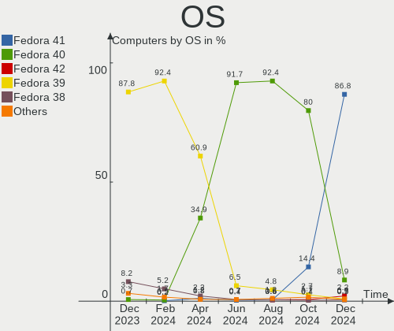
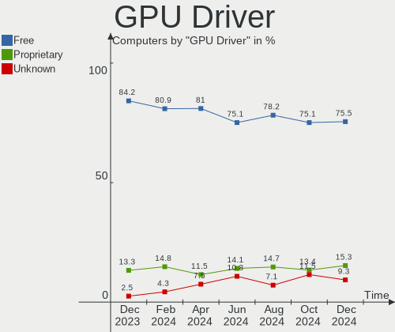
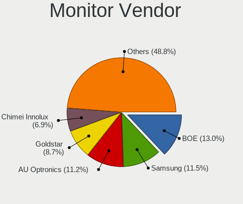

Fedora - Hardware Trends
------------------------

A project to identify most popular hardware characteristics and track their change
over time based on data collected by Linux users at https://Linux-Hardware.org.

Anyone can contribute to this report by the [hw-probe](https://github.com/linuxhw/hw-probe) tool:

    sudo -E hw-probe -all -upload

This is a report for all computer types. See also reports for [desktops](/Dist/Fedora/Desktop/README.md) and [notebooks](/Dist/Fedora/Notebook/README.md).

This report is for one last month. Overall report since the beginning of time: [TestDays](https://github.com/linuxhw/TestDays)

Period: Aug, 2023.

Contents
--------

* [ System ](#system)
  - [ OS                       ](#os)
  - [ OS Family                ](#os-family)
  - [ Kernel                   ](#kernel)
  - [ Kernel Family            ](#kernel-family)
  - [ Kernel Major Ver.        ](#kernel-major-ver)
  - [ Arch                     ](#arch)
  - [ DE                       ](#de)
  - [ Display Server           ](#display-server)
  - [ Display Manager          ](#display-manager)
  - [ OS Lang                  ](#os-lang)
  - [ Boot Mode                ](#boot-mode)
  - [ Filesystem               ](#filesystem)
  - [ Part. scheme             ](#part-scheme)
  - [ Dual Boot with Linux/BSD ](#dual-boot-with-linuxbsd)
  - [ Dual Boot (Win)          ](#dual-boot-win)

* [ Board ](#board)
  - [ Vendor                   ](#vendor)
  - [ Model                    ](#model)
  - [ Model Family             ](#model-family)
  - [ MFG Year                 ](#mfg-year)
  - [ Form Factor              ](#form-factor)
  - [ Secure Boot              ](#secure-boot)
  - [ Coreboot                 ](#coreboot)
  - [ RAM Size                 ](#ram-size)
  - [ RAM Used                 ](#ram-used)
  - [ Total Drives             ](#total-drives)
  - [ Has CD-ROM               ](#has-cd-rom)
  - [ Has Ethernet             ](#has-ethernet)
  - [ Has WiFi                 ](#has-wifi)
  - [ Has Bluetooth            ](#has-bluetooth)

* [ Location ](#location)
  - [ Country                  ](#country)
  - [ City                     ](#city)

* [ Drives ](#drives)
  - [ Drive Vendor             ](#drive-vendor)
  - [ Drive Model              ](#drive-model)
  - [ HDD Vendor               ](#hdd-vendor)
  - [ SSD Vendor               ](#ssd-vendor)
  - [ Drive Kind               ](#drive-kind)
  - [ Drive Connector          ](#drive-connector)
  - [ Drive Size               ](#drive-size)
  - [ Space Total              ](#space-total)
  - [ Space Used               ](#space-used)
  - [ Malfunc. Drives          ](#malfunc-drives)
  - [ Malfunc. Drive Vendor    ](#malfunc-drive-vendor)
  - [ Malfunc. HDD Vendor      ](#malfunc-hdd-vendor)
  - [ Malfunc. Drive Kind      ](#malfunc-drive-kind)
  - [ Failed Drives            ](#failed-drives)
  - [ Failed Drive Vendor      ](#failed-drive-vendor)
  - [ Drive Status             ](#drive-status)

* [ Storage controller ](#storage-controller)
  - [ Storage Vendor           ](#storage-vendor)
  - [ Storage Model            ](#storage-model)
  - [ Storage Kind             ](#storage-kind)

* [ Processor ](#processor)
  - [ CPU Vendor               ](#cpu-vendor)
  - [ CPU Model                ](#cpu-model)
  - [ CPU Model Family         ](#cpu-model-family)
  - [ CPU Cores                ](#cpu-cores)
  - [ CPU Sockets              ](#cpu-sockets)
  - [ CPU Threads              ](#cpu-threads)
  - [ CPU Op-Modes             ](#cpu-op-modes)
  - [ CPU Microcode            ](#cpu-microcode)
  - [ CPU Microarch            ](#cpu-microarch)

* [ Graphics ](#graphics)
  - [ GPU Vendor               ](#gpu-vendor)
  - [ GPU Model                ](#gpu-model)
  - [ GPU Combo                ](#gpu-combo)
  - [ GPU Driver               ](#gpu-driver)
  - [ GPU Memory               ](#gpu-memory)

* [ Monitor ](#monitor)
  - [ Monitor Vendor           ](#monitor-vendor)
  - [ Monitor Model            ](#monitor-model)
  - [ Monitor Resolution       ](#monitor-resolution)
  - [ Monitor Diagonal         ](#monitor-diagonal)
  - [ Monitor Width            ](#monitor-width)
  - [ Aspect Ratio             ](#aspect-ratio)
  - [ Monitor Area             ](#monitor-area)
  - [ Pixel Density            ](#pixel-density)
  - [ Multiple Monitors        ](#multiple-monitors)

* [ Network ](#network)
  - [ Net Controller Vendor    ](#net-controller-vendor)
  - [ Net Controller Model     ](#net-controller-model)
  - [ Wireless Vendor          ](#wireless-vendor)
  - [ Wireless Model           ](#wireless-model)
  - [ Ethernet Vendor          ](#ethernet-vendor)
  - [ Ethernet Model           ](#ethernet-model)
  - [ Net Controller Kind      ](#net-controller-kind)
  - [ Used Controller          ](#used-controller)
  - [ NICs                     ](#nics)
  - [ IPv6                     ](#ipv6)

* [ Bluetooth ](#bluetooth)
  - [ Bluetooth Vendor         ](#bluetooth-vendor)
  - [ Bluetooth Model          ](#bluetooth-model)

* [ Sound ](#sound)
  - [ Sound Vendor             ](#sound-vendor)
  - [ Sound Model              ](#sound-model)

* [ Memory ](#memory)
  - [ Memory Vendor            ](#memory-vendor)
  - [ Memory Model             ](#memory-model)
  - [ Memory Kind              ](#memory-kind)
  - [ Memory Form Factor       ](#memory-form-factor)
  - [ Memory Size              ](#memory-size)
  - [ Memory Speed             ](#memory-speed)

* [ Printers & scanners ](#printers--scanners)
  - [ Printer Vendor           ](#printer-vendor)
  - [ Printer Model            ](#printer-model)
  - [ Scanner Vendor           ](#scanner-vendor)
  - [ Scanner Model            ](#scanner-model)

* [ Camera ](#camera)
  - [ Camera Vendor            ](#camera-vendor)
  - [ Camera Model             ](#camera-model)

* [ Security ](#security)
  - [ Fingerprint Vendor       ](#fingerprint-vendor)
  - [ Fingerprint Model        ](#fingerprint-model)
  - [ Chipcard Vendor          ](#chipcard-vendor)
  - [ Chipcard Model           ](#chipcard-model)

* [ Unsupported ](#unsupported)
  - [ Unsupported Devices      ](#unsupported-devices)
  - [ Unsupported Device Types ](#unsupported-device-types)

System
------

OS
--

Installed operating systems

| Name      | Computers | Percent |
|-----------|-----------|---------|
| Fedora 38 | 459       | 90.71%  |
| Fedora 37 | 27        | 5.34%   |
| Fedora 36 | 7         | 1.38%   |
| Fedora 35 | 4         | 0.79%   |
| Fedora 40 | 3         | 0.59%   |
| Fedora 39 | 3         | 0.59%   |
| Fedora 34 | 2         | 0.4%    |
| Fedora 33 | 1         | 0.2%    |

OS Family
---------

OS without a version

| Name   | Computers | Percent |
|--------|-----------|---------|
| Fedora | 506       | 100%    |

Kernel
------

Version of the Linux kernel

| Version                                                | Computers | Percent |
|--------------------------------------------------------|-----------|---------|
| 6.4.11-200.fc38.x86_64                                 | 84        | 16.6%   |
| 6.4.7-200.fc38.x86_64                                  | 74        | 14.62%  |
| 6.4.10-200.fc38.x86_64                                 | 67        | 13.24%  |
| 6.4.6-200.fc38.x86_64                                  | 52        | 10.28%  |
| 6.2.9-300.fc38.x86_64                                  | 51        | 10.08%  |
| 6.4.12-200.fc38.x86_64                                 | 47        | 9.29%   |
| 6.4.9-200.fc38.x86_64                                  | 42        | 8.3%    |
| 6.4.8-200.fc38.x86_64                                  | 10        | 1.98%   |
| 6.4.4-200.fc38.x86_64                                  | 6         | 1.19%   |
| 6.3.12-200.fc38.x86_64                                 | 6         | 1.19%   |
| 6.4.7-100.fc37.x86_64                                  | 5         | 0.99%   |
| 6.4.4-100.fc37.x86_64                                  | 4         | 0.79%   |
| 6.3.11-200.fc38.x86_64                                 | 4         | 0.79%   |
| 6.0.12-100.fc35.x86_64                                 | 4         | 0.79%   |
| 6.4.12-100.fc37.x86_64                                 | 3         | 0.59%   |
| 6.4.10-100.fc37.x86_64                                 | 3         | 0.59%   |
| 6.3.12-100.fc37.x86_64                                 | 3         | 0.59%   |
| 6.2.15-100.fc36.x86_64                                 | 3         | 0.59%   |
| 6.4.9-100.fc37.x86_64                                  | 2         | 0.4%    |
| 6.4.11-100.fc37.x86_64                                 | 2         | 0.4%    |
| 6.3.8-200.fc38.x86_64                                  | 2         | 0.4%    |
| 6.2.15-300.fc38.x86_64                                 | 2         | 0.4%    |
| 6.1.13-200.fc37.x86_64                                 | 2         | 0.4%    |
| 5.17.5-300.fc36.x86_64                                 | 2         | 0.4%    |
| 5.17.12-100.fc34.x86_64                                | 2         | 0.4%    |
| 6.5.0-257.vanilla.fc38.x86_64                          | 1         | 0.2%    |
| 6.5.0-0.rc7.20230821gitf7757129e3de.50.fc40.x86_64     | 1         | 0.2%    |
| 6.5.0-0.rc7.20230821gitf7757129e3de.50.fc39.x86_64     | 1         | 0.2%    |
| 6.5.0-0.rc7.20230820gt706a7415.249.vanilla.fc38.x86_64 | 1         | 0.2%    |
| 6.5.0-0.rc6.43.fc40.x86_64                             | 1         | 0.2%    |
| 6.5.0-0.rc6.20230818git0e8860d2125f.47.fc40.x86_64     | 1         | 0.2%    |
| 6.5.0-0.rc4.30.fc39.x86_64                             | 1         | 0.2%    |
| 6.5.0-0.rc4.20230804gitc1a515d3c027.33.fc39.x86_64     | 1         | 0.2%    |
| 6.4.7-200.t2.fc38.x86_64                               | 1         | 0.2%    |
| 6.4.7-1.surface.fc38.x86_64                            | 1         | 0.2%    |
| 6.4.4-1.surface.fc38.x86_64                            | 1         | 0.2%    |
| 6.4.12-cb1.0.fc38.x86_64                               | 1         | 0.2%    |
| 6.4.10-cb2.0.fc38.x86_64                               | 1         | 0.2%    |
| 6.4.10-cb1.0.fc38.x86_64                               | 1         | 0.2%    |
| 6.2.6-300.fc38.x86_64                                  | 1         | 0.2%    |

Kernel Family
-------------

Linux kernel without a distro release

| Version  | Computers | Percent |
|----------|-----------|---------|
| 6.4.11   | 86        | 17%     |
| 6.4.7    | 81        | 16.01%  |
| 6.4.10   | 72        | 14.23%  |
| 6.4.6    | 52        | 10.28%  |
| 6.4.12   | 51        | 10.08%  |
| 6.2.9    | 51        | 10.08%  |
| 6.4.9    | 44        | 8.7%    |
| 6.4.4    | 11        | 2.17%   |
| 6.4.8    | 10        | 1.98%   |
| 6.3.12   | 9         | 1.78%   |
| 6.5.0    | 8         | 1.58%   |
| 6.2.15   | 7         | 1.38%   |
| 6.3.11   | 4         | 0.79%   |
| 6.0.12   | 4         | 0.79%   |
| 6.3.8    | 2         | 0.4%    |
| 6.1.7    | 2         | 0.4%    |
| 6.1.13   | 2         | 0.4%    |
| 5.17.5   | 2         | 0.4%    |
| 5.17.12  | 2         | 0.4%    |
| 6.2.6    | 1         | 0.2%    |
| 6.0.7    | 1         | 0.2%    |
| 5.18.17  | 1         | 0.2%    |
| 5.14.18  | 1         | 0.2%    |
| 5.11.18  | 1         | 0.2%    |
| 5.10.178 | 1         | 0.2%    |

Kernel Major Ver.
-----------------

Linux kernel major version

| Version | Computers | Percent |
|---------|-----------|---------|
| 6.4     | 407       | 80.43%  |
| 6.2     | 59        | 11.66%  |
| 6.3     | 15        | 2.96%   |
| 6.5     | 8         | 1.58%   |
| 6.0     | 5         | 0.99%   |
| 6.1     | 4         | 0.79%   |
| 5.17    | 4         | 0.79%   |
| 5.18    | 1         | 0.2%    |
| 5.14    | 1         | 0.2%    |
| 5.11    | 1         | 0.2%    |
| 5.10    | 1         | 0.2%    |

Arch
----

OS architecture (x86_64, i586, etc.)

| Name    | Computers | Percent |
|---------|-----------|---------|
| x86_64  | 505       | 99.8%   |
| aarch64 | 1         | 0.2%    |

DE
--

Desktop Environment

| Name          | Computers | Percent |
|---------------|-----------|---------|
| GNOME         | 371       | 73.32%  |
| KDE5          | 89        | 17.59%  |
| Cinnamon      | 9         | 1.78%   |
| XFCE          | 8         | 1.58%   |
| Unknown       | 8         | 1.58%   |
| X-Cinnamon    | 6         | 1.19%   |
| Xpra          | 3         | 0.59%   |
| GNOME Classic | 3         | 0.59%   |
| Hyprland      | 2         | 0.4%    |
| Budgie        | 2         | 0.4%    |
| sway          | 1         | 0.2%    |
| MATE          | 1         | 0.2%    |
| LXQt          | 1         | 0.2%    |
| LXDE          | 1         | 0.2%    |
| fluxbox       | 1         | 0.2%    |

Display Server
--------------

X11 or Wayland

| Name    | Computers | Percent |
|---------|-----------|---------|
| Wayland | 387       | 76.48%  |
| X11     | 98        | 19.37%  |
| Tty     | 16        | 3.16%   |
| Unknown | 5         | 0.99%   |

Display Manager
---------------

SDDM, LightDM, etc.

| Name    | Computers | Percent |
|---------|-----------|---------|
| Unknown | 324       | 64.03%  |
| GDM     | 116       | 22.92%  |
| SDDM    | 41        | 8.1%    |
| LightDM | 24        | 4.74%   |
| LXDM    | 1         | 0.2%    |

OS Lang
-------

Language

| Lang    | Computers | Percent |
|---------|-----------|---------|
| en_US   | 248       | 49.01%  |
| en_GB   | 38        | 7.51%   |
| ru_RU   | 28        | 5.53%   |
| de_DE   | 26        | 5.14%   |
| en_AU   | 19        | 3.75%   |
| pt_BR   | 17        | 3.36%   |
| en_CA   | 14        | 2.77%   |
| it_IT   | 11        | 2.17%   |
| fr_FR   | 11        | 2.17%   |
| es_MX   | 9         | 1.78%   |
| es_ES   | 9         | 1.78%   |
| pl_PL   | 8         | 1.58%   |
| en_IN   | 5         | 0.99%   |
| es_CO   | 4         | 0.79%   |
| es_CL   | 4         | 0.79%   |
| en_ZA   | 4         | 0.79%   |
| en_DK   | 4         | 0.79%   |
| Unknown | 4         | 0.79%   |
| zh_CN   | 3         | 0.59%   |
| tr_TR   | 3         | 0.59%   |
| hu_HU   | 3         | 0.59%   |
| en_NZ   | 3         | 0.59%   |
| de_AT   | 3         | 0.59%   |
| sr_RS   | 2         | 0.4%    |
| pt_PT   | 2         | 0.4%    |
| nl_BE   | 2         | 0.4%    |
| en_PH   | 2         | 0.4%    |
| cs_CZ   | 2         | 0.4%    |
| zh_SG   | 1         | 0.2%    |
| zh_HK   | 1         | 0.2%    |
| ru_UA   | 1         | 0.2%    |
| ia_FR   | 1         | 0.2%    |
| gl_ES   | 1         | 0.2%    |
| fi_FI   | 1         | 0.2%    |
| es_UY   | 1         | 0.2%    |
| es_EC   | 1         | 0.2%    |
| es_BO   | 1         | 0.2%    |
| es_AR   | 1         | 0.2%    |
| en_ZM   | 1         | 0.2%    |
| en_SG   | 1         | 0.2%    |

Boot Mode
---------

EFI or BIOS

| Mode | Computers | Percent |
|------|-----------|---------|
| EFI  | 397       | 78.46%  |
| BIOS | 109       | 21.54%  |

Filesystem
----------

Type of filesystem

| Type  | Computers | Percent |
|-------|-----------|---------|
| Btrfs | 404       | 79.84%  |
| Ext4  | 93        | 18.38%  |
| Xfs   | 8         | 1.58%   |
| Ext3  | 1         | 0.2%    |

Part. scheme
------------

Scheme of partitioning

| Type    | Computers | Percent |
|---------|-----------|---------|
| Unknown | 315       | 62.25%  |
| GPT     | 179       | 35.38%  |
| MBR     | 12        | 2.37%   |

Dual Boot with Linux/BSD
------------------------

Hosting more than one Linux/BSD

| Dual boot | Computers | Percent |
|-----------|-----------|---------|
| No        | 461       | 91.11%  |
| Yes       | 45        | 8.89%   |

Dual Boot (Win)
---------------

Hosting Linux and Windows

| Dual boot | Computers | Percent |
|-----------|-----------|---------|
| No        | 440       | 86.96%  |
| Yes       | 66        | 13.04%  |

Board
-----

Vendor
------

Motherboard manufacturer

| Name                  | Computers | Percent |
|-----------------------|-----------|---------|
| Lenovo                | 95        | 18.77%  |
| ASUSTek Computer      | 77        | 15.22%  |
| Dell                  | 71        | 14.03%  |
| Hewlett-Packard       | 63        | 12.45%  |
| Gigabyte Technology   | 39        | 7.71%   |
| MSI                   | 34        | 6.72%   |
| Acer                  | 20        | 3.95%   |
| Apple                 | 18        | 3.56%   |
| ASRock                | 14        | 2.77%   |
| HUAWEI                | 9         | 1.78%   |
| Microsoft             | 5         | 0.99%   |
| Intel                 | 5         | 0.99%   |
| Unknown               | 5         | 0.99%   |
| Toshiba               | 4         | 0.79%   |
| Timi                  | 4         | 0.79%   |
| Fujitsu               | 4         | 0.79%   |
| System76              | 3         | 0.59%   |
| Samsung Electronics   | 3         | 0.59%   |
| Google                | 3         | 0.59%   |
| AZW                   | 3         | 0.59%   |
| Sony                  | 2         | 0.4%    |
| Packard Bell          | 2         | 0.4%    |
| Framework             | 2         | 0.4%    |
| Corsair               | 2         | 0.4%    |
| Xplore                | 1         | 0.2%    |
| Topstar               | 1         | 0.2%    |
| Supermicro            | 1         | 0.2%    |
| Schenker              | 1         | 0.2%    |
| RCA                   | 1         | 0.2%    |
| Positivo Bahia - VAIO | 1         | 0.2%    |
| Pegatron              | 1         | 0.2%    |
| PC Specialist         | 1         | 0.2%    |
| Medion                | 1         | 0.2%    |
| Linx                  | 1         | 0.2%    |
| LDLC                  | 1         | 0.2%    |
| LattePanda            | 1         | 0.2%    |
| Huanan                | 1         | 0.2%    |
| HONOR                 | 1         | 0.2%    |
| Hardkernel            | 1         | 0.2%    |
| Gateway               | 1         | 0.2%    |

Model
-----

Motherboard model

| Name                                        | Computers | Percent |
|---------------------------------------------|-----------|---------|
| ASUS All Series                             | 5         | 0.99%   |
| Unknown                                     | 5         | 0.99%   |
| MSI MS-7D22                                 | 3         | 0.59%   |
| HP Victus by Laptop 16-e0xxx                | 3         | 0.59%   |
| MSI MS-7B48                                 | 2         | 0.4%    |
| MSI MPG H410 Trident 3 (MS-B932)            | 2         | 0.4%    |
| Lenovo ThinkPad X1 Carbon Gen 10 21CBCTO1WW | 2         | 0.4%    |
| Lenovo IdeaPadFlex 5 14ALC05 82HU           | 2         | 0.4%    |
| Lenovo IdeaPad Pro 5 14APH8 83AM            | 2         | 0.4%    |
| HUAWEI BOHB-WAX9                            | 2         | 0.4%    |
| HP Notebook                                 | 2         | 0.4%    |
| HP Laptop 15s-eq2xxx                        | 2         | 0.4%    |
| HP ENVY x360 2-in-1 Laptop 15-ey0xxx        | 2         | 0.4%    |
| HP EliteBook 845 14 inch G9 Notebook PC     | 2         | 0.4%    |
| HP Compaq 6005 Pro SFF PC                   | 2         | 0.4%    |
| Gigabyte B550 AORUS ELITE AX V2             | 2         | 0.4%    |
| Gigabyte B450M DS3H                         | 2         | 0.4%    |
| Gigabyte AB350-Gaming                       | 2         | 0.4%    |
| Framework Laptop                            | 2         | 0.4%    |
| Dell XPS 15 9560                            | 2         | 0.4%    |
| Dell OptiPlex 3040                          | 2         | 0.4%    |
| Dell Latitude E7470                         | 2         | 0.4%    |
| Dell Latitude 7440                          | 2         | 0.4%    |
| Dell Latitude 5480                          | 2         | 0.4%    |
| Dell Latitude 5290 2-in-1                   | 2         | 0.4%    |
| Dell G15 5510                               | 2         | 0.4%    |
| Corsair Voyager a1600                       | 2         | 0.4%    |
| AZW GTR                                     | 2         | 0.4%    |
| ASUS TUF Gaming B660-PLUS WIFI D4           | 2         | 0.4%    |
| ASUS ROG STRIX X670E-I GAMING WIFI          | 2         | 0.4%    |
| ASUS K55VD                                  | 2         | 0.4%    |
| Apple Macmini6,2                            | 2         | 0.4%    |
| Apple MacBookPro9,2                         | 2         | 0.4%    |
| Apple MacBookPro5,5                         | 2         | 0.4%    |
| Apple MacBookPro11,1                        | 2         | 0.4%    |
| Apple iMac19,1                              | 2         | 0.4%    |
| Xplore iX104C6                              | 1         | 0.2%    |
| Toshiba Satellite L515                      | 1         | 0.2%    |
| Toshiba Satellite C70-B                     | 1         | 0.2%    |
| Toshiba Satellite C55D-A                    | 1         | 0.2%    |

Model Family
------------

Motherboard model prefix

| Name                  | Computers | Percent |
|-----------------------|-----------|---------|
| Lenovo ThinkPad       | 46        | 9.09%   |
| Dell Latitude         | 27        | 5.34%   |
| Dell Inspiron         | 17        | 3.36%   |
| Lenovo IdeaPad        | 16        | 3.16%   |
| ASUS ROG              | 13        | 2.57%   |
| ASUS TUF              | 12        | 2.37%   |
| ASUS VivoBook         | 11        | 2.17%   |
| Lenovo Yoga           | 9         | 1.78%   |
| HP ProBook            | 9         | 1.78%   |
| HP Laptop             | 9         | 1.78%   |
| Dell OptiPlex         | 9         | 1.78%   |
| Acer Aspire           | 9         | 1.78%   |
| HP ENVY               | 8         | 1.58%   |
| HP EliteBook          | 8         | 1.58%   |
| HP Compaq             | 7         | 1.38%   |
| Dell XPS              | 7         | 1.38%   |
| ASUS PRIME            | 7         | 1.38%   |
| Microsoft Surface     | 5         | 0.99%   |
| Lenovo Legion         | 5         | 0.99%   |
| HP Pavilion           | 5         | 0.99%   |
| ASUS All              | 5         | 0.99%   |
| Unknown               | 5         | 0.99%   |
| Toshiba Satellite     | 4         | 0.79%   |
| Lenovo ThinkStation   | 4         | 0.79%   |
| Lenovo ThinkCentre    | 4         | 0.79%   |
| Lenovo IdeaPadFlex    | 4         | 0.79%   |
| Gigabyte B550         | 4         | 0.79%   |
| MSI MS-7D22           | 3         | 0.59%   |
| Lenovo ThinkBook      | 3         | 0.59%   |
| HP Victus             | 3         | 0.59%   |
| Gigabyte B450M        | 3         | 0.59%   |
| Gigabyte AB350-Gaming | 3         | 0.59%   |
| Dell Precision        | 3         | 0.59%   |
| ASUS ZenBook          | 3         | 0.59%   |
| ASUS ASUS             | 3         | 0.59%   |
| Apple Macmini6        | 3         | 0.59%   |
| Apple MacBookPro5     | 3         | 0.59%   |
| Acer Veriton          | 3         | 0.59%   |
| Acer Nitro            | 3         | 0.59%   |
| MSI MS-7B48           | 2         | 0.4%    |

MFG Year
--------

Motherboard manufacture year

| Year    | Computers | Percent |
|---------|-----------|---------|
| 2021    | 71        | 14.03%  |
| 2022    | 66        | 13.04%  |
| 2020    | 55        | 10.87%  |
| 2018    | 49        | 9.68%   |
| 2017    | 38        | 7.51%   |
| 2019    | 32        | 6.32%   |
| 2023    | 29        | 5.73%   |
| 2012    | 27        | 5.34%   |
| 2014    | 25        | 4.94%   |
| 2016    | 24        | 4.74%   |
| 2015    | 22        | 4.35%   |
| 2013    | 19        | 3.75%   |
| 2011    | 15        | 2.96%   |
| 2010    | 11        | 2.17%   |
| 2009    | 10        | 1.98%   |
| 2008    | 8         | 1.58%   |
| 2007    | 4         | 0.79%   |
| Unknown | 1         | 0.2%    |

Form Factor
-----------

Physical design of the computer

| Name           | Computers | Percent |
|----------------|-----------|---------|
| Notebook       | 284       | 56.13%  |
| Desktop        | 170       | 33.6%   |
| Convertible    | 20        | 3.95%   |
| Mini pc        | 12        | 2.37%   |
| Tablet         | 9         | 1.78%   |
| All in one     | 7         | 1.38%   |
| Server         | 3         | 0.59%   |
| System on chip | 1         | 0.2%    |

Secure Boot
-----------

Enabled or disabled

| State    | Computers | Percent |
|----------|-----------|---------|
| Disabled | 402       | 79.45%  |
| Enabled  | 104       | 20.55%  |

Coreboot
--------

Have coreboot on board

| Used | Computers | Percent |
|------|-----------|---------|
| No   | 501       | 99.01%  |
| Yes  | 5         | 0.99%   |

RAM Size
--------

Total RAM memory

| Size in GB  | Computers | Percent |
|-------------|-----------|---------|
| 16.01-24.0  | 131       | 25.89%  |
| 4.01-8.0    | 116       | 22.92%  |
| 8.01-16.0   | 86        | 17%     |
| 32.01-64.0  | 73        | 14.43%  |
| 3.01-4.0    | 37        | 7.31%   |
| 64.01-256.0 | 33        | 6.52%   |
| 24.01-32.0  | 21        | 4.15%   |
| 1.01-2.0    | 6         | 1.19%   |
| 2.01-3.0    | 3         | 0.59%   |

RAM Used
--------

Used RAM memory

| Used GB    | Computers | Percent |
|------------|-----------|---------|
| 4.01-8.0   | 153       | 30.24%  |
| 3.01-4.0   | 119       | 23.52%  |
| 2.01-3.0   | 117       | 23.12%  |
| 1.01-2.0   | 52        | 10.28%  |
| 8.01-16.0  | 49        | 9.68%   |
| 16.01-24.0 | 8         | 1.58%   |
| 0.51-1.0   | 4         | 0.79%   |
| 24.01-32.0 | 3         | 0.59%   |
| 32.01-64.0 | 1         | 0.2%    |

Total Drives
------------

Number of drives on board

| Drives | Computers | Percent |
|--------|-----------|---------|
| 1      | 296       | 58.5%   |
| 2      | 129       | 25.49%  |
| 3      | 44        | 8.7%    |
| 4      | 22        | 4.35%   |
| 5      | 7         | 1.38%   |
| 8      | 2         | 0.4%    |
| 6      | 2         | 0.4%    |
| 0      | 2         | 0.4%    |
| 11     | 1         | 0.2%    |
| 7      | 1         | 0.2%    |

Has CD-ROM
----------

Has CD-ROM on board

| Presented | Computers | Percent |
|-----------|-----------|---------|
| No        | 404       | 79.84%  |
| Yes       | 102       | 20.16%  |

Has Ethernet
------------

Has Ethernet on board

| Presented | Computers | Percent |
|-----------|-----------|---------|
| Yes       | 401       | 79.25%  |
| No        | 105       | 20.75%  |

Has WiFi
--------

Has WiFi module

| Presented | Computers | Percent |
|-----------|-----------|---------|
| Yes       | 426       | 84.19%  |
| No        | 80        | 15.81%  |

Has Bluetooth
-------------

Has Bluetooth module

| Presented | Computers | Percent |
|-----------|-----------|---------|
| Yes       | 367       | 72.53%  |
| No        | 139       | 27.47%  |

Location
--------

Country
-------

Geographic location (country)

| Country      | Computers | Percent |
|--------------|-----------|---------|
| USA          | 91        | 17.98%  |
| Germany      | 45        | 8.89%   |
| Russia       | 35        | 6.92%   |
| Brazil       | 31        | 6.13%   |
| UK           | 19        | 3.75%   |
| Italy        | 19        | 3.75%   |
| France       | 18        | 3.56%   |
| Canada       | 18        | 3.56%   |
| Australia    | 18        | 3.56%   |
| Poland       | 14        | 2.77%   |
| Mexico       | 13        | 2.57%   |
| India        | 13        | 2.57%   |
| Spain        | 12        | 2.37%   |
| Colombia     | 9         | 1.78%   |
| Turkey       | 8         | 1.58%   |
| Philippines  | 7         | 1.38%   |
| Netherlands  | 6         | 1.19%   |
| Czechia      | 6         | 1.19%   |
| Norway       | 5         | 0.99%   |
| Israel       | 5         | 0.99%   |
| Austria      | 5         | 0.99%   |
| Indonesia    | 4         | 0.79%   |
| China        | 4         | 0.79%   |
| Chile        | 4         | 0.79%   |
| Bulgaria     | 4         | 0.79%   |
| Belgium      | 4         | 0.79%   |
| UAE          | 3         | 0.59%   |
| Switzerland  | 3         | 0.59%   |
| Sweden       | 3         | 0.59%   |
| South Africa | 3         | 0.59%   |
| Portugal     | 3         | 0.59%   |
| New Zealand  | 3         | 0.59%   |
| Japan        | 3         | 0.59%   |
| Iran         | 3         | 0.59%   |
| Hungary      | 3         | 0.59%   |
| Denmark      | 3         | 0.59%   |
| Croatia      | 3         | 0.59%   |
| Belarus      | 3         | 0.59%   |
| Vietnam      | 2         | 0.4%    |
| Thailand     | 2         | 0.4%    |

City
----

Geographic location (city)

| City             | Computers | Percent |
|------------------|-----------|---------|
| Moscow           | 11        | 2.17%   |
| Sydney           | 8         | 1.58%   |
| Berlin           | 7         | 1.38%   |
| Sao Paulo        | 6         | 1.19%   |
| Melbourne        | 6         | 1.19%   |
| Warsaw           | 5         | 0.99%   |
| St Petersburg    | 4         | 0.79%   |
| Hamburg          | 4         | 0.79%   |
| Cologne          | 4         | 0.79%   |
| Vienna           | 3         | 0.59%   |
| Vero Beach       | 3         | 0.59%   |
| Seattle          | 3         | 0.59%   |
| San Antonio      | 3         | 0.59%   |
| Rio de Janeiro   | 3         | 0.59%   |
| Quezon City      | 3         | 0.59%   |
| Prague           | 3         | 0.59%   |
| Paris            | 3         | 0.59%   |
| Minsk            | 3         | 0.59%   |
| London           | 3         | 0.59%   |
| Krakow           | 3         | 0.59%   |
| Istanbul         | 3         | 0.59%   |
| Delhi            | 3         | 0.59%   |
| Brussels         | 3         | 0.59%   |
| Brasília        | 3         | 0.59%   |
| Bogotá          | 3         | 0.59%   |
| Zagreb           | 2         | 0.4%    |
| Yekaterinburg    | 2         | 0.4%    |
| Voronezh         | 2         | 0.4%    |
| Verona           | 2         | 0.4%    |
| Vancouver        | 2         | 0.4%    |
| Valladolid       | 2         | 0.4%    |
| Ulm              | 2         | 0.4%    |
| Trappes          | 2         | 0.4%    |
| Toronto          | 2         | 0.4%    |
| Tel Aviv         | 2         | 0.4%    |
| Sterling Heights | 2         | 0.4%    |
| Singapore        | 2         | 0.4%    |
| Santiago         | 2         | 0.4%    |
| Riyadh           | 2         | 0.4%    |
| Regina           | 2         | 0.4%    |

Drives
------

Drive Vendor
------------

Hard drive vendors

| Vendor                         | Computers | Drives | Percent |
|--------------------------------|-----------|--------|---------|
| Samsung Electronics            | 131       | 159    | 17.28%  |
| Seagate                        | 81        | 97     | 10.69%  |
| WDC                            | 72        | 89     | 9.5%    |
| Sandisk                        | 64        | 74     | 8.44%   |
| Toshiba                        | 35        | 43     | 4.62%   |
| Kingston                       | 33        | 36     | 4.35%   |
| SK hynix                       | 27        | 27     | 3.56%   |
| Crucial                        | 27        | 29     | 3.56%   |
| Unknown                        | 24        | 27     | 3.17%   |
| Intel                          | 24        | 26     | 3.17%   |
| Micron Technology              | 23        | 23     | 3.03%   |
| Silicon Motion                 | 16        | 16     | 2.11%   |
| Phison Electronics             | 15        | 15     | 1.98%   |
| Hitachi                        | 13        | 13     | 1.72%   |
| KIOXIA                         | 11        | 11     | 1.45%   |
| Micron/Crucial Technology      | 10        | 11     | 1.32%   |
| HGST                           | 10        | 13     | 1.32%   |
| China                          | 10        | 10     | 1.32%   |
| Apple                          | 10        | 13     | 1.32%   |
| MAXIO Technology (Hangzhou)    | 8         | 8      | 1.06%   |
| Kingston Technology Company    | 7         | 7      | 0.92%   |
| ADATA Technology               | 6         | 6      | 0.79%   |
| Shenzhen Longsys Electronics   | 5         | 5      | 0.66%   |
| Realtek Semiconductor          | 5         | 5      | 0.66%   |
| Patriot                        | 5         | 5      | 0.66%   |
| JMicron Technology             | 5         | 6      | 0.66%   |
| Team                           | 4         | 4      | 0.53%   |
| A-DATA Technology              | 4         | 4      | 0.53%   |
| Unknown                        | 4         | 4      | 0.53%   |
| SPCC                           | 3         | 3      | 0.4%    |
| Solid State Storage Technology | 3         | 3      | 0.4%    |
| Intenso                        | 3         | 3      | 0.4%    |
| Union Memory (Shenzhen)        | 2         | 2      | 0.26%   |
| Transcend                      | 2         | 3      | 0.26%   |
| Phison                         | 2         | 2      | 0.26%   |
| OSCOO                          | 2         | 2      | 0.26%   |
| OCZ                            | 2         | 2      | 0.26%   |
| Netac                          | 2         | 2      | 0.26%   |
| Mushkin                        | 2         | 2      | 0.26%   |
| LITEONIT                       | 2         | 2      | 0.26%   |

Drive Model
-----------

Hard drive models

| Model                                                 | Computers | Percent |
|-------------------------------------------------------|-----------|---------|
| Samsung NVMe SSD Controller SM981/PM981/PM983 500GB   | 32        | 3.91%   |
| Samsung NVMe SSD Controller PM9A1/PM9A3/980PRO 1024GB | 15        | 1.83%   |
| Unknown MMC Card  64GB                                | 11        | 1.34%   |
| Phison E12 NVMe Controller 256GB                      | 10        | 1.22%   |
| Kingston SA400S37240G 240GB SSD                       | 10        | 1.22%   |
| Sandisk WD Blue SN550 NVMe SSD 250GB                  | 9         | 1.1%    |
| Samsung NVMe SSD Controller SM961/PM961/SM963 1024GB  | 9         | 1.1%    |
| Kingston SA400S37480G 480GB SSD                       | 8         | 0.98%   |
| Seagate ST2000DM008-2FR102 2TB                        | 7         | 0.85%   |
| Seagate ST2000DM006-2DM164 2TB                        | 7         | 0.85%   |
| Seagate ST1000LM035-1RK172 1TB                        | 7         | 0.85%   |
| Samsung SSD 860 EVO 1TB                               | 7         | 0.85%   |
| Micron/Crucial P2 NVMe PCIe SSD 1TB                   | 7         | 0.85%   |
| WDC WD10EZEX-08WN4A0 1TB                              | 6         | 0.73%   |
| Silicon Motion SM2263EN/SM2263XT SSD Controller 256GB | 6         | 0.73%   |
| Silicon Motion SM2262/SM2262EN SSD Controller 1024GB  | 6         | 0.73%   |
| MAXIO (Hangzhou) NVMe SSD Controller MAP1202 1024GB   | 6         | 0.73%   |
| Intel SSDPEKNU512GZ 512GB                             | 6         | 0.73%   |
| Unknown MMC Card  128GB                               | 5         | 0.61%   |
| Seagate ST1000DM010-2EP102 1TB                        | 5         | 0.61%   |
| Sandisk WD Black SN750 / PC SN730 NVMe SSD 1024GB     | 5         | 0.61%   |
| Sandisk WD Black 2018/SN750 / PC SN720 NVMe SSD 512GB | 5         | 0.61%   |
| Samsung SSD 980 1TB                                   | 5         | 0.61%   |
| Crucial CT1000MX500SSD1 1TB                           | 5         | 0.61%   |
| Toshiba MQ01ABF050 500GB                              | 4         | 0.49%   |
| Toshiba HDWD120 2TB                                   | 4         | 0.49%   |
| Sandisk WD Blue SN570 1TB                             | 4         | 0.49%   |
| Samsung SSD 980 500GB                                 | 4         | 0.49%   |
| Samsung SSD 870 EVO 500GB                             | 4         | 0.49%   |
| Samsung SSD 860 EVO 500GB                             | 4         | 0.49%   |
| Samsung SSD 850 EVO 250GB                             | 4         | 0.49%   |
| Phison PS5013 E13 NVMe Controller 512GB               | 4         | 0.49%   |
| Crucial CT500MX500SSD1 500GB                          | 4         | 0.49%   |
| Unknown                                               | 4         | 0.49%   |
| WDC WDS500G2B0A-00SM50 500GB SSD                      | 3         | 0.37%   |
| WDC WDS240G2G0A-00JH30 240GB SSD                      | 3         | 0.37%   |
| WDC WDS120G2G0A-00JH30 120GB SSD                      | 3         | 0.37%   |
| WDC WD1003FZEX-00K3CA0 1TB                            | 3         | 0.37%   |
| Toshiba XG6 NVMe SSD Controller 1024GB                | 3         | 0.37%   |
| SK hynix PC401 NVMe Solid State Drive 256GB           | 3         | 0.37%   |

HDD Vendor
----------

Hard disk drive vendors

| Vendor              | Computers | Drives | Percent |
|---------------------|-----------|--------|---------|
| Seagate             | 79        | 94     | 39.7%   |
| WDC                 | 60        | 73     | 30.15%  |
| Toshiba             | 24        | 32     | 12.06%  |
| Hitachi             | 13        | 13     | 6.53%   |
| HGST                | 10        | 13     | 5.03%   |
| Apple               | 5         | 5      | 2.51%   |
| Samsung Electronics | 3         | 3      | 1.51%   |
| Fujitsu             | 2         | 2      | 1.01%   |
| Unknown             | 1         | 1      | 0.5%    |
| SABRENT             | 1         | 1      | 0.5%    |
| ACASIS              | 1         | 1      | 0.5%    |

SSD Vendor
----------

Solid state drive vendors

| Vendor              | Computers | Drives | Percent |
|---------------------|-----------|--------|---------|
| Samsung Electronics | 51        | 60     | 22.57%  |
| Kingston            | 28        | 30     | 12.39%  |
| Crucial             | 27        | 29     | 11.95%  |
| SanDisk             | 19        | 20     | 8.41%   |
| WDC                 | 15        | 16     | 6.64%   |
| China               | 10        | 10     | 4.42%   |
| Intel               | 8         | 9      | 3.54%   |
| Patriot             | 5         | 5      | 2.21%   |
| Micron Technology   | 5         | 5      | 2.21%   |
| Team                | 4         | 4      | 1.77%   |
| Toshiba             | 3         | 3      | 1.33%   |
| SPCC                | 3         | 3      | 1.33%   |
| JMicron Technology  | 3         | 4      | 1.33%   |
| Apple               | 3         | 3      | 1.33%   |
| A-DATA Technology   | 3         | 3      | 1.33%   |
| Transcend           | 2         | 3      | 0.88%   |
| OCZ                 | 2         | 2      | 0.88%   |
| Mushkin             | 2         | 2      | 0.88%   |
| LITEONIT            | 2         | 2      | 0.88%   |
| Lexar               | 2         | 2      | 0.88%   |
| Intenso             | 2         | 2      | 0.88%   |
| GOODRAM             | 2         | 2      | 0.88%   |
| Gigabyte Technology | 2         | 2      | 0.88%   |
| AMD                 | 2         | 2      | 0.88%   |
| XrayDisk            | 1         | 1      | 0.44%   |
| V-GeN               | 1         | 1      | 0.44%   |
| Supersonic          | 1         | 1      | 0.44%   |
| SK hynix            | 1         | 1      | 0.44%   |
| S3+                 | 1         | 1      | 0.44%   |
| Quaroni             | 1         | 1      | 0.44%   |
| PNY                 | 1         | 1      | 0.44%   |
| Plextor             | 1         | 1      | 0.44%   |
| OSCOO               | 1         | 1      | 0.44%   |
| Netac               | 1         | 1      | 0.44%   |
| MidasForce          | 1         | 1      | 0.44%   |
| LALAK               | 1         | 1      | 0.44%   |
| KingSpec            | 1         | 1      | 0.44%   |
| HS-SSD-C100         | 1         | 1      | 0.44%   |
| HPE                 | 1         | 1      | 0.44%   |
| Hikvision           | 1         | 1      | 0.44%   |

Drive Kind
----------

HDD or SSD

| Kind    | Computers | Drives | Percent |
|---------|-----------|--------|---------|
| NVMe    | 293       | 334    | 41.68%  |
| SSD     | 198       | 244    | 28.17%  |
| HDD     | 174       | 238    | 24.75%  |
| MMC     | 24        | 26     | 3.41%   |
| Unknown | 14        | 14     | 1.99%   |

Drive Connector
---------------

SATA, SAS, NVMe, etc.

| Type | Computers | Drives | Percent |
|------|-----------|--------|---------|
| NVMe | 293       | 333    | 46.66%  |
| SATA | 289       | 471    | 46.02%  |
| MMC  | 24        | 26     | 3.82%   |
| SAS  | 22        | 26     | 3.5%    |

Drive Size
----------

Size of hard drive

| Size in TB | Computers | Drives | Percent |
|------------|-----------|--------|---------|
| 0.01-0.5   | 198       | 247    | 51.7%   |
| 0.51-1.0   | 116       | 145    | 30.29%  |
| 1.01-2.0   | 46        | 60     | 12.01%  |
| 3.01-4.0   | 12        | 13     | 3.13%   |
| 4.01-10.0  | 7         | 9      | 1.83%   |
| 2.01-3.0   | 3         | 6      | 0.78%   |
| 10.01-20.0 | 1         | 2      | 0.26%   |

Space Total
-----------

Amount of disk space available on the file system

| Size in GB     | Computers | Percent |
|----------------|-----------|---------|
| 501-1000       | 125       | 24.7%   |
| 251-500        | 102       | 20.16%  |
| 1001-2000      | 83        | 16.4%   |
| 101-250        | 53        | 10.47%  |
| 1-20           | 36        | 7.11%   |
| More than 3000 | 33        | 6.52%   |
| Unknown        | 32        | 6.32%   |
| 2001-3000      | 25        | 4.94%   |
| 51-100         | 13        | 2.57%   |
| 21-50          | 4         | 0.79%   |

Space Used
----------

Amount of used disk space

| Used GB        | Computers | Percent |
|----------------|-----------|---------|
| 1-20           | 134       | 26.48%  |
| 21-50          | 92        | 18.18%  |
| 101-250        | 63        | 12.45%  |
| 251-500        | 53        | 10.47%  |
| 51-100         | 53        | 10.47%  |
| 501-1000       | 39        | 7.71%   |
| Unknown        | 32        | 6.32%   |
| 1001-2000      | 20        | 3.95%   |
| 2001-3000      | 11        | 2.17%   |
| More than 3000 | 9         | 1.78%   |

Malfunc. Drives
---------------

Drive models with a malfunction

| Model                                                           | Computers | Drives | Percent |
|-----------------------------------------------------------------|-----------|--------|---------|
| HGST HTS721010A9E630 1TB                                        | 2         | 2      | 6.25%   |
| WDC WDS240G2G0A-00JH30 240GB SSD                                | 1         | 1      | 3.13%   |
| WDC WD5000AVCS-632DY1 500GB                                     | 1         | 1      | 3.13%   |
| WDC WD5000AAKX-603CA0 500GB                                     | 1         | 1      | 3.13%   |
| WDC WD40PURX-64GVNY0 4TB                                        | 1         | 1      | 3.13%   |
| WDC WD2500BEVT-80A23T0 250GB                                    | 1         | 1      | 3.13%   |
| Toshiba MQ01ABF050 500GB                                        | 1         | 1      | 3.13%   |
| SPCC Solid State Disk 128GB                                     | 1         | 1      | 3.13%   |
| Seagate ST31000528AS 1TB                                        | 1         | 1      | 3.13%   |
| Seagate ST1000LM014-1EJ164 1TB                                  | 1         | 1      | 3.13%   |
| Seagate ST1000DM003-1ER162 1TB                                  | 1         | 1      | 3.13%   |
| SanDisk SD8SBAT256G1122 256GB SSD                               | 1         | 1      | 3.13%   |
| Samsung Electronics SSD 870 EVO 500GB                           | 1         | 1      | 3.13%   |
| Samsung Electronics SSD 870 EVO 2TB                             | 1         | 1      | 3.13%   |
| Samsung Electronics SSD 870 EVO 1TB                             | 1         | 1      | 3.13%   |
| Samsung Electronics NVMe SSD Controller SM981/PM981/PM983 500GB | 1         | 1      | 3.13%   |
| Samsung Electronics HD160HJ 160GB                               | 1         | 1      | 3.13%   |
| MAXIO Technology (Hangzhou) NVMe SSD Controller MAP1202 1024GB  | 1         | 1      | 3.13%   |
| LITEONIT LCT-128M3S 128GB SSD                                   | 1         | 1      | 3.13%   |
| Kingston SHPM2280P2 240G SSD                                    | 1         | 1      | 3.13%   |
| Kingston SA400S37480G 480GB SSD                                 | 1         | 1      | 3.13%   |
| Kingston RBU-SNS8350DES3128GP 128GB SSD                         | 1         | 1      | 3.13%   |
| Intenso SSD 120GB                                               | 1         | 1      | 3.13%   |
| Intel SSDSC2KF256H6 SATA 256GB                                  | 1         | 1      | 3.13%   |
| Intel SSDSC2CT120A3 120GB                                       | 1         | 1      | 3.13%   |
| HPE MK001920GWUGK 2TB SSD                                       | 1         | 1      | 3.13%   |
| Hitachi HTS722080K9A300 80GB                                    | 1         | 1      | 3.13%   |
| Hitachi HTS547550A9E384 500GB                                   | 1         | 1      | 3.13%   |
| Hitachi HDS721050DLE630 500GB                                   | 1         | 1      | 3.13%   |
| Crucial CT1050MX300SSD1 1TB                                     | 1         | 1      | 3.13%   |
| China SSD 256GB                                                 | 1         | 1      | 3.13%   |

Malfunc. Drive Vendor
---------------------

Vendors of faulty drives

| Vendor                      | Computers | Drives | Percent |
|-----------------------------|-----------|--------|---------|
| WDC                         | 5         | 5      | 15.63%  |
| Samsung Electronics         | 5         | 5      | 15.63%  |
| Seagate                     | 3         | 3      | 9.38%   |
| Kingston                    | 3         | 3      | 9.38%   |
| Hitachi                     | 3         | 3      | 9.38%   |
| Intel                       | 2         | 2      | 6.25%   |
| HGST                        | 2         | 2      | 6.25%   |
| Toshiba                     | 1         | 1      | 3.13%   |
| SPCC                        | 1         | 1      | 3.13%   |
| SanDisk                     | 1         | 1      | 3.13%   |
| MAXIO Technology (Hangzhou) | 1         | 1      | 3.13%   |
| LITEONIT                    | 1         | 1      | 3.13%   |
| Intenso                     | 1         | 1      | 3.13%   |
| HPE                         | 1         | 1      | 3.13%   |
| Crucial                     | 1         | 1      | 3.13%   |
| China                       | 1         | 1      | 3.13%   |

Malfunc. HDD Vendor
-------------------

Vendors of faulty HDD drives

| Vendor              | Computers | Drives | Percent |
|---------------------|-----------|--------|---------|
| WDC                 | 4         | 4      | 28.57%  |
| Seagate             | 3         | 3      | 21.43%  |
| Hitachi             | 3         | 3      | 21.43%  |
| HGST                | 2         | 2      | 14.29%  |
| Toshiba             | 1         | 1      | 7.14%   |
| Samsung Electronics | 1         | 1      | 7.14%   |

Malfunc. Drive Kind
-------------------

Kinds of faulty drives

| Kind | Computers | Drives | Percent |
|------|-----------|--------|---------|
| SSD  | 15        | 16     | 50%     |
| HDD  | 13        | 14     | 43.33%  |
| NVMe | 2         | 2      | 6.67%   |

Failed Drives
-------------

Failed drive models

Zero info for selected period =(

Failed Drive Vendor
-------------------

Failed drive vendors

Zero info for selected period =(

Drive Status
------------

Number of failed and malfunc. drives

| Status   | Computers | Drives | Percent |
|----------|-----------|--------|---------|
| Detected | 329       | 526    | 61.84%  |
| Works    | 174       | 298    | 32.71%  |
| Malfunc  | 29        | 32     | 5.45%   |

Storage controller
------------------

Storage Vendor
--------------

Storage controller vendors

| Vendor                           | Computers | Percent |
|----------------------------------|-----------|---------|
| Intel                            | 261       | 37.83%  |
| AMD                              | 105       | 15.22%  |
| Samsung Electronics              | 89        | 12.9%   |
| SanDisk                          | 48        | 6.96%   |
| SK hynix                         | 26        | 3.77%   |
| Micron Technology                | 18        | 2.61%   |
| Phison Electronics               | 17        | 2.46%   |
| Silicon Motion                   | 16        | 2.32%   |
| Kingston Technology Company      | 13        | 1.88%   |
| ASMedia Technology               | 12        | 1.74%   |
| KIOXIA                           | 11        | 1.59%   |
| Micron/Crucial Technology        | 10        | 1.45%   |
| Toshiba America Info Systems     | 8         | 1.16%   |
| MAXIO Technology (Hangzhou)      | 7         | 1.01%   |
| ADATA Technology                 | 6         | 0.87%   |
| Shenzhen Longsys Electronics     | 5         | 0.72%   |
| Realtek Semiconductor            | 5         | 0.72%   |
| Nvidia                           | 4         | 0.58%   |
| Union Memory (Shenzhen)          | 3         | 0.43%   |
| Solid State Storage Technology   | 3         | 0.43%   |
| Marvell Technology Group         | 3         | 0.43%   |
| JMicron Technology               | 3         | 0.43%   |
| Apple                            | 3         | 0.43%   |
| Seagate Technology               | 2         | 0.29%   |
| Lenovo                           | 2         | 0.29%   |
| Solidigm                         | 1         | 0.14%   |
| Silicon Integrated Systems [SiS] | 1         | 0.14%   |
| Silicon Image                    | 1         | 0.14%   |
| Netac Technology                 | 1         | 0.14%   |
| LSI Logic / Symbios Logic        | 1         | 0.14%   |
| Lite-On Technology               | 1         | 0.14%   |
| INNOGRIT                         | 1         | 0.14%   |
| Broadcom / LSI                   | 1         | 0.14%   |
| Biwin Storage Technology         | 1         | 0.14%   |
| Adaptec                          | 1         | 0.14%   |

Storage Model
-------------

Storage controller models

| Model                                                                          | Computers | Percent |
|--------------------------------------------------------------------------------|-----------|---------|
| AMD FCH SATA Controller [AHCI mode]                                            | 69        | 9.22%   |
| Samsung NVMe SSD Controller SM981/PM981/PM983                                  | 33        | 4.41%   |
| Intel Sunrise Point-LP SATA Controller [AHCI mode]                             | 26        | 3.48%   |
| Samsung NVMe SSD Controller 980                                                | 21        | 2.81%   |
| Samsung NVMe SSD Controller PM9A1/PM9A3/980PRO                                 | 17        | 2.27%   |
| Intel Volume Management Device NVMe RAID Controller                            | 17        | 2.27%   |
| Intel 7 Series Chipset Family 6-port SATA Controller [AHCI mode]               | 17        | 2.27%   |
| Intel 82801 Mobile SATA Controller [RAID mode]                                 | 16        | 2.14%   |
| AMD 500 Series Chipset SATA Controller                                         | 16        | 2.14%   |
| Intel Q170/Q150/B150/H170/H110/Z170/CM236 Chipset SATA Controller [AHCI Mode]  | 14        | 1.87%   |
| AMD 400 Series Chipset SATA Controller                                         | 13        | 1.74%   |
| SK hynix Gold P31/BC711/PC711 NVMe Solid State Drive                           | 12        | 1.6%    |
| ASMedia ASM1062 Serial ATA Controller                                          | 12        | 1.6%    |
| Intel 8 Series/C220 Series Chipset Family 6-port SATA Controller 1 [AHCI mode] | 11        | 1.47%   |
| Phison E12 NVMe Controller                                                     | 10        | 1.34%   |
| Intel SSD 670p Series [Keystone Harbor]                                        | 10        | 1.34%   |
| Intel 200 Series PCH SATA controller [AHCI mode]                               | 10        | 1.34%   |
| SanDisk WD Blue SN550 NVMe SSD                                                 | 9         | 1.2%    |
| Intel Comet Lake SATA AHCI Controller                                          | 9         | 1.2%    |
| Intel Cannon Lake PCH SATA AHCI Controller                                     | 9         | 1.2%    |
| Intel 7 Series/C210 Series Chipset Family 6-port SATA Controller [AHCI mode]   | 9         | 1.2%    |
| Intel 500 Series Chipset Family SATA AHCI Controller                           | 9         | 1.2%    |
| Samsung NVMe SSD Controller SM961/PM961/SM963                                  | 8         | 1.07%   |
| KIOXIA NVMe SSD Controller BG4 (DRAM-less)                                     | 8         | 1.07%   |
| Intel Wildcat Point-LP SATA Controller [AHCI Mode]                             | 8         | 1.07%   |
| Intel 8 Series SATA Controller 1 [AHCI mode]                                   | 8         | 1.07%   |
| AMD SB7x0/SB8x0/SB9x0 SATA Controller [AHCI mode]                              | 8         | 1.07%   |
| SanDisk WD Black SN770 / PC SN740 256GB / PC SN560 (DRAM-less) NVMe SSD        | 7         | 0.94%   |
| Samsung NVMe SSD Controller PM9B1                                              | 7         | 0.94%   |
| Micron/Crucial P2 [Nick P2] / P3 / P3 Plus NVMe PCIe SSD (DRAM-less)           | 7         | 0.94%   |
| Intel Alder Lake-S PCH SATA Controller [AHCI Mode]                             | 7         | 0.94%   |
| Silicon Motion SM2263EN/SM2263XT (DRAM-less) NVMe SSD Controllers              | 6         | 0.8%    |
| Silicon Motion SM2262/SM2262EN SSD Controller                                  | 6         | 0.8%    |
| Kingston Company Company Non-Volatile memory controller                        | 6         | 0.8%    |
| Intel Tiger Lake-LP SATA Controller                                            | 6         | 0.8%    |
| Intel HM170/QM170 Chipset SATA Controller [AHCI Mode]                          | 6         | 0.8%    |
| Intel 400 Series Chipset Family SATA AHCI Controller                           | 6         | 0.8%    |
| AMD 300 Series Chipset SATA Controller                                         | 6         | 0.8%    |
| SanDisk WD Black SN750 / PC SN730 NVMe SSD                                     | 5         | 0.67%   |
| SanDisk WD Black 2018/SN750 / PC SN720 NVMe SSD                                | 5         | 0.67%   |

Storage Kind
------------

Kind of storage controller (IDE, SATA, NVMe, SAS, ...)

| Kind | Computers | Percent |
|------|-----------|---------|
| SATA | 321       | 47.21%  |
| NVMe | 291       | 42.79%  |
| RAID | 46        | 6.76%   |
| IDE  | 22        | 3.24%   |

Processor
---------

CPU Vendor
----------

Processor vendors

| Vendor | Computers | Percent |
|--------|-----------|---------|
| Intel  | 353       | 69.76%  |
| AMD    | 152       | 30.04%  |
| ARM    | 1         | 0.2%    |

CPU Model
---------

Processor models

| Model                                   | Computers | Percent |
|-----------------------------------------|-----------|---------|
| Intel Core i5-8250U CPU @ 1.60GHz       | 12        | 2.37%   |
| AMD Ryzen 7 5800H with Radeon Graphics  | 9         | 1.78%   |
| Intel 11th Gen Core i5-1135G7 @ 2.40GHz | 7         | 1.38%   |
| AMD Ryzen 7 5700U with Radeon Graphics  | 7         | 1.38%   |
| Intel Core i7-7700HQ CPU @ 2.80GHz      | 6         | 1.19%   |
| AMD Ryzen 5 3600 6-Core Processor       | 6         | 1.19%   |
| Intel Core i7-3770 CPU @ 3.40GHz        | 5         | 0.99%   |
| Intel 12th Gen Core i7-12700H           | 5         | 0.99%   |
| Intel 12th Gen Core i5-12400            | 5         | 0.99%   |
| Intel 12th Gen Core i5-1235U            | 5         | 0.99%   |
| AMD Ryzen 5 5600X 6-Core Processor      | 5         | 0.99%   |
| AMD Ryzen 5 5600G with Radeon Graphics  | 5         | 0.99%   |
| AMD Ryzen 5 5500U with Radeon Graphics  | 5         | 0.99%   |
| Intel Core i7-8550U CPU @ 1.80GHz       | 4         | 0.79%   |
| Intel Core i7-7500U CPU @ 2.70GHz       | 4         | 0.79%   |
| Intel Core i7-6600U CPU @ 2.60GHz       | 4         | 0.79%   |
| Intel Core i5-8365U CPU @ 1.60GHz       | 4         | 0.79%   |
| Intel Core i5-7200U CPU @ 2.50GHz       | 4         | 0.79%   |
| Intel Core i5-6300U CPU @ 2.40GHz       | 4         | 0.79%   |
| Intel Core i5-6200U CPU @ 2.30GHz       | 4         | 0.79%   |
| Intel Core i5-3210M CPU @ 2.50GHz       | 4         | 0.79%   |
| Intel Core i3-10110U CPU @ 2.10GHz      | 4         | 0.79%   |
| Intel Core 2 Duo CPU P8700 @ 2.53GHz    | 4         | 0.79%   |
| Intel 12th Gen Core i7-1255U            | 4         | 0.79%   |
| Intel 11th Gen Core i7-1185G7 @ 3.00GHz | 4         | 0.79%   |
| Intel 11th Gen Core i7-1165G7 @ 2.80GHz | 4         | 0.79%   |
| Intel Core i9-10850K CPU @ 3.60GHz      | 3         | 0.59%   |
| Intel Core i7-8750H CPU @ 2.20GHz       | 3         | 0.59%   |
| Intel Core i7-8650U CPU @ 1.90GHz       | 3         | 0.59%   |
| Intel Core i7-8565U CPU @ 1.80GHz       | 3         | 0.59%   |
| Intel Core i7-4790 CPU @ 3.60GHz        | 3         | 0.59%   |
| Intel Core i7-10510U CPU @ 1.80GHz      | 3         | 0.59%   |
| Intel Core i5-6500T CPU @ 2.50GHz       | 3         | 0.59%   |
| Intel Core i5-6500 CPU @ 3.20GHz        | 3         | 0.59%   |
| Intel Core i5-5200U CPU @ 2.20GHz       | 3         | 0.59%   |
| Intel Core i5-4210U CPU @ 1.70GHz       | 3         | 0.59%   |
| Intel Core i5-3337U CPU @ 1.80GHz       | 3         | 0.59%   |
| Intel Core i5-10400F CPU @ 2.90GHz      | 3         | 0.59%   |
| Intel 12th Gen Core i7-1260P            | 3         | 0.59%   |
| Intel 11th Gen Core i7-11800H @ 2.30GHz | 3         | 0.59%   |

CPU Model Family
----------------

Processor model prefix

| Model                   | Computers | Percent |
|-------------------------|-----------|---------|
| Intel Core i5           | 100       | 19.76%  |
| Intel Core i7           | 91        | 17.98%  |
| Other                   | 77        | 15.22%  |
| AMD Ryzen 7             | 52        | 10.28%  |
| AMD Ryzen 5             | 51        | 10.08%  |
| Intel Core i3           | 23        | 4.55%   |
| AMD Ryzen 9             | 15        | 2.96%   |
| Intel Xeon              | 12        | 2.37%   |
| Intel Core 2 Duo        | 12        | 2.37%   |
| Intel Celeron           | 12        | 2.37%   |
| Intel Core i9           | 7         | 1.38%   |
| Intel Atom              | 6         | 1.19%   |
| Intel Pentium Silver    | 5         | 0.99%   |
| AMD Ryzen 3             | 4         | 0.79%   |
| AMD Phenom II X4        | 4         | 0.79%   |
| AMD FX                  | 4         | 0.79%   |
| Intel Pentium           | 3         | 0.59%   |
| AMD A10                 | 3         | 0.59%   |
| Intel Pentium Dual      | 2         | 0.4%    |
| Intel Core 2 Quad       | 2         | 0.4%    |
| AMD Ryzen Threadripper  | 2         | 0.4%    |
| AMD Ryzen 7 PRO         | 2         | 0.4%    |
| AMD Ryzen 5 PRO         | 2         | 0.4%    |
| AMD A6                  | 2         | 0.4%    |
| AMD A4                  | 2         | 0.4%    |
| Intel Core m5           | 1         | 0.2%    |
| Intel Core m3           | 1         | 0.2%    |
| Intel Core 2            | 1         | 0.2%    |
| AMD Turion II Dual-Core | 1         | 0.2%    |
| AMD Turion 64 X2 Mobile | 1         | 0.2%    |
| AMD Ryzen 3 PRO         | 1         | 0.2%    |
| AMD Phenom II X6        | 1         | 0.2%    |
| AMD E2                  | 1         | 0.2%    |
| AMD E1                  | 1         | 0.2%    |
| AMD Athlon II           | 1         | 0.2%    |
| AMD A8                  | 1         | 0.2%    |

CPU Cores
---------

Number of processor cores

| Number | Computers | Percent |
|--------|-----------|---------|
| 4      | 168       | 33.2%   |
| 2      | 124       | 24.51%  |
| 6      | 78        | 15.42%  |
| 8      | 75        | 14.82%  |
| 10     | 20        | 3.95%   |
| 12     | 18        | 3.56%   |
| 14     | 12        | 2.37%   |
| 16     | 5         | 0.99%   |
| 32     | 2         | 0.4%    |
| 24     | 2         | 0.4%    |
| 1      | 2         | 0.4%    |

CPU Sockets
-----------

Number of sockets

| Number | Computers | Percent |
|--------|-----------|---------|
| 1      | 504       | 99.6%   |
| 2      | 2         | 0.4%    |

CPU Threads
-----------

Threads per core (Hyper-Threading)

| Number | Computers | Percent |
|--------|-----------|---------|
| 2      | 411       | 81.23%  |
| 1      | 95        | 18.77%  |

CPU Op-Modes
------------

CPU Operation Modes (32-bit, 64-bit)

| Op mode        | Computers | Percent |
|----------------|-----------|---------|
| 32-bit, 64-bit | 505       | 99.8%   |
| 64-bit         | 1         | 0.2%    |

CPU Microcode
-------------

Microcode number

| Number     | Computers | Percent |
|------------|-----------|---------|
| Unknown    | 347       | 68.58%  |
| 0x0a50000c | 18        | 3.56%   |
| 0x0a50000d | 14        | 2.77%   |
| 0x0a601203 | 9         | 1.78%   |
| 0x0a404102 | 9         | 1.78%   |
| 0x08608103 | 9         | 1.78%   |
| 0x08600106 | 8         | 1.58%   |
| 0x0a20120a | 6         | 1.19%   |
| 0x08701021 | 6         | 1.19%   |
| 0x08108109 | 6         | 1.19%   |
| 0x08701030 | 5         | 0.99%   |
| 0x0a201016 | 4         | 0.79%   |
| 0x08608104 | 4         | 0.79%   |
| 0x08001138 | 4         | 0.79%   |
| 0x0a404101 | 3         | 0.59%   |
| 0x0800820d | 3         | 0.59%   |
| 0x010000c8 | 3         | 0.59%   |
| 0x206a7    | 2         | 0.4%    |
| 0x0a704101 | 2         | 0.4%    |
| 0x0a008204 | 2         | 0.4%    |
| 0x08600103 | 2         | 0.4%    |
| 0x08108102 | 2         | 0.4%    |
| 0x0700010f | 2         | 0.4%    |
| 0x06006705 | 2         | 0.4%    |
| 0x06000852 | 2         | 0.4%    |
| 0x010000b6 | 2         | 0.4%    |
| 0xa0671    | 1         | 0.2%    |
| 0xa0652    | 1         | 0.2%    |
| 0x906ec    | 1         | 0.2%    |
| 0x906ea    | 1         | 0.2%    |
| 0x406f1    | 1         | 0.2%    |
| 0x40651    | 1         | 0.2%    |
| 0x306d4    | 1         | 0.2%    |
| 0x306a9    | 1         | 0.2%    |
| 0x10676    | 1         | 0.2%    |
| 0x0a704103 | 1         | 0.2%    |
| 0x0a201009 | 1         | 0.2%    |
| 0x08a00008 | 1         | 0.2%    |
| 0x08701013 | 1         | 0.2%    |
| 0x08608102 | 1         | 0.2%    |

CPU Microarch
-------------

Microarchitecture

| Name             | Computers | Percent |
|------------------|-----------|---------|
| KabyLake         | 86        | 17%     |
| Unknown          | 47        | 9.29%   |
| Zen 3            | 44        | 8.7%    |
| Alderlake Hybrid | 41        | 8.1%    |
| Skylake          | 38        | 7.51%   |
| IvyBridge        | 31        | 6.13%   |
| Haswell          | 26        | 5.14%   |
| Zen 2            | 24        | 4.74%   |
| TigerLake        | 21        | 4.15%   |
| CometLake        | 20        | 3.95%   |
| SandyBridge      | 14        | 2.77%   |
| Penryn           | 13        | 2.57%   |
| IceLake          | 13        | 2.57%   |
| Broadwell        | 13        | 2.57%   |
| Zen+             | 12        | 2.37%   |
| Silvermont       | 9         | 1.78%   |
| Zen              | 8         | 1.58%   |
| K10              | 7         | 1.38%   |
| Piledriver       | 6         | 1.19%   |
| Goldmont plus    | 6         | 1.19%   |
| Core             | 5         | 0.99%   |
| Westmere         | 4         | 0.79%   |
| Tremont          | 4         | 0.79%   |
| Nehalem          | 2         | 0.4%    |
| Jaguar           | 2         | 0.4%    |
| Excavator        | 2         | 0.4%    |
| Steamroller      | 1         | 0.2%    |
| Puma             | 1         | 0.2%    |
| K8 Hammer        | 1         | 0.2%    |
| K10 Llano        | 1         | 0.2%    |
| Goldmont         | 1         | 0.2%    |
| Bulldozer        | 1         | 0.2%    |
| Bonnell          | 1         | 0.2%    |
| Bobcat           | 1         | 0.2%    |

Graphics
--------

GPU Vendor
----------

Vendors of graphics cards

| Vendor                           | Computers | Percent |
|----------------------------------|-----------|---------|
| Intel                            | 291       | 48.34%  |
| AMD                              | 159       | 26.41%  |
| Nvidia                           | 148       | 24.58%  |
| Matrox Electronics Systems       | 2         | 0.33%   |
| Silicon Integrated Systems [SiS] | 1         | 0.17%   |
| ASPEED Technology                | 1         | 0.17%   |

GPU Model
---------

Graphics card models

| Model                                                                                    | Computers | Percent |
|------------------------------------------------------------------------------------------|-----------|---------|
| AMD Cezanne [Radeon Vega Series / Radeon Vega Mobile Series]                             | 25        | 4.05%   |
| Intel UHD Graphics 620                                                                   | 23        | 3.73%   |
| Intel TigerLake-LP GT2 [Iris Xe Graphics]                                                | 19        | 3.08%   |
| Intel 3rd Gen Core processor Graphics Controller                                         | 18        | 2.92%   |
| Intel Skylake GT2 [HD Graphics 520]                                                      | 14        | 2.27%   |
| Intel Alder Lake-P Integrated Graphics Controller                                        | 14        | 2.27%   |
| AMD Lucienne                                                                             | 14        | 2.27%   |
| AMD Ellesmere [Radeon RX 470/480/570/570X/580/580X/590]                                  | 13        | 2.11%   |
| Intel HD Graphics 530                                                                    | 12        | 1.94%   |
| Intel 2nd Generation Core Processor Family Integrated Graphics Controller                | 12        | 1.94%   |
| AMD Rembrandt [Radeon 680M]                                                              | 12        | 1.94%   |
| Intel HD Graphics 620                                                                    | 11        | 1.78%   |
| AMD Renoir                                                                               | 11        | 1.78%   |
| Intel Haswell-ULT Integrated Graphics Controller                                         | 10        | 1.62%   |
| Intel Raptor Lake-P [Iris Xe Graphics]                                                   | 9         | 1.46%   |
| Intel HD Graphics 5500                                                                   | 9         | 1.46%   |
| Intel CometLake-U GT2 [UHD Graphics]                                                     | 9         | 1.46%   |
| AMD Picasso/Raven 2 [Radeon Vega Series / Radeon Vega Mobile Series]                     | 9         | 1.46%   |
| Nvidia GA107M [GeForce RTX 3050 Mobile]                                                  | 8         | 1.3%    |
| Intel WhiskeyLake-U GT2 [UHD Graphics 620]                                               | 8         | 1.3%    |
| Intel CoffeeLake-H GT2 [UHD Graphics 630]                                                | 8         | 1.3%    |
| AMD Raphael                                                                              | 8         | 1.3%    |
| Intel Alder Lake-UP3 GT2 [Iris Xe Graphics]                                              | 7         | 1.13%   |
| Intel Mobile 4 Series Chipset Integrated Graphics Controller                             | 6         | 0.97%   |
| Intel CometLake-S GT2 [UHD Graphics 630]                                                 | 6         | 0.97%   |
| AMD Navi 22 [Radeon RX 6700/6700 XT/6750 XT / 6800M/6850M XT]                            | 6         | 0.97%   |
| AMD Barcelo                                                                              | 6         | 0.97%   |
| Nvidia TU117M [GeForce GTX 1650 Mobile / Max-Q]                                          | 5         | 0.81%   |
| Nvidia GA107M [GeForce RTX 3050 Ti Mobile]                                               | 5         | 0.81%   |
| Nvidia GA106M [GeForce RTX 3060 Mobile / Max-Q]                                          | 5         | 0.81%   |
| Nvidia GA106 [GeForce RTX 3060 Lite Hash Rate]                                           | 5         | 0.81%   |
| Intel HD Graphics 630                                                                    | 5         | 0.81%   |
| Intel CometLake-H GT2 [UHD Graphics]                                                     | 5         | 0.81%   |
| Intel Atom/Celeron/Pentium Processor x5-E8000/J3xxx/N3xxx Integrated Graphics Controller | 5         | 0.81%   |
| AMD Navi 21 [Radeon RX 6800/6800 XT / 6900 XT]                                           | 5         | 0.81%   |
| Nvidia GP107M [GeForce GTX 1050 Mobile]                                                  | 4         | 0.65%   |
| Nvidia GP107 [GeForce GTX 1050 Ti]                                                       | 4         | 0.65%   |
| Nvidia GP104 [GeForce GTX 1070]                                                          | 4         | 0.65%   |
| Nvidia GM108M [GeForce 940MX]                                                            | 4         | 0.65%   |
| Intel Xeon E3-1200 v2/3rd Gen Core processor Graphics Controller                         | 4         | 0.65%   |

GPU Combo
---------

Combinations of graphics cards

| Name           | Computers | Percent |
|----------------|-----------|---------|
| 1 x Intel      | 205       | 40.51%  |
| 1 x AMD        | 120       | 23.72%  |
| Intel + Nvidia | 66        | 13.04%  |
| 1 x Nvidia     | 63        | 12.45%  |
| AMD + Nvidia   | 17        | 3.36%   |
| Intel + AMD    | 11        | 2.17%   |
| 2 x AMD        | 10        | 1.98%   |
| 2 x Intel      | 6         | 1.19%   |
| Other          | 2         | 0.4%    |
| 2 x Nvidia     | 2         | 0.4%    |
| 1 x Matrox     | 2         | 0.4%    |
| 1 x SiS        | 1         | 0.2%    |
| 1 x ASPEED     | 1         | 0.2%    |

GPU Driver
----------

Free vs proprietary

| Driver      | Computers | Percent |
|-------------|-----------|---------|
| Free        | 414       | 81.82%  |
| Proprietary | 78        | 15.42%  |
| Unknown     | 14        | 2.77%   |

GPU Memory
----------

Total video memory

| Size in GB | Computers | Percent |
|------------|-----------|---------|
| Unknown    | 268       | 52.96%  |
| 0.01-0.5   | 61        | 12.06%  |
| 3.01-4.0   | 47        | 9.29%   |
| 7.01-8.0   | 40        | 7.91%   |
| 1.01-2.0   | 38        | 7.51%   |
| 0.51-1.0   | 18        | 3.56%   |
| 8.01-16.0  | 17        | 3.36%   |
| 5.01-6.0   | 6         | 1.19%   |
| 2.01-3.0   | 6         | 1.19%   |
| 16.01-24.0 | 4         | 0.79%   |
| 4.01-5.0   | 1         | 0.2%    |

Monitor
-------

Monitor Vendor
--------------

Monitor vendors

| Vendor                  | Computers | Percent |
|-------------------------|-----------|---------|
| BOE                     | 73        | 12.31%  |
| AU Optronics            | 63        | 10.62%  |
| Samsung Electronics     | 61        | 10.29%  |
| Chimei Innolux          | 51        | 8.6%    |
| Dell                    | 48        | 8.09%   |
| Goldstar                | 44        | 7.42%   |
| LG Display              | 39        | 6.58%   |
| Hewlett-Packard         | 21        | 3.54%   |
| Lenovo                  | 17        | 2.87%   |
| Apple                   | 17        | 2.87%   |
| Philips                 | 15        | 2.53%   |
| Acer                    | 14        | 2.36%   |
| Sharp                   | 11        | 1.85%   |
| AOC                     | 9         | 1.52%   |
| BenQ                    | 8         | 1.35%   |
| Ancor Communications    | 8         | 1.35%   |
| Gigabyte Technology     | 7         | 1.18%   |
| CSO                     | 7         | 1.18%   |
| ViewSonic               | 6         | 1.01%   |
| Chi Mei Optoelectronics | 6         | 1.01%   |
| ASUSTek Computer        | 6         | 1.01%   |
| InfoVision              | 5         | 0.84%   |
| Sony                    | 4         | 0.67%   |
| MSI                     | 4         | 0.67%   |
| Unknown                 | 3         | 0.51%   |
| Toshiba                 | 3         | 0.51%   |
| PANDA                   | 3         | 0.51%   |
| Iiyama                  | 3         | 0.51%   |
| Unknown                 | 3         | 0.51%   |
| ___                     | 2         | 0.34%   |
| Sceptre Tech            | 2         | 0.34%   |
| RTK                     | 2         | 0.34%   |
| Panasonic               | 2         | 0.34%   |
| LG Philips              | 2         | 0.34%   |
| Eizo                    | 2         | 0.34%   |
| Denver                  | 2         | 0.34%   |
| WST                     | 1         | 0.17%   |
| UTV                     | 1         | 0.17%   |
| Unknown (XXX)           | 1         | 0.17%   |
| TMX                     | 1         | 0.17%   |

Monitor Model
-------------

Monitor models

| Model                                                                 | Computers | Percent |
|-----------------------------------------------------------------------|-----------|---------|
| Chimei Innolux LCD Monitor CMN15DB 1366x768 344x193mm 15.5-inch       | 5         | 0.82%   |
| Goldstar 27GL850 GSM5B7F 2560x1440 597x336mm 27.0-inch                | 4         | 0.65%   |
| Chimei Innolux LCD Monitor CMN14D4 1920x1080 309x173mm 13.9-inch      | 4         | 0.65%   |
| Samsung Electronics Color LCD SDCA029 2160x1440 252x168mm 11.9-inch   | 3         | 0.49%   |
| Goldstar HDR WFHD GSM7714 2560x1080 798x334mm 34.1-inch               | 3         | 0.49%   |
| Gigabyte Technology M27Q GBT270D 2560x1440 596x335mm 26.9-inch        | 3         | 0.49%   |
| Chimei Innolux LCD Monitor CMN1521 1920x1080 344x193mm 15.5-inch      | 3         | 0.49%   |
| BOE LCD Monitor BOE0872 1920x1080 344x194mm 15.5-inch                 | 3         | 0.49%   |
| Unknown                                                               | 3         | 0.49%   |
| ___ LCDTV16 ___9000 1360x768                                          | 2         | 0.33%   |
| Unknown LCD Monitor FFFF 2288x1287 2550x2550mm 142.0-inch             | 2         | 0.33%   |
| Sharp LCD Monitor SHP1479 1920x1280 259x173mm 12.3-inch               | 2         | 0.33%   |
| Samsung Electronics S27R35A SAM7126 1920x1080 598x336mm 27.0-inch     | 2         | 0.33%   |
| Samsung Electronics S22F350 SAM0D1A 1920x1080 477x268mm 21.5-inch     | 2         | 0.33%   |
| Samsung Electronics LCD Monitor SEC5441 1280x800 331x207mm 15.4-inch  | 2         | 0.33%   |
| Samsung Electronics LCD Monitor SDC417A 2880x1800 302x189mm 14.0-inch | 2         | 0.33%   |
| Samsung Electronics LCD Monitor SDC416C 1920x1080 344x194mm 15.5-inch | 2         | 0.33%   |
| Samsung Electronics LCD Monitor SAM0902 1920x1080 480x270mm 21.7-inch | 2         | 0.33%   |
| Samsung Electronics LC27G7xT SAM105C 2560x1440 597x336mm 27.0-inch    | 2         | 0.33%   |
| RTK FHD HDR RTK2A3B 1920x1080 344x195mm 15.6-inch                     | 2         | 0.33%   |
| Philips PHL 288P6L PHL08F2 3840x2160 621x341mm 27.9-inch              | 2         | 0.33%   |
| Panasonic TDM13O56 MEI96A2 3000x2000 285x190mm 13.5-inch              | 2         | 0.33%   |
| LG Display LCD Monitor LGD071D 1920x1080 344x194mm 15.5-inch          | 2         | 0.33%   |
| LG Display LCD Monitor LGD0555 2736x1824 260x173mm 12.3-inch          | 2         | 0.33%   |
| Lenovo P27q-20 LEN61EA 2560x1440 609x349mm 27.6-inch                  | 2         | 0.33%   |
| Lenovo LCD Monitor LEN40B0 1366x768 345x194mm 15.6-inch               | 2         | 0.33%   |
| Lenovo L197 Wide LEN1152 1440x900 410x257mm 19.1-inch                 | 2         | 0.33%   |
| Hewlett-Packard LA2006 HWP2944 1600x900 443x249mm 20.0-inch           | 2         | 0.33%   |
| Goldstar ULTRAWIDE GSM59F1 2560x1080 673x284mm 28.8-inch              | 2         | 0.33%   |
| Goldstar ULTRAGEAR GSM774B 3440x1440 800x335mm 34.1-inch              | 2         | 0.33%   |
| Goldstar Ultra HD GSM5B09 3840x2160 600x340mm 27.2-inch               | 2         | 0.33%   |
| Goldstar HDR 4K GSM7707 3840x2160 600x340mm 27.2-inch                 | 2         | 0.33%   |
| Goldstar HDR 4K GSM7706 3840x2160 600x340mm 27.2-inch                 | 2         | 0.33%   |
| Goldstar HD GSM5ACD 1366x768 410x230mm 18.5-inch                      | 2         | 0.33%   |
| Goldstar FULL HD GSM5BDE 1920x1080 480x270mm 21.7-inch                | 2         | 0.33%   |
| Goldstar FULL HD GSM5B55 1920x1080 480x270mm 21.7-inch                | 2         | 0.33%   |
| Dell U2412M DELA07A 1920x1200 518x324mm 24.1-inch                     | 2         | 0.33%   |
| Dell P2421 DELA171 1920x1200 520x320mm 24.0-inch                      | 2         | 0.33%   |
| Dell P2213 DELF041 1680x1050 473x296mm 22.0-inch                      | 2         | 0.33%   |
| CSO LCD Monitor CSO1416 2880x1800 301x188mm 14.0-inch                 | 2         | 0.33%   |

Monitor Resolution
------------------

Monitor screen resolution

| Resolution         | Computers | Percent |
|--------------------|-----------|---------|
| 1920x1080 (FHD)    | 241       | 42.81%  |
| 1366x768 (WXGA)    | 68        | 12.08%  |
| 3840x2160 (4K)     | 63        | 11.19%  |
| 2560x1440 (QHD)    | 38        | 6.75%   |
| 1920x1200 (WUXGA)  | 21        | 3.73%   |
| 2560x1600          | 18        | 3.2%    |
| 1600x900 (HD+)     | 13        | 2.31%   |
| 2880x1800          | 12        | 2.13%   |
| 3440x1440          | 10        | 1.78%   |
| 1280x800 (WXGA)    | 10        | 1.78%   |
| 2560x1080          | 9         | 1.6%    |
| 1680x1050 (WSXGA+) | 9         | 1.6%    |
| 1440x900 (WXGA+)   | 7         | 1.24%   |
| 2256x1504          | 4         | 0.71%   |
| 1280x1024 (SXGA)   | 4         | 0.71%   |
| 3840x2400          | 3         | 0.53%   |
| 2736x1824          | 3         | 0.53%   |
| 2160x1440          | 3         | 0.53%   |
| 1920x1280          | 3         | 0.53%   |
| Unknown            | 3         | 0.53%   |
| 5760x1080          | 2         | 0.36%   |
| 2288x1287          | 2         | 0.36%   |
| 2240x1400          | 2         | 0.36%   |
| 1360x768           | 2         | 0.36%   |
| 3840x1080          | 1         | 0.18%   |
| 3456x2160          | 1         | 0.18%   |
| 3072x1920          | 1         | 0.18%   |
| 2880x1920          | 1         | 0.18%   |
| 2520x1680          | 1         | 0.18%   |
| 2400x1600          | 1         | 0.18%   |
| 2304x1440          | 1         | 0.18%   |
| 2200x1650          | 1         | 0.18%   |
| 2160x1200          | 1         | 0.18%   |
| 1920x540           | 1         | 0.18%   |
| 14320x2640         | 1         | 0.18%   |
| 1280x960           | 1         | 0.18%   |
| 1024x768 (XGA)     | 1         | 0.18%   |

Monitor Diagonal
----------------

Diagonal size in inches

| Inches  | Computers | Percent |
|---------|-----------|---------|
| 15      | 115       | 19.39%  |
| 14      | 75        | 12.65%  |
| 27      | 74        | 12.48%  |
| 13      | 60        | 10.12%  |
| 24      | 39        | 6.58%   |
| 21      | 37        | 6.24%   |
| 23      | 31        | 5.23%   |
| 34      | 18        | 3.04%   |
| 17      | 18        | 3.04%   |
| 16      | 18        | 3.04%   |
| 12      | 16        | 2.7%    |
| 31      | 15        | 2.53%   |
| Unknown | 10        | 1.69%   |
| 22      | 7         | 1.18%   |
| 20      | 7         | 1.18%   |
| 19      | 7         | 1.18%   |
| 54      | 5         | 0.84%   |
| 84      | 4         | 0.67%   |
| 72      | 4         | 0.67%   |
| 32      | 4         | 0.67%   |
| 26      | 4         | 0.67%   |
| 18      | 4         | 0.67%   |
| 11      | 3         | 0.51%   |
| 142     | 2         | 0.34%   |
| 57      | 2         | 0.34%   |
| 52      | 2         | 0.34%   |
| 29      | 2         | 0.34%   |
| 95      | 1         | 0.17%   |
| 65      | 1         | 0.17%   |
| 49      | 1         | 0.17%   |
| 43      | 1         | 0.17%   |
| 42      | 1         | 0.17%   |
| 40      | 1         | 0.17%   |
| 36      | 1         | 0.17%   |
| 35      | 1         | 0.17%   |
| 28      | 1         | 0.17%   |
| 25      | 1         | 0.17%   |

Monitor Width
-------------

Physical width

| Width in mm    | Computers | Percent |
|----------------|-----------|---------|
| 301-350        | 230       | 39.59%  |
| 501-600        | 128       | 22.03%  |
| 401-500        | 59        | 10.15%  |
| 201-300        | 52        | 8.95%   |
| 601-700        | 28        | 4.82%   |
| 351-400        | 26        | 4.48%   |
| 701-800        | 23        | 3.96%   |
| Unknown        | 10        | 1.72%   |
| 1501-2000      | 9         | 1.55%   |
| 1001-1500      | 9         | 1.55%   |
| 801-900        | 3         | 0.52%   |
| More than 2000 | 2         | 0.34%   |
| 901-1000       | 2         | 0.34%   |

Aspect Ratio
------------

Proportional relationship between the width and the height

| Ratio   | Computers | Percent |
|---------|-----------|---------|
| 16/9    | 378       | 72.41%  |
| 16/10   | 89        | 17.05%  |
| 21/9    | 20        | 3.83%   |
| 3/2     | 17        | 3.26%   |
| 5/4     | 5         | 0.96%   |
| Unknown | 5         | 0.96%   |
| 4/3     | 3         | 0.57%   |
| 1.00    | 2         | 0.38%   |
| 0.56    | 2         | 0.38%   |
| 32/9    | 1         | 0.19%   |

Monitor Area
------------

Area in inch²

| Area in inch² | Computers | Percent |
|----------------|-----------|---------|
| 101-110        | 118       | 20.1%   |
| 81-90          | 110       | 18.74%  |
| 201-250        | 78        | 13.29%  |
| 301-350        | 76        | 12.95%  |
| 351-500        | 40        | 6.81%   |
| 71-80          | 24        | 4.09%   |
| 251-300        | 24        | 4.09%   |
| 151-200        | 23        | 3.92%   |
| More than 1000 | 21        | 3.58%   |
| 121-130        | 15        | 2.56%   |
| 111-120        | 15        | 2.56%   |
| 61-70          | 14        | 2.39%   |
| Unknown        | 10        | 1.7%    |
| 141-150        | 6         | 1.02%   |
| 501-1000       | 5         | 0.85%   |
| 91-100         | 4         | 0.68%   |
| 51-60          | 3         | 0.51%   |
| 131-140        | 1         | 0.17%   |

Pixel Density
-------------

Pixels per inch

| Density       | Computers | Percent |
|---------------|-----------|---------|
| 121-160       | 153       | 26.8%   |
| 51-100        | 152       | 26.62%  |
| 101-120       | 141       | 24.69%  |
| 161-240       | 73        | 12.78%  |
| More than 240 | 28        | 4.9%    |
| 1-50          | 14        | 2.45%   |
| Unknown       | 10        | 1.75%   |

Multiple Monitors
-----------------

Total monitors connected

| Total | Computers | Percent |
|-------|-----------|---------|
| 1     | 367       | 72.53%  |
| 2     | 95        | 18.77%  |
| 3     | 23        | 4.55%   |
| 0     | 21        | 4.15%   |

Network
-------

Net Controller Vendor
---------------------

Controller vendors

| Vendor                          | Computers | Percent |
|---------------------------------|-----------|---------|
| Intel                           | 270       | 36%     |
| Realtek Semiconductor           | 263       | 35.07%  |
| Qualcomm Atheros                | 46        | 6.13%   |
| Broadcom                        | 45        | 6%      |
| MediaTek                        | 31        | 4.13%   |
| TP-Link                         | 12        | 1.6%    |
| Ralink Technology               | 7         | 0.93%   |
| Broadcom Limited                | 7         | 0.93%   |
| Ralink                          | 6         | 0.8%    |
| Samsung Electronics             | 5         | 0.67%   |
| Lenovo                          | 5         | 0.67%   |
| ASIX Electronics                | 5         | 0.67%   |
| Qualcomm                        | 4         | 0.53%   |
| Nvidia                          | 4         | 0.53%   |
| Hewlett-Packard                 | 4         | 0.53%   |
| Dell                            | 4         | 0.53%   |
| Qualcomm Atheros Communications | 3         | 0.4%    |
| NetGear                         | 3         | 0.4%    |
| Google                          | 3         | 0.4%    |
| ZyDAS                           | 2         | 0.27%   |
| Marvell Technology Group        | 2         | 0.27%   |
| ASUSTek Computer                | 2         | 0.27%   |
| Aquantia                        | 2         | 0.27%   |
| U-Blox                          | 1         | 0.13%   |
| Sierra Wireless                 | 1         | 0.13%   |
| Qualcomm Technologies           | 1         | 0.13%   |
| Microsoft                       | 1         | 0.13%   |
| Mellanox Technologies           | 1         | 0.13%   |
| ICS Advent                      | 1         | 0.13%   |
| Fitbit                          | 1         | 0.13%   |
| Edimax Technology               | 1         | 0.13%   |
| D-Link System                   | 1         | 0.13%   |
| D-Link                          | 1         | 0.13%   |
| Cypress Semiconductor           | 1         | 0.13%   |
| AVM                             | 1         | 0.13%   |
| Apple                           | 1         | 0.13%   |
| 3Com                            | 1         | 0.13%   |
| Unknown                         | 1         | 0.13%   |

Net Controller Model
--------------------

Controller models

| Model                                                             | Computers | Percent |
|-------------------------------------------------------------------|-----------|---------|
| Realtek RTL8111/8168/8411 PCI Express Gigabit Ethernet Controller | 160       | 17.94%  |
| Intel Wi-Fi 6 AX200                                               | 36        | 4.04%   |
| Realtek RTL810xE PCI Express Fast Ethernet controller             | 23        | 2.58%   |
| Intel Wireless 8265 / 8275                                        | 23        | 2.58%   |
| Realtek RTL8153 Gigabit Ethernet Adapter                          | 21        | 2.35%   |
| Realtek RTL8125 2.5GbE Controller                                 | 21        | 2.35%   |
| Intel Alder Lake-P PCH CNVi WiFi                                  | 21        | 2.35%   |
| Intel Ethernet Controller I225-V                                  | 16        | 1.79%   |
| Intel Wireless 7265                                               | 15        | 1.68%   |
| MediaTek MT7922 802.11ax PCI Express Wireless Network Adapter     | 14        | 1.57%   |
| Intel Wi-Fi 6 AX201                                               | 14        | 1.57%   |
| MediaTek MT7921 802.11ax PCI Express Wireless Network Adapter     | 13        | 1.46%   |
| Intel Wireless 8260                                               | 13        | 1.46%   |
| Realtek RTL8822CE 802.11ac PCIe Wireless Network Adapter          | 12        | 1.35%   |
| Qualcomm Atheros QCA6174 802.11ac Wireless Network Adapter        | 10        | 1.12%   |
| Intel 82579LM Gigabit Network Connection (Lewisville)             | 10        | 1.12%   |
| Realtek RTL8852BE PCIe 802.11ax Wireless Network Controller       | 9         | 1.01%   |
| Qualcomm Atheros QCA9377 802.11ac Wireless Network Adapter        | 9         | 1.01%   |
| Intel Wi-Fi 6 AX210/AX211/AX411 160MHz                            | 9         | 1.01%   |
| Realtek RTL8852AE 802.11ax PCIe Wireless Network Adapter          | 8         | 0.9%    |
| Realtek RTL8821CE 802.11ac PCIe Wireless Network Adapter          | 8         | 0.9%    |
| Intel Raptor Lake PCH CNVi WiFi                                   | 8         | 0.9%    |
| Intel Comet Lake PCH-LP CNVi WiFi                                 | 8         | 0.9%    |
| Qualcomm Atheros QCA9565 / AR9565 Wireless Network Adapter        | 7         | 0.78%   |
| Intel Comet Lake PCH CNVi WiFi                                    | 7         | 0.78%   |
| Intel Cannon Point-LP CNVi [Wireless-AC]                          | 7         | 0.78%   |
| Broadcom BCM43228 802.11a/b/g/n                                   | 7         | 0.78%   |
| Realtek 802.11ac NIC                                              | 6         | 0.67%   |
| Intel Wireless-AC 9260                                            | 6         | 0.67%   |
| Intel Wireless 7260                                               | 6         | 0.67%   |
| Intel I211 Gigabit Network Connection                             | 6         | 0.67%   |
| Intel Ethernet Connection I219-LM                                 | 6         | 0.67%   |
| Intel Ethernet Connection (4) I219-LM                             | 6         | 0.67%   |
| Intel Ethernet Connection (2) I219-V                              | 6         | 0.67%   |
| Broadcom NetXtreme BCM57766 Gigabit Ethernet PCIe                 | 6         | 0.67%   |
| Broadcom BCM43142 802.11b/g/n                                     | 6         | 0.67%   |
| Qualcomm Atheros Killer E2500 Gigabit Ethernet Controller         | 5         | 0.56%   |
| Intel Ethernet Connection (4) I219-V                              | 5         | 0.56%   |
| Intel Ethernet Connection (2) I219-LM                             | 5         | 0.56%   |
| Intel Cannon Lake PCH CNVi WiFi                                   | 5         | 0.56%   |

Wireless Vendor
---------------

Wireless vendors

| Vendor                          | Computers | Percent |
|---------------------------------|-----------|---------|
| Intel                           | 222       | 49.55%  |
| Realtek Semiconductor           | 67        | 14.96%  |
| Qualcomm Atheros                | 38        | 8.48%   |
| Broadcom                        | 37        | 8.26%   |
| MediaTek                        | 31        | 6.92%   |
| TP-Link                         | 12        | 2.68%   |
| Ralink Technology               | 7         | 1.56%   |
| Ralink                          | 6         | 1.34%   |
| Qualcomm                        | 4         | 0.89%   |
| Broadcom Limited                | 4         | 0.89%   |
| Qualcomm Atheros Communications | 3         | 0.67%   |
| NetGear                         | 3         | 0.67%   |
| ZyDAS                           | 2         | 0.45%   |
| Dell                            | 2         | 0.45%   |
| ASUSTek Computer                | 2         | 0.45%   |
| Sierra Wireless                 | 1         | 0.22%   |
| Qualcomm Technologies           | 1         | 0.22%   |
| Microsoft                       | 1         | 0.22%   |
| Marvell Technology Group        | 1         | 0.22%   |
| Hewlett-Packard                 | 1         | 0.22%   |
| Edimax Technology               | 1         | 0.22%   |
| D-Link System                   | 1         | 0.22%   |
| AVM                             | 1         | 0.22%   |

Wireless Model
--------------

Wireless models

| Model                                                         | Computers | Percent |
|---------------------------------------------------------------|-----------|---------|
| Intel Wi-Fi 6 AX200                                           | 36        | 7.98%   |
| Intel Wireless 8265 / 8275                                    | 23        | 5.1%    |
| Intel Alder Lake-P PCH CNVi WiFi                              | 21        | 4.66%   |
| Intel Wireless 7265                                           | 15        | 3.33%   |
| MediaTek MT7922 802.11ax PCI Express Wireless Network Adapter | 14        | 3.1%    |
| Intel Wi-Fi 6 AX201                                           | 14        | 3.1%    |
| MediaTek MT7921 802.11ax PCI Express Wireless Network Adapter | 13        | 2.88%   |
| Intel Wireless 8260                                           | 13        | 2.88%   |
| Realtek RTL8822CE 802.11ac PCIe Wireless Network Adapter      | 12        | 2.66%   |
| Qualcomm Atheros QCA6174 802.11ac Wireless Network Adapter    | 10        | 2.22%   |
| Realtek RTL8852BE PCIe 802.11ax Wireless Network Controller   | 9         | 2%      |
| Qualcomm Atheros QCA9377 802.11ac Wireless Network Adapter    | 9         | 2%      |
| Intel Wi-Fi 6 AX210/AX211/AX411 160MHz                        | 9         | 2%      |
| Realtek RTL8852AE 802.11ax PCIe Wireless Network Adapter      | 8         | 1.77%   |
| Realtek RTL8821CE 802.11ac PCIe Wireless Network Adapter      | 8         | 1.77%   |
| Intel Raptor Lake PCH CNVi WiFi                               | 8         | 1.77%   |
| Intel Comet Lake PCH-LP CNVi WiFi                             | 8         | 1.77%   |
| Qualcomm Atheros QCA9565 / AR9565 Wireless Network Adapter    | 7         | 1.55%   |
| Intel Comet Lake PCH CNVi WiFi                                | 7         | 1.55%   |
| Intel Cannon Point-LP CNVi [Wireless-AC]                      | 7         | 1.55%   |
| Broadcom BCM43228 802.11a/b/g/n                               | 7         | 1.55%   |
| Realtek 802.11ac NIC                                          | 6         | 1.33%   |
| Intel Wireless-AC 9260                                        | 6         | 1.33%   |
| Intel Wireless 7260                                           | 6         | 1.33%   |
| Broadcom BCM43142 802.11b/g/n                                 | 6         | 1.33%   |
| Intel Cannon Lake PCH CNVi WiFi                               | 5         | 1.11%   |
| Broadcom BCM4331 802.11a/b/g/n                                | 5         | 1.11%   |
| Realtek RTL8723BE PCIe Wireless Network Adapter               | 4         | 0.89%   |
| Realtek RTL8188EE Wireless Network Adapter                    | 4         | 0.89%   |
| Qualcomm Atheros AR9485 Wireless Network Adapter              | 4         | 0.89%   |
| Intel Wi-Fi 6 AX201 160MHz                                    | 4         | 0.89%   |
| Intel Ice Lake-LP PCH CNVi WiFi                               | 4         | 0.89%   |
| Intel Dual Band Wireless-AC 3168NGW [Stone Peak]              | 4         | 0.89%   |
| Realtek RTL8822BE 802.11a/b/g/n/ac WiFi adapter               | 3         | 0.67%   |
| Ralink MT7601U Wireless Adapter                               | 3         | 0.67%   |
| Qualcomm QCNFA765 Wireless Network Adapter                    | 3         | 0.67%   |
| Qualcomm Atheros AR93xx Wireless Network Adapter              | 3         | 0.67%   |
| Intel Wireless 3165                                           | 3         | 0.67%   |
| Intel Wireless 3160                                           | 3         | 0.67%   |
| Intel Tiger Lake PCH CNVi WiFi                                | 3         | 0.67%   |

Ethernet Vendor
---------------

Ethernet vendors

| Vendor                   | Computers | Percent |
|--------------------------|-----------|---------|
| Realtek Semiconductor    | 229       | 53.26%  |
| Intel                    | 133       | 30.93%  |
| Broadcom                 | 17        | 3.95%   |
| Qualcomm Atheros         | 13        | 3.02%   |
| Samsung Electronics      | 5         | 1.16%   |
| Lenovo                   | 5         | 1.16%   |
| ASIX Electronics         | 5         | 1.16%   |
| Nvidia                   | 4         | 0.93%   |
| Hewlett-Packard          | 3         | 0.7%    |
| Google                   | 3         | 0.7%    |
| Broadcom Limited         | 3         | 0.7%    |
| Aquantia                 | 2         | 0.47%   |
| Mellanox Technologies    | 1         | 0.23%   |
| Marvell Technology Group | 1         | 0.23%   |
| ICS Advent               | 1         | 0.23%   |
| Dell                     | 1         | 0.23%   |
| D-Link                   | 1         | 0.23%   |
| Cypress Semiconductor    | 1         | 0.23%   |
| Apple                    | 1         | 0.23%   |
| 3Com                     | 1         | 0.23%   |

Ethernet Model
--------------

Ethernet models

| Model                                                             | Computers | Percent |
|-------------------------------------------------------------------|-----------|---------|
| Realtek RTL8111/8168/8411 PCI Express Gigabit Ethernet Controller | 160       | 36.61%  |
| Realtek RTL810xE PCI Express Fast Ethernet controller             | 23        | 5.26%   |
| Realtek RTL8153 Gigabit Ethernet Adapter                          | 21        | 4.81%   |
| Realtek RTL8125 2.5GbE Controller                                 | 21        | 4.81%   |
| Intel Ethernet Controller I225-V                                  | 16        | 3.66%   |
| Intel 82579LM Gigabit Network Connection (Lewisville)             | 10        | 2.29%   |
| Intel I211 Gigabit Network Connection                             | 6         | 1.37%   |
| Intel Ethernet Connection I219-LM                                 | 6         | 1.37%   |
| Intel Ethernet Connection (4) I219-LM                             | 6         | 1.37%   |
| Intel Ethernet Connection (2) I219-V                              | 6         | 1.37%   |
| Broadcom NetXtreme BCM57766 Gigabit Ethernet PCIe                 | 6         | 1.37%   |
| Qualcomm Atheros Killer E2500 Gigabit Ethernet Controller         | 5         | 1.14%   |
| Intel Ethernet Connection (4) I219-V                              | 5         | 1.14%   |
| Intel Ethernet Connection (2) I219-LM                             | 5         | 1.14%   |
| ASIX AX88179 Gigabit Ethernet                                     | 5         | 1.14%   |
| Samsung Galaxy series, misc. (tethering mode)                     | 4         | 0.92%   |
| Realtek Killer E2600 Gigabit Ethernet Controller                  | 4         | 0.92%   |
| Intel Ethernet Connection (7) I219-V                              | 4         | 0.92%   |
| Intel Ethernet Connection (3) I218-LM                             | 4         | 0.92%   |
| Intel Ethernet Connection (2) I218-V                              | 4         | 0.92%   |
| Intel Ethernet Connection (16) I219-V                             | 4         | 0.92%   |
| Intel Ethernet Connection (10) I219-V                             | 4         | 0.92%   |
| Realtek RTL8152 Fast Ethernet Adapter                             | 3         | 0.69%   |
| Nvidia MCP79 Ethernet                                             | 3         | 0.69%   |
| Intel Ethernet Connection I217-LM                                 | 3         | 0.69%   |
| Intel Ethernet Connection (6) I219-V                              | 3         | 0.69%   |
| Intel Ethernet Connection (11) I219-LM                            | 3         | 0.69%   |
| Intel 82579V Gigabit Network Connection                           | 3         | 0.69%   |
| Intel 82567LM-3 Gigabit Network Connection                        | 3         | 0.69%   |
| HP HP lt4120 Snapdragon X5 LTE                                    | 3         | 0.69%   |
| Broadcom NetXtreme BCM57765 Gigabit Ethernet PCIe                 | 3         | 0.69%   |
| Broadcom NetXtreme BCM5761 Gigabit Ethernet PCIe                  | 3         | 0.69%   |
| Qualcomm Atheros Killer E2400 Gigabit Ethernet Controller         | 2         | 0.46%   |
| Qualcomm Atheros Killer E220x Gigabit Ethernet Controller         | 2         | 0.46%   |
| Qualcomm Atheros AR8151 v2.0 Gigabit Ethernet                     | 2         | 0.46%   |
| Lenovo USB-C Dock Ethernet                                        | 2         | 0.46%   |
| Intel I350 Gigabit Network Connection                             | 2         | 0.46%   |
| Intel I210 Gigabit Network Connection                             | 2         | 0.46%   |
| Intel Ethernet Connection I218-LM                                 | 2         | 0.46%   |
| Intel Ethernet Connection (6) I219-LM                             | 2         | 0.46%   |

Net Controller Kind
-------------------

Ethernet, WiFi or modem

| Kind     | Computers | Percent |
|----------|-----------|---------|
| WiFi     | 426       | 51.2%   |
| Ethernet | 402       | 48.32%  |
| Modem    | 4         | 0.48%   |

Used Controller
---------------

Currently used network controller

| Kind     | Computers | Percent |
|----------|-----------|---------|
| WiFi     | 338       | 64.14%  |
| Ethernet | 189       | 35.86%  |

NICs
----

Total network controllers on board

| Total | Computers | Percent |
|-------|-----------|---------|
| 2     | 272       | 53.75%  |
| 1     | 217       | 42.89%  |
| 3     | 7         | 1.38%   |
| 0     | 5         | 0.99%   |
| 4     | 3         | 0.59%   |
| 6     | 1         | 0.2%    |
| 5     | 1         | 0.2%    |

IPv6
----

IPv6 vs IPv4

| Used | Computers | Percent |
|------|-----------|---------|
| No   | 358       | 70.75%  |
| Yes  | 148       | 29.25%  |

Bluetooth
---------

Bluetooth Vendor
----------------

Controller vendors

| Vendor                          | Computers | Percent |
|---------------------------------|-----------|---------|
| Intel                           | 197       | 52.39%  |
| Realtek Semiconductor           | 43        | 11.44%  |
| Foxconn / Hon Hai               | 20        | 5.32%   |
| Qualcomm Atheros Communications | 17        | 4.52%   |
| Cambridge Silicon Radio         | 16        | 4.26%   |
| IMC Networks                    | 14        | 3.72%   |
| Apple                           | 13        | 3.46%   |
| Broadcom                        | 10        | 2.66%   |
| Lite-On Technology              | 8         | 2.13%   |
| TP-Link                         | 7         | 1.86%   |
| Realtek                         | 6         | 1.6%    |
| MediaTek                        | 5         | 1.33%   |
| ASUSTek Computer                | 5         | 1.33%   |
| Hewlett-Packard                 | 3         | 0.8%    |
| Ralink                          | 2         | 0.53%   |
| Opticis                         | 2         | 0.53%   |
| Dell                            | 2         | 0.53%   |
| USI                             | 1         | 0.27%   |
| Syntek                          | 1         | 0.27%   |
| Marvell Semiconductor           | 1         | 0.27%   |
| HTC (High Tech Computer)        | 1         | 0.27%   |
| D-Link                          | 1         | 0.27%   |
| AVM                             | 1         | 0.27%   |

Bluetooth Model
---------------

Controller models

| Model                                               | Computers | Percent |
|-----------------------------------------------------|-----------|---------|
| Intel Bluetooth wireless interface                  | 54        | 14.36%  |
| Intel AX201 Bluetooth                               | 40        | 10.64%  |
| Realtek Bluetooth Radio                             | 36        | 9.57%   |
| Intel AX200 Bluetooth                               | 36        | 9.57%   |
| Intel Bluetooth Device                              | 31        | 8.24%   |
| Intel Bluetooth 9460/9560 Jefferson Peak (JfP)      | 20        | 5.32%   |
| Cambridge Silicon Radio Bluetooth Dongle (HCI mode) | 16        | 4.26%   |
| IMC Networks Wireless_Device                        | 10        | 2.66%   |
| Qualcomm Atheros  Bluetooth Device                  | 9         | 2.39%   |
| Intel AX210 Bluetooth                               | 9         | 2.39%   |
| Foxconn / Hon Hai Wireless_Device                   | 8         | 2.13%   |
| TP-Link UB5A Adapter                                | 7         | 1.86%   |
| Apple Bluetooth Host Controller                     | 7         | 1.86%   |
| Realtek 802.11ac WLAN Adapter                       | 6         | 1.6%    |
| Intel Wireless-AC 9260 Bluetooth Adapter            | 6         | 1.6%    |
| Qualcomm Atheros QCA61x4 Bluetooth 4.0              | 5         | 1.33%   |
| MediaTek Wireless_Device                            | 5         | 1.33%   |
| Apple Bluetooth USB Host Controller                 | 5         | 1.33%   |
| Realtek  Bluetooth 4.2 Adapter                      | 4         | 1.06%   |
| Foxconn / Hon Hai MediaTek Bluetooth Adapter        | 4         | 1.06%   |
| Foxconn / Hon Hai Bluetooth Device                  | 4         | 1.06%   |
| Lite-On Qualcomm Atheros QCA9377 Bluetooth          | 3         | 0.8%    |
| Broadcom HP Portable Bumble Bee                     | 3         | 0.8%    |
| ASUS ASUS USB-BT500                                 | 3         | 0.8%    |
| Realtek RTL8822BE Bluetooth 4.2 Adapter             | 2         | 0.53%   |
| Ralink RT3290 Bluetooth                             | 2         | 0.53%   |
| Opticis Bluetooth Radio                             | 2         | 0.53%   |
| Lite-On Bluetooth Device                            | 2         | 0.53%   |
| Lite-On Atheros AR3012 Bluetooth                    | 2         | 0.53%   |
| IMC Networks Bluetooth Device                       | 2         | 0.53%   |
| HP Broadcom 2070 Bluetooth Combo                    | 2         | 0.53%   |
| Foxconn / Hon Hai BCM43142A0                        | 2         | 0.53%   |
| Broadcom BCM43142 Bluetooth 4.0                     | 2         | 0.53%   |
| USI Bluetooth Device                                | 1         | 0.27%   |
| Syntek 802.11g + Bluetooth Wireless Adapter         | 1         | 0.27%   |
| Realtek RTL8821A Bluetooth                          | 1         | 0.27%   |
| Qualcomm Atheros Bluetooth USB Host Controller      | 1         | 0.27%   |
| Qualcomm Atheros AR9462 Bluetooth                   | 1         | 0.27%   |
| Qualcomm Atheros AR3012 Bluetooth 4.0               | 1         | 0.27%   |
| Marvell Bluetooth and Wireless LAN Composite        | 1         | 0.27%   |

Sound
-----

Sound Vendor
------------

Sound card vendors

| Vendor                           | Computers | Percent |
|----------------------------------|-----------|---------|
| Intel                            | 340       | 47.16%  |
| AMD                              | 162       | 22.47%  |
| Nvidia                           | 111       | 15.4%   |
| C-Media Electronics              | 17        | 2.36%   |
| Logitech                         | 8         | 1.11%   |
| GN Netcom                        | 6         | 0.83%   |
| Razer USA                        | 5         | 0.69%   |
| Generalplus Technology           | 5         | 0.69%   |
| ASUSTek Computer                 | 5         | 0.69%   |
| Lenovo                           | 4         | 0.55%   |
| JMTek                            | 4         | 0.55%   |
| Hewlett-Packard                  | 4         | 0.55%   |
| Texas Instruments                | 3         | 0.42%   |
| Realtek Semiconductor            | 3         | 0.42%   |
| Tenx Technology                  | 2         | 0.28%   |
| SteelSeries ApS                  | 2         | 0.28%   |
| Sony                             | 2         | 0.28%   |
| Setek Elektronik                 | 2         | 0.28%   |
| Plantronics                      | 2         | 0.28%   |
| Micro Star International         | 2         | 0.28%   |
| Kingston Technology              | 2         | 0.28%   |
| Jieli Technology                 | 2         | 0.28%   |
| FIFINE Microphones               | 2         | 0.28%   |
| Creative Technology              | 2         | 0.28%   |
| Creative Labs                    | 2         | 0.28%   |
| Cambridge Silicon Radio          | 2         | 0.28%   |
| WinChipHead                      | 1         | 0.14%   |
| TEAC                             | 1         | 0.14%   |
| Silicon Integrated Systems [SiS] | 1         | 0.14%   |
| shw                              | 1         | 0.14%   |
| ROCCAT                           | 1         | 0.14%   |
| Plugable                         | 1         | 0.14%   |
| Nordic Semiconductor ASA         | 1         | 0.14%   |
| No brand                         | 1         | 0.14%   |
| Native Instruments               | 1         | 0.14%   |
| KTMicro                          | 1         | 0.14%   |
| Focusrite-Novation               | 1         | 0.14%   |
| FiiO Electronics Technology      | 1         | 0.14%   |
| ESI                              | 1         | 0.14%   |
| Dell                             | 1         | 0.14%   |

Sound Model
-----------

Sound card models

| Model                                                                      | Computers | Percent |
|----------------------------------------------------------------------------|-----------|---------|
| AMD Family 17h/19h HD Audio Controller                                     | 84        | 9.56%   |
| AMD Renoir Radeon High Definition Audio Controller                         | 53        | 6.03%   |
| Intel Sunrise Point-LP HD Audio                                            | 52        | 5.92%   |
| Intel 7 Series/C216 Chipset Family High Definition Audio Controller        | 32        | 3.64%   |
| Intel Alder Lake PCH-P High Definition Audio Controller                    | 26        | 2.96%   |
| AMD Rembrandt Radeon High Definition Audio Controller                      | 23        | 2.62%   |
| AMD Starship/Matisse HD Audio Controller                                   | 22        | 2.5%    |
| Intel Tiger Lake-LP Smart Sound Technology Audio Controller                | 21        | 2.39%   |
| Nvidia Audio device                                                        | 18        | 2.05%   |
| Intel Cannon Lake PCH cAVS                                                 | 18        | 2.05%   |
| Intel 100 Series/C230 Series Chipset Family HD Audio Controller            | 18        | 2.05%   |
| AMD Navi 21/23 HDMI/DP Audio Controller                                    | 17        | 1.93%   |
| AMD Ellesmere HDMI Audio [Radeon RX 470/480 / 570/580/590]                 | 14        | 1.59%   |
| Nvidia GA106 High Definition Audio Controller                              | 12        | 1.37%   |
| Intel 8 Series/C220 Series Chipset High Definition Audio Controller        | 12        | 1.37%   |
| Intel 6 Series/C200 Series Chipset Family High Definition Audio Controller | 12        | 1.37%   |
| Nvidia GP104 High Definition Audio Controller                              | 11        | 1.25%   |
| Intel 200 Series PCH HD Audio                                              | 11        | 1.25%   |
| AMD Raven/Raven2/Fenghuang HDMI/DP Audio Controller                        | 11        | 1.25%   |
| Intel Raptor Lake-P/U/H cAVS                                               | 10        | 1.14%   |
| Intel Haswell-ULT HD Audio Controller                                      | 10        | 1.14%   |
| Intel Comet Lake PCH-LP cAVS                                               | 10        | 1.14%   |
| Intel Comet Lake PCH cAVS                                                  | 10        | 1.14%   |
| Intel Cannon Point-LP High Definition Audio Controller                     | 10        | 1.14%   |
| Intel 8 Series HD Audio Controller                                         | 10        | 1.14%   |
| AMD SBx00 Azalia (Intel HDA)                                               | 10        | 1.14%   |
| Nvidia TU107 GeForce GTX 1650 High Definition Audio Controller             | 9         | 1.02%   |
| Intel Wildcat Point-LP High Definition Audio Controller                    | 9         | 1.02%   |
| Intel Broadwell-U Audio Controller                                         | 9         | 1.02%   |
| AMD FCH Azalia Controller                                                  | 9         | 1.02%   |
| Intel Xeon E3-1200 v3/4th Gen Core Processor HD Audio Controller           | 8         | 0.91%   |
| Intel Tiger Lake-H HD Audio Controller                                     | 8         | 0.91%   |
| AMD Family 17h (Models 00h-0fh) HD Audio Controller                        | 8         | 0.91%   |
| Nvidia GP107GL High Definition Audio Controller                            | 7         | 0.8%    |
| Intel Alder Lake-S HD Audio Controller                                     | 7         | 0.8%    |
| AMD Navi 10 HDMI Audio                                                     | 7         | 0.8%    |
| Nvidia GP106 High Definition Audio Controller                              | 6         | 0.68%   |
| Nvidia GA102 High Definition Audio Controller                              | 6         | 0.68%   |
| Intel CM238 HD Audio Controller                                            | 6         | 0.68%   |
| Intel Celeron/Pentium Silver Processor High Definition Audio               | 6         | 0.68%   |

Memory
------

Memory Vendor
-------------

Memory module vendors

| Vendor              | Computers | Percent |
|---------------------|-----------|---------|
| Samsung Electronics | 46        | 20.35%  |
| SK hynix            | 38        | 16.81%  |
| Micron Technology   | 26        | 11.5%   |
| Crucial             | 20        | 8.85%   |
| Kingston            | 17        | 7.52%   |
| Corsair             | 16        | 7.08%   |
| G.Skill             | 14        | 6.19%   |
| Unknown             | 11        | 4.87%   |
| A-DATA Technology   | 7         | 3.1%    |
| Unknown             | 6         | 2.65%   |
| Team                | 2         | 0.88%   |
| Smart               | 2         | 0.88%   |
| Ramaxel Technology  | 2         | 0.88%   |
| Patriot             | 2         | 0.88%   |
| V-GeN               | 1         | 0.44%   |
| Unknown (0x5846)    | 1         | 0.44%   |
| Unknown (0x0B5E)    | 1         | 0.44%   |
| Timetec             | 1         | 0.44%   |
| Sesame              | 1         | 0.44%   |
| PNY                 | 1         | 0.44%   |
| Mushkin             | 1         | 0.44%   |
| Lexar               | 1         | 0.44%   |
| Kingmax             | 1         | 0.44%   |
| GOODRAM             | 1         | 0.44%   |
| Goldkey             | 1         | 0.44%   |
| ff                  | 1         | 0.44%   |
| Elpida              | 1         | 0.44%   |
| CSX                 | 1         | 0.44%   |
| ChangXin Memory     | 1         | 0.44%   |
| Apacer              | 1         | 0.44%   |
| 4ea5                | 1         | 0.44%   |

Memory Model
------------

Memory module models

| Model                                                           | Computers | Percent |
|-----------------------------------------------------------------|-----------|---------|
| Unknown                                                         | 6         | 2.55%   |
| SK hynix RAM HMAA2GS6CJR8N-XN 16GB SODIMM DDR4 3200MT/s         | 3         | 1.28%   |
| Samsung RAM M471A1K43EB1-CWE 8GB SODIMM DDR4 3200MT/s           | 3         | 1.28%   |
| SK hynix RAM HMT351S6BFR8C-H9 4GB SODIMM DDR3 1333MT/s          | 2         | 0.85%   |
| SK hynix RAM HMAA1GS6CJR6N-XN 8GB SODIMM DDR4 3200MT/s          | 2         | 0.85%   |
| Samsung RAM M471B5173QH0-YK0 4GB SODIMM DDR3 1600MT/s           | 2         | 0.85%   |
| Samsung RAM M471A4G43MB1-CTD 32GB SODIMM DDR4 2667MT/s          | 2         | 0.85%   |
| Samsung RAM M471A2G44AM0-CWE 16GB SODIMM DDR4 3200MT/s          | 2         | 0.85%   |
| Samsung RAM M471A2G43BB2-CWE 16GB SODIMM DDR4 3200MT/s          | 2         | 0.85%   |
| Samsung RAM M471A1K43CB1-CTD 8GB SODIMM DDR4 2667MT/s           | 2         | 0.85%   |
| Samsung RAM M471A1G44AB0-CWE 8GB SODIMM DDR4 3200MT/s           | 2         | 0.85%   |
| Samsung RAM M471A1G44AB0-CWE 8GB Row Of Chips DDR4 3200MT/s     | 2         | 0.85%   |
| Samsung RAM K3LKBKB0BM-MGCP 4GB Row Of Chips LPDDR5 6400MT/s    | 2         | 0.85%   |
| Micron RAM 8ATF1G64HZ-2G3B1 8GB SODIMM DDR4 2400MT/s            | 2         | 0.85%   |
| Micron RAM 4ATF51264HZ-3G2J1 4GB Row Of Chips DDR4 3200MT/s     | 2         | 0.85%   |
| Micron RAM 4ATF1G64HZ-3G2E1 8GB Row Of Chips DDR4 3200MT/s      | 2         | 0.85%   |
| Crucial RAM CT32G4SFD832A.C16FF 32GB SODIMM DDR4 3200MT/s       | 2         | 0.85%   |
| Crucial RAM CT16G48C40S5.M8A1 16GB SODIMM DDR5 4800MT/s         | 2         | 0.85%   |
| Crucial RAM CT102464BF160B.C16 8GB SODIMM DDR3 1600MT/s         | 2         | 0.85%   |
| Corsair RAM CML16GX3M2A1600C10 8GB DIMM DDR3 1600MT/s           | 2         | 0.85%   |
| V-GeN RAM D4S16GS32A8 16GB SODIMM DDR4 3200MT/s                 | 1         | 0.43%   |
| Unknown RAM Module 8GB Row Of Chips LPDDR3 2133MT/s             | 1         | 0.43%   |
| Unknown RAM Module 8GB DIMM 667MT/s                             | 1         | 0.43%   |
| Unknown RAM Module 4GB SODIMM DDR3 1600MT/s                     | 1         | 0.43%   |
| Unknown RAM Module 4GB SODIMM DDR2 667MT/s                      | 1         | 0.43%   |
| Unknown RAM Module 4GB Row Of Chips LPDDR3 1867MT/s             | 1         | 0.43%   |
| Unknown RAM Module 4GB DIMM 400MT/s                             | 1         | 0.43%   |
| Unknown RAM Module 2GB DIMM DDR2 667MT/s                        | 1         | 0.43%   |
| Unknown RAM Module 2GB DIMM 800MT/s                             | 1         | 0.43%   |
| Unknown RAM Module 2GB DIMM 667MT/s                             | 1         | 0.43%   |
| Unknown RAM Module 2GB DIMM 400MT/s                             | 1         | 0.43%   |
| Unknown RAM Module 2GB DIMM                                     | 1         | 0.43%   |
| Unknown (0x5846) RAM DDR4 NB 8G 2666 8GB SODIMM DDR4 2667MT/s   | 1         | 0.43%   |
| Unknown (0x0B5E) RAM HEMA81GS6DJR8N-XN 8GB SODIMM DDR4 3200MT/s | 1         | 0.43%   |
| Timetec RAM S8G-1600 8GB SODIMM DDR3 1600MT/s                   | 1         | 0.43%   |
| Team RAM TEAMGROUP-UD4-3000 8GB DIMM DDR4 3200MT/s              | 1         | 0.43%   |
| Team RAM TEAMGROUP-UD4-2400 16GB DIMM DDR4 3007MT/s             | 1         | 0.43%   |
| Smart RAM SH564568FH8N0QHSC 2GB DIMM DDR3 1333MT/s              | 1         | 0.43%   |
| Smart RAM SF4641G8CK8IEHLSBG 8GB SODIMM DDR4 2667MT/s           | 1         | 0.43%   |
| SK hynix RAM Module 8GB SODIMM DDR3 1600MT/s                    | 1         | 0.43%   |

Memory Kind
-----------

Memory module kinds

| Kind    | Computers | Percent |
|---------|-----------|---------|
| DDR4    | 111       | 56.63%  |
| DDR3    | 36        | 18.37%  |
| DDR5    | 16        | 8.16%   |
| LPDDR5  | 9         | 4.59%   |
| Unknown | 7         | 3.57%   |
| LPDDR4  | 6         | 3.06%   |
| LPDDR3  | 5         | 2.55%   |
| DDR2    | 4         | 2.04%   |
| SDRAM   | 1         | 0.51%   |
| DRAM    | 1         | 0.51%   |

Memory Form Factor
------------------

Physical design of the memory module

| Name         | Computers | Percent |
|--------------|-----------|---------|
| SODIMM       | 104       | 53.06%  |
| DIMM         | 65        | 33.16%  |
| Row Of Chips | 24        | 12.24%  |
| Unknown      | 2         | 1.02%   |
| RIMM         | 1         | 0.51%   |

Memory Size
-----------

Memory module size

| Size  | Computers | Percent |
|-------|-----------|---------|
| 8192  | 86        | 40.57%  |
| 16384 | 49        | 23.11%  |
| 4096  | 42        | 19.81%  |
| 2048  | 17        | 8.02%   |
| 32768 | 16        | 7.55%   |
| 1024  | 2         | 0.94%   |

Memory Speed
------------

Memory module speed

| Speed   | Computers | Percent |
|---------|-----------|---------|
| 3200    | 61        | 29.19%  |
| 2667    | 21        | 10.05%  |
| 1600    | 21        | 10.05%  |
| 2400    | 14        | 6.7%    |
| 6400    | 10        | 4.78%   |
| 4800    | 10        | 4.78%   |
| 2133    | 8         | 3.83%   |
| 1333    | 8         | 3.83%   |
| 3600    | 7         | 3.35%   |
| 1867    | 6         | 2.87%   |
| 667     | 4         | 1.91%   |
| 5600    | 3         | 1.44%   |
| 1334    | 3         | 1.44%   |
| 1067    | 3         | 1.44%   |
| 6000    | 2         | 0.96%   |
| 4267    | 2         | 0.96%   |
| 3733    | 2         | 0.96%   |
| 3266    | 2         | 0.96%   |
| 2933    | 2         | 0.96%   |
| 975     | 2         | 0.96%   |
| 400     | 2         | 0.96%   |
| 5500    | 1         | 0.48%   |
| 4266    | 1         | 0.48%   |
| 3866    | 1         | 0.48%   |
| 3533    | 1         | 0.48%   |
| 3466    | 1         | 0.48%   |
| 3400    | 1         | 0.48%   |
| 3334    | 1         | 0.48%   |
| 3100    | 1         | 0.48%   |
| 3007    | 1         | 0.48%   |
| 2800    | 1         | 0.48%   |
| 2666    | 1         | 0.48%   |
| 2048    | 1         | 0.48%   |
| 1800    | 1         | 0.48%   |
| 1777    | 1         | 0.48%   |
| 800     | 1         | 0.48%   |
| Unknown | 1         | 0.48%   |

Printers & scanners
-------------------

Printer Vendor
--------------

Printer device vendors

| Vendor             | Computers | Percent |
|--------------------|-----------|---------|
| Hewlett-Packard    | 3         | 37.5%   |
| STMicroelectronics | 1         | 12.5%   |
| Seiko Epson        | 1         | 12.5%   |
| Sato               | 1         | 12.5%   |
| Dymo-CoStar        | 1         | 12.5%   |
| Canon              | 1         | 12.5%   |

Printer Model
-------------

Printer device models

| Model                                                                 | Computers | Percent |
|-----------------------------------------------------------------------|-----------|---------|
| STMicroelectronics USB Printing Support                               | 1         | 12.5%   |
| Seiko Epson ME OFFICE 620F Series/Stylus Office BX305F/BX305FW/TX320F | 1         | 12.5%   |
| Sato WS408 SBPL                                                       | 1         | 12.5%   |
| HP LaserJet P1102                                                     | 1         | 12.5%   |
| HP Ink Tank 310 series                                                | 1         | 12.5%   |
| HP ENVY Photo 7800 series                                             | 1         | 12.5%   |
| Dymo-CoStar LabelWriter 400                                           | 1         | 12.5%   |
| Canon TR4500 series                                                   | 1         | 12.5%   |

Scanner Vendor
--------------

Scanner device vendors

| Vendor      | Computers | Percent |
|-------------|-----------|---------|
| Seiko Epson | 1         | 50%     |
| Canon       | 1         | 50%     |

Scanner Model
-------------

Scanner device models

| Model                                 | Computers | Percent |
|---------------------------------------|-----------|---------|
| Seiko Epson GT-X770 [Perfection V500] | 1         | 50%     |
| Canon CanoScan LiDE 210               | 1         | 50%     |

Camera
------

Camera Vendor
-------------

Camera device vendors

| Vendor                                 | Computers | Percent |
|----------------------------------------|-----------|---------|
| Chicony Electronics                    | 63        | 19.5%   |
| IMC Networks                           | 37        | 11.46%  |
| Realtek Semiconductor                  | 24        | 7.43%   |
| Logitech                               | 23        | 7.12%   |
| Microdia                               | 22        | 6.81%   |
| Quanta                                 | 21        | 6.5%    |
| Sunplus Innovation Technology          | 16        | 4.95%   |
| Bison Electronics                      | 14        | 4.33%   |
| Luxvisions Innotech Limited            | 13        | 4.02%   |
| Apple                                  | 13        | 4.02%   |
| Cheng Uei Precision Industry (Foxlink) | 11        | 3.41%   |
| Syntek                                 | 10        | 3.1%    |
| Sonix Technology                       | 9         | 2.79%   |
| Lite-On Technology                     | 7         | 2.17%   |
| Suyin                                  | 5         | 1.55%   |
| Acer                                   | 5         | 1.55%   |
| Microsoft                              | 4         | 1.24%   |
| Unknown                                | 4         | 1.24%   |
| Importek                               | 3         | 0.93%   |
| SunplusIT                              | 2         | 0.62%   |
| Razer USA                              | 2         | 0.62%   |
| Lenovo                                 | 2         | 0.62%   |
| Alcor Micro                            | 2         | 0.62%   |
| Z-Star Microelectronics                | 1         | 0.31%   |
| XHT-211220-ZW                          | 1         | 0.31%   |
| Samsung Electronics                    | 1         | 0.31%   |
| Ricoh                                  | 1         | 0.31%   |
| MacroSilicon                           | 1         | 0.31%   |
| Goertek Electronics                    | 1         | 0.31%   |
| Generalplus Technology                 | 1         | 0.31%   |
| Cubeternet                             | 1         | 0.31%   |
| AVerMedia Technologies                 | 1         | 0.31%   |
| Asuscom Network                        | 1         | 0.31%   |
| 2M UVC CAMERA                          | 1         | 0.31%   |

Camera Model
------------

Camera device models

| Model                                               | Computers | Percent |
|-----------------------------------------------------|-----------|---------|
| Chicony Integrated Camera                           | 16        | 4.88%   |
| Realtek Integrated_Webcam_HD                        | 15        | 4.57%   |
| IMC Networks Integrated Camera                      | 14        | 4.27%   |
| Microdia Integrated_Webcam_HD                       | 11        | 3.35%   |
| IMC Networks USB2.0 HD UVC WebCam                   | 11        | 3.35%   |
| Syntek Integrated Camera                            | 9         | 2.74%   |
| Sunplus Integrated_Webcam_HD                        | 6         | 1.83%   |
| Chicony HD WebCam                                   | 6         | 1.83%   |
| Logitech HD Pro Webcam C920                         | 5         | 1.52%   |
| IMC Networks USB2.0 VGA UVC WebCam                  | 5         | 1.52%   |
| Apple FaceTime HD Camera (Built-in)                 | 5         | 1.52%   |
| Sonix USB2.0 HD UVC WebCam                          | 4         | 1.22%   |
| Sonix USB2.0 FHD UVC WebCam                         | 4         | 1.22%   |
| Quanta HP Wide Vision HD Camera                     | 4         | 1.22%   |
| Lite-On Integrated Camera                           | 4         | 1.22%   |
| IMC Networks HD Camera                              | 4         | 1.22%   |
| Chicony HP HD Camera                                | 4         | 1.22%   |
| Chicony EasyCamera                                  | 4         | 1.22%   |
| Bison Integrated Camera                             | 4         | 1.22%   |
| Unknown                                             | 4         | 1.22%   |
| Quanta HD Webcam                                    | 3         | 0.91%   |
| Quanta HD Camera                                    | 3         | 0.91%   |
| Luxvisions Innotech Limited Integrated RGB Camera   | 3         | 0.91%   |
| Luxvisions Innotech Limited Integrated Camera       | 3         | 0.91%   |
| Luxvisions Innotech Limited HP TrueVision HD Camera | 3         | 0.91%   |
| Luxvisions Innotech Limited HP HD Camera            | 3         | 0.91%   |
| Logitech Webcam C270                                | 3         | 0.91%   |
| Importek TOSHIBA Web Camera - HD                    | 3         | 0.91%   |
| Chicony USB2.0 Camera                               | 3         | 0.91%   |
| Chicony HD User Facing                              | 3         | 0.91%   |
| Apple iPhone 5/5C/5S/6/SE/7/8/X                     | 3         | 0.91%   |
| Apple Built-in iSight                               | 3         | 0.91%   |
| Acer Integrated Camera                              | 3         | 0.91%   |
| Suyin USB 2.0 Camera                                | 2         | 0.61%   |
| Sunplus XiaoMi USB 2.0 Webcam                       | 2         | 0.61%   |
| Quanta ov9734_techfront_camera                      | 2         | 0.61%   |
| Quanta HP TrueVision HD Camera                      | 2         | 0.61%   |
| Quanta HD User Facing                               | 2         | 0.61%   |
| Microdia Webcam Vitade AF                           | 2         | 0.61%   |
| Microdia Integrated_Webcam_FHD                      | 2         | 0.61%   |

Security
--------

Fingerprint Vendor
------------------

Fingerprint sensor vendors

| Vendor                             | Computers | Percent |
|------------------------------------|-----------|---------|
| Synaptics                          | 25        | 32.89%  |
| Shenzhen Goodix Technology         | 18        | 23.68%  |
| Validity Sensors                   | 16        | 21.05%  |
| Elan Microelectronics              | 6         | 7.89%   |
| LighTuning Technology              | 4         | 5.26%   |
| Realtek USB2.0 Finger Print Bridge | 3         | 3.95%   |
| AuthenTec                          | 3         | 3.95%   |
| Upek                               | 1         | 1.32%   |

Fingerprint Model
-----------------

Fingerprint sensor models

| Model                                                                      | Computers | Percent |
|----------------------------------------------------------------------------|-----------|---------|
| Shenzhen Goodix  FingerPrint Device                                        | 11        | 14.47%  |
| Synaptics Prometheus MIS Touch Fingerprint Reader                          | 7         | 9.21%   |
| Shenzhen Goodix Fingerprint Reader                                         | 5         | 6.58%   |
| Validity Sensors VFS495 Fingerprint Reader                                 | 4         | 5.26%   |
| Validity Sensors VFS 5011 fingerprint sensor                               | 4         | 5.26%   |
| Synaptics Metallica MIS Touch Fingerprint Reader                           | 4         | 5.26%   |
| Synaptics FS7604 Touch Fingerprint Sensor with PurePrint                   | 4         | 5.26%   |
| Synaptics  WBDI                                                            | 3         | 3.95%   |
| Realtek USB2.0 Finger Print Bridge FocalTech Fingerprint Device            | 3         | 3.95%   |
| Elan ELAN:ARM-M4                                                           | 3         | 3.95%   |
| Validity Sensors VFS7500 Touch Fingerprint Sensor                          | 2         | 2.63%   |
| Validity Sensors Synaptics WBDI                                            | 2         | 2.63%   |
| Synaptics WBDI                                                             | 2         | 2.63%   |
| Synaptics UWP WBDI Device                                                  | 2         | 2.63%   |
| Synaptics Metallica MOH Touch Fingerprint Reader                           | 2         | 2.63%   |
| Shenzhen Goodix FingerPrint                                                | 2         | 2.63%   |
| LighTuning Fingerprint Sensor                                              | 2         | 2.63%   |
| Elan ELAN:Fingerprint                                                      | 2         | 2.63%   |
| Validity Sensors VFS5011 Fingerprint Reader                                | 1         | 1.32%   |
| Validity Sensors VFS451 Fingerprint Reader                                 | 1         | 1.32%   |
| Validity Sensors Synaptics VFS7552 Touch Fingerprint Sensor with PurePrint | 1         | 1.32%   |
| Validity Sensors Synaptics VFS7552 Touch Fingerprint Sensor                | 1         | 1.32%   |
| Upek Biometric Touchchip/Touchstrip Fingerprint Sensor                     | 1         | 1.32%   |
| Synaptics Fingerprint reader [HP G6]                                       | 1         | 1.32%   |
| LighTuning ES603 Swipe Fingerprint Sensor                                  | 1         | 1.32%   |
| LighTuning EgisTec Touch Fingerprint Sensor                                | 1         | 1.32%   |
| Elan WBF Fingerprint Sensor                                                | 1         | 1.32%   |
| AuthenTec Fingerprint Sensor                                               | 1         | 1.32%   |
| AuthenTec AES2810                                                          | 1         | 1.32%   |
| AuthenTec AES2501 Fingerprint Sensor                                       | 1         | 1.32%   |

Chipcard Vendor
---------------

Chipcard module vendors

| Vendor      | Computers | Percent |
|-------------|-----------|---------|
| Broadcom    | 17        | 60.71%  |
| Alcor Micro | 9         | 32.14%  |
| Upek        | 1         | 3.57%   |
| Cherry      | 1         | 3.57%   |

Chipcard Model
--------------

Chipcard module models

| Model                                                                        | Computers | Percent |
|------------------------------------------------------------------------------|-----------|---------|
| Alcor Micro AU9540 Smartcard Reader                                          | 9         | 32.14%  |
| Broadcom 58200                                                               | 8         | 28.57%  |
| Broadcom 5880                                                                | 6         | 21.43%  |
| Broadcom BCM5880 Secure Applications Processor with fingerprint swipe sensor | 2         | 7.14%   |
| Upek TouchChip Fingerprint Coprocessor (WBF advanced mode)                   | 1         | 3.57%   |
| Cherry Smart Terminal XX44                                                   | 1         | 3.57%   |
| Broadcom BCM5880 Secure Applications Processor                               | 1         | 3.57%   |

Unsupported
-----------

Unsupported Devices
-------------------

Total unsupported devices on board

| Total | Computers | Percent |
|-------|-----------|---------|
| 0     | 329       | 65.02%  |
| 1     | 147       | 29.05%  |
| 2     | 25        | 4.94%   |
| 3     | 4         | 0.79%   |
| 4     | 1         | 0.2%    |

Unsupported Device Types
------------------------

Types of unsupported devices

| Type                     | Computers | Percent |
|--------------------------|-----------|---------|
| Fingerprint reader       | 75        | 36.23%  |
| Graphics card            | 55        | 26.57%  |
| Multimedia controller    | 25        | 12.08%  |
| Net/wireless             | 23        | 11.11%  |
| Bluetooth                | 6         | 2.9%    |
| Unassigned class         | 5         | 2.42%   |
| Camera                   | 4         | 1.93%   |
| Communication controller | 3         | 1.45%   |
| Chipcard                 | 3         | 1.45%   |
| Storage                  | 2         | 0.97%   |
| Sound                    | 2         | 0.97%   |
| Card reader              | 2         | 0.97%   |
| Network                  | 1         | 0.48%   |
| Net/ethernet             | 1         | 0.48%   |

