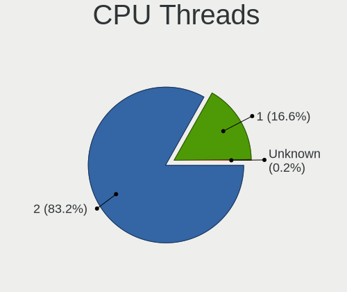
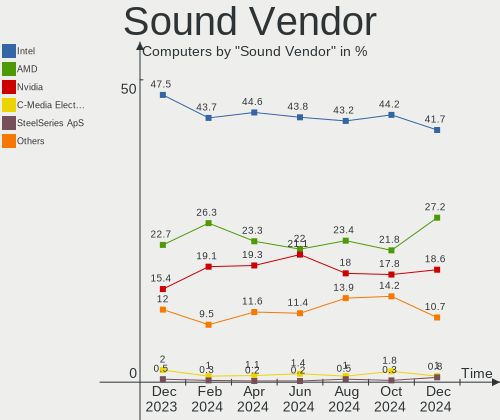

Fedora Hardware Trends
----------------------

A project to identify most popular hardware characteristics and track their change
over time based on data collected by Fedora users at https://Linux-Hardware.org.

Anyone can contribute to this report by the [hw-probe](https://github.com/linuxhw/hw-probe) tool:

    sudo -E hw-probe -all -upload

This is a report for all computer types. See also reports for [desktops](/Dist/Fedora/Desktop/README.md) and [notebooks](/Dist/Fedora/Notebook/README.md).

Full-feature report is available here: https://linux-hardware.org/?view=trends

Period: Dec, 2021.

Contents
--------

* [ System ](#system)
  - [ OS                       ](#os)
  - [ OS Family                ](#os-family)
  - [ Kernel                   ](#kernel)
  - [ Kernel Family            ](#kernel-family)
  - [ Kernel Major Ver.        ](#kernel-major-ver)
  - [ Arch                     ](#arch)
  - [ DE                       ](#de)
  - [ Display Server           ](#display-server)
  - [ Display Manager          ](#display-manager)
  - [ OS Lang                  ](#os-lang)
  - [ Boot Mode                ](#boot-mode)
  - [ Filesystem               ](#filesystem)
  - [ Part. scheme             ](#part-scheme)
  - [ Dual Boot with Linux/BSD ](#dual-boot-with-linuxbsd)
  - [ Dual Boot (Win)          ](#dual-boot-win)

* [ Board ](#board)
  - [ Vendor                   ](#vendor)
  - [ Model                    ](#model)
  - [ Model Family             ](#model-family)
  - [ MFG Year                 ](#mfg-year)
  - [ Form Factor              ](#form-factor)
  - [ Secure Boot              ](#secure-boot)
  - [ Coreboot                 ](#coreboot)
  - [ RAM Size                 ](#ram-size)
  - [ RAM Used                 ](#ram-used)
  - [ Total Drives             ](#total-drives)
  - [ Has CD-ROM               ](#has-cd-rom)
  - [ Has Ethernet             ](#has-ethernet)
  - [ Has WiFi                 ](#has-wifi)
  - [ Has Bluetooth            ](#has-bluetooth)

* [ Location ](#location)
  - [ Country                  ](#country)
  - [ City                     ](#city)

* [ Drives ](#drives)
  - [ Drive Vendor             ](#drive-vendor)
  - [ Drive Model              ](#drive-model)
  - [ HDD Vendor               ](#hdd-vendor)
  - [ SSD Vendor               ](#ssd-vendor)
  - [ Drive Kind               ](#drive-kind)
  - [ Drive Connector          ](#drive-connector)
  - [ Drive Size               ](#drive-size)
  - [ Space Total              ](#space-total)
  - [ Space Used               ](#space-used)
  - [ Malfunc. Drives          ](#malfunc-drives)
  - [ Malfunc. Drive Vendor    ](#malfunc-drive-vendor)
  - [ Malfunc. HDD Vendor      ](#malfunc-hdd-vendor)
  - [ Malfunc. Drive Kind      ](#malfunc-drive-kind)
  - [ Failed Drives            ](#failed-drives)
  - [ Failed Drive Vendor      ](#failed-drive-vendor)
  - [ Drive Status             ](#drive-status)

* [ Storage controller ](#storage-controller)
  - [ Storage Vendor           ](#storage-vendor)
  - [ Storage Model            ](#storage-model)
  - [ Storage Kind             ](#storage-kind)

* [ Processor ](#processor)
  - [ CPU Vendor               ](#cpu-vendor)
  - [ CPU Model                ](#cpu-model)
  - [ CPU Model Family         ](#cpu-model-family)
  - [ CPU Cores                ](#cpu-cores)
  - [ CPU Sockets              ](#cpu-sockets)
  - [ CPU Threads              ](#cpu-threads)
  - [ CPU Op-Modes             ](#cpu-op-modes)
  - [ CPU Microcode            ](#cpu-microcode)
  - [ CPU Microarch            ](#cpu-microarch)

* [ Graphics ](#graphics)
  - [ GPU Vendor               ](#gpu-vendor)
  - [ GPU Model                ](#gpu-model)
  - [ GPU Combo                ](#gpu-combo)
  - [ GPU Driver               ](#gpu-driver)
  - [ GPU Memory               ](#gpu-memory)

* [ Monitor ](#monitor)
  - [ Monitor Vendor           ](#monitor-vendor)
  - [ Monitor Model            ](#monitor-model)
  - [ Monitor Resolution       ](#monitor-resolution)
  - [ Monitor Diagonal         ](#monitor-diagonal)
  - [ Monitor Width            ](#monitor-width)
  - [ Aspect Ratio             ](#aspect-ratio)
  - [ Monitor Area             ](#monitor-area)
  - [ Pixel Density            ](#pixel-density)
  - [ Multiple Monitors        ](#multiple-monitors)

* [ Network ](#network)
  - [ Net Controller Vendor    ](#net-controller-vendor)
  - [ Net Controller Model     ](#net-controller-model)
  - [ Wireless Vendor          ](#wireless-vendor)
  - [ Wireless Model           ](#wireless-model)
  - [ Ethernet Vendor          ](#ethernet-vendor)
  - [ Ethernet Model           ](#ethernet-model)
  - [ Net Controller Kind      ](#net-controller-kind)
  - [ Used Controller          ](#used-controller)
  - [ NICs                     ](#nics)
  - [ IPv6                     ](#ipv6)

* [ Bluetooth ](#bluetooth)
  - [ Bluetooth Vendor         ](#bluetooth-vendor)
  - [ Bluetooth Model          ](#bluetooth-model)

* [ Sound ](#sound)
  - [ Sound Vendor             ](#sound-vendor)
  - [ Sound Model              ](#sound-model)

* [ Memory ](#memory)
  - [ Memory Vendor            ](#memory-vendor)
  - [ Memory Model             ](#memory-model)
  - [ Memory Kind              ](#memory-kind)
  - [ Memory Form Factor       ](#memory-form-factor)
  - [ Memory Size              ](#memory-size)
  - [ Memory Speed             ](#memory-speed)

* [ Printers & scanners ](#printers--scanners)
  - [ Printer Vendor           ](#printer-vendor)
  - [ Printer Model            ](#printer-model)
  - [ Scanner Vendor           ](#scanner-vendor)
  - [ Scanner Model            ](#scanner-model)

* [ Camera ](#camera)
  - [ Camera Vendor            ](#camera-vendor)
  - [ Camera Model             ](#camera-model)

* [ Security ](#security)
  - [ Fingerprint Vendor       ](#fingerprint-vendor)
  - [ Fingerprint Model        ](#fingerprint-model)
  - [ Chipcard Vendor          ](#chipcard-vendor)
  - [ Chipcard Model           ](#chipcard-model)

* [ Unsupported ](#unsupported)
  - [ Unsupported Devices      ](#unsupported-devices)
  - [ Unsupported Device Types ](#unsupported-device-types)

System
------

OS
--

Installed operating systems

| Name      | Computers | Percent |
|-----------|-----------|---------|
| Fedora 35 | 246       | 85.42%  |
| Fedora 34 | 31        | 10.76%  |
| Fedora 33 | 6         | 2.08%   |
| Fedora 32 | 3         | 1.04%   |
| Fedora 36 | 1         | 0.35%   |
| Fedora 31 | 1         | 0.35%   |

OS Family
---------

OS without a version

| Name   | Computers | Percent |
|--------|-----------|---------|
| Fedora | 288       | 100%    |

Kernel
------

Version of the Linux kernel

| Version                                                       | Computers | Percent |
|---------------------------------------------------------------|-----------|---------|
| 5.15.6-200.fc35.x86_64                                        | 77        | 26.74%  |
| 5.15.8-200.fc35.x86_64                                        | 29        | 10.07%  |
| 5.15.11-200.fc35.x86_64                                       | 28        | 9.72%   |
| 5.15.10-200.fc35.x86_64                                       | 23        | 7.99%   |
| 5.14.10-300.fc35.x86_64                                       | 23        | 7.99%   |
| 5.15.5-200.fc35.x86_64                                        | 22        | 7.64%   |
| 5.15.7-200.fc35.x86_64                                        | 17        | 5.9%    |
| 5.15.4-201.fc35.x86_64                                        | 7         | 2.43%   |
| 5.15.8-100.fc34.x86_64                                        | 6         | 2.08%   |
| 5.15.6-100.fc34.x86_64                                        | 6         | 2.08%   |
| 5.15.5-100.fc34.x86_64                                        | 5         | 1.74%   |
| 5.15.10-100.fc34.x86_64                                       | 5         | 1.74%   |
| 5.14.18-300.fc35.x86_64                                       | 4         | 1.39%   |
| 5.14.17-301.fc35.x86_64                                       | 3         | 1.04%   |
| 5.8.18-100.fc31.x86_64                                        | 2         | 0.69%   |
| 5.15.7-100.fc34.x86_64                                        | 2         | 0.69%   |
| 5.15.6-200.rog.fc35.x86_64                                    | 2         | 0.69%   |
| 5.14.18-100.fc33.x86_64                                       | 2         | 0.69%   |
| 5.14.16-201.fc34.x86_64                                       | 2         | 0.69%   |
| 5.11.22-100.fc32.x86_64                                       | 2         | 0.69%   |
| 5.11.12-300.fc34.x86_64                                       | 2         | 0.69%   |
| 5.8.15-301.fc33.x86_64                                        | 1         | 0.35%   |
| 5.6.6-300.fc32.x86_64                                         | 1         | 0.35%   |
| 5.16.0-0.rc6.41.vanilla.1.fc35.x86_64                         | 1         | 0.35%   |
| 5.16.0-0.rc5.35.vanilla.1.fc35.x86_64                         | 1         | 0.35%   |
| 5.16.0-0.rc2.18.vanilla.1.fc35.x86_64                         | 1         | 0.35%   |
| 5.15.8_tkg_pds                                                | 1         | 0.35%   |
| 5.15.6-301.fc35.x86_64                                        | 1         | 0.35%   |
| 5.15.6-250.vanilla.1.fc35.x86_64                              | 1         | 0.35%   |
| 5.15.6-200.rog.fc34.x86_64                                    | 1         | 0.35%   |
| 5.15.6-200.fc35.aarch64                                       | 1         | 0.35%   |
| 5.15.5-xm1tt.0.fc35.x86_64                                    | 1         | 0.35%   |
| 5.15.11-250.vanilla.1.fc35.x86_64                             | 1         | 0.35%   |
| 5.15.0-0.rc2.20210923git58e2cf5d7946.21.vanilla.1.fc36.x86_64 | 1         | 0.35%   |
| 5.14.18-301.fsync.fc35.x86_64                                 | 1         | 0.35%   |
| 5.14.18-200.fc34.x86_64                                       | 1         | 0.35%   |
| 5.14.17-201.fc34.x86_64                                       | 1         | 0.35%   |
| 5.13.19-200.fc34.x86_64                                       | 1         | 0.35%   |
| 5.11.17-200.fc33.x86_64                                       | 1         | 0.35%   |
| 5.11.14-200.fc33.x86_64                                       | 1         | 0.35%   |

Kernel Family
-------------

Linux kernel without a distro release

| Version | Computers | Percent |
|---------|-----------|---------|
| 5.15.6  | 89        | 30.9%   |
| 5.15.8  | 36        | 12.5%   |
| 5.15.11 | 29        | 10.07%  |
| 5.15.5  | 28        | 9.72%   |
| 5.15.10 | 28        | 9.72%   |
| 5.14.10 | 23        | 7.99%   |
| 5.15.7  | 19        | 6.6%    |
| 5.14.18 | 8         | 2.78%   |
| 5.15.4  | 7         | 2.43%   |
| 5.14.17 | 4         | 1.39%   |
| 5.16.0  | 3         | 1.04%   |
| 5.8.18  | 2         | 0.69%   |
| 5.14.16 | 2         | 0.69%   |
| 5.11.22 | 2         | 0.69%   |
| 5.11.12 | 2         | 0.69%   |
| 5.8.15  | 1         | 0.35%   |
| 5.6.6   | 1         | 0.35%   |
| 5.15.0  | 1         | 0.35%   |
| 5.13.19 | 1         | 0.35%   |
| 5.11.17 | 1         | 0.35%   |
| 5.11.14 | 1         | 0.35%   |

Kernel Major Ver.
-----------------

Linux kernel major version

| Version | Computers | Percent |
|---------|-----------|---------|
| 5.15    | 237       | 82.29%  |
| 5.14    | 37        | 12.85%  |
| 5.11    | 6         | 2.08%   |
| 5.8     | 3         | 1.04%   |
| 5.16    | 3         | 1.04%   |
| 5.6     | 1         | 0.35%   |
| 5.13    | 1         | 0.35%   |

Arch
----

OS architecture (x86_64, i586, etc.)

| Name    | Computers | Percent |
|---------|-----------|---------|
| x86_64  | 287       | 99.65%  |
| aarch64 | 1         | 0.35%   |

DE
--

Desktop Environment

| Name          | Computers | Percent |
|---------------|-----------|---------|
| GNOME         | 207       | 71.88%  |
| KDE5          | 49        | 17.01%  |
| Unknown       | 8         | 2.78%   |
| XFCE          | 5         | 1.74%   |
| X-Cinnamon    | 5         | 1.74%   |
| Cinnamon      | 5         | 1.74%   |
| MATE          | 4         | 1.39%   |
| GNOME Classic | 2         | 0.69%   |
| Pantheon      | 1         | 0.35%   |
| openbox       | 1         | 0.35%   |
| LXQt          | 1         | 0.35%   |

Display Server
--------------

X11 or Wayland

| Name    | Computers | Percent |
|---------|-----------|---------|
| Wayland | 167       | 57.99%  |
| X11     | 106       | 36.81%  |
| Tty     | 12        | 4.17%   |
| Unknown | 3         | 1.04%   |

Display Manager
---------------

SDDM, LightDM, etc.

| Name    | Computers | Percent |
|---------|-----------|---------|
| Unknown | 140       | 48.61%  |
| GDM     | 93        | 32.29%  |
| SDDM    | 30        | 10.42%  |
| LightDM | 25        | 8.68%   |

OS Lang
-------

Language

| Lang  | Computers | Percent |
|-------|-----------|---------|
| en_US | 161       | 55.9%   |
| en_GB | 20        | 6.94%   |
| ru_RU | 16        | 5.56%   |
| de_DE | 11        | 3.82%   |
| pt_BR | 9         | 3.13%   |
| fr_FR | 9         | 3.13%   |
| es_ES | 8         | 2.78%   |
| en_AU | 7         | 2.43%   |
| it_IT | 6         | 2.08%   |
| en_CA | 5         | 1.74%   |
| pl_PL | 4         | 1.39%   |
| C     | 4         | 1.39%   |
| ru_UA | 3         | 1.04%   |
| es_MX | 3         | 1.04%   |
| cs_CZ | 3         | 1.04%   |
| zh_CN | 2         | 0.69%   |
| sv_SE | 2         | 0.69%   |
| nl_BE | 2         | 0.69%   |
| fr_CA | 2         | 0.69%   |
| uk_UA | 1         | 0.35%   |
| tr_TR | 1         | 0.35%   |
| pt_PT | 1         | 0.35%   |
| ja_JP | 1         | 0.35%   |
| es_CO | 1         | 0.35%   |
| es_AR | 1         | 0.35%   |
| en_NZ | 1         | 0.35%   |
| en_IE | 1         | 0.35%   |
| en_DK | 1         | 0.35%   |
| de_CH | 1         | 0.35%   |
| de_AT | 1         | 0.35%   |

Boot Mode
---------

EFI or BIOS

| Mode | Computers | Percent |
|------|-----------|---------|
| EFI  | 225       | 78.13%  |
| BIOS | 63        | 21.88%  |

Filesystem
----------

Type of filesystem

| Type    | Computers | Percent |
|---------|-----------|---------|
| Btrfs   | 197       | 68.4%   |
| Ext4    | 75        | 26.04%  |
| Xfs     | 15        | 5.21%   |
| Overlay | 1         | 0.35%   |

Part. scheme
------------

Scheme of partitioning

| Type    | Computers | Percent |
|---------|-----------|---------|
| Unknown | 144       | 50%     |
| GPT     | 121       | 42.01%  |
| MBR     | 23        | 7.99%   |

Dual Boot with Linux/BSD
------------------------

Hosting more than one Linux/BSD

| Dual boot | Computers | Percent |
|-----------|-----------|---------|
| No        | 262       | 90.97%  |
| Yes       | 26        | 9.03%   |

Dual Boot (Win)
---------------

Hosting Linux and Windows

| Dual boot | Computers | Percent |
|-----------|-----------|---------|
| No        | 223       | 77.43%  |
| Yes       | 65        | 22.57%  |

Board
-----

Vendor
------

Motherboard manufacturer

| Name                   | Computers | Percent |
|------------------------|-----------|---------|
| Lenovo                 | 70        | 24.31%  |
| Dell                   | 49        | 17.01%  |
| ASUSTek Computer       | 33        | 11.46%  |
| Hewlett-Packard        | 32        | 11.11%  |
| Gigabyte Technology    | 25        | 8.68%   |
| MSI                    | 17        | 5.9%    |
| Acer                   | 11        | 3.82%   |
| Apple                  | 10        | 3.47%   |
| Notebook               | 4         | 1.39%   |
| Intel                  | 4         | 1.39%   |
| HUAWEI                 | 4         | 1.39%   |
| XFX                    | 2         | 0.69%   |
| Toshiba                | 2         | 0.69%   |
| Sony                   | 2         | 0.69%   |
| Samsung Electronics    | 2         | 0.69%   |
| Google                 | 2         | 0.69%   |
| Fujitsu                | 2         | 0.69%   |
| ASRock                 | 2         | 0.69%   |
| Unknown                | 2         | 0.69%   |
| TUXEDO                 | 1         | 0.35%   |
| Timi                   | 1         | 0.35%   |
| Supermicro             | 1         | 0.35%   |
| Positivo               | 1         | 0.35%   |
| LDLC                   | 1         | 0.35%   |
| JINGSHA                | 1         | 0.35%   |
| Hampoo                 | 1         | 0.35%   |
| Gateway                | 1         | 0.35%   |
| Fujitsu Siemens        | 1         | 0.35%   |
| Framework              | 1         | 0.35%   |
| Cube                   | 1         | 0.35%   |
| AVITA                  | 1         | 0.35%   |
| Avell High Performance | 1         | 0.35%   |

Model
-----

Motherboard model

| Name                                      | Computers | Percent |
|-------------------------------------------|-----------|---------|
| ASUS All Series                           | 3         | 1.04%   |
| Unknown                                   | 3         | 1.04%   |
| MSI MS-7C91                               | 2         | 0.69%   |
| MSI MS-7B10                               | 2         | 0.69%   |
| MSI MS-7A33                               | 2         | 0.69%   |
| Lenovo ThinkPad P1 Gen 3 20TJS53A00       | 2         | 0.69%   |
| HUAWEI HVY-WXX9                           | 2         | 0.69%   |
| HP ProBook 470 G5                         | 2         | 0.69%   |
| HP Laptop 15s-fq2xxx                      | 2         | 0.69%   |
| HP ENVY x360 Convertible 13-ay0xxx        | 2         | 0.69%   |
| Gigabyte B450 AORUS M                     | 2         | 0.69%   |
| Dell XPS 17 9700                          | 2         | 0.69%   |
| Dell Latitude 7490                        | 2         | 0.69%   |
| Dell Latitude 7300                        | 2         | 0.69%   |
| ASUS TUF GAMING B550-PLUS                 | 2         | 0.69%   |
| ASUS ROG Zephyrus G14 GA401QM_GA401QM     | 2         | 0.69%   |
| Apple MacBookPro9,2                       | 2         | 0.69%   |
| Acer Swift SF314-43                       | 2         | 0.69%   |
| XFX nForce 780i 3-Way SLI                 | 1         | 0.35%   |
| XFX MI-A78S-8209 Ver1.1                   | 1         | 0.35%   |
| TUXEDO InfinityBook S 15 Gen6             | 1         | 0.35%   |
| Toshiba Satellite L12-C-104               | 1         | 0.35%   |
| Toshiba Satellite C70-A-K2W               | 1         | 0.35%   |
| Timi TM1612                               | 1         | 0.35%   |
| Supermicro PIO-617R-TLN4F+-ST031          | 1         | 0.35%   |
| Sony SVE1713S1RW                          | 1         | 0.35%   |
| Sony SVE1711Z1RB                          | 1         | 0.35%   |
| Samsung RV410/RV510/S3510/E3510           | 1         | 0.35%   |
| Samsung DeskTop System                    | 1         | 0.35%   |
| Positivo W942SW_SW1                       | 1         | 0.35%   |
| Notebook NH5x_NH7xHP                      | 1         | 0.35%   |
| Notebook NH5xAx                           | 1         | 0.35%   |
| Notebook NH55RGQ                          | 1         | 0.35%   |
| Notebook N24_25JU                         | 1         | 0.35%   |
| MSI MS-7D25                               | 1         | 0.35%   |
| MSI MS-7C95                               | 1         | 0.35%   |
| MSI MS-7C56                               | 1         | 0.35%   |
| MSI MS-7B77                               | 1         | 0.35%   |
| MSI MS-7B07                               | 1         | 0.35%   |
| MSI MS-7A31                               | 1         | 0.35%   |
| MSI MS-7866                               | 1         | 0.35%   |
| MSI MS-7817                               | 1         | 0.35%   |
| MSI Modern 14 B5M                         | 1         | 0.35%   |
| MSI GL63 9SC                              | 1         | 0.35%   |
| MSI Alpha 15 B5EEK                        | 1         | 0.35%   |
| Lenovo Yoga S740-14IIL 81RS               | 1         | 0.35%   |
| Lenovo Yoga 910-13IKB 80VF                | 1         | 0.35%   |
| Lenovo Yoga 9 14ITL5 82BG                 | 1         | 0.35%   |
| Lenovo Yoga 7 14ITL5 82BH                 | 1         | 0.35%   |
| Lenovo Yoga 510-14IKB 80VB                | 1         | 0.35%   |
| Lenovo Y520-15IKBM 80YY                   | 1         | 0.35%   |
| Lenovo V470 439627U                       | 1         | 0.35%   |
| Lenovo V15-ADA 82C7                       | 1         | 0.35%   |
| Lenovo ThinkPad X390 20Q0CTO1WW           | 1         | 0.35%   |
| Lenovo ThinkPad X270 W10DG 20K5S17R0L     | 1         | 0.35%   |
| Lenovo ThinkPad X260 20F5S0V400           | 1         | 0.35%   |
| Lenovo ThinkPad X250 20CLS2B000           | 1         | 0.35%   |
| Lenovo ThinkPad X230 23257R2              | 1         | 0.35%   |
| Lenovo ThinkPad X230 23255E4              | 1         | 0.35%   |
| Lenovo ThinkPad X13 Yoga Gen 2 20W8001UUS | 1         | 0.35%   |

Model Family
------------

Motherboard model prefix

| Name                             | Computers | Percent |
|----------------------------------|-----------|---------|
| Lenovo ThinkPad                  | 41        | 14.24%  |
| Dell Inspiron                    | 14        | 4.86%   |
| ASUS ROG                         | 13        | 4.51%   |
| Lenovo IdeaPad                   | 10        | 3.47%   |
| Dell XPS                         | 10        | 3.47%   |
| Dell Latitude                    | 10        | 3.47%   |
| Dell OptiPlex                    | 7         | 2.43%   |
| HP Pavilion                      | 6         | 2.08%   |
| HP Laptop                        | 6         | 2.08%   |
| Lenovo Yoga                      | 5         | 1.74%   |
| Dell Vostro                      | 4         | 1.39%   |
| Acer Aspire                      | 4         | 1.39%   |
| Lenovo ThinkCentre               | 3         | 1.04%   |
| HP ProBook                       | 3         | 1.04%   |
| HP ENVY                          | 3         | 1.04%   |
| HP EliteBook                     | 3         | 1.04%   |
| Gigabyte B450                    | 3         | 1.04%   |
| Dell Precision                   | 3         | 1.04%   |
| ASUS TUF                         | 3         | 1.04%   |
| ASUS All                         | 3         | 1.04%   |
| Acer Swift                       | 3         | 1.04%   |
| Acer Nitro                       | 3         | 1.04%   |
| Unknown                          | 3         | 1.04%   |
| Toshiba Satellite                | 2         | 0.69%   |
| MSI MS-7C91                      | 2         | 0.69%   |
| MSI MS-7B10                      | 2         | 0.69%   |
| MSI MS-7A33                      | 2         | 0.69%   |
| Lenovo ThinkBook                 | 2         | 0.69%   |
| Lenovo IdeaPadFlex               | 2         | 0.69%   |
| HUAWEI HVY-WXX9                  | 2         | 0.69%   |
| HP ZBook                         | 2         | 0.69%   |
| Gigabyte Z390                    | 2         | 0.69%   |
| Gigabyte X570                    | 2         | 0.69%   |
| Gigabyte TRX40                   | 2         | 0.69%   |
| ASUS PRIME                       | 2         | 0.69%   |
| ASUS ASUS                        | 2         | 0.69%   |
| Apple MacBookPro9                | 2         | 0.69%   |
| XFX nForce                       | 1         | 0.35%   |
| XFX MI-A78S-8209                 | 1         | 0.35%   |
| TUXEDO InfinityBook              | 1         | 0.35%   |
| Timi TM1612                      | 1         | 0.35%   |
| Supermicro PIO-617R-TLN4F+-ST031 | 1         | 0.35%   |
| Sony SVE1713S1RW                 | 1         | 0.35%   |
| Sony SVE1711Z1RB                 | 1         | 0.35%   |
| Samsung RV410                    | 1         | 0.35%   |
| Samsung DeskTop                  | 1         | 0.35%   |
| Positivo W942SW                  | 1         | 0.35%   |
| Notebook NH5xAx                  | 1         | 0.35%   |
| Notebook NH5x                    | 1         | 0.35%   |
| Notebook NH55RGQ                 | 1         | 0.35%   |
| Notebook N24                     | 1         | 0.35%   |
| MSI MS-7D25                      | 1         | 0.35%   |
| MSI MS-7C95                      | 1         | 0.35%   |
| MSI MS-7C56                      | 1         | 0.35%   |
| MSI MS-7B77                      | 1         | 0.35%   |
| MSI MS-7B07                      | 1         | 0.35%   |
| MSI MS-7A31                      | 1         | 0.35%   |
| MSI MS-7866                      | 1         | 0.35%   |
| MSI MS-7817                      | 1         | 0.35%   |
| MSI Modern                       | 1         | 0.35%   |

MFG Year
--------

Motherboard manufacture year

| Year | Computers | Percent |
|------|-----------|---------|
| 2021 | 114       | 39.58%  |
| 2020 | 43        | 14.93%  |
| 2019 | 28        | 9.72%   |
| 2018 | 21        | 7.29%   |
| 2014 | 13        | 4.51%   |
| 2013 | 12        | 4.17%   |
| 2017 | 11        | 3.82%   |
| 2015 | 10        | 3.47%   |
| 2012 | 8         | 2.78%   |
| 2009 | 8         | 2.78%   |
| 2016 | 7         | 2.43%   |
| 2010 | 6         | 2.08%   |
| 2011 | 4         | 1.39%   |
| 2008 | 2         | 0.69%   |
| 2006 | 1         | 0.35%   |

Form Factor
-----------

Physical design of the computer

| Name           | Computers | Percent |
|----------------|-----------|---------|
| Notebook       | 175       | 60.76%  |
| Desktop        | 86        | 29.86%  |
| Convertible    | 15        | 5.21%   |
| Mini pc        | 6         | 2.08%   |
| All in one     | 4         | 1.39%   |
| System on chip | 1         | 0.35%   |
| Server         | 1         | 0.35%   |

Secure Boot
-----------

Enabled or disabled

| State    | Computers | Percent |
|----------|-----------|---------|
| Disabled | 235       | 81.6%   |
| Enabled  | 53        | 18.4%   |

Coreboot
--------

Have coreboot on board

| Used | Computers | Percent |
|------|-----------|---------|
| No   | 286       | 99.31%  |
| Yes  | 2         | 0.69%   |

RAM Size
--------

Total RAM memory

| Size in GB  | Computers | Percent |
|-------------|-----------|---------|
| 16.01-24.0  | 73        | 25.35%  |
| 4.01-8.0    | 65        | 22.57%  |
| 8.01-16.0   | 55        | 19.1%   |
| 32.01-64.0  | 51        | 17.71%  |
| 3.01-4.0    | 25        | 8.68%   |
| 64.01-256.0 | 13        | 4.51%   |
| 24.01-32.0  | 3         | 1.04%   |
| 2.01-3.0    | 2         | 0.69%   |
| 1.01-2.0    | 1         | 0.35%   |

RAM Used
--------

Used RAM memory

| Used GB    | Computers | Percent |
|------------|-----------|---------|
| 4.01-8.0   | 86        | 29.86%  |
| 2.01-3.0   | 82        | 28.47%  |
| 3.01-4.0   | 56        | 19.44%  |
| 1.01-2.0   | 33        | 11.46%  |
| 8.01-16.0  | 24        | 8.33%   |
| 16.01-24.0 | 3         | 1.04%   |
| 0.51-1.0   | 3         | 1.04%   |
| 0.01-0.5   | 1         | 0.35%   |

Total Drives
------------

Number of drives on board

| Drives | Computers | Percent |
|--------|-----------|---------|
| 1      | 172       | 59.72%  |
| 2      | 69        | 23.96%  |
| 3      | 23        | 7.99%   |
| 5      | 9         | 3.13%   |
| 4      | 6         | 2.08%   |
| 6      | 4         | 1.39%   |
| 0      | 3         | 1.04%   |
| 14     | 1         | 0.35%   |
| 9      | 1         | 0.35%   |

Has CD-ROM
----------

Has CD-ROM on board

| Presented | Computers | Percent |
|-----------|-----------|---------|
| No        | 227       | 78.82%  |
| Yes       | 61        | 21.18%  |

Has Ethernet
------------

Has Ethernet on board

| Presented | Computers | Percent |
|-----------|-----------|---------|
| Yes       | 223       | 77.43%  |
| No        | 65        | 22.57%  |

Has WiFi
--------

Has WiFi module

| Presented | Computers | Percent |
|-----------|-----------|---------|
| Yes       | 240       | 83.33%  |
| No        | 48        | 16.67%  |

Has Bluetooth
-------------

Has Bluetooth module

| Presented | Computers | Percent |
|-----------|-----------|---------|
| Yes       | 205       | 71.18%  |
| No        | 83        | 28.82%  |

Location
--------

Country
-------

Geographic location (country)

| Country      | Computers | Percent |
|--------------|-----------|---------|
| USA          | 55        | 19.1%   |
| Russia       | 24        | 8.33%   |
| Germany      | 21        | 7.29%   |
| Brazil       | 15        | 5.21%   |
| Spain        | 11        | 3.82%   |
| UK           | 10        | 3.47%   |
| Poland       | 10        | 3.47%   |
| Canada       | 10        | 3.47%   |
| Italy        | 9         | 3.13%   |
| India        | 9         | 3.13%   |
| France       | 9         | 3.13%   |
| Australia    | 8         | 2.78%   |
| Ukraine      | 6         | 2.08%   |
| Sweden       | 6         | 2.08%   |
| Romania      | 6         | 2.08%   |
| Mexico       | 6         | 2.08%   |
| Belgium      | 6         | 2.08%   |
| Czechia      | 5         | 1.74%   |
| Belarus      | 5         | 1.74%   |
| Switzerland  | 4         | 1.39%   |
| Netherlands  | 4         | 1.39%   |
| Turkey       | 3         | 1.04%   |
| Portugal     | 3         | 1.04%   |
| Norway       | 3         | 1.04%   |
| Indonesia    | 3         | 1.04%   |
| Greece       | 3         | 1.04%   |
| Austria      | 3         | 1.04%   |
| Serbia       | 2         | 0.69%   |
| Saudi Arabia | 2         | 0.69%   |
| Malaysia     | 2         | 0.69%   |
| Kazakhstan   | 2         | 0.69%   |
| Israel       | 2         | 0.69%   |
| Denmark      | 2         | 0.69%   |
| Argentina    | 2         | 0.69%   |
| Venezuela    | 1         | 0.35%   |
| Syria        | 1         | 0.35%   |
| South Korea  | 1         | 0.35%   |
| Pakistan     | 1         | 0.35%   |
| Nigeria      | 1         | 0.35%   |
| Kyrgyzstan   | 1         | 0.35%   |
| Kenya        | 1         | 0.35%   |
| Japan        | 1         | 0.35%   |
| Ireland      | 1         | 0.35%   |
| Iran         | 1         | 0.35%   |
| Hong Kong    | 1         | 0.35%   |
| Finland      | 1         | 0.35%   |
| Estonia      | 1         | 0.35%   |
| Colombia     | 1         | 0.35%   |
| China        | 1         | 0.35%   |
| Bulgaria     | 1         | 0.35%   |
| Algeria      | 1         | 0.35%   |

City
----

Geographic location (city)

| City              | Computers | Percent |
|-------------------|-----------|---------|
| Moscow            | 9         | 3.13%   |
| Sydney            | 6         | 2.08%   |
| S??o Paulo        | 5         | 1.74%   |
| Minsk             | 5         | 1.74%   |
| Zurich            | 4         | 1.39%   |
| Vienna            | 3         | 1.04%   |
| St Petersburg     | 3         | 1.04%   |
| Nuremberg         | 3         | 1.04%   |
| Mexico City       | 3         | 1.04%   |
| Madrid            | 3         | 1.04%   |
| Istanbul          | 3         | 1.04%   |
| Bucharest         | 3         | 1.04%   |
| Berlin            | 3         | 1.04%   |
| Warsaw            | 2         | 0.69%   |
| Tacoma            | 2         | 0.69%   |
| Somerville        | 2         | 0.69%   |
| Roquetas de Mar   | 2         | 0.69%   |
| Prague            | 2         | 0.69%   |
| Nizhniy Novgorod  | 2         | 0.69%   |
| Mumbai            | 2         | 0.69%   |
| Lubbock           | 2         | 0.69%   |
| Lodz              | 2         | 0.69%   |
| Kyiv              | 2         | 0.69%   |
| Jakarta           | 2         | 0.69%   |
| Iasi              | 2         | 0.69%   |
| Hamburg           | 2         | 0.69%   |
| Gothenburg        | 2         | 0.69%   |
| Bytom             | 2         | 0.69%   |
| Belo Horizonte    | 2         | 0.69%   |
| Belgrade          | 2         | 0.69%   |
| Athens            | 2         | 0.69%   |
| Yekaterinburg     | 1         | 0.35%   |
| Worthing          | 1         | 0.35%   |
| Woolwich          | 1         | 0.35%   |
| Wolcott           | 1         | 0.35%   |
| Wilmington        | 1         | 0.35%   |
| Willowbrook       | 1         | 0.35%   |
| Waterloo          | 1         | 0.35%   |
| Volgograd         | 1         | 0.35%   |
| Vinnytsia         | 1         | 0.35%   |
| Villavicencio     | 1         | 0.35%   |
| Vila Velha        | 1         | 0.35%   |
| Vila Nova de Gaia | 1         | 0.35%   |
| Venice            | 1         | 0.35%   |
| Valencia          | 1         | 0.35%   |
| Vaennaesby        | 1         | 0.35%   |
| Vaellingby        | 1         | 0.35%   |
| Ufa               | 1         | 0.35%   |
| Udine             | 1         | 0.35%   |
| Twin Falls        | 1         | 0.35%   |
| Tver              | 1         | 0.35%   |
| Tuxtla Guti?©rrez | 1         | 0.35%   |
| Tuusula           | 1         | 0.35%   |
| Tustin            | 1         | 0.35%   |
| Trondheim         | 1         | 0.35%   |
| Trieste           | 1         | 0.35%   |
| Toulouse          | 1         | 0.35%   |
| Toronto           | 1         | 0.35%   |
| Timi?™oara        | 1         | 0.35%   |
| Tikhoretsk        | 1         | 0.35%   |

Drives
------

Drive Vendor
------------

Hard drive vendors

| Vendor              | Computers | Drives | Percent |
|---------------------|-----------|--------|---------|
| Samsung Electronics | 99        | 128    | 23.29%  |
| WDC                 | 51        | 70     | 12%     |
| Seagate             | 49        | 64     | 11.53%  |
| Sandisk             | 25        | 26     | 5.88%   |
| Kingston            | 24        | 25     | 5.65%   |
| Toshiba             | 22        | 23     | 5.18%   |
| SK Hynix            | 19        | 19     | 4.47%   |
| Unknown             | 16        | 17     | 3.76%   |
| Micron Technology   | 15        | 15     | 3.53%   |
| Intel               | 15        | 15     | 3.53%   |
| KIOXIA              | 13        | 13     | 3.06%   |
| Crucial             | 11        | 11     | 2.59%   |
| A-DATA Technology   | 7         | 9      | 1.65%   |
| SPCC                | 6         | 6      | 1.41%   |
| Phison              | 6         | 9      | 1.41%   |
| Transcend           | 4         | 4      | 0.94%   |
| Patriot             | 4         | 4      | 0.94%   |
| Silicon Motion      | 3         | 3      | 0.71%   |
| HGST                | 3         | 3      | 0.71%   |
| GOODRAM             | 3         | 3      | 0.71%   |
| Apple               | 3         | 4      | 0.71%   |
| LITEON              | 2         | 2      | 0.47%   |
| Hitachi             | 2         | 2      | 0.47%   |
| Gigabyte Technology | 2         | 2      | 0.47%   |
| China               | 2         | 2      | 0.47%   |
| Apacer              | 2         | 2      | 0.47%   |
| YMTC                | 1         | 1      | 0.24%   |
| XPG                 | 1         | 1      | 0.24%   |
| UMIS                | 1         | 1      | 0.24%   |
| PNY                 | 1         | 1      | 0.24%   |
| PLEXTOR             | 1         | 1      | 0.24%   |
| OWC                 | 1         | 1      | 0.24%   |
| Mushkin             | 1         | 1      | 0.24%   |
| MAXTOR              | 1         | 1      | 0.24%   |
| LaCie               | 1         | 2      | 0.24%   |
| JMicron             | 1         | 1      | 0.24%   |
| Intenso             | 1         | 2      | 0.24%   |
| Dahua               | 1         | 1      | 0.24%   |
| Corsair             | 1         | 1      | 0.24%   |
| BIWIN               | 1         | 1      | 0.24%   |
| ADATA Technology    | 1         | 1      | 0.24%   |
| 2-Power             | 1         | 1      | 0.24%   |
| Unknown             | 1         | 1      | 0.24%   |

Drive Model
-----------

Hard drive models

| Model                                   | Computers | Percent |
|-----------------------------------------|-----------|---------|
| Samsung NVMe SSD Drive 500GB            | 10        | 2.13%   |
| Samsung SSD 860 EVO 500GB               | 8         | 1.7%    |
| Samsung NVMe SSD Drive 512GB            | 7         | 1.49%   |
| Kingston SA400S37480G 480GB SSD         | 6         | 1.28%   |
| Unknown MMC Card  64GB                  | 5         | 1.06%   |
| SK Hynix NVMe SSD Drive 512GB           | 5         | 1.06%   |
| Sandisk NVMe SSD Drive 1TB              | 5         | 1.06%   |
| Samsung SSD 850 EVO 250GB               | 5         | 1.06%   |
| Seagate ST1000DM010-2EP102 1TB          | 4         | 0.85%   |
| Sandisk NVMe SSD Drive 256GB            | 4         | 0.85%   |
| Samsung SSD 870 EVO 1TB                 | 4         | 0.85%   |
| Samsung SSD 860 EVO 1TB                 | 4         | 0.85%   |
| Samsung NVMe SSD Drive 1TB              | 4         | 0.85%   |
| Samsung NVMe SSD Drive 1024GB           | 4         | 0.85%   |
| KIOXIA NVMe SSD Drive 256GB             | 4         | 0.85%   |
| WDC WDS100T2B0A-00SM50 1TB SSD          | 3         | 0.64%   |
| WDC WD30EFRX-68EUZN0 3TB                | 3         | 0.64%   |
| WDC PC SN730 SDBQNTY-256G-1001 256GB    | 3         | 0.64%   |
| Seagate ST2000DM008-2FR102 2TB          | 3         | 0.64%   |
| Seagate ST1000LM048-2E7172 1TB          | 3         | 0.64%   |
| Seagate ST1000LM014-1EJ164 1TB          | 3         | 0.64%   |
| Seagate ST1000DM003-1ER162 1TB          | 3         | 0.64%   |
| Seagate ST1000DM003-1CH162 1TB          | 3         | 0.64%   |
| Samsung SSD 970 EVO Plus 500GB          | 3         | 0.64%   |
| Samsung SSD 970 EVO Plus 2TB            | 3         | 0.64%   |
| Samsung SSD 970 EVO Plus 1TB            | 3         | 0.64%   |
| Samsung NVMe SSD Drive 2TB              | 3         | 0.64%   |
| WDC WDS100T3X0C-00SJG0 1TB              | 2         | 0.43%   |
| WDC WD40EZRZ-00GXCB0 4TB                | 2         | 0.43%   |
| WDC WD2500AAKX-753CA1 250GB             | 2         | 0.43%   |
| WDC WD20EZRX-00D8PB0 2TB                | 2         | 0.43%   |
| WDC WD10EZEX-08WN4A0 1TB                | 2         | 0.43%   |
| WDC WD1002FAEX-00Z3A0 1TB               | 2         | 0.43%   |
| Unknown MMC Card  8GB                   | 2         | 0.43%   |
| Unknown MMC Card  32GB                  | 2         | 0.43%   |
| Unknown 00000  32GB                     | 2         | 0.43%   |
| Toshiba NVMe SSD Drive 512GB            | 2         | 0.43%   |
| Toshiba NVMe SSD Drive 256GB            | 2         | 0.43%   |
| Toshiba KXG6AZNV512G 512GB              | 2         | 0.43%   |
| Toshiba KSG60ZMV256G M.2 2280 256GB SSD | 2         | 0.43%   |
| Toshiba DT01ACA100 1TB                  | 2         | 0.43%   |
| SK Hynix NVMe SSD Drive 256GB           | 2         | 0.43%   |
| SK Hynix HFM001TD3JX013N 1TB            | 2         | 0.43%   |
| SK Hynix BC711 NVMe 512GB               | 2         | 0.43%   |
| Silicon Motion NVMe SSD Drive 1024GB    | 2         | 0.43%   |
| Seagate ST500DM002-1BD142 500GB         | 2         | 0.43%   |
| Seagate ST2000LM007-1R8174 2TB          | 2         | 0.43%   |
| Seagate ST1000LM024 HN-M101MBB 1TB      | 2         | 0.43%   |
| SanDisk SSD PLUS 240GB                  | 2         | 0.43%   |
| Sandisk NVMe SSD Drive 512GB            | 2         | 0.43%   |
| Sandisk NVMe SSD Drive 1024GB           | 2         | 0.43%   |
| Samsung SSD 980 1TB                     | 2         | 0.43%   |
| Samsung SSD 870 QVO 2TB                 | 2         | 0.43%   |
| Samsung SSD 870 EVO 500GB               | 2         | 0.43%   |
| Samsung NVMe SSD Drive 250GB            | 2         | 0.43%   |
| Samsung MZVLB1T0HBLR-000L7 1TB          | 2         | 0.43%   |
| Phison Sabrent 2TB                      | 2         | 0.43%   |
| Micron MTFDHBA512TDV 512GB              | 2         | 0.43%   |
| KIOXIA NVMe SSD Drive 512GB             | 2         | 0.43%   |
| KIOXIA KBG40ZNS512G NVMe 512GB          | 2         | 0.43%   |

HDD Vendor
----------

Hard disk drive vendors

| Vendor              | Computers | Drives | Percent |
|---------------------|-----------|--------|---------|
| Seagate             | 47        | 62     | 45.63%  |
| WDC                 | 32        | 49     | 31.07%  |
| Toshiba             | 12        | 13     | 11.65%  |
| Samsung Electronics | 4         | 5      | 3.88%   |
| HGST                | 3         | 3      | 2.91%   |
| Hitachi             | 2         | 2      | 1.94%   |
| MAXTOR              | 1         | 1      | 0.97%   |
| LaCie               | 1         | 2      | 0.97%   |
| Apple               | 1         | 1      | 0.97%   |

SSD Vendor
----------

Solid state drive vendors

| Vendor              | Computers | Drives | Percent |
|---------------------|-----------|--------|---------|
| Samsung Electronics | 41        | 53     | 29.29%  |
| Kingston            | 14        | 14     | 10%     |
| SanDisk             | 11        | 11     | 7.86%   |
| Crucial             | 11        | 11     | 7.86%   |
| WDC                 | 9         | 9      | 6.43%   |
| Micron Technology   | 6         | 6      | 4.29%   |
| SPCC                | 5         | 5      | 3.57%   |
| A-DATA Technology   | 5         | 7      | 3.57%   |
| Transcend           | 4         | 4      | 2.86%   |
| Patriot             | 4         | 4      | 2.86%   |
| Intel               | 4         | 4      | 2.86%   |
| GOODRAM             | 3         | 3      | 2.14%   |
| Toshiba             | 2         | 2      | 1.43%   |
| LITEON              | 2         | 2      | 1.43%   |
| Gigabyte Technology | 2         | 2      | 1.43%   |
| China               | 2         | 2      | 1.43%   |
| Apacer              | 2         | 2      | 1.43%   |
| SK Hynix            | 1         | 1      | 0.71%   |
| Seagate             | 1         | 1      | 0.71%   |
| PNY                 | 1         | 1      | 0.71%   |
| PLEXTOR             | 1         | 1      | 0.71%   |
| OWC                 | 1         | 1      | 0.71%   |
| Mushkin             | 1         | 1      | 0.71%   |
| JMicron             | 1         | 1      | 0.71%   |
| Intenso             | 1         | 2      | 0.71%   |
| Dahua               | 1         | 1      | 0.71%   |
| Corsair             | 1         | 1      | 0.71%   |
| BIWIN               | 1         | 1      | 0.71%   |
| Apple               | 1         | 1      | 0.71%   |
| 2-Power             | 1         | 1      | 0.71%   |

Drive Kind
----------

HDD or SSD

| Kind    | Computers | Drives | Percent |
|---------|-----------|--------|---------|
| NVMe    | 155       | 188    | 40.68%  |
| SSD     | 121       | 155    | 31.76%  |
| HDD     | 87        | 138    | 22.83%  |
| MMC     | 15        | 15     | 3.94%   |
| Unknown | 3         | 4      | 0.79%   |

Drive Connector
---------------

SATA, SAS, NVMe, etc.

| Type | Computers | Drives | Percent |
|------|-----------|--------|---------|
| SATA | 164       | 288    | 48.09%  |
| NVMe | 155       | 188    | 45.45%  |
| MMC  | 15        | 15     | 4.4%    |
| SAS  | 7         | 9      | 2.05%   |

Drive Size
----------

Size of hard drive

| Size in TB | Computers | Drives | Percent |
|------------|-----------|--------|---------|
| 0.01-0.5   | 119       | 153    | 53.6%   |
| 0.51-1.0   | 65        | 85     | 29.28%  |
| 1.01-2.0   | 21        | 24     | 9.46%   |
| 2.01-3.0   | 8         | 18     | 3.6%    |
| 3.01-4.0   | 5         | 5      | 2.25%   |
| 4.01-10.0  | 3         | 6      | 1.35%   |
| 10.01-20.0 | 1         | 2      | 0.45%   |

Space Total
-----------

Amount of disk space available on the file system

| Size in GB     | Computers | Percent |
|----------------|-----------|---------|
| 501-1000       | 62        | 21.53%  |
| 251-500        | 50        | 17.36%  |
| 1-20           | 42        | 14.58%  |
| 101-250        | 35        | 12.15%  |
| 1001-2000      | 34        | 11.81%  |
| Unknown        | 29        | 10.07%  |
| 2001-3000      | 12        | 4.17%   |
| More than 3000 | 11        | 3.82%   |
| 51-100         | 10        | 3.47%   |
| 21-50          | 3         | 1.04%   |

Space Used
----------

Amount of used disk space

| Used GB        | Computers | Percent |
|----------------|-----------|---------|
| 1-20           | 84        | 29.17%  |
| 21-50          | 43        | 14.93%  |
| 101-250        | 39        | 13.54%  |
| 251-500        | 30        | 10.42%  |
| 51-100         | 29        | 10.07%  |
| Unknown        | 29        | 10.07%  |
| 501-1000       | 21        | 7.29%   |
| 1001-2000      | 9         | 3.13%   |
| 2001-3000      | 3         | 1.04%   |
| More than 3000 | 1         | 0.35%   |

Malfunc. Drives
---------------

Drive models with a malfunction

| Model                                               | Computers | Drives | Percent |
|-----------------------------------------------------|-----------|--------|---------|
| Intel SSDSC2CT120A3 120GB                           | 2         | 2      | 8.7%    |
| WDC WD2500AAKX-753CA1 250GB                         | 1         | 1      | 4.35%   |
| WDC WD10EZEX-08WN4A0 1TB                            | 1         | 1      | 4.35%   |
| WDC WD1003FBYX-01Y7B1 1TB                           | 1         | 1      | 4.35%   |
| WDC WD1002FAEX-00Z3A0 1TB                           | 1         | 1      | 4.35%   |
| Toshiba MQ01ABD050V 500GB                           | 1         | 1      | 4.35%   |
| Toshiba KSG60ZMV256G M.2 2280 256GB SSD             | 1         | 1      | 4.35%   |
| SK Hynix HFS128G39TND-N210A 128GB SSD               | 1         | 1      | 4.35%   |
| Seagate ST500DM002-1BD142 500GB                     | 1         | 1      | 4.35%   |
| Seagate ST31000524AS 1TB                            | 1         | 1      | 4.35%   |
| Seagate ST3000DM001-1ER166 3TB                      | 1         | 1      | 4.35%   |
| Seagate ST1000LM024 HN-M101MBB 1TB                  | 1         | 1      | 4.35%   |
| Seagate ST1000DM010-2EP102 1TB                      | 1         | 1      | 4.35%   |
| SanDisk SDSSDX240GG25 240GB                         | 1         | 1      | 4.35%   |
| Samsung Electronics SSD 970 PRO 1TB                 | 1         | 1      | 4.35%   |
| Samsung Electronics MZNLH256HAJD-000H1 256GB SSD    | 1         | 1      | 4.35%   |
| Samsung Electronics HD501LJ 500GB                   | 1         | 2      | 4.35%   |
| Micron Technology MTFDDAK512TBN-1AR1ZABHA 512GB SSD | 1         | 1      | 4.35%   |
| Micron Technology MTFDDAK128MAY-1AH1ZABHA 128GB SSD | 1         | 1      | 4.35%   |
| Micron Technology 1100_MTFDDAV512TBN 512GB SSD      | 1         | 1      | 4.35%   |
| LITEON LMH-128V2M 128GB SSD                         | 1         | 1      | 4.35%   |
| LITEON CV8-8E128-HP 128GB SSD                       | 1         | 1      | 4.35%   |

Malfunc. Drive Vendor
---------------------

Vendors of faulty drives

| Vendor              | Computers | Drives | Percent |
|---------------------|-----------|--------|---------|
| Seagate             | 5         | 5      | 21.74%  |
| WDC                 | 4         | 4      | 17.39%  |
| Samsung Electronics | 3         | 4      | 13.04%  |
| Micron Technology   | 3         | 3      | 13.04%  |
| Toshiba             | 2         | 2      | 8.7%    |
| LITEON              | 2         | 2      | 8.7%    |
| Intel               | 2         | 2      | 8.7%    |
| SK Hynix            | 1         | 1      | 4.35%   |
| SanDisk             | 1         | 1      | 4.35%   |

Malfunc. HDD Vendor
-------------------

Vendors of faulty HDD drives

| Vendor              | Computers | Drives | Percent |
|---------------------|-----------|--------|---------|
| Seagate             | 5         | 5      | 45.45%  |
| WDC                 | 4         | 4      | 36.36%  |
| Toshiba             | 1         | 1      | 9.09%   |
| Samsung Electronics | 1         | 2      | 9.09%   |

Malfunc. Drive Kind
-------------------

Kinds of faulty drives

| Kind | Computers | Drives | Percent |
|------|-----------|--------|---------|
| SSD  | 11        | 11     | 50%     |
| HDD  | 10        | 12     | 45.45%  |
| NVMe | 1         | 1      | 4.55%   |

Failed Drives
-------------

Failed drive models

Zero info for selected period =(

Failed Drive Vendor
-------------------

Failed drive vendors

Zero info for selected period =(

Drive Status
------------

Number of failed and malfunc. drives

| Status   | Computers | Drives | Percent |
|----------|-----------|--------|---------|
| Detected | 148       | 269    | 48.21%  |
| Works    | 137       | 207    | 44.63%  |
| Malfunc  | 22        | 24     | 7.17%   |

Storage controller
------------------

Storage Vendor
--------------

Storage controller vendors

| Vendor                        | Computers | Percent |
|-------------------------------|-----------|---------|
| Intel                         | 157       | 40.67%  |
| Samsung Electronics           | 57        | 14.77%  |
| AMD                           | 56        | 14.51%  |
| Sandisk                       | 25        | 6.48%   |
| SK Hynix                      | 18        | 4.66%   |
| KIOXIA                        | 11        | 2.85%   |
| Toshiba America Info Systems  | 10        | 2.59%   |
| Kingston Technology Company   | 10        | 2.59%   |
| Micron Technology             | 9         | 2.33%   |
| Phison Electronics            | 6         | 1.55%   |
| Nvidia                        | 5         | 1.3%    |
| ADATA Technology              | 4         | 1.04%   |
| Silicon Motion                | 3         | 0.78%   |
| Marvell Technology Group      | 3         | 0.78%   |
| ASMedia Technology            | 3         | 0.78%   |
| JMicron Technology            | 2         | 0.52%   |
| Yangtze Memory Technologies   | 1         | 0.26%   |
| Union Memory (Shenzhen)       | 1         | 0.26%   |
| MAXIO Technology (Hangzhou)   | 1         | 0.26%   |
| LSI Logic / Symbios Logic     | 1         | 0.26%   |
| Integrated Technology Express | 1         | 0.26%   |
| Broadcom / LSI                | 1         | 0.26%   |
| Apple                         | 1         | 0.26%   |

Storage Model
-------------

Storage controller models

| Model                                                                          | Computers | Percent |
|--------------------------------------------------------------------------------|-----------|---------|
| AMD FCH SATA Controller [AHCI mode]                                            | 43        | 10.07%  |
| Samsung NVMe SSD Controller SM981/PM981/PM983                                  | 33        | 7.73%   |
| Intel Sunrise Point-LP SATA Controller [AHCI mode]                             | 19        | 4.45%   |
| Samsung NVMe SSD Controller 980                                                | 14        | 3.28%   |
| Intel Volume Management Device NVMe RAID Controller                            | 13        | 3.04%   |
| Intel 8 Series/C220 Series Chipset Family 6-port SATA Controller 1 [AHCI mode] | 12        | 2.81%   |
| KIOXIA Non-Volatile memory controller                                          | 11        | 2.58%   |
| Intel 7 Series Chipset Family 6-port SATA Controller [AHCI mode]               | 10        | 2.34%   |
| Sandisk WD Black SN750 / PC SN730 NVMe SSD                                     | 9         | 2.11%   |
| AMD 400 Series Chipset SATA Controller                                         | 9         | 2.11%   |
| SK Hynix Gold P31 SSD                                                          | 8         | 1.87%   |
| Micron Non-Volatile memory controller                                          | 8         | 1.87%   |
| Intel Cannon Lake PCH SATA AHCI Controller                                     | 7         | 1.64%   |
| Intel 82801 Mobile SATA Controller [RAID mode]                                 | 7         | 1.64%   |
| Intel 6 Series/C200 Series Chipset Family 6 port Mobile SATA AHCI Controller   | 7         | 1.64%   |
| Toshiba America Info Systems XG6 NVMe SSD Controller                           | 6         | 1.41%   |
| Sandisk WD Blue SN550 NVMe SSD                                                 | 6         | 1.41%   |
| Sandisk Non-Volatile memory controller                                         | 6         | 1.41%   |
| Samsung NVMe SSD Controller SM961/PM961/SM963                                  | 6         | 1.41%   |
| Intel SSD 660P Series                                                          | 6         | 1.41%   |
| Intel Q170/Q150/B150/H170/H110/Z170/CM236 Chipset SATA Controller [AHCI Mode]  | 6         | 1.41%   |
| AMD Starship/Matisse Chipset SATA Controller [AHCI mode]                       | 6         | 1.41%   |
| SK Hynix Non-Volatile memory controller                                        | 5         | 1.17%   |
| Samsung NVMe SSD Controller PM9A1/PM9A3/980PRO                                 | 5         | 1.17%   |
| Intel Tiger Lake-LP SATA Controller [AHCI mode]                                | 5         | 1.17%   |
| AMD SB7x0/SB8x0/SB9x0 SATA Controller [AHCI mode]                              | 5         | 1.17%   |
| Intel Wildcat Point-LP SATA Controller [AHCI Mode]                             | 4         | 0.94%   |
| Intel HM170/QM170 Chipset SATA Controller [AHCI Mode]                          | 4         | 0.94%   |
| Intel Celeron N3350/Pentium N4200/Atom E3900 Series SATA AHCI Controller       | 4         | 0.94%   |
| Intel Cannon Point-LP SATA Controller [AHCI Mode]                              | 4         | 0.94%   |
| Intel Cannon Lake Mobile PCH SATA AHCI Controller                              | 4         | 0.94%   |
| Intel 7 Series/C210 Series Chipset Family 6-port SATA Controller [AHCI mode]   | 4         | 0.94%   |
| Intel 6 Series/C200 Series Chipset Family 6 port Desktop SATA AHCI Controller  | 4         | 0.94%   |
| Intel 200 Series PCH SATA controller [AHCI mode]                               | 4         | 0.94%   |
| Toshiba America Info Systems BG3 NVMe SSD Controller                           | 3         | 0.7%    |
| Phison E12 NVMe Controller                                                     | 3         | 0.7%    |
| Intel 82801JI (ICH10 Family) 4 port SATA IDE Controller #1                     | 3         | 0.7%    |
| Intel 82801JI (ICH10 Family) 2 port SATA IDE Controller #2                     | 3         | 0.7%    |
| Intel 8 Series SATA Controller 1 [AHCI mode]                                   | 3         | 0.7%    |
| Intel 600 Series Chipset Family SATA AHCI Controller                           | 3         | 0.7%    |
| ASMedia ASM1062 Serial ATA Controller                                          | 3         | 0.7%    |
| AMD X370 Series Chipset SATA Controller                                        | 3         | 0.7%    |
| AMD SB7x0/SB8x0/SB9x0 IDE Controller                                           | 3         | 0.7%    |
| SK Hynix PC401 NVMe Solid State Drive 256GB                                    | 2         | 0.47%   |
| SK Hynix BC511                                                                 | 2         | 0.47%   |
| Silicon Motion SM2262/SM2262EN SSD Controller                                  | 2         | 0.47%   |
| Sandisk WD PC SN810 / Black SN850 NVMe SSD                                     | 2         | 0.47%   |
| Sandisk PC SN520 NVMe SSD                                                      | 2         | 0.47%   |
| Phison PS5013 E13 NVMe Controller                                              | 2         | 0.47%   |
| Nvidia MCP55 SATA Controller                                                   | 2         | 0.47%   |
| Nvidia MCP55 IDE                                                               | 2         | 0.47%   |
| Kingston Company Company Non-Volatile memory controller                        | 2         | 0.47%   |
| Kingston Company OM3PDP3 NVMe SSD                                              | 2         | 0.47%   |
| Kingston Company KC2000 NVMe SSD                                               | 2         | 0.47%   |
| Kingston Company A2000 NVMe SSD                                                | 2         | 0.47%   |
| Intel SSD Pro 7600p/760p/E 6100p Series                                        | 2         | 0.47%   |
| Intel SATA Controller [RAID mode]                                              | 2         | 0.47%   |
| Intel NM10/ICH7 Family SATA Controller [IDE mode]                              | 2         | 0.47%   |
| Intel Ice Lake-LP SATA Controller [AHCI mode]                                  | 2         | 0.47%   |
| Intel Comet Lake SATA AHCI Controller                                          | 2         | 0.47%   |

Storage Kind
------------

Kind of storage controller (IDE, SATA, NVMe, SAS, ...)

| Kind | Computers | Percent |
|------|-----------|---------|
| SATA | 183       | 48.03%  |
| NVMe | 154       | 40.42%  |
| RAID | 22        | 5.77%   |
| IDE  | 19        | 4.99%   |
| SAS  | 3         | 0.79%   |

Processor
---------

CPU Vendor
----------

Processor vendors

| Vendor | Computers | Percent |
|--------|-----------|---------|
| Intel  | 204       | 70.83%  |
| AMD    | 83        | 28.82%  |
| ARM    | 1         | 0.35%   |

CPU Model
---------

Processor models

| Model                                         | Computers | Percent |
|-----------------------------------------------|-----------|---------|
| Intel 11th Gen Core i5-1135G7 @ 2.40GHz       | 9         | 3.13%   |
| Intel 11th Gen Core i7-1165G7 @ 2.80GHz       | 8         | 2.78%   |
| Intel Core i5-8250U CPU @ 1.60GHz             | 5         | 1.74%   |
| AMD Ryzen 5 5500U with Radeon Graphics        | 5         | 1.74%   |
| AMD Ryzen 5 3500U with Radeon Vega Mobile Gfx | 5         | 1.74%   |
| Intel Core i7-10850H CPU @ 2.70GHz            | 4         | 1.39%   |
| Intel Core i7-10750H CPU @ 2.60GHz            | 4         | 1.39%   |
| Intel Core i7-10510U CPU @ 1.80GHz            | 4         | 1.39%   |
| Intel Core i5-8265U CPU @ 1.60GHz             | 4         | 1.39%   |
| AMD Ryzen 9 5900HS with Radeon Graphics       | 4         | 1.39%   |
| Intel Core i7-8650U CPU @ 1.90GHz             | 3         | 1.04%   |
| Intel Core i7-8565U CPU @ 1.80GHz             | 3         | 1.04%   |
| Intel Core i7-8550U CPU @ 1.80GHz             | 3         | 1.04%   |
| Intel Core i7-10610U CPU @ 1.80GHz            | 3         | 1.04%   |
| Intel Core i5-6500 CPU @ 3.20GHz              | 3         | 1.04%   |
| Intel Core i5-5200U CPU @ 2.20GHz             | 3         | 1.04%   |
| Intel Core i5-3210M CPU @ 2.50GHz             | 3         | 1.04%   |
| Intel Celeron CPU N3450 @ 1.10GHz             | 3         | 1.04%   |
| Intel 11th Gen Core i7-1185G7 @ 3.00GHz       | 3         | 1.04%   |
| AMD Ryzen 9 5900X 12-Core Processor           | 3         | 1.04%   |
| AMD Ryzen 7 PRO 4750U with Radeon Graphics    | 3         | 1.04%   |
| AMD Ryzen 7 4800H with Radeon Graphics        | 3         | 1.04%   |
| AMD Ryzen 5 5600X 6-Core Processor            | 3         | 1.04%   |
| AMD Ryzen 5 4500U with Radeon Graphics        | 3         | 1.04%   |
| Intel Core i9-9900K CPU @ 3.60GHz             | 2         | 0.69%   |
| Intel Core i9-10885H CPU @ 2.40GHz            | 2         | 0.69%   |
| Intel Core i7-6700HQ CPU @ 2.60GHz            | 2         | 0.69%   |
| Intel Core i7-4810MQ CPU @ 2.80GHz            | 2         | 0.69%   |
| Intel Core i7-4510U CPU @ 2.00GHz             | 2         | 0.69%   |
| Intel Core i7-3770 CPU @ 3.40GHz              | 2         | 0.69%   |
| Intel Core i7-2630QM CPU @ 2.00GHz            | 2         | 0.69%   |
| Intel Core i7-1065G7 CPU @ 1.30GHz            | 2         | 0.69%   |
| Intel Core i5-9400 CPU @ 2.90GHz              | 2         | 0.69%   |
| Intel Core i5-8365U CPU @ 1.60GHz             | 2         | 0.69%   |
| Intel Core i5-7300U CPU @ 2.60GHz             | 2         | 0.69%   |
| Intel Core i5-7200U CPU @ 2.50GHz             | 2         | 0.69%   |
| Intel Core i5-6300U CPU @ 2.40GHz             | 2         | 0.69%   |
| Intel Core i5-4590 CPU @ 3.30GHz              | 2         | 0.69%   |
| Intel Core i5-3320M CPU @ 2.60GHz             | 2         | 0.69%   |
| Intel Core i5-3317U CPU @ 1.70GHz             | 2         | 0.69%   |
| Intel Core i3-3120M CPU @ 2.50GHz             | 2         | 0.69%   |
| Intel Core 2 Duo CPU E7400 @ 2.80GHz          | 2         | 0.69%   |
| Intel 12th Gen Core i5-12600K                 | 2         | 0.69%   |
| Intel 11th Gen Core i7-11800H @ 2.30GHz       | 2         | 0.69%   |
| Intel 11th Gen Core i7-11390H @ 3.40GHz       | 2         | 0.69%   |
| Intel 11th Gen Core i3-1115G4 @ 3.00GHz       | 2         | 0.69%   |
| AMD Ryzen 9 5900HX with Radeon Graphics       | 2         | 0.69%   |
| AMD Ryzen 9 3900X 12-Core Processor           | 2         | 0.69%   |
| AMD Ryzen 7 5700U with Radeon Graphics        | 2         | 0.69%   |
| AMD Ryzen 7 4700U with Radeon Graphics        | 2         | 0.69%   |
| AMD Ryzen 7 2700 Eight-Core Processor         | 2         | 0.69%   |
| AMD Ryzen 5 5600H with Radeon Graphics        | 2         | 0.69%   |
| AMD Ryzen 5 5600G with Radeon Graphics        | 2         | 0.69%   |
| AMD Ryzen 5 4600H with Radeon Graphics        | 2         | 0.69%   |
| AMD A6-5200 APU with Radeon HD Graphics       | 2         | 0.69%   |
| Intel Xeon CPU X5680 @ 3.33GHz                | 1         | 0.35%   |
| Intel Xeon CPU E5540 @ 2.53GHz                | 1         | 0.35%   |
| Intel Xeon CPU E5-2697 v2 @ 2.70GHz           | 1         | 0.35%   |
| Intel Xeon CPU E5-2673 v3 @ 2.40GHz           | 1         | 0.35%   |
| Intel Xeon CPU E3-1225 v6 @ 3.30GHz           | 1         | 0.35%   |

CPU Model Family
----------------

Processor model prefix

| Model                   | Computers | Percent |
|-------------------------|-----------|---------|
| Intel Core i7           | 62        | 21.53%  |
| Intel Core i5           | 61        | 21.18%  |
| Other                   | 33        | 11.46%  |
| AMD Ryzen 5             | 29        | 10.07%  |
| AMD Ryzen 7             | 15        | 5.21%   |
| Intel Core i3           | 13        | 4.51%   |
| AMD Ryzen 9             | 12        | 4.17%   |
| Intel Core 2 Duo        | 7         | 2.43%   |
| Intel Xeon              | 6         | 2.08%   |
| Intel Core i9           | 6         | 2.08%   |
| Intel Celeron           | 6         | 2.08%   |
| AMD Ryzen 3             | 6         | 2.08%   |
| Intel Pentium           | 3         | 1.04%   |
| AMD Ryzen Threadripper  | 3         | 1.04%   |
| AMD Ryzen 7 PRO         | 3         | 1.04%   |
| Intel Core m3           | 2         | 0.69%   |
| AMD Phenom II X2        | 2         | 0.69%   |
| AMD A8                  | 2         | 0.69%   |
| AMD A6                  | 2         | 0.69%   |
| Intel Pentium Dual-Core | 1         | 0.35%   |
| Intel Pentium Dual      | 1         | 0.35%   |
| Intel Core m7           | 1         | 0.35%   |
| Intel Core 2 Quad       | 1         | 0.35%   |
| Intel Core 2 Extreme    | 1         | 0.35%   |
| Intel Atom              | 1         | 0.35%   |
| AMD Ryzen 5 PRO         | 1         | 0.35%   |
| AMD FX                  | 1         | 0.35%   |
| AMD E                   | 1         | 0.35%   |
| AMD C-60                | 1         | 0.35%   |
| AMD Athlon II X2        | 1         | 0.35%   |
| AMD Athlon II           | 1         | 0.35%   |
| AMD Athlon 64 X2        | 1         | 0.35%   |
| AMD Athlon              | 1         | 0.35%   |
| AMD A10                 | 1         | 0.35%   |

CPU Cores
---------

Number of processor cores

| Number  | Computers | Percent |
|---------|-----------|---------|
| 4       | 124       | 43.06%  |
| 2       | 76        | 26.39%  |
| 6       | 39        | 13.54%  |
| 8       | 34        | 11.81%  |
| 12      | 6         | 2.08%   |
| 24      | 3         | 1.04%   |
| 16      | 2         | 0.69%   |
| 10      | 2         | 0.69%   |
| 32      | 1         | 0.35%   |
| Unknown | 1         | 0.35%   |

CPU Sockets
-----------

Number of sockets

| Number | Computers | Percent |
|--------|-----------|---------|
| 1      | 284       | 98.61%  |
| 2      | 4         | 1.39%   |

CPU Threads
-----------

Threads per core (Hyper-Threading)

| Number  | Computers | Percent |
|---------|-----------|---------|
| 2       | 225       | 78.13%  |
| 1       | 62        | 21.53%  |
| Unknown | 1         | 0.35%   |

CPU Op-Modes
------------

CPU Operation Modes (32-bit, 64-bit)

| Op mode        | Computers | Percent |
|----------------|-----------|---------|
| 32-bit, 64-bit | 288       | 100%    |

CPU Microcode
-------------

Microcode number

| Number     | Computers | Percent |
|------------|-----------|---------|
| 0x806c1    | 23        | 7.99%   |
| 0x806ec    | 15        | 5.21%   |
| 0x306c3    | 15        | 5.21%   |
| 0x306a9    | 15        | 5.21%   |
| Unknown    | 15        | 5.21%   |
| 0x806ea    | 12        | 4.17%   |
| 0x206a7    | 11        | 3.82%   |
| 0xa0652    | 10        | 3.47%   |
| 0x0a50000c | 10        | 3.47%   |
| 0x08600106 | 10        | 3.47%   |
| 0x806e9    | 9         | 3.13%   |
| 0x506e3    | 9         | 3.13%   |
| 0x406e3    | 8         | 2.78%   |
| 0x08108109 | 8         | 2.78%   |
| 0x906ed    | 7         | 2.43%   |
| 0x1067a    | 7         | 2.43%   |
| 0x906e9    | 5         | 1.74%   |
| 0x506c9    | 5         | 1.74%   |
| 0x08608103 | 5         | 1.74%   |
| 0x906ea    | 4         | 1.39%   |
| 0x706e5    | 4         | 1.39%   |
| 0x40651    | 4         | 1.39%   |
| 0x306d4    | 4         | 1.39%   |
| 0x0a201016 | 4         | 1.39%   |
| 0x08701021 | 4         | 1.39%   |
| 0x90672    | 3         | 1.04%   |
| 0x806eb    | 3         | 1.04%   |
| 0x08608102 | 3         | 1.04%   |
| 0x08600104 | 3         | 1.04%   |
| 0x08001137 | 3         | 1.04%   |
| 0x806c2    | 2         | 0.69%   |
| 0x106a5    | 2         | 0.69%   |
| 0x10676    | 2         | 0.69%   |
| 0x0a201009 | 2         | 0.69%   |
| 0x0810100b | 2         | 0.69%   |
| 0x0800820b | 2         | 0.69%   |
| 0x08008206 | 2         | 0.69%   |
| 0xf43      | 1         | 0.35%   |
| 0xa0671    | 1         | 0.35%   |
| 0xa0660    | 1         | 0.35%   |
| 0x906ec    | 1         | 0.35%   |
| 0x806d1    | 1         | 0.35%   |
| 0x6fd      | 1         | 0.35%   |
| 0x6fb      | 1         | 0.35%   |
| 0x406c3    | 1         | 0.35%   |
| 0x40661    | 1         | 0.35%   |
| 0x306f2    | 1         | 0.35%   |
| 0x306e4    | 1         | 0.35%   |
| 0x30678    | 1         | 0.35%   |
| 0x30661    | 1         | 0.35%   |
| 0x206c2    | 1         | 0.35%   |
| 0x20655    | 1         | 0.35%   |
| 0x0a50000b | 1         | 0.35%   |
| 0x0a201006 | 1         | 0.35%   |
| 0x08701013 | 1         | 0.35%   |
| 0x08600102 | 1         | 0.35%   |
| 0x08301025 | 1         | 0.35%   |
| 0x08108102 | 1         | 0.35%   |
| 0x08101016 | 1         | 0.35%   |
| 0x0800820d | 1         | 0.35%   |

CPU Microarch
-------------

Microarchitecture

| Name             | Computers | Percent |
|------------------|-----------|---------|
| KabyLake         | 59        | 20.49%  |
| TigerLake        | 26        | 9.03%   |
| Zen 2            | 21        | 7.29%   |
| Haswell          | 21        | 7.29%   |
| Zen 3            | 20        | 6.94%   |
| Skylake          | 17        | 5.9%    |
| IvyBridge        | 17        | 5.9%    |
| Zen+             | 14        | 4.86%   |
| SandyBridge      | 13        | 4.51%   |
| CometLake        | 12        | 4.17%   |
| Unknown          | 10        | 3.47%   |
| Penryn           | 9         | 3.13%   |
| Zen              | 7         | 2.43%   |
| IceLake          | 6         | 2.08%   |
| Goldmont         | 5         | 1.74%   |
| Broadwell        | 5         | 1.74%   |
| K10              | 4         | 1.39%   |
| Alderlake Hybrid | 3         | 1.04%   |
| Westmere         | 2         | 0.69%   |
| Silvermont       | 2         | 0.69%   |
| Piledriver       | 2         | 0.69%   |
| Nehalem          | 2         | 0.69%   |
| Jaguar           | 2         | 0.69%   |
| Core             | 2         | 0.69%   |
| Bobcat           | 2         | 0.69%   |
| Steamroller      | 1         | 0.35%   |
| Puma             | 1         | 0.35%   |
| NetBurst         | 1         | 0.35%   |
| K8 Hammer        | 1         | 0.35%   |
| Bonnell          | 1         | 0.35%   |

Graphics
--------

GPU Vendor
----------

Vendors of graphics cards

| Vendor            | Computers | Percent |
|-------------------|-----------|---------|
| Intel             | 169       | 47.74%  |
| Nvidia            | 99        | 27.97%  |
| AMD               | 84        | 23.73%  |
| ASPEED Technology | 2         | 0.56%   |

GPU Model
---------

Graphics card models

| Model                                                                                 | Computers | Percent |
|---------------------------------------------------------------------------------------|-----------|---------|
| Intel TigerLake-LP GT2 [Iris Xe Graphics]                                             | 23        | 6.39%   |
| AMD Renoir                                                                            | 14        | 3.89%   |
| AMD Cezanne                                                                           | 13        | 3.61%   |
| Intel UHD Graphics 620                                                                | 11        | 3.06%   |
| Intel CometLake-H GT2 [UHD Graphics]                                                  | 11        | 3.06%   |
| Intel WhiskeyLake-U GT2 [UHD Graphics 620]                                            | 10        | 2.78%   |
| Intel 3rd Gen Core processor Graphics Controller                                      | 10        | 2.78%   |
| Intel 2nd Generation Core Processor Family Integrated Graphics Controller             | 9         | 2.5%    |
| AMD Picasso/Raven 2 [Radeon Vega Series / Radeon Vega Mobile Series]                  | 9         | 2.5%    |
| Nvidia GA106M [GeForce RTX 3060 Mobile / Max-Q]                                       | 8         | 2.22%   |
| Intel CometLake-U GT2 [UHD Graphics]                                                  | 8         | 2.22%   |
| AMD Lucienne                                                                          | 8         | 2.22%   |
| Intel HD Graphics 620                                                                 | 7         | 1.94%   |
| Intel HD Graphics 530                                                                 | 7         | 1.94%   |
| Intel Xeon E3-1200 v3/4th Gen Core Processor Integrated Graphics Controller           | 6         | 1.67%   |
| Nvidia GK208B [GeForce GT 710]                                                        | 5         | 1.39%   |
| Intel Skylake GT2 [HD Graphics 520]                                                   | 5         | 1.39%   |
| Intel CoffeeLake-H GT2 [UHD Graphics 630]                                             | 5         | 1.39%   |
| Nvidia GP108M [GeForce MX250]                                                         | 4         | 1.11%   |
| Nvidia GP107 [GeForce GTX 1050 Ti]                                                    | 4         | 1.11%   |
| Intel HD Graphics 5500                                                                | 4         | 1.11%   |
| Intel HD Graphics 500                                                                 | 4         | 1.11%   |
| Intel Haswell-ULT Integrated Graphics Controller                                      | 4         | 1.11%   |
| Intel CoffeeLake-S GT2 [UHD Graphics 630]                                             | 4         | 1.11%   |
| Intel 4th Gen Core Processor Integrated Graphics Controller                           | 4         | 1.11%   |
| AMD Navi 23 [Radeon RX 6600/6600 XT/6600M]                                            | 4         | 1.11%   |
| Nvidia TU117M [GeForce GTX 1650 Ti Mobile]                                            | 3         | 0.83%   |
| Nvidia TU117GLM [Quadro T1000 Mobile]                                                 | 3         | 0.83%   |
| Intel HD Graphics 630                                                                 | 3         | 0.83%   |
| Intel 4 Series Chipset Integrated Graphics Controller                                 | 3         | 0.83%   |
| AMD Topaz XT [Radeon R7 M260/M265 / M340/M360 / M440/M445 / 530/535 / 620/625 Mobile] | 3         | 0.83%   |
| AMD Navi 10 [Radeon RX 5600 OEM/5600 XT / 5700/5700 XT]                               | 3         | 0.83%   |
| AMD Ellesmere [Radeon RX 470/480/570/570X/580/580X/590]                               | 3         | 0.83%   |
| Nvidia TU117M [GeForce GTX 1650 Mobile / Max-Q]                                       | 2         | 0.56%   |
| Nvidia TU106M [GeForce RTX 2060 Mobile]                                               | 2         | 0.56%   |
| Nvidia TU106M [GeForce RTX 2060 Max-Q]                                                | 2         | 0.56%   |
| Nvidia TU106 [GeForce RTX 2070]                                                       | 2         | 0.56%   |
| Nvidia TU106 [GeForce RTX 2060 Rev. A]                                                | 2         | 0.56%   |
| Nvidia GP108M [GeForce MX150]                                                         | 2         | 0.56%   |
| Nvidia GP108GLM [Quadro P520]                                                         | 2         | 0.56%   |
| Nvidia GP108 [GeForce GT 1030]                                                        | 2         | 0.56%   |
| Nvidia GM108M [GeForce 940MX]                                                         | 2         | 0.56%   |
| Nvidia GM108M [GeForce 930MX]                                                         | 2         | 0.56%   |
| Nvidia GF117M [GeForce 610M/710M/810M/820M / GT 620M/625M/630M/720M]                  | 2         | 0.56%   |
| Nvidia GA107M [GeForce RTX 3050 Ti Mobile]                                            | 2         | 0.56%   |
| Intel TigerLake-H GT1 [UHD Graphics]                                                  | 2         | 0.56%   |
| Intel Tiger Lake UHD Graphics                                                         | 2         | 0.56%   |
| Intel Iris Plus Graphics G7                                                           | 2         | 0.56%   |
| Intel Iris Plus Graphics G1 (Ice Lake)                                                | 2         | 0.56%   |
| Intel HD Graphics 615                                                                 | 2         | 0.56%   |
| Intel HD Graphics 515                                                                 | 2         | 0.56%   |
| Intel AlderLake-S GT1                                                                 | 2         | 0.56%   |
| ASPEED Technology ASPEED Graphics Family                                              | 2         | 0.56%   |
| AMD Thames [Radeon HD 7550M/7570M/7650M]                                              | 2         | 0.56%   |
| AMD Raven Ridge [Radeon Vega Series / Radeon Vega Mobile Series]                      | 2         | 0.56%   |
| AMD Lexa PRO [Radeon 540/540X/550/550X / RX 540X/550/550X]                            | 2         | 0.56%   |
| AMD Kabini [Radeon HD 8400 / R3 Series]                                               | 2         | 0.56%   |
| Nvidia TU117M [GeForce MX450]                                                         | 1         | 0.28%   |
| Nvidia TU117GLM [Quadro T500 Mobile]                                                  | 1         | 0.28%   |
| Nvidia TU116M [GeForce GTX 1660 Ti Mobile]                                            | 1         | 0.28%   |

GPU Combo
---------

Combinations of graphics cards

| Name            | Computers | Percent |
|-----------------|-----------|---------|
| 1 x Intel       | 113       | 39.24%  |
| 1 x AMD         | 61        | 21.18%  |
| Intel + Nvidia  | 48        | 16.67%  |
| 1 x Nvidia      | 39        | 13.54%  |
| AMD + Nvidia    | 10        | 3.47%   |
| Intel + AMD     | 7         | 2.43%   |
| 2 x AMD         | 5         | 1.74%   |
| Other           | 2         | 0.69%   |
| 2 x Nvidia      | 1         | 0.35%   |
| Nvidia + ASPEED | 1         | 0.35%   |
| 1 x ASPEED      | 1         | 0.35%   |

GPU Driver
----------

Free vs proprietary

| Driver      | Computers | Percent |
|-------------|-----------|---------|
| Free        | 232       | 80.56%  |
| Proprietary | 51        | 17.71%  |
| Unknown     | 5         | 1.74%   |

GPU Memory
----------

Total video memory

| Size in GB | Computers | Percent |
|------------|-----------|---------|
| Unknown    | 158       | 54.86%  |
| 0.01-0.5   | 39        | 13.54%  |
| 1.01-2.0   | 38        | 13.19%  |
| 3.01-4.0   | 16        | 5.56%   |
| 0.51-1.0   | 16        | 5.56%   |
| 7.01-8.0   | 15        | 5.21%   |
| 5.01-6.0   | 4         | 1.39%   |
| 8.01-16.0  | 2         | 0.69%   |

Monitor
-------

Monitor Vendor
--------------

Monitor vendors

| Vendor                  | Computers | Percent |
|-------------------------|-----------|---------|
| Chimei Innolux          | 39        | 11.34%  |
| AU Optronics            | 39        | 11.34%  |
| LG Display              | 35        | 10.17%  |
| Samsung Electronics     | 31        | 9.01%   |
| Dell                    | 30        | 8.72%   |
| BOE                     | 30        | 8.72%   |
| Acer                    | 16        | 4.65%   |
| Goldstar                | 13        | 3.78%   |
| Lenovo                  | 11        | 3.2%    |
| Hewlett-Packard         | 11        | 3.2%    |
| Philips                 | 10        | 2.91%   |
| Ancor Communications    | 9         | 2.62%   |
| Sharp                   | 8         | 2.33%   |
| Apple                   | 8         | 2.33%   |
| BenQ                    | 7         | 2.03%   |
| ViewSonic               | 6         | 1.74%   |
| AOC                     | 5         | 1.45%   |
| TMX                     | 4         | 1.16%   |
| CSO                     | 4         | 1.16%   |
| ASUSTek Computer        | 4         | 1.16%   |
| InfoVision              | 3         | 0.87%   |
| Sony                    | 2         | 0.58%   |
| PANDA                   | 2         | 0.58%   |
| MSI                     | 2         | 0.58%   |
| Iiyama                  | 2         | 0.58%   |
| PRISM+                  | 1         | 0.29%   |
| Panasonic               | 1         | 0.29%   |
| Kogan                   | 1         | 0.29%   |
| JRY                     | 1         | 0.29%   |
| InnoLux Display         | 1         | 0.29%   |
| Hitachi                 | 1         | 0.29%   |
| HannStar                | 1         | 0.29%   |
| Gigabyte Technology     | 1         | 0.29%   |
| Fujitsu Siemens         | 1         | 0.29%   |
| eMachines               | 1         | 0.29%   |
| Eizo                    | 1         | 0.29%   |
| Chi Mei Optoelectronics | 1         | 0.29%   |
| AGT                     | 1         | 0.29%   |

Monitor Model
-------------

Monitor models

| Model                                                                | Computers | Percent |
|----------------------------------------------------------------------|-----------|---------|
| Chimei Innolux LCD Monitor CMN14D4 1920x1080 309x173mm 13.9-inch     | 6         | 1.69%   |
| TMX TL140BDXP01-0 TMX1400 2560x1440 310x174mm 14.0-inch              | 3         | 0.84%   |
| Chimei Innolux LCD Monitor CMN1521 1920x1080 344x193mm 15.5-inch     | 3         | 0.84%   |
| Sharp LCD Monitor SHP14D6 3840x2400 366x229mm 17.0-inch              | 2         | 0.56%   |
| Samsung Electronics C27F390 SAM0D32 1920x1080 600x340mm 27.2-inch    | 2         | 0.56%   |
| Samsung Electronics C24F390 SAM0D2C 1920x1080 520x290mm 23.4-inch    | 2         | 0.56%   |
| PANDA LCD Monitor NCP002B 1920x1080 309x174mm 14.0-inch              | 2         | 0.56%   |
| LG Display LCD Monitor LGD062C 1920x1080 309x174mm 14.0-inch         | 2         | 0.56%   |
| LG Display LCD Monitor LGD0625 1920x1080 344x194mm 15.5-inch         | 2         | 0.56%   |
| LG Display LCD Monitor LGD046D 1920x1080 309x174mm 14.0-inch         | 2         | 0.56%   |
| LG Display LCD Monitor LGD03A3 1366x768 277x156mm 12.5-inch          | 2         | 0.56%   |
| Lenovo LCD Monitor LEN40BA 1920x1080 344x194mm 15.5-inch             | 2         | 0.56%   |
| Dell U2415 DELA0BA 1920x1080 518x324mm 24.1-inch                     | 2         | 0.56%   |
| Dell P2719H DEL4184 1920x1080 598x336mm 27.0-inch                    | 2         | 0.56%   |
| Dell P2419H DELD0D9 1920x1080 527x296mm 23.8-inch                    | 2         | 0.56%   |
| Chimei Innolux LCD Monitor CMN15C3 1920x1080 340x190mm 15.3-inch     | 2         | 0.56%   |
| Chimei Innolux LCD Monitor CMN1526 1920x1080 344x193mm 15.5-inch     | 2         | 0.56%   |
| Chimei Innolux LCD Monitor CMN1515 1920x1080 344x193mm 15.5-inch     | 2         | 0.56%   |
| Chimei Innolux LCD Monitor CMN150C 1920x1080 344x193mm 15.5-inch     | 2         | 0.56%   |
| Chimei Innolux LCD Monitor CMN14B1 1920x1080 308x173mm 13.9-inch     | 2         | 0.56%   |
| BOE LCD Monitor BOE0877 1920x1080 309x173mm 13.9-inch                | 2         | 0.56%   |
| BOE LCD Monitor BOE0853 1920x1080 344x194mm 15.5-inch                | 2         | 0.56%   |
| AU Optronics LCD Monitor AUOF38C 1920x1080 293x165mm 13.2-inch       | 2         | 0.56%   |
| AU Optronics LCD Monitor AUO61ED 1920x1080 340x190mm 15.3-inch       | 2         | 0.56%   |
| AU Optronics LCD Monitor AUO5B2D 1920x1080 293x162mm 13.2-inch       | 2         | 0.56%   |
| AU Optronics LCD Monitor AUO573D 1920x1080 309x174mm 14.0-inch       | 2         | 0.56%   |
| AU Optronics LCD Monitor AUO423D 1920x1080 309x173mm 13.9-inch       | 2         | 0.56%   |
| AU Optronics LCD Monitor AUO21ED 1920x1080 344x194mm 15.5-inch       | 2         | 0.56%   |
| ViewSonic VX3258 SERIES VSCDE35 2560x1440 697x392mm 31.5-inch        | 1         | 0.28%   |
| ViewSonic VX2336 SERIES VSC402A 1920x1080 510x290mm 23.1-inch        | 1         | 0.28%   |
| ViewSonic VX2260WM VSCFC21 1920x1080 477x268mm 21.5-inch             | 1         | 0.28%   |
| ViewSonic VG2719-2K VSC1935 2560x1440 597x336mm 27.0-inch            | 1         | 0.28%   |
| ViewSonic VA2226w-3 VSC2051 1680x1050 495x291mm 22.6-inch            | 1         | 0.28%   |
| ViewSonic VA1926wSERIES VSC5920 1440x900 410x256mm 19.0-inch         | 1         | 0.28%   |
| TMX TL156MDMP01-0 TMX1560 3200x2000 336x210mm 15.6-inch              | 1         | 0.28%   |
| Sony TV SNYE903 1920x1080 1600x900mm 72.3-inch                       | 1         | 0.28%   |
| Sony TV SNY4502 1920x1080 1600x900mm 72.3-inch                       | 1         | 0.28%   |
| Sharp LCD Monitor SHP14F9 1920x1200 288x180mm 13.4-inch              | 1         | 0.28%   |
| Sharp LCD Monitor SHP14F7 1920x1200 288x180mm 13.4-inch              | 1         | 0.28%   |
| Sharp LCD Monitor SHP14D0 3840x2400 336x210mm 15.6-inch              | 1         | 0.28%   |
| Sharp LCD Monitor SHP14BA 1920x1080 344x194mm 15.5-inch              | 1         | 0.28%   |
| Sharp LCD Monitor SHP14AF 1920x1200 288x180mm 13.4-inch              | 1         | 0.28%   |
| Sharp LCD Monitor SHP14AD 3840x2160 294x165mm 13.3-inch              | 1         | 0.28%   |
| Samsung Electronics U28E590 SAM0C4D 3840x2160 607x345mm 27.5-inch    | 1         | 0.28%   |
| Samsung Electronics SyncMaster SAM05EC 1920x1080 597x336mm 27.0-inch | 1         | 0.28%   |
| Samsung Electronics SyncMaster SAM0587 1920x1200 518x324mm 24.1-inch | 1         | 0.28%   |
| Samsung Electronics SyncMaster SAM04DD 1920x1080 477x268mm 21.5-inch | 1         | 0.28%   |
| Samsung Electronics SyncMaster SAM03E4 1680x1050 474x296mm 22.0-inch | 1         | 0.28%   |
| Samsung Electronics SyncMaster SAM0286 1280x720 372x209mm 16.8-inch  | 1         | 0.28%   |
| Samsung Electronics SyncMaster SAM0230 1280x1024 376x301mm 19.0-inch | 1         | 0.28%   |
| Samsung Electronics SMBX2440 SAM068B 1920x1080 530x300mm 24.0-inch   | 1         | 0.28%   |
| Samsung Electronics S34J55x SAM0F71 3440x1440 797x333mm 34.0-inch    | 1         | 0.28%   |
| Samsung Electronics S27F350 SAM0D22 1920x1080 598x336mm 27.0-inch    | 1         | 0.28%   |
| Samsung Electronics S24F350 SAM0D20 1920x1080 521x293mm 23.5-inch    | 1         | 0.28%   |
| Samsung Electronics S24E650 SAM0C86 1920x1200 518x324mm 24.1-inch    | 1         | 0.28%   |
| Samsung Electronics S24D300 SAM0B43 1920x1080 531x299mm 24.0-inch    | 1         | 0.28%   |
| Samsung Electronics S22C350 SAM0A32 1920x1080 477x268mm 21.5-inch    | 1         | 0.28%   |
| Samsung Electronics LU28R55 SAM1015 3840x2160 632x360mm 28.6-inch    | 1         | 0.28%   |
| Samsung Electronics LS27R75 SAM102D 2560x1440 598x336mm 27.0-inch    | 1         | 0.28%   |
| Samsung Electronics LCD Monitor SEC5442 1440x900 367x230mm 17.1-inch | 1         | 0.28%   |

Monitor Resolution
------------------

Monitor screen resolution

| Resolution         | Computers | Percent |
|--------------------|-----------|---------|
| 1920x1080 (FHD)    | 174       | 54.89%  |
| 1366x768 (WXGA)    | 31        | 9.78%   |
| 2560x1440 (QHD)    | 24        | 7.57%   |
| 3840x2160 (4K)     | 19        | 5.99%   |
| 1920x1200 (WUXGA)  | 12        | 3.79%   |
| 1280x1024 (SXGA)   | 9         | 2.84%   |
| 1600x900 (HD+)     | 7         | 2.21%   |
| 1680x1050 (WSXGA+) | 6         | 1.89%   |
| 2560x1600          | 5         | 1.58%   |
| 2560x1080          | 5         | 1.58%   |
| 3440x1440          | 4         | 1.26%   |
| 1440x900 (WXGA+)   | 4         | 1.26%   |
| 1280x800 (WXGA)    | 4         | 1.26%   |
| 3840x2400          | 3         | 0.95%   |
| 2880x1800          | 2         | 0.63%   |
| 3840x1600          | 1         | 0.32%   |
| 3840x1080          | 1         | 0.32%   |
| 3200x2000          | 1         | 0.32%   |
| 3200x1800 (QHD+)   | 1         | 0.32%   |
| 3072x1920          | 1         | 0.32%   |
| 2256x1504          | 1         | 0.32%   |
| 2160x1350          | 1         | 0.32%   |
| 1280x720 (HD)      | 1         | 0.32%   |

Monitor Diagonal
----------------

Diagonal size in inches

| Inches | Computers | Percent |
|--------|-----------|---------|
| 15     | 72        | 20.69%  |
| 13     | 51        | 14.66%  |
| 27     | 38        | 10.92%  |
| 14     | 37        | 10.63%  |
| 24     | 32        | 9.2%    |
| 21     | 21        | 6.03%   |
| 23     | 16        | 4.6%    |
| 17     | 13        | 3.74%   |
| 31     | 9         | 2.59%   |
| 34     | 8         | 2.3%    |
| 19     | 8         | 2.3%    |
| 12     | 7         | 2.01%   |
| 16     | 6         | 1.72%   |
| 22     | 5         | 1.44%   |
| 20     | 3         | 0.86%   |
| 18     | 3         | 0.86%   |
| 72     | 2         | 0.57%   |
| 42     | 2         | 0.57%   |
| 40     | 2         | 0.57%   |
| 29     | 2         | 0.57%   |
| 11     | 2         | 0.57%   |
| 84     | 1         | 0.29%   |
| 55     | 1         | 0.29%   |
| 48     | 1         | 0.29%   |
| 37     | 1         | 0.29%   |
| 32     | 1         | 0.29%   |
| 28     | 1         | 0.29%   |
| 26     | 1         | 0.29%   |
| 25     | 1         | 0.29%   |
| 10     | 1         | 0.29%   |

Monitor Width
-------------

Physical width

| Width in mm | Computers | Percent |
|-------------|-----------|---------|
| 301-350     | 137       | 40.06%  |
| 501-600     | 77        | 22.51%  |
| 201-300     | 37        | 10.82%  |
| 401-500     | 34        | 9.94%   |
| 351-400     | 21        | 6.14%   |
| 601-700     | 17        | 4.97%   |
| 701-800     | 9         | 2.63%   |
| 801-900     | 3         | 0.88%   |
| 1501-2000   | 3         | 0.88%   |
| 1001-1500   | 2         | 0.58%   |
| 901-1000    | 2         | 0.58%   |

Aspect Ratio
------------

Proportional relationship between the width and the height

| Ratio | Computers | Percent |
|-------|-----------|---------|
| 16/9  | 233       | 77.93%  |
| 16/10 | 44        | 14.72%  |
| 21/9  | 10        | 3.34%   |
| 5/4   | 8         | 2.68%   |
| 6/5   | 2         | 0.67%   |
| 32/9  | 1         | 0.33%   |
| 3/2   | 1         | 0.33%   |

Monitor Area
------------

Area in inch²

| Area in inch² | Computers | Percent |
|----------------|-----------|---------|
| 101-110        | 74        | 21.2%   |
| 81-90          | 66        | 18.91%  |
| 201-250        | 54        | 15.47%  |
| 301-350        | 40        | 11.46%  |
| 71-80          | 24        | 6.88%   |
| 351-500        | 20        | 5.73%   |
| 151-200        | 19        | 5.44%   |
| 251-300        | 14        | 4.01%   |
| 121-130        | 10        | 2.87%   |
| 61-70          | 6         | 1.72%   |
| 501-1000       | 6         | 1.72%   |
| 141-150        | 5         | 1.43%   |
| More than 1000 | 4         | 1.15%   |
| 111-120        | 3         | 0.86%   |
| 51-60          | 2         | 0.57%   |
| 41-50          | 1         | 0.29%   |
| 131-140        | 1         | 0.29%   |

Pixel Density
-------------

Pixels per inch

| Density       | Computers | Percent |
|---------------|-----------|---------|
| 121-160       | 114       | 34.23%  |
| 51-100        | 98        | 29.43%  |
| 101-120       | 69        | 20.72%  |
| 161-240       | 37        | 11.11%  |
| More than 240 | 12        | 3.6%    |
| 1-50          | 3         | 0.9%    |

Multiple Monitors
-----------------

Total monitors connected

| Total | Computers | Percent |
|-------|-----------|---------|
| 1     | 207       | 71.88%  |
| 2     | 67        | 23.26%  |
| 0     | 7         | 2.43%   |
| 3     | 6         | 2.08%   |
| 4     | 1         | 0.35%   |

Network
-------

Net Controller Vendor
---------------------

Controller vendors

| Vendor                            | Computers | Percent |
|-----------------------------------|-----------|---------|
| Intel                             | 171       | 39.68%  |
| Realtek Semiconductor             | 140       | 32.48%  |
| Qualcomm Atheros                  | 35        | 8.12%   |
| MediaTek                          | 17        | 3.94%   |
| Broadcom                          | 16        | 3.71%   |
| Lenovo                            | 7         | 1.62%   |
| Ralink Technology                 | 6         | 1.39%   |
| TP-Link                           | 5         | 1.16%   |
| Qualcomm                          | 3         | 0.7%    |
| Nvidia                            | 3         | 0.7%    |
| ASUSTek Computer                  | 3         | 0.7%    |
| Xiaomi                            | 2         | 0.46%   |
| Sierra Wireless                   | 2         | 0.46%   |
| Ralink                            | 2         | 0.46%   |
| Marvell Technology Group          | 2         | 0.46%   |
| Spreadtrum Communications         | 1         | 0.23%   |
| Shenzhen Goodix Technology        | 1         | 0.23%   |
| Samsung Electronics               | 1         | 0.23%   |
| OPPO Electronics                  | 1         | 0.23%   |
| NetGear                           | 1         | 0.23%   |
| Mellanox Technologies             | 1         | 0.23%   |
| Linksys                           | 1         | 0.23%   |
| Google                            | 1         | 0.23%   |
| FIBOCOM                           | 1         | 0.23%   |
| Ericsson Business Mobile Networks | 1         | 0.23%   |
| Edimax Technology                 | 1         | 0.23%   |
| DisplayLink                       | 1         | 0.23%   |
| Dell                              | 1         | 0.23%   |
| D-Link                            | 1         | 0.23%   |
| Broadcom Limited                  | 1         | 0.23%   |
| Belkin Components                 | 1         | 0.23%   |
| Aquantia                          | 1         | 0.23%   |

Net Controller Model
--------------------

Controller models

| Model                                                             | Computers | Percent |
|-------------------------------------------------------------------|-----------|---------|
| Realtek RTL8111/8168/8411 PCI Express Gigabit Ethernet Controller | 93        | 18.13%  |
| Intel Wi-Fi 6 AX200                                               | 26        | 5.07%   |
| Intel Wi-Fi 6 AX201                                               | 20        | 3.9%    |
| Realtek RTL8153 Gigabit Ethernet Adapter                          | 16        | 3.12%   |
| MEDIATEK Network controller                                       | 13        | 2.53%   |
| Realtek RTL8822CE 802.11ac PCIe Wireless Network Adapter          | 11        | 2.14%   |
| Intel Wireless 8265 / 8275                                        | 11        | 2.14%   |
| Intel I211 Gigabit Network Connection                             | 10        | 1.95%   |
| Intel Wireless 8260                                               | 9         | 1.75%   |
| Intel Cannon Point-LP CNVi [Wireless-AC]                          | 9         | 1.75%   |
| Intel 82579LM Gigabit Network Connection (Lewisville)             | 9         | 1.75%   |
| Realtek RTL8125 2.5GbE Controller                                 | 8         | 1.56%   |
| Realtek RTL810xE PCI Express Fast Ethernet controller             | 8         | 1.56%   |
| Intel Wireless 3165                                               | 8         | 1.56%   |
| Intel Comet Lake PCH-LP CNVi WiFi                                 | 8         | 1.56%   |
| Intel Comet Lake PCH CNVi WiFi                                    | 8         | 1.56%   |
| Intel Ethernet Connection (2) I219-LM                             | 7         | 1.36%   |
| Realtek RTL8821CE 802.11ac PCIe Wireless Network Adapter          | 6         | 1.17%   |
| Qualcomm Atheros QCA9565 / AR9565 Wireless Network Adapter        | 5         | 0.97%   |
| Qualcomm Atheros AR9485 Wireless Network Adapter                  | 5         | 0.97%   |
| Intel Wireless 7265                                               | 5         | 0.97%   |
| Intel Wireless 7260                                               | 5         | 0.97%   |
| Intel Ethernet Connection (7) I219-V                              | 5         | 0.97%   |
| TP-Link 802.11ac NIC                                              | 4         | 0.78%   |
| Qualcomm Atheros QCA9377 802.11ac Wireless Network Adapter        | 4         | 0.78%   |
| Qualcomm Atheros QCA6174 802.11ac Wireless Network Adapter        | 4         | 0.78%   |
| Qualcomm Atheros Killer E2500 Gigabit Ethernet Controller         | 4         | 0.78%   |
| Lenovo ThinkPad TBT 3 Dock                                        | 4         | 0.78%   |
| Intel Wireless-AC 9260                                            | 4         | 0.78%   |
| Intel Ice Lake-LP PCH CNVi WiFi                                   | 4         | 0.78%   |
| Intel Ethernet Connection (6) I219-V                              | 4         | 0.78%   |
| Intel Ethernet Connection (4) I219-LM                             | 4         | 0.78%   |
| Intel Ethernet Connection (2) I219-V                              | 4         | 0.78%   |
| Intel Dual Band Wireless-AC 3165 Plus Bluetooth                   | 4         | 0.78%   |
| Intel Centrino Advanced-N 6205 [Taylor Peak]                      | 4         | 0.78%   |
| Intel Cannon Lake PCH CNVi WiFi                                   | 4         | 0.78%   |
| Broadcom NetXtreme BCM57765 Gigabit Ethernet PCIe                 | 4         | 0.78%   |
| Broadcom BCM4331 802.11a/b/g/n                                    | 4         | 0.78%   |
| Broadcom BCM4313 802.11bgn Wireless Network Adapter               | 4         | 0.78%   |
| Realtek RTL8822BE 802.11a/b/g/n/ac WiFi adapter                   | 3         | 0.58%   |
| Realtek Killer E2600 Gigabit Ethernet Controller                  | 3         | 0.58%   |
| Intel Ethernet Controller I225-V                                  | 3         | 0.58%   |
| Intel Ethernet Connection I219-LM                                 | 3         | 0.58%   |
| Intel Ethernet Connection I217-LM                                 | 3         | 0.58%   |
| Intel Ethernet Connection (10) I219-LM                            | 3         | 0.58%   |
| Intel Dual Band Wireless-AC 3168NGW [Stone Peak]                  | 3         | 0.58%   |
| Intel 82574L Gigabit Network Connection                           | 3         | 0.58%   |
| Realtek RTL8814AU 802.11a/b/g/n/ac Wireless Adapter               | 2         | 0.39%   |
| Realtek RTL8723DE Wireless Network Adapter                        | 2         | 0.39%   |
| Realtek RTL8723BE PCIe Wireless Network Adapter                   | 2         | 0.39%   |
| Ralink MT7601U Wireless Adapter                                   | 2         | 0.39%   |
| Qualcomm QCA6390 Wireless Network Adapter [AX500-DBS (2x2)]       | 2         | 0.39%   |
| Qualcomm Atheros AR9285 Wireless Network Adapter (PCI-Express)    | 2         | 0.39%   |
| Qualcomm Atheros AR8161 Gigabit Ethernet                          | 2         | 0.39%   |
| Nvidia MCP55 Ethernet                                             | 2         | 0.39%   |
| Lenovo ThinkPad TBT3 LAN                                          | 2         | 0.39%   |
| Intel Wireless 3160                                               | 2         | 0.39%   |
| Intel Wi-Fi 6 AX210/AX211/AX411 160MHz                            | 2         | 0.39%   |
| Intel Ethernet Connection (6) I219-LM                             | 2         | 0.39%   |
| Intel Ethernet Connection (13) I219-V                             | 2         | 0.39%   |

Wireless Vendor
---------------

Wireless vendors

| Vendor                | Computers | Percent |
|-----------------------|-----------|---------|
| Intel                 | 142       | 55.47%  |
| Realtek Semiconductor | 32        | 12.5%   |
| Qualcomm Atheros      | 26        | 10.16%  |
| MediaTek              | 16        | 6.25%   |
| Broadcom              | 15        | 5.86%   |
| Ralink Technology     | 6         | 2.34%   |
| TP-Link               | 5         | 1.95%   |
| Sierra Wireless       | 2         | 0.78%   |
| Ralink                | 2         | 0.78%   |
| Qualcomm              | 2         | 0.78%   |
| ASUSTek Computer      | 2         | 0.78%   |
| NetGear               | 1         | 0.39%   |
| FIBOCOM               | 1         | 0.39%   |
| Edimax Technology     | 1         | 0.39%   |
| D-Link                | 1         | 0.39%   |
| Broadcom Limited      | 1         | 0.39%   |
| Belkin Components     | 1         | 0.39%   |

Wireless Model
--------------

Wireless models

| Model                                                                   | Computers | Percent |
|-------------------------------------------------------------------------|-----------|---------|
| Intel Wi-Fi 6 AX200                                                     | 26        | 10.08%  |
| Intel Wi-Fi 6 AX201                                                     | 20        | 7.75%   |
| MEDIATEK Network controller                                             | 13        | 5.04%   |
| Realtek RTL8822CE 802.11ac PCIe Wireless Network Adapter                | 11        | 4.26%   |
| Intel Wireless 8265 / 8275                                              | 11        | 4.26%   |
| Intel Wireless 8260                                                     | 9         | 3.49%   |
| Intel Cannon Point-LP CNVi [Wireless-AC]                                | 9         | 3.49%   |
| Intel Wireless 3165                                                     | 8         | 3.1%    |
| Intel Comet Lake PCH-LP CNVi WiFi                                       | 8         | 3.1%    |
| Intel Comet Lake PCH CNVi WiFi                                          | 8         | 3.1%    |
| Realtek RTL8821CE 802.11ac PCIe Wireless Network Adapter                | 6         | 2.33%   |
| Qualcomm Atheros QCA9565 / AR9565 Wireless Network Adapter              | 5         | 1.94%   |
| Qualcomm Atheros AR9485 Wireless Network Adapter                        | 5         | 1.94%   |
| Intel Wireless 7265                                                     | 5         | 1.94%   |
| Intel Wireless 7260                                                     | 5         | 1.94%   |
| TP-Link 802.11ac NIC                                                    | 4         | 1.55%   |
| Qualcomm Atheros QCA9377 802.11ac Wireless Network Adapter              | 4         | 1.55%   |
| Qualcomm Atheros QCA6174 802.11ac Wireless Network Adapter              | 4         | 1.55%   |
| Intel Wireless-AC 9260                                                  | 4         | 1.55%   |
| Intel Ice Lake-LP PCH CNVi WiFi                                         | 4         | 1.55%   |
| Intel Dual Band Wireless-AC 3165 Plus Bluetooth                         | 4         | 1.55%   |
| Intel Centrino Advanced-N 6205 [Taylor Peak]                            | 4         | 1.55%   |
| Intel Cannon Lake PCH CNVi WiFi                                         | 4         | 1.55%   |
| Broadcom BCM4331 802.11a/b/g/n                                          | 4         | 1.55%   |
| Broadcom BCM4313 802.11bgn Wireless Network Adapter                     | 4         | 1.55%   |
| Realtek RTL8822BE 802.11a/b/g/n/ac WiFi adapter                         | 3         | 1.16%   |
| Intel Dual Band Wireless-AC 3168NGW [Stone Peak]                        | 3         | 1.16%   |
| Realtek RTL8814AU 802.11a/b/g/n/ac Wireless Adapter                     | 2         | 0.78%   |
| Realtek RTL8723DE Wireless Network Adapter                              | 2         | 0.78%   |
| Realtek RTL8723BE PCIe Wireless Network Adapter                         | 2         | 0.78%   |
| Ralink MT7601U Wireless Adapter                                         | 2         | 0.78%   |
| Qualcomm QCA6390 Wireless Network Adapter [AX500-DBS (2x2)]             | 2         | 0.78%   |
| Qualcomm Atheros AR9285 Wireless Network Adapter (PCI-Express)          | 2         | 0.78%   |
| Intel Wireless 3160                                                     | 2         | 0.78%   |
| Intel Wi-Fi 6 AX210/AX211/AX411 160MHz                                  | 2         | 0.78%   |
| Intel 600 Series Chipset Family Wireless-AC 9560                        | 2         | 0.78%   |
| Broadcom BCM4360 802.11ac Wireless Network Adapter                      | 2         | 0.78%   |
| TP-Link TL-WN823N v2/v3 [Realtek RTL8192EU]                             | 1         | 0.39%   |
| Sierra Wireless EM7455                                                  | 1         | 0.39%   |
| Sierra Wireless EM7305                                                  | 1         | 0.39%   |
| Realtek RTL8852AE 802.11ax PCIe Wireless Network Adapter                | 1         | 0.39%   |
| Realtek RTL8821AE 802.11ac PCIe Wireless Network Adapter                | 1         | 0.39%   |
| Realtek RTL8723BU 802.11b/g/n WLAN Adapter                              | 1         | 0.39%   |
| Realtek RTL8192EE PCIe Wireless Network Adapter                         | 1         | 0.39%   |
| Realtek RTL8192CE PCIe Wireless Network Adapter                         | 1         | 0.39%   |
| Realtek RTL8188EE Wireless Network Adapter                              | 1         | 0.39%   |
| Ralink RT5372 Wireless Adapter                                          | 1         | 0.39%   |
| Ralink RT5370 Wireless Adapter                                          | 1         | 0.39%   |
| Ralink RT3573 Wireless Adapter                                          | 1         | 0.39%   |
| Ralink MT7610U ("Archer T2U" 2.4G+5G WLAN Adapter                       | 1         | 0.39%   |
| Ralink RT3290 Wireless 802.11n 1T/1R PCIe                               | 1         | 0.39%   |
| Ralink RT2561/RT61 802.11g PCI                                          | 1         | 0.39%   |
| Qualcomm Atheros AR9462 Wireless Network Adapter                        | 1         | 0.39%   |
| Qualcomm Atheros AR93xx Wireless Network Adapter                        | 1         | 0.39%   |
| Qualcomm Atheros AR928X Wireless Network Adapter (PCI-Express)          | 1         | 0.39%   |
| Qualcomm Atheros AR9287 Wireless Network Adapter (PCI-Express)          | 1         | 0.39%   |
| Qualcomm Atheros AR9227 Wireless Network Adapter                        | 1         | 0.39%   |
| Qualcomm Atheros AR242x / AR542x Wireless Network Adapter (PCI-Express) | 1         | 0.39%   |
| NetGear WN111(v2) RangeMax Next Wireless [Atheros AR9170+AR9101]        | 1         | 0.39%   |
| MediaTek WiFi                                                           | 1         | 0.39%   |

Ethernet Vendor
---------------

Ethernet vendors

| Vendor                    | Computers | Percent |
|---------------------------|-----------|---------|
| Realtek Semiconductor     | 124       | 50.61%  |
| Intel                     | 80        | 32.65%  |
| Qualcomm Atheros          | 10        | 4.08%   |
| Lenovo                    | 7         | 2.86%   |
| Broadcom                  | 6         | 2.45%   |
| Nvidia                    | 3         | 1.22%   |
| Xiaomi                    | 2         | 0.82%   |
| Marvell Technology Group  | 2         | 0.82%   |
| Spreadtrum Communications | 1         | 0.41%   |
| Samsung Electronics       | 1         | 0.41%   |
| Qualcomm                  | 1         | 0.41%   |
| OPPO Electronics          | 1         | 0.41%   |
| Mellanox Technologies     | 1         | 0.41%   |
| MediaTek                  | 1         | 0.41%   |
| Linksys                   | 1         | 0.41%   |
| Google                    | 1         | 0.41%   |
| DisplayLink               | 1         | 0.41%   |
| ASUSTek Computer          | 1         | 0.41%   |
| Aquantia                  | 1         | 0.41%   |

Ethernet Model
--------------

Ethernet models

| Model                                                             | Computers | Percent |
|-------------------------------------------------------------------|-----------|---------|
| Realtek RTL8111/8168/8411 PCI Express Gigabit Ethernet Controller | 93        | 36.9%   |
| Realtek RTL8153 Gigabit Ethernet Adapter                          | 16        | 6.35%   |
| Intel I211 Gigabit Network Connection                             | 10        | 3.97%   |
| Intel 82579LM Gigabit Network Connection (Lewisville)             | 9         | 3.57%   |
| Realtek RTL8125 2.5GbE Controller                                 | 8         | 3.17%   |
| Realtek RTL810xE PCI Express Fast Ethernet controller             | 8         | 3.17%   |
| Intel Ethernet Connection (2) I219-LM                             | 7         | 2.78%   |
| Intel Ethernet Connection (7) I219-V                              | 5         | 1.98%   |
| Qualcomm Atheros Killer E2500 Gigabit Ethernet Controller         | 4         | 1.59%   |
| Lenovo ThinkPad TBT 3 Dock                                        | 4         | 1.59%   |
| Intel Ethernet Connection (6) I219-V                              | 4         | 1.59%   |
| Intel Ethernet Connection (4) I219-LM                             | 4         | 1.59%   |
| Intel Ethernet Connection (2) I219-V                              | 4         | 1.59%   |
| Broadcom NetXtreme BCM57765 Gigabit Ethernet PCIe                 | 4         | 1.59%   |
| Realtek Killer E2600 Gigabit Ethernet Controller                  | 3         | 1.19%   |
| Intel Ethernet Controller I225-V                                  | 3         | 1.19%   |
| Intel Ethernet Connection I219-LM                                 | 3         | 1.19%   |
| Intel Ethernet Connection I217-LM                                 | 3         | 1.19%   |
| Intel Ethernet Connection (10) I219-LM                            | 3         | 1.19%   |
| Intel 82574L Gigabit Network Connection                           | 3         | 1.19%   |
| Qualcomm Atheros AR8161 Gigabit Ethernet                          | 2         | 0.79%   |
| Nvidia MCP55 Ethernet                                             | 2         | 0.79%   |
| Lenovo ThinkPad TBT3 LAN                                          | 2         | 0.79%   |
| Intel Ethernet Connection (6) I219-LM                             | 2         | 0.79%   |
| Intel Ethernet Connection (13) I219-V                             | 2         | 0.79%   |
| Intel Ethernet Connection (13) I219-LM                            | 2         | 0.79%   |
| Intel Ethernet Connection (10) I219-V                             | 2         | 0.79%   |
| Xiaomi Mi/Redmi series (RNDIS)                                    | 1         | 0.4%    |
| Xiaomi Mi/Redmi series (RNDIS + ADB)                              | 1         | 0.4%    |
| Spreadtrum Nokia C30                                              | 1         | 0.4%    |
| Samsung Galaxy series, misc. (tethering mode)                     | 1         | 0.4%    |
| Realtek USB 10/100/1G/2.5G LAN                                    | 1         | 0.4%    |
| Realtek RTL8152 Fast Ethernet Adapter                             | 1         | 0.4%    |
| Realtek Killer E2500 Gigabit Ethernet Controller                  | 1         | 0.4%    |
| Qualcomm Mobile Router                                            | 1         | 0.4%    |
| Qualcomm Atheros Killer E220x Gigabit Ethernet Controller         | 1         | 0.4%    |
| Qualcomm Atheros AR8162 Fast Ethernet                             | 1         | 0.4%    |
| Qualcomm Atheros AR8152 v2.0 Fast Ethernet                        | 1         | 0.4%    |
| Qualcomm Atheros AR8121/AR8113/AR8114 Gigabit or Fast Ethernet    | 1         | 0.4%    |
| OPPO realme X50 Pro 5G                                            | 1         | 0.4%    |
| Nvidia MCP79 Ethernet                                             | 1         | 0.4%    |
| Mellanox MT27500 Family [ConnectX-3]                              | 1         | 0.4%    |
| MediaTek WP5 Pro                                                  | 1         | 0.4%    |
| Marvell Group 88E8056 PCI-E Gigabit Ethernet Controller           | 1         | 0.4%    |
| Marvell Group 88E8040 PCI-E Fast Ethernet Controller              | 1         | 0.4%    |
| Linksys Gigabit Ethernet Adapter                                  | 1         | 0.4%    |
| Lenovo USB-C Dock Ethernet                                        | 1         | 0.4%    |
| Intel I350 Gigabit Network Connection                             | 1         | 0.4%    |
| Intel Ethernet Controller 10G X550T                               | 1         | 0.4%    |
| Intel Ethernet Connection I217-V                                  | 1         | 0.4%    |
| Intel Ethernet Connection (7) I219-LM                             | 1         | 0.4%    |
| Intel Ethernet Connection (4) I219-V                              | 1         | 0.4%    |
| Intel Ethernet Connection (3) I218-V                              | 1         | 0.4%    |
| Intel Ethernet Connection (3) I218-LM                             | 1         | 0.4%    |
| Intel Ethernet Connection (2) I218-V                              | 1         | 0.4%    |
| Intel 82579V Gigabit Network Connection                           | 1         | 0.4%    |
| Intel 82578DM Gigabit Network Connection                          | 1         | 0.4%    |
| Intel 82567LM-3 Gigabit Network Connection                        | 1         | 0.4%    |
| Intel 82562V-2 10/100 Network Connection                          | 1         | 0.4%    |
| Intel 82546EB Gigabit Ethernet Controller (Copper)                | 1         | 0.4%    |

Net Controller Kind
-------------------

Ethernet, WiFi or modem

| Kind     | Computers | Percent |
|----------|-----------|---------|
| WiFi     | 240       | 51.61%  |
| Ethernet | 222       | 47.74%  |
| Modem    | 2         | 0.43%   |
| Unknown  | 1         | 0.22%   |

Used Controller
---------------

Currently used network controller

| Kind     | Computers | Percent |
|----------|-----------|---------|
| WiFi     | 207       | 56.4%   |
| Ethernet | 160       | 43.6%   |

NICs
----

Total network controllers on board

| Total | Computers | Percent |
|-------|-----------|---------|
| 2     | 147       | 51.04%  |
| 1     | 123       | 42.71%  |
| 3     | 14        | 4.86%   |
| 0     | 3         | 1.04%   |
| 4     | 1         | 0.35%   |

IPv6
----

IPv6 vs IPv4

| Used | Computers | Percent |
|------|-----------|---------|
| No   | 201       | 69.79%  |
| Yes  | 87        | 30.21%  |

Bluetooth
---------

Bluetooth Vendor
----------------

Controller vendors

| Vendor                          | Computers | Percent |
|---------------------------------|-----------|---------|
| Intel                           | 121       | 57.62%  |
| Realtek Semiconductor           | 22        | 10.48%  |
| Qualcomm Atheros Communications | 10        | 4.76%   |
| Broadcom                        | 10        | 4.76%   |
| Apple                           | 10        | 4.76%   |
| Lite-On Technology              | 8         | 3.81%   |
| Cambridge Silicon Radio         | 7         | 3.33%   |
| IMC Networks                    | 6         | 2.86%   |
| Foxconn / Hon Hai               | 5         | 2.38%   |
| ASUSTek Computer                | 3         | 1.43%   |
| TP-Link                         | 2         | 0.95%   |
| MediaTek                        | 2         | 0.95%   |
| Dell                            | 2         | 0.95%   |
| Realtek                         | 1         | 0.48%   |
| Ralink                          | 1         | 0.48%   |

Bluetooth Model
---------------

Controller models

| Model                                               | Computers | Percent |
|-----------------------------------------------------|-----------|---------|
| Intel Bluetooth Device                              | 66        | 31.43%  |
| Intel AX200 Bluetooth                               | 26        | 12.38%  |
| Intel Bluetooth wireless interface                  | 21        | 10%     |
| Realtek Bluetooth Radio                             | 16        | 7.62%   |
| Cambridge Silicon Radio Bluetooth Dongle (HCI mode) | 7         | 3.33%   |
| Qualcomm Atheros  Bluetooth Device                  | 6         | 2.86%   |
| IMC Networks Wireless_Device                        | 5         | 2.38%   |
| Apple Bluetooth Host Controller                     | 5         | 2.38%   |
| Realtek  Bluetooth 4.2 Adapter                      | 4         | 1.9%    |
| Lite-On Wireless_Device                             | 4         | 1.9%    |
| Broadcom BCM20702A0 Bluetooth 4.0                   | 4         | 1.9%    |
| Intel Wireless-AC 9260 Bluetooth Adapter            | 3         | 1.43%   |
| Intel Wireless-AC 3168 Bluetooth                    | 3         | 1.43%   |
| Apple Bluetooth USB Host Controller                 | 3         | 1.43%   |
| TP-Link UB500 Adapter                               | 2         | 0.95%   |
| Realtek RTL8822BE Bluetooth 4.2 Adapter             | 2         | 0.95%   |
| Qualcomm Atheros Bluetooth USB Host Controller      | 2         | 0.95%   |
| Qualcomm Atheros AR3012 Bluetooth 4.0               | 2         | 0.95%   |
| MediaTek Wireless_Device                            | 2         | 0.95%   |
| Lite-On Qualcomm Atheros QCA9377 Bluetooth          | 2         | 0.95%   |
| Intel Centrino Bluetooth Wireless Transceiver       | 2         | 0.95%   |
| Foxconn / Hon Hai Wireless_Device                   | 2         | 0.95%   |
| Broadcom BCM2045B (BDC-2.1)                         | 2         | 0.95%   |
| ASUS Bluetooth Radio                                | 2         | 0.95%   |
| Apple Built-in Bluetooth 2.0+EDR HCI                | 2         | 0.95%   |
| Realtek Bluetooth Radio                             | 1         | 0.48%   |
| Ralink RT3290 Bluetooth                             | 1         | 0.48%   |
| Lite-On Bluetooth Device                            | 1         | 0.48%   |
| Lite-On Atheros AR3012 Bluetooth                    | 1         | 0.48%   |
| IMC Networks Bluetooth Radio                        | 1         | 0.48%   |
| Foxconn / Hon Hai BT                                | 1         | 0.48%   |
| Foxconn / Hon Hai Bluetooth USB Host Controller     | 1         | 0.48%   |
| Foxconn / Hon Hai Bluetooth Device                  | 1         | 0.48%   |
| Dell Wireless 360 Bluetooth                         | 1         | 0.48%   |
| Dell BCM20702A0 Bluetooth Module                    | 1         | 0.48%   |
| Broadcom HP Portable Bumble Bee                     | 1         | 0.48%   |
| Broadcom BCM20702A0                                 | 1         | 0.48%   |
| Broadcom BCM20702 Bluetooth 4.0 [ThinkPad]          | 1         | 0.48%   |
| Broadcom BCM2035 Bluetooth dongle                   | 1         | 0.48%   |
| ASUS Broadcom BCM20702A0 Bluetooth                  | 1         | 0.48%   |

Sound
-----

Sound Vendor
------------

Sound card vendors

| Vendor                      | Computers | Percent |
|-----------------------------|-----------|---------|
| Intel                       | 195       | 46.54%  |
| AMD                         | 92        | 21.96%  |
| Nvidia                      | 72        | 17.18%  |
| GN Netcom                   | 8         | 1.91%   |
| Lenovo                      | 7         | 1.67%   |
| C-Media Electronics         | 6         | 1.43%   |
| Texas Instruments           | 3         | 0.72%   |
| Plantronics                 | 3         | 0.72%   |
| Logitech                    | 3         | 0.72%   |
| Kingston Technology         | 3         | 0.72%   |
| Creative Labs               | 3         | 0.72%   |
| SAVITECH                    | 2         | 0.48%   |
| Realtek Semiconductor       | 2         | 0.48%   |
| Hewlett-Packard             | 2         | 0.48%   |
| Giga-Byte Technology        | 2         | 0.48%   |
| Arturia                     | 2         | 0.48%   |
| ZOOM                        | 1         | 0.24%   |
| SteelSeries ApS             | 1         | 0.24%   |
| Sony                        | 1         | 0.24%   |
| Sennheiser Communications   | 1         | 0.24%   |
| Razer USA                   | 1         | 0.24%   |
| HECATE G2 GAMING HEADSET    | 1         | 0.24%   |
| Generalplus Technology      | 1         | 0.24%   |
| Focusrite-Novation          | 1         | 0.24%   |
| FiiO Electronics Technology | 1         | 0.24%   |
| Creative Technology         | 1         | 0.24%   |
| Corsair                     | 1         | 0.24%   |
| Blue Microphones            | 1         | 0.24%   |
| Audio-Technica              | 1         | 0.24%   |
| ASUSTek Computer            | 1         | 0.24%   |

Sound Model
-----------

Sound card models

| Model                                                                         | Computers | Percent |
|-------------------------------------------------------------------------------|-----------|---------|
| AMD Family 17h (Models 10h-1fh) HD Audio Controller                           | 46        | 9.26%   |
| AMD Renoir Radeon High Definition Audio Controller                            | 31        | 6.24%   |
| Intel Sunrise Point-LP HD Audio                                               | 29        | 5.84%   |
| Intel Tiger Lake-LP Smart Sound Technology Audio Controller                   | 26        | 5.23%   |
| Intel 7 Series/C216 Chipset Family High Definition Audio Controller           | 16        | 3.22%   |
| Intel 8 Series/C220 Series Chipset High Definition Audio Controller           | 14        | 2.82%   |
| AMD Starship/Matisse HD Audio Controller                                      | 14        | 2.82%   |
| Intel Cannon Lake PCH cAVS                                                    | 12        | 2.41%   |
| Intel 6 Series/C200 Series Chipset Family High Definition Audio Controller    | 12        | 2.41%   |
| Nvidia Audio device                                                           | 11        | 2.21%   |
| Intel Comet Lake PCH cAVS                                                     | 11        | 2.21%   |
| Intel Cannon Point-LP High Definition Audio Controller                        | 11        | 2.21%   |
| AMD Raven/Raven2/Fenghuang HDMI/DP Audio Controller                           | 11        | 2.21%   |
| Intel Comet Lake PCH-LP cAVS                                                  | 9         | 1.81%   |
| Nvidia TU106 High Definition Audio Controller                                 | 8         | 1.61%   |
| Nvidia GP107GL High Definition Audio Controller                               | 8         | 1.61%   |
| Intel 100 Series/C230 Series Chipset Family HD Audio Controller               | 8         | 1.61%   |
| AMD Family 17h (Models 00h-0fh) HD Audio Controller                           | 8         | 1.61%   |
| Nvidia GK208 HDMI/DP Audio Controller                                         | 7         | 1.41%   |
| Intel Xeon E3-1200 v3/4th Gen Core Processor HD Audio Controller              | 7         | 1.41%   |
| AMD Navi 21 HDMI Audio [Radeon RX 6800/6800 XT / 6900 XT]                     | 6         | 1.21%   |
| AMD FCH Azalia Controller                                                     | 6         | 1.21%   |
| Nvidia TU107 GeForce GTX 1650 High Definition Audio Controller                | 5         | 1.01%   |
| Intel Wildcat Point-LP High Definition Audio Controller                       | 5         | 1.01%   |
| Intel Celeron N3350/Pentium N4200/Atom E3900 Series Audio Cluster             | 5         | 1.01%   |
| Intel Broadwell-U Audio Controller                                            | 5         | 1.01%   |
| AMD SBx00 Azalia (Intel HDA)                                                  | 5         | 1.01%   |
| Lenovo ThinkPad Thunderbolt 3 Dock USB Audio                                  | 4         | 0.8%    |
| Intel Ice Lake-LP Smart Sound Technology Audio Controller                     | 4         | 0.8%    |
| Intel Haswell-ULT HD Audio Controller                                         | 4         | 0.8%    |
| Intel 82801JI (ICH10 Family) HD Audio Controller                              | 4         | 0.8%    |
| Intel 8 Series HD Audio Controller                                            | 4         | 0.8%    |
| Intel 200 Series PCH HD Audio                                                 | 4         | 0.8%    |
| AMD Navi 10 HDMI Audio                                                        | 4         | 0.8%    |
| Nvidia TU116 High Definition Audio Controller                                 | 3         | 0.6%    |
| Nvidia GP106 High Definition Audio Controller                                 | 3         | 0.6%    |
| Nvidia GK107 HDMI Audio Controller                                            | 3         | 0.6%    |
| Nvidia GF108 High Definition Audio Controller                                 | 3         | 0.6%    |
| Intel Tiger Lake-H HD Audio Controller                                        | 3         | 0.6%    |
| Intel 82801I (ICH9 Family) HD Audio Controller                                | 3         | 0.6%    |
| GN Netcom Jabra Link 370                                                      | 3         | 0.6%    |
| AMD Turks HDMI Audio [Radeon HD 6500/6600 / 6700M Series]                     | 3         | 0.6%    |
| AMD Kabini HDMI/DP Audio                                                      | 3         | 0.6%    |
| AMD Ellesmere HDMI Audio [Radeon RX 470/480 / 570/580/590]                    | 3         | 0.6%    |
| Texas Instruments PCM2902 Audio Codec                                         | 2         | 0.4%    |
| Realtek Semiconductor USB Audio                                               | 2         | 0.4%    |
| Nvidia MCP55 High Definition Audio                                            | 2         | 0.4%    |
| Nvidia GP108 High Definition Audio Controller                                 | 2         | 0.4%    |
| Nvidia GP104 High Definition Audio Controller                                 | 2         | 0.4%    |
| Nvidia GM206 High Definition Audio Controller                                 | 2         | 0.4%    |
| Nvidia GM107 High Definition Audio Controller [GeForce 940MX]                 | 2         | 0.4%    |
| Nvidia GK106 HDMI Audio Controller                                            | 2         | 0.4%    |
| Lenovo ThinkPad Thunderbolt 3 Dock Audio                                      | 2         | 0.4%    |
| Kingston Technology HyperX 7.1 Audio                                          | 2         | 0.4%    |
| Intel NM10/ICH7 Family High Definition Audio Controller                       | 2         | 0.4%    |
| Intel CM238 HD Audio Controller                                               | 2         | 0.4%    |
| Intel 9 Series Chipset Family HD Audio Controller                             | 2         | 0.4%    |
| Intel 600 Series Chipset Family Smart Sound Technology (SST) Audio Controller | 2         | 0.4%    |
| Hewlett-Packard USB Audio                                                     | 2         | 0.4%    |
| GN Netcom Jabra Link 380                                                      | 2         | 0.4%    |

Memory
------

Memory Vendor
-------------

Memory module vendors

| Vendor              | Computers | Percent |
|---------------------|-----------|---------|
| Samsung Electronics | 50        | 29.24%  |
| SK Hynix            | 29        | 16.96%  |
| Micron Technology   | 26        | 15.2%   |
| Kingston            | 19        | 11.11%  |
| Unknown             | 11        | 6.43%   |
| Crucial             | 9         | 5.26%   |
| Corsair             | 7         | 4.09%   |
| G.Skill             | 6         | 3.51%   |
| Team                | 3         | 1.75%   |
| A-DATA Technology   | 3         | 1.75%   |
| Transcend           | 1         | 0.58%   |
| Sesame              | 1         | 0.58%   |
| Ramaxel Technology  | 1         | 0.58%   |
| Patriot             | 1         | 0.58%   |
| Miron               | 1         | 0.58%   |
| GOODRAM             | 1         | 0.58%   |
| GEIL                | 1         | 0.58%   |
| Apacer              | 1         | 0.58%   |

Memory Model
------------

Memory module models

| Model                                                            | Computers | Percent |
|------------------------------------------------------------------|-----------|---------|
| Samsung RAM M471A5244CB0-CTD 4GB SODIMM DDR4 3266MT/s            | 5         | 2.73%   |
| Samsung RAM M471A2G44AM0-CWE 16GB SODIMM DDR4 3200MT/s           | 4         | 2.19%   |
| Samsung RAM M471A1K43DB1-CWE 8192MB SODIMM DDR4 3200MT/s         | 4         | 2.19%   |
| Samsung RAM M471A1K43CB1-CTD 8192MB SODIMM DDR4 2667MT/s         | 3         | 1.64%   |
| Samsung RAM M471A1G44AB0-CWE 8GB SODIMM DDR4 3200MT/s            | 3         | 1.64%   |
| Micron RAM 4ATF1G64HZ-3G2E1 8GB SODIMM DDR4 3200MT/s             | 3         | 1.64%   |
| Unknown RAM Module 2GB Row Of Chips LPDDR4 4267MT/s              | 2         | 1.09%   |
| Unknown RAM Module 2GB DIMM 667MT/s                              | 2         | 1.09%   |
| SK Hynix RAM HMT451S6BFR8A-PB 4GB SODIMM DDR3 1600MT/s           | 2         | 1.09%   |
| SK Hynix RAM HMA81GS6AFR8N-UH 8GB SODIMM DDR4 2667MT/s           | 2         | 1.09%   |
| SK Hynix RAM H9CCNNNCLGALAR-NVD 8GB Row Of Chips LPDDR3 2133MT/s | 2         | 1.09%   |
| Samsung RAM M471B5173QH0-YK0 4GB SODIMM DDR3 1600MT/s            | 2         | 1.09%   |
| Samsung RAM M471A2G43AB2-CWE 16GB SODIMM DDR4 3200MT/s           | 2         | 1.09%   |
| Samsung RAM M471A1K43EB1-CWE 8GB SODIMM DDR4 3200MT/s            | 2         | 1.09%   |
| Micron RAM 4ATF1G64HZ-3G2E1 8GB Row Of Chips DDR4 3200MT/s       | 2         | 1.09%   |
| Kingston RAM KHX3200C16D4/8GX 8192MB DIMM DDR4 3533MT/s          | 2         | 1.09%   |
| Corsair RAM CMK32GX4M2D3600C18 16GB DIMM DDR4 3600MT/s           | 2         | 1.09%   |
| Unknown RAM Module 8GB SODIMM DDR3 1600MT/s                      | 1         | 0.55%   |
| Unknown RAM Module 4GB DIMM 800MT/s                              | 1         | 0.55%   |
| Unknown RAM Module 4GB DIMM 400MT/s                              | 1         | 0.55%   |
| Unknown RAM Module 2GB SODIMM DDR2 800MT/s                       | 1         | 0.55%   |
| Unknown RAM Module 2GB DIMM DDR2 800MT/s                         | 1         | 0.55%   |
| Unknown RAM Module 2GB DIMM 800MT/s                              | 1         | 0.55%   |
| Unknown RAM Module 1GB DIMM DDR2 800MT/s                         | 1         | 0.55%   |
| Unknown RAM Module 16GB SODIMM DDR4 2667MT/s                     | 1         | 0.55%   |
| Unknown RAM Module 16GB Row Of Chips LPDDR4 4267MT/s             | 1         | 0.55%   |
| Transcend RAM JM2666HSB-8G 8GB SODIMM DDR4 2667MT/s              | 1         | 0.55%   |
| Team RAM TEAMGROUP-SD4-3200 16GB SODIMM DDR4 3200MT/s            | 1         | 0.55%   |
| Team RAM TEAMGROUP-SD4-2666 32GB SODIMM DDR4 2667MT/s            | 1         | 0.55%   |
| Team RAM TEAMGROUP-SD4-2400 8GB SODIMM DDR4 2667MT/s             | 1         | 0.55%   |
| SK Hynix RAM Module 8GB SODIMM DDR4 2400MT/s                     | 1         | 0.55%   |
| SK Hynix RAM Module 8GB SODIMM DDR4 2133MT/s                     | 1         | 0.55%   |
| SK Hynix RAM Module 8192MB SODIMM DDR3 1600MT/s                  | 1         | 0.55%   |
| SK Hynix RAM Module 4GB DIMM DDR3 1066MT/s                       | 1         | 0.55%   |
| SK Hynix RAM Module 32GB SODIMM DDR4 2667MT/s                    | 1         | 0.55%   |
| SK Hynix RAM HMT451S6AFR8C-PB 4GB SODIMM DDR3 1600MT/s           | 1         | 0.55%   |
| SK Hynix RAM HMT451S6AFR8A-PB 4GB SODIMM DDR3 1600MT/s           | 1         | 0.55%   |
| SK Hynix RAM HMT41GS6BFR8A-PB 8GB SODIMM DDR3 1600MT/s           | 1         | 0.55%   |
| SK Hynix RAM HMT41GS6BFR8A-PB 8192MB SODIMM DDR3 1600MT/s        | 1         | 0.55%   |
| SK Hynix RAM HMT41GS6AFR8C-PB 8GB SODIMM DDR3 1600MT/s           | 1         | 0.55%   |
| SK Hynix RAM HMT351U6CFR8C-H9 4GB DIMM DDR3 1600MT/s             | 1         | 0.55%   |
| SK Hynix RAM HMP125U6EFR8C-S6 2GB DIMM DDR2 800MT/s              | 1         | 0.55%   |
| SK Hynix RAM HMAA4GS6AJR8N-XN 32GB SODIMM DDR4 3200MT/s          | 1         | 0.55%   |
| SK Hynix RAM HMAA2GS6CJR8N-XN 16384MB SODIMM DDR4 3200MT/s       | 1         | 0.55%   |
| SK Hynix RAM HMAA1GS6CMR6N-XN 8192MB Row Of Chips DDR4 3200MT/s  | 1         | 0.55%   |
| SK Hynix RAM HMA851S6CJR6N-VK 4GB Row Of Chips DDR4 2667MT/s     | 1         | 0.55%   |
| SK Hynix RAM HMA82GS6JJR8N-VK 16GB SODIMM DDR4 2667MT/s          | 1         | 0.55%   |
| SK Hynix RAM HMA82GS6DJR8N-XN 16GB SODIMM DDR4 3200MT/s          | 1         | 0.55%   |
| SK Hynix RAM HMA81GS6JJR8N-VK 8GB SODIMM DDR4 2667MT/s           | 1         | 0.55%   |
| SK Hynix RAM HMA81GS6DJR8N-XN 8192MB SODIMM DDR4 3200MT/s        | 1         | 0.55%   |
| SK Hynix RAM HMA81GS6AFR8N-UH 8GB SODIMM DDR4 2400MT/s           | 1         | 0.55%   |
| SK Hynix RAM HMA451U6AFR8N-TF 4GB DIMM DDR4 2133MT/s             | 1         | 0.55%   |
| SK Hynix RAM HMA41GR7MFR4N-TF 8GB DIMM DDR4 2667MT/s             | 1         | 0.55%   |
| Sesame RAM S939A2SGS-ITR 8GB SODIMM DDR3 1600MT/s                | 1         | 0.55%   |
| Samsung RAM UBE3D4AA-MGCR 2GB Row Of Chips LPDDR4 4267MT/s       | 1         | 0.55%   |
| Samsung RAM Module 8GB SODIMM DDR4 3200MT/s                      | 1         | 0.55%   |
| Samsung RAM Module 4GB SODIMM DDR3 1867MT/s                      | 1         | 0.55%   |
| Samsung RAM Module 4GB SODIMM DDR3 1067MT/s                      | 1         | 0.55%   |
| Samsung RAM Module 4GB DIMM DDR4 2133MT/s                        | 1         | 0.55%   |
| Samsung RAM Module 2GB SODIMM DDR3 1067MT/s                      | 1         | 0.55%   |

Memory Kind
-----------

Memory module kinds

| Kind    | Computers | Percent |
|---------|-----------|---------|
| DDR4    | 90        | 61.22%  |
| DDR3    | 35        | 23.81%  |
| LPDDR4  | 10        | 6.8%    |
| Unknown | 5         | 3.4%    |
| LPDDR3  | 4         | 2.72%   |
| DDR2    | 3         | 2.04%   |

Memory Form Factor
------------------

Physical design of the memory module

| Name         | Computers | Percent |
|--------------|-----------|---------|
| SODIMM       | 93        | 62%     |
| DIMM         | 37        | 24.67%  |
| Row Of Chips | 20        | 13.33%  |

Memory Size
-----------

Memory module size

| Size  | Computers | Percent |
|-------|-----------|---------|
| 8192  | 63        | 40.65%  |
| 4096  | 36        | 23.23%  |
| 16384 | 35        | 22.58%  |
| 2048  | 13        | 8.39%   |
| 32768 | 7         | 4.52%   |
| 1024  | 1         | 0.65%   |

Memory Speed
------------

Memory module speed

| Speed | Computers | Percent |
|-------|-----------|---------|
| 3200  | 41        | 26.28%  |
| 1600  | 27        | 17.31%  |
| 2667  | 24        | 15.38%  |
| 2400  | 12        | 7.69%   |
| 2133  | 9         | 5.77%   |
| 4267  | 7         | 4.49%   |
| 3266  | 5         | 3.21%   |
| 800   | 5         | 3.21%   |
| 3600  | 4         | 2.56%   |
| 1867  | 4         | 2.56%   |
| 1333  | 4         | 2.56%   |
| 4266  | 2         | 1.28%   |
| 3733  | 2         | 1.28%   |
| 3533  | 2         | 1.28%   |
| 667   | 2         | 1.28%   |
| 4800  | 1         | 0.64%   |
| 3666  | 1         | 0.64%   |
| 2933  | 1         | 0.64%   |
| 1067  | 1         | 0.64%   |
| 1066  | 1         | 0.64%   |
| 400   | 1         | 0.64%   |

Printers & scanners
-------------------

Printer Vendor
--------------

Printer device vendors

| Vendor              | Computers | Percent |
|---------------------|-----------|---------|
| Prolific Technology | 1         | 25%     |
| Kyocera             | 1         | 25%     |
| Canon               | 1         | 25%     |
| Brother Industries  | 1         | 25%     |

Printer Model
-------------

Printer device models

| Model                         | Computers | Percent |
|-------------------------------|-----------|---------|
| Prolific PL2305 Parallel Port | 1         | 25%     |
| Kyocera ECOSYS M5521cdw       | 1         | 25%     |
| Canon MF4010 series           | 1         | 25%     |
| Brother HL-L2340D series      | 1         | 25%     |

Scanner Vendor
--------------

Scanner device vendors

| Vendor | Computers | Percent |
|--------|-----------|---------|
| Canon  | 1         | 100%    |

Scanner Model
-------------

Scanner device models

| Model                   | Computers | Percent |
|-------------------------|-----------|---------|
| Canon CanoScan LiDE 210 | 1         | 100%    |

Camera
------

Camera Vendor
-------------

Camera device vendors

| Vendor                                 | Computers | Percent |
|----------------------------------------|-----------|---------|
| Chicony Electronics                    | 50        | 24.63%  |
| Acer                                   | 19        | 9.36%   |
| IMC Networks                           | 18        | 8.87%   |
| Microdia                               | 17        | 8.37%   |
| Realtek Semiconductor                  | 14        | 6.9%    |
| Quanta                                 | 14        | 6.9%    |
| Logitech                               | 13        | 6.4%    |
| Sunplus Innovation Technology          | 8         | 3.94%   |
| Cheng Uei Precision Industry (Foxlink) | 7         | 3.45%   |
| Apple                                  | 7         | 3.45%   |
| Suyin                                  | 6         | 2.96%   |
| Lite-On Technology                     | 6         | 2.96%   |
| Syntek                                 | 5         | 2.46%   |
| Luxvisions Innotech Limited            | 5         | 2.46%   |
| Samsung Electronics                    | 3         | 1.48%   |
| Sony                                   | 1         | 0.49%   |
| Sonix Technology                       | 1         | 0.49%   |
| Silicon Motion                         | 1         | 0.49%   |
| Pixart Imaging                         | 1         | 0.49%   |
| Micro Star International               | 1         | 0.49%   |
| MacroSilicon                           | 1         | 0.49%   |
| KYE Systems (Mouse Systems)            | 1         | 0.49%   |
| Hewlett-Packard                        | 1         | 0.49%   |
| DLEQNA1G4FA2WJ                         | 1         | 0.49%   |
| Creative Technology                    | 1         | 0.49%   |
| ARC International                      | 1         | 0.49%   |

Camera Model
------------

Camera device models

| Model                                                | Computers | Percent |
|------------------------------------------------------|-----------|---------|
| Chicony Integrated Camera                            | 22        | 10.78%  |
| Microdia Integrated_Webcam_HD                        | 13        | 6.37%   |
| Realtek Integrated_Webcam_HD                         | 8         | 3.92%   |
| IMC Networks Integrated Camera                       | 8         | 3.92%   |
| Acer Integrated Camera                               | 8         | 3.92%   |
| Quanta HD User Facing                                | 6         | 2.94%   |
| Syntek Integrated Camera                             | 5         | 2.45%   |
| Logitech Webcam C270                                 | 5         | 2.45%   |
| Quanta HP TrueVision HD Camera                       | 4         | 1.96%   |
| Logitech C922 Pro Stream Webcam                      | 4         | 1.96%   |
| Chicony Integrated Camera (1280x720@30)              | 4         | 1.96%   |
| Chicony EasyCamera                                   | 4         | 1.96%   |
| Suyin HP TrueVision HD Integrated Webcam             | 3         | 1.47%   |
| Sunplus Integrated_Webcam_HD                         | 3         | 1.47%   |
| Samsung Galaxy A5 (MTP)                              | 3         | 1.47%   |
| IMC Networks USB2.0 HD UVC WebCam                    | 3         | 1.47%   |
| Apple FaceTime HD Camera                             | 3         | 1.47%   |
| Sunplus Depstech webcam MIC                          | 2         | 0.98%   |
| Realtek Integrated Webcam HD                         | 2         | 0.98%   |
| Luxvisions Innotech Limited Integrated Camera        | 2         | 0.98%   |
| Luxvisions Innotech Limited HP HD Camera             | 2         | 0.98%   |
| Lite-On Integrated Camera                            | 2         | 0.98%   |
| IMC Networks HP TrueVision HD Camera                 | 2         | 0.98%   |
| IMC Networks HD Camera                               | 2         | 0.98%   |
| Chicony USB2.0 Camera                                | 2         | 0.98%   |
| Chicony Lenovo Integrated Camera (0.3MP)             | 2         | 0.98%   |
| Chicony HP Wide Vision HD Camera                     | 2         | 0.98%   |
| Chicony HP HD Camera                                 | 2         | 0.98%   |
| Chicony HD Webcam                                    | 2         | 0.98%   |
| Apple iPhone 5/5C/5S/6/SE                            | 2         | 0.98%   |
| Apple Built-in iSight                                | 2         | 0.98%   |
| Acer USB2.0 Camera                                   | 2         | 0.98%   |
| Acer Lenovo EasyCamera                               | 2         | 0.98%   |
| Acer EasyCamera                                      | 2         | 0.98%   |
| Acer BisonCam,NB Pro                                 | 2         | 0.98%   |
| Suyin Integrated_Webcam_HD                           | 1         | 0.49%   |
| Suyin HP Truevision HD                               | 1         | 0.49%   |
| Suyin Asus Integrated Webcam                         | 1         | 0.49%   |
| Sunplus Laptop_Integrated_Webcam_HD                  | 1         | 0.49%   |
| Sunplus Laptop Integrated Webcam FHD                 | 1         | 0.49%   |
| Sunplus HP Truevision HD                             | 1         | 0.49%   |
| Sony CEVCECM                                         | 1         | 0.49%   |
| Sonix GENERAL WEBCAM                                 | 1         | 0.49%   |
| Silicon Motion WebCam SCB-0355N                      | 1         | 0.49%   |
| Realtek Laptop Camera                                | 1         | 0.49%   |
| Realtek Integrated Webcam_HD                         | 1         | 0.49%   |
| Realtek Integrated Camera 2M                         | 1         | 0.49%   |
| Realtek HP Wide Vision HD Camera                     | 1         | 0.49%   |
| Quanta VGA WebCam                                    | 1         | 0.49%   |
| Quanta HP Webcam                                     | 1         | 0.49%   |
| Quanta HP Truevision HD                              | 1         | 0.49%   |
| Quanta HD Webcam                                     | 1         | 0.49%   |
| Pixart Imaging VGA Webcam                            | 1         | 0.49%   |
| Microdia Sonix Integrated Webcam                     | 1         | 0.49%   |
| Microdia Laptop_Integrated_Webcam_HD                 | 1         | 0.49%   |
| Microdia Integrated Webcam                           | 1         | 0.49%   |
| Microdia 1.3 MPixel Integrated Webcam                | 1         | 0.49%   |
| Micro Star International MSI USB Device              | 1         | 0.49%   |
| MacroSilicon USB Video                               | 1         | 0.49%   |
| Luxvisions Innotech Limited HP Wide Vision HD Camera | 1         | 0.49%   |

Security
--------

Fingerprint Vendor
------------------

Fingerprint sensor vendors

| Vendor                     | Computers | Percent |
|----------------------------|-----------|---------|
| Synaptics                  | 25        | 43.86%  |
| Shenzhen Goodix Technology | 15        | 26.32%  |
| Validity Sensors           | 12        | 21.05%  |
| LighTuning Technology      | 2         | 3.51%   |
| Upek                       | 1         | 1.75%   |
| STMicroelectronics         | 1         | 1.75%   |
| Elan Microelectronics      | 1         | 1.75%   |

Fingerprint Model
-----------------

Fingerprint sensor models

| Model                                                       | Computers | Percent |
|-------------------------------------------------------------|-----------|---------|
| Synaptics Prometheus MIS Touch Fingerprint Reader           | 12        | 21.05%  |
| Shenzhen Goodix  FingerPrint Device                         | 7         | 12.28%  |
| Unknown                                                     | 6         | 10.53%  |
| Shenzhen Goodix Fingerprint Reader                          | 4         | 7.02%   |
| Shenzhen Goodix FingerPrint                                 | 4         | 7.02%   |
| Validity Sensors VFS495 Fingerprint Reader                  | 3         | 5.26%   |
| Validity Sensors VFS 5011 fingerprint sensor                | 3         | 5.26%   |
| Validity Sensors Synaptics WBDI                             | 3         | 5.26%   |
| Synaptics Metallica MOH Touch Fingerprint Reader            | 3         | 5.26%   |
| Synaptics  FS7604 Touch Fingerprint Sensor with PurePrint   | 2         | 3.51%   |
| LighTuning ES603 Swipe Fingerprint Sensor                   | 2         | 3.51%   |
| Validity Sensors VFS7500 Touch Fingerprint Sensor           | 1         | 1.75%   |
| Validity Sensors Synaptics VFS7552 Touch Fingerprint Sensor | 1         | 1.75%   |
| Validity Sensors Fingerprint scanner                        | 1         | 1.75%   |
| Upek Biometric Touchchip/Touchstrip Fingerprint Sensor      | 1         | 1.75%   |
| Synaptics  VFS7552 Touch Fingerprint Sensor with PurePrint  | 1         | 1.75%   |
| Synaptics Metallica MIS Touch Fingerprint Reader            | 1         | 1.75%   |
| STMicroelectronics Fingerprint Reader                       | 1         | 1.75%   |
| Elan ELAN:Fingerprint                                       | 1         | 1.75%   |

Chipcard Vendor
---------------

Chipcard module vendors

| Vendor      | Computers | Percent |
|-------------|-----------|---------|
| Alcor Micro | 10        | 55.56%  |
| Broadcom    | 6         | 33.33%  |
| Upek        | 1         | 5.56%   |
| Lenovo      | 1         | 5.56%   |

Chipcard Model
--------------

Chipcard module models

| Model                                                                        | Computers | Percent |
|------------------------------------------------------------------------------|-----------|---------|
| Alcor Micro AU9540 Smartcard Reader                                          | 10        | 55.56%  |
| Broadcom BCM5880 Secure Applications Processor                               | 2         | 11.11%  |
| Broadcom 58200                                                               | 2         | 11.11%  |
| Upek TouchChip Fingerprint Coprocessor (WBF advanced mode)                   | 1         | 5.56%   |
| Lenovo Integrated Smart Card Reader                                          | 1         | 5.56%   |
| Broadcom BCM5880 Secure Applications Processor with fingerprint swipe sensor | 1         | 5.56%   |
| Broadcom 5880                                                                | 1         | 5.56%   |

Unsupported
-----------

Unsupported Devices
-------------------

Total unsupported devices on board

| Total | Computers | Percent |
|-------|-----------|---------|
| 0     | 179       | 62.15%  |
| 1     | 85        | 29.51%  |
| 2     | 20        | 6.94%   |
| 4     | 2         | 0.69%   |
| 3     | 2         | 0.69%   |

Unsupported Device Types
------------------------

Types of unsupported devices

| Type                     | Computers | Percent |
|--------------------------|-----------|---------|
| Fingerprint reader       | 56        | 41.48%  |
| Graphics card            | 31        | 22.96%  |
| Multimedia controller    | 15        | 11.11%  |
| Net/wireless             | 11        | 8.15%   |
| Camera                   | 8         | 5.93%   |
| Chipcard                 | 4         | 2.96%   |
| Unassigned class         | 2         | 1.48%   |
| Storage                  | 2         | 1.48%   |
| Communication controller | 2         | 1.48%   |
| Bluetooth                | 2         | 1.48%   |
| Network                  | 1         | 0.74%   |
| Card reader              | 1         | 0.74%   |

