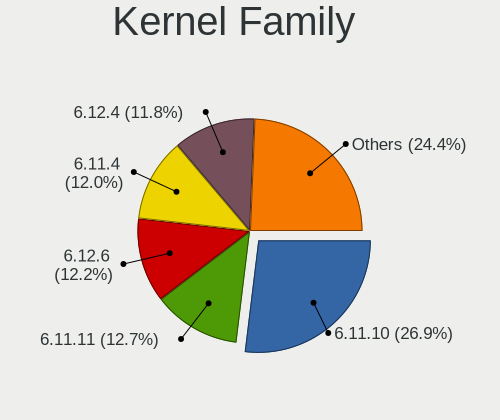
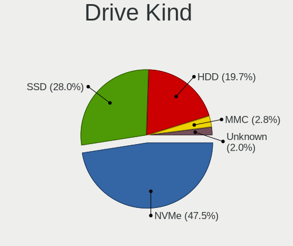

Fedora - Hardware Trends
------------------------

A project to identify most popular hardware characteristics and track their change
over time based on data collected by Linux users at https://Linux-Hardware.org.

Anyone can contribute to this report by the [hw-probe](https://github.com/linuxhw/hw-probe) tool:

    sudo -E hw-probe -all -upload

This is a report for all computer types. See also reports for [desktops](/Dist/Fedora/Desktop/README.md) and [notebooks](/Dist/Fedora/Notebook/README.md).

This report is for one last month. Overall report since the beginning of time: [TestCoverage](https://github.com/linuxhw/TestCoverage)

Period: Sep, 2022.

Contents
--------

* [ System ](#system)
  - [ OS                       ](#os)
  - [ OS Family                ](#os-family)
  - [ Kernel                   ](#kernel)
  - [ Kernel Family            ](#kernel-family)
  - [ Kernel Major Ver.        ](#kernel-major-ver)
  - [ Arch                     ](#arch)
  - [ DE                       ](#de)
  - [ Display Server           ](#display-server)
  - [ Display Manager          ](#display-manager)
  - [ OS Lang                  ](#os-lang)
  - [ Boot Mode                ](#boot-mode)
  - [ Filesystem               ](#filesystem)
  - [ Part. scheme             ](#part-scheme)
  - [ Dual Boot with Linux/BSD ](#dual-boot-with-linuxbsd)
  - [ Dual Boot (Win)          ](#dual-boot-win)

* [ Board ](#board)
  - [ Vendor                   ](#vendor)
  - [ Model                    ](#model)
  - [ Model Family             ](#model-family)
  - [ MFG Year                 ](#mfg-year)
  - [ Form Factor              ](#form-factor)
  - [ Secure Boot              ](#secure-boot)
  - [ Coreboot                 ](#coreboot)
  - [ RAM Size                 ](#ram-size)
  - [ RAM Used                 ](#ram-used)
  - [ Total Drives             ](#total-drives)
  - [ Has CD-ROM               ](#has-cd-rom)
  - [ Has Ethernet             ](#has-ethernet)
  - [ Has WiFi                 ](#has-wifi)
  - [ Has Bluetooth            ](#has-bluetooth)

* [ Location ](#location)
  - [ Country                  ](#country)
  - [ City                     ](#city)

* [ Drives ](#drives)
  - [ Drive Vendor             ](#drive-vendor)
  - [ Drive Model              ](#drive-model)
  - [ HDD Vendor               ](#hdd-vendor)
  - [ SSD Vendor               ](#ssd-vendor)
  - [ Drive Kind               ](#drive-kind)
  - [ Drive Connector          ](#drive-connector)
  - [ Drive Size               ](#drive-size)
  - [ Space Total              ](#space-total)
  - [ Space Used               ](#space-used)
  - [ Malfunc. Drives          ](#malfunc-drives)
  - [ Malfunc. Drive Vendor    ](#malfunc-drive-vendor)
  - [ Malfunc. HDD Vendor      ](#malfunc-hdd-vendor)
  - [ Malfunc. Drive Kind      ](#malfunc-drive-kind)
  - [ Failed Drives            ](#failed-drives)
  - [ Failed Drive Vendor      ](#failed-drive-vendor)
  - [ Drive Status             ](#drive-status)

* [ Storage controller ](#storage-controller)
  - [ Storage Vendor           ](#storage-vendor)
  - [ Storage Model            ](#storage-model)
  - [ Storage Kind             ](#storage-kind)

* [ Processor ](#processor)
  - [ CPU Vendor               ](#cpu-vendor)
  - [ CPU Model                ](#cpu-model)
  - [ CPU Model Family         ](#cpu-model-family)
  - [ CPU Cores                ](#cpu-cores)
  - [ CPU Sockets              ](#cpu-sockets)
  - [ CPU Threads              ](#cpu-threads)
  - [ CPU Op-Modes             ](#cpu-op-modes)
  - [ CPU Microcode            ](#cpu-microcode)
  - [ CPU Microarch            ](#cpu-microarch)

* [ Graphics ](#graphics)
  - [ GPU Vendor               ](#gpu-vendor)
  - [ GPU Model                ](#gpu-model)
  - [ GPU Combo                ](#gpu-combo)
  - [ GPU Driver               ](#gpu-driver)
  - [ GPU Memory               ](#gpu-memory)

* [ Monitor ](#monitor)
  - [ Monitor Vendor           ](#monitor-vendor)
  - [ Monitor Model            ](#monitor-model)
  - [ Monitor Resolution       ](#monitor-resolution)
  - [ Monitor Diagonal         ](#monitor-diagonal)
  - [ Monitor Width            ](#monitor-width)
  - [ Aspect Ratio             ](#aspect-ratio)
  - [ Monitor Area             ](#monitor-area)
  - [ Pixel Density            ](#pixel-density)
  - [ Multiple Monitors        ](#multiple-monitors)

* [ Network ](#network)
  - [ Net Controller Vendor    ](#net-controller-vendor)
  - [ Net Controller Model     ](#net-controller-model)
  - [ Wireless Vendor          ](#wireless-vendor)
  - [ Wireless Model           ](#wireless-model)
  - [ Ethernet Vendor          ](#ethernet-vendor)
  - [ Ethernet Model           ](#ethernet-model)
  - [ Net Controller Kind      ](#net-controller-kind)
  - [ Used Controller          ](#used-controller)
  - [ NICs                     ](#nics)
  - [ IPv6                     ](#ipv6)

* [ Bluetooth ](#bluetooth)
  - [ Bluetooth Vendor         ](#bluetooth-vendor)
  - [ Bluetooth Model          ](#bluetooth-model)

* [ Sound ](#sound)
  - [ Sound Vendor             ](#sound-vendor)
  - [ Sound Model              ](#sound-model)

* [ Memory ](#memory)
  - [ Memory Vendor            ](#memory-vendor)
  - [ Memory Model             ](#memory-model)
  - [ Memory Kind              ](#memory-kind)
  - [ Memory Form Factor       ](#memory-form-factor)
  - [ Memory Size              ](#memory-size)
  - [ Memory Speed             ](#memory-speed)

* [ Printers & scanners ](#printers--scanners)
  - [ Printer Vendor           ](#printer-vendor)
  - [ Printer Model            ](#printer-model)
  - [ Scanner Vendor           ](#scanner-vendor)
  - [ Scanner Model            ](#scanner-model)

* [ Camera ](#camera)
  - [ Camera Vendor            ](#camera-vendor)
  - [ Camera Model             ](#camera-model)

* [ Security ](#security)
  - [ Fingerprint Vendor       ](#fingerprint-vendor)
  - [ Fingerprint Model        ](#fingerprint-model)
  - [ Chipcard Vendor          ](#chipcard-vendor)
  - [ Chipcard Model           ](#chipcard-model)

* [ Unsupported ](#unsupported)
  - [ Unsupported Devices      ](#unsupported-devices)
  - [ Unsupported Device Types ](#unsupported-device-types)

System
------

OS
--

Installed operating systems

| Name      | Computers | Percent |
|-----------|-----------|---------|
| Fedora 36 | 381       | 82.83%  |
| Fedora 37 | 56        | 12.17%  |
| Fedora 35 | 17        | 3.7%    |
| Fedora 38 | 3         | 0.65%   |
| Fedora 31 | 2         | 0.43%   |
| Fedora 34 | 1         | 0.22%   |

OS Family
---------

OS without a version

| Name   | Computers | Percent |
|--------|-----------|---------|
| Fedora | 460       | 100%    |

Kernel
------

Version of the Linux kernel

| Version                                                      | Computers | Percent |
|--------------------------------------------------------------|-----------|---------|
| 5.19.9-200.fc36.x86_64                                       | 83        | 18.04%  |
| 5.19.8-200.fc36.x86_64                                       | 65        | 14.13%  |
| 5.19.6-200.fc36.x86_64                                       | 65        | 14.13%  |
| 5.19.11-200.fc36.x86_64                                      | 36        | 7.83%   |
| 5.19.4-200.fc36.x86_64                                       | 35        | 7.61%   |
| 5.17.5-300.fc36.x86_64                                       | 30        | 6.52%   |
| 5.19.10-200.fc36.x86_64                                      | 20        | 4.35%   |
| 5.19.8-300.fc37.x86_64                                       | 15        | 3.26%   |
| 5.19.9-300.fc37.x86_64                                       | 14        | 3.04%   |
| 5.19.7-200.fc36.x86_64                                       | 14        | 3.04%   |
| 5.18.19-200.fc36.x86_64                                      | 10        | 2.17%   |
| 5.19.10-300.fc37.x86_64                                      | 7         | 1.52%   |
| 5.19.11-300.fc37.x86_64                                      | 6         | 1.3%    |
| 5.19.7-300.fc37.x86_64                                       | 5         | 1.09%   |
| 5.18.17-200.fc36.x86_64                                      | 5         | 1.09%   |
| 5.19.6-100.fc35.x86_64                                       | 4         | 0.87%   |
| 6.0.0-0.rc6.41.fc38.x86_64                                   | 2         | 0.43%   |
| 5.5.9-200.fc31.x86_64                                        | 2         | 0.43%   |
| 5.19.8-100.fc35.x86_64                                       | 2         | 0.43%   |
| 5.19.7-1.surface.fc36.x86_64                                 | 2         | 0.43%   |
| 5.19.6-xm1.0.fc36.x86_64                                     | 2         | 0.43%   |
| 5.19.4-100.fc35.x86_64                                       | 2         | 0.43%   |
| 5.19.10-602.inttf.fc37.x86_64                                | 2         | 0.43%   |
| 5.19.10-100.fc35.x86_64                                      | 2         | 0.43%   |
| 5.18.18-200.fc36.x86_64                                      | 2         | 0.43%   |
| 6.0.0-0.rc7.20220929gitc3e0e1e23c70.50.vanilla.1.fc36.x86_64 | 1         | 0.22%   |
| 6.0.0-0.rc6.20220922gitdc164f4fb00a.43.fc38.x86_64           | 1         | 0.22%   |
| 6.0.0-0.rc5.37.test.fc36.x86_64                              | 1         | 0.22%   |
| 6.0.0-0.rc5.37.fc38.x86_64                                   | 1         | 0.22%   |
| 6.0.0-0.rc5.20220914git3245cb65fd91.39.vanilla.1.fc36.x86_64 | 1         | 0.22%   |
| 6.0.0-0.rc5.20220914git3245cb65fd91.39.fc38.x86_64           | 1         | 0.22%   |
| 6.0.0-0.rc5.20220913gite839a756012b.38.vanilla.1.fc36.x86_64 | 1         | 0.22%   |
| 5.8.15-301.fc33.x86_64                                       | 1         | 0.22%   |
| 5.4.212-300.fc36.x86_64                                      | 1         | 0.22%   |
| 5.19.9-201.fsync.fc36.x86_64                                 | 1         | 0.22%   |
| 5.19.9-100.fc35.x86_64                                       | 1         | 0.22%   |
| 5.19.8-501.chinfo.fc37.x86_64                                | 1         | 0.22%   |
| 5.19.7-602.inttf.fc36.x86_64                                 | 1         | 0.22%   |
| 5.19.6-300.fc37.aarch64                                      | 1         | 0.22%   |
| 5.19.12-300.fc37.x86_64                                      | 1         | 0.22%   |

Kernel Family
-------------

Linux kernel without a distro release

| Version | Computers | Percent |
|---------|-----------|---------|
| 5.19.9  | 99        | 21.52%  |
| 5.19.8  | 83        | 18.04%  |
| 5.19.6  | 72        | 15.65%  |
| 5.19.11 | 42        | 9.13%   |
| 5.19.4  | 37        | 8.04%   |
| 5.19.10 | 31        | 6.74%   |
| 5.17.5  | 30        | 6.52%   |
| 5.19.7  | 22        | 4.78%   |
| 5.18.19 | 10        | 2.17%   |
| 6.0.0   | 9         | 1.96%   |
| 5.18.17 | 5         | 1.09%   |
| 5.18.18 | 3         | 0.65%   |
| 5.5.9   | 2         | 0.43%   |
| 5.18.11 | 2         | 0.43%   |
| 5.8.15  | 1         | 0.22%   |
| 5.4.212 | 1         | 0.22%   |
| 5.19.12 | 1         | 0.22%   |
| 5.19.1  | 1         | 0.22%   |
| 5.18.6  | 1         | 0.22%   |
| 5.18.16 | 1         | 0.22%   |
| 5.18.13 | 1         | 0.22%   |
| 5.17.8  | 1         | 0.22%   |
| 5.17.11 | 1         | 0.22%   |
| 5.17.0  | 1         | 0.22%   |
| 5.16.5  | 1         | 0.22%   |
| 5.16.18 | 1         | 0.22%   |
| 5.11.12 | 1         | 0.22%   |

Kernel Major Ver.
-----------------

Linux kernel major version

| Version | Computers | Percent |
|---------|-----------|---------|
| 5.19    | 388       | 84.35%  |
| 5.17    | 33        | 7.17%   |
| 5.18    | 23        | 5%      |
| 6.0     | 9         | 1.96%   |
| 5.5     | 2         | 0.43%   |
| 5.16    | 2         | 0.43%   |
| 5.8     | 1         | 0.22%   |
| 5.4     | 1         | 0.22%   |
| 5.11    | 1         | 0.22%   |

Arch
----

OS architecture (x86_64, i586, etc.)

| Name    | Computers | Percent |
|---------|-----------|---------|
| x86_64  | 459       | 99.78%  |
| aarch64 | 1         | 0.22%   |

DE
--

Desktop Environment

| Name          | Computers | Percent |
|---------------|-----------|---------|
| GNOME         | 331       | 71.96%  |
| KDE5          | 76        | 16.52%  |
| Unknown       | 13        | 2.83%   |
| XFCE          | 12        | 2.61%   |
| X-Cinnamon    | 7         | 1.52%   |
| Cinnamon      | 7         | 1.52%   |
| MATE          | 4         | 0.87%   |
| i3            | 3         | 0.65%   |
| GNOME Classic | 2         | 0.43%   |
| sway          | 1         | 0.22%   |
| LXQt          | 1         | 0.22%   |
| LXDE          | 1         | 0.22%   |
| KDE:old       | 1         | 0.22%   |
| fluxbox       | 1         | 0.22%   |

Display Server
--------------

X11 or Wayland

| Name    | Computers | Percent |
|---------|-----------|---------|
| Wayland | 310       | 67.39%  |
| X11     | 133       | 28.91%  |
| Tty     | 9         | 1.96%   |
| Unknown | 8         | 1.74%   |

Display Manager
---------------

SDDM, LightDM, etc.

| Name    | Computers | Percent |
|---------|-----------|---------|
| Unknown | 235       | 51.09%  |
| GDM     | 149       | 32.39%  |
| SDDM    | 40        | 8.7%    |
| LightDM | 34        | 7.39%   |
| LXDM    | 1         | 0.22%   |
| KDM     | 1         | 0.22%   |

OS Lang
-------

Language

| Lang           | Computers | Percent |
|----------------|-----------|---------|
| en_US          | 226       | 49.13%  |
| en_GB          | 43        | 9.35%   |
| it_IT          | 32        | 6.96%   |
| ru_RU          | 26        | 5.65%   |
| de_DE          | 23        | 5%      |
| pt_BR          | 16        | 3.48%   |
| en_CA          | 15        | 3.26%   |
| en_AU          | 11        | 2.39%   |
| fr_FR          | 10        | 2.17%   |
| es_ES          | 8         | 1.74%   |
| nl_BE          | 4         | 0.87%   |
| es_MX          | 4         | 0.87%   |
| en_IN          | 4         | 0.87%   |
| tr_TR          | 3         | 0.65%   |
| hu_HU          | 3         | 0.65%   |
| es_CL          | 3         | 0.65%   |
| en_NZ          | 3         | 0.65%   |
| Unknown        | 3         | 0.65%   |
| nl_NL          | 2         | 0.43%   |
| es_GT          | 2         | 0.43%   |
| en_DK          | 2         | 0.43%   |
| el_GR          | 2         | 0.43%   |
| pt_PT          | 1         | 0.22%   |
| pl_PL          | 1         | 0.22%   |
| nn_NO          | 1         | 0.22%   |
| hu_HU.UTF8     | 1         | 0.22%   |
| es_VE          | 1         | 0.22%   |
| es_PY          | 1         | 0.22%   |
| es_CR          | 1         | 0.22%   |
| es_CO          | 1         | 0.22%   |
| es_AR          | 1         | 0.22%   |
| en_ZA          | 1         | 0.22%   |
| en_IE          | 1         | 0.22%   |
| da_DK          | 1         | 0.22%   |
| ca_ES@valencia | 1         | 0.22%   |
| ca_ES          | 1         | 0.22%   |
| be_BY          | 1         | 0.22%   |

Boot Mode
---------

EFI or BIOS

| Mode | Computers | Percent |
|------|-----------|---------|
| EFI  | 369       | 80.22%  |
| BIOS | 91        | 19.78%  |

Filesystem
----------

Type of filesystem

| Type    | Computers | Percent |
|---------|-----------|---------|
| Btrfs   | 361       | 78.48%  |
| Ext4    | 86        | 18.7%   |
| Xfs     | 12        | 2.61%   |
| Overlay | 1         | 0.22%   |

Part. scheme
------------

Scheme of partitioning

| Type    | Computers | Percent |
|---------|-----------|---------|
| Unknown | 230       | 50%     |
| GPT     | 200       | 43.48%  |
| MBR     | 30        | 6.52%   |

Dual Boot with Linux/BSD
------------------------

Hosting more than one Linux/BSD

| Dual boot | Computers | Percent |
|-----------|-----------|---------|
| No        | 404       | 87.83%  |
| Yes       | 56        | 12.17%  |

Dual Boot (Win)
---------------

Hosting Linux and Windows

| Dual boot | Computers | Percent |
|-----------|-----------|---------|
| No        | 366       | 79.57%  |
| Yes       | 94        | 20.43%  |

Board
-----

Vendor
------

Motherboard manufacturer

| Name                    | Computers | Percent |
|-------------------------|-----------|---------|
| Lenovo                  | 94        | 20.43%  |
| ASUSTek Computer        | 82        | 17.83%  |
| Dell                    | 62        | 13.48%  |
| Hewlett-Packard         | 58        | 12.61%  |
| Gigabyte Technology     | 30        | 6.52%   |
| MSI                     | 27        | 5.87%   |
| ASRock                  | 18        | 3.91%   |
| Acer                    | 14        | 3.04%   |
| HUAWEI                  | 9         | 1.96%   |
| Apple                   | 9         | 1.96%   |
| Intel                   | 5         | 1.09%   |
| Microsoft               | 4         | 0.87%   |
| BESSTAR Tech            | 4         | 0.87%   |
| TUXEDO                  | 3         | 0.65%   |
| Toshiba                 | 3         | 0.65%   |
| Timi                    | 3         | 0.65%   |
| Notebook                | 3         | 0.65%   |
| Foxconn                 | 3         | 0.65%   |
| Chuwi                   | 3         | 0.65%   |
| Razer                   | 2         | 0.43%   |
| Framework               | 2         | 0.43%   |
| Biostar                 | 2         | 0.43%   |
| AZW                     | 2         | 0.43%   |
| Unknown                 | 2         | 0.43%   |
| VALE                    | 1         | 0.22%   |
| System76                | 1         | 0.22%   |
| SK hynix                | 1         | 0.22%   |
| Samsung Electronics     | 1         | 0.22%   |
| Raspberry Pi Foundation | 1         | 0.22%   |
| Medion                  | 1         | 0.22%   |
| Lanix                   | 1         | 0.22%   |
| Irbis                   | 1         | 0.22%   |
| HONOR                   | 1         | 0.22%   |
| GPD                     | 1         | 0.22%   |
| Fujitsu                 | 1         | 0.22%   |
| Casper                  | 1         | 0.22%   |
| Avell High Performance  | 1         | 0.22%   |
| Alienware               | 1         | 0.22%   |
| Acidanthera             | 1         | 0.22%   |
| A-DATA Technology       | 1         | 0.22%   |

Model
-----

Motherboard model

| Name                                        | Computers | Percent |
|---------------------------------------------|-----------|---------|
| ASUS All Series                             | 4         | 0.87%   |
| MSI MS-7C91                                 | 3         | 0.65%   |
| MSI MS-7B86                                 | 3         | 0.65%   |
| Dell XPS 15 9570                            | 3         | 0.65%   |
| ASUS TUF Gaming B550M-PLUS                  | 3         | 0.65%   |
| Unknown                                     | 3         | 0.65%   |
| MSI MS-7C56                                 | 2         | 0.43%   |
| Lenovo ThinkPad X1 Carbon Gen 9 20XWCTO1WW  | 2         | 0.43%   |
| Lenovo ThinkPad X1 Carbon Gen 10 21CBCTO1WW | 2         | 0.43%   |
| Lenovo ThinkBook 15 G2 ITL 20VE             | 2         | 0.43%   |
| Lenovo ThinkBook 13s G4 ARB 21AS            | 2         | 0.43%   |
| HUAWEI NBLK-WAX9X                           | 2         | 0.43%   |
| HUAWEI HVY-WXX9                             | 2         | 0.43%   |
| HP ProBook 4540s                            | 2         | 0.43%   |
| HP Pavilion Aero Laptop 13-be0xxx           | 2         | 0.43%   |
| HP ENVY x360 Convertible 13-ay0xxx          | 2         | 0.43%   |
| HP EliteBook 8470p                          | 2         | 0.43%   |
| HP EliteBook 840 G3                         | 2         | 0.43%   |
| Gigabyte A320M-S2H                          | 2         | 0.43%   |
| Dell Latitude 5511                          | 2         | 0.43%   |
| Dell Latitude 5420                          | 2         | 0.43%   |
| Dell Inspiron 5566                          | 2         | 0.43%   |
| Chuwi HeroBook Air                          | 2         | 0.43%   |
| BESSTAR Tech UM350                          | 2         | 0.43%   |
| ASUS Z170-A                                 | 2         | 0.43%   |
| ASUS UX310UQK                               | 2         | 0.43%   |
| ASUS TUF Gaming B550-PLUS                   | 2         | 0.43%   |
| ASUS TUF B350M-PLUS GAMING                  | 2         | 0.43%   |
| ASUS ROG STRIX X570-F GAMING                | 2         | 0.43%   |
| ASUS ROG STRIX X570-E GAMING WIFI II        | 2         | 0.43%   |
| ASUS ROG Strix G513QY_G513QY                | 2         | 0.43%   |
| ASRock A320M-HD                             | 2         | 0.43%   |
| Apple MacBookPro9,2                         | 2         | 0.43%   |
| Apple MacBookPro16,1                        | 2         | 0.43%   |
| Apple MacBookPro12,1                        | 2         | 0.43%   |
| VALE Notebook Classic C140                  | 1         | 0.22%   |
| TUXEDO Pulse 15 Gen1                        | 1         | 0.22%   |
| TUXEDO InfinityBook S 15/17 Gen7            | 1         | 0.22%   |
| TUXEDO InfinityBook Pro 14 v4               | 1         | 0.22%   |
| Toshiba Satellite L40t-A                    | 1         | 0.22%   |

Model Family
------------

Motherboard model prefix

| Name                | Computers | Percent |
|---------------------|-----------|---------|
| Lenovo ThinkPad     | 46        | 10%     |
| ASUS ROG            | 23        | 5%      |
| Dell Inspiron       | 19        | 4.13%   |
| Lenovo IdeaPad      | 17        | 3.7%    |
| Dell Latitude       | 16        | 3.48%   |
| Dell XPS            | 13        | 2.83%   |
| Lenovo ThinkBook    | 11        | 2.39%   |
| ASUS TUF            | 11        | 2.39%   |
| HP ENVY             | 10        | 2.17%   |
| HP ProBook          | 9         | 1.96%   |
| HP EliteBook        | 9         | 1.96%   |
| HP Pavilion         | 8         | 1.74%   |
| ASUS PRIME          | 8         | 1.74%   |
| Dell Precision      | 6         | 1.3%    |
| ASUS VivoBook       | 6         | 1.3%    |
| Acer Aspire         | 6         | 1.3%    |
| Lenovo Yoga         | 5         | 1.09%   |
| Microsoft Surface   | 4         | 0.87%   |
| Lenovo ThinkCentre  | 4         | 0.87%   |
| HP Laptop           | 4         | 0.87%   |
| ASUS ASUS           | 4         | 0.87%   |
| ASUS All            | 4         | 0.87%   |
| Toshiba Satellite   | 3         | 0.65%   |
| MSI MS-7C91         | 3         | 0.65%   |
| MSI MS-7B86         | 3         | 0.65%   |
| Lenovo Legion       | 3         | 0.65%   |
| Intel NUC6i7KYB     | 3         | 0.65%   |
| Gigabyte A320M-S2H  | 3         | 0.65%   |
| Dell Vostro         | 3         | 0.65%   |
| Dell OptiPlex       | 3         | 0.65%   |
| ASUS ZenBook        | 3         | 0.65%   |
| Acer Nitro          | 3         | 0.65%   |
| Unknown             | 3         | 0.65%   |
| TUXEDO InfinityBook | 2         | 0.43%   |
| Razer Blade         | 2         | 0.43%   |
| MSI MS-7C56         | 2         | 0.43%   |
| MSI Modern          | 2         | 0.43%   |
| Lenovo IdeaPadFlex  | 2         | 0.43%   |
| HUAWEI NBLK-WAX9X   | 2         | 0.43%   |
| HUAWEI HVY-WXX9     | 2         | 0.43%   |

MFG Year
--------

Motherboard manufacture year

| Year | Computers | Percent |
|------|-----------|---------|
| 2021 | 81        | 17.61%  |
| 2020 | 73        | 15.87%  |
| 2019 | 51        | 11.09%  |
| 2022 | 45        | 9.78%   |
| 2018 | 36        | 7.83%   |
| 2017 | 27        | 5.87%   |
| 2014 | 27        | 5.87%   |
| 2016 | 25        | 5.43%   |
| 2015 | 23        | 5%      |
| 2013 | 20        | 4.35%   |
| 2012 | 17        | 3.7%    |
| 2011 | 13        | 2.83%   |
| 2010 | 9         | 1.96%   |
| 2008 | 8         | 1.74%   |
| 2009 | 4         | 0.87%   |
| 2006 | 1         | 0.22%   |

Form Factor
-----------

Physical design of the computer

| Name           | Computers | Percent |
|----------------|-----------|---------|
| Notebook       | 263       | 57.17%  |
| Desktop        | 149       | 32.39%  |
| Convertible    | 29        | 6.3%    |
| Mini pc        | 9         | 1.96%   |
| Tablet         | 8         | 1.74%   |
| System on chip | 1         | 0.22%   |
| All in one     | 1         | 0.22%   |

Secure Boot
-----------

Enabled or disabled

| State    | Computers | Percent |
|----------|-----------|---------|
| Disabled | 378       | 82.17%  |
| Enabled  | 82        | 17.83%  |

Coreboot
--------

Have coreboot on board

| Used | Computers | Percent |
|------|-----------|---------|
| No   | 458       | 99.57%  |
| Yes  | 2         | 0.43%   |

RAM Size
--------

Total RAM memory

| Size in GB      | Computers | Percent |
|-----------------|-----------|---------|
| 16.01-24.0      | 115       | 25%     |
| 4.01-8.0        | 95        | 20.65%  |
| 8.01-16.0       | 90        | 19.57%  |
| 32.01-64.0      | 84        | 18.26%  |
| 3.01-4.0        | 45        | 9.78%   |
| 64.01-256.0     | 16        | 3.48%   |
| 24.01-32.0      | 8         | 1.74%   |
| 1.01-2.0        | 5         | 1.09%   |
| More than 256.0 | 1         | 0.22%   |
| 2.01-3.0        | 1         | 0.22%   |

RAM Used
--------

Used RAM memory

| Used GB    | Computers | Percent |
|------------|-----------|---------|
| 4.01-8.0   | 144       | 31.3%   |
| 3.01-4.0   | 111       | 24.13%  |
| 2.01-3.0   | 101       | 21.96%  |
| 8.01-16.0  | 51        | 11.09%  |
| 1.01-2.0   | 45        | 9.78%   |
| 32.01-64.0 | 2         | 0.43%   |
| 24.01-32.0 | 2         | 0.43%   |
| 16.01-24.0 | 2         | 0.43%   |
| 0.51-1.0   | 2         | 0.43%   |

Total Drives
------------

Number of drives on board

| Drives | Computers | Percent |
|--------|-----------|---------|
| 1      | 272       | 59.13%  |
| 2      | 115       | 25%     |
| 3      | 40        | 8.7%    |
| 4      | 14        | 3.04%   |
| 5      | 11        | 2.39%   |
| 0      | 3         | 0.65%   |
| 7      | 2         | 0.43%   |
| 6      | 2         | 0.43%   |
| 11     | 1         | 0.22%   |

Has CD-ROM
----------

Has CD-ROM on board

| Presented | Computers | Percent |
|-----------|-----------|---------|
| No        | 359       | 78.04%  |
| Yes       | 101       | 21.96%  |

Has Ethernet
------------

Has Ethernet on board

| Presented | Computers | Percent |
|-----------|-----------|---------|
| Yes       | 346       | 75.22%  |
| No        | 114       | 24.78%  |

Has WiFi
--------

Has WiFi module

| Presented | Computers | Percent |
|-----------|-----------|---------|
| Yes       | 387       | 84.13%  |
| No        | 73        | 15.87%  |

Has Bluetooth
-------------

Has Bluetooth module

| Presented | Computers | Percent |
|-----------|-----------|---------|
| Yes       | 341       | 74.13%  |
| No        | 119       | 25.87%  |

Location
--------

Country
-------

Geographic location (country)

| Country             | Computers | Percent |
|---------------------|-----------|---------|
| USA                 | 76        | 16.52%  |
| Italy               | 56        | 12.17%  |
| Germany             | 49        | 10.65%  |
| Russia              | 33        | 7.17%   |
| Brazil              | 22        | 4.78%   |
| Canada              | 20        | 4.35%   |
| UK                  | 18        | 3.91%   |
| Spain               | 15        | 3.26%   |
| India               | 13        | 2.83%   |
| Australia           | 12        | 2.61%   |
| Mexico              | 10        | 2.17%   |
| France              | 10        | 2.17%   |
| Netherlands         | 9         | 1.96%   |
| Turkey              | 8         | 1.74%   |
| Norway              | 8         | 1.74%   |
| Poland              | 7         | 1.52%   |
| Hungary             | 7         | 1.52%   |
| Belgium             | 6         | 1.3%    |
| Japan               | 5         | 1.09%   |
| Czechia             | 5         | 1.09%   |
| Belarus             | 5         | 1.09%   |
| Austria             | 5         | 1.09%   |
| Romania             | 3         | 0.65%   |
| New Zealand         | 3         | 0.65%   |
| Greece              | 3         | 0.65%   |
| Denmark             | 3         | 0.65%   |
| Chile               | 3         | 0.65%   |
| Argentina           | 3         | 0.65%   |
| Trinidad and Tobago | 2         | 0.43%   |
| Sweden              | 2         | 0.43%   |
| Portugal            | 2         | 0.43%   |
| Philippines         | 2         | 0.43%   |
| Malaysia            | 2         | 0.43%   |
| Kenya               | 2         | 0.43%   |
| Indonesia           | 2         | 0.43%   |
| Guatemala           | 2         | 0.43%   |
| Finland             | 2         | 0.43%   |
| Colombia            | 2         | 0.43%   |
| Venezuela           | 1         | 0.22%   |
| Ukraine             | 1         | 0.22%   |

City
----

Geographic location (city)

| City              | Computers | Percent |
|-------------------|-----------|---------|
| Moscow            | 12        | 2.61%   |
| Berlin            | 8         | 1.74%   |
| St Petersburg     | 7         | 1.52%   |
| Verona            | 5         | 1.09%   |
| Rome              | 5         | 1.09%   |
| Sao Paulo         | 4         | 0.87%   |
| Frankfurt am Main | 4         | 0.87%   |
| Brisbane          | 4         | 0.87%   |
| Bologna           | 4         | 0.87%   |
| Amsterdam         | 4         | 0.87%   |
| Santiago          | 3         | 0.65%   |
| Richmond          | 3         | 0.65%   |
| Prague            | 3         | 0.65%   |
| Oslo              | 3         | 0.65%   |
| New York          | 3         | 0.65%   |
| Minsk             | 3         | 0.65%   |
| Milan             | 3         | 0.65%   |
| Melbourne         | 3         | 0.65%   |
| Manchester        | 3         | 0.65%   |
| Kolkata           | 3         | 0.65%   |
| Antwerp           | 3         | 0.65%   |
| Unknown           | 3         | 0.65%   |
| Wellington        | 2         | 0.43%   |
| Warsaw            | 2         | 0.43%   |
| Vancouver         | 2         | 0.43%   |
| Székesfehérvár | 2         | 0.43%   |
| Saratov           | 2         | 0.43%   |
| Santiago de Cali  | 2         | 0.43%   |
| San José         | 2         | 0.43%   |
| Samara            | 2         | 0.43%   |
| Queens            | 2         | 0.43%   |
| Pouso Alegre      | 2         | 0.43%   |
| Perth             | 2         | 0.43%   |
| Paris             | 2         | 0.43%   |
| New Baltimore     | 2         | 0.43%   |
| Mumbai            | 2         | 0.43%   |
| Mexico City       | 2         | 0.43%   |
| Los Angeles       | 2         | 0.43%   |
| Lisbon            | 2         | 0.43%   |
| Lane Cove         | 2         | 0.43%   |

Drives
------

Drive Vendor
------------

Hard drive vendors

| Vendor                      | Computers | Drives | Percent |
|-----------------------------|-----------|--------|---------|
| Samsung Electronics         | 143       | 175    | 20.88%  |
| WDC                         | 76        | 95     | 11.09%  |
| Seagate                     | 67        | 91     | 9.78%   |
| SanDisk                     | 43        | 46     | 6.28%   |
| Toshiba                     | 39        | 41     | 5.69%   |
| Kingston                    | 39        | 41     | 5.69%   |
| Crucial                     | 33        | 37     | 4.82%   |
| SK hynix                    | 30        | 30     | 4.38%   |
| Intel                       | 24        | 26     | 3.5%    |
| Micron Technology           | 20        | 20     | 2.92%   |
| Unknown                     | 17        | 18     | 2.48%   |
| KIOXIA                      | 10        | 12     | 1.46%   |
| HGST                        | 9         | 9      | 1.31%   |
| A-DATA Technology           | 9         | 10     | 1.31%   |
| China                       | 8         | 9      | 1.17%   |
| SPCC                        | 7         | 9      | 1.02%   |
| Silicon Motion              | 7         | 7      | 1.02%   |
| Phison                      | 7         | 7      | 1.02%   |
| Hitachi                     | 7         | 7      | 1.02%   |
| Transcend                   | 6         | 6      | 0.88%   |
| Unknown                     | 6         | 6      | 0.88%   |
| ADATA Technology            | 5         | 5      | 0.73%   |
| Apple                       | 4         | 4      | 0.58%   |
| Team                        | 3         | 4      | 0.44%   |
| Patriot                     | 3         | 3      | 0.44%   |
| Netac                       | 3         | 3      | 0.44%   |
| Micron/Crucial Technology   | 3         | 4      | 0.44%   |
| LITEONIT                    | 3         | 3      | 0.44%   |
| Kingston Technology Company | 3         | 3      | 0.44%   |
| XPG                         | 2         | 2      | 0.29%   |
| Union Memory (Shenzhen)     | 2         | 2      | 0.29%   |
| UMIS                        | 2         | 2      | 0.29%   |
| Realtek Semiconductor       | 2         | 2      | 0.29%   |
| PNY                         | 2         | 2      | 0.29%   |
| Phison Electronics          | 2         | 2      | 0.29%   |
| LITEON                      | 2         | 2      | 0.29%   |
| Lexar                       | 2         | 3      | 0.29%   |
| JMicron Technology          | 2         | 2      | 0.29%   |
| GOODRAM                     | 2         | 2      | 0.29%   |
| Gigabyte Technology         | 2         | 2      | 0.29%   |

Drive Model
-----------

Hard drive models

| Model                                                 | Computers | Percent |
|-------------------------------------------------------|-----------|---------|
| Samsung NVMe SSD Controller SM981/PM981/PM983 256GB   | 18        | 2.37%   |
| Kingston SA400S37240G 240GB SSD                       | 10        | 1.32%   |
| Samsung NVMe SSD Controller PM9A1/PM9A3/980PRO 1024GB | 9         | 1.19%   |
| Samsung SSD 860 EVO 1TB                               | 8         | 1.06%   |
| Kingston SA400S37120G 120GB SSD                       | 7         | 0.92%   |
| Seagate ST500DM002-1BD142 500GB                       | 6         | 0.79%   |
| Seagate ST2000DM008-2FR102 2TB                        | 6         | 0.79%   |
| SanDisk NVMe SSD Drive 1TB                            | 6         | 0.79%   |
| Samsung SSD 980 PRO 1TB                               | 6         | 0.79%   |
| Samsung NVMe SSD Drive 1TB                            | 6         | 0.79%   |
| Crucial CT500MX500SSD1 500GB                          | 6         | 0.79%   |
| Unknown                                               | 6         | 0.79%   |
| Seagate ST1000LM024 HN-M101MBB 1TB                    | 5         | 0.66%   |
| Seagate ST1000DM003-1ER162 1TB                        | 5         | 0.66%   |
| Samsung SSD 860 EVO 500GB                             | 5         | 0.66%   |
| Samsung SSD 850 EVO 250GB                             | 5         | 0.66%   |
| HGST HTS721010A9E630 1TB                              | 5         | 0.66%   |
| WDC WD10EZEX-08WN4A0 1TB                              | 4         | 0.53%   |
| Unknown MMC Card  64GB                                | 4         | 0.53%   |
| Toshiba HDWD110 1TB                                   | 4         | 0.53%   |
| SK hynix NVMe SSD Drive 512GB                         | 4         | 0.53%   |
| Seagate ST500LT012-1DG142 500GB                       | 4         | 0.53%   |
| Seagate ST1000LM035-1RK172 1TB                        | 4         | 0.53%   |
| Seagate Expansion Desk 2TB                            | 4         | 0.53%   |
| Sandisk WD Blue SN570 1TB                             | 4         | 0.53%   |
| Samsung SSD 970 EVO Plus 500GB                        | 4         | 0.53%   |
| Samsung SSD 860 EVO 250GB                             | 4         | 0.53%   |
| Crucial CT1000MX500SSD1 1TB                           | 4         | 0.53%   |
| WDC WD30EFRX-68EUZN0 3TB                              | 3         | 0.4%    |
| WDC WD1002FAEX-00Z3A0 1TB                             | 3         | 0.4%    |
| Toshiba XG6 NVMe SSD Controller 512GB                 | 3         | 0.4%    |
| Toshiba NVMe SSD Drive 256GB                          | 3         | 0.4%    |
| Toshiba MQ01ABF050 500GB                              | 3         | 0.4%    |
| Toshiba DT01ACA100 1TB                                | 3         | 0.4%    |
| Silicon Motion SM2262/SM2262EN SSD Controller 1024GB  | 3         | 0.4%    |
| SanDisk SSD PLUS 240GB                                | 3         | 0.4%    |
| SanDisk NVMe SSD Drive 512GB                          | 3         | 0.4%    |
| Samsung SSD 970 EVO Plus 2TB                          | 3         | 0.4%    |
| Samsung SSD 870 EVO 1TB                               | 3         | 0.4%    |
| Samsung NVMe SSD Drive 512GB                          | 3         | 0.4%    |

HDD Vendor
----------

Hard disk drive vendors

| Vendor              | Computers | Drives | Percent |
|---------------------|-----------|--------|---------|
| Seagate             | 66        | 89     | 39.29%  |
| WDC                 | 52        | 65     | 30.95%  |
| Toshiba             | 25        | 27     | 14.88%  |
| HGST                | 9         | 9      | 5.36%   |
| Hitachi             | 7         | 7      | 4.17%   |
| Samsung Electronics | 3         | 4      | 1.79%   |
| USB3.0              | 1         | 1      | 0.6%    |
| Unknown             | 1         | 1      | 0.6%    |
| JMicron Technology  | 1         | 1      | 0.6%    |
| ExcelStor           | 1         | 1      | 0.6%    |
| Apple               | 1         | 1      | 0.6%    |
| Unknown             | 1         | 1      | 0.6%    |

SSD Vendor
----------

Solid state drive vendors

| Vendor              | Computers | Drives | Percent |
|---------------------|-----------|--------|---------|
| Samsung Electronics | 44        | 53     | 22.11%  |
| Crucial             | 28        | 31     | 14.07%  |
| Kingston            | 26        | 26     | 13.07%  |
| SanDisk             | 17        | 18     | 8.54%   |
| WDC                 | 10        | 10     | 5.03%   |
| Intel               | 10        | 10     | 5.03%   |
| China               | 8         | 9      | 4.02%   |
| Transcend           | 6         | 6      | 3.02%   |
| SPCC                | 6         | 8      | 3.02%   |
| SK hynix            | 4         | 4      | 2.01%   |
| A-DATA Technology   | 4         | 4      | 2.01%   |
| Team                | 3         | 4      | 1.51%   |
| Micron Technology   | 3         | 3      | 1.51%   |
| LITEONIT            | 3         | 3      | 1.51%   |
| PNY                 | 2         | 2      | 1.01%   |
| Patriot             | 2         | 2      | 1.01%   |
| Lexar               | 2         | 3      | 1.01%   |
| GOODRAM             | 2         | 2      | 1.01%   |
| Gigabyte Technology | 2         | 2      | 1.01%   |
| XrayDisk            | 1         | 1      | 0.5%    |
| Verbatim            | 1         | 1      | 0.5%    |
| TCSUNBOW            | 1         | 1      | 0.5%    |
| SPCC M.2            | 1         | 1      | 0.5%    |
| SKIHOTAR            | 1         | 1      | 0.5%    |
| Plextor             | 1         | 1      | 0.5%    |
| OCZ                 | 1         | 2      | 0.5%    |
| Netac               | 1         | 1      | 0.5%    |
| MyDigitalSSD        | 1         | 1      | 0.5%    |
| LITEON              | 1         | 1      | 0.5%    |
| KingSpec            | 1         | 1      | 0.5%    |
| Kingmax             | 1         | 1      | 0.5%    |
| KingFast            | 1         | 1      | 0.5%    |
| GLOWAY              | 1         | 1      | 0.5%    |
| Apple               | 1         | 1      | 0.5%    |
| Apacer              | 1         | 1      | 0.5%    |
| Unknown             | 1         | 1      | 0.5%    |

Drive Kind
----------

HDD or SSD

| Kind    | Computers | Drives | Percent |
|---------|-----------|--------|---------|
| NVMe    | 277       | 326    | 44.82%  |
| SSD     | 170       | 218    | 27.51%  |
| HDD     | 140       | 207    | 22.65%  |
| MMC     | 21        | 23     | 3.4%    |
| Unknown | 10        | 10     | 1.62%   |

Drive Connector
---------------

SATA, SAS, NVMe, etc.

| Type | Computers | Drives | Percent |
|------|-----------|--------|---------|
| NVMe | 277       | 325    | 48.85%  |
| SATA | 245       | 405    | 43.21%  |
| SAS  | 24        | 31     | 4.23%   |
| MMC  | 21        | 23     | 3.7%    |

Drive Size
----------

Size of hard drive

| Size in TB | Computers | Drives | Percent |
|------------|-----------|--------|---------|
| 0.01-0.5   | 158       | 211    | 46.88%  |
| 0.51-1.0   | 114       | 135    | 33.83%  |
| 1.01-2.0   | 35        | 46     | 10.39%  |
| 3.01-4.0   | 14        | 15     | 4.15%   |
| 2.01-3.0   | 8         | 10     | 2.37%   |
| 4.01-10.0  | 8         | 8      | 2.37%   |

Space Total
-----------

Amount of disk space available on the file system

| Size in GB     | Computers | Percent |
|----------------|-----------|---------|
| 501-1000       | 92        | 20%     |
| 251-500        | 78        | 16.96%  |
| 1001-2000      | 69        | 15%     |
| 101-250        | 64        | 13.91%  |
| 1-20           | 49        | 10.65%  |
| Unknown        | 38        | 8.26%   |
| More than 3000 | 33        | 7.17%   |
| 2001-3000      | 24        | 5.22%   |
| 51-100         | 11        | 2.39%   |
| 21-50          | 2         | 0.43%   |

Space Used
----------

Amount of used disk space

| Used GB        | Computers | Percent |
|----------------|-----------|---------|
| 1-20           | 124       | 26.96%  |
| 21-50          | 65        | 14.13%  |
| 101-250        | 62        | 13.48%  |
| 251-500        | 46        | 10%     |
| 51-100         | 42        | 9.13%   |
| 501-1000       | 41        | 8.91%   |
| Unknown        | 38        | 8.26%   |
| 1001-2000      | 24        | 5.22%   |
| More than 3000 | 13        | 2.83%   |
| 2001-3000      | 5         | 1.09%   |

Malfunc. Drives
---------------

Drive models with a malfunction

| Model                                 | Computers | Drives | Percent |
|---------------------------------------|-----------|--------|---------|
| Seagate ST500LT012-1DG142 500GB       | 2         | 2      | 5.88%   |
| HGST HTS721010A9E630 1TB              | 2         | 2      | 5.88%   |
| WDC WD800JD-75MSA3 80GB               | 1         | 1      | 2.94%   |
| WDC WD6400BEVT-22A0RT0 640GB          | 1         | 1      | 2.94%   |
| WDC WD5000LPVX-22V0TT0 500GB          | 1         | 1      | 2.94%   |
| WDC WD5000AAKX-00U6AA0 500GB          | 1         | 1      | 2.94%   |
| WDC WD5000AADS-00S9B0 500GB           | 1         | 1      | 2.94%   |
| WDC WD40PURZ-85TTDY0 4TB              | 1         | 1      | 2.94%   |
| WDC WD4001FAEX-00MJRA0 4TB            | 1         | 1      | 2.94%   |
| WDC WD10EFRX-68FYTN0 1TB              | 1         | 1      | 2.94%   |
| Toshiba MQ01ABF050 500GB              | 1         | 1      | 2.94%   |
| Toshiba MK3275GSX 320GB               | 1         | 1      | 2.94%   |
| Toshiba MK2556GSY 250GB               | 1         | 1      | 2.94%   |
| SK hynix SH920 2.5 7MM 256GB SSD      | 1         | 1      | 2.94%   |
| SK hynix HFS512G39TND-N210A 512GB SSD | 1         | 1      | 2.94%   |
| Seagate ST500LM021-1KJ152 500GB       | 1         | 1      | 2.94%   |
| Seagate ST500DM002-1BD142 500GB       | 1         | 1      | 2.94%   |
| Seagate ST3000DM001-1ER166 3TB        | 1         | 1      | 2.94%   |
| Seagate ST3000DM001-1CH166 3TB        | 1         | 1      | 2.94%   |
| Seagate ST2000LM003 HN-M201RAD 2TB    | 1         | 1      | 2.94%   |
| Seagate ST1000VM002-1CT162 1TB        | 1         | 1      | 2.94%   |
| Seagate ST1000LX015-1U7172 1TB        | 1         | 1      | 2.94%   |
| Seagate ST1000LM024 HN-M101MBB 1TB    | 1         | 1      | 2.94%   |
| SanDisk SSD PLUS 1000GB               | 1         | 1      | 2.94%   |
| Samsung Electronics SSD 870 EVO 1TB   | 1         | 1      | 2.94%   |
| Samsung Electronics HD501LJ 500GB     | 1         | 2      | 2.94%   |
| LITEON IT LCS-256L9S-HP 256GB SSD     | 1         | 1      | 2.94%   |
| Lenovo LENSE20512GMSP34MEAT2TA 512GB  | 1         | 1      | 2.94%   |
| Intel SSDSC2BW480A4 480GB             | 1         | 1      | 2.94%   |
| Hitachi HDS721032CLA362 320GB         | 1         | 1      | 2.94%   |
| Crucial M4-CT128M4SSD2 128GB          | 1         | 1      | 2.94%   |
| Crucial CT128MX100SSD1 128GB          | 1         | 1      | 2.94%   |

Malfunc. Drive Vendor
---------------------

Vendors of faulty drives

| Vendor              | Computers | Drives | Percent |
|---------------------|-----------|--------|---------|
| WDC                 | 8         | 8      | 25.81%  |
| Seagate             | 7         | 10     | 22.58%  |
| Toshiba             | 3         | 3      | 9.68%   |
| SK hynix            | 2         | 2      | 6.45%   |
| Samsung Electronics | 2         | 3      | 6.45%   |
| HGST                | 2         | 2      | 6.45%   |
| Crucial             | 2         | 2      | 6.45%   |
| SanDisk             | 1         | 1      | 3.23%   |
| LITEON              | 1         | 1      | 3.23%   |
| Lenovo              | 1         | 1      | 3.23%   |
| Intel               | 1         | 1      | 3.23%   |
| Hitachi             | 1         | 1      | 3.23%   |

Malfunc. HDD Vendor
-------------------

Vendors of faulty HDD drives

| Vendor              | Computers | Drives | Percent |
|---------------------|-----------|--------|---------|
| WDC                 | 8         | 8      | 36.36%  |
| Seagate             | 7         | 10     | 31.82%  |
| Toshiba             | 3         | 3      | 13.64%  |
| HGST                | 2         | 2      | 9.09%   |
| Samsung Electronics | 1         | 2      | 4.55%   |
| Hitachi             | 1         | 1      | 4.55%   |

Malfunc. Drive Kind
-------------------

Kinds of faulty drives

| Kind | Computers | Drives | Percent |
|------|-----------|--------|---------|
| HDD  | 19        | 26     | 70.37%  |
| SSD  | 7         | 8      | 25.93%  |
| NVMe | 1         | 1      | 3.7%    |

Failed Drives
-------------

Failed drive models

| Model                          | Computers | Drives | Percent |
|--------------------------------|-----------|--------|---------|
| Seagate ST1000LM035-1RK172 1TB | 1         | 1      | 100%    |

Failed Drive Vendor
-------------------

Failed drive vendors

| Vendor  | Computers | Drives | Percent |
|---------|-----------|--------|---------|
| Seagate | 1         | 1      | 100%    |

Drive Status
------------

Number of failed and malfunc. drives

| Status   | Computers | Drives | Percent |
|----------|-----------|--------|---------|
| Detected | 257       | 430    | 51.2%   |
| Works    | 217       | 318    | 43.23%  |
| Malfunc  | 27        | 35     | 5.38%   |
| Failed   | 1         | 1      | 0.2%    |

Storage controller
------------------

Storage Vendor
--------------

Storage controller vendors

| Vendor                         | Computers | Percent |
|--------------------------------|-----------|---------|
| Intel                          | 245       | 37.98%  |
| Samsung Electronics            | 108       | 16.74%  |
| AMD                            | 102       | 15.81%  |
| SanDisk                        | 44        | 6.82%   |
| SK hynix                       | 26        | 4.03%   |
| Micron Technology              | 17        | 2.64%   |
| Kingston Technology Company    | 17        | 2.64%   |
| Toshiba America Info Systems   | 12        | 1.86%   |
| KIOXIA                         | 12        | 1.86%   |
| Phison Electronics             | 11        | 1.71%   |
| ADATA Technology               | 9         | 1.4%    |
| Micron/Crucial Technology      | 8         | 1.24%   |
| Silicon Motion                 | 7         | 1.09%   |
| ASMedia Technology             | 6         | 0.93%   |
| Realtek Semiconductor          | 4         | 0.62%   |
| Marvell Technology Group       | 4         | 0.62%   |
| Union Memory (Shenzhen)        | 3         | 0.47%   |
| Solid State Storage Technology | 2         | 0.31%   |
| Apple                          | 2         | 0.31%   |
| Yangtze Memory Technologies    | 1         | 0.16%   |
| Seagate Technology             | 1         | 0.16%   |
| MAXIO Technology (Hangzhou)    | 1         | 0.16%   |
| Lite-On Technology             | 1         | 0.16%   |
| Lenovo                         | 1         | 0.16%   |
| JMicron Technology             | 1         | 0.16%   |

Storage Model
-------------

Storage controller models

| Model                                                                          | Computers | Percent |
|--------------------------------------------------------------------------------|-----------|---------|
| AMD FCH SATA Controller [AHCI mode]                                            | 69        | 9.87%   |
| Samsung NVMe SSD Controller SM981/PM981/PM983                                  | 46        | 6.58%   |
| Intel Volume Management Device NVMe RAID Controller                            | 29        | 4.15%   |
| Samsung NVMe SSD Controller PM9A1/PM9A3/980PRO                                 | 26        | 3.72%   |
| Samsung NVMe SSD Controller 980                                                | 25        | 3.58%   |
| Micron Non-Volatile memory controller                                          | 17        | 2.43%   |
| Intel Sunrise Point-LP SATA Controller [AHCI mode]                             | 17        | 2.43%   |
| Intel 7 Series Chipset Family 6-port SATA Controller [AHCI mode]               | 17        | 2.43%   |
| SK hynix Gold P31 SSD                                                          | 15        | 2.15%   |
| Intel 8 Series/C220 Series Chipset Family 6-port SATA Controller 1 [AHCI mode] | 15        | 2.15%   |
| AMD 500 Series Chipset SATA Controller                                         | 15        | 2.15%   |
| Intel Q170/Q150/B150/H170/H110/Z170/CM236 Chipset SATA Controller [AHCI Mode]  | 14        | 2%      |
| AMD 400 Series Chipset SATA Controller                                         | 13        | 1.86%   |
| Kingston Company Company Non-Volatile memory controller                        | 11        | 1.57%   |
| SanDisk Non-Volatile memory controller                                         | 10        | 1.43%   |
| Intel Tiger Lake-LP SATA Controller                                            | 10        | 1.43%   |
| Intel 8 Series SATA Controller 1 [AHCI mode]                                   | 10        | 1.43%   |
| Intel 200 Series PCH SATA controller [AHCI mode]                               | 10        | 1.43%   |
| KIOXIA NVMe SSD Controller BG4                                                 | 9         | 1.29%   |
| Intel HM170/QM170 Chipset SATA Controller [AHCI Mode]                          | 9         | 1.29%   |
| Intel Comet Lake SATA AHCI Controller                                          | 9         | 1.29%   |
| Intel Cannon Lake Mobile PCH SATA AHCI Controller                              | 9         | 1.29%   |
| Intel 82801 Mobile SATA Controller [RAID mode]                                 | 9         | 1.29%   |
| SK hynix Non-Volatile memory controller                                        | 8         | 1.14%   |
| Samsung NVMe SSD Controller SM961/PM961/SM963                                  | 8         | 1.14%   |
| SanDisk WD Blue SN550 NVMe SSD                                                 | 7         | 1%      |
| SanDisk WD Black SN750 / PC SN730 NVMe SSD                                     | 7         | 1%      |
| Intel Celeron/Pentium Silver Processor SATA Controller                         | 7         | 1%      |
| Intel Alder Lake-S PCH SATA Controller [AHCI Mode]                             | 7         | 1%      |
| Intel 6 Series/C200 Series Chipset Family 6 port Desktop SATA AHCI Controller  | 7         | 1%      |
| Toshiba America Info Systems XG6 NVMe SSD Controller                           | 6         | 0.86%   |
| SanDisk WD Blue SN570 NVMe SSD                                                 | 6         | 0.86%   |
| Intel SSD 660P Series                                                          | 6         | 0.86%   |
| Intel 9 Series Chipset Family SATA Controller [AHCI Mode]                      | 6         | 0.86%   |
| Intel 6 Series/C200 Series Chipset Family 6 port Mobile SATA AHCI Controller   | 6         | 0.86%   |
| Intel 500 Series Chipset Family SATA AHCI Controller                           | 6         | 0.86%   |
| ASMedia ASM1062 Serial ATA Controller                                          | 6         | 0.86%   |
| ADATA XPG SX8200 Pro PCIe Gen3x4 M.2 2280 Solid State Drive                    | 6         | 0.86%   |
| Phison PS5013 E13 NVMe Controller                                              | 5         | 0.72%   |
| Intel Wildcat Point-LP SATA Controller [AHCI Mode]                             | 5         | 0.72%   |

Storage Kind
------------

Kind of storage controller (IDE, SATA, NVMe, SAS, ...)

| Kind | Computers | Percent |
|------|-----------|---------|
| SATA | 300       | 46.88%  |
| NVMe | 276       | 43.13%  |
| RAID | 47        | 7.34%   |
| IDE  | 16        | 2.5%    |
| SAS  | 1         | 0.16%   |

Processor
---------

CPU Vendor
----------

Processor vendors

| Vendor | Computers | Percent |
|--------|-----------|---------|
| Intel  | 311       | 67.61%  |
| AMD    | 148       | 32.17%  |
| ARM    | 1         | 0.22%   |

CPU Model
---------

Processor models

| Model                                         | Computers | Percent |
|-----------------------------------------------|-----------|---------|
| Intel 11th Gen Core i5-1135G7 @ 2.40GHz       | 19        | 4.13%   |
| AMD Ryzen 5 3600 6-Core Processor             | 10        | 2.17%   |
| Intel Core i5-10210U CPU @ 1.60GHz            | 8         | 1.74%   |
| Intel 11th Gen Core i7-1165G7 @ 2.80GHz       | 8         | 1.74%   |
| AMD Ryzen 5 5500U with Radeon Graphics        | 8         | 1.74%   |
| Intel Core i7-8750H CPU @ 2.20GHz             | 7         | 1.52%   |
| AMD Ryzen 9 5900X 12-Core Processor           | 7         | 1.52%   |
| Intel Celeron N4020 CPU @ 1.10GHz             | 6         | 1.3%    |
| AMD Ryzen 9 5900HX with Radeon Graphics       | 6         | 1.3%    |
| AMD Ryzen 5 5600X 6-Core Processor            | 6         | 1.3%    |
| Intel Core i7-7700HQ CPU @ 2.80GHz            | 5         | 1.09%   |
| Intel Core i7-7500U CPU @ 2.70GHz             | 5         | 1.09%   |
| Intel Celeron CPU N3350 @ 1.10GHz             | 5         | 1.09%   |
| AMD Ryzen 5 4500U with Radeon Graphics        | 5         | 1.09%   |
| AMD Ryzen 5 3500U with Radeon Vega Mobile Gfx | 5         | 1.09%   |
| Intel Core i7-10850H CPU @ 2.70GHz            | 4         | 0.87%   |
| Intel Core i5-8250U CPU @ 1.60GHz             | 4         | 0.87%   |
| Intel Core i5-7200U CPU @ 2.50GHz             | 4         | 0.87%   |
| AMD Ryzen 7 3700X 8-Core Processor            | 4         | 0.87%   |
| AMD Ryzen 5 PRO 4650U with Radeon Graphics    | 4         | 0.87%   |
| AMD Ryzen 5 2500U with Radeon Vega Mobile Gfx | 4         | 0.87%   |
| Intel Core i7-8565U CPU @ 1.80GHz             | 3         | 0.65%   |
| Intel Core i7-6770HQ CPU @ 2.60GHz            | 3         | 0.65%   |
| Intel Core i7-4790K CPU @ 4.00GHz             | 3         | 0.65%   |
| Intel Core i7-3632QM CPU @ 2.20GHz            | 3         | 0.65%   |
| Intel Core i7-1065G7 CPU @ 1.30GHz            | 3         | 0.65%   |
| Intel Core i5-6500 CPU @ 3.20GHz              | 3         | 0.65%   |
| Intel Core i5-6300U CPU @ 2.40GHz             | 3         | 0.65%   |
| Intel Core i5-3320M CPU @ 2.60GHz             | 3         | 0.65%   |
| Intel Core i5-2520M CPU @ 2.50GHz             | 3         | 0.65%   |
| Intel Core i5-2400 CPU @ 3.10GHz              | 3         | 0.65%   |
| Intel 12th Gen Core i9-12900H                 | 3         | 0.65%   |
| Intel 12th Gen Core i7-1260P                  | 3         | 0.65%   |
| Intel 12th Gen Core i7-1255U                  | 3         | 0.65%   |
| Intel 12th Gen Core i5-12600K                 | 3         | 0.65%   |
| Intel 12th Gen Core i5-1240P                  | 3         | 0.65%   |
| AMD Ryzen 7 6800HS with Radeon Graphics       | 3         | 0.65%   |
| AMD Ryzen 7 4700U with Radeon Graphics        | 3         | 0.65%   |
| AMD Ryzen 5 5625U with Radeon Graphics        | 3         | 0.65%   |
| AMD Ryzen 5 5600U with Radeon Graphics        | 3         | 0.65%   |

CPU Model Family
----------------

Processor model prefix

| Model                  | Computers | Percent |
|------------------------|-----------|---------|
| Intel Core i5          | 87        | 18.91%  |
| Intel Core i7          | 85        | 18.48%  |
| Other                  | 73        | 15.87%  |
| AMD Ryzen 5            | 63        | 13.7%   |
| AMD Ryzen 7            | 35        | 7.61%   |
| Intel Core i3          | 22        | 4.78%   |
| AMD Ryzen 9            | 18        | 3.91%   |
| Intel Celeron          | 16        | 3.48%   |
| Intel Core i9          | 6         | 1.3%    |
| Intel Core 2 Duo       | 6         | 1.3%    |
| AMD Ryzen 5 PRO        | 6         | 1.3%    |
| Intel Xeon             | 5         | 1.09%   |
| AMD Ryzen 7 PRO        | 4         | 0.87%   |
| AMD A6                 | 4         | 0.87%   |
| AMD A10                | 4         | 0.87%   |
| Intel Pentium Silver   | 3         | 0.65%   |
| Intel Core 2 Quad      | 3         | 0.65%   |
| AMD Ryzen 3            | 3         | 0.65%   |
| Intel Pentium          | 2         | 0.43%   |
| Intel Atom             | 2         | 0.43%   |
| AMD Ryzen Threadripper | 2         | 0.43%   |
| AMD Phenom II X2       | 2         | 0.43%   |
| AMD A8                 | 2         | 0.43%   |
| Intel Pentium Gold     | 1         | 0.22%   |
| Intel Core 2           | 1         | 0.22%   |
| AMD Phenom II X4       | 1         | 0.22%   |
| AMD Opteron            | 1         | 0.22%   |
| AMD Athlon II X4       | 1         | 0.22%   |
| AMD Athlon II X2       | 1         | 0.22%   |
| AMD A4                 | 1         | 0.22%   |

CPU Cores
---------

Number of processor cores

| Number  | Computers | Percent |
|---------|-----------|---------|
| 4       | 172       | 37.39%  |
| 2       | 108       | 23.48%  |
| 6       | 83        | 18.04%  |
| 8       | 56        | 12.17%  |
| 12      | 18        | 3.91%   |
| 10      | 8         | 1.74%   |
| 14      | 6         | 1.3%    |
| 16      | 4         | 0.87%   |
| 1       | 3         | 0.65%   |
| 32      | 1         | 0.22%   |
| Unknown | 1         | 0.22%   |

CPU Sockets
-----------

Number of sockets

| Number  | Computers | Percent |
|---------|-----------|---------|
| 1       | 458       | 99.57%  |
| 2       | 1         | 0.22%   |
| Unknown | 1         | 0.22%   |

CPU Threads
-----------

Threads per core (Hyper-Threading)

| Number  | Computers | Percent |
|---------|-----------|---------|
| 2       | 378       | 82.17%  |
| 1       | 81        | 17.61%  |
| Unknown | 1         | 0.22%   |

CPU Op-Modes
------------

CPU Operation Modes (32-bit, 64-bit)

| Op mode        | Computers | Percent |
|----------------|-----------|---------|
| 32-bit, 64-bit | 459       | 99.78%  |
| 64-bit         | 1         | 0.22%   |

CPU Microcode
-------------

Microcode number

| Number     | Computers | Percent |
|------------|-----------|---------|
| 0x806c1    | 30        | 6.52%   |
| Unknown    | 24        | 5.22%   |
| 0x306c3    | 21        | 4.57%   |
| 0x306a9    | 20        | 4.35%   |
| 0x08701021 | 19        | 4.13%   |
| 0x506e3    | 18        | 3.91%   |
| 0x0a50000c | 18        | 3.91%   |
| 0x906e9    | 17        | 3.7%    |
| 0x206a7    | 16        | 3.48%   |
| 0x806ec    | 14        | 3.04%   |
| 0x08600106 | 14        | 3.04%   |
| 0x906ea    | 13        | 2.83%   |
| 0x906a3    | 13        | 2.83%   |
| 0x08108109 | 11        | 2.39%   |
| 0x806e9    | 10        | 2.17%   |
| 0x40651    | 10        | 2.17%   |
| 0x0a201016 | 10        | 2.17%   |
| 0x806ea    | 9         | 1.96%   |
| 0x306d4    | 8         | 1.74%   |
| 0xa0652    | 7         | 1.52%   |
| 0x706a8    | 7         | 1.52%   |
| 0x90672    | 6         | 1.3%    |
| 0x806d1    | 6         | 1.3%    |
| 0x506c9    | 6         | 1.3%    |
| 0x406e3    | 6         | 1.3%    |
| 0x08608103 | 6         | 1.3%    |
| 0x906a4    | 5         | 1.09%   |
| 0x706e5    | 5         | 1.09%   |
| 0x1067a    | 5         | 1.09%   |
| 0x0a404102 | 5         | 1.09%   |
| 0x806c2    | 4         | 0.87%   |
| 0x0a404101 | 4         | 0.87%   |
| 0x08600104 | 4         | 0.87%   |
| 0xa0655    | 3         | 0.65%   |
| 0xa0653    | 3         | 0.65%   |
| 0x906ed    | 3         | 0.65%   |
| 0x906c0    | 3         | 0.65%   |
| 0x406c4    | 3         | 0.65%   |
| 0x20655    | 3         | 0.65%   |
| 0x0a50000b | 3         | 0.65%   |

CPU Microarch
-------------

Microarchitecture

| Name             | Computers | Percent |
|------------------|-----------|---------|
| KabyLake         | 74        | 16.09%  |
| Zen 3            | 42        | 9.13%   |
| Zen 2            | 41        | 8.91%   |
| TigerLake        | 37        | 8.04%   |
| Haswell          | 34        | 7.39%   |
| Skylake          | 28        | 6.09%   |
| Alderlake Hybrid | 25        | 5.43%   |
| IvyBridge        | 22        | 4.78%   |
| Unknown          | 21        | 4.57%   |
| Zen+             | 19        | 4.13%   |
| SandyBridge      | 17        | 3.7%    |
| CometLake        | 15        | 3.26%   |
| IceLake          | 13        | 2.83%   |
| Zen              | 11        | 2.39%   |
| Broadwell        | 9         | 1.96%   |
| Penryn           | 8         | 1.74%   |
| Goldmont plus    | 7         | 1.52%   |
| Goldmont         | 6         | 1.3%    |
| Westmere         | 5         | 1.09%   |
| K10              | 5         | 1.09%   |
| Steamroller      | 4         | 0.87%   |
| Silvermont       | 4         | 0.87%   |
| Tremont          | 3         | 0.65%   |
| Piledriver       | 3         | 0.65%   |
| Jaguar           | 2         | 0.43%   |
| Excavator        | 2         | 0.43%   |
| Core             | 2         | 0.43%   |
| Bulldozer        | 1         | 0.22%   |

Graphics
--------

GPU Vendor
----------

Vendors of graphics cards

| Vendor                     | Computers | Percent |
|----------------------------|-----------|---------|
| Intel                      | 248       | 44.21%  |
| AMD                        | 163       | 29.06%  |
| Nvidia                     | 148       | 26.38%  |
| Matrox Electronics Systems | 1         | 0.18%   |
| ASPEED Technology          | 1         | 0.18%   |

GPU Model
---------

Graphics card models

| Model                                                                                 | Computers | Percent |
|---------------------------------------------------------------------------------------|-----------|---------|
| Intel TigerLake-LP GT2 [Iris Xe Graphics]                                             | 35        | 6.16%   |
| AMD Renoir                                                                            | 20        | 3.52%   |
| AMD Cezanne                                                                           | 20        | 3.52%   |
| Intel 3rd Gen Core processor Graphics Controller                                      | 15        | 2.64%   |
| AMD Picasso/Raven 2 [Radeon Vega Series / Radeon Vega Mobile Series]                  | 15        | 2.64%   |
| Intel Alder Lake-P Integrated Graphics Controller                                     | 14        | 2.46%   |
| AMD Ellesmere [Radeon RX 470/480/570/570X/580/580X/590]                               | 14        | 2.46%   |
| Intel CometLake-U GT2 [UHD Graphics]                                                  | 12        | 2.11%   |
| Intel 2nd Generation Core Processor Family Integrated Graphics Controller             | 12        | 2.11%   |
| Intel HD Graphics 630                                                                 | 11        | 1.94%   |
| Intel HD Graphics 620                                                                 | 11        | 1.94%   |
| Intel Haswell-ULT Integrated Graphics Controller                                      | 10        | 1.76%   |
| Intel CoffeeLake-H GT2 [UHD Graphics 630]                                             | 9         | 1.58%   |
| AMD Rembrandt [Radeon 680M]                                                           | 9         | 1.58%   |
| AMD Navi 23 [Radeon RX 6600/6600 XT/6600M]                                            | 9         | 1.58%   |
| AMD Lucienne                                                                          | 9         | 1.58%   |
| Intel UHD Graphics 620                                                                | 8         | 1.41%   |
| Intel 4th Gen Core Processor Integrated Graphics Controller                           | 8         | 1.41%   |
| Nvidia GK208B [GeForce GT 710]                                                        | 7         | 1.23%   |
| Intel TigerLake-H GT1 [UHD Graphics]                                                  | 7         | 1.23%   |
| Intel Skylake GT2 [HD Graphics 520]                                                   | 7         | 1.23%   |
| Intel CometLake-H GT2 [UHD Graphics]                                                  | 7         | 1.23%   |
| AMD Navi 10 [Radeon RX 5600 OEM/5600 XT / 5700/5700 XT]                               | 7         | 1.23%   |
| Nvidia GP107M [GeForce GTX 1050 Ti Mobile]                                            | 6         | 1.06%   |
| Intel WhiskeyLake-U GT2 [UHD Graphics 620]                                            | 6         | 1.06%   |
| Intel HD Graphics 500                                                                 | 6         | 1.06%   |
| Intel GeminiLake [UHD Graphics 600]                                                   | 6         | 1.06%   |
| AMD Raven Ridge [Radeon Vega Series / Radeon Vega Mobile Series]                      | 6         | 1.06%   |
| AMD Navi 14 [Radeon RX 5500/5500M / Pro 5500M]                                        | 6         | 1.06%   |
| Nvidia GA107M [GeForce RTX 3050 Ti Mobile]                                            | 5         | 0.88%   |
| Intel Xeon E3-1200 v3/4th Gen Core Processor Integrated Graphics Controller           | 5         | 0.88%   |
| Intel HD Graphics 5500                                                                | 5         | 0.88%   |
| Intel HD Graphics 530                                                                 | 5         | 0.88%   |
| AMD Topaz XT [Radeon R7 M260/M265 / M340/M360 / M440/M445 / 530/535 / 620/625 Mobile] | 5         | 0.88%   |
| AMD Navi 22 [Radeon RX 6700/6700 XT/6750 XT / 6800M]                                  | 5         | 0.88%   |
| AMD Barcelo                                                                           | 5         | 0.88%   |
| Nvidia TU117M [GeForce GTX 1650 Mobile / Max-Q]                                       | 4         | 0.7%    |
| Nvidia GP107 [GeForce GTX 1050 Ti]                                                    | 4         | 0.7%    |
| Nvidia GM206 [GeForce GTX 960]                                                        | 4         | 0.7%    |
| Nvidia GM108M [GeForce 940MX]                                                         | 4         | 0.7%    |

GPU Combo
---------

Combinations of graphics cards

| Name                    | Computers | Percent |
|-------------------------|-----------|---------|
| 1 x Intel               | 163       | 35.43%  |
| 1 x AMD                 | 129       | 28.04%  |
| Intel + Nvidia          | 70        | 15.22%  |
| 1 x Nvidia              | 62        | 13.48%  |
| AMD + Nvidia            | 15        | 3.26%   |
| Intel + AMD             | 12        | 2.61%   |
| 2 x AMD                 | 6         | 1.3%    |
| Other                   | 1         | 0.22%   |
| 2 x Nvidia + 1 x ASPEED | 1         | 0.22%   |
| AMD + Matrox            | 1         | 0.22%   |

GPU Driver
----------

Free vs proprietary

| Driver      | Computers | Percent |
|-------------|-----------|---------|
| Free        | 372       | 80.87%  |
| Proprietary | 80        | 17.39%  |
| Unknown     | 8         | 1.74%   |

GPU Memory
----------

Total video memory

| Size in GB | Computers | Percent |
|------------|-----------|---------|
| Unknown    | 226       | 49.13%  |
| 0.01-0.5   | 52        | 11.3%   |
| 1.01-2.0   | 51        | 11.09%  |
| 7.01-8.0   | 37        | 8.04%   |
| 3.01-4.0   | 37        | 8.04%   |
| 0.51-1.0   | 36        | 7.83%   |
| 8.01-16.0  | 12        | 2.61%   |
| 5.01-6.0   | 8         | 1.74%   |
| 2.01-3.0   | 1         | 0.22%   |

Monitor
-------

Monitor Vendor
--------------

Monitor vendors

| Vendor                  | Computers | Percent |
|-------------------------|-----------|---------|
| BOE                     | 64        | 11.76%  |
| Chimei Innolux          | 54        | 9.93%   |
| AU Optronics            | 54        | 9.93%   |
| Samsung Electronics     | 50        | 9.19%   |
| LG Display              | 39        | 7.17%   |
| Goldstar                | 36        | 6.62%   |
| Dell                    | 36        | 6.62%   |
| Hewlett-Packard         | 23        | 4.23%   |
| AOC                     | 20        | 3.68%   |
| BenQ                    | 18        | 3.31%   |
| Sharp                   | 16        | 2.94%   |
| Lenovo                  | 12        | 2.21%   |
| Philips                 | 11        | 2.02%   |
| PANDA                   | 11        | 2.02%   |
| Acer                    | 11        | 2.02%   |
| Ancor Communications    | 10        | 1.84%   |
| Apple                   | 8         | 1.47%   |
| InfoVision              | 7         | 1.29%   |
| ViewSonic               | 5         | 0.92%   |
| TMX                     | 5         | 0.92%   |
| Iiyama                  | 5         | 0.92%   |
| CSO                     | 5         | 0.92%   |
| ASUSTek Computer        | 4         | 0.74%   |
| Vestel Elektronik       | 3         | 0.55%   |
| Toshiba                 | 3         | 0.55%   |
| Sony                    | 3         | 0.55%   |
| Gigabyte Technology     | 3         | 0.55%   |
| Chi Mei Optoelectronics | 3         | 0.55%   |
| NEC Computers           | 2         | 0.37%   |
| MSI                     | 2         | 0.37%   |
| Mi                      | 2         | 0.37%   |
| Medion                  | 2         | 0.37%   |
| Vizio                   | 1         | 0.18%   |
| Unknown                 | 1         | 0.18%   |
| STA                     | 1         | 0.18%   |
| SLD                     | 1         | 0.18%   |
| Sceptre Tech            | 1         | 0.18%   |
| Planar                  | 1         | 0.18%   |
| ONN                     | 1         | 0.18%   |
| MStar                   | 1         | 0.18%   |

Monitor Model
-------------

Monitor models

| Model                                                                | Computers | Percent |
|----------------------------------------------------------------------|-----------|---------|
| Vestel Elektronik 24W_LCD_TV VES3700 1920x1080 706x398mm 31.9-inch   | 3         | 0.53%   |
| Samsung Electronics C24F390 SAM0D2C 1920x1080 521x293mm 23.5-inch    | 3         | 0.53%   |
| Philips PHL 276E8V PHLC18F 3840x2160 597x336mm 27.0-inch             | 3         | 0.53%   |
| LG Display LCD Monitor LGD046F 1920x1080 345x194mm 15.6-inch         | 3         | 0.53%   |
| Goldstar IPS FULLHD GSM5AB8 1920x1080 480x270mm 21.7-inch            | 3         | 0.53%   |
| Goldstar HDR 4K GSM7707 3840x2160 600x340mm 27.2-inch                | 3         | 0.53%   |
| Dell U2415 DELA0B8 1920x1200 518x324mm 24.1-inch                     | 3         | 0.53%   |
| Chimei Innolux LCD Monitor CMN151E 1920x1080 344x193mm 15.5-inch     | 3         | 0.53%   |
| Chimei Innolux LCD Monitor CMN14D4 1920x1080 309x173mm 13.9-inch     | 3         | 0.53%   |
| BOE LCD Monitor BOE091D 1920x1080 309x174mm 14.0-inch                | 3         | 0.53%   |
| BOE LCD Monitor BOE08D7 1920x1080 309x174mm 14.0-inch                | 3         | 0.53%   |
| AU Optronics LCD Monitor AUO21ED 1920x1080 344x193mm 15.5-inch       | 3         | 0.53%   |
| TMX TL140BDXP01-0 TMX1400 2560x1440 310x174mm 14.0-inch              | 2         | 0.35%   |
| Sharp LCD Monitor SHP1516 3840x2400 336x210mm 15.6-inch              | 2         | 0.35%   |
| Sharp LCD Monitor SHP149A 1920x1080 344x194mm 15.5-inch              | 2         | 0.35%   |
| Samsung Electronics S24F350 SAM0D20 1920x1080 521x293mm 23.5-inch    | 2         | 0.35%   |
| Samsung Electronics LCD Monitor SAM0B54 1366x768 609x347mm 27.6-inch | 2         | 0.35%   |
| Samsung Electronics C27F390 SAM0D32 1920x1080 600x340mm 27.2-inch    | 2         | 0.35%   |
| PANDA LCD Monitor NCP0061 2560x1600 302x189mm 14.0-inch              | 2         | 0.35%   |
| PANDA LCD Monitor NCP004D 1920x1080 344x194mm 15.5-inch              | 2         | 0.35%   |
| LG Display LCD Monitor LGD068D 1920x1080 309x174mm 14.0-inch         | 2         | 0.35%   |
| LG Display LCD Monitor LGD062E 1920x1080 344x194mm 15.5-inch         | 2         | 0.35%   |
| LG Display LCD Monitor LGD0555 1536x1024 263x175mm 12.4-inch         | 2         | 0.35%   |
| Lenovo LCD Monitor LEN4036 1440x900 303x190mm 14.1-inch              | 2         | 0.35%   |
| InfoVision LCD Monitor IVO854A 1920x1200 286x179mm 13.3-inch         | 2         | 0.35%   |
| Goldstar W2442 GSM56D9 1920x1080 531x299mm 24.0-inch                 | 2         | 0.35%   |
| Goldstar LG HDR 4K GSM7706 3840x2160 600x340mm 27.2-inch             | 2         | 0.35%   |
| Goldstar HDR WQHD GSM7755 3440x1440 820x346mm 35.0-inch              | 2         | 0.35%   |
| Goldstar HDR WFHD GSM7715 2560x1080 798x334mm 34.1-inch              | 2         | 0.35%   |
| Goldstar FULL HD GSM5B55 1920x1080 480x270mm 21.7-inch               | 2         | 0.35%   |
| Goldstar 27GL850 GSM5B80 2560x1440 697x392mm 31.5-inch               | 2         | 0.35%   |
| Dell U2719D DEL415A 2560x1440 597x336mm 27.0-inch                    | 2         | 0.35%   |
| Dell U2415 DELA0B9 1920x1200 520x320mm 24.0-inch                     | 2         | 0.35%   |
| Dell U2412M DELA07B 1920x1200 518x324mm 24.1-inch                    | 2         | 0.35%   |
| CSO LCD Monitor CSO140C 2880x1800 302x188mm 14.0-inch                | 2         | 0.35%   |
| Chimei Innolux LCD Monitor CMN1738 1920x1080 381x214mm 17.2-inch     | 2         | 0.35%   |
| Chimei Innolux LCD Monitor CMN15E7 1920x1080 344x193mm 15.5-inch     | 2         | 0.35%   |
| Chimei Innolux LCD Monitor CMN15C0 1920x1080 344x194mm 15.5-inch     | 2         | 0.35%   |
| Chimei Innolux LCD Monitor CMN1540 2560x1440 344x193mm 15.5-inch     | 2         | 0.35%   |
| Chimei Innolux LCD Monitor CMN14D5 1920x1080 309x173mm 13.9-inch     | 2         | 0.35%   |

Monitor Resolution
------------------

Monitor screen resolution

| Resolution         | Computers | Percent |
|--------------------|-----------|---------|
| 1920x1080 (FHD)    | 259       | 49.24%  |
| 1366x768 (WXGA)    | 53        | 10.08%  |
| 3840x2160 (4K)     | 50        | 9.51%   |
| 2560x1440 (QHD)    | 36        | 6.84%   |
| 1920x1200 (WUXGA)  | 19        | 3.61%   |
| 2560x1600          | 16        | 3.04%   |
| 1600x900 (HD+)     | 12        | 2.28%   |
| 3440x1440          | 11        | 2.09%   |
| 1280x1024 (SXGA)   | 10        | 1.9%    |
| 3840x2400          | 8         | 1.52%   |
| 1440x900 (WXGA+)   | 8         | 1.52%   |
| 2560x1080          | 5         | 0.95%   |
| 2880x1800          | 4         | 0.76%   |
| 1680x1050 (WSXGA+) | 4         | 0.76%   |
| 1280x800 (WXGA)    | 4         | 0.76%   |
| 2736x1824          | 3         | 0.57%   |
| 2160x1440          | 3         | 0.57%   |
| 1360x768           | 3         | 0.57%   |
| 3072x1920          | 2         | 0.38%   |
| 3000x2000          | 2         | 0.38%   |
| 2256x1504          | 2         | 0.38%   |
| 1600x1200          | 2         | 0.38%   |
| 3840x1600          | 1         | 0.19%   |
| 3456x2160          | 1         | 0.19%   |
| 3200x2000          | 1         | 0.19%   |
| 2520x1680          | 1         | 0.19%   |
| 2288x1287          | 1         | 0.19%   |
| 2160x1350          | 1         | 0.19%   |
| 1920x540           | 1         | 0.19%   |
| 1640x2048          | 1         | 0.19%   |
| 1400x1050          | 1         | 0.19%   |
| 1024x768 (XGA)     | 1         | 0.19%   |

Monitor Diagonal
----------------

Diagonal size in inches

| Inches  | Computers | Percent |
|---------|-----------|---------|
| 15      | 114       | 20.65%  |
| 13      | 77        | 13.95%  |
| 27      | 58        | 10.51%  |
| 14      | 56        | 10.14%  |
| 24      | 47        | 8.51%   |
| 23      | 33        | 5.98%   |
| 21      | 33        | 5.98%   |
| 31      | 20        | 3.62%   |
| 17      | 19        | 3.44%   |
| 34      | 14        | 2.54%   |
| 16      | 10        | 1.81%   |
| 20      | 8         | 1.45%   |
| 19      | 8         | 1.45%   |
| 18      | 8         | 1.45%   |
| 12      | 7         | 1.27%   |
| 11      | 7         | 1.27%   |
| 84      | 4         | 0.72%   |
| 32      | 3         | 0.54%   |
| 29      | 3         | 0.54%   |
| Unknown | 3         | 0.54%   |
| 52      | 2         | 0.36%   |
| 50      | 2         | 0.36%   |
| 37      | 2         | 0.36%   |
| 35      | 2         | 0.36%   |
| 26      | 2         | 0.36%   |
| 25      | 2         | 0.36%   |
| 22      | 2         | 0.36%   |
| 142     | 1         | 0.18%   |
| 75      | 1         | 0.18%   |
| 54      | 1         | 0.18%   |
| 46      | 1         | 0.18%   |
| 43      | 1         | 0.18%   |
| 40      | 1         | 0.18%   |

Monitor Width
-------------

Physical width

| Width in mm    | Computers | Percent |
|----------------|-----------|---------|
| 301-350        | 217       | 40.33%  |
| 501-600        | 121       | 22.49%  |
| 201-300        | 53        | 9.85%   |
| 401-500        | 52        | 9.67%   |
| 601-700        | 31        | 5.76%   |
| 351-400        | 26        | 4.83%   |
| 701-800        | 17        | 3.16%   |
| 1001-1500      | 6         | 1.12%   |
| 801-900        | 5         | 0.93%   |
| 1501-2000      | 5         | 0.93%   |
| Unknown        | 3         | 0.56%   |
| More than 2000 | 1         | 0.19%   |
| 901-1000       | 1         | 0.19%   |

Aspect Ratio
------------

Proportional relationship between the width and the height

| Ratio   | Computers | Percent |
|---------|-----------|---------|
| 16/9    | 368       | 76.51%  |
| 16/10   | 67        | 13.93%  |
| 21/9    | 17        | 3.53%   |
| 3/2     | 12        | 2.49%   |
| 5/4     | 8         | 1.66%   |
| 4/3     | 4         | 0.83%   |
| Unknown | 2         | 0.42%   |
| 6/5     | 1         | 0.21%   |
| 1.00    | 1         | 0.21%   |
| 0.80    | 1         | 0.21%   |

Monitor Area
------------

Area in inch²

| Area in inch² | Computers | Percent |
|----------------|-----------|---------|
| 101-110        | 115       | 21.1%   |
| 81-90          | 103       | 18.9%   |
| 201-250        | 86        | 15.78%  |
| 301-350        | 59        | 10.83%  |
| 351-500        | 42        | 7.71%   |
| 71-80          | 31        | 5.69%   |
| 151-200        | 28        | 5.14%   |
| 251-300        | 17        | 3.12%   |
| 121-130        | 15        | 2.75%   |
| More than 1000 | 11        | 2.02%   |
| 111-120        | 9         | 1.65%   |
| 141-150        | 8         | 1.47%   |
| 51-60          | 7         | 1.28%   |
| 61-70          | 5         | 0.92%   |
| 501-1000       | 4         | 0.73%   |
| Unknown        | 3         | 0.55%   |
| 131-140        | 1         | 0.18%   |
| 91-100         | 1         | 0.18%   |

Pixel Density
-------------

Pixels per inch

| Density       | Computers | Percent |
|---------------|-----------|---------|
| 121-160       | 176       | 32.9%   |
| 51-100        | 154       | 28.79%  |
| 101-120       | 99        | 18.5%   |
| 161-240       | 67        | 12.52%  |
| More than 240 | 27        | 5.05%   |
| 1-50          | 9         | 1.68%   |
| Unknown       | 3         | 0.56%   |

Multiple Monitors
-----------------

Total monitors connected

| Total | Computers | Percent |
|-------|-----------|---------|
| 1     | 340       | 73.91%  |
| 2     | 97        | 21.09%  |
| 3     | 13        | 2.83%   |
| 0     | 9         | 1.96%   |
| 4     | 1         | 0.22%   |

Network
-------

Net Controller Vendor
---------------------

Controller vendors

| Vendor                          | Computers | Percent |
|---------------------------------|-----------|---------|
| Intel                           | 277       | 41.47%  |
| Realtek Semiconductor           | 240       | 35.93%  |
| Qualcomm Atheros                | 44        | 6.59%   |
| MediaTek                        | 21        | 3.14%   |
| Broadcom                        | 19        | 2.84%   |
| TP-Link                         | 8         | 1.2%    |
| Broadcom Limited                | 6         | 0.9%    |
| Samsung Electronics             | 5         | 0.75%   |
| Lenovo                          | 5         | 0.75%   |
| Ralink                          | 4         | 0.6%    |
| T & A Mobile Phones             | 3         | 0.45%   |
| Qualcomm                        | 3         | 0.45%   |
| Huawei Technologies             | 3         | 0.45%   |
| Sierra Wireless                 | 2         | 0.3%    |
| Ralink Technology               | 2         | 0.3%    |
| Microsoft                       | 2         | 0.3%    |
| Marvell Technology Group        | 2         | 0.3%    |
| DisplayLink                     | 2         | 0.3%    |
| ASIX Electronics                | 2         | 0.3%    |
| Apple                           | 2         | 0.3%    |
| Xiaomi                          | 1         | 0.15%   |
| VEX                             | 1         | 0.15%   |
| Shenzhen Goodix Technology      | 1         | 0.15%   |
| Qualcomm Atheros Communications | 1         | 0.15%   |
| OPPO Electronics                | 1         | 0.15%   |
| Motorola PCS                    | 1         | 0.15%   |
| MosChip Semiconductor           | 1         | 0.15%   |
| Microchip Technology            | 1         | 0.15%   |
| Mellanox Technologies           | 1         | 0.15%   |
| Hewlett-Packard                 | 1         | 0.15%   |
| Fibocom                         | 1         | 0.15%   |
| Edimax Technology               | 1         | 0.15%   |
| D-Link                          | 1         | 0.15%   |
| Belkin Components               | 1         | 0.15%   |
| Aquantia                        | 1         | 0.15%   |
| ADMtek                          | 1         | 0.15%   |

Net Controller Model
--------------------

Controller models

| Model                                                             | Computers | Percent |
|-------------------------------------------------------------------|-----------|---------|
| Realtek RTL8111/8168/8411 PCI Express Gigabit Ethernet Controller | 157       | 19.87%  |
| Intel Wi-Fi 6 AX200                                               | 48        | 6.08%   |
| Intel Wi-Fi 6 AX201                                               | 31        | 3.92%   |
| Realtek RTL8125 2.5GbE Controller                                 | 25        | 3.16%   |
| Intel I211 Gigabit Network Connection                             | 20        | 2.53%   |
| Realtek RTL8153 Gigabit Ethernet Adapter                          | 17        | 2.15%   |
| Realtek RTL810xE PCI Express Fast Ethernet controller             | 17        | 2.15%   |
| Intel Alder Lake-P PCH CNVi WiFi                                  | 15        | 1.9%    |
| Intel 82579LM Gigabit Network Connection (Lewisville)             | 15        | 1.9%    |
| Intel Wireless 8265 / 8275                                        | 14        | 1.77%   |
| Intel Wi-Fi 6 AX210/AX211/AX411 160MHz                            | 14        | 1.77%   |
| Realtek RTL8822CE 802.11ac PCIe Wireless Network Adapter          | 13        | 1.65%   |
| MediaTek MT7921 802.11ax PCI Express Wireless Network Adapter     | 13        | 1.65%   |
| Qualcomm Atheros QCA6174 802.11ac Wireless Network Adapter        | 12        | 1.52%   |
| Intel Wireless 8260                                               | 11        | 1.39%   |
| Intel Ethernet Connection (2) I219-V                              | 11        | 1.39%   |
| Intel Wireless 7265                                               | 10        | 1.27%   |
| Intel Comet Lake PCH-LP CNVi WiFi                                 | 10        | 1.27%   |
| Qualcomm Atheros QCA9377 802.11ac Wireless Network Adapter        | 9         | 1.14%   |
| Intel Ethernet Controller I225-V                                  | 9         | 1.14%   |
| Intel Wireless 3165                                               | 8         | 1.01%   |
| Intel Comet Lake PCH CNVi WiFi                                    | 8         | 1.01%   |
| Qualcomm Atheros QCA9565 / AR9565 Wireless Network Adapter        | 7         | 0.89%   |
| Intel Wireless-AC 9260                                            | 7         | 0.89%   |
| Intel Tiger Lake PCH CNVi WiFi                                    | 7         | 0.89%   |
| Intel Centrino Advanced-N 6205 [Taylor Peak]                      | 7         | 0.89%   |
| Realtek RTL8821CE 802.11ac PCIe Wireless Network Adapter          | 6         | 0.76%   |
| Intel Wireless 7260                                               | 6         | 0.76%   |
| Intel Ethernet Connection (2) I219-LM                             | 6         | 0.76%   |
| Intel Dual Band Wireless-AC 3168NGW [Stone Peak]                  | 6         | 0.76%   |
| Realtek RTL8822BE 802.11a/b/g/n/ac WiFi adapter                   | 5         | 0.63%   |
| Realtek Realtek Network controller                                | 5         | 0.63%   |
| Qualcomm Atheros AR9485 Wireless Network Adapter                  | 5         | 0.63%   |
| Intel Cannon Lake PCH CNVi WiFi                                   | 5         | 0.63%   |
| Lenovo ThinkPad TBT 3 Dock                                        | 4         | 0.51%   |
| Intel Wireless 3160                                               | 4         | 0.51%   |
| Intel Ethernet Connection (2) I218-V                              | 4         | 0.51%   |
| Intel Ethernet Connection (10) I219-V                             | 4         | 0.51%   |
| Intel Centrino Ultimate-N 6300                                    | 4         | 0.51%   |
| Intel 82574L Gigabit Network Connection                           | 4         | 0.51%   |

Wireless Vendor
---------------

Wireless vendors

| Vendor                          | Computers | Percent |
|---------------------------------|-----------|---------|
| Intel                           | 238       | 59.65%  |
| Realtek Semiconductor           | 55        | 13.78%  |
| Qualcomm Atheros                | 39        | 9.77%   |
| MediaTek                        | 21        | 5.26%   |
| Broadcom                        | 15        | 3.76%   |
| TP-Link                         | 7         | 1.75%   |
| Broadcom Limited                | 5         | 1.25%   |
| Ralink                          | 4         | 1%      |
| Sierra Wireless                 | 2         | 0.5%    |
| Ralink Technology               | 2         | 0.5%    |
| Qualcomm                        | 2         | 0.5%    |
| Microsoft                       | 2         | 0.5%    |
| Marvell Technology Group        | 2         | 0.5%    |
| Qualcomm Atheros Communications | 1         | 0.25%   |
| Fibocom                         | 1         | 0.25%   |
| Edimax Technology               | 1         | 0.25%   |
| D-Link                          | 1         | 0.25%   |
| Belkin Components               | 1         | 0.25%   |

Wireless Model
--------------

Wireless models

| Model                                                         | Computers | Percent |
|---------------------------------------------------------------|-----------|---------|
| Intel Wi-Fi 6 AX200                                           | 48        | 12%     |
| Intel Wi-Fi 6 AX201                                           | 31        | 7.75%   |
| Intel Alder Lake-P PCH CNVi WiFi                              | 15        | 3.75%   |
| Intel Wireless 8265 / 8275                                    | 14        | 3.5%    |
| Intel Wi-Fi 6 AX210/AX211/AX411 160MHz                        | 14        | 3.5%    |
| Realtek RTL8822CE 802.11ac PCIe Wireless Network Adapter      | 13        | 3.25%   |
| MediaTek MT7921 802.11ax PCI Express Wireless Network Adapter | 13        | 3.25%   |
| Qualcomm Atheros QCA6174 802.11ac Wireless Network Adapter    | 12        | 3%      |
| Intel Wireless 8260                                           | 11        | 2.75%   |
| Intel Wireless 7265                                           | 10        | 2.5%    |
| Intel Comet Lake PCH-LP CNVi WiFi                             | 10        | 2.5%    |
| Qualcomm Atheros QCA9377 802.11ac Wireless Network Adapter    | 9         | 2.25%   |
| Intel Wireless 3165                                           | 8         | 2%      |
| Intel Comet Lake PCH CNVi WiFi                                | 8         | 2%      |
| Qualcomm Atheros QCA9565 / AR9565 Wireless Network Adapter    | 7         | 1.75%   |
| Intel Wireless-AC 9260                                        | 7         | 1.75%   |
| Intel Tiger Lake PCH CNVi WiFi                                | 7         | 1.75%   |
| Intel Centrino Advanced-N 6205 [Taylor Peak]                  | 7         | 1.75%   |
| Realtek RTL8821CE 802.11ac PCIe Wireless Network Adapter      | 6         | 1.5%    |
| Intel Wireless 7260                                           | 6         | 1.5%    |
| Intel Dual Band Wireless-AC 3168NGW [Stone Peak]              | 6         | 1.5%    |
| Realtek RTL8822BE 802.11a/b/g/n/ac WiFi adapter               | 5         | 1.25%   |
| Qualcomm Atheros AR9485 Wireless Network Adapter              | 5         | 1.25%   |
| Intel Cannon Lake PCH CNVi WiFi                               | 5         | 1.25%   |
| Realtek Realtek Network controller                            | 4         | 1%      |
| Intel Wireless 3160                                           | 4         | 1%      |
| Intel Centrino Ultimate-N 6300                                | 4         | 1%      |
| Broadcom BCM43142 802.11b/g/n                                 | 4         | 1%      |
| Realtek RTL8852AE 802.11ax PCIe Wireless Network Adapter      | 3         | 0.75%   |
| Realtek RTL8723BU 802.11b/g/n WLAN Adapter                    | 3         | 0.75%   |
| Realtek RTL8188EE Wireless Network Adapter                    | 3         | 0.75%   |
| Realtek 802.11ac NIC                                          | 3         | 0.75%   |
| MediaTek WLAN controller                                      | 3         | 0.75%   |
| MediaTek MT7921K (RZ608) Wi-Fi 6E 80MHz                       | 3         | 0.75%   |
| Intel Ice Lake-LP PCH CNVi WiFi                               | 3         | 0.75%   |
| Intel Centrino Advanced-N 6235                                | 3         | 0.75%   |
| Intel Cannon Point-LP CNVi [Wireless-AC]                      | 3         | 0.75%   |
| Intel Alder Lake-S PCH CNVi WiFi                              | 3         | 0.75%   |
| TP-Link TL-WN821N v5/v6 [RTL8192EU]                           | 2         | 0.5%    |
| TP-Link Archer T2U PLUS [RTL8821AU]                           | 2         | 0.5%    |

Ethernet Vendor
---------------

Ethernet vendors

| Vendor                | Computers | Percent |
|-----------------------|-----------|---------|
| Realtek Semiconductor | 214       | 57.53%  |
| Intel                 | 115       | 30.91%  |
| Qualcomm Atheros      | 8         | 2.15%   |
| Broadcom              | 7         | 1.88%   |
| Samsung Electronics   | 5         | 1.34%   |
| Lenovo                | 5         | 1.34%   |
| Huawei Technologies   | 2         | 0.54%   |
| DisplayLink           | 2         | 0.54%   |
| ASIX Electronics      | 2         | 0.54%   |
| Apple                 | 2         | 0.54%   |
| Xiaomi                | 1         | 0.27%   |
| TP-Link               | 1         | 0.27%   |
| Qualcomm              | 1         | 0.27%   |
| OPPO Electronics      | 1         | 0.27%   |
| Motorola PCS          | 1         | 0.27%   |
| MosChip Semiconductor | 1         | 0.27%   |
| Mellanox Technologies | 1         | 0.27%   |
| Broadcom Limited      | 1         | 0.27%   |
| Aquantia              | 1         | 0.27%   |
| ADMtek                | 1         | 0.27%   |

Ethernet Model
--------------

Ethernet models

| Model                                                             | Computers | Percent |
|-------------------------------------------------------------------|-----------|---------|
| Realtek RTL8111/8168/8411 PCI Express Gigabit Ethernet Controller | 157       | 41.21%  |
| Realtek RTL8125 2.5GbE Controller                                 | 25        | 6.56%   |
| Intel I211 Gigabit Network Connection                             | 20        | 5.25%   |
| Realtek RTL8153 Gigabit Ethernet Adapter                          | 17        | 4.46%   |
| Realtek RTL810xE PCI Express Fast Ethernet controller             | 17        | 4.46%   |
| Intel 82579LM Gigabit Network Connection (Lewisville)             | 15        | 3.94%   |
| Intel Ethernet Connection (2) I219-V                              | 11        | 2.89%   |
| Intel Ethernet Controller I225-V                                  | 9         | 2.36%   |
| Intel Ethernet Connection (2) I219-LM                             | 6         | 1.57%   |
| Lenovo ThinkPad TBT 3 Dock                                        | 4         | 1.05%   |
| Intel Ethernet Connection (2) I218-V                              | 4         | 1.05%   |
| Intel Ethernet Connection (10) I219-V                             | 4         | 1.05%   |
| Intel 82574L Gigabit Network Connection                           | 4         | 1.05%   |
| Samsung Galaxy series, misc. (tethering mode)                     | 3         | 0.79%   |
| Realtek Killer E2600 Gigabit Ethernet Controller                  | 3         | 0.79%   |
| Qualcomm Atheros Killer E2400 Gigabit Ethernet Controller         | 3         | 0.79%   |
| Intel Ethernet Connection I218-LM                                 | 3         | 0.79%   |
| Intel Ethernet Connection (7) I219-V                              | 3         | 0.79%   |
| Intel Ethernet Connection (5) I219-LM                             | 3         | 0.79%   |
| Intel Ethernet Connection (4) I219-LM                             | 3         | 0.79%   |
| Intel Ethernet Connection (13) I219-V                             | 3         | 0.79%   |
| Intel Ethernet Connection (11) I219-LM                            | 3         | 0.79%   |
| Samsung GT-I9070 (network tethering, USB debugging enabled)       | 2         | 0.52%   |
| Qualcomm Atheros QCA8171 Gigabit Ethernet                         | 2         | 0.52%   |
| Intel Ethernet Connection I219-V                                  | 2         | 0.52%   |
| Intel Ethernet Connection I219-LM                                 | 2         | 0.52%   |
| Intel Ethernet Connection I217-LM                                 | 2         | 0.52%   |
| Intel Ethernet Connection (4) I219-V                              | 2         | 0.52%   |
| Intel Ethernet Connection (17) I219-V                             | 2         | 0.52%   |
| Intel 82579V Gigabit Network Connection                           | 2         | 0.52%   |
| Intel 82577LM Gigabit Network Connection                          | 2         | 0.52%   |
| Intel 82567LM Gigabit Network Connection                          | 2         | 0.52%   |
| DisplayLink USB3.0 Dual Video Dock                                | 2         | 0.52%   |
| Broadcom NetXtreme BCM57765 Gigabit Ethernet PCIe                 | 2         | 0.52%   |
| ASIX AX88179 Gigabit Ethernet                                     | 2         | 0.52%   |
| Apple iBridge                                                     | 2         | 0.52%   |
| Xiaomi Mi/Redmi series (RNDIS)                                    | 1         | 0.26%   |
| TP-Link USB 10/100 LAN                                            | 1         | 0.26%   |
| Realtek RTL8152 Fast Ethernet Adapter                             | 1         | 0.26%   |
| Qualcomm Mobile Router                                            | 1         | 0.26%   |

Net Controller Kind
-------------------

Ethernet, WiFi or modem

| Kind     | Computers | Percent |
|----------|-----------|---------|
| WiFi     | 387       | 52.51%  |
| Ethernet | 342       | 46.4%   |
| Modem    | 5         | 0.68%   |
| Unknown  | 3         | 0.41%   |

Used Controller
---------------

Currently used network controller

| Kind     | Computers | Percent |
|----------|-----------|---------|
| WiFi     | 303       | 63.92%  |
| Ethernet | 170       | 35.86%  |
| Modem    | 1         | 0.21%   |

NICs
----

Total network controllers on board

| Total | Computers | Percent |
|-------|-----------|---------|
| 2     | 230       | 50%     |
| 1     | 205       | 44.57%  |
| 3     | 17        | 3.7%    |
| 0     | 7         | 1.52%   |
| 4     | 1         | 0.22%   |

IPv6
----

IPv6 vs IPv4

| Used | Computers | Percent |
|------|-----------|---------|
| No   | 346       | 75.22%  |
| Yes  | 114       | 24.78%  |

Bluetooth
---------

Bluetooth Vendor
----------------

Controller vendors

| Vendor                          | Computers | Percent |
|---------------------------------|-----------|---------|
| Intel                           | 214       | 62.03%  |
| Realtek Semiconductor           | 34        | 9.86%   |
| Qualcomm Atheros Communications | 23        | 6.67%   |
| IMC Networks                    | 15        | 4.35%   |
| Cambridge Silicon Radio         | 11        | 3.19%   |
| Broadcom                        | 11        | 3.19%   |
| Foxconn / Hon Hai               | 10        | 2.9%    |
| Apple                           | 8         | 2.32%   |
| Lite-On Technology              | 5         | 1.45%   |
| Realtek                         | 3         | 0.87%   |
| MediaTek                        | 3         | 0.87%   |
| Marvell Semiconductor           | 3         | 0.87%   |
| Toshiba                         | 2         | 0.58%   |
| SINO WEALTH                     | 1         | 0.29%   |
| Micro Star International        | 1         | 0.29%   |
| Edimax Technology               | 1         | 0.29%   |

Bluetooth Model
---------------

Controller models

| Model                                                    | Computers | Percent |
|----------------------------------------------------------|-----------|---------|
| Intel AX201 Bluetooth                                    | 55        | 15.9%   |
| Intel Bluetooth wireless interface                       | 51        | 14.74%  |
| Intel AX200 Bluetooth                                    | 47        | 13.58%  |
| Realtek Bluetooth Radio                                  | 27        | 7.8%    |
| Intel Bluetooth 9460/9560 Jefferson Peak (JfP)           | 17        | 4.91%   |
| Intel AX210 Bluetooth                                    | 14        | 4.05%   |
| Intel Bluetooth Device                                   | 12        | 3.47%   |
| Qualcomm Atheros  Bluetooth Device                       | 11        | 3.18%   |
| Cambridge Silicon Radio Bluetooth Dongle (HCI mode)      | 11        | 3.18%   |
| IMC Networks Wireless_Device                             | 10        | 2.89%   |
| Foxconn / Hon Hai Wireless_Device                        | 8         | 2.31%   |
| Qualcomm Atheros QCA61x4 Bluetooth 4.0                   | 7         | 2.02%   |
| Intel Wireless-AC 9260 Bluetooth Adapter                 | 7         | 2.02%   |
| Intel Wireless-AC 3168 Bluetooth                         | 6         | 1.73%   |
| Realtek  Bluetooth 4.2 Adapter                           | 5         | 1.45%   |
| Intel Centrino Bluetooth Wireless Transceiver            | 5         | 1.45%   |
| Apple Bluetooth USB Host Controller                      | 4         | 1.16%   |
| Apple Bluetooth Host Controller                          | 4         | 1.16%   |
| Realtek Bluetooth Radio                                  | 3         | 0.87%   |
| Qualcomm Atheros AR3012 Bluetooth 4.0                    | 3         | 0.87%   |
| MediaTek Wireless_Device                                 | 3         | 0.87%   |
| Broadcom BCM2045B (BDC-2.1)                              | 3         | 0.87%   |
| Qualcomm Atheros AR9462 Bluetooth                        | 2         | 0.58%   |
| Marvell Bluetooth and Wireless LAN Composite             | 2         | 0.58%   |
| Lite-On Broadcom BCM43142A0 Bluetooth Device             | 2         | 0.58%   |
| Lite-On Bluetooth Device                                 | 2         | 0.58%   |
| IMC Networks Bluetooth Radio                             | 2         | 0.58%   |
| IMC Networks Bluetooth Device                            | 2         | 0.58%   |
| Broadcom HP Portable SoftSailing                         | 2         | 0.58%   |
| Broadcom BCM43142 Bluetooth 4.0                          | 2         | 0.58%   |
| Toshiba RT Bluetooth Radio                               | 1         | 0.29%   |
| Toshiba Bluetooth USB Host Controller                    | 1         | 0.29%   |
| SINO WEALTH RK Bluetooth Keyboar                         | 1         | 0.29%   |
| Realtek RTL8822BE Bluetooth 4.2 Adapter                  | 1         | 0.29%   |
| Realtek RTL8723B Bluetooth                               | 1         | 0.29%   |
| Micro Star International MS-6970 BToes Bluetooth adapter | 1         | 0.29%   |
| Marvell Bluetooth and Wireless LAN Composite Device      | 1         | 0.29%   |
| Lite-On Qualcomm Atheros QCA9377 Bluetooth               | 1         | 0.29%   |
| Intel Centrino Advanced-N 6230 Bluetooth adapter         | 1         | 0.29%   |
| IMC Networks Bluetooth USB Host Controller               | 1         | 0.29%   |

Sound
-----

Sound Vendor
------------

Sound card vendors

| Vendor                               | Computers | Percent |
|--------------------------------------|-----------|---------|
| Intel                                | 303       | 43.66%  |
| AMD                                  | 170       | 24.5%   |
| Nvidia                               | 109       | 15.71%  |
| C-Media Electronics                  | 13        | 1.87%   |
| Logitech                             | 10        | 1.44%   |
| Lenovo                               | 9         | 1.3%    |
| ASUSTek Computer                     | 5         | 0.72%   |
| Realtek Semiconductor                | 4         | 0.58%   |
| Creative Labs                        | 4         | 0.58%   |
| Razer USA                            | 3         | 0.43%   |
| JMTek                                | 3         | 0.43%   |
| GN Netcom                            | 3         | 0.43%   |
| Generalplus Technology               | 3         | 0.43%   |
| Creative Technology                  | 3         | 0.43%   |
| Corsair                              | 3         | 0.43%   |
| ZOOM                                 | 2         | 0.29%   |
| XMOS                                 | 2         | 0.29%   |
| Thesycon Systemsoftware & Consulting | 2         | 0.29%   |
| Texas Instruments                    | 2         | 0.29%   |
| Samson Technologies                  | 2         | 0.29%   |
| Plantronics                          | 2         | 0.29%   |
| Focusrite-Novation                   | 2         | 0.29%   |
| Dell                                 | 2         | 0.29%   |
| Blue Microphones                     | 2         | 0.29%   |
| Apple                                | 2         | 0.29%   |
| Yamaha                               | 1         | 0.14%   |
| Syntek                               | 1         | 0.14%   |
| Sony                                 | 1         | 0.14%   |
| Shure                                | 1         | 0.14%   |
| Schiit Audio                         | 1         | 0.14%   |
| RME                                  | 1         | 0.14%   |
| PreSonus Audio Electronics           | 1         | 0.14%   |
| Nektar                               | 1         | 0.14%   |
| Microsoft                            | 1         | 0.14%   |
| Micro Star International             | 1         | 0.14%   |
| Meridian                             | 1         | 0.14%   |
| Medeli Electronics                   | 1         | 0.14%   |
| Mark of the Unicorn                  | 1         | 0.14%   |
| Kingston Technology                  | 1         | 0.14%   |
| Huawei Technologies                  | 1         | 0.14%   |

Sound Model
-----------

Sound card models

| Model                                                                      | Computers | Percent |
|----------------------------------------------------------------------------|-----------|---------|
| AMD Family 17h/19h HD Audio Controller                                     | 81        | 9.52%   |
| AMD Renoir Radeon High Definition Audio Controller                         | 50        | 5.88%   |
| Intel Tiger Lake-LP Smart Sound Technology Audio Controller                | 37        | 4.35%   |
| AMD Starship/Matisse HD Audio Controller                                   | 37        | 4.35%   |
| Intel Sunrise Point-LP HD Audio                                            | 27        | 3.17%   |
| Intel 7 Series/C216 Chipset Family High Definition Audio Controller        | 22        | 2.59%   |
| AMD Raven/Raven2/Fenghuang HDMI/DP Audio Controller                        | 20        | 2.35%   |
| Intel Alder Lake PCH-P High Definition Audio Controller                    | 19        | 2.23%   |
| Intel 100 Series/C230 Series Chipset Family HD Audio Controller            | 19        | 2.23%   |
| AMD Navi 21/23 HDMI/DP Audio Controller                                    | 18        | 2.12%   |
| Intel 8 Series/C220 Series Chipset High Definition Audio Controller        | 17        | 2%      |
| Nvidia GA104 High Definition Audio Controller                              | 15        | 1.76%   |
| Intel 6 Series/C200 Series Chipset Family High Definition Audio Controller | 15        | 1.76%   |
| Nvidia GP107GL High Definition Audio Controller                            | 14        | 1.65%   |
| Intel Xeon E3-1200 v3/4th Gen Core Processor HD Audio Controller           | 14        | 1.65%   |
| Intel Comet Lake PCH-LP cAVS                                               | 14        | 1.65%   |
| AMD Ellesmere HDMI Audio [Radeon RX 470/480 / 570/580/590]                 | 14        | 1.65%   |
| Intel Cannon Lake PCH cAVS                                                 | 13        | 1.53%   |
| AMD Navi 10 HDMI Audio                                                     | 13        | 1.53%   |
| Intel 200 Series PCH HD Audio                                              | 12        | 1.41%   |
| Intel Haswell-ULT HD Audio Controller                                      | 10        | 1.18%   |
| Intel Comet Lake PCH cAVS                                                  | 10        | 1.18%   |
| Intel 8 Series HD Audio Controller                                         | 10        | 1.18%   |
| Nvidia TU107 GeForce GTX 1650 High Definition Audio Controller             | 9         | 1.06%   |
| AMD FCH Azalia Controller                                                  | 9         | 1.06%   |
| AMD Family 17h (Models 00h-0fh) HD Audio Controller                        | 9         | 1.06%   |
| Nvidia GP106 High Definition Audio Controller                              | 8         | 0.94%   |
| Nvidia GK208 HDMI/DP Audio Controller                                      | 8         | 0.94%   |
| Nvidia Audio device                                                        | 8         | 0.94%   |
| Intel Wildcat Point-LP High Definition Audio Controller                    | 8         | 0.94%   |
| Intel Tiger Lake-H HD Audio Controller                                     | 8         | 0.94%   |
| Intel CM238 HD Audio Controller                                            | 8         | 0.94%   |
| Intel Broadwell-U Audio Controller                                         | 8         | 0.94%   |
| AMD Rembrandt Radeon High Definition Audio Controller                      | 8         | 0.94%   |
| Intel Celeron/Pentium Silver Processor High Definition Audio               | 7         | 0.82%   |
| Intel Cannon Point-LP High Definition Audio Controller                     | 7         | 0.82%   |
| Intel Alder Lake-S HD Audio Controller                                     | 7         | 0.82%   |
| Intel 9 Series Chipset Family HD Audio Controller                          | 7         | 0.82%   |
| Intel Celeron N3350/Pentium N4200/Atom E3900 Series Audio Cluster          | 6         | 0.71%   |
| Nvidia TU116 High Definition Audio Controller                              | 5         | 0.59%   |

Memory
------

Memory Vendor
-------------

Memory module vendors

| Vendor              | Computers | Percent |
|---------------------|-----------|---------|
| Samsung Electronics | 74        | 26.06%  |
| SK hynix            | 48        | 16.9%   |
| Micron Technology   | 37        | 13.03%  |
| Kingston            | 26        | 9.15%   |
| Crucial             | 21        | 7.39%   |
| Corsair             | 16        | 5.63%   |
| G.Skill             | 14        | 4.93%   |
| Unknown             | 11        | 3.87%   |
| A-DATA Technology   | 9         | 3.17%   |
| Team                | 6         | 2.11%   |
| Patriot             | 6         | 2.11%   |
| Unknown (ABCD)      | 5         | 1.76%   |
| Ramaxel Technology  | 3         | 1.06%   |
| Unknown             | 2         | 0.7%    |
| Transcend           | 1         | 0.35%   |
| PNY                 | 1         | 0.35%   |
| Nanya Technology    | 1         | 0.35%   |
| GOODRAM             | 1         | 0.35%   |
| Goldkey             | 1         | 0.35%   |
| Atermiter           | 1         | 0.35%   |

Memory Model
------------

Memory module models

| Model                                                            | Computers | Percent |
|------------------------------------------------------------------|-----------|---------|
| Samsung RAM M471A1K43EB1-CWE 8GB SODIMM DDR4 3200MT/s            | 6         | 2.06%   |
| Samsung RAM M471A1K43DB1-CWE 8192MB SODIMM DDR4 3200MT/s         | 5         | 1.72%   |
| Unknown (ABCD) RAM 123456789012345678 1GB SODIMM LPDDR4 2400MT/s | 4         | 1.37%   |
| Samsung RAM M471A1G44AB0-CWE 8GB Row Of Chips DDR4 3200MT/s      | 4         | 1.37%   |
| SK hynix RAM HMT451S6AFR8A-PB 4GB SODIMM DDR3 1600MT/s           | 3         | 1.03%   |
| Samsung RAM M471A2G43AB2-CWE 16GB SODIMM DDR4 3200MT/s           | 3         | 1.03%   |
| Samsung RAM M471A1G44AB0-CWE 8GB SODIMM DDR4 3200MT/s            | 3         | 1.03%   |
| Micron RAM 8ATF1G64HZ-3G2J1 8GB SODIMM DDR4 3200MT/s             | 3         | 1.03%   |
| G.Skill RAM F4-3200C16-8GIS 8192MB DIMM DDR4 3200MT/s            | 3         | 1.03%   |
| Unknown RAM Module 2GB DIMM 667MT/s                              | 2         | 0.69%   |
| SK hynix RAM HMAA2GS6CJR8N-XN 16GB SODIMM DDR4 3200MT/s          | 2         | 0.69%   |
| SK hynix RAM HMAA1GS6CMR6N-XN 8GB Row Of Chips DDR4 3200MT/s     | 2         | 0.69%   |
| SK hynix RAM HMA851S6CJR6N-VK 4GB SODIMM DDR4 2667MT/s           | 2         | 0.69%   |
| SK hynix RAM HMA81GS6DJR8N-XN 8GB SODIMM DDR4 3200MT/s           | 2         | 0.69%   |
| SK hynix RAM HMA81GS6AFR8N-UH 8192MB SODIMM DDR4 2667MT/s        | 2         | 0.69%   |
| SK hynix RAM H9CCNNNCLGALAR-NVD 8GB Row Of Chips LPDDR3 2133MT/s | 2         | 0.69%   |
| Samsung RAM Module 4GB Row Of Chips LPDDR3 2133MT/s              | 2         | 0.69%   |
| Samsung RAM M471B5273DH0-CH9 4GB SODIMM DDR3 1334MT/s            | 2         | 0.69%   |
| Samsung RAM M471A5244CB0-CWE 4GB SODIMM DDR4 3200MT/s            | 2         | 0.69%   |
| Samsung RAM M471A5244CB0-CWE 4GB Row Of Chips DDR4 3200MT/s      | 2         | 0.69%   |
| Samsung RAM M471A2K43CB1-CTD 16384MB SODIMM DDR4 8400MT/s        | 2         | 0.69%   |
| Samsung RAM M471A2G43BB2-CWE 16GB SODIMM DDR4 3200MT/s           | 2         | 0.69%   |
| Samsung RAM M425R2GA3BB0-CQKOL 16GB SODIMM DDR5 4800MT/s         | 2         | 0.69%   |
| Samsung RAM K3LKBKB0BM-MGCP 2GB Row Of Chips LPDDR5 6400MT/s     | 2         | 0.69%   |
| Micron RAM MTC8C1084S1SC48BA1 16GB SODIMM 4800MT/s               | 2         | 0.69%   |
| Micron RAM 4ATF51264HZ-3G2E1 4GB SODIMM DDR4 3200MT/s            | 2         | 0.69%   |
| Corsair RAM CMSX8GX3M1A1600C10 8192MB SODIMM DDR3 1600MT/s       | 2         | 0.69%   |
| Corsair RAM CMK64GX4M2E3200C16 32GB DIMM DDR4 3200MT/s           | 2         | 0.69%   |
| Corsair RAM CMK16GX4M2B3000C15 8GB DIMM DDR4 3200MT/s            | 2         | 0.69%   |
| A-DATA RAM Module 16GB SODIMM DDR4 3200MT/s                      | 2         | 0.69%   |
| A-DATA RAM Module 16GB SODIMM DDR4 2667MT/s                      | 2         | 0.69%   |
| Unknown                                                          | 2         | 0.69%   |
| Unknown RAM V02L3L84GB52852816 4096MB DIMM DDR3 1333MT/s         | 1         | 0.34%   |
| Unknown RAM Module 8GB Row Of Chips LPDDR4 4267MT/s              | 1         | 0.34%   |
| Unknown RAM Module 4GB SODIMM DDR4 2133MT/s                      | 1         | 0.34%   |
| Unknown RAM Module 2GB SODIMM DDR3 1600MT/s                      | 1         | 0.34%   |
| Unknown RAM Module 2GB SODIMM DDR2 667MT/s                       | 1         | 0.34%   |
| Unknown RAM Module 2GB Row Of Chips LPDDR4 4267MT/s              | 1         | 0.34%   |
| Unknown RAM Module 2GB DIMM SDRAM                                | 1         | 0.34%   |
| Unknown RAM Module 2GB DIMM 800MT/s                              | 1         | 0.34%   |

Memory Kind
-----------

Memory module kinds

| Kind    | Computers | Percent |
|---------|-----------|---------|
| DDR4    | 149       | 61.32%  |
| DDR3    | 50        | 20.58%  |
| LPDDR4  | 17        | 7%      |
| LPDDR5  | 8         | 3.29%   |
| LPDDR3  | 6         | 2.47%   |
| Unknown | 5         | 2.06%   |
| DDR5    | 4         | 1.65%   |
| SDRAM   | 3         | 1.23%   |
| DDR2    | 1         | 0.41%   |

Memory Form Factor
------------------

Physical design of the memory module

| Name         | Computers | Percent |
|--------------|-----------|---------|
| SODIMM       | 134       | 54.03%  |
| DIMM         | 73        | 29.44%  |
| Row Of Chips | 40        | 16.13%  |
| Chip         | 1         | 0.4%    |

Memory Size
-----------

Memory module size

| Size  | Computers | Percent |
|-------|-----------|---------|
| 8192  | 103       | 40.39%  |
| 16384 | 59        | 23.14%  |
| 4096  | 58        | 22.75%  |
| 2048  | 19        | 7.45%   |
| 32768 | 13        | 5.1%    |
| 1024  | 2         | 0.78%   |
| 3072  | 1         | 0.39%   |

Memory Speed
------------

Memory module speed

| Speed   | Computers | Percent |
|---------|-----------|---------|
| 3200    | 82        | 32.28%  |
| 1600    | 38        | 14.96%  |
| 2667    | 27        | 10.63%  |
| 2133    | 19        | 7.48%   |
| 2400    | 16        | 6.3%    |
| 3600    | 10        | 3.94%   |
| 4267    | 9         | 3.54%   |
| 6400    | 8         | 3.15%   |
| 4800    | 5         | 1.97%   |
| 1334    | 5         | 1.97%   |
| 3466    | 3         | 1.18%   |
| 1333    | 3         | 1.18%   |
| 667     | 3         | 1.18%   |
| 8400    | 2         | 0.79%   |
| 4266    | 2         | 0.79%   |
| 2666    | 2         | 0.79%   |
| 1867    | 2         | 0.79%   |
| 1800    | 2         | 0.79%   |
| 800     | 2         | 0.79%   |
| 3866    | 1         | 0.39%   |
| 3800    | 1         | 0.39%   |
| 3733    | 1         | 0.39%   |
| 3400    | 1         | 0.39%   |
| 3333    | 1         | 0.39%   |
| 3100    | 1         | 0.39%   |
| 3000    | 1         | 0.39%   |
| 2933    | 1         | 0.39%   |
| 2132    | 1         | 0.39%   |
| 2048    | 1         | 0.39%   |
| 1866    | 1         | 0.39%   |
| 1067    | 1         | 0.39%   |
| 533     | 1         | 0.39%   |
| Unknown | 1         | 0.39%   |

Printers & scanners
-------------------

Printer Vendor
--------------

Printer device vendors

| Vendor             | Computers | Percent |
|--------------------|-----------|---------|
| Hewlett-Packard    | 2         | 40%     |
| Seiko Epson        | 1         | 20%     |
| NXP Semiconductors | 1         | 20%     |
| Brother Industries | 1         | 20%     |

Printer Model
-------------

Printer device models

| Model                         | Computers | Percent |
|-------------------------------|-----------|---------|
| Seiko Epson L3110 Series      | 1         | 20%     |
| NXP Semiconductors Printer-80 | 1         | 20%     |
| HP LaserJet 1150              | 1         | 20%     |
| HP DeskJet F300 series        | 1         | 20%     |
| Brother DCP-T220              | 1         | 20%     |

Scanner Vendor
--------------

Scanner device vendors

Zero info for selected period =(

Scanner Model
-------------

Scanner device models

Zero info for selected period =(

Camera
------

Camera Vendor
-------------

Camera device vendors

| Vendor                                 | Computers | Percent |
|----------------------------------------|-----------|---------|
| Chicony Electronics                    | 78        | 24.07%  |
| IMC Networks                           | 33        | 10.19%  |
| Logitech                               | 32        | 9.88%   |
| Microdia                               | 26        | 8.02%   |
| Realtek Semiconductor                  | 24        | 7.41%   |
| Acer                                   | 22        | 6.79%   |
| Sunplus Innovation Technology          | 18        | 5.56%   |
| Quanta                                 | 17        | 5.25%   |
| Cheng Uei Precision Industry (Foxlink) | 9         | 2.78%   |
| Lite-On Technology                     | 8         | 2.47%   |
| Luxvisions Innotech Limited            | 7         | 2.16%   |
| Apple                                  | 7         | 2.16%   |
| Syntek                                 | 6         | 1.85%   |
| Suyin                                  | 4         | 1.23%   |
| Microsoft                              | 4         | 1.23%   |
| Samsung Electronics                    | 3         | 0.93%   |
| KYE Systems (Mouse Systems)            | 3         | 0.93%   |
| USB Camera CS                          | 2         | 0.62%   |
| Silicon Motion                         | 2         | 0.62%   |
| Lenovo                                 | 2         | 0.62%   |
| icSpring                               | 2         | 0.62%   |
| ARC International                      | 2         | 0.62%   |
| Y Media                                | 1         | 0.31%   |
| SunplusIT                              | 1         | 0.31%   |
| Sonix Technology                       | 1         | 0.31%   |
| Ricoh                                  | 1         | 0.31%   |
| Primax Electronics                     | 1         | 0.31%   |
| Polycom                                | 1         | 0.31%   |
| MacroSilicon                           | 1         | 0.31%   |
| Linux Foundation                       | 1         | 0.31%   |
| Hewlett-Packard                        | 1         | 0.31%   |
| Goodong Industry                       | 1         | 0.31%   |
| EC2U200                                | 1         | 0.31%   |
| BKX-210918                             | 1         | 0.31%   |
| Alcor Micro                            | 1         | 0.31%   |

Camera Model
------------

Camera device models

| Model                                             | Computers | Percent |
|---------------------------------------------------|-----------|---------|
| Chicony Integrated Camera                         | 28        | 8.54%   |
| Acer Integrated Camera                            | 17        | 5.18%   |
| Microdia Integrated_Webcam_HD                     | 16        | 4.88%   |
| Realtek Integrated_Webcam_HD                      | 13        | 3.96%   |
| IMC Networks USB2.0 HD UVC WebCam                 | 13        | 3.96%   |
| IMC Networks Integrated Camera                    | 10        | 3.05%   |
| Sunplus Integrated_Webcam_HD                      | 8         | 2.44%   |
| Chicony HP Wide Vision HD Camera                  | 8         | 2.44%   |
| Chicony HD Webcam                                 | 8         | 2.44%   |
| Logitech Webcam C270                              | 6         | 1.83%   |
| Logitech HD Pro Webcam C920                       | 6         | 1.83%   |
| Chicony HP HD Camera                              | 6         | 1.83%   |
| Chicony USB2.0 Camera                             | 5         | 1.52%   |
| Quanta USB2.0 HD UVC WebCam                       | 4         | 1.22%   |
| Syntek Integrated Camera                          | 3         | 0.91%   |
| Sunplus HD 720P webcam                            | 3         | 0.91%   |
| Samsung Galaxy A5 (MTP)                           | 3         | 0.91%   |
| Realtek USB Camera                                | 3         | 0.91%   |
| Luxvisions Innotech Limited Integrated RGB Camera | 3         | 0.91%   |
| Logitech Webcam C310                              | 3         | 0.91%   |
| Logitech HD Webcam C525                           | 3         | 0.91%   |
| Logitech C920 PRO HD Webcam                       | 3         | 0.91%   |
| Lite-On Integrated Camera                         | 3         | 0.91%   |
| IMC Networks HD Camera                            | 3         | 0.91%   |
| Chicony HP HD Webcam [Fixed]                      | 3         | 0.91%   |
| Apple iPhone5/5C/5S/6                             | 3         | 0.91%   |
| USB Camera CS USB Camera CS                       | 2         | 0.61%   |
| Syntek EasyCamera                                 | 2         | 0.61%   |
| Sunplus Integrated Webcam                         | 2         | 0.61%   |
| Realtek USB2.0 HD UVC WebCam                      | 2         | 0.61%   |
| Quanta HP TrueVision HD Camera                    | 2         | 0.61%   |
| Quanta HD Camera                                  | 2         | 0.61%   |
| Quanta ACER HD User Facing                        | 2         | 0.61%   |
| Microdia Webcam Vitade AF                         | 2         | 0.61%   |
| Microdia Sonix Integrated Webcam                  | 2         | 0.61%   |
| Microdia Integrated_Webcam_FHD                    | 2         | 0.61%   |
| Luxvisions Innotech Limited Integrated Camera     | 2         | 0.61%   |
| Logitech HD Webcam C615                           | 2         | 0.61%   |
| Logitech BRIO 4K Stream Edition                   | 2         | 0.61%   |
| Lite-On HP HD Camera                              | 2         | 0.61%   |

Security
--------

Fingerprint Vendor
------------------

Fingerprint sensor vendors

| Vendor                     | Computers | Percent |
|----------------------------|-----------|---------|
| Synaptics                  | 25        | 35.71%  |
| Validity Sensors           | 17        | 24.29%  |
| Shenzhen Goodix Technology | 16        | 22.86%  |
| Upek                       | 4         | 5.71%   |
| Elan Microelectronics      | 3         | 4.29%   |
| LighTuning Technology      | 2         | 2.86%   |
| AuthenTec                  | 2         | 2.86%   |
| DigitalPersona             | 1         | 1.43%   |

Fingerprint Model
-----------------

Fingerprint sensor models

| Model                                                                      | Computers | Percent |
|----------------------------------------------------------------------------|-----------|---------|
| Shenzhen Goodix  Fingerprint Device                                        | 12        | 17.14%  |
| Synaptics Prometheus MIS Touch Fingerprint Reader                          | 10        | 14.29%  |
| Unknown                                                                    | 8         | 11.43%  |
| Validity Sensors VFS495 Fingerprint Reader                                 | 5         | 7.14%   |
| Validity Sensors VFS491                                                    | 4         | 5.71%   |
| Upek Biometric Touchchip/Touchstrip Fingerprint Sensor                     | 4         | 5.71%   |
| Validity Sensors Synaptics WBDI                                            | 3         | 4.29%   |
| Synaptics Metallica MIS Touch Fingerprint Reader                           | 3         | 4.29%   |
| Shenzhen Goodix Fingerprint Reader                                         | 3         | 4.29%   |
| Elan ELAN:ARM-M4                                                           | 3         | 4.29%   |
| Synaptics  VFS7552 Touch Fingerprint Sensor with PurePrint                 | 2         | 2.86%   |
| Validity Sensors VFS5011 Fingerprint Reader                                | 1         | 1.43%   |
| Validity Sensors VFS471 Fingerprint Reader                                 | 1         | 1.43%   |
| Validity Sensors VFS 5011 fingerprint sensor                               | 1         | 1.43%   |
| Validity Sensors Synaptics VFS7552 Touch Fingerprint Sensor with PurePrint | 1         | 1.43%   |
| Validity Sensors Synaptics VFS7552 Touch Fingerprint Sensor                | 1         | 1.43%   |
| Synaptics  WBDI                                                            | 1         | 1.43%   |
| Synaptics  FS7604 Touch Fingerprint Sensor with PurePrint                  | 1         | 1.43%   |
| Shenzhen Goodix FingerPrint                                                | 1         | 1.43%   |
| LighTuning Fingerprint Sensor                                              | 1         | 1.43%   |
| LighTuning EgisTec Touch Fingerprint Sensor                                | 1         | 1.43%   |
| DigitalPersona Fingerprint Reader                                          | 1         | 1.43%   |
| AuthenTec Fingerprint Sensor                                               | 1         | 1.43%   |
| AuthenTec AES2501 Fingerprint Sensor                                       | 1         | 1.43%   |

Chipcard Vendor
---------------

Chipcard module vendors

| Vendor                | Computers | Percent |
|-----------------------|-----------|---------|
| Broadcom              | 11        | 40.74%  |
| Alcor Micro           | 11        | 40.74%  |
| Upek                  | 2         | 7.41%   |
| Lenovo                | 2         | 7.41%   |
| Gemalto (was Gemplus) | 1         | 3.7%    |

Chipcard Model
--------------

Chipcard module models

| Model                                                                        | Computers | Percent |
|------------------------------------------------------------------------------|-----------|---------|
| Alcor Micro AU9540 Smartcard Reader                                          | 10        | 37.04%  |
| Broadcom 58200                                                               | 6         | 22.22%  |
| Broadcom BCM5880 Secure Applications Processor                               | 3         | 11.11%  |
| Upek TouchChip Fingerprint Coprocessor (WBF advanced mode)                   | 2         | 7.41%   |
| Lenovo Integrated Smart Card Reader                                          | 2         | 7.41%   |
| Gemalto (was Gemplus) Compact Smart Card Reader Writer                       | 1         | 3.7%    |
| Broadcom BCM5880 Secure Applications Processor with fingerprint swipe sensor | 1         | 3.7%    |
| Broadcom 5880                                                                | 1         | 3.7%    |
| Alcor Micro Watchdata W 1981                                                 | 1         | 3.7%    |

Unsupported
-----------

Unsupported Devices
-------------------

Total unsupported devices on board

| Total | Computers | Percent |
|-------|-----------|---------|
| 0     | 299       | 65%     |
| 1     | 134       | 29.13%  |
| 2     | 21        | 4.57%   |
| 3     | 3         | 0.65%   |
| 8     | 1         | 0.22%   |
| 7     | 1         | 0.22%   |
| 5     | 1         | 0.22%   |

Unsupported Device Types
------------------------

Types of unsupported devices

| Type                     | Computers | Percent |
|--------------------------|-----------|---------|
| Fingerprint reader       | 69        | 36.51%  |
| Multimedia controller    | 28        | 14.81%  |
| Graphics card            | 27        | 14.29%  |
| Net/wireless             | 16        | 8.47%   |
| Camera                   | 11        | 5.82%   |
| Chipcard                 | 9         | 4.76%   |
| Network                  | 6         | 3.17%   |
| Bluetooth                | 5         | 2.65%   |
| Sound                    | 4         | 2.12%   |
| Communication controller | 4         | 2.12%   |
| Storage                  | 3         | 1.59%   |
| Card reader              | 3         | 1.59%   |
| Storage/raid             | 2         | 1.06%   |
| Unassigned class         | 1         | 0.53%   |
| Modem                    | 1         | 0.53%   |

