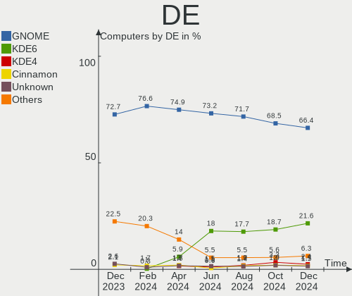
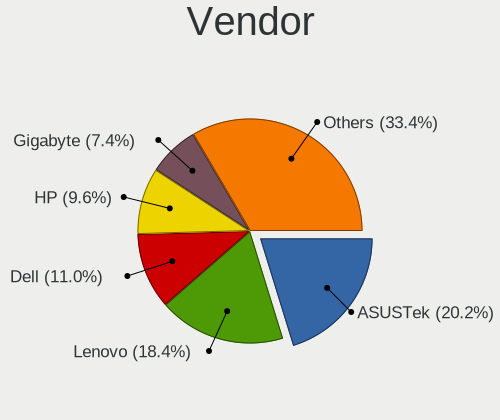
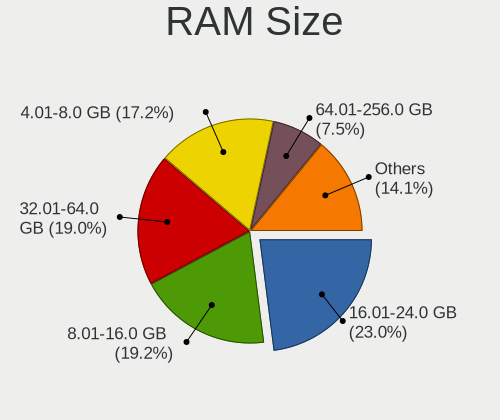
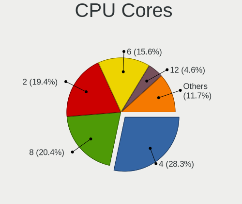
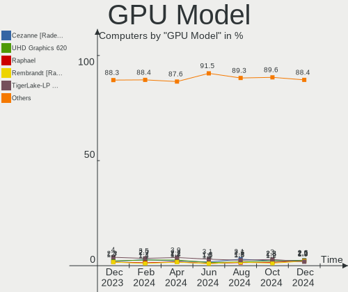
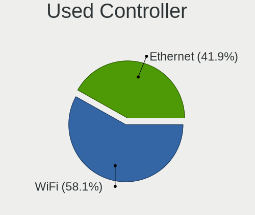
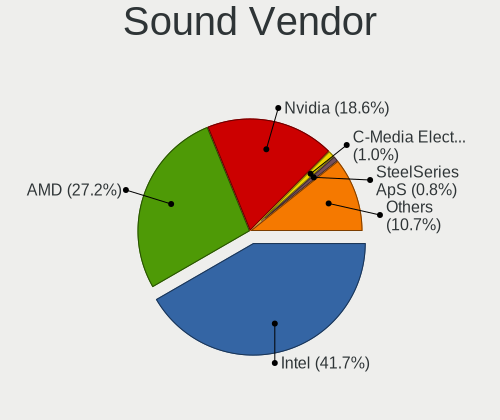

Fedora - Hardware Trends
------------------------

A project to identify most popular hardware characteristics and track their change
over time based on data collected by Linux users at https://Linux-Hardware.org.

Anyone can contribute to this report by the [hw-probe](https://github.com/linuxhw/hw-probe) tool:

    sudo -E hw-probe -all -upload

This is a report for all computer types. See also reports for [desktops](/Dist/Fedora/Desktop/README.md) and [notebooks](/Dist/Fedora/Notebook/README.md).

This report is for one last month. Overall report since the beginning of time: [TestDays](https://github.com/linuxhw/TestDays)

Period: Sep, 2023.

Contents
--------

* [ System ](#system)
  - [ OS                       ](#os)
  - [ OS Family                ](#os-family)
  - [ Kernel                   ](#kernel)
  - [ Kernel Family            ](#kernel-family)
  - [ Kernel Major Ver.        ](#kernel-major-ver)
  - [ Arch                     ](#arch)
  - [ DE                       ](#de)
  - [ Display Server           ](#display-server)
  - [ Display Manager          ](#display-manager)
  - [ OS Lang                  ](#os-lang)
  - [ Boot Mode                ](#boot-mode)
  - [ Filesystem               ](#filesystem)
  - [ Part. scheme             ](#part-scheme)
  - [ Dual Boot with Linux/BSD ](#dual-boot-with-linuxbsd)
  - [ Dual Boot (Win)          ](#dual-boot-win)

* [ Board ](#board)
  - [ Vendor                   ](#vendor)
  - [ Model                    ](#model)
  - [ Model Family             ](#model-family)
  - [ MFG Year                 ](#mfg-year)
  - [ Form Factor              ](#form-factor)
  - [ Secure Boot              ](#secure-boot)
  - [ Coreboot                 ](#coreboot)
  - [ RAM Size                 ](#ram-size)
  - [ RAM Used                 ](#ram-used)
  - [ Total Drives             ](#total-drives)
  - [ Has CD-ROM               ](#has-cd-rom)
  - [ Has Ethernet             ](#has-ethernet)
  - [ Has WiFi                 ](#has-wifi)
  - [ Has Bluetooth            ](#has-bluetooth)

* [ Location ](#location)
  - [ Country                  ](#country)
  - [ City                     ](#city)

* [ Drives ](#drives)
  - [ Drive Vendor             ](#drive-vendor)
  - [ Drive Model              ](#drive-model)
  - [ HDD Vendor               ](#hdd-vendor)
  - [ SSD Vendor               ](#ssd-vendor)
  - [ Drive Kind               ](#drive-kind)
  - [ Drive Connector          ](#drive-connector)
  - [ Drive Size               ](#drive-size)
  - [ Space Total              ](#space-total)
  - [ Space Used               ](#space-used)
  - [ Malfunc. Drives          ](#malfunc-drives)
  - [ Malfunc. Drive Vendor    ](#malfunc-drive-vendor)
  - [ Malfunc. HDD Vendor      ](#malfunc-hdd-vendor)
  - [ Malfunc. Drive Kind      ](#malfunc-drive-kind)
  - [ Failed Drives            ](#failed-drives)
  - [ Failed Drive Vendor      ](#failed-drive-vendor)
  - [ Drive Status             ](#drive-status)

* [ Storage controller ](#storage-controller)
  - [ Storage Vendor           ](#storage-vendor)
  - [ Storage Model            ](#storage-model)
  - [ Storage Kind             ](#storage-kind)

* [ Processor ](#processor)
  - [ CPU Vendor               ](#cpu-vendor)
  - [ CPU Model                ](#cpu-model)
  - [ CPU Model Family         ](#cpu-model-family)
  - [ CPU Cores                ](#cpu-cores)
  - [ CPU Sockets              ](#cpu-sockets)
  - [ CPU Threads              ](#cpu-threads)
  - [ CPU Op-Modes             ](#cpu-op-modes)
  - [ CPU Microcode            ](#cpu-microcode)
  - [ CPU Microarch            ](#cpu-microarch)

* [ Graphics ](#graphics)
  - [ GPU Vendor               ](#gpu-vendor)
  - [ GPU Model                ](#gpu-model)
  - [ GPU Combo                ](#gpu-combo)
  - [ GPU Driver               ](#gpu-driver)
  - [ GPU Memory               ](#gpu-memory)

* [ Monitor ](#monitor)
  - [ Monitor Vendor           ](#monitor-vendor)
  - [ Monitor Model            ](#monitor-model)
  - [ Monitor Resolution       ](#monitor-resolution)
  - [ Monitor Diagonal         ](#monitor-diagonal)
  - [ Monitor Width            ](#monitor-width)
  - [ Aspect Ratio             ](#aspect-ratio)
  - [ Monitor Area             ](#monitor-area)
  - [ Pixel Density            ](#pixel-density)
  - [ Multiple Monitors        ](#multiple-monitors)

* [ Network ](#network)
  - [ Net Controller Vendor    ](#net-controller-vendor)
  - [ Net Controller Model     ](#net-controller-model)
  - [ Wireless Vendor          ](#wireless-vendor)
  - [ Wireless Model           ](#wireless-model)
  - [ Ethernet Vendor          ](#ethernet-vendor)
  - [ Ethernet Model           ](#ethernet-model)
  - [ Net Controller Kind      ](#net-controller-kind)
  - [ Used Controller          ](#used-controller)
  - [ NICs                     ](#nics)
  - [ IPv6                     ](#ipv6)

* [ Bluetooth ](#bluetooth)
  - [ Bluetooth Vendor         ](#bluetooth-vendor)
  - [ Bluetooth Model          ](#bluetooth-model)

* [ Sound ](#sound)
  - [ Sound Vendor             ](#sound-vendor)
  - [ Sound Model              ](#sound-model)

* [ Memory ](#memory)
  - [ Memory Vendor            ](#memory-vendor)
  - [ Memory Model             ](#memory-model)
  - [ Memory Kind              ](#memory-kind)
  - [ Memory Form Factor       ](#memory-form-factor)
  - [ Memory Size              ](#memory-size)
  - [ Memory Speed             ](#memory-speed)

* [ Printers & scanners ](#printers--scanners)
  - [ Printer Vendor           ](#printer-vendor)
  - [ Printer Model            ](#printer-model)
  - [ Scanner Vendor           ](#scanner-vendor)
  - [ Scanner Model            ](#scanner-model)

* [ Camera ](#camera)
  - [ Camera Vendor            ](#camera-vendor)
  - [ Camera Model             ](#camera-model)

* [ Security ](#security)
  - [ Fingerprint Vendor       ](#fingerprint-vendor)
  - [ Fingerprint Model        ](#fingerprint-model)
  - [ Chipcard Vendor          ](#chipcard-vendor)
  - [ Chipcard Model           ](#chipcard-model)

* [ Unsupported ](#unsupported)
  - [ Unsupported Devices      ](#unsupported-devices)
  - [ Unsupported Device Types ](#unsupported-device-types)

System
------

OS
--

Installed operating systems

| Name      | Computers | Percent |
|-----------|-----------|---------|
| Fedora 38 | 496       | 91.01%  |
| Fedora 39 | 22        | 4.04%   |
| Fedora 37 | 17        | 3.12%   |
| Fedora 40 | 5         | 0.92%   |
| Fedora 36 | 4         | 0.73%   |
| Fedora 35 | 1         | 0.18%   |

OS Family
---------

OS without a version

| Name   | Computers | Percent |
|--------|-----------|---------|
| Fedora | 545       | 100%    |

Kernel
------

Version of the Linux kernel

| Version                                                  | Computers | Percent |
|----------------------------------------------------------|-----------|---------|
| 6.4.15-200.fc38.x86_64                                   | 177       | 32.48%  |
| 6.4.14-200.fc38.x86_64                                   | 78        | 14.31%  |
| 6.4.13-200.fc38.x86_64                                   | 73        | 13.39%  |
| 6.2.9-300.fc38.x86_64                                    | 62        | 11.38%  |
| 6.4.12-200.fc38.x86_64                                   | 35        | 6.42%   |
| 6.5.5-200.fc38.x86_64                                    | 33        | 6.06%   |
| 6.5.5-300.fc39.x86_64                                    | 9         | 1.65%   |
| 6.4.11-200.fc38.x86_64                                   | 8         | 1.47%   |
| 6.5.4-300.fc39.x86_64                                    | 5         | 0.92%   |
| 6.4.15-100.fc37.x86_64                                   | 4         | 0.73%   |
| 6.4.13-100.fc37.x86_64                                   | 4         | 0.73%   |
| 6.2.15-100.fc36.x86_64                                   | 4         | 0.73%   |
| 6.5.5-100.fc37.x86_64                                    | 3         | 0.55%   |
| 6.5.3-300.fc39.x86_64                                    | 3         | 0.55%   |
| 6.5.0-0.rc7.20230821gitf7757129e3de.50.fc39.x86_64       | 3         | 0.55%   |
| 6.4.8-200.fc38.x86_64                                    | 2         | 0.37%   |
| 6.4.16-200.fc38.x86_64                                   | 2         | 0.37%   |
| 6.4.10-200.fc38.x86_64                                   | 2         | 0.37%   |
| 6.2.15-300.fc38.x86_64                                   | 2         | 0.37%   |
| 6.2.14-300.fc38.x86_64                                   | 2         | 0.37%   |
| 6.0.7-301.fc37.x86_64                                    | 2         | 0.37%   |
| 6.6.0-0.rc2.219.vanilla.fc38.x86_64                      | 1         | 0.18%   |
| 6.6.0-0.rc2.20230919git2cf0f7156238.21.fc40.x86_64       | 1         | 0.18%   |
| 6.6.0-0.rc2.20.fc40.x86_64                               | 1         | 0.18%   |
| 6.6.0-0.rc1.212.vanilla.fc38.x86_64                      | 1         | 0.18%   |
| 6.6.0-0.rc1.20230913gt3669558b.214.vanilla.fc38.x86_64   | 1         | 0.18%   |
| 6.6.0-0.rc1.13.fc40.x86_64+debug                         | 1         | 0.18%   |
| 6.6.0-0.rc0.20230829git1c59d383390f.59.fc40.x86_64+debug | 1         | 0.18%   |
| 6.5.5-200.fc38.aarch64                                   | 1         | 0.18%   |
| 6.5.4-200.fc38.x86_64                                    | 1         | 0.18%   |
| 6.5.3-cbe5.0.fc38.x86_64                                 | 1         | 0.18%   |
| 6.5.2-cbe1.0.fc38.x86_64                                 | 1         | 0.18%   |
| 6.5.2-301.rog.fc38.x86_64                                | 1         | 0.18%   |
| 6.5.2-300.fc38.x86_64                                    | 1         | 0.18%   |
| 6.5.1-300.fc39.x86_64                                    | 1         | 0.18%   |
| 6.5.0-61.rog.fc38.x86_64                                 | 1         | 0.18%   |
| 6.5.0-0.rc7.20230823git89bf6209cad6.52.fc40.x86_64       | 1         | 0.18%   |
| 6.4.7-100.fc37.x86_64                                    | 1         | 0.18%   |
| 6.4.6-200.fc38.x86_64                                    | 1         | 0.18%   |
| 6.4.4-200.fc38.x86_64                                    | 1         | 0.18%   |

Kernel Family
-------------

Linux kernel without a distro release

| Version  | Computers | Percent |
|----------|-----------|---------|
| 6.4.15   | 181       | 33.21%  |
| 6.4.14   | 78        | 14.31%  |
| 6.4.13   | 78        | 14.31%  |
| 6.2.9    | 62        | 11.38%  |
| 6.5.5    | 46        | 8.44%   |
| 6.4.12   | 35        | 6.42%   |
| 6.4.11   | 8         | 1.47%   |
| 6.6.0    | 7         | 1.28%   |
| 6.2.15   | 7         | 1.28%   |
| 6.5.4    | 6         | 1.1%    |
| 6.5.0    | 5         | 0.92%   |
| 6.5.3    | 4         | 0.73%   |
| 6.5.2    | 3         | 0.55%   |
| 6.2.14   | 3         | 0.55%   |
| 6.4.8    | 2         | 0.37%   |
| 6.4.16   | 2         | 0.37%   |
| 6.4.10   | 2         | 0.37%   |
| 6.3.12   | 2         | 0.37%   |
| 6.0.8    | 2         | 0.37%   |
| 6.0.7    | 2         | 0.37%   |
| 6.5.1    | 1         | 0.18%   |
| 6.4.7    | 1         | 0.18%   |
| 6.4.6    | 1         | 0.18%   |
| 6.4.4    | 1         | 0.18%   |
| 6.3.5    | 1         | 0.18%   |
| 6.3.13   | 1         | 0.18%   |
| 6.2.11   | 1         | 0.18%   |
| 6.0.12   | 1         | 0.18%   |
| 5.17.5   | 1         | 0.18%   |
| 5.15.129 | 1         | 0.18%   |

Kernel Major Ver.
-----------------

Linux kernel major version

| Version | Computers | Percent |
|---------|-----------|---------|
| 6.4     | 389       | 71.38%  |
| 6.2     | 73        | 13.39%  |
| 6.5     | 65        | 11.93%  |
| 6.6     | 7         | 1.28%   |
| 6.0     | 5         | 0.92%   |
| 6.3     | 4         | 0.73%   |
| 5.17    | 1         | 0.18%   |
| 5.15    | 1         | 0.18%   |

Arch
----

OS architecture (x86_64, i586, etc.)

| Name    | Computers | Percent |
|---------|-----------|---------|
| x86_64  | 544       | 99.82%  |
| aarch64 | 1         | 0.18%   |

DE
--

Desktop Environment

| Name          | Computers | Percent |
|---------------|-----------|---------|
| GNOME         | 406       | 74.5%   |
| KDE5          | 76        | 13.94%  |
| Cinnamon      | 13        | 2.39%   |
| XFCE          | 11        | 2.02%   |
| Unknown       | 11        | 2.02%   |
| X-Cinnamon    | 8         | 1.47%   |
| GNOME Classic | 6         | 1.1%    |
| MATE          | 5         | 0.92%   |
| Budgie        | 3         | 0.55%   |
| Unity         | 1         | 0.18%   |
| sway          | 1         | 0.18%   |
| openbox       | 1         | 0.18%   |
| LXQt          | 1         | 0.18%   |
| i3            | 1         | 0.18%   |
| Hyprland      | 1         | 0.18%   |

Display Server
--------------

X11 or Wayland

| Name    | Computers | Percent |
|---------|-----------|---------|
| Wayland | 416       | 76.33%  |
| X11     | 102       | 18.72%  |
| Tty     | 24        | 4.4%    |
| Unknown | 3         | 0.55%   |

Display Manager
---------------

SDDM, LightDM, etc.

| Name    | Computers | Percent |
|---------|-----------|---------|
| Unknown | 347       | 63.67%  |
| GDM     | 118       | 21.65%  |
| LightDM | 42        | 7.71%   |
| SDDM    | 38        | 6.97%   |

OS Lang
-------

Language

| Lang        | Computers | Percent |
|-------------|-----------|---------|
| en_US       | 268       | 49.17%  |
| en_GB       | 43        | 7.89%   |
| ru_RU       | 36        | 6.61%   |
| de_DE       | 29        | 5.32%   |
| en_AU       | 25        | 4.59%   |
| pt_BR       | 19        | 3.49%   |
| fr_FR       | 18        | 3.3%    |
| it_IT       | 15        | 2.75%   |
| es_ES       | 12        | 2.2%    |
| en_CA       | 9         | 1.65%   |
| es_CO       | 7         | 1.28%   |
| en_IN       | 7         | 1.28%   |
| pl_PL       | 6         | 1.1%    |
| es_MX       | 6         | 1.1%    |
| es_CL       | 4         | 0.73%   |
| nl_NL       | 3         | 0.55%   |
| es_AR       | 3         | 0.55%   |
| zh_CN       | 2         | 0.37%   |
| pt_PT       | 2         | 0.37%   |
| id_ID       | 2         | 0.37%   |
| hu_HU       | 2         | 0.37%   |
| en_DK       | 2         | 0.37%   |
| en_BW       | 2         | 0.37%   |
| cs_CZ       | 2         | 0.37%   |
| Unknown     | 2         | 0.37%   |
| zh_SG       | 1         | 0.18%   |
| uk_UA       | 1         | 0.18%   |
| sv_SE       | 1         | 0.18%   |
| sr_RS@latin | 1         | 0.18%   |
| sk_SK       | 1         | 0.18%   |
| ru_UA       | 1         | 0.18%   |
| nl_BE       | 1         | 0.18%   |
| lt_LT       | 1         | 0.18%   |
| ko_KR       | 1         | 0.18%   |
| hr_HR       | 1         | 0.18%   |
| fr_CA       | 1         | 0.18%   |
| es_US       | 1         | 0.18%   |
| es_PE       | 1         | 0.18%   |
| es_PA       | 1         | 0.18%   |
| es_NI       | 1         | 0.18%   |

Boot Mode
---------

EFI or BIOS

| Mode | Computers | Percent |
|------|-----------|---------|
| EFI  | 433       | 79.45%  |
| BIOS | 112       | 20.55%  |

Filesystem
----------

Type of filesystem

| Type    | Computers | Percent |
|---------|-----------|---------|
| Btrfs   | 448       | 82.2%   |
| Ext4    | 75        | 13.76%  |
| Xfs     | 20        | 3.67%   |
| Overlay | 1         | 0.18%   |
| Unknown | 1         | 0.18%   |

Part. scheme
------------

Scheme of partitioning

| Type    | Computers | Percent |
|---------|-----------|---------|
| Unknown | 339       | 62.2%   |
| GPT     | 187       | 34.31%  |
| MBR     | 19        | 3.49%   |

Dual Boot with Linux/BSD
------------------------

Hosting more than one Linux/BSD

| Dual boot | Computers | Percent |
|-----------|-----------|---------|
| No        | 503       | 92.29%  |
| Yes       | 42        | 7.71%   |

Dual Boot (Win)
---------------

Hosting Linux and Windows

| Dual boot | Computers | Percent |
|-----------|-----------|---------|
| No        | 454       | 83.3%   |
| Yes       | 91        | 16.7%   |

Board
-----

Vendor
------

Motherboard manufacturer

| Name                | Computers | Percent |
|---------------------|-----------|---------|
| Lenovo              | 100       | 18.35%  |
| ASUSTek Computer    | 89        | 16.33%  |
| Dell                | 73        | 13.39%  |
| Hewlett-Packard     | 71        | 13.03%  |
| MSI                 | 35        | 6.42%   |
| Gigabyte Technology | 32        | 5.87%   |
| Acer                | 24        | 4.4%    |
| Apple               | 21        | 3.85%   |
| ASRock              | 17        | 3.12%   |
| HUAWEI              | 11        | 2.02%   |
| Samsung Electronics | 9         | 1.65%   |
| Intel               | 9         | 1.65%   |
| Timi                | 6         | 1.1%    |
| Fujitsu             | 4         | 0.73%   |
| Toshiba             | 3         | 0.55%   |
| Sony                | 3         | 0.55%   |
| Pegatron            | 3         | 0.55%   |
| Framework           | 3         | 0.55%   |
| Unknown             | 3         | 0.55%   |
| System76            | 2         | 0.37%   |
| Positivo            | 2         | 0.37%   |
| Microsoft           | 2         | 0.37%   |
| Maibenben           | 2         | 0.37%   |
| Chuwi               | 2         | 0.37%   |
| Zebra Technologies  | 1         | 0.18%   |
| TUXEDO              | 1         | 0.18%   |
| Razer               | 1         | 0.18%   |
| Radxa               | 1         | 0.18%   |
| Prestigio           | 1         | 0.18%   |
| Packard Bell        | 1         | 0.18%   |
| NZXT                | 1         | 0.18%   |
| Notebook            | 1         | 0.18%   |
| Kllisre             | 1         | 0.18%   |
| Juana Manso         | 1         | 0.18%   |
| Huanan              | 1         | 0.18%   |
| GreatWall           | 1         | 0.18%   |
| GPU Company         | 1         | 0.18%   |
| Google              | 1         | 0.18%   |
| Fanless Mini PC     | 1         | 0.18%   |
| Casper              | 1         | 0.18%   |

Model
-----

Motherboard model

| Name                                    | Computers | Percent |
|-----------------------------------------|-----------|---------|
| Dell OptiPlex 7010                      | 5         | 0.92%   |
| ASUS All Series                         | 5         | 0.92%   |
| Apple MacBookPro9,2                     | 4         | 0.73%   |
| Lenovo Yoga 6 13ALC6 82ND               | 3         | 0.55%   |
| HP Compaq Elite 8300 SFF                | 3         | 0.55%   |
| Dell XPS 13 9310                        | 3         | 0.55%   |
| Dell Latitude 7490                      | 3         | 0.55%   |
| ASUS TUF Gaming B550-PLUS               | 3         | 0.55%   |
| Unknown                                 | 3         | 0.55%   |
| MSI MS-7C76                             | 2         | 0.37%   |
| Lenovo IdeaPadFlex 5 14ARE05 81X2       | 2         | 0.37%   |
| HP ProBook 450 15.6 inch G9 Notebook PC | 2         | 0.37%   |
| HP ENVY x360 2-in-1 Laptop 15-ey0xxx    | 2         | 0.37%   |
| HP EliteBook 840 G8 Notebook PC         | 2         | 0.37%   |
| HP EliteBook 840 G6                     | 2         | 0.37%   |
| Gigabyte X470 AORUS ULTRA GAMING        | 2         | 0.37%   |
| Framework Laptop                        | 2         | 0.37%   |
| Dell XPS 15 9520                        | 2         | 0.37%   |
| Dell XPS 13 9380                        | 2         | 0.37%   |
| Dell OptiPlex 3010                      | 2         | 0.37%   |
| Dell Latitude 5420                      | 2         | 0.37%   |
| Dell Inspiron 5566                      | 2         | 0.37%   |
| ASUS Zenbook UP6502ZD_UP6502ZD          | 2         | 0.37%   |
| ASUS Zenbook 15 UM3504DA_UM3504DA       | 2         | 0.37%   |
| ASUS ROG STRIX B450-F GAMING            | 2         | 0.37%   |
| ASUS ROG CROSSHAIR VIII HERO            | 2         | 0.37%   |
| ASUS PRIME X570-PRO                     | 2         | 0.37%   |
| ASUS PRIME B550M-A                      | 2         | 0.37%   |
| ASRock B550M Pro4                       | 2         | 0.37%   |
| ASRock B450M Steel Legend               | 2         | 0.37%   |
| Apple MacBookPro8,1                     | 2         | 0.37%   |
| Apple MacBookPro11,1                    | 2         | 0.37%   |
| Acer Aspire A715-51G                    | 2         | 0.37%   |
| Zebra 10-WLAN-1                         | 1         | 0.18%   |
| TUXEDO P65_P67RGRERA                    | 1         | 0.18%   |
| Toshiba Satellite C70-B                 | 1         | 0.18%   |
| Toshiba PORTEGE R30-D                   | 1         | 0.18%   |
| Toshiba PORTEGE M750                    | 1         | 0.18%   |
| Timi Xiaomi Book Pro 16 2022            | 1         | 0.18%   |
| Timi RedmiBook 15                       | 1         | 0.18%   |

Model Family
------------

Motherboard model prefix

| Name               | Computers | Percent |
|--------------------|-----------|---------|
| Lenovo ThinkPad    | 40        | 7.34%   |
| ASUS ROG           | 20        | 3.67%   |
| Dell Inspiron      | 18        | 3.3%    |
| HP EliteBook       | 17        | 3.12%   |
| Dell Latitude      | 17        | 3.12%   |
| Lenovo IdeaPad     | 16        | 2.94%   |
| Dell XPS           | 15        | 2.75%   |
| Acer Aspire        | 15        | 2.75%   |
| Dell OptiPlex      | 13        | 2.39%   |
| ASUS PRIME         | 12        | 2.2%    |
| ASUS VivoBook      | 11        | 2.02%   |
| ASUS TUF           | 10        | 1.83%   |
| ASUS Zenbook       | 9         | 1.65%   |
| HP ProBook         | 8         | 1.47%   |
| HP Pavilion        | 8         | 1.47%   |
| ASUS ASUS          | 8         | 1.47%   |
| Lenovo Yoga        | 7         | 1.28%   |
| Lenovo ThinkCentre | 7         | 1.28%   |
| HP Laptop          | 7         | 1.28%   |
| HP ENVY            | 7         | 1.28%   |
| HP Compaq          | 7         | 1.28%   |
| Lenovo Legion      | 5         | 0.92%   |
| Lenovo IdeaPadFlex | 5         | 0.92%   |
| Dell Precision     | 5         | 0.92%   |
| ASUS All           | 5         | 0.92%   |
| HP OMEN            | 4         | 0.73%   |
| ASRock B450M       | 4         | 0.73%   |
| Apple MacBookPro9  | 4         | 0.73%   |
| Lenovo ThinkBook   | 3         | 0.55%   |
| Gigabyte B550M     | 3         | 0.55%   |
| Fujitsu LIFEBOOK   | 3         | 0.55%   |
| Framework Laptop   | 3         | 0.55%   |
| Apple MacBookPro8  | 3         | 0.55%   |
| Acer Predator      | 3         | 0.55%   |
| Unknown            | 3         | 0.55%   |
| Toshiba PORTEGE    | 2         | 0.37%   |
| Timi Mi            | 2         | 0.37%   |
| MSI Prestige       | 2         | 0.37%   |
| MSI MS-7C76        | 2         | 0.37%   |
| MSI Modern         | 2         | 0.37%   |

MFG Year
--------

Motherboard manufacture year

| Year | Computers | Percent |
|------|-----------|---------|
| 2021 | 71        | 13.03%  |
| 2020 | 67        | 12.29%  |
| 2022 | 58        | 10.64%  |
| 2018 | 50        | 9.17%   |
| 2019 | 48        | 8.81%   |
| 2023 | 40        | 7.34%   |
| 2012 | 33        | 6.06%   |
| 2017 | 29        | 5.32%   |
| 2015 | 24        | 4.4%    |
| 2014 | 24        | 4.4%    |
| 2013 | 22        | 4.04%   |
| 2011 | 21        | 3.85%   |
| 2010 | 18        | 3.3%    |
| 2016 | 16        | 2.94%   |
| 2008 | 12        | 2.2%    |
| 2009 | 9         | 1.65%   |
| 2007 | 2         | 0.37%   |
| 2006 | 1         | 0.18%   |

Form Factor
-----------

Physical design of the computer

| Name           | Computers | Percent |
|----------------|-----------|---------|
| Notebook       | 313       | 57.43%  |
| Desktop        | 181       | 33.21%  |
| Convertible    | 28        | 5.14%   |
| Mini pc        | 10        | 1.83%   |
| Tablet         | 6         | 1.1%    |
| All in one     | 5         | 0.92%   |
| System on chip | 1         | 0.18%   |
| Server         | 1         | 0.18%   |

Secure Boot
-----------

Enabled or disabled

| State    | Computers | Percent |
|----------|-----------|---------|
| Disabled | 418       | 76.7%   |
| Enabled  | 127       | 23.3%   |

Coreboot
--------

Have coreboot on board

| Used | Computers | Percent |
|------|-----------|---------|
| No   | 543       | 99.63%  |
| Yes  | 2         | 0.37%   |

RAM Size
--------

Total RAM memory

| Size in GB  | Computers | Percent |
|-------------|-----------|---------|
| 4.01-8.0    | 118       | 21.65%  |
| 16.01-24.0  | 113       | 20.73%  |
| 8.01-16.0   | 111       | 20.37%  |
| 32.01-64.0  | 89        | 16.33%  |
| 3.01-4.0    | 53        | 9.72%   |
| 64.01-256.0 | 34        | 6.24%   |
| 24.01-32.0  | 18        | 3.3%    |
| 1.01-2.0    | 7         | 1.28%   |
| 2.01-3.0    | 2         | 0.37%   |

RAM Used
--------

Used RAM memory

| Used GB     | Computers | Percent |
|-------------|-----------|---------|
| 4.01-8.0    | 166       | 30.46%  |
| 2.01-3.0    | 146       | 26.79%  |
| 3.01-4.0    | 111       | 20.37%  |
| 1.01-2.0    | 54        | 9.91%   |
| 8.01-16.0   | 51        | 9.36%   |
| 0.51-1.0    | 9         | 1.65%   |
| 16.01-24.0  | 6         | 1.1%    |
| 64.01-256.0 | 1         | 0.18%   |
| 0.01-0.5    | 1         | 0.18%   |

Total Drives
------------

Number of drives on board

| Drives | Computers | Percent |
|--------|-----------|---------|
| 1      | 341       | 62.57%  |
| 2      | 124       | 22.75%  |
| 3      | 49        | 8.99%   |
| 5      | 11        | 2.02%   |
| 4      | 11        | 2.02%   |
| 6      | 4         | 0.73%   |
| 7      | 2         | 0.37%   |
| 0      | 2         | 0.37%   |
| 8      | 1         | 0.18%   |

Has CD-ROM
----------

Has CD-ROM on board

| Presented | Computers | Percent |
|-----------|-----------|---------|
| No        | 425       | 77.98%  |
| Yes       | 120       | 22.02%  |

Has Ethernet
------------

Has Ethernet on board

| Presented | Computers | Percent |
|-----------|-----------|---------|
| Yes       | 417       | 76.51%  |
| No        | 128       | 23.49%  |

Has WiFi
--------

Has WiFi module

| Presented | Computers | Percent |
|-----------|-----------|---------|
| Yes       | 450       | 82.57%  |
| No        | 95        | 17.43%  |

Has Bluetooth
-------------

Has Bluetooth module

| Presented | Computers | Percent |
|-----------|-----------|---------|
| Yes       | 403       | 73.94%  |
| No        | 142       | 26.06%  |

Location
--------

Country
-------

Geographic location (country)

| Country             | Computers | Percent |
|---------------------|-----------|---------|
| USA                 | 99        | 18.17%  |
| Russia              | 36        | 6.61%   |
| Germany             | 32        | 5.87%   |
| Brazil              | 30        | 5.5%    |
| Australia           | 24        | 4.4%    |
| UK                  | 22        | 4.04%   |
| Italy               | 21        | 3.85%   |
| Canada              | 21        | 3.85%   |
| Spain               | 20        | 3.67%   |
| India               | 19        | 3.49%   |
| France              | 19        | 3.49%   |
| Mexico              | 14        | 2.57%   |
| Poland              | 12        | 2.2%    |
| Colombia            | 11        | 2.02%   |
| Turkey              | 10        | 1.83%   |
| Netherlands         | 9         | 1.65%   |
| Belarus             | 9         | 1.65%   |
| Greece              | 6         | 1.1%    |
| Czechia             | 6         | 1.1%    |
| Thailand            | 5         | 0.92%   |
| Switzerland         | 5         | 0.92%   |
| Sweden              | 5         | 0.92%   |
| Portugal            | 5         | 0.92%   |
| Norway              | 5         | 0.92%   |
| Iran                | 5         | 0.92%   |
| Hungary             | 5         | 0.92%   |
| Argentina           | 5         | 0.92%   |
| Ukraine             | 4         | 0.73%   |
| Serbia              | 4         | 0.73%   |
| Indonesia           | 4         | 0.73%   |
| Chile               | 4         | 0.73%   |
| Philippines         | 3         | 0.55%   |
| Malaysia            | 3         | 0.55%   |
| Finland             | 3         | 0.55%   |
| Egypt               | 3         | 0.55%   |
| Belgium             | 3         | 0.55%   |
| Trinidad and Tobago | 2         | 0.37%   |
| Slovakia            | 2         | 0.37%   |
| Singapore           | 2         | 0.37%   |
| Peru                | 2         | 0.37%   |

City
----

Geographic location (city)

| City           | Computers | Percent |
|----------------|-----------|---------|
| Sydney         | 15        | 2.75%   |
| Minsk          | 8         | 1.47%   |
| Mexico City    | 7         | 1.28%   |
| Moscow         | 6         | 1.1%    |
| St Petersburg  | 5         | 0.92%   |
| Bogotá        | 5         | 0.92%   |
| Tehran         | 4         | 0.73%   |
| Sunshine West  | 4         | 0.73%   |
| Munich         | 4         | 0.73%   |
| Madrid         | 4         | 0.73%   |
| Lisbon         | 4         | 0.73%   |
| Delhi          | 4         | 0.73%   |
| Budapest       | 4         | 0.73%   |
| Berlin         | 4         | 0.73%   |
| Bangkok        | 4         | 0.73%   |
| Athens         | 4         | 0.73%   |
| Warsaw         | 3         | 0.55%   |
| Sao Paulo      | 3         | 0.55%   |
| Milan          | 3         | 0.55%   |
| Melbourne      | 3         | 0.55%   |
| Manchester     | 3         | 0.55%   |
| Leeds          | 3         | 0.55%   |
| Istanbul       | 3         | 0.55%   |
| Hyderabad      | 3         | 0.55%   |
| Belgrade       | 3         | 0.55%   |
| Barcelona      | 3         | 0.55%   |
| Zurich         | 2         | 0.37%   |
| Zagreb         | 2         | 0.37%   |
| Yekaterinburg  | 2         | 0.37%   |
| Wroclaw        | 2         | 0.37%   |
| Virginia Beach | 2         | 0.37%   |
| Vilnius        | 2         | 0.37%   |
| Vienna         | 2         | 0.37%   |
| Toronto        | 2         | 0.37%   |
| The Hague      | 2         | 0.37%   |
| Tbilisi        | 2         | 0.37%   |
| Tarsus         | 2         | 0.37%   |
| Surabaya       | 2         | 0.37%   |
| Starokandry    | 2         | 0.37%   |
| St Louis       | 2         | 0.37%   |

Drives
------

Drive Vendor
------------

Hard drive vendors

| Vendor                      | Computers | Drives | Percent |
|-----------------------------|-----------|--------|---------|
| Samsung Electronics         | 147       | 175    | 18.99%  |
| WDC                         | 78        | 100    | 10.08%  |
| Seagate                     | 69        | 86     | 8.91%   |
| Sandisk                     | 64        | 69     | 8.27%   |
| Kingston                    | 41        | 43     | 5.3%    |
| Toshiba                     | 38        | 38     | 4.91%   |
| Intel                       | 30        | 36     | 3.88%   |
| Crucial                     | 28        | 31     | 3.62%   |
| SK hynix                    | 27        | 27     | 3.49%   |
| Micron Technology           | 25        | 26     | 3.23%   |
| Unknown                     | 22        | 24     | 2.84%   |
| Micron/Crucial Technology   | 16        | 18     | 2.07%   |
| Phison Electronics          | 15        | 15     | 1.94%   |
| Kingston Technology Company | 12        | 13     | 1.55%   |
| Hitachi                     | 12        | 14     | 1.55%   |
| KIOXIA                      | 11        | 11     | 1.42%   |
| ADATA Technology            | 10        | 11     | 1.29%   |
| Silicon Motion              | 9         | 9      | 1.16%   |
| HGST                        | 7         | 7      | 0.9%    |
| Apple                       | 7         | 8      | 0.9%    |
| A-DATA Technology           | 7         | 7      | 0.9%    |
| China                       | 6         | 6      | 0.78%   |
| Netac                       | 5         | 5      | 0.65%   |
| Union Memory                | 4         | 4      | 0.52%   |
| PNY                         | 4         | 4      | 0.52%   |
| Union Memory (Shenzhen)     | 3         | 3      | 0.39%   |
| Realtek Semiconductor       | 3         | 3      | 0.39%   |
| Intenso                     | 3         | 3      | 0.39%   |
| Apacer                      | 3         | 3      | 0.39%   |
| Yangtze Memory Technologies | 2         | 2      | 0.26%   |
| Team                        | 2         | 3      | 0.26%   |
| Patriot                     | 2         | 2      | 0.26%   |
| OCZ                         | 2         | 2      | 0.26%   |
| MAXIO Technology (Hangzhou) | 2         | 2      | 0.26%   |
| LITEONIT                    | 2         | 2      | 0.26%   |
| LITEON                      | 2         | 2      | 0.26%   |
| Lenovo                      | 2         | 2      | 0.26%   |
| KingSpec                    | 2         | 2      | 0.26%   |
| HS-SSD-C100                 | 2         | 2      | 0.26%   |
| GOODRAM                     | 2         | 2      | 0.26%   |

Drive Model
-----------

Hard drive models

| Model                                                             | Computers | Percent |
|-------------------------------------------------------------------|-----------|---------|
| Samsung NVMe SSD Controller SM981/PM981/PM983 256GB               | 36        | 4.35%   |
| Samsung NVMe SSD Controller PM9A1/PM9A3/980PRO 1TB                | 25        | 3.02%   |
| Micron/Crucial P2 NVMe PCIe SSD 1TB                               | 14        | 1.69%   |
| Kingston SA400S37480G 480GB SSD                                   | 13        | 1.57%   |
| Sandisk WD Blue SN550 NVMe SSD 512GB                              | 9         | 1.09%   |
| Sandisk WD Black SN750 / PC SN730 NVMe SSD 512GB                  | 8         | 0.97%   |
| Samsung NVMe SSD Controller SM961/PM961/SM963 500GB               | 8         | 0.97%   |
| Intel SSDPEKNU512GZ 512GB                                         | 8         | 0.97%   |
| Toshiba XG6 NVMe SSD Controller 512GB                             | 7         | 0.85%   |
| Phison E12 NVMe Controller 2TB                                    | 7         | 0.85%   |
| Crucial CT500MX500SSD1 500GB                                      | 7         | 0.85%   |
| ADATA XPG SX8200 Pro PCIe Gen3x4 M.2 2280 Solid State Drive 256GB | 7         | 0.85%   |
| Sandisk WD Black SN850 1TB                                        | 6         | 0.73%   |
| WDC WDS500G2B0A-00SM50 500GB SSD                                  | 5         | 0.6%    |
| Toshiba DT01ACA100 1TB                                            | 5         | 0.6%    |
| Silicon Motion SM2263EN/SM2263XT SSD Controller 512GB             | 5         | 0.6%    |
| Seagate ST2000DM006-2DM164 2TB                                    | 5         | 0.6%    |
| Phison PS5013 E13 NVMe Controller 512GB                           | 5         | 0.6%    |
| Kingston SA400S37240G 240GB SSD                                   | 5         | 0.6%    |
| WDC WDS120G2G0A-00JH30 120GB SSD                                  | 4         | 0.48%   |
| Unknown MMC Card  32GB                                            | 4         | 0.48%   |
| Unknown MMC Card  16GB                                            | 4         | 0.48%   |
| Seagate ST500LT012-1DG142 500GB                                   | 4         | 0.48%   |
| Seagate ST500DM002-1BD142 500GB                                   | 4         | 0.48%   |
| Seagate ST1000LM035-1RK172 1TB                                    | 4         | 0.48%   |
| Seagate ST1000LM024 HN-M101MBB 1TB                                | 4         | 0.48%   |
| Seagate ST1000DM010-2EP102 1TB                                    | 4         | 0.48%   |
| Seagate ST1000DM003-1ER162 1TB                                    | 4         | 0.48%   |
| Sandisk WD Blue SN500 / PC SN520 NVMe SSD 256GB                   | 4         | 0.48%   |
| Samsung SSD 980 1TB                                               | 4         | 0.48%   |
| Samsung SSD 850 EVO 250GB                                         | 4         | 0.48%   |
| Kingston Company SNV2S1000G 1TB                                   | 4         | 0.48%   |
| WDC WDS100T2B0A-00SM50 1TB SSD                                    | 3         | 0.36%   |
| Unknown MMC Card  64GB                                            | 3         | 0.36%   |
| Union Memory UMIS RPJTJ512MEE1OWX 512GB                           | 3         | 0.36%   |
| SK hynix HFM001TD3JX013N 1024GB                                   | 3         | 0.36%   |
| SK hynix BC711 HFM512GD3JX013N 512GB                              | 3         | 0.36%   |
| Silicon Motion SM2262/SM2262EN SSD Controller 500GB               | 3         | 0.36%   |
| Seagate ST4000DM004-2CV104 4TB                                    | 3         | 0.36%   |
| Seagate ST2000DM008-2FR102 2TB                                    | 3         | 0.36%   |

HDD Vendor
----------

Hard disk drive vendors

| Vendor              | Computers | Drives | Percent |
|---------------------|-----------|--------|---------|
| Seagate             | 64        | 79     | 36.57%  |
| WDC                 | 55        | 75     | 31.43%  |
| Toshiba             | 24        | 24     | 13.71%  |
| Hitachi             | 12        | 14     | 6.86%   |
| Samsung Electronics | 8         | 10     | 4.57%   |
| HGST                | 7         | 7      | 4%      |
| Unknown             | 2         | 2      | 1.14%   |
| SABRENT             | 1         | 1      | 0.57%   |
| Intenso             | 1         | 1      | 0.57%   |
| Apple               | 1         | 1      | 0.57%   |

SSD Vendor
----------

Solid state drive vendors

| Vendor              | Computers | Drives | Percent |
|---------------------|-----------|--------|---------|
| Samsung Electronics | 47        | 53     | 19.92%  |
| Kingston            | 30        | 32     | 12.71%  |
| Crucial             | 27        | 29     | 11.44%  |
| WDC                 | 24        | 24     | 10.17%  |
| SanDisk             | 16        | 16     | 6.78%   |
| Intel               | 14        | 17     | 5.93%   |
| China               | 6         | 6      | 2.54%   |
| Apple               | 5         | 5      | 2.12%   |
| A-DATA Technology   | 5         | 5      | 2.12%   |
| Toshiba             | 4         | 4      | 1.69%   |
| PNY                 | 4         | 4      | 1.69%   |
| SK hynix            | 3         | 3      | 1.27%   |
| Netac               | 3         | 3      | 1.27%   |
| Micron Technology   | 3         | 4      | 1.27%   |
| Apacer              | 3         | 3      | 1.27%   |
| Team                | 2         | 3      | 0.85%   |
| Patriot             | 2         | 2      | 0.85%   |
| OCZ                 | 2         | 2      | 0.85%   |
| LITEONIT            | 2         | 2      | 0.85%   |
| LITEON              | 2         | 2      | 0.85%   |
| KingSpec            | 2         | 2      | 0.85%   |
| Intenso             | 2         | 2      | 0.85%   |
| GOODRAM             | 2         | 2      | 0.85%   |
| FORESEE             | 2         | 2      | 0.85%   |
| Emtec               | 2         | 2      | 0.85%   |
| Corsair             | 2         | 2      | 0.85%   |
| ASMT                | 2         | 2      | 0.85%   |
| Wibtek              | 1         | 1      | 0.42%   |
| Verbatim            | 1         | 1      | 0.42%   |
| Vaseky              | 1         | 1      | 0.42%   |
| TO Exter            | 1         | 1      | 0.42%   |
| SPCC                | 1         | 1      | 0.42%   |
| S3+                 | 1         | 1      | 0.42%   |
| RevuAhn             | 1         | 1      | 0.42%   |
| Plextor             | 1         | 1      | 0.42%   |
| NN                  | 1         | 1      | 0.42%   |
| MidasForce          | 1         | 1      | 0.42%   |
| MicroFrom           | 1         | 1      | 0.42%   |
| Lexar               | 1         | 1      | 0.42%   |
| KUIJIA              | 1         | 1      | 0.42%   |

Drive Kind
----------

HDD or SSD

| Kind    | Computers | Drives | Percent |
|---------|-----------|--------|---------|
| NVMe    | 313       | 363    | 43.65%  |
| SSD     | 212       | 251    | 29.57%  |
| HDD     | 153       | 214    | 21.34%  |
| Unknown | 20        | 21     | 2.79%   |
| MMC     | 19        | 20     | 2.65%   |

Drive Connector
---------------

SATA, SAS, NVMe, etc.

| Type | Computers | Drives | Percent |
|------|-----------|--------|---------|
| NVMe | 312       | 362    | 47.78%  |
| SATA | 298       | 462    | 45.64%  |
| SAS  | 24        | 25     | 3.68%   |
| MMC  | 19        | 20     | 2.91%   |

Drive Size
----------

Size of hard drive

| Size in TB | Computers | Drives | Percent |
|------------|-----------|--------|---------|
| 0.01-0.5   | 211       | 256    | 55.09%  |
| 0.51-1.0   | 116       | 135    | 30.29%  |
| 1.01-2.0   | 29        | 34     | 7.57%   |
| 3.01-4.0   | 15        | 24     | 3.92%   |
| 4.01-10.0  | 7         | 9      | 1.83%   |
| 2.01-3.0   | 4         | 6      | 1.04%   |
| 10.01-20.0 | 1         | 1      | 0.26%   |

Space Total
-----------

Amount of disk space available on the file system

| Size in GB     | Computers | Percent |
|----------------|-----------|---------|
| 501-1000       | 149       | 27.34%  |
| 251-500        | 93        | 17.06%  |
| 1001-2000      | 80        | 14.68%  |
| 101-250        | 59        | 10.83%  |
| More than 3000 | 41        | 7.52%   |
| 1-20           | 38        | 6.97%   |
| Unknown        | 35        | 6.42%   |
| 51-100         | 19        | 3.49%   |
| 2001-3000      | 18        | 3.3%    |
| 21-50          | 13        | 2.39%   |

Space Used
----------

Amount of used disk space

| Used GB        | Computers | Percent |
|----------------|-----------|---------|
| 1-20           | 176       | 32.29%  |
| 21-50          | 77        | 14.13%  |
| 101-250        | 69        | 12.66%  |
| 51-100         | 62        | 11.38%  |
| 251-500        | 51        | 9.36%   |
| Unknown        | 35        | 6.42%   |
| 501-1000       | 30        | 5.5%    |
| 1001-2000      | 19        | 3.49%   |
| More than 3000 | 16        | 2.94%   |
| 2001-3000      | 10        | 1.83%   |

Malfunc. Drives
---------------

Drive models with a malfunction

| Model                                                           | Computers | Drives | Percent |
|-----------------------------------------------------------------|-----------|--------|---------|
| Intel SSDSC2CT120A3 120GB                                       | 2         | 2      | 8%      |
| Crucial CT120M500SSD1 120GB                                     | 2         | 2      | 8%      |
| Wibtek W800S 512GB SSD                                          | 1         | 1      | 4%      |
| WDC WD5000AVCS-632DY1 500GB                                     | 1         | 1      | 4%      |
| WDC WD20EZRZ-22Z5HB0 2TB                                        | 1         | 1      | 4%      |
| WDC WD10EZEX-08WN4A0 1TB                                        | 1         | 1      | 4%      |
| Seagate ST9750420AS 752GB                                       | 1         | 1      | 4%      |
| Seagate ST500LT012-9WS142 500GB                                 | 1         | 1      | 4%      |
| Seagate ST500LT012-1DG142 500GB                                 | 1         | 1      | 4%      |
| Seagate ST500DM002-1BD142 500GB                                 | 1         | 1      | 4%      |
| Seagate ST3500418AS 500GB                                       | 1         | 1      | 4%      |
| Seagate ST2000DM001-1CH164 2TB                                  | 1         | 1      | 4%      |
| Seagate ST1000LM049-2GH172 1TB                                  | 1         | 1      | 4%      |
| Samsung Electronics NVMe SSD Controller SM981/PM981/PM983 256GB | 1         | 1      | 4%      |
| Samsung Electronics NVMe SSD Controller SM961/PM961/SM963 500GB | 1         | 1      | 4%      |
| Samsung Electronics HD103UJ 1TB                                 | 1         | 2      | 4%      |
| Netac NVMe SSD 2TB                                              | 1         | 1      | 4%      |
| Kingston SA400S37480G 480GB SSD                                 | 1         | 1      | 4%      |
| Kingston RBU-SNS8350DES3128GP 128GB SSD                         | 1         | 1      | 4%      |
| Intel SSDSC2KG960G8R 960GB                                      | 1         | 1      | 4%      |
| Hitachi HDT721010SLA360 1TB                                     | 1         | 1      | 4%      |
| Crucial CT1000MX500SSD1 1TB                                     | 1         | 1      | 4%      |
| Apple HDD HTS545050A7E362 500GB                                 | 1         | 1      | 4%      |

Malfunc. Drive Vendor
---------------------

Vendors of faulty drives

| Vendor              | Computers | Drives | Percent |
|---------------------|-----------|--------|---------|
| Seagate             | 7         | 7      | 28%     |
| WDC                 | 3         | 3      | 12%     |
| Samsung Electronics | 3         | 4      | 12%     |
| Intel               | 3         | 3      | 12%     |
| Crucial             | 3         | 3      | 12%     |
| Kingston            | 2         | 2      | 8%      |
| Wibtek              | 1         | 1      | 4%      |
| Netac               | 1         | 1      | 4%      |
| Hitachi             | 1         | 1      | 4%      |
| Apple               | 1         | 1      | 4%      |

Malfunc. HDD Vendor
-------------------

Vendors of faulty HDD drives

| Vendor              | Computers | Drives | Percent |
|---------------------|-----------|--------|---------|
| Seagate             | 7         | 7      | 53.85%  |
| WDC                 | 3         | 3      | 23.08%  |
| Samsung Electronics | 1         | 2      | 7.69%   |
| Hitachi             | 1         | 1      | 7.69%   |
| Apple               | 1         | 1      | 7.69%   |

Malfunc. Drive Kind
-------------------

Kinds of faulty drives

| Kind | Computers | Drives | Percent |
|------|-----------|--------|---------|
| HDD  | 12        | 14     | 50%     |
| SSD  | 9         | 9      | 37.5%   |
| NVMe | 3         | 3      | 12.5%   |

Failed Drives
-------------

Failed drive models

| Model                           | Computers | Drives | Percent |
|---------------------------------|-----------|--------|---------|
| Samsung Electronics SSD 980 1TB | 1         | 2      | 50%     |
| Hitachi HDS721010DLE630 1TB     | 1         | 2      | 50%     |

Failed Drive Vendor
-------------------

Failed drive vendors

| Vendor              | Computers | Drives | Percent |
|---------------------|-----------|--------|---------|
| Samsung Electronics | 1         | 2      | 50%     |
| Hitachi             | 1         | 2      | 50%     |

Drive Status
------------

Number of failed and malfunc. drives

| Status   | Computers | Drives | Percent |
|----------|-----------|--------|---------|
| Detected | 362       | 561    | 63.29%  |
| Works    | 184       | 278    | 32.17%  |
| Malfunc  | 24        | 26     | 4.2%    |
| Failed   | 2         | 4      | 0.35%   |

Storage controller
------------------

Storage Vendor
--------------

Storage controller vendors

| Vendor                                  | Computers | Percent |
|-----------------------------------------|-----------|---------|
| Intel                                   | 299       | 39.76%  |
| AMD                                     | 107       | 14.23%  |
| Samsung Electronics                     | 102       | 13.56%  |
| SanDisk                                 | 49        | 6.52%   |
| SK hynix                                | 23        | 3.06%   |
| Micron Technology                       | 22        | 2.93%   |
| Kingston Technology Company             | 22        | 2.93%   |
| Micron/Crucial Technology               | 17        | 2.26%   |
| Phison Electronics                      | 16        | 2.13%   |
| ADATA Technology                        | 12        | 1.6%    |
| KIOXIA                                  | 11        | 1.46%   |
| ASMedia Technology                      | 11        | 1.46%   |
| Toshiba America Info Systems            | 10        | 1.33%   |
| Silicon Motion                          | 9         | 1.2%    |
| Union Memory (Shenzhen)                 | 7         | 0.93%   |
| Marvell Technology Group                | 4         | 0.53%   |
| Seagate Technology                      | 3         | 0.4%    |
| Realtek Semiconductor                   | 3         | 0.4%    |
| Nvidia                                  | 3         | 0.4%    |
| Netac Technology                        | 3         | 0.4%    |
| JMicron Technology                      | 3         | 0.4%    |
| Yangtze Memory Technologies             | 2         | 0.27%   |
| VIA Technologies                        | 2         | 0.27%   |
| Solid State Storage Technology          | 2         | 0.27%   |
| MAXIO Technology (Hangzhou)             | 2         | 0.27%   |
| Lenovo                                  | 2         | 0.27%   |
| ULi Electronics                         | 1         | 0.13%   |
| Silicon Image                           | 1         | 0.13%   |
| Shenzhen Unionmemory Information System | 1         | 0.13%   |
| Biwin Storage Technology                | 1         | 0.13%   |
| Apple                                   | 1         | 0.13%   |
| Adaptec                                 | 1         | 0.13%   |

Storage Model
-------------

Storage controller models

| Model                                                                          | Computers | Percent |
|--------------------------------------------------------------------------------|-----------|---------|
| AMD FCH SATA Controller [AHCI mode]                                            | 72        | 8.82%   |
| Samsung NVMe SSD Controller SM981/PM981/PM983                                  | 36        | 4.41%   |
| Intel Volume Management Device NVMe RAID Controller                            | 36        | 4.41%   |
| Samsung NVMe SSD Controller PM9A1/PM9A3/980PRO                                 | 25        | 3.06%   |
| Samsung NVMe SSD Controller 980                                                | 24        | 2.94%   |
| Intel Sunrise Point-LP SATA Controller [AHCI mode]                             | 21        | 2.57%   |
| Intel 7 Series Chipset Family 6-port SATA Controller [AHCI mode]               | 20        | 2.45%   |
| Intel 8 Series/C220 Series Chipset Family 6-port SATA Controller 1 [AHCI mode] | 18        | 2.21%   |
| Intel Q170/Q150/B150/H170/H110/Z170/CM236 Chipset SATA Controller [AHCI Mode]  | 16        | 1.96%   |
| AMD 400 Series Chipset SATA Controller                                         | 16        | 1.96%   |
| Micron/Crucial P2 [Nick P2] / P3 / P3 Plus NVMe PCIe SSD (DRAM-less)           | 15        | 1.84%   |
| Intel 7 Series/C210 Series Chipset Family 6-port SATA Controller [AHCI mode]   | 13        | 1.59%   |
| AMD 500 Series Chipset SATA Controller                                         | 13        | 1.59%   |
| SK hynix Gold P31/BC711/PC711 NVMe Solid State Drive                           | 12        | 1.47%   |
| Intel Celeron/Pentium Silver Processor SATA Controller                         | 11        | 1.35%   |
| Intel 82801 Mobile SATA Controller [RAID mode]                                 | 11        | 1.35%   |
| Intel 6 Series/C200 Series Chipset Family 6 port Mobile SATA AHCI Controller   | 11        | 1.35%   |
| Intel SSD 670p Series [Keystone Harbor]                                        | 10        | 1.23%   |
| Intel 6 Series/C200 Series Chipset Family 6 port Desktop SATA AHCI Controller  | 10        | 1.23%   |
| ASMedia ASM1062 Serial ATA Controller                                          | 10        | 1.23%   |
| SanDisk WD Blue SN550 NVMe SSD                                                 | 9         | 1.1%    |
| SanDisk WD Black SN750 / PC SN730 NVMe SSD                                     | 8         | 0.98%   |
| Samsung NVMe SSD Controller SM961/PM961/SM963                                  | 8         | 0.98%   |
| Intel Wildcat Point-LP SATA Controller [AHCI Mode]                             | 8         | 0.98%   |
| Intel Tiger Lake-LP SATA Controller                                            | 8         | 0.98%   |
| Intel Alder Lake-S PCH SATA Controller [AHCI Mode]                             | 8         | 0.98%   |
| Toshiba America Info Systems XG6 NVMe SSD Controller                           | 7         | 0.86%   |
| Phison E12 NVMe Controller                                                     | 7         | 0.86%   |
| Kingston Company Company Non-Volatile memory controller                        | 7         | 0.86%   |
| Kingston Company KC3000/Renegade NVMe SSD                                      | 7         | 0.86%   |
| Intel Comet Lake SATA AHCI Controller                                          | 7         | 0.86%   |
| Intel Cannon Lake PCH SATA AHCI Controller                                     | 7         | 0.86%   |
| Intel 400 Series Chipset Family SATA AHCI Controller                           | 7         | 0.86%   |
| Intel 200 Series PCH SATA controller [AHCI mode]                               | 7         | 0.86%   |
| AMD SB7x0/SB8x0/SB9x0 SATA Controller [AHCI mode]                              | 7         | 0.86%   |
| ADATA XPG SX8200 Pro PCIe Gen3x4 M.2 2280 Solid State Drive                    | 7         | 0.86%   |
| Sandisk Western Digital WD Black SN850X NVMe SSD                               | 6         | 0.74%   |
| SanDisk WD PC SN810 / Black SN850 NVMe SSD                                     | 6         | 0.74%   |
| SanDisk WD Black SN770 / PC SN740 256GB / PC SN560 (DRAM-less) NVMe SSD        | 6         | 0.74%   |
| Intel 8 Series SATA Controller 1 [AHCI mode]                                   | 6         | 0.74%   |

Storage Kind
------------

Kind of storage controller (IDE, SATA, NVMe, SAS, ...)

| Kind | Computers | Percent |
|------|-----------|---------|
| SATA | 346       | 46.32%  |
| NVMe | 312       | 41.77%  |
| RAID | 62        | 8.3%    |
| IDE  | 27        | 3.61%   |

Processor
---------

CPU Vendor
----------

Processor vendors

| Vendor | Computers | Percent |
|--------|-----------|---------|
| Intel  | 389       | 71.38%  |
| AMD    | 155       | 28.44%  |
| ARM    | 1         | 0.18%   |

CPU Model
---------

Processor models

| Model                                       | Computers | Percent |
|---------------------------------------------|-----------|---------|
| Intel 11th Gen Core i5-1135G7 @ 2.40GHz     | 16        | 2.94%   |
| Intel 11th Gen Core i7-1165G7 @ 2.80GHz     | 10        | 1.83%   |
| Intel Core i5-6300U CPU @ 2.40GHz           | 7         | 1.28%   |
| Intel Core i5-3470 CPU @ 3.20GHz            | 7         | 1.28%   |
| Intel Core i5-3210M CPU @ 2.50GHz           | 7         | 1.28%   |
| AMD Ryzen 7 5700U with Radeon Graphics      | 7         | 1.28%   |
| Intel Core i7-8650U CPU @ 1.90GHz           | 6         | 1.1%    |
| Intel Core i7-8565U CPU @ 1.80GHz           | 6         | 1.1%    |
| Intel Core i7-7500U CPU @ 2.70GHz           | 5         | 0.92%   |
| Intel Core i5-8250U CPU @ 1.60GHz           | 5         | 0.92%   |
| Intel 12th Gen Core i7-12700H               | 5         | 0.92%   |
| AMD Ryzen 7 4800H with Radeon Graphics      | 5         | 0.92%   |
| Intel Core i7-4790 CPU @ 3.60GHz            | 4         | 0.73%   |
| Intel Core i7-10750H CPU @ 2.60GHz          | 4         | 0.73%   |
| Intel Core i5-8400 CPU @ 2.80GHz            | 4         | 0.73%   |
| Intel Core i5-8350U CPU @ 1.70GHz           | 4         | 0.73%   |
| Intel Core i5-7200U CPU @ 2.50GHz           | 4         | 0.73%   |
| Intel 13th Gen Core i7-13700H               | 4         | 0.73%   |
| Intel 13th Gen Core i5-1340P                | 4         | 0.73%   |
| Intel 12th Gen Core i7-1255U                | 4         | 0.73%   |
| Intel 12th Gen Core i5-12500H               | 4         | 0.73%   |
| Intel 12th Gen Core i5-1235U                | 4         | 0.73%   |
| Intel 11th Gen Core i7-1185G7 @ 3.00GHz     | 4         | 0.73%   |
| AMD Ryzen 9 3900X 12-Core Processor         | 4         | 0.73%   |
| AMD Ryzen 7 5800X3D 8-Core Processor        | 4         | 0.73%   |
| AMD Ryzen 7 5800X 8-Core Processor          | 4         | 0.73%   |
| AMD Ryzen 7 5800H with Radeon Graphics      | 4         | 0.73%   |
| AMD Ryzen 7 5700X 8-Core Processor          | 4         | 0.73%   |
| AMD Ryzen 5 5600X 6-Core Processor          | 4         | 0.73%   |
| AMD Ryzen 5 5500U with Radeon Graphics      | 4         | 0.73%   |
| AMD Ryzen 5 4500U with Radeon Graphics      | 4         | 0.73%   |
| AMD Ryzen 5 3600 6-Core Processor           | 4         | 0.73%   |
| AMD Ryzen 5 3400G with Radeon Vega Graphics | 4         | 0.73%   |
| AMD Ryzen 5 2600 Six-Core Processor         | 4         | 0.73%   |
| Intel Core i7-7700HQ CPU @ 2.80GHz          | 3         | 0.55%   |
| Intel Core i5-8365U CPU @ 1.60GHz           | 3         | 0.55%   |
| Intel Core i5-6500T CPU @ 2.50GHz           | 3         | 0.55%   |
| Intel Core i5-5200U CPU @ 2.20GHz           | 3         | 0.55%   |
| Intel Core i5-4210U CPU @ 1.70GHz           | 3         | 0.55%   |
| Intel Core i5-3570 CPU @ 3.40GHz            | 3         | 0.55%   |

CPU Model Family
----------------

Processor model prefix

| Model                   | Computers | Percent |
|-------------------------|-----------|---------|
| Intel Core i5           | 115       | 21.1%   |
| Other                   | 109       | 20%     |
| Intel Core i7           | 84        | 15.41%  |
| AMD Ryzen 7             | 50        | 9.17%   |
| AMD Ryzen 5             | 43        | 7.89%   |
| Intel Core i3           | 25        | 4.59%   |
| Intel Celeron           | 19        | 3.49%   |
| AMD Ryzen 9             | 18        | 3.3%    |
| Intel Xeon              | 11        | 2.02%   |
| Intel Core 2 Duo        | 11        | 2.02%   |
| Intel Atom              | 7         | 1.28%   |
| AMD Ryzen 3             | 7         | 1.28%   |
| AMD Ryzen 7 PRO         | 6         | 1.1%    |
| AMD Phenom II X4        | 6         | 1.1%    |
| Intel Core 2 Quad       | 4         | 0.73%   |
| AMD A6                  | 4         | 0.73%   |
| Intel Pentium           | 2         | 0.37%   |
| Intel Celeron Dual-Core | 2         | 0.37%   |
| AMD Ryzen 5 PRO         | 2         | 0.37%   |
| AMD FX                  | 2         | 0.37%   |
| AMD E1                  | 2         | 0.37%   |
| AMD Athlon II X2        | 2         | 0.37%   |
| AMD Athlon 64 X2        | 2         | 0.37%   |
| AMD A8                  | 2         | 0.37%   |
| AMD A10                 | 2         | 0.37%   |
| Intel Xeon Silver       | 1         | 0.18%   |
| Intel Pentium Silver    | 1         | 0.18%   |
| Intel Pentium Gold      | 1         | 0.18%   |
| AMD Ryzen 3 PRO         | 1         | 0.18%   |
| AMD PRO A8              | 1         | 0.18%   |
| AMD Phenom II X2        | 1         | 0.18%   |
| AMD E2                  | 1         | 0.18%   |
| AMD Athlon II           | 1         | 0.18%   |

CPU Cores
---------

Number of processor cores

| Number | Computers | Percent |
|--------|-----------|---------|
| 4      | 191       | 35.05%  |
| 2      | 143       | 26.24%  |
| 8      | 71        | 13.03%  |
| 6      | 70        | 12.84%  |
| 12     | 24        | 4.4%    |
| 10     | 17        | 3.12%   |
| 14     | 13        | 2.39%   |
| 16     | 9         | 1.65%   |
| 24     | 3         | 0.55%   |
| 1      | 2         | 0.37%   |
| 20     | 1         | 0.18%   |
| 5      | 1         | 0.18%   |

CPU Sockets
-----------

Number of sockets

| Number | Computers | Percent |
|--------|-----------|---------|
| 1      | 542       | 99.45%  |
| 2      | 3         | 0.55%   |

CPU Threads
-----------

Threads per core (Hyper-Threading)

| Number | Computers | Percent |
|--------|-----------|---------|
| 2      | 425       | 77.98%  |
| 1      | 120       | 22.02%  |

CPU Op-Modes
------------

CPU Operation Modes (32-bit, 64-bit)

| Op mode        | Computers | Percent |
|----------------|-----------|---------|
| 32-bit, 64-bit | 544       | 99.82%  |
| 64-bit         | 1         | 0.18%   |

CPU Microcode
-------------

Microcode number

| Number     | Computers | Percent |
|------------|-----------|---------|
| Unknown    | 398       | 73.03%  |
| 0x0a50000c | 13        | 2.39%   |
| 0x0a50000d | 9         | 1.65%   |
| 0x0a20120a | 9         | 1.65%   |
| 0x08608103 | 9         | 1.65%   |
| 0x08108109 | 9         | 1.65%   |
| 0x0a601203 | 7         | 1.28%   |
| 0x0800820d | 7         | 1.28%   |
| 0x010000c8 | 7         | 1.28%   |
| 0x0a404102 | 6         | 1.1%    |
| 0x08701021 | 6         | 1.1%    |
| 0x08600106 | 6         | 1.1%    |
| 0x08600104 | 5         | 0.92%   |
| 0x0a704103 | 4         | 0.73%   |
| 0x0a201016 | 4         | 0.73%   |
| 0x08a00008 | 3         | 0.55%   |
| 0x08701030 | 3         | 0.55%   |
| 0x08608104 | 3         | 0.55%   |
| 0x0a201025 | 2         | 0.37%   |
| 0x08701013 | 2         | 0.37%   |
| 0x08608102 | 2         | 0.37%   |
| 0x08108102 | 2         | 0.37%   |
| 0x06006705 | 2         | 0.37%   |
| 0x06000852 | 2         | 0.37%   |
| 0x806e9    | 1         | 0.18%   |
| 0x706a1    | 1         | 0.18%   |
| 0x206a7    | 1         | 0.18%   |
| 0x0a601201 | 1         | 0.18%   |
| 0x0a50000b | 1         | 0.18%   |
| 0x0a404101 | 1         | 0.18%   |
| 0x0a201205 | 1         | 0.18%   |
| 0x0a201204 | 1         | 0.18%   |
| 0x0a201009 | 1         | 0.18%   |
| 0x08600103 | 1         | 0.18%   |
| 0x08600102 | 1         | 0.18%   |
| 0x08200103 | 1         | 0.18%   |
| 0x08101016 | 1         | 0.18%   |
| 0x08101013 | 1         | 0.18%   |
| 0x0800111c | 1         | 0.18%   |
| 0x0700010f | 1         | 0.18%   |

CPU Microarch
-------------

Microarchitecture

| Name             | Computers | Percent |
|------------------|-----------|---------|
| KabyLake         | 76        | 13.94%  |
| Alderlake Hybrid | 51        | 9.36%   |
| Unknown          | 43        | 7.89%   |
| Zen 3            | 41        | 7.52%   |
| TigerLake        | 41        | 7.52%   |
| IvyBridge        | 36        | 6.61%   |
| Haswell          | 31        | 5.69%   |
| Zen 2            | 27        | 4.95%   |
| Skylake          | 27        | 4.95%   |
| SandyBridge      | 23        | 4.22%   |
| Zen+             | 19        | 3.49%   |
| CometLake        | 18        | 3.3%    |
| Penryn           | 14        | 2.57%   |
| Westmere         | 13        | 2.39%   |
| Broadwell        | 13        | 2.39%   |
| Icelake          | 11        | 2.02%   |
| Goldmont plus    | 11        | 2.02%   |
| Silvermont       | 10        | 1.83%   |
| K10              | 10        | 1.83%   |
| Excavator        | 5         | 0.92%   |
| Zen              | 4         | 0.73%   |
| Piledriver       | 4         | 0.73%   |
| Core             | 3         | 0.55%   |
| Steamroller      | 2         | 0.37%   |
| Nehalem          | 2         | 0.37%   |
| K8 Hammer        | 2         | 0.37%   |
| Jaguar           | 2         | 0.37%   |
| Bonnell          | 2         | 0.37%   |
| Tremont          | 1         | 0.18%   |
| Puma             | 1         | 0.18%   |
| Gracemont        | 1         | 0.18%   |
| Goldmont         | 1         | 0.18%   |

Graphics
--------

GPU Vendor
----------

Vendors of graphics cards

| Vendor                     | Computers | Percent |
|----------------------------|-----------|---------|
| Intel                      | 322       | 49.77%  |
| AMD                        | 164       | 25.35%  |
| Nvidia                     | 159       | 24.57%  |
| Matrox Electronics Systems | 2         | 0.31%   |

GPU Model
---------

Graphics card models

| Model                                                                                    | Computers | Percent |
|------------------------------------------------------------------------------------------|-----------|---------|
| Intel TigerLake-LP GT2 [Iris Xe Graphics]                                                | 37        | 5.55%   |
| Intel 2nd Generation Core Processor Family Integrated Graphics Controller                | 18        | 2.7%    |
| Intel UHD Graphics 620                                                                   | 16        | 2.4%    |
| Intel 3rd Gen Core processor Graphics Controller                                         | 16        | 2.4%    |
| Intel Alder Lake-P Integrated Graphics Controller                                        | 15        | 2.25%   |
| AMD Renoir                                                                               | 15        | 2.25%   |
| Intel Raptor Lake-P [Iris Xe Graphics]                                                   | 14        | 2.1%    |
| AMD Lucienne                                                                             | 14        | 2.1%    |
| AMD Ellesmere [Radeon RX 470/480/570/570X/580/580X/590]                                  | 13        | 1.95%   |
| Intel WhiskeyLake-U GT2 [UHD Graphics 620]                                               | 12        | 1.8%    |
| Intel HD Graphics 620                                                                    | 12        | 1.8%    |
| AMD Cezanne [Radeon Vega Series / Radeon Vega Mobile Series]                             | 12        | 1.8%    |
| Intel Xeon E3-1200 v2/3rd Gen Core processor Graphics Controller                         | 11        | 1.65%   |
| AMD Picasso/Raven 2 [Radeon Vega Series / Radeon Vega Mobile Series]                     | 11        | 1.65%   |
| Intel HD Graphics 5500                                                                   | 10        | 1.5%    |
| Intel HD Graphics 530                                                                    | 10        | 1.5%    |
| Intel GeminiLake [UHD Graphics 600]                                                      | 10        | 1.5%    |
| Intel Core Processor Integrated Graphics Controller                                      | 10        | 1.5%    |
| Intel CometLake-H GT2 [UHD Graphics]                                                     | 10        | 1.5%    |
| Intel Haswell-ULT Integrated Graphics Controller                                         | 9         | 1.35%   |
| AMD Rembrandt [Radeon 680M]                                                              | 9         | 1.35%   |
| Intel Skylake GT2 [HD Graphics 520]                                                      | 8         | 1.2%    |
| Intel CoffeeLake-S GT2 [UHD Graphics 630]                                                | 8         | 1.2%    |
| AMD Barcelo                                                                              | 8         | 1.2%    |
| Intel Alder Lake-UP3 GT2 [Iris Xe Graphics]                                              | 7         | 1.05%   |
| AMD Raphael                                                                              | 7         | 1.05%   |
| Intel TigerLake-H GT1 [UHD Graphics]                                                     | 6         | 0.9%    |
| Intel HD Graphics 630                                                                    | 6         | 0.9%    |
| Intel CoffeeLake-H GT2 [UHD Graphics 630]                                                | 6         | 0.9%    |
| Nvidia TU117M [GeForce GTX 1650 Mobile / Max-Q]                                          | 5         | 0.75%   |
| Nvidia GP107 [GeForce GTX 1050 Ti]                                                       | 5         | 0.75%   |
| Nvidia GA107M [GeForce RTX 3050 Ti Mobile]                                               | 5         | 0.75%   |
| Nvidia GA106M [GeForce RTX 3060 Mobile / Max-Q]                                          | 5         | 0.75%   |
| Nvidia GA106 [GeForce RTX 3060 Lite Hash Rate]                                           | 5         | 0.75%   |
| Nvidia GA104 [GeForce RTX 3060 Ti Lite Hash Rate]                                        | 5         | 0.75%   |
| Intel Mobile 4 Series Chipset Integrated Graphics Controller                             | 5         | 0.75%   |
| Intel CometLake-U GT2 [UHD Graphics]                                                     | 5         | 0.75%   |
| Intel Atom/Celeron/Pentium Processor x5-E8000/J3xxx/N3xxx Integrated Graphics Controller | 5         | 0.75%   |
| Intel Atom Processor Z36xxx/Z37xxx Series Graphics & Display                             | 5         | 0.75%   |
| AMD Navi 23 [Radeon RX 6600/6600 XT/6600M]                                               | 5         | 0.75%   |

GPU Combo
---------

Combinations of graphics cards

| Name            | Computers | Percent |
|-----------------|-----------|---------|
| 1 x Intel       | 228       | 41.83%  |
| 1 x AMD         | 121       | 22.2%   |
| Intel + Nvidia  | 74        | 13.58%  |
| 1 x Nvidia      | 72        | 13.21%  |
| 2 x AMD         | 16        | 2.94%   |
| Intel + AMD     | 14        | 2.57%   |
| AMD + Nvidia    | 12        | 2.2%    |
| 2 x Intel       | 5         | 0.92%   |
| Other           | 1         | 0.18%   |
| Nvidia + Matrox | 1         | 0.18%   |
| 1 x Matrox      | 1         | 0.18%   |

GPU Driver
----------

Free vs proprietary

| Driver      | Computers | Percent |
|-------------|-----------|---------|
| Free        | 451       | 82.75%  |
| Proprietary | 80        | 14.68%  |
| Unknown     | 14        | 2.57%   |

GPU Memory
----------

Total video memory

| Size in GB | Computers | Percent |
|------------|-----------|---------|
| Unknown    | 299       | 54.86%  |
| 0.01-0.5   | 57        | 10.46%  |
| 1.01-2.0   | 50        | 9.17%   |
| 3.01-4.0   | 36        | 6.61%   |
| 7.01-8.0   | 35        | 6.42%   |
| 0.51-1.0   | 35        | 6.42%   |
| 8.01-16.0  | 17        | 3.12%   |
| 5.01-6.0   | 9         | 1.65%   |
| 16.01-24.0 | 5         | 0.92%   |
| 2.01-3.0   | 2         | 0.37%   |

Monitor
-------

Monitor Vendor
--------------

Monitor vendors

| Vendor                  | Computers | Percent |
|-------------------------|-----------|---------|
| Samsung Electronics     | 78        | 12.4%   |
| BOE                     | 71        | 11.29%  |
| AU Optronics            | 67        | 10.65%  |
| Chimei Innolux          | 59        | 9.38%   |
| Goldstar                | 49        | 7.79%   |
| Dell                    | 43        | 6.84%   |
| LG Display              | 37        | 5.88%   |
| Hewlett-Packard         | 28        | 4.45%   |
| Apple                   | 20        | 3.18%   |
| Acer                    | 18        | 2.86%   |
| BenQ                    | 16        | 2.54%   |
| AOC                     | 14        | 2.23%   |
| Sharp                   | 13        | 2.07%   |
| Lenovo                  | 11        | 1.75%   |
| Philips                 | 10        | 1.59%   |
| PANDA                   | 7         | 1.11%   |
| ASUSTek Computer        | 7         | 1.11%   |
| Iiyama                  | 6         | 0.95%   |
| Unknown                 | 5         | 0.79%   |
| TMX                     | 5         | 0.79%   |
| Ancor Communications    | 5         | 0.79%   |
| ViewSonic               | 4         | 0.64%   |
| Sony                    | 4         | 0.64%   |
| Sceptre Tech            | 4         | 0.64%   |
| InfoVision              | 4         | 0.64%   |
| ___                     | 3         | 0.48%   |
| Toshiba                 | 3         | 0.48%   |
| MSI                     | 3         | 0.48%   |
| Gigabyte Technology     | 3         | 0.48%   |
| CSO                     | 3         | 0.48%   |
| Chi Mei Optoelectronics | 3         | 0.48%   |
| HKC                     | 2         | 0.32%   |
| GreenWood               | 2         | 0.32%   |
| Westinghouse            | 1         | 0.16%   |
| Vizio                   | 1         | 0.16%   |
| TMK                     | 1         | 0.16%   |
| Tianma XM               | 1         | 0.16%   |
| STA                     | 1         | 0.16%   |
| SLD                     | 1         | 0.16%   |
| SKY                     | 1         | 0.16%   |

Monitor Model
-------------

Monitor models

| Model                                                                  | Computers | Percent |
|------------------------------------------------------------------------|-----------|---------|
| Chimei Innolux LCD Monitor CMN15E7 1920x1080 344x193mm 15.5-inch       | 6         | 0.92%   |
| Apple Color LCD APP9CC7 1280x800 286x179mm 13.3-inch                   | 5         | 0.77%   |
| Chimei Innolux LCD Monitor CMN15F5 1920x1080 344x193mm 15.5-inch       | 4         | 0.61%   |
| Chimei Innolux LCD Monitor CMN1521 1920x1080 344x193mm 15.5-inch       | 4         | 0.61%   |
| Chimei Innolux LCD Monitor CMN14D4 1920x1080 309x173mm 13.9-inch       | 4         | 0.61%   |
| ___ LCDTV16 ___9000 1360x768                                           | 3         | 0.46%   |
| Unknown LCD Monitor FFFF 2288x1287 2550x2550mm 142.0-inch              | 3         | 0.46%   |
| Samsung Electronics LCD Monitor SDC416E 2880x1620 344x194mm 15.5-inch  | 3         | 0.46%   |
| Samsung Electronics LCD Monitor SAM0A7A 1920x1080 1060x626mm 48.5-inch | 3         | 0.46%   |
| Philips PHL 223V5 PHLC0CF 1920x1080 477x268mm 21.5-inch                | 3         | 0.46%   |
| PANDA LCD Monitor NCP004D 1920x1080 344x194mm 15.5-inch                | 3         | 0.46%   |
| Goldstar Ultra HD GSM5B09 3840x2160 600x340mm 27.2-inch                | 3         | 0.46%   |
| Chimei Innolux LCD Monitor CMN15DB 1366x768 344x193mm 15.5-inch        | 3         | 0.46%   |
| Chimei Innolux LCD Monitor CMN1512 1920x1080 344x193mm 15.5-inch       | 3         | 0.46%   |
| Chimei Innolux LCD Monitor CMN1406 1920x1080 309x173mm 13.9-inch       | 3         | 0.46%   |
| BOE LCD Monitor BOE095F 2256x1504 285x190mm 13.5-inch                  | 3         | 0.46%   |
| BOE LCD Monitor BOE0893 2160x1440 296x197mm 14.0-inch                  | 3         | 0.46%   |
| BOE LCD Monitor BOE06DF 1920x1080 309x173mm 13.9-inch                  | 3         | 0.46%   |
| AU Optronics LCD Monitor AUO403D 1920x1080 309x173mm 13.9-inch         | 3         | 0.46%   |
| AU Optronics LCD Monitor AUO369F 1920x1080 344x194mm 15.5-inch         | 3         | 0.46%   |
| ViewSonic TD2220 VSC052C 1920x1080 480x270mm 21.7-inch                 | 2         | 0.31%   |
| Unknown LCDTV16 9000 1360x768 1600x900mm 72.3-inch                     | 2         | 0.31%   |
| Sharp LCD Monitor SHP14F9 1920x1200 288x180mm 13.4-inch                | 2         | 0.31%   |
| Sharp LCD Monitor SHP14AD 3840x2160 294x165mm 13.3-inch                | 2         | 0.31%   |
| Samsung Electronics SyncMaster SAM0526 1920x1080 510x287mm 23.0-inch   | 2         | 0.31%   |
| Samsung Electronics S24D300 SAM0B43 1920x1080 531x299mm 24.0-inch      | 2         | 0.31%   |
| Samsung Electronics S22C300 SAM0A20 1920x1080 477x268mm 21.5-inch      | 2         | 0.31%   |
| Samsung Electronics LCD Monitor SEC5441 1366x768 344x194mm 15.5-inch   | 2         | 0.31%   |
| Samsung Electronics LCD Monitor SDC4180 2880x1620 344x194mm 15.5-inch  | 2         | 0.31%   |
| Samsung Electronics LCD Monitor SDC4171 2880x1800 302x189mm 14.0-inch  | 2         | 0.31%   |
| Samsung Electronics LCD Monitor SDC4161 1920x1080 344x194mm 15.5-inch  | 2         | 0.31%   |
| Samsung Electronics LCD Monitor SDC4143 3840x2160 344x194mm 15.5-inch  | 2         | 0.31%   |
| Samsung Electronics C27F390 SAM0D32 1920x1080 598x336mm 27.0-inch      | 2         | 0.31%   |
| Samsung Electronics C24F390 SAM0D2C 1920x1080 521x293mm 23.5-inch      | 2         | 0.31%   |
| LG Display LCD Monitor LGD068D 1920x1080 309x174mm 14.0-inch           | 2         | 0.31%   |
| LG Display LCD Monitor LGD0354 1366x768 293x165mm 13.2-inch            | 2         | 0.31%   |
| LG Display LCD Monitor LGD02DC 1366x768 344x194mm 15.5-inch            | 2         | 0.31%   |
| LG Display LCD Monitor LGD0266 1366x768 344x194mm 15.5-inch            | 2         | 0.31%   |
| LG Display LCD Monitor LGD0250 1366x768 345x194mm 15.6-inch            | 2         | 0.31%   |
| Lenovo LEN L1711pC LEN13B7 1280x1024 338x270mm 17.0-inch               | 2         | 0.31%   |

Monitor Resolution
------------------

Monitor screen resolution

| Resolution         | Computers | Percent |
|--------------------|-----------|---------|
| 1920x1080 (FHD)    | 286       | 47.43%  |
| 1366x768 (WXGA)    | 79        | 13.1%   |
| 2560x1440 (QHD)    | 51        | 8.46%   |
| 3840x2160 (4K)     | 35        | 5.8%    |
| 1920x1200 (WUXGA)  | 18        | 2.99%   |
| 1280x1024 (SXGA)   | 15        | 2.49%   |
| 1440x900 (WXGA+)   | 13        | 2.16%   |
| 3440x1440          | 12        | 1.99%   |
| 2560x1600          | 11        | 1.82%   |
| 1600x900 (HD+)     | 10        | 1.66%   |
| 2880x1800          | 9         | 1.49%   |
| 2560x1080          | 7         | 1.16%   |
| 1680x1050 (WSXGA+) | 7         | 1.16%   |
| 1280x800 (WXGA)    | 7         | 1.16%   |
| 3840x2400          | 5         | 0.83%   |
| 2880x1620          | 5         | 0.83%   |
| 2160x1440          | 4         | 0.66%   |
| 1360x768           | 4         | 0.66%   |
| 2288x1287          | 3         | 0.5%    |
| 2256x1504          | 3         | 0.5%    |
| 3840x1080          | 2         | 0.33%   |
| 3200x2000          | 2         | 0.33%   |
| 1920x1280          | 2         | 0.33%   |
| 3840x2560          | 1         | 0.17%   |
| 3840x1600          | 1         | 0.17%   |
| 3456x2160          | 1         | 0.17%   |
| 3280x1050          | 1         | 0.17%   |
| 3000x2000          | 1         | 0.17%   |
| 2736x1824          | 1         | 0.17%   |
| 2400x1600          | 1         | 0.17%   |
| 2240x1400          | 1         | 0.17%   |
| 2160x1350          | 1         | 0.17%   |
| 1920x540           | 1         | 0.17%   |
| 1920x1440          | 1         | 0.17%   |
| 1024x768 (XGA)     | 1         | 0.17%   |
| Unknown            | 1         | 0.17%   |

Monitor Diagonal
----------------

Diagonal size in inches

| Inches  | Computers | Percent |
|---------|-----------|---------|
| 15      | 156       | 24.57%  |
| 13      | 78        | 12.28%  |
| 27      | 63        | 9.92%   |
| 14      | 61        | 9.61%   |
| 24      | 47        | 7.4%    |
| 23      | 34        | 5.35%   |
| 21      | 29        | 4.57%   |
| 34      | 17        | 2.68%   |
| 16      | 16        | 2.52%   |
| 19      | 14        | 2.2%    |
| 31      | 13        | 2.05%   |
| 18      | 13        | 2.05%   |
| 17      | 13        | 2.05%   |
| 12      | 10        | 1.57%   |
| Unknown | 10        | 1.57%   |
| 25      | 6         | 0.94%   |
| 22      | 6         | 0.94%   |
| 20      | 6         | 0.94%   |
| 72      | 5         | 0.79%   |
| 48      | 5         | 0.79%   |
| 32      | 5         | 0.79%   |
| 54      | 4         | 0.63%   |
| 40      | 4         | 0.63%   |
| 142     | 3         | 0.47%   |
| 11      | 3         | 0.47%   |
| 42      | 2         | 0.31%   |
| 28      | 2         | 0.31%   |
| 86      | 1         | 0.16%   |
| 65      | 1         | 0.16%   |
| 52      | 1         | 0.16%   |
| 38      | 1         | 0.16%   |
| 37      | 1         | 0.16%   |
| 35      | 1         | 0.16%   |
| 33      | 1         | 0.16%   |
| 26      | 1         | 0.16%   |
| 10      | 1         | 0.16%   |
| 7       | 1         | 0.16%   |

Monitor Width
-------------

Physical width

| Width in mm    | Computers | Percent |
|----------------|-----------|---------|
| 301-350        | 262       | 41.85%  |
| 501-600        | 138       | 22.04%  |
| 201-300        | 60        | 9.58%   |
| 401-500        | 56        | 8.95%   |
| 351-400        | 27        | 4.31%   |
| 701-800        | 23        | 3.67%   |
| 601-700        | 20        | 3.19%   |
| 1001-1500      | 12        | 1.92%   |
| Unknown        | 10        | 1.6%    |
| 801-900        | 7         | 1.12%   |
| 1501-2000      | 5         | 0.8%    |
| More than 2000 | 3         | 0.48%   |
| 901-1000       | 2         | 0.32%   |
| 101-200        | 1         | 0.16%   |

Aspect Ratio
------------

Proportional relationship between the width and the height

| Ratio   | Computers | Percent |
|---------|-----------|---------|
| 16/9    | 419       | 74.69%  |
| 16/10   | 82        | 14.62%  |
| 21/9    | 20        | 3.57%   |
| 3/2     | 13        | 2.32%   |
| 5/4     | 12        | 2.14%   |
| 4/3     | 3         | 0.53%   |
| 32/9    | 3         | 0.53%   |
| 1.00    | 3         | 0.53%   |
| Unknown | 3         | 0.53%   |
| 6/5     | 2         | 0.36%   |
| 0.56    | 1         | 0.18%   |

Monitor Area
------------

Area in inch²

| Area in inch² | Computers | Percent |
|----------------|-----------|---------|
| 101-110        | 156       | 24.8%   |
| 81-90          | 108       | 17.17%  |
| 201-250        | 95        | 15.1%   |
| 301-350        | 63        | 10.02%  |
| 351-500        | 38        | 6.04%   |
| 71-80          | 31        | 4.93%   |
| 151-200        | 29        | 4.61%   |
| 251-300        | 19        | 3.02%   |
| More than 1000 | 18        | 2.86%   |
| 111-120        | 14        | 2.23%   |
| 141-150        | 11        | 1.75%   |
| 121-130        | 11        | 1.75%   |
| 61-70          | 10        | 1.59%   |
| 501-1000       | 10        | 1.59%   |
| Unknown        | 10        | 1.59%   |
| 51-60          | 4         | 0.64%   |
| 1-40           | 1         | 0.16%   |
| 91-100         | 1         | 0.16%   |

Pixel Density
-------------

Pixels per inch

| Density       | Computers | Percent |
|---------------|-----------|---------|
| 121-160       | 183       | 29.9%   |
| 51-100        | 163       | 26.63%  |
| 101-120       | 145       | 23.69%  |
| 161-240       | 68        | 11.11%  |
| More than 240 | 24        | 3.92%   |
| 1-50          | 19        | 3.1%    |
| Unknown       | 10        | 1.63%   |

Multiple Monitors
-----------------

Total monitors connected

| Total | Computers | Percent |
|-------|-----------|---------|
| 1     | 399       | 73.21%  |
| 2     | 110       | 20.18%  |
| 0     | 19        | 3.49%   |
| 3     | 16        | 2.94%   |
| 4     | 1         | 0.18%   |

Network
-------

Net Controller Vendor
---------------------

Controller vendors

| Vendor                                | Computers | Percent |
|---------------------------------------|-----------|---------|
| Intel                                 | 314       | 38.81%  |
| Realtek Semiconductor                 | 267       | 33%     |
| Broadcom                              | 52        | 6.43%   |
| Qualcomm Atheros                      | 51        | 6.3%    |
| MediaTek                              | 33        | 4.08%   |
| Broadcom Limited                      | 11        | 1.36%   |
| TP-Link                               | 10        | 1.24%   |
| ASIX Electronics                      | 8         | 0.99%   |
| Marvell Technology Group              | 7         | 0.87%   |
| Ralink Technology                     | 6         | 0.74%   |
| Xiaomi                                | 5         | 0.62%   |
| Ralink                                | 4         | 0.49%   |
| Qualcomm                              | 4         | 0.49%   |
| Microsoft                             | 4         | 0.49%   |
| Samsung Electronics                   | 3         | 0.37%   |
| OPPO Electronics                      | 3         | 0.37%   |
| Nvidia                                | 3         | 0.37%   |
| NetGear                               | 3         | 0.37%   |
| Google                                | 3         | 0.37%   |
| Sierra Wireless                       | 2         | 0.25%   |
| Huawei Technologies                   | 2         | 0.25%   |
| Tehuti Networks                       | 1         | 0.12%   |
| National Semiconductor                | 1         | 0.12%   |
| Mercucys                              | 1         | 0.12%   |
| Linksys                               | 1         | 0.12%   |
| Lenovo                                | 1         | 0.12%   |
| INGENICO                              | 1         | 0.12%   |
| Hyperkin                              | 1         | 0.12%   |
| Foxconn / Hon Hai                     | 1         | 0.12%   |
| Edimax Technology                     | 1         | 0.12%   |
| DisplayLink                           | 1         | 0.12%   |
| D-Link                                | 1         | 0.12%   |
| Comneon                               | 1         | 0.12%   |
| Aquantia                              | 1         | 0.12%   |
| 802.11g Adapter [Linksys WUSB54GC v3] | 1         | 0.12%   |

Net Controller Model
--------------------

Controller models

| Model                                                             | Computers | Percent |
|-------------------------------------------------------------------|-----------|---------|
| Realtek RTL8111/8168/8411 PCI Express Gigabit Ethernet Controller | 169       | 17.98%  |
| Intel Wi-Fi 6 AX201                                               | 34        | 3.62%   |
| Intel Wi-Fi 6 AX200                                               | 30        | 3.19%   |
| Realtek RTL8125 2.5GbE Controller                                 | 23        | 2.45%   |
| Intel Wireless 8265 / 8275                                        | 23        | 2.45%   |
| Realtek RTL8153 Gigabit Ethernet Adapter                          | 21        | 2.23%   |
| Intel Alder Lake-P PCH CNVi WiFi                                  | 19        | 2.02%   |
| Realtek RTL810xE PCI Express Fast Ethernet controller             | 18        | 1.91%   |
| Intel Wi-Fi 6 AX210/AX211/AX411 160MHz                            | 17        | 1.81%   |
| Intel 82579LM Gigabit Network Connection (Lewisville)             | 16        | 1.7%    |
| Realtek RTL8822CE 802.11ac PCIe Wireless Network Adapter          | 14        | 1.49%   |
| MediaTek MT7922 802.11ax PCI Express Wireless Network Adapter     | 14        | 1.49%   |
| Intel I211 Gigabit Network Connection                             | 14        | 1.49%   |
| MediaTek MT7921 802.11ax PCI Express Wireless Network Adapter     | 13        | 1.38%   |
| Intel Raptor Lake PCH CNVi WiFi                                   | 13        | 1.38%   |
| Realtek RTL8852BE PCIe 802.11ax Wireless Network Controller       | 12        | 1.28%   |
| Intel Comet Lake PCH CNVi WiFi                                    | 12        | 1.28%   |
| Intel Wireless 7265                                               | 11        | 1.17%   |
| Intel Ethernet Connection (4) I219-LM                             | 11        | 1.17%   |
| Qualcomm Atheros QCA9565 / AR9565 Wireless Network Adapter        | 10        | 1.06%   |
| Intel Wireless 8260                                               | 9         | 0.96%   |
| Realtek RTL8821CE 802.11ac PCIe Wireless Network Adapter          | 8         | 0.85%   |
| Intel Wireless 3165                                               | 8         | 0.85%   |
| Intel Ethernet Controller I225-V                                  | 8         | 0.85%   |
| Intel Cannon Point-LP CNVi [Wireless-AC]                          | 8         | 0.85%   |
| Broadcom NetXtreme BCM57765 Gigabit Ethernet PCIe                 | 8         | 0.85%   |
| Qualcomm Atheros QCA6174 802.11ac Wireless Network Adapter        | 7         | 0.74%   |
| Intel Wireless-AC 9260                                            | 7         | 0.74%   |
| Intel Ethernet Connection (2) I219-V                              | 7         | 0.74%   |
| Broadcom BCM4331 802.11a/b/g/n                                    | 7         | 0.74%   |
| Broadcom BCM43142 802.11b/g/n                                     | 7         | 0.74%   |
| ASIX AX88179 Gigabit Ethernet                                     | 7         | 0.74%   |
| Qualcomm Atheros AR9485 Wireless Network Adapter                  | 6         | 0.64%   |
| Intel Ethernet Connection I219-LM                                 | 6         | 0.64%   |
| Intel Ethernet Connection I217-LM                                 | 6         | 0.64%   |
| Intel Ethernet Connection (2) I219-LM                             | 6         | 0.64%   |
| Intel Comet Lake PCH-LP CNVi WiFi                                 | 6         | 0.64%   |
| Intel Cannon Lake PCH CNVi WiFi                                   | 6         | 0.64%   |
| Realtek RTL8852AE 802.11ax PCIe Wireless Network Adapter          | 5         | 0.53%   |
| Qualcomm Atheros QCA9377 802.11ac Wireless Network Adapter        | 5         | 0.53%   |

Wireless Vendor
---------------

Wireless vendors

| Vendor                                | Computers | Percent |
|---------------------------------------|-----------|---------|
| Intel                                 | 244       | 51.69%  |
| Realtek Semiconductor                 | 65        | 13.77%  |
| Qualcomm Atheros                      | 41        | 8.69%   |
| Broadcom                              | 40        | 8.47%   |
| MediaTek                              | 33        | 6.99%   |
| TP-Link                               | 10        | 2.12%   |
| Broadcom Limited                      | 10        | 2.12%   |
| Ralink Technology                     | 6         | 1.27%   |
| Ralink                                | 4         | 0.85%   |
| Qualcomm                              | 4         | 0.85%   |
| Microsoft                             | 4         | 0.85%   |
| NetGear                               | 3         | 0.64%   |
| Sierra Wireless                       | 2         | 0.42%   |
| Mercucys                              | 1         | 0.21%   |
| Marvell Technology Group              | 1         | 0.21%   |
| Linksys                               | 1         | 0.21%   |
| Edimax Technology                     | 1         | 0.21%   |
| D-Link                                | 1         | 0.21%   |
| 802.11g Adapter [Linksys WUSB54GC v3] | 1         | 0.21%   |

Wireless Model
--------------

Wireless models

| Model                                                          | Computers | Percent |
|----------------------------------------------------------------|-----------|---------|
| Intel Wi-Fi 6 AX201                                            | 34        | 7.19%   |
| Intel Wi-Fi 6 AX200                                            | 30        | 6.34%   |
| Intel Wireless 8265 / 8275                                     | 23        | 4.86%   |
| Intel Alder Lake-P PCH CNVi WiFi                               | 19        | 4.02%   |
| Intel Wi-Fi 6 AX210/AX211/AX411 160MHz                         | 17        | 3.59%   |
| Realtek RTL8822CE 802.11ac PCIe Wireless Network Adapter       | 14        | 2.96%   |
| MediaTek MT7922 802.11ax PCI Express Wireless Network Adapter  | 14        | 2.96%   |
| MediaTek MT7921 802.11ax PCI Express Wireless Network Adapter  | 13        | 2.75%   |
| Intel Raptor Lake PCH CNVi WiFi                                | 13        | 2.75%   |
| Realtek RTL8852BE PCIe 802.11ax Wireless Network Controller    | 12        | 2.54%   |
| Intel Comet Lake PCH CNVi WiFi                                 | 12        | 2.54%   |
| Intel Wireless 7265                                            | 11        | 2.33%   |
| Qualcomm Atheros QCA9565 / AR9565 Wireless Network Adapter     | 10        | 2.11%   |
| Intel Wireless 8260                                            | 9         | 1.9%    |
| Realtek RTL8821CE 802.11ac PCIe Wireless Network Adapter       | 8         | 1.69%   |
| Intel Wireless 3165                                            | 8         | 1.69%   |
| Intel Cannon Point-LP CNVi [Wireless-AC]                       | 8         | 1.69%   |
| Qualcomm Atheros QCA6174 802.11ac Wireless Network Adapter     | 7         | 1.48%   |
| Intel Wireless-AC 9260                                         | 7         | 1.48%   |
| Broadcom BCM4331 802.11a/b/g/n                                 | 7         | 1.48%   |
| Broadcom BCM43142 802.11b/g/n                                  | 7         | 1.48%   |
| Qualcomm Atheros AR9485 Wireless Network Adapter               | 6         | 1.27%   |
| Intel Comet Lake PCH-LP CNVi WiFi                              | 6         | 1.27%   |
| Intel Cannon Lake PCH CNVi WiFi                                | 6         | 1.27%   |
| Realtek RTL8852AE 802.11ax PCIe Wireless Network Adapter       | 5         | 1.06%   |
| Qualcomm Atheros QCA9377 802.11ac Wireless Network Adapter     | 5         | 1.06%   |
| Intel Wireless 7260                                            | 5         | 1.06%   |
| Intel 700 Series Chipset Family Wi-Fi                          | 5         | 1.06%   |
| Broadcom BCM43228 802.11a/b/g/n                                | 5         | 1.06%   |
| Realtek 802.11ac NIC                                           | 4         | 0.85%   |
| Qualcomm Atheros AR9287 Wireless Network Adapter (PCI-Express) | 4         | 0.85%   |
| Qualcomm Atheros AR9285 Wireless Network Adapter (PCI-Express) | 4         | 0.85%   |
| Intel Dual Band Wireless-AC 3168NGW [Stone Peak]               | 4         | 0.85%   |
| Broadcom Limited BCM4360 802.11ac Wireless Network Adapter     | 4         | 0.85%   |
| TP-Link 802.11ac WLAN Adapter                                  | 3         | 0.63%   |
| Realtek RTL8188FTV 802.11b/g/n 1T1R 2.4G WLAN Adapter          | 3         | 0.63%   |
| Qualcomm QCNFA765 Wireless Network Adapter                     | 3         | 0.63%   |
| Microsoft Xbox Wireless Adapter for Windows                    | 3         | 0.63%   |
| MediaTek MT7921K (RZ608) Wi-Fi 6E 80MHz                        | 3         | 0.63%   |
| Intel Tiger Lake PCH CNVi WiFi                                 | 3         | 0.63%   |

Ethernet Vendor
---------------

Ethernet vendors

| Vendor                   | Computers | Percent |
|--------------------------|-----------|---------|
| Realtek Semiconductor    | 232       | 51.44%  |
| Intel                    | 147       | 32.59%  |
| Broadcom                 | 23        | 5.1%    |
| Qualcomm Atheros         | 10        | 2.22%   |
| ASIX Electronics         | 8         | 1.77%   |
| Marvell Technology Group | 6         | 1.33%   |
| Xiaomi                   | 5         | 1.11%   |
| Samsung Electronics      | 3         | 0.67%   |
| OPPO Electronics         | 3         | 0.67%   |
| Nvidia                   | 3         | 0.67%   |
| Google                   | 3         | 0.67%   |
| Tehuti Networks          | 1         | 0.22%   |
| National Semiconductor   | 1         | 0.22%   |
| Lenovo                   | 1         | 0.22%   |
| Huawei Technologies      | 1         | 0.22%   |
| Foxconn / Hon Hai        | 1         | 0.22%   |
| DisplayLink              | 1         | 0.22%   |
| Broadcom Limited         | 1         | 0.22%   |
| Aquantia                 | 1         | 0.22%   |

Ethernet Model
--------------

Ethernet models

| Model                                                             | Computers | Percent |
|-------------------------------------------------------------------|-----------|---------|
| Realtek RTL8111/8168/8411 PCI Express Gigabit Ethernet Controller | 169       | 36.5%   |
| Realtek RTL8125 2.5GbE Controller                                 | 23        | 4.97%   |
| Realtek RTL8153 Gigabit Ethernet Adapter                          | 21        | 4.54%   |
| Realtek RTL810xE PCI Express Fast Ethernet controller             | 18        | 3.89%   |
| Intel 82579LM Gigabit Network Connection (Lewisville)             | 16        | 3.46%   |
| Intel I211 Gigabit Network Connection                             | 14        | 3.02%   |
| Intel Ethernet Connection (4) I219-LM                             | 11        | 2.38%   |
| Intel Ethernet Controller I225-V                                  | 8         | 1.73%   |
| Broadcom NetXtreme BCM57765 Gigabit Ethernet PCIe                 | 8         | 1.73%   |
| Intel Ethernet Connection (2) I219-V                              | 7         | 1.51%   |
| ASIX AX88179 Gigabit Ethernet                                     | 7         | 1.51%   |
| Intel Ethernet Connection I219-LM                                 | 6         | 1.3%    |
| Intel Ethernet Connection I217-LM                                 | 6         | 1.3%    |
| Intel Ethernet Connection (2) I219-LM                             | 6         | 1.3%    |
| Intel Ethernet Connection (7) I219-V                              | 5         | 1.08%   |
| Xiaomi Mi/Redmi series (RNDIS)                                    | 4         | 0.86%   |
| Qualcomm Atheros AR8151 v2.0 Gigabit Ethernet                     | 4         | 0.86%   |
| Intel Ethernet Connection (2) I218-V                              | 4         | 0.86%   |
| Intel Ethernet Connection (16) I219-V                             | 4         | 0.86%   |
| Intel 82574L Gigabit Network Connection                           | 4         | 0.86%   |
| Broadcom NetLink BCM57780 Gigabit Ethernet PCIe                   | 4         | 0.86%   |
| Intel Ethernet Connection (6) I219-V                              | 3         | 0.65%   |
| Intel Ethernet Connection (6) I219-LM                             | 3         | 0.65%   |
| Intel Ethernet Connection (4) I219-V                              | 3         | 0.65%   |
| Intel Ethernet Connection (3) I218-LM                             | 3         | 0.65%   |
| Intel Ethernet Connection (14) I219-V                             | 3         | 0.65%   |
| Intel 82567LM Gigabit Network Connection                          | 3         | 0.65%   |
| Broadcom NetXtreme BCM5761 Gigabit Ethernet PCIe                  | 3         | 0.65%   |
| Broadcom NetLink BCM57785 Gigabit Ethernet PCIe                   | 3         | 0.65%   |
| Samsung Galaxy series, misc. (tethering mode)                     | 2         | 0.43%   |
| Realtek RTL8152 Fast Ethernet Adapter                             | 2         | 0.43%   |
| Realtek RTL-8100/8101L/8139 PCI Fast Ethernet Adapter             | 2         | 0.43%   |
| Qualcomm Atheros QCA8172 Fast Ethernet                            | 2         | 0.43%   |
| OPPO 8                                                            | 2         | 0.43%   |
| Marvell Group 88E8058 PCI-E Gigabit Ethernet Controller           | 2         | 0.43%   |
| Marvell Group 88E8040 PCI-E Fast Ethernet Controller              | 2         | 0.43%   |
| Intel I210 Gigabit Network Connection                             | 2         | 0.43%   |
| Intel Ethernet Controller I226-V                                  | 2         | 0.43%   |
| Intel Ethernet Controller I225-LM                                 | 2         | 0.43%   |
| Intel Ethernet Connection I217-V                                  | 2         | 0.43%   |

Net Controller Kind
-------------------

Ethernet, WiFi or modem

| Kind     | Computers | Percent |
|----------|-----------|---------|
| WiFi     | 450       | 51.72%  |
| Ethernet | 416       | 47.82%  |
| Modem    | 3         | 0.34%   |
| Unknown  | 1         | 0.11%   |

Used Controller
---------------

Currently used network controller

| Kind     | Computers | Percent |
|----------|-----------|---------|
| WiFi     | 347       | 62.19%  |
| Ethernet | 211       | 37.81%  |

NICs
----

Total network controllers on board

| Total | Computers | Percent |
|-------|-----------|---------|
| 2     | 274       | 50.28%  |
| 1     | 240       | 44.04%  |
| 3     | 13        | 2.39%   |
| 0     | 11        | 2.02%   |
| 4     | 6         | 1.1%    |
| 5     | 1         | 0.18%   |

IPv6
----

IPv6 vs IPv4

| Used | Computers | Percent |
|------|-----------|---------|
| No   | 351       | 64.4%   |
| Yes  | 194       | 35.6%   |

Bluetooth
---------

Bluetooth Vendor
----------------

Controller vendors

| Vendor                          | Computers | Percent |
|---------------------------------|-----------|---------|
| Intel                           | 221       | 54.03%  |
| Realtek Semiconductor           | 51        | 12.47%  |
| Qualcomm Atheros Communications | 21        | 5.13%   |
| Apple                           | 21        | 5.13%   |
| Foxconn / Hon Hai               | 18        | 4.4%    |
| IMC Networks                    | 13        | 3.18%   |
| Cambridge Silicon Radio         | 12        | 2.93%   |
| Broadcom                        | 12        | 2.93%   |
| ASUSTek Computer                | 8         | 1.96%   |
| Lite-On Technology              | 7         | 1.71%   |
| MediaTek                        | 6         | 1.47%   |
| TP-Link                         | 3         | 0.73%   |
| Realtek                         | 3         | 0.73%   |
| USI                             | 2         | 0.49%   |
| Toshiba                         | 2         | 0.49%   |
| Foxconn International           | 2         | 0.49%   |
| Ralink                          | 1         | 0.24%   |
| Opticis                         | 1         | 0.24%   |
| Marvell Semiconductor           | 1         | 0.24%   |
| D-Link                          | 1         | 0.24%   |
| Askey Computer                  | 1         | 0.24%   |
| Alps Electric                   | 1         | 0.24%   |
| Actions                         | 1         | 0.24%   |

Bluetooth Model
---------------

Controller models

| Model                                               | Computers | Percent |
|-----------------------------------------------------|-----------|---------|
| Intel AX201 Bluetooth                               | 56        | 13.69%  |
| Intel Bluetooth wireless interface                  | 51        | 12.47%  |
| Realtek Bluetooth Radio                             | 44        | 10.76%  |
| Intel AX200 Bluetooth                               | 28        | 6.85%   |
| Intel Bluetooth Device                              | 27        | 6.6%    |
| Intel Bluetooth 9460/9560 Jefferson Peak (JfP)      | 26        | 6.36%   |
| Intel AX210 Bluetooth                               | 14        | 3.42%   |
| Cambridge Silicon Radio Bluetooth Dongle (HCI mode) | 12        | 2.93%   |
| IMC Networks Wireless_Device                        | 10        | 2.44%   |
| Qualcomm Atheros  Bluetooth Device                  | 9         | 2.2%    |
| Foxconn / Hon Hai Wireless_Device                   | 8         | 1.96%   |
| Apple Bluetooth Host Controller                     | 8         | 1.96%   |
| Realtek  Bluetooth 4.2 Adapter                      | 7         | 1.71%   |
| Intel Wireless-AC 9260 Bluetooth Adapter            | 7         | 1.71%   |
| MediaTek Wireless_Device                            | 6         | 1.47%   |
| Apple Bluetooth USB Host Controller                 | 6         | 1.47%   |
| Intel Centrino Bluetooth Wireless Transceiver       | 5         | 1.22%   |
| Apple Built-in Bluetooth 2.0+EDR HCI                | 5         | 1.22%   |
| Intel Wireless-AC 3168 Bluetooth                    | 4         | 0.98%   |
| TP-Link UB5A Adapter                                | 3         | 0.73%   |
| Realtek Bluetooth Radio                             | 3         | 0.73%   |
| Qualcomm Atheros AR3012 Bluetooth 4.0               | 3         | 0.73%   |
| Qualcomm Atheros AR3011 Bluetooth                   | 3         | 0.73%   |
| Intel Centrino Advanced-N 6230 Bluetooth adapter    | 3         | 0.73%   |
| Foxconn / Hon Hai MediaTek Bluetooth Adapter        | 3         | 0.73%   |
| Foxconn / Hon Hai Bluetooth Device                  | 3         | 0.73%   |
| ASUS ASUS USB-BT500                                 | 3         | 0.73%   |
| USI Bluetooth Device                                | 2         | 0.49%   |
| Qualcomm Atheros QCA61x4 Bluetooth 4.0              | 2         | 0.49%   |
| Qualcomm Atheros Bluetooth USB Host Controller      | 2         | 0.49%   |
| Qualcomm Atheros AR9462 Bluetooth                   | 2         | 0.49%   |
| Lite-On Wireless_Device                             | 2         | 0.49%   |
| Lite-On Bluetooth Device                            | 2         | 0.49%   |
| IMC Networks Bluetooth Radio                        | 2         | 0.49%   |
| Foxconn International BCM43142A0 Bluetooth module   | 2         | 0.49%   |
| Foxconn / Hon Hai Bluetooth USB Host Controller     | 2         | 0.49%   |
| Broadcom HP Portable SoftSailing                    | 2         | 0.49%   |
| Broadcom BCM20702A0 Bluetooth 4.0                   | 2         | 0.49%   |
| Broadcom BCM20702A0                                 | 2         | 0.49%   |
| ASUS BCM20702A0                                     | 2         | 0.49%   |

Sound
-----

Sound Vendor
------------

Sound card vendors

| Vendor                                       | Computers | Percent |
|----------------------------------------------|-----------|---------|
| Intel                                        | 381       | 46.92%  |
| AMD                                          | 171       | 21.06%  |
| Nvidia                                       | 127       | 15.64%  |
| C-Media Electronics                          | 16        | 1.97%   |
| Logitech                                     | 11        | 1.35%   |
| Lenovo                                       | 9         | 1.11%   |
| JMTek                                        | 7         | 0.86%   |
| ASUSTek Computer                             | 6         | 0.74%   |
| Micro Star International                     | 5         | 0.62%   |
| Focusrite-Novation                           | 5         | 0.62%   |
| SteelSeries ApS                              | 4         | 0.49%   |
| Razer USA                                    | 4         | 0.49%   |
| GN Netcom                                    | 4         | 0.49%   |
| Microsoft                                    | 3         | 0.37%   |
| Dell                                         | 3         | 0.37%   |
| Yamaha                                       | 2         | 0.25%   |
| Texas Instruments                            | 2         | 0.25%   |
| Sony                                         | 2         | 0.25%   |
| Roland                                       | 2         | 0.25%   |
| Plantronics                                  | 2         | 0.25%   |
| Kingston Technology                          | 2         | 0.25%   |
| Creative Technology                          | 2         | 0.25%   |
| Creative Labs                                | 2         | 0.25%   |
| Audio-Technica                               | 2         | 0.25%   |
| AKAI Professional M.I.                       | 2         | 0.25%   |
| Zoran Co. Personal Media Division (Nogatech) | 1         | 0.12%   |
| ZOOM                                         | 1         | 0.12%   |
| WinChipHead                                  | 1         | 0.12%   |
| Waldorf Music                                | 1         | 0.12%   |
| ULi Electronics                              | 1         | 0.12%   |
| Turtle Beach                                 | 1         | 0.12%   |
| Trust                                        | 1         | 0.12%   |
| Studiologic                                  | 1         | 0.12%   |
| Strymon                                      | 1         | 0.12%   |
| Sequential                                   | 1         | 0.12%   |
| Samsung Electronics                          | 1         | 0.12%   |
| Samson Technologies                          | 1         | 0.12%   |
| RODE Microphones                             | 1         | 0.12%   |
| Realtek Semiconductor                        | 1         | 0.12%   |
| Plugable                                     | 1         | 0.12%   |

Sound Model
-----------

Sound card models

| Model                                                                      | Computers | Percent |
|----------------------------------------------------------------------------|-----------|---------|
| AMD Family 17h/19h HD Audio Controller                                     | 87        | 8.88%   |
| AMD Renoir Radeon High Definition Audio Controller                         | 49        | 5%      |
| Intel Tiger Lake-LP Smart Sound Technology Audio Controller                | 41        | 4.18%   |
| Intel Sunrise Point-LP HD Audio                                            | 39        | 3.98%   |
| Intel 7 Series/C216 Chipset Family High Definition Audio Controller        | 33        | 3.37%   |
| AMD Starship/Matisse HD Audio Controller                                   | 29        | 2.96%   |
| Intel Alder Lake PCH-P High Definition Audio Controller                    | 26        | 2.65%   |
| Intel 6 Series/C200 Series Chipset Family High Definition Audio Controller | 23        | 2.35%   |
| AMD Rembrandt Radeon High Definition Audio Controller                      | 20        | 2.04%   |
| Intel 8 Series/C220 Series Chipset High Definition Audio Controller        | 18        | 1.84%   |
| Nvidia Audio device                                                        | 17        | 1.73%   |
| Intel 100 Series/C230 Series Chipset Family HD Audio Controller            | 17        | 1.73%   |
| Intel Cannon Lake PCH cAVS                                                 | 16        | 1.63%   |
| AMD Ellesmere HDMI Audio [Radeon RX 470/480 / 570/580/590]                 | 16        | 1.63%   |
| Intel Raptor Lake-P/U/H cAVS                                               | 15        | 1.53%   |
| Nvidia GA106 High Definition Audio Controller                              | 14        | 1.43%   |
| Intel Comet Lake PCH cAVS                                                  | 14        | 1.43%   |
| AMD Navi 21/23 HDMI/DP Audio Controller                                    | 14        | 1.43%   |
| Intel Cannon Point-LP High Definition Audio Controller                     | 13        | 1.33%   |
| Intel 5 Series/3400 Series Chipset High Definition Audio                   | 13        | 1.33%   |
| AMD Raven/Raven2/Fenghuang HDMI/DP Audio Controller                        | 13        | 1.33%   |
| Intel Wildcat Point-LP High Definition Audio Controller                    | 11        | 1.12%   |
| Intel Celeron/Pentium Silver Processor High Definition Audio               | 11        | 1.12%   |
| Intel Broadwell-U Audio Controller                                         | 11        | 1.12%   |
| AMD SBx00 Azalia (Intel HDA)                                               | 11        | 1.12%   |
| Intel Xeon E3-1200 v3/4th Gen Core Processor HD Audio Controller           | 10        | 1.02%   |
| Intel Tiger Lake-H HD Audio Controller                                     | 10        | 1.02%   |
| Nvidia GP107GL High Definition Audio Controller                            | 9         | 0.92%   |
| Nvidia GA104 High Definition Audio Controller                              | 9         | 0.92%   |
| Intel Haswell-ULT HD Audio Controller                                      | 9         | 0.92%   |
| Intel 8 Series HD Audio Controller                                         | 9         | 0.92%   |
| AMD Family 17h (Models 00h-0fh) HD Audio Controller                        | 9         | 0.92%   |
| Nvidia GF108 High Definition Audio Controller                              | 8         | 0.82%   |
| Intel Alder Lake-S HD Audio Controller                                     | 8         | 0.82%   |
| Intel 200 Series PCH HD Audio                                              | 8         | 0.82%   |
| Nvidia TU107 GeForce GTX 1650 High Definition Audio Controller             | 7         | 0.71%   |
| Intel Comet Lake PCH-LP cAVS                                               | 7         | 0.71%   |
| Intel 82801I (ICH9 Family) HD Audio Controller                             | 7         | 0.71%   |
| AMD FCH Azalia Controller                                                  | 7         | 0.71%   |
| Nvidia TU116 High Definition Audio Controller                              | 6         | 0.61%   |

Memory
------

Memory Vendor
-------------

Memory module vendors

| Vendor              | Computers | Percent |
|---------------------|-----------|---------|
| Samsung Electronics | 56        | 23.43%  |
| SK hynix            | 43        | 17.99%  |
| Micron Technology   | 30        | 12.55%  |
| Kingston            | 25        | 10.46%  |
| Crucial             | 17        | 7.11%   |
| Unknown             | 14        | 5.86%   |
| G.Skill             | 12        | 5.02%   |
| Corsair             | 12        | 5.02%   |
| Unknown             | 5         | 2.09%   |
| Elpida              | 4         | 1.67%   |
| Team                | 3         | 1.26%   |
| Ramaxel Technology  | 3         | 1.26%   |
| Lexar               | 3         | 1.26%   |
| A-DATA Technology   | 2         | 0.84%   |
| Unknown (ABCD)      | 1         | 0.42%   |
| Unknown (8A02)      | 1         | 0.42%   |
| Unknown (0x0CDC)    | 1         | 0.42%   |
| Transcend           | 1         | 0.42%   |
| Smart Brazil        | 1         | 0.42%   |
| Smart               | 1         | 0.42%   |
| Patriot             | 1         | 0.42%   |
| HANA                | 1         | 0.42%   |
| Apacer              | 1         | 0.42%   |
| 48spaces            | 1         | 0.42%   |

Memory Model
------------

Memory module models

| Model                                                            | Computers | Percent |
|------------------------------------------------------------------|-----------|---------|
| Samsung RAM M471A1G44AB0-CWE 8GB Row Of Chips DDR4 3200MT/s      | 6         | 2.37%   |
| Unknown                                                          | 5         | 1.98%   |
| SK hynix RAM HMT351U6CFR8C-PB 4GB DIMM DDR3 1800MT/s             | 3         | 1.19%   |
| SK hynix RAM HMAA1GS6CJR6N-XN 8GB SODIMM DDR4 3200MT/s           | 3         | 1.19%   |
| Samsung RAM M471A1K43DB1-CWE 8GB SODIMM DDR4 3200MT/s            | 3         | 1.19%   |
| Micron RAM MT53E1G32D2NP-046 8GB SODIMM LPDDR4 4266MT/s          | 3         | 1.19%   |
| Unknown RAM Module 4GB DIMM 1333MT/s                             | 2         | 0.79%   |
| SK hynix RAM HMT451U6AFR8C-PB 4GB DIMM DDR3 1600MT/s             | 2         | 0.79%   |
| SK hynix RAM HMA851S6CJR6N-VK 4096MB SODIMM DDR4 2667MT/s        | 2         | 0.79%   |
| SK hynix RAM H9CCNNNCLGALAR-NVD 8GB Row Of Chips LPDDR3 2133MT/s | 2         | 0.79%   |
| Samsung RAM M471A5244CB0-CWE 4GB SODIMM DDR4 3200MT/s            | 2         | 0.79%   |
| Samsung RAM M471A4G43AB1-CWE 32GB SODIMM DDR4 3200MT/s           | 2         | 0.79%   |
| Samsung RAM M471A2K43EB1-CWE 16GB SODIMM DDR4 3200MT/s           | 2         | 0.79%   |
| Samsung RAM M471A2K43DB1-CTD 16GB SODIMM DDR4 2667MT/s           | 2         | 0.79%   |
| Samsung RAM M471A1K43EB1-CWE 8GB SODIMM DDR4 3200MT/s            | 2         | 0.79%   |
| Samsung RAM M471A1K43CB1-CTD 8GB SODIMM DDR4 2667MT/s            | 2         | 0.79%   |
| Samsung RAM M471A1K43BB1-CRC 8GB SODIMM DDR4 2667MT/s            | 2         | 0.79%   |
| Samsung RAM M471A1G44BB0-CWE 8GB SODIMM DDR4 3200MT/s            | 2         | 0.79%   |
| Samsung RAM M425R1GB4BB0-CQKOL 8GB SODIMM DDR5 4800MT/s          | 2         | 0.79%   |
| Samsung RAM M378B5173DB0-CK0 4GB DIMM DDR3 1600MT/s              | 2         | 0.79%   |
| Micron RAM MT62F1G32D4DR-031 8GB Row Of Chips LPDDR5 6400MT/s    | 2         | 0.79%   |
| Micron RAM 8ATF1G64HZ-3G2R1 8GB SODIMM DDR4 3200MT/s             | 2         | 0.79%   |
| Kingston RAM LV32D4S2S8HD-8 8GB SODIMM DDR4 3200MT/s             | 2         | 0.79%   |
| Kingston RAM KF3200C16D4/16GX 16GB DIMM DDR4 3200MT/s            | 2         | 0.79%   |
| Crucial RAM CT51264BA160B.C16F 4GB DIMM DDR3 1600MT/s            | 2         | 0.79%   |
| Corsair RAM CMK16GX4M2B3200C16 8GB DIMM DDR4 3600MT/s            | 2         | 0.79%   |
| Unknown RAM Module 8GB DIMM 1600MT/s                             | 1         | 0.4%    |
| Unknown RAM Module 4GB SODIMM DDR3 1600MT/s                      | 1         | 0.4%    |
| Unknown RAM Module 4GB DIMM DDR3 1333MT/s                        | 1         | 0.4%    |
| Unknown RAM Module 4GB DIMM 400MT/s                              | 1         | 0.4%    |
| Unknown RAM Module 2GB SODIMM DDR3 1333MT/s                      | 1         | 0.4%    |
| Unknown RAM Module 2GB SODIMM DDR2 800MT/s                       | 1         | 0.4%    |
| Unknown RAM Module 2GB DIMM DDR2 667MT/s                         | 1         | 0.4%    |
| Unknown RAM Module 2GB DIMM DDR2 1067MT/s                        | 1         | 0.4%    |
| Unknown RAM Module 2GB DIMM 800MT/s                              | 1         | 0.4%    |
| Unknown RAM Module 2GB DIMM 667MT/s                              | 1         | 0.4%    |
| Unknown RAM Module 1GB DIMM DDR 333MT/s                          | 1         | 0.4%    |
| Unknown RAM Module 16GB SODIMM DDR4 2667MT/s                     | 1         | 0.4%    |
| Unknown (ABCD) RAM 123456789012345678 4GB DIMM LPDDR4 2400MT/s   | 1         | 0.4%    |
| Unknown (8A02) RAM DDR3 1333 8G 8GB DIMM DDR3 1333MT/s           | 1         | 0.4%    |

Memory Kind
-----------

Memory module kinds

| Kind    | Computers | Percent |
|---------|-----------|---------|
| DDR4    | 106       | 51.46%  |
| DDR3    | 43        | 20.87%  |
| DDR5    | 17        | 8.25%   |
| LPDDR5  | 10        | 4.85%   |
| LPDDR3  | 9         | 4.37%   |
| LPDDR4  | 6         | 2.91%   |
| Unknown | 6         | 2.91%   |
| DDR2    | 5         | 2.43%   |
| DRAM    | 2         | 0.97%   |
| SDRAM   | 1         | 0.49%   |
| DDR     | 1         | 0.49%   |

Memory Form Factor
------------------

Physical design of the memory module

| Name         | Computers | Percent |
|--------------|-----------|---------|
| SODIMM       | 115       | 55.02%  |
| DIMM         | 63        | 30.14%  |
| Row Of Chips | 31        | 14.83%  |

Memory Size
-----------

Memory module size

| Size  | Computers | Percent |
|-------|-----------|---------|
| 8192  | 85        | 38.46%  |
| 16384 | 48        | 21.72%  |
| 4096  | 48        | 21.72%  |
| 2048  | 22        | 9.95%   |
| 32768 | 17        | 7.69%   |
| 1024  | 1         | 0.45%   |

Memory Speed
------------

Memory module speed

| Speed | Computers | Percent |
|-------|-----------|---------|
| 3200  | 55        | 24.55%  |
| 1600  | 28        | 12.5%   |
| 2667  | 25        | 11.16%  |
| 1333  | 14        | 6.25%   |
| 4800  | 12        | 5.36%   |
| 2133  | 11        | 4.91%   |
| 6400  | 10        | 4.46%   |
| 2400  | 10        | 4.46%   |
| 3600  | 7         | 3.13%   |
| 1867  | 5         | 2.23%   |
| 1334  | 5         | 2.23%   |
| 5600  | 4         | 1.79%   |
| 800   | 4         | 1.79%   |
| 4266  | 3         | 1.34%   |
| 1800  | 3         | 1.34%   |
| 1067  | 3         | 1.34%   |
| 667   | 3         | 1.34%   |
| 3866  | 2         | 0.89%   |
| 3733  | 2         | 0.89%   |
| 2666  | 2         | 0.89%   |
| 1866  | 2         | 0.89%   |
| 6000  | 1         | 0.45%   |
| 5800  | 1         | 0.45%   |
| 4267  | 1         | 0.45%   |
| 3666  | 1         | 0.45%   |
| 3534  | 1         | 0.45%   |
| 3466  | 1         | 0.45%   |
| 3400  | 1         | 0.45%   |
| 2934  | 1         | 0.45%   |
| 2800  | 1         | 0.45%   |
| 2733  | 1         | 0.45%   |
| 2048  | 1         | 0.45%   |
| 1066  | 1         | 0.45%   |
| 400   | 1         | 0.45%   |
| 333   | 1         | 0.45%   |

Printers & scanners
-------------------

Printer Vendor
--------------

Printer device vendors

| Vendor             | Computers | Percent |
|--------------------|-----------|---------|
| Hewlett-Packard    | 6         | 42.86%  |
| Dymo-CoStar        | 2         | 14.29%  |
| Canon              | 2         | 14.29%  |
| Brother Industries | 2         | 14.29%  |
| Seiko Epson        | 1         | 7.14%   |
| Pantum             | 1         | 7.14%   |

Printer Model
-------------

Printer device models

| Model                                  | Computers | Percent |
|----------------------------------------|-----------|---------|
| Dymo-CoStar DYMO LabelWriter 450 Turbo | 2         | 14.29%  |
| Seiko Epson ET-2710 Series             | 1         | 7.14%   |
| Pantum M6500W-series                   | 1         | 7.14%   |
| HP LaserJet Pro M148-M149              | 1         | 7.14%   |
| HP LaserJet P1102                      | 1         | 7.14%   |
| HP LaserJet 1010                       | 1         | 7.14%   |
| HP DeskJet 5650c                       | 1         | 7.14%   |
| HP DeskJet 2700 series                 | 1         | 7.14%   |
| HP DeskJet 2600 series                 | 1         | 7.14%   |
| Canon TR4500 series                    | 1         | 7.14%   |
| Canon PIXMA MP250                      | 1         | 7.14%   |
| Brother HL-L2390DW                     | 1         | 7.14%   |
| Brother DCP-1600                       | 1         | 7.14%   |

Scanner Vendor
--------------

Scanner device vendors

| Vendor      | Computers | Percent |
|-------------|-----------|---------|
| Seiko Epson | 1         | 50%     |
| Canon       | 1         | 50%     |

Scanner Model
-------------

Scanner device models

| Model                   | Computers | Percent |
|-------------------------|-----------|---------|
| Seiko Epson Scanner     | 1         | 50%     |
| Canon CanoScan LiDE 210 | 1         | 50%     |

Camera
------

Camera Vendor
-------------

Camera device vendors

| Vendor                                 | Computers | Percent |
|----------------------------------------|-----------|---------|
| IMC Networks                           | 47        | 12.95%  |
| Chicony Electronics                    | 47        | 12.95%  |
| Logitech                               | 27        | 7.44%   |
| Quanta                                 | 26        | 7.16%   |
| Microdia                               | 26        | 7.16%   |
| Bison Electronics                      | 21        | 5.79%   |
| Apple                                  | 21        | 5.79%   |
| Realtek Semiconductor                  | 20        | 5.51%   |
| Sunplus Innovation Technology          | 19        | 5.23%   |
| Cheng Uei Precision Industry (Foxlink) | 17        | 4.68%   |
| Syntek                                 | 15        | 4.13%   |
| Luxvisions Innotech Limited            | 9         | 2.48%   |
| Suyin                                  | 7         | 1.93%   |
| Silicon Motion                         | 7         | 1.93%   |
| Sonix Technology                       | 6         | 1.65%   |
| Lite-On Technology                     | 6         | 1.65%   |
| Acer                                   | 6         | 1.65%   |
| ShineTech                              | 3         | 0.83%   |
| Alcor Micro                            | 3         | 0.83%   |
| webcamvendor                           | 2         | 0.55%   |
| Trust                                  | 2         | 0.55%   |
| Samsung Electronics                    | 2         | 0.55%   |
| Ricoh                                  | 2         | 0.55%   |
| Microsoft                              | 2         | 0.55%   |
| Creative Technology                    | 2         | 0.55%   |
| ARC International                      | 2         | 0.55%   |
| ALi                                    | 2         | 0.55%   |
| SunplusIT                              | 1         | 0.28%   |
| Ruision                                | 1         | 0.28%   |
| Primax Electronics                     | 1         | 0.28%   |
| MacroSilicon                           | 1         | 0.28%   |
| Lenovo                                 | 1         | 0.28%   |
| Jieli Technology                       | 1         | 0.28%   |
| Importek                               | 1         | 0.28%   |
| HRY                                    | 1         | 0.28%   |
| Foxconn / Hon Hai                      | 1         | 0.28%   |
| eMeet                                  | 1         | 0.28%   |
| Elgato Systems                         | 1         | 0.28%   |
| DigiTech                               | 1         | 0.28%   |
| Cubeternet                             | 1         | 0.28%   |

Camera Model
------------

Camera device models

| Model                                                       | Computers | Percent |
|-------------------------------------------------------------|-----------|---------|
| IMC Networks USB2.0 HD UVC WebCam                           | 18        | 4.96%   |
| Chicony Integrated Camera                                   | 17        | 4.68%   |
| IMC Networks Integrated Camera                              | 14        | 3.86%   |
| Syntek Integrated Camera                                    | 13        | 3.58%   |
| Bison Integrated Camera                                     | 12        | 3.31%   |
| Microdia Integrated_Webcam_HD                               | 11        | 3.03%   |
| Sunplus Integrated_Webcam_HD                                | 10        | 2.75%   |
| Realtek Integrated_Webcam_HD                                | 10        | 2.75%   |
| Apple iPhone 5/5C/5S/6/SE/7/8/X/XR                          | 7         | 1.93%   |
| Apple FaceTime HD Camera                                    | 7         | 1.93%   |
| Chicony HD Webcam                                           | 5         | 1.38%   |
| Quanta HP HD Camera                                         | 4         | 1.1%    |
| Luxvisions Innotech Limited HP TrueVision HD Camera         | 4         | 1.1%    |
| Logitech Webcam C270                                        | 4         | 1.1%    |
| Logitech C922 Pro Stream Webcam                             | 4         | 1.1%    |
| Chicony HP HD Camera                                        | 4         | 1.1%    |
| Bison HD Webcam                                             | 4         | 1.1%    |
| Sonix USB2.0 HD UVC WebCam                                  | 3         | 0.83%   |
| Sonix USB2.0 FHD UVC WebCam                                 | 3         | 0.83%   |
| Quanta HP Wide Vision HD Camera                             | 3         | 0.83%   |
| Quanta HP TrueVision HD Camera                              | 3         | 0.83%   |
| Quanta HD User Facing                                       | 3         | 0.83%   |
| Quanta ACER HD User Facing                                  | 3         | 0.83%   |
| Logitech StreamCam                                          | 3         | 0.83%   |
| Logitech HD Webcam C615                                     | 3         | 0.83%   |
| Logitech HD Pro Webcam C920                                 | 3         | 0.83%   |
| Lite-On Integrated Camera                                   | 3         | 0.83%   |
| IMC Networks USB2.0 VGA UVC WebCam                          | 3         | 0.83%   |
| Chicony FJ Camera                                           | 3         | 0.83%   |
| Cheng Uei Precision Industry (Foxlink) Webcam               | 3         | 0.83%   |
| Apple FaceTime HD Camera (Built-in)                         | 3         | 0.83%   |
| webcamvendor webcamproduct                                  | 2         | 0.55%   |
| Trust USB Camera                                            | 2         | 0.55%   |
| Syntek Lenovo EasyCamera                                    | 2         | 0.55%   |
| Suyin 1.3M WebCam (notebook emachines E730, Acer sub-brand) | 2         | 0.55%   |
| Sunplus XiaoMi USB 2.0 Webcam                               | 2         | 0.55%   |
| Sunplus Laptop_Integrated_Webcam_1.3M                       | 2         | 0.55%   |
| Silicon Motion WebCam SC-0311139N                           | 2         | 0.55%   |
| Silicon Motion Web Camera                                   | 2         | 0.55%   |
| Shinetech USB2.0 FHD UVC WebCam                             | 2         | 0.55%   |

Security
--------

Fingerprint Vendor
------------------

Fingerprint sensor vendors

| Vendor                             | Computers | Percent |
|------------------------------------|-----------|---------|
| Synaptics                          | 26        | 35.14%  |
| Shenzhen Goodix Technology         | 22        | 29.73%  |
| Validity Sensors                   | 14        | 18.92%  |
| Upek                               | 3         | 4.05%   |
| Realtek USB2.0 Finger Print Bridge | 2         | 2.7%    |
| Elan Microelectronics              | 2         | 2.7%    |
| AuthenTec                          | 2         | 2.7%    |
| Samsung Electronics                | 1         | 1.35%   |
| LighTuning Technology              | 1         | 1.35%   |
| Focal-systems.Corp                 | 1         | 1.35%   |

Fingerprint Model
-----------------

Fingerprint sensor models

| Model                                                           | Computers | Percent |
|-----------------------------------------------------------------|-----------|---------|
| Shenzhen Goodix  Fingerprint Device                             | 14        | 18.92%  |
| Synaptics Prometheus MIS Touch Fingerprint Reader               | 10        | 13.51%  |
| Synaptics WBDI                                                  | 5         | 6.76%   |
| Shenzhen Goodix Fingerprint Reader                              | 5         | 6.76%   |
| Validity Sensors VFS 5011 fingerprint sensor                    | 4         | 5.41%   |
| Validity Sensors Synaptics WBDI                                 | 4         | 5.41%   |
| Validity Sensors VFS495 Fingerprint Reader                      | 3         | 4.05%   |
| Upek Biometric Touchchip/Touchstrip Fingerprint Sensor          | 3         | 4.05%   |
| Synaptics UWP WBDI                                              | 3         | 4.05%   |
| Shenzhen Goodix FingerPrint                                     | 3         | 4.05%   |
| Validity Sensors VFS491                                         | 2         | 2.7%    |
| Synaptics UWP WBDI Device                                       | 2         | 2.7%    |
| Synaptics FS7604 Touch Fingerprint Sensor with PurePrint        | 2         | 2.7%    |
| Synaptics Fingerprint reader [HP G6]                            | 2         | 2.7%    |
| Realtek USB2.0 Finger Print Bridge FocalTech Fingerprint Device | 2         | 2.7%    |
| Elan ELAN:ARM-M4                                                | 2         | 2.7%    |
| Validity Sensors VFS7500 Touch Fingerprint Sensor               | 1         | 1.35%   |
| Synaptics WBDI Fingerprint Reader USB 086                       | 1         | 1.35%   |
| Synaptics Metallica MIS Touch Fingerprint Reader                | 1         | 1.35%   |
| Samsung Fingerprint Device                                      | 1         | 1.35%   |
| LighTuning ES603 Swipe Fingerprint Sensor                       | 1         | 1.35%   |
| Focal-systems.Corp FT9201Fingerprint.                           | 1         | 1.35%   |
| AuthenTec AES2550 Fingerprint Sensor                            | 1         | 1.35%   |
| AuthenTec AES1600                                               | 1         | 1.35%   |

Chipcard Vendor
---------------

Chipcard module vendors

| Vendor      | Computers | Percent |
|-------------|-----------|---------|
| Broadcom    | 10        | 50%     |
| Alcor Micro | 8         | 40%     |
| O2 Micro    | 1         | 5%      |
| Lenovo      | 1         | 5%      |

Chipcard Model
--------------

Chipcard module models

| Model                                          | Computers | Percent |
|------------------------------------------------|-----------|---------|
| Alcor Micro AU9540 Smartcard Reader            | 8         | 40%     |
| Broadcom 58200                                 | 5         | 25%     |
| Broadcom 5880                                  | 3         | 15%     |
| Broadcom BCM5880 Secure Applications Processor | 2         | 10%     |
| O2 Micro OZ776 CCID Smartcard Reader           | 1         | 5%      |
| Lenovo Integrated Smart Card Reader            | 1         | 5%      |

Unsupported
-----------

Unsupported Devices
-------------------

Total unsupported devices on board

| Total | Computers | Percent |
|-------|-----------|---------|
| 0     | 361       | 66.24%  |
| 1     | 152       | 27.89%  |
| 2     | 29        | 5.32%   |
| 3     | 3         | 0.55%   |

Unsupported Device Types
------------------------

Types of unsupported devices

| Type                     | Computers | Percent |
|--------------------------|-----------|---------|
| Fingerprint reader       | 72        | 33.64%  |
| Graphics card            | 60        | 28.04%  |
| Multimedia controller    | 27        | 12.62%  |
| Net/wireless             | 26        | 12.15%  |
| Unassigned class         | 5         | 2.34%   |
| Camera                   | 5         | 2.34%   |
| Net/ethernet             | 4         | 1.87%   |
| Chipcard                 | 4         | 1.87%   |
| Card reader              | 3         | 1.4%    |
| Firewire controller      | 2         | 0.93%   |
| Communication controller | 2         | 0.93%   |
| Bluetooth                | 2         | 0.93%   |
| Storage/raid             | 1         | 0.47%   |
| Storage                  | 1         | 0.47%   |

