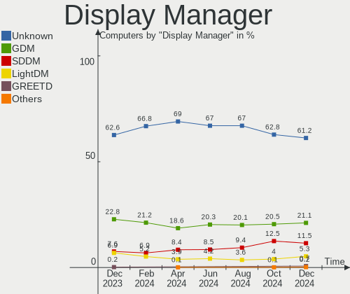
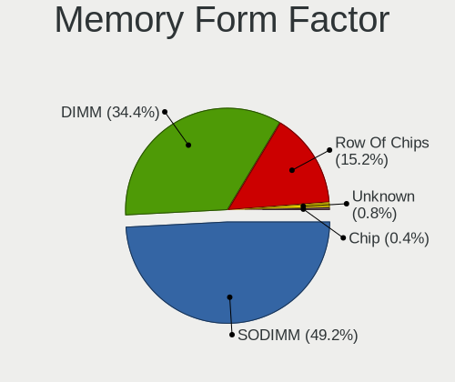

Fedora Hardware Trends
----------------------

A project to identify most popular hardware characteristics and track their change
over time based on data collected by Fedora users at https://Linux-Hardware.org.

Anyone can contribute to this report by the [hw-probe](https://github.com/linuxhw/hw-probe) tool:

    sudo -E hw-probe -all -upload

This is a report for all computer types. See also reports for [desktops](/Dist/Fedora/Desktop/README.md) and [notebooks](/Dist/Fedora/Notebook/README.md).

Full-feature report is available here: https://linux-hardware.org/?view=trends

Period: Feb, 2022.

Contents
--------

* [ System ](#system)
  - [ OS                       ](#os)
  - [ OS Family                ](#os-family)
  - [ Kernel                   ](#kernel)
  - [ Kernel Family            ](#kernel-family)
  - [ Kernel Major Ver.        ](#kernel-major-ver)
  - [ Arch                     ](#arch)
  - [ DE                       ](#de)
  - [ Display Server           ](#display-server)
  - [ Display Manager          ](#display-manager)
  - [ OS Lang                  ](#os-lang)
  - [ Boot Mode                ](#boot-mode)
  - [ Filesystem               ](#filesystem)
  - [ Part. scheme             ](#part-scheme)
  - [ Dual Boot with Linux/BSD ](#dual-boot-with-linuxbsd)
  - [ Dual Boot (Win)          ](#dual-boot-win)

* [ Board ](#board)
  - [ Vendor                   ](#vendor)
  - [ Model                    ](#model)
  - [ Model Family             ](#model-family)
  - [ MFG Year                 ](#mfg-year)
  - [ Form Factor              ](#form-factor)
  - [ Secure Boot              ](#secure-boot)
  - [ Coreboot                 ](#coreboot)
  - [ RAM Size                 ](#ram-size)
  - [ RAM Used                 ](#ram-used)
  - [ Total Drives             ](#total-drives)
  - [ Has CD-ROM               ](#has-cd-rom)
  - [ Has Ethernet             ](#has-ethernet)
  - [ Has WiFi                 ](#has-wifi)
  - [ Has Bluetooth            ](#has-bluetooth)

* [ Location ](#location)
  - [ Country                  ](#country)
  - [ City                     ](#city)

* [ Drives ](#drives)
  - [ Drive Vendor             ](#drive-vendor)
  - [ Drive Model              ](#drive-model)
  - [ HDD Vendor               ](#hdd-vendor)
  - [ SSD Vendor               ](#ssd-vendor)
  - [ Drive Kind               ](#drive-kind)
  - [ Drive Connector          ](#drive-connector)
  - [ Drive Size               ](#drive-size)
  - [ Space Total              ](#space-total)
  - [ Space Used               ](#space-used)
  - [ Malfunc. Drives          ](#malfunc-drives)
  - [ Malfunc. Drive Vendor    ](#malfunc-drive-vendor)
  - [ Malfunc. HDD Vendor      ](#malfunc-hdd-vendor)
  - [ Malfunc. Drive Kind      ](#malfunc-drive-kind)
  - [ Failed Drives            ](#failed-drives)
  - [ Failed Drive Vendor      ](#failed-drive-vendor)
  - [ Drive Status             ](#drive-status)

* [ Storage controller ](#storage-controller)
  - [ Storage Vendor           ](#storage-vendor)
  - [ Storage Model            ](#storage-model)
  - [ Storage Kind             ](#storage-kind)

* [ Processor ](#processor)
  - [ CPU Vendor               ](#cpu-vendor)
  - [ CPU Model                ](#cpu-model)
  - [ CPU Model Family         ](#cpu-model-family)
  - [ CPU Cores                ](#cpu-cores)
  - [ CPU Sockets              ](#cpu-sockets)
  - [ CPU Threads              ](#cpu-threads)
  - [ CPU Op-Modes             ](#cpu-op-modes)
  - [ CPU Microcode            ](#cpu-microcode)
  - [ CPU Microarch            ](#cpu-microarch)

* [ Graphics ](#graphics)
  - [ GPU Vendor               ](#gpu-vendor)
  - [ GPU Model                ](#gpu-model)
  - [ GPU Combo                ](#gpu-combo)
  - [ GPU Driver               ](#gpu-driver)
  - [ GPU Memory               ](#gpu-memory)

* [ Monitor ](#monitor)
  - [ Monitor Vendor           ](#monitor-vendor)
  - [ Monitor Model            ](#monitor-model)
  - [ Monitor Resolution       ](#monitor-resolution)
  - [ Monitor Diagonal         ](#monitor-diagonal)
  - [ Monitor Width            ](#monitor-width)
  - [ Aspect Ratio             ](#aspect-ratio)
  - [ Monitor Area             ](#monitor-area)
  - [ Pixel Density            ](#pixel-density)
  - [ Multiple Monitors        ](#multiple-monitors)

* [ Network ](#network)
  - [ Net Controller Vendor    ](#net-controller-vendor)
  - [ Net Controller Model     ](#net-controller-model)
  - [ Wireless Vendor          ](#wireless-vendor)
  - [ Wireless Model           ](#wireless-model)
  - [ Ethernet Vendor          ](#ethernet-vendor)
  - [ Ethernet Model           ](#ethernet-model)
  - [ Net Controller Kind      ](#net-controller-kind)
  - [ Used Controller          ](#used-controller)
  - [ NICs                     ](#nics)
  - [ IPv6                     ](#ipv6)

* [ Bluetooth ](#bluetooth)
  - [ Bluetooth Vendor         ](#bluetooth-vendor)
  - [ Bluetooth Model          ](#bluetooth-model)

* [ Sound ](#sound)
  - [ Sound Vendor             ](#sound-vendor)
  - [ Sound Model              ](#sound-model)

* [ Memory ](#memory)
  - [ Memory Vendor            ](#memory-vendor)
  - [ Memory Model             ](#memory-model)
  - [ Memory Kind              ](#memory-kind)
  - [ Memory Form Factor       ](#memory-form-factor)
  - [ Memory Size              ](#memory-size)
  - [ Memory Speed             ](#memory-speed)

* [ Printers & scanners ](#printers--scanners)
  - [ Printer Vendor           ](#printer-vendor)
  - [ Printer Model            ](#printer-model)
  - [ Scanner Vendor           ](#scanner-vendor)
  - [ Scanner Model            ](#scanner-model)

* [ Camera ](#camera)
  - [ Camera Vendor            ](#camera-vendor)
  - [ Camera Model             ](#camera-model)

* [ Security ](#security)
  - [ Fingerprint Vendor       ](#fingerprint-vendor)
  - [ Fingerprint Model        ](#fingerprint-model)
  - [ Chipcard Vendor          ](#chipcard-vendor)
  - [ Chipcard Model           ](#chipcard-model)

* [ Unsupported ](#unsupported)
  - [ Unsupported Devices      ](#unsupported-devices)
  - [ Unsupported Device Types ](#unsupported-device-types)

System
------

OS
--

Installed operating systems

| Name      | Computers | Percent |
|-----------|-----------|---------|
| Fedora 35 | 212       | 89.45%  |
| Fedora 34 | 17        | 7.17%   |
| Fedora 36 | 2         | 0.84%   |
| Fedora 33 | 2         | 0.84%   |
| Fedora 32 | 2         | 0.84%   |
| Fedora 30 | 2         | 0.84%   |

OS Family
---------

OS without a version

| Name   | Computers | Percent |
|--------|-----------|---------|
| Fedora | 237       | 100%    |

Kernel
------

Version of the Linux kernel

| Version                                             | Computers | Percent |
|-----------------------------------------------------|-----------|---------|
| 5.16.9-200.fc35.x86_64                              | 51        | 21.52%  |
| 5.16.5-200.fc35.x86_64                              | 36        | 15.19%  |
| 5.15.18-200.fc35.x86_64                             | 29        | 12.24%  |
| 5.16.8-200.fc35.x86_64                              | 23        | 9.7%    |
| 5.16.7-200.fc35.x86_64                              | 16        | 6.75%   |
| 5.14.10-300.fc35.x86_64                             | 14        | 5.91%   |
| 5.16.11-200.fc35.x86_64                             | 12        | 5.06%   |
| 5.15.17-200.fc35.x86_64                             | 10        | 4.22%   |
| 5.16.10-200.fc35.x86_64                             | 6         | 2.53%   |
| 5.15.16-200.fc35.x86_64                             | 5         | 2.11%   |
| 5.15.16-100.fc34.x86_64                             | 3         | 1.27%   |
| 5.15.12-200.fc35.x86_64                             | 3         | 1.27%   |
| 5.11.12-300.fc34.x86_64                             | 3         | 1.27%   |
| 5.6.13-100.fc30.x86_64                              | 2         | 0.84%   |
| 5.16.5-100.fc34.x86_64                              | 2         | 0.84%   |
| 5.15.18-100.fc34.x86_64                             | 2         | 0.84%   |
| 5.14.18-100.fc33.x86_64                             | 2         | 0.84%   |
| 5.6.6-300.fc32.x86_64                               | 1         | 0.42%   |
| 5.17.0-0.rc5.102.vanilla.1.fc35.x86_64              | 1         | 0.42%   |
| 5.17.0-0.rc5.102.fc36.x86_64                        | 1         | 0.42%   |
| 5.17.0-0.rc0.20220112gitdaadb3bd0e8d.63.fc36.x86_64 | 1         | 0.42%   |
| 5.16.9-100.fc34.x86_64                              | 1         | 0.42%   |
| 5.16.7-100.fc34.x86_64                              | 1         | 0.42%   |
| 5.16.10-201.pixelbook.fc35.x86_64                   | 1         | 0.42%   |
| 5.16.10-1.surface.fc35.x86_64                       | 1         | 0.42%   |
| 5.15.6-200.fc35.x86_64                              | 1         | 0.42%   |
| 5.15.5-100.fc34.x86_64                              | 1         | 0.42%   |
| 5.15.19-xm1tt.0.fc35.x86_64                         | 1         | 0.42%   |
| 5.15.15-200.fc35.x86_64                             | 1         | 0.42%   |
| 5.15.13-200.fc35.x86_64                             | 1         | 0.42%   |
| 5.15.10-100.fc34.x86_64                             | 1         | 0.42%   |
| 5.13.9-200.fc34.x86_64                              | 1         | 0.42%   |
| 5.11.22-100.fc32.x86_64                             | 1         | 0.42%   |
| 5.10.92-200.fc34.x86_64                             | 1         | 0.42%   |
| 5.10.7-100.fc32.x86_64                              | 1         | 0.42%   |

Kernel Family
-------------

Linux kernel without a distro release

| Version | Computers | Percent |
|---------|-----------|---------|
| 5.16.9  | 52        | 21.94%  |
| 5.16.5  | 38        | 16.03%  |
| 5.15.18 | 31        | 13.08%  |
| 5.16.8  | 23        | 9.7%    |
| 5.16.7  | 17        | 7.17%   |
| 5.14.10 | 14        | 5.91%   |
| 5.16.11 | 12        | 5.06%   |
| 5.15.17 | 10        | 4.22%   |
| 5.16.10 | 8         | 3.38%   |
| 5.15.16 | 8         | 3.38%   |
| 5.17.0  | 3         | 1.27%   |
| 5.15.12 | 3         | 1.27%   |
| 5.11.12 | 3         | 1.27%   |
| 5.6.13  | 2         | 0.84%   |
| 5.14.18 | 2         | 0.84%   |
| 5.6.6   | 1         | 0.42%   |
| 5.15.6  | 1         | 0.42%   |
| 5.15.5  | 1         | 0.42%   |
| 5.15.19 | 1         | 0.42%   |
| 5.15.15 | 1         | 0.42%   |
| 5.15.13 | 1         | 0.42%   |
| 5.15.10 | 1         | 0.42%   |
| 5.13.9  | 1         | 0.42%   |
| 5.11.22 | 1         | 0.42%   |
| 5.10.92 | 1         | 0.42%   |
| 5.10.7  | 1         | 0.42%   |

Kernel Major Ver.
-----------------

Linux kernel major version

| Version | Computers | Percent |
|---------|-----------|---------|
| 5.16    | 150       | 63.29%  |
| 5.15    | 58        | 24.47%  |
| 5.14    | 16        | 6.75%   |
| 5.11    | 4         | 1.69%   |
| 5.6     | 3         | 1.27%   |
| 5.17    | 3         | 1.27%   |
| 5.10    | 2         | 0.84%   |
| 5.13    | 1         | 0.42%   |

Arch
----

OS architecture (x86_64, i586, etc.)

| Name   | Computers | Percent |
|--------|-----------|---------|
| x86_64 | 237       | 100%    |

DE
--

Desktop Environment

| Name       | Computers | Percent |
|------------|-----------|---------|
| GNOME      | 178       | 75.11%  |
| KDE5       | 29        | 12.24%  |
| Cinnamon   | 10        | 4.22%   |
| XFCE       | 5         | 2.11%   |
| Unknown    | 5         | 2.11%   |
| X-Cinnamon | 3         | 1.27%   |
| LXDE       | 2         | 0.84%   |
| MATE       | 1         | 0.42%   |
| LXQt       | 1         | 0.42%   |
| KDE        | 1         | 0.42%   |
| i3         | 1         | 0.42%   |
| fluxbox    | 1         | 0.42%   |

Display Server
--------------

X11 or Wayland

| Name    | Computers | Percent |
|---------|-----------|---------|
| Wayland | 142       | 59.92%  |
| X11     | 85        | 35.86%  |
| Tty     | 9         | 3.8%    |
| Unknown | 1         | 0.42%   |

Display Manager
---------------

SDDM, LightDM, etc.

| Name    | Computers | Percent |
|---------|-----------|---------|
| Unknown | 109       | 45.99%  |
| GDM     | 94        | 39.66%  |
| LightDM | 19        | 8.02%   |
| SDDM    | 13        | 5.49%   |
| LXDM    | 2         | 0.84%   |

OS Lang
-------

Language

| Lang    | Computers | Percent |
|---------|-----------|---------|
| en_US   | 120       | 50.63%  |
| en_GB   | 18        | 7.59%   |
| pt_BR   | 13        | 5.49%   |
| ru_RU   | 12        | 5.06%   |
| en_AU   | 11        | 4.64%   |
| de_DE   | 9         | 3.8%    |
| fr_FR   | 6         | 2.53%   |
| it_IT   | 5         | 2.11%   |
| es_ES   | 4         | 1.69%   |
| pl_PL   | 3         | 1.27%   |
| en_CA   | 3         | 1.27%   |
| ro_RO   | 2         | 0.84%   |
| nl_BE   | 2         | 0.84%   |
| fr_CH   | 2         | 0.84%   |
| es_MX   | 2         | 0.84%   |
| es_CL   | 2         | 0.84%   |
| en_IN   | 2         | 0.84%   |
| de_AT   | 2         | 0.84%   |
| zh_CN   | 1         | 0.42%   |
| tr_TR   | 1         | 0.42%   |
| szl_PL  | 1         | 0.42%   |
| sk_SK   | 1         | 0.42%   |
| nl_NL   | 1         | 0.42%   |
| hu_HU   | 1         | 0.42%   |
| fr_CA   | 1         | 0.42%   |
| fr_BE   | 1         | 0.42%   |
| fi_FI   | 1         | 0.42%   |
| en_ZA   | 1         | 0.42%   |
| en_IL   | 1         | 0.42%   |
| en_IE   | 1         | 0.42%   |
| en_DK   | 1         | 0.42%   |
| cs_CZ   | 1         | 0.42%   |
| ca_ES   | 1         | 0.42%   |
| C       | 1         | 0.42%   |
| bg_BG   | 1         | 0.42%   |
| ar_SA   | 1         | 0.42%   |
| Unknown | 1         | 0.42%   |

Boot Mode
---------

EFI or BIOS

| Mode | Computers | Percent |
|------|-----------|---------|
| EFI  | 175       | 73.84%  |
| BIOS | 62        | 26.16%  |

Filesystem
----------

Type of filesystem

| Type    | Computers | Percent |
|---------|-----------|---------|
| Btrfs   | 164       | 69.2%   |
| Ext4    | 63        | 26.58%  |
| Xfs     | 8         | 3.38%   |
| Overlay | 2         | 0.84%   |

Part. scheme
------------

Scheme of partitioning

| Type    | Computers | Percent |
|---------|-----------|---------|
| Unknown | 114       | 48.1%   |
| GPT     | 104       | 43.88%  |
| MBR     | 19        | 8.02%   |

Dual Boot with Linux/BSD
------------------------

Hosting more than one Linux/BSD

| Dual boot | Computers | Percent |
|-----------|-----------|---------|
| No        | 215       | 90.72%  |
| Yes       | 22        | 9.28%   |

Dual Boot (Win)
---------------

Hosting Linux and Windows

| Dual boot | Computers | Percent |
|-----------|-----------|---------|
| No        | 188       | 79.32%  |
| Yes       | 49        | 20.68%  |

Board
-----

Vendor
------

Motherboard manufacturer

| Name                     | Computers | Percent |
|--------------------------|-----------|---------|
| ASUSTek Computer         | 41        | 17.3%   |
| Lenovo                   | 39        | 16.46%  |
| Hewlett-Packard          | 33        | 13.92%  |
| Dell                     | 24        | 10.13%  |
| Gigabyte Technology      | 20        | 8.44%   |
| Acer                     | 15        | 6.33%   |
| MSI                      | 10        | 4.22%   |
| ASRock                   | 8         | 3.38%   |
| HUAWEI                   | 5         | 2.11%   |
| Samsung Electronics      | 4         | 1.69%   |
| Apple                    | 4         | 1.69%   |
| Sony                     | 3         | 1.27%   |
| Microsoft                | 3         | 1.27%   |
| Google                   | 3         | 1.27%   |
| Supermicro               | 2         | 0.84%   |
| Intel                    | 2         | 0.84%   |
| Biostar                  | 2         | 0.84%   |
| Avell High Performance   | 2         | 0.84%   |
| Vulcan Electronics       | 1         | 0.42%   |
| TUXEDO                   | 1         | 0.42%   |
| Toshiba                  | 1         | 0.42%   |
| System76                 | 1         | 0.42%   |
| RCA                      | 1         | 0.42%   |
| Positivo                 | 1         | 0.42%   |
| PC Specialist            | 1         | 0.42%   |
| Panasonic                | 1         | 0.42%   |
| Jumper                   | 1         | 0.42%   |
| Inspire Technology Group | 1         | 0.42%   |
| HONOR                    | 1         | 0.42%   |
| Gateway                  | 1         | 0.42%   |
| Framework                | 1         | 0.42%   |
| eMachines                | 1         | 0.42%   |
| ECS                      | 1         | 0.42%   |
| AZW                      | 1         | 0.42%   |
| AMI                      | 1         | 0.42%   |

Model
-----

Motherboard model

| Name                                                                                     | Computers | Percent |
|------------------------------------------------------------------------------------------|-----------|---------|
| HUAWEI KLVL-WXX9                                                                         | 3         | 1.27%   |
| HP Notebook                                                                              | 3         | 1.27%   |
| MSI MS-7C84                                                                              | 2         | 0.84%   |
| Microsoft Surface Pro                                                                    | 2         | 0.84%   |
| Lenovo Legion 5 15ARH05 82B5                                                             | 2         | 0.84%   |
| HP ProBook 430 G5                                                                        | 2         | 0.84%   |
| Gigabyte B450 AORUS M                                                                    | 2         | 0.84%   |
| Avell High Performance B.ON                                                              | 2         | 0.84%   |
| ASUS ROG STRIX B450-F GAMING                                                             | 2         | 0.84%   |
| ASUS ROG CROSSHAIR VIII HERO                                                             | 2         | 0.84%   |
| ASUS Maximus VIII HERO                                                                   | 2         | 0.84%   |
| ASUS All Series                                                                          | 2         | 0.84%   |
| Apple MacBookAir7,2                                                                      | 2         | 0.84%   |
| Acer Aspire A515-54G                                                                     | 2         | 0.84%   |
| Unknown                                                                                  | 2         | 0.84%   |
| Vulcan Excursion XB                                                                      | 1         | 0.42%   |
| TUXEDO InfinityBook Pro 14 Gen6                                                          | 1         | 0.42%   |
| Toshiba Satellite C645                                                                   | 1         | 0.42%   |
| System76 Lemur Pro                                                                       | 1         | 0.42%   |
| Supermicro X9DRW                                                                         | 1         | 0.42%   |
| Supermicro X9DAi                                                                         | 1         | 0.42%   |
| Sony VPCEH3S6E                                                                           | 1         | 0.42%   |
| Sony VGN-FW21E                                                                           | 1         | 0.42%   |
| Sony SVD1121Q2EB                                                                         | 1         | 0.42%   |
| Samsung RV409/RV509/RV709                                                                | 1         | 0.42%   |
| Samsung 900X3C/900X3D/900X3E/900X4C/900X4D                                               | 1         | 0.42%   |
| Samsung 750XDA                                                                           | 1         | 0.42%   |
| Samsung 355V4C/355V4X/355V5C/355V5X/356V4C/356V4X/356V5C/356V5X/3445VC/3445VX/3545VC/354 | 1         | 0.42%   |
| RCA W101AS23T2                                                                           | 1         | 0.42%   |
| Positivo CHT14B                                                                          | 1         | 0.42%   |
| PC Specialist NH5xAx                                                                     | 1         | 0.42%   |
| Panasonic CFSV9-1                                                                        | 1         | 0.42%   |
| MSI MS-7D25                                                                              | 1         | 0.42%   |
| MSI MS-7C96                                                                              | 1         | 0.42%   |
| MSI MS-7C56                                                                              | 1         | 0.42%   |
| MSI MS-7B89                                                                              | 1         | 0.42%   |
| MSI MS-7B86                                                                              | 1         | 0.42%   |
| MSI MS-7A34                                                                              | 1         | 0.42%   |
| MSI MS-7751                                                                              | 1         | 0.42%   |
| MSI GE63VR 7RF                                                                           | 1         | 0.42%   |
| Microsoft Surface Go                                                                     | 1         | 0.42%   |
| Lenovo Yoga Slim 7 14ARE05 82A2                                                          | 1         | 0.42%   |
| Lenovo V14-ADA 82C6                                                                      | 1         | 0.42%   |
| Lenovo ThinkStation E32 30A2S07B00                                                       | 1         | 0.42%   |
| Lenovo ThinkPad X395 20NLCTO1WW                                                          | 1         | 0.42%   |
| Lenovo ThinkPad X230 23257R2                                                             | 1         | 0.42%   |
| Lenovo ThinkPad X200T 7449G6G                                                            | 1         | 0.42%   |
| Lenovo ThinkPad X1 Extreme 2nd 20QV00CMGE                                                | 1         | 0.42%   |
| Lenovo ThinkPad X1 Carbon 6th 20KH007BMX                                                 | 1         | 0.42%   |
| Lenovo ThinkPad T495 20NJ0004US                                                          | 1         | 0.42%   |
| Lenovo ThinkPad T450 20BUS0VH08                                                          | 1         | 0.42%   |
| Lenovo ThinkPad T410 2522Y15                                                             | 1         | 0.42%   |
| Lenovo ThinkPad P15 Gen 1 20SUS04P17                                                     | 1         | 0.42%   |
| Lenovo ThinkPad L13 Gen 2 20VJS0HB00                                                     | 1         | 0.42%   |
| Lenovo ThinkPad E595 20NF001PTX                                                          | 1         | 0.42%   |
| Lenovo ThinkPad E14 Gen 2 20TAS10Y00                                                     | 1         | 0.42%   |
| Lenovo ThinkPad E14 Gen 2 20T60064CK                                                     | 1         | 0.42%   |
| Lenovo ThinkCentre M93p 10A8S3C100                                                       | 1         | 0.42%   |
| Lenovo ThinkCentre M700 10HY003SRU                                                       | 1         | 0.42%   |
| Lenovo ThinkCentre M58p 7220A72                                                          | 1         | 0.42%   |

Model Family
------------

Motherboard model prefix

| Name                        | Computers | Percent |
|-----------------------------|-----------|---------|
| Lenovo ThinkPad             | 13        | 5.49%   |
| ASUS ROG                    | 12        | 5.06%   |
| Lenovo IdeaPad              | 10        | 4.22%   |
| Acer Aspire                 | 10        | 4.22%   |
| HP ProBook                  | 9         | 3.8%    |
| HP Pavilion                 | 8         | 3.38%   |
| Dell Latitude               | 6         | 2.53%   |
| Dell XPS                    | 5         | 2.11%   |
| ASUS PRIME                  | 5         | 2.11%   |
| Lenovo ThinkCentre          | 4         | 1.69%   |
| Dell OptiPlex               | 4         | 1.69%   |
| Dell Inspiron               | 4         | 1.69%   |
| Microsoft Surface           | 3         | 1.27%   |
| Lenovo Legion               | 3         | 1.27%   |
| HUAWEI KLVL-WXX9            | 3         | 1.27%   |
| HP Notebook                 | 3         | 1.27%   |
| HP ENVY                     | 3         | 1.27%   |
| HP EliteBook                | 3         | 1.27%   |
| ASUS TUF                    | 3         | 1.27%   |
| MSI MS-7C84                 | 2         | 0.84%   |
| Lenovo IdeaPadFlex          | 2         | 0.84%   |
| HP Laptop                   | 2         | 0.84%   |
| Gigabyte B450               | 2         | 0.84%   |
| Dell PowerEdge              | 2         | 0.84%   |
| Avell High Performance B.ON | 2         | 0.84%   |
| ASUS VivoBook               | 2         | 0.84%   |
| ASUS Maximus                | 2         | 0.84%   |
| ASUS All                    | 2         | 0.84%   |
| Apple MacBookAir7           | 2         | 0.84%   |
| Acer Nitro                  | 2         | 0.84%   |
| Unknown                     | 2         | 0.84%   |
| Vulcan Excursion            | 1         | 0.42%   |
| TUXEDO InfinityBook         | 1         | 0.42%   |
| Toshiba Satellite           | 1         | 0.42%   |
| System76 Lemur              | 1         | 0.42%   |
| Supermicro X9DRW            | 1         | 0.42%   |
| Supermicro X9DAi            | 1         | 0.42%   |
| Sony VPCEH3S6E              | 1         | 0.42%   |
| Sony VGN-FW21E              | 1         | 0.42%   |
| Sony SVD1121Q2EB            | 1         | 0.42%   |
| Samsung RV409               | 1         | 0.42%   |
| Samsung 900X3C              | 1         | 0.42%   |
| Samsung 750XDA              | 1         | 0.42%   |
| Samsung 355V4C              | 1         | 0.42%   |
| RCA W101AS23T2              | 1         | 0.42%   |
| Positivo CHT14B             | 1         | 0.42%   |
| PC Specialist NH5xAx        | 1         | 0.42%   |
| Panasonic CFSV9-1           | 1         | 0.42%   |
| MSI MS-7D25                 | 1         | 0.42%   |
| MSI MS-7C96                 | 1         | 0.42%   |
| MSI MS-7C56                 | 1         | 0.42%   |
| MSI MS-7B89                 | 1         | 0.42%   |
| MSI MS-7B86                 | 1         | 0.42%   |
| MSI MS-7A34                 | 1         | 0.42%   |
| MSI MS-7751                 | 1         | 0.42%   |
| MSI GE63VR                  | 1         | 0.42%   |
| Lenovo Yoga                 | 1         | 0.42%   |
| Lenovo V14-ADA              | 1         | 0.42%   |
| Lenovo ThinkStation         | 1         | 0.42%   |
| Lenovo MIIX                 | 1         | 0.42%   |

MFG Year
--------

Motherboard manufacture year

| Year | Computers | Percent |
|------|-----------|---------|
| 2021 | 44        | 18.57%  |
| 2020 | 34        | 14.35%  |
| 2019 | 28        | 11.81%  |
| 2018 | 19        | 8.02%   |
| 2017 | 17        | 7.17%   |
| 2013 | 15        | 6.33%   |
| 2016 | 14        | 5.91%   |
| 2015 | 14        | 5.91%   |
| 2014 | 13        | 5.49%   |
| 2012 | 10        | 4.22%   |
| 2011 | 8         | 3.38%   |
| 2008 | 7         | 2.95%   |
| 2010 | 6         | 2.53%   |
| 2009 | 5         | 2.11%   |
| 2022 | 1         | 0.42%   |
| 2007 | 1         | 0.42%   |
| 2006 | 1         | 0.42%   |

Form Factor
-----------

Physical design of the computer

| Name        | Computers | Percent |
|-------------|-----------|---------|
| Notebook    | 135       | 56.96%  |
| Desktop     | 83        | 35.02%  |
| Tablet      | 6         | 2.53%   |
| Convertible | 6         | 2.53%   |
| Mini pc     | 4         | 1.69%   |
| Server      | 2         | 0.84%   |
| All in one  | 1         | 0.42%   |

Secure Boot
-----------

Enabled or disabled

| State    | Computers | Percent |
|----------|-----------|---------|
| Disabled | 203       | 85.65%  |
| Enabled  | 34        | 14.35%  |

Coreboot
--------

Have coreboot on board

| Used | Computers | Percent |
|------|-----------|---------|
| No   | 232       | 97.89%  |
| Yes  | 5         | 2.11%   |

RAM Size
--------

Total RAM memory

| Size in GB  | Computers | Percent |
|-------------|-----------|---------|
| 4.01-8.0    | 57        | 24.05%  |
| 8.01-16.0   | 52        | 21.94%  |
| 16.01-24.0  | 50        | 21.1%   |
| 3.01-4.0    | 28        | 11.81%  |
| 32.01-64.0  | 27        | 11.39%  |
| 64.01-256.0 | 10        | 4.22%   |
| 1.01-2.0    | 7         | 2.95%   |
| 24.01-32.0  | 4         | 1.69%   |
| 2.01-3.0    | 2         | 0.84%   |

RAM Used
--------

Used RAM memory

| Used GB    | Computers | Percent |
|------------|-----------|---------|
| 2.01-3.0   | 64        | 27%     |
| 4.01-8.0   | 59        | 24.89%  |
| 3.01-4.0   | 49        | 20.68%  |
| 1.01-2.0   | 37        | 15.61%  |
| 8.01-16.0  | 16        | 6.75%   |
| 0.51-1.0   | 7         | 2.95%   |
| 24.01-32.0 | 3         | 1.27%   |
| 16.01-24.0 | 2         | 0.84%   |

Total Drives
------------

Number of drives on board

| Drives | Computers | Percent |
|--------|-----------|---------|
| 1      | 135       | 56.96%  |
| 2      | 59        | 24.89%  |
| 3      | 19        | 8.02%   |
| 4      | 12        | 5.06%   |
| 5      | 4         | 1.69%   |
| 7      | 3         | 1.27%   |
| 6      | 2         | 0.84%   |
| 0      | 2         | 0.84%   |
| 8      | 1         | 0.42%   |

Has CD-ROM
----------

Has CD-ROM on board

| Presented | Computers | Percent |
|-----------|-----------|---------|
| No        | 178       | 75.11%  |
| Yes       | 59        | 24.89%  |

Has Ethernet
------------

Has Ethernet on board

| Presented | Computers | Percent |
|-----------|-----------|---------|
| Yes       | 180       | 75.95%  |
| No        | 57        | 24.05%  |

Has WiFi
--------

Has WiFi module

| Presented | Computers | Percent |
|-----------|-----------|---------|
| Yes       | 180       | 75.95%  |
| No        | 57        | 24.05%  |

Has Bluetooth
-------------

Has Bluetooth module

| Presented | Computers | Percent |
|-----------|-----------|---------|
| Yes       | 164       | 69.2%   |
| No        | 73        | 30.8%   |

Location
--------

Country
-------

Geographic location (country)

| Country      | Computers | Percent |
|--------------|-----------|---------|
| USA          | 38        | 16.03%  |
| Russia       | 19        | 8.02%   |
| Brazil       | 19        | 8.02%   |
| Germany      | 14        | 5.91%   |
| Australia    | 11        | 4.64%   |
| UK           | 8         | 3.38%   |
| India        | 8         | 3.38%   |
| Poland       | 7         | 2.95%   |
| Spain        | 6         | 2.53%   |
| Italy        | 6         | 2.53%   |
| France       | 6         | 2.53%   |
| Turkey       | 5         | 2.11%   |
| Czechia      | 5         | 2.11%   |
| Canada       | 5         | 2.11%   |
| Belarus      | 5         | 2.11%   |
| Switzerland  | 4         | 1.69%   |
| Sweden       | 4         | 1.69%   |
| Hungary      | 4         | 1.69%   |
| Belgium      | 4         | 1.69%   |
| Austria      | 4         | 1.69%   |
| Ukraine      | 3         | 1.27%   |
| South Africa | 3         | 1.27%   |
| Netherlands  | 3         | 1.27%   |
| Indonesia    | 3         | 1.27%   |
| Croatia      | 3         | 1.27%   |
| Chile        | 3         | 1.27%   |
| Saudi Arabia | 2         | 0.84%   |
| Romania      | 2         | 0.84%   |
| Panama       | 2         | 0.84%   |
| Norway       | 2         | 0.84%   |
| Mexico       | 2         | 0.84%   |
| Japan        | 2         | 0.84%   |
| Finland      | 2         | 0.84%   |
| Egypt        | 2         | 0.84%   |
| Bulgaria     | 2         | 0.84%   |
| Argentina    | 2         | 0.84%   |
| Vietnam      | 1         | 0.42%   |
| Tunisia      | 1         | 0.42%   |
| Syria        | 1         | 0.42%   |
| Sri Lanka    | 1         | 0.42%   |
| Slovakia     | 1         | 0.42%   |
| Philippines  | 1         | 0.42%   |
| Peru         | 1         | 0.42%   |
| New Zealand  | 1         | 0.42%   |
| Moldova      | 1         | 0.42%   |
| Luxembourg   | 1         | 0.42%   |
| Israel       | 1         | 0.42%   |
| Ireland      | 1         | 0.42%   |
| Greece       | 1         | 0.42%   |
| China        | 1         | 0.42%   |
| Cambodia     | 1         | 0.42%   |
| Bolivia      | 1         | 0.42%   |
| Bangladesh   | 1         | 0.42%   |

City
----

Geographic location (city)

| City                    | Computers | Percent |
|-------------------------|-----------|---------|
| Moscow                  | 9         | 3.8%    |
| Sydney                  | 8         | 3.38%   |
| Vienna                  | 4         | 1.69%   |
| Minsk                   | 4         | 1.69%   |
| Istanbul                | 4         | 1.69%   |
| Zagreb                  | 3         | 1.27%   |
| Rio de Janeiro          | 3         | 1.27%   |
| Berlin                  | 3         | 1.27%   |
| Santa Barbara           | 2         | 0.84%   |
| Rostov-on-Don           | 2         | 0.84%   |
| Pompano Beach           | 2         | 0.84%   |
| Panama City             | 2         | 0.84%   |
| Coimbatore              | 2         | 0.84%   |
| Cairo                   | 2         | 0.84%   |
| Budapest                | 2         | 0.84%   |
| Brussels                | 2         | 0.84%   |
| Brno                    | 2         | 0.84%   |
| Belo Horizonte          | 2         | 0.84%   |
| Zurich                  | 1         | 0.42%   |
| Zheleznogorsk           | 1         | 0.42%   |
| Zgorzelec               | 1         | 0.42%   |
| Zaratamo                | 1         | 0.42%   |
| Yverdon-les-Bains       | 1         | 0.42%   |
| Yekaterinburg           | 1         | 0.42%   |
| Wroclaw                 | 1         | 0.42%   |
| Wellington              | 1         | 0.42%   |
| Warsaw                  | 1         | 0.42%   |
| Warrenton               | 1         | 0.42%   |
| Vitória da Conquista | 1         | 0.42%   |
| Vitória              | 1         | 0.42%   |
| Vinh                    | 1         | 0.42%   |
| Vecindario              | 1         | 0.42%   |
| Usatove                 | 1         | 0.42%   |
| Upper Marlboro          | 1         | 0.42%   |
| Uetersen                | 1         | 0.42%   |
| Tunis                   | 1         | 0.42%   |
| Trekhgornyy             | 1         | 0.42%   |
| Toronto                 | 1         | 0.42%   |
| Tokyo                   | 1         | 0.42%   |
| Thuwal                  | 1         | 0.42%   |
| The Hague               | 1         | 0.42%   |
| Tel Aviv                | 1         | 0.42%   |
| Târgu Mureş       | 1         | 0.42%   |
| Tarlac City             | 1         | 0.42%   |
| Surat                   | 1         | 0.42%   |
| Sun City Center         | 1         | 0.42%   |
| Stockholm               | 1         | 0.42%   |
| Stara Zagora            | 1         | 0.42%   |
| St Petersburg           | 1         | 0.42%   |
| Southampton             | 1         | 0.42%   |
| Sofia                   | 1         | 0.42%   |
| Sioux Falls             | 1         | 0.42%   |
| São Luís          | 1         | 0.42%   |
| Sautron                 | 1         | 0.42%   |
| Santos                  | 1         | 0.42%   |
| Santo André          | 1         | 0.42%   |
| Santa Fe                | 1         | 0.42%   |
| Sandpoint               | 1         | 0.42%   |
| Samara                  | 1         | 0.42%   |
| Saint Charles           | 1         | 0.42%   |

Drives
------

Drive Vendor
------------

Hard drive vendors

| Vendor                    | Computers | Drives  | Percent |
|---------------------------|-----------|---------|---------|
| Samsung Electronics       | 62        | 89      | 16.99%  |
| WDC                       | 47        | 58      | 12.88%  |
| Seagate                   | 47        | 55      | 12.88%  |
| Sandisk                   | 25        | 25      | 6.85%   |
| Toshiba                   | 23        | 23      | 6.3%    |
| Unknown                   | 18        | 19      | 4.93%   |
| Kingston                  | 18        | 21      | 4.93%   |
| SK Hynix                  | 15        | 15      | 4.11%   |
| Intel                     | 14        | 18      | 3.84%   |
| Crucial                   | 10        | 10      | 2.74%   |
| A-DATA Technology         | 9         | 9       | 2.47%   |
| Phison                    | 7         | 8       | 1.92%   |
| Hitachi                   | 7         | 7       | 1.92%   |
| KIOXIA                    | 5         | 5       | 1.37%   |
| HGST                      | 5         | 8       | 1.37%   |
| SPCC                      | 4         | 4       | 1.1%    |
| Micron Technology         | 3         | 4       | 0.82%   |
| LITEON                    | 3         | 3       | 0.82%   |
| Corsair                   | 3         | 3       | 0.82%   |
| XPG                       | 2         | 2       | 0.55%   |
| Union Memory (Shenzhen)   | 2         | 2       | 0.55%   |
| UMIS                      | 2         | 2       | 0.55%   |
| Transcend                 | 2         | 2       | 0.55%   |
| Team                      | 2         | 3       | 0.55%   |
| SABRENT                   | 2         | 2       | 0.55%   |
| PNY                       | 2         | 3       | 0.55%   |
| Patriot                   | 2         | 2       | 0.55%   |
| Micron/Crucial Technology | 2         | 2       | 0.55%   |
| KingSpec                  | 2         | 2       | 0.55%   |
| Apple                     | 2         | 2       | 0.55%   |
| Silicon Motion            | 1         | 1       | 0.27%   |
| Realtek Semiconductor     | 1         | 1       | 0.27%   |
| Ramsta                    | 1         | 1       | 0.27%   |
| LITEONIT                  | 1         | 1       | 0.27%   |
| Lite-On                   | 1         | 1       | 0.27%   |
| Lenovo                    | 1         | 1       | 0.27%   |
| JMicron                   | 1         | 1       | 0.27%   |
| HUAWEI                    | 1         | 1       | 0.27%   |
| HS-SSD-C100               | 1         | 1       | 0.27%   |
| HPE                       | 1         | 1       | 0.27%   |
| Hewlett-Packard           | 1         | Unknown | 0.27%   |
| Fujitsu                   | 1         | 1       | 0.27%   |
| China                     | 1         | 1       | 0.27%   |
| ASMT                      | 1         | 1       | 0.27%   |
| AMD                       | 1         | 1       | 0.27%   |
| ADATA Technology          | 1         | 1       | 0.27%   |
| ADATA SU                  | 1         | 1       | 0.27%   |
| 1TB                       | 1         | 1       | 0.27%   |

Drive Model
-----------

Hard drive models

| Model                                  | Computers | Percent |
|----------------------------------------|-----------|---------|
| SK Hynix NVMe SSD Drive 512GB          | 6         | 1.49%   |
| Sandisk NVMe SSD Drive 512GB           | 6         | 1.49%   |
| Seagate ST1000LM035-1RK172 1TB         | 5         | 1.24%   |
| Samsung SSD 860 EVO 500GB              | 5         | 1.24%   |
| Samsung NVMe SSD Drive 500GB           | 5         | 1.24%   |
| Samsung NVMe SSD Drive 1TB             | 5         | 1.24%   |
| Kingston SA400S37240G 240GB SSD        | 5         | 1.24%   |
| Sandisk NVMe SSD Drive 256GB           | 4         | 0.99%   |
| Sandisk NVMe SSD Drive 1TB             | 4         | 0.99%   |
| Samsung SSD 970 EVO Plus 1TB           | 4         | 0.99%   |
| Samsung SSD 870 EVO 500GB              | 4         | 0.99%   |
| Samsung SSD 850 EVO 250GB              | 4         | 0.99%   |
| WDC WD10JPVX-60JC3T0 1TB               | 3         | 0.74%   |
| Unknown MMC Card  32GB                 | 3         | 0.74%   |
| Seagate ST3500418AS 500GB              | 3         | 0.74%   |
| Seagate ST1000LM024 HN-M101MBB 1TB     | 3         | 0.74%   |
| Seagate ST1000DM010-2EP102 1TB         | 3         | 0.74%   |
| Seagate Expansion+ 2TB                 | 3         | 0.74%   |
| Samsung SSD 870 EVO 1TB                | 3         | 0.74%   |
| Samsung SM963 2.5" NVMe PCIe SSD 256GB | 3         | 0.74%   |
| Samsung NVMe SSD Drive 250GB           | 3         | 0.74%   |
| Crucial CT1000MX500SSD1 1TB            | 3         | 0.74%   |
| WDC WDBNCE0010PNC 1TB SSD              | 2         | 0.5%    |
| WDC WD5000AAKX-001CA0 500GB            | 2         | 0.5%    |
| WDC WD40EZRX-00SPEB0 4TB               | 2         | 0.5%    |
| WDC WD30EFRX-68EUZN0 3TB               | 2         | 0.5%    |
| WDC WD20EZRX-00D8PB0 2TB               | 2         | 0.5%    |
| WDC WD10JPVX-22JC3T0 1TB               | 2         | 0.5%    |
| WDC PC SN530 SDBPNPZ-512G-1006 512GB   | 2         | 0.5%    |
| Unknown NCard  32GB                    | 2         | 0.5%    |
| Toshiba MQ01ABF050 500GB               | 2         | 0.5%    |
| Toshiba MQ01ABD075 752GB               | 2         | 0.5%    |
| Toshiba HDWD110 1TB                    | 2         | 0.5%    |
| Seagate ST500LT012-1DG142 500GB        | 2         | 0.5%    |
| Seagate ST500DM002-1BD142 500GB        | 2         | 0.5%    |
| Seagate ST4000DM004-2CV104 4TB         | 2         | 0.5%    |
| Seagate ST2000DX002-2DV164 2TB         | 2         | 0.5%    |
| Seagate ST2000DM001-1CH164 2TB         | 2         | 0.5%    |
| SanDisk SDSSDA120G 120GB               | 2         | 0.5%    |
| Samsung SSD 970 EVO Plus 500GB         | 2         | 0.5%    |
| Samsung SSD 970 EVO 1TB                | 2         | 0.5%    |
| Samsung SSD 870 QVO 2TB                | 2         | 0.5%    |
| Samsung SSD 860 EVO 250GB              | 2         | 0.5%    |
| Samsung SSD 860 EVO 1TB                | 2         | 0.5%    |
| Samsung SM963 2.5" NVMe PCIe SSD 128GB | 2         | 0.5%    |
| Samsung NVMe SSD Drive 512GB           | 2         | 0.5%    |
| Samsung MZVLB256HBHQ-000L2 256GB       | 2         | 0.5%    |
| SABRENT Disk 1TB                       | 2         | 0.5%    |
| Phison 311CD0512GB                     | 2         | 0.5%    |
| Micron/Crucial NVMe SSD Drive 500GB    | 2         | 0.5%    |
| Kingston SV300S37A120G 120GB SSD       | 2         | 0.5%    |
| Kingston SUV400S37240G 240GB SSD       | 2         | 0.5%    |
| Kingston SA400S37960G 960GB SSD        | 2         | 0.5%    |
| Kingston SA400S37480G 480GB SSD        | 2         | 0.5%    |
| Intel SSDSC2CT120A3 120GB              | 2         | 0.5%    |
| Intel SSDPEKNW512G8H 512GB             | 2         | 0.5%    |
| Intel SSDPEKKW256G7 256GB              | 2         | 0.5%    |
| HGST HTS721010A9E630 1TB               | 2         | 0.5%    |
| A-DATA IM2P33F8A-512GD 512GB           | 2         | 0.5%    |
| XPG NVMe SSD Drive 512GB               | 1         | 0.25%   |

HDD Vendor
----------

Hard disk drive vendors

| Vendor              | Computers | Drives | Percent |
|---------------------|-----------|--------|---------|
| Seagate             | 46        | 53     | 41.07%  |
| WDC                 | 32        | 41     | 28.57%  |
| Toshiba             | 15        | 15     | 13.39%  |
| Hitachi             | 7         | 7      | 6.25%   |
| HGST                | 5         | 8      | 4.46%   |
| Samsung Electronics | 2         | 3      | 1.79%   |
| SABRENT             | 2         | 2      | 1.79%   |
| Unknown             | 1         | 1      | 0.89%   |
| Fujitsu             | 1         | 1      | 0.89%   |
| ASMT                | 1         | 1      | 0.89%   |

SSD Vendor
----------

Solid state drive vendors

| Vendor              | Computers | Drives | Percent |
|---------------------|-----------|--------|---------|
| Samsung Electronics | 26        | 35     | 23.42%  |
| Kingston            | 15        | 16     | 13.51%  |
| SanDisk             | 9         | 9      | 8.11%   |
| Crucial             | 8         | 8      | 7.21%   |
| WDC                 | 7         | 7      | 6.31%   |
| Intel               | 6         | 7      | 5.41%   |
| A-DATA Technology   | 6         | 6      | 5.41%   |
| SPCC                | 4         | 4      | 3.6%    |
| SK Hynix            | 4         | 4      | 3.6%    |
| LITEON              | 3         | 3      | 2.7%    |
| Toshiba             | 2         | 2      | 1.8%    |
| Team                | 2         | 3      | 1.8%    |
| PNY                 | 2         | 3      | 1.8%    |
| KingSpec            | 2         | 2      | 1.8%    |
| Apple               | 2         | 2      | 1.8%    |
| Transcend           | 1         | 1      | 0.9%    |
| Ramsta              | 1         | 1      | 0.9%    |
| Patriot             | 1         | 1      | 0.9%    |
| Micron Technology   | 1         | 1      | 0.9%    |
| LITEONIT            | 1         | 1      | 0.9%    |
| Lite-On             | 1         | 1      | 0.9%    |
| HS-SSD-C100         | 1         | 1      | 0.9%    |
| HPE                 | 1         | 1      | 0.9%    |
| Corsair             | 1         | 1      | 0.9%    |
| China               | 1         | 1      | 0.9%    |
| AMD                 | 1         | 1      | 0.9%    |
| ADATA SU            | 1         | 1      | 0.9%    |
| 1TB                 | 1         | 1      | 0.9%    |

Drive Kind
----------

HDD or SSD

| Kind    | Computers | Drives | Percent |
|---------|-----------|--------|---------|
| NVMe    | 116       | 146    | 35.05%  |
| SSD     | 99        | 124    | 29.91%  |
| HDD     | 95        | 132    | 28.7%   |
| MMC     | 17        | 20     | 5.14%   |
| Unknown | 4         | 3      | 1.21%   |

Drive Connector
---------------

SATA, SAS, NVMe, etc.

| Type | Computers | Drives | Percent |
|------|-----------|--------|---------|
| SATA | 144       | 247    | 49.83%  |
| NVMe | 116       | 146    | 40.14%  |
| MMC  | 17        | 20     | 5.88%   |
| SAS  | 12        | 12     | 4.15%   |

Drive Size
----------

Size of hard drive

| Size in TB | Computers | Drives | Percent |
|------------|-----------|--------|---------|
| 0.01-0.5   | 102       | 131    | 50.5%   |
| 0.51-1.0   | 62        | 75     | 30.69%  |
| 1.01-2.0   | 18        | 21     | 8.91%   |
| 3.01-4.0   | 9         | 13     | 4.46%   |
| 4.01-10.0  | 5         | 8      | 2.48%   |
| 2.01-3.0   | 4         | 5      | 1.98%   |
| 10.01-20.0 | 2         | 3      | 0.99%   |

Space Total
-----------

Amount of disk space available on the file system

| Size in GB     | Computers | Percent |
|----------------|-----------|---------|
| 501-1000       | 57        | 24.05%  |
| 251-500        | 38        | 16.03%  |
| 1001-2000      | 32        | 13.5%   |
| 1-20           | 30        | 12.66%  |
| 101-250        | 28        | 11.81%  |
| 51-100         | 17        | 7.17%   |
| Unknown        | 15        | 6.33%   |
| More than 3000 | 13        | 5.49%   |
| 2001-3000      | 5         | 2.11%   |
| 21-50          | 2         | 0.84%   |

Space Used
----------

Amount of used disk space

| Used GB        | Computers | Percent |
|----------------|-----------|---------|
| 1-20           | 63        | 26.58%  |
| 21-50          | 42        | 17.72%  |
| 101-250        | 40        | 16.88%  |
| 501-1000       | 23        | 9.7%    |
| 51-100         | 20        | 8.44%   |
| 251-500        | 19        | 8.02%   |
| Unknown        | 15        | 6.33%   |
| 1001-2000      | 8         | 3.38%   |
| More than 3000 | 4         | 1.69%   |
| 2001-3000      | 3         | 1.27%   |

Malfunc. Drives
---------------

Drive models with a malfunction

| Model                                         | Computers | Drives | Percent |
|-----------------------------------------------|-----------|--------|---------|
| Samsung Electronics SSD 870 EVO 500GB         | 3         | 3      | 14.29%  |
| Intel SSDSC2CT120A3 120GB                     | 2         | 2      | 9.52%   |
| Toshiba MK6476GSX 640GB                       | 1         | 1      | 4.76%   |
| Team T2535T480G 480GB SSD                     | 1         | 2      | 4.76%   |
| SK Hynix SC401 SATA 512GB SSD                 | 1         | 1      | 4.76%   |
| Seagate ST8000DM004-2CX188 8TB                | 1         | 3      | 4.76%   |
| Seagate ST500DM002-1BD142 500GB               | 1         | 1      | 4.76%   |
| Seagate ST3000DM001-1CH166 3TB                | 1         | 1      | 4.76%   |
| Samsung Electronics HD501LJ 500GB             | 1         | 2      | 4.76%   |
| Intel SSDSCKKF256G8H 256GB                    | 1         | 1      | 4.76%   |
| Intel SSDSC2BF180A5L 180GB                    | 1         | 1      | 4.76%   |
| Hitachi HTS547575A9E384 752GB                 | 1         | 1      | 4.76%   |
| Hitachi HTS543225L9A300 250GB                 | 1         | 1      | 4.76%   |
| Hitachi HDT721010SLA360 1TB                   | 1         | 1      | 4.76%   |
| Hitachi HDS723020BLA642 2TB                   | 1         | 1      | 4.76%   |
| Hitachi HDS5C3020ALA632 2TB                   | 1         | 1      | 4.76%   |
| Fujitsu MJA2500BH G1 500GB                    | 1         | 1      | 4.76%   |
| A-DATA Technology IM2S3138E-128GM-B 128GB SSD | 1         | 1      | 4.76%   |

Malfunc. Drive Vendor
---------------------

Vendors of faulty drives

| Vendor              | Computers | Drives | Percent |
|---------------------|-----------|--------|---------|
| Hitachi             | 5         | 5      | 23.81%  |
| Samsung Electronics | 4         | 5      | 19.05%  |
| Intel               | 4         | 4      | 19.05%  |
| Seagate             | 3         | 5      | 14.29%  |
| Toshiba             | 1         | 1      | 4.76%   |
| Team                | 1         | 2      | 4.76%   |
| SK Hynix            | 1         | 1      | 4.76%   |
| Fujitsu             | 1         | 1      | 4.76%   |
| A-DATA Technology   | 1         | 1      | 4.76%   |

Malfunc. HDD Vendor
-------------------

Vendors of faulty HDD drives

| Vendor              | Computers | Drives | Percent |
|---------------------|-----------|--------|---------|
| Hitachi             | 5         | 5      | 45.45%  |
| Seagate             | 3         | 5      | 27.27%  |
| Toshiba             | 1         | 1      | 9.09%   |
| Samsung Electronics | 1         | 2      | 9.09%   |
| Fujitsu             | 1         | 1      | 9.09%   |

Malfunc. Drive Kind
-------------------

Kinds of faulty drives

| Kind | Computers | Drives | Percent |
|------|-----------|--------|---------|
| HDD  | 11        | 14     | 52.38%  |
| SSD  | 10        | 11     | 47.62%  |

Failed Drives
-------------

Failed drive models

Zero info for selected period =(

Failed Drive Vendor
-------------------

Failed drive vendors

Zero info for selected period =(

Drive Status
------------

Number of failed and malfunc. drives

| Status   | Computers | Drives | Percent |
|----------|-----------|--------|---------|
| Detected | 131       | 224    | 50.78%  |
| Works    | 107       | 176    | 41.47%  |
| Malfunc  | 20        | 25     | 7.75%   |

Storage controller
------------------

Storage Vendor
--------------

Storage controller vendors

| Vendor                       | Computers | Percent |
|------------------------------|-----------|---------|
| Intel                        | 119       | 37.19%  |
| AMD                          | 64        | 20%     |
| Samsung Electronics          | 44        | 13.75%  |
| Sandisk                      | 22        | 6.88%   |
| SK Hynix                     | 10        | 3.13%   |
| Phison Electronics           | 9         | 2.81%   |
| Toshiba America Info Systems | 6         | 1.88%   |
| ADATA Technology             | 6         | 1.88%   |
| KIOXIA                       | 5         | 1.56%   |
| Kingston Technology Company  | 5         | 1.56%   |
| Union Memory (Shenzhen)      | 4         | 1.25%   |
| Micron/Crucial Technology    | 4         | 1.25%   |
| ASMedia Technology           | 4         | 1.25%   |
| JMicron Technology           | 3         | 0.94%   |
| Silicon Motion               | 2         | 0.63%   |
| Micron Technology            | 2         | 0.63%   |
| Marvell Technology Group     | 2         | 0.63%   |
| VIA Technologies             | 1         | 0.31%   |
| ULi Electronics              | 1         | 0.31%   |
| Silicon Image                | 1         | 0.31%   |
| Seagate Technology           | 1         | 0.31%   |
| Realtek Semiconductor        | 1         | 0.31%   |
| Nvidia                       | 1         | 0.31%   |
| LSI Logic / Symbios Logic    | 1         | 0.31%   |
| Lenovo                       | 1         | 0.31%   |
| Dell                         | 1         | 0.31%   |

Storage Model
-------------

Storage controller models

| Model                                                                          | Computers | Percent |
|--------------------------------------------------------------------------------|-----------|---------|
| AMD FCH SATA Controller [AHCI mode]                                            | 49        | 13.5%   |
| Samsung NVMe SSD Controller SM981/PM981/PM983                                  | 21        | 5.79%   |
| AMD 400 Series Chipset SATA Controller                                         | 14        | 3.86%   |
| Intel Sunrise Point-LP SATA Controller [AHCI mode]                             | 12        | 3.31%   |
| Intel 7 Series Chipset Family 6-port SATA Controller [AHCI mode]               | 11        | 3.03%   |
| Samsung NVMe SSD Controller SM961/PM961/SM963                                  | 8         | 2.2%    |
| Samsung NVMe SSD Controller 980                                                | 8         | 2.2%    |
| Intel 8 Series/C220 Series Chipset Family 6-port SATA Controller 1 [AHCI mode] | 8         | 2.2%    |
| Intel Volume Management Device NVMe RAID Controller                            | 7         | 1.93%   |
| Intel 200 Series PCH SATA controller [AHCI mode]                               | 7         | 1.93%   |
| Sandisk WD Blue SN550 NVMe SSD                                                 | 6         | 1.65%   |
| Sandisk WD Black SN750 / PC SN730 NVMe SSD                                     | 6         | 1.65%   |
| Samsung NVMe SSD Controller PM9A1/PM9A3/980PRO                                 | 6         | 1.65%   |
| KIOXIA Non-Volatile memory controller                                          | 5         | 1.38%   |
| Intel Tiger Lake-LP SATA Controller [AHCI mode]                                | 5         | 1.38%   |
| Intel SATA Controller [RAID mode]                                              | 5         | 1.38%   |
| Intel Q170/Q150/B150/H170/H110/Z170/CM236 Chipset SATA Controller [AHCI Mode]  | 5         | 1.38%   |
| Intel HM170/QM170 Chipset SATA Controller [AHCI Mode]                          | 5         | 1.38%   |
| Intel Comet Lake SATA AHCI Controller                                          | 5         | 1.38%   |
| Intel Alder Lake-S PCH SATA Controller [AHCI Mode]                             | 5         | 1.38%   |
| SK Hynix Non-Volatile memory controller                                        | 4         | 1.1%    |
| Intel SSD 660P Series                                                          | 4         | 1.1%    |
| Intel 82801IBM/IEM (ICH9M/ICH9M-E) 4 port SATA Controller [AHCI mode]          | 4         | 1.1%    |
| Intel 8 Series SATA Controller 1 [AHCI mode]                                   | 4         | 1.1%    |
| AMD Starship/Matisse Chipset SATA Controller [AHCI mode]                       | 4         | 1.1%    |
| AMD SB7x0/SB8x0/SB9x0 SATA Controller [AHCI mode]                              | 4         | 1.1%    |
| AMD FCH IDE Controller                                                         | 4         | 1.1%    |
| Union Memory (Shenzhen) Non-Volatile memory controller                         | 3         | 0.83%   |
| Toshiba America Info Systems BG3 NVMe SSD Controller                           | 3         | 0.83%   |
| SK Hynix Gold P31 SSD                                                          | 3         | 0.83%   |
| Sandisk WD Blue SN500 / PC SN520 NVMe SSD                                      | 3         | 0.83%   |
| Sandisk Non-Volatile memory controller                                         | 3         | 0.83%   |
| Phison PS5013 E13 NVMe Controller                                              | 3         | 0.83%   |
| Phison E16 PCIe4 NVMe Controller                                               | 3         | 0.83%   |
| Phison E12 NVMe Controller                                                     | 3         | 0.83%   |
| Kingston Company A2000 NVMe SSD                                                | 3         | 0.83%   |
| Intel Wildcat Point-LP SATA Controller [AHCI Mode]                             | 3         | 0.83%   |
| Intel C602 chipset 4-Port SATA Storage Control Unit                            | 3         | 0.83%   |
| Intel C600/X79 series chipset 6-Port SATA AHCI Controller                      | 3         | 0.83%   |
| Intel 400 Series Chipset Family SATA AHCI Controller                           | 3         | 0.83%   |
| Intel 4 Series Chipset PT IDER Controller                                      | 3         | 0.83%   |
| ASMedia ASM1062 Serial ATA Controller                                          | 3         | 0.83%   |
| AMD SB7x0/SB8x0/SB9x0 IDE Controller                                           | 3         | 0.83%   |
| ADATA XPG SX8200 Pro PCIe Gen3x4 M.2 2280 Solid State Drive                    | 3         | 0.83%   |
| ADATA Non-Volatile memory controller                                           | 3         | 0.83%   |
| Toshiba America Info Systems XG6 NVMe SSD Controller                           | 2         | 0.55%   |
| Sandisk PC SN520 NVMe SSD                                                      | 2         | 0.55%   |
| Samsung Electronics Non-Volatile memory controller                             | 2         | 0.55%   |
| Micron/Crucial P2 NVMe PCIe SSD                                                | 2         | 0.55%   |
| Micron Non-Volatile memory controller                                          | 2         | 0.55%   |
| JMicron JMB363 SATA/IDE Controller                                             | 2         | 0.55%   |
| Intel SSD 600P Series                                                          | 2         | 0.55%   |
| Intel NM10/ICH7 Family SATA Controller [AHCI mode]                             | 2         | 0.55%   |
| Intel Cannon Point-LP SATA Controller [AHCI Mode]                              | 2         | 0.55%   |
| Intel 82801JI (ICH10 Family) SATA AHCI Controller                              | 2         | 0.55%   |
| Intel 82801JD/DO (ICH10 Family) SATA AHCI Controller                           | 2         | 0.55%   |
| Intel 6 Series/C200 Series Chipset Family 6 port Mobile SATA AHCI Controller   | 2         | 0.55%   |
| Intel 500 Series Chipset Family SATA AHCI Controller                           | 2         | 0.55%   |
| Intel 5 Series/3400 Series Chipset 4 port SATA AHCI Controller                 | 2         | 0.55%   |
| AMD FCH SATA Controller [IDE mode]                                             | 2         | 0.55%   |

Storage Kind
------------

Kind of storage controller (IDE, SATA, NVMe, SAS, ...)

| Kind | Computers | Percent |
|------|-----------|---------|
| SATA | 168       | 51.85%  |
| NVMe | 117       | 36.11%  |
| IDE  | 20        | 6.17%   |
| RAID | 16        | 4.94%   |
| SAS  | 3         | 0.93%   |

Processor
---------

CPU Vendor
----------

Processor vendors

| Vendor | Computers | Percent |
|--------|-----------|---------|
| Intel  | 149       | 62.87%  |
| AMD    | 88        | 37.13%  |

CPU Model
---------

Processor models

| Model                                           | Computers | Percent |
|-------------------------------------------------|-----------|---------|
| Intel 11th Gen Core i7-1165G7 @ 2.80GHz         | 7         | 2.95%   |
| Intel 11th Gen Core i5-1135G7 @ 2.40GHz         | 6         | 2.53%   |
| AMD Ryzen 7 4700U with Radeon Graphics          | 6         | 2.53%   |
| Intel Core i7-7700HQ CPU @ 2.80GHz              | 5         | 2.11%   |
| AMD Ryzen 7 4800H with Radeon Graphics          | 4         | 1.69%   |
| AMD Ryzen 5 1600 Six-Core Processor             | 4         | 1.69%   |
| Intel Core i5-8250U CPU @ 1.60GHz               | 3         | 1.27%   |
| Intel Core i5-7600K CPU @ 3.80GHz               | 3         | 1.27%   |
| Intel Core i5-6200U CPU @ 2.30GHz               | 3         | 1.27%   |
| Intel Atom x5-Z8350 CPU @ 1.44GHz               | 3         | 1.27%   |
| Intel Atom CPU Z3735F @ 1.33GHz                 | 3         | 1.27%   |
| AMD Ryzen 9 5950X 16-Core Processor             | 3         | 1.27%   |
| AMD Ryzen 5 5600U with Radeon Graphics          | 3         | 1.27%   |
| AMD Ryzen 5 3500U with Radeon Vega Mobile Gfx   | 3         | 1.27%   |
| Intel Core i7-7500U CPU @ 2.70GHz               | 2         | 0.84%   |
| Intel Core i7-6700HQ CPU @ 2.60GHz              | 2         | 0.84%   |
| Intel Core i7-4770 CPU @ 3.40GHz                | 2         | 0.84%   |
| Intel Core i7-10510U CPU @ 1.80GHz              | 2         | 0.84%   |
| Intel Core i5-8265U CPU @ 1.60GHz               | 2         | 0.84%   |
| Intel Core i5-7300U CPU @ 2.60GHz               | 2         | 0.84%   |
| Intel Core i5-6500 CPU @ 3.20GHz                | 2         | 0.84%   |
| Intel Core i5-3320M CPU @ 2.60GHz               | 2         | 0.84%   |
| Intel Core i5-10300H CPU @ 2.50GHz              | 2         | 0.84%   |
| Intel Core i5-10210U CPU @ 1.60GHz              | 2         | 0.84%   |
| Intel Core i3-6006U CPU @ 2.00GHz               | 2         | 0.84%   |
| Intel Core i3-10110U CPU @ 2.10GHz              | 2         | 0.84%   |
| Intel Core i3 CPU M 370 @ 2.40GHz               | 2         | 0.84%   |
| Intel 12th Gen Core i9-12900K                   | 2         | 0.84%   |
| Intel 11th Gen Core i3-1115G4 @ 3.00GHz         | 2         | 0.84%   |
| AMD Ryzen 7 5700U with Radeon Graphics          | 2         | 0.84%   |
| AMD Ryzen 7 4800U with Radeon Graphics          | 2         | 0.84%   |
| AMD Ryzen 7 3800X 8-Core Processor              | 2         | 0.84%   |
| AMD Ryzen 7 3700X 8-Core Processor              | 2         | 0.84%   |
| AMD Ryzen 7 3700U with Radeon Vega Mobile Gfx   | 2         | 0.84%   |
| AMD Ryzen 7 2700X Eight-Core Processor          | 2         | 0.84%   |
| AMD Ryzen 5 PRO 3500U w/ Radeon Vega Mobile Gfx | 2         | 0.84%   |
| AMD Ryzen 5 4600H with Radeon Graphics          | 2         | 0.84%   |
| AMD Ryzen 5 3600 6-Core Processor               | 2         | 0.84%   |
| AMD Ryzen 5 2500U with Radeon Vega Mobile Gfx   | 2         | 0.84%   |
| AMD Athlon Silver 3050U with Radeon Graphics    | 2         | 0.84%   |
| AMD A6-7310 APU with AMD Radeon R4 Graphics     | 2         | 0.84%   |
| Intel Xeon CPU X5460 @ 3.16GHz                  | 1         | 0.42%   |
| Intel Xeon CPU E5345 @ 2.33GHz                  | 1         | 0.42%   |
| Intel Xeon CPU E5-2650 0 @ 2.00GHz              | 1         | 0.42%   |
| Intel Xeon CPU E5-2630 v2 @ 2.60GHz             | 1         | 0.42%   |
| Intel Xeon CPU E5-2620 v3 @ 2.40GHz             | 1         | 0.42%   |
| Intel Xeon CPU E5-1603 0 @ 2.80GHz              | 1         | 0.42%   |
| Intel Xeon CPU E3-1230 v3 @ 3.30GHz             | 1         | 0.42%   |
| Intel Pentium Dual-Core CPU T4200 @ 2.00GHz     | 1         | 0.42%   |
| Intel Pentium CPU N3540 @ 2.16GHz               | 1         | 0.42%   |
| Intel Pentium CPU B960 @ 2.20GHz                | 1         | 0.42%   |
| Intel Pentium CPU 4415Y @ 1.60GHz               | 1         | 0.42%   |
| Intel Pentium 3556U @ 1.70GHz                   | 1         | 0.42%   |
| Intel Genuine CPU T1600 @ 1.66GHz               | 1         | 0.42%   |
| Intel Core i7-9750H CPU @ 2.60GHz               | 1         | 0.42%   |
| Intel Core i7-8700K CPU @ 3.70GHz               | 1         | 0.42%   |
| Intel Core i7-8700 CPU @ 3.20GHz                | 1         | 0.42%   |
| Intel Core i7-8665U CPU @ 1.90GHz               | 1         | 0.42%   |
| Intel Core i7-8565U CPU @ 1.80GHz               | 1         | 0.42%   |
| Intel Core i7-8550U CPU @ 1.80GHz               | 1         | 0.42%   |

CPU Model Family
----------------

Processor model prefix

| Model                   | Computers | Percent |
|-------------------------|-----------|---------|
| Intel Core i5           | 48        | 20.25%  |
| Intel Core i7           | 30        | 12.66%  |
| AMD Ryzen 7             | 27        | 11.39%  |
| Other                   | 24        | 10.13%  |
| AMD Ryzen 5             | 22        | 9.28%   |
| Intel Core i3           | 15        | 6.33%   |
| Intel Atom              | 10        | 4.22%   |
| AMD Ryzen 9             | 8         | 3.38%   |
| Intel Xeon              | 7         | 2.95%   |
| Intel Pentium           | 4         | 1.69%   |
| Intel Core 2 Duo        | 4         | 1.69%   |
| AMD Athlon              | 4         | 1.69%   |
| Intel Core 2 Quad       | 3         | 1.27%   |
| Intel Celeron           | 3         | 1.27%   |
| AMD Ryzen 3             | 3         | 1.27%   |
| AMD FX                  | 3         | 1.27%   |
| AMD A6                  | 3         | 1.27%   |
| AMD A4                  | 3         | 1.27%   |
| AMD Ryzen 5 PRO         | 2         | 0.84%   |
| AMD Phenom II X2        | 2         | 0.84%   |
| AMD A10                 | 2         | 0.84%   |
| Intel Pentium Dual-Core | 1         | 0.42%   |
| Intel Genuine           | 1         | 0.42%   |
| AMD Ryzen Threadripper  | 1         | 0.42%   |
| AMD Ryzen 7 PRO         | 1         | 0.42%   |
| AMD E2                  | 1         | 0.42%   |
| AMD E1                  | 1         | 0.42%   |
| AMD E                   | 1         | 0.42%   |
| AMD Athlon X2           | 1         | 0.42%   |
| AMD Athlon 64 X2        | 1         | 0.42%   |
| AMD A8                  | 1         | 0.42%   |

CPU Cores
---------

Number of processor cores

| Number | Computers | Percent |
|--------|-----------|---------|
| 4      | 95        | 40.08%  |
| 2      | 68        | 28.69%  |
| 8      | 29        | 12.24%  |
| 6      | 26        | 10.97%  |
| 16     | 7         | 2.95%   |
| 12     | 7         | 2.95%   |
| 1      | 3         | 1.27%   |
| 10     | 1         | 0.42%   |
| 3      | 1         | 0.42%   |

CPU Sockets
-----------

Number of sockets

| Number | Computers | Percent |
|--------|-----------|---------|
| 1      | 233       | 98.31%  |
| 2      | 4         | 1.69%   |

CPU Threads
-----------

Threads per core (Hyper-Threading)

| Number | Computers | Percent |
|--------|-----------|---------|
| 2      | 171       | 72.15%  |
| 1      | 66        | 27.85%  |

CPU Op-Modes
------------

CPU Operation Modes (32-bit, 64-bit)

| Op mode        | Computers | Percent |
|----------------|-----------|---------|
| 32-bit, 64-bit | 237       | 100%    |

CPU Microcode
-------------

Microcode number

| Number     | Computers | Percent |
|------------|-----------|---------|
| Unknown    | 17        | 7.17%   |
| 0x806c1    | 16        | 6.75%   |
| 0x306a9    | 11        | 4.64%   |
| 0x906e9    | 10        | 4.22%   |
| 0x806ec    | 9         | 3.8%    |
| 0x806e9    | 8         | 3.38%   |
| 0x306c3    | 8         | 3.38%   |
| 0x08701021 | 8         | 3.38%   |
| 0x0a50000c | 7         | 2.95%   |
| 0x506e3    | 6         | 2.53%   |
| 0x30678    | 6         | 2.53%   |
| 0x08600106 | 6         | 2.53%   |
| 0x08108109 | 6         | 2.53%   |
| 0x08108102 | 6         | 2.53%   |
| 0x906ea    | 5         | 2.11%   |
| 0x406e3    | 5         | 2.11%   |
| 0x306d4    | 5         | 2.11%   |
| 0x1067a    | 5         | 2.11%   |
| 0xa0652    | 4         | 1.69%   |
| 0x90672    | 4         | 1.69%   |
| 0x806ea    | 4         | 1.69%   |
| 0x406c4    | 4         | 1.69%   |
| 0x206a7    | 4         | 1.69%   |
| 0x08600103 | 4         | 1.69%   |
| 0x06001119 | 4         | 1.69%   |
| 0x40651    | 3         | 1.27%   |
| 0x0a201016 | 3         | 1.27%   |
| 0x08608103 | 3         | 1.27%   |
| 0x08001138 | 3         | 1.27%   |
| 0x00000000 | 3         | 1.27%   |
| 0x506c9    | 2         | 0.84%   |
| 0x206d7    | 2         | 0.84%   |
| 0x20655    | 2         | 0.84%   |
| 0x20652    | 2         | 0.84%   |
| 0x10676    | 2         | 0.84%   |
| 0x0a201009 | 2         | 0.84%   |
| 0x08701013 | 2         | 0.84%   |
| 0x0810100b | 2         | 0.84%   |
| 0x0800820d | 2         | 0.84%   |
| 0x0800820b | 2         | 0.84%   |
| 0x08001137 | 2         | 0.84%   |
| 0x07030106 | 2         | 0.84%   |
| 0x0700010b | 2         | 0.84%   |
| 0xa0671    | 1         | 0.42%   |
| 0xa0660    | 1         | 0.42%   |
| 0xa0653    | 1         | 0.42%   |
| 0x706e5    | 1         | 0.42%   |
| 0x6fb      | 1         | 0.42%   |
| 0x6f7      | 1         | 0.42%   |
| 0x306f2    | 1         | 0.42%   |
| 0x306e4    | 1         | 0.42%   |
| 0x106ca    | 1         | 0.42%   |
| 0x106a5    | 1         | 0.42%   |
| 0x08608102 | 1         | 0.42%   |
| 0x08600104 | 1         | 0.42%   |
| 0x08600102 | 1         | 0.42%   |
| 0x08008206 | 1         | 0.42%   |
| 0x07030105 | 1         | 0.42%   |
| 0x0700010f | 1         | 0.42%   |
| 0x06006705 | 1         | 0.42%   |

CPU Microarch
-------------

Microarchitecture

| Name             | Computers | Percent |
|------------------|-----------|---------|
| KabyLake         | 38        | 16.03%  |
| Zen 2            | 25        | 10.55%  |
| Zen+             | 17        | 7.17%   |
| TigerLake        | 17        | 7.17%   |
| Haswell          | 15        | 6.33%   |
| Zen 3            | 14        | 5.91%   |
| Skylake          | 12        | 5.06%   |
| IvyBridge        | 12        | 5.06%   |
| Silvermont       | 10        | 4.22%   |
| Piledriver       | 8         | 3.38%   |
| Penryn           | 8         | 3.38%   |
| Zen              | 7         | 2.95%   |
| SandyBridge      | 7         | 2.95%   |
| CometLake        | 6         | 2.53%   |
| Broadwell        | 5         | 2.11%   |
| Unknown          | 5         | 2.11%   |
| Westmere         | 4         | 1.69%   |
| Alderlake Hybrid | 4         | 1.69%   |
| Puma             | 3         | 1.27%   |
| Jaguar           | 3         | 1.27%   |
| Core             | 3         | 1.27%   |
| K10 Llano        | 2         | 0.84%   |
| K10              | 2         | 0.84%   |
| IceLake          | 2         | 0.84%   |
| Goldmont         | 2         | 0.84%   |
| Bonnell          | 2         | 0.84%   |
| Nehalem          | 1         | 0.42%   |
| K8 Hammer        | 1         | 0.42%   |
| Excavator        | 1         | 0.42%   |
| Bobcat           | 1         | 0.42%   |

Graphics
--------

GPU Vendor
----------

Vendors of graphics cards

| Vendor                     | Computers | Percent |
|----------------------------|-----------|---------|
| Intel                      | 119       | 44.24%  |
| AMD                        | 84        | 31.23%  |
| Nvidia                     | 64        | 23.79%  |
| Matrox Electronics Systems | 2         | 0.74%   |

GPU Model
---------

Graphics card models

| Model                                                                                    | Computers | Percent |
|------------------------------------------------------------------------------------------|-----------|---------|
| Intel TigerLake-LP GT2 [Iris Xe Graphics]                                                | 15        | 5.47%   |
| AMD Renoir                                                                               | 14        | 5.11%   |
| AMD Ellesmere [Radeon RX 470/480/570/570X/580/580X/590]                                  | 13        | 4.74%   |
| AMD Picasso/Raven 2 [Radeon Vega Series / Radeon Vega Mobile Series]                     | 12        | 4.38%   |
| Intel 3rd Gen Core processor Graphics Controller                                         | 9         | 3.28%   |
| AMD Cezanne                                                                              | 8         | 2.92%   |
| Intel HD Graphics 630                                                                    | 6         | 2.19%   |
| Intel CometLake-U GT2 [UHD Graphics]                                                     | 6         | 2.19%   |
| Intel Atom Processor Z36xxx/Z37xxx Series Graphics & Display                             | 6         | 2.19%   |
| Intel UHD Graphics 620                                                                   | 5         | 1.82%   |
| Intel Skylake GT2 [HD Graphics 520]                                                      | 5         | 1.82%   |
| Intel HD Graphics 620                                                                    | 5         | 1.82%   |
| Intel HD Graphics 530                                                                    | 5         | 1.82%   |
| Nvidia GM107 [GeForce GTX 750 Ti]                                                        | 4         | 1.46%   |
| Intel Xeon E3-1200 v3/4th Gen Core Processor Integrated Graphics Controller              | 4         | 1.46%   |
| Intel WhiskeyLake-U GT2 [UHD Graphics 620]                                               | 4         | 1.46%   |
| Intel Haswell-ULT Integrated Graphics Controller                                         | 4         | 1.46%   |
| Intel Atom/Celeron/Pentium Processor x5-E8000/J3xxx/N3xxx Integrated Graphics Controller | 4         | 1.46%   |
| AMD Lucienne                                                                             | 4         | 1.46%   |
| Nvidia GP106 [GeForce GTX 1060 6GB]                                                      | 3         | 1.09%   |
| Intel Mobile 4 Series Chipset Integrated Graphics Controller                             | 3         | 1.09%   |
| Intel HD Graphics 5500                                                                   | 3         | 1.09%   |
| Intel Core Processor Integrated Graphics Controller                                      | 3         | 1.09%   |
| Intel CometLake-H GT2 [UHD Graphics]                                                     | 3         | 1.09%   |
| Intel AlderLake-S GT1                                                                    | 3         | 1.09%   |
| AMD Sun XT [Radeon HD 8670A/8670M/8690M / R5 M330 / M430 / Radeon 520 Mobile]            | 3         | 1.09%   |
| AMD Baffin [Radeon RX 460/560D / Pro 450/455/460/555/555X/560/560X]                      | 3         | 1.09%   |
| Nvidia TU117M [GeForce GTX 1650 Ti Mobile]                                               | 2         | 0.73%   |
| Nvidia TU117M                                                                            | 2         | 0.73%   |
| Nvidia TU104 [GeForce RTX 2080 SUPER]                                                    | 2         | 0.73%   |
| Nvidia GP107 [GeForce GTX 1050 Ti]                                                       | 2         | 0.73%   |
| Nvidia GP102 [GeForce GTX 1080 Ti]                                                       | 2         | 0.73%   |
| Nvidia GF108 [GeForce GT 730]                                                            | 2         | 0.73%   |
| Nvidia GA104 [GeForce RTX 3070]                                                          | 2         | 0.73%   |
| Matrox Electronics Systems G200eR2                                                       | 2         | 0.73%   |
| Intel Tiger Lake UHD Graphics                                                            | 2         | 0.73%   |
| Intel HD Graphics 615                                                                    | 2         | 0.73%   |
| Intel HD Graphics 6000                                                                   | 2         | 0.73%   |
| Intel HD Graphics 500                                                                    | 2         | 0.73%   |
| Intel CoffeeLake-S GT2 [UHD Graphics 630]                                                | 2         | 0.73%   |
| Intel 4th Gen Core Processor Integrated Graphics Controller                              | 2         | 0.73%   |
| Intel 4 Series Chipset Integrated Graphics Controller                                    | 2         | 0.73%   |
| Intel 2nd Generation Core Processor Family Integrated Graphics Controller                | 2         | 0.73%   |
| AMD Raven Ridge [Radeon Vega Series / Radeon Vega Mobile Series]                         | 2         | 0.73%   |
| AMD Navi 23 [Radeon RX 6600/6600 XT/6600M]                                               | 2         | 0.73%   |
| AMD Navi 21 [Radeon RX 6800/6800 XT / 6900 XT]                                           | 2         | 0.73%   |
| AMD Mullins [Radeon R4/R5 Graphics]                                                      | 2         | 0.73%   |
| Nvidia TU117M [GeForce GTX 1650 Mobile / Max-Q]                                          | 1         | 0.36%   |
| Nvidia TU117GLM [Quadro T1000 Mobile]                                                    | 1         | 0.36%   |
| Nvidia TU116M [GeForce GTX 1660 Ti Mobile]                                               | 1         | 0.36%   |
| Nvidia TU106M [GeForce RTX 2070 Mobile / Max-Q Refresh]                                  | 1         | 0.36%   |
| Nvidia TU104 [GeForce RTX 2070 SUPER]                                                    | 1         | 0.36%   |
| Nvidia GT218M [GeForce 315M]                                                             | 1         | 0.36%   |
| Nvidia GT218 [GeForce G210]                                                              | 1         | 0.36%   |
| Nvidia GT218 [GeForce 210]                                                               | 1         | 0.36%   |
| Nvidia GP108M [GeForce MX250]                                                            | 1         | 0.36%   |
| Nvidia GP107M [GeForce GTX 1050 Mobile]                                                  | 1         | 0.36%   |
| Nvidia GP107 [GeForce GTX 1050]                                                          | 1         | 0.36%   |
| Nvidia GP106M [GeForce GTX 1060 Mobile]                                                  | 1         | 0.36%   |
| Nvidia GP106GL [Quadro P2000]                                                            | 1         | 0.36%   |

GPU Combo
---------

Combinations of graphics cards

| Name            | Computers | Percent |
|-----------------|-----------|---------|
| 1 x Intel       | 92        | 38.82%  |
| 1 x AMD         | 70        | 29.54%  |
| 1 x Nvidia      | 43        | 18.14%  |
| Intel + Nvidia  | 15        | 6.33%   |
| AMD + Nvidia    | 5         | 2.11%   |
| 2 x AMD         | 4         | 1.69%   |
| Intel + AMD     | 4         | 1.69%   |
| Other           | 1         | 0.42%   |
| Nvidia + Matrox | 1         | 0.42%   |
| 1 x Matrox      | 1         | 0.42%   |
| Intel + 2 x AMD | 1         | 0.42%   |

GPU Driver
----------

Free vs proprietary

| Driver      | Computers | Percent |
|-------------|-----------|---------|
| Free        | 202       | 85.23%  |
| Proprietary | 33        | 13.92%  |
| Unknown     | 2         | 0.84%   |

GPU Memory
----------

Total video memory

| Size in GB | Computers | Percent |
|------------|-----------|---------|
| Unknown    | 117       | 49.37%  |
| 0.01-0.5   | 38        | 16.03%  |
| 1.01-2.0   | 27        | 11.39%  |
| 7.01-8.0   | 17        | 7.17%   |
| 3.01-4.0   | 13        | 5.49%   |
| 0.51-1.0   | 13        | 5.49%   |
| 8.01-16.0  | 6         | 2.53%   |
| 5.01-6.0   | 4         | 1.69%   |
| 2.01-3.0   | 2         | 0.84%   |

Monitor
-------

Monitor Vendor
--------------

Monitor vendors

| Vendor                  | Computers | Percent |
|-------------------------|-----------|---------|
| Samsung Electronics     | 33        | 12.09%  |
| Chimei Innolux          | 28        | 10.26%  |
| AU Optronics            | 28        | 10.26%  |
| BOE                     | 26        | 9.52%   |
| LG Display              | 21        | 7.69%   |
| Goldstar                | 21        | 7.69%   |
| Dell                    | 17        | 6.23%   |
| Acer                    | 10        | 3.66%   |
| Hewlett-Packard         | 8         | 2.93%   |
| AOC                     | 8         | 2.93%   |
| Sharp                   | 7         | 2.56%   |
| Philips                 | 5         | 1.83%   |
| Lenovo                  | 5         | 1.83%   |
| Chi Mei Optoelectronics | 5         | 1.83%   |
| BenQ                    | 5         | 1.83%   |
| Ancor Communications    | 5         | 1.83%   |
| Apple                   | 4         | 1.47%   |
| Vizio                   | 3         | 1.1%    |
| ViewSonic               | 3         | 1.1%    |
| InfoVision              | 3         | 1.1%    |
| Unknown                 | 2         | 0.73%   |
| Iiyama                  | 2         | 0.73%   |
| Eizo                    | 2         | 0.73%   |
| CSO                     | 2         | 0.73%   |
| ASUSTek Computer        | 2         | 0.73%   |
| ___                     | 1         | 0.37%   |
| YUK                     | 1         | 0.37%   |
| Wacom                   | 1         | 0.37%   |
| Vestel Elektronik       | 1         | 0.37%   |
| Unknown (XXX)           | 1         | 0.37%   |
| TMX                     | 1         | 0.37%   |
| Sony                    | 1         | 0.37%   |
| PANDA                   | 1         | 0.37%   |
| Panasonic               | 1         | 0.37%   |
| ONN                     | 1         | 0.37%   |
| Mi                      | 1         | 0.37%   |
| LG Electronics          | 1         | 0.37%   |
| HannStar                | 1         | 0.37%   |
| Gigabyte Technology     | 1         | 0.37%   |
| Gateway                 | 1         | 0.37%   |
| Denver                  | 1         | 0.37%   |
| Daewoo                  | 1         | 0.37%   |
| CEI                     | 1         | 0.37%   |

Monitor Model
-------------

Monitor models

| Model                                                                    | Computers | Percent |
|--------------------------------------------------------------------------|-----------|---------|
| Goldstar LG FULL HD GSM5B55 1920x1080 480x270mm 21.7-inch                | 3         | 1.05%   |
| AU Optronics LCD Monitor AUO403D 1920x1080 309x174mm 14.0-inch           | 3         | 1.05%   |
| Samsung Electronics LF24T35 SAM707D 1920x1080 528x297mm 23.9-inch        | 2         | 0.7%    |
| LG Display LCD Monitor LGD0555 2736x1824 260x173mm 12.3-inch             | 2         | 0.7%    |
| Chimei Innolux LCD Monitor CMN14D5 1920x1080 309x173mm 13.9-inch         | 2         | 0.7%    |
| Chimei Innolux LCD Monitor CMN14D4 1920x1080 309x173mm 13.9-inch         | 2         | 0.7%    |
| Chimei Innolux LCD Monitor CMN14C0 1920x1080 308x173mm 13.9-inch         | 2         | 0.7%    |
| Chi Mei Optoelectronics LCD Monitor CMO15A7 1366x768 344x193mm 15.5-inch | 2         | 0.7%    |
| BOE LCD Monitor BOE08F5 1920x1080 344x194mm 15.5-inch                    | 2         | 0.7%    |
| BOE LCD Monitor BOE0893 2160x1440 296x197mm 14.0-inch                    | 2         | 0.7%    |
| BOE LCD Monitor BOE0877 1920x1080 309x173mm 13.9-inch                    | 2         | 0.7%    |
| BOE LCD Monitor BOE06A4 1366x768 344x194mm 15.5-inch                     | 2         | 0.7%    |
| BenQ GL2460 BNQ78CE 1920x1080 531x299mm 24.0-inch                        | 2         | 0.7%    |
| Apple Color LCD APP9CDF 1440x900 286x179mm 13.3-inch                     | 2         | 0.7%    |
| AOC 27B2 AOC2702 1920x1080 598x336mm 27.0-inch                           | 2         | 0.7%    |
| Acer V226HQL ACR032D 1920x1080 477x268mm 21.5-inch                       | 2         | 0.7%    |
| ___ LCDTV16 ___0101 1360x768                                             | 1         | 0.35%   |
| YUK NexDock YUKBC34 1920x1080 293x165mm 13.2-inch                        | 1         | 0.35%   |
| Wacom Cintiq 16 WAC1071 1920x1080 344x193mm 15.5-inch                    | 1         | 0.35%   |
| Vizio E60-E3 VIZ1018 3840x2160 1330x748mm 60.1-inch                      | 1         | 0.35%   |
| Vizio E390-A1 VIZ0098 1920x1080 853x480mm 38.5-inch                      | 1         | 0.35%   |
| Vizio D32x-D1 VIZ1005 1920x1080 698x392mm 31.5-inch                      | 1         | 0.35%   |
| ViewSonic VP2250wb VSC5320 1920x1080 465x291mm 21.6-inch                 | 1         | 0.35%   |
| ViewSonic VA2446 SERIES VSC732E 1920x1080 521x293mm 23.5-inch            | 1         | 0.35%   |
| ViewSonic LCD Monitor VA2226w-3 1680x1050                                | 1         | 0.35%   |
| Vestel Elektronik 50UHD_LCD_TV VES3700 3840x2160 1100x620mm 49.7-inch    | 1         | 0.35%   |
| Unknown LCDTV16 0101 1920x1080 1600x900mm 72.3-inch                      | 1         | 0.35%   |
| Unknown LCD Monitor SAMSUNG 1920x1080                                    | 1         | 0.35%   |
| Unknown (XXX) Union TV XXX2841 1920x1080 1209x680mm 54.6-inch            | 1         | 0.35%   |
| TMX TL140BDXP01-0 TMX1400 2560x1440 310x174mm 14.0-inch                  | 1         | 0.35%   |
| Sony TV *00 SNY7C04 3840x2160 952x535mm 43.0-inch                        | 1         | 0.35%   |
| Sharp LQ123P1JX32 SHP148A 2400x1600 259x173mm 12.3-inch                  | 1         | 0.35%   |
| Sharp LQ100P1JX51 SHP14A6 1800x1200 211x141mm 10.0-inch                  | 1         | 0.35%   |
| Sharp LCD Monitor SHP14FA 3840x2400 288x180mm 13.4-inch                  | 1         | 0.35%   |
| Sharp LCD Monitor SHP14AE 1920x1080 294x165mm 13.3-inch                  | 1         | 0.35%   |
| Sharp LCD Monitor SHP14AB 1920x1080 294x165mm 13.3-inch                  | 1         | 0.35%   |
| Sharp LCD Monitor SHP1476 3840x2160 346x194mm 15.6-inch                  | 1         | 0.35%   |
| Sharp LCD Monitor SHP143E 3840x2160 346x194mm 15.6-inch                  | 1         | 0.35%   |
| Samsung Electronics U28D590 SAM0B80 3840x2160 607x345mm 27.5-inch        | 1         | 0.35%   |
| Samsung Electronics T22D390 SAM0B6B 1920x1080 477x268mm 21.5-inch        | 1         | 0.35%   |
| Samsung Electronics SyncMaster SAM0499 1600x900 443x249mm 20.0-inch      | 1         | 0.35%   |
| Samsung Electronics SyncMaster SAM044C 1680x1050 474x296mm 22.0-inch     | 1         | 0.35%   |
| Samsung Electronics SyncMaster SAM043F 1920x1200 518x324mm 24.1-inch     | 1         | 0.35%   |
| Samsung Electronics SyncMaster SAM0373 1680x1050 459x296mm 21.5-inch     | 1         | 0.35%   |
| Samsung Electronics SyncMaster SAM021D 1680x1050 433x271mm 20.1-inch     | 1         | 0.35%   |
| Samsung Electronics SyncMaster SAM01D3 1440x900 408x225mm 18.3-inch      | 1         | 0.35%   |
| Samsung Electronics SyncMaster SAM01CE 1024x768 304x228mm 15.0-inch      | 1         | 0.35%   |
| Samsung Electronics SMB1630N SAM0630 1366x768 344x194mm 15.5-inch        | 1         | 0.35%   |
| Samsung Electronics S27F350 SAM0D22 1920x1080 598x336mm 27.0-inch        | 1         | 0.35%   |
| Samsung Electronics S22D300 SAM0B3F 1920x1080 477x268mm 21.5-inch        | 1         | 0.35%   |
| Samsung Electronics LU28R55 SAM1016 3840x2160 632x360mm 28.6-inch        | 1         | 0.35%   |
| Samsung Electronics LU28R55 SAM1015 3840x2160 632x360mm 28.6-inch        | 1         | 0.35%   |
| Samsung Electronics LCD Monitor SEC4F45 1280x800 331x207mm 15.4-inch     | 1         | 0.35%   |
| Samsung Electronics LCD Monitor SEC4251 1366x768 344x194mm 15.5-inch     | 1         | 0.35%   |
| Samsung Electronics LCD Monitor SEC3741 1280x800 331x207mm 15.4-inch     | 1         | 0.35%   |
| Samsung Electronics LCD Monitor SEC3546 1600x900 293x165mm 13.2-inch     | 1         | 0.35%   |
| Samsung Electronics LCD Monitor SEC3245 1366x768 344x194mm 15.5-inch     | 1         | 0.35%   |
| Samsung Electronics LCD Monitor SDC4C51 1366x768 344x194mm 15.5-inch     | 1         | 0.35%   |
| Samsung Electronics LCD Monitor SDC4141 3840x2160 344x194mm 15.5-inch    | 1         | 0.35%   |
| Samsung Electronics LCD Monitor SDC3654 1600x900 382x215mm 17.3-inch     | 1         | 0.35%   |

Monitor Resolution
------------------

Monitor screen resolution

| Resolution         | Computers | Percent |
|--------------------|-----------|---------|
| 1920x1080 (FHD)    | 121       | 45.66%  |
| 1366x768 (WXGA)    | 37        | 13.96%  |
| 3840x2160 (4K)     | 23        | 8.68%   |
| 2560x1440 (QHD)    | 23        | 8.68%   |
| 1680x1050 (WSXGA+) | 8         | 3.02%   |
| 1600x900 (HD+)     | 7         | 2.64%   |
| 1440x900 (WXGA+)   | 7         | 2.64%   |
| 1280x1024 (SXGA)   | 7         | 2.64%   |
| 2560x1080          | 3         | 1.13%   |
| 2160x1440          | 3         | 1.13%   |
| 1920x1200 (WUXGA)  | 3         | 1.13%   |
| 3440x1440          | 2         | 0.75%   |
| 2880x1800          | 2         | 0.75%   |
| 2736x1824          | 2         | 0.75%   |
| 1360x768           | 2         | 0.75%   |
| 1280x800 (WXGA)    | 2         | 0.75%   |
| Unknown            | 2         | 0.75%   |
| 4480x1080          | 1         | 0.38%   |
| 3840x2400          | 1         | 0.38%   |
| 3840x1080          | 1         | 0.38%   |
| 2560x1600          | 1         | 0.38%   |
| 2400x1600          | 1         | 0.38%   |
| 2256x1504          | 1         | 0.38%   |
| 2240x1400          | 1         | 0.38%   |
| 1920x540           | 1         | 0.38%   |
| 1800x1200          | 1         | 0.38%   |
| 1280x960           | 1         | 0.38%   |
| 1024x768 (XGA)     | 1         | 0.38%   |

Monitor Diagonal
----------------

Diagonal size in inches

| Inches  | Computers | Percent |
|---------|-----------|---------|
| 15      | 61        | 21.94%  |
| 13      | 41        | 14.75%  |
| 27      | 25        | 8.99%   |
| 14      | 23        | 8.27%   |
| 24      | 22        | 7.91%   |
| 21      | 22        | 7.91%   |
| 31      | 11        | 3.96%   |
| 23      | 9         | 3.24%   |
| 19      | 8         | 2.88%   |
| 17      | 8         | 2.88%   |
| 12      | 7         | 2.52%   |
| 22      | 5         | 1.8%    |
| 34      | 4         | 1.44%   |
| Unknown | 4         | 1.44%   |
| 84      | 3         | 1.08%   |
| 18      | 3         | 1.08%   |
| 11      | 3         | 1.08%   |
| 72      | 2         | 0.72%   |
| 54      | 2         | 0.72%   |
| 28      | 2         | 0.72%   |
| 25      | 2         | 0.72%   |
| 20      | 2         | 0.72%   |
| 74      | 1         | 0.36%   |
| 65      | 1         | 0.36%   |
| 49      | 1         | 0.36%   |
| 42      | 1         | 0.36%   |
| 36      | 1         | 0.36%   |
| 35      | 1         | 0.36%   |
| 29      | 1         | 0.36%   |
| 26      | 1         | 0.36%   |
| 10      | 1         | 0.36%   |

Monitor Width
-------------

Physical width

| Width in mm | Computers | Percent |
|-------------|-----------|---------|
| 301-350     | 101       | 36.86%  |
| 501-600     | 55        | 20.07%  |
| 201-300     | 38        | 13.87%  |
| 401-500     | 31        | 11.31%  |
| 601-700     | 15        | 5.47%   |
| 351-400     | 13        | 4.74%   |
| 1501-2000   | 6         | 2.19%   |
| 701-800     | 5         | 1.82%   |
| 1001-1500   | 4         | 1.46%   |
| Unknown     | 4         | 1.46%   |
| 801-900     | 1         | 0.36%   |
| 901-1000    | 1         | 0.36%   |

Aspect Ratio
------------

Proportional relationship between the width and the height

| Ratio   | Computers | Percent |
|---------|-----------|---------|
| 16/9    | 189       | 77.78%  |
| 16/10   | 25        | 10.29%  |
| 3/2     | 9         | 3.7%    |
| 5/4     | 8         | 3.29%   |
| 21/9    | 5         | 2.06%   |
| Unknown | 4         | 1.65%   |
| 6/5     | 1         | 0.41%   |
| 4/3     | 1         | 0.41%   |
| 32/9    | 1         | 0.41%   |

Monitor Area
------------

Area in inch²

| Area in inch² | Computers | Percent |
|----------------|-----------|---------|
| 101-110        | 61        | 22.1%   |
| 201-250        | 48        | 17.39%  |
| 81-90          | 43        | 15.58%  |
| 301-350        | 25        | 9.06%   |
| 71-80          | 23        | 8.33%   |
| 351-500        | 19        | 6.88%   |
| 151-200        | 16        | 5.8%    |
| More than 1000 | 9         | 3.26%   |
| 251-300        | 6         | 2.17%   |
| 61-70          | 5         | 1.81%   |
| 121-130        | 5         | 1.81%   |
| 141-150        | 4         | 1.45%   |
| Unknown        | 4         | 1.45%   |
| 51-60          | 3         | 1.09%   |
| 501-1000       | 3         | 1.09%   |
| 41-50          | 1         | 0.36%   |
| 131-140        | 1         | 0.36%   |

Pixel Density
-------------

Pixels per inch

| Density       | Computers | Percent |
|---------------|-----------|---------|
| 51-100        | 82        | 31.3%   |
| 121-160       | 79        | 30.15%  |
| 101-120       | 59        | 22.52%  |
| 161-240       | 27        | 10.31%  |
| More than 240 | 8         | 3.05%   |
| Unknown       | 4         | 1.53%   |
| 1-50          | 3         | 1.15%   |

Multiple Monitors
-----------------

Total monitors connected

| Total | Computers | Percent |
|-------|-----------|---------|
| 1     | 179       | 75.53%  |
| 2     | 48        | 20.25%  |
| 3     | 5         | 2.11%   |
| 0     | 5         | 2.11%   |

Network
-------

Net Controller Vendor
---------------------

Controller vendors

| Vendor                          | Computers | Percent |
|---------------------------------|-----------|---------|
| Realtek Semiconductor           | 131       | 38.87%  |
| Intel                           | 109       | 32.34%  |
| Qualcomm Atheros                | 38        | 11.28%  |
| Broadcom                        | 14        | 4.15%   |
| TP-Link                         | 6         | 1.78%   |
| MEDIATEK                        | 5         | 1.48%   |
| Marvell Technology Group        | 5         | 1.48%   |
| Ralink                          | 3         | 0.89%   |
| Broadcom Limited                | 3         | 0.89%   |
| ASIX Electronics                | 3         | 0.89%   |
| Ralink Technology               | 2         | 0.59%   |
| Microsoft                       | 2         | 0.59%   |
| ASUSTek Computer                | 2         | 0.59%   |
| Winbond Electronics             | 1         | 0.3%    |
| Wilocity                        | 1         | 0.3%    |
| Sierra Wireless                 | 1         | 0.3%    |
| Qualcomm Atheros Communications | 1         | 0.3%    |
| Qualcomm                        | 1         | 0.3%    |
| Nvidia                          | 1         | 0.3%    |
| NetGear                         | 1         | 0.3%    |
| Lenovo                          | 1         | 0.3%    |
| Huawei Technologies             | 1         | 0.3%    |
| Google                          | 1         | 0.3%    |
| Dell                            | 1         | 0.3%    |
| Cypress Semiconductor           | 1         | 0.3%    |
| Aquantia                        | 1         | 0.3%    |
| Apple                           | 1         | 0.3%    |

Net Controller Model
--------------------

Controller models

| Model                                                                                         | Computers | Percent |
|-----------------------------------------------------------------------------------------------|-----------|---------|
| Realtek RTL8111/8168/8411 PCI Express Gigabit Ethernet Controller                             | 77        | 19.85%  |
| Intel Wi-Fi 6 AX200                                                                           | 23        | 5.93%   |
| Realtek RTL810xE PCI Express Fast Ethernet controller                                         | 14        | 3.61%   |
| Qualcomm Atheros QCA6174 802.11ac Wireless Network Adapter                                    | 12        | 3.09%   |
| Intel Wi-Fi 6 AX201                                                                           | 12        | 3.09%   |
| Realtek RTL8822CE 802.11ac PCIe Wireless Network Adapter                                      | 11        | 2.84%   |
| Realtek RTL8153 Gigabit Ethernet Adapter                                                      | 9         | 2.32%   |
| Realtek RTL8125 2.5GbE Controller                                                             | 9         | 2.32%   |
| Intel I211 Gigabit Network Connection                                                         | 9         | 2.32%   |
| Qualcomm Atheros QCA9377 802.11ac Wireless Network Adapter                                    | 8         | 2.06%   |
| Intel Wireless 8265 / 8275                                                                    | 8         | 2.06%   |
| Intel Ethernet Connection (2) I219-V                                                          | 8         | 2.06%   |
| Realtek RTL8822BE 802.11a/b/g/n/ac WiFi adapter                                               | 6         | 1.55%   |
| Qualcomm Atheros QCA9565 / AR9565 Wireless Network Adapter                                    | 6         | 1.55%   |
| Intel Wireless 7265                                                                           | 6         | 1.55%   |
| Intel Ethernet Controller I225-V                                                              | 5         | 1.29%   |
| Intel Comet Lake PCH-LP CNVi WiFi                                                             | 5         | 1.29%   |
| Broadcom BCM4313 802.11bgn Wireless Network Adapter                                           | 5         | 1.29%   |
| MEDIATEK MT7921 802.11ax PCI Express Wireless Network Adapter                                 | 4         | 1.03%   |
| Intel 82579LM Gigabit Network Connection (Lewisville)                                         | 4         | 1.03%   |
| Realtek RTL8821CE 802.11ac PCIe Wireless Network Adapter                                      | 3         | 0.77%   |
| Realtek RTL8723BE PCIe Wireless Network Adapter                                               | 3         | 0.77%   |
| Ralink RT3290 Wireless 802.11n 1T/1R PCIe                                                     | 3         | 0.77%   |
| Qualcomm Atheros AR9285 Wireless Network Adapter (PCI-Express)                                | 3         | 0.77%   |
| Intel Wireless-AC 9260                                                                        | 3         | 0.77%   |
| Intel Wireless 8260                                                                           | 3         | 0.77%   |
| Intel Wireless 3165                                                                           | 3         | 0.77%   |
| Intel Wi-Fi 6 AX210/AX211/AX411 160MHz                                                        | 3         | 0.77%   |
| Intel Ethernet Connection I217-LM                                                             | 3         | 0.77%   |
| Intel Comet Lake PCH CNVi WiFi                                                                | 3         | 0.77%   |
| Intel 82567LM-3 Gigabit Network Connection                                                    | 3         | 0.77%   |
| ASIX AX88179 Gigabit Ethernet                                                                 | 3         | 0.77%   |
| TP-Link TL WN823N RTL8192EU                                                                   | 2         | 0.52%   |
| TP-Link AC600 wireless Realtek RTL8811AU [Archer T2U Nano]                                    | 2         | 0.52%   |
| Realtek RTL8188EUS 802.11n Wireless Network Adapter                                           | 2         | 0.52%   |
| Realtek RTL8188EE Wireless Network Adapter                                                    | 2         | 0.52%   |
| Realtek 802.11ac NIC                                                                          | 2         | 0.52%   |
| Qualcomm Atheros QCA8171 Gigabit Ethernet                                                     | 2         | 0.52%   |
| Qualcomm Atheros AR9462 Wireless Network Adapter                                              | 2         | 0.52%   |
| Qualcomm Atheros AR9287 Wireless Network Adapter (PCI-Express)                                | 2         | 0.52%   |
| Marvell Group 88W8897 [AVASTAR] 802.11ac Wireless                                             | 2         | 0.52%   |
| Intel Wireless 7260                                                                           | 2         | 0.52%   |
| Intel I350 Gigabit Network Connection                                                         | 2         | 0.52%   |
| Intel Ethernet Connection I219-V                                                              | 2         | 0.52%   |
| Intel Ethernet Connection I217-V                                                              | 2         | 0.52%   |
| Intel Centrino Ultimate-N 6300                                                                | 2         | 0.52%   |
| Intel Centrino Advanced-N 6235                                                                | 2         | 0.52%   |
| Intel Alder Lake-S PCH CNVi WiFi                                                              | 2         | 0.52%   |
| Broadcom Limited BCM4360 802.11ac Wireless Network Adapter                                    | 2         | 0.52%   |
| Winbond Virtual Com Port                                                                      | 1         | 0.26%   |
| Wilocity Wil6200 802.11ad Wireless Network Adapter                                            | 1         | 0.26%   |
| TP-Link TL-WN722N v2/v3 [Realtek RTL8188EUS]                                                  | 1         | 0.26%   |
| TP-Link Archer T4U ver.3                                                                      | 1         | 0.26%   |
| Sierra Wireless EM7345 4G LTE                                                                 | 1         | 0.26%   |
| Realtek RTL8852AE 802.11ax PCIe Wireless Network Adapter                                      | 1         | 0.26%   |
| Realtek RTL8192EE PCIe Wireless Network Adapter                                               | 1         | 0.26%   |
| Realtek RTL8152 Fast Ethernet Adapter                                                         | 1         | 0.26%   |
| Realtek RTL-8100/8101L/8139 PCI Fast Ethernet Adapter                                         | 1         | 0.26%   |
| Realtek Realtek 8812AU/8821AU 802.11ac WLAN Adapter [USB Wireless Dual-Band Adapter 2.4/5Ghz] | 1         | 0.26%   |
| Realtek Killer E2600 Gigabit Ethernet Controller                                              | 1         | 0.26%   |

Wireless Vendor
---------------

Wireless vendors

| Vendor                          | Computers | Percent |
|---------------------------------|-----------|---------|
| Intel                           | 83        | 43.46%  |
| Qualcomm Atheros                | 35        | 18.32%  |
| Realtek Semiconductor           | 32        | 16.75%  |
| Broadcom                        | 11        | 5.76%   |
| TP-Link                         | 6         | 3.14%   |
| MEDIATEK                        | 5         | 2.62%   |
| Ralink                          | 3         | 1.57%   |
| Broadcom Limited                | 3         | 1.57%   |
| Ralink Technology               | 2         | 1.05%   |
| Microsoft                       | 2         | 1.05%   |
| Marvell Technology Group        | 2         | 1.05%   |
| ASUSTek Computer                | 2         | 1.05%   |
| Wilocity                        | 1         | 0.52%   |
| Sierra Wireless                 | 1         | 0.52%   |
| Qualcomm Atheros Communications | 1         | 0.52%   |
| Qualcomm                        | 1         | 0.52%   |
| NetGear                         | 1         | 0.52%   |

Wireless Model
--------------

Wireless models

| Model                                                                                         | Computers | Percent |
|-----------------------------------------------------------------------------------------------|-----------|---------|
| Intel Wi-Fi 6 AX200                                                                           | 23        | 11.98%  |
| Qualcomm Atheros QCA6174 802.11ac Wireless Network Adapter                                    | 12        | 6.25%   |
| Intel Wi-Fi 6 AX201                                                                           | 12        | 6.25%   |
| Realtek RTL8822CE 802.11ac PCIe Wireless Network Adapter                                      | 11        | 5.73%   |
| Qualcomm Atheros QCA9377 802.11ac Wireless Network Adapter                                    | 8         | 4.17%   |
| Intel Wireless 8265 / 8275                                                                    | 8         | 4.17%   |
| Realtek RTL8822BE 802.11a/b/g/n/ac WiFi adapter                                               | 6         | 3.13%   |
| Qualcomm Atheros QCA9565 / AR9565 Wireless Network Adapter                                    | 6         | 3.13%   |
| Intel Wireless 7265                                                                           | 6         | 3.13%   |
| Intel Comet Lake PCH-LP CNVi WiFi                                                             | 5         | 2.6%    |
| Broadcom BCM4313 802.11bgn Wireless Network Adapter                                           | 5         | 2.6%    |
| MEDIATEK MT7921 802.11ax PCI Express Wireless Network Adapter                                 | 4         | 2.08%   |
| Realtek RTL8821CE 802.11ac PCIe Wireless Network Adapter                                      | 3         | 1.56%   |
| Realtek RTL8723BE PCIe Wireless Network Adapter                                               | 3         | 1.56%   |
| Ralink RT3290 Wireless 802.11n 1T/1R PCIe                                                     | 3         | 1.56%   |
| Qualcomm Atheros AR9285 Wireless Network Adapter (PCI-Express)                                | 3         | 1.56%   |
| Intel Wireless-AC 9260                                                                        | 3         | 1.56%   |
| Intel Wireless 8260                                                                           | 3         | 1.56%   |
| Intel Wireless 3165                                                                           | 3         | 1.56%   |
| Intel Wi-Fi 6 AX210/AX211/AX411 160MHz                                                        | 3         | 1.56%   |
| Intel Comet Lake PCH CNVi WiFi                                                                | 3         | 1.56%   |
| TP-Link TL WN823N RTL8192EU                                                                   | 2         | 1.04%   |
| TP-Link AC600 wireless Realtek RTL8811AU [Archer T2U Nano]                                    | 2         | 1.04%   |
| Realtek RTL8188EUS 802.11n Wireless Network Adapter                                           | 2         | 1.04%   |
| Realtek RTL8188EE Wireless Network Adapter                                                    | 2         | 1.04%   |
| Realtek 802.11ac NIC                                                                          | 2         | 1.04%   |
| Qualcomm Atheros AR9462 Wireless Network Adapter                                              | 2         | 1.04%   |
| Qualcomm Atheros AR9287 Wireless Network Adapter (PCI-Express)                                | 2         | 1.04%   |
| Marvell Group 88W8897 [AVASTAR] 802.11ac Wireless                                             | 2         | 1.04%   |
| Intel Wireless 7260                                                                           | 2         | 1.04%   |
| Intel Centrino Ultimate-N 6300                                                                | 2         | 1.04%   |
| Intel Centrino Advanced-N 6235                                                                | 2         | 1.04%   |
| Intel Alder Lake-S PCH CNVi WiFi                                                              | 2         | 1.04%   |
| Broadcom Limited BCM4360 802.11ac Wireless Network Adapter                                    | 2         | 1.04%   |
| Wilocity Wil6200 802.11ad Wireless Network Adapter                                            | 1         | 0.52%   |
| TP-Link TL-WN722N v2/v3 [Realtek RTL8188EUS]                                                  | 1         | 0.52%   |
| TP-Link Archer T4U ver.3                                                                      | 1         | 0.52%   |
| Sierra Wireless EM7345 4G LTE                                                                 | 1         | 0.52%   |
| Realtek RTL8852AE 802.11ax PCIe Wireless Network Adapter                                      | 1         | 0.52%   |
| Realtek RTL8192EE PCIe Wireless Network Adapter                                               | 1         | 0.52%   |
| Realtek Realtek 8812AU/8821AU 802.11ac WLAN Adapter [USB Wireless Dual-Band Adapter 2.4/5Ghz] | 1         | 0.52%   |
| Ralink RT3072 Wireless Adapter                                                                | 1         | 0.52%   |
| Ralink MT7601U Wireless Adapter                                                               | 1         | 0.52%   |
| Qualcomm QCA6390 Wireless Network Adapter [AX500-DBS (2x2)]                                   | 1         | 0.52%   |
| Qualcomm Atheros AR9271 802.11n                                                               | 1         | 0.52%   |
| Qualcomm Atheros AR9485 Wireless Network Adapter                                              | 1         | 0.52%   |
| Qualcomm Atheros AR93xx Wireless Network Adapter                                              | 1         | 0.52%   |
| NetGear Nighthawk A7000 802.11ac Wireless Adapter AC1900 [Realtek 8814AU]                     | 1         | 0.52%   |
| Microsoft XBOX ACC                                                                            | 1         | 0.52%   |
| Microsoft Xbox 360 Wireless Adapter                                                           | 1         | 0.52%   |
| MEDIATEK Network controller                                                                   | 1         | 0.52%   |
| Intel WiFi Link 5100                                                                          | 1         | 0.52%   |
| Intel PRO/Wireless 5100 AGN [Shiloh] Network Connection                                       | 1         | 0.52%   |
| Intel Ice Lake-LP PCH CNVi WiFi                                                               | 1         | 0.52%   |
| Intel Dual Band Wireless-AC 3165 Plus Bluetooth                                               | 1         | 0.52%   |
| Intel Centrino Wireless-N 2230                                                                | 1         | 0.52%   |
| Intel Centrino Advanced-N 6205 [Taylor Peak]                                                  | 1         | 0.52%   |
| Broadcom Limited BCM4312 802.11b/g LP-PHY                                                     | 1         | 0.52%   |
| Broadcom BCM4352 802.11ac Wireless Network Adapter                                            | 1         | 0.52%   |
| Broadcom BCM4350 802.11ac Wireless Network Adapter                                            | 1         | 0.52%   |

Ethernet Vendor
---------------

Ethernet vendors

| Vendor                   | Computers | Percent |
|--------------------------|-----------|---------|
| Realtek Semiconductor    | 110       | 58.2%   |
| Intel                    | 54        | 28.57%  |
| Qualcomm Atheros         | 10        | 5.29%   |
| Marvell Technology Group | 3         | 1.59%   |
| Broadcom                 | 3         | 1.59%   |
| ASIX Electronics         | 3         | 1.59%   |
| Nvidia                   | 1         | 0.53%   |
| Lenovo                   | 1         | 0.53%   |
| Google                   | 1         | 0.53%   |
| Cypress Semiconductor    | 1         | 0.53%   |
| Aquantia                 | 1         | 0.53%   |
| Apple                    | 1         | 0.53%   |

Ethernet Model
--------------

Ethernet models

| Model                                                             | Computers | Percent |
|-------------------------------------------------------------------|-----------|---------|
| Realtek RTL8111/8168/8411 PCI Express Gigabit Ethernet Controller | 77        | 39.9%   |
| Realtek RTL810xE PCI Express Fast Ethernet controller             | 14        | 7.25%   |
| Realtek RTL8153 Gigabit Ethernet Adapter                          | 9         | 4.66%   |
| Realtek RTL8125 2.5GbE Controller                                 | 9         | 4.66%   |
| Intel I211 Gigabit Network Connection                             | 9         | 4.66%   |
| Intel Ethernet Connection (2) I219-V                              | 8         | 4.15%   |
| Intel Ethernet Controller I225-V                                  | 5         | 2.59%   |
| Intel 82579LM Gigabit Network Connection (Lewisville)             | 4         | 2.07%   |
| Intel Ethernet Connection I217-LM                                 | 3         | 1.55%   |
| Intel 82567LM-3 Gigabit Network Connection                        | 3         | 1.55%   |
| ASIX AX88179 Gigabit Ethernet                                     | 3         | 1.55%   |
| Qualcomm Atheros QCA8171 Gigabit Ethernet                         | 2         | 1.04%   |
| Intel I350 Gigabit Network Connection                             | 2         | 1.04%   |
| Intel Ethernet Connection I219-V                                  | 2         | 1.04%   |
| Intel Ethernet Connection I217-V                                  | 2         | 1.04%   |
| Realtek RTL8152 Fast Ethernet Adapter                             | 1         | 0.52%   |
| Realtek RTL-8100/8101L/8139 PCI Fast Ethernet Adapter             | 1         | 0.52%   |
| Realtek Killer E2600 Gigabit Ethernet Controller                  | 1         | 0.52%   |
| Qualcomm Atheros Killer E2500 Gigabit Ethernet Controller         | 1         | 0.52%   |
| Qualcomm Atheros Killer E2400 Gigabit Ethernet Controller         | 1         | 0.52%   |
| Qualcomm Atheros Killer E220x Gigabit Ethernet Controller         | 1         | 0.52%   |
| Qualcomm Atheros AR8161 Gigabit Ethernet                          | 1         | 0.52%   |
| Qualcomm Atheros AR8152 v2.0 Fast Ethernet                        | 1         | 0.52%   |
| Qualcomm Atheros AR8152 v1.1 Fast Ethernet                        | 1         | 0.52%   |
| Qualcomm Atheros AR8151 v2.0 Gigabit Ethernet                     | 1         | 0.52%   |
| Qualcomm Atheros AR8132 Fast Ethernet                             | 1         | 0.52%   |
| Nvidia MCP61 Ethernet                                             | 1         | 0.52%   |
| Marvell Group 88E8055 PCI-E Gigabit Ethernet Controller           | 1         | 0.52%   |
| Marvell Group 88E8053 PCI-E Gigabit Ethernet Controller           | 1         | 0.52%   |
| Marvell Group 88E8042 PCI-E Fast Ethernet Controller              | 1         | 0.52%   |
| Marvell Group 88E8001 Gigabit Ethernet Controller                 | 1         | 0.52%   |
| Lenovo ThinkPad TBT 3 Dock                                        | 1         | 0.52%   |
| Intel Ethernet Controller I225-LM                                 | 1         | 0.52%   |
| Intel Ethernet Connection (7) I219-V                              | 1         | 0.52%   |
| Intel Ethernet Connection (6) I219-V                              | 1         | 0.52%   |
| Intel Ethernet Connection (6) I219-LM                             | 1         | 0.52%   |
| Intel Ethernet Connection (4) I219-V                              | 1         | 0.52%   |
| Intel Ethernet Connection (4) I219-LM                             | 1         | 0.52%   |
| Intel Ethernet Connection (3) I218-LM                             | 1         | 0.52%   |
| Intel Ethernet Connection (2) I219-LM                             | 1         | 0.52%   |
| Intel Ethernet Connection (14) I219-LM                            | 1         | 0.52%   |
| Intel Ethernet Connection (13) I219-V                             | 1         | 0.52%   |
| Intel Ethernet Connection (11) I219-V                             | 1         | 0.52%   |
| Intel Ethernet Connection (11) I219-LM                            | 1         | 0.52%   |
| Intel Ethernet Connection (10) I219-V                             | 1         | 0.52%   |
| Intel 82577LM Gigabit Network Connection                          | 1         | 0.52%   |
| Intel 82571EB/82571GB Gigabit Ethernet Controller (Copper)        | 1         | 0.52%   |
| Intel 82567LM Gigabit Network Connection                          | 1         | 0.52%   |
| Intel 82546EB Gigabit Ethernet Controller (Copper)                | 1         | 0.52%   |
| Google Nexus/Pixel Device (tether)                                | 1         | 0.52%   |
| Cypress K38231_03                                                 | 1         | 0.52%   |
| Broadcom NetXtreme II BCM5708 Gigabit Ethernet                    | 1         | 0.52%   |
| Broadcom NetXtreme BCM57786 Gigabit Ethernet PCIe                 | 1         | 0.52%   |
| Broadcom NetXtreme BCM5720 Gigabit Ethernet PCIe                  | 1         | 0.52%   |
| Aquantia Ethernet controller                                      | 1         | 0.52%   |
| Apple iPad 4/Mini1                                                | 1         | 0.52%   |

Net Controller Kind
-------------------

Ethernet, WiFi or modem

| Kind     | Computers | Percent |
|----------|-----------|---------|
| WiFi     | 180       | 49.59%  |
| Ethernet | 180       | 49.59%  |
| Modem    | 3         | 0.83%   |

Used Controller
---------------

Currently used network controller

| Kind     | Computers | Percent |
|----------|-----------|---------|
| WiFi     | 157       | 51.99%  |
| Ethernet | 145       | 48.01%  |

NICs
----

Total network controllers on board

| Total | Computers | Percent |
|-------|-----------|---------|
| 2     | 111       | 46.84%  |
| 1     | 109       | 45.99%  |
| 0     | 8         | 3.38%   |
| 3     | 7         | 2.95%   |
| 6     | 1         | 0.42%   |
| 4     | 1         | 0.42%   |

IPv6
----

IPv6 vs IPv4

| Used | Computers | Percent |
|------|-----------|---------|
| No   | 175       | 73.84%  |
| Yes  | 62        | 26.16%  |

Bluetooth
---------

Bluetooth Vendor
----------------

Controller vendors

| Vendor                          | Computers | Percent |
|---------------------------------|-----------|---------|
| Intel                           | 76        | 46.34%  |
| Realtek Semiconductor           | 18        | 10.98%  |
| Qualcomm Atheros Communications | 15        | 9.15%   |
| Lite-On Technology              | 10        | 6.1%    |
| Cambridge Silicon Radio         | 10        | 6.1%    |
| ASUSTek Computer                | 7         | 4.27%   |
| Realtek                         | 6         | 3.66%   |
| Broadcom                        | 4         | 2.44%   |
| Ralink                          | 3         | 1.83%   |
| IMC Networks                    | 3         | 1.83%   |
| Foxconn / Hon Hai               | 3         | 1.83%   |
| Apple                           | 3         | 1.83%   |
| Marvell Semiconductor           | 2         | 1.22%   |
| Qualcomm Atheros                | 1         | 0.61%   |
| MediaTek                        | 1         | 0.61%   |
| Hewlett-Packard                 | 1         | 0.61%   |
| Belkin Components               | 1         | 0.61%   |

Bluetooth Model
---------------

Controller models

| Model                                               | Computers | Percent |
|-----------------------------------------------------|-----------|---------|
| Intel AX200 Bluetooth                               | 22        | 13.41%  |
| Intel AX201 Bluetooth                               | 20        | 12.2%   |
| Intel Bluetooth Device                              | 17        | 10.37%  |
| Realtek Bluetooth Radio                             | 15        | 9.15%   |
| Qualcomm Atheros  Bluetooth Device                  | 12        | 7.32%   |
| Intel Bluetooth wireless interface                  | 12        | 7.32%   |
| Cambridge Silicon Radio Bluetooth Dongle (HCI mode) | 10        | 6.1%    |
| Realtek Bluetooth Radio                             | 6         | 3.66%   |
| Lite-On Bluetooth Device                            | 6         | 3.66%   |
| Realtek  Bluetooth 4.2 Adapter                      | 3         | 1.83%   |
| Ralink RT3290 Bluetooth                             | 3         | 1.83%   |
| Intel Centrino Bluetooth Wireless Transceiver       | 3         | 1.83%   |
| ASUS Bluetooth Radio                                | 3         | 1.83%   |
| Qualcomm Atheros AR3011 Bluetooth                   | 2         | 1.22%   |
| Marvell Bluetooth and Wireless LAN Composite        | 2         | 1.22%   |
| Lite-On Atheros AR3012 Bluetooth                    | 2         | 1.22%   |
| Intel Wireless-AC 9260 Bluetooth Adapter            | 2         | 1.22%   |
| IMC Networks Wireless_Device                        | 2         | 1.22%   |
| Foxconn / Hon Hai Bluetooth Device                  | 2         | 1.22%   |
| Broadcom BCM2070 Bluetooth 2.1 + EDR                | 2         | 1.22%   |
| ASUS ASUS USB-BT500                                 | 2         | 1.22%   |
| Apple Bluetooth USB Host Controller                 | 2         | 1.22%   |
| Qualcomm Atheros AR9462 Bluetooth                   | 1         | 0.61%   |
| Qualcomm Atheros AR3012 Bluetooth 4.0               | 1         | 0.61%   |
| MediaTek Wireless_Device                            | 1         | 0.61%   |
| Lite-On Wireless_Device                             | 1         | 0.61%   |
| Lite-On Broadcom BCM43142A0 Bluetooth Device        | 1         | 0.61%   |
| IMC Networks Atheros AR3012 Bluetooth               | 1         | 0.61%   |
| HP Broadcom 2070 Bluetooth Combo                    | 1         | 0.61%   |
| Foxconn / Hon Hai Wireless_Device                   | 1         | 0.61%   |
| Broadcom HP Portable Bumble Bee                     | 1         | 0.61%   |
| Broadcom BCM2070 Bluetooth Device                   | 1         | 0.61%   |
| Belkin Components F8T012 Bluetooth Adapter          | 1         | 0.61%   |
| ASUS Broadcom BCM20702A0 Bluetooth                  | 1         | 0.61%   |
| ASUS Bluetooth Device                               | 1         | 0.61%   |
| Apple Built-in Bluetooth 2.0+EDR HCI                | 1         | 0.61%   |

Sound
-----

Sound Vendor
------------

Sound card vendors

| Vendor                     | Computers | Percent |
|----------------------------|-----------|---------|
| Intel                      | 137       | 39.83%  |
| AMD                        | 96        | 27.91%  |
| Nvidia                     | 56        | 16.28%  |
| C-Media Electronics        | 7         | 2.03%   |
| Corsair                    | 5         | 1.45%   |
| Logitech                   | 3         | 0.87%   |
| JMTek                      | 3         | 0.87%   |
| Focusrite-Novation         | 3         | 0.87%   |
| Creative Labs              | 3         | 0.87%   |
| Texas Instruments          | 2         | 0.58%   |
| Sennheiser Communications  | 2         | 0.58%   |
| Realtek Semiconductor      | 2         | 0.58%   |
| Razer USA                  | 2         | 0.58%   |
| Kingston Technology        | 2         | 0.58%   |
| Blue Microphones           | 2         | 0.58%   |
| Yamaha                     | 1         | 0.29%   |
| ULi Electronics            | 1         | 0.29%   |
| Thermaltake                | 1         | 0.29%   |
| SteelSeries ApS            | 1         | 0.29%   |
| Sony                       | 1         | 0.29%   |
| ShareWave                  | 1         | 0.29%   |
| PreSonus Audio Electronics | 1         | 0.29%   |
| Native Instruments         | 1         | 0.29%   |
| Microdia                   | 1         | 0.29%   |
| Magic Control Technology   | 1         | 0.29%   |
| M-Audio                    | 1         | 0.29%   |
| Lenovo                     | 1         | 0.29%   |
| Huawei Technologies        | 1         | 0.29%   |
| GN Netcom                  | 1         | 0.29%   |
| Generalplus Technology     | 1         | 0.29%   |
| EDFIER                     | 1         | 0.29%   |
| Creative Technology        | 1         | 0.29%   |
| ASUSTek Computer           | 1         | 0.29%   |
| Apogee Electronics         | 1         | 0.29%   |

Sound Model
-----------

Sound card models

| Model                                                                      | Computers | Percent |
|----------------------------------------------------------------------------|-----------|---------|
| AMD Family 17h/19h HD Audio Controller                                     | 37        | 8.81%   |
| AMD Renoir Radeon High Definition Audio Controller                         | 24        | 5.71%   |
| Intel Sunrise Point-LP HD Audio                                            | 18        | 4.29%   |
| Intel Tiger Lake-LP Smart Sound Technology Audio Controller                | 17        | 4.05%   |
| AMD Starship/Matisse HD Audio Controller                                   | 16        | 3.81%   |
| AMD Raven/Raven2/Fenghuang HDMI/DP Audio Controller                        | 14        | 3.33%   |
| Intel 7 Series/C216 Chipset Family High Definition Audio Controller        | 13        | 3.1%    |
| AMD FCH Azalia Controller                                                  | 13        | 3.1%    |
| AMD Ellesmere HDMI Audio [Radeon RX 470/480 / 570/580/590]                 | 13        | 3.1%    |
| AMD Family 17h (Models 00h-0fh) HD Audio Controller                        | 10        | 2.38%   |
| Intel 8 Series/C220 Series Chipset High Definition Audio Controller        | 9         | 2.14%   |
| Nvidia GP106 High Definition Audio Controller                              | 7         | 1.67%   |
| Intel Comet Lake PCH-LP cAVS                                               | 7         | 1.67%   |
| Intel 200 Series PCH HD Audio                                              | 7         | 1.67%   |
| Intel 100 Series/C230 Series Chipset Family HD Audio Controller            | 7         | 1.67%   |
| Nvidia TU107 GeForce GTX 1650 High Definition Audio Controller             | 6         | 1.43%   |
| Nvidia GM107 High Definition Audio Controller [GeForce 940MX]              | 6         | 1.43%   |
| Intel Xeon E3-1200 v3/4th Gen Core Processor HD Audio Controller           | 6         | 1.43%   |
| Nvidia GP104 High Definition Audio Controller                              | 5         | 1.19%   |
| Intel Wildcat Point-LP High Definition Audio Controller                    | 5         | 1.19%   |
| Intel CM238 HD Audio Controller                                            | 5         | 1.19%   |
| Intel Broadwell-U Audio Controller                                         | 5         | 1.19%   |
| Intel Alder Lake-S HD Audio Controller                                     | 5         | 1.19%   |
| AMD SBx00 Azalia (Intel HDA)                                               | 5         | 1.19%   |
| AMD Kabini HDMI/DP Audio                                                   | 5         | 1.19%   |
| Intel Haswell-ULT HD Audio Controller                                      | 4         | 0.95%   |
| Intel Comet Lake PCH cAVS                                                  | 4         | 0.95%   |
| Intel Cannon Point-LP High Definition Audio Controller                     | 4         | 0.95%   |
| Intel 82801I (ICH9 Family) HD Audio Controller                             | 4         | 0.95%   |
| Intel 8 Series HD Audio Controller                                         | 4         | 0.95%   |
| Intel 5 Series/3400 Series Chipset High Definition Audio                   | 4         | 0.95%   |
| AMD Navi 21 HDMI Audio [Radeon RX 6800/6800 XT / 6900 XT]                  | 4         | 0.95%   |
| Nvidia TU104 HD Audio Controller                                           | 3         | 0.71%   |
| Nvidia High Definition Audio Controller                                    | 3         | 0.71%   |
| Nvidia GP107GL High Definition Audio Controller                            | 3         | 0.71%   |
| Nvidia GK104 HDMI Audio Controller                                         | 3         | 0.71%   |
| Nvidia GF119 HDMI Audio Controller                                         | 3         | 0.71%   |
| Intel Cannon Lake PCH cAVS                                                 | 3         | 0.71%   |
| Intel 82801JI (ICH10 Family) HD Audio Controller                           | 3         | 0.71%   |
| Intel 82801JD/DO (ICH10 Family) HD Audio Controller                        | 3         | 0.71%   |
| Intel 6 Series/C200 Series Chipset Family High Definition Audio Controller | 3         | 0.71%   |
| AMD Trinity HDMI Audio Controller                                          | 3         | 0.71%   |
| AMD Baffin HDMI/DP Audio [Radeon RX 550 640SP / RX 560/560X]               | 3         | 0.71%   |
| Realtek Semiconductor USB Audio                                            | 2         | 0.48%   |
| Razer USA Razer Seiren Mini                                                | 2         | 0.48%   |
| Nvidia GP102 HDMI Audio Controller                                         | 2         | 0.48%   |
| Nvidia GF108 High Definition Audio Controller                              | 2         | 0.48%   |
| Nvidia GA104 High Definition Audio Controller                              | 2         | 0.48%   |
| Nvidia GA102 High Definition Audio Controller                              | 2         | 0.48%   |
| Nvidia Audio device                                                        | 2         | 0.48%   |
| JMTek USB PnP Audio Device                                                 | 2         | 0.48%   |
| Intel NM10/ICH7 Family High Definition Audio Controller                    | 2         | 0.48%   |
| Intel Celeron N3350/Pentium N4200/Atom E3900 Series Audio Cluster          | 2         | 0.48%   |
| Intel C600/X79 series chipset High Definition Audio Controller             | 2         | 0.48%   |
| Focusrite-Novation Scarlett Solo (3rd Gen.)                                | 2         | 0.48%   |
| Creative Labs EMU10k1 [Sound Blaster Live! Series]                         | 2         | 0.48%   |
| Corsair VIRTUOSO SE Wireless Gaming Headset                                | 2         | 0.48%   |
| Blue Microphones Yeti Stereo Microphone                                    | 2         | 0.48%   |
| AMD Turks HDMI Audio [Radeon HD 6500/6600 / 6700M Series]                  | 2         | 0.48%   |
| AMD BeaverCreek HDMI Audio [Radeon HD 6500D and 6400G-6600G series]        | 2         | 0.48%   |

Memory
------

Memory Vendor
-------------

Memory module vendors

| Vendor              | Computers | Percent |
|---------------------|-----------|---------|
| Samsung Electronics | 29        | 19.21%  |
| SK Hynix            | 26        | 17.22%  |
| Unknown             | 18        | 11.92%  |
| Micron Technology   | 18        | 11.92%  |
| Kingston            | 14        | 9.27%   |
| Crucial             | 8         | 5.3%    |
| Corsair             | 7         | 4.64%   |
| G.Skill             | 6         | 3.97%   |
| A-DATA Technology   | 6         | 3.97%   |
| Ramaxel Technology  | 4         | 2.65%   |
| Team                | 3         | 1.99%   |
| Smart               | 2         | 1.32%   |
| GOODRAM             | 2         | 1.32%   |
| Elpida              | 2         | 1.32%   |
| Unknown (ABCD)      | 1         | 0.66%   |
| SMART Brazil        | 1         | 0.66%   |
| fef5                | 1         | 0.66%   |
| Avant               | 1         | 0.66%   |
| ASint Technology    | 1         | 0.66%   |
| Unknown             | 1         | 0.66%   |

Memory Model
------------

Memory module models

| Model                                                               | Computers | Percent |
|---------------------------------------------------------------------|-----------|---------|
| Samsung RAM M471A1G44AB0-CWE 8GB Row Of Chips DDR4 3200MT/s         | 4         | 2.53%   |
| Unknown RAM Module 2GB DIMM DDR3 1333MT/s                           | 3         | 1.9%    |
| Samsung RAM M471B1G73DB0-YK0 8GB SODIMM DDR3 1600MT/s               | 3         | 1.9%    |
| G.Skill RAM F4-3000C16-8GISB 8GB DIMM DDR4 3200MT/s                 | 3         | 1.9%    |
| SK Hynix RAM HMA851S6CJR6N-VK 4GB Row Of Chips DDR4 2667MT/s        | 2         | 1.27%   |
| SK Hynix RAM HMA81GS6AFR8N-UH 8192MB SODIMM DDR4 2667MT/s           | 2         | 1.27%   |
| Samsung RAM M471B5673FH0-CF8 2GB SODIMM DDR3 1067MT/s               | 2         | 1.27%   |
| Samsung RAM M471A5244CB0-CWE 4GB SODIMM DDR4 3200MT/s               | 2         | 1.27%   |
| Samsung RAM M471A1K43DB1-CWE 8GB SODIMM DDR4 3200MT/s               | 2         | 1.27%   |
| Samsung RAM M471A1G44AB0-CWE 8GB SODIMM DDR4 3200MT/s               | 2         | 1.27%   |
| Micron RAM 53E1G32D4NQ-046 2GB Row Of Chips LPDDR4 4267MT/s         | 2         | 1.27%   |
| Micron RAM 4ATS1G64HZ-2G6E1 8GB SODIMM DDR4 2667MT/s                | 2         | 1.27%   |
| Kingston RAM 99U5471-054.A00LF 8GB DIMM DDR3 1600MT/s               | 2         | 1.27%   |
| Unknown RAM Module 4GB SODIMM DDR4 2667MT/s                         | 1         | 0.63%   |
| Unknown RAM Module 4GB SODIMM DDR3 1600MT/s                         | 1         | 0.63%   |
| Unknown RAM Module 4GB Row Of Chips LPDDR4 4267MT/s                 | 1         | 0.63%   |
| Unknown RAM Module 4GB DIMM 800MT/s                                 | 1         | 0.63%   |
| Unknown RAM Module 4GB DIMM 400MT/s                                 | 1         | 0.63%   |
| Unknown RAM Module 2GB SODIMM DDR3 1066MT/s                         | 1         | 0.63%   |
| Unknown RAM Module 2GB SODIMM DDR2                                  | 1         | 0.63%   |
| Unknown RAM Module 2GB Row Of Chips LPDDR4 4267MT/s                 | 1         | 0.63%   |
| Unknown RAM Module 2GB DIMM DDR2 1067MT/s                           | 1         | 0.63%   |
| Unknown RAM Module 2GB DIMM 800MT/s                                 | 1         | 0.63%   |
| Unknown RAM Module 2GB DIMM 667MT/s                                 | 1         | 0.63%   |
| Unknown RAM Module 2GB DIMM 400MT/s                                 | 1         | 0.63%   |
| Unknown RAM Module 2GB DIMM 1333MT/s                                | 1         | 0.63%   |
| Unknown RAM Module 2048MB DIMM DDR3 1333MT/s                        | 1         | 0.63%   |
| Unknown RAM Module 1GB DIMM DDR 333MT/s                             | 1         | 0.63%   |
| Unknown RAM CL19-19-19 D4-2666 8192MB DIMM DDR4 2400MT/s            | 1         | 0.63%   |
| Unknown (ABCD) RAM 123456789012345678 2GB SODIMM LPDDR4 2400MT/s    | 1         | 0.63%   |
| Team RAM TEAMGROUP-UD4-3200 16GB DIMM DDR4 3200MT/s                 | 1         | 0.63%   |
| Team RAM TEAMGROUP-UD4-2400 8192MB DIMM DDR4 2400MT/s               | 1         | 0.63%   |
| Team RAM TEAMGROUP-SD4-2666 8GB SODIMM DDR4 2667MT/s                | 1         | 0.63%   |
| Smart RAM SMS4WEC8C1K0446FCG 8GB SODIMM DDR4 3200MT/s               | 1         | 0.63%   |
| Smart RAM SH564568FH8NZPHSCR 2GB SODIMM DDR3 1333MT/s               | 1         | 0.63%   |
| SMART Brazil RAM SMS4TDC3C0K0446SCG 4096MB SODIMM DDR4 2667MT/s     | 1         | 0.63%   |
| SK Hynix RAM Module 4GB SODIMM DDR3 1600MT/s                        | 1         | 0.63%   |
| SK Hynix RAM HYMP112S64CP6-S6 1GB SODIMM DDR2 800MT/s               | 1         | 0.63%   |
| SK Hynix RAM HMT451S6DFR8A-PB 4GB SODIMM DDR3 1600MT/s              | 1         | 0.63%   |
| SK Hynix RAM HMT41GS6BFR8A-PB 8192MB SODIMM DDR3 1600MT/s           | 1         | 0.63%   |
| SK Hynix RAM HMT351S6CFR8C-PB 4GB SODIMM DDR3 1600MT/s              | 1         | 0.63%   |
| SK Hynix RAM HMT351S6CFR8C-H9 4096MB SODIMM DDR3 1334MT/s           | 1         | 0.63%   |
| SK Hynix RAM HMT325U6CFR8C-PB 2GB DIMM DDR3 1067MT/s                | 1         | 0.63%   |
| SK Hynix RAM HMT125U6BFR8C-H9 2GB DIMM DDR3 1067MT/s                | 1         | 0.63%   |
| SK Hynix RAM HMAB2GS6AMR6N-XN 16GB SODIMM DDR4 3200MT/s             | 1         | 0.63%   |
| SK Hynix RAM HMAA51S6AMR6N-UH 8GB SODIMM DDR4 2400MT/s              | 1         | 0.63%   |
| SK Hynix RAM HMA851S6CJR6N-VK 4GB SODIMM DDR4 2667MT/s              | 1         | 0.63%   |
| SK Hynix RAM HMA851S6CJR6N-UH 4GB SODIMM DDR4 2400MT/s              | 1         | 0.63%   |
| SK Hynix RAM HMA851S6AFR6N-UH 4GB SODIMM DDR4 2667MT/s              | 1         | 0.63%   |
| SK Hynix RAM HMA82GS6JJR8N-VK 16GB SODIMM DDR4 2667MT/s             | 1         | 0.63%   |
| SK Hynix RAM HMA82GS6DJR8N-XN 16GB SODIMM DDR4 3200MT/s             | 1         | 0.63%   |
| SK Hynix RAM HMA81GS6DJR8N-XN 8192MB SODIMM DDR4 3200MT/s           | 1         | 0.63%   |
| SK Hynix RAM HMA81GS6CJR8N-VK 8192MB SODIMM DDR4 2667MT/s           | 1         | 0.63%   |
| SK Hynix RAM H9HCNNNCPMMLXR-NEE 8GB SODIMM LPDDR4 4266MT/s          | 1         | 0.63%   |
| SK Hynix RAM H9CCNNNCPTALBR-NUD 4GB Row Of Chips LPDDR3 1867MT/s    | 1         | 0.63%   |
| SK Hynix RAM H9CCNNNCLGALAR-NVD 8192MB Row Of Chips LPDDR3 2133MT/s | 1         | 0.63%   |
| SK Hynix RAM H9CCNNNBJTALAR-NUD 4GB SODIMM LPDDR3 1867MT/s          | 1         | 0.63%   |
| SK Hynix RAM H9CCNNNBJTALAR-NUD 4096MB Row Of Chips LPDDR3 1867MT/s | 1         | 0.63%   |
| SK Hynix RAM H9CCNNN8JTBLAR-NUD 2GB SODIMM LPDDR3 1600MT/s          | 1         | 0.63%   |
| Samsung RAM UBE3D4AA-MGCR 2GB Row Of Chips LPDDR4 4267MT/s          | 1         | 0.63%   |

Memory Kind
-----------

Memory module kinds

| Kind    | Computers | Percent |
|---------|-----------|---------|
| DDR4    | 69        | 52.67%  |
| DDR3    | 32        | 24.43%  |
| LPDDR4  | 9         | 6.87%   |
| Unknown | 8         | 6.11%   |
| LPDDR3  | 7         | 5.34%   |
| DDR2    | 5         | 3.82%   |
| DDR     | 1         | 0.76%   |

Memory Form Factor
------------------

Physical design of the memory module

| Name         | Computers | Percent |
|--------------|-----------|---------|
| SODIMM       | 66        | 50%     |
| DIMM         | 44        | 33.33%  |
| Row Of Chips | 20        | 15.15%  |
| FB-DIMM      | 1         | 0.76%   |
| Unknown      | 1         | 0.76%   |

Memory Size
-----------

Memory module size

| Size  | Computers | Percent |
|-------|-----------|---------|
| 8192  | 52        | 36.88%  |
| 4096  | 35        | 24.82%  |
| 2048  | 24        | 17.02%  |
| 16384 | 23        | 16.31%  |
| 32768 | 4         | 2.84%   |
| 1024  | 3         | 2.13%   |

Memory Speed
------------

Memory module speed

| Speed   | Computers | Percent |
|---------|-----------|---------|
| 3200    | 35        | 25%     |
| 2667    | 22        | 15.71%  |
| 1600    | 22        | 15.71%  |
| 2400    | 12        | 8.57%   |
| 1333    | 7         | 5%      |
| 2133    | 6         | 4.29%   |
| 4267    | 5         | 3.57%   |
| 1867    | 4         | 2.86%   |
| 1067    | 4         | 2.86%   |
| 3600    | 3         | 2.14%   |
| 1334    | 3         | 2.14%   |
| 800     | 3         | 2.14%   |
| 667     | 3         | 2.14%   |
| 400     | 2         | 1.43%   |
| 4800    | 1         | 0.71%   |
| 4266    | 1         | 0.71%   |
| 3266    | 1         | 0.71%   |
| 3066    | 1         | 0.71%   |
| 3000    | 1         | 0.71%   |
| 1066    | 1         | 0.71%   |
| 975     | 1         | 0.71%   |
| 333     | 1         | 0.71%   |
| Unknown | 1         | 0.71%   |

Printers & scanners
-------------------

Printer Vendor
--------------

Printer device vendors

| Vendor              | Computers | Percent |
|---------------------|-----------|---------|
| QinHeng Electronics | 1         | 33.33%  |
| Hewlett-Packard     | 1         | 33.33%  |
| Brother Industries  | 1         | 33.33%  |

Printer Model
-------------

Printer device models

| Model                  | Computers | Percent |
|------------------------|-----------|---------|
| QinHeng CH340S         | 1         | 33.33%  |
| HP DeskJet F300 series | 1         | 33.33%  |
| Brother MFC-J485DW     | 1         | 33.33%  |

Scanner Vendor
--------------

Scanner device vendors

| Vendor      | Computers | Percent |
|-------------|-----------|---------|
| Seiko Epson | 1         | 50%     |
| Canon       | 1         | 50%     |

Scanner Model
-------------

Scanner device models

| Model                                 | Computers | Percent |
|---------------------------------------|-----------|---------|
| Seiko Epson GT-X770 [Perfection V500] | 1         | 50%     |
| Canon CanoScan LiDE 220               | 1         | 50%     |

Camera
------

Camera Vendor
-------------

Camera device vendors

| Vendor                                 | Computers | Percent |
|----------------------------------------|-----------|---------|
| Chicony Electronics                    | 28        | 17.5%   |
| Logitech                               | 16        | 10%     |
| IMC Networks                           | 14        | 8.75%   |
| Realtek Semiconductor                  | 13        | 8.13%   |
| Microdia                               | 13        | 8.13%   |
| Cheng Uei Precision Industry (Foxlink) | 10        | 6.25%   |
| Acer                                   | 10        | 6.25%   |
| Sunplus Innovation Technology          | 8         | 5%      |
| Quanta                                 | 8         | 5%      |
| Lite-On Technology                     | 5         | 3.13%   |
| Syntek                                 | 4         | 2.5%    |
| Silicon Motion                         | 4         | 2.5%    |
| Trust                                  | 2         | 1.25%   |
| Suyin                                  | 2         | 1.25%   |
| Microsoft                              | 2         | 1.25%   |
| Lenovo                                 | 2         | 1.25%   |
| WaveRider Communications               | 1         | 0.63%   |
| SunplusIT                              | 1         | 0.63%   |
| Sonix Technology                       | 1         | 0.63%   |
| Samsung Electronics                    | 1         | 0.63%   |
| Ricoh                                  | 1         | 0.63%   |
| Owl Labs                               | 1         | 0.63%   |
| Omnivision                             | 1         | 0.63%   |
| Luxvisions Innotech Limited            | 1         | 0.63%   |
| Jieli Technology                       | 1         | 0.63%   |
| Importek                               | 1         | 0.63%   |
| HD 2MP WEBCAM                          | 1         | 0.63%   |
| Genesys Logic                          | 1         | 0.63%   |
| Foxconn / Hon Hai                      | 1         | 0.63%   |
| DJKANA1BIF866I                         | 1         | 0.63%   |
| ARC International                      | 1         | 0.63%   |
| Apple                                  | 1         | 0.63%   |
| ALi                                    | 1         | 0.63%   |
| Alcor Micro                            | 1         | 0.63%   |
| 8SSC20F27114V1SR0C91796                | 1         | 0.63%   |

Camera Model
------------

Camera device models

| Model                                                           | Computers | Percent |
|-----------------------------------------------------------------|-----------|---------|
| IMC Networks Integrated Camera                                  | 7         | 4.32%   |
| Chicony Integrated Camera                                       | 7         | 4.32%   |
| Logitech HD Pro Webcam C920                                     | 6         | 3.7%    |
| Chicony HD WebCam                                               | 6         | 3.7%    |
| Acer Integrated Camera                                          | 6         | 3.7%    |
| Microdia Integrated_Webcam_HD                                   | 5         | 3.09%   |
| Syntek Integrated Camera                                        | 4         | 2.47%   |
| Sunplus Integrated_Webcam_HD                                    | 4         | 2.47%   |
| Quanta HD User Facing                                           | 4         | 2.47%   |
| Lite-On HP HD Camera                                            | 4         | 2.47%   |
| Logitech Webcam C270                                            | 3         | 1.85%   |
| Cheng Uei Precision Industry (Foxlink) HD Camera                | 3         | 1.85%   |
| Realtek USB Camera                                              | 2         | 1.23%   |
| Realtek Integrated_Webcam_HD                                    | 2         | 1.23%   |
| Microdia Dell Laptop Integrated Webcam HD                       | 2         | 1.23%   |
| Microdia Dell Integrated HD Webcam                              | 2         | 1.23%   |
| Logitech C922 Pro Stream Webcam                                 | 2         | 1.23%   |
| IMC Networks HD Camera                                          | 2         | 1.23%   |
| Chicony USB2.0 Camera                                           | 2         | 1.23%   |
| Chicony Integrated Camera (1280x720@30)                         | 2         | 1.23%   |
| Chicony HD User Facing                                          | 2         | 1.23%   |
| Cheng Uei Precision Industry (Foxlink) HP Wide Vision HD Camera | 2         | 1.23%   |
| Cheng Uei Precision Industry (Foxlink) HP TrueVision HD         | 2         | 1.23%   |
| WaveRider USB 2.0 Camera                                        | 1         | 0.62%   |
| Trust USB Camera                                                | 1         | 0.62%   |
| Trust Full HD Webcam                                            | 1         | 0.62%   |
| Suyin HP TrueVision HD Integrated Webcam                        | 1         | 0.62%   |
| Suyin HD WebCam                                                 | 1         | 0.62%   |
| SunplusIT MTD camera                                            | 1         | 0.62%   |
| Sunplus HP Wide Vision HD                                       | 1         | 0.62%   |
| Sunplus HP HD Webcam [Fixed]                                    | 1         | 0.62%   |
| Sunplus HD WebCam                                               | 1         | 0.62%   |
| Sunplus Asus Webcam                                             | 1         | 0.62%   |
| Sonix USB2.0 HD UVC WebCam                                      | 1         | 0.62%   |
| Silicon Motion Webcam SC-13HDL11624N [Namuga Co., Ltd.]         | 1         | 0.62%   |
| Silicon Motion WebCam SC-03FFL11939N                            | 1         | 0.62%   |
| Silicon Motion WebCam SC-0311139N                               | 1         | 0.62%   |
| Silicon Motion HP Webcam-50                                     | 1         | 0.62%   |
| Samsung Galaxy A5 (MTP)                                         | 1         | 0.62%   |
| Ricoh Sony Vaio Integrated Webcam                               | 1         | 0.62%   |
| Realtek WebCamera                                               | 1         | 0.62%   |
| Realtek USB2.0 HD UVC WebCam                                    | 1         | 0.62%   |
| Realtek USB2.0 camera                                           | 1         | 0.62%   |
| Realtek Laptop Camera                                           | 1         | 0.62%   |
| Realtek Integrated Webcam HD                                    | 1         | 0.62%   |
| Realtek Integrated Webcam                                       | 1         | 0.62%   |
| Realtek HP Truevision HD integrated webcam                      | 1         | 0.62%   |
| Realtek HD WebCam                                               | 1         | 0.62%   |
| Realtek EasyCamera                                              | 1         | 0.62%   |
| Quanta USB2.0 HD UVC WebCam                                     | 1         | 0.62%   |
| Quanta ov9734_techfront_camera                                  | 1         | 0.62%   |
| Quanta HP TrueVision HD Camera                                  | 1         | 0.62%   |
| Quanta HP HD Camera                                             | 1         | 0.62%   |
| Owl Labs Meeting Owl Pro                                        | 1         | 0.62%   |
| Omnivision Scanner Mouse                                        | 1         | 0.62%   |
| Microsoft LifeCam Studio                                        | 1         | 0.62%   |
| Microsoft LifeCam HD-5000                                       | 1         | 0.62%   |
| Microdia Webcam Vitade AF                                       | 1         | 0.62%   |
| Microdia Sony Visual Communication Camera                       | 1         | 0.62%   |
| Microdia HP Webcam                                              | 1         | 0.62%   |

Security
--------

Fingerprint Vendor
------------------

Fingerprint sensor vendors

| Vendor                     | Computers | Percent |
|----------------------------|-----------|---------|
| Synaptics                  | 11        | 34.38%  |
| Validity Sensors           | 8         | 25%     |
| Shenzhen Goodix Technology | 8         | 25%     |
| Elan Microelectronics      | 2         | 6.25%   |
| Upek                       | 1         | 3.13%   |
| LighTuning Technology      | 1         | 3.13%   |
| AuthenTec                  | 1         | 3.13%   |

Fingerprint Model
-----------------

Fingerprint sensor models

| Model                                                      | Computers | Percent |
|------------------------------------------------------------|-----------|---------|
| Shenzhen Goodix  Fingerprint Device                        | 6         | 18.75%  |
| Unknown                                                    | 6         | 18.75%  |
| Validity Sensors VFS495 Fingerprint Reader                 | 4         | 12.5%   |
| Synaptics Prometheus MIS Touch Fingerprint Reader          | 3         | 9.38%   |
| Validity Sensors VFS471 Fingerprint Reader                 | 2         | 6.25%   |
| Elan ELAN:Fingerprint                                      | 2         | 6.25%   |
| Validity Sensors VFS7552 Touch Fingerprint Sensor          | 1         | 3.13%   |
| Validity Sensors Fingerprint scanner                       | 1         | 3.13%   |
| Upek Biometric Touchchip/Touchstrip Fingerprint Sensor     | 1         | 3.13%   |
| Synaptics  VFS7552 Touch Fingerprint Sensor with PurePrint | 1         | 3.13%   |
| Synaptics Metallica MIS Touch Fingerprint Reader           | 1         | 3.13%   |
| Shenzhen Goodix Fingerprint Reader                         | 1         | 3.13%   |
| Shenzhen Goodix FingerPrint                                | 1         | 3.13%   |
| LighTuning Fingerprint Sensor                              | 1         | 3.13%   |
| AuthenTec AES2810                                          | 1         | 3.13%   |

Chipcard Vendor
---------------

Chipcard module vendors

| Vendor      | Computers | Percent |
|-------------|-----------|---------|
| Broadcom    | 3         | 50%     |
| Alcor Micro | 2         | 33.33%  |
| Yubico.com  | 1         | 16.67%  |

Chipcard Model
--------------

Chipcard module models

| Model                                                                        | Computers | Percent |
|------------------------------------------------------------------------------|-----------|---------|
| Broadcom BCM5880 Secure Applications Processor with fingerprint swipe sensor | 2         | 33.33%  |
| Alcor Micro AU9540 Smartcard Reader                                          | 2         | 33.33%  |
| Yubico.com Yubikey 4/5 CCID                                                  | 1         | 16.67%  |
| Broadcom 5880                                                                | 1         | 16.67%  |

Unsupported
-----------

Unsupported Devices
-------------------

Total unsupported devices on board

| Total | Computers | Percent |
|-------|-----------|---------|
| 0     | 169       | 71.31%  |
| 1     | 58        | 24.47%  |
| 2     | 9         | 3.8%    |
| 3     | 1         | 0.42%   |

Unsupported Device Types
------------------------

Types of unsupported devices

| Type                     | Computers | Percent |
|--------------------------|-----------|---------|
| Fingerprint reader       | 31        | 40.79%  |
| Graphics card            | 15        | 19.74%  |
| Net/wireless             | 11        | 14.47%  |
| Multimedia controller    | 10        | 13.16%  |
| Communication controller | 3         | 3.95%   |
| Bluetooth                | 3         | 3.95%   |
| Unassigned class         | 1         | 1.32%   |
| Chipcard                 | 1         | 1.32%   |
| Camera                   | 1         | 1.32%   |

