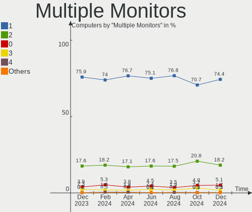
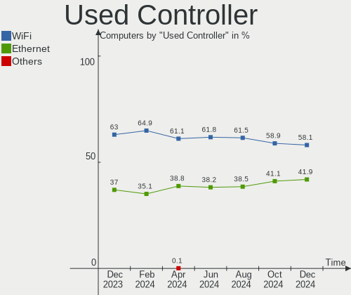

Fedora - Hardware Trends
------------------------

A project to identify most popular hardware characteristics and track their change
over time based on data collected by Linux users at https://Linux-Hardware.org.

Anyone can contribute to this report by the [hw-probe](https://github.com/linuxhw/hw-probe) tool:

    sudo -E hw-probe -all -upload

This is a report for all computer types. See also reports for [desktops](/Dist/Fedora/Desktop/README.md) and [notebooks](/Dist/Fedora/Notebook/README.md).

This report is for one last month. Overall report since the beginning of time: [TestCoverage](https://github.com/linuxhw/TestCoverage)

Period: May, 2022.

Contents
--------

* [ System ](#system)
  - [ OS                       ](#os)
  - [ OS Family                ](#os-family)
  - [ Kernel                   ](#kernel)
  - [ Kernel Family            ](#kernel-family)
  - [ Kernel Major Ver.        ](#kernel-major-ver)
  - [ Arch                     ](#arch)
  - [ DE                       ](#de)
  - [ Display Server           ](#display-server)
  - [ Display Manager          ](#display-manager)
  - [ OS Lang                  ](#os-lang)
  - [ Boot Mode                ](#boot-mode)
  - [ Filesystem               ](#filesystem)
  - [ Part. scheme             ](#part-scheme)
  - [ Dual Boot with Linux/BSD ](#dual-boot-with-linuxbsd)
  - [ Dual Boot (Win)          ](#dual-boot-win)

* [ Board ](#board)
  - [ Vendor                   ](#vendor)
  - [ Model                    ](#model)
  - [ Model Family             ](#model-family)
  - [ MFG Year                 ](#mfg-year)
  - [ Form Factor              ](#form-factor)
  - [ Secure Boot              ](#secure-boot)
  - [ Coreboot                 ](#coreboot)
  - [ RAM Size                 ](#ram-size)
  - [ RAM Used                 ](#ram-used)
  - [ Total Drives             ](#total-drives)
  - [ Has CD-ROM               ](#has-cd-rom)
  - [ Has Ethernet             ](#has-ethernet)
  - [ Has WiFi                 ](#has-wifi)
  - [ Has Bluetooth            ](#has-bluetooth)

* [ Location ](#location)
  - [ Country                  ](#country)
  - [ City                     ](#city)

* [ Drives ](#drives)
  - [ Drive Vendor             ](#drive-vendor)
  - [ Drive Model              ](#drive-model)
  - [ HDD Vendor               ](#hdd-vendor)
  - [ SSD Vendor               ](#ssd-vendor)
  - [ Drive Kind               ](#drive-kind)
  - [ Drive Connector          ](#drive-connector)
  - [ Drive Size               ](#drive-size)
  - [ Space Total              ](#space-total)
  - [ Space Used               ](#space-used)
  - [ Malfunc. Drives          ](#malfunc-drives)
  - [ Malfunc. Drive Vendor    ](#malfunc-drive-vendor)
  - [ Malfunc. HDD Vendor      ](#malfunc-hdd-vendor)
  - [ Malfunc. Drive Kind      ](#malfunc-drive-kind)
  - [ Failed Drives            ](#failed-drives)
  - [ Failed Drive Vendor      ](#failed-drive-vendor)
  - [ Drive Status             ](#drive-status)

* [ Storage controller ](#storage-controller)
  - [ Storage Vendor           ](#storage-vendor)
  - [ Storage Model            ](#storage-model)
  - [ Storage Kind             ](#storage-kind)

* [ Processor ](#processor)
  - [ CPU Vendor               ](#cpu-vendor)
  - [ CPU Model                ](#cpu-model)
  - [ CPU Model Family         ](#cpu-model-family)
  - [ CPU Cores                ](#cpu-cores)
  - [ CPU Sockets              ](#cpu-sockets)
  - [ CPU Threads              ](#cpu-threads)
  - [ CPU Op-Modes             ](#cpu-op-modes)
  - [ CPU Microcode            ](#cpu-microcode)
  - [ CPU Microarch            ](#cpu-microarch)

* [ Graphics ](#graphics)
  - [ GPU Vendor               ](#gpu-vendor)
  - [ GPU Model                ](#gpu-model)
  - [ GPU Combo                ](#gpu-combo)
  - [ GPU Driver               ](#gpu-driver)
  - [ GPU Memory               ](#gpu-memory)

* [ Monitor ](#monitor)
  - [ Monitor Vendor           ](#monitor-vendor)
  - [ Monitor Model            ](#monitor-model)
  - [ Monitor Resolution       ](#monitor-resolution)
  - [ Monitor Diagonal         ](#monitor-diagonal)
  - [ Monitor Width            ](#monitor-width)
  - [ Aspect Ratio             ](#aspect-ratio)
  - [ Monitor Area             ](#monitor-area)
  - [ Pixel Density            ](#pixel-density)
  - [ Multiple Monitors        ](#multiple-monitors)

* [ Network ](#network)
  - [ Net Controller Vendor    ](#net-controller-vendor)
  - [ Net Controller Model     ](#net-controller-model)
  - [ Wireless Vendor          ](#wireless-vendor)
  - [ Wireless Model           ](#wireless-model)
  - [ Ethernet Vendor          ](#ethernet-vendor)
  - [ Ethernet Model           ](#ethernet-model)
  - [ Net Controller Kind      ](#net-controller-kind)
  - [ Used Controller          ](#used-controller)
  - [ NICs                     ](#nics)
  - [ IPv6                     ](#ipv6)

* [ Bluetooth ](#bluetooth)
  - [ Bluetooth Vendor         ](#bluetooth-vendor)
  - [ Bluetooth Model          ](#bluetooth-model)

* [ Sound ](#sound)
  - [ Sound Vendor             ](#sound-vendor)
  - [ Sound Model              ](#sound-model)

* [ Memory ](#memory)
  - [ Memory Vendor            ](#memory-vendor)
  - [ Memory Model             ](#memory-model)
  - [ Memory Kind              ](#memory-kind)
  - [ Memory Form Factor       ](#memory-form-factor)
  - [ Memory Size              ](#memory-size)
  - [ Memory Speed             ](#memory-speed)

* [ Printers & scanners ](#printers--scanners)
  - [ Printer Vendor           ](#printer-vendor)
  - [ Printer Model            ](#printer-model)
  - [ Scanner Vendor           ](#scanner-vendor)
  - [ Scanner Model            ](#scanner-model)

* [ Camera ](#camera)
  - [ Camera Vendor            ](#camera-vendor)
  - [ Camera Model             ](#camera-model)

* [ Security ](#security)
  - [ Fingerprint Vendor       ](#fingerprint-vendor)
  - [ Fingerprint Model        ](#fingerprint-model)
  - [ Chipcard Vendor          ](#chipcard-vendor)
  - [ Chipcard Model           ](#chipcard-model)

* [ Unsupported ](#unsupported)
  - [ Unsupported Devices      ](#unsupported-devices)
  - [ Unsupported Device Types ](#unsupported-device-types)

System
------

OS
--

Installed operating systems

| Name      | Computers | Percent |
|-----------|-----------|---------|
| Fedora 36 | 269       | 64.98%  |
| Fedora 35 | 128       | 30.92%  |
| Fedora 34 | 12        | 2.9%    |
| Fedora 33 | 3         | 0.72%   |
| Fedora 37 | 1         | 0.24%   |
| Fedora 32 | 1         | 0.24%   |

OS Family
---------

OS without a version

| Name   | Computers | Percent |
|--------|-----------|---------|
| Fedora | 414       | 100%    |

Kernel
------

Version of the Linux kernel

| Version                                                | Computers | Percent |
|--------------------------------------------------------|-----------|---------|
| 5.17.6-300.fc36.x86_64                                 | 74        | 17.87%  |
| 5.17.5-300.fc36.x86_64                                 | 48        | 11.59%  |
| 5.17.5-200.fc35.x86_64                                 | 45        | 10.87%  |
| 5.17.8-300.fc36.x86_64                                 | 42        | 10.14%  |
| 5.17.4-200.fc35.x86_64                                 | 36        | 8.7%    |
| 5.17.7-300.fc36.x86_64                                 | 33        | 7.97%   |
| 5.17.9-300.fc36.x86_64                                 | 26        | 6.28%   |
| 5.17.11-300.fc36.x86_64                                | 26        | 6.28%   |
| 5.14.10-300.fc35.x86_64                                | 8         | 1.93%   |
| 5.17.6-200.fc35.x86_64                                 | 7         | 1.69%   |
| 5.17.3-302.fc36.x86_64                                 | 7         | 1.69%   |
| 5.17.7-200.fc35.x86_64                                 | 6         | 1.45%   |
| 5.17.8-200.fc35.x86_64                                 | 3         | 0.72%   |
| 5.17.5-301.fsync.fc36.x86_64                           | 3         | 0.72%   |
| 5.16.18-200.fc35.x86_64                                | 3         | 0.72%   |
| 5.14.18-100.fc33.x86_64                                | 3         | 0.72%   |
| 5.17.9-200.fc35.x86_64                                 | 2         | 0.48%   |
| 5.17.7-301.fsync.fc36.x86_64                           | 2         | 0.48%   |
| 5.17.5-xm1.0.fc35.x86_64                               | 2         | 0.48%   |
| 5.17.5-301.fsync.fc35.x86_64                           | 2         | 0.48%   |
| 5.17.5-100.fc34.x86_64                                 | 2         | 0.48%   |
| 5.17.4-100.fc34.x86_64                                 | 2         | 0.48%   |
| 5.17.11-200.fc35.x86_64                                | 2         | 0.48%   |
| 5.16.19-200.fc35.x86_64                                | 2         | 0.48%   |
| 5.6.16-300.fc32.x86_64                                 | 1         | 0.24%   |
| 5.18.0-60.vanilla.1.fc35.x86_64                        | 1         | 0.24%   |
| 5.18.0-0.rc5.20220505gita7391ad3572431a.43.fc37.x86_64 | 1         | 0.24%   |
| 5.18.0                                                 | 1         | 0.24%   |
| 5.17.9-602.inttf.fc36.x86_64                           | 1         | 0.24%   |
| 5.17.9-301.fsync.fc36.x86_64                           | 1         | 0.24%   |
| 5.17.9-100.fc34.x86_64                                 | 1         | 0.24%   |
| 5.17.8-100.fc34.x86_64                                 | 1         | 0.24%   |
| 5.17.7-100.fc34.x86_64                                 | 1         | 0.24%   |
| 5.17.6-602.inttf.fc36.x86_64                           | 1         | 0.24%   |
| 5.17.6-300.fc36.aarch64                                | 1         | 0.24%   |
| 5.17.6-100.fc34.x86_64                                 | 1         | 0.24%   |
| 5.17.4-302.fsync.fc35.x86_64                           | 1         | 0.24%   |
| 5.17.11-602.inttf.fc36.x86_64                          | 1         | 0.24%   |
| 5.17.11-301.fsync.fc36.x86_64                          | 1         | 0.24%   |
| 5.17.0-0.rc7.116.fc36.x86_64                           | 1         | 0.24%   |
| 5.16.8-1.surface.fc35.x86_64                           | 1         | 0.24%   |
| 5.16.5-200.fc35.x86_64                                 | 1         | 0.24%   |
| 5.16.20-200.fc35.x86_64                                | 1         | 0.24%   |
| 5.16.20-100.fc34.x86_64                                | 1         | 0.24%   |
| 5.16.12-200.fc35.x86_64                                | 1         | 0.24%   |
| 5.16.11-200.fc35.x86_64                                | 1         | 0.24%   |
| 5.15.5-200.fc35.x86_64                                 | 1         | 0.24%   |
| 5.15.14-200.fc35.x86_64                                | 1         | 0.24%   |
| 5.14.10-200.fc34.x86_64                                | 1         | 0.24%   |
| 5.13.14-200.fc34.x86_64                                | 1         | 0.24%   |
| 5.11.12-300.fc34.x86_64                                | 1         | 0.24%   |
| 5.10.15-100.fc32.x86_64                                | 1         | 0.24%   |

Kernel Family
-------------

Linux kernel without a distro release

| Version | Computers | Percent |
|---------|-----------|---------|
| 5.17.5  | 102       | 24.64%  |
| 5.17.6  | 84        | 20.29%  |
| 5.17.8  | 46        | 11.11%  |
| 5.17.7  | 42        | 10.14%  |
| 5.17.4  | 39        | 9.42%   |
| 5.17.9  | 31        | 7.49%   |
| 5.17.11 | 30        | 7.25%   |
| 5.14.10 | 9         | 2.17%   |
| 5.17.3  | 7         | 1.69%   |
| 5.18.0  | 3         | 0.72%   |
| 5.16.18 | 3         | 0.72%   |
| 5.14.18 | 3         | 0.72%   |
| 5.16.20 | 2         | 0.48%   |
| 5.16.19 | 2         | 0.48%   |
| 5.6.16  | 1         | 0.24%   |
| 5.17.0  | 1         | 0.24%   |
| 5.16.8  | 1         | 0.24%   |
| 5.16.5  | 1         | 0.24%   |
| 5.16.12 | 1         | 0.24%   |
| 5.16.11 | 1         | 0.24%   |
| 5.15.5  | 1         | 0.24%   |
| 5.15.14 | 1         | 0.24%   |
| 5.13.14 | 1         | 0.24%   |
| 5.11.12 | 1         | 0.24%   |
| 5.10.15 | 1         | 0.24%   |

Kernel Major Ver.
-----------------

Linux kernel major version

| Version | Computers | Percent |
|---------|-----------|---------|
| 5.17    | 382       | 92.27%  |
| 5.14    | 12        | 2.9%    |
| 5.16    | 11        | 2.66%   |
| 5.18    | 3         | 0.72%   |
| 5.15    | 2         | 0.48%   |
| 5.6     | 1         | 0.24%   |
| 5.13    | 1         | 0.24%   |
| 5.11    | 1         | 0.24%   |
| 5.10    | 1         | 0.24%   |

Arch
----

OS architecture (x86_64, i586, etc.)

| Name    | Computers | Percent |
|---------|-----------|---------|
| x86_64  | 413       | 99.76%  |
| aarch64 | 1         | 0.24%   |

DE
--

Desktop Environment

| Name       | Computers | Percent |
|------------|-----------|---------|
| GNOME      | 308       | 74.4%   |
| KDE5       | 54        | 13.04%  |
| Unknown    | 13        | 3.14%   |
| XFCE       | 10        | 2.42%   |
| X-Cinnamon | 10        | 2.42%   |
| Cinnamon   | 9         | 2.17%   |
| MATE       | 4         | 0.97%   |
| LXDE       | 2         | 0.48%   |
| LXQt       | 1         | 0.24%   |
| i3         | 1         | 0.24%   |
| Deepin     | 1         | 0.24%   |
| awesome    | 1         | 0.24%   |

Display Server
--------------

X11 or Wayland

| Name    | Computers | Percent |
|---------|-----------|---------|
| Wayland | 271       | 65.46%  |
| X11     | 132       | 31.88%  |
| Tty     | 7         | 1.69%   |
| Unknown | 4         | 0.97%   |

Display Manager
---------------

SDDM, LightDM, etc.

| Name    | Computers | Percent |
|---------|-----------|---------|
| Unknown | 233       | 56.28%  |
| GDM     | 118       | 28.5%   |
| LightDM | 31        | 7.49%   |
| SDDM    | 30        | 7.25%   |
| LXDM    | 2         | 0.48%   |

OS Lang
-------

Language

| Lang    | Computers | Percent |
|---------|-----------|---------|
| en_US   | 220       | 53.14%  |
| ru_RU   | 32        | 7.73%   |
| en_GB   | 28        | 6.76%   |
| pt_BR   | 18        | 4.35%   |
| en_AU   | 18        | 4.35%   |
| de_DE   | 15        | 3.62%   |
| fr_FR   | 9         | 2.17%   |
| it_IT   | 7         | 1.69%   |
| es_ES   | 6         | 1.45%   |
| en_CA   | 6         | 1.45%   |
| pl_PL   | 5         | 1.21%   |
| zh_CN   | 3         | 0.72%   |
| nl_BE   | 3         | 0.72%   |
| en_NZ   | 3         | 0.72%   |
| de_AT   | 3         | 0.72%   |
| cs_CZ   | 3         | 0.72%   |
| tr_TR   | 2         | 0.48%   |
| sv_SE   | 2         | 0.48%   |
| es_NI   | 2         | 0.48%   |
| es_MX   | 2         | 0.48%   |
| es_CL   | 2         | 0.48%   |
| en_IN   | 2         | 0.48%   |
| sr_RS   | 1         | 0.24%   |
| ro_RO   | 1         | 0.24%   |
| nl_NL   | 1         | 0.24%   |
| nb_NO   | 1         | 0.24%   |
| ja_JP   | 1         | 0.24%   |
| hr_HR   | 1         | 0.24%   |
| fr_CA   | 1         | 0.24%   |
| fr_BE   | 1         | 0.24%   |
| fi_FI   | 1         | 0.24%   |
| es_EC   | 1         | 0.24%   |
| en_ZA   | 1         | 0.24%   |
| en_SG   | 1         | 0.24%   |
| en_PH   | 1         | 0.24%   |
| en_IL   | 1         | 0.24%   |
| en_IE   | 1         | 0.24%   |
| en_DK   | 1         | 0.24%   |
| el_GR   | 1         | 0.24%   |
| de_CH   | 1         | 0.24%   |
| da_DK   | 1         | 0.24%   |
| ca_ES   | 1         | 0.24%   |
| C       | 1         | 0.24%   |
| ar_SA   | 1         | 0.24%   |
| Unknown | 1         | 0.24%   |

Boot Mode
---------

EFI or BIOS

| Mode | Computers | Percent |
|------|-----------|---------|
| EFI  | 336       | 81.16%  |
| BIOS | 78        | 18.84%  |

Filesystem
----------

Type of filesystem

| Type    | Computers | Percent |
|---------|-----------|---------|
| Btrfs   | 318       | 76.81%  |
| Ext4    | 79        | 19.08%  |
| Xfs     | 14        | 3.38%   |
| Overlay | 1         | 0.24%   |
| F2fs    | 1         | 0.24%   |
| Unknown | 1         | 0.24%   |

Part. scheme
------------

Scheme of partitioning

| Type    | Computers | Percent |
|---------|-----------|---------|
| Unknown | 227       | 54.83%  |
| GPT     | 164       | 39.61%  |
| MBR     | 23        | 5.56%   |

Dual Boot with Linux/BSD
------------------------

Hosting more than one Linux/BSD

| Dual boot | Computers | Percent |
|-----------|-----------|---------|
| No        | 370       | 89.37%  |
| Yes       | 44        | 10.63%  |

Dual Boot (Win)
---------------

Hosting Linux and Windows

| Dual boot | Computers | Percent |
|-----------|-----------|---------|
| No        | 346       | 83.57%  |
| Yes       | 68        | 16.43%  |

Board
-----

Vendor
------

Motherboard manufacturer

| Name                    | Computers | Percent |
|-------------------------|-----------|---------|
| Lenovo                  | 102       | 24.64%  |
| ASUSTek Computer        | 76        | 18.36%  |
| Dell                    | 51        | 12.32%  |
| Hewlett-Packard         | 49        | 11.84%  |
| Gigabyte Technology     | 27        | 6.52%   |
| MSI                     | 23        | 5.56%   |
| ASRock                  | 15        | 3.62%   |
| Acer                    | 12        | 2.9%    |
| Apple                   | 8         | 1.93%   |
| Toshiba                 | 5         | 1.21%   |
| Samsung Electronics     | 4         | 0.97%   |
| Notebook                | 3         | 0.72%   |
| HUAWEI                  | 3         | 0.72%   |
| Timi                    | 2         | 0.48%   |
| Sony                    | 2         | 0.48%   |
| Positivo                | 2         | 0.48%   |
| Microsoft               | 2         | 0.48%   |
| Intel                   | 2         | 0.48%   |
| ZoomSmart               | 1         | 0.24%   |
| TUXEDO                  | 1         | 0.24%   |
| Teclast                 | 1         | 0.24%   |
| Standard                | 1         | 0.24%   |
| SKIKK                   | 1         | 0.24%   |
| Shuttle                 | 1         | 0.24%   |
| Schenker                | 1         | 0.24%   |
| Ruckus Wireless         | 1         | 0.24%   |
| ROCK Pi                 | 1         | 0.24%   |
| Razer                   | 1         | 0.24%   |
| Raspberry Pi Foundation | 1         | 0.24%   |
| Login Informatica       | 1         | 0.24%   |
| LG Electronics          | 1         | 0.24%   |
| JINGSHA                 | 1         | 0.24%   |
| IT Channel Pty          | 1         | 0.24%   |
| ICL                     | 1         | 0.24%   |
| Huanan                  | 1         | 0.24%   |
| Google                  | 1         | 0.24%   |
| Fujitsu                 | 1         | 0.24%   |
| Framework               | 1         | 0.24%   |
| eMachines               | 1         | 0.24%   |
| ECS                     | 1         | 0.24%   |
| Chuwi                   | 1         | 0.24%   |
| BESSTAR Tech            | 1         | 0.24%   |
| AMI                     | 1         | 0.24%   |
| Alienware               | 1         | 0.24%   |

Model
-----

Motherboard model

| Name                                   | Computers | Percent |
|----------------------------------------|-----------|---------|
| Unknown                                | 7         | 1.69%   |
| Dell XPS 13 9310                       | 5         | 1.21%   |
| ASUS All Series                        | 4         | 0.97%   |
| MSI MS-7A38                            | 3         | 0.72%   |
| Lenovo IdeaPad 5 15ARE05 81YQ          | 3         | 0.72%   |
| Gigabyte X570 I AORUS PRO WIFI         | 3         | 0.72%   |
| Samsung 550XDA                         | 2         | 0.48%   |
| Lenovo ThinkPad P14s Gen 2a 21A00071GE | 2         | 0.48%   |
| Lenovo ThinkBook 15 G2 ITL 20VE        | 2         | 0.48%   |
| Lenovo Legion Y530-15ICH 81FV          | 2         | 0.48%   |
| Lenovo IdeaPad 320S-14IKB 81BN         | 2         | 0.48%   |
| Intel DH77EB AAG39073-304              | 2         | 0.48%   |
| HP OMEN Laptop 15-en0xxx               | 2         | 0.48%   |
| HP ENVY x360 Convertible 13-ay0xxx     | 2         | 0.48%   |
| Gigabyte B450M DS3H                    | 2         | 0.48%   |
| Dell XPS 15 9570                       | 2         | 0.48%   |
| Dell XPS 13 7390                       | 2         | 0.48%   |
| Dell Latitude 5420                     | 2         | 0.48%   |
| ASUS TUF Gaming X570-PRO               | 2         | 0.48%   |
| ASUS ROG STRIX X570-F GAMING           | 2         | 0.48%   |
| ASUS ROG STRIX X570-E GAMING           | 2         | 0.48%   |
| ASUS ROG Strix G513QY_G513QY           | 2         | 0.48%   |
| ASUS ROG STRIX B550-F GAMING           | 2         | 0.48%   |
| ASUS PRIME B450-PLUS                   | 2         | 0.48%   |
| ASRock X470 Taichi                     | 2         | 0.48%   |
| Acer Aspire E5-573G                    | 2         | 0.48%   |
| ZoomSmart A8006                        | 1         | 0.24%   |
| TUXEDO Pulse 14 Gen1                   | 1         | 0.24%   |
| Toshiba TECRA R840                     | 1         | 0.24%   |
| Toshiba TECRA A50-C                    | 1         | 0.24%   |
| Toshiba Satellite U940                 | 1         | 0.24%   |
| Toshiba Satellite C660                 | 1         | 0.24%   |
| Timi Redmi G                           | 1         | 0.24%   |
| Timi A35S                              | 1         | 0.24%   |
| Teclast F7 Plus                        | 1         | 0.24%   |
| Sony VPCSA2Z9R                         | 1         | 0.24%   |
| Sony VPCEE3S1E                         | 1         | 0.24%   |
| SKIKK GREEN 4                          | 1         | 0.24%   |
| Shuttle SZ87R                          | 1         | 0.24%   |
| Schenker XMG_APEX15_XAP15E20           | 1         | 0.24%   |
| Samsung 950QDB                         | 1         | 0.24%   |
| Samsung 270E5G/270E5U                  | 1         | 0.24%   |
| Ruckus Wireless SCG-100                | 1         | 0.24%   |
| Razer Blade 14 (2022) - RZ09-0427      | 1         | 0.24%   |
| RPi Raspberry Pi 4 Model B             | 1         | 0.24%   |
| Positivo H14BU08                       | 1         | 0.24%   |
| Positivo C41TB                         | 1         | 0.24%   |
| Notebook P65_P67SG                     | 1         | 0.24%   |
| Notebook NL5xRU                        | 1         | 0.24%   |
| Notebook N8xEJEK                       | 1         | 0.24%   |
| MSI MS-7C95                            | 1         | 0.24%   |
| MSI MS-7C92                            | 1         | 0.24%   |
| MSI MS-7C59                            | 1         | 0.24%   |
| MSI MS-7C56                            | 1         | 0.24%   |
| MSI MS-7C52                            | 1         | 0.24%   |
| MSI MS-7C37                            | 1         | 0.24%   |
| MSI MS-7C35                            | 1         | 0.24%   |
| MSI MS-7B85                            | 1         | 0.24%   |
| MSI MS-7B84                            | 1         | 0.24%   |
| MSI MS-7B79                            | 1         | 0.24%   |

Model Family
------------

Motherboard model prefix

| Name                    | Computers | Percent |
|-------------------------|-----------|---------|
| Lenovo ThinkPad         | 48        | 11.59%  |
| Lenovo IdeaPad          | 22        | 5.31%   |
| ASUS ROG                | 18        | 4.35%   |
| Dell XPS                | 17        | 4.11%   |
| HP Pavilion             | 12        | 2.9%    |
| Dell Inspiron           | 11        | 2.66%   |
| Dell Latitude           | 9         | 2.17%   |
| ASUS PRIME              | 9         | 2.17%   |
| Lenovo Yoga             | 8         | 1.93%   |
| Dell Precision          | 7         | 1.69%   |
| ASUS TUF                | 7         | 1.69%   |
| Acer Aspire             | 7         | 1.69%   |
| Unknown                 | 7         | 1.69%   |
| HP Laptop               | 6         | 1.45%   |
| HP ENVY                 | 5         | 1.21%   |
| HP EliteBook            | 5         | 1.21%   |
| ASUS VivoBook           | 5         | 1.21%   |
| Lenovo ThinkCentre      | 4         | 0.97%   |
| Lenovo ThinkBook        | 4         | 0.97%   |
| Lenovo Legion           | 4         | 0.97%   |
| HP ProBook              | 4         | 0.97%   |
| Dell Vostro             | 4         | 0.97%   |
| ASUS ZenBook            | 4         | 0.97%   |
| ASUS All                | 4         | 0.97%   |
| MSI MS-7A38             | 3         | 0.72%   |
| Gigabyte X570           | 3         | 0.72%   |
| Gigabyte B550           | 3         | 0.72%   |
| Dell OptiPlex           | 3         | 0.72%   |
| ASUS ASUS               | 3         | 0.72%   |
| Acer Swift              | 3         | 0.72%   |
| Toshiba TECRA           | 2         | 0.48%   |
| Toshiba Satellite       | 2         | 0.48%   |
| Samsung 550XDA          | 2         | 0.48%   |
| MSI GF63                | 2         | 0.48%   |
| Microsoft Surface       | 2         | 0.48%   |
| Intel DH77EB            | 2         | 0.48%   |
| HP ZBook                | 2         | 0.48%   |
| HP OMEN                 | 2         | 0.48%   |
| Gigabyte B450M          | 2         | 0.48%   |
| ASUS P8Z68-V            | 2         | 0.48%   |
| ASRock X470             | 2         | 0.48%   |
| Apple MacBookPro8       | 2         | 0.48%   |
| Apple iMac14            | 2         | 0.48%   |
| ZoomSmart A8006         | 1         | 0.24%   |
| TUXEDO Pulse            | 1         | 0.24%   |
| Timi Redmi              | 1         | 0.24%   |
| Timi A35S               | 1         | 0.24%   |
| Teclast F7              | 1         | 0.24%   |
| Sony VPCSA2Z9R          | 1         | 0.24%   |
| Sony VPCEE3S1E          | 1         | 0.24%   |
| SKIKK GREEN             | 1         | 0.24%   |
| Shuttle SZ87R           | 1         | 0.24%   |
| Schenker XMG            | 1         | 0.24%   |
| Samsung 950QDB          | 1         | 0.24%   |
| Samsung 270E5G          | 1         | 0.24%   |
| Ruckus Wireless SCG-100 | 1         | 0.24%   |
| Razer Blade             | 1         | 0.24%   |
| RPi Raspberry           | 1         | 0.24%   |
| Positivo H14BU08        | 1         | 0.24%   |
| Positivo C41TB          | 1         | 0.24%   |

MFG Year
--------

Motherboard manufacture year

| Year | Computers | Percent |
|------|-----------|---------|
| 2020 | 79        | 19.08%  |
| 2021 | 54        | 13.04%  |
| 2019 | 50        | 12.08%  |
| 2018 | 47        | 11.35%  |
| 2017 | 29        | 7%      |
| 2014 | 26        | 6.28%   |
| 2015 | 25        | 6.04%   |
| 2012 | 24        | 5.8%    |
| 2016 | 19        | 4.59%   |
| 2011 | 19        | 4.59%   |
| 2013 | 14        | 3.38%   |
| 2022 | 7         | 1.69%   |
| 2010 | 6         | 1.45%   |
| 2009 | 6         | 1.45%   |
| 2008 | 5         | 1.21%   |
| 2007 | 2         | 0.48%   |
| 2006 | 1         | 0.24%   |
| 2005 | 1         | 0.24%   |

Form Factor
-----------

Physical design of the computer

| Name           | Computers | Percent |
|----------------|-----------|---------|
| Notebook       | 254       | 61.35%  |
| Desktop        | 130       | 31.4%   |
| Convertible    | 19        | 4.59%   |
| Tablet         | 4         | 0.97%   |
| Mini pc        | 3         | 0.72%   |
| All in one     | 3         | 0.72%   |
| System on chip | 1         | 0.24%   |

Secure Boot
-----------

Enabled or disabled

| State    | Computers | Percent |
|----------|-----------|---------|
| Disabled | 344       | 83.09%  |
| Enabled  | 70        | 16.91%  |

Coreboot
--------

Have coreboot on board

| Used | Computers | Percent |
|------|-----------|---------|
| No   | 412       | 99.52%  |
| Yes  | 2         | 0.48%   |

RAM Size
--------

Total RAM memory

| Size in GB  | Computers | Percent |
|-------------|-----------|---------|
| 16.01-24.0  | 114       | 27.54%  |
| 4.01-8.0    | 95        | 22.95%  |
| 8.01-16.0   | 73        | 17.63%  |
| 32.01-64.0  | 70        | 16.91%  |
| 3.01-4.0    | 26        | 6.28%   |
| 64.01-256.0 | 21        | 5.07%   |
| 24.01-32.0  | 9         | 2.17%   |
| 1.01-2.0    | 5         | 1.21%   |
| 2.01-3.0    | 1         | 0.24%   |

RAM Used
--------

Used RAM memory

| Used GB     | Computers | Percent |
|-------------|-----------|---------|
| 4.01-8.0    | 143       | 34.54%  |
| 2.01-3.0    | 102       | 24.64%  |
| 3.01-4.0    | 73        | 17.63%  |
| 1.01-2.0    | 48        | 11.59%  |
| 8.01-16.0   | 32        | 7.73%   |
| 0.51-1.0    | 7         | 1.69%   |
| 16.01-24.0  | 4         | 0.97%   |
| 32.01-64.0  | 2         | 0.48%   |
| 24.01-32.0  | 1         | 0.24%   |
| 64.01-256.0 | 1         | 0.24%   |
| 0.01-0.5    | 1         | 0.24%   |

Total Drives
------------

Number of drives on board

| Drives | Computers | Percent |
|--------|-----------|---------|
| 1      | 242       | 58.45%  |
| 2      | 112       | 27.05%  |
| 3      | 30        | 7.25%   |
| 4      | 19        | 4.59%   |
| 5      | 6         | 1.45%   |
| 7      | 2         | 0.48%   |
| 6      | 2         | 0.48%   |
| 15     | 1         | 0.24%   |

Has CD-ROM
----------

Has CD-ROM on board

| Presented | Computers | Percent |
|-----------|-----------|---------|
| No        | 333       | 80.43%  |
| Yes       | 81        | 19.57%  |

Has Ethernet
------------

Has Ethernet on board

| Presented | Computers | Percent |
|-----------|-----------|---------|
| Yes       | 326       | 78.74%  |
| No        | 88        | 21.26%  |

Has WiFi
--------

Has WiFi module

| Presented | Computers | Percent |
|-----------|-----------|---------|
| Yes       | 339       | 81.88%  |
| No        | 75        | 18.12%  |

Has Bluetooth
-------------

Has Bluetooth module

| Presented | Computers | Percent |
|-----------|-----------|---------|
| Yes       | 310       | 74.88%  |
| No        | 104       | 25.12%  |

Location
--------

Country
-------

Geographic location (country)

| Country      | Computers | Percent |
|--------------|-----------|---------|
| USA          | 80        | 19.32%  |
| Russia       | 35        | 8.45%   |
| Germany      | 34        | 8.21%   |
| Brazil       | 28        | 6.76%   |
| Italy        | 19        | 4.59%   |
| Australia    | 18        | 4.35%   |
| UK           | 14        | 3.38%   |
| India        | 14        | 3.38%   |
| France       | 12        | 2.9%    |
| Spain        | 11        | 2.66%   |
| Canada       | 11        | 2.66%   |
| Belgium      | 8         | 1.93%   |
| Norway       | 7         | 1.69%   |
| Netherlands  | 7         | 1.69%   |
| Indonesia    | 7         | 1.69%   |
| Poland       | 6         | 1.45%   |
| Switzerland  | 5         | 1.21%   |
| Sweden       | 5         | 1.21%   |
| Mexico       | 5         | 1.21%   |
| Israel       | 5         | 1.21%   |
| Finland      | 5         | 1.21%   |
| Belarus      | 5         | 1.21%   |
| Austria      | 5         | 1.21%   |
| Romania      | 4         | 0.97%   |
| Turkey       | 3         | 0.72%   |
| New Zealand  | 3         | 0.72%   |
| Czechia      | 3         | 0.72%   |
| China        | 3         | 0.72%   |
| Bulgaria     | 3         | 0.72%   |
| Argentina    | 3         | 0.72%   |
| Slovakia     | 2         | 0.48%   |
| Singapore    | 2         | 0.48%   |
| Saudi Arabia | 2         | 0.48%   |
| Portugal     | 2         | 0.48%   |
| Nicaragua    | 2         | 0.48%   |
| Japan        | 2         | 0.48%   |
| Hungary      | 2         | 0.48%   |
| Hong Kong    | 2         | 0.48%   |
| Greece       | 2         | 0.48%   |
| Estonia      | 2         | 0.48%   |
| Colombia     | 2         | 0.48%   |
| Chile        | 2         | 0.48%   |
| Venezuela    | 1         | 0.24%   |
| Uzbekistan   | 1         | 0.24%   |
| Ukraine      | 1         | 0.24%   |
| Thailand     | 1         | 0.24%   |
| Taiwan       | 1         | 0.24%   |
| South Africa | 1         | 0.24%   |
| Serbia       | 1         | 0.24%   |
| Philippines  | 1         | 0.24%   |
| Peru         | 1         | 0.24%   |
| Moldova      | 1         | 0.24%   |
| Kenya        | 1         | 0.24%   |
| Kazakhstan   | 1         | 0.24%   |
| Jordan       | 1         | 0.24%   |
| Ireland      | 1         | 0.24%   |
| Iran         | 1         | 0.24%   |
| Haiti        | 1         | 0.24%   |
| El Salvador  | 1         | 0.24%   |
| Ecuador      | 1         | 0.24%   |

City
----

Geographic location (city)

| City                 | Computers | Percent |
|----------------------|-----------|---------|
| Moscow               | 12        | 2.9%    |
| St Petersburg        | 6         | 1.45%   |
| Milan                | 6         | 1.45%   |
| Melbourne            | 6         | 1.45%   |
| Sao Paulo            | 5         | 1.21%   |
| Launceston           | 5         | 1.21%   |
| Sydney               | 4         | 0.97%   |
| Rome                 | 4         | 0.97%   |
| Munich               | 4         | 0.97%   |
| Montreal             | 4         | 0.97%   |
| Minsk                | 4         | 0.97%   |
| Oulu                 | 3         | 0.72%   |
| Oslo                 | 3         | 0.72%   |
| Kolkata              | 3         | 0.72%   |
| Auckland             | 3         | 0.72%   |
| Zurich               | 2         | 0.48%   |
| Yekaterinburg        | 2         | 0.48%   |
| Vladivostok          | 2         | 0.48%   |
| Vancouver            | 2         | 0.48%   |
| Tallinn              | 2         | 0.48%   |
| Stockholm            | 2         | 0.48%   |
| Sofia                | 2         | 0.48%   |
| Singapore            | 2         | 0.48%   |
| San Diego            | 2         | 0.48%   |
| Salvador             | 2         | 0.48%   |
| Rotterdam            | 2         | 0.48%   |
| Rosario              | 2         | 0.48%   |
| Reno                 | 2         | 0.48%   |
| Porto Alegre         | 2         | 0.48%   |
| New Haven            | 2         | 0.48%   |
| Managua              | 2         | 0.48%   |
| Los Angeles          | 2         | 0.48%   |
| Kristiansand         | 2         | 0.48%   |
| Istanbul             | 2         | 0.48%   |
| Indianapolis         | 2         | 0.48%   |
| Haifa                | 2         | 0.48%   |
| Guangzhou            | 2         | 0.48%   |
| Dallas               | 2         | 0.48%   |
| Dachau               | 2         | 0.48%   |
| Central              | 2         | 0.48%   |
| Brussels             | 2         | 0.48%   |
| Bratislava           | 2         | 0.48%   |
| Atherton             | 2         | 0.48%   |
| Athens               | 2         | 0.48%   |
| Antwerp              | 2         | 0.48%   |
| Andrezieux-Boutheon  | 2         | 0.48%   |
| Zierikzee            | 1         | 0.24%   |
| Zacatlan             | 1         | 0.24%   |
| Ylaemylly            | 1         | 0.24%   |
| Yaroslavl            | 1         | 0.24%   |
| Wroclaw              | 1         | 0.24%   |
| Woodbine             | 1         | 0.24%   |
| White River Junction | 1         | 0.24%   |
| Weilheim             | 1         | 0.24%   |
| Waukesha             | 1         | 0.24%   |
| Warsaw               | 1         | 0.24%   |
| Vladimir             | 1         | 0.24%   |
| Vitória             | 1         | 0.24%   |
| Villamanta           | 1         | 0.24%   |
| Vechta               | 1         | 0.24%   |

Drives
------

Drive Vendor
------------

Hard drive vendors

| Vendor                         | Computers | Drives | Percent |
|--------------------------------|-----------|--------|---------|
| Samsung Electronics            | 148       | 180    | 23.87%  |
| Seagate                        | 75        | 90     | 12.1%   |
| WDC                            | 70        | 88     | 11.29%  |
| Crucial                        | 33        | 34     | 5.32%   |
| Kingston                       | 28        | 29     | 4.52%   |
| Sandisk                        | 27        | 27     | 4.35%   |
| Toshiba                        | 26        | 26     | 4.19%   |
| Intel                          | 26        | 27     | 4.19%   |
| SK Hynix                       | 23        | 23     | 3.71%   |
| Unknown                        | 19        | 22     | 3.06%   |
| KIOXIA                         | 14        | 15     | 2.26%   |
| Micron Technology              | 12        | 12     | 1.94%   |
| Phison                         | 10        | 11     | 1.61%   |
| Hitachi                        | 7         | 7      | 1.13%   |
| LITEON                         | 6         | 6      | 0.97%   |
| HGST                           | 6         | 6      | 0.97%   |
| A-DATA Technology              | 6         | 7      | 0.97%   |
| XPG                            | 5         | 6      | 0.81%   |
| Silicon Motion                 | 5         | 5      | 0.81%   |
| China                          | 5         | 6      | 0.81%   |
| Apple                          | 5         | 6      | 0.81%   |
| UMIS                           | 4         | 4      | 0.65%   |
| PNY                            | 4         | 4      | 0.65%   |
| Corsair                        | 4         | 5      | 0.65%   |
| Intenso                        | 3         | 4      | 0.48%   |
| Unknown                        | 3         | 3      | 0.48%   |
| Transcend                      | 2         | 3      | 0.32%   |
| Team                           | 2         | 3      | 0.32%   |
| SSSTC                          | 2         | 2      | 0.32%   |
| Solid State Storage Technology | 2         | 2      | 0.32%   |
| Realtek Semiconductor          | 2         | 2      | 0.32%   |
| Micron/Crucial Technology      | 2         | 2      | 0.32%   |
| Lexar                          | 2         | 2      | 0.32%   |
| Gigabyte Technology            | 2         | 3      | 0.32%   |
| ASMT                           | 2         | 2      | 0.32%   |
| ADATA Technology               | 2         | 2      | 0.32%   |
| USB                            | 1         | 1      | 0.16%   |
| SSK                            | 1         | 1      | 0.16%   |
| SPCC                           | 1         | 1      | 0.16%   |
| PLEXTOR                        | 1         | 1      | 0.16%   |
| Pioneer                        | 1         | 1      | 0.16%   |
| Phison Electronics             | 1         | 7      | 0.16%   |
| Patriot                        | 1         | 1      | 0.16%   |
| Origin                         | 1         | 1      | 0.16%   |
| OCZ-VERTEX3                    | 1         | 1      | 0.16%   |
| Novation                       | 1         | 1      | 0.16%   |
| Netac                          | 1         | 1      | 0.16%   |
| MAXTOR                         | 1         | 1      | 0.16%   |
| MAXIO Technology (Hangzhou)    | 1         | 1      | 0.16%   |
| LITEONIT                       | 1         | 1      | 0.16%   |
| Lite-On                        | 1         | 1      | 0.16%   |
| Lenovo                         | 1         | 1      | 0.16%   |
| KUIJIA                         | 1         | 1      | 0.16%   |
| IB-AC703                       | 1         | 1      | 0.16%   |
| HP SSD S                       | 1         | 1      | 0.16%   |
| Hewlett-Packard                | 1         | 1      | 0.16%   |
| GOODRAM                        | 1         | 1      | 0.16%   |
| Fujitsu                        | 1         | 1      | 0.16%   |
| Drevo                          | 1         | 1      | 0.16%   |
| Apacer                         | 1         | 1      | 0.16%   |

Drive Model
-----------

Hard drive models

| Model                                | Computers | Percent |
|--------------------------------------|-----------|---------|
| Samsung SSD 850 EVO 250GB            | 11        | 1.63%   |
| Samsung NVMe SSD Drive 512GB         | 11        | 1.63%   |
| Samsung NVMe SSD Drive 1TB           | 10        | 1.48%   |
| Intel NVMe SSD Drive 512GB           | 10        | 1.48%   |
| Seagate ST1000LM035-1RK172 1TB       | 8         | 1.19%   |
| Crucial CT500MX500SSD1 500GB         | 8         | 1.19%   |
| Sandisk NVMe SSD Drive 1TB           | 7         | 1.04%   |
| Unknown MMC Card  64GB               | 6         | 0.89%   |
| Toshiba MQ01ABD100 1TB               | 6         | 0.89%   |
| Sandisk NVMe SSD Drive 512GB         | 6         | 0.89%   |
| Samsung NVMe SSD Drive 500GB         | 6         | 0.89%   |
| Samsung NVMe SSD Drive 2TB           | 6         | 0.89%   |
| Samsung NVMe SSD Drive 256GB         | 6         | 0.89%   |
| KIOXIA NVMe SSD Drive 512GB          | 6         | 0.89%   |
| Toshiba KBG30ZMS128G 128GB NVMe SSD  | 5         | 0.74%   |
| SK Hynix NVMe SSD Drive 512GB        | 5         | 0.74%   |
| Samsung SSD 870 EVO 500GB            | 5         | 0.74%   |
| Samsung SSD 860 EVO 1TB              | 5         | 0.74%   |
| Kingston SA400S37240G 240GB SSD      | 5         | 0.74%   |
| Kingston SA400S37120G 120GB SSD      | 5         | 0.74%   |
| HGST HTS721010A9E630 1TB             | 5         | 0.74%   |
| Crucial CT480BX500SSD1 480GB         | 5         | 0.74%   |
| WDC WD10EZEX-00WN4A0 1TB             | 4         | 0.59%   |
| Unknown MMC Card  128GB              | 4         | 0.59%   |
| SK Hynix NVMe SSD Drive 1024GB       | 4         | 0.59%   |
| Seagate ST1000DM010-2EP102 1TB       | 4         | 0.59%   |
| Samsung SSD 970 EVO Plus 500GB       | 4         | 0.59%   |
| Samsung SSD 860 EVO 500GB            | 4         | 0.59%   |
| Samsung SSD 850 EVO 1TB              | 4         | 0.59%   |
| Samsung NVMe SSD Drive 1024GB        | 4         | 0.59%   |
| Crucial CT240BX500SSD1 240GB         | 4         | 0.59%   |
| WDC WDS500G2B0B-00YS70 500GB SSD     | 3         | 0.45%   |
| WDC WDS500G2B0A-00SM50 500GB SSD     | 3         | 0.45%   |
| WDC WDS100T2B0A-00SM50 1TB SSD       | 3         | 0.45%   |
| WDC WD30EFRX-68EUZN0 3TB             | 3         | 0.45%   |
| Unknown MMC Card  32GB               | 3         | 0.45%   |
| SK Hynix NVMe SSD Drive 256GB        | 3         | 0.45%   |
| Seagate ST500DM002-1BD142 500GB      | 3         | 0.45%   |
| Seagate ST4000DM004-2CV104 4TB       | 3         | 0.45%   |
| Seagate ST2000LM015-2E8174 2TB       | 3         | 0.45%   |
| Seagate ST2000DM008-2FR102 2TB       | 3         | 0.45%   |
| Seagate ST2000DM001-1ER164 2TB       | 3         | 0.45%   |
| Seagate ST1000LM024 HN-M101MBB 1TB   | 3         | 0.45%   |
| Samsung SSD 980 PRO 1TB              | 3         | 0.45%   |
| Samsung SSD 980 500GB                | 3         | 0.45%   |
| Samsung SSD 960 EVO 250GB            | 3         | 0.45%   |
| Samsung SSD 860 EVO 250GB            | 3         | 0.45%   |
| Samsung NVMe SSD Drive 250GB         | 3         | 0.45%   |
| Samsung MZVLB1T0HBLR-000L7 1TB       | 3         | 0.45%   |
| PNY CS900 240GB SSD                  | 3         | 0.45%   |
| Kingston NVMe SSD Drive 1TB          | 3         | 0.45%   |
| Crucial CT2000MX500SSD1 2TB          | 3         | 0.45%   |
| Unknown                              | 3         | 0.45%   |
| XPG NVMe SSD Drive 256GB             | 2         | 0.3%    |
| XPG NVMe SSD Drive 1024GB            | 2         | 0.3%    |
| WDC WD5000AZRX-00A8LB0 500GB         | 2         | 0.3%    |
| WDC WD40EFRX-68N32N0 4TB             | 2         | 0.3%    |
| WDC WD20EFRX-68AX9N0 2TB             | 2         | 0.3%    |
| WDC WD20EARS-00MVWB0 2TB             | 2         | 0.3%    |
| WDC PC SN530 SDBPNPZ-256G-1006 256GB | 2         | 0.3%    |

HDD Vendor
----------

Hard disk drive vendors

| Vendor              | Computers | Drives | Percent |
|---------------------|-----------|--------|---------|
| Seagate             | 70        | 83     | 43.75%  |
| WDC                 | 52        | 66     | 32.5%   |
| Toshiba             | 15        | 15     | 9.38%   |
| Hitachi             | 7         | 7      | 4.38%   |
| HGST                | 6         | 6      | 3.75%   |
| Samsung Electronics | 2         | 2      | 1.25%   |
| ASMT                | 2         | 2      | 1.25%   |
| Apple               | 2         | 2      | 1.25%   |
| USB                 | 1         | 1      | 0.63%   |
| MAXTOR              | 1         | 1      | 0.63%   |
| IB-AC703            | 1         | 1      | 0.63%   |
| Fujitsu             | 1         | 1      | 0.63%   |

SSD Vendor
----------

Solid state drive vendors

| Vendor              | Computers | Drives | Percent |
|---------------------|-----------|--------|---------|
| Samsung Electronics | 67        | 79     | 34.01%  |
| Crucial             | 31        | 32     | 15.74%  |
| Kingston            | 21        | 22     | 10.66%  |
| WDC                 | 9         | 10     | 4.57%   |
| SanDisk             | 9         | 9      | 4.57%   |
| Intel               | 8         | 8      | 4.06%   |
| PNY                 | 4         | 4      | 2.03%   |
| LITEON              | 4         | 4      | 2.03%   |
| China               | 4         | 5      | 2.03%   |
| Apple               | 4         | 4      | 2.03%   |
| A-DATA Technology   | 4         | 5      | 2.03%   |
| Seagate             | 3         | 3      | 1.52%   |
| Micron Technology   | 3         | 3      | 1.52%   |
| Intenso             | 3         | 4      | 1.52%   |
| Corsair             | 3         | 3      | 1.52%   |
| Transcend           | 2         | 3      | 1.02%   |
| Lexar               | 2         | 2      | 1.02%   |
| Gigabyte Technology | 2         | 3      | 1.02%   |
| Toshiba             | 1         | 1      | 0.51%   |
| Team                | 1         | 2      | 0.51%   |
| SPCC                | 1         | 1      | 0.51%   |
| Pioneer             | 1         | 1      | 0.51%   |
| Origin              | 1         | 1      | 0.51%   |
| OCZ-VERTEX3         | 1         | 1      | 0.51%   |
| Netac               | 1         | 1      | 0.51%   |
| LITEONIT            | 1         | 1      | 0.51%   |
| KUIJIA              | 1         | 1      | 0.51%   |
| Hewlett-Packard     | 1         | 1      | 0.51%   |
| GOODRAM             | 1         | 1      | 0.51%   |
| Drevo               | 1         | 1      | 0.51%   |
| Apacer              | 1         | 1      | 0.51%   |
| Unknown             | 1         | 1      | 0.51%   |

Drive Kind
----------

HDD or SSD

| Kind    | Computers | Drives | Percent |
|---------|-----------|--------|---------|
| NVMe    | 229       | 271    | 40.53%  |
| SSD     | 168       | 218    | 29.73%  |
| HDD     | 140       | 187    | 24.78%  |
| MMC     | 19        | 22     | 3.36%   |
| Unknown | 9         | 10     | 1.59%   |

Drive Connector
---------------

SATA, SAS, NVMe, etc.

| Type | Computers | Drives | Percent |
|------|-----------|--------|---------|
| SATA | 243       | 390    | 47.55%  |
| NVMe | 229       | 271    | 44.81%  |
| SAS  | 20        | 25     | 3.91%   |
| MMC  | 19        | 22     | 3.72%   |

Drive Size
----------

Size of hard drive

| Size in TB | Computers | Drives | Percent |
|------------|-----------|--------|---------|
| 0.01-0.5   | 160       | 214    | 49.08%  |
| 0.51-1.0   | 102       | 113    | 31.29%  |
| 1.01-2.0   | 33        | 43     | 10.12%  |
| 3.01-4.0   | 13        | 15     | 3.99%   |
| 4.01-10.0  | 12        | 13     | 3.68%   |
| 2.01-3.0   | 5         | 6      | 1.53%   |
| 10.01-20.0 | 1         | 1      | 0.31%   |

Space Total
-----------

Amount of disk space available on the file system

| Size in GB     | Computers | Percent |
|----------------|-----------|---------|
| 251-500        | 87        | 21.01%  |
| 501-1000       | 81        | 19.57%  |
| 1001-2000      | 61        | 14.73%  |
| 101-250        | 56        | 13.53%  |
| Unknown        | 33        | 7.97%   |
| 1-20           | 32        | 7.73%   |
| More than 3000 | 30        | 7.25%   |
| 2001-3000      | 15        | 3.62%   |
| 51-100         | 15        | 3.62%   |
| 21-50          | 4         | 0.97%   |

Space Used
----------

Amount of used disk space

| Used GB        | Computers | Percent |
|----------------|-----------|---------|
| 1-20           | 101       | 24.4%   |
| 21-50          | 72        | 17.39%  |
| 101-250        | 57        | 13.77%  |
| 251-500        | 52        | 12.56%  |
| 51-100         | 40        | 9.66%   |
| Unknown        | 33        | 7.97%   |
| 501-1000       | 27        | 6.52%   |
| 1001-2000      | 18        | 4.35%   |
| More than 3000 | 9         | 2.17%   |
| 2001-3000      | 5         | 1.21%   |

Malfunc. Drives
---------------

Drive models with a malfunction

| Model                                            | Computers | Drives | Percent |
|--------------------------------------------------|-----------|--------|---------|
| Seagate ST500LT012-1DG142 500GB                  | 2         | 2      | 6.06%   |
| Seagate ST500DM002-1BD142 500GB                  | 2         | 4      | 6.06%   |
| Intel SSDSC2CT120A3 120GB                        | 2         | 2      | 6.06%   |
| WDC WD1600AAJS-00Z4A0 160GB                      | 1         | 1      | 3.03%   |
| WDC WD10EZEX-00WN4A0 1TB                         | 1         | 1      | 3.03%   |
| WDC WD10EADS-65P6B0 1TB                          | 1         | 1      | 3.03%   |
| Toshiba MK5055GSX 500GB                          | 1         | 1      | 3.03%   |
| Team T2535T480G 480GB SSD                        | 1         | 2      | 3.03%   |
| Seagate ST95005620AS 500GB                       | 1         | 1      | 3.03%   |
| Seagate ST9320325AS 320GB                        | 1         | 1      | 3.03%   |
| Seagate ST4000VN008-2DR166 4TB                   | 1         | 1      | 3.03%   |
| Seagate ST32000542AS 2TB                         | 1         | 2      | 3.03%   |
| Seagate ST3000DM001-1CH166 3TB                   | 1         | 1      | 3.03%   |
| Seagate ST2000DM001-1CH164 2TB                   | 1         | 1      | 3.03%   |
| Seagate ST1000LM035-1RK172 1TB                   | 1         | 1      | 3.03%   |
| Seagate ST1000LM024 HN-M101MBB 1TB               | 1         | 1      | 3.03%   |
| SanDisk SSD PLUS 1000GB                          | 1         | 1      | 3.03%   |
| Samsung Electronics SSD 970 EVO Plus 1TB         | 1         | 1      | 3.03%   |
| Samsung Electronics SSD 870 EVO 500GB            | 1         | 1      | 3.03%   |
| Samsung Electronics SSD 870 EVO 2TB              | 1         | 1      | 3.03%   |
| Samsung Electronics SSD 870 EVO 1TB              | 1         | 1      | 3.03%   |
| Samsung Electronics SSD 840 Series 250GB         | 1         | 1      | 3.03%   |
| Samsung Electronics MZNLH128HBHQ-000H1 128GB SSD | 1         | 1      | 3.03%   |
| Samsung Electronics HD502HJ 500GB                | 1         | 1      | 3.03%   |
| Origin Inception TLC830 Pro Series 256GB SSD     | 1         | 1      | 3.03%   |
| OCZ-VERTEX3 MI 240GB SSD                         | 1         | 1      | 3.03%   |
| Lenovo LENSE20512GMSP34MEAT2TA 512GB             | 1         | 1      | 3.03%   |
| Intel SSDSCKKF256G8H 256GB                       | 1         | 1      | 3.03%   |
| Hitachi HDS5C3020ALA632 2TB                      | 1         | 1      | 3.03%   |
| Crucial CT256M550SSD1 256GB                      | 1         | 1      | 3.03%   |

Malfunc. Drive Vendor
---------------------

Vendors of faulty drives

| Vendor              | Computers | Drives | Percent |
|---------------------|-----------|--------|---------|
| Seagate             | 12        | 15     | 36.36%  |
| Samsung Electronics | 7         | 7      | 21.21%  |
| WDC                 | 3         | 3      | 9.09%   |
| Intel               | 3         | 3      | 9.09%   |
| Toshiba             | 1         | 1      | 3.03%   |
| Team                | 1         | 2      | 3.03%   |
| SanDisk             | 1         | 1      | 3.03%   |
| Origin              | 1         | 1      | 3.03%   |
| OCZ-VERTEX3         | 1         | 1      | 3.03%   |
| Lenovo              | 1         | 1      | 3.03%   |
| Hitachi             | 1         | 1      | 3.03%   |
| Crucial             | 1         | 1      | 3.03%   |

Malfunc. HDD Vendor
-------------------

Vendors of faulty HDD drives

| Vendor              | Computers | Drives | Percent |
|---------------------|-----------|--------|---------|
| Seagate             | 12        | 15     | 66.67%  |
| WDC                 | 3         | 3      | 16.67%  |
| Toshiba             | 1         | 1      | 5.56%   |
| Samsung Electronics | 1         | 1      | 5.56%   |
| Hitachi             | 1         | 1      | 5.56%   |

Malfunc. Drive Kind
-------------------

Kinds of faulty drives

| Kind | Computers | Drives | Percent |
|------|-----------|--------|---------|
| HDD  | 18        | 21     | 54.55%  |
| SSD  | 13        | 14     | 39.39%  |
| NVMe | 2         | 2      | 6.06%   |

Failed Drives
-------------

Failed drive models

| Model                             | Computers | Drives | Percent |
|-----------------------------------|-----------|--------|---------|
| Samsung Electronics SSD 980 500GB | 1         | 2      | 100%    |

Failed Drive Vendor
-------------------

Failed drive vendors

| Vendor              | Computers | Drives | Percent |
|---------------------|-----------|--------|---------|
| Samsung Electronics | 1         | 2      | 100%    |

Drive Status
------------

Number of failed and malfunc. drives

| Status   | Computers | Drives | Percent |
|----------|-----------|--------|---------|
| Detected | 244       | 420    | 54.71%  |
| Works    | 170       | 249    | 38.12%  |
| Malfunc  | 31        | 37     | 6.95%   |
| Failed   | 1         | 2      | 0.22%   |

Storage controller
------------------

Storage Vendor
--------------

Storage controller vendors

| Vendor                         | Computers | Percent |
|--------------------------------|-----------|---------|
| Intel                          | 235       | 40.38%  |
| AMD                            | 94        | 16.15%  |
| Samsung Electronics            | 92        | 15.81%  |
| Sandisk                        | 30        | 5.15%   |
| SK Hynix                       | 23        | 3.95%   |
| Toshiba America Info Systems   | 13        | 2.23%   |
| Phison Electronics             | 11        | 1.89%   |
| KIOXIA                         | 11        | 1.89%   |
| Micron Technology              | 9         | 1.55%   |
| ADATA Technology               | 8         | 1.37%   |
| Kingston Technology Company    | 7         | 1.2%    |
| ASMedia Technology             | 7         | 1.2%    |
| Silicon Motion                 | 6         | 1.03%   |
| JMicron Technology             | 5         | 0.86%   |
| Union Memory (Shenzhen)        | 4         | 0.69%   |
| Micron/Crucial Technology      | 4         | 0.69%   |
| Marvell Technology Group       | 4         | 0.69%   |
| Lite-On Technology             | 4         | 0.69%   |
| Solid State Storage Technology | 3         | 0.52%   |
| Realtek Semiconductor          | 3         | 0.52%   |
| Nvidia                         | 2         | 0.34%   |
| Unknown                        | 1         | 0.17%   |
| ULi Electronics                | 1         | 0.17%   |
| Silicon Image                  | 1         | 0.17%   |
| Seagate Technology             | 1         | 0.17%   |
| MAXIO Technology (Hangzhou)    | 1         | 0.17%   |
| Lenovo                         | 1         | 0.17%   |
| Broadcom / LSI                 | 1         | 0.17%   |

Storage Model
-------------

Storage controller models

| Model                                                                          | Computers | Percent |
|--------------------------------------------------------------------------------|-----------|---------|
| AMD FCH SATA Controller [AHCI mode]                                            | 69        | 10.73%  |
| Samsung NVMe SSD Controller SM981/PM981/PM983                                  | 40        | 6.22%   |
| Intel 82801 Mobile SATA Controller [RAID mode]                                 | 21        | 3.27%   |
| AMD 400 Series Chipset SATA Controller                                         | 21        | 3.27%   |
| Intel Volume Management Device NVMe RAID Controller                            | 20        | 3.11%   |
| Intel Sunrise Point-LP SATA Controller [AHCI mode]                             | 19        | 2.95%   |
| Samsung NVMe SSD Controller SM961/PM961/SM963                                  | 17        | 2.64%   |
| Samsung NVMe SSD Controller 980                                                | 16        | 2.49%   |
| Samsung NVMe SSD Controller PM9A1/PM9A3/980PRO                                 | 15        | 2.33%   |
| Intel 8 Series/C220 Series Chipset Family 6-port SATA Controller 1 [AHCI mode] | 15        | 2.33%   |
| Intel 7 Series Chipset Family 6-port SATA Controller [AHCI mode]               | 14        | 2.18%   |
| AMD 500 Series Chipset SATA Controller                                         | 12        | 1.87%   |
| KIOXIA Non-Volatile memory controller                                          | 11        | 1.71%   |
| Intel 8 Series SATA Controller 1 [AHCI mode]                                   | 11        | 1.71%   |
| SK Hynix Gold P31 SSD                                                          | 10        | 1.56%   |
| Intel SSD 660P Series                                                          | 10        | 1.56%   |
| Toshiba America Info Systems XG6 NVMe SSD Controller                           | 9         | 1.4%    |
| Micron Non-Volatile memory controller                                          | 9         | 1.4%    |
| Intel Wildcat Point-LP SATA Controller [AHCI Mode]                             | 9         | 1.4%    |
| Intel Q170/Q150/B150/H170/H110/Z170/CM236 Chipset SATA Controller [AHCI Mode]  | 9         | 1.4%    |
| Intel Cannon Lake Mobile PCH SATA AHCI Controller                              | 9         | 1.4%    |
| Intel 6 Series/C200 Series Chipset Family 6 port Mobile SATA AHCI Controller   | 9         | 1.4%    |
| Sandisk WD Black SN750 / PC SN730 NVMe SSD                                     | 8         | 1.24%   |
| Intel Tiger Lake-LP SATA Controller [AHCI mode]                                | 8         | 1.24%   |
| Intel SATA Controller [RAID mode]                                              | 8         | 1.24%   |
| Sandisk WD Blue SN550 NVMe SSD                                                 | 7         | 1.09%   |
| Sandisk Non-Volatile memory controller                                         | 7         | 1.09%   |
| ASMedia ASM1062 Serial ATA Controller                                          | 7         | 1.09%   |
| Silicon Motion SM2263EN/SM2263XT SSD Controller                                | 6         | 0.93%   |
| Intel 6 Series/C200 Series Chipset Family 6 port Desktop SATA AHCI Controller  | 6         | 0.93%   |
| AMD SB7x0/SB8x0/SB9x0 SATA Controller [AHCI mode]                              | 6         | 0.93%   |
| AMD SB7x0/SB8x0/SB9x0 IDE Controller                                           | 6         | 0.93%   |
| SK Hynix BC511                                                                 | 5         | 0.78%   |
| Phison E12 NVMe Controller                                                     | 5         | 0.78%   |
| Intel Non-Volatile memory controller                                           | 5         | 0.78%   |
| Intel HM170/QM170 Chipset SATA Controller [AHCI Mode]                          | 5         | 0.78%   |
| Intel Comet Lake SATA AHCI Controller                                          | 5         | 0.78%   |
| Intel 7 Series/C210 Series Chipset Family 6-port SATA Controller [AHCI mode]   | 5         | 0.78%   |
| Intel 200 Series PCH SATA controller [AHCI mode]                               | 5         | 0.78%   |
| SK Hynix BC501 NVMe Solid State Drive                                          | 4         | 0.62%   |
| Intel Cannon Point-LP SATA Controller [AHCI Mode]                              | 4         | 0.62%   |
| Intel Alder Lake-S PCH SATA Controller [AHCI Mode]                             | 4         | 0.62%   |
| Intel 400 Series Chipset Family SATA AHCI Controller                           | 4         | 0.62%   |
| ADATA XPG SX8200 Pro PCIe Gen3x4 M.2 2280 Solid State Drive                    | 4         | 0.62%   |
| Union Memory (Shenzhen) Non-Volatile memory controller                         | 3         | 0.47%   |
| Solid State Storage Non-Volatile memory controller                             | 3         | 0.47%   |
| Sandisk WD Blue SN500 / PC SN520 NVMe SSD                                      | 3         | 0.47%   |
| Samsung NVMe SSD Controller SM951/PM951                                        | 3         | 0.47%   |
| Samsung Electronics SATA controller                                            | 3         | 0.47%   |
| Phison PS5013 E13 NVMe Controller                                              | 3         | 0.47%   |
| Lite-On Non-Volatile memory controller                                         | 3         | 0.47%   |
| Kingston Company Company Non-Volatile memory controller                        | 3         | 0.47%   |
| JMicron JMB368 IDE controller                                                  | 3         | 0.47%   |
| Intel SSD Pro 7600p/760p/E 6100p Series                                        | 3         | 0.47%   |
| Intel NM10/ICH7 Family SATA Controller [IDE mode]                              | 3         | 0.47%   |
| Intel 9 Series Chipset Family SATA Controller [AHCI Mode]                      | 3         | 0.47%   |
| Intel 82801IBM/IEM (ICH9M/ICH9M-E) 4 port SATA Controller [AHCI mode]          | 3         | 0.47%   |
| Intel 500 Series Chipset Family SATA AHCI Controller                           | 3         | 0.47%   |
| Intel 5 Series/3400 Series Chipset 6 port SATA AHCI Controller                 | 3         | 0.47%   |
| ADATA Non-Volatile memory controller                                           | 3         | 0.47%   |

Storage Kind
------------

Kind of storage controller (IDE, SATA, NVMe, SAS, ...)

| Kind | Computers | Percent |
|------|-----------|---------|
| SATA | 276       | 47.42%  |
| NVMe | 229       | 39.35%  |
| RAID | 51        | 8.76%   |
| IDE  | 24        | 4.12%   |
| SAS  | 2         | 0.34%   |

Processor
---------

CPU Vendor
----------

Processor vendors

| Vendor | Computers | Percent |
|--------|-----------|---------|
| Intel  | 284       | 68.6%   |
| AMD    | 129       | 31.16%  |
| ARM    | 1         | 0.24%   |

CPU Model
---------

Processor models

| Model                                         | Computers | Percent |
|-----------------------------------------------|-----------|---------|
| Intel 11th Gen Core i7-1165G7 @ 2.80GHz       | 10        | 2.42%   |
| Intel Core i5-8265U CPU @ 1.60GHz             | 8         | 1.93%   |
| Intel Core i5-8250U CPU @ 1.60GHz             | 8         | 1.93%   |
| Intel 11th Gen Core i7-1185G7 @ 3.00GHz       | 8         | 1.93%   |
| Intel 11th Gen Core i5-1135G7 @ 2.40GHz       | 8         | 1.93%   |
| AMD Ryzen 5 3600 6-Core Processor             | 8         | 1.93%   |
| Intel Core i7-8550U CPU @ 1.80GHz             | 7         | 1.69%   |
| Intel Core i7-8750H CPU @ 2.20GHz             | 6         | 1.45%   |
| Intel Core i7-3770 CPU @ 3.40GHz              | 6         | 1.45%   |
| AMD Ryzen 9 3900X 12-Core Processor           | 6         | 1.45%   |
| AMD Ryzen 5 5600X 6-Core Processor            | 6         | 1.45%   |
| AMD Ryzen 7 PRO 5850U with Radeon Graphics    | 5         | 1.21%   |
| Intel Core i7-7500U CPU @ 2.70GHz             | 4         | 0.97%   |
| Intel Core i7-10510U CPU @ 1.80GHz            | 4         | 0.97%   |
| Intel Core i5-7200U CPU @ 2.50GHz             | 4         | 0.97%   |
| Intel Core i5-6200U CPU @ 2.30GHz             | 4         | 0.97%   |
| Intel Core i5-10210U CPU @ 1.60GHz            | 4         | 0.97%   |
| AMD Ryzen 9 5900X 12-Core Processor           | 4         | 0.97%   |
| AMD Ryzen 7 4800H with Radeon Graphics        | 4         | 0.97%   |
| AMD Ryzen 7 4700U with Radeon Graphics        | 4         | 0.97%   |
| AMD Ryzen 5 4500U with Radeon Graphics        | 4         | 0.97%   |
| Intel Core i7-9750H CPU @ 2.60GHz             | 3         | 0.72%   |
| Intel Core i7-8665U CPU @ 1.90GHz             | 3         | 0.72%   |
| Intel Core i7-7820HQ CPU @ 2.90GHz            | 3         | 0.72%   |
| Intel Core i7-6820HQ CPU @ 2.70GHz            | 3         | 0.72%   |
| Intel Core i7-4510U CPU @ 2.00GHz             | 3         | 0.72%   |
| Intel Core i7-10750H CPU @ 2.60GHz            | 3         | 0.72%   |
| Intel Core i7-1065G7 CPU @ 1.30GHz            | 3         | 0.72%   |
| Intel Core i5-8350U CPU @ 1.70GHz             | 3         | 0.72%   |
| Intel Core i5-6500 CPU @ 3.20GHz              | 3         | 0.72%   |
| Intel Core i5-4300U CPU @ 1.90GHz             | 3         | 0.72%   |
| Intel Core i5-3320M CPU @ 2.60GHz             | 3         | 0.72%   |
| Intel Core i5-3230M CPU @ 2.60GHz             | 3         | 0.72%   |
| Intel Core i5-2520M CPU @ 2.50GHz             | 3         | 0.72%   |
| Intel Core i3-5005U CPU @ 2.00GHz             | 3         | 0.72%   |
| Intel Core 2 Duo CPU E8400 @ 3.00GHz          | 3         | 0.72%   |
| AMD Ryzen 7 5800H with Radeon Graphics        | 3         | 0.72%   |
| AMD Ryzen 5 5600G with Radeon Graphics        | 3         | 0.72%   |
| AMD Ryzen 5 3500U with Radeon Vega Mobile Gfx | 3         | 0.72%   |
| AMD Ryzen 5 2600 Six-Core Processor           | 3         | 0.72%   |
| AMD Ryzen 5 1600 Six-Core Processor           | 3         | 0.72%   |
| AMD Ryzen 3 3200U with Radeon Vega Mobile Gfx | 3         | 0.72%   |
| Intel Core i9-10885H CPU @ 2.40GHz            | 2         | 0.48%   |
| Intel Core i7-8850H CPU @ 2.60GHz             | 2         | 0.48%   |
| Intel Core i7-7700HQ CPU @ 2.80GHz            | 2         | 0.48%   |
| Intel Core i7-6700HQ CPU @ 2.60GHz            | 2         | 0.48%   |
| Intel Core i7-4790 CPU @ 3.60GHz              | 2         | 0.48%   |
| Intel Core i7-4600U CPU @ 2.10GHz             | 2         | 0.48%   |
| Intel Core i7-2670QM CPU @ 2.20GHz            | 2         | 0.48%   |
| Intel Core i7-10870H CPU @ 2.20GHz            | 2         | 0.48%   |
| Intel Core i5-6300U CPU @ 2.40GHz             | 2         | 0.48%   |
| Intel Core i5-5200U CPU @ 2.20GHz             | 2         | 0.48%   |
| Intel Core i5-4210U CPU @ 1.70GHz             | 2         | 0.48%   |
| Intel Core i5-3337U CPU @ 1.80GHz             | 2         | 0.48%   |
| Intel Core i5-10400F CPU @ 2.90GHz            | 2         | 0.48%   |
| Intel Core i5-10300H CPU @ 2.50GHz            | 2         | 0.48%   |
| Intel Core i5 CPU M 520 @ 2.40GHz             | 2         | 0.48%   |
| Intel Core i3-2350M CPU @ 2.30GHz             | 2         | 0.48%   |
| Intel Core i3-1005G1 CPU @ 1.20GHz            | 2         | 0.48%   |
| Intel Celeron CPU N3450 @ 1.10GHz             | 2         | 0.48%   |

CPU Model Family
----------------

Processor model prefix

| Model                   | Computers | Percent |
|-------------------------|-----------|---------|
| Intel Core i7           | 98        | 23.67%  |
| Intel Core i5           | 85        | 20.53%  |
| AMD Ryzen 5             | 46        | 11.11%  |
| Other                   | 42        | 10.14%  |
| AMD Ryzen 7             | 27        | 6.52%   |
| AMD Ryzen 9             | 19        | 4.59%   |
| Intel Core i3           | 18        | 4.35%   |
| AMD Ryzen 3             | 9         | 2.17%   |
| Intel Xeon              | 8         | 1.93%   |
| Intel Core 2 Duo        | 8         | 1.93%   |
| Intel Celeron           | 7         | 1.69%   |
| AMD Ryzen 7 PRO         | 7         | 1.69%   |
| Intel Core i9           | 6         | 1.45%   |
| Intel Atom              | 6         | 1.45%   |
| Intel Pentium           | 2         | 0.48%   |
| Intel Core 2 Quad       | 2         | 0.48%   |
| AMD Ryzen Threadripper  | 2         | 0.48%   |
| AMD Phenom II           | 2         | 0.48%   |
| AMD FX                  | 2         | 0.48%   |
| AMD Athlon              | 2         | 0.48%   |
| AMD A6                  | 2         | 0.48%   |
| AMD A4                  | 2         | 0.48%   |
| Intel Pentium Dual-Core | 1         | 0.24%   |
| Intel Genuine           | 1         | 0.24%   |
| Intel Core M            | 1         | 0.24%   |
| AMD Ryzen 3 PRO         | 1         | 0.24%   |
| AMD Phenom II X2        | 1         | 0.24%   |
| AMD Opteron             | 1         | 0.24%   |
| AMD E1                  | 1         | 0.24%   |
| AMD E                   | 1         | 0.24%   |
| AMD Athlon 64 X2        | 1         | 0.24%   |
| AMD Athlon 64           | 1         | 0.24%   |
| AMD A8                  | 1         | 0.24%   |
| AMD A10                 | 1         | 0.24%   |

CPU Cores
---------

Number of processor cores

| Number  | Computers | Percent |
|---------|-----------|---------|
| 4       | 172       | 41.55%  |
| 2       | 103       | 24.88%  |
| 6       | 60        | 14.49%  |
| 8       | 45        | 10.87%  |
| 12      | 15        | 3.62%   |
| 16      | 6         | 1.45%   |
| 3       | 4         | 0.97%   |
| 1       | 3         | 0.72%   |
| 10      | 2         | 0.48%   |
| 32      | 1         | 0.24%   |
| 24      | 1         | 0.24%   |
| 14      | 1         | 0.24%   |
| Unknown | 1         | 0.24%   |

CPU Sockets
-----------

Number of sockets

| Number  | Computers | Percent |
|---------|-----------|---------|
| 1       | 410       | 99.03%  |
| 2       | 3         | 0.72%   |
| Unknown | 1         | 0.24%   |

CPU Threads
-----------

Threads per core (Hyper-Threading)

| Number  | Computers | Percent |
|---------|-----------|---------|
| 2       | 341       | 82.37%  |
| 1       | 72        | 17.39%  |
| Unknown | 1         | 0.24%   |

CPU Op-Modes
------------

CPU Operation Modes (32-bit, 64-bit)

| Op mode        | Computers | Percent |
|----------------|-----------|---------|
| 32-bit, 64-bit | 413       | 99.76%  |
| 64-bit         | 1         | 0.24%   |

CPU Microcode
-------------

Microcode number

| Number     | Computers | Percent |
|------------|-----------|---------|
| 0x806c1    | 32        | 7.73%   |
| 0x306a9    | 23        | 5.56%   |
| 0x806ea    | 19        | 4.59%   |
| 0x206a7    | 19        | 4.59%   |
| 0x806ec    | 18        | 4.35%   |
| 0x0a50000c | 18        | 4.35%   |
| 0x306c3    | 16        | 3.86%   |
| 0x08701021 | 15        | 3.62%   |
| Unknown    | 15        | 3.62%   |
| 0x906ea    | 14        | 3.38%   |
| 0xa0652    | 13        | 3.14%   |
| 0x40651    | 13        | 3.14%   |
| 0x08600106 | 12        | 2.9%    |
| 0x506e3    | 11        | 2.66%   |
| 0x906e9    | 10        | 2.42%   |
| 0x306d4    | 10        | 2.42%   |
| 0x08108109 | 9         | 2.17%   |
| 0x0800820d | 8         | 1.93%   |
| 0x806e9    | 7         | 1.69%   |
| 0x406e3    | 7         | 1.69%   |
| 0x1067a    | 7         | 1.69%   |
| 0x0a201016 | 7         | 1.69%   |
| 0x08108102 | 7         | 1.69%   |
| 0x706e5    | 6         | 1.45%   |
| 0x806eb    | 5         | 1.21%   |
| 0x08701013 | 4         | 0.97%   |
| 0x6fb      | 3         | 0.72%   |
| 0x30678    | 3         | 0.72%   |
| 0x0a404101 | 3         | 0.72%   |
| 0x0a201009 | 3         | 0.72%   |
| 0x08101016 | 3         | 0.72%   |
| 0x0810100b | 3         | 0.72%   |
| 0x06006705 | 3         | 0.72%   |
| 0xa0653    | 2         | 0.48%   |
| 0x906ed    | 2         | 0.48%   |
| 0x906ec    | 2         | 0.48%   |
| 0x90672    | 2         | 0.48%   |
| 0x806c2    | 2         | 0.48%   |
| 0x706a1    | 2         | 0.48%   |
| 0x506c9    | 2         | 0.48%   |
| 0x406f1    | 2         | 0.48%   |
| 0x406c4    | 2         | 0.48%   |
| 0x306f2    | 2         | 0.48%   |
| 0x206d7    | 2         | 0.48%   |
| 0x106e5    | 2         | 0.48%   |
| 0x10676    | 2         | 0.48%   |
| 0x0a201204 | 2         | 0.48%   |
| 0x08608103 | 2         | 0.48%   |
| 0x08608102 | 2         | 0.48%   |
| 0x08600104 | 2         | 0.48%   |
| 0x08600103 | 2         | 0.48%   |
| 0x08001137 | 2         | 0.48%   |
| 0x06000817 | 2         | 0.48%   |
| 0xa0671    | 1         | 0.24%   |
| 0xa0655    | 1         | 0.24%   |
| 0x906c0    | 1         | 0.24%   |
| 0x906a3    | 1         | 0.24%   |
| 0x90675    | 1         | 0.24%   |
| 0x806d1    | 1         | 0.24%   |
| 0x706a8    | 1         | 0.24%   |

CPU Microarch
-------------

Microarchitecture

| Name             | Computers | Percent |
|------------------|-----------|---------|
| KabyLake         | 80        | 19.32%  |
| Zen 2            | 37        | 8.94%   |
| Zen 3            | 34        | 8.21%   |
| TigerLake        | 34        | 8.21%   |
| Haswell          | 33        | 7.97%   |
| Zen+             | 25        | 6.04%   |
| IvyBridge        | 23        | 5.56%   |
| SandyBridge      | 21        | 5.07%   |
| Skylake          | 20        | 4.83%   |
| CometLake        | 16        | 3.86%   |
| Broadwell        | 13        | 3.14%   |
| Zen              | 9         | 2.17%   |
| Penryn           | 9         | 2.17%   |
| Unknown          | 9         | 2.17%   |
| IceLake          | 8         | 1.93%   |
| Silvermont       | 6         | 1.45%   |
| Piledriver       | 4         | 0.97%   |
| K10              | 4         | 0.97%   |
| Excavator        | 4         | 0.97%   |
| Alderlake Hybrid | 4         | 0.97%   |
| Nehalem          | 3         | 0.72%   |
| Goldmont plus    | 3         | 0.72%   |
| Core             | 3         | 0.72%   |
| Westmere         | 2         | 0.48%   |
| K8 Hammer        | 2         | 0.48%   |
| Goldmont         | 2         | 0.48%   |
| Bonnell          | 2         | 0.48%   |
| Bobcat           | 2         | 0.48%   |
| Tremont          | 1         | 0.24%   |
| Jaguar           | 1         | 0.24%   |

Graphics
--------

GPU Vendor
----------

Vendors of graphics cards

| Vendor            | Computers | Percent |
|-------------------|-----------|---------|
| Intel             | 229       | 44.29%  |
| Nvidia            | 158       | 30.56%  |
| AMD               | 129       | 24.95%  |
| ASPEED Technology | 1         | 0.19%   |

GPU Model
---------

Graphics card models

| Model                                                                                    | Computers | Percent |
|------------------------------------------------------------------------------------------|-----------|---------|
| Intel TigerLake-LP GT2 [Iris Xe Graphics]                                                | 31        | 5.88%   |
| Intel UHD Graphics 620                                                                   | 19        | 3.61%   |
| AMD Cezanne                                                                              | 19        | 3.61%   |
| AMD Renoir                                                                               | 17        | 3.23%   |
| AMD Picasso/Raven 2 [Radeon Vega Series / Radeon Vega Mobile Series]                     | 15        | 2.85%   |
| Intel 3rd Gen Core processor Graphics Controller                                         | 14        | 2.66%   |
| Intel 2nd Generation Core Processor Family Integrated Graphics Controller                | 14        | 2.66%   |
| Intel WhiskeyLake-U GT2 [UHD Graphics 620]                                               | 13        | 2.47%   |
| Intel Haswell-ULT Integrated Graphics Controller                                         | 13        | 2.47%   |
| Intel CometLake-H GT2 [UHD Graphics]                                                     | 12        | 2.28%   |
| Intel CoffeeLake-H GT2 [UHD Graphics 630]                                                | 11        | 2.09%   |
| Nvidia GP107 [GeForce GTX 1050 Ti]                                                       | 10        | 1.9%    |
| Intel CometLake-U GT2 [UHD Graphics]                                                     | 10        | 1.9%    |
| Intel HD Graphics 620                                                                    | 9         | 1.71%   |
| Intel Skylake GT2 [HD Graphics 520]                                                      | 8         | 1.52%   |
| Intel HD Graphics 5500                                                                   | 8         | 1.52%   |
| AMD Navi 22 [Radeon RX 6700/6700 XT/6750 XT / 6800M]                                     | 8         | 1.52%   |
| AMD Ellesmere [Radeon RX 470/480/570/570X/580/580X/590]                                  | 8         | 1.52%   |
| Intel HD Graphics 530                                                                    | 7         | 1.33%   |
| Intel 4th Gen Core Processor Integrated Graphics Controller                              | 6         | 1.14%   |
| AMD Navi 23 [Radeon RX 6600/6600 XT/6600M]                                               | 6         | 1.14%   |
| AMD Navi 10 [Radeon RX 5600 OEM/5600 XT / 5700/5700 XT]                                  | 6         | 1.14%   |
| Nvidia TU117M [GeForce GTX 1650 Ti Mobile]                                               | 5         | 0.95%   |
| Intel HD Graphics 630                                                                    | 5         | 0.95%   |
| AMD Raven Ridge [Radeon Vega Series / Radeon Vega Mobile Series]                         | 5         | 0.95%   |
| Nvidia TU117M [GeForce GTX 1650 Mobile / Max-Q]                                          | 4         | 0.76%   |
| Nvidia GP107M [GeForce GTX 1050 Mobile]                                                  | 4         | 0.76%   |
| Nvidia GP104 [GeForce GTX 1070]                                                          | 4         | 0.76%   |
| Nvidia GM206 [GeForce GTX 960]                                                           | 4         | 0.76%   |
| Intel Xeon E3-1200 v3/4th Gen Core Processor Integrated Graphics Controller              | 4         | 0.76%   |
| AMD Lucienne                                                                             | 4         | 0.76%   |
| Nvidia TU117M                                                                            | 3         | 0.57%   |
| Nvidia TU116M [GeForce GTX 1660 Ti Mobile]                                               | 3         | 0.57%   |
| Nvidia GP107M [GeForce GTX 1050 Ti Mobile]                                               | 3         | 0.57%   |
| Nvidia GP106 [GeForce GTX 1060 6GB]                                                      | 3         | 0.57%   |
| Nvidia GM107 [GeForce GTX 750 Ti]                                                        | 3         | 0.57%   |
| Nvidia GK107M [GeForce GT 650M]                                                          | 3         | 0.57%   |
| Nvidia GF117M [GeForce 610M/710M/810M/820M / GT 620M/625M/630M/720M]                     | 3         | 0.57%   |
| Nvidia GA106M [GeForce RTX 3060 Mobile / Max-Q]                                          | 3         | 0.57%   |
| Intel Tiger Lake UHD Graphics                                                            | 3         | 0.57%   |
| Intel Iris Plus Graphics G7                                                              | 3         | 0.57%   |
| Intel Iris Plus Graphics G1 (Ice Lake)                                                   | 3         | 0.57%   |
| Intel GeminiLake [UHD Graphics 600]                                                      | 3         | 0.57%   |
| Intel Atom/Celeron/Pentium Processor x5-E8000/J3xxx/N3xxx Integrated Graphics Controller | 3         | 0.57%   |
| Intel Atom Processor Z36xxx/Z37xxx Series Graphics & Display                             | 3         | 0.57%   |
| AMD Vega 10 XL/XT [Radeon RX Vega 56/64]                                                 | 3         | 0.57%   |
| AMD Topaz XT [Radeon R7 M260/M265 / M340/M360 / M440/M445 / 530/535 / 620/625 Mobile]    | 3         | 0.57%   |
| AMD Sun XT [Radeon HD 8670A/8670M/8690M / R5 M330 / M430 / Radeon 520 Mobile]            | 3         | 0.57%   |
| AMD Stoney [Radeon R2/R3/R4/R5 Graphics]                                                 | 3         | 0.57%   |
| AMD Rembrandt [Radeon 680M]                                                              | 3         | 0.57%   |
| Nvidia TU106M [GeForce RTX 2070 Mobile / Max-Q Refresh]                                  | 2         | 0.38%   |
| Nvidia GP106M [GeForce GTX 1060 Mobile]                                                  | 2         | 0.38%   |
| Nvidia GM204 [GeForce GTX 970]                                                           | 2         | 0.38%   |
| Nvidia GM108M [GeForce 940MX]                                                            | 2         | 0.38%   |
| Nvidia GM108M [GeForce 930M]                                                             | 2         | 0.38%   |
| Nvidia GM108M [GeForce 930MX]                                                            | 2         | 0.38%   |
| Nvidia GM108M [GeForce 840M]                                                             | 2         | 0.38%   |
| Nvidia GM107M [GeForce GTX 960M]                                                         | 2         | 0.38%   |
| Nvidia GM107M [GeForce GTX 860M]                                                         | 2         | 0.38%   |
| Nvidia GM107GLM [Quadro M2000M]                                                          | 2         | 0.38%   |

GPU Combo
---------

Combinations of graphics cards

| Name            | Computers | Percent |
|-----------------|-----------|---------|
| 1 x Intel       | 137       | 33.09%  |
| 1 x AMD         | 99        | 23.91%  |
| Intel + Nvidia  | 76        | 18.36%  |
| 1 x Nvidia      | 68        | 16.43%  |
| AMD + Nvidia    | 12        | 2.9%    |
| Intel + AMD     | 9         | 2.17%   |
| 2 x AMD         | 8         | 1.93%   |
| Other           | 2         | 0.48%   |
| 2 x Nvidia      | 1         | 0.24%   |
| Intel + 2 x AMD | 1         | 0.24%   |
| 1 x ASPEED      | 1         | 0.24%   |

GPU Driver
----------

Free vs proprietary

| Driver      | Computers | Percent |
|-------------|-----------|---------|
| Free        | 319       | 77.05%  |
| Proprietary | 82        | 19.81%  |
| Unknown     | 13        | 3.14%   |

GPU Memory
----------

Total video memory

| Size in GB | Computers | Percent |
|------------|-----------|---------|
| Unknown    | 200       | 48.31%  |
| 1.01-2.0   | 56        | 13.53%  |
| 0.01-0.5   | 49        | 11.84%  |
| 3.01-4.0   | 39        | 9.42%   |
| 7.01-8.0   | 28        | 6.76%   |
| 0.51-1.0   | 23        | 5.56%   |
| 8.01-16.0  | 13        | 3.14%   |
| 5.01-6.0   | 5         | 1.21%   |
| 2.01-3.0   | 1         | 0.24%   |

Monitor
-------

Monitor Vendor
--------------

Monitor vendors

| Vendor                  | Computers | Percent |
|-------------------------|-----------|---------|
| AU Optronics            | 61        | 12.22%  |
| LG Display              | 54        | 10.82%  |
| BOE                     | 52        | 10.42%  |
| Samsung Electronics     | 49        | 9.82%   |
| Dell                    | 46        | 9.22%   |
| Chimei Innolux          | 43        | 8.62%   |
| Goldstar                | 30        | 6.01%   |
| Hewlett-Packard         | 19        | 3.81%   |
| Sharp                   | 14        | 2.81%   |
| Philips                 | 13        | 2.61%   |
| Lenovo                  | 11        | 2.2%    |
| BenQ                    | 11        | 2.2%    |
| Apple                   | 9         | 1.8%    |
| Ancor Communications    | 9         | 1.8%    |
| Acer                    | 8         | 1.6%    |
| ViewSonic               | 6         | 1.2%    |
| Chi Mei Optoelectronics | 6         | 1.2%    |
| ASUSTek Computer        | 6         | 1.2%    |
| AOC                     | 6         | 1.2%    |
| CSO                     | 5         | 1%      |
| MSI                     | 4         | 0.8%    |
| Gigabyte Technology     | 4         | 0.8%    |
| PANDA                   | 3         | 0.6%    |
| InfoVision              | 3         | 0.6%    |
| Iiyama                  | 3         | 0.6%    |
| TMX                     | 2         | 0.4%    |
| Sony                    | 2         | 0.4%    |
| SKY                     | 2         | 0.4%    |
| Sceptre Tech            | 2         | 0.4%    |
| ONN                     | 2         | 0.4%    |
| Eizo                    | 2         | 0.4%    |
| UGD                     | 1         | 0.2%    |
| Toshiba                 | 1         | 0.2%    |
| Pixio                   | 1         | 0.2%    |
| Onkyo                   | 1         | 0.2%    |
| Mitsubishi              | 1         | 0.2%    |
| LGD                     | 1         | 0.2%    |
| Insignia                | 1         | 0.2%    |
| HUAWEI                  | 1         | 0.2%    |
| Fujitsu Siemens         | 1         | 0.2%    |
| DENON                   | 1         | 0.2%    |
| Compal                  | 1         | 0.2%    |
| Belinea                 | 1         | 0.2%    |

Monitor Model
-------------

Monitor models

| Model                                                                     | Computers | Percent |
|---------------------------------------------------------------------------|-----------|---------|
| AU Optronics LCD Monitor AUO21ED 1920x1080 344x194mm 15.5-inch            | 5         | 0.97%   |
| Goldstar FULL HD GSM5B55 1920x1080 480x270mm 21.7-inch                    | 4         | 0.77%   |
| Chimei Innolux LCD Monitor CMN1540 2560x1440 344x193mm 15.5-inch          | 4         | 0.77%   |
| Chimei Innolux LCD Monitor CMN14D4 1920x1080 309x173mm 13.9-inch          | 4         | 0.77%   |
| LG Display LCD Monitor LGD05E5 1920x1080 344x194mm 15.5-inch              | 3         | 0.58%   |
| LG Display LCD Monitor LGD02D8 1366x768 277x156mm 12.5-inch               | 3         | 0.58%   |
| Hewlett-Packard E243 HPN3468 1920x1080 527x296mm 23.8-inch                | 3         | 0.58%   |
| Chimei Innolux LCD Monitor CMN1521 1920x1080 344x193mm 15.5-inch          | 3         | 0.58%   |
| Chimei Innolux LCD Monitor CMN14D5 1920x1080 309x173mm 13.9-inch          | 3         | 0.58%   |
| BOE LCD Monitor BOE0812 1920x1080 344x194mm 15.5-inch                     | 3         | 0.58%   |
| AU Optronics LCD Monitor AUO573D 1920x1080 309x174mm 14.0-inch            | 3         | 0.58%   |
| TMX TL140BDXP01-0 TMX1400 2560x1440 310x174mm 14.0-inch                   | 2         | 0.39%   |
| SKY TV-PHILCO SKY0104 1920x1080 885x498mm 40.0-inch                       | 2         | 0.39%   |
| Sharp LCD Monitor SHP14FA 3840x2400 288x180mm 13.4-inch                   | 2         | 0.39%   |
| Sharp LCD Monitor SHP14F9 1920x1200 288x180mm 13.4-inch                   | 2         | 0.39%   |
| Sharp LCD Monitor SHP1453 1920x1080 346x194mm 15.6-inch                   | 2         | 0.39%   |
| Samsung Electronics C24F390 SAM0D2C 1920x1080 521x293mm 23.5-inch         | 2         | 0.39%   |
| ONN ONA18HO015 ONN0101 1920x1080 698x393mm 31.5-inch                      | 2         | 0.39%   |
| LG Display LCD Monitor LGD0608 1920x1080 309x174mm 14.0-inch              | 2         | 0.39%   |
| LG Display LCD Monitor LGD05FA 1920x1080 309x174mm 14.0-inch              | 2         | 0.39%   |
| LG Display LCD Monitor LGD056D 1920x1080 382x215mm 17.3-inch              | 2         | 0.39%   |
| Lenovo LCD Monitor LEN40B2 1920x1080 344x193mm 15.5-inch                  | 2         | 0.39%   |
| Goldstar ULTRAWIDE GSM76F9 2560x1080 531x298mm 24.0-inch                  | 2         | 0.39%   |
| Goldstar HDR 4K GSM7706 3840x2160 600x340mm 27.2-inch                     | 2         | 0.39%   |
| Goldstar FULL HD GSM5ABB 1920x1080 480x270mm 21.7-inch                    | 2         | 0.39%   |
| Dell U2720Q DEL41B3 3840x2160 597x336mm 27.0-inch                         | 2         | 0.39%   |
| Dell U2412M DELA07A 1920x1200 518x324mm 24.1-inch                         | 2         | 0.39%   |
| Dell U2410 DELF016 1920x1200 518x324mm 24.1-inch                          | 2         | 0.39%   |
| Chimei Innolux LCD Monitor CMN15F5 1920x1080 344x193mm 15.5-inch          | 2         | 0.39%   |
| Chimei Innolux LCD Monitor CMN152E 1920x1080 344x193mm 15.5-inch          | 2         | 0.39%   |
| Chimei Innolux LCD Monitor CMN151E 1920x1080 344x193mm 15.5-inch          | 2         | 0.39%   |
| Chimei Innolux LCD Monitor CMN1515 1920x1080 344x193mm 15.5-inch          | 2         | 0.39%   |
| Chimei Innolux LCD Monitor CMN14C8 1920x1080 309x173mm 13.9-inch          | 2         | 0.39%   |
| Chimei Innolux LCD Monitor CMN1482 1600x900 309x174mm 14.0-inch           | 2         | 0.39%   |
| Chi Mei Optoelectronics LCD Monitor CMO1720 1920x1080 382x215mm 17.3-inch | 2         | 0.39%   |
| BOE LCD Monitor BOE08EA 1920x1080 344x194mm 15.5-inch                     | 2         | 0.39%   |
| BOE LCD Monitor BOE0852 1920x1080 344x194mm 15.5-inch                     | 2         | 0.39%   |
| BOE LCD Monitor BOE06FB 1920x1080 344x194mm 15.5-inch                     | 2         | 0.39%   |
| BenQ GW2480 BNQ78E7 1920x1080 527x296mm 23.8-inch                         | 2         | 0.39%   |
| AU Optronics LCD Monitor AUO42EB 3840x2160 344x193mm 15.5-inch            | 2         | 0.39%   |
| AU Optronics LCD Monitor AUO40EC 1366x768 344x193mm 15.5-inch             | 2         | 0.39%   |
| AU Optronics LCD Monitor AUO403D 1920x1080 309x174mm 14.0-inch            | 2         | 0.39%   |
| AU Optronics LCD Monitor AUO38ED 1920x1080 344x193mm 15.5-inch            | 2         | 0.39%   |
| AU Optronics LCD Monitor AUO323D 1920x1080 309x173mm 13.9-inch            | 2         | 0.39%   |
| AU Optronics LCD Monitor AUO313D 1920x1080 309x174mm 14.0-inch            | 2         | 0.39%   |
| AU Optronics LCD Monitor AUO2E8D 1920x1080 344x194mm 15.5-inch            | 2         | 0.39%   |
| AU Optronics LCD Monitor AUO2D3C 1366x768 309x173mm 13.9-inch             | 2         | 0.39%   |
| AU Optronics LCD Monitor AUO235C 1366x768 256x144mm 11.6-inch             | 2         | 0.39%   |
| AU Optronics LCD Monitor AUO11EC 1366x768 344x193mm 15.5-inch             | 2         | 0.39%   |
| ASUSTek Computer VG27A AUS2722 2560x1440 597x336mm 27.0-inch              | 2         | 0.39%   |
| ASUSTek Computer VG279QR AUS270F 1920x1080 598x336mm 27.0-inch            | 2         | 0.39%   |
| Ancor Communications VS248 ACI2498 1920x1080 531x299mm 24.0-inch          | 2         | 0.39%   |
| Ancor Communications ASUS VE278 ACI27F6 1920x1080 598x336mm 27.0-inch     | 2         | 0.39%   |
| ViewSonic VX2757 VSCF931 1920x1080 598x336mm 27.0-inch                    | 1         | 0.19%   |
| ViewSonic VX2703 SERIES VSCF62B 1920x1080 597x336mm 27.0-inch             | 1         | 0.19%   |
| ViewSonic VX2245wm VSCBB1E 1680x1050 474x296mm 22.0-inch                  | 1         | 0.19%   |
| ViewSonic VA2719-2K VSC6B34 2560x1440 597x336mm 27.0-inch                 | 1         | 0.19%   |
| ViewSonic VA2445 SERIES VSC712E 1920x1080 521x293mm 23.5-inch             | 1         | 0.19%   |
| ViewSonic LCD Monitor VSC0E28 1920x1080 480x270mm 21.7-inch               | 1         | 0.19%   |
| UGD Artist22R Pro UGD2202 1920x1080 476x268mm 21.5-inch                   | 1         | 0.19%   |

Monitor Resolution
------------------

Monitor screen resolution

| Resolution         | Computers | Percent |
|--------------------|-----------|---------|
| 1920x1080 (FHD)    | 256       | 54.82%  |
| 1366x768 (WXGA)    | 57        | 12.21%  |
| 3840x2160 (4K)     | 41        | 8.78%   |
| 2560x1440 (QHD)    | 32        | 6.85%   |
| 1920x1200 (WUXGA)  | 19        | 4.07%   |
| 3440x1440          | 11        | 2.36%   |
| 1600x900 (HD+)     | 8         | 1.71%   |
| 2560x1080          | 6         | 1.28%   |
| 1280x1024 (SXGA)   | 6         | 1.28%   |
| 2560x1600          | 4         | 0.86%   |
| 1680x1050 (WSXGA+) | 4         | 0.86%   |
| 1440x900 (WXGA+)   | 4         | 0.86%   |
| 3840x2400          | 3         | 0.64%   |
| 3456x2160          | 3         | 0.64%   |
| 1280x800 (WXGA)    | 3         | 0.64%   |
| 3200x1800 (QHD+)   | 2         | 0.43%   |
| 2160x1440          | 2         | 0.43%   |
| 3840x1600          | 1         | 0.21%   |
| 3840x1080          | 1         | 0.21%   |
| 2880x1800          | 1         | 0.21%   |
| 2256x1504          | 1         | 0.21%   |
| 1920x540           | 1         | 0.21%   |
| 1024x600           | 1         | 0.21%   |

Monitor Diagonal
----------------

Diagonal size in inches

| Inches  | Computers | Percent |
|---------|-----------|---------|
| 15      | 128       | 25.4%   |
| 13      | 61        | 12.1%   |
| 27      | 59        | 11.71%  |
| 24      | 51        | 10.12%  |
| 14      | 49        | 9.72%   |
| 21      | 28        | 5.56%   |
| 23      | 24        | 4.76%   |
| 34      | 14        | 2.78%   |
| 31      | 13        | 2.58%   |
| 17      | 12        | 2.38%   |
| 12      | 8         | 1.59%   |
| 19      | 7         | 1.39%   |
| 40      | 5         | 0.99%   |
| 22      | 5         | 0.99%   |
| 20      | 4         | 0.79%   |
| 18      | 4         | 0.79%   |
| 16      | 4         | 0.79%   |
| Unknown | 4         | 0.79%   |
| 32      | 3         | 0.6%    |
| 25      | 3         | 0.6%    |
| 72      | 2         | 0.4%    |
| 54      | 2         | 0.4%    |
| 48      | 2         | 0.4%    |
| 29      | 2         | 0.4%    |
| 11      | 2         | 0.4%    |
| 10      | 2         | 0.4%    |
| 84      | 1         | 0.2%    |
| 75      | 1         | 0.2%    |
| 42      | 1         | 0.2%    |
| 37      | 1         | 0.2%    |
| 28      | 1         | 0.2%    |
| 26      | 1         | 0.2%    |

Monitor Width
-------------

Physical width

| Width in mm | Computers | Percent |
|-------------|-----------|---------|
| 301-350     | 212       | 43.09%  |
| 501-600     | 122       | 24.8%   |
| 401-500     | 41        | 8.33%   |
| 201-300     | 40        | 8.13%   |
| 601-700     | 22        | 4.47%   |
| 351-400     | 19        | 3.86%   |
| 701-800     | 17        | 3.46%   |
| 801-900     | 6         | 1.22%   |
| 1501-2000   | 4         | 0.81%   |
| 1001-1500   | 4         | 0.81%   |
| Unknown     | 4         | 0.81%   |
| 901-1000    | 1         | 0.2%    |

Aspect Ratio
------------

Proportional relationship between the width and the height

| Ratio   | Computers | Percent |
|---------|-----------|---------|
| 16/9    | 357       | 83.8%   |
| 16/10   | 41        | 9.62%   |
| 21/9    | 15        | 3.52%   |
| 5/4     | 6         | 1.41%   |
| 3/2     | 3         | 0.7%    |
| Unknown | 2         | 0.47%   |
| 4/3     | 1         | 0.23%   |
| 32/9    | 1         | 0.23%   |

Monitor Area
------------

Area in inch²

| Area in inch² | Computers | Percent |
|----------------|-----------|---------|
| 101-110        | 129       | 26.06%  |
| 81-90          | 83        | 16.77%  |
| 201-250        | 81        | 16.36%  |
| 301-350        | 60        | 12.12%  |
| 351-500        | 29        | 5.86%   |
| 71-80          | 25        | 5.05%   |
| 251-300        | 20        | 4.04%   |
| 151-200        | 16        | 3.23%   |
| 121-130        | 10        | 2.02%   |
| 501-1000       | 9         | 1.82%   |
| 61-70          | 8         | 1.62%   |
| More than 1000 | 7         | 1.41%   |
| 141-150        | 5         | 1.01%   |
| Unknown        | 4         | 0.81%   |
| 111-120        | 3         | 0.61%   |
| 51-60          | 2         | 0.4%    |
| 41-50          | 2         | 0.4%    |
| 131-140        | 1         | 0.2%    |
| 91-100         | 1         | 0.2%    |

Pixel Density
-------------

Pixels per inch

| Density       | Computers | Percent |
|---------------|-----------|---------|
| 121-160       | 176       | 36.14%  |
| 51-100        | 132       | 27.1%   |
| 101-120       | 105       | 21.56%  |
| 161-240       | 40        | 8.21%   |
| More than 240 | 22        | 4.52%   |
| 1-50          | 8         | 1.64%   |
| Unknown       | 4         | 0.82%   |

Multiple Monitors
-----------------

Total monitors connected

| Total | Computers | Percent |
|-------|-----------|---------|
| 1     | 306       | 73.91%  |
| 2     | 82        | 19.81%  |
| 3     | 14        | 3.38%   |
| 0     | 8         | 1.93%   |
| 4     | 4         | 0.97%   |

Network
-------

Net Controller Vendor
---------------------

Controller vendors

| Vendor                            | Computers | Percent |
|-----------------------------------|-----------|---------|
| Intel                             | 241       | 40.37%  |
| Realtek Semiconductor             | 222       | 37.19%  |
| Qualcomm Atheros                  | 48        | 8.04%   |
| MEDIATEK                          | 14        | 2.35%   |
| Broadcom                          | 13        | 2.18%   |
| Broadcom Limited                  | 7         | 1.17%   |
| TP-Link                           | 5         | 0.84%   |
| Lenovo                            | 5         | 0.84%   |
| Sierra Wireless                   | 4         | 0.67%   |
| D-Link                            | 4         | 0.67%   |
| Ralink                            | 3         | 0.5%    |
| Qualcomm                          | 3         | 0.5%    |
| Aquantia                          | 3         | 0.5%    |
| Qualcomm Atheros Communications   | 2         | 0.34%   |
| Nvidia                            | 2         | 0.34%   |
| Marvell Technology Group          | 2         | 0.34%   |
| Ericsson Business Mobile Networks | 2         | 0.34%   |
| ASUSTek Computer                  | 2         | 0.34%   |
| U-Blox                            | 1         | 0.17%   |
| Sigma Designs                     | 1         | 0.17%   |
| Samsung Electronics               | 1         | 0.17%   |
| PLANEX                            | 1         | 0.17%   |
| OPPO Electronics                  | 1         | 0.17%   |
| OnePlus Technology (Shenzhen)     | 1         | 0.17%   |
| NetGear                           | 1         | 0.17%   |
| Hewlett-Packard                   | 1         | 0.17%   |
| Edimax Technology                 | 1         | 0.17%   |
| DisplayLink                       | 1         | 0.17%   |
| Dell                              | 1         | 0.17%   |
| AVM                               | 1         | 0.17%   |
| ASIX Electronics                  | 1         | 0.17%   |
| Apple                             | 1         | 0.17%   |
| Adafruit                          | 1         | 0.17%   |

Net Controller Model
--------------------

Controller models

| Model                                                             | Computers | Percent |
|-------------------------------------------------------------------|-----------|---------|
| Realtek RTL8111/8168/8411 PCI Express Gigabit Ethernet Controller | 134       | 18.38%  |
| Intel Wi-Fi 6 AX200                                               | 36        | 4.94%   |
| Intel Wi-Fi 6 AX201                                               | 27        | 3.7%    |
| Intel I211 Gigabit Network Connection                             | 24        | 3.29%   |
| Realtek RTL8153 Gigabit Ethernet Adapter                          | 19        | 2.61%   |
| Realtek RTL810xE PCI Express Fast Ethernet controller             | 19        | 2.61%   |
| Intel Wireless 8265 / 8275                                        | 19        | 2.61%   |
| Realtek RTL8125 2.5GbE Controller                                 | 14        | 1.92%   |
| Qualcomm Atheros QCA6174 802.11ac Wireless Network Adapter        | 14        | 1.92%   |
| Intel 82579LM Gigabit Network Connection (Lewisville)             | 14        | 1.92%   |
| Realtek RTL8822CE 802.11ac PCIe Wireless Network Adapter          | 13        | 1.78%   |
| Realtek RTL8822BE 802.11a/b/g/n/ac WiFi adapter                   | 11        | 1.51%   |
| MEDIATEK MT7921 802.11ax PCI Express Wireless Network Adapter     | 11        | 1.51%   |
| Realtek RTL8821CE 802.11ac PCIe Wireless Network Adapter          | 10        | 1.37%   |
| Intel Wi-Fi 6 AX210/AX211/AX411 160MHz                            | 10        | 1.37%   |
| Intel Ethernet Controller I225-V                                  | 9         | 1.23%   |
| Intel Comet Lake PCH CNVi WiFi                                    | 9         | 1.23%   |
| Intel Cannon Point-LP CNVi [Wireless-AC]                          | 9         | 1.23%   |
| Qualcomm Atheros QCA9377 802.11ac Wireless Network Adapter        | 8         | 1.1%    |
| Intel Wireless-AC 9260                                            | 8         | 1.1%    |
| Intel Wireless 8260                                               | 8         | 1.1%    |
| Intel Wireless 7260                                               | 8         | 1.1%    |
| Intel Comet Lake PCH-LP CNVi WiFi                                 | 8         | 1.1%    |
| Qualcomm Atheros QCA9565 / AR9565 Wireless Network Adapter        | 6         | 0.82%   |
| Intel Wireless 7265                                               | 6         | 0.82%   |
| Intel Wireless 3160                                               | 6         | 0.82%   |
| Intel Centrino Advanced-N 6205 [Taylor Peak]                      | 6         | 0.82%   |
| Intel Cannon Lake PCH CNVi WiFi                                   | 6         | 0.82%   |
| Qualcomm Atheros AR9485 Wireless Network Adapter                  | 5         | 0.69%   |
| Intel Wireless 3165                                               | 5         | 0.69%   |
| Intel Ethernet Connection I218-LM                                 | 5         | 0.69%   |
| Intel Ethernet Connection (4) I219-LM                             | 5         | 0.69%   |
| Intel Ethernet Connection (2) I219-V                              | 5         | 0.69%   |
| Intel Ethernet Connection (2) I218-V                              | 5         | 0.69%   |
| Intel Dual Band Wireless-AC 3168NGW [Stone Peak]                  | 5         | 0.69%   |
| Realtek RTL8852AE 802.11ax PCIe Wireless Network Adapter          | 4         | 0.55%   |
| Realtek RTL8723BE PCIe Wireless Network Adapter                   | 4         | 0.55%   |
| Intel Ethernet Connection (7) I219-LM                             | 4         | 0.55%   |
| Intel Ethernet Connection (2) I219-LM                             | 4         | 0.55%   |
| Intel Dual Band Wireless-AC 3165 Plus Bluetooth                   | 4         | 0.55%   |
| Realtek RTL88x2bu [AC1200 Techkey]                                | 3         | 0.41%   |
| Realtek RTL8723DE Wireless Network Adapter                        | 3         | 0.41%   |
| Realtek RTL8188EUS 802.11n Wireless Network Adapter               | 3         | 0.41%   |
| Realtek RTL8188CE 802.11b/g/n WiFi Adapter                        | 3         | 0.41%   |
| Qualcomm QCA6390 Wireless Network Adapter                         | 3         | 0.41%   |
| Qualcomm Atheros AR9285 Wireless Network Adapter (PCI-Express)    | 3         | 0.41%   |
| Lenovo ThinkPad TBT 3 Dock                                        | 3         | 0.41%   |
| Intel Ice Lake-LP PCH CNVi WiFi                                   | 3         | 0.41%   |
| Intel Ethernet Connection I217-V                                  | 3         | 0.41%   |
| Intel Ethernet Connection I217-LM                                 | 3         | 0.41%   |
| Intel Ethernet Connection (7) I219-V                              | 3         | 0.41%   |
| Intel Ethernet Connection (6) I219-V                              | 3         | 0.41%   |
| Intel Ethernet Connection (6) I219-LM                             | 3         | 0.41%   |
| Intel Ethernet Connection (5) I219-LM                             | 3         | 0.41%   |
| Intel Ethernet Connection (13) I219-LM                            | 3         | 0.41%   |
| Intel 82579V Gigabit Network Connection                           | 3         | 0.41%   |
| D-Link 802.11ac NIC                                               | 3         | 0.41%   |
| Broadcom NetXtreme BCM57766 Gigabit Ethernet PCIe                 | 3         | 0.41%   |
| Broadcom BCM4360 802.11ac Wireless Network Adapter                | 3         | 0.41%   |
| Broadcom BCM4313 802.11bgn Wireless Network Adapter               | 3         | 0.41%   |

Wireless Vendor
---------------

Wireless vendors

| Vendor                          | Computers | Percent |
|---------------------------------|-----------|---------|
| Intel                           | 195       | 54.47%  |
| Realtek Semiconductor           | 66        | 18.44%  |
| Qualcomm Atheros                | 37        | 10.34%  |
| MEDIATEK                        | 13        | 3.63%   |
| Broadcom                        | 13        | 3.63%   |
| Broadcom Limited                | 6         | 1.68%   |
| TP-Link                         | 5         | 1.4%    |
| Sierra Wireless                 | 4         | 1.12%   |
| D-Link                          | 4         | 1.12%   |
| Ralink                          | 3         | 0.84%   |
| Qualcomm                        | 3         | 0.84%   |
| Qualcomm Atheros Communications | 2         | 0.56%   |
| ASUSTek Computer                | 2         | 0.56%   |
| PLANEX                          | 1         | 0.28%   |
| NetGear                         | 1         | 0.28%   |
| Marvell Technology Group        | 1         | 0.28%   |
| Edimax Technology               | 1         | 0.28%   |
| AVM                             | 1         | 0.28%   |

Wireless Model
--------------

Wireless models

| Model                                                          | Computers | Percent |
|----------------------------------------------------------------|-----------|---------|
| Intel Wi-Fi 6 AX200                                            | 36        | 10.03%  |
| Intel Wi-Fi 6 AX201                                            | 27        | 7.52%   |
| Intel Wireless 8265 / 8275                                     | 19        | 5.29%   |
| Qualcomm Atheros QCA6174 802.11ac Wireless Network Adapter     | 14        | 3.9%    |
| Realtek RTL8822CE 802.11ac PCIe Wireless Network Adapter       | 13        | 3.62%   |
| Realtek RTL8822BE 802.11a/b/g/n/ac WiFi adapter                | 11        | 3.06%   |
| MEDIATEK MT7921 802.11ax PCI Express Wireless Network Adapter  | 11        | 3.06%   |
| Realtek RTL8821CE 802.11ac PCIe Wireless Network Adapter       | 10        | 2.79%   |
| Intel Wi-Fi 6 AX210/AX211/AX411 160MHz                         | 10        | 2.79%   |
| Intel Comet Lake PCH CNVi WiFi                                 | 9         | 2.51%   |
| Intel Cannon Point-LP CNVi [Wireless-AC]                       | 9         | 2.51%   |
| Qualcomm Atheros QCA9377 802.11ac Wireless Network Adapter     | 8         | 2.23%   |
| Intel Wireless-AC 9260                                         | 8         | 2.23%   |
| Intel Wireless 8260                                            | 8         | 2.23%   |
| Intel Wireless 7260                                            | 8         | 2.23%   |
| Intel Comet Lake PCH-LP CNVi WiFi                              | 8         | 2.23%   |
| Qualcomm Atheros QCA9565 / AR9565 Wireless Network Adapter     | 6         | 1.67%   |
| Intel Wireless 7265                                            | 6         | 1.67%   |
| Intel Wireless 3160                                            | 6         | 1.67%   |
| Intel Centrino Advanced-N 6205 [Taylor Peak]                   | 6         | 1.67%   |
| Intel Cannon Lake PCH CNVi WiFi                                | 6         | 1.67%   |
| Qualcomm Atheros AR9485 Wireless Network Adapter               | 5         | 1.39%   |
| Intel Wireless 3165                                            | 5         | 1.39%   |
| Intel Dual Band Wireless-AC 3168NGW [Stone Peak]               | 5         | 1.39%   |
| Realtek RTL8852AE 802.11ax PCIe Wireless Network Adapter       | 4         | 1.11%   |
| Realtek RTL8723BE PCIe Wireless Network Adapter                | 4         | 1.11%   |
| Intel Dual Band Wireless-AC 3165 Plus Bluetooth                | 4         | 1.11%   |
| Realtek RTL88x2bu [AC1200 Techkey]                             | 3         | 0.84%   |
| Realtek RTL8723DE Wireless Network Adapter                     | 3         | 0.84%   |
| Realtek RTL8188EUS 802.11n Wireless Network Adapter            | 3         | 0.84%   |
| Realtek RTL8188CE 802.11b/g/n WiFi Adapter                     | 3         | 0.84%   |
| Qualcomm QCA6390 Wireless Network Adapter                      | 3         | 0.84%   |
| Qualcomm Atheros AR9285 Wireless Network Adapter (PCI-Express) | 3         | 0.84%   |
| Intel Ice Lake-LP PCH CNVi WiFi                                | 3         | 0.84%   |
| D-Link 802.11ac NIC                                            | 3         | 0.84%   |
| Broadcom BCM4360 802.11ac Wireless Network Adapter             | 3         | 0.84%   |
| Broadcom BCM4313 802.11bgn Wireless Network Adapter            | 3         | 0.84%   |
| TP-Link 802.11ac WLAN Adapter                                  | 2         | 0.56%   |
| Sierra Wireless EM7455                                         | 2         | 0.56%   |
| Realtek RTL8821AE 802.11ac PCIe Wireless Network Adapter       | 2         | 0.56%   |
| Realtek RTL8192CU 802.11n WLAN Adapter                         | 2         | 0.56%   |
| Realtek 802.11ac NIC                                           | 2         | 0.56%   |
| Ralink RT3290 Wireless 802.11n 1T/1R PCIe                      | 2         | 0.56%   |
| Qualcomm Atheros AR9271 802.11n                                | 2         | 0.56%   |
| Intel Centrino Wireless-N 2230                                 | 2         | 0.56%   |
| Intel Centrino Ultimate-N 6300                                 | 2         | 0.56%   |
| Broadcom Limited BCM4360 802.11ac Wireless Network Adapter     | 2         | 0.56%   |
| Broadcom Limited BCM4352 802.11ac Wireless Network Adapter     | 2         | 0.56%   |
| Broadcom Limited BCM4312 802.11b/g LP-PHY                      | 2         | 0.56%   |
| Broadcom BCM4331 802.11a/b/g/n                                 | 2         | 0.56%   |
| Broadcom BCM43142 802.11b/g/n                                  | 2         | 0.56%   |
| TP-Link TL-WN722N v2/v3 [Realtek RTL8188EUS]                   | 1         | 0.28%   |
| TP-Link Archer T4U ver.3                                       | 1         | 0.28%   |
| TP-Link 802.11ac NIC                                           | 1         | 0.28%   |
| Sierra Wireless MC8305 Modem                                   | 1         | 0.28%   |
| Sierra Wireless EM7345 4G LTE                                  | 1         | 0.28%   |
| Realtek RTL8812AE 802.11ac PCIe Wireless Network Adapter       | 1         | 0.28%   |
| Realtek RTL8723AE PCIe Wireless Network Adapter                | 1         | 0.28%   |
| Realtek RTL8192EU 802.11b/g/n WLAN Adapter                     | 1         | 0.28%   |
| Realtek RTL8192EE PCIe Wireless Network Adapter                | 1         | 0.28%   |

Ethernet Vendor
---------------

Ethernet vendors

| Vendor                   | Computers | Percent |
|--------------------------|-----------|---------|
| Realtek Semiconductor    | 187       | 53.58%  |
| Intel                    | 122       | 34.96%  |
| Qualcomm Atheros         | 16        | 4.58%   |
| Broadcom                 | 6         | 1.72%   |
| Lenovo                   | 5         | 1.43%   |
| Aquantia                 | 3         | 0.86%   |
| Nvidia                   | 2         | 0.57%   |
| Samsung Electronics      | 1         | 0.29%   |
| OPPO Electronics         | 1         | 0.29%   |
| MediaTek                 | 1         | 0.29%   |
| Marvell Technology Group | 1         | 0.29%   |
| DisplayLink              | 1         | 0.29%   |
| Broadcom Limited         | 1         | 0.29%   |
| ASIX Electronics         | 1         | 0.29%   |
| Apple                    | 1         | 0.29%   |

Ethernet Model
--------------

Ethernet models

| Model                                                             | Computers | Percent |
|-------------------------------------------------------------------|-----------|---------|
| Realtek RTL8111/8168/8411 PCI Express Gigabit Ethernet Controller | 134       | 37.02%  |
| Intel I211 Gigabit Network Connection                             | 24        | 6.63%   |
| Realtek RTL8153 Gigabit Ethernet Adapter                          | 19        | 5.25%   |
| Realtek RTL810xE PCI Express Fast Ethernet controller             | 19        | 5.25%   |
| Realtek RTL8125 2.5GbE Controller                                 | 14        | 3.87%   |
| Intel 82579LM Gigabit Network Connection (Lewisville)             | 14        | 3.87%   |
| Intel Ethernet Controller I225-V                                  | 9         | 2.49%   |
| Intel Ethernet Connection I218-LM                                 | 5         | 1.38%   |
| Intel Ethernet Connection (4) I219-LM                             | 5         | 1.38%   |
| Intel Ethernet Connection (2) I219-V                              | 5         | 1.38%   |
| Intel Ethernet Connection (2) I218-V                              | 5         | 1.38%   |
| Intel Ethernet Connection (7) I219-LM                             | 4         | 1.1%    |
| Intel Ethernet Connection (2) I219-LM                             | 4         | 1.1%    |
| Lenovo ThinkPad TBT 3 Dock                                        | 3         | 0.83%   |
| Intel Ethernet Connection I217-V                                  | 3         | 0.83%   |
| Intel Ethernet Connection I217-LM                                 | 3         | 0.83%   |
| Intel Ethernet Connection (7) I219-V                              | 3         | 0.83%   |
| Intel Ethernet Connection (6) I219-V                              | 3         | 0.83%   |
| Intel Ethernet Connection (6) I219-LM                             | 3         | 0.83%   |
| Intel Ethernet Connection (5) I219-LM                             | 3         | 0.83%   |
| Intel Ethernet Connection (13) I219-LM                            | 3         | 0.83%   |
| Intel 82579V Gigabit Network Connection                           | 3         | 0.83%   |
| Broadcom NetXtreme BCM57766 Gigabit Ethernet PCIe                 | 3         | 0.83%   |
| Realtek RTL-8100/8101L/8139 PCI Fast Ethernet Adapter             | 2         | 0.55%   |
| Qualcomm Atheros QCA8171 Gigabit Ethernet                         | 2         | 0.55%   |
| Qualcomm Atheros Killer E220x Gigabit Ethernet Controller         | 2         | 0.55%   |
| Qualcomm Atheros AR8161 Gigabit Ethernet                          | 2         | 0.55%   |
| Qualcomm Atheros AR8151 v2.0 Gigabit Ethernet                     | 2         | 0.55%   |
| Qualcomm Atheros AR8132 Fast Ethernet                             | 2         | 0.55%   |
| Intel Ethernet Connection I219-LM                                 | 2         | 0.55%   |
| Intel Ethernet Connection (4) I219-V                              | 2         | 0.55%   |
| Intel Ethernet Connection (13) I219-V                             | 2         | 0.55%   |
| Intel 82574L Gigabit Network Connection                           | 2         | 0.55%   |
| Intel 82566DM-2 Gigabit Network Connection                        | 2         | 0.55%   |
| Broadcom NetXtreme BCM57765 Gigabit Ethernet PCIe                 | 2         | 0.55%   |
| Broadcom NetXtreme BCM57762 Gigabit Ethernet PCIe                 | 2         | 0.55%   |
| Aquantia AQC107 NBase-T/IEEE 802.3bz Ethernet Controller [AQtion] | 2         | 0.55%   |
| Samsung Galaxy series, misc. (tethering mode)                     | 1         | 0.28%   |
| Realtek RTL8169 PCI Gigabit Ethernet Controller                   | 1         | 0.28%   |
| Realtek RTL8152 Fast Ethernet Adapter                             | 1         | 0.28%   |
| Realtek Killer E3000 2.5GbE Controller                            | 1         | 0.28%   |
| Realtek Killer E2600 Gigabit Ethernet Controller                  | 1         | 0.28%   |
| Qualcomm Atheros Killer E2500 Gigabit Ethernet Controller         | 1         | 0.28%   |
| Qualcomm Atheros Killer E2400 Gigabit Ethernet Controller         | 1         | 0.28%   |
| Qualcomm Atheros AR8152 v2.0 Fast Ethernet                        | 1         | 0.28%   |
| Qualcomm Atheros AR8152 v1.1 Fast Ethernet                        | 1         | 0.28%   |
| Qualcomm Atheros AR8151 v1.0 Gigabit Ethernet                     | 1         | 0.28%   |
| Qualcomm Atheros AR8121/AR8113/AR8114 Gigabit or Fast Ethernet    | 1         | 0.28%   |
| OPPO realme X50 5G                                                | 1         | 0.28%   |
| Nvidia MCP79 Ethernet                                             | 1         | 0.28%   |
| Nvidia CK804 Ethernet Controller                                  | 1         | 0.28%   |
| MediaTek Vodafone Smart N10                                       | 1         | 0.28%   |
| Marvell Group 88E8053 PCI-E Gigabit Ethernet Controller           | 1         | 0.28%   |
| Marvell Group 88E8001 Gigabit Ethernet Controller                 | 1         | 0.28%   |
| Lenovo USB-C Dock Ethernet                                        | 1         | 0.28%   |
| Lenovo ThinkPad Lan                                               | 1         | 0.28%   |
| Intel WiMAX Connection 2400m                                      | 1         | 0.28%   |
| Intel I350 Gigabit Network Connection                             | 1         | 0.28%   |
| Intel I210 Gigabit Network Connection                             | 1         | 0.28%   |
| Intel Ethernet controller                                         | 1         | 0.28%   |

Net Controller Kind
-------------------

Ethernet, WiFi or modem

| Kind     | Computers | Percent |
|----------|-----------|---------|
| WiFi     | 339       | 50.45%  |
| Ethernet | 325       | 48.36%  |
| Modem    | 6         | 0.89%   |
| Unknown  | 2         | 0.3%    |

Used Controller
---------------

Currently used network controller

| Kind     | Computers | Percent |
|----------|-----------|---------|
| WiFi     | 274       | 64.17%  |
| Ethernet | 153       | 35.83%  |

NICs
----

Total network controllers on board

| Total | Computers | Percent |
|-------|-----------|---------|
| 2     | 219       | 52.9%   |
| 1     | 171       | 41.3%   |
| 3     | 17        | 4.11%   |
| 0     | 4         | 0.97%   |
| 6     | 1         | 0.24%   |
| 5     | 1         | 0.24%   |
| 4     | 1         | 0.24%   |

IPv6
----

IPv6 vs IPv4

| Used | Computers | Percent |
|------|-----------|---------|
| No   | 312       | 75.36%  |
| Yes  | 102       | 24.64%  |

Bluetooth
---------

Bluetooth Vendor
----------------

Controller vendors

| Vendor                          | Computers | Percent |
|---------------------------------|-----------|---------|
| Intel                           | 172       | 54.95%  |
| Realtek Semiconductor           | 43        | 13.74%  |
| Qualcomm Atheros Communications | 24        | 7.67%   |
| Foxconn / Hon Hai               | 15        | 4.79%   |
| IMC Networks                    | 11        | 3.51%   |
| Cambridge Silicon Radio         | 11        | 3.51%   |
| Broadcom                        | 9         | 2.88%   |
| Apple                           | 8         | 2.56%   |
| Lite-On Technology              | 4         | 1.28%   |
| ASUSTek Computer                | 4         | 1.28%   |
| TP-Link                         | 2         | 0.64%   |
| Toshiba                         | 2         | 0.64%   |
| Realtek                         | 2         | 0.64%   |
| Ralink                          | 2         | 0.64%   |
| Marvell Semiconductor           | 1         | 0.32%   |
| Hewlett-Packard                 | 1         | 0.32%   |
| Dell                            | 1         | 0.32%   |
| Belkin Components               | 1         | 0.32%   |

Bluetooth Model
---------------

Controller models

| Model                                                                               | Computers | Percent |
|-------------------------------------------------------------------------------------|-----------|---------|
| Intel Bluetooth wireless interface                                                  | 52        | 16.61%  |
| Intel AX201 Bluetooth                                                               | 37        | 11.82%  |
| Intel AX200 Bluetooth                                                               | 34        | 10.86%  |
| Intel Bluetooth 9460/9560 Jefferson Peak (JfP)                                      | 22        | 7.03%   |
| Realtek Bluetooth Radio                                                             | 17        | 5.43%   |
| Qualcomm Atheros  Bluetooth Device                                                  | 12        | 3.83%   |
| Realtek  Bluetooth 4.2 Adapter                                                      | 11        | 3.51%   |
| Cambridge Silicon Radio Bluetooth Dongle (HCI mode)                                 | 11        | 3.51%   |
| Intel AX210 Bluetooth                                                               | 9         | 2.88%   |
| Realtek 802.11ac WLAN Adapter                                                       | 8         | 2.56%   |
| Intel Wireless-AC 9260 Bluetooth Adapter                                            | 8         | 2.56%   |
| Qualcomm Atheros QCA61x4 Bluetooth 4.0                                              | 7         | 2.24%   |
| Foxconn / Hon Hai Wireless_Device                                                   | 7         | 2.24%   |
| Realtek RTL8822BE Bluetooth 4.2 Adapter                                             | 5         | 1.6%    |
| Intel Wireless-AC 3168 Bluetooth                                                    | 5         | 1.6%    |
| IMC Networks Wireless_Device                                                        | 5         | 1.6%    |
| Apple Bluetooth USB Host Controller                                                 | 5         | 1.6%    |
| Qualcomm Atheros AR3012 Bluetooth 4.0                                               | 4         | 1.28%   |
| Intel Centrino Bluetooth Wireless Transceiver                                       | 3         | 0.96%   |
| IMC Networks Atheros AR3012 Bluetooth 4.0 Adapter                                   | 3         | 0.96%   |
| Foxconn / Hon Hai BCM20702A0                                                        | 3         | 0.96%   |
| Apple Bluetooth Host Controller                                                     | 3         | 0.96%   |
| TP-Link UB500 Adapter                                                               | 2         | 0.64%   |
| Realtek RTL8723B Bluetooth                                                          | 2         | 0.64%   |
| Realtek Bluetooth Radio                                                             | 2         | 0.64%   |
| Ralink RT3290 Bluetooth                                                             | 2         | 0.64%   |
| Lite-On Qualcomm Atheros QCA9377 Bluetooth                                          | 2         | 0.64%   |
| Intel Bluetooth Device                                                              | 2         | 0.64%   |
| IMC Networks Bluetooth Device                                                       | 2         | 0.64%   |
| Foxconn / Hon Hai Foxconn T77H114 BCM2070 [Single-Chip Bluetooth 2.1 + EDR Adapter] | 2         | 0.64%   |
| Foxconn / Hon Hai Bluetooth Device                                                  | 2         | 0.64%   |
| Broadcom BCM20702A0 Bluetooth 4.0                                                   | 2         | 0.64%   |
| ASUS Bluetooth Radio                                                                | 2         | 0.64%   |
| Toshiba RT Bluetooth Radio                                                          | 1         | 0.32%   |
| Toshiba Bluetooth USB Host Controller                                               | 1         | 0.32%   |
| Qualcomm Atheros AR3011 Bluetooth                                                   | 1         | 0.32%   |
| Marvell Bluetooth and Wireless LAN Composite                                        | 1         | 0.32%   |
| Lite-On Wireless_Device                                                             | 1         | 0.32%   |
| Lite-On Bluetooth Radio                                                             | 1         | 0.32%   |
| IMC Networks Bluetooth Radio                                                        | 1         | 0.32%   |
| HP Bluetooth 2.0 Interface [Broadcom BCM2045]                                       | 1         | 0.32%   |
| Foxconn / Hon Hai Acer Bluetooth module                                             | 1         | 0.32%   |
| Dell BCM20702A0 Bluetooth Module                                                    | 1         | 0.32%   |
| Broadcom HP Portable SoftSailing                                                    | 1         | 0.32%   |
| Broadcom BCM43142A0 Bluetooth Device                                                | 1         | 0.32%   |
| Broadcom BCM43142 Bluetooth 4.0                                                     | 1         | 0.32%   |
| Broadcom BCM20702 Bluetooth 4.0 [ThinkPad]                                          | 1         | 0.32%   |
| Broadcom BCM2070 Bluetooth 2.1 + EDR                                                | 1         | 0.32%   |
| Broadcom BCM2045B (BDC-2.1)                                                         | 1         | 0.32%   |
| Broadcom BCM2045A0                                                                  | 1         | 0.32%   |
| Belkin Components F8T065BF Mini Bluetooth 4.0 Adapter                               | 1         | 0.32%   |
| ASUS Bluetooth Adapter                                                              | 1         | 0.32%   |
| ASUS ASUS USB-BT500                                                                 | 1         | 0.32%   |

Sound
-----

Sound Vendor
------------

Sound card vendors

| Vendor                      | Computers | Percent |
|-----------------------------|-----------|---------|
| Intel                       | 277       | 44.25%  |
| AMD                         | 140       | 22.36%  |
| Nvidia                      | 111       | 17.73%  |
| C-Media Electronics         | 12        | 1.92%   |
| Logitech                    | 6         | 0.96%   |
| Lenovo                      | 6         | 0.96%   |
| Plantronics                 | 5         | 0.8%    |
| GN Netcom                   | 5         | 0.8%    |
| Creative Technology         | 5         | 0.8%    |
| Texas Instruments           | 4         | 0.64%   |
| Razer USA                   | 4         | 0.64%   |
| JMTek                       | 4         | 0.64%   |
| XMOS                        | 3         | 0.48%   |
| Sennheiser Communications   | 3         | 0.48%   |
| RODE Microphones            | 3         | 0.48%   |
| Realtek Semiconductor       | 3         | 0.48%   |
| Hewlett-Packard             | 3         | 0.48%   |
| Creative Labs               | 3         | 0.48%   |
| Conexant Systems            | 3         | 0.48%   |
| SteelSeries ApS             | 2         | 0.32%   |
| Focusrite-Novation          | 2         | 0.32%   |
| Corsair                     | 2         | 0.32%   |
| BY EDIFIER                  | 2         | 0.32%   |
| Blue Microphones            | 2         | 0.32%   |
| Yamaha                      | 1         | 0.16%   |
| USB PnP Sound Device        | 1         | 0.16%   |
| Tenx Technology             | 1         | 0.16%   |
| Sony                        | 1         | 0.16%   |
| Samson Technologies         | 1         | 0.16%   |
| Native Instruments          | 1         | 0.16%   |
| Microdia                    | 1         | 0.16%   |
| Micro Star International    | 1         | 0.16%   |
| Kingston Technology         | 1         | 0.16%   |
| GYROCOM C&C                 | 1         | 0.16%   |
| FiiO Electronics Technology | 1         | 0.16%   |
| FIFINE Microphones          | 1         | 0.16%   |
| Drop                        | 1         | 0.16%   |
| Cooler Master               | 1         | 0.16%   |
| Cambridge Silicon Radio     | 1         | 0.16%   |
| Bose                        | 1         | 0.16%   |

Sound Model
-----------

Sound card models

| Model                                                                      | Computers | Percent |
|----------------------------------------------------------------------------|-----------|---------|
| AMD Family 17h/19h HD Audio Controller                                     | 65        | 8.52%   |
| Intel Sunrise Point-LP HD Audio                                            | 36        | 4.72%   |
| AMD Renoir Radeon High Definition Audio Controller                         | 36        | 4.72%   |
| Intel Tiger Lake-LP Smart Sound Technology Audio Controller                | 34        | 4.46%   |
| AMD Starship/Matisse HD Audio Controller                                   | 32        | 4.19%   |
| Intel 7 Series/C216 Chipset Family High Definition Audio Controller        | 24        | 3.15%   |
| AMD Raven/Raven2/Fenghuang HDMI/DP Audio Controller                        | 20        | 2.62%   |
| Intel 6 Series/C200 Series Chipset Family High Definition Audio Controller | 17        | 2.23%   |
| AMD Navi 21/23 HDMI/DP Audio Controller                                    | 17        | 2.23%   |
| Intel Cannon Lake PCH cAVS                                                 | 16        | 2.1%    |
| Nvidia GP107GL High Definition Audio Controller                            | 15        | 1.97%   |
| Intel Comet Lake PCH cAVS                                                  | 15        | 1.97%   |
| Intel 8 Series/C220 Series Chipset High Definition Audio Controller        | 15        | 1.97%   |
| Intel Cannon Point-LP High Definition Audio Controller                     | 14        | 1.83%   |
| Intel Haswell-ULT HD Audio Controller                                      | 13        | 1.7%    |
| Intel 8 Series HD Audio Controller                                         | 13        | 1.7%    |
| Intel Broadwell-U Audio Controller                                         | 11        | 1.44%   |
| Intel 100 Series/C230 Series Chipset Family HD Audio Controller            | 11        | 1.44%   |
| AMD Family 17h (Models 00h-0fh) HD Audio Controller                        | 11        | 1.44%   |
| Intel Xeon E3-1200 v3/4th Gen Core Processor HD Audio Controller           | 10        | 1.31%   |
| Intel Wildcat Point-LP High Definition Audio Controller                    | 10        | 1.31%   |
| Intel Comet Lake PCH-LP cAVS                                               | 10        | 1.31%   |
| Nvidia TU107 GeForce GTX 1650 High Definition Audio Controller             | 9         | 1.18%   |
| AMD Navi 10 HDMI Audio                                                     | 8         | 1.05%   |
| AMD Ellesmere HDMI Audio [Radeon RX 470/480 / 570/580/590]                 | 8         | 1.05%   |
| Nvidia GM107 High Definition Audio Controller [GeForce 940MX]              | 7         | 0.92%   |
| Intel CM238 HD Audio Controller                                            | 7         | 0.92%   |
| Nvidia GP106 High Definition Audio Controller                              | 6         | 0.79%   |
| Nvidia GP104 High Definition Audio Controller                              | 6         | 0.79%   |
| Nvidia GK107 HDMI Audio Controller                                         | 6         | 0.79%   |
| Nvidia GA104 High Definition Audio Controller                              | 6         | 0.79%   |
| Intel Ice Lake-LP Smart Sound Technology Audio Controller                  | 6         | 0.79%   |
| Intel 200 Series PCH HD Audio                                              | 6         | 0.79%   |
| Nvidia TU106 High Definition Audio Controller                              | 5         | 0.66%   |
| Nvidia GM206 High Definition Audio Controller                              | 5         | 0.66%   |
| Nvidia Audio device                                                        | 5         | 0.66%   |
| Intel 82801I (ICH9 Family) HD Audio Controller                             | 5         | 0.66%   |
| AMD SBx00 Azalia (Intel HDA)                                               | 5         | 0.66%   |
| Nvidia TU116 High Definition Audio Controller                              | 4         | 0.52%   |
| Nvidia GM204 High Definition Audio Controller                              | 4         | 0.52%   |
| Nvidia GK208 HDMI/DP Audio Controller                                      | 4         | 0.52%   |
| Nvidia GK104 HDMI Audio Controller                                         | 4         | 0.52%   |
| Nvidia GF119 HDMI Audio Controller                                         | 4         | 0.52%   |
| Lenovo ThinkPad Thunderbolt 3 Dock USB Audio                               | 4         | 0.52%   |
| Intel NM10/ICH7 Family High Definition Audio Controller                    | 4         | 0.52%   |
| Intel C610/X99 series chipset HD Audio Controller                          | 4         | 0.52%   |
| Intel Alder Lake-S HD Audio Controller                                     | 4         | 0.52%   |
| Intel 9 Series Chipset Family HD Audio Controller                          | 4         | 0.52%   |
| Intel 5 Series/3400 Series Chipset High Definition Audio                   | 4         | 0.52%   |
| AMD FCH Azalia Controller                                                  | 4         | 0.52%   |
| AMD Family 15h (Models 60h-6fh) Audio Controller                           | 4         | 0.52%   |
| Realtek Semiconductor USB Audio                                            | 3         | 0.39%   |
| Nvidia TU104 HD Audio Controller                                           | 3         | 0.39%   |
| Nvidia GK106 HDMI Audio Controller                                         | 3         | 0.39%   |
| Nvidia GA102 High Definition Audio Controller                              | 3         | 0.39%   |
| Intel Celeron/Pentium Silver Processor High Definition Audio               | 3         | 0.39%   |
| Intel 82801JI (ICH10 Family) HD Audio Controller                           | 3         | 0.39%   |
| Hewlett-Packard USB Audio                                                  | 3         | 0.39%   |
| C-Media Electronics Audio Adapter (Unitek Y-247A)                          | 3         | 0.39%   |
| AMD Vega 10 HDMI Audio [Radeon Vega 56/64]                                 | 3         | 0.39%   |

Memory
------

Memory Vendor
-------------

Memory module vendors

| Vendor              | Computers | Percent |
|---------------------|-----------|---------|
| Samsung Electronics | 65        | 29.41%  |
| SK Hynix            | 40        | 18.1%   |
| Kingston            | 23        | 10.41%  |
| Unknown             | 19        | 8.6%    |
| G.Skill             | 16        | 7.24%   |
| Micron Technology   | 11        | 4.98%   |
| Crucial             | 11        | 4.98%   |
| Ramaxel Technology  | 9         | 4.07%   |
| Corsair             | 8         | 3.62%   |
| Team                | 4         | 1.81%   |
| Unknown             | 3         | 1.36%   |
| Smart               | 2         | 0.9%    |
| Nanya Technology    | 2         | 0.9%    |
| GOODRAM             | 2         | 0.9%    |
| Elpida              | 2         | 0.9%    |
| A-DATA Technology   | 2         | 0.9%    |
| SMART Brazil        | 1         | 0.45%   |
| Kllisre             | 1         | 0.45%   |

Memory Model
------------

Memory module models

| Model                                                           | Computers | Percent |
|-----------------------------------------------------------------|-----------|---------|
| Samsung RAM M471A5244CB0-CTD 4GB SODIMM DDR4 3266MT/s           | 6         | 2.55%   |
| Samsung RAM M471A1K43DB1-CWE 8GB SODIMM DDR4 3200MT/s           | 5         | 2.13%   |
| Samsung RAM M471A5244CB0-CWE 4GB SODIMM DDR4 3200MT/s           | 4         | 1.7%    |
| Samsung RAM UBE3D4AA-MGCR 2GB Row Of Chips LPDDR4 4267MT/s      | 3         | 1.28%   |
| Samsung RAM M471B1G73DB0-YK0 8192MB SODIMM DDR3 1600MT/s        | 3         | 1.28%   |
| Unknown                                                         | 3         | 1.28%   |
| Unknown RAM Module 2GB Row Of Chips LPDDR4 4267MT/s             | 2         | 0.85%   |
| Unknown RAM Module 2GB DIMM 800MT/s                             | 2         | 0.85%   |
| SK Hynix RAM HMT451U6AFR8C-PB 4096MB DIMM DDR3 1600MT/s         | 2         | 0.85%   |
| SK Hynix RAM HMAA4GS6AJR8N-XN 32GB SODIMM DDR4 3200MT/s         | 2         | 0.85%   |
| SK Hynix RAM HMAA1GS6CMR6N-XN 8GB Row Of Chips DDR4 3200MT/s    | 2         | 0.85%   |
| SK Hynix RAM HMAA1GS6CJR6N-XN 8192MB Row Of Chips DDR4 3200MT/s | 2         | 0.85%   |
| SK Hynix RAM HMA851S6CJR6N-VK 4GB SODIMM DDR4 2667MT/s          | 2         | 0.85%   |
| SK Hynix RAM HMA81GS6AFR8N-UH 8GB SODIMM DDR4 2667MT/s          | 2         | 0.85%   |
| Samsung RAM Module 8GB SODIMM DDR4 3200MT/s                     | 2         | 0.85%   |
| Samsung RAM M471B5273DH0-CH9 4GB SODIMM DDR3 1334MT/s           | 2         | 0.85%   |
| Samsung RAM M471B5173EB0-YK0 4GB SODIMM DDR3 1600MT/s           | 2         | 0.85%   |
| Samsung RAM M471A5244CB0-CWE 4GB Row Of Chips DDR4 3200MT/s     | 2         | 0.85%   |
| Samsung RAM M471A4G43MB1-CTD 32GB SODIMM DDR4 2667MT/s          | 2         | 0.85%   |
| Samsung RAM M471A2K43CB1-CRC 16384MB SODIMM DDR4 2667MT/s       | 2         | 0.85%   |
| Samsung RAM M471A2G44AM0-CWE 16GB SODIMM DDR4 3200MT/s          | 2         | 0.85%   |
| Samsung RAM M471A1K43CB1-CTD 8GB SODIMM DDR4 2667MT/s           | 2         | 0.85%   |
| Ramaxel RAM RMT3170ME68F9F1600 4GB SODIMM DDR3 1600MT/s         | 2         | 0.85%   |
| Ramaxel RAM RMSA3320MJ78HAF-3200 8GB SODIMM DDR4 3200MT/s       | 2         | 0.85%   |
| Kingston RAM KHX2666C15S4/8G 8GB SODIMM DDR4 2667MT/s           | 2         | 0.85%   |
| G.Skill RAM F4-3200C16-8GVKB 8GB DIMM DDR4 3200MT/s             | 2         | 0.85%   |
| G.Skill RAM F4-3200C16-16GVK 16GB DIMM DDR4 3600MT/s            | 2         | 0.85%   |
| G.Skill RAM F4-3200C14-8GTZR 8GB DIMM DDR4 3200MT/s             | 2         | 0.85%   |
| Crucial RAM BLS8G3D1609DS1S00. 8192MB DIMM DDR3 1600MT/s        | 2         | 0.85%   |
| Unknown RAM Module 8GB SODIMM DDR4 2667MT/s                     | 1         | 0.43%   |
| Unknown RAM Module 8GB SODIMM DDR3 1600MT/s                     | 1         | 0.43%   |
| Unknown RAM Module 4GB SODIMM LPDDR3 1600MT/s                   | 1         | 0.43%   |
| Unknown RAM Module 4GB SODIMM DDR3 1600MT/s                     | 1         | 0.43%   |
| Unknown RAM Module 4GB SODIMM DDR3                              | 1         | 0.43%   |
| Unknown RAM Module 4GB DIMM 800MT/s                             | 1         | 0.43%   |
| Unknown RAM Module 4GB DIMM 400MT/s                             | 1         | 0.43%   |
| Unknown RAM Module 4GB DIMM 1066MT/s                            | 1         | 0.43%   |
| Unknown RAM Module 2GB SODIMM DDR3 1600MT/s                     | 1         | 0.43%   |
| Unknown RAM Module 2GB SODIMM DDR3                              | 1         | 0.43%   |
| Unknown RAM Module 2GB DIMM SDRAM                               | 1         | 0.43%   |
| Unknown RAM Module 2GB DIMM DDR3 1333MT/s                       | 1         | 0.43%   |
| Unknown RAM Module 2GB DIMM DDR2 800MT/s                        | 1         | 0.43%   |
| Unknown RAM Module 2GB DIMM DDR2 1067MT/s                       | 1         | 0.43%   |
| Unknown RAM Module 2GB DIMM 667MT/s                             | 1         | 0.43%   |
| Unknown RAM Module 2GB DIMM 1066MT/s                            | 1         | 0.43%   |
| Unknown RAM Module 1GB DIMM DDR 333MT/s                         | 1         | 0.43%   |
| Team RAM TEAMGROUP-UD4-2400 16GB DIMM DDR4 2400MT/s             | 1         | 0.43%   |
| Team RAM TEAMGROUP-SD4-2666 16384MB SODIMM DDR4 2667MT/s        | 1         | 0.43%   |
| Team RAM TEAMGROUP-SD4-2400 16GB SODIMM DDR4 8400MT/s           | 1         | 0.43%   |
| Team RAM Module 16GB DIMM DDR4 2133MT/s                         | 1         | 0.43%   |
| Smart RAM SH5641G8FJ8NWRNSQR 8GB SODIMM DDR3 1600MT/s           | 1         | 0.43%   |
| Smart RAM SH564128FJ8NWRNSQG 4096MB SODIMM DDR3 1600MT/s        | 1         | 0.43%   |
| SMART Brazil RAM SMS4TDC3C0K0446SCG 4GB SODIMM DDR4 2667MT/s    | 1         | 0.43%   |
| SK Hynix RAM Module 8GB SODIMM DDR4 3200MT/s                    | 1         | 0.43%   |
| SK Hynix RAM Module 8GB Row Of Chips LPDDR3 2133MT/s            | 1         | 0.43%   |
| SK Hynix RAM Module 8GB DIMM DDR4 2133MT/s                      | 1         | 0.43%   |
| SK Hynix RAM Module 4GB SODIMM DDR3 1600MT/s                    | 1         | 0.43%   |
| SK Hynix RAM Module 2GB SODIMM DDR3 1333MT/s                    | 1         | 0.43%   |
| SK Hynix RAM HMT851S6AMR6R-PB N0 4GB Chip DDR3 1600MT/s         | 1         | 0.43%   |
| SK Hynix RAM HMT425S6AFR6A-PB 2GB SODIMM DDR3 1600MT/s          | 1         | 0.43%   |

Memory Kind
-----------

Memory module kinds

| Kind    | Computers | Percent |
|---------|-----------|---------|
| DDR4    | 110       | 58.2%   |
| DDR3    | 45        | 23.81%  |
| Unknown | 10        | 5.29%   |
| LPDDR4  | 8         | 4.23%   |
| LPDDR3  | 8         | 4.23%   |
| DDR2    | 4         | 2.12%   |
| SDRAM   | 3         | 1.59%   |
| DDR     | 1         | 0.53%   |

Memory Form Factor
------------------

Physical design of the memory module

| Name         | Computers | Percent |
|--------------|-----------|---------|
| SODIMM       | 114       | 59.07%  |
| DIMM         | 51        | 26.42%  |
| Row Of Chips | 24        | 12.44%  |
| Chip         | 2         | 1.04%   |
| RIMM         | 1         | 0.52%   |
| Unknown      | 1         | 0.52%   |

Memory Size
-----------

Memory module size

| Size  | Computers | Percent |
|-------|-----------|---------|
| 8192  | 79        | 39.11%  |
| 4096  | 48        | 23.76%  |
| 16384 | 43        | 21.29%  |
| 2048  | 21        | 10.4%   |
| 32768 | 6         | 2.97%   |
| 1024  | 5         | 2.48%   |

Memory Speed
------------

Memory module speed

| Speed   | Computers | Percent |
|---------|-----------|---------|
| 3200    | 48        | 23.19%  |
| 1600    | 35        | 16.91%  |
| 2667    | 26        | 12.56%  |
| 2133    | 19        | 9.18%   |
| 2400    | 12        | 5.8%    |
| 3600    | 7         | 3.38%   |
| 1333    | 7         | 3.38%   |
| 4267    | 6         | 2.9%    |
| 3266    | 6         | 2.9%    |
| 800     | 5         | 2.42%   |
| 4800    | 3         | 1.45%   |
| 1867    | 3         | 1.45%   |
| 1334    | 3         | 1.45%   |
| 1067    | 3         | 1.45%   |
| Unknown | 3         | 1.45%   |
| 3466    | 2         | 0.97%   |
| 2933    | 2         | 0.97%   |
| 8400    | 1         | 0.48%   |
| 4266    | 1         | 0.48%   |
| 3866    | 1         | 0.48%   |
| 3733    | 1         | 0.48%   |
| 3666    | 1         | 0.48%   |
| 3400    | 1         | 0.48%   |
| 2666    | 1         | 0.48%   |
| 2048    | 1         | 0.48%   |
| 1866    | 1         | 0.48%   |
| 1800    | 1         | 0.48%   |
| 1639    | 1         | 0.48%   |
| 1200    | 1         | 0.48%   |
| 1066    | 1         | 0.48%   |
| 667     | 1         | 0.48%   |
| 400     | 1         | 0.48%   |
| 333     | 1         | 0.48%   |
| 200     | 1         | 0.48%   |

Printers & scanners
-------------------

Printer Vendor
--------------

Printer device vendors

| Vendor          | Computers | Percent |
|-----------------|-----------|---------|
| Hewlett-Packard | 3         | 60%     |
| Seiko Epson     | 1         | 20%     |
| Kyocera         | 1         | 20%     |

Printer Model
-------------

Printer device models

| Model                   | Computers | Percent |
|-------------------------|-----------|---------|
| Seiko Epson Printer     | 1         | 20%     |
| Kyocera ECOSYS M5521cdw | 1         | 20%     |
| HP Officejet 6600       | 1         | 20%     |
| HP Ink Tank 310 series  | 1         | 20%     |
| HP DeskJet F300 series  | 1         | 20%     |

Scanner Vendor
--------------

Scanner device vendors

| Vendor | Computers | Percent |
|--------|-----------|---------|
| Canon  | 3         | 100%    |

Scanner Model
-------------

Scanner device models

| Model                   | Computers | Percent |
|-------------------------|-----------|---------|
| Canon CanoScan LiDE 100 | 2         | 66.67%  |
| Canon CanoScan LiDE 210 | 1         | 33.33%  |

Camera
------

Camera Vendor
-------------

Camera device vendors

| Vendor                                 | Computers | Percent |
|----------------------------------------|-----------|---------|
| Chicony Electronics                    | 66        | 21.78%  |
| Acer                                   | 32        | 10.56%  |
| IMC Networks                           | 29        | 9.57%   |
| Microdia                               | 27        | 8.91%   |
| Logitech                               | 26        | 8.58%   |
| Realtek Semiconductor                  | 23        | 7.59%   |
| Sunplus Innovation Technology          | 12        | 3.96%   |
| Syntek                                 | 11        | 3.63%   |
| Cheng Uei Precision Industry (Foxlink) | 11        | 3.63%   |
| Quanta                                 | 9         | 2.97%   |
| Lite-On Technology                     | 9         | 2.97%   |
| Apple                                  | 8         | 2.64%   |
| Luxvisions Innotech Limited            | 7         | 2.31%   |
| Silicon Motion                         | 4         | 1.32%   |
| Suyin                                  | 3         | 0.99%   |
| Microsoft                              | 3         | 0.99%   |
| Unknown                                | 2         | 0.66%   |
| Ricoh                                  | 2         | 0.66%   |
| Lenovo                                 | 2         | 0.66%   |
| Generalplus Technology                 | 2         | 0.66%   |
| ARC International                      | 2         | 0.66%   |
| Alcor Micro                            | 2         | 0.66%   |
| Z-Star Microelectronics                | 1         | 0.33%   |
| SunplusIT                              | 1         | 0.33%   |
| Sonix Technology                       | 1         | 0.33%   |
| Samsung Electronics                    | 1         | 0.33%   |
| MacroSilicon                           | 1         | 0.33%   |
| KYE Systems (Mouse Systems)            | 1         | 0.33%   |
| Hewlett-Packard                        | 1         | 0.33%   |
| Asuscom Network                        | 1         | 0.33%   |
| Arkmicro Technologies                  | 1         | 0.33%   |
| Anker                                  | 1         | 0.33%   |
| A4Tech                                 | 1         | 0.33%   |

Camera Model
------------

Camera device models

| Model                                                           | Computers | Percent |
|-----------------------------------------------------------------|-----------|---------|
| Chicony Integrated Camera                                       | 22        | 7.17%   |
| Microdia Integrated_Webcam_HD                                   | 20        | 6.51%   |
| Acer Integrated Camera                                          | 11        | 3.58%   |
| IMC Networks Integrated Camera                                  | 10        | 3.26%   |
| IMC Networks USB2.0 HD UVC WebCam                               | 9         | 2.93%   |
| Syntek Integrated Camera                                        | 8         | 2.61%   |
| Realtek Integrated_Webcam_HD                                    | 8         | 2.61%   |
| Logitech HD Pro Webcam C920                                     | 8         | 2.61%   |
| Chicony HD WebCam                                               | 7         | 2.28%   |
| Chicony HP Wide Vision HD Camera                                | 6         | 1.95%   |
| Sunplus Integrated_Webcam_HD                                    | 5         | 1.63%   |
| Logitech Webcam C270                                            | 5         | 1.63%   |
| Lite-On Integrated Camera                                       | 5         | 1.63%   |
| IMC Networks USB2.0 VGA UVC WebCam                              | 4         | 1.3%    |
| Chicony Lenovo Integrated Camera (0.3MP)                        | 4         | 1.3%    |
| Chicony Integrated Camera (1280x720@30)                         | 4         | 1.3%    |
| Acer Lenovo EasyCamera                                          | 4         | 1.3%    |
| Syntek EasyCamera                                               | 3         | 0.98%   |
| Realtek Integrated Webcam                                       | 3         | 0.98%   |
| Quanta HD User Facing                                           | 3         | 0.98%   |
| Luxvisions Innotech Limited HP TrueVision HD Camera             | 3         | 0.98%   |
| Logitech C920 PRO HD Webcam                                     | 3         | 0.98%   |
| Chicony HP Truevision HD camera                                 | 3         | 0.98%   |
| Chicony HP HD Camera                                            | 3         | 0.98%   |
| Apple FaceTime HD Camera (Built-in)                             | 3         | 0.98%   |
| Acer SunplusIT Integrated Camera                                | 3         | 0.98%   |
| Acer SunplusIT INC. Integrated Camera                           | 3         | 0.98%   |
| Sunplus HK 1080P K20Pro                                         | 2         | 0.65%   |
| Sunplus HD WebCam                                               | 2         | 0.65%   |
| Realtek Integrated Webcam HD                                    | 2         | 0.65%   |
| Quanta HP Webcam                                                | 2         | 0.65%   |
| Microdia Webcam Vitade AF                                       | 2         | 0.65%   |
| Luxvisions Innotech Limited HP Wide Vision HD Camera            | 2         | 0.65%   |
| Logitech Webcam C925e                                           | 2         | 0.65%   |
| Logitech Webcam C310                                            | 2         | 0.65%   |
| Logitech HD Webcam C525                                         | 2         | 0.65%   |
| Logitech BRIO Ultra HD Webcam                                   | 2         | 0.65%   |
| Lite-On HP Wide Vision HD Camera                                | 2         | 0.65%   |
| Lite-On HP HD Camera                                            | 2         | 0.65%   |
| IMC Networks HD Camera                                          | 2         | 0.65%   |
| Chicony USB2.0 HD UVC WebCam                                    | 2         | 0.65%   |
| Chicony USB 2.0 Camera                                          | 2         | 0.65%   |
| Chicony Lenovo EasyCamera                                       | 2         | 0.65%   |
| Chicony Integrated Camera [ThinkPad]                            | 2         | 0.65%   |
| Chicony HP IR Camera                                            | 2         | 0.65%   |
| Chicony EasyCamera                                              | 2         | 0.65%   |
| Cheng Uei Precision Industry (Foxlink) Webcam                   | 2         | 0.65%   |
| Cheng Uei Precision Industry (Foxlink) VGA Camera               | 2         | 0.65%   |
| Cheng Uei Precision Industry (Foxlink) HP Wide Vision HD Camera | 2         | 0.65%   |
| ARC International Camera                                        | 2         | 0.65%   |
| Apple iPhone 5/5C/5S/6/SE                                       | 2         | 0.65%   |
| Apple FaceTime HD Camera                                        | 2         | 0.65%   |
| Acer HD Webcam                                                  | 2         | 0.65%   |
| Acer BisonCam,NB Pro                                            | 2         | 0.65%   |
| Acer BisonCam, NB Pro                                           | 2         | 0.65%   |
| Z-Star Full HD 1080P PC Camera                                  | 1         | 0.33%   |
| Unknown USB Camera                                              | 1         | 0.33%   |
| Unknown 720p HD Camera                                          | 1         | 0.33%   |
| Suyin Integrated_Webcam_HD                                      | 1         | 0.33%   |
| Suyin HD Video WebCam                                           | 1         | 0.33%   |

Security
--------

Fingerprint Vendor
------------------

Fingerprint sensor vendors

| Vendor                     | Computers | Percent |
|----------------------------|-----------|---------|
| Synaptics                  | 38        | 49.35%  |
| Validity Sensors           | 12        | 15.58%  |
| Shenzhen Goodix Technology | 12        | 15.58%  |
| LighTuning Technology      | 5         | 6.49%   |
| Elan Microelectronics      | 5         | 6.49%   |
| AuthenTec                  | 3         | 3.9%    |
| Upek                       | 2         | 2.6%    |

Fingerprint Model
-----------------

Fingerprint sensor models

| Model                                                                      | Computers | Percent |
|----------------------------------------------------------------------------|-----------|---------|
| Synaptics Prometheus MIS Touch Fingerprint Reader                          | 17        | 22.08%  |
| Unknown                                                                    | 9         | 11.69%  |
| Shenzhen Goodix FingerPrint                                                | 6         | 7.79%   |
| Synaptics  WBDI                                                            | 5         | 6.49%   |
| Shenzhen Goodix  FingerPrint Device                                        | 4         | 5.19%   |
| Validity Sensors VFS 5011 fingerprint sensor                               | 3         | 3.9%    |
| Synaptics Metallica MIS Touch Fingerprint Reader                           | 3         | 3.9%    |
| LighTuning EgisTec Touch Fingerprint Sensor                                | 3         | 3.9%    |
| Elan ELAN:ARM-M4                                                           | 3         | 3.9%    |
| Validity Sensors Synaptics WBDI                                            | 2         | 2.6%    |
| Upek Biometric Touchchip/Touchstrip Fingerprint Sensor                     | 2         | 2.6%    |
| Synaptics  FS7604 Touch Fingerprint Sensor with PurePrint                  | 2         | 2.6%    |
| Shenzhen Goodix Fingerprint Reader                                         | 2         | 2.6%    |
| Elan ELAN:Fingerprint                                                      | 2         | 2.6%    |
| AuthenTec Fingerprint Sensor                                               | 2         | 2.6%    |
| Validity Sensors VFS7500 Touch Fingerprint Sensor                          | 1         | 1.3%    |
| Validity Sensors VFS5011 Fingerprint Reader                                | 1         | 1.3%    |
| Validity Sensors VFS495 Fingerprint Reader                                 | 1         | 1.3%    |
| Validity Sensors VFS491                                                    | 1         | 1.3%    |
| Validity Sensors VFS451 Fingerprint Reader                                 | 1         | 1.3%    |
| Validity Sensors Synaptics VFS7552 Touch Fingerprint Sensor with PurePrint | 1         | 1.3%    |
| Validity Sensors Synaptics VFS7552 Touch Fingerprint Sensor                | 1         | 1.3%    |
| Synaptics WBDI Device                                                      | 1         | 1.3%    |
| Synaptics  VFS7552 Touch Fingerprint Sensor with PurePrint                 | 1         | 1.3%    |
| LighTuning Fingerprint Reader                                              | 1         | 1.3%    |
| LighTuning ES603 Swipe Fingerprint Sensor                                  | 1         | 1.3%    |
| AuthenTec AES1660 Fingerprint Sensor                                       | 1         | 1.3%    |

Chipcard Vendor
---------------

Chipcard module vendors

| Vendor           | Computers | Percent |
|------------------|-----------|---------|
| Broadcom         | 11        | 39.29%  |
| Alcor Micro      | 11        | 39.29%  |
| Upek             | 2         | 7.14%   |
| SCM Microsystems | 1         | 3.57%   |
| OmniKey          | 1         | 3.57%   |
| O2 Micro         | 1         | 3.57%   |
| Lenovo           | 1         | 3.57%   |

Chipcard Model
--------------

Chipcard module models

| Model                                                                        | Computers | Percent |
|------------------------------------------------------------------------------|-----------|---------|
| Alcor Micro AU9540 Smartcard Reader                                          | 11        | 39.29%  |
| Broadcom 5880                                                                | 4         | 14.29%  |
| Broadcom 58200                                                               | 3         | 10.71%  |
| Upek TouchChip Fingerprint Coprocessor (WBF advanced mode)                   | 2         | 7.14%   |
| Broadcom BCM5880 Secure Applications Processor with fingerprint swipe sensor | 2         | 7.14%   |
| Broadcom BCM5880 Secure Applications Processor                               | 2         | 7.14%   |
| SCM Microsystems SCR331-LC1 / SCR3310 SmartCard Reader                       | 1         | 3.57%   |
| OmniKey CardMan 1021                                                         | 1         | 3.57%   |
| O2 Micro OZ776 CCID Smartcard Reader                                         | 1         | 3.57%   |
| Lenovo Integrated Smart Card Reader                                          | 1         | 3.57%   |

Unsupported
-----------

Unsupported Devices
-------------------

Total unsupported devices on board

| Total | Computers | Percent |
|-------|-----------|---------|
| 0     | 270       | 65.22%  |
| 1     | 113       | 27.29%  |
| 2     | 26        | 6.28%   |
| 3     | 4         | 0.97%   |
| 4     | 1         | 0.24%   |

Unsupported Device Types
------------------------

Types of unsupported devices

| Type                     | Computers | Percent |
|--------------------------|-----------|---------|
| Fingerprint reader       | 77        | 43.75%  |
| Graphics card            | 33        | 18.75%  |
| Net/wireless             | 18        | 10.23%  |
| Multimedia controller    | 12        | 6.82%   |
| Chipcard                 | 8         | 4.55%   |
| Unassigned class         | 6         | 3.41%   |
| Camera                   | 5         | 2.84%   |
| Bluetooth                | 5         | 2.84%   |
| Card reader              | 3         | 1.7%    |
| Sound                    | 2         | 1.14%   |
| Network                  | 2         | 1.14%   |
| Modem                    | 2         | 1.14%   |
| Communication controller | 2         | 1.14%   |
| Storage                  | 1         | 0.57%   |

