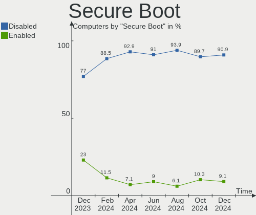
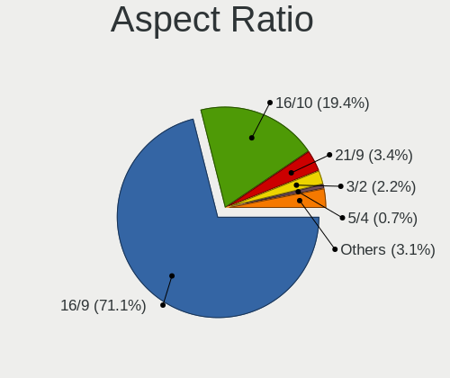
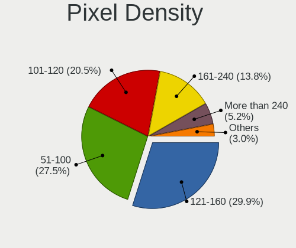
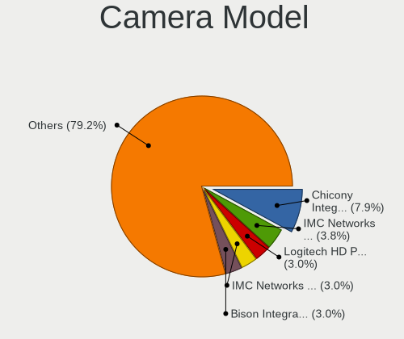

Fedora Hardware Trends
----------------------

A project to identify most popular hardware characteristics and track their change
over time based on data collected by Fedora users at https://Linux-Hardware.org.

Anyone can contribute to the study by uploading probes of their computers by
the [hw-probe](https://github.com/linuxhw/hw-probe) tool:

    sudo -E hw-probe -all -upload

This is a report for all computer types. See also reports for [desktops](/Dist/Fedora/Desktop/README.md) and [notebooks](/Dist/Fedora/Notebook/README.md).

Full-feature report is available here: https://linux-hardware.org/?view=trends

Period: Dec, 2020.

Contents
--------

- [ OS                       ](#os)
- [ OS Family                ](#os-family)
- [ Kernel                   ](#kernel)
- [ Kernel Family            ](#kernel-family)
- [ Kernel Major Ver.        ](#kernel-major-ver)
- [ Arch                     ](#arch)
- [ DE                       ](#de)
- [ Display Server           ](#display-server)
- [ Display Manager          ](#display-manager)
- [ OS Lang                  ](#os-lang)
- [ Boot Mode                ](#boot-mode)
- [ Filesystem               ](#filesystem)
- [ Part. scheme             ](#part-scheme)
- [ Dual Boot with Linux/BSD ](#dual-boot-with-linux/bsd)
- [ Dual Boot (Win)          ](#dual-boot-win)
- [ Country                  ](#country)
- [ City                     ](#city)
- [ Vendor                   ](#vendor)
- [ Model                    ](#model)
- [ Model Family             ](#model-family)
- [ MFG Year                 ](#mfg-year)
- [ Form Factor              ](#form-factor)
- [ Secure Boot              ](#secure-boot)
- [ Coreboot                 ](#coreboot)
- [ RAM Size                 ](#ram-size)
- [ RAM Used                 ](#ram-used)
- [ Has CD-ROM               ](#has-cd-rom)
- [ Total Drives             ](#total-drives)
- [ Has Ethernet             ](#has-ethernet)
- [ Drive Vendor             ](#drive-vendor)
- [ Drive Model              ](#drive-model)
- [ HDD Vendor               ](#hdd-vendor)
- [ SSD Vendor               ](#ssd-vendor)
- [ Drive Kind               ](#drive-kind)
- [ Drive Connector          ](#drive-connector)
- [ Drive Size               ](#drive-size)
- [ Space Total              ](#space-total)
- [ Space Used               ](#space-used)
- [ Malfunc. Drives          ](#malfunc-drives)
- [ Malfunc. Drive Vendor    ](#malfunc-drive-vendor)
- [ Malfunc. HDD Vendor      ](#malfunc-hdd-vendor)
- [ Malfunc. Drive Kind      ](#malfunc-drive-kind)
- [ Failed Drives            ](#failed-drives)
- [ Failed Drive Vendor      ](#failed-drive-vendor)
- [ Drive Status             ](#drive-status)
- [ Storage Vendor           ](#storage-vendor)
- [ Storage Model            ](#storage-model)
- [ Storage Kind             ](#storage-kind)
- [ CPU Vendor               ](#cpu-vendor)
- [ CPU Model                ](#cpu-model)
- [ CPU Model Family         ](#cpu-model-family)
- [ CPU Cores                ](#cpu-cores)
- [ CPU Sockets              ](#cpu-sockets)
- [ CPU Threads              ](#cpu-threads)
- [ CPU Op-Modes             ](#cpu-op-modes)
- [ CPU Microcode            ](#cpu-microcode)
- [ CPU Microarch            ](#cpu-microarch)
- [ GPU Vendor               ](#gpu-vendor)
- [ GPU Model                ](#gpu-model)
- [ GPU Combo                ](#gpu-combo)
- [ GPU Driver               ](#gpu-driver)
- [ GPU Memory               ](#gpu-memory)
- [ Monitor Vendor           ](#monitor-vendor)
- [ Monitor Model            ](#monitor-model)
- [ Monitor Resolution       ](#monitor-resolution)
- [ Monitor Diagonal         ](#monitor-diagonal)
- [ Monitor Width            ](#monitor-width)
- [ Aspect Ratio             ](#aspect-ratio)
- [ Monitor Area             ](#monitor-area)
- [ Pixel Density            ](#pixel-density)
- [ Multiple Monitors        ](#multiple-monitors)
- [ Net Controller Vendor    ](#net-controller-vendor)
- [ Net Controller Model     ](#net-controller-model)
- [ Wireless Vendor          ](#wireless-vendor)
- [ Wireless Model           ](#wireless-model)
- [ Ethernet Vendor          ](#ethernet-vendor)
- [ Ethernet Model           ](#ethernet-model)
- [ Net Controller Kind      ](#net-controller-kind)
- [ Used Controller          ](#used-controller)
- [ NICs                     ](#nics)
- [ Memory Vendor            ](#memory-vendor)
- [ Memory Model             ](#memory-model)
- [ Memory Kind              ](#memory-kind)
- [ Memory Form Factor       ](#memory-form-factor)
- [ Memory Size              ](#memory-size)
- [ Memory Speed             ](#memory-speed)
- [ Sound Vendor             ](#sound-vendor)
- [ Sound Model              ](#sound-model)
- [ Camera Vendor            ](#camera-vendor)
- [ Camera Model             ](#camera-model)
- [ Fingerprint Vendor       ](#fingerprint-vendor)
- [ Fingerprint Model        ](#fingerprint-model)
- [ Chipcard Vendor          ](#chipcard-vendor)
- [ Chipcard Model           ](#chipcard-model)
- [ Printer Vendor           ](#printer-vendor)
- [ Printer Model            ](#printer-model)
- [ Scanner Vendor           ](#scanner-vendor)
- [ Scanner Model            ](#scanner-model)
- [ Bluetooth Vendor         ](#bluetooth-vendor)
- [ Bluetooth Model          ](#bluetooth-model)
- [ Unsupported Devices      ](#unsupported-devices)
- [ Unsupported Device Types ](#unsupported-device-types)

OS
--

Installed operating systems

| Name      | Computers | Percent |
|-----------|-----------|---------|
| Fedora 33 | 276       | 86.52%  |
| Fedora 32 | 30        | 9.4%    |
| Fedora 31 | 8         | 2.51%   |
| Fedora 30 | 3         | 0.94%   |
| Fedora 34 | 1         | 0.31%   |
| Fedora 29 | 1         | 0.31%   |

OS Family
---------

OS without a version

| Name   | Computers | Percent |
|--------|-----------|---------|
| Fedora | 319       | 100%    |

Kernel
------

Version of the Linux kernel

| Version                                             | Computers | Percent |
|-----------------------------------------------------|-----------|---------|
| 5.9.11-200.fc33.x86_64                              | 71        | 22.26%  |
| 5.9.13-200.fc33.x86_64                              | 49        | 15.36%  |
| 5.9.14-200.fc33.x86_64                              | 37        | 11.6%   |
| 5.9.16-200.fc33.x86_64                              | 35        | 10.97%  |
| 5.9.15-200.fc33.x86_64                              | 30        | 9.4%    |
| 5.9.12-200.fc33.x86_64                              | 18        | 5.64%   |
| 5.9.10-200.fc33.x86_64                              | 14        | 4.39%   |
| 5.8.15-301.fc33.x86_64                              | 11        | 3.45%   |
| 5.8.18-100.fc31.x86_64                              | 8         | 2.51%   |
| 5.9.11-100.fc32.x86_64                              | 6         | 1.88%   |
| 5.9.14-100.fc32.x86_64                              | 5         | 1.57%   |
| 5.9.12-100.fc32.x86_64                              | 5         | 1.57%   |
| 5.9.16-100.fc32.x86_64                              | 4         | 1.25%   |
| 5.9.8-100.fc32.x86_64                               | 3         | 0.94%   |
| 5.6.13-100.fc30.x86_64                              | 3         | 0.94%   |
| 5.9.15-100.fc32.x86_64                              | 2         | 0.63%   |
| 5.8.16-300.fc33.x86_64                              | 2         | 0.63%   |
| 5.9.8-200.fc33.x86_64                               | 1         | 0.31%   |
| 5.9.13-100.fc32.x86_64                              | 1         | 0.31%   |
| 5.9.10-100.fc32.x86_64                              | 1         | 0.31%   |
| 5.8.6-201.fc32.x86_64                               | 1         | 0.31%   |
| 5.8.4-200.fc32.x86_64                               | 1         | 0.31%   |
| 5.8.18-300.fc33.x86_64                              | 1         | 0.31%   |
| 5.8.17-200.fc32.x86_64                              | 1         | 0.31%   |
| 5.8.16-200.fc32.x86_64                              | 1         | 0.31%   |
| 5.8.13-100.fc31.x86_64                              | 1         | 0.31%   |
| 5.10.2-minzord                                      | 1         | 0.31%   |
| 5.10.0_rc6_tkg_MuQSS_llvm+                          | 1         | 0.31%   |
| 5.10.0-rc6+                                         | 1         | 0.31%   |
| 5.10.0-rc3+                                         | 1         | 0.31%   |
| 5.10.0-0.rc6.20201204git34816d20f173.92.fc34.x86_64 | 1         | 0.31%   |
| 5.10.0-0.rc5.20201125git127c501a03d5.85.fc34.x86_64 | 1         | 0.31%   |
| Unknown                                             | 1         | 0.31%   |

Kernel Family
-------------

Linux kernel without a distro release

| Version | Computers | Percent |
|---------|-----------|---------|
| 5.9.11  | 77        | 24.14%  |
| 5.9.13  | 50        | 15.67%  |
| 5.9.14  | 42        | 13.17%  |
| 5.9.16  | 39        | 12.23%  |
| 5.9.15  | 32        | 10.03%  |
| 5.9.12  | 23        | 7.21%   |
| 5.9.10  | 15        | 4.7%    |
| 5.8.15  | 11        | 3.45%   |
| 5.8.18  | 9         | 2.82%   |
| 5.10.0  | 5         | 1.57%   |
| 5.9.8   | 4         | 1.25%   |
| 5.8.16  | 3         | 0.94%   |
| 5.6.13  | 3         | 0.94%   |
| 5.8.6   | 1         | 0.31%   |
| 5.8.4   | 1         | 0.31%   |
| 5.8.17  | 1         | 0.31%   |
| 5.8.13  | 1         | 0.31%   |
| 5.10.2  | 1         | 0.31%   |
| Unknown | 1         | 0.31%   |

Kernel Major Ver.
-----------------

Linux kernel major version

| Version | Computers | Percent |
|---------|-----------|---------|
| 5.9     | 282       | 88.4%   |
| 5.8     | 27        | 8.46%   |
| 5.10    | 6         | 1.88%   |
| 5.6     | 3         | 0.94%   |
| Unknown | 1         | 0.31%   |

Arch
----

OS architecture (x86_64, i586, etc.)

| Name    | Computers | Percent |
|---------|-----------|---------|
| x86_64  | 318       | 99.69%  |
| Unknown | 1         | 0.31%   |

DE
--

Desktop Environment

| Name          | Computers | Percent |
|---------------|-----------|---------|
| GNOME         | 245       | 76.8%   |
| KDE           | 21        | 6.58%   |
| KDE5          | 19        | 5.96%   |
| MATE          | 8         | 2.51%   |
| X-Cinnamon    | 7         | 2.19%   |
| Unknown       | 6         | 1.88%   |
| XFCE          | 5         | 1.57%   |
| Cinnamon      | 3         | 0.94%   |
| Deepin        | 2         | 0.63%   |
| LXDE          | 1         | 0.31%   |
| KDE4          | 1         | 0.31%   |
| GNOME Classic | 1         | 0.31%   |

Display Server
--------------

X11 or Wayland

| Name    | Computers | Percent |
|---------|-----------|---------|
| Wayland | 176       | 55.17%  |
| X11     | 138       | 43.26%  |
| Tty     | 4         | 1.25%   |
| Unknown | 1         | 0.31%   |

Display Manager
---------------

SDDM, LightDM, etc.

| Name    | Computers | Percent |
|---------|-----------|---------|
| Unknown | 205       | 64.26%  |
| GDM     | 85        | 26.65%  |
| SDDM    | 16        | 5.02%   |
| TDM     | 10        | 3.13%   |
| LightDM | 2         | 0.63%   |
| KDM     | 1         | 0.31%   |

OS Lang
-------

Language

| Lang            | Computers | Percent |
|-----------------|-----------|---------|
| en_US           | 155       | 48.59%  |
| en_GB           | 24        | 7.52%   |
| fr_FR           | 18        | 5.64%   |
| de_DE           | 15        | 4.7%    |
| pt_BR           | 14        | 4.39%   |
| pl_PL           | 9         | 2.82%   |
| en_AU           | 9         | 2.82%   |
| it_IT           | 8         | 2.51%   |
| es_ES           | 6         | 1.88%   |
| en_CA           | 6         | 1.88%   |
| ru_RU           | 5         | 1.57%   |
| en_US.utf8      | 4         | 1.25%   |
| es_AR           | 3         | 0.94%   |
| en_IN           | 3         | 0.94%   |
| cs_CZ           | 3         | 0.94%   |
| Unknown         | 3         | 0.94%   |
| sk_SK           | 2         | 0.63%   |
| nl_NL           | 2         | 0.63%   |
| hu_HU           | 2         | 0.63%   |
| en_PH           | 2         | 0.63%   |
| el_GR           | 2         | 0.63%   |
| da_DK           | 2         | 0.63%   |
| C               | 2         | 0.63%   |
| zh_HK           | 1         | 0.31%   |
| zh_CN           | 1         | 0.31%   |
| tr_TR           | 1         | 0.31%   |
| sv_SE           | 1         | 0.31%   |
| ru_RU.utf8      | 1         | 0.31%   |
| pt_BR.utf8      | 1         | 0.31%   |
| ja_JP           | 1         | 0.31%   |
| he_IL           | 1         | 0.31%   |
| fr_FR.utf8      | 1         | 0.31%   |
| fr_CA           | 1         | 0.31%   |
| et_EE           | 1         | 0.31%   |
| es_MX           | 1         | 0.31%   |
| es_ES.utf8      | 1         | 0.31%   |
| es_DO           | 1         | 0.31%   |
| es_CO           | 1         | 0.31%   |
| en_ZA           | 1         | 0.31%   |
| en_US.iso885915 | 1         | 0.31%   |
| en_NZ           | 1         | 0.31%   |
| en_DK           | 1         | 0.31%   |
| de_CH           | 1         | 0.31%   |

Boot Mode
---------

EFI or BIOS

| Mode | Computers | Percent |
|------|-----------|---------|
| EFI  | 232       | 72.73%  |
| BIOS | 87        | 27.27%  |

Filesystem
----------

Type of filesystem

| Type                | Computers | Percent |
|---------------------|-----------|---------|
| Btrfs               | 160       | 50.16%  |
| Ext4                | 144       | 45.14%  |
| Xfs                 | 12        | 3.76%   |
| Fuse.fuse-overlayfs | 1         | 0.31%   |
| Ext3                | 1         | 0.31%   |
| Unknown             | 1         | 0.31%   |

Part. scheme
------------

Scheme of partitioning

| Type    | Computers | Percent |
|---------|-----------|---------|
| Unknown | 201       | 63.01%  |
| GPT     | 100       | 31.35%  |
| MBR     | 18        | 5.64%   |

Dual Boot with Linux/BSD
------------------------

Hosting more than one Linux/BSD

| Dual boot | Computers | Percent |
|-----------|-----------|---------|
| No        | 297       | 93.1%   |
| Yes       | 22        | 6.9%    |

Dual Boot (Win)
---------------

Hosting Linux and Windows

| Dual boot | Computers | Percent |
|-----------|-----------|---------|
| No        | 271       | 84.95%  |
| Yes       | 48        | 15.05%  |

Country
-------

Geographic location (country)

| Country              | Computers | Percent |
|----------------------|-----------|---------|
| USA                  | 72        | 22.57%  |
| Germany              | 30        | 9.4%    |
| France               | 23        | 7.21%   |
| Brazil               | 20        | 6.27%   |
| Russia               | 11        | 3.45%   |
| Italy                | 11        | 3.45%   |
| UK                   | 10        | 3.13%   |
| Netherlands          | 9         | 2.82%   |
| India                | 9         | 2.82%   |
| Canada               | 9         | 2.82%   |
| Australia            | 9         | 2.82%   |
| Spain                | 8         | 2.51%   |
| Poland               | 8         | 2.51%   |
| Switzerland          | 5         | 1.57%   |
| Czech Republic       | 5         | 1.57%   |
| Austria              | 5         | 1.57%   |
| Denmark              | 4         | 1.25%   |
| Belgium              | 4         | 1.25%   |
| Argentina            | 4         | 1.25%   |
| Ukraine              | 3         | 0.94%   |
| Turkey               | 3         | 0.94%   |
| Vietnam              | 2         | 0.63%   |
| Slovakia             | 2         | 0.63%   |
| Romania              | 2         | 0.63%   |
| Portugal             | 2         | 0.63%   |
| Philippines          | 2         | 0.63%   |
| Mexico               | 2         | 0.63%   |
| Malaysia             | 2         | 0.63%   |
| Hungary              | 2         | 0.63%   |
| Hong Kong            | 2         | 0.63%   |
| Greece               | 2         | 0.63%   |
| Finland              | 2         | 0.63%   |
| Estonia              | 2         | 0.63%   |
| Colombia             | 2         | 0.63%   |
| China                | 2         | 0.63%   |
| Belarus              | 2         | 0.63%   |
| Bangladesh           | 2         | 0.63%   |
| Uzbekistan           | 1         | 0.31%   |
| Tunisia              | 1         | 0.31%   |
| Trinidad and Tobago  | 1         | 0.31%   |
| Sweden               | 1         | 0.31%   |
| Sri Lanka            | 1         | 0.31%   |
| South Africa         | 1         | 0.31%   |
| Slovenia             | 1         | 0.31%   |
| Singapore            | 1         | 0.31%   |
| Saudi Arabia         | 1         | 0.31%   |
| Pakistan             | 1         | 0.31%   |
| Norway               | 1         | 0.31%   |
| Nigeria              | 1         | 0.31%   |
| New Zealand          | 1         | 0.31%   |
| Moldova, Republic of | 1         | 0.31%   |
| Lithuania            | 1         | 0.31%   |
| Kenya                | 1         | 0.31%   |
| Japan                | 1         | 0.31%   |
| Iran                 | 1         | 0.31%   |
| Iceland              | 1         | 0.31%   |
| Guatemala            | 1         | 0.31%   |
| Dominican Republic   | 1         | 0.31%   |
| Curacao              | 1         | 0.31%   |
| Chile                | 1         | 0.31%   |

City
----

Geographic location (city)

| City                | Computers | Percent |
|---------------------|-----------|---------|
| Paris               | 6         | 1.88%   |
| Orlando             | 4         | 1.25%   |
| Madrid              | 4         | 1.25%   |
| Berlin              | 4         | 1.25%   |
| Toronto             | 3         | 0.94%   |
| Raleigh             | 3         | 0.94%   |
| Munich              | 3         | 0.94%   |
| Moscow              | 3         | 0.94%   |
| Buenos Aires        | 3         | 0.94%   |
| Zurich              | 2         | 0.63%   |
| Westminster         | 2         | 0.63%   |
| Vienna              | 2         | 0.63%   |
| São Paulo          | 2         | 0.63%   |
| Sydney              | 2         | 0.63%   |
| St Petersburg       | 2         | 0.63%   |
| Seattle             | 2         | 0.63%   |
| Rome                | 2         | 0.63%   |
| Presidente Prudente | 2         | 0.63%   |
| Prague              | 2         | 0.63%   |
| Peach Orchard       | 2         | 0.63%   |
| Palermo             | 2         | 0.63%   |
| Niterói            | 2         | 0.63%   |
| Kyiv                | 2         | 0.63%   |
| Krakow              | 2         | 0.63%   |
| Izmir               | 2         | 0.63%   |
| Florianópolis      | 2         | 0.63%   |
| Delft               | 2         | 0.63%   |
| Cuiabá             | 2         | 0.63%   |
| Canberra            | 2         | 0.63%   |
| Brussels            | 2         | 0.63%   |
| Beijing             | 2         | 0.63%   |
| Šiauliai           | 1         | 0.31%   |
| Zwolle              | 1         | 0.31%   |
| Zorneding           | 1         | 0.31%   |
| Ystad               | 1         | 0.31%   |
| Yokohama            | 1         | 0.31%   |
| Yaroslavl           | 1         | 0.31%   |
| Wurzburg            | 1         | 0.31%   |
| Wilmington          | 1         | 0.31%   |
| Willemstad          | 1         | 0.31%   |
| Wiggins             | 1         | 0.31%   |
| Weinheim            | 1         | 0.31%   |
| Wateringen          | 1         | 0.31%   |
| Warsaw              | 1         | 0.31%   |
| Wakefield           | 1         | 0.31%   |
| Wahroonga           | 1         | 0.31%   |
| Virginia Beach      | 1         | 0.31%   |
| Villach             | 1         | 0.31%   |
| Veverska Bityska    | 1         | 0.31%   |
| Veliki Gaber        | 1         | 0.31%   |
| Varel               | 1         | 0.31%   |
| Vantaa              | 1         | 0.31%   |
| Vancouver           | 1         | 0.31%   |
| Valenzuela          | 1         | 0.31%   |
| Utrecht             | 1         | 0.31%   |
| Utica               | 1         | 0.31%   |
| Ufa                 | 1         | 0.31%   |
| Tunis               | 1         | 0.31%   |
| Trivandrum          | 1         | 0.31%   |
| Trieste             | 1         | 0.31%   |

Vendor
------

Motherboard manufacturer

| Name                | Computers | Percent |
|---------------------|-----------|---------|
| Lenovo              | 65        | 20.38%  |
| ASUSTek Computer    | 49        | 15.36%  |
| Hewlett-Packard     | 39        | 12.23%  |
| Dell                | 36        | 11.29%  |
| MSI                 | 30        | 9.4%    |
| Gigabyte Technology | 20        | 6.27%   |
| ASRock              | 16        | 5.02%   |
| Acer                | 16        | 5.02%   |
| Toshiba             | 6         | 1.88%   |
| Samsung Electronics | 4         | 1.25%   |
| Apple               | 4         | 1.25%   |
| Unknown             | 4         | 1.25%   |
| Intel               | 3         | 0.94%   |
| HUAWEI              | 3         | 0.94%   |
| Sony                | 2         | 0.63%   |
| Biostar             | 2         | 0.63%   |
| TUXEDO              | 1         | 0.31%   |
| Timi                | 1         | 0.31%   |
| System76            | 1         | 0.31%   |
| Supermicro          | 1         | 0.31%   |
| Razer               | 1         | 0.31%   |
| Protectli           | 1         | 0.31%   |
| Prestigio           | 1         | 0.31%   |
| Positivo            | 1         | 0.31%   |
| Pegatron            | 1         | 0.31%   |
| PCWare              | 1         | 0.31%   |
| Panasonic           | 1         | 0.31%   |
| Notebook            | 1         | 0.31%   |
| Medion              | 1         | 0.31%   |
| LG Electronics      | 1         | 0.31%   |
| LattePanda          | 1         | 0.31%   |
| Inventec            | 1         | 0.31%   |
| Insyde              | 1         | 0.31%   |
| HPE                 | 1         | 0.31%   |
| Fujitsu             | 1         | 0.31%   |
| Clevo               | 1         | 0.31%   |

Model
-----

Motherboard model

| Name                                       | Computers | Percent |
|--------------------------------------------|-----------|---------|
| Unknown                                    | 4         | 1.25%   |
| Dell XPS 13 9370                           | 3         | 0.94%   |
| ASUS TP410UAR                              | 3         | 0.94%   |
| MSI MS-7C37                                | 2         | 0.63%   |
| MSI MS-7641                                | 2         | 0.63%   |
| Lenovo ThinkPad X1 Carbon Gen 8 20U9CTO1WW | 2         | 0.63%   |
| HUAWEI NBLK-WAX9X                          | 2         | 0.63%   |
| HP Laptop 15-db0xxx                        | 2         | 0.63%   |
| HP ENVY x360 Convertible 13-ay0xxx         | 2         | 0.63%   |
| Gigabyte 970A-DS3P                         | 2         | 0.63%   |
| Dell XPS 13 7390                           | 2         | 0.63%   |
| ASUS ROG STRIX B450-F GAMING               | 2         | 0.63%   |
| ASUS PRIME X399-A                          | 2         | 0.63%   |
| ASUS K46CM                                 | 2         | 0.63%   |
| ASUS All Series                            | 2         | 0.63%   |
| ASRock G41M-VS3                            | 2         | 0.63%   |
| ASRock B550M Pro4                          | 2         | 0.63%   |
| Acer Spin SP315-51                         | 2         | 0.63%   |
| TUXEDO Polaris 15 AMD Gen1                 | 1         | 0.31%   |
| Toshiba Satellite S55t-B                   | 1         | 0.31%   |
| Toshiba Satellite L75-B                    | 1         | 0.31%   |
| Toshiba Satellite L50-C                    | 1         | 0.31%   |
| Toshiba Satellite L10W-B-102               | 1         | 0.31%   |
| Toshiba Satellite C850D-119                | 1         | 0.31%   |
| Toshiba dynabook R73/W                     | 1         | 0.31%   |
| Timi RedmiBook 16                          | 1         | 0.31%   |
| System76 Oryx Pro                          | 1         | 0.31%   |
| Supermicro X10SLQ                          | 1         | 0.31%   |
| Sony VPCEH24FX                             | 1         | 0.31%   |
| Sony VPCCB45FN                             | 1         | 0.31%   |
| Samsung 730QCJ/730QCR                      | 1         | 0.31%   |
| Samsung 3570R/370R/470R/450R/510R/4450RV   | 1         | 0.31%   |
| Samsung 300E4C/300E5C/300E7C               | 1         | 0.31%   |
| Samsung 300E4A/300E5A/300E7A/3430EA/3530EA | 1         | 0.31%   |
| Razer Blade 15 Mid 2019-Base               | 1         | 0.31%   |
| Protectli FW4B                             | 1         | 0.31%   |
| Prestigio PSB141C03                        | 1         | 0.31%   |
| Positivo POS-PIQ77CL                       | 1         | 0.31%   |
| Pegatron p2-1343w                          | 1         | 0.31%   |
| PCWare IPMH110G                            | 1         | 0.31%   |
| Panasonic CFSZ5-2L                         | 1         | 0.31%   |
| Notebook PB50_70DFx,DDx                    | 1         | 0.31%   |
| MSI PPPPP-CCC#MMMMMMMM                     | 1         | 0.31%   |
| MSI MS-7C94                                | 1         | 0.31%   |
| MSI MS-7C92                                | 1         | 0.31%   |
| MSI MS-7C87                                | 1         | 0.31%   |
| MSI MS-7C84                                | 1         | 0.31%   |
| MSI MS-7C76                                | 1         | 0.31%   |
| MSI MS-7C56                                | 1         | 0.31%   |
| MSI MS-7C34                                | 1         | 0.31%   |
| MSI MS-7C02                                | 1         | 0.31%   |
| MSI MS-7B85                                | 1         | 0.31%   |
| MSI MS-7B78                                | 1         | 0.31%   |
| MSI MS-7B10                                | 1         | 0.31%   |
| MSI MS-7996                                | 1         | 0.31%   |
| MSI MS-7885                                | 1         | 0.31%   |
| MSI MS-7850                                | 1         | 0.31%   |
| MSI MS-7816                                | 1         | 0.31%   |
| MSI GT72S 6QE                              | 1         | 0.31%   |
| MSI GS65 Stealth 9SE                       | 1         | 0.31%   |

Model Family
------------

Motherboard model prefix

| Name                   | Computers | Percent |
|------------------------|-----------|---------|
| Lenovo ThinkPad        | 44        | 13.79%  |
| Lenovo IdeaPad         | 13        | 4.08%   |
| HP EliteBook           | 13        | 4.08%   |
| Dell Inspiron          | 13        | 4.08%   |
| Dell Latitude          | 9         | 2.82%   |
| ASUS PRIME             | 8         | 2.51%   |
| Acer Aspire            | 8         | 2.51%   |
| Dell XPS               | 7         | 2.19%   |
| Toshiba Satellite      | 5         | 1.57%   |
| HP Pavilion            | 5         | 1.57%   |
| ASUS ROG               | 5         | 1.57%   |
| HP ProBook             | 4         | 1.25%   |
| ASUS TUF               | 4         | 1.25%   |
| Unknown                | 4         | 1.25%   |
| HP Laptop              | 3         | 0.94%   |
| HP ENVY                | 3         | 0.94%   |
| Gigabyte X570          | 3         | 0.94%   |
| Dell Precision         | 3         | 0.94%   |
| ASUS TP410UAR          | 3         | 0.94%   |
| MSI MS-7C37            | 2         | 0.63%   |
| MSI MS-7641            | 2         | 0.63%   |
| MSI Bravo              | 2         | 0.63%   |
| Lenovo Yoga            | 2         | 0.63%   |
| HUAWEI NBLK-WAX9X      | 2         | 0.63%   |
| HP ProDesk             | 2         | 0.63%   |
| HP EliteDesk           | 2         | 0.63%   |
| Gigabyte TRX40         | 2         | 0.63%   |
| Gigabyte B450          | 2         | 0.63%   |
| Gigabyte 970A-DS3P     | 2         | 0.63%   |
| Dell OptiPlex          | 2         | 0.63%   |
| ASUS Z170-P            | 2         | 0.63%   |
| ASUS P8Z68-V           | 2         | 0.63%   |
| ASUS K46CM             | 2         | 0.63%   |
| ASUS All               | 2         | 0.63%   |
| ASRock X570            | 2         | 0.63%   |
| ASRock G41M-VS3        | 2         | 0.63%   |
| ASRock B550M           | 2         | 0.63%   |
| Acer Spin              | 2         | 0.63%   |
| Acer Nitro             | 2         | 0.63%   |
| TUXEDO Polaris         | 1         | 0.31%   |
| Toshiba dynabook       | 1         | 0.31%   |
| Timi RedmiBook         | 1         | 0.31%   |
| System76 Oryx          | 1         | 0.31%   |
| Supermicro X10SLQ      | 1         | 0.31%   |
| Sony VPCEH24FX         | 1         | 0.31%   |
| Sony VPCCB45FN         | 1         | 0.31%   |
| Samsung 730QCJ         | 1         | 0.31%   |
| Samsung 3570R          | 1         | 0.31%   |
| Samsung 300E4C         | 1         | 0.31%   |
| Samsung 300E4A         | 1         | 0.31%   |
| Razer Blade            | 1         | 0.31%   |
| Protectli FW4B         | 1         | 0.31%   |
| Prestigio PSB141C03    | 1         | 0.31%   |
| Positivo POS-PIQ77CL   | 1         | 0.31%   |
| Pegatron p2-1343w      | 1         | 0.31%   |
| PCWare IPMH110G        | 1         | 0.31%   |
| Panasonic CFSZ5-2L     | 1         | 0.31%   |
| Notebook PB50          | 1         | 0.31%   |
| MSI PPPPP-CCC#MMMMMMMM | 1         | 0.31%   |
| MSI MS-7C94            | 1         | 0.31%   |

MFG Year
--------

Motherboard manufacture year

| Year | Computers | Percent |
|------|-----------|---------|
| 2020 | 105       | 32.92%  |
| 2019 | 65        | 20.38%  |
| 2018 | 35        | 10.97%  |
| 2017 | 18        | 5.64%   |
| 2013 | 17        | 5.33%   |
| 2015 | 16        | 5.02%   |
| 2014 | 15        | 4.7%    |
| 2012 | 15        | 4.7%    |
| 2016 | 11        | 3.45%   |
| 2011 | 11        | 3.45%   |
| 2010 | 5         | 1.57%   |
| 2009 | 2         | 0.63%   |
| 2008 | 2         | 0.63%   |
| 2007 | 2         | 0.63%   |

Form Factor
-----------

Physical design of the computer

| Name        | Computers | Percent |
|-------------|-----------|---------|
| Notebook    | 174       | 54.55%  |
| Desktop     | 114       | 35.74%  |
| Convertible | 16        | 5.02%   |
| All in one  | 5         | 1.57%   |
| Tablet      | 4         | 1.25%   |
| Mini pc     | 4         | 1.25%   |
| Server      | 2         | 0.63%   |

Secure Boot
-----------

Enabled or disabled

| State    | Computers | Percent |
|----------|-----------|---------|
| Disabled | 271       | 84.95%  |
| Enabled  | 48        | 15.05%  |

Coreboot
--------

Have coreboot on board

| Used | Computers | Percent |
|------|-----------|---------|
| No   | 317       | 99.37%  |
| Yes  | 2         | 0.63%   |

RAM Size
--------

Total RAM memory

| Size in GB  | Computers | Percent |
|-------------|-----------|---------|
| 16.01-24.0  | 80        | 25.08%  |
| 4.01-8.0    | 71        | 22.26%  |
| 8.01-16.0   | 54        | 16.93%  |
| 32.01-64.0  | 47        | 14.73%  |
| 3.01-4.0    | 40        | 12.54%  |
| 64.01-256.0 | 16        | 5.02%   |
| 1.01-2.0    | 6         | 1.88%   |
| 24.01-32.0  | 4         | 1.25%   |
| Unknown     | 1         | 0.31%   |

RAM Used
--------

Used RAM memory

| Used GB    | Computers | Percent |
|------------|-----------|---------|
| 2.01-3.0   | 104       | 32.6%   |
| 4.01-8.0   | 73        | 22.88%  |
| 1.01-2.0   | 57        | 17.87%  |
| 3.01-4.0   | 48        | 15.05%  |
| 8.01-16.0  | 29        | 9.09%   |
| 0.51-1.0   | 3         | 0.94%   |
| 16.01-24.0 | 2         | 0.63%   |
| 24.01-32.0 | 1         | 0.31%   |
| 0.01-0.5   | 1         | 0.31%   |
| Unknown    | 1         | 0.31%   |

Has CD-ROM
----------

Has CD-ROM on board

| Presented | Computers | Percent |
|-----------|-----------|---------|
| No        | 229       | 71.79%  |
| Yes       | 90        | 28.21%  |

Total Drives
------------

Number of drives on board

| Drives | Computers | Percent |
|--------|-----------|---------|
| 1      | 181       | 56.74%  |
| 2      | 89        | 27.9%   |
| 3      | 24        | 7.52%   |
| 4      | 10        | 3.13%   |
| 5      | 8         | 2.51%   |
| 6      | 3         | 0.94%   |
| 9      | 2         | 0.63%   |
| 10     | 1         | 0.31%   |
| 8      | 1         | 0.31%   |

Has Ethernet
------------

Has Ethernet on board

| Presented | Computers | Percent |
|-----------|-----------|---------|
| Yes       | 269       | 84.33%  |
| No        | 50        | 15.67%  |

Drive Vendor
------------

Hard drive vendors

| Vendor                    | Computers | Drives | Percent |
|---------------------------|-----------|--------|---------|
| Samsung Electronics       | 108       | 147    | 22.31%  |
| WDC                       | 72        | 86     | 14.88%  |
| Seagate                   | 62        | 72     | 12.81%  |
| Toshiba                   | 35        | 38     | 7.23%   |
| Kingston                  | 32        | 32     | 6.61%   |
| SanDisk                   | 28        | 32     | 5.79%   |
| Unknown                   | 20        | 24     | 4.13%   |
| Crucial                   | 19        | 25     | 3.93%   |
| Intel                     | 14        | 16     | 2.89%   |
| Hitachi                   | 10        | 10     | 2.07%   |
| A-DATA Technology         | 10        | 11     | 2.07%   |
| SK Hynix                  | 9         | 9      | 1.86%   |
| Phison                    | 8         | 8      | 1.65%   |
| HGST                      | 8         | 8      | 1.65%   |
| Silicon Motion            | 4         | 4      | 0.83%   |
| Micron Technology         | 4         | 4      | 0.83%   |
| OCZ                       | 3         | 3      | 0.62%   |
| LITEON                    | 3         | 3      | 0.62%   |
| Lite-On                   | 3         | 3      | 0.62%   |
| XPG                       | 2         | 3      | 0.41%   |
| SPCC                      | 2         | 2      | 0.41%   |
| LITEONIT                  | 2         | 2      | 0.41%   |
| KingSpec                  | 2         | 2      | 0.41%   |
| Gigabyte Technology       | 2         | 2      | 0.41%   |
| China                     | 2         | 2      | 0.41%   |
| Apple                     | 2         | 2      | 0.41%   |
| Apacer                    | 2         | 2      | 0.41%   |
| Union Memory              | 1         | 1      | 0.21%   |
| Transcend                 | 1         | 1      | 0.21%   |
| Realtek                   | 1         | 1      | 0.21%   |
| PLEXTOR                   | 1         | 1      | 0.21%   |
| Patriot                   | 1         | 1      | 0.21%   |
| Micron/Crucial Technology | 1         | 1      | 0.21%   |
| LaCie                     | 1         | 1      | 0.21%   |
| KIOXIA                    | 1         | 1      | 0.21%   |
| Intenso                   | 1         | 1      | 0.21%   |
| Inateck                   | 1         | 1      | 0.21%   |
| Hewlett-Packard           | 1         | 1      | 0.21%   |
| GOODRAM                   | 1         | 1      | 0.21%   |
| CT500MX5                  | 1         | 1      | 0.21%   |
| Corsair                   | 1         | 1      | 0.21%   |
| ASMT                      | 1         | 1      | 0.21%   |
| ADATA Technology          | 1         | 1      | 0.21%   |

Drive Model
-----------

Hard drive models

| Model                                      | Computers | Percent |
|--------------------------------------------|-----------|---------|
| Samsung SSD 850 EVO 250GB                  | 10        | 1.85%   |
| Samsung NVMe SSD Drive 512GB               | 9         | 1.66%   |
| Samsung SSD 860 EVO 1TB                    | 8         | 1.48%   |
| Samsung NVMe SSD Drive 256GB               | 8         | 1.48%   |
| Samsung SSD 970 EVO Plus 1TB               | 6         | 1.11%   |
| Samsung SSD 860 EVO 500GB                  | 6         | 1.11%   |
| Kingston SA400S37240G 240GB SSD            | 6         | 1.11%   |
| Seagate ST1000LM024 HN-M101MBB 1TB         | 5         | 0.92%   |
| Seagate ST1000DM010-2EP102 1TB             | 5         | 0.92%   |
| Samsung NVMe SSD Drive 500GB               | 5         | 0.92%   |
| Samsung NVMe SSD Drive 250GB               | 5         | 0.92%   |
| HGST HTS721010A9E630 1TB                   | 5         | 0.92%   |
| Unknown MMC Card  64GB                     | 4         | 0.74%   |
| Unknown MMC Card  32GB                     | 4         | 0.74%   |
| Toshiba MQ04ABF100 1TB                     | 4         | 0.74%   |
| Seagate ST1000LM035-1RK172 1TB             | 4         | 0.74%   |
| Samsung SSD 850 EVO 500GB                  | 4         | 0.74%   |
| Kingston SA400S37120G 120GB SSD            | 4         | 0.74%   |
| Crucial CT240BX500SSD1 240GB               | 4         | 0.74%   |
| WDC WD10SPZX-21Z10T0 1TB                   | 3         | 0.55%   |
| WDC WD10JPVX-22JC3T0 1TB                   | 3         | 0.55%   |
| Toshiba MQ01ABD100 1TB                     | 3         | 0.55%   |
| Seagate ST500LT012-1DG142 500GB            | 3         | 0.55%   |
| Seagate ST500DM002-1BD142 500GB            | 3         | 0.55%   |
| Seagate ST2000DM001-1ER164 2TB             | 3         | 0.55%   |
| Seagate ST1000LX015-1U7172 1TB             | 3         | 0.55%   |
| Sandisk NVMe SSD Drive 512GB               | 3         | 0.55%   |
| Sandisk NVMe SSD Drive 1TB                 | 3         | 0.55%   |
| Samsung SSD 840 EVO 250GB                  | 3         | 0.55%   |
| Samsung NVMe SSD Drive 1024GB              | 3         | 0.55%   |
| Kingston SA400S37480G 480GB SSD            | 3         | 0.55%   |
| WDC WDS500G2B0A-00SM50 500GB SSD           | 2         | 0.37%   |
| WDC WD2500BEVT-22ZCT0 250GB                | 2         | 0.37%   |
| WDC WD20EZRZ-00Z5HB0 2TB                   | 2         | 0.37%   |
| WDC WD10EZEX-08WN4A0 1TB                   | 2         | 0.37%   |
| WDC WD10EZEX-00BN5A0 1TB                   | 2         | 0.37%   |
| WDC WD10EARS-00Y5B1 1TB                    | 2         | 0.37%   |
| WDC WD1003FZEX-00K3CA0 1TB                 | 2         | 0.37%   |
| Toshiba TR200 240GB SSD                    | 2         | 0.37%   |
| Toshiba THNSNK256GVN8 256GB SSD            | 2         | 0.37%   |
| Toshiba NVMe SSD Drive 512GB               | 2         | 0.37%   |
| Toshiba MQ01ACF050 500GB                   | 2         | 0.37%   |
| Toshiba MQ01ABD050 500GB                   | 2         | 0.37%   |
| Toshiba MD04ACA400 4TB                     | 2         | 0.37%   |
| Toshiba DT01ACA200 2TB                     | 2         | 0.37%   |
| Toshiba DT01ACA100 1TB                     | 2         | 0.37%   |
| Toshiba DT01ACA050 500GB                   | 2         | 0.37%   |
| SK Hynix NVMe SSD Drive 256GB              | 2         | 0.37%   |
| Seagate ST9500420AS 500GB                  | 2         | 0.37%   |
| Seagate ST4000DM000-1F2168 4TB             | 2         | 0.37%   |
| Seagate ST3500312CS 500GB                  | 2         | 0.37%   |
| Seagate ST2000DM008-2FR102 2TB             | 2         | 0.37%   |
| Seagate ST2000DM005-2CW102 2TB             | 2         | 0.37%   |
| Seagate FireCuda 520 SSD ZP1000GM30002 1TB | 2         | 0.37%   |
| Seagate Expansion+ 4TB                     | 2         | 0.37%   |
| SanDisk SSD U110 16GB                      | 2         | 0.37%   |
| SanDisk SSD PLUS 240GB                     | 2         | 0.37%   |
| SanDisk SDSSDA240G 240GB                   | 2         | 0.37%   |
| Sandisk NVMe SSD Drive 256GB               | 2         | 0.37%   |
| Samsung SSD 970 EVO 500GB                  | 2         | 0.37%   |

HDD Vendor
----------

Hard disk drive vendors

| Vendor              | Computers | Drives | Percent |
|---------------------|-----------|--------|---------|
| WDC                 | 64        | 76     | 35.96%  |
| Seagate             | 58        | 65     | 32.58%  |
| Toshiba             | 27        | 28     | 15.17%  |
| Hitachi             | 10        | 10     | 5.62%   |
| Samsung Electronics | 8         | 9      | 4.49%   |
| HGST                | 8         | 8      | 4.49%   |
| Inateck             | 1         | 1      | 0.56%   |
| ASMT                | 1         | 1      | 0.56%   |
| Apple               | 1         | 1      | 0.56%   |

SSD Vendor
----------

Solid state drive vendors

| Vendor              | Computers | Drives | Percent |
|---------------------|-----------|--------|---------|
| Samsung Electronics | 54        | 70     | 33.13%  |
| Kingston            | 23        | 23     | 14.11%  |
| SanDisk             | 18        | 20     | 11.04%  |
| Crucial             | 18        | 24     | 11.04%  |
| A-DATA Technology   | 9         | 10     | 5.52%   |
| Toshiba             | 5         | 5      | 3.07%   |
| Intel               | 5         | 5      | 3.07%   |
| WDC                 | 4         | 4      | 2.45%   |
| SK Hynix            | 3         | 3      | 1.84%   |
| OCZ                 | 3         | 3      | 1.84%   |
| LITEON              | 3         | 3      | 1.84%   |
| LITEONIT            | 2         | 2      | 1.23%   |
| KingSpec            | 2         | 2      | 1.23%   |
| China               | 2         | 2      | 1.23%   |
| Apacer              | 2         | 2      | 1.23%   |
| Unknown             | 1         | 1      | 0.61%   |
| Transcend           | 1         | 1      | 0.61%   |
| Seagate             | 1         | 1      | 0.61%   |
| PLEXTOR             | 1         | 1      | 0.61%   |
| Patriot             | 1         | 1      | 0.61%   |
| Intenso             | 1         | 1      | 0.61%   |
| Hewlett-Packard     | 1         | 1      | 0.61%   |
| GOODRAM             | 1         | 1      | 0.61%   |
| Gigabyte Technology | 1         | 1      | 0.61%   |
| CT500MX5            | 1         | 1      | 0.61%   |

Drive Kind
----------

HDD or SSD

| Kind    | Computers | Drives | Percent |
|---------|-----------|--------|---------|
| SSD     | 147       | 188    | 32.96%  |
| HDD     | 146       | 199    | 32.74%  |
| NVMe    | 130       | 153    | 29.15%  |
| MMC     | 16        | 19     | 3.59%   |
| Unknown | 7         | 9      | 1.57%   |

Drive Connector
---------------

SATA, SAS, NVMe, etc.

| Type | Computers | Drives | Percent |
|------|-----------|--------|---------|
| SATA | 227       | 374    | 58.35%  |
| NVMe | 130       | 153    | 33.42%  |
| SAS  | 16        | 22     | 4.11%   |
| MMC  | 16        | 19     | 4.11%   |

Drive Size
----------

Size of hard drive

| Size in TB | Computers | Drives | Percent |
|------------|-----------|--------|---------|
| 0.01-0.5   | 155       | 195    | 50.32%  |
| 0.51-1.0   | 112       | 138    | 36.36%  |
| 1.01-2.0   | 22        | 28     | 7.14%   |
| 3.01-4.0   | 9         | 13     | 2.92%   |
| 2.01-3.0   | 5         | 7      | 1.62%   |
| 4.01-10.0  | 4         | 5      | 1.3%    |
| 10.01-20.0 | 1         | 1      | 0.32%   |

Space Total
-----------

Amount of disk space available on the file system

| Size in GB     | Computers | Percent |
|----------------|-----------|---------|
| 101-250        | 62        | 19.44%  |
| 251-500        | 58        | 18.18%  |
| 501-1000       | 50        | 15.67%  |
| 1001-2000      | 48        | 15.05%  |
| Unknown        | 29        | 9.09%   |
| 1-20           | 19        | 5.96%   |
| More than 3000 | 18        | 5.64%   |
| 2001-3000      | 17        | 5.33%   |
| 51-100         | 13        | 4.08%   |
| 21-50          | 5         | 1.57%   |

Space Used
----------

Amount of used disk space

| Used GB        | Computers | Percent |
|----------------|-----------|---------|
| 1-20           | 57        | 17.87%  |
| 101-250        | 54        | 16.93%  |
| 21-50          | 51        | 15.99%  |
| 51-100         | 45        | 14.11%  |
| 251-500        | 33        | 10.34%  |
| Unknown        | 29        | 9.09%   |
| 501-1000       | 24        | 7.52%   |
| 1001-2000      | 18        | 5.64%   |
| 2001-3000      | 5         | 1.57%   |
| More than 3000 | 3         | 0.94%   |

Malfunc. Drives
---------------

Drive models with a malfunction

| Model                                | Computers | Drives | Percent |
|--------------------------------------|-----------|--------|---------|
| WDC WD5000AAKX-753CA1 500GB          | 1         | 1      | 4.17%   |
| WDC WD40EFRX-68WT0N0 4TB             | 1         | 1      | 4.17%   |
| WDC WD4004FZWX-00GBGB0 4TB           | 1         | 1      | 4.17%   |
| WDC WD3003FZEX-00Z4SA0 3TB           | 1         | 1      | 4.17%   |
| WDC WD20EFRX-68AX9N0 2TB             | 1         | 1      | 4.17%   |
| WDC WD10EZEX-08WN4A0 1TB             | 1         | 1      | 4.17%   |
| WDC WD10EADS-65M2B0 1TB              | 1         | 1      | 4.17%   |
| Unknown 8GB SATA Flash Drive SSD     | 1         | 1      | 4.17%   |
| Toshiba MQ01ABD100 1TB               | 1         | 1      | 4.17%   |
| Toshiba MQ01ABD050 500GB             | 1         | 1      | 4.17%   |
| Seagate ST500LT012-9WS142 500GB      | 1         | 1      | 4.17%   |
| Seagate ST500LT012-1DG142 500GB      | 1         | 1      | 4.17%   |
| Seagate ST3250410AS 250GB            | 1         | 1      | 4.17%   |
| Seagate ST31000528AS 1TB             | 1         | 1      | 4.17%   |
| Seagate ST31000340NS 1TB             | 1         | 1      | 4.17%   |
| Samsung Electronics SP2514N 250GB    | 1         | 1      | 4.17%   |
| Samsung Electronics PM981 NVMe 512GB | 1         | 1      | 4.17%   |
| OCZ AGILITY3 120GB SSD               | 1         | 1      | 4.17%   |
| Hitachi HTS725050A7E630 500GB        | 1         | 1      | 4.17%   |
| Hitachi HTS545032A7E380 320GB        | 1         | 1      | 4.17%   |
| Hitachi HTS541616J9SA00 160GB        | 1         | 1      | 4.17%   |
| HGST HTS721010A9E630 1TB             | 1         | 1      | 4.17%   |
| HGST HTS545050A7E680 500GB           | 1         | 1      | 4.17%   |
| HGST HTS545050A7E380 500GB           | 1         | 1      | 4.17%   |

Malfunc. Drive Vendor
---------------------

Vendors of faulty drives

| Vendor              | Computers | Drives | Percent |
|---------------------|-----------|--------|---------|
| WDC                 | 7         | 7      | 29.17%  |
| Seagate             | 5         | 5      | 20.83%  |
| Hitachi             | 3         | 3      | 12.5%   |
| HGST                | 3         | 3      | 12.5%   |
| Toshiba             | 2         | 2      | 8.33%   |
| Samsung Electronics | 2         | 2      | 8.33%   |
| Unknown             | 1         | 1      | 4.17%   |
| OCZ                 | 1         | 1      | 4.17%   |

Malfunc. HDD Vendor
-------------------

Vendors of faulty HDD drives

| Vendor              | Computers | Drives | Percent |
|---------------------|-----------|--------|---------|
| WDC                 | 7         | 7      | 33.33%  |
| Seagate             | 5         | 5      | 23.81%  |
| Hitachi             | 3         | 3      | 14.29%  |
| HGST                | 3         | 3      | 14.29%  |
| Toshiba             | 2         | 2      | 9.52%   |
| Samsung Electronics | 1         | 1      | 4.76%   |

Malfunc. Drive Kind
-------------------

Kinds of faulty drives

| Kind | Computers | Drives | Percent |
|------|-----------|--------|---------|
| HDD  | 21        | 21     | 87.5%   |
| SSD  | 2         | 2      | 8.33%   |
| NVMe | 1         | 1      | 4.17%   |

Failed Drives
-------------

Failed drive models

Zero info for selected period =(

Failed Drive Vendor
-------------------

Failed drive vendors

Zero info for selected period =(

Drive Status
------------

Number of failed and malfunc. drives

| Status   | Computers | Drives | Percent |
|----------|-----------|--------|---------|
| Detected | 214       | 357    | 61.49%  |
| Works    | 110       | 187    | 31.61%  |
| Malfunc  | 24        | 24     | 6.9%    |

Storage Vendor
--------------

Storage controller vendors

| Vendor                       | Computers | Percent |
|------------------------------|-----------|---------|
| Intel                        | 192       | 45.5%   |
| AMD                          | 77        | 18.25%  |
| Samsung Electronics          | 60        | 14.22%  |
| Sandisk                      | 16        | 3.79%   |
| ASMedia Technology           | 12        | 2.84%   |
| Phison Electronics           | 11        | 2.61%   |
| Kingston Technology Company  | 9         | 2.13%   |
| SK Hynix                     | 6         | 1.42%   |
| Marvell Technology Group     | 5         | 1.18%   |
| JMicron Technology           | 5         | 1.18%   |
| Toshiba America Info Systems | 4         | 0.95%   |
| Silicon Motion               | 4         | 0.95%   |
| Micron Technology            | 4         | 0.95%   |
| ADATA Technology             | 4         | 0.95%   |
| Seagate Technology           | 3         | 0.71%   |
| Lite-On Technology           | 3         | 0.71%   |
| Nvidia                       | 2         | 0.47%   |
| Micron/Crucial Technology    | 2         | 0.47%   |
| KIOXIA                       | 2         | 0.47%   |
| Union Memory (Shenzhen)      | 1         | 0.24%   |

Storage Model
-------------

Storage controller models

| Model                                                                          | Computers | Percent |
|--------------------------------------------------------------------------------|-----------|---------|
| AMD FCH SATA Controller [AHCI mode]                                            | 61        | 12.79%  |
| Samsung NVMe SSD Controller SM981/PM981/PM983                                  | 49        | 10.27%  |
| Intel Sunrise Point-LP SATA Controller [AHCI mode]                             | 28        | 5.87%   |
| Intel 7 Series Chipset Family 6-port SATA Controller [AHCI mode]               | 13        | 2.73%   |
| Intel Q170/Q150/B150/H170/H110/Z170/CM236 Chipset SATA Controller [AHCI Mode]  | 12        | 2.52%   |
| AMD 400 Series Chipset SATA Controller                                         | 11        | 2.31%   |
| Intel Wildcat Point-LP SATA Controller [AHCI Mode]                             | 10        | 2.1%    |
| Intel 8 Series/C220 Series Chipset Family 6-port SATA Controller 1 [AHCI mode] | 10        | 2.1%    |
| Intel 6 Series/C200 Series Chipset Family 6 port Mobile SATA AHCI Controller   | 10        | 2.1%    |
| ASMedia ASM1062 Serial ATA Controller                                          | 10        | 2.1%    |
| Intel Cannon Point-LP SATA Controller [AHCI Mode]                              | 8         | 1.68%   |
| Intel 82801 Mobile SATA Controller [RAID mode]                                 | 8         | 1.68%   |
| Intel 8 Series SATA Controller 1 [AHCI mode]                                   | 8         | 1.68%   |
| Samsung Electronics Non-Volatile memory controller                             | 7         | 1.47%   |
| Phison E12 NVMe Controller                                                     | 7         | 1.47%   |
| Intel Cannon Lake PCH SATA AHCI Controller                                     | 7         | 1.47%   |
| Intel 7 Series/C210 Series Chipset Family 6-port SATA Controller [AHCI mode]   | 7         | 1.47%   |
| AMD SATA controller                                                            | 7         | 1.47%   |
| Sandisk WD Black SN750 / PC SN730 NVMe SSD                                     | 6         | 1.26%   |
| Kingston Company A2000 NVMe SSD                                                | 6         | 1.26%   |
| Intel 400 Series Chipset Family SATA AHCI Controller                           | 6         | 1.26%   |
| AMD SB7x0/SB8x0/SB9x0 IDE Controller                                           | 6         | 1.26%   |
| Sandisk WD Blue SN550 NVMe SSD                                                 | 5         | 1.05%   |
| Samsung NVMe SSD Controller SM961/PM961/SM963                                  | 5         | 1.05%   |
| Intel Comet Lake SATA AHCI Controller                                          | 5         | 1.05%   |
| Intel 6 Series/C200 Series Chipset Family 6 port Desktop SATA AHCI Controller  | 5         | 1.05%   |
| Intel 200 Series PCH SATA controller [AHCI mode]                               | 5         | 1.05%   |
| AMD SB7x0/SB8x0/SB9x0 SATA Controller [AHCI mode]                              | 5         | 1.05%   |
| SK Hynix Non-Volatile memory controller                                        | 4         | 0.84%   |
| Phison E16 PCIe4 NVMe Controller                                               | 4         | 0.84%   |
| Micron Non-Volatile memory controller                                          | 4         | 0.84%   |
| Intel SATA Controller [RAID mode]                                              | 4         | 0.84%   |
| Intel NM10/ICH7 Family SATA Controller [IDE mode]                              | 4         | 0.84%   |
| Intel 82801JI (ICH10 Family) 4 port SATA IDE Controller #1                     | 4         | 0.84%   |
| Intel 82801JI (ICH10 Family) 2 port SATA IDE Controller #2                     | 4         | 0.84%   |
| Intel 82801G (ICH7 Family) IDE Controller                                      | 4         | 0.84%   |
| Intel 5 Series/3400 Series Chipset 6 port SATA AHCI Controller                 | 4         | 0.84%   |
| AMD FCH SATA Controller D                                                      | 4         | 0.84%   |
| AMD 300 Series Chipset SATA Controller                                         | 4         | 0.84%   |
| Seagate Non-Volatile memory controller                                         | 3         | 0.63%   |
| Intel SSD Pro 7600p/760p/E 6100p Series                                        | 3         | 0.63%   |
| Intel HM170/QM170 Chipset SATA Controller [AHCI Mode]                          | 3         | 0.63%   |
| Intel Cannon Lake Mobile PCH SATA AHCI Controller                              | 3         | 0.63%   |
| Intel 82801IBM/IEM (ICH9M/ICH9M-E) 4 port SATA Controller [AHCI mode]          | 3         | 0.63%   |
| AMD SB7x0/SB8x0/SB9x0 SATA Controller [IDE mode]                               | 3         | 0.63%   |
| ADATA XPG SX8200 Pro PCIe Gen3x4 M.2 2280 Solid State Drive                    | 3         | 0.63%   |
| Toshiba America Info Systems BG3 NVMe SSD Controller                           | 2         | 0.42%   |
| SK Hynix BC501 NVMe Solid State Drive 512GB                                    | 2         | 0.42%   |
| Silicon Motion SM2263EN/SM2263XT SSD Controller                                | 2         | 0.42%   |
| Sandisk WD Blue SN500 / PC SN520 NVMe SSD                                      | 2         | 0.42%   |
| Sandisk WD Black 2018 / PC SN720 NVMe SSD                                      | 2         | 0.42%   |
| Nvidia MCP79 AHCI Controller                                                   | 2         | 0.42%   |
| KIOXIA Non-Volatile memory controller                                          | 2         | 0.42%   |
| Kingston Company Company Non-Volatile memory controller                        | 2         | 0.42%   |
| JMicron JMB363 SATA/IDE Controller                                             | 2         | 0.42%   |
| JMicron JMB362 SATA Controller                                                 | 2         | 0.42%   |
| Intel SSD 600P Series                                                          | 2         | 0.42%   |
| Intel NVMe Optane Memory Series                                                | 2         | 0.42%   |
| Intel C610/X99 series chipset sSATA Controller [AHCI mode]                     | 2         | 0.42%   |
| Intel C610/X99 series chipset 6-Port SATA Controller [AHCI mode]               | 2         | 0.42%   |

Storage Kind
------------

Kind of storage controller (IDE, SATA, NVMe, SAS, ...)

| Kind | Computers | Percent |
|------|-----------|---------|
| SATA | 240       | 58.82%  |
| NVMe | 129       | 31.62%  |
| IDE  | 24        | 5.88%   |
| RAID | 15        | 3.68%   |

CPU Vendor
----------

Processor vendors

| Vendor | Computers | Percent |
|--------|-----------|---------|
| Intel  | 227       | 71.16%  |
| AMD    | 92        | 28.84%  |

CPU Model
---------

Processor models

| Model                                          | Computers | Percent |
|------------------------------------------------|-----------|---------|
| Intel Core i7-8550U CPU @ 1.80GHz              | 9         | 2.82%   |
| Intel Core i5-8250U CPU @ 1.60GHz              | 9         | 2.82%   |
| Intel Core i7-10510U CPU @ 1.80GHz             | 7         | 2.19%   |
| AMD Ryzen 7 PRO 4750U with Radeon Graphics     | 7         | 2.19%   |
| AMD Ryzen 7 3700X 8-Core Processor             | 6         | 1.88%   |
| AMD Ryzen 5 3500U with Radeon Vega Mobile Gfx  | 5         | 1.57%   |
| Intel Core i5-8265U CPU @ 1.60GHz              | 4         | 1.25%   |
| Intel Core i5-5200U CPU @ 2.20GHz              | 4         | 1.25%   |
| Intel Core i5-2520M CPU @ 2.50GHz              | 4         | 1.25%   |
| AMD Ryzen 7 4700U with Radeon Graphics         | 4         | 1.25%   |
| Intel Core i7-8650U CPU @ 1.90GHz              | 3         | 0.94%   |
| Intel Core i7-8565U CPU @ 1.80GHz              | 3         | 0.94%   |
| Intel Core i7-7500U CPU @ 2.70GHz              | 3         | 0.94%   |
| Intel Core i7-6700K CPU @ 4.00GHz              | 3         | 0.94%   |
| Intel Core i7-6600U CPU @ 2.60GHz              | 3         | 0.94%   |
| Intel Core i7-3770 CPU @ 3.40GHz               | 3         | 0.94%   |
| Intel Core i7-10875H CPU @ 2.30GHz             | 3         | 0.94%   |
| Intel Core i7-10710U CPU @ 1.10GHz             | 3         | 0.94%   |
| Intel Core i7 CPU 870 @ 2.93GHz                | 3         | 0.94%   |
| Intel Core i5-8365U CPU @ 1.60GHz              | 3         | 0.94%   |
| Intel Core i5-7300U CPU @ 2.60GHz              | 3         | 0.94%   |
| Intel Core i5-7200U CPU @ 2.50GHz              | 3         | 0.94%   |
| Intel Core i5-6300U CPU @ 2.40GHz              | 3         | 0.94%   |
| Intel Core i5-3570K CPU @ 3.40GHz              | 3         | 0.94%   |
| Intel Core i5-10210U CPU @ 1.60GHz             | 3         | 0.94%   |
| Intel Core 2 Duo CPU E8400 @ 3.00GHz           | 3         | 0.94%   |
| Intel Atom x5-Z8350 CPU @ 1.44GHz              | 3         | 0.94%   |
| AMD Ryzen 9 3900XT 12-Core Processor           | 3         | 0.94%   |
| AMD Ryzen 9 3900X 12-Core Processor            | 3         | 0.94%   |
| AMD Ryzen 7 4800H with Radeon Graphics         | 3         | 0.94%   |
| AMD Ryzen 5 3400G with Radeon Vega Graphics    | 3         | 0.94%   |
| AMD Ryzen 3 3100 4-Core Processor              | 3         | 0.94%   |
| Intel Core i7-9750H CPU @ 2.60GHz              | 2         | 0.63%   |
| Intel Core i7-9700F CPU @ 3.00GHz              | 2         | 0.63%   |
| Intel Core i7-8700 CPU @ 3.20GHz               | 2         | 0.63%   |
| Intel Core i7-6500U CPU @ 2.50GHz              | 2         | 0.63%   |
| Intel Core i7-4770 CPU @ 3.40GHz               | 2         | 0.63%   |
| Intel Core i7-3520M CPU @ 2.90GHz              | 2         | 0.63%   |
| Intel Core i7-10750H CPU @ 2.60GHz             | 2         | 0.63%   |
| Intel Core i7-1065G7 CPU @ 1.30GHz             | 2         | 0.63%   |
| Intel Core i5-6500 CPU @ 3.20GHz               | 2         | 0.63%   |
| Intel Core i5-6200U CPU @ 2.30GHz              | 2         | 0.63%   |
| Intel Core i5-5300U CPU @ 2.30GHz              | 2         | 0.63%   |
| Intel Core i5-4460 CPU @ 3.20GHz               | 2         | 0.63%   |
| Intel Core i5-4300U CPU @ 1.90GHz              | 2         | 0.63%   |
| Intel Core i5-4210U CPU @ 1.70GHz              | 2         | 0.63%   |
| Intel Core i5-3230M CPU @ 2.60GHz              | 2         | 0.63%   |
| Intel Core i5-2450M CPU @ 2.50GHz              | 2         | 0.63%   |
| Intel Core i3-10110U CPU @ 2.10GHz             | 2         | 0.63%   |
| Intel Core i3-1005G1 CPU @ 1.20GHz             | 2         | 0.63%   |
| Intel Core 2 CPU 6600 @ 2.40GHz                | 2         | 0.63%   |
| AMD Ryzen Threadripper 3970X 32-Core Processor | 2         | 0.63%   |
| AMD Ryzen Threadripper 1950X 16-Core Processor | 2         | 0.63%   |
| AMD Ryzen 9 5900X 12-Core Processor            | 2         | 0.63%   |
| AMD Ryzen 7 3700U with Radeon Vega Mobile Gfx  | 2         | 0.63%   |
| AMD Ryzen 7 2700X Eight-Core Processor         | 2         | 0.63%   |
| AMD Ryzen 7 2700 Eight-Core Processor          | 2         | 0.63%   |
| AMD Ryzen 7 1700 Eight-Core Processor          | 2         | 0.63%   |
| AMD Ryzen 5 4500U with Radeon Graphics         | 2         | 0.63%   |
| AMD Ryzen 5 3600 6-Core Processor              | 2         | 0.63%   |

CPU Model Family
----------------

Processor model prefix

| Model                   | Computers | Percent |
|-------------------------|-----------|---------|
| Intel Core i7           | 92        | 28.84%  |
| Intel Core i5           | 80        | 25.08%  |
| AMD Ryzen 7             | 24        | 7.52%   |
| AMD Ryzen 5             | 20        | 6.27%   |
| Intel Core i3           | 17        | 5.33%   |
| Intel Core 2 Duo        | 11        | 3.45%   |
| AMD Ryzen 9             | 11        | 3.45%   |
| AMD Ryzen 7 PRO         | 8         | 2.51%   |
| Intel Atom              | 7         | 2.19%   |
| AMD FX                  | 6         | 1.88%   |
| Intel Pentium           | 5         | 1.57%   |
| AMD Ryzen 3             | 5         | 1.57%   |
| AMD Ryzen Threadripper  | 4         | 1.25%   |
| Other                   | 3         | 0.94%   |
| Intel Xeon              | 3         | 0.94%   |
| Intel Celeron           | 3         | 0.94%   |
| Intel Core i9           | 2         | 0.63%   |
| Intel Core 2 Quad       | 2         | 0.63%   |
| Intel Core 2            | 2         | 0.63%   |
| AMD E1                  | 2         | 0.63%   |
| AMD Athlon              | 2         | 0.63%   |
| AMD A8                  | 2         | 0.63%   |
| Intel Pentium Dual-Core | 1         | 0.31%   |
| Intel Core m3           | 1         | 0.31%   |
| AMD Ryzen 5 PRO         | 1         | 0.31%   |
| AMD Opteron             | 1         | 0.31%   |
| AMD G                   | 1         | 0.31%   |
| AMD Embedded            | 1         | 0.31%   |
| AMD E2                  | 1         | 0.31%   |
| AMD A4                  | 1         | 0.31%   |

CPU Cores
---------

Number of processor cores

| Number  | Computers | Percent |
|---------|-----------|---------|
| 4       | 127       | 39.81%  |
| 2       | 107       | 33.54%  |
| 8       | 38        | 11.91%  |
| 6       | 26        | 8.15%   |
| 12      | 9         | 2.82%   |
| 16      | 4         | 1.25%   |
| 32      | 2         | 0.63%   |
| 3       | 2         | 0.63%   |
| 1       | 2         | 0.63%   |
| 14      | 1         | 0.31%   |
| Unknown | 1         | 0.31%   |

CPU Sockets
-----------

Number of sockets

| Number  | Computers | Percent |
|---------|-----------|---------|
| 1       | 318       | 99.69%  |
| Unknown | 1         | 0.31%   |

CPU Threads
-----------

Threads per core (Hyper-Threading)

| Number  | Computers | Percent |
|---------|-----------|---------|
| 2       | 250       | 78.37%  |
| 1       | 68        | 21.32%  |
| Unknown | 1         | 0.31%   |

CPU Op-Modes
------------

CPU Operation Modes (32-bit, 64-bit)

| Op mode        | Computers | Percent |
|----------------|-----------|---------|
| 32-bit, 64-bit | 318       | 99.69%  |
| Unknown        | 1         | 0.31%   |

CPU Microcode
-------------

Microcode number

| Number     | Computers | Percent |
|------------|-----------|---------|
| 0x806ec    | 24        | 7.52%   |
| 0x306a9    | 21        | 6.58%   |
| 0x206a7    | 17        | 5.33%   |
| 0x806ea    | 15        | 4.7%    |
| 0x08701021 | 14        | 4.39%   |
| 0x306c3    | 13        | 4.08%   |
| 0x506e3    | 12        | 3.76%   |
| Unknown    | 12        | 3.76%   |
| 0x806e9    | 11        | 3.45%   |
| 0x406e3    | 11        | 3.45%   |
| 0x306d4    | 10        | 3.13%   |
| 0x1067a    | 9         | 2.82%   |
| 0x40651    | 8         | 2.51%   |
| 0x906ed    | 7         | 2.19%   |
| 0x906ea    | 7         | 2.19%   |
| 0x08108102 | 7         | 2.19%   |
| 0x0800820d | 7         | 2.19%   |
| 0xa0652    | 6         | 1.88%   |
| 0x08600106 | 6         | 1.88%   |
| 0x06000852 | 6         | 1.88%   |
| 0x906e9    | 5         | 1.57%   |
| 0x706e5    | 5         | 1.57%   |
| 0x106e5    | 5         | 1.57%   |
| 0x08701013 | 5         | 1.57%   |
| 0x08600103 | 5         | 1.57%   |
| 0x08108109 | 5         | 1.57%   |
| 0x406c4    | 4         | 1.25%   |
| 0x306f2    | 4         | 1.25%   |
| 0x0a201009 | 4         | 1.25%   |
| 0x08600104 | 4         | 1.25%   |
| 0x08600102 | 4         | 1.25%   |
| 0x05000119 | 4         | 1.25%   |
| 0xa0660    | 3         | 0.94%   |
| 0x30678    | 3         | 0.94%   |
| 0x08101016 | 3         | 0.94%   |
| 0x6fb      | 2         | 0.63%   |
| 0x6f6      | 2         | 0.63%   |
| 0x406c3    | 2         | 0.63%   |
| 0x0810100b | 2         | 0.63%   |
| 0x06006705 | 2         | 0.63%   |
| 0x03000027 | 2         | 0.63%   |
| 0xa0655    | 1         | 0.31%   |
| 0x906ec    | 1         | 0.31%   |
| 0x906eb    | 1         | 0.31%   |
| 0x806eb    | 1         | 0.31%   |
| 0x806c1    | 1         | 0.31%   |
| 0x6fd      | 1         | 0.31%   |
| 0x6fa      | 1         | 0.31%   |
| 0x30673    | 1         | 0.31%   |
| 0x206c2    | 1         | 0.31%   |
| 0x20655    | 1         | 0.31%   |
| 0x10676    | 1         | 0.31%   |
| 0x08301039 | 1         | 0.31%   |
| 0x08301025 | 1         | 0.31%   |
| 0x08101007 | 1         | 0.31%   |
| 0x08001138 | 1         | 0.31%   |
| 0x08001137 | 1         | 0.31%   |
| 0x08001129 | 1         | 0.31%   |
| 0x08001126 | 1         | 0.31%   |
| 0x06006704 | 1         | 0.31%   |

CPU Microarch
-------------

Microarchitecture

| Name        | Computers | Percent |
|-------------|-----------|---------|
| KabyLake    | 79        | 24.76%  |
| Zen 2       | 40        | 12.54%  |
| Skylake     | 25        | 7.84%   |
| Haswell     | 25        | 7.84%   |
| IvyBridge   | 22        | 6.9%    |
| Zen+        | 19        | 5.96%   |
| SandyBridge | 17        | 5.33%   |
| Zen         | 11        | 3.45%   |
| Silvermont  | 10        | 3.13%   |
| Penryn      | 10        | 3.13%   |
| CometLake   | 10        | 3.13%   |
| Broadwell   | 10        | 3.13%   |
| Piledriver  | 6         | 1.88%   |
| Core        | 6         | 1.88%   |
| Nehalem     | 5         | 1.57%   |
| IceLake     | 5         | 1.57%   |
| Unknown     | 5         | 1.57%   |
| Excavator   | 4         | 1.25%   |
| Bobcat      | 4         | 1.25%   |
| Westmere    | 2         | 0.63%   |
| K10 Llano   | 2         | 0.63%   |
| TigerLake   | 1         | 0.31%   |
| Steamroller | 1         | 0.31%   |

GPU Vendor
----------

Vendors of graphics cards

| Vendor | Computers | Percent |
|--------|-----------|---------|
| Intel  | 180       | 47.75%  |
| AMD    | 101       | 26.79%  |
| Nvidia | 96        | 25.46%  |

GPU Model
---------

Graphics card models

| Model                                                                                    | Computers | Percent |
|------------------------------------------------------------------------------------------|-----------|---------|
| Intel UHD Graphics                                                                       | 22        | 5.7%    |
| Intel UHD Graphics 620                                                                   | 21        | 5.44%   |
| AMD Renoir                                                                               | 20        | 5.18%   |
| Intel 2nd Generation Core Processor Family Integrated Graphics Controller                | 14        | 3.63%   |
| Intel 3rd Gen Core processor Graphics Controller                                         | 13        | 3.37%   |
| Intel UHD Graphics 620 (Whiskey Lake)                                                    | 11        | 2.85%   |
| Intel Skylake GT2 [HD Graphics 520]                                                      | 11        | 2.85%   |
| AMD Picasso                                                                              | 11        | 2.85%   |
| Intel HD Graphics 620                                                                    | 10        | 2.59%   |
| Intel HD Graphics 5500                                                                   | 9         | 2.33%   |
| AMD Navi 10 [Radeon RX 5600 OEM/5600 XT / 5700/5700 XT]                                  | 9         | 2.33%   |
| Intel Haswell-ULT Integrated Graphics Controller                                         | 8         | 2.07%   |
| AMD Ellesmere [Radeon RX 470/480/570/570X/580/580X/590]                                  | 8         | 2.07%   |
| Intel HD Graphics 530                                                                    | 7         | 1.81%   |
| Intel UHD Graphics 630 (Mobile)                                                          | 6         | 1.55%   |
| Intel Atom/Celeron/Pentium Processor x5-E8000/J3xxx/N3xxx Integrated Graphics Controller | 6         | 1.55%   |
| AMD Raven Ridge [Radeon Vega Series / Radeon Vega Mobile Series]                         | 6         | 1.55%   |
| Intel Xeon E3-1200 v3/4th Gen Core Processor Integrated Graphics Controller              | 5         | 1.3%    |
| Nvidia TU104 [GeForce RTX 2070 SUPER]                                                    | 4         | 1.04%   |
| Intel Xeon E3-1200 v2/3rd Gen Core processor Graphics Controller                         | 4         | 1.04%   |
| Intel HD Graphics 630                                                                    | 4         | 1.04%   |
| Intel Atom Processor Z36xxx/Z37xxx Series Graphics & Display                             | 4         | 1.04%   |
| Intel 4th Gen Core Processor Integrated Graphics Controller                              | 4         | 1.04%   |
| Nvidia TU106M [GeForce RTX 2060 Mobile]                                                  | 3         | 0.78%   |
| Nvidia TU106 [GeForce RTX 2060 Rev. A]                                                   | 3         | 0.78%   |
| Nvidia GP108M [GeForce MX150]                                                            | 3         | 0.78%   |
| Nvidia GP104 [GeForce GTX 1080]                                                          | 3         | 0.78%   |
| Intel Mobile 4 Series Chipset Integrated Graphics Controller                             | 3         | 0.78%   |
| Intel Iris Plus Graphics G1 (Ice Lake)                                                   | 3         | 0.78%   |
| Intel 4 Series Chipset Integrated Graphics Controller                                    | 3         | 0.78%   |
| AMD Stoney [Radeon R2/R3/R4/R5 Graphics]                                                 | 3         | 0.78%   |
| AMD Navi 14 [Radeon RX 5500/5500M / Pro 5500M]                                           | 3         | 0.78%   |
| AMD Lexa PRO [Radeon 540/540X/550/550X / RX 540X/550/550X]                               | 3         | 0.78%   |
| Nvidia TU117M [GeForce GTX 1650 Mobile / Max-Q]                                          | 2         | 0.52%   |
| Nvidia TU117M                                                                            | 2         | 0.52%   |
| Nvidia TU106 [GeForce RTX 2070]                                                          | 2         | 0.52%   |
| Nvidia TU104 [GeForce RTX 2080 SUPER]                                                    | 2         | 0.52%   |
| Nvidia GT218 [GeForce 210]                                                               | 2         | 0.52%   |
| Nvidia GP108M [GeForce MX250]                                                            | 2         | 0.52%   |
| Nvidia GP108BM [GeForce MX250]                                                           | 2         | 0.52%   |
| Nvidia GP107M [GeForce GTX 1050 Mobile]                                                  | 2         | 0.52%   |
| Nvidia GP107 [GeForce GTX 1050 Ti]                                                       | 2         | 0.52%   |
| Nvidia GP106 [GeForce GTX 1060 3GB]                                                      | 2         | 0.52%   |
| Nvidia GP102 [GeForce GTX 1080 Ti]                                                       | 2         | 0.52%   |
| Nvidia GM204 [GeForce GTX 970]                                                           | 2         | 0.52%   |
| Nvidia GM200 [GeForce GTX 980 Ti]                                                        | 2         | 0.52%   |
| Nvidia GM108M [GeForce 940MX]                                                            | 2         | 0.52%   |
| Nvidia GM107M [GeForce GTX 960M]                                                         | 2         | 0.52%   |
| Nvidia GM107 [GeForce GTX 750 Ti]                                                        | 2         | 0.52%   |
| Nvidia GK104 [GeForce GTX 770]                                                           | 2         | 0.52%   |
| Intel Iris Plus Graphics G7                                                              | 2         | 0.52%   |
| Intel HD Graphics 510                                                                    | 2         | 0.52%   |
| AMD Wrestler [Radeon HD 7310]                                                            | 2         | 0.52%   |
| AMD Whistler [Radeon HD 6630M/6650M/6750M/7670M/7690M]                                   | 2         | 0.52%   |
| AMD Vega 10 XL/XT [Radeon RX Vega 56/64]                                                 | 2         | 0.52%   |
| AMD Sun XT [Radeon HD 8670A/8670M/8690M / R5 M330 / M430 / Radeon 520 Mobile]            | 2         | 0.52%   |
| AMD Seymour [Radeon HD 6400M/7400M Series]                                               | 2         | 0.52%   |
| AMD RV770 [Radeon HD 4850]                                                               | 2         | 0.52%   |
| AMD RV620 LE [Radeon HD 3450]                                                            | 2         | 0.52%   |
| AMD Lexa [Radeon 540X/550X/630 / RX 640 / E9171 MCM]                                     | 2         | 0.52%   |

GPU Combo
---------

Combinations of graphics cards

| Name           | Computers | Percent |
|----------------|-----------|---------|
| 1 x Intel      | 126       | 39.5%   |
| 1 x AMD        | 81        | 25.39%  |
| 1 x Nvidia     | 49        | 15.36%  |
| Intel + Nvidia | 43        | 13.48%  |
| 2 x AMD        | 8         | 2.51%   |
| Intel + AMD    | 8         | 2.51%   |
| 2 x Nvidia     | 2         | 0.63%   |
| AMD + Nvidia   | 2         | 0.63%   |

GPU Driver
----------

Free vs proprietary

| Driver      | Computers | Percent |
|-------------|-----------|---------|
| Free        | 256       | 80.25%  |
| Proprietary | 58        | 18.18%  |
| Unknown     | 5         | 1.57%   |

GPU Memory
----------

Total video memory

| Size in GB | Computers | Percent |
|------------|-----------|---------|
| Unknown    | 175       | 54.86%  |
| 1.01-2.0   | 41        | 12.85%  |
| 0.01-0.5   | 33        | 10.34%  |
| 0.51-1.0   | 21        | 6.58%   |
| 7.01-8.0   | 17        | 5.33%   |
| 3.01-4.0   | 17        | 5.33%   |
| 5.01-6.0   | 8         | 2.51%   |
| 8.01-16.0  | 4         | 1.25%   |
| 2.01-3.0   | 2         | 0.63%   |
| 16.01-24.0 | 1         | 0.31%   |

Monitor Vendor
--------------

Monitor vendors

| Vendor                  | Computers | Percent |
|-------------------------|-----------|---------|
| AU Optronics            | 49        | 12.53%  |
| Chimei Innolux          | 46        | 11.76%  |
| Dell                    | 41        | 10.49%  |
| Samsung Electronics     | 40        | 10.23%  |
| LG Display              | 35        | 8.95%   |
| BOE                     | 22        | 5.63%   |
| Goldstar                | 18        | 4.6%    |
| Acer                    | 17        | 4.35%   |
| Hewlett-Packard         | 13        | 3.32%   |
| AOC                     | 11        | 2.81%   |
| Ancor Communications    | 8         | 2.05%   |
| Sharp                   | 7         | 1.79%   |
| Philips                 | 7         | 1.79%   |
| Iiyama                  | 7         | 1.79%   |
| Lenovo                  | 5         | 1.28%   |
| BenQ                    | 5         | 1.28%   |
| Pixio                   | 4         | 1.02%   |
| ASUSTek Computer        | 4         | 1.02%   |
| ViewSonic               | 3         | 0.77%   |
| Toshiba                 | 3         | 0.77%   |
| InfoVision              | 3         | 0.77%   |
| CPT                     | 3         | 0.77%   |
| Chi Mei Optoelectronics | 3         | 0.77%   |
| Apple                   | 3         | 0.77%   |
| Sony                    | 2         | 0.51%   |
| SNC                     | 2         | 0.51%   |
| Sceptre Tech            | 2         | 0.51%   |
| PANDA                   | 2         | 0.51%   |
| Panasonic               | 2         | 0.51%   |
| MSI                     | 2         | 0.51%   |
| HannStar                | 2         | 0.51%   |
| ___                     | 1         | 0.26%   |
| WYT                     | 1         | 0.26%   |
| Vestel Elektronik       | 1         | 0.26%   |
| TIANMA XM               | 1         | 0.26%   |
| Tech Concepts           | 1         | 0.26%   |
| RTK                     | 1         | 0.26%   |
| RIS                     | 1         | 0.26%   |
| Orion                   | 1         | 0.26%   |
| NEC Computers           | 1         | 0.26%   |
| KTC                     | 1         | 0.26%   |
| KEB                     | 1         | 0.26%   |
| IBM                     | 1         | 0.26%   |
| Hitachi                 | 1         | 0.26%   |
| HHT                     | 1         | 0.26%   |
| Fujitsu Siemens         | 1         | 0.26%   |
| Eizo                    | 1         | 0.26%   |
| Daewoo                  | 1         | 0.26%   |
| CSO                     | 1         | 0.26%   |
| Compaq Computer         | 1         | 0.26%   |
| Belinea                 | 1         | 0.26%   |

Monitor Model
-------------

Monitor models

| Model                                                                                 | Computers | Percent |
|---------------------------------------------------------------------------------------|-----------|---------|
| Chimei Innolux LCD Monitor CMN14D4 1920x1080 309x173mm 13.9-inch                      | 6         | 1.5%    |
| Pixio PX329 PNS0329 2560x1440 697x392mm 31.5-inch                                     | 4         | 1%      |
| LG Display LCD Monitor LGD02D8 1366x768 277x156mm 12.5-inch                           | 4         | 1%      |
| Dell U2412M DELA07A 1920x1200 518x324mm 24.1-inch                                     | 4         | 1%      |
| AU Optronics LCD Monitor AUO423D 1920x1080 309x173mm 13.9-inch                        | 4         | 1%      |
| LG Display LCD Monitor LGD0608 1920x1080 309x174mm 14.0-inch                          | 3         | 0.75%   |
| Chimei Innolux LCD Monitor CMN15D2 1920x1080 340x190mm 15.3-inch                      | 3         | 0.75%   |
| Chimei Innolux LCD Monitor CMN14D6 1366x768 309x173mm 13.9-inch                       | 3         | 0.75%   |
| AU Optronics LCD Monitor AUO38ED 1920x1080 340x190mm 15.3-inch                        | 3         | 0.75%   |
| Toshiba TV TSB0206 1920x1080 886x498mm 40.0-inch                                      | 2         | 0.5%    |
| SNC PHOTO 190V SNC1850 1366x768 409x230mm 18.5-inch                                   | 2         | 0.5%    |
| Samsung Electronics S24F350 SAM0D20 1920x1080 521x293mm 23.5-inch                     | 2         | 0.5%    |
| Samsung Electronics LCD Monitor SEC5441 1366x768 344x194mm 15.5-inch                  | 2         | 0.5%    |
| Samsung Electronics C49RG9x SAM0F9C 3840x1080 1190x340mm 48.7-inch                    | 2         | 0.5%    |
| Samsung Electronics C27HG7x SAM0E16 2560x1440 598x336mm 27.0-inch                     | 2         | 0.5%    |
| Samsung Electronics C24F390 SAM0D2C 1920x1080 520x290mm 23.4-inch                     | 2         | 0.5%    |
| LG Display LCD Monitor LGD05FA 1920x1080 309x174mm 14.0-inch                          | 2         | 0.5%    |
| LG Display LCD Monitor LGD0590 1920x1080 344x194mm 15.5-inch                          | 2         | 0.5%    |
| LG Display LCD Monitor LGD0550 1920x1080 344x194mm 15.5-inch                          | 2         | 0.5%    |
| LG Display LCD Monitor LGD03AB 1366x768 344x194mm 15.5-inch                           | 2         | 0.5%    |
| LG Display LCD Monitor LGD033A 1366x768 340x190mm 15.3-inch                           | 2         | 0.5%    |
| InfoVision LCD Monitor IVO057D 1920x1080 309x174mm 14.0-inch                          | 2         | 0.5%    |
| Goldstar LG ULTRAWIDE GSM59F1 1920x1080 580x240mm 24.7-inch                           | 2         | 0.5%    |
| Goldstar 23MP55 GSM5A23 1920x1080 510x290mm 23.1-inch                                 | 2         | 0.5%    |
| Dell U2410 DELF016 1920x1080 520x320mm 24.0-inch                                      | 2         | 0.5%    |
| Dell E198WFP DELF006 1440x900 408x255mm 18.9-inch                                     | 2         | 0.5%    |
| Chimei Innolux LCD Monitor CMN1728 1600x900 382x215mm 17.3-inch                       | 2         | 0.5%    |
| Chimei Innolux LCD Monitor CMN15E8 1920x1080 344x193mm 15.5-inch                      | 2         | 0.5%    |
| Chimei Innolux LCD Monitor CMN15E7 1920x1080 344x193mm 15.5-inch                      | 2         | 0.5%    |
| Chimei Innolux LCD Monitor CMN14B1 1920x1080 308x173mm 13.9-inch                      | 2         | 0.5%    |
| Chimei Innolux LCD Monitor CMN1490 1366x768 309x173mm 13.9-inch                       | 2         | 0.5%    |
| Chimei Innolux LCD Monitor CMN1406 1920x1080 309x173mm 13.9-inch                      | 2         | 0.5%    |
| BOE LCD Monitor BOE06A7 1920x1080 294x165mm 13.3-inch                                 | 2         | 0.5%    |
| AU Optronics LCD Monitor AUO573D 1920x1080 309x174mm 14.0-inch                        | 2         | 0.5%    |
| AU Optronics LCD Monitor AUO453D 1920x1080 309x174mm 14.0-inch                        | 2         | 0.5%    |
| AU Optronics LCD Monitor AUO2336 2560x1440 309x174mm 14.0-inch                        | 2         | 0.5%    |
| AU Optronics LCD Monitor AUO21ED 1920x1080 344x194mm 15.5-inch                        | 2         | 0.5%    |
| AOC 27G2G4 AOC2702 1920x1080 598x336mm 27.0-inch                                      | 2         | 0.5%    |
| Ancor Communications ASUS VX239 ACI23E1 1920x1080 509x286mm 23.0-inch                 | 2         | 0.5%    |
| ___ Monitor ranges (GTF): 48-62Hz V, 14-68kHz H, max dotclock 150MHz ___9000 1440x900 | 1         | 0.25%   |
| WYT MNT-ANALOG WYT0323 1280x1024 330x270mm 16.8-inch                                  | 1         | 0.25%   |
| ViewSonic VX2250 SERIES VSCCB25 1920x1080 477x268mm 21.5-inch                         | 1         | 0.25%   |
| ViewSonic VX2240w-2 VSCDF20 1680x1050 474x296mm 22.0-inch                             | 1         | 0.25%   |
| ViewSonic LCD Monitor VSCDE2E 1920x1080 520x290mm 23.4-inch                           | 1         | 0.25%   |
| Vestel Elektronik 50UHD_LCD_TV VES3700 3840x2160 1872x1053mm 84.6-inch                | 1         | 0.25%   |
| Toshiba ScreenXpert TSB8888 1080x2160                                                 | 1         | 0.25%   |
| TIANMA XM LCD Monitor TLX1388 3000x2000 293x196mm 13.9-inch                           | 1         | 0.25%   |
| Tech Concepts LCD Monitor TCL SMART TV 3840x2160                                      | 1         | 0.25%   |
| Sony TV *00 SNY3F05 3840x2160 952x535mm 43.0-inch                                     | 1         | 0.25%   |
| Sony TV  *00 SNY2905 3840x2160                                                        | 1         | 0.25%   |
| Sharp LQ156M1JW03 SHP14C5 1920x1080 344x194mm 15.5-inch                               | 1         | 0.25%   |
| Sharp LCD Monitor SHP14CB 1920x1200 288x180mm 13.4-inch                               | 1         | 0.25%   |
| Sharp LCD Monitor SHP14AD 3840x2160 294x165mm 13.3-inch                               | 1         | 0.25%   |
| Sharp LCD Monitor SHP148B 3840x2160 294x165mm 13.3-inch                               | 1         | 0.25%   |
| Sharp LCD Monitor SHP1484 1920x1080 294x165mm 13.3-inch                               | 1         | 0.25%   |
| Sharp LCD Monitor SHP143E 3840x2160 346x194mm 15.6-inch                               | 1         | 0.25%   |
| Sharp HDMI SHP1195 1920x1080 1096x616mm 49.5-inch                                     | 1         | 0.25%   |
| Sceptre Tech E248W-1920 SPT099D 1920x1080 443x249mm 20.0-inch                         | 1         | 0.25%   |
| Sceptre Tech E205W-1600 SPT080D 1600x900 477x268mm 21.5-inch                          | 1         | 0.25%   |
| Samsung Electronics SyncMaster SAM0B96 1920x1080 885x498mm 40.0-inch                  | 1         | 0.25%   |

Monitor Resolution
------------------

Monitor screen resolution

| Resolution         | Computers | Percent |
|--------------------|-----------|---------|
| 1920x1080 (FHD)    | 173       | 47.66%  |
| 1366x768 (WXGA)    | 52        | 14.33%  |
| 2560x1440 (QHD)    | 33        | 9.09%   |
| 3840x2160 (4K)     | 24        | 6.61%   |
| 1920x1200 (WUXGA)  | 20        | 5.51%   |
| 1600x900 (HD+)     | 13        | 3.58%   |
| 1280x1024 (SXGA)   | 12        | 3.31%   |
| 1680x1050 (WSXGA+) | 9         | 2.48%   |
| 1440x900 (WXGA+)   | 6         | 1.65%   |
| 3840x1080          | 5         | 1.38%   |
| 2560x1080          | 3         | 0.83%   |
| 1280x800 (WXGA)    | 3         | 0.83%   |
| 3440x1440          | 2         | 0.55%   |
| 1360x768           | 2         | 0.55%   |
| 3000x2000          | 1         | 0.28%   |
| 2560x1600          | 1         | 0.28%   |
| 1920x540           | 1         | 0.28%   |
| 1080x2160          | 1         | 0.28%   |
| 1024x768 (XGA)     | 1         | 0.28%   |
| Unknown            | 1         | 0.28%   |

Monitor Diagonal
----------------

Diagonal size in inches

| Inches  | Computers | Percent |
|---------|-----------|---------|
| 15      | 75        | 19.18%  |
| 13      | 52        | 13.3%   |
| 27      | 44        | 11.25%  |
| 14      | 36        | 9.21%   |
| 24      | 34        | 8.7%    |
| 23      | 25        | 6.39%   |
| 21      | 21        | 5.37%   |
| 17      | 17        | 4.35%   |
| 31      | 12        | 3.07%   |
| 19      | 8         | 2.05%   |
| 18      | 8         | 2.05%   |
| Unknown | 7         | 1.79%   |
| 20      | 6         | 1.53%   |
| 12      | 6         | 1.53%   |
| 34      | 5         | 1.28%   |
| 22      | 5         | 1.28%   |
| 84      | 3         | 0.77%   |
| 48      | 3         | 0.77%   |
| 40      | 3         | 0.77%   |
| 74      | 2         | 0.51%   |
| 72      | 2         | 0.51%   |
| 49      | 2         | 0.51%   |
| 32      | 2         | 0.51%   |
| 26      | 2         | 0.51%   |
| 25      | 2         | 0.51%   |
| 16      | 2         | 0.51%   |
| 11      | 2         | 0.51%   |
| 10      | 2         | 0.51%   |
| 43      | 1         | 0.26%   |
| 29      | 1         | 0.26%   |
| 5       | 1         | 0.26%   |

Monitor Width
-------------

Physical width

| Width in mm | Computers | Percent |
|-------------|-----------|---------|
| 301-350     | 143       | 37.73%  |
| 501-600     | 93        | 24.54%  |
| 401-500     | 41        | 10.82%  |
| 201-300     | 33        | 8.71%   |
| 351-400     | 22        | 5.8%    |
| 601-700     | 16        | 4.22%   |
| 701-800     | 7         | 1.85%   |
| 1501-2000   | 7         | 1.85%   |
| Unknown     | 7         | 1.85%   |
| 1001-1500   | 5         | 1.32%   |
| 801-900     | 3         | 0.79%   |
| 901-1000    | 1         | 0.26%   |
| 1-100       | 1         | 0.26%   |

Aspect Ratio
------------

Proportional relationship between the width and the height

| Ratio   | Computers | Percent |
|---------|-----------|---------|
| 16/9    | 268       | 79.06%  |
| 16/10   | 41        | 12.09%  |
| 5/4     | 10        | 2.95%   |
| 32/9    | 5         | 1.47%   |
| 21/9    | 5         | 1.47%   |
| Unknown | 3         | 0.88%   |
| 6/5     | 2         | 0.59%   |
| 4/3     | 2         | 0.59%   |
| 3/2     | 2         | 0.59%   |
| 0.46    | 1         | 0.29%   |

Monitor Area
------------

Area in inch²

| Area in inch² | Computers | Percent |
|----------------|-----------|---------|
| 101-110        | 76        | 19.74%  |
| 81-90          | 67        | 17.4%   |
| 201-250        | 54        | 14.03%  |
| 301-350        | 46        | 11.95%  |
| 151-200        | 22        | 5.71%   |
| 251-300        | 21        | 5.45%   |
| 71-80          | 20        | 5.19%   |
| 351-500        | 19        | 4.94%   |
| 141-150        | 10        | 2.6%    |
| 121-130        | 10        | 2.6%    |
| More than 1000 | 8         | 2.08%   |
| 501-1000       | 8         | 2.08%   |
| Unknown        | 7         | 1.82%   |
| 61-70          | 6         | 1.56%   |
| 131-140        | 5         | 1.3%    |
| 51-60          | 2         | 0.52%   |
| 41-50          | 2         | 0.52%   |
| 1-40           | 1         | 0.26%   |
| 111-120        | 1         | 0.26%   |

Pixel Density
-------------

Pixels per inch

| Density       | Computers | Percent |
|---------------|-----------|---------|
| 51-100        | 129       | 34.31%  |
| 121-160       | 111       | 29.52%  |
| 101-120       | 87        | 23.14%  |
| 161-240       | 27        | 7.18%   |
| More than 240 | 10        | 2.66%   |
| Unknown       | 7         | 1.86%   |
| 1-50          | 5         | 1.33%   |

Multiple Monitors
-----------------

Total monitors connected

| Total | Computers | Percent |
|-------|-----------|---------|
| 1     | 230       | 72.1%   |
| 2     | 69        | 21.63%  |
| 3     | 10        | 3.13%   |
| 0     | 8         | 2.51%   |
| 4     | 2         | 0.63%   |

Net Controller Vendor
---------------------

Controller vendors

| Vendor                                 | Computers | Percent |
|----------------------------------------|-----------|---------|
| Intel                                  | 188       | 40.69%  |
| Realtek Semiconductor                  | 161       | 34.85%  |
| Qualcomm Atheros                       | 59        | 12.77%  |
| Broadcom Inc. and subsidiaries         | 11        | 2.38%   |
| Ralink Technology                      | 7         | 1.52%   |
| TP-Link                                | 6         | 1.3%    |
| Sierra Wireless                        | 3         | 0.65%   |
| Ralink                                 | 3         | 0.65%   |
| D-Link System                          | 2         | 0.43%   |
| Broadcom Limited                       | 2         | 0.43%   |
| ASUSTek Computer                       | 2         | 0.43%   |
| ASIX Electronics                       | 2         | 0.43%   |
| TRENDnet                               | 1         | 0.22%   |
| Sony Ericsson Mobile Communications AB | 1         | 0.22%   |
| Samsung Electronics                    | 1         | 0.22%   |
| Qualcomm                               | 1         | 0.22%   |
| Nvidia                                 | 1         | 0.22%   |
| NetGear                                | 1         | 0.22%   |
| Marvell Technology Group               | 1         | 0.22%   |
| Linksys                                | 1         | 0.22%   |
| Lenovo                                 | 1         | 0.22%   |
| ICS Advent                             | 1         | 0.22%   |
| Fibocom                                | 1         | 0.22%   |
| Exar                                   | 1         | 0.22%   |
| Ericsson Business Mobile Networks      | 1         | 0.22%   |
| DisplayLink                            | 1         | 0.22%   |
| Dell                                   | 1         | 0.22%   |
| Aquantia                               | 1         | 0.22%   |

Net Controller Model
--------------------

Controller models

| Model                                                                 | Computers | Percent |
|-----------------------------------------------------------------------|-----------|---------|
| Realtek RTL8111/8168/8411 PCI Express Gigabit Ethernet Controller     | 118       | 21.22%  |
| Intel Wi-Fi 6 AX200                                                   | 32        | 5.76%   |
| Intel Wireless 8265 / 8275                                            | 15        | 2.7%    |
| Intel I211 Gigabit Network Connection                                 | 14        | 2.52%   |
| Intel Comet Lake PCH-LP CNVi WiFi                                     | 14        | 2.52%   |
| Realtek RTL810xE PCI Express Fast Ethernet controller                 | 13        | 2.34%   |
| Qualcomm Atheros QCA9377 802.11ac Wireless Network Adapter            | 11        | 1.98%   |
| Qualcomm Atheros QCA6174 802.11ac Wireless Network Adapter            | 11        | 1.98%   |
| Qualcomm Atheros AR9485 Wireless Network Adapter                      | 11        | 1.98%   |
| Intel Wireless 7265                                                   | 10        | 1.8%    |
| Intel 82579LM Gigabit Network Connection (Lewisville)                 | 10        | 1.8%    |
| Realtek RTL8153 Gigabit Ethernet Adapter                              | 9         | 1.62%   |
| Intel Wireless-AC 9260                                                | 9         | 1.62%   |
| Intel Wireless 8260                                                   | 9         | 1.62%   |
| Realtek RTL8822CE 802.11ac PCIe Wireless Network Adapter              | 8         | 1.44%   |
| Intel Wireless 7260                                                   | 8         | 1.44%   |
| Intel Ethernet Connection I219-LM                                     | 8         | 1.44%   |
| Intel Ethernet Connection (4) I219-LM                                 | 8         | 1.44%   |
| Intel Wireless 3165                                                   | 7         | 1.26%   |
| Intel Ethernet Connection (2) I219-V                                  | 7         | 1.26%   |
| Intel Comet Lake PCH CNVi WiFi                                        | 7         | 1.26%   |
| Intel Cannon Point-LP CNVi [Wireless-AC]                              | 7         | 1.26%   |
| Realtek RTL8821CE 802.11ac PCIe Wireless Network Adapter              | 6         | 1.08%   |
| Realtek RTL8125 2.5GbE Controller                                     | 6         | 1.08%   |
| Intel Wireless-AC 9560 [Jefferson Peak]                               | 6         | 1.08%   |
| Intel Ethernet Connection (10) I219-V                                 | 6         | 1.08%   |
| Qualcomm Atheros AR9285 Wireless Network Adapter (PCI-Express)        | 5         | 0.9%    |
| Intel Dual Band Wireless-AC 3168NGW [Stone Peak]                      | 5         | 0.9%    |
| Intel Centrino Advanced-N 6205 [Taylor Peak]                          | 5         | 0.9%    |
| TP-Link USB 10/100/1000 LAN                                           | 4         | 0.72%   |
| Qualcomm Atheros Killer E2500 Gigabit Ethernet Controller             | 4         | 0.72%   |
| Intel Wireless 3160                                                   | 4         | 0.72%   |
| Intel Killer Wi-Fi 6 AX1650i 160MHz Wireless Network Adapter (201NGW) | 4         | 0.72%   |
| Intel Ethernet Connection I217-LM                                     | 4         | 0.72%   |
| Intel Ethernet Connection (7) I219-V                                  | 4         | 0.72%   |
| Intel Ethernet Connection (3) I218-V                                  | 4         | 0.72%   |
| Intel Ethernet Connection (2) I218-V                                  | 4         | 0.72%   |
| Realtek RTL8822BE 802.11a/b/g/n/ac WiFi adapter                       | 3         | 0.54%   |
| Realtek RTL8821AE 802.11ac PCIe Wireless Network Adapter              | 3         | 0.54%   |
| Realtek RTL8723BE PCIe Wireless Network Adapter                       | 3         | 0.54%   |
| Ralink RT5372 Wireless Adapter                                        | 3         | 0.54%   |
| Qualcomm Atheros QCA9565 / AR9565 Wireless Network Adapter            | 3         | 0.54%   |
| Qualcomm Atheros Killer E2400 Gigabit Ethernet Controller             | 3         | 0.54%   |
| Qualcomm Atheros AR8152 v2.0 Fast Ethernet                            | 3         | 0.54%   |
| Intel I210 Gigabit Network Connection                                 | 3         | 0.54%   |
| Intel Ethernet Connection I218-LM                                     | 3         | 0.54%   |
| Intel Ethernet Connection (7) I219-LM                                 | 3         | 0.54%   |
| Intel Ethernet Connection (6) I219-LM                                 | 3         | 0.54%   |
| Intel Ethernet Connection (4) I219-V                                  | 3         | 0.54%   |
| Realtek RTL8723AE PCIe Wireless Network Adapter                       | 2         | 0.36%   |
| Realtek 802.11ac NIC                                                  | 2         | 0.36%   |
| Ralink RT2870/RT3070 Wireless Adapter                                 | 2         | 0.36%   |
| Qualcomm Atheros Killer E220x Gigabit Ethernet Controller             | 2         | 0.36%   |
| Qualcomm Atheros AR928X Wireless Network Adapter (PCI-Express)        | 2         | 0.36%   |
| Qualcomm Atheros AR9287 Wireless Network Adapter (PCI-Express)        | 2         | 0.36%   |
| Qualcomm Atheros AR8151 v2.0 Gigabit Ethernet                         | 2         | 0.36%   |
| Qualcomm Atheros AR8121/AR8113/AR8114 Gigabit or Fast Ethernet        | 2         | 0.36%   |
| Intel Ethernet Controller I225-V                                      | 2         | 0.36%   |
| Intel Ethernet Connection (6) I219-V                                  | 2         | 0.36%   |
| Intel Centrino Ultimate-N 6300                                        | 2         | 0.36%   |

Wireless Vendor
---------------

Wireless vendors

| Vendor                         | Computers | Percent |
|--------------------------------|-----------|---------|
| Intel                          | 153       | 58.4%   |
| Qualcomm Atheros               | 45        | 17.18%  |
| Realtek Semiconductor          | 34        | 12.98%  |
| Ralink Technology              | 7         | 2.67%   |
| Broadcom Inc. and subsidiaries | 6         | 2.29%   |
| Sierra Wireless                | 3         | 1.15%   |
| Ralink                         | 3         | 1.15%   |
| TP-Link                        | 2         | 0.76%   |
| Broadcom Limited               | 2         | 0.76%   |
| ASUSTek Computer               | 2         | 0.76%   |
| TRENDnet                       | 1         | 0.38%   |
| NetGear                        | 1         | 0.38%   |
| Fibocom                        | 1         | 0.38%   |
| Dell                           | 1         | 0.38%   |
| D-Link System                  | 1         | 0.38%   |

Wireless Model
--------------

Wireless models

| Model                                                                    | Computers | Percent |
|--------------------------------------------------------------------------|-----------|---------|
| Intel Wi-Fi 6 AX200                                                      | 32        | 12.12%  |
| Intel Wireless 8265 / 8275                                               | 15        | 5.68%   |
| Intel Comet Lake PCH-LP CNVi WiFi                                        | 14        | 5.3%    |
| Qualcomm Atheros QCA9377 802.11ac Wireless Network Adapter               | 11        | 4.17%   |
| Qualcomm Atheros QCA6174 802.11ac Wireless Network Adapter               | 11        | 4.17%   |
| Qualcomm Atheros AR9485 Wireless Network Adapter                         | 11        | 4.17%   |
| Intel Wireless 7265                                                      | 10        | 3.79%   |
| Intel Wireless-AC 9260                                                   | 9         | 3.41%   |
| Intel Wireless 8260                                                      | 9         | 3.41%   |
| Realtek RTL8822CE 802.11ac PCIe Wireless Network Adapter                 | 8         | 3.03%   |
| Intel Wireless 7260                                                      | 8         | 3.03%   |
| Intel Wireless 3165                                                      | 7         | 2.65%   |
| Intel Comet Lake PCH CNVi WiFi                                           | 7         | 2.65%   |
| Intel Cannon Point-LP CNVi [Wireless-AC]                                 | 7         | 2.65%   |
| Realtek RTL8821CE 802.11ac PCIe Wireless Network Adapter                 | 6         | 2.27%   |
| Intel Wireless-AC 9560 [Jefferson Peak]                                  | 6         | 2.27%   |
| Qualcomm Atheros AR9285 Wireless Network Adapter (PCI-Express)           | 5         | 1.89%   |
| Intel Dual Band Wireless-AC 3168NGW [Stone Peak]                         | 5         | 1.89%   |
| Intel Centrino Advanced-N 6205 [Taylor Peak]                             | 5         | 1.89%   |
| Intel Wireless 3160                                                      | 4         | 1.52%   |
| Intel Killer Wi-Fi 6 AX1650i 160MHz Wireless Network Adapter (201NGW)    | 4         | 1.52%   |
| Realtek RTL8822BE 802.11a/b/g/n/ac WiFi adapter                          | 3         | 1.14%   |
| Realtek RTL8821AE 802.11ac PCIe Wireless Network Adapter                 | 3         | 1.14%   |
| Realtek RTL8723BE PCIe Wireless Network Adapter                          | 3         | 1.14%   |
| Ralink RT5372 Wireless Adapter                                           | 3         | 1.14%   |
| Qualcomm Atheros QCA9565 / AR9565 Wireless Network Adapter               | 3         | 1.14%   |
| Realtek RTL8723AE PCIe Wireless Network Adapter                          | 2         | 0.76%   |
| Realtek 802.11ac NIC                                                     | 2         | 0.76%   |
| Ralink RT2870/RT3070 Wireless Adapter                                    | 2         | 0.76%   |
| Qualcomm Atheros AR928X Wireless Network Adapter (PCI-Express)           | 2         | 0.76%   |
| Qualcomm Atheros AR9287 Wireless Network Adapter (PCI-Express)           | 2         | 0.76%   |
| Intel Centrino Ultimate-N 6300                                           | 2         | 0.76%   |
| Broadcom Inc. and subsidiaries BCM4360 802.11ac Wireless Network Adapter | 2         | 0.76%   |
| Broadcom Inc. and subsidiaries BCM43142 802.11b/g/n                      | 2         | 0.76%   |
| ASUS USB-N14 802.11b/g/n (2x2) Wireless Adapter [Ralink RT5372]          | 2         | 0.76%   |
| TRENDnet 802.11ac NIC                                                    | 1         | 0.38%   |
| TP-Link Archer T9UH v1 [Realtek RTL8814AU]                               | 1         | 0.38%   |
| TP-Link Archer T2U PLUS [RTL8821AU]                                      | 1         | 0.38%   |
| Sierra Wireless EM7455                                                   | 1         | 0.38%   |
| Sierra Wireless EM7345 4G LTE                                            | 1         | 0.38%   |
| Sierra Wireless AirPrime MC7455 3G/4G LTE Modem                          | 1         | 0.38%   |
| Realtek RTL88x2bu [AC1200 Techkey]                                       | 1         | 0.38%   |
| Realtek RTL8814AU 802.11a/b/g/n/ac Wireless Adapter                      | 1         | 0.38%   |
| Realtek RTL8723DE Wireless Network Adapter                               | 1         | 0.38%   |
| Realtek RTL8192EE PCIe Wireless Network Adapter                          | 1         | 0.38%   |
| Realtek RTL8188EUS 802.11n Wireless Network Adapter                      | 1         | 0.38%   |
| Realtek RTL8188CE 802.11b/g/n WiFi Adapter                               | 1         | 0.38%   |
| Realtek RTL8187 Wireless Adapter                                         | 1         | 0.38%   |
| Realtek RTL-8185 IEEE 802.11a/b/g Wireless LAN Controller                | 1         | 0.38%   |
| Ralink RT5370 Wireless Adapter                                           | 1         | 0.38%   |
| Ralink MT7610U ("Archer T2U" 2.4G+5G WLAN Adapter                        | 1         | 0.38%   |
| Ralink MT7601U Wireless Adapter                                          | 1         | 0.38%   |
| Ralink RT5390 [802.11 b/g/n 1T1R G-band PCI Express Single Chip]         | 1         | 0.38%   |
| Ralink RT5390 Wireless 802.11n 1T/1R PCIe                                | 1         | 0.38%   |
| Ralink RT2800 802.11n PCI                                                | 1         | 0.38%   |
| NetGear A6150                                                            | 1         | 0.38%   |
| Intel XMM7160 MBIM                                                       | 1         | 0.38%   |
| Intel WiFi Link 5100                                                     | 1         | 0.38%   |
| Intel Wi-Fi 6 AX201                                                      | 1         | 0.38%   |
| Intel PRO/Wireless 3945ABG [Golan] Network Connection                    | 1         | 0.38%   |

Ethernet Vendor
---------------

Ethernet vendors

| Vendor                                 | Computers | Percent |
|----------------------------------------|-----------|---------|
| Realtek Semiconductor                  | 143       | 50.71%  |
| Intel                                  | 97        | 34.4%   |
| Qualcomm Atheros                       | 20        | 7.09%   |
| Broadcom Inc. and subsidiaries         | 5         | 1.77%   |
| TP-Link                                | 4         | 1.42%   |
| ASIX Electronics                       | 2         | 0.71%   |
| Sony Ericsson Mobile Communications AB | 1         | 0.35%   |
| Samsung Electronics                    | 1         | 0.35%   |
| Qualcomm                               | 1         | 0.35%   |
| Nvidia                                 | 1         | 0.35%   |
| Marvell Technology Group               | 1         | 0.35%   |
| Linksys                                | 1         | 0.35%   |
| Lenovo                                 | 1         | 0.35%   |
| ICS Advent                             | 1         | 0.35%   |
| DisplayLink                            | 1         | 0.35%   |
| D-Link System                          | 1         | 0.35%   |
| Aquantia                               | 1         | 0.35%   |

Ethernet Model
--------------

Ethernet models

| Model                                                                         | Computers | Percent |
|-------------------------------------------------------------------------------|-----------|---------|
| Realtek RTL8111/8168/8411 PCI Express Gigabit Ethernet Controller             | 118       | 40.69%  |
| Intel I211 Gigabit Network Connection                                         | 14        | 4.83%   |
| Realtek RTL810xE PCI Express Fast Ethernet controller                         | 13        | 4.48%   |
| Intel 82579LM Gigabit Network Connection (Lewisville)                         | 10        | 3.45%   |
| Realtek RTL8153 Gigabit Ethernet Adapter                                      | 9         | 3.1%    |
| Intel Ethernet Connection I219-LM                                             | 8         | 2.76%   |
| Intel Ethernet Connection (4) I219-LM                                         | 8         | 2.76%   |
| Intel Ethernet Connection (2) I219-V                                          | 7         | 2.41%   |
| Realtek RTL8125 2.5GbE Controller                                             | 6         | 2.07%   |
| Intel Ethernet Connection (10) I219-V                                         | 6         | 2.07%   |
| TP-Link USB 10/100/1000 LAN                                                   | 4         | 1.38%   |
| Qualcomm Atheros Killer E2500 Gigabit Ethernet Controller                     | 4         | 1.38%   |
| Intel Ethernet Connection I217-LM                                             | 4         | 1.38%   |
| Intel Ethernet Connection (7) I219-V                                          | 4         | 1.38%   |
| Intel Ethernet Connection (3) I218-V                                          | 4         | 1.38%   |
| Intel Ethernet Connection (2) I218-V                                          | 4         | 1.38%   |
| Qualcomm Atheros Killer E2400 Gigabit Ethernet Controller                     | 3         | 1.03%   |
| Qualcomm Atheros AR8152 v2.0 Fast Ethernet                                    | 3         | 1.03%   |
| Intel I210 Gigabit Network Connection                                         | 3         | 1.03%   |
| Intel Ethernet Connection I218-LM                                             | 3         | 1.03%   |
| Intel Ethernet Connection (7) I219-LM                                         | 3         | 1.03%   |
| Intel Ethernet Connection (6) I219-LM                                         | 3         | 1.03%   |
| Intel Ethernet Connection (4) I219-V                                          | 3         | 1.03%   |
| Qualcomm Atheros Killer E220x Gigabit Ethernet Controller                     | 2         | 0.69%   |
| Qualcomm Atheros AR8151 v2.0 Gigabit Ethernet                                 | 2         | 0.69%   |
| Qualcomm Atheros AR8121/AR8113/AR8114 Gigabit or Fast Ethernet                | 2         | 0.69%   |
| Intel Ethernet Controller I225-V                                              | 2         | 0.69%   |
| Intel Ethernet Connection (6) I219-V                                          | 2         | 0.69%   |
| Intel 82579V Gigabit Network Connection                                       | 2         | 0.69%   |
| Sony Ericsson Mobile AB G3223                                                 | 1         | 0.34%   |
| Samsung Galaxy series, misc. (tethering mode)                                 | 1         | 0.34%   |
| Realtek Killer E3000 2.5GbE Controller                                        | 1         | 0.34%   |
| Realtek Killer E2600 Gigabit Ethernet Controller                              | 1         | 0.34%   |
| Qualcomm Atheros AR8162 Fast Ethernet                                         | 1         | 0.34%   |
| Qualcomm Atheros AR8161 Gigabit Ethernet                                      | 1         | 0.34%   |
| Qualcomm Atheros AR8151 v1.0 Gigabit Ethernet                                 | 1         | 0.34%   |
| Qualcomm Atheros AR8131 Gigabit Ethernet                                      | 1         | 0.34%   |
| Qualcomm Active 1                                                             | 1         | 0.34%   |
| Nvidia MCP79 Ethernet                                                         | 1         | 0.34%   |
| Marvell Group 88E8058 PCI-E Gigabit Ethernet Controller                       | 1         | 0.34%   |
| Linksys Gigabit Ethernet Adapter                                              | 1         | 0.34%   |
| Lenovo ThinkPad TBT 3 Dock                                                    | 1         | 0.34%   |
| Intel Ethernet Controller 10G X550T                                           | 1         | 0.34%   |
| Intel Ethernet Connection I217-V                                              | 1         | 0.34%   |
| Intel Ethernet Connection (5) I219-LM                                         | 1         | 0.34%   |
| Intel Ethernet Connection (3) I218-LM                                         | 1         | 0.34%   |
| Intel Ethernet Connection (2) I218-LM                                         | 1         | 0.34%   |
| Intel 82577LM Gigabit Network Connection                                      | 1         | 0.34%   |
| Intel 82574L Gigabit Network Connection                                       | 1         | 0.34%   |
| Intel 82567LM-3 Gigabit Network Connection                                    | 1         | 0.34%   |
| Intel 82567LM Gigabit Network Connection                                      | 1         | 0.34%   |
| Intel 82566MM Gigabit Network Connection                                      | 1         | 0.34%   |
| ICS Advent USB 10/100 LAN                                                     | 1         | 0.34%   |
| DisplayLink Dell Universal Dock D6000                                         | 1         | 0.34%   |
| D-Link System DGE-528T Gigabit Ethernet Adapter                               | 1         | 0.34%   |
| Broadcom Inc. and subsidiaries NetXtreme BCM57766 Gigabit Ethernet PCIe       | 1         | 0.34%   |
| Broadcom Inc. and subsidiaries NetXtreme BCM5764M Gigabit Ethernet PCIe       | 1         | 0.34%   |
| Broadcom Inc. and subsidiaries NetXtreme BCM5761 Gigabit Ethernet PCIe        | 1         | 0.34%   |
| Broadcom Inc. and subsidiaries NetXtreme BCM5754 Gigabit Ethernet PCI Express | 1         | 0.34%   |
| Broadcom Inc. and subsidiaries NetXtreme BCM5720 2-port Gigabit Ethernet PCIe | 1         | 0.34%   |

Net Controller Kind
-------------------

Ethernet, WiFi or modem

| Kind     | Computers | Percent |
|----------|-----------|---------|
| Ethernet | 268       | 51.34%  |
| WiFi     | 252       | 48.28%  |
| Modem    | 2         | 0.38%   |

Used Controller
---------------

Currently used network controller

| Kind     | Computers | Percent |
|----------|-----------|---------|
| WiFi     | 223       | 50.68%  |
| Ethernet | 217       | 49.32%  |

NICs
----

Total network controllers on board

| Total | Computers | Percent |
|-------|-----------|---------|
| 2     | 178       | 55.8%   |
| 1     | 121       | 37.93%  |
| 3     | 11        | 3.45%   |
| 0     | 7         | 2.19%   |
| 4     | 2         | 0.63%   |

Memory Vendor
-------------

Memory module vendors

| Vendor              | Computers | Percent |
|---------------------|-----------|---------|
| Samsung Electronics | 31        | 22.79%  |
| SK Hynix            | 24        | 17.65%  |
| Kingston            | 18        | 13.24%  |
| Unknown             | 15        | 11.03%  |
| Micron Technology   | 13        | 9.56%   |
| G.Skill             | 10        | 7.35%   |
| Corsair             | 9         | 6.62%   |
| Crucial             | 7         | 5.15%   |
| Teikon              | 2         | 1.47%   |
| A-DATA Technology   | 2         | 1.47%   |
| Unknown (07DC)      | 1         | 0.74%   |
| Silicon Power       | 1         | 0.74%   |
| SHARETRONIC         | 1         | 0.74%   |
| Ramaxel Technology  | 1         | 0.74%   |
| Nanya Technology    | 1         | 0.74%   |

Memory Model
------------

Memory module models

| Model                                                            | Computers | Percent |
|------------------------------------------------------------------|-----------|---------|
| Samsung RAM M471A1K43DB1-CWE 8GB SODIMM DDR4 3200MT/s            | 4         | 2.88%   |
| G.Skill RAM F4-3200C16-16GVK 16384MB DIMM DDR4 3600MT/s          | 3         | 2.16%   |
| Corsair RAM CMK16GX4M2B3200C16 8192MB DIMM DDR4 3266MT/s         | 3         | 2.16%   |
| SK Hynix RAM H9CCNNNCLGALAR-NVD 8GB Row Of Chips LPDDR3 2133MT/s | 2         | 1.44%   |
| Samsung RAM M471A1G44AB0-CWE 8GB Row Of Chips DDR4 3200MT/s      | 2         | 1.44%   |
| Kingston RAM KHX3200C16D4/8GX 8192MB DIMM DDR4 3533MT/s          | 2         | 1.44%   |
| Kingston RAM KHX2666C15S4/16G 16GB SODIMM DDR4 2667MT/s          | 2         | 1.44%   |
| Kingston RAM KHX2133C14D4/8G 8192MB DIMM DDR4 2667MT/s           | 2         | 1.44%   |
| G.Skill RAM F4-3600C16-16GVKC 16GB DIMM DDR4 3600MT/s            | 2         | 1.44%   |
| Unknown RAM SemsoTai 8GB DIMM DDR4 2667MT/s                      | 1         | 0.72%   |
| Unknown RAM Module 4GB SODIMM DDR3                               | 1         | 0.72%   |
| Unknown RAM Module 4GB DIMM                                      | 1         | 0.72%   |
| Unknown RAM Module 4096MB DIMM SDRAM                             | 1         | 0.72%   |
| Unknown RAM Module 2GB SODIMM DDR3 1600MT/s                      | 1         | 0.72%   |
| Unknown RAM Module 2GB DIMM DDR3 1333MT/s                        | 1         | 0.72%   |
| Unknown RAM Module 2GB DIMM DDR2 1067MT/s                        | 1         | 0.72%   |
| Unknown RAM Module 2GB DIMM DDR 800MT/s                          | 1         | 0.72%   |
| Unknown RAM Module 2048MB SODIMM DDR3 1066MT/s                   | 1         | 0.72%   |
| Unknown RAM MEN02G64D2BF2EP-2A 2GB DIMM SDRAM 2048MT/s           | 1         | 0.72%   |
| Unknown RAM CT32G4SFD832A.M16FB 32GB SODIMM DDR4 3200MT/s        | 1         | 0.72%   |
| Unknown RAM CM3X4GSD1066 4GB SODIMM DDR3 533MT/s                 | 1         | 0.72%   |
| Unknown RAM BLM8G40C18U4B.M8FE1 8GB DIMM DDR4 2666MT/s           | 1         | 0.72%   |
| Unknown RAM BLM16G44C19U4B.M8FB1 16GB DIMM DDR4 4400MT/s         | 1         | 0.72%   |
| Unknown RAM 4400 C19 Series 8GB DIMM DDR4 2133MT/s               | 1         | 0.72%   |
| Unknown (07DC) RAM WJD16G8M08N2666 16GB SODIMM DDR4 2667MT/s     | 1         | 0.72%   |
| Teikon RAM TMA851S6AFR6N-UHSC 4GB SODIMM DDR4 2133MT/s           | 1         | 0.72%   |
| Teikon RAM TMA81GS6AFR8N-UHSC 8192MB SODIMM DDR4 2400MT/s        | 1         | 0.72%   |
| SK Hynix RAM Module 8GB Row Of Chips LPDDR3 1600MT/s             | 1         | 0.72%   |
| SK Hynix RAM Module 4GB SODIMM DDR3 1600MT/s                     | 1         | 0.72%   |
| SK Hynix RAM Module 2GB SODIMM DDR3 1333MT/s                     | 1         | 0.72%   |
| SK Hynix RAM Module 2GB SODIMM DDR3 1067MT/s                     | 1         | 0.72%   |
| SK Hynix RAM Module 2GB SODIMM DDR3 1066MT/s                     | 1         | 0.72%   |
| SK Hynix RAM Module 16GB SODIMM DDR4 2667MT/s                    | 1         | 0.72%   |
| SK Hynix RAM HYMP125S64CP8-S6 2GB SODIMM DDR2 975MT/s            | 1         | 0.72%   |
| SK Hynix RAM HMT851S6AMR6R-PB 4GB SODIMM DDR3 1600MT/s           | 1         | 0.72%   |
| SK Hynix RAM HMT451S6BFR8A-PB 4096MB SODIMM DDR3 1600MT/s        | 1         | 0.72%   |
| SK Hynix RAM HMT451S6AFR8A-PB 4GB SODIMM DDR3 1600MT/s           | 1         | 0.72%   |
| SK Hynix RAM HMT425S6CFR6A-PB 2GB SODIMM DDR3 1600MT/s           | 1         | 0.72%   |
| SK Hynix RAM HMT351S6EFR8C-PB 4GB SODIMM DDR3 1600MT/s           | 1         | 0.72%   |
| SK Hynix RAM HMT351S6BFR8C-H9 4096MB SODIMM DDR3 1333MT/s        | 1         | 0.72%   |
| SK Hynix RAM HMAA1GS6CMR6N-XN 8GB SODIMM DDR4 3200MT/s           | 1         | 0.72%   |
| SK Hynix RAM HMA851S6CJR6N-VK 4GB SODIMM DDR4 2667MT/s           | 1         | 0.72%   |
| SK Hynix RAM HMA851S6CJR6N-VK 4096MB SODIMM DDR4 2400MT/s        | 1         | 0.72%   |
| SK Hynix RAM HMA851S6CJR6N-VK 4096MB Row Of Chips DDR4 2667MT/s  | 1         | 0.72%   |
| SK Hynix RAM HMA851S6AFR6N-UH 4GB SODIMM DDR4 2667MT/s           | 1         | 0.72%   |
| SK Hynix RAM HMA81GS6CJR8N-VK 8GB SODIMM DDR4 2400MT/s           | 1         | 0.72%   |
| SK Hynix RAM HMA81GS6CJR8N-VK 8192MB SODIMM DDR4 2667MT/s        | 1         | 0.72%   |
| SK Hynix RAM HMA81GS6AFR8N-UH 8GB SODIMM DDR4 2667MT/s           | 1         | 0.72%   |
| SK Hynix RAM HMA41GS6AFR8N-TF 8GB SODIMM DDR4 2133MT/s           | 1         | 0.72%   |
| SK Hynix RAM H5ANAG6NCMR-XNC 8GB Row Of Chips DDR4 3200MT/s      | 1         | 0.72%   |
| Silicon Power RAM ESRD313332GB 2GB DIMM DDR3 1333MT/s            | 1         | 0.72%   |
| SHARETRONIC RAM Module 4GB SODIMM DDR3 800MT/s                   | 1         | 0.72%   |
| Samsung RAM Module 8GB SODIMM DDR4 3200MT/s                      | 1         | 0.72%   |
| Samsung RAM Module 8GB SODIMM DDR4 2133MT/s                      | 1         | 0.72%   |
| Samsung RAM Module 8192MB SODIMM DDR4 2667MT/s                   | 1         | 0.72%   |
| Samsung RAM Module 4GB SODIMM DDR3 1333MT/s                      | 1         | 0.72%   |
| Samsung RAM Module 16GB SODIMM DDR4 2667MT/s                     | 1         | 0.72%   |
| Samsung RAM Module 16384MB SODIMM DDR4 2400MT/s                  | 1         | 0.72%   |
| Samsung RAM M471B5773CHS-CH9 2048MB SODIMM DDR3 4199MT/s         | 1         | 0.72%   |
| Samsung RAM M471B5273DH0-CK0 4096MB SODIMM DDR3 1600MT/s         | 1         | 0.72%   |

Memory Kind
-----------

Memory module kinds

| Kind    | Computers | Percent |
|---------|-----------|---------|
| DDR4    | 72        | 60.5%   |
| DDR3    | 33        | 27.73%  |
| LPDDR3  | 6         | 5.04%   |
| SDRAM   | 3         | 2.52%   |
| DDR2    | 2         | 1.68%   |
| LPDDR4  | 1         | 0.84%   |
| DDR     | 1         | 0.84%   |
| Unknown | 1         | 0.84%   |

Memory Form Factor
------------------

Physical design of the memory module

| Name         | Computers | Percent |
|--------------|-----------|---------|
| SODIMM       | 70        | 59.32%  |
| DIMM         | 36        | 30.51%  |
| Row Of Chips | 12        | 10.17%  |

Memory Size
-----------

Memory module size

| Size  | Computers | Percent |
|-------|-----------|---------|
| 8192  | 51        | 40.8%   |
| 4096  | 29        | 23.2%   |
| 16384 | 27        | 21.6%   |
| 2048  | 14        | 11.2%   |
| 32768 | 4         | 3.2%    |

Memory Speed
------------

Memory module speed

| Speed   | Computers | Percent |
|---------|-----------|---------|
| 2667    | 27        | 21.26%  |
| 1600    | 22        | 17.32%  |
| 3200    | 17        | 13.39%  |
| 2400    | 11        | 8.66%   |
| 2133    | 11        | 8.66%   |
| 3600    | 8         | 6.3%    |
| 1333    | 5         | 3.94%   |
| 3533    | 3         | 2.36%   |
| 3266    | 3         | 2.36%   |
| Unknown | 3         | 2.36%   |
| 3000    | 2         | 1.57%   |
| 1067    | 2         | 1.57%   |
| 1066    | 2         | 1.57%   |
| 800     | 2         | 1.57%   |
| 4400    | 1         | 0.79%   |
| 4199    | 1         | 0.79%   |
| 2933    | 1         | 0.79%   |
| 2666    | 1         | 0.79%   |
| 2048    | 1         | 0.79%   |
| 1867    | 1         | 0.79%   |
| 1334    | 1         | 0.79%   |
| 975     | 1         | 0.79%   |
| 533     | 1         | 0.79%   |

Sound Vendor
------------

Sound card vendors

| Vendor                      | Computers | Percent |
|-----------------------------|-----------|---------|
| Intel                       | 217       | 47.8%   |
| AMD                         | 117       | 25.77%  |
| Nvidia                      | 68        | 14.98%  |
| C-Media Electronics         | 7         | 1.54%   |
| Logitech                    | 6         | 1.32%   |
| GN Netcom                   | 4         | 0.88%   |
| Razer USA                   | 3         | 0.66%   |
| Plantronics                 | 3         | 0.66%   |
| Blue Microphones            | 3         | 0.66%   |
| SteelSeries ApS             | 2         | 0.44%   |
| Realtek Semiconductor       | 2         | 0.44%   |
| Lenovo                      | 2         | 0.44%   |
| JMTek                       | 2         | 0.44%   |
| Giga-Byte Technology        | 2         | 0.44%   |
| Focusrite-Novation          | 2         | 0.44%   |
| Creative Labs               | 2         | 0.44%   |
| ZOOM                        | 1         | 0.22%   |
| Xilinx                      | 1         | 0.22%   |
| Trust                       | 1         | 0.22%   |
| Sony                        | 1         | 0.22%   |
| PreSonus Audio Electronics  | 1         | 0.22%   |
| Kingston Technology         | 1         | 0.22%   |
| FiiO Electronics Technology | 1         | 0.22%   |
| Cooler Master               | 1         | 0.22%   |
| BEHRINGER International     | 1         | 0.22%   |
| Asahi Kasei Microsystems    | 1         | 0.22%   |
| Apple                       | 1         | 0.22%   |
| Alesis                      | 1         | 0.22%   |

Sound Model
-----------

Sound card models

| Model                                                                                             | Computers | Percent |
|---------------------------------------------------------------------------------------------------|-----------|---------|
| Intel Sunrise Point-LP HD Audio                                                                   | 44        | 8.03%   |
| AMD Family 17h (Models 10h-1fh) HD Audio Controller                                               | 38        | 6.93%   |
| AMD Starship/Matisse HD Audio Controller                                                          | 24        | 4.38%   |
| Intel 7 Series/C216 Chipset Family High Definition Audio Controller                               | 21        | 3.83%   |
| Intel 6 Series/C200 Series Chipset Family High Definition Audio Controller                        | 18        | 3.28%   |
| AMD Raven/Raven2/Fenghuang HDMI/DP Audio Controller                                               | 17        | 3.1%    |
| Intel Comet Lake PCH-LP cAVS                                                                      | 16        | 2.92%   |
| AMD Renoir Radeon High Definition Audio Controller                                                | 16        | 2.92%   |
| Intel Cannon Point-LP High Definition Audio Controller                                            | 13        | 2.37%   |
| Intel 100 Series/C230 Series Chipset Family HD Audio Controller                                   | 13        | 2.37%   |
| AMD Navi 10 HDMI Audio                                                                            | 13        | 2.37%   |
| Intel Cannon Lake PCH cAVS                                                                        | 12        | 2.19%   |
| AMD Family 17h (Models 00h-0fh) HD Audio Controller                                               | 12        | 2.19%   |
| Intel 8 Series/C220 Series Chipset High Definition Audio Controller                               | 11        | 2.01%   |
| Intel Xeon E3-1200 v3/4th Gen Core Processor HD Audio Controller                                  | 10        | 1.82%   |
| Intel Wildcat Point-LP High Definition Audio Controller                                           | 10        | 1.82%   |
| Intel Broadwell-U Audio Controller                                                                | 10        | 1.82%   |
| Nvidia TU106 High Definition Audio Controller                                                     | 9         | 1.64%   |
| AMD Ellesmere HDMI Audio [Radeon RX 470/480 / 570/580/590]                                        | 9         | 1.64%   |
| Nvidia TU104 HD Audio Controller                                                                  | 8         | 1.46%   |
| Intel Haswell-ULT HD Audio Controller                                                             | 8         | 1.46%   |
| Intel 8 Series HD Audio Controller                                                                | 8         | 1.46%   |
| AMD SBx00 Azalia (Intel HDA)                                                                      | 8         | 1.46%   |
| Intel Comet Lake PCH cAVS                                                                         | 7         | 1.28%   |
| Intel 5 Series/3400 Series Chipset High Definition Audio                                          | 6         | 1.09%   |
| Intel 200 Series PCH HD Audio                                                                     | 6         | 1.09%   |
| Nvidia TU107 GeForce GTX 1650 High Definition Audio Controller                                    | 5         | 0.91%   |
| Nvidia GP107GL High Definition Audio Controller                                                   | 5         | 0.91%   |
| Intel Ice Lake-LP Smart Sound Technology Audio Controller                                         | 5         | 0.91%   |
| AMD Oland/Hainan/Cape Verde/Pitcairn HDMI Audio [Radeon HD 7000 Series]                           | 5         | 0.91%   |
| AMD FCH Azalia Controller                                                                         | 5         | 0.91%   |
| Nvidia TU116 High Definition Audio Controller                                                     | 4         | 0.73%   |
| Nvidia GK104 HDMI Audio Controller                                                                | 4         | 0.73%   |
| Intel NM10/ICH7 Family High Definition Audio Controller                                           | 4         | 0.73%   |
| Intel C610/X99 series chipset HD Audio Controller                                                 | 4         | 0.73%   |
| Intel 82801JI (ICH10 Family) HD Audio Controller                                                  | 4         | 0.73%   |
| Intel 82801I (ICH9 Family) HD Audio Controller                                                    | 4         | 0.73%   |
| Nvidia GP106 High Definition Audio Controller                                                     | 3         | 0.55%   |
| Nvidia GP104 High Definition Audio Controller                                                     | 3         | 0.55%   |
| Nvidia GM204 High Definition Audio Controller                                                     | 3         | 0.55%   |
| Nvidia GK208 HDMI/DP Audio Controller                                                             | 3         | 0.55%   |
| Nvidia GK107 HDMI Audio Controller                                                                | 3         | 0.55%   |
| Blue Microphones Yeti Stereo Microphone                                                           | 3         | 0.55%   |
| AMD Wrestler HDMI Audio                                                                           | 3         | 0.55%   |
| AMD High Definition Audio Controller                                                              | 3         | 0.55%   |
| AMD Family 15h (Models 60h-6fh) Audio Controller                                                  | 3         | 0.55%   |
| Realtek Semiconductor USB Audio                                                                   | 2         | 0.36%   |
| Razer USA Kraken Tournament Edition                                                               | 2         | 0.36%   |
| Nvidia MCP79 High Definition Audio                                                                | 2         | 0.36%   |
| Nvidia High Definition Audio Controller                                                           | 2         | 0.36%   |
| Nvidia GP102 HDMI Audio Controller                                                                | 2         | 0.36%   |
| Nvidia GM200 High Definition Audio                                                                | 2         | 0.36%   |
| Nvidia GM107 High Definition Audio Controller [GeForce 940MX]                                     | 2         | 0.36%   |
| Nvidia GF108 High Definition Audio Controller                                                     | 2         | 0.36%   |
| JMTek USB PnP Audio Device                                                                        | 2         | 0.36%   |
| Intel CM238 HD Audio Controller                                                                   | 2         | 0.36%   |
| Intel Atom/Celeron/Pentium Processor x5-E8000/J3xxx/N3xxx Series High Definition Audio Controller | 2         | 0.36%   |
| Intel 9 Series Chipset Family HD Audio Controller                                                 | 2         | 0.36%   |
| Intel 82801H (ICH8 Family) HD Audio Controller                                                    | 2         | 0.36%   |
| GN Netcom Jabra Link 370                                                                          | 2         | 0.36%   |

Camera Vendor
-------------

Camera device vendors

| Vendor                                 | Computers | Percent |
|----------------------------------------|-----------|---------|
| Chicony Electronics                    | 45        | 21.74%  |
| Realtek Semiconductor                  | 23        | 11.11%  |
| Acer                                   | 23        | 11.11%  |
| IMC Networks                           | 19        | 9.18%   |
| Logitech                               | 14        | 6.76%   |
| Quanta                                 | 13        | 6.28%   |
| Microdia                               | 12        | 5.8%    |
| Cheng Uei Precision Industry (Foxlink) | 11        | 5.31%   |
| Lite-On Technology                     | 7         | 3.38%   |
| Apple                                  | 5         | 2.42%   |
| Syntek                                 | 4         | 1.93%   |
| Sunplus Innovation Technology          | 4         | 1.93%   |
| Microsoft                              | 4         | 1.93%   |
| Suyin                                  | 3         | 1.45%   |
| Silicon Motion                         | 2         | 0.97%   |
| ARC International                      | 2         | 0.97%   |
| Alcor Micro                            | 2         | 0.97%   |
| Z-Star Microelectronics                | 1         | 0.48%   |
| Unknown                                | 1         | 0.48%   |
| Trust                                  | 1         | 0.48%   |
| Samsung Electronics                    | 1         | 0.48%   |
| Ricoh                                  | 1         | 0.48%   |
| OnePlus Technology (Shenzhen)          | 1         | 0.48%   |
| OmniVision Technologies                | 1         | 0.48%   |
| Luxvisions Innotech Limited            | 1         | 0.48%   |
| KYE Systems (Mouse Systems)            | 1         | 0.48%   |
| Intel                                  | 1         | 0.48%   |
| Importek                               | 1         | 0.48%   |
| Generalplus Technology                 | 1         | 0.48%   |
| GEMBIRD                                | 1         | 0.48%   |
| Creative Technology                    | 1         | 0.48%   |

Camera Model
------------

Camera device models

| Model                                                                      | Computers | Percent |
|----------------------------------------------------------------------------|-----------|---------|
| Chicony Integrated Camera                                                  | 18        | 8.49%   |
| Realtek Integrated_Webcam_HD                                               | 12        | 5.66%   |
| IMC Networks Integrated Camera                                             | 9         | 4.25%   |
| Acer Integrated Camera                                                     | 9         | 4.25%   |
| Logitech HD Pro Webcam C920                                                | 8         | 3.77%   |
| Quanta HD Webcam                                                           | 6         | 2.83%   |
| Microdia Integrated_Webcam_HD                                              | 6         | 2.83%   |
| Syntek Integrated Camera                                                   | 4         | 1.89%   |
| Realtek Integrated Webcam HD                                               | 4         | 1.89%   |
| Quanta HP HD Camera                                                        | 4         | 1.89%   |
| Chicony HD Webcam                                                          | 4         | 1.89%   |
| Realtek HD WebCam                                                          | 3         | 1.42%   |
| Lite-On HP HD Camera                                                       | 3         | 1.42%   |
| IMC Networks USB Camera                                                    | 3         | 1.42%   |
| Chicony Integrated IR Camera                                               | 3         | 1.42%   |
| Chicony Integrated Camera (1280x720@30)                                    | 3         | 1.42%   |
| Apple Built-in iSight                                                      | 3         | 1.42%   |
| Acer Lenovo EasyCamera                                                     | 3         | 1.42%   |
| Microsoft LifeCam HD-3000                                                  | 2         | 0.94%   |
| Logitech Webcam C270                                                       | 2         | 0.94%   |
| Lite-On Integrated Camera                                                  | 2         | 0.94%   |
| IMC Networks ov9734_azurewave_camera                                       | 2         | 0.94%   |
| Chicony USB2.0 VGA UVC WebCam                                              | 2         | 0.94%   |
| Chicony TOSHIBA Web Camera - HD                                            | 2         | 0.94%   |
| Chicony Lenovo Integrated Camera (0.3MP)                                   | 2         | 0.94%   |
| Cheng Uei Precision Industry (Foxlink) HP Wide Vision HD Integrated Webcam | 2         | 0.94%   |
| Cheng Uei Precision Industry (Foxlink) HP TrueVision HD                    | 2         | 0.94%   |
| ARC International Camera                                                   | 2         | 0.94%   |
| Acer ThinkPad P50 Integrated Camera                                        | 2         | 0.94%   |
| Acer Integrated IR Camera                                                  | 2         | 0.94%   |
| Acer HD Webcam                                                             | 2         | 0.94%   |
| Z-Star WebCam SC-03FFL11739P                                               | 1         | 0.47%   |
| Unknown 720p HD Camera                                                     | 1         | 0.47%   |
| Trust USB Camera                                                           | 1         | 0.47%   |
| Suyin Laptop_Integrated_Webcam_2HDM                                        | 1         | 0.47%   |
| Suyin HP TrueVision HD Integrated Webcam                                   | 1         | 0.47%   |
| Suyin 1.3M WebCam (notebook emachines E730, Acer sub-brand)                | 1         | 0.47%   |
| Sunplus NexiGo N930AF FHD webcam                                           | 1         | 0.47%   |
| Sunplus HP HD Webcam [Fixed]                                               | 1         | 0.47%   |
| Sunplus ezcap U3 capture-04                                                | 1         | 0.47%   |
| Sunplus Dell E5570 integrated webcam                                       | 1         | 0.47%   |
| Silicon Motion WebCam SC-10HDD12636N                                       | 1         | 0.47%   |
| Silicon Motion WebCam SC-0311139N                                          | 1         | 0.47%   |
| Samsung Galaxy A5 (MTP)                                                    | 1         | 0.47%   |
| Ricoh USB2.0 Camera                                                        | 1         | 0.47%   |
| Realtek USB2.0 VGA UVC WebCam                                              | 1         | 0.47%   |
| Realtek USB Camera                                                         | 1         | 0.47%   |
| Realtek Integrated Webcam                                                  | 1         | 0.47%   |
| Realtek 2SF022                                                             | 1         | 0.47%   |
| Quanta HP Wide Vision HD Camera                                            | 1         | 0.47%   |
| Quanta HP TrueVision HD Camera                                             | 1         | 0.47%   |
| Quanta HD User Facing                                                      | 1         | 0.47%   |
| OnePlus (Shenzhen) A3000 phone (PTP mode, with debug) [3T]                 | 1         | 0.47%   |
| OmniVision Monitor Webcam                                                  | 1         | 0.47%   |
| Microsoft LifeCam VX-5000                                                  | 1         | 0.47%   |
| Microsoft LifeCam Cinema                                                   | 1         | 0.47%   |
| Microdia Webcam Vitade AF                                                  | 1         | 0.47%   |
| Microdia USB 2.0 Camera                                                    | 1         | 0.47%   |
| Microdia Laptop_Integrated_Webcam_HD                                       | 1         | 0.47%   |
| Microdia Integrated Webcam HD                                              | 1         | 0.47%   |

Fingerprint Vendor
------------------

Fingerprint sensor vendors

| Vendor                     | Computers | Percent |
|----------------------------|-----------|---------|
| Synaptics                  | 27        | 42.19%  |
| Validity Sensors           | 22        | 34.38%  |
| Shenzhen Goodix Technology | 8         | 12.5%   |
| LighTuning Technology      | 3         | 4.69%   |
| Upek                       | 2         | 3.13%   |
| STMicroelectronics         | 1         | 1.56%   |
| Samsung Electronics        | 1         | 1.56%   |

Fingerprint Model
-----------------

Fingerprint sensor models

| Model                                                                      | Computers | Percent |
|----------------------------------------------------------------------------|-----------|---------|
| Synaptics Prometheus MIS Touch Fingerprint Reader                          | 11        | 17.19%  |
| Unknown                                                                    | 7         | 10.94%  |
| Validity Sensors VFS 5011 fingerprint sensor                               | 6         | 9.38%   |
| Shenzhen Goodix Fingerprint Reader                                         | 5         | 7.81%   |
| Validity Sensors VFS495 Fingerprint Reader                                 | 4         | 6.25%   |
| Validity Sensors Synaptics WBDI                                            | 3         | 4.69%   |
| Synaptics Metallica MIS Touch Fingerprint Reader                           | 3         | 4.69%   |
| Shenzhen Goodix  FingerPrint Device                                        | 3         | 4.69%   |
| Validity Sensors VFS471 Fingerprint Reader                                 | 2         | 3.13%   |
| Upek Biometric Touchchip/Touchstrip Fingerprint Sensor                     | 2         | 3.13%   |
| Synaptics  WBDI                                                            | 2         | 3.13%   |
| Synaptics  VFS7552 Touch Fingerprint Sensor with PurePrint                 | 2         | 3.13%   |
| Synaptics Metallica MOH Touch Fingerprint Reader                           | 2         | 3.13%   |
| LighTuning EgisTec Touch Fingerprint Sensor                                | 2         | 3.13%   |
| Validity Sensors VFS7500 Touch Fingerprint Sensor                          | 1         | 1.56%   |
| Validity Sensors VFS491                                                    | 1         | 1.56%   |
| Validity Sensors VFS451 Fingerprint Reader                                 | 1         | 1.56%   |
| Validity Sensors VFS301 Fingerprint Reader                                 | 1         | 1.56%   |
| Validity Sensors Synaptics VFS7552 Touch Fingerprint Sensor with PurePrint | 1         | 1.56%   |
| Validity Sensors Swipe Fingerprint Sensor                                  | 1         | 1.56%   |
| Validity Sensors Fingerprint scanner                                       | 1         | 1.56%   |
| STMicroelectronics Fingerprint Reader                                      | 1         | 1.56%   |
| Samsung Fingerprint Sensor Device - 730B                                   | 1         | 1.56%   |
| LighTuning Fingerprint Reader                                              | 1         | 1.56%   |

Chipcard Vendor
---------------

Chipcard module vendors

| Vendor      | Computers | Percent |
|-------------|-----------|---------|
| Alcor Micro | 10        | 55.56%  |
| Broadcom    | 6         | 33.33%  |
| Upek        | 1         | 5.56%   |
| OmniKey     | 1         | 5.56%   |

Chipcard Model
--------------

Chipcard module models

| Model                                                                        | Computers | Percent |
|------------------------------------------------------------------------------|-----------|---------|
| Alcor Micro AU9540 Smartcard Reader                                          | 10        | 55.56%  |
| Broadcom 5880                                                                | 3         | 16.67%  |
| Broadcom 58200                                                               | 2         | 11.11%  |
| Upek TouchChip Fingerprint Coprocessor (WBF advanced mode)                   | 1         | 5.56%   |
| OmniKey CardMan 3121 (HID Technologies)                                      | 1         | 5.56%   |
| Broadcom BCM5880 Secure Applications Processor with fingerprint swipe sensor | 1         | 5.56%   |

Printer Vendor
--------------

Printer device vendors

| Vendor             | Computers | Percent |
|--------------------|-----------|---------|
| Hewlett-Packard    | 2         | 66.67%  |
| Brother Industries | 1         | 33.33%  |

Printer Model
-------------

Printer device models

| Model                            | Computers | Percent |
|----------------------------------|-----------|---------|
| HP OfficeJet 3830 series         | 1         | 33.33%  |
| HP LaserJet Professional P 1102w | 1         | 33.33%  |
| Brother MFC-L3770CDW series      | 1         | 33.33%  |

Scanner Vendor
--------------

Scanner device vendors

| Vendor         | Computers | Percent |
|----------------|-----------|---------|
| Canon          | 2         | 50%     |
| Seiko Epson    | 1         | 25%     |
| Mustek Systems | 1         | 25%     |

Scanner Model
-------------

Scanner device models

| Model                                            | Computers | Percent |
|--------------------------------------------------|-----------|---------|
| Seiko Epson GT-X900 [Perfection V700/V750 Photo] | 1         | 25%     |
| Mustek Systems BearPaw 2448 TA Plus              | 1         | 25%     |
| Canon CanoScan N670U/N676U/LiDE 20               | 1         | 25%     |
| Canon CanoScan LIDE 25                           | 1         | 25%     |

Bluetooth Vendor
----------------

Controller vendors

| Vendor                          | Computers | Percent |
|---------------------------------|-----------|---------|
| Intel                           | 124       | 57.67%  |
| Qualcomm Atheros Communications | 21        | 9.77%   |
| Realtek Semiconductor           | 20        | 9.3%    |
| Cambridge Silicon Radio         | 12        | 5.58%   |
| Lite-On Technology              | 8         | 3.72%   |
| IMC Networks                    | 6         | 2.79%   |
| Broadcom                        | 6         | 2.79%   |
| ASUSTek Computer                | 5         | 2.33%   |
| Foxconn / Hon Hai               | 4         | 1.86%   |
| Apple                           | 4         | 1.86%   |
| Toshiba                         | 2         | 0.93%   |
| Realtek                         | 2         | 0.93%   |
| Hewlett-Packard                 | 1         | 0.47%   |

Bluetooth Model
---------------

Controller models

| Model                                                 | Computers | Percent |
|-------------------------------------------------------|-----------|---------|
| Intel Bluetooth Device                                | 71        | 33.02%  |
| Intel Bluetooth wireless interface                    | 24        | 11.16%  |
| Intel Bluetooth 9460/9560 Jefferson Peak (JfP)        | 14        | 6.51%   |
| Realtek Bluetooth Radio                               | 12        | 5.58%   |
| Cambridge Silicon Radio Bluetooth Dongle (HCI mode)   | 12        | 5.58%   |
| Qualcomm Atheros  Bluetooth Device                    | 9         | 4.19%   |
| Intel Wireless-AC 9260 Bluetooth Adapter              | 8         | 3.72%   |
| Realtek  Bluetooth 4.2 Adapter                        | 6         | 2.79%   |
| Lite-On Qualcomm Atheros QCA9377 Bluetooth            | 5         | 2.33%   |
| Intel Wireless-AC 3168 Bluetooth                      | 5         | 2.33%   |
| Qualcomm Atheros AR3011 Bluetooth                     | 4         | 1.86%   |
| Qualcomm Atheros QCA61x4 Bluetooth 4.0                | 3         | 1.4%    |
| IMC Networks Atheros AR3012 Bluetooth 4.0 Adapter     | 3         | 1.4%    |
| Foxconn / Hon Hai Bluetooth Device                    | 3         | 1.4%    |
| Realtek RTL8822BE Bluetooth 4.2 Adapter               | 2         | 0.93%   |
| Realtek Bluetooth Radio                               | 2         | 0.93%   |
| Qualcomm Atheros AR3012 Bluetooth 4.0                 | 2         | 0.93%   |
| Lite-On Atheros Bluetooth                             | 2         | 0.93%   |
| Intel Centrino Bluetooth Wireless Transceiver         | 2         | 0.93%   |
| IMC Networks Bluetooth Radio                          | 2         | 0.93%   |
| Broadcom BCM2045B (BDC-2.1)                           | 2         | 0.93%   |
| Apple Built-in Bluetooth 2.0+EDR HCI                  | 2         | 0.93%   |
| Toshiba Bluetooth Radio                               | 1         | 0.47%   |
| Toshiba BCM43142A0                                    | 1         | 0.47%   |
| Qualcomm Atheros Bluetooth USB Host Controller        | 1         | 0.47%   |
| Qualcomm Atheros Bluetooth                            | 1         | 0.47%   |
| Qualcomm Atheros AR9462 Bluetooth                     | 1         | 0.47%   |
| Lite-On Bluetooth Device                              | 1         | 0.47%   |
| IMC Networks Bluetooth                                | 1         | 0.47%   |
| HP Broadcom 2070 Bluetooth Combo                      | 1         | 0.47%   |
| Foxconn / Hon Hai Bluetooth USB Host Controller       | 1         | 0.47%   |
| Broadcom BCM43142 Bluetooth 4.0                       | 1         | 0.47%   |
| Broadcom BCM20702A0 Bluetooth 4.0                     | 1         | 0.47%   |
| Broadcom BCM20702 Bluetooth 4.0 [ThinkPad]            | 1         | 0.47%   |
| Broadcom BCM2045B (BDC-2.1) [Bluetooth Controller]    | 1         | 0.47%   |
| ASUS Qualcomm Bluetooth 4.1                           | 1         | 0.47%   |
| ASUS Broadcom BCM20702A0 Bluetooth                    | 1         | 0.47%   |
| ASUS Broadcom BCM20702 Single-Chip Bluetooth 4.0 + LE | 1         | 0.47%   |
| ASUS Bluetooth Radio                                  | 1         | 0.47%   |
| ASUS Bluetooth Adapter                                | 1         | 0.47%   |
| Apple Bluetooth USB Host Controller                   | 1         | 0.47%   |
| Apple Bluetooth HCI MacBookPro (HID mode)             | 1         | 0.47%   |

Unsupported Devices
-------------------

Total unsupported devices on board

| Total | Computers | Percent |
|-------|-----------|---------|
| 0     | 230       | 72.1%   |
| 1     | 74        | 23.2%   |
| 2     | 13        | 4.08%   |
| 4     | 1         | 0.31%   |
| 3     | 1         | 0.31%   |

Unsupported Device Types
------------------------

Types of unsupported devices

| Type                     | Computers | Percent |
|--------------------------|-----------|---------|
| Fingerprint reader       | 64        | 59.81%  |
| Net/wireless             | 10        | 9.35%   |
| Graphics card            | 9         | 8.41%   |
| Multimedia controller    | 7         | 6.54%   |
| Unassigned class         | 4         | 3.74%   |
| Chipcard                 | 3         | 2.8%    |
| Communication controller | 2         | 1.87%   |
| Card reader              | 2         | 1.87%   |
| Camera                   | 2         | 1.87%   |
| Storage/raid             | 1         | 0.93%   |
| Storage                  | 1         | 0.93%   |
| Sound                    | 1         | 0.93%   |
| Bluetooth                | 1         | 0.93%   |

