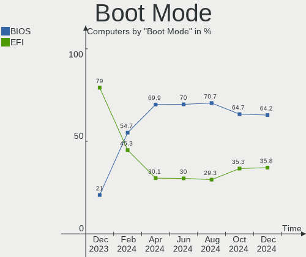
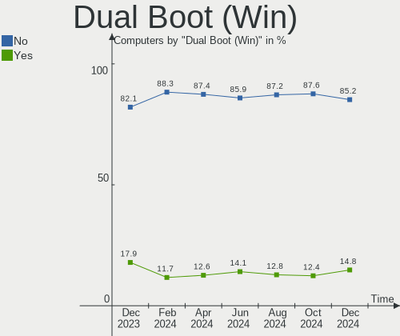
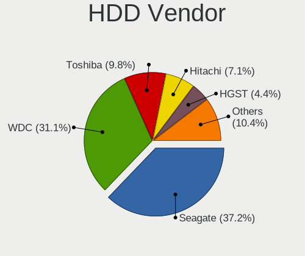
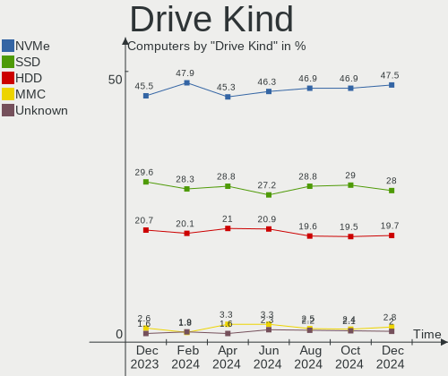
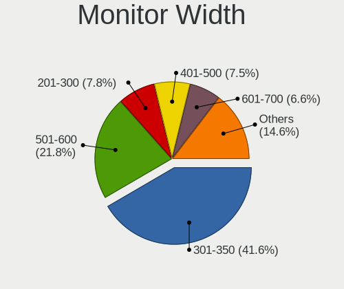
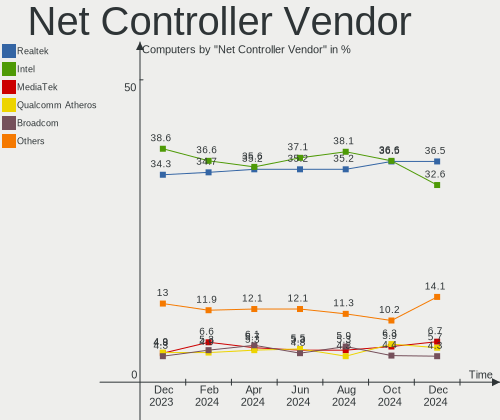

Fedora Hardware Trends
----------------------

A project to identify most popular hardware characteristics and track their change
over time based on data collected by Fedora users at https://Linux-Hardware.org.

Anyone can contribute to this report by the [hw-probe](https://github.com/linuxhw/hw-probe) tool:

    sudo -E hw-probe -all -upload

This is a report for all computer types. See also reports for [desktops](/Dist/Fedora/Desktop/README.md) and [notebooks](/Dist/Fedora/Notebook/README.md).

Full-feature report is available here: https://linux-hardware.org/?view=trends

Period: Jan, 2022.

Contents
--------

* [ System ](#system)
  - [ OS                       ](#os)
  - [ OS Family                ](#os-family)
  - [ Kernel                   ](#kernel)
  - [ Kernel Family            ](#kernel-family)
  - [ Kernel Major Ver.        ](#kernel-major-ver)
  - [ Arch                     ](#arch)
  - [ DE                       ](#de)
  - [ Display Server           ](#display-server)
  - [ Display Manager          ](#display-manager)
  - [ OS Lang                  ](#os-lang)
  - [ Boot Mode                ](#boot-mode)
  - [ Filesystem               ](#filesystem)
  - [ Part. scheme             ](#part-scheme)
  - [ Dual Boot with Linux/BSD ](#dual-boot-with-linuxbsd)
  - [ Dual Boot (Win)          ](#dual-boot-win)

* [ Board ](#board)
  - [ Vendor                   ](#vendor)
  - [ Model                    ](#model)
  - [ Model Family             ](#model-family)
  - [ MFG Year                 ](#mfg-year)
  - [ Form Factor              ](#form-factor)
  - [ Secure Boot              ](#secure-boot)
  - [ Coreboot                 ](#coreboot)
  - [ RAM Size                 ](#ram-size)
  - [ RAM Used                 ](#ram-used)
  - [ Total Drives             ](#total-drives)
  - [ Has CD-ROM               ](#has-cd-rom)
  - [ Has Ethernet             ](#has-ethernet)
  - [ Has WiFi                 ](#has-wifi)
  - [ Has Bluetooth            ](#has-bluetooth)

* [ Location ](#location)
  - [ Country                  ](#country)
  - [ City                     ](#city)

* [ Drives ](#drives)
  - [ Drive Vendor             ](#drive-vendor)
  - [ Drive Model              ](#drive-model)
  - [ HDD Vendor               ](#hdd-vendor)
  - [ SSD Vendor               ](#ssd-vendor)
  - [ Drive Kind               ](#drive-kind)
  - [ Drive Connector          ](#drive-connector)
  - [ Drive Size               ](#drive-size)
  - [ Space Total              ](#space-total)
  - [ Space Used               ](#space-used)
  - [ Malfunc. Drives          ](#malfunc-drives)
  - [ Malfunc. Drive Vendor    ](#malfunc-drive-vendor)
  - [ Malfunc. HDD Vendor      ](#malfunc-hdd-vendor)
  - [ Malfunc. Drive Kind      ](#malfunc-drive-kind)
  - [ Failed Drives            ](#failed-drives)
  - [ Failed Drive Vendor      ](#failed-drive-vendor)
  - [ Drive Status             ](#drive-status)

* [ Storage controller ](#storage-controller)
  - [ Storage Vendor           ](#storage-vendor)
  - [ Storage Model            ](#storage-model)
  - [ Storage Kind             ](#storage-kind)

* [ Processor ](#processor)
  - [ CPU Vendor               ](#cpu-vendor)
  - [ CPU Model                ](#cpu-model)
  - [ CPU Model Family         ](#cpu-model-family)
  - [ CPU Cores                ](#cpu-cores)
  - [ CPU Sockets              ](#cpu-sockets)
  - [ CPU Threads              ](#cpu-threads)
  - [ CPU Op-Modes             ](#cpu-op-modes)
  - [ CPU Microcode            ](#cpu-microcode)
  - [ CPU Microarch            ](#cpu-microarch)

* [ Graphics ](#graphics)
  - [ GPU Vendor               ](#gpu-vendor)
  - [ GPU Model                ](#gpu-model)
  - [ GPU Combo                ](#gpu-combo)
  - [ GPU Driver               ](#gpu-driver)
  - [ GPU Memory               ](#gpu-memory)

* [ Monitor ](#monitor)
  - [ Monitor Vendor           ](#monitor-vendor)
  - [ Monitor Model            ](#monitor-model)
  - [ Monitor Resolution       ](#monitor-resolution)
  - [ Monitor Diagonal         ](#monitor-diagonal)
  - [ Monitor Width            ](#monitor-width)
  - [ Aspect Ratio             ](#aspect-ratio)
  - [ Monitor Area             ](#monitor-area)
  - [ Pixel Density            ](#pixel-density)
  - [ Multiple Monitors        ](#multiple-monitors)

* [ Network ](#network)
  - [ Net Controller Vendor    ](#net-controller-vendor)
  - [ Net Controller Model     ](#net-controller-model)
  - [ Wireless Vendor          ](#wireless-vendor)
  - [ Wireless Model           ](#wireless-model)
  - [ Ethernet Vendor          ](#ethernet-vendor)
  - [ Ethernet Model           ](#ethernet-model)
  - [ Net Controller Kind      ](#net-controller-kind)
  - [ Used Controller          ](#used-controller)
  - [ NICs                     ](#nics)
  - [ IPv6                     ](#ipv6)

* [ Bluetooth ](#bluetooth)
  - [ Bluetooth Vendor         ](#bluetooth-vendor)
  - [ Bluetooth Model          ](#bluetooth-model)

* [ Sound ](#sound)
  - [ Sound Vendor             ](#sound-vendor)
  - [ Sound Model              ](#sound-model)

* [ Memory ](#memory)
  - [ Memory Vendor            ](#memory-vendor)
  - [ Memory Model             ](#memory-model)
  - [ Memory Kind              ](#memory-kind)
  - [ Memory Form Factor       ](#memory-form-factor)
  - [ Memory Size              ](#memory-size)
  - [ Memory Speed             ](#memory-speed)

* [ Printers & scanners ](#printers--scanners)
  - [ Printer Vendor           ](#printer-vendor)
  - [ Printer Model            ](#printer-model)
  - [ Scanner Vendor           ](#scanner-vendor)
  - [ Scanner Model            ](#scanner-model)

* [ Camera ](#camera)
  - [ Camera Vendor            ](#camera-vendor)
  - [ Camera Model             ](#camera-model)

* [ Security ](#security)
  - [ Fingerprint Vendor       ](#fingerprint-vendor)
  - [ Fingerprint Model        ](#fingerprint-model)
  - [ Chipcard Vendor          ](#chipcard-vendor)
  - [ Chipcard Model           ](#chipcard-model)

* [ Unsupported ](#unsupported)
  - [ Unsupported Devices      ](#unsupported-devices)
  - [ Unsupported Device Types ](#unsupported-device-types)

System
------

OS
--

Installed operating systems

| Name      | Computers | Percent |
|-----------|-----------|---------|
| Fedora 35 | 236       | 88.39%  |
| Fedora 34 | 22        | 8.24%   |
| Fedora 33 | 3         | 1.12%   |
| Fedora 32 | 2         | 0.75%   |
| Fedora 36 | 1         | 0.37%   |
| Fedora 31 | 1         | 0.37%   |
| Fedora 30 | 1         | 0.37%   |
| Fedora 21 | 1         | 0.37%   |

OS Family
---------

OS without a version

| Name   | Computers | Percent |
|--------|-----------|---------|
| Fedora | 267       | 100%    |

Kernel
------

Version of the Linux kernel

| Version                                                       | Computers | Percent |
|---------------------------------------------------------------|-----------|---------|
| 5.15.12-200.fc35.x86_64                                       | 62        | 23.22%  |
| 5.15.16-200.fc35.x86_64                                       | 40        | 14.98%  |
| 5.15.14-200.fc35.x86_64                                       | 32        | 11.99%  |
| 5.15.13-200.fc35.x86_64                                       | 29        | 10.86%  |
| 5.15.15-200.fc35.x86_64                                       | 15        | 5.62%   |
| 5.14.10-300.fc35.x86_64                                       | 10        | 3.75%   |
| 5.15.12-100.fc34.x86_64                                       | 9         | 3.37%   |
| 5.15.11-200.fc35.x86_64                                       | 9         | 3.37%   |
| 5.15.17-200.fc35.x86_64                                       | 6         | 2.25%   |
| 5.15.10-200.fc35.x86_64                                       | 4         | 1.5%    |
| 5.16.2-200.fc35.x86_64                                        | 3         | 1.12%   |
| 5.15.6-200.fc35.x86_64                                        | 3         | 1.12%   |
| 5.11.12-300.fc34.x86_64                                       | 3         | 1.12%   |
| 5.15.8-100.fc34.x86_64                                        | 2         | 0.75%   |
| 5.15.13-100.fc34.x86_64                                       | 2         | 0.75%   |
| 5.14.18-300.fc35.x86_64                                       | 2         | 0.75%   |
| 5.14.18-100.fc33.x86_64                                       | 2         | 0.75%   |
| 5.9.16-200.fc33.x86_64                                        | 1         | 0.37%   |
| 5.8.18-100.fc31.x86_64                                        | 1         | 0.37%   |
| 5.8.15-301.fc33.x86_64                                        | 1         | 0.37%   |
| 5.3.11-100.fc29.i686                                          | 1         | 0.37%   |
| 5.16.4-200.fc35.x86_64                                        | 1         | 0.37%   |
| 5.16.2-225.vanilla.1.fc35.x86_64                              | 1         | 0.37%   |
| 5.16.1-xm1.0.fc35.x86_64                                      | 1         | 0.37%   |
| 5.16.0-4.zpf.fc35.x86_64                                      | 1         | 0.37%   |
| 5.16.0-0.rc7.20211231git4f3d93c6eaff.52.vanilla.1.fc36.x86_64 | 1         | 0.37%   |
| 5.16.0-0.rc7.20211231git4f3d93c6eaff.52.vanilla.1.fc35.x86_64 | 1         | 0.37%   |
| 5.15.8-200.rog.fc35.x86_64                                    | 1         | 0.37%   |
| 5.15.7-200.fc35.x86_64                                        | 1         | 0.37%   |
| 5.15.5-1.fc25.qubes.x86_64                                    | 1         | 0.37%   |
| 5.15.15-200.rog.fc35.x86_64                                   | 1         | 0.37%   |
| 5.15.15-100.fc34.x86_64                                       | 1         | 0.37%   |
| 5.15.14-100.fc34.x86_64                                       | 1         | 0.37%   |
| 5.15.13-lqx1.0.fc35.x86_64                                    | 1         | 0.37%   |
| 5.15.13-250.vanilla.1.fc35.x86_64                             | 1         | 0.37%   |
| 5.15.12-250.vanilla.1.fc35.x86_64                             | 1         | 0.37%   |
| 5.15.11-100.fc34.x86_64                                       | 1         | 0.37%   |
| 5.15.10-100.fc34.x86_64                                       | 1         | 0.37%   |
| 5.14.9-200.fc34.x86_64                                        | 1         | 0.37%   |
| 5.14.20-300.fc35.x86_64                                       | 1         | 0.37%   |
| 5.14.18-200.fc34.x86_64                                       | 1         | 0.37%   |
| 5.14.16-301.fc35.x86_64                                       | 1         | 0.37%   |
| 5.14.11-300.fc35.x86_64                                       | 1         | 0.37%   |
| 5.13.7-100.fc33.x86_64                                        | 1         | 0.37%   |
| 5.13.19-200.fc34.x86_64                                       | 1         | 0.37%   |
| 5.11.22-100.fc32.x86_64                                       | 1         | 0.37%   |
| 5.11.13-300.fc34.x86_64                                       | 1         | 0.37%   |
| 5.10.93-xm1.0.fc35.x86_64                                     | 1         | 0.37%   |
| 5.10.20-210.fc32.x86_64                                       | 1         | 0.37%   |
| 5.10.15-200.fc33.x86_64                                       | 1         | 0.37%   |
| 4.1.13-100.fc21.x86_64                                        | 1         | 0.37%   |

Kernel Family
-------------

Linux kernel without a distro release

| Version | Computers | Percent |
|---------|-----------|---------|
| 5.15.12 | 72        | 26.97%  |
| 5.15.16 | 40        | 14.98%  |
| 5.15.14 | 33        | 12.36%  |
| 5.15.13 | 33        | 12.36%  |
| 5.15.15 | 17        | 6.37%   |
| 5.15.11 | 10        | 3.75%   |
| 5.14.10 | 10        | 3.75%   |
| 5.15.17 | 6         | 2.25%   |
| 5.15.10 | 5         | 1.87%   |
| 5.14.18 | 5         | 1.87%   |
| 5.16.2  | 4         | 1.5%    |
| 5.16.0  | 3         | 1.12%   |
| 5.15.8  | 3         | 1.12%   |
| 5.15.6  | 3         | 1.12%   |
| 5.11.12 | 3         | 1.12%   |
| 5.9.16  | 1         | 0.37%   |
| 5.8.18  | 1         | 0.37%   |
| 5.8.15  | 1         | 0.37%   |
| 5.3.11  | 1         | 0.37%   |
| 5.16.4  | 1         | 0.37%   |
| 5.16.1  | 1         | 0.37%   |
| 5.15.7  | 1         | 0.37%   |
| 5.15.5  | 1         | 0.37%   |
| 5.14.9  | 1         | 0.37%   |
| 5.14.20 | 1         | 0.37%   |
| 5.14.16 | 1         | 0.37%   |
| 5.14.11 | 1         | 0.37%   |
| 5.13.7  | 1         | 0.37%   |
| 5.13.19 | 1         | 0.37%   |
| 5.11.22 | 1         | 0.37%   |
| 5.11.13 | 1         | 0.37%   |
| 5.10.93 | 1         | 0.37%   |
| 5.10.20 | 1         | 0.37%   |
| 5.10.15 | 1         | 0.37%   |
| 4.1.13  | 1         | 0.37%   |

Kernel Major Ver.
-----------------

Linux kernel major version

| Version | Computers | Percent |
|---------|-----------|---------|
| 5.15    | 224       | 83.9%   |
| 5.14    | 19        | 7.12%   |
| 5.16    | 9         | 3.37%   |
| 5.11    | 5         | 1.87%   |
| 5.10    | 3         | 1.12%   |
| 5.8     | 2         | 0.75%   |
| 5.13    | 2         | 0.75%   |
| 5.9     | 1         | 0.37%   |
| 5.3     | 1         | 0.37%   |
| 4.1     | 1         | 0.37%   |

Arch
----

OS architecture (x86_64, i586, etc.)

| Name   | Computers | Percent |
|--------|-----------|---------|
| x86_64 | 266       | 99.63%  |
| i686   | 1         | 0.37%   |

DE
--

Desktop Environment

| Name            | Computers | Percent |
|-----------------|-----------|---------|
| GNOME           | 209       | 78.28%  |
| KDE5            | 26        | 9.74%   |
| Cinnamon        | 9         | 3.37%   |
| Unknown         | 8         | 3%      |
| X-Cinnamon      | 3         | 1.12%   |
| MATE            | 2         | 0.75%   |
| GNOME Classic   | 2         | 0.75%   |
| XFCE            | 1         | 0.37%   |
| sway            | 1         | 0.37%   |
| Pantheon        | 1         | 0.37%   |
| LXDE            | 1         | 0.37%   |
| KDE4            | 1         | 0.37%   |
| KDE             | 1         | 0.37%   |
| GNOME Flashback | 1         | 0.37%   |
| bspwm           | 1         | 0.37%   |

Display Server
--------------

X11 or Wayland

| Name    | Computers | Percent |
|---------|-----------|---------|
| Wayland | 162       | 60.67%  |
| X11     | 91        | 34.08%  |
| Tty     | 8         | 3%      |
| Unknown | 6         | 2.25%   |

Display Manager
---------------

SDDM, LightDM, etc.

| Name    | Computers | Percent |
|---------|-----------|---------|
| Unknown | 128       | 47.94%  |
| GDM     | 101       | 37.83%  |
| LightDM | 20        | 7.49%   |
| SDDM    | 17        | 6.37%   |
| LXDM    | 1         | 0.37%   |

OS Lang
-------

Language

| Lang    | Computers | Percent |
|---------|-----------|---------|
| en_US   | 136       | 50.94%  |
| en_GB   | 25        | 9.36%   |
| en_AU   | 13        | 4.87%   |
| pt_BR   | 9         | 3.37%   |
| fr_FR   | 9         | 3.37%   |
| de_DE   | 9         | 3.37%   |
| ru_RU   | 8         | 3%      |
| pl_PL   | 7         | 2.62%   |
| nl_BE   | 5         | 1.87%   |
| es_MX   | 5         | 1.87%   |
| it_IT   | 4         | 1.5%    |
| es_CO   | 4         | 1.5%    |
| en_CA   | 4         | 1.5%    |
| cs_CZ   | 3         | 1.12%   |
| nl_NL   | 2         | 0.75%   |
| de_AT   | 2         | 0.75%   |
| C       | 2         | 0.75%   |
| zh_CN   | 1         | 0.37%   |
| tr_TR   | 1         | 0.37%   |
| szl_PL  | 1         | 0.37%   |
| sr_RS   | 1         | 0.37%   |
| pt_PT   | 1         | 0.37%   |
| ja_JP   | 1         | 0.37%   |
| id_ID   | 1         | 0.37%   |
| fr_CH   | 1         | 0.37%   |
| fr_CA   | 1         | 0.37%   |
| es_PE   | 1         | 0.37%   |
| es_ES   | 1         | 0.37%   |
| es_CL   | 1         | 0.37%   |
| es_AR   | 1         | 0.37%   |
| en_ZA   | 1         | 0.37%   |
| en_SG   | 1         | 0.37%   |
| en_NZ   | 1         | 0.37%   |
| en_IE   | 1         | 0.37%   |
| el_GR   | 1         | 0.37%   |
| ca_ES   | 1         | 0.37%   |
| Unknown | 1         | 0.37%   |

Boot Mode
---------

EFI or BIOS

| Mode | Computers | Percent |
|------|-----------|---------|
| EFI  | 192       | 71.91%  |
| BIOS | 75        | 28.09%  |

Filesystem
----------

Type of filesystem

| Type    | Computers | Percent |
|---------|-----------|---------|
| Btrfs   | 181       | 67.79%  |
| Ext4    | 72        | 26.97%  |
| Xfs     | 13        | 4.87%   |
| Overlay | 1         | 0.37%   |

Part. scheme
------------

Scheme of partitioning

| Type    | Computers | Percent |
|---------|-----------|---------|
| Unknown | 132       | 49.44%  |
| GPT     | 105       | 39.33%  |
| MBR     | 30        | 11.24%  |

Dual Boot with Linux/BSD
------------------------

Hosting more than one Linux/BSD

| Dual boot | Computers | Percent |
|-----------|-----------|---------|
| No        | 238       | 89.14%  |
| Yes       | 29        | 10.86%  |

Dual Boot (Win)
---------------

Hosting Linux and Windows

| Dual boot | Computers | Percent |
|-----------|-----------|---------|
| No        | 212       | 79.4%   |
| Yes       | 55        | 20.6%   |

Board
-----

Vendor
------

Motherboard manufacturer

| Name                | Computers | Percent |
|---------------------|-----------|---------|
| Lenovo              | 60        | 22.47%  |
| Dell                | 36        | 13.48%  |
| ASUSTek Computer    | 35        | 13.11%  |
| Gigabyte Technology | 29        | 10.86%  |
| Hewlett-Packard     | 25        | 9.36%   |
| MSI                 | 18        | 6.74%   |
| Acer                | 13        | 4.87%   |
| Apple               | 7         | 2.62%   |
| Intel               | 6         | 2.25%   |
| ASRock              | 6         | 2.25%   |
| Toshiba             | 4         | 1.5%    |
| Notebook            | 4         | 1.5%    |
| Fujitsu             | 3         | 1.12%   |
| Unknown             | 3         | 1.12%   |
| Sony                | 2         | 0.75%   |
| Positivo            | 2         | 0.75%   |
| HUAWEI              | 2         | 0.75%   |
| XFX                 | 1         | 0.37%   |
| TrekStor            | 1         | 0.37%   |
| System76            | 1         | 0.37%   |
| SCHNEIDER           | 1         | 0.37%   |
| Samsung Electronics | 1         | 0.37%   |
| Razer               | 1         | 0.37%   |
| PCWare              | 1         | 0.37%   |
| Panasonic           | 1         | 0.37%   |
| ONN                 | 1         | 0.37%   |
| Mediacom            | 1         | 0.37%   |
| Framework           | 1         | 0.37%   |
| BESSTAR Tech        | 1         | 0.37%   |

Model
-----

Motherboard model

| Name                                     | Computers | Percent |
|------------------------------------------|-----------|---------|
| Unknown                                  | 3         | 1.12%   |
| MSI MS-7B86                              | 2         | 0.75%   |
| MSI MS-7B85                              | 2         | 0.75%   |
| Lenovo ThinkBook 15 G2 ITL 20VE          | 2         | 0.75%   |
| Lenovo IdeaPad 3 14ALC6 82KT             | 2         | 0.75%   |
| Gigabyte Z390 AORUS MASTER               | 2         | 0.75%   |
| Dell XPS 13 9310                         | 2         | 0.75%   |
| Dell XPS 13 7390                         | 2         | 0.75%   |
| Dell Latitude E7440                      | 2         | 0.75%   |
| Dell Latitude E6530                      | 2         | 0.75%   |
| Dell Latitude 7490                       | 2         | 0.75%   |
| Dell Inspiron 7591                       | 2         | 0.75%   |
| ASUS VivoBook_ASUS Laptop E210MA_L210MA  | 2         | 0.75%   |
| ASUS All Series                          | 2         | 0.75%   |
| Acer Swift SF114-34                      | 2         | 0.75%   |
| XFX nForce 780i 3-Way SLI                | 1         | 0.37%   |
| TrekStor Primetab T13B                   | 1         | 0.37%   |
| Toshiba Satellite L855                   | 1         | 0.37%   |
| Toshiba Satellite L755                   | 1         | 0.37%   |
| Toshiba Satellite C660                   | 1         | 0.37%   |
| Toshiba Satellite C55-A-1NU              | 1         | 0.37%   |
| System76 Gazelle                         | 1         | 0.37%   |
| Sony VPCEB3PGX                           | 1         | 0.37%   |
| Sony SVF15328CXB                         | 1         | 0.37%   |
| SCHNEIDER SCL141CTP                      | 1         | 0.37%   |
| Samsung 930QAA                           | 1         | 0.37%   |
| Razer Book 13 - RZ09-0357                | 1         | 0.37%   |
| Positivo VJF155F11UAR                    | 1         | 0.37%   |
| Positivo H14BU08                         | 1         | 0.37%   |
| PCWare IPMH110G                          | 1         | 0.37%   |
| Panasonic CF-195FYCALM                   | 1         | 0.37%   |
| ONN 100002435                            | 1         | 0.37%   |
| Notebook P15SM                           | 1         | 0.37%   |
| Notebook NS50MU                          | 1         | 0.37%   |
| Notebook NH5x_NH7x_HHx_HJx_HKx           | 1         | 0.37%   |
| Notebook NH55RGQ                         | 1         | 0.37%   |
| MSI MS-7D25                              | 1         | 0.37%   |
| MSI MS-7C95                              | 1         | 0.37%   |
| MSI MS-7C94                              | 1         | 0.37%   |
| MSI MS-7C84                              | 1         | 0.37%   |
| MSI MS-7B89                              | 1         | 0.37%   |
| MSI MS-7B79                              | 1         | 0.37%   |
| MSI MS-7B33                              | 1         | 0.37%   |
| MSI MS-7B10                              | 1         | 0.37%   |
| MSI MS-7A69                              | 1         | 0.37%   |
| MSI MS-7A37                              | 1         | 0.37%   |
| MSI MS-7A34                              | 1         | 0.37%   |
| MSI MS-7A20                              | 1         | 0.37%   |
| MSI MS-7922                              | 1         | 0.37%   |
| MSI CR61 2M/CX61 2OC/CX61 2OD            | 1         | 0.37%   |
| Mediacom GTZS                            | 1         | 0.37%   |
| Lenovo Yoga S940-14IWL 81Q7              | 1         | 0.37%   |
| Lenovo Yoga 730-13IWL 81JR               | 1         | 0.37%   |
| Lenovo Yoga 7 14ITL5 82BH                | 1         | 0.37%   |
| Lenovo Yoga 2 Pro 20266                  | 1         | 0.37%   |
| Lenovo ThinkStation P620 30E1S36700      | 1         | 0.37%   |
| Lenovo ThinkStation P340 Tiny 30DFS05W00 | 1         | 0.37%   |
| Lenovo ThinkPad X61s 7666WCQ             | 1         | 0.37%   |
| Lenovo ThinkPad X260 20F5S0W22B          | 1         | 0.37%   |
| Lenovo ThinkPad X240 20AMS1S800          | 1         | 0.37%   |

Model Family
------------

Motherboard model prefix

| Name                   | Computers | Percent |
|------------------------|-----------|---------|
| Lenovo ThinkPad        | 29        | 10.86%  |
| Dell Latitude          | 14        | 5.24%   |
| Lenovo IdeaPad         | 12        | 4.49%   |
| Dell XPS               | 8         | 3%      |
| ASUS ROG               | 7         | 2.62%   |
| ASUS PRIME             | 6         | 2.25%   |
| Lenovo ThinkBook       | 5         | 1.87%   |
| HP Pavilion            | 5         | 1.87%   |
| Dell Precision         | 5         | 1.87%   |
| Dell Inspiron          | 5         | 1.87%   |
| Toshiba Satellite      | 4         | 1.5%    |
| Lenovo Yoga            | 4         | 1.5%    |
| HP ProBook             | 4         | 1.5%    |
| ASUS VivoBook          | 4         | 1.5%    |
| Acer Aspire            | 4         | 1.5%    |
| Lenovo IdeaPadFlex     | 3         | 1.12%   |
| HP ENVY                | 3         | 1.12%   |
| HP Compaq              | 3         | 1.12%   |
| Dell OptiPlex          | 3         | 1.12%   |
| ASUS TUF               | 3         | 1.12%   |
| ASUS ASUS              | 3         | 1.12%   |
| Acer Swift             | 3         | 1.12%   |
| Unknown                | 3         | 1.12%   |
| MSI MS-7B86            | 2         | 0.75%   |
| MSI MS-7B85            | 2         | 0.75%   |
| Lenovo ThinkStation    | 2         | 0.75%   |
| Lenovo ThinkCentre     | 2         | 0.75%   |
| HP ZBook               | 2         | 0.75%   |
| HP Laptop              | 2         | 0.75%   |
| Gigabyte Z390          | 2         | 0.75%   |
| ASUS ZenBook           | 2         | 0.75%   |
| ASUS Maximus           | 2         | 0.75%   |
| ASUS All               | 2         | 0.75%   |
| Acer Nitro             | 2         | 0.75%   |
| XFX nForce             | 1         | 0.37%   |
| TrekStor Primetab      | 1         | 0.37%   |
| System76 Gazelle       | 1         | 0.37%   |
| Sony VPCEB3PGX         | 1         | 0.37%   |
| Sony SVF15328CXB       | 1         | 0.37%   |
| SCHNEIDER SCL141CTP    | 1         | 0.37%   |
| Samsung 930QAA         | 1         | 0.37%   |
| Razer Book             | 1         | 0.37%   |
| Positivo VJF155F11UAR  | 1         | 0.37%   |
| Positivo H14BU08       | 1         | 0.37%   |
| PCWare IPMH110G        | 1         | 0.37%   |
| Panasonic CF-195FYCALM | 1         | 0.37%   |
| ONN 100002435          | 1         | 0.37%   |
| Notebook P15SM         | 1         | 0.37%   |
| Notebook NS50MU        | 1         | 0.37%   |
| Notebook NH5x          | 1         | 0.37%   |
| Notebook NH55RGQ       | 1         | 0.37%   |
| MSI MS-7D25            | 1         | 0.37%   |
| MSI MS-7C95            | 1         | 0.37%   |
| MSI MS-7C94            | 1         | 0.37%   |
| MSI MS-7C84            | 1         | 0.37%   |
| MSI MS-7B89            | 1         | 0.37%   |
| MSI MS-7B79            | 1         | 0.37%   |
| MSI MS-7B33            | 1         | 0.37%   |
| MSI MS-7B10            | 1         | 0.37%   |
| MSI MS-7A69            | 1         | 0.37%   |

MFG Year
--------

Motherboard manufacture year

| Year    | Computers | Percent |
|---------|-----------|---------|
| 2020    | 45        | 16.85%  |
| 2021    | 37        | 13.86%  |
| 2019    | 32        | 11.99%  |
| 2018    | 30        | 11.24%  |
| 2017    | 22        | 8.24%   |
| 2016    | 20        | 7.49%   |
| 2013    | 17        | 6.37%   |
| 2014    | 16        | 5.99%   |
| 2012    | 12        | 4.49%   |
| 2011    | 10        | 3.75%   |
| 2015    | 9         | 3.37%   |
| 2010    | 8         | 3%      |
| 2009    | 3         | 1.12%   |
| 2007    | 3         | 1.12%   |
| 2008    | 2         | 0.75%   |
| Unknown | 1         | 0.37%   |

Form Factor
-----------

Physical design of the computer

| Name        | Computers | Percent |
|-------------|-----------|---------|
| Notebook    | 146       | 54.68%  |
| Desktop     | 94        | 35.21%  |
| Convertible | 15        | 5.62%   |
| Mini pc     | 7         | 2.62%   |
| Tablet      | 2         | 0.75%   |
| Server      | 2         | 0.75%   |
| All in one  | 1         | 0.37%   |

Secure Boot
-----------

Enabled or disabled

| State    | Computers | Percent |
|----------|-----------|---------|
| Disabled | 220       | 82.4%   |
| Enabled  | 47        | 17.6%   |

Coreboot
--------

Have coreboot on board

| Used | Computers | Percent |
|------|-----------|---------|
| No   | 267       | 100%    |

RAM Size
--------

Total RAM memory

| Size in GB  | Computers | Percent |
|-------------|-----------|---------|
| 16.01-24.0  | 88        | 32.96%  |
| 4.01-8.0    | 57        | 21.35%  |
| 32.01-64.0  | 36        | 13.48%  |
| 8.01-16.0   | 36        | 13.48%  |
| 3.01-4.0    | 23        | 8.61%   |
| 64.01-256.0 | 15        | 5.62%   |
| 24.01-32.0  | 6         | 2.25%   |
| 1.01-2.0    | 5         | 1.87%   |
| 2.01-3.0    | 1         | 0.37%   |

RAM Used
--------

Used RAM memory

| Used GB    | Computers | Percent |
|------------|-----------|---------|
| 4.01-8.0   | 85        | 31.84%  |
| 2.01-3.0   | 65        | 24.34%  |
| 3.01-4.0   | 50        | 18.73%  |
| 1.01-2.0   | 41        | 15.36%  |
| 8.01-16.0  | 18        | 6.74%   |
| 0.51-1.0   | 5         | 1.87%   |
| 16.01-24.0 | 2         | 0.75%   |
| 24.01-32.0 | 1         | 0.37%   |

Total Drives
------------

Number of drives on board

| Drives | Computers | Percent |
|--------|-----------|---------|
| 1      | 148       | 55.43%  |
| 2      | 63        | 23.6%   |
| 3      | 29        | 10.86%  |
| 4      | 11        | 4.12%   |
| 5      | 7         | 2.62%   |
| 6      | 4         | 1.5%    |
| 7      | 2         | 0.75%   |
| 27     | 1         | 0.37%   |
| 8      | 1         | 0.37%   |
| 0      | 1         | 0.37%   |

Has CD-ROM
----------

Has CD-ROM on board

| Presented | Computers | Percent |
|-----------|-----------|---------|
| No        | 215       | 80.52%  |
| Yes       | 52        | 19.48%  |

Has Ethernet
------------

Has Ethernet on board

| Presented | Computers | Percent |
|-----------|-----------|---------|
| Yes       | 214       | 80.15%  |
| No        | 53        | 19.85%  |

Has WiFi
--------

Has WiFi module

| Presented | Computers | Percent |
|-----------|-----------|---------|
| Yes       | 215       | 80.52%  |
| No        | 52        | 19.48%  |

Has Bluetooth
-------------

Has Bluetooth module

| Presented | Computers | Percent |
|-----------|-----------|---------|
| Yes       | 184       | 68.91%  |
| No        | 83        | 31.09%  |

Location
--------

Country
-------

Geographic location (country)

| Country      | Computers | Percent |
|--------------|-----------|---------|
| USA          | 54        | 20.22%  |
| Australia    | 16        | 5.99%   |
| Russia       | 15        | 5.62%   |
| UK           | 14        | 5.24%   |
| Germany      | 13        | 4.87%   |
| Brazil       | 13        | 4.87%   |
| France       | 11        | 4.12%   |
| Poland       | 10        | 3.75%   |
| Netherlands  | 9         | 3.37%   |
| Czechia      | 9         | 3.37%   |
| Austria      | 9         | 3.37%   |
| Italy        | 8         | 3%      |
| India        | 7         | 2.62%   |
| Canada       | 7         | 2.62%   |
| Belgium      | 7         | 2.62%   |
| Mexico       | 5         | 1.87%   |
| Turkey       | 4         | 1.5%    |
| Spain        | 4         | 1.5%    |
| Portugal     | 4         | 1.5%    |
| Colombia     | 4         | 1.5%    |
| Belarus      | 4         | 1.5%    |
| Ukraine      | 3         | 1.12%   |
| Argentina    | 3         | 1.12%   |
| Thailand     | 2         | 0.75%   |
| Sweden       | 2         | 0.75%   |
| Norway       | 2         | 0.75%   |
| Ireland      | 2         | 0.75%   |
| Greece       | 2         | 0.75%   |
| Georgia      | 2         | 0.75%   |
| Algeria      | 2         | 0.75%   |
| Taiwan       | 1         | 0.37%   |
| Switzerland  | 1         | 0.37%   |
| South Africa | 1         | 0.37%   |
| Singapore    | 1         | 0.37%   |
| Serbia       | 1         | 0.37%   |
| Romania      | 1         | 0.37%   |
| Peru         | 1         | 0.37%   |
| Nicaragua    | 1         | 0.37%   |
| Kazakhstan   | 1         | 0.37%   |
| Japan        | 1         | 0.37%   |
| Indonesia    | 1         | 0.37%   |
| Finland      | 1         | 0.37%   |
| Egypt        | 1         | 0.37%   |
| Cyprus       | 1         | 0.37%   |
| Croatia      | 1         | 0.37%   |
| Costa Rica   | 1         | 0.37%   |
| China        | 1         | 0.37%   |
| Chile        | 1         | 0.37%   |
| Bolivia      | 1         | 0.37%   |
| Belize       | 1         | 0.37%   |

City
----

Geographic location (city)

| City              | Computers | Percent |
|-------------------|-----------|---------|
| Sydney            | 9         | 3.37%   |
| Moscow            | 7         | 2.62%   |
| W?¶rgl            | 5         | 1.87%   |
| Vienna            | 4         | 1.5%    |
| Minsk             | 4         | 1.5%    |
| Prague            | 3         | 1.12%   |
| Krakow            | 3         | 1.12%   |
| Istanbul          | 3         | 1.12%   |
| Canberra          | 3         | 1.12%   |
| Brisbane          | 3         | 1.12%   |
| Yekaterinburg     | 2         | 0.75%   |
| Warsaw            | 2         | 0.75%   |
| St Petersburg     | 2         | 0.75%   |
| Royal Oak         | 2         | 0.75%   |
| Rotterdam         | 2         | 0.75%   |
| Pouso Alegre      | 2         | 0.75%   |
| Pennsville        | 2         | 0.75%   |
| Nizhniy Novgorod  | 2         | 0.75%   |
| Milan             | 2         | 0.75%   |
| Madrid            | 2         | 0.75%   |
| Lisbon            | 2         | 0.75%   |
| Kapellen          | 2         | 0.75%   |
| K'alak'i T'bilisi | 2         | 0.75%   |
| Fairfax           | 2         | 0.75%   |
| Coimbatore        | 2         | 0.75%   |
| Chon Buri         | 2         | 0.75%   |
| Bungay            | 2         | 0.75%   |
| Buenos Aires      | 2         | 0.75%   |
| Bras?­lia         | 2         | 0.75%   |
| Apex              | 2         | 0.75%   |
| Alexandria        | 2         | 0.75%   |
| Zl?­n             | 1         | 0.37%   |
| Zgorzelec         | 1         | 0.37%   |
| Zeven             | 1         | 0.37%   |
| Zaporizhzhya      | 1         | 0.37%   |
| Zagreb            | 1         | 0.37%   |
| Wisconsin Rapids  | 1         | 0.37%   |
| Winchester        | 1         | 0.37%   |
| Willowbrook       | 1         | 0.37%   |
| Willanzheim       | 1         | 0.37%   |
| Westerlo          | 1         | 0.37%   |
| Wells             | 1         | 0.37%   |
| Wateringen        | 1         | 0.37%   |
| Waldorf           | 1         | 0.37%   |
| Villemomble       | 1         | 0.37%   |
| Villavicencio     | 1         | 0.37%   |
| Victoria          | 1         | 0.37%   |
| Vancouver         | 1         | 0.37%   |
| Valkenswaard      | 1         | 0.37%   |
| Valencia          | 1         | 0.37%   |
| Vaellingby        | 1         | 0.37%   |
| Troy              | 1         | 0.37%   |
| Toulouse          | 1         | 0.37%   |
| Teramo            | 1         | 0.37%   |
| Tepic             | 1         | 0.37%   |
| Tehuac??n         | 1         | 0.37%   |
| Teakettle Village | 1         | 0.37%   |
| Taubate           | 1         | 0.37%   |
| Taoyuan District  | 1         | 0.37%   |
| Tallahassee       | 1         | 0.37%   |

Drives
------

Drive Vendor
------------

Hard drive vendors

| Vendor                       | Computers | Drives | Percent |
|------------------------------|-----------|--------|---------|
| Samsung Electronics          | 88        | 116    | 21.1%   |
| WDC                          | 61        | 78     | 14.63%  |
| Seagate                      | 45        | 76     | 10.79%  |
| Intel                        | 24        | 24     | 5.76%   |
| Kingston                     | 23        | 24     | 5.52%   |
| Sandisk                      | 21        | 22     | 5.04%   |
| Toshiba                      | 19        | 19     | 4.56%   |
| Crucial                      | 19        | 22     | 4.56%   |
| Unknown                      | 14        | 17     | 3.36%   |
| Hitachi                      | 8         | 9      | 1.92%   |
| A-DATA Technology            | 8         | 8      | 1.92%   |
| Phison                       | 7         | 8      | 1.68%   |
| KIOXIA                       | 7         | 7      | 1.68%   |
| HGST                         | 7         | 8      | 1.68%   |
| SK Hynix                     | 6         | 7      | 1.44%   |
| Micron Technology            | 5         | 5      | 1.2%    |
| Patriot                      | 4         | 5      | 0.96%   |
| Lexar                        | 4         | 5      | 0.96%   |
| XPG                          | 3         | 3      | 0.72%   |
| Transcend                    | 3         | 3      | 0.72%   |
| Micron/Crucial Technology    | 3         | 3      | 0.72%   |
| China                        | 3         | 4      | 0.72%   |
| Apple                        | 3         | 3      | 0.72%   |
| Verbatim                     | 2         | 2      | 0.48%   |
| PLEXTOR                      | 2         | 2      | 0.48%   |
| LITEONIT                     | 2         | 2      | 0.48%   |
| Hewlett-Packard              | 2         | 2      | 0.48%   |
| Corsair                      | 2         | 2      | 0.48%   |
| Unknown                      | 2         | 2      | 0.48%   |
| Union Memory (Shenzhen)      | 1         | 1      | 0.24%   |
| UMIS                         | 1         | 1      | 0.24%   |
| Team                         | 1         | 1      | 0.24%   |
| SSK                          | 1         | 1      | 0.24%   |
| SPCC                         | 1         | 1      | 0.24%   |
| Silicon Motion               | 1         | 1      | 0.24%   |
| SABRENT                      | 1         | 1      | 0.24%   |
| Realtek Semiconductor        | 1         | 1      | 0.24%   |
| Pioneer                      | 1         | 1      | 0.24%   |
| MX                           | 1         | 1      | 0.24%   |
| LITEON                       | 1         | 1      | 0.24%   |
| Leven                        | 1         | 1      | 0.24%   |
| LDLC                         | 1         | 1      | 0.24%   |
| KingSpec                     | 1         | 1      | 0.24%   |
| JMicron                      | 1         | 4      | 0.24%   |
| HPE                          | 1         | 1      | 0.24%   |
| GALAX                        | 1         | 1      | 0.24%   |
| BIWIN                        | 1         | 1      | 0.24%   |
| Beijing Starblaze Technology | 1         | 1      | 0.24%   |
| Apacer                       | 1         | 1      | 0.24%   |

Drive Model
-----------

Hard drive models

| Model                                | Computers | Percent |
|--------------------------------------|-----------|---------|
| Samsung NVMe SSD Drive 500GB         | 10        | 2.16%   |
| Samsung NVMe SSD Drive 512GB         | 8         | 1.72%   |
| Samsung SSD 860 EVO 500GB            | 7         | 1.51%   |
| Samsung SSD 850 EVO 500GB            | 6         | 1.29%   |
| Samsung NVMe SSD Drive 256GB         | 5         | 1.08%   |
| Kingston SA400S37480G 480GB SSD      | 5         | 1.08%   |
| WDC WDS500G2B0A-00SM50 500GB SSD     | 4         | 0.86%   |
| Seagate ST3500418AS 500GB            | 4         | 0.86%   |
| Sandisk NVMe SSD Drive 256GB         | 4         | 0.86%   |
| Samsung SSD 860 EVO 1TB              | 4         | 0.86%   |
| Samsung NVMe SSD Drive 1TB           | 4         | 0.86%   |
| KIOXIA NVMe SSD Drive 256GB          | 4         | 0.86%   |
| Crucial CT500MX500SSD1 500GB         | 4         | 0.86%   |
| WDC WDS240G2G0B-00EPW0 240GB SSD     | 3         | 0.65%   |
| Unknown MMC Card  64GB               | 3         | 0.65%   |
| SK Hynix NVMe SSD Drive 512GB        | 3         | 0.65%   |
| Seagate ST2000DM008-2FR102 2TB       | 3         | 0.65%   |
| Seagate ST1000DM010-2EP102 1TB       | 3         | 0.65%   |
| Sandisk NVMe SSD Drive 1TB           | 3         | 0.65%   |
| Samsung SSD 970 EVO Plus 1TB         | 3         | 0.65%   |
| Samsung SSD 850 EVO 250GB            | 3         | 0.65%   |
| Samsung NVMe SSD Drive 250GB         | 3         | 0.65%   |
| Kingston SA400S37120G 120GB SSD      | 3         | 0.65%   |
| Intel NVMe SSD Drive 512GB           | 3         | 0.65%   |
| XPG NVMe SSD Drive 1024GB            | 2         | 0.43%   |
| WDC WD10EZRX-00D8PB0 1TB             | 2         | 0.43%   |
| WDC WD10EZEX-00WN4A0 1TB             | 2         | 0.43%   |
| WDC PC SN530 SDBPMPZ-256G-1101 256GB | 2         | 0.43%   |
| Verbatim Vi550 S3 SSD 512GB          | 2         | 0.43%   |
| Unknown DA4064  64GB                 | 2         | 0.43%   |
| Toshiba MK6475GSX 640GB              | 2         | 0.43%   |
| Toshiba HDWD110 1TB                  | 2         | 0.43%   |
| Seagate ST6000VN0033-2EE110 6TB      | 2         | 0.43%   |
| Seagate ST4000DM004-2CV104 4TB       | 2         | 0.43%   |
| Seagate ST31000333AS 1TB             | 2         | 0.43%   |
| Seagate ST1000LM048-2E7172 1TB       | 2         | 0.43%   |
| Seagate ST1000LM024 HN-M101MBB 1TB   | 2         | 0.43%   |
| Seagate ST1000DM003-1CH162 1TB       | 2         | 0.43%   |
| Seagate Expansion 1TB                | 2         | 0.43%   |
| SanDisk SD8SN8U-128G-1006 128GB SSD  | 2         | 0.43%   |
| SanDisk SD6PP4M-256G-1006 256GB SSD  | 2         | 0.43%   |
| Sandisk NVMe SSD Drive 500GB         | 2         | 0.43%   |
| Samsung SSD 970 EVO Plus 2TB         | 2         | 0.43%   |
| Samsung SSD 970 EVO 1TB              | 2         | 0.43%   |
| Samsung SSD 870 QVO 2TB              | 2         | 0.43%   |
| Samsung SSD 860 EVO M.2 500GB        | 2         | 0.43%   |
| Samsung SSD 830 Series 256GB         | 2         | 0.43%   |
| Samsung NVMe SSD Drive 2TB           | 2         | 0.43%   |
| Samsung NVMe SSD Drive 1024GB        | 2         | 0.43%   |
| Micron/Crucial NVMe SSD Drive 500GB  | 2         | 0.43%   |
| Kingston SV300S37A60G 64GB SSD       | 2         | 0.43%   |
| Kingston SV300S37A120G 120GB SSD     | 2         | 0.43%   |
| Kingston SA400S37240G 240GB SSD      | 2         | 0.43%   |
| Kingston SA2000M81000G 1TB           | 2         | 0.43%   |
| Intel SSDSC2KW256G8 256GB            | 2         | 0.43%   |
| Intel SSDSC2CT120A3 120GB            | 2         | 0.43%   |
| Intel SSDPEKKW256G7 256GB            | 2         | 0.43%   |
| Intel NVMe SSD Drive 1024GB          | 2         | 0.43%   |
| Hitachi HUA721010KLA330 1TB          | 2         | 0.43%   |
| HGST HTS725050A7E630 500GB           | 2         | 0.43%   |

HDD Vendor
----------

Hard disk drive vendors

| Vendor              | Computers | Drives | Percent |
|---------------------|-----------|--------|---------|
| Seagate             | 41        | 72     | 37.27%  |
| WDC                 | 40        | 53     | 36.36%  |
| Toshiba             | 11        | 11     | 10%     |
| Hitachi             | 8         | 9      | 7.27%   |
| HGST                | 7         | 8      | 6.36%   |
| Samsung Electronics | 1         | 1      | 0.91%   |
| JMicron             | 1         | 3      | 0.91%   |
| Hewlett-Packard     | 1         | 1      | 0.91%   |

SSD Vendor
----------

Solid state drive vendors

| Vendor              | Computers | Drives | Percent |
|---------------------|-----------|--------|---------|
| Samsung Electronics | 41        | 53     | 26.62%  |
| Kingston            | 17        | 18     | 11.04%  |
| Crucial             | 16        | 19     | 10.39%  |
| Intel               | 15        | 15     | 9.74%   |
| WDC                 | 11        | 12     | 7.14%   |
| SanDisk             | 10        | 11     | 6.49%   |
| A-DATA Technology   | 7         | 7      | 4.55%   |
| Patriot             | 4         | 5      | 2.6%    |
| Toshiba             | 3         | 3      | 1.95%   |
| Micron Technology   | 3         | 3      | 1.95%   |
| China               | 3         | 4      | 1.95%   |
| Verbatim            | 2         | 2      | 1.3%    |
| Transcend           | 2         | 2      | 1.3%    |
| LITEONIT            | 2         | 2      | 1.3%    |
| Lexar               | 2         | 2      | 1.3%    |
| Apple               | 2         | 2      | 1.3%    |
| SPCC                | 1         | 1      | 0.65%   |
| Seagate             | 1         | 1      | 0.65%   |
| SABRENT             | 1         | 1      | 0.65%   |
| PLEXTOR             | 1         | 1      | 0.65%   |
| Pioneer             | 1         | 1      | 0.65%   |
| MX                  | 1         | 1      | 0.65%   |
| LITEON              | 1         | 1      | 0.65%   |
| Leven               | 1         | 1      | 0.65%   |
| KingSpec            | 1         | 1      | 0.65%   |
| HPE                 | 1         | 1      | 0.65%   |
| GALAX               | 1         | 1      | 0.65%   |
| Corsair             | 1         | 1      | 0.65%   |
| BIWIN               | 1         | 1      | 0.65%   |
| Apacer              | 1         | 1      | 0.65%   |

Drive Kind
----------

HDD or SSD

| Kind    | Computers | Drives | Percent |
|---------|-----------|--------|---------|
| NVMe    | 132       | 151    | 34.46%  |
| SSD     | 132       | 174    | 34.46%  |
| HDD     | 95        | 158    | 24.8%   |
| MMC     | 15        | 17     | 3.92%   |
| Unknown | 9         | 11     | 2.35%   |

Drive Connector
---------------

SATA, SAS, NVMe, etc.

| Type | Computers | Drives | Percent |
|------|-----------|--------|---------|
| SATA | 167       | 321    | 50.61%  |
| NVMe | 132       | 151    | 40%     |
| SAS  | 16        | 22     | 4.85%   |
| MMC  | 15        | 17     | 4.55%   |

Drive Size
----------

Size of hard drive

| Size in TB | Computers | Drives | Percent |
|------------|-----------|--------|---------|
| 0.01-0.5   | 133       | 174    | 55.19%  |
| 0.51-1.0   | 72        | 89     | 29.88%  |
| 1.01-2.0   | 19        | 23     | 7.88%   |
| 4.01-10.0  | 7         | 30     | 2.9%    |
| 3.01-4.0   | 6         | 9      | 2.49%   |
| 2.01-3.0   | 2         | 4      | 0.83%   |
| 10.01-20.0 | 2         | 3      | 0.83%   |

Space Total
-----------

Amount of disk space available on the file system

| Size in GB     | Computers | Percent |
|----------------|-----------|---------|
| 251-500        | 50        | 18.73%  |
| 501-1000       | 44        | 16.48%  |
| 101-250        | 42        | 15.73%  |
| 1001-2000      | 41        | 15.36%  |
| 1-20           | 31        | 11.61%  |
| Unknown        | 20        | 7.49%   |
| More than 3000 | 14        | 5.24%   |
| 2001-3000      | 13        | 4.87%   |
| 51-100         | 9         | 3.37%   |
| 21-50          | 3         | 1.12%   |

Space Used
----------

Amount of used disk space

| Used GB        | Computers | Percent |
|----------------|-----------|---------|
| 1-20           | 77        | 28.84%  |
| 101-250        | 39        | 14.61%  |
| 21-50          | 36        | 13.48%  |
| 501-1000       | 25        | 9.36%   |
| 51-100         | 25        | 9.36%   |
| 251-500        | 22        | 8.24%   |
| Unknown        | 20        | 7.49%   |
| 1001-2000      | 15        | 5.62%   |
| More than 3000 | 5         | 1.87%   |
| 2001-3000      | 3         | 1.12%   |

Malfunc. Drives
---------------

Drive models with a malfunction

| Model                                               | Computers | Drives | Percent |
|-----------------------------------------------------|-----------|--------|---------|
| Seagate ST3500418AS 500GB                           | 3         | 3      | 13.64%  |
| Intel SSDSC2CT120A3 120GB                           | 2         | 2      | 9.09%   |
| WDC WDS240G2G0B-00EPW0 240GB SSD                    | 1         | 1      | 4.55%   |
| WDC WD5000LPVX-28V0TT0 500GB                        | 1         | 1      | 4.55%   |
| WDC WD5000AAKS-00UU3A0 500GB                        | 1         | 1      | 4.55%   |
| WDC WD15EARS-00S0XB0 1TB                            | 1         | 1      | 4.55%   |
| WDC WD10EALX-009BA0 1TB                             | 1         | 1      | 4.55%   |
| Toshiba MQ01ABD075 752GB                            | 1         | 1      | 4.55%   |
| Seagate ST31000528AS 1TB                            | 1         | 1      | 4.55%   |
| Seagate ST2000DM001-1CH164 2TB                      | 1         | 1      | 4.55%   |
| Seagate ST1000LM024 HN-M101MBB 1TB                  | 1         | 1      | 4.55%   |
| SanDisk SD6PP4M-256G-1006 256GB SSD                 | 1         | 1      | 4.55%   |
| PLEXTOR PX-256M8PeG 256GB                           | 1         | 1      | 4.55%   |
| Micron Technology MTFDDAK256MAY-1AH12ABHA 256GB SSD | 1         | 1      | 4.55%   |
| LITEON CV3-CE256 256GB SSD                          | 1         | 1      | 4.55%   |
| Intel SSDSA2M080G2GC 80GB                           | 1         | 1      | 4.55%   |
| Hitachi HTS545032A7E380 320GB                       | 1         | 1      | 4.55%   |
| Crucial CT275MX300SSD1 275GB                        | 1         | 1      | 4.55%   |
| Crucial CT240M500SSD1 240GB                         | 1         | 1      | 4.55%   |

Malfunc. Drive Vendor
---------------------

Vendors of faulty drives

| Vendor            | Computers | Drives | Percent |
|-------------------|-----------|--------|---------|
| Seagate           | 6         | 6      | 27.27%  |
| WDC               | 5         | 5      | 22.73%  |
| Intel             | 3         | 3      | 13.64%  |
| Crucial           | 2         | 2      | 9.09%   |
| Toshiba           | 1         | 1      | 4.55%   |
| SanDisk           | 1         | 1      | 4.55%   |
| PLEXTOR           | 1         | 1      | 4.55%   |
| Micron Technology | 1         | 1      | 4.55%   |
| LITEON            | 1         | 1      | 4.55%   |
| Hitachi           | 1         | 1      | 4.55%   |

Malfunc. HDD Vendor
-------------------

Vendors of faulty HDD drives

| Vendor  | Computers | Drives | Percent |
|---------|-----------|--------|---------|
| Seagate | 6         | 6      | 50%     |
| WDC     | 4         | 4      | 33.33%  |
| Toshiba | 1         | 1      | 8.33%   |
| Hitachi | 1         | 1      | 8.33%   |

Malfunc. Drive Kind
-------------------

Kinds of faulty drives

| Kind | Computers | Drives | Percent |
|------|-----------|--------|---------|
| HDD  | 12        | 12     | 54.55%  |
| SSD  | 9         | 9      | 40.91%  |
| NVMe | 1         | 1      | 4.55%   |

Failed Drives
-------------

Failed drive models

Zero info for selected period =(

Failed Drive Vendor
-------------------

Failed drive vendors

Zero info for selected period =(

Drive Status
------------

Number of failed and malfunc. drives

| Status   | Computers | Drives | Percent |
|----------|-----------|--------|---------|
| Detected | 152       | 288    | 50.67%  |
| Works    | 126       | 201    | 42%     |
| Malfunc  | 22        | 22     | 7.33%   |

Storage controller
------------------

Storage Vendor
--------------

Storage controller vendors

| Vendor                       | Computers | Percent |
|------------------------------|-----------|---------|
| Intel                        | 171       | 46.47%  |
| Samsung Electronics          | 55        | 14.95%  |
| AMD                          | 51        | 13.86%  |
| Sandisk                      | 24        | 6.52%   |
| Phison Electronics           | 8         | 2.17%   |
| Toshiba America Info Systems | 6         | 1.63%   |
| SK Hynix                     | 6         | 1.63%   |
| Kingston Technology Company  | 6         | 1.63%   |
| Micron/Crucial Technology    | 5         | 1.36%   |
| KIOXIA                       | 5         | 1.36%   |
| Marvell Technology Group     | 4         | 1.09%   |
| ADATA Technology             | 4         | 1.09%   |
| Silicon Motion               | 3         | 0.82%   |
| Nvidia                       | 3         | 0.82%   |
| Micron Technology            | 3         | 0.82%   |
| JMicron Technology           | 3         | 0.82%   |
| Union Memory (Shenzhen)      | 2         | 0.54%   |
| ASMedia Technology           | 2         | 0.54%   |
| Unknown                      | 1         | 0.27%   |
| Realtek Semiconductor        | 1         | 0.27%   |
| LSI Logic / Symbios Logic    | 1         | 0.27%   |
| Lite-On Technology           | 1         | 0.27%   |
| Hewlett-Packard              | 1         | 0.27%   |
| Beijing Starblaze Technology | 1         | 0.27%   |
| Adaptec                      | 1         | 0.27%   |

Storage Model
-------------

Storage controller models

| Model                                                                                   | Computers | Percent |
|-----------------------------------------------------------------------------------------|-----------|---------|
| AMD FCH SATA Controller [AHCI mode]                                                     | 40        | 9.9%    |
| Samsung NVMe SSD Controller SM981/PM981/PM983                                           | 30        | 7.43%   |
| Intel Sunrise Point-LP SATA Controller [AHCI mode]                                      | 21        | 5.2%    |
| Intel 8 Series/C220 Series Chipset Family 6-port SATA Controller 1 [AHCI mode]          | 16        | 3.96%   |
| Samsung NVMe SSD Controller 980                                                         | 12        | 2.97%   |
| Intel Volume Management Device NVMe RAID Controller                                     | 12        | 2.97%   |
| Intel 200 Series PCH SATA controller [AHCI mode]                                        | 10        | 2.48%   |
| Samsung NVMe SSD Controller PM9A1/PM9A3/980PRO                                          | 9         | 2.23%   |
| AMD 400 Series Chipset SATA Controller                                                  | 9         | 2.23%   |
| Intel Cannon Lake PCH SATA AHCI Controller                                              | 8         | 1.98%   |
| Intel Cannon Lake Mobile PCH SATA AHCI Controller                                       | 8         | 1.98%   |
| Intel 8 Series SATA Controller 1 [AHCI mode]                                            | 8         | 1.98%   |
| Intel 7 Series Chipset Family 6-port SATA Controller [AHCI mode]                        | 8         | 1.98%   |
| Intel 6 Series/C200 Series Chipset Family 6 port Mobile SATA AHCI Controller            | 8         | 1.98%   |
| Sandisk WD Blue SN550 NVMe SSD                                                          | 7         | 1.73%   |
| Sandisk WD Black SN750 / PC SN730 NVMe SSD                                              | 7         | 1.73%   |
| Phison E12 NVMe Controller                                                              | 7         | 1.73%   |
| Sandisk Non-Volatile memory controller                                                  | 6         | 1.49%   |
| Intel Q170/Q150/B150/H170/H110/Z170/CM236 Chipset SATA Controller [AHCI Mode]           | 6         | 1.49%   |
| Intel 82801 Mobile SATA Controller [RAID mode]                                          | 6         | 1.49%   |
| Samsung NVMe SSD Controller SM961/PM961/SM963                                           | 5         | 1.24%   |
| KIOXIA Non-Volatile memory controller                                                   | 5         | 1.24%   |
| Intel SSD 660P Series                                                                   | 5         | 1.24%   |
| AMD Starship/Matisse Chipset SATA Controller [AHCI mode]                                | 5         | 1.24%   |
| AMD 300 Series Chipset SATA Controller                                                  | 5         | 1.24%   |
| Intel Wildcat Point-LP SATA Controller [AHCI Mode]                                      | 4         | 0.99%   |
| Intel SATA Controller [RAID mode]                                                       | 4         | 0.99%   |
| Intel 7 Series/C210 Series Chipset Family 6-port SATA Controller [AHCI mode]            | 4         | 0.99%   |
| ADATA XPG SX8200 Pro PCIe Gen3x4 M.2 2280 Solid State Drive                             | 4         | 0.99%   |
| Micron/Crucial P2 NVMe PCIe SSD                                                         | 3         | 0.74%   |
| Micron Non-Volatile memory controller                                                   | 3         | 0.74%   |
| Marvell Group 88SS9183 PCIe SSD Controller                                              | 3         | 0.74%   |
| Kingston Company A2000 NVMe SSD                                                         | 3         | 0.74%   |
| Intel Comet Lake SATA AHCI Controller                                                   | 3         | 0.74%   |
| Intel Celeron/Pentium Silver Processor SATA Controller                                  | 3         | 0.74%   |
| Intel Celeron N3350/Pentium N4200/Atom E3900 Series SATA AHCI Controller                | 3         | 0.74%   |
| Intel 9 Series Chipset Family SATA Controller [AHCI Mode]                               | 3         | 0.74%   |
| Intel 82801HM/HEM (ICH8M/ICH8M-E) SATA Controller [AHCI mode]                           | 3         | 0.74%   |
| Intel 82801HM/HEM (ICH8M/ICH8M-E) IDE Controller                                        | 3         | 0.74%   |
| Intel 500 Series Chipset Family SATA AHCI Controller                                    | 3         | 0.74%   |
| AMD FCH IDE Controller                                                                  | 3         | 0.74%   |
| Union Memory (Shenzhen) Non-Volatile memory controller                                  | 2         | 0.5%    |
| Toshiba America Info Systems Toshiba America Info Non-Volatile memory controller        | 2         | 0.5%    |
| Toshiba America Info Systems BG3 NVMe SSD Controller                                    | 2         | 0.5%    |
| SK Hynix PC401 NVMe Solid State Drive 256GB                                             | 2         | 0.5%    |
| SK Hynix Gold P31 SSD                                                                   | 2         | 0.5%    |
| Silicon Motion SM2263EN/SM2263XT SSD Controller                                         | 2         | 0.5%    |
| Sandisk WD Black 2018/SN750 / PC SN720 NVMe SSD                                         | 2         | 0.5%    |
| Intel Tiger Lake-LP SATA Controller [AHCI mode]                                         | 2         | 0.5%    |
| Intel SSD 600P Series                                                                   | 2         | 0.5%    |
| Intel NM10/ICH7 Family SATA Controller [AHCI mode]                                      | 2         | 0.5%    |
| Intel Cannon Point-LP SATA Controller [AHCI Mode]                                       | 2         | 0.5%    |
| Intel Atom Processor E3800 Series SATA AHCI Controller                                  | 2         | 0.5%    |
| Intel 82801JI (ICH10 Family) 4 port SATA IDE Controller #1                              | 2         | 0.5%    |
| Intel 6 Series/C200 Series Chipset Family Desktop SATA Controller (IDE mode, ports 4-5) | 2         | 0.5%    |
| Intel 6 Series/C200 Series Chipset Family Desktop SATA Controller (IDE mode, ports 0-3) | 2         | 0.5%    |
| Intel 5 Series/3400 Series Chipset 6 port SATA AHCI Controller                          | 2         | 0.5%    |
| Intel 400 Series Chipset Family SATA AHCI Controller                                    | 2         | 0.5%    |
| ASMedia ASM1062 Serial ATA Controller                                                   | 2         | 0.5%    |
| AMD SB7x0/SB8x0/SB9x0 SATA Controller [AHCI mode]                                       | 2         | 0.5%    |

Storage Kind
------------

Kind of storage controller (IDE, SATA, NVMe, SAS, ...)

| Kind | Computers | Percent |
|------|-----------|---------|
| SATA | 193       | 52.45%  |
| NVMe | 131       | 35.6%   |
| RAID | 25        | 6.79%   |
| IDE  | 18        | 4.89%   |
| SAS  | 1         | 0.27%   |

Processor
---------

CPU Vendor
----------

Processor vendors

| Vendor | Computers | Percent |
|--------|-----------|---------|
| Intel  | 207       | 77.53%  |
| AMD    | 60        | 22.47%  |

CPU Model
---------

Processor models

| Model                                         | Computers | Percent |
|-----------------------------------------------|-----------|---------|
| Intel 11th Gen Core i7-1165G7 @ 2.80GHz       | 10        | 3.75%   |
| Intel Core i7-8550U CPU @ 1.80GHz             | 7         | 2.62%   |
| Intel 11th Gen Core i5-1135G7 @ 2.40GHz       | 7         | 2.62%   |
| Intel Core i7-10510U CPU @ 1.80GHz            | 5         | 1.87%   |
| AMD Ryzen 7 3700X 8-Core Processor            | 5         | 1.87%   |
| Intel Core i9-9900K CPU @ 3.60GHz             | 4         | 1.5%    |
| Intel Core i7-9750H CPU @ 2.60GHz             | 4         | 1.5%    |
| Intel Core i7-8565U CPU @ 1.80GHz             | 4         | 1.5%    |
| Intel 11th Gen Core i7-1185G7 @ 3.00GHz       | 4         | 1.5%    |
| Intel Core i7-8750H CPU @ 2.20GHz             | 3         | 1.12%   |
| Intel Core i7-8700 CPU @ 3.20GHz              | 3         | 1.12%   |
| Intel Core i7-2670QM CPU @ 2.20GHz            | 3         | 1.12%   |
| Intel Core i5-8265U CPU @ 1.60GHz             | 3         | 1.12%   |
| Intel Core i5-8250U CPU @ 1.60GHz             | 3         | 1.12%   |
| Intel Core i5-6300U CPU @ 2.40GHz             | 3         | 1.12%   |
| Intel Core i3-5005U CPU @ 2.00GHz             | 3         | 1.12%   |
| Intel Celeron N4020 CPU @ 1.10GHz             | 3         | 1.12%   |
| AMD Ryzen 7 5700U with Radeon Graphics        | 3         | 1.12%   |
| AMD Ryzen 7 4800H with Radeon Graphics        | 3         | 1.12%   |
| AMD Ryzen 5 5500U with Radeon Graphics        | 3         | 1.12%   |
| AMD Ryzen 5 4500U with Radeon Graphics        | 3         | 1.12%   |
| AMD Ryzen 5 2600X Six-Core Processor          | 3         | 1.12%   |
| Intel Pentium Silver N6000 @ 1.10GHz          | 2         | 0.75%   |
| Intel Core i7-8650U CPU @ 1.90GHz             | 2         | 0.75%   |
| Intel Core i7-7500U CPU @ 2.70GHz             | 2         | 0.75%   |
| Intel Core i7-6600U CPU @ 2.60GHz             | 2         | 0.75%   |
| Intel Core i7-4910MQ CPU @ 2.90GHz            | 2         | 0.75%   |
| Intel Core i7-10850H CPU @ 2.70GHz            | 2         | 0.75%   |
| Intel Core i7-10750H CPU @ 2.60GHz            | 2         | 0.75%   |
| Intel Core i5-9400F CPU @ 2.90GHz             | 2         | 0.75%   |
| Intel Core i5-8400 CPU @ 2.80GHz              | 2         | 0.75%   |
| Intel Core i5-7400 CPU @ 3.00GHz              | 2         | 0.75%   |
| Intel Core i5-6200U CPU @ 2.30GHz             | 2         | 0.75%   |
| Intel Core i5-4460 CPU @ 3.20GHz              | 2         | 0.75%   |
| Intel Core i5-4300U CPU @ 1.90GHz             | 2         | 0.75%   |
| Intel Core i5-4200M CPU @ 2.50GHz             | 2         | 0.75%   |
| Intel Core i5-3230M CPU @ 2.60GHz             | 2         | 0.75%   |
| Intel Core i5-2400 CPU @ 3.10GHz              | 2         | 0.75%   |
| Intel Core i3-6100 CPU @ 3.70GHz              | 2         | 0.75%   |
| Intel Celeron CPU J3455 @ 1.50GHz             | 2         | 0.75%   |
| AMD Ryzen 7 PRO 4750U with Radeon Graphics    | 2         | 0.75%   |
| AMD Ryzen 7 5800X 8-Core Processor            | 2         | 0.75%   |
| AMD Ryzen 7 4700U with Radeon Graphics        | 2         | 0.75%   |
| AMD Ryzen 5 5600X 6-Core Processor            | 2         | 0.75%   |
| AMD Ryzen 5 3600 6-Core Processor             | 2         | 0.75%   |
| AMD Ryzen 5 2500U with Radeon Vega Mobile Gfx | 2         | 0.75%   |
| AMD Ryzen 3 5300U with Radeon Graphics        | 2         | 0.75%   |
| Intel Xeon CPU E7- 4870 @ 2.40GHz             | 1         | 0.37%   |
| Intel Xeon CPU E5-1650 v2 @ 3.50GHz           | 1         | 0.37%   |
| Intel Xeon CPU E5-1620 v2 @ 3.70GHz           | 1         | 0.37%   |
| Intel Xeon CPU E3-1270 v3 @ 3.50GHz           | 1         | 0.37%   |
| Intel Xeon CPU E3-1246 v3 @ 3.50GHz           | 1         | 0.37%   |
| Intel Xeon CPU E3-1231 v3 @ 3.40GHz           | 1         | 0.37%   |
| Intel Pentium Gold G5400 CPU @ 3.70GHz        | 1         | 0.37%   |
| Intel Pentium CPU N4200 @ 1.10GHz             | 1         | 0.37%   |
| Intel Pentium CPU N3700 @ 1.60GHz             | 1         | 0.37%   |
| Intel Pentium CPU N3520 @ 2.16GHz             | 1         | 0.37%   |
| Intel Pentium CPU G4600 @ 3.60GHz             | 1         | 0.37%   |
| Intel Pentium CPU 4415U @ 2.30GHz             | 1         | 0.37%   |
| Intel Core i9-7900X CPU @ 3.30GHz             | 1         | 0.37%   |

CPU Model Family
----------------

Processor model prefix

| Model                  | Computers | Percent |
|------------------------|-----------|---------|
| Intel Core i7          | 66        | 24.72%  |
| Intel Core i5          | 59        | 22.1%   |
| Other                  | 25        | 9.36%   |
| AMD Ryzen 7            | 21        | 7.87%   |
| AMD Ryzen 5            | 21        | 7.87%   |
| Intel Core i3          | 16        | 5.99%   |
| Intel Core i9          | 7         | 2.62%   |
| Intel Celeron          | 7         | 2.62%   |
| Intel Xeon             | 6         | 2.25%   |
| Intel Pentium          | 5         | 1.87%   |
| Intel Core 2 Duo       | 5         | 1.87%   |
| Intel Atom             | 4         | 1.5%    |
| AMD Ryzen Threadripper | 3         | 1.12%   |
| AMD Ryzen 9            | 3         | 1.12%   |
| Intel Pentium Silver   | 2         | 0.75%   |
| Intel Core 2 Quad      | 2         | 0.75%   |
| AMD Ryzen 7 PRO        | 2         | 0.75%   |
| AMD Ryzen 3            | 2         | 0.75%   |
| AMD A6                 | 2         | 0.75%   |
| AMD A4                 | 2         | 0.75%   |
| Intel Pentium Gold     | 1         | 0.37%   |
| Intel Core 2 Extreme   | 1         | 0.37%   |
| Intel Core 2           | 1         | 0.37%   |
| AMD Phenom II X2       | 1         | 0.37%   |
| AMD Athlon X4          | 1         | 0.37%   |
| AMD Athlon II          | 1         | 0.37%   |
| AMD A10                | 1         | 0.37%   |

CPU Cores
---------

Number of processor cores

| Number | Computers | Percent |
|--------|-----------|---------|
| 4      | 108       | 40.45%  |
| 2      | 75        | 28.09%  |
| 6      | 42        | 15.73%  |
| 8      | 31        | 11.61%  |
| 10     | 4         | 1.5%    |
| 32     | 2         | 0.75%   |
| 40     | 1         | 0.37%   |
| 24     | 1         | 0.37%   |
| 16     | 1         | 0.37%   |
| 12     | 1         | 0.37%   |
| 1      | 1         | 0.37%   |

CPU Sockets
-----------

Number of sockets

| Number | Computers | Percent |
|--------|-----------|---------|
| 1      | 266       | 99.63%  |
| 4      | 1         | 0.37%   |

CPU Threads
-----------

Threads per core (Hyper-Threading)

| Number | Computers | Percent |
|--------|-----------|---------|
| 2      | 209       | 78.28%  |
| 1      | 58        | 21.72%  |

CPU Op-Modes
------------

CPU Operation Modes (32-bit, 64-bit)

| Op mode        | Computers | Percent |
|----------------|-----------|---------|
| 32-bit, 64-bit | 267       | 100%    |

CPU Microcode
-------------

Microcode number

| Number     | Computers | Percent |
|------------|-----------|---------|
| 0x806c1    | 22        | 8.24%   |
| 0x306c3    | 19        | 7.12%   |
| 0x906ea    | 16        | 5.99%   |
| Unknown    | 15        | 5.62%   |
| 0x806ea    | 11        | 4.12%   |
| 0x306a9    | 11        | 4.12%   |
| 0x206a7    | 10        | 3.75%   |
| 0x406e3    | 9         | 3.37%   |
| 0x806ec    | 8         | 3%      |
| 0x806e9    | 8         | 3%      |
| 0x40651    | 8         | 3%      |
| 0x08701021 | 8         | 3%      |
| 0x506e3    | 7         | 2.62%   |
| 0x08600106 | 7         | 2.62%   |
| 0xa0652    | 5         | 1.87%   |
| 0x08600104 | 5         | 1.87%   |
| 0x0800820d | 5         | 1.87%   |
| 0x906ec    | 4         | 1.5%    |
| 0x906e9    | 4         | 1.5%    |
| 0x806eb    | 4         | 1.5%    |
| 0x306d4    | 4         | 1.5%    |
| 0x0a201016 | 4         | 1.5%    |
| 0x08608103 | 4         | 1.5%    |
| 0x08608102 | 4         | 1.5%    |
| 0x906ed    | 3         | 1.12%   |
| 0x706a8    | 3         | 1.12%   |
| 0xa0655    | 2         | 0.75%   |
| 0xa0653    | 2         | 0.75%   |
| 0x906c0    | 2         | 0.75%   |
| 0x6fa      | 2         | 0.75%   |
| 0x506c9    | 2         | 0.75%   |
| 0x306e4    | 2         | 0.75%   |
| 0x30678    | 2         | 0.75%   |
| 0x1067a    | 2         | 0.75%   |
| 0x10676    | 2         | 0.75%   |
| 0x0a50000c | 2         | 0.75%   |
| 0x0810100b | 2         | 0.75%   |
| 0xa0660    | 1         | 0.37%   |
| 0x90672    | 1         | 0.37%   |
| 0x806d1    | 1         | 0.37%   |
| 0x706e5    | 1         | 0.37%   |
| 0x706a1    | 1         | 0.37%   |
| 0x6fb      | 1         | 0.37%   |
| 0x6f2      | 1         | 0.37%   |
| 0x406c4    | 1         | 0.37%   |
| 0x406c3    | 1         | 0.37%   |
| 0x40661    | 1         | 0.37%   |
| 0x306f2    | 1         | 0.37%   |
| 0x30661    | 1         | 0.37%   |
| 0x206f2    | 1         | 0.37%   |
| 0x20655    | 1         | 0.37%   |
| 0x20652    | 1         | 0.37%   |
| 0x106e5    | 1         | 0.37%   |
| 0x106ca    | 1         | 0.37%   |
| 0x10677    | 1         | 0.37%   |
| 0x0a201204 | 1         | 0.37%   |
| 0x0a201009 | 1         | 0.37%   |
| 0x08701013 | 1         | 0.37%   |
| 0x08600103 | 1         | 0.37%   |
| 0x0830104d | 1         | 0.37%   |

CPU Microarch
-------------

Microarchitecture

| Name             | Computers | Percent |
|------------------|-----------|---------|
| KabyLake         | 63        | 23.6%   |
| Haswell          | 30        | 11.24%  |
| Zen 2            | 24        | 8.99%   |
| TigerLake        | 22        | 8.24%   |
| Skylake          | 17        | 6.37%   |
| IvyBridge        | 15        | 5.62%   |
| SandyBridge      | 12        | 4.49%   |
| CometLake        | 11        | 4.12%   |
| Unknown          | 9         | 3.37%   |
| Zen+             | 8         | 3%      |
| Zen 3            | 8         | 3%      |
| Silvermont       | 5         | 1.87%   |
| Penryn           | 5         | 1.87%   |
| Zen              | 4         | 1.5%    |
| Goldmont plus    | 4         | 1.5%    |
| Core             | 4         | 1.5%    |
| Broadwell        | 4         | 1.5%    |
| Westmere         | 3         | 1.12%   |
| Goldmont         | 3         | 1.12%   |
| Tremont          | 2         | 0.75%   |
| Steamroller      | 2         | 0.75%   |
| K10              | 2         | 0.75%   |
| Icelake          | 2         | 0.75%   |
| Bonnell          | 2         | 0.75%   |
| Puma             | 1         | 0.37%   |
| Piledriver       | 1         | 0.37%   |
| Nehalem          | 1         | 0.37%   |
| K10 Llano        | 1         | 0.37%   |
| Jaguar           | 1         | 0.37%   |
| Alderlake Hybrid | 1         | 0.37%   |

Graphics
--------

GPU Vendor
----------

Vendors of graphics cards

| Vendor | Computers | Percent |
|--------|-----------|---------|
| Intel  | 167       | 52.35%  |
| Nvidia | 89        | 27.9%   |
| AMD    | 63        | 19.75%  |

GPU Model
---------

Graphics card models

| Model                                                                                    | Computers | Percent |
|------------------------------------------------------------------------------------------|-----------|---------|
| Intel TigerLake-LP GT2 [Iris Xe Graphics]                                                | 22        | 6.77%   |
| AMD Renoir                                                                               | 13        | 4%      |
| Intel UHD Graphics 620                                                                   | 12        | 3.69%   |
| Intel Haswell-ULT Integrated Graphics Controller                                         | 9         | 2.77%   |
| Intel CoffeeLake-H GT2 [UHD Graphics 630]                                                | 9         | 2.77%   |
| Intel 3rd Gen Core processor Graphics Controller                                         | 9         | 2.77%   |
| Intel 2nd Generation Core Processor Family Integrated Graphics Controller                | 9         | 2.77%   |
| AMD Ellesmere [Radeon RX 470/480/570/570X/580/580X/590]                                  | 9         | 2.77%   |
| Intel Skylake GT2 [HD Graphics 520]                                                      | 8         | 2.46%   |
| AMD Lucienne                                                                             | 8         | 2.46%   |
| Intel WhiskeyLake-U GT2 [UHD Graphics 620]                                               | 7         | 2.15%   |
| Intel 4th Gen Core Processor Integrated Graphics Controller                              | 7         | 2.15%   |
| Intel HD Graphics 620                                                                    | 6         | 1.85%   |
| AMD Navi 10 [Radeon RX 5600 OEM/5600 XT / 5700/5700 XT]                                  | 6         | 1.85%   |
| Intel CometLake-U GT2 [UHD Graphics]                                                     | 5         | 1.54%   |
| Intel CometLake-H GT2 [UHD Graphics]                                                     | 5         | 1.54%   |
| Nvidia GP107M [GeForce GTX 1050 3 GB Max-Q]                                              | 4         | 1.23%   |
| Intel HD Graphics 630                                                                    | 4         | 1.23%   |
| Intel HD Graphics 5500                                                                   | 4         | 1.23%   |
| Intel HD Graphics 530                                                                    | 4         | 1.23%   |
| Intel GeminiLake [UHD Graphics 600]                                                      | 4         | 1.23%   |
| Intel CometLake-S GT2 [UHD Graphics 630]                                                 | 4         | 1.23%   |
| Nvidia GP107 [GeForce GTX 1050 Ti]                                                       | 3         | 0.92%   |
| Nvidia GP106 [GeForce GTX 1060 6GB]                                                      | 3         | 0.92%   |
| Nvidia GK208M [GeForce GT 740M]                                                          | 3         | 0.92%   |
| Nvidia GK208B [GeForce GT 710]                                                           | 3         | 0.92%   |
| Intel Xeon E3-1200 v3/4th Gen Core Processor Integrated Graphics Controller              | 3         | 0.92%   |
| Intel CoffeeLake-S GT2 [UHD Graphics 630]                                                | 3         | 0.92%   |
| Intel Atom Processor Z36xxx/Z37xxx Series Graphics & Display                             | 3         | 0.92%   |
| AMD Navi 21 [Radeon RX 6800/6800 XT / 6900 XT]                                           | 3         | 0.92%   |
| Nvidia TU116 [GeForce GTX 1660]                                                          | 2         | 0.62%   |
| Nvidia TU116 [GeForce GTX 1660 SUPER]                                                    | 2         | 0.62%   |
| Nvidia TU104 [GeForce RTX 2080 SUPER]                                                    | 2         | 0.62%   |
| Nvidia GP108M [GeForce MX250]                                                            | 2         | 0.62%   |
| Nvidia GP108 [GeForce GT 1030]                                                           | 2         | 0.62%   |
| Nvidia GP107GL [Quadro P1000]                                                            | 2         | 0.62%   |
| Nvidia GP107 [GeForce GTX 1050]                                                          | 2         | 0.62%   |
| Nvidia GP104 [GeForce GTX 1070]                                                          | 2         | 0.62%   |
| Nvidia GM108M [GeForce MX130]                                                            | 2         | 0.62%   |
| Nvidia GM108M [GeForce 930MX]                                                            | 2         | 0.62%   |
| Nvidia GM107 [GeForce GTX 750 Ti]                                                        | 2         | 0.62%   |
| Nvidia GF117M [GeForce 610M/710M/810M/820M / GT 620M/625M/630M/720M]                     | 2         | 0.62%   |
| Nvidia GA106M [GeForce RTX 3060 Mobile / Max-Q]                                          | 2         | 0.62%   |
| Intel Mobile GM965/GL960 Integrated Graphics Controller (secondary)                      | 2         | 0.62%   |
| Intel Mobile GM965/GL960 Integrated Graphics Controller (primary)                        | 2         | 0.62%   |
| Intel JasperLake [UHD Graphics]                                                          | 2         | 0.62%   |
| Intel HD Graphics 500                                                                    | 2         | 0.62%   |
| Intel Core Processor Integrated Graphics Controller                                      | 2         | 0.62%   |
| Intel Atom/Celeron/Pentium Processor x5-E8000/J3xxx/N3xxx Integrated Graphics Controller | 2         | 0.62%   |
| AMD Tobago PRO [Radeon R7 360 / R9 360 OEM]                                              | 2         | 0.62%   |
| AMD Raven Ridge [Radeon Vega Series / Radeon Vega Mobile Series]                         | 2         | 0.62%   |
| AMD Cezanne                                                                              | 2         | 0.62%   |
| Nvidia TU117M [GeForce GTX 1650 Ti Mobile]                                               | 1         | 0.31%   |
| Nvidia TU117M [GeForce GTX 1650 Mobile / Max-Q]                                          | 1         | 0.31%   |
| Nvidia TU117GLM [Quadro T1000 Mobile]                                                    | 1         | 0.31%   |
| Nvidia TU116 [GeForce GTX 1660 Ti]                                                       | 1         | 0.31%   |
| Nvidia TU116 [GeForce GTX 1650 SUPER]                                                    | 1         | 0.31%   |
| Nvidia TU106M [GeForce RTX 2070 Mobile / Max-Q Refresh]                                  | 1         | 0.31%   |
| Nvidia TU106M [GeForce RTX 2060 Mobile]                                                  | 1         | 0.31%   |
| Nvidia TU106 [GeForce RTX 2070]                                                          | 1         | 0.31%   |

GPU Combo
---------

Combinations of graphics cards

| Name            | Computers | Percent |
|-----------------|-----------|---------|
| 1 x Intel       | 119       | 44.57%  |
| 1 x AMD         | 53        | 19.85%  |
| 1 x Nvidia      | 44        | 16.48%  |
| Intel + Nvidia  | 39        | 14.61%  |
| AMD + Nvidia    | 5         | 1.87%   |
| 2 x AMD         | 2         | 0.75%   |
| Intel + AMD     | 2         | 0.75%   |
| Other           | 1         | 0.37%   |
| 2 x Nvidia      | 1         | 0.37%   |
| Intel + 2 x AMD | 1         | 0.37%   |

GPU Driver
----------

Free vs proprietary

| Driver      | Computers | Percent |
|-------------|-----------|---------|
| Free        | 218       | 81.65%  |
| Proprietary | 45        | 16.85%  |
| Unknown     | 4         | 1.5%    |

GPU Memory
----------

Total video memory

| Size in GB | Computers | Percent |
|------------|-----------|---------|
| Unknown    | 160       | 59.93%  |
| 1.01-2.0   | 35        | 13.11%  |
| 0.01-0.5   | 24        | 8.99%   |
| 7.01-8.0   | 15        | 5.62%   |
| 3.01-4.0   | 12        | 4.49%   |
| 0.51-1.0   | 8         | 3%      |
| 5.01-6.0   | 6         | 2.25%   |
| 8.01-16.0  | 5         | 1.87%   |
| 2.01-3.0   | 2         | 0.75%   |

Monitor
-------

Monitor Vendor
--------------

Monitor vendors

| Vendor                  | Computers | Percent |
|-------------------------|-----------|---------|
| Chimei Innolux          | 35        | 11.04%  |
| AU Optronics            | 32        | 10.09%  |
| Samsung Electronics     | 31        | 9.78%   |
| LG Display              | 30        | 9.46%   |
| Dell                    | 24        | 7.57%   |
| BOE                     | 21        | 6.62%   |
| Goldstar                | 14        | 4.42%   |
| Sharp                   | 11        | 3.47%   |
| Acer                    | 11        | 3.47%   |
| AOC                     | 10        | 3.15%   |
| Lenovo                  | 9         | 2.84%   |
| BenQ                    | 9         | 2.84%   |
| Hewlett-Packard         | 8         | 2.52%   |
| ViewSonic               | 6         | 1.89%   |
| Iiyama                  | 6         | 1.89%   |
| Philips                 | 5         | 1.58%   |
| ASUSTek Computer        | 5         | 1.58%   |
| Apple                   | 5         | 1.58%   |
| Ancor Communications    | 5         | 1.58%   |
| MSI                     | 3         | 0.95%   |
| InfoVision              | 3         | 0.95%   |
| ___                     | 2         | 0.63%   |
| Unknown                 | 2         | 0.63%   |
| PANDA                   | 2         | 0.63%   |
| Panasonic               | 2         | 0.63%   |
| HannStar                | 2         | 0.63%   |
| Fujitsu Siemens         | 2         | 0.63%   |
| Chi Mei Optoelectronics | 2         | 0.63%   |
| Vizio                   | 1         | 0.32%   |
| Valve                   | 1         | 0.32%   |
| Unknown (XXX)           | 1         | 0.32%   |
| Toshiba                 | 1         | 0.32%   |
| TIANMA XM               | 1         | 0.32%   |
| Sony                    | 1         | 0.32%   |
| SHX                     | 1         | 0.32%   |
| Pixio                   | 1         | 0.32%   |
| ONN                     | 1         | 0.32%   |
| Mi                      | 1         | 0.32%   |
| Kogan                   | 1         | 0.32%   |
| JRY                     | 1         | 0.32%   |
| Insignia                | 1         | 0.32%   |
| HUAWEI                  | 1         | 0.32%   |
| HKC                     | 1         | 0.32%   |
| Haier                   | 1         | 0.32%   |
| GTD                     | 1         | 0.32%   |
| Eizo                    | 1         | 0.32%   |
| Belinea                 | 1         | 0.32%   |
| AVX                     | 1         | 0.32%   |

Monitor Model
-------------

Monitor models

| Model                                                                | Computers | Percent |
|----------------------------------------------------------------------|-----------|---------|
| Chimei Innolux LCD Monitor CMN14D4 1920x1080 309x173mm 13.9-inch     | 5         | 1.51%   |
| Goldstar HDR 4K GSM7707 3840x2160 600x340mm 27.2-inch                | 4         | 1.2%    |
| LG Display LCD Monitor LGD05E5 1920x1080 344x194mm 15.5-inch         | 3         | 0.9%    |
| Hewlett-Packard 24f HPN3545 1920x1080 527x296mm 23.8-inch            | 3         | 0.9%    |
| Chimei Innolux LCD Monitor CMN140A 1920x1080 309x173mm 13.9-inch     | 3         | 0.9%    |
| AU Optronics LCD Monitor AUO38ED 1920x1080 344x193mm 15.5-inch       | 3         | 0.9%    |
| ___ LCDTV16 ___0101 1360x768                                         | 2         | 0.6%    |
| Unknown LCDTV16 0101 1920x1080 1600x900mm 72.3-inch                  | 2         | 0.6%    |
| Sharp LCD Monitor SHP14F9 1920x1200 288x180mm 13.4-inch              | 2         | 0.6%    |
| Samsung Electronics U32R59x SAM0F94 3840x2160 697x392mm 31.5-inch    | 2         | 0.6%    |
| Samsung Electronics LCD Monitor SEC5441 1366x768 344x194mm 15.5-inch | 2         | 0.6%    |
| LG Display LCD Monitor LGD061A 1920x1080 344x194mm 15.5-inch         | 2         | 0.6%    |
| LG Display LCD Monitor LGD02DC 1366x768 344x194mm 15.5-inch          | 2         | 0.6%    |
| Goldstar LG FULL HD GSM5B55 1920x1080 480x270mm 21.7-inch            | 2         | 0.6%    |
| Chimei Innolux LCD Monitor CMN15E7 1920x1080 344x193mm 15.5-inch     | 2         | 0.6%    |
| Chimei Innolux LCD Monitor CMN15DB 1366x768 344x193mm 15.5-inch      | 2         | 0.6%    |
| Chimei Innolux LCD Monitor CMN1521 1920x1080 344x193mm 15.5-inch     | 2         | 0.6%    |
| BOE LCD Monitor BOE06FB 1920x1080 344x194mm 15.5-inch                | 2         | 0.6%    |
| BenQ GW2480 BNQ78E7 1920x1080 527x296mm 23.8-inch                    | 2         | 0.6%    |
| AU Optronics LCD Monitor AUOE48D 1920x1080 344x194mm 15.5-inch       | 2         | 0.6%    |
| AU Optronics LCD Monitor AUO403D 1920x1080 309x173mm 13.9-inch       | 2         | 0.6%    |
| AU Optronics LCD Monitor AUO235C 1366x768 256x144mm 11.6-inch        | 2         | 0.6%    |
| AU Optronics LCD Monitor AUO21ED 1920x1080 344x193mm 15.5-inch       | 2         | 0.6%    |
| ASUSTek Computer VG245 AUS24A1 1920x1080 531x299mm 24.0-inch         | 2         | 0.6%    |
| ___ LCDTV16 ___9000 1360x768                                         | 1         | 0.3%    |
| Vizio E60-E3 VIZ1018 3840x2160 1330x748mm 60.1-inch                  | 1         | 0.3%    |
| ViewSonic XG2401 SERIES VSCBB31 1920x1080 531x299mm 24.0-inch        | 1         | 0.3%    |
| ViewSonic VX2758-Series VSCA738 2560x1440 598x336mm 27.0-inch        | 1         | 0.3%    |
| ViewSonic VX2739wm VSC3F24 1920x1080 598x336mm 27.0-inch             | 1         | 0.3%    |
| ViewSonic VX2276 Series VSC2F32 1920x1080 476x268mm 21.5-inch        | 1         | 0.3%    |
| ViewSonic VX2025wm VSCE51D 1680x1050 433x271mm 20.1-inch             | 1         | 0.3%    |
| ViewSonic NX1932w VSC6020 1440x900 410x230mm 18.5-inch               | 1         | 0.3%    |
| Valve Index HMD VLV91A8                                              | 1         | 0.3%    |
| Unknown LCDTV16 9000 1360x768 1600x900mm 72.3-inch                   | 1         | 0.3%    |
| Unknown (XXX) HDMI XXX0029 1920x1080 1152x648mm 52.0-inch            | 1         | 0.3%    |
| Toshiba TV TSB0212 1920x1080                                         | 1         | 0.3%    |
| TIANMA XM LCD Monitor TLX1388 3000x2000 293x196mm 13.9-inch          | 1         | 0.3%    |
| Sony TV SNY1703 1360x768 1600x900mm 72.3-inch                        | 1         | 0.3%    |
| SHX SHX SHX0030 1920x1080 708x398mm 32.0-inch                        | 1         | 0.3%    |
| Sharp LQ156M1JW09 SHP14D3 1920x1080 344x194mm 15.5-inch              | 1         | 0.3%    |
| Sharp LQ134N1JW48 SHP1527 1920x1200 288x180mm 13.4-inch              | 1         | 0.3%    |
| Sharp LQ133M1JW48A SHP1531 1920x1080 294x165mm 13.3-inch             | 1         | 0.3%    |
| Sharp LCD Monitor SHP14F7 1920x1200 288x180mm 13.4-inch              | 1         | 0.3%    |
| Sharp LCD Monitor SHP14BA 1920x1080 344x194mm 15.5-inch              | 1         | 0.3%    |
| Sharp LCD Monitor SHP14AD 3840x2160 294x165mm 13.3-inch              | 1         | 0.3%    |
| Sharp LCD Monitor SHP149A 1920x1080 344x194mm 15.5-inch              | 1         | 0.3%    |
| Sharp LCD Monitor SHP1453 1920x1080 346x194mm 15.6-inch              | 1         | 0.3%    |
| Sharp LCD Monitor SHP1449 1920x1080 294x165mm 13.3-inch              | 1         | 0.3%    |
| Samsung Electronics U32H75x SAM0E02 3840x2160 697x392mm 31.5-inch    | 1         | 0.3%    |
| Samsung Electronics U28E590 SAM0C4D 3840x2160 607x345mm 27.5-inch    | 1         | 0.3%    |
| Samsung Electronics U28E590 SAM0C4C 3840x2160 608x345mm 27.5-inch    | 1         | 0.3%    |
| Samsung Electronics SyncMaster SAM02E3 1440x900 367x229mm 17.0-inch  | 1         | 0.3%    |
| Samsung Electronics SyncMaster SAM01D0 1600x1200 432x324mm 21.3-inch | 1         | 0.3%    |
| Samsung Electronics SA300/SA350 SAM078B 1600x900 443x249mm 20.0-inch | 1         | 0.3%    |
| Samsung Electronics S34J55x SAM0F71 3440x1440 797x333mm 34.0-inch    | 1         | 0.3%    |
| Samsung Electronics S34J55x SAM0F70 3440x1440 797x333mm 34.0-inch    | 1         | 0.3%    |
| Samsung Electronics S27R35x SAM1053 1920x1080 598x336mm 27.0-inch    | 1         | 0.3%    |
| Samsung Electronics S24R65x SAM1027 1920x1080 527x296mm 23.8-inch    | 1         | 0.3%    |
| Samsung Electronics S24R65x SAM1022 1920x1080 527x296mm 23.8-inch    | 1         | 0.3%    |
| Samsung Electronics S24E650 SAM0CB8 1920x1080 521x293mm 23.5-inch    | 1         | 0.3%    |

Monitor Resolution
------------------

Monitor screen resolution

| Resolution         | Computers | Percent |
|--------------------|-----------|---------|
| 1920x1080 (FHD)    | 155       | 52.01%  |
| 1366x768 (WXGA)    | 35        | 11.74%  |
| 3840x2160 (4K)     | 27        | 9.06%   |
| 2560x1440 (QHD)    | 23        | 7.72%   |
| 1920x1200 (WUXGA)  | 11        | 3.69%   |
| 3440x1440          | 7         | 2.35%   |
| 1600x900 (HD+)     | 6         | 2.01%   |
| 1440x900 (WXGA+)   | 5         | 1.68%   |
| 1280x1024 (SXGA)   | 4         | 1.34%   |
| 2560x1080          | 3         | 1.01%   |
| 1680x1050 (WSXGA+) | 3         | 1.01%   |
| 1360x768           | 3         | 1.01%   |
| 2880x1800          | 2         | 0.67%   |
| 1280x800 (WXGA)    | 2         | 0.67%   |
| Unknown            | 2         | 0.67%   |
| 5760x1200          | 1         | 0.34%   |
| 3840x2560          | 1         | 0.34%   |
| 3200x1800 (QHD+)   | 1         | 0.34%   |
| 3000x2000          | 1         | 0.34%   |
| 2256x1504          | 1         | 0.34%   |
| 2240x1400          | 1         | 0.34%   |
| 2160x1440          | 1         | 0.34%   |
| 1600x1200          | 1         | 0.34%   |
| 1280x960           | 1         | 0.34%   |
| 1280x720 (HD)      | 1         | 0.34%   |

Monitor Diagonal
----------------

Diagonal size in inches

| Inches  | Computers | Percent |
|---------|-----------|---------|
| 15      | 67        | 20.81%  |
| 13      | 44        | 13.66%  |
| 27      | 41        | 12.73%  |
| 24      | 33        | 10.25%  |
| 14      | 32        | 9.94%   |
| 23      | 20        | 6.21%   |
| 21      | 20        | 6.21%   |
| 34      | 8         | 2.48%   |
| 31      | 6         | 1.86%   |
| 20      | 5         | 1.55%   |
| 17      | 5         | 1.55%   |
| 72      | 4         | 1.24%   |
| 19      | 4         | 1.24%   |
| 12      | 4         | 1.24%   |
| 11      | 4         | 1.24%   |
| Unknown | 4         | 1.24%   |
| 84      | 3         | 0.93%   |
| 25      | 3         | 0.93%   |
| 35      | 2         | 0.62%   |
| 32      | 2         | 0.62%   |
| 74      | 1         | 0.31%   |
| 52      | 1         | 0.31%   |
| 48      | 1         | 0.31%   |
| 40      | 1         | 0.31%   |
| 36      | 1         | 0.31%   |
| 33      | 1         | 0.31%   |
| 29      | 1         | 0.31%   |
| 28      | 1         | 0.31%   |
| 26      | 1         | 0.31%   |
| 22      | 1         | 0.31%   |
| 18      | 1         | 0.31%   |

Monitor Width
-------------

Physical width

| Width in mm | Computers | Percent |
|-------------|-----------|---------|
| 301-350     | 120       | 37.97%  |
| 501-600     | 88        | 27.85%  |
| 201-300     | 30        | 9.49%   |
| 401-500     | 28        | 8.86%   |
| 701-800     | 12        | 3.8%    |
| 601-700     | 11        | 3.48%   |
| 351-400     | 10        | 3.16%   |
| 1501-2000   | 8         | 2.53%   |
| Unknown     | 4         | 1.27%   |
| 801-900     | 3         | 0.95%   |
| 1001-1500   | 2         | 0.63%   |

Aspect Ratio
------------

Proportional relationship between the width and the height

| Ratio   | Computers | Percent |
|---------|-----------|---------|
| 16/9    | 226       | 82.78%  |
| 16/10   | 24        | 8.79%   |
| 21/9    | 10        | 3.66%   |
| 5/4     | 5         | 1.83%   |
| 3/2     | 4         | 1.47%   |
| 4/3     | 2         | 0.73%   |
| Unknown | 2         | 0.73%   |

Monitor Area
------------

Area in inch²

| Area in inch² | Computers | Percent |
|----------------|-----------|---------|
| 101-110        | 67        | 21%     |
| 81-90          | 58        | 18.18%  |
| 201-250        | 55        | 17.24%  |
| 301-350        | 42        | 13.17%  |
| 351-500        | 20        | 6.27%   |
| 71-80          | 18        | 5.64%   |
| 151-200        | 15        | 4.7%    |
| 251-300        | 13        | 4.08%   |
| More than 1000 | 10        | 3.13%   |
| 61-70          | 4         | 1.25%   |
| 51-60          | 4         | 1.25%   |
| Unknown        | 4         | 1.25%   |
| 121-130        | 3         | 0.94%   |
| 501-1000       | 3         | 0.94%   |
| 141-150        | 2         | 0.63%   |
| 131-140        | 1         | 0.31%   |

Pixel Density
-------------

Pixels per inch

| Density       | Computers | Percent |
|---------------|-----------|---------|
| 121-160       | 105       | 34.31%  |
| 51-100        | 91        | 29.74%  |
| 101-120       | 66        | 21.57%  |
| 161-240       | 27        | 8.82%   |
| More than 240 | 7         | 2.29%   |
| 1-50          | 6         | 1.96%   |
| Unknown       | 4         | 1.31%   |

Multiple Monitors
-----------------

Total monitors connected

| Total | Computers | Percent |
|-------|-----------|---------|
| 1     | 189       | 70.79%  |
| 2     | 57        | 21.35%  |
| 0     | 11        | 4.12%   |
| 3     | 10        | 3.75%   |

Network
-------

Net Controller Vendor
---------------------

Controller vendors

| Vendor                   | Computers | Percent |
|--------------------------|-----------|---------|
| Intel                    | 174       | 45.67%  |
| Realtek Semiconductor    | 129       | 33.86%  |
| Qualcomm Atheros         | 20        | 5.25%   |
| Broadcom                 | 10        | 2.62%   |
| TP-Link                  | 7         | 1.84%   |
| Broadcom Limited         | 6         | 1.57%   |
| Ralink Technology        | 3         | 0.79%   |
| Nvidia                   | 3         | 0.79%   |
| Marvell Technology Group | 3         | 0.79%   |
| Dell                     | 3         | 0.79%   |
| Aquantia                 | 3         | 0.79%   |
| Samsung Electronics      | 2         | 0.52%   |
| MEDIATEK                 | 2         | 0.52%   |
| Linksys                  | 2         | 0.52%   |
| Xiaomi                   | 1         | 0.26%   |
| Wilocity                 | 1         | 0.26%   |
| Sierra Wireless          | 1         | 0.26%   |
| Ralink                   | 1         | 0.26%   |
| Qualcomm                 | 1         | 0.26%   |
| NetXen Incorporated      | 1         | 0.26%   |
| Microsoft                | 1         | 0.26%   |
| Mellanox Technologies    | 1         | 0.26%   |
| Huawei Technologies      | 1         | 0.26%   |
| Hewlett-Packard          | 1         | 0.26%   |
| Google                   | 1         | 0.26%   |
| D-Link                   | 1         | 0.26%   |
| Cypress Semiconductor    | 1         | 0.26%   |
| Belkin Components        | 1         | 0.26%   |

Net Controller Model
--------------------

Controller models

| Model                                                             | Computers | Percent |
|-------------------------------------------------------------------|-----------|---------|
| Realtek RTL8111/8168/8411 PCI Express Gigabit Ethernet Controller | 89        | 19.1%   |
| Intel Wi-Fi 6 AX200                                               | 23        | 4.94%   |
| Intel Wi-Fi 6 AX201                                               | 21        | 4.51%   |
| Realtek RTL8153 Gigabit Ethernet Adapter                          | 15        | 3.22%   |
| Intel 82579LM Gigabit Network Connection (Lewisville)             | 12        | 2.58%   |
| Intel Wireless 8265 / 8275                                        | 10        | 2.15%   |
| Intel Wireless 8260                                               | 10        | 2.15%   |
| Intel Wireless 7260                                               | 10        | 2.15%   |
| Intel Cannon Lake PCH CNVi WiFi                                   | 10        | 2.15%   |
| Realtek RTL8822CE 802.11ac PCIe Wireless Network Adapter          | 8         | 1.72%   |
| Realtek RTL810xE PCI Express Fast Ethernet controller             | 8         | 1.72%   |
| Intel I211 Gigabit Network Connection                             | 8         | 1.72%   |
| Intel Ethernet Connection (2) I219-V                              | 8         | 1.72%   |
| Intel Wireless-AC 9260                                            | 7         | 1.5%    |
| Intel Ethernet Connection I217-LM                                 | 6         | 1.29%   |
| Intel Dual Band Wireless-AC 3168NGW [Stone Peak]                  | 6         | 1.29%   |
| Intel Comet Lake PCH CNVi WiFi                                    | 6         | 1.29%   |
| Intel Centrino Advanced-N 6205 [Taylor Peak]                      | 6         | 1.29%   |
| Intel Cannon Point-LP CNVi [Wireless-AC]                          | 6         | 1.29%   |
| Realtek RTL8125 2.5GbE Controller                                 | 5         | 1.07%   |
| Intel Ethernet Connection I219-LM                                 | 5         | 1.07%   |
| Intel Ethernet Connection I218-LM                                 | 5         | 1.07%   |
| Intel Ethernet Connection (7) I219-V                              | 5         | 1.07%   |
| Qualcomm Atheros QCA9377 802.11ac Wireless Network Adapter        | 4         | 0.86%   |
| Intel Wireless 3165                                               | 4         | 0.86%   |
| Intel Ethernet Controller I225-V                                  | 4         | 0.86%   |
| Intel Ethernet Connection (6) I219-V                              | 4         | 0.86%   |
| Realtek RTL8852AE 802.11ax PCIe Wireless Network Adapter          | 3         | 0.64%   |
| Realtek RTL8822BE 802.11a/b/g/n/ac WiFi adapter                   | 3         | 0.64%   |
| Realtek RTL8821CE 802.11ac PCIe Wireless Network Adapter          | 3         | 0.64%   |
| Realtek 802.11ac NIC                                              | 3         | 0.64%   |
| Qualcomm Atheros QCA9565 / AR9565 Wireless Network Adapter        | 3         | 0.64%   |
| Qualcomm Atheros QCA6174 802.11ac Wireless Network Adapter        | 3         | 0.64%   |
| Intel Ethernet Connection (4) I219-LM                             | 3         | 0.64%   |
| Intel Ethernet Connection (11) I219-LM                            | 3         | 0.64%   |
| Intel Dual Band Wireless-AC 3165 Plus Bluetooth                   | 3         | 0.64%   |
| Intel Comet Lake PCH-LP CNVi WiFi                                 | 3         | 0.64%   |
| TP-Link TL-WN823N v2/v3 [Realtek RTL8192EU]                       | 2         | 0.43%   |
| TP-Link TL-WN722N v2/v3 [Realtek RTL8188EUS]                      | 2         | 0.43%   |
| Samsung Galaxy series, misc. (tethering mode)                     | 2         | 0.43%   |
| Realtek RTL8723BE PCIe Wireless Network Adapter                   | 2         | 0.43%   |
| Realtek RTL8188EUS 802.11n Wireless Network Adapter               | 2         | 0.43%   |
| Realtek RTL8188EE Wireless Network Adapter                        | 2         | 0.43%   |
| Qualcomm Atheros AR9485 Wireless Network Adapter                  | 2         | 0.43%   |
| Qualcomm Atheros AR9462 Wireless Network Adapter                  | 2         | 0.43%   |
| Qualcomm Atheros AR9285 Wireless Network Adapter (PCI-Express)    | 2         | 0.43%   |
| MEDIATEK MT7921 802.11ax PCI Express Wireless Network Adapter     | 2         | 0.43%   |
| Intel Wireless 7265                                               | 2         | 0.43%   |
| Intel Wi-Fi 6 AX201 160MHz                                        | 2         | 0.43%   |
| Intel PRO/Wireless 3945ABG [Golan] Network Connection             | 2         | 0.43%   |
| Intel Ethernet Connection I217-V                                  | 2         | 0.43%   |
| Intel Ethernet Connection (4) I219-V                              | 2         | 0.43%   |
| Intel Ethernet Connection (2) I218-V                              | 2         | 0.43%   |
| Intel Ethernet Connection (14) I219-LM                            | 2         | 0.43%   |
| Intel Ethernet Connection (13) I219-V                             | 2         | 0.43%   |
| Intel Ethernet Connection (10) I219-V                             | 2         | 0.43%   |
| Intel Centrino Wireless-N 2230                                    | 2         | 0.43%   |
| Intel Centrino Wireless-N 1000 [Condor Peak]                      | 2         | 0.43%   |
| Broadcom BCM43142 802.11b/g/n                                     | 2         | 0.43%   |
| Aquantia AQC107 NBase-T/IEEE 802.3bz Ethernet Controller [AQtion] | 2         | 0.43%   |

Wireless Vendor
---------------

Wireless vendors

| Vendor                | Computers | Percent |
|-----------------------|-----------|---------|
| Intel                 | 143       | 62.45%  |
| Realtek Semiconductor | 34        | 14.85%  |
| Qualcomm Atheros      | 17        | 7.42%   |
| Broadcom              | 10        | 4.37%   |
| TP-Link               | 6         | 2.62%   |
| Ralink Technology     | 3         | 1.31%   |
| Broadcom Limited      | 3         | 1.31%   |
| MEDIATEK              | 2         | 0.87%   |
| Linksys               | 2         | 0.87%   |
| Dell                  | 2         | 0.87%   |
| Wilocity              | 1         | 0.44%   |
| Sierra Wireless       | 1         | 0.44%   |
| Ralink                | 1         | 0.44%   |
| Qualcomm              | 1         | 0.44%   |
| Microsoft             | 1         | 0.44%   |
| Hewlett-Packard       | 1         | 0.44%   |
| Belkin Components     | 1         | 0.44%   |

Wireless Model
--------------

Wireless models

| Model                                                                   | Computers | Percent |
|-------------------------------------------------------------------------|-----------|---------|
| Intel Wi-Fi 6 AX200                                                     | 23        | 9.96%   |
| Intel Wi-Fi 6 AX201                                                     | 21        | 9.09%   |
| Intel Wireless 8265 / 8275                                              | 10        | 4.33%   |
| Intel Wireless 8260                                                     | 10        | 4.33%   |
| Intel Wireless 7260                                                     | 10        | 4.33%   |
| Intel Cannon Lake PCH CNVi WiFi                                         | 10        | 4.33%   |
| Realtek RTL8822CE 802.11ac PCIe Wireless Network Adapter                | 8         | 3.46%   |
| Intel Wireless-AC 9260                                                  | 7         | 3.03%   |
| Intel Dual Band Wireless-AC 3168NGW [Stone Peak]                        | 6         | 2.6%    |
| Intel Comet Lake PCH CNVi WiFi                                          | 6         | 2.6%    |
| Intel Centrino Advanced-N 6205 [Taylor Peak]                            | 6         | 2.6%    |
| Intel Cannon Point-LP CNVi [Wireless-AC]                                | 6         | 2.6%    |
| Qualcomm Atheros QCA9377 802.11ac Wireless Network Adapter              | 4         | 1.73%   |
| Intel Wireless 3165                                                     | 4         | 1.73%   |
| Realtek RTL8852AE 802.11ax PCIe Wireless Network Adapter                | 3         | 1.3%    |
| Realtek RTL8822BE 802.11a/b/g/n/ac WiFi adapter                         | 3         | 1.3%    |
| Realtek RTL8821CE 802.11ac PCIe Wireless Network Adapter                | 3         | 1.3%    |
| Realtek 802.11ac NIC                                                    | 3         | 1.3%    |
| Qualcomm Atheros QCA9565 / AR9565 Wireless Network Adapter              | 3         | 1.3%    |
| Qualcomm Atheros QCA6174 802.11ac Wireless Network Adapter              | 3         | 1.3%    |
| Intel Dual Band Wireless-AC 3165 Plus Bluetooth                         | 3         | 1.3%    |
| Intel Comet Lake PCH-LP CNVi WiFi                                       | 3         | 1.3%    |
| TP-Link TL-WN823N v2/v3 [Realtek RTL8192EU]                             | 2         | 0.87%   |
| TP-Link TL-WN722N v2/v3 [Realtek RTL8188EUS]                            | 2         | 0.87%   |
| Realtek RTL8723BE PCIe Wireless Network Adapter                         | 2         | 0.87%   |
| Realtek RTL8188EUS 802.11n Wireless Network Adapter                     | 2         | 0.87%   |
| Realtek RTL8188EE Wireless Network Adapter                              | 2         | 0.87%   |
| Qualcomm Atheros AR9485 Wireless Network Adapter                        | 2         | 0.87%   |
| Qualcomm Atheros AR9462 Wireless Network Adapter                        | 2         | 0.87%   |
| Qualcomm Atheros AR9285 Wireless Network Adapter (PCI-Express)          | 2         | 0.87%   |
| MEDIATEK MT7921 802.11ax PCI Express Wireless Network Adapter           | 2         | 0.87%   |
| Intel Wireless 7265                                                     | 2         | 0.87%   |
| Intel Wi-Fi 6 AX201 160MHz                                              | 2         | 0.87%   |
| Intel PRO/Wireless 3945ABG [Golan] Network Connection                   | 2         | 0.87%   |
| Intel Centrino Wireless-N 2230                                          | 2         | 0.87%   |
| Intel Centrino Wireless-N 1000 [Condor Peak]                            | 2         | 0.87%   |
| Broadcom BCM43142 802.11b/g/n                                           | 2         | 0.87%   |
| Wilocity Wil6200 802.11ad Wireless Network Adapter                      | 1         | 0.43%   |
| TP-Link Archer T2U PLUS [RTL8821AU]                                     | 1         | 0.43%   |
| TP-Link 802.11ac NIC                                                    | 1         | 0.43%   |
| Sierra Wireless EM7430 Qualcomm Snapdragon X7 LTE-A                     | 1         | 0.43%   |
| Realtek RTL8812AU 802.11a/b/g/n/ac 2T2R DB WLAN Adapter                 | 1         | 0.43%   |
| Realtek RTL8812AE 802.11ac PCIe Wireless Network Adapter                | 1         | 0.43%   |
| Realtek RTL8723AE PCIe Wireless Network Adapter                         | 1         | 0.43%   |
| Realtek RTL8192EU 802.11b/g/n WLAN Adapter                              | 1         | 0.43%   |
| Realtek RTL8192EE PCIe Wireless Network Adapter                         | 1         | 0.43%   |
| Realtek RTL8188SU 802.11n WLAN Adapter                                  | 1         | 0.43%   |
| Realtek RTL8188FTV 802.11b/g/n 1T1R 2.4G WLAN Adapter                   | 1         | 0.43%   |
| Realtek 802.11n WLAN Adapter                                            | 1         | 0.43%   |
| Ralink RT5372 Wireless Adapter                                          | 1         | 0.43%   |
| Ralink RT5370 Wireless Adapter                                          | 1         | 0.43%   |
| Ralink RT2070 Wireless Adapter                                          | 1         | 0.43%   |
| Ralink RT3290 Wireless 802.11n 1T/1R PCIe                               | 1         | 0.43%   |
| Qualcomm QCA6390 Wireless Network Adapter [AX500-DBS (2x2)]             | 1         | 0.43%   |
| Qualcomm Atheros AR242x / AR542x Wireless Network Adapter (PCI-Express) | 1         | 0.43%   |
| Microsoft XBOX ACC                                                      | 1         | 0.43%   |
| Linksys WUSB6300 802.11a/b/g/n/ac Wireless Adapter [Realtek RTL8812AU]  | 1         | 0.43%   |
| Linksys WUSB6100M 802.11a/b/g/n/ac Wireless Adapter                     | 1         | 0.43%   |
| Intel Wi-Fi 6 AX210/AX211/AX411 160MHz                                  | 1         | 0.43%   |
| Intel Ice Lake-LP PCH CNVi WiFi                                         | 1         | 0.43%   |

Ethernet Vendor
---------------

Ethernet vendors

| Vendor                   | Computers | Percent |
|--------------------------|-----------|---------|
| Realtek Semiconductor    | 113       | 50.45%  |
| Intel                    | 84        | 37.5%   |
| Qualcomm Atheros         | 5         | 2.23%   |
| Nvidia                   | 3         | 1.34%   |
| Marvell Technology Group | 3         | 1.34%   |
| Broadcom Limited         | 3         | 1.34%   |
| Aquantia                 | 3         | 1.34%   |
| Samsung Electronics      | 2         | 0.89%   |
| Xiaomi                   | 1         | 0.45%   |
| TP-Link                  | 1         | 0.45%   |
| NetXen Incorporated      | 1         | 0.45%   |
| Mellanox Technologies    | 1         | 0.45%   |
| Huawei Technologies      | 1         | 0.45%   |
| D-Link                   | 1         | 0.45%   |
| Cypress Semiconductor    | 1         | 0.45%   |
| Broadcom                 | 1         | 0.45%   |

Ethernet Model
--------------

Ethernet models

| Model                                                                          | Computers | Percent |
|--------------------------------------------------------------------------------|-----------|---------|
| Realtek RTL8111/8168/8411 PCI Express Gigabit Ethernet Controller              | 89        | 38.2%   |
| Realtek RTL8153 Gigabit Ethernet Adapter                                       | 15        | 6.44%   |
| Intel 82579LM Gigabit Network Connection (Lewisville)                          | 12        | 5.15%   |
| Realtek RTL810xE PCI Express Fast Ethernet controller                          | 8         | 3.43%   |
| Intel I211 Gigabit Network Connection                                          | 8         | 3.43%   |
| Intel Ethernet Connection (2) I219-V                                           | 8         | 3.43%   |
| Intel Ethernet Connection I217-LM                                              | 6         | 2.58%   |
| Realtek RTL8125 2.5GbE Controller                                              | 5         | 2.15%   |
| Intel Ethernet Connection I219-LM                                              | 5         | 2.15%   |
| Intel Ethernet Connection I218-LM                                              | 5         | 2.15%   |
| Intel Ethernet Connection (7) I219-V                                           | 5         | 2.15%   |
| Intel Ethernet Controller I225-V                                               | 4         | 1.72%   |
| Intel Ethernet Connection (6) I219-V                                           | 4         | 1.72%   |
| Intel Ethernet Connection (4) I219-LM                                          | 3         | 1.29%   |
| Intel Ethernet Connection (11) I219-LM                                         | 3         | 1.29%   |
| Samsung Galaxy series, misc. (tethering mode)                                  | 2         | 0.86%   |
| Intel Ethernet Connection I217-V                                               | 2         | 0.86%   |
| Intel Ethernet Connection (4) I219-V                                           | 2         | 0.86%   |
| Intel Ethernet Connection (2) I218-V                                           | 2         | 0.86%   |
| Intel Ethernet Connection (14) I219-LM                                         | 2         | 0.86%   |
| Intel Ethernet Connection (13) I219-V                                          | 2         | 0.86%   |
| Intel Ethernet Connection (10) I219-V                                          | 2         | 0.86%   |
| Aquantia AQC107 NBase-T/IEEE 802.3bz Ethernet Controller [AQtion]              | 2         | 0.86%   |
| Xiaomi Mi/Redmi series (RNDIS)                                                 | 1         | 0.43%   |
| TP-Link UE300 10/100/1000 LAN (ethernet mode) [Realtek RTL8153]                | 1         | 0.43%   |
| Realtek RTL8152 Fast Ethernet Adapter                                          | 1         | 0.43%   |
| Realtek Killer E2600 Gigabit Ethernet Controller                               | 1         | 0.43%   |
| Qualcomm Atheros QCA8172 Fast Ethernet                                         | 1         | 0.43%   |
| Qualcomm Atheros Killer E2500 Gigabit Ethernet Controller                      | 1         | 0.43%   |
| Qualcomm Atheros AR8162 Fast Ethernet                                          | 1         | 0.43%   |
| Qualcomm Atheros AR8161 Gigabit Ethernet                                       | 1         | 0.43%   |
| Qualcomm Atheros AR8151 v2.0 Gigabit Ethernet                                  | 1         | 0.43%   |
| Nvidia MCP79 Ethernet                                                          | 1         | 0.43%   |
| Nvidia MCP55 Ethernet                                                          | 1         | 0.43%   |
| Nvidia MCP51 Ethernet Controller                                               | 1         | 0.43%   |
| NetXen Incorporated NX3031 Multifunction 1/10-Gigabit Server Adapter           | 1         | 0.43%   |
| Mellanox MT26448 [ConnectX EN 10GigE, PCIe 2.0 5GT/s]                          | 1         | 0.43%   |
| Marvell Group Yukon Optima 88E8059 [PCIe Gigabit Ethernet Controller with AVB] | 1         | 0.43%   |
| Marvell Group 88E8058 PCI-E Gigabit Ethernet Controller                        | 1         | 0.43%   |
| Marvell Group 88E8053 PCI-E Gigabit Ethernet Controller                        | 1         | 0.43%   |
| Intel I210 Gigabit Network Connection                                          | 1         | 0.43%   |
| Intel Ethernet Controller 10G X550T                                            | 1         | 0.43%   |
| Intel Ethernet Controller (2) I225-LMvP                                        | 1         | 0.43%   |
| Intel Ethernet Connection I219-V                                               | 1         | 0.43%   |
| Intel Ethernet Connection (3) I218-LM                                          | 1         | 0.43%   |
| Intel Ethernet Connection (2) I219-LM                                          | 1         | 0.43%   |
| Intel Ethernet Connection (13) I219-LM                                         | 1         | 0.43%   |
| Intel Ethernet Connection (10) I219-LM                                         | 1         | 0.43%   |
| Intel 82579V Gigabit Network Connection                                        | 1         | 0.43%   |
| Intel 82577LM Gigabit Network Connection                                       | 1         | 0.43%   |
| Intel 82572EI Gigabit Ethernet Controller (Copper)                             | 1         | 0.43%   |
| Intel 82546EB Gigabit Ethernet Controller (Copper)                             | 1         | 0.43%   |
| Huawei SNE-LX1                                                                 | 1         | 0.43%   |
| D-Link DUB-1312 Gigabit Ethernet Adapter                                       | 1         | 0.43%   |
| Cypress K38231_03                                                              | 1         | 0.43%   |
| Broadcom NetXtreme BCM57765 Gigabit Ethernet PCIe                              | 1         | 0.43%   |
| Broadcom Limited NetXtreme BCM5761 Gigabit Ethernet PCIe                       | 1         | 0.43%   |
| Broadcom Limited NetLink BCM5787M Gigabit Ethernet PCI Express                 | 1         | 0.43%   |
| Broadcom Limited NetLink BCM57781 Gigabit Ethernet PCIe                        | 1         | 0.43%   |
| Aquantia AQC111 NBase-T/IEEE 802.3bz Ethernet Controller [AQtion]              | 1         | 0.43%   |

Net Controller Kind
-------------------

Ethernet, WiFi or modem

| Kind     | Computers | Percent |
|----------|-----------|---------|
| WiFi     | 215       | 50%     |
| Ethernet | 213       | 49.53%  |
| Modem    | 2         | 0.47%   |

Used Controller
---------------

Currently used network controller

| Kind     | Computers | Percent |
|----------|-----------|---------|
| WiFi     | 194       | 53.44%  |
| Ethernet | 169       | 46.56%  |

NICs
----

Total network controllers on board

| Total | Computers | Percent |
|-------|-----------|---------|
| 2     | 141       | 52.81%  |
| 1     | 110       | 41.2%   |
| 3     | 9         | 3.37%   |
| 0     | 5         | 1.87%   |
| 4     | 2         | 0.75%   |

IPv6
----

IPv6 vs IPv4

| Used | Computers | Percent |
|------|-----------|---------|
| No   | 197       | 73.78%  |
| Yes  | 70        | 26.22%  |

Bluetooth
---------

Bluetooth Vendor
----------------

Controller vendors

| Vendor                          | Computers | Percent |
|---------------------------------|-----------|---------|
| Intel                           | 124       | 67.03%  |
| Realtek Semiconductor           | 17        | 9.19%   |
| Cambridge Silicon Radio         | 7         | 3.78%   |
| Qualcomm Atheros Communications | 6         | 3.24%   |
| Apple                           | 6         | 3.24%   |
| IMC Networks                    | 5         | 2.7%    |
| Foxconn / Hon Hai               | 4         | 2.16%   |
| ASUSTek Computer                | 4         | 2.16%   |
| Broadcom                        | 3         | 1.62%   |
| Lite-On Technology              | 2         | 1.08%   |
| Dell                            | 2         | 1.08%   |
| Realtek                         | 1         | 0.54%   |
| Ralink                          | 1         | 0.54%   |
| Hewlett-Packard                 | 1         | 0.54%   |
| Foxconn International           | 1         | 0.54%   |
| Belkin Components               | 1         | 0.54%   |

Bluetooth Model
---------------

Controller models

| Model                                                                               | Computers | Percent |
|-------------------------------------------------------------------------------------|-----------|---------|
| Intel Bluetooth Device                                                              | 69        | 37.3%   |
| Intel Bluetooth 9460/9560 Jefferson Peak (JfP)                                      | 22        | 11.89%  |
| Intel Bluetooth wireless interface                                                  | 16        | 8.65%   |
| Realtek Bluetooth Radio                                                             | 14        | 7.57%   |
| Intel Wireless-AC 9260 Bluetooth Adapter                                            | 7         | 3.78%   |
| Cambridge Silicon Radio Bluetooth Dongle (HCI mode)                                 | 7         | 3.78%   |
| Intel Wireless-AC 3168 Bluetooth                                                    | 6         | 3.24%   |
| Qualcomm Atheros  Bluetooth Device                                                  | 3         | 1.62%   |
| Intel Centrino Bluetooth Wireless Transceiver                                       | 3         | 1.62%   |
| Qualcomm Atheros AR3011 Bluetooth                                                   | 2         | 1.08%   |
| IMC Networks Bluetooth Radio                                                        | 2         | 1.08%   |
| Dell BCM20702A0 Bluetooth Module                                                    | 2         | 1.08%   |
| ASUS ASUS USB-BT500                                                                 | 2         | 1.08%   |
| Apple Bluetooth USB Host Controller                                                 | 2         | 1.08%   |
| Apple Bluetooth Host Controller                                                     | 2         | 1.08%   |
| Apple Bluetooth HCI MacBookPro (HID mode)                                           | 2         | 1.08%   |
| Realtek RTL8822BE Bluetooth 4.2 Adapter                                             | 1         | 0.54%   |
| Realtek RTL8723B Bluetooth                                                          | 1         | 0.54%   |
| Realtek  Bluetooth 4.2 Adapter                                                      | 1         | 0.54%   |
| Realtek Bluetooth Radio                                                             | 1         | 0.54%   |
| Ralink RT3290 Bluetooth                                                             | 1         | 0.54%   |
| Qualcomm Atheros QCA61x4 Bluetooth 4.0                                              | 1         | 0.54%   |
| Lite-On Wireless_Device                                                             | 1         | 0.54%   |
| Lite-On Qualcomm Atheros QCA9377 Bluetooth                                          | 1         | 0.54%   |
| Intel AX210 Bluetooth                                                               | 1         | 0.54%   |
| IMC Networks Wireless_Device                                                        | 1         | 0.54%   |
| IMC Networks Bluetooth Device                                                       | 1         | 0.54%   |
| IMC Networks Bluetooth                                                              | 1         | 0.54%   |
| HP Bluetooth 2.0 Interface [Broadcom BCM2045]                                       | 1         | 0.54%   |
| Foxconn International BCM43142A0 Bluetooth module                                   | 1         | 0.54%   |
| Foxconn / Hon Hai Foxconn T77H114 BCM2070 [Single-Chip Bluetooth 2.1 + EDR Adapter] | 1         | 0.54%   |
| Foxconn / Hon Hai Broadcom Bluetooth 2.1 Device                                     | 1         | 0.54%   |
| Foxconn / Hon Hai Bluetooth Device                                                  | 1         | 0.54%   |
| Foxconn / Hon Hai BCM43142A0                                                        | 1         | 0.54%   |
| Broadcom HP Portable Bumble Bee                                                     | 1         | 0.54%   |
| Broadcom BCM2070 Bluetooth 2.1 + EDR                                                | 1         | 0.54%   |
| Broadcom BCM2045B (BDC-2.1)                                                         | 1         | 0.54%   |
| Belkin Components F8T012 Bluetooth Adapter                                          | 1         | 0.54%   |
| ASUS Bluetooth Radio                                                                | 1         | 0.54%   |
| ASUS Bluetooth Device                                                               | 1         | 0.54%   |

Sound
-----

Sound Vendor
------------

Sound card vendors

| Vendor                  | Computers | Percent |
|-------------------------|-----------|---------|
| Intel                   | 198       | 49.38%  |
| AMD                     | 68        | 16.96%  |
| Nvidia                  | 65        | 16.21%  |
| C-Media Electronics     | 6         | 1.5%    |
| GN Netcom               | 5         | 1.25%   |
| Kingston Technology     | 4         | 1%      |
| Realtek Semiconductor   | 3         | 0.75%   |
| Logitech                | 3         | 0.75%   |
| JMTek                   | 3         | 0.75%   |
| Focusrite-Novation      | 3         | 0.75%   |
| Creative Technology     | 3         | 0.75%   |
| Unknown                 | 2         | 0.5%    |
| Texas Instruments       | 2         | 0.5%    |
| RODE Microphones        | 2         | 0.5%    |
| Razer USA               | 2         | 0.5%    |
| GYROCOM C&C             | 2         | 0.5%    |
| Creative Labs           | 2         | 0.5%    |
| Unknown                 | 2         | 0.5%    |
| XMOS                    | 1         | 0.25%   |
| Valve Software          | 1         | 0.25%   |
| Tenx Technology         | 1         | 0.25%   |
| SteelSeries ApS         | 1         | 0.25%   |
| SAVITECH                | 1         | 0.25%   |
| Roland                  | 1         | 0.25%   |
| RME                     | 1         | 0.25%   |
| Quanta                  | 1         | 0.25%   |
| Plantronics             | 1         | 0.25%   |
| OLKB                    | 1         | 0.25%   |
| Microsoft               | 1         | 0.25%   |
| Mark of the Unicorn     | 1         | 0.25%   |
| Lenovo                  | 1         | 0.25%   |
| JBL                     | 1         | 0.25%   |
| Hewlett-Packard         | 1         | 0.25%   |
| Giga-Byte Technology    | 1         | 0.25%   |
| Generalplus Technology  | 1         | 0.25%   |
| Fujitsu                 | 1         | 0.25%   |
| Digidesign              | 1         | 0.25%   |
| Corsair                 | 1         | 0.25%   |
| Cooler Master           | 1         | 0.25%   |
| Cambridge Silicon Radio | 1         | 0.25%   |
| Best Buy                | 1         | 0.25%   |
| Barco Display Systems   | 1         | 0.25%   |
| Audio-Technica          | 1         | 0.25%   |
| Apogee Electronics      | 1         | 0.25%   |

Sound Model
-----------

Sound card models

| Model                                                                      | Computers | Percent |
|----------------------------------------------------------------------------|-----------|---------|
| Intel Sunrise Point-LP HD Audio                                            | 29        | 6.17%   |
| AMD Family 17h (Models 10h-1fh) HD Audio Controller                        | 24        | 5.11%   |
| Intel Tiger Lake-LP Smart Sound Technology Audio Controller                | 22        | 4.68%   |
| Intel Cannon Lake PCH cAVS                                                 | 21        | 4.47%   |
| AMD Renoir Radeon High Definition Audio Controller                         | 21        | 4.47%   |
| Intel 8 Series/C220 Series Chipset High Definition Audio Controller        | 16        | 3.4%    |
| AMD Starship/Matisse HD Audio Controller                                   | 16        | 3.4%    |
| Intel 7 Series/C216 Chipset Family High Definition Audio Controller        | 14        | 2.98%   |
| Intel 6 Series/C200 Series Chipset Family High Definition Audio Controller | 12        | 2.55%   |
| Nvidia GP107GL High Definition Audio Controller                            | 11        | 2.34%   |
| Intel Xeon E3-1200 v3/4th Gen Core Processor HD Audio Controller           | 10        | 2.13%   |
| Intel 200 Series PCH HD Audio                                              | 10        | 2.13%   |
| Intel Haswell-ULT HD Audio Controller                                      | 9         | 1.91%   |
| Intel 8 Series HD Audio Controller                                         | 9         | 1.91%   |
| AMD Family 17h (Models 00h-0fh) HD Audio Controller                        | 9         | 1.91%   |
| AMD Ellesmere HDMI Audio [Radeon RX 470/480 / 570/580/590]                 | 9         | 1.91%   |
| Intel Cannon Point-LP High Definition Audio Controller                     | 8         | 1.7%    |
| Intel Comet Lake PCH cAVS                                                  | 7         | 1.49%   |
| Intel 100 Series/C230 Series Chipset Family HD Audio Controller            | 7         | 1.49%   |
| Nvidia TU116 High Definition Audio Controller                              | 6         | 1.28%   |
| Intel Comet Lake PCH-LP cAVS                                               | 6         | 1.28%   |
| AMD Navi 21 HDMI Audio [Radeon RX 6800/6800 XT / 6900 XT]                  | 6         | 1.28%   |
| AMD Navi 10 HDMI Audio                                                     | 6         | 1.28%   |
| Nvidia GP106 High Definition Audio Controller                              | 5         | 1.06%   |
| AMD FCH Azalia Controller                                                  | 5         | 1.06%   |
| Nvidia GM107 High Definition Audio Controller [GeForce 940MX]              | 4         | 0.85%   |
| Nvidia GK208 HDMI/DP Audio Controller                                      | 4         | 0.85%   |
| Nvidia Audio device                                                        | 4         | 0.85%   |
| Intel Wildcat Point-LP High Definition Audio Controller                    | 4         | 0.85%   |
| Intel Celeron/Pentium Silver Processor High Definition Audio               | 4         | 0.85%   |
| Intel Broadwell-U Audio Controller                                         | 4         | 0.85%   |
| Realtek Semiconductor USB Audio                                            | 3         | 0.64%   |
| Nvidia TU106 High Definition Audio Controller                              | 3         | 0.64%   |
| Nvidia TU104 HD Audio Controller                                           | 3         | 0.64%   |
| Nvidia GP104 High Definition Audio Controller                              | 3         | 0.64%   |
| Nvidia GK104 HDMI Audio Controller                                         | 3         | 0.64%   |
| JMTek USB PnP Audio Device                                                 | 3         | 0.64%   |
| Intel NM10/ICH7 Family High Definition Audio Controller                    | 3         | 0.64%   |
| Intel Celeron N3350/Pentium N4200/Atom E3900 Series Audio Cluster          | 3         | 0.64%   |
| Intel 9 Series Chipset Family HD Audio Controller                          | 3         | 0.64%   |
| Intel 82801H (ICH8 Family) HD Audio Controller                             | 3         | 0.64%   |
| Intel 5 Series/3400 Series Chipset High Definition Audio                   | 3         | 0.64%   |
| C-Media Electronics Audio Adapter (Unitek Y-247A)                          | 3         | 0.64%   |
| Razer USA Megalodon                                                        | 2         | 0.43%   |
| Nvidia TU107 GeForce GTX 1650 High Definition Audio Controller             | 2         | 0.43%   |
| Nvidia GP108 High Definition Audio Controller                              | 2         | 0.43%   |
| Nvidia GM204 High Definition Audio Controller                              | 2         | 0.43%   |
| Nvidia GK107 HDMI Audio Controller                                         | 2         | 0.43%   |
| Nvidia GF119 HDMI Audio Controller                                         | 2         | 0.43%   |
| Intel Tiger Lake-H HD Audio Controller                                     | 2         | 0.43%   |
| Intel Jasper Lake HD Audio                                                 | 2         | 0.43%   |
| Intel Audio device                                                         | 2         | 0.43%   |
| Intel Atom Processor Z36xxx/Z37xxx Series High Definition Audio Controller | 2         | 0.43%   |
| GYROCOM C&C Fiio E10                                                       | 2         | 0.43%   |
| Creative Labs Sound Core3D [Sound Blaster Recon3D / Z-Series]              | 2         | 0.43%   |
| AMD Tobago HDMI Audio [Radeon R7 360 / R9 360 OEM]                         | 2         | 0.43%   |
| AMD SBx00 Azalia (Intel HDA)                                               | 2         | 0.43%   |
| AMD RS880 HDMI Audio [Radeon HD 4200 Series]                               | 2         | 0.43%   |
| AMD Raven/Raven2/Fenghuang HDMI/DP Audio Controller                        | 2         | 0.43%   |
| AMD Oland/Hainan/Cape Verde/Pitcairn HDMI Audio [Radeon HD 7000 Series]    | 2         | 0.43%   |

Memory
------

Memory Vendor
-------------

Memory module vendors

| Vendor              | Computers | Percent |
|---------------------|-----------|---------|
| Samsung Electronics | 32        | 19.63%  |
| SK Hynix            | 23        | 14.11%  |
| Kingston            | 23        | 14.11%  |
| Unknown             | 19        | 11.66%  |
| Micron Technology   | 16        | 9.82%   |
| Crucial             | 14        | 8.59%   |
| Corsair             | 14        | 8.59%   |
| G.Skill             | 5         | 3.07%   |
| Ramaxel Technology  | 2         | 1.23%   |
| GOODRAM             | 2         | 1.23%   |
| Elpida              | 2         | 1.23%   |
| Unknown (ABCD)      | 1         | 0.61%   |
| Transcend           | 1         | 0.61%   |
| TIMETEC             | 1         | 0.61%   |
| Team                | 1         | 0.61%   |
| Smart Brazil        | 1         | 0.61%   |
| Smart               | 1         | 0.61%   |
| Qimonda             | 1         | 0.61%   |
| PUSKILL             | 1         | 0.61%   |
| Patriot             | 1         | 0.61%   |
| Nanya Technology    | 1         | 0.61%   |
| Goldkey             | 1         | 0.61%   |

Memory Model
------------

Memory module models

| Model                                                            | Computers | Percent |
|------------------------------------------------------------------|-----------|---------|
| SK Hynix RAM HMT41GS6BFR8A-PB 8192MB SODIMM DDR3 1600MT/s        | 3         | 1.7%    |
| SK Hynix RAM H9CCNNNCLGALAR-NVD 8GB Row Of Chips LPDDR3 2133MT/s | 3         | 1.7%    |
| Samsung RAM M471A1K43DB1-CWE 8GB SODIMM DDR4 3200MT/s            | 3         | 1.7%    |
| Samsung RAM M471A1K43BB1-CTD 8GB SODIMM DDR4 2667MT/s            | 3         | 1.7%    |
| Samsung RAM M471A1G44AB0-CWE 8GB Row Of Chips DDR4 3200MT/s      | 3         | 1.7%    |
| Unknown RAM Module 4GB DIMM DDR3 1333MT/s                        | 2         | 1.14%   |
| SK Hynix RAM HMA81GS6JJR8N-VK 8GB SODIMM DDR4 2667MT/s           | 2         | 1.14%   |
| Samsung RAM M471A1G44AB0-CWE 8192MB SODIMM DDR4 3200MT/s         | 2         | 1.14%   |
| Micron RAM 8ATF1G64HZ-2G6E1 8192MB SODIMM DDR4 2667MT/s          | 2         | 1.14%   |
| Micron RAM 4ATF51264HZ-3G2J1 4GB SODIMM DDR4 3200MT/s            | 2         | 1.14%   |
| Micron RAM 4ATF51264HZ-3G2J1 4GB Row Of Chips DDR4 3200MT/s      | 2         | 1.14%   |
| Kingston RAM KHX2666C16/8G 8GB DIMM DDR4 3200MT/s                | 2         | 1.14%   |
| Corsair RAM CMK16GX4M2B3200C16 8GB DIMM DDR4 3600MT/s            | 2         | 1.14%   |
| Unknown RAM Module 8GB SODIMM LPDDR4 4266MT/s                    | 1         | 0.57%   |
| Unknown RAM Module 8GB SODIMM DDR3                               | 1         | 0.57%   |
| Unknown RAM Module 8GB DIMM 1600MT/s                             | 1         | 0.57%   |
| Unknown RAM Module 4GB SODIMM DDR4 2400MT/s                      | 1         | 0.57%   |
| Unknown RAM Module 4GB SODIMM DDR3                               | 1         | 0.57%   |
| Unknown RAM Module 4GB DIMM 800MT/s                              | 1         | 0.57%   |
| Unknown RAM Module 4GB DIMM 400MT/s                              | 1         | 0.57%   |
| Unknown RAM Module 2GB SODIMM DDR3 1600MT/s                      | 1         | 0.57%   |
| Unknown RAM Module 2GB SODIMM DDR3 1333MT/s                      | 1         | 0.57%   |
| Unknown RAM Module 2GB SODIMM DDR2 667MT/s                       | 1         | 0.57%   |
| Unknown RAM Module 2GB Row Of Chips LPDDR4 4267MT/s              | 1         | 0.57%   |
| Unknown RAM Module 2GB DIMM DDR3 1600MT/s                        | 1         | 0.57%   |
| Unknown RAM Module 2GB DIMM 800MT/s                              | 1         | 0.57%   |
| Unknown RAM Module 2GB DIMM 400MT/s                              | 1         | 0.57%   |
| Unknown RAM Module 2GB DIMM 1333MT/s                             | 1         | 0.57%   |
| Unknown RAM Module 1GB SODIMM DDR2 667MT/s                       | 1         | 0.57%   |
| Unknown RAM Module 1024MB DIMM DDR2 667MT/s                      | 1         | 0.57%   |
| Unknown RAM 3600 C17 Series 8GB DIMM DDR4 3200MT/s               | 1         | 0.57%   |
| Unknown RAM 3000 C16 Series 8192MB DIMM DDR4 2133MT/s            | 1         | 0.57%   |
| Unknown (ABCD) RAM 123456789012345678 4GB DIMM LPDDR4 2400MT/s   | 1         | 0.57%   |
| Transcend RAM JM2666HSB-16G 16384MB SODIMM DDR4 2667MT/s         | 1         | 0.57%   |
| TIMETEC RAM UD4-3600 32GB DIMM DDR4 3600MT/s                     | 1         | 0.57%   |
| Timetec RAM 36NU1R8-8G 8GB DIMM DDR4 3600MT/s                    | 1         | 0.57%   |
| Team RAM TEAMGROUP-UD4-3200 8GB DIMM DDR4 3200MT/s               | 1         | 0.57%   |
| Smart RAM SF4641G8CK8IEHLSBG 8GB SODIMM DDR4 2667MT/s            | 1         | 0.57%   |
| Smart Brazil RAM SMS4WEC8C1K0446FCG 8GB SODIMM DDR4 2933MT/s     | 1         | 0.57%   |
| SK Hynix RAM Module 8GB SODIMM DDR4 2400MT/s                     | 1         | 0.57%   |
| SK Hynix RAM Module 8GB Row Of Chips LPDDR3 2133MT/s             | 1         | 0.57%   |
| SK Hynix RAM Module 4GB SODIMM DDR3 1066MT/s                     | 1         | 0.57%   |
| SK Hynix RAM Module 32GB SODIMM DDR4 2667MT/s                    | 1         | 0.57%   |
| SK Hynix RAM Module 1024MB DIMM DDR2 667MT/s                     | 1         | 0.57%   |
| SK Hynix RAM HMT41GS6DFR8A-PB 8GB SODIMM DDR3 1600MT/s           | 1         | 0.57%   |
| SK Hynix RAM HMT351S6BFR8C-H9 4GB SODIMM DDR3 1333MT/s           | 1         | 0.57%   |
| SK Hynix RAM HMAA51S6AMR6N-UH 8GB SODIMM DDR4 2400MT/s           | 1         | 0.57%   |
| SK Hynix RAM HMAA1GS6CMR6N-XN 8GB Row Of Chips DDR4 3200MT/s     | 1         | 0.57%   |
| SK Hynix RAM HMAA1GS6CJR6N-XN 8GB Row Of Chips DDR4 3200MT/s     | 1         | 0.57%   |
| SK Hynix RAM HMA82GS6MFR8N-TF 16GB SODIMM DDR4 2133MT/s          | 1         | 0.57%   |
| SK Hynix RAM HMA81GU6CJR8N-VK 8GB DIMM DDR4 2667MT/s             | 1         | 0.57%   |
| SK Hynix RAM HMA81GS6DJR8N-XN 8GB SODIMM DDR4 3200MT/s           | 1         | 0.57%   |
| SK Hynix RAM HMA81GS6CJR8N-VK 8GB SODIMM DDR4 2667MT/s           | 1         | 0.57%   |
| SK Hynix RAM HMA81GS6AFR8N-UH 8192MB SODIMM DDR4 2667MT/s        | 1         | 0.57%   |
| SK Hynix RAM HCNNNBKMMLXR-NEE 4GB Row Of Chips LPDDR4 4267MT/s   | 1         | 0.57%   |
| Samsung RAM U6E3S4AA-MGCR 1024MB Row Of Chips LPDDR4 4267MT/s    | 1         | 0.57%   |
| Samsung RAM Module 2GB SODIMM DDR3 1067MT/s                      | 1         | 0.57%   |
| Samsung RAM M471B5773CHS-CK0 2048MB SODIMM DDR3 1600MT/s         | 1         | 0.57%   |
| Samsung RAM M471B5273DH0-YK0 4GB SODIMM DDR3 1600MT/s            | 1         | 0.57%   |
| Samsung RAM M471B5273DH0-CH9 4GB SODIMM DDR3 1334MT/s            | 1         | 0.57%   |

Memory Kind
-----------

Memory module kinds

| Kind    | Computers | Percent |
|---------|-----------|---------|
| DDR4    | 82        | 58.16%  |
| DDR3    | 36        | 25.53%  |
| LPDDR3  | 8         | 5.67%   |
| LPDDR4  | 7         | 4.96%   |
| Unknown | 5         | 3.55%   |
| DDR2    | 3         | 2.13%   |

Memory Form Factor
------------------

Physical design of the memory module

| Name         | Computers | Percent |
|--------------|-----------|---------|
| SODIMM       | 72        | 50%     |
| DIMM         | 51        | 35.42%  |
| Row Of Chips | 20        | 13.89%  |
| Chip         | 1         | 0.69%   |

Memory Size
-----------

Memory module size

| Size  | Computers | Percent |
|-------|-----------|---------|
| 8192  | 71        | 47.33%  |
| 4096  | 35        | 23.33%  |
| 16384 | 22        | 14.67%  |
| 2048  | 11        | 7.33%   |
| 32768 | 8         | 5.33%   |
| 1024  | 3         | 2%      |

Memory Speed
------------

Memory module speed

| Speed   | Computers | Percent |
|---------|-----------|---------|
| 3200    | 31        | 20.81%  |
| 1600    | 26        | 17.45%  |
| 2667    | 25        | 16.78%  |
| 2400    | 10        | 6.71%   |
| 2133    | 10        | 6.71%   |
| 1333    | 8         | 5.37%   |
| 3600    | 7         | 4.7%    |
| 4267    | 5         | 3.36%   |
| 667     | 3         | 2.01%   |
| 2933    | 2         | 1.34%   |
| 1867    | 2         | 1.34%   |
| 800     | 2         | 1.34%   |
| 400     | 2         | 1.34%   |
| Unknown | 2         | 1.34%   |
| 4266    | 1         | 0.67%   |
| 4000    | 1         | 0.67%   |
| 3733    | 1         | 0.67%   |
| 3533    | 1         | 0.67%   |
| 3400    | 1         | 0.67%   |
| 3266    | 1         | 0.67%   |
| 2802    | 1         | 0.67%   |
| 2800    | 1         | 0.67%   |
| 2666    | 1         | 0.67%   |
| 2187    | 1         | 0.67%   |
| 2134    | 1         | 0.67%   |
| 1334    | 1         | 0.67%   |
| 1067    | 1         | 0.67%   |
| 1066    | 1         | 0.67%   |

Printers & scanners
-------------------

Printer Vendor
--------------

Printer device vendors

| Vendor             | Computers | Percent |
|--------------------|-----------|---------|
| Brother Industries | 2         | 50%     |
| Hewlett-Packard    | 1         | 25%     |
| Canon              | 1         | 25%     |

Printer Model
-------------

Printer device models

| Model                           | Computers | Percent |
|---------------------------------|-----------|---------|
| HP LaserJet 400 colorMFP M475dw | 1         | 25%     |
| Canon TR8500 series             | 1         | 25%     |
| Brother Printer                 | 1         | 25%     |
| Brother HL-1440 Laser Printer   | 1         | 25%     |

Scanner Vendor
--------------

Scanner device vendors

| Vendor      | Computers | Percent |
|-------------|-----------|---------|
| Seiko Epson | 2         | 100%    |

Scanner Model
-------------

Scanner device models

| Model                                       | Computers | Percent |
|---------------------------------------------|-----------|---------|
| Seiko Epson GT-X770 [Perfection V500]       | 1         | 50%     |
| Seiko Epson GT-X750 [Perfection 4490 Photo] | 1         | 50%     |

Camera
------

Camera Vendor
-------------

Camera device vendors

| Vendor                                 | Computers | Percent |
|----------------------------------------|-----------|---------|
| Chicony Electronics                    | 33        | 17.93%  |
| Acer                                   | 24        | 13.04%  |
| Microdia                               | 21        | 11.41%  |
| Logitech                               | 20        | 10.87%  |
| IMC Networks                           | 20        | 10.87%  |
| Quanta                                 | 10        | 5.43%   |
| Sunplus Innovation Technology          | 9         | 4.89%   |
| Cheng Uei Precision Industry (Foxlink) | 8         | 4.35%   |
| Realtek Semiconductor                  | 7         | 3.8%    |
| Syntek                                 | 4         | 2.17%   |
| Lite-On Technology                     | 4         | 2.17%   |
| Microsoft                              | 3         | 1.63%   |
| Apple                                  | 3         | 1.63%   |
| Samsung Electronics                    | 2         | 1.09%   |
| Lenovo                                 | 2         | 1.09%   |
| USB2.0 Webcamera                       | 1         | 0.54%   |
| Trust                                  | 1         | 0.54%   |
| Suyin                                  | 1         | 0.54%   |
| Sonix Technology                       | 1         | 0.54%   |
| Jieli Technology                       | 1         | 0.54%   |
| Importek                               | 1         | 0.54%   |
| Guillemot                              | 1         | 0.54%   |
| Generalplus Technology                 | 1         | 0.54%   |
| DLUPCA1UIFL9ZS                         | 1         | 0.54%   |
| DJJHFA1BIEW726                         | 1         | 0.54%   |
| Creative Technology                    | 1         | 0.54%   |
| Audio-Technica                         | 1         | 0.54%   |
| ANYKA                                  | 1         | 0.54%   |
| Alcor Micro                            | 1         | 0.54%   |

Camera Model
------------

Camera device models

| Model                                               | Computers | Percent |
|-----------------------------------------------------|-----------|---------|
| Microdia Integrated_Webcam_HD                       | 13        | 7.03%   |
| Chicony Integrated Camera                           | 12        | 6.49%   |
| Acer Integrated Camera                              | 12        | 6.49%   |
| IMC Networks Integrated Camera                      | 10        | 5.41%   |
| Logitech Webcam C270                                | 6         | 3.24%   |
| Logitech HD Pro Webcam C920                         | 6         | 3.24%   |
| Microdia Integrated Webcam                          | 5         | 2.7%    |
| Quanta HD User Facing                               | 4         | 2.16%   |
| Acer SunplusIT Integrated Camera                    | 4         | 2.16%   |
| Syntek Integrated Camera                            | 3         | 1.62%   |
| Microsoft LifeCam HD-3000                           | 3         | 1.62%   |
| Logitech HD Webcam C615                             | 3         | 1.62%   |
| IMC Networks USB2.0 VGA UVC WebCam                  | 3         | 1.62%   |
| IMC Networks USB2.0 HD UVC WebCam                   | 3         | 1.62%   |
| Chicony USB2.0 Camera                               | 3         | 1.62%   |
| Chicony HD WebCam                                   | 3         | 1.62%   |
| Sunplus Integrated_Webcam_HD                        | 2         | 1.08%   |
| Samsung Galaxy A5 (MTP)                             | 2         | 1.08%   |
| Realtek Integrated_Webcam_HD                        | 2         | 1.08%   |
| Quanta USB2.0 HD UVC WebCam                         | 2         | 1.08%   |
| Quanta HP TrueVision HD Camera                      | 2         | 1.08%   |
| Lite-On Integrated Camera                           | 2         | 1.08%   |
| IMC Networks HP TrueVision HD Camera                | 2         | 1.08%   |
| Chicony HP Wide Vision HD Camera                    | 2         | 1.08%   |
| Chicony HD User Facing                              | 2         | 1.08%   |
| Cheng Uei Precision Industry (Foxlink) HP HD Webcam | 2         | 1.08%   |
| Cheng Uei Precision Industry (Foxlink) HD Camera    | 2         | 1.08%   |
| Apple Built-in iSight                               | 2         | 1.08%   |
| Acer SunplusIT INC. Integrated Camera               | 2         | 1.08%   |
| Acer BisonCam,NB Pro                                | 2         | 1.08%   |
| USB2.0 Webcamera USB2.0 Webcamera                   | 1         | 0.54%   |
| Trust USB Camera                                    | 1         | 0.54%   |
| Syntek EasyCamera                                   | 1         | 0.54%   |
| Suyin HP Webcam                                     | 1         | 0.54%   |
| Sunplus Lenovo EasyCamera                           | 1         | 0.54%   |
| Sunplus Laptop Integrated WebCam HD                 | 1         | 0.54%   |
| Sunplus Integrated_Webcam_FHD                       | 1         | 0.54%   |
| Sunplus HD 720P webcam                              | 1         | 0.54%   |
| Sunplus FHD Camera Microphone                       | 1         | 0.54%   |
| Sunplus ezcap U3 capture-04                         | 1         | 0.54%   |
| Sunplus Dell HD Webcam                              | 1         | 0.54%   |
| Sonix GENERAL WEBCAM                                | 1         | 0.54%   |
| Realtek Lenovo EasyCamera                           | 1         | 0.54%   |
| Realtek Laptop Camera                               | 1         | 0.54%   |
| Realtek Integrated Webcam HD                        | 1         | 0.54%   |
| Realtek FJ 5M Camera                                | 1         | 0.54%   |
| Realtek Acer 640 x 480 laptop camera                | 1         | 0.54%   |
| Quanta VGA WebCam                                   | 1         | 0.54%   |
| Quanta HD Camera                                    | 1         | 0.54%   |
| Microdia Webcam                                     | 1         | 0.54%   |
| Microdia USB 2.0 Camera                             | 1         | 0.54%   |
| Microdia 1.3 MPixel Integrated Webcam               | 1         | 0.54%   |
| Logitech Webcam C310                                | 1         | 0.54%   |
| Logitech QuickCam E 3500                            | 1         | 0.54%   |
| Logitech C922 Pro Stream Webcam                     | 1         | 0.54%   |
| Logitech C920 PRO HD Webcam                         | 1         | 0.54%   |
| Logitech BRIO                                       | 1         | 0.54%   |
| Lite-On HP Wide Vision HD Camera                    | 1         | 0.54%   |
| Lite-On HP HD Camera                                | 1         | 0.54%   |
| Lenovo Integrated Webcam [R5U877]                   | 1         | 0.54%   |

Security
--------

Fingerprint Vendor
------------------

Fingerprint sensor vendors

| Vendor                     | Computers | Percent |
|----------------------------|-----------|---------|
| Synaptics                  | 13        | 32.5%   |
| Validity Sensors           | 10        | 25%     |
| Shenzhen Goodix Technology | 9         | 22.5%   |
| Upek                       | 5         | 12.5%   |
| Samsung Electronics        | 1         | 2.5%    |
| Elan Microelectronics      | 1         | 2.5%    |
| AuthenTec                  | 1         | 2.5%    |

Fingerprint Model
-----------------

Fingerprint sensor models

| Model                                                     | Computers | Percent |
|-----------------------------------------------------------|-----------|---------|
| Upek Biometric Touchchip/Touchstrip Fingerprint Sensor    | 5         | 12.5%   |
| Validity Sensors VFS 5011 fingerprint sensor              | 4         | 10%     |
| Synaptics Prometheus MIS Touch Fingerprint Reader         | 4         | 10%     |
| Shenzhen Goodix Fingerprint Reader                        | 4         | 10%     |
| Validity Sensors VFS495 Fingerprint Reader                | 3         | 7.5%    |
| Synaptics  WBDI                                           | 3         | 7.5%    |
| Shenzhen Goodix  FingerPrint Device                       | 3         | 7.5%    |
| Unknown                                                   | 3         | 7.5%    |
| Validity Sensors Synaptics WBDI                           | 2         | 5%      |
| Shenzhen Goodix FingerPrint                               | 2         | 5%      |
| Validity Sensors VFS5011 Fingerprint Reader               | 1         | 2.5%    |
| Synaptics  FS7604 Touch Fingerprint Sensor with PurePrint | 1         | 2.5%    |
| Synaptics Metallica MOH Touch Fingerprint Reader          | 1         | 2.5%    |
| Synaptics Metallica MIS Touch Fingerprint Reader          | 1         | 2.5%    |
| Samsung Fingerprint Device                                | 1         | 2.5%    |
| Elan ELAN:Fingerprint                                     | 1         | 2.5%    |
| AuthenTec AES2501 Fingerprint Sensor                      | 1         | 2.5%    |

Chipcard Vendor
---------------

Chipcard module vendors

| Vendor           | Computers | Percent |
|------------------|-----------|---------|
| Broadcom         | 8         | 42.11%  |
| Alcor Micro      | 6         | 31.58%  |
| Lenovo           | 3         | 15.79%  |
| Upek             | 1         | 5.26%   |
| SCM Microsystems | 1         | 5.26%   |

Chipcard Model
--------------

Chipcard module models

| Model                                                                        | Computers | Percent |
|------------------------------------------------------------------------------|-----------|---------|
| Alcor Micro AU9540 Smartcard Reader                                          | 6         | 31.58%  |
| Lenovo Integrated Smart Card Reader                                          | 3         | 15.79%  |
| Broadcom BCM5880 Secure Applications Processor                               | 3         | 15.79%  |
| Broadcom BCM5880 Secure Applications Processor with fingerprint swipe sensor | 2         | 10.53%  |
| Broadcom 58200                                                               | 2         | 10.53%  |
| Upek TouchChip Fingerprint Coprocessor (WBF advanced mode)                   | 1         | 5.26%   |
| SCM Microsystems SCR331-LC1 / SCR3310 SmartCard Reader                       | 1         | 5.26%   |
| Broadcom 5880                                                                | 1         | 5.26%   |

Unsupported
-----------

Unsupported Devices
-------------------

Total unsupported devices on board

| Total | Computers | Percent |
|-------|-----------|---------|
| 0     | 187       | 70.04%  |
| 1     | 66        | 24.72%  |
| 2     | 8         | 3%      |
| 3     | 4         | 1.5%    |
| 5     | 2         | 0.75%   |

Unsupported Device Types
------------------------

Types of unsupported devices

| Type                     | Computers | Percent |
|--------------------------|-----------|---------|
| Fingerprint reader       | 41        | 39.42%  |
| Graphics card            | 19        | 18.27%  |
| Multimedia controller    | 12        | 11.54%  |
| Net/wireless             | 11        | 10.58%  |
| Camera                   | 7         | 6.73%   |
| Bluetooth                | 3         | 2.88%   |
| Storage                  | 2         | 1.92%   |
| Sound                    | 2         | 1.92%   |
| Chipcard                 | 2         | 1.92%   |
| Card reader              | 2         | 1.92%   |
| Unassigned class         | 1         | 0.96%   |
| Firewire controller      | 1         | 0.96%   |
| Communication controller | 1         | 0.96%   |

