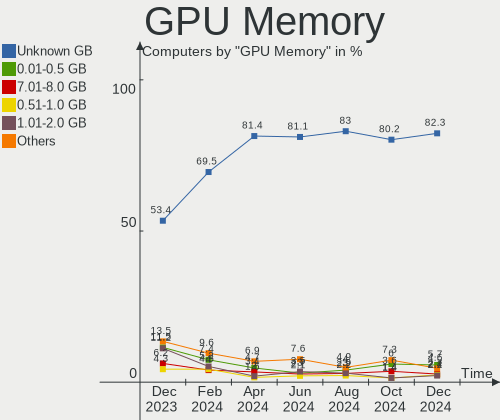
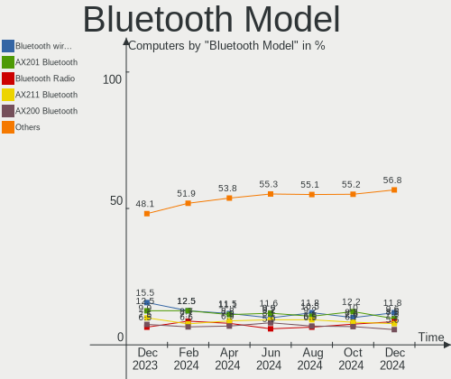

Fedora - Hardware Trends
------------------------

A project to identify most popular hardware characteristics and track their change
over time based on data collected by Linux users at https://Linux-Hardware.org.

Anyone can contribute to this report by the [hw-probe](https://github.com/linuxhw/hw-probe) tool:

    sudo -E hw-probe -all -upload

This is a report for all computer types. See also reports for [desktops](/Dist/Fedora/Desktop/README.md) and [notebooks](/Dist/Fedora/Notebook/README.md).

This report is for one last month. Overall report since the beginning of time: [TestDays](https://github.com/linuxhw/TestDays)

Period: Dec, 2024.

Contents
--------

* [ System ](#system)
  - [ OS                       ](#os)
  - [ OS Family                ](#os-family)
  - [ Kernel                   ](#kernel)
  - [ Kernel Family            ](#kernel-family)
  - [ Kernel Major Ver.        ](#kernel-major-ver)
  - [ Arch                     ](#arch)
  - [ DE                       ](#de)
  - [ Display Server           ](#display-server)
  - [ Display Manager          ](#display-manager)
  - [ OS Lang                  ](#os-lang)
  - [ Boot Mode                ](#boot-mode)
  - [ Filesystem               ](#filesystem)
  - [ Part. scheme             ](#part-scheme)
  - [ Dual Boot with Linux/BSD ](#dual-boot-with-linuxbsd)
  - [ Dual Boot (Win)          ](#dual-boot-win)

* [ Board ](#board)
  - [ Vendor                   ](#vendor)
  - [ Model                    ](#model)
  - [ Model Family             ](#model-family)
  - [ MFG Year                 ](#mfg-year)
  - [ Form Factor              ](#form-factor)
  - [ Secure Boot              ](#secure-boot)
  - [ Coreboot                 ](#coreboot)
  - [ RAM Size                 ](#ram-size)
  - [ RAM Used                 ](#ram-used)
  - [ Total Drives             ](#total-drives)
  - [ Has CD-ROM               ](#has-cd-rom)
  - [ Has Ethernet             ](#has-ethernet)
  - [ Has WiFi                 ](#has-wifi)
  - [ Has Bluetooth            ](#has-bluetooth)

* [ Location ](#location)
  - [ Country                  ](#country)
  - [ City                     ](#city)

* [ Drives ](#drives)
  - [ Drive Vendor             ](#drive-vendor)
  - [ Drive Model              ](#drive-model)
  - [ HDD Vendor               ](#hdd-vendor)
  - [ SSD Vendor               ](#ssd-vendor)
  - [ Drive Kind               ](#drive-kind)
  - [ Drive Connector          ](#drive-connector)
  - [ Drive Size               ](#drive-size)
  - [ Space Total              ](#space-total)
  - [ Space Used               ](#space-used)
  - [ Malfunc. Drives          ](#malfunc-drives)
  - [ Malfunc. Drive Vendor    ](#malfunc-drive-vendor)
  - [ Malfunc. HDD Vendor      ](#malfunc-hdd-vendor)
  - [ Malfunc. Drive Kind      ](#malfunc-drive-kind)
  - [ Failed Drives            ](#failed-drives)
  - [ Failed Drive Vendor      ](#failed-drive-vendor)
  - [ Drive Status             ](#drive-status)

* [ Storage controller ](#storage-controller)
  - [ Storage Vendor           ](#storage-vendor)
  - [ Storage Model            ](#storage-model)
  - [ Storage Kind             ](#storage-kind)

* [ Processor ](#processor)
  - [ CPU Vendor               ](#cpu-vendor)
  - [ CPU Model                ](#cpu-model)
  - [ CPU Model Family         ](#cpu-model-family)
  - [ CPU Cores                ](#cpu-cores)
  - [ CPU Sockets              ](#cpu-sockets)
  - [ CPU Threads              ](#cpu-threads)
  - [ CPU Op-Modes             ](#cpu-op-modes)
  - [ CPU Microcode            ](#cpu-microcode)
  - [ CPU Microarch            ](#cpu-microarch)

* [ Graphics ](#graphics)
  - [ GPU Vendor               ](#gpu-vendor)
  - [ GPU Model                ](#gpu-model)
  - [ GPU Combo                ](#gpu-combo)
  - [ GPU Driver               ](#gpu-driver)
  - [ GPU Memory               ](#gpu-memory)

* [ Monitor ](#monitor)
  - [ Monitor Vendor           ](#monitor-vendor)
  - [ Monitor Model            ](#monitor-model)
  - [ Monitor Resolution       ](#monitor-resolution)
  - [ Monitor Diagonal         ](#monitor-diagonal)
  - [ Monitor Width            ](#monitor-width)
  - [ Aspect Ratio             ](#aspect-ratio)
  - [ Monitor Area             ](#monitor-area)
  - [ Pixel Density            ](#pixel-density)
  - [ Multiple Monitors        ](#multiple-monitors)

* [ Network ](#network)
  - [ Net Controller Vendor    ](#net-controller-vendor)
  - [ Net Controller Model     ](#net-controller-model)
  - [ Wireless Vendor          ](#wireless-vendor)
  - [ Wireless Model           ](#wireless-model)
  - [ Ethernet Vendor          ](#ethernet-vendor)
  - [ Ethernet Model           ](#ethernet-model)
  - [ Net Controller Kind      ](#net-controller-kind)
  - [ Used Controller          ](#used-controller)
  - [ NICs                     ](#nics)
  - [ IPv6                     ](#ipv6)

* [ Bluetooth ](#bluetooth)
  - [ Bluetooth Vendor         ](#bluetooth-vendor)
  - [ Bluetooth Model          ](#bluetooth-model)

* [ Sound ](#sound)
  - [ Sound Vendor             ](#sound-vendor)
  - [ Sound Model              ](#sound-model)

* [ Memory ](#memory)
  - [ Memory Vendor            ](#memory-vendor)
  - [ Memory Model             ](#memory-model)
  - [ Memory Kind              ](#memory-kind)
  - [ Memory Form Factor       ](#memory-form-factor)
  - [ Memory Size              ](#memory-size)
  - [ Memory Speed             ](#memory-speed)

* [ Printers & scanners ](#printers--scanners)
  - [ Printer Vendor           ](#printer-vendor)
  - [ Printer Model            ](#printer-model)
  - [ Scanner Vendor           ](#scanner-vendor)
  - [ Scanner Model            ](#scanner-model)

* [ Camera ](#camera)
  - [ Camera Vendor            ](#camera-vendor)
  - [ Camera Model             ](#camera-model)

* [ Security ](#security)
  - [ Fingerprint Vendor       ](#fingerprint-vendor)
  - [ Fingerprint Model        ](#fingerprint-model)
  - [ Chipcard Vendor          ](#chipcard-vendor)
  - [ Chipcard Model           ](#chipcard-model)

* [ Unsupported ](#unsupported)
  - [ Unsupported Devices      ](#unsupported-devices)
  - [ Unsupported Device Types ](#unsupported-device-types)

System
------

OS
--

Installed operating systems

| Name                  | Computers | Percent |
|-----------------------|-----------|---------|
| Fedora 41             | 506       | 86.79%  |
| Fedora 40             | 52        | 8.92%   |
| Fedora 42             | 13        | 2.23%   |
| Fedora 39             | 5         | 0.86%   |
| Fedora 38             | 3         | 0.51%   |
| Fedora Asahi-remix-40 | 2         | 0.34%   |
| Fedora Asahi-remix-39 | 1         | 0.17%   |
| Fedora 37             | 1         | 0.17%   |

OS Family
---------

OS without a version

| Name   | Computers | Percent |
|--------|-----------|---------|
| Fedora | 583       | 100%    |

Kernel
------

Version of the Linux kernel

| Version                                             | Computers | Percent |
|-----------------------------------------------------|-----------|---------|
| 6.11.10-300.fc41.x86_64                             | 142       | 24.36%  |
| 6.12.6-200.fc41.x86_64                              | 69        | 11.84%  |
| 6.11.11-300.fc41.x86_64                             | 68        | 11.66%  |
| 6.11.4-301.fc41.x86_64                              | 66        | 11.32%  |
| 6.12.4-200.fc41.x86_64                              | 62        | 10.63%  |
| 6.12.5-200.fc41.x86_64                              | 59        | 10.12%  |
| 6.11.8-300.fc41.x86_64                              | 22        | 3.77%   |
| 6.11.10-200.fc40.x86_64                             | 15        | 2.57%   |
| 6.8.5-301.fc40.x86_64                               | 8         | 1.37%   |
| 6.12.5-100.fc40.x86_64                              | 6         | 1.03%   |
| 6.12.4-100.fc40.x86_64                              | 5         | 0.86%   |
| 6.11.11-200.fc40.x86_64                             | 5         | 0.86%   |
| 6.8.9-100.fc38.x86_64                               | 3         | 0.51%   |
| 6.13.0-0.rc4.36.fc42.x86_64                         | 3         | 0.51%   |
| 6.13.0-0.rc3.20241218gitaef25be35d23.31.fc42.x86_64 | 3         | 0.51%   |
| 6.11.9-100.fc39.x86_64                              | 3         | 0.51%   |
| 6.11.7-300.fc41.x86_64                              | 3         | 0.51%   |
| 6.11.6-200.fc40.x86_64                              | 3         | 0.51%   |
| 6.11.4-201.fc40.x86_64                              | 3         | 0.51%   |
| 6.8.10-300.fc40.x86_64                              | 2         | 0.34%   |
| 6.13.0-0.rc2.20241211gitf92f4749861b.24.fc42.x86_64 | 2         | 0.34%   |
| 6.12.6-100.fc40.x86_64                              | 2         | 0.34%   |
| 6.12.4-cb1.0.fc41.x86_64                            | 2         | 0.34%   |
| 6.12.1-404.asahi.fc40.aarch64+16k                   | 2         | 0.34%   |
| 6.9.6-200.fc40.x86_64                               | 1         | 0.17%   |
| 6.8.4-300.es83xx.fc40.x86_64                        | 1         | 0.17%   |
| 6.8.11-300.fc40.x86_64                              | 1         | 0.17%   |
| 6.7.4-200.fc39.x86_64                               | 1         | 0.17%   |
| 6.6.63-clts1.0.fc41.x86_64                          | 1         | 0.17%   |
| 6.5.6-300.fc39.x86_64                               | 1         | 0.17%   |
| 6.13.0-rc3-f44d154d6e3d-revert-133577cad6bf+        | 1         | 0.17%   |
| 6.13.0-0.rc4.20241227gitd6ef8b40d075.39.fc42.x86_64 | 1         | 0.17%   |
| 6.13.0-0.rc3.32.fc41.aarch64                        | 1         | 0.17%   |
| 6.13.0-0.rc3.20241220git8faabc041a00.33.fc42.x86_64 | 1         | 0.17%   |
| 6.13.0-0.rc2.20241210git7cb1b4663150.23.fc42.x86_64 | 1         | 0.17%   |
| 6.13.0-0.rc0.20241119git158f238aa69d.2.fc42.x86_64  | 1         | 0.17%   |
| 6.12.7-200.fc41.x86_64                              | 1         | 0.17%   |
| 6.12.1-200.fc41.x86_64                              | 1         | 0.17%   |
| 6.11.8-200.fc40.x86_64                              | 1         | 0.17%   |
| 6.11.5-300.t2.fc41.x86_64                           | 1         | 0.17%   |

Kernel Family
-------------

Linux kernel without a distro release

| Version | Computers | Percent |
|---------|-----------|---------|
| 6.11.10 | 157       | 26.93%  |
| 6.11.11 | 74        | 12.69%  |
| 6.12.6  | 71        | 12.18%  |
| 6.11.4  | 70        | 12.01%  |
| 6.12.4  | 69        | 11.84%  |
| 6.12.5  | 65        | 11.15%  |
| 6.11.8  | 23        | 3.95%   |
| 6.13.0  | 14        | 2.4%    |
| 6.8.5   | 8         | 1.37%   |
| 6.8.9   | 3         | 0.51%   |
| 6.12.1  | 3         | 0.51%   |
| 6.11.9  | 3         | 0.51%   |
| 6.11.7  | 3         | 0.51%   |
| 6.11.6  | 3         | 0.51%   |
| 6.11.5  | 3         | 0.51%   |
| 6.8.10  | 2         | 0.34%   |
| 6.9.6   | 1         | 0.17%   |
| 6.8.4   | 1         | 0.17%   |
| 6.8.11  | 1         | 0.17%   |
| 6.7.4   | 1         | 0.17%   |
| 6.6.63  | 1         | 0.17%   |
| 6.5.6   | 1         | 0.17%   |
| 6.12.7  | 1         | 0.17%   |
| 6.11.0  | 1         | 0.17%   |
| 6.10.5  | 1         | 0.17%   |
| 6.10.14 | 1         | 0.17%   |
| 6.10.11 | 1         | 0.17%   |
| 6.0.7   | 1         | 0.17%   |

Kernel Major Ver.
-----------------

Linux kernel major version

| Version | Computers | Percent |
|---------|-----------|---------|
| 6.11    | 337       | 57.8%   |
| 6.12    | 209       | 35.85%  |
| 6.8     | 15        | 2.57%   |
| 6.13    | 14        | 2.4%    |
| 6.10    | 3         | 0.51%   |
| 6.9     | 1         | 0.17%   |
| 6.7     | 1         | 0.17%   |
| 6.6     | 1         | 0.17%   |
| 6.5     | 1         | 0.17%   |
| 6.0     | 1         | 0.17%   |

Arch
----

OS architecture (x86_64, i586, etc.)

| Name    | Computers | Percent |
|---------|-----------|---------|
| x86_64  | 578       | 99.14%  |
| aarch64 | 5         | 0.86%   |

DE
--

Desktop Environment

| Name          | Computers | Percent |
|---------------|-----------|---------|
| GNOME         | 387       | 66.38%  |
| KDE6          | 126       | 21.61%  |
| KDE4          | 14        | 2.4%    |
| Cinnamon      | 10        | 1.72%   |
| Unknown       | 9         | 1.54%   |
| X-Cinnamon    | 8         | 1.37%   |
| Budgie        | 6         | 1.03%   |
| XFCE          | 5         | 0.86%   |
| sway          | 5         | 0.86%   |
| GNOME Classic | 3         | 0.51%   |
| Hyprland      | 2         | 0.34%   |
| COSMIC        | 2         | 0.34%   |
| MATE          | 1         | 0.17%   |
| LXDE          | 1         | 0.17%   |
| labwc:wlroots | 1         | 0.17%   |
| KDE5          | 1         | 0.17%   |
| i3            | 1         | 0.17%   |
| Deepin        | 1         | 0.17%   |

Display Server
--------------

X11 or Wayland

| Name    | Computers | Percent |
|---------|-----------|---------|
| Wayland | 506       | 86.79%  |
| X11     | 46        | 7.89%   |
| Tty     | 28        | 4.8%    |
| Unknown | 2         | 0.34%   |
| Web     | 1         | 0.17%   |

Display Manager
---------------

SDDM, LightDM, etc.

| Name    | Computers | Percent |
|---------|-----------|---------|
| Unknown | 357       | 61.23%  |
| GDM     | 123       | 21.1%   |
| SDDM    | 67        | 11.49%  |
| LightDM | 31        | 5.32%   |
| GREETD  | 4         | 0.69%   |
| LXDM    | 1         | 0.17%   |

OS Lang
-------

Language

| Lang       | Computers | Percent |
|------------|-----------|---------|
| en_US      | 321       | 55.06%  |
| en_GB      | 39        | 6.69%   |
| pt_BR      | 29        | 4.97%   |
| de_DE      | 28        | 4.8%    |
| fr_FR      | 19        | 3.26%   |
| it_IT      | 17        | 2.92%   |
| ru_RU      | 15        | 2.57%   |
| en_AU      | 15        | 2.57%   |
| pl_PL      | 12        | 2.06%   |
| en_CA      | 12        | 2.06%   |
| es_ES      | 10        | 1.72%   |
| en_IN      | 5         | 0.86%   |
| tr_TR      | 4         | 0.69%   |
| es_MX      | 4         | 0.69%   |
| sv_SE      | 3         | 0.51%   |
| fr_CH      | 3         | 0.51%   |
| fr_BE      | 3         | 0.51%   |
| es_VE      | 3         | 0.51%   |
| Unknown    | 3         | 0.51%   |
| zh_CN      | 2         | 0.34%   |
| pt_PT      | 2         | 0.34%   |
| nl_NL      | 2         | 0.34%   |
| nl_BE      | 2         | 0.34%   |
| fi_FI      | 2         | 0.34%   |
| es_PE      | 2         | 0.34%   |
| es_EC      | 2         | 0.34%   |
| es_CO      | 2         | 0.34%   |
| es_CL      | 2         | 0.34%   |
| en_PH      | 2         | 0.34%   |
| en_NZ      | 2         | 0.34%   |
| zh_TW      | 1         | 0.17%   |
| zh_CN.UTF8 | 1         | 0.17%   |
| uk_UA      | 1         | 0.17%   |
| tr_CY      | 1         | 0.17%   |
| sl_SI      | 1         | 0.17%   |
| hu_HU      | 1         | 0.17%   |
| fr_CA      | 1         | 0.17%   |
| en_ZA      | 1         | 0.17%   |
| en_SG      | 1         | 0.17%   |
| en_IE      | 1         | 0.17%   |

Boot Mode
---------

EFI or BIOS

| Mode | Computers | Percent |
|------|-----------|---------|
| BIOS | 374       | 64.15%  |
| EFI  | 209       | 35.85%  |

Filesystem
----------

Type of filesystem

| Type    | Computers | Percent |
|---------|-----------|---------|
| Btrfs   | 469       | 80.45%  |
| Ext4    | 73        | 12.52%  |
| Overlay | 16        | 2.74%   |
| Xfs     | 15        | 2.57%   |
| Tmpfs   | 8         | 1.37%   |
| Unknown | 2         | 0.34%   |

Part. scheme
------------

Scheme of partitioning

| Type    | Computers | Percent |
|---------|-----------|---------|
| Unknown | 348       | 59.69%  |
| GPT     | 227       | 38.94%  |
| MBR     | 8         | 1.37%   |

Dual Boot with Linux/BSD
------------------------

Hosting more than one Linux/BSD

| Dual boot | Computers | Percent |
|-----------|-----------|---------|
| No        | 537       | 92.11%  |
| Yes       | 46        | 7.89%   |

Dual Boot (Win)
---------------

Hosting Linux and Windows

| Dual boot | Computers | Percent |
|-----------|-----------|---------|
| No        | 497       | 85.25%  |
| Yes       | 86        | 14.75%  |

Board
-----

Vendor
------

Motherboard manufacturer

| Name                                 | Computers | Percent |
|--------------------------------------|-----------|---------|
| ASUSTek Computer                     | 118       | 20.24%  |
| Lenovo                               | 107       | 18.35%  |
| Dell                                 | 64        | 10.98%  |
| Hewlett-Packard                      | 56        | 9.61%   |
| Gigabyte Technology                  | 43        | 7.38%   |
| MSI                                  | 40        | 6.86%   |
| Acer                                 | 23        | 3.95%   |
| ASRock                               | 21        | 3.6%    |
| Apple                                | 21        | 3.6%    |
| Toshiba                              | 7         | 1.2%    |
| Samsung Electronics                  | 7         | 1.2%    |
| Intel                                | 7         | 1.2%    |
| HUAWEI                               | 6         | 1.03%   |
| Unknown                              | 6         | 1.03%   |
| Framework                            | 5         | 0.86%   |
| Pegatron                             | 4         | 0.69%   |
| AZW                                  | 4         | 0.69%   |
| Timi                                 | 3         | 0.51%   |
| Google                               | 3         | 0.51%   |
| Fujitsu                              | 3         | 0.51%   |
| TUXEDO                               | 2         | 0.34%   |
| Microsoft                            | 2         | 0.34%   |
| Chuwi                                | 2         | 0.34%   |
| XIAOMI                               | 1         | 0.17%   |
| w 9k                                 | 1         | 0.17%   |
| Valve                                | 1         | 0.17%   |
| System76                             | 1         | 0.17%   |
| Supermicro                           | 1         | 0.17%   |
| Sony                                 | 1         | 0.17%   |
| SLIMBOOK                             | 1         | 0.17%   |
| Shenzhen Meigao Electronic Equipment | 1         | 0.17%   |
| Raspberry Pi Foundation              | 1         | 0.17%   |
| Radxa                                | 1         | 0.17%   |
| Positivo                             | 1         | 0.17%   |
| PC Specialist                        | 1         | 0.17%   |
| Packard Bell                         | 1         | 0.17%   |
| ONE-NETBOOK TECHNOLOGY               | 1         | 0.17%   |
| Monster                              | 1         | 0.17%   |
| LG Electronics                       | 1         | 0.17%   |
| KVADRA                               | 1         | 0.17%   |

Model
-----

Motherboard model

| Name                                        | Computers | Percent |
|---------------------------------------------|-----------|---------|
| Unknown                                     | 8         | 1.37%   |
| HP Pavilion Desktop TP01-2xxx               | 4         | 0.69%   |
| Framework Laptop 16 (AMD Ryzen 7040 Series) | 4         | 0.69%   |
| ASUS All Series                             | 4         | 0.69%   |
| HP Laptop 15s-eq2xxx                        | 3         | 0.51%   |
| ASUS ASUS Zenbook S 14 UX5406SA_UX5406SA    | 3         | 0.51%   |
| ASUS ASUS Zenbook 14 UX3405MA_UX3405MA      | 3         | 0.51%   |
| Samsung 550XDA                              | 2         | 0.34%   |
| MSI MS-7E51                                 | 2         | 0.34%   |
| MSI MS-7C96                                 | 2         | 0.34%   |
| MSI MS-7C91                                 | 2         | 0.34%   |
| MSI MS-7C56                                 | 2         | 0.34%   |
| Lenovo LOQ 15IAX9 83GS                      | 2         | 0.34%   |
| Lenovo LOQ 15ARP9 83JC                      | 2         | 0.34%   |
| Lenovo Legion 9 16IRX9 83G0                 | 2         | 0.34%   |
| Lenovo Legion 5 16IRX9 83DG                 | 2         | 0.34%   |
| Lenovo IdeaPad Gaming 3 15ACH6 82K2         | 2         | 0.34%   |
| Lenovo IdeaPad 3 15ALC6 82KU                | 2         | 0.34%   |
| HUAWEI KLVL-WXX9                            | 2         | 0.34%   |
| HP 15 Notebook PC                           | 2         | 0.34%   |
| Gigabyte X870 EAGLE WIFI7                   | 2         | 0.34%   |
| Gigabyte H410M H V2                         | 2         | 0.34%   |
| Gigabyte B450M DS3H                         | 2         | 0.34%   |
| Dell Precision Tower 5810                   | 2         | 0.34%   |
| Dell OptiPlex 7010                          | 2         | 0.34%   |
| Dell Latitude E5550                         | 2         | 0.34%   |
| Dell Latitude 5400                          | 2         | 0.34%   |
| Dell Latitude 5175                          | 2         | 0.34%   |
| AZW MINI S                                  | 2         | 0.34%   |
| ASUS VivoBook_ASUSLaptop M3704YA_M3704YA    | 2         | 0.34%   |
| ASUS TUF Gaming B550M-PLUS WIFI II          | 2         | 0.34%   |
| ASUS TUF B450M-PLUS GAMING                  | 2         | 0.34%   |
| ASUS ROG STRIX B650E-I GAMING WIFI          | 2         | 0.34%   |
| ASUS ROG STRIX B550-F GAMING                | 2         | 0.34%   |
| ASUS ProArt X870E-CREATOR WIFI              | 2         | 0.34%   |
| ASUS PRIME H510M-K                          | 2         | 0.34%   |
| ASUS PRIME B450-PLUS                        | 2         | 0.34%   |
| ASUS ASUS Zenbook 14 UM3406HA_UM3406HA      | 2         | 0.34%   |
| ASRock B450 Gaming K4                       | 2         | 0.34%   |
| Apple MacBookPro8,1                         | 2         | 0.34%   |

Model Family
------------

Motherboard model prefix

| Name               | Computers | Percent |
|--------------------|-----------|---------|
| Lenovo ThinkPad    | 51        | 8.75%   |
| ASUS ROG           | 22        | 3.77%   |
| Dell Latitude      | 20        | 3.43%   |
| ASUS PRIME         | 20        | 3.43%   |
| Dell Inspiron      | 15        | 2.57%   |
| ASUS ASUS          | 15        | 2.57%   |
| Lenovo IdeaPad     | 14        | 2.4%    |
| Acer Aspire        | 13        | 2.23%   |
| ASUS TUF           | 12        | 2.06%   |
| Lenovo Legion      | 11        | 1.89%   |
| ASUS VivoBook      | 11        | 1.89%   |
| HP Pavilion        | 10        | 1.72%   |
| HP ProBook         | 9         | 1.54%   |
| Dell XPS           | 9         | 1.54%   |
| Lenovo Yoga        | 8         | 1.37%   |
| Dell Precision     | 8         | 1.37%   |
| Unknown            | 8         | 1.37%   |
| Lenovo LOQ         | 7         | 1.2%    |
| Toshiba Satellite  | 6         | 1.03%   |
| HP Laptop          | 6         | 1.03%   |
| Dell OptiPlex      | 6         | 1.03%   |
| ASUS Zenbook       | 6         | 1.03%   |
| Lenovo IdeaPadFlex | 5         | 0.86%   |
| Framework Laptop   | 5         | 0.86%   |
| Apple MacBookPro11 | 5         | 0.86%   |
| Acer Nitro         | 5         | 0.86%   |
| Lenovo ThinkCentre | 4         | 0.69%   |
| HP EliteDesk       | 4         | 0.69%   |
| HP EliteBook       | 4         | 0.69%   |
| ASUS ProArt        | 4         | 0.69%   |
| ASUS All           | 4         | 0.69%   |
| Lenovo ThinkBook   | 3         | 0.51%   |
| HP ENVY            | 3         | 0.51%   |
| Gigabyte X570      | 3         | 0.51%   |
| Gigabyte B450M     | 3         | 0.51%   |
| ASUS STRIX         | 3         | 0.51%   |
| ASRock B450        | 3         | 0.51%   |
| Apple MacBookPro8  | 3         | 0.51%   |
| Acer Swift         | 3         | 0.51%   |
| Samsung 550XDA     | 2         | 0.34%   |

MFG Year
--------

Motherboard manufacture year

| Year    | Computers | Percent |
|---------|-----------|---------|
| 2024    | 72        | 12.35%  |
| 2021    | 65        | 11.15%  |
| 2018    | 57        | 9.78%   |
| 2023    | 56        | 9.61%   |
| 2022    | 51        | 8.75%   |
| 2020    | 50        | 8.58%   |
| 2019    | 35        | 6%      |
| 2017    | 30        | 5.15%   |
| 2014    | 26        | 4.46%   |
| 2015    | 25        | 4.29%   |
| 2012    | 25        | 4.29%   |
| 2013    | 24        | 4.12%   |
| 2016    | 21        | 3.6%    |
| 2011    | 16        | 2.74%   |
| 2010    | 11        | 1.89%   |
| 2008    | 7         | 1.2%    |
| 2009    | 4         | 0.69%   |
| 2007    | 3         | 0.51%   |
| Unknown | 3         | 0.51%   |
| 2006    | 1         | 0.17%   |
| 2005    | 1         | 0.17%   |

Form Factor
-----------

Physical design of the computer

| Name           | Computers | Percent |
|----------------|-----------|---------|
| Notebook       | 328       | 56.26%  |
| Desktop        | 201       | 34.48%  |
| Convertible    | 21        | 3.6%    |
| Tablet         | 10        | 1.72%   |
| Mini pc        | 9         | 1.54%   |
| All in one     | 9         | 1.54%   |
| Server         | 3         | 0.51%   |
| System on chip | 2         | 0.34%   |

Secure Boot
-----------

Enabled or disabled

| State    | Computers | Percent |
|----------|-----------|---------|
| Disabled | 530       | 90.91%  |
| Enabled  | 53        | 9.09%   |

Coreboot
--------

Have coreboot on board

| Used | Computers | Percent |
|------|-----------|---------|
| No   | 579       | 99.31%  |
| Yes  | 4         | 0.69%   |

RAM Size
--------

Total RAM memory

| Size in GB      | Computers | Percent |
|-----------------|-----------|---------|
| 16.01-24.0      | 134       | 22.98%  |
| 8.01-16.0       | 112       | 19.21%  |
| 32.01-64.0      | 111       | 19.04%  |
| 4.01-8.0        | 100       | 17.15%  |
| 64.01-256.0     | 44        | 7.55%   |
| 3.01-4.0        | 38        | 6.52%   |
| 24.01-32.0      | 38        | 6.52%   |
| 2.01-3.0        | 3         | 0.51%   |
| 1.01-2.0        | 2         | 0.34%   |
| More than 256.0 | 1         | 0.17%   |

RAM Used
--------

Used RAM memory

| Used GB     | Computers | Percent |
|-------------|-----------|---------|
| 4.01-8.0    | 208       | 35.68%  |
| 3.01-4.0    | 148       | 25.39%  |
| 2.01-3.0    | 117       | 20.07%  |
| 8.01-16.0   | 57        | 9.78%   |
| 1.01-2.0    | 35        | 6%      |
| 0.51-1.0    | 6         | 1.03%   |
| 32.01-64.0  | 4         | 0.69%   |
| 16.01-24.0  | 4         | 0.69%   |
| 24.01-32.0  | 3         | 0.51%   |
| 64.01-256.0 | 1         | 0.17%   |

Total Drives
------------

Number of drives on board

| Drives | Computers | Percent |
|--------|-----------|---------|
| 1      | 332       | 56.95%  |
| 2      | 153       | 26.24%  |
| 3      | 53        | 9.09%   |
| 4      | 26        | 4.46%   |
| 5      | 8         | 1.37%   |
| 6      | 6         | 1.03%   |
| 7      | 2         | 0.34%   |
| 13     | 1         | 0.17%   |
| 9      | 1         | 0.17%   |
| 8      | 1         | 0.17%   |

Has CD-ROM
----------

Has CD-ROM on board

| Presented | Computers | Percent |
|-----------|-----------|---------|
| No        | 487       | 83.53%  |
| Yes       | 96        | 16.47%  |

Has Ethernet
------------

Has Ethernet on board

| Presented | Computers | Percent |
|-----------|-----------|---------|
| Yes       | 465       | 79.76%  |
| No        | 118       | 20.24%  |

Has WiFi
--------

Has WiFi module

| Presented | Computers | Percent |
|-----------|-----------|---------|
| Yes       | 461       | 79.07%  |
| No        | 122       | 20.93%  |

Has Bluetooth
-------------

Has Bluetooth module

| Presented | Computers | Percent |
|-----------|-----------|---------|
| Yes       | 444       | 76.16%  |
| No        | 139       | 23.84%  |

Location
--------

Country
-------

Geographic location (country)

| Country         | Computers | Percent |
|-----------------|-----------|---------|
| USA             | 128       | 21.96%  |
| Germany         | 48        | 8.23%   |
| Brazil          | 37        | 6.35%   |
| Russia          | 27        | 4.63%   |
| Italy           | 27        | 4.63%   |
| France          | 25        | 4.29%   |
| Canada          | 21        | 3.6%    |
| UK              | 20        | 3.43%   |
| India           | 20        | 3.43%   |
| Australia       | 17        | 2.92%   |
| Spain           | 14        | 2.4%    |
| Poland          | 13        | 2.23%   |
| Mexico          | 10        | 1.72%   |
| Austria         | 10        | 1.72%   |
| Netherlands     | 9         | 1.54%   |
| Turkey          | 8         | 1.37%   |
| Belgium         | 8         | 1.37%   |
| Sweden          | 7         | 1.2%    |
| Finland         | 7         | 1.2%    |
| Slovakia        | 6         | 1.03%   |
| Czechia         | 6         | 1.03%   |
| Switzerland     | 5         | 0.86%   |
| Portugal        | 5         | 0.86%   |
| Greece          | 5         | 0.86%   |
| Chile           | 5         | 0.86%   |
| Bulgaria        | 5         | 0.86%   |
| Vietnam         | 4         | 0.69%   |
| Malaysia        | 4         | 0.69%   |
| Japan           | 4         | 0.69%   |
| Egypt           | 4         | 0.69%   |
| Venezuela       | 3         | 0.51%   |
| Serbia          | 3         | 0.51%   |
| Romania         | 3         | 0.51%   |
| Norway          | 3         | 0.51%   |
| Colombia        | 3         | 0.51%   |
| The Netherlands | 2         | 0.34%   |
| Thailand        | 2         | 0.34%   |
| Taiwan          | 2         | 0.34%   |
| Slovenia        | 2         | 0.34%   |
| Singapore       | 2         | 0.34%   |

City
----

Geographic location (city)

| City          | Computers | Percent |
|---------------|-----------|---------|
| Sydney        | 14        | 2.4%    |
| Vienna        | 9         | 1.54%   |
| Berlin        | 8         | 1.37%   |
| St Petersburg | 6         | 1.03%   |
| Milan         | 6         | 1.03%   |
| Helsinki      | 6         | 1.03%   |
| Moscow        | 5         | 0.86%   |
| Warsaw        | 4         | 0.69%   |
| Sao Paulo     | 4         | 0.69%   |
| Paris         | 4         | 0.69%   |
| Mexico City   | 4         | 0.69%   |
| Bratislava    | 4         | 0.69%   |
| Vancouver     | 3         | 0.51%   |
| Sofia         | 3         | 0.51%   |
| Seattle       | 3         | 0.51%   |
| Santiago      | 3         | 0.51%   |
| Reutlingen    | 3         | 0.51%   |
| Pune          | 3         | 0.51%   |
| Prague        | 3         | 0.51%   |
| Munich        | 3         | 0.51%   |
| Melbourne     | 3         | 0.51%   |
| Karlsruhe     | 3         | 0.51%   |
| Dallas        | 3         | 0.51%   |
| Cypress       | 3         | 0.51%   |
| Cologne       | 3         | 0.51%   |
| Willits       | 2         | 0.34%   |
| Umeå         | 2         | 0.34%   |
| Tokyo         | 2         | 0.34%   |
| Temuco        | 2         | 0.34%   |
| Stuttgart     | 2         | 0.34%   |
| Singapore     | 2         | 0.34%   |
| San Jose      | 2         | 0.34%   |
| Rochester     | 2         | 0.34%   |
| Richmond Hill | 2         | 0.34%   |
| Quito         | 2         | 0.34%   |
| Portland      | 2         | 0.34%   |
| Panama City   | 2         | 0.34%   |
| Naples        | 2         | 0.34%   |
| Montreal      | 2         | 0.34%   |
| Mombasa       | 2         | 0.34%   |

Drives
------

Drive Vendor
------------

Hard drive vendors

| Vendor                         | Computers | Drives | Percent |
|--------------------------------|-----------|--------|---------|
| Samsung Electronics            | 160       | 214    | 18.06%  |
| Sandisk                        | 94        | 97     | 10.61%  |
| WDC                            | 74        | 95     | 8.35%   |
| Seagate                        | 71        | 90     | 8.01%   |
| Micron Technology              | 46        | 47     | 5.19%   |
| Kingston                       | 45        | 50     | 5.08%   |
| Crucial                        | 32        | 35     | 3.61%   |
| SK hynix                       | 31        | 33     | 3.5%    |
| Unknown                        | 29        | 31     | 3.27%   |
| Toshiba                        | 29        | 30     | 3.27%   |
| Intel                          | 22        | 23     | 2.48%   |
| Phison Electronics             | 20        | 21     | 2.26%   |
| Micron/Crucial Technology      | 15        | 17     | 1.69%   |
| KIOXIA                         | 14        | 14     | 1.58%   |
| Kingston Technology Company    | 14        | 14     | 1.58%   |
| Hitachi                        | 13        | 14     | 1.47%   |
| A-DATA Technology              | 13        | 13     | 1.47%   |
| Apple                          | 12        | 20     | 1.35%   |
| China                          | 11        | 11     | 1.24%   |
| Silicon Motion                 | 10        | 10     | 1.13%   |
| MAXIO Technology (Hangzhou)    | 9         | 9      | 1.02%   |
| HGST                           | 8         | 9      | 0.9%    |
| PNY                            | 7         | 7      | 0.79%   |
| Realtek Semiconductor          | 6         | 6      | 0.68%   |
| ADATA Technology               | 6         | 7      | 0.68%   |
| Shenzhen Longsys Electronics   | 5         | 5      | 0.56%   |
| JMicron Technology             | 5         | 8      | 0.56%   |
| Transcend                      | 4         | 4      | 0.45%   |
| LITEON                         | 4         | 4      | 0.45%   |
| Union Memory (Shenzhen)        | 3         | 3      | 0.34%   |
| SPCC                           | 3         | 3      | 0.34%   |
| Realtek                        | 3         | 3      | 0.34%   |
| Patriot                        | 3         | 3      | 0.34%   |
| Fanxiang                       | 3         | 3      | 0.34%   |
| T-FORCE                        | 2         | 2      | 0.23%   |
| Solid State Storage Technology | 2         | 2      | 0.23%   |
| Seagate Technology             | 2         | 2      | 0.23%   |
| Plextor                        | 2         | 2      | 0.23%   |
| LITEONIT                       | 2         | 2      | 0.23%   |
| Lexar                          | 2         | 2      | 0.23%   |

Drive Model
-----------

Hard drive models

| Model                                                 | Computers | Percent |
|-------------------------------------------------------|-----------|---------|
| Samsung NVMe SSD Controller SM981/PM981/PM983 512GB   | 35        | 3.59%   |
| Samsung NVMe SSD Controller PM9A1/PM9A3/980PRO 512GB  | 29        | 2.97%   |
| Kingston SA400S37240G 240GB SSD                       | 13        | 1.33%   |
| Samsung NVMe SSD Controller SM961/PM961/SM963 256GB   | 12        | 1.23%   |
| Silicon Motion SM2263EN/SM2263XT SSD Controller 256GB | 10        | 1.03%   |
| Samsung SSD 980 1TB                                   | 9         | 0.92%   |
| Unknown MMC Card  32GB                                | 8         | 0.82%   |
| MAXIO (Hangzhou) NVMe SSD Controller MAP1202 512GB    | 8         | 0.82%   |
| Unknown MMC Card  64GB                                | 7         | 0.72%   |
| Sandisk WD Blue SN550 NVMe SSD 256GB                  | 7         | 0.72%   |
| Samsung SSD 990 PRO 2TB                               | 7         | 0.72%   |
| Samsung SSD 860 EVO 500GB                             | 7         | 0.72%   |
| Sandisk WD PC SN560 SDDPNQE-1T00-1102 1024GB          | 6         | 0.62%   |
| Sandisk WD Black SN850 2TB                            | 6         | 0.62%   |
| Phison E12 NVMe Controller 480GB                      | 6         | 0.62%   |
| Crucial CT1000BX500SSD1 1TB                           | 6         | 0.62%   |
| Seagate ST4000DM004-2CV104 4TB                        | 5         | 0.51%   |
| Seagate ST1000LM035-1RK172 1TB                        | 5         | 0.51%   |
| Seagate ST1000DM010-2EP102 1TB                        | 5         | 0.51%   |
| Sandisk WD_BLACK SN770 2TB                            | 5         | 0.51%   |
| Samsung SSD 850 EVO 250GB                             | 5         | 0.51%   |
| Micron/Crucial P2 NVMe PCIe SSD 500GB                 | 5         | 0.51%   |
| Kingston SA400S37960G 960GB SSD                       | 5         | 0.51%   |
| Kingston SA400S37480G 480GB SSD                       | 5         | 0.51%   |
| Crucial CT500MX500SSD1 500GB                          | 5         | 0.51%   |
| Crucial CT480BX500SSD1 480GB                          | 5         | 0.51%   |
| WDC WD10EZEX-08WN4A0 1TB                              | 4         | 0.41%   |
| Toshiba MQ04ABF100 1TB                                | 4         | 0.41%   |
| Seagate ST2000DM008-2UB102 2TB                        | 4         | 0.41%   |
| Sandisk WD Black 2018/SN750 / PC SN720 NVMe SSD 512GB | 4         | 0.41%   |
| Samsung SSD 990 PRO 1TB                               | 4         | 0.41%   |
| Samsung SSD 870 QVO 1TB                               | 4         | 0.41%   |
| Samsung SSD 860 EVO 1TB                               | 4         | 0.41%   |
| Phison PS5013 E13 NVMe Controller 512GB               | 4         | 0.41%   |
| Phison E16 PCIe4 NVMe Controller 1TB                  | 4         | 0.41%   |
| Micron MTFDKBA1T0QFM-1BD1AABGB 1024GB                 | 4         | 0.41%   |
| Micron 2450_MTFDKBA512TFK 512GB                       | 4         | 0.41%   |
| Micron 2400_MTFDKBA512QFM 512GB                       | 4         | 0.41%   |
| Kingston Company SNV2S1000G 1TB                       | 4         | 0.41%   |
| Crucial CT240BX500SSD1 240GB                          | 4         | 0.41%   |

HDD Vendor
----------

Hard disk drive vendors

| Vendor              | Computers | Drives | Percent |
|---------------------|-----------|--------|---------|
| Seagate             | 68        | 85     | 37.16%  |
| WDC                 | 57        | 73     | 31.15%  |
| Toshiba             | 18        | 19     | 9.84%   |
| Hitachi             | 13        | 14     | 7.1%    |
| HGST                | 8         | 9      | 4.37%   |
| Samsung Electronics | 5         | 6      | 2.73%   |
| JMicron Technology  | 5         | 8      | 2.73%   |
| Unknown             | 2         | 2      | 1.09%   |
| ASMT                | 2         | 3      | 1.09%   |
| Verbatim            | 1         | 1      | 0.55%   |
| StoreJet            | 1         | 1      | 0.55%   |
| SABRENT             | 1         | 1      | 0.55%   |
| Maxtor              | 1         | 1      | 0.55%   |
| External            | 1         | 1      | 0.55%   |

SSD Vendor
----------

Solid state drive vendors

| Vendor              | Computers | Drives | Percent |
|---------------------|-----------|--------|---------|
| Samsung Electronics | 51        | 60     | 19.62%  |
| Kingston            | 32        | 36     | 12.31%  |
| Crucial             | 32        | 35     | 12.31%  |
| SanDisk             | 22        | 23     | 8.46%   |
| WDC                 | 19        | 22     | 7.31%   |
| China               | 11        | 11     | 4.23%   |
| SK hynix            | 9         | 9      | 3.46%   |
| Intel               | 9         | 9      | 3.46%   |
| A-DATA Technology   | 9         | 9      | 3.46%   |
| PNY                 | 7         | 7      | 2.69%   |
| Micron Technology   | 7         | 7      | 2.69%   |
| Apple               | 6         | 6      | 2.31%   |
| LITEON              | 4         | 4      | 1.54%   |
| SPCC                | 3         | 3      | 1.15%   |
| Patriot             | 3         | 3      | 1.15%   |
| Transcend           | 2         | 2      | 0.77%   |
| Toshiba             | 2         | 2      | 0.77%   |
| Plextor             | 2         | 2      | 0.77%   |
| LITEONIT            | 2         | 2      | 0.77%   |
| Lexar               | 2         | 2      | 0.77%   |
| XrayDisk            | 1         | 1      | 0.38%   |
| Vaseky              | 1         | 1      | 0.38%   |
| Timetec             | 1         | 1      | 0.38%   |
| Thinkplus           | 1         | 1      | 0.38%   |
| T-FORCE             | 1         | 1      | 0.38%   |
| SSK SSD             | 1         | 1      | 0.38%   |
| Ramsta              | 1         | 1      | 0.38%   |
| OCZ                 | 1         | 1      | 0.38%   |
| Netac               | 1         | 1      | 0.38%   |
| Mushkin             | 1         | 1      | 0.38%   |
| LDLC                | 1         | 1      | 0.38%   |
| KingSpec            | 1         | 1      | 0.38%   |
| Intenso             | 1         | 1      | 0.38%   |
| Hewlett-Packard     | 1         | 1      | 0.38%   |
| GOODRAM             | 1         | 1      | 0.38%   |
| Gigastone           | 1         | 1      | 0.38%   |
| Gigabyte Technology | 1         | 1      | 0.38%   |
| Fanxiang            | 1         | 1      | 0.38%   |
| Emtec               | 1         | 2      | 0.38%   |
| CT500MX5            | 1         | 1      | 0.38%   |

Drive Kind
----------

HDD or SSD

| Kind    | Computers | Drives | Percent |
|---------|-----------|--------|---------|
| NVMe    | 377       | 474    | 47.54%  |
| SSD     | 222       | 281    | 27.99%  |
| HDD     | 156       | 224    | 19.67%  |
| MMC     | 22        | 24     | 2.77%   |
| Unknown | 16        | 16     | 2.02%   |

Drive Connector
---------------

SATA, SAS, NVMe, etc.

| Type | Computers | Drives | Percent |
|------|-----------|--------|---------|
| NVMe | 376       | 469    | 51.44%  |
| SATA | 290       | 475    | 39.67%  |
| SAS  | 43        | 51     | 5.88%   |
| MMC  | 22        | 24     | 3.01%   |

Drive Size
----------

Size of hard drive

| Size in TB | Computers | Drives | Percent |
|------------|-----------|--------|---------|
| 0.01-0.5   | 201       | 260    | 50.5%   |
| 0.51-1.0   | 119       | 146    | 29.9%   |
| 1.01-2.0   | 44        | 52     | 11.06%  |
| 3.01-4.0   | 16        | 21     | 4.02%   |
| 4.01-10.0  | 8         | 13     | 2.01%   |
| 10.01-20.0 | 7         | 10     | 1.76%   |
| 2.01-3.0   | 3         | 3      | 0.75%   |

Space Total
-----------

Amount of disk space available on the file system

| Size in GB     | Computers | Percent |
|----------------|-----------|---------|
| 501-1000       | 127       | 21.78%  |
| 1001-2000      | 118       | 20.24%  |
| 251-500        | 90        | 15.44%  |
| More than 3000 | 66        | 11.32%  |
| 1-20           | 47        | 8.06%   |
| 101-250        | 44        | 7.55%   |
| Unknown        | 43        | 7.38%   |
| 2001-3000      | 21        | 3.6%    |
| 51-100         | 20        | 3.43%   |
| 21-50          | 7         | 1.2%    |

Space Used
----------

Amount of used disk space

| Used GB        | Computers | Percent |
|----------------|-----------|---------|
| 1-20           | 169       | 28.99%  |
| 21-50          | 92        | 15.78%  |
| 251-500        | 68        | 11.66%  |
| 101-250        | 68        | 11.66%  |
| 501-1000       | 47        | 8.06%   |
| 51-100         | 43        | 7.38%   |
| Unknown        | 43        | 7.38%   |
| 1001-2000      | 26        | 4.46%   |
| More than 3000 | 18        | 3.09%   |
| 2001-3000      | 9         | 1.54%   |

Malfunc. Drives
---------------

Drive models with a malfunction

| Model                                          | Computers | Drives | Percent |
|------------------------------------------------|-----------|--------|---------|
| Intel SSDSC2CT120A3 120GB                      | 2         | 2      | 8.33%   |
| WDC WDS500G2B0A-00SM50 500GB SSD               | 1         | 1      | 4.17%   |
| WDC WDS120G2G0B-00EPW0 120GB SSD               | 1         | 1      | 4.17%   |
| WDC WD5000LPCX-60VHAT0 500GB                   | 1         | 1      | 4.17%   |
| WDC WD5000AZLX-00ZR6A0 500GB                   | 1         | 1      | 4.17%   |
| WDC WD5000AVCS-632DY1 500GB                    | 1         | 1      | 4.17%   |
| WDC WD40EFRX-68N32N0 4TB                       | 1         | 1      | 4.17%   |
| WDC WD1600AVVS-63L2B0 160GB                    | 1         | 1      | 4.17%   |
| WDC WD10SPZX-60Z10T0 1TB                       | 1         | 1      | 4.17%   |
| Toshiba DT01ACA100 1TB                         | 1         | 1      | 4.17%   |
| SPCC Solid State Disk 120GB                    | 1         | 1      | 4.17%   |
| Seagate ST1000LM048-2E7172 1TB                 | 1         | 1      | 4.17%   |
| Seagate ST1000DX002-2DV162 1TB                 | 1         | 1      | 4.17%   |
| Samsung Electronics SSD 850 PRO 2TB            | 1         | 1      | 4.17%   |
| Samsung Electronics HD501LJ 500GB              | 1         | 2      | 4.17%   |
| Realtek Semiconductor ADATA SX6000PNP 1TB      | 1         | 1      | 4.17%   |
| PNY 1TB SATA SSD                               | 1         | 1      | 4.17%   |
| Micron Technology 1100_MTFDDAV512TBN 512GB SSD | 1         | 1      | 4.17%   |
| Kingston SV300S37A120G 120GB SSD               | 1         | 1      | 4.17%   |
| Kingston SA400S37960G 960GB SSD                | 1         | 2      | 4.17%   |
| Intel SSDSA2M160G2GC 160GB                     | 1         | 1      | 4.17%   |
| Hitachi HTS727550A9E364 500GB                  | 1         | 1      | 4.17%   |
| China SATA3 240GB SSD                          | 1         | 1      | 4.17%   |

Malfunc. Drive Vendor
---------------------

Vendors of faulty drives

| Vendor                | Computers | Drives | Percent |
|-----------------------|-----------|--------|---------|
| WDC                   | 8         | 8      | 33.33%  |
| Intel                 | 3         | 3      | 12.5%   |
| Seagate               | 2         | 2      | 8.33%   |
| Samsung Electronics   | 2         | 3      | 8.33%   |
| Kingston              | 2         | 3      | 8.33%   |
| Toshiba               | 1         | 1      | 4.17%   |
| SPCC                  | 1         | 1      | 4.17%   |
| Realtek Semiconductor | 1         | 1      | 4.17%   |
| PNY                   | 1         | 1      | 4.17%   |
| Micron Technology     | 1         | 1      | 4.17%   |
| Hitachi               | 1         | 1      | 4.17%   |
| China                 | 1         | 1      | 4.17%   |

Malfunc. HDD Vendor
-------------------

Vendors of faulty HDD drives

| Vendor              | Computers | Drives | Percent |
|---------------------|-----------|--------|---------|
| WDC                 | 6         | 6      | 54.55%  |
| Seagate             | 2         | 2      | 18.18%  |
| Toshiba             | 1         | 1      | 9.09%   |
| Samsung Electronics | 1         | 2      | 9.09%   |
| Hitachi             | 1         | 1      | 9.09%   |

Malfunc. Drive Kind
-------------------

Kinds of faulty drives

| Kind | Computers | Drives | Percent |
|------|-----------|--------|---------|
| SSD  | 12        | 13     | 52.17%  |
| HDD  | 10        | 12     | 43.48%  |
| NVMe | 1         | 1      | 4.35%   |

Failed Drives
-------------

Failed drive models

| Model                | Computers | Drives | Percent |
|----------------------|-----------|--------|---------|
| Hitachi HDS72101 1TB | 1         | 1      | 100%    |

Failed Drive Vendor
-------------------

Failed drive vendors

| Vendor  | Computers | Drives | Percent |
|---------|-----------|--------|---------|
| Hitachi | 1         | 1      | 100%    |

Drive Status
------------

Number of failed and malfunc. drives

| Status   | Computers | Drives | Percent |
|----------|-----------|--------|---------|
| Detected | 376       | 634    | 61.04%  |
| Works    | 219       | 358    | 35.55%  |
| Malfunc  | 20        | 26     | 3.25%   |
| Failed   | 1         | 1      | 0.16%   |

Storage controller
------------------

Storage Vendor
--------------

Storage controller vendors

| Vendor                                  | Computers | Percent |
|-----------------------------------------|-----------|---------|
| Intel                                   | 285       | 33.61%  |
| AMD                                     | 130       | 15.33%  |
| Samsung Electronics                     | 125       | 14.74%  |
| SanDisk                                 | 72        | 8.49%   |
| Micron Technology                       | 39        | 4.6%    |
| Kingston Technology Company             | 27        | 3.18%   |
| SK hynix                                | 23        | 2.71%   |
| Phison Electronics                      | 22        | 2.59%   |
| Micron/Crucial Technology               | 15        | 1.77%   |
| KIOXIA                                  | 14        | 1.65%   |
| ASMedia Technology                      | 11        | 1.3%    |
| Silicon Motion                          | 10        | 1.18%   |
| ADATA Technology                        | 10        | 1.18%   |
| Toshiba America Info Systems            | 9         | 1.06%   |
| MAXIO Technology (Hangzhou)             | 9         | 1.06%   |
| Realtek Semiconductor                   | 6         | 0.71%   |
| Shenzhen Longsys Electronics            | 5         | 0.59%   |
| JMicron Technology                      | 5         | 0.59%   |
| Solidigm                                | 3         | 0.35%   |
| Seagate Technology                      | 3         | 0.35%   |
| Marvell Technology Group                | 3         | 0.35%   |
| Apple                                   | 3         | 0.35%   |
| Union Memory (Shenzhen)                 | 2         | 0.24%   |
| Transcend                               | 2         | 0.24%   |
| Solid State Storage Technology          | 2         | 0.24%   |
| INNOGRIT                                | 2         | 0.24%   |
| Biwin Storage Technology                | 2         | 0.24%   |
| Yangtze Memory Technologies             | 1         | 0.12%   |
| VIA Technologies                        | 1         | 0.12%   |
| ULi Electronics                         | 1         | 0.12%   |
| Shenzhen Unionmemory Information System | 1         | 0.12%   |
| Nvidia                                  | 1         | 0.12%   |
| Lite-On Technology                      | 1         | 0.12%   |
| Lenovo                                  | 1         | 0.12%   |
| Broadcom / LSI                          | 1         | 0.12%   |
| Unknown                                 | 1         | 0.12%   |

Storage Model
-------------

Storage controller models

| Model                                                                          | Computers | Percent |
|--------------------------------------------------------------------------------|-----------|---------|
| AMD FCH SATA Controller [AHCI mode]                                            | 64        | 6.93%   |
| Samsung NVMe SSD Controller SM981/PM981/PM983                                  | 35        | 3.79%   |
| Samsung NVMe SSD Controller PM9A1/PM9A3/980PRO                                 | 29        | 3.14%   |
| AMD 500 Series Chipset SATA Controller                                         | 26        | 2.82%   |
| SanDisk WD Black SN770 / PC SN740 256GB / PC SN560 (DRAM-less) NVMe SSD        | 25        | 2.71%   |
| Samsung NVMe SSD Controller 980 (DRAM-less)                                    | 25        | 2.71%   |
| Intel Sunrise Point-LP SATA Controller [AHCI mode]                             | 25        | 2.71%   |
| AMD 600 Series Chipset SATA Controller                                         | 23        | 2.49%   |
| AMD 400 Series Chipset SATA Controller                                         | 21        | 2.28%   |
| Intel 8 Series/C220 Series Chipset Family 6-port SATA Controller 1 [AHCI mode] | 20        | 2.17%   |
| Micron 2400 NVMe SSD (DRAM-less)                                               | 19        | 2.06%   |
| Intel Volume Management Device NVMe RAID Controller                            | 19        | 2.06%   |
| Samsung NVMe SSD Controller S4LV008[Pascal]                                    | 14        | 1.52%   |
| Intel 82801 Mobile SATA Controller [RAID mode]                                 | 14        | 1.52%   |
| Samsung NVMe SSD Controller SM961/PM961/SM963                                  | 12        | 1.3%    |
| Intel Q170/Q150/B150/H170/H110/Z170/CM236 Chipset SATA Controller [AHCI Mode]  | 12        | 1.3%    |
| Intel Cannon Lake PCH SATA AHCI Controller                                     | 11        | 1.19%   |
| Intel 200 Series PCH SATA controller [AHCI mode]                               | 11        | 1.19%   |
| Silicon Motion SM2263EN/SM2263XT (DRAM-less) NVMe SSD Controllers              | 10        | 1.08%   |
| Intel Wildcat Point-LP SATA Controller [AHCI Mode]                             | 10        | 1.08%   |
| Intel Cannon Lake Mobile PCH SATA AHCI Controller                              | 10        | 1.08%   |
| Intel 8 Series SATA Controller 1 [AHCI mode]                                   | 10        | 1.08%   |
| Intel Raptor Lake SATA AHCI Controller                                         | 9         | 0.98%   |
| Intel 6 Series/C200 Series Chipset Family 6 port Mobile SATA AHCI Controller   | 9         | 0.98%   |
| SK hynix Platinum P41/PC801 NVMe Solid State Drive                             | 8         | 0.87%   |
| MAXIO (Hangzhou) NVMe SSD Controller MAP1202 (DRAM-less)                       | 8         | 0.87%   |
| Intel Comet Lake SATA AHCI Controller                                          | 8         | 0.87%   |
| Intel Alder Lake-S PCH SATA Controller [AHCI Mode]                             | 8         | 0.87%   |
| Intel 7 Series/C210 Series Chipset Family 6-port SATA Controller [AHCI mode]   | 8         | 0.87%   |
| Intel 7 Series Chipset Family 6-port SATA Controller [AHCI mode]               | 8         | 0.87%   |
| ASMedia ASM1061/ASM1062 Serial ATA Controller                                  | 8         | 0.87%   |
| SK hynix Gold P31/BC711/PC711 NVMe Solid State Drive                           | 7         | 0.76%   |
| SanDisk Ultra 3D / WD PC SN530, IX SN530, Blue SN550 NVMe SSD (DRAM-less)      | 7         | 0.76%   |
| Samsung NVMe SSD Controller PM9C1a (DRAM-less)                                 | 7         | 0.76%   |
| Samsung NVMe SSD Controller PM9B1 (DRAM-less)                                  | 7         | 0.76%   |
| Micron 2550 NVMe SSD (DRAM-less)                                               | 7         | 0.76%   |
| Micron 2450 NVMe SSD [HendrixV] (DRAM-less)                                    | 7         | 0.76%   |
| Intel SATA Controller [RAID Mode]                                              | 7         | 0.76%   |
| Intel Celeron/Pentium Silver Processor SATA Controller                         | 7         | 0.76%   |
| SanDisk WD PC SN810 / Black SN850 NVMe SSD                                     | 6         | 0.65%   |

Storage Kind
------------

Kind of storage controller (IDE, SATA, NVMe, SAS, ...)

| Kind | Computers | Percent |
|------|-----------|---------|
| NVMe | 373       | 45.71%  |
| SATA | 366       | 44.85%  |
| RAID | 50        | 6.13%   |
| IDE  | 26        | 3.19%   |
| SAS  | 1         | 0.12%   |

Processor
---------

CPU Vendor
----------

Processor vendors

| Vendor  | Computers | Percent |
|---------|-----------|---------|
| Intel   | 370       | 63.46%  |
| AMD     | 208       | 35.68%  |
| Unknown | 3         | 0.51%   |
| ARM     | 2         | 0.34%   |

CPU Model
---------

Processor models

| Model                                   | Computers | Percent |
|-----------------------------------------|-----------|---------|
| AMD Ryzen 5 3600 6-Core Processor       | 10        | 1.72%   |
| Intel Core Ultra 7 155H                 | 9         | 1.54%   |
| Intel Core i5-8250U CPU @ 1.60GHz       | 8         | 1.37%   |
| Intel Core i7-8750H CPU @ 2.20GHz       | 7         | 1.2%    |
| Intel Core i5-5200U CPU @ 2.20GHz       | 7         | 1.2%    |
| AMD Ryzen 9 5900X 12-Core Processor     | 7         | 1.2%    |
| AMD Ryzen 7 5800X 8-Core Processor      | 7         | 1.2%    |
| Intel Core i9-14900HX                   | 6         | 1.03%   |
| AMD Ryzen 5 5500U with Radeon Graphics  | 6         | 1.03%   |
| Intel Core i7-7700K CPU @ 4.20GHz       | 5         | 0.86%   |
| Intel Core i7-3770 CPU @ 3.40GHz        | 5         | 0.86%   |
| Intel Core i5-8350U CPU @ 1.70GHz       | 5         | 0.86%   |
| Intel Core i5-6200U CPU @ 2.30GHz       | 5         | 0.86%   |
| Intel 11th Gen Core i7-1165G7 @ 2.80GHz | 5         | 0.86%   |
| Intel 11th Gen Core i5-1135G7 @ 2.40GHz | 5         | 0.86%   |
| AMD Ryzen 9 7950X 16-Core Processor     | 5         | 0.86%   |
| AMD Ryzen 7 5800H with Radeon Graphics  | 5         | 0.86%   |
| AMD Ryzen 5 5600G with Radeon Graphics  | 5         | 0.86%   |
| Intel Core i5-7300U CPU @ 2.60GHz       | 4         | 0.69%   |
| Intel Core i5-10210U CPU @ 1.60GHz      | 4         | 0.69%   |
| Intel 12th Gen Core i7-1260P            | 4         | 0.69%   |
| Intel 12th Gen Core i5-12450H           | 4         | 0.69%   |
| AMD Ryzen 7 7800X3D 8-Core Processor    | 4         | 0.69%   |
| AMD Ryzen 7 7735HS with Radeon Graphics | 4         | 0.69%   |
| AMD Ryzen 7 7730U with Radeon Graphics  | 4         | 0.69%   |
| AMD Ryzen 7 5700G with Radeon Graphics  | 4         | 0.69%   |
| AMD Ryzen 7 4800H with Radeon Graphics  | 4         | 0.69%   |
| Intel N100                              | 3         | 0.51%   |
| Intel Core Ultra 9 185H                 | 3         | 0.51%   |
| Intel Core i7-8550U CPU @ 1.80GHz       | 3         | 0.51%   |
| Intel Core i7-6700 CPU @ 3.40GHz        | 3         | 0.51%   |
| Intel Core i7-6600U CPU @ 2.60GHz       | 3         | 0.51%   |
| Intel Core i7-4790 CPU @ 3.60GHz        | 3         | 0.51%   |
| Intel Core i7-4700HQ CPU @ 2.40GHz      | 3         | 0.51%   |
| Intel Core i7-3630QM CPU @ 2.40GHz      | 3         | 0.51%   |
| Intel Core i5-7200U CPU @ 2.50GHz       | 3         | 0.51%   |
| Intel Core i5-4440 CPU @ 3.10GHz        | 3         | 0.51%   |
| Intel Core i5-3210M CPU @ 2.50GHz       | 3         | 0.51%   |
| Intel Core i5-10300H CPU @ 2.50GHz      | 3         | 0.51%   |
| Intel 12th Gen Core i7-12700H           | 3         | 0.51%   |

CPU Model Family
----------------

Processor model prefix

| Model                   | Computers | Percent |
|-------------------------|-----------|---------|
| Intel Core i7           | 98        | 16.81%  |
| Intel Core i5           | 94        | 16.12%  |
| Other                   | 85        | 14.58%  |
| AMD Ryzen 7             | 74        | 12.69%  |
| AMD Ryzen 5             | 61        | 10.46%  |
| AMD Ryzen 9             | 34        | 5.83%   |
| Intel Core i3           | 26        | 4.46%   |
| Intel Core              | 20        | 3.43%   |
| Intel Xeon              | 11        | 1.89%   |
| Intel Core i9           | 9         | 1.54%   |
| Intel Celeron           | 9         | 1.54%   |
| AMD Ryzen 7 PRO         | 8         | 1.37%   |
| AMD Ryzen 3             | 8         | 1.37%   |
| Intel Core 2 Duo        | 5         | 0.86%   |
| Intel Pentium           | 4         | 0.69%   |
| Intel Atom              | 4         | 0.69%   |
| AMD Ryzen 5 PRO         | 4         | 0.69%   |
| Intel Core 2 Quad       | 3         | 0.51%   |
| AMD FX                  | 3         | 0.51%   |
| Intel Pentium Silver    | 2         | 0.34%   |
| Intel Pentium Dual-Core | 2         | 0.34%   |
| Intel Core m5           | 2         | 0.34%   |
| Intel Core m3           | 2         | 0.34%   |
| AMD Phenom II X4        | 2         | 0.34%   |
| AMD A8                  | 2         | 0.34%   |
| Intel Xeon Gold         | 1         | 0.17%   |
| Intel Pentium Dual      | 1         | 0.17%   |
| Intel Genuine           | 1         | 0.17%   |
| Intel Core m7           | 1         | 0.17%   |
| Intel Core 2            | 1         | 0.17%   |
| AMD Ryzen 3 PRO         | 1         | 0.17%   |
| AMD Phenom II X2        | 1         | 0.17%   |
| AMD Athlon Neo X2       | 1         | 0.17%   |
| AMD Athlon 64 X2        | 1         | 0.17%   |
| AMD A4                  | 1         | 0.17%   |
| AMD A10                 | 1         | 0.17%   |

CPU Cores
---------

Number of processor cores

| Number  | Computers | Percent |
|---------|-----------|---------|
| 4       | 165       | 28.3%   |
| 8       | 119       | 20.41%  |
| 2       | 113       | 19.38%  |
| 6       | 91        | 15.61%  |
| 12      | 27        | 4.63%   |
| 16      | 25        | 4.29%   |
| 10      | 16        | 2.74%   |
| 14      | 12        | 2.06%   |
| 24      | 10        | 1.72%   |
| 20      | 2         | 0.34%   |
| 48      | 1         | 0.17%   |
| 3       | 1         | 0.17%   |
| Unknown | 1         | 0.17%   |

CPU Sockets
-----------

Number of sockets

| Number  | Computers | Percent |
|---------|-----------|---------|
| 1       | 580       | 99.49%  |
| 2       | 2         | 0.34%   |
| Unknown | 1         | 0.17%   |

CPU Threads
-----------

Threads per core (Hyper-Threading)

| Number  | Computers | Percent |
|---------|-----------|---------|
| 2       | 485       | 83.19%  |
| 1       | 97        | 16.64%  |
| Unknown | 1         | 0.17%   |

CPU Op-Modes
------------

CPU Operation Modes (32-bit, 64-bit)

| Op mode        | Computers | Percent |
|----------------|-----------|---------|
| 32-bit, 64-bit | 579       | 99.31%  |
| 64-bit         | 4         | 0.69%   |

CPU Microcode
-------------

Microcode number

| Number  | Computers | Percent |
|---------|-----------|---------|
| Unknown | 582       | 99.83%  |
| 0x306c3 | 1         | 0.17%   |

CPU Microarch
-------------

Microarchitecture

| Name              | Computers | Percent |
|-------------------|-----------|---------|
| Unknown           | 140       | 24.01%  |
| KabyLake          | 80        | 13.72%  |
| Zen 3             | 63        | 10.81%  |
| Haswell           | 45        | 7.72%   |
| Skylake           | 31        | 5.32%   |
| Zen 2             | 28        | 4.8%    |
| Alderlake Hybrid  | 28        | 4.8%    |
| IvyBridge         | 19        | 3.26%   |
| TigerLake         | 16        | 2.74%   |
| SandyBridge       | 16        | 2.74%   |
| Broadwell         | 13        | 2.23%   |
| IceLake           | 12        | 2.06%   |
| CometLake         | 12        | 2.06%   |
| Zen+              | 11        | 1.89%   |
| Meteorlake Hybrid | 9         | 1.54%   |
| Zen               | 8         | 1.37%   |
| Goldmont plus     | 8         | 1.37%   |
| Silvermont        | 6         | 1.03%   |
| Penryn            | 6         | 1.03%   |
| Core              | 6         | 1.03%   |
| Westmere          | 5         | 0.86%   |
| Piledriver        | 4         | 0.69%   |
| K10               | 4         | 0.69%   |
| Nehalem           | 3         | 0.51%   |
| K8 Hammer         | 2         | 0.34%   |
| K10 Llano         | 2         | 0.34%   |
| Bonnell           | 2         | 0.34%   |
| Puma              | 1         | 0.17%   |
| NetBurst          | 1         | 0.17%   |
| Lunarlake Hybrid  | 1         | 0.17%   |
| Goldmont          | 1         | 0.17%   |

Graphics
--------

GPU Vendor
----------

Vendors of graphics cards

| Vendor            | Computers | Percent |
|-------------------|-----------|---------|
| Intel             | 290       | 41.19%  |
| AMD               | 208       | 29.55%  |
| Nvidia            | 203       | 28.84%  |
| ASPEED Technology | 3         | 0.43%   |

GPU Model
---------

Graphics card models

| Model                                                                       | Computers | Percent |
|-----------------------------------------------------------------------------|-----------|---------|
| AMD Cezanne [Radeon Vega Series / Radeon Vega Mobile Series]                | 19        | 2.62%   |
| Intel UHD Graphics 620                                                      | 18        | 2.48%   |
| AMD Raphael                                                                 | 17        | 2.34%   |
| AMD Rembrandt [Radeon 680M]                                                 | 16        | 2.21%   |
| Intel TigerLake-LP GT2 [Iris Xe Graphics]                                   | 14        | 1.93%   |
| Intel Skylake GT2 [HD Graphics 520]                                         | 14        | 1.93%   |
| Intel Haswell-ULT Integrated Graphics Controller                            | 14        | 1.93%   |
| Nvidia AD106M [GeForce RTX 4070 Max-Q / Mobile]                             | 13        | 1.79%   |
| Intel Meteor Lake-P [Intel Arc Graphics]                                    | 13        | 1.79%   |
| Intel 2nd Generation Core Processor Family Integrated Graphics Controller   | 12        | 1.66%   |
| AMD Ellesmere [Radeon RX 470/480/570/570X/580/580X/590]                     | 12        | 1.66%   |
| Intel HD Graphics 620                                                       | 11        | 1.52%   |
| Intel HD Graphics 5500                                                      | 11        | 1.52%   |
| Intel CoffeeLake-H GT2 [UHD Graphics 630]                                   | 11        | 1.52%   |
| AMD Phoenix3                                                                | 11        | 1.52%   |
| AMD Navi 31 [Radeon RX 7900 XT/7900 XTX/7900 GRE/7900M]                     | 11        | 1.52%   |
| AMD Lucienne                                                                | 11        | 1.52%   |
| Intel Alder Lake-P GT2 [Iris Xe Graphics]                                   | 10        | 1.38%   |
| AMD Barcelo                                                                 | 10        | 1.38%   |
| Nvidia AD107M [GeForce RTX 4060 Max-Q / Mobile]                             | 9         | 1.24%   |
| Nvidia AD107 [GeForce RTX 4060]                                             | 9         | 1.24%   |
| AMD Renoir [Radeon Vega Series / Radeon Vega Mobile Series]                 | 9         | 1.24%   |
| AMD Phoenix1                                                                | 8         | 1.1%    |
| AMD Navi 22 [Radeon RX 6700/6700 XT/6750 XT / 6800M/6850M XT]               | 8         | 1.1%    |
| Nvidia TU117M [GeForce GTX 1650 Mobile / Max-Q]                             | 7         | 0.97%   |
| Intel HD Graphics 530                                                       | 7         | 0.97%   |
| Intel 4th Gen Core Processor Integrated Graphics Controller                 | 7         | 0.97%   |
| AMD Picasso/Raven 2 [Radeon Vega Series / Radeon Vega Mobile Series]        | 7         | 0.97%   |
| AMD Granite Ridge [Radeon Graphics]                                         | 7         | 0.97%   |
| Nvidia GA107M [GeForce RTX 3050 Ti Mobile]                                  | 6         | 0.83%   |
| Nvidia GA107M [GeForce RTX 3050 Mobile]                                     | 6         | 0.83%   |
| Intel Xeon E3-1200 v3/4th Gen Core Processor Integrated Graphics Controller | 6         | 0.83%   |
| Intel Raptor Lake-P [Iris Xe Graphics]                                      | 6         | 0.83%   |
| Intel GeminiLake [UHD Graphics 600]                                         | 6         | 0.83%   |
| Intel CometLake-U GT2 [UHD Graphics]                                        | 6         | 0.83%   |
| Intel Alder Lake-P GT1 [UHD Graphics]                                       | 6         | 0.83%   |
| Intel 3rd Gen Core processor Graphics Controller                            | 6         | 0.83%   |
| AMD Raven Ridge [Radeon Vega Series / Radeon Vega Mobile Series]            | 6         | 0.83%   |
| AMD Navi 23 [Radeon RX 6600/6600 XT/6600M]                                  | 6         | 0.83%   |
| Nvidia GA106M [GeForce RTX 3060 Mobile / Max-Q]                             | 5         | 0.69%   |

GPU Combo
---------

Combinations of graphics cards

| Name           | Computers | Percent |
|----------------|-----------|---------|
| 1 x Intel      | 196       | 33.62%  |
| 1 x AMD        | 141       | 24.19%  |
| 1 x Nvidia     | 97        | 16.64%  |
| Intel + Nvidia | 73        | 12.52%  |
| AMD + Nvidia   | 31        | 5.32%   |
| Intel + AMD    | 18        | 3.09%   |
| 2 x AMD        | 17        | 2.92%   |
| Other          | 6         | 1.03%   |
| 1 x ASPEED     | 3         | 0.51%   |
| 2 x Nvidia     | 1         | 0.17%   |

GPU Driver
----------

Free vs proprietary

| Driver      | Computers | Percent |
|-------------|-----------|---------|
| Free        | 440       | 75.47%  |
| Proprietary | 89        | 15.27%  |
| Unknown     | 54        | 9.26%   |

GPU Memory
----------

Total video memory

| Size in GB | Computers | Percent |
|------------|-----------|---------|
| Unknown    | 480       | 82.33%  |
| 0.01-0.5   | 33        | 5.66%   |
| 7.01-8.0   | 16        | 2.74%   |
| 0.51-1.0   | 14        | 2.4%    |
| 1.01-2.0   | 13        | 2.23%   |
| 8.01-16.0  | 11        | 1.89%   |
| 3.01-4.0   | 7         | 1.2%    |
| 16.01-24.0 | 5         | 0.86%   |
| 5.01-6.0   | 4         | 0.69%   |

Monitor
-------

Monitor Vendor
--------------

Monitor vendors

| Vendor                  | Computers | Percent |
|-------------------------|-----------|---------|
| BOE                     | 85        | 13%     |
| Samsung Electronics     | 75        | 11.47%  |
| AU Optronics            | 73        | 11.16%  |
| Goldstar                | 57        | 8.72%   |
| Chimei Innolux          | 45        | 6.88%   |
| LG Display              | 36        | 5.5%    |
| Dell                    | 36        | 5.5%    |
| AOC                     | 21        | 3.21%   |
| Acer                    | 20        | 3.06%   |
| Hewlett-Packard         | 18        | 2.75%   |
| Lenovo                  | 17        | 2.6%    |
| Apple                   | 17        | 2.6%    |
| BenQ                    | 13        | 1.99%   |
| Sharp                   | 12        | 1.83%   |
| CSO                     | 11        | 1.68%   |
| ViewSonic               | 9         | 1.38%   |
| Philips                 | 8         | 1.22%   |
| MSI                     | 8         | 1.22%   |
| ASUSTek Computer        | 8         | 1.22%   |
| Gigabyte Technology     | 7         | 1.07%   |
| Ancor Communications    | 6         | 0.92%   |
| Unknown                 | 4         | 0.61%   |
| TMX                     | 4         | 0.61%   |
| Sony                    | 4         | 0.61%   |
| PANDA                   | 4         | 0.61%   |
| Mi                      | 4         | 0.61%   |
| Iiyama                  | 4         | 0.61%   |
| ONN                     | 3         | 0.46%   |
| Vizio                   | 2         | 0.31%   |
| Sceptre Tech            | 2         | 0.31%   |
| Panasonic               | 2         | 0.31%   |
| LG Philips              | 2         | 0.31%   |
| InfoVision              | 2         | 0.31%   |
| Denver                  | 2         | 0.31%   |
| CSW                     | 2         | 0.31%   |
| Chi Mei Optoelectronics | 2         | 0.31%   |
| CHD                     | 2         | 0.31%   |
| Wacom                   | 1         | 0.15%   |
| VOXICON                 | 1         | 0.15%   |
| Vestel Elektronik       | 1         | 0.15%   |

Monitor Model
-------------

Monitor models

| Model                                                                 | Computers | Percent |
|-----------------------------------------------------------------------|-----------|---------|
| Goldstar FULL HD GSM5B55 1920x1080 480x270mm 21.7-inch                | 6         | 0.89%   |
| Samsung Electronics LCD Monitor SDC419D 2880x1800 302x189mm 14.0-inch | 5         | 0.75%   |
| Unknown LCD Monitor FFFF 2288x1287 2550x2550mm 142.0-inch             | 4         | 0.6%    |
| Goldstar LG TV SSCR2 GSMC0C8 3840x2160                                | 4         | 0.6%    |
| BOE LCD Monitor BOE0BC9 2560x1600 345x215mm 16.0-inch                 | 4         | 0.6%    |
| AU Optronics LCD Monitor AUO7EAD 1920x1080 344x193mm 15.5-inch        | 4         | 0.6%    |
| AOC 24G2W1G5 AOC2402 1920x1080 527x296mm 23.8-inch                    | 4         | 0.6%    |
| Samsung Electronics LF24T35 SAM707D 1920x1080 528x297mm 23.9-inch     | 3         | 0.45%   |
| PANDA LCD Monitor NCP004D 1920x1080 344x194mm 15.5-inch               | 3         | 0.45%   |
| LG Display LCD Monitor LGD046F 1920x1080 344x194mm 15.5-inch          | 3         | 0.45%   |
| Lenovo LEN L1711pC LEN13B7 1280x1024 338x270mm 17.0-inch              | 3         | 0.45%   |
| Goldstar ULTRAGEAR GSM7766 2560x1440 697x392mm 31.5-inch              | 3         | 0.45%   |
| Goldstar HDR 4K GSM7707 3840x2160 600x340mm 27.2-inch                 | 3         | 0.45%   |
| Dell AW3423DWF DELA212 3440x1440 800x337mm 34.2-inch                  | 3         | 0.45%   |
| CSO LCD Monitor CSO1404 1920x1200 302x189mm 14.0-inch                 | 3         | 0.45%   |
| Chimei Innolux LCD Monitor CMN1512 1920x1080 344x193mm 15.5-inch      | 3         | 0.45%   |
| Chimei Innolux LCD Monitor CMN14D5 1920x1080 309x173mm 13.9-inch      | 3         | 0.45%   |
| Chimei Innolux LCD Monitor CMN14C9 1920x1080 309x173mm 13.9-inch      | 3         | 0.45%   |
| AU Optronics LCD Monitor AUO403D 1920x1080 309x174mm 14.0-inch        | 3         | 0.45%   |
| AU Optronics LCD Monitor AUO21ED 1920x1080 344x193mm 15.5-inch        | 3         | 0.45%   |
| Apple Color LCD APPA019 2880x1800 331x207mm 15.4-inch                 | 3         | 0.45%   |
| AOC Q27G2WG4 AOC2702 2560x1440 597x336mm 27.0-inch                    | 3         | 0.45%   |
| Sony TV SNYAC03 1680x1050                                             | 2         | 0.3%    |
| Samsung Electronics LCD Monitor SEC3859 1366x768 293x165mm 13.2-inch  | 2         | 0.3%    |
| Samsung Electronics LCD Monitor SDC4C48 1920x1080 239x134mm 10.8-inch | 2         | 0.3%    |
| Samsung Electronics LCD Monitor SDC41A0 1920x1200 302x189mm 14.0-inch | 2         | 0.3%    |
| Samsung Electronics LCD Monitor SDC419F 2880x1800 302x189mm 14.0-inch | 2         | 0.3%    |
| Samsung Electronics LCD Monitor SDC4188 2880x1800 312x195mm 14.5-inch | 2         | 0.3%    |
| Samsung Electronics LCD Monitor SDC4171 2880x1800 302x189mm 14.0-inch | 2         | 0.3%    |
| Samsung Electronics LC27G5xT SAM7079 2560x1440 597x336mm 27.0-inch    | 2         | 0.3%    |
| Samsung Electronics Color LCD SDCA029 2160x1440 252x168mm 11.9-inch   | 2         | 0.3%    |
| ONN 100002487 ONN0101 1920x1080 517x323mm 24.0-inch                   | 2         | 0.3%    |
| LG Display LCD Monitor LGD0555 2880x1920 274x183mm 13.0-inch          | 2         | 0.3%    |
| Goldstar ULTRAGEAR GSM5C1A 1920x1080 527x296mm 23.8-inch              | 2         | 0.3%    |
| Goldstar TV SSCR2 GSM81CD 3840x2160                                   | 2         | 0.3%    |
| Goldstar IPS235 GSM587E 1920x1080 510x290mm 23.1-inch                 | 2         | 0.3%    |
| Goldstar IPS FULLHD GSM5AB8 1920x1080 480x270mm 21.7-inch             | 2         | 0.3%    |
| Goldstar HDR WFHD GSM7714 2560x1080 798x334mm 34.1-inch               | 2         | 0.3%    |
| Dell U2515H DELD070 2560x1440 553x311mm 25.0-inch                     | 2         | 0.3%    |
| Dell U2412M DELA07A 1920x1200 518x324mm 24.1-inch                     | 2         | 0.3%    |

Monitor Resolution
------------------

Monitor screen resolution

| Resolution         | Computers | Percent |
|--------------------|-----------|---------|
| 1920x1080 (FHD)    | 287       | 45.77%  |
| 3840x2160 (4K)     | 59        | 9.41%   |
| 2560x1440 (QHD)    | 53        | 8.45%   |
| 1366x768 (WXGA)    | 47        | 7.5%    |
| 1920x1200 (WUXGA)  | 35        | 5.58%   |
| 2880x1800          | 24        | 3.83%   |
| 2560x1600          | 21        | 3.35%   |
| 3440x1440          | 16        | 2.55%   |
| 1600x900 (HD+)     | 11        | 1.75%   |
| 1440x900 (WXGA+)   | 7         | 1.12%   |
| 1280x800 (WXGA)    | 7         | 1.12%   |
| 3200x2000          | 6         | 0.96%   |
| 1280x1024 (SXGA)   | 6         | 0.96%   |
| 2288x1287          | 5         | 0.8%    |
| 1680x1050 (WSXGA+) | 5         | 0.8%    |
| 2560x1080          | 4         | 0.64%   |
| 3840x2400          | 3         | 0.48%   |
| 2880x1920          | 3         | 0.48%   |
| 2160x1440          | 3         | 0.48%   |
| 3072x1920          | 2         | 0.32%   |
| 2240x1400          | 2         | 0.32%   |
| 1920x1280          | 2         | 0.32%   |
| 1360x768           | 2         | 0.32%   |
| Unknown            | 2         | 0.32%   |
| 800x1280           | 1         | 0.16%   |
| 3840x1600          | 1         | 0.16%   |
| 3840x1100          | 1         | 0.16%   |
| 3840x1080          | 1         | 0.16%   |
| 3200x1800 (QHD+)   | 1         | 0.16%   |
| 2880x1620          | 1         | 0.16%   |
| 2736x1824          | 1         | 0.16%   |
| 2400x1600          | 1         | 0.16%   |
| 2256x1504          | 1         | 0.16%   |
| 1920x540           | 1         | 0.16%   |
| 1920x1440          | 1         | 0.16%   |
| 1680x945           | 1         | 0.16%   |
| 1600x2560          | 1         | 0.16%   |
| 1600x1200          | 1         | 0.16%   |
| 1280x720 (HD)      | 1         | 0.16%   |

Monitor Diagonal
----------------

Diagonal size in inches

| Inches  | Computers | Percent |
|---------|-----------|---------|
| 15      | 136       | 20.96%  |
| 14      | 78        | 12.02%  |
| 27      | 61        | 9.4%    |
| 13      | 61        | 9.4%    |
| 24      | 46        | 7.09%   |
| 31      | 38        | 5.86%   |
| 23      | 38        | 5.86%   |
| 21      | 34        | 5.24%   |
| 16      | 33        | 5.08%   |
| 17      | 22        | 3.39%   |
| 34      | 19        | 2.93%   |
| 18      | 10        | 1.54%   |
| 12      | 10        | 1.54%   |
| 72      | 7         | 1.08%   |
| 32      | 5         | 0.77%   |
| 20      | 5         | 0.77%   |
| 19      | 5         | 0.77%   |
| Unknown | 5         | 0.77%   |
| 142     | 4         | 0.62%   |
| 26      | 4         | 0.62%   |
| 49      | 3         | 0.46%   |
| 48      | 3         | 0.46%   |
| 40      | 3         | 0.46%   |
| 84      | 2         | 0.31%   |
| 54      | 2         | 0.31%   |
| 43      | 2         | 0.31%   |
| 33      | 2         | 0.31%   |
| 25      | 2         | 0.31%   |
| 22      | 2         | 0.31%   |
| 47      | 1         | 0.15%   |
| 42      | 1         | 0.15%   |
| 37      | 1         | 0.15%   |
| 36      | 1         | 0.15%   |
| 10      | 1         | 0.15%   |
| 8       | 1         | 0.15%   |
| 7       | 1         | 0.15%   |

Monitor Width
-------------

Physical width

| Width in mm    | Computers | Percent |
|----------------|-----------|---------|
| 301-350        | 265       | 41.6%   |
| 501-600        | 139       | 21.82%  |
| 201-300        | 50        | 7.85%   |
| 401-500        | 48        | 7.54%   |
| 601-700        | 42        | 6.59%   |
| 351-400        | 31        | 4.87%   |
| 701-800        | 27        | 4.24%   |
| 1501-2000      | 9         | 1.41%   |
| 1001-1500      | 8         | 1.26%   |
| Unknown        | 5         | 0.78%   |
| More than 2000 | 4         | 0.63%   |
| 801-900        | 4         | 0.63%   |
| 901-1000       | 3         | 0.47%   |
| 101-200        | 1         | 0.16%   |
| 1-100          | 1         | 0.16%   |

Aspect Ratio
------------

Proportional relationship between the width and the height

| Ratio   | Computers | Percent |
|---------|-----------|---------|
| 16/9    | 413       | 71.08%  |
| 16/10   | 113       | 19.45%  |
| 21/9    | 20        | 3.44%   |
| 3/2     | 13        | 2.24%   |
| 5/4     | 4         | 0.69%   |
| 1.00    | 4         | 0.69%   |
| 6/5     | 3         | 0.52%   |
| 4/3     | 3         | 0.52%   |
| 32/9    | 3         | 0.52%   |
| Unknown | 2         | 0.34%   |
| 3.40    | 1         | 0.17%   |
| 0.67    | 1         | 0.17%   |
| 0.62    | 1         | 0.17%   |

Monitor Area
------------

Area in inch²

| Area in inch² | Computers | Percent |
|----------------|-----------|---------|
| 101-110        | 137       | 21.34%  |
| 81-90          | 107       | 16.67%  |
| 201-250        | 93        | 14.49%  |
| 351-500        | 63        | 9.81%   |
| 301-350        | 63        | 9.81%   |
| 111-120        | 31        | 4.83%   |
| 71-80          | 29        | 4.52%   |
| 251-300        | 20        | 3.12%   |
| 151-200        | 20        | 3.12%   |
| 121-130        | 20        | 3.12%   |
| More than 1000 | 16        | 2.49%   |
| 501-1000       | 11        | 1.71%   |
| 61-70          | 9         | 1.4%    |
| 141-150        | 9         | 1.4%    |
| 91-100         | 5         | 0.78%   |
| Unknown        | 5         | 0.78%   |
| 1-40           | 2         | 0.31%   |
| 51-60          | 1         | 0.16%   |
| 41-50          | 1         | 0.16%   |

Pixel Density
-------------

Pixels per inch

| Density       | Computers | Percent |
|---------------|-----------|---------|
| 121-160       | 188       | 29.89%  |
| 51-100        | 173       | 27.5%   |
| 101-120       | 129       | 20.51%  |
| 161-240       | 87        | 13.83%  |
| More than 240 | 33        | 5.25%   |
| 1-50          | 14        | 2.23%   |
| Unknown       | 5         | 0.79%   |

Multiple Monitors
-----------------

Total monitors connected

| Total | Computers | Percent |
|-------|-----------|---------|
| 1     | 434       | 74.44%  |
| 2     | 106       | 18.18%  |
| 0     | 30        | 5.15%   |
| 3     | 10        | 1.72%   |
| 4     | 2         | 0.34%   |
| 6     | 1         | 0.17%   |

Network
-------

Net Controller Vendor
---------------------

Controller vendors

| Vendor                                 | Computers | Percent |
|----------------------------------------|-----------|---------|
| Realtek Semiconductor                  | 326       | 36.55%  |
| Intel                                  | 291       | 32.62%  |
| MediaTek                               | 60        | 6.73%   |
| Qualcomm Atheros                       | 51        | 5.72%   |
| Broadcom                               | 38        | 4.26%   |
| TP-Link                                | 15        | 1.68%   |
| ASIX Electronics                       | 11        | 1.23%   |
| Samsung Electronics                    | 10        | 1.12%   |
| Qualcomm Technologies                  | 9         | 1.01%   |
| Broadcom Limited                       | 9         | 1.01%   |
| Aquantia                               | 9         | 1.01%   |
| Qualcomm                               | 5         | 0.56%   |
| Dell                                   | 5         | 0.56%   |
| Xiaomi                                 | 4         | 0.45%   |
| Ralink Technology                      | 4         | 0.45%   |
| Ralink                                 | 4         | 0.45%   |
| Marvell Technology Group               | 4         | 0.45%   |
| Qualcomm Atheros Communications        | 3         | 0.34%   |
| D-Link                                 | 3         | 0.34%   |
| NetGear                                | 2         | 0.22%   |
| Google                                 | 2         | 0.22%   |
| Edimax Technology                      | 2         | 0.22%   |
| DisplayLink                            | 2         | 0.22%   |
| U-Blox                                 | 1         | 0.11%   |
| Suzhou Motorcomm Electronic Technology | 1         | 0.11%   |
| Sony Ericsson Mobile Communications AB | 1         | 0.11%   |
| Sierra Wireless                        | 1         | 0.11%   |
| Realtek                                | 1         | 0.11%   |
| Padix (Rockfire)                       | 1         | 0.11%   |
| Netchip Technology                     | 1         | 0.11%   |
| Motorola PCS                           | 1         | 0.11%   |
| Mercucys                               | 1         | 0.11%   |
| Mellanox Technologies                  | 1         | 0.11%   |
| Lenovo                                 | 1         | 0.11%   |
| JMicron Technology                     | 1         | 0.11%   |
| InterBiometrics                        | 1         | 0.11%   |
| Huawei Technologies                    | 1         | 0.11%   |
| Hewlett-Packard                        | 1         | 0.11%   |
| Framework Computer                     | 1         | 0.11%   |
| D-Link System                          | 1         | 0.11%   |

Net Controller Model
--------------------

Controller models

| Model                                                                  | Computers | Percent |
|------------------------------------------------------------------------|-----------|---------|
| Realtek RTL8111/8168/8211/8411 PCI Express Gigabit Ethernet Controller | 207       | 19.53%  |
| Realtek RTL8125 2.5GbE Controller                                      | 40        | 3.77%   |
| Intel Wi-Fi 6 AX200                                                    | 26        | 2.45%   |
| MediaTek MT7922 802.11ax PCI Express Wireless Network Adapter          | 21        | 1.98%   |
| MediaTek MT7921 802.11ax PCI Express Wireless Network Adapter          | 21        | 1.98%   |
| Intel Wireless 8265 / 8275                                             | 21        | 1.98%   |
| Realtek RTL8153 Gigabit Ethernet Adapter                               | 20        | 1.89%   |
| Intel Alder Lake-P PCH CNVi WiFi                                       | 20        | 1.89%   |
| Realtek RTL8822CE 802.11ac PCIe Wireless Network Adapter               | 17        | 1.6%    |
| Realtek RTL810xE PCI Express Fast Ethernet controller                  | 16        | 1.51%   |
| Intel Wi-Fi 6E(802.11ax) AX210/AX1675* 2x2 [Typhoon Peak]              | 16        | 1.51%   |
| Intel Wireless 8260                                                    | 15        | 1.42%   |
| Intel Wi-Fi 6 AX201                                                    | 13        | 1.23%   |
| Intel Ethernet Controller I225-V                                       | 13        | 1.23%   |
| Intel I211 Gigabit Network Connection                                  | 12        | 1.13%   |
| Realtek RTL8852BE PCIe 802.11ax Wireless Network Controller            | 11        | 1.04%   |
| Intel Raptor Lake-S PCH CNVi WiFi                                      | 11        | 1.04%   |
| Realtek RTL8821CE 802.11ac PCIe Wireless Network Adapter               | 10        | 0.94%   |
| Intel Meteor Lake PCH CNVi WiFi                                        | 10        | 0.94%   |
| ASIX AX88179 Gigabit Ethernet                                          | 10        | 0.94%   |
| Qualcomm Atheros QCA9377 802.11ac Wireless Network Adapter             | 9         | 0.85%   |
| Qualcomm Atheros QCA6174 802.11ac Wireless Network Adapter             | 9         | 0.85%   |
| Intel Ethernet Connection I217-LM                                      | 9         | 0.85%   |
| Intel Ethernet Connection (4) I219-LM                                  | 9         | 0.85%   |
| Intel 82579LM Gigabit Network Connection (Lewisville)                  | 9         | 0.85%   |
| Qualcomm WCN785x Wi-Fi 7(802.11be) 320MHz 2x2 [FastConnect 7800]       | 8         | 0.75%   |
| Intel Wireless 7265                                                    | 8         | 0.75%   |
| Intel Raptor Lake PCH CNVi WiFi                                        | 8         | 0.75%   |
| Intel Ethernet Connection (2) I219-V                                   | 8         | 0.75%   |
| Realtek RTL88x2bu [AC1200 Techkey]                                     | 7         | 0.66%   |
| Realtek RTL8852CE PCIe 802.11ax Wireless Network Controller            | 7         | 0.66%   |
| Intel Ethernet Connection (7) I219-V                                   | 7         | 0.66%   |
| Intel Cannon Lake PCH CNVi WiFi                                        | 7         | 0.66%   |
| Broadcom BCM4360 802.11ac Dual Band Wireless Network Adapter           | 7         | 0.66%   |
| Samsung Galaxy series, misc. (tethering mode)                          | 6         | 0.57%   |
| Qualcomm Atheros QCA9565 / AR9565 Wireless Network Adapter             | 6         | 0.57%   |
| MediaTek Wi-Fi 6E MT7902 Wireless Network Adapter                      | 6         | 0.57%   |
| Intel Ethernet Controller I226-V                                       | 6         | 0.57%   |
| Realtek USB 10/100/1G/2.5G LAN                                         | 5         | 0.47%   |
| Realtek RTL8852AE 802.11ax PCIe Wireless Network Adapter               | 5         | 0.47%   |

Wireless Vendor
---------------

Wireless vendors

| Vendor                          | Computers | Percent |
|---------------------------------|-----------|---------|
| Intel                           | 219       | 45.25%  |
| Realtek Semiconductor           | 88        | 18.18%  |
| MediaTek                        | 47        | 9.71%   |
| Qualcomm Atheros                | 36        | 7.44%   |
| Broadcom                        | 31        | 6.4%    |
| TP-Link                         | 13        | 2.69%   |
| Qualcomm Technologies           | 9         | 1.86%   |
| Broadcom Limited                | 9         | 1.86%   |
| Qualcomm                        | 5         | 1.03%   |
| Dell                            | 5         | 1.03%   |
| Ralink Technology               | 4         | 0.83%   |
| Ralink                          | 4         | 0.83%   |
| Qualcomm Atheros Communications | 3         | 0.62%   |
| NetGear                         | 2         | 0.41%   |
| Edimax Technology               | 2         | 0.41%   |
| D-Link                          | 2         | 0.41%   |
| Sierra Wireless                 | 1         | 0.21%   |
| Realtek                         | 1         | 0.21%   |
| Mercucys                        | 1         | 0.21%   |
| Marvell Technology Group        | 1         | 0.21%   |
| ASUSTek Computer                | 1         | 0.21%   |

Wireless Model
--------------

Wireless models

| Model                                                                | Computers | Percent |
|----------------------------------------------------------------------|-----------|---------|
| Intel Wi-Fi 6 AX200                                                  | 26        | 5.35%   |
| MediaTek MT7921 802.11ax PCI Express Wireless Network Adapter        | 21        | 4.32%   |
| Intel Wireless 8265 / 8275                                           | 21        | 4.32%   |
| Intel Alder Lake-P PCH CNVi WiFi                                     | 19        | 3.91%   |
| Realtek RTL8822CE 802.11ac PCIe Wireless Network Adapter             | 17        | 3.5%    |
| Intel Wi-Fi 6E(802.11ax) AX210/AX1675* 2x2 [Typhoon Peak]            | 16        | 3.29%   |
| Intel Wireless 8260                                                  | 15        | 3.09%   |
| MediaTek MT7922 802.11ax PCI Express Wireless Network Adapter        | 13        | 2.67%   |
| Intel Wi-Fi 6 AX201                                                  | 13        | 2.67%   |
| Realtek RTL8821CE 802.11ac PCIe Wireless Network Adapter             | 10        | 2.06%   |
| Intel Raptor Lake-S PCH CNVi WiFi                                    | 10        | 2.06%   |
| Intel Meteor Lake PCH CNVi WiFi                                      | 10        | 2.06%   |
| Qualcomm Atheros QCA9377 802.11ac Wireless Network Adapter           | 9         | 1.85%   |
| Qualcomm Atheros QCA6174 802.11ac Wireless Network Adapter           | 9         | 1.85%   |
| Realtek RTL8852BE PCIe 802.11ax Wireless Network Controller          | 8         | 1.65%   |
| Qualcomm WCN785x Wi-Fi 7(802.11be) 320MHz 2x2 [FastConnect 7800]     | 8         | 1.65%   |
| Intel Wireless 7265                                                  | 8         | 1.65%   |
| Intel Raptor Lake PCH CNVi WiFi                                      | 8         | 1.65%   |
| Realtek RTL88x2bu [AC1200 Techkey]                                   | 7         | 1.44%   |
| Intel Cannon Lake PCH CNVi WiFi                                      | 7         | 1.44%   |
| Broadcom BCM4360 802.11ac Dual Band Wireless Network Adapter         | 7         | 1.44%   |
| Qualcomm Atheros QCA9565 / AR9565 Wireless Network Adapter           | 6         | 1.23%   |
| MediaTek Wi-Fi 6E MT7902 Wireless Network Adapter                    | 6         | 1.23%   |
| Realtek RTL8852AE 802.11ax PCIe Wireless Network Adapter             | 5         | 1.03%   |
| Realtek RTL8822BE 802.11a/b/g/n/ac WiFi adapter                      | 5         | 1.03%   |
| Realtek 802.11ac NIC                                                 | 5         | 1.03%   |
| Qualcomm QCNFA765 Wireless Network Adapter                           | 5         | 1.03%   |
| Qualcomm Atheros AR9485 Wireless Network Adapter                     | 5         | 1.03%   |
| Intel Wireless 7260                                                  | 5         | 1.03%   |
| Intel Wireless 3165                                                  | 5         | 1.03%   |
| Intel Wi-Fi 5(802.11ac) Wireless-AC 9x6x [Thunder Peak]              | 5         | 1.03%   |
| Intel Gemini Lake PCH CNVi WiFi                                      | 5         | 1.03%   |
| Intel Comet Lake PCH-LP CNVi WiFi                                    | 5         | 1.03%   |
| Intel Comet Lake PCH CNVi WiFi                                       | 5         | 1.03%   |
| Broadcom Limited BCM4360 802.11ac Dual Band Wireless Network Adapter | 5         | 1.03%   |
| Broadcom BCM4331 802.11a/b/g/n                                       | 5         | 1.03%   |
| TP-Link TL-WN823N v2/v3 [Realtek RTL8192EU]                          | 4         | 0.82%   |
| Intel Tiger Lake PCH CNVi WiFi                                       | 4         | 0.82%   |
| Intel Dual Band Wireless-AC 3168NGW [Stone Peak]                     | 4         | 0.82%   |
| Intel Cannon Point-LP CNVi [Wireless-AC]                             | 4         | 0.82%   |

Ethernet Vendor
---------------

Ethernet vendors

| Vendor                                 | Computers | Percent |
|----------------------------------------|-----------|---------|
| Realtek Semiconductor                  | 292       | 55.62%  |
| Intel                                  | 140       | 26.67%  |
| Qualcomm Atheros                       | 16        | 3.05%   |
| Broadcom                               | 13        | 2.48%   |
| MediaTek                               | 11        | 2.1%    |
| ASIX Electronics                       | 11        | 2.1%    |
| Aquantia                               | 9         | 1.71%   |
| Samsung Electronics                    | 6         | 1.14%   |
| Xiaomi                                 | 4         | 0.76%   |
| Marvell Technology Group               | 3         | 0.57%   |
| TP-Link                                | 2         | 0.38%   |
| Google                                 | 2         | 0.38%   |
| DisplayLink                            | 2         | 0.38%   |
| Suzhou Motorcomm Electronic Technology | 1         | 0.19%   |
| Sony Ericsson Mobile Communications AB | 1         | 0.19%   |
| Netchip Technology                     | 1         | 0.19%   |
| Motorola PCS                           | 1         | 0.19%   |
| Mellanox Technologies                  | 1         | 0.19%   |
| Lenovo                                 | 1         | 0.19%   |
| JMicron Technology                     | 1         | 0.19%   |
| Huawei Technologies                    | 1         | 0.19%   |
| Hewlett-Packard                        | 1         | 0.19%   |
| D-Link System                          | 1         | 0.19%   |
| D-Link                                 | 1         | 0.19%   |
| American Megatrends                    | 1         | 0.19%   |
| ADMtek                                 | 1         | 0.19%   |
| Unknown                                | 1         | 0.19%   |

Ethernet Model
--------------

Ethernet models

| Model                                                                           | Computers | Percent |
|---------------------------------------------------------------------------------|-----------|---------|
| Realtek RTL8111/8168/8211/8411 PCI Express Gigabit Ethernet Controller          | 207       | 37.03%  |
| Realtek RTL8125 2.5GbE Controller                                               | 40        | 7.16%   |
| Realtek RTL8153 Gigabit Ethernet Adapter                                        | 20        | 3.58%   |
| Realtek RTL810xE PCI Express Fast Ethernet controller                           | 16        | 2.86%   |
| Intel Ethernet Controller I225-V                                                | 13        | 2.33%   |
| Intel I211 Gigabit Network Connection                                           | 12        | 2.15%   |
| ASIX AX88179 Gigabit Ethernet                                                   | 10        | 1.79%   |
| Intel Ethernet Connection I217-LM                                               | 9         | 1.61%   |
| Intel Ethernet Connection (4) I219-LM                                           | 9         | 1.61%   |
| Intel 82579LM Gigabit Network Connection (Lewisville)                           | 9         | 1.61%   |
| MediaTek MT7922 802.11ax PCI Express Wireless Network Adapter                   | 8         | 1.43%   |
| Intel Ethernet Connection (2) I219-V                                            | 8         | 1.43%   |
| Intel Ethernet Connection (7) I219-V                                            | 7         | 1.25%   |
| Samsung Galaxy series, misc. (tethering mode)                                   | 6         | 1.07%   |
| Intel Ethernet Controller I226-V                                                | 6         | 1.07%   |
| Realtek USB 10/100/1G/2.5G LAN                                                  | 5         | 0.89%   |
| Intel Ethernet Connection I219-LM                                               | 5         | 0.89%   |
| Realtek RTL8852CE PCIe 802.11ax Wireless Network Controller                     | 4         | 0.72%   |
| Realtek RTL8152 Fast Ethernet Adapter                                           | 4         | 0.72%   |
| Realtek Killer E2600 GbE Controller                                             | 4         | 0.72%   |
| Qualcomm Atheros QCA8171 Gigabit Ethernet                                       | 4         | 0.72%   |
| Intel Wi-Fi 6E AX231 160MHz                                                     | 4         | 0.72%   |
| Intel Ethernet Connection (2) I219-LM                                           | 4         | 0.72%   |
| Broadcom NetXtreme BCM57765 Gigabit Ethernet PCIe                               | 4         | 0.72%   |
| Aquantia AQtion AQC107 NBase-T/IEEE 802.3an Ethernet Controller [Atlantic 10G]  | 4         | 0.72%   |
| Xiaomi Mi/Redmi series (RNDIS)                                                  | 3         | 0.54%   |
| Realtek RTL8852BE PCIe 802.11ax Wireless Network Controller                     | 3         | 0.54%   |
| Realtek Killer E3000 2.5GbE Controller                                          | 3         | 0.54%   |
| Qualcomm Atheros Killer E2500 Gigabit Ethernet Controller                       | 3         | 0.54%   |
| Qualcomm Atheros AR8151 v2.0 Gigabit Ethernet                                   | 3         | 0.54%   |
| MediaTek WLAN controller                                                        | 3         | 0.54%   |
| Intel Ethernet Controller I219-V                                                | 3         | 0.54%   |
| Intel Ethernet Connection I218-LM                                               | 3         | 0.54%   |
| Intel Ethernet Connection (7) I219-LM                                           | 3         | 0.54%   |
| Intel Ethernet Connection (14) I219-V                                           | 3         | 0.54%   |
| Intel Ethernet Connection (10) I219-V                                           | 3         | 0.54%   |
| Intel CNVi: Wi-Fi                                                               | 3         | 0.54%   |
| Broadcom NetXtreme BCM57766 Gigabit Ethernet PCIe                               | 3         | 0.54%   |
| Aquantia AQtion AQC113CS NBase-T/IEEE 802.3an Ethernet Controller [Antigua 10G] | 3         | 0.54%   |
| Realtek RTL8852BE PCIe 802.11ax Wireless Network Controller [1T1R]              | 2         | 0.36%   |

Net Controller Kind
-------------------

Ethernet, WiFi or modem

| Kind     | Computers | Percent |
|----------|-----------|---------|
| Ethernet | 464       | 49.41%  |
| WiFi     | 461       | 49.09%  |
| Modem    | 8         | 0.85%   |
| Unknown  | 6         | 0.64%   |

Used Controller
---------------

Currently used network controller

| Kind     | Computers | Percent |
|----------|-----------|---------|
| WiFi     | 351       | 58.11%  |
| Ethernet | 253       | 41.89%  |

NICs
----

Total network controllers on board

| Total | Computers | Percent |
|-------|-----------|---------|
| 2     | 300       | 51.46%  |
| 1     | 247       | 42.37%  |
| 3     | 22        | 3.77%   |
| 0     | 6         | 1.03%   |
| 4     | 4         | 0.69%   |
| 5     | 2         | 0.34%   |
| 9     | 1         | 0.17%   |
| 7     | 1         | 0.17%   |

IPv6
----

IPv6 vs IPv4

| Used | Computers | Percent |
|------|-----------|---------|
| No   | 386       | 66.21%  |
| Yes  | 197       | 33.79%  |

Bluetooth
---------

Bluetooth Vendor
----------------

Controller vendors

| Vendor                          | Computers | Percent |
|---------------------------------|-----------|---------|
| Intel                           | 214       | 47.66%  |
| Realtek Semiconductor           | 48        | 10.69%  |
| Foxconn / Hon Hai               | 40        | 8.91%   |
| IMC Networks                    | 31        | 6.9%    |
| Qualcomm Atheros Communications | 18        | 4.01%   |
| Cambridge Silicon Radio         | 18        | 4.01%   |
| Apple                           | 18        | 4.01%   |
| Lite-On Technology              | 15        | 3.34%   |
| MediaTek                        | 11        | 2.45%   |
| ASUSTek Computer                | 9         | 2%      |
| Broadcom                        | 8         | 1.78%   |
| USI                             | 4         | 0.89%   |
| TP-Link                         | 4         | 0.89%   |
| Toshiba                         | 4         | 0.89%   |
| Realtek                         | 3         | 0.67%   |
| Dell                            | 2         | 0.45%   |
| Marvell Semiconductor           | 1         | 0.22%   |
| Unknown                         | 1         | 0.22%   |

Bluetooth Model
---------------

Controller models

| Model                                               | Computers | Percent |
|-----------------------------------------------------|-----------|---------|
| Intel Bluetooth wireless interface                  | 53        | 11.8%   |
| Intel AX201 Bluetooth                               | 43        | 9.58%   |
| Realtek Bluetooth Radio                             | 38        | 8.46%   |
| Intel AX211 Bluetooth                               | 35        | 7.8%    |
| Intel AX200 Bluetooth                               | 25        | 5.57%   |
| Intel Bluetooth 9460/9560 Jefferson Peak (JfP)      | 22        | 4.9%    |
| Foxconn / Hon Hai Wireless_Device                   | 18        | 4.01%   |
| Cambridge Silicon Radio Bluetooth Dongle (HCI mode) | 18        | 4.01%   |
| IMC Networks Wireless_Device                        | 17        | 3.79%   |
| Intel AX210 Bluetooth                               | 14        | 3.12%   |
| Qualcomm Atheros  Bluetooth Device                  | 11        | 2.45%   |
| MediaTek Wireless_Device                            | 11        | 2.45%   |
| Foxconn / Hon Hai Bluetooth Device                  | 11        | 2.45%   |
| Apple Bluetooth Host Controller                     | 11        | 2.45%   |
| IMC Networks Bluetooth Radio                        | 9         | 2%      |
| Intel Bluetooth Device                              | 8         | 1.78%   |
| Lite-On Wireless_Device                             | 7         | 1.56%   |
| Foxconn / Hon Hai MediaTek Bluetooth Adapter        | 7         | 1.56%   |
| Intel Centrino Bluetooth Wireless Transceiver       | 5         | 1.11%   |
| USI Bluetooth Device                                | 4         | 0.89%   |
| TP-Link TP-Link Bluetooth USB Adapter               | 4         | 0.89%   |
| Realtek  Bluetooth 4.2 Adapter                      | 4         | 0.89%   |
| Intel Wireless-AC 9260 Bluetooth Adapter            | 4         | 0.89%   |
| Intel Wireless-AC 3168 Bluetooth                    | 4         | 0.89%   |
| Apple Bluetooth USB Host Controller                 | 4         | 0.89%   |
| Realtek 802.11ac WLAN Adapter                       | 3         | 0.67%   |
| Realtek Bluetooth Radio                             | 3         | 0.67%   |
| Qualcomm Atheros QCA61x4 Bluetooth 4.0              | 3         | 0.67%   |
| Lite-On Qualcomm Atheros QCA9377 Bluetooth          | 3         | 0.67%   |
| IMC Networks BCM20702A0                             | 3         | 0.67%   |
| Broadcom HP Portable Bumble Bee                     | 3         | 0.67%   |
| ASUS ASUS USB-BT500                                 | 3         | 0.67%   |
| Qualcomm Atheros AR9462 Bluetooth                   | 2         | 0.45%   |
| Qualcomm Atheros AR3012 Bluetooth 4.0               | 2         | 0.45%   |
| Lite-On Bluetooth Radio                             | 2         | 0.45%   |
| Foxconn / Hon Hai Bluetooth Radio                   | 2         | 0.45%   |
| Dell DW375 Bluetooth Module                         | 2         | 0.45%   |
| Broadcom BCM43142 Bluetooth 4.0                     | 2         | 0.45%   |
| ASUS Broadcom BCM20702A0 Bluetooth                  | 2         | 0.45%   |
| ASUS Bluetooth Adapter                              | 2         | 0.45%   |

Sound
-----

Sound Vendor
------------

Sound card vendors

| Vendor                   | Computers | Percent |
|--------------------------|-----------|---------|
| Intel                    | 365       | 41.67%  |
| AMD                      | 238       | 27.17%  |
| Nvidia                   | 163       | 18.61%  |
| C-Media Electronics      | 9         | 1.03%   |
| SteelSeries ApS          | 7         | 0.8%    |
| Focusrite-Novation       | 7         | 0.8%    |
| ASUSTek Computer         | 7         | 0.8%    |
| Sony                     | 6         | 0.68%   |
| Kingston Technology      | 5         | 0.57%   |
| Razer USA                | 4         | 0.46%   |
| Logitech                 | 4         | 0.46%   |
| Tenx Technology          | 3         | 0.34%   |
| Micro Star International | 3         | 0.34%   |
| Lenovo                   | 3         | 0.34%   |
| JMTek                    | 3         | 0.34%   |
| GN Netcom                | 3         | 0.34%   |
| Generalplus Technology   | 3         | 0.34%   |
| Walmart                  | 2         | 0.23%   |
| Texas Instruments        | 2         | 0.23%   |
| Samson Technologies      | 2         | 0.23%   |
| RODE Microphones         | 2         | 0.23%   |
| Medeli Electronics       | 2         | 0.23%   |
| Jieli Technology         | 2         | 0.23%   |
| Huawei Technologies      | 2         | 0.23%   |
| Hewlett-Packard          | 2         | 0.23%   |
| Framework                | 2         | 0.23%   |
| XMOS                     | 1         | 0.11%   |
| Unknown                  | 1         | 0.11%   |
| TTGK Technology          | 1         | 0.11%   |
| Telink                   | 1         | 0.11%   |
| POROSVOC                 | 1         | 0.11%   |
| No brand                 | 1         | 0.11%   |
| Nexight                  | 1         | 0.11%   |
| Native Instruments       | 1         | 0.11%   |
| MOONDROP                 | 1         | 0.11%   |
| Mark of the Unicorn      | 1         | 0.11%   |
| Linux Foundation         | 1         | 0.11%   |
| JOUNIVO                  | 1         | 0.11%   |
| Harman International     | 1         | 0.11%   |
| Giga-Byte Technology     | 1         | 0.11%   |

Sound Model
-----------

Sound card models

| Model                                                                      | Computers | Percent |
|----------------------------------------------------------------------------|-----------|---------|
| AMD Family 17h/19h/1ah HD Audio Controller                                 | 132       | 12.08%  |
| AMD Rembrandt Radeon High Definition Audio Controller                      | 64        | 5.86%   |
| Intel Sunrise Point-LP HD Audio                                            | 51        | 4.67%   |
| AMD Renoir Radeon High Definition Audio Controller                         | 51        | 4.67%   |
| AMD Starship/Matisse HD Audio Controller                                   | 47        | 4.3%    |
| Intel 8 Series/C220 Series Chipset High Definition Audio Controller        | 26        | 2.38%   |
| Intel Alder Lake PCH-P High Definition Audio Controller                    | 24        | 2.2%    |
| Intel Cannon Lake PCH cAVS                                                 | 22        | 2.01%   |
| AMD Navi 21/23 HDMI/DP Audio Controller                                    | 21        | 1.92%   |
| Nvidia AD107 High Definition Audio Controller                              | 20        | 1.83%   |
| AMD Navi 31 HDMI/DP Audio                                                  | 18        | 1.65%   |
| Intel 7 Series/C216 Chipset Family High Definition Audio Controller        | 17        | 1.56%   |
| Intel 6 Series/C200 Series Chipset Family High Definition Audio Controller | 17        | 1.56%   |
| Intel Tiger Lake-LP Smart Sound Technology Audio Controller                | 16        | 1.46%   |
| Intel Raptor Lake High Definition Audio Controller                         | 16        | 1.46%   |
| Nvidia GA107 High Definition Audio Controller                              | 15        | 1.37%   |
| Intel Xeon E3-1200 v3/4th Gen Core Processor HD Audio Controller           | 15        | 1.37%   |
| AMD Ellesmere HDMI Audio [Radeon RX 470/480 / 570/580/590]                 | 15        | 1.37%   |
| Nvidia GA106 High Definition Audio Controller                              | 14        | 1.28%   |
| Intel Haswell-ULT HD Audio Controller                                      | 14        | 1.28%   |
| Intel 8 Series HD Audio Controller                                         | 14        | 1.28%   |
| Nvidia GA104 High Definition Audio Controller                              | 13        | 1.19%   |
| Nvidia AD106M High Definition Audio Controller                             | 13        | 1.19%   |
| Intel Meteor Lake-P HD Audio Controller                                    | 13        | 1.19%   |
| Intel 100 Series/C230 Series Chipset Family HD Audio Controller            | 13        | 1.19%   |
| AMD Raven/Raven2/Fenghuang HDMI/DP Audio Controller                        | 12        | 1.1%    |
| Intel Wildcat Point-LP High Definition Audio Controller                    | 11        | 1.01%   |
| Intel Broadwell-U Audio Controller                                         | 11        | 1.01%   |
| Intel 200 Series PCH HD Audio                                              | 11        | 1.01%   |
| Intel Alder Lake-S HD Audio Controller                                     | 10        | 0.91%   |
| Intel Raptor Lake-P/U/H cAVS                                               | 9         | 0.82%   |
| Nvidia TU106 High Definition Audio Controller                              | 8         | 0.73%   |
| Intel Comet Lake PCH-LP cAVS                                               | 8         | 0.73%   |
| Intel Comet Lake PCH cAVS                                                  | 8         | 0.73%   |
| Intel Celeron/Pentium Silver Processor High Definition Audio               | 8         | 0.73%   |
| Nvidia TU116 High Definition Audio Controller                              | 7         | 0.64%   |
| Nvidia TU107 GeForce GTX 1650 High Definition Audio Controller             | 7         | 0.64%   |
| Nvidia GP107GL High Definition Audio Controller                            | 7         | 0.64%   |
| Nvidia GP106 High Definition Audio Controller                              | 7         | 0.64%   |
| Nvidia Audio device                                                        | 7         | 0.64%   |

Memory
------

Memory Vendor
-------------

Memory module vendors

| Vendor                | Computers | Percent |
|-----------------------|-----------|---------|
| SK hynix              | 48        | 17.78%  |
| Samsung Electronics   | 45        | 16.67%  |
| Micron Technology     | 32        | 11.85%  |
| Kingston              | 32        | 11.85%  |
| Corsair               | 21        | 7.78%   |
| Crucial               | 19        | 7.04%   |
| G.Skill               | 15        | 5.56%   |
| Unknown               | 12        | 4.44%   |
| Unknown               | 9         | 3.33%   |
| A-DATA Technology     | 5         | 1.85%   |
| Ramaxel Technology    | 4         | 1.48%   |
| Apacer                | 3         | 1.11%   |
| Timetec               | 2         | 0.74%   |
| Team                  | 2         | 0.74%   |
| Smart                 | 2         | 0.74%   |
| Patriot               | 2         | 0.74%   |
| Lexar                 | 2         | 0.74%   |
| GOODRAM               | 2         | 0.74%   |
| Unknown (ABCD)        | 1         | 0.37%   |
| Unknown (0x0EEF)      | 1         | 0.37%   |
| Transcend             | 1         | 0.37%   |
| Toshiba               | 1         | 0.37%   |
| TBD                   | 1         | 0.37%   |
| Smart Brazil          | 1         | 0.37%   |
| PNY                   | 1         | 0.37%   |
| Nanya Technology      | 1         | 0.37%   |
| Kingmax Semiconductor | 1         | 0.37%   |
| Hikvision             | 1         | 0.37%   |
| Elpida                | 1         | 0.37%   |
| DATEN                 | 1         | 0.37%   |
| AMD                   | 1         | 0.37%   |

Memory Model
------------

Memory module models

| Model                                                            | Computers | Percent |
|------------------------------------------------------------------|-----------|---------|
| Unknown                                                          | 9         | 3.2%    |
| Kingston RAM KF3200C16D4/16GX 16GB DIMM DDR4 3200MT/s            | 3         | 1.07%   |
| Corsair RAM CMK32GX4M2E3200C16 16GB DIMM DDR4 3534MT/s           | 3         | 1.07%   |
| Unknown RAM Module 2GB DIMM 667MT/s                              | 2         | 0.71%   |
| SK hynix RAM Module 8GB SODIMM DDR3 1600MT/s                     | 2         | 0.71%   |
| SK hynix RAM Module 4GB SODIMM DDR3 1600MT/s                     | 2         | 0.71%   |
| SK hynix RAM HMT41GS6BFR8A-PB 8GB SODIMM DDR3 1600MT/s           | 2         | 0.71%   |
| SK hynix RAM HMCG88AGBSA095N 32GB SODIMM DDR5 5600MT/s           | 2         | 0.71%   |
| SK hynix RAM HMCG88AGBSA092N 32GB SODIMM DDR5 5600MT/s           | 2         | 0.71%   |
| SK hynix RAM HMAA1GS6CJR6N-XN 8GB Row Of Chips DDR4 3200MT/s     | 2         | 0.71%   |
| SK hynix RAM HMA81GS6CJR8N-VK 8GB SODIMM DDR4 2667MT/s           | 2         | 0.71%   |
| SK hynix RAM HMA81GS6AFR8N-UH 8GB SODIMM DDR4 2667MT/s           | 2         | 0.71%   |
| SK hynix RAM H58G66BK7BX067 4GB Row Of Chips LPDDR5 8533MT/s     | 2         | 0.71%   |
| Samsung RAM M471A1K43EB1-CWE 8GB SODIMM DDR4 3200MT/s            | 2         | 0.71%   |
| Samsung RAM M471A1K43CB1-CTD 8GB SODIMM DDR4 2667MT/s            | 2         | 0.71%   |
| Samsung RAM M471A1G44AB0-CWE 8GB SODIMM DDR4 3200MT/s            | 2         | 0.71%   |
| Samsung RAM M471A1G44AB0-CWE 8GB Row Of Chips DDR4 3200MT/s      | 2         | 0.71%   |
| Samsung RAM M425R2GA3BB0-CQKOL 16GB SODIMM DDR5 4800MT/s         | 2         | 0.71%   |
| Samsung RAM K4UBE3D4AA-MGCR 2GB Row Of Chips LPDDR4 4267MT/s     | 2         | 0.71%   |
| Ramaxel RAM RMSB3410HA88IBF-5600 16GB SODIMM DDR5 5600MT/s       | 2         | 0.71%   |
| Micron RAM MT62F2G32D4DS-026 4GB Row Of Chips LPDDR5 7467MT/s    | 2         | 0.71%   |
| Micron RAM 4ATF1G64HZ-3G2F1 8GB SODIMM DDR4 3200MT/s             | 2         | 0.71%   |
| Kingston RAM KHX3200C16D4/8GX 8GB DIMM DDR4 3733MT/s             | 2         | 0.71%   |
| G.Skill RAM F5-6000J3238F16G 16GB DIMM DDR5 6000MT/s             | 2         | 0.71%   |
| G.Skill RAM F4-3200C16-8GIS 8GB DIMM DDR4 3200MT/s               | 2         | 0.71%   |
| Crucial RAM CT16G48C40S5.M8A1 16GB SODIMM DDR5 4800MT/s          | 2         | 0.71%   |
| A-DATA RAM AD5S560032G-SFW 32GB SODIMM DDR5 5600MT/s             | 2         | 0.71%   |
| Unknown RAM Module 8GB SODIMM DDR4 2667MT/s                      | 1         | 0.36%   |
| Unknown RAM Module 8GB SODIMM DDR3 1600MT/s                      | 1         | 0.36%   |
| Unknown RAM Module 4GB Row Of Chips LPDDR3 1867MT/s              | 1         | 0.36%   |
| Unknown RAM Module 4GB DIMM DDR3 1333MT/s                        | 1         | 0.36%   |
| Unknown RAM Module 4GB DIMM DDR2 667MT/s                         | 1         | 0.36%   |
| Unknown RAM Module 4GB DIMM 400MT/s                              | 1         | 0.36%   |
| Unknown RAM Module 4GB DIMM 1333MT/s                             | 1         | 0.36%   |
| Unknown RAM Module 2GB SODIMM DDR3 1333MT/s                      | 1         | 0.36%   |
| Unknown RAM Module 2GB DIMM DDR2 1067MT/s                        | 1         | 0.36%   |
| Unknown RAM Module 1GB DIMM DDR 333MT/s                          | 1         | 0.36%   |
| Unknown RAM Module 16GB SODIMM DDR4 2667MT/s                     | 1         | 0.36%   |
| Unknown (ABCD) RAM 123456789012345678 2GB SODIMM LPDDR3 2400MT/s | 1         | 0.36%   |
| Unknown (0x0EEF) RAM AGI320016SD138 16GB SODIMM DDR4 3200MT/s    | 1         | 0.36%   |

Memory Kind
-----------

Memory module kinds

| Kind    | Computers | Percent |
|---------|-----------|---------|
| DDR4    | 108       | 44.63%  |
| DDR5    | 42        | 17.36%  |
| DDR3    | 36        | 14.88%  |
| LPDDR5  | 24        | 9.92%   |
| LPDDR4  | 11        | 4.55%   |
| LPDDR3  | 11        | 4.55%   |
| DDR2    | 4         | 1.65%   |
| Unknown | 4         | 1.65%   |
| SDRAM   | 1         | 0.41%   |
| DDR     | 1         | 0.41%   |

Memory Form Factor
------------------

Physical design of the memory module

| Name         | Computers | Percent |
|--------------|-----------|---------|
| SODIMM       | 120       | 49.18%  |
| DIMM         | 84        | 34.43%  |
| Row Of Chips | 37        | 15.16%  |
| Unknown      | 2         | 0.82%   |
| Chip         | 1         | 0.41%   |

Memory Size
-----------

Memory module size

| Size  | Computers | Percent |
|-------|-----------|---------|
| 8192  | 99        | 37.93%  |
| 16384 | 69        | 26.44%  |
| 4096  | 41        | 15.71%  |
| 32768 | 27        | 10.34%  |
| 2048  | 19        | 7.28%   |
| 49152 | 2         | 0.77%   |
| 65536 | 1         | 0.38%   |
| 12288 | 1         | 0.38%   |
| 6144  | 1         | 0.38%   |
| 1024  | 1         | 0.38%   |

Memory Speed
------------

Memory module speed

| Speed   | Computers | Percent |
|---------|-----------|---------|
| 3200    | 53        | 20.54%  |
| 1600    | 29        | 11.24%  |
| 2667    | 21        | 8.14%   |
| 5600    | 20        | 7.75%   |
| 4800    | 15        | 5.81%   |
| 2400    | 12        | 4.65%   |
| 2133    | 10        | 3.88%   |
| 6400    | 9         | 3.49%   |
| 1333    | 9         | 3.49%   |
| 4267    | 8         | 3.1%    |
| 6000    | 7         | 2.71%   |
| 3733    | 7         | 2.71%   |
| 7500    | 6         | 2.33%   |
| 1867    | 6         | 2.33%   |
| 8533    | 5         | 1.94%   |
| 3600    | 5         | 1.94%   |
| 2666    | 4         | 1.55%   |
| 667     | 4         | 1.55%   |
| 7467    | 3         | 1.16%   |
| 3534    | 3         | 1.16%   |
| 2933    | 3         | 1.16%   |
| 1334    | 3         | 1.16%   |
| 3800    | 2         | 0.78%   |
| 3000    | 2         | 0.78%   |
| 5500    | 1         | 0.39%   |
| 4000    | 1         | 0.39%   |
| 3666    | 1         | 0.39%   |
| 3500    | 1         | 0.39%   |
| 3466    | 1         | 0.39%   |
| 3400    | 1         | 0.39%   |
| 3266    | 1         | 0.39%   |
| 1067    | 1         | 0.39%   |
| 800     | 1         | 0.39%   |
| 400     | 1         | 0.39%   |
| 333     | 1         | 0.39%   |
| Unknown | 1         | 0.39%   |

Printers & scanners
-------------------

Printer Vendor
--------------

Printer device vendors

| Vendor              | Computers | Percent |
|---------------------|-----------|---------|
| Hewlett-Packard     | 6         | 42.86%  |
| Brother Industries  | 4         | 28.57%  |
| Samsung Electronics | 2         | 14.29%  |
| Canon               | 2         | 14.29%  |

Printer Model
-------------

Printer device models

| Model                          | Computers | Percent |
|--------------------------------|-----------|---------|
| Samsung SCX-4623 Series        | 1         | 7.14%   |
| Samsung M332x 382x 402x Series | 1         | 7.14%   |
| HP LaserJet 1020               | 1         | 7.14%   |
| HP Ink Tank 310 series         | 1         | 7.14%   |
| HP HP LaserJet Pro M404-M405   | 1         | 7.14%   |
| HP HP ColorLaserJet M255-M256  | 1         | 7.14%   |
| HP DeskJet 959c                | 1         | 7.14%   |
| HP DeskJet 3630 series         | 1         | 7.14%   |
| Canon LBP3010/LBP3018/LBP3050  | 1         | 7.14%   |
| Canon G2010 series             | 1         | 7.14%   |
| Brother MFC-J480DW             | 1         | 7.14%   |
| Brother HL-L2370DW series      | 1         | 7.14%   |
| Brother DCP-L8410CDW series    | 1         | 7.14%   |
| Brother DCP-L2540DW            | 1         | 7.14%   |

Scanner Vendor
--------------

Scanner device vendors

Zero info for selected period =(

Scanner Model
-------------

Scanner device models

Zero info for selected period =(

Camera
------

Camera Vendor
-------------

Camera device vendors

| Vendor                                 | Computers | Percent |
|----------------------------------------|-----------|---------|
| Chicony Electronics                    | 76        | 20.88%  |
| IMC Networks                           | 36        | 9.89%   |
| Sunplus Innovation Technology          | 27        | 7.42%   |
| Realtek Semiconductor                  | 27        | 7.42%   |
| Logitech                               | 25        | 6.87%   |
| Bison Electronics                      | 25        | 6.87%   |
| Quanta                                 | 20        | 5.49%   |
| Microdia                               | 17        | 4.67%   |
| Shinetech                              | 15        | 4.12%   |
| Luxvisions Innotech Limited            | 15        | 4.12%   |
| Syntek                                 | 12        | 3.3%    |
| Apple                                  | 9         | 2.47%   |
| Lite-On Technology                     | 7         | 1.92%   |
| Sonix Technology                       | 6         | 1.65%   |
| Cheng Uei Precision Industry (Foxlink) | 6         | 1.65%   |
| Silicon Motion                         | 3         | 0.82%   |
| Samsung Electronics                    | 3         | 0.82%   |
| MacroSilicon                           | 3         | 0.82%   |
| Tripath Technology                     | 2         | 0.55%   |
| Suyin                                  | 2         | 0.55%   |
| SunplusIT                              | 2         | 0.55%   |
| Importek                               | 2         | 0.55%   |
| icSpring                               | 2         | 0.55%   |
| XHT-220428-ZW                          | 1         | 0.27%   |
| Sunwingroup                            | 1         | 0.27%   |
| ShineOptics                            | 1         | 0.27%   |
| SenseTek                               | 1         | 0.27%   |
| Razer USA                              | 1         | 0.27%   |
| Nexight                                | 1         | 0.27%   |
| Linux Foundation                       | 1         | 0.27%   |
| kingcome                               | 1         | 0.27%   |
| Jieli Technology                       | 1         | 0.27%   |
| Framework                              | 1         | 0.27%   |
| FlashPoint Technology                  | 1         | 0.27%   |
| eMeet                                  | 1         | 0.27%   |
| DJI Technology                         | 1         | 0.27%   |
| DigiTech                               | 1         | 0.27%   |
| Creative Technology                    | 1         | 0.27%   |
| BRS 2Mp Camera                         | 1         | 0.27%   |
| BillionPixels                          | 1         | 0.27%   |

Camera Model
------------

Camera device models

| Model                                             | Computers | Percent |
|---------------------------------------------------|-----------|---------|
| Chicony Integrated Camera                         | 29        | 7.92%   |
| IMC Networks USB2.0 HD UVC WebCam                 | 14        | 3.83%   |
| Logitech HD Pro Webcam C920                       | 11        | 3.01%   |
| IMC Networks Integrated Camera                    | 11        | 3.01%   |
| Bison Integrated Camera                           | 11        | 3.01%   |
| Syntek Integrated Camera                          | 10        | 2.73%   |
| Microdia Integrated_Webcam_HD                     | 9         | 2.46%   |
| Shinetech USB2.0 FHD UVC WebCam                   | 8         | 2.19%   |
| Realtek Integrated_Webcam_HD                      | 8         | 2.19%   |
| Sunplus Integrated_Webcam_HD                      | 7         | 1.91%   |
| Luxvisions Innotech Limited Integrated Camera     | 7         | 1.91%   |
| Realtek Bluetooth Radio                           | 5         | 1.37%   |
| Logitech Webcam C270                              | 5         | 1.37%   |
| Chicony HD WebCam                                 | 5         | 1.37%   |
| Bison HD Webcam                                   | 5         | 1.37%   |
| Sunplus Full HD webcam                            | 4         | 1.09%   |
| Shinetech ASUS FHD webcam                         | 4         | 1.09%   |
| Quanta HD User Facing                             | 4         | 1.09%   |
| Luxvisions Innotech Limited Integrated RGB Camera | 4         | 1.09%   |
| Sunplus Integrated_Webcam_FHD                     | 3         | 0.82%   |
| Sonix USB2.0 HD UVC WebCam                        | 3         | 0.82%   |
| Sonix USB2.0 FHD UVC WebCam                       | 3         | 0.82%   |
| Samsung Galaxy series, misc. (MTP mode)           | 3         | 0.82%   |
| Realtek Integrated_Webcam_FHD                     | 3         | 0.82%   |
| Quanta HP TrueVision HD Camera                    | 3         | 0.82%   |
| Quanta HP HD Camera                               | 3         | 0.82%   |
| Microdia USB 2.0 Camera                           | 3         | 0.82%   |
| IMC Networks USB2.0 VGA UVC WebCam                | 3         | 0.82%   |
| Chicony Integrated Camera (1280x720@30)           | 3         | 0.82%   |
| Chicony HP Wide Vision HD Camera                  | 3         | 0.82%   |
| Chicony HP HD Camera                              | 3         | 0.82%   |
| Chicony HD User Facing                            | 3         | 0.82%   |
| Bison SunplusIT Integrated Camera                 | 3         | 0.82%   |
| Apple FaceTime HD Camera                          | 3         | 0.82%   |
| Apple Built-in iSight                             | 3         | 0.82%   |
| Tripath USB Camera                                | 2         | 0.55%   |
| Syntek Lenovo EasyCamera                          | 2         | 0.55%   |
| Sunplus Laptop Integrated Webcam HD               | 2         | 0.55%   |
| Sunplus DICOTA 4K                                 | 2         | 0.55%   |
| ShineTech USB2.0 HD UVC WebCam                    | 2         | 0.55%   |

Security
--------

Fingerprint Vendor
------------------

Fingerprint sensor vendors

| Vendor                             | Computers | Percent |
|------------------------------------|-----------|---------|
| Synaptics                          | 19        | 34.55%  |
| Validity Sensors                   | 15        | 27.27%  |
| Shenzhen Goodix Technology         | 9         | 16.36%  |
| Elan Microelectronics              | 6         | 10.91%  |
| Upek                               | 2         | 3.64%   |
| LighTuning Technology              | 2         | 3.64%   |
| Realtek USB2.0 Finger Print Bridge | 1         | 1.82%   |
| AuthenTec                          | 1         | 1.82%   |

Fingerprint Model
-----------------

Fingerprint sensor models

| Model                                                           | Computers | Percent |
|-----------------------------------------------------------------|-----------|---------|
| Shenzhen Goodix  FingerPrint Device                             | 8         | 14.55%  |
| Synaptics Prometheus MIS Touch Fingerprint Reader               | 7         | 12.73%  |
| Validity Sensors Synaptics WBDI                                 | 5         | 9.09%   |
| Elan ELAN:Fingerprint                                           | 5         | 9.09%   |
| Validity Sensors VFS495 Fingerprint Reader                      | 4         | 7.27%   |
| Validity Sensors VFS7500 Touch Fingerprint Sensor               | 3         | 5.45%   |
| Synaptics Prometheus Fingerprint Reader                         | 3         | 5.45%   |
| Synaptics Metallica MIS Touch Fingerprint Reader                | 3         | 5.45%   |
| Validity Sensors VFS 5011 fingerprint sensor                    | 2         | 3.64%   |
| Upek Biometric Touchchip/Touchstrip Fingerprint Sensor          | 2         | 3.64%   |
| Synaptics  WBDI                                                 | 2         | 3.64%   |
| Validity Sensors Synaptics VFS7552 Touch Fingerprint Sensor     | 1         | 1.82%   |
| Synaptics WBDI Fingerprint Reader USB 086                       | 1         | 1.82%   |
| Synaptics WBDI                                                  | 1         | 1.82%   |
| Synaptics UWP WBDI Device                                       | 1         | 1.82%   |
| Synaptics  FS7604 Touch Fingerprint Sensor with PurePrint       | 1         | 1.82%   |
| Shenzhen Goodix Fingerprint Reader                              | 1         | 1.82%   |
| Realtek USB2.0 Finger Print Bridge FocalTech Fingerprint Device | 1         | 1.82%   |
| LighTuning ES603 Swipe Fingerprint Sensor                       | 1         | 1.82%   |
| LighTuning EgisTec Touch Fingerprint Sensor                     | 1         | 1.82%   |
| Elan ELAN:ARM-M4                                                | 1         | 1.82%   |
| AuthenTec Fingerprint Sensor                                    | 1         | 1.82%   |

Chipcard Vendor
---------------

Chipcard module vendors

| Vendor      | Computers | Percent |
|-------------|-----------|---------|
| Broadcom    | 16        | 69.57%  |
| Alcor Micro | 7         | 30.43%  |

Chipcard Model
--------------

Chipcard module models

| Model                                                                        | Computers | Percent |
|------------------------------------------------------------------------------|-----------|---------|
| Alcor Micro AU9540 Smartcard Reader                                          | 7         | 30.43%  |
| Broadcom 5880                                                                | 5         | 21.74%  |
| Broadcom BCM5880 Secure Applications Processor with fingerprint swipe sensor | 4         | 17.39%  |
| Broadcom 58200                                                               | 4         | 17.39%  |
| Broadcom BCM5880 Secure Applications Processor                               | 3         | 13.04%  |

Unsupported
-----------

Unsupported Devices
-------------------

Total unsupported devices on board

| Total | Computers | Percent |
|-------|-----------|---------|
| 0     | 419       | 71.87%  |
| 1     | 138       | 23.67%  |
| 2     | 23        | 3.95%   |
| 3     | 2         | 0.34%   |
| 9     | 1         | 0.17%   |

Unsupported Device Types
------------------------

Types of unsupported devices

| Type                     | Computers | Percent |
|--------------------------|-----------|---------|
| Fingerprint reader       | 53        | 27.46%  |
| Graphics card            | 46        | 23.83%  |
| Multimedia controller    | 33        | 17.1%   |
| Net/wireless             | 29        | 15.03%  |
| Unassigned class         | 7         | 3.63%   |
| Communication controller | 7         | 3.63%   |
| Chipcard                 | 5         | 2.59%   |
| Network                  | 4         | 2.07%   |
| Storage                  | 2         | 1.04%   |
| Net/ethernet             | 2         | 1.04%   |
| Camera                   | 2         | 1.04%   |
| Bluetooth                | 2         | 1.04%   |
| Sound                    | 1         | 0.52%   |

