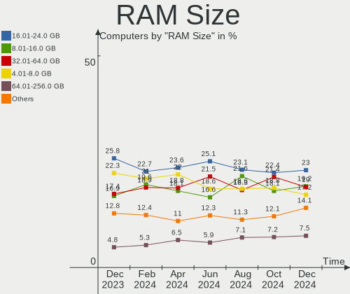
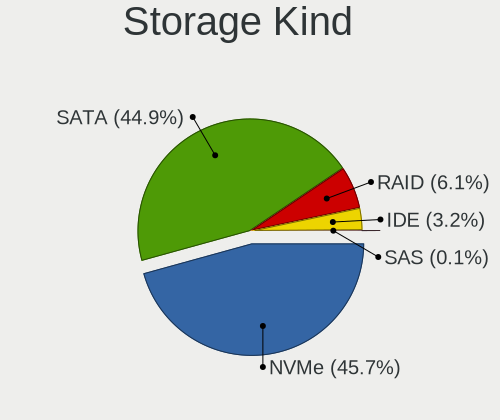
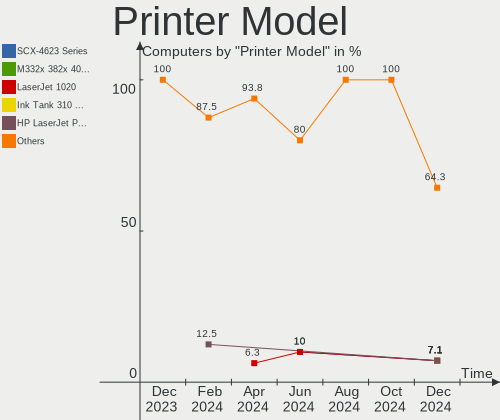

Fedora Hardware Trends
----------------------

A project to identify most popular hardware characteristics and track their change
over time based on data collected by Fedora users at https://Linux-Hardware.org.

Anyone can contribute to the study by uploading probes of their computers by
the [hw-probe](https://github.com/linuxhw/hw-probe) tool:

    sudo -E hw-probe -all -upload

This is a report for all computer types. See also reports for [desktops](/Dist/Fedora/Desktop/README.md) and [notebooks](/Dist/Fedora/Notebook/README.md).

Full-feature report is available here: https://linux-hardware.org/?view=trends

Period: Jan, 2021.

Contents
--------

- [ OS                       ](#os)
- [ OS Family                ](#os-family)
- [ Kernel                   ](#kernel)
- [ Kernel Family            ](#kernel-family)
- [ Kernel Major Ver.        ](#kernel-major-ver)
- [ Arch                     ](#arch)
- [ DE                       ](#de)
- [ Display Server           ](#display-server)
- [ Display Manager          ](#display-manager)
- [ OS Lang                  ](#os-lang)
- [ Boot Mode                ](#boot-mode)
- [ Filesystem               ](#filesystem)
- [ Part. scheme             ](#part-scheme)
- [ Dual Boot with Linux/BSD ](#dual-boot-with-linux/bsd)
- [ Dual Boot (Win)          ](#dual-boot-win)
- [ Country                  ](#country)
- [ City                     ](#city)
- [ Vendor                   ](#vendor)
- [ Model                    ](#model)
- [ Model Family             ](#model-family)
- [ MFG Year                 ](#mfg-year)
- [ Form Factor              ](#form-factor)
- [ Secure Boot              ](#secure-boot)
- [ Coreboot                 ](#coreboot)
- [ RAM Size                 ](#ram-size)
- [ RAM Used                 ](#ram-used)
- [ Has CD-ROM               ](#has-cd-rom)
- [ Total Drives             ](#total-drives)
- [ Has Ethernet             ](#has-ethernet)
- [ Drive Vendor             ](#drive-vendor)
- [ Drive Model              ](#drive-model)
- [ HDD Vendor               ](#hdd-vendor)
- [ SSD Vendor               ](#ssd-vendor)
- [ Drive Kind               ](#drive-kind)
- [ Drive Connector          ](#drive-connector)
- [ Drive Size               ](#drive-size)
- [ Space Total              ](#space-total)
- [ Space Used               ](#space-used)
- [ Malfunc. Drives          ](#malfunc-drives)
- [ Malfunc. Drive Vendor    ](#malfunc-drive-vendor)
- [ Malfunc. HDD Vendor      ](#malfunc-hdd-vendor)
- [ Malfunc. Drive Kind      ](#malfunc-drive-kind)
- [ Failed Drives            ](#failed-drives)
- [ Failed Drive Vendor      ](#failed-drive-vendor)
- [ Drive Status             ](#drive-status)
- [ Storage Vendor           ](#storage-vendor)
- [ Storage Model            ](#storage-model)
- [ Storage Kind             ](#storage-kind)
- [ CPU Vendor               ](#cpu-vendor)
- [ CPU Model                ](#cpu-model)
- [ CPU Model Family         ](#cpu-model-family)
- [ CPU Cores                ](#cpu-cores)
- [ CPU Sockets              ](#cpu-sockets)
- [ CPU Threads              ](#cpu-threads)
- [ CPU Op-Modes             ](#cpu-op-modes)
- [ CPU Microcode            ](#cpu-microcode)
- [ CPU Microarch            ](#cpu-microarch)
- [ GPU Vendor               ](#gpu-vendor)
- [ GPU Model                ](#gpu-model)
- [ GPU Combo                ](#gpu-combo)
- [ GPU Driver               ](#gpu-driver)
- [ GPU Memory               ](#gpu-memory)
- [ Monitor Vendor           ](#monitor-vendor)
- [ Monitor Model            ](#monitor-model)
- [ Monitor Resolution       ](#monitor-resolution)
- [ Monitor Diagonal         ](#monitor-diagonal)
- [ Monitor Width            ](#monitor-width)
- [ Aspect Ratio             ](#aspect-ratio)
- [ Monitor Area             ](#monitor-area)
- [ Pixel Density            ](#pixel-density)
- [ Multiple Monitors        ](#multiple-monitors)
- [ Net Controller Vendor    ](#net-controller-vendor)
- [ Net Controller Model     ](#net-controller-model)
- [ Wireless Vendor          ](#wireless-vendor)
- [ Wireless Model           ](#wireless-model)
- [ Ethernet Vendor          ](#ethernet-vendor)
- [ Ethernet Model           ](#ethernet-model)
- [ Net Controller Kind      ](#net-controller-kind)
- [ Used Controller          ](#used-controller)
- [ NICs                     ](#nics)
- [ Memory Vendor            ](#memory-vendor)
- [ Memory Model             ](#memory-model)
- [ Memory Kind              ](#memory-kind)
- [ Memory Form Factor       ](#memory-form-factor)
- [ Memory Size              ](#memory-size)
- [ Memory Speed             ](#memory-speed)
- [ Sound Vendor             ](#sound-vendor)
- [ Sound Model              ](#sound-model)
- [ Camera Vendor            ](#camera-vendor)
- [ Camera Model             ](#camera-model)
- [ Fingerprint Vendor       ](#fingerprint-vendor)
- [ Fingerprint Model        ](#fingerprint-model)
- [ Chipcard Vendor          ](#chipcard-vendor)
- [ Chipcard Model           ](#chipcard-model)
- [ Printer Vendor           ](#printer-vendor)
- [ Printer Model            ](#printer-model)
- [ Scanner Vendor           ](#scanner-vendor)
- [ Scanner Model            ](#scanner-model)
- [ Bluetooth Vendor         ](#bluetooth-vendor)
- [ Bluetooth Model          ](#bluetooth-model)
- [ Unsupported Devices      ](#unsupported-devices)
- [ Unsupported Device Types ](#unsupported-device-types)

OS
--

Installed operating systems

| Name      | Computers | Percent |
|-----------|-----------|---------|
| Fedora 33 | 275       | 87.58%  |
| Fedora 32 | 27        | 8.6%    |
| Fedora 31 | 5         | 1.59%   |
| Fedora 34 | 2         | 0.64%   |
| Fedora 30 | 2         | 0.64%   |
| Fedora 29 | 1         | 0.32%   |
| Fedora 24 | 1         | 0.32%   |
| Fedora 21 | 1         | 0.32%   |

OS Family
---------

OS without a version

| Name   | Computers | Percent |
|--------|-----------|---------|
| Fedora | 314       | 100%    |

Kernel
------

Version of the Linux kernel

| Version                                              | Computers | Percent |
|------------------------------------------------------|-----------|---------|
| 5.9.16-200.fc33.x86_64                               | 128       | 40.76%  |
| 5.10.9-201.fc33.x86_64                               | 30        | 9.55%   |
| 5.10.7-200.fc33.x86_64                               | 29        | 9.24%   |
| 5.10.10-200.fc33.x86_64                              | 22        | 7.01%   |
| 5.10.8-200.fc33.x86_64                               | 15        | 4.78%   |
| 5.10.6-200.fc33.x86_64                               | 15        | 4.78%   |
| 5.8.15-301.fc33.x86_64                               | 14        | 4.46%   |
| 5.9.16-100.fc32.x86_64                               | 10        | 3.18%   |
| 5.10.8-100.fc32.x86_64                               | 5         | 1.59%   |
| 5.10.7-100.fc32.x86_64                               | 5         | 1.59%   |
| 5.9.15-200.fc33.x86_64                               | 4         | 1.27%   |
| 5.9.14-200.fc33.x86_64                               | 4         | 1.27%   |
| 5.9.13-200.fc33.x86_64                               | 3         | 0.96%   |
| 5.8.18-100.fc31.x86_64                               | 3         | 0.96%   |
| 5.6.6-300.fc32.x86_64                                | 3         | 0.96%   |
| 5.11.0-rc5+                                          | 3         | 0.96%   |
| 5.9.15-100.fc32.x86_64                               | 1         | 0.32%   |
| 5.9.12-200.fc33.x86_64                               | 1         | 0.32%   |
| 5.9.12-100.fc32.x86_64                               | 1         | 0.32%   |
| 5.9.11-200.fc33.x86_64                               | 1         | 0.32%   |
| 5.9.10-100.fc32.x86_64                               | 1         | 0.32%   |
| 5.8.4-200.fc32.x86_64                                | 1         | 0.32%   |
| 5.8.18-300.fc33.x86_64                               | 1         | 0.32%   |
| 5.8.11-200.fc32.x86_64                               | 1         | 0.32%   |
| 5.6.13-100.fc30.x86_64                               | 1         | 0.32%   |
| 5.5.10-100.fc30.x86_64                               | 1         | 0.32%   |
| 5.3.11-100.fc29.x86_64                               | 1         | 0.32%   |
| 5.11.0-rc2+                                          | 1         | 0.32%   |
| 5.11.0-0.rc5.20210127git2ab38c17aac1.136.fc34.x86_64 | 1         | 0.32%   |
| 5.11.0-0.rc4.129.fc34.x86_64                         | 1         | 0.32%   |
| 5.10.8-200.fc33.armv7hl                              | 1         | 0.32%   |
| 5.10.7-200.fc33.x86_64+debug                         | 1         | 0.32%   |
| 5.10.6-1.surface.fc33.x86_64                         | 1         | 0.32%   |
| 5.10.4-200.fc33.x86_64                               | 1         | 0.32%   |
| 5.10.2-200.rt20.1.fc33.ccrma.x86_64+rt               | 1         | 0.32%   |
| 4.11.12-100.fc24.x86_64                              | 1         | 0.32%   |
| 4.1.13-100.fc21.x86_64                               | 1         | 0.32%   |

Kernel Family
-------------

Linux kernel without a distro release

| Version | Computers | Percent |
|---------|-----------|---------|
| 5.9.16  | 138       | 43.95%  |
| 5.10.7  | 35        | 11.15%  |
| 5.10.9  | 30        | 9.55%   |
| 5.10.10 | 22        | 7.01%   |
| 5.10.8  | 21        | 6.69%   |
| 5.10.6  | 16        | 5.1%    |
| 5.8.15  | 14        | 4.46%   |
| 5.11.0  | 6         | 1.91%   |
| 5.9.15  | 5         | 1.59%   |
| 5.9.14  | 4         | 1.27%   |
| 5.8.18  | 4         | 1.27%   |
| 5.9.13  | 3         | 0.96%   |
| 5.6.6   | 3         | 0.96%   |
| 5.9.12  | 2         | 0.64%   |
| 5.9.11  | 1         | 0.32%   |
| 5.9.10  | 1         | 0.32%   |
| 5.8.4   | 1         | 0.32%   |
| 5.8.11  | 1         | 0.32%   |
| 5.6.13  | 1         | 0.32%   |
| 5.5.10  | 1         | 0.32%   |
| 5.3.11  | 1         | 0.32%   |
| 5.10.4  | 1         | 0.32%   |
| 5.10.2  | 1         | 0.32%   |
| 4.11.12 | 1         | 0.32%   |
| 4.1.13  | 1         | 0.32%   |

Kernel Major Ver.
-----------------

Linux kernel major version

| Version | Computers | Percent |
|---------|-----------|---------|
| 5.9     | 154       | 49.04%  |
| 5.10    | 126       | 40.13%  |
| 5.8     | 20        | 6.37%   |
| 5.11    | 6         | 1.91%   |
| 5.6     | 4         | 1.27%   |
| 5.5     | 1         | 0.32%   |
| 5.3     | 1         | 0.32%   |
| 4.11    | 1         | 0.32%   |
| 4.1     | 1         | 0.32%   |

Arch
----

OS architecture (x86_64, i586, etc.)

| Name   | Computers | Percent |
|--------|-----------|---------|
| x86_64 | 313       | 99.68%  |
| armv7l | 1         | 0.32%   |

DE
--

Desktop Environment

| Name          | Computers | Percent |
|---------------|-----------|---------|
| GNOME         | 243       | 77.39%  |
| KDE           | 23        | 7.32%   |
| KDE5          | 17        | 5.41%   |
| XFCE          | 7         | 2.23%   |
| X-Cinnamon    | 7         | 2.23%   |
| Unknown       | 6         | 1.91%   |
| MATE          | 4         | 1.27%   |
| GNOME Classic | 2         | 0.64%   |
| Cinnamon      | 2         | 0.64%   |
| KDE4          | 1         | 0.32%   |
| dwm           | 1         | 0.32%   |
| awesome       | 1         | 0.32%   |

Display Server
--------------

X11 or Wayland

| Name    | Computers | Percent |
|---------|-----------|---------|
| Wayland | 174       | 55.41%  |
| X11     | 133       | 42.36%  |
| Unknown | 4         | 1.27%   |
| Tty     | 3         | 0.96%   |

Display Manager
---------------

SDDM, LightDM, etc.

| Name    | Computers | Percent |
|---------|-----------|---------|
| Unknown | 187       | 59.55%  |
| GDM     | 102       | 32.48%  |
| SDDM    | 16        | 5.1%    |
| TDM     | 6         | 1.91%   |
| LightDM | 3         | 0.96%   |

OS Lang
-------

Language

| Lang    | Computers | Percent |
|---------|-----------|---------|
| en_US   | 159       | 50.64%  |
| en_GB   | 25        | 7.96%   |
| fr_FR   | 19        | 6.05%   |
| pt_BR   | 16        | 5.1%    |
| de_DE   | 12        | 3.82%   |
| it_IT   | 10        | 3.18%   |
| cs_CZ   | 8         | 2.55%   |
| ru_RU   | 7         | 2.23%   |
| pl_PL   | 6         | 1.91%   |
| es_ES   | 6         | 1.91%   |
| en_CA   | 6         | 1.91%   |
| es_CL   | 4         | 1.27%   |
| tr_TR   | 3         | 0.96%   |
| fr_CA   | 3         | 0.96%   |
| en_AU   | 3         | 0.96%   |
| Unknown | 3         | 0.96%   |
| nl_NL   | 2         | 0.64%   |
| hu_HU   | 2         | 0.64%   |
| es_MX   | 2         | 0.64%   |
| en_SG   | 2         | 0.64%   |
| zh_TW   | 1         | 0.32%   |
| zh_CN   | 1         | 0.32%   |
| sk_SK   | 1         | 0.32%   |
| ru_UA   | 1         | 0.32%   |
| pt_PT   | 1         | 0.32%   |
| ja_JP   | 1         | 0.32%   |
| fr_CH   | 1         | 0.32%   |
| es_GT   | 1         | 0.32%   |
| es_CO   | 1         | 0.32%   |
| en_PH   | 1         | 0.32%   |
| en_NZ   | 1         | 0.32%   |
| en_IN   | 1         | 0.32%   |
| en_IE   | 1         | 0.32%   |
| el_GR   | 1         | 0.32%   |
| de_CH   | 1         | 0.32%   |
| C       | 1         | 0.32%   |

Boot Mode
---------

EFI or BIOS

| Mode | Computers | Percent |
|------|-----------|---------|
| EFI  | 212       | 67.52%  |
| BIOS | 102       | 32.48%  |

Filesystem
----------

Type of filesystem

| Type  | Computers | Percent |
|-------|-----------|---------|
| Btrfs | 174       | 55.41%  |
| Ext4  | 125       | 39.81%  |
| Xfs   | 15        | 4.78%   |

Part. scheme
------------

Scheme of partitioning

| Type    | Computers | Percent |
|---------|-----------|---------|
| Unknown | 183       | 58.28%  |
| GPT     | 106       | 33.76%  |
| MBR     | 25        | 7.96%   |

Dual Boot with Linux/BSD
------------------------

Hosting more than one Linux/BSD

| Dual boot | Computers | Percent |
|-----------|-----------|---------|
| No        | 290       | 92.36%  |
| Yes       | 24        | 7.64%   |

Dual Boot (Win)
---------------

Hosting Linux and Windows

| Dual boot | Computers | Percent |
|-----------|-----------|---------|
| No        | 257       | 81.85%  |
| Yes       | 57        | 18.15%  |

Country
-------

Geographic location (country)

| Country                   | Computers | Percent |
|---------------------------|-----------|---------|
| USA                       | 74        | 23.57%  |
| France                    | 23        | 7.32%   |
| Germany                   | 20        | 6.37%   |
| Brazil                    | 18        | 5.73%   |
| Netherlands               | 13        | 4.14%   |
| UK                        | 11        | 3.5%    |
| Russia                    | 11        | 3.5%    |
| Poland                    | 11        | 3.5%    |
| Italy                     | 11        | 3.5%    |
| Czech Republic            | 10        | 3.18%   |
| Spain                     | 9         | 2.87%   |
| Canada                    | 8         | 2.55%   |
| India                     | 6         | 1.91%   |
| Finland                   | 6         | 1.91%   |
| Turkey                    | 5         | 1.59%   |
| Hungary                   | 5         | 1.59%   |
| Chile                     | 4         | 1.27%   |
| Australia                 | 4         | 1.27%   |
| Ukraine                   | 3         | 0.96%   |
| Switzerland               | 3         | 0.96%   |
| Slovakia                  | 3         | 0.96%   |
| Mexico                    | 3         | 0.96%   |
| Iran                      | 3         | 0.96%   |
| Colombia                  | 3         | 0.96%   |
| Belarus                   | 3         | 0.96%   |
| Taiwan                    | 2         | 0.64%   |
| Sweden                    | 2         | 0.64%   |
| Singapore                 | 2         | 0.64%   |
| Romania                   | 2         | 0.64%   |
| Philippines               | 2         | 0.64%   |
| Kenya                     | 2         | 0.64%   |
| Japan                     | 2         | 0.64%   |
| Israel                    | 2         | 0.64%   |
| Indonesia                 | 2         | 0.64%   |
| Bulgaria                  | 2         | 0.64%   |
| Austria                   | 2         | 0.64%   |
| Argentina                 | 2         | 0.64%   |
| Puerto Rico               | 1         | 0.32%   |
| Portugal                  | 1         | 0.32%   |
| Norway                    | 1         | 0.32%   |
| New Zealand               | 1         | 0.32%   |
| Morocco                   | 1         | 0.32%   |
| Moldova, Republic of      | 1         | 0.32%   |
| Latvia                    | 1         | 0.32%   |
| Kyrgyzstan                | 1         | 0.32%   |
| Jordan                    | 1         | 0.32%   |
| Ireland                   | 1         | 0.32%   |
| Iran, Islamic Republic of | 1         | 0.32%   |
| Iceland                   | 1         | 0.32%   |
| Guatemala                 | 1         | 0.32%   |
| Greece                    | 1         | 0.32%   |
| Ecuador                   | 1         | 0.32%   |
| Denmark                   | 1         | 0.32%   |
| Cyprus                    | 1         | 0.32%   |
| Croatia                   | 1         | 0.32%   |
| China                     | 1         | 0.32%   |
| Belgium                   | 1         | 0.32%   |

City
----

Geographic location (city)

| City                     | Computers | Percent |
|--------------------------|-----------|---------|
| New York                 | 6         | 1.91%   |
| Prague                   | 5         | 1.59%   |
| Paris                    | 5         | 1.59%   |
| Istanbul                 | 4         | 1.27%   |
| Delft                    | 4         | 1.27%   |
| São Paulo               | 3         | 0.96%   |
| Rome                     | 3         | 0.96%   |
| Helsinki                 | 3         | 0.96%   |
| Warsaw                   | 2         | 0.64%   |
| Vancouver                | 2         | 0.64%   |
| Trieste                  | 2         | 0.64%   |
| Tehran                   | 2         | 0.64%   |
| Taipei                   | 2         | 0.64%   |
| Sofia                    | 2         | 0.64%   |
| Santiago                 | 2         | 0.64%   |
| Samara                   | 2         | 0.64%   |
| Rio de Janeiro           | 2         | 0.64%   |
| Prefailles               | 2         | 0.64%   |
| Perm                     | 2         | 0.64%   |
| Newark                   | 2         | 0.64%   |
| Nairobi                  | 2         | 0.64%   |
| Munich                   | 2         | 0.64%   |
| Moscow                   | 2         | 0.64%   |
| Montreal                 | 2         | 0.64%   |
| Madrid                   | 2         | 0.64%   |
| Ludlow                   | 2         | 0.64%   |
| Hrodna                   | 2         | 0.64%   |
| Hopkinton                | 2         | 0.64%   |
| Hamburg                  | 2         | 0.64%   |
| Greifswald               | 2         | 0.64%   |
| Dinxperlo                | 2         | 0.64%   |
| Chennai                  | 2         | 0.64%   |
| Budapest                 | 2         | 0.64%   |
| Berlin                   | 2         | 0.64%   |
| Anchorage                | 2         | 0.64%   |
| Amsterdam                | 2         | 0.64%   |
| Zimella                  | 1         | 0.32%   |
| Yuxi                     | 1         | 0.32%   |
| Yazd                     | 1         | 0.32%   |
| Yaroslavl                | 1         | 0.32%   |
| Yachiyo                  | 1         | 0.32%   |
| Winnenden                | 1         | 0.32%   |
| Westminster              | 1         | 0.32%   |
| West Chester             | 1         | 0.32%   |
| Wenatchee                | 1         | 0.32%   |
| Wellington               | 1         | 0.32%   |
| Wauconda                 | 1         | 0.32%   |
| Wateringen               | 1         | 0.32%   |
| Wallern an der Trattnach | 1         | 0.32%   |
| Wahroonga                | 1         | 0.32%   |
| Vienna                   | 1         | 0.32%   |
| Venancio Aires           | 1         | 0.32%   |
| Vantaa                   | 1         | 0.32%   |
| Valencia                 | 1         | 0.32%   |
| Ulricehamn               | 1         | 0.32%   |
| Tyler                    | 1         | 0.32%   |
| Turku                    | 1         | 0.32%   |
| Trenčín                | 1         | 0.32%   |
| Tours                    | 1         | 0.32%   |
| Torrance                 | 1         | 0.32%   |

Vendor
------

Motherboard manufacturer

| Name                    | Computers | Percent |
|-------------------------|-----------|---------|
| Lenovo                  | 55        | 17.52%  |
| ASUSTek Computer        | 53        | 16.88%  |
| Dell                    | 48        | 15.29%  |
| Hewlett-Packard         | 39        | 12.42%  |
| Gigabyte Technology     | 26        | 8.28%   |
| MSI                     | 21        | 6.69%   |
| Acer                    | 13        | 4.14%   |
| ASRock                  | 8         | 2.55%   |
| Apple                   | 5         | 1.59%   |
| HUAWEI                  | 4         | 1.27%   |
| Sony                    | 3         | 0.96%   |
| Samsung Electronics     | 3         | 0.96%   |
| Toshiba                 | 2         | 0.64%   |
| Packard Bell            | 2         | 0.64%   |
| Microsoft               | 2         | 0.64%   |
| AMI                     | 2         | 0.64%   |
| ZOTAC                   | 1         | 0.32%   |
| Wortmann AG             | 1         | 0.32%   |
| UNITCOM                 | 1         | 0.32%   |
| Timi                    | 1         | 0.32%   |
| SLIMBOOK                | 1         | 0.32%   |
| Razer                   | 1         | 0.32%   |
| Raspberry Pi Foundation | 1         | 0.32%   |
| Prestigio               | 1         | 0.32%   |
| Positivo                | 1         | 0.32%   |
| Pegatron                | 1         | 0.32%   |
| NS4SL01                 | 1         | 0.32%   |
| Notebook                | 1         | 0.32%   |
| Mini PC                 | 1         | 0.32%   |
| LG Electronics          | 1         | 0.32%   |
| Jumper                  | 1         | 0.32%   |
| Intel                   | 1         | 0.32%   |
| Gateway                 | 1         | 0.32%   |
| Fujitsu                 | 1         | 0.32%   |
| Estar                   | 1         | 0.32%   |
| eMachines               | 1         | 0.32%   |
| ECS                     | 1         | 0.32%   |
| Daten Tecnologia        | 1         | 0.32%   |
| CRX                     | 1         | 0.32%   |
| Clevo                   | 1         | 0.32%   |
| Chuwi                   | 1         | 0.32%   |
| Biostar                 | 1         | 0.32%   |
| Alienware               | 1         | 0.32%   |
| Unknown                 | 1         | 0.32%   |

Model
-----

Motherboard model

| Name                                       | Computers | Percent |
|--------------------------------------------|-----------|---------|
| ASUS TUF GAMING X570-PLUS                  | 3         | 0.96%   |
| ASUS All Series                            | 3         | 0.96%   |
| MSI MS-7B85                                | 2         | 0.64%   |
| MSI MS-7B38                                | 2         | 0.64%   |
| Lenovo ThinkPad X1 Extreme 2nd 20QVCTO1WW  | 2         | 0.64%   |
| Lenovo IdeaPad Flex 5 14ARE05 81X2         | 2         | 0.64%   |
| HP ProBook 650 G2                          | 2         | 0.64%   |
| HP Pavilion dv6                            | 2         | 0.64%   |
| Dell Precision WorkStation T3400           | 2         | 0.64%   |
| Dell Latitude 7400                         | 2         | 0.64%   |
| Dell Inspiron 15 7000 Gaming               | 2         | 0.64%   |
| ASUS UX430UNR                              | 2         | 0.64%   |
| ASRock B450M Steel Legend                  | 2         | 0.64%   |
| Acer Aspire A515-51G                       | 2         | 0.64%   |
| ZOTAC ZBOX-EN1070                          | 1         | 0.32%   |
| Wortmann AG TERRA Mobile 1748              | 1         | 0.32%   |
| UNITCOM W55xEU                             | 1         | 0.32%   |
| Toshiba Satellite L50-B                    | 1         | 0.32%   |
| Toshiba dynabook R73/W                     | 1         | 0.32%   |
| Timi TM1701                                | 1         | 0.32%   |
| Sony VPCCB45FN                             | 1         | 0.32%   |
| Sony SVF15N12SGB                           | 1         | 0.32%   |
| Sony SVE14113ELW                           | 1         | 0.32%   |
| SLIMBOOK PROX14-10                         | 1         | 0.32%   |
| Samsung RF510/RF410/RF710                  | 1         | 0.32%   |
| Samsung 300E4C/300E5C/300E7C               | 1         | 0.32%   |
| Samsung 300E4A/300E5A/300E7A/3430EA/3530EA | 1         | 0.32%   |
| Razer Blade 15 Mid 2019-Base               | 1         | 0.32%   |
| RPi Raspberry Pi 3 Model B+                | 1         | 0.32%   |
| Prestigio PSB141C03                        | 1         | 0.32%   |
| Positivo J14KR11                           | 1         | 0.32%   |
| Pegatron KJ379AA-ABA a6400f                | 1         | 0.32%   |
| Packard Bell oneTwo S3221                  | 1         | 0.32%   |
| Packard Bell EasyNote TM86                 | 1         | 0.32%   |
| NS4SL01 NS4SL0-15                          | 1         | 0.32%   |
| Notebook P65_P67SE                         | 1         | 0.32%   |
| MSI PPPPP-CCC#MMMMMMMM                     | 1         | 0.32%   |
| MSI MS-7C56                                | 1         | 0.32%   |
| MSI MS-7C02                                | 1         | 0.32%   |
| MSI MS-7B92                                | 1         | 0.32%   |
| MSI MS-7B84                                | 1         | 0.32%   |
| MSI MS-7B79                                | 1         | 0.32%   |
| MSI MS-7B53                                | 1         | 0.32%   |
| MSI MS-7A67                                | 1         | 0.32%   |
| MSI MS-7A44                                | 1         | 0.32%   |
| MSI MS-7A37                                | 1         | 0.32%   |
| MSI MS-7A20                                | 1         | 0.32%   |
| MSI MS-7623                                | 1         | 0.32%   |
| MSI Modern 14 A10M                         | 1         | 0.32%   |
| MSI GP70 2PE                               | 1         | 0.32%   |
| MSI GF75 Thin 10SCSXR                      | 1         | 0.32%   |
| MSI GF75 Thin 10SCSR                       | 1         | 0.32%   |
| MSI GF65 Thin 10SDR                        | 1         | 0.32%   |
| Mini PC Mini PC                            | 1         | 0.32%   |
| Microsoft Surface Pro 3                    | 1         | 0.32%   |
| Microsoft Surface Pro                      | 1         | 0.32%   |
| LG 24V550-G.BJ31P1                         | 1         | 0.32%   |
| Lenovo Yoga Slim 7 14ARE05 82A2            | 1         | 0.32%   |
| Lenovo Yoga 9 14ITL5 82BG                  | 1         | 0.32%   |
| Lenovo V310-15ISK 80SY                     | 1         | 0.32%   |

Model Family
------------

Motherboard model prefix

| Name                   | Computers | Percent |
|------------------------|-----------|---------|
| Lenovo ThinkPad        | 22        | 7.01%   |
| Lenovo IdeaPad         | 16        | 5.1%    |
| Dell Latitude          | 16        | 5.1%    |
| Dell Inspiron          | 15        | 4.78%   |
| HP Pavilion            | 11        | 3.5%    |
| Acer Aspire            | 9         | 2.87%   |
| ASUS ROG               | 8         | 2.55%   |
| Dell XPS               | 7         | 2.23%   |
| ASUS TUF               | 7         | 2.23%   |
| Lenovo Legion          | 6         | 1.91%   |
| HP EliteBook           | 6         | 1.91%   |
| HP ProBook             | 5         | 1.59%   |
| HP ENVY                | 5         | 1.59%   |
| ASUS PRIME             | 5         | 1.59%   |
| Dell Precision         | 4         | 1.27%   |
| Lenovo ThinkCentre     | 3         | 0.96%   |
| HP Laptop              | 3         | 0.96%   |
| Dell OptiPlex          | 3         | 0.96%   |
| ASUS All               | 3         | 0.96%   |
| ASRock B450M           | 3         | 0.96%   |
| MSI MS-7B85            | 2         | 0.64%   |
| MSI MS-7B38            | 2         | 0.64%   |
| MSI GF75               | 2         | 0.64%   |
| Microsoft Surface      | 2         | 0.64%   |
| Lenovo Yoga            | 2         | 0.64%   |
| HP ProDesk             | 2         | 0.64%   |
| Gigabyte Z270X-Gaming  | 2         | 0.64%   |
| Gigabyte X570          | 2         | 0.64%   |
| Gigabyte B550M         | 2         | 0.64%   |
| ASUS UX430UNR          | 2         | 0.64%   |
| ASUS P8Z77-V           | 2         | 0.64%   |
| Acer Nitro             | 2         | 0.64%   |
| ZOTAC ZBOX-EN1070      | 1         | 0.32%   |
| Wortmann AG TERRA      | 1         | 0.32%   |
| UNITCOM W55xEU         | 1         | 0.32%   |
| Toshiba Satellite      | 1         | 0.32%   |
| Toshiba dynabook       | 1         | 0.32%   |
| Timi TM1701            | 1         | 0.32%   |
| Sony VPCCB45FN         | 1         | 0.32%   |
| Sony SVF15N12SGB       | 1         | 0.32%   |
| Sony SVE14113ELW       | 1         | 0.32%   |
| SLIMBOOK PROX14-10     | 1         | 0.32%   |
| Samsung RF510          | 1         | 0.32%   |
| Samsung 300E4C         | 1         | 0.32%   |
| Samsung 300E4A         | 1         | 0.32%   |
| Razer Blade            | 1         | 0.32%   |
| RPi Raspberry          | 1         | 0.32%   |
| Prestigio PSB141C03    | 1         | 0.32%   |
| Positivo J14KR11       | 1         | 0.32%   |
| Pegatron KJ379AA-ABA   | 1         | 0.32%   |
| Packard Bell oneTwo    | 1         | 0.32%   |
| Packard Bell EasyNote  | 1         | 0.32%   |
| NS4SL01 NS4SL0-15      | 1         | 0.32%   |
| Notebook P65           | 1         | 0.32%   |
| MSI PPPPP-CCC#MMMMMMMM | 1         | 0.32%   |
| MSI MS-7C56            | 1         | 0.32%   |
| MSI MS-7C02            | 1         | 0.32%   |
| MSI MS-7B92            | 1         | 0.32%   |
| MSI MS-7B84            | 1         | 0.32%   |
| MSI MS-7B79            | 1         | 0.32%   |

MFG Year
--------

Motherboard manufacture year

| Year    | Computers | Percent |
|---------|-----------|---------|
| 2020    | 97        | 30.89%  |
| 2019    | 55        | 17.52%  |
| 2018    | 25        | 7.96%   |
| 2016    | 22        | 7.01%   |
| 2011    | 20        | 6.37%   |
| 2014    | 17        | 5.41%   |
| 2012    | 17        | 5.41%   |
| 2015    | 15        | 4.78%   |
| 2017    | 13        | 4.14%   |
| 2010    | 11        | 3.5%    |
| 2013    | 10        | 3.18%   |
| 2008    | 6         | 1.91%   |
| 2009    | 4         | 1.27%   |
| 2021    | 1         | 0.32%   |
| Unknown | 1         | 0.32%   |

Form Factor
-----------

Physical design of the computer

| Name           | Computers | Percent |
|----------------|-----------|---------|
| Notebook       | 176       | 56.05%  |
| Desktop        | 110       | 35.03%  |
| Convertible    | 10        | 3.18%   |
| Mini pc        | 9         | 2.87%   |
| Tablet         | 5         | 1.59%   |
| All in one     | 3         | 0.96%   |
| System on chip | 1         | 0.32%   |

Secure Boot
-----------

Enabled or disabled

| State    | Computers | Percent |
|----------|-----------|---------|
| Disabled | 276       | 87.9%   |
| Enabled  | 38        | 12.1%   |

Coreboot
--------

Have coreboot on board

| Used | Computers | Percent |
|------|-----------|---------|
| No   | 314       | 100%    |

RAM Size
--------

Total RAM memory

| Size in GB  | Computers | Percent |
|-------------|-----------|---------|
| 16.01-24.0  | 95        | 30.25%  |
| 4.01-8.0    | 82        | 26.11%  |
| 8.01-16.0   | 45        | 14.33%  |
| 32.01-64.0  | 42        | 13.38%  |
| 3.01-4.0    | 32        | 10.19%  |
| 64.01-256.0 | 8         | 2.55%   |
| 1.01-2.0    | 6         | 1.91%   |
| 0.51-1.0    | 2         | 0.64%   |
| 24.01-32.0  | 1         | 0.32%   |
| 2.01-3.0    | 1         | 0.32%   |

RAM Used
--------

Used RAM memory

| Used GB    | Computers | Percent |
|------------|-----------|---------|
| 2.01-3.0   | 85        | 27.07%  |
| 4.01-8.0   | 77        | 24.52%  |
| 3.01-4.0   | 58        | 18.47%  |
| 1.01-2.0   | 57        | 18.15%  |
| 8.01-16.0  | 26        | 8.28%   |
| 0.51-1.0   | 5         | 1.59%   |
| 32.01-64.0 | 2         | 0.64%   |
| 16.01-24.0 | 2         | 0.64%   |
| 24.01-32.0 | 1         | 0.32%   |
| 0.01-0.5   | 1         | 0.32%   |

Has CD-ROM
----------

Has CD-ROM on board

| Presented | Computers | Percent |
|-----------|-----------|---------|
| No        | 206       | 65.61%  |
| Yes       | 108       | 34.39%  |

Total Drives
------------

Number of drives on board

| Drives | Computers | Percent |
|--------|-----------|---------|
| 1      | 160       | 50.96%  |
| 2      | 88        | 28.03%  |
| 3      | 30        | 9.55%   |
| 4      | 22        | 7.01%   |
| 5      | 9         | 2.87%   |
| 8      | 2         | 0.64%   |
| 9      | 1         | 0.32%   |
| 7      | 1         | 0.32%   |
| 0      | 1         | 0.32%   |

Has Ethernet
------------

Has Ethernet on board

| Presented | Computers | Percent |
|-----------|-----------|---------|
| Yes       | 262       | 83.44%  |
| No        | 52        | 16.56%  |

Drive Vendor
------------

Hard drive vendors

| Vendor                    | Computers | Drives | Percent |
|---------------------------|-----------|--------|---------|
| WDC                       | 88        | 114    | 17.46%  |
| Samsung Electronics       | 86        | 106    | 17.06%  |
| Seagate                   | 57        | 71     | 11.31%  |
| Toshiba                   | 35        | 39     | 6.94%   |
| Sandisk                   | 30        | 36     | 5.95%   |
| Unknown                   | 29        | 33     | 5.75%   |
| Crucial                   | 22        | 26     | 4.37%   |
| Kingston                  | 20        | 22     | 3.97%   |
| SK Hynix                  | 18        | 18     | 3.57%   |
| Intel                     | 12        | 13     | 2.38%   |
| HGST                      | 10        | 12     | 1.98%   |
| A-DATA Technology         | 10        | 11     | 1.98%   |
| Hitachi                   | 8         | 8      | 1.59%   |
| Phison                    | 6         | 7      | 1.19%   |
| SPCC                      | 5         | 5      | 0.99%   |
| Micron Technology         | 5         | 5      | 0.99%   |
| KIOXIA                    | 5         | 5      | 0.99%   |
| Intenso                   | 5         | 5      | 0.99%   |
| Corsair                   | 5         | 5      | 0.99%   |
| XPG                       | 3         | 3      | 0.6%    |
| Union Memory              | 3         | 3      | 0.6%    |
| Team                      | 3         | 3      | 0.6%    |
| China                     | 3         | 3      | 0.6%    |
| Apple                     | 3         | 3      | 0.6%    |
| ACASIS                    | 3         | 3      | 0.6%    |
| Verbatim                  | 2         | 2      | 0.4%    |
| Mushkin                   | 2         | 2      | 0.4%    |
| Maxtor                    | 2         | 2      | 0.4%    |
| LITEON                    | 2         | 2      | 0.4%    |
| Vaseky                    | 1         | 2      | 0.2%    |
| Transcend                 | 1         | 1      | 0.2%    |
| PNY                       | 1         | 1      | 0.2%    |
| PLEXTOR                   | 1         | 1      | 0.2%    |
| Patriot                   | 1         | 1      | 0.2%    |
| OCZ                       | 1         | 1      | 0.2%    |
| NGFF                      | 1         | 1      | 0.2%    |
| Micron/Crucial Technology | 1         | 1      | 0.2%    |
| Mass                      | 1         | 1      | 0.2%    |
| LITEONIT                  | 1         | 1      | 0.2%    |
| Lite-On                   | 1         | 1      | 0.2%    |
| Leven                     | 1         | 1      | 0.2%    |
| KIOXIA-EXCERIA            | 1         | 1      | 0.2%    |
| KingSpec                  | 1         | 1      | 0.2%    |
| Kingmax                   | 1         | 1      | 0.2%    |
| KingFast                  | 1         | 1      | 0.2%    |
| JMicron                   | 1         | 1      | 0.2%    |
| H/W                       | 1         | 1      | 0.2%    |
| GOODRAM                   | 1         | 1      | 0.2%    |
| Gigabyte Technology       | 1         | 1      | 0.2%    |
| Apacer                    | 1         | 1      | 0.2%    |
| ADATA SX                  | 1         | 1      | 0.2%    |

Drive Model
-----------

Hard drive models

| Model                                | Computers | Percent |
|--------------------------------------|-----------|---------|
| Samsung SSD 850 EVO 250GB            | 12        | 2.11%   |
| Samsung SSD 860 EVO 500GB            | 9         | 1.58%   |
| Toshiba DT01ACA200 2TB               | 8         | 1.41%   |
| Samsung SSD 860 EVO 1TB              | 7         | 1.23%   |
| Crucial CT500MX500SSD1 500GB         | 7         | 1.23%   |
| Sandisk NVMe SSD Drive 512GB         | 6         | 1.05%   |
| Samsung NVMe SSD Drive 500GB         | 6         | 1.05%   |
| HGST HTS721010A9E630 1TB             | 6         | 1.05%   |
| Unknown SD/MMC/MS PRO 32GB           | 5         | 0.88%   |
| Sandisk NVMe SSD Drive 500GB         | 5         | 0.88%   |
| Unknown MMC Card  32GB               | 4         | 0.7%    |
| Toshiba NVMe SSD Drive 256GB         | 4         | 0.7%    |
| Samsung NVMe SSD Drive 256GB         | 4         | 0.7%    |
| Kingston SA400S37480G 480GB SSD      | 4         | 0.7%    |
| Kingston SA400S37240G 240GB SSD      | 4         | 0.7%    |
| Crucial CT240BX500SSD1 240GB         | 4         | 0.7%    |
| WDC WD30EFRX-68EUZN0 3TB             | 3         | 0.53%   |
| WDC WD20EZRX-00D8PB0 2TB             | 3         | 0.53%   |
| WDC WD10SPZX-24Z10 1TB               | 3         | 0.53%   |
| WDC WD1003FZEX-00K3CA0 1TB           | 3         | 0.53%   |
| WDC PC SN730 SDBPNTY-512G-1101 512GB | 3         | 0.53%   |
| Toshiba NVMe SSD Drive 512GB         | 3         | 0.53%   |
| SPCC Solid State Disk 128GB          | 3         | 0.53%   |
| SK Hynix NVMe SSD Drive 512GB        | 3         | 0.53%   |
| Seagate ST9500325AS 500GB            | 3         | 0.53%   |
| Seagate ST4000DM004-2CV104 4TB       | 3         | 0.53%   |
| Seagate ST3500418AS 500GB            | 3         | 0.53%   |
| Seagate ST2000DM008-2FR102 2TB       | 3         | 0.53%   |
| Seagate ST1000LM048-2E7172 1TB       | 3         | 0.53%   |
| Seagate ST1000LM024 HN-M101MBB 1TB   | 3         | 0.53%   |
| Seagate Expansion 1TB                | 3         | 0.53%   |
| Samsung SSD 970 EVO Plus 500GB       | 3         | 0.53%   |
| Samsung NVMe SSD Drive 512GB         | 3         | 0.53%   |
| Samsung NVMe SSD Drive 250GB         | 3         | 0.53%   |
| KIOXIA NVMe SSD Drive 512GB          | 3         | 0.53%   |
| Kingston SUV400S37240G 240GB SSD     | 3         | 0.53%   |
| ACASIS ASM1153 250GB SSD             | 3         | 0.53%   |
| WDC WDS250G2B0A-00SM50 250GB SSD     | 2         | 0.35%   |
| WDC WDS240G2G0A-00JH30 240GB SSD     | 2         | 0.35%   |
| WDC WD5000LPCX-24VHAT0 500GB         | 2         | 0.35%   |
| WDC WD40EZRZ-00GXCB0 4TB             | 2         | 0.35%   |
| WDC WD40EFRX-68WT0N0 4TB             | 2         | 0.35%   |
| WDC WD3000HLHX-01JJPV0 304GB         | 2         | 0.35%   |
| WDC WD2500BEVT-22ZCT0 250GB          | 2         | 0.35%   |
| WDC WD10SPZX-08Z10 1TB               | 2         | 0.35%   |
| WDC WD10EZEX-08WN4A0 1TB             | 2         | 0.35%   |
| WDC WD10EALX-009BA0 1TB              | 2         | 0.35%   |
| WDC WD10EACS-00ZJB0 1TB              | 2         | 0.35%   |
| WDC PC SN730 SDBPNTY-256G-1027 256GB | 2         | 0.35%   |
| Unknown SD32G  32GB                  | 2         | 0.35%   |
| Union Memory RPFTJ128PDD2EWX 128GB   | 2         | 0.35%   |
| Toshiba HDWD110 1TB                  | 2         | 0.35%   |
| Toshiba HDWD105 500GB                | 2         | 0.35%   |
| Team TM8PS7256G 256GB SSD            | 2         | 0.35%   |
| SK Hynix PC601 NVMe 512GB            | 2         | 0.35%   |
| SK Hynix NVMe SSD Drive 256GB        | 2         | 0.35%   |
| Seagate ST500DM002-1BD142 500GB      | 2         | 0.35%   |
| Seagate ST31000528AS 1TB             | 2         | 0.35%   |
| Seagate ST2000DM006-2DM164 2TB       | 2         | 0.35%   |
| Seagate ST1000LM049-2GH172 1TB       | 2         | 0.35%   |

HDD Vendor
----------

Hard disk drive vendors

| Vendor              | Computers | Drives | Percent |
|---------------------|-----------|--------|---------|
| WDC                 | 69        | 89     | 39.88%  |
| Seagate             | 54        | 67     | 31.21%  |
| Toshiba             | 21        | 24     | 12.14%  |
| HGST                | 10        | 12     | 5.78%   |
| Hitachi             | 8         | 8      | 4.62%   |
| Samsung Electronics | 6         | 6      | 3.47%   |
| Apple               | 3         | 3      | 1.73%   |
| Maxtor              | 1         | 1      | 0.58%   |
| H/W                 | 1         | 1      | 0.58%   |

SSD Vendor
----------

Solid state drive vendors

| Vendor              | Computers | Drives | Percent |
|---------------------|-----------|--------|---------|
| Samsung Electronics | 53        | 61     | 28.65%  |
| Crucial             | 21        | 25     | 11.35%  |
| Kingston            | 20        | 21     | 10.81%  |
| SanDisk             | 19        | 20     | 10.27%  |
| WDC                 | 9         | 10     | 4.86%   |
| A-DATA Technology   | 7         | 8      | 3.78%   |
| Intenso             | 5         | 5      | 2.7%    |
| Intel               | 5         | 5      | 2.7%    |
| SPCC                | 4         | 4      | 2.16%   |
| Team                | 3         | 3      | 1.62%   |
| SK Hynix            | 3         | 3      | 1.62%   |
| Micron Technology   | 3         | 3      | 1.62%   |
| Corsair             | 3         | 3      | 1.62%   |
| China               | 3         | 3      | 1.62%   |
| ACASIS              | 3         | 3      | 1.62%   |
| Verbatim            | 2         | 2      | 1.08%   |
| Toshiba             | 2         | 2      | 1.08%   |
| Mushkin             | 2         | 2      | 1.08%   |
| LITEON              | 2         | 2      | 1.08%   |
| Vaseky              | 1         | 2      | 0.54%   |
| Unknown             | 1         | 1      | 0.54%   |
| Transcend           | 1         | 1      | 0.54%   |
| Seagate             | 1         | 1      | 0.54%   |
| PNY                 | 1         | 1      | 0.54%   |
| PLEXTOR             | 1         | 1      | 0.54%   |
| Patriot             | 1         | 1      | 0.54%   |
| OCZ                 | 1         | 1      | 0.54%   |
| NGFF                | 1         | 1      | 0.54%   |
| Maxtor              | 1         | 1      | 0.54%   |
| LITEONIT            | 1         | 1      | 0.54%   |
| KIOXIA-EXCERIA      | 1         | 1      | 0.54%   |
| KingSpec            | 1         | 1      | 0.54%   |
| Kingmax             | 1         | 1      | 0.54%   |
| GOODRAM             | 1         | 1      | 0.54%   |
| Apacer              | 1         | 1      | 0.54%   |

Drive Kind
----------

HDD or SSD

| Kind    | Computers | Drives | Percent |
|---------|-----------|--------|---------|
| SSD     | 156       | 202    | 34.29%  |
| HDD     | 147       | 211    | 32.31%  |
| NVMe    | 117       | 136    | 25.71%  |
| MMC     | 21        | 26     | 4.62%   |
| Unknown | 14        | 15     | 3.08%   |

Drive Connector
---------------

SATA, SAS, NVMe, etc.

| Type | Computers | Drives | Percent |
|------|-----------|--------|---------|
| SATA | 233       | 396    | 58.25%  |
| NVMe | 117       | 135    | 29.25%  |
| SAS  | 29        | 33     | 7.25%   |
| MMC  | 21        | 26     | 5.25%   |

Drive Size
----------

Size of hard drive

| Size in TB | Computers | Drives | Percent |
|------------|-----------|--------|---------|
| 0.01-0.5   | 162       | 214    | 49.24%  |
| 0.51-1.0   | 109       | 127    | 33.13%  |
| 1.01-2.0   | 36        | 43     | 10.94%  |
| 3.01-4.0   | 9         | 11     | 2.74%   |
| 4.01-10.0  | 9         | 13     | 2.74%   |
| 2.01-3.0   | 4         | 5      | 1.22%   |

Space Total
-----------

Amount of disk space available on the file system

| Size in GB     | Computers | Percent |
|----------------|-----------|---------|
| 101-250        | 61        | 19.43%  |
| 501-1000       | 61        | 19.43%  |
| 251-500        | 60        | 19.11%  |
| 1001-2000      | 41        | 13.06%  |
| More than 3000 | 22        | 7.01%   |
| 1-20           | 21        | 6.69%   |
| Unknown        | 20        | 6.37%   |
| 2001-3000      | 13        | 4.14%   |
| 51-100         | 10        | 3.18%   |
| 21-50          | 5         | 1.59%   |

Space Used
----------

Amount of used disk space

| Used GB        | Computers | Percent |
|----------------|-----------|---------|
| 21-50          | 66        | 21.02%  |
| 101-250        | 66        | 21.02%  |
| 1-20           | 49        | 15.61%  |
| 51-100         | 40        | 12.74%  |
| 251-500        | 21        | 6.69%   |
| 501-1000       | 20        | 6.37%   |
| Unknown        | 20        | 6.37%   |
| 1001-2000      | 16        | 5.1%    |
| More than 3000 | 10        | 3.18%   |
| 2001-3000      | 6         | 1.91%   |

Malfunc. Drives
---------------

Drive models with a malfunction

| Model                                 | Computers | Drives | Percent |
|---------------------------------------|-----------|--------|---------|
| WDC WD10SPZX-24Z10 1TB                | 1         | 1      | 9.09%   |
| WDC WD10JPVX-08JC3T5 1TB              | 1         | 1      | 9.09%   |
| WDC WD10EZEX-00RKKA0 1TB              | 1         | 1      | 9.09%   |
| WDC WD1002FAEX-00Y9A0 1TB             | 1         | 1      | 9.09%   |
| SK Hynix SC308 SATA 128GB SSD         | 1         | 1      | 9.09%   |
| Seagate ST320LM001 HN-M320MBB 320GB   | 1         | 1      | 9.09%   |
| Samsung Electronics SSD 970 EVO 500GB | 1         | 1      | 9.09%   |
| Hitachi HDS722020ALA330 2TB           | 1         | 1      | 9.09%   |
| Crucial CT1050MX300SSD1 1050GB        | 1         | 1      | 9.09%   |
| Corsair Force LS SSD 120GB            | 1         | 1      | 9.09%   |
| Apple HDD HTS541010A9E662 1TB         | 1         | 1      | 9.09%   |

Malfunc. Drive Vendor
---------------------

Vendors of faulty drives

| Vendor              | Computers | Drives | Percent |
|---------------------|-----------|--------|---------|
| WDC                 | 4         | 4      | 36.36%  |
| SK Hynix            | 1         | 1      | 9.09%   |
| Seagate             | 1         | 1      | 9.09%   |
| Samsung Electronics | 1         | 1      | 9.09%   |
| Hitachi             | 1         | 1      | 9.09%   |
| Crucial             | 1         | 1      | 9.09%   |
| Corsair             | 1         | 1      | 9.09%   |
| Apple               | 1         | 1      | 9.09%   |

Malfunc. HDD Vendor
-------------------

Vendors of faulty HDD drives

| Vendor  | Computers | Drives | Percent |
|---------|-----------|--------|---------|
| WDC     | 4         | 4      | 57.14%  |
| Seagate | 1         | 1      | 14.29%  |
| Hitachi | 1         | 1      | 14.29%  |
| Apple   | 1         | 1      | 14.29%  |

Malfunc. Drive Kind
-------------------

Kinds of faulty drives

| Kind | Computers | Drives | Percent |
|------|-----------|--------|---------|
| HDD  | 7         | 7      | 63.64%  |
| SSD  | 3         | 3      | 27.27%  |
| NVMe | 1         | 1      | 9.09%   |

Failed Drives
-------------

Failed drive models

Zero info for selected period =(

Failed Drive Vendor
-------------------

Failed drive vendors

Zero info for selected period =(

Drive Status
------------

Number of failed and malfunc. drives

| Status   | Computers | Drives | Percent |
|----------|-----------|--------|---------|
| Detected | 203       | 387    | 60.42%  |
| Works    | 122       | 192    | 36.31%  |
| Malfunc  | 11        | 11     | 3.27%   |

Storage Vendor
--------------

Storage controller vendors

| Vendor                       | Computers | Percent |
|------------------------------|-----------|---------|
| Intel                        | 203       | 50%     |
| AMD                          | 65        | 16.01%  |
| Samsung Electronics          | 34        | 8.37%   |
| Sandisk                      | 27        | 6.65%   |
| SK Hynix                     | 14        | 3.45%   |
| Toshiba America Info Systems | 12        | 2.96%   |
| Phison Electronics           | 8         | 1.97%   |
| Nvidia                       | 6         | 1.48%   |
| KIOXIA                       | 6         | 1.48%   |
| ASMedia Technology           | 6         | 1.48%   |
| ADATA Technology             | 6         | 1.48%   |
| Marvell Technology Group     | 4         | 0.99%   |
| JMicron Technology           | 4         | 0.99%   |
| Union Memory (Shenzhen)      | 3         | 0.74%   |
| Micron/Crucial Technology    | 2         | 0.49%   |
| Micron Technology            | 2         | 0.49%   |
| Silicon Motion               | 1         | 0.25%   |
| Silicon Image                | 1         | 0.25%   |
| Lite-On Technology           | 1         | 0.25%   |
| Kingston Technology Company  | 1         | 0.25%   |

Storage Model
-------------

Storage controller models

| Model                                                                            | Computers | Percent |
|----------------------------------------------------------------------------------|-----------|---------|
| AMD FCH SATA Controller [AHCI mode]                                              | 45        | 10%     |
| Intel Sunrise Point-LP SATA Controller [AHCI mode]                               | 28        | 6.22%   |
| Samsung NVMe SSD Controller SM981/PM981/PM983                                    | 22        | 4.89%   |
| Intel 8 Series/C220 Series Chipset Family 6-port SATA Controller 1 [AHCI mode]   | 17        | 3.78%   |
| Sandisk WD Black SN750 / PC SN730 NVMe SSD                                       | 15        | 3.33%   |
| Intel 7 Series Chipset Family 6-port SATA Controller [AHCI mode]                 | 15        | 3.33%   |
| Intel 82801 Mobile SATA Controller [RAID mode]                                   | 14        | 3.11%   |
| AMD 400 Series Chipset SATA Controller                                           | 13        | 2.89%   |
| Intel Q170/Q150/B150/H170/H110/Z170/CM236 Chipset SATA Controller [AHCI Mode]    | 12        | 2.67%   |
| Intel 200 Series PCH SATA controller [AHCI mode]                                 | 12        | 2.67%   |
| SK Hynix Non-Volatile memory controller                                          | 10        | 2.22%   |
| Intel 6 Series/C200 Series Chipset Family 6 port Mobile SATA AHCI Controller     | 10        | 2.22%   |
| Sandisk WD Blue SN550 NVMe SSD                                                   | 9         | 2%      |
| Intel SATA Controller [RAID mode]                                                | 7         | 1.56%   |
| Intel Cannon Lake Mobile PCH SATA AHCI Controller                                | 7         | 1.56%   |
| Intel 8 Series SATA Controller 1 [AHCI mode]                                     | 7         | 1.56%   |
| AMD SATA controller                                                              | 7         | 1.56%   |
| KIOXIA Non-Volatile memory controller                                            | 6         | 1.33%   |
| Intel Wildcat Point-LP SATA Controller [AHCI Mode]                               | 6         | 1.33%   |
| ASMedia ASM1062 Serial ATA Controller                                            | 6         | 1.33%   |
| ADATA XPG SX8200 Pro PCIe Gen3x4 M.2 2280 Solid State Drive                      | 6         | 1.33%   |
| Toshiba America Info Systems BG3 NVMe SSD Controller                             | 5         | 1.11%   |
| Samsung Electronics Non-Volatile memory controller                               | 5         | 1.11%   |
| Phison E12 NVMe Controller                                                       | 5         | 1.11%   |
| Intel Comet Lake SATA AHCI Controller                                            | 5         | 1.11%   |
| Intel 7 Series/C210 Series Chipset Family 6-port SATA Controller [AHCI mode]     | 5         | 1.11%   |
| AMD SB7x0/SB8x0/SB9x0 SATA Controller [IDE mode]                                 | 5         | 1.11%   |
| AMD SB7x0/SB8x0/SB9x0 SATA Controller [AHCI mode]                                | 5         | 1.11%   |
| AMD SB7x0/SB8x0/SB9x0 IDE Controller                                             | 5         | 1.11%   |
| Toshiba America Info Systems Toshiba America Info Non-Volatile memory controller | 4         | 0.89%   |
| Samsung NVMe SSD Controller SM961/PM961/SM963                                    | 4         | 0.89%   |
| Phison E16 PCIe4 NVMe Controller                                                 | 4         | 0.89%   |
| Nvidia MCP61 SATA Controller                                                     | 4         | 0.89%   |
| Intel Volume Management Device NVMe RAID Controller                              | 4         | 0.89%   |
| Intel SSD 660P Series                                                            | 4         | 0.89%   |
| Intel Cannon Lake PCH SATA AHCI Controller                                       | 4         | 0.89%   |
| Intel 82801IBM/IEM (ICH9M/ICH9M-E) 4 port SATA Controller [AHCI mode]            | 4         | 0.89%   |
| Intel 5 Series/3400 Series Chipset 4 port SATA AHCI Controller                   | 4         | 0.89%   |
| Intel 400 Series Chipset Family SATA AHCI Controller                             | 4         | 0.89%   |
| AMD 300 Series Chipset SATA Controller                                           | 4         | 0.89%   |
| Union Memory (Shenzhen) Non-Volatile memory controller                           | 3         | 0.67%   |
| Toshiba America Info Systems XG4 NVMe SSD Controller                             | 3         | 0.67%   |
| Sandisk WD Black 2018 / PC SN720 NVMe SSD                                        | 3         | 0.67%   |
| Nvidia MCP61 IDE                                                                 | 3         | 0.67%   |
| JMicron JMB363 SATA/IDE Controller                                               | 3         | 0.67%   |
| Intel NM10/ICH7 Family SATA Controller [IDE mode]                                | 3         | 0.67%   |
| Intel HM170/QM170 Chipset SATA Controller [AHCI Mode]                            | 3         | 0.67%   |
| Intel Celeron/Pentium Silver Processor SATA Controller                           | 3         | 0.67%   |
| Intel Cannon Point-LP SATA Controller [AHCI Mode]                                | 3         | 0.67%   |
| Intel 6 Series/C200 Series Chipset Family 6 port Desktop SATA AHCI Controller    | 3         | 0.67%   |
| Intel 5 Series/3400 Series Chipset 6 port SATA AHCI Controller                   | 3         | 0.67%   |
| SK Hynix BC501 NVMe Solid State Drive 512GB                                      | 2         | 0.44%   |
| Samsung NVMe SSD Controller SM951/PM951                                          | 2         | 0.44%   |
| Micron Non-Volatile memory controller                                            | 2         | 0.44%   |
| Intel Ice Lake-LP SATA Controller [AHCI mode]                                    | 2         | 0.44%   |
| Intel C610/X99 series chipset 6-Port SATA Controller [AHCI mode]                 | 2         | 0.44%   |
| Intel 82801JI (ICH10 Family) 4 port SATA IDE Controller #1                       | 2         | 0.44%   |
| Intel 82801JI (ICH10 Family) 2 port SATA IDE Controller #2                       | 2         | 0.44%   |
| Intel 82801IR/IO/IH (ICH9R/DO/DH) 6 port SATA Controller [AHCI mode]             | 2         | 0.44%   |
| Intel 82801G (ICH7 Family) IDE Controller                                        | 2         | 0.44%   |

Storage Kind
------------

Kind of storage controller (IDE, SATA, NVMe, SAS, ...)

| Kind | Computers | Percent |
|------|-----------|---------|
| SATA | 229       | 57.39%  |
| NVMe | 117       | 29.32%  |
| RAID | 28        | 7.02%   |
| IDE  | 25        | 6.27%   |

CPU Vendor
----------

Processor vendors

| Vendor | Computers | Percent |
|--------|-----------|---------|
| Intel  | 235       | 74.84%  |
| AMD    | 78        | 24.84%  |
| ARM    | 1         | 0.32%   |

CPU Model
---------

Processor models

| Model                                         | Computers | Percent |
|-----------------------------------------------|-----------|---------|
| Intel Core i7-8550U CPU @ 1.80GHz             | 8         | 2.55%   |
| Intel Core i7-10510U CPU @ 1.80GHz            | 7         | 2.23%   |
| AMD Ryzen 5 3500U with Radeon Vega Mobile Gfx | 7         | 2.23%   |
| AMD Ryzen 7 3700X 8-Core Processor            | 6         | 1.91%   |
| Intel Core i7-7500U CPU @ 2.70GHz             | 5         | 1.59%   |
| Intel Core i7-10750H CPU @ 2.60GHz            | 5         | 1.59%   |
| Intel Core i7-6500U CPU @ 2.50GHz             | 4         | 1.27%   |
| Intel Core i5-8265U CPU @ 1.60GHz             | 4         | 1.27%   |
| Intel Core i5-7300U CPU @ 2.60GHz             | 4         | 1.27%   |
| Intel Core i5-1035G1 CPU @ 1.00GHz            | 4         | 1.27%   |
| AMD Ryzen 5 2600 Six-Core Processor           | 4         | 1.27%   |
| Intel Core i7-7700HQ CPU @ 2.80GHz            | 3         | 0.96%   |
| Intel Core i7-4710HQ CPU @ 2.50GHz            | 3         | 0.96%   |
| Intel Core i7-3770 CPU @ 3.40GHz              | 3         | 0.96%   |
| Intel Core i5-9300H CPU @ 2.40GHz             | 3         | 0.96%   |
| Intel Core i5-8250U CPU @ 1.60GHz             | 3         | 0.96%   |
| Intel Core i5-6200U CPU @ 2.30GHz             | 3         | 0.96%   |
| Intel Core i5-2520M CPU @ 2.50GHz             | 3         | 0.96%   |
| Intel Core i5-10210U CPU @ 1.60GHz            | 3         | 0.96%   |
| Intel Atom CPU Z3735F @ 1.33GHz               | 3         | 0.96%   |
| Intel 11th Gen Core i5-1135G7 @ 2.40GHz       | 3         | 0.96%   |
| AMD Ryzen 7 2700X Eight-Core Processor        | 3         | 0.96%   |
| AMD Ryzen 5 4500U with Radeon Graphics        | 3         | 0.96%   |
| AMD Ryzen 5 2500U with Radeon Vega Mobile Gfx | 3         | 0.96%   |
| AMD Ryzen 5 1600 Six-Core Processor           | 3         | 0.96%   |
| AMD Athlon II X2 250 Processor                | 3         | 0.96%   |
| Intel Core i7-9750H CPU @ 2.60GHz             | 2         | 0.64%   |
| Intel Core i7-8750H CPU @ 2.20GHz             | 2         | 0.64%   |
| Intel Core i7-8700 CPU @ 3.20GHz              | 2         | 0.64%   |
| Intel Core i7-8665U CPU @ 1.90GHz             | 2         | 0.64%   |
| Intel Core i7-7700K CPU @ 4.20GHz             | 2         | 0.64%   |
| Intel Core i7-6700HQ CPU @ 2.60GHz            | 2         | 0.64%   |
| Intel Core i7-6700 CPU @ 3.40GHz              | 2         | 0.64%   |
| Intel Core i7-6600U CPU @ 2.60GHz             | 2         | 0.64%   |
| Intel Core i7-4770 CPU @ 3.40GHz              | 2         | 0.64%   |
| Intel Core i7-4710MQ CPU @ 2.50GHz            | 2         | 0.64%   |
| Intel Core i7-4700HQ CPU @ 2.40GHz            | 2         | 0.64%   |
| Intel Core i7-3520M CPU @ 2.90GHz             | 2         | 0.64%   |
| Intel Core i5-7400 CPU @ 3.00GHz              | 2         | 0.64%   |
| Intel Core i5-7200U CPU @ 2.50GHz             | 2         | 0.64%   |
| Intel Core i5-6500 CPU @ 3.20GHz              | 2         | 0.64%   |
| Intel Core i5-5300U CPU @ 2.30GHz             | 2         | 0.64%   |
| Intel Core i5-5200U CPU @ 2.20GHz             | 2         | 0.64%   |
| Intel Core i5-4200U CPU @ 1.60GHz             | 2         | 0.64%   |
| Intel Core i5-4200M CPU @ 2.50GHz             | 2         | 0.64%   |
| Intel Core i5-2430M CPU @ 2.40GHz             | 2         | 0.64%   |
| Intel Core i5-10300H CPU @ 2.50GHz            | 2         | 0.64%   |
| Intel Core i5 CPU M 540 @ 2.53GHz             | 2         | 0.64%   |
| Intel Core i3-8130U CPU @ 2.20GHz             | 2         | 0.64%   |
| Intel Core i3-4005U CPU @ 1.70GHz             | 2         | 0.64%   |
| Intel Core i3-2370M CPU @ 2.40GHz             | 2         | 0.64%   |
| Intel Core 2 Quad CPU Q9550 @ 2.83GHz         | 2         | 0.64%   |
| Intel Core 2 Duo CPU E8400 @ 3.00GHz          | 2         | 0.64%   |
| Intel Atom x5-Z8350 CPU @ 1.44GHz             | 2         | 0.64%   |
| AMD Ryzen 9 3900X 12-Core Processor           | 2         | 0.64%   |
| AMD Ryzen 5 PRO 4650G with Radeon Graphics    | 2         | 0.64%   |
| AMD FX-8350 Eight-Core Processor              | 2         | 0.64%   |
| AMD FX-6300 Six-Core Processor                | 2         | 0.64%   |
| Intel Xeon CPU X5550 @ 2.67GHz                | 1         | 0.32%   |
| Intel Xeon CPU E5450 @ 3.00GHz                | 1         | 0.32%   |

CPU Model Family
----------------

Processor model prefix

| Model                   | Computers | Percent |
|-------------------------|-----------|---------|
| Intel Core i7           | 95        | 30.25%  |
| Intel Core i5           | 76        | 24.2%   |
| AMD Ryzen 5             | 27        | 8.6%    |
| Intel Core i3           | 21        | 6.69%   |
| AMD Ryzen 7             | 15        | 4.78%   |
| Intel Core 2 Duo        | 8         | 2.55%   |
| Intel Atom              | 8         | 2.55%   |
| Other                   | 6         | 1.91%   |
| Intel Pentium           | 6         | 1.91%   |
| AMD FX                  | 6         | 1.91%   |
| Intel Xeon              | 4         | 1.27%   |
| AMD Ryzen 9             | 4         | 1.27%   |
| AMD Athlon II X2        | 4         | 1.27%   |
| Intel Celeron           | 3         | 0.96%   |
| AMD Ryzen 5 PRO         | 3         | 0.96%   |
| Intel Pentium Dual-Core | 2         | 0.64%   |
| Intel Core i9           | 2         | 0.64%   |
| Intel Core 2 Quad       | 2         | 0.64%   |
| AMD Ryzen Threadripper  | 2         | 0.64%   |
| AMD Ryzen 7 PRO         | 2         | 0.64%   |
| AMD Ryzen 3             | 2         | 0.64%   |
| AMD Phenom II X4        | 2         | 0.64%   |
| AMD A10                 | 2         | 0.64%   |
| Intel Pentium Silver    | 1         | 0.32%   |
| Intel Pentium Gold      | 1         | 0.32%   |
| Intel Core 2            | 1         | 0.32%   |
| ARM BCM                 | 1         | 0.32%   |
| AMD Phenom II X6        | 1         | 0.32%   |
| AMD Embedded            | 1         | 0.32%   |
| AMD E                   | 1         | 0.32%   |
| AMD Athlon 64 X2        | 1         | 0.32%   |
| AMD Athlon 64           | 1         | 0.32%   |
| AMD A8                  | 1         | 0.32%   |
| AMD A6                  | 1         | 0.32%   |
| AMD A4                  | 1         | 0.32%   |

CPU Cores
---------

Number of processor cores

| Number | Computers | Percent |
|--------|-----------|---------|
| 4      | 140       | 44.59%  |
| 2      | 104       | 33.12%  |
| 6      | 37        | 11.78%  |
| 8      | 23        | 7.32%   |
| 12     | 3         | 0.96%   |
| 3      | 3         | 0.96%   |
| 16     | 2         | 0.64%   |
| 24     | 1         | 0.32%   |
| 1      | 1         | 0.32%   |

CPU Sockets
-----------

Number of sockets

| Number | Computers | Percent |
|--------|-----------|---------|
| 1      | 313       | 99.68%  |
| 2      | 1         | 0.32%   |

CPU Threads
-----------

Threads per core (Hyper-Threading)

| Number | Computers | Percent |
|--------|-----------|---------|
| 2      | 240       | 76.43%  |
| 1      | 74        | 23.57%  |

CPU Op-Modes
------------

CPU Operation Modes (32-bit, 64-bit)

| Op mode        | Computers | Percent |
|----------------|-----------|---------|
| 32-bit, 64-bit | 313       | 99.68%  |
| Unknown        | 1         | 0.32%   |

CPU Microcode
-------------

Microcode number

| Number     | Computers | Percent |
|------------|-----------|---------|
| Unknown    | 20        | 6.37%   |
| 0x306c3    | 19        | 6.05%   |
| 0x306a9    | 18        | 5.73%   |
| 0x206a7    | 18        | 5.73%   |
| 0x806ec    | 16        | 5.1%    |
| 0x806ea    | 13        | 4.14%   |
| 0x406e3    | 13        | 4.14%   |
| 0x906ea    | 12        | 3.82%   |
| 0x806e9    | 12        | 3.82%   |
| 0x0800820d | 12        | 3.82%   |
| 0x906e9    | 11        | 3.5%    |
| 0x506e3    | 11        | 3.5%    |
| 0x1067a    | 9         | 2.87%   |
| 0x08701021 | 9         | 2.87%   |
| 0xa0652    | 7         | 2.23%   |
| 0x40651    | 7         | 2.23%   |
| 0x306d4    | 6         | 1.91%   |
| 0x30678    | 6         | 1.91%   |
| 0x906ed    | 5         | 1.59%   |
| 0x806c1    | 5         | 1.59%   |
| 0x08701013 | 5         | 1.59%   |
| 0x010000c8 | 5         | 1.59%   |
| 0x706e5    | 4         | 1.27%   |
| 0x20655    | 4         | 1.27%   |
| 0x08600106 | 4         | 1.27%   |
| 0x08108109 | 4         | 1.27%   |
| 0x06000852 | 4         | 1.27%   |
| 0x20652    | 3         | 0.96%   |
| 0x08108102 | 3         | 0.96%   |
| 0x906eb    | 2         | 0.64%   |
| 0x806eb    | 2         | 0.64%   |
| 0x706a8    | 2         | 0.64%   |
| 0x406c4    | 2         | 0.64%   |
| 0x306f2    | 2         | 0.64%   |
| 0x106a5    | 2         | 0.64%   |
| 0x10676    | 2         | 0.64%   |
| 0x08600104 | 2         | 0.64%   |
| 0x08600103 | 2         | 0.64%   |
| 0x08600102 | 2         | 0.64%   |
| 0x0810100b | 2         | 0.64%   |
| 0x08001137 | 2         | 0.64%   |
| 0x0600063e | 2         | 0.64%   |
| 0x03000027 | 2         | 0.64%   |
| 0xa0660    | 1         | 0.32%   |
| 0xa0653    | 1         | 0.32%   |
| 0x706a1    | 1         | 0.32%   |
| 0x6f6      | 1         | 0.32%   |
| 0x40661    | 1         | 0.32%   |
| 0x30673    | 1         | 0.32%   |
| 0x106a4    | 1         | 0.32%   |
| 0x10677    | 1         | 0.32%   |
| 0x0a201009 | 1         | 0.32%   |
| 0x08301025 | 1         | 0.32%   |
| 0x08101016 | 1         | 0.32%   |
| 0x08101007 | 1         | 0.32%   |
| 0x08001138 | 1         | 0.32%   |
| 0x07030105 | 1         | 0.32%   |
| 0x06006705 | 1         | 0.32%   |
| 0x0600611a | 1         | 0.32%   |
| 0x06006110 | 1         | 0.32%   |

CPU Microarch
-------------

Microarchitecture

| Name          | Computers | Percent |
|---------------|-----------|---------|
| KabyLake      | 79        | 25.16%  |
| Haswell       | 29        | 9.24%   |
| Zen 2         | 27        | 8.6%    |
| Skylake       | 26        | 8.28%   |
| Zen+          | 19        | 6.05%   |
| IvyBridge     | 19        | 6.05%   |
| SandyBridge   | 18        | 5.73%   |
| Penryn        | 13        | 4.14%   |
| CometLake     | 10        | 3.18%   |
| Silvermont    | 9         | 2.87%   |
| Westmere      | 8         | 2.55%   |
| Zen           | 7         | 2.23%   |
| K10           | 7         | 2.23%   |
| IceLake       | 6         | 1.91%   |
| Broadwell     | 6         | 1.91%   |
| TigerLake     | 5         | 1.59%   |
| Piledriver    | 5         | 1.59%   |
| Nehalem       | 3         | 0.96%   |
| Goldmont plus | 3         | 0.96%   |
| Excavator     | 3         | 0.96%   |
| Unknown       | 3         | 0.96%   |
| K8 Hammer     | 2         | 0.64%   |
| K10 Llano     | 2         | 0.64%   |
| Bulldozer     | 2         | 0.64%   |
| Puma          | 1         | 0.32%   |
| Core          | 1         | 0.32%   |
| Bobcat        | 1         | 0.32%   |

GPU Vendor
----------

Vendors of graphics cards

| Vendor | Computers | Percent |
|--------|-----------|---------|
| Intel  | 188       | 47.72%  |
| Nvidia | 123       | 31.22%  |
| AMD    | 83        | 21.07%  |

GPU Model
---------

Graphics card models

| Model                                                                                    | Computers | Percent |
|------------------------------------------------------------------------------------------|-----------|---------|
| Intel 2nd Generation Core Processor Family Integrated Graphics Controller                | 16        | 4.03%   |
| Intel UHD Graphics 620                                                                   | 15        | 3.78%   |
| Intel HD Graphics 620                                                                    | 13        | 3.27%   |
| Intel 3rd Gen Core processor Graphics Controller                                         | 12        | 3.02%   |
| AMD Renoir                                                                               | 12        | 3.02%   |
| Intel Skylake GT2 [HD Graphics 520]                                                      | 11        | 2.77%   |
| Intel 4th Gen Core Processor Integrated Graphics Controller                              | 11        | 2.77%   |
| Intel UHD Graphics 630 (Mobile)                                                          | 10        | 2.52%   |
| Intel CometLake-U GT2 [UHD Graphics]                                                     | 10        | 2.52%   |
| Intel UHD Graphics 620 (Whiskey Lake)                                                    | 9         | 2.27%   |
| AMD Ellesmere [Radeon RX 470/480/570/570X/580/580X/590]                                  | 9         | 2.27%   |
| Intel HD Graphics 630                                                                    | 7         | 1.76%   |
| Intel HD Graphics 530                                                                    | 7         | 1.76%   |
| Intel Haswell-ULT Integrated Graphics Controller                                         | 7         | 1.76%   |
| Intel CometLake-H GT2 [UHD Graphics]                                                     | 7         | 1.76%   |
| Intel Atom Processor Z36xxx/Z37xxx Series Graphics & Display                             | 7         | 1.76%   |
| AMD Picasso                                                                              | 7         | 1.76%   |
| AMD Navi 10 [Radeon RX 5600 OEM/5600 XT / 5700/5700 XT]                                  | 7         | 1.76%   |
| Nvidia GP107 [GeForce GTX 1050 Ti]                                                       | 6         | 1.51%   |
| Intel HD Graphics 5500                                                                   | 6         | 1.51%   |
| Nvidia TU117M [GeForce GTX 1650 Ti Mobile]                                               | 5         | 1.26%   |
| Intel TigerLake GT2 [Iris Xe Graphics]                                                   | 5         | 1.26%   |
| Intel Iris Plus Graphics G1 (Ice Lake)                                                   | 5         | 1.26%   |
| Nvidia TU116M [GeForce GTX 1660 Ti Mobile]                                               | 4         | 1.01%   |
| Nvidia GT218 [GeForce 210]                                                               | 4         | 1.01%   |
| Nvidia GP108M [GeForce MX250]                                                            | 4         | 1.01%   |
| Nvidia GM108M [GeForce 840M]                                                             | 4         | 1.01%   |
| Intel Xeon E3-1200 v3/4th Gen Core Processor Integrated Graphics Controller              | 4         | 1.01%   |
| Intel Mobile 4 Series Chipset Integrated Graphics Controller                             | 4         | 1.01%   |
| Intel Core Processor Integrated Graphics Controller                                      | 4         | 1.01%   |
| Nvidia TU117M [GeForce GTX 1650 Mobile / Max-Q]                                          | 3         | 0.76%   |
| Nvidia GP108M [GeForce MX150]                                                            | 3         | 0.76%   |
| Nvidia GP108 [GeForce GT 1030]                                                           | 3         | 0.76%   |
| Nvidia GP107M [GeForce GTX 1050 Ti Mobile]                                               | 3         | 0.76%   |
| Nvidia GP106M [GeForce GTX 1060 Mobile]                                                  | 3         | 0.76%   |
| Nvidia GP104 [GeForce GTX 1070]                                                          | 3         | 0.76%   |
| Nvidia GM204 [GeForce GTX 970]                                                           | 3         | 0.76%   |
| Nvidia GM108M [GeForce 940MX]                                                            | 3         | 0.76%   |
| Nvidia GK208B [GeForce GT 730]                                                           | 3         | 0.76%   |
| Intel Xeon E3-1200 v2/3rd Gen Core processor Graphics Controller                         | 3         | 0.76%   |
| Intel UHD Graphics 605                                                                   | 3         | 0.76%   |
| AMD Whistler [Radeon HD 6630M/6650M/6750M/7670M/7690M]                                   | 3         | 0.76%   |
| AMD Raven Ridge [Radeon Vega Series / Radeon Vega Mobile Series]                         | 3         | 0.76%   |
| AMD Cedar [Radeon HD 5000/6000/7350/8350 Series]                                         | 3         | 0.76%   |
| AMD Baffin [Radeon RX 460/560D / Pro 450/455/460/555/555X/560/560X]                      | 3         | 0.76%   |
| Nvidia TU117 [GeForce GTX 1650]                                                          | 2         | 0.5%    |
| Nvidia GP106 [GeForce GTX 1060 6GB]                                                      | 2         | 0.5%    |
| Nvidia GP102 [GeForce GTX 1080 Ti]                                                       | 2         | 0.5%    |
| Nvidia GM204M [GeForce GTX 970M]                                                         | 2         | 0.5%    |
| Nvidia GM108M [GeForce MX130]                                                            | 2         | 0.5%    |
| Nvidia GK208B [GeForce GT 710]                                                           | 2         | 0.5%    |
| Nvidia GF108M [GeForce GT 635M]                                                          | 2         | 0.5%    |
| Nvidia GF104 [GeForce GTX 460 SE]                                                        | 2         | 0.5%    |
| Intel Atom/Celeron/Pentium Processor x5-E8000/J3xxx/N3xxx Integrated Graphics Controller | 2         | 0.5%    |
| AMD Wani [Radeon R5/R6/R7 Graphics]                                                      | 2         | 0.5%    |
| AMD RV620 LE [Radeon HD 3450]                                                            | 2         | 0.5%    |
| AMD Pitcairn PRO [Radeon HD 7850 / R7 265 / R9 270 1024SP]                               | 2         | 0.5%    |
| AMD Lexa [Radeon 540X/550X/630 / RX 640 / E9171 MCM]                                     | 2         | 0.5%    |
| AMD Lexa PRO [Radeon 540/540X/550/550X / RX 540X/550/550X]                               | 2         | 0.5%    |
| AMD Cape Verde PRO [Radeon HD 7750/8740 / R7 250E]                                       | 2         | 0.5%    |

GPU Combo
---------

Combinations of graphics cards

| Name           | Computers | Percent |
|----------------|-----------|---------|
| 1 x Intel      | 112       | 35.67%  |
| 1 x AMD        | 66        | 21.02%  |
| Intel + Nvidia | 63        | 20.06%  |
| 1 x Nvidia     | 54        | 17.2%   |
| Intel + AMD    | 10        | 3.18%   |
| AMD + Nvidia   | 4         | 1.27%   |
| 2 x AMD        | 3         | 0.96%   |
| Other          | 1         | 0.32%   |
| 2 x Nvidia     | 1         | 0.32%   |

GPU Driver
----------

Free vs proprietary

| Driver      | Computers | Percent |
|-------------|-----------|---------|
| Free        | 258       | 82.17%  |
| Proprietary | 50        | 15.92%  |
| Unknown     | 6         | 1.91%   |

GPU Memory
----------

Total video memory

| Size in GB | Computers | Percent |
|------------|-----------|---------|
| Unknown    | 164       | 52.23%  |
| 1.01-2.0   | 47        | 14.97%  |
| 0.51-1.0   | 32        | 10.19%  |
| 0.01-0.5   | 25        | 7.96%   |
| 3.01-4.0   | 18        | 5.73%   |
| 7.01-8.0   | 16        | 5.1%    |
| 5.01-6.0   | 7         | 2.23%   |
| 2.01-3.0   | 3         | 0.96%   |
| 8.01-16.0  | 2         | 0.64%   |

Monitor Vendor
--------------

Monitor vendors

| Vendor                  | Computers | Percent |
|-------------------------|-----------|---------|
| AU Optronics            | 45        | 11.78%  |
| LG Display              | 37        | 9.69%   |
| Samsung Electronics     | 36        | 9.42%   |
| Dell                    | 35        | 9.16%   |
| BOE                     | 35        | 9.16%   |
| Chimei Innolux          | 30        | 7.85%   |
| Goldstar                | 22        | 5.76%   |
| Ancor Communications    | 18        | 4.71%   |
| Acer                    | 18        | 4.71%   |
| Philips                 | 12        | 3.14%   |
| Hewlett-Packard         | 10        | 2.62%   |
| AOC                     | 10        | 2.62%   |
| Iiyama                  | 8         | 2.09%   |
| Sharp                   | 7         | 1.83%   |
| Lenovo                  | 7         | 1.83%   |
| BenQ                    | 7         | 1.83%   |
| Chi Mei Optoelectronics | 5         | 1.31%   |
| Sony                    | 3         | 0.79%   |
| ViewSonic               | 2         | 0.52%   |
| SNC                     | 2         | 0.52%   |
| PANDA                   | 2         | 0.52%   |
| Panasonic               | 2         | 0.52%   |
| ONN                     | 2         | 0.52%   |
| NEC Computers           | 2         | 0.52%   |
| InfoVision              | 2         | 0.52%   |
| Fujitsu Siemens         | 2         | 0.52%   |
| Eizo                    | 2         | 0.52%   |
| ASUSTek Computer        | 2         | 0.52%   |
| Apple                   | 2         | 0.52%   |
| Unknown (AAA)           | 1         | 0.26%   |
| Sun                     | 1         | 0.26%   |
| STD                     | 1         | 0.26%   |
| SENSY                   | 1         | 0.26%   |
| Nixeus                  | 1         | 0.26%   |
| MSI                     | 1         | 0.26%   |
| Mi                      | 1         | 0.26%   |
| JRY                     | 1         | 0.26%   |
| HVR                     | 1         | 0.26%   |
| HKC                     | 1         | 0.26%   |
| Hitachi                 | 1         | 0.26%   |
| Gateway                 | 1         | 0.26%   |
| FUS                     | 1         | 0.26%   |
| Compaq Computer         | 1         | 0.26%   |
| Belinea                 | 1         | 0.26%   |

Monitor Model
-------------

Monitor models

| Model                                                                 | Computers | Percent |
|-----------------------------------------------------------------------|-----------|---------|
| Samsung Electronics LCD Monitor SEC5441 1366x768 344x194mm 15.5-inch  | 3         | 0.76%   |
| Goldstar LG ULTRAWIDE GSM59F1 1920x1080 580x240mm 24.7-inch           | 3         | 0.76%   |
| AU Optronics LCD Monitor AUO106C 1366x768 277x156mm 12.5-inch         | 3         | 0.76%   |
| Sony TV SNY8002 1920x1080 1600x900mm 72.3-inch                        | 2         | 0.51%   |
| SNC PHOTO 190V SNC1850 1366x768 409x230mm 18.5-inch                   | 2         | 0.51%   |
| Samsung Electronics S24D330 SAM0D92 1920x1080 531x299mm 24.0-inch     | 2         | 0.51%   |
| Samsung Electronics LCD Monitor SEC4251 1366x768 344x194mm 15.5-inch  | 2         | 0.51%   |
| Panasonic VVX13F009G00 MEI96A2 1920x1080 290x170mm 13.2-inch          | 2         | 0.51%   |
| ONN ONA18HO015 ONN0101 1920x1080 698x393mm 31.5-inch                  | 2         | 0.51%   |
| LG Display LCD Monitor LGD05E5 1920x1080 344x194mm 15.5-inch          | 2         | 0.51%   |
| LG Display LCD Monitor LGD0573 1920x1080 344x194mm 15.5-inch          | 2         | 0.51%   |
| LG Display LCD Monitor LGD053F 1920x1080 344x194mm 15.5-inch          | 2         | 0.51%   |
| LG Display LCD Monitor LGD038E 1366x768 340x190mm 15.3-inch           | 2         | 0.51%   |
| LG Display LCD Monitor LGD033A 1366x768 340x190mm 15.3-inch           | 2         | 0.51%   |
| Dell P2419H DELD0DA 1920x1080 527x296mm 23.8-inch                     | 2         | 0.51%   |
| Dell P2419H DELD0D9 1920x1080 527x296mm 23.8-inch                     | 2         | 0.51%   |
| Dell P2411H DELA06D 1920x1080 531x299mm 24.0-inch                     | 2         | 0.51%   |
| Dell P2319H DELD0D7 1920x1080 509x286mm 23.0-inch                     | 2         | 0.51%   |
| Chimei Innolux LCD Monitor CMN14D4 1920x1080 309x173mm 13.9-inch      | 2         | 0.51%   |
| Chimei Innolux LCD Monitor CMN14D2 1920x1080 309x173mm 13.9-inch      | 2         | 0.51%   |
| Chimei Innolux LCD Monitor CMN1472 1366x768 309x174mm 14.0-inch       | 2         | 0.51%   |
| BOE LCD Monitor BOE0819 1920x1080 344x194mm 15.5-inch                 | 2         | 0.51%   |
| BOE LCD Monitor BOE0812 1920x1080 344x194mm 15.5-inch                 | 2         | 0.51%   |
| BOE LCD Monitor BOE07CE 1366x768 344x193mm 15.5-inch                  | 2         | 0.51%   |
| BOE LCD Monitor BOE06FB 1920x1080 344x194mm 15.5-inch                 | 2         | 0.51%   |
| BOE LCD Monitor BOE06DF 1920x1080 309x173mm 13.9-inch                 | 2         | 0.51%   |
| AU Optronics LCD Monitor AUOD0ED 1920x1080 344x193mm 15.5-inch        | 2         | 0.51%   |
| AU Optronics LCD Monitor AUO978F 1920x1080 382x215mm 17.3-inch        | 2         | 0.51%   |
| AU Optronics LCD Monitor AUO71EC 1366x768 340x190mm 15.3-inch         | 2         | 0.51%   |
| AU Optronics LCD Monitor AUO63ED 1920x1080 344x193mm 15.5-inch        | 2         | 0.51%   |
| AU Optronics LCD Monitor AUO573D 1920x1080 309x174mm 14.0-inch        | 2         | 0.51%   |
| AU Optronics LCD Monitor AUO403D 1920x1080 309x173mm 13.9-inch        | 2         | 0.51%   |
| AU Optronics LCD Monitor AUO243D 1920x1080 309x173mm 13.9-inch        | 2         | 0.51%   |
| AU Optronics LCD Monitor AUO219D 1920x1080 381x214mm 17.2-inch        | 2         | 0.51%   |
| Ancor Communications VS278 ACI27A1 1920x1080 598x336mm 27.0-inch      | 2         | 0.51%   |
| Ancor Communications ASUS VS247 ACI249A 1920x1080 521x293mm 23.5-inch | 2         | 0.51%   |
| Acer V246HL ACR032E 1920x1080 531x299mm 24.0-inch                     | 2         | 0.51%   |
| Acer R271 ACR0496 1920x1080 598x336mm 27.0-inch                       | 2         | 0.51%   |
| ViewSonic VA2448 SERIES VSC3828 1920x1080 521x293mm 23.5-inch         | 1         | 0.25%   |
| ViewSonic VA1938 Series VSC0626 1366x768 410x230mm 18.5-inch          | 1         | 0.25%   |
| Unknown (AAA) LCDTV AAA3393 1360x768 890x500mm 40.2-inch              | 1         | 0.25%   |
| Sun SCEI MONITOR SCE0301 1920x1080 522x294mm 23.6-inch                | 1         | 0.25%   |
| STD LED STD0001 1920x1080 480x260mm 21.5-inch                         | 1         | 0.25%   |
| Sony TV XV SNY5C01 1920x1080 1600x900mm 72.3-inch                     | 1         | 0.25%   |
| Sharp LCD Monitor SHP14F9 1920x1200 288x180mm 13.4-inch               | 1         | 0.25%   |
| Sharp LCD Monitor SHP14D0 3840x2400 336x210mm 15.6-inch               | 1         | 0.25%   |
| Sharp LCD Monitor SHP14CC 3840x2400 288x180mm 13.4-inch               | 1         | 0.25%   |
| Sharp LCD Monitor SHP148B 3840x2160 294x165mm 13.3-inch               | 1         | 0.25%   |
| Sharp LCD Monitor SHP1476 3840x2160 346x194mm 15.6-inch               | 1         | 0.25%   |
| Sharp LCD Monitor SHP1449 1920x1080 294x165mm 13.3-inch               | 1         | 0.25%   |
| Sharp LCD Monitor SHP143E 3840x2160 346x194mm 15.6-inch               | 1         | 0.25%   |
| SENSY PBM_V220W PCK2201 1680x1050 440x270mm 20.3-inch                 | 1         | 0.25%   |
| Samsung Electronics U32R59x SAM0F94 3840x2160 697x392mm 31.5-inch     | 1         | 0.25%   |
| Samsung Electronics U28E510 SAM0D63 3840x2160 607x345mm 27.5-inch     | 1         | 0.25%   |
| Samsung Electronics SyncMaster SAM041F 2048x1152 510x287mm 23.0-inch  | 1         | 0.25%   |
| Samsung Electronics SyncMaster SAM03F4 1920x1200 518x324mm 24.1-inch  | 1         | 0.25%   |
| Samsung Electronics SyncMaster SAM036A 1920x1080                      | 1         | 0.25%   |
| Samsung Electronics SyncMaster SAM01AE 1600x1200 408x306mm 20.1-inch  | 1         | 0.25%   |
| Samsung Electronics SMBX2240 SAM0684 1920x1080 477x268mm 21.5-inch    | 1         | 0.25%   |
| Samsung Electronics SMBX2240 SAM0683 1920x1080 477x268mm 21.5-inch    | 1         | 0.25%   |

Monitor Resolution
------------------

Monitor screen resolution

| Resolution         | Computers | Percent |
|--------------------|-----------|---------|
| 1920x1080 (FHD)    | 183       | 51.99%  |
| 1366x768 (WXGA)    | 53        | 15.06%  |
| 2560x1440 (QHD)    | 23        | 6.53%   |
| 3840x2160 (4K)     | 21        | 5.97%   |
| 1600x900 (HD+)     | 12        | 3.41%   |
| 1280x1024 (SXGA)   | 9         | 2.56%   |
| 1920x1200 (WUXGA)  | 7         | 1.99%   |
| 1680x1050 (WSXGA+) | 7         | 1.99%   |
| 1280x800 (WXGA)    | 7         | 1.99%   |
| 2560x1080          | 6         | 1.7%    |
| 1440x900 (WXGA+)   | 4         | 1.14%   |
| 1360x768           | 3         | 0.85%   |
| 3840x2400          | 2         | 0.57%   |
| 3440x1440          | 2         | 0.57%   |
| 3200x1800 (QHD+)   | 2         | 0.57%   |
| 2160x1440          | 2         | 0.57%   |
| 1600x1200          | 2         | 0.57%   |
| 3840x1600          | 1         | 0.28%   |
| 3840x1100          | 1         | 0.28%   |
| 3840x1080          | 1         | 0.28%   |
| 2736x1824          | 1         | 0.28%   |
| 2560x1600          | 1         | 0.28%   |
| 2160x1200          | 1         | 0.28%   |
| 2048x1152          | 1         | 0.28%   |

Monitor Diagonal
----------------

Diagonal size in inches

| Inches  | Computers | Percent |
|---------|-----------|---------|
| 15      | 92        | 24.02%  |
| 27      | 40        | 10.44%  |
| 13      | 39        | 10.18%  |
| 24      | 33        | 8.62%   |
| 23      | 30        | 7.83%   |
| 14      | 29        | 7.57%   |
| 21      | 22        | 5.74%   |
| 17      | 18        | 4.7%    |
| 18      | 10        | 2.61%   |
| 34      | 8         | 2.09%   |
| 31      | 8         | 2.09%   |
| 20      | 8         | 2.09%   |
| 12      | 8         | 2.09%   |
| 19      | 6         | 1.57%   |
| 32      | 5         | 1.31%   |
| 22      | 5         | 1.31%   |
| Unknown | 5         | 1.31%   |
| 72      | 3         | 0.78%   |
| 84      | 2         | 0.52%   |
| 29      | 2         | 0.52%   |
| 25      | 2         | 0.52%   |
| 65      | 1         | 0.26%   |
| 57      | 1         | 0.26%   |
| 48      | 1         | 0.26%   |
| 46      | 1         | 0.26%   |
| 42      | 1         | 0.26%   |
| 40      | 1         | 0.26%   |
| 39      | 1         | 0.26%   |
| 37      | 1         | 0.26%   |

Monitor Width
-------------

Physical width

| Width in mm | Computers | Percent |
|-------------|-----------|---------|
| 301-350     | 139       | 37.98%  |
| 501-600     | 90        | 24.59%  |
| 401-500     | 44        | 12.02%  |
| 201-300     | 26        | 7.1%    |
| 351-400     | 23        | 6.28%   |
| 701-800     | 13        | 3.55%   |
| 601-700     | 13        | 3.55%   |
| 1501-2000   | 5         | 1.37%   |
| Unknown     | 5         | 1.37%   |
| 1001-1500   | 4         | 1.09%   |
| 801-900     | 3         | 0.82%   |
| 901-1000    | 1         | 0.27%   |

Aspect Ratio
------------

Proportional relationship between the width and the height

| Ratio   | Computers | Percent |
|---------|-----------|---------|
| 16/9    | 263       | 81.68%  |
| 16/10   | 30        | 9.32%   |
| 21/9    | 9         | 2.8%    |
| 5/4     | 8         | 2.48%   |
| 4/3     | 3         | 0.93%   |
| 3/2     | 3         | 0.93%   |
| Unknown | 3         | 0.93%   |
| 6/5     | 1         | 0.31%   |
| 32/9    | 1         | 0.31%   |
| 3.40    | 1         | 0.31%   |

Monitor Area
------------

Area in inch²

| Area in inch² | Computers | Percent |
|----------------|-----------|---------|
| 101-110        | 91        | 24.07%  |
| 201-250        | 65        | 17.2%   |
| 81-90          | 49        | 12.96%  |
| 301-350        | 40        | 10.58%  |
| 151-200        | 26        | 6.88%   |
| 351-500        | 20        | 5.29%   |
| 71-80          | 18        | 4.76%   |
| 251-300        | 15        | 3.97%   |
| 121-130        | 15        | 3.97%   |
| 141-150        | 9         | 2.38%   |
| 61-70          | 8         | 2.12%   |
| More than 1000 | 7         | 1.85%   |
| 501-1000       | 7         | 1.85%   |
| Unknown        | 5         | 1.32%   |
| 51-60          | 1         | 0.26%   |
| 131-140        | 1         | 0.26%   |
| 111-120        | 1         | 0.26%   |

Pixel Density
-------------

Pixels per inch

| Density       | Computers | Percent |
|---------------|-----------|---------|
| 51-100        | 120       | 33.33%  |
| 121-160       | 110       | 30.56%  |
| 101-120       | 90        | 25%     |
| 161-240       | 14        | 3.89%   |
| More than 240 | 13        | 3.61%   |
| 1-50          | 8         | 2.22%   |
| Unknown       | 5         | 1.39%   |

Multiple Monitors
-----------------

Total monitors connected

| Total | Computers | Percent |
|-------|-----------|---------|
| 1     | 214       | 68.15%  |
| 2     | 80        | 25.48%  |
| 0     | 13        | 4.14%   |
| 3     | 5         | 1.59%   |
| 4     | 2         | 0.64%   |

Net Controller Vendor
---------------------

Controller vendors

| Vendor                          | Computers | Percent |
|---------------------------------|-----------|---------|
| Intel                           | 177       | 37.98%  |
| Realtek Semiconductor           | 159       | 34.12%  |
| Qualcomm Atheros                | 55        | 11.8%   |
| Broadcom Inc. and subsidiaries  | 21        | 4.51%   |
| Nvidia                          | 6         | 1.29%   |
| Marvell Technology Group        | 6         | 1.29%   |
| Ralink                          | 4         | 0.86%   |
| DisplayLink                     | 3         | 0.64%   |
| Broadcom Limited                | 3         | 0.64%   |
| ASIX Electronics                | 3         | 0.64%   |
| TP-Link                         | 2         | 0.43%   |
| Ralink Technology               | 2         | 0.43%   |
| Qualcomm Atheros Communications | 2         | 0.43%   |
| Microsoft                       | 2         | 0.43%   |
| Microchip Technology            | 2         | 0.43%   |
| JMicron Technology              | 2         | 0.43%   |
| Dell                            | 2         | 0.43%   |
| D-Link System                   | 2         | 0.43%   |
| ZyXEL Communications            | 1         | 0.21%   |
| Xiaomi                          | 1         | 0.21%   |
| Texas Instruments               | 1         | 0.21%   |
| Samsung Electronics             | 1         | 0.21%   |
| OnePlus Technology (Shenzhen)   | 1         | 0.21%   |
| NetGear                         | 1         | 0.21%   |
| MosChip Semiconductor           | 1         | 0.21%   |
| MediaTek                        | 1         | 0.21%   |
| Linksys                         | 1         | 0.21%   |
| IMC Networks                    | 1         | 0.21%   |
| Huawei Technologies             | 1         | 0.21%   |
| ASUSTek Computer                | 1         | 0.21%   |
| Aquantia                        | 1         | 0.21%   |

Net Controller Model
--------------------

Controller models

| Model                                                                          | Computers | Percent |
|--------------------------------------------------------------------------------|-----------|---------|
| Realtek RTL8111/8168/8411 PCI Express Gigabit Ethernet Controller              | 121       | 22.16%  |
| Intel Wireless 8265 / 8275                                                     | 19        | 3.48%   |
| Intel Wi-Fi 6 AX200                                                            | 18        | 3.3%    |
| Intel Wireless 7260                                                            | 14        | 2.56%   |
| Realtek RTL810xE PCI Express Fast Ethernet controller                          | 11        | 2.01%   |
| Qualcomm Atheros QCA6174 802.11ac Wireless Network Adapter                     | 11        | 2.01%   |
| Intel I211 Gigabit Network Connection                                          | 10        | 1.83%   |
| Intel Ethernet Connection (2) I219-V                                           | 10        | 1.83%   |
| Intel Comet Lake PCH-LP CNVi WiFi                                              | 10        | 1.83%   |
| Qualcomm Atheros AR9485 Wireless Network Adapter                               | 9         | 1.65%   |
| Qualcomm Atheros QCA9377 802.11ac Wireless Network Adapter                     | 8         | 1.47%   |
| Intel Wireless 7265                                                            | 8         | 1.47%   |
| Intel Wireless 3165                                                            | 8         | 1.47%   |
| Realtek RTL8822BE 802.11a/b/g/n/ac WiFi adapter                                | 7         | 1.28%   |
| Realtek RTL8153 Gigabit Ethernet Adapter                                       | 7         | 1.28%   |
| Qualcomm Atheros AR9287 Wireless Network Adapter (PCI-Express)                 | 7         | 1.28%   |
| Intel Wireless 8260                                                            | 7         | 1.28%   |
| Intel Comet Lake PCH CNVi WiFi                                                 | 7         | 1.28%   |
| Intel Centrino Advanced-N 6205 [Taylor Peak]                                   | 7         | 1.28%   |
| Intel 82579LM Gigabit Network Connection (Lewisville)                          | 7         | 1.28%   |
| Intel Wireless-AC 9260                                                         | 6         | 1.1%    |
| Intel Ethernet Connection (4) I219-LM                                          | 6         | 1.1%    |
| Realtek RTL8821CE 802.11ac PCIe Wireless Network Adapter                       | 5         | 0.92%   |
| Realtek RTL8188EUS 802.11n Wireless Network Adapter                            | 5         | 0.92%   |
| Intel Wireless-AC 9560 [Jefferson Peak]                                        | 5         | 0.92%   |
| Intel Ethernet Connection I217-LM                                              | 5         | 0.92%   |
| Intel Cannon Point-LP CNVi [Wireless-AC]                                       | 5         | 0.92%   |
| Realtek RTL8822CE 802.11ac PCIe Wireless Network Adapter                       | 4         | 0.73%   |
| Nvidia MCP61 Ethernet                                                          | 4         | 0.73%   |
| Intel Wireless 3160                                                            | 4         | 0.73%   |
| Intel Wi-Fi 6 AX201                                                            | 4         | 0.73%   |
| Intel Killer Wi-Fi 6 AX1650i 160MHz Wireless Network Adapter (201NGW)          | 4         | 0.73%   |
| Intel Ethernet Connection (2) I219-LM                                          | 4         | 0.73%   |
| Intel Ethernet Connection (10) I219-V                                          | 4         | 0.73%   |
| Intel Dual Band Wireless-AC 3165 Plus Bluetooth                                | 4         | 0.73%   |
| Qualcomm Atheros Killer E2500 Gigabit Ethernet Controller                      | 3         | 0.55%   |
| Qualcomm Atheros Killer E2400 Gigabit Ethernet Controller                      | 3         | 0.55%   |
| Qualcomm Atheros AR9285 Wireless Network Adapter (PCI-Express)                 | 3         | 0.55%   |
| Intel Ethernet Connection I219-LM                                              | 3         | 0.55%   |
| Intel Ethernet Connection I217-V                                               | 3         | 0.55%   |
| Intel Ethernet Connection (4) I219-V                                           | 3         | 0.55%   |
| DisplayLink Dell Universal Dock D6000                                          | 3         | 0.55%   |
| Broadcom Inc. and subsidiaries BCM4360 802.11ac Wireless Network Adapter       | 3         | 0.55%   |
| Broadcom Inc. and subsidiaries BCM4331 802.11a/b/g/n                           | 3         | 0.55%   |
| Broadcom Inc. and subsidiaries BCM43142 802.11b/g/n                            | 3         | 0.55%   |
| Realtek RTL8723BE PCIe Wireless Network Adapter                                | 2         | 0.37%   |
| Realtek RTL8192CE PCIe Wireless Network Adapter                                | 2         | 0.37%   |
| Realtek RTL8188EE Wireless Network Adapter                                     | 2         | 0.37%   |
| Realtek RTL8125 2.5GbE Controller                                              | 2         | 0.37%   |
| Ralink RT3090 Wireless 802.11n 1T/1R PCIe                                      | 2         | 0.37%   |
| Qualcomm Atheros QCA9565 / AR9565 Wireless Network Adapter                     | 2         | 0.37%   |
| Qualcomm Atheros AR9271 802.11n                                                | 2         | 0.37%   |
| Qualcomm Atheros AR8161 Gigabit Ethernet                                       | 2         | 0.37%   |
| Microsoft Xbox 360 Wireless Adapter                                            | 2         | 0.37%   |
| Marvell Group Yukon Optima 88E8059 [PCIe Gigabit Ethernet Controller with AVB] | 2         | 0.37%   |
| Marvell Group 88W8897 [AVASTAR] 802.11ac Wireless                              | 2         | 0.37%   |
| JMicron JMC250 PCI Express Gigabit Ethernet Controller                         | 2         | 0.37%   |
| Intel I210 Gigabit Network Connection                                          | 2         | 0.37%   |
| Intel Ethernet Controller I225-V                                               | 2         | 0.37%   |
| Intel Ethernet Connection I219-V                                               | 2         | 0.37%   |

Wireless Vendor
---------------

Wireless vendors

| Vendor                          | Computers | Percent |
|---------------------------------|-----------|---------|
| Intel                           | 143       | 55.86%  |
| Qualcomm Atheros                | 43        | 16.8%   |
| Realtek Semiconductor           | 31        | 12.11%  |
| Broadcom Inc. and subsidiaries  | 15        | 5.86%   |
| Ralink                          | 4         | 1.56%   |
| TP-Link                         | 2         | 0.78%   |
| Ralink Technology               | 2         | 0.78%   |
| Qualcomm Atheros Communications | 2         | 0.78%   |
| Microsoft                       | 2         | 0.78%   |
| Marvell Technology Group        | 2         | 0.78%   |
| D-Link System                   | 2         | 0.78%   |
| Broadcom Limited                | 2         | 0.78%   |
| ZyXEL Communications            | 1         | 0.39%   |
| NetGear                         | 1         | 0.39%   |
| MediaTek                        | 1         | 0.39%   |
| IMC Networks                    | 1         | 0.39%   |
| Dell                            | 1         | 0.39%   |
| ASUSTek Computer                | 1         | 0.39%   |

Wireless Model
--------------

Wireless models

| Model                                                                        | Computers | Percent |
|------------------------------------------------------------------------------|-----------|---------|
| Intel Wireless 8265 / 8275                                                   | 19        | 7.31%   |
| Intel Wi-Fi 6 AX200                                                          | 18        | 6.92%   |
| Intel Wireless 7260                                                          | 14        | 5.38%   |
| Qualcomm Atheros QCA6174 802.11ac Wireless Network Adapter                   | 11        | 4.23%   |
| Intel Comet Lake PCH-LP CNVi WiFi                                            | 10        | 3.85%   |
| Qualcomm Atheros AR9485 Wireless Network Adapter                             | 9         | 3.46%   |
| Qualcomm Atheros QCA9377 802.11ac Wireless Network Adapter                   | 8         | 3.08%   |
| Intel Wireless 7265                                                          | 8         | 3.08%   |
| Intel Wireless 3165                                                          | 8         | 3.08%   |
| Realtek RTL8822BE 802.11a/b/g/n/ac WiFi adapter                              | 7         | 2.69%   |
| Qualcomm Atheros AR9287 Wireless Network Adapter (PCI-Express)               | 7         | 2.69%   |
| Intel Wireless 8260                                                          | 7         | 2.69%   |
| Intel Comet Lake PCH CNVi WiFi                                               | 7         | 2.69%   |
| Intel Centrino Advanced-N 6205 [Taylor Peak]                                 | 7         | 2.69%   |
| Intel Wireless-AC 9260                                                       | 6         | 2.31%   |
| Realtek RTL8821CE 802.11ac PCIe Wireless Network Adapter                     | 5         | 1.92%   |
| Realtek RTL8188EUS 802.11n Wireless Network Adapter                          | 5         | 1.92%   |
| Intel Wireless-AC 9560 [Jefferson Peak]                                      | 5         | 1.92%   |
| Intel Cannon Point-LP CNVi [Wireless-AC]                                     | 5         | 1.92%   |
| Realtek RTL8822CE 802.11ac PCIe Wireless Network Adapter                     | 4         | 1.54%   |
| Intel Wireless 3160                                                          | 4         | 1.54%   |
| Intel Wi-Fi 6 AX201                                                          | 4         | 1.54%   |
| Intel Killer Wi-Fi 6 AX1650i 160MHz Wireless Network Adapter (201NGW)        | 4         | 1.54%   |
| Intel Dual Band Wireless-AC 3165 Plus Bluetooth                              | 4         | 1.54%   |
| Qualcomm Atheros AR9285 Wireless Network Adapter (PCI-Express)               | 3         | 1.15%   |
| Broadcom Inc. and subsidiaries BCM4360 802.11ac Wireless Network Adapter     | 3         | 1.15%   |
| Broadcom Inc. and subsidiaries BCM4331 802.11a/b/g/n                         | 3         | 1.15%   |
| Broadcom Inc. and subsidiaries BCM43142 802.11b/g/n                          | 3         | 1.15%   |
| Realtek RTL8723BE PCIe Wireless Network Adapter                              | 2         | 0.77%   |
| Realtek RTL8192CE PCIe Wireless Network Adapter                              | 2         | 0.77%   |
| Realtek RTL8188EE Wireless Network Adapter                                   | 2         | 0.77%   |
| Ralink RT3090 Wireless 802.11n 1T/1R PCIe                                    | 2         | 0.77%   |
| Qualcomm Atheros QCA9565 / AR9565 Wireless Network Adapter                   | 2         | 0.77%   |
| Qualcomm Atheros AR9271 802.11n                                              | 2         | 0.77%   |
| Microsoft Xbox 360 Wireless Adapter                                          | 2         | 0.77%   |
| Marvell Group 88W8897 [AVASTAR] 802.11ac Wireless                            | 2         | 0.77%   |
| Intel Dual Band Wireless-AC 3168NGW [Stone Peak]                             | 2         | 0.77%   |
| Intel Centrino Advanced-N 6200                                               | 2         | 0.77%   |
| Intel AC 1550i Wireless                                                      | 2         | 0.77%   |
| Broadcom Inc. and subsidiaries BCM4322 802.11a/b/g/n Wireless LAN Controller | 2         | 0.77%   |
| Broadcom Inc. and subsidiaries BCM4313 802.11bgn Wireless Network Adapter    | 2         | 0.77%   |
| ZyXEL G-220 v2 802.11bg                                                      | 1         | 0.38%   |
| TP-Link TL-WN722N v2                                                         | 1         | 0.38%   |
| TP-Link Archer T2U PLUS [RTL8821AU]                                          | 1         | 0.38%   |
| Realtek RTL88x2bu [AC1200 Techkey]                                           | 1         | 0.38%   |
| Realtek RTL8723DE Wireless Network Adapter                                   | 1         | 0.38%   |
| Realtek RTL8723BU 802.11b/g/n WLAN Adapter                                   | 1         | 0.38%   |
| Realtek RTL8192SE Wireless LAN Controller                                    | 1         | 0.38%   |
| Realtek RTL8192CU 802.11n WLAN Adapter                                       | 1         | 0.38%   |
| Realtek RTL8188CE 802.11b/g/n WiFi Adapter                                   | 1         | 0.38%   |
| Realtek 802.11n                                                              | 1         | 0.38%   |
| Realtek 802.11ac NIC                                                         | 1         | 0.38%   |
| Ralink RT5372 Wireless Adapter                                               | 1         | 0.38%   |
| Ralink MT7601U Wireless Adapter                                              | 1         | 0.38%   |
| Ralink RT3290 Wireless 802.11n 1T/1R PCIe                                    | 1         | 0.38%   |
| Ralink RT2760 Wireless 802.11n 1T/2R                                         | 1         | 0.38%   |
| Qualcomm Atheros AR93xx Wireless Network Adapter                             | 1         | 0.38%   |
| Qualcomm Atheros AR922X Wireless Network Adapter                             | 1         | 0.38%   |
| Qualcomm Atheros AR2417 Wireless Network Adapter [AR5007G 802.11bg]          | 1         | 0.38%   |
| NetGear WN111(v2) RangeMax Next Wireless [Atheros AR9170+AR9101]             | 1         | 0.38%   |

Ethernet Vendor
---------------

Ethernet vendors

| Vendor                         | Computers | Percent |
|--------------------------------|-----------|---------|
| Realtek Semiconductor          | 141       | 50.54%  |
| Intel                          | 85        | 30.47%  |
| Qualcomm Atheros               | 16        | 5.73%   |
| Broadcom Inc. and subsidiaries | 10        | 3.58%   |
| Nvidia                         | 6         | 2.15%   |
| Marvell Technology Group       | 4         | 1.43%   |
| DisplayLink                    | 3         | 1.08%   |
| ASIX Electronics               | 3         | 1.08%   |
| JMicron Technology             | 2         | 0.72%   |
| Xiaomi                         | 1         | 0.36%   |
| Samsung Electronics            | 1         | 0.36%   |
| OnePlus Technology (Shenzhen)  | 1         | 0.36%   |
| MosChip Semiconductor          | 1         | 0.36%   |
| Microchip Technology           | 1         | 0.36%   |
| Linksys                        | 1         | 0.36%   |
| Huawei Technologies            | 1         | 0.36%   |
| Broadcom Limited               | 1         | 0.36%   |
| Aquantia                       | 1         | 0.36%   |

Ethernet Model
--------------

Ethernet models

| Model                                                                          | Computers | Percent |
|--------------------------------------------------------------------------------|-----------|---------|
| Realtek RTL8111/8168/8411 PCI Express Gigabit Ethernet Controller              | 121       | 42.76%  |
| Realtek RTL810xE PCI Express Fast Ethernet controller                          | 11        | 3.89%   |
| Intel I211 Gigabit Network Connection                                          | 10        | 3.53%   |
| Intel Ethernet Connection (2) I219-V                                           | 10        | 3.53%   |
| Realtek RTL8153 Gigabit Ethernet Adapter                                       | 7         | 2.47%   |
| Intel 82579LM Gigabit Network Connection (Lewisville)                          | 7         | 2.47%   |
| Intel Ethernet Connection (4) I219-LM                                          | 6         | 2.12%   |
| Intel Ethernet Connection I217-LM                                              | 5         | 1.77%   |
| Nvidia MCP61 Ethernet                                                          | 4         | 1.41%   |
| Intel Ethernet Connection (2) I219-LM                                          | 4         | 1.41%   |
| Intel Ethernet Connection (10) I219-V                                          | 4         | 1.41%   |
| Qualcomm Atheros Killer E2500 Gigabit Ethernet Controller                      | 3         | 1.06%   |
| Qualcomm Atheros Killer E2400 Gigabit Ethernet Controller                      | 3         | 1.06%   |
| Intel Ethernet Connection I219-LM                                              | 3         | 1.06%   |
| Intel Ethernet Connection I217-V                                               | 3         | 1.06%   |
| Intel Ethernet Connection (4) I219-V                                           | 3         | 1.06%   |
| DisplayLink Dell Universal Dock D6000                                          | 3         | 1.06%   |
| Realtek RTL8125 2.5GbE Controller                                              | 2         | 0.71%   |
| Qualcomm Atheros AR8161 Gigabit Ethernet                                       | 2         | 0.71%   |
| Marvell Group Yukon Optima 88E8059 [PCIe Gigabit Ethernet Controller with AVB] | 2         | 0.71%   |
| JMicron JMC250 PCI Express Gigabit Ethernet Controller                         | 2         | 0.71%   |
| Intel I210 Gigabit Network Connection                                          | 2         | 0.71%   |
| Intel Ethernet Controller I225-V                                               | 2         | 0.71%   |
| Intel Ethernet Connection I219-V                                               | 2         | 0.71%   |
| Intel Ethernet Connection I218-LM                                              | 2         | 0.71%   |
| Intel Ethernet Connection (7) I219-V                                           | 2         | 0.71%   |
| Intel Ethernet Connection (7) I219-LM                                          | 2         | 0.71%   |
| Intel Ethernet Connection (3) I218-LM                                          | 2         | 0.71%   |
| Intel Ethernet Connection (2) I218-V                                           | 2         | 0.71%   |
| Intel 82577LM Gigabit Network Connection                                       | 2         | 0.71%   |
| Intel 82574L Gigabit Network Connection                                        | 2         | 0.71%   |
| Intel 82567LM Gigabit Network Connection                                       | 2         | 0.71%   |
| Broadcom Inc. and subsidiaries NetXtreme BCM57766 Gigabit Ethernet PCIe        | 2         | 0.71%   |
| Broadcom Inc. and subsidiaries NetXtreme BCM57765 Gigabit Ethernet PCIe        | 2         | 0.71%   |
| ASIX AX88179 Gigabit Ethernet                                                  | 2         | 0.71%   |
| Xiaomi Mi/Redmi series (RNDIS)                                                 | 1         | 0.35%   |
| Samsung GT-I9070 (network tethering, USB debugging enabled)                    | 1         | 0.35%   |
| Realtek RTL8152 Fast Ethernet Adapter                                          | 1         | 0.35%   |
| Realtek Killer E2600 Gigabit Ethernet Controller                               | 1         | 0.35%   |
| Qualcomm Atheros QCA8172 Fast Ethernet                                         | 1         | 0.35%   |
| Qualcomm Atheros QCA8171 Gigabit Ethernet                                      | 1         | 0.35%   |
| Qualcomm Atheros Killer E220x Gigabit Ethernet Controller                      | 1         | 0.35%   |
| Qualcomm Atheros AR8162 Fast Ethernet                                          | 1         | 0.35%   |
| Qualcomm Atheros AR8152 v2.0 Fast Ethernet                                     | 1         | 0.35%   |
| Qualcomm Atheros AR8151 v2.0 Gigabit Ethernet                                  | 1         | 0.35%   |
| Qualcomm Atheros AR8151 v1.0 Gigabit Ethernet                                  | 1         | 0.35%   |
| Qualcomm Atheros AR8131 Gigabit Ethernet                                       | 1         | 0.35%   |
| OnePlus (Shenzhen) OnePlus                                                     | 1         | 0.35%   |
| Nvidia MCP79 Ethernet                                                          | 1         | 0.35%   |
| Nvidia CK804 Ethernet Controller                                               | 1         | 0.35%   |
| MosChip MCS7830 10/100 Mbps Ethernet adapter                                   | 1         | 0.35%   |
| Microchip Ethernet controller                                                  | 1         | 0.35%   |
| Marvell Group 88E8071 PCI-E Gigabit Ethernet Controller                        | 1         | 0.35%   |
| Marvell Group 88E8057 PCI-E Gigabit Ethernet Controller                        | 1         | 0.35%   |
| Linksys Gigabit Ethernet Adapter                                               | 1         | 0.35%   |
| Intel Ethernet Connection (6) I219-V                                           | 1         | 0.35%   |
| Intel Ethernet Connection (5) I219-LM                                          | 1         | 0.35%   |
| Intel Ethernet Connection (3) I218-V                                           | 1         | 0.35%   |
| Intel Ethernet Connection (11) I219-V                                          | 1         | 0.35%   |
| Intel 82599ES 10-Gigabit SFI/SFP+ Network Connection                           | 1         | 0.35%   |

Net Controller Kind
-------------------

Ethernet, WiFi or modem

| Kind     | Computers | Percent |
|----------|-----------|---------|
| Ethernet | 262       | 51.27%  |
| WiFi     | 246       | 48.14%  |
| Modem    | 3         | 0.59%   |

Used Controller
---------------

Currently used network controller

| Kind     | Computers | Percent |
|----------|-----------|---------|
| WiFi     | 226       | 53.43%  |
| Ethernet | 197       | 46.57%  |

NICs
----

Total network controllers on board

| Total | Computers | Percent |
|-------|-----------|---------|
| 2     | 176       | 56.05%  |
| 1     | 117       | 37.26%  |
| 3     | 10        | 3.18%   |
| 0     | 10        | 3.18%   |
| 5     | 1         | 0.32%   |

Memory Vendor
-------------

Memory module vendors

| Vendor              | Computers | Percent |
|---------------------|-----------|---------|
| Samsung Electronics | 36        | 22.78%  |
| SK Hynix            | 29        | 18.35%  |
| Micron Technology   | 20        | 12.66%  |
| Unknown             | 15        | 9.49%   |
| Kingston            | 15        | 9.49%   |
| Crucial             | 12        | 7.59%   |
| G.Skill             | 10        | 6.33%   |
| Corsair             | 6         | 3.8%    |
| Patriot             | 3         | 1.9%    |
| Elpida              | 3         | 1.9%    |
| Ramaxel Technology  | 2         | 1.27%   |
| GOODRAM             | 2         | 1.27%   |
| Unknown (898F)      | 1         | 0.63%   |
| Transcend           | 1         | 0.63%   |
| Team                | 1         | 0.63%   |
| Smart               | 1         | 0.63%   |
| PNY                 | 1         | 0.63%   |

Memory Model
------------

Memory module models

| Model                                                               | Computers | Percent |
|---------------------------------------------------------------------|-----------|---------|
| Samsung RAM M471A1K43DB1-CWE 8192MB SODIMM DDR4 3200MT/s            | 5         | 2.98%   |
| Samsung RAM M471B5273DH0-CK0 4096MB SODIMM DDR3 1600MT/s            | 2         | 1.19%   |
| Samsung RAM M471B1G73DB0-YK0 8GB SODIMM DDR3 1600MT/s               | 2         | 1.19%   |
| Samsung RAM M471A5244CB0-CRC 4096MB SODIMM DDR4 2667MT/s            | 2         | 1.19%   |
| Samsung RAM M471A1K43DB1-CTD 8GB SODIMM DDR4 2667MT/s               | 2         | 1.19%   |
| Samsung RAM M471A1K43CB1-CTD 8GB SODIMM DDR4 2667MT/s               | 2         | 1.19%   |
| Micron RAM 8KTF51264HZ-1G6E1 4GB SODIMM DDR3 1600MT/s               | 2         | 1.19%   |
| Micron RAM 4ATF51264HZ-2G3B1 4096MB SODIMM DDR4 2400MT/s            | 2         | 1.19%   |
| Elpida RAM EBJ41UF8BCS0-DJ-F 4GB SODIMM DDR3 1334MT/s               | 2         | 1.19%   |
| Crucial RAM Module 8GB SODIMM DDR3 1600MT/s                         | 2         | 1.19%   |
| Corsair RAM CMK16GX4M2B3200C16 8GB DIMM DDR4 3266MT/s               | 2         | 1.19%   |
| Unknown RAM Module 8GB Row Of Chips LPDDR4 4267MT/s                 | 1         | 0.6%    |
| Unknown RAM Module 8GB Row Of Chips LPDDR4 4266MT/s                 | 1         | 0.6%    |
| Unknown RAM Module 8GB DIMM DDR4 3000MT/s                           | 1         | 0.6%    |
| Unknown RAM Module 4GB SODIMM DDR4 2400MT/s                         | 1         | 0.6%    |
| Unknown RAM Module 4GB SODIMM DDR3 1600MT/s                         | 1         | 0.6%    |
| Unknown RAM Module 4GB DIMM 800MT/s                                 | 1         | 0.6%    |
| Unknown RAM Module 4GB DIMM 1333MT/s                                | 1         | 0.6%    |
| Unknown RAM Module 2GB SODIMM DDR3 1333MT/s                         | 1         | 0.6%    |
| Unknown RAM Module 2GB DIMM DDR3 1333MT/s                           | 1         | 0.6%    |
| Unknown RAM Module 2GB DIMM DDR3 1066MT/s                           | 1         | 0.6%    |
| Unknown RAM Module 2GB DIMM 800MT/s                                 | 1         | 0.6%    |
| Unknown RAM Module 2048MB SODIMM DDR3 1333MT/s                      | 1         | 0.6%    |
| Unknown RAM Module 2048MB Row Of Chips LPDDR4 4267MT/s              | 1         | 0.6%    |
| Unknown RAM Module 1024MB SODIMM DDR3 1333MT/s                      | 1         | 0.6%    |
| Unknown RAM BLM16G44C19U4B.M8FB1 16GB DIMM DDR4 4400MT/s            | 1         | 0.6%    |
| Unknown (898F) RAM DATEN 16G4N24 16GB SODIMM DDR4 2400MT/s          | 1         | 0.6%    |
| Transcend RAM Module 8192MB SODIMM DDR4 2133MT/s                    | 1         | 0.6%    |
| Team RAM TEAMGROUP-SD4-3200 8GB SODIMM DDR4 3200MT/s                | 1         | 0.6%    |
| Smart RAM SH564128FJ8NWRNSQR 4GB SODIMM DDR3 1600MT/s               | 1         | 0.6%    |
| Smart RAM SH564128FJ8NWRNSQG 4GB SODIMM DDR3 1600MT/s               | 1         | 0.6%    |
| SK Hynix RAM Module 4GB SODIMM DDR3 1066MT/s                        | 1         | 0.6%    |
| SK Hynix RAM Module 4096MB SODIMM DDR3 1066MT/s                     | 1         | 0.6%    |
| SK Hynix RAM Module 2GB SODIMM DDR3 1333MT/s                        | 1         | 0.6%    |
| SK Hynix RAM Module 2GB SODIMM DDR3 1066MT/s                        | 1         | 0.6%    |
| SK Hynix RAM HMT451U6AFR8C-PB 4GB DIMM DDR3 1600MT/s                | 1         | 0.6%    |
| SK Hynix RAM HMT451U6AFR8A-PB 4GB DIMM DDR3 1600MT/s                | 1         | 0.6%    |
| SK Hynix RAM HMT451S6CFR6A-PB 4GB SODIMM DDR3 1600MT/s              | 1         | 0.6%    |
| SK Hynix RAM HMT451S6BFR8A-PB 4096MB SODIMM DDR3 1600MT/s           | 1         | 0.6%    |
| SK Hynix RAM HMT451S6AFR8A-PB 4GB SODIMM DDR3 1600MT/s              | 1         | 0.6%    |
| SK Hynix RAM HMT41GS6BFR8A-PB 8GB Chip DDR3 1600MT/s                | 1         | 0.6%    |
| SK Hynix RAM HMT41GS6AFR8A-PB 8192MB SODIMM DDR3 1600MT/s           | 1         | 0.6%    |
| SK Hynix RAM HMT351S6CFR8C-PB 4096MB SODIMM DDR3 1600MT/s           | 1         | 0.6%    |
| SK Hynix RAM HMT325S6BFR8C-H9 2GB SODIMM DDR3 1333MT/s              | 1         | 0.6%    |
| SK Hynix RAM HMT125U6BFR8C-H9 2GB DIMM DDR3 1333MT/s                | 1         | 0.6%    |
| SK Hynix RAM HMT112S6TFR8C-H9 1GB SODIMM DDR3 1333MT/s              | 1         | 0.6%    |
| SK Hynix RAM HMAA1GS6CMR6N-XN 8GB SODIMM DDR4 3200MT/s              | 1         | 0.6%    |
| SK Hynix RAM HMA851S6DJR6N-XN 4GB SODIMM DDR4 3200MT/s              | 1         | 0.6%    |
| SK Hynix RAM HMA851S6CJR6N-VK 4GB Row Of Chips DDR4 2667MT/s        | 1         | 0.6%    |
| SK Hynix RAM HMA851S6CJR6N-VK 4GB Row Of Chips DDR4 1866MT/s        | 1         | 0.6%    |
| SK Hynix RAM HMA851S6CJR6N-VK 4096MB SODIMM DDR4 2667MT/s           | 1         | 0.6%    |
| SK Hynix RAM HMA851S6AFR6N-UH 4GB SODIMM DDR4 2400MT/s              | 1         | 0.6%    |
| SK Hynix RAM HMA82GS6JJR8N-VK 16GB SODIMM DDR4 2667MT/s             | 1         | 0.6%    |
| SK Hynix RAM HMA82GS6DJR8N-XN 16384MB SODIMM DDR4 3200MT/s          | 1         | 0.6%    |
| SK Hynix RAM HMA82GS6DJR8N-VK 16384MB SODIMM DDR4 2667MT/s          | 1         | 0.6%    |
| SK Hynix RAM HMA81GS6DJR8N-XN 8GB SODIMM DDR4 3200MT/s              | 1         | 0.6%    |
| SK Hynix RAM HMA81GS6AFR8N-UH 8GB SODIMM DDR4 2667MT/s              | 1         | 0.6%    |
| SK Hynix RAM HMA451S6AFR8N-TF 4GB SODIMM DDR4 2133MT/s              | 1         | 0.6%    |
| SK Hynix RAM HMA41GU6AFR8N-TF 8192MB DIMM DDR4 2465MT/s             | 1         | 0.6%    |
| SK Hynix RAM H9CCNNNCLGALAR-NVD 8192MB Row Of Chips LPDDR3 2133MT/s | 1         | 0.6%    |

Memory Kind
-----------

Memory module kinds

| Kind    | Computers | Percent |
|---------|-----------|---------|
| DDR4    | 74        | 55.22%  |
| DDR3    | 44        | 32.84%  |
| LPDDR3  | 7         | 5.22%   |
| LPDDR4  | 4         | 2.99%   |
| Unknown | 4         | 2.99%   |
| SDRAM   | 1         | 0.75%   |

Memory Form Factor
------------------

Physical design of the memory module

| Name         | Computers | Percent |
|--------------|-----------|---------|
| SODIMM       | 79        | 58.52%  |
| DIMM         | 41        | 30.37%  |
| Row Of Chips | 14        | 10.37%  |
| Chip         | 1         | 0.74%   |

Memory Size
-----------

Memory module size

| Size  | Computers | Percent |
|-------|-----------|---------|
| 8192  | 58        | 40.56%  |
| 4096  | 44        | 30.77%  |
| 16384 | 19        | 13.29%  |
| 2048  | 15        | 10.49%  |
| 32768 | 5         | 3.5%    |
| 1024  | 2         | 1.4%    |

Memory Speed
------------

Memory module speed

| Speed | Computers | Percent |
|-------|-----------|---------|
| 2667  | 27        | 18.62%  |
| 1600  | 27        | 18.62%  |
| 3200  | 22        | 15.17%  |
| 2400  | 12        | 8.28%   |
| 1333  | 12        | 8.28%   |
| 2133  | 8         | 5.52%   |
| 3600  | 6         | 4.14%   |
| 1066  | 5         | 3.45%   |
| 1334  | 4         | 2.76%   |
| 4267  | 3         | 2.07%   |
| 1867  | 3         | 2.07%   |
| 3266  | 2         | 1.38%   |
| 1866  | 2         | 1.38%   |
| 1067  | 2         | 1.38%   |
| 800   | 2         | 1.38%   |
| 4400  | 1         | 0.69%   |
| 4266  | 1         | 0.69%   |
| 3533  | 1         | 0.69%   |
| 3000  | 1         | 0.69%   |
| 2933  | 1         | 0.69%   |
| 2465  | 1         | 0.69%   |
| 2134  | 1         | 0.69%   |
| 1800  | 1         | 0.69%   |

Sound Vendor
------------

Sound card vendors

| Vendor                               | Computers | Percent |
|--------------------------------------|-----------|---------|
| Intel                                | 225       | 48.39%  |
| AMD                                  | 95        | 20.43%  |
| Nvidia                               | 88        | 18.92%  |
| C-Media Electronics                  | 8         | 1.72%   |
| Logitech                             | 6         | 1.29%   |
| Creative Labs                        | 5         | 1.08%   |
| Realtek Semiconductor                | 4         | 0.86%   |
| Texas Instruments                    | 3         | 0.65%   |
| Sennheiser Communications            | 3         | 0.65%   |
| JMTek                                | 3         | 0.65%   |
| GN Netcom                            | 3         | 0.65%   |
| M-Audio                              | 2         | 0.43%   |
| Generalplus Technology               | 2         | 0.43%   |
| Focusrite-Novation                   | 2         | 0.43%   |
| Yamaha                               | 1         | 0.22%   |
| XMOS                                 | 1         | 0.22%   |
| USB MICROPHONE                       | 1         | 0.22%   |
| Turtle Beach                         | 1         | 0.22%   |
| Thesycon Systemsoftware & Consulting | 1         | 0.22%   |
| SteelSeries ApS                      | 1         | 0.22%   |
| Plantronics                          | 1         | 0.22%   |
| Lenovo                               | 1         | 0.22%   |
| GYROCOM C&C                          | 1         | 0.22%   |
| Giga-Byte Technology                 | 1         | 0.22%   |
| Dell                                 | 1         | 0.22%   |
| Creative Technology                  | 1         | 0.22%   |
| Cooler Master                        | 1         | 0.22%   |
| CMX Systems                          | 1         | 0.22%   |
| BEHRINGER International              | 1         | 0.22%   |
| Apogee Electronics                   | 1         | 0.22%   |

Sound Model
-----------

Sound card models

| Model                                                                      | Computers | Percent |
|----------------------------------------------------------------------------|-----------|---------|
| Intel Sunrise Point-LP HD Audio                                            | 41        | 7.51%   |
| AMD Family 17h (Models 10h-1fh) HD Audio Controller                        | 23        | 4.21%   |
| Intel 7 Series/C216 Chipset Family High Definition Audio Controller        | 21        | 3.85%   |
| Intel 8 Series/C220 Series Chipset High Definition Audio Controller        | 18        | 3.3%    |
| AMD Starship/Matisse HD Audio Controller                                   | 17        | 3.11%   |
| Intel 6 Series/C200 Series Chipset Family High Definition Audio Controller | 16        | 2.93%   |
| Intel Xeon E3-1200 v3/4th Gen Core Processor HD Audio Controller           | 15        | 2.75%   |
| AMD Family 17h (Models 00h-0fh) HD Audio Controller                        | 15        | 2.75%   |
| Intel Cannon Lake PCH cAVS                                                 | 14        | 2.56%   |
| Intel 200 Series PCH HD Audio                                              | 13        | 2.38%   |
| Nvidia GP107GL High Definition Audio Controller                            | 12        | 2.2%    |
| Intel 100 Series/C230 Series Chipset Family HD Audio Controller            | 12        | 2.2%    |
| Intel Comet Lake PCH-LP cAVS                                               | 11        | 2.01%   |
| AMD SBx00 Azalia (Intel HDA)                                               | 10        | 1.83%   |
| AMD Renoir Radeon High Definition Audio Controller                         | 10        | 1.83%   |
| AMD Raven/Raven2/Fenghuang HDMI/DP Audio Controller                        | 10        | 1.83%   |
| Intel Cannon Point-LP High Definition Audio Controller                     | 9         | 1.65%   |
| AMD Ellesmere HDMI Audio [Radeon RX 470/480 / 570/580/590]                 | 9         | 1.65%   |
| Nvidia TU107 GeForce GTX 1650 High Definition Audio Controller             | 8         | 1.47%   |
| Intel Comet Lake PCH cAVS                                                  | 8         | 1.47%   |
| Intel 5 Series/3400 Series Chipset High Definition Audio                   | 8         | 1.47%   |
| AMD Oland/Hainan/Cape Verde/Pitcairn HDMI Audio [Radeon HD 7000 Series]    | 8         | 1.47%   |
| AMD Navi 10 HDMI Audio                                                     | 8         | 1.47%   |
| Nvidia TU116 High Definition Audio Controller                              | 7         | 1.28%   |
| Nvidia GK208 HDMI/DP Audio Controller                                      | 7         | 1.28%   |
| Intel Haswell-ULT HD Audio Controller                                      | 7         | 1.28%   |
| Intel 82801I (ICH9 Family) HD Audio Controller                             | 7         | 1.28%   |
| Intel 8 Series HD Audio Controller                                         | 7         | 1.28%   |
| Nvidia GP106 High Definition Audio Controller                              | 6         | 1.1%    |
| Intel Wildcat Point-LP High Definition Audio Controller                    | 6         | 1.1%    |
| Intel Ice Lake-LP Smart Sound Technology Audio Controller                  | 6         | 1.1%    |
| Intel CM238 HD Audio Controller                                            | 6         | 1.1%    |
| Intel Broadwell-U Audio Controller                                         | 6         | 1.1%    |
| Nvidia GP104 High Definition Audio Controller                              | 5         | 0.92%   |
| Intel Tiger Lake-LP Smart Sound Technology Audio Controller                | 5         | 0.92%   |
| AMD Cedar HDMI Audio [Radeon HD 5400/6300/7300 Series]                     | 5         | 0.92%   |
| Nvidia TU104 HD Audio Controller                                           | 4         | 0.73%   |
| Nvidia MCP61 High Definition Audio                                         | 4         | 0.73%   |
| Nvidia High Definition Audio Controller                                    | 4         | 0.73%   |
| Nvidia GM204 High Definition Audio Controller                              | 4         | 0.73%   |
| Nvidia GK107 HDMI Audio Controller                                         | 4         | 0.73%   |
| Nvidia GF108 High Definition Audio Controller                              | 4         | 0.73%   |
| AMD FCH Azalia Controller                                                  | 4         | 0.73%   |
| AMD Baffin HDMI/DP Audio [Radeon RX 550 640SP / RX 560/560X]               | 4         | 0.73%   |
| Realtek Semiconductor USB Audio                                            | 3         | 0.55%   |
| Nvidia TU106 High Definition Audio Controller                              | 3         | 0.55%   |
| Nvidia GP108 High Definition Audio Controller                              | 3         | 0.55%   |
| JMTek USB PnP Audio Device                                                 | 3         | 0.55%   |
| Intel NM10/ICH7 Family High Definition Audio Controller                    | 3         | 0.55%   |
| Intel Celeron/Pentium Silver Processor High Definition Audio               | 3         | 0.55%   |
| Intel 82801JI (ICH10 Family) HD Audio Controller                           | 3         | 0.55%   |
| AMD Kabini HDMI/DP Audio                                                   | 3         | 0.55%   |
| AMD Family 15h (Models 60h-6fh) Audio Controller                           | 3         | 0.55%   |
| Texas Instruments PCM2704 16-bit stereo audio DAC                          | 2         | 0.37%   |
| Sennheiser Communications Headset [PC 8]                                   | 2         | 0.37%   |
| Nvidia GP102 HDMI Audio Controller                                         | 2         | 0.37%   |
| Nvidia GK106 HDMI Audio Controller                                         | 2         | 0.37%   |
| Nvidia GF104 High Definition Audio Controller                              | 2         | 0.37%   |
| Logitech G430 Surround Sound Gaming Headset                                | 2         | 0.37%   |
| Intel C610/X99 series chipset HD Audio Controller                          | 2         | 0.37%   |

Camera Vendor
-------------

Camera device vendors

| Vendor                                 | Computers | Percent |
|----------------------------------------|-----------|---------|
| Chicony Electronics                    | 41        | 19.9%   |
| Realtek Semiconductor                  | 28        | 13.59%  |
| Logitech                               | 20        | 9.71%   |
| Microdia                               | 16        | 7.77%   |
| IMC Networks                           | 16        | 7.77%   |
| Acer                                   | 13        | 6.31%   |
| Lite-On Technology                     | 9         | 4.37%   |
| Suyin                                  | 8         | 3.88%   |
| Quanta                                 | 8         | 3.88%   |
| Syntek                                 | 7         | 3.4%    |
| Sunplus Innovation Technology          | 6         | 2.91%   |
| Cheng Uei Precision Industry (Foxlink) | 6         | 2.91%   |
| Microsoft                              | 5         | 2.43%   |
| Silicon Motion                         | 4         | 1.94%   |
| Apple                                  | 4         | 1.94%   |
| Samsung Electronics                    | 3         | 1.46%   |
| Lenovo                                 | 2         | 0.97%   |
| Alcor Micro                            | 2         | 0.97%   |
| Ricoh                                  | 1         | 0.49%   |
| MACROSILICON                           | 1         | 0.49%   |
| Luxvisions Innotech Limited            | 1         | 0.49%   |
| KYE Systems (Mouse Systems)            | 1         | 0.49%   |
| HD 2MP WEBCAM                          | 1         | 0.49%   |
| Genesys Logic                          | 1         | 0.49%   |
| Generalplus Technology                 | 1         | 0.49%   |
| Creative Technology                    | 1         | 0.49%   |

Camera Model
------------

Camera device models

| Model                                                       | Computers | Percent |
|-------------------------------------------------------------|-----------|---------|
| Chicony Integrated Camera                                   | 14        | 6.73%   |
| Realtek Integrated_Webcam_HD                                | 13        | 6.25%   |
| Microdia Integrated_Webcam_HD                               | 9         | 4.33%   |
| Logitech Webcam C270                                        | 7         | 3.37%   |
| IMC Networks Integrated Camera                              | 6         | 2.88%   |
| Logitech HD Pro Webcam C920                                 | 5         | 2.4%    |
| Lite-On Integrated Camera                                   | 5         | 2.4%    |
| Realtek Integrated Webcam HD                                | 4         | 1.92%   |
| Microdia Integrated Webcam                                  | 4         | 1.92%   |
| Chicony HD WebCam                                           | 4         | 1.92%   |
| Acer Integrated Camera                                      | 4         | 1.92%   |
| Syntek Integrated Camera                                    | 3         | 1.44%   |
| Sunplus Integrated_Webcam_HD                                | 3         | 1.44%   |
| Samsung Galaxy series, misc. (MTP mode)                     | 3         | 1.44%   |
| Logitech C922 Pro Stream Webcam                             | 3         | 1.44%   |
| Chicony VGA WebCam                                          | 3         | 1.44%   |
| Chicony USB2.0 HD UVC WebCam                                | 3         | 1.44%   |
| Chicony HP Wide Vision HD Camera                            | 3         | 1.44%   |
| Cheng Uei Precision Industry (Foxlink) Webcam               | 3         | 1.44%   |
| Acer Lenovo EasyCamera                                      | 3         | 1.44%   |
| Syntek Lenovo EasyCamera                                    | 2         | 0.96%   |
| Sunplus HD WebCam                                           | 2         | 0.96%   |
| Realtek USB2.0 VGA UVC WebCam                               | 2         | 0.96%   |
| Realtek USB2.0 HD UVC WebCam                                | 2         | 0.96%   |
| Realtek Front Camera                                        | 2         | 0.96%   |
| Quanta HP TrueVision HD Camera                              | 2         | 0.96%   |
| Quanta HD Webcam                                            | 2         | 0.96%   |
| Lite-On HP HD Camera                                        | 2         | 0.96%   |
| IMC Networks USB2.0 HD UVC WebCam                           | 2         | 0.96%   |
| IMC Networks USB Camera                                     | 2         | 0.96%   |
| IMC Networks ov9734_azurewave_camera                        | 2         | 0.96%   |
| Chicony Lenovo Integrated Camera (0.3MP)                    | 2         | 0.96%   |
| Apple FaceTime HD Camera                                    | 2         | 0.96%   |
| Acer BisonCam, NB Pro                                       | 2         | 0.96%   |
| Syntek USB Camera Device                                    | 1         | 0.48%   |
| Syntek EasyCamera                                           | 1         | 0.48%   |
| Suyin Laptop_Integrated_Webcam_2HDM                         | 1         | 0.48%   |
| Suyin Integrated_Webcam_HD                                  | 1         | 0.48%   |
| Suyin HP TrueVision HD Integrated Webcam                    | 1         | 0.48%   |
| Suyin HP Truevision HD                                      | 1         | 0.48%   |
| Suyin HP TrueVision FHD RGB-IR                              | 1         | 0.48%   |
| Suyin Asus Integrated Webcam                                | 1         | 0.48%   |
| Suyin Acer HD Crystal Eye webcam                            | 1         | 0.48%   |
| Suyin 1.3M WebCam (notebook emachines E730, Acer sub-brand) | 1         | 0.48%   |
| Sunplus Laptop Integrated Webcam FHD                        | 1         | 0.48%   |
| Silicon Motion WebCam SCB-0370N                             | 1         | 0.48%   |
| Silicon Motion WebCam SC-13HDL11939N                        | 1         | 0.48%   |
| Silicon Motion WebCam SC-0311139N                           | 1         | 0.48%   |
| Silicon Motion LG HD webcam                                 | 1         | 0.48%   |
| Ricoh USB2.0 Camera                                         | 1         | 0.48%   |
| Realtek Integrated Webcam_HD                                | 1         | 0.48%   |
| Realtek HP Truevision HD integrated webcam                  | 1         | 0.48%   |
| Realtek HD WebCam                                           | 1         | 0.48%   |
| Realtek FULL HD 1080P Webcam                                | 1         | 0.48%   |
| Realtek EasyCamera                                          | 1         | 0.48%   |
| Realtek Back Camera                                         | 1         | 0.48%   |
| Quanta HP Wide Vision HD Camera                             | 1         | 0.48%   |
| Quanta HP Webcam                                            | 1         | 0.48%   |
| Quanta hm1091_techfront                                     | 1         | 0.48%   |
| Quanta HD User Facing                                       | 1         | 0.48%   |

Fingerprint Vendor
------------------

Fingerprint sensor vendors

| Vendor                     | Computers | Percent |
|----------------------------|-----------|---------|
| Validity Sensors           | 18        | 39.13%  |
| Synaptics                  | 12        | 26.09%  |
| Shenzhen Goodix Technology | 8         | 17.39%  |
| Elan Microelectronics      | 4         | 8.7%    |
| Upek                       | 2         | 4.35%   |
| LighTuning Technology      | 1         | 2.17%   |
| AuthenTec                  | 1         | 2.17%   |

Fingerprint Model
-----------------

Fingerprint sensor models

| Model                                                                      | Computers | Percent |
|----------------------------------------------------------------------------|-----------|---------|
| Validity Sensors VFS495 Fingerprint Reader                                 | 7         | 15.22%  |
| Synaptics Prometheus MIS Touch Fingerprint Reader                          | 5         | 10.87%  |
| Elan ELAN:Fingerprint                                                      | 4         | 8.7%    |
| Unknown                                                                    | 4         | 8.7%    |
| Validity Sensors VFS 5011 fingerprint sensor                               | 3         | 6.52%   |
| Shenzhen Goodix Fingerprint Reader                                         | 3         | 6.52%   |
| Shenzhen Goodix FingerPrint                                                | 3         | 6.52%   |
| Validity Sensors Fingerprint scanner                                       | 2         | 4.35%   |
| Upek Biometric Touchchip/Touchstrip Fingerprint Sensor                     | 2         | 4.35%   |
| Synaptics Metallica MIS Touch Fingerprint Reader                           | 2         | 4.35%   |
| Shenzhen Goodix  Fingerprint Device                                        | 2         | 4.35%   |
| Validity Sensors VFS7552 Touch Fingerprint Sensor                          | 1         | 2.17%   |
| Validity Sensors VFS5011 Fingerprint Reader                                | 1         | 2.17%   |
| Validity Sensors VFS451 Fingerprint Reader                                 | 1         | 2.17%   |
| Validity Sensors VFS301 Fingerprint Reader                                 | 1         | 2.17%   |
| Validity Sensors Synaptics VFS7552 Touch Fingerprint Sensor with PurePrint | 1         | 2.17%   |
| Validity Sensors Swipe Fingerprint Sensor                                  | 1         | 2.17%   |
| Synaptics  WBDI                                                            | 1         | 2.17%   |
| LighTuning ES603 Swipe Fingerprint Sensor                                  | 1         | 2.17%   |
| AuthenTec AES2810                                                          | 1         | 2.17%   |

Chipcard Vendor
---------------

Chipcard module vendors

| Vendor                            | Computers | Percent |
|-----------------------------------|-----------|---------|
| Broadcom                          | 8         | 50%     |
| Alcor Micro                       | 6         | 37.5%   |
| VASCO Data Security International | 1         | 6.25%   |
| Lenovo                            | 1         | 6.25%   |

Chipcard Model
--------------

Chipcard module models

| Model                                                                        | Computers | Percent |
|------------------------------------------------------------------------------|-----------|---------|
| Alcor Micro AU9540 Smartcard Reader                                          | 5         | 31.25%  |
| Broadcom 58200                                                               | 4         | 25%     |
| Broadcom BCM5880 Secure Applications Processor with fingerprint swipe sensor | 2         | 12.5%   |
| VASCO Data Security International Digipass 905 SmartCard Reader              | 1         | 6.25%   |
| Lenovo Integrated Smart Card Reader                                          | 1         | 6.25%   |
| Broadcom BCM5880 Secure Applications Processor                               | 1         | 6.25%   |
| Broadcom 5880                                                                | 1         | 6.25%   |
| Alcor Micro Watchdata W 1981                                                 | 1         | 6.25%   |

Printer Vendor
--------------

Printer device vendors

| Vendor          | Computers | Percent |
|-----------------|-----------|---------|
| Hewlett-Packard | 2         | 40%     |
| Canon           | 2         | 40%     |
| Seiko Epson     | 1         | 20%     |

Printer Model
-------------

Printer device models

| Model                   | Computers | Percent |
|-------------------------|-----------|---------|
| Seiko Epson L100 Series | 1         | 20%     |
| HP PhotoSmart 7150      | 1         | 20%     |
| HP DeskJet F300 series  | 1         | 20%     |
| Canon TS3300 series     | 1         | 20%     |
| Canon MF4100 series     | 1         | 20%     |

Scanner Vendor
--------------

Scanner device vendors

| Vendor      | Computers | Percent |
|-------------|-----------|---------|
| Seiko Epson | 1         | 100%    |

Scanner Model
-------------

Scanner device models

| Model                                                   | Computers | Percent |
|---------------------------------------------------------|-----------|---------|
| Seiko Epson GT-F720 [GT-S620/Perfection V30/V300 Photo] | 1         | 100%    |

Bluetooth Vendor
----------------

Controller vendors

| Vendor                          | Computers | Percent |
|---------------------------------|-----------|---------|
| Intel                           | 119       | 56.94%  |
| Qualcomm Atheros Communications | 16        | 7.66%   |
| Cambridge Silicon Radio         | 16        | 7.66%   |
| Realtek Semiconductor           | 15        | 7.18%   |
| Lite-On Technology              | 7         | 3.35%   |
| ASUSTek Computer                | 7         | 3.35%   |
| Broadcom                        | 6         | 2.87%   |
| Apple                           | 5         | 2.39%   |
| IMC Networks                    | 3         | 1.44%   |
| Realtek                         | 2         | 0.96%   |
| Marvell Semiconductor           | 2         | 0.96%   |
| HTC (High Tech Computer)        | 2         | 0.96%   |
| Foxconn / Hon Hai               | 2         | 0.96%   |
| Dell                            | 2         | 0.96%   |
| Ralink Technology               | 1         | 0.48%   |
| Ralink                          | 1         | 0.48%   |
| Hewlett-Packard                 | 1         | 0.48%   |
| Foxconn International           | 1         | 0.48%   |
| Dynex                           | 1         | 0.48%   |

Bluetooth Model
---------------

Controller models

| Model                                                                | Computers | Percent |
|----------------------------------------------------------------------|-----------|---------|
| Intel Bluetooth wireless interface                                   | 59        | 28.23%  |
| Intel Bluetooth Device                                               | 21        | 10.05%  |
| Intel AX200 Bluetooth                                                | 17        | 8.13%   |
| Cambridge Silicon Radio Bluetooth Dongle (HCI mode)                  | 16        | 7.66%   |
| Intel Bluetooth 9460/9560 Jefferson Peak (JfP)                       | 13        | 6.22%   |
| Realtek Bluetooth Radio                                              | 8         | 3.83%   |
| Qualcomm Atheros  Bluetooth Device                                   | 7         | 3.35%   |
| Intel Wireless-AC 9260 Bluetooth Adapter                             | 6         | 2.87%   |
| Qualcomm Atheros QCA61x4 Bluetooth 4.0                               | 5         | 2.39%   |
| Realtek  Bluetooth 4.2 Adapter                                       | 4         | 1.91%   |
| Lite-On Qualcomm Atheros QCA9377 Bluetooth                           | 4         | 1.91%   |
| ASUS Broadcom BCM20702A0 Bluetooth                                   | 4         | 1.91%   |
| Lite-On Bluetooth Device                                             | 3         | 1.44%   |
| Apple Bluetooth USB Host Controller                                  | 3         | 1.44%   |
| Realtek RTL8822BE Bluetooth 4.2 Adapter                              | 2         | 0.96%   |
| Realtek Bluetooth Radio                                              | 2         | 0.96%   |
| Qualcomm Atheros AR3011 Bluetooth                                    | 2         | 0.96%   |
| Marvell Bluetooth and Wireless LAN Composite Device                  | 2         | 0.96%   |
| Intel Wireless-AC 3168 Bluetooth                                     | 2         | 0.96%   |
| IMC Networks Atheros AR3012 Bluetooth 4.0 Adapter                    | 2         | 0.96%   |
| HTC (High Tech Computer) Vive Hub Bluetooth 4.1 (Broadcom BCM920703) | 2         | 0.96%   |
| Dell BCM20702A0 Bluetooth Module                                     | 2         | 0.96%   |
| Broadcom BCM43142 Bluetooth 4.0                                      | 2         | 0.96%   |
| ASUS Bluetooth Radio                                                 | 2         | 0.96%   |
| Apple Bluetooth Host Controller                                      | 2         | 0.96%   |
| Realtek 802.11n WLAN Adapter                                         | 1         | 0.48%   |
| Ralink Motorola BC4 Bluetooth 3.0+HS Adapter                         | 1         | 0.48%   |
| Ralink RT3290 Bluetooth                                              | 1         | 0.48%   |
| Qualcomm Atheros AR9462 Bluetooth                                    | 1         | 0.48%   |
| Qualcomm Atheros AR3012 Bluetooth 4.0                                | 1         | 0.48%   |
| Intel Centrino Advanced-N 6230 Bluetooth adapter                     | 1         | 0.48%   |
| IMC Networks BCM20702A0                                              | 1         | 0.48%   |
| HP Broadcom 2070 Bluetooth Combo                                     | 1         | 0.48%   |
| Foxconn International BCM43142A0 Bluetooth module                    | 1         | 0.48%   |
| Foxconn / Hon Hai Bluetooth USB Host Controller                      | 1         | 0.48%   |
| Foxconn / Hon Hai Bluetooth Device                                   | 1         | 0.48%   |
| Dynex Bluetooth 4.0 Adapter [Broadcom, 1.12, BCM20702A0]             | 1         | 0.48%   |
| Broadcom Bluetooth Controller                                        | 1         | 0.48%   |
| Broadcom BCM92046DG-CL1ROM Bluetooth 2.1 Adapter                     | 1         | 0.48%   |
| Broadcom BCM2070 Bluetooth 2.1 + EDR                                 | 1         | 0.48%   |
| Broadcom BCM2045B (BDC-2.1)                                          | 1         | 0.48%   |
| ASUS Broadcom BCM20702 Single-Chip Bluetooth 4.0 + LE                | 1         | 0.48%   |

Unsupported Devices
-------------------

Total unsupported devices on board

| Total | Computers | Percent |
|-------|-----------|---------|
| 0     | 229       | 72.93%  |
| 1     | 75        | 23.89%  |
| 2     | 9         | 2.87%   |
| 3     | 1         | 0.32%   |

Unsupported Device Types
------------------------

Types of unsupported devices

| Type                  | Computers | Percent |
|-----------------------|-----------|---------|
| Fingerprint reader    | 46        | 48.94%  |
| Graphics card         | 16        | 17.02%  |
| Net/wireless          | 7         | 7.45%   |
| Multimedia controller | 7         | 7.45%   |
| Chipcard              | 6         | 6.38%   |
| Unassigned class      | 3         | 3.19%   |
| Bluetooth             | 3         | 3.19%   |
| Storage               | 2         | 2.13%   |
| Storage/raid          | 1         | 1.06%   |
| Sound                 | 1         | 1.06%   |
| Card reader           | 1         | 1.06%   |
| Camera                | 1         | 1.06%   |

