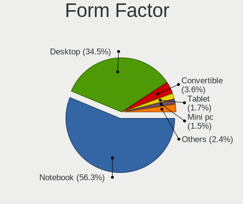
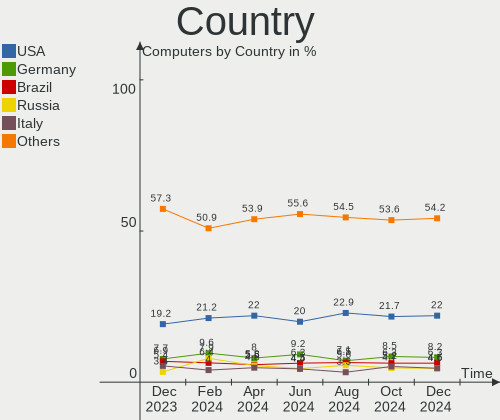
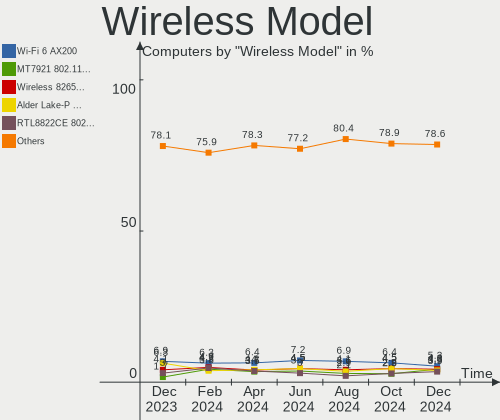
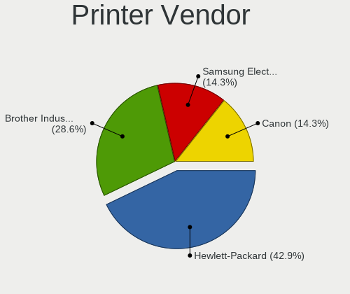
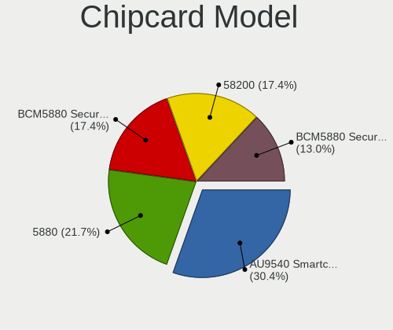

Fedora - Hardware Trends
------------------------

A project to identify most popular hardware characteristics and track their change
over time based on data collected by Linux users at https://Linux-Hardware.org.

Anyone can contribute to this report by the [hw-probe](https://github.com/linuxhw/hw-probe) tool:

    sudo -E hw-probe -all -upload

This is a report for all computer types. See also reports for [desktops](/Dist/Fedora/Desktop/README.md) and [notebooks](/Dist/Fedora/Notebook/README.md).

This report is for one last month. Overall report since the beginning of time: [TestDays](https://github.com/linuxhw/TestDays)

Period: May, 2023.

Contents
--------

* [ System ](#system)
  - [ OS                       ](#os)
  - [ OS Family                ](#os-family)
  - [ Kernel                   ](#kernel)
  - [ Kernel Family            ](#kernel-family)
  - [ Kernel Major Ver.        ](#kernel-major-ver)
  - [ Arch                     ](#arch)
  - [ DE                       ](#de)
  - [ Display Server           ](#display-server)
  - [ Display Manager          ](#display-manager)
  - [ OS Lang                  ](#os-lang)
  - [ Boot Mode                ](#boot-mode)
  - [ Filesystem               ](#filesystem)
  - [ Part. scheme             ](#part-scheme)
  - [ Dual Boot with Linux/BSD ](#dual-boot-with-linuxbsd)
  - [ Dual Boot (Win)          ](#dual-boot-win)

* [ Board ](#board)
  - [ Vendor                   ](#vendor)
  - [ Model                    ](#model)
  - [ Model Family             ](#model-family)
  - [ MFG Year                 ](#mfg-year)
  - [ Form Factor              ](#form-factor)
  - [ Secure Boot              ](#secure-boot)
  - [ Coreboot                 ](#coreboot)
  - [ RAM Size                 ](#ram-size)
  - [ RAM Used                 ](#ram-used)
  - [ Total Drives             ](#total-drives)
  - [ Has CD-ROM               ](#has-cd-rom)
  - [ Has Ethernet             ](#has-ethernet)
  - [ Has WiFi                 ](#has-wifi)
  - [ Has Bluetooth            ](#has-bluetooth)

* [ Location ](#location)
  - [ Country                  ](#country)
  - [ City                     ](#city)

* [ Drives ](#drives)
  - [ Drive Vendor             ](#drive-vendor)
  - [ Drive Model              ](#drive-model)
  - [ HDD Vendor               ](#hdd-vendor)
  - [ SSD Vendor               ](#ssd-vendor)
  - [ Drive Kind               ](#drive-kind)
  - [ Drive Connector          ](#drive-connector)
  - [ Drive Size               ](#drive-size)
  - [ Space Total              ](#space-total)
  - [ Space Used               ](#space-used)
  - [ Malfunc. Drives          ](#malfunc-drives)
  - [ Malfunc. Drive Vendor    ](#malfunc-drive-vendor)
  - [ Malfunc. HDD Vendor      ](#malfunc-hdd-vendor)
  - [ Malfunc. Drive Kind      ](#malfunc-drive-kind)
  - [ Failed Drives            ](#failed-drives)
  - [ Failed Drive Vendor      ](#failed-drive-vendor)
  - [ Drive Status             ](#drive-status)

* [ Storage controller ](#storage-controller)
  - [ Storage Vendor           ](#storage-vendor)
  - [ Storage Model            ](#storage-model)
  - [ Storage Kind             ](#storage-kind)

* [ Processor ](#processor)
  - [ CPU Vendor               ](#cpu-vendor)
  - [ CPU Model                ](#cpu-model)
  - [ CPU Model Family         ](#cpu-model-family)
  - [ CPU Cores                ](#cpu-cores)
  - [ CPU Sockets              ](#cpu-sockets)
  - [ CPU Threads              ](#cpu-threads)
  - [ CPU Op-Modes             ](#cpu-op-modes)
  - [ CPU Microcode            ](#cpu-microcode)
  - [ CPU Microarch            ](#cpu-microarch)

* [ Graphics ](#graphics)
  - [ GPU Vendor               ](#gpu-vendor)
  - [ GPU Model                ](#gpu-model)
  - [ GPU Combo                ](#gpu-combo)
  - [ GPU Driver               ](#gpu-driver)
  - [ GPU Memory               ](#gpu-memory)

* [ Monitor ](#monitor)
  - [ Monitor Vendor           ](#monitor-vendor)
  - [ Monitor Model            ](#monitor-model)
  - [ Monitor Resolution       ](#monitor-resolution)
  - [ Monitor Diagonal         ](#monitor-diagonal)
  - [ Monitor Width            ](#monitor-width)
  - [ Aspect Ratio             ](#aspect-ratio)
  - [ Monitor Area             ](#monitor-area)
  - [ Pixel Density            ](#pixel-density)
  - [ Multiple Monitors        ](#multiple-monitors)

* [ Network ](#network)
  - [ Net Controller Vendor    ](#net-controller-vendor)
  - [ Net Controller Model     ](#net-controller-model)
  - [ Wireless Vendor          ](#wireless-vendor)
  - [ Wireless Model           ](#wireless-model)
  - [ Ethernet Vendor          ](#ethernet-vendor)
  - [ Ethernet Model           ](#ethernet-model)
  - [ Net Controller Kind      ](#net-controller-kind)
  - [ Used Controller          ](#used-controller)
  - [ NICs                     ](#nics)
  - [ IPv6                     ](#ipv6)

* [ Bluetooth ](#bluetooth)
  - [ Bluetooth Vendor         ](#bluetooth-vendor)
  - [ Bluetooth Model          ](#bluetooth-model)

* [ Sound ](#sound)
  - [ Sound Vendor             ](#sound-vendor)
  - [ Sound Model              ](#sound-model)

* [ Memory ](#memory)
  - [ Memory Vendor            ](#memory-vendor)
  - [ Memory Model             ](#memory-model)
  - [ Memory Kind              ](#memory-kind)
  - [ Memory Form Factor       ](#memory-form-factor)
  - [ Memory Size              ](#memory-size)
  - [ Memory Speed             ](#memory-speed)

* [ Printers & scanners ](#printers--scanners)
  - [ Printer Vendor           ](#printer-vendor)
  - [ Printer Model            ](#printer-model)
  - [ Scanner Vendor           ](#scanner-vendor)
  - [ Scanner Model            ](#scanner-model)

* [ Camera ](#camera)
  - [ Camera Vendor            ](#camera-vendor)
  - [ Camera Model             ](#camera-model)

* [ Security ](#security)
  - [ Fingerprint Vendor       ](#fingerprint-vendor)
  - [ Fingerprint Model        ](#fingerprint-model)
  - [ Chipcard Vendor          ](#chipcard-vendor)
  - [ Chipcard Model           ](#chipcard-model)

* [ Unsupported ](#unsupported)
  - [ Unsupported Devices      ](#unsupported-devices)
  - [ Unsupported Device Types ](#unsupported-device-types)

System
------

OS
--

Installed operating systems

| Name      | Computers | Percent |
|-----------|-----------|---------|
| Fedora 38 | 468       | 84.48%  |
| Fedora 37 | 59        | 10.65%  |
| Fedora 36 | 17        | 3.07%   |
| Fedora 39 | 4         | 0.72%   |
| Fedora 35 | 4         | 0.72%   |
| Fedora 34 | 1         | 0.18%   |
| Fedora 30 | 1         | 0.18%   |

OS Family
---------

OS without a version

| Name   | Computers | Percent |
|--------|-----------|---------|
| Fedora | 554       | 100%    |

Kernel
------

Version of the Linux kernel

| Version                                                  | Computers | Percent |
|----------------------------------------------------------|-----------|---------|
| 6.2.15-300.fc38.x86_64                                   | 191       | 34.48%  |
| 6.2.14-300.fc38.x86_64                                   | 148       | 26.71%  |
| 6.2.13-300.fc38.x86_64                                   | 46        | 8.3%    |
| 6.2.9-300.fc38.x86_64                                    | 45        | 8.12%   |
| 6.2.15-200.fc37.x86_64                                   | 22        | 3.97%   |
| 6.2.14-200.fc37.x86_64                                   | 18        | 3.25%   |
| 6.2.11-300.fc38.x86_64                                   | 9         | 1.62%   |
| 6.3.3-200.fc38.x86_64                                    | 5         | 0.9%    |
| 6.2.12-300.fc38.x86_64                                   | 5         | 0.9%    |
| 6.2.11-200.fc37.x86_64                                   | 5         | 0.9%    |
| 6.2.14-100.fc36.x86_64                                   | 4         | 0.72%   |
| 6.0.7-301.fc37.x86_64                                    | 4         | 0.72%   |
| 6.3.4-201.fc38.x86_64                                    | 3         | 0.54%   |
| 6.3.0+                                                   | 3         | 0.54%   |
| 6.2.12-200.fc37.x86_64                                   | 3         | 0.54%   |
| 6.1.8-100.fc36.x86_64                                    | 3         | 0.54%   |
| 6.2.15-703.inttf.fc38.x86_64                             | 2         | 0.36%   |
| 6.2.15-100.fc36.x86_64                                   | 2         | 0.36%   |
| 6.1.26-200.fc38.x86_64                                   | 2         | 0.36%   |
| 6.4.0-0.rc4.334.vanilla.fc38.x86_64                      | 1         | 0.18%   |
| 6.4.0-0.rc4.20230529gite338142b39cf.35.fc39.x86_64       | 1         | 0.18%   |
| 6.4.0-0.rc3.20230526git0d85b27b0cc6.32.fc39.x86_64+debug | 1         | 0.18%   |
| 6.4.0-0.rc2.23.fc39.ppc64le                              | 1         | 0.18%   |
| 6.4.0-0.rc2.20230519git2d1bcbc6cd70.25.fc39.x86_64       | 1         | 0.18%   |
| 6.4.0-0.rc0.20230501git58390c8ce1bd.10.fc39.x86_64       | 1         | 0.18%   |
| 6.3.3-cb1.0.fc38.x86_64                                  | 1         | 0.18%   |
| 6.3.2-cbl1.0.fc38.x86_64                                 | 1         | 0.18%   |
| 6.3.1-cb3.0.fc38.x86_64                                  | 1         | 0.18%   |
| 6.3.1-350.vanilla.fc38.x86_64                            | 1         | 0.18%   |
| 6.3.1-200.fc38.x86_64                                    | 1         | 0.18%   |
| 6.2.9-200.fc37.x86_64                                    | 1         | 0.18%   |
| 6.2.8-100.fc36.x86_64                                    | 1         | 0.18%   |
| 6.2.14-703.inttf.fc38.x86_64                             | 1         | 0.18%   |
| 6.2.14-450.asahi.fc38.aarch64                            | 1         | 0.18%   |
| 6.2.13-200.fc37.x86_64                                   | 1         | 0.18%   |
| 6.2.10-200.fc37.x86_64                                   | 1         | 0.18%   |
| 6.1.9-200.fc37.x86_64                                    | 1         | 0.18%   |
| 6.1.12-200.fc37.x86_64                                   | 1         | 0.18%   |
| 6.0.7-200.fc36.x86_64                                    | 1         | 0.18%   |
| 6.0.17-200.fc36.x86_64                                   | 1         | 0.18%   |

Kernel Family
-------------

Linux kernel without a distro release

| Version | Computers | Percent |
|---------|-----------|---------|
| 6.2.15  | 217       | 39.17%  |
| 6.2.14  | 172       | 31.05%  |
| 6.2.13  | 47        | 8.48%   |
| 6.2.9   | 46        | 8.3%    |
| 6.2.11  | 14        | 2.53%   |
| 6.2.12  | 8         | 1.44%   |
| 6.4.0   | 6         | 1.08%   |
| 6.3.3   | 6         | 1.08%   |
| 6.0.7   | 5         | 0.9%    |
| 6.3.4   | 3         | 0.54%   |
| 6.3.1   | 3         | 0.54%   |
| 6.3.0   | 3         | 0.54%   |
| 6.1.8   | 3         | 0.54%   |
| 6.1.26  | 2         | 0.36%   |
| 5.17.12 | 2         | 0.36%   |
| 6.3.2   | 1         | 0.18%   |
| 6.2.8   | 1         | 0.18%   |
| 6.2.10  | 1         | 0.18%   |
| 6.1.9   | 1         | 0.18%   |
| 6.1.12  | 1         | 0.18%   |
| 6.0.17  | 1         | 0.18%   |
| 6.0.16  | 1         | 0.18%   |
| 6.0.15  | 1         | 0.18%   |
| 6.0.12  | 1         | 0.18%   |
| 6.0.11  | 1         | 0.18%   |
| 5.3.18  | 1         | 0.18%   |
| 5.19.14 | 1         | 0.18%   |
| 5.19.11 | 1         | 0.18%   |
| 5.17.5  | 1         | 0.18%   |
| 5.15.55 | 1         | 0.18%   |
| 5.14.10 | 1         | 0.18%   |
| 5.0.9   | 1         | 0.18%   |

Kernel Major Ver.
-----------------

Linux kernel major version

| Version | Computers | Percent |
|---------|-----------|---------|
| 6.2     | 506       | 91.34%  |
| 6.3     | 16        | 2.89%   |
| 6.0     | 10        | 1.81%   |
| 6.1     | 7         | 1.26%   |
| 6.4     | 6         | 1.08%   |
| 5.17    | 3         | 0.54%   |
| 5.19    | 2         | 0.36%   |
| 5.3     | 1         | 0.18%   |
| 5.15    | 1         | 0.18%   |
| 5.14    | 1         | 0.18%   |
| 5.0     | 1         | 0.18%   |

Arch
----

OS architecture (x86_64, i586, etc.)

| Name    | Computers | Percent |
|---------|-----------|---------|
| x86_64  | 552       | 99.64%  |
| ppc64le | 1         | 0.18%   |
| aarch64 | 1         | 0.18%   |

DE
--

Desktop Environment

| Name       | Computers | Percent |
|------------|-----------|---------|
| GNOME      | 423       | 76.35%  |
| KDE5       | 83        | 14.98%  |
| Unknown    | 13        | 2.35%   |
| Cinnamon   | 12        | 2.17%   |
| XFCE       | 7         | 1.26%   |
| X-Cinnamon | 5         | 0.9%    |
| MATE       | 5         | 0.9%    |
| i3         | 3         | 0.54%   |
| Hyprland   | 2         | 0.36%   |
| Deepin     | 1         | 0.18%   |

Display Server
--------------

X11 or Wayland

| Name    | Computers | Percent |
|---------|-----------|---------|
| Wayland | 424       | 76.53%  |
| X11     | 105       | 18.95%  |
| Tty     | 18        | 3.25%   |
| Unknown | 6         | 1.08%   |
| Xcb     | 1         | 0.18%   |

Display Manager
---------------

SDDM, LightDM, etc.

| Name    | Computers | Percent |
|---------|-----------|---------|
| Unknown | 354       | 63.9%   |
| GDM     | 127       | 22.92%  |
| SDDM    | 41        | 7.4%    |
| LightDM | 31        | 5.6%    |
| SLiM    | 1         | 0.18%   |

OS Lang
-------

Language

| Lang  | Computers | Percent |
|-------|-----------|---------|
| en_US | 265       | 47.83%  |
| en_GB | 39        | 7.04%   |
| pt_BR | 37        | 6.68%   |
| de_DE | 30        | 5.42%   |
| ru_RU | 29        | 5.23%   |
| fr_FR | 18        | 3.25%   |
| en_AU | 13        | 2.35%   |
| it_IT | 11        | 1.99%   |
| es_ES | 11        | 1.99%   |
| en_CA | 11        | 1.99%   |
| es_MX | 10        | 1.81%   |
| pl_PL | 7         | 1.26%   |
| es_CL | 7         | 1.26%   |
| hu_HU | 5         | 0.9%    |
| zh_CN | 4         | 0.72%   |
| pt_PT | 4         | 0.72%   |
| en_IN | 4         | 0.72%   |
| tr_TR | 3         | 0.54%   |
| es_CO | 3         | 0.54%   |
| es_AR | 3         | 0.54%   |
| sk_SK | 2         | 0.36%   |
| nl_NL | 2         | 0.36%   |
| nl_BE | 2         | 0.36%   |
| fr_CA | 2         | 0.36%   |
| fr_BE | 2         | 0.36%   |
| es_PE | 2         | 0.36%   |
| es_EC | 2         | 0.36%   |
| en_DK | 2         | 0.36%   |
| de_AT | 2         | 0.36%   |
| cs_CZ | 2         | 0.36%   |
| zh_TW | 1         | 0.18%   |
| sv_SE | 1         | 0.18%   |
| ru_UA | 1         | 0.18%   |
| nb_NO | 1         | 0.18%   |
| lt_LT | 1         | 0.18%   |
| ja_JP | 1         | 0.18%   |
| hr_HR | 1         | 0.18%   |
| fi_FI | 1         | 0.18%   |
| es_PA | 1         | 0.18%   |
| es_GT | 1         | 0.18%   |

Boot Mode
---------

EFI or BIOS

| Mode | Computers | Percent |
|------|-----------|---------|
| EFI  | 426       | 76.9%   |
| BIOS | 128       | 23.1%   |

Filesystem
----------

Type of filesystem

| Type    | Computers | Percent |
|---------|-----------|---------|
| Btrfs   | 448       | 80.87%  |
| Ext4    | 87        | 15.7%   |
| Xfs     | 17        | 3.07%   |
| Zfs     | 1         | 0.18%   |
| Overlay | 1         | 0.18%   |

Part. scheme
------------

Scheme of partitioning

| Type    | Computers | Percent |
|---------|-----------|---------|
| Unknown | 342       | 61.73%  |
| GPT     | 191       | 34.48%  |
| MBR     | 21        | 3.79%   |

Dual Boot with Linux/BSD
------------------------

Hosting more than one Linux/BSD

| Dual boot | Computers | Percent |
|-----------|-----------|---------|
| No        | 503       | 90.79%  |
| Yes       | 51        | 9.21%   |

Dual Boot (Win)
---------------

Hosting Linux and Windows

| Dual boot | Computers | Percent |
|-----------|-----------|---------|
| No        | 464       | 83.75%  |
| Yes       | 90        | 16.25%  |

Board
-----

Vendor
------

Motherboard manufacturer

| Name                                 | Computers | Percent |
|--------------------------------------|-----------|---------|
| Lenovo                               | 106       | 19.13%  |
| ASUSTek Computer                     | 92        | 16.61%  |
| Hewlett-Packard                      | 75        | 13.54%  |
| Dell                                 | 66        | 11.91%  |
| Gigabyte Technology                  | 38        | 6.86%   |
| MSI                                  | 34        | 6.14%   |
| ASRock                               | 23        | 4.15%   |
| Acer                                 | 19        | 3.43%   |
| Apple                                | 17        | 3.07%   |
| HUAWEI                               | 8         | 1.44%   |
| Unknown                              | 8         | 1.44%   |
| Intel                                | 6         | 1.08%   |
| Samsung Electronics                  | 5         | 0.9%    |
| Toshiba                              | 4         | 0.72%   |
| Notebook                             | 4         | 0.72%   |
| Positivo                             | 3         | 0.54%   |
| Google                               | 3         | 0.54%   |
| AZW                                  | 3         | 0.54%   |
| Supermicro                           | 2         | 0.36%   |
| Microsoft                            | 2         | 0.36%   |
| iRU                                  | 2         | 0.36%   |
| Intel Client Systems                 | 2         | 0.36%   |
| Framework                            | 2         | 0.36%   |
| Biostar                              | 2         | 0.36%   |
| Avell High Performance               | 2         | 0.36%   |
| Xiaomi                               | 1         | 0.18%   |
| VPU Company                          | 1         | 0.18%   |
| Valve                                | 1         | 0.18%   |
| UNOWHY                               | 1         | 0.18%   |
| Timi                                 | 1         | 0.18%   |
| Sony                                 | 1         | 0.18%   |
| SK hynix                             | 1         | 0.18%   |
| Shenzhen Meigao Electronic Equipment | 1         | 0.18%   |
| Razer                                | 1         | 0.18%   |
| PC Specialist                        | 1         | 0.18%   |
| Monster                              | 1         | 0.18%   |
| Micro Electronics                    | 1         | 0.18%   |
| Medion                               | 1         | 0.18%   |
| Itautec                              | 1         | 0.18%   |
| Huanan                               | 1         | 0.18%   |

Model
-----

Motherboard model

| Name                                 | Computers | Percent |
|--------------------------------------|-----------|---------|
| Unknown                              | 10        | 1.81%   |
| HP Pavilion Aero Laptop 13-be0xxx    | 4         | 0.72%   |
| Gigabyte B450 AORUS ELITE            | 3         | 0.54%   |
| Dell Precision 7540                  | 3         | 0.54%   |
| Dell Latitude 7420                   | 3         | 0.54%   |
| AZW SER                              | 3         | 0.54%   |
| ASRock B450M Pro4                    | 3         | 0.54%   |
| Samsung 550XDA                       | 2         | 0.36%   |
| MSI MS-7D73                          | 2         | 0.36%   |
| Lenovo ThinkPad X220 42911H8         | 2         | 0.36%   |
| Lenovo ThinkPad T580 20L9CTO1WW      | 2         | 0.36%   |
| Lenovo IdeaPad Gaming 3 15IMH05 82CG | 2         | 0.36%   |
| HUAWEI BOHK-WAX9X                    | 2         | 0.36%   |
| HP Pavilion Laptop 15-eg0xxx         | 2         | 0.36%   |
| HP ENVY x360 Convertible 13-ay0xxx   | 2         | 0.36%   |
| HP 630                               | 2         | 0.36%   |
| HP 255 G8 Notebook PC                | 2         | 0.36%   |
| Gigabyte X570S AORUS ELITE AX        | 2         | 0.36%   |
| Gigabyte B550 GAMING X V2            | 2         | 0.36%   |
| Dell XPS 13 9310                     | 2         | 0.36%   |
| Dell XPS 13 9305                     | 2         | 0.36%   |
| Dell Precision 5540                  | 2         | 0.36%   |
| Dell Latitude E7450                  | 2         | 0.36%   |
| Dell Latitude 5490                   | 2         | 0.36%   |
| Dell Inspiron 5490                   | 2         | 0.36%   |
| ASUS PRIME H510M-K                   | 2         | 0.36%   |
| Apple Macmini7,1                     | 2         | 0.36%   |
| Apple MacBookPro8,1                  | 2         | 0.36%   |
| Apple MacBookAir7,2                  | 2         | 0.36%   |
| Apple iMac7,1                        | 2         | 0.36%   |
| Xiaomi Mipad2                        | 1         | 0.18%   |
| VPU Company VWNC51518                | 1         | 0.18%   |
| Valve Jupiter                        | 1         | 0.18%   |
| UNOWHY Y13G011S4EI                   | 1         | 0.18%   |
| Toshiba Satellite L40                | 1         | 0.18%   |
| Toshiba Satellite C850-C5K           | 1         | 0.18%   |
| Toshiba Satellite C55-C              | 1         | 0.18%   |
| Toshiba PORTEGE Z830                 | 1         | 0.18%   |
| Timi Redmi Book Pro 14 2022          | 1         | 0.18%   |
| Supermicro SYS-2029U-TN24R4T         | 1         | 0.18%   |

Model Family
------------

Motherboard model prefix

| Name               | Computers | Percent |
|--------------------|-----------|---------|
| Lenovo ThinkPad    | 55        | 9.93%   |
| Lenovo IdeaPad     | 24        | 4.33%   |
| Dell Inspiron      | 18        | 3.25%   |
| ASUS ROG           | 17        | 3.07%   |
| HP Pavilion        | 16        | 2.89%   |
| ASUS PRIME         | 16        | 2.89%   |
| ASUS VivoBook      | 14        | 2.53%   |
| Dell Precision     | 13        | 2.35%   |
| Dell Latitude      | 13        | 2.35%   |
| HP Laptop          | 10        | 1.81%   |
| Unknown            | 10        | 1.81%   |
| Dell XPS           | 9         | 1.62%   |
| ASUS ASUS          | 9         | 1.62%   |
| Acer Aspire        | 9         | 1.62%   |
| HP EliteBook       | 8         | 1.44%   |
| Dell OptiPlex      | 7         | 1.26%   |
| Lenovo ThinkCentre | 5         | 0.9%    |
| HP ProBook         | 5         | 0.9%    |
| HP ENVY            | 5         | 0.9%    |
| HP Compaq          | 5         | 0.9%    |
| ASUS TUF           | 5         | 0.9%    |
| Lenovo Yoga        | 4         | 0.72%   |
| Lenovo ThinkBook   | 4         | 0.72%   |
| Gigabyte B550M     | 4         | 0.72%   |
| Gigabyte B450      | 4         | 0.72%   |
| ASRock B450M       | 4         | 0.72%   |
| Acer Nitro         | 4         | 0.72%   |
| Toshiba Satellite  | 3         | 0.54%   |
| Lenovo Legion      | 3         | 0.54%   |
| HP Victus          | 3         | 0.54%   |
| HP 255             | 3         | 0.54%   |
| Gigabyte B550      | 3         | 0.54%   |
| Dell Vostro        | 3         | 0.54%   |
| AZW SER            | 3         | 0.54%   |
| ASUS ZenBook       | 3         | 0.54%   |
| Samsung 550XDA     | 2         | 0.36%   |
| MSI Summit         | 2         | 0.36%   |
| MSI MS-7D73        | 2         | 0.36%   |
| MSI GF65           | 2         | 0.36%   |
| Microsoft Surface  | 2         | 0.36%   |

MFG Year
--------

Motherboard manufacture year

| Year    | Computers | Percent |
|---------|-----------|---------|
| 2021    | 79        | 14.26%  |
| 2022    | 68        | 12.27%  |
| 2020    | 66        | 11.91%  |
| 2019    | 58        | 10.47%  |
| 2018    | 56        | 10.11%  |
| 2012    | 33        | 5.96%   |
| 2017    | 31        | 5.6%    |
| 2013    | 26        | 4.69%   |
| 2015    | 24        | 4.33%   |
| 2011    | 24        | 4.33%   |
| 2016    | 19        | 3.43%   |
| 2014    | 17        | 3.07%   |
| 2023    | 16        | 2.89%   |
| 2010    | 12        | 2.17%   |
| 2009    | 9         | 1.62%   |
| 2008    | 9         | 1.62%   |
| 2007    | 4         | 0.72%   |
| Unknown | 2         | 0.36%   |
| 2006    | 1         | 0.18%   |

Form Factor
-----------

Physical design of the computer

| Name        | Computers | Percent |
|-------------|-----------|---------|
| Notebook    | 331       | 59.75%  |
| Desktop     | 174       | 31.41%  |
| Convertible | 24        | 4.33%   |
| Mini pc     | 9         | 1.62%   |
| Tablet      | 6         | 1.08%   |
| All in one  | 6         | 1.08%   |
| Server      | 4         | 0.72%   |

Secure Boot
-----------

Enabled or disabled

| State    | Computers | Percent |
|----------|-----------|---------|
| Disabled | 435       | 78.52%  |
| Enabled  | 119       | 21.48%  |

Coreboot
--------

Have coreboot on board

| Used | Computers | Percent |
|------|-----------|---------|
| No   | 550       | 99.28%  |
| Yes  | 4         | 0.72%   |

RAM Size
--------

Total RAM memory

| Size in GB  | Computers | Percent |
|-------------|-----------|---------|
| 4.01-8.0    | 137       | 24.73%  |
| 16.01-24.0  | 136       | 24.55%  |
| 8.01-16.0   | 101       | 18.23%  |
| 32.01-64.0  | 91        | 16.43%  |
| 3.01-4.0    | 46        | 8.3%    |
| 64.01-256.0 | 25        | 4.51%   |
| 24.01-32.0  | 11        | 1.99%   |
| 1.01-2.0    | 6         | 1.08%   |
| 2.01-3.0    | 1         | 0.18%   |

RAM Used
--------

Used RAM memory

| Used GB     | Computers | Percent |
|-------------|-----------|---------|
| 4.01-8.0    | 169       | 30.51%  |
| 2.01-3.0    | 141       | 25.45%  |
| 3.01-4.0    | 134       | 24.19%  |
| 1.01-2.0    | 54        | 9.75%   |
| 8.01-16.0   | 38        | 6.86%   |
| 0.51-1.0    | 12        | 2.17%   |
| 16.01-24.0  | 4         | 0.72%   |
| 24.01-32.0  | 1         | 0.18%   |
| 64.01-256.0 | 1         | 0.18%   |

Total Drives
------------

Number of drives on board

| Drives | Computers | Percent |
|--------|-----------|---------|
| 1      | 336       | 60.65%  |
| 2      | 141       | 25.45%  |
| 3      | 44        | 7.94%   |
| 4      | 18        | 3.25%   |
| 5      | 7         | 1.26%   |
| 6      | 4         | 0.72%   |
| 10     | 2         | 0.36%   |
| 7      | 1         | 0.18%   |
| 0      | 1         | 0.18%   |

Has CD-ROM
----------

Has CD-ROM on board

| Presented | Computers | Percent |
|-----------|-----------|---------|
| No        | 436       | 78.7%   |
| Yes       | 118       | 21.3%   |

Has Ethernet
------------

Has Ethernet on board

| Presented | Computers | Percent |
|-----------|-----------|---------|
| Yes       | 436       | 78.7%   |
| No        | 118       | 21.3%   |

Has WiFi
--------

Has WiFi module

| Presented | Computers | Percent |
|-----------|-----------|---------|
| Yes       | 448       | 80.87%  |
| No        | 106       | 19.13%  |

Has Bluetooth
-------------

Has Bluetooth module

| Presented | Computers | Percent |
|-----------|-----------|---------|
| Yes       | 395       | 71.3%   |
| No        | 159       | 28.7%   |

Location
--------

Country
-------

Geographic location (country)

| Country     | Computers | Percent |
|-------------|-----------|---------|
| USA         | 96        | 17.33%  |
| Germany     | 44        | 7.94%   |
| Brazil      | 44        | 7.94%   |
| Russia      | 30        | 5.42%   |
| France      | 21        | 3.79%   |
| Mexico      | 19        | 3.43%   |
| Italy       | 18        | 3.25%   |
| Canada      | 17        | 3.07%   |
| Poland      | 16        | 2.89%   |
| Australia   | 16        | 2.89%   |
| India       | 14        | 2.53%   |
| UK          | 13        | 2.35%   |
| Spain       | 13        | 2.35%   |
| Hungary     | 13        | 2.35%   |
| Netherlands | 11        | 1.99%   |
| Turkey      | 8         | 1.44%   |
| Portugal    | 8         | 1.44%   |
| Chile       | 8         | 1.44%   |
| Czechia     | 7         | 1.26%   |
| Belgium     | 7         | 1.26%   |
| Romania     | 6         | 1.08%   |
| Norway      | 6         | 1.08%   |
| Belarus     | 6         | 1.08%   |
| Colombia    | 5         | 0.9%    |
| Thailand    | 4         | 0.72%   |
| Singapore   | 4         | 0.72%   |
| Japan       | 4         | 0.72%   |
| Israel      | 4         | 0.72%   |
| Denmark     | 4         | 0.72%   |
| Bulgaria    | 4         | 0.72%   |
| Austria     | 4         | 0.72%   |
| Argentina   | 4         | 0.72%   |
| Taiwan      | 3         | 0.54%   |
| Switzerland | 3         | 0.54%   |
| Sri Lanka   | 3         | 0.54%   |
| South Korea | 3         | 0.54%   |
| Serbia      | 3         | 0.54%   |
| Peru        | 3         | 0.54%   |
| Indonesia   | 3         | 0.54%   |
| Greece      | 3         | 0.54%   |

City
----

Geographic location (city)

| City           | Computers | Percent |
|----------------|-----------|---------|
| Sydney         | 9         | 1.62%   |
| Moscow         | 8         | 1.44%   |
| Mexico City    | 7         | 1.26%   |
| Sao Paulo      | 5         | 0.9%    |
| Minsk          | 5         | 0.9%    |
| Madrid         | 5         | 0.9%    |
| Budapest       | 5         | 0.9%    |
| Singapore      | 4         | 0.72%   |
| Santiago       | 4         | 0.72%   |
| Istanbul       | 4         | 0.72%   |
| Delft          | 4         | 0.72%   |
| Vienna         | 3         | 0.54%   |
| Tokyo          | 3         | 0.54%   |
| Seattle        | 3         | 0.54%   |
| Rio de Janeiro | 3         | 0.54%   |
| Prague         | 3         | 0.54%   |
| Poznan         | 3         | 0.54%   |
| Portland       | 3         | 0.54%   |
| Paris          | 3         | 0.54%   |
| Milan          | 3         | 0.54%   |
| Lisbon         | 3         | 0.54%   |
| Gdansk         | 3         | 0.54%   |
| Brisbane       | 3         | 0.54%   |
| Berlin         | 3         | 0.54%   |
| Winnipeg       | 2         | 0.36%   |
| Warsaw         | 2         | 0.36%   |
| Tyumen         | 2         | 0.36%   |
| Toronto        | 2         | 0.36%   |
| Timișoara     | 2         | 0.36%   |
| Tecumseh       | 2         | 0.36%   |
| Sumaré        | 2         | 0.36%   |
| St Petersburg  | 2         | 0.36%   |
| Sofia          | 2         | 0.36%   |
| Santa Maria    | 2         | 0.36%   |
| Rotterdam      | 2         | 0.36%   |
| Rockville      | 2         | 0.36%   |
| Porto          | 2         | 0.36%   |
| Pittsburgh     | 2         | 0.36%   |
| Ottawa         | 2         | 0.36%   |
| Olomouc        | 2         | 0.36%   |

Drives
------

Drive Vendor
------------

Hard drive vendors

| Vendor                      | Computers | Drives | Percent |
|-----------------------------|-----------|--------|---------|
| Samsung Electronics         | 158       | 197    | 19.75%  |
| WDC                         | 75        | 101    | 9.38%   |
| SanDisk                     | 70        | 72     | 8.75%   |
| Seagate                     | 62        | 72     | 7.75%   |
| Kingston                    | 48        | 48     | 6%      |
| Toshiba                     | 44        | 44     | 5.5%    |
| SK hynix                    | 35        | 37     | 4.38%   |
| Intel                       | 30        | 35     | 3.75%   |
| Unknown                     | 27        | 29     | 3.38%   |
| Crucial                     | 25        | 26     | 3.13%   |
| Micron Technology           | 23        | 23     | 2.88%   |
| Phison Electronics          | 15        | 19     | 1.88%   |
| A-DATA Technology           | 14        | 17     | 1.75%   |
| China                       | 11        | 11     | 1.38%   |
| Silicon Motion              | 10        | 10     | 1.25%   |
| Hitachi                     | 10        | 13     | 1.25%   |
| HGST                        | 10        | 10     | 1.25%   |
| Micron/Crucial Technology   | 9         | 9      | 1.13%   |
| ADATA Technology            | 9         | 9      | 1.13%   |
| Apple                       | 8         | 13     | 1%      |
| KIOXIA                      | 7         | 7      | 0.88%   |
| SPCC                        | 5         | 5      | 0.63%   |
| Patriot                     | 5         | 6      | 0.63%   |
| Netac                       | 5         | 5      | 0.63%   |
| Kingston Technology Company | 5         | 6      | 0.63%   |
| Apacer                      | 5         | 5      | 0.63%   |
| SABRENT                     | 3         | 3      | 0.38%   |
| Phison                      | 3         | 3      | 0.38%   |
| Intenso                     | 3         | 3      | 0.38%   |
| Gigabyte Technology         | 3         | 4      | 0.38%   |
| Union Memory                | 2         | 2      | 0.25%   |
| Transcend                   | 2         | 2      | 0.25%   |
| Solid State Storage         | 2         | 2      | 0.25%   |
| Realtek Semiconductor       | 2         | 3      | 0.25%   |
| PNY                         | 2         | 2      | 0.25%   |
| MAXIO Technology (Hangzhou) | 2         | 2      | 0.25%   |
| LITEON                      | 2         | 2      | 0.25%   |
| Lexar                       | 2         | 2      | 0.25%   |
| Hewlett-Packard             | 2         | 2      | 0.25%   |
| Emtec                       | 2         | 2      | 0.25%   |

Drive Model
-----------

Hard drive models

| Model                                                           | Computers | Percent |
|-----------------------------------------------------------------|-----------|---------|
| Samsung NVMe SSD Controller SM981/PM981/PM983 256GB             | 29        | 3.37%   |
| Samsung NVMe SSD Controller PM9A1/PM9A3/980PRO 1TB              | 20        | 2.32%   |
| Kingston SA400S37240G 240GB SSD                                 | 13        | 1.51%   |
| Samsung SSD 980 1TB                                             | 12        | 1.39%   |
| Samsung NVMe SSD Controller SM961/PM961/SM963 256GB             | 12        | 1.39%   |
| Sandisk WD Blue SN550 NVMe SSD 512GB                            | 9         | 1.05%   |
| Kingston SA400S37480G 480GB SSD                                 | 9         | 1.05%   |
| Unknown MMC Card  32GB                                          | 8         | 0.93%   |
| Intel SSD 660P Series 512GB                                     | 8         | 0.93%   |
| Unknown MMC Card  128GB                                         | 7         | 0.81%   |
| Phison E12 NVMe Controller 256GB                                | 7         | 0.81%   |
| Toshiba XG6 NVMe SSD Controller 256GB                           | 6         | 0.7%    |
| Micron/Crucial P2 NVMe PCIe SSD 1TB                             | 6         | 0.7%    |
| Silicon Motion SM2263EN/SM2263XT SSD Controller 1TB             | 5         | 0.58%   |
| Samsung SSD 870 EVO 1TB                                         | 5         | 0.58%   |
| Samsung SSD 860 EVO 1TB                                         | 5         | 0.58%   |
| Samsung SSD 850 EVO 250GB                                       | 5         | 0.58%   |
| Samsung MZVLQ512HBLU-00BH1 512GB                                | 5         | 0.58%   |
| Phison E16 PCIe4 NVMe Controller 1TB                            | 5         | 0.58%   |
| Crucial CT500MX500SSD1 500GB                                    | 5         | 0.58%   |
| WDC WDS500G2B0A-00SM50 500GB SSD                                | 4         | 0.46%   |
| WDC WDS240G2G0A-00JH30 240GB SSD                                | 4         | 0.46%   |
| Unknown MMC Card  64GB                                          | 4         | 0.46%   |
| Toshiba DT01ACA100 1TB                                          | 4         | 0.46%   |
| SK hynix PC401 NVMe Solid State Drive 256GB                     | 4         | 0.46%   |
| SK hynix BC711 HFM512GD3JX013N 512GB                            | 4         | 0.46%   |
| Sandisk WD Blue SN500 / PC SN520 NVMe SSD 512GB                 | 4         | 0.46%   |
| Sandisk WD Black SN850 500GB                                    | 4         | 0.46%   |
| Sandisk WD Black SN750 / PC SN730 NVMe SSD 256GB                | 4         | 0.46%   |
| SanDisk SSD PLUS 480GB                                          | 4         | 0.46%   |
| Samsung SSD 860 EVO 500GB                                       | 4         | 0.46%   |
| Micron 2450_MTFDKBA512TFK 512GB                                 | 4         | 0.46%   |
| Kingston SA400S37120G 120GB SSD                                 | 4         | 0.46%   |
| Intel SSD Pro 7600p/760p/E 6100p Series 1TB                     | 4         | 0.46%   |
| HGST HTS721010A9E630 1TB                                        | 4         | 0.46%   |
| ADATA XPG SX8200 Pro PCIe Gen3x4 M.2 2280 Solid State Drive 1TB | 4         | 0.46%   |
| WDC WD10JPCX-24UE4T0 1TB                                        | 3         | 0.35%   |
| WDC WD10EZEX-08WN4A0 1TB                                        | 3         | 0.35%   |
| Toshiba MQ01ABD100 1TB                                          | 3         | 0.35%   |
| Toshiba HDWD110 1TB                                             | 3         | 0.35%   |

HDD Vendor
----------

Hard disk drive vendors

| Vendor              | Computers | Drives | Percent |
|---------------------|-----------|--------|---------|
| WDC                 | 59        | 80     | 32.6%   |
| Seagate             | 58        | 66     | 32.04%  |
| Toshiba             | 30        | 30     | 16.57%  |
| Hitachi             | 10        | 13     | 5.52%   |
| HGST                | 10        | 10     | 5.52%   |
| Samsung Electronics | 6         | 6      | 3.31%   |
| Apple               | 3         | 3      | 1.66%   |
| Unknown             | 2         | 2      | 1.1%    |
| SAGE                | 1         | 1      | 0.55%   |
| LaCie               | 1         | 1      | 0.55%   |
| ASMT                | 1         | 2      | 0.55%   |

SSD Vendor
----------

Solid state drive vendors

| Vendor              | Computers | Drives | Percent |
|---------------------|-----------|--------|---------|
| Samsung Electronics | 63        | 70     | 23.51%  |
| Kingston            | 39        | 39     | 14.55%  |
| Crucial             | 25        | 26     | 9.33%   |
| SanDisk             | 20        | 20     | 7.46%   |
| WDC                 | 15        | 15     | 5.6%    |
| Intel               | 11        | 11     | 4.1%    |
| China               | 11        | 11     | 4.1%    |
| A-DATA Technology   | 11        | 14     | 4.1%    |
| Toshiba             | 6         | 6      | 2.24%   |
| SPCC                | 5         | 5      | 1.87%   |
| Patriot             | 5         | 6      | 1.87%   |
| SABRENT             | 3         | 3      | 1.12%   |
| Netac               | 3         | 3      | 1.12%   |
| Gigabyte Technology | 3         | 4      | 1.12%   |
| Apacer              | 3         | 3      | 1.12%   |
| Transcend           | 2         | 2      | 0.75%   |
| SK hynix            | 2         | 2      | 0.75%   |
| PNY                 | 2         | 2      | 0.75%   |
| Micron Technology   | 2         | 2      | 0.75%   |
| LITEON              | 2         | 2      | 0.75%   |
| Lexar               | 2         | 2      | 0.75%   |
| Intenso             | 2         | 2      | 0.75%   |
| Emtec               | 2         | 2      | 0.75%   |
| Apple               | 2         | 2      | 0.75%   |
| Advantech           | 2         | 2      | 0.75%   |
| Acer                | 2         | 2      | 0.75%   |
| XrayDisk            | 1         | 1      | 0.37%   |
| WDC WDS2            | 1         | 1      | 0.37%   |
| Vaseky              | 1         | 1      | 0.37%   |
| Union Memory        | 1         | 1      | 0.37%   |
| TO Exter            | 1         | 1      | 0.37%   |
| Team                | 1         | 1      | 0.37%   |
| Smart               | 1         | 1      | 0.37%   |
| Ramsta              | 1         | 1      | 0.37%   |
| Pichau              | 1         | 1      | 0.37%   |
| Phison              | 1         | 1      | 0.37%   |
| OCZ                 | 1         | 1      | 0.37%   |
| Maxtor              | 1         | 1      | 0.37%   |
| LITEONIT            | 1         | 1      | 0.37%   |
| Lenovo              | 1         | 1      | 0.37%   |

Drive Kind
----------

HDD or SSD

| Kind    | Computers | Drives | Percent |
|---------|-----------|--------|---------|
| NVMe    | 313       | 373    | 42.3%   |
| SSD     | 232       | 281    | 31.35%  |
| HDD     | 158       | 214    | 21.35%  |
| MMC     | 27        | 29     | 3.65%   |
| Unknown | 10        | 11     | 1.35%   |

Drive Connector
---------------

SATA, SAS, NVMe, etc.

| Type | Computers | Drives | Percent |
|------|-----------|--------|---------|
| NVMe | 313       | 373    | 45.83%  |
| SATA | 312       | 469    | 45.68%  |
| SAS  | 31        | 37     | 4.54%   |
| MMC  | 27        | 29     | 3.95%   |

Drive Size
----------

Size of hard drive

| Size in TB | Computers | Drives | Percent |
|------------|-----------|--------|---------|
| 0.01-0.5   | 217       | 265    | 53.58%  |
| 0.51-1.0   | 123       | 146    | 30.37%  |
| 1.01-2.0   | 37        | 42     | 9.14%   |
| 3.01-4.0   | 11        | 13     | 2.72%   |
| 4.01-10.0  | 9         | 14     | 2.22%   |
| 2.01-3.0   | 4         | 5      | 0.99%   |
| 10.01-20.0 | 4         | 10     | 0.99%   |

Space Total
-----------

Amount of disk space available on the file system

| Size in GB     | Computers | Percent |
|----------------|-----------|---------|
| 501-1000       | 127       | 22.92%  |
| 251-500        | 122       | 22.02%  |
| 1001-2000      | 82        | 14.8%   |
| 101-250        | 57        | 10.29%  |
| Unknown        | 38        | 6.86%   |
| More than 3000 | 37        | 6.68%   |
| 1-20           | 37        | 6.68%   |
| 51-100         | 23        | 4.15%   |
| 2001-3000      | 22        | 3.97%   |
| 21-50          | 9         | 1.62%   |

Space Used
----------

Amount of used disk space

| Used GB        | Computers | Percent |
|----------------|-----------|---------|
| 1-20           | 164       | 29.6%   |
| 21-50          | 100       | 18.05%  |
| 101-250        | 70        | 12.64%  |
| 51-100         | 57        | 10.29%  |
| 251-500        | 56        | 10.11%  |
| Unknown        | 38        | 6.86%   |
| 501-1000       | 35        | 6.32%   |
| 1001-2000      | 23        | 4.15%   |
| More than 3000 | 7         | 1.26%   |
| 2001-3000      | 4         | 0.72%   |

Malfunc. Drives
---------------

Drive models with a malfunction

| Model                                         | Computers | Drives | Percent |
|-----------------------------------------------|-----------|--------|---------|
| WDC WDS240G2G0A-00JH30 240GB SSD              | 2         | 2      | 7.69%   |
| Intel SSDSC2CT120A3 120GB                     | 2         | 2      | 7.69%   |
| Crucial CT120M500SSD1 120GB                   | 2         | 2      | 7.69%   |
| WDC WDS100T2G0A-00JH30 1TB SSD                | 1         | 1      | 3.85%   |
| WDC WD10JPVT-60A1YT0 1TB                      | 1         | 1      | 3.85%   |
| Toshiba MQ02ABD100H 1TB                       | 1         | 1      | 3.85%   |
| Toshiba MK3256GSYF 320GB                      | 1         | 1      | 3.85%   |
| SK hynix HFS128G3AMNB-2200A 128GB SSD         | 1         | 1      | 3.85%   |
| Seagate ST9160412AS 160GB                     | 1         | 1      | 3.85%   |
| Seagate ST3500630NS 500GB                     | 1         | 1      | 3.85%   |
| Seagate ST3500418AS 500GB                     | 1         | 1      | 3.85%   |
| Seagate ST3160813AS 160GB                     | 1         | 1      | 3.85%   |
| Seagate ST3000DM001-1CH166 3TB                | 1         | 1      | 3.85%   |
| Seagate ST2000DM008-2FR102 2TB                | 1         | 1      | 3.85%   |
| Samsung Electronics SSD 980 1TB               | 1         | 1      | 3.85%   |
| Samsung Electronics SSD 840 PRO Series 256GB  | 1         | 1      | 3.85%   |
| Samsung Electronics SSD 840 EVO 250GB         | 1         | 1      | 3.85%   |
| Samsung Electronics HD322GJ 320GB             | 1         | 1      | 3.85%   |
| Micron Technology MTFDDAK128MAM-1J1 128GB SSD | 1         | 1      | 3.85%   |
| Kingston SA400S37120G 120GB SSD               | 1         | 1      | 3.85%   |
| Intenso SSD 256GB                             | 1         | 1      | 3.85%   |
| Intenso SSD 240GB                             | 1         | 1      | 3.85%   |
| Crucial CT128MX100SSD1 128GB                  | 1         | 1      | 3.85%   |

Malfunc. Drive Vendor
---------------------

Vendors of faulty drives

| Vendor              | Computers | Drives | Percent |
|---------------------|-----------|--------|---------|
| Seagate             | 6         | 6      | 24%     |
| Samsung Electronics | 4         | 4      | 16%     |
| WDC                 | 3         | 4      | 12%     |
| Crucial             | 3         | 3      | 12%     |
| Toshiba             | 2         | 2      | 8%      |
| Intenso             | 2         | 2      | 8%      |
| Intel               | 2         | 2      | 8%      |
| SK hynix            | 1         | 1      | 4%      |
| Micron Technology   | 1         | 1      | 4%      |
| Kingston            | 1         | 1      | 4%      |

Malfunc. HDD Vendor
-------------------

Vendors of faulty HDD drives

| Vendor              | Computers | Drives | Percent |
|---------------------|-----------|--------|---------|
| Seagate             | 6         | 6      | 60%     |
| Toshiba             | 2         | 2      | 20%     |
| WDC                 | 1         | 1      | 10%     |
| Samsung Electronics | 1         | 1      | 10%     |

Malfunc. Drive Kind
-------------------

Kinds of faulty drives

| Kind | Computers | Drives | Percent |
|------|-----------|--------|---------|
| SSD  | 14        | 15     | 56%     |
| HDD  | 10        | 10     | 40%     |
| NVMe | 1         | 1      | 4%      |

Failed Drives
-------------

Failed drive models

Zero info for selected period =(

Failed Drive Vendor
-------------------

Failed drive vendors

Zero info for selected period =(

Drive Status
------------

Number of failed and malfunc. drives

| Status   | Computers | Drives | Percent |
|----------|-----------|--------|---------|
| Detected | 375       | 597    | 64.43%  |
| Works    | 184       | 285    | 31.62%  |
| Malfunc  | 23        | 26     | 3.95%   |

Storage controller
------------------

Storage Vendor
--------------

Storage controller vendors

| Vendor                         | Computers | Percent |
|--------------------------------|-----------|---------|
| Intel                          | 307       | 39.72%  |
| AMD                            | 115       | 14.88%  |
| Samsung Electronics            | 112       | 14.49%  |
| SanDisk                        | 56        | 7.24%   |
| SK hynix                       | 33        | 4.27%   |
| Micron Technology              | 21        | 2.72%   |
| Phison Electronics             | 19        | 2.46%   |
| Kingston Technology Company    | 14        | 1.81%   |
| ADATA Technology               | 12        | 1.55%   |
| Silicon Motion                 | 11        | 1.42%   |
| ASMedia Technology             | 10        | 1.29%   |
| Toshiba America Info Systems   | 9         | 1.16%   |
| Micron/Crucial Technology      | 9         | 1.16%   |
| Marvell Technology Group       | 7         | 0.91%   |
| KIOXIA                         | 6         | 0.78%   |
| Solid State Storage Technology | 4         | 0.52%   |
| Seagate Technology             | 3         | 0.39%   |
| MAXIO Technology (Hangzhou)    | 3         | 0.39%   |
| LSI Logic / Symbios Logic      | 3         | 0.39%   |
| JMicron Technology             | 3         | 0.39%   |
| Yangtze Memory Technologies    | 2         | 0.26%   |
| Union Memory (Shenzhen)        | 2         | 0.26%   |
| Realtek Semiconductor          | 2         | 0.26%   |
| Nvidia                         | 2         | 0.26%   |
| Netac Technology               | 2         | 0.26%   |
| Apple                          | 2         | 0.26%   |
| Solidigm                       | 1         | 0.13%   |
| Shenzhen Longsys Electronics   | 1         | 0.13%   |
| Broadcom / LSI                 | 1         | 0.13%   |
| Adaptec                        | 1         | 0.13%   |

Storage Model
-------------

Storage controller models

| Model                                                                          | Computers | Percent |
|--------------------------------------------------------------------------------|-----------|---------|
| AMD FCH SATA Controller [AHCI mode]                                            | 77        | 8.98%   |
| Samsung NVMe SSD Controller SM981/PM981/PM983                                  | 38        | 4.43%   |
| Samsung NVMe SSD Controller 980                                                | 33        | 3.85%   |
| Intel Volume Management Device NVMe RAID Controller                            | 32        | 3.73%   |
| Samsung NVMe SSD Controller PM9A1/PM9A3/980PRO                                 | 23        | 2.68%   |
| Intel Sunrise Point-LP SATA Controller [AHCI mode]                             | 22        | 2.57%   |
| Micron NVMe Storage Controller                                                 | 19        | 2.22%   |
| Intel 82801 Mobile SATA Controller [RAID mode]                                 | 19        | 2.22%   |
| Intel 8 Series/C220 Series Chipset Family 6-port SATA Controller 1 [AHCI mode] | 19        | 2.22%   |
| Intel 7 Series Chipset Family 6-port SATA Controller [AHCI mode]               | 17        | 1.98%   |
| AMD 400 Series Chipset SATA Controller                                         | 17        | 1.98%   |
| AMD 500 Series Chipset SATA Controller                                         | 16        | 1.87%   |
| SK hynix Gold P31/PC711 NVMe Solid State Drive                                 | 14        | 1.63%   |
| Samsung NVMe SSD Controller SM961/PM961/SM963                                  | 14        | 1.63%   |
| Intel Cannon Lake Mobile PCH SATA AHCI Controller                              | 13        | 1.52%   |
| Intel 6 Series/C200 Series Chipset Family 6 port Mobile SATA AHCI Controller   | 12        | 1.4%    |
| Intel 200 Series PCH SATA controller [AHCI mode]                               | 12        | 1.4%    |
| SanDisk WD Blue SN550 NVMe SSD                                                 | 11        | 1.28%   |
| Intel 500 Series Chipset Family SATA AHCI Controller                           | 11        | 1.28%   |
| SanDisk Non-Volatile memory controller                                         | 10        | 1.17%   |
| Kingston Company Company Non-Volatile memory controller                        | 10        | 1.17%   |
| Intel Tiger Lake-LP SATA Controller                                            | 10        | 1.17%   |
| Intel 8 Series SATA Controller 1 [AHCI mode]                                   | 10        | 1.17%   |
| ASMedia ASM1062 Serial ATA Controller                                          | 10        | 1.17%   |
| Intel SSD 660P Series                                                          | 8         | 0.93%   |
| Intel Q170/Q150/B150/H170/H110/Z170/CM236 Chipset SATA Controller [AHCI Mode]  | 8         | 0.93%   |
| Intel HM170/QM170 Chipset SATA Controller [AHCI Mode]                          | 8         | 0.93%   |
| Intel Celeron/Pentium Silver Processor SATA Controller                         | 8         | 0.93%   |
| Intel Alder Lake-S PCH SATA Controller [AHCI Mode]                             | 8         | 0.93%   |
| AMD SB7x0/SB8x0/SB9x0 SATA Controller [AHCI mode]                              | 8         | 0.93%   |
| Toshiba America Info Systems XG6 NVMe SSD Controller                           | 7         | 0.82%   |
| Silicon Motion SM2263EN/SM2263XT SSD Controller                                | 7         | 0.82%   |
| Phison E12 NVMe Controller                                                     | 7         | 0.82%   |
| Intel Comet Lake SATA AHCI Controller                                          | 7         | 0.82%   |
| Intel Cannon Lake PCH SATA AHCI Controller                                     | 7         | 0.82%   |
| AMD SB7x0/SB8x0/SB9x0 IDE Controller                                           | 7         | 0.82%   |
| SanDisk NVMe Controller                                                        | 6         | 0.7%    |
| Phison E16 PCIe4 NVMe Controller                                               | 6         | 0.7%    |
| Micron/Crucial P2 NVMe PCIe SSD                                                | 6         | 0.7%    |
| Intel 7 Series/C210 Series Chipset Family 6-port SATA Controller [AHCI mode]   | 6         | 0.7%    |

Storage Kind
------------

Kind of storage controller (IDE, SATA, NVMe, SAS, ...)

| Kind | Computers | Percent |
|------|-----------|---------|
| SATA | 361       | 47.01%  |
| NVMe | 312       | 40.63%  |
| RAID | 58        | 7.55%   |
| IDE  | 33        | 4.3%    |
| SAS  | 3         | 0.39%   |
| SCSI | 1         | 0.13%   |

Processor
---------

CPU Vendor
----------

Processor vendors

| Vendor                   | Computers | Percent |
|--------------------------|-----------|---------|
| Intel                    | 391       | 70.58%  |
| AMD                      | 160       | 28.88%  |
| PowerNV C1P9S01 REV 1.01 | 1         | 0.18%   |
| CentaurHauls             | 1         | 0.18%   |
| Unknown                  | 1         | 0.18%   |

CPU Model
---------

Processor models

| Model                                         | Computers | Percent |
|-----------------------------------------------|-----------|---------|
| Intel 11th Gen Core i5-1135G7 @ 2.40GHz       | 15        | 2.71%   |
| Intel 11th Gen Core i7-1165G7 @ 2.80GHz       | 12        | 2.17%   |
| Intel Core i5-8250U CPU @ 1.60GHz             | 9         | 1.62%   |
| AMD Ryzen 5 5500U with Radeon Graphics        | 8         | 1.44%   |
| AMD Ryzen 5 3500U with Radeon Vega Mobile Gfx | 8         | 1.44%   |
| AMD Ryzen 5 5600X 6-Core Processor            | 7         | 1.26%   |
| Intel Core i5-3210M CPU @ 2.50GHz             | 6         | 1.08%   |
| Intel 12th Gen Core i7-12700H                 | 6         | 1.08%   |
| AMD Ryzen 5 2600 Six-Core Processor           | 6         | 1.08%   |
| Intel Core i7-7700HQ CPU @ 2.80GHz            | 5         | 0.9%    |
| Intel Core i5-10210U CPU @ 1.60GHz            | 5         | 0.9%    |
| Intel 12th Gen Core i5-1240P                  | 5         | 0.9%    |
| AMD Ryzen 7 4700U with Radeon Graphics        | 5         | 0.9%    |
| AMD Ryzen 5 5600U with Radeon Graphics        | 5         | 0.9%    |
| Intel Core i7-9750H CPU @ 2.60GHz             | 4         | 0.72%   |
| Intel Core i5-9300H CPU @ 2.40GHz             | 4         | 0.72%   |
| Intel Core i5-8350U CPU @ 1.70GHz             | 4         | 0.72%   |
| Intel Core i5-10300H CPU @ 2.50GHz            | 4         | 0.72%   |
| Intel 12th Gen Core i5-1235U                  | 4         | 0.72%   |
| Intel 11th Gen Core i7-1185G7 @ 3.00GHz       | 4         | 0.72%   |
| AMD Ryzen 7 3700X 8-Core Processor            | 4         | 0.72%   |
| AMD Ryzen 5 3600 6-Core Processor             | 4         | 0.72%   |
| AMD Ryzen 5 3400G with Radeon Vega Graphics   | 4         | 0.72%   |
| AMD Ryzen 3 5300U with Radeon Graphics        | 4         | 0.72%   |
| Intel Pentium Silver N5030 CPU @ 1.10GHz      | 3         | 0.54%   |
| Intel Core i7-9850H CPU @ 2.60GHz             | 3         | 0.54%   |
| Intel Core i7-8750H CPU @ 2.20GHz             | 3         | 0.54%   |
| Intel Core i7-8700K CPU @ 3.70GHz             | 3         | 0.54%   |
| Intel Core i7-8650U CPU @ 1.90GHz             | 3         | 0.54%   |
| Intel Core i7-8565U CPU @ 1.80GHz             | 3         | 0.54%   |
| Intel Core i7-2620M CPU @ 2.70GHz             | 3         | 0.54%   |
| Intel Core i7-1065G7 CPU @ 1.30GHz            | 3         | 0.54%   |
| Intel Core i7-10510U CPU @ 1.80GHz            | 3         | 0.54%   |
| Intel Core i5-8265U CPU @ 1.60GHz             | 3         | 0.54%   |
| Intel Core i5-7300U CPU @ 2.60GHz             | 3         | 0.54%   |
| Intel Core i5-7300HQ CPU @ 2.50GHz            | 3         | 0.54%   |
| Intel Core i5-5300U CPU @ 2.30GHz             | 3         | 0.54%   |
| Intel Core i5-3320M CPU @ 2.60GHz             | 3         | 0.54%   |
| Intel Core i5-1035G1 CPU @ 1.00GHz            | 3         | 0.54%   |
| Intel Core i3-1005G1 CPU @ 1.20GHz            | 3         | 0.54%   |

CPU Model Family
----------------

Processor model prefix

| Model                   | Computers | Percent |
|-------------------------|-----------|---------|
| Intel Core i5           | 104       | 18.77%  |
| Other                   | 96        | 17.33%  |
| Intel Core i7           | 91        | 16.43%  |
| AMD Ryzen 5             | 60        | 10.83%  |
| AMD Ryzen 7             | 41        | 7.4%    |
| Intel Core i3           | 31        | 5.6%    |
| AMD Ryzen 9             | 18        | 3.25%   |
| Intel Xeon              | 16        | 2.89%   |
| Intel Celeron           | 12        | 2.17%   |
| Intel Core 2 Duo        | 11        | 1.99%   |
| Intel Atom              | 10        | 1.81%   |
| AMD FX                  | 9         | 1.62%   |
| AMD Ryzen 3             | 8         | 1.44%   |
| Intel Pentium Silver    | 5         | 0.9%    |
| Intel Core i9           | 4         | 0.72%   |
| Intel Core 2 Quad       | 4         | 0.72%   |
| AMD Phenom II X4        | 4         | 0.72%   |
| Intel Pentium Dual      | 3         | 0.54%   |
| Intel Pentium           | 3         | 0.54%   |
| AMD Ryzen 5 PRO         | 3         | 0.54%   |
| AMD A10                 | 3         | 0.54%   |
| AMD Athlon              | 2         | 0.36%   |
| AMD A6                  | 2         | 0.36%   |
| Intel Xeon Gold         | 1         | 0.18%   |
| Intel Pentium Gold      | 1         | 0.18%   |
| Intel Pentium Dual-Core | 1         | 0.18%   |
| Intel Genuine           | 1         | 0.18%   |
| Intel Core m3           | 1         | 0.18%   |
| Intel Core 2 Extreme    | 1         | 0.18%   |
| Intel Core 2            | 1         | 0.18%   |
| AMD Ryzen Threadripper  | 1         | 0.18%   |
| AMD Ryzen 7 PRO         | 1         | 0.18%   |
| AMD Phenom II X2        | 1         | 0.18%   |
| AMD E1                  | 1         | 0.18%   |
| AMD A8                  | 1         | 0.18%   |
| AMD A4                  | 1         | 0.18%   |
| AMD A12                 | 1         | 0.18%   |

CPU Cores
---------

Number of processor cores

| Number | Computers | Percent |
|--------|-----------|---------|
| 4      | 210       | 37.91%  |
| 2      | 138       | 24.91%  |
| 6      | 83        | 14.98%  |
| 8      | 67        | 12.09%  |
| 12     | 20        | 3.61%   |
| 14     | 12        | 2.17%   |
| 10     | 11        | 1.99%   |
| 16     | 6         | 1.08%   |
| 3      | 3         | 0.54%   |
| 36     | 1         | 0.18%   |
| 24     | 1         | 0.18%   |
| 18     | 1         | 0.18%   |
| 1      | 1         | 0.18%   |

CPU Sockets
-----------

Number of sockets

| Number | Computers | Percent |
|--------|-----------|---------|
| 1      | 551       | 99.46%  |
| 2      | 3         | 0.54%   |

CPU Threads
-----------

Threads per core (Hyper-Threading)

| Number | Computers | Percent |
|--------|-----------|---------|
| 2      | 447       | 80.69%  |
| 1      | 106       | 19.13%  |
| 4      | 1         | 0.18%   |

CPU Op-Modes
------------

CPU Operation Modes (32-bit, 64-bit)

| Op mode        | Computers | Percent |
|----------------|-----------|---------|
| 32-bit, 64-bit | 552       | 99.64%  |
| 64-bit         | 1         | 0.18%   |
| Unknown        | 1         | 0.18%   |

CPU Microcode
-------------

Microcode number

| Number     | Computers | Percent |
|------------|-----------|---------|
| Unknown    | 385       | 69.49%  |
| 0x08108109 | 15        | 2.71%   |
| 0x0a50000d | 11        | 1.99%   |
| 0x0a50000c | 11        | 1.99%   |
| 0x0a404102 | 10        | 1.81%   |
| 0x08608103 | 10        | 1.81%   |
| 0x0a601203 | 9         | 1.62%   |
| 0x08701021 | 9         | 1.62%   |
| 0x0800820d | 8         | 1.44%   |
| 0x0a20120a | 6         | 1.08%   |
| 0x0a201016 | 6         | 1.08%   |
| 0x08600106 | 5         | 0.9%    |
| 0x06000822 | 5         | 0.9%    |
| 0x08108102 | 4         | 0.72%   |
| 0x010000c8 | 4         | 0.72%   |
| 0x906ea    | 3         | 0.54%   |
| 0x0a201025 | 3         | 0.54%   |
| 0x0800820c | 3         | 0.54%   |
| 0x806c1    | 2         | 0.36%   |
| 0x506e3    | 2         | 0.36%   |
| 0x306c3    | 2         | 0.36%   |
| 0x0a201204 | 2         | 0.36%   |
| 0x08608102 | 2         | 0.36%   |
| 0x08600104 | 2         | 0.36%   |
| 0x0600611a | 2         | 0.36%   |
| 0x06001116 | 2         | 0.36%   |
| 0x00000000 | 2         | 0.36%   |
| 0x906a4    | 1         | 0.18%   |
| 0x806e9    | 1         | 0.18%   |
| 0x50657    | 1         | 0.18%   |
| 0x306d4    | 1         | 0.18%   |
| 0x206a7    | 1         | 0.18%   |
| 0x20652    | 1         | 0.18%   |
| 0x10676    | 1         | 0.18%   |
| 0x0a404101 | 1         | 0.18%   |
| 0x0a201205 | 1         | 0.18%   |
| 0x08900201 | 1         | 0.18%   |
| 0x08701030 | 1         | 0.18%   |
| 0x08701013 | 1         | 0.18%   |
| 0x08608104 | 1         | 0.18%   |

CPU Microarch
-------------

Microarchitecture

| Name             | Computers | Percent |
|------------------|-----------|---------|
| KabyLake         | 99        | 17.87%  |
| Zen 3            | 42        | 7.58%   |
| Unknown          | 41        | 7.4%    |
| Alderlake Hybrid | 40        | 7.22%   |
| TigerLake        | 38        | 6.86%   |
| Haswell          | 35        | 6.32%   |
| Zen+             | 30        | 5.42%   |
| IvyBridge        | 29        | 5.23%   |
| Zen 2            | 23        | 4.15%   |
| SandyBridge      | 23        | 4.15%   |
| Icelake          | 23        | 4.15%   |
| Skylake          | 18        | 3.25%   |
| Penryn           | 14        | 2.53%   |
| CometLake        | 14        | 2.53%   |
| Westmere         | 12        | 2.17%   |
| Silvermont       | 12        | 2.17%   |
| Piledriver       | 11        | 1.99%   |
| Broadwell        | 10        | 1.81%   |
| Goldmont plus    | 9         | 1.62%   |
| Core             | 9         | 1.62%   |
| K10              | 5         | 0.9%    |
| Zen              | 4         | 0.72%   |
| Excavator        | 4         | 0.72%   |
| Tremont          | 2         | 0.36%   |
| Nehalem          | 2         | 0.36%   |
| Bulldozer        | 2         | 0.36%   |
| Puma             | 1         | 0.18%   |
| Jaguar           | 1         | 0.18%   |
| Bonnell          | 1         | 0.18%   |

Graphics
--------

GPU Vendor
----------

Vendors of graphics cards

| Vendor                     | Computers | Percent |
|----------------------------|-----------|---------|
| Intel                      | 314       | 47.08%  |
| AMD                        | 174       | 26.09%  |
| Nvidia                     | 173       | 25.94%  |
| Matrox Electronics Systems | 3         | 0.45%   |
| ASPEED Technology          | 2         | 0.3%    |
| Zhaoxin                    | 1         | 0.15%   |

GPU Model
---------

Graphics card models

| Model                                                                                    | Computers | Percent |
|------------------------------------------------------------------------------------------|-----------|---------|
| Intel TigerLake-LP GT2 [Iris Xe Graphics]                                                | 36        | 5.27%   |
| Intel UHD Graphics 620                                                                   | 19        | 2.78%   |
| Intel Alder Lake-P Integrated Graphics Controller                                        | 19        | 2.78%   |
| Intel CoffeeLake-H GT2 [UHD Graphics 630]                                                | 18        | 2.64%   |
| AMD Picasso/Raven 2 [Radeon Vega Series / Radeon Vega Mobile Series]                     | 18        | 2.64%   |
| AMD Ellesmere [Radeon RX 470/480/570/570X/580/580X/590]                                  | 18        | 2.64%   |
| AMD Cezanne [Radeon Vega Series / Radeon Vega Mobile Series]                             | 18        | 2.64%   |
| Intel 3rd Gen Core processor Graphics Controller                                         | 17        | 2.49%   |
| Intel 2nd Generation Core Processor Family Integrated Graphics Controller                | 17        | 2.49%   |
| AMD Lucienne                                                                             | 14        | 2.05%   |
| Intel HD Graphics 630                                                                    | 13        | 1.9%    |
| AMD Rembrandt [Radeon 680M]                                                              | 12        | 1.76%   |
| Intel CometLake-U GT2 [UHD Graphics]                                                     | 11        | 1.61%   |
| AMD Renoir                                                                               | 11        | 1.61%   |
| Intel Haswell-ULT Integrated Graphics Controller                                         | 10        | 1.46%   |
| Nvidia GA106M [GeForce RTX 3060 Mobile / Max-Q]                                          | 9         | 1.32%   |
| Intel WhiskeyLake-U GT2 [UHD Graphics 620]                                               | 9         | 1.32%   |
| Intel Skylake GT2 [HD Graphics 520]                                                      | 9         | 1.32%   |
| Intel HD Graphics 620                                                                    | 9         | 1.32%   |
| Intel CometLake-H GT2 [UHD Graphics]                                                     | 9         | 1.32%   |
| Intel Atom/Celeron/Pentium Processor x5-E8000/J3xxx/N3xxx Integrated Graphics Controller | 8         | 1.17%   |
| Intel Alder Lake-UP3 GT2 [Iris Xe Graphics]                                              | 8         | 1.17%   |
| Intel 4th Gen Core Processor Integrated Graphics Controller                              | 8         | 1.17%   |
| Intel TigerLake-H GT1 [UHD Graphics]                                                     | 7         | 1.02%   |
| AMD Raphael                                                                              | 7         | 1.02%   |
| AMD Navi 23 [Radeon RX 6600/6600 XT/6600M]                                               | 7         | 1.02%   |
| Nvidia TU117M [GeForce GTX 1650 Mobile / Max-Q]                                          | 6         | 0.88%   |
| Nvidia GT218 [GeForce 210]                                                               | 6         | 0.88%   |
| Intel Iris Plus Graphics G1 (Ice Lake)                                                   | 6         | 0.88%   |
| Intel GeminiLake [UHD Graphics 600]                                                      | 6         | 0.88%   |
| Intel CoffeeLake-S GT2 [UHD Graphics 630]                                                | 6         | 0.88%   |
| AMD Navi 21 [Radeon RX 6800/6800 XT / 6900 XT]                                           | 6         | 0.88%   |
| AMD Navi 10 [Radeon RX 5600 OEM/5600 XT / 5700/5700 XT]                                  | 6         | 0.88%   |
| Nvidia GP107M [GeForce GTX 1050 Mobile]                                                  | 5         | 0.73%   |
| Nvidia GP107 [GeForce GTX 1050 Ti]                                                       | 5         | 0.73%   |
| Intel HD Graphics 5500                                                                   | 5         | 0.73%   |
| Intel HD Graphics 530                                                                    | 5         | 0.73%   |
| Intel Core Processor Integrated Graphics Controller                                      | 5         | 0.73%   |
| Nvidia TU117M [GeForce GTX 1650 Ti Mobile]                                               | 4         | 0.59%   |
| Nvidia GP108 [GeForce GT 1030]                                                           | 4         | 0.59%   |

GPU Combo
---------

Combinations of graphics cards

| Name           | Computers | Percent |
|----------------|-----------|---------|
| 1 x Intel      | 212       | 38.27%  |
| 1 x AMD        | 138       | 24.91%  |
| Intel + Nvidia | 85        | 15.34%  |
| 1 x Nvidia     | 72        | 13%     |
| AMD + Nvidia   | 13        | 2.35%   |
| Intel + AMD    | 11        | 1.99%   |
| 2 x AMD        | 9         | 1.62%   |
| 2 x Intel      | 4         | 0.72%   |
| 2 x Nvidia     | 3         | 0.54%   |
| 1 x Matrox     | 2         | 0.36%   |
| 1 x ASPEED     | 2         | 0.36%   |
| Other          | 1         | 0.18%   |
| 1 x Zhaoxin    | 1         | 0.18%   |
| AMD + Matrox   | 1         | 0.18%   |

GPU Driver
----------

Free vs proprietary

| Driver      | Computers | Percent |
|-------------|-----------|---------|
| Free        | 476       | 85.92%  |
| Proprietary | 65        | 11.73%  |
| Unknown     | 13        | 2.35%   |

GPU Memory
----------

Total video memory

| Size in GB | Computers | Percent |
|------------|-----------|---------|
| Unknown    | 284       | 51.26%  |
| 1.01-2.0   | 62        | 11.19%  |
| 0.01-0.5   | 62        | 11.19%  |
| 3.01-4.0   | 38        | 6.86%   |
| 7.01-8.0   | 37        | 6.68%   |
| 0.51-1.0   | 35        | 6.32%   |
| 5.01-6.0   | 15        | 2.71%   |
| 8.01-16.0  | 14        | 2.53%   |
| 16.01-24.0 | 4         | 0.72%   |
| 2.01-3.0   | 3         | 0.54%   |

Monitor
-------

Monitor Vendor
--------------

Monitor vendors

| Vendor                  | Computers | Percent |
|-------------------------|-----------|---------|
| BOE                     | 80        | 12.62%  |
| AU Optronics            | 72        | 11.36%  |
| Chimei Innolux          | 70        | 11.04%  |
| Samsung Electronics     | 51        | 8.04%   |
| LG Display              | 50        | 7.89%   |
| Dell                    | 44        | 6.94%   |
| Goldstar                | 36        | 5.68%   |
| Sharp                   | 15        | 2.37%   |
| AOC                     | 15        | 2.37%   |
| Hewlett-Packard         | 14        | 2.21%   |
| Apple                   | 14        | 2.21%   |
| Lenovo                  | 13        | 2.05%   |
| Acer                    | 13        | 2.05%   |
| ASUSTek Computer        | 12        | 1.89%   |
| Ancor Communications    | 12        | 1.89%   |
| Philips                 | 11        | 1.74%   |
| BenQ                    | 11        | 1.74%   |
| Iiyama                  | 8         | 1.26%   |
| PANDA                   | 7         | 1.1%    |
| Chi Mei Optoelectronics | 6         | 0.95%   |
| InfoVision              | 5         | 0.79%   |
| MSI                     | 4         | 0.63%   |
| Mi                      | 4         | 0.63%   |
| Gigabyte Technology     | 4         | 0.63%   |
| Fujitsu Siemens         | 4         | 0.63%   |
| CSO                     | 4         | 0.63%   |
| ViewSonic               | 3         | 0.47%   |
| Unknown                 | 3         | 0.47%   |
| LG Philips              | 3         | 0.47%   |
| Hitachi                 | 3         | 0.47%   |
| Vizio                   | 2         | 0.32%   |
| Sceptre Tech            | 2         | 0.32%   |
| SAC                     | 2         | 0.32%   |
| Panasonic               | 2         | 0.32%   |
| HUAWEI                  | 2         | 0.32%   |
| CHO                     | 2         | 0.32%   |
| Belinea                 | 2         | 0.32%   |
| WST                     | 1         | 0.16%   |
| WaveShare               | 1         | 0.16%   |
| Wacom                   | 1         | 0.16%   |

Monitor Model
-------------

Monitor models

| Model                                                                  | Computers | Percent |
|------------------------------------------------------------------------|-----------|---------|
| Chimei Innolux LCD Monitor CMN15E7 1920x1080 344x193mm 15.5-inch       | 5         | 0.77%   |
| AU Optronics LCD Monitor AUO21ED 1920x1080 344x194mm 15.5-inch         | 5         | 0.77%   |
| Chimei Innolux LCD Monitor CMN15DB 1366x768 344x193mm 15.5-inch        | 4         | 0.62%   |
| Chimei Innolux LCD Monitor CMN14D4 1920x1080 309x173mm 13.9-inch       | 4         | 0.62%   |
| Iiyama PL2530H IVM6133 1920x1080 544x303mm 24.5-inch                   | 3         | 0.46%   |
| Hitachi HISENSE HEC002F 3840x2160 1872x1053mm 84.6-inch                | 3         | 0.46%   |
| Goldstar FULL HD GSM5B55 1920x1080 480x270mm 21.7-inch                 | 3         | 0.46%   |
| Chimei Innolux LCD Monitor CMN153C 1920x1080 344x193mm 15.5-inch       | 3         | 0.46%   |
| Chimei Innolux LCD Monitor CMN1521 1920x1080 344x193mm 15.5-inch       | 3         | 0.46%   |
| Chimei Innolux LCD Monitor CMN14E5 1920x1080 309x173mm 13.9-inch       | 3         | 0.46%   |
| Chimei Innolux LCD Monitor CMN1482 1600x900 309x174mm 14.0-inch        | 3         | 0.46%   |
| Chimei Innolux LCD Monitor CMN140A 1920x1080 309x173mm 13.9-inch       | 3         | 0.46%   |
| BOE LCD Monitor BOE095F 2256x1504 285x190mm 13.5-inch                  | 3         | 0.46%   |
| BOE LCD Monitor BOE0872 1920x1080 344x194mm 15.5-inch                  | 3         | 0.46%   |
| BOE LCD Monitor BOE0812 1920x1080 344x194mm 15.5-inch                  | 3         | 0.46%   |
| AU Optronics LCD Monitor AUO103D 1920x1080 309x173mm 13.9-inch         | 3         | 0.46%   |
| Unknown LCD Monitor FFFF 2288x1287 2550x2550mm 142.0-inch              | 2         | 0.31%   |
| Sharp LCD Monitor SHP14F9 1920x1200 288x180mm 13.4-inch                | 2         | 0.31%   |
| Sharp LCD Monitor SHP14BA 1920x1080 344x194mm 15.5-inch                | 2         | 0.31%   |
| Sharp LCD Monitor SHP1476 3840x2160 346x194mm 15.6-inch                | 2         | 0.31%   |
| Samsung Electronics SyncMaster SAM027F 1680x1050 474x296mm 22.0-inch   | 2         | 0.31%   |
| Samsung Electronics SE790C SAM0BFD 3440x1440 797x333mm 34.0-inch       | 2         | 0.31%   |
| Samsung Electronics S24F350 SAM0D20 1920x1080 521x293mm 23.5-inch      | 2         | 0.31%   |
| Samsung Electronics S24D300 SAM0B43 1920x1080 531x299mm 24.0-inch      | 2         | 0.31%   |
| Samsung Electronics LCD Monitor SAM0A7A 1920x1080 1060x626mm 48.5-inch | 2         | 0.31%   |
| Samsung Electronics LC32G7xT SAM7058 2560x1440 698x393mm 31.5-inch     | 2         | 0.31%   |
| Philips PHL 436M6VBP PHLC179 3840x2160 941x529mm 42.5-inch             | 2         | 0.31%   |
| PANDA LCD Monitor NCP0036 1920x1080 344x194mm 15.5-inch                | 2         | 0.31%   |
| Mi Monitor XMI2701 2560x1440 597x335mm 27.0-inch                       | 2         | 0.31%   |
| LG Display LCD Monitor LGD058B 2560x1440 309x174mm 14.0-inch           | 2         | 0.31%   |
| LG Display LCD Monitor LGD0501 2560x1440 310x174mm 14.0-inch           | 2         | 0.31%   |
| LG Display LCD Monitor LGD033B 1366x768 344x194mm 15.5-inch            | 2         | 0.31%   |
| LG Display LCD Monitor LGD02E9 1366x768 309x174mm 14.0-inch            | 2         | 0.31%   |
| Lenovo LCD Monitor LEN40BA 1920x1080 344x194mm 15.5-inch               | 2         | 0.31%   |
| Lenovo LCD Monitor LEN40B2 1920x1080 344x193mm 15.5-inch               | 2         | 0.31%   |
| InfoVision LCD Monitor IVO0535 1920x1080 294x165mm 13.3-inch           | 2         | 0.31%   |
| Hewlett-Packard E223 HPN345C 1920x1080 476x268mm 21.5-inch             | 2         | 0.31%   |
| Goldstar IPS FULLHD GSM5AB8 1920x1080 480x270mm 21.7-inch              | 2         | 0.31%   |
| Goldstar 32inch FHD GSM76F5 1920x1080 698x392mm 31.5-inch              | 2         | 0.31%   |
| Goldstar 2D HD TV GSM59CA 1366x768 509x286mm 23.0-inch                 | 2         | 0.31%   |

Monitor Resolution
------------------

Monitor screen resolution

| Resolution         | Computers | Percent |
|--------------------|-----------|---------|
| 1920x1080 (FHD)    | 283       | 47.56%  |
| 1366x768 (WXGA)    | 68        | 11.43%  |
| 2560x1440 (QHD)    | 57        | 9.58%   |
| 3840x2160 (4K)     | 43        | 7.23%   |
| 1920x1200 (WUXGA)  | 26        | 4.37%   |
| 1600x900 (HD+)     | 15        | 2.52%   |
| 3440x1440          | 13        | 2.18%   |
| 1280x1024 (SXGA)   | 13        | 2.18%   |
| 2560x1600          | 12        | 2.02%   |
| 1680x1050 (WSXGA+) | 10        | 1.68%   |
| 1280x800 (WXGA)    | 10        | 1.68%   |
| 1440x900 (WXGA+)   | 9         | 1.51%   |
| 2880x1800          | 6         | 1.01%   |
| 2256x1504          | 4         | 0.67%   |
| 2560x1080          | 3         | 0.5%    |
| 3840x2400          | 2         | 0.34%   |
| 3840x1100          | 2         | 0.34%   |
| 3200x1800 (QHD+)   | 2         | 0.34%   |
| 2520x1680          | 2         | 0.34%   |
| 2288x1287          | 2         | 0.34%   |
| 1360x768           | 2         | 0.34%   |
| 1024x768 (XGA)     | 2         | 0.34%   |
| 800x1280           | 1         | 0.17%   |
| 3840x2560          | 1         | 0.17%   |
| 3840x1600          | 1         | 0.17%   |
| 2304x1440          | 1         | 0.17%   |
| 2160x1440          | 1         | 0.17%   |
| 1920x540           | 1         | 0.17%   |
| 1920x1440          | 1         | 0.17%   |
| 1600x1200          | 1         | 0.17%   |
| 1280x960           | 1         | 0.17%   |

Monitor Diagonal
----------------

Diagonal size in inches

| Inches  | Computers | Percent |
|---------|-----------|---------|
| 15      | 163       | 25.71%  |
| 13      | 84        | 13.25%  |
| 27      | 63        | 9.94%   |
| 14      | 61        | 9.62%   |
| 24      | 47        | 7.41%   |
| 23      | 34        | 5.36%   |
| 21      | 29        | 4.57%   |
| 17      | 21        | 3.31%   |
| 31      | 19        | 3%      |
| 34      | 15        | 2.37%   |
| 19      | 15        | 2.37%   |
| 16      | 12        | 1.89%   |
| 84      | 9         | 1.42%   |
| 22      | 7         | 1.1%    |
| 12      | 7         | 1.1%    |
| 20      | 6         | 0.95%   |
| 18      | 6         | 0.95%   |
| 40      | 3         | 0.47%   |
| 32      | 3         | 0.47%   |
| 28      | 3         | 0.47%   |
| 10      | 3         | 0.47%   |
| Unknown | 3         | 0.47%   |
| 142     | 2         | 0.32%   |
| 63      | 2         | 0.32%   |
| 54      | 2         | 0.32%   |
| 48      | 2         | 0.32%   |
| 42      | 2         | 0.32%   |
| 26      | 2         | 0.32%   |
| 11      | 2         | 0.32%   |
| 72      | 1         | 0.16%   |
| 65      | 1         | 0.16%   |
| 38      | 1         | 0.16%   |
| 37      | 1         | 0.16%   |
| 33      | 1         | 0.16%   |
| 25      | 1         | 0.16%   |
| 7       | 1         | 0.16%   |

Monitor Width
-------------

Physical width

| Width in mm    | Computers | Percent |
|----------------|-----------|---------|
| 301-350        | 270       | 43.62%  |
| 501-600        | 132       | 21.32%  |
| 201-300        | 58        | 9.37%   |
| 401-500        | 54        | 8.72%   |
| 351-400        | 29        | 4.68%   |
| 601-700        | 27        | 4.36%   |
| 701-800        | 19        | 3.07%   |
| 1501-2000      | 10        | 1.62%   |
| 1001-1500      | 7         | 1.13%   |
| 801-900        | 5         | 0.81%   |
| Unknown        | 3         | 0.48%   |
| More than 2000 | 2         | 0.32%   |
| 901-1000       | 2         | 0.32%   |
| 1-100          | 1         | 0.16%   |

Aspect Ratio
------------

Proportional relationship between the width and the height

| Ratio | Computers | Percent |
|-------|-----------|---------|
| 16/9  | 437       | 77.9%   |
| 16/10 | 76        | 13.55%  |
| 21/9  | 16        | 2.85%   |
| 5/4   | 14        | 2.5%    |
| 3/2   | 8         | 1.43%   |
| 4/3   | 4         | 0.71%   |
| 3.40  | 2         | 0.36%   |
| 1.00  | 2         | 0.36%   |
| 6/5   | 1         | 0.18%   |
| 0.67  | 1         | 0.18%   |

Monitor Area
------------

Area in inch²

| Area in inch² | Computers | Percent |
|----------------|-----------|---------|
| 101-110        | 166       | 26.22%  |
| 81-90          | 106       | 16.75%  |
| 201-250        | 91        | 14.38%  |
| 301-350        | 64        | 10.11%  |
| 351-500        | 40        | 6.32%   |
| 71-80          | 36        | 5.69%   |
| 151-200        | 32        | 5.06%   |
| More than 1000 | 19        | 3%      |
| 251-300        | 19        | 3%      |
| 121-130        | 13        | 2.05%   |
| 141-150        | 11        | 1.74%   |
| 111-120        | 9         | 1.42%   |
| 61-70          | 7         | 1.11%   |
| 501-1000       | 7         | 1.11%   |
| 51-60          | 4         | 0.63%   |
| 41-50          | 3         | 0.47%   |
| Unknown        | 3         | 0.47%   |
| 131-140        | 2         | 0.32%   |
| 1-40           | 1         | 0.16%   |

Pixel Density
-------------

Pixels per inch

| Density       | Computers | Percent |
|---------------|-----------|---------|
| 121-160       | 198       | 32.57%  |
| 51-100        | 172       | 28.29%  |
| 101-120       | 133       | 21.88%  |
| 161-240       | 72        | 11.84%  |
| More than 240 | 20        | 3.29%   |
| 1-50          | 10        | 1.64%   |
| Unknown       | 3         | 0.49%   |

Multiple Monitors
-----------------

Total monitors connected

| Total | Computers | Percent |
|-------|-----------|---------|
| 1     | 416       | 75.09%  |
| 2     | 100       | 18.05%  |
| 0     | 21        | 3.79%   |
| 3     | 15        | 2.71%   |
| 4     | 2         | 0.36%   |

Network
-------

Net Controller Vendor
---------------------

Controller vendors

| Vendor                                 | Computers | Percent |
|----------------------------------------|-----------|---------|
| Realtek Semiconductor                  | 309       | 37.41%  |
| Intel                                  | 288       | 34.87%  |
| Qualcomm Atheros                       | 54        | 6.54%   |
| Broadcom                               | 40        | 4.84%   |
| MediaTek                               | 35        | 4.24%   |
| TP-Link                                | 11        | 1.33%   |
| Microsoft                              | 8         | 0.97%   |
| Samsung Electronics                    | 7         | 0.85%   |
| DisplayLink                            | 7         | 0.85%   |
| Broadcom Limited                       | 7         | 0.85%   |
| Xiaomi                                 | 5         | 0.61%   |
| Qualcomm Atheros Communications        | 5         | 0.61%   |
| Marvell Technology Group               | 5         | 0.61%   |
| Aquantia                               | 5         | 0.61%   |
| Ralink                                 | 4         | 0.48%   |
| Qualcomm                               | 4         | 0.48%   |
| Ralink Technology                      | 3         | 0.36%   |
| Ericsson Business Mobile Networks      | 3         | 0.36%   |
| ASIX Electronics                       | 3         | 0.36%   |
| Sierra Wireless                        | 2         | 0.24%   |
| Lenovo                                 | 2         | 0.24%   |
| Dell                                   | 2         | 0.24%   |
| D-Link                                 | 2         | 0.24%   |
| ASUSTek Computer                       | 2         | 0.24%   |
| Wilocity                               | 1         | 0.12%   |
| WEMOS.CC                               | 1         | 0.12%   |
| Sony Ericsson Mobile Communications AB | 1         | 0.12%   |
| Qualcomm Technologies                  | 1         | 0.12%   |
| Nvidia                                 | 1         | 0.12%   |
| NetGear                                | 1         | 0.12%   |
| Motorola PCS                           | 1         | 0.12%   |
| Microchip Technology                   | 1         | 0.12%   |
| Mellanox Technologies                  | 1         | 0.12%   |
| MCS                                    | 1         | 0.12%   |
| ICS Advent                             | 1         | 0.12%   |
| Hewlett-Packard                        | 1         | 0.12%   |
| AVM                                    | 1         | 0.12%   |

Net Controller Model
--------------------

Controller models

| Model                                                             | Computers | Percent |
|-------------------------------------------------------------------|-----------|---------|
| Realtek RTL8111/8168/8411 PCI Express Gigabit Ethernet Controller | 194       | 20.04%  |
| Intel Wi-Fi 6 AX200                                               | 33        | 3.41%   |
| Intel Wi-Fi 6 AX201                                               | 31        | 3.2%    |
| Realtek RTL8125 2.5GbE Controller                                 | 25        | 2.58%   |
| Intel Alder Lake-P PCH CNVi WiFi                                  | 23        | 2.38%   |
| Realtek RTL8153 Gigabit Ethernet Adapter                          | 22        | 2.27%   |
| Intel Wireless 8265 / 8275                                        | 22        | 2.27%   |
| Realtek RTL8822CE 802.11ac PCIe Wireless Network Adapter          | 18        | 1.86%   |
| Realtek RTL810xE PCI Express Fast Ethernet controller             | 18        | 1.86%   |
| Intel 82579LM Gigabit Network Connection (Lewisville)             | 17        | 1.76%   |
| Realtek RTL8821CE 802.11ac PCIe Wireless Network Adapter          | 16        | 1.65%   |
| Qualcomm Atheros QCA9377 802.11ac Wireless Network Adapter        | 16        | 1.65%   |
| MediaTek MT7921 802.11ax PCI Express Wireless Network Adapter     | 16        | 1.65%   |
| Intel Wi-Fi 6 AX210/AX211/AX411 160MHz                            | 15        | 1.55%   |
| Intel I211 Gigabit Network Connection                             | 12        | 1.24%   |
| Intel Wireless 7260                                               | 10        | 1.03%   |
| Intel Ethernet Connection (4) I219-LM                             | 10        | 1.03%   |
| MediaTek MT7922 802.11ax PCI Express Wireless Network Adapter     | 9         | 0.93%   |
| MediaTek MT7921K (RZ608) Wi-Fi 6E 80MHz                           | 9         | 0.93%   |
| Intel Wireless 7265                                               | 9         | 0.93%   |
| Intel Ethernet Controller I225-V                                  | 9         | 0.93%   |
| Intel Comet Lake PCH-LP CNVi WiFi                                 | 9         | 0.93%   |
| Intel Centrino Advanced-N 6205 [Taylor Peak]                      | 9         | 0.93%   |
| Intel Cannon Lake PCH CNVi WiFi                                   | 9         | 0.93%   |
| Intel Dual Band Wireless-AC 3168NGW [Stone Peak]                  | 8         | 0.83%   |
| Intel Comet Lake PCH CNVi WiFi                                    | 8         | 0.83%   |
| Intel Ethernet Connection I217-LM                                 | 7         | 0.72%   |
| Samsung Galaxy series, misc. (tethering mode)                     | 6         | 0.62%   |
| Realtek RTL8852BE PCIe 802.11ax Wireless Network Controller       | 6         | 0.62%   |
| Qualcomm Atheros QCA9565 / AR9565 Wireless Network Adapter        | 6         | 0.62%   |
| Intel Wireless 8260                                               | 6         | 0.62%   |
| Intel Ethernet Connection (14) I219-V                             | 6         | 0.62%   |
| Intel Cannon Point-LP CNVi [Wireless-AC]                          | 6         | 0.62%   |
| Xiaomi Mi/Redmi series (RNDIS)                                    | 5         | 0.52%   |
| Realtek RTL88x2bu [AC1200 Techkey]                                | 5         | 0.52%   |
| Realtek RTL8852AE 802.11ax PCIe Wireless Network Adapter          | 5         | 0.52%   |
| Realtek RTL8822BE 802.11a/b/g/n/ac WiFi adapter                   | 5         | 0.52%   |
| Qualcomm Atheros QCA6174 802.11ac Wireless Network Adapter        | 5         | 0.52%   |
| Qualcomm Atheros AR9285 Wireless Network Adapter (PCI-Express)    | 5         | 0.52%   |
| Intel Wireless-AC 9260                                            | 5         | 0.52%   |

Wireless Vendor
---------------

Wireless vendors

| Vendor                          | Computers | Percent |
|---------------------------------|-----------|---------|
| Intel                           | 240       | 50.53%  |
| Realtek Semiconductor           | 83        | 17.47%  |
| Qualcomm Atheros                | 41        | 8.63%   |
| MediaTek                        | 34        | 7.16%   |
| Broadcom                        | 31        | 6.53%   |
| TP-Link                         | 7         | 1.47%   |
| Microsoft                       | 6         | 1.26%   |
| Broadcom Limited                | 6         | 1.26%   |
| Qualcomm Atheros Communications | 5         | 1.05%   |
| Ralink                          | 4         | 0.84%   |
| Ralink Technology               | 3         | 0.63%   |
| Qualcomm                        | 3         | 0.63%   |
| Sierra Wireless                 | 2         | 0.42%   |
| Marvell Technology Group        | 2         | 0.42%   |
| ASUSTek Computer                | 2         | 0.42%   |
| Wilocity                        | 1         | 0.21%   |
| Qualcomm Technologies           | 1         | 0.21%   |
| NetGear                         | 1         | 0.21%   |
| Dell                            | 1         | 0.21%   |
| D-Link                          | 1         | 0.21%   |
| AVM                             | 1         | 0.21%   |

Wireless Model
--------------

Wireless models

| Model                                                          | Computers | Percent |
|----------------------------------------------------------------|-----------|---------|
| Intel Wi-Fi 6 AX200                                            | 33        | 6.92%   |
| Intel Wi-Fi 6 AX201                                            | 31        | 6.5%    |
| Intel Alder Lake-P PCH CNVi WiFi                               | 23        | 4.82%   |
| Intel Wireless 8265 / 8275                                     | 22        | 4.61%   |
| Realtek RTL8822CE 802.11ac PCIe Wireless Network Adapter       | 18        | 3.77%   |
| Realtek RTL8821CE 802.11ac PCIe Wireless Network Adapter       | 16        | 3.35%   |
| Qualcomm Atheros QCA9377 802.11ac Wireless Network Adapter     | 16        | 3.35%   |
| MediaTek MT7921 802.11ax PCI Express Wireless Network Adapter  | 16        | 3.35%   |
| Intel Wi-Fi 6 AX210/AX211/AX411 160MHz                         | 15        | 3.14%   |
| Intel Wireless 7260                                            | 10        | 2.1%    |
| MediaTek MT7922 802.11ax PCI Express Wireless Network Adapter  | 9         | 1.89%   |
| MediaTek MT7921K (RZ608) Wi-Fi 6E 80MHz                        | 9         | 1.89%   |
| Intel Wireless 7265                                            | 9         | 1.89%   |
| Intel Comet Lake PCH-LP CNVi WiFi                              | 9         | 1.89%   |
| Intel Centrino Advanced-N 6205 [Taylor Peak]                   | 9         | 1.89%   |
| Intel Cannon Lake PCH CNVi WiFi                                | 9         | 1.89%   |
| Intel Dual Band Wireless-AC 3168NGW [Stone Peak]               | 8         | 1.68%   |
| Intel Comet Lake PCH CNVi WiFi                                 | 8         | 1.68%   |
| Realtek RTL8852BE PCIe 802.11ax Wireless Network Controller    | 6         | 1.26%   |
| Qualcomm Atheros QCA9565 / AR9565 Wireless Network Adapter     | 6         | 1.26%   |
| Intel Wireless 8260                                            | 6         | 1.26%   |
| Intel Cannon Point-LP CNVi [Wireless-AC]                       | 6         | 1.26%   |
| Realtek RTL88x2bu [AC1200 Techkey]                             | 5         | 1.05%   |
| Realtek RTL8852AE 802.11ax PCIe Wireless Network Adapter       | 5         | 1.05%   |
| Realtek RTL8822BE 802.11a/b/g/n/ac WiFi adapter                | 5         | 1.05%   |
| Qualcomm Atheros QCA6174 802.11ac Wireless Network Adapter     | 5         | 1.05%   |
| Qualcomm Atheros AR9285 Wireless Network Adapter (PCI-Express) | 5         | 1.05%   |
| Intel Wireless-AC 9260                                         | 5         | 1.05%   |
| Intel Wireless 3165                                            | 5         | 1.05%   |
| Intel Tiger Lake PCH CNVi WiFi                                 | 5         | 1.05%   |
| Intel Alder Lake-S PCH CNVi WiFi                               | 5         | 1.05%   |
| Broadcom BCM4331 802.11a/b/g/n                                 | 5         | 1.05%   |
| Broadcom BCM4313 802.11bgn Wireless Network Adapter            | 5         | 1.05%   |
| Realtek 802.11ac NIC                                           | 4         | 0.84%   |
| Qualcomm Atheros AR9485 Wireless Network Adapter               | 4         | 0.84%   |
| Microsoft XBOX ACC                                             | 4         | 0.84%   |
| Broadcom Limited BCM4360 802.11ac Wireless Network Adapter     | 4         | 0.84%   |
| Broadcom BCM43142 802.11b/g/n                                  | 4         | 0.84%   |
| Realtek RTL8723BU 802.11b/g/n WLAN Adapter                     | 3         | 0.63%   |
| Realtek RTL8188FTV 802.11b/g/n 1T1R 2.4G WLAN Adapter          | 3         | 0.63%   |

Ethernet Vendor
---------------

Ethernet vendors

| Vendor                                 | Computers | Percent |
|----------------------------------------|-----------|---------|
| Realtek Semiconductor                  | 262       | 55.51%  |
| Intel                                  | 134       | 28.39%  |
| Qualcomm Atheros                       | 16        | 3.39%   |
| Broadcom                               | 15        | 3.18%   |
| DisplayLink                            | 7         | 1.48%   |
| Samsung Electronics                    | 6         | 1.27%   |
| Xiaomi                                 | 5         | 1.06%   |
| Aquantia                               | 5         | 1.06%   |
| TP-Link                                | 4         | 0.85%   |
| Marvell Technology Group               | 3         | 0.64%   |
| ASIX Electronics                       | 3         | 0.64%   |
| Microsoft                              | 2         | 0.42%   |
| Lenovo                                 | 2         | 0.42%   |
| Sony Ericsson Mobile Communications AB | 1         | 0.21%   |
| Qualcomm                               | 1         | 0.21%   |
| Nvidia                                 | 1         | 0.21%   |
| Mellanox Technologies                  | 1         | 0.21%   |
| MediaTek                               | 1         | 0.21%   |
| ICS Advent                             | 1         | 0.21%   |
| D-Link                                 | 1         | 0.21%   |
| Broadcom Limited                       | 1         | 0.21%   |

Ethernet Model
--------------

Ethernet models

| Model                                                             | Computers | Percent |
|-------------------------------------------------------------------|-----------|---------|
| Realtek RTL8111/8168/8411 PCI Express Gigabit Ethernet Controller | 194       | 40.42%  |
| Realtek RTL8125 2.5GbE Controller                                 | 25        | 5.21%   |
| Realtek RTL8153 Gigabit Ethernet Adapter                          | 22        | 4.58%   |
| Realtek RTL810xE PCI Express Fast Ethernet controller             | 18        | 3.75%   |
| Intel 82579LM Gigabit Network Connection (Lewisville)             | 17        | 3.54%   |
| Intel I211 Gigabit Network Connection                             | 12        | 2.5%    |
| Intel Ethernet Connection (4) I219-LM                             | 10        | 2.08%   |
| Intel Ethernet Controller I225-V                                  | 9         | 1.88%   |
| Intel Ethernet Connection I217-LM                                 | 7         | 1.46%   |
| Samsung Galaxy series, misc. (tethering mode)                     | 6         | 1.25%   |
| Intel Ethernet Connection (14) I219-V                             | 6         | 1.25%   |
| Xiaomi Mi/Redmi series (RNDIS)                                    | 5         | 1.04%   |
| Intel Ethernet Connection (7) I219-LM                             | 5         | 1.04%   |
| Intel Ethernet Connection (4) I219-V                              | 5         | 1.04%   |
| Qualcomm Atheros Killer E220x Gigabit Ethernet Controller         | 4         | 0.83%   |
| Qualcomm Atheros AR8151 v2.0 Gigabit Ethernet                     | 4         | 0.83%   |
| Intel Ethernet Connection (3) I218-LM                             | 4         | 0.83%   |
| Intel Ethernet Connection (2) I219-V                              | 4         | 0.83%   |
| Broadcom NetXtreme BCM57766 Gigabit Ethernet PCIe                 | 4         | 0.83%   |
| Broadcom NetXtreme BCM57765 Gigabit Ethernet PCIe                 | 4         | 0.83%   |
| Realtek RTL8152 Fast Ethernet Adapter                             | 3         | 0.63%   |
| Intel Ethernet Connection I219-LM                                 | 3         | 0.63%   |
| Intel Ethernet Connection I217-V                                  | 3         | 0.63%   |
| Intel Ethernet Connection (2) I219-LM                             | 3         | 0.63%   |
| Intel Ethernet Connection (2) I218-V                              | 3         | 0.63%   |
| Intel Ethernet Connection (16) I219-LM                            | 3         | 0.63%   |
| Intel Ethernet Connection (13) I219-V                             | 3         | 0.63%   |
| Intel 82575EB Gigabit Network Connection                          | 3         | 0.63%   |
| Intel 82567LM-3 Gigabit Network Connection                        | 3         | 0.63%   |
| DisplayLink Dell Universal Dock D6000                             | 3         | 0.63%   |
| ASIX AX88179 Gigabit Ethernet                                     | 3         | 0.63%   |
| TP-Link UE300 10/100/1000 LAN (ethernet mode) [Realtek RTL8153]   | 2         | 0.42%   |
| TP-Link Archer T2U PLUS [RTL8821AU]                               | 2         | 0.42%   |
| Realtek PCIe GbE Family Controller                                | 2         | 0.42%   |
| Qualcomm Atheros Killer E2500 Gigabit Ethernet Controller         | 2         | 0.42%   |
| Marvell Group 88E8058 PCI-E Gigabit Ethernet Controller           | 2         | 0.42%   |
| Intel Ethernet Connection (7) I219-V                              | 2         | 0.42%   |
| Intel Ethernet Connection (6) I219-LM                             | 2         | 0.42%   |
| Intel Ethernet Connection (10) I219-V                             | 2         | 0.42%   |
| Intel 82579V Gigabit Network Connection                           | 2         | 0.42%   |

Net Controller Kind
-------------------

Ethernet, WiFi or modem

| Kind     | Computers | Percent |
|----------|-----------|---------|
| WiFi     | 449       | 50.22%  |
| Ethernet | 434       | 48.55%  |
| Modem    | 9         | 1.01%   |
| Unknown  | 2         | 0.22%   |

Used Controller
---------------

Currently used network controller

| Kind     | Computers | Percent |
|----------|-----------|---------|
| WiFi     | 360       | 61.22%  |
| Ethernet | 228       | 38.78%  |

NICs
----

Total network controllers on board

| Total | Computers | Percent |
|-------|-----------|---------|
| 2     | 280       | 50.54%  |
| 1     | 241       | 43.5%   |
| 0     | 15        | 2.71%   |
| 3     | 13        | 2.35%   |
| 4     | 3         | 0.54%   |
| 8     | 1         | 0.18%   |
| 5     | 1         | 0.18%   |

IPv6
----

IPv6 vs IPv4

| Used | Computers | Percent |
|------|-----------|---------|
| No   | 377       | 68.05%  |
| Yes  | 177       | 31.95%  |

Bluetooth
---------

Bluetooth Vendor
----------------

Controller vendors

| Vendor                          | Computers | Percent |
|---------------------------------|-----------|---------|
| Intel                           | 212       | 52.61%  |
| Realtek Semiconductor           | 46        | 11.41%  |
| IMC Networks                    | 20        | 4.96%   |
| Qualcomm Atheros Communications | 19        | 4.71%   |
| Foxconn / Hon Hai               | 18        | 4.47%   |
| Broadcom                        | 17        | 4.22%   |
| Apple                           | 15        | 3.72%   |
| Cambridge Silicon Radio         | 13        | 3.23%   |
| MediaTek                        | 11        | 2.73%   |
| Lite-On Technology              | 8         | 1.99%   |
| Hewlett-Packard                 | 4         | 0.99%   |
| USI                             | 3         | 0.74%   |
| Realtek                         | 3         | 0.74%   |
| Toshiba                         | 2         | 0.5%    |
| Marvell Semiconductor           | 2         | 0.5%    |
| ASUSTek Computer                | 2         | 0.5%    |
| TP-Link                         | 1         | 0.25%   |
| Smart Modular Technologies      | 1         | 0.25%   |
| Opticis                         | 1         | 0.25%   |
| Integrated System Solution      | 1         | 0.25%   |
| Fujitsu                         | 1         | 0.25%   |
| Foxconn International           | 1         | 0.25%   |
| Dell                            | 1         | 0.25%   |
| D-Link                          | 1         | 0.25%   |

Bluetooth Model
---------------

Controller models

| Model                                               | Computers | Percent |
|-----------------------------------------------------|-----------|---------|
| Intel AX201 Bluetooth                               | 56        | 13.9%   |
| Intel Bluetooth wireless interface                  | 46        | 11.41%  |
| Realtek Bluetooth Radio                             | 34        | 8.44%   |
| Intel AX200 Bluetooth                               | 33        | 8.19%   |
| Intel Bluetooth 9460/9560 Jefferson Peak (JfP)      | 25        | 6.2%    |
| Intel Bluetooth Device                              | 19        | 4.71%   |
| Intel AX210 Bluetooth                               | 15        | 3.72%   |
| Qualcomm Atheros  Bluetooth Device                  | 13        | 3.23%   |
| Cambridge Silicon Radio Bluetooth Dongle (HCI mode) | 13        | 3.23%   |
| MediaTek Wireless_Device                            | 11        | 2.73%   |
| Realtek  Bluetooth 4.2 Adapter                      | 10        | 2.48%   |
| IMC Networks Wireless_Device                        | 8         | 1.99%   |
| Foxconn / Hon Hai Wireless_Device                   | 8         | 1.99%   |
| Intel Wireless-AC 3168 Bluetooth                    | 7         | 1.74%   |
| Apple Bluetooth Host Controller                     | 7         | 1.74%   |
| Intel Wireless-AC 9260 Bluetooth Adapter            | 6         | 1.49%   |
| IMC Networks Bluetooth Radio                        | 6         | 1.49%   |
| Foxconn / Hon Hai MediaTek Bluetooth Adapter        | 6         | 1.49%   |
| Intel Centrino Bluetooth Wireless Transceiver       | 5         | 1.24%   |
| IMC Networks Bluetooth Device                       | 5         | 1.24%   |
| Apple Bluetooth USB Host Controller                 | 5         | 1.24%   |
| Lite-On Qualcomm Atheros QCA9377 Bluetooth          | 4         | 0.99%   |
| Broadcom BCM20702 Bluetooth 4.0 [ThinkPad]          | 4         | 0.99%   |
| USI Bluetooth Device                                | 3         | 0.74%   |
| Realtek Bluetooth Radio                             | 3         | 0.74%   |
| HP Broadcom 2070 Bluetooth Combo                    | 3         | 0.74%   |
| Broadcom BCM2045B (BDC-2.1)                         | 3         | 0.74%   |
| Qualcomm Atheros QCA61x4 Bluetooth 4.0              | 2         | 0.5%    |
| Qualcomm Atheros AR3011 Bluetooth                   | 2         | 0.5%    |
| Broadcom BCM20702A0                                 | 2         | 0.5%    |
| Broadcom BCM2045A0                                  | 2         | 0.5%    |
| Apple Bluetooth HCI MacBookPro (HID mode)           | 2         | 0.5%    |
| TP-Link UB500 Adapter                               | 1         | 0.25%   |
| Toshiba RT Bluetooth Radio                          | 1         | 0.25%   |
| Toshiba BCM43142A0                                  | 1         | 0.25%   |
| Smart Modular Bluetooth Device                      | 1         | 0.25%   |
| Realtek RTL8822BE Bluetooth 4.2 Adapter             | 1         | 0.25%   |
| Realtek RTL8821A Bluetooth                          | 1         | 0.25%   |
| Qualcomm Atheros Bluetooth USB Host Controller      | 1         | 0.25%   |
| Qualcomm Atheros AR3012 Bluetooth 4.0               | 1         | 0.25%   |

Sound
-----

Sound Vendor
------------

Sound card vendors

| Vendor                                          | Computers | Percent |
|-------------------------------------------------|-----------|---------|
| Intel                                           | 369       | 46.07%  |
| AMD                                             | 188       | 23.47%  |
| Nvidia                                          | 136       | 16.98%  |
| C-Media Electronics                             | 15        | 1.87%   |
| Logitech                                        | 8         | 1%      |
| ASUSTek Computer                                | 7         | 0.87%   |
| Realtek Semiconductor                           | 6         | 0.75%   |
| JMTek                                           | 6         | 0.75%   |
| SteelSeries ApS                                 | 5         | 0.62%   |
| Kingston Technology                             | 5         | 0.62%   |
| Razer USA                                       | 4         | 0.5%    |
| Lenovo                                          | 4         | 0.5%    |
| GN Netcom                                       | 4         | 0.5%    |
| Focusrite-Novation                              | 4         | 0.5%    |
| Generalplus Technology                          | 3         | 0.37%   |
| Creative Labs                                   | 3         | 0.37%   |
| Micro Star International                        | 2         | 0.25%   |
| Hewlett-Packard                                 | 2         | 0.25%   |
| Creative Technology                             | 2         | 0.25%   |
| Blue Microphones                                | 2         | 0.25%   |
| Zhaoxin                                         | 1         | 0.12%   |
| Yamaha                                          | 1         | 0.12%   |
| Unknown                                         | 1         | 0.12%   |
| Universal Audio                                 | 1         | 0.12%   |
| Texas Instruments                               | 1         | 0.12%   |
| TerraTec Electronic                             | 1         | 0.12%   |
| Synaptics                                       | 1         | 0.12%   |
| Silicon Motion                                  | 1         | 0.12%   |
| RODE Microphones                                | 1         | 0.12%   |
| Plantronics                                     | 1         | 0.12%   |
| MV-SILICON                                      | 1         | 0.12%   |
| miniDSP                                         | 1         | 0.12%   |
| Licensed by Sony Computer Entertainment America | 1         | 0.12%   |
| KTMicro                                         | 1         | 0.12%   |
| JBL                                             | 1         | 0.12%   |
| Huawei Technologies                             | 1         | 0.12%   |
| Harman International                            | 1         | 0.12%   |
| Harman                                          | 1         | 0.12%   |
| DSEA A/S                                        | 1         | 0.12%   |
| Dell                                            | 1         | 0.12%   |

Sound Model
-----------

Sound card models

| Model                                                                      | Computers | Percent |
|----------------------------------------------------------------------------|-----------|---------|
| AMD Family 17h/19h HD Audio Controller                                     | 85        | 8.77%   |
| AMD Renoir Radeon High Definition Audio Controller                         | 47        | 4.85%   |
| Intel Tiger Lake-LP Smart Sound Technology Audio Controller                | 38        | 3.92%   |
| Intel Sunrise Point-LP HD Audio                                            | 38        | 3.92%   |
| AMD Starship/Matisse HD Audio Controller                                   | 31        | 3.2%    |
| Intel Alder Lake PCH-P High Definition Audio Controller                    | 29        | 2.99%   |
| Intel 7 Series/C216 Chipset Family High Definition Audio Controller        | 28        | 2.89%   |
| Intel Cannon Lake PCH cAVS                                                 | 27        | 2.79%   |
| Intel 8 Series/C220 Series Chipset High Definition Audio Controller        | 22        | 2.27%   |
| AMD Raven/Raven2/Fenghuang HDMI/DP Audio Controller                        | 21        | 2.17%   |
| Intel 6 Series/C200 Series Chipset Family High Definition Audio Controller | 19        | 1.96%   |
| AMD Rembrandt Radeon High Definition Audio Controller                      | 19        | 1.96%   |
| AMD Navi 21/23 HDMI/DP Audio Controller                                    | 19        | 1.96%   |
| AMD Ellesmere HDMI Audio [Radeon RX 470/480 / 570/580/590]                 | 18        | 1.86%   |
| Nvidia TU107 GeForce GTX 1650 High Definition Audio Controller             | 14        | 1.44%   |
| Nvidia GP107GL High Definition Audio Controller                            | 14        | 1.44%   |
| Nvidia GA106 High Definition Audio Controller                              | 13        | 1.34%   |
| Nvidia GA104 High Definition Audio Controller                              | 13        | 1.34%   |
| Intel Tiger Lake-H HD Audio Controller                                     | 13        | 1.34%   |
| AMD SBx00 Azalia (Intel HDA)                                               | 13        | 1.34%   |
| Intel Xeon E3-1200 v3/4th Gen Core Processor HD Audio Controller           | 12        | 1.24%   |
| Intel 200 Series PCH HD Audio                                              | 12        | 1.24%   |
| AMD Family 17h (Models 00h-0fh) HD Audio Controller                        | 12        | 1.24%   |
| Intel Comet Lake PCH-LP cAVS                                               | 11        | 1.14%   |
| Intel Comet Lake PCH cAVS                                                  | 11        | 1.14%   |
| Intel 5 Series/3400 Series Chipset High Definition Audio                   | 11        | 1.14%   |
| Nvidia Audio device                                                        | 10        | 1.03%   |
| Intel Haswell-ULT HD Audio Controller                                      | 10        | 1.03%   |
| Intel Cannon Point-LP High Definition Audio Controller                     | 10        | 1.03%   |
| Intel 8 Series HD Audio Controller                                         | 10        | 1.03%   |
| Intel Wildcat Point-LP High Definition Audio Controller                    | 9         | 0.93%   |
| Intel Ice Lake-LP Smart Sound Technology Audio Controller                  | 9         | 0.93%   |
| Intel CM238 HD Audio Controller                                            | 9         | 0.93%   |
| Intel Celeron/Pentium Silver Processor High Definition Audio               | 9         | 0.93%   |
| Intel Broadwell-U Audio Controller                                         | 9         | 0.93%   |
| Nvidia GP106 High Definition Audio Controller                              | 8         | 0.83%   |
| Intel 100 Series/C230 Series Chipset Family HD Audio Controller            | 8         | 0.83%   |
| Nvidia High Definition Audio Controller                                    | 7         | 0.72%   |
| Nvidia GK107 HDMI Audio Controller                                         | 7         | 0.72%   |
| Intel Alder Lake-S HD Audio Controller                                     | 7         | 0.72%   |

Memory
------

Memory Vendor
-------------

Memory module vendors

| Vendor              | Computers | Percent |
|---------------------|-----------|---------|
| Samsung Electronics | 57        | 23.27%  |
| SK hynix            | 36        | 14.69%  |
| Micron Technology   | 27        | 11.02%  |
| Kingston            | 26        | 10.61%  |
| Crucial             | 20        | 8.16%   |
| Unknown             | 17        | 6.94%   |
| Corsair             | 15        | 6.12%   |
| A-DATA Technology   | 9         | 3.67%   |
| G.Skill             | 8         | 3.27%   |
| Unknown             | 4         | 1.63%   |
| Teikon              | 3         | 1.22%   |
| Unknown (ABCD)      | 2         | 0.82%   |
| Team                | 2         | 0.82%   |
| Patriot             | 2         | 0.82%   |
| Nanya Technology    | 2         | 0.82%   |
| Elpida              | 2         | 0.82%   |
| Apacer              | 2         | 0.82%   |
| Unknown (08C8)      | 1         | 0.41%   |
| Transcend           | 1         | 0.41%   |
| Smart               | 1         | 0.41%   |
| Silicon Power       | 1         | 0.41%   |
| Ramaxel Technology  | 1         | 0.41%   |
| PNY                 | 1         | 0.41%   |
| Neo Forza           | 1         | 0.41%   |
| Lexar               | 1         | 0.41%   |
| Intel               | 1         | 0.41%   |
| GeIL                | 1         | 0.41%   |
| AMD                 | 1         | 0.41%   |

Memory Model
------------

Memory module models

| Model                                                            | Computers | Percent |
|------------------------------------------------------------------|-----------|---------|
| SK hynix RAM HMA81GS6DJR8N-XN 8GB SODIMM DDR4 3200MT/s           | 6         | 2.3%    |
| Unknown                                                          | 4         | 1.53%   |
| SK hynix RAM HMAA2GS6CJR8N-XN 16GB SODIMM DDR4 3200MT/s          | 3         | 1.15%   |
| Samsung RAM M471B5273DH0-CH9 4GB SODIMM DDR3 1334MT/s            | 3         | 1.15%   |
| Samsung RAM M471A5244CB0-CWE 4GB SODIMM DDR4 3200MT/s            | 3         | 1.15%   |
| Samsung RAM M471A1K43EB1-CWE 8GB SODIMM DDR4 3200MT/s            | 3         | 1.15%   |
| Unknown RAM Module 2GB SODIMM DDR3 1600MT/s                      | 2         | 0.77%   |
| Unknown RAM Module 2GB DIMM DDR2 800MT/s                         | 2         | 0.77%   |
| Unknown (ABCD) RAM 123456789012345678 2GB SODIMM LPDDR4 2400MT/s | 2         | 0.77%   |
| Teikon RAM TMA81GS6AFR8N-UHSC 8GB SODIMM DDR4 2400MT/s           | 2         | 0.77%   |
| SK hynix RAM HMT112U6TFR8C-H9 1GB DIMM DDR3 1333MT/s             | 2         | 0.77%   |
| SK hynix RAM HMA82GS6CJR8N-VK 16GB SODIMM DDR4 2667MT/s          | 2         | 0.77%   |
| Samsung RAM M471A1K43DB1-CWE 8GB SODIMM DDR4 3200MT/s            | 2         | 0.77%   |
| Samsung RAM M471A1K43DB1-CTD 8GB SODIMM DDR4 2667MT/s            | 2         | 0.77%   |
| Samsung RAM M471A1K43CB1-CRC 8GB SODIMM DDR4 2667MT/s            | 2         | 0.77%   |
| Samsung RAM M471A1G44AB0-CWE 8GB SODIMM DDR4 3200MT/s            | 2         | 0.77%   |
| Samsung RAM K4EBE304EB-EGCF 8GB Row Of Chips LPDDR3 1867MT/s     | 2         | 0.77%   |
| Micron RAM MTC4C10163S1SC48BA1 8GB SODIMM DDR5 4800MT/s          | 2         | 0.77%   |
| Micron RAM 8ATF1G64HZ-3G2R1 8GB SODIMM DDR4 3200MT/s             | 2         | 0.77%   |
| Micron RAM 4ATF51264HZ-3G2J1 4GB SODIMM DDR4 3200MT/s            | 2         | 0.77%   |
| Micron RAM 4ATF1G64HZ-3G2F1 8GB SODIMM DDR4 3200MT/s             | 2         | 0.77%   |
| Micron RAM 16JTF51264HZ-1G6M1 4GB SODIMM DDR3 1600MT/s           | 2         | 0.77%   |
| Kingston RAM 99U5471-001.A01LF 2GB DIMM DDR3 1333MT/s            | 2         | 0.77%   |
| Crucial RAM Module 2GB SODIMM DDR2 667MT/s                       | 2         | 0.77%   |
| Crucial RAM CT8G4SFRA32A.C8FP 8GB SODIMM DDR4 3200MT/s           | 2         | 0.77%   |
| Corsair RAM CMK16GX4M2B3200C16 8GB DIMM DDR4 3600MT/s            | 2         | 0.77%   |
| A-DATA RAM DDR4 3200 8GB DIMM DDR4 3600MT/s                      | 2         | 0.77%   |
| Unknown RAM Module 8GB SODIMM DDR4 3200MT/s                      | 1         | 0.38%   |
| Unknown RAM Module 8GB SODIMM DDR3 800MT/s                       | 1         | 0.38%   |
| Unknown RAM Module 8GB DIMM DDR4 2667MT/s                        | 1         | 0.38%   |
| Unknown RAM Module 8GB DIMM 1600MT/s                             | 1         | 0.38%   |
| Unknown RAM Module 4GB SODIMM DDR4 2667MT/s                      | 1         | 0.38%   |
| Unknown RAM Module 4GB SODIMM DDR3                               | 1         | 0.38%   |
| Unknown RAM Module 4GB DIMM DDR3 1333MT/s                        | 1         | 0.38%   |
| Unknown RAM Module 4GB DIMM 400MT/s                              | 1         | 0.38%   |
| Unknown RAM Module 4GB DIMM 1333MT/s                             | 1         | 0.38%   |
| Unknown RAM Module 2GB SODIMM DDR3                               | 1         | 0.38%   |
| Unknown RAM Module 2GB SODIMM DDR2 667MT/s                       | 1         | 0.38%   |
| Unknown RAM Module 2GB Row Of Chips LPDDR4 4267MT/s              | 1         | 0.38%   |
| Unknown RAM Module 2GB DIMM DDR2 667MT/s                         | 1         | 0.38%   |

Memory Kind
-----------

Memory module kinds

| Kind            | Computers | Percent |
|-----------------|-----------|---------|
| DDR4            | 114       | 54.03%  |
| DDR3            | 46        | 21.8%   |
| DDR5            | 12        | 5.69%   |
| LPDDR4          | 11        | 5.21%   |
| DDR2            | 10        | 4.74%   |
| LPDDR5          | 7         | 3.32%   |
| LPDDR3          | 6         | 2.84%   |
| Unknown         | 3         | 1.42%   |
| SDRAM           | 1         | 0.47%   |
| Logical non-vol | 1         | 0.47%   |

Memory Form Factor
------------------

Physical design of the memory module

| Name         | Computers | Percent |
|--------------|-----------|---------|
| SODIMM       | 113       | 53.3%   |
| DIMM         | 71        | 33.49%  |
| Row Of Chips | 25        | 11.79%  |
| Unknown      | 2         | 0.94%   |
| Chip         | 1         | 0.47%   |

Memory Size
-----------

Memory module size

| Size   | Computers | Percent |
|--------|-----------|---------|
| 8192   | 99        | 42.49%  |
| 4096   | 45        | 19.31%  |
| 16384  | 41        | 17.6%   |
| 2048   | 29        | 12.45%  |
| 32768  | 9         | 3.86%   |
| 1024   | 9         | 3.86%   |
| 129408 | 1         | 0.43%   |

Memory Speed
------------

Memory module speed

| Speed   | Computers | Percent |
|---------|-----------|---------|
| 3200    | 59        | 25.32%  |
| 1600    | 32        | 13.73%  |
| 2667    | 30        | 12.88%  |
| 2400    | 11        | 4.72%   |
| 4800    | 10        | 4.29%   |
| 3600    | 10        | 4.29%   |
| 1333    | 10        | 4.29%   |
| 2133    | 8         | 3.43%   |
| 6400    | 7         | 3%      |
| 4267    | 7         | 3%      |
| 1334    | 7         | 3%      |
| 667     | 7         | 3%      |
| 1867    | 5         | 2.15%   |
| 800     | 4         | 1.72%   |
| 3800    | 3         | 1.29%   |
| 4266    | 2         | 0.86%   |
| 3000    | 2         | 0.86%   |
| 1866    | 2         | 0.86%   |
| 1800    | 2         | 0.86%   |
| 1067    | 2         | 0.86%   |
| 12800   | 1         | 0.43%   |
| 5200    | 1         | 0.43%   |
| 3400    | 1         | 0.43%   |
| 3334    | 1         | 0.43%   |
| 2933    | 1         | 0.43%   |
| 2800    | 1         | 0.43%   |
| 2666    | 1         | 0.43%   |
| 1639    | 1         | 0.43%   |
| 1400    | 1         | 0.43%   |
| 1066    | 1         | 0.43%   |
| 975     | 1         | 0.43%   |
| 400     | 1         | 0.43%   |
| Unknown | 1         | 0.43%   |

Printers & scanners
-------------------

Printer Vendor
--------------

Printer device vendors

| Vendor             | Computers | Percent |
|--------------------|-----------|---------|
| Hewlett-Packard    | 6         | 54.55%  |
| Seiko Epson        | 2         | 18.18%  |
| Brother Industries | 2         | 18.18%  |
| Dymo-CoStar        | 1         | 9.09%   |

Printer Model
-------------

Printer device models

| Model                                                                 | Computers | Percent |
|-----------------------------------------------------------------------|-----------|---------|
| Seiko Epson ME OFFICE 620F Series/Stylus Office BX305F/BX305FW/TX320F | 1         | 9.09%   |
| Seiko Epson L120 Series                                               | 1         | 9.09%   |
| HP LaserJet Professional P1102w                                       | 1         | 9.09%   |
| HP LaserJet 1020                                                      | 1         | 9.09%   |
| HP LaserJet 1010                                                      | 1         | 9.09%   |
| HP ENVY Inspire 7200 series                                           | 1         | 9.09%   |
| HP DeskJet F300 series                                                | 1         | 9.09%   |
| HP Deskjet 2050 J510                                                  | 1         | 9.09%   |
| Dymo-CoStar DYMO LabelWriter 450 Turbo                                | 1         | 9.09%   |
| Brother HL-2270DW Laser Printer                                       | 1         | 9.09%   |
| Brother HL-2130 series                                                | 1         | 9.09%   |

Scanner Vendor
--------------

Scanner device vendors

| Vendor | Computers | Percent |
|--------|-----------|---------|
| Canon  | 1         | 100%    |

Scanner Model
-------------

Scanner device models

| Model                   | Computers | Percent |
|-------------------------|-----------|---------|
| Canon CanoScan LiDE 210 | 1         | 100%    |

Camera
------

Camera Vendor
-------------

Camera device vendors

| Vendor                                 | Computers | Percent |
|----------------------------------------|-----------|---------|
| Chicony Electronics                    | 73        | 19.84%  |
| IMC Networks                           | 38        | 10.33%  |
| Microdia                               | 34        | 9.24%   |
| Bison Electronics                      | 26        | 7.07%   |
| Quanta                                 | 25        | 6.79%   |
| Logitech                               | 25        | 6.79%   |
| Realtek Semiconductor                  | 24        | 6.52%   |
| Sunplus Innovation Technology          | 18        | 4.89%   |
| Luxvisions Innotech Limited            | 14        | 3.8%    |
| Apple                                  | 11        | 2.99%   |
| Acer                                   | 10        | 2.72%   |
| Syntek                                 | 9         | 2.45%   |
| Cheng Uei Precision Industry (Foxlink) | 9         | 2.45%   |
| Sonix Technology                       | 8         | 2.17%   |
| Lite-On Technology                     | 7         | 1.9%    |
| Suyin                                  | 4         | 1.09%   |
| Alcor Micro                            | 4         | 1.09%   |
| Trust                                  | 2         | 0.54%   |
| SunplusIT                              | 2         | 0.54%   |
| Ricoh                                  | 2         | 0.54%   |
| Microsoft                              | 2         | 0.54%   |
| Unknown                                | 2         | 0.54%   |
| Xiongmai                               | 1         | 0.27%   |
| XHT-211220-ZW                          | 1         | 0.27%   |
| webcam                                 | 1         | 0.27%   |
| Tobii Technology AB                    | 1         | 0.27%   |
| Silicon Motion                         | 1         | 0.27%   |
| ShineTech                              | 1         | 0.27%   |
| Shenzhen Kingcome Optoelectronic       | 1         | 0.27%   |
| Remo Tech                              | 1         | 0.27%   |
| Razer USA                              | 1         | 0.27%   |
| Primax Electronics                     | 1         | 0.27%   |
| MacroSilicon                           | 1         | 0.27%   |
| Lenovo                                 | 1         | 0.27%   |
| Google                                 | 1         | 0.27%   |
| Generalplus Technology                 | 1         | 0.27%   |
| ezcap                                  | 1         | 0.27%   |
| Elecom                                 | 1         | 0.27%   |
| AVerMedia Technologies                 | 1         | 0.27%   |
| Aveo Technology                        | 1         | 0.27%   |

Camera Model
------------

Camera device models

| Model                                                           | Computers | Percent |
|-----------------------------------------------------------------|-----------|---------|
| Chicony Integrated Camera                                       | 22        | 5.93%   |
| Microdia Integrated_Webcam_HD                                   | 19        | 5.12%   |
| IMC Networks USB2.0 HD UVC WebCam                               | 18        | 4.85%   |
| Realtek Integrated_Webcam_HD                                    | 13        | 3.5%    |
| IMC Networks Integrated Camera                                  | 9         | 2.43%   |
| Logitech HD Pro Webcam C920                                     | 7         | 1.89%   |
| Chicony Integrated Camera (1280x720@30)                         | 7         | 1.89%   |
| Chicony HD WebCam                                               | 7         | 1.89%   |
| Logitech HD Webcam C525                                         | 6         | 1.62%   |
| Cheng Uei Precision Industry (Foxlink) HP Wide Vision HD Camera | 6         | 1.62%   |
| Bison Integrated Camera                                         | 6         | 1.62%   |
| Syntek Integrated Camera                                        | 5         | 1.35%   |
| Sonix USB2.0 HD UVC WebCam                                      | 5         | 1.35%   |
| Quanta HD User Facing                                           | 5         | 1.35%   |
| Chicony HP TrueVision HD Camera                                 | 5         | 1.35%   |
| Acer Integrated Camera                                          | 5         | 1.35%   |
| Microdia Integrated_Webcam_FHD                                  | 4         | 1.08%   |
| Luxvisions Innotech Limited Integrated Camera                   | 4         | 1.08%   |
| Luxvisions Innotech Limited HP Wide Vision HD Camera            | 4         | 1.08%   |
| Luxvisions Innotech Limited HP TrueVision HD Camera             | 4         | 1.08%   |
| Bison SunplusIT Integrated Camera                               | 4         | 1.08%   |
| Apple FaceTime HD Camera                                        | 4         | 1.08%   |
| Apple Built-in iSight                                           | 4         | 1.08%   |
| Sonix USB2.0 FHD UVC WebCam                                     | 3         | 0.81%   |
| Realtek USB Camera                                              | 3         | 0.81%   |
| Quanta VGA WebCam                                               | 3         | 0.81%   |
| Quanta HP Wide Vision HD Camera                                 | 3         | 0.81%   |
| Lite-On Integrated Camera                                       | 3         | 0.81%   |
| IMC Networks ov9734_azurewave_camera                            | 3         | 0.81%   |
| Chicony USB2.0 Camera                                           | 3         | 0.81%   |
| Chicony Integrated IR Camera                                    | 3         | 0.81%   |
| Chicony HP Wide Vision HD Camera                                | 3         | 0.81%   |
| Bison Integrated RGB Camera                                     | 3         | 0.81%   |
| Bison EasyCamera                                                | 3         | 0.81%   |
| Apple iPhone 5/5C/5S/6/SE/7/8/X                                 | 3         | 0.81%   |
| Suyin Integrated_Webcam_HD                                      | 2         | 0.54%   |
| SunplusIT MTD camera                                            | 2         | 0.54%   |
| Sunplus Integrated_Webcam_HD                                    | 2         | 0.54%   |
| Sunplus Integrated_Webcam_FHD                                   | 2         | 0.54%   |
| Sunplus Asus Webcam                                             | 2         | 0.54%   |

Security
--------

Fingerprint Vendor
------------------

Fingerprint sensor vendors

| Vendor                             | Computers | Percent |
|------------------------------------|-----------|---------|
| Synaptics                          | 22        | 25.88%  |
| Validity Sensors                   | 19        | 22.35%  |
| Shenzhen Goodix Technology         | 19        | 22.35%  |
| Elan Microelectronics              | 9         | 10.59%  |
| Upek                               | 6         | 7.06%   |
| AuthenTec                          | 3         | 3.53%   |
| Realtek USB2.0 Finger Print Bridge | 2         | 2.35%   |
| LighTuning Technology              | 2         | 2.35%   |
| STMicroelectronics                 | 1         | 1.18%   |
| Samsung Electronics                | 1         | 1.18%   |
| Focal-systems.Corp                 | 1         | 1.18%   |

Fingerprint Model
-----------------

Fingerprint sensor models

| Model                                                                      | Computers | Percent |
|----------------------------------------------------------------------------|-----------|---------|
| Shenzhen Goodix  FingerPrint Device                                        | 15        | 17.65%  |
| Elan ELAN:ARM-M4                                                           | 7         | 8.24%   |
| Synaptics Prometheus MIS Touch Fingerprint Reader                          | 6         | 7.06%   |
| Synaptics Metallica MIS Touch Fingerprint Reader                           | 6         | 7.06%   |
| Upek Biometric Touchchip/Touchstrip Fingerprint Sensor                     | 5         | 5.88%   |
| Validity Sensors VFS 5011 fingerprint sensor                               | 4         | 4.71%   |
| Validity Sensors Synaptics WBDI                                            | 4         | 4.71%   |
| Validity Sensors VFS7500 Touch Fingerprint Sensor                          | 3         | 3.53%   |
| Validity Sensors Synaptics VFS7552 Touch Fingerprint Sensor with PurePrint | 3         | 3.53%   |
| Synaptics UWP WBDI                                                         | 3         | 3.53%   |
| Validity Sensors VFS491                                                    | 2         | 2.35%   |
| Synaptics  WBDI                                                            | 2         | 2.35%   |
| Synaptics FS7604 Touch Fingerprint Sensor with PurePrint                   | 2         | 2.35%   |
| Shenzhen Goodix Fingerprint Reader                                         | 2         | 2.35%   |
| Shenzhen Goodix FingerPrint                                                | 2         | 2.35%   |
| Realtek USB2.0 Finger Print Bridge FocalTech Fingerprint Device            | 2         | 2.35%   |
| LighTuning ES603 Swipe Fingerprint Sensor                                  | 2         | 2.35%   |
| Validity Sensors VFS495 Fingerprint Reader                                 | 1         | 1.18%   |
| Validity Sensors VFS451 Fingerprint Reader                                 | 1         | 1.18%   |
| Validity Sensors VFS301 Fingerprint Reader                                 | 1         | 1.18%   |
| Upek TCS5B Fingerprint sensor                                              | 1         | 1.18%   |
| Synaptics UWP WBDI Device                                                  | 1         | 1.18%   |
| Synaptics  FS7604 Touch Fingerprint Sensor with PurePrint                  | 1         | 1.18%   |
| Synaptics Metallica MOH Touch Fingerprint Reader                           | 1         | 1.18%   |
| STMicroelectronics Fingerprint Reader                                      | 1         | 1.18%   |
| Samsung Fingerprint Sensor Device - 730B                                   | 1         | 1.18%   |
| Focal-systems.Corp FT9201Fingerprint.                                      | 1         | 1.18%   |
| Elan fingerprint sensor [FeinTech FPS00200]                                | 1         | 1.18%   |
| Elan ELAN:Fingerprint                                                      | 1         | 1.18%   |
| AuthenTec AES2810                                                          | 1         | 1.18%   |
| AuthenTec AES2501 Fingerprint Sensor                                       | 1         | 1.18%   |
| AuthenTec AES1660 Fingerprint Sensor                                       | 1         | 1.18%   |

Chipcard Vendor
---------------

Chipcard module vendors

| Vendor                | Computers | Percent |
|-----------------------|-----------|---------|
| Broadcom              | 15        | 60%     |
| Alcor Micro           | 4         | 16%     |
| Lenovo                | 3         | 12%     |
| Upek                  | 2         | 8%      |
| Gemalto (was Gemplus) | 1         | 4%      |

Chipcard Model
--------------

Chipcard module models

| Model                                                                        | Computers | Percent |
|------------------------------------------------------------------------------|-----------|---------|
| Broadcom 58200                                                               | 9         | 36%     |
| Broadcom BCM5880 Secure Applications Processor with fingerprint swipe sensor | 4         | 16%     |
| Alcor Micro AU9540 Smartcard Reader                                          | 4         | 16%     |
| Lenovo Integrated Smart Card Reader                                          | 3         | 12%     |
| Upek TouchChip Fingerprint Coprocessor (WBF advanced mode)                   | 2         | 8%      |
| Broadcom 5880                                                                | 2         | 8%      |
| Gemalto (was Gemplus) Compact Smart Card Reader Writer                       | 1         | 4%      |

Unsupported
-----------

Unsupported Devices
-------------------

Total unsupported devices on board

| Total | Computers | Percent |
|-------|-----------|---------|
| 0     | 366       | 66.06%  |
| 1     | 154       | 27.8%   |
| 2     | 31        | 5.6%    |
| 4     | 2         | 0.36%   |
| 3     | 1         | 0.18%   |

Unsupported Device Types
------------------------

Types of unsupported devices

| Type                     | Computers | Percent |
|--------------------------|-----------|---------|
| Fingerprint reader       | 83        | 37.73%  |
| Graphics card            | 60        | 27.27%  |
| Multimedia controller    | 28        | 12.73%  |
| Net/wireless             | 22        | 10%     |
| Chipcard                 | 6         | 2.73%   |
| Unassigned class         | 4         | 1.82%   |
| Sound                    | 4         | 1.82%   |
| Communication controller | 4         | 1.82%   |
| Camera                   | 4         | 1.82%   |
| Card reader              | 3         | 1.36%   |
| Storage                  | 1         | 0.45%   |
| Net/ethernet             | 1         | 0.45%   |

