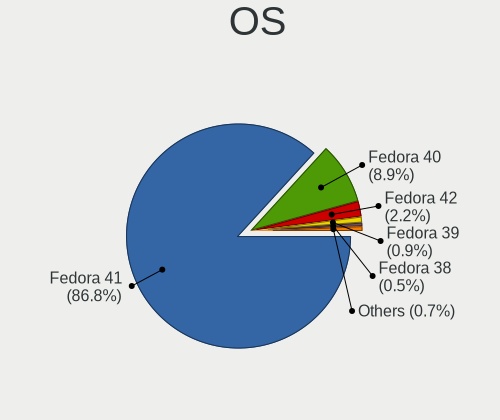
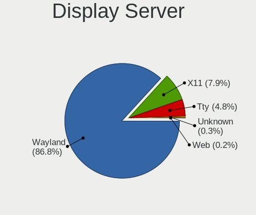
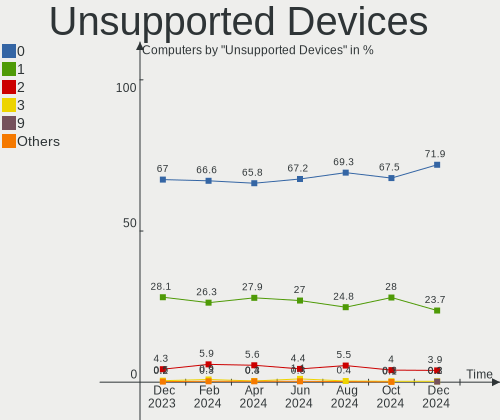

Fedora Hardware Trends
----------------------

A project to identify most popular hardware characteristics and track their change
over time based on data collected by Fedora users at https://Linux-Hardware.org.

Anyone can contribute to the study by uploading probes of their computers by
the [hw-probe](https://github.com/linuxhw/hw-probe) tool:

    sudo -E hw-probe -all -upload

This is a report for all computer types. See also reports for [desktops](/Dist/Fedora/Desktop/README.md) and [notebooks](/Dist/Fedora/Notebook/README.md).

Full-feature report is available here: https://linux-hardware.org/?view=trends

Period: Apr, 2021.

Contents
--------

- [ OS                       ](#os)
- [ OS Family                ](#os-family)
- [ Kernel                   ](#kernel)
- [ Kernel Family            ](#kernel-family)
- [ Kernel Major Ver.        ](#kernel-major-ver)
- [ Arch                     ](#arch)
- [ DE                       ](#de)
- [ Display Server           ](#display-server)
- [ Display Manager          ](#display-manager)
- [ OS Lang                  ](#os-lang)
- [ Boot Mode                ](#boot-mode)
- [ Filesystem               ](#filesystem)
- [ Part. scheme             ](#part-scheme)
- [ Dual Boot with Linux/BSD ](#dual-boot-with-linux/bsd)
- [ Dual Boot (Win)          ](#dual-boot-win)
- [ Country                  ](#country)
- [ City                     ](#city)
- [ Vendor                   ](#vendor)
- [ Model                    ](#model)
- [ Model Family             ](#model-family)
- [ MFG Year                 ](#mfg-year)
- [ Form Factor              ](#form-factor)
- [ Secure Boot              ](#secure-boot)
- [ Coreboot                 ](#coreboot)
- [ RAM Size                 ](#ram-size)
- [ RAM Used                 ](#ram-used)
- [ Has CD-ROM               ](#has-cd-rom)
- [ Total Drives             ](#total-drives)
- [ Has Ethernet             ](#has-ethernet)
- [ Has WiFi                 ](#has-wifi)
- [ Has Bluetooth            ](#has-bluetooth)
- [ Drive Vendor             ](#drive-vendor)
- [ Drive Model              ](#drive-model)
- [ HDD Vendor               ](#hdd-vendor)
- [ SSD Vendor               ](#ssd-vendor)
- [ Drive Kind               ](#drive-kind)
- [ Drive Connector          ](#drive-connector)
- [ Drive Size               ](#drive-size)
- [ Space Total              ](#space-total)
- [ Space Used               ](#space-used)
- [ Malfunc. Drives          ](#malfunc-drives)
- [ Malfunc. Drive Vendor    ](#malfunc-drive-vendor)
- [ Malfunc. HDD Vendor      ](#malfunc-hdd-vendor)
- [ Malfunc. Drive Kind      ](#malfunc-drive-kind)
- [ Failed Drives            ](#failed-drives)
- [ Failed Drive Vendor      ](#failed-drive-vendor)
- [ Drive Status             ](#drive-status)
- [ Storage Vendor           ](#storage-vendor)
- [ Storage Model            ](#storage-model)
- [ Storage Kind             ](#storage-kind)
- [ CPU Vendor               ](#cpu-vendor)
- [ CPU Model                ](#cpu-model)
- [ CPU Model Family         ](#cpu-model-family)
- [ CPU Cores                ](#cpu-cores)
- [ CPU Sockets              ](#cpu-sockets)
- [ CPU Threads              ](#cpu-threads)
- [ CPU Op-Modes             ](#cpu-op-modes)
- [ CPU Microcode            ](#cpu-microcode)
- [ CPU Microarch            ](#cpu-microarch)
- [ GPU Vendor               ](#gpu-vendor)
- [ GPU Model                ](#gpu-model)
- [ GPU Combo                ](#gpu-combo)
- [ GPU Driver               ](#gpu-driver)
- [ GPU Memory               ](#gpu-memory)
- [ Monitor Vendor           ](#monitor-vendor)
- [ Monitor Model            ](#monitor-model)
- [ Monitor Resolution       ](#monitor-resolution)
- [ Monitor Diagonal         ](#monitor-diagonal)
- [ Monitor Width            ](#monitor-width)
- [ Aspect Ratio             ](#aspect-ratio)
- [ Monitor Area             ](#monitor-area)
- [ Pixel Density            ](#pixel-density)
- [ Multiple Monitors        ](#multiple-monitors)
- [ Net Controller Vendor    ](#net-controller-vendor)
- [ Net Controller Model     ](#net-controller-model)
- [ Wireless Vendor          ](#wireless-vendor)
- [ Wireless Model           ](#wireless-model)
- [ Ethernet Vendor          ](#ethernet-vendor)
- [ Ethernet Model           ](#ethernet-model)
- [ Net Controller Kind      ](#net-controller-kind)
- [ Used Controller          ](#used-controller)
- [ NICs                     ](#nics)
- [ IPv6                     ](#ipv6)
- [ Memory Vendor            ](#memory-vendor)
- [ Memory Model             ](#memory-model)
- [ Memory Kind              ](#memory-kind)
- [ Memory Form Factor       ](#memory-form-factor)
- [ Memory Size              ](#memory-size)
- [ Memory Speed             ](#memory-speed)
- [ Sound Vendor             ](#sound-vendor)
- [ Sound Model              ](#sound-model)
- [ Camera Vendor            ](#camera-vendor)
- [ Camera Model             ](#camera-model)
- [ Fingerprint Vendor       ](#fingerprint-vendor)
- [ Fingerprint Model        ](#fingerprint-model)
- [ Chipcard Vendor          ](#chipcard-vendor)
- [ Chipcard Model           ](#chipcard-model)
- [ Printer Vendor           ](#printer-vendor)
- [ Printer Model            ](#printer-model)
- [ Scanner Vendor           ](#scanner-vendor)
- [ Scanner Model            ](#scanner-model)
- [ Bluetooth Vendor         ](#bluetooth-vendor)
- [ Bluetooth Model          ](#bluetooth-model)
- [ Unsupported Devices      ](#unsupported-devices)
- [ Unsupported Device Types ](#unsupported-device-types)

OS
--

Installed operating systems

| Name      | Computers | Percent |
|-----------|-----------|---------|
| Fedora 33 | 190       | 51.91%  |
| Fedora 34 | 156       | 42.62%  |
| Fedora 32 | 15        | 4.1%    |
| Fedora 35 | 5         | 1.37%   |

OS Family
---------

OS without a version

| Name   | Computers | Percent |
|--------|-----------|---------|
| Fedora | 366       | 100%    |

Kernel
------

Version of the Linux kernel

| Version                                              | Computers | Percent |
|------------------------------------------------------|-----------|---------|
| 5.11.11-200.fc33.x86_64                              | 71        | 19.4%   |
| 5.11.11-300.fc34.x86_64                              | 39        | 10.66%  |
| 5.11.14-200.fc33.x86_64                              | 37        | 10.11%  |
| 5.11.12-300.fc34.x86_64                              | 24        | 6.56%   |
| 5.11.16-300.fc34.x86_64                              | 23        | 6.28%   |
| 5.11.15-300.fc34.x86_64                              | 20        | 5.46%   |
| 5.11.15-200.fc33.x86_64                              | 15        | 4.1%    |
| 5.11.3-300.fc34.x86_64                               | 12        | 3.28%   |
| 5.11.10-200.fc33.x86_64                              | 12        | 3.28%   |
| 5.8.15-301.fc33.x86_64                               | 11        | 3.01%   |
| 5.11.14-300.fc34.x86_64                              | 11        | 3.01%   |
| 5.11.13-300.fc34.x86_64                              | 11        | 3.01%   |
| 5.11.13-200.fc33.x86_64                              | 11        | 3.01%   |
| 5.11.16-200.fc33.x86_64                              | 9         | 2.46%   |
| 5.11.12-200.fc33.x86_64                              | 9         | 2.46%   |
| 5.11.11-100.fc32.x86_64                              | 7         | 1.91%   |
| 5.11.10-300.fc34.x86_64                              | 7         | 1.91%   |
| 5.12.0-0.rc7.189.fc35.x86_64                         | 2         | 0.55%   |
| 5.11.8-200.fc33.x86_64                               | 2         | 0.55%   |
| 5.11.7-200.fc33.x86_64                               | 2         | 0.55%   |
| 5.11.17-300.fc34.x86_64                              | 2         | 0.55%   |
| 5.10.22-200.fc33.x86_64                              | 2         | 0.55%   |
| 5.10.20-200.fc33.x86_64                              | 2         | 0.55%   |
| 5.8.15-301.fc33.aarch64                              | 1         | 0.27%   |
| 5.7.10-201.fc32.x86_64                               | 1         | 0.27%   |
| 5.6.6-300.fc32.x86_64                                | 1         | 0.27%   |
| 5.6.13-300.fc32.x86_64                               | 1         | 0.27%   |
| 5.4.111                                              | 1         | 0.27%   |
| 5.12.0-xanmod1_cacule.0.fc34                         | 1         | 0.27%   |
| 5.12.0-rc7+                                          | 1         | 0.27%   |
| 5.12.0-rc4+                                          | 1         | 0.27%   |
| 5.12.0-0.rc8.20210423git7af08140979a.193.fc35.x86_64 | 1         | 0.27%   |
| 5.12.0-0.rc7.20210416git7e25f40eab52.191.fc35.x86_64 | 1         | 0.27%   |
| 5.12.0-0.rc6.20210408git454859c552da.186.fc35.x86_64 | 1         | 0.27%   |
| 5.11.9-200.fc33.x86_64                               | 1         | 0.27%   |
| 5.11.16-301.experimental.fc34.x86_64                 | 1         | 0.27%   |
| 5.11.15-100.fc32.x86_64                              | 1         | 0.27%   |
| 5.11.12-100.fc32.x86_64                              | 1         | 0.27%   |
| 5.11.10-xanmod1_cacule.0.fc33                        | 1         | 0.27%   |
| 5.11.10-100.fc32.x86_64                              | 1         | 0.27%   |
| 5.11.0-20210322                                      | 1         | 0.27%   |
| 5.11.0-0.rc5.134.bz1651886_3.fc34.x86_64             | 1         | 0.27%   |
| 5.10.22-100.fc32.x86_64                              | 1         | 0.27%   |
| 5.10.2-200.rt20.1.fc33.ccrma.x86_64+rt               | 1         | 0.27%   |
| 5.10.19-200.fc33.x86_64                              | 1         | 0.27%   |
| 5.10.18-200.fc33.x86_64                              | 1         | 0.27%   |
| 5.10.17-100.fc32.x86_64                              | 1         | 0.27%   |
| 5.10.13-200.fc33.x86_64                              | 1         | 0.27%   |

Kernel Family
-------------

Linux kernel without a distro release

| Version | Computers | Percent |
|---------|-----------|---------|
| 5.11.11 | 117       | 31.97%  |
| 5.11.14 | 48        | 13.11%  |
| 5.11.15 | 36        | 9.84%   |
| 5.11.12 | 34        | 9.29%   |
| 5.11.16 | 33        | 9.02%   |
| 5.11.13 | 22        | 6.01%   |
| 5.11.10 | 21        | 5.74%   |
| 5.8.15  | 12        | 3.28%   |
| 5.11.3  | 12        | 3.28%   |
| 5.12.0  | 8         | 2.19%   |
| 5.10.22 | 3         | 0.82%   |
| 5.11.8  | 2         | 0.55%   |
| 5.11.7  | 2         | 0.55%   |
| 5.11.17 | 2         | 0.55%   |
| 5.11.0  | 2         | 0.55%   |
| 5.10.20 | 2         | 0.55%   |
| 5.7.10  | 1         | 0.27%   |
| 5.6.6   | 1         | 0.27%   |
| 5.6.13  | 1         | 0.27%   |
| 5.4.111 | 1         | 0.27%   |
| 5.11.9  | 1         | 0.27%   |
| 5.10.2  | 1         | 0.27%   |
| 5.10.19 | 1         | 0.27%   |
| 5.10.18 | 1         | 0.27%   |
| 5.10.17 | 1         | 0.27%   |
| 5.10.13 | 1         | 0.27%   |

Kernel Major Ver.
-----------------

Linux kernel major version

| Version | Computers | Percent |
|---------|-----------|---------|
| 5.11    | 332       | 90.71%  |
| 5.8     | 12        | 3.28%   |
| 5.10    | 10        | 2.73%   |
| 5.12    | 8         | 2.19%   |
| 5.6     | 2         | 0.55%   |
| 5.7     | 1         | 0.27%   |
| 5.4     | 1         | 0.27%   |

Arch
----

OS architecture (x86_64, i586, etc.)

| Name    | Computers | Percent |
|---------|-----------|---------|
| x86_64  | 365       | 99.73%  |
| aarch64 | 1         | 0.27%   |

DE
--

Desktop Environment

| Name          | Computers | Percent |
|---------------|-----------|---------|
| GNOME         | 271       | 74.04%  |
| KDE5          | 25        | 6.83%   |
| KDE           | 24        | 6.56%   |
| X-Cinnamon    | 10        | 2.73%   |
| XFCE          | 9         | 2.46%   |
| Cinnamon      | 9         | 2.46%   |
| Unknown       | 8         | 2.19%   |
| MATE          | 5         | 1.37%   |
| openbox       | 1         | 0.27%   |
| LXDE          | 1         | 0.27%   |
| i3            | 1         | 0.27%   |
| GNOME Classic | 1         | 0.27%   |
| Deepin        | 1         | 0.27%   |

Display Server
--------------

X11 or Wayland

| Name    | Computers | Percent |
|---------|-----------|---------|
| Wayland | 210       | 57.38%  |
| X11     | 143       | 39.07%  |
| Tty     | 12        | 3.28%   |
| Unknown | 1         | 0.27%   |

Display Manager
---------------

SDDM, LightDM, etc.

| Name    | Computers | Percent |
|---------|-----------|---------|
| Unknown | 196       | 53.55%  |
| GDM     | 126       | 34.43%  |
| SDDM    | 21        | 5.74%   |
| TDM     | 13        | 3.55%   |
| LightDM | 6         | 1.64%   |
| XDM     | 2         | 0.55%   |
| SLiM    | 1         | 0.27%   |
| KDM     | 1         | 0.27%   |

OS Lang
-------

Language

| Lang    | Computers | Percent |
|---------|-----------|---------|
| en_US   | 178       | 48.63%  |
| en_GB   | 24        | 6.56%   |
| de_DE   | 20        | 5.46%   |
| pt_BR   | 18        | 4.92%   |
| fr_FR   | 16        | 4.37%   |
| ru_RU   | 14        | 3.83%   |
| en_AU   | 14        | 3.83%   |
| it_IT   | 10        | 2.73%   |
| en_CA   | 7         | 1.91%   |
| nl_BE   | 6         | 1.64%   |
| zh_CN   | 4         | 1.09%   |
| es_AR   | 4         | 1.09%   |
| tr_TR   | 3         | 0.82%   |
| nl_NL   | 3         | 0.82%   |
| es_ES   | 3         | 0.82%   |
| es_CL   | 3         | 0.82%   |
| el_GR   | 3         | 0.82%   |
| cs_CZ   | 3         | 0.82%   |
| Unknown | 3         | 0.82%   |
| sv_SE   | 2         | 0.55%   |
| ru_UA   | 2         | 0.55%   |
| pl_PL   | 2         | 0.55%   |
| fr_CH   | 2         | 0.55%   |
| en_IN   | 2         | 0.55%   |
| en_IL   | 2         | 0.55%   |
| en_IE   | 2         | 0.55%   |
| zh_HK   | 1         | 0.27%   |
| sl_SI   | 1         | 0.27%   |
| pt_PT   | 1         | 0.27%   |
| mn_MN   | 1         | 0.27%   |
| ko_KR   | 1         | 0.27%   |
| hu_HU   | 1         | 0.27%   |
| fi_FI   | 1         | 0.27%   |
| es_UY   | 1         | 0.27%   |
| es_MX   | 1         | 0.27%   |
| es_EC   | 1         | 0.27%   |
| en_NZ   | 1         | 0.27%   |
| en_NL   | 1         | 0.27%   |
| en_DK   | 1         | 0.27%   |
| en_AT   | 1         | 0.27%   |
| de_CH   | 1         | 0.27%   |
| C       | 1         | 0.27%   |

Boot Mode
---------

EFI or BIOS

| Mode | Computers | Percent |
|------|-----------|---------|
| EFI  | 270       | 73.77%  |
| BIOS | 96        | 26.23%  |

Filesystem
----------

Type of filesystem

| Type                | Computers | Percent |
|---------------------|-----------|---------|
| Btrfs               | 217       | 59.29%  |
| Ext4                | 123       | 33.61%  |
| Xfs                 | 25        | 6.83%   |
| Fuse.fuse-overlayfs | 1         | 0.27%   |

Part. scheme
------------

Scheme of partitioning

| Type    | Computers | Percent |
|---------|-----------|---------|
| Unknown | 189       | 51.64%  |
| GPT     | 139       | 37.98%  |
| MBR     | 38        | 10.38%  |

Dual Boot with Linux/BSD
------------------------

Hosting more than one Linux/BSD

| Dual boot | Computers | Percent |
|-----------|-----------|---------|
| No        | 333       | 90.98%  |
| Yes       | 33        | 9.02%   |

Dual Boot (Win)
---------------

Hosting Linux and Windows

| Dual boot | Computers | Percent |
|-----------|-----------|---------|
| No        | 299       | 81.69%  |
| Yes       | 67        | 18.31%  |

Country
-------

Geographic location (country)

| Country                | Computers | Percent |
|------------------------|-----------|---------|
| USA                    | 64        | 17.49%  |
| Germany                | 35        | 9.56%   |
| Brazil                 | 24        | 6.56%   |
| Netherlands            | 21        | 5.74%   |
| France                 | 21        | 5.74%   |
| Russia                 | 16        | 4.37%   |
| Italy                  | 16        | 4.37%   |
| Australia              | 13        | 3.55%   |
| Canada                 | 10        | 2.73%   |
| Belgium                | 9         | 2.46%   |
| Switzerland            | 8         | 2.19%   |
| Czechia                | 8         | 2.19%   |
| UK                     | 7         | 1.91%   |
| India                  | 7         | 1.91%   |
| Argentina              | 7         | 1.91%   |
| Ukraine                | 6         | 1.64%   |
| Turkey                 | 6         | 1.64%   |
| Sweden                 | 6         | 1.64%   |
| Slovakia               | 6         | 1.64%   |
| Spain                  | 5         | 1.37%   |
| Poland                 | 5         | 1.37%   |
| China                  | 5         | 1.37%   |
| Finland                | 4         | 1.09%   |
| Chile                  | 4         | 1.09%   |
| Austria                | 4         | 1.09%   |
| Romania                | 3         | 0.82%   |
| Iran                   | 3         | 0.82%   |
| Hungary                | 3         | 0.82%   |
| Greece                 | 3         | 0.82%   |
| Denmark                | 3         | 0.82%   |
| Bulgaria               | 3         | 0.82%   |
| Slovenia               | 2         | 0.55%   |
| Portugal               | 2         | 0.55%   |
| New Zealand            | 2         | 0.55%   |
| Mexico                 | 2         | 0.55%   |
| Ireland                | 2         | 0.55%   |
| Hong Kong              | 2         | 0.55%   |
| Ecuador                | 2         | 0.55%   |
| Belarus                | 2         | 0.55%   |
| Vietnam                | 1         | 0.27%   |
| Uruguay                | 1         | 0.27%   |
| Sri Lanka              | 1         | 0.27%   |
| South Korea            | 1         | 0.27%   |
| Serbia                 | 1         | 0.27%   |
| Paraguay               | 1         | 0.27%   |
| Morocco                | 1         | 0.27%   |
| Montenegro             | 1         | 0.27%   |
| Mongolia               | 1         | 0.27%   |
| Martinique             | 1         | 0.27%   |
| Israel                 | 1         | 0.27%   |
| Indonesia              | 1         | 0.27%   |
| Egypt                  | 1         | 0.27%   |
| Croatia                | 1         | 0.27%   |
| Bosnia and Herzegovina | 1         | 0.27%   |

City
----

Geographic location (city)

| City              | Computers | Percent |
|-------------------|-----------|---------|
| The Hague         | 9         | 2.46%   |
| Chipping Norton   | 8         | 2.19%   |
| Berlin            | 6         | 1.64%   |
| Prague            | 4         | 1.09%   |
| Bratislava        | 4         | 1.09%   |
| Zurich            | 3         | 0.82%   |
| Vienna            | 3         | 0.82%   |
| Tehran            | 3         | 0.82%   |
| St Petersburg     | 3         | 0.82%   |
| Sofia             | 3         | 0.82%   |
| New York          | 3         | 0.82%   |
| Moscow            | 3         | 0.82%   |
| Montreal          | 3         | 0.82%   |
| Kyiv              | 3         | 0.82%   |
| Greifswald        | 3         | 0.82%   |
| Buenos Aires      | 3         | 0.82%   |
| Amsterdam         | 3         | 0.82%   |
| Yekaterinburg     | 2         | 0.55%   |
| Yakima            | 2         | 0.55%   |
| Winnipeg          | 2         | 0.55%   |
| Vancouver         | 2         | 0.55%   |
| Vaestra Froelunda | 2         | 0.55%   |
| Trieste           | 2         | 0.55%   |
| São Paulo        | 2         | 0.55%   |
| Sydney            | 2         | 0.55%   |
| Sint-Niklaas      | 2         | 0.55%   |
| Shenzhen          | 2         | 0.55%   |
| Saratoga Springs  | 2         | 0.55%   |
| Rostov-on-Don     | 2         | 0.55%   |
| Paris             | 2         | 0.55%   |
| Nuremberg         | 2         | 0.55%   |
| Nola              | 2         | 0.55%   |
| Minsk             | 2         | 0.55%   |
| Milan             | 2         | 0.55%   |
| Madrid            | 2         | 0.55%   |
| Los Angeles       | 2         | 0.55%   |
| Istanbul          | 2         | 0.55%   |
| Handen            | 2         | 0.55%   |
| Feeding Hills     | 2         | 0.55%   |
| Espoo             | 2         | 0.55%   |
| Eibergen          | 2         | 0.55%   |
| Corinth           | 2         | 0.55%   |
| Cologne           | 2         | 0.55%   |
| Central           | 2         | 0.55%   |
| Bucharest         | 2         | 0.55%   |
| Brussels          | 2         | 0.55%   |
| Brisbane          | 2         | 0.55%   |
| Brasília         | 2         | 0.55%   |
| Bologna           | 2         | 0.55%   |
| Bengaluru         | 2         | 0.55%   |
| Athens            | 2         | 0.55%   |
| Apex              | 2         | 0.55%   |
| Ankara            | 2         | 0.55%   |
| Aachen            | 2         | 0.55%   |
| Zenica            | 1         | 0.27%   |
| Zagreb            | 1         | 0.27%   |
| Yenne             | 1         | 0.27%   |
| Woodbridge        | 1         | 0.27%   |
| Winter Park       | 1         | 0.27%   |
| Wiesbaden         | 1         | 0.27%   |

Vendor
------

Motherboard manufacturer

| Name                                          | Computers | Percent |
|-----------------------------------------------|-----------|---------|
| Lenovo                                        | 81        | 22.13%  |
| Hewlett-Packard                               | 50        | 13.66%  |
| ASUSTek Computer                              | 50        | 13.66%  |
| Dell                                          | 48        | 13.11%  |
| Gigabyte Technology                           | 29        | 7.92%   |
| MSI                                           | 22        | 6.01%   |
| ASRock                                        | 14        | 3.83%   |
| Acer                                          | 13        | 3.55%   |
| Notebook                                      | 7         | 1.91%   |
| Intel                                         | 6         | 1.64%   |
| Apple                                         | 5         | 1.37%   |
| Samsung Electronics                           | 4         | 1.09%   |
| Toshiba                                       | 2         | 0.55%   |
| System76                                      | 2         | 0.55%   |
| Positivo                                      | 2         | 0.55%   |
| Panasonic                                     | 2         | 0.55%   |
| Medion                                        | 2         | 0.55%   |
| Fujitsu                                       | 2         | 0.55%   |
| Unknown                                       | 2         | 0.55%   |
| TrekStor                                      | 1         | 0.27%   |
| Teclast                                       | 1         | 0.27%   |
| SUN MICROSYSTEMS                              | 1         | 0.27%   |
| Standard                                      | 1         | 0.27%   |
| Sony                                          | 1         | 0.27%   |
| Shenzhen PLOYER electronics                   | 1         | 0.27%   |
| Razer                                         | 1         | 0.27%   |
| Raspberry Pi Foundation                       | 1         | 0.27%   |
| PCBOX                                         | 1         | 0.27%   |
| Packard Bell                                  | 1         | 0.27%   |
| MPMAN                                         | 1         | 0.27%   |
| Microsoft                                     | 1         | 0.27%   |
| Koloe                                         | 1         | 0.27%   |
| Irbis                                         | 1         | 0.27%   |
| Insyde                                        | 1         | 0.27%   |
| eMachines                                     | 1         | 0.27%   |
| ECS                                           | 1         | 0.27%   |
| CRX                                           | 1         | 0.27%   |
| Connect                                       | 1         | 0.27%   |
| CHUWI Innovation And Technology (ShenZhen)co. | 1         | 0.27%   |
| BESSTAR Tech                                  | 1         | 0.27%   |
| AMI                                           | 1         | 0.27%   |
| Alienware                                     | 1         | 0.27%   |

Model
-----

Motherboard model

| Name                                               | Computers | Percent |
|----------------------------------------------------|-----------|---------|
| HP Pavilion Gaming Laptop 15-ec1xxx                | 3         | 0.82%   |
| HP Notebook                                        | 3         | 0.82%   |
| ASUS TUF GAMING X570-PLUS                          | 3         | 0.82%   |
| ASUS All Series                                    | 3         | 0.82%   |
| Unknown                                            | 3         | 0.82%   |
| System76 Oryx Pro                                  | 2         | 0.55%   |
| Lenovo Yoga C740-14IML 81TC                        | 2         | 0.55%   |
| Lenovo Yoga 9 14ITL5 82BG                          | 2         | 0.55%   |
| Lenovo ThinkPad X1 Carbon Gen 9 20XWCTO1WW         | 2         | 0.55%   |
| Intel NUC8i5BEK                                    | 2         | 0.55%   |
| HP Laptop 15-db0xxx                                | 2         | 0.55%   |
| Dell XPS L502X                                     | 2         | 0.55%   |
| Dell XPS 15 7590                                   | 2         | 0.55%   |
| Dell Latitude 5480                                 | 2         | 0.55%   |
| ASUS ROG Maximus XI FORMULA                        | 2         | 0.55%   |
| ASUS H110M-K                                       | 2         | 0.55%   |
| ASRock AB350 Pro4                                  | 2         | 0.55%   |
| Acer Nitro AN515-44                                | 2         | 0.55%   |
| TrekStor SurfTab wintron 7.0 ST70416-6             | 1         | 0.27%   |
| Toshiba Satellite L50-C                            | 1         | 0.27%   |
| Toshiba Satellite C850D-119                        | 1         | 0.27%   |
| Teclast TbooK 11                                   | 1         | 0.27%   |
| SUN MICROSYSTEMS SUN FIRE X4270 SERVER             | 1         | 0.27%   |
| Sony VPCSC41FM                                     | 1         | 0.27%   |
| Shenzhen PLOYER electronics MOMO7W                 | 1         | 0.27%   |
| Samsung R520/R522/R620                             | 1         | 0.27%   |
| Samsung N100SP                                     | 1         | 0.27%   |
| Samsung 800G5M/800G5W                              | 1         | 0.27%   |
| Samsung 300E4A/300E5A/300E7A                       | 1         | 0.27%   |
| Razer Blade 15 Base Model (Early 2020) - RZ09-0328 | 1         | 0.27%   |
| RPi Raspberry Pi 4 Model B                         | 1         | 0.27%   |
| Positivo S14CT01                                   | 1         | 0.27%   |
| Positivo C41TB                                     | 1         | 0.27%   |
| PCBOX Kant                                         | 1         | 0.27%   |
| Panasonic CFSZ5-2L                                 | 1         | 0.27%   |
| Panasonic CFMX4-1                                  | 1         | 0.27%   |
| Packard Bell ixtreme M5800                         | 1         | 0.27%   |
| Notebook PB50_70DFx,DDx                            | 1         | 0.27%   |
| Notebook P95_96_97Ex,Rx                            | 1         | 0.27%   |
| Notebook P377SM-A                                  | 1         | 0.27%   |
| Notebook NL40_50GU                                 | 1         | 0.27%   |
| Notebook NH5xAx                                    | 1         | 0.27%   |
| Notebook N8xEJEK                                   | 1         | 0.27%   |
| Notebook N150CU                                    | 1         | 0.27%   |
| MSI MS-7C91                                        | 1         | 0.27%   |
| MSI MS-7C56                                        | 1         | 0.27%   |
| MSI MS-7C39                                        | 1         | 0.27%   |
| MSI MS-7B89                                        | 1         | 0.27%   |
| MSI MS-7B85                                        | 1         | 0.27%   |
| MSI MS-7B48                                        | 1         | 0.27%   |
| MSI MS-7B10                                        | 1         | 0.27%   |
| MSI MS-7A72                                        | 1         | 0.27%   |
| MSI MS-7A70                                        | 1         | 0.27%   |
| MSI MS-7A44                                        | 1         | 0.27%   |
| MSI MS-7A39                                        | 1         | 0.27%   |
| MSI MS-7A38                                        | 1         | 0.27%   |
| MSI MS-7A34                                        | 1         | 0.27%   |
| MSI MS-7A32                                        | 1         | 0.27%   |
| MSI MS-7974                                        | 1         | 0.27%   |
| MSI MS-7917                                        | 1         | 0.27%   |

Model Family
------------

Motherboard model prefix

| Name                               | Computers | Percent |
|------------------------------------|-----------|---------|
| Lenovo ThinkPad                    | 48        | 13.11%  |
| Dell Inspiron                      | 17        | 4.64%   |
| Lenovo IdeaPad                     | 12        | 3.28%   |
| Dell Latitude                      | 11        | 3.01%   |
| ASUS ROG                           | 11        | 3.01%   |
| Lenovo Yoga                        | 10        | 2.73%   |
| HP Pavilion                        | 10        | 2.73%   |
| Dell XPS                           | 9         | 2.46%   |
| HP EliteBook                       | 8         | 2.19%   |
| HP ProBook                         | 6         | 1.64%   |
| HP Laptop                          | 6         | 1.64%   |
| ASUS TUF                           | 6         | 1.64%   |
| Acer Aspire                        | 6         | 1.64%   |
| HP ENVY                            | 5         | 1.37%   |
| Dell Precision                     | 5         | 1.37%   |
| ASUS PRIME                         | 4         | 1.09%   |
| Acer Nitro                         | 4         | 1.09%   |
| HP Notebook                        | 3         | 0.82%   |
| Gigabyte B450                      | 3         | 0.82%   |
| ASUS All                           | 3         | 0.82%   |
| Unknown                            | 3         | 0.82%   |
| Toshiba Satellite                  | 2         | 0.55%   |
| System76 Oryx                      | 2         | 0.55%   |
| Intel NUC8i5BEK                    | 2         | 0.55%   |
| HP ProDesk                         | 2         | 0.55%   |
| HP Compaq                          | 2         | 0.55%   |
| Gigabyte X570                      | 2         | 0.55%   |
| Gigabyte B450M                     | 2         | 0.55%   |
| Dell OptiPlex                      | 2         | 0.55%   |
| ASUS VivoBook                      | 2         | 0.55%   |
| ASUS H110M-K                       | 2         | 0.55%   |
| ASRock AB350                       | 2         | 0.55%   |
| TrekStor SurfTab                   | 1         | 0.27%   |
| Teclast TbooK                      | 1         | 0.27%   |
| SUN MICROSYSTEMS SUN               | 1         | 0.27%   |
| Sony VPCSC41FM                     | 1         | 0.27%   |
| Shenzhen PLOYER electronics MOMO7W | 1         | 0.27%   |
| Samsung R520                       | 1         | 0.27%   |
| Samsung N100SP                     | 1         | 0.27%   |
| Samsung 800G5M                     | 1         | 0.27%   |
| Samsung 300E4A                     | 1         | 0.27%   |
| Razer Blade                        | 1         | 0.27%   |
| RPi Raspberry                      | 1         | 0.27%   |
| Positivo S14CT01                   | 1         | 0.27%   |
| Positivo C41TB                     | 1         | 0.27%   |
| PCBOX Kant                         | 1         | 0.27%   |
| Panasonic CFSZ5-2L                 | 1         | 0.27%   |
| Panasonic CFMX4-1                  | 1         | 0.27%   |
| Packard Bell ixtreme               | 1         | 0.27%   |
| Notebook PB50                      | 1         | 0.27%   |
| Notebook P95                       | 1         | 0.27%   |
| Notebook P377SM-A                  | 1         | 0.27%   |
| Notebook NL40                      | 1         | 0.27%   |
| Notebook NH5xAx                    | 1         | 0.27%   |
| Notebook N8xEJEK                   | 1         | 0.27%   |
| Notebook N150CU                    | 1         | 0.27%   |
| MSI MS-7C91                        | 1         | 0.27%   |
| MSI MS-7C56                        | 1         | 0.27%   |
| MSI MS-7C39                        | 1         | 0.27%   |
| MSI MS-7B89                        | 1         | 0.27%   |

MFG Year
--------

Motherboard manufacture year

| Year | Computers | Percent |
|------|-----------|---------|
| 2020 | 115       | 31.42%  |
| 2019 | 56        | 15.3%   |
| 2021 | 31        | 8.47%   |
| 2018 | 31        | 8.47%   |
| 2016 | 21        | 5.74%   |
| 2014 | 19        | 5.19%   |
| 2015 | 18        | 4.92%   |
| 2012 | 18        | 4.92%   |
| 2017 | 16        | 4.37%   |
| 2013 | 12        | 3.28%   |
| 2010 | 10        | 2.73%   |
| 2011 | 7         | 1.91%   |
| 2009 | 6         | 1.64%   |
| 2008 | 3         | 0.82%   |
| 2006 | 2         | 0.55%   |
| 2007 | 1         | 0.27%   |

Form Factor
-----------

Physical design of the computer

| Name           | Computers | Percent |
|----------------|-----------|---------|
| Notebook       | 202       | 55.19%  |
| Desktop        | 121       | 33.06%  |
| Convertible    | 24        | 6.56%   |
| Mini pc        | 7         | 1.91%   |
| Tablet         | 5         | 1.37%   |
| Server         | 3         | 0.82%   |
| All in one     | 2         | 0.55%   |
| Other          | 1         | 0.27%   |
| System on chip | 1         | 0.27%   |

Secure Boot
-----------

Enabled or disabled

| State    | Computers | Percent |
|----------|-----------|---------|
| Disabled | 319       | 87.16%  |
| Enabled  | 47        | 12.84%  |

Coreboot
--------

Have coreboot on board

| Used | Computers | Percent |
|------|-----------|---------|
| No   | 365       | 99.73%  |
| Yes  | 1         | 0.27%   |

RAM Size
--------

Total RAM memory

| Size in GB  | Computers | Percent |
|-------------|-----------|---------|
| 4.01-8.0    | 94        | 25.68%  |
| 16.01-24.0  | 78        | 21.31%  |
| 32.01-64.0  | 70        | 19.13%  |
| 8.01-16.0   | 62        | 16.94%  |
| 3.01-4.0    | 29        | 7.92%   |
| 64.01-256.0 | 15        | 4.1%    |
| 0.51-1.0    | 8         | 2.19%   |
| 1.01-2.0    | 6         | 1.64%   |
| 24.01-32.0  | 4         | 1.09%   |

RAM Used
--------

Used RAM memory

| Used GB    | Computers | Percent |
|------------|-----------|---------|
| 2.01-3.0   | 104       | 28.42%  |
| 4.01-8.0   | 100       | 27.32%  |
| 3.01-4.0   | 59        | 16.12%  |
| 1.01-2.0   | 55        | 15.03%  |
| 8.01-16.0  | 22        | 6.01%   |
| 0.51-1.0   | 15        | 4.1%    |
| 16.01-24.0 | 5         | 1.37%   |
| 0.01-0.5   | 3         | 0.82%   |
| 24.01-32.0 | 2         | 0.55%   |
| 32.01-64.0 | 1         | 0.27%   |

Has CD-ROM
----------

Has CD-ROM on board

| Presented | Computers | Percent |
|-----------|-----------|---------|
| No        | 267       | 72.95%  |
| Yes       | 99        | 27.05%  |

Total Drives
------------

Number of drives on board

| Drives | Computers | Percent |
|--------|-----------|---------|
| 1      | 204       | 55.74%  |
| 2      | 98        | 26.78%  |
| 3      | 27        | 7.38%   |
| 4      | 14        | 3.83%   |
| 5      | 12        | 3.28%   |
| 6      | 4         | 1.09%   |
| 7      | 3         | 0.82%   |
| 0      | 2         | 0.55%   |
| 36     | 1         | 0.27%   |
| 9      | 1         | 0.27%   |

Has Ethernet
------------

Has Ethernet on board

| Presented | Computers | Percent |
|-----------|-----------|---------|
| Yes       | 303       | 82.79%  |
| No        | 63        | 17.21%  |

Has WiFi
--------

Has WiFi module

| Presented | Computers | Percent |
|-----------|-----------|---------|
| Yes       | 277       | 75.68%  |
| No        | 89        | 24.32%  |

Has Bluetooth
-------------

Has Bluetooth module

| Presented | Computers | Percent |
|-----------|-----------|---------|
| Yes       | 254       | 69.4%   |
| No        | 112       | 30.6%   |

Drive Vendor
------------

Hard drive vendors

| Vendor                    | Computers | Drives | Percent |
|---------------------------|-----------|--------|---------|
| Samsung Electronics       | 111       | 165    | 20.33%  |
| WDC                       | 85        | 105    | 15.57%  |
| Seagate                   | 62        | 82     | 11.36%  |
| Toshiba                   | 38        | 41     | 6.96%   |
| Kingston                  | 30        | 33     | 5.49%   |
| Unknown                   | 28        | 30     | 5.13%   |
| SanDisk                   | 26        | 26     | 4.76%   |
| Crucial                   | 24        | 27     | 4.4%    |
| SK Hynix                  | 22        | 25     | 4.03%   |
| Intel                     | 21        | 23     | 3.85%   |
| Hitachi                   | 11        | 12     | 2.01%   |
| A-DATA Technology         | 8         | 8      | 1.47%   |
| Phison                    | 6         | 6      | 1.1%    |
| Micron Technology         | 6         | 6      | 1.1%    |
| KIOXIA                    | 6         | 6      | 1.1%    |
| HGST                      | 6         | 6      | 1.1%    |
| PNY                       | 4         | 5      | 0.73%   |
| SPCC                      | 3         | 4      | 0.55%   |
| Patriot                   | 3         | 4      | 0.55%   |
| Corsair                   | 3         | 3      | 0.55%   |
| XPG                       | 2         | 3      | 0.37%   |
| Team                      | 2         | 2      | 0.37%   |
| Silicon Motion            | 2         | 2      | 0.37%   |
| OCZ                       | 2         | 3      | 0.37%   |
| Micron/Crucial Technology | 2         | 2      | 0.37%   |
| LITEON                    | 2         | 2      | 0.37%   |
| Lite-On                   | 2         | 2      | 0.37%   |
| Fujitsu                   | 2         | 2      | 0.37%   |
| ASMT                      | 2         | 2      | 0.37%   |
| WD MediaMax               | 1         | 1      | 0.18%   |
| W800S                     | 1         | 1      | 0.18%   |
| Union Memory              | 1         | 1      | 0.18%   |
| Transcend                 | 1         | 1      | 0.18%   |
| SABRENT                   | 1         | 1      | 0.18%   |
| Realtek Semiconductor     | 1         | 1      | 0.18%   |
| Radeon                    | 1         | 1      | 0.18%   |
| Mushkin                   | 1         | 1      | 0.18%   |
| MAXTOR                    | 1         | 1      | 0.18%   |
| LIO-ORG                   | 1         | 33     | 0.18%   |
| Lexar                     | 1         | 1      | 0.18%   |
| Leven                     | 1         | 1      | 0.18%   |
| LDLC                      | 1         | 1      | 0.18%   |
| KingSpec                  | 1         | 1      | 0.18%   |
| KingFast                  | 1         | 1      | 0.18%   |
| Hewlett-Packard           | 1         | 1      | 0.18%   |
| GOODRAM                   | 1         | 1      | 0.18%   |
| External                  | 1         | 1      | 0.18%   |
| DREVO                     | 1         | 1      | 0.18%   |
| DOGFISH                   | 1         | 1      | 0.18%   |
| China                     | 1         | 2      | 0.18%   |
| Axiom                     | 1         | 1      | 0.18%   |
| Apple                     | 1         | 1      | 0.18%   |
| Advantech                 | 1         | 1      | 0.18%   |
| ADATA Technology          | 1         | 1      | 0.18%   |

Drive Model
-----------

Hard drive models

| Model                                | Computers | Percent |
|--------------------------------------|-----------|---------|
| Samsung NVMe SSD Drive 1TB           | 10        | 1.52%   |
| Samsung SSD 860 EVO 1TB              | 9         | 1.37%   |
| Samsung NVMe SSD Drive 500GB         | 9         | 1.37%   |
| Samsung SSD 860 EVO 500GB            | 8         | 1.22%   |
| Kingston SA400S37240G 240GB SSD      | 8         | 1.22%   |
| Seagate ST1000LM024 HN-M101MBB 1TB   | 7         | 1.07%   |
| Samsung NVMe SSD Drive 256GB         | 6         | 0.91%   |
| Seagate ST500DM002-1BD142 500GB      | 5         | 0.76%   |
| Samsung SSD 850 EVO 250GB            | 5         | 0.76%   |
| Samsung NVMe SSD Drive 512GB         | 5         | 0.76%   |
| Samsung NVMe SSD Drive 2TB           | 5         | 0.76%   |
| Intel NVMe SSD Drive 512GB           | 5         | 0.76%   |
| Unknown NCard  16GB                  | 4         | 0.61%   |
| Toshiba NVMe SSD Drive 256GB         | 4         | 0.61%   |
| Seagate ST2000DM008-2FR102 2TB       | 4         | 0.61%   |
| Seagate ST1000DM003-1ER162 1TB       | 4         | 0.61%   |
| Seagate Expansion 4TB                | 4         | 0.61%   |
| Samsung SSD 970 EVO Plus 500GB       | 4         | 0.61%   |
| Samsung SSD 970 EVO Plus 1TB         | 4         | 0.61%   |
| Samsung SSD 970 EVO 500GB            | 4         | 0.61%   |
| Samsung SSD 860 EVO 2TB              | 4         | 0.61%   |
| Samsung SSD 860 EVO 250GB            | 4         | 0.61%   |
| Samsung SSD 850 EVO 500GB            | 4         | 0.61%   |
| Kingston SA400S37120G 120GB SSD      | 4         | 0.61%   |
| Crucial CT240BX500SSD1 240GB         | 4         | 0.61%   |
| Crucial CT120BX500SSD1 120GB         | 4         | 0.61%   |
| Crucial CT1000MX500SSD1 1TB          | 4         | 0.61%   |
| WDC WDS240G2G0A-00JH30 240GB SSD     | 3         | 0.46%   |
| WDC WD40EFRX-68N32N0 4TB             | 3         | 0.46%   |
| Unknown SD/MMC/MS PRO 32GB           | 3         | 0.46%   |
| Unknown MMC Card  64GB               | 3         | 0.46%   |
| Unknown MMC Card  32GB               | 3         | 0.46%   |
| SK Hynix NVMe SSD Drive 512GB        | 3         | 0.46%   |
| SK Hynix NVMe SSD Drive 256GB        | 3         | 0.46%   |
| Seagate ST1000DM010-2EP102 1TB       | 3         | 0.46%   |
| SanDisk SDSSDA240G 240GB             | 3         | 0.46%   |
| Samsung Portable SSD T5 1TB          | 3         | 0.46%   |
| Samsung NVMe SSD Drive 250GB         | 3         | 0.46%   |
| KIOXIA NVMe SSD Drive 256GB          | 3         | 0.46%   |
| Kingston SA400S37480G 480GB SSD      | 3         | 0.46%   |
| Intel SSDPEKNW512G8H 512GB           | 3         | 0.46%   |
| HGST HTS721010A9E630 1TB             | 3         | 0.46%   |
| Crucial CT500MX500SSD1 500GB         | 3         | 0.46%   |
| WDC WDS500G2B0B-00YS70 500GB SSD     | 2         | 0.3%    |
| WDC WDS480G2G0A-00JH30 480GB SSD     | 2         | 0.3%    |
| WDC WDS240G2G0B-00EPW0 240GB SSD     | 2         | 0.3%    |
| WDC WD40EZRZ-00GXCB0 4TB             | 2         | 0.3%    |
| WDC WD30EFRX-68EUZN0 3TB             | 2         | 0.3%    |
| WDC WD2003FZEX-00SRLA0 2TB           | 2         | 0.3%    |
| WDC WD10JPVX-22JC3T0 1TB             | 2         | 0.3%    |
| WDC WD10JPCX-24UE4T0 1TB             | 2         | 0.3%    |
| WDC WD10EADS-00L5B1 1TB              | 2         | 0.3%    |
| WDC WD1003FZEX-00K3CA0 1TB           | 2         | 0.3%    |
| WDC PC SN730 SDBPNTY-512G-1101 512GB | 2         | 0.3%    |
| WDC PC SN720 SDAQNTW-512G-1001 512GB | 2         | 0.3%    |
| Unknown MMC Card  128GB              | 2         | 0.3%    |
| Toshiba MQ04ABF100 1TB               | 2         | 0.3%    |
| Toshiba MQ01ABD100 1TB               | 2         | 0.3%    |
| Toshiba MK7575GSX 752GB              | 2         | 0.3%    |
| Toshiba KBG30ZMV512G 512GB           | 2         | 0.3%    |

HDD Vendor
----------

Hard disk drive vendors

| Vendor              | Computers | Drives | Percent |
|---------------------|-----------|--------|---------|
| Seagate             | 60        | 78     | 37.04%  |
| WDC                 | 57        | 75     | 35.19%  |
| Toshiba             | 18        | 20     | 11.11%  |
| Hitachi             | 11        | 12     | 6.79%   |
| HGST                | 6         | 6      | 3.7%    |
| Samsung Electronics | 4         | 5      | 2.47%   |
| Fujitsu             | 2         | 2      | 1.23%   |
| ASMT                | 2         | 2      | 1.23%   |
| MAXTOR              | 1         | 1      | 0.62%   |
| LIO-ORG             | 1         | 9      | 0.62%   |

SSD Vendor
----------

Solid state drive vendors

| Vendor              | Computers | Drives | Percent |
|---------------------|-----------|--------|---------|
| Samsung Electronics | 58        | 78     | 29.9%   |
| Crucial             | 23        | 26     | 11.86%  |
| Kingston            | 22        | 25     | 11.34%  |
| SanDisk             | 20        | 20     | 10.31%  |
| WDC                 | 16        | 16     | 8.25%   |
| A-DATA Technology   | 7         | 7      | 3.61%   |
| Intel               | 6         | 6      | 3.09%   |
| SK Hynix            | 4         | 4      | 2.06%   |
| PNY                 | 4         | 5      | 2.06%   |
| Toshiba             | 3         | 3      | 1.55%   |
| SPCC                | 3         | 4      | 1.55%   |
| Patriot             | 3         | 4      | 1.55%   |
| OCZ                 | 2         | 3      | 1.03%   |
| Corsair             | 2         | 2      | 1.03%   |
| W800S               | 1         | 1      | 0.52%   |
| Unknown             | 1         | 1      | 0.52%   |
| Transcend           | 1         | 1      | 0.52%   |
| Team                | 1         | 1      | 0.52%   |
| SABRENT             | 1         | 1      | 0.52%   |
| Radeon              | 1         | 1      | 0.52%   |
| Mushkin             | 1         | 1      | 0.52%   |
| Micron Technology   | 1         | 1      | 0.52%   |
| LITEON              | 1         | 1      | 0.52%   |
| LIO-ORG             | 1         | 24     | 0.52%   |
| Lexar               | 1         | 1      | 0.52%   |
| Leven               | 1         | 1      | 0.52%   |
| KingSpec            | 1         | 1      | 0.52%   |
| GOODRAM             | 1         | 1      | 0.52%   |
| External            | 1         | 1      | 0.52%   |
| DREVO               | 1         | 1      | 0.52%   |
| DOGFISH             | 1         | 1      | 0.52%   |
| China               | 1         | 2      | 0.52%   |
| Axiom               | 1         | 1      | 0.52%   |
| Apple               | 1         | 1      | 0.52%   |
| Advantech           | 1         | 1      | 0.52%   |

Drive Kind
----------

HDD or SSD

| Kind    | Computers | Drives | Percent |
|---------|-----------|--------|---------|
| SSD     | 175       | 248    | 34.52%  |
| NVMe    | 170       | 204    | 33.53%  |
| HDD     | 131       | 210    | 25.84%  |
| MMC     | 23        | 25     | 4.54%   |
| Unknown | 8         | 8      | 1.58%   |

Drive Connector
---------------

SATA, SAS, NVMe, etc.

| Type | Computers | Drives | Percent |
|------|-----------|--------|---------|
| SATA | 233       | 443    | 52.36%  |
| NVMe | 170       | 204    | 38.2%   |
| MMC  | 23        | 25     | 5.17%   |
| SAS  | 19        | 23     | 4.27%   |

Drive Size
----------

Size of hard drive

| Size in TB | Computers | Drives | Percent |
|------------|-----------|--------|---------|
| 0.01-0.5   | 171       | 262    | 52.94%  |
| 0.51-1.0   | 102       | 134    | 31.58%  |
| 1.01-2.0   | 28        | 33     | 8.67%   |
| 3.01-4.0   | 15        | 18     | 4.64%   |
| 2.01-3.0   | 5         | 9      | 1.55%   |
| 4.01-10.0  | 2         | 2      | 0.62%   |

Space Total
-----------

Amount of disk space available on the file system

| Size in GB     | Computers | Percent |
|----------------|-----------|---------|
| 251-500        | 81        | 22.13%  |
| 501-1000       | 71        | 19.4%   |
| 1001-2000      | 50        | 13.66%  |
| 101-250        | 47        | 12.84%  |
| 1-20           | 35        | 9.56%   |
| More than 3000 | 26        | 7.1%    |
| Unknown        | 25        | 6.83%   |
| 2001-3000      | 14        | 3.83%   |
| 21-50          | 10        | 2.73%   |
| 51-100         | 7         | 1.91%   |

Space Used
----------

Amount of used disk space

| Used GB        | Computers | Percent |
|----------------|-----------|---------|
| 1-20           | 78        | 21.31%  |
| 251-500        | 56        | 15.3%   |
| 21-50          | 54        | 14.75%  |
| 101-250        | 54        | 14.75%  |
| 51-100         | 36        | 9.84%   |
| 501-1000       | 33        | 9.02%   |
| Unknown        | 25        | 6.83%   |
| 1001-2000      | 15        | 4.1%    |
| 2001-3000      | 8         | 2.19%   |
| More than 3000 | 7         | 1.91%   |

Malfunc. Drives
---------------

Drive models with a malfunction

| Model                              | Computers | Drives | Percent |
|------------------------------------|-----------|--------|---------|
| Seagate ST500DM002-1BD142 500GB    | 3         | 4      | 13.64%  |
| Seagate ST1000LM024 HN-M101MBB 1TB | 2         | 2      | 9.09%   |
| WDC WD1600AVVS-63L2B0 160GB        | 1         | 1      | 4.55%   |
| WDC WD15EARS-00S8B1 1TB            | 1         | 1      | 4.55%   |
| WDC WD10JPCX-24UE4T0 1TB           | 1         | 1      | 4.55%   |
| WDC WD1003FZEX-00MK2A0 1TB         | 1         | 2      | 4.55%   |
| Toshiba MK7575GSX 752GB            | 1         | 1      | 4.55%   |
| Toshiba HDWD110 1TB                | 1         | 1      | 4.55%   |
| Toshiba DT01ACA200 2TB             | 1         | 1      | 4.55%   |
| Toshiba DT01ACA050 500GB           | 1         | 1      | 4.55%   |
| Seagate ST9500420AS 500GB          | 1         | 2      | 4.55%   |
| Seagate ST500LT012-1DG142 500GB    | 1         | 1      | 4.55%   |
| Seagate ST500LM021-1KJ152 500GB    | 1         | 1      | 4.55%   |
| Seagate ST3200827AS 200GB          | 1         | 1      | 4.55%   |
| SanDisk SDSSDX240GG25 240GB        | 1         | 1      | 4.55%   |
| Samsung Electronics HD501LJ 500GB  | 1         | 1      | 4.55%   |
| Hitachi HTS725032A9A364 320GB      | 1         | 1      | 4.55%   |
| Hitachi HTS547575A9E384 752GB      | 1         | 1      | 4.55%   |
| A-DATA Technology SP900 128GB SSD  | 1         | 1      | 4.55%   |

Malfunc. Drive Vendor
---------------------

Vendors of faulty drives

| Vendor              | Computers | Drives | Percent |
|---------------------|-----------|--------|---------|
| Seagate             | 9         | 11     | 40.91%  |
| WDC                 | 4         | 5      | 18.18%  |
| Toshiba             | 4         | 4      | 18.18%  |
| Hitachi             | 2         | 2      | 9.09%   |
| SanDisk             | 1         | 1      | 4.55%   |
| Samsung Electronics | 1         | 1      | 4.55%   |
| A-DATA Technology   | 1         | 1      | 4.55%   |

Malfunc. HDD Vendor
-------------------

Vendors of faulty HDD drives

| Vendor              | Computers | Drives | Percent |
|---------------------|-----------|--------|---------|
| Seagate             | 9         | 11     | 45%     |
| WDC                 | 4         | 5      | 20%     |
| Toshiba             | 4         | 4      | 20%     |
| Hitachi             | 2         | 2      | 10%     |
| Samsung Electronics | 1         | 1      | 5%      |

Malfunc. Drive Kind
-------------------

Kinds of faulty drives

| Kind | Computers | Drives | Percent |
|------|-----------|--------|---------|
| HDD  | 18        | 23     | 90%     |
| SSD  | 2         | 2      | 10%     |

Failed Drives
-------------

Failed drive models

| Model                       | Computers | Drives | Percent |
|-----------------------------|-----------|--------|---------|
| Hitachi HDS721010DLE630 1TB | 1         | 2      | 100%    |

Failed Drive Vendor
-------------------

Failed drive vendors

| Vendor  | Computers | Drives | Percent |
|---------|-----------|--------|---------|
| Hitachi | 1         | 2      | 100%    |

Drive Status
------------

Number of failed and malfunc. drives

| Status   | Computers | Drives | Percent |
|----------|-----------|--------|---------|
| Detected | 207       | 370    | 52.54%  |
| Works    | 166       | 298    | 42.13%  |
| Malfunc  | 20        | 25     | 5.08%   |
| Failed   | 1         | 2      | 0.25%   |

Storage Vendor
--------------

Storage controller vendors

| Vendor                         | Computers | Percent |
|--------------------------------|-----------|---------|
| Intel                          | 212       | 43.44%  |
| AMD                            | 82        | 16.8%   |
| Samsung Electronics            | 65        | 13.32%  |
| Sandisk                        | 20        | 4.1%    |
| SK Hynix                       | 16        | 3.28%   |
| Toshiba America Info Systems   | 15        | 3.07%   |
| ASMedia Technology             | 11        | 2.25%   |
| Kingston Technology Company    | 8         | 1.64%   |
| Phison Electronics             | 7         | 1.43%   |
| Nvidia                         | 7         | 1.43%   |
| KIOXIA                         | 6         | 1.23%   |
| Micron Technology              | 5         | 1.02%   |
| Silicon Motion                 | 4         | 0.82%   |
| Marvell Technology Group       | 4         | 0.82%   |
| Broadcom / LSI                 | 4         | 0.82%   |
| ADATA Technology               | 4         | 0.82%   |
| Seagate Technology             | 3         | 0.61%   |
| Micron/Crucial Technology      | 3         | 0.61%   |
| Lite-On Technology             | 3         | 0.61%   |
| Solid State Storage Technology | 2         | 0.41%   |
| VIA Technologies               | 1         | 0.2%    |
| Union Memory (Shenzhen)        | 1         | 0.2%    |
| ULi Electronics                | 1         | 0.2%    |
| Silicon Image                  | 1         | 0.2%    |
| Realtek Semiconductor          | 1         | 0.2%    |
| LSI Logic / Symbios Logic      | 1         | 0.2%    |
| JMicron Technology             | 1         | 0.2%    |

Storage Model
-------------

Storage controller models

| Model                                                                                   | Computers | Percent |
|-----------------------------------------------------------------------------------------|-----------|---------|
| AMD FCH SATA Controller [AHCI mode]                                                     | 62        | 11.42%  |
| Samsung NVMe SSD Controller SM981/PM981/PM983                                           | 46        | 8.47%   |
| Intel Sunrise Point-LP SATA Controller [AHCI mode]                                      | 26        | 4.79%   |
| Intel 8 Series/C220 Series Chipset Family 6-port SATA Controller 1 [AHCI mode]          | 14        | 2.58%   |
| Intel 82801 Mobile SATA Controller [RAID mode]                                          | 12        | 2.21%   |
| Intel 7 Series Chipset Family 6-port SATA Controller [AHCI mode]                        | 12        | 2.21%   |
| AMD 400 Series Chipset SATA Controller                                                  | 12        | 2.21%   |
| ASMedia ASM1062 Serial ATA Controller                                                   | 11        | 2.03%   |
| Intel 6 Series/C200 Series Chipset Family 6 port Mobile SATA AHCI Controller            | 10        | 1.84%   |
| Intel Q170/Q150/B150/H170/H110/Z170/CM236 Chipset SATA Controller [AHCI Mode]           | 9         | 1.66%   |
| Intel Cannon Lake Mobile PCH SATA AHCI Controller                                       | 9         | 1.66%   |
| Intel 200 Series PCH SATA controller [AHCI mode]                                        | 9         | 1.66%   |
| Intel Wildcat Point-LP SATA Controller [AHCI Mode]                                      | 8         | 1.47%   |
| Intel SSD 660P Series                                                                   | 8         | 1.47%   |
| Samsung NVMe Controller                                                                 | 7         | 1.29%   |
| Intel Comet Lake SATA AHCI Controller                                                   | 7         | 1.29%   |
| AMD Starship/Matisse Chipset SATA Controller [AHCI mode]                                | 7         | 1.29%   |
| AMD SB7x0/SB8x0/SB9x0 SATA Controller [AHCI mode]                                       | 7         | 1.29%   |
| Sandisk WD Blue SN550 NVMe SSD                                                          | 6         | 1.1%    |
| KIOXIA Non-Volatile memory controller                                                   | 6         | 1.1%    |
| Intel Cannon Point-LP SATA Controller [AHCI Mode]                                       | 6         | 1.1%    |
| AMD 300 Series Chipset SATA Controller                                                  | 6         | 1.1%    |
| Toshiba America Info Systems XG6 NVMe SSD Controller                                    | 5         | 0.92%   |
| Toshiba America Info Systems BG3 NVMe SSD Controller                                    | 5         | 0.92%   |
| Samsung NVMe SSD Controller SM961/PM961/SM963                                           | 5         | 0.92%   |
| Phison E12 NVMe Controller                                                              | 5         | 0.92%   |
| Micron Non-Volatile memory controller                                                   | 5         | 0.92%   |
| Intel Volume Management Device NVMe RAID Controller                                     | 5         | 0.92%   |
| Intel HM170/QM170 Chipset SATA Controller [AHCI Mode]                                   | 5         | 0.92%   |
| Intel 8 Series SATA Controller 1 [AHCI mode]                                            | 5         | 0.92%   |
| Intel 6 Series/C200 Series Chipset Family Desktop SATA Controller (IDE mode, ports 4-5) | 5         | 0.92%   |
| Intel 6 Series/C200 Series Chipset Family Desktop SATA Controller (IDE mode, ports 0-3) | 5         | 0.92%   |
| AMD SB7x0/SB8x0/SB9x0 IDE Controller                                                    | 5         | 0.92%   |
| SK Hynix Non-Volatile memory controller                                                 | 4         | 0.74%   |
| SK Hynix BC511                                                                          | 4         | 0.74%   |
| SK Hynix BC501 NVMe Solid State Drive 512GB                                             | 4         | 0.74%   |
| Silicon Motion SM2263EN/SM2263XT SSD Controller                                         | 4         | 0.74%   |
| Sandisk WD Black SN750 / PC SN730 NVMe SSD                                              | 4         | 0.74%   |
| Sandisk WD Black 2018/SN750 / PC SN720 NVMe SSD                                         | 4         | 0.74%   |
| Kingston Company A2000 NVMe SSD                                                         | 4         | 0.74%   |
| Intel SSD Pro 7600p/760p/E 6100p Series                                                 | 4         | 0.74%   |
| Intel SATA Controller [RAID mode]                                                       | 4         | 0.74%   |
| Intel Celeron/Pentium Silver Processor SATA Controller                                  | 4         | 0.74%   |
| Intel Cannon Lake PCH SATA AHCI Controller                                              | 4         | 0.74%   |
| Intel 9 Series Chipset Family SATA Controller [AHCI Mode]                               | 4         | 0.74%   |
| Intel 6 Series/C200 Series Chipset Family 6 port Desktop SATA AHCI Controller           | 4         | 0.74%   |
| Intel 400 Series Chipset Family SATA AHCI Controller                                    | 4         | 0.74%   |
| Toshiba America Info Systems Toshiba America Info Non-Volatile memory controller        | 3         | 0.55%   |
| SK Hynix PC401 NVMe Solid State Drive 256GB                                             | 3         | 0.55%   |
| Seagate FireCuda 510 SSD                                                                | 3         | 0.55%   |
| Samsung NVMe SSD Controller PM9A1/980PRO                                                | 3         | 0.55%   |
| Intel NM10/ICH7 Family SATA Controller [IDE mode]                                       | 3         | 0.55%   |
| Intel Ice Lake-LP SATA Controller [AHCI mode]                                           | 3         | 0.55%   |
| Intel C610/X99 series chipset 6-Port SATA Controller [AHCI mode]                        | 3         | 0.55%   |
| Intel 82801JI (ICH10 Family) SATA AHCI Controller                                       | 3         | 0.55%   |
| Intel 7 Series/C210 Series Chipset Family 6-port SATA Controller [AHCI mode]            | 3         | 0.55%   |
| Intel 5 Series/3400 Series Chipset 6 port SATA AHCI Controller                          | 3         | 0.55%   |
| ADATA XPG SX8200 Pro PCIe Gen3x4 M.2 2280 Solid State Drive                             | 3         | 0.55%   |
| Toshiba America Info Systems XG4 NVMe SSD Controller                                    | 2         | 0.37%   |
| Solid State Storage Non-Volatile memory controller                                      | 2         | 0.37%   |

Storage Kind
------------

Kind of storage controller (IDE, SATA, NVMe, SAS, ...)

| Kind | Computers | Percent |
|------|-----------|---------|
| SATA | 257       | 53.21%  |
| NVMe | 167       | 34.58%  |
| IDE  | 30        | 6.21%   |
| RAID | 26        | 5.38%   |
| SAS  | 2         | 0.41%   |
| SCSI | 1         | 0.21%   |

CPU Vendor
----------

Processor vendors

| Vendor | Computers | Percent |
|--------|-----------|---------|
| Intel  | 266       | 72.68%  |
| AMD    | 99        | 27.05%  |
| ARM    | 1         | 0.27%   |

CPU Model
---------

Processor models

| Model                                          | Computers | Percent |
|------------------------------------------------|-----------|---------|
| AMD Ryzen 5 3600 6-Core Processor              | 9         | 2.46%   |
| Intel Core i5-8250U CPU @ 1.60GHz              | 8         | 2.19%   |
| Intel Core i5-10210U CPU @ 1.60GHz             | 8         | 2.19%   |
| Intel Atom CPU Z3735G @ 1.33GHz                | 7         | 1.91%   |
| AMD Ryzen 5 2500U with Radeon Vega Mobile Gfx  | 7         | 1.91%   |
| Intel Core i7-8750H CPU @ 2.20GHz              | 6         | 1.64%   |
| Intel Core i7-8550U CPU @ 1.80GHz              | 6         | 1.64%   |
| Intel Core i5-8265U CPU @ 1.60GHz              | 6         | 1.64%   |
| AMD Ryzen 7 4800H with Radeon Graphics         | 6         | 1.64%   |
| Intel Core i7-10510U CPU @ 1.80GHz             | 5         | 1.37%   |
| Intel Core i5-6200U CPU @ 2.30GHz              | 5         | 1.37%   |
| Intel 11th Gen Core i7-1165G7 @ 2.80GHz        | 5         | 1.37%   |
| AMD Ryzen 7 3700X 8-Core Processor             | 5         | 1.37%   |
| Intel Core i9-9900K CPU @ 3.60GHz              | 4         | 1.09%   |
| Intel Core i7-8565U CPU @ 1.80GHz              | 4         | 1.09%   |
| Intel Core i7-10750H CPU @ 2.60GHz             | 4         | 1.09%   |
| Intel Core i5-7200U CPU @ 2.50GHz              | 4         | 1.09%   |
| Intel Core i5-1035G1 CPU @ 1.00GHz             | 4         | 1.09%   |
| Intel 11th Gen Core i5-1135G7 @ 2.40GHz        | 4         | 1.09%   |
| AMD Ryzen 7 4700U with Radeon Graphics         | 4         | 1.09%   |
| Intel Core i7-8700K CPU @ 3.70GHz              | 3         | 0.82%   |
| Intel Core i7-8650U CPU @ 1.90GHz              | 3         | 0.82%   |
| Intel Core i7-7700HQ CPU @ 2.80GHz             | 3         | 0.82%   |
| Intel Core i7-7500U CPU @ 2.70GHz              | 3         | 0.82%   |
| Intel Core i7-4790K CPU @ 4.00GHz              | 3         | 0.82%   |
| Intel Core i7-3520M CPU @ 2.90GHz              | 3         | 0.82%   |
| Intel Core i7-10875H CPU @ 2.30GHz             | 3         | 0.82%   |
| Intel Core i5-6500 CPU @ 3.20GHz               | 3         | 0.82%   |
| Intel Core i5-5200U CPU @ 2.20GHz              | 3         | 0.82%   |
| Intel Core i3-2120 CPU @ 3.30GHz               | 3         | 0.82%   |
| Intel Atom x5-Z8300 CPU @ 1.44GHz              | 3         | 0.82%   |
| Intel 11th Gen Core i7-1185G7 @ 3.00GHz        | 3         | 0.82%   |
| AMD Ryzen 5 1600 Six-Core Processor            | 3         | 0.82%   |
| Intel Xeon CPU E3-1230 v3 @ 3.30GHz            | 2         | 0.55%   |
| Intel Core i7-9750H CPU @ 2.60GHz              | 2         | 0.55%   |
| Intel Core i7-6820HQ CPU @ 2.70GHz             | 2         | 0.55%   |
| Intel Core i7-6500U CPU @ 2.50GHz              | 2         | 0.55%   |
| Intel Core i7-5500U CPU @ 2.40GHz              | 2         | 0.55%   |
| Intel Core i7-4790 CPU @ 3.60GHz               | 2         | 0.55%   |
| Intel Core i7-2670QM CPU @ 2.20GHz             | 2         | 0.55%   |
| Intel Core i7-10850H CPU @ 2.70GHz             | 2         | 0.55%   |
| Intel Core i5-9300H CPU @ 2.40GHz              | 2         | 0.55%   |
| Intel Core i5-8259U CPU @ 2.30GHz              | 2         | 0.55%   |
| Intel Core i5-7300U CPU @ 2.60GHz              | 2         | 0.55%   |
| Intel Core i5-6300U CPU @ 2.40GHz              | 2         | 0.55%   |
| Intel Core i5-5300U CPU @ 2.30GHz              | 2         | 0.55%   |
| Intel Core i5-4300M CPU @ 2.60GHz              | 2         | 0.55%   |
| Intel Core i5-3320M CPU @ 2.60GHz              | 2         | 0.55%   |
| Intel Core i5-2520M CPU @ 2.50GHz              | 2         | 0.55%   |
| Intel Core i3-4005U CPU @ 1.70GHz              | 2         | 0.55%   |
| Intel Core 2 Quad CPU Q6600 @ 2.40GHz          | 2         | 0.55%   |
| Intel Core 2 CPU 6600 @ 2.40GHz                | 2         | 0.55%   |
| AMD Ryzen Threadripper 2920X 12-Core Processor | 2         | 0.55%   |
| AMD Ryzen 9 3900X 12-Core Processor            | 2         | 0.55%   |
| AMD Ryzen 7 5800X 8-Core Processor             | 2         | 0.55%   |
| AMD Ryzen 5 PRO 4650G with Radeon Graphics     | 2         | 0.55%   |
| AMD Ryzen 5 5600X 6-Core Processor             | 2         | 0.55%   |
| AMD Ryzen 5 4600H with Radeon Graphics         | 2         | 0.55%   |
| AMD Ryzen 5 4500U with Radeon Graphics         | 2         | 0.55%   |
| AMD Ryzen 5 3500U with Radeon Vega Mobile Gfx  | 2         | 0.55%   |

CPU Model Family
----------------

Processor model prefix

| Model                   | Computers | Percent |
|-------------------------|-----------|---------|
| Intel Core i7           | 86        | 23.5%   |
| Intel Core i5           | 82        | 22.4%   |
| AMD Ryzen 5             | 33        | 9.02%   |
| Intel Core i3           | 25        | 6.83%   |
| AMD Ryzen 7             | 24        | 6.56%   |
| Other                   | 15        | 4.1%    |
| Intel Atom              | 14        | 3.83%   |
| Intel Xeon              | 12        | 3.28%   |
| Intel Core i9           | 8         | 2.19%   |
| Intel Pentium           | 6         | 1.64%   |
| AMD Ryzen 3             | 6         | 1.64%   |
| Intel Celeron           | 5         | 1.37%   |
| AMD Ryzen 9             | 5         | 1.37%   |
| Intel Core 2 Quad       | 4         | 1.09%   |
| AMD FX                  | 4         | 1.09%   |
| AMD A10                 | 4         | 1.09%   |
| AMD Ryzen 5 PRO         | 3         | 0.82%   |
| AMD Athlon 64 X2        | 3         | 0.82%   |
| Intel Pentium Dual-Core | 2         | 0.55%   |
| Intel Core 2 Duo        | 2         | 0.55%   |
| Intel Core 2            | 2         | 0.55%   |
| AMD Ryzen Threadripper  | 2         | 0.55%   |
| AMD A8                  | 2         | 0.55%   |
| AMD A4                  | 2         | 0.55%   |
| Intel Xeon Gold         | 1         | 0.27%   |
| Intel Pentium Silver    | 1         | 0.27%   |
| Intel Pentium Dual      | 1         | 0.27%   |
| Intel Core m7           | 1         | 0.27%   |
| Intel Core m5           | 1         | 0.27%   |
| AMD Turion II           | 1         | 0.27%   |
| AMD Ryzen 7 PRO         | 1         | 0.27%   |
| AMD Phenom II X6        | 1         | 0.27%   |
| AMD Phenom II X4        | 1         | 0.27%   |
| AMD Phenom II X2        | 1         | 0.27%   |
| AMD E2                  | 1         | 0.27%   |
| AMD E1                  | 1         | 0.27%   |
| AMD Athlon II X4        | 1         | 0.27%   |
| AMD Athlon II X2        | 1         | 0.27%   |
| AMD Athlon II           | 1         | 0.27%   |

CPU Cores
---------

Number of processor cores

| Number | Computers | Percent |
|--------|-----------|---------|
| 4      | 162       | 44.26%  |
| 2      | 105       | 28.69%  |
| 6      | 49        | 13.39%  |
| 8      | 35        | 9.56%   |
| 12     | 7         | 1.91%   |
| 3      | 2         | 0.55%   |
| 1      | 2         | 0.55%   |
| 24     | 1         | 0.27%   |
| 20     | 1         | 0.27%   |
| 16     | 1         | 0.27%   |
| 10     | 1         | 0.27%   |

CPU Sockets
-----------

Number of sockets

| Number | Computers | Percent |
|--------|-----------|---------|
| 1      | 360       | 98.36%  |
| 2      | 6         | 1.64%   |

CPU Threads
-----------

Threads per core (Hyper-Threading)

| Number | Computers | Percent |
|--------|-----------|---------|
| 2      | 283       | 77.32%  |
| 1      | 83        | 22.68%  |

CPU Op-Modes
------------

CPU Operation Modes (32-bit, 64-bit)

| Op mode        | Computers | Percent |
|----------------|-----------|---------|
| 32-bit, 64-bit | 365       | 99.73%  |
| Unknown        | 1         | 0.27%   |

CPU Microcode
-------------

Microcode number

| Number     | Computers | Percent |
|------------|-----------|---------|
| 0x806ec    | 23        | 6.28%   |
| 0x306c3    | 19        | 5.19%   |
| 0x806ea    | 17        | 4.64%   |
| 0x306a9    | 17        | 4.64%   |
| Unknown    | 17        | 4.64%   |
| 0x906ea    | 16        | 4.37%   |
| 0x206a7    | 16        | 4.37%   |
| 0x806c1    | 13        | 3.55%   |
| 0x406e3    | 13        | 3.55%   |
| 0x08701021 | 12        | 3.28%   |
| 0x806e9    | 11        | 3.01%   |
| 0x906e9    | 10        | 2.73%   |
| 0x506e3    | 10        | 2.73%   |
| 0x30678    | 10        | 2.73%   |
| 0xa0652    | 9         | 2.46%   |
| 0x306d4    | 9         | 2.46%   |
| 0x0810100b | 8         | 2.19%   |
| 0x706e5    | 6         | 1.64%   |
| 0x0a201009 | 6         | 1.64%   |
| 0x08701013 | 6         | 1.64%   |
| 0x08600103 | 6         | 1.64%   |
| 0x906ed    | 5         | 1.37%   |
| 0x806eb    | 5         | 1.37%   |
| 0x40651    | 5         | 1.37%   |
| 0x08600106 | 5         | 1.37%   |
| 0x08108102 | 5         | 1.37%   |
| 0x406c3    | 4         | 1.09%   |
| 0x1067a    | 4         | 1.09%   |
| 0x08600104 | 4         | 1.09%   |
| 0x08108109 | 4         | 1.09%   |
| 0x010000c8 | 4         | 1.09%   |
| 0x706a1    | 3         | 0.82%   |
| 0x6fb      | 3         | 0.82%   |
| 0x20655    | 3         | 0.82%   |
| 0x08101016 | 3         | 0.82%   |
| 0x0800820d | 3         | 0.82%   |
| 0x08001137 | 3         | 0.82%   |
| 0x06001119 | 3         | 0.82%   |
| 0xa0655    | 2         | 0.55%   |
| 0x906ec    | 2         | 0.55%   |
| 0x906eb    | 2         | 0.55%   |
| 0x6f6      | 2         | 0.55%   |
| 0x306f2    | 2         | 0.55%   |
| 0x08001138 | 2         | 0.55%   |
| 0x07030105 | 2         | 0.55%   |
| 0x06006705 | 2         | 0.55%   |
| 0x06000852 | 2         | 0.55%   |
| 0xf41      | 1         | 0.27%   |
| 0xa0660    | 1         | 0.27%   |
| 0xa0653    | 1         | 0.27%   |
| 0x706a8    | 1         | 0.27%   |
| 0x6fd      | 1         | 0.27%   |
| 0x50654    | 1         | 0.27%   |
| 0x406f1    | 1         | 0.27%   |
| 0x406c4    | 1         | 0.27%   |
| 0x30661    | 1         | 0.27%   |
| 0x206d7    | 1         | 0.27%   |
| 0x206c2    | 1         | 0.27%   |
| 0x20652    | 1         | 0.27%   |
| 0x106e5    | 1         | 0.27%   |

CPU Microarch
-------------

Microarchitecture

| Name          | Computers | Percent |
|---------------|-----------|---------|
| KabyLake      | 93        | 25.41%  |
| Zen 2         | 36        | 9.84%   |
| Haswell       | 27        | 7.38%   |
| Skylake       | 25        | 6.83%   |
| Zen           | 18        | 4.92%   |
| SandyBridge   | 18        | 4.92%   |
| IvyBridge     | 18        | 4.92%   |
| Silvermont    | 15        | 4.1%    |
| Zen+          | 13        | 3.55%   |
| TigerLake     | 13        | 3.55%   |
| CometLake     | 13        | 3.55%   |
| Broadwell     | 10        | 2.73%   |
| Zen 3         | 7         | 1.91%   |
| Penryn        | 7         | 1.91%   |
| K10           | 7         | 1.91%   |
| Piledriver    | 6         | 1.64%   |
| IceLake       | 6         | 1.64%   |
| Core          | 6         | 1.64%   |
| Westmere      | 5         | 1.37%   |
| Goldmont plus | 4         | 1.09%   |
| Puma          | 3         | 0.82%   |
| Nehalem       | 3         | 0.82%   |
| K8 Hammer     | 3         | 0.82%   |
| Excavator     | 3         | 0.82%   |
| Bonnell       | 2         | 0.55%   |
| Steamroller   | 1         | 0.27%   |
| NetBurst      | 1         | 0.27%   |
| Bulldozer     | 1         | 0.27%   |
| Bobcat        | 1         | 0.27%   |
| Unknown       | 1         | 0.27%   |

GPU Vendor
----------

Vendors of graphics cards

| Vendor                     | Computers | Percent |
|----------------------------|-----------|---------|
| Intel                      | 222       | 49.12%  |
| Nvidia                     | 120       | 26.55%  |
| AMD                        | 108       | 23.89%  |
| Matrox Electronics Systems | 1         | 0.22%   |
| ASPEED Technology          | 1         | 0.22%   |

GPU Model
---------

Graphics card models

| Model                                                                                    | Computers | Percent |
|------------------------------------------------------------------------------------------|-----------|---------|
| AMD Renoir                                                                               | 18        | 3.87%   |
| Intel UHD Graphics 620                                                                   | 17        | 3.66%   |
| Intel CometLake-U GT2 [UHD Graphics]                                                     | 15        | 3.23%   |
| Intel 2nd Generation Core Processor Family Integrated Graphics Controller                | 15        | 3.23%   |
| Intel CoffeeLake-H GT2 [UHD Graphics 630]                                                | 14        | 3.01%   |
| Intel WhiskeyLake-U GT2 [UHD Graphics 620]                                               | 13        | 2.8%    |
| Intel TigerLake-LP GT2 [Iris Xe Graphics]                                                | 13        | 2.8%    |
| Intel 3rd Gen Core processor Graphics Controller                                         | 12        | 2.58%   |
| AMD Raven Ridge [Radeon Vega Series / Radeon Vega Mobile Series]                         | 12        | 2.58%   |
| Intel Skylake GT2 [HD Graphics 520]                                                      | 11        | 2.37%   |
| AMD Ellesmere [Radeon RX 470/480/570/570X/580/580X/590]                                  | 11        | 2.37%   |
| Intel Atom Processor Z36xxx/Z37xxx Series Graphics & Display                             | 10        | 2.15%   |
| Intel HD Graphics 620                                                                    | 9         | 1.94%   |
| Intel HD Graphics 5500                                                                   | 9         | 1.94%   |
| Intel CometLake-H GT2 [UHD Graphics]                                                     | 9         | 1.94%   |
| AMD Picasso                                                                              | 9         | 1.94%   |
| Intel Xeon E3-1200 v3/4th Gen Core Processor Integrated Graphics Controller              | 7         | 1.51%   |
| Intel HD Graphics 630                                                                    | 7         | 1.51%   |
| Intel HD Graphics 530                                                                    | 7         | 1.51%   |
| AMD Navi 10 [Radeon RX 5600 OEM/5600 XT / 5700/5700 XT]                                  | 7         | 1.51%   |
| Nvidia TU117M [GeForce GTX 1650 Mobile / Max-Q]                                          | 5         | 1.08%   |
| Intel Iris Plus Graphics G1 (Ice Lake)                                                   | 5         | 1.08%   |
| Intel Haswell-ULT Integrated Graphics Controller                                         | 5         | 1.08%   |
| Intel CometLake-S GT2 [UHD Graphics 630]                                                 | 5         | 1.08%   |
| Intel Atom/Celeron/Pentium Processor x5-E8000/J3xxx/N3xxx Integrated Graphics Controller | 5         | 1.08%   |
| Intel 4th Gen Core Processor Integrated Graphics Controller                              | 5         | 1.08%   |
| AMD Topaz XT [Radeon R7 M260/M265 / M340/M360 / M440/M445 / 530/535 / 620/625 Mobile]    | 5         | 1.08%   |
| Nvidia TU117M [GeForce GTX 1650 Ti Mobile]                                               | 4         | 0.86%   |
| Nvidia TU106 [GeForce RTX 2070]                                                          | 4         | 0.86%   |
| Nvidia GP107M [GeForce GTX 1050 Mobile]                                                  | 4         | 0.86%   |
| Nvidia GK208B [GeForce GT 710]                                                           | 4         | 0.86%   |
| Intel Xeon E3-1200 v2/3rd Gen Core processor Graphics Controller                         | 4         | 0.86%   |
| Nvidia TU116 [GeForce GTX 1660]                                                          | 3         | 0.65%   |
| Nvidia TU106M [GeForce RTX 2070 Mobile / Max-Q Refresh]                                  | 3         | 0.65%   |
| Nvidia GP108 [GeForce GT 1030]                                                           | 3         | 0.65%   |
| Nvidia GP107M [GeForce GTX 1050 Ti Mobile]                                               | 3         | 0.65%   |
| Nvidia GP104M [GeForce GTX 1070 Mobile]                                                  | 3         | 0.65%   |
| Nvidia GM108M [GeForce 930MX]                                                            | 3         | 0.65%   |
| Intel GeminiLake [UHD Graphics 600]                                                      | 3         | 0.65%   |
| Intel Core Processor Integrated Graphics Controller                                      | 3         | 0.65%   |
| Intel CoffeeLake-S GT2 [UHD Graphics 630]                                                | 3         | 0.65%   |
| AMD Sun XT [Radeon HD 8670A/8670M/8690M / R5 M330 / M430 / Radeon 520 Mobile]            | 3         | 0.65%   |
| AMD Cedar [Radeon HD 5000/6000/7350/8350 Series]                                         | 3         | 0.65%   |
| Nvidia TU117M                                                                            | 2         | 0.43%   |
| Nvidia TU106M [GeForce RTX 2070 Mobile]                                                  | 2         | 0.43%   |
| Nvidia TU106 [GeForce RTX 2060 SUPER]                                                    | 2         | 0.43%   |
| Nvidia TU104M [GeForce RTX 2080 SUPER Mobile / Max-Q]                                    | 2         | 0.43%   |
| Nvidia TU102 [GeForce RTX 2080 Ti Rev. A]                                                | 2         | 0.43%   |
| Nvidia GP107M [GeForce GTX 1050 3 GB Max-Q]                                              | 2         | 0.43%   |
| Nvidia GP104 [GeForce GTX 1070]                                                          | 2         | 0.43%   |
| Nvidia GK208B [GeForce GT 730]                                                           | 2         | 0.43%   |
| Nvidia GK107 [GeForce GTX 650]                                                           | 2         | 0.43%   |
| Nvidia GF117M [GeForce 610M/710M/810M/820M / GT 620M/625M/630M/720M]                     | 2         | 0.43%   |
| Nvidia GF108M [GeForce GT 620M/630M/635M/640M LE]                                        | 2         | 0.43%   |
| Nvidia GF108M [GeForce GT 525M]                                                          | 2         | 0.43%   |
| Intel HD Graphics 515                                                                    | 2         | 0.43%   |
| Intel CoffeeLake-U GT3e [Iris Plus Graphics 655]                                         | 2         | 0.43%   |
| Intel 4th Generation Core Processor Family Integrated Graphics Controller                | 2         | 0.43%   |
| AMD Tobago PRO [Radeon R7 360 / R9 360 OEM]                                              | 2         | 0.43%   |
| AMD Stoney [Radeon R2/R3/R4/R5 Graphics]                                                 | 2         | 0.43%   |

GPU Combo
---------

Combinations of graphics cards

| Name           | Computers | Percent |
|----------------|-----------|---------|
| 1 x Intel      | 144       | 39.34%  |
| 1 x AMD        | 77        | 21.04%  |
| Intel + Nvidia | 56        | 15.3%   |
| 1 x Nvidia     | 55        | 15.03%  |
| 2 x AMD        | 11        | 3.01%   |
| Intel + AMD    | 11        | 3.01%   |
| AMD + Nvidia   | 8         | 2.19%   |
| Other          | 1         | 0.27%   |
| 2 x Nvidia     | 1         | 0.27%   |
| 1 x Matrox     | 1         | 0.27%   |
| 1 x ASPEED     | 1         | 0.27%   |

GPU Driver
----------

Free vs proprietary

| Driver      | Computers | Percent |
|-------------|-----------|---------|
| Free        | 303       | 82.79%  |
| Proprietary | 59        | 16.12%  |
| Unknown     | 4         | 1.09%   |

GPU Memory
----------

Total video memory

| Size in GB | Computers | Percent |
|------------|-----------|---------|
| Unknown    | 189       | 51.64%  |
| 1.01-2.0   | 47        | 12.84%  |
| 0.01-0.5   | 41        | 11.2%   |
| 7.01-8.0   | 27        | 7.38%   |
| 0.51-1.0   | 27        | 7.38%   |
| 3.01-4.0   | 25        | 6.83%   |
| 5.01-6.0   | 4         | 1.09%   |
| 8.01-16.0  | 4         | 1.09%   |
| 2.01-3.0   | 2         | 0.55%   |

Monitor Vendor
--------------

Monitor vendors

| Vendor                  | Computers | Percent |
|-------------------------|-----------|---------|
| AU Optronics            | 53        | 12.27%  |
| Samsung Electronics     | 42        | 9.72%   |
| BOE                     | 41        | 9.49%   |
| LG Display              | 37        | 8.56%   |
| Chimei Innolux          | 37        | 8.56%   |
| Dell                    | 30        | 6.94%   |
| Goldstar                | 25        | 5.79%   |
| Hewlett-Packard         | 18        | 4.17%   |
| Acer                    | 15        | 3.47%   |
| Philips                 | 14        | 3.24%   |
| AOC                     | 14        | 3.24%   |
| BenQ                    | 12        | 2.78%   |
| Sharp                   | 10        | 2.31%   |
| Ancor Communications    | 8         | 1.85%   |
| Lenovo                  | 7         | 1.62%   |
| ViewSonic               | 6         | 1.39%   |
| Iiyama                  | 6         | 1.39%   |
| PANDA                   | 5         | 1.16%   |
| CSO                     | 5         | 1.16%   |
| Apple                   | 4         | 0.93%   |
| Sceptre Tech            | 3         | 0.69%   |
| ASUSTek Computer        | 3         | 0.69%   |
| Vizio                   | 2         | 0.46%   |
| Sony                    | 2         | 0.46%   |
| Panasonic               | 2         | 0.46%   |
| Insignia                | 2         | 0.46%   |
| InfoVision              | 2         | 0.46%   |
| CPT                     | 2         | 0.46%   |
| Toshiba                 | 1         | 0.23%   |
| SNC                     | 1         | 0.23%   |
| SKY                     | 1         | 0.23%   |
| Planar                  | 1         | 0.23%   |
| Pixio                   | 1         | 0.23%   |
| Packard Bell            | 1         | 0.23%   |
| OUT                     | 1         | 0.23%   |
| OPT                     | 1         | 0.23%   |
| NEC Computers           | 1         | 0.23%   |
| Medion Akoya            | 1         | 0.23%   |
| Medion                  | 1         | 0.23%   |
| LGD                     | 1         | 0.23%   |
| LG Electronics          | 1         | 0.23%   |
| JDI                     | 1         | 0.23%   |
| HXV                     | 1         | 0.23%   |
| HannStar                | 1         | 0.23%   |
| Gigabyte Technology     | 1         | 0.23%   |
| Fujitsu Siemens         | 1         | 0.23%   |
| Element                 | 1         | 0.23%   |
| Eizo                    | 1         | 0.23%   |
| Denver                  | 1         | 0.23%   |
| Compaq Computer         | 1         | 0.23%   |
| Chi Mei Optoelectronics | 1         | 0.23%   |
| CHD                     | 1         | 0.23%   |
| Belinea                 | 1         | 0.23%   |

Monitor Model
-------------

Monitor models

| Model                                                                | Computers | Percent |
|----------------------------------------------------------------------|-----------|---------|
| Samsung Electronics LCD Monitor SEC5441 1366x768 344x194mm 15.5-inch | 4         | 0.89%   |
| Lenovo LCD Monitor LEN40BA 1920x1080 344x194mm 15.5-inch             | 4         | 0.89%   |
| AU Optronics LCD Monitor AUO38ED 1920x1080 340x190mm 15.3-inch       | 4         | 0.89%   |
| AU Optronics LCD Monitor AUO21ED 1920x1080 344x194mm 15.5-inch       | 4         | 0.89%   |
| Samsung Electronics C27F390 SAM0D32 1920x1080 600x340mm 27.2-inch    | 3         | 0.67%   |
| Goldstar Ultra HD GSM5B09 3840x2160 600x340mm 27.2-inch              | 3         | 0.67%   |
| Chimei Innolux LCD Monitor CMN14D5 1920x1080 309x173mm 13.9-inch     | 3         | 0.67%   |
| BOE LCD Monitor BOE0812 1920x1080 344x194mm 15.5-inch                | 3         | 0.67%   |
| BOE LCD Monitor BOE06A4 1366x768 344x194mm 15.5-inch                 | 3         | 0.67%   |
| Samsung Electronics SyncMaster SAM01D3 1440x900 410x260mm 19.1-inch  | 2         | 0.45%   |
| Samsung Electronics S24F350 SAM0D20 1920x1080 521x293mm 23.5-inch    | 2         | 0.45%   |
| Samsung Electronics Color LCD SDCA029 2160x1440 252x168mm 11.9-inch  | 2         | 0.45%   |
| Samsung Electronics C49HG9x SAM0E5D 3840x1080 1200x340mm 49.1-inch   | 2         | 0.45%   |
| PANDA LCD Monitor NCP004D 1920x1080 344x194mm 15.5-inch              | 2         | 0.45%   |
| LG Display LCD Monitor LGD02D8 1366x768 277x156mm 12.5-inch          | 2         | 0.45%   |
| Goldstar ULTRAWIDE GSM76F9 2560x1080 531x298mm 24.0-inch             | 2         | 0.45%   |
| Goldstar HDR WFHD GSM5B9F 2560x1080 798x334mm 34.1-inch              | 2         | 0.45%   |
| Goldstar 27GL850 GSM5B7F 2560x1440 597x336mm 27.0-inch               | 2         | 0.45%   |
| Dell P2317H DEL40F4 1920x1080 509x286mm 23.0-inch                    | 2         | 0.45%   |
| Dell P1917S DELD091 1280x1024 375x300mm 18.9-inch                    | 2         | 0.45%   |
| CSO LCD Monitor CSO1500 3840x2160 344x194mm 15.5-inch                | 2         | 0.45%   |
| Chimei Innolux LCD Monitor CMN15F5 1920x1080 344x193mm 15.5-inch     | 2         | 0.45%   |
| Chimei Innolux LCD Monitor CMN15E8 1920x1080 344x193mm 15.5-inch     | 2         | 0.45%   |
| Chimei Innolux LCD Monitor CMN15E6 1366x768 344x193mm 15.5-inch      | 2         | 0.45%   |
| Chimei Innolux LCD Monitor CMN15C3 1920x1080 340x190mm 15.3-inch     | 2         | 0.45%   |
| Chimei Innolux LCD Monitor CMN1515 1920x1080 344x193mm 15.5-inch     | 2         | 0.45%   |
| Chimei Innolux LCD Monitor CMN14C9 1920x1080 309x173mm 13.9-inch     | 2         | 0.45%   |
| Chimei Innolux LCD Monitor CMN14C3 1366x768 309x173mm 13.9-inch      | 2         | 0.45%   |
| Chimei Innolux LCD Monitor CMN1387 1920x1080 293x165mm 13.2-inch     | 2         | 0.45%   |
| BOE LCD Monitor BOE0700 1920x1080 344x194mm 15.5-inch                | 2         | 0.45%   |
| BOE LCD Monitor BOE06A7 1920x1080 294x165mm 13.3-inch                | 2         | 0.45%   |
| BOE LCD Monitor BOE05F0 1366x768 309x173mm 13.9-inch                 | 2         | 0.45%   |
| BenQ EL2870U BNQ7949 3840x2160 621x341mm 27.9-inch                   | 2         | 0.45%   |
| AU Optronics LCD Monitor AUO333C 1366x768 309x173mm 13.9-inch        | 2         | 0.45%   |
| AU Optronics LCD Monitor AUO303E 1600x900 309x174mm 14.0-inch        | 2         | 0.45%   |
| AU Optronics LCD Monitor AUO243D 1920x1080 309x173mm 13.9-inch       | 2         | 0.45%   |
| AU Optronics LCD Monitor AUO23ED 1920x1080 344x193mm 15.5-inch       | 2         | 0.45%   |
| AU Optronics LCD Monitor AUO106C 1366x768 277x156mm 12.5-inch        | 2         | 0.45%   |
| AOC 2790 AOC2790 1920x1080 598x336mm 27.0-inch                       | 2         | 0.45%   |
| AOC 24B1W AOC2401 1920x1080 521x293mm 23.5-inch                      | 2         | 0.45%   |
| Vizio E241i-A1 VIZ1005 1920x1080 521x293mm 23.5-inch                 | 1         | 0.22%   |
| Vizio D43-C1 VIZ0098 1920x1080 940x529mm 42.5-inch                   | 1         | 0.22%   |
| ViewSonic VX2433wm VSC3822 1920x1080 520x290mm 23.4-inch             | 1         | 0.22%   |
| ViewSonic VX2250 SERIES VSCCB25 1920x1080 477x268mm 21.5-inch        | 1         | 0.22%   |
| ViewSonic VA702b VSC231C 1280x1024 338x270mm 17.0-inch               | 1         | 0.22%   |
| ViewSonic VA2265 SERIES VSCB330 1920x1080 476x268mm 21.5-inch        | 1         | 0.22%   |
| ViewSonic VA2246 SERIES VSC6F2E 1920x1080 477x268mm 21.5-inch        | 1         | 0.22%   |
| ViewSonic VA1926wSERIES VSC5920 1440x900 410x256mm 19.0-inch         | 1         | 0.22%   |
| Toshiba TV TSB0109 1920x1080 1600x900mm 72.3-inch                    | 1         | 0.22%   |
| Sony TV SNYAB03 1920x1080 1600x900mm 72.3-inch                       | 1         | 0.22%   |
| Sony TV SNYAA01 1920x1080 880x490mm 39.7-inch                        | 1         | 0.22%   |
| SNC PHOTO 190V SNC1850 1366x768 409x230mm 18.5-inch                  | 1         | 0.22%   |
| SKY TV-monitor SKY0104 1920x1080 885x498mm 40.0-inch                 | 1         | 0.22%   |
| Sharp LQ156M1JW26 SHP1532 1920x1080 344x194mm 15.5-inch              | 1         | 0.22%   |
| Sharp LCD Monitor SHP14F7 1920x1200 288x180mm 13.4-inch              | 1         | 0.22%   |
| Sharp LCD Monitor SHP14D1 1920x1200 336x210mm 15.6-inch              | 1         | 0.22%   |
| Sharp LCD Monitor SHP14BA 1920x1080 344x194mm 15.5-inch              | 1         | 0.22%   |
| Sharp LCD Monitor SHP14B9 3840x2160 344x194mm 15.5-inch              | 1         | 0.22%   |
| Sharp LCD Monitor SHP149A 1920x1080 344x194mm 15.5-inch              | 1         | 0.22%   |
| Sharp LCD Monitor SHP1453 1920x1080 346x194mm 15.6-inch              | 1         | 0.22%   |

Monitor Resolution
------------------

Monitor screen resolution

| Resolution         | Computers | Percent |
|--------------------|-----------|---------|
| 1920x1080 (FHD)    | 213       | 54.62%  |
| 1366x768 (WXGA)    | 55        | 14.1%   |
| 3840x2160 (4K)     | 32        | 8.21%   |
| 2560x1440 (QHD)    | 23        | 5.9%    |
| 1920x1200 (WUXGA)  | 14        | 3.59%   |
| 1600x900 (HD+)     | 12        | 3.08%   |
| 1280x1024 (SXGA)   | 9         | 2.31%   |
| 1440x900 (WXGA+)   | 7         | 1.79%   |
| 2560x1080          | 6         | 1.54%   |
| 1360x768           | 4         | 1.03%   |
| 3840x1080          | 2         | 0.51%   |
| 1680x1050 (WSXGA+) | 2         | 0.51%   |
| 1280x800 (WXGA)    | 2         | 0.51%   |
| 3440x1440          | 1         | 0.26%   |
| 3200x1800 (QHD+)   | 1         | 0.26%   |
| 2736x1824          | 1         | 0.26%   |
| 2160x1440          | 1         | 0.26%   |
| 1920x540           | 1         | 0.26%   |
| 1920x515           | 1         | 0.26%   |
| 1920x1280          | 1         | 0.26%   |
| 1600x1200          | 1         | 0.26%   |
| 1024x600           | 1         | 0.26%   |

Monitor Diagonal
----------------

Diagonal size in inches

| Inches  | Computers | Percent |
|---------|-----------|---------|
| 15      | 108       | 25.06%  |
| 13      | 49        | 11.37%  |
| 24      | 44        | 10.21%  |
| 27      | 37        | 8.58%   |
| 23      | 35        | 8.12%   |
| 14      | 34        | 7.89%   |
| 21      | 29        | 6.73%   |
| 17      | 17        | 3.94%   |
| 19      | 12        | 2.78%   |
| 12      | 9         | 2.09%   |
| 34      | 7         | 1.62%   |
| 31      | 7         | 1.62%   |
| 20      | 6         | 1.39%   |
| 18      | 6         | 1.39%   |
| Unknown | 6         | 1.39%   |
| 25      | 4         | 0.93%   |
| 32      | 3         | 0.7%    |
| 72      | 2         | 0.46%   |
| 49      | 2         | 0.46%   |
| 40      | 2         | 0.46%   |
| 39      | 2         | 0.46%   |
| 11      | 2         | 0.46%   |
| 84      | 1         | 0.23%   |
| 69      | 1         | 0.23%   |
| 63      | 1         | 0.23%   |
| 48      | 1         | 0.23%   |
| 42      | 1         | 0.23%   |
| 22      | 1         | 0.23%   |
| 16      | 1         | 0.23%   |
| 10      | 1         | 0.23%   |

Monitor Width
-------------

Physical width

| Width in mm | Computers | Percent |
|-------------|-----------|---------|
| 301-350     | 169       | 40.14%  |
| 501-600     | 104       | 24.7%   |
| 401-500     | 49        | 11.64%  |
| 201-300     | 30        | 7.13%   |
| 351-400     | 28        | 6.65%   |
| 601-700     | 12        | 2.85%   |
| 701-800     | 10        | 2.38%   |
| Unknown     | 6         | 1.43%   |
| 801-900     | 4         | 0.95%   |
| 1501-2000   | 4         | 0.95%   |
| 1001-1500   | 4         | 0.95%   |
| 901-1000    | 1         | 0.24%   |

Aspect Ratio
------------

Proportional relationship between the width and the height

| Ratio   | Computers | Percent |
|---------|-----------|---------|
| 16/9    | 313       | 85.29%  |
| 16/10   | 24        | 6.54%   |
| 5/4     | 8         | 2.18%   |
| 21/9    | 7         | 1.91%   |
| 4/3     | 4         | 1.09%   |
| 32/9    | 4         | 1.09%   |
| 3/2     | 3         | 0.82%   |
| Unknown | 2         | 0.54%   |
| 6/5     | 1         | 0.27%   |
| 3.88    | 1         | 0.27%   |

Monitor Area
------------

Area in inch²

| Area in inch² | Computers | Percent |
|----------------|-----------|---------|
| 101-110        | 107       | 25.3%   |
| 201-250        | 80        | 18.91%  |
| 81-90          | 64        | 15.13%  |
| 301-350        | 37        | 8.75%   |
| 151-200        | 27        | 6.38%   |
| 71-80          | 20        | 4.73%   |
| 351-500        | 17        | 4.02%   |
| 251-300        | 17        | 4.02%   |
| 121-130        | 15        | 3.55%   |
| 501-1000       | 8         | 1.89%   |
| 61-70          | 7         | 1.65%   |
| 141-150        | 7         | 1.65%   |
| Unknown        | 6         | 1.42%   |
| More than 1000 | 5         | 1.18%   |
| 51-60          | 2         | 0.47%   |
| 41-50          | 1         | 0.24%   |
| 1-40           | 1         | 0.24%   |
| 131-140        | 1         | 0.24%   |
| 111-120        | 1         | 0.24%   |

Pixel Density
-------------

Pixels per inch

| Density       | Computers | Percent |
|---------------|-----------|---------|
| 51-100        | 133       | 32.44%  |
| 121-160       | 132       | 32.2%   |
| 101-120       | 91        | 22.2%   |
| 161-240       | 28        | 6.83%   |
| More than 240 | 16        | 3.9%    |
| Unknown       | 6         | 1.46%   |
| 1-50          | 4         | 0.98%   |

Multiple Monitors
-----------------

Total monitors connected

| Total | Computers | Percent |
|-------|-----------|---------|
| 1     | 250       | 68.31%  |
| 2     | 90        | 24.59%  |
| 0     | 18        | 4.92%   |
| 3     | 6         | 1.64%   |
| 5     | 2         | 0.55%   |

Net Controller Vendor
---------------------

Controller vendors

| Vendor                            | Computers | Percent |
|-----------------------------------|-----------|---------|
| Intel                             | 202       | 38.7%   |
| Realtek Semiconductor             | 194       | 37.16%  |
| Qualcomm Atheros                  | 53        | 10.15%  |
| Broadcom                          | 17        | 3.26%   |
| TP-Link                           | 8         | 1.53%   |
| Ralink                            | 4         | 0.77%   |
| Nvidia                            | 4         | 0.77%   |
| DisplayLink                       | 4         | 0.77%   |
| Qualcomm Atheros Communications   | 3         | 0.57%   |
| Marvell Technology Group          | 3         | 0.57%   |
| Lenovo                            | 3         | 0.57%   |
| Aquantia                          | 3         | 0.57%   |
| NetGear                           | 2         | 0.38%   |
| Linksys                           | 2         | 0.38%   |
| Hewlett-Packard                   | 2         | 0.38%   |
| Ericsson Business Mobile Networks | 2         | 0.38%   |
| Dell                              | 2         | 0.38%   |
| Broadcom Limited                  | 2         | 0.38%   |
| ASIX Electronics                  | 2         | 0.38%   |
| Xiaomi                            | 1         | 0.19%   |
| Sierra Wireless                   | 1         | 0.19%   |
| Samsung Electronics               | 1         | 0.19%   |
| Ralink Technology                 | 1         | 0.19%   |
| Oculus VR                         | 1         | 0.19%   |
| NetXen Incorporated               | 1         | 0.19%   |
| Motorola PCS                      | 1         | 0.19%   |
| MediaTek                          | 1         | 0.19%   |
| Google                            | 1         | 0.19%   |
| Edimax Technology                 | 1         | 0.19%   |

Net Controller Model
--------------------

Controller models

| Model                                                                 | Computers | Percent |
|-----------------------------------------------------------------------|-----------|---------|
| Realtek RTL8111/8168/8411 PCI Express Gigabit Ethernet Controller     | 137       | 21.51%  |
| Intel Wi-Fi 6 AX200                                                   | 36        | 5.65%   |
| Realtek RTL810xE PCI Express Fast Ethernet controller                 | 24        | 3.77%   |
| Qualcomm Atheros QCA9377 802.11ac Wireless Network Adapter            | 19        | 2.98%   |
| Intel Wireless 8265 / 8275                                            | 16        | 2.51%   |
| Intel I211 Gigabit Network Connection                                 | 15        | 2.35%   |
| Realtek RTL8153 Gigabit Ethernet Adapter                              | 14        | 2.2%    |
| Intel Comet Lake PCH-LP CNVi WiFi                                     | 13        | 2.04%   |
| Intel Wi-Fi 6 AX201                                                   | 11        | 1.73%   |
| Intel Comet Lake PCH CNVi WiFi                                        | 11        | 1.73%   |
| Intel Wireless 8260                                                   | 10        | 1.57%   |
| Intel Wireless 7260                                                   | 10        | 1.57%   |
| Realtek RTL8822BE 802.11a/b/g/n/ac WiFi adapter                       | 9         | 1.41%   |
| Intel Wireless-AC 9560 [Jefferson Peak]                               | 9         | 1.41%   |
| Intel Cannon Point-LP CNVi [Wireless-AC]                              | 9         | 1.41%   |
| Intel 82579LM Gigabit Network Connection (Lewisville)                 | 9         | 1.41%   |
| Qualcomm Atheros QCA6174 802.11ac Wireless Network Adapter            | 8         | 1.26%   |
| Intel Wireless-AC 9260                                                | 8         | 1.26%   |
| Intel Wireless 7265                                                   | 8         | 1.26%   |
| Realtek RTL8822CE 802.11ac PCIe Wireless Network Adapter              | 7         | 1.1%    |
| Realtek RTL8821CE 802.11ac PCIe Wireless Network Adapter              | 7         | 1.1%    |
| Intel Ethernet Connection (2) I219-V                                  | 7         | 1.1%    |
| Intel Ethernet Connection I217-LM                                     | 6         | 0.94%   |
| Intel Ethernet Connection (4) I219-LM                                 | 6         | 0.94%   |
| Intel Ethernet Connection (10) I219-V                                 | 6         | 0.94%   |
| Intel Centrino Advanced-N 6205 [Taylor Peak]                          | 6         | 0.94%   |
| Qualcomm Atheros AR9485 Wireless Network Adapter                      | 5         | 0.78%   |
| Intel Ethernet Connection I217-V                                      | 5         | 0.78%   |
| Intel Ethernet Connection (6) I219-V                                  | 5         | 0.78%   |
| Intel Ethernet Connection (4) I219-V                                  | 5         | 0.78%   |
| TP-Link UE300 10/100/1000 LAN (ethernet mode) [Realtek RTL8153]       | 4         | 0.63%   |
| Ralink RT3290 Wireless 802.11n 1T/1R PCIe                             | 4         | 0.63%   |
| Qualcomm Atheros QCA9565 / AR9565 Wireless Network Adapter            | 4         | 0.63%   |
| Qualcomm Atheros AR9285 Wireless Network Adapter (PCI-Express)        | 4         | 0.63%   |
| Intel Killer Wi-Fi 6 AX1650i 160MHz Wireless Network Adapter (201NGW) | 4         | 0.63%   |
| Intel Ethernet Connection (2) I219-LM                                 | 4         | 0.63%   |
| Broadcom BCM4313 802.11bgn Wireless Network Adapter                   | 4         | 0.63%   |
| Realtek RTL8723BE PCIe Wireless Network Adapter                       | 3         | 0.47%   |
| Realtek RTL8188EUS 802.11n Wireless Network Adapter                   | 3         | 0.47%   |
| Realtek RTL8125 2.5GbE Controller                                     | 3         | 0.47%   |
| Qualcomm Atheros Killer E2500 Gigabit Ethernet Controller             | 3         | 0.47%   |
| Qualcomm Atheros AR9271 802.11n                                       | 3         | 0.47%   |
| Intel Wireless 3165                                                   | 3         | 0.47%   |
| Intel I210 Gigabit Network Connection                                 | 3         | 0.47%   |
| Intel Ethernet Connection I219-LM                                     | 3         | 0.47%   |
| Intel Ethernet Connection (7) I219-V                                  | 3         | 0.47%   |
| Intel Ethernet Connection (7) I219-LM                                 | 3         | 0.47%   |
| Intel Ethernet Connection (2) I218-V                                  | 3         | 0.47%   |
| Intel Centrino Wireless-N 1030 [Rainbow Peak]                         | 3         | 0.47%   |
| TP-Link TL-WN823N v2/v3 [Realtek RTL8192EU]                           | 2         | 0.31%   |
| Realtek RTL8723BU 802.11b/g/n WLAN Adapter                            | 2         | 0.31%   |
| Realtek RTL8192EE PCIe Wireless Network Adapter                       | 2         | 0.31%   |
| Realtek RTL-8100/8101L/8139 PCI Fast Ethernet Adapter                 | 2         | 0.31%   |
| Realtek Killer E2600 Gigabit Ethernet Controller                      | 2         | 0.31%   |
| Qualcomm Atheros AR93xx Wireless Network Adapter                      | 2         | 0.31%   |
| Qualcomm Atheros AR8131 Gigabit Ethernet                              | 2         | 0.31%   |
| Lenovo ThinkPad TBT 3 Dock                                            | 2         | 0.31%   |
| Intel Wireless 3160                                                   | 2         | 0.31%   |
| Intel Ethernet Controller I225-V                                      | 2         | 0.31%   |
| Intel Ethernet Connection (3) I218-V                                  | 2         | 0.31%   |

Wireless Vendor
---------------

Wireless vendors

| Vendor                          | Computers | Percent |
|---------------------------------|-----------|---------|
| Intel                           | 170       | 58.82%  |
| Qualcomm Atheros                | 44        | 15.22%  |
| Realtek Semiconductor           | 43        | 14.88%  |
| Broadcom                        | 12        | 4.15%   |
| TP-Link                         | 4         | 1.38%   |
| Ralink                          | 4         | 1.38%   |
| Qualcomm Atheros Communications | 3         | 1.04%   |
| NetGear                         | 2         | 0.69%   |
| Sierra Wireless                 | 1         | 0.35%   |
| Ralink Technology               | 1         | 0.35%   |
| Marvell Technology Group        | 1         | 0.35%   |
| Linksys                         | 1         | 0.35%   |
| Edimax Technology               | 1         | 0.35%   |
| Dell                            | 1         | 0.35%   |
| Broadcom Limited                | 1         | 0.35%   |

Wireless Model
--------------

Wireless models

| Model                                                                   | Computers | Percent |
|-------------------------------------------------------------------------|-----------|---------|
| Intel Wi-Fi 6 AX200                                                     | 36        | 12.46%  |
| Qualcomm Atheros QCA9377 802.11ac Wireless Network Adapter              | 19        | 6.57%   |
| Intel Wireless 8265 / 8275                                              | 16        | 5.54%   |
| Intel Comet Lake PCH-LP CNVi WiFi                                       | 13        | 4.5%    |
| Intel Wi-Fi 6 AX201                                                     | 11        | 3.81%   |
| Intel Comet Lake PCH CNVi WiFi                                          | 11        | 3.81%   |
| Intel Wireless 8260                                                     | 10        | 3.46%   |
| Intel Wireless 7260                                                     | 10        | 3.46%   |
| Realtek RTL8822BE 802.11a/b/g/n/ac WiFi adapter                         | 9         | 3.11%   |
| Intel Wireless-AC 9560 [Jefferson Peak]                                 | 9         | 3.11%   |
| Intel Cannon Point-LP CNVi [Wireless-AC]                                | 9         | 3.11%   |
| Qualcomm Atheros QCA6174 802.11ac Wireless Network Adapter              | 8         | 2.77%   |
| Intel Wireless-AC 9260                                                  | 8         | 2.77%   |
| Intel Wireless 7265                                                     | 8         | 2.77%   |
| Realtek RTL8822CE 802.11ac PCIe Wireless Network Adapter                | 7         | 2.42%   |
| Realtek RTL8821CE 802.11ac PCIe Wireless Network Adapter                | 7         | 2.42%   |
| Intel Centrino Advanced-N 6205 [Taylor Peak]                            | 6         | 2.08%   |
| Qualcomm Atheros AR9485 Wireless Network Adapter                        | 5         | 1.73%   |
| Ralink RT3290 Wireless 802.11n 1T/1R PCIe                               | 4         | 1.38%   |
| Qualcomm Atheros QCA9565 / AR9565 Wireless Network Adapter              | 4         | 1.38%   |
| Qualcomm Atheros AR9285 Wireless Network Adapter (PCI-Express)          | 4         | 1.38%   |
| Intel Killer Wi-Fi 6 AX1650i 160MHz Wireless Network Adapter (201NGW)   | 4         | 1.38%   |
| Broadcom BCM4313 802.11bgn Wireless Network Adapter                     | 4         | 1.38%   |
| Realtek RTL8723BE PCIe Wireless Network Adapter                         | 3         | 1.04%   |
| Realtek RTL8188EUS 802.11n Wireless Network Adapter                     | 3         | 1.04%   |
| Qualcomm Atheros AR9271 802.11n                                         | 3         | 1.04%   |
| Intel Wireless 3165                                                     | 3         | 1.04%   |
| Intel Centrino Wireless-N 1030 [Rainbow Peak]                           | 3         | 1.04%   |
| TP-Link TL-WN823N v2/v3 [Realtek RTL8192EU]                             | 2         | 0.69%   |
| Realtek RTL8723BU 802.11b/g/n WLAN Adapter                              | 2         | 0.69%   |
| Realtek RTL8192EE PCIe Wireless Network Adapter                         | 2         | 0.69%   |
| Qualcomm Atheros AR93xx Wireless Network Adapter                        | 2         | 0.69%   |
| Intel Wireless 3160                                                     | 2         | 0.69%   |
| Intel Dual Band Wireless-AC 3168NGW [Stone Peak]                        | 2         | 0.69%   |
| Broadcom BCM43228 802.11a/b/g/n                                         | 2         | 0.69%   |
| Broadcom BCM43142 802.11b/g/n                                           | 2         | 0.69%   |
| TP-Link AC600 wireless Realtek RTL8811AU [Archer T2U Nano]              | 1         | 0.35%   |
| TP-Link 802.11ac WLAN Adapter                                           | 1         | 0.35%   |
| Sierra Wireless EM7345 4G LTE                                           | 1         | 0.35%   |
| Realtek RTL8821AE 802.11ac PCIe Wireless Network Adapter                | 1         | 0.35%   |
| Realtek RTL8812AE 802.11ac PCIe Wireless Network Adapter                | 1         | 0.35%   |
| Realtek RTL8811AU 802.11a/b/g/n/ac WLAN Adapter                         | 1         | 0.35%   |
| Realtek RTL8723DE Wireless Network Adapter                              | 1         | 0.35%   |
| Realtek RTL8723AE PCIe Wireless Network Adapter                         | 1         | 0.35%   |
| Realtek RTL8191SEvB Wireless LAN Controller                             | 1         | 0.35%   |
| Realtek RTL8190 802.11n PCI Wireless Network Adapter                    | 1         | 0.35%   |
| Realtek RTL8188GU 802.11n WLAN Adapter (After Modeswitch)               | 1         | 0.35%   |
| Realtek RTL8188EE Wireless Network Adapter                              | 1         | 0.35%   |
| Realtek RTL8188CE 802.11b/g/n WiFi Adapter                              | 1         | 0.35%   |
| Ralink RT5370 Wireless Adapter                                          | 1         | 0.35%   |
| Qualcomm Atheros AR9462 Wireless Network Adapter                        | 1         | 0.35%   |
| Qualcomm Atheros AR242x / AR542x Wireless Network Adapter (PCI-Express) | 1         | 0.35%   |
| NetGear A6210                                                           | 1         | 0.35%   |
| NetGear A6100 AC600 DB Wireless Adapter [Realtek RTL8811AU]             | 1         | 0.35%   |
| Marvell Group 88W8897 [AVASTAR] 802.11ac Wireless                       | 1         | 0.35%   |
| Linksys WUSB6300 802.11a/b/g/n/ac Wireless Adapter [Realtek RTL8812AU]  | 1         | 0.35%   |
| Intel Wi-Fi 6 AX210/AX211/AX411 160MHz                                  | 1         | 0.35%   |
| Intel PRODUCT_MODEM                                                     | 1         | 0.35%   |
| Intel Dual Band Wireless-AC 3165 Plus Bluetooth                         | 1         | 0.35%   |
| Intel Centrino Wireless-N 2230                                          | 1         | 0.35%   |

Ethernet Vendor
---------------

Ethernet vendors

| Vendor                   | Computers | Percent |
|--------------------------|-----------|---------|
| Realtek Semiconductor    | 178       | 54.6%   |
| Intel                    | 98        | 30.06%  |
| Qualcomm Atheros         | 13        | 3.99%   |
| Broadcom                 | 7         | 2.15%   |
| TP-Link                  | 4         | 1.23%   |
| Nvidia                   | 4         | 1.23%   |
| DisplayLink              | 4         | 1.23%   |
| Lenovo                   | 3         | 0.92%   |
| Aquantia                 | 3         | 0.92%   |
| Marvell Technology Group | 2         | 0.61%   |
| ASIX Electronics         | 2         | 0.61%   |
| Xiaomi                   | 1         | 0.31%   |
| Samsung Electronics      | 1         | 0.31%   |
| NetXen Incorporated      | 1         | 0.31%   |
| Motorola PCS             | 1         | 0.31%   |
| MediaTek                 | 1         | 0.31%   |
| Linksys                  | 1         | 0.31%   |
| Google                   | 1         | 0.31%   |
| Broadcom Limited         | 1         | 0.31%   |

Ethernet Model
--------------

Ethernet models

| Model                                                                | Computers | Percent |
|----------------------------------------------------------------------|-----------|---------|
| Realtek RTL8111/8168/8411 PCI Express Gigabit Ethernet Controller    | 137       | 40.06%  |
| Realtek RTL810xE PCI Express Fast Ethernet controller                | 24        | 7.02%   |
| Intel I211 Gigabit Network Connection                                | 15        | 4.39%   |
| Realtek RTL8153 Gigabit Ethernet Adapter                             | 14        | 4.09%   |
| Intel 82579LM Gigabit Network Connection (Lewisville)                | 9         | 2.63%   |
| Intel Ethernet Connection (2) I219-V                                 | 7         | 2.05%   |
| Intel Ethernet Connection I217-LM                                    | 6         | 1.75%   |
| Intel Ethernet Connection (4) I219-LM                                | 6         | 1.75%   |
| Intel Ethernet Connection (10) I219-V                                | 6         | 1.75%   |
| Intel Ethernet Connection I217-V                                     | 5         | 1.46%   |
| Intel Ethernet Connection (6) I219-V                                 | 5         | 1.46%   |
| Intel Ethernet Connection (4) I219-V                                 | 5         | 1.46%   |
| TP-Link UE300 10/100/1000 LAN (ethernet mode) [Realtek RTL8153]      | 4         | 1.17%   |
| Intel Ethernet Connection (2) I219-LM                                | 4         | 1.17%   |
| Realtek RTL8125 2.5GbE Controller                                    | 3         | 0.88%   |
| Qualcomm Atheros Killer E2500 Gigabit Ethernet Controller            | 3         | 0.88%   |
| Intel I210 Gigabit Network Connection                                | 3         | 0.88%   |
| Intel Ethernet Connection I219-LM                                    | 3         | 0.88%   |
| Intel Ethernet Connection (7) I219-V                                 | 3         | 0.88%   |
| Intel Ethernet Connection (7) I219-LM                                | 3         | 0.88%   |
| Intel Ethernet Connection (2) I218-V                                 | 3         | 0.88%   |
| Realtek RTL-8100/8101L/8139 PCI Fast Ethernet Adapter                | 2         | 0.58%   |
| Realtek Killer E2600 Gigabit Ethernet Controller                     | 2         | 0.58%   |
| Qualcomm Atheros AR8131 Gigabit Ethernet                             | 2         | 0.58%   |
| Lenovo ThinkPad TBT 3 Dock                                           | 2         | 0.58%   |
| Intel Ethernet Controller I225-V                                     | 2         | 0.58%   |
| Intel Ethernet Connection (3) I218-V                                 | 2         | 0.58%   |
| Intel Ethernet Connection (3) I218-LM                                | 2         | 0.58%   |
| Intel Ethernet Connection (11) I219-LM                               | 2         | 0.58%   |
| Intel 82575EB Gigabit Network Connection                             | 2         | 0.58%   |
| Broadcom NetXtreme BCM57765 Gigabit Ethernet PCIe                    | 2         | 0.58%   |
| ASIX AX88179 Gigabit Ethernet                                        | 2         | 0.58%   |
| Aquantia AQC111 NBase-T/IEEE 802.3bz Ethernet Controller [AQtion]    | 2         | 0.58%   |
| Xiaomi Mi/Redmi series (RNDIS)                                       | 1         | 0.29%   |
| Samsung GT-I9070 (network tethering, USB debugging enabled)          | 1         | 0.29%   |
| Realtek Killer E3000 2.5GbE Controller                               | 1         | 0.29%   |
| Qualcomm Atheros QCA8172 Fast Ethernet                               | 1         | 0.29%   |
| Qualcomm Atheros QCA8171 Gigabit Ethernet                            | 1         | 0.29%   |
| Qualcomm Atheros Killer E2400 Gigabit Ethernet Controller            | 1         | 0.29%   |
| Qualcomm Atheros Killer E220x Gigabit Ethernet Controller            | 1         | 0.29%   |
| Qualcomm Atheros Attansic L1 Gigabit Ethernet                        | 1         | 0.29%   |
| Qualcomm Atheros AR8161 Gigabit Ethernet                             | 1         | 0.29%   |
| Qualcomm Atheros AR8152 v2.0 Fast Ethernet                           | 1         | 0.29%   |
| Qualcomm Atheros AR8121/AR8113/AR8114 Gigabit or Fast Ethernet       | 1         | 0.29%   |
| Nvidia MCP79 Ethernet                                                | 1         | 0.29%   |
| Nvidia MCP77 Ethernet                                                | 1         | 0.29%   |
| Nvidia MCP73 Ethernet                                                | 1         | 0.29%   |
| Nvidia MCP61 Ethernet                                                | 1         | 0.29%   |
| NetXen Incorporated NX3031 Multifunction 1/10-Gigabit Server Adapter | 1         | 0.29%   |
| Motorola PCS Moto G (5S)                                             | 1         | 0.29%   |
| MediaTek GS100                                                       | 1         | 0.29%   |
| Marvell Group 88E8057 PCI-E Gigabit Ethernet Controller              | 1         | 0.29%   |
| Marvell Group 88E8053 PCI-E Gigabit Ethernet Controller              | 1         | 0.29%   |
| Marvell Group 88E8001 Gigabit Ethernet Controller                    | 1         | 0.29%   |
| Linksys Gigabit Ethernet Adapter                                     | 1         | 0.29%   |
| Lenovo USB-C Dock Ethernet                                           | 1         | 0.29%   |
| Intel I350 Gigabit Network Connection                                | 1         | 0.29%   |
| Intel Ethernet Controller X540                                       | 1         | 0.29%   |
| Intel Ethernet Controller 10-Gigabit X540-AT2                        | 1         | 0.29%   |
| Intel Ethernet Connection I219-V                                     | 1         | 0.29%   |

Net Controller Kind
-------------------

Ethernet, WiFi or modem

| Kind     | Computers | Percent |
|----------|-----------|---------|
| Ethernet | 303       | 51.71%  |
| WiFi     | 277       | 47.27%  |
| Modem    | 4         | 0.68%   |
| Unknown  | 2         | 0.34%   |

Used Controller
---------------

Currently used network controller

| Kind     | Computers | Percent |
|----------|-----------|---------|
| WiFi     | 245       | 50.62%  |
| Ethernet | 238       | 49.17%  |
| Modem    | 1         | 0.21%   |

NICs
----

Total network controllers on board

| Total | Computers | Percent |
|-------|-----------|---------|
| 2     | 198       | 54.1%   |
| 1     | 136       | 37.16%  |
| 3     | 17        | 4.64%   |
| 0     | 13        | 3.55%   |
| 8     | 1         | 0.27%   |
| 4     | 1         | 0.27%   |

IPv6
----

IPv6 vs IPv4

| Used | Computers | Percent |
|------|-----------|---------|
| No   | 271       | 74.04%  |
| Yes  | 95        | 25.96%  |

Memory Vendor
-------------

Memory module vendors

| Vendor              | Computers | Percent |
|---------------------|-----------|---------|
| SK Hynix            | 44        | 20.47%  |
| Samsung Electronics | 41        | 19.07%  |
| Unknown             | 25        | 11.63%  |
| Kingston            | 24        | 11.16%  |
| Micron Technology   | 18        | 8.37%   |
| Crucial             | 14        | 6.51%   |
| Corsair             | 13        | 6.05%   |
| G.Skill             | 10        | 4.65%   |
| A-DATA Technology   | 9         | 4.19%   |
| Ramaxel Technology  | 4         | 1.86%   |
| Team                | 3         | 1.4%    |
| Unknown (CD04)      | 1         | 0.47%   |
| SMART Brazil        | 1         | 0.47%   |
| Smart               | 1         | 0.47%   |
| Qimonda             | 1         | 0.47%   |
| Patriot             | 1         | 0.47%   |
| Nanya Technology    | 1         | 0.47%   |
| Kllisre             | 1         | 0.47%   |
| Elpida              | 1         | 0.47%   |
| Apacer              | 1         | 0.47%   |
| 06F104B306F1        | 1         | 0.47%   |

Memory Model
------------

Memory module models

| Model                                                           | Computers | Percent |
|-----------------------------------------------------------------|-----------|---------|
| Unknown RAM Module 1GB SODIMM DDR3 1333MT/s                     | 5         | 2.16%   |
| Samsung RAM M471A1K43DB1-CWE 8192MB SODIMM DDR4 3200MT/s        | 3         | 1.3%    |
| Samsung RAM M471A1K43CB1-CTD 8192MB SODIMM DDR4 2667MT/s        | 3         | 1.3%    |
| A-DATA RAM Module 8GB SODIMM DDR4 2400MT/s                      | 3         | 1.3%    |
| Unknown RAM Module 8GB DIMM 1600MT/s                            | 2         | 0.87%   |
| Unknown RAM Module 2GB DIMM 400MT/s                             | 2         | 0.87%   |
| SK Hynix RAM HMA81GS6CJR8N-VK 8GB SODIMM DDR4 2667MT/s          | 2         | 0.87%   |
| SK Hynix RAM HMA81GS6CJR8N-VK 8192MB SODIMM DDR4 2667MT/s       | 2         | 0.87%   |
| SK Hynix RAM HMA81GS6AFR8N-UH 8192MB SODIMM DDR4 2667MT/s       | 2         | 0.87%   |
| Samsung RAM M471B5173QH0-YK0 4096MB SODIMM DDR3 1600MT/s        | 2         | 0.87%   |
| Samsung RAM M471B5173EB0-YK0 4GB SODIMM DDR3 1600MT/s           | 2         | 0.87%   |
| Samsung RAM M471A5244CB0-CTD 4GB SODIMM DDR4 2667MT/s           | 2         | 0.87%   |
| Samsung RAM M471A2K43DB1-CWE 16384MB SODIMM DDR4 3200MT/s       | 2         | 0.87%   |
| Samsung RAM M471A2K43CB1-CTD 16GB SODIMM DDR4 2667MT/s          | 2         | 0.87%   |
| Samsung RAM M471A1K43BB1-CRC 8GB SODIMM DDR4 2667MT/s           | 2         | 0.87%   |
| Samsung RAM M471A1G44AB0-CWE 8GB SODIMM DDR4 3200MT/s           | 2         | 0.87%   |
| Micron RAM Module 16GB SODIMM DDR4 3200MT/s                     | 2         | 0.87%   |
| Micron RAM 8ATF1G64HZ-3G2J1 8GB SODIMM DDR4 3200MT/s            | 2         | 0.87%   |
| Micron RAM 53E1G32D2NP-046 2GB Row Of Chips LPDDR4 4267MT/s     | 2         | 0.87%   |
| Kingston RAM KHX2666C15S4/8G 8192MB SODIMM DDR4 2667MT/s        | 2         | 0.87%   |
| Kingston RAM KHX2400C14S4/16G 16GB SODIMM DDR4 2667MT/s         | 2         | 0.87%   |
| G.Skill RAM F4-2400C15-8GVR 8GB DIMM DDR4 3200MT/s              | 2         | 0.87%   |
| Crucial RAM CT16G4SFD8266.M16FE 16384MB SODIMM DDR4 2667MT/s    | 2         | 0.87%   |
| Crucial RAM CT102464BD160B.C16 8GB DIMM DDR3 1600MT/s           | 2         | 0.87%   |
| Crucial RAM BLS8G3D1609DS1S00. 8192MB DIMM DDR3 1600MT/s        | 2         | 0.87%   |
| Unknown SODIMM 2GB SODIMM DDR2 667MT/s                          | 1         | 0.43%   |
| Unknown RAM SP016GBSFU266B02 16GB SODIMM DDR4 2400MT/s          | 1         | 0.43%   |
| Unknown RAM Module 8GB DIMM DDR3 800MT/s                        | 1         | 0.43%   |
| Unknown RAM Module 8GB DIMM 1333MT/s                            | 1         | 0.43%   |
| Unknown RAM Module 8192MB SODIMM DDR3 1600MT/s                  | 1         | 0.43%   |
| Unknown RAM Module 512MB DIMM SDRAM                             | 1         | 0.43%   |
| Unknown RAM Module 512MB DIMM DDR 333MT/s                       | 1         | 0.43%   |
| Unknown RAM Module 4GB DIMM 1600MT/s                            | 1         | 0.43%   |
| Unknown RAM Module 2GB SODIMM DDR3 1600MT/s                     | 1         | 0.43%   |
| Unknown RAM Module 2GB SODIMM DDR3 1333MT/s                     | 1         | 0.43%   |
| Unknown RAM Module 2GB DIMM DDR2 667MT/s                        | 1         | 0.43%   |
| Unknown RAM Module 2GB DIMM 667MT/s                             | 1         | 0.43%   |
| Unknown RAM Module 256MB DIMM SDRAM                             | 1         | 0.43%   |
| Unknown RAM Module 1GB Row Of Chips LPDDR4 4267MT/s             | 1         | 0.43%   |
| Unknown RAM Module 1GB DIMM DDR3 1333MT/s                       | 1         | 0.43%   |
| Unknown RAM Module 1GB DIMM DDR2 333MT/s                        | 1         | 0.43%   |
| Unknown RAM Module 1GB DIMM DDR 333MT/s                         | 1         | 0.43%   |
| Unknown RAM LE32MS16LVM-MD0A60 2GB DIMM 1333MT/s                | 1         | 0.43%   |
| Unknown RAM CM3X4GSD1066 4GB SODIMM DDR3 533MT/s                | 1         | 0.43%   |
| Unknown (CD04) RAM Module 8GB SODIMM DDR3 1600MT/s              | 1         | 0.43%   |
| Team RAM TEAMGROUP-UD4-2400 4096MB DIMM DDR4 2400MT/s           | 1         | 0.43%   |
| Team RAM TEAMGROUP-SD4-2666 8192MB SODIMM DDR4 2667MT/s         | 1         | 0.43%   |
| Team RAM TEAMGROUP-SD4-2400 16GB SODIMM DDR4 2667MT/s           | 1         | 0.43%   |
| Smart RAM SH564128FJ8NWRNSQG 4GB SODIMM DDR3 1600MT/s           | 1         | 0.43%   |
| Smart RAM SF564128CJ8NWMNSEG 4GB SODIMM DDR3 1600MT/s           | 1         | 0.43%   |
| SMART Brazil RAM SMS4TDC3C0K0446SCG 4096MB SODIMM DDR4 2667MT/s | 1         | 0.43%   |
| SK Hynix RAM Module 8GB SODIMM DDR4 2400MT/s                    | 1         | 0.43%   |
| SK Hynix RAM Module 8GB SODIMM DDR4 2133MT/s                    | 1         | 0.43%   |
| SK Hynix RAM Module 8GB SODIMM DDR3 1600MT/s                    | 1         | 0.43%   |
| SK Hynix RAM Module 4GB SODIMM LPDDR3 1867MT/s                  | 1         | 0.43%   |
| SK Hynix RAM Module 4GB SODIMM DDR3 1600MT/s                    | 1         | 0.43%   |
| SK Hynix RAM Module 2GB SODIMM DDR3 1066MT/s                    | 1         | 0.43%   |
| SK Hynix RAM Module 16GB SODIMM DDR4 3200MT/s                   | 1         | 0.43%   |
| SK Hynix RAM HMT451U6AFR8C-PB 4GB DIMM DDR3 1600MT/s            | 1         | 0.43%   |
| SK Hynix RAM HMT451S6MFR8C-PB 4GB SODIMM DDR3 1600MT/s          | 1         | 0.43%   |

Memory Kind
-----------

Memory module kinds

| Kind    | Computers | Percent |
|---------|-----------|---------|
| DDR4    | 99        | 52.11%  |
| DDR3    | 64        | 33.68%  |
| LPDDR4  | 8         | 4.21%   |
| Unknown | 7         | 3.68%   |
| LPDDR3  | 5         | 2.63%   |
| DDR2    | 4         | 2.11%   |
| SDRAM   | 2         | 1.05%   |
| DDR     | 1         | 0.53%   |

Memory Form Factor
------------------

Physical design of the memory module

| Name         | Computers | Percent |
|--------------|-----------|---------|
| SODIMM       | 115       | 60.53%  |
| DIMM         | 58        | 30.53%  |
| Row Of Chips | 13        | 6.84%   |
| Chip         | 3         | 1.58%   |
| RIMM         | 1         | 0.53%   |

Memory Size
-----------

Memory module size

| Size  | Computers | Percent |
|-------|-----------|---------|
| 8192  | 80        | 39.02%  |
| 4096  | 49        | 23.9%   |
| 16384 | 40        | 19.51%  |
| 2048  | 21        | 10.24%  |
| 1024  | 10        | 4.88%   |
| 32768 | 2         | 0.98%   |
| 512   | 2         | 0.98%   |
| 256   | 1         | 0.49%   |

Memory Speed
------------

Memory module speed

| Speed   | Computers | Percent |
|---------|-----------|---------|
| 2667    | 41        | 19.9%   |
| 1600    | 41        | 19.9%   |
| 3200    | 28        | 13.59%  |
| 1333    | 19        | 9.22%   |
| 2400    | 17        | 8.25%   |
| 2133    | 10        | 4.85%   |
| 4267    | 7         | 3.4%    |
| 1867    | 5         | 2.43%   |
| 1334    | 4         | 1.94%   |
| 667     | 4         | 1.94%   |
| 3600    | 3         | 1.46%   |
| 1866    | 3         | 1.46%   |
| 2933    | 2         | 0.97%   |
| 1066    | 2         | 0.97%   |
| 800     | 2         | 0.97%   |
| 400     | 2         | 0.97%   |
| 333     | 2         | 0.97%   |
| 4266    | 1         | 0.49%   |
| 3800    | 1         | 0.49%   |
| 3733    | 1         | 0.49%   |
| 3666    | 1         | 0.49%   |
| 3533    | 1         | 0.49%   |
| 3466    | 1         | 0.49%   |
| 3334    | 1         | 0.49%   |
| 3266    | 1         | 0.49%   |
| 3066    | 1         | 0.49%   |
| 3000    | 1         | 0.49%   |
| 2666    | 1         | 0.49%   |
| 1800    | 1         | 0.49%   |
| 533     | 1         | 0.49%   |
| Unknown | 1         | 0.49%   |

Sound Vendor
------------

Sound card vendors

| Vendor                     | Computers | Percent |
|----------------------------|-----------|---------|
| Intel                      | 247       | 45.83%  |
| AMD                        | 118       | 21.89%  |
| Nvidia                     | 95        | 17.63%  |
| C-Media Electronics        | 11        | 2.04%   |
| Logitech                   | 6         | 1.11%   |
| Blue Microphones           | 5         | 0.93%   |
| Realtek Semiconductor      | 4         | 0.74%   |
| Razer USA                  | 4         | 0.74%   |
| Lenovo                     | 4         | 0.74%   |
| Creative Labs              | 4         | 0.74%   |
| XMOS                       | 2         | 0.37%   |
| RODE Microphones           | 2         | 0.37%   |
| Native Instruments         | 2         | 0.37%   |
| JMTek                      | 2         | 0.37%   |
| Hewlett-Packard            | 2         | 0.37%   |
| GYROCOM C&C                | 2         | 0.37%   |
| Generalplus Technology     | 2         | 0.37%   |
| Focusrite-Novation         | 2         | 0.37%   |
| Creative Technology        | 2         | 0.37%   |
| Corsair                    | 2         | 0.37%   |
| BEHRINGER International    | 2         | 0.37%   |
| VIA Technologies           | 1         | 0.19%   |
| ULi Electronics            | 1         | 0.19%   |
| Tenx Technology            | 1         | 0.19%   |
| SteelSeries ApS            | 1         | 0.19%   |
| Sony                       | 1         | 0.19%   |
| Shenzhen Riitek Technology | 1         | 0.19%   |
| SAVITECH                   | 1         | 0.19%   |
| RME                        | 1         | 0.19%   |
| Plantronics                | 1         | 0.19%   |
| Micronas                   | 1         | 0.19%   |
| M-Audio                    | 1         | 0.19%   |
| Kingston Technology        | 1         | 0.19%   |
| JBL                        | 1         | 0.19%   |
| GN Netcom                  | 1         | 0.19%   |
| EGO SYStems                | 1         | 0.19%   |
| Cambridge Silicon Radio    | 1         | 0.19%   |
| BY EDIFIER                 | 1         | 0.19%   |
| Audio-Technica             | 1         | 0.19%   |
| Astro Gaming               | 1         | 0.19%   |

Sound Model
-----------

Sound card models

| Model                                                                      | Computers | Percent |
|----------------------------------------------------------------------------|-----------|---------|
| Intel Sunrise Point-LP HD Audio                                            | 42        | 6.6%    |
| AMD Family 17h (Models 10h-1fh) HD Audio Controller                        | 39        | 6.13%   |
| AMD Starship/Matisse HD Audio Controller                                   | 23        | 3.62%   |
| Intel Cannon Lake PCH cAVS                                                 | 21        | 3.3%    |
| AMD Raven/Raven2/Fenghuang HDMI/DP Audio Controller                        | 20        | 3.14%   |
| Intel 6 Series/C200 Series Chipset Family High Definition Audio Controller | 19        | 2.99%   |
| Intel Comet Lake PCH-LP cAVS                                               | 16        | 2.52%   |
| Intel 7 Series/C216 Chipset Family High Definition Audio Controller        | 16        | 2.52%   |
| Intel Cannon Point-LP High Definition Audio Controller                     | 15        | 2.36%   |
| Intel 8 Series/C220 Series Chipset High Definition Audio Controller        | 15        | 2.36%   |
| Intel Tiger Lake-LP Smart Sound Technology Audio Controller                | 13        | 2.04%   |
| AMD Renoir Radeon High Definition Audio Controller                         | 13        | 2.04%   |
| Nvidia TU106 High Definition Audio Controller                              | 12        | 1.89%   |
| Intel Xeon E3-1200 v3/4th Gen Core Processor HD Audio Controller           | 12        | 1.89%   |
| Intel Comet Lake PCH cAVS                                                  | 11        | 1.73%   |
| Intel 100 Series/C230 Series Chipset Family HD Audio Controller            | 11        | 1.73%   |
| AMD Ellesmere HDMI Audio [Radeon RX 470/480 / 570/580/590]                 | 11        | 1.73%   |
| AMD SBx00 Azalia (Intel HDA)                                               | 10        | 1.57%   |
| AMD Family 17h (Models 00h-0fh) HD Audio Controller                        | 10        | 1.57%   |
| Nvidia GP107GL High Definition Audio Controller                            | 9         | 1.42%   |
| Intel Wildcat Point-LP High Definition Audio Controller                    | 9         | 1.42%   |
| Intel Broadwell-U Audio Controller                                         | 9         | 1.42%   |
| Intel 200 Series PCH HD Audio                                              | 9         | 1.42%   |
| AMD Navi 10 HDMI Audio                                                     | 9         | 1.42%   |
| Nvidia TU107 GeForce GTX 1650 High Definition Audio Controller             | 8         | 1.26%   |
| AMD FCH Azalia Controller                                                  | 8         | 1.26%   |
| Nvidia GP104 High Definition Audio Controller                              | 7         | 1.1%    |
| Nvidia GK208 HDMI/DP Audio Controller                                      | 7         | 1.1%    |
| Nvidia GF108 High Definition Audio Controller                              | 7         | 1.1%    |
| Intel Ice Lake-LP Smart Sound Technology Audio Controller                  | 6         | 0.94%   |
| Nvidia TU116 High Definition Audio Controller                              | 5         | 0.79%   |
| Nvidia GM107 High Definition Audio Controller [GeForce 940MX]              | 5         | 0.79%   |
| Intel NM10/ICH7 Family High Definition Audio Controller                    | 5         | 0.79%   |
| Intel Haswell-ULT HD Audio Controller                                      | 5         | 0.79%   |
| Intel 9 Series Chipset Family HD Audio Controller                          | 5         | 0.79%   |
| Intel 8 Series HD Audio Controller                                         | 5         | 0.79%   |
| Intel 5 Series/3400 Series Chipset High Definition Audio                   | 5         | 0.79%   |
| Blue Microphones Yeti Stereo Microphone                                    | 5         | 0.79%   |
| AMD Oland/Hainan/Cape Verde/Pitcairn HDMI Audio [Radeon HD 7000 Series]    | 5         | 0.79%   |
| Realtek Semiconductor USB Audio                                            | 4         | 0.63%   |
| Nvidia TU104 HD Audio Controller                                           | 4         | 0.63%   |
| Nvidia GM204 High Definition Audio Controller                              | 4         | 0.63%   |
| Nvidia GK107 HDMI Audio Controller                                         | 4         | 0.63%   |
| Intel CM238 HD Audio Controller                                            | 4         | 0.63%   |
| Intel Celeron/Pentium Silver Processor High Definition Audio               | 4         | 0.63%   |
| Intel 82801I (ICH9 Family) HD Audio Controller                             | 4         | 0.63%   |
| Nvidia GP108 High Definition Audio Controller                              | 3         | 0.47%   |
| AMD Turks HDMI Audio [Radeon HD 6500/6600 / 6700M Series]                  | 3         | 0.47%   |
| AMD Trinity HDMI Audio Controller                                          | 3         | 0.47%   |
| AMD Kabini HDMI/DP Audio                                                   | 3         | 0.47%   |
| AMD Family 15h (Models 60h-6fh) Audio Controller                           | 3         | 0.47%   |
| AMD Cedar HDMI Audio [Radeon HD 5400/6300/7300 Series]                     | 3         | 0.47%   |
| AMD Baffin HDMI/DP Audio [Radeon RX 550 640SP / RX 560/560X]               | 3         | 0.47%   |
| Razer USA Kraken 7.1 V2                                                    | 2         | 0.31%   |
| Nvidia TU102 High Definition Audio Controller                              | 2         | 0.31%   |
| Nvidia MCP73 High Definition Audio                                         | 2         | 0.31%   |
| Nvidia MCP61 High Definition Audio                                         | 2         | 0.31%   |
| Nvidia GM206 High Definition Audio Controller                              | 2         | 0.31%   |
| Nvidia GF119 HDMI Audio Controller                                         | 2         | 0.31%   |
| Lenovo ThinkPad Thunderbolt 3 Dock USB Audio                               | 2         | 0.31%   |

Camera Vendor
-------------

Camera device vendors

| Vendor                                 | Computers | Percent |
|----------------------------------------|-----------|---------|
| Chicony Electronics                    | 67        | 26.59%  |
| Acer                                   | 27        | 10.71%  |
| IMC Networks                           | 26        | 10.32%  |
| Realtek Semiconductor                  | 20        | 7.94%   |
| Microdia                               | 20        | 7.94%   |
| Logitech                               | 16        | 6.35%   |
| Quanta                                 | 11        | 4.37%   |
| Syntek                                 | 10        | 3.97%   |
| Sunplus Innovation Technology          | 10        | 3.97%   |
| Cheng Uei Precision Industry (Foxlink) | 7         | 2.78%   |
| Lite-On Technology                     | 6         | 2.38%   |
| Apple                                  | 5         | 1.98%   |
| Luxvisions Innotech Limited            | 4         | 1.59%   |
| Suyin                                  | 3         | 1.19%   |
| Silicon Motion                         | 3         | 1.19%   |
| Z-Star Microelectronics                | 2         | 0.79%   |
| Ricoh                                  | 2         | 0.79%   |
| Microsoft                              | 2         | 0.79%   |
| Genesys Logic                          | 2         | 0.79%   |
| Alcor Micro                            | 2         | 0.79%   |
| Tobii Technology AB                    | 1         | 0.4%    |
| Sony                                   | 1         | 0.4%    |
| Samsung Electronics                    | 1         | 0.4%    |
| LG Electronics                         | 1         | 0.4%    |
| HD WEBCAM                              | 1         | 0.4%    |
| Generalplus Technology                 | 1         | 0.4%    |
| Creative Technology                    | 1         | 0.4%    |

Camera Model
------------

Camera device models

| Model                                               | Computers | Percent |
|-----------------------------------------------------|-----------|---------|
| Chicony Integrated Camera                           | 21        | 8.2%    |
| IMC Networks Integrated Camera                      | 14        | 5.47%   |
| Realtek Integrated_Webcam_HD                        | 13        | 5.08%   |
| Microdia Integrated_Webcam_HD                       | 10        | 3.91%   |
| Syntek Integrated Camera                            | 8         | 3.13%   |
| Chicony Integrated Camera (1280x720@30)             | 6         | 2.34%   |
| Sunplus Integrated_Webcam_HD                        | 5         | 1.95%   |
| Logitech Webcam C270                                | 5         | 1.95%   |
| IMC Networks USB2.0 HD UVC WebCam                   | 5         | 1.95%   |
| Chicony USB2.0 HD UVC WebCam                        | 4         | 1.56%   |
| Acer SunplusIT Integrated Camera                    | 4         | 1.56%   |
| Acer BisonCam,NB Pro                                | 4         | 1.56%   |
| Quanta HP TrueVision HD Camera                      | 3         | 1.17%   |
| Luxvisions Innotech Limited HP TrueVision HD Camera | 3         | 1.17%   |
| Logitech HD Webcam C525                             | 3         | 1.17%   |
| Logitech HD Pro Webcam C920                         | 3         | 1.17%   |
| Lite-On Integrated Camera                           | 3         | 1.17%   |
| Chicony HP Truevision HD camera                     | 3         | 1.17%   |
| Chicony HP HD Camera                                | 3         | 1.17%   |
| Acer Lenovo EasyCamera                              | 3         | 1.17%   |
| Acer Integrated Camera                              | 3         | 1.17%   |
| Sunplus HD 720P webcam                              | 2         | 0.78%   |
| Silicon Motion WebCam SC-0311139N                   | 2         | 0.78%   |
| Quanta Laptop_Integrated_Webcam_2HDM                | 2         | 0.78%   |
| Quanta HD User Facing                               | 2         | 0.78%   |
| Microdia Webcam Vitade AF                           | 2         | 0.78%   |
| Microdia USB 2.0 Camera                             | 2         | 0.78%   |
| Microdia 1.3 MPixel Integrated Webcam               | 2         | 0.78%   |
| Lite-On HP HD Camera                                | 2         | 0.78%   |
| Chicony VGA WebCam                                  | 2         | 0.78%   |
| Chicony USB2.0 Camera                               | 2         | 0.78%   |
| Chicony TOSHIBA Web Camera - HD                     | 2         | 0.78%   |
| Chicony HP Wide Vision HD Camera                    | 2         | 0.78%   |
| Chicony HP TrueVision HD                            | 2         | 0.78%   |
| Chicony HP IR Camera                                | 2         | 0.78%   |
| Chicony HD User Facing                              | 2         | 0.78%   |
| Chicony EasyCamera                                  | 2         | 0.78%   |
| Cheng Uei Precision Industry (Foxlink) Webcam       | 2         | 0.78%   |
| Cheng Uei Precision Industry (Foxlink) HP HD Camera | 2         | 0.78%   |
| Acer VGA WebCam                                     | 2         | 0.78%   |
| Acer USB HD Webcam                                  | 2         | 0.78%   |
| Acer ThinkPad Integrated Camera                     | 2         | 0.78%   |
| Acer HD Webcam                                      | 2         | 0.78%   |
| Acer BisonCam, NB Pro                               | 2         | 0.78%   |
| Z-Star Namuga 1.3M Webcam                           | 1         | 0.39%   |
| Z-Star A4 TECH USB2.0 PC Camera J                   | 1         | 0.39%   |
| Tobii AB EyeChip                                    | 1         | 0.39%   |
| Syntek Lenovo EasyCamera                            | 1         | 0.39%   |
| Syntek EasyCamera                                   | 1         | 0.39%   |
| Suyin Integrated_Webcam_HD                          | 1         | 0.39%   |
| Suyin HP TrueVision HD Integrated Webcam            | 1         | 0.39%   |
| Suyin HP Truevision HD                              | 1         | 0.39%   |
| Sunplus HD WebCam                                   | 1         | 0.39%   |
| Sunplus HD User Facing                              | 1         | 0.39%   |
| Sunplus FHD Capture                                 | 1         | 0.39%   |
| Sony CEVCECM                                        | 1         | 0.39%   |
| Silicon Motion Web Camera                           | 1         | 0.39%   |
| Samsung Galaxy A5 (MTP)                             | 1         | 0.39%   |
| Ricoh Laptop_Integrated_Webcam_FHD                  | 1         | 0.39%   |
| Ricoh Integrated Webcam                             | 1         | 0.39%   |

Fingerprint Vendor
------------------

Fingerprint sensor vendors

| Vendor                     | Computers | Percent |
|----------------------------|-----------|---------|
| Synaptics                  | 32        | 57.14%  |
| Validity Sensors           | 17        | 30.36%  |
| LighTuning Technology      | 4         | 7.14%   |
| Shenzhen Goodix Technology | 2         | 3.57%   |
| Upek                       | 1         | 1.79%   |

Fingerprint Model
-----------------

Fingerprint sensor models

| Model                                                                      | Computers | Percent |
|----------------------------------------------------------------------------|-----------|---------|
| Synaptics Prometheus MIS Touch Fingerprint Reader                          | 11        | 19.64%  |
| Unknown                                                                    | 7         | 12.5%   |
| Validity Sensors VFS495 Fingerprint Reader                                 | 5         | 8.93%   |
| Validity Sensors VFS 5011 fingerprint sensor                               | 5         | 8.93%   |
| Synaptics Metallica MIS Touch Fingerprint Reader                           | 5         | 8.93%   |
| Synaptics  WBDI                                                            | 4         | 7.14%   |
| Validity Sensors VFS7500 Touch Fingerprint Sensor                          | 2         | 3.57%   |
| Synaptics  FS7604 Touch Fingerprint Sensor with PurePrint                  | 2         | 3.57%   |
| LighTuning ES603 Swipe Fingerprint Sensor                                  | 2         | 3.57%   |
| LighTuning EgisTec Touch Fingerprint Sensor                                | 2         | 3.57%   |
| Validity Sensors VFS491                                                    | 1         | 1.79%   |
| Validity Sensors VFS451 Fingerprint Reader                                 | 1         | 1.79%   |
| Validity Sensors Synaptics WBDI                                            | 1         | 1.79%   |
| Validity Sensors Synaptics VFS7552 Touch Fingerprint Sensor with PurePrint | 1         | 1.79%   |
| Validity Sensors Synaptics VFS7552 Touch Fingerprint Sensor                | 1         | 1.79%   |
| Upek Biometric Touchchip/Touchstrip Fingerprint Sensor                     | 1         | 1.79%   |
| Synaptics WBDI Device                                                      | 1         | 1.79%   |
| Synaptics  VFS7552 Touch Fingerprint Sensor with PurePrint                 | 1         | 1.79%   |
| Synaptics Metallica MOH Touch Fingerprint Reader                           | 1         | 1.79%   |
| Shenzhen Goodix  FingerPrint Device                                        | 1         | 1.79%   |
| Shenzhen Goodix Fingerprint Reader                                         | 1         | 1.79%   |

Chipcard Vendor
---------------

Chipcard module vendors

| Vendor                | Computers | Percent |
|-----------------------|-----------|---------|
| Alcor Micro           | 10        | 43.48%  |
| Broadcom              | 9         | 39.13%  |
| Upek                  | 2         | 8.7%    |
| Realtek Semiconductor | 1         | 4.35%   |
| Gemalto (was Gemplus) | 1         | 4.35%   |

Chipcard Model
--------------

Chipcard module models

| Model                                                      | Computers | Percent |
|------------------------------------------------------------|-----------|---------|
| Alcor Micro AU9540 Smartcard Reader                        | 10        | 43.48%  |
| Broadcom 58200                                             | 5         | 21.74%  |
| Broadcom 5880                                              | 3         | 13.04%  |
| Upek TouchChip Fingerprint Coprocessor (WBF advanced mode) | 2         | 8.7%    |
| Realtek Semiconductor Smart Card Reader Interface          | 1         | 4.35%   |
| Gemalto (was Gemplus) GemPC Twin SmartCard Reader          | 1         | 4.35%   |
| Broadcom BCM5880 Secure Applications Processor             | 1         | 4.35%   |

Printer Vendor
--------------

Printer device vendors

| Vendor             | Computers | Percent |
|--------------------|-----------|---------|
| Hewlett-Packard    | 8         | 61.54%  |
| Brother Industries | 2         | 15.38%  |
| Seiko Epson        | 1         | 7.69%   |
| Pantum             | 1         | 7.69%   |
| Canon              | 1         | 7.69%   |

Printer Model
-------------

Printer device models

| Model                                        | Computers | Percent |
|----------------------------------------------|-----------|---------|
| HP OfficeJet 6950                            | 2         | 15.38%  |
| Seiko Epson ME 320/330 Series [Stylus SX125] | 1         | 7.69%   |
| Pantum P2500W series                         | 1         | 7.69%   |
| HP Neverstop Laser 100x                      | 1         | 7.69%   |
| HP LaserJet Professional P1102w              | 1         | 7.69%   |
| HP LaserJet Professional P 1102w             | 1         | 7.69%   |
| HP DeskJet F4100 Printer series              | 1         | 7.69%   |
| HP DeskJet 2620 All-in-One Printer           | 1         | 7.69%   |
| HP Deskjet 1050 J410                         | 1         | 7.69%   |
| Canon PIXMA MP270 All-In-One Printer         | 1         | 7.69%   |
| Brother HL-2030 Laser Printer                | 1         | 7.69%   |
| Brother HL-1430 Laser Printer                | 1         | 7.69%   |

Scanner Vendor
--------------

Scanner device vendors

| Vendor          | Computers | Percent |
|-----------------|-----------|---------|
| Hewlett-Packard | 1         | 50%     |
| Canon           | 1         | 50%     |

Scanner Model
-------------

Scanner device models

| Model                   | Computers | Percent |
|-------------------------|-----------|---------|
| HP ScanJet 3400cse      | 1         | 50%     |
| Canon CanoScan LiDE 110 | 1         | 50%     |

Bluetooth Vendor
----------------

Controller vendors

| Vendor                          | Computers | Percent |
|---------------------------------|-----------|---------|
| Intel                           | 152       | 58.69%  |
| Qualcomm Atheros Communications | 27        | 10.42%  |
| Realtek Semiconductor           | 22        | 8.49%   |
| Broadcom                        | 14        | 5.41%   |
| Cambridge Silicon Radio         | 11        | 4.25%   |
| Lite-On Technology              | 6         | 2.32%   |
| ASUSTek Computer                | 6         | 2.32%   |
| IMC Networks                    | 5         | 1.93%   |
| Apple                           | 5         | 1.93%   |
| Ralink                          | 4         | 1.54%   |
| Hewlett-Packard                 | 2         | 0.77%   |
| Marvell Semiconductor           | 1         | 0.39%   |
| Integrated System Solution      | 1         | 0.39%   |
| Foxconn / Hon Hai               | 1         | 0.39%   |
| Dynex                           | 1         | 0.39%   |
| D-Link System                   | 1         | 0.39%   |

Bluetooth Model
---------------

Controller models

| Model                                                    | Computers | Percent |
|----------------------------------------------------------|-----------|---------|
| Intel Bluetooth Device                                   | 110       | 42.47%  |
| Intel Bluetooth 9460/9560 Jefferson Peak (JfP)           | 19        | 7.34%   |
| Qualcomm Atheros  Bluetooth Device                       | 17        | 6.56%   |
| Realtek  Bluetooth 4.2 Adapter                           | 11        | 4.25%   |
| Cambridge Silicon Radio Bluetooth Dongle (HCI mode)      | 11        | 4.25%   |
| Realtek Bluetooth Radio                                  | 9         | 3.47%   |
| Intel Bluetooth wireless interface                       | 9         | 3.47%   |
| Intel Wireless-AC 9260 Bluetooth Adapter                 | 8         | 3.09%   |
| Broadcom BCM20702A0 Bluetooth 4.0                        | 6         | 2.32%   |
| Ralink RT3290 Bluetooth                                  | 4         | 1.54%   |
| Qualcomm Atheros QCA61x4 Bluetooth 4.0                   | 4         | 1.54%   |
| Lite-On Qualcomm Atheros QCA9377 Bluetooth               | 4         | 1.54%   |
| Intel Centrino Advanced-N 6230 Bluetooth adapter         | 4         | 1.54%   |
| Qualcomm Atheros AR3012 Bluetooth 4.0                    | 3         | 1.16%   |
| ASUS Bluetooth Radio                                     | 3         | 1.16%   |
| Qualcomm Atheros AR3011 Bluetooth                        | 2         | 0.77%   |
| Intel Wireless-AC 3168 Bluetooth                         | 2         | 0.77%   |
| IMC Networks Atheros AR3012 Bluetooth 4.0 Adapter        | 2         | 0.77%   |
| Broadcom BCM43142A0 Bluetooth 4.0                        | 2         | 0.77%   |
| Broadcom BCM20702 Bluetooth 4.0 [ThinkPad]               | 2         | 0.77%   |
| Apple Built-in Bluetooth 2.0+EDR HCI                     | 2         | 0.77%   |
| Apple Bluetooth USB Host Controller                      | 2         | 0.77%   |
| Realtek RTL8821A Bluetooth                               | 1         | 0.39%   |
| Realtek RTL8723B Bluetooth                               | 1         | 0.39%   |
| Qualcomm Atheros Dell Wireless 1802 Bluetooth 4.0 LE     | 1         | 0.39%   |
| Marvell Bluetooth and Wireless LAN Composite             | 1         | 0.39%   |
| Lite-On Bluetooth Radio                                  | 1         | 0.39%   |
| Lite-On Bluetooth Device                                 | 1         | 0.39%   |
| Integrated System Solution Bluetooth Device              | 1         | 0.39%   |
| IMC Networks Bluetooth Radio                             | 1         | 0.39%   |
| IMC Networks Bluetooth Module                            | 1         | 0.39%   |
| IMC Networks Bluetooth Device                            | 1         | 0.39%   |
| HP Broadcom 2070 Bluetooth Combo                         | 1         | 0.39%   |
| HP Bluetooth Adapter                                     | 1         | 0.39%   |
| Foxconn / Hon Hai BCM20702A0                             | 1         | 0.39%   |
| Dynex Bluetooth 4.0 Adapter [Broadcom, 1.12, BCM20702A0] | 1         | 0.39%   |
| D-Link System DBT-122 Bluetooth                          | 1         | 0.39%   |
| Broadcom HP Portable SoftSailing                         | 1         | 0.39%   |
| Broadcom HP Portable Bumble Bee                          | 1         | 0.39%   |
| Broadcom BCM92046DG-CL1ROM Bluetooth 2.1 Adapter         | 1         | 0.39%   |
| Broadcom BCM2070 Bluetooth 2.1 + EDR                     | 1         | 0.39%   |
| ASUS BT-270 Bluetooth Adapter                            | 1         | 0.39%   |
| ASUS Broadcom BCM20702A0 Bluetooth                       | 1         | 0.39%   |
| ASUS BCM20702A0                                          | 1         | 0.39%   |
| Apple Bluetooth Host Controller                          | 1         | 0.39%   |

Unsupported Devices
-------------------

Total unsupported devices on board

| Total | Computers | Percent |
|-------|-----------|---------|
| 0     | 264       | 72.13%  |
| 1     | 92        | 25.14%  |
| 2     | 8         | 2.19%   |
| 3     | 2         | 0.55%   |

Unsupported Device Types
------------------------

Types of unsupported devices

| Type                     | Computers | Percent |
|--------------------------|-----------|---------|
| Fingerprint reader       | 56        | 49.56%  |
| Graphics card            | 17        | 15.04%  |
| Multimedia controller    | 12        | 10.62%  |
| Net/wireless             | 8         | 7.08%   |
| Unassigned class         | 4         | 3.54%   |
| Chipcard                 | 4         | 3.54%   |
| Bluetooth                | 4         | 3.54%   |
| Camera                   | 3         | 2.65%   |
| Modem                    | 2         | 1.77%   |
| Sound                    | 1         | 0.88%   |
| Communication controller | 1         | 0.88%   |
| Card reader              | 1         | 0.88%   |

