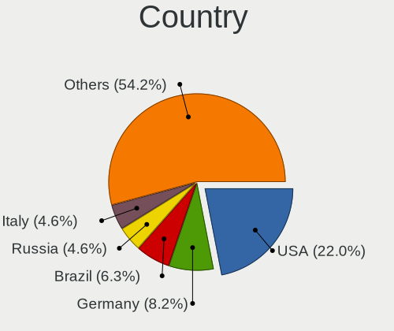
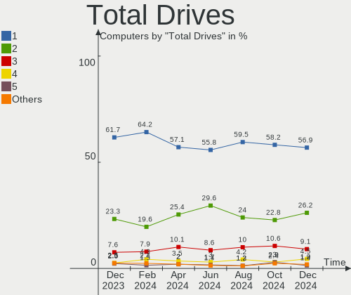
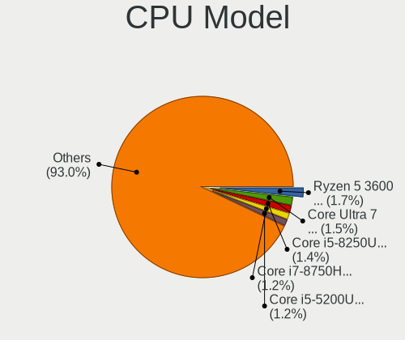
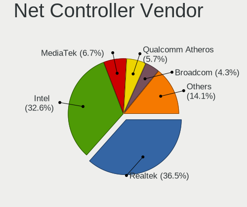
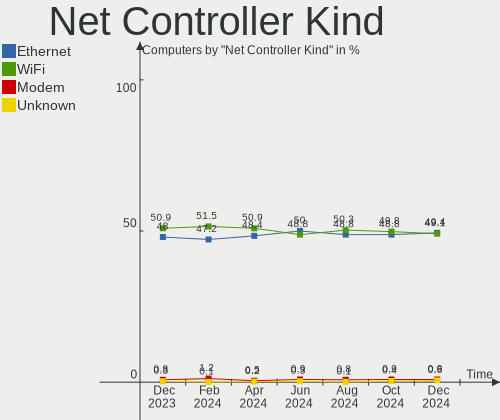
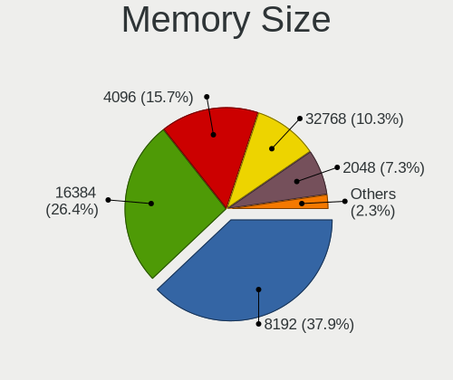

Fedora Hardware Trends
----------------------

A project to identify most popular hardware characteristics and track their change
over time based on data collected by Fedora users at https://Linux-Hardware.org.

Anyone can contribute to the study by uploading probes of their computers by
the [hw-probe](https://github.com/linuxhw/hw-probe) tool:

    sudo -E hw-probe -all -upload

This is a report for all computer types. See also reports for [desktops](/Dist/Fedora/Desktop/README.md) and [notebooks](/Dist/Fedora/Notebook/README.md).

Full-feature report is available here: https://linux-hardware.org/?view=trends

Period: Jun, 2021.

Contents
--------

- [ OS                       ](#os)
- [ OS Family                ](#os-family)
- [ Kernel                   ](#kernel)
- [ Kernel Family            ](#kernel-family)
- [ Kernel Major Ver.        ](#kernel-major-ver)
- [ Arch                     ](#arch)
- [ DE                       ](#de)
- [ Display Server           ](#display-server)
- [ Display Manager          ](#display-manager)
- [ OS Lang                  ](#os-lang)
- [ Boot Mode                ](#boot-mode)
- [ Filesystem               ](#filesystem)
- [ Part. scheme             ](#part-scheme)
- [ Dual Boot with Linux/BSD ](#dual-boot-with-linux/bsd)
- [ Dual Boot (Win)          ](#dual-boot-win)
- [ Country                  ](#country)
- [ City                     ](#city)
- [ Vendor                   ](#vendor)
- [ Model                    ](#model)
- [ Model Family             ](#model-family)
- [ MFG Year                 ](#mfg-year)
- [ Form Factor              ](#form-factor)
- [ Secure Boot              ](#secure-boot)
- [ Coreboot                 ](#coreboot)
- [ RAM Size                 ](#ram-size)
- [ RAM Used                 ](#ram-used)
- [ Has CD-ROM               ](#has-cd-rom)
- [ Total Drives             ](#total-drives)
- [ Has Ethernet             ](#has-ethernet)
- [ Has WiFi                 ](#has-wifi)
- [ Has Bluetooth            ](#has-bluetooth)
- [ Drive Vendor             ](#drive-vendor)
- [ Drive Model              ](#drive-model)
- [ HDD Vendor               ](#hdd-vendor)
- [ SSD Vendor               ](#ssd-vendor)
- [ Drive Kind               ](#drive-kind)
- [ Drive Connector          ](#drive-connector)
- [ Drive Size               ](#drive-size)
- [ Space Total              ](#space-total)
- [ Space Used               ](#space-used)
- [ Malfunc. Drives          ](#malfunc-drives)
- [ Malfunc. Drive Vendor    ](#malfunc-drive-vendor)
- [ Malfunc. HDD Vendor      ](#malfunc-hdd-vendor)
- [ Malfunc. Drive Kind      ](#malfunc-drive-kind)
- [ Failed Drives            ](#failed-drives)
- [ Failed Drive Vendor      ](#failed-drive-vendor)
- [ Drive Status             ](#drive-status)
- [ Storage Vendor           ](#storage-vendor)
- [ Storage Model            ](#storage-model)
- [ Storage Kind             ](#storage-kind)
- [ CPU Vendor               ](#cpu-vendor)
- [ CPU Model                ](#cpu-model)
- [ CPU Model Family         ](#cpu-model-family)
- [ CPU Cores                ](#cpu-cores)
- [ CPU Sockets              ](#cpu-sockets)
- [ CPU Threads              ](#cpu-threads)
- [ CPU Op-Modes             ](#cpu-op-modes)
- [ CPU Microcode            ](#cpu-microcode)
- [ CPU Microarch            ](#cpu-microarch)
- [ GPU Vendor               ](#gpu-vendor)
- [ GPU Model                ](#gpu-model)
- [ GPU Combo                ](#gpu-combo)
- [ GPU Driver               ](#gpu-driver)
- [ GPU Memory               ](#gpu-memory)
- [ Monitor Vendor           ](#monitor-vendor)
- [ Monitor Model            ](#monitor-model)
- [ Monitor Resolution       ](#monitor-resolution)
- [ Monitor Diagonal         ](#monitor-diagonal)
- [ Monitor Width            ](#monitor-width)
- [ Aspect Ratio             ](#aspect-ratio)
- [ Monitor Area             ](#monitor-area)
- [ Pixel Density            ](#pixel-density)
- [ Multiple Monitors        ](#multiple-monitors)
- [ Net Controller Vendor    ](#net-controller-vendor)
- [ Net Controller Model     ](#net-controller-model)
- [ Wireless Vendor          ](#wireless-vendor)
- [ Wireless Model           ](#wireless-model)
- [ Ethernet Vendor          ](#ethernet-vendor)
- [ Ethernet Model           ](#ethernet-model)
- [ Net Controller Kind      ](#net-controller-kind)
- [ Used Controller          ](#used-controller)
- [ NICs                     ](#nics)
- [ IPv6                     ](#ipv6)
- [ Memory Vendor            ](#memory-vendor)
- [ Memory Model             ](#memory-model)
- [ Memory Kind              ](#memory-kind)
- [ Memory Form Factor       ](#memory-form-factor)
- [ Memory Size              ](#memory-size)
- [ Memory Speed             ](#memory-speed)
- [ Sound Vendor             ](#sound-vendor)
- [ Sound Model              ](#sound-model)
- [ Camera Vendor            ](#camera-vendor)
- [ Camera Model             ](#camera-model)
- [ Fingerprint Vendor       ](#fingerprint-vendor)
- [ Fingerprint Model        ](#fingerprint-model)
- [ Chipcard Vendor          ](#chipcard-vendor)
- [ Chipcard Model           ](#chipcard-model)
- [ Printer Vendor           ](#printer-vendor)
- [ Printer Model            ](#printer-model)
- [ Scanner Vendor           ](#scanner-vendor)
- [ Scanner Model            ](#scanner-model)
- [ Bluetooth Vendor         ](#bluetooth-vendor)
- [ Bluetooth Model          ](#bluetooth-model)
- [ Unsupported Devices      ](#unsupported-devices)
- [ Unsupported Device Types ](#unsupported-device-types)

OS
--

Installed operating systems

| Name      | Computers | Percent |
|-----------|-----------|---------|
| Fedora 34 | 238       | 85.92%  |
| Fedora 33 | 26        | 9.39%   |
| Fedora 32 | 9         | 3.25%   |
| Fedora 35 | 2         | 0.72%   |
| Fedora 4  | 1         | 0.36%   |
| Fedora 31 | 1         | 0.36%   |

OS Family
---------

OS without a version

| Name   | Computers | Percent |
|--------|-----------|---------|
| Fedora | 277       | 100%    |

Kernel
------

Version of the Linux kernel

| Version                           | Computers | Percent |
|-----------------------------------|-----------|---------|
| 5.12.8-300.fc34.x86_64            | 59        | 21.3%   |
| 5.12.9-300.fc34.x86_64            | 46        | 16.61%  |
| 5.12.11-300.fc34.x86_64           | 37        | 13.36%  |
| 5.12.12-300.fc34.x86_64           | 26        | 9.39%   |
| 5.12.10-300.fc34.x86_64           | 26        | 9.39%   |
| 5.12.8-200.fc33.x86_64            | 14        | 5.05%   |
| 5.11.12-300.fc34.x86_64           | 13        | 4.69%   |
| 5.12.7-300.fc34.x86_64            | 11        | 3.97%   |
| 5.12.9-200.fc33.x86_64            | 4         | 1.44%   |
| 5.12.13-300.fc34.x86_64           | 4         | 1.44%   |
| 5.11.22-100.fc32.x86_64           | 3         | 1.08%   |
| 5.11.20-300.fc34.x86_64           | 3         | 1.08%   |
| 5.12.11-200.fc33.x86_64           | 2         | 0.72%   |
| 5.11.17-300.fc34.x86_64           | 2         | 0.72%   |
| 5.11.11-200.fc33.x86_64           | 2         | 0.72%   |
| 5.9.16-100.fc32.x86_64            | 1         | 0.36%   |
| 5.8.18-300.fc33.x86_64            | 1         | 0.36%   |
| 5.8.18-100.fc31.x86_64            | 1         | 0.36%   |
| 5.5.15-200.fc31.x86_64            | 1         | 0.36%   |
| 5.13.0-rc6-16-Yeoreum             | 1         | 0.36%   |
| 5.13.0-rc3-202105300039+          | 1         | 0.36%   |
| 5.13.0-0.rc6.45.fc35.x86_64       | 1         | 0.36%   |
| 5.13.0-0.rc1.13.fc35.x86_64       | 1         | 0.36%   |
| 5.12.8-300.fc34.aarch64           | 1         | 0.36%   |
| 5.12.7-200.fc33.x86_64            | 1         | 0.36%   |
| 5.12.7-16-Yeoreum                 | 1         | 0.36%   |
| 5.12.6-300.fc34.x86_64            | 1         | 0.36%   |
| 5.12.5-300.fc34.x86_64            | 1         | 0.36%   |
| 5.12.3-300.fc34.x86_64            | 1         | 0.36%   |
| 5.12.12-200.fc33.x86_64           | 1         | 0.36%   |
| 5.12.11-16-Yeoreum                | 1         | 0.36%   |
| 5.12.10-350.vanilla.1.fc34.x86_64 | 1         | 0.36%   |
| 5.11.7-200.fc33.x86_64            | 1         | 0.36%   |
| 5.11.21-300.fc34.x86_64           | 1         | 0.36%   |
| 5.11.19-300.fc34.x86_64           | 1         | 0.36%   |
| 5.11.18-100.fc32.x86_64           | 1         | 0.36%   |
| 5.11.14-200.fc33.x86_64           | 1         | 0.36%   |
| 5.11.11-100.fc32.x86_64           | 1         | 0.36%   |
| 5.10.22-100.fc32.x86_64           | 1         | 0.36%   |
| 5.1.15-300.fc30.x86_64            | 1         | 0.36%   |

Kernel Family
-------------

Linux kernel without a distro release

| Version | Computers | Percent |
|---------|-----------|---------|
| 5.12.8  | 74        | 26.71%  |
| 5.12.9  | 50        | 18.05%  |
| 5.12.11 | 40        | 14.44%  |
| 5.12.12 | 27        | 9.75%   |
| 5.12.10 | 27        | 9.75%   |
| 5.12.7  | 13        | 4.69%   |
| 5.11.12 | 13        | 4.69%   |
| 5.13.0  | 4         | 1.44%   |
| 5.12.13 | 4         | 1.44%   |
| 5.11.22 | 3         | 1.08%   |
| 5.11.20 | 3         | 1.08%   |
| 5.11.11 | 3         | 1.08%   |
| 5.8.18  | 2         | 0.72%   |
| 5.11.17 | 2         | 0.72%   |
| 5.9.16  | 1         | 0.36%   |
| 5.5.15  | 1         | 0.36%   |
| 5.12.6  | 1         | 0.36%   |
| 5.12.5  | 1         | 0.36%   |
| 5.12.3  | 1         | 0.36%   |
| 5.11.7  | 1         | 0.36%   |
| 5.11.21 | 1         | 0.36%   |
| 5.11.19 | 1         | 0.36%   |
| 5.11.18 | 1         | 0.36%   |
| 5.11.14 | 1         | 0.36%   |
| 5.10.22 | 1         | 0.36%   |
| 5.1.15  | 1         | 0.36%   |

Kernel Major Ver.
-----------------

Linux kernel major version

| Version | Computers | Percent |
|---------|-----------|---------|
| 5.12    | 238       | 85.92%  |
| 5.11    | 29        | 10.47%  |
| 5.13    | 4         | 1.44%   |
| 5.8     | 2         | 0.72%   |
| 5.9     | 1         | 0.36%   |
| 5.5     | 1         | 0.36%   |
| 5.10    | 1         | 0.36%   |
| 5.1     | 1         | 0.36%   |

Arch
----

OS architecture (x86_64, i586, etc.)

| Name    | Computers | Percent |
|---------|-----------|---------|
| x86_64  | 276       | 99.64%  |
| aarch64 | 1         | 0.36%   |

DE
--

Desktop Environment

| Name       | Computers | Percent |
|------------|-----------|---------|
| GNOME      | 206       | 74.37%  |
| KDE5       | 16        | 5.78%   |
| Unknown    | 15        | 5.42%   |
| KDE        | 14        | 5.05%   |
| Cinnamon   | 9         | 3.25%   |
| MATE       | 6         | 2.17%   |
| XFCE       | 3         | 1.08%   |
| X-Cinnamon | 3         | 1.08%   |
| Deepin     | 3         | 1.08%   |
| LXQt       | 1         | 0.36%   |
| i3         | 1         | 0.36%   |

Display Server
--------------

X11 or Wayland

| Name    | Computers | Percent |
|---------|-----------|---------|
| Wayland | 145       | 52.35%  |
| X11     | 115       | 41.52%  |
| Tty     | 11        | 3.97%   |
| Unknown | 6         | 2.17%   |

Display Manager
---------------

SDDM, LightDM, etc.

| Name    | Computers | Percent |
|---------|-----------|---------|
| Unknown | 160       | 57.76%  |
| GDM     | 81        | 29.24%  |
| SDDM    | 16        | 5.78%   |
| TDM     | 12        | 4.33%   |
| LightDM | 7         | 2.53%   |
| SLiM    | 1         | 0.36%   |

OS Lang
-------

Language

| Lang    | Computers | Percent |
|---------|-----------|---------|
| en_US   | 125       | 45.13%  |
| en_GB   | 24        | 8.66%   |
| pt_BR   | 22        | 7.94%   |
| fr_FR   | 13        | 4.69%   |
| ru_RU   | 12        | 4.33%   |
| en_AU   | 10        | 3.61%   |
| de_DE   | 8         | 2.89%   |
| en_IN   | 7         | 2.53%   |
| pl_PL   | 6         | 2.17%   |
| it_IT   | 6         | 2.17%   |
| en_CA   | 6         | 2.17%   |
| nl_BE   | 5         | 1.81%   |
| es_CL   | 3         | 1.08%   |
| Unknown | 3         | 1.08%   |
| tr_TR   | 2         | 0.72%   |
| pt_PT   | 2         | 0.72%   |
| hu_HU   | 2         | 0.72%   |
| es_ES   | 2         | 0.72%   |
| en_NZ   | 2         | 0.72%   |
| en_IE   | 2         | 0.72%   |
| zh_TW   | 1         | 0.36%   |
| uk_UA   | 1         | 0.36%   |
| sr_ME   | 1         | 0.36%   |
| sl_SI   | 1         | 0.36%   |
| sk_SK   | 1         | 0.36%   |
| nl_NL   | 1         | 0.36%   |
| fr_CH   | 1         | 0.36%   |
| es_PA   | 1         | 0.36%   |
| es_MX   | 1         | 0.36%   |
| es_DO   | 1         | 0.36%   |
| en_PK   | 1         | 0.36%   |
| en_DK   | 1         | 0.36%   |
| de_CH   | 1         | 0.36%   |
| cs_CZ   | 1         | 0.36%   |
| ar_KW   | 1         | 0.36%   |

Boot Mode
---------

EFI or BIOS

| Mode | Computers | Percent |
|------|-----------|---------|
| EFI  | 208       | 75.09%  |
| BIOS | 69        | 24.91%  |

Filesystem
----------

Type of filesystem

| Type    | Computers | Percent |
|---------|-----------|---------|
| Btrfs   | 171       | 61.73%  |
| Ext4    | 88        | 31.77%  |
| Xfs     | 17        | 6.14%   |
| Unknown | 1         | 0.36%   |

Part. scheme
------------

Scheme of partitioning

| Type    | Computers | Percent |
|---------|-----------|---------|
| Unknown | 151       | 54.51%  |
| GPT     | 102       | 36.82%  |
| MBR     | 24        | 8.66%   |

Dual Boot with Linux/BSD
------------------------

Hosting more than one Linux/BSD

| Dual boot | Computers | Percent |
|-----------|-----------|---------|
| No        | 255       | 92.06%  |
| Yes       | 22        | 7.94%   |

Dual Boot (Win)
---------------

Hosting Linux and Windows

| Dual boot | Computers | Percent |
|-----------|-----------|---------|
| No        | 227       | 81.95%  |
| Yes       | 50        | 18.05%  |

Country
-------

Geographic location (country)

| Country            | Computers | Percent |
|--------------------|-----------|---------|
| USA                | 47        | 16.97%  |
| Brazil             | 23        | 8.3%    |
| Germany            | 17        | 6.14%   |
| Russia             | 12        | 4.33%   |
| Australia          | 12        | 4.33%   |
| UK                 | 11        | 3.97%   |
| Italy              | 11        | 3.97%   |
| India              | 11        | 3.97%   |
| France             | 11        | 3.97%   |
| Canada             | 9         | 3.25%   |
| Poland             | 8         | 2.89%   |
| Belgium            | 8         | 2.89%   |
| Ukraine            | 7         | 2.53%   |
| Switzerland        | 7         | 2.53%   |
| Turkey             | 6         | 2.17%   |
| Sweden             | 6         | 2.17%   |
| Netherlands        | 6         | 2.17%   |
| Romania            | 5         | 1.81%   |
| Czechia            | 4         | 1.44%   |
| Chile              | 4         | 1.44%   |
| Spain              | 3         | 1.08%   |
| Norway             | 3         | 1.08%   |
| New Zealand        | 3         | 1.08%   |
| Mexico             | 3         | 1.08%   |
| Hungary            | 3         | 1.08%   |
| Belarus            | 3         | 1.08%   |
| Taiwan             | 2         | 0.72%   |
| Slovenia           | 2         | 0.72%   |
| Slovakia           | 2         | 0.72%   |
| Portugal           | 2         | 0.72%   |
| Moldova            | 2         | 0.72%   |
| Ireland            | 2         | 0.72%   |
| Indonesia          | 2         | 0.72%   |
| Austria            | 2         | 0.72%   |
| Sri Lanka          | 1         | 0.36%   |
| Panama             | 1         | 0.36%   |
| Pakistan           | 1         | 0.36%   |
| Montenegro         | 1         | 0.36%   |
| Martinique         | 1         | 0.36%   |
| Malaysia           | 1         | 0.36%   |
| Madagascar         | 1         | 0.36%   |
| Luxembourg         | 1         | 0.36%   |
| Kyrgyzstan         | 1         | 0.36%   |
| Kenya              | 1         | 0.36%   |
| Iran               | 1         | 0.36%   |
| Greece             | 1         | 0.36%   |
| Estonia            | 1         | 0.36%   |
| Egypt              | 1         | 0.36%   |
| Dominican Republic | 1         | 0.36%   |
| Denmark            | 1         | 0.36%   |
| Bangladesh         | 1         | 0.36%   |
| Argentina          | 1         | 0.36%   |

City
----

Geographic location (city)

| City                 | Computers | Percent |
|----------------------|-----------|---------|
| Sydney               | 10        | 3.61%   |
| Moscow               | 5         | 1.81%   |
| London               | 5         | 1.81%   |
| Zurich               | 4         | 1.44%   |
| Kyiv                 | 4         | 1.44%   |
| Istanbul             | 4         | 1.44%   |
| Lodz                 | 3         | 1.08%   |
| Jambes               | 3         | 1.08%   |
| Askloster            | 3         | 1.08%   |
| Ashburn              | 3         | 1.08%   |
| Toronto              | 2         | 0.72%   |
| Sharon               | 2         | 0.72%   |
| Santiago             | 2         | 0.72%   |
| Porto Alegre         | 2         | 0.72%   |
| Pflugerville         | 2         | 0.72%   |
| Oslo                 | 2         | 0.72%   |
| Minsk                | 2         | 0.72%   |
| Masterton            | 2         | 0.72%   |
| Kirchbichl           | 2         | 0.72%   |
| Dublin               | 2         | 0.72%   |
| Cologne              | 2         | 0.72%   |
| Chisinau             | 2         | 0.72%   |
| Budapest             | 2         | 0.72%   |
| Bucharest            | 2         | 0.72%   |
| Brussels             | 2         | 0.72%   |
| Brno                 | 2         | 0.72%   |
| Bietigheim-Bissingen | 2         | 0.72%   |
| Bengaluru            | 2         | 0.72%   |
| Antwerp              | 2         | 0.72%   |
| Zgorzelec            | 1         | 0.36%   |
| Zaporizhzhya         | 1         | 0.36%   |
| Wroclaw              | 1         | 0.36%   |
| Woodstock            | 1         | 0.36%   |
| Winterthur           | 1         | 0.36%   |
| Wiesloch             | 1         | 0.36%   |
| Wiesbaden            | 1         | 0.36%   |
| Wichita              | 1         | 0.36%   |
| Wendell              | 1         | 0.36%   |
| Washington           | 1         | 0.36%   |
| Warsaw               | 1         | 0.36%   |
| Vyškov              | 1         | 0.36%   |
| Vougy                | 1         | 0.36%   |
| Vignacourt           | 1         | 0.36%   |
| Ven                  | 1         | 0.36%   |
| Veceslavci           | 1         | 0.36%   |
| Vancouver            | 1         | 0.36%   |
| Uberlândia          | 1         | 0.36%   |
| Tyumen               | 1         | 0.36%   |
| Tvrdosin             | 1         | 0.36%   |
| Toulouse             | 1         | 0.36%   |
| Thornbury            | 1         | 0.36%   |
| The Bronx            | 1         | 0.36%   |
| Terneuzen            | 1         | 0.36%   |
| Temuco               | 1         | 0.36%   |
| Tehran               | 1         | 0.36%   |
| Taipei               | 1         | 0.36%   |
| São Paulo           | 1         | 0.36%   |
| Streamwood           | 1         | 0.36%   |
| Strassen             | 1         | 0.36%   |
| Stockholm            | 1         | 0.36%   |

Vendor
------

Motherboard manufacturer

| Name                | Computers | Percent |
|---------------------|-----------|---------|
| Lenovo              | 57        | 20.58%  |
| ASUSTek Computer    | 50        | 18.05%  |
| Hewlett-Packard     | 38        | 13.72%  |
| Dell                | 34        | 12.27%  |
| Gigabyte Technology | 21        | 7.58%   |
| Acer                | 15        | 5.42%   |
| ASRock              | 13        | 4.69%   |
| MSI                 | 10        | 3.61%   |
| Intel               | 7         | 2.53%   |
| Apple               | 7         | 2.53%   |
| Positivo            | 3         | 1.08%   |
| Sony                | 2         | 0.72%   |
| Notebook            | 2         | 0.72%   |
| LG Electronics      | 2         | 0.72%   |
| HUAWEI              | 2         | 0.72%   |
| Fujitsu             | 2         | 0.72%   |
| TrekStor            | 1         | 0.36%   |
| Toshiba             | 1         | 0.36%   |
| SYWZ                | 1         | 0.36%   |
| Supermicro          | 1         | 0.36%   |
| SLIMBOOK            | 1         | 0.36%   |
| Samsung Electronics | 1         | 0.36%   |
| Pine Microsystems   | 1         | 0.36%   |
| Medion              | 1         | 0.36%   |
| Gateway             | 1         | 0.36%   |
| eMachines           | 1         | 0.36%   |
| ASRockRack          | 1         | 0.36%   |
| Unknown             | 1         | 0.36%   |

Model
-----

Motherboard model

| Name                                       | Computers | Percent |
|--------------------------------------------|-----------|---------|
| MSI MS-7C84                                | 2         | 0.72%   |
| Lenovo Yoga C940-14IIL 81Q9                | 2         | 0.72%   |
| Lenovo Yoga 7 14ITL5 82BH                  | 2         | 0.72%   |
| Lenovo IdeaPad Yoga 13 20175               | 2         | 0.72%   |
| HP Pro x2 612 G1 Tablet                    | 2         | 0.72%   |
| HP Pavilion Notebook                       | 2         | 0.72%   |
| HP Pavilion 15                             | 2         | 0.72%   |
| HP Notebook                                | 2         | 0.72%   |
| Dell Inspiron 15 7000 Gaming               | 2         | 0.72%   |
| ASUS Z170-A                                | 2         | 0.72%   |
| ASUS VivoBook_ASUSLaptop X509JA_X509JA     | 2         | 0.72%   |
| ASUS TUF GAMING X570-PLUS                  | 2         | 0.72%   |
| ASUS ROG STRIX X570-F GAMING               | 2         | 0.72%   |
| ASUS ROG STRIX B450-F GAMING               | 2         | 0.72%   |
| ASUS N550JV                                | 2         | 0.72%   |
| ASUS All Series                            | 2         | 0.72%   |
| Apple MacBookPro11,5                       | 2         | 0.72%   |
| TrekStor Notebook Slim S130                | 1         | 0.36%   |
| Toshiba Satellite L75-B                    | 1         | 0.36%   |
| SYWZ S200 Series                           | 1         | 0.36%   |
| Supermicro X9SRA/X9SRA-3                   | 1         | 0.36%   |
| Sony VPCSA25GX                             | 1         | 0.36%   |
| Sony SVE14113ELW                           | 1         | 0.36%   |
| SLIMBOOK PROX15-AMD                        | 1         | 0.36%   |
| Samsung 700Z3C/700Z5C                      | 1         | 0.36%   |
| Positivo POS-MI945AA                       | 1         | 0.36%   |
| Positivo CHT14B                            | 1         | 0.36%   |
| Positivo C41TB                             | 1         | 0.36%   |
| Pine Microsystems Pine64 Pinebook Pro      | 1         | 0.36%   |
| Notebook PB50_70DFx,DDx                    | 1         | 0.36%   |
| Notebook NH5x_7xDPx                        | 1         | 0.36%   |
| MSI MS-7C02                                | 1         | 0.36%   |
| MSI MS-7B98                                | 1         | 0.36%   |
| MSI MS-7B89                                | 1         | 0.36%   |
| MSI MS-7B85                                | 1         | 0.36%   |
| MSI MS-7A37                                | 1         | 0.36%   |
| MSI MS-7917                                | 1         | 0.36%   |
| MSI MS-7721                                | 1         | 0.36%   |
| MSI GE70 2PE                               | 1         | 0.36%   |
| Medion E3223 MD61127                       | 1         | 0.36%   |
| LG 22V280-L.BY31P1                         | 1         | 0.36%   |
| LG 17Z90N-R.AAC8U1                         | 1         | 0.36%   |
| Lenovo Yoga Slim 7 15ITL05 82AC            | 1         | 0.36%   |
| Lenovo Yoga S740-15IRH 81NX                | 1         | 0.36%   |
| Lenovo Yoga C740-14IML 81TC                | 1         | 0.36%   |
| Lenovo Yoga 9 15IMH5 82DE                  | 1         | 0.36%   |
| Lenovo Yoga 9 14ITL5 82BG                  | 1         | 0.36%   |
| Lenovo Yoga 720-15IKB 80X7                 | 1         | 0.36%   |
| Lenovo Yoga 7 15ITL5 82BJ                  | 1         | 0.36%   |
| Lenovo Yoga 300-11IBR 80M1                 | 1         | 0.36%   |
| Lenovo ThinkPad X220 4290LT8               | 1         | 0.36%   |
| Lenovo ThinkPad X1 Nano Gen 1 20UN005KUS   | 1         | 0.36%   |
| Lenovo ThinkPad X1 Extreme 2nd 20QVCTO1WW  | 1         | 0.36%   |
| Lenovo ThinkPad X1 Carbon Gen 9 20XW003FUS | 1         | 0.36%   |
| Lenovo ThinkPad X1 Carbon Gen 8 20U9CTO1WW | 1         | 0.36%   |
| Lenovo ThinkPad X1 Carbon Gen 8 20U9005KUS | 1         | 0.36%   |
| Lenovo ThinkPad W540 20BHS04T0K            | 1         | 0.36%   |
| Lenovo ThinkPad W530 2447AC4               | 1         | 0.36%   |
| Lenovo ThinkPad W520 4282AB9               | 1         | 0.36%   |
| Lenovo ThinkPad T580 20LAS3NJ0B            | 1         | 0.36%   |

Model Family
------------

Motherboard model prefix

| Name                     | Computers | Percent |
|--------------------------|-----------|---------|
| Lenovo ThinkPad          | 30        | 10.83%  |
| Lenovo Yoga              | 12        | 4.33%   |
| ASUS ROG                 | 12        | 4.33%   |
| HP Pavilion              | 10        | 3.61%   |
| Dell Latitude            | 10        | 3.61%   |
| Lenovo IdeaPad           | 9         | 3.25%   |
| Dell Inspiron            | 9         | 3.25%   |
| ASUS VivoBook            | 7         | 2.53%   |
| Acer Aspire              | 7         | 2.53%   |
| Dell XPS                 | 6         | 2.17%   |
| ASUS TUF                 | 6         | 2.17%   |
| ASUS PRIME               | 5         | 1.81%   |
| Dell OptiPlex            | 4         | 1.44%   |
| HP ProBook               | 3         | 1.08%   |
| HP ENVY                  | 3         | 1.08%   |
| HP EliteBook             | 3         | 1.08%   |
| Acer Swift               | 3         | 1.08%   |
| Acer Nitro               | 3         | 1.08%   |
| MSI MS-7C84              | 2         | 0.72%   |
| Lenovo ThinkCentre       | 2         | 0.72%   |
| HP ProLiant              | 2         | 0.72%   |
| HP Pro                   | 2         | 0.72%   |
| HP OMEN                  | 2         | 0.72%   |
| HP Notebook              | 2         | 0.72%   |
| HP EliteDesk             | 2         | 0.72%   |
| Fujitsu ESPRIMO          | 2         | 0.72%   |
| Dell Precision           | 2         | 0.72%   |
| ASUS Z170-A              | 2         | 0.72%   |
| ASUS P8H61-M             | 2         | 0.72%   |
| ASUS N550JV              | 2         | 0.72%   |
| ASUS All                 | 2         | 0.72%   |
| Apple MacBookPro11       | 2         | 0.72%   |
| TrekStor Notebook        | 1         | 0.36%   |
| Toshiba Satellite        | 1         | 0.36%   |
| SYWZ S200                | 1         | 0.36%   |
| Supermicro X9SRA         | 1         | 0.36%   |
| Sony VPCSA25GX           | 1         | 0.36%   |
| Sony SVE14113ELW         | 1         | 0.36%   |
| SLIMBOOK PROX15-AMD      | 1         | 0.36%   |
| Samsung 700Z3C           | 1         | 0.36%   |
| Positivo POS-MI945AA     | 1         | 0.36%   |
| Positivo CHT14B          | 1         | 0.36%   |
| Positivo C41TB           | 1         | 0.36%   |
| Pine Microsystems Pine64 | 1         | 0.36%   |
| Notebook PB50            | 1         | 0.36%   |
| Notebook NH5x            | 1         | 0.36%   |
| MSI MS-7C02              | 1         | 0.36%   |
| MSI MS-7B98              | 1         | 0.36%   |
| MSI MS-7B89              | 1         | 0.36%   |
| MSI MS-7B85              | 1         | 0.36%   |
| MSI MS-7A37              | 1         | 0.36%   |
| MSI MS-7917              | 1         | 0.36%   |
| MSI MS-7721              | 1         | 0.36%   |
| MSI GE70                 | 1         | 0.36%   |
| Medion E3223             | 1         | 0.36%   |
| LG 22V280-L.BY31P1       | 1         | 0.36%   |
| LG 17Z90N-R.AAC8U1       | 1         | 0.36%   |
| Lenovo Legion            | 1         | 0.36%   |
| Lenovo IdeaCentre        | 1         | 0.36%   |
| Lenovo H30-50            | 1         | 0.36%   |

MFG Year
--------

Motherboard manufacture year

| Year | Computers | Percent |
|------|-----------|---------|
| 2020 | 63        | 22.74%  |
| 2021 | 45        | 16.25%  |
| 2019 | 44        | 15.88%  |
| 2018 | 31        | 11.19%  |
| 2015 | 17        | 6.14%   |
| 2014 | 14        | 5.05%   |
| 2013 | 13        | 4.69%   |
| 2017 | 10        | 3.61%   |
| 2011 | 9         | 3.25%   |
| 2010 | 9         | 3.25%   |
| 2012 | 8         | 2.89%   |
| 2016 | 7         | 2.53%   |
| 2009 | 2         | 0.72%   |
| 2008 | 2         | 0.72%   |
| 2007 | 1         | 0.36%   |
| 2006 | 1         | 0.36%   |
| 2005 | 1         | 0.36%   |

Form Factor
-----------

Physical design of the computer

| Name        | Computers | Percent |
|-------------|-----------|---------|
| Notebook    | 148       | 53.43%  |
| Desktop     | 104       | 37.55%  |
| Convertible | 17        | 6.14%   |
| All in one  | 3         | 1.08%   |
| Mini pc     | 2         | 0.72%   |
| Server      | 2         | 0.72%   |
| Tablet      | 1         | 0.36%   |

Secure Boot
-----------

Enabled or disabled

| State    | Computers | Percent |
|----------|-----------|---------|
| Disabled | 242       | 87.36%  |
| Enabled  | 35        | 12.64%  |

Coreboot
--------

Have coreboot on board

| Used | Computers | Percent |
|------|-----------|---------|
| No   | 277       | 100%    |

RAM Size
--------

Total RAM memory

| Size in GB  | Computers | Percent |
|-------------|-----------|---------|
| 16.01-24.0  | 73        | 26.35%  |
| 4.01-8.0    | 62        | 22.38%  |
| 8.01-16.0   | 51        | 18.41%  |
| 32.01-64.0  | 47        | 16.97%  |
| 3.01-4.0    | 24        | 8.66%   |
| 64.01-256.0 | 10        | 3.61%   |
| 24.01-32.0  | 7         | 2.53%   |
| 1.01-2.0    | 3         | 1.08%   |

RAM Used
--------

Used RAM memory

| Used GB    | Computers | Percent |
|------------|-----------|---------|
| 2.01-3.0   | 70        | 25.27%  |
| 4.01-8.0   | 68        | 24.55%  |
| 1.01-2.0   | 53        | 19.13%  |
| 3.01-4.0   | 51        | 18.41%  |
| 8.01-16.0  | 20        | 7.22%   |
| 0.51-1.0   | 7         | 2.53%   |
| 16.01-24.0 | 4         | 1.44%   |
| 0.01-0.5   | 2         | 0.72%   |
| 32.01-64.0 | 1         | 0.36%   |
| 24.01-32.0 | 1         | 0.36%   |

Has CD-ROM
----------

Has CD-ROM on board

| Presented | Computers | Percent |
|-----------|-----------|---------|
| No        | 202       | 72.92%  |
| Yes       | 75        | 27.08%  |

Total Drives
------------

Number of drives on board

| Drives | Computers | Percent |
|--------|-----------|---------|
| 1      | 142       | 51.26%  |
| 2      | 77        | 27.8%   |
| 3      | 33        | 11.91%  |
| 4      | 12        | 4.33%   |
| 5      | 7         | 2.53%   |
| 7      | 3         | 1.08%   |
| 8      | 2         | 0.72%   |
| 6      | 1         | 0.36%   |

Has Ethernet
------------

Has Ethernet on board

| Presented | Computers | Percent |
|-----------|-----------|---------|
| Yes       | 222       | 80.14%  |
| No        | 55        | 19.86%  |

Has WiFi
--------

Has WiFi module

| Presented | Computers | Percent |
|-----------|-----------|---------|
| Yes       | 212       | 76.53%  |
| No        | 65        | 23.47%  |

Has Bluetooth
-------------

Has Bluetooth module

| Presented | Computers | Percent |
|-----------|-----------|---------|
| Yes       | 184       | 66.43%  |
| No        | 93        | 33.57%  |

Drive Vendor
------------

Hard drive vendors

| Vendor                    | Computers | Drives | Percent |
|---------------------------|-----------|--------|---------|
| Samsung Electronics       | 99        | 128    | 22.45%  |
| WDC                       | 64        | 78     | 14.51%  |
| Seagate                   | 45        | 61     | 10.2%   |
| Toshiba                   | 26        | 33     | 5.9%    |
| Crucial                   | 25        | 27     | 5.67%   |
| SanDisk                   | 24        | 24     | 5.44%   |
| Kingston                  | 20        | 21     | 4.54%   |
| Unknown                   | 14        | 16     | 3.17%   |
| Intel                     | 14        | 15     | 3.17%   |
| SK Hynix                  | 13        | 14     | 2.95%   |
| Micron Technology         | 11        | 13     | 2.49%   |
| HGST                      | 9         | 9      | 2.04%   |
| Hitachi                   | 7         | 8      | 1.59%   |
| SPCC                      | 6         | 6      | 1.36%   |
| Phison                    | 5         | 7      | 1.13%   |
| XPG                       | 3         | 3      | 0.68%   |
| Union Memory              | 3         | 3      | 0.68%   |
| Micron/Crucial Technology | 3         | 3      | 0.68%   |
| Apple                     | 3         | 3      | 0.68%   |
| Transcend                 | 2         | 2      | 0.45%   |
| Team                      | 2         | 2      | 0.45%   |
| Silicon Motion            | 2         | 3      | 0.45%   |
| SABRENT                   | 2         | 2      | 0.45%   |
| PNY                       | 2         | 3      | 0.45%   |
| PLEXTOR                   | 2         | 3      | 0.45%   |
| Patriot                   | 2         | 3      | 0.45%   |
| Maxtor                    | 2         | 2      | 0.45%   |
| LITEONIT                  | 2         | 2      | 0.45%   |
| KIOXIA                    | 2         | 2      | 0.45%   |
| JMicron                   | 2         | 2      | 0.45%   |
| Corsair                   | 2         | 2      | 0.45%   |
| Apacer                    | 2         | 3      | 0.45%   |
| A-DATA Technology         | 2         | 2      | 0.45%   |
| Union Memory (Shenzhen)   | 1         | 1      | 0.23%   |
| Synology                  | 1         | 1      | 0.23%   |
| Solid State Storage       | 1         | 1      | 0.23%   |
| Realtek Semiconductor     | 1         | 1      | 0.23%   |
| Phison Electronics        | 1         | 1      | 0.23%   |
| OCZ                       | 1         | 1      | 0.23%   |
| Mushkin                   | 1         | 1      | 0.23%   |
| MG                        | 1         | 1      | 0.23%   |
| LITEON                    | 1         | 1      | 0.23%   |
| Lite-On                   | 1         | 1      | 0.23%   |
| Lexar                     | 1         | 1      | 0.23%   |
| Lenovo                    | 1         | 1      | 0.23%   |
| KingSpec                  | 1         | 1      | 0.23%   |
| KingFast                  | 1         | 1      | 0.23%   |
| HS-SSD-C100               | 1         | 1      | 0.23%   |
| Hoodisk                   | 1         | 1      | 0.23%   |
| GOODRAM                   | 1         | 1      | 0.23%   |
| BHT                       | 1         | 1      | 0.23%   |
| ASMT                      | 1         | 1      | 0.23%   |

Drive Model
-----------

Hard drive models

| Model                                   | Computers | Percent |
|-----------------------------------------|-----------|---------|
| Samsung NVMe SSD Drive 512GB            | 9         | 1.78%   |
| Samsung SSD 860 EVO 1TB                 | 7         | 1.38%   |
| Samsung NVMe SSD Drive 1TB              | 7         | 1.38%   |
| Samsung SSD 850 EVO 250GB               | 5         | 0.99%   |
| Samsung NVMe SSD Drive 250GB            | 5         | 0.99%   |
| Crucial CT500MX500SSD1 500GB            | 5         | 0.99%   |
| Seagate ST500DM002-1BD142 500GB         | 4         | 0.79%   |
| Samsung SSD 870 EVO 500GB               | 4         | 0.79%   |
| Samsung SSD 860 EVO 500GB               | 4         | 0.79%   |
| Samsung SSD 840 EVO 250GB               | 4         | 0.79%   |
| Kingston SV300S37A120G 120GB SSD        | 4         | 0.79%   |
| HGST HTS721010A9E630 1TB                | 4         | 0.79%   |
| Unknown SD/MMC/MS PRO 128GB             | 3         | 0.59%   |
| Toshiba DT01ACA200 2TB                  | 3         | 0.59%   |
| Seagate ST4000DM004-2CV104 4TB          | 3         | 0.59%   |
| Seagate ST1000LM035-1RK172 1TB          | 3         | 0.59%   |
| Seagate ST1000LM024 HN-M101MBB 1TB      | 3         | 0.59%   |
| Seagate ST1000DM003-1ER162 1TB          | 3         | 0.59%   |
| Sandisk NVMe SSD Drive 1TB              | 3         | 0.59%   |
| Samsung SSD 970 EVO Plus 1TB            | 3         | 0.59%   |
| Samsung SSD 860 EVO 2TB                 | 3         | 0.59%   |
| Samsung SSD 850 EVO 500GB               | 3         | 0.59%   |
| Samsung NVMe SSD Drive 256GB            | 3         | 0.59%   |
| Phison NVMe SSD Drive 1024GB            | 3         | 0.59%   |
| Micron/Crucial NVMe SSD Drive 1TB       | 3         | 0.59%   |
| Kingston SA400S37120G 120GB SSD         | 3         | 0.59%   |
| Intel NVMe SSD Drive 512GB              | 3         | 0.59%   |
| HGST HTS541010A9E680 1TB                | 3         | 0.59%   |
| Crucial CT480BX500SSD1 480GB            | 3         | 0.59%   |
| Crucial CT1000MX500SSD1 1TB             | 3         | 0.59%   |
| WDC WDS500G2B0A-00SM50 500GB SSD        | 2         | 0.39%   |
| WDC WDS240G2G0B-00EPW0 240GB SSD        | 2         | 0.39%   |
| WDC WD40EZRZ-00GXCB0 4TB                | 2         | 0.39%   |
| WDC WD40EFRX-68N32N0 4TB                | 2         | 0.39%   |
| WDC WD15EARS-00MVWB0 1TB                | 2         | 0.39%   |
| WDC WD10SPZX-24Z10 1TB                  | 2         | 0.39%   |
| WDC WD10JPVX-60JC3T0 1TB                | 2         | 0.39%   |
| WDC WD10EZEX-75WN4A0 1TB                | 2         | 0.39%   |
| WDC WD10EZEX-08WN4A0 1TB                | 2         | 0.39%   |
| WDC WD10EZEX-08M2NA0 1TB                | 2         | 0.39%   |
| WDC WD10EZEX-00WN4A0 1TB                | 2         | 0.39%   |
| WDC WD10EZEX-00BN5A0 1TB                | 2         | 0.39%   |
| WDC PC SN520 SDAPNUW-512G-1202 512GB    | 2         | 0.39%   |
| WDC PC SN520 SDAPMUW-512G-1001 512GB    | 2         | 0.39%   |
| Unknown MMC Card  32GB                  | 2         | 0.39%   |
| Unknown MMC Card  128GB                 | 2         | 0.39%   |
| Union Memory UMIS RPJTJ512MEE1OWX 512GB | 2         | 0.39%   |
| Toshiba NVMe SSD Drive 256GB            | 2         | 0.39%   |
| Toshiba MQ02ABD100H 1TB                 | 2         | 0.39%   |
| Toshiba HDWD120 2TB                     | 2         | 0.39%   |
| Toshiba DT01ACA300 3TB                  | 2         | 0.39%   |
| SPCC Solid State Disk 256GB             | 2         | 0.39%   |
| SK Hynix HBG4e  32GB                    | 2         | 0.39%   |
| SK Hynix BC511 NVMe 256GB               | 2         | 0.39%   |
| Seagate ST4000VN008-2DR166 4TB          | 2         | 0.39%   |
| Seagate ST3500418AS 500GB               | 2         | 0.39%   |
| Seagate ST1000LM049-2GH172 1TB          | 2         | 0.39%   |
| Seagate Expansion Desk 2TB              | 2         | 0.39%   |
| SanDisk SSD PLUS 480GB                  | 2         | 0.39%   |
| Sandisk NVMe SSD Drive 512GB            | 2         | 0.39%   |

HDD Vendor
----------

Hard disk drive vendors

| Vendor              | Computers | Drives | Percent |
|---------------------|-----------|--------|---------|
| WDC                 | 48        | 58     | 35.56%  |
| Seagate             | 42        | 58     | 31.11%  |
| Toshiba             | 17        | 21     | 12.59%  |
| HGST                | 9         | 9      | 6.67%   |
| Samsung Electronics | 8         | 10     | 5.93%   |
| Hitachi             | 7         | 8      | 5.19%   |
| Synology            | 1         | 1      | 0.74%   |
| Maxtor              | 1         | 1      | 0.74%   |
| ASMT                | 1         | 1      | 0.74%   |
| Apple               | 1         | 1      | 0.74%   |

SSD Vendor
----------

Solid state drive vendors

| Vendor              | Computers | Drives | Percent |
|---------------------|-----------|--------|---------|
| Samsung Electronics | 53        | 63     | 31.36%  |
| Crucial             | 23        | 25     | 13.61%  |
| SanDisk             | 15        | 15     | 8.88%   |
| Kingston            | 15        | 15     | 8.88%   |
| WDC                 | 10        | 10     | 5.92%   |
| Intel               | 8         | 9      | 4.73%   |
| Micron Technology   | 6         | 6      | 3.55%   |
| SPCC                | 4         | 4      | 2.37%   |
| Toshiba             | 3         | 4      | 1.78%   |
| Team                | 2         | 2      | 1.18%   |
| SK Hynix            | 2         | 2      | 1.18%   |
| SABRENT             | 2         | 2      | 1.18%   |
| PNY                 | 2         | 2      | 1.18%   |
| PLEXTOR             | 2         | 3      | 1.18%   |
| LITEONIT            | 2         | 2      | 1.18%   |
| Apple               | 2         | 2      | 1.18%   |
| Apacer              | 2         | 3      | 1.18%   |
| A-DATA Technology   | 2         | 2      | 1.18%   |
| Union Memory        | 1         | 1      | 0.59%   |
| Transcend           | 1         | 1      | 0.59%   |
| Seagate             | 1         | 1      | 0.59%   |
| Patriot             | 1         | 1      | 0.59%   |
| OCZ                 | 1         | 1      | 0.59%   |
| Mushkin             | 1         | 1      | 0.59%   |
| MG                  | 1         | 1      | 0.59%   |
| Maxtor              | 1         | 1      | 0.59%   |
| LITEON              | 1         | 1      | 0.59%   |
| Lexar               | 1         | 1      | 0.59%   |
| KingSpec            | 1         | 1      | 0.59%   |
| Hoodisk             | 1         | 1      | 0.59%   |
| GOODRAM             | 1         | 1      | 0.59%   |
| BHT                 | 1         | 1      | 0.59%   |

Drive Kind
----------

HDD or SSD

| Kind    | Computers | Drives | Percent |
|---------|-----------|--------|---------|
| SSD     | 150       | 185    | 37.69%  |
| NVMe    | 118       | 148    | 29.65%  |
| HDD     | 109       | 168    | 27.39%  |
| MMC     | 14        | 16     | 3.52%   |
| Unknown | 7         | 7      | 1.76%   |

Drive Connector
---------------

SATA, SAS, NVMe, etc.

| Type | Computers | Drives | Percent |
|------|-----------|--------|---------|
| SATA | 202       | 342    | 57.55%  |
| NVMe | 117       | 147    | 33.33%  |
| SAS  | 18        | 19     | 5.13%   |
| MMC  | 14        | 16     | 3.99%   |

Drive Size
----------

Size of hard drive

| Size in TB | Computers | Drives | Percent |
|------------|-----------|--------|---------|
| 0.01-0.5   | 152       | 188    | 53.9%   |
| 0.51-1.0   | 81        | 98     | 28.72%  |
| 1.01-2.0   | 23        | 29     | 8.16%   |
| 3.01-4.0   | 12        | 16     | 4.26%   |
| 4.01-10.0  | 7         | 10     | 2.48%   |
| 2.01-3.0   | 6         | 8      | 2.13%   |
| 10.01-20.0 | 1         | 4      | 0.35%   |

Space Total
-----------

Amount of disk space available on the file system

| Size in GB     | Computers | Percent |
|----------------|-----------|---------|
| 501-1000       | 64        | 23.1%   |
| 251-500        | 51        | 18.41%  |
| 101-250        | 48        | 17.33%  |
| 1001-2000      | 25        | 9.03%   |
| 1-20           | 25        | 9.03%   |
| More than 3000 | 20        | 7.22%   |
| Unknown        | 18        | 6.5%    |
| 51-100         | 13        | 4.69%   |
| 2001-3000      | 9         | 3.25%   |
| 21-50          | 4         | 1.44%   |

Space Used
----------

Amount of used disk space

| Used GB        | Computers | Percent |
|----------------|-----------|---------|
| 1-20           | 74        | 26.71%  |
| 101-250        | 48        | 17.33%  |
| 21-50          | 35        | 12.64%  |
| 501-1000       | 29        | 10.47%  |
| 51-100         | 28        | 10.11%  |
| 251-500        | 26        | 9.39%   |
| Unknown        | 18        | 6.5%    |
| 1001-2000      | 8         | 2.89%   |
| More than 3000 | 7         | 2.53%   |
| 2001-3000      | 4         | 1.44%   |

Malfunc. Drives
---------------

Drive models with a malfunction

| Model                                 | Computers | Drives | Percent |
|---------------------------------------|-----------|--------|---------|
| Seagate ST500DM002-1BD142 500GB       | 3         | 4      | 21.43%  |
| Toshiba DT01ACA200 2TB                | 2         | 2      | 14.29%  |
| Seagate ST1000LM024 HN-M101MBB 1TB    | 2         | 2      | 14.29%  |
| WDC WD40PURZ-85AKKY0 4TB              | 1         | 1      | 7.14%   |
| SK Hynix HFS256G39TND-N210A 256GB SSD | 1         | 1      | 7.14%   |
| SanDisk SSD PLUS 480GB                | 1         | 1      | 7.14%   |
| Samsung Electronics HM160HI 160GB     | 1         | 1      | 7.14%   |
| Intel SSDSCKKF256G8H 256GB            | 1         | 1      | 7.14%   |
| Hitachi HTS725050A7E630 500GB         | 1         | 1      | 7.14%   |
| Crucial CT1000P1SSD8 1TB              | 1         | 1      | 7.14%   |

Malfunc. Drive Vendor
---------------------

Vendors of faulty drives

| Vendor              | Computers | Drives | Percent |
|---------------------|-----------|--------|---------|
| Seagate             | 5         | 6      | 35.71%  |
| Toshiba             | 2         | 2      | 14.29%  |
| WDC                 | 1         | 1      | 7.14%   |
| SK Hynix            | 1         | 1      | 7.14%   |
| SanDisk             | 1         | 1      | 7.14%   |
| Samsung Electronics | 1         | 1      | 7.14%   |
| Intel               | 1         | 1      | 7.14%   |
| Hitachi             | 1         | 1      | 7.14%   |
| Crucial             | 1         | 1      | 7.14%   |

Malfunc. HDD Vendor
-------------------

Vendors of faulty HDD drives

| Vendor              | Computers | Drives | Percent |
|---------------------|-----------|--------|---------|
| Seagate             | 5         | 6      | 50%     |
| Toshiba             | 2         | 2      | 20%     |
| WDC                 | 1         | 1      | 10%     |
| Samsung Electronics | 1         | 1      | 10%     |
| Hitachi             | 1         | 1      | 10%     |

Malfunc. Drive Kind
-------------------

Kinds of faulty drives

| Kind | Computers | Drives | Percent |
|------|-----------|--------|---------|
| HDD  | 9         | 11     | 69.23%  |
| SSD  | 3         | 3      | 23.08%  |
| NVMe | 1         | 1      | 7.69%   |

Failed Drives
-------------

Failed drive models

| Model                                | Computers | Drives | Percent |
|--------------------------------------|-----------|--------|---------|
| WDC PC SN520 SDAPMUW-512G-1001 512GB | 1         | 1      | 50%     |
| Hitachi HDS721010DLE630 1TB          | 1         | 2      | 50%     |

Failed Drive Vendor
-------------------

Failed drive vendors

| Vendor  | Computers | Drives | Percent |
|---------|-----------|--------|---------|
| WDC     | 1         | 1      | 50%     |
| Hitachi | 1         | 2      | 50%     |

Drive Status
------------

Number of failed and malfunc. drives

| Status   | Computers | Drives | Percent |
|----------|-----------|--------|---------|
| Detected | 170       | 298    | 55.56%  |
| Works    | 121       | 208    | 39.54%  |
| Malfunc  | 13        | 15     | 4.25%   |
| Failed   | 2         | 3      | 0.65%   |

Storage Vendor
--------------

Storage controller vendors

| Vendor                         | Computers | Percent |
|--------------------------------|-----------|---------|
| Intel                          | 169       | 44.36%  |
| AMD                            | 60        | 15.75%  |
| Samsung Electronics            | 51        | 13.39%  |
| Sandisk                        | 19        | 4.99%   |
| Phison Electronics             | 10        | 2.62%   |
| SK Hynix                       | 8         | 2.1%    |
| ASMedia Technology             | 8         | 2.1%    |
| Toshiba America Info Systems   | 7         | 1.84%   |
| Nvidia                         | 5         | 1.31%   |
| Micron/Crucial Technology      | 5         | 1.31%   |
| Micron Technology              | 5         | 1.31%   |
| Kingston Technology Company    | 5         | 1.31%   |
| Union Memory (Shenzhen)        | 3         | 0.79%   |
| Silicon Motion                 | 3         | 0.79%   |
| ADATA Technology               | 3         | 0.79%   |
| Realtek Semiconductor          | 2         | 0.52%   |
| LSI Logic / Symbios Logic      | 2         | 0.52%   |
| KIOXIA                         | 2         | 0.52%   |
| Hewlett-Packard                | 2         | 0.52%   |
| Broadcom / LSI                 | 2         | 0.52%   |
| VIA Technologies               | 1         | 0.26%   |
| ULi Electronics                | 1         | 0.26%   |
| Solid State Storage Technology | 1         | 0.26%   |
| Silicon Image                  | 1         | 0.26%   |
| Seagate Technology             | 1         | 0.26%   |
| Lite-On Technology             | 1         | 0.26%   |
| Lite-On IT Corp. / Plextor     | 1         | 0.26%   |
| Lenovo                         | 1         | 0.26%   |
| JMicron Technology             | 1         | 0.26%   |
| Adaptec                        | 1         | 0.26%   |

Storage Model
-------------

Storage controller models

| Model                                                                            | Computers | Percent |
|----------------------------------------------------------------------------------|-----------|---------|
| AMD FCH SATA Controller [AHCI mode]                                              | 50        | 11.76%  |
| Samsung NVMe SSD Controller SM981/PM981/PM983                                    | 33        | 7.76%   |
| Intel Sunrise Point-LP SATA Controller [AHCI mode]                               | 17        | 4%      |
| Intel Q170/Q150/B150/H170/H110/Z170/CM236 Chipset SATA Controller [AHCI Mode]    | 11        | 2.59%   |
| Intel 82801 Mobile SATA Controller [RAID mode]                                   | 11        | 2.59%   |
| Intel 8 Series/C220 Series Chipset Family 6-port SATA Controller 1 [AHCI mode]   | 11        | 2.59%   |
| AMD 400 Series Chipset SATA Controller                                           | 10        | 2.35%   |
| Intel 8 Series SATA Controller 1 [AHCI mode]                                     | 9         | 2.12%   |
| Intel 7 Series Chipset Family 6-port SATA Controller [AHCI mode]                 | 9         | 2.12%   |
| Intel 6 Series/C200 Series Chipset Family 6 port Desktop SATA AHCI Controller    | 8         | 1.88%   |
| Intel 200 Series PCH SATA controller [AHCI mode]                                 | 8         | 1.88%   |
| ASMedia ASM1062 Serial ATA Controller                                            | 8         | 1.88%   |
| Samsung NVMe SSD Controller SM961/PM961/SM963                                    | 7         | 1.65%   |
| Phison E12 NVMe Controller                                                       | 7         | 1.65%   |
| Intel Wildcat Point-LP SATA Controller [AHCI Mode]                               | 7         | 1.65%   |
| Intel 9 Series Chipset Family SATA Controller [AHCI Mode]                        | 7         | 1.65%   |
| Samsung NVMe SSD Controller PM9A1/PM9A3/980PRO                                   | 5         | 1.18%   |
| Micron Non-Volatile memory controller                                            | 5         | 1.18%   |
| Intel SATA Controller [RAID mode]                                                | 5         | 1.18%   |
| Intel Cannon Lake Mobile PCH SATA AHCI Controller                                | 5         | 1.18%   |
| Intel 7 Series/C210 Series Chipset Family 6-port SATA Controller [AHCI mode]     | 5         | 1.18%   |
| SK Hynix BC511                                                                   | 4         | 0.94%   |
| Sandisk WD Blue SN550 NVMe SSD                                                   | 4         | 0.94%   |
| Samsung NVMe Controller                                                          | 4         | 0.94%   |
| Intel Volume Management Device NVMe RAID Controller                              | 4         | 0.94%   |
| Intel SSD 660P Series                                                            | 4         | 0.94%   |
| Intel NM10/ICH7 Family SATA Controller [IDE mode]                                | 4         | 0.94%   |
| Intel HM170/QM170 Chipset SATA Controller [AHCI Mode]                            | 4         | 0.94%   |
| Intel Comet Lake SATA AHCI Controller                                            | 4         | 0.94%   |
| Intel 6 Series/C200 Series Chipset Family 6 port Mobile SATA AHCI Controller     | 4         | 0.94%   |
| Intel 400 Series Chipset Family SATA AHCI Controller                             | 4         | 0.94%   |
| AMD Starship/Matisse Chipset SATA Controller [AHCI mode]                         | 4         | 0.94%   |
| AMD SB7x0/SB8x0/SB9x0 IDE Controller                                             | 4         | 0.94%   |
| AMD 300 Series Chipset SATA Controller                                           | 4         | 0.94%   |
| Union Memory (Shenzhen) Non-Volatile memory controller                           | 3         | 0.71%   |
| Toshiba America Info Systems XG6 NVMe SSD Controller                             | 3         | 0.71%   |
| Sandisk WD Black SN750 / PC SN730 NVMe SSD                                       | 3         | 0.71%   |
| Sandisk WD Black 2018/SN750 / PC SN720 NVMe SSD                                  | 3         | 0.71%   |
| Sandisk PC SN520 NVMe SSD                                                        | 3         | 0.71%   |
| Phison E16 PCIe4 NVMe Controller                                                 | 3         | 0.71%   |
| Micron/Crucial P1 NVMe PCIe SSD                                                  | 3         | 0.71%   |
| Intel Celeron/Pentium Silver Processor SATA Controller                           | 3         | 0.71%   |
| Intel Atom/Celeron/Pentium Processor x5-E8000/J3xxx/N3xxx Series SATA Controller | 3         | 0.71%   |
| Intel 5 Series/3400 Series Chipset 4 port SATA AHCI Controller                   | 3         | 0.71%   |
| AMD SB7x0/SB8x0/SB9x0 SATA Controller [AHCI mode]                                | 3         | 0.71%   |
| AMD FCH SATA Controller D                                                        | 3         | 0.71%   |
| ADATA XPG SX8200 Pro PCIe Gen3x4 M.2 2280 Solid State Drive                      | 3         | 0.71%   |
| Toshiba America Info Systems BG3 NVMe SSD Controller                             | 2         | 0.47%   |
| SK Hynix NVMe SSD Controller                                                     | 2         | 0.47%   |
| Silicon Motion SM2262/SM2262EN SSD Controller                                    | 2         | 0.47%   |
| Sandisk WD Blue SN500 / PC SN520 NVMe SSD                                        | 2         | 0.47%   |
| Sandisk WD Black SN850                                                           | 2         | 0.47%   |
| Sandisk Non-Volatile memory controller                                           | 2         | 0.47%   |
| Samsung NVMe SSD Controller SM951/PM951                                          | 2         | 0.47%   |
| Samsung Electronics SATA controller                                              | 2         | 0.47%   |
| Micron/Crucial P2 NVMe PCIe SSD                                                  | 2         | 0.47%   |
| KIOXIA Non-Volatile memory controller                                            | 2         | 0.47%   |
| Kingston Company U-SNS8154P3 NVMe SSD                                            | 2         | 0.47%   |
| Kingston Company KC2000 NVMe SSD                                                 | 2         | 0.47%   |
| Intel SSD Pro 7600p/760p/E 6100p Series                                          | 2         | 0.47%   |

Storage Kind
------------

Kind of storage controller (IDE, SATA, NVMe, SAS, ...)

| Kind | Computers | Percent |
|------|-----------|---------|
| SATA | 201       | 54.47%  |
| NVMe | 117       | 31.71%  |
| RAID | 26        | 7.05%   |
| IDE  | 21        | 5.69%   |
| SCSI | 4         | 1.08%   |

CPU Vendor
----------

Processor vendors

| Vendor | Computers | Percent |
|--------|-----------|---------|
| Intel  | 204       | 73.65%  |
| AMD    | 72        | 25.99%  |
| ARM    | 1         | 0.36%   |

CPU Model
---------

Processor models

| Model                                         | Computers | Percent |
|-----------------------------------------------|-----------|---------|
| Intel Core i5-8250U CPU @ 1.60GHz             | 8         | 2.89%   |
| Intel Core i7-8750H CPU @ 2.20GHz             | 6         | 2.17%   |
| Intel 11th Gen Core i5-1135G7 @ 2.40GHz       | 6         | 2.17%   |
| AMD Ryzen 5 2500U with Radeon Vega Mobile Gfx | 5         | 1.81%   |
| AMD Ryzen 5 1600 Six-Core Processor           | 5         | 1.81%   |
| Intel Core i7-4790K CPU @ 4.00GHz             | 4         | 1.44%   |
| Intel Core i7-1065G7 CPU @ 1.30GHz            | 4         | 1.44%   |
| Intel Core i5-5200U CPU @ 2.20GHz             | 4         | 1.44%   |
| Intel Core i5-10210U CPU @ 1.60GHz            | 4         | 1.44%   |
| AMD Ryzen 7 4800H with Radeon Graphics        | 4         | 1.44%   |
| Intel Core i7-8650U CPU @ 1.90GHz             | 3         | 1.08%   |
| Intel Core i7-7700HQ CPU @ 2.80GHz            | 3         | 1.08%   |
| Intel Core i7-6700K CPU @ 4.00GHz             | 3         | 1.08%   |
| Intel Core i5-7400 CPU @ 3.00GHz              | 3         | 1.08%   |
| Intel Core i5-7300HQ CPU @ 2.50GHz            | 3         | 1.08%   |
| Intel Core i5-4200U CPU @ 1.60GHz             | 3         | 1.08%   |
| Intel Core i5-2520M CPU @ 2.50GHz             | 3         | 1.08%   |
| Intel Core i5-1035G1 CPU @ 1.00GHz            | 3         | 1.08%   |
| Intel Core i3-3220 CPU @ 3.30GHz              | 3         | 1.08%   |
| Intel Celeron CPU N3050 @ 1.60GHz             | 3         | 1.08%   |
| AMD Ryzen 9 5900X 12-Core Processor           | 3         | 1.08%   |
| AMD Ryzen 7 3700X 8-Core Processor            | 3         | 1.08%   |
| AMD Ryzen 5 3600 6-Core Processor             | 3         | 1.08%   |
| AMD Ryzen 5 3500U with Radeon Vega Mobile Gfx | 3         | 1.08%   |
| Intel Core i9-9880H CPU @ 2.30GHz             | 2         | 0.72%   |
| Intel Core i9-10980HK CPU @ 2.40GHz           | 2         | 0.72%   |
| Intel Core i7-8550U CPU @ 1.80GHz             | 2         | 0.72%   |
| Intel Core i7-7500U CPU @ 2.70GHz             | 2         | 0.72%   |
| Intel Core i7-6820HQ CPU @ 2.70GHz            | 2         | 0.72%   |
| Intel Core i7-6700HQ CPU @ 2.60GHz            | 2         | 0.72%   |
| Intel Core i7-4700HQ CPU @ 2.40GHz            | 2         | 0.72%   |
| Intel Core i7-10750H CPU @ 2.60GHz            | 2         | 0.72%   |
| Intel Core i7-10510U CPU @ 1.80GHz            | 2         | 0.72%   |
| Intel Core i5-8265U CPU @ 1.60GHz             | 2         | 0.72%   |
| Intel Core i5-6500 CPU @ 3.20GHz              | 2         | 0.72%   |
| Intel Core i5-6200U CPU @ 2.30GHz             | 2         | 0.72%   |
| Intel Core i5-5300U CPU @ 2.30GHz             | 2         | 0.72%   |
| Intel Core i5-4210U CPU @ 1.70GHz             | 2         | 0.72%   |
| Intel Core i5-3317U CPU @ 1.70GHz             | 2         | 0.72%   |
| Intel Core i5 CPU M 540 @ 2.53GHz             | 2         | 0.72%   |
| Intel Core i3-2120 CPU @ 3.30GHz              | 2         | 0.72%   |
| Intel Core i3 CPU M 370 @ 2.40GHz             | 2         | 0.72%   |
| Intel Celeron CPU G540 @ 2.50GHz              | 2         | 0.72%   |
| Intel Atom x5-Z8350 CPU @ 1.44GHz             | 2         | 0.72%   |
| Intel 11th Gen Core i7-1165G7 @ 2.80GHz       | 2         | 0.72%   |
| Intel 11th Gen Core i5-11400 @ 2.60GHz        | 2         | 0.72%   |
| AMD Ryzen 9 3900X 12-Core Processor           | 2         | 0.72%   |
| AMD Ryzen 7 5800X 8-Core Processor            | 2         | 0.72%   |
| AMD Ryzen 7 4700U with Radeon Graphics        | 2         | 0.72%   |
| AMD Ryzen 7 2700X Eight-Core Processor        | 2         | 0.72%   |
| AMD Ryzen 5 5600X 6-Core Processor            | 2         | 0.72%   |
| AMD Ryzen 5 4500U with Radeon Graphics        | 2         | 0.72%   |
| AMD Ryzen 5 3400G with Radeon Vega Graphics   | 2         | 0.72%   |
| AMD Ryzen 5 2600X Six-Core Processor          | 2         | 0.72%   |
| AMD Ryzen 5 2600 Six-Core Processor           | 2         | 0.72%   |
| Intel Xeon W-2123 CPU @ 3.60GHz               | 1         | 0.36%   |
| Intel Xeon CPU X5550 @ 2.67GHz                | 1         | 0.36%   |
| Intel Xeon CPU L5640 @ 2.27GHz                | 1         | 0.36%   |
| Intel Xeon CPU E5430 @ 2.66GHz                | 1         | 0.36%   |
| Intel Xeon CPU E5-2690 v2 @ 3.00GHz           | 1         | 0.36%   |

CPU Model Family
----------------

Processor model prefix

| Model                   | Computers | Percent |
|-------------------------|-----------|---------|
| Intel Core i5           | 69        | 24.91%  |
| Intel Core i7           | 66        | 23.83%  |
| AMD Ryzen 5             | 31        | 11.19%  |
| Intel Core i3           | 16        | 5.78%   |
| AMD Ryzen 7             | 15        | 5.42%   |
| Other                   | 13        | 4.69%   |
| Intel Celeron           | 10        | 3.61%   |
| Intel Xeon              | 7         | 2.53%   |
| AMD Ryzen 9             | 7         | 2.53%   |
| Intel Core i9           | 6         | 2.17%   |
| Intel Core 2 Duo        | 4         | 1.44%   |
| Intel Pentium           | 3         | 1.08%   |
| Intel Atom              | 3         | 1.08%   |
| Intel Core 2 Quad       | 2         | 0.72%   |
| AMD Ryzen 5 PRO         | 2         | 0.72%   |
| AMD Athlon 64 X2        | 2         | 0.72%   |
| AMD A8                  | 2         | 0.72%   |
| Intel Pentium Silver    | 1         | 0.36%   |
| Intel Pentium Dual-Core | 1         | 0.36%   |
| Intel Pentium Dual      | 1         | 0.36%   |
| Intel Pentium 4         | 1         | 0.36%   |
| Intel Core m7           | 1         | 0.36%   |
| Intel Core 2            | 1         | 0.36%   |
| AMD Ryzen Threadripper  | 1         | 0.36%   |
| AMD Ryzen 7 PRO         | 1         | 0.36%   |
| AMD Ryzen 3             | 1         | 0.36%   |
| AMD Phenom II X4        | 1         | 0.36%   |
| AMD Phenom II X2        | 1         | 0.36%   |
| AMD FX                  | 1         | 0.36%   |
| AMD E2                  | 1         | 0.36%   |
| AMD Athlon II X2        | 1         | 0.36%   |
| AMD Athlon II           | 1         | 0.36%   |
| AMD Athlon Dual Core    | 1         | 0.36%   |
| AMD A6                  | 1         | 0.36%   |
| AMD A12                 | 1         | 0.36%   |
| AMD A10                 | 1         | 0.36%   |

CPU Cores
---------

Number of processor cores

| Number | Computers | Percent |
|--------|-----------|---------|
| 4      | 121       | 43.68%  |
| 2      | 82        | 29.6%   |
| 6      | 37        | 13.36%  |
| 8      | 26        | 9.39%   |
| 12     | 7         | 2.53%   |
| 10     | 2         | 0.72%   |
| 16     | 1         | 0.36%   |
| 1      | 1         | 0.36%   |

CPU Sockets
-----------

Number of sockets

| Number | Computers | Percent |
|--------|-----------|---------|
| 1      | 273       | 98.56%  |
| 2      | 4         | 1.44%   |

CPU Threads
-----------

Threads per core (Hyper-Threading)

| Number | Computers | Percent |
|--------|-----------|---------|
| 2      | 212       | 76.53%  |
| 1      | 65        | 23.47%  |

CPU Op-Modes
------------

CPU Operation Modes (32-bit, 64-bit)

| Op mode        | Computers | Percent |
|----------------|-----------|---------|
| 32-bit, 64-bit | 277       | 100%    |

CPU Microcode
-------------

Microcode number

| Number     | Computers | Percent |
|------------|-----------|---------|
| 0x306c3    | 18        | 6.5%    |
| 0x806ea    | 15        | 5.42%   |
| 0x306a9    | 15        | 5.42%   |
| 0x206a7    | 13        | 4.69%   |
| Unknown    | 13        | 4.69%   |
| 0x906e9    | 10        | 3.61%   |
| 0x806c1    | 10        | 3.61%   |
| 0x506e3    | 10        | 3.61%   |
| 0x906ea    | 9         | 3.25%   |
| 0x806ec    | 9         | 3.25%   |
| 0x40651    | 9         | 3.25%   |
| 0x0800820d | 9         | 3.25%   |
| 0x706e5    | 8         | 2.89%   |
| 0x306d4    | 7         | 2.53%   |
| 0x0a201009 | 7         | 2.53%   |
| 0x08108102 | 7         | 2.53%   |
| 0xa0652    | 6         | 2.17%   |
| 0x1067a    | 6         | 2.17%   |
| 0x906ed    | 5         | 1.81%   |
| 0x806e9    | 5         | 1.81%   |
| 0x406e3    | 5         | 1.81%   |
| 0x20655    | 5         | 1.81%   |
| 0x08600106 | 5         | 1.81%   |
| 0x406c3    | 4         | 1.44%   |
| 0x08701021 | 4         | 1.44%   |
| 0x08701013 | 4         | 1.44%   |
| 0x08600104 | 4         | 1.44%   |
| 0x706a1    | 3         | 1.08%   |
| 0x0810100b | 3         | 1.08%   |
| 0xa0671    | 2         | 0.72%   |
| 0x806eb    | 2         | 0.72%   |
| 0x406c4    | 2         | 0.72%   |
| 0x40661    | 2         | 0.72%   |
| 0x08600103 | 2         | 0.72%   |
| 0x08101016 | 2         | 0.72%   |
| 0x08101007 | 2         | 0.72%   |
| 0x08001138 | 2         | 0.72%   |
| 0x010000c8 | 2         | 0.72%   |
| 0xf43      | 1         | 0.36%   |
| 0xa0660    | 1         | 0.36%   |
| 0xa0653    | 1         | 0.36%   |
| 0x906ec    | 1         | 0.36%   |
| 0x906eb    | 1         | 0.36%   |
| 0x6fd      | 1         | 0.36%   |
| 0x6fb      | 1         | 0.36%   |
| 0x6f6      | 1         | 0.36%   |
| 0x506c9    | 1         | 0.36%   |
| 0x50657    | 1         | 0.36%   |
| 0x50654    | 1         | 0.36%   |
| 0x306e4    | 1         | 0.36%   |
| 0x30673    | 1         | 0.36%   |
| 0x206c2    | 1         | 0.36%   |
| 0x20652    | 1         | 0.36%   |
| 0x106e5    | 1         | 0.36%   |
| 0x106a5    | 1         | 0.36%   |
| 0x0a50000c | 1         | 0.36%   |
| 0x0a201016 | 1         | 0.36%   |
| 0x08608102 | 1         | 0.36%   |
| 0x08600102 | 1         | 0.36%   |
| 0x08108109 | 1         | 0.36%   |

CPU Microarch
-------------

Microarchitecture

| Name          | Computers | Percent |
|---------------|-----------|---------|
| KabyLake      | 59        | 21.3%   |
| Haswell       | 29        | 10.47%  |
| Zen 2         | 20        | 7.22%   |
| Skylake       | 19        | 6.86%   |
| Zen+          | 18        | 6.5%    |
| IvyBridge     | 16        | 5.78%   |
| SandyBridge   | 14        | 5.05%   |
| Zen           | 10        | 3.61%   |
| TigerLake     | 10        | 3.61%   |
| IceLake       | 10        | 3.61%   |
| Zen 3         | 9         | 3.25%   |
| CometLake     | 9         | 3.25%   |
| Westmere      | 7         | 2.53%   |
| Silvermont    | 7         | 2.53%   |
| Penryn        | 7         | 2.53%   |
| Broadwell     | 7         | 2.53%   |
| K10           | 4         | 1.44%   |
| K8 Hammer     | 3         | 1.08%   |
| Goldmont plus | 3         | 1.08%   |
| Excavator     | 3         | 1.08%   |
| Core          | 3         | 1.08%   |
| Piledriver    | 2         | 0.72%   |
| Nehalem       | 2         | 0.72%   |
| Unknown       | 2         | 0.72%   |
| Puma          | 1         | 0.36%   |
| NetBurst      | 1         | 0.36%   |
| K10 Llano     | 1         | 0.36%   |
| Goldmont      | 1         | 0.36%   |

GPU Vendor
----------

Vendors of graphics cards

| Vendor                     | Computers | Percent |
|----------------------------|-----------|---------|
| Intel                      | 163       | 47.8%   |
| Nvidia                     | 103       | 30.21%  |
| AMD                        | 73        | 21.41%  |
| Matrox Electronics Systems | 1         | 0.29%   |
| ASPEED Technology          | 1         | 0.29%   |

GPU Model
---------

Graphics card models

| Model                                                                                    | Computers | Percent |
|------------------------------------------------------------------------------------------|-----------|---------|
| Intel UHD Graphics 620                                                                   | 15        | 4.3%    |
| AMD Renoir                                                                               | 12        | 3.44%   |
| AMD Ellesmere [Radeon RX 470/480/570/570X/580/580X/590]                                  | 11        | 3.15%   |
| Intel 2nd Generation Core Processor Family Integrated Graphics Controller                | 10        | 2.87%   |
| Intel TigerLake-LP GT2 [Iris Xe Graphics]                                                | 9         | 2.58%   |
| Intel HD Graphics 630                                                                    | 9         | 2.58%   |
| Intel CoffeeLake-H GT2 [UHD Graphics 630]                                                | 9         | 2.58%   |
| Intel 3rd Gen Core processor Graphics Controller                                         | 8         | 2.29%   |
| AMD Picasso                                                                              | 8         | 2.29%   |
| Intel HD Graphics 5500                                                                   | 7         | 2.01%   |
| Intel Haswell-ULT Integrated Graphics Controller                                         | 7         | 2.01%   |
| Intel CometLake-U GT2 [UHD Graphics]                                                     | 7         | 2.01%   |
| AMD Raven Ridge [Radeon Vega Series / Radeon Vega Mobile Series]                         | 7         | 2.01%   |
| Nvidia GK208B [GeForce GT 710]                                                           | 6         | 1.72%   |
| Intel Xeon E3-1200 v2/3rd Gen Core processor Graphics Controller                         | 6         | 1.72%   |
| Intel Atom/Celeron/Pentium Processor x5-E8000/J3xxx/N3xxx Integrated Graphics Controller | 6         | 1.72%   |
| Intel 4th Gen Core Processor Integrated Graphics Controller                              | 6         | 1.72%   |
| Nvidia GP107M [GeForce GTX 1050 Mobile]                                                  | 5         | 1.43%   |
| Nvidia GP106 [GeForce GTX 1060 6GB]                                                      | 5         | 1.43%   |
| Intel HD Graphics 530                                                                    | 5         | 1.43%   |
| Intel Core Processor Integrated Graphics Controller                                      | 5         | 1.43%   |
| Intel CometLake-H GT2 [UHD Graphics]                                                     | 5         | 1.43%   |
| Nvidia TU117M [GeForce GTX 1650 Mobile / Max-Q]                                          | 4         | 1.15%   |
| Intel Xeon E3-1200 v3/4th Gen Core Processor Integrated Graphics Controller              | 4         | 1.15%   |
| Intel WhiskeyLake-U GT2 [UHD Graphics 620]                                               | 4         | 1.15%   |
| Intel Skylake GT2 [HD Graphics 520]                                                      | 4         | 1.15%   |
| Intel Iris Plus Graphics G7                                                              | 4         | 1.15%   |
| Intel Iris Plus Graphics G1 (Ice Lake)                                                   | 4         | 1.15%   |
| Intel HD Graphics 620                                                                    | 4         | 1.15%   |
| AMD Navi 10 [Radeon RX 5600 OEM/5600 XT / 5700/5700 XT]                                  | 4         | 1.15%   |
| Nvidia TU117M [GeForce GTX 1650 Ti Mobile]                                               | 3         | 0.86%   |
| Nvidia GP108M [GeForce MX150]                                                            | 3         | 0.86%   |
| Nvidia GP106M [GeForce GTX 1060 Mobile]                                                  | 3         | 0.86%   |
| Nvidia GM108M [GeForce 930MX]                                                            | 3         | 0.86%   |
| Nvidia GM107GLM [Quadro M1000M]                                                          | 3         | 0.86%   |
| Intel 4th Generation Core Processor Family Integrated Graphics Controller                | 3         | 0.86%   |
| AMD Whistler [Radeon HD 6630M/6650M/6750M/7670M/7690M]                                   | 3         | 0.86%   |
| Nvidia TU116 [GeForce GTX 1660]                                                          | 2         | 0.57%   |
| Nvidia TU106 [GeForce RTX 2070]                                                          | 2         | 0.57%   |
| Nvidia TU106 [GeForce RTX 2060 SUPER]                                                    | 2         | 0.57%   |
| Nvidia GT218 [GeForce 210]                                                               | 2         | 0.57%   |
| Nvidia GP107M [GeForce GTX 1050 Ti Mobile]                                               | 2         | 0.57%   |
| Nvidia GP104 [GeForce GTX 1070]                                                          | 2         | 0.57%   |
| Nvidia GP102 [GeForce GTX 1080 Ti]                                                       | 2         | 0.57%   |
| Nvidia GM206 [GeForce GTX 960]                                                           | 2         | 0.57%   |
| Nvidia GM108M [GeForce 830M]                                                             | 2         | 0.57%   |
| Nvidia GM107M [GeForce GTX 860M]                                                         | 2         | 0.57%   |
| Nvidia GK107M [GeForce GT 750M]                                                          | 2         | 0.57%   |
| Nvidia GA104 [GeForce RTX 3060 Ti]                                                       | 2         | 0.57%   |
| Intel RocketLake-S GT1 [UHD Graphics 730]                                                | 2         | 0.57%   |
| Intel Haswell-ULT High Definition Audio Controller [HD Graphics]                         | 2         | 0.57%   |
| Intel GeminiLake [UHD Graphics 600]                                                      | 2         | 0.57%   |
| Intel CometLake-S GT2 [UHD Graphics 630]                                                 | 2         | 0.57%   |
| Intel Comet Lake UHD Graphics                                                            | 2         | 0.57%   |
| AMD Wani [Radeon R5/R6/R7 Graphics]                                                      | 2         | 0.57%   |
| AMD Venus XT [Radeon HD 8870M / R9 M270X/M370X]                                          | 2         | 0.57%   |
| AMD Topaz XT [Radeon R7 M260/M265 / M340/M360 / M440/M445 / 530/535 / 620/625 Mobile]    | 2         | 0.57%   |
| AMD Lexa [Radeon 540X/550X/630 / RX 640 / E9171 MCM]                                     | 2         | 0.57%   |
| AMD Baffin [Radeon RX 460/560D / Pro 450/455/460/555/555X/560/560X]                      | 2         | 0.57%   |
| Nvidia TU117GLM [Quadro T2000 Mobile / Max-Q]                                            | 1         | 0.29%   |

GPU Combo
---------

Combinations of graphics cards

| Name           | Computers | Percent |
|----------------|-----------|---------|
| 1 x Intel      | 104       | 37.55%  |
| 1 x AMD        | 57        | 20.58%  |
| Intel + Nvidia | 47        | 16.97%  |
| 1 x Nvidia     | 46        | 16.61%  |
| Intel + AMD    | 6         | 2.17%   |
| AMD + Nvidia   | 6         | 2.17%   |
| 2 x Nvidia     | 4         | 1.44%   |
| 2 x AMD        | 4         | 1.44%   |
| Other          | 1         | 0.36%   |
| 1 x Matrox     | 1         | 0.36%   |
| 1 x ASPEED     | 1         | 0.36%   |

GPU Driver
----------

Free vs proprietary

| Driver      | Computers | Percent |
|-------------|-----------|---------|
| Free        | 221       | 79.78%  |
| Proprietary | 50        | 18.05%  |
| Unknown     | 6         | 2.17%   |

GPU Memory
----------

Total video memory

| Size in GB | Computers | Percent |
|------------|-----------|---------|
| Unknown    | 143       | 51.62%  |
| 1.01-2.0   | 39        | 14.08%  |
| 0.01-0.5   | 26        | 9.39%   |
| 7.01-8.0   | 22        | 7.94%   |
| 3.01-4.0   | 18        | 6.5%    |
| 0.51-1.0   | 15        | 5.42%   |
| 5.01-6.0   | 10        | 3.61%   |
| 8.01-16.0  | 4         | 1.44%   |

Monitor Vendor
--------------

Monitor vendors

| Vendor                  | Computers | Percent |
|-------------------------|-----------|---------|
| LG Display              | 36        | 10.91%  |
| AU Optronics            | 35        | 10.61%  |
| Dell                    | 31        | 9.39%   |
| Chimei Innolux          | 28        | 8.48%   |
| Samsung Electronics     | 26        | 7.88%   |
| BOE                     | 24        | 7.27%   |
| Goldstar                | 23        | 6.97%   |
| Lenovo                  | 12        | 3.64%   |
| AOC                     | 12        | 3.64%   |
| Acer                    | 12        | 3.64%   |
| Sharp                   | 11        | 3.33%   |
| Hewlett-Packard         | 9         | 2.73%   |
| Philips                 | 8         | 2.42%   |
| BenQ                    | 7         | 2.12%   |
| Apple                   | 7         | 2.12%   |
| Iiyama                  | 6         | 1.82%   |
| ASUSTek Computer        | 6         | 1.82%   |
| PANDA                   | 3         | 0.91%   |
| NEC Computers           | 3         | 0.91%   |
| InfoVision              | 3         | 0.91%   |
| ___                     | 2         | 0.61%   |
| ViewSonic               | 2         | 0.61%   |
| Vestel Elektronik       | 2         | 0.61%   |
| Sony                    | 2         | 0.61%   |
| CSO                     | 2         | 0.61%   |
| Ancor Communications    | 2         | 0.61%   |
| Unknown                 | 1         | 0.3%    |
| TMX                     | 1         | 0.3%    |
| SKY                     | 1         | 0.3%    |
| RTK                     | 1         | 0.3%    |
| Panasonic               | 1         | 0.3%    |
| Onkyo                   | 1         | 0.3%    |
| MStar                   | 1         | 0.3%    |
| MSI                     | 1         | 0.3%    |
| Microstep               | 1         | 0.3%    |
| Marantz                 | 1         | 0.3%    |
| KTC                     | 1         | 0.3%    |
| JXG                     | 1         | 0.3%    |
| Insignia                | 1         | 0.3%    |
| Fujitsu Siemens         | 1         | 0.3%    |
| Eizo                    | 1         | 0.3%    |
| Chi Mei Optoelectronics | 1         | 0.3%    |

Monitor Model
-------------

Monitor models

| Model                                                                                 | Computers | Percent |
|---------------------------------------------------------------------------------------|-----------|---------|
| Chimei Innolux LCD Monitor CMN15F5 1920x1080 344x193mm 15.5-inch                      | 6         | 1.72%   |
| Chimei Innolux LCD Monitor CMN14D4 1920x1080 309x173mm 13.9-inch                      | 4         | 1.15%   |
| Lenovo LCD Monitor LEN40BA 1920x1080 344x194mm 15.5-inch                              | 3         | 0.86%   |
| Goldstar W2442 GSM56D9 1680x1050 530x300mm 24.0-inch                                  | 3         | 0.86%   |
| Dell P2319H DELD0D7 1920x1080 509x286mm 23.0-inch                                     | 3         | 0.86%   |
| AOC 2757M AOC2757 1920x1080 598x336mm 27.0-inch                                       | 3         | 0.86%   |
| ___ Monitor ranges (GTF): 48-62Hz V, 14-68kHz H, max dotclock 150MHz ___9000 1440x900 | 2         | 0.57%   |
| Vestel Elektronik 50UHD_LCD_TV VES3700 3840x2160 1872x1053mm 84.6-inch                | 2         | 0.57%   |
| Sharp LCD Monitor SHP1461 3200x1800 294x165mm 13.3-inch                               | 2         | 0.57%   |
| Samsung Electronics LCD Monitor SEC5441 1366x768 344x194mm 15.5-inch                  | 2         | 0.57%   |
| Samsung Electronics LCD Monitor SDC4951 1366x768 344x194mm 15.5-inch                  | 2         | 0.57%   |
| LG Display LCD Monitor LGD0599 1920x1080 309x174mm 14.0-inch                          | 2         | 0.57%   |
| LG Display LCD Monitor LGD054F 1920x1080 344x194mm 15.5-inch                          | 2         | 0.57%   |
| LG Display LCD Monitor LGD046F 1920x1080 344x194mm 15.5-inch                          | 2         | 0.57%   |
| LG Display LCD Monitor LGD0360 1600x900 294x166mm 13.3-inch                           | 2         | 0.57%   |
| LG Display LCD Monitor LGD0323 1920x1080 345x194mm 15.6-inch                          | 2         | 0.57%   |
| Lenovo LEN LT1712p LEN13B7 1280x1024 338x270mm 17.0-inch                              | 2         | 0.57%   |
| Goldstar LG ULTRAWIDE GSM59F1 1920x1080 580x240mm 24.7-inch                           | 2         | 0.57%   |
| Goldstar FULL HD GSM5B55 1920x1080 480x270mm 21.7-inch                                | 2         | 0.57%   |
| Dell U2715H DELD067 2560x1440 597x336mm 27.0-inch                                     | 2         | 0.57%   |
| Dell U2715H DELD066 1920x1080 600x340mm 27.2-inch                                     | 2         | 0.57%   |
| Dell U2412M DELA07A 1920x1200 518x324mm 24.1-inch                                     | 2         | 0.57%   |
| Dell P1917S DELD091 1280x1024 375x300mm 18.9-inch                                     | 2         | 0.57%   |
| Chimei Innolux LCD Monitor CMN151E 1920x1080 344x193mm 15.5-inch                      | 2         | 0.57%   |
| Chimei Innolux LCD Monitor CMN1515 1920x1080 344x193mm 15.5-inch                      | 2         | 0.57%   |
| Chimei Innolux LCD Monitor CMN1402 1920x1080 309x173mm 13.9-inch                      | 2         | 0.57%   |
| BOE LCD Monitor BOE0847 1920x1080 344x194mm 15.5-inch                                 | 2         | 0.57%   |
| BOE LCD Monitor BOE0690 1920x1080 344x193mm 15.5-inch                                 | 2         | 0.57%   |
| BenQ GW2470 BNQ78E4 1920x1080 527x296mm 23.8-inch                                     | 2         | 0.57%   |
| AU Optronics LCD Monitor AUO573D 1920x1080 309x174mm 14.0-inch                        | 2         | 0.57%   |
| AU Optronics LCD Monitor AUO403D 1920x1080 309x173mm 13.9-inch                        | 2         | 0.57%   |
| AU Optronics LCD Monitor AUO38ED 1920x1080 340x190mm 15.3-inch                        | 2         | 0.57%   |
| AU Optronics LCD Monitor AUO10EC 1366x768 340x190mm 15.3-inch                         | 2         | 0.57%   |
| Apple Color LCD APPA02E 2880x1800 331x207mm 15.4-inch                                 | 2         | 0.57%   |
| ViewSonic VX3276-UHD VSC5138 3840x2160 697x392mm 31.5-inch                            | 1         | 0.29%   |
| ViewSonic VP2770 SERIES VSC832B 2560x1440 597x336mm 27.0-inch                         | 1         | 0.29%   |
| Unknown LCDTV16 9000 1360x768 1600x900mm 72.3-inch                                    | 1         | 0.29%   |
| TMX TL140BDXP01-0 TMX1400 2560x1440 310x174mm 14.0-inch                               | 1         | 0.29%   |
| Sony TV SNYAA01 1920x1080 880x490mm 39.7-inch                                         | 1         | 0.29%   |
| Sony LCD Monitor TV                                                                   | 1         | 0.29%   |
| SKY TV-monitor SKY0104 1920x1080 885x498mm 40.0-inch                                  | 1         | 0.29%   |
| Sharp LQ156M1JW01 SHP14C3 1920x1080 344x194mm 15.5-inch                               | 1         | 0.29%   |
| Sharp LCD Monitor SHP14F7 1920x1200 288x180mm 13.4-inch                               | 1         | 0.29%   |
| Sharp LCD Monitor SHP14E7 1920x1080 294x165mm 13.3-inch                               | 1         | 0.29%   |
| Sharp LCD Monitor SHP14D1 1920x1200 336x210mm 15.6-inch                               | 1         | 0.29%   |
| Sharp LCD Monitor SHP14CC 3840x2400 288x180mm 13.4-inch                               | 1         | 0.29%   |
| Sharp LCD Monitor SHP14AD 3840x2160 294x165mm 13.3-inch                               | 1         | 0.29%   |
| Sharp LCD Monitor SHP1479 1920x1280 259x173mm 12.3-inch                               | 1         | 0.29%   |
| Sharp LCD Monitor SHP1476 3840x2160 346x194mm 15.6-inch                               | 1         | 0.29%   |
| Sharp LCD Monitor SHP1453 1920x1080 346x194mm 15.6-inch                               | 1         | 0.29%   |
| Samsung Electronics T24B300 SAM092E 1920x1080 521x293mm 23.5-inch                     | 1         | 0.29%   |
| Samsung Electronics SyncMaster SAM0585 2048x1152 510x290mm 23.1-inch                  | 1         | 0.29%   |
| Samsung Electronics SyncMaster SAM0473 2048x1152 510x287mm 23.0-inch                  | 1         | 0.29%   |
| Samsung Electronics SyncMaster SAM036F 1440x900 428x255mm 19.6-inch                   | 1         | 0.29%   |
| Samsung Electronics SyncMaster SAM02E3 1440x900 367x229mm 17.0-inch                   | 1         | 0.29%   |
| Samsung Electronics SyncMaster SAM020D 1280x1024 338x270mm 17.0-inch                  | 1         | 0.29%   |
| Samsung Electronics SyncMaster SAM01D3 1440x900 410x260mm 19.1-inch                   | 1         | 0.29%   |
| Samsung Electronics SMB2430L SAM0645 1920x1080 521x293mm 23.5-inch                    | 1         | 0.29%   |
| Samsung Electronics SMB1630N SAM0630 1366x768 344x194mm 15.5-inch                     | 1         | 0.29%   |
| Samsung Electronics S24R65x SAM1022 1920x1080 527x296mm 23.8-inch                     | 1         | 0.29%   |

Monitor Resolution
------------------

Monitor screen resolution

| Resolution         | Computers | Percent |
|--------------------|-----------|---------|
| 1920x1080 (FHD)    | 158       | 50.16%  |
| 1366x768 (WXGA)    | 37        | 11.75%  |
| 3840x2160 (4K)     | 27        | 8.57%   |
| 2560x1440 (QHD)    | 23        | 7.3%    |
| 1280x1024 (SXGA)   | 13        | 4.13%   |
| 1440x900 (WXGA+)   | 10        | 3.17%   |
| 1600x900 (HD+)     | 8         | 2.54%   |
| 1920x1200 (WUXGA)  | 7         | 2.22%   |
| 2560x1080          | 4         | 1.27%   |
| 3440x1440          | 3         | 0.95%   |
| 2560x1600          | 3         | 0.95%   |
| 1360x768           | 3         | 0.95%   |
| 3200x1800 (QHD+)   | 2         | 0.63%   |
| 2880x1800          | 2         | 0.63%   |
| 1280x800 (WXGA)    | 2         | 0.63%   |
| Unknown            | 2         | 0.63%   |
| 7120x1080          | 1         | 0.32%   |
| 3840x2400          | 1         | 0.32%   |
| 3840x1100          | 1         | 0.32%   |
| 3840x1080          | 1         | 0.32%   |
| 2160x1350          | 1         | 0.32%   |
| 2048x1152          | 1         | 0.32%   |
| 1920x1280          | 1         | 0.32%   |
| 1680x945           | 1         | 0.32%   |
| 1680x1050 (WSXGA+) | 1         | 0.32%   |
| 1600x1200          | 1         | 0.32%   |
| 1024x768 (XGA)     | 1         | 0.32%   |

Monitor Diagonal
----------------

Diagonal size in inches

| Inches  | Computers | Percent |
|---------|-----------|---------|
| 15      | 88        | 26.67%  |
| 13      | 34        | 10.3%   |
| 27      | 33        | 10%     |
| 24      | 31        | 9.39%   |
| 14      | 27        | 8.18%   |
| 23      | 25        | 7.58%   |
| 17      | 15        | 4.55%   |
| 21      | 13        | 3.94%   |
| 19      | 9         | 2.73%   |
| 18      | 9         | 2.73%   |
| Unknown | 5         | 1.52%   |
| 34      | 4         | 1.21%   |
| 32      | 4         | 1.21%   |
| 31      | 4         | 1.21%   |
| 12      | 4         | 1.21%   |
| 84      | 3         | 0.91%   |
| 20      | 3         | 0.91%   |
| 72      | 2         | 0.61%   |
| 40      | 2         | 0.61%   |
| 29      | 2         | 0.61%   |
| 26      | 2         | 0.61%   |
| 25      | 2         | 0.61%   |
| 22      | 2         | 0.61%   |
| 11      | 2         | 0.61%   |
| 48      | 1         | 0.3%    |
| 39      | 1         | 0.3%    |
| 35      | 1         | 0.3%    |
| 30      | 1         | 0.3%    |
| 16      | 1         | 0.3%    |

Monitor Width
-------------

Physical width

| Width in mm | Computers | Percent |
|-------------|-----------|---------|
| 301-350     | 132       | 41.38%  |
| 501-600     | 84        | 26.33%  |
| 401-500     | 28        | 8.78%   |
| 351-400     | 22        | 6.9%    |
| 201-300     | 22        | 6.9%    |
| 701-800     | 8         | 2.51%   |
| 601-700     | 8         | 2.51%   |
| 1501-2000   | 5         | 1.57%   |
| Unknown     | 5         | 1.57%   |
| 801-900     | 4         | 1.25%   |
| 1001-1500   | 1         | 0.31%   |

Aspect Ratio
------------

Proportional relationship between the width and the height

| Ratio   | Computers | Percent |
|---------|-----------|---------|
| 16/9    | 234       | 81.53%  |
| 16/10   | 27        | 9.41%   |
| 5/4     | 10        | 3.48%   |
| 21/9    | 5         | 1.74%   |
| 4/3     | 3         | 1.05%   |
| Unknown | 3         | 1.05%   |
| 6/5     | 2         | 0.7%    |
| 3/2     | 2         | 0.7%    |
| 3.40    | 1         | 0.35%   |

Monitor Area
------------

Area in inch²

| Area in inch² | Computers | Percent |
|----------------|-----------|---------|
| 101-110        | 88        | 26.99%  |
| 201-250        | 55        | 16.87%  |
| 81-90          | 44        | 13.5%   |
| 301-350        | 33        | 10.12%  |
| 151-200        | 19        | 5.83%   |
| 71-80          | 16        | 4.91%   |
| 351-500        | 16        | 4.91%   |
| 251-300        | 13        | 3.99%   |
| 121-130        | 10        | 3.07%   |
| 141-150        | 9         | 2.76%   |
| More than 1000 | 6         | 1.84%   |
| Unknown        | 5         | 1.53%   |
| 61-70          | 4         | 1.23%   |
| 51-60          | 3         | 0.92%   |
| 501-1000       | 3         | 0.92%   |
| 131-140        | 1         | 0.31%   |
| 111-120        | 1         | 0.31%   |

Pixel Density
-------------

Pixels per inch

| Density       | Computers | Percent |
|---------------|-----------|---------|
| 121-160       | 103       | 32.29%  |
| 51-100        | 100       | 31.35%  |
| 101-120       | 71        | 22.26%  |
| 161-240       | 24        | 7.52%   |
| More than 240 | 13        | 4.08%   |
| Unknown       | 5         | 1.57%   |
| 1-50          | 3         | 0.94%   |

Multiple Monitors
-----------------

Total monitors connected

| Total | Computers | Percent |
|-------|-----------|---------|
| 1     | 191       | 68.95%  |
| 2     | 68        | 24.55%  |
| 0     | 10        | 3.61%   |
| 3     | 8         | 2.89%   |

Net Controller Vendor
---------------------

Controller vendors

| Vendor                          | Computers | Percent |
|---------------------------------|-----------|---------|
| Intel                           | 168       | 42.21%  |
| Realtek Semiconductor           | 135       | 33.92%  |
| Qualcomm Atheros                | 33        | 8.29%   |
| Broadcom                        | 21        | 5.28%   |
| Ralink Technology               | 6         | 1.51%   |
| Nvidia                          | 4         | 1.01%   |
| Lenovo                          | 4         | 1.01%   |
| TP-Link                         | 3         | 0.75%   |
| NetGear                         | 3         | 0.75%   |
| Broadcom Limited                | 3         | 0.75%   |
| Ralink                          | 2         | 0.5%    |
| Huawei Technologies             | 2         | 0.5%    |
| DisplayLink                     | 2         | 0.5%    |
| Dell                            | 2         | 0.5%    |
| T & A Mobile Phones             | 1         | 0.25%   |
| Qualcomm Atheros Communications | 1         | 0.25%   |
| Qualcomm                        | 1         | 0.25%   |
| Microchip Technology            | 1         | 0.25%   |
| Mellanox Technologies           | 1         | 0.25%   |
| MEDIATEK                        | 1         | 0.25%   |
| Marvell Technology Group        | 1         | 0.25%   |
| Linksys                         | 1         | 0.25%   |
| ICS Advent                      | 1         | 0.25%   |
| Hewlett-Packard                 | 1         | 0.25%   |

Net Controller Model
--------------------

Controller models

| Model                                                             | Computers | Percent |
|-------------------------------------------------------------------|-----------|---------|
| Realtek RTL8111/8168/8411 PCI Express Gigabit Ethernet Controller | 85        | 17.42%  |
| Intel Wi-Fi 6 AX200                                               | 28        | 5.74%   |
| Realtek RTL810xE PCI Express Fast Ethernet controller             | 17        | 3.48%   |
| Intel Wireless 8265 / 8275                                        | 13        | 2.66%   |
| Intel I211 Gigabit Network Connection                             | 12        | 2.46%   |
| Intel Ethernet Connection (2) I219-V                              | 11        | 2.25%   |
| Intel Wireless 8260                                               | 10        | 2.05%   |
| Realtek RTL8822BE 802.11a/b/g/n/ac WiFi adapter                   | 9         | 1.84%   |
| Realtek RTL8153 Gigabit Ethernet Adapter                          | 9         | 1.84%   |
| Intel Wi-Fi 6 AX201                                               | 9         | 1.84%   |
| Intel 82579LM Gigabit Network Connection (Lewisville)             | 9         | 1.84%   |
| Realtek RTL8125 2.5GbE Controller                                 | 8         | 1.64%   |
| Intel Wireless 7265                                               | 8         | 1.64%   |
| Intel Ice Lake-LP PCH CNVi WiFi                                   | 7         | 1.43%   |
| Intel Ethernet Connection (2) I219-LM                             | 7         | 1.43%   |
| Intel Comet Lake PCH-LP CNVi WiFi                                 | 7         | 1.43%   |
| Intel Comet Lake PCH CNVi WiFi                                    | 7         | 1.43%   |
| Realtek RTL8822CE 802.11ac PCIe Wireless Network Adapter          | 6         | 1.23%   |
| Realtek RTL8723BE PCIe Wireless Network Adapter                   | 6         | 1.23%   |
| Intel Wireless-AC 9260                                            | 6         | 1.23%   |
| Intel Centrino Advanced-N 6205 [Taylor Peak]                      | 6         | 1.23%   |
| Realtek RTL8821CE 802.11ac PCIe Wireless Network Adapter          | 5         | 1.02%   |
| Qualcomm Atheros QCA9377 802.11ac Wireless Network Adapter        | 5         | 1.02%   |
| Qualcomm Atheros AR9485 Wireless Network Adapter                  | 5         | 1.02%   |
| Intel Wireless 7260                                               | 5         | 1.02%   |
| Intel Wireless 3165                                               | 5         | 1.02%   |
| Ralink MT7601U Wireless Adapter                                   | 4         | 0.82%   |
| Qualcomm Atheros QCA9565 / AR9565 Wireless Network Adapter        | 4         | 0.82%   |
| Qualcomm Atheros QCA6174 802.11ac Wireless Network Adapter        | 4         | 0.82%   |
| Qualcomm Atheros Killer E220x Gigabit Ethernet Controller         | 4         | 0.82%   |
| Intel Ethernet Connection (2) I218-V                              | 4         | 0.82%   |
| Intel Dual Band Wireless-AC 3168NGW [Stone Peak]                  | 4         | 0.82%   |
| Intel Cannon Lake PCH CNVi WiFi                                   | 4         | 0.82%   |
| Intel 82574L Gigabit Network Connection                           | 4         | 0.82%   |
| Qualcomm Atheros AR9287 Wireless Network Adapter (PCI-Express)    | 3         | 0.61%   |
| Intel Wireless 3160                                               | 3         | 0.61%   |
| Intel I210 Gigabit Network Connection                             | 3         | 0.61%   |
| Intel Ethernet Connection I218-LM                                 | 3         | 0.61%   |
| Intel Ethernet Connection I217-LM                                 | 3         | 0.61%   |
| Intel Ethernet Connection (7) I219-LM                             | 3         | 0.61%   |
| Intel 82579V Gigabit Network Connection                           | 3         | 0.61%   |
| Intel 82577LM Gigabit Network Connection                          | 3         | 0.61%   |
| Broadcom BCM43602 802.11ac Wireless LAN SoC                       | 3         | 0.61%   |
| Broadcom BCM43142 802.11b/g/n                                     | 3         | 0.61%   |
| TP-Link Archer T3U [Realtek RTL8812BU]                            | 2         | 0.41%   |
| Realtek RTL8723AU 802.11n WLAN Adapter                            | 2         | 0.41%   |
| Realtek RTL8188EUS 802.11n Wireless Network Adapter               | 2         | 0.41%   |
| Realtek Killer E2600 Gigabit Ethernet Controller                  | 2         | 0.41%   |
| Qualcomm Atheros AR93xx Wireless Network Adapter                  | 2         | 0.41%   |
| Qualcomm Atheros AR9227 Wireless Network Adapter                  | 2         | 0.41%   |
| Lenovo ThinkPad TBT3 LAN                                          | 2         | 0.41%   |
| Intel Ethernet Connection I219-LM                                 | 2         | 0.41%   |
| Intel Ethernet Connection (4) I219-V                              | 2         | 0.41%   |
| Intel Ethernet Connection (4) I219-LM                             | 2         | 0.41%   |
| Intel Ethernet Connection (3) I218-LM                             | 2         | 0.41%   |
| Intel Ethernet Connection (10) I219-V                             | 2         | 0.41%   |
| Intel Centrino Wireless-N 2230                                    | 2         | 0.41%   |
| Intel Centrino Ultimate-N 6300                                    | 2         | 0.41%   |
| Intel Centrino Advanced-N 6235                                    | 2         | 0.41%   |
| Intel Centrino Advanced-N 6200                                    | 2         | 0.41%   |

Wireless Vendor
---------------

Wireless vendors

| Vendor                          | Computers | Percent |
|---------------------------------|-----------|---------|
| Intel                           | 134       | 58.77%  |
| Realtek Semiconductor           | 37        | 16.23%  |
| Qualcomm Atheros                | 26        | 11.4%   |
| Broadcom                        | 14        | 6.14%   |
| Ralink Technology               | 6         | 2.63%   |
| TP-Link                         | 3         | 1.32%   |
| NetGear                         | 3         | 1.32%   |
| Ralink                          | 2         | 0.88%   |
| Qualcomm Atheros Communications | 1         | 0.44%   |
| MEDIATEK                        | 1         | 0.44%   |
| Dell                            | 1         | 0.44%   |

Wireless Model
--------------

Wireless models

| Model                                                                  | Computers | Percent |
|------------------------------------------------------------------------|-----------|---------|
| Intel Wi-Fi 6 AX200                                                    | 28        | 12.23%  |
| Intel Wireless 8265 / 8275                                             | 13        | 5.68%   |
| Intel Wireless 8260                                                    | 10        | 4.37%   |
| Realtek RTL8822BE 802.11a/b/g/n/ac WiFi adapter                        | 9         | 3.93%   |
| Intel Wi-Fi 6 AX201                                                    | 9         | 3.93%   |
| Intel Wireless 7265                                                    | 8         | 3.49%   |
| Intel Ice Lake-LP PCH CNVi WiFi                                        | 7         | 3.06%   |
| Intel Comet Lake PCH-LP CNVi WiFi                                      | 7         | 3.06%   |
| Intel Comet Lake PCH CNVi WiFi                                         | 7         | 3.06%   |
| Realtek RTL8822CE 802.11ac PCIe Wireless Network Adapter               | 6         | 2.62%   |
| Realtek RTL8723BE PCIe Wireless Network Adapter                        | 6         | 2.62%   |
| Intel Wireless-AC 9260                                                 | 6         | 2.62%   |
| Intel Centrino Advanced-N 6205 [Taylor Peak]                           | 6         | 2.62%   |
| Realtek RTL8821CE 802.11ac PCIe Wireless Network Adapter               | 5         | 2.18%   |
| Qualcomm Atheros QCA9377 802.11ac Wireless Network Adapter             | 5         | 2.18%   |
| Qualcomm Atheros AR9485 Wireless Network Adapter                       | 5         | 2.18%   |
| Intel Wireless 7260                                                    | 5         | 2.18%   |
| Intel Wireless 3165                                                    | 5         | 2.18%   |
| Ralink MT7601U Wireless Adapter                                        | 4         | 1.75%   |
| Qualcomm Atheros QCA9565 / AR9565 Wireless Network Adapter             | 4         | 1.75%   |
| Qualcomm Atheros QCA6174 802.11ac Wireless Network Adapter             | 4         | 1.75%   |
| Intel Dual Band Wireless-AC 3168NGW [Stone Peak]                       | 4         | 1.75%   |
| Intel Cannon Lake PCH CNVi WiFi                                        | 4         | 1.75%   |
| Qualcomm Atheros AR9287 Wireless Network Adapter (PCI-Express)         | 3         | 1.31%   |
| Intel Wireless 3160                                                    | 3         | 1.31%   |
| Broadcom BCM43602 802.11ac Wireless LAN SoC                            | 3         | 1.31%   |
| Broadcom BCM43142 802.11b/g/n                                          | 3         | 1.31%   |
| TP-Link Archer T3U [Realtek RTL8812BU]                                 | 2         | 0.87%   |
| Realtek RTL8723AU 802.11n WLAN Adapter                                 | 2         | 0.87%   |
| Realtek RTL8188EUS 802.11n Wireless Network Adapter                    | 2         | 0.87%   |
| Qualcomm Atheros AR93xx Wireless Network Adapter                       | 2         | 0.87%   |
| Qualcomm Atheros AR9227 Wireless Network Adapter                       | 2         | 0.87%   |
| Intel Centrino Wireless-N 2230                                         | 2         | 0.87%   |
| Intel Centrino Ultimate-N 6300                                         | 2         | 0.87%   |
| Intel Centrino Advanced-N 6235                                         | 2         | 0.87%   |
| Intel Centrino Advanced-N 6200                                         | 2         | 0.87%   |
| Intel Cannon Point-LP CNVi [Wireless-AC]                               | 2         | 0.87%   |
| Broadcom BCM4352 802.11ac Wireless Network Adapter                     | 2         | 0.87%   |
| Broadcom BCM4322 802.11a/b/g/n Wireless LAN Controller                 | 2         | 0.87%   |
| Broadcom BCM4313 802.11bgn Wireless Network Adapter                    | 2         | 0.87%   |
| TP-Link AC600 wireless Realtek RTL8811AU [Archer T2U Nano]             | 1         | 0.44%   |
| Realtek RTL8812AE 802.11ac PCIe Wireless Network Adapter               | 1         | 0.44%   |
| Realtek RTL8723DE Wireless Network Adapter                             | 1         | 0.44%   |
| Realtek RTL8192EE PCIe Wireless Network Adapter                        | 1         | 0.44%   |
| Realtek RTL8192CU 802.11n WLAN Adapter                                 | 1         | 0.44%   |
| Realtek RTL8188EE Wireless Network Adapter                             | 1         | 0.44%   |
| Realtek RTL8188CE 802.11b/g/n WiFi Adapter                             | 1         | 0.44%   |
| Realtek 802.11ac NIC                                                   | 1         | 0.44%   |
| Ralink RT5572 Wireless Adapter                                         | 1         | 0.44%   |
| Ralink RT5370 Wireless Adapter                                         | 1         | 0.44%   |
| Ralink RT3090 Wireless 802.11n 1T/1R PCIe                              | 1         | 0.44%   |
| Ralink RT2561/RT61 rev B 802.11g                                       | 1         | 0.44%   |
| Qualcomm Atheros AR9271 802.11n                                        | 1         | 0.44%   |
| Qualcomm Atheros AR5416 Wireless Network Adapter [AR5008 802.11(a)bgn] | 1         | 0.44%   |
| NetGear WNA1100 Wireless-N 150 [Atheros AR9271]                        | 1         | 0.44%   |
| NetGear WN111(v2) RangeMax Next Wireless [Atheros AR9170+AR9101]       | 1         | 0.44%   |
| NetGear A6150                                                          | 1         | 0.44%   |
| MEDIATEK Network controller                                            | 1         | 0.44%   |
| Intel Wi-Fi 6 AX210/AX211/AX411 160MHz                                 | 1         | 0.44%   |
| Intel Gemini Lake PCH CNVi WiFi                                        | 1         | 0.44%   |

Ethernet Vendor
---------------

Ethernet vendors

| Vendor                   | Computers | Percent |
|--------------------------|-----------|---------|
| Realtek Semiconductor    | 123       | 50.62%  |
| Intel                    | 80        | 32.92%  |
| Qualcomm Atheros         | 10        | 4.12%   |
| Broadcom                 | 10        | 4.12%   |
| Nvidia                   | 4         | 1.65%   |
| Lenovo                   | 4         | 1.65%   |
| Broadcom Limited         | 3         | 1.23%   |
| DisplayLink              | 2         | 0.82%   |
| Qualcomm                 | 1         | 0.41%   |
| Mellanox Technologies    | 1         | 0.41%   |
| Marvell Technology Group | 1         | 0.41%   |
| Linksys                  | 1         | 0.41%   |
| ICS Advent               | 1         | 0.41%   |
| Huawei Technologies      | 1         | 0.41%   |
| Hewlett-Packard          | 1         | 0.41%   |

Ethernet Model
--------------

Ethernet models

| Model                                                                         | Computers | Percent |
|-------------------------------------------------------------------------------|-----------|---------|
| Realtek RTL8111/8168/8411 PCI Express Gigabit Ethernet Controller             | 85        | 33.46%  |
| Realtek RTL810xE PCI Express Fast Ethernet controller                         | 17        | 6.69%   |
| Intel I211 Gigabit Network Connection                                         | 12        | 4.72%   |
| Intel Ethernet Connection (2) I219-V                                          | 11        | 4.33%   |
| Realtek RTL8153 Gigabit Ethernet Adapter                                      | 9         | 3.54%   |
| Intel 82579LM Gigabit Network Connection (Lewisville)                         | 9         | 3.54%   |
| Realtek RTL8125 2.5GbE Controller                                             | 8         | 3.15%   |
| Intel Ethernet Connection (2) I219-LM                                         | 7         | 2.76%   |
| Qualcomm Atheros Killer E220x Gigabit Ethernet Controller                     | 4         | 1.57%   |
| Intel Ethernet Connection (2) I218-V                                          | 4         | 1.57%   |
| Intel 82574L Gigabit Network Connection                                       | 4         | 1.57%   |
| Intel I210 Gigabit Network Connection                                         | 3         | 1.18%   |
| Intel Ethernet Connection I218-LM                                             | 3         | 1.18%   |
| Intel Ethernet Connection I217-LM                                             | 3         | 1.18%   |
| Intel Ethernet Connection (7) I219-LM                                         | 3         | 1.18%   |
| Intel 82577LM Gigabit Network Connection                                      | 3         | 1.18%   |
| Realtek Killer E2600 Gigabit Ethernet Controller                              | 2         | 0.79%   |
| Lenovo ThinkPad TBT3 LAN                                                      | 2         | 0.79%   |
| Intel Ethernet Connection I219-LM                                             | 2         | 0.79%   |
| Intel Ethernet Connection (4) I219-V                                          | 2         | 0.79%   |
| Intel Ethernet Connection (4) I219-LM                                         | 2         | 0.79%   |
| Intel Ethernet Connection (3) I218-LM                                         | 2         | 0.79%   |
| Intel Ethernet Connection (10) I219-V                                         | 2         | 0.79%   |
| Intel 82579V Gigabit Network Connection                                       | 2         | 0.79%   |
| Intel 82576 Gigabit Network Connection                                        | 2         | 0.79%   |
| Intel 82571EB/82571GB Gigabit Ethernet Controller D0/D1 (copper applications) | 2         | 0.79%   |
| Intel 82567LM-3 Gigabit Network Connection                                    | 2         | 0.79%   |
| Broadcom NetXtreme BCM57786 Gigabit Ethernet PCIe                             | 2         | 0.79%   |
| Broadcom NetXtreme BCM57765 Gigabit Ethernet PCIe                             | 2         | 0.79%   |
| Broadcom NetXtreme BCM5764M Gigabit Ethernet PCIe                             | 2         | 0.79%   |
| Broadcom Limited NetLink BCM57780 Gigabit Ethernet PCIe                       | 2         | 0.79%   |
| Realtek RTL8169 PCI Gigabit Ethernet Controller                               | 1         | 0.39%   |
| Realtek RTL8152 Fast Ethernet Adapter                                         | 1         | 0.39%   |
| Realtek RTL-8100/8101L/8139 PCI Fast Ethernet Adapter                         | 1         | 0.39%   |
| Qualcomm Atheros QCA8172 Fast Ethernet                                        | 1         | 0.39%   |
| Qualcomm Atheros QCA8171 Gigabit Ethernet                                     | 1         | 0.39%   |
| Qualcomm Atheros Killer E2500 Gigabit Ethernet Controller                     | 1         | 0.39%   |
| Qualcomm Atheros Killer E2400 Gigabit Ethernet Controller                     | 1         | 0.39%   |
| Qualcomm Atheros AR8161 Gigabit Ethernet                                      | 1         | 0.39%   |
| Qualcomm Atheros AR8151 v2.0 Gigabit Ethernet                                 | 1         | 0.39%   |
| Qualcomm Android                                                              | 1         | 0.39%   |
| Nvidia MCP79 Ethernet                                                         | 1         | 0.39%   |
| Nvidia MCP77 Ethernet                                                         | 1         | 0.39%   |
| Nvidia MCP73 Ethernet                                                         | 1         | 0.39%   |
| Nvidia CK804 Ethernet Controller                                              | 1         | 0.39%   |
| Mellanox MT26448 [ConnectX EN 10GigE, PCIe 2.0 5GT/s]                         | 1         | 0.39%   |
| Marvell Group 88E8053 PCI-E Gigabit Ethernet Controller                       | 1         | 0.39%   |
| Marvell Group 88E8001 Gigabit Ethernet Controller                             | 1         | 0.39%   |
| Linksys Gigabit Ethernet Adapter                                              | 1         | 0.39%   |
| Lenovo ThinkPad TBT 3 Dock                                                    | 1         | 0.39%   |
| Lenovo ThinkPad Dock Ethernet [Realtek RTL8153B]                              | 1         | 0.39%   |
| Intel Ethernet Controller I225-V                                              | 1         | 0.39%   |
| Intel Ethernet Connection I219-V                                              | 1         | 0.39%   |
| Intel Ethernet Connection (7) I219-V                                          | 1         | 0.39%   |
| Intel Ethernet Connection (6) I219-LM                                         | 1         | 0.39%   |
| Intel Ethernet Connection (13) I219-LM                                        | 1         | 0.39%   |
| Intel Ethernet Connection (10) I219-LM                                        | 1         | 0.39%   |
| Intel 82578DC Gigabit Network Connection                                      | 1         | 0.39%   |
| Intel 82571EB/82571GB Gigabit Ethernet Controller (Copper)                    | 1         | 0.39%   |
| Intel 82557/8/9/0/1 Ethernet Pro 100                                          | 1         | 0.39%   |

Net Controller Kind
-------------------

Ethernet, WiFi or modem

| Kind     | Computers | Percent |
|----------|-----------|---------|
| Ethernet | 222       | 50.57%  |
| WiFi     | 212       | 48.29%  |
| Modem    | 4         | 0.91%   |
| Unknown  | 1         | 0.23%   |

Used Controller
---------------

Currently used network controller

| Kind     | Computers | Percent |
|----------|-----------|---------|
| WiFi     | 192       | 51.61%  |
| Ethernet | 179       | 48.12%  |
| Modem    | 1         | 0.27%   |

NICs
----

Total network controllers on board

| Total | Computers | Percent |
|-------|-----------|---------|
| 2     | 153       | 55.23%  |
| 1     | 99        | 35.74%  |
| 3     | 15        | 5.42%   |
| 0     | 7         | 2.53%   |
| 9     | 1         | 0.36%   |
| 5     | 1         | 0.36%   |
| 4     | 1         | 0.36%   |

IPv6
----

IPv6 vs IPv4

| Used | Computers | Percent |
|------|-----------|---------|
| No   | 216       | 77.98%  |
| Yes  | 61        | 22.02%  |

Memory Vendor
-------------

Memory module vendors

| Vendor              | Computers | Percent |
|---------------------|-----------|---------|
| SK Hynix            | 33        | 21.29%  |
| Samsung Electronics | 27        | 17.42%  |
| Kingston            | 20        | 12.9%   |
| Unknown             | 15        | 9.68%   |
| Micron Technology   | 14        | 9.03%   |
| Corsair             | 12        | 7.74%   |
| Crucial             | 9         | 5.81%   |
| A-DATA Technology   | 6         | 3.87%   |
| G.Skill             | 5         | 3.23%   |
| GOODRAM             | 3         | 1.94%   |
| Unknown (ABCD)      | 2         | 1.29%   |
| Transcend           | 2         | 1.29%   |
| Ramaxel Technology  | 2         | 1.29%   |
| Smart               | 1         | 0.65%   |
| Silicon Power       | 1         | 0.65%   |
| Patriot             | 1         | 0.65%   |
| Goldkey             | 1         | 0.65%   |
| Avant               | 1         | 0.65%   |

Memory Model
------------

Memory module models

| Model                                                               | Computers | Percent |
|---------------------------------------------------------------------|-----------|---------|
| Samsung RAM M471A5244CB0-CTD 4096MB SODIMM DDR4 2667MT/s            | 4         | 2.45%   |
| Samsung RAM M471A2K43DB1-CTD 16GB SODIMM DDR4 2667MT/s              | 3         | 1.84%   |
| Unknown (ABCD) RAM 123456789012345678 1536MB SODIMM LPDDR4 2400MT/s | 2         | 1.23%   |
| SK Hynix RAM HMT451S6BFR8A-PB 4GB SODIMM DDR3 1600MT/s              | 2         | 1.23%   |
| SK Hynix RAM HMAA51S6AMR6N-UH 8GB SODIMM DDR4 2400MT/s              | 2         | 1.23%   |
| SK Hynix RAM HMA82GS6JJR8N-VK 16384MB SODIMM DDR4 2667MT/s          | 2         | 1.23%   |
| SK Hynix RAM HMA82GS6AFR8N-UH 16384MB SODIMM DDR4 2667MT/s          | 2         | 1.23%   |
| SK Hynix RAM HMA81GS6AFR8N-UH 8GB SODIMM DDR4 2667MT/s              | 2         | 1.23%   |
| SK Hynix RAM HMA41GS6AFR8N-TF 8192MB SODIMM DDR4 2133MT/s           | 2         | 1.23%   |
| Samsung RAM M471A2G44AM0-CWE 16GB SODIMM DDR4 3200MT/s              | 2         | 1.23%   |
| Samsung RAM M471A1K43DB1-CWE 8GB SODIMM DDR4 3200MT/s               | 2         | 1.23%   |
| Samsung RAM M471A1G44AB0-CWE 8GB SODIMM DDR4 3200MT/s               | 2         | 1.23%   |
| Micron RAM 4ATF51264HZ-2G6E1 4GB SODIMM DDR4 2667MT/s               | 2         | 1.23%   |
| G.Skill RAM F4-3200C16-16GVK 16384MB DIMM DDR4 3600MT/s             | 2         | 1.23%   |
| Corsair RAM CMK32GX4M2B3200C16 16GB DIMM DDR4 3400MT/s              | 2         | 1.23%   |
| Unknown RAM TL48G32S8KGRGB16 8GB DIMM DDR4 3200MT/s                 | 1         | 0.61%   |
| Unknown RAM RXD4P12008GA 8GB DIMM DDR4 2400MT/s                     | 1         | 0.61%   |
| Unknown RAM Module 8GB SODIMM LPDDR3 1867MT/s                       | 1         | 0.61%   |
| Unknown RAM Module 8GB Row Of Chips LPDDR4 4267MT/s                 | 1         | 0.61%   |
| Unknown RAM Module 4GB Row Of Chips LPDDR3 1867MT/s                 | 1         | 0.61%   |
| Unknown RAM Module 4GB DIMM                                         | 1         | 0.61%   |
| Unknown RAM Module 4096MB DIMM 1066MT/s                             | 1         | 0.61%   |
| Unknown RAM Module 2GB DIMM DDR2 1067MT/s                           | 1         | 0.61%   |
| Unknown RAM Module 2GB DIMM 800MT/s                                 | 1         | 0.61%   |
| Unknown RAM Module 2GB DIMM 667MT/s                                 | 1         | 0.61%   |
| Unknown RAM Module 2GB DIMM 400MT/s                                 | 1         | 0.61%   |
| Unknown RAM Module 2048MB SODIMM DDR3 1600MT/s                      | 1         | 0.61%   |
| Unknown RAM Module 1GB SODIMM DDR3 1066MT/s                         | 1         | 0.61%   |
| Unknown RAM Module 1GB DIMM DDR 333MT/s                             | 1         | 0.61%   |
| Unknown RAM Module 16GB DIMM DDR3 1067MT/s                          | 1         | 0.61%   |
| Transcend RAM TS512MLK72V6N 4GB DIMM DDR3 1600MT/s                  | 1         | 0.61%   |
| Transcend RAM TS1GLH72V4B 8GB DIMM DDR4 2400MT/s                    | 1         | 0.61%   |
| Smart RAM SH564128FJ8NWRNSQR 4096MB SODIMM DDR3 1600MT/s            | 1         | 0.61%   |
| SK Hynix RAM Module 8GB SODIMM DDR4 2400MT/s                        | 1         | 0.61%   |
| SK Hynix RAM Module 8GB SODIMM DDR4 2133MT/s                        | 1         | 0.61%   |
| SK Hynix RAM Module 8GB SODIMM DDR3 1600MT/s                        | 1         | 0.61%   |
| SK Hynix RAM Module 4GB SODIMM DDR3 1066MT/s                        | 1         | 0.61%   |
| SK Hynix RAM Module 2GB Row Of Chips LPDDR4 4267MT/s                | 1         | 0.61%   |
| SK Hynix RAM HMT451U7BFR8C-RD 4GB DIMM DDR3 1333MT/s                | 1         | 0.61%   |
| SK Hynix RAM HMT451U7AFR8C-PB 4GB DIMM DDR3 1600MT/s                | 1         | 0.61%   |
| SK Hynix RAM HMT451U6AFR8C-PB 4GB DIMM DDR3 1600MT/s                | 1         | 0.61%   |
| SK Hynix RAM HMT451S6AFR8A-PB 4096MB SODIMM DDR3 1600MT/s           | 1         | 0.61%   |
| SK Hynix RAM HMT41GS6DFR8A-PB 8GB SODIMM DDR3 1600MT/s              | 1         | 0.61%   |
| SK Hynix RAM HMT41GS6BFR8A-PB 8192MB SODIMM DDR3 1600MT/s           | 1         | 0.61%   |
| SK Hynix RAM HMT351S6CFR8C-PB 4096MB SODIMM DDR3 1600MT/s           | 1         | 0.61%   |
| SK Hynix RAM HMAB2GS6AMR6N-XN 16GB SODIMM DDR4 3200MT/s             | 1         | 0.61%   |
| SK Hynix RAM HMAA2GS6CJR8N-XN 16384MB SODIMM DDR4 3200MT/s          | 1         | 0.61%   |
| SK Hynix RAM HMAA1GU6CJR6N-XN 8GB DIMM DDR4 3200MT/s                | 1         | 0.61%   |
| SK Hynix RAM HMAA1GS6CMR6N-XN 8GB SODIMM DDR4 3200MT/s              | 1         | 0.61%   |
| SK Hynix RAM HMAA1GS6CMR6N-XN 8GB Row Of Chips DDR4 3200MT/s        | 1         | 0.61%   |
| SK Hynix RAM HMAA1GS6CMR6N-XN 8192MB Row Of Chips DDR4 3200MT/s     | 1         | 0.61%   |
| SK Hynix RAM HMA851U6CJR6N-VK 4GB DIMM DDR4 2666MT/s                | 1         | 0.61%   |
| SK Hynix RAM HMA851S6JJR6N-VK 4GB SODIMM DDR4 2667MT/s              | 1         | 0.61%   |
| SK Hynix RAM HMA81GS6JJR8N-VK 8192MB SODIMM DDR4 2667MT/s           | 1         | 0.61%   |
| SK Hynix RAM HMA81GS6DJR8N-XN 8GB SODIMM DDR4 3200MT/s              | 1         | 0.61%   |
| SK Hynix RAM HMA81GS6DJR8N-VK 8GB SODIMM DDR4 2400MT/s              | 1         | 0.61%   |
| SK Hynix RAM H9CCNNNCLGALAR-NVD 8GB Row Of Chips LPDDR3 2133MT/s    | 1         | 0.61%   |
| Silicon Power RAM SP016GBSFU266B02 16GB SODIMM DDR4 2667MT/s        | 1         | 0.61%   |
| Samsung RAM Module 8GB DIMM DDR4 2133MT/s                           | 1         | 0.61%   |
| Samsung RAM M471B5273DH0-YK0 4GB SODIMM DDR3 1600MT/s               | 1         | 0.61%   |

Memory Kind
-----------

Memory module kinds

| Kind    | Computers | Percent |
|---------|-----------|---------|
| DDR4    | 80        | 61.07%  |
| DDR3    | 34        | 25.95%  |
| LPDDR4  | 6         | 4.58%   |
| Unknown | 5         | 3.82%   |
| LPDDR3  | 3         | 2.29%   |
| DDR2    | 2         | 1.53%   |
| DDR     | 1         | 0.76%   |

Memory Form Factor
------------------

Physical design of the memory module

| Name         | Computers | Percent |
|--------------|-----------|---------|
| SODIMM       | 71        | 54.2%   |
| DIMM         | 50        | 38.17%  |
| Row Of Chips | 10        | 7.63%   |

Memory Size
-----------

Memory module size

| Size  | Computers | Percent |
|-------|-----------|---------|
| 8192  | 65        | 45.45%  |
| 4096  | 35        | 24.48%  |
| 16384 | 27        | 18.88%  |
| 2048  | 10        | 6.99%   |
| 32768 | 4         | 2.8%    |
| 1024  | 2         | 1.4%    |

Memory Speed
------------

Memory module speed

| Speed   | Computers | Percent |
|---------|-----------|---------|
| 1600    | 26        | 18.71%  |
| 3200    | 25        | 17.99%  |
| 2667    | 25        | 17.99%  |
| 2400    | 18        | 12.95%  |
| 2133    | 10        | 7.19%   |
| 4267    | 4         | 2.88%   |
| 3600    | 4         | 2.88%   |
| 1333    | 4         | 2.88%   |
| 1867    | 3         | 2.16%   |
| 1066    | 3         | 2.16%   |
| 3400    | 2         | 1.44%   |
| 1067    | 2         | 1.44%   |
| 667     | 2         | 1.44%   |
| 3666    | 1         | 0.72%   |
| 3100    | 1         | 0.72%   |
| 2800    | 1         | 0.72%   |
| 2666    | 1         | 0.72%   |
| 2134    | 1         | 0.72%   |
| 1800    | 1         | 0.72%   |
| 1334    | 1         | 0.72%   |
| 800     | 1         | 0.72%   |
| 400     | 1         | 0.72%   |
| 333     | 1         | 0.72%   |
| Unknown | 1         | 0.72%   |

Sound Vendor
------------

Sound card vendors

| Vendor                      | Computers | Percent |
|-----------------------------|-----------|---------|
| Intel                       | 196       | 47.57%  |
| AMD                         | 83        | 20.15%  |
| Nvidia                      | 79        | 19.17%  |
| C-Media Electronics         | 6         | 1.46%   |
| Logitech                    | 5         | 1.21%   |
| Lenovo                      | 5         | 1.21%   |
| GN Netcom                   | 5         | 1.21%   |
| Dell                        | 4         | 0.97%   |
| Creative Technology         | 3         | 0.73%   |
| Texas Instruments           | 2         | 0.49%   |
| SteelSeries ApS             | 2         | 0.49%   |
| Schiit Audio                | 2         | 0.49%   |
| Samson Technologies         | 2         | 0.49%   |
| RODE Microphones            | 2         | 0.49%   |
| Kingston Technology         | 2         | 0.49%   |
| Creative Labs               | 2         | 0.49%   |
| Corsair                     | 2         | 0.49%   |
| ULi Electronics             | 1         | 0.24%   |
| Sony                        | 1         | 0.24%   |
| Sennheiser Communications   | 1         | 0.24%   |
| SAVITECH                    | 1         | 0.24%   |
| PreSonus Audio Electronics  | 1         | 0.24%   |
| Plantronics                 | 1         | 0.24%   |
| Hewlett-Packard             | 1         | 0.24%   |
| FiiO Electronics Technology | 1         | 0.24%   |
| EGO SYStems                 | 1         | 0.24%   |
| Blue Microphones            | 1         | 0.24%   |

Sound Model
-----------

Sound card models

| Model                                                                                             | Computers | Percent |
|---------------------------------------------------------------------------------------------------|-----------|---------|
| AMD Family 17h (Models 10h-1fh) HD Audio Controller                                               | 29        | 5.88%   |
| Intel Sunrise Point-LP HD Audio                                                                   | 25        | 5.07%   |
| AMD Starship/Matisse HD Audio Controller                                                          | 16        | 3.25%   |
| Intel 7 Series/C216 Chipset Family High Definition Audio Controller                               | 15        | 3.04%   |
| Intel 6 Series/C200 Series Chipset Family High Definition Audio Controller                        | 14        | 2.84%   |
| Intel 100 Series/C230 Series Chipset Family HD Audio Controller                                   | 14        | 2.84%   |
| AMD Raven/Raven2/Fenghuang HDMI/DP Audio Controller                                               | 14        | 2.84%   |
| Intel Xeon E3-1200 v3/4th Gen Core Processor HD Audio Controller                                  | 13        | 2.64%   |
| Intel 8 Series/C220 Series Chipset High Definition Audio Controller                               | 13        | 2.64%   |
| AMD Family 17h (Models 00h-0fh) HD Audio Controller                                               | 13        | 2.64%   |
| Intel Cannon Lake PCH cAVS                                                                        | 12        | 2.43%   |
| AMD Renoir Radeon High Definition Audio Controller                                                | 12        | 2.43%   |
| AMD Ellesmere HDMI Audio [Radeon RX 470/480 / 570/580/590]                                        | 11        | 2.23%   |
| Intel Tiger Lake-LP Smart Sound Technology Audio Controller                                       | 10        | 2.03%   |
| Intel 200 Series PCH HD Audio                                                                     | 10        | 2.03%   |
| Nvidia GP106 High Definition Audio Controller                                                     | 9         | 1.83%   |
| Intel Haswell-ULT HD Audio Controller                                                             | 9         | 1.83%   |
| Intel 8 Series HD Audio Controller                                                                | 9         | 1.83%   |
| Nvidia GP107GL High Definition Audio Controller                                                   | 8         | 1.62%   |
| Intel Ice Lake-LP Smart Sound Technology Audio Controller                                         | 8         | 1.62%   |
| Intel Comet Lake PCH-LP cAVS                                                                      | 8         | 1.62%   |
| Nvidia TU116 High Definition Audio Controller                                                     | 7         | 1.42%   |
| Nvidia GK208 HDMI/DP Audio Controller                                                             | 7         | 1.42%   |
| Intel Wildcat Point-LP High Definition Audio Controller                                           | 7         | 1.42%   |
| Intel Broadwell-U Audio Controller                                                                | 7         | 1.42%   |
| Intel 9 Series Chipset Family HD Audio Controller                                                 | 7         | 1.42%   |
| Intel 5 Series/3400 Series Chipset High Definition Audio                                          | 7         | 1.42%   |
| Nvidia TU107 GeForce GTX 1650 High Definition Audio Controller                                    | 6         | 1.22%   |
| Nvidia TU106 High Definition Audio Controller                                                     | 6         | 1.22%   |
| Nvidia GM107 High Definition Audio Controller [GeForce 940MX]                                     | 6         | 1.22%   |
| Intel Comet Lake PCH cAVS                                                                         | 6         | 1.22%   |
| Intel CM238 HD Audio Controller                                                                   | 6         | 1.22%   |
| AMD SBx00 Azalia (Intel HDA)                                                                      | 5         | 1.01%   |
| Intel Cannon Point-LP High Definition Audio Controller                                            | 4         | 0.81%   |
| Intel Atom/Celeron/Pentium Processor x5-E8000/J3xxx/N3xxx Series High Definition Audio Controller | 4         | 0.81%   |
| Dell AC511 Sound Bar                                                                              | 4         | 0.81%   |
| AMD Navi 10 HDMI Audio                                                                            | 4         | 0.81%   |
| Nvidia TU104 HD Audio Controller                                                                  | 3         | 0.61%   |
| Nvidia High Definition Audio Controller                                                           | 3         | 0.61%   |
| Nvidia GP104 High Definition Audio Controller                                                     | 3         | 0.61%   |
| Nvidia GA104 High Definition Audio Controller                                                     | 3         | 0.61%   |
| Intel NM10/ICH7 Family High Definition Audio Controller                                           | 3         | 0.61%   |
| Intel Celeron/Pentium Silver Processor High Definition Audio                                      | 3         | 0.61%   |
| AMD RS880 HDMI Audio [Radeon HD 4200 Series]                                                      | 3         | 0.61%   |
| AMD Oland/Hainan/Cape Verde/Pitcairn HDMI Audio [Radeon HD 7000 Series]                           | 3         | 0.61%   |
| AMD Kabini HDMI/DP Audio                                                                          | 3         | 0.61%   |
| AMD Family 15h (Models 60h-6fh) Audio Controller                                                  | 3         | 0.61%   |
| AMD Baffin HDMI/DP Audio [Radeon RX 550 640SP / RX 560/560X]                                      | 3         | 0.61%   |
| Texas Instruments PCM2902 Audio Codec                                                             | 2         | 0.41%   |
| Nvidia GP102 HDMI Audio Controller                                                                | 2         | 0.41%   |
| Nvidia GM206 High Definition Audio Controller                                                     | 2         | 0.41%   |
| Nvidia GK107 HDMI Audio Controller                                                                | 2         | 0.41%   |
| Nvidia GF119 HDMI Audio Controller                                                                | 2         | 0.41%   |
| Nvidia GA102 High Definition Audio Controller                                                     | 2         | 0.41%   |
| Nvidia Audio device                                                                               | 2         | 0.41%   |
| Logitech H600 [Wireless Headset]                                                                  | 2         | 0.41%   |
| Lenovo ThinkPad Thunderbolt 3 Dock Audio                                                          | 2         | 0.41%   |
| Intel Comet Lake PCH-V Smart Sound Technology Audio Controller                                    | 2         | 0.41%   |
| Intel 82801JI (ICH10 Family) HD Audio Controller                                                  | 2         | 0.41%   |
| Intel 82801JD/DO (ICH10 Family) HD Audio Controller                                               | 2         | 0.41%   |

Camera Vendor
-------------

Camera device vendors

| Vendor                                 | Computers | Percent |
|----------------------------------------|-----------|---------|
| Chicony Electronics                    | 44        | 24.72%  |
| IMC Networks                           | 22        | 12.36%  |
| Acer                                   | 17        | 9.55%   |
| Logitech                               | 13        | 7.3%    |
| Realtek Semiconductor                  | 11        | 6.18%   |
| Microdia                               | 11        | 6.18%   |
| Syntek                                 | 8         | 4.49%   |
| Sunplus Innovation Technology          | 7         | 3.93%   |
| Cheng Uei Precision Industry (Foxlink) | 7         | 3.93%   |
| Quanta                                 | 6         | 3.37%   |
| Suyin                                  | 5         | 2.81%   |
| Lite-On Technology                     | 5         | 2.81%   |
| Apple                                  | 5         | 2.81%   |
| Ricoh                                  | 2         | 1.12%   |
| Alcor Micro                            | 2         | 1.12%   |
| WaveRider Communications               | 1         | 0.56%   |
| Trust                                  | 1         | 0.56%   |
| Silicon Motion                         | 1         | 0.56%   |
| Pixart Imaging                         | 1         | 0.56%   |
| Microsoft                              | 1         | 0.56%   |
| Lenovo                                 | 1         | 0.56%   |
| Jieli Technology                       | 1         | 0.56%   |
| Importek                               | 1         | 0.56%   |
| Hewlett-Packard                        | 1         | 0.56%   |
| Google                                 | 1         | 0.56%   |
| Generalplus Technology                 | 1         | 0.56%   |
| Creative Technology                    | 1         | 0.56%   |
| ALi                                    | 1         | 0.56%   |

Camera Model
------------

Camera device models

| Model                                                                      | Computers | Percent |
|----------------------------------------------------------------------------|-----------|---------|
| Chicony Integrated Camera                                                  | 15        | 8.2%    |
| Acer Integrated Camera                                                     | 11        | 6.01%   |
| Realtek Integrated_Webcam_HD                                               | 8         | 4.37%   |
| IMC Networks Integrated Camera                                             | 8         | 4.37%   |
| Syntek Integrated Camera                                                   | 7         | 3.83%   |
| Sunplus Integrated_Webcam_HD                                               | 5         | 2.73%   |
| Microdia Integrated_Webcam_HD                                              | 5         | 2.73%   |
| Logitech Webcam C270                                                       | 5         | 2.73%   |
| IMC Networks USB2.0 HD UVC WebCam                                          | 5         | 2.73%   |
| IMC Networks USB2.0 VGA UVC WebCam                                         | 4         | 2.19%   |
| Chicony HD Webcam                                                          | 4         | 2.19%   |
| Quanta HD Webcam                                                           | 3         | 1.64%   |
| Logitech HD Webcam C525                                                    | 3         | 1.64%   |
| Logitech HD Pro Webcam C920                                                | 3         | 1.64%   |
| Lite-On HP HD Camera                                                       | 3         | 1.64%   |
| Chicony HP TrueVision HD Camera                                            | 3         | 1.64%   |
| Suyin Integrated_Webcam_HD                                                 | 2         | 1.09%   |
| Quanta HP Wide Vision HD Camera                                            | 2         | 1.09%   |
| Microdia Webcam Vitade AF                                                  | 2         | 1.09%   |
| IMC Networks USB2.0 UVC HD Webcam                                          | 2         | 1.09%   |
| Chicony Lenovo Integrated Camera (0.3MP)                                   | 2         | 1.09%   |
| Chicony Lenovo EasyCamera                                                  | 2         | 1.09%   |
| Chicony Integrated Camera (1280x720@30)                                    | 2         | 1.09%   |
| Chicony HP Wide Vision HD Camera                                           | 2         | 1.09%   |
| Chicony HP Full HD Camera                                                  | 2         | 1.09%   |
| Chicony HP 5MP Camera                                                      | 2         | 1.09%   |
| Chicony HD WebCam (Acer)                                                   | 2         | 1.09%   |
| Cheng Uei Precision Industry (Foxlink) HP Wide Vision HD integrated webcam | 2         | 1.09%   |
| Apple FaceTime HD Camera (Built-in)                                        | 2         | 1.09%   |
| Apple Built-in iSight                                                      | 2         | 1.09%   |
| Alcor Micro USB 2.0 Camera                                                 | 2         | 1.09%   |
| Acer BisonCam,NB Pro                                                       | 2         | 1.09%   |
| WaveRider USB Live camera                                                  | 1         | 0.55%   |
| Trust USB Camera                                                           | 1         | 0.55%   |
| Syntek Lenovo EasyCamera                                                   | 1         | 0.55%   |
| Suyin USB 2.0 Webcam Device                                                | 1         | 0.55%   |
| Suyin HP TrueVision HD                                                     | 1         | 0.55%   |
| Suyin 1.3M HD WebCam                                                       | 1         | 0.55%   |
| Sunplus Integrated Webcam                                                  | 1         | 0.55%   |
| Sunplus HD WebCam                                                          | 1         | 0.55%   |
| Silicon Motion WebCam SC-13HDL12131N                                       | 1         | 0.55%   |
| Ricoh USB2.0 Camera                                                        | 1         | 0.55%   |
| Ricoh HD Webcam                                                            | 1         | 0.55%   |
| Realtek HD Webcam - Realtek                                                | 1         | 0.55%   |
| Realtek HD WebCam                                                          | 1         | 0.55%   |
| Realtek FULL HD 1080P Webcam                                               | 1         | 0.55%   |
| Quanta hm1091_techfront                                                    | 1         | 0.55%   |
| Pixart Imaging VGA Webcam                                                  | 1         | 0.55%   |
| Microsoft LifeCam Cinema                                                   | 1         | 0.55%   |
| Microdia Laptop_Integrated_Webcam_FHD                                      | 1         | 0.55%   |
| Microdia Laptop Integrated Webcam HD (Composite Device)                    | 1         | 0.55%   |
| Microdia Integrated Webcam                                                 | 1         | 0.55%   |
| Microdia 1.3 MPixel Integrated Webcam                                      | 1         | 0.55%   |
| Logitech Webcam C930e                                                      | 1         | 0.55%   |
| Logitech Webcam C925e                                                      | 1         | 0.55%   |
| Lite-On HP Wide Vision HD Camera                                           | 1         | 0.55%   |
| Lite-On HP Full-HD Camera                                                  | 1         | 0.55%   |
| Lenovo Integrated Webcam [R5U877]                                          | 1         | 0.55%   |
| Jieli USB PHY 2.0                                                          | 1         | 0.55%   |
| Importek TOSHIBA Web Camera - HD                                           | 1         | 0.55%   |

Fingerprint Vendor
------------------

Fingerprint sensor vendors

| Vendor                     | Computers | Percent |
|----------------------------|-----------|---------|
| Synaptics                  | 15        | 36.59%  |
| Shenzhen Goodix Technology | 10        | 24.39%  |
| Validity Sensors           | 9         | 21.95%  |
| Upek                       | 3         | 7.32%   |
| LighTuning Technology      | 3         | 7.32%   |
| Elan Microelectronics      | 1         | 2.44%   |

Fingerprint Model
-----------------

Fingerprint sensor models

| Model                                                                      | Computers | Percent |
|----------------------------------------------------------------------------|-----------|---------|
| Synaptics Prometheus MIS Touch Fingerprint Reader                          | 7         | 17.07%  |
| Shenzhen Goodix Fingerprint Reader                                         | 5         | 12.2%   |
| Unknown                                                                    | 5         | 12.2%   |
| Upek Biometric Touchchip/Touchstrip Fingerprint Sensor                     | 3         | 7.32%   |
| Shenzhen Goodix  FingerPrint Device                                        | 3         | 7.32%   |
| LighTuning EgisTec Touch Fingerprint Sensor                                | 3         | 7.32%   |
| Validity Sensors VFS7500 Touch Fingerprint Sensor                          | 2         | 4.88%   |
| Validity Sensors VFS495 Fingerprint Reader                                 | 2         | 4.88%   |
| Validity Sensors Synaptics VFS7552 Touch Fingerprint Sensor with PurePrint | 2         | 4.88%   |
| Shenzhen Goodix FingerPrint                                                | 2         | 4.88%   |
| Validity Sensors VFS5011 Fingerprint Reader                                | 1         | 2.44%   |
| Validity Sensors VFS451 Fingerprint Reader                                 | 1         | 2.44%   |
| Validity Sensors Swipe Fingerprint Sensor                                  | 1         | 2.44%   |
| Synaptics  WBDI                                                            | 1         | 2.44%   |
| Synaptics Metallica MOH Touch Fingerprint Reader                           | 1         | 2.44%   |
| Synaptics Metallica MIS Touch Fingerprint Reader                           | 1         | 2.44%   |
| Elan ELAN:Fingerprint                                                      | 1         | 2.44%   |

Chipcard Vendor
---------------

Chipcard module vendors

| Vendor                | Computers | Percent |
|-----------------------|-----------|---------|
| Broadcom              | 7         | 46.67%  |
| Lenovo                | 3         | 20%     |
| Alcor Micro           | 2         | 13.33%  |
| Upek                  | 1         | 6.67%   |
| Realtek Semiconductor | 1         | 6.67%   |
| Gemalto (was Gemplus) | 1         | 6.67%   |

Chipcard Model
--------------

Chipcard module models

| Model                                                                        | Computers | Percent |
|------------------------------------------------------------------------------|-----------|---------|
| Lenovo Integrated Smart Card Reader                                          | 3         | 20%     |
| Broadcom BCM5880 Secure Applications Processor                               | 3         | 20%     |
| Broadcom 5880                                                                | 3         | 20%     |
| Alcor Micro AU9540 Smartcard Reader                                          | 2         | 13.33%  |
| Upek TouchChip Fingerprint Coprocessor (WBF advanced mode)                   | 1         | 6.67%   |
| Realtek Semiconductor Smart Card Reader Interface                            | 1         | 6.67%   |
| Gemalto (was Gemplus) Compact Smart Card Reader Writer                       | 1         | 6.67%   |
| Broadcom BCM5880 Secure Applications Processor with fingerprint swipe sensor | 1         | 6.67%   |

Printer Vendor
--------------

Printer device vendors

| Vendor              | Computers | Percent |
|---------------------|-----------|---------|
| Brother Industries  | 2         | 50%     |
| Prolific Technology | 1         | 25%     |
| Hewlett-Packard     | 1         | 25%     |

Printer Model
-------------

Printer device models

| Model                           | Computers | Percent |
|---------------------------------|-----------|---------|
| Prolific PL2305 Parallel Port   | 1         | 25%     |
| HP DeskJet F4100 Printer series | 1         | 25%     |
| Brother MFC-9325CW              | 1         | 25%     |
| Brother HL-1430 Laser Printer   | 1         | 25%     |

Scanner Vendor
--------------

Scanner device vendors

Zero info for selected period =(

Scanner Model
-------------

Scanner device models

Zero info for selected period =(

Bluetooth Vendor
----------------

Controller vendors

| Vendor                          | Computers | Percent |
|---------------------------------|-----------|---------|
| Intel                           | 111       | 59.68%  |
| Realtek Semiconductor           | 21        | 11.29%  |
| Cambridge Silicon Radio         | 11        | 5.91%   |
| IMC Networks                    | 9         | 4.84%   |
| Qualcomm Atheros Communications | 7         | 3.76%   |
| Broadcom                        | 7         | 3.76%   |
| Apple                           | 7         | 3.76%   |
| Lite-On Technology              | 5         | 2.69%   |
| Dell                            | 2         | 1.08%   |
| ASUSTek Computer                | 2         | 1.08%   |
| Toshiba                         | 1         | 0.54%   |
| Realtek                         | 1         | 0.54%   |
| Hewlett-Packard                 | 1         | 0.54%   |
| Foxconn / Hon Hai               | 1         | 0.54%   |

Bluetooth Model
---------------

Controller models

| Model                                               | Computers | Percent |
|-----------------------------------------------------|-----------|---------|
| Intel Bluetooth wireless interface                  | 39        | 20.86%  |
| Intel Bluetooth Device                              | 25        | 13.37%  |
| Intel AX200 Bluetooth                               | 25        | 13.37%  |
| Realtek Bluetooth Radio                             | 12        | 6.42%   |
| Intel Bluetooth 9460/9560 Jefferson Peak (JfP)      | 11        | 5.88%   |
| Cambridge Silicon Radio Bluetooth Dongle (HCI mode) | 11        | 5.88%   |
| Realtek  Bluetooth 4.2 Adapter                      | 6         | 3.21%   |
| Qualcomm Atheros  Bluetooth Device                  | 5         | 2.67%   |
| Intel Wireless-AC 9260 Bluetooth Adapter            | 5         | 2.67%   |
| Intel Wireless-AC 3168 Bluetooth                    | 4         | 2.14%   |
| IMC Networks Bluetooth Radio                        | 4         | 2.14%   |
| Broadcom BCM20702A0 Bluetooth 4.0                   | 4         | 2.14%   |
| Apple Bluetooth Host Controller                     | 4         | 2.14%   |
| Intel Centrino Bluetooth Wireless Transceiver       | 3         | 1.6%    |
| IMC Networks Bluetooth USB Host Controller          | 3         | 1.6%    |
| Realtek RTL8822BE Bluetooth 4.2 Adapter             | 2         | 1.07%   |
| Lite-On Bluetooth Device                            | 2         | 1.07%   |
| Lite-On Atheros AR3012 Bluetooth                    | 2         | 1.07%   |
| Dell DW375 Bluetooth Module                         | 2         | 1.07%   |
| Apple Bluetooth USB Host Controller                 | 2         | 1.07%   |
| Toshiba BCM43142A0                                  | 1         | 0.53%   |
| Realtek RTL8723B Bluetooth                          | 1         | 0.53%   |
| Realtek Bluetooth Radio                             | 1         | 0.53%   |
| Qualcomm Atheros QCA61x4 Bluetooth 4.0              | 1         | 0.53%   |
| Qualcomm Atheros AR9462 Bluetooth                   | 1         | 0.53%   |
| Lite-On Qualcomm Atheros QCA9377 Bluetooth          | 1         | 0.53%   |
| IMC Networks Wireless_Device                        | 1         | 0.53%   |
| IMC Networks Bluetooth Device                       | 1         | 0.53%   |
| HP Broadcom 2070 Bluetooth Combo                    | 1         | 0.53%   |
| Foxconn / Hon Hai Bluetooth USB Host Controller     | 1         | 0.53%   |
| Broadcom BCM43142A0 Bluetooth Device                | 1         | 0.53%   |
| Broadcom BCM43142A0 Bluetooth 4.0                   | 1         | 0.53%   |
| Broadcom BCM20702 Bluetooth 4.0 [ThinkPad]          | 1         | 0.53%   |
| ASUS Bluetooth Radio                                | 1         | 0.53%   |
| ASUS BCM20702A0                                     | 1         | 0.53%   |
| Apple Built-in Bluetooth 2.0+EDR HCI                | 1         | 0.53%   |

Unsupported Devices
-------------------

Total unsupported devices on board

| Total | Computers | Percent |
|-------|-----------|---------|
| 0     | 202       | 72.92%  |
| 1     | 65        | 23.47%  |
| 2     | 10        | 3.61%   |

Unsupported Device Types
------------------------

Types of unsupported devices

| Type                     | Computers | Percent |
|--------------------------|-----------|---------|
| Fingerprint reader       | 41        | 48.81%  |
| Graphics card            | 13        | 15.48%  |
| Net/wireless             | 10        | 11.9%   |
| Multimedia controller    | 9         | 10.71%  |
| Chipcard                 | 3         | 3.57%   |
| Network                  | 2         | 2.38%   |
| Storage                  | 1         | 1.19%   |
| Sound                    | 1         | 1.19%   |
| Net/ethernet             | 1         | 1.19%   |
| Dvb card                 | 1         | 1.19%   |
| Communication controller | 1         | 1.19%   |
| Card reader              | 1         | 1.19%   |

