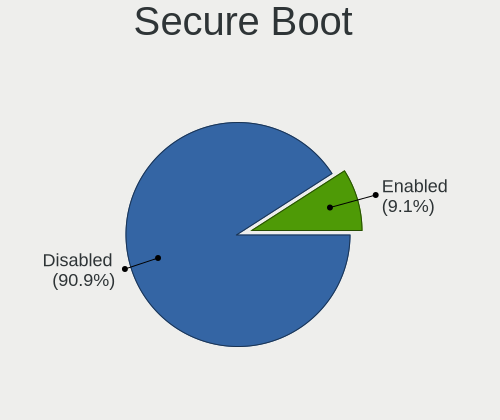
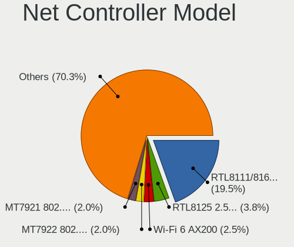

Fedora - Hardware Trends
------------------------

A project to identify most popular hardware characteristics and track their change
over time based on data collected by Linux users at https://Linux-Hardware.org.

Anyone can contribute to this report by the [hw-probe](https://github.com/linuxhw/hw-probe) tool:

    sudo -E hw-probe -all -upload

This is a report for all computer types. See also reports for [desktops](/Dist/Fedora/Desktop/README.md) and [notebooks](/Dist/Fedora/Notebook/README.md).

This report is for one last month. Overall report since the beginning of time: [TestDays](https://github.com/linuxhw/TestDays)

Period: Nov, 2023.

Contents
--------

* [ System ](#system)
  - [ OS                       ](#os)
  - [ OS Family                ](#os-family)
  - [ Kernel                   ](#kernel)
  - [ Kernel Family            ](#kernel-family)
  - [ Kernel Major Ver.        ](#kernel-major-ver)
  - [ Arch                     ](#arch)
  - [ DE                       ](#de)
  - [ Display Server           ](#display-server)
  - [ Display Manager          ](#display-manager)
  - [ OS Lang                  ](#os-lang)
  - [ Boot Mode                ](#boot-mode)
  - [ Filesystem               ](#filesystem)
  - [ Part. scheme             ](#part-scheme)
  - [ Dual Boot with Linux/BSD ](#dual-boot-with-linuxbsd)
  - [ Dual Boot (Win)          ](#dual-boot-win)

* [ Board ](#board)
  - [ Vendor                   ](#vendor)
  - [ Model                    ](#model)
  - [ Model Family             ](#model-family)
  - [ MFG Year                 ](#mfg-year)
  - [ Form Factor              ](#form-factor)
  - [ Secure Boot              ](#secure-boot)
  - [ Coreboot                 ](#coreboot)
  - [ RAM Size                 ](#ram-size)
  - [ RAM Used                 ](#ram-used)
  - [ Total Drives             ](#total-drives)
  - [ Has CD-ROM               ](#has-cd-rom)
  - [ Has Ethernet             ](#has-ethernet)
  - [ Has WiFi                 ](#has-wifi)
  - [ Has Bluetooth            ](#has-bluetooth)

* [ Location ](#location)
  - [ Country                  ](#country)
  - [ City                     ](#city)

* [ Drives ](#drives)
  - [ Drive Vendor             ](#drive-vendor)
  - [ Drive Model              ](#drive-model)
  - [ HDD Vendor               ](#hdd-vendor)
  - [ SSD Vendor               ](#ssd-vendor)
  - [ Drive Kind               ](#drive-kind)
  - [ Drive Connector          ](#drive-connector)
  - [ Drive Size               ](#drive-size)
  - [ Space Total              ](#space-total)
  - [ Space Used               ](#space-used)
  - [ Malfunc. Drives          ](#malfunc-drives)
  - [ Malfunc. Drive Vendor    ](#malfunc-drive-vendor)
  - [ Malfunc. HDD Vendor      ](#malfunc-hdd-vendor)
  - [ Malfunc. Drive Kind      ](#malfunc-drive-kind)
  - [ Failed Drives            ](#failed-drives)
  - [ Failed Drive Vendor      ](#failed-drive-vendor)
  - [ Drive Status             ](#drive-status)

* [ Storage controller ](#storage-controller)
  - [ Storage Vendor           ](#storage-vendor)
  - [ Storage Model            ](#storage-model)
  - [ Storage Kind             ](#storage-kind)

* [ Processor ](#processor)
  - [ CPU Vendor               ](#cpu-vendor)
  - [ CPU Model                ](#cpu-model)
  - [ CPU Model Family         ](#cpu-model-family)
  - [ CPU Cores                ](#cpu-cores)
  - [ CPU Sockets              ](#cpu-sockets)
  - [ CPU Threads              ](#cpu-threads)
  - [ CPU Op-Modes             ](#cpu-op-modes)
  - [ CPU Microcode            ](#cpu-microcode)
  - [ CPU Microarch            ](#cpu-microarch)

* [ Graphics ](#graphics)
  - [ GPU Vendor               ](#gpu-vendor)
  - [ GPU Model                ](#gpu-model)
  - [ GPU Combo                ](#gpu-combo)
  - [ GPU Driver               ](#gpu-driver)
  - [ GPU Memory               ](#gpu-memory)

* [ Monitor ](#monitor)
  - [ Monitor Vendor           ](#monitor-vendor)
  - [ Monitor Model            ](#monitor-model)
  - [ Monitor Resolution       ](#monitor-resolution)
  - [ Monitor Diagonal         ](#monitor-diagonal)
  - [ Monitor Width            ](#monitor-width)
  - [ Aspect Ratio             ](#aspect-ratio)
  - [ Monitor Area             ](#monitor-area)
  - [ Pixel Density            ](#pixel-density)
  - [ Multiple Monitors        ](#multiple-monitors)

* [ Network ](#network)
  - [ Net Controller Vendor    ](#net-controller-vendor)
  - [ Net Controller Model     ](#net-controller-model)
  - [ Wireless Vendor          ](#wireless-vendor)
  - [ Wireless Model           ](#wireless-model)
  - [ Ethernet Vendor          ](#ethernet-vendor)
  - [ Ethernet Model           ](#ethernet-model)
  - [ Net Controller Kind      ](#net-controller-kind)
  - [ Used Controller          ](#used-controller)
  - [ NICs                     ](#nics)
  - [ IPv6                     ](#ipv6)

* [ Bluetooth ](#bluetooth)
  - [ Bluetooth Vendor         ](#bluetooth-vendor)
  - [ Bluetooth Model          ](#bluetooth-model)

* [ Sound ](#sound)
  - [ Sound Vendor             ](#sound-vendor)
  - [ Sound Model              ](#sound-model)

* [ Memory ](#memory)
  - [ Memory Vendor            ](#memory-vendor)
  - [ Memory Model             ](#memory-model)
  - [ Memory Kind              ](#memory-kind)
  - [ Memory Form Factor       ](#memory-form-factor)
  - [ Memory Size              ](#memory-size)
  - [ Memory Speed             ](#memory-speed)

* [ Printers & scanners ](#printers--scanners)
  - [ Printer Vendor           ](#printer-vendor)
  - [ Printer Model            ](#printer-model)
  - [ Scanner Vendor           ](#scanner-vendor)
  - [ Scanner Model            ](#scanner-model)

* [ Camera ](#camera)
  - [ Camera Vendor            ](#camera-vendor)
  - [ Camera Model             ](#camera-model)

* [ Security ](#security)
  - [ Fingerprint Vendor       ](#fingerprint-vendor)
  - [ Fingerprint Model        ](#fingerprint-model)
  - [ Chipcard Vendor          ](#chipcard-vendor)
  - [ Chipcard Model           ](#chipcard-model)

* [ Unsupported ](#unsupported)
  - [ Unsupported Devices      ](#unsupported-devices)
  - [ Unsupported Device Types ](#unsupported-device-types)

System
------

OS
--

Installed operating systems

| Name      | Computers | Percent |
|-----------|-----------|---------|
| Fedora 39 | 449       | 69.94%  |
| Fedora 38 | 172       | 26.79%  |
| Fedora 37 | 10        | 1.56%   |
| Fedora 35 | 3         | 0.47%   |
| Fedora 34 | 3         | 0.47%   |
| Fedora 40 | 2         | 0.31%   |
| Fedora 33 | 2         | 0.31%   |
| Fedora 36 | 1         | 0.16%   |

OS Family
---------

OS without a version

| Name   | Computers | Percent |
|--------|-----------|---------|
| Fedora | 642       | 100%    |

Kernel
------

Version of the Linux kernel

| Version                                                  | Computers | Percent |
|----------------------------------------------------------|-----------|---------|
| 6.5.11-300.fc39.x86_64                                   | 201       | 31.31%  |
| 6.5.12-300.fc39.x86_64                                   | 98        | 15.26%  |
| 6.5.8-200.fc38.x86_64                                    | 53        | 8.26%   |
| 6.5.6-300.fc39.x86_64                                    | 52        | 8.1%    |
| 6.5.10-300.fc39.x86_64                                   | 42        | 6.54%   |
| 6.5.9-200.fc38.x86_64                                    | 41        | 6.39%   |
| 6.5.10-200.fc38.x86_64                                   | 38        | 5.92%   |
| 6.6.2-201.fc39.x86_64                                    | 17        | 2.65%   |
| 6.5.9-300.fc39.x86_64                                    | 17        | 2.65%   |
| 6.2.9-300.fc38.x86_64                                    | 14        | 2.18%   |
| 6.5.7-200.fc38.x86_64                                    | 9         | 1.4%    |
| 6.5.12-200.fc38.x86_64                                   | 7         | 1.09%   |
| 6.6.1-300.fc39.x86_64                                    | 4         | 0.62%   |
| 6.6.2-101.fc38.x86_64                                    | 3         | 0.47%   |
| 6.5.10-100.fc37.x86_64                                   | 3         | 0.47%   |
| 5.17.12-100.fc34.x86_64                                  | 3         | 0.47%   |
| 6.6.0-61.fc40.x86_64                                     | 2         | 0.31%   |
| 6.5.6-200.fc38.x86_64                                    | 2         | 0.31%   |
| 6.5.5-200.fc38.x86_64                                    | 2         | 0.31%   |
| 6.5.2-301.fc39.x86_64                                    | 2         | 0.31%   |
| 6.2.15-200.fc37.x86_64                                   | 2         | 0.31%   |
| 6.0.12-100.fc35.x86_64                                   | 2         | 0.31%   |
| 6.7.0-0.rc2.321.vanilla.fc39.x86_64                      | 1         | 0.16%   |
| 6.7.0-0.rc1.315.vanilla.fc39.x86_64                      | 1         | 0.16%   |
| 6.7.0-0.rc1.20231117git7475e51b8796.19.fc39.x86_64       | 1         | 0.16%   |
| 6.7.0-0.rc1.20231114gt9bacdd89.316.vanilla.fc39.x86_64   | 1         | 0.16%   |
| 6.7.0-0.rc0.20231110git89cdf9d55601.13.fc40.x86_64+debug | 1         | 0.16%   |
| 6.6.1-350.vanilla.fc39.x86_64                            | 1         | 0.16%   |
| 6.6.0-cbrt1.0.fc39.x86_64                                | 1         | 0.16%   |
| 6.6.0-cb2.0.fc39.x86_64                                  | 1         | 0.16%   |
| 6.6.0-0.rc4.20231005git3006adf3be79.36.fc38.loongarch64  | 1         | 0.16%   |
| 6.5.9-100.fc37.x86_64                                    | 1         | 0.16%   |
| 6.5.7-300.fc39.x86_64                                    | 1         | 0.16%   |
| 6.5.7-100.fc37.x86_64                                    | 1         | 0.16%   |
| 6.5.6-100.fc37.x86_64                                    | 1         | 0.16%   |
| 6.5.12-100.fc37.x86_64                                   | 1         | 0.16%   |
| 6.5.11-300.fc39.aarch64                                  | 1         | 0.16%   |
| 6.5.11-200.fc38.x86_64                                   | 1         | 0.16%   |
| 6.5.10-xm1.0e20231102.fc39.x86_64                        | 1         | 0.16%   |
| 6.5.10-350.vanilla.fc39.x86_64                           | 1         | 0.16%   |

Kernel Family
-------------

Linux kernel without a distro release

| Version | Computers | Percent |
|---------|-----------|---------|
| 6.5.11  | 203       | 31.62%  |
| 6.5.12  | 106       | 16.51%  |
| 6.5.10  | 85        | 13.24%  |
| 6.5.9   | 59        | 9.19%   |
| 6.5.6   | 55        | 8.57%   |
| 6.5.8   | 53        | 8.26%   |
| 6.6.2   | 20        | 3.12%   |
| 6.2.9   | 14        | 2.18%   |
| 6.5.7   | 11        | 1.71%   |
| 6.7.0   | 5         | 0.78%   |
| 6.6.1   | 5         | 0.78%   |
| 6.6.0   | 5         | 0.78%   |
| 6.2.15  | 4         | 0.62%   |
| 5.17.12 | 3         | 0.47%   |
| 6.5.5   | 2         | 0.31%   |
| 6.5.2   | 2         | 0.31%   |
| 6.4.15  | 2         | 0.31%   |
| 6.0.12  | 2         | 0.31%   |
| 6.5.0   | 1         | 0.16%   |
| 6.4.4   | 1         | 0.16%   |
| 6.4.14  | 1         | 0.16%   |
| 5.8.15  | 1         | 0.16%   |
| 5.14.18 | 1         | 0.16%   |
| 5.14.10 | 1         | 0.16%   |

Kernel Major Ver.
-----------------

Linux kernel major version

| Version | Computers | Percent |
|---------|-----------|---------|
| 6.5     | 577       | 89.88%  |
| 6.6     | 30        | 4.67%   |
| 6.2     | 18        | 2.8%    |
| 6.7     | 5         | 0.78%   |
| 6.4     | 4         | 0.62%   |
| 5.17    | 3         | 0.47%   |
| 6.0     | 2         | 0.31%   |
| 5.14    | 2         | 0.31%   |
| 5.8     | 1         | 0.16%   |

Arch
----

OS architecture (x86_64, i586, etc.)

| Name        | Computers | Percent |
|-------------|-----------|---------|
| x86_64      | 640       | 99.69%  |
| loongarch64 | 1         | 0.16%   |
| aarch64     | 1         | 0.16%   |

DE
--

Desktop Environment

| Name          | Computers | Percent |
|---------------|-----------|---------|
| GNOME         | 492       | 76.64%  |
| KDE5          | 87        | 13.55%  |
| Cinnamon      | 17        | 2.65%   |
| MATE          | 12        | 1.87%   |
| Budgie        | 7         | 1.09%   |
| Unknown       | 7         | 1.09%   |
| X-Cinnamon    | 6         | 0.93%   |
| XFCE          | 4         | 0.62%   |
| LXQt          | 3         | 0.47%   |
| GNOME Classic | 2         | 0.31%   |
| sway          | 1         | 0.16%   |
| KDE           | 1         | 0.16%   |
| i3            | 1         | 0.16%   |
| Hyprland      | 1         | 0.16%   |
| e16-session   | 1         | 0.16%   |

Display Server
--------------

X11 or Wayland

| Name    | Computers | Percent |
|---------|-----------|---------|
| Wayland | 494       | 76.95%  |
| X11     | 123       | 19.16%  |
| Tty     | 21        | 3.27%   |
| Unknown | 4         | 0.62%   |

Display Manager
---------------

SDDM, LightDM, etc.

| Name    | Computers | Percent |
|---------|-----------|---------|
| Unknown | 403       | 62.77%  |
| GDM     | 150       | 23.36%  |
| SDDM    | 47        | 7.32%   |
| LightDM | 41        | 6.39%   |
| KDM     | 1         | 0.16%   |

OS Lang
-------

Language

| Lang    | Computers | Percent |
|---------|-----------|---------|
| en_US   | 293       | 45.64%  |
| en_GB   | 50        | 7.79%   |
| ru_RU   | 35        | 5.45%   |
| de_DE   | 31        | 4.83%   |
| en_AU   | 30        | 4.67%   |
| pt_BR   | 28        | 4.36%   |
| it_IT   | 27        | 4.21%   |
| en_CA   | 19        | 2.96%   |
| fr_FR   | 17        | 2.65%   |
| es_ES   | 15        | 2.34%   |
| pl_PL   | 11        | 1.71%   |
| zh_CN   | 7         | 1.09%   |
| en_IN   | 6         | 0.93%   |
| tr_TR   | 5         | 0.78%   |
| pt_PT   | 5         | 0.78%   |
| hu_HU   | 5         | 0.78%   |
| es_MX   | 5         | 0.78%   |
| es_CL   | 5         | 0.78%   |
| fr_CH   | 3         | 0.47%   |
| en_IE   | 3         | 0.47%   |
| cs_CZ   | 3         | 0.47%   |
| fr_BE   | 2         | 0.31%   |
| es_UY   | 2         | 0.31%   |
| es_PE   | 2         | 0.31%   |
| es_CR   | 2         | 0.31%   |
| en_SG   | 2         | 0.31%   |
| en_NZ   | 2         | 0.31%   |
| en_DK   | 2         | 0.31%   |
| en_BW   | 2         | 0.31%   |
| de_AT   | 2         | 0.31%   |
| da_DK   | 2         | 0.31%   |
| Unknown | 2         | 0.31%   |
| zh_TW   | 1         | 0.16%   |
| zh_HK   | 1         | 0.16%   |
| sv_SE   | 1         | 0.16%   |
| sr_RS   | 1         | 0.16%   |
| sk_SK   | 1         | 0.16%   |
| nl_NL   | 1         | 0.16%   |
| nl_BE   | 1         | 0.16%   |
| nb_NO   | 1         | 0.16%   |

Boot Mode
---------

EFI or BIOS

| Mode | Computers | Percent |
|------|-----------|---------|
| EFI  | 519       | 80.84%  |
| BIOS | 123       | 19.16%  |

Filesystem
----------

Type of filesystem

| Type  | Computers | Percent |
|-------|-----------|---------|
| Btrfs | 528       | 82.24%  |
| Ext4  | 92        | 14.33%  |
| Xfs   | 20        | 3.12%   |
| Ext3  | 2         | 0.31%   |

Part. scheme
------------

Scheme of partitioning

| Type    | Computers | Percent |
|---------|-----------|---------|
| Unknown | 398       | 61.99%  |
| GPT     | 227       | 35.36%  |
| MBR     | 17        | 2.65%   |

Dual Boot with Linux/BSD
------------------------

Hosting more than one Linux/BSD

| Dual boot | Computers | Percent |
|-----------|-----------|---------|
| No        | 588       | 91.59%  |
| Yes       | 54        | 8.41%   |

Dual Boot (Win)
---------------

Hosting Linux and Windows

| Dual boot | Computers | Percent |
|-----------|-----------|---------|
| No        | 539       | 83.96%  |
| Yes       | 103       | 16.04%  |

Board
-----

Vendor
------

Motherboard manufacturer

| Name                           | Computers | Percent |
|--------------------------------|-----------|---------|
| Lenovo                         | 125       | 19.47%  |
| ASUSTek Computer               | 110       | 17.13%  |
| Hewlett-Packard                | 84        | 13.08%  |
| Dell                           | 70        | 10.9%   |
| MSI                            | 49        | 7.63%   |
| Apple                          | 33        | 5.14%   |
| Gigabyte Technology            | 32        | 4.98%   |
| Acer                           | 28        | 4.36%   |
| ASRock                         | 17        | 2.65%   |
| HUAWEI                         | 11        | 1.71%   |
| Samsung Electronics            | 8         | 1.25%   |
| Timi                           | 5         | 0.78%   |
| Unknown                        | 5         | 0.78%   |
| Toshiba                        | 4         | 0.62%   |
| Intel                          | 4         | 0.62%   |
| Google                         | 4         | 0.62%   |
| Alienware                      | 4         | 0.62%   |
| Sony                           | 3         | 0.47%   |
| Pegatron                       | 3         | 0.47%   |
| Notebook                       | 3         | 0.47%   |
| Fujitsu                        | 3         | 0.47%   |
| eMachines                      | 3         | 0.47%   |
| XIAOMI                         | 2         | 0.31%   |
| Microsoft                      | 2         | 0.31%   |
| Medion                         | 2         | 0.31%   |
| Irbis                          | 2         | 0.31%   |
| Framework                      | 2         | 0.31%   |
| AZW                            | 2         | 0.31%   |
| Valve                          | 1         | 0.16%   |
| Trigkey                        | 1         | 0.16%   |
| Teclast                        | 1         | 0.16%   |
| SLIMBOOK                       | 1         | 0.16%   |
| Semp Toshiba                   | 1         | 0.16%   |
| Schenker                       | 1         | 0.16%   |
| raspberrypi,4-model-b          | 1         | 0.16%   |
| POV                            | 1         | 0.16%   |
| Positivo                       | 1         | 0.16%   |
| Mini PC                        | 1         | 0.16%   |
| Matsushita Electric Industrial | 1         | 0.16%   |
| Loongson                       | 1         | 0.16%   |

Model
-----

Motherboard model

| Name                                        | Computers | Percent |
|---------------------------------------------|-----------|---------|
| Unknown                                     | 6         | 0.93%   |
| MSI MS-7C91                                 | 4         | 0.62%   |
| Timi A35S                                   | 3         | 0.47%   |
| MSI MS-7B89                                 | 3         | 0.47%   |
| Lenovo ThinkPad X1 Carbon Gen 10 21CBCTO1WW | 3         | 0.47%   |
| ASUS All Series                             | 3         | 0.47%   |
| Acer Aspire A515-57                         | 3         | 0.47%   |
| XIAOMI Redmi Book Pro 15 2023               | 2         | 0.31%   |
| Samsung 550P5C/550P7C                       | 2         | 0.31%   |
| MSI MS-7D73                                 | 2         | 0.31%   |
| MSI MS-7C84                                 | 2         | 0.31%   |
| MSI MS-7C52                                 | 2         | 0.31%   |
| MSI MS-7C37                                 | 2         | 0.31%   |
| MSI MS-7641                                 | 2         | 0.31%   |
| Lenovo LOQ 15IRH8 82XV                      | 2         | 0.31%   |
| Lenovo IdeaPadFlex 5 14ABR8 82XX            | 2         | 0.31%   |
| Lenovo G510 20238                           | 2         | 0.31%   |
| Irbis NB211                                 | 2         | 0.31%   |
| HUAWEI HVY-WXX9                             | 2         | 0.31%   |
| HUAWEI BOD-WXX9                             | 2         | 0.31%   |
| HP Pavilion Notebook                        | 2         | 0.31%   |
| HP Laptop 15-dy2xxx                         | 2         | 0.31%   |
| HP ENVY x360 Convertible 15-ee0xxx          | 2         | 0.31%   |
| HP ENVY x360 2-in-1 Laptop 13-bf0xxx        | 2         | 0.31%   |
| HP EliteDesk 800 G3 DM 35W                  | 2         | 0.31%   |
| HP EliteBook 850 G8 Notebook PC             | 2         | 0.31%   |
| HP EliteBook 840 G4                         | 2         | 0.31%   |
| HP EliteBook 840 G2                         | 2         | 0.31%   |
| Gigabyte J1900M-D2P                         | 2         | 0.31%   |
| Gigabyte B550M S2H                          | 2         | 0.31%   |
| Gigabyte B550 AORUS PRO AC                  | 2         | 0.31%   |
| Framework Laptop 13 (AMD Ryzen 7040Series)  | 2         | 0.31%   |
| Dell Precision M3800                        | 2         | 0.31%   |
| Dell OptiPlex 990                           | 2         | 0.31%   |
| ASUS Zenbook UM3402YA_UM3402YA              | 2         | 0.31%   |
| ASUS TUF Gaming X570-PRO                    | 2         | 0.31%   |
| ASUS ROG STRIX B550-F GAMING                | 2         | 0.31%   |
| ASUS P7P55D PRO                             | 2         | 0.31%   |
| Apple MacPro5,1                             | 2         | 0.31%   |
| Apple Macmini6,1                            | 2         | 0.31%   |

Model Family
------------

Motherboard model prefix

| Name               | Computers | Percent |
|--------------------|-----------|---------|
| Lenovo ThinkPad    | 64        | 9.97%   |
| Dell Inspiron      | 22        | 3.43%   |
| ASUS ROG           | 22        | 3.43%   |
| Lenovo IdeaPad     | 21        | 3.27%   |
| Dell Latitude      | 17        | 2.65%   |
| Acer Aspire        | 17        | 2.65%   |
| ASUS VivoBook      | 16        | 2.49%   |
| HP Laptop          | 13        | 2.02%   |
| HP EliteBook       | 12        | 1.87%   |
| ASUS TUF           | 12        | 1.87%   |
| ASUS PRIME         | 11        | 1.71%   |
| HP Pavilion        | 10        | 1.56%   |
| HP ENVY            | 10        | 1.56%   |
| Dell XPS           | 10        | 1.56%   |
| ASUS ASUS          | 10        | 1.56%   |
| HP ProBook         | 9         | 1.4%    |
| Lenovo Legion      | 8         | 1.25%   |
| Lenovo IdeaPadFlex | 6         | 0.93%   |
| Dell Precision     | 6         | 0.93%   |
| ASUS Zenbook       | 6         | 0.93%   |
| Unknown            | 6         | 0.93%   |
| Lenovo Yoga        | 5         | 0.78%   |
| HP Compaq          | 5         | 0.78%   |
| Gigabyte B550M     | 5         | 0.78%   |
| Dell Vostro        | 5         | 0.78%   |
| Apple MacBookPro11 | 5         | 0.78%   |
| Toshiba Satellite  | 4         | 0.62%   |
| MSI MS-7C91        | 4         | 0.62%   |
| Gigabyte B550      | 4         | 0.62%   |
| Dell OptiPlex      | 4         | 0.62%   |
| Acer Nitro         | 4         | 0.62%   |
| Timi A35S          | 3         | 0.47%   |
| MSI MS-7B89        | 3         | 0.47%   |
| Lenovo ThinkCentre | 3         | 0.47%   |
| HP ZBook           | 3         | 0.47%   |
| HP OMEN            | 3         | 0.47%   |
| HP EliteDesk       | 3         | 0.47%   |
| HP 250             | 3         | 0.47%   |
| ASUS All           | 3         | 0.47%   |
| ASRock B450        | 3         | 0.47%   |

MFG Year
--------

Motherboard manufacture year

| Year    | Computers | Percent |
|---------|-----------|---------|
| 2020    | 85        | 13.24%  |
| 2021    | 75        | 11.68%  |
| 2022    | 72        | 11.21%  |
| 2023    | 59        | 9.19%   |
| 2019    | 51        | 7.94%   |
| 2018    | 50        | 7.79%   |
| 2017    | 39        | 6.07%   |
| 2012    | 32        | 4.98%   |
| 2014    | 29        | 4.52%   |
| 2015    | 28        | 4.36%   |
| 2013    | 25        | 3.89%   |
| 2011    | 24        | 3.74%   |
| 2016    | 21        | 3.27%   |
| 2009    | 17        | 2.65%   |
| 2010    | 13        | 2.02%   |
| 2008    | 11        | 1.71%   |
| 2007    | 9         | 1.4%    |
| 2006    | 1         | 0.16%   |
| Unknown | 1         | 0.16%   |

Form Factor
-----------

Physical design of the computer

| Name           | Computers | Percent |
|----------------|-----------|---------|
| Notebook       | 391       | 60.9%   |
| Desktop        | 183       | 28.5%   |
| Convertible    | 37        | 5.76%   |
| Mini pc        | 12        | 1.87%   |
| Tablet         | 8         | 1.25%   |
| All in one     | 8         | 1.25%   |
| Server         | 2         | 0.31%   |
| System on chip | 1         | 0.16%   |

Secure Boot
-----------

Enabled or disabled

| State    | Computers | Percent |
|----------|-----------|---------|
| Disabled | 498       | 77.57%  |
| Enabled  | 144       | 22.43%  |

Coreboot
--------

Have coreboot on board

| Used | Computers | Percent |
|------|-----------|---------|
| No   | 637       | 99.22%  |
| Yes  | 5         | 0.78%   |

RAM Size
--------

Total RAM memory

| Size in GB  | Computers | Percent |
|-------------|-----------|---------|
| 4.01-8.0    | 154       | 23.99%  |
| 16.01-24.0  | 147       | 22.9%   |
| 8.01-16.0   | 118       | 18.38%  |
| 32.01-64.0  | 105       | 16.36%  |
| 3.01-4.0    | 45        | 7.01%   |
| 64.01-256.0 | 35        | 5.45%   |
| 24.01-32.0  | 27        | 4.21%   |
| 2.01-3.0    | 6         | 0.93%   |
| 1.01-2.0    | 5         | 0.78%   |

RAM Used
--------

Used RAM memory

| Used GB     | Computers | Percent |
|-------------|-----------|---------|
| 4.01-8.0    | 190       | 29.6%   |
| 3.01-4.0    | 161       | 25.08%  |
| 2.01-3.0    | 156       | 24.3%   |
| 1.01-2.0    | 63        | 9.81%   |
| 8.01-16.0   | 56        | 8.72%   |
| 0.51-1.0    | 8         | 1.25%   |
| 16.01-24.0  | 6         | 0.93%   |
| 32.01-64.0  | 1         | 0.16%   |
| 64.01-256.0 | 1         | 0.16%   |

Total Drives
------------

Number of drives on board

| Drives | Computers | Percent |
|--------|-----------|---------|
| 1      | 408       | 63.55%  |
| 2      | 159       | 24.77%  |
| 3      | 32        | 4.98%   |
| 4      | 24        | 3.74%   |
| 5      | 10        | 1.56%   |
| 8      | 5         | 0.78%   |
| 6      | 3         | 0.47%   |
| 7      | 1         | 0.16%   |

Has CD-ROM
----------

Has CD-ROM on board

| Presented | Computers | Percent |
|-----------|-----------|---------|
| No        | 506       | 78.82%  |
| Yes       | 136       | 21.18%  |

Has Ethernet
------------

Has Ethernet on board

| Presented | Computers | Percent |
|-----------|-----------|---------|
| Yes       | 488       | 76.01%  |
| No        | 154       | 23.99%  |

Has WiFi
--------

Has WiFi module

| Presented | Computers | Percent |
|-----------|-----------|---------|
| Yes       | 546       | 85.05%  |
| No        | 96        | 14.95%  |

Has Bluetooth
-------------

Has Bluetooth module

| Presented | Computers | Percent |
|-----------|-----------|---------|
| Yes       | 478       | 74.45%  |
| No        | 164       | 25.55%  |

Location
--------

Country
-------

Geographic location (country)

| Country     | Computers | Percent |
|-------------|-----------|---------|
| USA         | 105       | 16.36%  |
| Germany     | 44        | 6.85%   |
| Russia      | 41        | 6.39%   |
| Italy       | 36        | 5.61%   |
| Brazil      | 34        | 5.3%    |
| Australia   | 31        | 4.83%   |
| UK          | 28        | 4.36%   |
| Canada      | 27        | 4.21%   |
| France      | 21        | 3.27%   |
| Spain       | 19        | 2.96%   |
| Poland      | 19        | 2.96%   |
| India       | 13        | 2.02%   |
| Portugal    | 12        | 1.87%   |
| Netherlands | 12        | 1.87%   |
| Switzerland | 11        | 1.71%   |
| Mexico      | 11        | 1.71%   |
| Romania     | 10        | 1.56%   |
| Hungary     | 9         | 1.4%    |
| China       | 8         | 1.25%   |
| Belgium     | 8         | 1.25%   |
| Austria     | 8         | 1.25%   |
| Turkey      | 7         | 1.09%   |
| Sweden      | 7         | 1.09%   |
| Denmark     | 7         | 1.09%   |
| Chile       | 6         | 0.93%   |
| Taiwan      | 5         | 0.78%   |
| Slovakia    | 5         | 0.78%   |
| Finland     | 5         | 0.78%   |
| Czechia     | 5         | 0.78%   |
| Belarus     | 5         | 0.78%   |
| Argentina   | 5         | 0.78%   |
| Philippines | 4         | 0.62%   |
| Croatia     | 4         | 0.62%   |
| Uruguay     | 3         | 0.47%   |
| Singapore   | 3         | 0.47%   |
| Serbia      | 3         | 0.47%   |
| Peru        | 3         | 0.47%   |
| Norway      | 3         | 0.47%   |
| Georgia     | 3         | 0.47%   |
| Bulgaria    | 3         | 0.47%   |

City
----

Geographic location (city)

| City          | Computers | Percent |
|---------------|-----------|---------|
| Sydney        | 20        | 3.12%   |
| Moscow        | 10        | 1.56%   |
| Paris         | 8         | 1.25%   |
| Brisbane      | 7         | 1.09%   |
| Berlin        | 6         | 0.93%   |
| Yekaterinburg | 5         | 0.78%   |
| Warsaw        | 5         | 0.78%   |
| Toronto       | 5         | 0.78%   |
| Munich        | 4         | 0.62%   |
| Milan         | 4         | 0.62%   |
| Lewisham      | 4         | 0.62%   |
| Helsinki      | 4         | 0.62%   |
| Barcelona     | 4         | 0.62%   |
| Atlanta       | 4         | 0.62%   |
| Zurich        | 3         | 0.47%   |
| Zagreb        | 3         | 0.47%   |
| Vienna        | 3         | 0.47%   |
| St Petersburg | 3         | 0.47%   |
| Singapore     | 3         | 0.47%   |
| Sao Paulo     | 3         | 0.47%   |
| Santiago      | 3         | 0.47%   |
| Prague        | 3         | 0.47%   |
| Porto Alegre  | 3         | 0.47%   |
| Perm          | 3         | 0.47%   |
| Naaldwijk     | 3         | 0.47%   |
| Montevideo    | 3         | 0.47%   |
| Minsk         | 3         | 0.47%   |
| Milano        | 3         | 0.47%   |
| Miami         | 3         | 0.47%   |
| Mexico City   | 3         | 0.47%   |
| Hamburg       | 3         | 0.47%   |
| Delhi         | 3         | 0.47%   |
| Budapest      | 3         | 0.47%   |
| Boston        | 3         | 0.47%   |
| Ashburn       | 3         | 0.47%   |
| Ankara        | 3         | 0.47%   |
| Amsterdam     | 3         | 0.47%   |
| Xiaolou       | 2         | 0.31%   |
| Winnipeg      | 2         | 0.31%   |
| Timișoara    | 2         | 0.31%   |

Drives
------

Drive Vendor
------------

Hard drive vendors

| Vendor                       | Computers | Drives | Percent |
|------------------------------|-----------|--------|---------|
| Samsung Electronics          | 182       | 222    | 20.13%  |
| WDC                          | 90        | 112    | 9.96%   |
| Seagate                      | 83        | 110    | 9.18%   |
| SanDisk                      | 73        | 77     | 8.08%   |
| Intel                        | 40        | 44     | 4.42%   |
| Kingston                     | 39        | 43     | 4.31%   |
| Micron Technology            | 38        | 38     | 4.2%    |
| Toshiba                      | 36        | 37     | 3.98%   |
| Crucial                      | 36        | 39     | 3.98%   |
| SK hynix                     | 35        | 36     | 3.87%   |
| Unknown                      | 32        | 39     | 3.54%   |
| KIOXIA                       | 18        | 18     | 1.99%   |
| Micron/Crucial Technology    | 17        | 18     | 1.88%   |
| Apple                        | 16        | 18     | 1.77%   |
| Phison Electronics           | 14        | 14     | 1.55%   |
| Hitachi                      | 12        | 15     | 1.33%   |
| Silicon Motion               | 11        | 11     | 1.22%   |
| HGST                         | 10        | 11     | 1.11%   |
| Kingston Technology Company  | 9         | 9      | 1%      |
| ADATA Technology             | 9         | 11     | 1%      |
| PNY                          | 7         | 7      | 0.77%   |
| A-DATA Technology            | 7         | 7      | 0.77%   |
| China                        | 5         | 5      | 0.55%   |
| SPCC                         | 4         | 4      | 0.44%   |
| MAXIO Technology (Hangzhou)  | 4         | 4      | 0.44%   |
| Fanxiang                     | 4         | 6      | 0.44%   |
| Shenzhen Longsys Electronics | 3         | 3      | 0.33%   |
| Patriot                      | 3         | 3      | 0.33%   |
| Lexar                        | 3         | 3      | 0.33%   |
| Lenovo                       | 3         | 3      | 0.33%   |
| HS-SSD-E100                  | 3         | 3      | 0.33%   |
| GOODRAM                      | 3         | 3      | 0.33%   |
| Emtec                        | 3         | 3      | 0.33%   |
| Unknown                      | 3         | 3      | 0.33%   |
| Yangtze Memory Technologies  | 2         | 2      | 0.22%   |
| Union Memory                 | 2         | 2      | 0.22%   |
| Transcend                    | 2         | 2      | 0.22%   |
| Solid State Storage          | 2         | 2      | 0.22%   |
| LaCie                        | 2         | 2      | 0.22%   |
| KingSpec                     | 2         | 2      | 0.22%   |

Drive Model
-----------

Hard drive models

| Model                                                 | Computers | Percent |
|-------------------------------------------------------|-----------|---------|
| Samsung NVMe SSD Controller SM981/PM981/PM983 250GB   | 48        | 4.81%   |
| Samsung NVMe SSD Controller PM9A1/PM9A3/980PRO 2TB    | 36        | 3.61%   |
| Micron/Crucial P2 NVMe PCIe SSD 1TB                   | 14        | 1.4%    |
| Sandisk WD Blue SN550 NVMe SSD 512GB                  | 11        | 1.1%    |
| Intel SSDPEKNU512GZ 512GB                             | 11        | 1.1%    |
| Crucial CT500MX500SSD1 500GB                          | 11        | 1.1%    |
| Kingston SA400S37480G 480GB SSD                       | 10        | 1%      |
| Unknown MMC Card  32GB                                | 9         | 0.9%    |
| Samsung NVMe SSD Controller SM961/PM961/SM963 256GB   | 9         | 0.9%    |
| Intel SSD 660P Series 512GB                           | 9         | 0.9%    |
| Unknown MMC Card  64GB                                | 8         | 0.8%    |
| Samsung SSD 850 EVO 250GB                             | 8         | 0.8%    |
| Unknown MMC Card  128GB                               | 7         | 0.7%    |
| Sandisk WD_BLACK SN770 1TB                            | 7         | 0.7%    |
| Kingston SA400S37240G 240GB SSD                       | 7         | 0.7%    |
| Toshiba XG6 NVMe SSD Controller 512GB                 | 6         | 0.6%    |
| Silicon Motion SM2263EN/SM2263XT SSD Controller 256GB | 6         | 0.6%    |
| Seagate ST2000DM008-2FR102 2TB                        | 6         | 0.6%    |
| Toshiba DT01ACA100 1TB                                | 5         | 0.5%    |
| SK hynix BC501 NVMe Solid State Drive 512GB           | 5         | 0.5%    |
| Seagate ST500DM002-1BD142 500GB                       | 5         | 0.5%    |
| Seagate ST4000DM004-2CV104 4TB                        | 5         | 0.5%    |
| Sandisk WD Blue SN570 1TB                             | 5         | 0.5%    |
| Samsung SSD 980 1TB                                   | 5         | 0.5%    |
| Samsung SSD 870 EVO 500GB                             | 5         | 0.5%    |
| Samsung SSD 860 EVO 500GB                             | 5         | 0.5%    |
| Phison PS5013 E13 NVMe Controller 512GB               | 5         | 0.5%    |
| Micron 2210_MTFDHBA512QFD 512GB                       | 5         | 0.5%    |
| Intel SSD Pro 7600p/760p/E 6100p Series 1TB           | 5         | 0.5%    |
| HGST HTS721010A9E630 1TB                              | 5         | 0.5%    |
| Crucial CT240BX500SSD1 240GB                          | 5         | 0.5%    |
| WDC WDS100T2B0A-00SM50 1TB SSD                        | 4         | 0.4%    |
| WDC WD10EZEX-08WN4A0 1TB                              | 4         | 0.4%    |
| Seagate ST2000DM006-2DM164 2TB                        | 4         | 0.4%    |
| Seagate ST2000DM001-1ER164 2TB                        | 4         | 0.4%    |
| Seagate ST1000LM035-1RK172 1TB                        | 4         | 0.4%    |
| Samsung SSD 860 EVO 1TB                               | 4         | 0.4%    |
| Samsung SSD 850 EVO 500GB                             | 4         | 0.4%    |
| Samsung SSD 840 EVO 250GB                             | 4         | 0.4%    |
| Phison E12 NVMe Controller 512GB                      | 4         | 0.4%    |

HDD Vendor
----------

Hard disk drive vendors

| Vendor              | Computers | Drives | Percent |
|---------------------|-----------|--------|---------|
| Seagate             | 79        | 101    | 38.35%  |
| WDC                 | 72        | 88     | 34.95%  |
| Toshiba             | 21        | 22     | 10.19%  |
| Hitachi             | 12        | 15     | 5.83%   |
| HGST                | 10        | 11     | 4.85%   |
| Samsung Electronics | 5         | 7      | 2.43%   |
| USB3.0              | 1         | 1      | 0.49%   |
| USB                 | 1         | 1      | 0.49%   |
| Unknown             | 1         | 1      | 0.49%   |
| JMicron Technology  | 1         | 1      | 0.49%   |
| IB-377U3            | 1         | 1      | 0.49%   |
| HGST HTS            | 1         | 1      | 0.49%   |
| Apple               | 1         | 1      | 0.49%   |

SSD Vendor
----------

Solid state drive vendors

| Vendor              | Computers | Drives | Percent |
|---------------------|-----------|--------|---------|
| Samsung Electronics | 68        | 78     | 25.86%  |
| Crucial             | 36        | 39     | 13.69%  |
| Kingston            | 30        | 32     | 11.41%  |
| WDC                 | 23        | 23     | 8.75%   |
| SanDisk             | 20        | 21     | 7.6%    |
| Apple               | 9         | 9      | 3.42%   |
| PNY                 | 7         | 7      | 2.66%   |
| A-DATA Technology   | 6         | 6      | 2.28%   |
| SK hynix            | 5         | 5      | 1.9%    |
| Intel               | 5         | 5      | 1.9%    |
| China               | 5         | 5      | 1.9%    |
| SPCC                | 4         | 4      | 1.52%   |
| Patriot             | 3         | 3      | 1.14%   |
| Lexar               | 3         | 3      | 1.14%   |
| GOODRAM             | 3         | 3      | 1.14%   |
| Emtec               | 3         | 3      | 1.14%   |
| Transcend           | 2         | 2      | 0.76%   |
| Toshiba             | 2         | 2      | 0.76%   |
| Micron Technology   | 2         | 2      | 0.76%   |
| Lenovo              | 2         | 2      | 0.76%   |
| KingSpec            | 2         | 2      | 0.76%   |
| FORESEE             | 2         | 2      | 0.76%   |
| Fanxiang            | 2         | 3      | 0.76%   |
| Apacer              | 2         | 2      | 0.76%   |
| WDC WDS1            | 1         | 1      | 0.38%   |
| Timetec             | 1         | 1      | 0.38%   |
| Teclast             | 1         | 1      | 0.38%   |
| Team                | 1         | 1      | 0.38%   |
| Smartbuy            | 1         | 1      | 0.38%   |
| Seagate             | 1         | 2      | 0.38%   |
| POWER               | 1         | 1      | 0.38%   |
| Plextor             | 1         | 1      | 0.38%   |
| OWC                 | 1         | 1      | 0.38%   |
| OCZ                 | 1         | 1      | 0.38%   |
| Mushkin             | 1         | 1      | 0.38%   |
| LITEON              | 1         | 1      | 0.38%   |
| LDLC                | 1         | 1      | 0.38%   |
| KUIJIA              | 1         | 1      | 0.38%   |
| KingDian            | 1         | 1      | 0.38%   |
| Intenso             | 1         | 1      | 0.38%   |

Drive Kind
----------

HDD or SSD

| Kind    | Computers | Drives | Percent |
|---------|-----------|--------|---------|
| NVMe    | 383       | 447    | 45.54%  |
| SSD     | 228       | 281    | 27.11%  |
| HDD     | 184       | 251    | 21.88%  |
| MMC     | 27        | 34     | 3.21%   |
| Unknown | 19        | 19     | 2.26%   |

Drive Connector
---------------

SATA, SAS, NVMe, etc.

| Type | Computers | Drives | Percent |
|------|-----------|--------|---------|
| NVMe | 383       | 446    | 49.87%  |
| SATA | 324       | 513    | 42.19%  |
| SAS  | 34        | 39     | 4.43%   |
| MMC  | 27        | 34     | 3.52%   |

Drive Size
----------

Size of hard drive

| Size in TB | Computers | Drives | Percent |
|------------|-----------|--------|---------|
| 0.01-0.5   | 232       | 284    | 52.97%  |
| 0.51-1.0   | 129       | 151    | 29.45%  |
| 1.01-2.0   | 40        | 49     | 9.13%   |
| 3.01-4.0   | 19        | 29     | 4.34%   |
| 4.01-10.0  | 12        | 13     | 2.74%   |
| 2.01-3.0   | 6         | 6      | 1.37%   |

Space Total
-----------

Amount of disk space available on the file system

| Size in GB     | Computers | Percent |
|----------------|-----------|---------|
| 501-1000       | 142       | 22.12%  |
| 251-500        | 115       | 17.91%  |
| 1001-2000      | 102       | 15.89%  |
| 101-250        | 67        | 10.44%  |
| Unknown        | 57        | 8.88%   |
| More than 3000 | 54        | 8.41%   |
| 1-20           | 46        | 7.17%   |
| 51-100         | 27        | 4.21%   |
| 2001-3000      | 23        | 3.58%   |
| 21-50          | 9         | 1.4%    |

Space Used
----------

Amount of used disk space

| Used GB        | Computers | Percent |
|----------------|-----------|---------|
| 1-20           | 192       | 29.91%  |
| 21-50          | 106       | 16.51%  |
| 101-250        | 75        | 11.68%  |
| 251-500        | 60        | 9.35%   |
| Unknown        | 57        | 8.88%   |
| 51-100         | 54        | 8.41%   |
| 501-1000       | 40        | 6.23%   |
| 1001-2000      | 35        | 5.45%   |
| More than 3000 | 17        | 2.65%   |
| 2001-3000      | 6         | 0.93%   |

Malfunc. Drives
---------------

Drive models with a malfunction

| Model                                 | Computers | Drives | Percent |
|---------------------------------------|-----------|--------|---------|
| Seagate ST1000DX001-1NS162 1TB        | 2         | 2      | 7.69%   |
| Intel SSDSC2CT120A3 120GB             | 2         | 2      | 7.69%   |
| WDC WD5000AVCS-632DY1 500GB           | 1         | 1      | 3.85%   |
| WDC WD30EFRX-68AX9N0 3TB              | 1         | 1      | 3.85%   |
| WDC WD1600AVVS-63L2B0 160GB           | 1         | 1      | 3.85%   |
| WDC WD Green 2.5 480GB                | 1         | 1      | 3.85%   |
| WDC WD Blue SA510 2.5 500GB           | 1         | 1      | 3.85%   |
| Toshiba MQ01ABF050 500GB              | 1         | 1      | 3.85%   |
| Toshiba DT01ACA100 1TB                | 1         | 1      | 3.85%   |
| SK hynix HFS256G39MND-2300A 256GB SSD | 1         | 1      | 3.85%   |
| SK hynix HFS128G39TND-N210A 128GB SSD | 1         | 1      | 3.85%   |
| Seagate ST500DM002-1BD142 500GB       | 1         | 1      | 3.85%   |
| Seagate ST4000DM004-2CV104 4TB        | 1         | 2      | 3.85%   |
| Seagate ST4000DM000-1F2168 4TB        | 1         | 1      | 3.85%   |
| Seagate ST3500320AS 500GB             | 1         | 1      | 3.85%   |
| Seagate ST3250410AS 250GB             | 1         | 1      | 3.85%   |
| SanDisk SSD PLUS 1000GB               | 1         | 1      | 3.85%   |
| Samsung Electronics SSD 840 EVO 250GB | 1         | 1      | 3.85%   |
| Samsung Electronics HD501LJ 500GB     | 1         | 2      | 3.85%   |
| Samsung Electronics HD103UJ 1TB       | 1         | 2      | 3.85%   |
| Hitachi HTS547575A9E384 752GB         | 1         | 1      | 3.85%   |
| Hitachi HTS545050B9A300 500GB         | 1         | 1      | 3.85%   |
| HGST HTS721010A9E630 1TB              | 1         | 1      | 3.85%   |
| Crucial CT128MX100SSD1 128GB          | 1         | 1      | 3.85%   |

Malfunc. Drive Vendor
---------------------

Vendors of faulty drives

| Vendor              | Computers | Drives | Percent |
|---------------------|-----------|--------|---------|
| WDC                 | 5         | 5      | 20.83%  |
| Seagate             | 5         | 8      | 20.83%  |
| Samsung Electronics | 3         | 5      | 12.5%   |
| Toshiba             | 2         | 2      | 8.33%   |
| SK hynix            | 2         | 2      | 8.33%   |
| Intel               | 2         | 2      | 8.33%   |
| Hitachi             | 2         | 2      | 8.33%   |
| SanDisk             | 1         | 1      | 4.17%   |
| HGST                | 1         | 1      | 4.17%   |
| Crucial             | 1         | 1      | 4.17%   |

Malfunc. HDD Vendor
-------------------

Vendors of faulty HDD drives

| Vendor              | Computers | Drives | Percent |
|---------------------|-----------|--------|---------|
| Seagate             | 5         | 8      | 33.33%  |
| WDC                 | 3         | 3      | 20%     |
| Toshiba             | 2         | 2      | 13.33%  |
| Samsung Electronics | 2         | 4      | 13.33%  |
| Hitachi             | 2         | 2      | 13.33%  |
| HGST                | 1         | 1      | 6.67%   |

Malfunc. Drive Kind
-------------------

Kinds of faulty drives

| Kind | Computers | Drives | Percent |
|------|-----------|--------|---------|
| HDD  | 15        | 20     | 62.5%   |
| SSD  | 9         | 9      | 37.5%   |

Failed Drives
-------------

Failed drive models

| Model                       | Computers | Drives | Percent |
|-----------------------------|-----------|--------|---------|
| Hitachi HDS721010DLE630 1TB | 1         | 2      | 100%    |

Failed Drive Vendor
-------------------

Failed drive vendors

| Vendor  | Computers | Drives | Percent |
|---------|-----------|--------|---------|
| Hitachi | 1         | 2      | 100%    |

Drive Status
------------

Number of failed and malfunc. drives

| Status   | Computers | Drives | Percent |
|----------|-----------|--------|---------|
| Detected | 435       | 650    | 63.78%  |
| Works    | 222       | 351    | 32.55%  |
| Malfunc  | 24        | 29     | 3.52%   |
| Failed   | 1         | 2      | 0.15%   |

Storage controller
------------------

Storage Vendor
--------------

Storage controller vendors

| Vendor                         | Computers | Percent |
|--------------------------------|-----------|---------|
| Intel                          | 314       | 35.48%  |
| AMD                            | 151       | 17.06%  |
| Samsung Electronics            | 131       | 14.8%   |
| SanDisk                        | 53        | 5.99%   |
| Micron Technology              | 36        | 4.07%   |
| SK hynix                       | 30        | 3.39%   |
| KIOXIA                         | 19        | 2.15%   |
| Kingston Technology Company    | 18        | 2.03%   |
| Micron/Crucial Technology      | 17        | 1.92%   |
| ASMedia Technology             | 16        | 1.81%   |
| Phison Electronics             | 15        | 1.69%   |
| Toshiba America Info Systems   | 14        | 1.58%   |
| Silicon Motion                 | 11        | 1.24%   |
| ADATA Technology               | 10        | 1.13%   |
| JMicron Technology             | 6         | 0.68%   |
| Apple                          | 6         | 0.68%   |
| Solidigm                       | 5         | 0.56%   |
| Nvidia                         | 4         | 0.45%   |
| MAXIO Technology (Hangzhou)    | 4         | 0.45%   |
| INNOGRIT                       | 4         | 0.45%   |
| Shenzhen Longsys Electronics   | 3         | 0.34%   |
| Yangtze Memory Technologies    | 2         | 0.23%   |
| Union Memory (Shenzhen)        | 2         | 0.23%   |
| Solid State Storage Technology | 2         | 0.23%   |
| Marvell Technology Group       | 2         | 0.23%   |
| Broadcom / LSI                 | 2         | 0.23%   |
| VIA Technologies               | 1         | 0.11%   |
| ULi Electronics                | 1         | 0.11%   |
| Silicon Image                  | 1         | 0.11%   |
| Seagate Technology             | 1         | 0.11%   |
| Realtek Semiconductor          | 1         | 0.11%   |
| Loongson Technology            | 1         | 0.11%   |
| Lenovo                         | 1         | 0.11%   |
| Biwin Storage Technology       | 1         | 0.11%   |

Storage Model
-------------

Storage controller models

| Model                                                                          | Computers | Percent |
|--------------------------------------------------------------------------------|-----------|---------|
| AMD FCH SATA Controller [AHCI mode]                                            | 94        | 9.53%   |
| Samsung NVMe SSD Controller SM981/PM981/PM983                                  | 47        | 4.77%   |
| Intel Volume Management Device NVMe RAID Controller                            | 37        | 3.75%   |
| Samsung NVMe SSD Controller PM9A1/PM9A3/980PRO                                 | 36        | 3.65%   |
| AMD 500 Series Chipset SATA Controller                                         | 29        | 2.94%   |
| Intel Sunrise Point-LP SATA Controller [AHCI mode]                             | 26        | 2.64%   |
| Samsung NVMe SSD Controller 980 (DRAM-less)                                    | 24        | 2.43%   |
| Intel 8 Series/C220 Series Chipset Family 6-port SATA Controller 1 [AHCI mode] | 21        | 2.13%   |
| Intel SSD 670p Series [Keystone Harbor]                                        | 18        | 1.83%   |
| Intel 7 Series Chipset Family 6-port SATA Controller [AHCI mode]               | 17        | 1.72%   |
| AMD 400 Series Chipset SATA Controller                                         | 15        | 1.52%   |
| Micron/Crucial P2 [Nick P2] / P3 / P3 Plus NVMe PCIe SSD (DRAM-less)           | 14        | 1.42%   |
| SanDisk WD Black SN770 / PC SN740 256GB / PC SN560 (DRAM-less) NVMe SSD        | 13        | 1.32%   |
| Intel Wildcat Point-LP SATA Controller [AHCI Mode]                             | 13        | 1.32%   |
| ASMedia ASM1062 Serial ATA Controller                                          | 13        | 1.32%   |
| SK hynix Gold P31/BC711/PC711 NVMe Solid State Drive                           | 12        | 1.22%   |
| Intel Tiger Lake-LP SATA Controller                                            | 12        | 1.22%   |
| Intel 6 Series/C200 Series Chipset Family 6 port Mobile SATA AHCI Controller   | 12        | 1.22%   |
| SanDisk Ultra 3D / WD Blue SN550 NVMe SSD                                      | 11        | 1.12%   |
| Intel 82801 Mobile SATA Controller [RAID mode]                                 | 11        | 1.12%   |
| AMD SB7x0/SB8x0/SB9x0 SATA Controller [AHCI mode]                              | 11        | 1.12%   |
| AMD SB7x0/SB8x0/SB9x0 IDE Controller                                           | 11        | 1.12%   |
| KIOXIA NVMe SSD Controller BG4 (DRAM-less)                                     | 10        | 1.01%   |
| Intel Alder Lake-P SATA AHCI Controller                                        | 10        | 1.01%   |
| Intel 82801HM/HEM (ICH8M/ICH8M-E) SATA Controller [AHCI mode]                  | 10        | 1.01%   |
| Intel 82801HM/HEM (ICH8M/ICH8M-E) IDE Controller                               | 10        | 1.01%   |
| Samsung NVMe SSD Controller SM961/PM961/SM963                                  | 9         | 0.91%   |
| Micron 3400 NVMe SSD [Hendrix]                                                 | 9         | 0.91%   |
| Micron 2400 NVMe SSD (DRAM-less)                                               | 9         | 0.91%   |
| Intel SSD 660P Series                                                          | 9         | 0.91%   |
| Samsung NVMe SSD Controller PM9B1 (DRAM-less)                                  | 8         | 0.81%   |
| Intel Q170/Q150/B150/H170/H110/Z170/CM236 Chipset SATA Controller [AHCI Mode]  | 8         | 0.81%   |
| Intel Comet Lake SATA AHCI Controller                                          | 8         | 0.81%   |
| Intel 5 Series/3400 Series Chipset 6 port SATA AHCI Controller                 | 8         | 0.81%   |
| SanDisk Ultra 3D / WD Blue SN570 NVMe SSD (DRAM-less)                          | 7         | 0.71%   |
| Micron 2210 NVMe SSD [Cobain]                                                  | 7         | 0.71%   |
| Intel Cannon Lake Mobile PCH SATA AHCI Controller                              | 7         | 0.71%   |
| Intel 7 Series/C210 Series Chipset Family 6-port SATA Controller [AHCI mode]   | 7         | 0.71%   |
| Toshiba America Info Systems XG6 NVMe SSD Controller                           | 6         | 0.61%   |
| SK hynix Platinum P41/PC801 NVMe Solid State Drive                             | 6         | 0.61%   |

Storage Kind
------------

Kind of storage controller (IDE, SATA, NVMe, SAS, ...)

| Kind | Computers | Percent |
|------|-----------|---------|
| SATA | 402       | 45.12%  |
| NVMe | 381       | 42.76%  |
| RAID | 58        | 6.51%   |
| IDE  | 47        | 5.27%   |
| SAS  | 2         | 0.22%   |
| SCSI | 1         | 0.11%   |

Processor
---------

CPU Vendor
----------

Processor vendors

| Vendor   | Computers | Percent |
|----------|-----------|---------|
| Intel    | 415       | 64.64%  |
| AMD      | 225       | 35.05%  |
| Loongson | 1         | 0.16%   |
| ARM      | 1         | 0.16%   |

CPU Model
---------

Processor models

| Model                                         | Computers | Percent |
|-----------------------------------------------|-----------|---------|
| Intel 11th Gen Core i5-1135G7 @ 2.40GHz       | 12        | 1.87%   |
| Intel 11th Gen Core i7-1165G7 @ 2.80GHz       | 11        | 1.71%   |
| AMD Ryzen 7 5700U with Radeon Graphics        | 9         | 1.4%    |
| AMD Ryzen 5 5500U with Radeon Graphics        | 9         | 1.4%    |
| Intel Core i7-7500U CPU @ 2.70GHz             | 8         | 1.25%   |
| AMD Ryzen 7 3700X 8-Core Processor            | 8         | 1.25%   |
| Intel Core i5-8250U CPU @ 1.60GHz             | 7         | 1.09%   |
| Intel Core i5-10210U CPU @ 1.60GHz            | 7         | 1.09%   |
| AMD Ryzen 7 5800H with Radeon Graphics        | 7         | 1.09%   |
| AMD Ryzen 5 3600 6-Core Processor             | 7         | 1.09%   |
| Intel Core i7-8650U CPU @ 1.90GHz             | 6         | 0.93%   |
| Intel Core i5-7200U CPU @ 2.50GHz             | 6         | 0.93%   |
| Intel Core i7-6500U CPU @ 2.50GHz             | 5         | 0.78%   |
| Intel Core i5-5200U CPU @ 2.20GHz             | 5         | 0.78%   |
| Intel 12th Gen Core i5-12450H                 | 5         | 0.78%   |
| Intel 11th Gen Core i3-1115G4 @ 3.00GHz       | 5         | 0.78%   |
| AMD Ryzen 7 4800H with Radeon Graphics        | 5         | 0.78%   |
| AMD Ryzen 5 5600X 6-Core Processor            | 5         | 0.78%   |
| Intel Core i7-8565U CPU @ 1.80GHz             | 4         | 0.62%   |
| Intel Core i7-8550U CPU @ 1.80GHz             | 4         | 0.62%   |
| Intel Core i7-3770 CPU @ 3.40GHz              | 4         | 0.62%   |
| Intel Core i5-3210M CPU @ 2.50GHz             | 4         | 0.62%   |
| Intel Core i3-8130U CPU @ 2.20GHz             | 4         | 0.62%   |
| Intel Celeron CPU N3350 @ 1.10GHz             | 4         | 0.62%   |
| Intel Atom x5-Z8350 CPU @ 1.44GHz             | 4         | 0.62%   |
| Intel 12th Gen Core i7-12700H                 | 4         | 0.62%   |
| Intel 12th Gen Core i7-1255U                  | 4         | 0.62%   |
| Intel 11th Gen Core i7-1185G7 @ 3.00GHz       | 4         | 0.62%   |
| AMD Ryzen 9 7950X 16-Core Processor           | 4         | 0.62%   |
| AMD Ryzen 7 5800X3D 8-Core Processor          | 4         | 0.62%   |
| AMD Ryzen 7 4700U with Radeon Graphics        | 4         | 0.62%   |
| AMD Ryzen 5 5600 6-Core Processor             | 4         | 0.62%   |
| AMD Ryzen 5 4600H with Radeon Graphics        | 4         | 0.62%   |
| AMD Ryzen 5 3500U with Radeon Vega Mobile Gfx | 4         | 0.62%   |
| Intel Core i7-9750H CPU @ 2.60GHz             | 3         | 0.47%   |
| Intel Core i7-7820HQ CPU @ 2.90GHz            | 3         | 0.47%   |
| Intel Core i7-6700HQ CPU @ 2.60GHz            | 3         | 0.47%   |
| Intel Core i7-5500U CPU @ 2.40GHz             | 3         | 0.47%   |
| Intel Core i7-4790 CPU @ 3.60GHz              | 3         | 0.47%   |
| Intel Core i7-4500U CPU @ 1.80GHz             | 3         | 0.47%   |

CPU Model Family
----------------

Processor model prefix

| Model                   | Computers | Percent |
|-------------------------|-----------|---------|
| Other                   | 113       | 17.6%   |
| Intel Core i5           | 111       | 17.29%  |
| Intel Core i7           | 106       | 16.51%  |
| AMD Ryzen 7             | 72        | 11.21%  |
| AMD Ryzen 5             | 72        | 11.21%  |
| AMD Ryzen 9             | 26        | 4.05%   |
| Intel Core i3           | 25        | 3.89%   |
| Intel Celeron           | 13        | 2.02%   |
| Intel Core 2 Duo        | 12        | 1.87%   |
| Intel Atom              | 10        | 1.56%   |
| AMD Ryzen 7 PRO         | 9         | 1.4%    |
| Intel Xeon              | 6         | 0.93%   |
| Intel Core i9           | 5         | 0.78%   |
| AMD Ryzen 3             | 5         | 0.78%   |
| AMD FX                  | 5         | 0.78%   |
| Intel Core 2 Quad       | 4         | 0.62%   |
| AMD Ryzen 5 PRO         | 4         | 0.62%   |
| AMD Phenom II X4        | 4         | 0.62%   |
| Intel Pentium Dual-Core | 3         | 0.47%   |
| Intel Pentium           | 3         | 0.47%   |
| AMD A8                  | 3         | 0.47%   |
| AMD A6                  | 3         | 0.47%   |
| Intel Pentium Dual      | 2         | 0.31%   |
| Intel Genuine           | 2         | 0.31%   |
| AMD Phenom II X6        | 2         | 0.31%   |
| AMD Phenom II X2        | 2         | 0.31%   |
| AMD E2                  | 2         | 0.31%   |
| AMD Athlon II           | 2         | 0.31%   |
| AMD Athlon 64 X2        | 2         | 0.31%   |
| AMD Athlon              | 2         | 0.31%   |
| AMD A4                  | 2         | 0.31%   |
| Intel Xeon Gold         | 1         | 0.16%   |
| Intel Core m5           | 1         | 0.16%   |
| Intel Core m3           | 1         | 0.16%   |
| Intel Core 2 Extreme    | 1         | 0.16%   |
| AMD Turion 64 X2 Mobile | 1         | 0.16%   |
| AMD Ryzen Threadripper  | 1         | 0.16%   |
| AMD EPYC                | 1         | 0.16%   |
| AMD E                   | 1         | 0.16%   |
| AMD Athlon II Dual-Core | 1         | 0.16%   |

CPU Cores
---------

Number of processor cores

| Number  | Computers | Percent |
|---------|-----------|---------|
| 4       | 204       | 31.78%  |
| 2       | 165       | 25.7%   |
| 8       | 109       | 16.98%  |
| 6       | 87        | 13.55%  |
| 12      | 21        | 3.27%   |
| 10      | 21        | 3.27%   |
| 16      | 13        | 2.02%   |
| 14      | 12        | 1.87%   |
| 24      | 7         | 1.09%   |
| 18      | 1         | 0.16%   |
| 1       | 1         | 0.16%   |
| Unknown | 1         | 0.16%   |

CPU Sockets
-----------

Number of sockets

| Number  | Computers | Percent |
|---------|-----------|---------|
| 1       | 638       | 99.38%  |
| 2       | 3         | 0.47%   |
| Unknown | 1         | 0.16%   |

CPU Threads
-----------

Threads per core (Hyper-Threading)

| Number  | Computers | Percent |
|---------|-----------|---------|
| 2       | 524       | 81.62%  |
| 1       | 117       | 18.22%  |
| Unknown | 1         | 0.16%   |

CPU Op-Modes
------------

CPU Operation Modes (32-bit, 64-bit)

| Op mode        | Computers | Percent |
|----------------|-----------|---------|
| 32-bit, 64-bit | 641       | 99.84%  |
| Unknown        | 1         | 0.16%   |

CPU Microcode
-------------

Microcode number

| Number     | Computers | Percent |
|------------|-----------|---------|
| Unknown    | 424       | 66.04%  |
| 0x0a50000d | 16        | 2.49%   |
| 0x0a50000c | 16        | 2.49%   |
| 0x0a404102 | 13        | 2.02%   |
| 0x08701021 | 12        | 1.87%   |
| 0x08608103 | 12        | 1.87%   |
| 0x08600106 | 11        | 1.71%   |
| 0x0a704103 | 9         | 1.4%    |
| 0x0a601203 | 9         | 1.4%    |
| 0x0a20120a | 9         | 1.4%    |
| 0x08701030 | 7         | 1.09%   |
| 0x08108109 | 7         | 1.09%   |
| 0x010000c8 | 6         | 0.93%   |
| 0x08608104 | 5         | 0.78%   |
| 0x0a601206 | 4         | 0.62%   |
| 0x0a201016 | 4         | 0.62%   |
| 0x08600103 | 4         | 0.62%   |
| 0x06006705 | 4         | 0.62%   |
| 0x0a20120e | 3         | 0.47%   |
| 0x08600109 | 3         | 0.47%   |
| 0x08108102 | 3         | 0.47%   |
| 0x08101016 | 3         | 0.47%   |
| 0x0800820d | 3         | 0.47%   |
| 0x06000852 | 3         | 0.47%   |
| 0x0a601201 | 2         | 0.31%   |
| 0x0a404101 | 2         | 0.31%   |
| 0x0a20102b | 2         | 0.31%   |
| 0x08a00006 | 2         | 0.31%   |
| 0x08608102 | 2         | 0.31%   |
| 0x08600104 | 2         | 0.31%   |
| 0x08101007 | 2         | 0.31%   |
| 0x0800111c | 2         | 0.31%   |
| 0x010000dc | 2         | 0.31%   |
| 0x00000000 | 2         | 0.31%   |
| 0xb0671    | 1         | 0.16%   |
| 0x806c1    | 1         | 0.16%   |
| 0x6fd      | 1         | 0.16%   |
| 0x506e3    | 1         | 0.16%   |
| 0x406c3    | 1         | 0.16%   |
| 0x40651    | 1         | 0.16%   |

CPU Microarch
-------------

Microarchitecture

| Name             | Computers | Percent |
|------------------|-----------|---------|
| KabyLake         | 94        | 14.64%  |
| Unknown          | 70        | 10.9%   |
| Alderlake Hybrid | 60        | 9.35%   |
| Zen 3            | 58        | 9.03%   |
| Zen 2            | 41        | 6.39%   |
| TigerLake        | 39        | 6.07%   |
| Haswell          | 38        | 5.92%   |
| Skylake          | 29        | 4.52%   |
| SandyBridge      | 26        | 4.05%   |
| IvyBridge        | 23        | 3.58%   |
| Broadwell        | 18        | 2.8%    |
| Zen              | 14        | 2.18%   |
| Silvermont       | 14        | 2.18%   |
| Zen+             | 13        | 2.02%   |
| Penryn           | 12        | 1.87%   |
| Icelake          | 12        | 1.87%   |
| CometLake        | 12        | 1.87%   |
| K10              | 11        | 1.71%   |
| Westmere         | 10        | 1.56%   |
| Core             | 10        | 1.56%   |
| Excavator        | 7         | 1.09%   |
| Piledriver       | 6         | 0.93%   |
| Nehalem          | 5         | 0.78%   |
| Goldmont         | 4         | 0.62%   |
| K8 Hammer        | 3         | 0.47%   |
| Goldmont plus    | 3         | 0.47%   |
| Bonnell          | 2         | 0.31%   |
| Tremont          | 1         | 0.16%   |
| Steamroller      | 1         | 0.16%   |
| Puma             | 1         | 0.16%   |
| K10 Llano        | 1         | 0.16%   |
| Jaguar           | 1         | 0.16%   |
| Gracemont        | 1         | 0.16%   |
| Bulldozer        | 1         | 0.16%   |
| Bobcat           | 1         | 0.16%   |

Graphics
--------

GPU Vendor
----------

Vendors of graphics cards

| Vendor                     | Computers | Percent |
|----------------------------|-----------|---------|
| Intel                      | 351       | 45.58%  |
| AMD                        | 227       | 29.48%  |
| Nvidia                     | 190       | 24.68%  |
| Matrox Electronics Systems | 1         | 0.13%   |
| Loongson Technology        | 1         | 0.13%   |

GPU Model
---------

Graphics card models

| Model                                                                                    | Computers | Percent |
|------------------------------------------------------------------------------------------|-----------|---------|
| Intel TigerLake-LP GT2 [Iris Xe Graphics]                                                | 34        | 4.28%   |
| Intel UHD Graphics 620                                                                   | 22        | 2.77%   |
| Intel 2nd Generation Core Processor Family Integrated Graphics Controller                | 22        | 2.77%   |
| AMD Cezanne [Radeon Vega Series / Radeon Vega Mobile Series]                             | 20        | 2.52%   |
| AMD Renoir [Radeon RX Vega 6 (Ryzen 4000/5000 Mobile Series)]                            | 19        | 2.39%   |
| AMD Lucienne                                                                             | 19        | 2.39%   |
| Intel HD Graphics 620                                                                    | 17        | 2.14%   |
| Intel Alder Lake-P GT2 [Iris Xe Graphics]                                                | 17        | 2.14%   |
| AMD Rembrandt [Radeon 680M]                                                              | 16        | 2.01%   |
| Intel HD Graphics 5500                                                                   | 14        | 1.76%   |
| Intel 3rd Gen Core processor Graphics Controller                                         | 14        | 1.76%   |
| Intel 4th Gen Core Processor Integrated Graphics Controller                              | 13        | 1.64%   |
| Intel WhiskeyLake-U GT2 [UHD Graphics 620]                                               | 12        | 1.51%   |
| Intel Skylake GT2 [HD Graphics 520]                                                      | 11        | 1.38%   |
| Intel CoffeeLake-H GT2 [UHD Graphics 630]                                                | 11        | 1.38%   |
| Nvidia GA106M [GeForce RTX 3060 Mobile / Max-Q]                                          | 10        | 1.26%   |
| Intel Raptor Lake-P [Iris Xe Graphics]                                                   | 10        | 1.26%   |
| Intel Haswell-ULT Integrated Graphics Controller                                         | 10        | 1.26%   |
| AMD Raphael                                                                              | 10        | 1.26%   |
| AMD Picasso/Raven 2 [Radeon Vega Series / Radeon Vega Mobile Series]                     | 10        | 1.26%   |
| AMD Phoenix1                                                                             | 10        | 1.26%   |
| AMD Ellesmere [Radeon RX 470/480/570/570X/580/580X/590]                                  | 10        | 1.26%   |
| Intel HD Graphics 530                                                                    | 9         | 1.13%   |
| AMD Barcelo                                                                              | 9         | 1.13%   |
| Intel CometLake-U GT2 [UHD Graphics]                                                     | 8         | 1.01%   |
| Intel CometLake-H GT2 [UHD Graphics]                                                     | 8         | 1.01%   |
| Intel Alder Lake-P GT1 [UHD Graphics]                                                    | 8         | 1.01%   |
| Nvidia TU117M [GeForce GTX 1650 Mobile / Max-Q]                                          | 7         | 0.88%   |
| Nvidia GA107M [GeForce RTX 3050 Mobile]                                                  | 7         | 0.88%   |
| Intel Atom/Celeron/Pentium Processor x5-E8000/J3xxx/N3xxx Integrated Graphics Controller | 7         | 0.88%   |
| Intel Atom Processor Z36xxx/Z37xxx Series Graphics & Display                             | 7         | 0.88%   |
| Intel Alder Lake-UP3 GT2 [Iris Xe Graphics]                                              | 7         | 0.88%   |
| AMD Navi 22 [Radeon RX 6700/6700 XT/6750 XT / 6800M/6850M XT]                            | 7         | 0.88%   |
| AMD Navi 21 [Radeon RX 6800/6800 XT / 6900 XT]                                           | 7         | 0.88%   |
| Intel TigerLake-H GT1 [UHD Graphics]                                                     | 6         | 0.75%   |
| Intel Mobile GM965/GL960 Integrated Graphics Controller (secondary)                      | 6         | 0.75%   |
| Intel Mobile GM965/GL960 Integrated Graphics Controller (primary)                        | 6         | 0.75%   |
| AMD Stoney [Radeon R2/R3/R4/R5 Graphics]                                                 | 6         | 0.75%   |
| AMD Raven Ridge [Radeon Vega Series / Radeon Vega Mobile Series]                         | 6         | 0.75%   |
| AMD Navi 31 [Radeon RX 7900 XT/7900 XTX]                                                 | 6         | 0.75%   |

GPU Combo
---------

Combinations of graphics cards

| Name                    | Computers | Percent |
|-------------------------|-----------|---------|
| 1 x Intel               | 243       | 37.85%  |
| 1 x AMD                 | 174       | 27.1%   |
| Intel + Nvidia          | 87        | 13.55%  |
| 1 x Nvidia              | 78        | 12.15%  |
| AMD + Nvidia            | 24        | 3.74%   |
| 2 x AMD                 | 16        | 2.49%   |
| Intel + AMD             | 13        | 2.02%   |
| 2 x Intel               | 3         | 0.47%   |
| Other                   | 1         | 0.16%   |
| 2 x Nvidia              | 1         | 0.16%   |
| 1 x Matrox              | 1         | 0.16%   |
| 1 x Loongson Technology | 1         | 0.16%   |

GPU Driver
----------

Free vs proprietary

| Driver      | Computers | Percent |
|-------------|-----------|---------|
| Free        | 537       | 83.64%  |
| Proprietary | 86        | 13.4%   |
| Unknown     | 19        | 2.96%   |

GPU Memory
----------

Total video memory

| Size in GB | Computers | Percent |
|------------|-----------|---------|
| Unknown    | 322       | 50.16%  |
| 0.01-0.5   | 96        | 14.95%  |
| 1.01-2.0   | 58        | 9.03%   |
| 3.01-4.0   | 47        | 7.32%   |
| 0.51-1.0   | 45        | 7.01%   |
| 7.01-8.0   | 32        | 4.98%   |
| 8.01-16.0  | 22        | 3.43%   |
| 5.01-6.0   | 10        | 1.56%   |
| 16.01-24.0 | 8         | 1.25%   |
| 2.01-3.0   | 2         | 0.31%   |

Monitor
-------

Monitor Vendor
--------------

Monitor vendors

| Vendor                  | Computers | Percent |
|-------------------------|-----------|---------|
| Samsung Electronics     | 93        | 12.77%  |
| BOE                     | 93        | 12.77%  |
| AU Optronics            | 88        | 12.09%  |
| Chimei Innolux          | 63        | 8.65%   |
| Goldstar                | 50        | 6.87%   |
| LG Display              | 42        | 5.77%   |
| Dell                    | 33        | 4.53%   |
| Apple                   | 28        | 3.85%   |
| Acer                    | 21        | 2.88%   |
| Hewlett-Packard         | 19        | 2.61%   |
| Sharp                   | 18        | 2.47%   |
| Lenovo                  | 17        | 2.34%   |
| Philips                 | 15        | 2.06%   |
| AOC                     | 14        | 1.92%   |
| BenQ                    | 13        | 1.79%   |
| PANDA                   | 10        | 1.37%   |
| Gigabyte Technology     | 9         | 1.24%   |
| ASUSTek Computer        | 9         | 1.24%   |
| Chi Mei Optoelectronics | 8         | 1.1%    |
| Ancor Communications    | 7         | 0.96%   |
| ViewSonic               | 6         | 0.82%   |
| CSO                     | 6         | 0.82%   |
| Iiyama                  | 5         | 0.69%   |
| Unknown                 | 4         | 0.55%   |
| MSI                     | 4         | 0.55%   |
| Vizio                   | 3         | 0.41%   |
| Sony                    | 3         | 0.41%   |
| Mi                      | 3         | 0.41%   |
| InfoVision              | 3         | 0.41%   |
| Toshiba                 | 2         | 0.27%   |
| TMX                     | 2         | 0.27%   |
| Sceptre Tech            | 2         | 0.27%   |
| Panasonic               | 2         | 0.27%   |
| Insignia                | 2         | 0.27%   |
| Arzopa                  | 2         | 0.27%   |
| ___                     | 1         | 0.14%   |
| Xerox                   | 1         | 0.14%   |
| Vestel Elektronik       | 1         | 0.14%   |
| Valve                   | 1         | 0.14%   |
| UGD                     | 1         | 0.14%   |

Monitor Model
-------------

Monitor models

| Model                                                                    | Computers | Percent |
|--------------------------------------------------------------------------|-----------|---------|
| Goldstar FULL HD GSM5B55 1920x1080 480x270mm 21.7-inch                   | 5         | 0.67%   |
| Unknown LCD Monitor FFFF 2288x1287 2550x2550mm 142.0-inch                | 4         | 0.53%   |
| Samsung Electronics LCD Monitor SDC4171 2880x1800 302x189mm 14.0-inch    | 4         | 0.53%   |
| PANDA LCD Monitor NCP004D 1920x1080 344x194mm 15.5-inch                  | 4         | 0.53%   |
| Goldstar HDR WFHD GSM7714 2560x1080 798x334mm 34.1-inch                  | 4         | 0.53%   |
| Chimei Innolux LCD Monitor CMN15E7 1920x1080 344x193mm 15.5-inch         | 4         | 0.53%   |
| Chimei Innolux LCD Monitor CMN15C4 1920x1080 344x193mm 15.5-inch         | 4         | 0.53%   |
| Chimei Innolux LCD Monitor CMN1521 1920x1080 344x193mm 15.5-inch         | 4         | 0.53%   |
| Chimei Innolux LCD Monitor CMN14D4 1920x1080 309x173mm 13.9-inch         | 4         | 0.53%   |
| AU Optronics LCD Monitor AUO2D3C 1366x768 309x173mm 13.9-inch            | 4         | 0.53%   |
| AU Optronics LCD Monitor AUO21ED 1920x1080 344x194mm 15.5-inch           | 4         | 0.53%   |
| Samsung Electronics LCD Monitor SEC324A 1366x768 344x194mm 15.5-inch     | 3         | 0.4%    |
| Samsung Electronics LCD Monitor SDC4150 3456x2160 336x210mm 15.6-inch    | 3         | 0.4%    |
| Lenovo LEN L1711pC LEN13B7 1280x1024 338x270mm 17.0-inch                 | 3         | 0.4%    |
| Lenovo LCD Monitor LEN4036 1440x900 303x189mm 14.1-inch                  | 3         | 0.4%    |
| Hewlett-Packard 24f HPN3545 1920x1080 527x296mm 23.8-inch                | 3         | 0.4%    |
| Dell S2719DGF DELD0E6 2560x1440 597x336mm 27.0-inch                      | 3         | 0.4%    |
| Dell P1917S DELD091 1280x1024 380x300mm 19.1-inch                        | 3         | 0.4%    |
| Chi Mei Optoelectronics LCD Monitor CMO15A7 1366x768 344x193mm 15.5-inch | 3         | 0.4%    |
| BOE LCD Monitor BOE0872 1920x1080 344x194mm 15.5-inch                    | 3         | 0.4%    |
| AU Optronics LCD Monitor AUO573D 1920x1080 309x174mm 14.0-inch           | 3         | 0.4%    |
| AU Optronics LCD Monitor AUO21EC 1366x768 344x193mm 15.5-inch            | 3         | 0.4%    |
| AU Optronics LCD Monitor AUO133D 1920x1080 309x173mm 13.9-inch           | 3         | 0.4%    |
| ASUSTek Computer VP28U AUS28B1 3840x2160 621x341mm 27.9-inch             | 3         | 0.4%    |
| AOC 24G2W1G4 AOC2402 1920x1080 527x296mm 23.8-inch                       | 3         | 0.4%    |
| ViewSonic VA2719-2K VSC6B34 2560x1440 597x336mm 27.0-inch                | 2         | 0.27%   |
| TMX TL156MDMP31-0 TMX2005 3200x2000 336x210mm 15.6-inch                  | 2         | 0.27%   |
| Sony TV SNYA102 1920x1080 708x398mm 32.0-inch                            | 2         | 0.27%   |
| Samsung Electronics U28E590 SAM0C4D 3840x2160 610x350mm 27.7-inch        | 2         | 0.27%   |
| Samsung Electronics U28E590 SAM0C4C 3840x2160 608x345mm 27.5-inch        | 2         | 0.27%   |
| Samsung Electronics S24D590 SAM0B47 1920x1080 521x293mm 23.5-inch        | 2         | 0.27%   |
| Samsung Electronics LF27T35 SAM707F 1920x1080 598x337mm 27.0-inch        | 2         | 0.27%   |
| Samsung Electronics LCD Monitor SDC416E 2880x1620 344x194mm 15.5-inch    | 2         | 0.27%   |
| Samsung Electronics LCD Monitor SDC4161 1920x1080 344x194mm 15.5-inch    | 2         | 0.27%   |
| Samsung Electronics LCD Monitor SDC4158 1920x1080 294x165mm 13.3-inch    | 2         | 0.27%   |
| Samsung Electronics LCD Monitor SAM7106 1920x1080 530x300mm 24.0-inch    | 2         | 0.27%   |
| Samsung Electronics LCD Monitor SAM7016 3840x2160 1872x1053mm 84.6-inch  | 2         | 0.27%   |
| Samsung Electronics LCD Monitor SAM0659 1920x1080                        | 2         | 0.27%   |
| Philips PHL 243V5 PHLC0D1 1920x1080 521x293mm 23.5-inch                  | 2         | 0.27%   |
| Panasonic LCD Monitor MEI96A2 2880x1620 344x193mm 15.5-inch              | 2         | 0.27%   |

Monitor Resolution
------------------

Monitor screen resolution

| Resolution         | Computers | Percent |
|--------------------|-----------|---------|
| 1920x1080 (FHD)    | 329       | 47.13%  |
| 1366x768 (WXGA)    | 67        | 9.6%    |
| 2560x1440 (QHD)    | 60        | 8.6%    |
| 3840x2160 (4K)     | 59        | 8.45%   |
| 1920x1200 (WUXGA)  | 29        | 4.15%   |
| 2880x1800          | 15        | 2.15%   |
| 2560x1600          | 14        | 2.01%   |
| 1440x900 (WXGA+)   | 14        | 2.01%   |
| 1280x1024 (SXGA)   | 13        | 1.86%   |
| 2560x1080          | 12        | 1.72%   |
| 1600x900 (HD+)     | 10        | 1.43%   |
| 1680x1050 (WSXGA+) | 9         | 1.29%   |
| 1280x800 (WXGA)    | 9         | 1.29%   |
| 3840x2400          | 7         | 1%      |
| 3440x1440          | 7         | 1%      |
| 3200x2000          | 5         | 0.72%   |
| 3840x1080          | 4         | 0.57%   |
| 2288x1287          | 4         | 0.57%   |
| 1920x1280          | 4         | 0.57%   |
| 3456x2160          | 3         | 0.43%   |
| 3000x2000          | 3         | 0.43%   |
| 2880x1620          | 3         | 0.43%   |
| 3840x1600          | 2         | 0.29%   |
| 3200x1800 (QHD+)   | 2         | 0.29%   |
| 2256x1504          | 2         | 0.29%   |
| 2160x1440          | 2         | 0.29%   |
| Unknown            | 2         | 0.29%   |
| 800x1280           | 1         | 0.14%   |
| 3840x1100          | 1         | 0.14%   |
| 3072x1920          | 1         | 0.14%   |
| 2400x1600          | 1         | 0.14%   |
| 2304x1440          | 1         | 0.14%   |
| 2240x1400          | 1         | 0.14%   |
| 1920x540           | 1         | 0.14%   |
| 1600x1200          | 1         | 0.14%   |

Monitor Diagonal
----------------

Diagonal size in inches

| Inches  | Computers | Percent |
|---------|-----------|---------|
| 15      | 200       | 26.99%  |
| 13      | 89        | 12.01%  |
| 14      | 67        | 9.04%   |
| 27      | 64        | 8.64%   |
| 24      | 46        | 6.21%   |
| 23      | 41        | 5.53%   |
| 21      | 35        | 4.72%   |
| 31      | 26        | 3.51%   |
| 16      | 24        | 3.24%   |
| 17      | 23        | 3.1%    |
| 34      | 18        | 2.43%   |
| 19      | 13        | 1.75%   |
| 12      | 9         | 1.21%   |
| Unknown | 8         | 1.08%   |
| 84      | 7         | 0.94%   |
| 22      | 6         | 0.81%   |
| 20      | 6         | 0.81%   |
| 18      | 6         | 0.81%   |
| 72      | 5         | 0.67%   |
| 48      | 5         | 0.67%   |
| 26      | 5         | 0.67%   |
| 142     | 4         | 0.54%   |
| 54      | 4         | 0.54%   |
| 32      | 4         | 0.54%   |
| 42      | 3         | 0.4%    |
| 36      | 3         | 0.4%    |
| 11      | 3         | 0.4%    |
| 38      | 2         | 0.27%   |
| 33      | 2         | 0.27%   |
| 10      | 2         | 0.27%   |
| 86      | 1         | 0.13%   |
| 60      | 1         | 0.13%   |
| 57      | 1         | 0.13%   |
| 52      | 1         | 0.13%   |
| 47      | 1         | 0.13%   |
| 46      | 1         | 0.13%   |
| 40      | 1         | 0.13%   |
| 39      | 1         | 0.13%   |
| 37      | 1         | 0.13%   |
| 25      | 1         | 0.13%   |

Monitor Width
-------------

Physical width

| Width in mm    | Computers | Percent |
|----------------|-----------|---------|
| 301-350        | 318       | 43.86%  |
| 501-600        | 132       | 18.21%  |
| 201-300        | 70        | 9.66%   |
| 401-500        | 56        | 7.72%   |
| 601-700        | 39        | 5.38%   |
| 351-400        | 35        | 4.83%   |
| 701-800        | 27        | 3.72%   |
| 1001-1500      | 15        | 2.07%   |
| 1501-2000      | 12        | 1.66%   |
| Unknown        | 8         | 1.1%    |
| More than 2000 | 4         | 0.55%   |
| 801-900        | 4         | 0.55%   |
| 901-1000       | 4         | 0.55%   |
| 1-100          | 1         | 0.14%   |

Aspect Ratio
------------

Proportional relationship between the width and the height

| Ratio   | Computers | Percent |
|---------|-----------|---------|
| 16/9    | 477       | 73.61%  |
| 16/10   | 109       | 16.82%  |
| 21/9    | 19        | 2.93%   |
| 3/2     | 12        | 1.85%   |
| 5/4     | 10        | 1.54%   |
| 6/5     | 4         | 0.62%   |
| 32/9    | 4         | 0.62%   |
| 1.00    | 4         | 0.62%   |
| Unknown | 3         | 0.46%   |
| 4/3     | 2         | 0.31%   |
| 3.40    | 1         | 0.15%   |
| 1.96    | 1         | 0.15%   |
| 0.67    | 1         | 0.15%   |
| 0.56    | 1         | 0.15%   |

Monitor Area
------------

Area in inch²

| Area in inch² | Computers | Percent |
|----------------|-----------|---------|
| 101-110        | 203       | 27.77%  |
| 81-90          | 118       | 16.14%  |
| 201-250        | 105       | 14.36%  |
| 301-350        | 68        | 9.3%    |
| 351-500        | 47        | 6.43%   |
| 71-80          | 38        | 5.2%    |
| 151-200        | 27        | 3.69%   |
| More than 1000 | 23        | 3.15%   |
| 111-120        | 20        | 2.74%   |
| 501-1000       | 19        | 2.6%    |
| 121-130        | 18        | 2.46%   |
| 251-300        | 12        | 1.64%   |
| Unknown        | 8         | 1.09%   |
| 61-70          | 7         | 0.96%   |
| 141-150        | 6         | 0.82%   |
| 51-60          | 5         | 0.68%   |
| 131-140        | 3         | 0.41%   |
| 91-100         | 2         | 0.27%   |
| 41-50          | 1         | 0.14%   |
| 1-40           | 1         | 0.14%   |

Pixel Density
-------------

Pixels per inch

| Density       | Computers | Percent |
|---------------|-----------|---------|
| 121-160       | 225       | 31.87%  |
| 51-100        | 185       | 26.2%   |
| 101-120       | 134       | 18.98%  |
| 161-240       | 98        | 13.88%  |
| More than 240 | 39        | 5.52%   |
| 1-50          | 17        | 2.41%   |
| Unknown       | 8         | 1.13%   |

Multiple Monitors
-----------------

Total monitors connected

| Total | Computers | Percent |
|-------|-----------|---------|
| 1     | 487       | 75.86%  |
| 2     | 126       | 19.63%  |
| 0     | 20        | 3.12%   |
| 3     | 8         | 1.25%   |
| 4     | 1         | 0.16%   |

Network
-------

Net Controller Vendor
---------------------

Controller vendors

| Vendor                                 | Computers | Percent |
|----------------------------------------|-----------|---------|
| Realtek Semiconductor                  | 360       | 36.81%  |
| Intel                                  | 330       | 33.74%  |
| Broadcom                               | 60        | 6.13%   |
| Qualcomm Atheros                       | 53        | 5.42%   |
| MediaTek                               | 52        | 5.32%   |
| ASIX Electronics                       | 13        | 1.33%   |
| Qualcomm                               | 11        | 1.12%   |
| Marvell Technology Group               | 9         | 0.92%   |
| Broadcom Limited                       | 9         | 0.92%   |
| TP-Link                                | 6         | 0.61%   |
| Samsung Electronics                    | 6         | 0.61%   |
| Ralink Technology                      | 6         | 0.61%   |
| Ralink                                 | 6         | 0.61%   |
| Microsoft                              | 6         | 0.61%   |
| Google                                 | 5         | 0.51%   |
| Nvidia                                 | 3         | 0.31%   |
| DisplayLink                            | 3         | 0.31%   |
| D-Link                                 | 3         | 0.31%   |
| Aquantia                               | 3         | 0.31%   |
| Xiaomi                                 | 2         | 0.2%    |
| Qualcomm Atheros Communications        | 2         | 0.2%    |
| OPPO Electronics                       | 2         | 0.2%    |
| Lenovo                                 | 2         | 0.2%    |
| Huawei Technologies                    | 2         | 0.2%    |
| Fibocom                                | 2         | 0.2%    |
| Dell                                   | 2         | 0.2%    |
| D-Link System                          | 2         | 0.2%    |
| Belkin Components                      | 2         | 0.2%    |
| ZyDAS                                  | 1         | 0.1%    |
| Spreadtrum Communications              | 1         | 0.1%    |
| Sony Ericsson Mobile Communications AB | 1         | 0.1%    |
| Shenzhen Goodix Technology             | 1         | 0.1%    |
| Qualcomm Technologies                  | 1         | 0.1%    |
| OnePlus Technology (Shenzhen)          | 1         | 0.1%    |
| Oculus VR                              | 1         | 0.1%    |
| NetGear                                | 1         | 0.1%    |
| Motorola PCS                           | 1         | 0.1%    |
| Hewlett-Packard                        | 1         | 0.1%    |
| Ericsson Business Mobile Networks      | 1         | 0.1%    |
| Edimax Technology                      | 1         | 0.1%    |

Net Controller Model
--------------------

Controller models

| Model                                                             | Computers | Percent |
|-------------------------------------------------------------------|-----------|---------|
| Realtek RTL8111/8168/8411 PCI Express Gigabit Ethernet Controller | 225       | 19.81%  |
| Intel Wi-Fi 6 AX200                                               | 41        | 3.61%   |
| Realtek RTL8125 2.5GbE Controller                                 | 32        | 2.82%   |
| Intel Wireless 8265 / 8275                                        | 31        | 2.73%   |
| Intel Alder Lake-P PCH CNVi WiFi                                  | 29        | 2.55%   |
| Realtek RTL8153 Gigabit Ethernet Adapter                          | 27        | 2.38%   |
| Intel Wi-Fi 6 AX201                                               | 25        | 2.2%    |
| MediaTek MT7921 802.11ax PCI Express Wireless Network Adapter     | 22        | 1.94%   |
| MediaTek MT7922 802.11ax PCI Express Wireless Network Adapter     | 19        | 1.67%   |
| Realtek RTL8822CE 802.11ac PCIe Wireless Network Adapter          | 18        | 1.58%   |
| Realtek RTL8821CE 802.11ac PCIe Wireless Network Adapter          | 18        | 1.58%   |
| Realtek RTL810xE PCI Express Fast Ethernet controller             | 18        | 1.58%   |
| Intel Wi-Fi 6 AX210/AX211/AX411 160MHz                            | 15        | 1.32%   |
| Intel Wireless 7265                                               | 13        | 1.14%   |
| ASIX AX88179 Gigabit Ethernet                                     | 13        | 1.14%   |
| Realtek RTL8852BE PCIe 802.11ax Wireless Network Controller       | 11        | 0.97%   |
| Intel Wireless 7260                                               | 11        | 0.97%   |
| Intel I211 Gigabit Network Connection                             | 11        | 0.97%   |
| Intel Ethernet Connection (4) I219-V                              | 11        | 0.97%   |
| Intel Cannon Point-LP CNVi [Wireless-AC]                          | 11        | 0.97%   |
| Qualcomm Atheros QCA9377 802.11ac Wireless Network Adapter        | 10        | 0.88%   |
| Qualcomm Atheros QCA6174 802.11ac Wireless Network Adapter        | 10        | 0.88%   |
| Intel Ethernet Controller I225-V                                  | 9         | 0.79%   |
| Intel Comet Lake PCH-LP CNVi WiFi                                 | 9         | 0.79%   |
| Intel Comet Lake PCH CNVi WiFi                                    | 9         | 0.79%   |
| Broadcom BCM43142 802.11b/g/n                                     | 9         | 0.79%   |
| Realtek Killer E3000 2.5GbE Controller                            | 8         | 0.7%    |
| Qualcomm QCNFA765 Wireless Network Adapter                        | 8         | 0.7%    |
| Intel Wireless 3165                                               | 8         | 0.7%    |
| Intel Raptor Lake PCH CNVi WiFi                                   | 8         | 0.7%    |
| Intel Dual Band Wireless-AC 3168NGW [Stone Peak]                  | 8         | 0.7%    |
| Intel Cannon Lake PCH CNVi WiFi                                   | 8         | 0.7%    |
| Intel 82579LM Gigabit Network Connection (Lewisville)             | 8         | 0.7%    |
| Intel Wireless 8260                                               | 7         | 0.62%   |
| Intel Ethernet Connection (4) I219-LM                             | 7         | 0.62%   |
| Intel Ethernet Connection (3) I218-LM                             | 7         | 0.62%   |
| Broadcom BCM4360 802.11ac Dual Band Wireless Network Adapter      | 7         | 0.62%   |
| Samsung Galaxy series, misc. (tethering mode)                     | 6         | 0.53%   |
| Realtek RTL88x2bu [AC1200 Techkey]                                | 6         | 0.53%   |
| MediaTek MT7921K (RZ608) Wi-Fi 6E 80MHz                           | 6         | 0.53%   |

Wireless Vendor
---------------

Wireless vendors

| Vendor                          | Computers | Percent |
|---------------------------------|-----------|---------|
| Intel                           | 275       | 48.33%  |
| Realtek Semiconductor           | 95        | 16.7%   |
| Broadcom                        | 52        | 9.14%   |
| MediaTek                        | 51        | 8.96%   |
| Qualcomm Atheros                | 40        | 7.03%   |
| Qualcomm                        | 10        | 1.76%   |
| Broadcom Limited                | 9         | 1.58%   |
| Ralink Technology               | 6         | 1.05%   |
| Ralink                          | 6         | 1.05%   |
| TP-Link                         | 5         | 0.88%   |
| Microsoft                       | 3         | 0.53%   |
| Qualcomm Atheros Communications | 2         | 0.35%   |
| Fibocom                         | 2         | 0.35%   |
| Dell                            | 2         | 0.35%   |
| D-Link                          | 2         | 0.35%   |
| Belkin Components               | 2         | 0.35%   |
| ZyDAS                           | 1         | 0.18%   |
| Qualcomm Technologies           | 1         | 0.18%   |
| NetGear                         | 1         | 0.18%   |
| Marvell Technology Group        | 1         | 0.18%   |
| Edimax Technology               | 1         | 0.18%   |
| ASUSTek Computer                | 1         | 0.18%   |
| Unknown                         | 1         | 0.18%   |

Wireless Model
--------------

Wireless models

| Model                                                                | Computers | Percent |
|----------------------------------------------------------------------|-----------|---------|
| Intel Wi-Fi 6 AX200                                                  | 41        | 7.16%   |
| Intel Wireless 8265 / 8275                                           | 31        | 5.41%   |
| Intel Alder Lake-P PCH CNVi WiFi                                     | 29        | 5.06%   |
| Intel Wi-Fi 6 AX201                                                  | 25        | 4.36%   |
| MediaTek MT7921 802.11ax PCI Express Wireless Network Adapter        | 22        | 3.84%   |
| MediaTek MT7922 802.11ax PCI Express Wireless Network Adapter        | 19        | 3.32%   |
| Realtek RTL8822CE 802.11ac PCIe Wireless Network Adapter             | 18        | 3.14%   |
| Realtek RTL8821CE 802.11ac PCIe Wireless Network Adapter             | 18        | 3.14%   |
| Intel Wi-Fi 6 AX210/AX211/AX411 160MHz                               | 15        | 2.62%   |
| Intel Wireless 7265                                                  | 13        | 2.27%   |
| Realtek RTL8852BE PCIe 802.11ax Wireless Network Controller          | 11        | 1.92%   |
| Intel Wireless 7260                                                  | 11        | 1.92%   |
| Intel Cannon Point-LP CNVi [Wireless-AC]                             | 11        | 1.92%   |
| Qualcomm Atheros QCA9377 802.11ac Wireless Network Adapter           | 10        | 1.75%   |
| Qualcomm Atheros QCA6174 802.11ac Wireless Network Adapter           | 10        | 1.75%   |
| Intel Comet Lake PCH-LP CNVi WiFi                                    | 9         | 1.57%   |
| Intel Comet Lake PCH CNVi WiFi                                       | 9         | 1.57%   |
| Broadcom BCM43142 802.11b/g/n                                        | 9         | 1.57%   |
| Qualcomm QCNFA765 Wireless Network Adapter                           | 8         | 1.4%    |
| Intel Wireless 3165                                                  | 8         | 1.4%    |
| Intel Raptor Lake PCH CNVi WiFi                                      | 8         | 1.4%    |
| Intel Dual Band Wireless-AC 3168NGW [Stone Peak]                     | 8         | 1.4%    |
| Intel Cannon Lake PCH CNVi WiFi                                      | 8         | 1.4%    |
| Intel Wireless 8260                                                  | 7         | 1.22%   |
| Broadcom BCM4360 802.11ac Dual Band Wireless Network Adapter         | 7         | 1.22%   |
| Realtek RTL88x2bu [AC1200 Techkey]                                   | 6         | 1.05%   |
| MediaTek MT7921K (RZ608) Wi-Fi 6E 80MHz                              | 6         | 1.05%   |
| Qualcomm Atheros AR9485 Wireless Network Adapter                     | 5         | 0.87%   |
| Intel Wireless 3160                                                  | 5         | 0.87%   |
| Broadcom Limited BCM4360 802.11ac Dual Band Wireless Network Adapter | 5         | 0.87%   |
| Broadcom BCM4364 802.11ac Wireless Network Adapter                   | 5         | 0.87%   |
| Broadcom BCM4331 802.11a/b/g/n                                       | 5         | 0.87%   |
| Realtek RTL8852AE 802.11ax PCIe Wireless Network Adapter             | 4         | 0.7%    |
| Realtek RTL8822BE 802.11a/b/g/n/ac WiFi adapter                      | 4         | 0.7%    |
| Realtek RTL8821AE 802.11ac PCIe Wireless Network Adapter             | 4         | 0.7%    |
| Realtek RTL8723BU 802.11b/g/n WLAN Adapter                           | 4         | 0.7%    |
| Qualcomm Atheros QCA9565 / AR9565 Wireless Network Adapter           | 4         | 0.7%    |
| Qualcomm Atheros AR9285 Wireless Network Adapter (PCI-Express)       | 4         | 0.7%    |
| MediaTek Wi-Fi 6E MT7902 Wireless Network Adapter                    | 4         | 0.7%    |
| Intel Tiger Lake PCH CNVi WiFi                                       | 4         | 0.7%    |

Ethernet Vendor
---------------

Ethernet vendors

| Vendor                                 | Computers | Percent |
|----------------------------------------|-----------|---------|
| Realtek Semiconductor                  | 312       | 57.99%  |
| Intel                                  | 133       | 24.72%  |
| Broadcom                               | 17        | 3.16%   |
| Qualcomm Atheros                       | 15        | 2.79%   |
| ASIX Electronics                       | 13        | 2.42%   |
| Marvell Technology Group               | 8         | 1.49%   |
| Samsung Electronics                    | 6         | 1.12%   |
| Google                                 | 5         | 0.93%   |
| Nvidia                                 | 3         | 0.56%   |
| DisplayLink                            | 3         | 0.56%   |
| Aquantia                               | 3         | 0.56%   |
| Xiaomi                                 | 2         | 0.37%   |
| OPPO Electronics                       | 2         | 0.37%   |
| Microsoft                              | 2         | 0.37%   |
| Lenovo                                 | 2         | 0.37%   |
| Huawei Technologies                    | 2         | 0.37%   |
| D-Link System                          | 2         | 0.37%   |
| TP-Link                                | 1         | 0.19%   |
| Spreadtrum Communications              | 1         | 0.19%   |
| Sony Ericsson Mobile Communications AB | 1         | 0.19%   |
| Qualcomm                               | 1         | 0.19%   |
| Motorola PCS                           | 1         | 0.19%   |
| MediaTek                               | 1         | 0.19%   |
| Hewlett-Packard                        | 1         | 0.19%   |
| D-Link                                 | 1         | 0.19%   |

Ethernet Model
--------------

Ethernet models

| Model                                                             | Computers | Percent |
|-------------------------------------------------------------------|-----------|---------|
| Realtek RTL8111/8168/8411 PCI Express Gigabit Ethernet Controller | 225       | 40.54%  |
| Realtek RTL8125 2.5GbE Controller                                 | 32        | 5.77%   |
| Realtek RTL8153 Gigabit Ethernet Adapter                          | 27        | 4.86%   |
| Realtek RTL810xE PCI Express Fast Ethernet controller             | 18        | 3.24%   |
| ASIX AX88179 Gigabit Ethernet                                     | 13        | 2.34%   |
| Intel I211 Gigabit Network Connection                             | 11        | 1.98%   |
| Intel Ethernet Connection (4) I219-V                              | 11        | 1.98%   |
| Intel Ethernet Controller I225-V                                  | 9         | 1.62%   |
| Realtek Killer E3000 2.5GbE Controller                            | 8         | 1.44%   |
| Intel 82579LM Gigabit Network Connection (Lewisville)             | 8         | 1.44%   |
| Intel Ethernet Connection (4) I219-LM                             | 7         | 1.26%   |
| Intel Ethernet Connection (3) I218-LM                             | 7         | 1.26%   |
| Samsung Galaxy series, misc. (tethering mode)                     | 6         | 1.08%   |
| Intel Ethernet Connection (2) I219-V                              | 6         | 1.08%   |
| Intel 82574L Gigabit Network Connection                           | 6         | 1.08%   |
| Broadcom NetXtreme BCM57766 Gigabit Ethernet PCIe                 | 6         | 1.08%   |
| Intel Ethernet Connection I217-V                                  | 5         | 0.9%    |
| Realtek Killer E2600 Gigabit Ethernet Controller                  | 4         | 0.72%   |
| Marvell Group 88E8058 PCI-E Gigabit Ethernet Controller           | 4         | 0.72%   |
| Intel Ethernet Connection I217-LM                                 | 4         | 0.72%   |
| Intel Ethernet Connection (6) I219-V                              | 4         | 0.72%   |
| Intel Ethernet Connection (5) I219-LM                             | 4         | 0.72%   |
| Intel Ethernet Connection (2) I218-V                              | 4         | 0.72%   |
| Google Pixel 7 Pro                                                | 4         | 0.72%   |
| Realtek PCIe GbE Family Controller                                | 3         | 0.54%   |
| Qualcomm Atheros Killer E220x Gigabit Ethernet Controller         | 3         | 0.54%   |
| Intel I210 Gigabit Network Connection                             | 3         | 0.54%   |
| Intel Ethernet Connection I219-LM                                 | 3         | 0.54%   |
| Intel Ethernet Connection (7) I219-V                              | 3         | 0.54%   |
| Intel Ethernet Connection (6) I219-LM                             | 3         | 0.54%   |
| Intel Ethernet Connection (16) I219-LM                            | 3         | 0.54%   |
| Intel Ethernet Connection (13) I219-V                             | 3         | 0.54%   |
| Broadcom NetXtreme BCM57765 Gigabit Ethernet PCIe                 | 3         | 0.54%   |
| Xiaomi Mi/Redmi series (RNDIS)                                    | 2         | 0.36%   |
| Realtek USB 10/100/1G/2.5G LAN                                    | 2         | 0.36%   |
| Realtek RTL8152 Fast Ethernet Adapter                             | 2         | 0.36%   |
| Realtek RTL-8100/8101L/8139 PCI Fast Ethernet Adapter             | 2         | 0.36%   |
| Qualcomm Atheros QCA8172 Fast Ethernet                            | 2         | 0.36%   |
| Qualcomm Atheros AR8161 Gigabit Ethernet                          | 2         | 0.36%   |
| Qualcomm Atheros AR8151 v2.0 Gigabit Ethernet                     | 2         | 0.36%   |

Net Controller Kind
-------------------

Ethernet, WiFi or modem

| Kind     | Computers | Percent |
|----------|-----------|---------|
| WiFi     | 545       | 52.5%   |
| Ethernet | 485       | 46.72%  |
| Modem    | 5         | 0.48%   |
| Unknown  | 3         | 0.29%   |

Used Controller
---------------

Currently used network controller

| Kind     | Computers | Percent |
|----------|-----------|---------|
| WiFi     | 419       | 63.39%  |
| Ethernet | 242       | 36.61%  |

NICs
----

Total network controllers on board

| Total | Computers | Percent |
|-------|-----------|---------|
| 2     | 334       | 52.02%  |
| 1     | 267       | 41.59%  |
| 3     | 19        | 2.96%   |
| 0     | 15        | 2.34%   |
| 4     | 4         | 0.62%   |
| 5     | 2         | 0.31%   |
| 11    | 1         | 0.16%   |

IPv6
----

IPv6 vs IPv4

| Used | Computers | Percent |
|------|-----------|---------|
| No   | 436       | 67.91%  |
| Yes  | 206       | 32.09%  |

Bluetooth
---------

Bluetooth Vendor
----------------

Controller vendors

| Vendor                          | Computers | Percent |
|---------------------------------|-----------|---------|
| Intel                           | 247       | 50.93%  |
| Realtek Semiconductor           | 56        | 11.55%  |
| IMC Networks                    | 27        | 5.57%   |
| Apple                           | 24        | 4.95%   |
| Qualcomm Atheros Communications | 23        | 4.74%   |
| Lite-On Technology              | 17        | 3.51%   |
| Broadcom                        | 17        | 3.51%   |
| MediaTek                        | 15        | 3.09%   |
| Foxconn / Hon Hai               | 14        | 2.89%   |
| ASUSTek Computer                | 11        | 2.27%   |
| USI                             | 9         | 1.86%   |
| Cambridge Silicon Radio         | 9         | 1.86%   |
| Realtek                         | 4         | 0.82%   |
| TP-Link                         | 3         | 0.62%   |
| Ralink Technology               | 1         | 0.21%   |
| Ralink                          | 1         | 0.21%   |
| Qcom                            | 1         | 0.21%   |
| Marvell Semiconductor           | 1         | 0.21%   |
| Hewlett-Packard                 | 1         | 0.21%   |
| Foxconn International           | 1         | 0.21%   |
| Dynex                           | 1         | 0.21%   |
| Alps Electric                   | 1         | 0.21%   |
| Actions                         | 1         | 0.21%   |

Bluetooth Model
---------------

Controller models

| Model                                               | Computers | Percent |
|-----------------------------------------------------|-----------|---------|
| Intel Bluetooth wireless interface                  | 68        | 14.02%  |
| Intel AX201 Bluetooth                               | 50        | 10.31%  |
| Intel AX200 Bluetooth                               | 39        | 8.04%   |
| Intel Bluetooth Device                              | 35        | 7.22%   |
| Realtek Bluetooth Radio                             | 30        | 6.19%   |
| Intel Bluetooth 9460/9560 Jefferson Peak (JfP)      | 25        | 5.15%   |
| IMC Networks Wireless_Device                        | 19        | 3.92%   |
| MediaTek Wireless_Device                            | 15        | 3.09%   |
| Intel AX210 Bluetooth                               | 15        | 3.09%   |
| Realtek  Bluetooth 4.2 Adapter                      | 12        | 2.47%   |
| Realtek 802.11ac WLAN Adapter                       | 10        | 2.06%   |
| Qualcomm Atheros  Bluetooth Device                  | 10        | 2.06%   |
| USI Bluetooth Device                                | 9         | 1.86%   |
| Cambridge Silicon Radio Bluetooth Dongle (HCI mode) | 9         | 1.86%   |
| Apple Bluetooth Host Controller                     | 9         | 1.86%   |
| Intel Wireless-AC 3168 Bluetooth                    | 8         | 1.65%   |
| IMC Networks Bluetooth Radio                        | 7         | 1.44%   |
| Apple Bluetooth USB Host Controller                 | 7         | 1.44%   |
| Foxconn / Hon Hai MediaTek Bluetooth Adapter        | 6         | 1.24%   |
| Qualcomm Atheros QCA61x4 Bluetooth 4.0              | 5         | 1.03%   |
| Lite-On Wireless_Device                             | 5         | 1.03%   |
| Intel Centrino Bluetooth Wireless Transceiver       | 5         | 1.03%   |
| Foxconn / Hon Hai Wireless_Device                   | 5         | 1.03%   |
| Realtek 802.11ac WLAN Adapter                       | 4         | 0.82%   |
| Qualcomm Atheros AR3011 Bluetooth                   | 4         | 0.82%   |
| ASUS ASUS USB-BT500                                 | 4         | 0.82%   |
| Apple Built-in Bluetooth 2.0+EDR HCI                | 4         | 0.82%   |
| TP-Link TP-Cdj+ UB5A Adapter                        | 3         | 0.62%   |
| Qualcomm Atheros AR3012 Bluetooth 4.0               | 3         | 0.62%   |
| Lite-On Qualcomm Atheros QCA9377 Bluetooth          | 3         | 0.62%   |
| Lite-On Broadcom BCM43142A0 Bluetooth Device        | 3         | 0.62%   |
| Lite-On Bluetooth Radio                             | 3         | 0.62%   |
| Broadcom BCM2045B (BDC-2.1)                         | 3         | 0.62%   |
| ASUS Broadcom BCM20702A0 Bluetooth                  | 3         | 0.62%   |
| Realtek Bluetooth 5.3 Radio                         | 2         | 0.41%   |
| Realtek Bluetooth 5.1 Radio                         | 2         | 0.41%   |
| Lite-On Bluetooth Device                            | 2         | 0.41%   |
| Intel Wireless-AC 9260 Bluetooth Adapter            | 2         | 0.41%   |
| Foxconn / Hon Hai Bluetooth Adapter                 | 2         | 0.41%   |
| Broadcom HP Portable Bumble Bee                     | 2         | 0.41%   |

Sound
-----

Sound Vendor
------------

Sound card vendors

| Vendor                                       | Computers | Percent |
|----------------------------------------------|-----------|---------|
| Intel                                        | 397       | 43.58%  |
| AMD                                          | 240       | 26.34%  |
| Nvidia                                       | 138       | 15.15%  |
| C-Media Electronics                          | 14        | 1.54%   |
| Logitech                                     | 10        | 1.1%    |
| GN Netcom                                    | 9         | 0.99%   |
| Texas Instruments                            | 6         | 0.66%   |
| Realtek Semiconductor                        | 6         | 0.66%   |
| Hewlett-Packard                              | 6         | 0.66%   |
| Micro Star International                     | 5         | 0.55%   |
| Kingston Technology                          | 5         | 0.55%   |
| JMTek                                        | 5         | 0.55%   |
| Creative Labs                                | 5         | 0.55%   |
| ASUSTek Computer                             | 4         | 0.44%   |
| Apple                                        | 4         | 0.44%   |
| Thesycon Systemsoftware & Consulting         | 3         | 0.33%   |
| Sony                                         | 3         | 0.33%   |
| Razer USA                                    | 3         | 0.33%   |
| Plantronics                                  | 3         | 0.33%   |
| Lenovo                                       | 3         | 0.33%   |
| Focusrite-Novation                           | 3         | 0.33%   |
| Samson Technologies                          | 2         | 0.22%   |
| RODE Microphones                             | 2         | 0.22%   |
| Generalplus Technology                       | 2         | 0.22%   |
| DSEA A/S                                     | 2         | 0.22%   |
| ASRock                                       | 2         | 0.22%   |
| Zoran Co. Personal Media Division (Nogatech) | 1         | 0.11%   |
| XMOS                                         | 1         | 0.11%   |
| Telink                                       | 1         | 0.11%   |
| SteelSeries ApS                              | 1         | 0.11%   |
| Soundprese                                   | 1         | 0.11%   |
| Silicon Motion                               | 1         | 0.11%   |
| Shure                                        | 1         | 0.11%   |
| RME                                          | 1         | 0.11%   |
| Native Instruments                           | 1         | 0.11%   |
| miniDSP                                      | 1         | 0.11%   |
| Microsoft                                    | 1         | 0.11%   |
| M-Audio                                      | 1         | 0.11%   |
| Lotoo                                        | 1         | 0.11%   |
| Loongson Technology                          | 1         | 0.11%   |

Sound Model
-----------

Sound card models

| Model                                                                      | Computers | Percent |
|----------------------------------------------------------------------------|-----------|---------|
| AMD Family 17h/19h HD Audio Controller                                     | 126       | 11%     |
| AMD Renoir Radeon High Definition Audio Controller                         | 67        | 5.85%   |
| Intel Sunrise Point-LP HD Audio                                            | 57        | 4.98%   |
| AMD Starship/Matisse HD Audio Controller                                   | 44        | 3.84%   |
| Intel Tiger Lake-LP Smart Sound Technology Audio Controller                | 39        | 3.41%   |
| AMD Rembrandt Radeon High Definition Audio Controller                      | 39        | 3.41%   |
| Intel Alder Lake PCH-P High Definition Audio Controller                    | 34        | 2.97%   |
| Intel 7 Series/C216 Chipset Family High Definition Audio Controller        | 26        | 2.27%   |
| Intel 8 Series/C220 Series Chipset High Definition Audio Controller        | 23        | 2.01%   |
| Nvidia Audio device                                                        | 22        | 1.92%   |
| Intel 6 Series/C200 Series Chipset Family High Definition Audio Controller | 22        | 1.92%   |
| AMD Navi 21/23 HDMI/DP Audio Controller                                    | 22        | 1.92%   |
| Intel Cannon Lake PCH cAVS                                                 | 18        | 1.57%   |
| AMD SBx00 Azalia (Intel HDA)                                               | 18        | 1.57%   |
| Intel Xeon E3-1200 v3/4th Gen Core Processor HD Audio Controller           | 17        | 1.48%   |
| Intel Wildcat Point-LP High Definition Audio Controller                    | 16        | 1.4%    |
| Intel Cannon Point-LP High Definition Audio Controller                     | 16        | 1.4%    |
| Intel Broadwell-U Audio Controller                                         | 16        | 1.4%    |
| AMD Raven/Raven2/Fenghuang HDMI/DP Audio Controller                        | 15        | 1.31%   |
| Nvidia GA106 High Definition Audio Controller                              | 14        | 1.22%   |
| Intel 5 Series/3400 Series Chipset High Definition Audio                   | 13        | 1.14%   |
| Intel 100 Series/C230 Series Chipset Family HD Audio Controller            | 13        | 1.14%   |
| AMD Navi 31 HDMI/DP Audio                                                  | 13        | 1.14%   |
| Nvidia GA104 High Definition Audio Controller                              | 11        | 0.96%   |
| Intel Raptor Lake-P/U/H cAVS                                               | 11        | 0.96%   |
| AMD Ellesmere HDMI Audio [Radeon RX 470/480 / 570/580/590]                 | 11        | 0.96%   |
| Nvidia TU107 GeForce GTX 1650 High Definition Audio Controller             | 10        | 0.87%   |
| Intel Haswell-ULT HD Audio Controller                                      | 10        | 0.87%   |
| Intel Comet Lake PCH cAVS                                                  | 10        | 0.87%   |
| Intel 82801H (ICH8 Family) HD Audio Controller                             | 10        | 0.87%   |
| Intel 8 Series HD Audio Controller                                         | 10        | 0.87%   |
| AMD Family 17h (Models 00h-0fh) HD Audio Controller                        | 10        | 0.87%   |
| Nvidia TU116 High Definition Audio Controller                              | 9         | 0.79%   |
| Intel Comet Lake PCH-LP cAVS                                               | 9         | 0.79%   |
| AMD Baffin HDMI/DP Audio [Radeon RX 550 640SP / RX 560/560X]               | 9         | 0.79%   |
| Intel Tiger Lake-H HD Audio Controller                                     | 8         | 0.7%    |
| Nvidia TU106 High Definition Audio Controller                              | 7         | 0.61%   |
| Nvidia GP107GL High Definition Audio Controller                            | 7         | 0.61%   |
| Nvidia GK208 HDMI/DP Audio Controller                                      | 7         | 0.61%   |
| Nvidia GF108 High Definition Audio Controller                              | 7         | 0.61%   |

Memory
------

Memory Vendor
-------------

Memory module vendors

| Vendor              | Computers | Percent |
|---------------------|-----------|---------|
| Samsung Electronics | 62        | 21.53%  |
| Micron Technology   | 43        | 14.93%  |
| SK hynix            | 41        | 14.24%  |
| Kingston            | 25        | 8.68%   |
| Unknown             | 24        | 8.33%   |
| Crucial             | 24        | 8.33%   |
| G.Skill             | 19        | 6.6%    |
| Corsair             | 15        | 5.21%   |
| Unknown             | 4         | 1.39%   |
| Transcend           | 3         | 1.04%   |
| Nanya Technology    | 3         | 1.04%   |
| A-DATA Technology   | 3         | 1.04%   |
| Unknown (ABCD)      | 2         | 0.69%   |
| Ramaxel Technology  | 2         | 0.69%   |
| Kllisre             | 2         | 0.69%   |
| Elpida              | 2         | 0.69%   |
| Unknown (130B)      | 1         | 0.35%   |
| Unknown (0x8A02)    | 1         | 0.35%   |
| Timetec             | 1         | 0.35%   |
| Teikon              | 1         | 0.35%   |
| Team                | 1         | 0.35%   |
| Shenzhen Longsys    | 1         | 0.35%   |
| Patriot Memory      | 1         | 0.35%   |
| Patriot             | 1         | 0.35%   |
| Lexar               | 1         | 0.35%   |
| King Tiger          | 1         | 0.35%   |
| Hikvision           | 1         | 0.35%   |
| GeIL                | 1         | 0.35%   |
| ChangXin Memory     | 1         | 0.35%   |
| Apacer              | 1         | 0.35%   |

Memory Model
------------

Memory module models

| Model                                                            | Computers | Percent |
|------------------------------------------------------------------|-----------|---------|
| Samsung RAM M471A1G44AB0-CWE 8GB Row Of Chips DDR4 3200MT/s      | 7         | 2.29%   |
| Samsung RAM M471A1K43EB1-CWE 8GB SODIMM DDR4 3200MT/s            | 4         | 1.31%   |
| Samsung RAM M471A1G44BB0-CWE 8GB SODIMM DDR4 3200MT/s            | 4         | 1.31%   |
| Unknown                                                          | 4         | 1.31%   |
| SK hynix RAM Module 4GB SODIMM DDR3 1600MT/s                     | 3         | 0.98%   |
| Samsung RAM M471A5244CB0-CWE 4GB SODIMM DDR4 3200MT/s            | 3         | 0.98%   |
| Samsung RAM M471A1K43CB1-CRC 8GB SODIMM DDR4 2667MT/s            | 3         | 0.98%   |
| Samsung RAM M471A1K43BB1-CRC 8192MB SODIMM DDR4 2667MT/s         | 3         | 0.98%   |
| Samsung RAM M471A1G44AB0-CWE 8GB SODIMM DDR4 3200MT/s            | 3         | 0.98%   |
| Unknown RAM Module 4GB DIMM DDR3 1333MT/s                        | 2         | 0.65%   |
| Unknown RAM Module 4GB DIMM 1333MT/s                             | 2         | 0.65%   |
| Unknown RAM Module 2GB DIMM 667MT/s                              | 2         | 0.65%   |
| Unknown (ABCD) RAM 123456789012345678 2GB SODIMM LPDDR4 2400MT/s | 2         | 0.65%   |
| SK hynix RAM HMCG66MEBSA095N 8GB SODIMM DDR5 4800MT/s            | 2         | 0.65%   |
| SK hynix RAM HMAA2GS6CJR8N-XN 16GB SODIMM DDR4 3200MT/s          | 2         | 0.65%   |
| SK hynix RAM HMAA1GS6CJR6N-XN 8GB SODIMM DDR4 3200MT/s           | 2         | 0.65%   |
| SK hynix RAM HMA851S6DJR6N-XN 4GB SODIMM DDR4 3200MT/s           | 2         | 0.65%   |
| SK hynix RAM H9JCNNNCP3MLYR-N6E 2GB Row Of Chips LPDDR5 6400MT/s | 2         | 0.65%   |
| Samsung RAM M471B1G73EB0-YK0 8GB SODIMM DDR3 1600MT/s            | 2         | 0.65%   |
| Samsung RAM M471A2K43EB1-CWE 16GB SODIMM DDR4 3200MT/s           | 2         | 0.65%   |
| Samsung RAM M393A2G40DB0-CPB 16GB DIMM DDR4 2133MT/s             | 2         | 0.65%   |
| Samsung RAM K3LKCKC0BM-MGCP 8GB SODIMM 6400MT/s                  | 2         | 0.65%   |
| Samsung RAM K3LKCKC0BM-MGCP 4GB Row Of Chips LPDDR5 6400MT/s     | 2         | 0.65%   |
| Micron RAM MT62F4G32D8DV-026 WT 16GB SODIMM LPDDR5 6400MT/s      | 2         | 0.65%   |
| Micron RAM 4ATS2G64HZ-3G2B1 16GB SODIMM DDR4 3200MT/s            | 2         | 0.65%   |
| Micron RAM 4ATF1G64HZ-3G2E1 8GB SODIMM DDR4 3200MT/s             | 2         | 0.65%   |
| Micron RAM 16KTF1G64HZ-1G6E1 8GB SODIMM DDR3 1600MT/s            | 2         | 0.65%   |
| Micron RAM 16ATF2G64HZ-2G6E1 16GB SODIMM DDR4 2667MT/s           | 2         | 0.65%   |
| Kingston RAM 99U5471-054.A00LF 8192MB DIMM DDR3 1600MT/s         | 2         | 0.65%   |
| Crucial RAM CT102464BF160B.C16 8GB SODIMM DDR3 1600MT/s          | 2         | 0.65%   |
| Crucial RAM BLS8G3D1609DS1S00. 8GB DIMM DDR3 1800MT/s            | 2         | 0.65%   |
| Unknown RAM Module 8GB SODIMM DDR3 1600MT/s                      | 1         | 0.33%   |
| Unknown RAM Module 8GB Row Of Chips LPDDR3 2133MT/s              | 1         | 0.33%   |
| Unknown RAM Module 8GB DIMM DDR3 1600MT/s                        | 1         | 0.33%   |
| Unknown RAM Module 8GB DIMM 1333MT/s                             | 1         | 0.33%   |
| Unknown RAM Module 4GB SODIMM DDR3 1600MT/s                      | 1         | 0.33%   |
| Unknown RAM Module 4GB SODIMM DDR3                               | 1         | 0.33%   |
| Unknown RAM Module 4GB DIMM DDR 1066MT/s                         | 1         | 0.33%   |
| Unknown RAM Module 4GB DIMM 667MT/s                              | 1         | 0.33%   |
| Unknown RAM Module 4GB DIMM 400MT/s                              | 1         | 0.33%   |

Memory Kind
-----------

Memory module kinds

| Kind    | Computers | Percent |
|---------|-----------|---------|
| DDR4    | 120       | 47.43%  |
| DDR3    | 55        | 21.74%  |
| DDR5    | 22        | 8.7%    |
| LPDDR5  | 19        | 7.51%   |
| LPDDR4  | 11        | 4.35%   |
| LPDDR3  | 8         | 3.16%   |
| DDR2    | 7         | 2.77%   |
| Unknown | 6         | 2.37%   |
| DRAM    | 2         | 0.79%   |
| DDR     | 2         | 0.79%   |
| SDRAM   | 1         | 0.4%    |

Memory Form Factor
------------------

Physical design of the memory module

| Name         | Computers | Percent |
|--------------|-----------|---------|
| SODIMM       | 140       | 55.12%  |
| DIMM         | 79        | 31.1%   |
| Row Of Chips | 30        | 11.81%  |
| Chip         | 3         | 1.18%   |
| Unknown      | 2         | 0.79%   |

Memory Size
-----------

Memory module size

| Size  | Computers | Percent |
|-------|-----------|---------|
| 8192  | 106       | 38.55%  |
| 16384 | 62        | 22.55%  |
| 4096  | 60        | 21.82%  |
| 2048  | 23        | 8.36%   |
| 32768 | 19        | 6.91%   |
| 1024  | 3         | 1.09%   |
| 65536 | 1         | 0.36%   |
| 49152 | 1         | 0.36%   |

Memory Speed
------------

Memory module speed

| Speed   | Computers | Percent |
|---------|-----------|---------|
| 3200    | 59        | 21.93%  |
| 1600    | 46        | 17.1%   |
| 2667    | 27        | 10.04%  |
| 6400    | 18        | 6.69%   |
| 2133    | 16        | 5.95%   |
| 2400    | 13        | 4.83%   |
| 3600    | 12        | 4.46%   |
| 4800    | 11        | 4.09%   |
| 1333    | 9         | 3.35%   |
| 5600    | 5         | 1.86%   |
| 1334    | 5         | 1.86%   |
| 4267    | 4         | 1.49%   |
| 3733    | 4         | 1.49%   |
| 4266    | 3         | 1.12%   |
| 1066    | 3         | 1.12%   |
| 667     | 3         | 1.12%   |
| 6000    | 2         | 0.74%   |
| 3800    | 2         | 0.74%   |
| 3400    | 2         | 0.74%   |
| 1867    | 2         | 0.74%   |
| 1800    | 2         | 0.74%   |
| 800     | 2         | 0.74%   |
| Unknown | 2         | 0.74%   |
| 8400    | 1         | 0.37%   |
| 7500    | 1         | 0.37%   |
| 7467    | 1         | 0.37%   |
| 7000    | 1         | 0.37%   |
| 5500    | 1         | 0.37%   |
| 5200    | 1         | 0.37%   |
| 3866    | 1         | 0.37%   |
| 3534    | 1         | 0.37%   |
| 3533    | 1         | 0.37%   |
| 3000    | 1         | 0.37%   |
| 2733    | 1         | 0.37%   |
| 2448    | 1         | 0.37%   |
| 2048    | 1         | 0.37%   |
| 1067    | 1         | 0.37%   |
| 533     | 1         | 0.37%   |
| 400     | 1         | 0.37%   |
| 333     | 1         | 0.37%   |

Printers & scanners
-------------------

Printer Vendor
--------------

Printer device vendors

| Vendor                        | Computers | Percent |
|-------------------------------|-----------|---------|
| Hewlett-Packard               | 2         | 40%     |
| Seiko Epson                   | 1         | 20%     |
| Samsung Info. Systems America | 1         | 20%     |
| Brother Industries            | 1         | 20%     |

Printer Model
-------------

Printer device models

| Model                                         | Computers | Percent |
|-----------------------------------------------|-----------|---------|
| Seiko Epson AL-M310DN                         | 1         | 20%     |
| Samsung Info. Systems America SAMSUNG SRP-270 | 1         | 20%     |
| HP Smart Tank 510 series                      | 1         | 20%     |
| HP LaserJet P1006                             | 1         | 20%     |
| Brother MFC-L2740DW                           | 1         | 20%     |

Scanner Vendor
--------------

Scanner device vendors

| Vendor      | Computers | Percent |
|-------------|-----------|---------|
| Seiko Epson | 2         | 50%     |
| Canon       | 2         | 50%     |

Scanner Model
-------------

Scanner device models

| Model                                       | Computers | Percent |
|---------------------------------------------|-----------|---------|
| Seiko Epson GT-X820 [Perfection V600 Photo] | 1         | 25%     |
| Seiko Epson GT-X770 [Perfection V500]       | 1         | 25%     |
| Canon CanoScan LiDE 220                     | 1         | 25%     |
| Canon CanoScan LiDE 210                     | 1         | 25%     |

Camera
------

Camera Vendor
-------------

Camera device vendors

| Vendor                                 | Computers | Percent |
|----------------------------------------|-----------|---------|
| Chicony Electronics                    | 87        | 20.37%  |
| IMC Networks                           | 47        | 11.01%  |
| Realtek Semiconductor                  | 34        | 7.96%   |
| Microdia                               | 34        | 7.96%   |
| Bison Electronics                      | 34        | 7.96%   |
| Quanta                                 | 26        | 6.09%   |
| Sunplus Innovation Technology          | 23        | 5.39%   |
| Logitech                               | 20        | 4.68%   |
| Apple                                  | 15        | 3.51%   |
| Cheng Uei Precision Industry (Foxlink) | 13        | 3.04%   |
| Sonix Technology                       | 12        | 2.81%   |
| Luxvisions Innotech Limited            | 12        | 2.81%   |
| Syntek                                 | 10        | 2.34%   |
| Lite-On Technology                     | 9         | 2.11%   |
| Silicon Motion                         | 7         | 1.64%   |
| Suyin                                  | 6         | 1.41%   |
| Samsung Electronics                    | 3         | 0.7%    |
| ARC International                      | 3         | 0.7%    |
| Alcor Micro                            | 3         | 0.7%    |
| Acer                                   | 3         | 0.7%    |
| SunplusIT                              | 2         | 0.47%   |
| ShineTech                              | 2         | 0.47%   |
| Microsoft                              | 2         | 0.47%   |
| Z-Star Microelectronics                | 1         | 0.23%   |
| Tobii Technology AB                    | 1         | 0.23%   |
| Sunplus Technology                     | 1         | 0.23%   |
| Sunplus IT                             | 1         | 0.23%   |
| Shenzhen Kingcome Optoelectronic       | 1         | 0.23%   |
| Ricoh                                  | 1         | 0.23%   |
| Razer USA                              | 1         | 0.23%   |
| MacroSilicon                           | 1         | 0.23%   |
| Linux Foundation                       | 1         | 0.23%   |
| Lenovo                                 | 1         | 0.23%   |
| KYE Systems (Mouse Systems)            | 1         | 0.23%   |
| kingcome                               | 1         | 0.23%   |
| Jieli Technology                       | 1         | 0.23%   |
| Importek                               | 1         | 0.23%   |
| icSpring                               | 1         | 0.23%   |
| Hewlett-Packard                        | 1         | 0.23%   |
| Elgato Systems                         | 1         | 0.23%   |

Camera Model
------------

Camera device models

| Model                                               | Computers | Percent |
|-----------------------------------------------------|-----------|---------|
| Chicony Integrated Camera                           | 34        | 7.83%   |
| IMC Networks USB2.0 HD UVC WebCam                   | 19        | 4.38%   |
| IMC Networks Integrated Camera                      | 16        | 3.69%   |
| Realtek Integrated_Webcam_HD                        | 13        | 3%      |
| Microdia Integrated_Webcam_HD                       | 13        | 3%      |
| Bison Integrated Camera                             | 13        | 3%      |
| Sonix USB2.0 HD UVC WebCam                          | 9         | 2.07%   |
| Sunplus Integrated_Webcam_HD                        | 8         | 1.84%   |
| Apple iPhone 5/5C/5S/6/SE/7/8/X/XR                  | 8         | 1.84%   |
| Syntek Integrated Camera                            | 7         | 1.61%   |
| Logitech HD Pro Webcam C920                         | 6         | 1.38%   |
| Lite-On Integrated Camera                           | 6         | 1.38%   |
| Chicony HP HD Camera                                | 5         | 1.15%   |
| Silicon Motion WebCam SCB-1100N                     | 4         | 0.92%   |
| Microdia Webcam Vitade AF                           | 4         | 0.92%   |
| Microdia USB 2.0 Camera                             | 4         | 0.92%   |
| Luxvisions Innotech Limited Integrated Camera       | 4         | 0.92%   |
| Logitech Webcam C270                                | 4         | 0.92%   |
| IMC Networks XiaoMi Webcam                          | 4         | 0.92%   |
| Chicony HP Wide Vision HD Camera                    | 4         | 0.92%   |
| Chicony HD User Facing                              | 4         | 0.92%   |
| Sonix USB2.0 FHD UVC WebCam                         | 3         | 0.69%   |
| Samsung Galaxy series, misc. (MTP mode)             | 3         | 0.69%   |
| Realtek Integrated Webcam                           | 3         | 0.69%   |
| Quanta HP TrueVision HD Camera                      | 3         | 0.69%   |
| Quanta HD User Facing                               | 3         | 0.69%   |
| Quanta ACER HD User Facing                          | 3         | 0.69%   |
| Luxvisions Innotech Limited HP TrueVision HD Camera | 3         | 0.69%   |
| IMC Networks ov9734_azurewave_camera                | 3         | 0.69%   |
| Chicony Integrated IR Camera                        | 3         | 0.69%   |
| Chicony HD Webcam                                   | 3         | 0.69%   |
| Bison SunplusIT Integrated Camera                   | 3         | 0.69%   |
| Bison Integrated RGB Camera                         | 3         | 0.69%   |
| Bison HD Webcam                                     | 3         | 0.69%   |
| Bison HD Camera                                     | 3         | 0.69%   |
| ARC International Camera                            | 3         | 0.69%   |
| Apple FaceTime HD Camera (Built-in)                 | 3         | 0.69%   |
| Apple Built-in iSight                               | 3         | 0.69%   |
| Syntek Lenovo EasyCamera                            | 2         | 0.46%   |
| SunplusIT XiaoMi USB 2.0 Webcam                     | 2         | 0.46%   |

Security
--------

Fingerprint Vendor
------------------

Fingerprint sensor vendors

| Vendor                             | Computers | Percent |
|------------------------------------|-----------|---------|
| Synaptics                          | 29        | 34.12%  |
| Validity Sensors                   | 25        | 29.41%  |
| Shenzhen Goodix Technology         | 14        | 16.47%  |
| Elan Microelectronics              | 5         | 5.88%   |
| Upek                               | 4         | 4.71%   |
| Realtek USB2.0 Finger Print Bridge | 4         | 4.71%   |
| AuthenTec                          | 2         | 2.35%   |
| HOLTEK                             | 1         | 1.18%   |
| Dell                               | 1         | 1.18%   |

Fingerprint Model
-----------------

Fingerprint sensor models

| Model                                                                      | Computers | Percent |
|----------------------------------------------------------------------------|-----------|---------|
| Validity Sensors VFS495 Fingerprint Reader                                 | 9         | 10.59%  |
| Synaptics Prometheus MIS Touch Fingerprint Reader                          | 9         | 10.59%  |
| Shenzhen Goodix  Fingerprint Device                                        | 8         | 9.41%   |
| Validity Sensors Synaptics WBDI                                            | 6         | 7.06%   |
| Synaptics Metallica MIS Touch Fingerprint Reader                           | 5         | 5.88%   |
| Validity Sensors VFS 5011 fingerprint sensor                               | 4         | 4.71%   |
| Upek Biometric Touchchip/Touchstrip Fingerprint Sensor                     | 4         | 4.71%   |
| Synaptics WBDI Fingerprint Reader USB 086                                  | 4         | 4.71%   |
| Shenzhen Goodix Fingerprint Reader                                         | 4         | 4.71%   |
| Realtek USB2.0 Finger Print Bridge FocalTech Fingerprint Device            | 4         | 4.71%   |
| Elan ELAN:Fingerprint                                                      | 4         | 4.71%   |
| Synaptics WBDI                                                             | 3         | 3.53%   |
| Validity Sensors VFS7552 Touch Fingerprint Sensor                          | 2         | 2.35%   |
| Synaptics UWP WBDI                                                         | 2         | 2.35%   |
| Synaptics  FS7604 Touch Fingerprint Sensor with PurePrint                  | 2         | 2.35%   |
| Synaptics FS7604 Touch Fingerprint Sensor with PurePrint                   | 2         | 2.35%   |
| Shenzhen Goodix FingerPrint                                                | 2         | 2.35%   |
| Validity Sensors VFS491                                                    | 1         | 1.18%   |
| Validity Sensors VFS471 Fingerprint Reader                                 | 1         | 1.18%   |
| Validity Sensors VFS300 Fingerprint Reader                                 | 1         | 1.18%   |
| Validity Sensors Synaptics VFS7552 Touch Fingerprint Sensor with PurePrint | 1         | 1.18%   |
| Synaptics UWP WBDI Device                                                  | 1         | 1.18%   |
| Synaptics Fingerprint reader [HP G6]                                       | 1         | 1.18%   |
| HOLTEK FocalTech Fingerprint Device                                        | 1         | 1.18%   |
| Elan ELAN:ARM-M4                                                           | 1         | 1.18%   |
| Dell MS819 Wired Mouse With Fingerprint Reader                             | 1         | 1.18%   |
| AuthenTec AES2810                                                          | 1         | 1.18%   |
| AuthenTec AES1600                                                          | 1         | 1.18%   |

Chipcard Vendor
---------------

Chipcard module vendors

| Vendor                   | Computers | Percent |
|--------------------------|-----------|---------|
| Alcor Micro              | 13        | 44.83%  |
| Broadcom                 | 9         | 31.03%  |
| Lenovo                   | 2         | 6.9%    |
| Yubico.com               | 1         | 3.45%   |
| Upek                     | 1         | 3.45%   |
| Reiner SCT Kartensysteme | 1         | 3.45%   |
| Realtek Semiconductor    | 1         | 3.45%   |
| Aktiv                    | 1         | 3.45%   |

Chipcard Model
--------------

Chipcard module models

| Model                                                                        | Computers | Percent |
|------------------------------------------------------------------------------|-----------|---------|
| Alcor Micro AU9540 Smartcard Reader                                          | 13        | 44.83%  |
| Broadcom 5880                                                                | 3         | 10.34%  |
| Broadcom 58200                                                               | 3         | 10.34%  |
| Lenovo Integrated Smart Card Reader                                          | 2         | 6.9%    |
| Broadcom BCM5880 Secure Applications Processor                               | 2         | 6.9%    |
| Yubico.com Yubikey 4/5 U2F+CCID                                              | 1         | 3.45%   |
| Upek TouchChip Fingerprint Coprocessor (WBF advanced mode)                   | 1         | 3.45%   |
| Reiner SCT Kartensysteme cyberJack RFID basis contactless smartcard reader   | 1         | 3.45%   |
| Realtek Semiconductor Smart Card Reader Interface                            | 1         | 3.45%   |
| Broadcom BCM5880 Secure Applications Processor with fingerprint swipe sensor | 1         | 3.45%   |
| Aktiv Rutoken lite                                                           | 1         | 3.45%   |

Unsupported
-----------

Unsupported Devices
-------------------

Total unsupported devices on board

| Total | Computers | Percent |
|-------|-----------|---------|
| 0     | 431       | 67.13%  |
| 1     | 177       | 27.57%  |
| 2     | 30        | 4.67%   |
| 3     | 3         | 0.47%   |
| 4     | 1         | 0.16%   |

Unsupported Device Types
------------------------

Types of unsupported devices

| Type                     | Computers | Percent |
|--------------------------|-----------|---------|
| Fingerprint reader       | 83        | 33.47%  |
| Graphics card            | 68        | 27.42%  |
| Multimedia controller    | 47        | 18.95%  |
| Net/wireless             | 20        | 8.06%   |
| Sound                    | 7         | 2.82%   |
| Camera                   | 7         | 2.82%   |
| Unassigned class         | 4         | 1.61%   |
| Bluetooth                | 3         | 1.21%   |
| Chipcard                 | 2         | 0.81%   |
| Storage/raid             | 1         | 0.4%    |
| Storage/ide              | 1         | 0.4%    |
| Storage                  | 1         | 0.4%    |
| Network                  | 1         | 0.4%    |
| Dvb card                 | 1         | 0.4%    |
| Communication controller | 1         | 0.4%    |
| Card reader              | 1         | 0.4%    |

