Garuda Linux - Hardware Trends
------------------------------

A project to identify most popular hardware characteristics and track their change
over time based on data collected by Linux users at https://Linux-Hardware.org.

Anyone can contribute to this report by the [hw-probe](https://github.com/linuxhw/hw-probe) tool:

    sudo -E hw-probe -all -upload

This is a report for all computer types. See also reports for [desktops](/Dist/Garuda_Linux/Desktop/README.md) and [notebooks](/Dist/Garuda_Linux/Notebook/README.md).

This report is for one last month. Overall report since the beginning of time: [TestCoverage](https://github.com/linuxhw/TestCoverage)

Period: Dec, 2022.

Contents
--------

* [ System ](#system)
  - [ OS                       ](#os)
  - [ OS Family                ](#os-family)
  - [ Kernel                   ](#kernel)
  - [ Kernel Family            ](#kernel-family)
  - [ Kernel Major Ver.        ](#kernel-major-ver)
  - [ Arch                     ](#arch)
  - [ DE                       ](#de)
  - [ Display Server           ](#display-server)
  - [ Display Manager          ](#display-manager)
  - [ OS Lang                  ](#os-lang)
  - [ Boot Mode                ](#boot-mode)
  - [ Filesystem               ](#filesystem)
  - [ Part. scheme             ](#part-scheme)
  - [ Dual Boot with Linux/BSD ](#dual-boot-with-linuxbsd)
  - [ Dual Boot (Win)          ](#dual-boot-win)

* [ Board ](#board)
  - [ Vendor                   ](#vendor)
  - [ Model                    ](#model)
  - [ Model Family             ](#model-family)
  - [ MFG Year                 ](#mfg-year)
  - [ Form Factor              ](#form-factor)
  - [ Secure Boot              ](#secure-boot)
  - [ Coreboot                 ](#coreboot)
  - [ RAM Size                 ](#ram-size)
  - [ RAM Used                 ](#ram-used)
  - [ Total Drives             ](#total-drives)
  - [ Has CD-ROM               ](#has-cd-rom)
  - [ Has Ethernet             ](#has-ethernet)
  - [ Has WiFi                 ](#has-wifi)
  - [ Has Bluetooth            ](#has-bluetooth)

* [ Location ](#location)
  - [ Country                  ](#country)
  - [ City                     ](#city)

* [ Drives ](#drives)
  - [ Drive Vendor             ](#drive-vendor)
  - [ Drive Model              ](#drive-model)
  - [ HDD Vendor               ](#hdd-vendor)
  - [ SSD Vendor               ](#ssd-vendor)
  - [ Drive Kind               ](#drive-kind)
  - [ Drive Connector          ](#drive-connector)
  - [ Drive Size               ](#drive-size)
  - [ Space Total              ](#space-total)
  - [ Space Used               ](#space-used)
  - [ Malfunc. Drives          ](#malfunc-drives)
  - [ Malfunc. Drive Vendor    ](#malfunc-drive-vendor)
  - [ Malfunc. HDD Vendor      ](#malfunc-hdd-vendor)
  - [ Malfunc. Drive Kind      ](#malfunc-drive-kind)
  - [ Failed Drives            ](#failed-drives)
  - [ Failed Drive Vendor      ](#failed-drive-vendor)
  - [ Drive Status             ](#drive-status)

* [ Storage controller ](#storage-controller)
  - [ Storage Vendor           ](#storage-vendor)
  - [ Storage Model            ](#storage-model)
  - [ Storage Kind             ](#storage-kind)

* [ Processor ](#processor)
  - [ CPU Vendor               ](#cpu-vendor)
  - [ CPU Model                ](#cpu-model)
  - [ CPU Model Family         ](#cpu-model-family)
  - [ CPU Cores                ](#cpu-cores)
  - [ CPU Sockets              ](#cpu-sockets)
  - [ CPU Threads              ](#cpu-threads)
  - [ CPU Op-Modes             ](#cpu-op-modes)
  - [ CPU Microcode            ](#cpu-microcode)
  - [ CPU Microarch            ](#cpu-microarch)

* [ Graphics ](#graphics)
  - [ GPU Vendor               ](#gpu-vendor)
  - [ GPU Model                ](#gpu-model)
  - [ GPU Combo                ](#gpu-combo)
  - [ GPU Driver               ](#gpu-driver)
  - [ GPU Memory               ](#gpu-memory)

* [ Monitor ](#monitor)
  - [ Monitor Vendor           ](#monitor-vendor)
  - [ Monitor Model            ](#monitor-model)
  - [ Monitor Resolution       ](#monitor-resolution)
  - [ Monitor Diagonal         ](#monitor-diagonal)
  - [ Monitor Width            ](#monitor-width)
  - [ Aspect Ratio             ](#aspect-ratio)
  - [ Monitor Area             ](#monitor-area)
  - [ Pixel Density            ](#pixel-density)
  - [ Multiple Monitors        ](#multiple-monitors)

* [ Network ](#network)
  - [ Net Controller Vendor    ](#net-controller-vendor)
  - [ Net Controller Model     ](#net-controller-model)
  - [ Wireless Vendor          ](#wireless-vendor)
  - [ Wireless Model           ](#wireless-model)
  - [ Ethernet Vendor          ](#ethernet-vendor)
  - [ Ethernet Model           ](#ethernet-model)
  - [ Net Controller Kind      ](#net-controller-kind)
  - [ Used Controller          ](#used-controller)
  - [ NICs                     ](#nics)
  - [ IPv6                     ](#ipv6)

* [ Bluetooth ](#bluetooth)
  - [ Bluetooth Vendor         ](#bluetooth-vendor)
  - [ Bluetooth Model          ](#bluetooth-model)

* [ Sound ](#sound)
  - [ Sound Vendor             ](#sound-vendor)
  - [ Sound Model              ](#sound-model)

* [ Memory ](#memory)
  - [ Memory Vendor            ](#memory-vendor)
  - [ Memory Model             ](#memory-model)
  - [ Memory Kind              ](#memory-kind)
  - [ Memory Form Factor       ](#memory-form-factor)
  - [ Memory Size              ](#memory-size)
  - [ Memory Speed             ](#memory-speed)

* [ Printers & scanners ](#printers--scanners)
  - [ Printer Vendor           ](#printer-vendor)
  - [ Printer Model            ](#printer-model)
  - [ Scanner Vendor           ](#scanner-vendor)
  - [ Scanner Model            ](#scanner-model)

* [ Camera ](#camera)
  - [ Camera Vendor            ](#camera-vendor)
  - [ Camera Model             ](#camera-model)

* [ Security ](#security)
  - [ Fingerprint Vendor       ](#fingerprint-vendor)
  - [ Fingerprint Model        ](#fingerprint-model)
  - [ Chipcard Vendor          ](#chipcard-vendor)
  - [ Chipcard Model           ](#chipcard-model)

* [ Unsupported ](#unsupported)
  - [ Unsupported Devices      ](#unsupported-devices)
  - [ Unsupported Device Types ](#unsupported-device-types)

System
------

OS
--

Installed operating systems

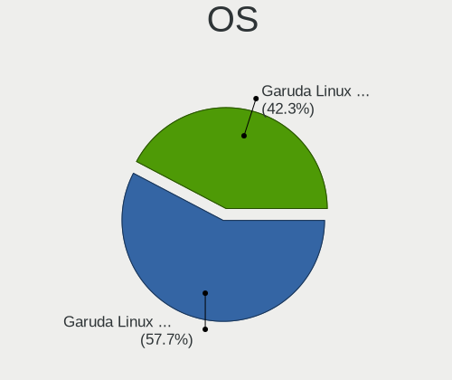

| Name                 | Computers | Percent |
|----------------------|-----------|---------|
| Garuda Linux Soaring | 21        | 75%     |
| Garuda Linux Rolling | 7         | 25%     |

OS Family
---------

OS without a version

| Name         | Computers | Percent |
|--------------|-----------|---------|
| Garuda Linux | 28        | 100%    |

Kernel
------

Version of the Linux kernel

| Version           | Computers | Percent |
|-------------------|-----------|---------|
| 6.1.1-zen1-1-zen  | 9         | 32.14%  |
| 6.0.11-zen1-1-zen | 4         | 14.29%  |
| 6.0.10-zen2-1-zen | 4         | 14.29%  |
| 6.0.12-zen1-1-zen | 3         | 10.71%  |
| 6.1.1-AMD         | 1         | 3.57%   |
| 6.1.0-zen1-1-zen  | 1         | 3.57%   |
| 6.0.9-zen1-1-zen  | 1         | 3.57%   |
| 6.0.8-zen1-1-zen  | 1         | 3.57%   |
| 6.0.2-zen1-1-zen  | 1         | 3.57%   |
| 6.0.11-AMD        | 1         | 3.57%   |
| 6.0.10-1-bore     | 1         | 3.57%   |
| 5.15.68-1-lts     | 1         | 3.57%   |

Kernel Family
-------------

Linux kernel without a distro release

| Version | Computers | Percent |
|---------|-----------|---------|
| 6.1.1   | 10        | 35.71%  |
| 6.0.11  | 5         | 17.86%  |
| 6.0.10  | 5         | 17.86%  |
| 6.0.12  | 3         | 10.71%  |
| 6.1.0   | 1         | 3.57%   |
| 6.0.9   | 1         | 3.57%   |
| 6.0.8   | 1         | 3.57%   |
| 6.0.2   | 1         | 3.57%   |
| 5.15.68 | 1         | 3.57%   |

Kernel Major Ver.
-----------------

Linux kernel major version

| Version | Computers | Percent |
|---------|-----------|---------|
| 6.0     | 16        | 57.14%  |
| 6.1     | 11        | 39.29%  |
| 5.15    | 1         | 3.57%   |

Arch
----

OS architecture (x86_64, i586, etc.)

| Name   | Computers | Percent |
|--------|-----------|---------|
| x86_64 | 28        | 100%    |

DE
--

Desktop Environment

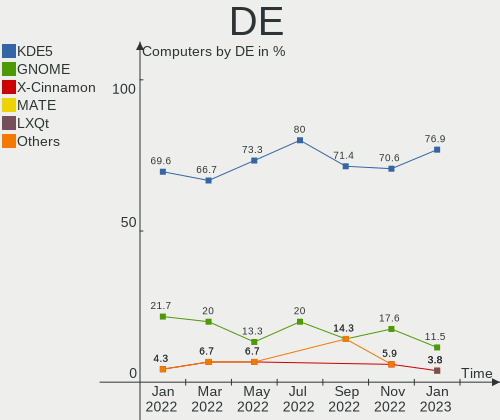

| Name       | Computers | Percent |
|------------|-----------|---------|
| KDE5       | 25        | 89.29%  |
| X-Cinnamon | 2         | 7.14%   |
| xfce       | 1         | 3.57%   |

Display Server
--------------

X11 or Wayland

| Name    | Computers | Percent |
|---------|-----------|---------|
| X11     | 25        | 89.29%  |
| Tty     | 2         | 7.14%   |
| Unknown | 1         | 3.57%   |

Display Manager
---------------

SDDM, LightDM, etc.

| Name    | Computers | Percent |
|---------|-----------|---------|
| SDDM    | 18        | 64.29%  |
| Unknown | 7         | 25%     |
| LightDM | 3         | 10.71%  |

OS Lang
-------

Language

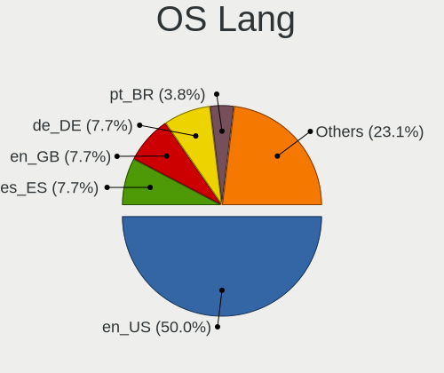

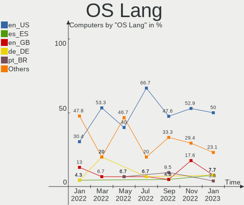

| Lang  | Computers | Percent |
|-------|-----------|---------|
| en_US | 17        | 60.71%  |
| en_IN | 2         | 7.14%   |
| en_CA | 2         | 7.14%   |
| it_IT | 1         | 3.57%   |
| fr_FR | 1         | 3.57%   |
| es_ES | 1         | 3.57%   |
| en_ZA | 1         | 3.57%   |
| en_GB | 1         | 3.57%   |
| en_DK | 1         | 3.57%   |
| de_DE | 1         | 3.57%   |

Boot Mode
---------

EFI or BIOS

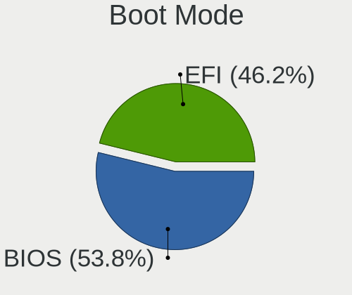

| Mode | Computers | Percent |
|------|-----------|---------|
| EFI  | 19        | 67.86%  |
| BIOS | 9         | 32.14%  |

Filesystem
----------

Type of filesystem

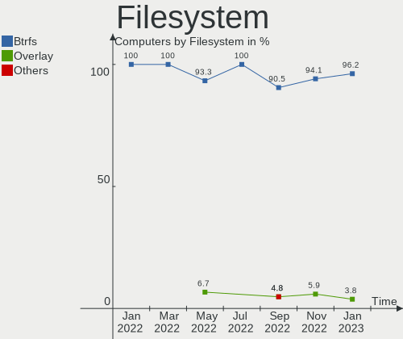

| Type    | Computers | Percent |
|---------|-----------|---------|
| Btrfs   | 27        | 96.43%  |
| Overlay | 1         | 3.57%   |

Part. scheme
------------

Scheme of partitioning

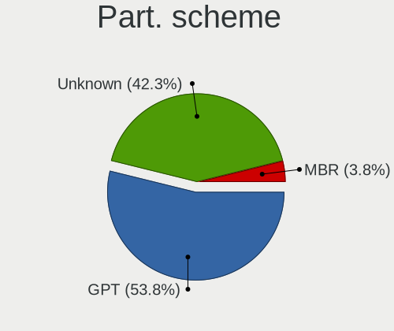

| Type    | Computers | Percent |
|---------|-----------|---------|
| GPT     | 21        | 75%     |
| Unknown | 7         | 25%     |

Dual Boot with Linux/BSD
------------------------

Hosting more than one Linux/BSD

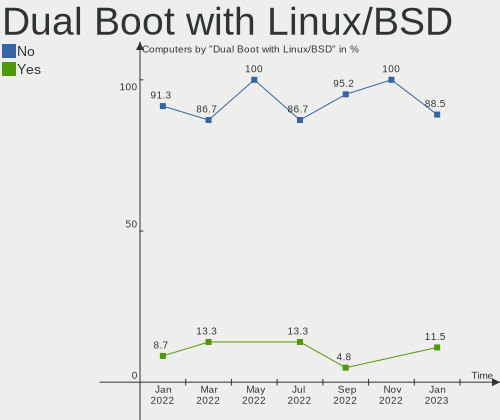

| Dual boot | Computers | Percent |
|-----------|-----------|---------|
| No        | 24        | 85.71%  |
| Yes       | 4         | 14.29%  |

Dual Boot (Win)
---------------

Hosting Linux and Windows

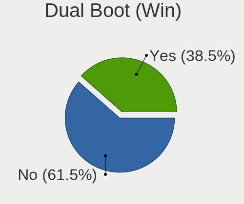

| Dual boot | Computers | Percent |
|-----------|-----------|---------|
| No        | 18        | 64.29%  |
| Yes       | 10        | 35.71%  |

Board
-----

Vendor
------

Motherboard manufacturer

| Name                | Computers | Percent |
|---------------------|-----------|---------|
| Lenovo              | 4         | 14.29%  |
| Hewlett-Packard     | 4         | 14.29%  |
| ASUSTek Computer    | 4         | 14.29%  |
| Dell                | 3         | 10.71%  |
| Gigabyte Technology | 2         | 7.14%   |
| ASRock              | 2         | 7.14%   |
| Acer                | 2         | 7.14%   |
| Standard            | 1         | 3.57%   |
| MSI                 | 1         | 3.57%   |
| Intel               | 1         | 3.57%   |
| HONOR               | 1         | 3.57%   |
| BESSTAR Tech        | 1         | 3.57%   |
| AZW                 | 1         | 3.57%   |
| Alienware           | 1         | 3.57%   |

Model
-----

Motherboard model

| Name                              | Computers | Percent |
|-----------------------------------|-----------|---------|
| MSI Stealth 15M B12UE             | 1         | 3.57%   |
| Lenovo Yoga 720-15IKB 80X7        | 1         | 3.57%   |
| Lenovo ThinkCentre Edge72 3484HPU | 1         | 3.57%   |
| Lenovo IdeaPadFlex 5 14ALC7 82R9  | 1         | 3.57%   |
| Lenovo IdeaPad L340-17API 81LY    | 1         | 3.57%   |
| Intel H61                         | 1         | 3.57%   |
| HONOR BOD-WXX9                    | 1         | 3.57%   |
| HP Victus by Laptop 16-e1xxx      | 1         | 3.57%   |
| HP Pavilion Laptop 15-eg0xxx      | 1         | 3.57%   |
| HP Dev One Notebook PC            | 1         | 3.57%   |
| HP Compaq CQ58                    | 1         | 3.57%   |
| Gigabyte G5 MD                    | 1         | 3.57%   |
| Gigabyte 990FXA-UD3               | 1         | 3.57%   |
| Dell XPS 13 9360                  | 1         | 3.57%   |
| Dell Latitude E7450               | 1         | 3.57%   |
| Dell Latitude E5450               | 1         | 3.57%   |
| BESSTAR Tech B550                 | 1         | 3.57%   |
| AZW SER                           | 1         | 3.57%   |
| ASUS Zenbook UM5401QAB_UM5401QA   | 1         | 3.57%   |
| ASUS ROG Strix G513IC_G513IC      | 1         | 3.57%   |
| ASUS ROG STRIX B450-F GAMING II   | 1         | 3.57%   |
| ASUS PRIME Z390-P                 | 1         | 3.57%   |
| ASRock Z77 Pro3                   | 1         | 3.57%   |
| ASRock X570 Taichi                | 1         | 3.57%   |
| Alienware m15 R7                  | 1         | 3.57%   |
| Acer Nitro AN515-45               | 1         | 3.57%   |
| Acer Aspire F5-572G               | 1         | 3.57%   |
| Unknown                           | 1         | 3.57%   |

Model Family
------------

Motherboard model prefix

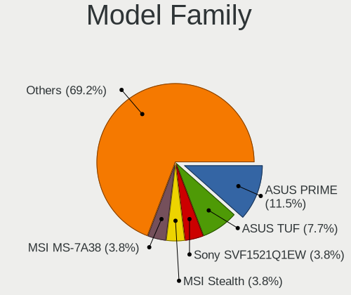

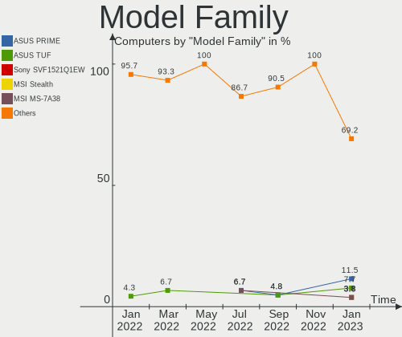

| Name                | Computers | Percent |
|---------------------|-----------|---------|
| Dell Latitude       | 2         | 7.14%   |
| ASUS ROG            | 2         | 7.14%   |
| MSI Stealth         | 1         | 3.57%   |
| Lenovo Yoga         | 1         | 3.57%   |
| Lenovo ThinkCentre  | 1         | 3.57%   |
| Lenovo IdeaPadFlex  | 1         | 3.57%   |
| Lenovo IdeaPad      | 1         | 3.57%   |
| Intel H61           | 1         | 3.57%   |
| HONOR BOD-WXX9      | 1         | 3.57%   |
| HP Victus           | 1         | 3.57%   |
| HP Pavilion         | 1         | 3.57%   |
| HP Dev              | 1         | 3.57%   |
| HP Compaq           | 1         | 3.57%   |
| Gigabyte G5         | 1         | 3.57%   |
| Gigabyte 990FXA-UD3 | 1         | 3.57%   |
| Dell XPS            | 1         | 3.57%   |
| BESSTAR Tech B550   | 1         | 3.57%   |
| AZW SER             | 1         | 3.57%   |
| ASUS Zenbook        | 1         | 3.57%   |
| ASUS PRIME          | 1         | 3.57%   |
| ASRock Z77          | 1         | 3.57%   |
| ASRock X570         | 1         | 3.57%   |
| Alienware m15       | 1         | 3.57%   |
| Acer Nitro          | 1         | 3.57%   |
| Acer Aspire         | 1         | 3.57%   |
| Unknown             | 1         | 3.57%   |

MFG Year
--------

Motherboard manufacture year

| Year | Computers | Percent |
|------|-----------|---------|
| 2022 | 7         | 25%     |
| 2021 | 5         | 17.86%  |
| 2020 | 3         | 10.71%  |
| 2012 | 3         | 10.71%  |
| 2019 | 2         | 7.14%   |
| 2017 | 2         | 7.14%   |
| 2014 | 2         | 7.14%   |
| 2018 | 1         | 3.57%   |
| 2016 | 1         | 3.57%   |
| 2015 | 1         | 3.57%   |
| 2013 | 1         | 3.57%   |

Form Factor
-----------

Physical design of the computer

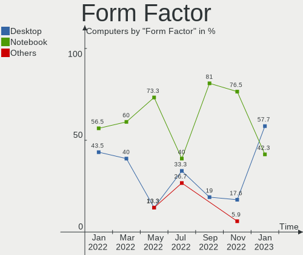

| Name        | Computers | Percent |
|-------------|-----------|---------|
| Notebook    | 17        | 60.71%  |
| Desktop     | 8         | 28.57%  |
| Convertible | 2         | 7.14%   |
| Mini pc     | 1         | 3.57%   |

Secure Boot
-----------

Enabled or disabled

| State    | Computers | Percent |
|----------|-----------|---------|
| Disabled | 28        | 100%    |

Coreboot
--------

Have coreboot on board

| Used | Computers | Percent |
|------|-----------|---------|
| No   | 28        | 100%    |

RAM Size
--------

Total RAM memory

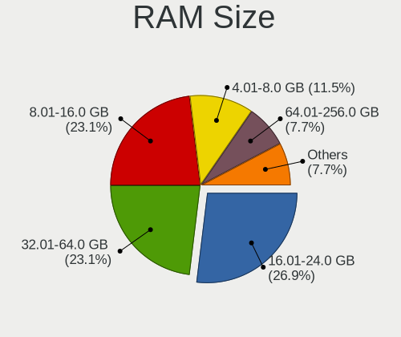

| Size in GB  | Computers | Percent |
|-------------|-----------|---------|
| 8.01-16.0   | 10        | 35.71%  |
| 16.01-24.0  | 9         | 32.14%  |
| 32.01-64.0  | 4         | 14.29%  |
| 4.01-8.0    | 3         | 10.71%  |
| 3.01-4.0    | 1         | 3.57%   |
| 64.01-256.0 | 1         | 3.57%   |

RAM Used
--------

Used RAM memory

| Used GB   | Computers | Percent |
|-----------|-----------|---------|
| 4.01-8.0  | 9         | 32.14%  |
| 3.01-4.0  | 8         | 28.57%  |
| 2.01-3.0  | 5         | 17.86%  |
| 8.01-16.0 | 5         | 17.86%  |
| 1.01-2.0  | 1         | 3.57%   |

Total Drives
------------

Number of drives on board

| Drives | Computers | Percent |
|--------|-----------|---------|
| 1      | 15        | 53.57%  |
| 2      | 10        | 35.71%  |
| 5      | 2         | 7.14%   |
| 18     | 1         | 3.57%   |

Has CD-ROM
----------

Has CD-ROM on board

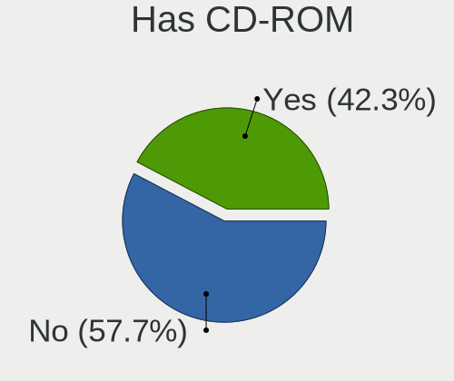

| Presented | Computers | Percent |
|-----------|-----------|---------|
| No        | 23        | 82.14%  |
| Yes       | 5         | 17.86%  |

Has Ethernet
------------

Has Ethernet on board

| Presented | Computers | Percent |
|-----------|-----------|---------|
| Yes       | 20        | 71.43%  |
| No        | 8         | 28.57%  |

Has WiFi
--------

Has WiFi module

| Presented | Computers | Percent |
|-----------|-----------|---------|
| Yes       | 22        | 78.57%  |
| No        | 6         | 21.43%  |

Has Bluetooth
-------------

Has Bluetooth module

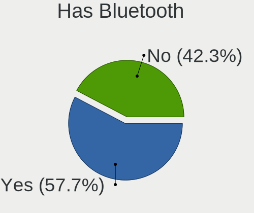

| Presented | Computers | Percent |
|-----------|-----------|---------|
| Yes       | 23        | 82.14%  |
| No        | 5         | 17.86%  |

Location
--------

Country
-------

Geographic location (country)

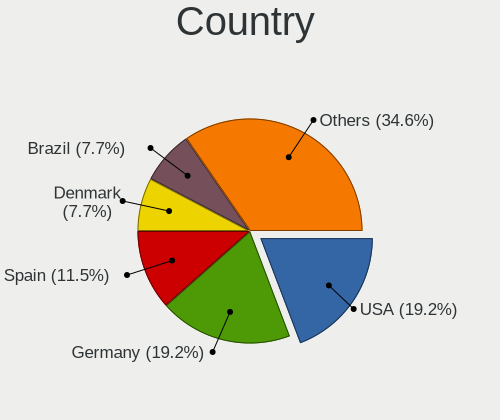

| Country      | Computers | Percent |
|--------------|-----------|---------|
| USA          | 9         | 32.14%  |
| Spain        | 2         | 7.14%   |
| India        | 2         | 7.14%   |
| Germany      | 2         | 7.14%   |
| Canada       | 2         | 7.14%   |
| Thailand     | 1         | 3.57%   |
| Switzerland  | 1         | 3.57%   |
| South Africa | 1         | 3.57%   |
| Serbia       | 1         | 3.57%   |
| Mexico       | 1         | 3.57%   |
| Israel       | 1         | 3.57%   |
| Greece       | 1         | 3.57%   |
| France       | 1         | 3.57%   |
| Finland      | 1         | 3.57%   |
| Denmark      | 1         | 3.57%   |
| Brazil       | 1         | 3.57%   |

City
----

Geographic location (city)

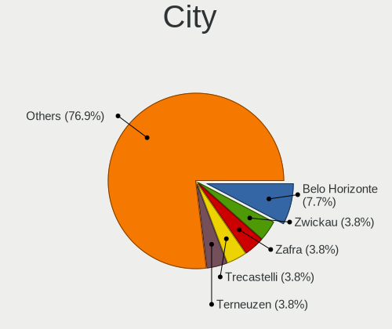

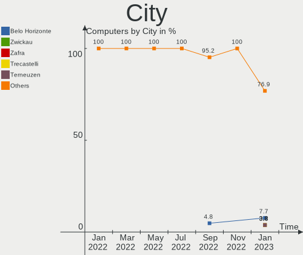

| City                 | Computers | Percent |
|----------------------|-----------|---------|
| Zafra                | 1         | 3.57%   |
| Troy                 | 1         | 3.57%   |
| Tampere              | 1         | 3.57%   |
| Sherwood Park        | 1         | 3.57%   |
| Seville              | 1         | 3.57%   |
| Sao José dos Campos | 1         | 3.57%   |
| Saint Michael        | 1         | 3.57%   |
| Ramat Gan            | 1         | 3.57%   |
| Novi Sad             | 1         | 3.57%   |
| New York             | 1         | 3.57%   |
| Muret                | 1         | 3.57%   |
| Monterrey            | 1         | 3.57%   |
| Los Angeles          | 1         | 3.57%   |
| Lancaster            | 1         | 3.57%   |
| Kothamangalam        | 1         | 3.57%   |
| Kincardine           | 1         | 3.57%   |
| Kalamata             | 1         | 3.57%   |
| Jacksonville         | 1         | 3.57%   |
| Ghaziabad            | 1         | 3.57%   |
| Frankfurt am Main    | 1         | 3.57%   |
| Fayetteville         | 1         | 3.57%   |
| Düsseldorf          | 1         | 3.57%   |
| Dallas               | 1         | 3.57%   |
| Copenhagen           | 1         | 3.57%   |
| Cape Town            | 1         | 3.57%   |
| Cambridge            | 1         | 3.57%   |
| Bedano               | 1         | 3.57%   |
| Bangkok              | 1         | 3.57%   |

Drives
------

Drive Vendor
------------

Hard drive vendors

| Vendor                      | Computers | Drives | Percent |
|-----------------------------|-----------|--------|---------|
| WDC                         | 6         | 9      | 12.24%  |
| SK hynix                    | 5         | 5      | 10.2%   |
| Seagate                     | 5         | 5      | 10.2%   |
| SanDisk                     | 5         | 5      | 10.2%   |
| Samsung Electronics         | 5         | 8      | 10.2%   |
| Micron Technology           | 3         | 3      | 6.12%   |
| Intel                       | 3         | 3      | 6.12%   |
| Toshiba                     | 2         | 4      | 4.08%   |
| Phison Electronics          | 2         | 2      | 4.08%   |
| ADATA Technology            | 2         | 2      | 4.08%   |
| Unknown                     | 1         | 1      | 2.04%   |
| SPCC                        | 1         | 1      | 2.04%   |
| PNY                         | 1         | 1      | 2.04%   |
| LITEONIT                    | 1         | 1      | 2.04%   |
| Kingston Technology Company | 1         | 1      | 2.04%   |
| Kingston                    | 1         | 2      | 2.04%   |
| Hitachi                     | 1         | 1      | 2.04%   |
| HGST                        | 1         | 7      | 2.04%   |
| DOLGIX                      | 1         | 1      | 2.04%   |
| Crucial                     | 1         | 1      | 2.04%   |
| China                       | 1         | 1      | 2.04%   |

Drive Model
-----------

Hard drive models

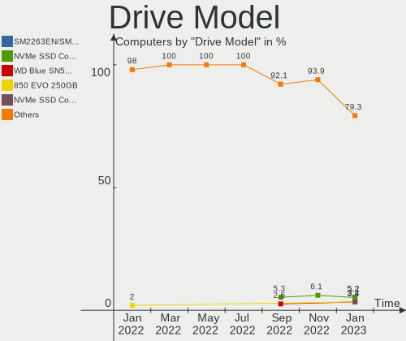

| Model                                                           | Computers | Percent |
|-----------------------------------------------------------------|-----------|---------|
| Samsung NVMe SSD Controller SM981/PM981/PM983 500GB             | 2         | 3.51%   |
| Phison E16 PCIe4 NVMe Controller 512GB                          | 2         | 3.51%   |
| Intel SSDPEKNU512GZ 512GB                                       | 2         | 3.51%   |
| ADATA XPG SX8200 Pro PCIe Gen3x4 M.2 2280 Solid State Drive 1TB | 2         | 3.51%   |
| WDC WD6400AAKS-65A7B0 640GB                                     | 1         | 1.75%   |
| WDC WD5000AAKX-60U6AA0 500GB                                    | 1         | 1.75%   |
| WDC WD5000AAKS-00A7B0 500GB                                     | 1         | 1.75%   |
| WDC WD3200BEVT-22ZCT0 320GB                                     | 1         | 1.75%   |
| WDC WD3200BEKT-60F3T1 320GB                                     | 1         | 1.75%   |
| WDC WD2500BEVT-60A23T0 250GB                                    | 1         | 1.75%   |
| WDC WD20EZRZ-00Z5HB0 2TB                                        | 1         | 1.75%   |
| WDC WD20EARS-00MVWB0 2TB                                        | 1         | 1.75%   |
| WDC WD10JPVX-22JC3T0 1TB                                        | 1         | 1.75%   |
| Unknown MMC Card  64GB                                          | 1         | 1.75%   |
| Toshiba MQ01ACF050 500GB                                        | 1         | 1.75%   |
| Toshiba MQ01ABF050 500GB                                        | 1         | 1.75%   |
| Toshiba DT01ACA050 500GB                                        | 1         | 1.75%   |
| SPCC Solid State Disk 512GB                                     | 1         | 1.75%   |
| SK hynix SHPP41-1000GM 1TB                                      | 1         | 1.75%   |
| SK hynix PC801 NVMe 1TB                                         | 1         | 1.75%   |
| SK hynix PC711 HFS001TDE9X073N 1024GB                           | 1         | 1.75%   |
| SK hynix HFS256G32TNH-73A0A 256GB SSD                           | 1         | 1.75%   |
| SK hynix HFM512GD3JX013N 512GB                                  | 1         | 1.75%   |
| Seagate ST3320613AS 320GB                                       | 1         | 1.75%   |
| Seagate ST3160812AS 160GB                                       | 1         | 1.75%   |
| Seagate ST31000528AS 1TB                                        | 1         | 1.75%   |
| Seagate ST1000DM003-1CH162 1TB                                  | 1         | 1.75%   |
| Seagate Portable 5TB                                            | 1         | 1.75%   |
| SanDisk X400 M.2 2280 128GB SSD                                 | 1         | 1.75%   |
| Sandisk WD Blue SN550 NVMe SSD 500GB                            | 1         | 1.75%   |
| Sandisk WD Black SN750 / PC SN730 NVMe SSD 512GB                | 1         | 1.75%   |
| SanDisk SSD PLUS 2000GB                                         | 1         | 1.75%   |
| SanDisk SDSSDHP256G 256GB                                       | 1         | 1.75%   |
| Samsung SSD 990 PRO 1TB                                         | 1         | 1.75%   |
| Samsung SSD 980 1TB                                             | 1         | 1.75%   |
| Samsung SSD 840 Series 120GB                                    | 1         | 1.75%   |
| Samsung SSD 840 EVO 500GB                                       | 1         | 1.75%   |
| Samsung Portable SSD T5 1TB                                     | 1         | 1.75%   |
| Samsung NVMe SSD Controller SM961/PM961/SM963 256GB             | 1         | 1.75%   |
| PNY CS900 240GB SSD                                             | 1         | 1.75%   |

HDD Vendor
----------

Hard disk drive vendors

| Vendor  | Computers | Drives | Percent |
|---------|-----------|--------|---------|
| WDC     | 6         | 9      | 42.86%  |
| Seagate | 4         | 4      | 28.57%  |
| Toshiba | 2         | 4      | 14.29%  |
| Hitachi | 1         | 1      | 7.14%   |
| HGST    | 1         | 7      | 7.14%   |

SSD Vendor
----------

Solid state drive vendors

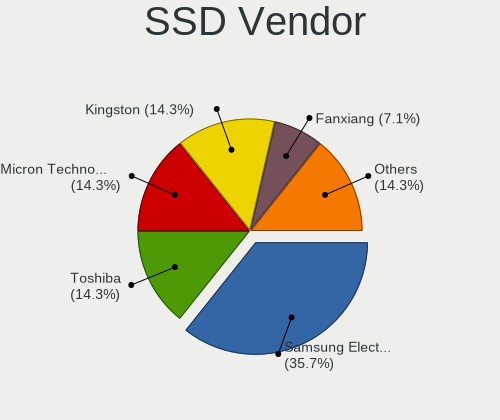

| Vendor              | Computers | Drives | Percent |
|---------------------|-----------|--------|---------|
| SanDisk             | 3         | 3      | 23.08%  |
| Samsung Electronics | 3         | 3      | 23.08%  |
| SPCC                | 1         | 1      | 7.69%   |
| SK hynix            | 1         | 1      | 7.69%   |
| PNY                 | 1         | 1      | 7.69%   |
| Micron Technology   | 1         | 1      | 7.69%   |
| LITEONIT            | 1         | 1      | 7.69%   |
| Crucial             | 1         | 1      | 7.69%   |
| China               | 1         | 1      | 7.69%   |

Drive Kind
----------

HDD or SSD

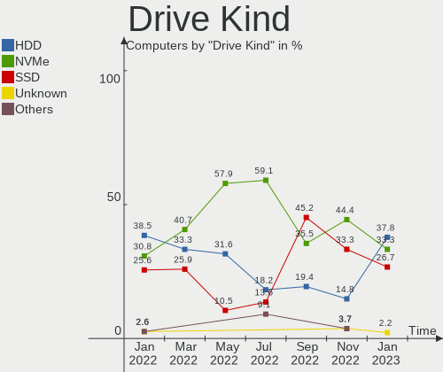

| Kind    | Computers | Drives | Percent |
|---------|-----------|--------|---------|
| NVMe    | 19        | 23     | 45.24%  |
| SSD     | 10        | 13     | 23.81%  |
| HDD     | 10        | 25     | 23.81%  |
| Unknown | 2         | 2      | 4.76%   |
| MMC     | 1         | 1      | 2.38%   |

Drive Connector
---------------

SATA, SAS, NVMe, etc.

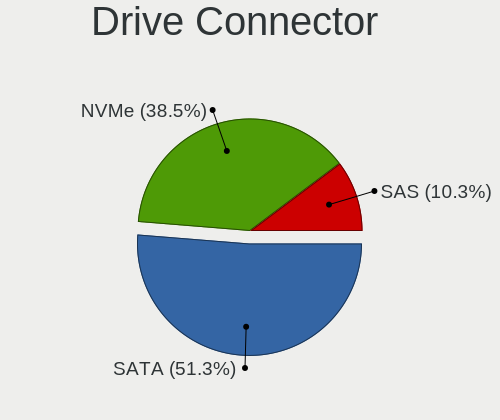

| Type | Computers | Drives | Percent |
|------|-----------|--------|---------|
| NVMe | 19        | 23     | 51.35%  |
| SATA | 16        | 38     | 43.24%  |
| SAS  | 1         | 2      | 2.7%    |
| MMC  | 1         | 1      | 2.7%    |

Drive Size
----------

Size of hard drive

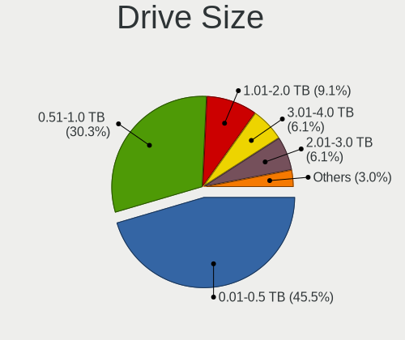

| Size in TB | Computers | Drives | Percent |
|------------|-----------|--------|---------|
| 0.01-0.5   | 13        | 29     | 59.09%  |
| 0.51-1.0   | 6         | 6      | 27.27%  |
| 1.01-2.0   | 3         | 3      | 13.64%  |

Space Total
-----------

Amount of disk space available on the file system

| Size in GB     | Computers | Percent |
|----------------|-----------|---------|
| More than 3000 | 16        | 57.14%  |
| 2001-3000      | 4         | 14.29%  |
| 1001-2000      | 3         | 10.71%  |
| 501-1000       | 3         | 10.71%  |
| 251-500        | 1         | 3.57%   |
| 1-20           | 1         | 3.57%   |

Space Used
----------

Amount of used disk space

| Used GB        | Computers | Percent |
|----------------|-----------|---------|
| 101-250        | 7         | 25%     |
| 501-1000       | 6         | 21.43%  |
| 251-500        | 5         | 17.86%  |
| More than 3000 | 3         | 10.71%  |
| 51-100         | 3         | 10.71%  |
| 2001-3000      | 2         | 7.14%   |
| 1001-2000      | 1         | 3.57%   |
| 1-20           | 1         | 3.57%   |

Malfunc. Drives
---------------

Drive models with a malfunction

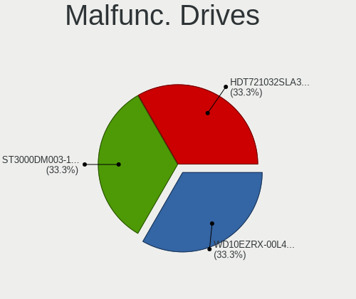

| Model                                    | Computers | Drives | Percent |
|------------------------------------------|-----------|--------|---------|
| WDC WD6400AAKS-65A7B0 640GB              | 1         | 1      | 14.29%  |
| WDC WD5000AAKX-60U6AA0 500GB             | 1         | 1      | 14.29%  |
| WDC WD20EARS-00MVWB0 2TB                 | 1         | 1      | 14.29%  |
| SK hynix PC711 HFS001TDE9X073N 1024GB    | 1         | 1      | 14.29%  |
| Samsung Electronics SSD 840 Series 120GB | 1         | 1      | 14.29%  |
| HGST HTS725050A7E635 OPAL 500GB          | 1         | 3      | 14.29%  |
| HGST HTS725050A7E630 500GB               | 1         | 4      | 14.29%  |

Malfunc. Drive Vendor
---------------------

Vendors of faulty drives

| Vendor              | Computers | Drives | Percent |
|---------------------|-----------|--------|---------|
| WDC                 | 1         | 3      | 25%     |
| SK hynix            | 1         | 1      | 25%     |
| Samsung Electronics | 1         | 1      | 25%     |
| HGST                | 1         | 7      | 25%     |

Malfunc. HDD Vendor
-------------------

Vendors of faulty HDD drives

| Vendor | Computers | Drives | Percent |
|--------|-----------|--------|---------|
| WDC    | 1         | 3      | 50%     |
| HGST   | 1         | 7      | 50%     |

Malfunc. Drive Kind
-------------------

Kinds of faulty drives

| Kind | Computers | Drives | Percent |
|------|-----------|--------|---------|
| NVMe | 1         | 1      | 33.33%  |
| SSD  | 1         | 1      | 33.33%  |
| HDD  | 1         | 10     | 33.33%  |

Failed Drives
-------------

Failed drive models

Zero info for selected period =(

Failed Drive Vendor
-------------------

Failed drive vendors

Zero info for selected period =(

Drive Status
------------

Number of failed and malfunc. drives

| Status   | Computers | Drives | Percent |
|----------|-----------|--------|---------|
| Works    | 16        | 26     | 51.61%  |
| Detected | 12        | 26     | 38.71%  |
| Malfunc  | 3         | 12     | 9.68%   |

Storage controller
------------------

Storage Vendor
--------------

Storage controller vendors

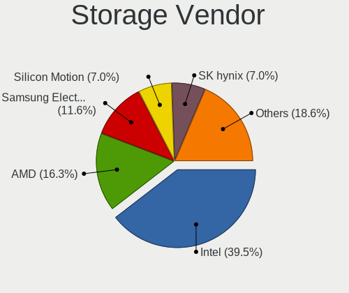

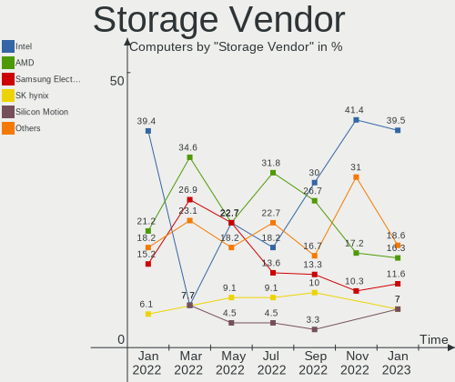

| Vendor                      | Computers | Percent |
|-----------------------------|-----------|---------|
| Intel                       | 16        | 38.1%   |
| AMD                         | 7         | 16.67%  |
| SK hynix                    | 4         | 9.52%   |
| Samsung Electronics         | 3         | 7.14%   |
| SanDisk                     | 2         | 4.76%   |
| Phison Electronics          | 2         | 4.76%   |
| Micron Technology           | 2         | 4.76%   |
| Marvell Technology Group    | 2         | 4.76%   |
| Kingston Technology Company | 2         | 4.76%   |
| ADATA Technology            | 2         | 4.76%   |

Storage Model
-------------

Storage controller models

| Model                                                                         | Computers | Percent |
|-------------------------------------------------------------------------------|-----------|---------|
| AMD FCH SATA Controller [AHCI mode]                                           | 5         | 11.11%  |
| SK hynix Non-Volatile memory controller                                       | 2         | 4.44%   |
| SK hynix Gold P31/PC711 NVMe Solid State Drive                                | 2         | 4.44%   |
| Samsung NVMe SSD Controller SM981/PM981/PM983                                 | 2         | 4.44%   |
| Phison E16 PCIe4 NVMe Controller                                              | 2         | 4.44%   |
| Micron Non-Volatile memory controller                                         | 2         | 4.44%   |
| Intel Volume Management Device NVMe RAID Controller                           | 2         | 4.44%   |
| Intel Non-Volatile memory controller                                          | 2         | 4.44%   |
| Intel 82801 Mobile SATA Controller [RAID mode]                                | 2         | 4.44%   |
| Intel 6 Series/C200 Series Chipset Family 6 port Desktop SATA AHCI Controller | 2         | 4.44%   |
| ADATA XPG SX8200 Pro PCIe Gen3x4 M.2 2280 Solid State Drive                   | 2         | 4.44%   |
| SanDisk WD Blue SN550 NVMe SSD                                                | 1         | 2.22%   |
| SanDisk WD Black SN750 / PC SN730 NVMe SSD                                    | 1         | 2.22%   |
| Samsung NVMe SSD Controller SM961/PM961/SM963                                 | 1         | 2.22%   |
| Samsung NVMe SSD Controller 980                                               | 1         | 2.22%   |
| Samsung Electronics Non-Volatile memory controller                            | 1         | 2.22%   |
| Marvell Group 88SE9215 PCIe 2.0 x1 4-port SATA 6 Gb/s Controller              | 1         | 2.22%   |
| Marvell Group 88SE9172 SATA 6Gb/s Controller                                  | 1         | 2.22%   |
| Kingston Company Company Non-Volatile memory controller                       | 1         | 2.22%   |
| Kingston Company OM3PDP3 NVMe SSD                                             | 1         | 2.22%   |
| Intel Wildcat Point-LP SATA Controller [AHCI Mode]                            | 1         | 2.22%   |
| Intel Sunrise Point-LP SATA Controller [AHCI mode]                            | 1         | 2.22%   |
| Intel SSD 600P Series                                                         | 1         | 2.22%   |
| Intel Cannon Lake PCH SATA AHCI Controller                                    | 1         | 2.22%   |
| Intel 7 Series/C210 Series Chipset Family 6-port SATA Controller [AHCI mode]  | 1         | 2.22%   |
| Intel 7 Series Chipset Family 6-port SATA Controller [AHCI mode]              | 1         | 2.22%   |
| Intel 500 Series Chipset Family SATA AHCI Controller                          | 1         | 2.22%   |
| Intel 400 Series Chipset Family SATA AHCI Controller                          | 1         | 2.22%   |
| AMD SB7x0/SB8x0/SB9x0 SATA Controller [AHCI mode]                             | 1         | 2.22%   |
| AMD 500 Series Chipset SATA Controller                                        | 1         | 2.22%   |
| AMD 400 Series Chipset SATA Controller                                        | 1         | 2.22%   |

Storage Kind
------------

Kind of storage controller (IDE, SATA, NVMe, SAS, ...)

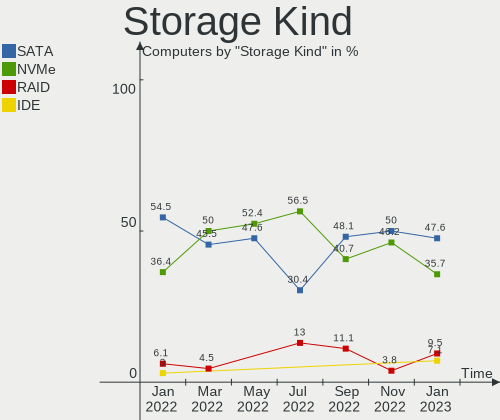

| Kind | Computers | Percent |
|------|-----------|---------|
| NVMe | 19        | 48.72%  |
| SATA | 16        | 41.03%  |
| RAID | 4         | 10.26%  |

Processor
---------

CPU Vendor
----------

Processor vendors

| Vendor | Computers | Percent |
|--------|-----------|---------|
| Intel  | 16        | 57.14%  |
| AMD    | 12        | 42.86%  |

CPU Model
---------

Processor models

| Model                                         | Computers | Percent |
|-----------------------------------------------|-----------|---------|
| Intel Core i7-5600U CPU @ 2.60GHz             | 2         | 7.14%   |
| Intel 11th Gen Core i5-1135G7 @ 2.40GHz       | 2         | 7.14%   |
| Intel Core i7-7700HQ CPU @ 2.80GHz            | 1         | 3.57%   |
| Intel Core i7-10875H CPU @ 2.30GHz            | 1         | 3.57%   |
| Intel Core i5-9600K CPU @ 3.70GHz             | 1         | 3.57%   |
| Intel Core i5-7200U CPU @ 2.50GHz             | 1         | 3.57%   |
| Intel Core i5-6200U CPU @ 2.30GHz             | 1         | 3.57%   |
| Intel Core i5-3470 CPU @ 3.20GHz              | 1         | 3.57%   |
| Intel Core i3-3220 CPU @ 3.30GHz              | 1         | 3.57%   |
| Intel Core i3-2120 CPU @ 3.30GHz              | 1         | 3.57%   |
| Intel Celeron CPU B830 @ 1.80GHz              | 1         | 3.57%   |
| Intel 12th Gen Core i7-1280P                  | 1         | 3.57%   |
| Intel 12th Gen Core i7-12700H                 | 1         | 3.57%   |
| Intel 11th Gen Core i5-11400H @ 2.70GHz       | 1         | 3.57%   |
| AMD Ryzen 7 PRO 5850U with Radeon Graphics    | 1         | 3.57%   |
| AMD Ryzen 7 6800H with Radeon Graphics        | 1         | 3.57%   |
| AMD Ryzen 7 5800X3D 8-Core Processor          | 1         | 3.57%   |
| AMD Ryzen 7 5800H with Radeon Graphics        | 1         | 3.57%   |
| AMD Ryzen 7 5700U with Radeon Graphics        | 1         | 3.57%   |
| AMD Ryzen 7 5700G with Radeon Graphics        | 1         | 3.57%   |
| AMD Ryzen 7 4800H with Radeon Graphics        | 1         | 3.57%   |
| AMD Ryzen 7 3700U with Radeon Vega Mobile Gfx | 1         | 3.57%   |
| AMD Ryzen 5 5600H with Radeon Graphics        | 1         | 3.57%   |
| AMD Ryzen 5 5600 6-Core Processor             | 1         | 3.57%   |
| AMD Ryzen 5 5560U with Radeon Graphics        | 1         | 3.57%   |
| AMD FX-8320 Eight-Core Processor              | 1         | 3.57%   |

CPU Model Family
----------------

Processor model prefix

| Model           | Computers | Percent |
|-----------------|-----------|---------|
| AMD Ryzen 7     | 7         | 25%     |
| Other           | 5         | 17.86%  |
| Intel Core i7   | 4         | 14.29%  |
| Intel Core i5   | 4         | 14.29%  |
| AMD Ryzen 5     | 3         | 10.71%  |
| Intel Core i3   | 2         | 7.14%   |
| Intel Celeron   | 1         | 3.57%   |
| AMD Ryzen 7 PRO | 1         | 3.57%   |
| AMD FX          | 1         | 3.57%   |

CPU Cores
---------

Number of processor cores

| Number | Computers | Percent |
|--------|-----------|---------|
| 8      | 8         | 28.57%  |
| 2      | 7         | 25%     |
| 4      | 6         | 21.43%  |
| 6      | 5         | 17.86%  |
| 14     | 2         | 7.14%   |

CPU Sockets
-----------

Number of sockets

| Number | Computers | Percent |
|--------|-----------|---------|
| 1      | 28        | 100%    |

CPU Threads
-----------

Threads per core (Hyper-Threading)

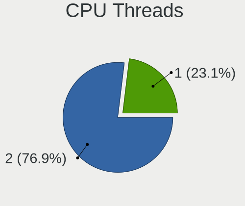

| Number | Computers | Percent |
|--------|-----------|---------|
| 2      | 24        | 85.71%  |
| 1      | 4         | 14.29%  |

CPU Op-Modes
------------

CPU Operation Modes (32-bit, 64-bit)

| Op mode        | Computers | Percent |
|----------------|-----------|---------|
| 32-bit, 64-bit | 28        | 100%    |

CPU Microcode
-------------

Microcode number

| Number     | Computers | Percent |
|------------|-----------|---------|
| Unknown    | 16        | 57.14%  |
| 0x906a3    | 2         | 7.14%   |
| 0x806c1    | 2         | 7.14%   |
| 0x0a50000c | 2         | 7.14%   |
| 0x206a7    | 1         | 3.57%   |
| 0x0a404102 | 1         | 3.57%   |
| 0x0a20120a | 1         | 3.57%   |
| 0x0a201204 | 1         | 3.57%   |
| 0x08608103 | 1         | 3.57%   |
| 0x08600106 | 1         | 3.57%   |

CPU Microarch
-------------

Microarchitecture

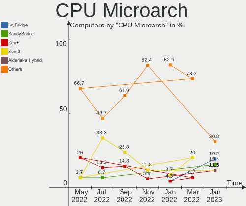

| Name             | Computers | Percent |
|------------------|-----------|---------|
| Zen 3            | 7         | 25%     |
| KabyLake         | 3         | 10.71%  |
| Unknown          | 3         | 10.71%  |
| TigerLake        | 2         | 7.14%   |
| SandyBridge      | 2         | 7.14%   |
| IvyBridge        | 2         | 7.14%   |
| Broadwell        | 2         | 7.14%   |
| Alderlake Hybrid | 2         | 7.14%   |
| Zen+             | 1         | 3.57%   |
| Zen 2            | 1         | 3.57%   |
| Skylake          | 1         | 3.57%   |
| Piledriver       | 1         | 3.57%   |
| CometLake        | 1         | 3.57%   |

Graphics
--------

GPU Vendor
----------

Vendors of graphics cards

| Vendor | Computers | Percent |
|--------|-----------|---------|
| Intel  | 15        | 36.59%  |
| Nvidia | 14        | 34.15%  |
| AMD    | 12        | 29.27%  |

GPU Model
---------

Graphics card models

| Model                                                                     | Computers | Percent |
|---------------------------------------------------------------------------|-----------|---------|
| AMD Cezanne [Radeon Vega Series / Radeon Vega Mobile Series]              | 5         | 12.2%   |
| Nvidia GA107M [GeForce RTX 3050 Ti Mobile]                                | 2         | 4.88%   |
| Nvidia GA106M [GeForce RTX 3060 Mobile / Max-Q]                           | 2         | 4.88%   |
| Intel Xeon E3-1200 v2/3rd Gen Core processor Graphics Controller          | 2         | 4.88%   |
| Intel TigerLake-LP GT2 [Iris Xe Graphics]                                 | 2         | 4.88%   |
| Intel HD Graphics 5500                                                    | 2         | 4.88%   |
| Intel Alder Lake-P Integrated Graphics Controller                         | 2         | 4.88%   |
| Intel 2nd Generation Core Processor Family Integrated Graphics Controller | 2         | 4.88%   |
| Nvidia TU117M [GeForce MX450]                                             | 1         | 2.44%   |
| Nvidia TU116 [GeForce GTX 1660]                                           | 1         | 2.44%   |
| Nvidia TU106M [GeForce RTX 2070 Mobile / Max-Q Refresh]                   | 1         | 2.44%   |
| Nvidia GP107M [GeForce GTX 1050 Mobile]                                   | 1         | 2.44%   |
| Nvidia GP102 [GeForce GTX 1080 Ti]                                        | 1         | 2.44%   |
| Nvidia GM108M [GeForce 840M]                                              | 1         | 2.44%   |
| Nvidia GM107 [GeForce GTX 750]                                            | 1         | 2.44%   |
| Nvidia GK208BM [GeForce 920M]                                             | 1         | 2.44%   |
| Nvidia GA107M [GeForce RTX 3050 Mobile]                                   | 1         | 2.44%   |
| Nvidia GA104M [Geforce RTX 3070 Ti Laptop GPU]                            | 1         | 2.44%   |
| Intel TigerLake-H GT1 [UHD Graphics]                                      | 1         | 2.44%   |
| Intel Skylake GT2 [HD Graphics 520]                                       | 1         | 2.44%   |
| Intel HD Graphics 630                                                     | 1         | 2.44%   |
| Intel HD Graphics 620                                                     | 1         | 2.44%   |
| Intel CometLake-H GT2 [UHD Graphics]                                      | 1         | 2.44%   |
| AMD Tonga PRO [Radeon R9 285/380]                                         | 1         | 2.44%   |
| AMD Renoir                                                                | 1         | 2.44%   |
| AMD Rembrandt [Radeon 680M]                                               | 1         | 2.44%   |
| AMD Pitcairn PRO [Radeon HD 7850 / R7 265 / R9 270 1024SP]                | 1         | 2.44%   |
| AMD Picasso/Raven 2 [Radeon Vega Series / Radeon Vega Mobile Series]      | 1         | 2.44%   |
| AMD Navi 22 [Radeon RX 6700/6700 XT/6750 XT / 6800M]                      | 1         | 2.44%   |
| AMD Lucienne                                                              | 1         | 2.44%   |

GPU Combo
---------

Combinations of graphics cards

| Name           | Computers | Percent |
|----------------|-----------|---------|
| Intel + Nvidia | 8         | 28.57%  |
| 1 x AMD        | 8         | 28.57%  |
| 1 x Intel      | 6         | 21.43%  |
| AMD + Nvidia   | 4         | 14.29%  |
| 1 x Nvidia     | 2         | 7.14%   |

GPU Driver
----------

Free vs proprietary

| Driver      | Computers | Percent |
|-------------|-----------|---------|
| Free        | 16        | 57.14%  |
| Proprietary | 12        | 42.86%  |

GPU Memory
----------

Total video memory

| Size in GB | Computers | Percent |
|------------|-----------|---------|
| Unknown    | 17        | 60.71%  |
| 0.01-0.5   | 4         | 14.29%  |
| 8.01-16.0  | 2         | 7.14%   |
| 7.01-8.0   | 1         | 3.57%   |
| 5.01-6.0   | 1         | 3.57%   |
| 3.01-4.0   | 1         | 3.57%   |
| 2.01-3.0   | 1         | 3.57%   |
| 0.51-1.0   | 1         | 3.57%   |

Monitor
-------

Monitor Vendor
--------------

Monitor vendors

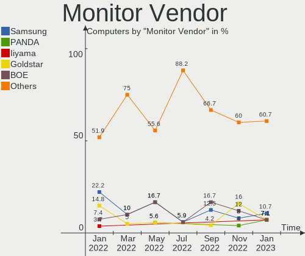

| Vendor                  | Computers | Percent |
|-------------------------|-----------|---------|
| BOE                     | 8         | 22.22%  |
| Samsung Electronics     | 4         | 11.11%  |
| Goldstar                | 4         | 11.11%  |
| LG Display              | 2         | 5.56%   |
| Dell                    | 2         | 5.56%   |
| Chimei Innolux          | 2         | 5.56%   |
| AU Optronics            | 2         | 5.56%   |
| Toshiba                 | 1         | 2.78%   |
| Sharp                   | 1         | 2.78%   |
| PANDA                   | 1         | 2.78%   |
| LG Electronics          | 1         | 2.78%   |
| InfoVision              | 1         | 2.78%   |
| Hewlett-Packard         | 1         | 2.78%   |
| Chi Mei Optoelectronics | 1         | 2.78%   |
| BenQ                    | 1         | 2.78%   |
| AOC                     | 1         | 2.78%   |
| Ancor Communications    | 1         | 2.78%   |
| Acer                    | 1         | 2.78%   |
| Unknown                 | 1         | 2.78%   |

Monitor Model
-------------

Monitor models

| Model                                                                    | Computers | Percent |
|--------------------------------------------------------------------------|-----------|---------|
| AU Optronics LCD Monitor AUOAF90 1920x1080 344x193mm 15.5-inch           | 2         | 5.56%   |
| Toshiba TV TSB0206 1920x1080 886x498mm 40.0-inch                         | 1         | 2.78%   |
| Sharp LCD Monitor SHP1449 1920x1080 294x165mm 13.3-inch                  | 1         | 2.78%   |
| Samsung Electronics LU28R55 SAM1017 3840x2160 630x360mm 28.6-inch        | 1         | 2.78%   |
| Samsung Electronics LS27A800U SAM71A4 3840x2160 600x340mm 27.2-inch      | 1         | 2.78%   |
| Samsung Electronics LCD Monitor SDC4154 2880x1800 302x189mm 14.0-inch    | 1         | 2.78%   |
| Samsung Electronics F27G3xTF SAM710D 1920x1080 600x330mm 27.0-inch       | 1         | 2.78%   |
| PANDA LCD Monitor NCP004B 1920x1080 344x194mm 15.5-inch                  | 1         | 2.78%   |
| LG Electronics LCD Monitor LG TV SSCR2 3840x2160                         | 1         | 2.78%   |
| LG Display LCD Monitor LGD062F 1920x1080 344x194mm 15.5-inch             | 1         | 2.78%   |
| LG Display LCD Monitor LGD046D 1920x1080 309x174mm 14.0-inch             | 1         | 2.78%   |
| InfoVision LCD Monitor IVO8C78 1920x1080 309x174mm 14.0-inch             | 1         | 2.78%   |
| Hewlett-Packard w2408 HWP26CE 1920x1200 518x324mm 24.1-inch              | 1         | 2.78%   |
| Goldstar ULTRAGEAR GSM7766 2560x1440 697x392mm 31.5-inch                 | 1         | 2.78%   |
| Goldstar IPS QHD GSM5BC3 2560x1440 527x296mm 23.8-inch                   | 1         | 2.78%   |
| Goldstar IPS FULLHD GSM5AB8 1920x1080 480x270mm 21.7-inch                | 1         | 2.78%   |
| Goldstar FULL HD GSM5B54 1920x1080 480x270mm 21.7-inch                   | 1         | 2.78%   |
| Dell S2716DG DELA0D1 2560x1440 598x336mm 27.0-inch                       | 1         | 2.78%   |
| Dell P2412H DELA07D 1920x1080 530x300mm 24.0-inch                        | 1         | 2.78%   |
| Chimei Innolux LCD Monitor CMN1738 1920x1080 381x214mm 17.2-inch         | 1         | 2.78%   |
| Chimei Innolux LCD Monitor CMN15C4 1920x1080 344x193mm 15.5-inch         | 1         | 2.78%   |
| Chi Mei Optoelectronics LCD Monitor CMO15A2 1366x768 344x193mm 15.5-inch | 1         | 2.78%   |
| BOE LCD Monitor BOE0ACC 1920x1080 344x194mm 15.5-inch                    | 1         | 2.78%   |
| BOE LCD Monitor BOE0AC9 2240x1400 302x189mm 14.0-inch                    | 1         | 2.78%   |
| BOE LCD Monitor BOE0AAD 1920x1080 355x200mm 16.0-inch                    | 1         | 2.78%   |
| BOE LCD Monitor BOE0A88 2560x1440 344x194mm 15.5-inch                    | 1         | 2.78%   |
| BOE LCD Monitor BOE0936 1920x1080 344x194mm 15.5-inch                    | 1         | 2.78%   |
| BOE LCD Monitor BOE090F 1920x1080 344x194mm 15.5-inch                    | 1         | 2.78%   |
| BOE LCD Monitor BOE06F4 3840x2160 345x194mm 15.6-inch                    | 1         | 2.78%   |
| BOE LCD Monitor BOE05F3 1366x768 309x173mm 13.9-inch                     | 1         | 2.78%   |
| BenQ E2200HD BNQ790C 1920x1080 477x268mm 21.5-inch                       | 1         | 2.78%   |
| AOC 2470W AOC2470 1920x1080 520x290mm 23.4-inch                          | 1         | 2.78%   |
| Ancor Communications ASUS PB277 ACI27B5 2560x1440 597x336mm 27.0-inch    | 1         | 2.78%   |
| Acer AL2216W ACRAD74 1680x1050 473x296mm 22.0-inch                       | 1         | 2.78%   |
| Unknown                                                                  | 1         | 2.78%   |

Monitor Resolution
------------------

Monitor screen resolution

| Resolution         | Computers | Percent |
|--------------------|-----------|---------|
| 1920x1080 (FHD)    | 18        | 52.94%  |
| 2560x1440 (QHD)    | 6         | 17.65%  |
| 3840x2160 (4K)     | 4         | 11.76%  |
| 1366x768 (WXGA)    | 2         | 5.88%   |
| 2880x1800          | 1         | 2.94%   |
| 2240x1400          | 1         | 2.94%   |
| 1920x1200 (WUXGA)  | 1         | 2.94%   |
| 1680x1050 (WSXGA+) | 1         | 2.94%   |

Monitor Diagonal
----------------

Diagonal size in inches

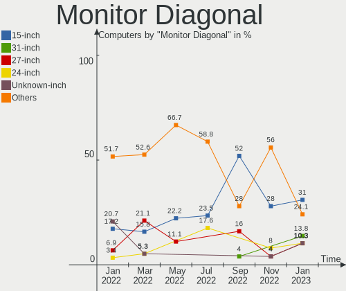

| Inches  | Computers | Percent |
|---------|-----------|---------|
| 15      | 11        | 30.56%  |
| 27      | 4         | 11.11%  |
| 14      | 4         | 11.11%  |
| 21      | 3         | 8.33%   |
| 24      | 2         | 5.56%   |
| 23      | 2         | 5.56%   |
| 13      | 2         | 5.56%   |
| Unknown | 2         | 5.56%   |
| 74      | 1         | 2.78%   |
| 31      | 1         | 2.78%   |
| 28      | 1         | 2.78%   |
| 22      | 1         | 2.78%   |
| 17      | 1         | 2.78%   |
| 16      | 1         | 2.78%   |

Monitor Width
-------------

Physical width

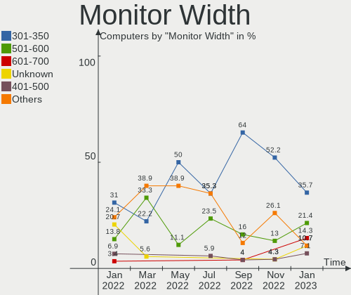

| Width in mm | Computers | Percent |
|-------------|-----------|---------|
| 301-350     | 16        | 47.06%  |
| 501-600     | 6         | 17.65%  |
| 401-500     | 4         | 11.76%  |
| 601-700     | 2         | 5.88%   |
| 351-400     | 2         | 5.88%   |
| Unknown     | 2         | 5.88%   |
| 201-300     | 1         | 2.94%   |
| 1501-2000   | 1         | 2.94%   |

Aspect Ratio
------------

Proportional relationship between the width and the height

| Ratio   | Computers | Percent |
|---------|-----------|---------|
| 16/9    | 23        | 76.67%  |
| 16/10   | 5         | 16.67%  |
| Unknown | 2         | 6.67%   |

Monitor Area
------------

Area in inch²

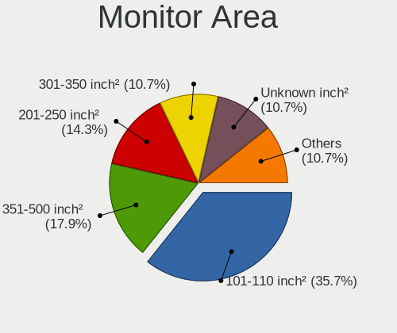

| Area in inch² | Computers | Percent |
|----------------|-----------|---------|
| 101-110        | 12        | 33.33%  |
| 201-250        | 6         | 16.67%  |
| 81-90          | 5         | 13.89%  |
| 301-350        | 4         | 11.11%  |
| 351-500        | 2         | 5.56%   |
| Unknown        | 2         | 5.56%   |
| More than 1000 | 1         | 2.78%   |
| 71-80          | 1         | 2.78%   |
| 251-300        | 1         | 2.78%   |
| 151-200        | 1         | 2.78%   |
| 121-130        | 1         | 2.78%   |

Pixel Density
-------------

Pixels per inch

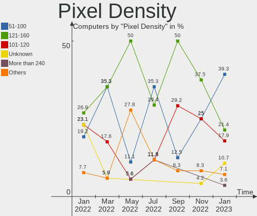

| Density       | Computers | Percent |
|---------------|-----------|---------|
| 121-160       | 14        | 41.18%  |
| 51-100        | 6         | 17.65%  |
| 101-120       | 5         | 14.71%  |
| 161-240       | 4         | 11.76%  |
| More than 240 | 2         | 5.88%   |
| Unknown       | 2         | 5.88%   |
| 1-50          | 1         | 2.94%   |

Multiple Monitors
-----------------

Total monitors connected

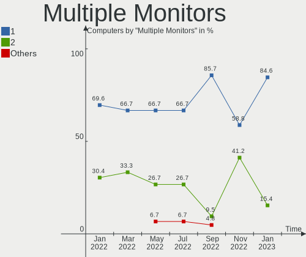

| Total | Computers | Percent |
|-------|-----------|---------|
| 1     | 20        | 71.43%  |
| 2     | 6         | 21.43%  |
| 3     | 2         | 7.14%   |

Network
-------

Net Controller Vendor
---------------------

Controller vendors

| Vendor                | Computers | Percent |
|-----------------------|-----------|---------|
| Realtek Semiconductor | 18        | 42.86%  |
| Intel                 | 13        | 30.95%  |
| Qualcomm Atheros      | 5         | 11.9%   |
| MediaTek              | 5         | 11.9%   |
| DisplayLink           | 1         | 2.38%   |

Net Controller Model
--------------------

Controller models

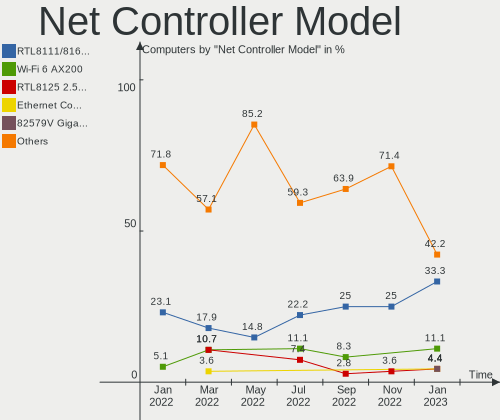

| Model                                                             | Computers | Percent |
|-------------------------------------------------------------------|-----------|---------|
| Realtek RTL8111/8168/8411 PCI Express Gigabit Ethernet Controller | 12        | 26.09%  |
| MediaTek MT7921 802.11ax PCI Express Wireless Network Adapter     | 3         | 6.52%   |
| Intel Wi-Fi 6 AX200                                               | 3         | 6.52%   |
| Realtek RTL810xE PCI Express Fast Ethernet controller             | 2         | 4.35%   |
| Qualcomm Atheros QCA9377 802.11ac Wireless Network Adapter        | 2         | 4.35%   |
| Qualcomm Atheros QCA6174 802.11ac Wireless Network Adapter        | 2         | 4.35%   |
| MediaTek MT7921K (RZ608) Wi-Fi 6E 80MHz                           | 2         | 4.35%   |
| Intel Wireless 7265                                               | 2         | 4.35%   |
| Intel Wi-Fi 6 AX201                                               | 2         | 4.35%   |
| Intel I211 Gigabit Network Connection                             | 2         | 4.35%   |
| Intel Ethernet Connection (3) I218-LM                             | 2         | 4.35%   |
| Intel Alder Lake-P PCH CNVi WiFi                                  | 2         | 4.35%   |
| Realtek USB 10/100/1G/2.5G LAN                                    | 1         | 2.17%   |
| Realtek RTL8822CE 802.11ac PCIe Wireless Network Adapter          | 1         | 2.17%   |
| Realtek RTL8153 Gigabit Ethernet Adapter                          | 1         | 2.17%   |
| Realtek Killer E3000 2.5GbE Controller                            | 1         | 2.17%   |
| Realtek Killer E2600 Gigabit Ethernet Controller                  | 1         | 2.17%   |
| Qualcomm Atheros AR9485 Wireless Network Adapter                  | 1         | 2.17%   |
| Intel Wi-Fi 6 AX210/AX211/AX411 160MHz                            | 1         | 2.17%   |
| Intel Tiger Lake PCH CNVi WiFi                                    | 1         | 2.17%   |
| Intel Ethernet Controller I225-V                                  | 1         | 2.17%   |
| DisplayLink 6950                                                  | 1         | 2.17%   |

Wireless Vendor
---------------

Wireless vendors

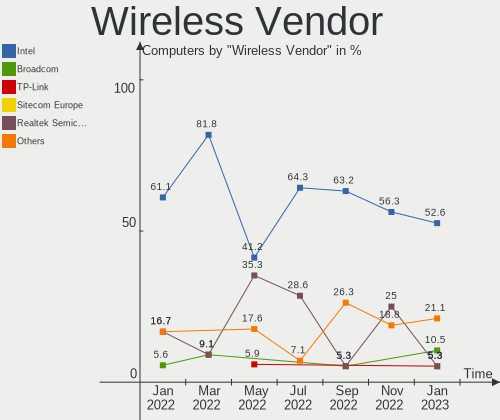

| Vendor                | Computers | Percent |
|-----------------------|-----------|---------|
| Intel                 | 11        | 50%     |
| Qualcomm Atheros      | 5         | 22.73%  |
| MediaTek              | 5         | 22.73%  |
| Realtek Semiconductor | 1         | 4.55%   |

Wireless Model
--------------

Wireless models

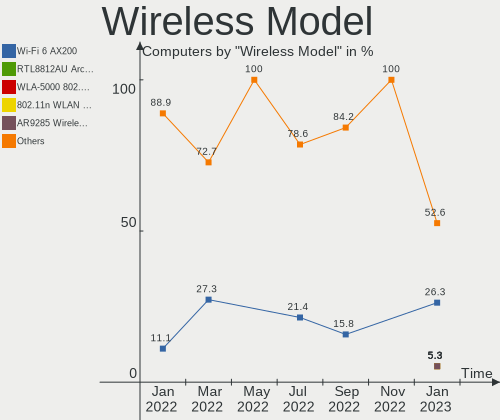

| Model                                                         | Computers | Percent |
|---------------------------------------------------------------|-----------|---------|
| MediaTek MT7921 802.11ax PCI Express Wireless Network Adapter | 3         | 13.64%  |
| Intel Wi-Fi 6 AX200                                           | 3         | 13.64%  |
| Qualcomm Atheros QCA9377 802.11ac Wireless Network Adapter    | 2         | 9.09%   |
| Qualcomm Atheros QCA6174 802.11ac Wireless Network Adapter    | 2         | 9.09%   |
| MediaTek MT7921K (RZ608) Wi-Fi 6E 80MHz                       | 2         | 9.09%   |
| Intel Wireless 7265                                           | 2         | 9.09%   |
| Intel Wi-Fi 6 AX201                                           | 2         | 9.09%   |
| Intel Alder Lake-P PCH CNVi WiFi                              | 2         | 9.09%   |
| Realtek RTL8822CE 802.11ac PCIe Wireless Network Adapter      | 1         | 4.55%   |
| Qualcomm Atheros AR9485 Wireless Network Adapter              | 1         | 4.55%   |
| Intel Wi-Fi 6 AX210/AX211/AX411 160MHz                        | 1         | 4.55%   |
| Intel Tiger Lake PCH CNVi WiFi                                | 1         | 4.55%   |

Ethernet Vendor
---------------

Ethernet vendors

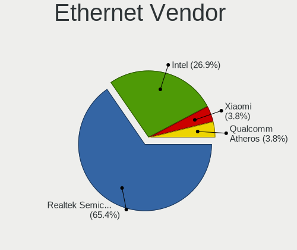

| Vendor                | Computers | Percent |
|-----------------------|-----------|---------|
| Realtek Semiconductor | 17        | 73.91%  |
| Intel                 | 5         | 21.74%  |
| DisplayLink           | 1         | 4.35%   |

Ethernet Model
--------------

Ethernet models

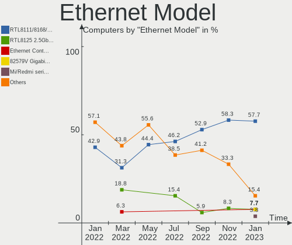

| Model                                                             | Computers | Percent |
|-------------------------------------------------------------------|-----------|---------|
| Realtek RTL8111/8168/8411 PCI Express Gigabit Ethernet Controller | 12        | 50%     |
| Realtek RTL810xE PCI Express Fast Ethernet controller             | 2         | 8.33%   |
| Intel I211 Gigabit Network Connection                             | 2         | 8.33%   |
| Intel Ethernet Connection (3) I218-LM                             | 2         | 8.33%   |
| Realtek USB 10/100/1G/2.5G LAN                                    | 1         | 4.17%   |
| Realtek RTL8153 Gigabit Ethernet Adapter                          | 1         | 4.17%   |
| Realtek Killer E3000 2.5GbE Controller                            | 1         | 4.17%   |
| Realtek Killer E2600 Gigabit Ethernet Controller                  | 1         | 4.17%   |
| Intel Ethernet Controller I225-V                                  | 1         | 4.17%   |
| DisplayLink 6950                                                  | 1         | 4.17%   |

Net Controller Kind
-------------------

Ethernet, WiFi or modem

| Kind     | Computers | Percent |
|----------|-----------|---------|
| WiFi     | 22        | 52.38%  |
| Ethernet | 20        | 47.62%  |

Used Controller
---------------

Currently used network controller

| Kind     | Computers | Percent |
|----------|-----------|---------|
| WiFi     | 19        | 67.86%  |
| Ethernet | 9         | 32.14%  |

NICs
----

Total network controllers on board

| Total | Computers | Percent |
|-------|-----------|---------|
| 1     | 14        | 50%     |
| 2     | 13        | 46.43%  |
| 3     | 1         | 3.57%   |

IPv6
----

IPv6 vs IPv4

| Used | Computers | Percent |
|------|-----------|---------|
| No   | 19        | 67.86%  |
| Yes  | 9         | 32.14%  |

Bluetooth
---------

Bluetooth Vendor
----------------

Controller vendors

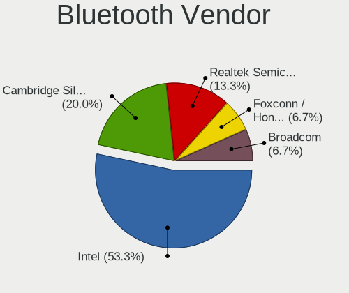

| Vendor                          | Computers | Percent |
|---------------------------------|-----------|---------|
| Intel                           | 11        | 47.83%  |
| Qualcomm Atheros Communications | 3         | 13.04%  |
| MediaTek                        | 2         | 8.7%    |
| Lite-On Technology              | 2         | 8.7%    |
| Realtek Semiconductor           | 1         | 4.35%   |
| IMC Networks                    | 1         | 4.35%   |
| Foxconn / Hon Hai               | 1         | 4.35%   |
| Cambridge Silicon Radio         | 1         | 4.35%   |
| ASUSTek Computer                | 1         | 4.35%   |

Bluetooth Model
---------------

Controller models

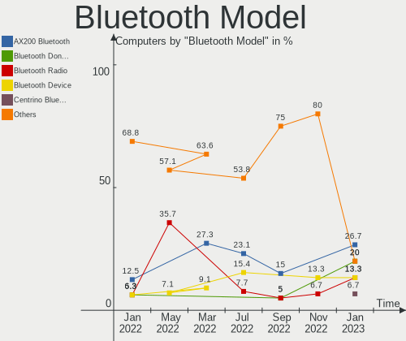

| Model                                               | Computers | Percent |
|-----------------------------------------------------|-----------|---------|
| Intel AX201 Bluetooth                               | 4         | 17.39%  |
| Intel AX200 Bluetooth                               | 3         | 13.04%  |
| Qualcomm Atheros  Bluetooth Device                  | 2         | 8.7%    |
| MediaTek Wireless_Device                            | 2         | 8.7%    |
| Intel Bluetooth wireless interface                  | 2         | 8.7%    |
| Realtek Bluetooth Radio                             | 1         | 4.35%   |
| Qualcomm Atheros QCA61x4 Bluetooth 4.0              | 1         | 4.35%   |
| Lite-On Wireless_Device                             | 1         | 4.35%   |
| Lite-On Qualcomm Atheros QCA9377 Bluetooth          | 1         | 4.35%   |
| Intel Bluetooth Device                              | 1         | 4.35%   |
| Intel AX210 Bluetooth                               | 1         | 4.35%   |
| IMC Networks Wireless_Device                        | 1         | 4.35%   |
| Foxconn / Hon Hai Wireless_Device                   | 1         | 4.35%   |
| Cambridge Silicon Radio Bluetooth Dongle (HCI mode) | 1         | 4.35%   |
| ASUS Bluetooth Device                               | 1         | 4.35%   |

Sound
-----

Sound Vendor
------------

Sound card vendors

| Vendor              | Computers | Percent |
|---------------------|-----------|---------|
| Intel               | 16        | 33.33%  |
| AMD                 | 13        | 27.08%  |
| Nvidia              | 11        | 22.92%  |
| Texas Instruments   | 2         | 4.17%   |
| C-Media Electronics | 2         | 4.17%   |
| Yamaha              | 1         | 2.08%   |
| RODE Microphones    | 1         | 2.08%   |
| Logitech            | 1         | 2.08%   |
| Arturia             | 1         | 2.08%   |

Sound Model
-----------

Sound card models

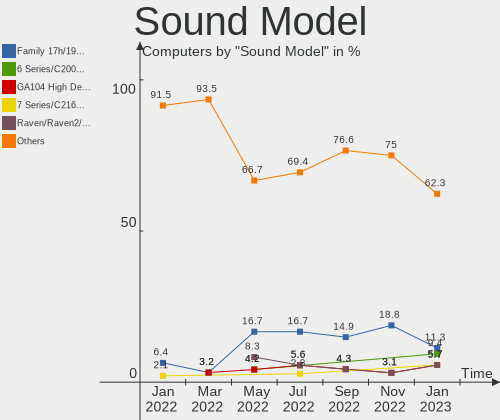

| Model                                                                      | Computers | Percent |
|----------------------------------------------------------------------------|-----------|---------|
| AMD Family 17h/19h HD Audio Controller                                     | 9         | 15%     |
| AMD Renoir Radeon High Definition Audio Controller                         | 6         | 10%     |
| Nvidia Audio device                                                        | 3         | 5%      |
| Nvidia GA106 High Definition Audio Controller                              | 2         | 3.33%   |
| Intel Wildcat Point-LP High Definition Audio Controller                    | 2         | 3.33%   |
| Intel Tiger Lake-LP Smart Sound Technology Audio Controller                | 2         | 3.33%   |
| Intel Sunrise Point-LP HD Audio                                            | 2         | 3.33%   |
| Intel Broadwell-U Audio Controller                                         | 2         | 3.33%   |
| Intel Alder Lake PCH-P High Definition Audio Controller                    | 2         | 3.33%   |
| Intel 7 Series/C216 Chipset Family High Definition Audio Controller        | 2         | 3.33%   |
| Intel 6 Series/C200 Series Chipset Family High Definition Audio Controller | 2         | 3.33%   |
| AMD Starship/Matisse HD Audio Controller                                   | 2         | 3.33%   |
| Yamaha YST-MS35D USB Speaker                                               | 1         | 1.67%   |
| Texas Instruments PCM2902 Audio Codec                                      | 1         | 1.67%   |
| Texas Instruments PCM2900C Audio CODEC                                     | 1         | 1.67%   |
| RODE Microphones RODE NT-USB                                               | 1         | 1.67%   |
| Nvidia TU116 High Definition Audio Controller                              | 1         | 1.67%   |
| Nvidia TU106 High Definition Audio Controller                              | 1         | 1.67%   |
| Nvidia GP102 HDMI Audio Controller                                         | 1         | 1.67%   |
| Nvidia GM107 High Definition Audio Controller [GeForce 940MX]              | 1         | 1.67%   |
| Nvidia GK208 HDMI/DP Audio Controller                                      | 1         | 1.67%   |
| Nvidia GA104 High Definition Audio Controller                              | 1         | 1.67%   |
| Logitech PRO X                                                             | 1         | 1.67%   |
| Intel Tiger Lake-H HD Audio Controller                                     | 1         | 1.67%   |
| Intel Comet Lake PCH cAVS                                                  | 1         | 1.67%   |
| Intel CM238 HD Audio Controller                                            | 1         | 1.67%   |
| Intel Cannon Lake PCH cAVS                                                 | 1         | 1.67%   |
| C-Media Electronics USB Audio Device                                       | 1         | 1.67%   |
| C-Media Electronics Audio Adapter (Unitek Y-247A)                          | 1         | 1.67%   |
| Arturia W-MINI                                                             | 1         | 1.67%   |
| AMD Tonga HDMI Audio [Radeon R9 285/380]                                   | 1         | 1.67%   |
| AMD SBx00 Azalia (Intel HDA)                                               | 1         | 1.67%   |
| AMD Rembrandt Radeon High Definition Audio Controller                      | 1         | 1.67%   |
| AMD Raven/Raven2/Fenghuang HDMI/DP Audio Controller                        | 1         | 1.67%   |
| AMD Oland/Hainan/Cape Verde/Pitcairn HDMI Audio [Radeon HD 7000 Series]    | 1         | 1.67%   |
| AMD Navi 21/23 HDMI/DP Audio Controller                                    | 1         | 1.67%   |

Memory
------

Memory Vendor
-------------

Memory module vendors

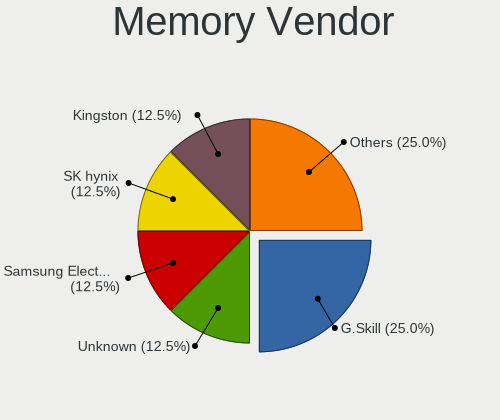

| Vendor              | Computers | Percent |
|---------------------|-----------|---------|
| Micron Technology   | 8         | 32%     |
| SK hynix            | 7         | 28%     |
| Samsung Electronics | 3         | 12%     |
| Crucial             | 2         | 8%      |
| Corsair             | 2         | 8%      |
| Unknown             | 1         | 4%      |
| Transcend           | 1         | 4%      |
| Kingston            | 1         | 4%      |

Memory Model
------------

Memory module models

| Model                                                         | Computers | Percent |
|---------------------------------------------------------------|-----------|---------|
| Unknown RAM 4400 C19 Series 8GB DIMM DDR4 2133MT/s            | 1         | 4%      |
| Transcend RAM JM3200HSG-8G 8GB SODIMM DDR4 3200MT/s           | 1         | 4%      |
| SK hynix RAM HMT41GS6BFR8A-PB 8GB SODIMM DDR3 1600MT/s        | 1         | 4%      |
| SK hynix RAM HMT41GS6AFR8A-PB 8GB SODIMM DDR3 1600MT/s        | 1         | 4%      |
| SK hynix RAM HMCG78MEBSA095N 16GB SODIMM DDR5 4800MT/s        | 1         | 4%      |
| SK hynix RAM HMCG66MEBSA092N 8GB SODIMM DDR5 4800MT/s         | 1         | 4%      |
| SK hynix RAM HMAA1GS6CJR6N-XN 8GB SODIMM DDR4 3200MT/s        | 1         | 4%      |
| SK hynix RAM HMA81GS6AFR8N-UH 8GB SODIMM DDR4 2667MT/s        | 1         | 4%      |
| SK hynix RAM H9HCNNNCPMMLXR-NEE 8GB SODIMM LPDDR4 4266MT/s    | 1         | 4%      |
| Samsung RAM M471B5273DH0-CK0 4GB SODIMM DDR3 1600MT/s         | 1         | 4%      |
| Samsung RAM M471A2K43EB1-CWE 16GB SODIMM DDR4 3200MT/s        | 1         | 4%      |
| Samsung RAM M471A1K43EB1-CWE 8GB SODIMM DDR4 3200MT/s         | 1         | 4%      |
| Micron RAM MT53E1G32D4NQ-046 8GB Row Of Chips LPDDR4 4267MT/s | 1         | 4%      |
| Micron RAM F6451U64F9333G 4GB DIMM DDR3 1333MT/s              | 1         | 4%      |
| Micron RAM 8ATF2G64HZ-3G2E1 8GB Row Of Chips DDR4 3200MT/s    | 1         | 4%      |
| Micron RAM 8ATF1G64HZ-3G2R1 8GB SODIMM DDR4 3200MT/s          | 1         | 4%      |
| Micron RAM 8ATF1G64HZ-3G2J1 8GB SODIMM DDR4 3200MT/s          | 1         | 4%      |
| Micron RAM 4ATS1G64HZ-2G3A1 8GB SODIMM DDR4 2400MT/s          | 1         | 4%      |
| Micron RAM 4ATF1G64HZ-3G2E2 8GB SODIMM DDR4 3200MT/s          | 1         | 4%      |
| Micron RAM 4ATF1G64HZ-3G2B2 8GB SODIMM DDR4 3200MT/s          | 1         | 4%      |
| Kingston RAM KHX2933C17S4/32G 32GB SODIMM DDR4 2933MT/s       | 1         | 4%      |
| Crucial RAM CT8G4SFS832A.M8FR 8GB SODIMM DDR4 3200MT/s        | 1         | 4%      |
| Crucial RAM CT51264BA1339.M16F 4GB DIMM DDR3 1333MT/s         | 1         | 4%      |
| Corsair RAM CMK64GX4M4D3600C18 16GB DIMM DDR4 3466MT/s        | 1         | 4%      |
| Corsair RAM CMK16GX4M2D3600C18 8GB DIMM DDR4 3600MT/s         | 1         | 4%      |

Memory Kind
-----------

Memory module kinds

| Kind   | Computers | Percent |
|--------|-----------|---------|
| DDR4   | 13        | 65%     |
| DDR3   | 3         | 15%     |
| LPDDR4 | 2         | 10%     |
| DDR5   | 2         | 10%     |

Memory Form Factor
------------------

Physical design of the memory module

| Name         | Computers | Percent |
|--------------|-----------|---------|
| SODIMM       | 14        | 70%     |
| DIMM         | 4         | 20%     |
| Row Of Chips | 2         | 10%     |

Memory Size
-----------

Memory module size

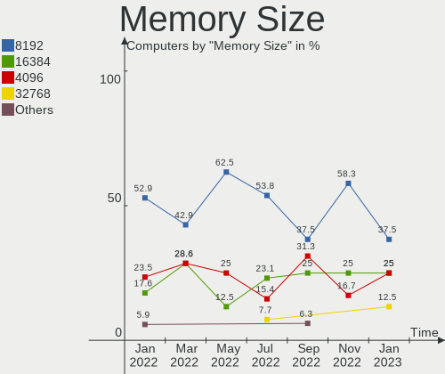

| Size  | Computers | Percent |
|-------|-----------|---------|
| 8192  | 15        | 71.43%  |
| 16384 | 3         | 14.29%  |
| 4096  | 2         | 9.52%   |
| 32768 | 1         | 4.76%   |

Memory Speed
------------

Memory module speed

| Speed | Computers | Percent |
|-------|-----------|---------|
| 3200  | 8         | 38.1%   |
| 4800  | 2         | 9.52%   |
| 4266  | 2         | 9.52%   |
| 1600  | 2         | 9.52%   |
| 4267  | 1         | 4.76%   |
| 3600  | 1         | 4.76%   |
| 3466  | 1         | 4.76%   |
| 2933  | 1         | 4.76%   |
| 2667  | 1         | 4.76%   |
| 2400  | 1         | 4.76%   |
| 1333  | 1         | 4.76%   |

Printers & scanners
-------------------

Printer Vendor
--------------

Printer device vendors

Zero info for selected period =(

Printer Model
-------------

Printer device models

Zero info for selected period =(

Scanner Vendor
--------------

Scanner device vendors

Zero info for selected period =(

Scanner Model
-------------

Scanner device models

Zero info for selected period =(

Camera
------

Camera Vendor
-------------

Camera device vendors

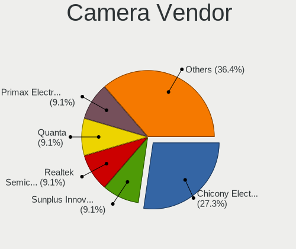

| Vendor                        | Computers | Percent |
|-------------------------------|-----------|---------|
| Chicony Electronics           | 4         | 19.05%  |
| Quanta                        | 3         | 14.29%  |
| Realtek Semiconductor         | 2         | 9.52%   |
| Luxvisions Innotech Limited   | 2         | 9.52%   |
| IMC Networks                  | 2         | 9.52%   |
| Generalplus Technology        | 2         | 9.52%   |
| Syntek                        | 1         | 4.76%   |
| Suyin                         | 1         | 4.76%   |
| Sunplus Innovation Technology | 1         | 4.76%   |
| Microsoft                     | 1         | 4.76%   |
| Microdia                      | 1         | 4.76%   |
| Logitech                      | 1         | 4.76%   |

Camera Model
------------

Camera device models

| Model                                                | Computers | Percent |
|------------------------------------------------------|-----------|---------|
| Realtek Integrated_Webcam_HD                         | 2         | 9.52%   |
| Chicony HD WebCam                                    | 2         | 9.52%   |
| Syntek Integrated Camera                             | 1         | 4.76%   |
| Suyin HP TrueVision HD Integrated Webcam             | 1         | 4.76%   |
| Sunplus Integrated_Webcam_HD                         | 1         | 4.76%   |
| Quanta HP HD Camera                                  | 1         | 4.76%   |
| Quanta HD User Facing                                | 1         | 4.76%   |
| Quanta HD Camera                                     | 1         | 4.76%   |
| Microsoft LifeCam VX-2000                            | 1         | 4.76%   |
| Microdia Integrated_Webcam_HD                        | 1         | 4.76%   |
| Luxvisions Innotech Limited Integrated Camera        | 1         | 4.76%   |
| Luxvisions Innotech Limited HP Wide Vision HD Camera | 1         | 4.76%   |
| Logitech HD Pro Webcam C920                          | 1         | 4.76%   |
| IMC Networks USB2.0 HD UVC WebCam                    | 1         | 4.76%   |
| IMC Networks EasyCamera                              | 1         | 4.76%   |
| Generalplus GENERAL WEBCAM                           | 1         | 4.76%   |
| Generalplus 2K HD Camera                             | 1         | 4.76%   |
| Chicony USB2.0 Camera                                | 1         | 4.76%   |
| Chicony HP Wide Vision HD Camera                     | 1         | 4.76%   |

Security
--------

Fingerprint Vendor
------------------

Fingerprint sensor vendors

| Vendor                     | Computers | Percent |
|----------------------------|-----------|---------|
| Synaptics                  | 1         | 33.33%  |
| Shenzhen Goodix Technology | 1         | 33.33%  |
| Elan Microelectronics      | 1         | 33.33%  |

Fingerprint Model
-----------------

Fingerprint sensor models

| Model                              | Computers | Percent |
|------------------------------------|-----------|---------|
| Synaptics  WBDI                    | 1         | 33.33%  |
| Shenzhen Goodix Fingerprint Reader | 1         | 33.33%  |
| Elan ELAN:ARM-M4                   | 1         | 33.33%  |

Chipcard Vendor
---------------

Chipcard module vendors

| Vendor   | Computers | Percent |
|----------|-----------|---------|
| Broadcom | 1         | 100%    |

Chipcard Model
--------------

Chipcard module models

| Model                                                                        | Computers | Percent |
|------------------------------------------------------------------------------|-----------|---------|
| Broadcom BCM5880 Secure Applications Processor with fingerprint swipe sensor | 1         | 100%    |

Unsupported
-----------

Unsupported Devices
-------------------

Total unsupported devices on board

| Total | Computers | Percent |
|-------|-----------|---------|
| 1     | 12        | 42.86%  |
| 0     | 11        | 39.29%  |
| 2     | 5         | 17.86%  |

Unsupported Device Types
------------------------

Types of unsupported devices

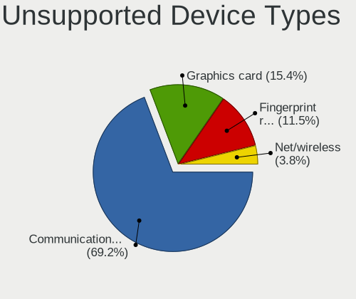

| Type                     | Computers | Percent |
|--------------------------|-----------|---------|
| Communication controller | 13        | 61.9%   |
| Fingerprint reader       | 3         | 14.29%  |
| Graphics card            | 2         | 9.52%   |
| Net/wireless             | 1         | 4.76%   |
| Multimedia controller    | 1         | 4.76%   |
| Chipcard                 | 1         | 4.76%   |

