Garuda Linux - Hardware Trends (Desktops)
-----------------------------------------

A project to identify most popular hardware characteristics and track their change
over time based on data collected by Linux users at https://Linux-Hardware.org.

Anyone can contribute to this report by the [hw-probe](https://github.com/linuxhw/hw-probe) tool:

    sudo -E hw-probe -all -upload

This report is for one last month. Overall report since the beginning of time: [TestCoverage](https://github.com/linuxhw/TestCoverage)

Period: Jan, 2023.

Contents
--------

* [ System ](#system)
  - [ OS                       ](#os)
  - [ OS Family                ](#os-family)
  - [ Kernel                   ](#kernel)
  - [ Kernel Family            ](#kernel-family)
  - [ Kernel Major Ver.        ](#kernel-major-ver)
  - [ Arch                     ](#arch)
  - [ DE                       ](#de)
  - [ Display Server           ](#display-server)
  - [ Display Manager          ](#display-manager)
  - [ OS Lang                  ](#os-lang)
  - [ Boot Mode                ](#boot-mode)
  - [ Filesystem               ](#filesystem)
  - [ Part. scheme             ](#part-scheme)
  - [ Dual Boot with Linux/BSD ](#dual-boot-with-linuxbsd)
  - [ Dual Boot (Win)          ](#dual-boot-win)

* [ Board ](#board)
  - [ Vendor                   ](#vendor)
  - [ Model                    ](#model)
  - [ Model Family             ](#model-family)
  - [ MFG Year                 ](#mfg-year)
  - [ Form Factor              ](#form-factor)
  - [ Secure Boot              ](#secure-boot)
  - [ Coreboot                 ](#coreboot)
  - [ RAM Size                 ](#ram-size)
  - [ RAM Used                 ](#ram-used)
  - [ Total Drives             ](#total-drives)
  - [ Has CD-ROM               ](#has-cd-rom)
  - [ Has Ethernet             ](#has-ethernet)
  - [ Has WiFi                 ](#has-wifi)
  - [ Has Bluetooth            ](#has-bluetooth)

* [ Location ](#location)
  - [ Country                  ](#country)
  - [ City                     ](#city)

* [ Drives ](#drives)
  - [ Drive Vendor             ](#drive-vendor)
  - [ Drive Model              ](#drive-model)
  - [ HDD Vendor               ](#hdd-vendor)
  - [ SSD Vendor               ](#ssd-vendor)
  - [ Drive Kind               ](#drive-kind)
  - [ Drive Connector          ](#drive-connector)
  - [ Drive Size               ](#drive-size)
  - [ Space Total              ](#space-total)
  - [ Space Used               ](#space-used)
  - [ Malfunc. Drives          ](#malfunc-drives)
  - [ Malfunc. Drive Vendor    ](#malfunc-drive-vendor)
  - [ Malfunc. HDD Vendor      ](#malfunc-hdd-vendor)
  - [ Malfunc. Drive Kind      ](#malfunc-drive-kind)
  - [ Failed Drives            ](#failed-drives)
  - [ Failed Drive Vendor      ](#failed-drive-vendor)
  - [ Drive Status             ](#drive-status)

* [ Storage controller ](#storage-controller)
  - [ Storage Vendor           ](#storage-vendor)
  - [ Storage Model            ](#storage-model)
  - [ Storage Kind             ](#storage-kind)

* [ Processor ](#processor)
  - [ CPU Vendor               ](#cpu-vendor)
  - [ CPU Model                ](#cpu-model)
  - [ CPU Model Family         ](#cpu-model-family)
  - [ CPU Cores                ](#cpu-cores)
  - [ CPU Sockets              ](#cpu-sockets)
  - [ CPU Threads              ](#cpu-threads)
  - [ CPU Op-Modes             ](#cpu-op-modes)
  - [ CPU Microcode            ](#cpu-microcode)
  - [ CPU Microarch            ](#cpu-microarch)

* [ Graphics ](#graphics)
  - [ GPU Vendor               ](#gpu-vendor)
  - [ GPU Model                ](#gpu-model)
  - [ GPU Combo                ](#gpu-combo)
  - [ GPU Driver               ](#gpu-driver)
  - [ GPU Memory               ](#gpu-memory)

* [ Monitor ](#monitor)
  - [ Monitor Vendor           ](#monitor-vendor)
  - [ Monitor Model            ](#monitor-model)
  - [ Monitor Resolution       ](#monitor-resolution)
  - [ Monitor Diagonal         ](#monitor-diagonal)
  - [ Monitor Width            ](#monitor-width)
  - [ Aspect Ratio             ](#aspect-ratio)
  - [ Monitor Area             ](#monitor-area)
  - [ Pixel Density            ](#pixel-density)
  - [ Multiple Monitors        ](#multiple-monitors)

* [ Network ](#network)
  - [ Net Controller Vendor    ](#net-controller-vendor)
  - [ Net Controller Model     ](#net-controller-model)
  - [ Wireless Vendor          ](#wireless-vendor)
  - [ Wireless Model           ](#wireless-model)
  - [ Ethernet Vendor          ](#ethernet-vendor)
  - [ Ethernet Model           ](#ethernet-model)
  - [ Net Controller Kind      ](#net-controller-kind)
  - [ Used Controller          ](#used-controller)
  - [ NICs                     ](#nics)
  - [ IPv6                     ](#ipv6)

* [ Bluetooth ](#bluetooth)
  - [ Bluetooth Vendor         ](#bluetooth-vendor)
  - [ Bluetooth Model          ](#bluetooth-model)

* [ Sound ](#sound)
  - [ Sound Vendor             ](#sound-vendor)
  - [ Sound Model              ](#sound-model)

* [ Memory ](#memory)
  - [ Memory Vendor            ](#memory-vendor)
  - [ Memory Model             ](#memory-model)
  - [ Memory Kind              ](#memory-kind)
  - [ Memory Form Factor       ](#memory-form-factor)
  - [ Memory Size              ](#memory-size)
  - [ Memory Speed             ](#memory-speed)

* [ Printers & scanners ](#printers--scanners)
  - [ Printer Vendor           ](#printer-vendor)
  - [ Printer Model            ](#printer-model)
  - [ Scanner Vendor           ](#scanner-vendor)
  - [ Scanner Model            ](#scanner-model)

* [ Camera ](#camera)
  - [ Camera Vendor            ](#camera-vendor)
  - [ Camera Model             ](#camera-model)

* [ Security ](#security)
  - [ Fingerprint Vendor       ](#fingerprint-vendor)
  - [ Fingerprint Model        ](#fingerprint-model)
  - [ Chipcard Vendor          ](#chipcard-vendor)
  - [ Chipcard Model           ](#chipcard-model)

* [ Unsupported ](#unsupported)
  - [ Unsupported Devices      ](#unsupported-devices)
  - [ Unsupported Device Types ](#unsupported-device-types)

System
------

OS
--

Installed operating systems

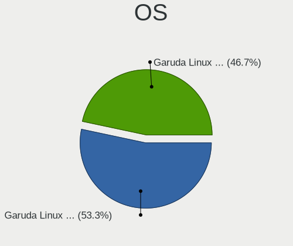

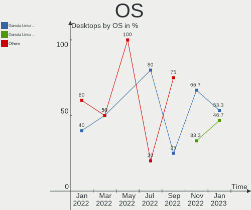

| Name                 | Desktops | Percent |
|----------------------|----------|---------|
| Garuda Linux Soaring | 8        | 53.33%  |
| Garuda Linux Rolling | 7        | 46.67%  |

OS Family
---------

OS without a version

| Name         | Desktops | Percent |
|--------------|----------|---------|
| Garuda Linux | 15       | 100%    |

Kernel
------

Version of the Linux kernel

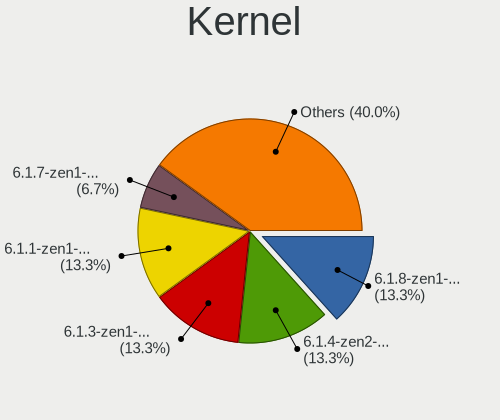

| Version           | Desktops | Percent |
|-------------------|----------|---------|
| 6.1.8-zen1-1-zen  | 2        | 13.33%  |
| 6.1.4-zen2-1-zen  | 2        | 13.33%  |
| 6.1.3-zen1-1-zen  | 2        | 13.33%  |
| 6.1.1-zen1-1-zen  | 2        | 13.33%  |
| 6.1.7-zen1-1-zen  | 1        | 6.67%   |
| 6.1.5-zen2-1-zen  | 1        | 6.67%   |
| 6.1.4-AMD         | 1        | 6.67%   |
| 6.0.2-zen1-1-zen  | 1        | 6.67%   |
| 6.0.12-zen1-1-zen | 1        | 6.67%   |
| 5.15.87-1-lts     | 1        | 6.67%   |
| 5.15.86-1-lts     | 1        | 6.67%   |

Kernel Family
-------------

Linux kernel without a distro release

| Version | Desktops | Percent |
|---------|----------|---------|
| 6.1.4   | 3        | 20%     |
| 6.1.8   | 2        | 13.33%  |
| 6.1.3   | 2        | 13.33%  |
| 6.1.1   | 2        | 13.33%  |
| 6.1.7   | 1        | 6.67%   |
| 6.1.5   | 1        | 6.67%   |
| 6.0.2   | 1        | 6.67%   |
| 6.0.12  | 1        | 6.67%   |
| 5.15.87 | 1        | 6.67%   |
| 5.15.86 | 1        | 6.67%   |

Kernel Major Ver.
-----------------

Linux kernel major version

| Version | Desktops | Percent |
|---------|----------|---------|
| 6.1     | 11       | 73.33%  |
| 6.0     | 2        | 13.33%  |
| 5.15    | 2        | 13.33%  |

Arch
----

OS architecture (x86_64, i586, etc.)

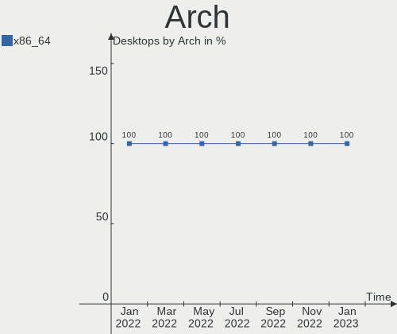

| Name   | Desktops | Percent |
|--------|----------|---------|
| x86_64 | 15       | 100%    |

DE
--

Desktop Environment

| Name       | Desktops | Percent |
|------------|----------|---------|
| KDE5       | 10       | 66.67%  |
| GNOME      | 2        | 13.33%  |
| X-Cinnamon | 1        | 6.67%   |
| MATE       | 1        | 6.67%   |
| LXQt       | 1        | 6.67%   |

Display Server
--------------

X11 or Wayland

| Name | Desktops | Percent |
|------|----------|---------|
| X11  | 15       | 100%    |

Display Manager
---------------

SDDM, LightDM, etc.

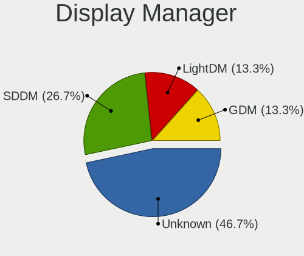

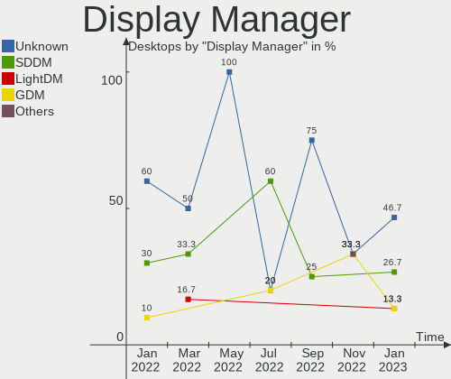

| Name    | Desktops | Percent |
|---------|----------|---------|
| Unknown | 7        | 46.67%  |
| SDDM    | 4        | 26.67%  |
| LightDM | 2        | 13.33%  |
| GDM     | 2        | 13.33%  |

OS Lang
-------

Language

| Lang  | Desktops | Percent |
|-------|----------|---------|
| en_US | 8        | 53.33%  |
| it_IT | 1        | 6.67%   |
| hu_HU | 1        | 6.67%   |
| es_ES | 1        | 6.67%   |
| en_GB | 1        | 6.67%   |
| de_DE | 1        | 6.67%   |
| da_DK | 1        | 6.67%   |
| cs_CZ | 1        | 6.67%   |

Boot Mode
---------

EFI or BIOS

| Mode | Desktops | Percent |
|------|----------|---------|
| BIOS | 9        | 60%     |
| EFI  | 6        | 40%     |

Filesystem
----------

Type of filesystem

| Type    | Desktops | Percent |
|---------|----------|---------|
| Btrfs   | 14       | 93.33%  |
| Overlay | 1        | 6.67%   |

Part. scheme
------------

Scheme of partitioning

| Type    | Desktops | Percent |
|---------|----------|---------|
| GPT     | 7        | 46.67%  |
| Unknown | 7        | 46.67%  |
| MBR     | 1        | 6.67%   |

Dual Boot with Linux/BSD
------------------------

Hosting more than one Linux/BSD

| Dual boot | Desktops | Percent |
|-----------|----------|---------|
| No        | 13       | 86.67%  |
| Yes       | 2        | 13.33%  |

Dual Boot (Win)
---------------

Hosting Linux and Windows

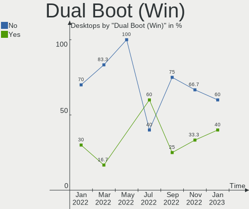

| Dual boot | Desktops | Percent |
|-----------|----------|---------|
| No        | 9        | 60%     |
| Yes       | 6        | 40%     |

Board
-----

Vendor
------

Motherboard manufacturer

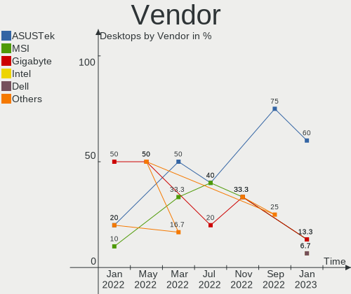

| Name                | Desktops | Percent |
|---------------------|----------|---------|
| ASUSTek Computer    | 9        | 60%     |
| MSI                 | 2        | 13.33%  |
| Gigabyte Technology | 2        | 13.33%  |
| Intel               | 1        | 6.67%   |
| Dell                | 1        | 6.67%   |

Model
-----

Motherboard model

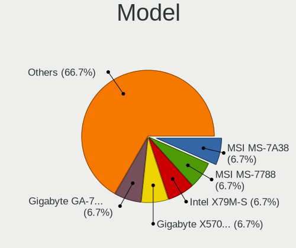

| Name                           | Desktops | Percent |
|--------------------------------|----------|---------|
| MSI MS-7A38                    | 1        | 6.67%   |
| MSI MS-7788                    | 1        | 6.67%   |
| Intel X79M-S                   | 1        | 6.67%   |
| Gigabyte X570 I AORUS PRO WIFI | 1        | 6.67%   |
| Gigabyte GA-78LMT-USB3 6.0     | 1        | 6.67%   |
| Dell OptiPlex 3020             | 1        | 6.67%   |
| ASUS TUF Gaming Z690-PLUS D4   | 1        | 6.67%   |
| ASUS TUF Gaming B660M-E D4     | 1        | 6.67%   |
| ASUS Rampage IV GENE           | 1        | 6.67%   |
| ASUS PRIME Z490-A              | 1        | 6.67%   |
| ASUS PRIME X570-P              | 1        | 6.67%   |
| ASUS PRIME A320M-A             | 1        | 6.67%   |
| ASUS P8H61/USB3 R2.0           | 1        | 6.67%   |
| ASUS                           | 1        | 6.67%   |
| ASUS CM6850                    | 1        | 6.67%   |

Model Family
------------

Motherboard model prefix

| Name                   | Desktops | Percent |
|------------------------|----------|---------|
| ASUS PRIME             | 3        | 20%     |
| ASUS TUF               | 2        | 13.33%  |
| MSI MS-7A38            | 1        | 6.67%   |
| MSI MS-7788            | 1        | 6.67%   |
| Intel X79M-S           | 1        | 6.67%   |
| Gigabyte X570          | 1        | 6.67%   |
| Gigabyte GA-78LMT-USB3 | 1        | 6.67%   |
| Dell OptiPlex          | 1        | 6.67%   |
| ASUS Rampage           | 1        | 6.67%   |
| ASUS P8H61             | 1        | 6.67%   |
| ASUS                   | 1        | 6.67%   |
| ASUS CM6850            | 1        | 6.67%   |

MFG Year
--------

Motherboard manufacture year

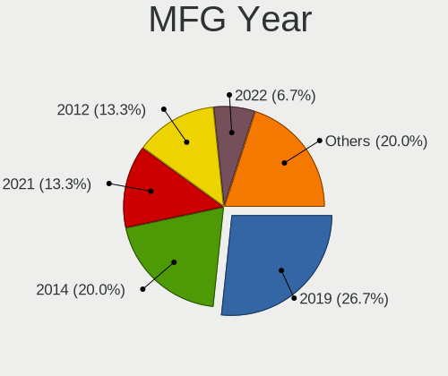

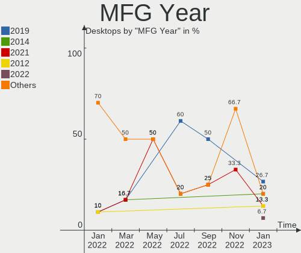

| Year | Desktops | Percent |
|------|----------|---------|
| 2019 | 4        | 26.67%  |
| 2014 | 3        | 20%     |
| 2021 | 2        | 13.33%  |
| 2012 | 2        | 13.33%  |
| 2022 | 1        | 6.67%   |
| 2020 | 1        | 6.67%   |
| 2017 | 1        | 6.67%   |
| 2011 | 1        | 6.67%   |

Form Factor
-----------

Physical design of the computer

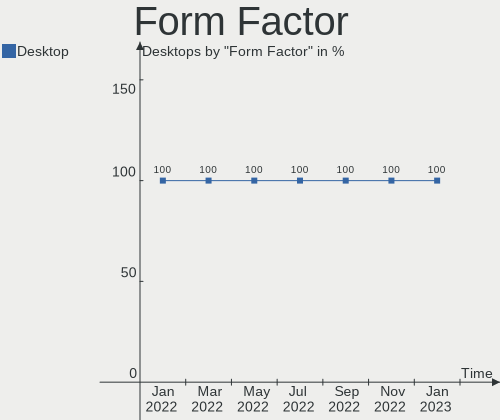

| Name    | Desktops | Percent |
|---------|----------|---------|
| Desktop | 15       | 100%    |

Secure Boot
-----------

Enabled or disabled

| State    | Desktops | Percent |
|----------|----------|---------|
| Disabled | 15       | 100%    |

Coreboot
--------

Have coreboot on board

| Used | Desktops | Percent |
|------|----------|---------|
| No   | 15       | 100%    |

RAM Size
--------

Total RAM memory

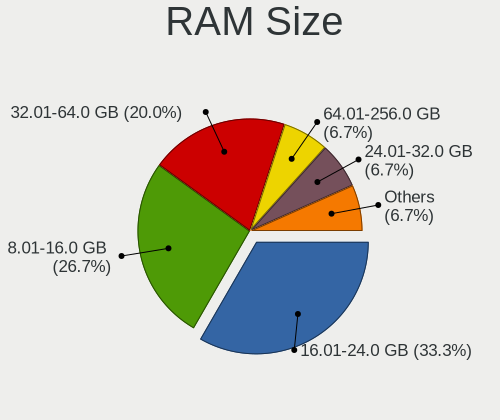

| Size in GB  | Desktops | Percent |
|-------------|----------|---------|
| 16.01-24.0  | 5        | 33.33%  |
| 8.01-16.0   | 4        | 26.67%  |
| 32.01-64.0  | 3        | 20%     |
| 3.01-4.0    | 1        | 6.67%   |
| 24.01-32.0  | 1        | 6.67%   |
| 64.01-256.0 | 1        | 6.67%   |

RAM Used
--------

Used RAM memory

| Used GB   | Desktops | Percent |
|-----------|----------|---------|
| 4.01-8.0  | 7        | 46.67%  |
| 3.01-4.0  | 5        | 33.33%  |
| 2.01-3.0  | 1        | 6.67%   |
| 1.01-2.0  | 1        | 6.67%   |
| 8.01-16.0 | 1        | 6.67%   |

Total Drives
------------

Number of drives on board

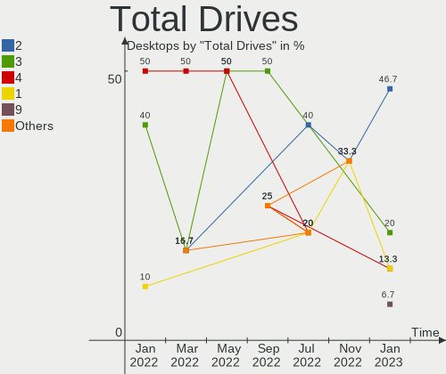

| Drives | Desktops | Percent |
|--------|----------|---------|
| 2      | 7        | 46.67%  |
| 3      | 3        | 20%     |
| 4      | 2        | 13.33%  |
| 1      | 2        | 13.33%  |
| 9      | 1        | 6.67%   |

Has CD-ROM
----------

Has CD-ROM on board

| Presented | Desktops | Percent |
|-----------|----------|---------|
| No        | 9        | 60%     |
| Yes       | 6        | 40%     |

Has Ethernet
------------

Has Ethernet on board

| Presented | Desktops | Percent |
|-----------|----------|---------|
| Yes       | 15       | 100%    |

Has WiFi
--------

Has WiFi module

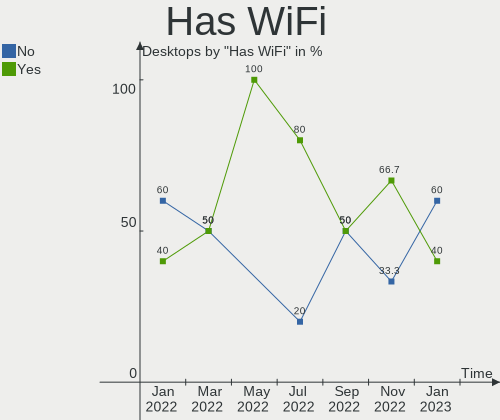

| Presented | Desktops | Percent |
|-----------|----------|---------|
| No        | 9        | 60%     |
| Yes       | 6        | 40%     |

Has Bluetooth
-------------

Has Bluetooth module

| Presented | Desktops | Percent |
|-----------|----------|---------|
| No        | 9        | 60%     |
| Yes       | 6        | 40%     |

Location
--------

Country
-------

Geographic location (country)

| Country    | Desktops | Percent |
|------------|----------|---------|
| Germany    | 4        | 26.67%  |
| USA        | 2        | 13.33%  |
| Spain      | 1        | 6.67%   |
| Italy      | 1        | 6.67%   |
| India      | 1        | 6.67%   |
| Hungary    | 1        | 6.67%   |
| Denmark    | 1        | 6.67%   |
| Czechia    | 1        | 6.67%   |
| Brazil     | 1        | 6.67%   |
| Bangladesh | 1        | 6.67%   |
| Austria    | 1        | 6.67%   |

City
----

Geographic location (city)

| City                | Desktops | Percent |
|---------------------|----------|---------|
| Zwickau             | 1        | 6.67%   |
| Trecastelli         | 1        | 6.67%   |
| Steyr               | 1        | 6.67%   |
| Saint Joseph        | 1        | 6.67%   |
| Rathenow            | 1        | 6.67%   |
| Prague              | 1        | 6.67%   |
| Mannheim            | 1        | 6.67%   |
| Kolkata             | 1        | 6.67%   |
| Jaszkiser           | 1        | 6.67%   |
| Dhaka               | 1        | 6.67%   |
| Charlotte           | 1        | 6.67%   |
| Belo Horizonte      | 1        | 6.67%   |
| Bad Soden am Taunus | 1        | 6.67%   |
| Algeciras           | 1        | 6.67%   |
| Aarhus              | 1        | 6.67%   |

Drives
------

Drive Vendor
------------

Hard drive vendors

| Vendor                      | Desktops | Drives | Percent |
|-----------------------------|----------|--------|---------|
| Samsung Electronics         | 7        | 8      | 18.92%  |
| Seagate                     | 6        | 8      | 16.22%  |
| WDC                         | 5        | 6      | 13.51%  |
| Toshiba                     | 4        | 5      | 10.81%  |
| Silicon Motion              | 2        | 2      | 5.41%   |
| Sandisk                     | 2        | 2      | 5.41%   |
| Kingston                    | 2        | 2      | 5.41%   |
| Realtek Semiconductor       | 1        | 1      | 2.7%    |
| Micron/Crucial Technology   | 1        | 1      | 2.7%    |
| Kingston Technology Company | 1        | 1      | 2.7%    |
| JMicron Technology          | 1        | 1      | 2.7%    |
| Intel                       | 1        | 1      | 2.7%    |
| Hitachi                     | 1        | 1      | 2.7%    |
| Hewlett-Packard             | 1        | 1      | 2.7%    |
| Fanxiang                    | 1        | 1      | 2.7%    |
| Emtec                       | 1        | 1      | 2.7%    |

Drive Model
-----------

Hard drive models

| Model                                                 | Desktops | Percent |
|-------------------------------------------------------|----------|---------|
| Samsung NVMe SSD Controller SM981/PM981/PM983 500GB   | 3        | 7.14%   |
| Silicon Motion SM2263EN/SM2263XT SSD Controller 512GB | 2        | 4.76%   |
| Sandisk WD Blue SN550 NVMe SSD 1TB                    | 2        | 4.76%   |
| Samsung SSD 850 EVO 250GB                             | 2        | 4.76%   |
| WDC WD40EZRZ-22GXCB0 4TB                              | 1        | 2.38%   |
| WDC WD40EFZX-68AWUN0 4TB                              | 1        | 2.38%   |
| WDC WD20SPZX-08UA7 2TB                                | 1        | 2.38%   |
| WDC WD20EZBX-00AYRA0 2TB                              | 1        | 2.38%   |
| WDC WD10EZRX-00L4HB0 1TB                              | 1        | 2.38%   |
| WDC WD10EALX-009BA0 1TB                               | 1        | 2.38%   |
| Toshiba TR150 480GB SSD                               | 1        | 2.38%   |
| Toshiba MK6465GSXN 640GB                              | 1        | 2.38%   |
| Toshiba HDWD130 3TB                                   | 1        | 2.38%   |
| Toshiba HDWD110 1TB                                   | 1        | 2.38%   |
| Toshiba DT01ACA050 500GB                              | 1        | 2.38%   |
| Seagate ST9500325AS 500GB                             | 1        | 2.38%   |
| Seagate ST3320820AS 320GB                             | 1        | 2.38%   |
| Seagate ST3000DM003-1F216N 3TB                        | 1        | 2.38%   |
| Seagate ST2000DM001-1CH164 2TB                        | 1        | 2.38%   |
| Seagate ST1000DM003-9YN162 1TB                        | 1        | 2.38%   |
| Seagate ST1000DM003-1CH162 1TB                        | 1        | 2.38%   |
| Seagate Expansion HDD 5TB                             | 1        | 2.38%   |
| Seagate Expansion 240GB                               | 1        | 2.38%   |
| Samsung SSD 860 EVO 250GB                             | 1        | 2.38%   |
| Samsung SSD 860 EVO 1TB                               | 1        | 2.38%   |
| Samsung NVMe SSD Controller PM9A1/PM9A3/980PRO 512GB  | 1        | 2.38%   |
| Realtek SPCC M.2 PCIe SSD 256GB                       | 1        | 2.38%   |
| Micron/Crucial P1 NVMe PCIe SSD 1TB                   | 1        | 2.38%   |
| Kingston Company KC2000 NVMe SSD 1TB                  | 1        | 2.38%   |
| Kingston SV300S37A240G 240GB SSD                      | 1        | 2.38%   |
| Kingston SA400S37120G 120GB SSD                       | 1        | 2.38%   |
| JMicron Tech 250GB                                    | 1        | 2.38%   |
| Intel SSD 660P Series 512GB                           | 1        | 2.38%   |
| Hitachi HDT721032SLA360 320GB                         | 1        | 2.38%   |
| HP GB0250EAFYK 250GB                                  | 1        | 2.38%   |
| Fanxiang S101 256GB                                   | 1        | 2.38%   |
| Emtec X150 480GB SSD                                  | 1        | 2.38%   |

HDD Vendor
----------

Hard disk drive vendors

| Vendor          | Desktops | Drives | Percent |
|-----------------|----------|--------|---------|
| Seagate         | 6        | 8      | 35.29%  |
| WDC             | 5        | 6      | 29.41%  |
| Toshiba         | 4        | 4      | 23.53%  |
| Hitachi         | 1        | 1      | 5.88%   |
| Hewlett-Packard | 1        | 1      | 5.88%   |

SSD Vendor
----------

Solid state drive vendors

| Vendor              | Desktops | Drives | Percent |
|---------------------|----------|--------|---------|
| Samsung Electronics | 4        | 4      | 44.44%  |
| Kingston            | 2        | 2      | 22.22%  |
| Toshiba             | 1        | 1      | 11.11%  |
| Fanxiang            | 1        | 1      | 11.11%  |
| Emtec               | 1        | 1      | 11.11%  |

Drive Kind
----------

HDD or SSD

| Kind    | Desktops | Drives | Percent |
|---------|----------|--------|---------|
| HDD     | 13       | 20     | 43.33%  |
| NVMe    | 9        | 12     | 30%     |
| SSD     | 7        | 9      | 23.33%  |
| Unknown | 1        | 1      | 3.33%   |

Drive Connector
---------------

SATA, SAS, NVMe, etc.

| Type | Desktops | Drives | Percent |
|------|----------|--------|---------|
| SATA | 14       | 27     | 56%     |
| NVMe | 9        | 12     | 36%     |
| SAS  | 2        | 3      | 8%      |

Drive Size
----------

Size of hard drive

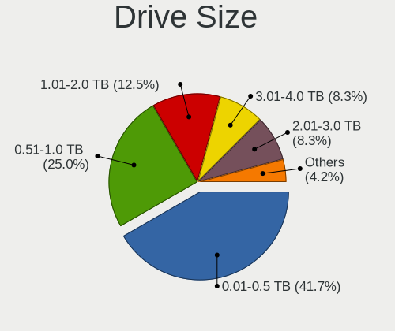

| Size in TB | Desktops | Drives | Percent |
|------------|----------|--------|---------|
| 0.01-0.5   | 10       | 14     | 41.67%  |
| 0.51-1.0   | 6        | 7      | 25%     |
| 1.01-2.0   | 3        | 3      | 12.5%   |
| 3.01-4.0   | 2        | 2      | 8.33%   |
| 2.01-3.0   | 2        | 2      | 8.33%   |
| 4.01-10.0  | 1        | 1      | 4.17%   |

Space Total
-----------

Amount of disk space available on the file system

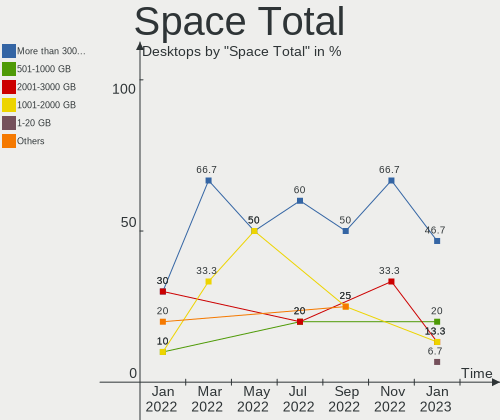

| Size in GB     | Desktops | Percent |
|----------------|----------|---------|
| More than 3000 | 7        | 46.67%  |
| 501-1000       | 3        | 20%     |
| 2001-3000      | 2        | 13.33%  |
| 1001-2000      | 2        | 13.33%  |
| 1-20           | 1        | 6.67%   |

Space Used
----------

Amount of used disk space

| Used GB        | Desktops | Percent |
|----------------|----------|---------|
| 101-250        | 4        | 26.67%  |
| 501-1000       | 3        | 20%     |
| More than 3000 | 2        | 13.33%  |
| 251-500        | 2        | 13.33%  |
| 2001-3000      | 2        | 13.33%  |
| 1001-2000      | 1        | 6.67%   |
| 1-20           | 1        | 6.67%   |

Malfunc. Drives
---------------

Drive models with a malfunction

| Model                          | Desktops | Drives | Percent |
|--------------------------------|----------|--------|---------|
| WDC WD10EZRX-00L4HB0 1TB       | 1        | 1      | 33.33%  |
| Seagate ST3000DM003-1F216N 3TB | 1        | 1      | 33.33%  |
| Hitachi HDT721032SLA360 320GB  | 1        | 1      | 33.33%  |

Malfunc. Drive Vendor
---------------------

Vendors of faulty drives

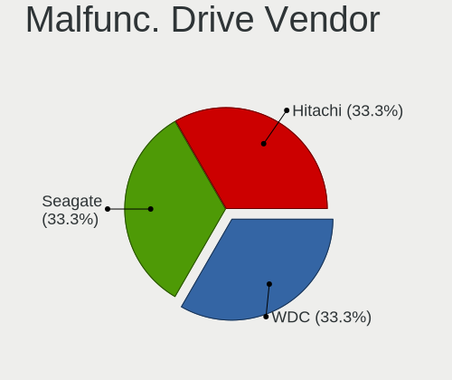

| Vendor  | Desktops | Drives | Percent |
|---------|----------|--------|---------|
| WDC     | 1        | 1      | 33.33%  |
| Seagate | 1        | 1      | 33.33%  |
| Hitachi | 1        | 1      | 33.33%  |

Malfunc. HDD Vendor
-------------------

Vendors of faulty HDD drives

| Vendor  | Desktops | Drives | Percent |
|---------|----------|--------|---------|
| WDC     | 1        | 1      | 33.33%  |
| Seagate | 1        | 1      | 33.33%  |
| Hitachi | 1        | 1      | 33.33%  |

Malfunc. Drive Kind
-------------------

Kinds of faulty drives

| Kind | Desktops | Drives | Percent |
|------|----------|--------|---------|
| HDD  | 3        | 3      | 100%    |

Failed Drives
-------------

Failed drive models

Zero info for selected period =(

Failed Drive Vendor
-------------------

Failed drive vendors

Zero info for selected period =(

Drive Status
------------

Number of failed and malfunc. drives

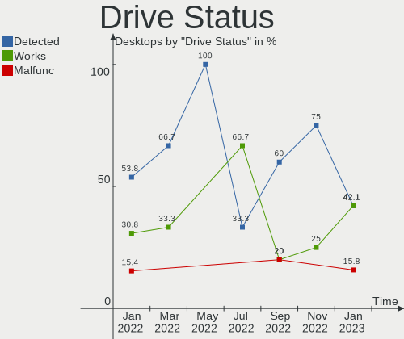

| Status   | Desktops | Drives | Percent |
|----------|----------|--------|---------|
| Detected | 8        | 23     | 42.11%  |
| Works    | 8        | 16     | 42.11%  |
| Malfunc  | 3        | 3      | 15.79%  |

Storage controller
------------------

Storage Vendor
--------------

Storage controller vendors

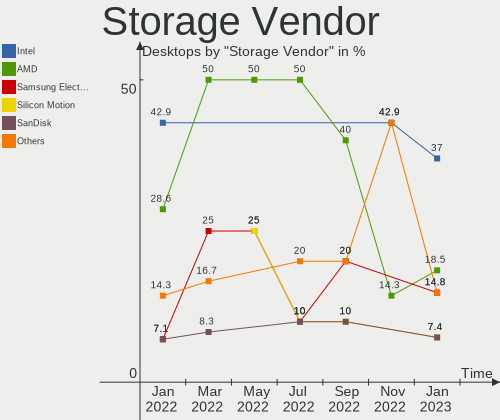

| Vendor                      | Desktops | Percent |
|-----------------------------|----------|---------|
| Intel                       | 10       | 37.04%  |
| AMD                         | 5        | 18.52%  |
| Samsung Electronics         | 4        | 14.81%  |
| Silicon Motion              | 2        | 7.41%   |
| SanDisk                     | 2        | 7.41%   |
| Realtek Semiconductor       | 1        | 3.7%    |
| Micron/Crucial Technology   | 1        | 3.7%    |
| Kingston Technology Company | 1        | 3.7%    |
| ASMedia Technology          | 1        | 3.7%    |

Storage Model
-------------

Storage controller models

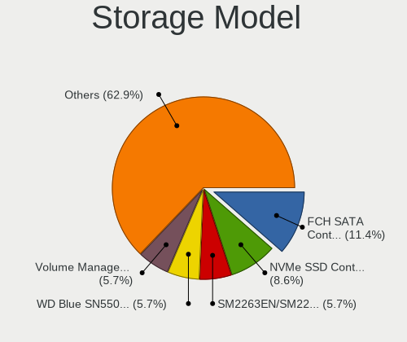

| Model                                                                                   | Desktops | Percent |
|-----------------------------------------------------------------------------------------|----------|---------|
| AMD FCH SATA Controller [AHCI mode]                                                     | 4        | 11.43%  |
| Samsung NVMe SSD Controller SM981/PM981/PM983                                           | 3        | 8.57%   |
| Silicon Motion SM2263EN/SM2263XT SSD Controller                                         | 2        | 5.71%   |
| SanDisk WD Blue SN550 NVMe SSD                                                          | 2        | 5.71%   |
| Intel Volume Management Device NVMe RAID Controller                                     | 2        | 5.71%   |
| Intel Alder Lake-S PCH SATA Controller [AHCI Mode]                                      | 2        | 5.71%   |
| Intel 6 Series/C200 Series Chipset Family Desktop SATA Controller (IDE mode, ports 4-5) | 2        | 5.71%   |
| Intel 6 Series/C200 Series Chipset Family Desktop SATA Controller (IDE mode, ports 0-3) | 2        | 5.71%   |
| Intel 6 Series/C200 Series Chipset Family 6 port Desktop SATA AHCI Controller           | 2        | 5.71%   |
| Samsung NVMe SSD Controller PM9A1/PM9A3/980PRO                                          | 1        | 2.86%   |
| Realtek Realtek Non-Volatile memory controller                                          | 1        | 2.86%   |
| Micron/Crucial P1 NVMe PCIe SSD                                                         | 1        | 2.86%   |
| Kingston Company KC2000 NVMe SSD                                                        | 1        | 2.86%   |
| Intel SSD 660P Series                                                                   | 1        | 2.86%   |
| Intel Comet Lake SATA AHCI Controller                                                   | 1        | 2.86%   |
| Intel Cannon Lake PCH SATA AHCI Controller                                              | 1        | 2.86%   |
| Intel C600/X79 series chipset 6-Port SATA AHCI Controller                               | 1        | 2.86%   |
| Intel 8 Series/C220 Series Chipset Family 6-port SATA Controller 1 [AHCI mode]          | 1        | 2.86%   |
| ASMedia ASM1062 Serial ATA Controller                                                   | 1        | 2.86%   |
| AMD SB7x0/SB8x0/SB9x0 SATA Controller [AHCI mode]                                       | 1        | 2.86%   |
| AMD SB7x0/SB8x0/SB9x0 IDE Controller                                                    | 1        | 2.86%   |
| AMD FCH SATA Controller D                                                               | 1        | 2.86%   |
| AMD 400 Series Chipset SATA Controller                                                  | 1        | 2.86%   |

Storage Kind
------------

Kind of storage controller (IDE, SATA, NVMe, SAS, ...)

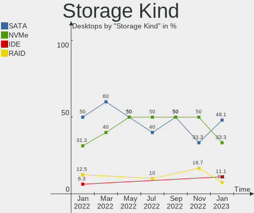

| Kind | Desktops | Percent |
|------|----------|---------|
| SATA | 13       | 48.15%  |
| NVMe | 9        | 33.33%  |
| IDE  | 3        | 11.11%  |
| RAID | 2        | 7.41%   |

Processor
---------

CPU Vendor
----------

Processor vendors

| Vendor | Desktops | Percent |
|--------|----------|---------|
| Intel  | 10       | 66.67%  |
| AMD    | 5        | 33.33%  |

CPU Model
---------

Processor models

| Model                                       | Desktops | Percent |
|---------------------------------------------|----------|---------|
| Intel Xeon CPU E5-2690 0 @ 2.90GHz          | 1        | 6.67%   |
| Intel Core i7-9700 CPU @ 3.00GHz            | 1        | 6.67%   |
| Intel Core i7-3930K CPU @ 3.20GHz           | 1        | 6.67%   |
| Intel Core i7-2600 CPU @ 3.40GHz            | 1        | 6.67%   |
| Intel Core i7-10700K CPU @ 3.80GHz          | 1        | 6.67%   |
| Intel Core i5-4570 CPU @ 3.20GHz            | 1        | 6.67%   |
| Intel Core i5-3350P CPU @ 3.10GHz           | 1        | 6.67%   |
| Intel Celeron CPU G1610 @ 2.60GHz           | 1        | 6.67%   |
| Intel 12th Gen Core i5-12600K               | 1        | 6.67%   |
| Intel 12th Gen Core i3-12100F               | 1        | 6.67%   |
| AMD Ryzen 7 5700G with Radeon Graphics      | 1        | 6.67%   |
| AMD Ryzen 5 3600 6-Core Processor           | 1        | 6.67%   |
| AMD Ryzen 5 3400G with Radeon Vega Graphics | 1        | 6.67%   |
| AMD FX-6300 Six-Core Processor              | 1        | 6.67%   |
| AMD Athlon 3000G with Radeon Vega Graphics  | 1        | 6.67%   |

CPU Model Family
----------------

Processor model prefix

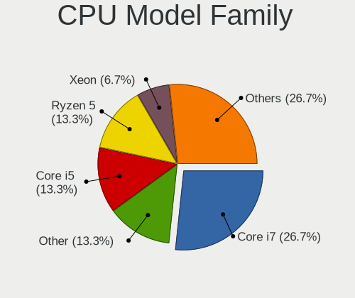

| Model         | Desktops | Percent |
|---------------|----------|---------|
| Intel Core i7 | 4        | 26.67%  |
| Other         | 2        | 13.33%  |
| Intel Core i5 | 2        | 13.33%  |
| AMD Ryzen 5   | 2        | 13.33%  |
| Intel Xeon    | 1        | 6.67%   |
| Intel Celeron | 1        | 6.67%   |
| AMD Ryzen 7   | 1        | 6.67%   |
| AMD FX        | 1        | 6.67%   |
| AMD Athlon    | 1        | 6.67%   |

CPU Cores
---------

Number of processor cores

| Number | Desktops | Percent |
|--------|----------|---------|
| 4      | 5        | 33.33%  |
| 8      | 4        | 26.67%  |
| 6      | 2        | 13.33%  |
| 2      | 2        | 13.33%  |
| 10     | 1        | 6.67%   |
| 3      | 1        | 6.67%   |

CPU Sockets
-----------

Number of sockets

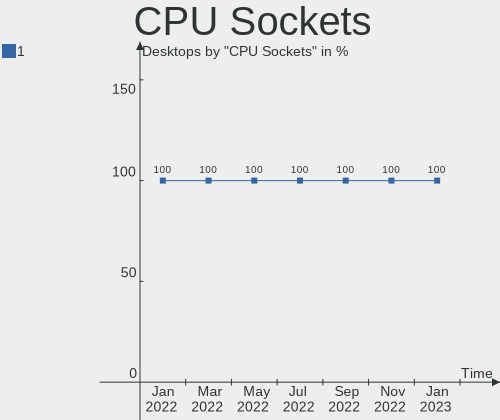

| Number | Desktops | Percent |
|--------|----------|---------|
| 1      | 15       | 100%    |

CPU Threads
-----------

Threads per core (Hyper-Threading)

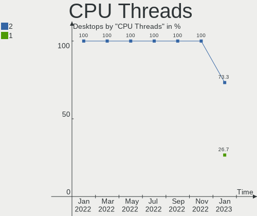

| Number | Desktops | Percent |
|--------|----------|---------|
| 2      | 11       | 73.33%  |
| 1      | 4        | 26.67%  |

CPU Op-Modes
------------

CPU Operation Modes (32-bit, 64-bit)

| Op mode        | Desktops | Percent |
|----------------|----------|---------|
| 32-bit, 64-bit | 15       | 100%    |

CPU Microcode
-------------

Microcode number

| Number     | Desktops | Percent |
|------------|----------|---------|
| Unknown    | 7        | 46.67%  |
| 0x906ed    | 1        | 6.67%   |
| 0x90675    | 1        | 6.67%   |
| 0x90672    | 1        | 6.67%   |
| 0x306a9    | 1        | 6.67%   |
| 0x206a7    | 1        | 6.67%   |
| 0x0a50000c | 1        | 6.67%   |
| 0x08701021 | 1        | 6.67%   |
| 0x06000852 | 1        | 6.67%   |

CPU Microarch
-------------

Microarchitecture

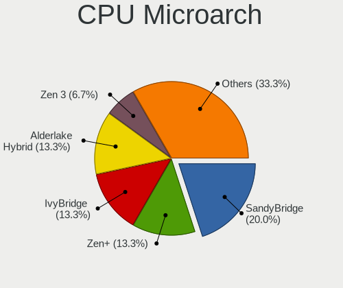

| Name             | Desktops | Percent |
|------------------|----------|---------|
| SandyBridge      | 3        | 20%     |
| Zen+             | 2        | 13.33%  |
| IvyBridge        | 2        | 13.33%  |
| Alderlake Hybrid | 2        | 13.33%  |
| Zen 3            | 1        | 6.67%   |
| Zen 2            | 1        | 6.67%   |
| Piledriver       | 1        | 6.67%   |
| KabyLake         | 1        | 6.67%   |
| Haswell          | 1        | 6.67%   |
| CometLake        | 1        | 6.67%   |

Graphics
--------

GPU Vendor
----------

Vendors of graphics cards

| Vendor | Desktops | Percent |
|--------|----------|---------|
| Nvidia | 7        | 41.18%  |
| AMD    | 7        | 41.18%  |
| Intel  | 3        | 17.65%  |

GPU Model
---------

Graphics card models

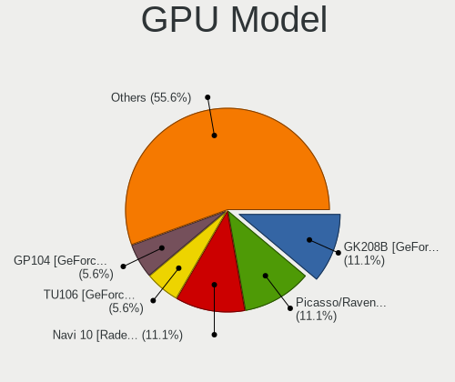

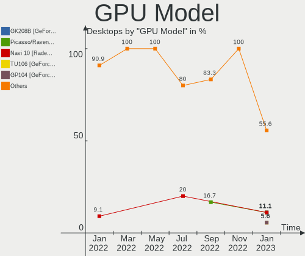

| Model                                                                       | Desktops | Percent |
|-----------------------------------------------------------------------------|----------|---------|
| Nvidia GK208B [GeForce GT 710]                                              | 2        | 11.11%  |
| AMD Picasso/Raven 2 [Radeon Vega Series / Radeon Vega Mobile Series]        | 2        | 11.11%  |
| AMD Navi 10 [Radeon RX 5600 OEM/5600 XT / 5700/5700 XT]                     | 2        | 11.11%  |
| Nvidia TU106 [GeForce RTX 2060 12GB]                                        | 1        | 5.56%   |
| Nvidia GP104 [GeForce GTX 1070]                                             | 1        | 5.56%   |
| Nvidia GM206 [GeForce GTX 950]                                              | 1        | 5.56%   |
| Nvidia GA104 [GeForce RTX 3070]                                             | 1        | 5.56%   |
| Nvidia GA104 [GeForce RTX 3060 Ti Lite Hash Rate]                           | 1        | 5.56%   |
| Intel Xeon E3-1200 v3/4th Gen Core Processor Integrated Graphics Controller | 1        | 5.56%   |
| Intel Xeon E3-1200 v2/3rd Gen Core processor Graphics Controller            | 1        | 5.56%   |
| Intel CoffeeLake-S GT2 [UHD Graphics 630]                                   | 1        | 5.56%   |
| AMD Navi 22 [Radeon RX 6700/6700 XT/6750 XT / 6800M]                        | 1        | 5.56%   |
| AMD Lexa PRO [Radeon 540/540X/550/550X / RX 540X/550/550X]                  | 1        | 5.56%   |
| AMD Ellesmere [Radeon RX 470/480/570/570X/580/580X/590]                     | 1        | 5.56%   |
| AMD Cezanne [Radeon Vega Series / Radeon Vega Mobile Series]                | 1        | 5.56%   |

GPU Combo
---------

Combinations of graphics cards

| Name         | Desktops | Percent |
|--------------|----------|---------|
| 1 x Nvidia   | 6        | 40%     |
| 1 x AMD      | 4        | 26.67%  |
| 1 x Intel    | 3        | 20%     |
| 2 x AMD      | 1        | 6.67%   |
| AMD + Nvidia | 1        | 6.67%   |

GPU Driver
----------

Free vs proprietary

| Driver      | Desktops | Percent |
|-------------|----------|---------|
| Free        | 9        | 60%     |
| Proprietary | 6        | 40%     |

GPU Memory
----------

Total video memory

| Size in GB | Desktops | Percent |
|------------|----------|---------|
| Unknown    | 6        | 40%     |
| 7.01-8.0   | 4        | 26.67%  |
| 1.01-2.0   | 4        | 26.67%  |
| 8.01-16.0  | 1        | 6.67%   |

Monitor
-------

Monitor Vendor
--------------

Monitor vendors

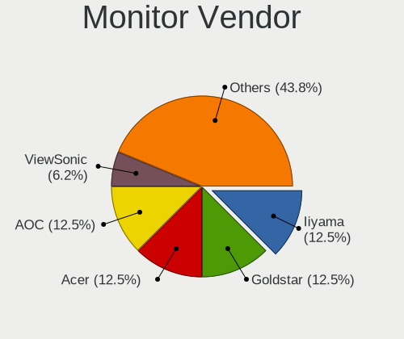

| Vendor           | Desktops | Percent |
|------------------|----------|---------|
| Iiyama           | 2        | 12.5%   |
| Goldstar         | 2        | 12.5%   |
| AOC              | 2        | 12.5%   |
| Acer             | 2        | 12.5%   |
| ViewSonic        | 1        | 6.25%   |
| Vestel           | 1        | 6.25%   |
| RTK              | 1        | 6.25%   |
| Mi               | 1        | 6.25%   |
| Idek Iiyama      | 1        | 6.25%   |
| Hewlett-Packard  | 1        | 6.25%   |
| BenQ             | 1        | 6.25%   |
| ASUSTek Computer | 1        | 6.25%   |

Monitor Model
-------------

Monitor models

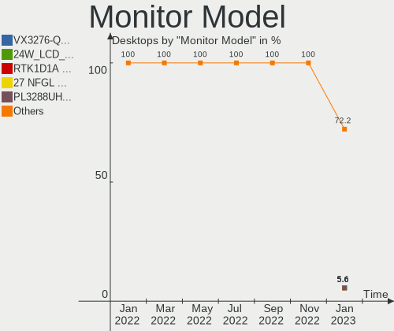

| Model                                                        | Desktops | Percent |
|--------------------------------------------------------------|----------|---------|
| ViewSonic VX3276-QHD VSCE635 2560x1440 698x393mm 31.5-inch   | 1        | 5.56%   |
| Vestel LCD Monitor 24W_LCD_TV 1920x1080                      | 1        | 5.56%   |
| RTK LCD Monitor RTK1D1A 1920x1080 1020x570mm 46.0-inch       | 1        | 5.56%   |
| Mi 27 NFGL XMIB004 1920x1080 598x336mm 27.0-inch             | 1        | 5.56%   |
| Iiyama PL3288UH IVM1176 3840x2160 698x393mm 31.5-inch        | 1        | 5.56%   |
| Iiyama PL2730H IVM663A 1920x1080 598x336mm 27.0-inch         | 1        | 5.56%   |
| Idek Iiyama LCD Monitor PL2730H 1920x1080                    | 1        | 5.56%   |
| Hewlett-Packard E22 G4 HPN3682 1920x1080 480x270mm 21.7-inch | 1        | 5.56%   |
| Hewlett-Packard 22fw HPN3541 1920x1080 500x300mm 23.0-inch   | 1        | 5.56%   |
| Goldstar ULTRAGEAR GSM5B80 2560x1440 597x336mm 27.0-inch     | 1        | 5.56%   |
| Goldstar LG ULTRAWIDE GSM59F1 2560x1080 670x280mm 28.6-inch  | 1        | 5.56%   |
| BenQ LCD Monitor GL2450H 1920x1080                           | 1        | 5.56%   |
| ASUSTek Computer VP248 AUS24CB 1920x1080 531x299mm 24.0-inch | 1        | 5.56%   |
| AOC Q32G1WG4 AOC3201 2560x1440 697x393mm 31.5-inch           | 1        | 5.56%   |
| AOC 1970W AOC1970 1366x768 410x230mm 18.5-inch               | 1        | 5.56%   |
| Acer XF243Y ACR0934 1920x1080 527x296mm 23.8-inch            | 1        | 5.56%   |
| Acer H243H ACR0074 1920x1080 530x290mm 23.8-inch             | 1        | 5.56%   |
| Acer ED242QR ACR0629 1920x1080 531x299mm 24.0-inch           | 1        | 5.56%   |

Monitor Resolution
------------------

Monitor screen resolution

| Resolution      | Desktops | Percent |
|-----------------|----------|---------|
| 1920x1080 (FHD) | 9        | 60%     |
| 3840x2160 (4K)  | 2        | 13.33%  |
| 2560x1440 (QHD) | 2        | 13.33%  |
| 2560x1080       | 1        | 6.67%   |
| 1366x768 (WXGA) | 1        | 6.67%   |

Monitor Diagonal
----------------

Diagonal size in inches

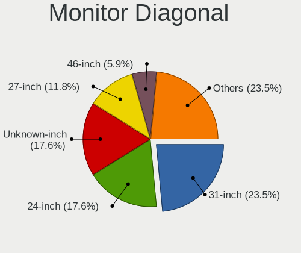

| Inches  | Desktops | Percent |
|---------|----------|---------|
| 31      | 4        | 23.53%  |
| 24      | 3        | 17.65%  |
| Unknown | 3        | 17.65%  |
| 27      | 2        | 11.76%  |
| 46      | 1        | 5.88%   |
| 34      | 1        | 5.88%   |
| 23      | 1        | 5.88%   |
| 21      | 1        | 5.88%   |
| 18      | 1        | 5.88%   |

Monitor Width
-------------

Physical width

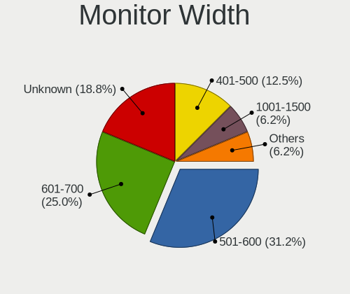

| Width in mm | Desktops | Percent |
|-------------|----------|---------|
| 501-600     | 5        | 31.25%  |
| 601-700     | 4        | 25%     |
| Unknown     | 3        | 18.75%  |
| 401-500     | 2        | 12.5%   |
| 701-800     | 1        | 6.25%   |
| 1001-1500   | 1        | 6.25%   |

Aspect Ratio
------------

Proportional relationship between the width and the height

| Ratio   | Desktops | Percent |
|---------|----------|---------|
| 16/9    | 12       | 75%     |
| Unknown | 3        | 18.75%  |
| 21/9    | 1        | 6.25%   |

Monitor Area
------------

Area in inch²

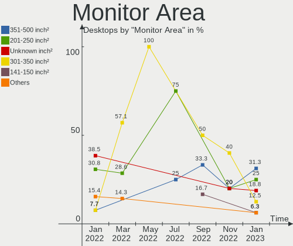

| Area in inch² | Desktops | Percent |
|----------------|----------|---------|
| 351-500        | 5        | 31.25%  |
| 201-250        | 4        | 25%     |
| Unknown        | 3        | 18.75%  |
| 301-350        | 2        | 12.5%   |
| 141-150        | 1        | 6.25%   |
| 501-1000       | 1        | 6.25%   |

Pixel Density
-------------

Pixels per inch

| Density | Desktops | Percent |
|---------|----------|---------|
| 51-100  | 11       | 64.71%  |
| Unknown | 3        | 17.65%  |
| 1-50    | 1        | 5.88%   |
| 121-160 | 1        | 5.88%   |
| 101-120 | 1        | 5.88%   |

Multiple Monitors
-----------------

Total monitors connected

| Total | Desktops | Percent |
|-------|----------|---------|
| 1     | 12       | 80%     |
| 2     | 3        | 20%     |

Network
-------

Net Controller Vendor
---------------------

Controller vendors

| Vendor                | Desktops | Percent |
|-----------------------|----------|---------|
| Realtek Semiconductor | 10       | 45.45%  |
| Intel                 | 7        | 31.82%  |
| Xiaomi                | 1        | 4.55%   |
| Sitecom Europe        | 1        | 4.55%   |
| Linksys               | 1        | 4.55%   |
| D-Link                | 1        | 4.55%   |
| AVM                   | 1        | 4.55%   |

Net Controller Model
--------------------

Controller models

| Model                                                             | Desktops | Percent |
|-------------------------------------------------------------------|----------|---------|
| Realtek RTL8111/8168/8411 PCI Express Gigabit Ethernet Controller | 9        | 37.5%   |
| Intel Ethernet Controller I225-V                                  | 2        | 8.33%   |
| Xiaomi Mi/Redmi series (RNDIS)                                    | 1        | 4.17%   |
| Sitecom Europe WLA-5000 802.11abgn [Ralink RT3572]                | 1        | 4.17%   |
| Realtek RTL8125 2.5GbE Controller                                 | 1        | 4.17%   |
| Realtek 802.11n WLAN Adapter                                      | 1        | 4.17%   |
| Linksys WUSB6300 V2                                               | 1        | 4.17%   |
| Intel Wi-Fi 6 AX210/AX211/AX411 160MHz                            | 1        | 4.17%   |
| Intel Wi-Fi 6 AX200                                               | 1        | 4.17%   |
| Intel I211 Gigabit Network Connection                             | 1        | 4.17%   |
| Intel Ethernet Connection (7) I219-V                              | 1        | 4.17%   |
| Intel 82579V Gigabit Network Connection                           | 1        | 4.17%   |
| Intel 82576 Gigabit Network Connection                            | 1        | 4.17%   |
| D-Link 802.11ac NIC                                               | 1        | 4.17%   |
| AVM FRITZ!WLAN AC 860                                             | 1        | 4.17%   |

Wireless Vendor
---------------

Wireless vendors

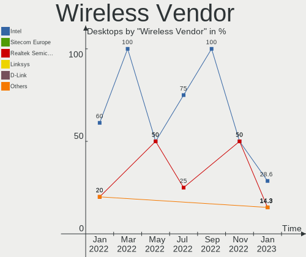

| Vendor                | Desktops | Percent |
|-----------------------|----------|---------|
| Intel                 | 2        | 28.57%  |
| Sitecom Europe        | 1        | 14.29%  |
| Realtek Semiconductor | 1        | 14.29%  |
| Linksys               | 1        | 14.29%  |
| D-Link                | 1        | 14.29%  |
| AVM                   | 1        | 14.29%  |

Wireless Model
--------------

Wireless models

| Model                                              | Desktops | Percent |
|----------------------------------------------------|----------|---------|
| Sitecom Europe WLA-5000 802.11abgn [Ralink RT3572] | 1        | 14.29%  |
| Realtek 802.11n WLAN Adapter                       | 1        | 14.29%  |
| Linksys WUSB6300 V2                                | 1        | 14.29%  |
| Intel Wi-Fi 6 AX210/AX211/AX411 160MHz             | 1        | 14.29%  |
| Intel Wi-Fi 6 AX200                                | 1        | 14.29%  |
| D-Link 802.11ac NIC                                | 1        | 14.29%  |
| AVM FRITZ!WLAN AC 860                              | 1        | 14.29%  |

Ethernet Vendor
---------------

Ethernet vendors

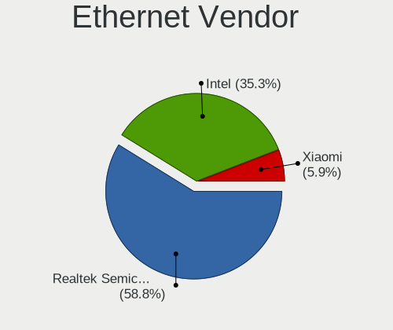

| Vendor                | Desktops | Percent |
|-----------------------|----------|---------|
| Realtek Semiconductor | 10       | 58.82%  |
| Intel                 | 6        | 35.29%  |
| Xiaomi                | 1        | 5.88%   |

Ethernet Model
--------------

Ethernet models

| Model                                                             | Desktops | Percent |
|-------------------------------------------------------------------|----------|---------|
| Realtek RTL8111/8168/8411 PCI Express Gigabit Ethernet Controller | 9        | 52.94%  |
| Intel Ethernet Controller I225-V                                  | 2        | 11.76%  |
| Xiaomi Mi/Redmi series (RNDIS)                                    | 1        | 5.88%   |
| Realtek RTL8125 2.5GbE Controller                                 | 1        | 5.88%   |
| Intel I211 Gigabit Network Connection                             | 1        | 5.88%   |
| Intel Ethernet Connection (7) I219-V                              | 1        | 5.88%   |
| Intel 82579V Gigabit Network Connection                           | 1        | 5.88%   |
| Intel 82576 Gigabit Network Connection                            | 1        | 5.88%   |

Net Controller Kind
-------------------

Ethernet, WiFi or modem

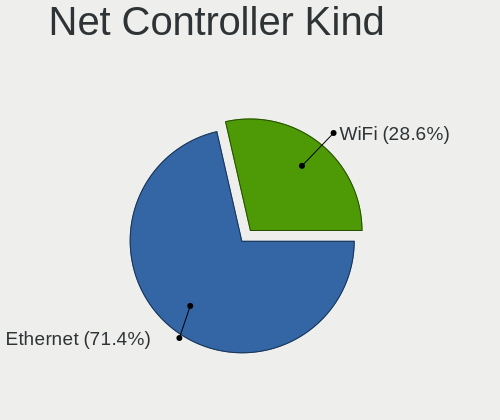

| Kind     | Desktops | Percent |
|----------|----------|---------|
| Ethernet | 15       | 71.43%  |
| WiFi     | 6        | 28.57%  |

Used Controller
---------------

Currently used network controller

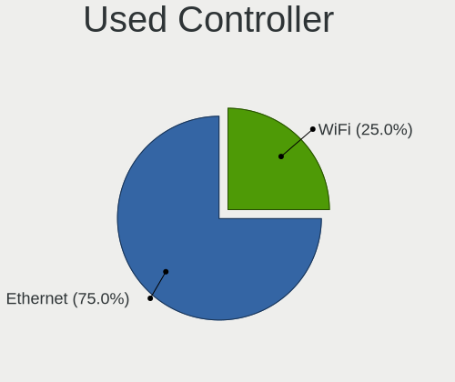

| Kind     | Desktops | Percent |
|----------|----------|---------|
| Ethernet | 12       | 75%     |
| WiFi     | 4        | 25%     |

NICs
----

Total network controllers on board

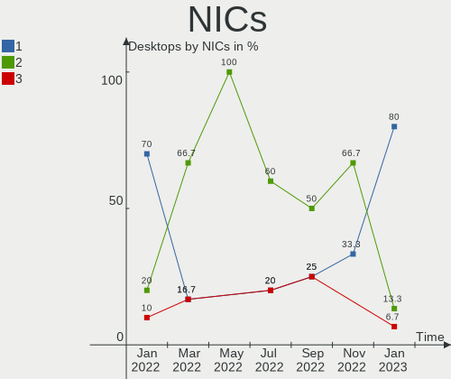

| Total | Desktops | Percent |
|-------|----------|---------|
| 1     | 12       | 80%     |
| 2     | 2        | 13.33%  |
| 3     | 1        | 6.67%   |

IPv6
----

IPv6 vs IPv4

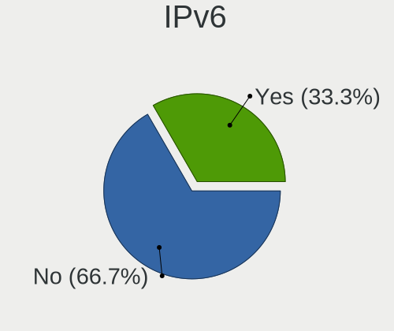

| Used | Desktops | Percent |
|------|----------|---------|
| No   | 10       | 66.67%  |
| Yes  | 5        | 33.33%  |

Bluetooth
---------

Bluetooth Vendor
----------------

Controller vendors

| Vendor                  | Desktops | Percent |
|-------------------------|----------|---------|
| Cambridge Silicon Radio | 3        | 50%     |
| Realtek Semiconductor   | 2        | 33.33%  |
| Intel                   | 1        | 16.67%  |

Bluetooth Model
---------------

Controller models

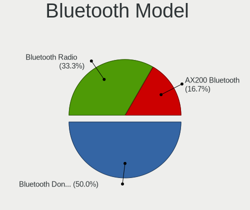

| Model                                               | Desktops | Percent |
|-----------------------------------------------------|----------|---------|
| Cambridge Silicon Radio Bluetooth Dongle (HCI mode) | 3        | 50%     |
| Realtek Bluetooth Radio                             | 2        | 33.33%  |
| Intel AX200 Bluetooth                               | 1        | 16.67%  |

Sound
-----

Sound Vendor
------------

Sound card vendors

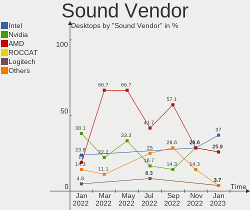

| Vendor              | Desktops | Percent |
|---------------------|----------|---------|
| Intel               | 10       | 37.04%  |
| Nvidia              | 7        | 25.93%  |
| AMD                 | 7        | 25.93%  |
| ROCCAT              | 1        | 3.7%    |
| Logitech            | 1        | 3.7%    |
| Kingston Technology | 1        | 3.7%    |

Sound Model
-----------

Sound card models

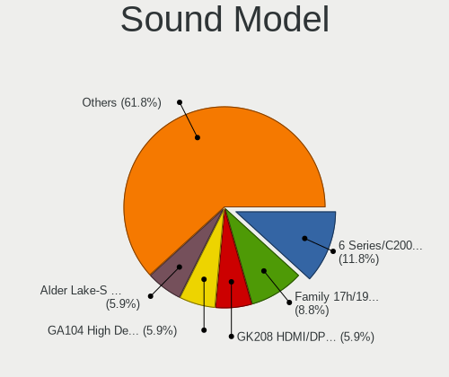

| Model                                                                      | Desktops | Percent |
|----------------------------------------------------------------------------|----------|---------|
| Intel 6 Series/C200 Series Chipset Family High Definition Audio Controller | 4        | 11.76%  |
| AMD Family 17h/19h HD Audio Controller                                     | 3        | 8.82%   |
| Nvidia GK208 HDMI/DP Audio Controller                                      | 2        | 5.88%   |
| Nvidia GA104 High Definition Audio Controller                              | 2        | 5.88%   |
| Intel Alder Lake-S HD Audio Controller                                     | 2        | 5.88%   |
| AMD Raven/Raven2/Fenghuang HDMI/DP Audio Controller                        | 2        | 5.88%   |
| AMD Navi 10 HDMI Audio                                                     | 2        | 5.88%   |
| ROCCAT Juke                                                                | 1        | 2.94%   |
| Nvidia TU106 High Definition Audio Controller                              | 1        | 2.94%   |
| Nvidia GP104 High Definition Audio Controller                              | 1        | 2.94%   |
| Nvidia GM206 High Definition Audio Controller                              | 1        | 2.94%   |
| Logitech Yeti Nano                                                         | 1        | 2.94%   |
| Kingston Technology HyperX QuadCast                                        | 1        | 2.94%   |
| Intel Xeon E3-1200 v3/4th Gen Core Processor HD Audio Controller           | 1        | 2.94%   |
| Intel Comet Lake PCH cAVS                                                  | 1        | 2.94%   |
| Intel Cannon Lake PCH cAVS                                                 | 1        | 2.94%   |
| Intel C600/X79 series chipset High Definition Audio Controller             | 1        | 2.94%   |
| Intel 8 Series/C220 Series Chipset High Definition Audio Controller        | 1        | 2.94%   |
| AMD Starship/Matisse HD Audio Controller                                   | 1        | 2.94%   |
| AMD SBx00 Azalia (Intel HDA)                                               | 1        | 2.94%   |
| AMD Renoir Radeon High Definition Audio Controller                         | 1        | 2.94%   |
| AMD Navi 21/23 HDMI/DP Audio Controller                                    | 1        | 2.94%   |
| AMD Ellesmere HDMI Audio [Radeon RX 470/480 / 570/580/590]                 | 1        | 2.94%   |
| AMD Baffin HDMI/DP Audio [Radeon RX 550 640SP / RX 560/560X]               | 1        | 2.94%   |

Memory
------

Memory Vendor
-------------

Memory module vendors

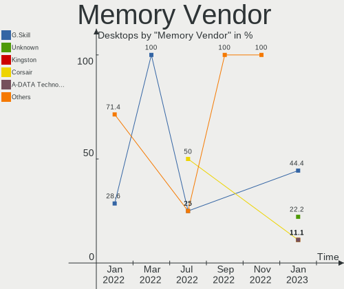

| Vendor            | Desktops | Percent |
|-------------------|----------|---------|
| G.Skill           | 4        | 44.44%  |
| Unknown           | 2        | 22.22%  |
| Kingston          | 1        | 11.11%  |
| Corsair           | 1        | 11.11%  |
| A-DATA Technology | 1        | 11.11%  |

Memory Model
------------

Memory module models

| Model                                                  | Desktops | Percent |
|--------------------------------------------------------|----------|---------|
| Unknown RAM Module 8GB DIMM DDR3 1333MT/s              | 1        | 10%     |
| Unknown RAM Module 8GB DIMM                            | 1        | 10%     |
| Unknown RAM Module 4GB DIMM                            | 1        | 10%     |
| Kingston RAM KF3200C16D4/8GX 8GB DIMM DDR4 3600MT/s    | 1        | 10%     |
| G.Skill RAM F4-3600C18-16GTZN 16GB DIMM DDR4 3666MT/s  | 1        | 10%     |
| G.Skill RAM F4-3200C16-8GTZRX 8GB DIMM DDR4 3200MT/s   | 1        | 10%     |
| G.Skill RAM F4-3000C16-8GISB 8GB DIMM DDR4 3200MT/s    | 1        | 10%     |
| G.Skill RAM F3-12800CL9-4GBRL 4GB DIMM DDR3 1866MT/s   | 1        | 10%     |
| Corsair RAM CM4X16GC3000C16K4D 16GB DIMM DDR4 3000MT/s | 1        | 10%     |
| A-DATA RAM 10242398 4GB DIMM DDR3 1333MT/s             | 1        | 10%     |

Memory Kind
-----------

Memory module kinds

| Kind    | Desktops | Percent |
|---------|----------|---------|
| DDR4    | 5        | 62.5%   |
| DDR3    | 2        | 25%     |
| Unknown | 1        | 12.5%   |

Memory Form Factor
------------------

Physical design of the memory module

| Name | Desktops | Percent |
|------|----------|---------|
| DIMM | 8        | 100%    |

Memory Size
-----------

Memory module size

| Size  | Desktops | Percent |
|-------|----------|---------|
| 8192  | 5        | 50%     |
| 4096  | 3        | 30%     |
| 16384 | 2        | 20%     |

Memory Speed
------------

Memory module speed

| Speed   | Desktops | Percent |
|---------|----------|---------|
| 3200    | 2        | 22.22%  |
| 1333    | 2        | 22.22%  |
| 3666    | 1        | 11.11%  |
| 3600    | 1        | 11.11%  |
| 3000    | 1        | 11.11%  |
| 1866    | 1        | 11.11%  |
| Unknown | 1        | 11.11%  |

Printers & scanners
-------------------

Printer Vendor
--------------

Printer device vendors

Zero info for selected period =(

Printer Model
-------------

Printer device models

Zero info for selected period =(

Scanner Vendor
--------------

Scanner device vendors

Zero info for selected period =(

Scanner Model
-------------

Scanner device models

Zero info for selected period =(

Camera
------

Camera Vendor
-------------

Camera device vendors

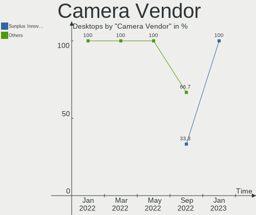

| Vendor                        | Desktops | Percent |
|-------------------------------|----------|---------|
| Sunplus Innovation Technology | 1        | 100%    |

Camera Model
------------

Camera device models

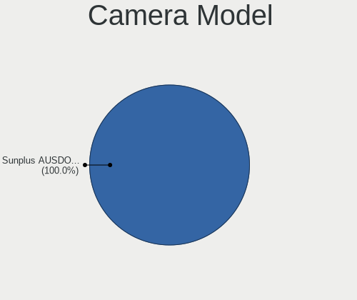

| Model                     | Desktops | Percent |
|---------------------------|----------|---------|
| Sunplus AUSDOM FHD Camera | 1        | 100%    |

Security
--------

Fingerprint Vendor
------------------

Fingerprint sensor vendors

Zero info for selected period =(

Fingerprint Model
-----------------

Fingerprint sensor models

Zero info for selected period =(

Chipcard Vendor
---------------

Chipcard module vendors

Zero info for selected period =(

Chipcard Model
--------------

Chipcard module models

Zero info for selected period =(

Unsupported
-----------

Unsupported Devices
-------------------

Total unsupported devices on board

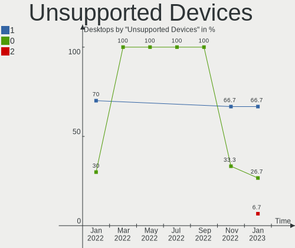

| Total | Desktops | Percent |
|-------|----------|---------|
| 1     | 10       | 66.67%  |
| 0     | 4        | 26.67%  |
| 2     | 1        | 6.67%   |

Unsupported Device Types
------------------------

Types of unsupported devices

| Type                     | Desktops | Percent |
|--------------------------|----------|---------|
| Communication controller | 9        | 75%     |
| Graphics card            | 2        | 16.67%  |
| Net/wireless             | 1        | 8.33%   |

