Garuda Linux - Hardware Trends (Desktops)
-----------------------------------------

A project to identify most popular hardware characteristics and track their change
over time based on data collected by Linux users at https://Linux-Hardware.org.

Anyone can contribute to this report by the [hw-probe](https://github.com/linuxhw/hw-probe) tool:

    sudo -E hw-probe -all -upload

This report is for one last month. Overall report since the beginning of time: [TestCoverage](https://github.com/linuxhw/TestCoverage)

Period: Dec, 2022.

Contents
--------

* [ System ](#system)
  - [ OS                       ](#os)
  - [ OS Family                ](#os-family)
  - [ Kernel                   ](#kernel)
  - [ Kernel Family            ](#kernel-family)
  - [ Kernel Major Ver.        ](#kernel-major-ver)
  - [ Arch                     ](#arch)
  - [ DE                       ](#de)
  - [ Display Server           ](#display-server)
  - [ Display Manager          ](#display-manager)
  - [ OS Lang                  ](#os-lang)
  - [ Boot Mode                ](#boot-mode)
  - [ Filesystem               ](#filesystem)
  - [ Part. scheme             ](#part-scheme)
  - [ Dual Boot with Linux/BSD ](#dual-boot-with-linuxbsd)
  - [ Dual Boot (Win)          ](#dual-boot-win)

* [ Board ](#board)
  - [ Vendor                   ](#vendor)
  - [ Model                    ](#model)
  - [ Model Family             ](#model-family)
  - [ MFG Year                 ](#mfg-year)
  - [ Form Factor              ](#form-factor)
  - [ Secure Boot              ](#secure-boot)
  - [ Coreboot                 ](#coreboot)
  - [ RAM Size                 ](#ram-size)
  - [ RAM Used                 ](#ram-used)
  - [ Total Drives             ](#total-drives)
  - [ Has CD-ROM               ](#has-cd-rom)
  - [ Has Ethernet             ](#has-ethernet)
  - [ Has WiFi                 ](#has-wifi)
  - [ Has Bluetooth            ](#has-bluetooth)

* [ Location ](#location)
  - [ Country                  ](#country)
  - [ City                     ](#city)

* [ Drives ](#drives)
  - [ Drive Vendor             ](#drive-vendor)
  - [ Drive Model              ](#drive-model)
  - [ HDD Vendor               ](#hdd-vendor)
  - [ SSD Vendor               ](#ssd-vendor)
  - [ Drive Kind               ](#drive-kind)
  - [ Drive Connector          ](#drive-connector)
  - [ Drive Size               ](#drive-size)
  - [ Space Total              ](#space-total)
  - [ Space Used               ](#space-used)
  - [ Malfunc. Drives          ](#malfunc-drives)
  - [ Malfunc. Drive Vendor    ](#malfunc-drive-vendor)
  - [ Malfunc. HDD Vendor      ](#malfunc-hdd-vendor)
  - [ Malfunc. Drive Kind      ](#malfunc-drive-kind)
  - [ Failed Drives            ](#failed-drives)
  - [ Failed Drive Vendor      ](#failed-drive-vendor)
  - [ Drive Status             ](#drive-status)

* [ Storage controller ](#storage-controller)
  - [ Storage Vendor           ](#storage-vendor)
  - [ Storage Model            ](#storage-model)
  - [ Storage Kind             ](#storage-kind)

* [ Processor ](#processor)
  - [ CPU Vendor               ](#cpu-vendor)
  - [ CPU Model                ](#cpu-model)
  - [ CPU Model Family         ](#cpu-model-family)
  - [ CPU Cores                ](#cpu-cores)
  - [ CPU Sockets              ](#cpu-sockets)
  - [ CPU Threads              ](#cpu-threads)
  - [ CPU Op-Modes             ](#cpu-op-modes)
  - [ CPU Microcode            ](#cpu-microcode)
  - [ CPU Microarch            ](#cpu-microarch)

* [ Graphics ](#graphics)
  - [ GPU Vendor               ](#gpu-vendor)
  - [ GPU Model                ](#gpu-model)
  - [ GPU Combo                ](#gpu-combo)
  - [ GPU Driver               ](#gpu-driver)
  - [ GPU Memory               ](#gpu-memory)

* [ Monitor ](#monitor)
  - [ Monitor Vendor           ](#monitor-vendor)
  - [ Monitor Model            ](#monitor-model)
  - [ Monitor Resolution       ](#monitor-resolution)
  - [ Monitor Diagonal         ](#monitor-diagonal)
  - [ Monitor Width            ](#monitor-width)
  - [ Aspect Ratio             ](#aspect-ratio)
  - [ Monitor Area             ](#monitor-area)
  - [ Pixel Density            ](#pixel-density)
  - [ Multiple Monitors        ](#multiple-monitors)

* [ Network ](#network)
  - [ Net Controller Vendor    ](#net-controller-vendor)
  - [ Net Controller Model     ](#net-controller-model)
  - [ Wireless Vendor          ](#wireless-vendor)
  - [ Wireless Model           ](#wireless-model)
  - [ Ethernet Vendor          ](#ethernet-vendor)
  - [ Ethernet Model           ](#ethernet-model)
  - [ Net Controller Kind      ](#net-controller-kind)
  - [ Used Controller          ](#used-controller)
  - [ NICs                     ](#nics)
  - [ IPv6                     ](#ipv6)

* [ Bluetooth ](#bluetooth)
  - [ Bluetooth Vendor         ](#bluetooth-vendor)
  - [ Bluetooth Model          ](#bluetooth-model)

* [ Sound ](#sound)
  - [ Sound Vendor             ](#sound-vendor)
  - [ Sound Model              ](#sound-model)

* [ Memory ](#memory)
  - [ Memory Vendor            ](#memory-vendor)
  - [ Memory Model             ](#memory-model)
  - [ Memory Kind              ](#memory-kind)
  - [ Memory Form Factor       ](#memory-form-factor)
  - [ Memory Size              ](#memory-size)
  - [ Memory Speed             ](#memory-speed)

* [ Printers & scanners ](#printers--scanners)
  - [ Printer Vendor           ](#printer-vendor)
  - [ Printer Model            ](#printer-model)
  - [ Scanner Vendor           ](#scanner-vendor)
  - [ Scanner Model            ](#scanner-model)

* [ Camera ](#camera)
  - [ Camera Vendor            ](#camera-vendor)
  - [ Camera Model             ](#camera-model)

* [ Security ](#security)
  - [ Fingerprint Vendor       ](#fingerprint-vendor)
  - [ Fingerprint Model        ](#fingerprint-model)
  - [ Chipcard Vendor          ](#chipcard-vendor)
  - [ Chipcard Model           ](#chipcard-model)

* [ Unsupported ](#unsupported)
  - [ Unsupported Devices      ](#unsupported-devices)
  - [ Unsupported Device Types ](#unsupported-device-types)

System
------

OS
--

Installed operating systems

| Name                 | Desktops | Percent |
|----------------------|----------|---------|
| Garuda Linux Soaring | 5        | 62.5%   |
| Garuda Linux Rolling | 3        | 37.5%   |

OS Family
---------

OS without a version

| Name         | Desktops | Percent |
|--------------|----------|---------|
| Garuda Linux | 8        | 100%    |

Kernel
------

Version of the Linux kernel

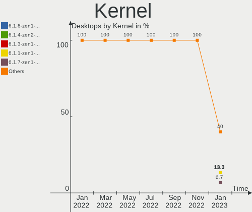

| Version           | Desktops | Percent |
|-------------------|----------|---------|
| 6.0.11-zen1-1-zen | 3        | 37.5%   |
| 6.1.1-zen1-1-zen  | 2        | 25%     |
| 6.0.12-zen1-1-zen | 2        | 25%     |
| 6.0.8-zen1-1-zen  | 1        | 12.5%   |

Kernel Family
-------------

Linux kernel without a distro release

| Version | Desktops | Percent |
|---------|----------|---------|
| 6.0.11  | 3        | 37.5%   |
| 6.1.1   | 2        | 25%     |
| 6.0.12  | 2        | 25%     |
| 6.0.8   | 1        | 12.5%   |

Kernel Major Ver.
-----------------

Linux kernel major version

| Version | Desktops | Percent |
|---------|----------|---------|
| 6.0     | 6        | 75%     |
| 6.1     | 2        | 25%     |

Arch
----

OS architecture (x86_64, i586, etc.)

| Name   | Desktops | Percent |
|--------|----------|---------|
| x86_64 | 8        | 100%    |

DE
--

Desktop Environment

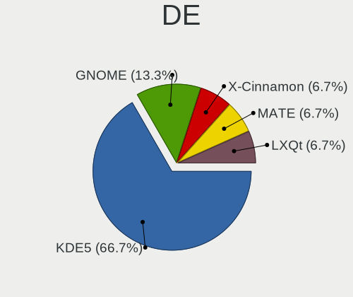

| Name       | Desktops | Percent |
|------------|----------|---------|
| KDE5       | 6        | 75%     |
| xfce       | 1        | 12.5%   |
| X-Cinnamon | 1        | 12.5%   |

Display Server
--------------

X11 or Wayland

| Name | Desktops | Percent |
|------|----------|---------|
| X11  | 7        | 87.5%   |
| Tty  | 1        | 12.5%   |

Display Manager
---------------

SDDM, LightDM, etc.

| Name    | Desktops | Percent |
|---------|----------|---------|
| SDDM    | 3        | 37.5%   |
| Unknown | 3        | 37.5%   |
| LightDM | 2        | 25%     |

OS Lang
-------

Language

| Lang  | Desktops | Percent |
|-------|----------|---------|
| en_US | 5        | 62.5%   |
| en_IN | 1        | 12.5%   |
| en_GB | 1        | 12.5%   |
| en_CA | 1        | 12.5%   |

Boot Mode
---------

EFI or BIOS

| Mode | Desktops | Percent |
|------|----------|---------|
| BIOS | 5        | 62.5%   |
| EFI  | 3        | 37.5%   |

Filesystem
----------

Type of filesystem

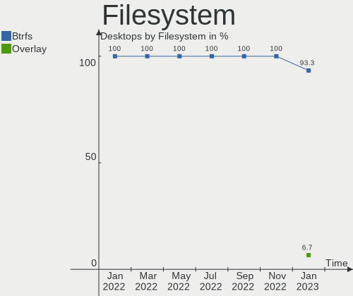

| Type  | Desktops | Percent |
|-------|----------|---------|
| Btrfs | 8        | 100%    |

Part. scheme
------------

Scheme of partitioning

| Type    | Desktops | Percent |
|---------|----------|---------|
| GPT     | 5        | 62.5%   |
| Unknown | 3        | 37.5%   |

Dual Boot with Linux/BSD
------------------------

Hosting more than one Linux/BSD

| Dual boot | Desktops | Percent |
|-----------|----------|---------|
| No        | 6        | 75%     |
| Yes       | 2        | 25%     |

Dual Boot (Win)
---------------

Hosting Linux and Windows

| Dual boot | Desktops | Percent |
|-----------|----------|---------|
| No        | 6        | 75%     |
| Yes       | 2        | 25%     |

Board
-----

Vendor
------

Motherboard manufacturer

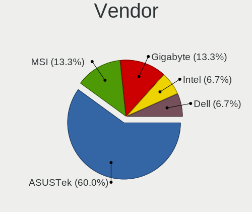

| Name                | Desktops | Percent |
|---------------------|----------|---------|
| ASUSTek Computer    | 2        | 25%     |
| ASRock              | 2        | 25%     |
| Lenovo              | 1        | 12.5%   |
| Intel               | 1        | 12.5%   |
| Gigabyte Technology | 1        | 12.5%   |
| BESSTAR Tech        | 1        | 12.5%   |

Model
-----

Motherboard model

| Name                              | Desktops | Percent |
|-----------------------------------|----------|---------|
| Lenovo ThinkCentre Edge72 3484HPU | 1        | 12.5%   |
| Intel H61                         | 1        | 12.5%   |
| Gigabyte 990FXA-UD3               | 1        | 12.5%   |
| BESSTAR Tech B550                 | 1        | 12.5%   |
| ASUS ROG STRIX B450-F GAMING II   | 1        | 12.5%   |
| ASUS PRIME Z390-P                 | 1        | 12.5%   |
| ASRock Z77 Pro3                   | 1        | 12.5%   |
| ASRock X570 Taichi                | 1        | 12.5%   |

Model Family
------------

Motherboard model prefix

| Name                | Desktops | Percent |
|---------------------|----------|---------|
| Lenovo ThinkCentre  | 1        | 12.5%   |
| Intel H61           | 1        | 12.5%   |
| Gigabyte 990FXA-UD3 | 1        | 12.5%   |
| BESSTAR Tech B550   | 1        | 12.5%   |
| ASUS ROG            | 1        | 12.5%   |
| ASUS PRIME          | 1        | 12.5%   |
| ASRock Z77          | 1        | 12.5%   |
| ASRock X570         | 1        | 12.5%   |

MFG Year
--------

Motherboard manufacture year

| Year | Desktops | Percent |
|------|----------|---------|
| 2012 | 2        | 25%     |
| 2022 | 1        | 12.5%   |
| 2020 | 1        | 12.5%   |
| 2019 | 1        | 12.5%   |
| 2018 | 1        | 12.5%   |
| 2017 | 1        | 12.5%   |
| 2013 | 1        | 12.5%   |

Form Factor
-----------

Physical design of the computer

| Name    | Desktops | Percent |
|---------|----------|---------|
| Desktop | 8        | 100%    |

Secure Boot
-----------

Enabled or disabled

| State    | Desktops | Percent |
|----------|----------|---------|
| Disabled | 8        | 100%    |

Coreboot
--------

Have coreboot on board

| Used | Desktops | Percent |
|------|----------|---------|
| No   | 8        | 100%    |

RAM Size
--------

Total RAM memory

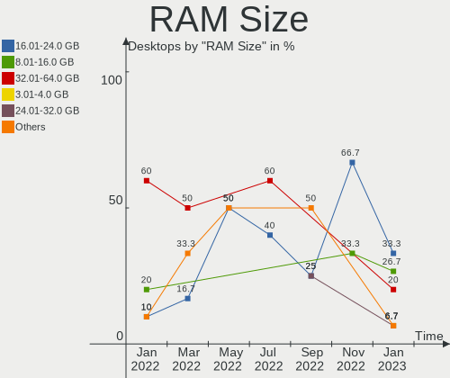

| Size in GB  | Desktops | Percent |
|-------------|----------|---------|
| 16.01-24.0  | 3        | 37.5%   |
| 4.01-8.0    | 1        | 12.5%   |
| 32.01-64.0  | 1        | 12.5%   |
| 3.01-4.0    | 1        | 12.5%   |
| 64.01-256.0 | 1        | 12.5%   |
| 8.01-16.0   | 1        | 12.5%   |

RAM Used
--------

Used RAM memory

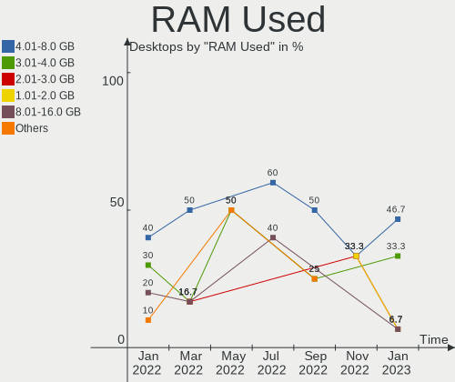

| Used GB   | Desktops | Percent |
|-----------|----------|---------|
| 4.01-8.0  | 2        | 25%     |
| 2.01-3.0  | 2        | 25%     |
| 8.01-16.0 | 2        | 25%     |
| 3.01-4.0  | 1        | 12.5%   |
| 1.01-2.0  | 1        | 12.5%   |

Total Drives
------------

Number of drives on board

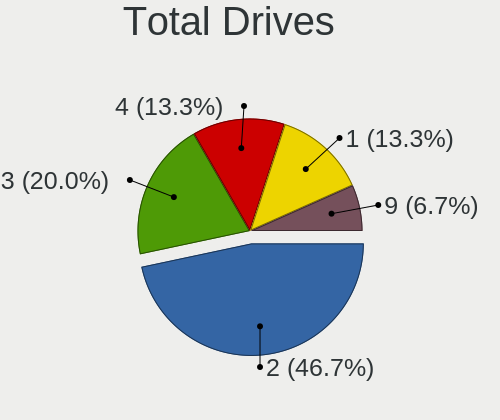

| Drives | Desktops | Percent |
|--------|----------|---------|
| 2      | 5        | 62.5%   |
| 5      | 2        | 25%     |
| 18     | 1        | 12.5%   |

Has CD-ROM
----------

Has CD-ROM on board

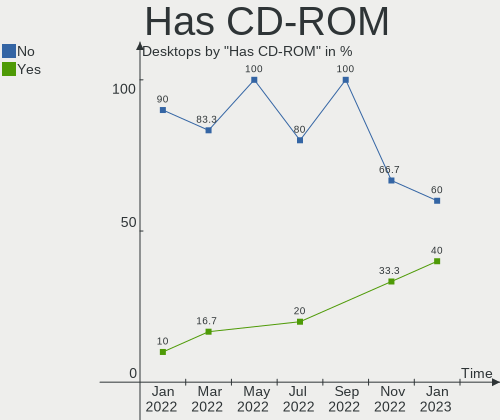

| Presented | Desktops | Percent |
|-----------|----------|---------|
| No        | 6        | 75%     |
| Yes       | 2        | 25%     |

Has Ethernet
------------

Has Ethernet on board

| Presented | Desktops | Percent |
|-----------|----------|---------|
| Yes       | 8        | 100%    |

Has WiFi
--------

Has WiFi module

| Presented | Desktops | Percent |
|-----------|----------|---------|
| No        | 6        | 75%     |
| Yes       | 2        | 25%     |

Has Bluetooth
-------------

Has Bluetooth module

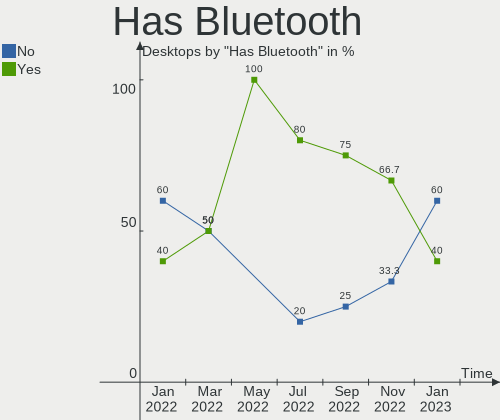

| Presented | Desktops | Percent |
|-----------|----------|---------|
| Yes       | 4        | 50%     |
| No        | 4        | 50%     |

Location
--------

Country
-------

Geographic location (country)

| Country | Desktops | Percent |
|---------|----------|---------|
| USA     | 1        | 12.5%   |
| Serbia  | 1        | 12.5%   |
| Israel  | 1        | 12.5%   |
| India   | 1        | 12.5%   |
| Greece  | 1        | 12.5%   |
| Germany | 1        | 12.5%   |
| Finland | 1        | 12.5%   |
| Canada  | 1        | 12.5%   |

City
----

Geographic location (city)

| City          | Desktops | Percent |
|---------------|----------|---------|
| Tampere       | 1        | 12.5%   |
| Sherwood Park | 1        | 12.5%   |
| Ramat Gan     | 1        | 12.5%   |
| Novi Sad      | 1        | 12.5%   |
| Kothamangalam | 1        | 12.5%   |
| Kalamata      | 1        | 12.5%   |
| Düsseldorf   | 1        | 12.5%   |
| Dallas        | 1        | 12.5%   |

Drives
------

Drive Vendor
------------

Hard drive vendors

| Vendor              | Desktops | Drives | Percent |
|---------------------|----------|--------|---------|
| Seagate             | 5        | 5      | 20.83%  |
| WDC                 | 3        | 6      | 12.5%   |
| Samsung Electronics | 3        | 6      | 12.5%   |
| SanDisk             | 2        | 2      | 8.33%   |
| Toshiba             | 1        | 3      | 4.17%   |
| PNY                 | 1        | 1      | 4.17%   |
| LITEONIT            | 1        | 1      | 4.17%   |
| Kingston            | 1        | 2      | 4.17%   |
| Intel               | 1        | 1      | 4.17%   |
| Hitachi             | 1        | 1      | 4.17%   |
| HGST                | 1        | 7      | 4.17%   |
| DOLGIX              | 1        | 1      | 4.17%   |
| Crucial             | 1        | 1      | 4.17%   |
| China               | 1        | 1      | 4.17%   |
| ADATA Technology    | 1        | 1      | 4.17%   |

Drive Model
-----------

Hard drive models

| Model                                                           | Desktops | Percent |
|-----------------------------------------------------------------|----------|---------|
| WDC WD6400AAKS-65A7B0 640GB                                     | 1        | 3.13%   |
| WDC WD5000AAKX-60U6AA0 500GB                                    | 1        | 3.13%   |
| WDC WD5000AAKS-00A7B0 500GB                                     | 1        | 3.13%   |
| WDC WD3200BEKT-60F3T1 320GB                                     | 1        | 3.13%   |
| WDC WD20EZRZ-00Z5HB0 2TB                                        | 1        | 3.13%   |
| WDC WD20EARS-00MVWB0 2TB                                        | 1        | 3.13%   |
| Toshiba MQ01ACF050 500GB                                        | 1        | 3.13%   |
| Toshiba DT01ACA050 500GB                                        | 1        | 3.13%   |
| Seagate ST3320613AS 320GB                                       | 1        | 3.13%   |
| Seagate ST3160812AS 160GB                                       | 1        | 3.13%   |
| Seagate ST31000528AS 1TB                                        | 1        | 3.13%   |
| Seagate ST1000DM003-1CH162 1TB                                  | 1        | 3.13%   |
| Seagate Portable 5TB                                            | 1        | 3.13%   |
| SanDisk SSD PLUS 2000GB                                         | 1        | 3.13%   |
| SanDisk SDSSDHP256G 256GB                                       | 1        | 3.13%   |
| Samsung SSD 990 PRO 1TB                                         | 1        | 3.13%   |
| Samsung SSD 980 1TB                                             | 1        | 3.13%   |
| Samsung SSD 840 EVO 500GB                                       | 1        | 3.13%   |
| Samsung Portable SSD T5 1TB                                     | 1        | 3.13%   |
| Samsung NVMe SSD Controller SM981/PM981/PM983 500GB             | 1        | 3.13%   |
| Samsung NVMe SSD Controller SM961/PM961/SM963 256GB             | 1        | 3.13%   |
| PNY CS900 240GB SSD                                             | 1        | 3.13%   |
| LITEONIT LCS-256M6S 2.5 7mm 256GB SSD                           | 1        | 3.13%   |
| Kingston SNVS500G 500GB                                         | 1        | 3.13%   |
| Intel SSD 600P Series 512GB                                     | 1        | 3.13%   |
| Hitachi HTS547550A9E384 500GB                                   | 1        | 3.13%   |
| HGST HTS725050A7E635 OPAL 500GB                                 | 1        | 3.13%   |
| HGST HTS725050A7E630 500GB                                      | 1        | 3.13%   |
| DOLGIX GOLD 240GB                                               | 1        | 3.13%   |
| Crucial CT250MX500SSD1 250GB                                    | 1        | 3.13%   |
| China SSV5 480GB                                                | 1        | 3.13%   |
| ADATA XPG SX8200 Pro PCIe Gen3x4 M.2 2280 Solid State Drive 1TB | 1        | 3.13%   |

HDD Vendor
----------

Hard disk drive vendors

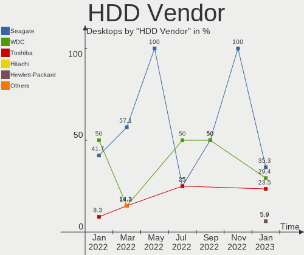

| Vendor  | Desktops | Drives | Percent |
|---------|----------|--------|---------|
| Seagate | 4        | 4      | 40%     |
| WDC     | 3        | 6      | 30%     |
| Toshiba | 1        | 3      | 10%     |
| Hitachi | 1        | 1      | 10%     |
| HGST    | 1        | 7      | 10%     |

SSD Vendor
----------

Solid state drive vendors

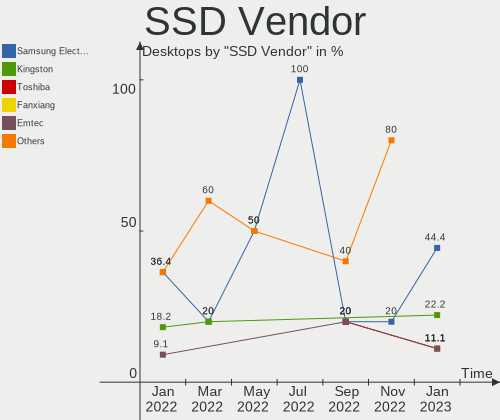

| Vendor              | Desktops | Drives | Percent |
|---------------------|----------|--------|---------|
| SanDisk             | 2        | 2      | 25%     |
| Samsung Electronics | 2        | 2      | 25%     |
| PNY                 | 1        | 1      | 12.5%   |
| LITEONIT            | 1        | 1      | 12.5%   |
| Crucial             | 1        | 1      | 12.5%   |
| China               | 1        | 1      | 12.5%   |

Drive Kind
----------

HDD or SSD

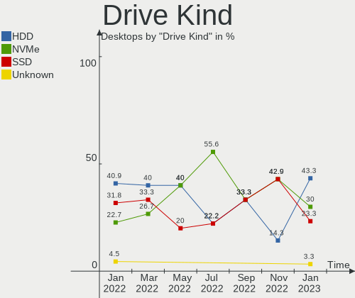

| Kind    | Desktops | Drives | Percent |
|---------|----------|--------|---------|
| HDD     | 6        | 21     | 35.29%  |
| SSD     | 5        | 8      | 29.41%  |
| NVMe    | 4        | 8      | 23.53%  |
| Unknown | 2        | 2      | 11.76%  |

Drive Connector
---------------

SATA, SAS, NVMe, etc.

| Type | Desktops | Drives | Percent |
|------|----------|--------|---------|
| SATA | 7        | 29     | 58.33%  |
| NVMe | 4        | 8      | 33.33%  |
| SAS  | 1        | 2      | 8.33%   |

Drive Size
----------

Size of hard drive

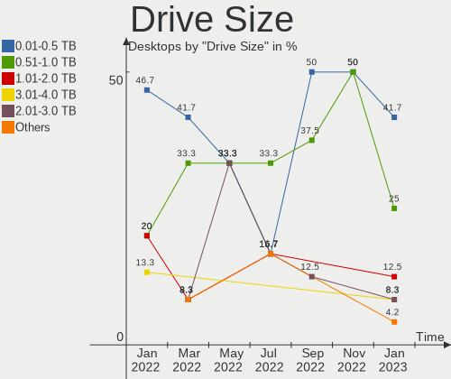

| Size in TB | Desktops | Drives | Percent |
|------------|----------|--------|---------|
| 0.01-0.5   | 6        | 22     | 46.15%  |
| 0.51-1.0   | 4        | 4      | 30.77%  |
| 1.01-2.0   | 3        | 3      | 23.08%  |

Space Total
-----------

Amount of disk space available on the file system

| Size in GB     | Desktops | Percent |
|----------------|----------|---------|
| More than 3000 | 6        | 75%     |
| 2001-3000      | 1        | 12.5%   |
| 501-1000       | 1        | 12.5%   |

Space Used
----------

Amount of used disk space

| Used GB        | Desktops | Percent |
|----------------|----------|---------|
| 2001-3000      | 2        | 25%     |
| 101-250        | 2        | 25%     |
| More than 3000 | 1        | 12.5%   |
| 251-500        | 1        | 12.5%   |
| 1001-2000      | 1        | 12.5%   |
| 501-1000       | 1        | 12.5%   |

Malfunc. Drives
---------------

Drive models with a malfunction

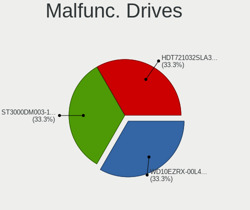

| Model                           | Desktops | Drives | Percent |
|---------------------------------|----------|--------|---------|
| WDC WD6400AAKS-65A7B0 640GB     | 1        | 1      | 20%     |
| WDC WD5000AAKX-60U6AA0 500GB    | 1        | 1      | 20%     |
| WDC WD20EARS-00MVWB0 2TB        | 1        | 1      | 20%     |
| HGST HTS725050A7E635 OPAL 500GB | 1        | 3      | 20%     |
| HGST HTS725050A7E630 500GB      | 1        | 4      | 20%     |

Malfunc. Drive Vendor
---------------------

Vendors of faulty drives

| Vendor | Desktops | Drives | Percent |
|--------|----------|--------|---------|
| WDC    | 1        | 3      | 50%     |
| HGST   | 1        | 7      | 50%     |

Malfunc. HDD Vendor
-------------------

Vendors of faulty HDD drives

| Vendor | Desktops | Drives | Percent |
|--------|----------|--------|---------|
| WDC    | 1        | 3      | 50%     |
| HGST   | 1        | 7      | 50%     |

Malfunc. Drive Kind
-------------------

Kinds of faulty drives

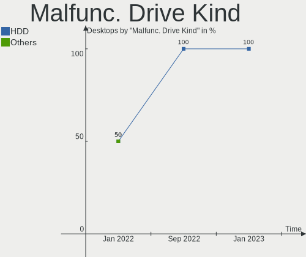

| Kind | Desktops | Drives | Percent |
|------|----------|--------|---------|
| HDD  | 1        | 10     | 100%    |

Failed Drives
-------------

Failed drive models

Zero info for selected period =(

Failed Drive Vendor
-------------------

Failed drive vendors

Zero info for selected period =(

Drive Status
------------

Number of failed and malfunc. drives

| Status   | Desktops | Drives | Percent |
|----------|----------|--------|---------|
| Detected | 5        | 17     | 55.56%  |
| Works    | 3        | 12     | 33.33%  |
| Malfunc  | 1        | 10     | 11.11%  |

Storage controller
------------------

Storage Vendor
--------------

Storage controller vendors

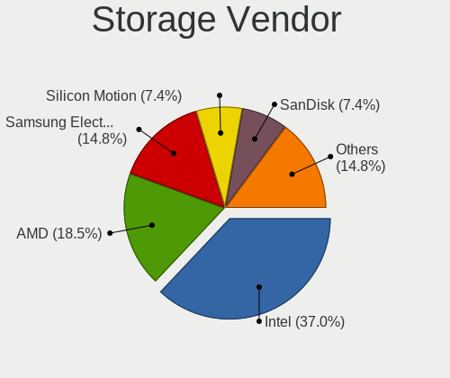

| Vendor                      | Desktops | Percent |
|-----------------------------|----------|---------|
| Intel                       | 5        | 33.33%  |
| AMD                         | 4        | 26.67%  |
| Samsung Electronics         | 2        | 13.33%  |
| Marvell Technology Group    | 2        | 13.33%  |
| Kingston Technology Company | 1        | 6.67%   |
| ADATA Technology            | 1        | 6.67%   |

Storage Model
-------------

Storage controller models

| Model                                                                         | Desktops | Percent |
|-------------------------------------------------------------------------------|----------|---------|
| Intel 6 Series/C200 Series Chipset Family 6 port Desktop SATA AHCI Controller | 2        | 11.11%  |
| AMD FCH SATA Controller [AHCI mode]                                           | 2        | 11.11%  |
| Samsung NVMe SSD Controller SM981/PM981/PM983                                 | 1        | 5.56%   |
| Samsung NVMe SSD Controller SM961/PM961/SM963                                 | 1        | 5.56%   |
| Samsung NVMe SSD Controller 980                                               | 1        | 5.56%   |
| Samsung Electronics Non-Volatile memory controller                            | 1        | 5.56%   |
| Marvell Group 88SE9215 PCIe 2.0 x1 4-port SATA 6 Gb/s Controller              | 1        | 5.56%   |
| Marvell Group 88SE9172 SATA 6Gb/s Controller                                  | 1        | 5.56%   |
| Kingston Company Company Non-Volatile memory controller                       | 1        | 5.56%   |
| Intel SSD 600P Series                                                         | 1        | 5.56%   |
| Intel Cannon Lake PCH SATA AHCI Controller                                    | 1        | 5.56%   |
| Intel 7 Series/C210 Series Chipset Family 6-port SATA Controller [AHCI mode]  | 1        | 5.56%   |
| AMD SB7x0/SB8x0/SB9x0 SATA Controller [AHCI mode]                             | 1        | 5.56%   |
| AMD 500 Series Chipset SATA Controller                                        | 1        | 5.56%   |
| AMD 400 Series Chipset SATA Controller                                        | 1        | 5.56%   |
| ADATA XPG SX8200 Pro PCIe Gen3x4 M.2 2280 Solid State Drive                   | 1        | 5.56%   |

Storage Kind
------------

Kind of storage controller (IDE, SATA, NVMe, SAS, ...)

| Kind | Desktops | Percent |
|------|----------|---------|
| SATA | 8        | 66.67%  |
| NVMe | 4        | 33.33%  |

Processor
---------

CPU Vendor
----------

Processor vendors

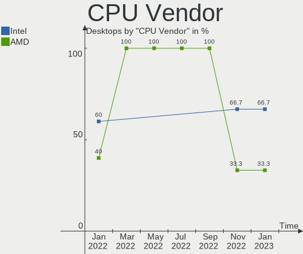

| Vendor | Desktops | Percent |
|--------|----------|---------|
| Intel  | 4        | 50%     |
| AMD    | 4        | 50%     |

CPU Model
---------

Processor models

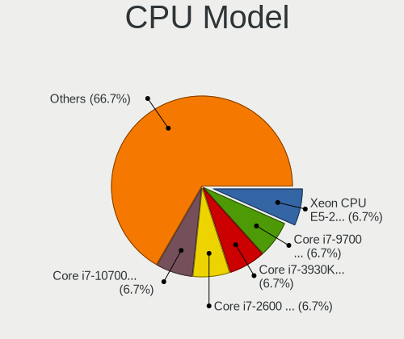

| Model                                  | Desktops | Percent |
|----------------------------------------|----------|---------|
| Intel Core i5-9600K CPU @ 3.70GHz      | 1        | 12.5%   |
| Intel Core i5-3470 CPU @ 3.20GHz       | 1        | 12.5%   |
| Intel Core i3-3220 CPU @ 3.30GHz       | 1        | 12.5%   |
| Intel Core i3-2120 CPU @ 3.30GHz       | 1        | 12.5%   |
| AMD Ryzen 7 5800X3D 8-Core Processor   | 1        | 12.5%   |
| AMD Ryzen 7 5700G with Radeon Graphics | 1        | 12.5%   |
| AMD Ryzen 5 5600 6-Core Processor      | 1        | 12.5%   |
| AMD FX-8320 Eight-Core Processor       | 1        | 12.5%   |

CPU Model Family
----------------

Processor model prefix

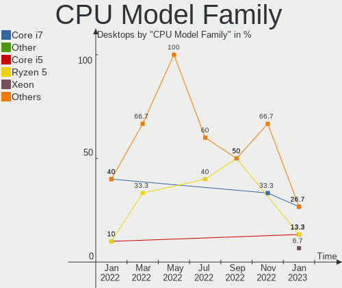

| Model         | Desktops | Percent |
|---------------|----------|---------|
| Intel Core i5 | 2        | 25%     |
| Intel Core i3 | 2        | 25%     |
| AMD Ryzen 7   | 2        | 25%     |
| AMD Ryzen 5   | 1        | 12.5%   |
| AMD FX        | 1        | 12.5%   |

CPU Cores
---------

Number of processor cores

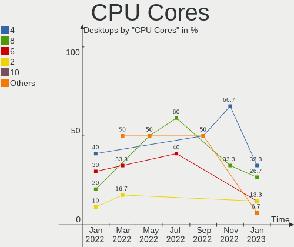

| Number | Desktops | Percent |
|--------|----------|---------|
| 8      | 2        | 25%     |
| 6      | 2        | 25%     |
| 4      | 2        | 25%     |
| 2      | 2        | 25%     |

CPU Sockets
-----------

Number of sockets

| Number | Desktops | Percent |
|--------|----------|---------|
| 1      | 8        | 100%    |

CPU Threads
-----------

Threads per core (Hyper-Threading)

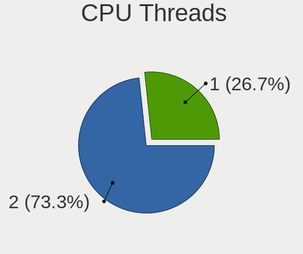

| Number | Desktops | Percent |
|--------|----------|---------|
| 2      | 5        | 62.5%   |
| 1      | 3        | 37.5%   |

CPU Op-Modes
------------

CPU Operation Modes (32-bit, 64-bit)

| Op mode        | Desktops | Percent |
|----------------|----------|---------|
| 32-bit, 64-bit | 8        | 100%    |

CPU Microcode
-------------

Microcode number

| Number     | Desktops | Percent |
|------------|----------|---------|
| Unknown    | 6        | 75%     |
| 0x0a20120a | 1        | 12.5%   |
| 0x0a201204 | 1        | 12.5%   |

CPU Microarch
-------------

Microarchitecture

| Name        | Desktops | Percent |
|-------------|----------|---------|
| Zen 3       | 3        | 37.5%   |
| IvyBridge   | 2        | 25%     |
| SandyBridge | 1        | 12.5%   |
| Piledriver  | 1        | 12.5%   |
| KabyLake    | 1        | 12.5%   |

Graphics
--------

GPU Vendor
----------

Vendors of graphics cards

| Vendor | Desktops | Percent |
|--------|----------|---------|
| AMD    | 4        | 40%     |
| Nvidia | 3        | 30%     |
| Intel  | 3        | 30%     |

GPU Model
---------

Graphics card models

| Model                                                                     | Desktops | Percent |
|---------------------------------------------------------------------------|----------|---------|
| Intel Xeon E3-1200 v2/3rd Gen Core processor Graphics Controller          | 2        | 20%     |
| Nvidia TU116 [GeForce GTX 1660]                                           | 1        | 10%     |
| Nvidia GP102 [GeForce GTX 1080 Ti]                                        | 1        | 10%     |
| Nvidia GM107 [GeForce GTX 750]                                            | 1        | 10%     |
| Intel 2nd Generation Core Processor Family Integrated Graphics Controller | 1        | 10%     |
| AMD Tonga PRO [Radeon R9 285/380]                                         | 1        | 10%     |
| AMD Pitcairn PRO [Radeon HD 7850 / R7 265 / R9 270 1024SP]                | 1        | 10%     |
| AMD Navi 22 [Radeon RX 6700/6700 XT/6750 XT / 6800M]                      | 1        | 10%     |
| AMD Cezanne [Radeon Vega Series / Radeon Vega Mobile Series]              | 1        | 10%     |

GPU Combo
---------

Combinations of graphics cards

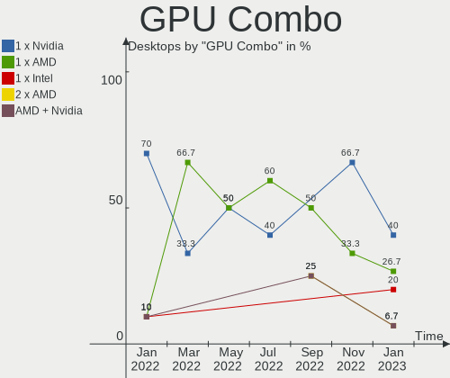

| Name         | Desktops | Percent |
|--------------|----------|---------|
| 1 x AMD      | 3        | 37.5%   |
| 1 x Nvidia   | 2        | 25%     |
| 1 x Intel    | 2        | 25%     |
| AMD + Nvidia | 1        | 12.5%   |

GPU Driver
----------

Free vs proprietary

| Driver      | Desktops | Percent |
|-------------|----------|---------|
| Free        | 5        | 62.5%   |
| Proprietary | 3        | 37.5%   |

GPU Memory
----------

Total video memory

| Size in GB | Desktops | Percent |
|------------|----------|---------|
| Unknown    | 3        | 37.5%   |
| 8.01-16.0  | 2        | 25%     |
| 5.01-6.0   | 1        | 12.5%   |
| 3.01-4.0   | 1        | 12.5%   |
| 0.51-1.0   | 1        | 12.5%   |

Monitor
-------

Monitor Vendor
--------------

Monitor vendors

| Vendor               | Desktops | Percent |
|----------------------|----------|---------|
| Goldstar             | 3        | 23.08%  |
| Samsung Electronics  | 2        | 15.38%  |
| Toshiba              | 1        | 7.69%   |
| LG Electronics       | 1        | 7.69%   |
| Hewlett-Packard      | 1        | 7.69%   |
| BenQ                 | 1        | 7.69%   |
| AOC                  | 1        | 7.69%   |
| Ancor Communications | 1        | 7.69%   |
| Acer                 | 1        | 7.69%   |
| Unknown              | 1        | 7.69%   |

Monitor Model
-------------

Monitor models

| Model                                                                 | Desktops | Percent |
|-----------------------------------------------------------------------|----------|---------|
| Toshiba TV TSB0206 1920x1080 886x498mm 40.0-inch                      | 1        | 7.69%   |
| Samsung Electronics LS27A800U SAM71A4 3840x2160 600x340mm 27.2-inch   | 1        | 7.69%   |
| Samsung Electronics F27G3xTF SAM710D 1920x1080 600x330mm 27.0-inch    | 1        | 7.69%   |
| LG Electronics LCD Monitor LG TV SSCR2 3840x2160                      | 1        | 7.69%   |
| Hewlett-Packard w2408 HWP26CE 1920x1200 518x324mm 24.1-inch           | 1        | 7.69%   |
| Goldstar ULTRAGEAR GSM7766 2560x1440 697x392mm 31.5-inch              | 1        | 7.69%   |
| Goldstar IPS FULLHD GSM5AB8 1920x1080 480x270mm 21.7-inch             | 1        | 7.69%   |
| Goldstar FULL HD GSM5B54 1920x1080 480x270mm 21.7-inch                | 1        | 7.69%   |
| BenQ E2200HD BNQ790C 1920x1080 477x268mm 21.5-inch                    | 1        | 7.69%   |
| AOC 2470W AOC2470 1920x1080 520x290mm 23.4-inch                       | 1        | 7.69%   |
| Ancor Communications ASUS PB277 ACI27B5 2560x1440 597x336mm 27.0-inch | 1        | 7.69%   |
| Acer AL2216W ACRAD74 1680x1050 473x296mm 22.0-inch                    | 1        | 7.69%   |
| Unknown                                                               | 1        | 7.69%   |

Monitor Resolution
------------------

Monitor screen resolution

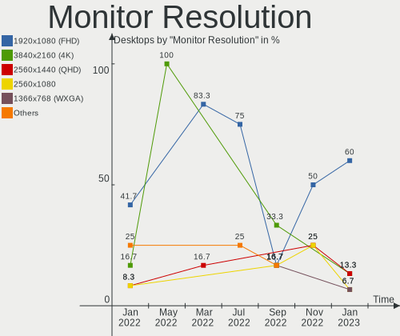

| Resolution         | Desktops | Percent |
|--------------------|----------|---------|
| 1920x1080 (FHD)    | 5        | 41.67%  |
| 2560x1440 (QHD)    | 3        | 25%     |
| 3840x2160 (4K)     | 2        | 16.67%  |
| 1920x1200 (WUXGA)  | 1        | 8.33%   |
| 1680x1050 (WSXGA+) | 1        | 8.33%   |

Monitor Diagonal
----------------

Diagonal size in inches

| Inches  | Desktops | Percent |
|---------|----------|---------|
| 27      | 3        | 23.08%  |
| 21      | 3        | 23.08%  |
| Unknown | 2        | 15.38%  |
| 74      | 1        | 7.69%   |
| 31      | 1        | 7.69%   |
| 24      | 1        | 7.69%   |
| 23      | 1        | 7.69%   |
| 22      | 1        | 7.69%   |

Monitor Width
-------------

Physical width

| Width in mm | Desktops | Percent |
|-------------|----------|---------|
| 401-500     | 4        | 36.36%  |
| 501-600     | 3        | 27.27%  |
| Unknown     | 2        | 18.18%  |
| 601-700     | 1        | 9.09%   |
| 1501-2000   | 1        | 9.09%   |

Aspect Ratio
------------

Proportional relationship between the width and the height

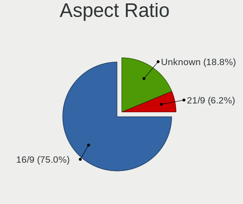

| Ratio   | Desktops | Percent |
|---------|----------|---------|
| 16/9    | 5        | 50%     |
| 16/10   | 3        | 30%     |
| Unknown | 2        | 20%     |

Monitor Area
------------

Area in inch²

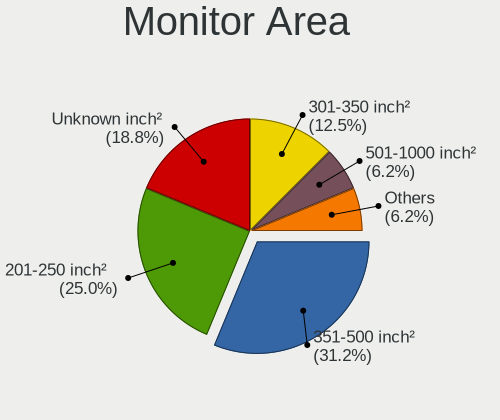

| Area in inch² | Desktops | Percent |
|----------------|----------|---------|
| 201-250        | 4        | 30.77%  |
| 301-350        | 3        | 23.08%  |
| Unknown        | 2        | 15.38%  |
| More than 1000 | 1        | 7.69%   |
| 351-500        | 1        | 7.69%   |
| 251-300        | 1        | 7.69%   |
| 151-200        | 1        | 7.69%   |

Pixel Density
-------------

Pixels per inch

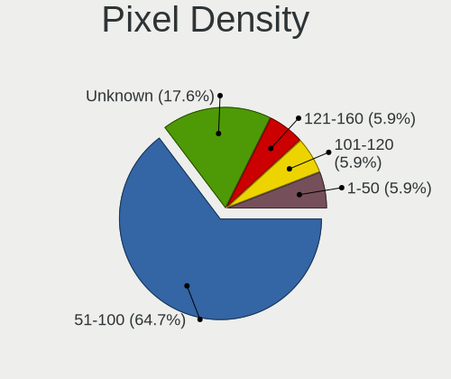

| Density | Desktops | Percent |
|---------|----------|---------|
| 51-100  | 4        | 36.36%  |
| 101-120 | 3        | 27.27%  |
| Unknown | 2        | 18.18%  |
| 1-50    | 1        | 9.09%   |
| 161-240 | 1        | 9.09%   |

Multiple Monitors
-----------------

Total monitors connected

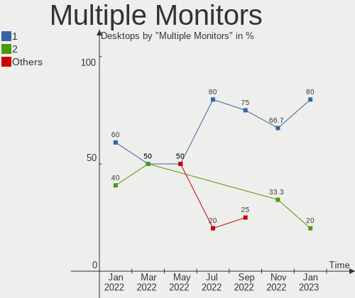

| Total | Desktops | Percent |
|-------|----------|---------|
| 1     | 4        | 50%     |
| 3     | 2        | 25%     |
| 2     | 2        | 25%     |

Network
-------

Net Controller Vendor
---------------------

Controller vendors

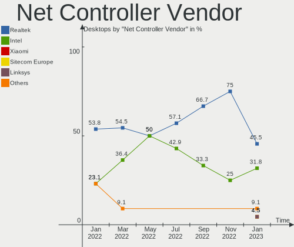

| Vendor                | Desktops | Percent |
|-----------------------|----------|---------|
| Realtek Semiconductor | 7        | 58.33%  |
| Intel                 | 3        | 25%     |
| MediaTek              | 1        | 8.33%   |
| DisplayLink           | 1        | 8.33%   |

Net Controller Model
--------------------

Controller models

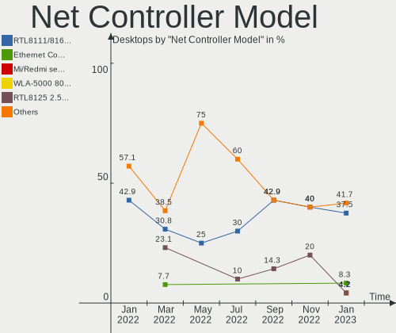

| Model                                                             | Desktops | Percent |
|-------------------------------------------------------------------|----------|---------|
| Realtek RTL8111/8168/8411 PCI Express Gigabit Ethernet Controller | 5        | 35.71%  |
| Intel I211 Gigabit Network Connection                             | 2        | 14.29%  |
| Realtek USB 10/100/1G/2.5G LAN                                    | 1        | 7.14%   |
| Realtek RTL8153 Gigabit Ethernet Adapter                          | 1        | 7.14%   |
| Realtek RTL810xE PCI Express Fast Ethernet controller             | 1        | 7.14%   |
| MediaTek MT7921K (RZ608) Wi-Fi 6E 80MHz                           | 1        | 7.14%   |
| Intel Wi-Fi 6 AX200                                               | 1        | 7.14%   |
| Intel Ethernet Controller I225-V                                  | 1        | 7.14%   |
| DisplayLink 6950                                                  | 1        | 7.14%   |

Wireless Vendor
---------------

Wireless vendors

| Vendor   | Desktops | Percent |
|----------|----------|---------|
| MediaTek | 1        | 50%     |
| Intel    | 1        | 50%     |

Wireless Model
--------------

Wireless models

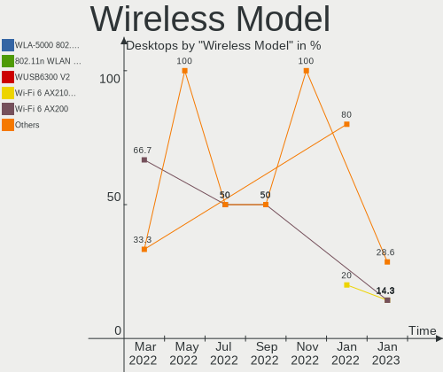

| Model                                   | Desktops | Percent |
|-----------------------------------------|----------|---------|
| MediaTek MT7921K (RZ608) Wi-Fi 6E 80MHz | 1        | 50%     |
| Intel Wi-Fi 6 AX200                     | 1        | 50%     |

Ethernet Vendor
---------------

Ethernet vendors

| Vendor                | Desktops | Percent |
|-----------------------|----------|---------|
| Realtek Semiconductor | 7        | 63.64%  |
| Intel                 | 3        | 27.27%  |
| DisplayLink           | 1        | 9.09%   |

Ethernet Model
--------------

Ethernet models

| Model                                                             | Desktops | Percent |
|-------------------------------------------------------------------|----------|---------|
| Realtek RTL8111/8168/8411 PCI Express Gigabit Ethernet Controller | 5        | 41.67%  |
| Intel I211 Gigabit Network Connection                             | 2        | 16.67%  |
| Realtek USB 10/100/1G/2.5G LAN                                    | 1        | 8.33%   |
| Realtek RTL8153 Gigabit Ethernet Adapter                          | 1        | 8.33%   |
| Realtek RTL810xE PCI Express Fast Ethernet controller             | 1        | 8.33%   |
| Intel Ethernet Controller I225-V                                  | 1        | 8.33%   |
| DisplayLink 6950                                                  | 1        | 8.33%   |

Net Controller Kind
-------------------

Ethernet, WiFi or modem

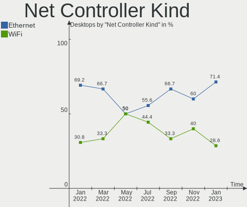

| Kind     | Desktops | Percent |
|----------|----------|---------|
| Ethernet | 8        | 80%     |
| WiFi     | 2        | 20%     |

Used Controller
---------------

Currently used network controller

| Kind     | Desktops | Percent |
|----------|----------|---------|
| Ethernet | 8        | 100%    |

NICs
----

Total network controllers on board

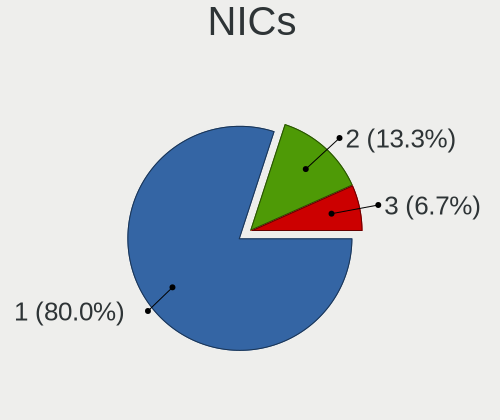

| Total | Desktops | Percent |
|-------|----------|---------|
| 1     | 6        | 75%     |
| 3     | 1        | 12.5%   |
| 2     | 1        | 12.5%   |

IPv6
----

IPv6 vs IPv4

| Used | Desktops | Percent |
|------|----------|---------|
| No   | 8        | 100%    |

Bluetooth
---------

Bluetooth Vendor
----------------

Controller vendors

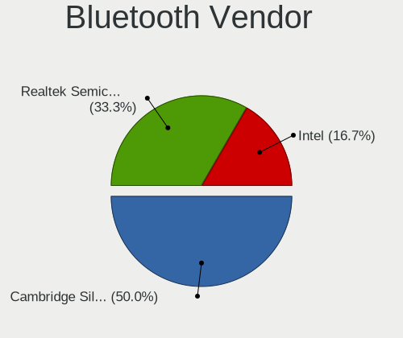

| Vendor                  | Desktops | Percent |
|-------------------------|----------|---------|
| MediaTek                | 1        | 25%     |
| Intel                   | 1        | 25%     |
| Cambridge Silicon Radio | 1        | 25%     |
| ASUSTek Computer        | 1        | 25%     |

Bluetooth Model
---------------

Controller models

| Model                                               | Desktops | Percent |
|-----------------------------------------------------|----------|---------|
| MediaTek Wireless_Device                            | 1        | 25%     |
| Intel AX200 Bluetooth                               | 1        | 25%     |
| Cambridge Silicon Radio Bluetooth Dongle (HCI mode) | 1        | 25%     |
| ASUS Bluetooth Device                               | 1        | 25%     |

Sound
-----

Sound Vendor
------------

Sound card vendors

| Vendor              | Desktops | Percent |
|---------------------|----------|---------|
| AMD                 | 5        | 26.32%  |
| Intel               | 4        | 21.05%  |
| Nvidia              | 3        | 15.79%  |
| Texas Instruments   | 2        | 10.53%  |
| C-Media Electronics | 2        | 10.53%  |
| Yamaha              | 1        | 5.26%   |
| Logitech            | 1        | 5.26%   |
| Arturia             | 1        | 5.26%   |

Sound Model
-----------

Sound card models

| Model                                                                      | Desktops | Percent |
|----------------------------------------------------------------------------|----------|---------|
| Intel 6 Series/C200 Series Chipset Family High Definition Audio Controller | 2        | 9.09%   |
| AMD Starship/Matisse HD Audio Controller                                   | 2        | 9.09%   |
| Yamaha YST-MS35D USB Speaker                                               | 1        | 4.55%   |
| Texas Instruments PCM2902 Audio Codec                                      | 1        | 4.55%   |
| Texas Instruments PCM2900C Audio CODEC                                     | 1        | 4.55%   |
| Nvidia TU116 High Definition Audio Controller                              | 1        | 4.55%   |
| Nvidia GP102 HDMI Audio Controller                                         | 1        | 4.55%   |
| Nvidia GM107 High Definition Audio Controller [GeForce 940MX]              | 1        | 4.55%   |
| Logitech PRO X                                                             | 1        | 4.55%   |
| Intel Cannon Lake PCH cAVS                                                 | 1        | 4.55%   |
| Intel 7 Series/C216 Chipset Family High Definition Audio Controller        | 1        | 4.55%   |
| C-Media Electronics USB Audio Device                                       | 1        | 4.55%   |
| C-Media Electronics Audio Adapter (Unitek Y-247A)                          | 1        | 4.55%   |
| Arturia W-MINI                                                             | 1        | 4.55%   |
| AMD Tonga HDMI Audio [Radeon R9 285/380]                                   | 1        | 4.55%   |
| AMD SBx00 Azalia (Intel HDA)                                               | 1        | 4.55%   |
| AMD Renoir Radeon High Definition Audio Controller                         | 1        | 4.55%   |
| AMD Oland/Hainan/Cape Verde/Pitcairn HDMI Audio [Radeon HD 7000 Series]    | 1        | 4.55%   |
| AMD Navi 21/23 HDMI/DP Audio Controller                                    | 1        | 4.55%   |
| AMD Family 17h/19h HD Audio Controller                                     | 1        | 4.55%   |

Memory
------

Memory Vendor
-------------

Memory module vendors

| Vendor            | Desktops | Percent |
|-------------------|----------|---------|
| Corsair           | 2        | 40%     |
| Unknown           | 1        | 20%     |
| Micron Technology | 1        | 20%     |
| Crucial           | 1        | 20%     |

Memory Model
------------

Memory module models

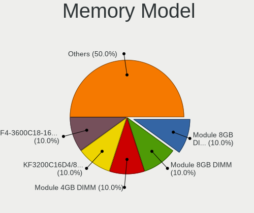

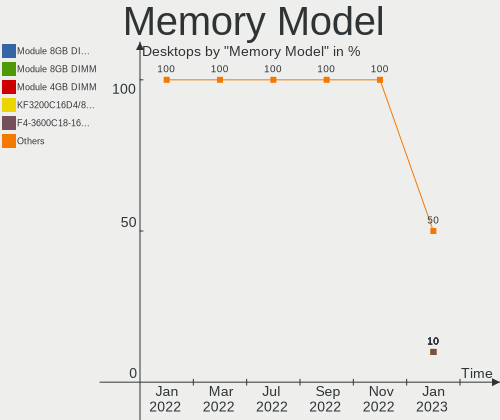

| Model                                                  | Desktops | Percent |
|--------------------------------------------------------|----------|---------|
| Unknown RAM 4400 C19 Series 8GB DIMM DDR4 2133MT/s     | 1        | 20%     |
| Micron RAM F6451U64F9333G 4GB DIMM DDR3 1333MT/s       | 1        | 20%     |
| Crucial RAM CT51264BA1339.M16F 4GB DIMM DDR3 1333MT/s  | 1        | 20%     |
| Corsair RAM CMK64GX4M4D3600C18 16GB DIMM DDR4 3466MT/s | 1        | 20%     |
| Corsair RAM CMK16GX4M2D3600C18 8GB DIMM DDR4 3600MT/s  | 1        | 20%     |

Memory Kind
-----------

Memory module kinds

| Kind | Desktops | Percent |
|------|----------|---------|
| DDR4 | 3        | 75%     |
| DDR3 | 1        | 25%     |

Memory Form Factor
------------------

Physical design of the memory module

| Name | Desktops | Percent |
|------|----------|---------|
| DIMM | 4        | 100%    |

Memory Size
-----------

Memory module size

| Size  | Desktops | Percent |
|-------|----------|---------|
| 8192  | 2        | 50%     |
| 16384 | 1        | 25%     |
| 4096  | 1        | 25%     |

Memory Speed
------------

Memory module speed

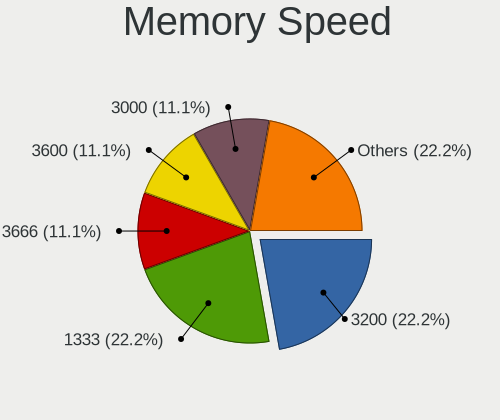

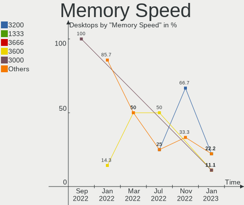

| Speed | Desktops | Percent |
|-------|----------|---------|
| 4266  | 1        | 25%     |
| 3600  | 1        | 25%     |
| 3466  | 1        | 25%     |
| 1333  | 1        | 25%     |

Printers & scanners
-------------------

Printer Vendor
--------------

Printer device vendors

Zero info for selected period =(

Printer Model
-------------

Printer device models

Zero info for selected period =(

Scanner Vendor
--------------

Scanner device vendors

Zero info for selected period =(

Scanner Model
-------------

Scanner device models

Zero info for selected period =(

Camera
------

Camera Vendor
-------------

Camera device vendors

| Vendor                 | Desktops | Percent |
|------------------------|----------|---------|
| Generalplus Technology | 2        | 66.67%  |
| Microsoft              | 1        | 33.33%  |

Camera Model
------------

Camera device models

| Model                      | Desktops | Percent |
|----------------------------|----------|---------|
| Microsoft LifeCam VX-2000  | 1        | 33.33%  |
| Generalplus GENERAL WEBCAM | 1        | 33.33%  |
| Generalplus 2K HD Camera   | 1        | 33.33%  |

Security
--------

Fingerprint Vendor
------------------

Fingerprint sensor vendors

Zero info for selected period =(

Fingerprint Model
-----------------

Fingerprint sensor models

Zero info for selected period =(

Chipcard Vendor
---------------

Chipcard module vendors

Zero info for selected period =(

Chipcard Model
--------------

Chipcard module models

Zero info for selected period =(

Unsupported
-----------

Unsupported Devices
-------------------

Total unsupported devices on board

| Total | Desktops | Percent |
|-------|----------|---------|
| 1     | 4        | 50%     |
| 0     | 4        | 50%     |

Unsupported Device Types
------------------------

Types of unsupported devices

| Type                     | Desktops | Percent |
|--------------------------|----------|---------|
| Communication controller | 3        | 75%     |
| Multimedia controller    | 1        | 25%     |

