Garuda Linux - Hardware Trends (Notebooks)
------------------------------------------

A project to identify most popular hardware characteristics and track their change
over time based on data collected by Linux users at https://Linux-Hardware.org.

Anyone can contribute to this report by the [hw-probe](https://github.com/linuxhw/hw-probe) tool:

    sudo -E hw-probe -all -upload

This report is for one last month. Overall report since the beginning of time: [TestCoverage](https://github.com/linuxhw/TestCoverage)

Period: Jan, 2023.

Contents
--------

* [ System ](#system)
  - [ OS                       ](#os)
  - [ OS Family                ](#os-family)
  - [ Kernel                   ](#kernel)
  - [ Kernel Family            ](#kernel-family)
  - [ Kernel Major Ver.        ](#kernel-major-ver)
  - [ Arch                     ](#arch)
  - [ DE                       ](#de)
  - [ Display Server           ](#display-server)
  - [ Display Manager          ](#display-manager)
  - [ OS Lang                  ](#os-lang)
  - [ Boot Mode                ](#boot-mode)
  - [ Filesystem               ](#filesystem)
  - [ Part. scheme             ](#part-scheme)
  - [ Dual Boot with Linux/BSD ](#dual-boot-with-linuxbsd)
  - [ Dual Boot (Win)          ](#dual-boot-win)

* [ Board ](#board)
  - [ Vendor                   ](#vendor)
  - [ Model                    ](#model)
  - [ Model Family             ](#model-family)
  - [ MFG Year                 ](#mfg-year)
  - [ Form Factor              ](#form-factor)
  - [ Secure Boot              ](#secure-boot)
  - [ Coreboot                 ](#coreboot)
  - [ RAM Size                 ](#ram-size)
  - [ RAM Used                 ](#ram-used)
  - [ Total Drives             ](#total-drives)
  - [ Has CD-ROM               ](#has-cd-rom)
  - [ Has Ethernet             ](#has-ethernet)
  - [ Has WiFi                 ](#has-wifi)
  - [ Has Bluetooth            ](#has-bluetooth)

* [ Location ](#location)
  - [ Country                  ](#country)
  - [ City                     ](#city)

* [ Drives ](#drives)
  - [ Drive Vendor             ](#drive-vendor)
  - [ Drive Model              ](#drive-model)
  - [ HDD Vendor               ](#hdd-vendor)
  - [ SSD Vendor               ](#ssd-vendor)
  - [ Drive Kind               ](#drive-kind)
  - [ Drive Connector          ](#drive-connector)
  - [ Drive Size               ](#drive-size)
  - [ Space Total              ](#space-total)
  - [ Space Used               ](#space-used)
  - [ Malfunc. Drives          ](#malfunc-drives)
  - [ Malfunc. Drive Vendor    ](#malfunc-drive-vendor)
  - [ Malfunc. HDD Vendor      ](#malfunc-hdd-vendor)
  - [ Malfunc. Drive Kind      ](#malfunc-drive-kind)
  - [ Failed Drives            ](#failed-drives)
  - [ Failed Drive Vendor      ](#failed-drive-vendor)
  - [ Drive Status             ](#drive-status)

* [ Storage controller ](#storage-controller)
  - [ Storage Vendor           ](#storage-vendor)
  - [ Storage Model            ](#storage-model)
  - [ Storage Kind             ](#storage-kind)

* [ Processor ](#processor)
  - [ CPU Vendor               ](#cpu-vendor)
  - [ CPU Model                ](#cpu-model)
  - [ CPU Model Family         ](#cpu-model-family)
  - [ CPU Cores                ](#cpu-cores)
  - [ CPU Sockets              ](#cpu-sockets)
  - [ CPU Threads              ](#cpu-threads)
  - [ CPU Op-Modes             ](#cpu-op-modes)
  - [ CPU Microcode            ](#cpu-microcode)
  - [ CPU Microarch            ](#cpu-microarch)

* [ Graphics ](#graphics)
  - [ GPU Vendor               ](#gpu-vendor)
  - [ GPU Model                ](#gpu-model)
  - [ GPU Combo                ](#gpu-combo)
  - [ GPU Driver               ](#gpu-driver)
  - [ GPU Memory               ](#gpu-memory)

* [ Monitor ](#monitor)
  - [ Monitor Vendor           ](#monitor-vendor)
  - [ Monitor Model            ](#monitor-model)
  - [ Monitor Resolution       ](#monitor-resolution)
  - [ Monitor Diagonal         ](#monitor-diagonal)
  - [ Monitor Width            ](#monitor-width)
  - [ Aspect Ratio             ](#aspect-ratio)
  - [ Monitor Area             ](#monitor-area)
  - [ Pixel Density            ](#pixel-density)
  - [ Multiple Monitors        ](#multiple-monitors)

* [ Network ](#network)
  - [ Net Controller Vendor    ](#net-controller-vendor)
  - [ Net Controller Model     ](#net-controller-model)
  - [ Wireless Vendor          ](#wireless-vendor)
  - [ Wireless Model           ](#wireless-model)
  - [ Ethernet Vendor          ](#ethernet-vendor)
  - [ Ethernet Model           ](#ethernet-model)
  - [ Net Controller Kind      ](#net-controller-kind)
  - [ Used Controller          ](#used-controller)
  - [ NICs                     ](#nics)
  - [ IPv6                     ](#ipv6)

* [ Bluetooth ](#bluetooth)
  - [ Bluetooth Vendor         ](#bluetooth-vendor)
  - [ Bluetooth Model          ](#bluetooth-model)

* [ Sound ](#sound)
  - [ Sound Vendor             ](#sound-vendor)
  - [ Sound Model              ](#sound-model)

* [ Memory ](#memory)
  - [ Memory Vendor            ](#memory-vendor)
  - [ Memory Model             ](#memory-model)
  - [ Memory Kind              ](#memory-kind)
  - [ Memory Form Factor       ](#memory-form-factor)
  - [ Memory Size              ](#memory-size)
  - [ Memory Speed             ](#memory-speed)

* [ Printers & scanners ](#printers--scanners)
  - [ Printer Vendor           ](#printer-vendor)
  - [ Printer Model            ](#printer-model)
  - [ Scanner Vendor           ](#scanner-vendor)
  - [ Scanner Model            ](#scanner-model)

* [ Camera ](#camera)
  - [ Camera Vendor            ](#camera-vendor)
  - [ Camera Model             ](#camera-model)

* [ Security ](#security)
  - [ Fingerprint Vendor       ](#fingerprint-vendor)
  - [ Fingerprint Model        ](#fingerprint-model)
  - [ Chipcard Vendor          ](#chipcard-vendor)
  - [ Chipcard Model           ](#chipcard-model)

* [ Unsupported ](#unsupported)
  - [ Unsupported Devices      ](#unsupported-devices)
  - [ Unsupported Device Types ](#unsupported-device-types)

System
------

OS
--

Installed operating systems

| Name                 | Notebooks | Percent |
|----------------------|-----------|---------|
| Garuda Linux Soaring | 7         | 63.64%  |
| Garuda Linux Rolling | 4         | 36.36%  |

OS Family
---------

OS without a version

| Name         | Notebooks | Percent |
|--------------|-----------|---------|
| Garuda Linux | 11        | 100%    |

Kernel
------

Version of the Linux kernel

| Version           | Notebooks | Percent |
|-------------------|-----------|---------|
| 6.1.7-zen1-1-zen  | 4         | 36.36%  |
| 6.1.1-zen1-1-zen  | 2         | 18.18%  |
| 6.1.4-zen2-1-zen  | 1         | 9.09%   |
| 6.1.3-zen1-1-zen  | 1         | 9.09%   |
| 6.1.3-arch1-1     | 1         | 9.09%   |
| 6.0.6-zen1-1-zen  | 1         | 9.09%   |
| 6.0.12-zen1-1-zen | 1         | 9.09%   |

Kernel Family
-------------

Linux kernel without a distro release

| Version | Notebooks | Percent |
|---------|-----------|---------|
| 6.1.7   | 4         | 36.36%  |
| 6.1.3   | 2         | 18.18%  |
| 6.1.1   | 2         | 18.18%  |
| 6.1.4   | 1         | 9.09%   |
| 6.0.6   | 1         | 9.09%   |
| 6.0.12  | 1         | 9.09%   |

Kernel Major Ver.
-----------------

Linux kernel major version

| Version | Notebooks | Percent |
|---------|-----------|---------|
| 6.1     | 9         | 81.82%  |
| 6.0     | 2         | 18.18%  |

Arch
----

OS architecture (x86_64, i586, etc.)

| Name   | Notebooks | Percent |
|--------|-----------|---------|
| x86_64 | 11        | 100%    |

DE
--

Desktop Environment

| Name  | Notebooks | Percent |
|-------|-----------|---------|
| KDE5  | 10        | 90.91%  |
| GNOME | 1         | 9.09%   |

Display Server
--------------

X11 or Wayland

| Name    | Notebooks | Percent |
|---------|-----------|---------|
| X11     | 9         | 81.82%  |
| Wayland | 1         | 9.09%   |
| Tty     | 1         | 9.09%   |

Display Manager
---------------

SDDM, LightDM, etc.

| Name    | Notebooks | Percent |
|---------|-----------|---------|
| SDDM    | 6         | 54.55%  |
| Unknown | 4         | 36.36%  |
| LightDM | 1         | 9.09%   |

OS Lang
-------

Language

| Lang  | Notebooks | Percent |
|-------|-----------|---------|
| en_US | 5         | 45.45%  |
| pt_BR | 1         | 9.09%   |
| nl_NL | 1         | 9.09%   |
| es_ES | 1         | 9.09%   |
| en_GB | 1         | 9.09%   |
| en_DK | 1         | 9.09%   |
| de_DE | 1         | 9.09%   |

Boot Mode
---------

EFI or BIOS

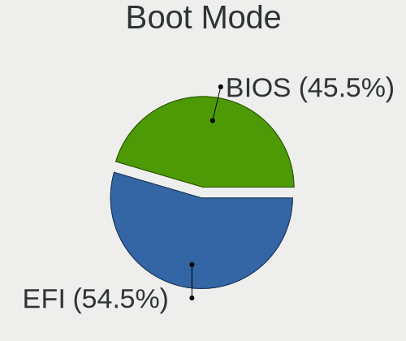

| Mode | Notebooks | Percent |
|------|-----------|---------|
| EFI  | 6         | 54.55%  |
| BIOS | 5         | 45.45%  |

Filesystem
----------

Type of filesystem

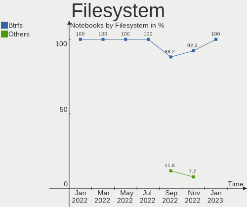

| Type  | Notebooks | Percent |
|-------|-----------|---------|
| Btrfs | 11        | 100%    |

Part. scheme
------------

Scheme of partitioning

| Type    | Notebooks | Percent |
|---------|-----------|---------|
| GPT     | 7         | 63.64%  |
| Unknown | 4         | 36.36%  |

Dual Boot with Linux/BSD
------------------------

Hosting more than one Linux/BSD

| Dual boot | Notebooks | Percent |
|-----------|-----------|---------|
| No        | 10        | 90.91%  |
| Yes       | 1         | 9.09%   |

Dual Boot (Win)
---------------

Hosting Linux and Windows

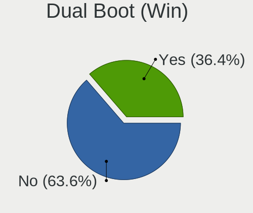

| Dual boot | Notebooks | Percent |
|-----------|-----------|---------|
| No        | 7         | 63.64%  |
| Yes       | 4         | 36.36%  |

Board
-----

Vendor
------

Motherboard manufacturer

| Name             | Notebooks | Percent |
|------------------|-----------|---------|
| Hewlett-Packard  | 3         | 27.27%  |
| Lenovo           | 2         | 18.18%  |
| Standard         | 1         | 9.09%   |
| Sony             | 1         | 9.09%   |
| MSI              | 1         | 9.09%   |
| Dell             | 1         | 9.09%   |
| ASUSTek Computer | 1         | 9.09%   |
| Acer             | 1         | 9.09%   |

Model
-----

Motherboard model

| Name                                 | Notebooks | Percent |
|--------------------------------------|-----------|---------|
| Sony SVF1521Q1EW                     | 1         | 9.09%   |
| MSI Stealth 15M B12UE                | 1         | 9.09%   |
| Lenovo ThinkPad Edge E540 20C600JHMH | 1         | 9.09%   |
| Lenovo G570 4334                     | 1         | 9.09%   |
| HP ProBook 6570b                     | 1         | 9.09%   |
| HP Pavilion dv6                      | 1         | 9.09%   |
| HP OMEN by Laptop 16-b0xxx           | 1         | 9.09%   |
| Dell G15 5515                        | 1         | 9.09%   |
| ASUS Zenbook UM5401QAB_UM5401QA      | 1         | 9.09%   |
| Acer Aspire A515-46                  | 1         | 9.09%   |
| Unknown                              | 1         | 9.09%   |

Model Family
------------

Motherboard model prefix

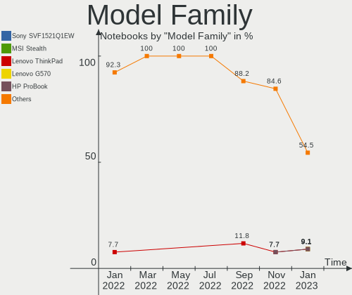

| Name             | Notebooks | Percent |
|------------------|-----------|---------|
| Sony SVF1521Q1EW | 1         | 9.09%   |
| MSI Stealth      | 1         | 9.09%   |
| Lenovo ThinkPad  | 1         | 9.09%   |
| Lenovo G570      | 1         | 9.09%   |
| HP ProBook       | 1         | 9.09%   |
| HP Pavilion      | 1         | 9.09%   |
| HP OMEN          | 1         | 9.09%   |
| Dell G15         | 1         | 9.09%   |
| ASUS Zenbook     | 1         | 9.09%   |
| Acer Aspire      | 1         | 9.09%   |
| Unknown          | 1         | 9.09%   |

MFG Year
--------

Motherboard manufacture year

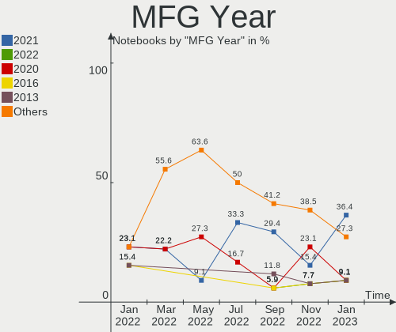

| Year | Notebooks | Percent |
|------|-----------|---------|
| 2021 | 4         | 36.36%  |
| 2022 | 1         | 9.09%   |
| 2020 | 1         | 9.09%   |
| 2016 | 1         | 9.09%   |
| 2013 | 1         | 9.09%   |
| 2012 | 1         | 9.09%   |
| 2011 | 1         | 9.09%   |
| 2008 | 1         | 9.09%   |

Form Factor
-----------

Physical design of the computer

| Name     | Notebooks | Percent |
|----------|-----------|---------|
| Notebook | 11        | 100%    |

Secure Boot
-----------

Enabled or disabled

| State    | Notebooks | Percent |
|----------|-----------|---------|
| Disabled | 11        | 100%    |

Coreboot
--------

Have coreboot on board

| Used | Notebooks | Percent |
|------|-----------|---------|
| No   | 11        | 100%    |

RAM Size
--------

Total RAM memory

| Size in GB  | Notebooks | Percent |
|-------------|-----------|---------|
| 4.01-8.0    | 3         | 27.27%  |
| 32.01-64.0  | 3         | 27.27%  |
| 16.01-24.0  | 2         | 18.18%  |
| 8.01-16.0   | 2         | 18.18%  |
| 64.01-256.0 | 1         | 9.09%   |

RAM Used
--------

Used RAM memory

| Used GB    | Notebooks | Percent |
|------------|-----------|---------|
| 2.01-3.0   | 4         | 36.36%  |
| 3.01-4.0   | 2         | 18.18%  |
| 8.01-16.0  | 2         | 18.18%  |
| 4.01-8.0   | 1         | 9.09%   |
| 32.01-64.0 | 1         | 9.09%   |
| 1.01-2.0   | 1         | 9.09%   |

Total Drives
------------

Number of drives on board

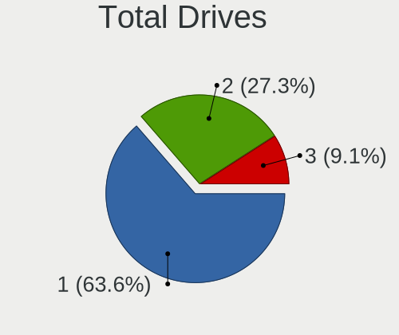

| Drives | Notebooks | Percent |
|--------|-----------|---------|
| 1      | 7         | 63.64%  |
| 2      | 3         | 27.27%  |
| 3      | 1         | 9.09%   |

Has CD-ROM
----------

Has CD-ROM on board

| Presented | Notebooks | Percent |
|-----------|-----------|---------|
| No        | 6         | 54.55%  |
| Yes       | 5         | 45.45%  |

Has Ethernet
------------

Has Ethernet on board

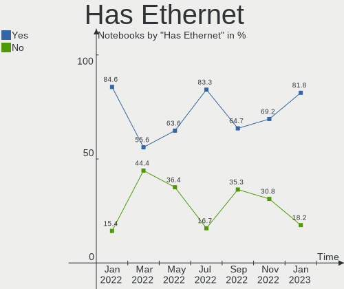

| Presented | Notebooks | Percent |
|-----------|-----------|---------|
| Yes       | 9         | 81.82%  |
| No        | 2         | 18.18%  |

Has WiFi
--------

Has WiFi module

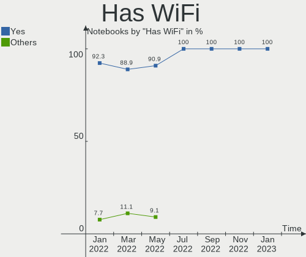

| Presented | Notebooks | Percent |
|-----------|-----------|---------|
| Yes       | 11        | 100%    |

Has Bluetooth
-------------

Has Bluetooth module

| Presented | Notebooks | Percent |
|-----------|-----------|---------|
| Yes       | 9         | 81.82%  |
| No        | 2         | 18.18%  |

Location
--------

Country
-------

Geographic location (country)

| Country      | Notebooks | Percent |
|--------------|-----------|---------|
| USA          | 3         | 27.27%  |
| Spain        | 2         | 18.18%  |
| UK           | 1         | 9.09%   |
| South Africa | 1         | 9.09%   |
| Netherlands  | 1         | 9.09%   |
| Germany      | 1         | 9.09%   |
| Denmark      | 1         | 9.09%   |
| Brazil       | 1         | 9.09%   |

City
----

Geographic location (city)

| City           | Notebooks | Percent |
|----------------|-----------|---------|
| Zafra          | 1         | 9.09%   |
| Terneuzen      | 1         | 9.09%   |
| Seville        | 1         | 9.09%   |
| Plymouth       | 1         | 9.09%   |
| Layton         | 1         | 9.09%   |
| Houston        | 1         | 9.09%   |
| Fennville      | 1         | 9.09%   |
| Crailsheim     | 1         | 9.09%   |
| Cape Town      | 1         | 9.09%   |
| Belo Horizonte | 1         | 9.09%   |
| Aabenraa       | 1         | 9.09%   |

Drives
------

Drive Vendor
------------

Hard drive vendors

| Vendor              | Notebooks | Drives | Percent |
|---------------------|-----------|--------|---------|
| SK hynix            | 3         | 3      | 20%     |
| Samsung Electronics | 3         | 3      | 20%     |
| Micron Technology   | 3         | 3      | 20%     |
| Seagate             | 2         | 2      | 13.33%  |
| Toshiba             | 1         | 2      | 6.67%   |
| Silicon Motion      | 1         | 1      | 6.67%   |
| Crucial             | 1         | 1      | 6.67%   |
| ADATA Technology    | 1         | 1      | 6.67%   |

Drive Model
-----------

Hard drive models

| Model                                                             | Notebooks | Percent |
|-------------------------------------------------------------------|-----------|---------|
| Toshiba THNSNS256GMCP 256GB SSD                                   | 1         | 6.25%   |
| Toshiba MQ01ABD075 752GB                                          | 1         | 6.25%   |
| SK hynix PC601 HFS512GD9TNG-L2A0A 512GB                           | 1         | 6.25%   |
| SK hynix HFM512GD3JX013N 512GB                                    | 1         | 6.25%   |
| SK hynix BC711 NVMe 512GB                                         | 1         | 6.25%   |
| Silicon Motion SM2263EN/SM2263XT SSD Controller 512GB             | 1         | 6.25%   |
| Seagate ST750LM022 HN-M750MBB 752GB                               | 1         | 6.25%   |
| Seagate ST1000LM024 HN-M101MBB 1TB                                | 1         | 6.25%   |
| Samsung SSD 840 EVO 120GB                                         | 1         | 6.25%   |
| Samsung NVMe SSD Controller PM9A1/PM9A3/980PRO 512GB              | 1         | 6.25%   |
| Samsung HD161HJ 160GB                                             | 1         | 6.25%   |
| Micron Crucial X8 SSD 1TB                                         | 1         | 6.25%   |
| Micron 2450_MTFDKBA1T0TFK 1TB                                     | 1         | 6.25%   |
| Micron 1100_MTFDDAV256TBN 256GB SSD                               | 1         | 6.25%   |
| Crucial CT500MX500SSD1 500GB                                      | 1         | 6.25%   |
| ADATA XPG SX8200 Pro PCIe Gen3x4 M.2 2280 Solid State Drive 256GB | 1         | 6.25%   |

HDD Vendor
----------

Hard disk drive vendors

| Vendor              | Notebooks | Drives | Percent |
|---------------------|-----------|--------|---------|
| Seagate             | 2         | 2      | 50%     |
| Toshiba             | 1         | 1      | 25%     |
| Samsung Electronics | 1         | 1      | 25%     |

SSD Vendor
----------

Solid state drive vendors

| Vendor              | Notebooks | Drives | Percent |
|---------------------|-----------|--------|---------|
| Micron Technology   | 2         | 2      | 40%     |
| Toshiba             | 1         | 1      | 20%     |
| Samsung Electronics | 1         | 1      | 20%     |
| Crucial             | 1         | 1      | 20%     |

Drive Kind
----------

HDD or SSD

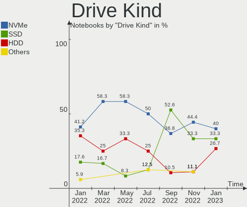

| Kind | Notebooks | Drives | Percent |
|------|-----------|--------|---------|
| NVMe | 6         | 7      | 40%     |
| SSD  | 5         | 5      | 33.33%  |
| HDD  | 4         | 4      | 26.67%  |

Drive Connector
---------------

SATA, SAS, NVMe, etc.

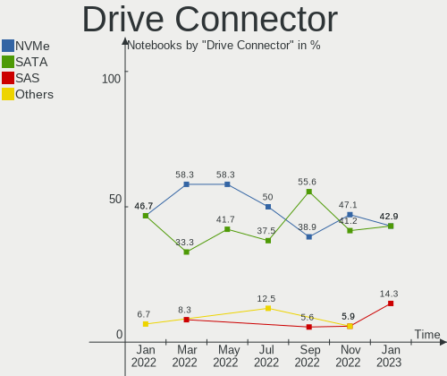

| Type | Notebooks | Drives | Percent |
|------|-----------|--------|---------|
| NVMe | 6         | 7      | 42.86%  |
| SATA | 6         | 7      | 42.86%  |
| SAS  | 2         | 2      | 14.29%  |

Drive Size
----------

Size of hard drive

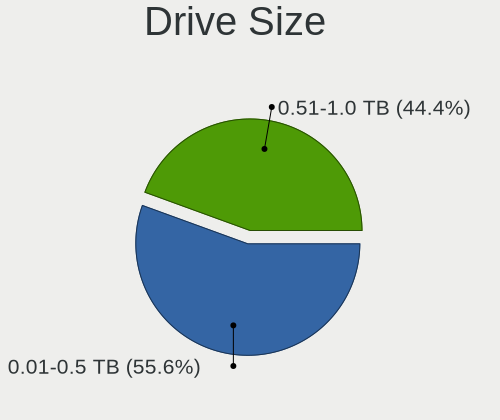

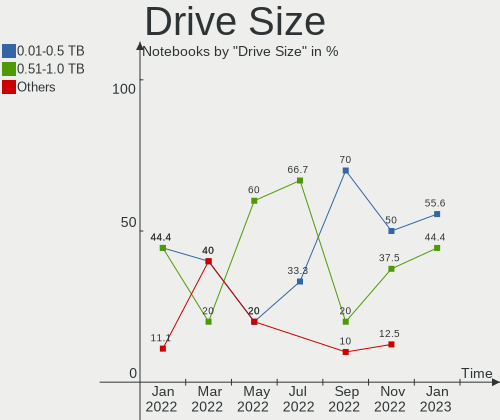

| Size in TB | Notebooks | Drives | Percent |
|------------|-----------|--------|---------|
| 0.01-0.5   | 5         | 5      | 55.56%  |
| 0.51-1.0   | 4         | 4      | 44.44%  |

Space Total
-----------

Amount of disk space available on the file system

| Size in GB     | Notebooks | Percent |
|----------------|-----------|---------|
| More than 3000 | 5         | 45.45%  |
| 2001-3000      | 2         | 18.18%  |
| 1001-2000      | 2         | 18.18%  |
| 501-1000       | 2         | 18.18%  |

Space Used
----------

Amount of used disk space

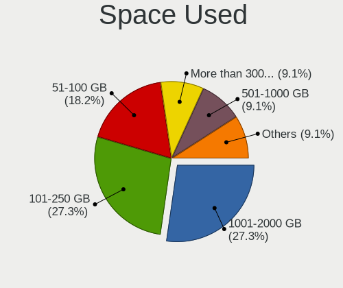

| Used GB        | Notebooks | Percent |
|----------------|-----------|---------|
| 101-250        | 3         | 27.27%  |
| 1001-2000      | 3         | 27.27%  |
| 51-100         | 2         | 18.18%  |
| More than 3000 | 1         | 9.09%   |
| 251-500        | 1         | 9.09%   |
| 501-1000       | 1         | 9.09%   |

Malfunc. Drives
---------------

Drive models with a malfunction

Zero info for selected period =(

Malfunc. Drive Vendor
---------------------

Vendors of faulty drives

Zero info for selected period =(

Malfunc. HDD Vendor
-------------------

Vendors of faulty HDD drives

Zero info for selected period =(

Malfunc. Drive Kind
-------------------

Kinds of faulty drives

Zero info for selected period =(

Failed Drives
-------------

Failed drive models

Zero info for selected period =(

Failed Drive Vendor
-------------------

Failed drive vendors

Zero info for selected period =(

Drive Status
------------

Number of failed and malfunc. drives

| Status   | Notebooks | Drives | Percent |
|----------|-----------|--------|---------|
| Detected | 7         | 8      | 53.85%  |
| Works    | 6         | 8      | 46.15%  |

Storage controller
------------------

Storage Vendor
--------------

Storage controller vendors

| Vendor              | Notebooks | Percent |
|---------------------|-----------|---------|
| Intel               | 7         | 43.75%  |
| SK hynix            | 3         | 18.75%  |
| AMD                 | 2         | 12.5%   |
| Silicon Motion      | 1         | 6.25%   |
| Samsung Electronics | 1         | 6.25%   |
| Micron Technology   | 1         | 6.25%   |
| ADATA Technology    | 1         | 6.25%   |

Storage Model
-------------

Storage controller models

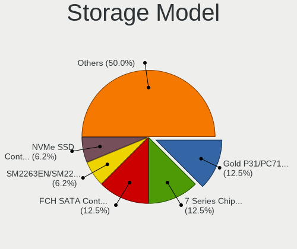

| Model                                                                          | Notebooks | Percent |
|--------------------------------------------------------------------------------|-----------|---------|
| SK hynix Gold P31/PC711 NVMe Solid State Drive                                 | 2         | 12.5%   |
| Intel 7 Series Chipset Family 6-port SATA Controller [AHCI mode]               | 2         | 12.5%   |
| AMD FCH SATA Controller [AHCI mode]                                            | 2         | 12.5%   |
| SK hynix Non-Volatile memory controller                                        | 1         | 6.25%   |
| Silicon Motion SM2263EN/SM2263XT SSD Controller                                | 1         | 6.25%   |
| Samsung NVMe SSD Controller PM9A1/PM9A3/980PRO                                 | 1         | 6.25%   |
| Micron Non-Volatile memory controller                                          | 1         | 6.25%   |
| Intel Volume Management Device NVMe RAID Controller                            | 1         | 6.25%   |
| Intel 82801 Mobile SATA Controller [RAID mode]                                 | 1         | 6.25%   |
| Intel 8 Series/C220 Series Chipset Family 6-port SATA Controller 1 [AHCI mode] | 1         | 6.25%   |
| Intel 6 Series/C200 Series Chipset Family 6 port Mobile SATA AHCI Controller   | 1         | 6.25%   |
| Intel 400 Series Chipset Family SATA AHCI Controller                           | 1         | 6.25%   |
| ADATA XPG SX8200 Pro PCIe Gen3x4 M.2 2280 Solid State Drive                    | 1         | 6.25%   |

Storage Kind
------------

Kind of storage controller (IDE, SATA, NVMe, SAS, ...)

| Kind | Notebooks | Percent |
|------|-----------|---------|
| SATA | 7         | 46.67%  |
| NVMe | 6         | 40%     |
| RAID | 2         | 13.33%  |

Processor
---------

CPU Vendor
----------

Processor vendors

| Vendor | Notebooks | Percent |
|--------|-----------|---------|
| Intel  | 8         | 72.73%  |
| AMD    | 3         | 27.27%  |

CPU Model
---------

Processor models

| Model                                         | Notebooks | Percent |
|-----------------------------------------------|-----------|---------|
| AMD Ryzen 7 5800H with Radeon Graphics        | 2         | 18.18%  |
| Intel Pentium CPU B940 @ 2.00GHz              | 1         | 9.09%   |
| Intel Core i7-3610QM CPU @ 2.30GHz            | 1         | 9.09%   |
| Intel Core i7-10875H CPU @ 2.30GHz            | 1         | 9.09%   |
| Intel Core i5-4210M CPU @ 2.60GHz             | 1         | 9.09%   |
| Intel Core i5-3337U CPU @ 1.80GHz             | 1         | 9.09%   |
| Intel Core i5-3210M CPU @ 2.50GHz             | 1         | 9.09%   |
| Intel 12th Gen Core i7-1280P                  | 1         | 9.09%   |
| Intel 11th Gen Core i7-11800H @ 2.30GHz       | 1         | 9.09%   |
| AMD Ryzen 3 3350U with Radeon Vega Mobile Gfx | 1         | 9.09%   |

CPU Model Family
----------------

Processor model prefix

| Model         | Notebooks | Percent |
|---------------|-----------|---------|
| Intel Core i5 | 3         | 27.27%  |
| Other         | 2         | 18.18%  |
| Intel Core i7 | 2         | 18.18%  |
| AMD Ryzen 7   | 2         | 18.18%  |
| Intel Pentium | 1         | 9.09%   |
| AMD Ryzen 3   | 1         | 9.09%   |

CPU Cores
---------

Number of processor cores

| Number | Notebooks | Percent |
|--------|-----------|---------|
| 8      | 4         | 36.36%  |
| 2      | 4         | 36.36%  |
| 4      | 2         | 18.18%  |
| 14     | 1         | 9.09%   |

CPU Sockets
-----------

Number of sockets

| Number | Notebooks | Percent |
|--------|-----------|---------|
| 1      | 11        | 100%    |

CPU Threads
-----------

Threads per core (Hyper-Threading)

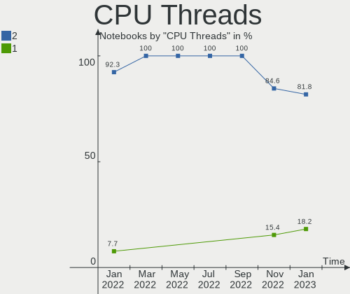

| Number | Notebooks | Percent |
|--------|-----------|---------|
| 2      | 9         | 81.82%  |
| 1      | 2         | 18.18%  |

CPU Op-Modes
------------

CPU Operation Modes (32-bit, 64-bit)

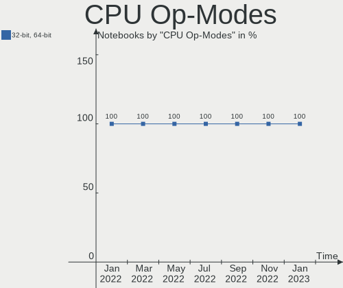

| Op mode        | Notebooks | Percent |
|----------------|-----------|---------|
| 32-bit, 64-bit | 11        | 100%    |

CPU Microcode
-------------

Microcode number

| Number  | Notebooks | Percent |
|---------|-----------|---------|
| Unknown | 8         | 72.73%  |
| 0xa0652 | 1         | 9.09%   |
| 0x906a3 | 1         | 9.09%   |
| 0x306a9 | 1         | 9.09%   |

CPU Microarch
-------------

Microarchitecture

| Name             | Notebooks | Percent |
|------------------|-----------|---------|
| IvyBridge        | 3         | 27.27%  |
| Zen 3            | 2         | 18.18%  |
| Zen+             | 1         | 9.09%   |
| SandyBridge      | 1         | 9.09%   |
| Haswell          | 1         | 9.09%   |
| CometLake        | 1         | 9.09%   |
| Alderlake Hybrid | 1         | 9.09%   |
| Unknown          | 1         | 9.09%   |

Graphics
--------

GPU Vendor
----------

Vendors of graphics cards

| Vendor | Notebooks | Percent |
|--------|-----------|---------|
| Intel  | 8         | 47.06%  |
| Nvidia | 6         | 35.29%  |
| AMD    | 3         | 17.65%  |

GPU Model
---------

Graphics card models

| Model                                                                     | Notebooks | Percent |
|---------------------------------------------------------------------------|-----------|---------|
| Intel 3rd Gen Core processor Graphics Controller                          | 3         | 17.65%  |
| Nvidia GA106M [GeForce RTX 3060 Mobile / Max-Q]                           | 2         | 11.76%  |
| AMD Cezanne [Radeon Vega Series / Radeon Vega Mobile Series]              | 2         | 11.76%  |
| Nvidia TU106M [GeForce RTX 2070 Mobile / Max-Q Refresh]                   | 1         | 5.88%   |
| Nvidia GK208M [GeForce GT 740M]                                           | 1         | 5.88%   |
| Nvidia GF108M [GeForce GT 620M/630M/635M/640M LE]                         | 1         | 5.88%   |
| Nvidia GA104M [GeForce RTX 3070 Mobile / Max-Q]                           | 1         | 5.88%   |
| Intel TigerLake-H GT1 [UHD Graphics]                                      | 1         | 5.88%   |
| Intel CometLake-H GT2 [UHD Graphics]                                      | 1         | 5.88%   |
| Intel Alder Lake-P Integrated Graphics Controller                         | 1         | 5.88%   |
| Intel 4th Gen Core Processor Integrated Graphics Controller               | 1         | 5.88%   |
| Intel 2nd Generation Core Processor Family Integrated Graphics Controller | 1         | 5.88%   |
| AMD Picasso/Raven 2 [Radeon Vega Series / Radeon Vega Mobile Series]      | 1         | 5.88%   |

GPU Combo
---------

Combinations of graphics cards

| Name           | Notebooks | Percent |
|----------------|-----------|---------|
| Intel + Nvidia | 5         | 45.45%  |
| 1 x Intel      | 3         | 27.27%  |
| 1 x AMD        | 2         | 18.18%  |
| AMD + Nvidia   | 1         | 9.09%   |

GPU Driver
----------

Free vs proprietary

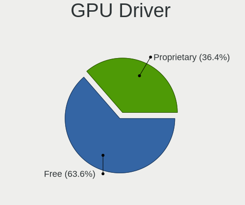

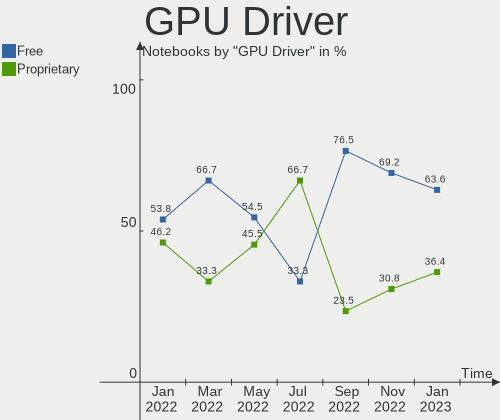

| Driver      | Notebooks | Percent |
|-------------|-----------|---------|
| Free        | 7         | 63.64%  |
| Proprietary | 4         | 36.36%  |

GPU Memory
----------

Total video memory

| Size in GB | Notebooks | Percent |
|------------|-----------|---------|
| Unknown    | 11        | 100%    |

Monitor
-------

Monitor Vendor
--------------

Monitor vendors

| Vendor                  | Notebooks | Percent |
|-------------------------|-----------|---------|
| Samsung Electronics     | 3         | 25%     |
| PANDA                   | 2         | 16.67%  |
| BOE                     | 2         | 16.67%  |
| Philips                 | 1         | 8.33%   |
| LG Display              | 1         | 8.33%   |
| Chimei Innolux          | 1         | 8.33%   |
| Chi Mei Optoelectronics | 1         | 8.33%   |
| AU Optronics            | 1         | 8.33%   |

Monitor Model
-------------

Monitor models

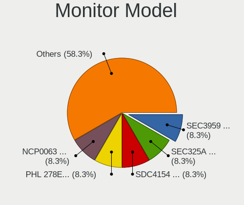

| Model                                                                    | Notebooks | Percent |
|--------------------------------------------------------------------------|-----------|---------|
| Samsung Electronics LCD Monitor SEC3959 1366x768 344x194mm 15.5-inch     | 1         | 8.33%   |
| Samsung Electronics LCD Monitor SEC325A 1366x768 344x194mm 15.5-inch     | 1         | 8.33%   |
| Samsung Electronics LCD Monitor SDC4154 2880x1800 302x189mm 14.0-inch    | 1         | 8.33%   |
| Philips PHL 278E1 PHLC217 3840x2160 597x336mm 27.0-inch                  | 1         | 8.33%   |
| PANDA LCD Monitor NCP0063 1920x1080 344x194mm 15.5-inch                  | 1         | 8.33%   |
| PANDA LCD Monitor NCP004B 1920x1080 344x194mm 15.5-inch                  | 1         | 8.33%   |
| LG Display LCD Monitor LGD02DC 1366x768 344x194mm 15.5-inch              | 1         | 8.33%   |
| Chimei Innolux LCD Monitor CMN15C0 1920x1080 344x194mm 15.5-inch         | 1         | 8.33%   |
| Chi Mei Optoelectronics LCD Monitor CMO15AB 1366x768 340x190mm 15.3-inch | 1         | 8.33%   |
| BOE LCD Monitor BOE0ACC 1920x1080 344x194mm 15.5-inch                    | 1         | 8.33%   |
| BOE LCD Monitor BOE09E5 2560x1440 355x200mm 16.0-inch                    | 1         | 8.33%   |
| AU Optronics LCD Monitor AUOB49B 1920x1080 344x193mm 15.5-inch           | 1         | 8.33%   |

Monitor Resolution
------------------

Monitor screen resolution

| Resolution      | Notebooks | Percent |
|-----------------|-----------|---------|
| 1920x1080 (FHD) | 5         | 41.67%  |
| 1366x768 (WXGA) | 4         | 33.33%  |
| 3840x2160 (4K)  | 1         | 8.33%   |
| 2880x1800       | 1         | 8.33%   |
| 2560x1440 (QHD) | 1         | 8.33%   |

Monitor Diagonal
----------------

Diagonal size in inches

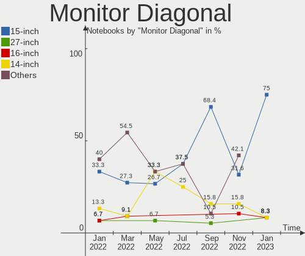

| Inches | Notebooks | Percent |
|--------|-----------|---------|
| 15     | 9         | 75%     |
| 27     | 1         | 8.33%   |
| 16     | 1         | 8.33%   |
| 14     | 1         | 8.33%   |

Monitor Width
-------------

Physical width

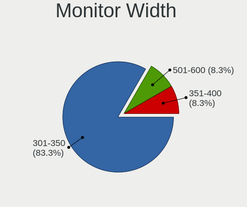

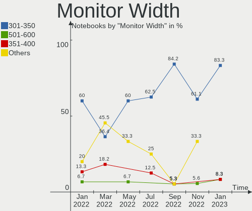

| Width in mm | Notebooks | Percent |
|-------------|-----------|---------|
| 301-350     | 10        | 83.33%  |
| 501-600     | 1         | 8.33%   |
| 351-400     | 1         | 8.33%   |

Aspect Ratio
------------

Proportional relationship between the width and the height

| Ratio | Notebooks | Percent |
|-------|-----------|---------|
| 16/9  | 10        | 90.91%  |
| 16/10 | 1         | 9.09%   |

Monitor Area
------------

Area in inch²

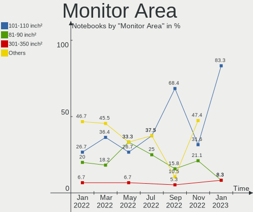

| Area in inch² | Notebooks | Percent |
|----------------|-----------|---------|
| 101-110        | 10        | 83.33%  |
| 81-90          | 1         | 8.33%   |
| 301-350        | 1         | 8.33%   |

Pixel Density
-------------

Pixels per inch

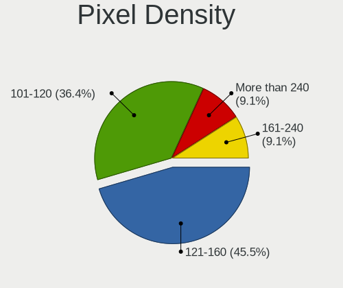

| Density       | Notebooks | Percent |
|---------------|-----------|---------|
| 121-160       | 5         | 45.45%  |
| 101-120       | 4         | 36.36%  |
| More than 240 | 1         | 9.09%   |
| 161-240       | 1         | 9.09%   |

Multiple Monitors
-----------------

Total monitors connected

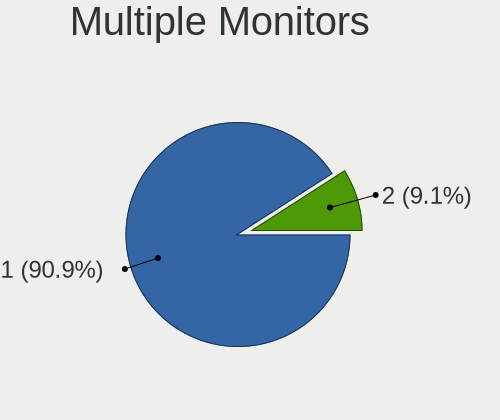

| Total | Notebooks | Percent |
|-------|-----------|---------|
| 1     | 10        | 90.91%  |
| 2     | 1         | 9.09%   |

Network
-------

Net Controller Vendor
---------------------

Controller vendors

| Vendor                | Notebooks | Percent |
|-----------------------|-----------|---------|
| Intel                 | 9         | 45%     |
| Realtek Semiconductor | 7         | 35%     |
| Broadcom              | 2         | 10%     |
| TP-Link               | 1         | 5%      |
| Qualcomm Atheros      | 1         | 5%      |

Net Controller Model
--------------------

Controller models

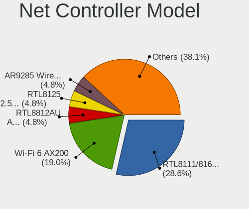

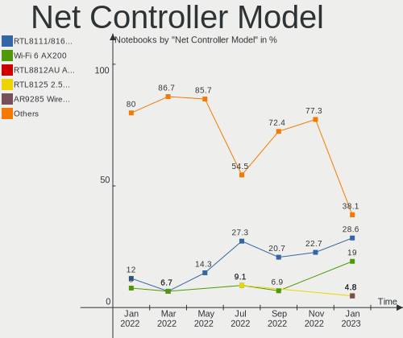

| Model                                                             | Notebooks | Percent |
|-------------------------------------------------------------------|-----------|---------|
| Realtek RTL8111/8168/8411 PCI Express Gigabit Ethernet Controller | 6         | 28.57%  |
| Intel Wi-Fi 6 AX200                                               | 4         | 19.05%  |
| TP-Link RTL8812AU Archer T4U 802.11ac                             | 1         | 4.76%   |
| Realtek RTL8125 2.5GbE Controller                                 | 1         | 4.76%   |
| Qualcomm Atheros AR9285 Wireless Network Adapter (PCI-Express)    | 1         | 4.76%   |
| Qualcomm Atheros AR8152 v2.0 Fast Ethernet                        | 1         | 4.76%   |
| Intel Wireless 7260                                               | 1         | 4.76%   |
| Intel Tiger Lake PCH CNVi WiFi                                    | 1         | 4.76%   |
| Intel Centrino Wireless-N 2230                                    | 1         | 4.76%   |
| Intel Alder Lake-P PCH CNVi WiFi                                  | 1         | 4.76%   |
| Intel 82579V Gigabit Network Connection                           | 1         | 4.76%   |
| Broadcom BCM43228 802.11a/b/g/n                                   | 1         | 4.76%   |
| Broadcom BCM43142 802.11b/g/n                                     | 1         | 4.76%   |

Wireless Vendor
---------------

Wireless vendors

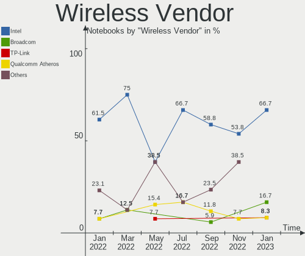

| Vendor           | Notebooks | Percent |
|------------------|-----------|---------|
| Intel            | 8         | 66.67%  |
| Broadcom         | 2         | 16.67%  |
| TP-Link          | 1         | 8.33%   |
| Qualcomm Atheros | 1         | 8.33%   |

Wireless Model
--------------

Wireless models

| Model                                                          | Notebooks | Percent |
|----------------------------------------------------------------|-----------|---------|
| Intel Wi-Fi 6 AX200                                            | 4         | 33.33%  |
| TP-Link RTL8812AU Archer T4U 802.11ac                          | 1         | 8.33%   |
| Qualcomm Atheros AR9285 Wireless Network Adapter (PCI-Express) | 1         | 8.33%   |
| Intel Wireless 7260                                            | 1         | 8.33%   |
| Intel Tiger Lake PCH CNVi WiFi                                 | 1         | 8.33%   |
| Intel Centrino Wireless-N 2230                                 | 1         | 8.33%   |
| Intel Alder Lake-P PCH CNVi WiFi                               | 1         | 8.33%   |
| Broadcom BCM43228 802.11a/b/g/n                                | 1         | 8.33%   |
| Broadcom BCM43142 802.11b/g/n                                  | 1         | 8.33%   |

Ethernet Vendor
---------------

Ethernet vendors

| Vendor                | Notebooks | Percent |
|-----------------------|-----------|---------|
| Realtek Semiconductor | 7         | 77.78%  |
| Qualcomm Atheros      | 1         | 11.11%  |
| Intel                 | 1         | 11.11%  |

Ethernet Model
--------------

Ethernet models

| Model                                                             | Notebooks | Percent |
|-------------------------------------------------------------------|-----------|---------|
| Realtek RTL8111/8168/8411 PCI Express Gigabit Ethernet Controller | 6         | 66.67%  |
| Realtek RTL8125 2.5GbE Controller                                 | 1         | 11.11%  |
| Qualcomm Atheros AR8152 v2.0 Fast Ethernet                        | 1         | 11.11%  |
| Intel 82579V Gigabit Network Connection                           | 1         | 11.11%  |

Net Controller Kind
-------------------

Ethernet, WiFi or modem

| Kind     | Notebooks | Percent |
|----------|-----------|---------|
| WiFi     | 11        | 55%     |
| Ethernet | 9         | 45%     |

Used Controller
---------------

Currently used network controller

| Kind     | Notebooks | Percent |
|----------|-----------|---------|
| WiFi     | 11        | 91.67%  |
| Ethernet | 1         | 8.33%   |

NICs
----

Total network controllers on board

| Total | Notebooks | Percent |
|-------|-----------|---------|
| 2     | 9         | 81.82%  |
| 1     | 2         | 18.18%  |

IPv6
----

IPv6 vs IPv4

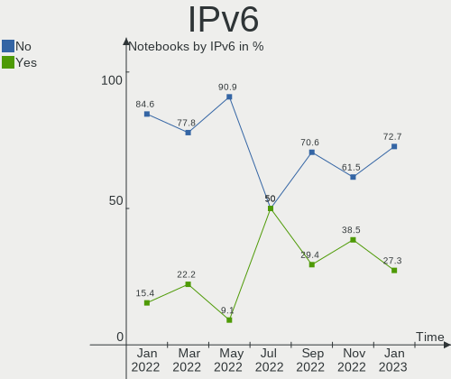

| Used | Notebooks | Percent |
|------|-----------|---------|
| No   | 8         | 72.73%  |
| Yes  | 3         | 27.27%  |

Bluetooth
---------

Bluetooth Vendor
----------------

Controller vendors

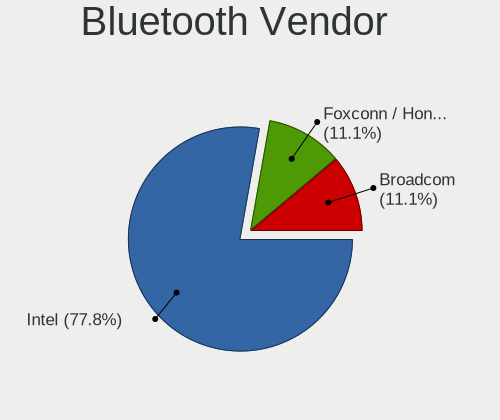

| Vendor            | Notebooks | Percent |
|-------------------|-----------|---------|
| Intel             | 7         | 77.78%  |
| Foxconn / Hon Hai | 1         | 11.11%  |
| Broadcom          | 1         | 11.11%  |

Bluetooth Model
---------------

Controller models

| Model                                         | Notebooks | Percent |
|-----------------------------------------------|-----------|---------|
| Intel AX200 Bluetooth                         | 3         | 33.33%  |
| Intel Bluetooth Device                        | 2         | 22.22%  |
| Intel Centrino Bluetooth Wireless Transceiver | 1         | 11.11%  |
| Intel Bluetooth wireless interface            | 1         | 11.11%  |
| Foxconn / Hon Hai BCM43142A0                  | 1         | 11.11%  |
| Broadcom HP Portable SoftSailing              | 1         | 11.11%  |

Sound
-----

Sound Vendor
------------

Sound card vendors

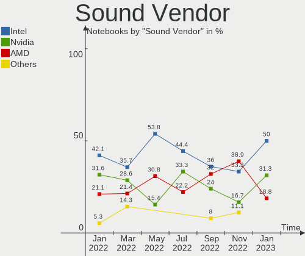

| Vendor | Notebooks | Percent |
|--------|-----------|---------|
| Intel  | 8         | 50%     |
| Nvidia | 5         | 31.25%  |
| AMD    | 3         | 18.75%  |

Sound Model
-----------

Sound card models

| Model                                                                      | Notebooks | Percent |
|----------------------------------------------------------------------------|-----------|---------|
| Intel 7 Series/C216 Chipset Family High Definition Audio Controller        | 3         | 15.79%  |
| AMD Family 17h/19h HD Audio Controller                                     | 3         | 15.79%  |
| Nvidia GA106 High Definition Audio Controller                              | 2         | 10.53%  |
| Nvidia TU106 High Definition Audio Controller                              | 1         | 5.26%   |
| Nvidia GF108 High Definition Audio Controller                              | 1         | 5.26%   |
| Nvidia GA104 High Definition Audio Controller                              | 1         | 5.26%   |
| Intel Xeon E3-1200 v3/4th Gen Core Processor HD Audio Controller           | 1         | 5.26%   |
| Intel Tiger Lake-H HD Audio Controller                                     | 1         | 5.26%   |
| Intel Comet Lake PCH cAVS                                                  | 1         | 5.26%   |
| Intel Alder Lake PCH-P High Definition Audio Controller                    | 1         | 5.26%   |
| Intel 8 Series/C220 Series Chipset High Definition Audio Controller        | 1         | 5.26%   |
| Intel 6 Series/C200 Series Chipset Family High Definition Audio Controller | 1         | 5.26%   |
| AMD Renoir Radeon High Definition Audio Controller                         | 1         | 5.26%   |
| AMD Raven/Raven2/Fenghuang HDMI/DP Audio Controller                        | 1         | 5.26%   |

Memory
------

Memory Vendor
-------------

Memory module vendors

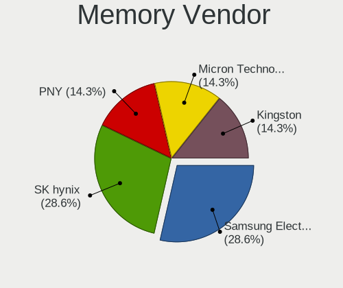

| Vendor              | Notebooks | Percent |
|---------------------|-----------|---------|
| SK hynix            | 2         | 28.57%  |
| Samsung Electronics | 2         | 28.57%  |
| PNY                 | 1         | 14.29%  |
| Micron Technology   | 1         | 14.29%  |
| Kingston            | 1         | 14.29%  |

Memory Model
------------

Memory module models

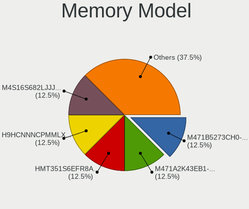

| Model                                                      | Notebooks | Percent |
|------------------------------------------------------------|-----------|---------|
| SK hynix RAM HMT351S6EFR8A-PB 4GB SODIMM DDR3 1600MT/s     | 1         | 12.5%   |
| SK hynix RAM H9HCNNNCPMMLXR-NEE 8GB SODIMM LPDDR4 4266MT/s | 1         | 12.5%   |
| Samsung RAM M471B5273CH0-CH9 4GB SODIMM DDR3 1334MT/s      | 1         | 12.5%   |
| Samsung RAM M471A2K43EB1-CWE 16GB SODIMM DDR4 3200MT/s     | 1         | 12.5%   |
| PNY RAM M4S16S682LJJJ43-12 16GB SODIMM DDR4 2667MT/s       | 1         | 12.5%   |
| PNY RAM M4S16S681LJJJ43-12 16GB SODIMM DDR4 2667MT/s       | 1         | 12.5%   |
| Micron RAM 16ATF4G64HZ-3G2F1 32GB SODIMM DDR4 3200MT/s     | 1         | 12.5%   |
| Kingston RAM KHX2933C17S4/32G 32GB SODIMM DDR4 2933MT/s    | 1         | 12.5%   |

Memory Kind
-----------

Memory module kinds

| Kind   | Notebooks | Percent |
|--------|-----------|---------|
| DDR4   | 4         | 66.67%  |
| LPDDR4 | 1         | 16.67%  |
| DDR3   | 1         | 16.67%  |

Memory Form Factor
------------------

Physical design of the memory module

| Name   | Notebooks | Percent |
|--------|-----------|---------|
| SODIMM | 6         | 100%    |

Memory Size
-----------

Memory module size

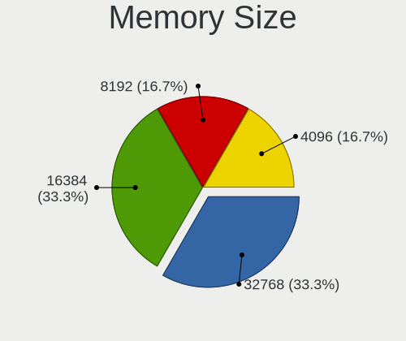

| Size  | Notebooks | Percent |
|-------|-----------|---------|
| 32768 | 2         | 33.33%  |
| 16384 | 2         | 33.33%  |
| 8192  | 1         | 16.67%  |
| 4096  | 1         | 16.67%  |

Memory Speed
------------

Memory module speed

| Speed | Notebooks | Percent |
|-------|-----------|---------|
| 3200  | 2         | 28.57%  |
| 4266  | 1         | 14.29%  |
| 2933  | 1         | 14.29%  |
| 2667  | 1         | 14.29%  |
| 1600  | 1         | 14.29%  |
| 1334  | 1         | 14.29%  |

Printers & scanners
-------------------

Printer Vendor
--------------

Printer device vendors

Zero info for selected period =(

Printer Model
-------------

Printer device models

Zero info for selected period =(

Scanner Vendor
--------------

Scanner device vendors

Zero info for selected period =(

Scanner Model
-------------

Scanner device models

Zero info for selected period =(

Camera
------

Camera Vendor
-------------

Camera device vendors

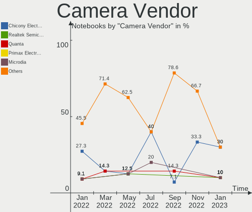

| Vendor                      | Notebooks | Percent |
|-----------------------------|-----------|---------|
| Chicony Electronics         | 3         | 30%     |
| Realtek Semiconductor       | 1         | 10%     |
| Quanta                      | 1         | 10%     |
| Primax Electronics          | 1         | 10%     |
| Microdia                    | 1         | 10%     |
| Luxvisions Innotech Limited | 1         | 10%     |
| IMC Networks                | 1         | 10%     |
| Acer                        | 1         | 10%     |

Camera Model
------------

Camera device models

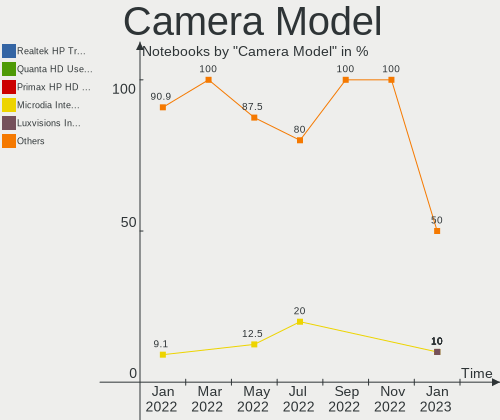

| Model                                                | Notebooks | Percent |
|------------------------------------------------------|-----------|---------|
| Realtek HP Truevision HD                             | 1         | 10%     |
| Quanta HD User Facing                                | 1         | 10%     |
| Primax HP HD Webcam [Fixed]                          | 1         | 10%     |
| Microdia Integrated_Webcam_HD                        | 1         | 10%     |
| Luxvisions Innotech Limited HP Wide Vision HD Camera | 1         | 10%     |
| IMC Networks USB2.0 HD UVC WebCam                    | 1         | 10%     |
| Chicony Lenovo EasyCamera                            | 1         | 10%     |
| Chicony HD Webcam                                    | 1         | 10%     |
| Chicony Front Camera                                 | 1         | 10%     |
| Acer Integrated Camera                               | 1         | 10%     |

Security
--------

Fingerprint Vendor
------------------

Fingerprint sensor vendors

| Vendor           | Notebooks | Percent |
|------------------|-----------|---------|
| Validity Sensors | 3         | 100%    |

Fingerprint Model
-----------------

Fingerprint sensor models

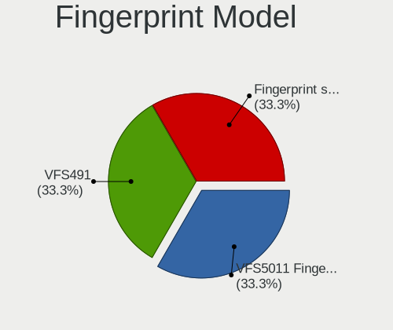

| Model                                       | Notebooks | Percent |
|---------------------------------------------|-----------|---------|
| Validity Sensors VFS5011 Fingerprint Reader | 1         | 33.33%  |
| Validity Sensors VFS491                     | 1         | 33.33%  |
| Validity Sensors Fingerprint scanner        | 1         | 33.33%  |

Chipcard Vendor
---------------

Chipcard module vendors

Zero info for selected period =(

Chipcard Model
--------------

Chipcard module models

Zero info for selected period =(

Unsupported
-----------

Unsupported Devices
-------------------

Total unsupported devices on board

| Total | Notebooks | Percent |
|-------|-----------|---------|
| 1     | 5         | 45.45%  |
| 0     | 3         | 27.27%  |
| 3     | 2         | 18.18%  |
| 2     | 1         | 9.09%   |

Unsupported Device Types
------------------------

Types of unsupported devices

| Type                     | Notebooks | Percent |
|--------------------------|-----------|---------|
| Communication controller | 9         | 64.29%  |
| Fingerprint reader       | 3         | 21.43%  |
| Graphics card            | 2         | 14.29%  |

