Garuda Linux - Hardware Trends (Notebooks)
------------------------------------------

A project to identify most popular hardware characteristics and track their change
over time based on data collected by Linux users at https://Linux-Hardware.org.

Anyone can contribute to this report by the [hw-probe](https://github.com/linuxhw/hw-probe) tool:

    sudo -E hw-probe -all -upload

This report is for one last month. Overall report since the beginning of time: [TestCoverage](https://github.com/linuxhw/TestCoverage)

Period: Dec, 2022.

Contents
--------

* [ System ](#system)
  - [ OS                       ](#os)
  - [ OS Family                ](#os-family)
  - [ Kernel                   ](#kernel)
  - [ Kernel Family            ](#kernel-family)
  - [ Kernel Major Ver.        ](#kernel-major-ver)
  - [ Arch                     ](#arch)
  - [ DE                       ](#de)
  - [ Display Server           ](#display-server)
  - [ Display Manager          ](#display-manager)
  - [ OS Lang                  ](#os-lang)
  - [ Boot Mode                ](#boot-mode)
  - [ Filesystem               ](#filesystem)
  - [ Part. scheme             ](#part-scheme)
  - [ Dual Boot with Linux/BSD ](#dual-boot-with-linuxbsd)
  - [ Dual Boot (Win)          ](#dual-boot-win)

* [ Board ](#board)
  - [ Vendor                   ](#vendor)
  - [ Model                    ](#model)
  - [ Model Family             ](#model-family)
  - [ MFG Year                 ](#mfg-year)
  - [ Form Factor              ](#form-factor)
  - [ Secure Boot              ](#secure-boot)
  - [ Coreboot                 ](#coreboot)
  - [ RAM Size                 ](#ram-size)
  - [ RAM Used                 ](#ram-used)
  - [ Total Drives             ](#total-drives)
  - [ Has CD-ROM               ](#has-cd-rom)
  - [ Has Ethernet             ](#has-ethernet)
  - [ Has WiFi                 ](#has-wifi)
  - [ Has Bluetooth            ](#has-bluetooth)

* [ Location ](#location)
  - [ Country                  ](#country)
  - [ City                     ](#city)

* [ Drives ](#drives)
  - [ Drive Vendor             ](#drive-vendor)
  - [ Drive Model              ](#drive-model)
  - [ HDD Vendor               ](#hdd-vendor)
  - [ SSD Vendor               ](#ssd-vendor)
  - [ Drive Kind               ](#drive-kind)
  - [ Drive Connector          ](#drive-connector)
  - [ Drive Size               ](#drive-size)
  - [ Space Total              ](#space-total)
  - [ Space Used               ](#space-used)
  - [ Malfunc. Drives          ](#malfunc-drives)
  - [ Malfunc. Drive Vendor    ](#malfunc-drive-vendor)
  - [ Malfunc. HDD Vendor      ](#malfunc-hdd-vendor)
  - [ Malfunc. Drive Kind      ](#malfunc-drive-kind)
  - [ Failed Drives            ](#failed-drives)
  - [ Failed Drive Vendor      ](#failed-drive-vendor)
  - [ Drive Status             ](#drive-status)

* [ Storage controller ](#storage-controller)
  - [ Storage Vendor           ](#storage-vendor)
  - [ Storage Model            ](#storage-model)
  - [ Storage Kind             ](#storage-kind)

* [ Processor ](#processor)
  - [ CPU Vendor               ](#cpu-vendor)
  - [ CPU Model                ](#cpu-model)
  - [ CPU Model Family         ](#cpu-model-family)
  - [ CPU Cores                ](#cpu-cores)
  - [ CPU Sockets              ](#cpu-sockets)
  - [ CPU Threads              ](#cpu-threads)
  - [ CPU Op-Modes             ](#cpu-op-modes)
  - [ CPU Microcode            ](#cpu-microcode)
  - [ CPU Microarch            ](#cpu-microarch)

* [ Graphics ](#graphics)
  - [ GPU Vendor               ](#gpu-vendor)
  - [ GPU Model                ](#gpu-model)
  - [ GPU Combo                ](#gpu-combo)
  - [ GPU Driver               ](#gpu-driver)
  - [ GPU Memory               ](#gpu-memory)

* [ Monitor ](#monitor)
  - [ Monitor Vendor           ](#monitor-vendor)
  - [ Monitor Model            ](#monitor-model)
  - [ Monitor Resolution       ](#monitor-resolution)
  - [ Monitor Diagonal         ](#monitor-diagonal)
  - [ Monitor Width            ](#monitor-width)
  - [ Aspect Ratio             ](#aspect-ratio)
  - [ Monitor Area             ](#monitor-area)
  - [ Pixel Density            ](#pixel-density)
  - [ Multiple Monitors        ](#multiple-monitors)

* [ Network ](#network)
  - [ Net Controller Vendor    ](#net-controller-vendor)
  - [ Net Controller Model     ](#net-controller-model)
  - [ Wireless Vendor          ](#wireless-vendor)
  - [ Wireless Model           ](#wireless-model)
  - [ Ethernet Vendor          ](#ethernet-vendor)
  - [ Ethernet Model           ](#ethernet-model)
  - [ Net Controller Kind      ](#net-controller-kind)
  - [ Used Controller          ](#used-controller)
  - [ NICs                     ](#nics)
  - [ IPv6                     ](#ipv6)

* [ Bluetooth ](#bluetooth)
  - [ Bluetooth Vendor         ](#bluetooth-vendor)
  - [ Bluetooth Model          ](#bluetooth-model)

* [ Sound ](#sound)
  - [ Sound Vendor             ](#sound-vendor)
  - [ Sound Model              ](#sound-model)

* [ Memory ](#memory)
  - [ Memory Vendor            ](#memory-vendor)
  - [ Memory Model             ](#memory-model)
  - [ Memory Kind              ](#memory-kind)
  - [ Memory Form Factor       ](#memory-form-factor)
  - [ Memory Size              ](#memory-size)
  - [ Memory Speed             ](#memory-speed)

* [ Printers & scanners ](#printers--scanners)
  - [ Printer Vendor           ](#printer-vendor)
  - [ Printer Model            ](#printer-model)
  - [ Scanner Vendor           ](#scanner-vendor)
  - [ Scanner Model            ](#scanner-model)

* [ Camera ](#camera)
  - [ Camera Vendor            ](#camera-vendor)
  - [ Camera Model             ](#camera-model)

* [ Security ](#security)
  - [ Fingerprint Vendor       ](#fingerprint-vendor)
  - [ Fingerprint Model        ](#fingerprint-model)
  - [ Chipcard Vendor          ](#chipcard-vendor)
  - [ Chipcard Model           ](#chipcard-model)

* [ Unsupported ](#unsupported)
  - [ Unsupported Devices      ](#unsupported-devices)
  - [ Unsupported Device Types ](#unsupported-device-types)

System
------

OS
--

Installed operating systems

| Name                 | Notebooks | Percent |
|----------------------|-----------|---------|
| Garuda Linux Soaring | 13        | 76.47%  |
| Garuda Linux Rolling | 4         | 23.53%  |

OS Family
---------

OS without a version

| Name         | Notebooks | Percent |
|--------------|-----------|---------|
| Garuda Linux | 17        | 100%    |

Kernel
------

Version of the Linux kernel

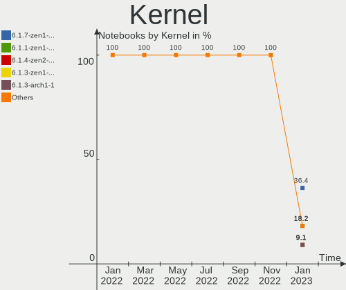

| Version           | Notebooks | Percent |
|-------------------|-----------|---------|
| 6.1.1-zen1-1-zen  | 6         | 35.29%  |
| 6.0.10-zen2-1-zen | 4         | 23.53%  |
| 6.1.0-zen1-1-zen  | 1         | 5.88%   |
| 6.0.9-zen1-1-zen  | 1         | 5.88%   |
| 6.0.2-zen1-1-zen  | 1         | 5.88%   |
| 6.0.12-zen1-1-zen | 1         | 5.88%   |
| 6.0.11-AMD        | 1         | 5.88%   |
| 6.0.10-1-bore     | 1         | 5.88%   |
| 5.15.68-1-lts     | 1         | 5.88%   |

Kernel Family
-------------

Linux kernel without a distro release

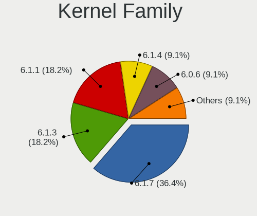

| Version | Notebooks | Percent |
|---------|-----------|---------|
| 6.1.1   | 6         | 35.29%  |
| 6.0.10  | 5         | 29.41%  |
| 6.1.0   | 1         | 5.88%   |
| 6.0.9   | 1         | 5.88%   |
| 6.0.2   | 1         | 5.88%   |
| 6.0.12  | 1         | 5.88%   |
| 6.0.11  | 1         | 5.88%   |
| 5.15.68 | 1         | 5.88%   |

Kernel Major Ver.
-----------------

Linux kernel major version

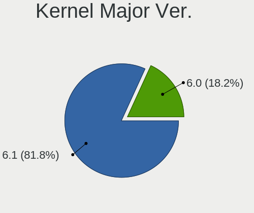

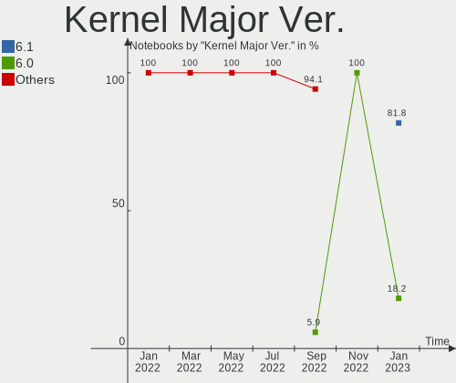

| Version | Notebooks | Percent |
|---------|-----------|---------|
| 6.0     | 9         | 52.94%  |
| 6.1     | 7         | 41.18%  |
| 5.15    | 1         | 5.88%   |

Arch
----

OS architecture (x86_64, i586, etc.)

| Name   | Notebooks | Percent |
|--------|-----------|---------|
| x86_64 | 17        | 100%    |

DE
--

Desktop Environment

| Name | Notebooks | Percent |
|------|-----------|---------|
| KDE5 | 17        | 100%    |

Display Server
--------------

X11 or Wayland

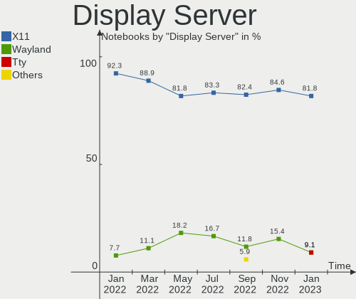

| Name    | Notebooks | Percent |
|---------|-----------|---------|
| X11     | 15        | 88.24%  |
| Tty     | 1         | 5.88%   |
| Unknown | 1         | 5.88%   |

Display Manager
---------------

SDDM, LightDM, etc.

| Name    | Notebooks | Percent |
|---------|-----------|---------|
| SDDM    | 13        | 76.47%  |
| Unknown | 4         | 23.53%  |

OS Lang
-------

Language

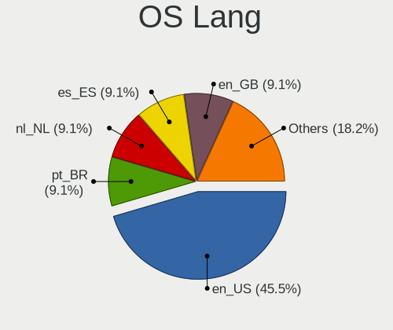

| Lang  | Notebooks | Percent |
|-------|-----------|---------|
| en_US | 9         | 52.94%  |
| it_IT | 1         | 5.88%   |
| fr_FR | 1         | 5.88%   |
| es_ES | 1         | 5.88%   |
| en_ZA | 1         | 5.88%   |
| en_IN | 1         | 5.88%   |
| en_DK | 1         | 5.88%   |
| en_CA | 1         | 5.88%   |
| de_DE | 1         | 5.88%   |

Boot Mode
---------

EFI or BIOS

| Mode | Notebooks | Percent |
|------|-----------|---------|
| EFI  | 13        | 76.47%  |
| BIOS | 4         | 23.53%  |

Filesystem
----------

Type of filesystem

| Type    | Notebooks | Percent |
|---------|-----------|---------|
| Btrfs   | 16        | 94.12%  |
| Overlay | 1         | 5.88%   |

Part. scheme
------------

Scheme of partitioning

| Type    | Notebooks | Percent |
|---------|-----------|---------|
| GPT     | 13        | 76.47%  |
| Unknown | 4         | 23.53%  |

Dual Boot with Linux/BSD
------------------------

Hosting more than one Linux/BSD

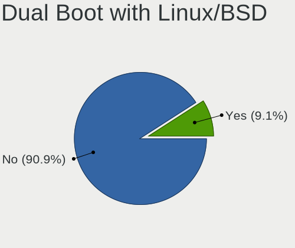

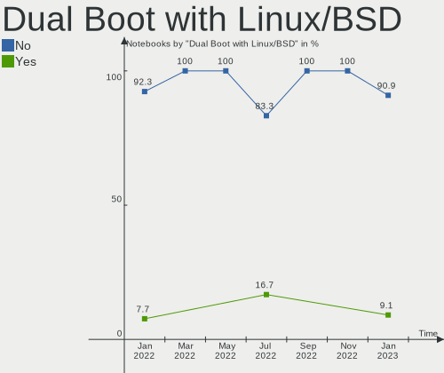

| Dual boot | Notebooks | Percent |
|-----------|-----------|---------|
| No        | 15        | 88.24%  |
| Yes       | 2         | 11.76%  |

Dual Boot (Win)
---------------

Hosting Linux and Windows

| Dual boot | Notebooks | Percent |
|-----------|-----------|---------|
| No        | 10        | 58.82%  |
| Yes       | 7         | 41.18%  |

Board
-----

Vendor
------

Motherboard manufacturer

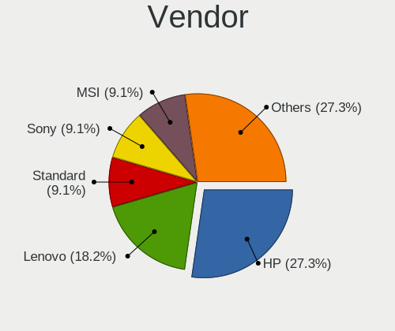

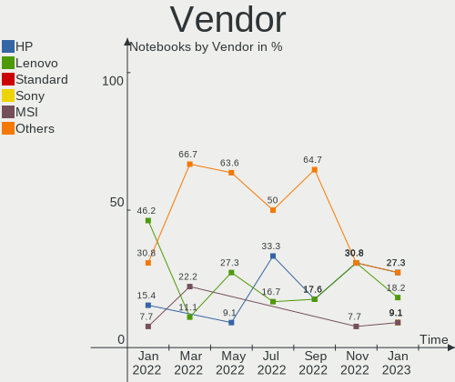

| Name                | Notebooks | Percent |
|---------------------|-----------|---------|
| Hewlett-Packard     | 4         | 23.53%  |
| Dell                | 3         | 17.65%  |
| ASUSTek Computer    | 2         | 11.76%  |
| Acer                | 2         | 11.76%  |
| Standard            | 1         | 5.88%   |
| MSI                 | 1         | 5.88%   |
| Lenovo              | 1         | 5.88%   |
| HONOR               | 1         | 5.88%   |
| Gigabyte Technology | 1         | 5.88%   |
| Alienware           | 1         | 5.88%   |

Model
-----

Motherboard model

| Name                            | Notebooks | Percent |
|---------------------------------|-----------|---------|
| MSI Stealth 15M B12UE           | 1         | 5.88%   |
| Lenovo IdeaPad L340-17API 81LY  | 1         | 5.88%   |
| HONOR BOD-WXX9                  | 1         | 5.88%   |
| HP Victus by Laptop 16-e1xxx    | 1         | 5.88%   |
| HP Pavilion Laptop 15-eg0xxx    | 1         | 5.88%   |
| HP Dev One Notebook PC          | 1         | 5.88%   |
| HP Compaq CQ58                  | 1         | 5.88%   |
| Gigabyte G5 MD                  | 1         | 5.88%   |
| Dell XPS 13 9360                | 1         | 5.88%   |
| Dell Latitude E7450             | 1         | 5.88%   |
| Dell Latitude E5450             | 1         | 5.88%   |
| ASUS Zenbook UM5401QAB_UM5401QA | 1         | 5.88%   |
| ASUS ROG Strix G513IC_G513IC    | 1         | 5.88%   |
| Alienware m15 R7                | 1         | 5.88%   |
| Acer Nitro AN515-45             | 1         | 5.88%   |
| Acer Aspire F5-572G             | 1         | 5.88%   |
| Unknown                         | 1         | 5.88%   |

Model Family
------------

Motherboard model prefix

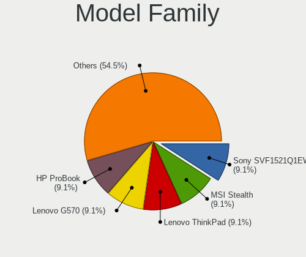

| Name           | Notebooks | Percent |
|----------------|-----------|---------|
| Dell Latitude  | 2         | 11.76%  |
| MSI Stealth    | 1         | 5.88%   |
| Lenovo IdeaPad | 1         | 5.88%   |
| HONOR BOD-WXX9 | 1         | 5.88%   |
| HP Victus      | 1         | 5.88%   |
| HP Pavilion    | 1         | 5.88%   |
| HP Dev         | 1         | 5.88%   |
| HP Compaq      | 1         | 5.88%   |
| Gigabyte G5    | 1         | 5.88%   |
| Dell XPS       | 1         | 5.88%   |
| ASUS Zenbook   | 1         | 5.88%   |
| ASUS ROG       | 1         | 5.88%   |
| Alienware m15  | 1         | 5.88%   |
| Acer Nitro     | 1         | 5.88%   |
| Acer Aspire    | 1         | 5.88%   |
| Unknown        | 1         | 5.88%   |

MFG Year
--------

Motherboard manufacture year

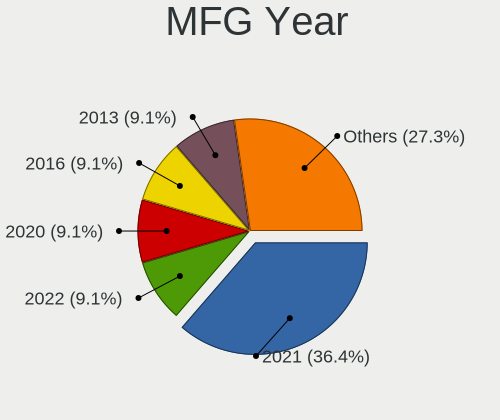

| Year | Notebooks | Percent |
|------|-----------|---------|
| 2021 | 5         | 29.41%  |
| 2022 | 4         | 23.53%  |
| 2020 | 2         | 11.76%  |
| 2014 | 2         | 11.76%  |
| 2019 | 1         | 5.88%   |
| 2016 | 1         | 5.88%   |
| 2015 | 1         | 5.88%   |
| 2012 | 1         | 5.88%   |

Form Factor
-----------

Physical design of the computer

| Name     | Notebooks | Percent |
|----------|-----------|---------|
| Notebook | 17        | 100%    |

Secure Boot
-----------

Enabled or disabled

| State    | Notebooks | Percent |
|----------|-----------|---------|
| Disabled | 17        | 100%    |

Coreboot
--------

Have coreboot on board

| Used | Notebooks | Percent |
|------|-----------|---------|
| No   | 17        | 100%    |

RAM Size
--------

Total RAM memory

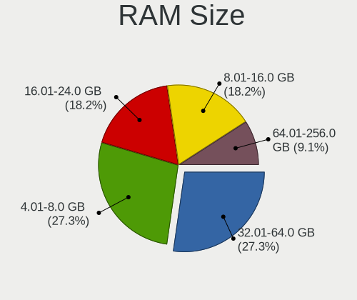

| Size in GB | Notebooks | Percent |
|------------|-----------|---------|
| 8.01-16.0  | 7         | 41.18%  |
| 16.01-24.0 | 5         | 29.41%  |
| 32.01-64.0 | 3         | 17.65%  |
| 4.01-8.0   | 2         | 11.76%  |

RAM Used
--------

Used RAM memory

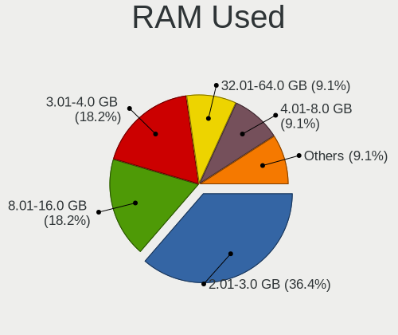

| Used GB   | Notebooks | Percent |
|-----------|-----------|---------|
| 3.01-4.0  | 7         | 41.18%  |
| 4.01-8.0  | 5         | 29.41%  |
| 8.01-16.0 | 3         | 17.65%  |
| 2.01-3.0  | 2         | 11.76%  |

Total Drives
------------

Number of drives on board

| Drives | Notebooks | Percent |
|--------|-----------|---------|
| 1      | 13        | 76.47%  |
| 2      | 4         | 23.53%  |

Has CD-ROM
----------

Has CD-ROM on board

| Presented | Notebooks | Percent |
|-----------|-----------|---------|
| No        | 14        | 82.35%  |
| Yes       | 3         | 17.65%  |

Has Ethernet
------------

Has Ethernet on board

| Presented | Notebooks | Percent |
|-----------|-----------|---------|
| Yes       | 11        | 64.71%  |
| No        | 6         | 35.29%  |

Has WiFi
--------

Has WiFi module

| Presented | Notebooks | Percent |
|-----------|-----------|---------|
| Yes       | 17        | 100%    |

Has Bluetooth
-------------

Has Bluetooth module

| Presented | Notebooks | Percent |
|-----------|-----------|---------|
| Yes       | 16        | 94.12%  |
| No        | 1         | 5.88%   |

Location
--------

Country
-------

Geographic location (country)

| Country      | Notebooks | Percent |
|--------------|-----------|---------|
| USA          | 6         | 35.29%  |
| Spain        | 2         | 11.76%  |
| Thailand     | 1         | 5.88%   |
| Switzerland  | 1         | 5.88%   |
| South Africa | 1         | 5.88%   |
| India        | 1         | 5.88%   |
| Germany      | 1         | 5.88%   |
| France       | 1         | 5.88%   |
| Denmark      | 1         | 5.88%   |
| Canada       | 1         | 5.88%   |
| Brazil       | 1         | 5.88%   |

City
----

Geographic location (city)

| City                 | Notebooks | Percent |
|----------------------|-----------|---------|
| Zafra                | 1         | 5.88%   |
| Troy                 | 1         | 5.88%   |
| Seville              | 1         | 5.88%   |
| Sao José dos Campos | 1         | 5.88%   |
| Saint Michael        | 1         | 5.88%   |
| New York             | 1         | 5.88%   |
| Muret                | 1         | 5.88%   |
| Los Angeles          | 1         | 5.88%   |
| Lancaster            | 1         | 5.88%   |
| Kincardine           | 1         | 5.88%   |
| Ghaziabad            | 1         | 5.88%   |
| Frankfurt am Main    | 1         | 5.88%   |
| Copenhagen           | 1         | 5.88%   |
| Cape Town            | 1         | 5.88%   |
| Cambridge            | 1         | 5.88%   |
| Bedano               | 1         | 5.88%   |
| Bangkok              | 1         | 5.88%   |

Drives
------

Drive Vendor
------------

Hard drive vendors

| Vendor                      | Notebooks | Drives | Percent |
|-----------------------------|-----------|--------|---------|
| SK hynix                    | 4         | 4      | 19.05%  |
| WDC                         | 3         | 3      | 14.29%  |
| Sandisk                     | 3         | 3      | 14.29%  |
| Phison Electronics          | 2         | 2      | 9.52%   |
| Micron Technology           | 2         | 2      | 9.52%   |
| Unknown                     | 1         | 1      | 4.76%   |
| Toshiba                     | 1         | 1      | 4.76%   |
| SPCC                        | 1         | 1      | 4.76%   |
| Samsung Electronics         | 1         | 1      | 4.76%   |
| Kingston Technology Company | 1         | 1      | 4.76%   |
| Intel                       | 1         | 1      | 4.76%   |
| ADATA Technology            | 1         | 1      | 4.76%   |

Drive Model
-----------

Hard drive models

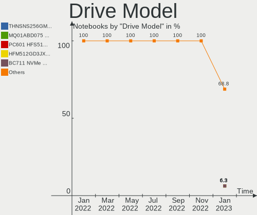

| Model                                                           | Notebooks | Percent |
|-----------------------------------------------------------------|-----------|---------|
| Phison E16 PCIe4 NVMe Controller 512GB                          | 2         | 9.52%   |
| WDC WD3200BEVT-22ZCT0 320GB                                     | 1         | 4.76%   |
| WDC WD2500BEVT-60A23T0 250GB                                    | 1         | 4.76%   |
| WDC WD10JPVX-22JC3T0 1TB                                        | 1         | 4.76%   |
| Unknown MMC Card  64GB                                          | 1         | 4.76%   |
| Toshiba MQ01ABF050 500GB                                        | 1         | 4.76%   |
| SPCC Solid State Disk 512GB                                     | 1         | 4.76%   |
| SK hynix PC801 NVMe 1TB                                         | 1         | 4.76%   |
| SK hynix PC711 HFS001TDE9X073N 1024GB                           | 1         | 4.76%   |
| SK hynix HFS256G32TNH-73A0A 256GB SSD                           | 1         | 4.76%   |
| SK hynix HFM512GD3JX013N 512GB                                  | 1         | 4.76%   |
| SanDisk X400 M.2 2280 128GB SSD                                 | 1         | 4.76%   |
| Sandisk WD Blue SN550 NVMe SSD 500GB                            | 1         | 4.76%   |
| Sandisk WD Black SN750 / PC SN730 NVMe SSD 512GB                | 1         | 4.76%   |
| Samsung NVMe SSD Controller SM981/PM981/PM983 500GB             | 1         | 4.76%   |
| Micron 2450_MTFDKBA1T0TFK 1TB                                   | 1         | 4.76%   |
| Micron 1100_MTFDDAV256TBN 256GB SSD                             | 1         | 4.76%   |
| Kingston Company OM3PDP3 NVMe SSD 512GB                         | 1         | 4.76%   |
| Intel SSDPEKNU512GZ 512GB                                       | 1         | 4.76%   |
| ADATA XPG SX8200 Pro PCIe Gen3x4 M.2 2280 Solid State Drive 1TB | 1         | 4.76%   |

HDD Vendor
----------

Hard disk drive vendors

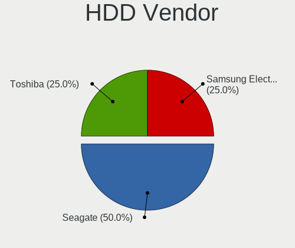

| Vendor  | Notebooks | Drives | Percent |
|---------|-----------|--------|---------|
| WDC     | 3         | 3      | 75%     |
| Toshiba | 1         | 1      | 25%     |

SSD Vendor
----------

Solid state drive vendors

| Vendor            | Notebooks | Drives | Percent |
|-------------------|-----------|--------|---------|
| SPCC              | 1         | 1      | 25%     |
| SK hynix          | 1         | 1      | 25%     |
| SanDisk           | 1         | 1      | 25%     |
| Micron Technology | 1         | 1      | 25%     |

Drive Kind
----------

HDD or SSD

| Kind | Notebooks | Drives | Percent |
|------|-----------|--------|---------|
| NVMe | 12        | 12     | 57.14%  |
| SSD  | 4         | 4      | 19.05%  |
| HDD  | 4         | 4      | 19.05%  |
| MMC  | 1         | 1      | 4.76%   |

Drive Connector
---------------

SATA, SAS, NVMe, etc.

| Type | Notebooks | Drives | Percent |
|------|-----------|--------|---------|
| NVMe | 12        | 12     | 57.14%  |
| SATA | 8         | 8      | 38.1%   |
| MMC  | 1         | 1      | 4.76%   |

Drive Size
----------

Size of hard drive

| Size in TB | Notebooks | Drives | Percent |
|------------|-----------|--------|---------|
| 0.01-0.5   | 6         | 6      | 75%     |
| 0.51-1.0   | 2         | 2      | 25%     |

Space Total
-----------

Amount of disk space available on the file system

| Size in GB     | Notebooks | Percent |
|----------------|-----------|---------|
| More than 3000 | 8         | 47.06%  |
| 1001-2000      | 3         | 17.65%  |
| 2001-3000      | 2         | 11.76%  |
| 501-1000       | 2         | 11.76%  |
| 251-500        | 1         | 5.88%   |
| 1-20           | 1         | 5.88%   |

Space Used
----------

Amount of used disk space

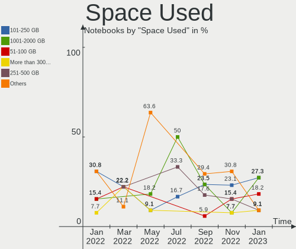

| Used GB        | Notebooks | Percent |
|----------------|-----------|---------|
| 501-1000       | 5         | 29.41%  |
| 251-500        | 4         | 23.53%  |
| 101-250        | 4         | 23.53%  |
| More than 3000 | 2         | 11.76%  |
| 1-20           | 1         | 5.88%   |
| 51-100         | 1         | 5.88%   |

Malfunc. Drives
---------------

Drive models with a malfunction

| Model                                 | Notebooks | Drives | Percent |
|---------------------------------------|-----------|--------|---------|
| SK hynix PC711 HFS001TDE9X073N 1024GB | 1         | 1      | 100%    |

Malfunc. Drive Vendor
---------------------

Vendors of faulty drives

| Vendor   | Notebooks | Drives | Percent |
|----------|-----------|--------|---------|
| SK hynix | 1         | 1      | 100%    |

Malfunc. HDD Vendor
-------------------

Vendors of faulty HDD drives

Zero info for selected period =(

Malfunc. Drive Kind
-------------------

Kinds of faulty drives

| Kind | Notebooks | Drives | Percent |
|------|-----------|--------|---------|
| NVMe | 1         | 1      | 100%    |

Failed Drives
-------------

Failed drive models

Zero info for selected period =(

Failed Drive Vendor
-------------------

Failed drive vendors

Zero info for selected period =(

Drive Status
------------

Number of failed and malfunc. drives

| Status   | Notebooks | Drives | Percent |
|----------|-----------|--------|---------|
| Works    | 11        | 12     | 61.11%  |
| Detected | 6         | 8      | 33.33%  |
| Malfunc  | 1         | 1      | 5.56%   |

Storage controller
------------------

Storage Vendor
--------------

Storage controller vendors

| Vendor                      | Notebooks | Percent |
|-----------------------------|-----------|---------|
| Intel                       | 10        | 43.48%  |
| SK hynix                    | 3         | 13.04%  |
| SanDisk                     | 2         | 8.7%    |
| Phison Electronics          | 2         | 8.7%    |
| AMD                         | 2         | 8.7%    |
| Samsung Electronics         | 1         | 4.35%   |
| Micron Technology           | 1         | 4.35%   |
| Kingston Technology Company | 1         | 4.35%   |
| ADATA Technology            | 1         | 4.35%   |

Storage Model
-------------

Storage controller models

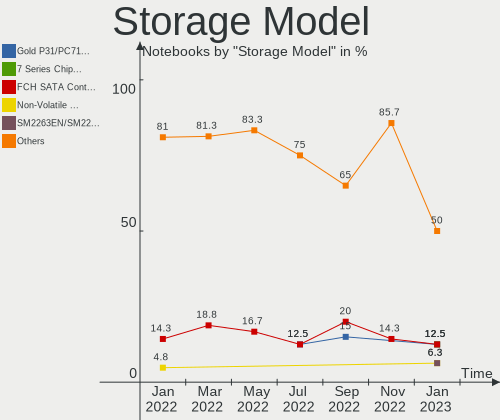

| Model                                                            | Notebooks | Percent |
|------------------------------------------------------------------|-----------|---------|
| SK hynix Gold P31/PC711 NVMe Solid State Drive                   | 2         | 8.7%    |
| Phison E16 PCIe4 NVMe Controller                                 | 2         | 8.7%    |
| Intel Volume Management Device NVMe RAID Controller              | 2         | 8.7%    |
| Intel 82801 Mobile SATA Controller [RAID mode]                   | 2         | 8.7%    |
| AMD FCH SATA Controller [AHCI mode]                              | 2         | 8.7%    |
| SK hynix Non-Volatile memory controller                          | 1         | 4.35%   |
| SanDisk WD Blue SN550 NVMe SSD                                   | 1         | 4.35%   |
| SanDisk WD Black SN750 / PC SN730 NVMe SSD                       | 1         | 4.35%   |
| Samsung NVMe SSD Controller SM981/PM981/PM983                    | 1         | 4.35%   |
| Micron Non-Volatile memory controller                            | 1         | 4.35%   |
| Kingston Company OM3PDP3 NVMe SSD                                | 1         | 4.35%   |
| Intel Wildcat Point-LP SATA Controller [AHCI Mode]               | 1         | 4.35%   |
| Intel Sunrise Point-LP SATA Controller [AHCI mode]               | 1         | 4.35%   |
| Intel Non-Volatile memory controller                             | 1         | 4.35%   |
| Intel 7 Series Chipset Family 6-port SATA Controller [AHCI mode] | 1         | 4.35%   |
| Intel 500 Series Chipset Family SATA AHCI Controller             | 1         | 4.35%   |
| Intel 400 Series Chipset Family SATA AHCI Controller             | 1         | 4.35%   |
| ADATA XPG SX8200 Pro PCIe Gen3x4 M.2 2280 Solid State Drive      | 1         | 4.35%   |

Storage Kind
------------

Kind of storage controller (IDE, SATA, NVMe, SAS, ...)

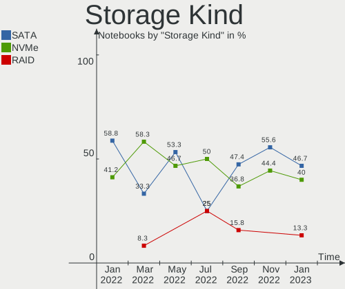

| Kind | Notebooks | Percent |
|------|-----------|---------|
| NVMe | 12        | 52.17%  |
| SATA | 7         | 30.43%  |
| RAID | 4         | 17.39%  |

Processor
---------

CPU Vendor
----------

Processor vendors

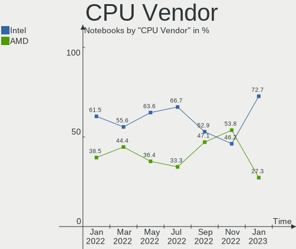

| Vendor | Notebooks | Percent |
|--------|-----------|---------|
| Intel  | 11        | 64.71%  |
| AMD    | 6         | 35.29%  |

CPU Model
---------

Processor models

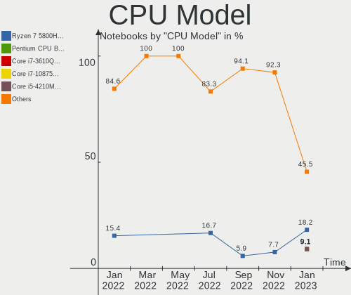

| Model                                         | Notebooks | Percent |
|-----------------------------------------------|-----------|---------|
| Intel Core i7-5600U CPU @ 2.60GHz             | 2         | 11.76%  |
| Intel 11th Gen Core i5-1135G7 @ 2.40GHz       | 2         | 11.76%  |
| Intel Core i7-10875H CPU @ 2.30GHz            | 1         | 5.88%   |
| Intel Core i5-7200U CPU @ 2.50GHz             | 1         | 5.88%   |
| Intel Core i5-6200U CPU @ 2.30GHz             | 1         | 5.88%   |
| Intel Celeron CPU B830 @ 1.80GHz              | 1         | 5.88%   |
| Intel 12th Gen Core i7-1280P                  | 1         | 5.88%   |
| Intel 12th Gen Core i7-12700H                 | 1         | 5.88%   |
| Intel 11th Gen Core i5-11400H @ 2.70GHz       | 1         | 5.88%   |
| AMD Ryzen 7 PRO 5850U with Radeon Graphics    | 1         | 5.88%   |
| AMD Ryzen 7 6800H with Radeon Graphics        | 1         | 5.88%   |
| AMD Ryzen 7 5800H with Radeon Graphics        | 1         | 5.88%   |
| AMD Ryzen 7 4800H with Radeon Graphics        | 1         | 5.88%   |
| AMD Ryzen 7 3700U with Radeon Vega Mobile Gfx | 1         | 5.88%   |
| AMD Ryzen 5 5600H with Radeon Graphics        | 1         | 5.88%   |

CPU Model Family
----------------

Processor model prefix

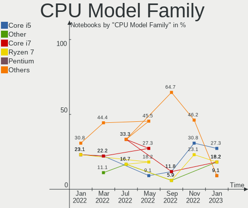

| Model           | Notebooks | Percent |
|-----------------|-----------|---------|
| Other           | 5         | 29.41%  |
| AMD Ryzen 7     | 4         | 23.53%  |
| Intel Core i7   | 3         | 17.65%  |
| Intel Core i5   | 2         | 11.76%  |
| Intel Celeron   | 1         | 5.88%   |
| AMD Ryzen 7 PRO | 1         | 5.88%   |
| AMD Ryzen 5     | 1         | 5.88%   |

CPU Cores
---------

Number of processor cores

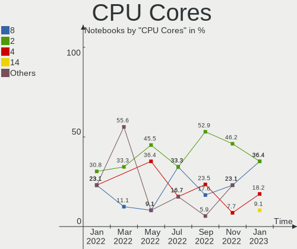

| Number | Notebooks | Percent |
|--------|-----------|---------|
| 8      | 5         | 29.41%  |
| 2      | 5         | 29.41%  |
| 4      | 3         | 17.65%  |
| 14     | 2         | 11.76%  |
| 6      | 2         | 11.76%  |

CPU Sockets
-----------

Number of sockets

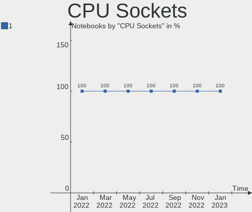

| Number | Notebooks | Percent |
|--------|-----------|---------|
| 1      | 17        | 100%    |

CPU Threads
-----------

Threads per core (Hyper-Threading)

| Number | Notebooks | Percent |
|--------|-----------|---------|
| 2      | 16        | 94.12%  |
| 1      | 1         | 5.88%   |

CPU Op-Modes
------------

CPU Operation Modes (32-bit, 64-bit)

| Op mode        | Notebooks | Percent |
|----------------|-----------|---------|
| 32-bit, 64-bit | 17        | 100%    |

CPU Microcode
-------------

Microcode number

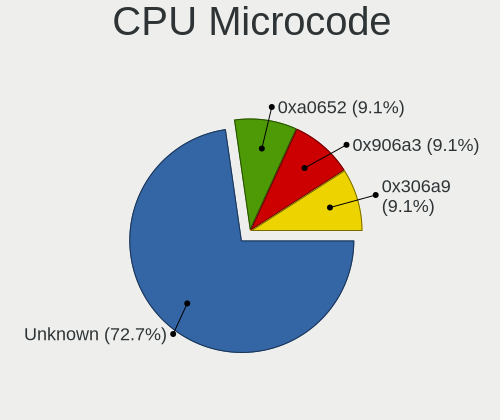

| Number     | Notebooks | Percent |
|------------|-----------|---------|
| Unknown    | 9         | 52.94%  |
| 0x906a3    | 2         | 11.76%  |
| 0x806c1    | 2         | 11.76%  |
| 0x206a7    | 1         | 5.88%   |
| 0x0a50000c | 1         | 5.88%   |
| 0x0a404102 | 1         | 5.88%   |
| 0x08600106 | 1         | 5.88%   |

CPU Microarch
-------------

Microarchitecture

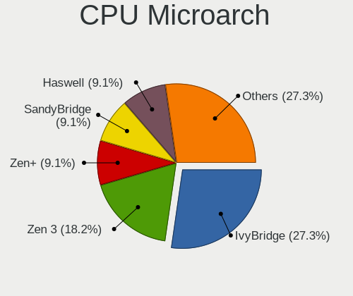

| Name             | Notebooks | Percent |
|------------------|-----------|---------|
| Zen 3            | 3         | 17.65%  |
| TigerLake        | 2         | 11.76%  |
| Broadwell        | 2         | 11.76%  |
| Alderlake Hybrid | 2         | 11.76%  |
| Unknown          | 2         | 11.76%  |
| Zen+             | 1         | 5.88%   |
| Zen 2            | 1         | 5.88%   |
| Skylake          | 1         | 5.88%   |
| SandyBridge      | 1         | 5.88%   |
| KabyLake         | 1         | 5.88%   |
| CometLake        | 1         | 5.88%   |

Graphics
--------

GPU Vendor
----------

Vendors of graphics cards

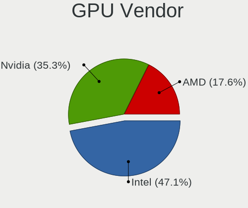

| Vendor | Notebooks | Percent |
|--------|-----------|---------|
| Intel  | 11        | 40.74%  |
| Nvidia | 10        | 37.04%  |
| AMD    | 6         | 22.22%  |

GPU Model
---------

Graphics card models

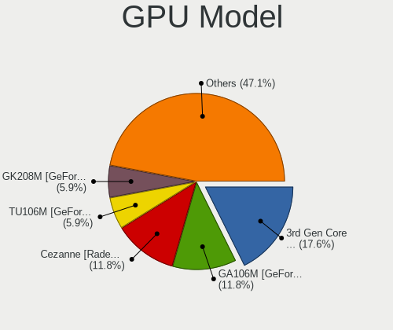

| Model                                                                     | Notebooks | Percent |
|---------------------------------------------------------------------------|-----------|---------|
| AMD Cezanne [Radeon Vega Series / Radeon Vega Mobile Series]              | 3         | 11.11%  |
| Nvidia GA107M [GeForce RTX 3050 Ti Mobile]                                | 2         | 7.41%   |
| Nvidia GA106M [GeForce RTX 3060 Mobile / Max-Q]                           | 2         | 7.41%   |
| Intel TigerLake-LP GT2 [Iris Xe Graphics]                                 | 2         | 7.41%   |
| Intel HD Graphics 5500                                                    | 2         | 7.41%   |
| Intel Alder Lake-P Integrated Graphics Controller                         | 2         | 7.41%   |
| Nvidia TU117M [GeForce MX450]                                             | 1         | 3.7%    |
| Nvidia TU106M [GeForce RTX 2070 Mobile / Max-Q Refresh]                   | 1         | 3.7%    |
| Nvidia GM108M [GeForce 840M]                                              | 1         | 3.7%    |
| Nvidia GK208BM [GeForce 920M]                                             | 1         | 3.7%    |
| Nvidia GA107M [GeForce RTX 3050 Mobile]                                   | 1         | 3.7%    |
| Nvidia GA104M [Geforce RTX 3070 Ti Laptop GPU]                            | 1         | 3.7%    |
| Intel TigerLake-H GT1 [UHD Graphics]                                      | 1         | 3.7%    |
| Intel Skylake GT2 [HD Graphics 520]                                       | 1         | 3.7%    |
| Intel HD Graphics 620                                                     | 1         | 3.7%    |
| Intel CometLake-H GT2 [UHD Graphics]                                      | 1         | 3.7%    |
| Intel 2nd Generation Core Processor Family Integrated Graphics Controller | 1         | 3.7%    |
| AMD Renoir                                                                | 1         | 3.7%    |
| AMD Rembrandt [Radeon 680M]                                               | 1         | 3.7%    |
| AMD Picasso/Raven 2 [Radeon Vega Series / Radeon Vega Mobile Series]      | 1         | 3.7%    |

GPU Combo
---------

Combinations of graphics cards

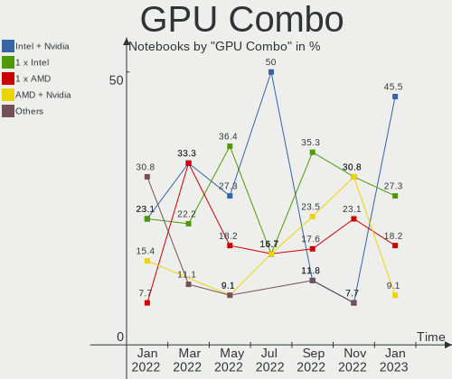

| Name           | Notebooks | Percent |
|----------------|-----------|---------|
| Intel + Nvidia | 7         | 41.18%  |
| 1 x Intel      | 4         | 23.53%  |
| AMD + Nvidia   | 3         | 17.65%  |
| 1 x AMD        | 3         | 17.65%  |

GPU Driver
----------

Free vs proprietary

| Driver      | Notebooks | Percent |
|-------------|-----------|---------|
| Free        | 9         | 52.94%  |
| Proprietary | 8         | 47.06%  |

GPU Memory
----------

Total video memory

| Size in GB | Notebooks | Percent |
|------------|-----------|---------|
| Unknown    | 13        | 76.47%  |
| 0.01-0.5   | 3         | 17.65%  |
| 7.01-8.0   | 1         | 5.88%   |

Monitor
-------

Monitor Vendor
--------------

Monitor vendors

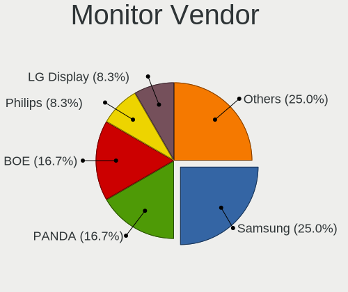

| Vendor                  | Notebooks | Percent |
|-------------------------|-----------|---------|
| BOE                     | 6         | 30%     |
| Samsung Electronics     | 2         | 10%     |
| LG Display              | 2         | 10%     |
| Dell                    | 2         | 10%     |
| Chimei Innolux          | 2         | 10%     |
| AU Optronics            | 2         | 10%     |
| Sharp                   | 1         | 5%      |
| PANDA                   | 1         | 5%      |
| InfoVision              | 1         | 5%      |
| Chi Mei Optoelectronics | 1         | 5%      |

Monitor Model
-------------

Monitor models

| Model                                                                    | Notebooks | Percent |
|--------------------------------------------------------------------------|-----------|---------|
| AU Optronics LCD Monitor AUOAF90 1920x1080 344x193mm 15.5-inch           | 2         | 10%     |
| Sharp LCD Monitor SHP1449 1920x1080 294x165mm 13.3-inch                  | 1         | 5%      |
| Samsung Electronics LU28R55 SAM1017 3840x2160 630x360mm 28.6-inch        | 1         | 5%      |
| Samsung Electronics LCD Monitor SDC4154 2880x1800 302x189mm 14.0-inch    | 1         | 5%      |
| PANDA LCD Monitor NCP004B 1920x1080 344x194mm 15.5-inch                  | 1         | 5%      |
| LG Display LCD Monitor LGD062F 1920x1080 344x194mm 15.5-inch             | 1         | 5%      |
| LG Display LCD Monitor LGD046D 1920x1080 309x174mm 14.0-inch             | 1         | 5%      |
| InfoVision LCD Monitor IVO8C78 1920x1080 309x174mm 14.0-inch             | 1         | 5%      |
| Dell S2716DG DELA0D1 2560x1440 598x336mm 27.0-inch                       | 1         | 5%      |
| Dell P2412H DELA07D 1920x1080 530x300mm 24.0-inch                        | 1         | 5%      |
| Chimei Innolux LCD Monitor CMN1738 1920x1080 381x214mm 17.2-inch         | 1         | 5%      |
| Chimei Innolux LCD Monitor CMN15C4 1920x1080 344x193mm 15.5-inch         | 1         | 5%      |
| Chi Mei Optoelectronics LCD Monitor CMO15A2 1366x768 344x193mm 15.5-inch | 1         | 5%      |
| BOE LCD Monitor BOE0ACC 1920x1080 344x194mm 15.5-inch                    | 1         | 5%      |
| BOE LCD Monitor BOE0AAD 1920x1080 355x200mm 16.0-inch                    | 1         | 5%      |
| BOE LCD Monitor BOE0A88 2560x1440 344x194mm 15.5-inch                    | 1         | 5%      |
| BOE LCD Monitor BOE0936 1920x1080 344x194mm 15.5-inch                    | 1         | 5%      |
| BOE LCD Monitor BOE090F 1920x1080 344x194mm 15.5-inch                    | 1         | 5%      |
| BOE LCD Monitor BOE05F3 1366x768 309x173mm 13.9-inch                     | 1         | 5%      |

Monitor Resolution
------------------

Monitor screen resolution

| Resolution      | Notebooks | Percent |
|-----------------|-----------|---------|
| 1920x1080 (FHD) | 13        | 68.42%  |
| 2560x1440 (QHD) | 2         | 10.53%  |
| 1366x768 (WXGA) | 2         | 10.53%  |
| 3840x2160 (4K)  | 1         | 5.26%   |
| 2880x1800       | 1         | 5.26%   |

Monitor Diagonal
----------------

Diagonal size in inches

| Inches | Notebooks | Percent |
|--------|-----------|---------|
| 15     | 10        | 50%     |
| 14     | 3         | 15%     |
| 13     | 2         | 10%     |
| 28     | 1         | 5%      |
| 27     | 1         | 5%      |
| 24     | 1         | 5%      |
| 17     | 1         | 5%      |
| 16     | 1         | 5%      |

Monitor Width
-------------

Physical width

| Width in mm | Notebooks | Percent |
|-------------|-----------|---------|
| 301-350     | 14        | 70%     |
| 501-600     | 2         | 10%     |
| 351-400     | 2         | 10%     |
| 601-700     | 1         | 5%      |
| 201-300     | 1         | 5%      |

Aspect Ratio
------------

Proportional relationship between the width and the height

| Ratio | Notebooks | Percent |
|-------|-----------|---------|
| 16/9  | 16        | 94.12%  |
| 16/10 | 1         | 5.88%   |

Monitor Area
------------

Area in inch²

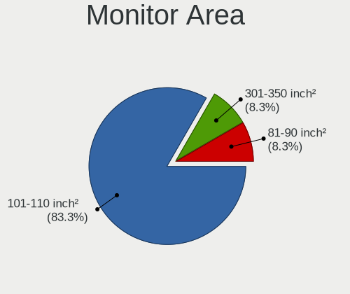

| Area in inch² | Notebooks | Percent |
|----------------|-----------|---------|
| 101-110        | 11        | 55%     |
| 81-90          | 4         | 20%     |
| 71-80          | 1         | 5%      |
| 351-500        | 1         | 5%      |
| 301-350        | 1         | 5%      |
| 201-250        | 1         | 5%      |
| 121-130        | 1         | 5%      |

Pixel Density
-------------

Pixels per inch

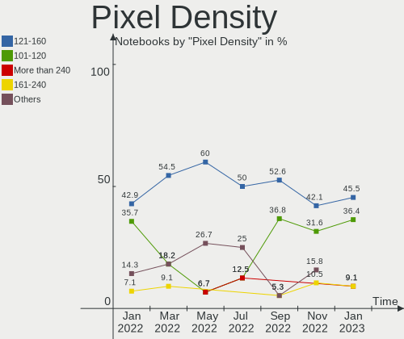

| Density       | Notebooks | Percent |
|---------------|-----------|---------|
| 121-160       | 13        | 65%     |
| 161-240       | 2         | 10%     |
| 101-120       | 2         | 10%     |
| 51-100        | 2         | 10%     |
| More than 240 | 1         | 5%      |

Multiple Monitors
-----------------

Total monitors connected

| Total | Notebooks | Percent |
|-------|-----------|---------|
| 1     | 13        | 76.47%  |
| 2     | 4         | 23.53%  |

Network
-------

Net Controller Vendor
---------------------

Controller vendors

| Vendor                | Notebooks | Percent |
|-----------------------|-----------|---------|
| Realtek Semiconductor | 10        | 38.46%  |
| Intel                 | 10        | 38.46%  |
| Qualcomm Atheros      | 4         | 15.38%  |
| MediaTek              | 2         | 7.69%   |

Net Controller Model
--------------------

Controller models

| Model                                                             | Notebooks | Percent |
|-------------------------------------------------------------------|-----------|---------|
| Realtek RTL8111/8168/8411 PCI Express Gigabit Ethernet Controller | 6         | 21.43%  |
| Qualcomm Atheros QCA9377 802.11ac Wireless Network Adapter        | 2         | 7.14%   |
| MediaTek MT7921 802.11ax PCI Express Wireless Network Adapter     | 2         | 7.14%   |
| Intel Wireless 7265                                               | 2         | 7.14%   |
| Intel Wi-Fi 6 AX201                                               | 2         | 7.14%   |
| Intel Wi-Fi 6 AX200                                               | 2         | 7.14%   |
| Intel Ethernet Connection (3) I218-LM                             | 2         | 7.14%   |
| Intel Alder Lake-P PCH CNVi WiFi                                  | 2         | 7.14%   |
| Realtek RTL8822CE 802.11ac PCIe Wireless Network Adapter          | 1         | 3.57%   |
| Realtek RTL810xE PCI Express Fast Ethernet controller             | 1         | 3.57%   |
| Realtek Killer E3000 2.5GbE Controller                            | 1         | 3.57%   |
| Realtek Killer E2600 Gigabit Ethernet Controller                  | 1         | 3.57%   |
| Qualcomm Atheros QCA6174 802.11ac Wireless Network Adapter        | 1         | 3.57%   |
| Qualcomm Atheros AR9485 Wireless Network Adapter                  | 1         | 3.57%   |
| Intel Wi-Fi 6 AX210/AX211/AX411 160MHz                            | 1         | 3.57%   |
| Intel Tiger Lake PCH CNVi WiFi                                    | 1         | 3.57%   |

Wireless Vendor
---------------

Wireless vendors

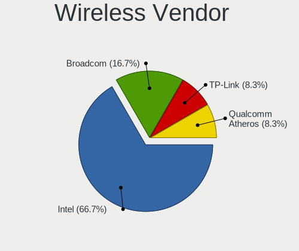

| Vendor                | Notebooks | Percent |
|-----------------------|-----------|---------|
| Intel                 | 10        | 58.82%  |
| Qualcomm Atheros      | 4         | 23.53%  |
| MediaTek              | 2         | 11.76%  |
| Realtek Semiconductor | 1         | 5.88%   |

Wireless Model
--------------

Wireless models

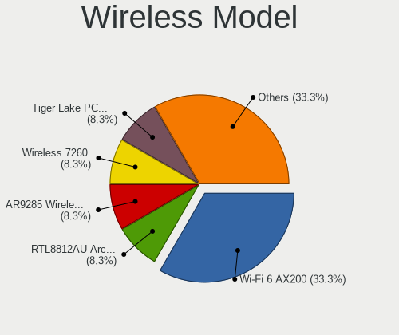

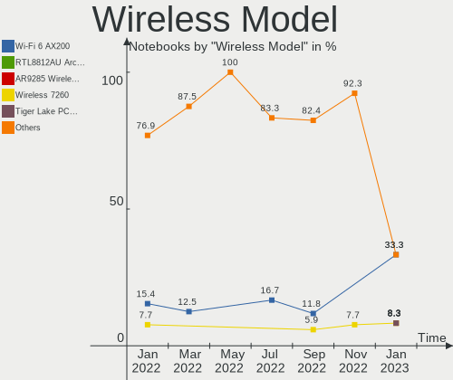

| Model                                                         | Notebooks | Percent |
|---------------------------------------------------------------|-----------|---------|
| Qualcomm Atheros QCA9377 802.11ac Wireless Network Adapter    | 2         | 11.76%  |
| MediaTek MT7921 802.11ax PCI Express Wireless Network Adapter | 2         | 11.76%  |
| Intel Wireless 7265                                           | 2         | 11.76%  |
| Intel Wi-Fi 6 AX201                                           | 2         | 11.76%  |
| Intel Wi-Fi 6 AX200                                           | 2         | 11.76%  |
| Intel Alder Lake-P PCH CNVi WiFi                              | 2         | 11.76%  |
| Realtek RTL8822CE 802.11ac PCIe Wireless Network Adapter      | 1         | 5.88%   |
| Qualcomm Atheros QCA6174 802.11ac Wireless Network Adapter    | 1         | 5.88%   |
| Qualcomm Atheros AR9485 Wireless Network Adapter              | 1         | 5.88%   |
| Intel Wi-Fi 6 AX210/AX211/AX411 160MHz                        | 1         | 5.88%   |
| Intel Tiger Lake PCH CNVi WiFi                                | 1         | 5.88%   |

Ethernet Vendor
---------------

Ethernet vendors

| Vendor                | Notebooks | Percent |
|-----------------------|-----------|---------|
| Realtek Semiconductor | 9         | 81.82%  |
| Intel                 | 2         | 18.18%  |

Ethernet Model
--------------

Ethernet models

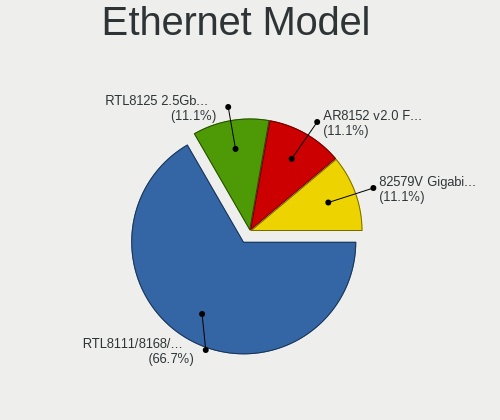

| Model                                                             | Notebooks | Percent |
|-------------------------------------------------------------------|-----------|---------|
| Realtek RTL8111/8168/8411 PCI Express Gigabit Ethernet Controller | 6         | 54.55%  |
| Intel Ethernet Connection (3) I218-LM                             | 2         | 18.18%  |
| Realtek RTL810xE PCI Express Fast Ethernet controller             | 1         | 9.09%   |
| Realtek Killer E3000 2.5GbE Controller                            | 1         | 9.09%   |
| Realtek Killer E2600 Gigabit Ethernet Controller                  | 1         | 9.09%   |

Net Controller Kind
-------------------

Ethernet, WiFi or modem

| Kind     | Notebooks | Percent |
|----------|-----------|---------|
| WiFi     | 17        | 60.71%  |
| Ethernet | 11        | 39.29%  |

Used Controller
---------------

Currently used network controller

| Kind | Notebooks | Percent |
|------|-----------|---------|
| WiFi | 17        | 100%    |

NICs
----

Total network controllers on board

| Total | Notebooks | Percent |
|-------|-----------|---------|
| 2     | 11        | 64.71%  |
| 1     | 6         | 35.29%  |

IPv6
----

IPv6 vs IPv4

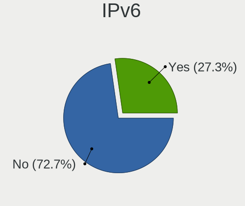

| Used | Notebooks | Percent |
|------|-----------|---------|
| No   | 10        | 58.82%  |
| Yes  | 7         | 41.18%  |

Bluetooth
---------

Bluetooth Vendor
----------------

Controller vendors

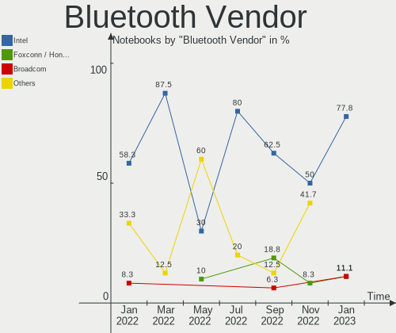

| Vendor                          | Notebooks | Percent |
|---------------------------------|-----------|---------|
| Intel                           | 10        | 62.5%   |
| Qualcomm Atheros Communications | 2         | 12.5%   |
| Lite-On Technology              | 2         | 12.5%   |
| Realtek Semiconductor           | 1         | 6.25%   |
| IMC Networks                    | 1         | 6.25%   |

Bluetooth Model
---------------

Controller models

| Model                                      | Notebooks | Percent |
|--------------------------------------------|-----------|---------|
| Intel AX201 Bluetooth                      | 4         | 25%     |
| Qualcomm Atheros  Bluetooth Device         | 2         | 12.5%   |
| Intel Bluetooth wireless interface         | 2         | 12.5%   |
| Intel AX200 Bluetooth                      | 2         | 12.5%   |
| Realtek Bluetooth Radio                    | 1         | 6.25%   |
| Lite-On Wireless_Device                    | 1         | 6.25%   |
| Lite-On Qualcomm Atheros QCA9377 Bluetooth | 1         | 6.25%   |
| Intel Bluetooth Device                     | 1         | 6.25%   |
| Intel AX210 Bluetooth                      | 1         | 6.25%   |
| IMC Networks Wireless_Device               | 1         | 6.25%   |

Sound
-----

Sound Vendor
------------

Sound card vendors

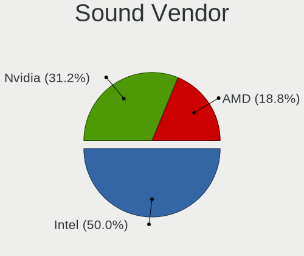

| Vendor           | Notebooks | Percent |
|------------------|-----------|---------|
| Intel            | 11        | 42.31%  |
| Nvidia           | 8         | 30.77%  |
| AMD              | 6         | 23.08%  |
| RODE Microphones | 1         | 3.85%   |

Sound Model
-----------

Sound card models

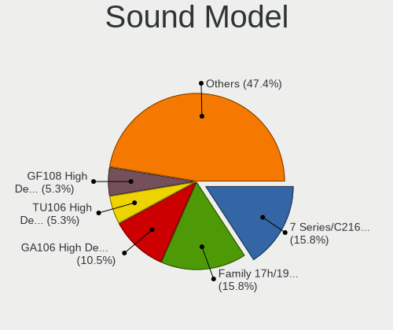

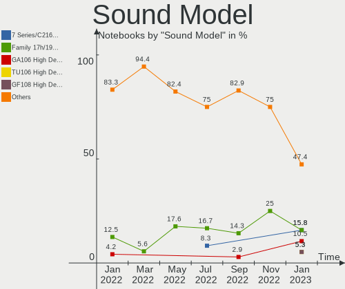

| Model                                                               | Notebooks | Percent |
|---------------------------------------------------------------------|-----------|---------|
| AMD Family 17h/19h HD Audio Controller                              | 6         | 18.18%  |
| Nvidia Audio device                                                 | 3         | 9.09%   |
| AMD Renoir Radeon High Definition Audio Controller                  | 3         | 9.09%   |
| Nvidia GA106 High Definition Audio Controller                       | 2         | 6.06%   |
| Intel Wildcat Point-LP High Definition Audio Controller             | 2         | 6.06%   |
| Intel Tiger Lake-LP Smart Sound Technology Audio Controller         | 2         | 6.06%   |
| Intel Sunrise Point-LP HD Audio                                     | 2         | 6.06%   |
| Intel Broadwell-U Audio Controller                                  | 2         | 6.06%   |
| Intel Alder Lake PCH-P High Definition Audio Controller             | 2         | 6.06%   |
| RODE Microphones RODE NT-USB                                        | 1         | 3.03%   |
| Nvidia TU106 High Definition Audio Controller                       | 1         | 3.03%   |
| Nvidia GK208 HDMI/DP Audio Controller                               | 1         | 3.03%   |
| Nvidia GA104 High Definition Audio Controller                       | 1         | 3.03%   |
| Intel Tiger Lake-H HD Audio Controller                              | 1         | 3.03%   |
| Intel Comet Lake PCH cAVS                                           | 1         | 3.03%   |
| Intel 7 Series/C216 Chipset Family High Definition Audio Controller | 1         | 3.03%   |
| AMD Rembrandt Radeon High Definition Audio Controller               | 1         | 3.03%   |
| AMD Raven/Raven2/Fenghuang HDMI/DP Audio Controller                 | 1         | 3.03%   |

Memory
------

Memory Vendor
-------------

Memory module vendors

| Vendor              | Notebooks | Percent |
|---------------------|-----------|---------|
| SK hynix            | 6         | 37.5%   |
| Micron Technology   | 4         | 25%     |
| Samsung Electronics | 3         | 18.75%  |
| Transcend           | 1         | 6.25%   |
| Kingston            | 1         | 6.25%   |
| Crucial             | 1         | 6.25%   |

Memory Model
------------

Memory module models

| Model                                                      | Notebooks | Percent |
|------------------------------------------------------------|-----------|---------|
| Transcend RAM JM3200HSG-8G 8GB SODIMM DDR4 3200MT/s        | 1         | 6.25%   |
| SK hynix RAM HMT41GS6BFR8A-PB 8GB SODIMM DDR3 1600MT/s     | 1         | 6.25%   |
| SK hynix RAM HMT41GS6AFR8A-PB 8GB SODIMM DDR3 1600MT/s     | 1         | 6.25%   |
| SK hynix RAM HMCG78MEBSA095N 16GB SODIMM DDR5 4800MT/s     | 1         | 6.25%   |
| SK hynix RAM HMCG66MEBSA092N 8GB SODIMM DDR5 4800MT/s      | 1         | 6.25%   |
| SK hynix RAM HMAA1GS6CJR6N-XN 8GB SODIMM DDR4 3200MT/s     | 1         | 6.25%   |
| SK hynix RAM H9HCNNNCPMMLXR-NEE 8GB SODIMM LPDDR4 4266MT/s | 1         | 6.25%   |
| Samsung RAM M471B5273DH0-CK0 4GB SODIMM DDR3 1600MT/s      | 1         | 6.25%   |
| Samsung RAM M471A2K43EB1-CWE 16GB SODIMM DDR4 3200MT/s     | 1         | 6.25%   |
| Samsung RAM M471A1K43EB1-CWE 8GB SODIMM DDR4 3200MT/s      | 1         | 6.25%   |
| Micron RAM 8ATF2G64HZ-3G2E1 8GB Row Of Chips DDR4 3200MT/s | 1         | 6.25%   |
| Micron RAM 8ATF1G64HZ-3G2J1 8GB SODIMM DDR4 3200MT/s       | 1         | 6.25%   |
| Micron RAM 4ATF1G64HZ-3G2E2 8GB SODIMM DDR4 3200MT/s       | 1         | 6.25%   |
| Micron RAM 4ATF1G64HZ-3G2B2 8GB SODIMM DDR4 3200MT/s       | 1         | 6.25%   |
| Kingston RAM KHX2933C17S4/32G 32GB SODIMM DDR4 2933MT/s    | 1         | 6.25%   |
| Crucial RAM CT8G4SFS832A.M8FR 8GB SODIMM DDR4 3200MT/s     | 1         | 6.25%   |

Memory Kind
-----------

Memory module kinds

| Kind   | Notebooks | Percent |
|--------|-----------|---------|
| DDR4   | 8         | 61.54%  |
| DDR5   | 2         | 15.38%  |
| DDR3   | 2         | 15.38%  |
| LPDDR4 | 1         | 7.69%   |

Memory Form Factor
------------------

Physical design of the memory module

| Name         | Notebooks | Percent |
|--------------|-----------|---------|
| SODIMM       | 12        | 92.31%  |
| Row Of Chips | 1         | 7.69%   |

Memory Size
-----------

Memory module size

| Size  | Notebooks | Percent |
|-------|-----------|---------|
| 8192  | 10        | 71.43%  |
| 16384 | 2         | 14.29%  |
| 32768 | 1         | 7.14%   |
| 4096  | 1         | 7.14%   |

Memory Speed
------------

Memory module speed

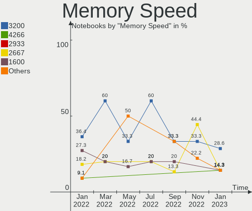

| Speed | Notebooks | Percent |
|-------|-----------|---------|
| 3200  | 7         | 53.85%  |
| 4800  | 2         | 15.38%  |
| 1600  | 2         | 15.38%  |
| 4266  | 1         | 7.69%   |
| 2933  | 1         | 7.69%   |

Printers & scanners
-------------------

Printer Vendor
--------------

Printer device vendors

Zero info for selected period =(

Printer Model
-------------

Printer device models

Zero info for selected period =(

Scanner Vendor
--------------

Scanner device vendors

Zero info for selected period =(

Scanner Model
-------------

Scanner device models

Zero info for selected period =(

Camera
------

Camera Vendor
-------------

Camera device vendors

| Vendor                        | Notebooks | Percent |
|-------------------------------|-----------|---------|
| Chicony Electronics           | 4         | 25%     |
| Quanta                        | 3         | 18.75%  |
| Realtek Semiconductor         | 2         | 12.5%   |
| Syntek                        | 1         | 6.25%   |
| Suyin                         | 1         | 6.25%   |
| Sunplus Innovation Technology | 1         | 6.25%   |
| Microdia                      | 1         | 6.25%   |
| Luxvisions Innotech Limited   | 1         | 6.25%   |
| Logitech                      | 1         | 6.25%   |
| IMC Networks                  | 1         | 6.25%   |

Camera Model
------------

Camera device models

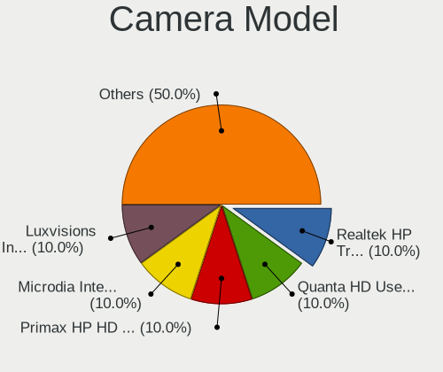

| Model                                                | Notebooks | Percent |
|------------------------------------------------------|-----------|---------|
| Realtek Integrated_Webcam_HD                         | 2         | 12.5%   |
| Chicony HD WebCam                                    | 2         | 12.5%   |
| Syntek Integrated Camera                             | 1         | 6.25%   |
| Suyin HP TrueVision HD Integrated Webcam             | 1         | 6.25%   |
| Sunplus Integrated_Webcam_HD                         | 1         | 6.25%   |
| Quanta HP HD Camera                                  | 1         | 6.25%   |
| Quanta HD User Facing                                | 1         | 6.25%   |
| Quanta HD Camera                                     | 1         | 6.25%   |
| Microdia Integrated_Webcam_HD                        | 1         | 6.25%   |
| Luxvisions Innotech Limited HP Wide Vision HD Camera | 1         | 6.25%   |
| Logitech HD Pro Webcam C920                          | 1         | 6.25%   |
| IMC Networks USB2.0 HD UVC WebCam                    | 1         | 6.25%   |
| Chicony USB2.0 Camera                                | 1         | 6.25%   |
| Chicony HP Wide Vision HD Camera                     | 1         | 6.25%   |

Security
--------

Fingerprint Vendor
------------------

Fingerprint sensor vendors

| Vendor                | Notebooks | Percent |
|-----------------------|-----------|---------|
| Elan Microelectronics | 1         | 100%    |

Fingerprint Model
-----------------

Fingerprint sensor models

| Model            | Notebooks | Percent |
|------------------|-----------|---------|
| Elan ELAN:ARM-M4 | 1         | 100%    |

Chipcard Vendor
---------------

Chipcard module vendors

| Vendor   | Notebooks | Percent |
|----------|-----------|---------|
| Broadcom | 1         | 100%    |

Chipcard Model
--------------

Chipcard module models

| Model                                                                        | Notebooks | Percent |
|------------------------------------------------------------------------------|-----------|---------|
| Broadcom BCM5880 Secure Applications Processor with fingerprint swipe sensor | 1         | 100%    |

Unsupported
-----------

Unsupported Devices
-------------------

Total unsupported devices on board

| Total | Notebooks | Percent |
|-------|-----------|---------|
| 0     | 7         | 41.18%  |
| 1     | 6         | 35.29%  |
| 2     | 4         | 23.53%  |

Unsupported Device Types
------------------------

Types of unsupported devices

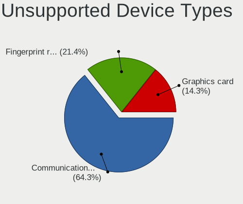

| Type                     | Notebooks | Percent |
|--------------------------|-----------|---------|
| Communication controller | 9         | 69.23%  |
| Graphics card            | 2         | 15.38%  |
| Fingerprint reader       | 1         | 7.69%   |
| Chipcard                 | 1         | 7.69%   |

