Garuda Linux - Hardware Trends
------------------------------

A project to identify most popular hardware characteristics and track their change
over time based on data collected by Linux users at https://Linux-Hardware.org.

Anyone can contribute to this report by the [hw-probe](https://github.com/linuxhw/hw-probe) tool:

    sudo -E hw-probe -all -upload

This is a report for all computer types. See also reports for [desktops](/Dist/Garuda_Linux/Desktop/README.md) and [notebooks](/Dist/Garuda_Linux/Notebook/README.md).

This report is for one last month. Overall report since the beginning of time: [TestCoverage](https://github.com/linuxhw/TestCoverage)

Period: Jan, 2023.

Contents
--------

* [ System ](#system)
  - [ OS                       ](#os)
  - [ OS Family                ](#os-family)
  - [ Kernel                   ](#kernel)
  - [ Kernel Family            ](#kernel-family)
  - [ Kernel Major Ver.        ](#kernel-major-ver)
  - [ Arch                     ](#arch)
  - [ DE                       ](#de)
  - [ Display Server           ](#display-server)
  - [ Display Manager          ](#display-manager)
  - [ OS Lang                  ](#os-lang)
  - [ Boot Mode                ](#boot-mode)
  - [ Filesystem               ](#filesystem)
  - [ Part. scheme             ](#part-scheme)
  - [ Dual Boot with Linux/BSD ](#dual-boot-with-linuxbsd)
  - [ Dual Boot (Win)          ](#dual-boot-win)

* [ Board ](#board)
  - [ Vendor                   ](#vendor)
  - [ Model                    ](#model)
  - [ Model Family             ](#model-family)
  - [ MFG Year                 ](#mfg-year)
  - [ Form Factor              ](#form-factor)
  - [ Secure Boot              ](#secure-boot)
  - [ Coreboot                 ](#coreboot)
  - [ RAM Size                 ](#ram-size)
  - [ RAM Used                 ](#ram-used)
  - [ Total Drives             ](#total-drives)
  - [ Has CD-ROM               ](#has-cd-rom)
  - [ Has Ethernet             ](#has-ethernet)
  - [ Has WiFi                 ](#has-wifi)
  - [ Has Bluetooth            ](#has-bluetooth)

* [ Location ](#location)
  - [ Country                  ](#country)
  - [ City                     ](#city)

* [ Drives ](#drives)
  - [ Drive Vendor             ](#drive-vendor)
  - [ Drive Model              ](#drive-model)
  - [ HDD Vendor               ](#hdd-vendor)
  - [ SSD Vendor               ](#ssd-vendor)
  - [ Drive Kind               ](#drive-kind)
  - [ Drive Connector          ](#drive-connector)
  - [ Drive Size               ](#drive-size)
  - [ Space Total              ](#space-total)
  - [ Space Used               ](#space-used)
  - [ Malfunc. Drives          ](#malfunc-drives)
  - [ Malfunc. Drive Vendor    ](#malfunc-drive-vendor)
  - [ Malfunc. HDD Vendor      ](#malfunc-hdd-vendor)
  - [ Malfunc. Drive Kind      ](#malfunc-drive-kind)
  - [ Failed Drives            ](#failed-drives)
  - [ Failed Drive Vendor      ](#failed-drive-vendor)
  - [ Drive Status             ](#drive-status)

* [ Storage controller ](#storage-controller)
  - [ Storage Vendor           ](#storage-vendor)
  - [ Storage Model            ](#storage-model)
  - [ Storage Kind             ](#storage-kind)

* [ Processor ](#processor)
  - [ CPU Vendor               ](#cpu-vendor)
  - [ CPU Model                ](#cpu-model)
  - [ CPU Model Family         ](#cpu-model-family)
  - [ CPU Cores                ](#cpu-cores)
  - [ CPU Sockets              ](#cpu-sockets)
  - [ CPU Threads              ](#cpu-threads)
  - [ CPU Op-Modes             ](#cpu-op-modes)
  - [ CPU Microcode            ](#cpu-microcode)
  - [ CPU Microarch            ](#cpu-microarch)

* [ Graphics ](#graphics)
  - [ GPU Vendor               ](#gpu-vendor)
  - [ GPU Model                ](#gpu-model)
  - [ GPU Combo                ](#gpu-combo)
  - [ GPU Driver               ](#gpu-driver)
  - [ GPU Memory               ](#gpu-memory)

* [ Monitor ](#monitor)
  - [ Monitor Vendor           ](#monitor-vendor)
  - [ Monitor Model            ](#monitor-model)
  - [ Monitor Resolution       ](#monitor-resolution)
  - [ Monitor Diagonal         ](#monitor-diagonal)
  - [ Monitor Width            ](#monitor-width)
  - [ Aspect Ratio             ](#aspect-ratio)
  - [ Monitor Area             ](#monitor-area)
  - [ Pixel Density            ](#pixel-density)
  - [ Multiple Monitors        ](#multiple-monitors)

* [ Network ](#network)
  - [ Net Controller Vendor    ](#net-controller-vendor)
  - [ Net Controller Model     ](#net-controller-model)
  - [ Wireless Vendor          ](#wireless-vendor)
  - [ Wireless Model           ](#wireless-model)
  - [ Ethernet Vendor          ](#ethernet-vendor)
  - [ Ethernet Model           ](#ethernet-model)
  - [ Net Controller Kind      ](#net-controller-kind)
  - [ Used Controller          ](#used-controller)
  - [ NICs                     ](#nics)
  - [ IPv6                     ](#ipv6)

* [ Bluetooth ](#bluetooth)
  - [ Bluetooth Vendor         ](#bluetooth-vendor)
  - [ Bluetooth Model          ](#bluetooth-model)

* [ Sound ](#sound)
  - [ Sound Vendor             ](#sound-vendor)
  - [ Sound Model              ](#sound-model)

* [ Memory ](#memory)
  - [ Memory Vendor            ](#memory-vendor)
  - [ Memory Model             ](#memory-model)
  - [ Memory Kind              ](#memory-kind)
  - [ Memory Form Factor       ](#memory-form-factor)
  - [ Memory Size              ](#memory-size)
  - [ Memory Speed             ](#memory-speed)

* [ Printers & scanners ](#printers--scanners)
  - [ Printer Vendor           ](#printer-vendor)
  - [ Printer Model            ](#printer-model)
  - [ Scanner Vendor           ](#scanner-vendor)
  - [ Scanner Model            ](#scanner-model)

* [ Camera ](#camera)
  - [ Camera Vendor            ](#camera-vendor)
  - [ Camera Model             ](#camera-model)

* [ Security ](#security)
  - [ Fingerprint Vendor       ](#fingerprint-vendor)
  - [ Fingerprint Model        ](#fingerprint-model)
  - [ Chipcard Vendor          ](#chipcard-vendor)
  - [ Chipcard Model           ](#chipcard-model)

* [ Unsupported ](#unsupported)
  - [ Unsupported Devices      ](#unsupported-devices)
  - [ Unsupported Device Types ](#unsupported-device-types)

System
------

OS
--

Installed operating systems

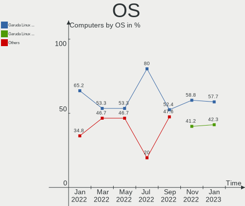

| Name                 | Computers | Percent |
|----------------------|-----------|---------|
| Garuda Linux Soaring | 15        | 57.69%  |
| Garuda Linux Rolling | 11        | 42.31%  |

OS Family
---------

OS without a version

| Name         | Computers | Percent |
|--------------|-----------|---------|
| Garuda Linux | 26        | 100%    |

Kernel
------

Version of the Linux kernel

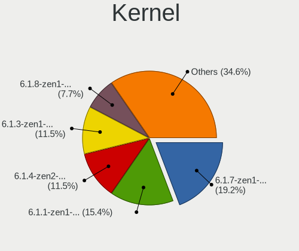

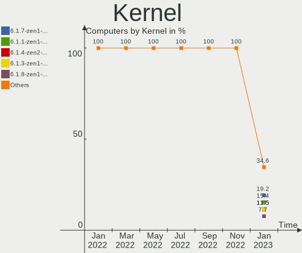

| Version           | Computers | Percent |
|-------------------|-----------|---------|
| 6.1.7-zen1-1-zen  | 5         | 19.23%  |
| 6.1.1-zen1-1-zen  | 4         | 15.38%  |
| 6.1.4-zen2-1-zen  | 3         | 11.54%  |
| 6.1.3-zen1-1-zen  | 3         | 11.54%  |
| 6.1.8-zen1-1-zen  | 2         | 7.69%   |
| 6.0.12-zen1-1-zen | 2         | 7.69%   |
| 6.1.5-zen2-1-zen  | 1         | 3.85%   |
| 6.1.4-AMD         | 1         | 3.85%   |
| 6.1.3-arch1-1     | 1         | 3.85%   |
| 6.0.6-zen1-1-zen  | 1         | 3.85%   |
| 6.0.2-zen1-1-zen  | 1         | 3.85%   |
| 5.15.87-1-lts     | 1         | 3.85%   |
| 5.15.86-1-lts     | 1         | 3.85%   |

Kernel Family
-------------

Linux kernel without a distro release

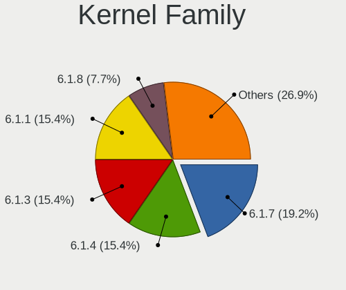

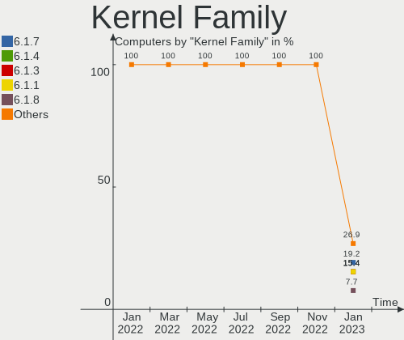

| Version | Computers | Percent |
|---------|-----------|---------|
| 6.1.7   | 5         | 19.23%  |
| 6.1.4   | 4         | 15.38%  |
| 6.1.3   | 4         | 15.38%  |
| 6.1.1   | 4         | 15.38%  |
| 6.1.8   | 2         | 7.69%   |
| 6.0.12  | 2         | 7.69%   |
| 6.1.5   | 1         | 3.85%   |
| 6.0.6   | 1         | 3.85%   |
| 6.0.2   | 1         | 3.85%   |
| 5.15.87 | 1         | 3.85%   |
| 5.15.86 | 1         | 3.85%   |

Kernel Major Ver.
-----------------

Linux kernel major version

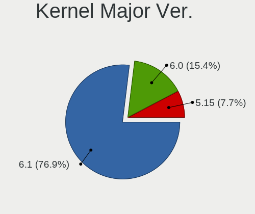

| Version | Computers | Percent |
|---------|-----------|---------|
| 6.1     | 20        | 76.92%  |
| 6.0     | 4         | 15.38%  |
| 5.15    | 2         | 7.69%   |

Arch
----

OS architecture (x86_64, i586, etc.)

| Name   | Computers | Percent |
|--------|-----------|---------|
| x86_64 | 26        | 100%    |

DE
--

Desktop Environment

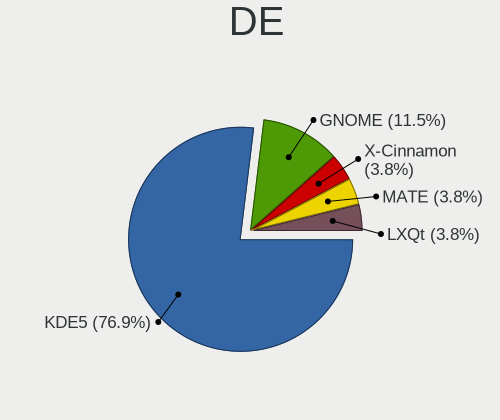

| Name       | Computers | Percent |
|------------|-----------|---------|
| KDE5       | 20        | 76.92%  |
| GNOME      | 3         | 11.54%  |
| X-Cinnamon | 1         | 3.85%   |
| MATE       | 1         | 3.85%   |
| LXQt       | 1         | 3.85%   |

Display Server
--------------

X11 or Wayland

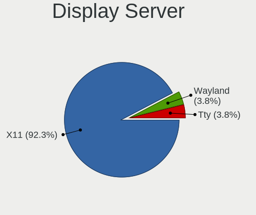

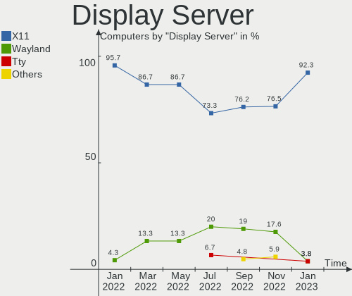

| Name    | Computers | Percent |
|---------|-----------|---------|
| X11     | 24        | 92.31%  |
| Wayland | 1         | 3.85%   |
| Tty     | 1         | 3.85%   |

Display Manager
---------------

SDDM, LightDM, etc.

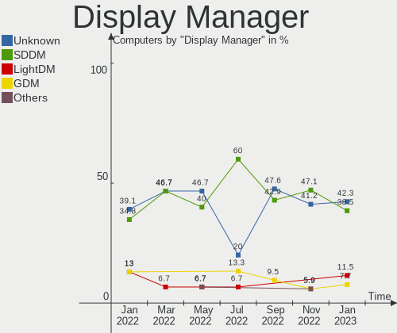

| Name    | Computers | Percent |
|---------|-----------|---------|
| Unknown | 11        | 42.31%  |
| SDDM    | 10        | 38.46%  |
| LightDM | 3         | 11.54%  |
| GDM     | 2         | 7.69%   |

OS Lang
-------

Language

| Lang  | Computers | Percent |
|-------|-----------|---------|
| en_US | 13        | 50%     |
| es_ES | 2         | 7.69%   |
| en_GB | 2         | 7.69%   |
| de_DE | 2         | 7.69%   |
| pt_BR | 1         | 3.85%   |
| nl_NL | 1         | 3.85%   |
| it_IT | 1         | 3.85%   |
| hu_HU | 1         | 3.85%   |
| en_DK | 1         | 3.85%   |
| da_DK | 1         | 3.85%   |
| cs_CZ | 1         | 3.85%   |

Boot Mode
---------

EFI or BIOS

| Mode | Computers | Percent |
|------|-----------|---------|
| BIOS | 14        | 53.85%  |
| EFI  | 12        | 46.15%  |

Filesystem
----------

Type of filesystem

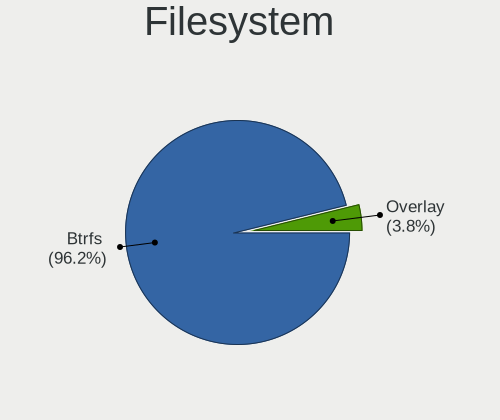

| Type    | Computers | Percent |
|---------|-----------|---------|
| Btrfs   | 25        | 96.15%  |
| Overlay | 1         | 3.85%   |

Part. scheme
------------

Scheme of partitioning

| Type    | Computers | Percent |
|---------|-----------|---------|
| GPT     | 14        | 53.85%  |
| Unknown | 11        | 42.31%  |
| MBR     | 1         | 3.85%   |

Dual Boot with Linux/BSD
------------------------

Hosting more than one Linux/BSD

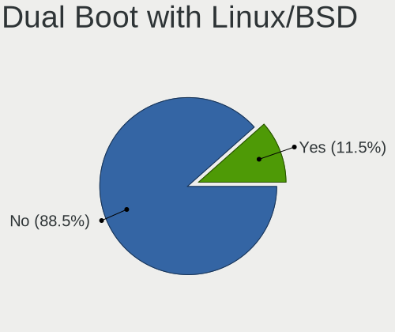

| Dual boot | Computers | Percent |
|-----------|-----------|---------|
| No        | 23        | 88.46%  |
| Yes       | 3         | 11.54%  |

Dual Boot (Win)
---------------

Hosting Linux and Windows

| Dual boot | Computers | Percent |
|-----------|-----------|---------|
| No        | 16        | 61.54%  |
| Yes       | 10        | 38.46%  |

Board
-----

Vendor
------

Motherboard manufacturer

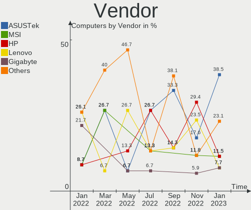

| Name                | Computers | Percent |
|---------------------|-----------|---------|
| ASUSTek Computer    | 10        | 38.46%  |
| MSI                 | 3         | 11.54%  |
| Hewlett-Packard     | 3         | 11.54%  |
| Lenovo              | 2         | 7.69%   |
| Gigabyte Technology | 2         | 7.69%   |
| Dell                | 2         | 7.69%   |
| Standard            | 1         | 3.85%   |
| Sony                | 1         | 3.85%   |
| Intel               | 1         | 3.85%   |
| Acer                | 1         | 3.85%   |

Model
-----

Motherboard model

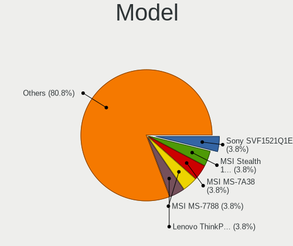

| Name                                 | Computers | Percent |
|--------------------------------------|-----------|---------|
| Sony SVF1521Q1EW                     | 1         | 3.85%   |
| MSI Stealth 15M B12UE                | 1         | 3.85%   |
| MSI MS-7A38                          | 1         | 3.85%   |
| MSI MS-7788                          | 1         | 3.85%   |
| Lenovo ThinkPad Edge E540 20C600JHMH | 1         | 3.85%   |
| Lenovo G570 4334                     | 1         | 3.85%   |
| Intel X79M-S                         | 1         | 3.85%   |
| HP ProBook 6570b                     | 1         | 3.85%   |
| HP Pavilion dv6                      | 1         | 3.85%   |
| HP OMEN by Laptop 16-b0xxx           | 1         | 3.85%   |
| Gigabyte X570 I AORUS PRO WIFI       | 1         | 3.85%   |
| Gigabyte GA-78LMT-USB3 6.0           | 1         | 3.85%   |
| Dell OptiPlex 3020                   | 1         | 3.85%   |
| Dell G15 5515                        | 1         | 3.85%   |
| ASUS Zenbook UM5401QAB_UM5401QA      | 1         | 3.85%   |
| ASUS TUF Gaming Z690-PLUS D4         | 1         | 3.85%   |
| ASUS TUF Gaming B660M-E D4           | 1         | 3.85%   |
| ASUS Rampage IV GENE                 | 1         | 3.85%   |
| ASUS PRIME Z490-A                    | 1         | 3.85%   |
| ASUS PRIME X570-P                    | 1         | 3.85%   |
| ASUS PRIME A320M-A                   | 1         | 3.85%   |
| ASUS P8H61/USB3 R2.0                 | 1         | 3.85%   |
| ASUS                                 | 1         | 3.85%   |
| ASUS CM6850                          | 1         | 3.85%   |
| Acer Aspire A515-46                  | 1         | 3.85%   |
| Unknown                              | 1         | 3.85%   |

Model Family
------------

Motherboard model prefix

| Name                   | Computers | Percent |
|------------------------|-----------|---------|
| ASUS PRIME             | 3         | 11.54%  |
| ASUS TUF               | 2         | 7.69%   |
| Sony SVF1521Q1EW       | 1         | 3.85%   |
| MSI Stealth            | 1         | 3.85%   |
| MSI MS-7A38            | 1         | 3.85%   |
| MSI MS-7788            | 1         | 3.85%   |
| Lenovo ThinkPad        | 1         | 3.85%   |
| Lenovo G570            | 1         | 3.85%   |
| Intel X79M-S           | 1         | 3.85%   |
| HP ProBook             | 1         | 3.85%   |
| HP Pavilion            | 1         | 3.85%   |
| HP OMEN                | 1         | 3.85%   |
| Gigabyte X570          | 1         | 3.85%   |
| Gigabyte GA-78LMT-USB3 | 1         | 3.85%   |
| Dell OptiPlex          | 1         | 3.85%   |
| Dell G15               | 1         | 3.85%   |
| ASUS Zenbook           | 1         | 3.85%   |
| ASUS Rampage           | 1         | 3.85%   |
| ASUS P8H61             | 1         | 3.85%   |
| ASUS                   | 1         | 3.85%   |
| ASUS CM6850            | 1         | 3.85%   |
| Acer Aspire            | 1         | 3.85%   |
| Unknown                | 1         | 3.85%   |

MFG Year
--------

Motherboard manufacture year

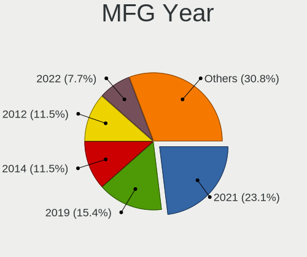

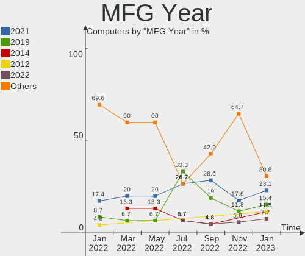

| Year | Computers | Percent |
|------|-----------|---------|
| 2021 | 6         | 23.08%  |
| 2019 | 4         | 15.38%  |
| 2014 | 3         | 11.54%  |
| 2012 | 3         | 11.54%  |
| 2022 | 2         | 7.69%   |
| 2020 | 2         | 7.69%   |
| 2011 | 2         | 7.69%   |
| 2017 | 1         | 3.85%   |
| 2016 | 1         | 3.85%   |
| 2013 | 1         | 3.85%   |
| 2008 | 1         | 3.85%   |

Form Factor
-----------

Physical design of the computer

| Name     | Computers | Percent |
|----------|-----------|---------|
| Desktop  | 15        | 57.69%  |
| Notebook | 11        | 42.31%  |

Secure Boot
-----------

Enabled or disabled

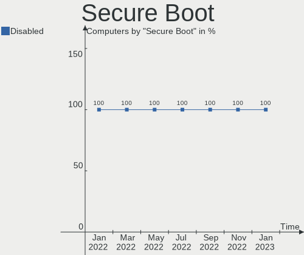

| State    | Computers | Percent |
|----------|-----------|---------|
| Disabled | 26        | 100%    |

Coreboot
--------

Have coreboot on board

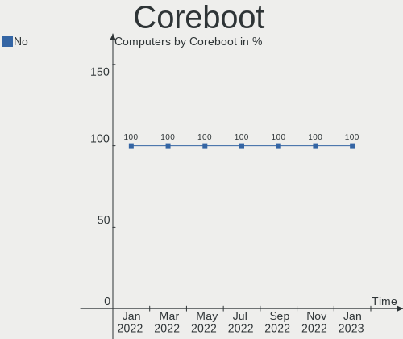

| Used | Computers | Percent |
|------|-----------|---------|
| No   | 26        | 100%    |

RAM Size
--------

Total RAM memory

| Size in GB  | Computers | Percent |
|-------------|-----------|---------|
| 16.01-24.0  | 7         | 26.92%  |
| 32.01-64.0  | 6         | 23.08%  |
| 8.01-16.0   | 6         | 23.08%  |
| 4.01-8.0    | 3         | 11.54%  |
| 64.01-256.0 | 2         | 7.69%   |
| 3.01-4.0    | 1         | 3.85%   |
| 24.01-32.0  | 1         | 3.85%   |

RAM Used
--------

Used RAM memory

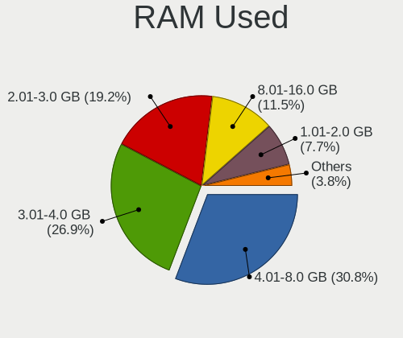

| Used GB    | Computers | Percent |
|------------|-----------|---------|
| 4.01-8.0   | 8         | 30.77%  |
| 3.01-4.0   | 7         | 26.92%  |
| 2.01-3.0   | 5         | 19.23%  |
| 8.01-16.0  | 3         | 11.54%  |
| 1.01-2.0   | 2         | 7.69%   |
| 32.01-64.0 | 1         | 3.85%   |

Total Drives
------------

Number of drives on board

| Drives | Computers | Percent |
|--------|-----------|---------|
| 2      | 10        | 38.46%  |
| 1      | 9         | 34.62%  |
| 3      | 4         | 15.38%  |
| 4      | 2         | 7.69%   |
| 9      | 1         | 3.85%   |

Has CD-ROM
----------

Has CD-ROM on board

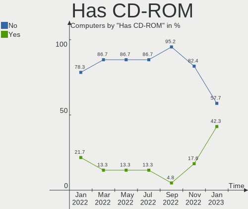

| Presented | Computers | Percent |
|-----------|-----------|---------|
| No        | 15        | 57.69%  |
| Yes       | 11        | 42.31%  |

Has Ethernet
------------

Has Ethernet on board

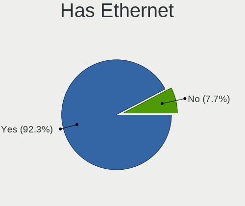

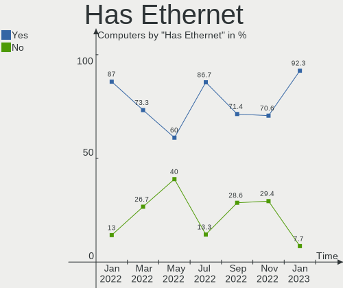

| Presented | Computers | Percent |
|-----------|-----------|---------|
| Yes       | 24        | 92.31%  |
| No        | 2         | 7.69%   |

Has WiFi
--------

Has WiFi module

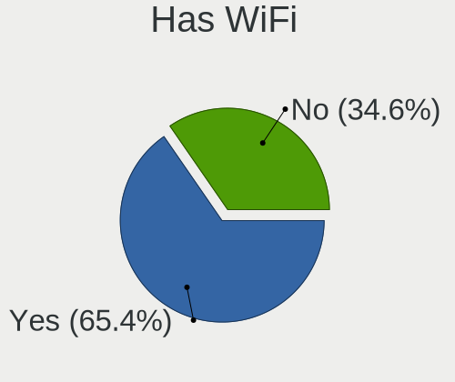

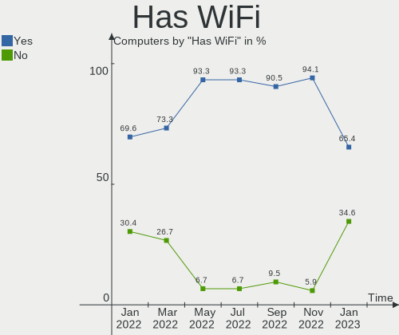

| Presented | Computers | Percent |
|-----------|-----------|---------|
| Yes       | 17        | 65.38%  |
| No        | 9         | 34.62%  |

Has Bluetooth
-------------

Has Bluetooth module

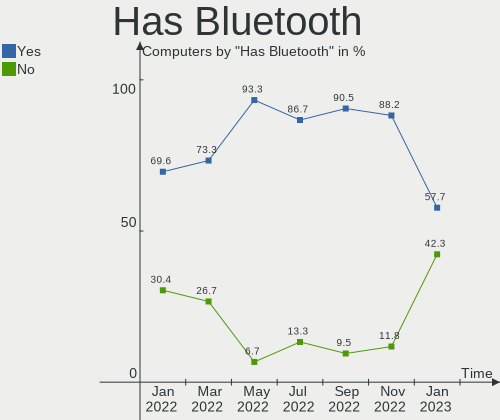

| Presented | Computers | Percent |
|-----------|-----------|---------|
| Yes       | 15        | 57.69%  |
| No        | 11        | 42.31%  |

Location
--------

Country
-------

Geographic location (country)

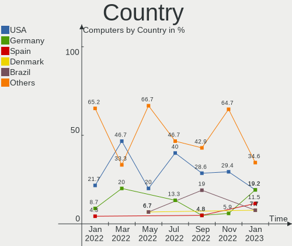

| Country      | Computers | Percent |
|--------------|-----------|---------|
| USA          | 5         | 19.23%  |
| Germany      | 5         | 19.23%  |
| Spain        | 3         | 11.54%  |
| Denmark      | 2         | 7.69%   |
| Brazil       | 2         | 7.69%   |
| UK           | 1         | 3.85%   |
| South Africa | 1         | 3.85%   |
| Netherlands  | 1         | 3.85%   |
| Italy        | 1         | 3.85%   |
| India        | 1         | 3.85%   |
| Hungary      | 1         | 3.85%   |
| Czechia      | 1         | 3.85%   |
| Bangladesh   | 1         | 3.85%   |
| Austria      | 1         | 3.85%   |

City
----

Geographic location (city)

| City                | Computers | Percent |
|---------------------|-----------|---------|
| Belo Horizonte      | 2         | 7.69%   |
| Zwickau             | 1         | 3.85%   |
| Zafra               | 1         | 3.85%   |
| Trecastelli         | 1         | 3.85%   |
| Terneuzen           | 1         | 3.85%   |
| Steyr               | 1         | 3.85%   |
| Seville             | 1         | 3.85%   |
| Saint Joseph        | 1         | 3.85%   |
| Rathenow            | 1         | 3.85%   |
| Prague              | 1         | 3.85%   |
| Plymouth            | 1         | 3.85%   |
| Mannheim            | 1         | 3.85%   |
| Layton              | 1         | 3.85%   |
| Kolkata             | 1         | 3.85%   |
| Jaszkiser           | 1         | 3.85%   |
| Houston             | 1         | 3.85%   |
| Fennville           | 1         | 3.85%   |
| Dhaka               | 1         | 3.85%   |
| Crailsheim          | 1         | 3.85%   |
| Charlotte           | 1         | 3.85%   |
| Cape Town           | 1         | 3.85%   |
| Bad Soden am Taunus | 1         | 3.85%   |
| Algeciras           | 1         | 3.85%   |
| Aarhus              | 1         | 3.85%   |
| Aabenraa            | 1         | 3.85%   |

Drives
------

Drive Vendor
------------

Hard drive vendors

| Vendor                      | Computers | Drives | Percent |
|-----------------------------|-----------|--------|---------|
| Samsung Electronics         | 10        | 11     | 19.23%  |
| Seagate                     | 8         | 10     | 15.38%  |
| WDC                         | 5         | 6      | 9.62%   |
| Toshiba                     | 5         | 7      | 9.62%   |
| SK hynix                    | 3         | 3      | 5.77%   |
| Silicon Motion              | 3         | 3      | 5.77%   |
| Micron Technology           | 3         | 3      | 5.77%   |
| Sandisk                     | 2         | 2      | 3.85%   |
| Kingston                    | 2         | 2      | 3.85%   |
| Realtek Semiconductor       | 1         | 1      | 1.92%   |
| Micron/Crucial Technology   | 1         | 1      | 1.92%   |
| Kingston Technology Company | 1         | 1      | 1.92%   |
| JMicron Technology          | 1         | 1      | 1.92%   |
| Intel                       | 1         | 1      | 1.92%   |
| Hitachi                     | 1         | 1      | 1.92%   |
| Hewlett-Packard             | 1         | 1      | 1.92%   |
| Fanxiang                    | 1         | 1      | 1.92%   |
| Emtec                       | 1         | 1      | 1.92%   |
| Crucial                     | 1         | 1      | 1.92%   |
| ADATA Technology            | 1         | 1      | 1.92%   |

Drive Model
-----------

Hard drive models

| Model                                                 | Computers | Percent |
|-------------------------------------------------------|-----------|---------|
| Silicon Motion SM2263EN/SM2263XT SSD Controller 512GB | 3         | 5.17%   |
| Samsung NVMe SSD Controller SM981/PM981/PM983 500GB   | 3         | 5.17%   |
| Sandisk WD Blue SN550 NVMe SSD 1TB                    | 2         | 3.45%   |
| Samsung SSD 850 EVO 250GB                             | 2         | 3.45%   |
| Samsung NVMe SSD Controller PM9A1/PM9A3/980PRO 512GB  | 2         | 3.45%   |
| WDC WD40EZRZ-22GXCB0 4TB                              | 1         | 1.72%   |
| WDC WD40EFZX-68AWUN0 4TB                              | 1         | 1.72%   |
| WDC WD20SPZX-08UA7 2TB                                | 1         | 1.72%   |
| WDC WD20EZBX-00AYRA0 2TB                              | 1         | 1.72%   |
| WDC WD10EZRX-00L4HB0 1TB                              | 1         | 1.72%   |
| WDC WD10EALX-009BA0 1TB                               | 1         | 1.72%   |
| Toshiba TR150 480GB SSD                               | 1         | 1.72%   |
| Toshiba THNSNS256GMCP 256GB SSD                       | 1         | 1.72%   |
| Toshiba MQ01ABD075 752GB                              | 1         | 1.72%   |
| Toshiba MK6465GSXN 640GB                              | 1         | 1.72%   |
| Toshiba HDWD130 3TB                                   | 1         | 1.72%   |
| Toshiba HDWD110 1TB                                   | 1         | 1.72%   |
| Toshiba DT01ACA050 500GB                              | 1         | 1.72%   |
| SK hynix PC601 HFS512GD9TNG-L2A0A 512GB               | 1         | 1.72%   |
| SK hynix HFM512GD3JX013N 512GB                        | 1         | 1.72%   |
| SK hynix BC711 NVMe 512GB                             | 1         | 1.72%   |
| Seagate ST9500325AS 500GB                             | 1         | 1.72%   |
| Seagate ST750LM022 HN-M750MBB 752GB                   | 1         | 1.72%   |
| Seagate ST3320820AS 320GB                             | 1         | 1.72%   |
| Seagate ST3000DM003-1F216N 3TB                        | 1         | 1.72%   |
| Seagate ST2000DM001-1CH164 2TB                        | 1         | 1.72%   |
| Seagate ST1000LM024 HN-M101MBB 1TB                    | 1         | 1.72%   |
| Seagate ST1000DM003-9YN162 1TB                        | 1         | 1.72%   |
| Seagate ST1000DM003-1CH162 1TB                        | 1         | 1.72%   |
| Seagate Expansion HDD 5TB                             | 1         | 1.72%   |
| Seagate Expansion 240GB                               | 1         | 1.72%   |
| Samsung SSD 860 EVO 250GB                             | 1         | 1.72%   |
| Samsung SSD 860 EVO 1TB                               | 1         | 1.72%   |
| Samsung SSD 840 EVO 120GB                             | 1         | 1.72%   |
| Samsung HD161HJ 160GB                                 | 1         | 1.72%   |
| Realtek SPCC M.2 PCIe SSD 256GB                       | 1         | 1.72%   |
| Micron/Crucial P1 NVMe PCIe SSD 1TB                   | 1         | 1.72%   |
| Micron Crucial X8 SSD 1TB                             | 1         | 1.72%   |
| Micron 2450_MTFDKBA1T0TFK 1TB                         | 1         | 1.72%   |
| Micron 1100_MTFDDAV256TBN 256GB SSD                   | 1         | 1.72%   |

HDD Vendor
----------

Hard disk drive vendors

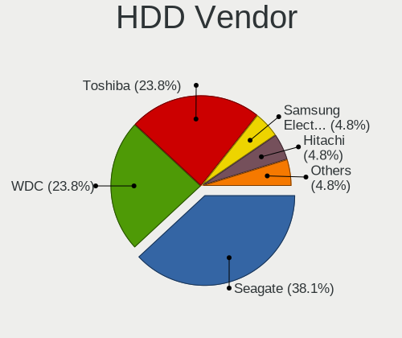

| Vendor              | Computers | Drives | Percent |
|---------------------|-----------|--------|---------|
| Seagate             | 8         | 10     | 38.1%   |
| WDC                 | 5         | 6      | 23.81%  |
| Toshiba             | 5         | 5      | 23.81%  |
| Samsung Electronics | 1         | 1      | 4.76%   |
| Hitachi             | 1         | 1      | 4.76%   |
| Hewlett-Packard     | 1         | 1      | 4.76%   |

SSD Vendor
----------

Solid state drive vendors

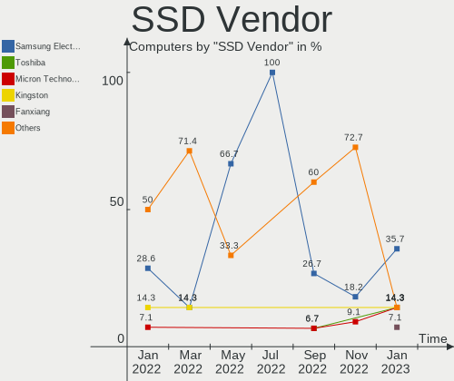

| Vendor              | Computers | Drives | Percent |
|---------------------|-----------|--------|---------|
| Samsung Electronics | 5         | 5      | 35.71%  |
| Toshiba             | 2         | 2      | 14.29%  |
| Micron Technology   | 2         | 2      | 14.29%  |
| Kingston            | 2         | 2      | 14.29%  |
| Fanxiang            | 1         | 1      | 7.14%   |
| Emtec               | 1         | 1      | 7.14%   |
| Crucial             | 1         | 1      | 7.14%   |

Drive Kind
----------

HDD or SSD

| Kind    | Computers | Drives | Percent |
|---------|-----------|--------|---------|
| HDD     | 17        | 24     | 37.78%  |
| NVMe    | 15        | 19     | 33.33%  |
| SSD     | 12        | 14     | 26.67%  |
| Unknown | 1         | 1      | 2.22%   |

Drive Connector
---------------

SATA, SAS, NVMe, etc.

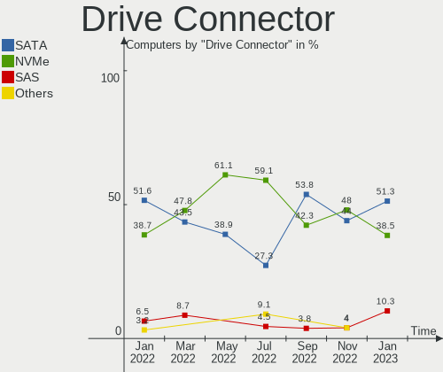

| Type | Computers | Drives | Percent |
|------|-----------|--------|---------|
| SATA | 20        | 34     | 51.28%  |
| NVMe | 15        | 19     | 38.46%  |
| SAS  | 4         | 5      | 10.26%  |

Drive Size
----------

Size of hard drive

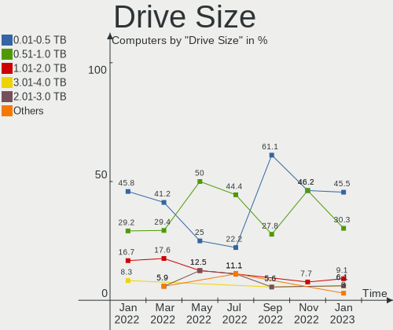

| Size in TB | Computers | Drives | Percent |
|------------|-----------|--------|---------|
| 0.01-0.5   | 15        | 19     | 45.45%  |
| 0.51-1.0   | 10        | 11     | 30.3%   |
| 1.01-2.0   | 3         | 3      | 9.09%   |
| 3.01-4.0   | 2         | 2      | 6.06%   |
| 2.01-3.0   | 2         | 2      | 6.06%   |
| 4.01-10.0  | 1         | 1      | 3.03%   |

Space Total
-----------

Amount of disk space available on the file system

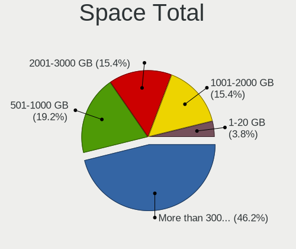

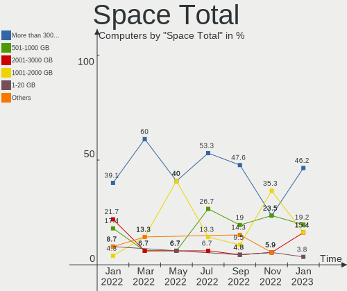

| Size in GB     | Computers | Percent |
|----------------|-----------|---------|
| More than 3000 | 12        | 46.15%  |
| 501-1000       | 5         | 19.23%  |
| 2001-3000      | 4         | 15.38%  |
| 1001-2000      | 4         | 15.38%  |
| 1-20           | 1         | 3.85%   |

Space Used
----------

Amount of used disk space

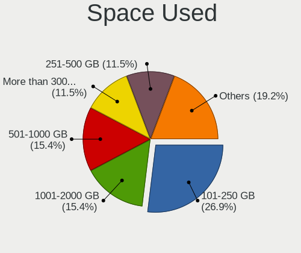

| Used GB        | Computers | Percent |
|----------------|-----------|---------|
| 101-250        | 7         | 26.92%  |
| 1001-2000      | 4         | 15.38%  |
| 501-1000       | 4         | 15.38%  |
| More than 3000 | 3         | 11.54%  |
| 251-500        | 3         | 11.54%  |
| 2001-3000      | 2         | 7.69%   |
| 51-100         | 2         | 7.69%   |
| 1-20           | 1         | 3.85%   |

Malfunc. Drives
---------------

Drive models with a malfunction

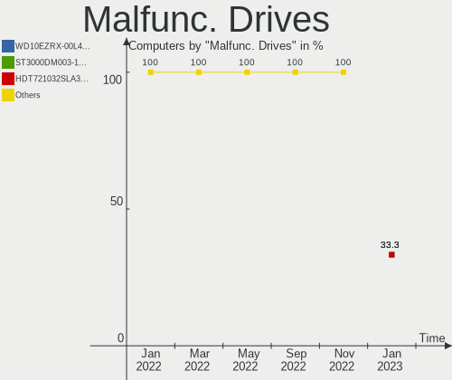

| Model                          | Computers | Drives | Percent |
|--------------------------------|-----------|--------|---------|
| WDC WD10EZRX-00L4HB0 1TB       | 1         | 1      | 33.33%  |
| Seagate ST3000DM003-1F216N 3TB | 1         | 1      | 33.33%  |
| Hitachi HDT721032SLA360 320GB  | 1         | 1      | 33.33%  |

Malfunc. Drive Vendor
---------------------

Vendors of faulty drives

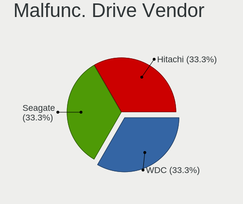

| Vendor  | Computers | Drives | Percent |
|---------|-----------|--------|---------|
| WDC     | 1         | 1      | 33.33%  |
| Seagate | 1         | 1      | 33.33%  |
| Hitachi | 1         | 1      | 33.33%  |

Malfunc. HDD Vendor
-------------------

Vendors of faulty HDD drives

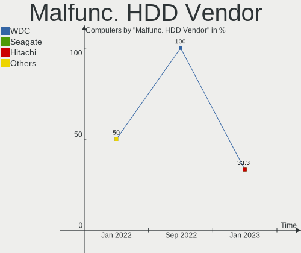

| Vendor  | Computers | Drives | Percent |
|---------|-----------|--------|---------|
| WDC     | 1         | 1      | 33.33%  |
| Seagate | 1         | 1      | 33.33%  |
| Hitachi | 1         | 1      | 33.33%  |

Malfunc. Drive Kind
-------------------

Kinds of faulty drives

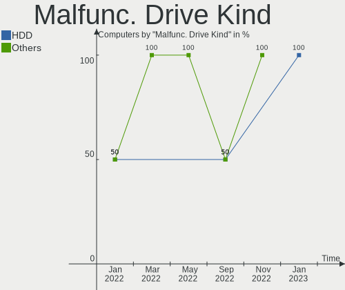

| Kind | Computers | Drives | Percent |
|------|-----------|--------|---------|
| HDD  | 3         | 3      | 100%    |

Failed Drives
-------------

Failed drive models

Zero info for selected period =(

Failed Drive Vendor
-------------------

Failed drive vendors

Zero info for selected period =(

Drive Status
------------

Number of failed and malfunc. drives

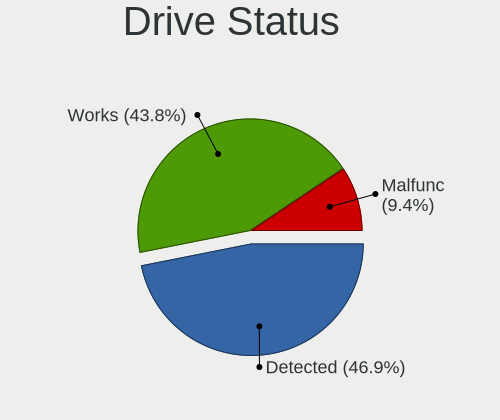

| Status   | Computers | Drives | Percent |
|----------|-----------|--------|---------|
| Detected | 15        | 31     | 46.88%  |
| Works    | 14        | 24     | 43.75%  |
| Malfunc  | 3         | 3      | 9.38%   |

Storage controller
------------------

Storage Vendor
--------------

Storage controller vendors

| Vendor                      | Computers | Percent |
|-----------------------------|-----------|---------|
| Intel                       | 17        | 39.53%  |
| AMD                         | 7         | 16.28%  |
| Samsung Electronics         | 5         | 11.63%  |
| SK hynix                    | 3         | 6.98%   |
| Silicon Motion              | 3         | 6.98%   |
| SanDisk                     | 2         | 4.65%   |
| Realtek Semiconductor       | 1         | 2.33%   |
| Micron/Crucial Technology   | 1         | 2.33%   |
| Micron Technology           | 1         | 2.33%   |
| Kingston Technology Company | 1         | 2.33%   |
| ASMedia Technology          | 1         | 2.33%   |
| ADATA Technology            | 1         | 2.33%   |

Storage Model
-------------

Storage controller models

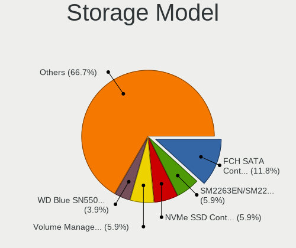

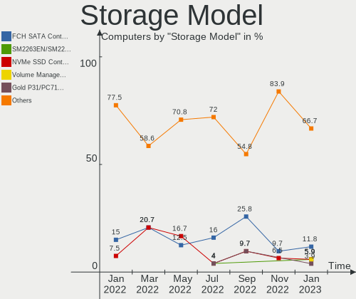

| Model                                                                                   | Computers | Percent |
|-----------------------------------------------------------------------------------------|-----------|---------|
| AMD FCH SATA Controller [AHCI mode]                                                     | 6         | 11.76%  |
| Silicon Motion SM2263EN/SM2263XT SSD Controller                                         | 3         | 5.88%   |
| Samsung NVMe SSD Controller SM981/PM981/PM983                                           | 3         | 5.88%   |
| Intel Volume Management Device NVMe RAID Controller                                     | 3         | 5.88%   |
| SK hynix Gold P31/PC711 NVMe Solid State Drive                                          | 2         | 3.92%   |
| SanDisk WD Blue SN550 NVMe SSD                                                          | 2         | 3.92%   |
| Samsung NVMe SSD Controller PM9A1/PM9A3/980PRO                                          | 2         | 3.92%   |
| Intel Alder Lake-S PCH SATA Controller [AHCI Mode]                                      | 2         | 3.92%   |
| Intel 8 Series/C220 Series Chipset Family 6-port SATA Controller 1 [AHCI mode]          | 2         | 3.92%   |
| Intel 7 Series Chipset Family 6-port SATA Controller [AHCI mode]                        | 2         | 3.92%   |
| Intel 6 Series/C200 Series Chipset Family Desktop SATA Controller (IDE mode, ports 4-5) | 2         | 3.92%   |
| Intel 6 Series/C200 Series Chipset Family Desktop SATA Controller (IDE mode, ports 0-3) | 2         | 3.92%   |
| Intel 6 Series/C200 Series Chipset Family 6 port Desktop SATA AHCI Controller           | 2         | 3.92%   |
| SK hynix Non-Volatile memory controller                                                 | 1         | 1.96%   |
| Realtek Realtek Non-Volatile memory controller                                          | 1         | 1.96%   |
| Micron/Crucial P1 NVMe PCIe SSD                                                         | 1         | 1.96%   |
| Micron Non-Volatile memory controller                                                   | 1         | 1.96%   |
| Kingston Company KC2000 NVMe SSD                                                        | 1         | 1.96%   |
| Intel SSD 660P Series                                                                   | 1         | 1.96%   |
| Intel Comet Lake SATA AHCI Controller                                                   | 1         | 1.96%   |
| Intel Cannon Lake PCH SATA AHCI Controller                                              | 1         | 1.96%   |
| Intel C600/X79 series chipset 6-Port SATA AHCI Controller                               | 1         | 1.96%   |
| Intel 82801 Mobile SATA Controller [RAID mode]                                          | 1         | 1.96%   |
| Intel 6 Series/C200 Series Chipset Family 6 port Mobile SATA AHCI Controller            | 1         | 1.96%   |
| Intel 400 Series Chipset Family SATA AHCI Controller                                    | 1         | 1.96%   |
| ASMedia ASM1062 Serial ATA Controller                                                   | 1         | 1.96%   |
| AMD SB7x0/SB8x0/SB9x0 SATA Controller [AHCI mode]                                       | 1         | 1.96%   |
| AMD SB7x0/SB8x0/SB9x0 IDE Controller                                                    | 1         | 1.96%   |
| AMD FCH SATA Controller D                                                               | 1         | 1.96%   |
| AMD 400 Series Chipset SATA Controller                                                  | 1         | 1.96%   |
| ADATA XPG SX8200 Pro PCIe Gen3x4 M.2 2280 Solid State Drive                             | 1         | 1.96%   |

Storage Kind
------------

Kind of storage controller (IDE, SATA, NVMe, SAS, ...)

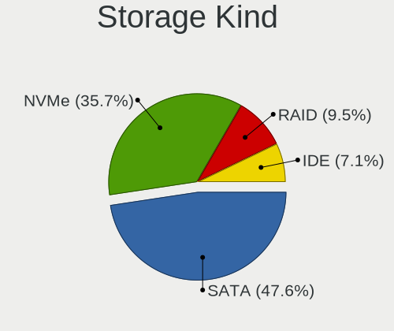

| Kind | Computers | Percent |
|------|-----------|---------|
| SATA | 20        | 47.62%  |
| NVMe | 15        | 35.71%  |
| RAID | 4         | 9.52%   |
| IDE  | 3         | 7.14%   |

Processor
---------

CPU Vendor
----------

Processor vendors

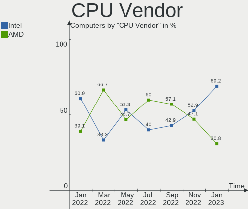

| Vendor | Computers | Percent |
|--------|-----------|---------|
| Intel  | 18        | 69.23%  |
| AMD    | 8         | 30.77%  |

CPU Model
---------

Processor models

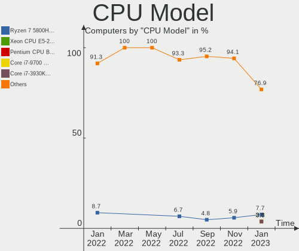

| Model                                         | Computers | Percent |
|-----------------------------------------------|-----------|---------|
| AMD Ryzen 7 5800H with Radeon Graphics        | 2         | 7.69%   |
| Intel Xeon CPU E5-2690 0 @ 2.90GHz            | 1         | 3.85%   |
| Intel Pentium CPU B940 @ 2.00GHz              | 1         | 3.85%   |
| Intel Core i7-9700 CPU @ 3.00GHz              | 1         | 3.85%   |
| Intel Core i7-3930K CPU @ 3.20GHz             | 1         | 3.85%   |
| Intel Core i7-3610QM CPU @ 2.30GHz            | 1         | 3.85%   |
| Intel Core i7-2600 CPU @ 3.40GHz              | 1         | 3.85%   |
| Intel Core i7-10875H CPU @ 2.30GHz            | 1         | 3.85%   |
| Intel Core i7-10700K CPU @ 3.80GHz            | 1         | 3.85%   |
| Intel Core i5-4570 CPU @ 3.20GHz              | 1         | 3.85%   |
| Intel Core i5-4210M CPU @ 2.60GHz             | 1         | 3.85%   |
| Intel Core i5-3350P CPU @ 3.10GHz             | 1         | 3.85%   |
| Intel Core i5-3337U CPU @ 1.80GHz             | 1         | 3.85%   |
| Intel Core i5-3210M CPU @ 2.50GHz             | 1         | 3.85%   |
| Intel Celeron CPU G1610 @ 2.60GHz             | 1         | 3.85%   |
| Intel 12th Gen Core i7-1280P                  | 1         | 3.85%   |
| Intel 12th Gen Core i5-12600K                 | 1         | 3.85%   |
| Intel 12th Gen Core i3-12100F                 | 1         | 3.85%   |
| Intel 11th Gen Core i7-11800H @ 2.30GHz       | 1         | 3.85%   |
| AMD Ryzen 7 5700G with Radeon Graphics        | 1         | 3.85%   |
| AMD Ryzen 5 3600 6-Core Processor             | 1         | 3.85%   |
| AMD Ryzen 5 3400G with Radeon Vega Graphics   | 1         | 3.85%   |
| AMD Ryzen 3 3350U with Radeon Vega Mobile Gfx | 1         | 3.85%   |
| AMD FX-6300 Six-Core Processor                | 1         | 3.85%   |
| AMD Athlon 3000G with Radeon Vega Graphics    | 1         | 3.85%   |

CPU Model Family
----------------

Processor model prefix

| Model         | Computers | Percent |
|---------------|-----------|---------|
| Intel Core i7 | 6         | 23.08%  |
| Intel Core i5 | 5         | 19.23%  |
| Other         | 4         | 15.38%  |
| AMD Ryzen 7   | 3         | 11.54%  |
| AMD Ryzen 5   | 2         | 7.69%   |
| Intel Xeon    | 1         | 3.85%   |
| Intel Pentium | 1         | 3.85%   |
| Intel Celeron | 1         | 3.85%   |
| AMD Ryzen 3   | 1         | 3.85%   |
| AMD FX        | 1         | 3.85%   |
| AMD Athlon    | 1         | 3.85%   |

CPU Cores
---------

Number of processor cores

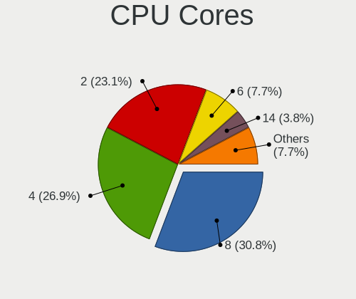

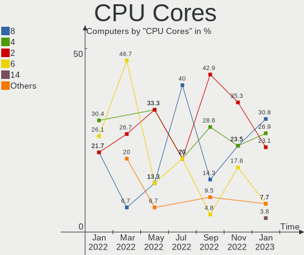

| Number | Computers | Percent |
|--------|-----------|---------|
| 8      | 8         | 30.77%  |
| 4      | 7         | 26.92%  |
| 2      | 6         | 23.08%  |
| 6      | 2         | 7.69%   |
| 14     | 1         | 3.85%   |
| 10     | 1         | 3.85%   |
| 3      | 1         | 3.85%   |

CPU Sockets
-----------

Number of sockets

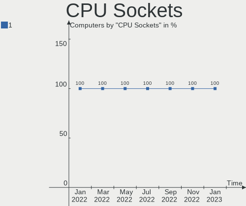

| Number | Computers | Percent |
|--------|-----------|---------|
| 1      | 26        | 100%    |

CPU Threads
-----------

Threads per core (Hyper-Threading)

| Number | Computers | Percent |
|--------|-----------|---------|
| 2      | 20        | 76.92%  |
| 1      | 6         | 23.08%  |

CPU Op-Modes
------------

CPU Operation Modes (32-bit, 64-bit)

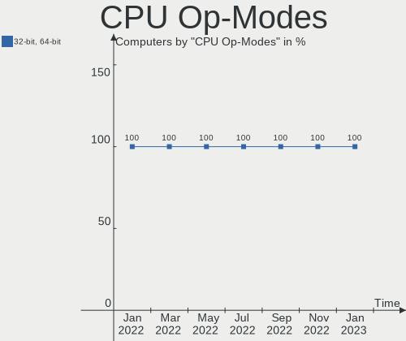

| Op mode        | Computers | Percent |
|----------------|-----------|---------|
| 32-bit, 64-bit | 26        | 100%    |

CPU Microcode
-------------

Microcode number

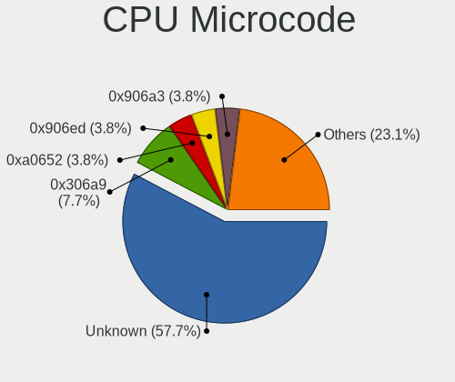

| Number     | Computers | Percent |
|------------|-----------|---------|
| Unknown    | 15        | 57.69%  |
| 0x306a9    | 2         | 7.69%   |
| 0xa0652    | 1         | 3.85%   |
| 0x906ed    | 1         | 3.85%   |
| 0x906a3    | 1         | 3.85%   |
| 0x90675    | 1         | 3.85%   |
| 0x90672    | 1         | 3.85%   |
| 0x206a7    | 1         | 3.85%   |
| 0x0a50000c | 1         | 3.85%   |
| 0x08701021 | 1         | 3.85%   |
| 0x06000852 | 1         | 3.85%   |

CPU Microarch
-------------

Microarchitecture

| Name             | Computers | Percent |
|------------------|-----------|---------|
| IvyBridge        | 5         | 19.23%  |
| SandyBridge      | 4         | 15.38%  |
| Zen+             | 3         | 11.54%  |
| Zen 3            | 3         | 11.54%  |
| Alderlake Hybrid | 3         | 11.54%  |
| Haswell          | 2         | 7.69%   |
| CometLake        | 2         | 7.69%   |
| Zen 2            | 1         | 3.85%   |
| Piledriver       | 1         | 3.85%   |
| KabyLake         | 1         | 3.85%   |
| Unknown          | 1         | 3.85%   |

Graphics
--------

GPU Vendor
----------

Vendors of graphics cards

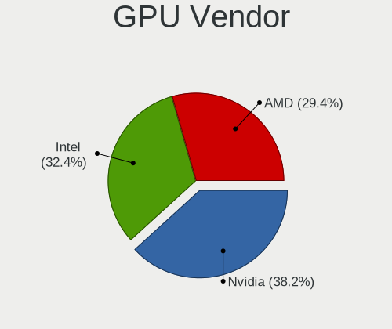

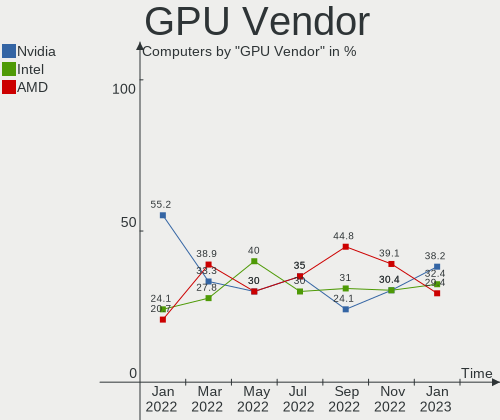

| Vendor | Computers | Percent |
|--------|-----------|---------|
| Nvidia | 13        | 38.24%  |
| Intel  | 11        | 32.35%  |
| AMD    | 10        | 29.41%  |

GPU Model
---------

Graphics card models

| Model                                                                       | Computers | Percent |
|-----------------------------------------------------------------------------|-----------|---------|
| Intel 3rd Gen Core processor Graphics Controller                            | 3         | 8.57%   |
| AMD Picasso/Raven 2 [Radeon Vega Series / Radeon Vega Mobile Series]        | 3         | 8.57%   |
| AMD Cezanne [Radeon Vega Series / Radeon Vega Mobile Series]                | 3         | 8.57%   |
| Nvidia GK208B [GeForce GT 710]                                              | 2         | 5.71%   |
| Nvidia GA106M [GeForce RTX 3060 Mobile / Max-Q]                             | 2         | 5.71%   |
| AMD Navi 10 [Radeon RX 5600 OEM/5600 XT / 5700/5700 XT]                     | 2         | 5.71%   |
| Nvidia TU106M [GeForce RTX 2070 Mobile / Max-Q Refresh]                     | 1         | 2.86%   |
| Nvidia TU106 [GeForce RTX 2060 12GB]                                        | 1         | 2.86%   |
| Nvidia GP104 [GeForce GTX 1070]                                             | 1         | 2.86%   |
| Nvidia GM206 [GeForce GTX 950]                                              | 1         | 2.86%   |
| Nvidia GK208M [GeForce GT 740M]                                             | 1         | 2.86%   |
| Nvidia GF108M [GeForce GT 620M/630M/635M/640M LE]                           | 1         | 2.86%   |
| Nvidia GA104M [GeForce RTX 3070 Mobile / Max-Q]                             | 1         | 2.86%   |
| Nvidia GA104 [GeForce RTX 3070]                                             | 1         | 2.86%   |
| Nvidia GA104 [GeForce RTX 3060 Ti Lite Hash Rate]                           | 1         | 2.86%   |
| Intel Xeon E3-1200 v3/4th Gen Core Processor Integrated Graphics Controller | 1         | 2.86%   |
| Intel Xeon E3-1200 v2/3rd Gen Core processor Graphics Controller            | 1         | 2.86%   |
| Intel TigerLake-H GT1 [UHD Graphics]                                        | 1         | 2.86%   |
| Intel CometLake-H GT2 [UHD Graphics]                                        | 1         | 2.86%   |
| Intel CoffeeLake-S GT2 [UHD Graphics 630]                                   | 1         | 2.86%   |
| Intel Alder Lake-P Integrated Graphics Controller                           | 1         | 2.86%   |
| Intel 4th Gen Core Processor Integrated Graphics Controller                 | 1         | 2.86%   |
| Intel 2nd Generation Core Processor Family Integrated Graphics Controller   | 1         | 2.86%   |
| AMD Navi 22 [Radeon RX 6700/6700 XT/6750 XT / 6800M]                        | 1         | 2.86%   |
| AMD Lexa PRO [Radeon 540/540X/550/550X / RX 540X/550/550X]                  | 1         | 2.86%   |
| AMD Ellesmere [Radeon RX 470/480/570/570X/580/580X/590]                     | 1         | 2.86%   |

GPU Combo
---------

Combinations of graphics cards

| Name           | Computers | Percent |
|----------------|-----------|---------|
| 1 x Nvidia     | 6         | 23.08%  |
| 1 x Intel      | 6         | 23.08%  |
| 1 x AMD        | 6         | 23.08%  |
| Intel + Nvidia | 5         | 19.23%  |
| AMD + Nvidia   | 2         | 7.69%   |
| 2 x AMD        | 1         | 3.85%   |

GPU Driver
----------

Free vs proprietary

| Driver      | Computers | Percent |
|-------------|-----------|---------|
| Free        | 16        | 61.54%  |
| Proprietary | 10        | 38.46%  |

GPU Memory
----------

Total video memory

| Size in GB | Computers | Percent |
|------------|-----------|---------|
| Unknown    | 17        | 65.38%  |
| 7.01-8.0   | 4         | 15.38%  |
| 1.01-2.0   | 4         | 15.38%  |
| 8.01-16.0  | 1         | 3.85%   |

Monitor
-------

Monitor Vendor
--------------

Monitor vendors

| Vendor                  | Computers | Percent |
|-------------------------|-----------|---------|
| Samsung Electronics     | 3         | 10.71%  |
| PANDA                   | 2         | 7.14%   |
| Iiyama                  | 2         | 7.14%   |
| Goldstar                | 2         | 7.14%   |
| BOE                     | 2         | 7.14%   |
| AOC                     | 2         | 7.14%   |
| Acer                    | 2         | 7.14%   |
| ViewSonic               | 1         | 3.57%   |
| Vestel                  | 1         | 3.57%   |
| RTK                     | 1         | 3.57%   |
| Philips                 | 1         | 3.57%   |
| Mi                      | 1         | 3.57%   |
| LG Display              | 1         | 3.57%   |
| Idek Iiyama             | 1         | 3.57%   |
| Hewlett-Packard         | 1         | 3.57%   |
| Chimei Innolux          | 1         | 3.57%   |
| Chi Mei Optoelectronics | 1         | 3.57%   |
| BenQ                    | 1         | 3.57%   |
| AU Optronics            | 1         | 3.57%   |
| ASUSTek Computer        | 1         | 3.57%   |

Monitor Model
-------------

Monitor models

| Model                                                                    | Computers | Percent |
|--------------------------------------------------------------------------|-----------|---------|
| ViewSonic VX3276-QHD VSCE635 2560x1440 698x393mm 31.5-inch               | 1         | 3.33%   |
| Vestel LCD Monitor 24W_LCD_TV 1920x1080                                  | 1         | 3.33%   |
| Samsung Electronics LCD Monitor SEC3959 1366x768 344x194mm 15.5-inch     | 1         | 3.33%   |
| Samsung Electronics LCD Monitor SEC325A 1366x768 344x194mm 15.5-inch     | 1         | 3.33%   |
| Samsung Electronics LCD Monitor SDC4154 2880x1800 302x189mm 14.0-inch    | 1         | 3.33%   |
| RTK LCD Monitor RTK1D1A 1920x1080 1020x570mm 46.0-inch                   | 1         | 3.33%   |
| Philips PHL 278E1 PHLC217 3840x2160 597x336mm 27.0-inch                  | 1         | 3.33%   |
| PANDA LCD Monitor NCP0063 1920x1080 344x194mm 15.5-inch                  | 1         | 3.33%   |
| PANDA LCD Monitor NCP004B 1920x1080 344x194mm 15.5-inch                  | 1         | 3.33%   |
| Mi 27 NFGL XMIB004 1920x1080 598x336mm 27.0-inch                         | 1         | 3.33%   |
| LG Display LCD Monitor LGD02DC 1366x768 344x194mm 15.5-inch              | 1         | 3.33%   |
| Iiyama PL3288UH IVM1176 3840x2160 698x393mm 31.5-inch                    | 1         | 3.33%   |
| Iiyama PL2730H IVM663A 1920x1080 598x336mm 27.0-inch                     | 1         | 3.33%   |
| Idek Iiyama LCD Monitor PL2730H 1920x1080                                | 1         | 3.33%   |
| Hewlett-Packard E22 G4 HPN3682 1920x1080 480x270mm 21.7-inch             | 1         | 3.33%   |
| Hewlett-Packard 22fw HPN3541 1920x1080 500x300mm 23.0-inch               | 1         | 3.33%   |
| Goldstar ULTRAGEAR GSM5B80 2560x1440 597x336mm 27.0-inch                 | 1         | 3.33%   |
| Goldstar LG ULTRAWIDE GSM59F1 2560x1080 670x280mm 28.6-inch              | 1         | 3.33%   |
| Chimei Innolux LCD Monitor CMN15C0 1920x1080 344x194mm 15.5-inch         | 1         | 3.33%   |
| Chi Mei Optoelectronics LCD Monitor CMO15AB 1366x768 340x190mm 15.3-inch | 1         | 3.33%   |
| BOE LCD Monitor BOE0ACC 1920x1080 344x194mm 15.5-inch                    | 1         | 3.33%   |
| BOE LCD Monitor BOE09E5 2560x1440 355x200mm 16.0-inch                    | 1         | 3.33%   |
| BenQ LCD Monitor GL2450H 1920x1080                                       | 1         | 3.33%   |
| AU Optronics LCD Monitor AUOB49B 1920x1080 344x193mm 15.5-inch           | 1         | 3.33%   |
| ASUSTek Computer VP248 AUS24CB 1920x1080 531x299mm 24.0-inch             | 1         | 3.33%   |
| AOC Q32G1WG4 AOC3201 2560x1440 697x393mm 31.5-inch                       | 1         | 3.33%   |
| AOC 1970W AOC1970 1366x768 410x230mm 18.5-inch                           | 1         | 3.33%   |
| Acer XF243Y ACR0934 1920x1080 527x296mm 23.8-inch                        | 1         | 3.33%   |
| Acer H243H ACR0074 1920x1080 530x290mm 23.8-inch                         | 1         | 3.33%   |
| Acer ED242QR ACR0629 1920x1080 531x299mm 24.0-inch                       | 1         | 3.33%   |

Monitor Resolution
------------------

Monitor screen resolution

| Resolution      | Computers | Percent |
|-----------------|-----------|---------|
| 1920x1080 (FHD) | 14        | 51.85%  |
| 1366x768 (WXGA) | 5         | 18.52%  |
| 3840x2160 (4K)  | 3         | 11.11%  |
| 2560x1440 (QHD) | 3         | 11.11%  |
| 2880x1800       | 1         | 3.7%    |
| 2560x1080       | 1         | 3.7%    |

Monitor Diagonal
----------------

Diagonal size in inches

| Inches  | Computers | Percent |
|---------|-----------|---------|
| 15      | 9         | 31.03%  |
| 31      | 4         | 13.79%  |
| 27      | 3         | 10.34%  |
| 24      | 3         | 10.34%  |
| Unknown | 3         | 10.34%  |
| 46      | 1         | 3.45%   |
| 34      | 1         | 3.45%   |
| 23      | 1         | 3.45%   |
| 21      | 1         | 3.45%   |
| 18      | 1         | 3.45%   |
| 16      | 1         | 3.45%   |
| 14      | 1         | 3.45%   |

Monitor Width
-------------

Physical width

| Width in mm | Computers | Percent |
|-------------|-----------|---------|
| 301-350     | 10        | 35.71%  |
| 501-600     | 6         | 21.43%  |
| 601-700     | 4         | 14.29%  |
| Unknown     | 3         | 10.71%  |
| 401-500     | 2         | 7.14%   |
| 701-800     | 1         | 3.57%   |
| 351-400     | 1         | 3.57%   |
| 1001-1500   | 1         | 3.57%   |

Aspect Ratio
------------

Proportional relationship between the width and the height

| Ratio   | Computers | Percent |
|---------|-----------|---------|
| 16/9    | 22        | 81.48%  |
| Unknown | 3         | 11.11%  |
| 21/9    | 1         | 3.7%    |
| 16/10   | 1         | 3.7%    |

Monitor Area
------------

Area in inch

| Area in inch | Computers | Percent |
|----------------|-----------|---------|
| 101-110        | 10        | 35.71%  |
| 351-500        | 5         | 17.86%  |
| 201-250        | 4         | 14.29%  |
| 301-350        | 3         | 10.71%  |
| Unknown        | 3         | 10.71%  |
| 81-90          | 1         | 3.57%   |
| 141-150        | 1         | 3.57%   |
| 501-1000       | 1         | 3.57%   |

Pixel Density
-------------

Pixels per inch

| Density       | Computers | Percent |
|---------------|-----------|---------|
| 51-100        | 11        | 39.29%  |
| 121-160       | 6         | 21.43%  |
| 101-120       | 5         | 17.86%  |
| Unknown       | 3         | 10.71%  |
| More than 240 | 1         | 3.57%   |
| 1-50          | 1         | 3.57%   |
| 161-240       | 1         | 3.57%   |

Multiple Monitors
-----------------

Total monitors connected

| Total | Computers | Percent |
|-------|-----------|---------|
| 1     | 22        | 84.62%  |
| 2     | 4         | 15.38%  |

Network
-------

Net Controller Vendor
---------------------

Controller vendors

| Vendor                | Computers | Percent |
|-----------------------|-----------|---------|
| Realtek Semiconductor | 17        | 40.48%  |
| Intel                 | 16        | 38.1%   |
| Broadcom              | 2         | 4.76%   |
| Xiaomi                | 1         | 2.38%   |
| TP-Link               | 1         | 2.38%   |
| Sitecom Europe        | 1         | 2.38%   |
| Qualcomm Atheros      | 1         | 2.38%   |
| Linksys               | 1         | 2.38%   |
| D-Link                | 1         | 2.38%   |
| AVM                   | 1         | 2.38%   |

Net Controller Model
--------------------

Controller models

| Model                                                             | Computers | Percent |
|-------------------------------------------------------------------|-----------|---------|
| Realtek RTL8111/8168/8411 PCI Express Gigabit Ethernet Controller | 15        | 33.33%  |
| Intel Wi-Fi 6 AX200                                               | 5         | 11.11%  |
| Realtek RTL8125 2.5GbE Controller                                 | 2         | 4.44%   |
| Intel Ethernet Controller I225-V                                  | 2         | 4.44%   |
| Intel 82579V Gigabit Network Connection                           | 2         | 4.44%   |
| Xiaomi Mi/Redmi series (RNDIS)                                    | 1         | 2.22%   |
| TP-Link RTL8812AU Archer T4U 802.11ac                             | 1         | 2.22%   |
| Sitecom Europe WLA-5000 802.11abgn [Ralink RT3572]                | 1         | 2.22%   |
| Realtek 802.11n WLAN Adapter                                      | 1         | 2.22%   |
| Qualcomm Atheros AR9285 Wireless Network Adapter (PCI-Express)    | 1         | 2.22%   |
| Qualcomm Atheros AR8152 v2.0 Fast Ethernet                        | 1         | 2.22%   |
| Linksys WUSB6300 V2                                               | 1         | 2.22%   |
| Intel Wireless 7260                                               | 1         | 2.22%   |
| Intel Wi-Fi 6 AX210/AX211/AX411 160MHz                            | 1         | 2.22%   |
| Intel Tiger Lake PCH CNVi WiFi                                    | 1         | 2.22%   |
| Intel I211 Gigabit Network Connection                             | 1         | 2.22%   |
| Intel Ethernet Connection (7) I219-V                              | 1         | 2.22%   |
| Intel Centrino Wireless-N 2230                                    | 1         | 2.22%   |
| Intel Alder Lake-P PCH CNVi WiFi                                  | 1         | 2.22%   |
| Intel 82576 Gigabit Network Connection                            | 1         | 2.22%   |
| D-Link 802.11ac NIC                                               | 1         | 2.22%   |
| Broadcom BCM43228 802.11a/b/g/n                                   | 1         | 2.22%   |
| Broadcom BCM43142 802.11b/g/n                                     | 1         | 2.22%   |
| AVM FRITZ!WLAN AC 860                                             | 1         | 2.22%   |

Wireless Vendor
---------------

Wireless vendors

| Vendor                | Computers | Percent |
|-----------------------|-----------|---------|
| Intel                 | 10        | 52.63%  |
| Broadcom              | 2         | 10.53%  |
| TP-Link               | 1         | 5.26%   |
| Sitecom Europe        | 1         | 5.26%   |
| Realtek Semiconductor | 1         | 5.26%   |
| Qualcomm Atheros      | 1         | 5.26%   |
| Linksys               | 1         | 5.26%   |
| D-Link                | 1         | 5.26%   |
| AVM                   | 1         | 5.26%   |

Wireless Model
--------------

Wireless models

| Model                                                          | Computers | Percent |
|----------------------------------------------------------------|-----------|---------|
| Intel Wi-Fi 6 AX200                                            | 5         | 26.32%  |
| TP-Link RTL8812AU Archer T4U 802.11ac                          | 1         | 5.26%   |
| Sitecom Europe WLA-5000 802.11abgn [Ralink RT3572]             | 1         | 5.26%   |
| Realtek 802.11n WLAN Adapter                                   | 1         | 5.26%   |
| Qualcomm Atheros AR9285 Wireless Network Adapter (PCI-Express) | 1         | 5.26%   |
| Linksys WUSB6300 V2                                            | 1         | 5.26%   |
| Intel Wireless 7260                                            | 1         | 5.26%   |
| Intel Wi-Fi 6 AX210/AX211/AX411 160MHz                         | 1         | 5.26%   |
| Intel Tiger Lake PCH CNVi WiFi                                 | 1         | 5.26%   |
| Intel Centrino Wireless-N 2230                                 | 1         | 5.26%   |
| Intel Alder Lake-P PCH CNVi WiFi                               | 1         | 5.26%   |
| D-Link 802.11ac NIC                                            | 1         | 5.26%   |
| Broadcom BCM43228 802.11a/b/g/n                                | 1         | 5.26%   |
| Broadcom BCM43142 802.11b/g/n                                  | 1         | 5.26%   |
| AVM FRITZ!WLAN AC 860                                          | 1         | 5.26%   |

Ethernet Vendor
---------------

Ethernet vendors

| Vendor                | Computers | Percent |
|-----------------------|-----------|---------|
| Realtek Semiconductor | 17        | 65.38%  |
| Intel                 | 7         | 26.92%  |
| Xiaomi                | 1         | 3.85%   |
| Qualcomm Atheros      | 1         | 3.85%   |

Ethernet Model
--------------

Ethernet models

| Model                                                             | Computers | Percent |
|-------------------------------------------------------------------|-----------|---------|
| Realtek RTL8111/8168/8411 PCI Express Gigabit Ethernet Controller | 15        | 57.69%  |
| Realtek RTL8125 2.5GbE Controller                                 | 2         | 7.69%   |
| Intel Ethernet Controller I225-V                                  | 2         | 7.69%   |
| Intel 82579V Gigabit Network Connection                           | 2         | 7.69%   |
| Xiaomi Mi/Redmi series (RNDIS)                                    | 1         | 3.85%   |
| Qualcomm Atheros AR8152 v2.0 Fast Ethernet                        | 1         | 3.85%   |
| Intel I211 Gigabit Network Connection                             | 1         | 3.85%   |
| Intel Ethernet Connection (7) I219-V                              | 1         | 3.85%   |
| Intel 82576 Gigabit Network Connection                            | 1         | 3.85%   |

Net Controller Kind
-------------------

Ethernet, WiFi or modem

| Kind     | Computers | Percent |
|----------|-----------|---------|
| Ethernet | 24        | 58.54%  |
| WiFi     | 17        | 41.46%  |

Used Controller
---------------

Currently used network controller

| Kind     | Computers | Percent |
|----------|-----------|---------|
| WiFi     | 15        | 53.57%  |
| Ethernet | 13        | 46.43%  |

NICs
----

Total network controllers on board

| Total | Computers | Percent |
|-------|-----------|---------|
| 1     | 14        | 53.85%  |
| 2     | 11        | 42.31%  |
| 3     | 1         | 3.85%   |

IPv6
----

IPv6 vs IPv4

| Used | Computers | Percent |
|------|-----------|---------|
| No   | 18        | 69.23%  |
| Yes  | 8         | 30.77%  |

Bluetooth
---------

Bluetooth Vendor
----------------

Controller vendors

| Vendor                  | Computers | Percent |
|-------------------------|-----------|---------|
| Intel                   | 8         | 53.33%  |
| Cambridge Silicon Radio | 3         | 20%     |
| Realtek Semiconductor   | 2         | 13.33%  |
| Foxconn / Hon Hai       | 1         | 6.67%   |
| Broadcom                | 1         | 6.67%   |

Bluetooth Model
---------------

Controller models

| Model                                               | Computers | Percent |
|-----------------------------------------------------|-----------|---------|
| Intel AX200 Bluetooth                               | 4         | 26.67%  |
| Cambridge Silicon Radio Bluetooth Dongle (HCI mode) | 3         | 20%     |
| Realtek Bluetooth Radio                             | 2         | 13.33%  |
| Intel Bluetooth Device                              | 2         | 13.33%  |
| Intel Centrino Bluetooth Wireless Transceiver       | 1         | 6.67%   |
| Intel Bluetooth wireless interface                  | 1         | 6.67%   |
| Foxconn / Hon Hai BCM43142A0                        | 1         | 6.67%   |
| Broadcom HP Portable SoftSailing                    | 1         | 6.67%   |

Sound
-----

Sound Vendor
------------

Sound card vendors

| Vendor              | Computers | Percent |
|---------------------|-----------|---------|
| Intel               | 18        | 41.86%  |
| Nvidia              | 12        | 27.91%  |
| AMD                 | 10        | 23.26%  |
| ROCCAT              | 1         | 2.33%   |
| Logitech            | 1         | 2.33%   |
| Kingston Technology | 1         | 2.33%   |

Sound Model
-----------

Sound card models

| Model                                                                      | Computers | Percent |
|----------------------------------------------------------------------------|-----------|---------|
| AMD Family 17h/19h HD Audio Controller                                     | 6         | 11.32%  |
| Intel 6 Series/C200 Series Chipset Family High Definition Audio Controller | 5         | 9.43%   |
| Nvidia GA104 High Definition Audio Controller                              | 3         | 5.66%   |
| Intel 7 Series/C216 Chipset Family High Definition Audio Controller        | 3         | 5.66%   |
| AMD Raven/Raven2/Fenghuang HDMI/DP Audio Controller                        | 3         | 5.66%   |
| Nvidia TU106 High Definition Audio Controller                              | 2         | 3.77%   |
| Nvidia GK208 HDMI/DP Audio Controller                                      | 2         | 3.77%   |
| Nvidia GA106 High Definition Audio Controller                              | 2         | 3.77%   |
| Intel Xeon E3-1200 v3/4th Gen Core Processor HD Audio Controller           | 2         | 3.77%   |
| Intel Comet Lake PCH cAVS                                                  | 2         | 3.77%   |
| Intel Alder Lake-S HD Audio Controller                                     | 2         | 3.77%   |
| Intel 8 Series/C220 Series Chipset High Definition Audio Controller        | 2         | 3.77%   |
| AMD Renoir Radeon High Definition Audio Controller                         | 2         | 3.77%   |
| AMD Navi 10 HDMI Audio                                                     | 2         | 3.77%   |
| ROCCAT Juke                                                                | 1         | 1.89%   |
| Nvidia GP104 High Definition Audio Controller                              | 1         | 1.89%   |
| Nvidia GM206 High Definition Audio Controller                              | 1         | 1.89%   |
| Nvidia GF108 High Definition Audio Controller                              | 1         | 1.89%   |
| Logitech Yeti Nano                                                         | 1         | 1.89%   |
| Kingston Technology HyperX QuadCast                                        | 1         | 1.89%   |
| Intel Tiger Lake-H HD Audio Controller                                     | 1         | 1.89%   |
| Intel Cannon Lake PCH cAVS                                                 | 1         | 1.89%   |
| Intel C600/X79 series chipset High Definition Audio Controller             | 1         | 1.89%   |
| Intel Alder Lake PCH-P High Definition Audio Controller                    | 1         | 1.89%   |
| AMD Starship/Matisse HD Audio Controller                                   | 1         | 1.89%   |
| AMD SBx00 Azalia (Intel HDA)                                               | 1         | 1.89%   |
| AMD Navi 21/23 HDMI/DP Audio Controller                                    | 1         | 1.89%   |
| AMD Ellesmere HDMI Audio [Radeon RX 470/480 / 570/580/590]                 | 1         | 1.89%   |
| AMD Baffin HDMI/DP Audio [Radeon RX 550 640SP / RX 560/560X]               | 1         | 1.89%   |

Memory
------

Memory Vendor
-------------

Memory module vendors

| Vendor              | Computers | Percent |
|---------------------|-----------|---------|
| G.Skill             | 4         | 25%     |
| Unknown             | 2         | 12.5%   |
| SK hynix            | 2         | 12.5%   |
| Samsung Electronics | 2         | 12.5%   |
| Kingston            | 2         | 12.5%   |
| PNY                 | 1         | 6.25%   |
| Micron Technology   | 1         | 6.25%   |
| Corsair             | 1         | 6.25%   |
| A-DATA Technology   | 1         | 6.25%   |

Memory Model
------------

Memory module models

| Model                                                      | Computers | Percent |
|------------------------------------------------------------|-----------|---------|
| Unknown RAM Module 8GB DIMM DDR3 1333MT/s                  | 1         | 5.56%   |
| Unknown RAM Module 8GB DIMM                                | 1         | 5.56%   |
| Unknown RAM Module 4GB DIMM                                | 1         | 5.56%   |
| SK hynix RAM HMT351S6EFR8A-PB 4GB SODIMM DDR3 1600MT/s     | 1         | 5.56%   |
| SK hynix RAM H9HCNNNCPMMLXR-NEE 8GB SODIMM LPDDR4 4266MT/s | 1         | 5.56%   |
| Samsung RAM M471B5273CH0-CH9 4GB SODIMM DDR3 1334MT/s      | 1         | 5.56%   |
| Samsung RAM M471A2K43EB1-CWE 16GB SODIMM DDR4 3200MT/s     | 1         | 5.56%   |
| PNY RAM M4S16S682LJJJ43-12 16GB SODIMM DDR4 2667MT/s       | 1         | 5.56%   |
| PNY RAM M4S16S681LJJJ43-12 16GB SODIMM DDR4 2667MT/s       | 1         | 5.56%   |
| Micron RAM 16ATF4G64HZ-3G2F1 32GB SODIMM DDR4 3200MT/s     | 1         | 5.56%   |
| Kingston RAM KHX2933C17S4/32G 32GB SODIMM DDR4 2933MT/s    | 1         | 5.56%   |
| Kingston RAM KF3200C16D4/8GX 8GB DIMM DDR4 3600MT/s        | 1         | 5.56%   |
| G.Skill RAM F4-3600C18-16GTZN 16GB DIMM DDR4 3666MT/s      | 1         | 5.56%   |
| G.Skill RAM F4-3200C16-8GTZRX 8GB DIMM DDR4 3200MT/s       | 1         | 5.56%   |
| G.Skill RAM F4-3000C16-8GISB 8GB DIMM DDR4 3200MT/s        | 1         | 5.56%   |
| G.Skill RAM F3-12800CL9-4GBRL 4GB DIMM DDR3 1866MT/s       | 1         | 5.56%   |
| Corsair RAM CM4X16GC3000C16K4D 16GB DIMM DDR4 3000MT/s     | 1         | 5.56%   |
| A-DATA RAM 10242398 4GB DIMM DDR3 1333MT/s                 | 1         | 5.56%   |

Memory Kind
-----------

Memory module kinds

| Kind    | Computers | Percent |
|---------|-----------|---------|
| DDR4    | 9         | 64.29%  |
| DDR3    | 3         | 21.43%  |
| LPDDR4  | 1         | 7.14%   |
| Unknown | 1         | 7.14%   |

Memory Form Factor
------------------

Physical design of the memory module

| Name   | Computers | Percent |
|--------|-----------|---------|
| DIMM   | 8         | 57.14%  |
| SODIMM | 6         | 42.86%  |

Memory Size
-----------

Memory module size

| Size  | Computers | Percent |
|-------|-----------|---------|
| 8192  | 6         | 37.5%   |
| 16384 | 4         | 25%     |
| 4096  | 4         | 25%     |
| 32768 | 2         | 12.5%   |

Memory Speed
------------

Memory module speed

| Speed   | Computers | Percent |
|---------|-----------|---------|
| 3200    | 4         | 25%     |
| 1333    | 2         | 12.5%   |
| 4266    | 1         | 6.25%   |
| 3666    | 1         | 6.25%   |
| 3600    | 1         | 6.25%   |
| 3000    | 1         | 6.25%   |
| 2933    | 1         | 6.25%   |
| 2667    | 1         | 6.25%   |
| 1866    | 1         | 6.25%   |
| 1600    | 1         | 6.25%   |
| 1334    | 1         | 6.25%   |
| Unknown | 1         | 6.25%   |

Printers & scanners
-------------------

Printer Vendor
--------------

Printer device vendors

Zero info for selected period =(

Printer Model
-------------

Printer device models

Zero info for selected period =(

Scanner Vendor
--------------

Scanner device vendors

Zero info for selected period =(

Scanner Model
-------------

Scanner device models

Zero info for selected period =(

Camera
------

Camera Vendor
-------------

Camera device vendors

| Vendor                        | Computers | Percent |
|-------------------------------|-----------|---------|
| Chicony Electronics           | 3         | 27.27%  |
| Sunplus Innovation Technology | 1         | 9.09%   |
| Realtek Semiconductor         | 1         | 9.09%   |
| Quanta                        | 1         | 9.09%   |
| Primax Electronics            | 1         | 9.09%   |
| Microdia                      | 1         | 9.09%   |
| Luxvisions Innotech Limited   | 1         | 9.09%   |
| IMC Networks                  | 1         | 9.09%   |
| Acer                          | 1         | 9.09%   |

Camera Model
------------

Camera device models

| Model                                                | Computers | Percent |
|------------------------------------------------------|-----------|---------|
| Sunplus AUSDOM FHD Camera                            | 1         | 9.09%   |
| Realtek HP Truevision HD                             | 1         | 9.09%   |
| Quanta HD User Facing                                | 1         | 9.09%   |
| Primax HP HD Webcam [Fixed]                          | 1         | 9.09%   |
| Microdia Integrated_Webcam_HD                        | 1         | 9.09%   |
| Luxvisions Innotech Limited HP Wide Vision HD Camera | 1         | 9.09%   |
| IMC Networks USB2.0 HD UVC WebCam                    | 1         | 9.09%   |
| Chicony Lenovo EasyCamera                            | 1         | 9.09%   |
| Chicony HD Webcam                                    | 1         | 9.09%   |
| Chicony Front Camera                                 | 1         | 9.09%   |
| Acer Integrated Camera                               | 1         | 9.09%   |

Security
--------

Fingerprint Vendor
------------------

Fingerprint sensor vendors

| Vendor           | Computers | Percent |
|------------------|-----------|---------|
| Validity Sensors | 3         | 100%    |

Fingerprint Model
-----------------

Fingerprint sensor models

| Model                                       | Computers | Percent |
|---------------------------------------------|-----------|---------|
| Validity Sensors VFS5011 Fingerprint Reader | 1         | 33.33%  |
| Validity Sensors VFS491                     | 1         | 33.33%  |
| Validity Sensors Fingerprint scanner        | 1         | 33.33%  |

Chipcard Vendor
---------------

Chipcard module vendors

Zero info for selected period =(

Chipcard Model
--------------

Chipcard module models

Zero info for selected period =(

Unsupported
-----------

Unsupported Devices
-------------------

Total unsupported devices on board

| Total | Computers | Percent |
|-------|-----------|---------|
| 1     | 15        | 57.69%  |
| 0     | 7         | 26.92%  |
| 3     | 2         | 7.69%   |
| 2     | 2         | 7.69%   |

Unsupported Device Types
------------------------

Types of unsupported devices

| Type                     | Computers | Percent |
|--------------------------|-----------|---------|
| Communication controller | 18        | 69.23%  |
| Graphics card            | 4         | 15.38%  |
| Fingerprint reader       | 3         | 11.54%  |
| Net/wireless             | 1         | 3.85%   |

