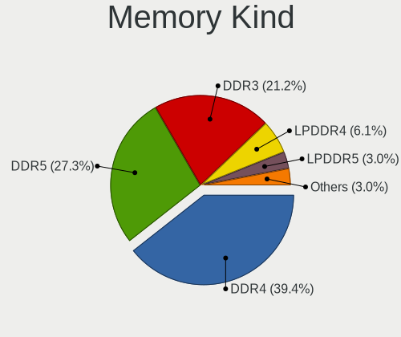

Gentoo - Hardware Trends
------------------------

A project to identify most popular hardware characteristics and track their change
over time based on data collected by Linux users at https://Linux-Hardware.org.

Anyone can contribute to this report by the [hw-probe](https://github.com/linuxhw/hw-probe) tool:

    sudo -E hw-probe -all -upload

This is a report for all computer types. See also reports for [desktops](/Dist/Gentoo/Desktop/README.md) and [notebooks](/Dist/Gentoo/Notebook/README.md).

This report is for one last month. Overall report since the beginning of time: [TestDays](https://github.com/linuxhw/TestDays)

Period: Oct, 2023.

Contents
--------

* [ System ](#system)
  - [ OS                       ](#os)
  - [ OS Family                ](#os-family)
  - [ Kernel                   ](#kernel)
  - [ Kernel Family            ](#kernel-family)
  - [ Kernel Major Ver.        ](#kernel-major-ver)
  - [ Arch                     ](#arch)
  - [ DE                       ](#de)
  - [ Display Server           ](#display-server)
  - [ Display Manager          ](#display-manager)
  - [ OS Lang                  ](#os-lang)
  - [ Boot Mode                ](#boot-mode)
  - [ Filesystem               ](#filesystem)
  - [ Part. scheme             ](#part-scheme)
  - [ Dual Boot with Linux/BSD ](#dual-boot-with-linuxbsd)
  - [ Dual Boot (Win)          ](#dual-boot-win)

* [ Board ](#board)
  - [ Vendor                   ](#vendor)
  - [ Model                    ](#model)
  - [ Model Family             ](#model-family)
  - [ MFG Year                 ](#mfg-year)
  - [ Form Factor              ](#form-factor)
  - [ Secure Boot              ](#secure-boot)
  - [ Coreboot                 ](#coreboot)
  - [ RAM Size                 ](#ram-size)
  - [ RAM Used                 ](#ram-used)
  - [ Total Drives             ](#total-drives)
  - [ Has CD-ROM               ](#has-cd-rom)
  - [ Has Ethernet             ](#has-ethernet)
  - [ Has WiFi                 ](#has-wifi)
  - [ Has Bluetooth            ](#has-bluetooth)

* [ Location ](#location)
  - [ Country                  ](#country)
  - [ City                     ](#city)

* [ Drives ](#drives)
  - [ Drive Vendor             ](#drive-vendor)
  - [ Drive Model              ](#drive-model)
  - [ HDD Vendor               ](#hdd-vendor)
  - [ SSD Vendor               ](#ssd-vendor)
  - [ Drive Kind               ](#drive-kind)
  - [ Drive Connector          ](#drive-connector)
  - [ Drive Size               ](#drive-size)
  - [ Space Total              ](#space-total)
  - [ Space Used               ](#space-used)
  - [ Malfunc. Drives          ](#malfunc-drives)
  - [ Malfunc. Drive Vendor    ](#malfunc-drive-vendor)
  - [ Malfunc. HDD Vendor      ](#malfunc-hdd-vendor)
  - [ Malfunc. Drive Kind      ](#malfunc-drive-kind)
  - [ Failed Drives            ](#failed-drives)
  - [ Failed Drive Vendor      ](#failed-drive-vendor)
  - [ Drive Status             ](#drive-status)

* [ Storage controller ](#storage-controller)
  - [ Storage Vendor           ](#storage-vendor)
  - [ Storage Model            ](#storage-model)
  - [ Storage Kind             ](#storage-kind)

* [ Processor ](#processor)
  - [ CPU Vendor               ](#cpu-vendor)
  - [ CPU Model                ](#cpu-model)
  - [ CPU Model Family         ](#cpu-model-family)
  - [ CPU Cores                ](#cpu-cores)
  - [ CPU Sockets              ](#cpu-sockets)
  - [ CPU Threads              ](#cpu-threads)
  - [ CPU Op-Modes             ](#cpu-op-modes)
  - [ CPU Microcode            ](#cpu-microcode)
  - [ CPU Microarch            ](#cpu-microarch)

* [ Graphics ](#graphics)
  - [ GPU Vendor               ](#gpu-vendor)
  - [ GPU Model                ](#gpu-model)
  - [ GPU Combo                ](#gpu-combo)
  - [ GPU Driver               ](#gpu-driver)
  - [ GPU Memory               ](#gpu-memory)

* [ Monitor ](#monitor)
  - [ Monitor Vendor           ](#monitor-vendor)
  - [ Monitor Model            ](#monitor-model)
  - [ Monitor Resolution       ](#monitor-resolution)
  - [ Monitor Diagonal         ](#monitor-diagonal)
  - [ Monitor Width            ](#monitor-width)
  - [ Aspect Ratio             ](#aspect-ratio)
  - [ Monitor Area             ](#monitor-area)
  - [ Pixel Density            ](#pixel-density)
  - [ Multiple Monitors        ](#multiple-monitors)

* [ Network ](#network)
  - [ Net Controller Vendor    ](#net-controller-vendor)
  - [ Net Controller Model     ](#net-controller-model)
  - [ Wireless Vendor          ](#wireless-vendor)
  - [ Wireless Model           ](#wireless-model)
  - [ Ethernet Vendor          ](#ethernet-vendor)
  - [ Ethernet Model           ](#ethernet-model)
  - [ Net Controller Kind      ](#net-controller-kind)
  - [ Used Controller          ](#used-controller)
  - [ NICs                     ](#nics)
  - [ IPv6                     ](#ipv6)

* [ Bluetooth ](#bluetooth)
  - [ Bluetooth Vendor         ](#bluetooth-vendor)
  - [ Bluetooth Model          ](#bluetooth-model)

* [ Sound ](#sound)
  - [ Sound Vendor             ](#sound-vendor)
  - [ Sound Model              ](#sound-model)

* [ Memory ](#memory)
  - [ Memory Vendor            ](#memory-vendor)
  - [ Memory Model             ](#memory-model)
  - [ Memory Kind              ](#memory-kind)
  - [ Memory Form Factor       ](#memory-form-factor)
  - [ Memory Size              ](#memory-size)
  - [ Memory Speed             ](#memory-speed)

* [ Printers & scanners ](#printers--scanners)
  - [ Printer Vendor           ](#printer-vendor)
  - [ Printer Model            ](#printer-model)
  - [ Scanner Vendor           ](#scanner-vendor)
  - [ Scanner Model            ](#scanner-model)

* [ Camera ](#camera)
  - [ Camera Vendor            ](#camera-vendor)
  - [ Camera Model             ](#camera-model)

* [ Security ](#security)
  - [ Fingerprint Vendor       ](#fingerprint-vendor)
  - [ Fingerprint Model        ](#fingerprint-model)
  - [ Chipcard Vendor          ](#chipcard-vendor)
  - [ Chipcard Model           ](#chipcard-model)

* [ Unsupported ](#unsupported)
  - [ Unsupported Devices      ](#unsupported-devices)
  - [ Unsupported Device Types ](#unsupported-device-types)

System
------

OS
--

Installed operating systems

| Name        | Computers | Percent |
|-------------|-----------|---------|
| Gentoo 2.14 | 52        | 96.3%   |
| Gentoo 23   | 1         | 1.85%   |
| Gentoo 2.9  | 1         | 1.85%   |

OS Family
---------

OS without a version

| Name   | Computers | Percent |
|--------|-----------|---------|
| Gentoo | 54        | 100%    |

Kernel
------

Version of the Linux kernel

| Version                             | Computers | Percent |
|-------------------------------------|-----------|---------|
| 6.1.53-gentoo-r1                    | 8         | 14.81%  |
| 6.1.57-gentoo                       | 4         | 7.41%   |
| 6.5.7-gentoo                        | 3         | 5.56%   |
| 6.1.57-gentoo-dist                  | 3         | 5.56%   |
| 6.5.8-gentoo-r1-x86_64              | 2         | 3.7%    |
| 6.5.7-gentoo-x86_64                 | 2         | 3.7%    |
| 6.5.5-gentoo-x86_64                 | 2         | 3.7%    |
| 6.1.57-gentoo-x86_64                | 2         | 3.7%    |
| 6.1.55-gentoo-dist                  | 2         | 3.7%    |
| 6.6.0-gentoo                        | 1         | 1.85%   |
| 6.5.9-gentoo                        | 1         | 1.85%   |
| 6.5.9-cachyos                       | 1         | 1.85%   |
| 6.5.8-gentoo-r1                     | 1         | 1.85%   |
| 6.5.8-gentoo-dist                   | 1         | 1.85%   |
| 6.5.8-gentoo                        | 1         | 1.85%   |
| 6.5.7-nidix-sys                     | 1         | 1.85%   |
| 6.5.6-gentoo                        | 1         | 1.85%   |
| 6.5.6-calculate                     | 1         | 1.85%   |
| 6.5.5-xanmod1-dist                  | 1         | 1.85%   |
| 6.5.5-gentooc                       | 1         | 1.85%   |
| 6.5.5-gentoo-Ryzen                  | 1         | 1.85%   |
| 6.5.3-gentoo-r1_22_09_2023_b        | 1         | 1.85%   |
| 6.5.3                               | 1         | 1.85%   |
| 6.5.0-gentoo                        | 1         | 1.85%   |
| 6.4.3-gentoo                        | 1         | 1.85%   |
| 6.4.10-gentoo-x86_64                | 1         | 1.85%   |
| 6.1.57-gentoolake                   | 1         | 1.85%   |
| 6.1.53-gentoo-r1-wireless_bluetooth | 1         | 1.85%   |
| 6.1.53-gentoo-r1-NVIDIA_only        | 1         | 1.85%   |
| 6.1.53-gentoo-r1-gentoo-dist        | 1         | 1.85%   |
| 6.1.53-gentoo-r1-fomys-work         | 1         | 1.85%   |
| 6.1.46-gentoo-Zenbook               | 1         | 1.85%   |
| 6.1.41-gentoo.ai                    | 1         | 1.85%   |
| 6.1.31-gentoo-dist                  | 1         | 1.85%   |
| 6.1.19-gentoo                       | 1         | 1.85%   |

Kernel Family
-------------

Linux kernel without a distro release

| Version | Computers | Percent |
|---------|-----------|---------|
| 6.1.53  | 12        | 22.22%  |
| 6.1.57  | 10        | 18.52%  |
| 6.5.7   | 6         | 11.11%  |
| 6.5.8   | 5         | 9.26%   |
| 6.5.5   | 5         | 9.26%   |
| 6.5.9   | 2         | 3.7%    |
| 6.5.6   | 2         | 3.7%    |
| 6.5.3   | 2         | 3.7%    |
| 6.1.55  | 2         | 3.7%    |
| 6.6.0   | 1         | 1.85%   |
| 6.5.0   | 1         | 1.85%   |
| 6.4.3   | 1         | 1.85%   |
| 6.4.10  | 1         | 1.85%   |
| 6.1.46  | 1         | 1.85%   |
| 6.1.41  | 1         | 1.85%   |
| 6.1.31  | 1         | 1.85%   |
| 6.1.19  | 1         | 1.85%   |

Kernel Major Ver.
-----------------

Linux kernel major version

| Version | Computers | Percent |
|---------|-----------|---------|
| 6.1     | 28        | 51.85%  |
| 6.5     | 23        | 42.59%  |
| 6.4     | 2         | 3.7%    |
| 6.6     | 1         | 1.85%   |

Arch
----

OS architecture (x86_64, i586, etc.)

| Name    | Computers | Percent |
|---------|-----------|---------|
| x86_64  | 53        | 98.15%  |
| aarch64 | 1         | 1.85%   |

DE
--

Desktop Environment

| Name       | Computers | Percent |
|------------|-----------|---------|
| Unknown    | 18        | 33.33%  |
| KDE5       | 16        | 29.63%  |
| GNOME      | 6         | 11.11%  |
| XFCE       | 5         | 9.26%   |
| MATE       | 2         | 3.7%    |
| Hyprland   | 2         | 3.7%    |
| DWM        | 2         | 3.7%    |
| X-Cinnamon | 1         | 1.85%   |
| LXQt       | 1         | 1.85%   |
| i3         | 1         | 1.85%   |

Display Server
--------------

X11 or Wayland

| Name    | Computers | Percent |
|---------|-----------|---------|
| X11     | 20        | 37.04%  |
| Wayland | 15        | 27.78%  |
| Tty     | 10        | 18.52%  |
| Unknown | 9         | 16.67%  |

Display Manager
---------------

SDDM, LightDM, etc.

| Name    | Computers | Percent |
|---------|-----------|---------|
| Unknown | 24        | 44.44%  |
| SDDM    | 17        | 31.48%  |
| LightDM | 8         | 14.81%  |
| GDM     | 4         | 7.41%   |
| LXDM    | 1         | 1.85%   |

OS Lang
-------

Language

| Lang           | Computers | Percent |
|----------------|-----------|---------|
| en_US          | 13        | 24.07%  |
| en_GB          | 8         | 14.81%  |
| Unknown        | 6         | 11.11%  |
| C.UTF8         | 4         | 7.41%   |
| fr_FR          | 3         | 5.56%   |
| ru_RU          | 2         | 3.7%    |
| de_DE          | 2         | 3.7%    |
| C              | 2         | 3.7%    |
| pl_PL          | 1         | 1.85%   |
| lt_LT          | 1         | 1.85%   |
| it_IT.iso88591 | 1         | 1.85%   |
| it_IT          | 1         | 1.85%   |
| fr_CA          | 1         | 1.85%   |
| fi_FI          | 1         | 1.85%   |
| es_ES.UTF8     | 1         | 1.85%   |
| es_ES          | 1         | 1.85%   |
| en_IE@euro     | 1         | 1.85%   |
| en_IE          | 1         | 1.85%   |
| en             | 1         | 1.85%   |
| de_CH          | 1         | 1.85%   |
| ca_ES          | 1         | 1.85%   |
| bg_BG          | 1         | 1.85%   |

Boot Mode
---------

EFI or BIOS

| Mode | Computers | Percent |
|------|-----------|---------|
| EFI  | 52        | 96.3%   |
| BIOS | 2         | 3.7%    |

Filesystem
----------

Type of filesystem

| Type  | Computers | Percent |
|-------|-----------|---------|
| Ext4  | 20        | 37.04%  |
| Btrfs | 17        | 31.48%  |
| Xfs   | 9         | 16.67%  |
| F2fs  | 5         | 9.26%   |
| Zfs   | 3         | 5.56%   |

Part. scheme
------------

Scheme of partitioning

| Type    | Computers | Percent |
|---------|-----------|---------|
| GPT     | 50        | 92.59%  |
| Unknown | 3         | 5.56%   |
| MBR     | 1         | 1.85%   |

Dual Boot with Linux/BSD
------------------------

Hosting more than one Linux/BSD

| Dual boot | Computers | Percent |
|-----------|-----------|---------|
| No        | 39        | 72.22%  |
| Yes       | 15        | 27.78%  |

Dual Boot (Win)
---------------

Hosting Linux and Windows

| Dual boot | Computers | Percent |
|-----------|-----------|---------|
| No        | 40        | 74.07%  |
| Yes       | 14        | 25.93%  |

Board
-----

Vendor
------

Motherboard manufacturer

| Name                | Computers | Percent |
|---------------------|-----------|---------|
| ASUSTek Computer    | 18        | 33.33%  |
| Hewlett-Packard     | 7         | 12.96%  |
| Gigabyte Technology | 7         | 12.96%  |
| Lenovo              | 5         | 9.26%   |
| Dell                | 5         | 9.26%   |
| MSI                 | 4         | 7.41%   |
| Supermicro          | 2         | 3.7%    |
| SZMZ                | 1         | 1.85%   |
| PINE64              | 1         | 1.85%   |
| Framework           | 1         | 1.85%   |
| ASRock              | 1         | 1.85%   |
| Acer                | 1         | 1.85%   |
| Unknown             | 1         | 1.85%   |

Model
-----

Motherboard model

| Name                                             | Computers | Percent |
|--------------------------------------------------|-----------|---------|
| ASUS TUF Gaming B550-PLUS                        | 2         | 3.7%    |
| ASUS PRIME B660-PLUS D4                          | 2         | 3.7%    |
| SZMZ X99M-G2                                     | 1         | 1.85%   |
| Supermicro X10SL7-F                              | 1         | 1.85%   |
| Supermicro Super Server                          | 1         | 1.85%   |
| PINE64 Pinebook Pro                              | 1         | 1.85%   |
| MSI MS-7D67                                      | 1         | 1.85%   |
| MSI MS-7D50                                      | 1         | 1.85%   |
| MSI MS-7C37                                      | 1         | 1.85%   |
| MSI MS-7C02                                      | 1         | 1.85%   |
| Lenovo ThinkPad T14 Gen 1 20UES1Y200             | 1         | 1.85%   |
| Lenovo Legion Pro 5 16ARX8 82WM                  | 1         | 1.85%   |
| Lenovo Legion 5 Pro 16ACH6H 82JQ                 | 1         | 1.85%   |
| Lenovo IdeaPad 5 15ABA7 82SG                     | 1         | 1.85%   |
| Lenovo G50-30 80G0                               | 1         | 1.85%   |
| HP ZBook Studio 16 inch G9 Mobile Workstation PC | 1         | 1.85%   |
| HP Z420 Workstation                              | 1         | 1.85%   |
| HP OMEN by Laptop 16-c0xxx                       | 1         | 1.85%   |
| HP EliteBook 845 14 inch G10 Notebook PC         | 1         | 1.85%   |
| HP EliteBook 840 G6                              | 1         | 1.85%   |
| HP EliteBook 830 G6                              | 1         | 1.85%   |
| HP Compaq Elite 8300 SFF                         | 1         | 1.85%   |
| Gigabyte Z590 UD                                 | 1         | 1.85%   |
| Gigabyte X570S AORUS ELITE AX                    | 1         | 1.85%   |
| Gigabyte X570 AORUS ELITE                        | 1         | 1.85%   |
| Gigabyte B550 AORUS ELITE V2                     | 1         | 1.85%   |
| Gigabyte B450M DS3H                              | 1         | 1.85%   |
| Gigabyte AB350-Gaming                            | 1         | 1.85%   |
| Gigabyte A520 AORUS ELITE                        | 1         | 1.85%   |
| Framework Laptop (13th Gen Intel Core)           | 1         | 1.85%   |
| Dell XPS 15 9530                                 | 1         | 1.85%   |
| Dell Precision T3600                             | 1         | 1.85%   |
| Dell OptiPlex 790                                | 1         | 1.85%   |
| Dell OptiPlex 3000 Thin Client                   | 1         | 1.85%   |
| Dell Latitude 7320                               | 1         | 1.85%   |
| ASUS Zenbook UX7602VI_UX7602VI                   | 1         | 1.85%   |
| ASUS ZenBook UX434DA_UM433DA                     | 1         | 1.85%   |
| ASUS ZenBook UX425UA_UM425UA                     | 1         | 1.85%   |
| ASUS VivoBook_ASUSLaptop X512DA_X512DA           | 1         | 1.85%   |
| ASUS VivoBook_ASUSLaptop M1603QA_M1603QA         | 1         | 1.85%   |

Model Family
------------

Motherboard model prefix

| Name                  | Computers | Percent |
|-----------------------|-----------|---------|
| ASUS ROG              | 5         | 9.26%   |
| ASUS PRIME            | 4         | 7.41%   |
| HP EliteBook          | 3         | 5.56%   |
| ASUS ZenBook          | 3         | 5.56%   |
| ASUS VivoBook         | 3         | 5.56%   |
| Lenovo Legion         | 2         | 3.7%    |
| Dell OptiPlex         | 2         | 3.7%    |
| ASUS TUF              | 2         | 3.7%    |
| SZMZ X99M-G2          | 1         | 1.85%   |
| Supermicro X10SL7-F   | 1         | 1.85%   |
| Supermicro Super      | 1         | 1.85%   |
| PINE64 Pinebook       | 1         | 1.85%   |
| MSI MS-7D67           | 1         | 1.85%   |
| MSI MS-7D50           | 1         | 1.85%   |
| MSI MS-7C37           | 1         | 1.85%   |
| MSI MS-7C02           | 1         | 1.85%   |
| Lenovo ThinkPad       | 1         | 1.85%   |
| Lenovo IdeaPad        | 1         | 1.85%   |
| Lenovo G50-30         | 1         | 1.85%   |
| HP ZBook              | 1         | 1.85%   |
| HP Z420               | 1         | 1.85%   |
| HP OMEN               | 1         | 1.85%   |
| HP Compaq             | 1         | 1.85%   |
| Gigabyte Z590         | 1         | 1.85%   |
| Gigabyte X570S        | 1         | 1.85%   |
| Gigabyte X570         | 1         | 1.85%   |
| Gigabyte B550         | 1         | 1.85%   |
| Gigabyte B450M        | 1         | 1.85%   |
| Gigabyte AB350-Gaming | 1         | 1.85%   |
| Gigabyte A520         | 1         | 1.85%   |
| Framework Laptop      | 1         | 1.85%   |
| Dell XPS              | 1         | 1.85%   |
| Dell Precision        | 1         | 1.85%   |
| Dell Latitude         | 1         | 1.85%   |
| ASUS M3A78-CM         | 1         | 1.85%   |
| ASRock H170           | 1         | 1.85%   |
| Acer Swift            | 1         | 1.85%   |
| Unknown               | 1         | 1.85%   |

MFG Year
--------

Motherboard manufacture year

| Year | Computers | Percent |
|------|-----------|---------|
| 2021 | 11        | 20.37%  |
| 2022 | 10        | 18.52%  |
| 2023 | 7         | 12.96%  |
| 2020 | 6         | 11.11%  |
| 2019 | 6         | 11.11%  |
| 2018 | 4         | 7.41%   |
| 2014 | 2         | 3.7%    |
| 2013 | 2         | 3.7%    |
| 2012 | 2         | 3.7%    |
| 2017 | 1         | 1.85%   |
| 2016 | 1         | 1.85%   |
| 2011 | 1         | 1.85%   |
| 2008 | 1         | 1.85%   |

Form Factor
-----------

Physical design of the computer

| Name           | Computers | Percent |
|----------------|-----------|---------|
| Desktop        | 29        | 53.7%   |
| Notebook       | 21        | 38.89%  |
| Server         | 2         | 3.7%    |
| System on chip | 1         | 1.85%   |
| Mini pc        | 1         | 1.85%   |

Secure Boot
-----------

Enabled or disabled

| State    | Computers | Percent |
|----------|-----------|---------|
| Disabled | 54        | 100%    |

Coreboot
--------

Have coreboot on board

| Used | Computers | Percent |
|------|-----------|---------|
| No   | 54        | 100%    |

RAM Size
--------

Total RAM memory

| Size in GB  | Computers | Percent |
|-------------|-----------|---------|
| 32.01-64.0  | 21        | 38.89%  |
| 64.01-256.0 | 12        | 22.22%  |
| 8.01-16.0   | 8         | 14.81%  |
| 4.01-8.0    | 6         | 11.11%  |
| 16.01-24.0  | 4         | 7.41%   |
| 24.01-32.0  | 2         | 3.7%    |
| 3.01-4.0    | 1         | 1.85%   |

RAM Used
--------

Used RAM memory

| Used GB    | Computers | Percent |
|------------|-----------|---------|
| 4.01-8.0   | 12        | 22.22%  |
| 1.01-2.0   | 12        | 22.22%  |
| 2.01-3.0   | 7         | 12.96%  |
| 3.01-4.0   | 6         | 11.11%  |
| 8.01-16.0  | 6         | 11.11%  |
| 16.01-24.0 | 5         | 9.26%   |
| 0.51-1.0   | 5         | 9.26%   |
| 0.01-0.5   | 1         | 1.85%   |

Total Drives
------------

Number of drives on board

| Drives | Computers | Percent |
|--------|-----------|---------|
| 1      | 22        | 40.74%  |
| 2      | 13        | 24.07%  |
| 3      | 9         | 16.67%  |
| 6      | 3         | 5.56%   |
| 8      | 2         | 3.7%    |
| 7      | 2         | 3.7%    |
| 9      | 1         | 1.85%   |
| 5      | 1         | 1.85%   |
| 4      | 1         | 1.85%   |

Has CD-ROM
----------

Has CD-ROM on board

| Presented | Computers | Percent |
|-----------|-----------|---------|
| No        | 47        | 87.04%  |
| Yes       | 7         | 12.96%  |

Has Ethernet
------------

Has Ethernet on board

| Presented | Computers | Percent |
|-----------|-----------|---------|
| Yes       | 43        | 79.63%  |
| No        | 11        | 20.37%  |

Has WiFi
--------

Has WiFi module

| Presented | Computers | Percent |
|-----------|-----------|---------|
| Yes       | 36        | 66.67%  |
| No        | 18        | 33.33%  |

Has Bluetooth
-------------

Has Bluetooth module

| Presented | Computers | Percent |
|-----------|-----------|---------|
| Yes       | 34        | 62.96%  |
| No        | 20        | 37.04%  |

Location
--------

Country
-------

Geographic location (country)

| Country     | Computers | Percent |
|-------------|-----------|---------|
| USA         | 7         | 12.96%  |
| UK          | 6         | 11.11%  |
| France      | 6         | 11.11%  |
| Russia      | 5         | 9.26%   |
| Poland      | 5         | 9.26%   |
| Italy       | 5         | 9.26%   |
| Spain       | 4         | 7.41%   |
| Switzerland | 2         | 3.7%    |
| Greece      | 2         | 3.7%    |
| Belgium     | 2         | 3.7%    |
| Ukraine     | 1         | 1.85%   |
| Slovakia    | 1         | 1.85%   |
| Ireland     | 1         | 1.85%   |
| Indonesia   | 1         | 1.85%   |
| Germany     | 1         | 1.85%   |
| Finland     | 1         | 1.85%   |
| China       | 1         | 1.85%   |
| Canada      | 1         | 1.85%   |
| Bulgaria    | 1         | 1.85%   |
| Austria     | 1         | 1.85%   |

City
----

Geographic location (city)

| City                  | Computers | Percent |
|-----------------------|-----------|---------|
| Warsaw                | 3         | 5.56%   |
| Oulx                  | 2         | 3.7%    |
| Moscow                | 2         | 3.7%    |
| Milano                | 2         | 3.7%    |
| Le Boulou             | 2         | 3.7%    |
| Igualada              | 2         | 3.7%    |
| Dumfries              | 2         | 3.7%    |
| Barcelona             | 2         | 3.7%    |
| Athens                | 2         | 3.7%    |
| Zhengzhou             | 1         | 1.85%   |
| West Orange           | 1         | 1.85%   |
| Vienna                | 1         | 1.85%   |
| Turku                 | 1         | 1.85%   |
| Teufen AR             | 1         | 1.85%   |
| St Laurent des Arbres | 1         | 1.85%   |
| Springfield           | 1         | 1.85%   |
| Sofia                 | 1         | 1.85%   |
| Samarinda             | 1         | 1.85%   |
| Pittsburgh            | 1         | 1.85%   |
| Pfaeffikon            | 1         | 1.85%   |
| Pau                   | 1         | 1.85%   |
| Paris                 | 1         | 1.85%   |
| Orange                | 1         | 1.85%   |
| Novosibirsk           | 1         | 1.85%   |
| Novara                | 1         | 1.85%   |
| North Fort Myers      | 1         | 1.85%   |
| Nashville             | 1         | 1.85%   |
| Murino                | 1         | 1.85%   |
| Montignies-sur-Sambre | 1         | 1.85%   |
| Limoges               | 1         | 1.85%   |
| Leeds                 | 1         | 1.85%   |
| Kyiv                  | 1         | 1.85%   |
| Krefeld               | 1         | 1.85%   |
| Kalisz                | 1         | 1.85%   |
| Flint                 | 1         | 1.85%   |
| Croydon               | 1         | 1.85%   |
| Cieszyn               | 1         | 1.85%   |
| Bray                  | 1         | 1.85%   |
| Bratislava            | 1         | 1.85%   |
| Belgorod              | 1         | 1.85%   |

Drives
------

Drive Vendor
------------

Hard drive vendors

| Vendor                      | Computers | Drives | Percent |
|-----------------------------|-----------|--------|---------|
| Samsung Electronics         | 18        | 40     | 17.14%  |
| Seagate                     | 11        | 16     | 10.48%  |
| WDC                         | 8         | 12     | 7.62%   |
| Sandisk                     | 8         | 8      | 7.62%   |
| Phison Electronics          | 8         | 8      | 7.62%   |
| Kingston                    | 7         | 7      | 6.67%   |
| SK hynix                    | 5         | 5      | 4.76%   |
| Micron/Crucial Technology   | 5         | 6      | 4.76%   |
| Intel                       | 4         | 4      | 3.81%   |
| Unknown                     | 3         | 4      | 2.86%   |
| Micron Technology           | 3         | 3      | 2.86%   |
| KIOXIA                      | 3         | 3      | 2.86%   |
| GOODRAM                     | 3         | 3      | 2.86%   |
| Toshiba                     | 2         | 2      | 1.9%    |
| Silicon Motion              | 2         | 2      | 1.9%    |
| Kingston Technology Company | 2         | 2      | 1.9%    |
| Crucial                     | 2         | 2      | 1.9%    |
| ADATA Technology            | 2         | 3      | 1.9%    |
| Yangtze Memory Technologies | 1         | 1      | 0.95%   |
| Transcend                   | 1         | 1      | 0.95%   |
| Phison                      | 1         | 1      | 0.95%   |
| Patriot                     | 1         | 1      | 0.95%   |
| Kingchuxing                 | 1         | 2      | 0.95%   |
| Hitachi                     | 1         | 3      | 0.95%   |
| China                       | 1         | 1      | 0.95%   |
| A-DATA Technology           | 1         | 1      | 0.95%   |
| Unknown                     | 1         | 1      | 0.95%   |

Drive Model
-----------

Hard drive models

| Model                                                             | Computers | Percent |
|-------------------------------------------------------------------|-----------|---------|
| Samsung NVMe SSD Controller SM981/PM981/PM983 1TB                 | 7         | 5.51%   |
| Samsung NVMe SSD Controller PM9A1/PM9A3/980PRO 1TB                | 6         | 4.72%   |
| Phison E7 NVMe Controller 120GB                                   | 3         | 2.36%   |
| Micron/Crucial P2 NVMe PCIe SSD 500GB                             | 3         | 2.36%   |
| Unknown MMC Card  128GB                                           | 2         | 1.57%   |
| Silicon Motion SM2263EN/SM2263XT SSD Controller 256GB             | 2         | 1.57%   |
| Seagate ST2000DM008-2UB102 2TB                                    | 2         | 1.57%   |
| Seagate ST2000DM008-2FR102 2TB                                    | 2         | 1.57%   |
| Sandisk WD Blue SN550 NVMe SSD 1TB                                | 2         | 1.57%   |
| Sandisk WD Black SN850 1TB                                        | 2         | 1.57%   |
| Sandisk WD Black SN750 / PC SN730 NVMe SSD 1024GB                 | 2         | 1.57%   |
| Samsung SSD 980 500GB                                             | 2         | 1.57%   |
| Samsung SSD 980 1TB                                               | 2         | 1.57%   |
| Samsung SSD 850 PRO 512GB                                         | 2         | 1.57%   |
| Samsung SSD 850 EVO 250GB                                         | 2         | 1.57%   |
| Samsung NVMe SSD Controller SM961/PM961/SM963 121GB               | 2         | 1.57%   |
| Phison Corsair MP600 PRO XT 2TB                                   | 2         | 1.57%   |
| Kingston Company A2000 NVMe SSD 250GB                             | 2         | 1.57%   |
| Kingston SKC3000D2048G 2TB                                        | 2         | 1.57%   |
| Intel SSD 660P Series 1024GB                                      | 2         | 1.57%   |
| GOODRAM SSDPR-CL100-480-G2 480GB                                  | 2         | 1.57%   |
| ADATA XPG SX8200 Pro PCIe Gen3x4 M.2 2280 Solid State Drive 512GB | 2         | 1.57%   |
| Yangtze Memory ZHITAI TiPlus5000 2TB                              | 1         | 0.79%   |
| WDC WDS500G2B0A-00SM50 500GB SSD                                  | 1         | 0.79%   |
| WDC WD8003FFBX-68B9AN0 8TB                                        | 1         | 0.79%   |
| WDC WD5000BEVT-22ZAT0 500GB                                       | 1         | 0.79%   |
| WDC WD40EFAX-68JH4N0 4TB                                          | 1         | 0.79%   |
| WDC WD30EURS-63SPKY0 3TB                                          | 1         | 0.79%   |
| WDC WD20EFRX-68EUZN0 2TB                                          | 1         | 0.79%   |
| WDC WD20EFRX-68AX9N0 2TB                                          | 1         | 0.79%   |
| WDC WD120EFBX-68B0EN0 12TB                                        | 1         | 0.79%   |
| WDC WD10EZEX-60M2NA0 1TB                                          | 1         | 0.79%   |
| WDC WD10EZEX-08WN4A0 1TB                                          | 1         | 0.79%   |
| WDC WD10EFRX-68PJCN0 1TB                                          | 1         | 0.79%   |
| Unknown MMC Card  64GB                                            | 1         | 0.79%   |
| Unknown MMC Card  250GB                                           | 1         | 0.79%   |
| Transcend TS128GMTS430S 128GB SSD                                 | 1         | 0.79%   |
| Toshiba HDWE150 5TB                                               | 1         | 0.79%   |
| Toshiba A100 120GB SSD                                            | 1         | 0.79%   |
| SK hynix SKHynix_HFS001TDE9X084N 1TB                              | 1         | 0.79%   |

HDD Vendor
----------

Hard disk drive vendors

| Vendor              | Computers | Drives | Percent |
|---------------------|-----------|--------|---------|
| Seagate             | 11        | 16     | 50%     |
| WDC                 | 7         | 11     | 31.82%  |
| Samsung Electronics | 2         | 3      | 9.09%   |
| Toshiba             | 1         | 1      | 4.55%   |
| Hitachi             | 1         | 3      | 4.55%   |

SSD Vendor
----------

Solid state drive vendors

| Vendor              | Computers | Drives | Percent |
|---------------------|-----------|--------|---------|
| Samsung Electronics | 8         | 12     | 32%     |
| Kingston            | 3         | 3      | 12%     |
| GOODRAM             | 3         | 3      | 12%     |
| Crucial             | 2         | 2      | 8%      |
| WDC                 | 1         | 1      | 4%      |
| Transcend           | 1         | 1      | 4%      |
| Toshiba             | 1         | 1      | 4%      |
| SanDisk             | 1         | 1      | 4%      |
| Patriot             | 1         | 1      | 4%      |
| Kingchuxing         | 1         | 2      | 4%      |
| China               | 1         | 1      | 4%      |
| A-DATA Technology   | 1         | 1      | 4%      |
| Unknown             | 1         | 1      | 4%      |

Drive Kind
----------

HDD or SSD

| Kind | Computers | Drives | Percent |
|------|-----------|--------|---------|
| NVMe | 45        | 74     | 52.94%  |
| SSD  | 20        | 30     | 23.53%  |
| HDD  | 17        | 34     | 20%     |
| MMC  | 3         | 4      | 3.53%   |

Drive Connector
---------------

SATA, SAS, NVMe, etc.

| Type | Computers | Drives | Percent |
|------|-----------|--------|---------|
| NVMe | 45        | 74     | 60%     |
| SATA | 26        | 62     | 34.67%  |
| MMC  | 3         | 4      | 4%      |
| SAS  | 1         | 2      | 1.33%   |

Drive Size
----------

Size of hard drive

| Size in TB | Computers | Drives | Percent |
|------------|-----------|--------|---------|
| 0.01-0.5   | 16        | 23     | 35.56%  |
| 0.51-1.0   | 14        | 17     | 31.11%  |
| 3.01-4.0   | 4         | 5      | 8.89%   |
| 1.01-2.0   | 4         | 9      | 8.89%   |
| 4.01-10.0  | 3         | 3      | 6.67%   |
| 2.01-3.0   | 2         | 4      | 4.44%   |
| 10.01-20.0 | 2         | 3      | 4.44%   |

Space Total
-----------

Amount of disk space available on the file system

| Size in GB     | Computers | Percent |
|----------------|-----------|---------|
| 251-500        | 13        | 24.07%  |
| More than 3000 | 11        | 20.37%  |
| 1001-2000      | 8         | 14.81%  |
| 501-1000       | 8         | 14.81%  |
| Unknown        | 5         | 9.26%   |
| 101-250        | 3         | 5.56%   |
| 2001-3000      | 2         | 3.7%    |
| 1-20           | 2         | 3.7%    |
| 21-50          | 1         | 1.85%   |
| 51-100         | 1         | 1.85%   |

Space Used
----------

Amount of used disk space

| Used GB        | Computers | Percent |
|----------------|-----------|---------|
| 21-50          | 9         | 16.67%  |
| 251-500        | 7         | 12.96%  |
| 1001-2000      | 7         | 12.96%  |
| 1-20           | 7         | 12.96%  |
| 101-250        | 6         | 11.11%  |
| Unknown        | 5         | 9.26%   |
| 501-1000       | 4         | 7.41%   |
| 51-100         | 4         | 7.41%   |
| More than 3000 | 3         | 5.56%   |
| 2001-3000      | 2         | 3.7%    |

Malfunc. Drives
---------------

Drive models with a malfunction

| Model                       | Computers | Drives | Percent |
|-----------------------------|-----------|--------|---------|
| WDC WD5000BEVT-22ZAT0 500GB | 1         | 1      | 33.33%  |
| WDC WD20EFRX-68EUZN0 2TB    | 1         | 1      | 33.33%  |
| WDC WD10EFRX-68PJCN0 1TB    | 1         | 1      | 33.33%  |

Malfunc. Drive Vendor
---------------------

Vendors of faulty drives

| Vendor | Computers | Drives | Percent |
|--------|-----------|--------|---------|
| WDC    | 2         | 3      | 100%    |

Malfunc. HDD Vendor
-------------------

Vendors of faulty HDD drives

| Vendor | Computers | Drives | Percent |
|--------|-----------|--------|---------|
| WDC    | 2         | 3      | 100%    |

Malfunc. Drive Kind
-------------------

Kinds of faulty drives

| Kind | Computers | Drives | Percent |
|------|-----------|--------|---------|
| HDD  | 2         | 3      | 100%    |

Failed Drives
-------------

Failed drive models

Zero info for selected period =(

Failed Drive Vendor
-------------------

Failed drive vendors

Zero info for selected period =(

Drive Status
------------

Number of failed and malfunc. drives

| Status   | Computers | Drives | Percent |
|----------|-----------|--------|---------|
| Works    | 50        | 124    | 86.21%  |
| Detected | 6         | 15     | 10.34%  |
| Malfunc  | 2         | 3      | 3.45%   |

Storage controller
------------------

Storage Vendor
--------------

Storage controller vendors

| Vendor                      | Computers | Percent |
|-----------------------------|-----------|---------|
| AMD                         | 24        | 22.64%  |
| Intel                       | 19        | 17.92%  |
| Samsung Electronics         | 13        | 12.26%  |
| Phison Electronics          | 9         | 8.49%   |
| SanDisk                     | 7         | 6.6%    |
| Kingston Technology Company | 6         | 5.66%   |
| SK hynix                    | 5         | 4.72%   |
| Micron/Crucial Technology   | 5         | 4.72%   |
| ASMedia Technology          | 4         | 3.77%   |
| Micron Technology           | 3         | 2.83%   |
| KIOXIA                      | 3         | 2.83%   |
| Silicon Motion              | 2         | 1.89%   |
| JMicron Technology          | 2         | 1.89%   |
| ADATA Technology            | 2         | 1.89%   |
| Yangtze Memory Technologies | 1         | 0.94%   |
| Broadcom / LSI              | 1         | 0.94%   |

Storage Model
-------------

Storage controller models

| Model                                                                          | Computers | Percent |
|--------------------------------------------------------------------------------|-----------|---------|
| AMD FCH SATA Controller [AHCI mode]                                            | 17        | 13.82%  |
| Samsung NVMe SSD Controller SM981/PM981/PM983                                  | 7         | 5.69%   |
| Samsung NVMe SSD Controller PM9A1/PM9A3/980PRO                                 | 6         | 4.88%   |
| Samsung NVMe SSD Controller 980 (DRAM-less)                                    | 5         | 4.07%   |
| Phison E18 PCIe4 NVMe Controller                                               | 4         | 3.25%   |
| AMD 500 Series Chipset SATA Controller                                         | 4         | 3.25%   |
| SK hynix Gold P31/BC711/PC711 NVMe Solid State Drive                           | 3         | 2.44%   |
| Phison E7 NVMe Controller                                                      | 3         | 2.44%   |
| Micron/Crucial P2 [Nick P2] / P3 / P3 Plus NVMe PCIe SSD (DRAM-less)           | 3         | 2.44%   |
| Silicon Motion SM2263EN/SM2263XT (DRAM-less) NVMe SSD Controllers              | 2         | 1.63%   |
| SanDisk WD PC SN810 / Black SN850 NVMe SSD                                     | 2         | 1.63%   |
| SanDisk Ultra 3D / WD Blue SN550 NVMe SSD                                      | 2         | 1.63%   |
| SanDisk Extreme Pro / WD Black SN750 / PC SN730 / Red SN700 NVMe SSD           | 2         | 1.63%   |
| Samsung NVMe SSD Controller SM961/PM961/SM963                                  | 2         | 1.63%   |
| Kingston Company KC3000/FURY Renegade NVMe SSD E18                             | 2         | 1.63%   |
| Kingston Company A2000 NVMe SSD SM2263EN                                       | 2         | 1.63%   |
| JMicron JMB368 IDE controller                                                  | 2         | 1.63%   |
| JMicron JMB363 SATA/IDE Controller                                             | 2         | 1.63%   |
| Intel Volume Management Device NVMe RAID Controller Intel Corporation          | 2         | 1.63%   |
| Intel SSD 660P Series                                                          | 2         | 1.63%   |
| Intel C600/X79 series chipset 6-Port SATA AHCI Controller                      | 2         | 1.63%   |
| Intel Alder Lake-S PCH SATA Controller [AHCI Mode]                             | 2         | 1.63%   |
| Intel 8 Series/C220 Series Chipset Family 6-port SATA Controller 1 [AHCI mode] | 2         | 1.63%   |
| Intel 500 Series Chipset Family SATA AHCI Controller                           | 2         | 1.63%   |
| ASMedia ASM1062 Serial ATA Controller                                          | 2         | 1.63%   |
| AMD 400 Series Chipset SATA Controller                                         | 2         | 1.63%   |
| ADATA XPG SX8200 Pro PCIe Gen3x4 M.2 2280 Solid State Drive                    | 2         | 1.63%   |
| Yangtze Memory ZHITAI TiPro5000 NVMe SSD                                       | 1         | 0.81%   |
| SK hynix PC601 NVMe Solid State Drive                                          | 1         | 0.81%   |
| SK hynix BC501 NVMe Solid State Drive                                          | 1         | 0.81%   |
| Sandisk WD Black SN850X NVMe SSD                                               | 1         | 0.81%   |
| Samsung NVMe SSD Controller S4LV008[Pascal]                                    | 1         | 0.81%   |
| Phison E16 PCIe4 NVMe Controller                                               | 1         | 0.81%   |
| Phison E12 NVMe Controller                                                     | 1         | 0.81%   |
| Micron/Crucial P5 Plus NVMe PCIe SSD                                           | 1         | 0.81%   |
| Micron/Crucial Non-Volatile memory controller                                  | 1         | 0.81%   |
| Micron 3400 NVMe SSD [Hendrix]                                                 | 1         | 0.81%   |
| Micron 2450 NVMe SSD [HendrixV] (DRAM-less)                                    | 1         | 0.81%   |
| Micron 2300 NVMe SSD [Santana]                                                 | 1         | 0.81%   |
| KIOXIA NVMe SSD Controller XG8                                                 | 1         | 0.81%   |

Storage Kind
------------

Kind of storage controller (IDE, SATA, NVMe, SAS, ...)

| Kind | Computers | Percent |
|------|-----------|---------|
| NVMe | 46        | 49.46%  |
| SATA | 38        | 40.86%  |
| IDE  | 4         | 4.3%    |
| SAS  | 3         | 3.23%   |
| RAID | 2         | 2.15%   |

Processor
---------

CPU Vendor
----------

Processor vendors

| Vendor | Computers | Percent |
|--------|-----------|---------|
| AMD    | 31        | 57.41%  |
| Intel  | 22        | 40.74%  |
| ARM    | 1         | 1.85%   |

CPU Model
---------

Processor models

| Model                                         | Computers | Percent |
|-----------------------------------------------|-----------|---------|
| Intel Core i5-8365U CPU @ 1.60GHz             | 2         | 3.7%    |
| Intel 12th Gen Core i5-12400                  | 2         | 3.7%    |
| AMD Ryzen 9 7950X 16-Core Processor           | 2         | 3.7%    |
| AMD Ryzen 7 5800X 8-Core Processor            | 2         | 3.7%    |
| AMD Ryzen 7 5800H with Radeon Graphics        | 2         | 3.7%    |
| Intel Xeon CPU E5-2690 0 @ 2.90GHz            | 1         | 1.85%   |
| Intel Xeon CPU E5-2670 v3 @ 2.30GHz           | 1         | 1.85%   |
| Intel Xeon CPU E5-1680 v2 @ 3.00GHz           | 1         | 1.85%   |
| Intel Xeon CPU E3-1230L v3 @ 1.80GHz          | 1         | 1.85%   |
| Intel Pentium Silver N6005 @ 2.00GHz          | 1         | 1.85%   |
| Intel Pentium CPU N3540 @ 2.16GHz             | 1         | 1.85%   |
| Intel Core i9-10850K CPU @ 3.60GHz            | 1         | 1.85%   |
| Intel Core i7-7700 CPU @ 3.60GHz              | 1         | 1.85%   |
| Intel Core i5-3470 CPU @ 3.20GHz              | 1         | 1.85%   |
| Intel Core i5-2400 CPU @ 3.10GHz              | 1         | 1.85%   |
| Intel 13th Gen Core i9-13900H                 | 1         | 1.85%   |
| Intel 13th Gen Core i7-1370P                  | 1         | 1.85%   |
| Intel 13th Gen Core i7-13700H                 | 1         | 1.85%   |
| Intel 13th Gen Core i5-13500H                 | 1         | 1.85%   |
| Intel 12th Gen Core i7-12700H                 | 1         | 1.85%   |
| Intel 11th Gen Core i7-1185G7 @ 3.00GHz       | 1         | 1.85%   |
| Intel 11th Gen Core i7-11800H @ 2.30GHz       | 1         | 1.85%   |
| Intel 11th Gen Core i7-11700K @ 3.60GHz       | 1         | 1.85%   |
| ARM Processor                                 | 1         | 1.85%   |
| AMD Ryzen 9 7950X3D 16-Core Processor         | 1         | 1.85%   |
| AMD Ryzen 9 7900X 12-Core Processor           | 1         | 1.85%   |
| AMD Ryzen 9 5950X 16-Core Processor           | 1         | 1.85%   |
| AMD Ryzen 9 5900X 12-Core Processor           | 1         | 1.85%   |
| AMD Ryzen 9 3900X 12-Core Processor           | 1         | 1.85%   |
| AMD Ryzen 7 PRO 4750U with Radeon Graphics    | 1         | 1.85%   |
| AMD Ryzen 7 7745HX with Radeon Graphics       | 1         | 1.85%   |
| AMD Ryzen 7 5825U with Radeon Graphics        | 1         | 1.85%   |
| AMD Ryzen 7 5800HS with Radeon Graphics       | 1         | 1.85%   |
| AMD Ryzen 7 5700U with Radeon Graphics        | 1         | 1.85%   |
| AMD Ryzen 7 5700G with Radeon Graphics        | 1         | 1.85%   |
| AMD Ryzen 7 4800HS with Radeon Graphics       | 1         | 1.85%   |
| AMD Ryzen 7 3700U with Radeon Vega Mobile Gfx | 1         | 1.85%   |
| AMD Ryzen 5 7600X 6-Core Processor            | 1         | 1.85%   |
| AMD Ryzen 5 7540U w/ Radeon 740M Graphics     | 1         | 1.85%   |
| AMD Ryzen 5 5600X 6-Core Processor            | 1         | 1.85%   |

CPU Model Family
----------------

Processor model prefix

| Model                | Computers | Percent |
|----------------------|-----------|---------|
| Other                | 11        | 20.37%  |
| AMD Ryzen 7          | 11        | 20.37%  |
| AMD Ryzen 5          | 10        | 18.52%  |
| AMD Ryzen 9          | 7         | 12.96%  |
| Intel Xeon           | 4         | 7.41%   |
| Intel Core i5        | 4         | 7.41%   |
| Intel Pentium Silver | 1         | 1.85%   |
| Intel Pentium        | 1         | 1.85%   |
| Intel Core i9        | 1         | 1.85%   |
| Intel Core i7        | 1         | 1.85%   |
| AMD Ryzen 7 PRO      | 1         | 1.85%   |
| AMD Phenom II X4     | 1         | 1.85%   |
| AMD EPYC             | 1         | 1.85%   |

CPU Cores
---------

Number of processor cores

| Number | Computers | Percent |
|--------|-----------|---------|
| 8      | 15        | 27.78%  |
| 4      | 13        | 24.07%  |
| 6      | 10        | 18.52%  |
| 12     | 5         | 9.26%   |
| 16     | 4         | 7.41%   |
| 14     | 4         | 7.41%   |
| 32     | 1         | 1.85%   |
| 10     | 1         | 1.85%   |
| 2      | 1         | 1.85%   |

CPU Sockets
-----------

Number of sockets

| Number | Computers | Percent |
|--------|-----------|---------|
| 1      | 54        | 100%    |

CPU Threads
-----------

Threads per core (Hyper-Threading)

| Number | Computers | Percent |
|--------|-----------|---------|
| 2      | 48        | 88.89%  |
| 1      | 6         | 11.11%  |

CPU Op-Modes
------------

CPU Operation Modes (32-bit, 64-bit)

| Op mode        | Computers | Percent |
|----------------|-----------|---------|
| 32-bit, 64-bit | 54        | 100%    |

CPU Microcode
-------------

Microcode number

| Number     | Computers | Percent |
|------------|-----------|---------|
| Unknown    | 15        | 27.78%  |
| 0x0a50000d | 4         | 7.41%   |
| 0xb06a2    | 3         | 5.56%   |
| 0x0a601206 | 3         | 5.56%   |
| 0x0a601203 | 3         | 5.56%   |
| 0x0a50000c | 3         | 5.56%   |
| 0x0a201016 | 2         | 3.7%    |
| 0x08701021 | 2         | 3.7%    |
| 0x08108109 | 2         | 3.7%    |
| 0x906a3    | 1         | 1.85%   |
| 0x806ec    | 1         | 1.85%   |
| 0x306f2    | 1         | 1.85%   |
| 0x306e4    | 1         | 1.85%   |
| 0x306c3    | 1         | 1.85%   |
| 0x306a9    | 1         | 1.85%   |
| 0x206d7    | 1         | 1.85%   |
| 0x206a7    | 1         | 1.85%   |
| 0x0a704103 | 1         | 1.85%   |
| 0x0a20120a | 1         | 1.85%   |
| 0x0a201205 | 1         | 1.85%   |
| 0x08608103 | 1         | 1.85%   |
| 0x08600106 | 1         | 1.85%   |
| 0x08600104 | 1         | 1.85%   |
| 0x08101016 | 1         | 1.85%   |
| 0x0800820d | 1         | 1.85%   |
| 0x08001138 | 1         | 1.85%   |

CPU Microarch
-------------

Microarchitecture

| Name             | Computers | Percent |
|------------------|-----------|---------|
| Zen 3            | 12        | 22.22%  |
| Unknown          | 10        | 18.52%  |
| Alderlake Hybrid | 6         | 11.11%  |
| Zen 2            | 5         | 9.26%   |
| Zen+             | 3         | 5.56%   |
| KabyLake         | 3         | 5.56%   |
| Zen              | 2         | 3.7%    |
| SandyBridge      | 2         | 3.7%    |
| IvyBridge        | 2         | 3.7%    |
| Icelake          | 2         | 3.7%    |
| Haswell          | 2         | 3.7%    |
| Tremont          | 1         | 1.85%   |
| TigerLake        | 1         | 1.85%   |
| Silvermont       | 1         | 1.85%   |
| K10              | 1         | 1.85%   |
| CometLake        | 1         | 1.85%   |

Graphics
--------

GPU Vendor
----------

Vendors of graphics cards

| Vendor            | Computers | Percent |
|-------------------|-----------|---------|
| AMD               | 32        | 51.61%  |
| Nvidia            | 15        | 24.19%  |
| Intel             | 13        | 20.97%  |
| ASPEED Technology | 2         | 3.23%   |

GPU Model
---------

Graphics card models

| Model                                                                | Computers | Percent |
|----------------------------------------------------------------------|-----------|---------|
| Intel Raptor Lake-P [Iris Xe Graphics]                               | 4         | 6.15%   |
| AMD Raphael                                                          | 4         | 6.15%   |
| AMD Cezanne [Radeon Vega Series / Radeon Vega Mobile Series]         | 4         | 6.15%   |
| AMD Ellesmere [Radeon RX 470/480/570/570X/580/580X/590]              | 3         | 4.62%   |
| Nvidia GP107GL [Quadro P620]                                         | 2         | 3.08%   |
| Nvidia AD107M [GeForce RTX 4060 Max-Q / Mobile]                      | 2         | 3.08%   |
| Intel WhiskeyLake-U GT2 [UHD Graphics 620]                           | 2         | 3.08%   |
| ASPEED Technology ASPEED Graphics Family                             | 2         | 3.08%   |
| AMD Renoir [Radeon RX Vega 6 (Ryzen 4000/5000 Mobile Series)]        | 2         | 3.08%   |
| AMD Picasso/Raven 2 [Radeon Vega Series / Radeon Vega Mobile Series] | 2         | 3.08%   |
| AMD Navi 23 [Radeon RX 6600/6600 XT/6600M]                           | 2         | 3.08%   |
| AMD Navi 22 [Radeon RX 6700/6700 XT/6750 XT / 6800M/6850M XT]        | 2         | 3.08%   |
| AMD Navi 10 [Radeon RX 5600 OEM/5600 XT / 5700/5700 XT]              | 2         | 3.08%   |
| AMD Lexa PRO [Radeon 540/540X/550/550X / RX 540X/550/550X]           | 2         | 3.08%   |
| AMD Cedar [Radeon HD 5000/6000/7350/8350 Series]                     | 2         | 3.08%   |
| Nvidia TU116M [GeForce GTX 1650 Ti Mobile]                           | 1         | 1.54%   |
| Nvidia GP107GL [Quadro P600]                                         | 1         | 1.54%   |
| Nvidia GF117M [GeForce 610M/710M/810M/820M / GT 620M/625M/630M/720M] | 1         | 1.54%   |
| Nvidia GA107M [GeForce RTX 3050 Mobile]                              | 1         | 1.54%   |
| Nvidia GA106 [Geforce RTX 3050]                                      | 1         | 1.54%   |
| Nvidia GA104M [GeForce RTX 3070 Mobile / Max-Q]                      | 1         | 1.54%   |
| Nvidia GA104 [GeForce RTX 3060 Ti Lite Hash Rate]                    | 1         | 1.54%   |
| Nvidia GA102 [GeForce RTX 3080 Ti]                                   | 1         | 1.54%   |
| Nvidia AD107M [GeForce RTX 4050 Max-Q / Mobile]                      | 1         | 1.54%   |
| Nvidia AD106M [GeForce RTX 4070 Max-Q / Mobile]                      | 1         | 1.54%   |
| Nvidia AD104 [GeForce RTX 4070]                                      | 1         | 1.54%   |
| Intel Xeon E3-1200 v2/3rd Gen Core processor Graphics Controller     | 1         | 1.54%   |
| Intel TigerLake-LP GT2 [Iris Xe Graphics]                            | 1         | 1.54%   |
| Intel TigerLake-H GT1 [UHD Graphics]                                 | 1         | 1.54%   |
| Intel JasperLake [UHD Graphics]                                      | 1         | 1.54%   |
| Intel HD Graphics 630                                                | 1         | 1.54%   |
| Intel Atom Processor Z36xxx/Z37xxx Series Graphics & Display         | 1         | 1.54%   |
| Intel Alder Lake-P GT2 [Iris Xe Graphics]                            | 1         | 1.54%   |
| AMD RS780C [Radeon 3100]                                             | 1         | 1.54%   |
| AMD Raven Ridge [Radeon Vega Series / Radeon Vega Mobile Series]     | 1         | 1.54%   |
| AMD Polaris 20 XL [Radeon RX 580 2048SP]                             | 1         | 1.54%   |
| AMD Phoenix1                                                         | 1         | 1.54%   |
| AMD Navi 31 [Radeon RX 7900 XT/7900 XTX]                             | 1         | 1.54%   |
| AMD Navi 24 [Radeon PRO W6400]                                       | 1         | 1.54%   |
| AMD Navi 21 [Radeon RX 6800/6800 XT / 6900 XT]                       | 1         | 1.54%   |

GPU Combo
---------

Combinations of graphics cards

| Name            | Computers | Percent |
|-----------------|-----------|---------|
| 1 x AMD         | 25        | 46.3%   |
| 1 x Intel       | 8         | 14.81%  |
| 1 x Nvidia      | 7         | 12.96%  |
| Intel + Nvidia  | 4         | 7.41%   |
| 2 x AMD         | 3         | 5.56%   |
| AMD + Nvidia    | 3         | 5.56%   |
| Other           | 1         | 1.85%   |
| Nvidia + ASPEED | 1         | 1.85%   |
| Intel + AMD     | 1         | 1.85%   |
| 1 x ASPEED      | 1         | 1.85%   |

GPU Driver
----------

Free vs proprietary

| Driver      | Computers | Percent |
|-------------|-----------|---------|
| Free        | 36        | 66.67%  |
| Proprietary | 13        | 24.07%  |
| Unknown     | 5         | 9.26%   |

GPU Memory
----------

Total video memory

| Size in GB | Computers | Percent |
|------------|-----------|---------|
| Unknown    | 19        | 35.19%  |
| 0.01-0.5   | 9         | 16.67%  |
| 7.01-8.0   | 8         | 14.81%  |
| 1.01-2.0   | 7         | 12.96%  |
| 8.01-16.0  | 4         | 7.41%   |
| 0.51-1.0   | 3         | 5.56%   |
| 3.01-4.0   | 2         | 3.7%    |
| 5.01-6.0   | 1         | 1.85%   |
| 16.01-24.0 | 1         | 1.85%   |

Monitor
-------

Monitor Vendor
--------------

Monitor vendors

| Vendor               | Computers | Percent |
|----------------------|-----------|---------|
| AU Optronics         | 9         | 14.52%  |
| Samsung Electronics  | 8         | 12.9%   |
| Dell                 | 4         | 6.45%   |
| BenQ                 | 4         | 6.45%   |
| Lenovo               | 3         | 4.84%   |
| ASUSTek Computer     | 3         | 4.84%   |
| Acer                 | 3         | 4.84%   |
| Philips              | 2         | 3.23%   |
| PANDA                | 2         | 3.23%   |
| Mi                   | 2         | 3.23%   |
| Hewlett-Packard      | 2         | 3.23%   |
| Goldstar             | 2         | 3.23%   |
| CSO                  | 2         | 3.23%   |
| BOE                  | 2         | 3.23%   |
| ViewSonic            | 1         | 1.61%   |
| Unknown              | 1         | 1.61%   |
| Sharp                | 1         | 1.61%   |
| RTK                  | 1         | 1.61%   |
| NEC Computers        | 1         | 1.61%   |
| LG Display           | 1         | 1.61%   |
| Iiyama               | 1         | 1.61%   |
| HUAWEI               | 1         | 1.61%   |
| Gigabyte Technology  | 1         | 1.61%   |
| Fujitsu Siemens      | 1         | 1.61%   |
| Chimei Innolux       | 1         | 1.61%   |
| AOC                  | 1         | 1.61%   |
| Ancor Communications | 1         | 1.61%   |
| Unknown              | 1         | 1.61%   |

Monitor Model
-------------

Monitor models

| Model                                                                   | Computers | Percent |
|-------------------------------------------------------------------------|-----------|---------|
| Philips 17S PHL0877 1280x1024 337x270mm 17.0-inch                       | 2         | 3.08%   |
| Mi 27 NFGL XMIB004 1920x1080 598x336mm 27.0-inch                        | 2         | 3.08%   |
| Hewlett-Packard S230tm HWP3115 1920x1080 509x286mm 23.0-inch            | 2         | 3.08%   |
| Hewlett-Packard LA2206 HWP2946 1920x1080 476x268mm 21.5-inch            | 2         | 3.08%   |
| BenQ PD2700U BNQ802E 3840x2160 597x336mm 27.0-inch                      | 2         | 3.08%   |
| ASUSTek Computer VA24E AUS24D1 1920x1080 527x296mm 23.8-inch            | 2         | 3.08%   |
| ViewSonic VX2250 SERIES VSCCB25 1920x1080 477x268mm 21.5-inch           | 1         | 1.54%   |
| Unknown LCD Monitor FFFF 2288x1287 2550x2550mm 142.0-inch               | 1         | 1.54%   |
| Sharp LCD Monitor SHP1515 1920x1200 336x210mm 15.6-inch                 | 1         | 1.54%   |
| Samsung Electronics SyncMaster SAM059A 1920x1080 477x268mm 21.5-inch    | 1         | 1.54%   |
| Samsung Electronics S22B300 SAM08C8 1920x1080 477x268mm 21.5-inch       | 1         | 1.54%   |
| Samsung Electronics LCD Monitor SDC4852 1366x768 344x194mm 15.5-inch    | 1         | 1.54%   |
| Samsung Electronics LCD Monitor SDC4180 2880x1620 344x194mm 15.5-inch   | 1         | 1.54%   |
| Samsung Electronics LCD Monitor SDC4178 3200x2000 344x215mm 16.0-inch   | 1         | 1.54%   |
| Samsung Electronics LCD Monitor SAM7003 3840x2160 1872x1053mm 84.6-inch | 1         | 1.54%   |
| Samsung Electronics LC49G95T SAM7053 3840x1080 1193x336mm 48.8-inch     | 1         | 1.54%   |
| Samsung Electronics C24F390 SAM0D2D 1920x1080 521x293mm 23.5-inch       | 1         | 1.54%   |
| RTK KYV HDMI RTK2A3B 1920x1080 600x340mm 27.2-inch                      | 1         | 1.54%   |
| PANDA LCD Monitor NCP0050 1920x1080 309x174mm 14.0-inch                 | 1         | 1.54%   |
| PANDA LCD Monitor NCP0035 1920x1080 309x174mm 14.0-inch                 | 1         | 1.54%   |
| NEC Computers LCD190V NEC66D3 1280x1024 376x301mm 19.0-inch             | 1         | 1.54%   |
| LG Display LCD Monitor LGD06C4 1920x1080 294x165mm 13.3-inch            | 1         | 1.54%   |
| Lenovo LEN S24q-10 LEN61E7 2560x1440 527x296mm 23.8-inch                | 1         | 1.54%   |
| Lenovo G27q-20 LEN66C3 2560x1440 597x336mm 27.0-inch                    | 1         | 1.54%   |
| Lenovo D24-20 LEN66AE 1920x1080 527x296mm 23.8-inch                     | 1         | 1.54%   |
| Iiyama PL2395W IVM5639 1920x1200 488x297mm 22.5-inch                    | 1         | 1.54%   |
| HUAWEI SSN-24 HWV6E4E 1920x1080 527x296mm 23.8-inch                     | 1         | 1.54%   |
| Goldstar ULTRAWIDE GSM76F9 2560x1080 531x298mm 24.0-inch                | 1         | 1.54%   |
| Goldstar HDR WFHD GSM7714 2560x1080 798x334mm 34.1-inch                 | 1         | 1.54%   |
| Gigabyte Technology AORUS FI27Q-P GBT2707 2560x1440 596x335mm 26.9-inch | 1         | 1.54%   |
| Fujitsu Siemens B19-5 FUS06AB 1280x1024 376x301mm 19.0-inch             | 1         | 1.54%   |
| Dell U3415W DELA0AA 3440x1440 798x335mm 34.1-inch                       | 1         | 1.54%   |
| Dell U2415 DELA0BA 1920x1200 518x324mm 24.1-inch                        | 1         | 1.54%   |
| Dell S2316H DELD07E 1920x1080 509x286mm 23.0-inch                       | 1         | 1.54%   |
| Dell E2222H DELF130 1920x1080 478x260mm 21.4-inch                       | 1         | 1.54%   |
| CSO LCD Monitor CSO161B 2560x1600 344x215mm 16.0-inch                   | 1         | 1.54%   |
| CSO LCD Monitor CSO1609 2560x1600 345x215mm 16.0-inch                   | 1         | 1.54%   |
| Chimei Innolux LCD Monitor CMN15E7 1920x1080 344x193mm 15.5-inch        | 1         | 1.54%   |
| BOE LCD Monitor BOE0BCA 2256x1504 285x190mm 13.5-inch                   | 1         | 1.54%   |
| BOE LCD Monitor BOE09BE 1920x1080 355x200mm 16.0-inch                   | 1         | 1.54%   |

Monitor Resolution
------------------

Monitor screen resolution

| Resolution        | Computers | Percent |
|-------------------|-----------|---------|
| 1920x1080 (FHD)   | 25        | 47.17%  |
| 3840x2160 (4K)    | 7         | 13.21%  |
| 1280x1024 (SXGA)  | 4         | 7.55%   |
| 2560x1600         | 3         | 5.66%   |
| 2560x1440 (QHD)   | 3         | 5.66%   |
| 1920x1200 (WUXGA) | 3         | 5.66%   |
| 2560x1080         | 2         | 3.77%   |
| 3840x1080         | 1         | 1.89%   |
| 3440x1440         | 1         | 1.89%   |
| 3200x2000         | 1         | 1.89%   |
| 2880x1620         | 1         | 1.89%   |
| 2288x1287         | 1         | 1.89%   |
| 2256x1504         | 1         | 1.89%   |

Monitor Diagonal
----------------

Diagonal size in inches

| Inches  | Computers | Percent |
|---------|-----------|---------|
| 27      | 9         | 14.52%  |
| 21      | 7         | 11.29%  |
| 15      | 7         | 11.29%  |
| 24      | 6         | 9.68%   |
| 16      | 6         | 9.68%   |
| 14      | 6         | 9.68%   |
| 23      | 5         | 8.06%   |
| 34      | 3         | 4.84%   |
| 19      | 2         | 3.23%   |
| 17      | 2         | 3.23%   |
| 13      | 2         | 3.23%   |
| 142     | 1         | 1.61%   |
| 84      | 1         | 1.61%   |
| 48      | 1         | 1.61%   |
| 32      | 1         | 1.61%   |
| 26      | 1         | 1.61%   |
| 22      | 1         | 1.61%   |
| Unknown | 1         | 1.61%   |

Monitor Width
-------------

Physical width

| Width in mm    | Computers | Percent |
|----------------|-----------|---------|
| 301-350        | 20        | 33.9%   |
| 501-600        | 17        | 28.81%  |
| 401-500        | 8         | 13.56%  |
| 701-800        | 4         | 6.78%   |
| 351-400        | 3         | 5.08%   |
| 201-300        | 2         | 3.39%   |
| More than 2000 | 1         | 1.69%   |
| 601-700        | 1         | 1.69%   |
| 1501-2000      | 1         | 1.69%   |
| 1001-1500      | 1         | 1.69%   |
| Unknown        | 1         | 1.69%   |

Aspect Ratio
------------

Proportional relationship between the width and the height

| Ratio   | Computers | Percent |
|---------|-----------|---------|
| 16/9    | 33        | 62.26%  |
| 16/10   | 9         | 16.98%  |
| 5/4     | 4         | 7.55%   |
| 21/9    | 3         | 5.66%   |
| 32/9    | 1         | 1.89%   |
| 3/2     | 1         | 1.89%   |
| 1.00    | 1         | 1.89%   |
| Unknown | 1         | 1.89%   |

Monitor Area
------------

Area in inch

| Area in inch | Computers | Percent |
|----------------|-----------|---------|
| 201-250        | 11        | 18.97%  |
| 301-350        | 10        | 17.24%  |
| 81-90          | 7         | 12.07%  |
| 101-110        | 7         | 12.07%  |
| 111-120        | 6         | 10.34%  |
| 351-500        | 4         | 6.9%    |
| 151-200        | 4         | 6.9%    |
| More than 1000 | 2         | 3.45%   |
| 251-300        | 2         | 3.45%   |
| 141-150        | 2         | 3.45%   |
| 71-80          | 1         | 1.72%   |
| 501-1000       | 1         | 1.72%   |
| Unknown        | 1         | 1.72%   |

Pixel Density
-------------

Pixels per inch

| Density | Computers | Percent |
|---------|-----------|---------|
| 51-100  | 18        | 31.58%  |
| 121-160 | 15        | 26.32%  |
| 101-120 | 13        | 22.81%  |
| 161-240 | 9         | 15.79%  |
| 1-50    | 1         | 1.75%   |
| Unknown | 1         | 1.75%   |

Multiple Monitors
-----------------

Total monitors connected

| Total | Computers | Percent |
|-------|-----------|---------|
| 1     | 34        | 62.96%  |
| 2     | 11        | 20.37%  |
| 0     | 6         | 11.11%  |
| 4     | 2         | 3.7%    |
| 3     | 1         | 1.85%   |

Network
-------

Net Controller Vendor
---------------------

Controller vendors

| Vendor                | Computers | Percent |
|-----------------------|-----------|---------|
| Intel                 | 32        | 41.03%  |
| Realtek Semiconductor | 28        | 35.9%   |
| MediaTek              | 4         | 5.13%   |
| Broadcom              | 3         | 3.85%   |
| Xiaomi                | 2         | 2.56%   |
| ASIX Electronics      | 2         | 2.56%   |
| Texas Instruments     | 1         | 1.28%   |
| Samsung Electronics   | 1         | 1.28%   |
| Ralink Technology     | 1         | 1.28%   |
| Qualcomm Atheros      | 1         | 1.28%   |
| NetGear               | 1         | 1.28%   |
| Insyde Software       | 1         | 1.28%   |
| Huawei Technologies   | 1         | 1.28%   |

Net Controller Model
--------------------

Controller models

| Model                                                                         | Computers | Percent |
|-------------------------------------------------------------------------------|-----------|---------|
| Realtek RTL8111/8168/8411 PCI Express Gigabit Ethernet Controller             | 15        | 16.48%  |
| Realtek RTL8125 2.5GbE Controller                                             | 9         | 9.89%   |
| Intel Wi-Fi 6 AX210/AX211/AX411 160MHz                                        | 6         | 6.59%   |
| Intel Wi-Fi 6 AX200                                                           | 5         | 5.49%   |
| Intel 82579LM Gigabit Network Connection (Lewisville)                         | 4         | 4.4%    |
| Realtek RTL8852BE PCIe 802.11ax Wireless Network Controller                   | 3         | 3.3%    |
| Realtek RTL8153 Gigabit Ethernet Adapter                                      | 3         | 3.3%    |
| Intel Raptor Lake PCH CNVi WiFi                                               | 3         | 3.3%    |
| Intel Ethernet Controller I225-V                                              | 3         | 3.3%    |
| MediaTek MT7921K (RZ608) Wi-Fi 6E 80MHz                                       | 2         | 2.2%    |
| Intel Wireless 8265 / 8275                                                    | 2         | 2.2%    |
| Intel I211 Gigabit Network Connection                                         | 2         | 2.2%    |
| Intel Ethernet Connection (6) I219-LM                                         | 2         | 2.2%    |
| ASIX AX88179 Gigabit Ethernet                                                 | 2         | 2.2%    |
| Xiaomi Mi/Redmi series (RNDIS)                                                | 1         | 1.1%    |
| Xiaomi Mi/Redmi series (RNDIS + ADB)                                          | 1         | 1.1%    |
| Texas Instruments XDS2xx USB Emulator - Composit                              | 1         | 1.1%    |
| Samsung Galaxy series, misc. (tethering mode)                                 | 1         | 1.1%    |
| Realtek USB 10/100/1G/2.5G LAN                                                | 1         | 1.1%    |
| Realtek RTL88x2bu [AC1200 Techkey]                                            | 1         | 1.1%    |
| Realtek RTL8852AE 802.11ax PCIe Wireless Network Adapter                      | 1         | 1.1%    |
| Realtek RTL8821CE 802.11ac PCIe Wireless Network Adapter                      | 1         | 1.1%    |
| Realtek RTL8812AE 802.11ac PCIe Wireless Network Adapter                      | 1         | 1.1%    |
| Realtek Realtek WLAN controller                                               | 1         | 1.1%    |
| Ralink RT5572 Wireless Adapter                                                | 1         | 1.1%    |
| Qualcomm Atheros QCA9377 802.11ac Wireless Network Adapter                    | 1         | 1.1%    |
| NetGear WG111v3 54 Mbps Wireless [realtek RTL8187B]                           | 1         | 1.1%    |
| MediaTek MT7922 802.11ax PCI Express Wireless Network Adapter                 | 1         | 1.1%    |
| MediaTek MT7921 802.11ax PCI Express Wireless Network Adapter                 | 1         | 1.1%    |
| Intel Wi-Fi 6 AX201 160MHz                                                    | 1         | 1.1%    |
| Intel Wi-Fi 6 AX201                                                           | 1         | 1.1%    |
| Intel I210 Gigabit Network Connection                                         | 1         | 1.1%    |
| Intel Ethernet Controller X550                                                | 1         | 1.1%    |
| Intel Ethernet Controller 10-Gigabit X540-AT2                                 | 1         | 1.1%    |
| Intel Ethernet Connection (2) I219-V                                          | 1         | 1.1%    |
| Intel Cannon Point-LP CNVi [Wireless-AC]                                      | 1         | 1.1%    |
| Intel Alder Lake-S PCH CNVi WiFi                                              | 1         | 1.1%    |
| Intel Alder Lake-P PCH CNVi WiFi                                              | 1         | 1.1%    |
| Intel 82571EB/82571GB Gigabit Ethernet Controller D0/D1 (copper applications) | 1         | 1.1%    |
| Insyde Software RNDIS/Ethernet Gadget                                         | 1         | 1.1%    |

Wireless Vendor
---------------

Wireless vendors

| Vendor                | Computers | Percent |
|-----------------------|-----------|---------|
| Intel                 | 21        | 56.76%  |
| Realtek Semiconductor | 8         | 21.62%  |
| MediaTek              | 4         | 10.81%  |
| Ralink Technology     | 1         | 2.7%    |
| Qualcomm Atheros      | 1         | 2.7%    |
| NetGear               | 1         | 2.7%    |
| Broadcom              | 1         | 2.7%    |

Wireless Model
--------------

Wireless models

| Model                                                         | Computers | Percent |
|---------------------------------------------------------------|-----------|---------|
| Intel Wi-Fi 6 AX210/AX211/AX411 160MHz                        | 6         | 16.22%  |
| Intel Wi-Fi 6 AX200                                           | 5         | 13.51%  |
| Realtek RTL8852BE PCIe 802.11ax Wireless Network Controller   | 3         | 8.11%   |
| Intel Raptor Lake PCH CNVi WiFi                               | 3         | 8.11%   |
| MediaTek MT7921K (RZ608) Wi-Fi 6E 80MHz                       | 2         | 5.41%   |
| Intel Wireless 8265 / 8275                                    | 2         | 5.41%   |
| Realtek RTL88x2bu [AC1200 Techkey]                            | 1         | 2.7%    |
| Realtek RTL8852AE 802.11ax PCIe Wireless Network Adapter      | 1         | 2.7%    |
| Realtek RTL8821CE 802.11ac PCIe Wireless Network Adapter      | 1         | 2.7%    |
| Realtek RTL8812AE 802.11ac PCIe Wireless Network Adapter      | 1         | 2.7%    |
| Realtek Realtek WLAN controller                               | 1         | 2.7%    |
| Ralink RT5572 Wireless Adapter                                | 1         | 2.7%    |
| Qualcomm Atheros QCA9377 802.11ac Wireless Network Adapter    | 1         | 2.7%    |
| NetGear WG111v3 54 Mbps Wireless [realtek RTL8187B]           | 1         | 2.7%    |
| MediaTek MT7922 802.11ax PCI Express Wireless Network Adapter | 1         | 2.7%    |
| MediaTek MT7921 802.11ax PCI Express Wireless Network Adapter | 1         | 2.7%    |
| Intel Wi-Fi 6 AX201 160MHz                                    | 1         | 2.7%    |
| Intel Wi-Fi 6 AX201                                           | 1         | 2.7%    |
| Intel Cannon Point-LP CNVi [Wireless-AC]                      | 1         | 2.7%    |
| Intel Alder Lake-S PCH CNVi WiFi                              | 1         | 2.7%    |
| Intel Alder Lake-P PCH CNVi WiFi                              | 1         | 2.7%    |
| Broadcom BCM43142 802.11b/g/n                                 | 1         | 2.7%    |

Ethernet Vendor
---------------

Ethernet vendors

| Vendor                | Computers | Percent |
|-----------------------|-----------|---------|
| Realtek Semiconductor | 26        | 50.98%  |
| Intel                 | 16        | 31.37%  |
| Xiaomi                | 2         | 3.92%   |
| Broadcom              | 2         | 3.92%   |
| ASIX Electronics      | 2         | 3.92%   |
| Samsung Electronics   | 1         | 1.96%   |
| Insyde Software       | 1         | 1.96%   |
| Huawei Technologies   | 1         | 1.96%   |

Ethernet Model
--------------

Ethernet models

| Model                                                                         | Computers | Percent |
|-------------------------------------------------------------------------------|-----------|---------|
| Realtek RTL8111/8168/8411 PCI Express Gigabit Ethernet Controller             | 15        | 28.3%   |
| Realtek RTL8125 2.5GbE Controller                                             | 9         | 16.98%  |
| Intel 82579LM Gigabit Network Connection (Lewisville)                         | 4         | 7.55%   |
| Realtek RTL8153 Gigabit Ethernet Adapter                                      | 3         | 5.66%   |
| Intel Ethernet Controller I225-V                                              | 3         | 5.66%   |
| Intel I211 Gigabit Network Connection                                         | 2         | 3.77%   |
| Intel Ethernet Connection (6) I219-LM                                         | 2         | 3.77%   |
| ASIX AX88179 Gigabit Ethernet                                                 | 2         | 3.77%   |
| Xiaomi Mi/Redmi series (RNDIS)                                                | 1         | 1.89%   |
| Xiaomi Mi/Redmi series (RNDIS + ADB)                                          | 1         | 1.89%   |
| Samsung Galaxy series, misc. (tethering mode)                                 | 1         | 1.89%   |
| Realtek USB 10/100/1G/2.5G LAN                                                | 1         | 1.89%   |
| Intel I210 Gigabit Network Connection                                         | 1         | 1.89%   |
| Intel Ethernet Controller X550                                                | 1         | 1.89%   |
| Intel Ethernet Controller 10-Gigabit X540-AT2                                 | 1         | 1.89%   |
| Intel Ethernet Connection (2) I219-V                                          | 1         | 1.89%   |
| Intel 82571EB/82571GB Gigabit Ethernet Controller D0/D1 (copper applications) | 1         | 1.89%   |
| Insyde Software RNDIS/Ethernet Gadget                                         | 1         | 1.89%   |
| Huawei ALP-AL00                                                               | 1         | 1.89%   |
| Broadcom NetXtreme BCM5715 Gigabit Ethernet                                   | 1         | 1.89%   |
| Broadcom BCM57416 NetXtreme-E Dual-Media 10G RDMA Ethernet Controller         | 1         | 1.89%   |

Net Controller Kind
-------------------

Ethernet, WiFi or modem

| Kind     | Computers | Percent |
|----------|-----------|---------|
| Ethernet | 43        | 53.75%  |
| WiFi     | 36        | 45%     |
| Modem    | 1         | 1.25%   |

Used Controller
---------------

Currently used network controller

| Kind     | Computers | Percent |
|----------|-----------|---------|
| Ethernet | 29        | 56.86%  |
| WiFi     | 22        | 43.14%  |

NICs
----

Total network controllers on board

| Total | Computers | Percent |
|-------|-----------|---------|
| 1     | 28        | 51.85%  |
| 2     | 20        | 37.04%  |
| 4     | 2         | 3.7%    |
| 0     | 2         | 3.7%    |
| 7     | 1         | 1.85%   |
| 3     | 1         | 1.85%   |

IPv6
----

IPv6 vs IPv4

| Used | Computers | Percent |
|------|-----------|---------|
| No   | 40        | 74.07%  |
| Yes  | 14        | 25.93%  |

Bluetooth
---------

Bluetooth Vendor
----------------

Controller vendors

| Vendor                  | Computers | Percent |
|-------------------------|-----------|---------|
| Intel                   | 21        | 61.76%  |
| Realtek Semiconductor   | 4         | 11.76%  |
| MediaTek                | 3         | 8.82%   |
| IMC Networks            | 2         | 5.88%   |
| Lite-On Technology      | 1         | 2.94%   |
| Foxconn International   | 1         | 2.94%   |
| Edimax Technology       | 1         | 2.94%   |
| Cambridge Silicon Radio | 1         | 2.94%   |

Bluetooth Model
---------------

Controller models

| Model                                               | Computers | Percent |
|-----------------------------------------------------|-----------|---------|
| Intel AX210 Bluetooth                               | 6         | 17.65%  |
| Intel AX200 Bluetooth                               | 5         | 14.71%  |
| Realtek Bluetooth Radio                             | 4         | 11.76%  |
| Intel Bluetooth Device                              | 4         | 11.76%  |
| MediaTek Wireless_Device                            | 3         | 8.82%   |
| Intel Bluetooth 9460/9560 Jefferson Peak (JfP)      | 3         | 8.82%   |
| Intel Bluetooth wireless interface                  | 2         | 5.88%   |
| IMC Networks Bluetooth Radio                        | 2         | 5.88%   |
| Lite-On Wireless_Device                             | 1         | 2.94%   |
| Intel AX201 Bluetooth                               | 1         | 2.94%   |
| Foxconn International BCM43142A0 Bluetooth module   | 1         | 2.94%   |
| Edimax Bluetooth Adapter                            | 1         | 2.94%   |
| Cambridge Silicon Radio Bluetooth Dongle (HCI mode) | 1         | 2.94%   |

Sound
-----

Sound Vendor
------------

Sound card vendors

| Vendor                                       | Computers | Percent |
|----------------------------------------------|-----------|---------|
| AMD                                          | 35        | 39.33%  |
| Intel                                        | 21        | 23.6%   |
| Nvidia                                       | 12        | 13.48%  |
| C-Media Electronics                          | 3         | 3.37%   |
| Micro Star International                     | 2         | 2.25%   |
| JMTek                                        | 2         | 2.25%   |
| GN Netcom                                    | 2         | 2.25%   |
| ASUSTek Computer                             | 2         | 2.25%   |
| Zoran Co. Personal Media Division (Nogatech) | 1         | 1.12%   |
| Thesycon Systemsoftware & Consulting         | 1         | 1.12%   |
| Texas Instruments                            | 1         | 1.12%   |
| SteelSeries ApS                              | 1         | 1.12%   |
| Realtek Semiconductor                        | 1         | 1.12%   |
| Logitech                                     | 1         | 1.12%   |
| Kingston Technology                          | 1         | 1.12%   |
| JOUNIVO                                      | 1         | 1.12%   |
| iCreate Technologies                         | 1         | 1.12%   |
| AKG C44-USB Microphone                       | 1         | 1.12%   |

Sound Model
-----------

Sound card models

| Model                                                                      | Computers | Percent |
|----------------------------------------------------------------------------|-----------|---------|
| AMD Family 17h/19h HD Audio Controller                                     | 18        | 15.65%  |
| AMD Renoir Radeon High Definition Audio Controller                         | 9         | 7.83%   |
| AMD Starship/Matisse HD Audio Controller                                   | 6         | 5.22%   |
| AMD Navi 21/23 HDMI/DP Audio Controller                                    | 6         | 5.22%   |
| Nvidia Audio device                                                        | 4         | 3.48%   |
| Intel Raptor Lake-P/U/H cAVS                                               | 4         | 3.48%   |
| AMD Rembrandt Radeon High Definition Audio Controller                      | 4         | 3.48%   |
| AMD Ellesmere HDMI Audio [Radeon RX 470/480 / 570/580/590]                 | 4         | 3.48%   |
| Nvidia GP107GL High Definition Audio Controller                            | 3         | 2.61%   |
| AMD Raven/Raven2/Fenghuang HDMI/DP Audio Controller                        | 3         | 2.61%   |
| AMD Baffin HDMI/DP Audio [Radeon RX 550 640SP / RX 560/560X]               | 3         | 2.61%   |
| Nvidia GA104 High Definition Audio Controller                              | 2         | 1.74%   |
| Micro Star International USB Audio                                         | 2         | 1.74%   |
| JMTek USB PnP Audio Device                                                 | 2         | 1.74%   |
| Intel Tiger Lake-H HD Audio Controller                                     | 2         | 1.74%   |
| Intel Cannon Point-LP High Definition Audio Controller                     | 2         | 1.74%   |
| Intel C600/X79 series chipset High Definition Audio Controller             | 2         | 1.74%   |
| Intel Alder Lake-S HD Audio Controller                                     | 2         | 1.74%   |
| ASUSTek Computer USB Audio                                                 | 2         | 1.74%   |
| AMD Navi 10 HDMI Audio                                                     | 2         | 1.74%   |
| AMD Family 17h (Models 00h-0fh) HD Audio Controller                        | 2         | 1.74%   |
| AMD Cedar HDMI Audio [Radeon HD 5400/6300/7300 Series]                     | 2         | 1.74%   |
| Zoran Co. Personal Media Division (Nogatech) USB Audio and HID             | 1         | 0.87%   |
| Thesycon Systemsoftware & Consulting SABAJ USB AUDIO                       | 1         | 0.87%   |
| Texas Instruments PCM2902 Audio Codec                                      | 1         | 0.87%   |
| SteelSeries ApS SteelSeries Arctis 5                                       | 1         | 0.87%   |
| Realtek Semiconductor Realtek USB2.0 Audio                                 | 1         | 0.87%   |
| Nvidia TU116 High Definition Audio Controller                              | 1         | 0.87%   |
| Nvidia GA106 High Definition Audio Controller                              | 1         | 0.87%   |
| Nvidia GA102 High Definition Audio Controller                              | 1         | 0.87%   |
| Logitech PRO                                                               | 1         | 0.87%   |
| Kingston Technology HyperX Cloud Flight Wireless                           | 1         | 0.87%   |
| JOUNIVO JV601                                                              | 1         | 0.87%   |
| Intel Tiger Lake-LP Smart Sound Technology Audio Controller                | 1         | 0.87%   |
| Intel Smart Sound Technology (SST) Audio Controller                        | 1         | 0.87%   |
| Intel Jasper Lake HD Audio                                                 | 1         | 0.87%   |
| Intel Atom Processor Z36xxx/Z37xxx Series High Definition Audio Controller | 1         | 0.87%   |
| Intel Alder Lake PCH-P High Definition Audio Controller                    | 1         | 0.87%   |
| Intel 8 Series/C220 Series Chipset High Definition Audio Controller        | 1         | 0.87%   |
| Intel 7 Series/C216 Chipset Family High Definition Audio Controller        | 1         | 0.87%   |

Memory
------

Memory Vendor
-------------

Memory module vendors

| Vendor              | Computers | Percent |
|---------------------|-----------|---------|
| Samsung Electronics | 15        | 25.42%  |
| Kingston            | 8         | 13.56%  |
| Micron Technology   | 7         | 11.86%  |
| G.Skill             | 6         | 10.17%  |
| Crucial             | 6         | 10.17%  |
| Corsair             | 6         | 10.17%  |
| SK hynix            | 5         | 8.47%   |
| Unknown             | 1         | 1.69%   |
| Transcend           | 1         | 1.69%   |
| Ramaxel Technology  | 1         | 1.69%   |
| Elpida              | 1         | 1.69%   |
| A-DATA Technology   | 1         | 1.69%   |
| Unknown             | 1         | 1.69%   |

Memory Model
------------

Memory module models

| Model                                                       | Computers | Percent |
|-------------------------------------------------------------|-----------|---------|
| Samsung RAM M471A5244CB0-CTD 4GB SODIMM DDR4 3266MT/s       | 2         | 3.23%   |
| Unknown RAM Module 2GB DIMM DDR2 667MT/s                    | 1         | 1.61%   |
| Transcend RAM JM2666HLE-16G 16GB DIMM DDR4 2666MT/s         | 1         | 1.61%   |
| SK hynix RAM Module 4GB SODIMM DDR4 2400MT/s                | 1         | 1.61%   |
| SK hynix RAM HMT325U6CFR8C-PB 2GB DIMM DDR3 1600MT/s        | 1         | 1.61%   |
| SK hynix RAM HMAB2GS6AMR6N-XN 16GB SODIMM DDR4 3200MT/s     | 1         | 1.61%   |
| SK hynix RAM HMA851S6CJR6N-XN 4GB SODIMM DDR4 3200MT/s      | 1         | 1.61%   |
| SK hynix RAM H9HCNNNCPMMLXR-NEE 8GB SODIMM LPDDR4 4266MT/s  | 1         | 1.61%   |
| Samsung RAM Module 4GB SODIMM DDR4 2667MT/s                 | 1         | 1.61%   |
| Samsung RAM Module 32GB SODIMM DDR5 5600MT/s                | 1         | 1.61%   |
| Samsung RAM M471B1G73BD0-YK0 8GB SODIMM DDR3 1333MT/s       | 1         | 1.61%   |
| Samsung RAM M471A5244CB0-CWE 4GB SODIMM DDR4 3200MT/s       | 1         | 1.61%   |
| Samsung RAM M471A2G43AB2-CWE 16GB SODIMM DDR4 3200MT/s      | 1         | 1.61%   |
| Samsung RAM M471A1K43DB1-CWE 8GB SODIMM DDR4 3200MT/s       | 1         | 1.61%   |
| Samsung RAM M471A1G44BB0-CWE 8GB Row Of Chips DDR4 3200MT/s | 1         | 1.61%   |
| Samsung RAM M425R4GA3BB0-CQKOL 32GB SODIMM DDR5 4800MT/s    | 1         | 1.61%   |
| Samsung RAM M425R1GB4BB0-CWMOD 8GB SODIMM DDR5 5600MT/s     | 1         | 1.61%   |
| Samsung RAM M425R1GB4BB0-CQKOL 8GB SODIMM DDR5 4800MT/s     | 1         | 1.61%   |
| Samsung RAM M425R1GB4BB0-CQKOD 8GB SODIMM DDR5 4800MT/s     | 1         | 1.61%   |
| Samsung RAM M393B5273DH0-CK0 4GB DIMM DDR3 1600MT/s         | 1         | 1.61%   |
| Samsung RAM M378B1G73DB0-CK0 8GB DIMM DDR3 2133MT/s         | 1         | 1.61%   |
| Samsung RAM K4UBE3D4AA-MGCR 8GB SODIMM LPDDR4 4266MT/s      | 1         | 1.61%   |
| Ramaxel RAM RMSA3320ME88HBF-3200 16GB SODIMM DDR4 3200MT/s  | 1         | 1.61%   |
| Micron RAM Module 4GB Row Of Chips LPDDR5 6400MT/s          | 1         | 1.61%   |
| Micron RAM 9JSF51272AZ-1G9E2 4GB DIMM DDR3 1866MT/s         | 1         | 1.61%   |
| Micron RAM 8ATF1G64HZ-3G2J1 8GB SODIMM DDR4 3200MT/s        | 1         | 1.61%   |
| Micron RAM 53E2G32D4NQ-046 4GB Row Of Chips LPDDR4 4267MT/s | 1         | 1.61%   |
| Micron RAM 4ATF1G64HZ-3G2F1 8GB SODIMM DDR4 3200MT/s        | 1         | 1.61%   |
| Micron RAM 36JSF2G72PZ-1G9N1 16GB DIMM DDR3                 | 1         | 1.61%   |
| Micron RAM 36JSF2G72PZ-1G9E1 16GB DIMM DDR3 1866MT/s        | 1         | 1.61%   |
| Micron RAM 18ASF2G72PDZ-2G9E1 16GB DIMM DDR4 2933MT/s       | 1         | 1.61%   |
| Kingston RAM Module 32GB SODIMM DDR5 4800MT/s               | 1         | 1.61%   |
| Kingston RAM KHX2133C14D4/8G 8GB DIMM DDR4 2667MT/s         | 1         | 1.61%   |
| Kingston RAM KF556C36-32 32GB DIMM DDR5 5600MT/s            | 1         | 1.61%   |
| Kingston RAM KF3600C17D4/8GX 8GB DIMM DDR4 3600MT/s         | 1         | 1.61%   |
| Kingston RAM KF3200C16D4/16GX 16GB DIMM DDR4 3200MT/s       | 1         | 1.61%   |
| Kingston RAM 99U5595-003.A00LF 2GB DIMM DDR3 1600MT/s       | 1         | 1.61%   |
| Kingston RAM 9965794-029.A00G 32GB DIMM DDR5 5200MT/s       | 1         | 1.61%   |
| Kingston RAM 9905734-082.A00G 16GB DIMM DDR4 3200MT/s       | 1         | 1.61%   |
| G.Skill RAM F4-4400C19-16GVK 16GB DIMM DDR4 4000MT/s        | 1         | 1.61%   |

Memory Kind
-----------

Memory module kinds

| Kind   | Computers | Percent |
|--------|-----------|---------|
| DDR4   | 29        | 58%     |
| DDR5   | 10        | 20%     |
| DDR3   | 6         | 12%     |
| LPDDR4 | 3         | 6%      |
| LPDDR5 | 1         | 2%      |
| DDR2   | 1         | 2%      |

Memory Form Factor
------------------

Physical design of the memory module

| Name         | Computers | Percent |
|--------------|-----------|---------|
| DIMM         | 27        | 54%     |
| SODIMM       | 20        | 40%     |
| Row Of Chips | 3         | 6%      |

Memory Size
-----------

Memory module size

| Size  | Computers | Percent |
|-------|-----------|---------|
| 16384 | 17        | 32.69%  |
| 8192  | 13        | 25%     |
| 32768 | 12        | 23.08%  |
| 4096  | 8         | 15.38%  |
| 2048  | 2         | 3.85%   |

Memory Speed
------------

Memory module speed

| Speed | Computers | Percent |
|-------|-----------|---------|
| 3200  | 18        | 32.73%  |
| 4800  | 6         | 10.91%  |
| 1600  | 4         | 7.27%   |
| 5600  | 3         | 5.45%   |
| 3600  | 3         | 5.45%   |
| 4266  | 2         | 3.64%   |
| 3266  | 2         | 3.64%   |
| 2667  | 2         | 3.64%   |
| 2666  | 2         | 3.64%   |
| 2133  | 2         | 3.64%   |
| 1866  | 2         | 3.64%   |
| 6400  | 1         | 1.82%   |
| 5200  | 1         | 1.82%   |
| 4267  | 1         | 1.82%   |
| 4000  | 1         | 1.82%   |
| 3800  | 1         | 1.82%   |
| 2933  | 1         | 1.82%   |
| 2400  | 1         | 1.82%   |
| 1333  | 1         | 1.82%   |
| 667   | 1         | 1.82%   |

Printers & scanners
-------------------

Printer Vendor
--------------

Printer device vendors

| Vendor          | Computers | Percent |
|-----------------|-----------|---------|
| Hewlett-Packard | 1         | 100%    |

Printer Model
-------------

Printer device models

| Model               | Computers | Percent |
|---------------------|-----------|---------|
| HP LaserJet M14-M17 | 1         | 100%    |

Scanner Vendor
--------------

Scanner device vendors

Zero info for selected period =(

Scanner Model
-------------

Scanner device models

Zero info for selected period =(

Camera
------

Camera Vendor
-------------

Camera device vendors

| Vendor                                 | Computers | Percent |
|----------------------------------------|-----------|---------|
| Chicony Electronics                    | 4         | 16%     |
| Microdia                               | 3         | 12%     |
| IMC Networks                           | 3         | 12%     |
| Realtek Semiconductor                  | 2         | 8%      |
| Quanta                                 | 2         | 8%      |
| Logitech                               | 2         | 8%      |
| Lite-On Technology                     | 2         | 8%      |
| Cheng Uei Precision Industry (Foxlink) | 2         | 8%      |
| Bison Electronics                      | 2         | 8%      |
| Sunplus Innovation Technology          | 1         | 4%      |
| Sonix Technology                       | 1         | 4%      |
| Generalplus Technology                 | 1         | 4%      |

Camera Model
------------

Camera device models

| Model                                                           | Computers | Percent |
|-----------------------------------------------------------------|-----------|---------|
| Lite-On HP HD Camera                                            | 2         | 8%      |
| Chicony Integrated Camera                                       | 2         | 8%      |
| Chicony HP 720p HD Monitor Webcam                               | 2         | 8%      |
| Bison Integrated Camera                                         | 2         | 8%      |
| Sunplus Integrated_Webcam_FHD                                   | 1         | 4%      |
| Sonix USB2.0 FHD UVC WebCam                                     | 1         | 4%      |
| Realtek Lenovo EasyCamera                                       | 1         | 4%      |
| Realtek Bluetooth Radio                                         | 1         | 4%      |
| Quanta USB2.0 HD UVC WebCam                                     | 1         | 4%      |
| Quanta HD User Facing                                           | 1         | 4%      |
| Microdia Webcam Vitade AF                                       | 1         | 4%      |
| Microdia USB 2.0 Camera                                         | 1         | 4%      |
| Microdia Integrated_Webcam_HD                                   | 1         | 4%      |
| Logitech Webcam C270                                            | 1         | 4%      |
| Logitech C922 Pro Stream Webcam                                 | 1         | 4%      |
| IMC Networks USB2.0 HD UVC WebCam                               | 1         | 4%      |
| IMC Networks USB2.0 HD IR UVC WebCam                            | 1         | 4%      |
| IMC Networks USB2.0 FHD UVC WebCam                              | 1         | 4%      |
| Generalplus WEB CAM                                             | 1         | 4%      |
| Cheng Uei Precision Industry (Foxlink) HP Wide Vision HD Camera | 1         | 4%      |
| Cheng Uei Precision Industry (Foxlink) HP 5MP Camera            | 1         | 4%      |

Security
--------

Fingerprint Vendor
------------------

Fingerprint sensor vendors

| Vendor                     | Computers | Percent |
|----------------------------|-----------|---------|
| Synaptics                  | 4         | 80%     |
| Shenzhen Goodix Technology | 1         | 20%     |

Fingerprint Model
-----------------

Fingerprint sensor models

| Model                                                    | Computers | Percent |
|----------------------------------------------------------|-----------|---------|
| Synaptics FS7604 Touch Fingerprint Sensor with PurePrint | 2         | 40%     |
| Synaptics Prometheus MIS Touch Fingerprint Reader        | 1         | 20%     |
| Synaptics Fingerprint reader [HP G6]                     | 1         | 20%     |
| Shenzhen Goodix  FingerPrint Device                      | 1         | 20%     |

Chipcard Vendor
---------------

Chipcard module vendors

| Vendor   | Computers | Percent |
|----------|-----------|---------|
| Broadcom | 1         | 100%    |

Chipcard Model
--------------

Chipcard module models

| Model          | Computers | Percent |
|----------------|-----------|---------|
| Broadcom 58200 | 1         | 100%    |

Unsupported
-----------

Unsupported Devices
-------------------

Total unsupported devices on board

| Total | Computers | Percent |
|-------|-----------|---------|
| 0     | 30        | 55.56%  |
| 1     | 13        | 24.07%  |
| 2     | 5         | 9.26%   |
| 5     | 4         | 7.41%   |
| 4     | 1         | 1.85%   |
| 3     | 1         | 1.85%   |

Unsupported Device Types
------------------------

Types of unsupported devices

| Type                     | Computers | Percent |
|--------------------------|-----------|---------|
| Graphics card            | 9         | 20%     |
| Bluetooth                | 7         | 15.56%  |
| Net/wireless             | 6         | 13.33%  |
| Communication controller | 6         | 13.33%  |
| Fingerprint reader       | 5         | 11.11%  |
| Card reader              | 2         | 4.44%   |
| Camera                   | 2         | 4.44%   |
| Storage/nvme             | 1         | 2.22%   |
| Storage/ide              | 1         | 2.22%   |
| Sound                    | 1         | 2.22%   |
| Network                  | 1         | 2.22%   |
| Net/ethernet             | 1         | 2.22%   |
| Multimedia controller    | 1         | 2.22%   |
| Firewire controller      | 1         | 2.22%   |
| Chipcard                 | 1         | 2.22%   |

