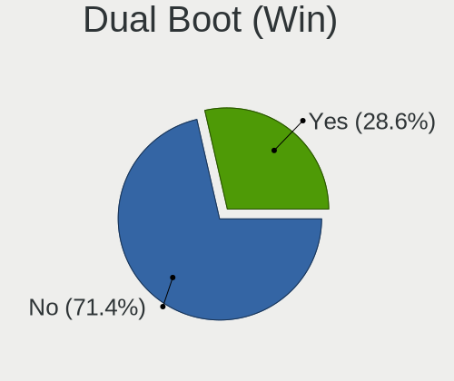
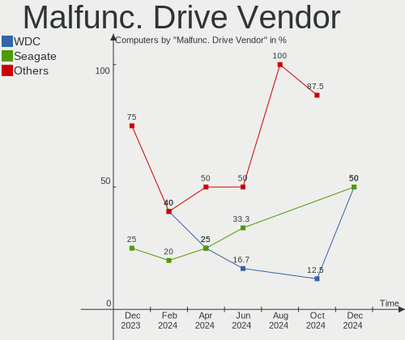
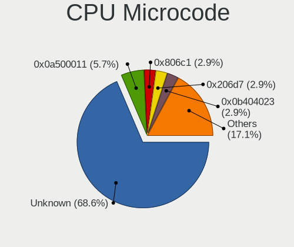
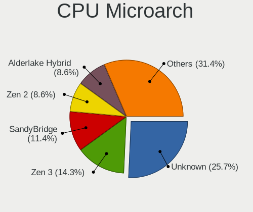
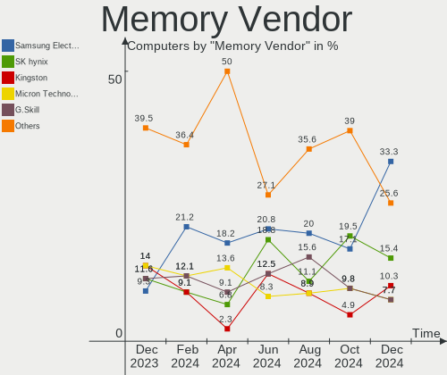

Gentoo Hardware Trends
----------------------

A project to identify most popular hardware characteristics and track their change
over time based on data collected by Gentoo users at https://Linux-Hardware.org.

Anyone can contribute to this report by the [hw-probe](https://github.com/linuxhw/hw-probe) tool:

    sudo -E hw-probe -all -upload

This is a report for all computer types. See also reports for [desktops](/Dist/Gentoo/Desktop/README.md) and [notebooks](/Dist/Gentoo/Notebook/README.md).

Full-feature report is available here: https://linux-hardware.org/?view=trends

Period: Jan, 2022.

Contents
--------

* [ System ](#system)
  - [ OS                       ](#os)
  - [ OS Family                ](#os-family)
  - [ Kernel                   ](#kernel)
  - [ Kernel Family            ](#kernel-family)
  - [ Kernel Major Ver.        ](#kernel-major-ver)
  - [ Arch                     ](#arch)
  - [ DE                       ](#de)
  - [ Display Server           ](#display-server)
  - [ Display Manager          ](#display-manager)
  - [ OS Lang                  ](#os-lang)
  - [ Boot Mode                ](#boot-mode)
  - [ Filesystem               ](#filesystem)
  - [ Part. scheme             ](#part-scheme)
  - [ Dual Boot with Linux/BSD ](#dual-boot-with-linuxbsd)
  - [ Dual Boot (Win)          ](#dual-boot-win)

* [ Board ](#board)
  - [ Vendor                   ](#vendor)
  - [ Model                    ](#model)
  - [ Model Family             ](#model-family)
  - [ MFG Year                 ](#mfg-year)
  - [ Form Factor              ](#form-factor)
  - [ Secure Boot              ](#secure-boot)
  - [ Coreboot                 ](#coreboot)
  - [ RAM Size                 ](#ram-size)
  - [ RAM Used                 ](#ram-used)
  - [ Total Drives             ](#total-drives)
  - [ Has CD-ROM               ](#has-cd-rom)
  - [ Has Ethernet             ](#has-ethernet)
  - [ Has WiFi                 ](#has-wifi)
  - [ Has Bluetooth            ](#has-bluetooth)

* [ Location ](#location)
  - [ Country                  ](#country)
  - [ City                     ](#city)

* [ Drives ](#drives)
  - [ Drive Vendor             ](#drive-vendor)
  - [ Drive Model              ](#drive-model)
  - [ HDD Vendor               ](#hdd-vendor)
  - [ SSD Vendor               ](#ssd-vendor)
  - [ Drive Kind               ](#drive-kind)
  - [ Drive Connector          ](#drive-connector)
  - [ Drive Size               ](#drive-size)
  - [ Space Total              ](#space-total)
  - [ Space Used               ](#space-used)
  - [ Malfunc. Drives          ](#malfunc-drives)
  - [ Malfunc. Drive Vendor    ](#malfunc-drive-vendor)
  - [ Malfunc. HDD Vendor      ](#malfunc-hdd-vendor)
  - [ Malfunc. Drive Kind      ](#malfunc-drive-kind)
  - [ Failed Drives            ](#failed-drives)
  - [ Failed Drive Vendor      ](#failed-drive-vendor)
  - [ Drive Status             ](#drive-status)

* [ Storage controller ](#storage-controller)
  - [ Storage Vendor           ](#storage-vendor)
  - [ Storage Model            ](#storage-model)
  - [ Storage Kind             ](#storage-kind)

* [ Processor ](#processor)
  - [ CPU Vendor               ](#cpu-vendor)
  - [ CPU Model                ](#cpu-model)
  - [ CPU Model Family         ](#cpu-model-family)
  - [ CPU Cores                ](#cpu-cores)
  - [ CPU Sockets              ](#cpu-sockets)
  - [ CPU Threads              ](#cpu-threads)
  - [ CPU Op-Modes             ](#cpu-op-modes)
  - [ CPU Microcode            ](#cpu-microcode)
  - [ CPU Microarch            ](#cpu-microarch)

* [ Graphics ](#graphics)
  - [ GPU Vendor               ](#gpu-vendor)
  - [ GPU Model                ](#gpu-model)
  - [ GPU Combo                ](#gpu-combo)
  - [ GPU Driver               ](#gpu-driver)
  - [ GPU Memory               ](#gpu-memory)

* [ Monitor ](#monitor)
  - [ Monitor Vendor           ](#monitor-vendor)
  - [ Monitor Model            ](#monitor-model)
  - [ Monitor Resolution       ](#monitor-resolution)
  - [ Monitor Diagonal         ](#monitor-diagonal)
  - [ Monitor Width            ](#monitor-width)
  - [ Aspect Ratio             ](#aspect-ratio)
  - [ Monitor Area             ](#monitor-area)
  - [ Pixel Density            ](#pixel-density)
  - [ Multiple Monitors        ](#multiple-monitors)

* [ Network ](#network)
  - [ Net Controller Vendor    ](#net-controller-vendor)
  - [ Net Controller Model     ](#net-controller-model)
  - [ Wireless Vendor          ](#wireless-vendor)
  - [ Wireless Model           ](#wireless-model)
  - [ Ethernet Vendor          ](#ethernet-vendor)
  - [ Ethernet Model           ](#ethernet-model)
  - [ Net Controller Kind      ](#net-controller-kind)
  - [ Used Controller          ](#used-controller)
  - [ NICs                     ](#nics)
  - [ IPv6                     ](#ipv6)

* [ Bluetooth ](#bluetooth)
  - [ Bluetooth Vendor         ](#bluetooth-vendor)
  - [ Bluetooth Model          ](#bluetooth-model)

* [ Sound ](#sound)
  - [ Sound Vendor             ](#sound-vendor)
  - [ Sound Model              ](#sound-model)

* [ Memory ](#memory)
  - [ Memory Vendor            ](#memory-vendor)
  - [ Memory Model             ](#memory-model)
  - [ Memory Kind              ](#memory-kind)
  - [ Memory Form Factor       ](#memory-form-factor)
  - [ Memory Size              ](#memory-size)
  - [ Memory Speed             ](#memory-speed)

* [ Printers & scanners ](#printers--scanners)
  - [ Printer Vendor           ](#printer-vendor)
  - [ Printer Model            ](#printer-model)
  - [ Scanner Vendor           ](#scanner-vendor)
  - [ Scanner Model            ](#scanner-model)

* [ Camera ](#camera)
  - [ Camera Vendor            ](#camera-vendor)
  - [ Camera Model             ](#camera-model)

* [ Security ](#security)
  - [ Fingerprint Vendor       ](#fingerprint-vendor)
  - [ Fingerprint Model        ](#fingerprint-model)
  - [ Chipcard Vendor          ](#chipcard-vendor)
  - [ Chipcard Model           ](#chipcard-model)

* [ Unsupported ](#unsupported)
  - [ Unsupported Devices      ](#unsupported-devices)
  - [ Unsupported Device Types ](#unsupported-device-types)

System
------

OS
--

Installed operating systems

| Name       | Computers | Percent |
|------------|-----------|---------|
| Gentoo 2.8 | 20        | 34.48%  |
| Gentoo 2.6 | 20        | 34.48%  |
| Gentoo 2.7 | 17        | 29.31%  |
| Gentoo 1   | 1         | 1.72%   |

OS Family
---------

OS without a version

| Name   | Computers | Percent |
|--------|-----------|---------|
| Gentoo | 58        | 100%    |

Kernel
------

Version of the Linux kernel

| Version                                                    | Computers | Percent |
|------------------------------------------------------------|-----------|---------|
| 5.15.11-gentoo                                             | 7         | 12.07%  |
| 5.15.16-gentoo                                             | 6         | 10.34%  |
| 5.15.13-gentoo                                             | 4         | 6.9%    |
| 5.15.11-gentoo-x86_64                                      | 4         | 6.9%    |
| 5.16.0-gentoo-x86_64                                       | 3         | 5.17%   |
| 5.16.2-gentoo                                              | 2         | 3.45%   |
| 5.15.12-gentoo-x86_64                                      | 2         | 3.45%   |
| 5.15.12-gentoo                                             | 2         | 3.45%   |
| 5.15.10-gentoo                                             | 2         | 3.45%   |
| 5.10.76-gentoo-r1                                          | 2         | 3.45%   |
| 5.16.2-gentoo-x86_64                                       | 1         | 1.72%   |
| 5.16.1-gentoo-x86_64                                       | 1         | 1.72%   |
| 5.16.1-gentoo                                              | 1         | 1.72%   |
| 5.16.0-xanmod1                                             | 1         | 1.72%   |
| 5.16.0-gentoo-gentoo-dist                                  | 1         | 1.72%   |
| 5.16.0-gentoo                                              | 1         | 1.72%   |
| 5.15.3-gentoo                                              | 1         | 1.72%   |
| 5.15.16-gentoo-dist                                        | 1         | 1.72%   |
| 5.15.15-gentoo-limelight                                   | 1         | 1.72%   |
| 5.15.13-gentoo-dist                                        | 1         | 1.72%   |
| 5.15.12-gentoo-dist                                        | 1         | 1.72%   |
| 5.15.11-gentoo_Mac-F22586C8                                | 1         | 1.72%   |
| 5.15.11-gentoo_defconf_kernel_selfpr_dev_2022-01-01-181156 | 1         | 1.72%   |
| 5.15.11-gentoo-x86_64-usbc-tb1                             | 1         | 1.72%   |
| 5.15.11-gentoo-x86_64+                                     | 1         | 1.72%   |
| 5.15.11-gentoo-rZ165                                       | 1         | 1.72%   |
| 5.15.11-gentoo-dist                                        | 1         | 1.72%   |
| 5.15.10-gentoo-x86_64                                      | 1         | 1.72%   |
| 5.14.0-rc1+                                                | 1         | 1.72%   |
| 5.11.12-cwx                                                | 1         | 1.72%   |
| 5.11.0-27-generic                                          | 1         | 1.72%   |
| 5.10.63-v8                                                 | 1         | 1.72%   |
| 5.10.63-rpi3                                               | 1         | 1.72%   |
| 5.10.61-gentoo                                             | 1         | 1.72%   |

Kernel Family
-------------

Linux kernel without a distro release

| Version | Computers | Percent |
|---------|-----------|---------|
| 5.15.11 | 17        | 29.31%  |
| 5.15.16 | 7         | 12.07%  |
| 5.16.0  | 6         | 10.34%  |
| 5.15.13 | 5         | 8.62%   |
| 5.15.12 | 5         | 8.62%   |
| 5.16.2  | 3         | 5.17%   |
| 5.15.10 | 3         | 5.17%   |
| 5.16.1  | 2         | 3.45%   |
| 5.10.76 | 2         | 3.45%   |
| 5.10.63 | 2         | 3.45%   |
| 5.15.3  | 1         | 1.72%   |
| 5.15.15 | 1         | 1.72%   |
| 5.14.0  | 1         | 1.72%   |
| 5.11.12 | 1         | 1.72%   |
| 5.11.0  | 1         | 1.72%   |
| 5.10.61 | 1         | 1.72%   |

Kernel Major Ver.
-----------------

Linux kernel major version

| Version | Computers | Percent |
|---------|-----------|---------|
| 5.15    | 39        | 67.24%  |
| 5.16    | 11        | 18.97%  |
| 5.10    | 5         | 8.62%   |
| 5.11    | 2         | 3.45%   |
| 5.14    | 1         | 1.72%   |

Arch
----

OS architecture (x86_64, i586, etc.)

| Name    | Computers | Percent |
|---------|-----------|---------|
| x86_64  | 56        | 96.55%  |
| aarch64 | 2         | 3.45%   |

DE
--

Desktop Environment

| Name       | Computers | Percent |
|------------|-----------|---------|
| Unknown    | 21        | 36.21%  |
| KDE5       | 14        | 24.14%  |
| GNOME      | 8         | 13.79%  |
| XFCE       | 7         | 12.07%  |
| LXQt       | 2         | 3.45%   |
| X-Cinnamon | 1         | 1.72%   |
| sway       | 1         | 1.72%   |
| MATE       | 1         | 1.72%   |
| KDE        | 1         | 1.72%   |
| i3         | 1         | 1.72%   |
| fvwm       | 1         | 1.72%   |

Display Server
--------------

X11 or Wayland

| Name    | Computers | Percent |
|---------|-----------|---------|
| X11     | 25        | 43.1%   |
| Wayland | 12        | 20.69%  |
| Unknown | 11        | 18.97%  |
| Tty     | 10        | 17.24%  |

Display Manager
---------------

SDDM, LightDM, etc.

| Name    | Computers | Percent |
|---------|-----------|---------|
| Unknown | 23        | 39.66%  |
| SDDM    | 17        | 29.31%  |
| LightDM | 7         | 12.07%  |
| GDM     | 5         | 8.62%   |
| GREETD  | 2         | 3.45%   |
| XDM     | 1         | 1.72%   |
| TDM     | 1         | 1.72%   |
| SLiM    | 1         | 1.72%   |
| GDM3    | 1         | 1.72%   |

OS Lang
-------

Language

| Lang    | Computers | Percent |
|---------|-----------|---------|
| en_US   | 22        | 37.93%  |
| en_GB   | 7         | 12.07%  |
| Unknown | 7         | 12.07%  |
| C.UTF8  | 5         | 8.62%   |
| pt_BR   | 2         | 3.45%   |
| de_DE   | 2         | 3.45%   |
| de_CH   | 2         | 3.45%   |
| C       | 2         | 3.45%   |
| ru_UA   | 1         | 1.72%   |
| ru_RU   | 1         | 1.72%   |
| pl_PL   | 1         | 1.72%   |
| nl_BE   | 1         | 1.72%   |
| ja_JP   | 1         | 1.72%   |
| it_IT   | 1         | 1.72%   |
| fr_FR   | 1         | 1.72%   |
| es_AR   | 1         | 1.72%   |
| en_AU   | 1         | 1.72%   |

Boot Mode
---------

EFI or BIOS

| Mode | Computers | Percent |
|------|-----------|---------|
| EFI  | 48        | 82.76%  |
| BIOS | 10        | 17.24%  |

Filesystem
----------

Type of filesystem

| Type  | Computers | Percent |
|-------|-----------|---------|
| Ext4  | 35        | 60.34%  |
| Btrfs | 13        | 22.41%  |
| F2fs  | 6         | 10.34%  |
| Xfs   | 2         | 3.45%   |
| Zfs   | 1         | 1.72%   |
| Xtrfs | 1         | 1.72%   |

Part. scheme
------------

Scheme of partitioning

| Type    | Computers | Percent |
|---------|-----------|---------|
| GPT     | 54        | 93.1%   |
| MBR     | 2         | 3.45%   |
| Unknown | 2         | 3.45%   |

Dual Boot with Linux/BSD
------------------------

Hosting more than one Linux/BSD

| Dual boot | Computers | Percent |
|-----------|-----------|---------|
| No        | 46        | 79.31%  |
| Yes       | 12        | 20.69%  |

Dual Boot (Win)
---------------

Hosting Linux and Windows

| Dual boot | Computers | Percent |
|-----------|-----------|---------|
| No        | 39        | 67.24%  |
| Yes       | 19        | 32.76%  |

Board
-----

Vendor
------

Motherboard manufacturer

| Name                    | Computers | Percent |
|-------------------------|-----------|---------|
| Lenovo                  | 11        | 18.97%  |
| Dell                    | 7         | 12.07%  |
| ASRock                  | 7         | 12.07%  |
| ASUSTek Computer        | 6         | 10.34%  |
| Gigabyte Technology     | 5         | 8.62%   |
| Hewlett-Packard         | 4         | 6.9%    |
| MSI                     | 3         | 5.17%   |
| Acer                    | 3         | 5.17%   |
| Timi                    | 2         | 3.45%   |
| Samsung Electronics     | 2         | 3.45%   |
| Raspberry Pi Foundation | 2         | 3.45%   |
| HUAWEI                  | 2         | 3.45%   |
| Apple                   | 2         | 3.45%   |
| TYAN Computer           | 1         | 1.72%   |
| TUXEDO                  | 1         | 1.72%   |

Model
-----

Motherboard model

| Name                                     | Computers | Percent |
|------------------------------------------|-----------|---------|
| RPi Raspberry Pi                         | 2         | 3.45%   |
| TYAN S7025                               | 1         | 1.72%   |
| TUXEDO Pulse 15 Gen1                     | 1         | 1.72%   |
| Timi RedmiBook 13                        | 1         | 1.72%   |
| Timi Mi Laptop Pro 15                    | 1         | 1.72%   |
| Samsung RC530/RC730                      | 1         | 1.72%   |
| Samsung 700T1C                           | 1         | 1.72%   |
| MSI MS-7C02                              | 1         | 1.72%   |
| MSI GS63VR 6RF                           | 1         | 1.72%   |
| MSI GE73 Raider RGB 8RF                  | 1         | 1.72%   |
| Lenovo Yoga S740-14IIL 81RS              | 1         | 1.72%   |
| Lenovo Yoga C740-14IML 81TC              | 1         | 1.72%   |
| Lenovo ThinkPad X1 Carbon 7th 20QD0039RI | 1         | 1.72%   |
| Lenovo ThinkPad T480s 20L8S02E00         | 1         | 1.72%   |
| Lenovo ThinkPad 20FMCT01WW               | 1         | 1.72%   |
| Lenovo ThinkCentre Edge72 3492EHG        | 1         | 1.72%   |
| Lenovo Legion R7000 2020 82B6            | 1         | 1.72%   |
| Lenovo Legion 5P 15IMH05 82AW            | 1         | 1.72%   |
| Lenovo Legion 5 Pro 16ACH6H 82JQ         | 1         | 1.72%   |
| Lenovo IdeaPadFlex 5 14ITL05 82LT        | 1         | 1.72%   |
| Lenovo IdeaPad 5 15ITL05 82FG            | 1         | 1.72%   |
| HUAWEI NBLK-WAX9X                        | 1         | 1.72%   |
| HUAWEI HVY-WXX9                          | 1         | 1.72%   |
| HP ProBook 430 G7                        | 1         | 1.72%   |
| HP Pavilion ZV6100 (EE984EA#ABZ)         | 1         | 1.72%   |
| HP Pavilion Gaming Laptop 17-cd0xxx      | 1         | 1.72%   |
| HP Pavilion Gaming Laptop 15-ec1xxx      | 1         | 1.72%   |
| Gigabyte Z490 UD                         | 1         | 1.72%   |
| Gigabyte B460HD3                         | 1         | 1.72%   |
| Gigabyte B450M S2H                       | 1         | 1.72%   |
| Gigabyte AX370-Gaming 3                  | 1         | 1.72%   |
| Gigabyte AB350-Gaming                    | 1         | 1.72%   |
| Dell XPS 17 9710                         | 1         | 1.72%   |
| Dell XPS 15 9570                         | 1         | 1.72%   |
| Dell XPS 13 9365                         | 1         | 1.72%   |
| Dell Precision 7560                      | 1         | 1.72%   |
| Dell Precision 7520                      | 1         | 1.72%   |
| Dell Precision 3561                      | 1         | 1.72%   |
| Dell Inspiron 5402                       | 1         | 1.72%   |
| ASUS ROG Zephyrus G14 GA401QE_GA401QE    | 1         | 1.72%   |
| ASUS ROG STRIX B560-I GAMING WIFI        | 1         | 1.72%   |
| ASUS ROG Maximus XIII APEX               | 1         | 1.72%   |
| ASUS PRIME B450M-K                       | 1         | 1.72%   |
| ASUS M5A97 LE R2.0                       | 1         | 1.72%   |
| ASUS M3A78-CM                            | 1         | 1.72%   |
| ASRock X370 Gaming X                     | 1         | 1.72%   |
| ASRock Q1900-ITX                         | 1         | 1.72%   |
| ASRock B550 Steel Legend                 | 1         | 1.72%   |
| ASRock AM1H-ITX                          | 1         | 1.72%   |
| ASRock AB350M Pro4                       | 1         | 1.72%   |
| ASRock A88M-G                            | 1         | 1.72%   |
| ASRock 970 Pro3 R2.0                     | 1         | 1.72%   |
| Apple MacBookPro6,2                      | 1         | 1.72%   |
| Apple MacBookPro16,1                     | 1         | 1.72%   |
| Acer Swift SF314-59                      | 1         | 1.72%   |
| Acer Nitro AN515-54                      | 1         | 1.72%   |
| Acer Aspire E5-571G                      | 1         | 1.72%   |

Model Family
------------

Motherboard model prefix

| Name                  | Computers | Percent |
|-----------------------|-----------|---------|
| Lenovo ThinkPad       | 3         | 5.17%   |
| Lenovo Legion         | 3         | 5.17%   |
| HP Pavilion           | 3         | 5.17%   |
| Dell XPS              | 3         | 5.17%   |
| Dell Precision        | 3         | 5.17%   |
| ASUS ROG              | 3         | 5.17%   |
| RPi Raspberry         | 2         | 3.45%   |
| Lenovo Yoga           | 2         | 3.45%   |
| TYAN S7025            | 1         | 1.72%   |
| TUXEDO Pulse          | 1         | 1.72%   |
| Timi RedmiBook        | 1         | 1.72%   |
| Timi Mi               | 1         | 1.72%   |
| Samsung RC530         | 1         | 1.72%   |
| Samsung 700T1C        | 1         | 1.72%   |
| MSI MS-7C02           | 1         | 1.72%   |
| MSI GS63VR            | 1         | 1.72%   |
| MSI GE73              | 1         | 1.72%   |
| Lenovo ThinkCentre    | 1         | 1.72%   |
| Lenovo IdeaPadFlex    | 1         | 1.72%   |
| Lenovo IdeaPad        | 1         | 1.72%   |
| HUAWEI NBLK-WAX9X     | 1         | 1.72%   |
| HUAWEI HVY-WXX9       | 1         | 1.72%   |
| HP ProBook            | 1         | 1.72%   |
| Gigabyte Z490         | 1         | 1.72%   |
| Gigabyte B460HD3      | 1         | 1.72%   |
| Gigabyte B450M        | 1         | 1.72%   |
| Gigabyte AX370-Gaming | 1         | 1.72%   |
| Gigabyte AB350-Gaming | 1         | 1.72%   |
| Dell Inspiron         | 1         | 1.72%   |
| ASUS PRIME            | 1         | 1.72%   |
| ASUS M5A97            | 1         | 1.72%   |
| ASUS M3A78-CM         | 1         | 1.72%   |
| ASRock X370           | 1         | 1.72%   |
| ASRock Q1900-ITX      | 1         | 1.72%   |
| ASRock B550           | 1         | 1.72%   |
| ASRock AM1H-ITX       | 1         | 1.72%   |
| ASRock AB350M         | 1         | 1.72%   |
| ASRock A88M-G         | 1         | 1.72%   |
| ASRock 970            | 1         | 1.72%   |
| Apple MacBookPro6     | 1         | 1.72%   |
| Apple MacBookPro16    | 1         | 1.72%   |
| Acer Swift            | 1         | 1.72%   |
| Acer Nitro            | 1         | 1.72%   |
| Acer Aspire           | 1         | 1.72%   |

MFG Year
--------

Motherboard manufacture year

| Year    | Computers | Percent |
|---------|-----------|---------|
| 2021    | 11        | 18.97%  |
| 2020    | 11        | 18.97%  |
| 2019    | 10        | 17.24%  |
| 2018    | 5         | 8.62%   |
| 2017    | 4         | 6.9%    |
| 2016    | 3         | 5.17%   |
| 2014    | 3         | 5.17%   |
| 2012    | 3         | 5.17%   |
| 2013    | 2         | 3.45%   |
| Unknown | 2         | 3.45%   |
| 2011    | 1         | 1.72%   |
| 2010    | 1         | 1.72%   |
| 2008    | 1         | 1.72%   |
| 2006    | 1         | 1.72%   |

Form Factor
-----------

Physical design of the computer

| Name           | Computers | Percent |
|----------------|-----------|---------|
| Notebook       | 33        | 56.9%   |
| Desktop        | 19        | 32.76%  |
| Convertible    | 3         | 5.17%   |
| System on chip | 2         | 3.45%   |
| Server         | 1         | 1.72%   |

Secure Boot
-----------

Enabled or disabled

| State    | Computers | Percent |
|----------|-----------|---------|
| Disabled | 53        | 91.38%  |
| Enabled  | 5         | 8.62%   |

Coreboot
--------

Have coreboot on board

| Used | Computers | Percent |
|------|-----------|---------|
| No   | 58        | 100%    |

RAM Size
--------

Total RAM memory

| Size in GB  | Computers | Percent |
|-------------|-----------|---------|
| 4.01-8.0    | 15        | 25.86%  |
| 32.01-64.0  | 12        | 20.69%  |
| 16.01-24.0  | 12        | 20.69%  |
| 8.01-16.0   | 7         | 12.07%  |
| 64.01-256.0 | 5         | 8.62%   |
| 24.01-32.0  | 3         | 5.17%   |
| 3.01-4.0    | 2         | 3.45%   |
| 1.01-2.0    | 1         | 1.72%   |
| 0.51-1.0    | 1         | 1.72%   |

RAM Used
--------

Used RAM memory

| Used GB    | Computers | Percent |
|------------|-----------|---------|
| 4.01-8.0   | 12        | 20.69%  |
| 1.01-2.0   | 12        | 20.69%  |
| 2.01-3.0   | 11        | 18.97%  |
| 0.01-0.5   | 8         | 13.79%  |
| 3.01-4.0   | 6         | 10.34%  |
| 8.01-16.0  | 6         | 10.34%  |
| 0.51-1.0   | 2         | 3.45%   |
| 16.01-24.0 | 1         | 1.72%   |

Total Drives
------------

Number of drives on board

| Drives | Computers | Percent |
|--------|-----------|---------|
| 1      | 30        | 51.72%  |
| 2      | 17        | 29.31%  |
| 3      | 5         | 8.62%   |
| 6      | 2         | 3.45%   |
| 5      | 2         | 3.45%   |
| 4      | 2         | 3.45%   |

Has CD-ROM
----------

Has CD-ROM on board

| Presented | Computers | Percent |
|-----------|-----------|---------|
| No        | 51        | 87.93%  |
| Yes       | 7         | 12.07%  |

Has Ethernet
------------

Has Ethernet on board

| Presented | Computers | Percent |
|-----------|-----------|---------|
| Yes       | 42        | 72.41%  |
| No        | 16        | 27.59%  |

Has WiFi
--------

Has WiFi module

| Presented | Computers | Percent |
|-----------|-----------|---------|
| Yes       | 41        | 70.69%  |
| No        | 17        | 29.31%  |

Has Bluetooth
-------------

Has Bluetooth module

| Presented | Computers | Percent |
|-----------|-----------|---------|
| Yes       | 39        | 67.24%  |
| No        | 19        | 32.76%  |

Location
--------

Country
-------

Geographic location (country)

| Country     | Computers | Percent |
|-------------|-----------|---------|
| USA         | 9         | 15.52%  |
| Poland      | 8         | 13.79%  |
| Germany     | 7         | 12.07%  |
| Russia      | 6         | 10.34%  |
| Switzerland | 2         | 3.45%   |
| Netherlands | 2         | 3.45%   |
| France      | 2         | 3.45%   |
| Brazil      | 2         | 3.45%   |
| Belgium     | 2         | 3.45%   |
| Uruguay     | 1         | 1.72%   |
| Ukraine     | 1         | 1.72%   |
| UK          | 1         | 1.72%   |
| Tunisia     | 1         | 1.72%   |
| Sweden      | 1         | 1.72%   |
| Spain       | 1         | 1.72%   |
| Romania     | 1         | 1.72%   |
| Philippines | 1         | 1.72%   |
| Japan       | 1         | 1.72%   |
| Italy       | 1         | 1.72%   |
| India       | 1         | 1.72%   |
| Hungary     | 1         | 1.72%   |
| Hong Kong   | 1         | 1.72%   |
| Finland     | 1         | 1.72%   |
| Czechia     | 1         | 1.72%   |
| China       | 1         | 1.72%   |
| Chile       | 1         | 1.72%   |
| Australia   | 1         | 1.72%   |

City
----

Geographic location (city)

| City               | Computers | Percent |
|--------------------|-----------|---------|
| Warsaw             | 3         | 5.17%   |
| Cieszyn            | 3         | 5.17%   |
| Berlin             | 3         | 5.17%   |
| Kulmbach           | 2         | 3.45%   |
| Amsterdam          | 2         | 3.45%   |
| Yekaterinburg      | 1         | 1.72%   |
| Wroclaw            | 1         | 1.72%   |
| West Orange        | 1         | 1.72%   |
| Tura               | 1         | 1.72%   |
| Takarazuka         | 1         | 1.72%   |
| Sydney             | 1         | 1.72%   |
| Stokkem            | 1         | 1.72%   |
| St Petersburg      | 1         | 1.72%   |
| Spring Lake        | 1         | 1.72%   |
| Sestao             | 1         | 1.72%   |
| S??o Paulo         | 1         | 1.72%   |
| Santiago           | 1         | 1.72%   |
| Prague             | 1         | 1.72%   |
| Nyk?¶ping          | 1         | 1.72%   |
| Novosibirsk        | 1         | 1.72%   |
| Moscow             | 1         | 1.72%   |
| Milan              | 1         | 1.72%   |
| Malters            | 1         | 1.72%   |
| Maldonado          | 1         | 1.72%   |
| Lyon               | 1         | 1.72%   |
| Lochow             | 1         | 1.72%   |
| Livingston         | 1         | 1.72%   |
| Lakeland           | 1         | 1.72%   |
| Lachen             | 1         | 1.72%   |
| Kiel               | 1         | 1.72%   |
| Ingolstadt         | 1         | 1.72%   |
| Hyderabad          | 1         | 1.72%   |
| Hoboken            | 1         | 1.72%   |
| High Wycombe       | 1         | 1.72%   |
| Helsinki           | 1         | 1.72%   |
| Foshan             | 1         | 1.72%   |
| Everett            | 1         | 1.72%   |
| Eugene             | 1         | 1.72%   |
| Dnipro             | 1         | 1.72%   |
| Clermont           | 1         | 1.72%   |
| Ciney              | 1         | 1.72%   |
| Chattanooga        | 1         | 1.72%   |
| Central            | 1         | 1.72%   |
| Carthage           | 1         | 1.72%   |
| Calamba            | 1         | 1.72%   |
| Brasov             | 1         | 1.72%   |
| Blagoveshchensk    | 1         | 1.72%   |
| Belo Horizonte     | 1         | 1.72%   |
| Belgorod           | 1         | 1.72%   |
| Asnieres-sur-Seine | 1         | 1.72%   |

Drives
------

Drive Vendor
------------

Hard drive vendors

| Vendor              | Computers | Drives | Percent |
|---------------------|-----------|--------|---------|
| Samsung Electronics | 21        | 24     | 21.65%  |
| WDC                 | 14        | 16     | 14.43%  |
| Seagate             | 12        | 13     | 12.37%  |
| Intel               | 8         | 8      | 8.25%   |
| SanDisk             | 5         | 6      | 5.15%   |
| Kingston            | 3         | 3      | 3.09%   |
| Crucial             | 3         | 6      | 3.09%   |
| Unknown             | 2         | 2      | 2.06%   |
| Toshiba             | 2         | 2      | 2.06%   |
| Team                | 2         | 2      | 2.06%   |
| SPCC                | 2         | 2      | 2.06%   |
| SK Hynix            | 2         | 2      | 2.06%   |
| KIOXIA-EXCERIA      | 2         | 2      | 2.06%   |
| Hitachi             | 2         | 4      | 2.06%   |
| GOODRAM             | 2         | 2      | 2.06%   |
| PLEXTOR             | 1         | 1      | 1.03%   |
| Phison              | 1         | 1      | 1.03%   |
| OCZ-VERTEX          | 1         | 1      | 1.03%   |
| Netac               | 1         | 1      | 1.03%   |
| Micron Technology   | 1         | 1      | 1.03%   |
| LITEONIT            | 1         | 1      | 1.03%   |
| LITEON              | 1         | 1      | 1.03%   |
| Leven               | 1         | 2      | 1.03%   |
| LaCie               | 1         | 1      | 1.03%   |
| KIOXIA              | 1         | 1      | 1.03%   |
| Kingchuxing         | 1         | 1      | 1.03%   |
| HGST                | 1         | 1      | 1.03%   |
| EMTEC               | 1         | 1      | 1.03%   |
| China               | 1         | 1      | 1.03%   |
| Apple               | 1         | 1      | 1.03%   |

Drive Model
-----------

Hard drive models

| Model                                      | Computers | Percent |
|--------------------------------------------|-----------|---------|
| Seagate ST2000DM006-2DM164 2TB             | 2         | 1.87%   |
| Samsung SSD 980 PRO 2TB                    | 2         | 1.87%   |
| Intel SSDPEKNW010T8 1TB                    | 2         | 1.87%   |
| Intel SSDPEKNU512GZ 512GB                  | 2         | 1.87%   |
| GOODRAM SSDPR-CL100-480-G2 480GB           | 2         | 1.87%   |
| WDC WDS500G3X0C-00SJG0 500GB               | 1         | 0.93%   |
| WDC WDS250G2X0C-00L350 250GB               | 1         | 0.93%   |
| WDC WDS240G2G0B-00EPW0 240GB SSD           | 1         | 0.93%   |
| WDC WDS100T2B0C-00PXH0 1TB                 | 1         | 0.93%   |
| WDC WDS100T2B0C 1TB                        | 1         | 0.93%   |
| WDC WD80EDAZ-11TA3A0 8TB                   | 1         | 0.93%   |
| WDC WD40EFRX-68N32N0 4TB                   | 1         | 0.93%   |
| WDC WD30EFRX-68EUZN0 3TB                   | 1         | 0.93%   |
| WDC WD2502ABYS-02B7A0 256GB                | 1         | 0.93%   |
| WDC WD20EZRX-00D8PB0 2TB                   | 1         | 0.93%   |
| WDC WD20EZBX-00AYRA0 2TB                   | 1         | 0.93%   |
| WDC WD20EFRX-68EUZN0 2TB                   | 1         | 0.93%   |
| WDC WD10EZRX-00A8LB0 1TB                   | 1         | 0.93%   |
| WDC WD10EZEX-08WN4A0 1TB                   | 1         | 0.93%   |
| WDC PC SN730 SDBPNTY-512G-1027 512GB       | 1         | 0.93%   |
| WDC PC SN520 SDAPNUW-256G-1006 256GB       | 1         | 0.93%   |
| Unknown MMC Card  64GB                     | 1         | 0.93%   |
| Unknown MMC Card  32GB                     | 1         | 0.93%   |
| Toshiba KXG50ZNV512G NVMe 512GB            | 1         | 0.93%   |
| Toshiba HDWE150 5TB                        | 1         | 0.93%   |
| Team TM8PS7256G 256GB SSD                  | 1         | 0.93%   |
| Team TM8FP2240G 240GB                      | 1         | 0.93%   |
| SPCC Solid State Disk 256GB                | 1         | 0.93%   |
| SPCC Solid State Disk 120GB                | 1         | 0.93%   |
| SK Hynix SKHynix_HFS001TDE9X084N 1TB       | 1         | 0.93%   |
| SK Hynix PC711 NVMe 512GB                  | 1         | 0.93%   |
| Seagate ST500LT012-1DG142 500GB            | 1         | 0.93%   |
| Seagate ST500DM002-1BD142 500GB            | 1         | 0.93%   |
| Seagate ST4000DM004-2CV104 4TB             | 1         | 0.93%   |
| Seagate ST2000DX001-1NS164 2TB             | 1         | 0.93%   |
| Seagate ST2000DM008-2FR102 2TB             | 1         | 0.93%   |
| Seagate ST12000NM0008-2H3101 12TB          | 1         | 0.93%   |
| Seagate ST1000LM049-2GH172 1TB             | 1         | 0.93%   |
| Seagate ST1000LM035-1RK172 1TB             | 1         | 0.93%   |
| Seagate ST1000LM035-1RK1 1TB               | 1         | 0.93%   |
| Seagate ST1000DM010-2EP102 1TB             | 1         | 0.93%   |
| Seagate FireCuda 520 SSD ZP1000GM30002 1TB | 1         | 0.93%   |
| SanDisk SSD PLUS 1000GB                    | 1         | 0.93%   |
| SanDisk SSD i110 32GB                      | 1         | 0.93%   |
| SanDisk SSD i100 32GB                      | 1         | 0.93%   |
| SanDisk SDSSDH3500G 500GB                  | 1         | 0.93%   |
| SanDisk SDSSDA120G 120GB                   | 1         | 0.93%   |
| SanDisk SD9SN8W-128G-1006 128GB SSD        | 1         | 0.93%   |
| Samsung SSD 980 PRO 1TB                    | 1         | 0.93%   |
| Samsung SSD 980 1TB                        | 1         | 0.93%   |
| Samsung SSD 970 EVO Plus 250GB             | 1         | 0.93%   |
| Samsung SSD 970 EVO Plus 1TB               | 1         | 0.93%   |
| Samsung SSD 970 EVO 500GB                  | 1         | 0.93%   |
| Samsung SSD 970 EVO 250GB                  | 1         | 0.93%   |
| Samsung SSD 870 QVO 2TB                    | 1         | 0.93%   |
| Samsung SSD 870 EVO 1TB                    | 1         | 0.93%   |
| Samsung SSD 860 PRO 1TB                    | 1         | 0.93%   |
| Samsung SSD 850 PRO 256GB                  | 1         | 0.93%   |
| Samsung SSD 850 EVO 250GB                  | 1         | 0.93%   |
| Samsung SSD 850 EVO 120GB                  | 1         | 0.93%   |

HDD Vendor
----------

Hard disk drive vendors

| Vendor  | Computers | Drives | Percent |
|---------|-----------|--------|---------|
| Seagate | 11        | 12     | 44%     |
| WDC     | 9         | 9      | 36%     |
| Hitachi | 2         | 4      | 8%      |
| Toshiba | 1         | 1      | 4%      |
| LaCie   | 1         | 1      | 4%      |
| HGST    | 1         | 1      | 4%      |

SSD Vendor
----------

Solid state drive vendors

| Vendor              | Computers | Drives | Percent |
|---------------------|-----------|--------|---------|
| Samsung Electronics | 9         | 9      | 30%     |
| SanDisk             | 5         | 6      | 16.67%  |
| Crucial             | 3         | 5      | 10%     |
| SPCC                | 2         | 2      | 6.67%   |
| GOODRAM             | 2         | 2      | 6.67%   |
| WDC                 | 1         | 1      | 3.33%   |
| Team                | 1         | 1      | 3.33%   |
| OCZ-VERTEX          | 1         | 1      | 3.33%   |
| LITEONIT            | 1         | 1      | 3.33%   |
| LITEON              | 1         | 1      | 3.33%   |
| Leven               | 1         | 2      | 3.33%   |
| Intel               | 1         | 1      | 3.33%   |
| EMTEC               | 1         | 1      | 3.33%   |
| China               | 1         | 1      | 3.33%   |

Drive Kind
----------

HDD or SSD

| Kind | Computers | Drives | Percent |
|------|-----------|--------|---------|
| NVMe | 36        | 46     | 44.44%  |
| SSD  | 25        | 34     | 30.86%  |
| HDD  | 18        | 28     | 22.22%  |
| MMC  | 2         | 2      | 2.47%   |

Drive Connector
---------------

SATA, SAS, NVMe, etc.

| Type | Computers | Drives | Percent |
|------|-----------|--------|---------|
| NVMe | 36        | 46     | 50.7%   |
| SATA | 32        | 61     | 45.07%  |
| MMC  | 2         | 2      | 2.82%   |
| SAS  | 1         | 1      | 1.41%   |

Drive Size
----------

Size of hard drive

| Size in TB | Computers | Drives | Percent |
|------------|-----------|--------|---------|
| 0.01-0.5   | 18        | 28     | 39.13%  |
| 0.51-1.0   | 13        | 14     | 28.26%  |
| 1.01-2.0   | 8         | 11     | 17.39%  |
| 3.01-4.0   | 2         | 2      | 4.35%   |
| 2.01-3.0   | 2         | 4      | 4.35%   |
| 4.01-10.0  | 2         | 2      | 4.35%   |
| 10.01-20.0 | 1         | 1      | 2.17%   |

Space Total
-----------

Amount of disk space available on the file system

| Size in GB     | Computers | Percent |
|----------------|-----------|---------|
| 251-500        | 14        | 24.14%  |
| 101-250        | 9         | 15.52%  |
| 1001-2000      | 9         | 15.52%  |
| 501-1000       | 9         | 15.52%  |
| More than 3000 | 7         | 12.07%  |
| 2001-3000      | 4         | 6.9%    |
| Unknown        | 3         | 5.17%   |
| 51-100         | 2         | 3.45%   |
| 1-20           | 1         | 1.72%   |

Space Used
----------

Amount of used disk space

| Used GB        | Computers | Percent |
|----------------|-----------|---------|
| 1-20           | 14        | 24.14%  |
| 101-250        | 9         | 15.52%  |
| 501-1000       | 6         | 10.34%  |
| 251-500        | 5         | 8.62%   |
| 21-50          | 5         | 8.62%   |
| 1001-2000      | 5         | 8.62%   |
| 51-100         | 5         | 8.62%   |
| More than 3000 | 3         | 5.17%   |
| 2001-3000      | 3         | 5.17%   |
| Unknown        | 3         | 5.17%   |

Malfunc. Drives
---------------

Drive models with a malfunction

| Model                               | Computers | Drives | Percent |
|-------------------------------------|-----------|--------|---------|
| WDC WD2502ABYS-02B7A0 256GB         | 1         | 1      | 8.33%   |
| WDC WD20EZRX-00D8PB0 2TB            | 1         | 1      | 8.33%   |
| WDC WD10EZRX-00A8LB0 1TB            | 1         | 1      | 8.33%   |
| Seagate ST1000LM049-2GH172 1TB      | 1         | 1      | 8.33%   |
| Seagate ST1000LM035-1RK172 1TB      | 1         | 1      | 8.33%   |
| SanDisk SSD PLUS 1000GB             | 1         | 1      | 8.33%   |
| SanDisk SSD i100 32GB               | 1         | 1      | 8.33%   |
| SanDisk SD9SN8W-128G-1006 128GB SSD | 1         | 1      | 8.33%   |
| LITEON CV8-8E128-HP 128GB SSD       | 1         | 1      | 8.33%   |
| Intel SSDPEKKF256G8L 256GB          | 1         | 1      | 8.33%   |
| Hitachi HUA722020ALA331 2TB         | 1         | 1      | 8.33%   |
| EMTEC X250 512GB SSD                | 1         | 1      | 8.33%   |

Malfunc. Drive Vendor
---------------------

Vendors of faulty drives

| Vendor  | Computers | Drives | Percent |
|---------|-----------|--------|---------|
| WDC     | 3         | 3      | 25%     |
| SanDisk | 3         | 3      | 25%     |
| Seagate | 2         | 2      | 16.67%  |
| LITEON  | 1         | 1      | 8.33%   |
| Intel   | 1         | 1      | 8.33%   |
| Hitachi | 1         | 1      | 8.33%   |
| EMTEC   | 1         | 1      | 8.33%   |

Malfunc. HDD Vendor
-------------------

Vendors of faulty HDD drives

| Vendor  | Computers | Drives | Percent |
|---------|-----------|--------|---------|
| WDC     | 3         | 3      | 50%     |
| Seagate | 2         | 2      | 33.33%  |
| Hitachi | 1         | 1      | 16.67%  |

Malfunc. Drive Kind
-------------------

Kinds of faulty drives

| Kind | Computers | Drives | Percent |
|------|-----------|--------|---------|
| SSD  | 5         | 5      | 45.45%  |
| HDD  | 5         | 6      | 45.45%  |
| NVMe | 1         | 1      | 9.09%   |

Failed Drives
-------------

Failed drive models

Zero info for selected period =(

Failed Drive Vendor
-------------------

Failed drive vendors

Zero info for selected period =(

Drive Status
------------

Number of failed and malfunc. drives

| Status   | Computers | Drives | Percent |
|----------|-----------|--------|---------|
| Works    | 51        | 91     | 76.12%  |
| Malfunc  | 11        | 12     | 16.42%  |
| Detected | 5         | 7      | 7.46%   |

Storage controller
------------------

Storage Vendor
--------------

Storage controller vendors

| Vendor                         | Computers | Percent |
|--------------------------------|-----------|---------|
| Intel                          | 30        | 33.71%  |
| AMD                            | 18        | 20.22%  |
| Samsung Electronics            | 14        | 15.73%  |
| Sandisk                        | 6         | 6.74%   |
| KIOXIA                         | 3         | 3.37%   |
| Kingston Technology Company    | 3         | 3.37%   |
| SK Hynix                       | 2         | 2.25%   |
| Silicon Motion                 | 2         | 2.25%   |
| Phison Electronics             | 2         | 2.25%   |
| ASMedia Technology             | 2         | 2.25%   |
| Toshiba America Info Systems   | 1         | 1.12%   |
| Solid State Storage Technology | 1         | 1.12%   |
| Seagate Technology             | 1         | 1.12%   |
| Micron/Crucial Technology      | 1         | 1.12%   |
| Micron Technology              | 1         | 1.12%   |
| LSI Logic / Symbios Logic      | 1         | 1.12%   |
| Apple                          | 1         | 1.12%   |

Storage Model
-------------

Storage controller models

| Model                                                                            | Computers | Percent |
|----------------------------------------------------------------------------------|-----------|---------|
| AMD FCH SATA Controller [AHCI mode]                                              | 13        | 12.62%  |
| Samsung NVMe SSD Controller SM981/PM981/PM983                                    | 8         | 7.77%   |
| Intel Comet Lake SATA AHCI Controller                                            | 4         | 3.88%   |
| Samsung NVMe SSD Controller PM9A1/PM9A3/980PRO                                   | 3         | 2.91%   |
| Samsung NVMe SSD Controller 980                                                  | 3         | 2.91%   |
| Intel Volume Management Device NVMe RAID Controller                              | 3         | 2.91%   |
| Intel SSD 660P Series                                                            | 3         | 2.91%   |
| Intel 500 Series Chipset Family SATA AHCI Controller                             | 3         | 2.91%   |
| AMD 400 Series Chipset SATA Controller                                           | 3         | 2.91%   |
| SK Hynix Gold P31 SSD                                                            | 2         | 1.94%   |
| Silicon Motion SM2263EN/SM2263XT SSD Controller                                  | 2         | 1.94%   |
| Sandisk WD Blue SN550 NVMe SSD                                                   | 2         | 1.94%   |
| Sandisk WD Black SN750 / PC SN730 NVMe SSD                                       | 2         | 1.94%   |
| KIOXIA Non-Volatile memory controller                                            | 2         | 1.94%   |
| Intel SSD Pro 7600p/760p/E 6100p Series                                          | 2         | 1.94%   |
| Intel Non-Volatile memory controller                                             | 2         | 1.94%   |
| Intel Cannon Lake Mobile PCH SATA AHCI Controller                                | 2         | 1.94%   |
| Intel 82801 Mobile SATA Controller [RAID mode]                                   | 2         | 1.94%   |
| Intel 400 Series Chipset Family SATA AHCI Controller                             | 2         | 1.94%   |
| ASMedia ASM1062 Serial ATA Controller                                            | 2         | 1.94%   |
| AMD X370 Series Chipset SATA Controller                                          | 2         | 1.94%   |
| AMD SB7x0/SB8x0/SB9x0 SATA Controller [AHCI mode]                                | 2         | 1.94%   |
| AMD 300 Series Chipset SATA Controller                                           | 2         | 1.94%   |
| Toshiba America Info Systems Toshiba America Info Non-Volatile memory controller | 1         | 0.97%   |
| Solid State Storage Non-Volatile memory controller                               | 1         | 0.97%   |
| Seagate FireCuda 520 SSD                                                         | 1         | 0.97%   |
| Sandisk WD Blue SN500 / PC SN520 NVMe SSD                                        | 1         | 0.97%   |
| Sandisk WD Black 2018/SN750 / PC SN720 NVMe SSD                                  | 1         | 0.97%   |
| Samsung NVMe SSD Controller SM961/PM961/SM963                                    | 1         | 0.97%   |
| Phison E7 NVMe Controller                                                        | 1         | 0.97%   |
| Phison E12 NVMe Controller                                                       | 1         | 0.97%   |
| Micron/Crucial Non-Volatile memory controller                                    | 1         | 0.97%   |
| Micron Non-Volatile memory controller                                            | 1         | 0.97%   |
| LSI Logic / Symbios Logic SAS1064ET PCI-Express Fusion-MPT SAS                   | 1         | 0.97%   |
| KIOXIA NVMe SSD                                                                  | 1         | 0.97%   |
| Kingston Company U-SNS8154P3 NVMe SSD                                            | 1         | 0.97%   |
| Kingston Company Company Non-Volatile memory controller                          | 1         | 0.97%   |
| Kingston Company KC2000 NVMe SSD                                                 | 1         | 0.97%   |
| Intel Tiger Lake-LP SATA Controller [AHCI mode]                                  | 1         | 0.97%   |
| Intel Q170/Q150/B150/H170/H110/Z170/CM236 Chipset SATA Controller [AHCI Mode]    | 1         | 0.97%   |
| Intel HM170/QM170 Chipset SATA Controller [AHCI Mode]                            | 1         | 0.97%   |
| Intel Atom Processor E3800 Series SATA AHCI Controller                           | 1         | 0.97%   |
| Intel 82801JI (ICH10 Family) 4 port SATA IDE Controller #1                       | 1         | 0.97%   |
| Intel 82801JI (ICH10 Family) 2 port SATA IDE Controller #2                       | 1         | 0.97%   |
| Intel 8 Series SATA Controller 1 [AHCI mode]                                     | 1         | 0.97%   |
| Intel 7 Series Chipset Family 4-port SATA Controller [IDE mode]                  | 1         | 0.97%   |
| Intel 7 Series Chipset Family 2-port SATA Controller [IDE mode]                  | 1         | 0.97%   |
| Intel 6 Series/C200 Series Chipset Family 6 port Mobile SATA AHCI Controller     | 1         | 0.97%   |
| Intel 6 Series/C200 Series Chipset Family 6 port Desktop SATA AHCI Controller    | 1         | 0.97%   |
| Intel 5 Series/3400 Series Chipset 4 port SATA AHCI Controller                   | 1         | 0.97%   |
| Apple ANS2 NVMe Controller                                                       | 1         | 0.97%   |
| AMD Starship/Matisse Chipset SATA Controller [AHCI mode]                         | 1         | 0.97%   |
| AMD SB7x0/SB8x0/SB9x0 SATA Controller [IDE mode]                                 | 1         | 0.97%   |
| AMD SB7x0/SB8x0/SB9x0 IDE Controller                                             | 1         | 0.97%   |
| AMD IXP SB4x0 IDE Controller                                                     | 1         | 0.97%   |

Storage Kind
------------

Kind of storage controller (IDE, SATA, NVMe, SAS, ...)

| Kind | Computers | Percent |
|------|-----------|---------|
| SATA | 37        | 45.12%  |
| NVMe | 36        | 43.9%   |
| RAID | 4         | 4.88%   |
| IDE  | 4         | 4.88%   |
| SCSI | 1         | 1.22%   |

Processor
---------

CPU Vendor
----------

Processor vendors

| Vendor | Computers | Percent |
|--------|-----------|---------|
| Intel  | 35        | 60.34%  |
| AMD    | 21        | 36.21%  |
| ARM    | 2         | 3.45%   |

CPU Model
---------

Processor models

| Model                                         | Computers | Percent |
|-----------------------------------------------|-----------|---------|
| Intel Core i7-8750H CPU @ 2.20GHz             | 3         | 5.17%   |
| Intel Core i5-10210U CPU @ 1.60GHz            | 3         | 5.17%   |
| Intel 11th Gen Core i5-1135G7 @ 2.40GHz       | 3         | 5.17%   |
| Intel Core i5-9300H CPU @ 2.40GHz             | 2         | 3.45%   |
| Intel 11th Gen Core i7-11850H @ 2.50GHz       | 2         | 3.45%   |
| ARM Processor                                 | 2         | 3.45%   |
| AMD Ryzen 7 4800H with Radeon Graphics        | 2         | 3.45%   |
| AMD Ryzen 5 4600H with Radeon Graphics        | 2         | 3.45%   |
| AMD Ryzen 5 2600 Six-Core Processor           | 2         | 3.45%   |
| AMD FX-6300 Six-Core Processor                | 2         | 3.45%   |
| Intel Xeon CPU X5680 @ 3.33GHz                | 1         | 1.72%   |
| Intel Core i9-9880H CPU @ 2.30GHz             | 1         | 1.72%   |
| Intel Core i7-8565U CPU @ 1.80GHz             | 1         | 1.72%   |
| Intel Core i7-8550U CPU @ 1.80GHz             | 1         | 1.72%   |
| Intel Core i7-7Y75 CPU @ 1.30GHz              | 1         | 1.72%   |
| Intel Core i7-7820HQ CPU @ 2.90GHz            | 1         | 1.72%   |
| Intel Core i7-6700HQ CPU @ 2.60GHz            | 1         | 1.72%   |
| Intel Core i7-2670QM CPU @ 2.20GHz            | 1         | 1.72%   |
| Intel Core i7-10875H CPU @ 2.30GHz            | 1         | 1.72%   |
| Intel Core i7-10700K CPU @ 3.80GHz            | 1         | 1.72%   |
| Intel Core i7-10700F CPU @ 2.90GHz            | 1         | 1.72%   |
| Intel Core i7-1065G7 CPU @ 1.30GHz            | 1         | 1.72%   |
| Intel Core i7-10510U CPU @ 1.80GHz            | 1         | 1.72%   |
| Intel Core i7 CPU M 640 @ 2.80GHz             | 1         | 1.72%   |
| Intel Core i5-4210U CPU @ 1.70GHz             | 1         | 1.72%   |
| Intel Core i5-3470S CPU @ 2.90GHz             | 1         | 1.72%   |
| Intel Core i5-3317U CPU @ 1.70GHz             | 1         | 1.72%   |
| Intel Celeron CPU J1900 @ 1.99GHz             | 1         | 1.72%   |
| Intel 11th Gen Core i9-11900K @ 3.50GHz       | 1         | 1.72%   |
| Intel 11th Gen Core i7-11800H @ 2.30GHz       | 1         | 1.72%   |
| Intel 11th Gen Core i7-1165G7 @ 2.80GHz       | 1         | 1.72%   |
| Intel 11th Gen Core i5-11500 @ 2.70GHz        | 1         | 1.72%   |
| AMD Sempron 3850 APU with Radeon R3           | 1         | 1.72%   |
| AMD Ryzen 9 3950X 16-Core Processor           | 1         | 1.72%   |
| AMD Ryzen 7 5800X 8-Core Processor            | 1         | 1.72%   |
| AMD Ryzen 7 5800HS with Radeon Graphics       | 1         | 1.72%   |
| AMD Ryzen 7 5800H with Radeon Graphics        | 1         | 1.72%   |
| AMD Ryzen 5 3600XT 6-Core Processor           | 1         | 1.72%   |
| AMD Ryzen 5 3600 6-Core Processor             | 1         | 1.72%   |
| AMD Ryzen 5 3500U with Radeon Vega Mobile Gfx | 1         | 1.72%   |
| AMD Ryzen 5 1600X Six-Core Processor          | 1         | 1.72%   |
| AMD Ryzen 5 1600 Six-Core Processor           | 1         | 1.72%   |
| AMD Phenom II X4 955 Processor                | 1         | 1.72%   |
| AMD Athlon 64 Processor 3200+                 | 1         | 1.72%   |
| AMD A10-5800K APU with Radeon HD Graphics     | 1         | 1.72%   |

CPU Model Family
----------------

Processor model prefix

| Model            | Computers | Percent |
|------------------|-----------|---------|
| Intel Core i7    | 15        | 25.86%  |
| Other            | 11        | 18.97%  |
| AMD Ryzen 5      | 9         | 15.52%  |
| Intel Core i5    | 8         | 13.79%  |
| AMD Ryzen 7      | 5         | 8.62%   |
| AMD FX           | 2         | 3.45%   |
| Intel Xeon       | 1         | 1.72%   |
| Intel Core i9    | 1         | 1.72%   |
| Intel Celeron    | 1         | 1.72%   |
| AMD Sempron      | 1         | 1.72%   |
| AMD Ryzen 9      | 1         | 1.72%   |
| AMD Phenom II X4 | 1         | 1.72%   |
| AMD Athlon 64    | 1         | 1.72%   |
| AMD A10          | 1         | 1.72%   |

CPU Cores
---------

Number of processor cores

| Number  | Computers | Percent |
|---------|-----------|---------|
| 4       | 21        | 36.21%  |
| 8       | 13        | 22.41%  |
| 6       | 12        | 20.69%  |
| 2       | 5         | 8.62%   |
| 3       | 2         | 3.45%   |
| Unknown | 2         | 3.45%   |
| 16      | 1         | 1.72%   |
| 12      | 1         | 1.72%   |
| 1       | 1         | 1.72%   |

CPU Sockets
-----------

Number of sockets

| Number  | Computers | Percent |
|---------|-----------|---------|
| 1       | 55        | 94.83%  |
| Unknown | 2         | 3.45%   |
| 2       | 1         | 1.72%   |

CPU Threads
-----------

Threads per core (Hyper-Threading)

| Number  | Computers | Percent |
|---------|-----------|---------|
| 2       | 50        | 86.21%  |
| 1       | 6         | 10.34%  |
| Unknown | 2         | 3.45%   |

CPU Op-Modes
------------

CPU Operation Modes (32-bit, 64-bit)

| Op mode        | Computers | Percent |
|----------------|-----------|---------|
| 32-bit, 64-bit | 58        | 100%    |

CPU Microcode
-------------

Microcode number

| Number     | Computers | Percent |
|------------|-----------|---------|
| Unknown    | 6         | 10.34%  |
| 0x806ec    | 5         | 8.62%   |
| 0x906ea    | 4         | 6.9%    |
| 0x806c1    | 4         | 6.9%    |
| 0xa0671    | 2         | 3.45%   |
| 0xa0655    | 2         | 3.45%   |
| 0x906ed    | 2         | 3.45%   |
| 0x806d1    | 2         | 3.45%   |
| 0x306a9    | 2         | 3.45%   |
| 0x0a50000c | 2         | 3.45%   |
| 0x08600106 | 2         | 3.45%   |
| 0x08600103 | 2         | 3.45%   |
| 0x0800820d | 2         | 3.45%   |
| 0x08001138 | 2         | 3.45%   |
| 0x906e9    | 1         | 1.72%   |
| 0x806ea    | 1         | 1.72%   |
| 0x806e9    | 1         | 1.72%   |
| 0x706e5    | 1         | 1.72%   |
| 0x506e3    | 1         | 1.72%   |
| 0x40651    | 1         | 1.72%   |
| 0x30673    | 1         | 1.72%   |
| 0x206c2    | 1         | 1.72%   |
| 0x206a7    | 1         | 1.72%   |
| 0x20655    | 1         | 1.72%   |
| 0x0a201009 | 1         | 1.72%   |
| 0x08701021 | 1         | 1.72%   |
| 0x08701013 | 1         | 1.72%   |
| 0x08108109 | 1         | 1.72%   |
| 0x0700010f | 1         | 1.72%   |
| 0x06001119 | 1         | 1.72%   |
| 0x06000822 | 1         | 1.72%   |
| 0x06000817 | 1         | 1.72%   |
| 0x010000db | 1         | 1.72%   |

CPU Microarch
-------------

Microarchitecture

| Name        | Computers | Percent |
|-------------|-----------|---------|
| KabyLake    | 14        | 24.14%  |
| Zen 2       | 7         | 12.07%  |
| Icelake     | 5         | 8.62%   |
| TigerLake   | 4         | 6.9%    |
| Zen+        | 3         | 5.17%   |
| Zen 3       | 3         | 5.17%   |
| Piledriver  | 3         | 5.17%   |
| CometLake   | 3         | 5.17%   |
| Unknown     | 3         | 5.17%   |
| Zen         | 2         | 3.45%   |
| Westmere    | 2         | 3.45%   |
| IvyBridge   | 2         | 3.45%   |
| Skylake     | 1         | 1.72%   |
| Silvermont  | 1         | 1.72%   |
| SandyBridge | 1         | 1.72%   |
| K8 Hammer   | 1         | 1.72%   |
| K10         | 1         | 1.72%   |
| Jaguar      | 1         | 1.72%   |
| Haswell     | 1         | 1.72%   |

Graphics
--------

GPU Vendor
----------

Vendors of graphics cards

| Vendor | Computers | Percent |
|--------|-----------|---------|
| Nvidia | 29        | 39.19%  |
| Intel  | 28        | 37.84%  |
| AMD    | 17        | 22.97%  |

GPU Model
---------

Graphics card models

| Model                                                                     | Computers | Percent |
|---------------------------------------------------------------------------|-----------|---------|
| Intel CoffeeLake-H GT2 [UHD Graphics 630]                                 | 5         | 6.58%   |
| Intel TigerLake-LP GT2 [Iris Xe Graphics]                                 | 4         | 5.26%   |
| Intel CometLake-U GT2 [UHD Graphics]                                      | 4         | 5.26%   |
| Nvidia GP108M [GeForce MX250]                                             | 3         | 3.95%   |
| AMD Renoir                                                                | 3         | 3.95%   |
| Nvidia TU117M [GeForce GTX 1650 Mobile / Max-Q]                           | 2         | 2.63%   |
| Nvidia GP107M [GeForce GTX 1050 Ti Mobile]                                | 2         | 2.63%   |
| Intel TigerLake-H GT1 [UHD Graphics]                                      | 2         | 2.63%   |
| AMD Ellesmere [Radeon RX 470/480/570/570X/580/580X/590]                   | 2         | 2.63%   |
| AMD Cezanne                                                               | 2         | 2.63%   |
| Nvidia TU117M [GeForce GTX 1650 Ti Mobile]                                | 1         | 1.32%   |
| Nvidia TU117M                                                             | 1         | 1.32%   |
| Nvidia TU117GLM [T600 Mobile]                                             | 1         | 1.32%   |
| Nvidia TU116M [GeForce GTX 1660 Ti Mobile]                                | 1         | 1.32%   |
| Nvidia TU116 [GeForce GTX 1660 SUPER]                                     | 1         | 1.32%   |
| Nvidia GT216M [GeForce GT 330M]                                           | 1         | 1.32%   |
| Nvidia GP108M [GeForce MX150]                                             | 1         | 1.32%   |
| Nvidia GP108 [GeForce GT 1030]                                            | 1         | 1.32%   |
| Nvidia GP106M [GeForce GTX 1060 Mobile]                                   | 1         | 1.32%   |
| Nvidia GP106 [GeForce GTX 1060 6GB]                                       | 1         | 1.32%   |
| Nvidia GP104M [GeForce GTX 1070 Mobile]                                   | 1         | 1.32%   |
| Nvidia GM206 [GeForce GTX 960]                                            | 1         | 1.32%   |
| Nvidia GM204 [GeForce GTX 970]                                            | 1         | 1.32%   |
| Nvidia GM108M [GeForce 840M]                                              | 1         | 1.32%   |
| Nvidia GF108M [GeForce GT 540M]                                           | 1         | 1.32%   |
| Nvidia GA107M [GeForce RTX 3050 Ti Mobile]                                | 1         | 1.32%   |
| Nvidia GA107M [GeForce RTX 3050 Mobile]                                   | 1         | 1.32%   |
| Nvidia GA104M [GeForce RTX 3070 Mobile / Max-Q]                           | 1         | 1.32%   |
| Nvidia GA104GLM [RTX A4000 Mobile]                                        | 1         | 1.32%   |
| Nvidia GA102 [GeForce RTX 3080]                                           | 1         | 1.32%   |
| Nvidia GA102 [GeForce RTX 3080 Ti]                                        | 1         | 1.32%   |
| Nvidia G73 [GeForce 7300 GT]                                              | 1         | 1.32%   |
| Intel Xeon E3-1200 v2/3rd Gen Core processor Graphics Controller          | 1         | 1.32%   |
| Intel WhiskeyLake-U GT2 [UHD Graphics 620]                                | 1         | 1.32%   |
| Intel UHD Graphics 620                                                    | 1         | 1.32%   |
| Intel RocketLake-S GT1 [UHD Graphics 750]                                 | 1         | 1.32%   |
| Intel Iris Plus Graphics G7                                               | 1         | 1.32%   |
| Intel HD Graphics 630                                                     | 1         | 1.32%   |
| Intel HD Graphics 615                                                     | 1         | 1.32%   |
| Intel HD Graphics 530                                                     | 1         | 1.32%   |
| Intel Haswell-ULT Integrated Graphics Controller                          | 1         | 1.32%   |
| Intel Core Processor Integrated Graphics Controller                       | 1         | 1.32%   |
| Intel Atom Processor Z36xxx/Z37xxx Series Graphics & Display              | 1         | 1.32%   |
| Intel 3rd Gen Core processor Graphics Controller                          | 1         | 1.32%   |
| Intel 2nd Generation Core Processor Family Integrated Graphics Controller | 1         | 1.32%   |
| AMD Trinity [Radeon HD 7660D]                                             | 1         | 1.32%   |
| AMD RS780C [Radeon 3100]                                                  | 1         | 1.32%   |
| AMD RS480M [Mobility Radeon Xpress 200]                                   | 1         | 1.32%   |
| AMD Picasso/Raven 2 [Radeon Vega Series / Radeon Vega Mobile Series]      | 1         | 1.32%   |
| AMD Oland PRO [Radeon R7 240/340 / Radeon 520]                            | 1         | 1.32%   |
| AMD Navi 23 [Radeon RX 6600/6600 XT/6600M]                                | 1         | 1.32%   |
| AMD Navi 21 [Radeon RX 6800/6800 XT / 6900 XT]                            | 1         | 1.32%   |
| AMD Navi 14 [Radeon RX 5500/5500M / Pro 5500M]                            | 1         | 1.32%   |
| AMD Lexa PRO [Radeon 540/540X/550/550X / RX 540X/550/550X]                | 1         | 1.32%   |
| AMD Kabini [Radeon HD 8280 / R3 Series]                                   | 1         | 1.32%   |
| AMD Juniper XT [Radeon HD 5770]                                           | 1         | 1.32%   |
| AMD Curacao PRO [Radeon R7 370 / R9 270/370 OEM]                          | 1         | 1.32%   |

GPU Combo
---------

Combinations of graphics cards

| Name           | Computers | Percent |
|----------------|-----------|---------|
| Intel + Nvidia | 15        | 25.86%  |
| 1 x Intel      | 13        | 22.41%  |
| 1 x AMD        | 13        | 22.41%  |
| 1 x Nvidia     | 11        | 18.97%  |
| AMD + Nvidia   | 3         | 5.17%   |
| Other          | 2         | 3.45%   |
| 2 x AMD        | 1         | 1.72%   |

GPU Driver
----------

Free vs proprietary

| Driver      | Computers | Percent |
|-------------|-----------|---------|
| Free        | 35        | 60.34%  |
| Proprietary | 20        | 34.48%  |
| Unknown     | 3         | 5.17%   |

GPU Memory
----------

Total video memory

| Size in GB | Computers | Percent |
|------------|-----------|---------|
| Unknown    | 24        | 41.38%  |
| 3.01-4.0   | 9         | 15.52%  |
| 0.01-0.5   | 9         | 15.52%  |
| 1.01-2.0   | 5         | 8.62%   |
| 5.01-6.0   | 4         | 6.9%    |
| 8.01-16.0  | 3         | 5.17%   |
| 0.51-1.0   | 3         | 5.17%   |
| 7.01-8.0   | 1         | 1.72%   |

Monitor
-------

Monitor Vendor
--------------

Monitor vendors

| Vendor                  | Computers | Percent |
|-------------------------|-----------|---------|
| BOE                     | 10        | 13.7%   |
| Sharp                   | 7         | 9.59%   |
| Dell                    | 6         | 8.22%   |
| Goldstar                | 5         | 6.85%   |
| Chimei Innolux          | 5         | 6.85%   |
| AU Optronics            | 5         | 6.85%   |
| LG Display              | 4         | 5.48%   |
| Acer                    | 4         | 5.48%   |
| BenQ                    | 3         | 4.11%   |
| Samsung Electronics     | 2         | 2.74%   |
| Philips                 | 2         | 2.74%   |
| Iiyama                  | 2         | 2.74%   |
| Apple                   | 2         | 2.74%   |
| AOC                     | 2         | 2.74%   |
| ViewSonic               | 1         | 1.37%   |
| SKY                     | 1         | 1.37%   |
| Sceptre Tech            | 1         | 1.37%   |
| PNP                     | 1         | 1.37%   |
| PKB                     | 1         | 1.37%   |
| MPI                     | 1         | 1.37%   |
| Lenovo                  | 1         | 1.37%   |
| HJW                     | 1         | 1.37%   |
| HannStar                | 1         | 1.37%   |
| CSO                     | 1         | 1.37%   |
| Chi Mei Optoelectronics | 1         | 1.37%   |
| Belinea                 | 1         | 1.37%   |
| ASUSTek Computer        | 1         | 1.37%   |
| Ancor Communications    | 1         | 1.37%   |

Monitor Model
-------------

Monitor models

| Model                                                                 | Computers | Percent |
|-----------------------------------------------------------------------|-----------|---------|
| Sharp LQ156M1JW01 SHP14C3 1920x1080 344x194mm 15.5-inch               | 2         | 2.63%   |
| Goldstar HDR 4K GSM7707 3840x2160 600x340mm 27.2-inch                 | 2         | 2.63%   |
| ViewSonic VG2249 Series VSCF232 1920x1080 476x268mm 21.5-inch         | 1         | 1.32%   |
| SKY TV-monitor SKY1202 1920x1080 885x498mm 40.0-inch                  | 1         | 1.32%   |
| Sharp LQ140M1JW49 SHP1523 1920x1080 309x174mm 14.0-inch               | 1         | 1.32%   |
| Sharp LCD Monitor SHP14D6 3840x2400 366x229mm 17.0-inch               | 1         | 1.32%   |
| Sharp LCD Monitor SHP149A 1920x1080 344x194mm 15.5-inch               | 1         | 1.32%   |
| Sharp LCD Monitor SHP146B 3200x1800 294x165mm 13.3-inch               | 1         | 1.32%   |
| Sharp LCD Monitor SHP1430 3840x2160 350x190mm 15.7-inch               | 1         | 1.32%   |
| Sceptre Tech C305W-2560UN SPT0C0D 2560x1080 690x291mm 29.5-inch       | 1         | 1.32%   |
| Samsung Electronics S22B300 SAM08C8 1920x1080 477x268mm 21.5-inch     | 1         | 1.32%   |
| Samsung Electronics LCD Monitor SEC3245 1366x768 344x194mm 15.5-inch  | 1         | 1.32%   |
| PNP Monitor PNP09FF 1920x1080 480x270mm 21.7-inch                     | 1         | 1.32%   |
| PKB LCD Monitor VIS220WS 1680x1050                                    | 1         | 1.32%   |
| Philips PHL 276E8V PHLC18F 3840x2160 600x340mm 27.2-inch              | 1         | 1.32%   |
| Philips PHL 223V5 PHLC0CF 1920x1080 477x268mm 21.5-inch               | 1         | 1.32%   |
| MPI LCD Monitor MPI3508 1440x900 700x390mm 31.5-inch                  | 1         | 1.32%   |
| LG Display LCD Monitor LGD0657 1920x1080 344x194mm 15.5-inch          | 1         | 1.32%   |
| LG Display LCD Monitor LGD063F 1920x1080 382x215mm 17.3-inch          | 1         | 1.32%   |
| LG Display LCD Monitor LGD05F3 1920x1080 309x174mm 14.0-inch          | 1         | 1.32%   |
| LG Display LCD Monitor LGD04A7 1920x1080 344x194mm 15.5-inch          | 1         | 1.32%   |
| Lenovo Q27q-10 LEN65F4 2560x1440 597x336mm 27.0-inch                  | 1         | 1.32%   |
| Iiyama PL3466WQ IVM761A 3440x1440 797x334mm 34.0-inch                 | 1         | 1.32%   |
| Iiyama PL2473HD IVM6107 1920x1080 520x290mm 23.4-inch                 | 1         | 1.32%   |
| HJW MACROSILICON HJW1836 1680x1050 530x290mm 23.8-inch                | 1         | 1.32%   |
| HannStar JC198D HSD0CC6 1280x1024 376x301mm 19.0-inch                 | 1         | 1.32%   |
| Goldstar ULTRAWIDE GSM76E4 3440x1440 800x335mm 34.1-inch              | 1         | 1.32%   |
| Goldstar LG FULL HD GSM5B54 1920x1080 480x270mm 21.7-inch             | 1         | 1.32%   |
| Goldstar 24MB35 GSM5A49 1920x1080 510x290mm 23.1-inch                 | 1         | 1.32%   |
| Dell U2720Q DEL41B5 3840x2160 597x336mm 27.0-inch                     | 1         | 1.32%   |
| Dell U2414H DELA0A3 1920x1080 527x296mm 23.8-inch                     | 1         | 1.32%   |
| Dell U2414H DELA0A2 1920x1080 527x296mm 23.8-inch                     | 1         | 1.32%   |
| Dell U2412M DELA07A 1920x1200 518x324mm 24.1-inch                     | 1         | 1.32%   |
| Dell S2721DS DELA19E 2560x1440 597x336mm 27.0-inch                    | 1         | 1.32%   |
| Dell S2721DGF DEL41D9 2560x1440 597x336mm 27.0-inch                   | 1         | 1.32%   |
| Dell P2715Q DEL40BD 3840x2160 600x340mm 27.2-inch                     | 1         | 1.32%   |
| Dell LCD Monitor SE2417HG                                             | 1         | 1.32%   |
| Dell E177FP DELA023 1280x1024 338x270mm 17.0-inch                     | 1         | 1.32%   |
| CSO LCD Monitor CSO1609 2560x1600 345x215mm 16.0-inch                 | 1         | 1.32%   |
| Chimei Innolux LCD Monitor CMN1747 1920x1080 380x210mm 17.1-inch      | 1         | 1.32%   |
| Chimei Innolux LCD Monitor CMN1604 1920x1080 355x199mm 16.0-inch      | 1         | 1.32%   |
| Chimei Innolux LCD Monitor CMN15C4 1920x1080 344x193mm 15.5-inch      | 1         | 1.32%   |
| Chimei Innolux LCD Monitor CMN14D4 1920x1080 309x173mm 13.9-inch      | 1         | 1.32%   |
| Chimei Innolux LCD Monitor CMN1402 1920x1080 309x173mm 13.9-inch      | 1         | 1.32%   |
| Chi Mei Optoelectronics CMC 19AW CMO2198 1440x900 408x255mm 18.9-inch | 1         | 1.32%   |
| BOE LCD Monitor BOE0928 1920x1080 344x194mm 15.5-inch                 | 1         | 1.32%   |
| BOE LCD Monitor BOE0900 1920x1080 344x194mm 15.5-inch                 | 1         | 1.32%   |
| BOE LCD Monitor BOE08EB 1920x1080 344x194mm 15.5-inch                 | 1         | 1.32%   |
| BOE LCD Monitor BOE08E2 1920x1080 344x194mm 15.5-inch                 | 1         | 1.32%   |
| BOE LCD Monitor BOE08D6 1920x1080 309x174mm 14.0-inch                 | 1         | 1.32%   |
| BOE LCD Monitor BOE0898 1920x1080 294x165mm 13.3-inch                 | 1         | 1.32%   |
| BOE LCD Monitor BOE0877 1920x1080 309x173mm 13.9-inch                 | 1         | 1.32%   |
| BOE LCD Monitor BOE0852 1920x1080 344x194mm 15.5-inch                 | 1         | 1.32%   |
| BOE LCD Monitor BOE0821 3840x2160 309x174mm 14.0-inch                 | 1         | 1.32%   |
| BOE LCD Monitor BOE07AD 1366x768 294x165mm 13.3-inch                  | 1         | 1.32%   |
| BenQ XL2411Z BNQ7F32 1920x1080 531x298mm 24.0-inch                    | 1         | 1.32%   |
| BenQ EX2780Q BNQ7F76 2560x1440 597x336mm 27.0-inch                    | 1         | 1.32%   |
| BenQ E2200HD BNQ790C 1920x1080 477x268mm 21.5-inch                    | 1         | 1.32%   |
| Belinea Belinea101735 MAX06B2 1280x1024 338x270mm 17.0-inch           | 1         | 1.32%   |
| AU Optronics LCD Monitor AUO32EB 3840x2160 344x193mm 15.5-inch        | 1         | 1.32%   |

Monitor Resolution
------------------

Monitor screen resolution

| Resolution         | Computers | Percent |
|--------------------|-----------|---------|
| 1920x1080 (FHD)    | 36        | 52.17%  |
| 3840x2160 (4K)     | 7         | 10.14%  |
| 2560x1440 (QHD)    | 6         | 8.7%    |
| 3440x1440          | 3         | 4.35%   |
| 1680x1050 (WSXGA+) | 2         | 2.9%    |
| 1440x900 (WXGA+)   | 2         | 2.9%    |
| 1280x1024 (SXGA)   | 2         | 2.9%    |
| 3840x2400          | 1         | 1.45%   |
| 3840x1080          | 1         | 1.45%   |
| 3200x1800 (QHD+)   | 1         | 1.45%   |
| 3072x1920          | 1         | 1.45%   |
| 2560x1600          | 1         | 1.45%   |
| 2560x1080          | 1         | 1.45%   |
| 1920x1200 (WUXGA)  | 1         | 1.45%   |
| 1600x900 (HD+)     | 1         | 1.45%   |
| 1400x1050          | 1         | 1.45%   |
| 1366x768 (WXGA)    | 1         | 1.45%   |
| Unknown            | 1         | 1.45%   |

Monitor Diagonal
----------------

Diagonal size in inches

| Inches  | Computers | Percent |
|---------|-----------|---------|
| 15      | 16        | 22.54%  |
| 27      | 10        | 14.08%  |
| 21      | 6         | 8.45%   |
| 14      | 6         | 8.45%   |
| 13      | 6         | 8.45%   |
| 17      | 5         | 7.04%   |
| 24      | 4         | 5.63%   |
| 23      | 4         | 5.63%   |
| 34      | 3         | 4.23%   |
| 16      | 3         | 4.23%   |
| 19      | 2         | 2.82%   |
| Unknown | 2         | 2.82%   |
| 40      | 1         | 1.41%   |
| 31      | 1         | 1.41%   |
| 29      | 1         | 1.41%   |
| 11      | 1         | 1.41%   |

Monitor Width
-------------

Physical width

| Width in mm | Computers | Percent |
|-------------|-----------|---------|
| 301-350     | 29        | 42.03%  |
| 501-600     | 17        | 24.64%  |
| 401-500     | 6         | 8.7%    |
| 351-400     | 5         | 7.25%   |
| 201-300     | 4         | 5.8%    |
| 701-800     | 3         | 4.35%   |
| 601-700     | 2         | 2.9%    |
| Unknown     | 2         | 2.9%    |
| 801-900     | 1         | 1.45%   |

Aspect Ratio
------------

Proportional relationship between the width and the height

| Ratio   | Computers | Percent |
|---------|-----------|---------|
| 16/9    | 47        | 77.05%  |
| 16/10   | 6         | 9.84%   |
| 21/9    | 4         | 6.56%   |
| 5/4     | 2         | 3.28%   |
| Unknown | 2         | 3.28%   |

Monitor Area
------------

Area in inch²

| Area in inch² | Computers | Percent |
|----------------|-----------|---------|
| 101-110        | 17        | 24.64%  |
| 201-250        | 11        | 15.94%  |
| 301-350        | 10        | 14.49%  |
| 81-90          | 9         | 13.04%  |
| 351-500        | 4         | 5.8%    |
| 71-80          | 3         | 4.35%   |
| 151-200        | 3         | 4.35%   |
| 121-130        | 3         | 4.35%   |
| 141-150        | 2         | 2.9%    |
| 111-120        | 2         | 2.9%    |
| Unknown        | 2         | 2.9%    |
| 51-60          | 1         | 1.45%   |
| 251-300        | 1         | 1.45%   |
| 501-1000       | 1         | 1.45%   |

Pixel Density
-------------

Pixels per inch

| Density       | Computers | Percent |
|---------------|-----------|---------|
| 121-160       | 23        | 34.85%  |
| 101-120       | 15        | 22.73%  |
| 51-100        | 11        | 16.67%  |
| 161-240       | 9         | 13.64%  |
| More than 240 | 5         | 7.58%   |
| Unknown       | 2         | 3.03%   |
| 1-50          | 1         | 1.52%   |

Multiple Monitors
-----------------

Total monitors connected

| Total | Computers | Percent |
|-------|-----------|---------|
| 1     | 41        | 70.69%  |
| 2     | 9         | 15.52%  |
| 3     | 6         | 10.34%  |
| 0     | 2         | 3.45%   |

Network
-------

Net Controller Vendor
---------------------

Controller vendors

| Vendor                     | Computers | Percent |
|----------------------------|-----------|---------|
| Intel                      | 35        | 43.75%  |
| Realtek Semiconductor      | 30        | 37.5%   |
| Qualcomm Atheros           | 4         | 5%      |
| Broadcom                   | 4         | 5%      |
| Standard Microsystems      | 1         | 1.25%   |
| Shenzhen Goodix Technology | 1         | 1.25%   |
| Ralink Technology          | 1         | 1.25%   |
| Lenovo                     | 1         | 1.25%   |
| Google                     | 1         | 1.25%   |
| Apple                      | 1         | 1.25%   |
| AMD                        | 1         | 1.25%   |

Net Controller Model
--------------------

Controller models

| Model                                                               | Computers | Percent |
|---------------------------------------------------------------------|-----------|---------|
| Realtek RTL8111/8168/8411 PCI Express Gigabit Ethernet Controller   | 25        | 27.78%  |
| Intel Wi-Fi 6 AX200                                                 | 5         | 5.56%   |
| Intel Wi-Fi 6 AX201                                                 | 4         | 4.44%   |
| Intel Comet Lake PCH-LP CNVi WiFi                                   | 4         | 4.44%   |
| Intel Wireless 8265 / 8275                                          | 3         | 3.33%   |
| Intel Tiger Lake PCH CNVi WiFi                                      | 3         | 3.33%   |
| Intel Cannon Lake PCH CNVi WiFi                                     | 3         | 3.33%   |
| Realtek RTL8822CE 802.11ac PCIe Wireless Network Adapter            | 2         | 2.22%   |
| Realtek RTL8125 2.5GbE Controller                                   | 2         | 2.22%   |
| Intel Wireless-AC 9260                                              | 2         | 2.22%   |
| Intel Wi-Fi 6 AX210/AX211/AX411 160MHz                              | 2         | 2.22%   |
| Intel Ethernet Connection (14) I219-LM                              | 2         | 2.22%   |
| Standard Microsystems Ethernet controller                           | 1         | 1.11%   |
| Shenzhen Goodix Unknow device                                       | 1         | 1.11%   |
| Realtek RTL8188FTV 802.11b/g/n 1T1R 2.4G WLAN Adapter               | 1         | 1.11%   |
| Realtek RTL8153 Gigabit Ethernet Adapter                            | 1         | 1.11%   |
| Realtek RTL-8100/8101L/8139 PCI Fast Ethernet Adapter               | 1         | 1.11%   |
| Ralink MT7601U Wireless Adapter                                     | 1         | 1.11%   |
| Qualcomm Atheros QCA9565 / AR9565 Wireless Network Adapter          | 1         | 1.11%   |
| Qualcomm Atheros Killer E2500 Gigabit Ethernet Controller           | 1         | 1.11%   |
| Qualcomm Atheros Killer E2400 Gigabit Ethernet Controller           | 1         | 1.11%   |
| Qualcomm Atheros AR9285 Wireless Network Adapter (PCI-Express)      | 1         | 1.11%   |
| Lenovo USB-C Dock Ethernet                                          | 1         | 1.11%   |
| Intel Wireless 8260                                                 | 1         | 1.11%   |
| Intel Ice Lake-LP PCH CNVi WiFi                                     | 1         | 1.11%   |
| Intel I350 Gigabit Network Connection                               | 1         | 1.11%   |
| Intel I211 Gigabit Network Connection                               | 1         | 1.11%   |
| Intel Ethernet Controller I225-V                                    | 1         | 1.11%   |
| Intel Ethernet Connection (7) I219-V                                | 1         | 1.11%   |
| Intel Ethernet Connection (6) I219-V                                | 1         | 1.11%   |
| Intel Ethernet Connection (5) I219-LM                               | 1         | 1.11%   |
| Intel Ethernet Connection (4) I219-V                                | 1         | 1.11%   |
| Intel Comet Lake PCH CNVi WiFi                                      | 1         | 1.11%   |
| Intel Centrino Wireless-N 130                                       | 1         | 1.11%   |
| Intel Centrino Advanced-N 6235                                      | 1         | 1.11%   |
| Intel Cannon Point-LP CNVi [Wireless-AC]                            | 1         | 1.11%   |
| Intel 82574L Gigabit Network Connection                             | 1         | 1.11%   |
| Google Nexus/Pixel Device (tether+ debug)                           | 1         | 1.11%   |
| Broadcom NetXtreme BCM5764M Gigabit Ethernet PCIe                   | 1         | 1.11%   |
| Broadcom BCM4364 802.11ac Wireless Network Adapter                  | 1         | 1.11%   |
| Broadcom BCM43224 802.11a/b/g/n                                     | 1         | 1.11%   |
| Broadcom BCM4318 [AirForce One 54g] 802.11g Wireless LAN Controller | 1         | 1.11%   |
| Broadcom BCM4306 802.11b/g Wireless LAN Controller                  | 1         | 1.11%   |
| Apple iPad 4/Mini1                                                  | 1         | 1.11%   |
| AMD IXP SB400 AC'97 Modem Controller                                | 1         | 1.11%   |

Wireless Vendor
---------------

Wireless vendors

| Vendor                | Computers | Percent |
|-----------------------|-----------|---------|
| Intel                 | 32        | 76.19%  |
| Broadcom              | 4         | 9.52%   |
| Realtek Semiconductor | 3         | 7.14%   |
| Qualcomm Atheros      | 2         | 4.76%   |
| Ralink Technology     | 1         | 2.38%   |

Wireless Model
--------------

Wireless models

| Model                                                               | Computers | Percent |
|---------------------------------------------------------------------|-----------|---------|
| Intel Wi-Fi 6 AX200                                                 | 5         | 11.9%   |
| Intel Wi-Fi 6 AX201                                                 | 4         | 9.52%   |
| Intel Comet Lake PCH-LP CNVi WiFi                                   | 4         | 9.52%   |
| Intel Wireless 8265 / 8275                                          | 3         | 7.14%   |
| Intel Tiger Lake PCH CNVi WiFi                                      | 3         | 7.14%   |
| Intel Cannon Lake PCH CNVi WiFi                                     | 3         | 7.14%   |
| Realtek RTL8822CE 802.11ac PCIe Wireless Network Adapter            | 2         | 4.76%   |
| Intel Wireless-AC 9260                                              | 2         | 4.76%   |
| Intel Wi-Fi 6 AX210/AX211/AX411 160MHz                              | 2         | 4.76%   |
| Realtek RTL8188FTV 802.11b/g/n 1T1R 2.4G WLAN Adapter               | 1         | 2.38%   |
| Ralink MT7601U Wireless Adapter                                     | 1         | 2.38%   |
| Qualcomm Atheros QCA9565 / AR9565 Wireless Network Adapter          | 1         | 2.38%   |
| Qualcomm Atheros AR9285 Wireless Network Adapter (PCI-Express)      | 1         | 2.38%   |
| Intel Wireless 8260                                                 | 1         | 2.38%   |
| Intel Ice Lake-LP PCH CNVi WiFi                                     | 1         | 2.38%   |
| Intel Comet Lake PCH CNVi WiFi                                      | 1         | 2.38%   |
| Intel Centrino Wireless-N 130                                       | 1         | 2.38%   |
| Intel Centrino Advanced-N 6235                                      | 1         | 2.38%   |
| Intel Cannon Point-LP CNVi [Wireless-AC]                            | 1         | 2.38%   |
| Broadcom BCM4364 802.11ac Wireless Network Adapter                  | 1         | 2.38%   |
| Broadcom BCM43224 802.11a/b/g/n                                     | 1         | 2.38%   |
| Broadcom BCM4318 [AirForce One 54g] 802.11g Wireless LAN Controller | 1         | 2.38%   |
| Broadcom BCM4306 802.11b/g Wireless LAN Controller                  | 1         | 2.38%   |

Ethernet Vendor
---------------

Ethernet vendors

| Vendor                | Computers | Percent |
|-----------------------|-----------|---------|
| Realtek Semiconductor | 29        | 65.91%  |
| Intel                 | 9         | 20.45%  |
| Qualcomm Atheros      | 2         | 4.55%   |
| Standard Microsystems | 1         | 2.27%   |
| Lenovo                | 1         | 2.27%   |
| Broadcom              | 1         | 2.27%   |
| Apple                 | 1         | 2.27%   |

Ethernet Model
--------------

Ethernet models

| Model                                                             | Computers | Percent |
|-------------------------------------------------------------------|-----------|---------|
| Realtek RTL8111/8168/8411 PCI Express Gigabit Ethernet Controller | 25        | 55.56%  |
| Realtek RTL8125 2.5GbE Controller                                 | 2         | 4.44%   |
| Intel Ethernet Connection (14) I219-LM                            | 2         | 4.44%   |
| Standard Microsystems Ethernet controller                         | 1         | 2.22%   |
| Realtek RTL8153 Gigabit Ethernet Adapter                          | 1         | 2.22%   |
| Realtek RTL-8100/8101L/8139 PCI Fast Ethernet Adapter             | 1         | 2.22%   |
| Qualcomm Atheros Killer E2500 Gigabit Ethernet Controller         | 1         | 2.22%   |
| Qualcomm Atheros Killer E2400 Gigabit Ethernet Controller         | 1         | 2.22%   |
| Lenovo USB-C Dock Ethernet                                        | 1         | 2.22%   |
| Intel I350 Gigabit Network Connection                             | 1         | 2.22%   |
| Intel I211 Gigabit Network Connection                             | 1         | 2.22%   |
| Intel Ethernet Controller I225-V                                  | 1         | 2.22%   |
| Intel Ethernet Connection (7) I219-V                              | 1         | 2.22%   |
| Intel Ethernet Connection (6) I219-V                              | 1         | 2.22%   |
| Intel Ethernet Connection (5) I219-LM                             | 1         | 2.22%   |
| Intel Ethernet Connection (4) I219-V                              | 1         | 2.22%   |
| Intel 82574L Gigabit Network Connection                           | 1         | 2.22%   |
| Broadcom NetXtreme BCM5764M Gigabit Ethernet PCIe                 | 1         | 2.22%   |
| Apple iPad 4/Mini1                                                | 1         | 2.22%   |

Net Controller Kind
-------------------

Ethernet, WiFi or modem

| Kind     | Computers | Percent |
|----------|-----------|---------|
| Ethernet | 42        | 48.84%  |
| WiFi     | 41        | 47.67%  |
| Modem    | 2         | 2.33%   |
| Unknown  | 1         | 1.16%   |

Used Controller
---------------

Currently used network controller

| Kind     | Computers | Percent |
|----------|-----------|---------|
| WiFi     | 34        | 55.74%  |
| Ethernet | 27        | 44.26%  |

NICs
----

Total network controllers on board

| Total | Computers | Percent |
|-------|-----------|---------|
| 1     | 31        | 53.45%  |
| 2     | 23        | 39.66%  |
| 6     | 2         | 3.45%   |
| 0     | 2         | 3.45%   |

IPv6
----

IPv6 vs IPv4

| Used | Computers | Percent |
|------|-----------|---------|
| No   | 47        | 81.03%  |
| Yes  | 11        | 18.97%  |

Bluetooth
---------

Bluetooth Vendor
----------------

Controller vendors

| Vendor                  | Computers | Percent |
|-------------------------|-----------|---------|
| Intel                   | 32        | 80%     |
| Cambridge Silicon Radio | 2         | 5%      |
| Realtek Semiconductor   | 1         | 2.5%    |
| Realtek                 | 1         | 2.5%    |
| Lite-On Technology      | 1         | 2.5%    |
| Edimax Technology       | 1         | 2.5%    |
| Broadcom                | 1         | 2.5%    |
| Apple                   | 1         | 2.5%    |

Bluetooth Model
---------------

Controller models

| Model                                               | Computers | Percent |
|-----------------------------------------------------|-----------|---------|
| Intel Bluetooth Device                              | 13        | 32.5%   |
| Intel Bluetooth 9460/9560 Jefferson Peak (JfP)      | 8         | 20%     |
| Intel Bluetooth wireless interface                  | 4         | 10%     |
| Intel AX210 Bluetooth                               | 3         | 7.5%    |
| Intel Wireless-AC 9260 Bluetooth Adapter            | 2         | 5%      |
| Cambridge Silicon Radio Bluetooth Dongle (HCI mode) | 2         | 5%      |
| Realtek Bluetooth Radio                             | 1         | 2.5%    |
| Realtek Bluetooth Radio                             | 1         | 2.5%    |
| Lite-On Atheros AR3012 Bluetooth                    | 1         | 2.5%    |
| Intel Centrino Bluetooth Wireless Transceiver       | 1         | 2.5%    |
| Intel Centrino Advanced-N 6230 Bluetooth adapter    | 1         | 2.5%    |
| Edimax Bluetooth Adapter                            | 1         | 2.5%    |
| Broadcom BCM20702A0 Bluetooth 4.0                   | 1         | 2.5%    |
| Apple Bluetooth Host Controller                     | 1         | 2.5%    |

Sound
-----

Sound Vendor
------------

Sound card vendors

| Vendor                               | Computers | Percent |
|--------------------------------------|-----------|---------|
| Intel                                | 32        | 36.36%  |
| AMD                                  | 23        | 26.14%  |
| Nvidia                               | 19        | 21.59%  |
| Creative Technology                  | 2         | 2.27%   |
| ASUSTek Computer                     | 2         | 2.27%   |
| Thesycon Systemsoftware & Consulting | 1         | 1.14%   |
| SteelSeries ApS                      | 1         | 1.14%   |
| SAVITECH                             | 1         | 1.14%   |
| Realtek Semiconductor                | 1         | 1.14%   |
| Lenovo                               | 1         | 1.14%   |
| GYROCOM C&C                          | 1         | 1.14%   |
| GN Netcom                            | 1         | 1.14%   |
| Apple                                | 1         | 1.14%   |
| ACTIONS                              | 1         | 1.14%   |
| A4Tech                               | 1         | 1.14%   |

Sound Model
-----------

Sound card models

| Model                                                                      | Computers | Percent |
|----------------------------------------------------------------------------|-----------|---------|
| AMD Family 17h (Models 10h-1fh) HD Audio Controller                        | 7         | 6.93%   |
| Intel Cannon Lake PCH cAVS                                                 | 5         | 4.95%   |
| Nvidia TU107 GeForce GTX 1650 High Definition Audio Controller             | 4         | 3.96%   |
| Intel Tiger Lake-LP Smart Sound Technology Audio Controller                | 4         | 3.96%   |
| Intel Tiger Lake-H HD Audio Controller                                     | 4         | 3.96%   |
| Intel Comet Lake PCH-LP cAVS                                               | 4         | 3.96%   |
| AMD Starship/Matisse HD Audio Controller                                   | 4         | 3.96%   |
| AMD Family 17h (Models 00h-0fh) HD Audio Controller                        | 4         | 3.96%   |
| AMD SBx00 Azalia (Intel HDA)                                               | 3         | 2.97%   |
| AMD Renoir Radeon High Definition Audio Controller                         | 3         | 2.97%   |
| Nvidia TU116 High Definition Audio Controller                              | 2         | 1.98%   |
| Nvidia GP106 High Definition Audio Controller                              | 2         | 1.98%   |
| Nvidia GA102 High Definition Audio Controller                              | 2         | 1.98%   |
| Intel Sunrise Point-LP HD Audio                                            | 2         | 1.98%   |
| Intel Comet Lake PCH cAVS                                                  | 2         | 1.98%   |
| Intel 6 Series/C200 Series Chipset Family High Definition Audio Controller | 2         | 1.98%   |
| AMD Oland/Hainan/Cape Verde/Pitcairn HDMI Audio [Radeon HD 7000 Series]    | 2         | 1.98%   |
| AMD Navi 21 HDMI Audio [Radeon RX 6800/6800 XT / 6900 XT]                  | 2         | 1.98%   |
| AMD FCH Azalia Controller                                                  | 2         | 1.98%   |
| AMD Ellesmere HDMI Audio [Radeon RX 470/480 / 570/580/590]                 | 2         | 1.98%   |
| Thesycon Systemsoftware & Consulting E30                                   | 1         | 0.99%   |
| SteelSeries ApS SteelSeries Arctis 5                                       | 1         | 0.99%   |
| SAVITECH SA9023 audio controller                                           | 1         | 0.99%   |
| Realtek Semiconductor USB Audio                                            | 1         | 0.99%   |
| Nvidia GT216 HDMI Audio Controller                                         | 1         | 0.99%   |
| Nvidia GP108 High Definition Audio Controller                              | 1         | 0.99%   |
| Nvidia GP107GL High Definition Audio Controller                            | 1         | 0.99%   |
| Nvidia GP104 High Definition Audio Controller                              | 1         | 0.99%   |
| Nvidia GM206 High Definition Audio Controller                              | 1         | 0.99%   |
| Nvidia GM204 High Definition Audio Controller                              | 1         | 0.99%   |
| Nvidia GF108 High Definition Audio Controller                              | 1         | 0.99%   |
| Nvidia GA104 High Definition Audio Controller                              | 1         | 0.99%   |
| Nvidia Audio device                                                        | 1         | 0.99%   |
| Lenovo ThinkPad USB-C Dock Gen2 USB Audio                                  | 1         | 0.99%   |
| Intel Ice Lake-LP Smart Sound Technology Audio Controller                  | 1         | 0.99%   |
| Intel Haswell-ULT HD Audio Controller                                      | 1         | 0.99%   |
| Intel Comet Lake PCH-V cAVS                                                | 1         | 0.99%   |
| Intel CM238 HD Audio Controller                                            | 1         | 0.99%   |
| Intel Cannon Point-LP High Definition Audio Controller                     | 1         | 0.99%   |
| Intel 82801JI (ICH10 Family) HD Audio Controller                           | 1         | 0.99%   |
| Intel 8 Series HD Audio Controller                                         | 1         | 0.99%   |
| Intel 7 Series/C216 Chipset Family High Definition Audio Controller        | 1         | 0.99%   |
| Intel 5 Series/3400 Series Chipset High Definition Audio                   | 1         | 0.99%   |
| Intel 100 Series/C230 Series Chipset Family HD Audio Controller            | 1         | 0.99%   |
| GYROCOM C&C Fiio E10                                                       | 1         | 0.99%   |
| GN Netcom Jabra Link 380                                                   | 1         | 0.99%   |
| Creative Technology Sound BlasterX G6                                      | 1         | 0.99%   |
| Creative Technology Sound Blaster Play! 3                                  | 1         | 0.99%   |
| ASUSTek Computer Xonar U1 Audio Station                                    | 1         | 0.99%   |
| ASUSTek Computer USB Audio                                                 | 1         | 0.99%   |
| Apple Audio Device                                                         | 1         | 0.99%   |
| AMD Trinity HDMI Audio Controller                                          | 1         | 0.99%   |
| AMD Raven/Raven2/Fenghuang HDMI/DP Audio Controller                        | 1         | 0.99%   |
| AMD Navi 10 HDMI Audio                                                     | 1         | 0.99%   |
| AMD Juniper HDMI Audio [Radeon HD 5700 Series]                             | 1         | 0.99%   |
| AMD IXP SB400 AC'97 Audio Controller                                       | 1         | 0.99%   |
| AMD Baffin HDMI/DP Audio [Radeon RX 550 640SP / RX 560/560X]               | 1         | 0.99%   |
| ACTIONS EDIFIER M380                                                       | 1         | 0.99%   |
| A4Tech Bloody Gaming Audio Device                                          | 1         | 0.99%   |

Memory
------

Memory Vendor
-------------

Memory module vendors

| Vendor              | Computers | Percent |
|---------------------|-----------|---------|
| Samsung Electronics | 18        | 28.13%  |
| SK Hynix            | 12        | 18.75%  |
| Kingston            | 6         | 9.38%   |
| Crucial             | 6         | 9.38%   |
| Micron Technology   | 5         | 7.81%   |
| Unknown             | 3         | 4.69%   |
| G.Skill             | 3         | 4.69%   |
| Patriot             | 2         | 3.13%   |
| GOODRAM             | 2         | 3.13%   |
| Corsair             | 2         | 3.13%   |
| A-DATA Technology   | 2         | 3.13%   |
| Team                | 1         | 1.56%   |
| T-FORCE             | 1         | 1.56%   |
| Nanya Technology    | 1         | 1.56%   |

Memory Model
------------

Memory module models

| Model                                                               | Computers | Percent |
|---------------------------------------------------------------------|-----------|---------|
| Samsung RAM M471A5244CB0-CWE 4GB SODIMM DDR4 3200MT/s               | 2         | 3.03%   |
| Samsung RAM M471A1K43BB1-CRC 8192MB SODIMM DDR4 2667MT/s            | 2         | 3.03%   |
| Samsung RAM M471A1G44AB0-CTD 8GB SODIMM DDR4 2667MT/s               | 2         | 3.03%   |
| Crucial RAM CT16G4SFD8266.C16FD1 16384MB SODIMM DDR4 2667MT/s       | 2         | 3.03%   |
| Crucial RAM BL16G36C16U4RL.M8FB1 16GB DIMM DDR4 4000MT/s            | 2         | 3.03%   |
| Unknown RAM Module 2GB DIMM DDR2 667MT/s                            | 1         | 1.52%   |
| Unknown RAM Module 256MB SODIMM DRAM                                | 1         | 1.52%   |
| Unknown RAM Module 1GB SODIMM DRAM                                  | 1         | 1.52%   |
| Unknown RAM 1866 CL10 Series 8192MB DIMM DDR3 933MT/s               | 1         | 1.52%   |
| Team RAM TEAMGROUP-UD4-3600 8GB DIMM DDR4 3600MT/s                  | 1         | 1.52%   |
| T-FORCE RAM ZEUS-1600 4GB DIMM DDR3 1600MT/s                        | 1         | 1.52%   |
| SK Hynix RAM Module 8GB SODIMM DDR4 2667MT/s                        | 1         | 1.52%   |
| SK Hynix RAM HMAA4GS6CJR8N-XN 32GB SODIMM DDR4 3200MT/s             | 1         | 1.52%   |
| SK Hynix RAM HMAA2GS6CJR8N-XN 16GB SODIMM DDR4 3200MT/s             | 1         | 1.52%   |
| SK Hynix RAM HMAA2GS6AJR8N-XN 16384MB SODIMM DDR4 3200MT/s          | 1         | 1.52%   |
| SK Hynix RAM HMA851S6CJR6N-VK 4096MB Row Of Chips DDR4 2667MT/s     | 1         | 1.52%   |
| SK Hynix RAM HMA82GS6AFR8N-UH 16GB SODIMM DDR4 2667MT/s             | 1         | 1.52%   |
| SK Hynix RAM HMA81GS6JJR8N-VK 8GB SODIMM DDR4 2667MT/s              | 1         | 1.52%   |
| SK Hynix RAM HMA81GS6CJR8N-XN 8GB SODIMM DDR4 3200MT/s              | 1         | 1.52%   |
| SK Hynix RAM HMA81GS6AFR8N-UH 8192MB SODIMM DDR4 2667MT/s           | 1         | 1.52%   |
| SK Hynix RAM HCNNNBKMBLHR-NEE 1GB Row Of Chips LPDDR4 4267MT/s      | 1         | 1.52%   |
| SK Hynix RAM H9HCNNNCPMALHR-NEE 8GB Row Of Chips LPDDR4 4267MT/s    | 1         | 1.52%   |
| SK Hynix RAM H9CCNNNBJTMLAR-NUD 4096MB Row Of Chips LPDDR3 1867MT/s | 1         | 1.52%   |
| Samsung RAM Module 8GB Row Of Chips LPDDR3 2133MT/s                 | 1         | 1.52%   |
| Samsung RAM M471B5173DB0-YK0 4GB SODIMM DDR3 1600MT/s               | 1         | 1.52%   |
| Samsung RAM M471A5244CB0-CWE 4GB Row Of Chips DDR4 3200MT/s         | 1         | 1.52%   |
| Samsung RAM M471A5244CB0-CTD 4GB Row Of Chips DDR4 2667MT/s         | 1         | 1.52%   |
| Samsung RAM M471A2K43DB1-CWE 16GB SODIMM DDR4 3200MT/s              | 1         | 1.52%   |
| Samsung RAM M471A2K43CB1-CTD 16384MB SODIMM DDR4 2667MT/s           | 1         | 1.52%   |
| Samsung RAM M471A2G43BB2-CWE 16GB SODIMM DDR4 3200MT/s              | 1         | 1.52%   |
| Samsung RAM M471A2G43AB2-CWE 16GB SODIMM DDR4 3200MT/s              | 1         | 1.52%   |
| Samsung RAM M471A1K43DB1-CWE 8GB SODIMM DDR4 3200MT/s               | 1         | 1.52%   |
| Samsung RAM M471A1K43CB1-CTD 8GB SODIMM DDR4 2667MT/s               | 1         | 1.52%   |
| Samsung RAM M471A1G44AB0-CWE 8192MB SODIMM DDR4 3200MT/s            | 1         | 1.52%   |
| Samsung RAM M378B5173QH0-CK0 4GB DIMM DDR3 1866MT/s                 | 1         | 1.52%   |
| Patriot RAM 3200 C16 Series 16GB DIMM DDR4 3200MT/s                 | 1         | 1.52%   |
| Patriot RAM 3000 C15 Series 8GB DIMM DDR4 3000MT/s                  | 1         | 1.52%   |
| Nanya RAM M2F4G64CB88B7N-DI 4GB DIMM DDR3 1600MT/s                  | 1         | 1.52%   |
| Micron RAM MT40A4G8BAF-062E:B 32GB SODIMM DDR4 2667MT/s             | 1         | 1.52%   |
| Micron RAM Module 16GB SODIMM DDR4 2667MT/s                         | 1         | 1.52%   |
| Micron RAM 8ATF1G64HZ-3G2J1 8GB SODIMM DDR4 3200MT/s                | 1         | 1.52%   |
| Micron RAM 4ATF1G64HZ-3G2E1 8192MB Row Of Chips DDR4 3200MT/s       | 1         | 1.52%   |
| Micron RAM 16KTF1G64HZ-1G6E1 8192MB SODIMM DDR3 1600MT/s            | 1         | 1.52%   |
| Kingston RAM Module 4GB SODIMM DDR3 1067MT/s                        | 1         | 1.52%   |
| Kingston RAM KHX3200C16D4/4GX 4GB DIMM DDR4 3600MT/s                | 1         | 1.52%   |
| Kingston RAM KHX1600C10D3/8G 8192MB DIMM DDR3 1867MT/s              | 1         | 1.52%   |
| Kingston RAM 99U5584-005.A00LF 4096MB DIMM DDR3 1600MT/s            | 1         | 1.52%   |
| Kingston RAM 99U5402-462.A00LF 4GB DIMM DDR3 1333MT/s               | 1         | 1.52%   |
| Kingston RAM 9965487-004.A00LF 4GB DIMM 1066MT/s                    | 1         | 1.52%   |
| GOODRAM RAM GR1600S3V64L11S/4G 4GB SODIMM DDR3 1600MT/s             | 1         | 1.52%   |
| GOODRAM RAM GR1600D364L11/2G 2GB DIMM DDR3 1333MT/s                 | 1         | 1.52%   |
| G.Skill RAM F4-4400C19-32GTRS 32GB DIMM DDR4 2667MT/s               | 1         | 1.52%   |
| G.Skill RAM F4-3600C16-8GVKC 8GB DIMM DDR4 3600MT/s                 | 1         | 1.52%   |
| G.Skill RAM F4-3200C14-8GTZR 8GB DIMM DDR4 3200MT/s                 | 1         | 1.52%   |
| Crucial RAM CT8G4DFD824A.C16FF 8GB DIMM DDR4 2733MT/s               | 1         | 1.52%   |
| Crucial RAM CT8G4DFD824A.C16FBD1 8GB DIMM DDR4 2400MT/s             | 1         | 1.52%   |
| Crucial RAM CT32G4SFD832A.C16FE 32GB SODIMM DDR4 3200MT/s           | 1         | 1.52%   |
| Corsair RAM CMSO8GX3M2C1600C11 4GB DIMM DDR3 1600MT/s               | 1         | 1.52%   |
| Corsair RAM CMK32GX4M2Z2400C16 16GB DIMM DDR4 2400MT/s              | 1         | 1.52%   |
| A-DATA RAM DDR4 3200 8GB DIMM DDR4 3200MT/s                         | 1         | 1.52%   |

Memory Kind
-----------

Memory module kinds

| Kind    | Computers | Percent |
|---------|-----------|---------|
| DDR4    | 38        | 70.37%  |
| DDR3    | 9         | 16.67%  |
| LPDDR4  | 2         | 3.7%    |
| LPDDR3  | 2         | 3.7%    |
| DRAM    | 1         | 1.85%   |
| DDR2    | 1         | 1.85%   |
| Unknown | 1         | 1.85%   |

Memory Form Factor
------------------

Physical design of the memory module

| Name         | Computers | Percent |
|--------------|-----------|---------|
| SODIMM       | 26        | 48.15%  |
| DIMM         | 20        | 37.04%  |
| Row Of Chips | 8         | 14.81%  |

Memory Size
-----------

Memory module size

| Size  | Computers | Percent |
|-------|-----------|---------|
| 8192  | 21        | 35%     |
| 4096  | 15        | 25%     |
| 16384 | 13        | 21.67%  |
| 32768 | 6         | 10%     |
| 2048  | 2         | 3.33%   |
| 1024  | 2         | 3.33%   |
| 256   | 1         | 1.67%   |

Memory Speed
------------

Memory module speed

| Speed   | Computers | Percent |
|---------|-----------|---------|
| 3200    | 16        | 27.12%  |
| 2667    | 14        | 23.73%  |
| 1600    | 6         | 10.17%  |
| 3600    | 3         | 5.08%   |
| 4267    | 2         | 3.39%   |
| 4000    | 2         | 3.39%   |
| 3000    | 2         | 3.39%   |
| 2400    | 2         | 3.39%   |
| 1867    | 2         | 3.39%   |
| 1866    | 2         | 3.39%   |
| 1333    | 2         | 3.39%   |
| 2733    | 1         | 1.69%   |
| 2133    | 1         | 1.69%   |
| 1067    | 1         | 1.69%   |
| 1066    | 1         | 1.69%   |
| 667     | 1         | 1.69%   |
| Unknown | 1         | 1.69%   |

Printers & scanners
-------------------

Printer Vendor
--------------

Printer device vendors

| Vendor          | Computers | Percent |
|-----------------|-----------|---------|
| Seiko Epson     | 1         | 50%     |
| Hewlett-Packard | 1         | 50%     |

Printer Model
-------------

Printer device models

| Model                 | Computers | Percent |
|-----------------------|-----------|---------|
| Seiko Epson AL-M310DN | 1         | 50%     |
| HP LaserJet M14-M17   | 1         | 50%     |

Scanner Vendor
--------------

Scanner device vendors

| Vendor | Computers | Percent |
|--------|-----------|---------|
| Canon  | 1         | 100%    |

Scanner Model
-------------

Scanner device models

| Model                         | Computers | Percent |
|-------------------------------|-----------|---------|
| Canon CanoScan N1240U/LiDE 30 | 1         | 100%    |

Camera
------

Camera Vendor
-------------

Camera device vendors

| Vendor                                 | Computers | Percent |
|----------------------------------------|-----------|---------|
| Chicony Electronics                    | 7         | 21.21%  |
| Microdia                               | 5         | 15.15%  |
| Quanta                                 | 3         | 9.09%   |
| Acer                                   | 3         | 9.09%   |
| Syntek                                 | 2         | 6.06%   |
| Sunplus Innovation Technology          | 2         | 6.06%   |
| Realtek Semiconductor                  | 2         | 6.06%   |
| IMC Networks                           | 2         | 6.06%   |
| Silicon Motion                         | 1         | 3.03%   |
| Luxvisions Innotech Limited            | 1         | 3.03%   |
| Logitech                               | 1         | 3.03%   |
| DigiTech                               | 1         | 3.03%   |
| Creative Technology                    | 1         | 3.03%   |
| Cheng Uei Precision Industry (Foxlink) | 1         | 3.03%   |
| Apple                                  | 1         | 3.03%   |

Camera Model
------------

Camera device models

| Model                                               | Computers | Percent |
|-----------------------------------------------------|-----------|---------|
| Microdia Integrated_Webcam_HD                       | 3         | 8.82%   |
| Syntek Integrated Camera                            | 2         | 5.88%   |
| Chicony Integrated Camera                           | 2         | 5.88%   |
| Sunplus Integrated_Webcam_HD                        | 1         | 2.94%   |
| Sunplus FHD Camera Microphone                       | 1         | 2.94%   |
| Silicon Motion WebCam SC-50AFL11C54N                | 1         | 2.94%   |
| Silicon Motion WebCam SC-20HDM12347N                | 1         | 2.94%   |
| Realtek Integrated Webcam_HD                        | 1         | 2.94%   |
| Realtek Integrated Webcam HD                        | 1         | 2.94%   |
| Quanta RGB-IR Camera                                | 1         | 2.94%   |
| Quanta HP Wide Vision HD Camera                     | 1         | 2.94%   |
| Quanta HD User Facing                               | 1         | 2.94%   |
| Microdia USB Live camera                            | 1         | 2.94%   |
| Microdia Camera                                     | 1         | 2.94%   |
| Luxvisions Innotech Limited HP TrueVision HD Camera | 1         | 2.94%   |
| Logitech HD Pro Webcam C920                         | 1         | 2.94%   |
| IMC Networks ov9734_azurewave_camera                | 1         | 2.94%   |
| IMC Networks Integrated Camera                      | 1         | 2.94%   |
| DigiTech WebCam SCB-1110M                           | 1         | 2.94%   |
| Creative Live! Cam Sync 1080p                       | 1         | 2.94%   |
| Chicony XiaoMi USB 2.0 Webcam                       | 1         | 2.94%   |
| Chicony Integrated Camera (1280x720@30)             | 1         | 2.94%   |
| Chicony HP HD Camera                                | 1         | 2.94%   |
| Chicony HD Webcam                                   | 1         | 2.94%   |
| Chicony HD User Facing                              | 1         | 2.94%   |
| Cheng Uei Precision Industry (Foxlink) HD Camera    | 1         | 2.94%   |
| Apple Built-in iSight                               | 1         | 2.94%   |
| Acer NEC HD WebCam                                  | 1         | 2.94%   |
| Acer Integrated Camera                              | 1         | 2.94%   |
| Acer HD Webcam                                      | 1         | 2.94%   |

Security
--------

Fingerprint Vendor
------------------

Fingerprint sensor vendors

| Vendor                     | Computers | Percent |
|----------------------------|-----------|---------|
| Synaptics                  | 3         | 37.5%   |
| Shenzhen Goodix Technology | 2         | 25%     |
| Validity Sensors           | 1         | 12.5%   |
| Elan Microelectronics      | 1         | 12.5%   |
| DigitalPersona             | 1         | 12.5%   |

Fingerprint Model
-----------------

Fingerprint sensor models

| Model                                             | Computers | Percent |
|---------------------------------------------------|-----------|---------|
| Shenzhen Goodix  FingerPrint Device               | 2         | 25%     |
| Unknown                                           | 2         | 25%     |
| Validity Sensors VFS7552 Touch Fingerprint Sensor | 1         | 12.5%   |
| Synaptics Metallica MIS Touch Fingerprint Reader  | 1         | 12.5%   |
| Elan ELAN:Fingerprint                             | 1         | 12.5%   |
| DigitalPersona Fingerprint Reader                 | 1         | 12.5%   |

Chipcard Vendor
---------------

Chipcard module vendors

| Vendor   | Computers | Percent |
|----------|-----------|---------|
| Broadcom | 3         | 100%    |

Chipcard Model
--------------

Chipcard module models

| Model          | Computers | Percent |
|----------------|-----------|---------|
| Broadcom 58200 | 2         | 66.67%  |
| Broadcom 5880  | 1         | 33.33%  |

Unsupported
-----------

Unsupported Devices
-------------------

Total unsupported devices on board

| Total | Computers | Percent |
|-------|-----------|---------|
| 0     | 33        | 56.9%   |
| 1     | 12        | 20.69%  |
| 3     | 5         | 8.62%   |
| 4     | 3         | 5.17%   |
| 2     | 3         | 5.17%   |
| 7     | 1         | 1.72%   |
| 5     | 1         | 1.72%   |

Unsupported Device Types
------------------------

Types of unsupported devices

| Type                     | Computers | Percent |
|--------------------------|-----------|---------|
| Graphics card            | 8         | 15.09%  |
| Fingerprint reader       | 8         | 15.09%  |
| Communication controller | 7         | 13.21%  |
| Camera                   | 6         | 11.32%  |
| Bluetooth                | 6         | 11.32%  |
| Sound                    | 3         | 5.66%   |
| Net/wireless             | 3         | 5.66%   |
| Multimedia controller    | 3         | 5.66%   |
| Storage/ata              | 2         | 3.77%   |
| Card reader              | 2         | 3.77%   |
| Wireless                 | 1         | 1.89%   |
| Network                  | 1         | 1.89%   |
| Modem                    | 1         | 1.89%   |
| Dvb card                 | 1         | 1.89%   |
| Chipcard                 | 1         | 1.89%   |

